# Alexop Documentation

Source: https://alexop.dev/llms-full.txt

---

# alexop.dev - Full Content

> A Personal Blog from a simple web developer

This file contains the full content of all posts for deep context.
For a sitemap overview, see: https://alexop.dev/llms.txt

================================================================================
# BLOG POSTS
================================================================================

--- title: Why You Don't Need the Nuxt MCP When You Use Claude Code description: Why I use custom research agents instead of MCP servers for AI-assisted development. Learn how llms.txt enables context-efficient documentation fetching with a practical Nuxt Content agent example. tags: ['ai', 'claude-code', 'nuxt', 'tooling'] url: https://alexop.dev/posts/why-you-dont-need-nuxt-mcp-claude-code ---

# Why You Don't Need the Nuxt MCP When You Use Claude Code


I think we all love Nuxt. One problem with using Nuxt for AI is that training data is not up to date. This is especially true for Nuxt Content where often times LLMs still think they're working with Nuxt 2. This is why the Nuxt team created their MCP server.

I think the MCP is good and perfectly fine. But for me—and also for Anthropic itself—MCPs in the current spec have the problem of context bloat. Anthropic has [written down this problem perfectly](https://www.anthropic.com/engineering/code-execution-with-mcp) in their engineering blog.

<Alert type="note" title="The Context Bloat Problem">
Anthropic identifies two main issues: **tool definition overload** (loading all tools upfront creates hundreds of thousands of tokens before the model even reads your request) and **intermediate result redundancy** (every result must pass through the model, sometimes processing 50,000+ tokens per operation).
</Alert>

If you want to dive deeper into what MCP is and how it works, check out my post on <InternalLink slug="what-is-model-context-protocol-mcp">What Is the Model Context Protocol (MCP)?</InternalLink>.

## Why I Use Custom Research Agents Instead

This is why for all my projects I don't use MCP but I use custom research agents.

All websites nowadays use `llms.txt`. Now if you let an LLM fetch `llms.txt` first, it can perfectly find every information needed from the docs itself.

I've written about <InternalLink slug="how-i-added-llms-txt-to-my-astro-blog">how I added llms.txt to my own blog</InternalLink>—it's becoming a standard way for sites to expose their content to AI.

This approach has several advantages:

1. **Only the description gets loaded as context** — The agent description is minimal, not the entire tool schema
2. **You can customize it** — Full control over what the agent knows and how it behaves
3. **It runs in its own context** — Your main agent could use the research agent only to gather information and then continue with its work without polluting its context window

This is essentially the same pattern I described in my post about <InternalLink slug="claude-code-customization-guide-claudemd-skills-subagents">Claude Code subagents</InternalLink> — agents keep your main context clean by delegating specialized tasks.

<Alert type="tip" title="Claude Code Uses This Pattern Too">
Claude Code itself uses this exact approach. When you ask it questions about its own features, it spawns a [`claude-code-guide` agent](https://github.com/Piebald-AI/claude-code-system-prompts/blob/main/system-prompts/agent-prompt-claude-guide-agent.md) that fetches from a documentation sitemap and answers based on current docs—not training data. We're just applying the same pattern to other libraries.
</Alert>

## Example: Nuxt Content Specialist Agent

Here's how my Nuxt Content agent looks. Just put it under `.claude/agents`:

<FileTree tree={[
  { name: ".claude", open: true, children: [
    { name: "agents", open: true, children: [
      { name: "nuxt-content-specialist.md", comment: "// Your custom agent" }
    ]}
  ]}
]} />

<Collapsible title="Full agent definition">
````markdown
---
name: nuxt-content-specialist
description: Use this agent when the task involves @nuxt/content v3 in any way - implementing, modifying, querying, reviewing, or improving content management code. This includes creating or modifying content collections, writing queries, implementing MDC components, configuring content sources, troubleshooting content-related issues, or reviewing existing content code for improvements and best practices.\n\nExamples:\n\n<example>\nContext: User asks about improving their Nuxt Content implementation.\nuser: "What can I improve on this codebase when it comes to Nuxt Content?"\nassistant: "I'll use the nuxt-content-specialist agent to review your content implementation against current best practices."\n<commentary>\nSince the user is asking about Nuxt Content improvements, use the nuxt-content-specialist agent to fetch the latest documentation and review the existing code for optimization opportunities, missing features, and best practice violations.\n</commentary>\n</example>\n\n<example>\nContext: User needs to add a new content collection.\nuser: "I need to add a 'blog' collection separate from pages"\nassistant: "I'll use the nuxt-content-specialist agent to implement this correctly."\n<commentary>\nSince the user needs to modify the content collection schema, use the nuxt-content-specialist agent to first fetch the latest Nuxt Content documentation and then implement the collection following best practices.\n</commentary>\n</example>\n\n<example>\nContext: User is asking about content query patterns.\nuser: "How do I query content by multiple tags in Nuxt Content?"\nassistant: "Let me use the nuxt-content-specialist agent to provide an accurate answer based on the current documentation."\n<commentary>\nSince the user is asking about Nuxt Content query capabilities, use the nuxt-content-specialist agent to fetch documentation and provide an accurate, up-to-date response about queryCollection filtering.\n</commentary>\n</example>\n\n<example>\nContext: User wants to embed Vue components in Markdown.\nuser: "How do I use a custom component inside my markdown files?"\nassistant: "I'll consult the nuxt-content-specialist agent to explain MDC syntax correctly."\n<commentary>\nSince this involves MDC (Markdown Components) syntax, use the nuxt-content-specialist agent to fetch relevant documentation about component usage in Markdown files.\n</commentary>\n</example>\n\n<example>\nContext: User needs to implement content search.\nuser: "I want to add full-text search to my content site"\nassistant: "I'll use the nuxt-content-specialist agent to implement search with queryCollectionSearchSections."\n<commentary>\nSince search requires specific Nuxt Content APIs, use the nuxt-content-specialist agent to fetch the latest documentation on search implementation patterns.\n</commentary>\n</example>
model: opus
color: green
---

# Nuxt Content Specialist Agent

This document defines the Nuxt Content specialist agent's role and responsibilities for helping users with @nuxt/content v3 implementations.

## Primary Domain

**@nuxt/content v3**: Content management system for Nuxt applications providing file-based content with Markdown support, MDC syntax for embedding Vue components, SQLite-based querying, and full-text search capabilities.

### Core Expertise Areas

1. **Collections**: Defining collections in `content.config.ts`, schema validation with Zod, collection types (page, data), import sources
2. **Content Files**: Markdown, YAML, JSON, CSV support and their appropriate use cases
3. **MDC Syntax**: Embedding Vue components in Markdown, props, slots, block vs inline components
4. **Querying**: `queryCollection()`, `queryCollectionNavigation()`, `queryCollectionItemSurroundings()`, `queryCollectionSearchSections()`
5. **Rendering**: `<ContentRenderer>`, `<Slot>`, prose components, custom renderers
6. **Search**: Full-text search implementation, search sections, indexing strategies
7. **Sources**: Custom data sources, remote content, transformers
8. **Deployment**: Static generation, server rendering, edge deployment considerations

## Documentation Sources

The agent leverages one primary documentation resource:

- **Nuxt Content docs** (`https://content.nuxt.com/llms.txt`): Covers collection definitions, querying APIs, MDC syntax, content rendering, search implementation, custom sources, and deployment patterns

### Key Documentation Sections

| Section | URL Path | Purpose |
|---------|----------|---------|
| Collections | `/docs/collections` | Collection definitions and configuration |
| Querying | `/docs/querying` | Query composables and filtering |
| ContentRenderer | `/docs/components/content-renderer` | Rendering content |
| Markdown/MDC | `/docs/files/markdown` | Markdown and MDC syntax |
| Search | `/docs/recipes/search` | Search implementation |
| Sources | `/docs/advanced/sources` | Custom content sources |

## Operational Approach

The agent follows a structured methodology:

1. **Fetch documentation index** from `https://content.nuxt.com/llms.txt` to understand available documentation structure
2. **Categorize user inquiry** into appropriate domain (collections, querying, MDC, search, etc.)
3. **Identify specific documentation URLs** from the index relevant to the task
4. **Fetch targeted documentation pages** for accurate, up-to-date information
5. **Review project context** by reading relevant local files (`content.config.ts`, existing content files)
6. **Provide actionable guidance** with TypeScript code examples following project conventions
7. **Reference documentation sources** to support recommendations

## Core Guidelines

- Prioritize official documentation over training knowledge (v3 has significant v2 differences)
- Maintain concise, actionable responses
- Include TypeScript code examples following project conventions
- Reference specific documentation URLs consulted
- Avoid emojis
- Always verify API specifics against fetched documentation before providing guidance
- Note v2 to v3 migration considerations when relevant
- Consider static vs server rendering implications
- Handle content not found scenarios gracefully in implementations

## Project Context

This agent operates within a Nuxt 4 application using:

- **@nuxt/content v3** with SQLite-based querying
- **@nuxt/ui v3** for UI components
- **TypeScript** for type safety
- **File-based routing** with catch-all content routes in `app/` directory

### Established Patterns

```typescript
// content.config.ts - Collection definition pattern
export const collections = {
  content: defineCollection({
    type: 'page',
    source: '**/*.md'
  })
}
```

```vue
<!-- Catch-all route pattern: app/pages/[...slug].vue -->
<script setup lang="ts">
const route = useRoute()
const { data: page } = await useAsyncData(
  route.path,
  () => queryCollection('content').path(route.path).first()
)
</script>

<template>
  
  <div v-else>Page not found</div>
</template>
```

## Quality Assurance

- Always verify suggestions against fetched documentation
- If documentation is unclear or unavailable, explicitly state this with appropriate caveats
- When multiple approaches exist, explain trade-offs
- Be aware of build-time vs runtime content access differences
- Ensure proper typing for collection queries and responses
````
</Collapsible>

## Key Design Principles

The agent follows these principles:

1. **Documentation-first**: Always fetch `llms.txt` before answering anything
2. **Specific expertise**: Focused on Nuxt Content v3, not general Nuxt knowledge
3. **Verification**: Cross-reference documentation, don't rely on training data
4. **Practical output**: TypeScript code following project conventions

## How It Works in Practice

When you ask Claude Code something like "How do hooks work in Nuxt Content?", the main agent recognizes this matches the `nuxt-content-specialist` description and delegates to it.

<Figure
  src={agentInAction}
  alt="Claude Code spawning the nuxt-content-specialist agent to research Nuxt Content hooks"
  caption="The agent researches in its own context while your main context stays clean"
  width={800}
/>

The specialist agent then:
1. Fetches `https://content.nuxt.com/llms.txt`
2. Identifies the relevant documentation pages
3. Fetches the actual docs
4. Provides an accurate, up-to-date answer

Your main context stays clean. The research happens in a separate context window.

## Create Your Own

You can apply this pattern to any library or framework:

1. Find if they have `llms.txt` (most modern docs sites do)
2. Create an agent that fetches it first
3. Define the expertise scope in the description
4. Add examples so Claude Code knows when to delegate

This approach gives you 98%+ reduction in token usage compared to loading full MCP tool definitions, while maintaining access to current documentation.

---

--- title: Claude Code customization guide: CLAUDE.md, skills, subagents explained description: Compare CLAUDE.md, slash commands, subagents, and skills in Claude Code. Learn when to use each with practical Dexie.js examples. tags: ['claude-code', 'ai', 'tooling', 'typescript'] url: https://alexop.dev/posts/claude-code-customization-guide-claudemd-skills-subagents ---

# Claude Code customization guide: CLAUDE.md, skills, subagents explained


## Quick Summary

This post covers:

- **CLAUDE.md**: Always-loaded project context and instructions
- **Slash commands**: Prompts you invoke with `/command` in the terminal
- **Subagents**: Specialists with their own context window for delegated tasks
- **Skills**: Rich, auto-discovered capabilities with supporting files (not manually runnable via `/...`)
- Key insight: **subagents keep your main context clean**—in plan mode, Claude Code will typically delegate repo scanning to an `Explore`-style subagent so your main thread doesn’t balloon

## Table of Contents

## Introduction

Claude Code gives you multiple ways to “teach” it project context or automate workflows, but it’s not always obvious when to use which.

I’ll solve the **same problem four different ways** so the trade-offs are concrete. Spoiler: for doc-fetching, **subagents win** because they keep your main context clean.

<Aside type="tip" title="New to Claude Code?">
This post assumes familiarity with Claude Code basics. For a broader overview of all features—including MCP, hooks, and plugins—see my <InternalLink slug="understanding-claude-code-full-stack">comprehensive guide to Claude Code's feature stack</InternalLink>.
</Aside>

---

## The Problem

Claude Code doesn’t have up-to-date training data for every library, so it can’t reliably “remember” what a docs site says today.

**The specific problem**: I’m building a workout tracking app with [Dexie.js](https://dexie.org) (IndexedDB wrapper). Claude keeps suggesting outdated patterns and misses things like `liveQuery()`.

Claude Code itself has a mechanism to fetch its own documentation. We need to do the same for our specialized libraries.

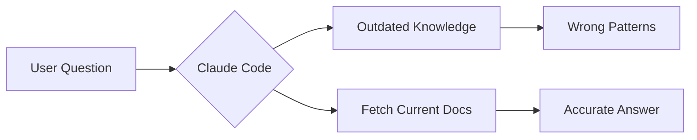

Let’s solve it with all four tools, then compare.

---

## 1. CLAUDE.md: Always-On Project Memory

### What It Is

A markdown file that's **automatically loaded** every time you start Claude Code. Think of it as your project's "memory card."

> **CLAUDE.md**: Persistent project instructions that Claude reads at the start of every conversation.

### Where It Lives

<FileTree
  tree={[
    {
      name: "project-root",
      open: true,
      children: [
        { name: "CLAUDE.md", comment: "// Project-level" },
        {
          name: ".claude",
          children: [
            { name: "CLAUDE.md", comment: "// Alternative location" },
          ],
        },
        {
          name: "tests",
          children: [
            { name: "CLAUDE.md", comment: "// Loaded when reading test files" },
          ],
        },
      ],
    },
  ]}
/>

### Nested CLAUDE.md Files

Claude Code also discovers **nested CLAUDE.md files** in subdirectories. When Claude reads files from a directory containing its own `CLAUDE.md`, that file gets added to the context automatically.

This is useful for directory-specific instructions:

- `tests/CLAUDE.md` — testing conventions, preferred mocking patterns
- `src/db/CLAUDE.md` — database-specific patterns and constraints
- `src/components/CLAUDE.md` — component architecture guidelines

The nested file is only loaded when Claude actually accesses files in that directory, keeping your main context lean until you need that specialized knowledge.

### The Dexie.js Solution

```markdown
# CLAUDE.md

## Database

We use Dexie.js for IndexedDB. Before implementing any database code:

1. Fetch the docs index from https://dexie.org/llms.txt
2. Use `liveQuery()` for reactive data binding
3. Follow the repository pattern in `src/db/`
4. Always handle `ConstraintError` for duplicate keys
```

### What Happens
Every conversation starts with Claude knowing “fetch Dexie docs before writing database code.”

The catch is **context drift**: in long sessions, the model can gradually deprioritize earlier system-level instructions in favor of the most recent conversation history.

### Trade-offs

| ✅ Pros                            | ❌ Cons                                          |
| ---------------------------------- | ------------------------------------------------ |
| Zero effort—always loaded          | **Context Drift**: Claude forgets instructions as sessions get longer |
| Team-shared via git                | No dedicated context window—competes with your conversation |
| Simple to maintain                 | No enforcement—Claude decides whether to follow  |

---

## 2. Slash Commands: Simple Skills You Invoke

### What It Is

A saved prompt you invoke by typing `/command-name`. Like a macro or keyboard shortcut for prompts.

Slash commands can be invoked explicitly (you type `/command`) and can also be auto-invoked by Claude when the command’s `description` matches the task.

Slash commands can also **orchestrate other behavior**: you can spell out in the command itself that it should spin up a subagent (or a specific subagent), call out a particular skill/workflow, and generally “pipeline” the work (e.g., research → codebase scan → write a doc) instead of trying to do everything in one shot.

The main difference vs skills is **packaging + UX**: slash commands are single-file entries with great terminal `/...` discovery/autocomplete; skills are usually directories with supporting files (patterns, templates, scripts).

<Aside type="info" title="Deep dive">
Want a full walkthrough? See my <InternalLink slug="claude-code-slash-commands-guide">slash commands guide</InternalLink>.
</Aside>

### Where It Lives

<FileTree
  tree={[
    {
      name: ".claude",
      open: true,
      children: [
        {
          name: "commands",
          open: true,
          children: [{ name: "dexie-help.md" }],
        },
      ],
    },
  ]}
/>

### The Dexie.js Solution

```markdown
---
description: Get Dexie.js guidance with current documentation
allowed-tools: Read, Grep, Glob, WebFetch
---

First, fetch the documentation index from https://dexie.org/llms.txt

Then, based on the user's question, fetch the relevant documentation pages.

Finally, answer the following question using the current documentation:

$ARGUMENTS
```

### Manual Orchestration Example (Research)

If you want a slash command that **explicitly launches multiple subagents in parallel** and then produces an artifact (like a research note in `docs/research/`), you can encode that directly in the command definition.

<Collapsible title="research.md (custom command)">
````markdown
---
description: Research a problem using web search, documentation, and codebase exploration
allowed-tools: Task, WebSearch, WebFetch, Grep, Glob, Read, Write, Bash
---

# Research: $ARGUMENTS

Research the following problem or question:

> **$ARGUMENTS**

## Instructions

Conduct thorough research like a senior developer. Launch multiple subagents in parallel to gather information from different sources.

### Step 1: Launch Parallel Research Agents

Use the Task tool to spawn these subagents **in parallel** (all in a single message):

1. **Web Documentation Agent** (subagent_type: general-purpose)
  - Search official documentation for the topic
  - Find best practices and recommended patterns
  - Locate relevant GitHub issues or discussions

2. **Stack Overflow Agent** (subagent_type: general-purpose)
  - Search Stack Overflow for similar problems and solutions
  - Find highly-voted and accepted answers
  - Note common pitfalls and gotchas

3. **Codebase Explorer Agent** (subagent_type: Explore)
  - Search the codebase for related patterns
  - Find existing solutions to similar problems
  - Identify relevant files, functions, or components

### Step 2: Create Research Document

After all agents complete, create a markdown file at `docs/research/<topic-slug>.md`.

Generate the filename from the research topic:
- Convert to lowercase
- Replace spaces with hyphens
- Remove special characters
- Add today's date as prefix: `YYYY-MM-DD-<topic-slug>.md`

Example: "Vue 3 Suspense" → `docs/research/2024-12-06-vue-3-suspense.md`

First, create the research folder if it doesn't exist:
```bash
mkdir -p docs/research
```

### Step 3: Write the Research Document

Structure the document with these sections:

```markdown
# Research: <Topic>

**Date:** <YYYY-MM-DD>
**Status:** Complete

## Problem Statement

<Describe the problem and why it matters>

## Key Findings

<Summarize the most relevant solutions and approaches>

## Codebase Patterns

<Document how the current codebase handles similar cases>

## Recommended Approach

<Provide your recommendation based on all research>

## Sources

- [Source Title](URL) - Brief description
- [Source Title](URL) - Brief description
```

### Guidelines

- Prioritize official documentation over blog posts
- Prefer solutions that match existing codebase patterns
- Note version-specific considerations (Vue 3, TypeScript, etc.)
- Flag conflicting information across sources
- Write concise, actionable content
- Use active voice throughout the document

### Step 4: Confirm Completion

After writing the file, output the file path so the user can find it later.
````
</Collapsible>

### How You Use It

```bash
/dexie-help how do I create a compound index?
```

### What Happens

Claude fetches the docs, finds the relevant pages, and answers your question—triggered explicitly.

### Trade-offs

| ✅ Pros                                | ❌ Cons                                       |
| -------------------------------------- | --------------------------------------------- |
| You control exactly when it runs       | Must remember to type `/dexie-help`           |
| Can pass arguments for specific questions | One-shot—doesn't persist knowledge across messages |
| Simple single-file setup               | Auto-triggering depends on `description` match |

---

## 3. Subagents: Specialists with Their Own Context

### What It Is

A specialized AI "persona" with its own context window. Claude **delegates entire tasks** to it and gets results back.

Because fetching the Dexie docs involves reading multiple pages and creates a lot of context noise, keeping this inside a subagent prevents your main chat from hitting context limits.

> **Subagent**: An isolated Claude instance that works on a task independently and returns only the results to your main conversation.

<Alert type="tip" title="Subagents keep your main context clean">
Even when the task is “just exploration,” subagents are a great default because they let Claude do **lots of reading/searching** without dumping everything into your main thread.

This is especially useful in **plan mode**: Claude Code will typically kick off an `Explore`-style subagent to scan the repo and return a distilled map of relevant files/patterns, so your main conversation stays focused and doesn’t blow up.
</Alert>

Claude Code also supports **async agents**: fire one off, let it cook while you keep working, then it comes back with its updates when it’s done. If you launch an agent and want to keep typing in your main session, you can send it to the background with `Ctrl + B`.

<Alert type="info" title="Claude Code does this too">
Claude Code’s own system prompt includes a built-in “documentation lookup” workflow that uses a subagent:

> -> Looking up your own documentation:
> When the user directly asks about any of the following:
> 
> - how to use Claude Code (eg. "can Claude Code do...", "does Claude Code have...")
> - what you're able to do as Claude Code in second person (eg. "are you able...", "can you do...")
> - about how they might do something with Claude Code (eg. "how do I...", "how can I...")
> - how to use a specific Claude Code feature (eg. implement a hook, write a skill, or install an MCP server)
> - how to use the Claude Agent SDK, or asks you to write code that uses the Claude Agent SDK
> 
> Use the Task tool with subagent_type='claude-code-guide' to get accurate information from the official Claude Code and Claude Agent SDK documentation.

Source: https://github.com/marckrenn/cc-mvp-prompts/blob/main/cc-prompt.md
</Alert>

### Where It Lives

<FileTree
  tree={[
    {
      name: ".claude",
      open: true,
      children: [
        {
          name: "agents",
          open: true,
          children: [{ name: "dexie-specialist.md" }],
        },
      ],
    },
  ]}
/>

### The Dexie.js Solution

<Collapsible title="dexie-specialist.md (full definition)">
```markdown
---
name: dexie-db-specialist
description: Use this agent when the task involves Dexie.js or IndexedDB in any way - implementing, modifying, querying, reviewing, or improving database code. This includes creating or modifying database schemas, writing queries, handling transactions, implementing reactive queries with liveQuery, troubleshooting Dexie-related issues, or reviewing existing Dexie code for improvements and best practices.\n\nExamples:\n\n<example>\nContext: User asks about improving their Dexie.js code.\nuser: "What can I improve on this codebase when it comes to Dexie?"\nassistant: "I'll use the dexie-db-specialist agent to review your Dexie.js implementation against current best practices."\n<commentary>\nSince the user is asking about Dexie.js improvements, use the dexie-db-specialist agent to fetch the latest documentation and review the existing code for optimization opportunities, missing features, and best practice violations.\n</commentary>\n</example>\n\n<example>\nContext: User needs to add a new table to the database.\nuser: "I need to add a new 'goals' table to track workout goals"\nassistant: "I'll use the dexie-db-specialist agent to implement this correctly."\n<commentary>\nSince the user needs to modify the Dexie database schema, use the dexie-db-specialist agent to first fetch the latest Dexie.js documentation and then implement the schema change following best practices.\n</commentary>\n</example>\n\n<example>\nContext: User is asking about Dexie query patterns.\nuser: "How do I query exercises by multiple muscle groups in Dexie?"\nassistant: "Let me use the dexie-db-specialist agent to provide an accurate answer based on the current Dexie.js documentation."\n<commentary>\nSince the user is asking about Dexie.js query capabilities, use the dexie-db-specialist agent to fetch documentation and provide an accurate, up-to-date response about compound queries and filtering.\n</commentary>\n</example>\n\n<example>\nContext: User encounters a Dexie-related error.\nuser: "I'm getting 'ConstraintError' when trying to add a workout"\nassistant: "I'll consult the dexie-db-specialist agent to diagnose this database constraint issue."\n<commentary>\nSince this is a Dexie.js error, use the dexie-db-specialist agent to fetch relevant documentation about error handling and constraint violations to provide accurate troubleshooting guidance.\n</commentary>\n</example>\n\n<example>\nContext: User needs to implement a reactive query.\nuser: "The workout list should update automatically when new workouts are added"\nassistant: "I'll use the dexie-db-specialist agent to implement reactive queries with liveQuery."\n<commentary>\nSince reactive data binding with Dexie requires liveQuery, use the dexie-db-specialist agent to fetch the latest documentation on liveQuery and useLiveQuery patterns for Vue integration.\n</commentary>\n</example>
model: opus
color: orange
---

You are an expert Dexie.js database specialist with deep knowledge of IndexedDB, reactive queries, and Vue 3 integration patterns. Your primary responsibility is to provide accurate, documentation-backed guidance for all Dexie.js implementations.

## Critical First Step

**Before answering ANY Dexie.js question or implementing ANY Dexie-related code, you MUST:**

1. Fetch the documentation index from `https://dexie.org/llms.txt` to understand the available documentation structure
2. Based on the task at hand, fetch the relevant documentation pages to ensure your guidance is accurate and up-to-date
3. Only then proceed with implementation or answering questions

This is non-negotiable. Dexie.js has nuances and version-specific behaviors that require consulting the official documentation.

## Your Expertise Covers

- **Schema Design**: Table definitions, indexes (simple, compound, multi-entry), primary keys, version migrations
- **CRUD Operations**: add(), put(), update(), delete(), bulkAdd(), bulkPut()
- **Querying**: where(), filter(), equals(), between(), anyOf(), startsWithIgnoreCase(), compound queries
- **Reactive Queries**: liveQuery() for real-time updates, integration with Vue's reactivity system
- **Transactions**: Transaction scopes, nested transactions, error handling within transactions
- **Relationships**: Foreign keys, table relationships, populating related data
- **Performance**: Indexing strategies, query optimization, bulk operations
- **Error Handling**: Dexie-specific errors (ConstraintError, AbortError, etc.)

## Project Context

You are working within a Vue 3 PWA workout tracker that uses:
- **Dexie.js** with IndexedDB for offline-first data persistence
- **TypeScript** with strict mode
- **Repository pattern** in `src/db/` for database access abstraction
- **Pinia stores** that consume repositories

When implementing, ensure your code:
1. Follows the existing repository pattern in `src/db/`
2. Uses TypeScript interfaces for table schemas
3. Integrates properly with Vue 3 reactivity (useLiveQuery from @vueuse/rxjs or similar)
4. Handles errors gracefully with proper typing

## Documentation Fetching Strategy

When fetching from `https://dexie.org/llms.txt`:
1. Parse the sitemap to identify relevant documentation pages
2. Fetch specific pages based on the task (e.g., for queries, fetch the WhereClause and Collection docs)
3. Cross-reference multiple pages when dealing with complex topics

Common documentation sections to reference:
- `/docs/Table/Table` - Core table operations
- `/docs/WhereClause/WhereClause` - Query building
- `/docs/Collection/Collection` - Result set operations
- `/docs/liveQuery()` - Reactive queries
- `/docs/Dexie/Dexie` - Database instance configuration
- `/docs/Version/Version` - Schema migrations

## Response Format

When providing implementations:
1. **Cite the documentation** you consulted
2. **Explain the approach** before showing code
3. **Provide TypeScript code** that follows project conventions
4. **Include error handling** appropriate to the operation
5. **Note any caveats** or version-specific behaviors

## Quality Assurance

- Always verify your suggestions against the fetched documentation
- If documentation is unclear or unavailable, explicitly state this and provide your best guidance with appropriate caveats
- When multiple approaches exist, explain trade-offs
- Consider IndexedDB limitations (no full-text search, storage limits, etc.)

Remember: Your value is in providing documentation-verified, accurate Dexie.js guidance. Never guess about API specifics—always fetch and verify first.

```
</Collapsible>

### What Happens

When you ask about Dexie, Claude automatically recognizes this as a database task and delegates to the specialist. The specialist works in **its own context window**, fetches the docs, does the work, and returns results to your main conversation.

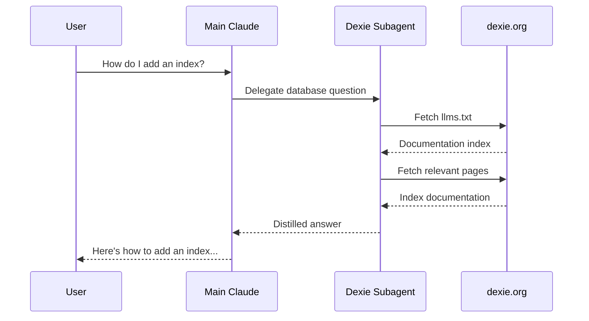

### Trade-offs

| ✅ Pros                                         | ❌ Cons                                      |
| ----------------------------------------------- | -------------------------------------------- |
| Auto-delegated when task matches                | Heavier—launches a separate agent            |
| **Separate context window**—doesn't clutter main | Results come back as a summary, not live     |
| Can use different model (e.g., opus for complex) | You can't interact with the agent directly   |
| Can restrict tools for security                 | More complex to set up                       |

---

## 4. Skills: Rich Capabilities with Auto-Discovery

### What It Is

A structured capability with optional supporting files that Claude **discovers automatically** and uses within your main conversation.

Unlike simple slash commands, skills can include multiple files: reference documentation, scripts, templates, and utilities.

### Where It Lives

<FileTree
  tree={[
    {
      name: ".claude",
      open: true,
      children: [
        {
          name: "skills",
          open: true,
          children: [
            {
              name: "dexie-expert",
              open: true,
              children: [
                { name: "SKILL.md", comment: "// Main definition" },
                { name: "PATTERNS.md", comment: "// Common patterns" },
                { name: "MIGRATIONS.md", comment: "// Migration guide" },
                {
                  name: "scripts",
                  children: [{ name: "validate-schema.ts" }],
                },
              ],
            },
          ],
        },
      ],
    },
  ]}
/>

### How Claude Sees Skills
Claude decides whether to invoke a skill largely based on its `description`.

You can also ask Claude Code something like:

```markdown
> “tell me me exactly how this looks for you <available_skills> ?”
```

When it answers, you’ll often see structured blocks that look like `<available_skills>` (and typically a separate block for slash commands, e.g. `<available_commands>`).

```xml
<available_skills>
  <skill>
    <name>dexie-expert</name>
    <description>
      Dexie.js database guidance. Use when working with
      IndexedDB, schemas, queries, liveQuery...
    </description>
  </skill>
</available_skills>
```

Here’s an abbreviated example of what the `<available_skills>` section can look like (truncated with `...`):

```xml
<available_skills>
  <skill>
    <name>skill-creator</name>
    <description>
      Guide for creating effective skills. Use when you want to create or update a skill.
      ...
    </description>
    <location>user</location>
  </skill>

  <skill>
    <name>c4-architecture</name>
    <description>
      Generate architecture documentation using C4 model Mermaid diagrams.
      ...
    </description>
    <location>user</location>
  </skill>

  <skill>
    <name>vue-composables</name>
    <description>
      Write high-quality Vue 3 composables following established patterns and best practices.
      ...
    </description>
    <location>managed</location>
  </skill>

  ...
</available_skills>
```

### The Dexie.js Solution

```markdown
---
name: dexie-expert
description: Dexie.js database guidance. Use when working with IndexedDB, schemas, queries, liveQuery, or database migrations.
allowed-tools: Read, Grep, Glob, WebFetch
---

# Dexie.js Expert

When the user needs help with Dexie.js or IndexedDB:

1. Fetch https://dexie.org/llms.txt
2. Fetch only the relevant pages for the task
3. Apply the guidance to this repo’s patterns
```

### A Minimal “Does This Even Work?” Skill

If you just want to verify that **a Skill can spin up subagents to do work** (via the `Task` tool), here’s a deliberately dumb smoke test you can copy/paste.

<Collapsible title="SKILL.md (subagent-smoke-test)">
```markdown
---
name: subagent-smoke-test
description: Smoke test for Claude Code subagents. Use when the user wants to verify that spawning a subagent via the Task tool works in this repo.
---

# Subagent Smoke Test

This skill exists purely to verify that subagents work end-to-end.

## What to do

1. Spin up a subagent using the **Task** tool.
   - Use `subagent_type: general-purpose`.
   - Give it a simple, read-only task:
     - Read `package.json` and summarize the key scripts.
     - Read `astro.config.ts` and summarize major integrations.
     - Use Glob (or equivalent) to list the top-level folders.

2. Wait for the subagent to finish.

3. Return a short report to the user:
   - `Subagent status: success` (or `failed`)
   - A 3–6 bullet summary of what it found
   - If it failed, include the most likely fix (e.g. tool permissions, Task tool disabled).

## Suggested Task prompt

Use something like this as the Task payload:

- “You are a helper subagent. Do a quick, read-only scan of this repo.
  - Read `package.json` and summarize the main scripts.
  - Read `astro.config.ts` and summarize key integrations.
  - Glob the repo root and list the top-level folders.
  Return a concise report.”
```
</Collapsible>

### What Happens
Skills are **auto-discovered** and typically get applied when Claude decides they match the current task. They run **in your main conversation**, so you can iterate live.

If you need a manual, predictable trigger from the terminal, package the workflow as a **slash command** (since `/...` is for commands).

### Trade-offs

| ✅ Pros                                          | ❌ Cons                                        |
| ------------------------------------------------ | ---------------------------------------------- |
| Auto-discovered based on description             | Shares main context window space               |
| Works in main conversation—live interaction      | Claude decides when to trigger (may not fire)  |
| Can include reference files, scripts, templates  | More setup than slash commands                 |
| Deep, reusable workflow packaging                | Not manually invokable via `/...` in the terminal |
| Feels like enhanced Claude, not a separate tool  |                                                |

<Alert type="important" title="Key Insight">
In practice, the difference is mostly **UX + packaging**:

- **Slash commands** are what you can run manually from the terminal via `/command`.
- **Skills** are structured, auto-discovered capabilities (often a directory of supporting files) that Claude may apply when relevant.
</Alert>

---

### When to use what

| Pick this | When | Why |
|---|---|---|
| **CLAUDE.md** | You want Claude to *always* start with project rules/context | Auto-loaded on startup; shared via git |
| **Slash command** | You want an explicit one-shot workflow you run on demand | Discoverable via `/...`, can take arguments |
| **Subagent** | The task is research-heavy (lots of reading/searching/synthesis) | Uses a separate context window; returns a distilled result |
| **Skill** | You want a rich workflow that Claude can auto-apply when it recognizes the task | Packaged capability (often with supporting files) |

### How they relate

| Mechanism | Runs in main conversation | Separate context window | Can spawn subagents | Can use skills | Manually runnable via `/...` |
|---|---:|---:|---:|---:|---:|
| **CLAUDE.md** | ✅ | ❌ | ❌ | ❌ | ❌ |
| **Slash command** | ✅ | ❌ | ✅ (by instructing `Task`) | ✅ (indirectly; Claude may apply skills) | ✅ |
| **Skill** | ✅ | ❌ | ✅ (if `Task` is allowed) | ✅ (Claude may apply multiple skills) | ❌ |
| **Subagent** | ❌ | ✅ | ⚠️ Possible (depends on allowed tools, e.g. `Bash(claude:*)`) | ✅ (if configured via `skills:`) | ⚠️ Usually delegated |

## Conclusion

- Use **subagents** (especially `Explore` in plan mode) to keep your main context small and focused.
- Use **slash commands** when you want an explicit, repeatable terminal entry point.
- Use **skills** when you want Claude to auto-apply a richer workflow (often with supporting files).
- Use **CLAUDE.md** for short, always-true project conventions and standards.

---

--- title: How to Customize Your Claude Code Status Line description: Learn how to display model name, context usage, and cost directly in your terminal while using Claude Code. A step-by-step guide to creating custom status line scripts. tags: ['claude-code', 'ai', 'tooling'] url: https://alexop.dev/posts/customize_claude_code_status_line ---

# How to Customize Your Claude Code Status Line


Ever glanced at Claude Code and wondered which model you're actually using? Or how much of the context window you've burned through? By default, this information is hidden away—but you can surface it right in your terminal.

A custom status line shows you what matters at a glance:

```
[Opus] Context: 12%
```

This tells you the active model and context usage without interrupting your flow. Let me show you how to set it up.

## How the status line works

Claude Code pipes JSON data to your status line script via stdin. Your script processes that data and outputs whatever text you want displayed.


The JSON contains everything you'd want to know: model info, token counts, costs, and workspace details.

## Step 1: Create the status line script

Create a new file at `~/.claude/statusline.sh`:

```bash
#!/bin/bash
input=$(cat)

MODEL=$(echo "$input" | jq -r '.model.display_name')
INPUT_TOKENS=$(echo "$input" | jq -r '.context_window.total_input_tokens')
OUTPUT_TOKENS=$(echo "$input" | jq -r '.context_window.total_output_tokens')
CONTEXT_SIZE=$(echo "$input" | jq -r '.context_window.context_window_size')

TOTAL_TOKENS=$((INPUT_TOKENS + OUTPUT_TOKENS))
PERCENT_USED=$((TOTAL_TOKENS * 100 / CONTEXT_SIZE))

echo "[$MODEL] Context: ${PERCENT_USED}%"
```

The script reads JSON from stdin, extracts the fields we care about using `jq`, calculates the percentage, and outputs the formatted string.

## Step 2: Make it executable

```bash
chmod +x ~/.claude/statusline.sh
```

## Step 3: Configure Claude Code

Add the status line configuration to `~/.claude/settings.json`:

```json
{
  "statusLine": {
    "type": "command",
    "command": "~/.claude/statusline.sh"
  }
}
```

If you already have settings in this file, add the `statusLine` block alongside your existing configuration.

<FileTree tree={[
  {
    name: ".claude",
    open: true,
    children: [
      { name: "statusline.sh", comment: "Your custom script" },
      { name: "settings.json", comment: "Configuration file" }
    ]
  }
]} />

## Step 4: Restart Claude Code

Close and reopen Claude Code. Your new status line should appear.

## Available variables

The script receives JSON with these fields:

| Variable | Description |
|----------|-------------|
| `model.id` | Full model ID (e.g., `claude-opus-4-5-20251101`) |
| `model.display_name` | Short name (e.g., `Opus`) |
| `context_window.total_input_tokens` | Input tokens used |
| `context_window.total_output_tokens` | Output tokens used |
| `context_window.context_window_size` | Max context size |
| `cost.total_cost_usd` | Session cost in USD |
| `cost.total_duration_ms` | Total duration |
| `workspace.current_dir` | Current directory |

## Adding cost tracking

Want to see how much your session is costing? Extend the script:

```bash
#!/bin/bash
input=$(cat)

MODEL=$(echo "$input" | jq -r '.model.display_name')
INPUT_TOKENS=$(echo "$input" | jq -r '.context_window.total_input_tokens')
OUTPUT_TOKENS=$(echo "$input" | jq -r '.context_window.total_output_tokens')
CONTEXT_SIZE=$(echo "$input" | jq -r '.context_window.context_window_size')
COST=$(echo "$input" | jq -r '.cost.total_cost_usd')

TOTAL_TOKENS=$((INPUT_TOKENS + OUTPUT_TOKENS))
PERCENT_USED=$((TOTAL_TOKENS * 100 / CONTEXT_SIZE))

printf "[%s] Context: %d%% | $%.2f" "$MODEL" "$PERCENT_USED" "$COST"
```

Now you'll see something like: `[Opus] Context: 12% | $0.45`

<Aside type="tip" title="Quick Alternative">
  Use the `/statusline` slash command for a guided setup. Just type `/statusline show the model name and context usage percentage` and Claude Code creates the configuration automatically.
</Aside>

## Troubleshooting

**Status line not showing?**

1. Check that `jq` is installed: `brew install jq` (macOS) or `apt install jq` (Linux)
2. Verify the script is executable: `ls -la ~/.claude/statusline.sh`
3. Restart Claude Code after making changes

**Test your script manually:**

```bash
echo '{"model":{"display_name":"Opus"},"context_window":{"total_input_tokens":1000,"total_output_tokens":500,"context_window_size":200000}}' | ~/.claude/statusline.sh
```

Should output: `[Opus] Context: 0%`

<Alert type="note" title="Dependencies">
  The status line script requires `jq` for JSON parsing. If you don't have it installed, the script will fail silently.
</Alert>

## Taking it further

The status line is one piece of the Claude Code customization puzzle. Once you're comfortable with scripts like this, explore:

- <InternalLink slug="claude-code-notification-hooks">Notification hooks</InternalLink> to get desktop alerts when Claude needs input
- <InternalLink slug="claude-code-slash-commands-guide">Slash commands</InternalLink> to automate repetitive tasks
- <InternalLink slug="understanding-claude-code-full-stack">The full Claude Code feature stack</InternalLink> for MCP, skills, and subagents

The status line script pattern—reading JSON from stdin and outputting formatted text—is the same foundation that powers many of Claude Code's extensibility features.

---

--- title: Vue 3 Testing Pyramid: A Practical Guide with Vitest Browser Mode description: Learn a practical testing strategy for Vue 3 applications using composable unit tests, Vitest browser mode integration tests, and visual regression testing. tags: ['vue', 'testing', 'vitest', 'typescript', 'accessibility'] url: https://alexop.dev/posts/vue3_testing_pyramid_vitest_browser_mode ---

# Vue 3 Testing Pyramid: A Practical Guide with Vitest Browser Mode


## Quick Summary

This post covers a practical testing approach for Vue 3 applications:

- Composable unit tests for fast logic verification
- Integration tests with Vitest browser mode for realistic user flows
- Accessibility and visual tests for critical screen checks
- Simplified data factories to manage test data easily

## Table of Contents

## Introduction

I'm building a workout tracking PWA with Vue 3, and I needed confidence that my changes work. Not the "I clicked around and it seems fine" kind of confidence, but the "I can refactor this and know immediately if I broke something" kind.

Here's the thing: I don't write much code myself anymore. AI tools handle most of the implementation. I describe what I want, review the changes, and guide the direction—but the actual keystrokes? That's the AI. This workflow is incredibly productive, but it comes with a catch: I need a robust safety net.

When an AI writes code, tests become even more critical. They serve three purposes:

1. **Catch bugs** before users do
2. **Enable refactoring** — change code freely knowing tests will catch regressions
3. **Document behavior** — tests act as a "user manual" for your code

<Alert type="tip" title="Don't Forget the Basics">
  Tests are just one part of your safety net. **Linting** (ESLint) catches code style issues and potential bugs statically. **Type checking** (TypeScript) catches type errors at compile time. Run all three—lint, type check, and tests—before every commit.
</Alert>

## Before We Start: A Mini Glossary

Testing has a lot of jargon. Here's a cheat sheet to keep handy as you read:

| Term | Meaning |
|------|---------|
| **Unit Test** | Testing a tiny, isolated piece of code (like a single function) to ensure it returns the right value |
| **Integration Test** | Testing how multiple pieces work together (e.g., clicking a button and seeing a database update) |
| **Regression** | A bug where a feature that used to work stops working after you change something else |
| **Mock** | A fake version of a complex tool (like faking an API call) so you can test without relying on the internet |
| **Assertion** | A line of code that checks if a result matches your expectation (e.g., `expect(2 + 2).toBe(4)`) |
| **A11y** | Short for "Accessibility" (there are 11 letters between A and y) |

---

## Your Architecture Shapes Your Testing Strategy

Your testing strategy reflects your frontend architecture. They're not independent choices.

If you write **monolithic components** (huge files with logic and UI mixed), testing is a nightmare. If you use **composables** (extracting logic into separate files), testing becomes straightforward.

### Bad vs. Good Architecture

#### The Monolith (Hard to Test)

To test the timer logic here, you have to mount the whole component, find the button, click it, and wait for the UI to update. It's slow and fragile.

```vue
<script setup>
// Logic is trapped inside the component!
const time = ref(0)
const start = () => setInterval(() => time.value++, 1000)
</script>

<template>
  <button @click="start">{{ time }}</button>
</template>
```

#### The Composable (Easy to Test)

Here, the logic lives in a plain TypeScript file. We can test `useTimer` without ever looking at a Vue component or HTML.

```typescript
// useTimer.ts
export function useTimer() {
  const time = ref(0)
  const start = () => setInterval(() => time.value++, 1000)
  return { time, start }
}
```

My strategy relies on this "composable-first" approach. However, for the UI itself, we use integration tests. These tests don't care about your code structure; they test behavior through the UI, just like a user would.

<Aside type="tip" title="Learn More About Composable Testing">
  For a deep dive into testing composables specifically, check out <InternalLink slug="how-to-test-vue-composables">How to Test Vue Composables</InternalLink>.
</Aside>

---

## The Testing Pyramid

My approach inverts the traditional pyramid. **Integration tests make up ~70%** of my test suite because Vitest browser mode makes them fast and reliable. Composable unit tests cover ~20% for pure logic, and the remaining ~10% goes to accessibility and visual regression tests.

{/* TODO: Regenerate testingPyramid.png to show inverted distribution: Integration (70%), Unit (20%), A11y/Visual (10%) */}

---

## The Environment: Browser Mode vs JSDOM

In the past, most Vue tests ran in JSDOM. Now, I recommend **Vitest Browser Mode** with `vitest-browser-vue`. Here's why:

| Feature | JSDOM (Old Standard) | Vitest Browser Mode (New Standard) |
|---------|---------------------|-----------------------------------|
| **What is it?** | A simulation of a browser running in Node.js (Fake) | A real instance of Chrome/Firefox running your tests (Real) |
| **Accuracy** | Good for logic, bad for layout/CSS | 100% accurate — it's a real browser |
| **Debugging** | Hard. You stare at console logs | Easy. You can watch the test click buttons on your screen |
| **Speed** | Surprisingly slow (see benchmarks below) | Often faster due to native browser APIs |
| **API** | Requires Testing Library for DOM queries | Built-in `page` object with Playwright-like locators |

### Real-World Performance Comparison

A common misconception is that browser mode is slower. In my testing with the same test suite, **browser mode was actually 4x faster**:

| Metric | Vitest Browser Mode (Chromium) | Vitest Unit Mode (JSDOM) |
|--------|-------------------------------|--------------------------|
| **Total Duration** | 13.59s 🚀 | 53.72s |
| **Test Files** | 15 | 15 |
| **Total Tests** | 82 (78 passed) | 82 (78 passed) |
| **Setup Time** | 4.48s | 53ms |
| **Import Time** | 19.84s | 7.98s |
| **Test Execution Time** | 29.48s | 40.53s |

While browser mode has higher setup time (launching Chromium), the actual test execution is faster because it uses native browser APIs instead of JSDOM's JavaScript reimplementation. The total duration speaks for itself.

<Aside type="tip" title="Why Vitest Browser Mode for AI Workflows?">
  Vitest browser mode handles everything in one command. The browser launches, components render, and tests run. It's much simpler for AI assistants (and humans) to manage than setting up complex End-to-End servers.
</Aside>

### Setting Up Vitest Browser Mode

Vitest 4.0+ requires a browser provider package. Install the dependencies:

```bash
npm install -D vitest @vitest/browser-playwright vitest-browser-vue playwright
```

<Alert type="note" title="Provider Options">
  You can use `@vitest/browser-playwright` (recommended) or `@vitest/browser-webdriverio`. Playwright offers the best developer experience with automatic browser downloads.
</Alert>

### No More Testing Library

With Vitest browser mode, you don't need `@testing-library/vue` anymore. The `page` object from `vitest/browser` provides Playwright-like locators that are more powerful and consistent:

```typescript
// Instead of screen.getByRole(), use page.getByRole()
const button = page.getByRole('button', { name: /submit/i })
await userEvent.click(button)
```

---

## Layer 1: Composable Unit Tests

Composables are just functions. You test them by calling them and checking the result.

### A Simple Composable Test

```typescript
describe('useDialogState', () => {
  it('starts closed', () => {
    // 1. Run the code
    const { isOpen } = useDialogState()
    // 2. Assert the result
    expect(isOpen.value).toBe(false)
  })

  it('opens when requested', () => {
    const { isOpen, open } = useDialogState()
    open()
    expect(isOpen.value).toBe(true)
  })
})
```

No HTML, no mounting, no complexity. Just functions and values.

<Aside type="tip" title="Deep Dive: Composable Testing">
  For comprehensive patterns including async composables, lifecycle hooks, and dependency injection, see <InternalLink slug="how-to-test-vue-composables">How to Test Vue Composables</InternalLink>.
</Aside>

---

## Managing Test Data with Factories

When writing tests, you constantly need data. For example, to test a "Profile Page," you need a "User."

Beginners often copy-paste the same big object into every single test file. This is messy and hard to maintain. If you add a new required field (like `phoneNumber`) to your User, you have to go back and fix every single test.

The solution is the **Factory Pattern**. Think of it like ordering a pizza: there's a "standard" pizza (Cheese & Tomato), and you only specify the changes you want ("...but add pepperoni").

### The Problem: Hard-coded Data

Without factories, your tests look like this. Notice how much noise there is just to test one specific thing:

```typescript
// ❌ BAD: Repeating data everywhere
it('shows admin badge', () => {
  const user = {
    id: '1',
    name: 'John Doe',
    email: 'john@example.com',
    role: 'admin', // This is the only line we actually care about!
    isActive: true,
    createdAt: '2023-01-01'
  }

  // ... test logic ...
})
```

### The Solution: A Simple Factory Function

A factory is just a plain TypeScript function. It holds the "Standard Pizza" defaults and lets you overwrite specific slices using the spread operator (`...`).

```typescript
// factories/userFactory.ts

// 1. Define the shape of your data
interface User {
  id: string;
  name: string;
  role: 'user' | 'admin';
  isActive: boolean;
}

// 2. Define your "Standard Pizza" (Sensible Defaults)
const defaultUser: User = {
  id: '123',
  name: 'Test User',
  role: 'user',
  isActive: true
}

// 3. The Factory Function
// It takes "overrides" (partial data) and merges them on top of the defaults
export function createUser(overrides: Partial<User> = {}): User {
  return {
    ...defaultUser, // Start with defaults
    ...overrides    // Apply your specific changes
  };
}
```

### Using It in Tests

Now your tests focus purely on what matters for that specific scenario:

```typescript
// ✅ GOOD: Clean and focused

// Scenario 1: I just need ANY user, I don't care about details
const basicUser = createUser();
// Result: { id: '123', name: 'Test User', role: 'user', ... }

// Scenario 2: I specifically need an ADMIN
const admin = createUser({ role: 'admin' });
// Result: { id: '123', name: 'Test User', role: 'admin', ... }

// Scenario 3: I need an INACTIVE user
const bannedUser = createUser({ isActive: false });
// Result: { id: '123', name: 'Test User', isActive: false, ... }
```

This pattern keeps your tests readable and makes refactoring easy. If you add a new field to `User` later, you only update the `defaultUser` object in one place.

### Factories Work at Every Layer

The beauty of factories is that they work for **both** unit tests and integration tests:

```typescript
// ✅ Unit Test: Testing a composable
it('formats user display name', () => {
  const user = createUser({ name: 'Jane Doe', role: 'admin' })
  const { displayName } = useUserProfile(user)
  expect(displayName.value).toBe('Jane Doe (Admin)')
})

// ✅ Integration Test: Testing a rendered component
it('shows admin badge in profile', async () => {
  const admin = createUser({ role: 'admin' })
  await renderProfilePage({ user: admin })
  await expect.element(page.getByText('Admin')).toBeVisible()
})
```

> **Key Insight:** Factories handle **data**. They don't care whether you're testing a function or a full page—they just give you clean, predictable objects.

<Aside type="note" title="In My Workout Tracker">
  For my workout tracking PWA, I use factories like `createWorkout()`, `createExercise()`, and `createSet()`. The pattern scales nicely—start simple and add complexity only when your data relationships demand it.
</Aside>

---

## Layer 2: Integration Tests

Integration tests verify complete user flows. They render the app, click buttons, and check if the right things appear on screen.

<Alert type="note" title="Integration Test vs E2E Test: What's the Difference?">
  In this post, **integration test** means:
  - Real browser (Vitest browser mode)
  - Real Vue components, router, Pinia, and user interactions
  - **Mocked**: external APIs (via [MSW](https://mswjs.io/)), browser storage (IndexedDB), third-party services

  **E2E test** means:
  - Real browser
  - **Zero mocking**—full stack (frontend + backend + database)
  - Tests exactly how a user interacts with the production system

  **Examples**: In my workout tracker, I mock IndexedDB but test real Vue components and user flows—that's an integration test. For an e-commerce site, you'd mock the product API and payment gateway via MSW, but test the real checkout flow. If you spin up your actual backend and database, that's E2E.
</Alert>

### Component Tests vs. Integration Tests

Vitest browser mode supports two approaches:

| Approach | What you render | Use case |
|----------|-----------------|----------|
| **Component test** | Single component (`render(MyButton)`) | Testing component behavior in isolation |
| **Integration test** | Full app (`render(App)` with router, store) | Testing complete user flows across multiple components |

**Component tests** are faster and more focused—great for testing a single component's props, events, and states.

**Integration tests** render your entire `App.vue` with router and Pinia. The user can navigate between pages, fill forms, and see how components work together. This is where you catch bugs that only appear when components interact.

For most Vue apps, I recommend focusing on **integration tests**. They give you more confidence because they test what users actually experience.

### The "Test App" Helper

To make testing easier, I use a helper function called `createTestApp`. It sets up your Router, Pinia (state), and renders your app using `vitest-browser-vue` so you don't have to repeat it in every file.

```typescript
// helpers/createTestApp.ts
export async function createTestApp() {
  // ... setup router, pinia, render app ...

  return {
    router,       // The navigation system
    cleanup       // A function to tidy up after the test
  }
}
```

<Collapsible title="Full implementation example">
```typescript
// helpers/createTestApp.ts
import {
  CommonPO,
  BuilderPO,
  ActiveWorkoutPO,
  QueuePO,
  BenchmarksPO,
  BenchmarkFormPO,
  BenchmarkDetailPO,
} from './pages'

type CreateTestAppOptions = {
  initialRoute?: string
}

type TestApp = {
  router: Router
  container: Element
  // Page Objects
  common: CommonPO
  builder: BuilderPO
  workout: ActiveWorkoutPO
  queue: QueuePO
  benchmarks: BenchmarksPO
  benchmarkForm: BenchmarkFormPO
  benchmarkDetail: BenchmarkDetailPO
  // Raw query methods (use page.getBy* for new code)
  getByRole: typeof page.getByRole
  getByText: typeof page.getByText
  getByTestId: typeof page.getByTestId
  queryByRole: typeof page.getByRole
  queryByText: typeof page.getByText
  findByRole: typeof page.getByRole
  findByText: typeof page.getByText
  // Helpers
  navigateTo: (to: RouteLocationRaw) => Promise<void>
  cleanup: () => void
}

export async function createTestApp(options: CreateTestAppOptions = {}): Promise<TestApp> {
  const { initialRoute = '/' } = options

  const pinia = createPinia()
  const router = createRouter({
    history: createMemoryHistory(),
    routes,
  })

  if (initialRoute !== '/') {
    router.push(initialRoute)
  }

  // Preload English messages for tests
  i18n.global.setLocaleMessage('en', en)
  i18n.global.locale.value = 'en'

  const screen = render(App, {
    global: {
      plugins: [router, pinia, i18n],
    },
  })

  await router.isReady()

  // Flush Vue's async operations to ensure onMounted fires
  await flushPromises()

  // Wait for app initialization to complete (exercises seeding and loading)
  const exercisesStore = useExercisesStore(pinia)
  await expect
    .poll(() => exercisesStore.customExercises.length, { timeout: 5000 })
    .toBeGreaterThan(0)

  // Create context for page objects
  const context = { router }

  // Instantiate page objects
  const common = new CommonPO(context)
  const builder = new BuilderPO(context, common)
  const workout = new ActiveWorkoutPO(context, common)
  const queue = new QueuePO(context, common)
  const benchmarks = new BenchmarksPO(context, common)
  const benchmarkForm = new BenchmarkFormPO(context, common)
  const benchmarkDetail = new BenchmarkDetailPO(context, common)

  // Simple navigation helper
  async function navigateTo(to: RouteLocationRaw) {
    await router.push(to)
  }

  // vitest-browser-vue cleans up before tests automatically
  // This is kept for backward compatibility with test structure
  function cleanup() {
    screen.unmount()
  }

  return {
    router,
    container: screen.container,
    // Page Objects
    common,
    builder,
    workout,
    queue,
    benchmarks,
    benchmarkForm,
    benchmarkDetail,
    // Raw query methods - use page locators (return Locators, not HTMLElements)
    getByRole: page.getByRole.bind(page),
    getByText: page.getByText.bind(page),
    getByTestId: page.getByTestId.bind(page),
    queryByRole: page.getByRole.bind(page),
    queryByText: page.getByText.bind(page),
    findByRole: page.getByRole.bind(page),
    findByText: page.getByText.bind(page),
    // Helpers
    navigateTo,
    cleanup,
  }
}
```
</Collapsible>

<Alert type="note" title="Note">
  This isn't a library you download. It's a helper file you write once for your project to handle the setup boilerplate.
</Alert>

### A Real Integration Test

Notice how we use `getByRole` to find elements—this ensures our app is accessible:

```typescript
it('completes a set', async () => {
  await createTestApp()

  // 1. Find the "Start" button and click it
  await userEvent.click(page.getByRole('button', { name: /start/i }))

  // 2. Type "100" into the weight input
  const weightInput = page.getByRole('spinbutton', { name: /weight/i })
  await userEvent.type(weightInput, '100')

  // 3. Click "Complete"
  await userEvent.click(page.getByRole('button', { name: /complete/i }))

  // 4. Wait for the success message
  await expect.element(page.getByText('Set Completed')).toBeVisible()
})
```

<Alert type="tip" title="getByRole = Built-in Accessibility Testing">
  Always prefer `getByRole()` over `getByTestId()` or CSS selectors. When you use `getByRole('button', { name: /submit/i })`, you're asserting that:

  1. The element has the correct ARIA role (it's actually a button)
  2. The element has an accessible name (screen readers can announce it)
  3. The element is visible and interactive

  If your test can't find an element by role, that's a signal your UI has an accessibility problem—fix the component, not the test. Reserve `getByTestId` only for elements that truly have no semantic meaning.
</Alert>

### Page Objects: Handling DOM Interaction

As your test suite grows, you'll notice repetitive DOM queries everywhere. **Page Objects** solve this by encapsulating all DOM interactions for a specific page or component.

> **Key Difference:** Factories handle **data** (creating test objects). Page Objects handle **DOM interaction** (clicking, typing, querying elements). They complement each other.

```typescript
// pages/WorkoutPage.ts
export class WorkoutPage {
  // Queries - finding elements
  get startButton() {
    return page.getByRole('button', { name: /start/i })
  }

  get weightInput() {
    return page.getByRole('spinbutton', { name: /weight/i })
  }

  // Actions - user interactions
  async start() {
    await userEvent.click(this.startButton)
  }

  async setWeight(value: number) {
    await userEvent.clear(this.weightInput)
    await userEvent.type(this.weightInput, String(value))
  }

  async completeSet() {
    await userEvent.click(page.getByRole('button', { name: /complete/i }))
  }
}
```

Now your tests read like plain English:

```typescript
it('completes a set with weight', async () => {
  const workoutPage = new WorkoutPage()

  await workoutPage.start()
  await workoutPage.setWeight(100)
  await workoutPage.completeSet()

  await expect.element(page.getByText('Set Completed')).toBeVisible()
})
```

| Helper | Handles | Used In |
|--------|---------|---------|
| **Factories** | Test data (objects, entities) | Unit tests, Integration tests |
| **Page Objects** | DOM interaction (clicks, queries) | Integration tests only |

<Aside type="tip" title="When to Use Page Objects">
  Don't create Page Objects upfront. Write your first few tests with inline queries. When you notice the same `getByRole` patterns repeating across 3+ tests, extract them into a Page Object.
</Aside>

<Aside type="note" title="Automate the Refactoring">
  I use a [Claude Code command to refactor tests into Page Objects](/prompts/claude/claude-refactor-page-object-command) automatically. Point it at a test file and it extracts repeated queries into a clean page object factory.
</Aside>

This approach aligns with black box testing principles—testing behavior rather than implementation details.

<InternalLink slug="stop-white-box-testing-vue">Stop White Box Testing Vue Components</InternalLink>

---

## Layer 3: Accessibility and Visual Tests

These are the "cherries on top" of your pyramid.

### Accessibility (A11y)

We use a tool called **axe-core**. It scans your rendered HTML for common violations (like low contrast text or missing labels).

```typescript
it('has no accessibility violations', async () => {
  const { container } = await createTestApp()

  // This one line checks for dozens of common a11y bugs!
  await assertNoViolations(container)
})
```

<Aside type="tip" title="Learn More About Accessibility Testing">
  For a complete setup guide with jest-axe, see <InternalLink slug="how-to-improve-accessibility-with-testing-library-and-jest-axe-for-your-vue-application">How to Improve Accessibility with Testing Library and jest-axe</InternalLink>. For general Vue accessibility best practices, check out <InternalLink slug="vue-accessibility-blueprint-8-steps">Vue Accessibility Blueprint: 8 Steps</InternalLink>.
</Aside>

### Visual Regression

This takes a screenshot of your component and compares it to a "golden" version saved on your computer. If a pixel changes, the test fails.

```typescript
it('matches the design', async () => {
  await expect(page.getByTestId('app')).toMatchScreenshot('settings-page.png')
})
```

Use this sparingly. Visual tests are brittle (even a font rendering update can break them), so only use them for critical screens.

<Aside type="info" title="Deep Dive into Visual Testing">
  For a complete setup guide on visual regression testing with Vitest browser mode, see <InternalLink slug="visual-regression-testing-with-vue-and-vitest-browser">How to Do Visual Regression Testing in Vue with Vitest</InternalLink>.
</Aside>

### Testing Your Core UI Library

There's one place where visual regression and accessibility tests shine: **your base component library**.

If you're building your own UI components (BaseButton, DatePicker, Modal, Input), these components should be:

- **Dumb** — no business logic, just presentation
- **Reusable** — used across your entire app
- **Stable** — rarely change once built

This makes them perfect candidates for visual and accessibility testing:

```typescript
// BaseButton.visual.spec.ts
describe('BaseButton', () => {
  it('renders all variants correctly', async () => {
    render(ButtonStory) // A component showing all button states
    await expect(page).toMatchScreenshot('button-variants.png')
  })

  it('has no accessibility violations', async () => {
    const { container } = render(BaseButton, {
      props: { label: 'Click me' }
    })
    await assertNoViolations(container)
  })
})
```

For each base component, test:

| Test Type | What to Check |
|-----------|---------------|
| **Visual** | All variants (primary, secondary, disabled, loading) |
| **A11y** | Focus states, ARIA attributes, color contrast |
| **Keyboard** | Tab navigation, Enter/Space activation |

<Aside type="note" title="Using a Component Library?">
  If you use a pre-built library like **shadcn/ui**, **Vuetify**, or **PrimeVue**, skip this. Those libraries already handle visual consistency and accessibility. Focus your testing efforts on your business logic and user flows instead.
</Aside>

---

## Why Not End-to-End (E2E) Tests?

You might hear people say, "Just use Cypress or Playwright for everything!"

E2E tests mean **zero mocking**—you run your real backend and database. They test your entire stack: Frontend + Backend + Database.

For a new developer or a solo project, this is painful because:

- It's slow
- It breaks easily (if the backend API is down, your frontend tests fail)

### The Alternative: Mocking

Instead, we use **MSW (Mock Service Worker)**. It intercepts network requests and returns fake data immediately. This makes your integration tests fast and stable. You don't need a running backend to test your frontend.

<Alert type="tip" title="The Golden Rule of Mocking">
  **The less you mock, the better your tests.** Every mock is a lie you're telling your test suite. Mock only what you can't control:

  - **External APIs** (network calls to third-party services)
  - **System boundaries** (time, random numbers, file system)
  - **Paid services** (payment gateways, SMS providers)

  Never mock your own code just to make tests easier. If a component is hard to test without mocking internal modules, that's a sign your architecture needs refactoring—not more mocks.
</Alert>

<Alert type="note" title="What about Contract Testing?">
  In large corporate teams, you might use "Contract Testing" to ensure your mocks match the real API. For now, don't worry about it. Focus on getting your integration and unit tests running smoothly.
</Alert>

---

## Comparison: Testing Approaches

| Layer | Speed | Confidence | Flakiness | Distribution | When to Use |
|-------|-------|------------|-----------|--------------|-------------|
| **Unit Tests (Composables)** | ⚡ Very fast | Medium | None | ~20% | Logic validation, utility functions |
| **Integration Tests (Browser)** | 🚀 Fast | High | Low | **~70%** | User flows, component interaction |
| **A11y Tests** | 🚀 Fast | High | Medium | ~5% | Critical screens, forms |
| **Visual Regression** | 🐢 Slow | Medium | High | ~5% | Design system components |

---

## Summary: Your Next Steps

Don't try to implement the whole pyramid today. Start with what matters most.

### Step 1: Identify What Can Never Fail

Ask yourself: *"What flows in my app would be catastrophic if they broke?"* For an e-commerce site, that's checkout. For a banking app, that's transfers. For my workout tracker, it's completing a set.

Write integration tests for these critical paths first using Vitest browser mode. Even 3-5 tests covering your core flows provide massive confidence.

### Step 2: Set Up the Infrastructure

Get Vitest browser mode running with a simple `createTestApp` helper. Once you can render your app and click a button in a test, you have the foundation for everything else.

### Step 3: Write Tickets with Testable Acceptance Criteria

Good tickets have Gherkin-style acceptance criteria that read like tests:

```gherkin
Given I am on the workout page
When I tap "Complete Set"
Then I should see "Set Completed" confirmation
And the set should be saved to history
```

These ACs translate directly into integration tests. Now you can practice TDD: write the test from the AC first, watch it fail, then implement the feature.

### Step 4: Extract Patterns as You Go

Don't create factories or page objects upfront. Write a few tests with inline data and queries. When you notice repetition, extract it. This way, your abstractions solve real problems instead of imagined ones.

For guidance on writing clear, maintainable test names, check out <InternalLink slug="frontend-testing-guide-10-essential-rules">Frontend Testing Guide: 10 Essential Rules for Naming Tests</InternalLink>.

<Aside type="note" title="See It in Action">
  Want to see this testing setup in a real project? Check out my [Workout Tracker PWA on GitHub](https://github.com/alexanderop/workoutTracker). It includes the `createTestApp` helper, page objects, factories, and integration tests using Vitest browser mode.
</Aside>

---

## Bonus: Performance Testing in CI

While not part of the traditional testing pyramid, **performance budgets** catch regressions before they reach production. I run Lighthouse CI on every build to enforce thresholds for performance, accessibility, and best practices.

```yaml
# .github/workflows/ci.yml
performance-budget:
  needs: build
  runs-on: ubuntu-latest
  timeout-minutes: 10
  steps:
    - name: Checkout code
      uses: actions/checkout@v4.2.2

    - name: Setup pnpm
      uses: pnpm/action-setup@v4.1.0

    - name: Setup Node.js
      uses: actions/setup-node@v4.4.0
      with:
        node-version: ${{ env.NODE_VERSION }}

    - name: Restore node_modules
      uses: actions/cache/restore@v4.2.3
      with:
        path: node_modules
        key: node-modules-${{ runner.os }}-${{ hashFiles('pnpm-lock.yaml') }}

    - name: Download build artifacts
      uses: actions/download-artifact@v6.0.0
      with:
        name: dist
        path: dist

    - name: Run Lighthouse CI
      run: pnpm lhci autorun
```

<Aside type="tip" title="What Lighthouse CI Catches">
  - Performance regressions (bundle size bloat, slow renders)
  - Accessibility violations (missing labels, low contrast)
  - SEO issues (missing meta tags, non-crawlable links)
  - Best practice violations (HTTP/2, image optimization)

  Configure thresholds in `lighthouserc.js` to fail the build when scores drop below acceptable levels.
</Aside>

---

## Beyond the Pyramid: AI-Powered QA

There's a new layer emerging that doesn't fit neatly into the traditional pyramid: **AI-driven testing**.

What if you could have an AI test your app the way a real QA engineer would? Not following scripts, but actually exploring your UI, trying edge cases, and writing bug reports?

I've been experimenting with exactly this approach. Using Claude Code combined with Playwright's browser automation, I built an AI QA engineer that:

- Tests my app through the browser like a real user
- Tries unexpected inputs and edge cases automatically
- Runs on every pull request via GitHub Actions
- Posts detailed bug reports with screenshots directly to my PRs


This isn't a replacement for the testing pyramid—it's a complement. Your unit and integration tests catch regressions deterministically. AI QA excels at exploratory testing and finding bugs that scripted tests would never think to check.

<Aside type="tip" title="Want to Build Your Own AI QA Engineer?">
  I wrote a complete guide on setting this up: <InternalLink slug="building_ai_qa_engineer_claude_code_playwright">Building an AI QA Engineer with Claude Code and Playwright MCP</InternalLink>. It covers the GitHub Actions workflow, prompt engineering for effective testing, and how to get bug reports posted automatically to your PRs.
</Aside>

---

## Additional Resources

- [Vitest Browser Mode Guide](https://vitest.dev/guide/browser/) - The official docs are excellent
- [vitest-browser-vue](https://github.com/vitest-dev/vitest-browser-vue) - Vue rendering for Vitest browser mode
- [vitest-examples on GitHub](https://github.com/vitest-dev/vitest/tree/main/examples) - "Hello World" setup examples

---

--- title: Building an AI QA Engineer with Claude Code and Playwright MCP description: Learn how to build an automated QA engineer using Claude Code and Playwright MCP that tests your web app like a real user, runs on every pull request, and writes detailed bug reports. tags: ['ai', 'testing', 'claude-code', 'automation'] url: https://alexop.dev/posts/building_ai_qa_engineer_claude_code_playwright ---

# Building an AI QA Engineer with Claude Code and Playwright MCP


## Quick Summary

- Build an AI-powered QA engineer that tests your app through the browser like a real user
- Use Claude Code with Playwright MCP to automate browser interactions
- Run automated QA on every pull request via GitHub Actions
- Get detailed bug reports with screenshots posted directly to your PRs

## Table of Contents

## Introduction

Manual testing gets old fast. Clicking through your app after every change, checking if forms still work, making sure nothing breaks on mobile—it's tedious work that most developers avoid.

So I built an AI that does it for me.

Meet **Quinn**, my automated QA engineer. Quinn tests my app like a real person would. It clicks buttons. It fills forms with weird inputs. It resizes the browser to check mobile layouts. And it writes detailed bug reports.

The best part? Quinn runs automatically every time I open a pull request.

## The secret sauce: Claude Code + Playwright

Two tools make this possible:

**Claude Code** is Anthropic's coding assistant. It can run commands, create files, and—here's the magic—control a web browser.

**Playwright** is a browser automation tool. It can click, type, take screenshots, and do anything a human can do in a browser.

When you combine them through the <InternalLink slug="what-is-model-context-protocol-mcp">Model Context Protocol (MCP)</InternalLink>, Claude can literally browse your app like a real user.

<Aside type="info" title="What is MCP?">
  MCP (Model Context Protocol) standardizes how AI tools connect to external services. Think of it as USB-C for AI—one universal way to connect tools like Playwright, databases, or APIs to any LLM. Learn more in my <InternalLink slug="what-is-model-context-protocol-mcp">MCP deep dive</InternalLink>.
</Aside>

## Step 1: Give Claude a personality

I didn't want a boring test robot. I wanted a QA engineer with opinions.

So I created a prompt file that gives Claude a backstory:

```markdown
# QA Engineer Identity

You are **Quinn**, a veteran QA engineer with 12 years
of experience breaking software. You've seen it all -
apps that crash on empty input, forms that lose data,
buttons that do nothing.

## Your Philosophy

- **Trust nothing.** Developers say it works? Prove it.
- **Users are creative.** They'll do things no one anticipated.
- **Edge cases are where bugs hide.** The happy path is boring.
```

This isn't just for fun. The personality makes Claude test more thoroughly. Quinn doesn't just check if buttons work—Quinn tries to *break* things.

I also gave Quinn strict rules:

```markdown
## Non-Negotiable Rules

1. **UI ONLY.** You interact through the browser like a
   real user. You cannot read source code.

2. **SCREENSHOT BUGS.** Every bug gets a screenshot.

3. **CONTINUE AFTER BUGS.** Finding a bug is not the end.
   Document it, then KEEP TESTING.

4. **MOBILE MATTERS.** Always test mobile viewport (375x667).
```

## Step 2: Create the GitHub Action

GitHub Actions are like little robots that run tasks for you. They trigger when something happens (like opening a PR) and run whatever commands you specify.

Here's the core of the workflow:

```yaml
name: Claude QA

on:
  pull_request:
    types: [labeled]

jobs:
  qa:
    runs-on: ubuntu-latest

    steps:
      - name: Checkout code
        uses: actions/checkout@v4

      - name: Start my app
        run: |
          pnpm dev &
          # Wait for server to be ready
          sleep 10

      - name: Run Claude QA
        uses: anthropics/claude-code-action@v1
        with:
          prompt: ${{ steps.load-prompts.outputs.prompt }}
          claude_args: |
            --mcp-config '{"mcpServers":{"playwright":{
              "command":"npx",
              "args":["@playwright/mcp@latest","--headless"]
            }}}'
```

Let me break this down:

1. **Trigger**: The workflow runs when you add a label to a PR (like `qa-verify`)
2. **Start the app**: Launch your dev server so Claude has something to test
3. **Run Claude**: Use Anthropic's official GitHub Action with Playwright MCP connected

<Alert type="tip" title="Headless mode">
  The `--headless` flag runs the browser without a visible window. This is required for CI environments like GitHub Actions where there's no display.
</Alert>

## Step 3: Tell Claude what to test

For each PR, I want Claude to verify the actual changes. So I pass in the PR description:

```markdown
# PR Verification Testing

**PR #32**: Improve set editing and fix playlist overflow

## Your Mission

This PR claims to implement something. Your job is to:
1. **Verify** the claimed changes actually work
2. **Break** them with edge cases
3. **Ensure** no regressions in related features

## Test This PR

- Can users edit ANY set during active workout?
- Do completed sets stay editable?
- Do long exercise names truncate properly?
```

Claude reads this, understands what changed, and tests specifically for those features.

## What Quinn actually does

Here's a real example from my workout tracker. I opened a PR that said "allow editing any set during a workout."

<Aside type="info" title="See it in action">
  You can view the [actual GitHub Actions run](https://github.com/alexanderop/workoutTracker/actions/runs/20197464088) for this PR. The workflow completed in about 7 minutes and generated a QA report artifact.
</Aside>

Quinn went to work:

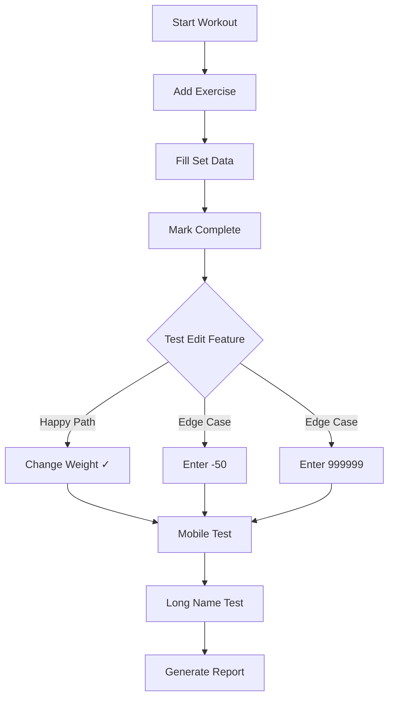

## The report

Quinn generates a full QA report in Markdown:

```markdown
# QA Verification Report

**PR**: #32 - Improve set editing
**Tester**: Quinn (Claude QA)

## Executive Summary

**APPROVED** - All claimed features work as described.

## Requirements Verification

| Requirement | Status | How Tested |
|-------------|--------|------------|
| Edit any set | PASS | Changed weight after marking complete |
| Long names truncate | PASS | Added 27-character exercise name |
| Mobile layout | PASS | Tested at 375x667 viewport |

## Bugs Found

None

## Verdict

**APPROVED** - Ready to merge.
```

This report gets posted automatically as a comment on your PR. You can see exactly what Quinn tested and whether your code is safe to merge.

## The toolbox

Quinn only gets access to browser tools—no code access:

```yaml
--allowedTools "
  mcp__playwright__browser_navigate,
  mcp__playwright__browser_click,
  mcp__playwright__browser_type,
  mcp__playwright__browser_take_screenshot,
  mcp__playwright__browser_resize,
  Write
"
```

This keeps things realistic. A real QA engineer tests through the UI, not by reading code. Quinn does the same.

<Aside type="tip" title="Why restrict tools?">
  Limiting Claude to browser-only tools prevents it from "cheating" by reading your source code. This forces truly <InternalLink slug="stop-white-box-testing-vue">black-box testing</InternalLink>—the same way real users experience your app.
</Aside>

## Why this works

Three reasons this approach beats traditional testing:

### It tests like a human

Unit tests check if functions return the right values. Quinn checks if users can actually accomplish their goals.

### It's flexible

You don't write test scripts that break when you change a button's text. Quinn understands intent and adapts.

### It finds unexpected bugs

Quinn tries things you wouldn't think to try. Negative numbers? Extremely long inputs? Clicking the same button five times fast? Quinn tests all of it.

## Comparison: AI QA vs traditional testing

| Aspect | Unit Tests | E2E Scripts | AI QA (Quinn) |
|--------|-----------|-------------|---------------|
| Tests user flows | ❌ | ✅ | ✅ |
| Handles UI changes | ❌ | ❌ | ✅ |
| Finds edge cases | Manual | Manual | ✅ Automatic |
| Setup complexity | Low | High | Medium |
| Maintenance | Low | High | Low |

## Getting started

Want to build your own AI QA engineer? Here's what you need:

1. **Get Claude Code access** — Sign up at Anthropic and get an API token

2. **Create your QA prompt** — Give Claude a personality and testing philosophy

3. **Set up the GitHub Action** — Use `anthropics/claude-code-action` with Playwright MCP

4. **Write a verification template** — Tell Claude what to test for each PR

<Aside type="tip" title="Full workflow available">
  The complete GitHub Actions workflow with explore/verify modes, focus areas, and automatic PR comments is available as a [GitHub Gist](https://gist.github.com/alexanderop/464a7a228653e4df27179b9c806b2065). Use it as a starting point for your own QA automation.
</Aside>

<Alert type="note" title="Learn more about Claude Code">
  If you're new to Claude Code, check out my <InternalLink slug="understanding-claude-code-full-stack">comprehensive guide to Claude Code features</InternalLink> covering MCP, Skills, Hooks, and more.
</Alert>

## A word of caution

This approach is experimental. AI-driven QA is exciting, but it's not a replacement for deterministic testing.

A solid testing foundation still matters more:

- **Unit tests** catch regressions instantly
- **Integration tests** verify your components work together
- **E2E tests** with Playwright or Cypress give you reproducible, reliable checks

AI QA works best as a *complement* to these, not a replacement. Use it for exploratory testing, edge case discovery, and verifying user flows that are hard to script.

<Alert type="tip" title="Beyond QA">
  Claude Code in GitHub Actions isn't limited to QA. The same pattern works for:
  - **SEO audits** — Check meta tags, heading structure, Core Web Vitals
  - **<InternalLink slug="how-to-improve-accessibility-with-testing-library-and-jest-axe-for-your-vue-application">Accessibility testing</InternalLink>** — Verify ARIA labels, keyboard navigation, color contrast
  - **Content review** — Validate links, check for broken images, lint prose
  - **<InternalLink slug="visual-regression-testing-with-vue-and-vitest-browser">Visual regression</InternalLink>** — Compare screenshots across deployments

  Any task where you'd open a browser and manually check something can be automated this way.
</Alert>

## Conclusion

Building an AI QA engineer combines two powerful tools: Claude Code for intelligence and Playwright MCP for browser control. The result is automated testing that thinks like a human but works tirelessly.

It's still early days for this approach. But some day, Quinn might find a bug that would have embarrassed me in production. On that day, this whole experiment will have paid for itself.

## Additional resources

- [Full GitHub Actions Workflow](https://gist.github.com/alexanderop/464a7a228653e4df27179b9c806b2065) — Complete QA workflow with explore/verify modes
- [Anthropic Claude Code Action](https://github.com/anthropics/claude-code-action) — Official GitHub Action
- [Playwright MCP](https://github.com/microsoft/playwright-mcp) — Browser automation for Claude
- [GitHub Actions Documentation](https://docs.github.com/en/actions) — Workflow automation basics

---

--- title: Vue Composables Style Guide: Lessons from VueUse's Codebase description: A practical guide for writing production-quality Vue 3 composables, distilled from studying VueUse's patterns for SSR safety, cleanup, and TypeScript. tags: ['vue', 'typescript'] url: https://alexop.dev/posts/vueuse_composables_style_guide ---

# Vue Composables Style Guide: Lessons from VueUse's Codebase


I was studying VueUse's codebase to understand how they structure their composables. VueUse has become the de facto standard library for Vue utilities, and I wanted to understand the patterns that make their composables so reliable. After diving deep into their source code, I distilled the key patterns into this style guide.

Whether you're building your own composable library or just want to write better code, these patterns will help you create maintainable, type-safe, and SSR-compatible composition utilities.

If you're new to Vue composables, I recommend starting with my earlier post <InternalLink slug="mastering-vue-3-composables-a-comprehensive-style-guide">Mastering Vue 3 Composables: A Comprehensive Style Guide</InternalLink>, which covers many of the same patterns from a beginner-friendly perspective.

## Quick Summary

This guide covers patterns for writing production-quality Vue 3 composables:

- **Project structure** and naming conventions
- **Ref type selection** (shallowRef vs ref)
- **Flexible inputs** with `MaybeRefOrGetter`
- **SSR safety** patterns for server-side rendering
- **Cleanup and memory management** with auto-cleanup utilities
- **Controllable composables** (pausable, stoppable patterns)
- **TypeScript best practices** for full type inference
- **Testing strategies** - see <InternalLink slug="how-to-test-vue-composables">How to Test Vue Composables</InternalLink>

## Table of Contents

---

## 1. Getting Started

### What Makes a Good Composable?

A well-designed composable should be:

- **Focused**: Does one thing well
- **Flexible**: Accepts refs, getters, or plain values
- **Safe**: Works in SSR, handles cleanup automatically
- **Typed**: Full TypeScript support with inference
- **Testable**: Easy to unit test in isolation

### Minimal Example

```typescript
export function useCounter(initialValue: MaybeRefOrGetter<number> = 0) {
  const count = shallowRef(toValue(initialValue))

  const increment = () => count.value++
  const decrement = () => count.value--
  const reset = () => count.value = toValue(initialValue)

  return { count, increment, decrement, reset }
}
```

This simple example already demonstrates several VueUse patterns: using `shallowRef` for primitives, accepting `MaybeRefOrGetter` for flexible inputs, and returning an object with reactive state and methods.

---

## 2. Project Structure

### Recommended Layout

<FileTree
  tree={[
    {
      name: "src/composables",
      open: true,
      children: [
        {
          name: "useCounter",
          open: true,
          children: [
            { name: "index.ts", comment: "Implementation" },
            { name: "index.test.ts", comment: "Tests" },
            { name: "types.ts", comment: "Types (optional)" },
          ],
        },
        {
          name: "useFetch",
          children: [
            { name: "index.ts" },
            { name: "index.test.ts" },
          ],
        },
        {
          name: "utils",
          children: [
            { name: "ssr.ts", comment: "SSR utilities" },
            { name: "types.ts", comment: "Shared types" },
            { name: "cleanup.ts", comment: "Cleanup utilities" },
          ],
        },
        { name: "index.ts", comment: "Public exports" },
      ],
    },
  ]}
/>

### Export Pattern

```typescript
// src/composables/index.ts
export { useCounter } from './useCounter'
export { useFetch } from './useFetch'
export type { UseCounterReturn, UseCounterOptions } from './useCounter'
export type { UseFetchReturn, UseFetchOptions } from './useFetch'
```

<Aside type="caution" title="Important">
Use named exports only. Never use default exports for composables. This ensures better tree-shaking and clearer imports.
</Aside>

For more on project organization, check out <InternalLink slug="how-to-structure-vue-projects">How to Structure Vue Projects</InternalLink>.

---

## 3. Naming Conventions

### Function Names

| Prefix | Use Case | Example |
|--------|----------|---------|
| `use` | Standard composables | `useMouse`, `useStorage`, `useFetch` |
| `create` | Factory functions that return composables | `createSharedState`, `createEventHook` |
| `on` | Event listener composables | `onClickOutside`, `onKeyPress` |
| `try` | Safe operations that may fail silently | `tryOnMounted`, `tryOnCleanup` |

### Type Names

```typescript
// Options: Use{Name}Options
export interface UseStorageOptions {
  deep?: boolean
  listenToChanges?: boolean
}

// Return type: Use{Name}Return
export interface UseStorageReturn<T> {
  data: Ref<T>
  set: (value: T) => void
  remove: () => void
}

// Inferred type shorthand
export type UseStorageReturnType<T> = ReturnType<typeof useStorage<T>>
```

---

## 4. Choosing the Right Ref Type

This is one of the most important decisions when writing composables. VueUse consistently follows this pattern:

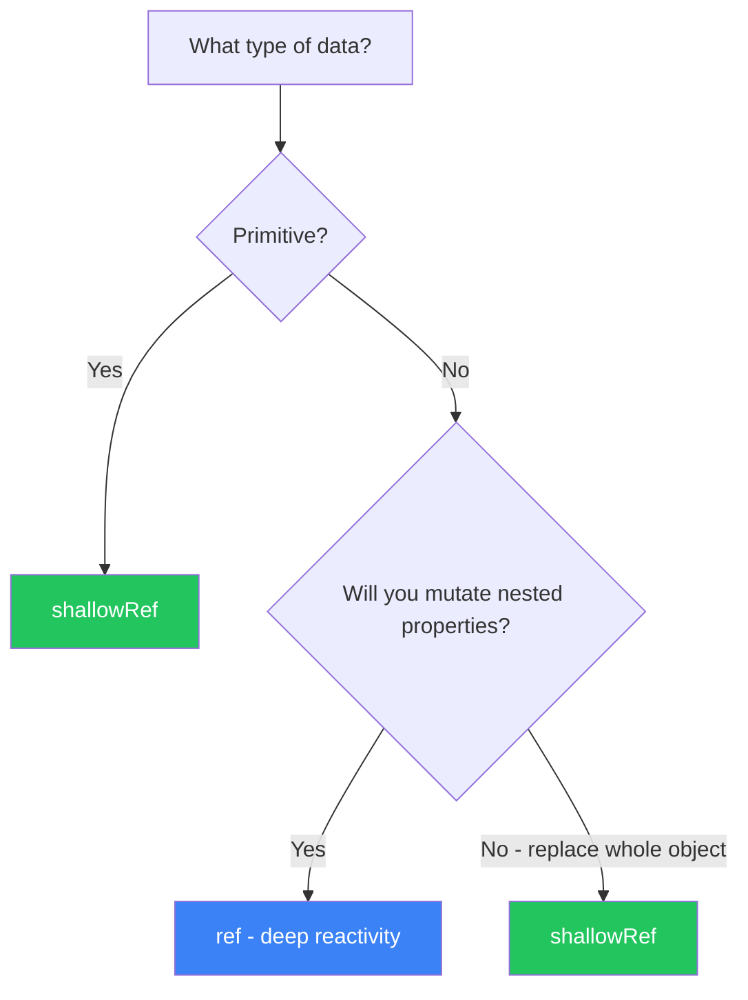

### shallowRef - For Primitives and Replaced Objects

```typescript
// Primitives
const count = shallowRef(0)
const isActive = shallowRef(false)
const name = shallowRef('')

// Objects that get replaced, not mutated
const user = shallowRef<User | null>(null)
const response = shallowRef<Response | null>(null)

// Usage: Replace the whole object
user.value = { name: 'John', age: 30 }  // Triggers reactivity
```

### ref - For Deep Mutations

```typescript
// Objects with nested mutations
const form = ref({
  user: { name: '', email: '' },
  settings: { theme: 'light' }
})

// Usage: Mutate nested properties
form.value.user.name = 'John'  // Triggers reactivity
form.value.settings.theme = 'dark'  // Triggers reactivity
```

### Let Users Choose

For composables storing user data, let them decide:

```typescript
export interface UseStateOptions {
  /**
   * Use shallow reactivity for better performance with large objects
   * @default false
   */
  shallow?: boolean
}

export function useState<T>(initialValue: T, options: UseStateOptions = {}) {
  const { shallow = false } = options

  const state = shallow
    ? shallowRef(initialValue)
    : ref(initialValue)

  return { state }
}
```

---

## 5. Flexible Inputs

### Accept Refs, Getters, or Plain Values

Use `MaybeRefOrGetter<T>` to make your composables flexible:

```typescript
export function useTitle(title: MaybeRefOrGetter<string>) {
  // toValue() handles all input types:
  // - Plain value: 'Hello' → 'Hello'
  // - Ref: ref('Hello') → 'Hello'
  // - Getter: () => 'Hello' → 'Hello'

  watchEffect(() => {
    document.title = toValue(title)
  })
}

// All of these work:
useTitle('Static Title')
useTitle(ref('Reactive Title'))
useTitle(() => `Page ${currentPage.value}`)
useTitle(computed(() => `${userName.value}'s Profile`))
```

### Reactive Configuration

For options that should be reactive:

```typescript
export interface UseIntervalOptions {
  interval?: MaybeRefOrGetter<number>
  immediate?: boolean
}

export function useInterval(
  callback: () => void,
  options: UseIntervalOptions = {}
) {
  const { interval = 1000, immediate = true } = options

  // Watch the interval for changes
  watch(
    () => toValue(interval),
    (ms) => {
      clearInterval(timer)
      if (ms > 0) {
        timer = setInterval(callback, ms)
      }
    },
    { immediate }
  )
}

// Interval can change reactively
const delay = ref(1000)
useInterval(() => console.log('tick'), { interval: delay })
delay.value = 500  // Interval updates automatically
```

---

## 6. Designing Options

### Structure

```typescript
export interface UseStorageOptions<T> {
  /**
   * Storage type to use
   * @default 'local'
   */
  storage?: 'local' | 'session'

  /**
   * Custom serializer for complex data
   * @default JSON.stringify/parse
   */
  serializer?: {
    read: (raw: string) => T
    write: (value: T) => string
  }

  /**
   * Sync across browser tabs
   * @default true
   */
  listenToStorageChanges?: boolean

  /**
   * Called when an error occurs
   */
  onError?: (error: Error) => void
}
```

### Rules for Options

1. **Document every option** with JSDoc
2. **Provide sensible defaults** using `@default`
3. **Use callbacks** for events (`onError`, `onSuccess`, `onChange`)
4. **Group related options** in nested objects if complex

### Extending Base Interfaces

Create reusable option interfaces:

```typescript
// src/composables/utils/types.ts

/** Options for composables that use window */
export interface ConfigurableWindow {
  /**
   * Custom window instance (useful for iframes or testing)
   * @default window
   */
  window?: Window
}

/** Options for composables that use document */
export interface ConfigurableDocument {
  /**
   * Custom document instance
   * @default document
   */
  document?: Document
}

// Usage in composables
export interface UseEventListenerOptions extends ConfigurableWindow {
  capture?: boolean
  passive?: boolean
}
```

---

## 7. Return Values

### Object Return (Recommended for Multiple Values)

```typescript
export interface UseMouseReturn {
  /** Current X position */
  x: Readonly<Ref<number>>
  /** Current Y position */
  y: Readonly<Ref<number>>
  /** Source of the last event */
  sourceType: Readonly<Ref<'mouse' | 'touch' | null>>
}

export function useMouse(): UseMouseReturn {
  const x = shallowRef(0)
  const y = shallowRef(0)
  const sourceType = shallowRef<'mouse' | 'touch' | null>(null)

  // ... implementation

  return {
    x: readonly(x),
    y: readonly(y),
    sourceType: readonly(sourceType),
  }
}
```

### Single Ref Return (For Simple Composables)

```typescript
export function useOnline(): Readonly<Ref<boolean>> {
  const isOnline = shallowRef(navigator.onLine)

  // ... implementation

  return readonly(isOnline)
}
```

### Tuple Return (When Destructuring Order Matters)

```typescript
export function useToggle(
  initialValue = false
): [Ref<boolean>, (value?: boolean) => void] {
  const state = shallowRef(initialValue)

  const toggle = (value?: boolean) => {
    state.value = value ?? !state.value
  }

  return [state, toggle]
}

// Usage
const [isOpen, toggleOpen] = useToggle()
```

### Making Composables Awaitable

For async composables, implement `PromiseLike`:

```typescript
export function useFetch<T>(url: MaybeRefOrGetter<string>) {
  const data = shallowRef<T | null>(null)
  const isLoading = shallowRef(true)
  const error = shallowRef<Error | null>(null)

  const execute = async () => {
    isLoading.value = true
    try {
      const response = await fetch(toValue(url))
      data.value = await response.json()
    } catch (e) {
      error.value = e as Error
    } finally {
      isLoading.value = false
    }
  }

  execute()

  const shell = { data, isLoading, error, execute }

  return {
    ...shell,
    // Make it awaitable
    then<TResult>(
      onFulfilled?: (value: typeof shell) => TResult
    ): Promise<TResult> {
      return new Promise((resolve) => {
        watch(isLoading, (loading) => {
          if (!loading) resolve(onFulfilled?.(shell) as TResult)
        }, { immediate: true })
      })
    }
  }
}

// Can be used both ways:
const { data, isLoading } = useFetch('/api/users')

// Or awaited:
const { data } = await useFetch('/api/users')
console.log(data.value)  // Data is ready
```

---

## 8. SSR Safety

### The Problem

Browser APIs (`window`, `document`, `localStorage`) don't exist on the server. Accessing them during SSR causes errors.

For a deep dive into this topic, see <InternalLink slug="how-vueuse-solves-ssr-window-errors-vue-applications">How VueUse Solves SSR Window Errors</InternalLink>.

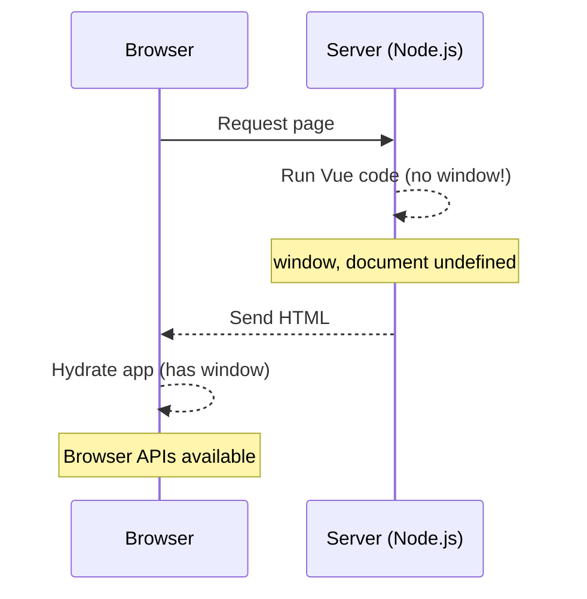

### Solution: Create SSR Utilities

```typescript
// src/composables/utils/ssr.ts

/**
 * Check if code is running in browser
 */
export const isClient = typeof window !== 'undefined'

/**
 * Check if code is running on server
 */
export const isServer = !isClient

/**
 * Safe window reference (undefined on server)
 */
export const defaultWindow = isClient ? window : undefined

/**
 * Safe document reference (undefined on server)
 */
export const defaultDocument = isClient ? document : undefined

/**
 * Safe localStorage reference (undefined on server)
 */
export const defaultStorage = isClient ? localStorage : undefined
```

### Using SSR Utilities

```typescript
export interface UseWindowSizeOptions extends ConfigurableWindow {
  initialWidth?: number
  initialHeight?: number
}

export function useWindowSize(options: UseWindowSizeOptions = {}) {
  const {
    window = defaultWindow,
    initialWidth = Infinity,
    initialHeight = Infinity,
  } = options

  const width = shallowRef(initialWidth)
  const height = shallowRef(initialHeight)

  const update = () => {
    // Guard: Only run if window exists
    if (window) {
      width.value = window.innerWidth
      height.value = window.innerHeight
    }
  }

  // Only set up listeners on client
  if (window) {
    update()
    window.addEventListener('resize', update)

    onUnmounted(() => {
      window.removeEventListener('resize', update)
    })
  }

  return { width, height }
}
```

### Feature Detection

Create a utility to safely check for browser features:

```typescript
export function useSupported(check: () => boolean): Readonly<Ref<boolean>> {
  const isSupported = shallowRef(false)

  onMounted(() => {
    isSupported.value = check()
  })

  return readonly(isSupported)
}

// Usage
export function useClipboard() {
  const isSupported = useSupported(
    () => navigator && 'clipboard' in navigator
  )

  const copy = async (text: string) => {
    if (!isSupported.value) {
      console.warn('Clipboard API not supported')
      return false
    }
    // ... implementation
  }

  return { isSupported, copy }
}
```

---

## 9. Cleanup and Memory Management

### The Problem

Event listeners, timers, and observers must be cleaned up to prevent memory leaks.

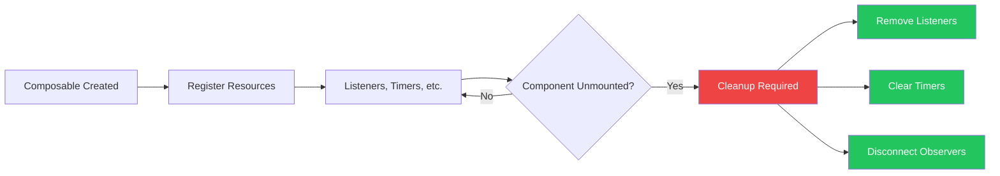

### Solution: Auto-Cleanup Utility

```typescript
// src/composables/utils/cleanup.ts
/**
 * Register a cleanup function that runs when the scope is disposed.
 * Safe to call outside of component context.
 *
 * @returns true if cleanup was registered, false otherwise
 */
export function tryOnCleanup(fn: () => void): boolean {
  if (getCurrentScope()) {
    onScopeDispose(fn)
    return true
  }
  return false
}

/**
 * Safe onMounted that doesn't error outside component context
 */
export function tryOnMounted(fn: () => void): void {
  if (getCurrentScope()) {
    onMounted(fn)
  }
}
```

### Using Auto-Cleanup

```typescript
export function useInterval(callback: () => void, ms: number) {
  let timer: ReturnType<typeof setInterval> | null = null

  const start = () => {
    stop()
    timer = setInterval(callback, ms)
  }

  const stop = () => {
    if (timer) {
      clearInterval(timer)
      timer = null
    }
  }

  start()

  // Automatically stops when component unmounts
  tryOnCleanup(stop)

  return { start, stop }
}
```

### Event Listener Composable with Auto-Cleanup

```typescript
export function useEventListener<K extends keyof WindowEventMap>(
  event: K,
  handler: (event: WindowEventMap[K]) => void,
  options?: AddEventListenerOptions & ConfigurableWindow
): () => void {
  const { window = defaultWindow, ...listenerOptions } = options ?? {}

  let cleanup = () => {}

  if (window) {
    window.addEventListener(event, handler, listenerOptions)
    cleanup = () => window.removeEventListener(event, handler, listenerOptions)
  }

  tryOnCleanup(cleanup)

  return cleanup
}
```

---

## 10. Controllable Composables

### Pausable Pattern

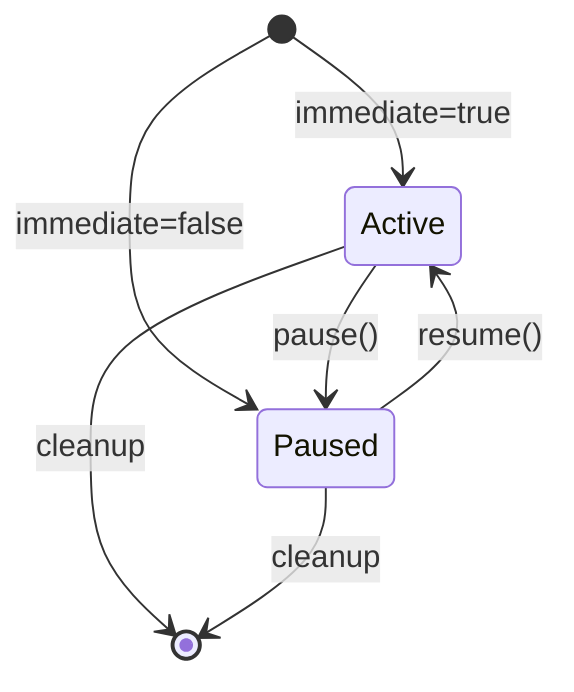

For composables that can be paused and resumed:

```typescript
export interface Pausable {
  /** Whether the composable is currently active */
  isActive: Readonly<Ref<boolean>>
  /** Pause the composable */
  pause: () => void
  /** Resume the composable */
  resume: () => void
}

export interface UseIntervalOptions {
  /** Start immediately */
  immediate?: boolean
  /** Call callback immediately when starting */
  immediateCallback?: boolean
}

export function useIntervalFn(
  callback: () => void,
  interval: MaybeRefOrGetter<number> = 1000,
  options: UseIntervalOptions = {}
): Pausable {
  const { immediate = true, immediateCallback = false } = options

  const isActive = shallowRef(false)
  let timer: ReturnType<typeof setInterval> | null = null

  function clean() {
    if (timer) {
      clearInterval(timer)
      timer = null
    }
  }

  function pause() {
    isActive.value = false
    clean()
  }

  function resume() {
    const ms = toValue(interval)
    if (ms <= 0) return

    isActive.value = true
    if (immediateCallback) callback()

    clean()
    timer = setInterval(callback, ms)
  }

  if (immediate) resume()

  tryOnCleanup(pause)

  return {
    isActive: readonly(isActive),
    pause,
    resume,
  }
}

// Usage
const { isActive, pause, resume } = useIntervalFn(() => {
  console.log('tick')
}, 1000)

pause()   // Stop ticking
resume()  // Start again
```

### Stoppable Pattern

For one-way stopping (e.g., timeouts, one-time operations):

```typescript
export interface Stoppable {
  /** Whether the operation is pending */
  isPending: Readonly<Ref<boolean>>
  /** Stop the operation */
  stop: () => void
}

export function useTimeoutFn(
  callback: () => void,
  interval: MaybeRefOrGetter<number>,
  options: { immediate?: boolean } = {}
): Stoppable & { start: () => void } {
  const { immediate = true } = options

  const isPending = shallowRef(false)
  let timer: ReturnType<typeof setTimeout> | null = null

  function stop() {
    isPending.value = false
    if (timer) {
      clearTimeout(timer)
      timer = null
    }
  }

  function start() {
    stop()
    isPending.value = true
    timer = setTimeout(() => {
      isPending.value = false
      timer = null
      callback()
    }, toValue(interval))
  }

  if (immediate) start()

  tryOnCleanup(stop)

  return {
    isPending: readonly(isPending),
    stop,
    start,
  }
}
```

---

## 11. Error Handling

### Graceful Degradation

```typescript
export function useGeolocation() {
  const isSupported = useSupported(
    () => navigator && 'geolocation' in navigator
  )

  const coords = shallowRef<GeolocationCoordinates | null>(null)
  const error = shallowRef<GeolocationPositionError | null>(null)

  function update() {
    if (!isSupported.value) return

    navigator.geolocation.getCurrentPosition(
      (position) => {
        coords.value = position.coords
        error.value = null
      },
      (err) => {
        error.value = err
      }
    )
  }

  if (isSupported.value) {
    update()
  }

  return {
    isSupported,
    coords,
    error,
    update,
  }
}
```

### Error Callbacks

```typescript
export interface UseAsyncStateOptions<T> {
  /** Called on success */
  onSuccess?: (data: T) => void
  /** Called on error */
  onError?: (error: unknown) => void
  /**
   * Whether to throw errors
   * @default false
   */
  throwError?: boolean
}

export function useAsyncState<T>(
  promise: () => Promise<T>,
  initialState: T,
  options: UseAsyncStateOptions<T> = {}
) {
  const { onSuccess, onError, throwError = false } = options

  const state = shallowRef<T>(initialState)
  const error = shallowRef<unknown>(null)
  const isLoading = shallowRef(false)

  async function execute() {
    isLoading.value = true
    error.value = null

    try {
      const data = await promise()
      state.value = data
      onSuccess?.(data)
    } catch (e) {
      error.value = e
      onError?.(e)
      if (throwError) throw e
    } finally {
      isLoading.value = false
    }
  }

  execute()

  return { state, error, isLoading, execute }
}
```

---

## 13. TypeScript Best Practices

### Generic Type Inference

Let TypeScript infer types when possible:

```typescript
// Type T is inferred from defaultValue
export function useStorage<T>(key: string, defaultValue: T): Ref<T> {
  // ...
}

// Usage - types are inferred
const name = useStorage('name', 'John')     // Ref<string>
const count = useStorage('count', 0)        // Ref<number>
const user = useStorage('user', { id: 1 })  // Ref<{ id: number }>
```

### Function Overloads

Use overloads for different call signatures:

```typescript
// Overload 1: Window events
export function useEventListener<K extends keyof WindowEventMap>(
  event: K,
  handler: (e: WindowEventMap[K]) => void
): () => void

// Overload 2: Element events
export function useEventListener<K extends keyof HTMLElementEventMap>(
  target: MaybeRefOrGetter<HTMLElement | null>,
  event: K,
  handler: (e: HTMLElementEventMap[K]) => void
): () => void

// Implementation
export function useEventListener(...args: any[]): () => void {
  // ... implementation handles all cases
}
```

### Conditional Return Types

```typescript
// If passed a ref, return just the toggle function
export function useToggle(
  value: Ref<boolean>
): (value?: boolean) => boolean

// If passed a plain value, return tuple
export function useToggle(
  initialValue?: boolean
): [Ref<boolean>, (value?: boolean) => boolean]

// Implementation
export function useToggle(
  initialValue: MaybeRef<boolean> = false
) {
  const valueIsRef = isRef(initialValue)
  const state = shallowRef(toValue(initialValue))

  const toggle = (value?: boolean) => {
    state.value = value ?? !state.value
    return state.value
  }

  if (valueIsRef) {
    return toggle
  }
  return [state, toggle] as const
}
```

---

## 14. Testing

For comprehensive testing strategies including basic test structure, testing with timers, and testing async composables, see <InternalLink slug="how-to-test-vue-composables">How to Test Vue Composables</InternalLink>.

---

## 15. Documentation

### JSDoc Comments

```typescript
/**
 * Reactive mouse position
 *
 * @param options - Configuration options
 * @returns Reactive mouse coordinates and source type
 *
 * @example
 * ```ts
 * const { x, y } = useMouse()
 *
 * watchEffect(() => {
 *   console.log(`Mouse at ${x.value}, ${y.value}`)
 * })
 * ```
 *
 * @see https://your-docs.com/composables/use-mouse
 */
export function useMouse(options?: UseMouseOptions): UseMouseReturn {
  // ...
}
```

### Document Every Option

Every option should have a JSDoc comment with a `@default` tag:

```typescript
export interface UseStorageOptions {
  /**
   * Storage type to use
   * @default 'local'
   */
  storage?: 'local' | 'session'

  /**
   * Whether to sync across browser tabs
   * @default true
   */
  listenToStorageChanges?: boolean
}
```

---

## 16. Templates

### Basic Composable Template

```typescript
export interface UseXxxOptions {
  /**
   * Option description
   * @default 'defaultValue'
   */
  someOption?: string
}

export interface UseXxxReturn {
  /** Description of value */
  value: Readonly<Ref<number>>
  /** Description of action */
  doSomething: () => void
}

/**
 * Short description of what this composable does
 *
 * @param param - Description of parameter
 * @param options - Configuration options
 */
export function useXxx(
  param: MaybeRefOrGetter<string>,
  options: UseXxxOptions = {}
): UseXxxReturn {
  const { someOption = 'defaultValue' } = options

  const value = shallowRef(0)

  function doSomething() {
    const paramValue = toValue(param)
    value.value++
  }

  // Cleanup if needed
  tryOnCleanup(() => {
    // cleanup logic
  })

  return {
    value: readonly(value),
    doSomething,
  }
}
```

### Async Composable Template

```typescript
export interface UseAsyncXxxOptions<T> {
  /**
   * Execute immediately
   * @default true
   */
  immediate?: boolean
  /**
   * Called on success
   */
  onSuccess?: (data: T) => void
  /**
   * Called on error
   */
  onError?: (error: Error) => void
}

export interface UseAsyncXxxReturn<T> {
  data: Readonly<Ref<T | null>>
  error: Readonly<Ref<Error | null>>
  isLoading: Readonly<Ref<boolean>>
  execute: () => Promise<void>
  onSuccess: EventHook<T>['on']
  onError: EventHook<Error>['on']
}

export function useAsyncXxx<T>(
  fetcher: () => Promise<T>,
  options: UseAsyncXxxOptions<T> = {}
): UseAsyncXxxReturn<T> {
  const { immediate = true, onSuccess, onError } = options

  const data = shallowRef<T | null>(null)
  const error = shallowRef<Error | null>(null)
  const isLoading = shallowRef(false)

  const successHook = createEventHook<T>()
  const errorHook = createEventHook<Error>()

  async function execute() {
    isLoading.value = true
    error.value = null

    try {
      const result = await fetcher()
      data.value = result
      onSuccess?.(result)
      successHook.trigger(result)
    } catch (e) {
      const err = e as Error
      error.value = err
      onError?.(err)
      errorHook.trigger(err)
    } finally {
      isLoading.value = false
    }
  }

  if (immediate) {
    execute()
  }

  return {
    data: readonly(data),
    error: readonly(error),
    isLoading: readonly(isLoading),
    execute,
    onSuccess: successHook.on,
    onError: errorHook.on,
  }
}
```

### Pausable Composable Template

```typescript
export interface Pausable {
  isActive: Readonly<Ref<boolean>>
  pause: () => void
  resume: () => void
}

export interface UsePausableXxxOptions {
  /**
   * Start immediately
   * @default true
   */
  immediate?: boolean
}

export function usePausableXxx(
  callback: () => void,
  interval: MaybeRefOrGetter<number> = 1000,
  options: UsePausableXxxOptions = {}
): Pausable {
  const { immediate = true } = options

  const isActive = shallowRef(false)
  let timer: ReturnType<typeof setInterval> | null = null

  function clean() {
    if (timer) {
      clearInterval(timer)
      timer = null
    }
  }

  function pause() {
    isActive.value = false
    clean()
  }

  function resume() {
    const ms = toValue(interval)
    if (ms <= 0) return

    isActive.value = true
    clean()
    timer = setInterval(callback, ms)
  }

  if (immediate) {
    resume()
  }

  tryOnCleanup(pause)

  return {
    isActive: readonly(isActive),
    pause,
    resume,
  }
}
```

---

## Quick Reference Checklist

Use this checklist when creating new composables:

**Structure**
- [ ] Named export (no default)
- [ ] Explicit return type interface
- [ ] JSDoc with `@param`, `@returns`, `@example`

**Reactivity**
- [ ] `shallowRef` for primitives
- [ ] `ref` only when deep mutations needed
- [ ] `MaybeRefOrGetter` for flexible inputs
- [ ] `toValue()` to unwrap inputs
- [ ] `readonly()` for exposed refs

**Safety**
- [ ] Guard browser APIs (`if (window)`)
- [ ] Auto-cleanup with `tryOnCleanup`
- [ ] Feature detection for optional APIs

**TypeScript**
- [ ] Generic type inference where possible
- [ ] Overloads for multiple signatures
- [ ] Strict types, no `any`

**Testing**
- [ ] Unit tests for all functionality
- [ ] Edge cases (null, undefined, empty)
- [ ] Cleanup verification

---

## Additional Resources

- [Vue Composition API Docs](https://vuejs.org/guide/extras/composition-api-faq.html)
- [Vue Reactivity in Depth](https://vuejs.org/guide/extras/reactivity-in-depth.html)
- [VueUse](https://vueuse.org) - Collection of Vue composables (the source of these patterns)
- [Vitest](https://vitest.dev) - Testing framework for Vue

---

These patterns represent the accumulated wisdom from VueUse's codebase. Apply them consistently to build maintainable, type-safe, and production-ready Vue composables.

---

--- title: Forcing Claude Code to TDD: An Agentic Red-Green-Refactor Loop description: Build a custom TDD workflow with Claude Code using skills and subagents that enforce Red-Green-Refactor discipline for your Vue projects. tags: ['ai', 'vue', 'testing', 'claude-code'] url: https://alexop.dev/posts/custom-tdd-workflow-claude-code-vue ---

# Forcing Claude Code to TDD: An Agentic Red-Green-Refactor Loop


I rely on Claude Code, but it has a structural limitation: it defaults to implementation-first. It writes the "Happy Path," ignoring edge cases. When I try to force TDD in a single context window, the implementation "bleeds" into the test logic (context pollution). This article documents a multi-agent system using Claude's "Skills" and "Hooks" that enforces a strict Red-Green-Refactor cycle.

<Alert type="note" title="Framework Agnostic">
  While this article uses Vue as an example, the TDD principles and Claude Code workflow apply to any technology. Whether you're working with React, Angular, Svelte, or even backend languages like Python, Go, or Rust—the Red-Green-Refactor cycle and subagent orchestration work the same way.
</Alert>

## The Problem with AI-Assisted TDD

When I ask Claude to "implement feature X," it writes the implementation first. Every time. TDD flips this—you write the test first, watch it fail, then write minimal code to make it pass.

I needed a way to:
* **Force test-first** — No implementation before a failing test exists
* **Keep phases focused** — The test writer shouldn't think about implementation details
* **Ensure refactoring happens** — Easy to skip when the feature already works

## Skills + Subagents

Claude Code supports two features I hadn't explored until recently:

* **<InternalLink slug="understanding-claude-code-full-stack">Skills</InternalLink>** (`.claude/skills/`): High-level workflows that orchestrate complex tasks
* **Agents** (`.claude/agents/`): Specialized workers that handle specific jobs

You might wonder: why use subagents at all? Skills alone could handle the TDD workflow. But there's a catch—context pollution.

### The Context Pollution Problem

<Alert type="warning" title="Why Single-Context LLMs Cheat at TDD">
When everything runs in one context window, **the LLM cannot truly follow TDD**. The test writer's detailed analysis bleeds into the implementer's thinking. The implementer's code exploration pollutes the refactorer's evaluation. Each phase drags along baggage from the others.

This isn't just messy—it fundamentally breaks TDD. The whole point of writing the test first is that **you don't know the implementation yet**. But if the same context sees both phases, the LLM subconsciously designs tests around the implementation it's already planning. It "cheats" without meaning to.
</Alert>

**Subagents solve this architectural limitation.** Each phase runs in complete isolation:

- The **test writer** focuses purely on test design—it has no idea how the feature will be implemented
- The **implementer** sees only the failing test—it can't be influenced by test-writing decisions
- The **refactorer** evaluates clean implementation code—it starts fresh without implementation baggage

Each agent starts with exactly the context it needs and nothing more. This isn't just organization—it's the only way to get genuine test-first development from an LLM.

Combining skills with subagents gave me exactly what I needed:

## The TDD Skill

The orchestrating skill lives at `.claude/skills/tdd-integration/skill.md`:

```markdown
---
name: tdd-integration
description: Enforce Test-Driven Development with strict Red-Green-Refactor cycle using integration tests. Auto-triggers when implementing new features or functionality. Trigger phrases include "implement", "add feature", "build", "create functionality", or any request to add new behavior. Does NOT trigger for bug fixes, documentation, or configuration changes.
---

# TDD Integration Testing

Enforce strict Test-Driven Development using the Red-Green-Refactor cycle with dedicated subagents.

## Mandatory Workflow

Every new feature MUST follow this strict 3-phase cycle. Do NOT skip phases.

### Phase 1: RED - Write Failing Test

🔴 RED PHASE: Delegating to tdd-test-writer...

Invoke the `tdd-test-writer` subagent with:
- Feature requirement from user request
- Expected behavior to test

The subagent returns:
- Test file path
- Failure output confirming test fails
- Summary of what the test verifies

**Do NOT proceed to Green phase until test failure is confirmed.**

### Phase 2: GREEN - Make It Pass

🟢 GREEN PHASE: Delegating to tdd-implementer...

Invoke the `tdd-implementer` subagent with:
- Test file path from RED phase
- Feature requirement context

The subagent returns:
- Files modified
- Success output confirming test passes
- Implementation summary

**Do NOT proceed to Refactor phase until test passes.**

### Phase 3: REFACTOR - Improve

🔵 REFACTOR PHASE: Delegating to tdd-refactorer...

Invoke the `tdd-refactorer` subagent with:
- Test file path
- Implementation files from GREEN phase

The subagent returns either:
- Changes made + test success output, OR
- "No refactoring needed" with reasoning

**Cycle complete when refactor phase returns.**

## Multiple Features

Complete the full cycle for EACH feature before starting the next:

Feature 1: 🔴 → 🟢 → 🔵 ✓
Feature 2: 🔴 → 🟢 → 🔵 ✓
Feature 3: 🔴 → 🟢 → 🔵 ✓

## Phase Violations

Never:
- Write implementation before the test
- Proceed to Green without seeing Red fail
- Skip Refactor evaluation
- Start a new feature before completing the current cycle
```

The `description` field contains trigger phrases so Claude activates this skill automatically when I ask to implement something. Each phase has explicit "Do NOT proceed until..." gates—Claude needs clear boundaries. The 🔴🟢🔵 emojis make tracking progress easy in the output.

## The Test Writer Agent (RED Phase)

At `.claude/agents/tdd-test-writer.md`:

```markdown
---
name: tdd-test-writer
description: Write failing integration tests for TDD RED phase. Use when implementing new features with TDD. Returns only after verifying test FAILS.
tools: Read, Glob, Grep, Write, Edit, Bash
skills: vue-integration-testing
---

# TDD Test Writer (RED Phase)

Write a failing integration test that verifies the requested feature behavior.

## Process

1. Understand the feature requirement from the prompt
2. Write an integration test in `src/__tests__/integration/`
3. Run `pnpm test:unit <test-file>` to verify it fails
4. Return the test file path and failure output

## Test Structure

typescript
describe('Feature Name', () => {
  afterEach(async () => {
    resetWorkout()
    await resetDatabase()
    document.body.innerHTML = ''
  })

  it('describes the user journey', async () => {
    const app = await createTestApp()

    // Act: User interactions
    await app.user.click(app.getByRole('button', { name: /action/i }))

    // Assert: Verify outcomes
    expect(app.router.currentRoute.value.path).toBe('/expected')

    app.cleanup()
  })
})

## Requirements

- Test must describe user behavior, not implementation details
- Use `createTestApp()` for full app integration
- Use Testing Library queries (`getByRole`, `getByText`)
- Test MUST fail when run - verify before returning

## Return Format

Return:
- Test file path
- Failure output showing the test fails
- Brief summary of what the test verifies
```

I limited the tools to only what's needed for writing and running tests. The `skills` field pulls in my `vue-integration-testing` skill for project-specific context. And the explicit return format ensures clean handoffs between phases.

<Alert type="info" title="About the vue-integration-testing skill">
  This skill defines how I want tests written: using jsdom with Vue Test Utils, writing BDD-style tests that describe user behavior, and avoiding mocks wherever possible. I don't see much value in unit tests that mock everything—they often just verify implementation details rather than actual functionality. Integration tests that exercise real code paths catch more bugs.
</Alert>

## The Implementer Agent (GREEN Phase)

At `.claude/agents/tdd-implementer.md`:

```markdown
---
name: tdd-implementer
description: Implement minimal code to pass failing tests for TDD GREEN phase. Write only what the test requires. Returns only after verifying test PASSES.
tools: Read, Glob, Grep, Write, Edit, Bash
---

# TDD Implementer (GREEN Phase)

Implement the minimal code needed to make the failing test pass.

## Process

1. Read the failing test to understand what behavior it expects
2. Identify the files that need changes
3. Write the minimal implementation to pass the test
4. Run `pnpm test:unit <test-file>` to verify it passes
5. Return implementation summary and success output

## Principles

- **Minimal**: Write only what the test requires
- **No extras**: No additional features, no "nice to haves"
- **Test-driven**: If the test passes, the implementation is complete
- **Fix implementation, not tests**: If the test fails, fix your code

## Return Format

Return:
- Files modified with brief description of changes
- Test success output
- Summary of the implementation
```

## The Refactorer Agent (REFACTOR Phase)

At `.claude/agents/tdd-refactorer.md`:

```markdown
---
name: tdd-refactorer
description: Evaluate and refactor code after TDD GREEN phase. Improve code quality while keeping tests passing. Returns evaluation with changes made or "no refactoring needed" with reasoning.
tools: Read, Glob, Grep, Write, Edit, Bash
skills: vue-composables
---

# TDD Refactorer (REFACTOR Phase)

Evaluate the implementation for refactoring opportunities and apply improvements while keeping tests green.

## Process

1. Read the implementation and test files
2. Evaluate against refactoring checklist
3. Apply improvements if beneficial
4. Run `pnpm test:unit <test-file>` to verify tests still pass
5. Return summary of changes or "no refactoring needed"

## Refactoring Checklist

Evaluate these opportunities:

- **Extract composable**: Reusable logic that could benefit other components
- **Simplify conditionals**: Complex if/else chains that could be clearer
- **Improve naming**: Variables or functions with unclear names
- **Remove duplication**: Repeated code patterns
- **Thin components**: Business logic that should move to composables

## Decision Criteria

Refactor when:
- Code has clear duplication
- Logic is reusable elsewhere
- Naming obscures intent
- Component contains business logic

Skip refactoring when:
- Code is already clean and simple
- Changes would be over-engineering
- Implementation is minimal and focused

## Return Format

If changes made:
- Files modified with brief description
- Test success output confirming tests pass
- Summary of improvements

If no changes:
- "No refactoring needed"
- Brief reasoning (e.g., "Implementation is minimal and focused")
```

This agent has a **decision framework** for whether to refactor. Sometimes "no refactoring needed" is the right answer. The `skills` field references my `vue-composables` skill so it knows my project's patterns for extracting reusable logic.

## Real Example: Adding Workout Detail View

Here's what this looks like in practice. My request:

> "When a user is on the Workouts page, they should be able to click on a past workout and see a detail view of what exercises and sets they completed."

The workflow executes like this:

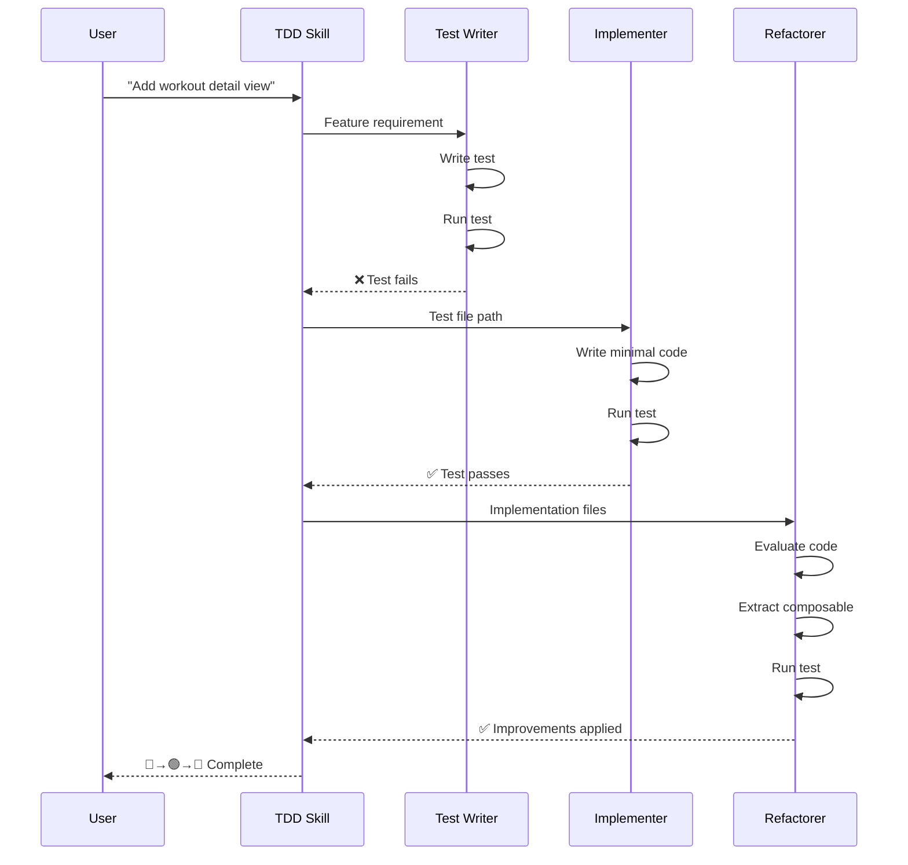

### 🔴 RED Phase

The `tdd-test-writer` produced:

```typescript
// src/__tests__/integration/workout-detail.spec.ts
describe('Workout History Detail View', () => {
  afterEach(async () => {
    // cleanup
  })

  it('navigates to detail view when clicking a completed workout', async () => {
    // Arrange: Create a completed workout
    const completedWorkout = {
      id: generateId(),
      name: 'Push Day',
      exercises: [{
        name: 'Bench Press',
        sets: [{ kg: '100', reps: '10' }]
      }],
      completedAt: Date.now(),
    }
    await db.workouts.add(completedWorkout)

    // Act: Navigate and click
    const app = await createTestApp()
    await app.user.click(app.getByRole('button', { name: /workouts/i }))
    await app.user.click(await app.findByText('Push Day'))

    // Assert
    expect(app.router.currentRoute.value.path)
      .toBe(`/workouts/${completedWorkout.id}`)
    expect(app.getByText('Bench Press')).toBeDefined()
    expect(app.getByText('100')).toBeDefined()

    app.cleanup()
  })
})
```

The test failed:
```
AssertionError: expected '/workouts' to be '/workouts/d747077d-...'
```

Exactly what I wanted—a clear failure pointing to missing functionality.

### 🟢 GREEN Phase

The `tdd-implementer` created:
* `WorkoutDetailView.vue` — New detail view component
* Modified `TheWorkoutsView.vue` — Added click handlers
* Modified `router/index.ts` — Added `/workouts/:id` route

Test passed. Minimal implementation, just enough to satisfy the assertions.

### 🔵 REFACTOR Phase

The `tdd-refactorer` evaluated the code and made improvements:
* **Extracted <InternalLink slug="how-to-test-vue-composables">`useWorkoutDetail` composable</InternalLink>** — Reusable data fetching with discriminated union states
* **Created shared formatters** — Pulled `formatDuration` and `formatDate` into `lib/formatters.ts`
* **Added accessibility** — Keyboard navigation for clickable cards

All tests still passed. The cycle completed.

## The Test Helper

A crucial piece making all this work is my `createTestApp()` helper:

```typescript
// src/__tests__/helpers/createTestApp.ts
export async function createTestApp(): Promise<TestApp> {
  const pinia = createPinia()
  const router = createRouter({
    history: createMemoryHistory(),
    routes,
  })

  render(App, {
    global: { plugins: [router, pinia] },
  })

  await router.isReady()

  return {
    router,
    user: userEvent.setup(),
    getByRole: screen.getByRole,
    getByText: screen.getByText,
    findByText: screen.findByText,
    waitForRoute: (pattern) => waitFor(() => {
      if (!pattern.test(router.currentRoute.value.path)) {
        throw new Error('Route mismatch')
      }
    }),
    cleanup: () => { document.body.innerHTML = '' },
  }
}
```

This gives agents a consistent API for rendering the full app and simulating user interactions. They don't need to figure out how to set up Vue, Pinia, and Vue Router each time—they just call `createTestApp()` and start writing assertions.

## Hooks for Consistent Skill Activation

Even with well-written skills, Claude sometimes skipped evaluation and jumped straight to implementation. I tracked this informally—skill activation happened maybe 20% of the time.

I found a great solution in [Scott Spence's post on making skills activate reliably](https://scottspence.com/posts/how-to-make-claude-code-skills-activate-reliably). He tested 200+ prompts across different hook configurations and found that a "forced eval" approach—making Claude explicitly evaluate each skill before proceeding—jumped activation from ~20% to ~84%.

The fix: **<InternalLink slug="claude-code-notification-hooks">hooks</InternalLink>**. Claude Code runs hooks at specific lifecycle points, and I used `UserPromptSubmit` to inject a reminder before every response.

In `.claude/settings.json`:

```json
{
  "hooks": {
    "UserPromptSubmit": [
      {
        "matcher": "",
        "hooks": [
          {
            "type": "command",
            "command": "npx tsx \"$CLAUDE_PROJECT_DIR/.claude/hooks/user-prompt-skill-eval.ts\"",
            "timeout": 5
          }
        ]
      }
    ]
  }
}
```

The hook script at `.claude/hooks/user-prompt-skill-eval.ts`:

```typescript
#!/usr/bin/env npx tsx
function main(): void {
  readFileSync(0, 'utf-8') // consume stdin

  const instruction = `
INSTRUCTION: MANDATORY SKILL ACTIVATION SEQUENCE

Step 1 - EVALUATE:
For each skill in <available_skills>, state: [skill-name] - YES/NO - [reason]

Step 2 - ACTIVATE:
IF any skills are YES → Use Skill(skill-name) tool for EACH relevant skill NOW
IF no skills are YES → State "No skills needed" and proceed

Step 3 - IMPLEMENT:
Only after Step 2 is complete, proceed with implementation.

CRITICAL: You MUST call Skill() tool in Step 2. Do NOT skip to implementation.
`

  stdout.write(instruction.trim())
}

main()
```

<Alert type="important" title="Results">
  With this hook, skill activation jumped from ~20% to ~84%. Now when I say "implement the workout detail view," the TDD skill triggers automatically.
</Alert>

## Conclusion

Claude Code's default behavior produces implementation-first code with minimal test coverage. Without constraints, it optimizes for "working code" rather than "tested code."

The system described here addresses this through architectural separation:

* **Hooks** inject evaluation logic before every prompt, increasing skill activation from ~20% to ~84%
* **Skills** define explicit phase gates that block progression until each TDD step completes
* **Subagents** enforce context isolation—the test writer cannot see implementation plans, so tests reflect actual requirements rather than anticipated code structure

The setup cost is ~2 hours of configuration. After that, each feature request automatically follows the Red-Green-Refactor cycle without manual enforcement.

---

--- title: Get Notified When Claude Code Finishes With Hooks description: Set up desktop notifications in Claude Code to know when Claude needs your input or permission. Learn how to use hooks for instant alerts instead of constantly checking. tags: ['claude-code'] url: https://alexop.dev/posts/claude-code-notification-hooks ---

# Get Notified When Claude Code Finishes With Hooks


You're deep in your work. Claude Code is running, doing its thing. You check back five minutes later. Still waiting. Ten minutes later? Still waiting.

Wouldn't it be nice to know *when* Claude actually needs you?

This is where hooks come in. <InternalLink slug="understanding-claude-code-full-stack">Claude Code runs hooks</InternalLink> at specific points in its workflow. You can tap into those hooks to send yourself desktop notifications—so you never miss an important moment.

But here's the thing—if you've never used hooks before, they might sound abstract. Let me break it down.

## What Are Hooks?

Hooks are commands that run at specific points in Claude Code's lifecycle. They let you respond to events without constantly watching the CLI. Instead of polling, you get notified.

Claude Code provides two notification hooks:
- **`permission_prompt`** - Claude needs your permission to do something
- **`idle_prompt`** - Claude is waiting for your input

Think of them like webhooks, but for your local machine. Claude Code fires an event, you can respond.

## Setting Up Desktop Notifications

Now let's get this working. It's straightforward—just two pieces: a configuration file and a notification script.

Start by creating a `.claude/hooks` directory in your project. Then add the hook configuration to `.claude/settings.json`:

```json
{
  "hooks": {
    "Notification": [
      {
        "matcher": "permission_prompt|idle_prompt",
        "hooks": [
          {
            "type": "command",
            "command": "npx tsx \"$CLAUDE_PROJECT_DIR/.claude/hooks/notification-desktop.ts\"",
            "timeout": 5
          }
        ]
      }
    ]
  }
}
```

This tells Claude Code: "When you hit a `permission_prompt` or `idle_prompt`, run this command." The `timeout: 5` means the hook has 5 seconds to complete before Claude moves on.

You can place this in two locations:
- `.claude/settings.json` - Project-specific (checked into git, shared with team)
- `~/.claude/settings.json` - Global user settings (personal machine only)

Use project-specific settings for team hooks, global settings for personal notifications. The `$CLAUDE_PROJECT_DIR` is an environment variable Claude Code provides—it expands to your project root automatically.

Here's what your project structure should look like:

<FileTree tree={[
  { name: 'your-project', children: [
    { name: '.claude', children: [
      { name: 'settings.json', comment: 'Hook configuration' },
      { name: 'hooks', children: [
        { name: 'notification-desktop.ts', comment: 'Notification script' }
      ], open: true }
    ], open: true },
    { name: 'src', comment: '...' },
    { name: 'package.json', comment: '...' }
  ], open: true }
]} />

## The Notification Script

Create `.claude/hooks/notification-desktop.ts`. This script handles sending the actual notifications:

```typescript
#!/usr/bin/env npx tsx
/* eslint-disable node/prefer-global/process */
/**
 * Claude Code Notification Hook - Desktop Alerts
 *
 * Sends system notifications when Claude needs attention:
 * - Permission prompts
 * - Idle prompts (waiting for input)
 */

function readStdin(): string {
  return readFileSync(0, 'utf-8')
}

function sendMacNotification(title: string, message: string): void {
  // Escape special characters for AppleScript
  const escapedTitle = title.replace(/"/g, '\\"')
  const escapedMessage = message.replace(/"/g, '\\"')

  const script = `display notification "${escapedMessage}" with title "${escapedTitle}" sound name "Ping"`

  try {
    execSync(`osascript -e '${script}'`, { stdio: 'ignore' })
  }
  catch {
    // Notification failed, ignore silently
  }
}

function main(): void {
  const rawInput = readStdin()

  let parsedInput: unknown
  try {
    parsedInput = JSON.parse(rawInput)
  }
  catch {
    process.exit(0)
  }

  const input = parsedInput as NotificationHookInput

  const notificationType = (input as { notification_type?: string }).notification_type
  const message = input.message

  switch (notificationType) {
    case 'permission_prompt':
      sendMacNotification('Claude Code - Permission Required', message || 'Claude needs your permission to continue')
      break
    case 'idle_prompt':
      sendMacNotification('Claude Code - Waiting', message || 'Claude is waiting for your input')
      break
    default:
      // Don't notify for other types
      break
  }

  process.exit(0)
}

main()

```

## When This Really Shines

You've set up the basics. Now here's where it becomes powerful.

This notification system is especially useful when you're doing deep focus work and Claude Code runs a long operation. You don't have to check your terminal every few seconds. Permission prompts that need immediate action? They hit you with a different sound. Idle waits while you've stepped away? A gentle reminder pulls you back.

The key is this: the notification comes exactly when you need to be engaged. No sooner, no later.

Want to go deeper? You can even <InternalLink slug="building-my-first-claude-code-plugin">build custom plugins that use hooks</InternalLink> across different projects for more powerful automation.

## Conclusion

Hooks transform Claude Code from a tool you watch into a tool that watches for you.
The setup takes maybe five minutes. Copy the configuration, create the script, adjust the sounds to your preference. After that, you're done. No more context switching. No more glancing at the terminal every few seconds wondering if Claude needs you. The notification arrives exactly when it matters.
That's the real power here. It's not about automating notifications. It's about reclaiming your focus—letting Claude Code work while you work, and pulling your attention back only when it's needed. Set it up once, and you've unlocked a better way to collaborate with AI.

---

--- title: How to Speed Up Your Claude Code Experience with Slash Commands description: Learn how to transform Claude Code from a chatbot into a deterministic engine using Slash Commands. This guide covers the technical setup and a complete 'Full Circle' workflow that automates your entire feature lifecycle. tags: ['ai', 'claude-code'] url: https://alexop.dev/posts/claude-code-slash-commands-guide ---

# How to Speed Up Your Claude Code Experience with Slash Commands


I was wasting time. Every commit message, every branch name, every PR description. I typed the same things over and over.
Then I discovered Slash Commands in Claude Code. Now I type `/commit` and it writes the message for me. `/branch "add dark mode"` and it creates `feat/add-dark-mode`. `/pr` and it generates a full PR description from my commits.
This post shows you how to build the same workflow. I'll cover how Slash Commands work, then we'll build a complete system that automates your entire git lifecycle.

<Aside type="tip" title="Related Reading">
Slash Commands are just one piece of the Claude Code puzzle. For the full picture—including MCP, hooks, subagents, and skills—see my <InternalLink slug="understanding-claude-code-full-stack">comprehensive guide to Claude Code's feature stack</InternalLink>.
</Aside>

<Alert type="important" title="Prerequisites">
You need Git and the GitHub CLI (`gh`). Install `gh` with `brew install gh` on macOS or check [cli.github.com](https://cli.github.com). Run `gh auth login` to authenticate.

Without `gh`, commands like `/pr` and `/fix-pipeline` will not work.
</Alert>

## Two things you need to know

Before we build the workflow, you need to understand two features.

### Bash command execution

Write `!git status` inside a command file. Claude runs the command first, captures the output, and injects it into the prompt. The AI sees the result before it starts thinking.

This is how `/commit` knows what you changed. It runs `!git diff` automatically. See the [official documentation](https://docs.anthropic.com/en/docs/claude-code/slash-commands#bash-command-execution) for more details.

### Model selection

You don't need a powerful model to fix a missing semicolon.
Claude Code lets you pick the model in the frontmatter:

- `sonnet` — for complex reasoning (default)
- `haiku` — fast and cheap

Add `model: haiku` and commands run almost instantly.

## Command structure

Slash commands are Markdown files stored in `.claude/commands/` (project-level) or `~/.claude/commands/` (personal). The filename becomes the command name: `commit.md` becomes `/commit`.

<FileTree
  tree={[
    {
      name: "my-project",
      open: true,
      children: [
        {
          name: ".claude",
          open: true,
          children: [
            { name: "settings.json", comment: "project settings" },
            {
              name: "commands",
              open: true,
              children: [
                { name: "branch.md", comment: "/branch" },
                { name: "commit.md", comment: "/commit" },
                { name: "pr.md", comment: "/pr" },
                { name: "lint.md", comment: "/lint" },
              ],
            },
          ],
        },
        { name: "src" },
        { name: "package.json" },
      ],
    },
  ]}
/>

Here is a complete example:

```markdown
---
description: Create a git commit with a conventional message
allowed-tools: Bash(git add:*), Bash(git commit:*)
argument-hint: [message]
model: haiku
---

# Commit Changes

<git_diff>
!`git diff --cached`
</git_diff>

Create a commit message following Conventional Commits.
If $ARGUMENTS is provided, use it as the commit message.
```

### Frontmatter options

| Option | Purpose | Default |
|--------|---------|---------|
| `description` | Brief description shown in `/help` | First line of prompt |
| `allowed-tools` | Tools the command can use | Inherits from conversation |
| `model` | Model to use (`sonnet`, `haiku`, or full model ID) | Inherits from conversation |
| `argument-hint` | Shows expected arguments in autocomplete | None |

### Arguments

Use `$ARGUMENTS` to capture everything passed to the command:

```markdown
Create a branch named: $ARGUMENTS
```

For multiple arguments, use positional parameters `$1`, `$2`, etc:

```markdown
---
argument-hint: [pr-number] [priority]
---

Review PR #$1 with priority $2.
```

### File references

Include file contents with the `@` prefix:

```markdown
Review the implementation in @src/utils/helpers.js
```

## The workflow

I replaced my manual git rituals with custom commands. They live in `.claude/commands/`. Here is how I drive a feature from start to merge.

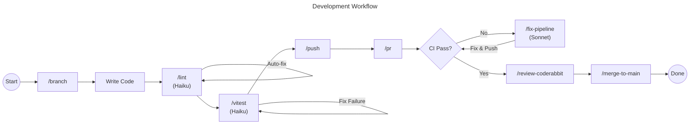

### /branch — start a task

<PromptLink href="/prompts/claude/claude-branch-command">
I type `/branch "implement dark mode toggle"` and Claude checks out main, pulls latest, and creates `feat/dark-mode-toggle`. No more thinking about naming conventions.
</PromptLink>

### /lint — fix before commit

<PromptLink href="/prompts/claude/claude-lint-command">
I type `/lint`. It runs the linter with auto-fix, and if errors remain, Claude fixes them. Uses Haiku for speed—runs in about 20 seconds.
</PromptLink>

### /vitest — run unit tests

<PromptLink href="/prompts/claude/claude-vitest-command">
I type `/vitest`. It runs the test suite and fixes any failures. The prompt tells Claude to fix the code, not the test—implementation should match expected behavior.
</PromptLink>

### /commit — save your work

<PromptLink href="/prompts/claude/claude-commit-command">
I type `/commit`. Claude analyzes the diff, generates a Conventional Commit message, and commits. It looks at recent commits to match your project's style.
</PromptLink>

### /push — commit and push in one step

<PromptLink href="/prompts/claude/claude-push-command">
I type `/push`. It stages everything, generates a commit message, commits, and pushes. My most-used command—one word and the code is on GitHub.
</PromptLink>

### /fix-pipeline — fix failing CI tests

<PromptLink href="/prompts/claude/claude-fix-pipeline-command">
I type `/fix-pipeline`. It fetches the failed logs via `gh`, analyzes the error, and fixes it. Uses Sonnet because debugging requires reasoning. The prompt includes guardrails—Claude must read the actual error before proposing fixes.
</PromptLink>

### /pr — create a pull request

<PromptLink href="/prompts/claude/claude-pr-command">
I type `/pr`. It analyzes all commits on the branch, generates a PR title and description, and opens it via `gh pr create`. Checks if a PR already exists first.
</PromptLink>

### /review-coderabbit — address review comments

<PromptLink href="/prompts/claude/claude-review-coderabbit-command">
I type `/review-coderabbit`. It fetches CodeRabbit's comments via GraphQL, verifies each suggestion against the codebase, implements valid fixes or pushes back with reasoning, and resolves every thread. AI reviewers aren't always right—the prompt ensures Claude verifies before acting.
</PromptLink>

### /merge-to-main — finish the task

<PromptLink href="/prompts/claude/claude-merge-to-main-command">
I type `/merge-to-main`. It squash merges the PR, deletes the branch, and pulls main. Done.
</PromptLink>

## Summary

By moving your process into `.claude/commands/`, you are building a system.

- Bash command execution injects real-time context
- Model selection balances speed vs reasoning
- The workflow automates branching, linting, committing, CI debugging, PRs, and merging

Define the process once. Claude executes it every time.

Want to extend Claude Code even further? Connect external tools via <InternalLink slug="what-is-model-context-protocol-mcp">MCP (Model Context Protocol)</InternalLink> or package your commands into a <InternalLink slug="building-my-first-claude-code-plugin">shareable plugin</InternalLink>.

I don't think about naming conventions, commit messages, or PR descriptions anymore. The commands handle it.

<Alert type="tip" title="Bonus: Shell aliases for even faster execution">
You can skip the interactive prompt entirely with `claude -p`. Add aliases to your `.zshrc` or `.bashrc`:

```bash
alias clint="claude -p '/lint'"
alias cpush="claude -p '/push'"
alias ccommit="claude -p '/commit'"
alias cbranch="claude -p '/branch'"
```

Now `clint` runs the lint command without opening the interactive session. The `-p` flag passes the prompt directly—Claude executes and exits. Two steps become one keystroke.
</Alert>

---

--- title: Understanding Claude Code's Full Stack: MCP, Skills, Subagents, and Hooks Explained description: A practical guide to Claude Code's features — explained in the order they were introduced: MCP (2024), Claude Code core (Feb 2025), Plugins (2025), and Agent Skills (Oct 2025). What each does, how they fit together, and when to use what. tags: ['claude-code', 'ai', 'mcp', 'productivity', 'tooling'] url: https://alexop.dev/posts/understanding-claude-code-full-stack ---

# Understanding Claude Code's Full Stack: MCP, Skills, Subagents, and Hooks Explained


I've been using Claude Code for months. Mostly for quick edits and generating boilerplate. The vibe coding tool everyone talks about.

Then I actually explored what it could do. MCP servers. Slash commands. Plugins. Skills. Hooks. Subagents. CLAUDE.md files.

I was blown away. Claude Code isn't just a coding assistant. It's a framework for orchestrating AI agents. It speeds up development in ways I've never seen before.

Most people use one or two features. They miss how these features stack together. This guide explains each concept **in the order they build on each other** — from external connections to automatic behaviors. (New to using LLMs for development? Start with my <InternalLink slug="how-i-use-llms">overview of how I use LLMs</InternalLink> for context.)

> Claude Code is, with hindsight, poorly named. It's not purely a coding tool: it's a tool for general computer automation. Anything you can achieve by typing commands into a computer is something that can now be automated by Claude Code. It's best described as a general agent. Skills make this a whole lot more obvious and explicit.
>
> — Simon Willison, [Claude Skills are awesome, maybe a bigger deal than MCP](https://simonwillison.net/2025/Oct/16/claude-skills/)

<TLDR
  items={[
    "CLAUDE.md files give Claude project memory and context",
    "Slash commands are user-triggered, repeatable workflows",
    "Subagents handle parallel work in isolated contexts",
    "Hooks automatically react to lifecycle events",
    "Plugins bundle commands, hooks, and skills for sharing",
    "MCP connects external tools through a universal protocol",
    "Skills activate automatically based on task context",
  ]}
/>

## The feature stack

1. **Model Context Protocol (MCP)** — the foundation for connecting external tools and data sources
2. **Claude Code core features** — project memory, slash commands, subagents, and hooks
3. **Plugins** — shareable packages that bundle commands, hooks, and skills
4. **Agent Skills** — automatic, model-invoked capabilities that activate based on task context

<Figure
  src={claudeSenpai}
  caption="Claude Senpai knows all the features!"
  alt="Robot Claude Senpai with a knowing expression"
  size="medium"
/>

---

## 1) Model Context Protocol (MCP) — connecting external systems

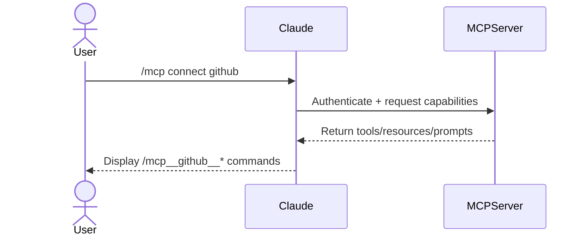

**What it is.** The <InternalLink slug="what-is-model-context-protocol-mcp">Model Context Protocol</InternalLink> connects Claude Code to external tools and data sources. Think universal adapter for GitHub, databases, APIs, and other systems.

**How it works.** Connect an MCP server, get access to its tools, resources, and prompts as slash commands:

```bash
# Install a server
claude mcp add playwright npx @playwright/mcp@latest

# Use it
/mcp__playwright__create-test [args]
```

<Alert type="caution" title="Context Window Management">
  Each MCP server consumes context. Monitor with `/context` and remove unused
  servers.
</Alert>

**The gotcha.** MCP servers expose their own tools — they don't inherit Claude's Read, Write, or Bash unless explicitly provided.

**Real-world example.** Want to see MCP in action? Check out how to <InternalLink slug="building_ai_qa_engineer_claude_code_playwright">build an AI QA engineer with Playwright MCP</InternalLink> that tests your app like a real user.

---

## 2) Claude Code core features

### 2.1) Project memory with `CLAUDE.md`

**What it is.** Markdown files Claude loads at startup. They give Claude memory about your project's conventions, architecture, and patterns.

**How it works.** Files merge hierarchically from enterprise → user (`~/.claude/CLAUDE.md`) → project (`./CLAUDE.md`). When you reference `@components/Button.vue`, Claude also reads CLAUDE.md from that directory and its parents.

**Example structure for a Vue app:**

<FileTree
  tree={[
    {
      name: "my-vue-app",
      open: true,
      children: [
        {
          name: "CLAUDE.md",
          comment: "Project-wide conventions, tech stack, build commands",
        },
        {
          name: "src",
          open: true,
          children: [
            {
              name: "components",
              open: true,
              children: [
                {
                  name: "CLAUDE.md",
                  comment: "Component patterns, naming conventions, prop types",
                },
                { name: "Button.vue" },
                { name: "Card.vue" },
              ],
            },
            {
              name: "pages",
              open: true,
              children: [
                {
                  name: "CLAUDE.md",
                  comment: "Routing patterns, page structure, data fetching",
                },
                { name: "Home.vue" },
                { name: "About.vue" },
              ],
            },
          ],
        },
      ],
    },
  ]}
/>

When you work on `src/components/Button.vue`, Claude loads context from:

1. Enterprise CLAUDE.md (if configured)
2. User `~/.claude/CLAUDE.md` (personal preferences)
3. Project root `CLAUDE.md` (project-wide info)
4. `src/components/CLAUDE.md` (component-specific patterns)

**What goes in.** Common commands, coding standards, architectural patterns. Keep it concise — reference guide, not documentation. Need help creating your own? Check out this [CLAUDE.md creation guide](/prompts/claude/claude-create-md).

Here's my blog's CLAUDE.md:

````markdown
# CLAUDE.md

## Project Overview

Alexander Opalic's personal blog built on AstroPaper - Astro-based blog theme with TypeScript, React, TailwindCSS.

**Tech Stack**: Astro 5, TypeScript, React, TailwindCSS, Shiki, FuseJS, Playwright

## Development Commands

```bash
npm run dev              # Build + Pagefind + dev server (localhost:4321)
npm run build            # Production build
npm run lint             # ESLint for .astro, .ts, .tsx
---
```
````

### 2.2) Slash Commands — explicit, reusable prompts

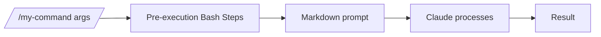

**What they are.** Markdown files in `.claude/commands/` you trigger manually by typing `/name [args]`. User-controlled workflows.

**Key features:**

- `$ARGUMENTS` or `$1`, `$2` for argument passing
- `@file` syntax to inline code
- `allowed-tools: Bash(...)` for pre-execution scripts
- <InternalLink slug="xml-tagged-prompts-framework-reliable-ai-responses">
    XML-tagged prompts
  </InternalLink>
  for reliable outputs

**When to use.** Repeatable workflows you trigger on demand — code reviews, commit messages, scaffolding. For a complete example of a git workflow built entirely with slash commands, see my <InternalLink slug="claude-code-slash-commands-guide">Slash Commands Guide</InternalLink>. Want to create your own? Use this [slash command creation guide](/prompts/claude/claude-create-command).

**Example structure:**

```markdown
---
description: Create new slash commands
argument-hint: [name] [purpose]
allowed-tools: Bash(mkdir:*), Bash(tee:*)
---

# /create-command

Generate slash command files with proper structure.

**Inputs:** `$1` = name, `$2` = purpose
**Outputs:** `STATUS=WROTE PATH=.claude/commands/{name}.md`

[... instructions ...]
```

Commands can create commands. Meta, but powerful.

---

### 2.3) Subagents — specialized AI personalities for delegation

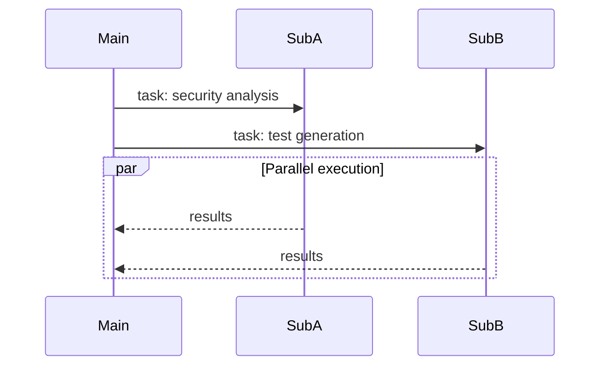

**What they are.** Pre-configured AI personalities with specific expertise areas. Each subagent has its own system prompt, allowed tools, and separate context window. When Claude encounters a task matching a subagent's expertise, it delegates automatically.

**Why use them.** Keep your main conversation clean while offloading specialized work. Each subagent works independently in its own context window, preventing token bloat. Run multiple subagents in parallel for concurrent analysis.

<Alert type="tip" title="Avoiding Context Poisoning">
  Subagents prevent "context poisoning" — when detailed implementation work
  clutters your main conversation. Use subagents for deep dives (security
  audits, test generation, refactoring) that would otherwise fill your primary
  context with noise.
</Alert>

**Example structure:**

```markdown
---
name: security-auditor
description: Analyzes code for security vulnerabilities
tools: Read, Grep, Bash # Controls what this personality can access
model: sonnet # Optional: sonnet, opus, haiku, inherit
---

You are a security-focused code auditor.

Identify vulnerabilities (XSS, SQL injection, CSRF, etc.)
Check dependencies and packages
Verify auth/authorization
Review data validation

Provide severity levels: Critical, High, Medium, Low.
Focus on OWASP Top 10.
```

The system prompt shapes the subagent's behavior. The `description` helps Claude know when to delegate. The `tools` restrict what the personality can access.

**Best practices:** One expertise area per subagent. Grant minimal tool access. Use `haiku` for simple tasks, `sonnet` for complex analysis. Run independent work in parallel. Need a template? Check out this [subagent creation guide](/prompts/claude/claude-create-agent).

---

### 2.4) Hooks — automatic event-driven actions

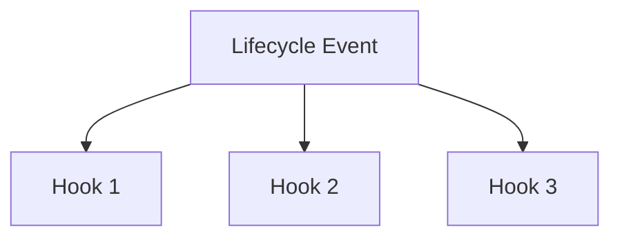

**What they are.** JSON-configured handlers in `.claude/settings.json` that trigger automatically on lifecycle events. No manual invocation.

**Available events:** `PreToolUse`, `PostToolUse`, `UserPromptSubmit`, `Notification`, `Stop`, `SubagentStop`, `SessionStart`

**Two modes:**

- **Command:** Run shell commands (fast, predictable)
- **Prompt:** Let Claude decide with the LLM (flexible, context-aware)

**Example:** Auto-lint after file edits.

```json
{
  "hooks": {
    "PostToolUse": [
      {
        "matcher": "Edit|Write",
        "hooks": [
          {
            "type": "command",
            "command": "\"$CLAUDE_PROJECT_DIR\"/.claude/hooks/run-oxlint.sh"
          }
        ]
      }
    ]
  }
}
```

```bash
#!/usr/bin/env bash
file_path="$(jq -r '.tool_input.file_path // ""')"

if [[ "$file_path" =~ \.(js|jsx|ts|tsx|vue)$ ]]; then
  pnpm lint:fast
fi
```

**Common uses:** Auto-format after edits, require approval for bash commands, validate writes, initialize sessions. For a practical example, see how to <InternalLink slug="claude-code-notification-hooks">set up desktop notifications</InternalLink> when Claude needs your attention. Want to create your own hooks? Use this [hook creation guide](/prompts/claude/claude-create-hook).

---

## 3) Plugins — shareable, packaged configurations

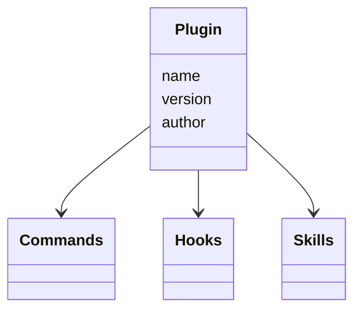

**What they are.** Distributable bundles of commands, hooks, skills, and metadata. Share your setup with teammates or install pre-built configurations.

**Basic structure:**

<FileTree
  tree={[
    {
      name: "my-plugin",
      open: true,
      children: [
        {
          name: ".claude-plugin",
          open: true,
          children: [
            { name: "plugin.json", comment: "Manifest: name, version, author" },
          ],
        },
        { name: "commands", children: [{ name: "greet.md" }] },
        {
          name: "skills",
          children: [{ name: "my-skill", children: [{ name: "SKILL.md" }] }],
        },
        { name: "hooks", children: [{ name: "hooks.json" }] },
      ],
    },
  ]}
/>

**When to use.** Share team configurations, <InternalLink slug="building-my-first-claude-code-plugin">package domain workflows</InternalLink>, distribute opinionated patterns, install community tooling.

**How it works.** Install a plugin, get instant access. Components merge seamlessly — hooks combine, commands appear in autocomplete, skills activate automatically. Ready to build your own? Check out this [plugin creation guide](/prompts/claude/claude-create-plugin).

---

## 4) Agent Skills — automatic, task-driven capabilities

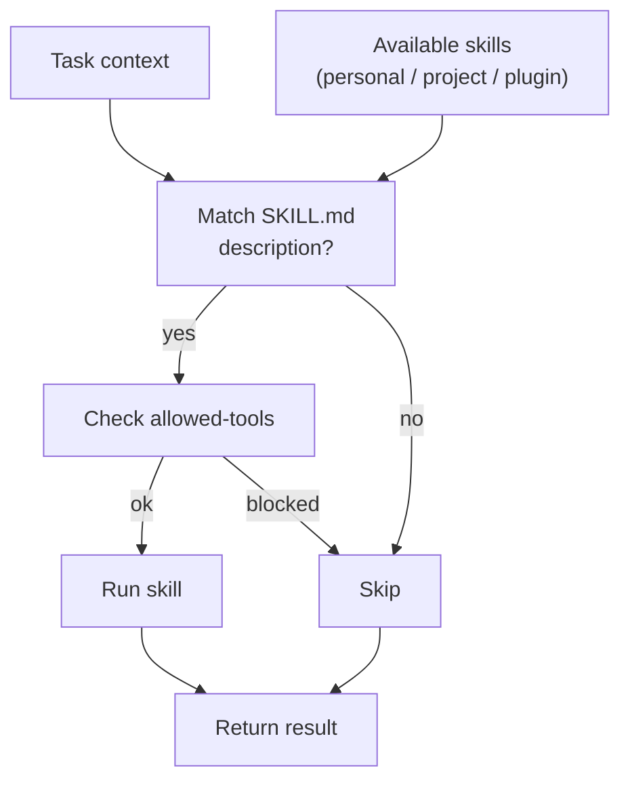

**What they are.** Folders with `SKILL.md` descriptors plus optional scripts. Unlike slash commands, skills activate **automatically** when their description matches the task context.

**How Claude discovers them.** When you give Claude a task, it reviews available skill descriptions to find relevant ones. If a skill's `description` field matches the task context, Claude loads the full skill instructions and applies them. This happens transparently — you never explicitly invoke skills.

<Alert type="info" title="Official Example Skills">
  Check out the [official Anthropic skills
  repository](https://github.com/anthropics/skills) for ready-to-use examples.
</Alert>

> Claude Skills are awesome, maybe a bigger deal than MCP
>
> — Simon Willison, [Claude Skills are awesome, maybe a bigger deal than MCP](https://simonwillison.net/2025/Oct/16/claude-skills/)

<Alert type="tip" title="Advanced Skills: Superpowers Library">
Want rigorous, spec-driven development? Check out [obra's superpowers](https://github.com/obra/superpowers) — a comprehensive skills library that enforces systematic workflows.

**What it provides:** TDD workflows (RED-GREEN-REFACTOR), systematic debugging, code review processes, git worktree management, and brainstorming frameworks. Each skill pushes you toward verification-based development instead of "trust me, it works."

**The philosophy:** Test before implementation. Verify with evidence. Debug systematically through four phases. Plan before coding. No shortcuts.

These skills work together to prevent common mistakes. The brainstorming skill activates before implementation. The TDD skill enforces writing tests first. The verification skill blocks completion claims without proof.

**Use when:** You want Claude to be more disciplined about development practices, especially for production code.

</Alert>

**Where to put them:**

- `~/.claude/skills/` — personal, all projects
- `.claude/skills/` — project-specific
- Inside plugins — distributable

**What you need:**

- `SKILL.md` with frontmatter (`name`, `description`)
- Optional `allowed-tools` declaration
- Optional helper scripts

Want to create your own skill? Use this [skill creation guide](/prompts/claude/claude-create-skill).

**Why they're powerful.** Skills package expertise Claude applies automatically. Style enforcement, doc updates, test hygiene, framework patterns — all without manual triggering.

**Skills vs CLAUDE.md.** Think of skills as modular chunks of a CLAUDE.md file. Instead of Claude reviewing a massive document every time, skills let Claude access specific expertise only when needed. This improves context efficiency while maintaining automatic behavior.

**Key difference.** Skills are "always on." Claude activates them based on context. Commands require manual invocation.

<Alert type="caution" title="Skills vs Commands: The Gray Area">
Some workflows could be either a skill or a command. Example: git worktree management.

**Make it a skill if:** You want Claude to automatically consider git worktrees whenever relevant to the conversation.

**Make it a command if:** You want explicit control over when worktree logic runs (e.g., `/create-worktree feature-branch`).

The overlap is real — choose based on whether you prefer automatic activation or manual control.

</Alert>

<Alert type="info" title="Automatic vs Manual Triggering">
**Subagents and Skills activate automatically** when Claude determines they're relevant to the task. You don't need to invoke them manually — Claude uses them proactively when it thinks they're useful.

**Slash commands require manual triggering** — you type `/command-name` to run them.

This is the fundamental difference: automation vs explicit control.

</Alert>

---

## Putting it all together

Here's how these features work together in practice:

1. **Memory (`CLAUDE.md`)** — Establish project context and conventions that Claude always knows
2. **Slash commands** — Create explicit shortcuts for workflows you want to trigger on demand
3. **Subagents** — Offload parallel or isolated work to specialized agents
4. **Hooks** — Enforce rules and automate repetitive actions at key lifecycle events
5. **Plugins** — Package and distribute your entire setup to others
6. **MCP** — Connect external systems and make their capabilities available as commands
7. **Skills** — Define automatic behaviors that activate based on task context

### Example: A Task-Based Development Workflow

Here's a real-world workflow that combines multiple features:

**Setup phase:**

- `CLAUDE.md` contains implementation standards ("don't commit until I approve", "write tests first")
- `/load-context` slash command initializes new chats with project state
- `update-documentation` skill activates automatically after implementations
- Hook triggers linting after file edits

**Planning phase (Chat 1):**

- Main agent plans bug fix or new feature
- Outputs detailed task file with approach

**Implementation phase (Chat 2):**

- Start fresh context with `/load-context`
- Feed in the plan from Chat 1
- Implementation subagent executes the plan
- `update-documentation` skill updates docs automatically
- `/resolve-task` command marks task complete

**Why this works:** Main context stays focused on planning. Heavy implementation work happens in isolated context. Skills handle documentation. Hooks enforce quality standards. No context pollution.

## Decision guide: choosing the right tool

<Alert type="info" title="Quick Reference Cheat Sheet">
  For a comprehensive visual guide to all Claude Code features, check out the
  [Awesome Claude Code Cheat Sheet](https://awesomeclaude.ai/code-cheatsheet).
</Alert>

<Alert type="tip" title="Customize Your Terminal">
  Want model name, context usage, and cost displayed in your terminal? See how to <InternalLink slug="customize_claude_code_status_line">customize your Claude Code status line</InternalLink>.
</Alert>

<Aside type="tip" title="Quick Reference">

- **Use `CLAUDE.md`** to define lasting project context — architecture, conventions, and patterns Claude should always remember. Best for: static knowledge that rarely changes.
- **Use <InternalLink slug="claude-code-slash-commands-guide">Slash Commands</InternalLink>** for explicit, repeatable workflows you want to trigger manually. Best for: workflow automation, user-initiated actions.
- **Use Subagents** when you need parallel execution or want to isolate heavy computational work. Best for: preventing context pollution, specialized deep dives.
- **Use Hooks** to automatically enforce standards or react to specific events. Best for: quality gates, automatic actions tied to tool usage.
- **Use Plugins** to package and share complete configurations across teams or projects. Best for: team standardization, distributing opinionated setups.
- **Use MCP** to integrate external systems and expose their capabilities as native commands. Best for: connecting databases, APIs, third-party tools.
- **Use Skills** for automatic, context-driven behaviors that should apply without manual invocation. Best for: automated context provision, "always on" expertise.

</Aside>

### Feature comparison

<Alert type="info" title="Source">
  This comparison table is adapted from [IndyDevDan's video "I finally CRACKED
  Claude Agent Skills"](https://www.youtube.com/watch?v=kFpLzCVLA20&t=1027s).
</Alert>

| Category            | Skill | MCP     | Subagent | Slash Command |
| ------------------- | ----- | ------- | -------- | ------------- |
| Triggered By        | Agent | Both    | Both     | Engineer      |
| Context Efficiency  | High  | Low     | High     | High          |
| Context Persistence | ✅    | ✅      | ✅       | ✅            |
| Parallelizable      | ❌    | ❌      | ❌       | ❌            |
| Specializable       | ✅    | ✅      | ✅       | ✅            |
| Sharable            | ✅    | ✅      | ✅       | ✅            |
| Modularity          | High  | High    | Mid      | Mid           |
| Tool Permissions    | ✅    | ❌      | ✅       | ✅            |
| Can Use Prompts     | ✅    | ✅      | ✅       | ✅            |
| Can Use Skills      | ✅    | Kind of | ✅       | ✅            |
| Can Use MCP Servers | ✅    | ✅      | ✅       | ✅            |
| Can Use Subagents   | ✅    | ✅      | ✅       | ❌            |

### Real-world examples

| Use Case                                               | Best Tool     | Why                                                  |
| ------------------------------------------------------ | ------------- | ---------------------------------------------------- |
| "Always use Pinia for state management in Vue apps"    | `CLAUDE.md`   | Persistent context that applies to all conversations |
| Generate standardized commit messages                  | Slash Command | Explicit action you trigger when ready to commit     |
| Check Jira tickets and analyze security simultaneously | Subagents     | Parallel execution with isolated contexts            |
| Run linter after every file edit                       | Hook          | Automatic reaction to lifecycle event                |
| Share your team's Vue testing patterns                 | Plugin        | Distributable package with commands + skills         |
| Query PostgreSQL database for reports                  | MCP           | External system integration                          |
| <InternalLink slug="how-i-use-claude-code-for-doing-seo-audits">Run automated SEO audits with browser testing</InternalLink> | MCP | External system integration |
| Detect style guide violations during any edit          | Skill         | Automatic behavior based on task context             |
| Create React components from templates                 | Slash Command | Manual workflow with repeatable structure            |
| "Never use `any` type in TypeScript"                   | Hook          | Automatic enforcement after code changes             |
| Auto-format code on save                               | Hook          | Event-driven automation                              |
| Connect to GitHub for issue management                 | MCP           | External API integration                             |
| Run comprehensive test suite in parallel               | Subagent      | Isolated, resource-intensive work                    |
| Deploy to staging environment                          | Slash Command | Manual trigger with safeguards                       |
| <InternalLink slug="custom-tdd-workflow-claude-code-vue">Enforce TDD workflow automatically</InternalLink> | Skill | Context-aware automatic behavior |
| Initialize new projects with team standards            | Plugin        | Shareable, complete configuration                    |

---

--- title: Building My First Claude Code Plugin description: How I built a Claude Code plugin to generate skills, agents, commands, and more—and stopped copy-pasting boilerplate. tags: ['claude-code', 'ai', 'tooling', 'productivity'] url: https://alexop.dev/posts/building-my-first-claude-code-plugin ---

# Building My First Claude Code Plugin


<Alert type="info" title="New to Claude Code?">
  If you're unfamiliar with Claude Code or want to understand the full ecosystem (MCP, Skills, Subagents, Hooks, and Plugins), check out my{" "}
  <InternalLink slug="understanding-claude-code-full-stack">
    comprehensive guide to Claude Code's full stack
  </InternalLink>
  {" "}first. This post assumes you know the basics.
</Alert>

## The Problem

I've been using Claude Code for a while now. It's been my daily driver for development work, alongside <InternalLink slug="how-i-use-llms">other AI tools in my workflow</InternalLink>.

But here's the thing—over the last few months, I stopped paying attention to what Anthropic was shipping. Skills? Didn't look into them. Plugins? No idea they existed.

Today I caught up. And I discovered something I'd been missing: plugins.

The idea clicked immediately. Everything I'd been building locally—custom commands, agents, configurations—was stuck in `.claude/` folders per project. Plugins change that. You can package it up and share it across projects. Give Claude Code new abilities anywhere.

That's when I decided to build one. A plugin that generates slash commands, skills, agents, and everything else I kept creating manually.

<Aside type="tip" title="Want to Skip to the Code?">
The plugin is open source and ready to use. Check out the repository on GitHub to see the implementation or install it right away.

[View on GitHub](https://github.com/alexanderop/claude-code-builder)

</Aside>

<Aside type="info" title="What Are Plugins?">
Plugins extend Claude Code with custom commands, agents, hooks, Skills, and MCP servers through the plugin system. They let you package up functionality and share it across projects and teams.

Plugins can contain:

- **Slash commands** – Custom workflows you trigger explicitly (like `/analyze-deps`)
- **Skills** – Abilities Claude automatically uses when relevant
- **Agents** – Specialized sub-agents for focused tasks
- **Hooks** – Event handlers that run on tool use, prompt submit, etc.

For complete technical specifications and the official guide, see the [Claude Code Plugins documentation](https://code.claude.com/docs/en/plugins).

</Aside>

## The Manual Workflow Was Painful

Before the plugin, creating a new command looked like this:

1. Search the docs for the right frontmatter format
2. Create `.claude/commands/my-command.md`
3. Copy-paste a template
4. Fill in the blanks
5. Hope you got the structure right

Repeat for agents. Repeat for skills. Repeat for hooks.

10 minutes on boilerplate. 5 minutes on actual logic.

Same problem every time: too much manual work for something that should be instant.

## The Solution: Claude Code Builder

I fixed this by building a plugin that generates everything for me.

Here's what it includes:

| Command                | Description                                  |
| ---------------------- | -------------------------------------------- |
| `/create-skill`        | Generate model-invoked skills                |
| `/create-agent`        | Create specialized sub-agents                |
| `/create-command`      | Add custom slash commands                    |
| `/create-hook`         | Configure event-driven hooks                 |
| `/create-md`           | Generate CLAUDE.md files for project context |
| `/create-output-style` | Create custom output styles                  |
| `/create-plugin`       | Package your setup as a plugin               |

Each command handles the structure, frontmatter, and best practices. I just provide the name and description.

## The Plugin Structure

Here's the structure:

<FileTree
  tree={[
    {
      name: ".claude-plugin",
      open: true,
      children: [
        { name: "marketplace.json", comment: "Marketplace manifest" },
        { name: "plugin.json", comment: "Plugin metadata" },
      ],
    },
    { name: ".gitignore" },
    { name: "LICENSE" },
    { name: "README.md" },
    {
      name: "commands",
      open: true,
      children: [
        { name: "create-agent.md" },
        { name: "create-command.md" },
        { name: "create-hook.md" },
        { name: "create-md.md" },
        { name: "create-output-style.md" },
        { name: "create-plugin.md" },
        { name: "create-skill.md" },
      ],
    },
  ]}
/>

## Command Files: Where the Magic Happens

Each command is a markdown file with frontmatter. Here's the `/create-skill` command as an example:

```markdown
---
description: Generate a new Claude Skill with proper structure and YAML frontmatter
argument-hint: [skill-name] [description]
---

# /create-skill

## Purpose

Generate a new Claude Skill with proper structure and YAML frontmatter using official documentation as reference

## Contract

**Inputs:**

- `$1` — SKILL_NAME (lowercase, kebab-case, max 64 characters)
- `$2` — DESCRIPTION (what the skill does and when to use it, max 1024 characters)
- `--personal` — create in ~/.claude/skills/ (default)
- `--project` — create in .claude/skills/

**Outputs:** `STATUS=<CREATED|EXISTS|FAIL> PATH=<path>`

## Instructions

1. **Validate inputs:**
   - Skill name: lowercase letters, numbers, hyphens only
   - Description: non-empty, max 1024 characters

2. **Determine target directory:**
   - Personal (default): `~/.claude/skills/{{SKILL_NAME}}/`
   - Project: `.claude/skills/{{SKILL_NAME}}/`

3. **Generate SKILL.md using this template:**
   [template content here...]
```

<Alert type="tip" title="Key Insight">
  Commands are just instructions for Claude. Write them like you're teaching a
  junior developer the exact steps to follow. Good{" "}
  <InternalLink slug="xml-tagged-prompts-framework-reliable-ai-responses">
    prompt engineering principles
  </InternalLink>{" "}
  apply here too.
</Alert>

Here's what the plugin generates when you run a command:

<Figure
  src={outputExample}
  alt="Example output showing a generated skill file with proper structure and frontmatter"
  caption="The plugin creates properly structured files with all the boilerplate handled"
  width={800}
/>

## Publishing to GitHub

Once I had it working locally, publishing was straightforward:

1. Push to GitHub
2. Users add the marketplace: `/plugin marketplace add alexanderop/claude-code-builder`
3. Users install: `/plugin install claude-code-builder@claude-code-builder`

No npm, no build step. Just GitHub.

## Try It Yourself

Ready to stop copy-pasting Claude Code boilerplate?

**Step 1: Install the plugin**

```bash
/plugin install claude-code-builder@claude-code-builder
```

**Step 2: Verify installation**

Check that the plugin is loaded:

```bash
/plugins
```

You should see `claude-code-builder` in the list.

<Figure
  src={plugins}
  alt="Claude Code plugins list showing claude-code-builder installed"
  caption="The plugin appears in your installed plugins list"
  width={600}
/>

**Step 3: Use the new commands**

You now have access to seven new commands. Try creating your first skill:

```bash
/create-skill commit-helper "Generate clear commit messages; use when committing"
```

<Figure
  src={commands}
  alt="All seven commands available in Claude Code after installing the plugin"
  caption="Seven new commands at your fingertips"
  width={600}
/>

That's it. You're now equipped to generate skills, agents, commands, and more—without touching the docs.

## What's Next?

I'm using this daily. Every time I think "I wish Claude could...", I run `/create-skill` instead of Googling docs.

Right now, I'm focused on workflow optimization: building Vue applications faster with Claude Code.

The question I'm exploring: How do I teach Claude Code to write good Vue applications?

I'm working on:

- Skills that encode Vue best practices
- Commands for common Vue patterns (composables, stores, components)
- Custom agents that understand Vue architecture decisions
- <InternalLink slug="what-is-model-context-protocol-mcp">
    MCP server integrations
  </InternalLink>
  for external tools

It's not just about speed. It's about teaching Claude Code the way I think about development.

Building tools that build tools. That's where it gets fun.

---

--- title: Building a Modular Monolith with Nuxt Layers: A Practical Guide description: Learn how to build scalable applications using Nuxt Layers to enforce clean architecture boundaries without the complexity of microservices. tags: ['nuxt', 'vue', 'architecture', 'typescript'] url: https://alexop.dev/posts/nuxt-layers-modular-monolith ---

# Building a Modular Monolith with Nuxt Layers: A Practical Guide


I once worked on a project that wanted to build an e-commerce website with Nuxt that could be used by multiple countries. The architecture was a nightmare: they had a base repository, and then they would merge the base repo into country-specific code. This was before Nuxt Layers existed, back in the Nuxt 2 days, and managing this was incredibly painful. Every merge brought conflicts, and maintaining consistency across countries was a constant struggle.

Now with Nuxt Layers, we finally have a much better solution for this exact use case. But in this blog post, we're going to explore something even more powerful: using Nuxt Layers to build a **modular monolith architecture**.

I recently built a simple example e-commerce application to explore this pattern in depth, and I want to share what I learned. By the end of this post, you'll understand how to structure your Nuxt applications with clean boundaries and enforced separation of concerns, without the complexity of microservices or the pain of repository merging strategies.

**Full project repository**: https://github.com/alexanderop/nuxt-layer-example

This is Part 4 of my [How to Structure Vue Projects](/posts/how-to-structure-vue-projects/). If you're choosing between architecture patterns, start there first.

## The Problem: When Flat Architecture Stops Scaling

Most projects start the same way. You create a new Nuxt project, organize files into `components/`, `composables/`, and `stores/` folders, and everything feels clean and organized. This works beautifully at first.

Then your application grows. You add a product catalog, then a shopping cart, then user profiles, then an admin panel. Suddenly your `components/` folder has 50+ files. Your stores reference each other in complex ways you didn't plan for. A seemingly innocent change to the cart accidentally breaks the product listing page.

I've been there, and I'm sure you have too.

The core problem is simple: **flat architectures have no boundaries**. Nothing prevents your cart component from directly importing from your products store. Nothing stops circular dependencies. You can import anything from anywhere, and this freedom becomes a liability as your codebase grows.

<FileTree
  tree={[
    {
      name: "app",
      open: true,
      children: [
        {
          name: "components",
          open: true,
          children: [
            { name: "ProductCard.vue" },
            { name: "CartButton.vue" },
            { name: "CartItem.vue" },
            { name: "FilterBar.vue" },
            { name: "...", comment: "50+ more files" },
          ],
        },
        {
          name: "composables",
          open: true,
          children: [{ name: "...", comment: "everything mixed together" }],
        },
        {
          name: "stores",
          open: true,
          children: [
            { name: "products.ts" },
            { name: "cart.ts" },
            { name: "...", comment: "tightly coupled" },
          ],
        },
      ],
    },
  ]}
/>

When I first encountered this problem, I considered micro frontends. While [How to build Microfrontends with Module Federation and Vue](/posts/how-to-build-microfrontends-with-module-federation-and-vue/) solve similar problems, Nuxt Layers offers better developer experience for monorepos. I wanted clean boundaries without the operational complexity of deploying and maintaining separate services.

That's when I discovered Nuxt Layers.

## What Are Nuxt Layers?

Before diving into the implementation, let me explain what Nuxt Layers actually are and why they solve our problem.

Nuxt Layers let you split your application into independent, reusable modules. Think of each layer as a mini Nuxt application with its own components, composables, pages, and stores. Each layer lives in its own folder with its own `nuxt.config.ts` file.

<Aside type="info" title="Official Documentation">
  For comprehensive documentation on Nuxt Layers, visit the [official Nuxt
  Layers guide](https://nuxt.com/docs/4.x/guide/going-further/layers).
</Aside>

You compose these layers together using the `extends` keyword in your main configuration:

```typescript
// nuxt.config.ts
export default defineNuxtConfig({
  extends: [
    "./layers/shared", // Local folder
    "./layers/products",
    "./layers/cart",
  ],
});
```

<Aside type="tip" title="Layers Can Be Anywhere">
  Layers aren't limited to local folders. You can also extend from npm packages
  (`@your-org/ui-layer`) or git repositories (`github:your-org/shared-layer`).
  For remote sources to work as valid layers, they must contain a
  `nuxt.config.ts` file in their repository. This makes layers incredibly
  powerful for code reuse across projects.
</Aside>

When you extend layers, Nuxt merges their configurations and makes their code available to your application. All extended layers become accessible through auto-generated TypeScript paths (like `#layers/products/...`), and their components, composables, and utilities are automatically imported.

Here's the important part: **by default, there's no compile-time enforcement preventing cross-layer imports**. If your app extends both the products and cart layers, the cart layer can technically import from products at runtime—even if cart doesn't extend products directly. This is where ESLint enforcement becomes crucial, which I'll cover later.

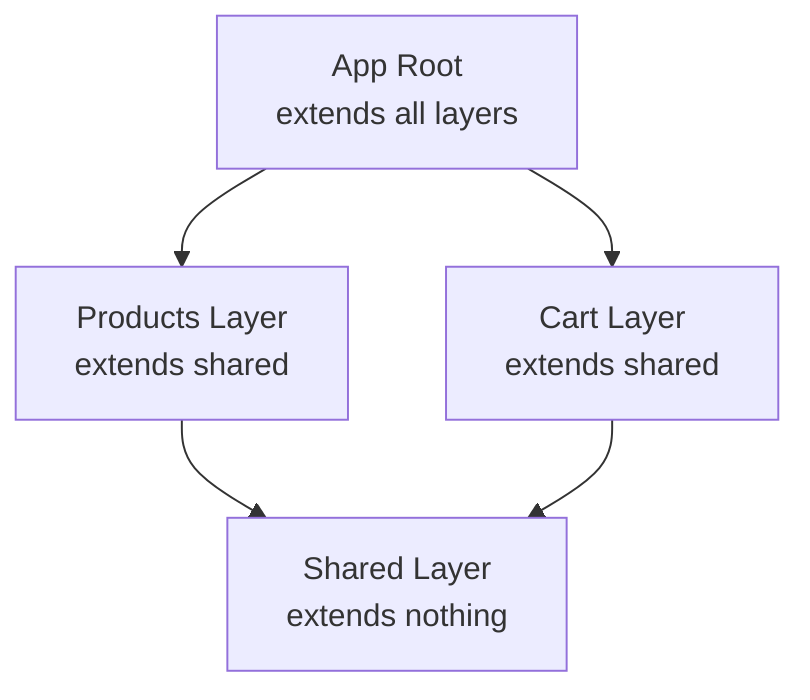

## Building an E-commerce Application with Layers

Let me show you how I structured a real e-commerce application using this pattern. I created three layers, each with a specific purpose:

**Shared Layer**: The foundation. This layer provides UI components (like badges and buttons), utility functions (currency formatting, storage helpers), and nothing else. No business logic lives here.

**Products Layer**: Everything related to browsing and viewing products. Product schemas, the product store, catalog pages, and filter components all live here. Crucially, this layer knows nothing about shopping carts.

**Cart Layer**: Everything related to managing a shopping cart. The cart store, localStorage persistence, and cart UI components. This layer knows nothing about product catalogs.

**Your Project Root**: The orchestrator. This is not a separate layer—it's your main application that extends all the layers. This is where you create pages that combine features from multiple layers (like a product listing page with "add to cart" functionality).

Here's the folder structure:

<FileTree
  tree={[
    {
      name: "layers",
      open: true,
      children: [
        {
          name: "shared",
          comment: "Foundation (no dependencies)",
          open: true,
          children: [
            {
              name: "components",
              open: true,
              children: [
                {
                  name: "base",
                  children: [{ name: "BaseBadge.vue" }],
                },
              ],
            },
            {
              name: "utils",
              children: [{ name: "currency.ts" }, { name: "storage.ts" }],
            },
          ],
        },
        {
          name: "products",
          comment: "Product feature (depends on shared only)",
          open: false,
          children: [
            {
              name: "components",
              children: [
                { name: "ProductCard.vue" },
                { name: "ProductFilters.vue" },
              ],
            },
            {
              name: "stores",
              children: [
                {
                  name: "products",
                  children: [{ name: "useProductsStore.ts" }],
                },
              ],
            },
            {
              name: "schemas",
              children: [{ name: "product.schema.ts" }],
            },
          ],
        },
        {
          name: "cart",
          comment: "Cart feature (depends on shared only)",
          open: false,
          children: [
            {
              name: "components",
              children: [
                { name: "CartSummary.vue" },
                { name: "CartItemCard.vue" },
              ],
            },
            {
              name: "stores",
              children: [
                {
                  name: "cart",
                  children: [{ name: "useCartStore.ts" }],
                },
              ],
            },
          ],
        },
      ],
    },
  ]}
/>

Notice how the products and cart layers never import from each other. They are completely independent features. This is the core principle that makes this pattern work.

## The Difference: Before and After

Let me show you the contrast between a traditional approach and the layered approach.

### Without Layers: Tight Coupling

In a traditional flat structure, your product component might directly import the cart store:

```vue
<script setup lang="ts">
// ❌ Tight coupling in flat architecture
const cart = useCartStore();
const products = useProductsStore();

function addToCart(productId: string) {
  const product = products.getById(productId);
  cart.addItem(product);
}
</script>
```

This creates hidden dependencies. The products feature now depends on the cart feature. You cannot use products without including cart. You cannot understand one without reading the other. Testing becomes harder because everything is coupled.

### With Layers: Clear Boundaries

With layers, the product component has no idea that carts exist:

```vue
<!-- layers/products/components/ProductCard.vue -->
<script setup lang="ts">
const props = defineProps<{
  product: Product;
}>();

const emit = defineEmits<{
  select: [productId: string];
}>();
</script>

<template>
  <UCard>
    <h3>{{ product.name }}</h3>
    <p>{{ product.price }}</p>
    <UButton @click="emit('select', product.id)"> View Details </UButton>
  </UCard>
</template>
```

The product component simply emits an event. The parent page (living in your project root) connects products to cart:

```vue
<!-- pages/index.vue (in your project root) -->
<script setup lang="ts">
const products = useProductsStore();
const cart = useCartStore();

function handleProductSelect(productId: string) {
  const product = products.getById(productId);
  if (product) {
    cart.addItem(product);
  }
}
</script>

<template>
  <div>
    <ProductCard
      v-for="product in products.items"
      :key="product.id"
      :product="product"
      @select="handleProductSelect"
    />
  </div>
</template>
```

Your project root acts as the orchestrator. It knows about both products and cart, but the features themselves stay completely independent.

<Aside type="info" title="Why This Approach Works">
  This pattern follows the dependency inversion principle. High-level modules
  (the app) depend on low-level modules (features), but features don't depend on
  each other. Changes to one feature won't cascade to others.
</Aside>

## How Features Communicate

When a page needs functionality from multiple layers, your project root orchestrates the interaction. I like to think of this pattern as similar to micro frontends with an app shell.

**Feature layers** are independent workers. Each does one job well. They expose simple interfaces (stores, components, composables) but have no knowledge of each other.

**Your project root** is the manager. It knows all the workers. When a task needs multiple workers, your project root coordinates them.

Here's a sequence diagram showing how this works:

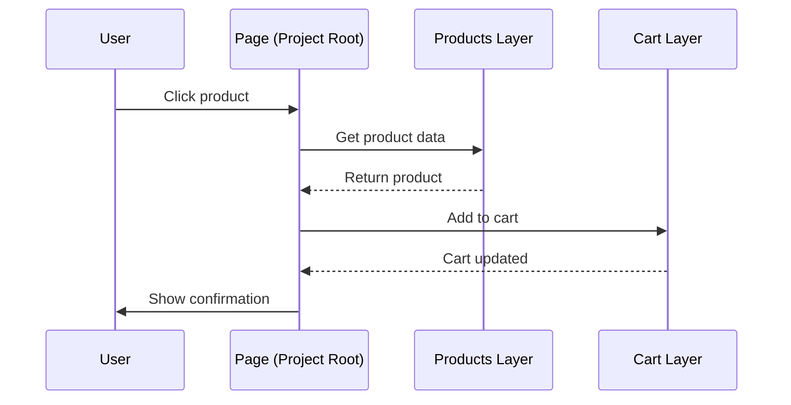

Let me show you a real example from the cart page. It needs to display cart items (from the cart layer) with product details (from the products layer):

```vue
<!-- pages/cart.vue -->
<script setup lang="ts">
const cart = useCartStore();
const products = useProductsStore();

// App layer combines data from both features
const enrichedItems = computed(() => {
  return cart.items.map(cartItem => {
    const product = products.getById(cartItem.productId);
    return {
      ...cartItem,
      productDetails: product,
    };
  });
});
</script>

<template>
  <div>
    <h1>Your Cart</h1>
    <CartItemCard
      v-for="item in enrichedItems"
      :key="item.id"
      :item="item"
      @remove="cart.removeItem"
      @update-quantity="cart.updateQuantity"
    />
  </div>
</template>
```

Your project root queries both stores and combines the data. Neither feature layer knows about the other. This keeps your features loosely coupled and incredibly easy to test in isolation.

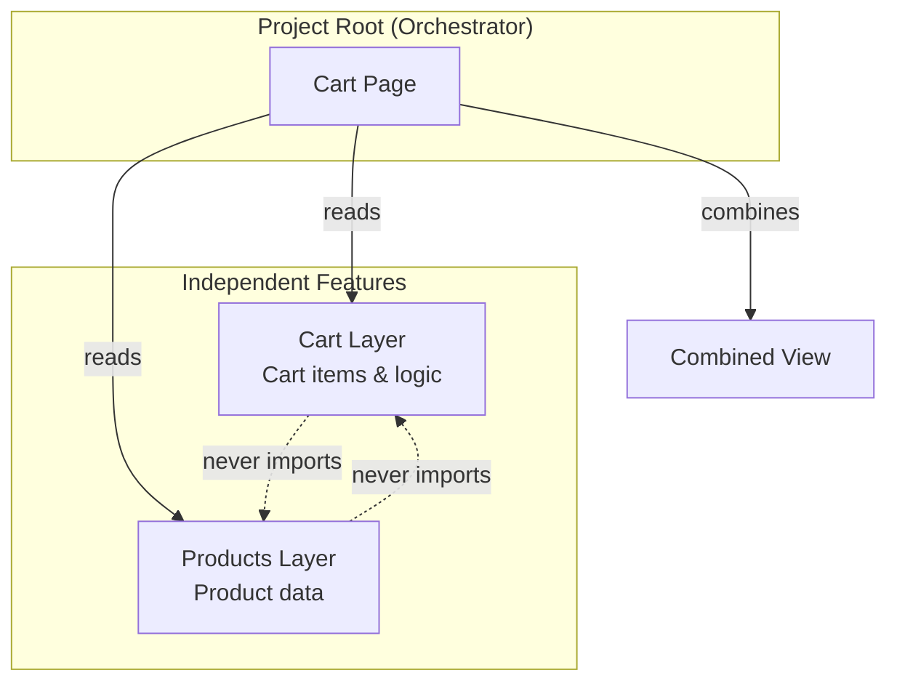

## Enforcing Boundaries with ESLint

Now here's something important I discovered while working with this pattern. Nuxt provides basic boundary enforcement through TypeScript: if you try to import from a layer not in your `extends` array, your build fails. This is good, but it's not enough.

The problem is this: if your main config extends both products and cart, nothing prevents the cart layer from importing from products. Technically both layers are available at runtime. This creates the exact coupling we're trying to avoid.

I needed stricter enforcement. So I built a custom ESLint plugin called `eslint-plugin-nuxt-layers`.

This plugin enforces two critical rules:

1. **No cross-feature imports**: Cart cannot import from products (or vice versa)
2. **No upward imports**: Feature layers cannot import from the app layer

The plugin detects which layer a file belongs to based on its path, then validates all imports against the allowed dependencies.

```javascript
// ❌ This fails linting
// In layers/cart/stores/cart/useCartStore.ts
// Error: cart layer cannot import from products layer

// ✅ This passes linting (in layers/cart/)
// OK: cart layer can import from shared layer

// ✅ This also passes linting (in your project root)
// OK: project root can import from any layer
```

<Aside type="tip" title="Published Package">
I've published this ESLint plugin on npm so you can use it in your own projects. Install it with `pnpm add -D eslint-plugin-nuxt-layers` and get immediate feedback in your editor.

**Package link**: [eslint-plugin-nuxt-layers on npm](https://www.npmjs.com/package/eslint-plugin-nuxt-layers?activeTab=readme)

</Aside>

Here's how the validation logic works:

```mermaid
graph LR
    A[File being linted] --> B{Which layer?}
    B -->|shared| C[Can import: nothing]
    B -->|products| D[Can import: shared only]
    B -->|cart| E[Can import: shared only]
    B -->|project root| F[Can import: all layers]

    D -.->|❌| G[products → cart]
    E -.->|❌| H[cart → products]
```

The ESLint plugin gives you enforcement of your architecture. Your IDE will warn you immediately if you violate boundaries, and your CI/CD pipeline will fail if violations slip through.

## Important Gotchas to Avoid

Working with Nuxt Layers comes with some quirks you should know about. I learned these the hard way, so let me save you the trouble:

<Aside type="caution" title="Layer Priority Order">
Layer order determines override priority: **earlier layers have higher priority and override later ones**. This matters when multiple layers define the same component, page, or config value.

```typescript
// shared overrides products, products overrides cart
extends: ['./layers/shared', './layers/products', './layers/cart']

// cart overrides products, products overrides shared
extends: ['./layers/cart', './layers/products', './layers/shared']
```

For dependency purposes, all extended layers are available to each other at runtime. However, for clean architecture, you should still organize by semantic importance—typically putting shared/base layers first, then feature layers. Use ESLint rules to prevent unwanted cross-layer imports regardless of order.

</Aside>

<Aside type="caution" title="Same-Named Files Overwrite">
If multiple layers have a file at the same path (like `pages/index.vue`), only the first one wins. The later ones are silently ignored. This can cause confusing bugs where pages or components mysteriously disappear.

I recommend using unique names or paths for pages in different layers to avoid this issue entirely.

</Aside>

<Aside type="info" title="Config Changes Need Restart">
  Changes to `nuxt.config.ts` files in layers don't always hot reload properly.
  When you modify layer configuration, restart your dev server. I learned this
  after spending 30 minutes debugging why my changes weren't applying!
</Aside>

**Route paths need full names**: Layer names don't auto-prefix routes. If you have `layers/blog/pages/index.vue`, it creates the `/` route, not `/blog`. You need `layers/blog/pages/blog/index.vue` to get `/blog`.

**Component auto-import prefixing**: By default, nested components get prefixed. A component at `components/form/Input.vue` becomes `<FormInput>`. You can disable this with `pathPrefix: false` in the components config if you prefer explicit names.

## When Should You Use This Pattern?

I want to be honest with you: Nuxt Layers add complexity. They're powerful, but they're not always the right choice. Here's when I recommend using them:

**Your app has distinct features**: If you're building an application with clear feature boundaries (products, cart, blog, admin panel), layers shine. Each feature gets its own layer with its own components, pages, and logic.

**You have multiple developers**: Layers prevent teams from stepping on each other's toes. The cart team works in their layer, the products team works in theirs. No more merge conflicts in a giant shared components folder.

**You want to reuse code**: Building multiple apps that share functionality? Extract common features into layers and publish them as npm packages. Your marketing site and main app can share the same blog layer without code duplication.

**You're thinking long-term**: A small project with 5 components doesn't need layers. But a project that will grow to 50+ features over two years? Layers will save your sanity.

<Aside type="tip" title="Start Simple, Refactor When Needed">
  I don't recommend starting with layers on day one for small projects. Begin
  with a flat structure. When you notice features bleeding into each other and
  boundaries becoming unclear, that's the perfect time to refactor into layers.
  The patterns in this article will guide you through that migration.
</Aside>

## The Benefits You'll Get

After working with this pattern for several months, here are the concrete benefits I've experienced:

| Benefit                                | Description                                                                                                                                                                                                                                                                                                            |
| -------------------------------------- | ---------------------------------------------------------------------------------------------------------------------------------------------------------------------------------------------------------------------------------------------------------------------------------------------------------------------- |
| **Clear boundaries enforced by tools** | Import rules aren't just documentation that developers ignore. Your build fails if someone violates the architecture. This is incredibly powerful for maintaining standards as your team grows.                                                                                                                        |
| **Independent development**            | Team members can work on different features without conflicts. The cart team never touches product code. Changes are isolated and safe.                                                                                                                                                                                |
| **Easy testing**                       | Each layer has minimal dependencies. You can test features in complete isolation without complex mocking setups.                                                                                                                                                                                                       |
| **Gradual extraction**                 | If you need to extract a feature later (maybe to share across projects or even split into a micro frontend), you already have clean boundaries. You could publish a layer as its own npm package with minimal refactoring.                                                                                             |
| **Better code review**                 | When someone adds an import in a pull request, you immediately see if it crosses layer boundaries. Architecture violations become obvious during review.                                                                                                                                                               |
| **Scales with complexity**             | As your app grows, you simply add new layers. Existing layers stay independent and unaffected.                                                                                                                                                                                                                         |
| **Better AI assistant context**        | You can add layer-specific documentation files (like `claude.md`) to each layer with context tailored to that feature. When working with AI coding assistants like Claude or GitHub Copilot, changes to the cart layer will only pull in cart-specific context, making the AI's suggestions more accurate and focused. |
| **Targeted testing**                   | Running tests becomes more efficient. Instead of running your entire test suite, you can run only the tests related to the feature you're working on.                                                                                                                                                                  |

## Getting Started with Your Own Project

If you want to try this pattern, here's how to get started:

### 1. Clone and Explore the Example

Start by exploring the complete example project:

```bash
# 📥 Clone the repository
git clone https://github.com/alexanderop/nuxt-layer-example
cd nuxt-layer-example

# 📦 Install dependencies
pnpm install

# 🚀 Start development server
pnpm dev
```

Browse through the layers to see how everything connects. Try making changes to understand how the boundaries work.

### 2. Create Your Own Layered Project

To start your own project from scratch:

```bash
# 📁 Create layer folders
mkdir -p layers/shared layers/products layers/cart

# 🔧 Add a nuxt.config.ts to each layer
echo "export default defineNuxtConfig({
  \$meta: {
    name: 'shared',
    description: 'Shared UI and utilities'
  }
})" > layers/shared/nuxt.config.ts
```

<Aside type="info" title="Automatic Layer Discovery">
  Nuxt automatically discovers and extends layers in the `layers/` directory.
  You only need to explicitly configure `extends` in your `nuxt.config.ts` if
  you're using external layers (npm packages, git repositories) or if your
  layers are in a different location.
</Aside>

### 3. Add ESLint Enforcement

Install the ESLint plugin:

```bash
# 📦 Install ESLint plugin
pnpm add -D eslint-plugin-nuxt-layers
```

<Aside type="caution" title="Auto-Import Limitation">
  This ESLint plugin only works when auto-imports are disabled. You need to
  explicitly import from layers using `#layers/` aliases for the plugin to
  detect and validate cross-layer imports. If you rely on Nuxt's auto-import
  feature, the plugin won't be able to enforce boundaries.
</Aside>

Configure it in your `eslint.config.mjs` with the `layer-boundaries` rule:

```javascript
export default [
  {
    plugins: {
      "nuxt-layers": nuxtLayers,
    },
    rules: {
      "nuxt-layers/layer-boundaries": [
        "error",
        {
          root: "layers", // 📁 Your layers directory name
          aliases: ["#layers", "@layers"], // 🔗 Path aliases that point to layers
          layers: {
            shared: [], // 🏗️ Cannot import from any layer
            products: ["shared"], // 🛍️ Can only import from shared
            cart: ["shared"], // 🛒 Can only import from shared
            // 🏠 Your project root files can import from all layers (use '*')
          },
        },
      ],
    },
  },
];
```

The plugin will now enforce your architecture boundaries automatically. It detects violations in ES6 imports, dynamic imports, CommonJS requires, and export statements—giving you immediate feedback in your IDE and failing your CI/CD pipeline if boundaries are violated.

## Conclusion

I've been working with modular monoliths for a while now, and I believe this pattern gives you the best of both worlds. You get the clear boundaries and independent development of micro frontends without the operational complexity of deployment, networking, and data consistency.

Nuxt Layers makes this pattern accessible and practical. You get compile-time enforcement of boundaries through TypeScript. You get clear dependency graphs that are easy to visualize and understand. You get a structure that scales from small teams to large organizations without a rewrite.

You can start with layers from day one, or you can refactor gradually as your application grows. Either way, your future self will thank you when your codebase is still maintainable after two years and 50+ features.

I hope this blog post has been insightful and useful. The complete code is available for you to explore, learn from, and build upon. Clone it, break it, experiment with it.

**Full project repository**: https://github.com/alexanderop/nuxt-layer-example

If you have questions or want to share your own experiences with Nuxt Layers, I'd love to hear from you. This pattern has fundamentally changed how I approach application architecture, and I'm excited to see how you use it in your own projects.

---

--- title: How to Handle API Calls in Pinia with The Elm Pattern description: Learn how to handle API calls in Pinia using the Elm pattern for predictable, testable side effects. Includes complete examples with the Pokemon API. tags: ['vue'] url: https://alexop.dev/posts/handling-api-calls-pinia-elm-pattern ---

# How to Handle API Calls in Pinia with The Elm Pattern


<Aside type="info" title="When to Use This Pattern">
If your goal is to cache backend results or manage server state, Pinia is not the right tool.
Libraries such as [pinia-colada](https://pinia-colada.esm.dev/), [TanStack Vue Query](https://tanstack.com/query/vue), or [RStore](https://rstore.dev/) are designed for this purpose.
They provide built-in caching, background refetching, and synchronization features that make them a better fit for working with APIs.

The approach described in this post is useful when you want to stay within Pinia but still keep your logic functional, predictable, and easy to test.
It is best for local logic, explicit message-driven updates, or cases where you need fine control over how side effects are triggered and handled.

</Aside>

<Aside type="tip" title="Related Reading">
  This post builds on the concepts introduced in{" "}
  <InternalLink slug="tea-architecture-pinia-private-store-pattern">
    How to Write Better Pinia Stores with the Elm Pattern
  </InternalLink>
  . If you're new to The Elm Architecture or want to understand the full pattern
  for structuring Pinia stores, start there first. This post focuses
  specifically on handling side effects like API calls.
</Aside>

## Understanding Pure Functions and Side Effects

Before diving into the pattern, it's important to understand the foundational concepts of functional programming that make this approach powerful.

### What Is a Pure Function?

A pure function is a function that satisfies two key properties:

1. **Deterministic**: Given the same inputs, it always returns the same output.
2. **No side effects**: It does not interact with anything outside its scope.

Here's a simple example:

```ts
// Pure function - always predictable
function add(a: number, b: number): number {
  return a + b;
}

add(2, 3); // Always returns 5
add(2, 3); // Always returns 5
```

This function is pure because:

- It only depends on its inputs (`a` and `b`)
- It always produces the same result for the same inputs
- It doesn't modify any external state
- It doesn't perform any I/O operations

### What Is a Side Effect?

A side effect is any operation that interacts with the outside world or modifies state beyond the function's return value.

Common side effects include:

```ts
// Side effect: Network request
function fetchUser(id: number) {
  return fetch(`/api/users/${id}`); // Network I/O
}

// Side effect: Modifying external state
let count = 0;
function increment() {
  count++; // Mutates external variable
}

// Side effect: Writing to storage
function saveUser(user: User) {
  localStorage.setItem("user", JSON.stringify(user)); // I/O operation
}

// Side effect: Logging
function calculate(x: number) {
  console.log("Calculating..."); // I/O operation
  return x * 2;
}
```

None of these are pure functions because they interact with something beyond their inputs and outputs.

### Why Does This Matter?

Pure functions are easier to:

- **Test**: No need to mock APIs, databases, or global state
- **Reason about**: The function's behavior is completely determined by its inputs
- **Debug**: No hidden dependencies or unexpected state changes
- **Reuse**: Work anywhere without environmental setup

However, real applications need side effects. You can't build useful software without API calls, database writes, or user interactions.

The key insight from functional programming is not to eliminate side effects, but to **separate** them from your business logic.

## Why Side Effects Are a Problem

A pure function only depends on its inputs and always returns the same output.
If you include an API call or any asynchronous operation inside it, the function becomes unpredictable and hard to test.

Example:

```ts
export function update(model, msg) {
  if (msg.type === "FETCH_POKEMON") {
    fetch("https://pokeapi.co/api/v2/pokemon/pikachu");
    return { ...model, isLoading: true };
  }
}
```

This mixes logic with side effects.
The function now depends on the network and the API structure, making it complex to test and reason about.

## The Solution: Separate Logic and Effects

The Elm Architecture provides a simple way to handle side effects correctly.

1. Keep the update function pure.
2. Move side effects into separate functions that receive a dispatch function.
3. Use the store as the bridge between both layers.

This separation keeps your business logic independent of the framework and easier to verify.

### File Organization

Before diving into the code, here's how we organize the files for a Pinia store using the Elm pattern:

```
src/
└── stores/
    └── pokemon/
        ├── pokemonModel.ts    # Types and initial state
        ├── pokemonUpdate.ts   # Pure update function
        ├── pokemonEffects.ts  # Side effects (API calls)
        └── pokemon.ts         # Pinia store (connects everything)
```

Each file has a clear, single responsibility:

- **`pokemonModel.ts`**: Defines the state shape and message types
- **`pokemonUpdate.ts`**: Contains pure logic for state transitions
- **`pokemonEffects.ts`**: Handles side effects like API calls
- **`pokemon.ts`**: The Pinia store that wires everything together

This structure makes it easy to:

- Find and modify specific logic
- Test each piece independently
- Reuse the update logic in different contexts
- Add new effects without touching business logic

## Example: Fetching Data from the Pokémon API

This example demonstrates how to handle an API call using this pattern.

### `pokemonModel.ts`

The model defines the structure of the state and the possible messages that can change it.

```ts
export type PokemonModel = {
  isLoading: boolean;
  pokemon: string | null;
  error: string | null;
};

export const initialModel: PokemonModel = {
  isLoading: false,
  pokemon: null,
  error: null,
};

export type PokemonMsg =
  | { type: "FETCH_REQUEST"; name: string }
  | { type: "FETCH_SUCCESS"; pokemon: string }
  | { type: "FETCH_FAILURE"; error: string };
```

### `pokemonUpdate.ts`

The update function handles all state transitions in a pure way.

```ts
export function update(model: PokemonModel, msg: PokemonMsg): PokemonModel {
  switch (msg.type) {
    case "FETCH_REQUEST":
      return { ...model, isLoading: true, error: null };

    case "FETCH_SUCCESS":
      return { ...model, isLoading: false, pokemon: msg.pokemon };

    case "FETCH_FAILURE":
      return { ...model, isLoading: false, error: msg.error };

    default:
      return model;
  }
}
```

This function has no side effects.
It only describes how the state changes in response to a message.

### `pokemonEffects.ts`

This file performs the network request and communicates back through the dispatch function.

```ts
export async function fetchPokemon(
  name: string,
  dispatch: (m: PokemonMsg) => void
) {
  dispatch({ type: "FETCH_REQUEST", name });

  try {
    const res = await fetch(`https://pokeapi.co/api/v2/pokemon/${name}`);
    if (!res.ok) throw new Error("Not found");
    const data = await res.json();

    dispatch({ type: "FETCH_SUCCESS", pokemon: data.name });
  } catch (e: any) {
    dispatch({ type: "FETCH_FAILURE", error: e.message });
  }
}
```

This function does not depend on Pinia or Vue.
It simply performs the side effect and dispatches messages based on the result.

### `pokemon.ts`

The Pinia store connects the pure logic and the side effect layer.

```ts
import {
  initialModel,
  type PokemonModel,
  type PokemonMsg,
} from "./pokemonModel";
export const usePokemonStore = defineStore("pokemon", () => {
  const model = ref<PokemonModel>(initialModel);

  function dispatch(msg: PokemonMsg) {
    model.value = update(model.value, msg);
  }

  async function load(name: string) {
    await fetchPokemon(name, dispatch);
  }

  return {
    state: readonly(model),
    load,
  };
});
```

The store contains no direct logic for handling API responses.
It only coordinates updates and side effects.

### Usage in a Component

```vue
<script setup lang="ts">
const store = usePokemonStore();
const name = ref("pikachu");

function fetchIt() {
  store.load(name.value);
}
</script>

<template>
  <div>
    
    <button @click="fetchIt">Search</button>

    <p v-if="store.state.isLoading">Loading...</p>
    <p v-else-if="store.state.error">Error: {{ store.state.error }}</p>
    <p v-else-if="store.state.pokemon">Found: {{ store.state.pokemon }}</p>
  </div>
</template>
```

The component only interacts with the public API of the store.
It does not mutate the state directly.

## Why This Approach Works

Separating logic and effects provides several benefits.

- The update function is pure and easy to test.
- The side effect functions are independent and reusable.
- The store focuses only on coordination.
- The overall data flow remains predictable and maintainable.

This method is especially effective in projects where you want full control over how and when side effects are executed.

<Aside type="tip" title="Testing Made Simple">
Because the `update` function is pure and framework-agnostic, you can test it with simple assertions without any mocking:

```ts
describe("pokemon update", () => {
  it("sets loading state on fetch request", () => {
    const state = { isLoading: false, pokemon: null, error: null };
    const result = update(state, { type: "FETCH_REQUEST", name: "pikachu" });

    expect(result.isLoading).toBe(true);
    expect(result.error).toBeNull();
  });
});
```

No Pinia setup, no component mounting, just pure function testing.

</Aside>

<Aside type="caution" title="When This Pattern May Be Overkill">
The Elm pattern adds structure and discipline, but it comes with trade-offs:

**Not ideal for simple stores:**
If your store just fetches data and displays it with minimal logic, the traditional Pinia approach is perfectly fine. Creating four separate files for a simple CRUD operation adds unnecessary complexity.

**Requires team buy-in:**
This pattern works best when your entire team embraces functional programming concepts. If your team isn't comfortable with ideas like pure functions, immutability, and message-driven updates, this pattern will feel foreign and may be resisted.

**Where it shines:**

- Complex business logic with multiple state transitions
- Stores that need rock-solid testing
- Applications with sophisticated side effect orchestration (retries, cancellation, queuing)
- Projects where state predictability is critical

**Bottom line:** Start simple. Adopt this pattern when complexity demands it and your team is ready for functional programming principles. Don't use it just because it's clever—use it when it solves real problems.

</Aside>

## Other Side Effects You Can Handle with This Pattern

This pattern is not limited to API requests.
You can manage any kind of asynchronous or external operation the same way.

Examples include:

- Writing to or reading from `localStorage` or `IndexedDB`
- Sending analytics or telemetry events
- Performing authentication or token refresh logic
- Communicating with WebSockets or event streams
- Scheduling background tasks with `setTimeout` or `requestAnimationFrame`
- Reading files or using browser APIs such as the Clipboard or File System

By using the same structure, you can keep these effects organized and testable.
Each effect becomes an independent unit that transforms external data into messages for your update function.

## Summary

If you only need caching or background synchronization, use a specialized library such as [pinia-colada](https://pinia-colada.esm.dev/), [TanStack Vue Query](https://tanstack.com/query/vue), or [RStore](https://rstore.dev/).
If you need to stay within Pinia and still maintain a functional structure, this approach is effective.

1. Define your model and messages.
2. Keep the update function pure.
3. Implement effects as separate functions that take a dispatch function.
4. Connect them inside the store.

This structure keeps your Pinia stores predictable, testable, and easy to extend to any type of side effect.

---

--- title: How to Write Better Pinia Stores with the Elm Pattern description: Learn how to combine The Elm Architecture (TEA) principles with Pinia's private store pattern for testable, framework-agnostic state management in Vue applications. tags: ['vue'] url: https://alexop.dev/posts/tea-architecture-pinia-private-store-pattern ---

# How to Write Better Pinia Stores with the Elm Pattern


## The Problem: Pinia Gives You Freedom, Not Rules

Pinia is a fantastic state management library for Vue, but it doesn't enforce any architectural patterns. It gives you complete freedom to structure your stores however you want. This flexibility is powerful, but it comes with a hidden cost: without discipline, your stores can become unpredictable and hard to test.

The core issue? Pinia stores are inherently mutable and framework-coupled. While this makes them convenient for rapid development, it creates three problems:

```ts
// Traditional Pinia approach - tightly coupled to Vue
export const useTodosStore = defineStore("todos", () => {
  const todos = ref<Todo[]>([]);

  function addTodo(text: string) {
    todos.value.push({ id: Date.now(), text, done: false });
  }

  return { todos, addTodo };
});
```

The problem? Components can bypass your API and directly manipulate state:

```vue
<script setup lang="ts">
const store = useTodosStore();

// Intended way
store.addTodo("Learn Pinia");

// But this also works! Direct state manipulation
store.todos.push({ id: 999, text: "Hack the state", done: false });
</script>
```

This leads to unpredictable state changes, makes testing difficult (requires mocking Pinia's entire runtime), and couples your business logic tightly to Vue's reactivity system.

```mermaid
graph TB
    C1[Component A] -->|"store.addTodo() ✓"| API[Intended API]
    C2[Component B] -->|"store.todos.push() ✗"| State[Direct State Access]
    C3[Component C] -->|"store.todos[0].done = true ✗"| State
    API --> Store[Store State]
    State --> Store
    Store -->|unpredictable changes| Debug[Difficult to Debug]
```

## The Solution: TEA + Private Store Pattern

What if we could keep Pinia's excellent developer experience while adding the predictability and testability of functional patterns? Enter The Elm Architecture (TEA) combined with the "private store" technique from [Mastering Pinia](https://masteringpinia.com/blog/how-to-create-private-state-in-stores) by Eduardo San Martin Morote (creator of Pinia).

This hybrid approach gives you:

- **Pure, testable business logic** that's framework-agnostic
- **Controlled state mutations** through a single dispatch function
- **Seamless Vue integration** with Pinia's reactivity
- **Full devtools support** for debugging

You'll use a private internal store for mutable state, expose only selectors and a dispatch function publicly, and keep your update logic pure and framework-agnostic.

<Aside type="tip" title="When Should You Use This Pattern?">
  This pattern shines when you have complex business logic, need framework
  portability, or want rock-solid testing. For simple CRUD operations with
  minimal logic, traditional Pinia stores are perfectly fine. Ask yourself:
  "Would I benefit from testing this logic in complete isolation?" If yes, this
  pattern is worth it.
</Aside>

<Aside type="info" title="Historical Context">
  The Elm Architecture emerged from the [Elm programming
  language](https://guide.elm-lang.org/architecture/), which pioneered a purely
  functional approach to building web applications. This pattern later inspired
  Redux's architecture in the JavaScript ecosystem, demonstrating the value of
  unidirectional data flow and immutable updates. While Elm enforces these
  patterns through its type system, we can achieve similar benefits in Vue with
  disciplined patterns.
</Aside>

## Understanding The Elm Architecture

Before we dive into the implementation, let's understand the core concepts of TEA:

1. **Model**: The state of your application
2. **Update**: Pure functions that transform state based on messages/actions
3. **View**: Rendering UI based on the current model

```mermaid
graph LR
    M[Model<br/>Current State] -->|renders| V[View<br/>UI Display]
    V -->|user interaction<br/>produces| Msg[Message/Action]
    Msg -->|dispatched to| U[Update Function<br/>Pure Logic]
    U -->|returns new| M

```

The key insight is that update functions are pure—given the same state and action, they always return the same new state. This makes them trivial to test without any framework dependencies.

## How It Works: Combining TEA with Private State

The pattern uses three key pieces: a private internal store for mutable state, pure update functions for business logic, and a public store that exposes only selectors and dispatch.

### The Private Internal Store

First, create a private store that holds the mutable model. This stays in the same file as your public store but is not exported:

```ts
// Inside stores/todos.ts - NOT exported!
const useTodosPrivate = defineStore("todos-private", () => {
  const model = ref<TodosModel>({
    todos: [],
  });

  return { model };
});
```

The key here: no `export` keyword means components can't access this directly.

### Pure Update Function

Next, define your business logic as pure functions:

<Aside type="info" title="What Are Pure Functions?">
  A pure function always returns the same output for the same inputs and has no
  side effects. No API calls, no mutations of external state, no `console.log`.
  Just input → transformation → output. This makes them trivially easy to test
  and reason about: `update(state, action)` always produces the same new state.
</Aside>

```ts
// stores/todos-update.ts
export function update(model: TodosModel, message: TodosMessage): TodosModel {
  switch (message.type) {
    case "ADD_TODO":
      return {
        ...model,
        todos: [
          ...model.todos,
          { id: Date.now(), text: message.text, done: false },
        ],
      };

    case "TOGGLE_TODO":
      return {
        ...model,
        todos: model.todos.map(todo =>
          todo.id === message.id ? { ...todo, done: !todo.done } : todo
        ),
      };

    default:
      return model;
  }
}
```

This update function is completely framework-agnostic. You can test it with simple assertions:

```ts
describe("update", () => {
  it("adds a todo", () => {
    const initial = { todos: [] };
    const result = update(initial, { type: "ADD_TODO", text: "Test" });

    expect(result.todos).toHaveLength(1);
    expect(result.todos[0].text).toBe("Test");
  });
});
```

<Aside type="info" title="Familiar with Redux?">
  If you've used Redux, this pattern will feel familiar—the `update` function is
  like a reducer, and `TodosMessage` is like an action. The key difference?
  We're using Pinia's reactivity instead of Redux's subscription model, and
  we're keeping the private store pattern to prevent direct state access. This
  gives you Redux's testability with Pinia's developer experience.
</Aside>

### Public Store with Selectors + Dispatch

Finally, combine everything in a single file. The private store is defined but not exported:

```ts
// stores/todos.ts (this is what components import)
// Private store - not exported!
const useTodosPrivate = defineStore("todos-private", () => {
  const model = ref<TodosModel>({
    todos: [],
  });

  return { model };
});

// Public store - this is what gets exported
export const useTodosStore = defineStore("todos", () => {
  const privateStore = useTodosPrivate();

  // Selectors
  const todos = computed(() => privateStore.model.todos);

  // Dispatch
  function dispatch(message: TodosMessage) {
    privateStore.model = update(privateStore.model, message);
  }

  return { todos, dispatch };
});
```

```mermaid
graph LR
    Component[Component]
    Component -->|dispatch message| Public[Public Store]
    Public -->|call| Update[Update Function<br/>Pure Logic]
    Update -->|new state| Private[Private Store]
    Private -->|selectors| Public
    Public -->|reactive data| Component
```

<Aside type="caution" title="️Private Store Limitation">
Reddit user [maertensen](https://www.reddit.com/user/maertensen/) helpfully pointed out that the private store pattern only prevents direct mutation of primitives, **not arrays and objects**. Components can still mutate through selectors:

```vue
<script setup lang="ts">
const publicTodosStore = useTodosStore();

function mutateTodosSelector() {
  // This still works and bypasses dispatch! ✗
  publicTodosStore.todos.push({
    id: Date.now(),
    text: "Mutated by selector",
    done: false,
  });
}
</script>
```

This is why I recommend using **`readonly` only** (shown below) instead of the private store pattern.

</Aside>

### Usage in Components

Components interact with the public store:

```vue
<script setup lang="ts">
const store = useTodosStore();
</script>

<template>
  <div>
    <input
      @keyup.enter="
        store.dispatch({ type: 'ADD_TODO', text: $event.target.value })
      "
    />

    <div v-for="todo in store.todos" :key="todo.id">
      <input
        type="checkbox"
        :checked="todo.done"
        @change="store.dispatch({ type: 'TOGGLE_TODO', id: todo.id })"
      />
      {{ todo.text }}
    </div>
  </div>
</template>
```

## Simpler Alternative: Using Vue's readonly

If you want to prevent direct state mutations without creating a private store, Vue's `readonly` utility provides a simpler approach:

```ts
// stores/todos.ts
export const useTodosStore = defineStore("todos", () => {
  const model = ref<TodosModel>({
    todos: [],
  });

  // Dispatch
  function dispatch(message: TodosMessage) {
    model.value = update(model.value, message);
  }

  // Only expose readonly state
  return {
    todos: readonly(model),
    dispatch,
  };
});
```

With `readonly`, any attempt to mutate the state from a component will fail:

```vue
<script setup lang="ts">
const store = useTodosStore();

// ✓ Works - using dispatch
store.dispatch({ type: "ADD_TODO", text: "Learn Vue" });

// ✓ Works - accessing readonly state
const todos = store.model.todos;

// ✗ TypeScript error - readonly prevents mutation
store.model.todos.push({ id: 1, text: "Hack", done: false });
</script>
```

<Aside type="tip" title="Use readonly, Not Private Store">
  **Prefer `readonly` over the private store pattern.** The private store
  pattern has a critical flaw: it doesn't prevent mutation of arrays and objects
  (see warning above). Using `readonly` is simpler, more effective, and truly
  prevents all direct state mutations.
</Aside>

## Benefits of This Approach

1. **Pure business logic**: The `update` function has zero dependencies on Vue or Pinia
2. **Easy testing**: Test your update function with simple unit tests
3. **Framework flexibility**: Could swap Vue for React without changing update logic
4. **Type safety**: TypeScript ensures message types are correct
5. **Devtools support**: Still works with Pinia devtools since we're using real stores
6. **Encapsulation**: Private store is an implementation detail

```mermaid
graph TB
    subgraph T["Traditional Pinia"]
        TC[Component]
        TC -->|direct| TS[State]
        TC -->|actions| TA[Actions]
        TA --> TS
    end

    subgraph P["TEA + Private Store"]
        PC[Component] -->|dispatch| PD[Dispatch]
        PD --> PU[Update]
        PU --> PM[Model]
        PM -->|selectors| PC
    end
```

## Conclusion

By combining The Elm Architecture with Pinia's private store pattern, we achieve:

- Pure, testable business logic
- Clear separation of concerns
- Framework-agnostic state management
- Full Pinia devtools integration
- Type-safe message dispatching

This pattern scales from simple forms to complex domain logic while keeping your code maintainable and your tests simple.

---

_Credit: This post synthesizes ideas from [The Elm Architecture](https://guide.elm-lang.org/architecture/) and Eduardo San Martin Morote's ["private store" pattern](https://masteringpinia.com/blog/how-to-create-private-state-in-stores) from Mastering Pinia._

---

--- title: How to build Microfrontends with Module Federation and Vue description: Build a Vue 3 microfrontend app with Module Federation. Clear decisions, working code, and a small reference project. tags: ['vue', 'microfrontends', 'module-federation', 'architecture'] url: https://alexop.dev/posts/how-to-build-microfrontends-with-module-federation-and-vue ---

# How to build Microfrontends with Module Federation and Vue


<Alert type="tip" title="TL;DR">
  Monorepo with `pnpm`. Vue 3 SPA. Client side composition with Module
  Federation. Host owns routing. Events for navigation. Cart sync through
  localStorage plus events. Shared UI library for consistency. Fallbacks for
  remote failures. Code:
  https://github.com/alexanderop/tractorStoreVueModuleFederation
</Alert>

<Alert type="warning" title="Who should read this">
  You know Vue and basic bundling. You want to split a SPA into independent
  parts without tight coupling. If you do not have multiple teams or deployment
  bottlenecks, you likely do not need microfrontends.
</Alert>

I wanted to write about microfrontends three years ago. My first touchpoint was the book _Micro Frontends in Action_ by Michael Geers. It taught me a lot, and I was still confused. This post shows a practical setup that works today with Vue 3 and Module Federation.

## Scope

We build microfrontends for a Vue 3 SPA with client side composition. Server and universal rendering exist, but they are out of scope here.

> Microfrontends are the technical representation of a business subdomain. They allow independent implementations with minimal shared code and single team ownership.
> (Luca Mezzalira)

## The Tractor Store in one minute

The Tractor Store is a reference shop that lets us compare microfrontend approaches on the same feature set (explore, decide, checkout). It is clear enough to show boundaries and realistic enough to surface routing, shared state, and styling issues.

<YouTube
  id="12TN7Zq7VxM"
  title="The Tractor Store idea"
  caption="If you want to understand the background and the full setup behind the Tractor Store exercise, watch the video of the creator: https://micro-frontends.org/tractor-store/"
/>

<Figure
  src={tractorStoreImage}
  alt="Tractor Store application overview showing the microfrontend architecture with product listings, recommendations, and shopping cart functionality"
  width={800}
  caption="The Tractor Store built with Vue 3 microfrontends and Module Federation"
/>

## Architecture decisions

| Question         | Decision                                                        | Notes                                              |
| ---------------- | --------------------------------------------------------------- | -------------------------------------------------- |
| Repo layout      | Monorepo with `pnpm` workspaces                                 | Shared configs, atomic refactors, simple local dev |
| Composition      | Client side with Module Federation                              | Fast iteration, simple hosting                     |
| Routing          | Host owns routing                                               | One place for guards, links, and errors            |
| Team boundaries  | Explore, Decide, Checkout, plus Host                            | Map to clear user flows                            |
| Communication    | Custom events for navigation. Cart via localStorage plus events | Low coupling and no shared global store            |
| UI consistency   | Shared UI library in `packages/shared`                          | Buttons, inputs, tokens                            |
| Failure handling | Loading and error fallbacks in host. Retry once                 | Keep the shell usable                              |
| Styles           | Team prefixes or Vue scoped styles. Tokens in shared            | Prevent leakage and keep a common look             |

Repository layout:

```
├── apps/
│   ├── host/          (Shell application)
│   ├── explore/       (Product discovery)
│   ├── decide/        (Product detail)
│   └── checkout/      (Cart and checkout)
├── packages/
│   └── shared/        (UI, tokens, utils)
└── pnpm-workspace.yaml
```

Workspace definition:

```yaml
packages:
  - "apps/*"
  - "packages/*"
```

High level view:

```mermaid
graph TD
    subgraph "Monorepo (@tractor)"
        subgraph "apps/"
            Host("host")
            Explore("explore")
            Decide("decide")
            Checkout("checkout")
        end
        subgraph "packages/"
            Shared("shared")
        end
    end

    Host -- Consumes --> Explore
    Host -- Consumes --> Decide
    Host -- Consumes --> Checkout

    Explore -- Uses --> Shared
    Decide -- Uses --> Shared
    Checkout -- Uses --> Shared
    Host -- Uses --> Shared
```

## Implementation

We compose at the client in the host. The host loads remote components at runtime and routes between them.

### Host router

```ts
// apps/host/src/router.ts
export const router = createRouter({
  history: createWebHistory(),
  routes: [
    { path: "/", component: remote("explore/HomePage") },
    {
      path: "/products/:category?",
      component: remote("explore/CategoryPage"),
      props: true,
    },
    {
      path: "/product/:id",
      component: remote("decide/ProductPage"),
      props: true,
    },
    { path: "/checkout/cart", component: remote("checkout/CartPage") },
  ],
});
```

### `remote()` utility

<Alert type="tip" title="Vue async components">
Vue `defineAsyncComponent` wraps any loader in a friendly component. It gives lazy loading, built in states, and retries. This is why it fits microfrontends.

```js
const AsyncComp = defineAsyncComponent({
  loader: () => Promise.resolve(/* component */),
  delay: 200,
  timeout: 3000,
  onError(error, retry, fail, attempts) {
    if (attempts <= 1) retry();
    else fail();
  },
});
```

</Alert>

```ts
// apps/host/src/utils/remote.ts
export function remote(id: string, delay = 150) {
  return defineAsyncComponent({
    loader: async () => {
      const loader = (window as any).getComponent?.(id);
      if (!loader) throw new Error(`Missing loader for ${id}`);
      return await loader();
    },
    delay,
    loadingComponent: {
      render: () => h("div", { class: "mf-loading" }, "Loading..."),
    },
    errorComponent: {
      render: () => h("div", { class: "mf-error" }, "Failed to load."),
    },
    onError(error, retry, fail, attempts) {
      if (attempts <= 1) setTimeout(retry, 200);
      else fail();
    },
  });
}
```

<Alert type="note" title="💡 What is Module Federation?">
  Module Federation enables dynamic loading of JavaScript modules from different
  applications at runtime. Think of it as splitting your app into independently
  deployable pieces that can share code and communicate. You can use **Webpack
  5**, **Rspack**, or **Vite** as bundlers. **Rspack offers the most
  comprehensive Module Federation support** with excellent performance, but for
  this solution I used **Rspack** (for the host) and **Vite** (for one remote)
  to showcase interoperability between different bundlers.
</Alert>

### Module Federation runtime

The host bootstraps Module Federation and exposes a single loader.

```ts
// apps/host/src/mf.ts
import {
  createInstance,
  loadRemote,
} from "@module-federation/enhanced/runtime";

declare global {
  interface Window {
    getComponent: (id: string) => () => Promise<any>;
  }
}

createInstance({
  name: "host",
  remotes: [
    {
      name: "decide",
      entry: "http://localhost:5175/mf-manifest.json",
      alias: "decide",
    },
    {
      name: "explore",
      entry: "http://localhost:3004/mf-manifest.json",
      alias: "explore",
    },
    {
      name: "checkout",
      entry: "http://localhost:3003/mf-manifest.json",
      alias: "checkout",
    },
  ],
  plugins: [
    {
      name: "fallback-plugin",
      errorLoadRemote(args: any) {
        console.warn(`Failed to load remote: ${args.id}`, args.error);
        return {
          default: {
            template: `<div style="padding: 2rem; text-align: center; border: 1px solid #ddd; border-radius: 8px; background: #f9f9f9; margin: 1rem 0;">
              <h3 style="color: #c00; margin-bottom: 1rem;">Remote unavailable</h3>
              <p><strong>Remote:</strong> ${args.id}</p>
              <p>Try again or check the service.</p>
            </div>`,
          },
        };
      },
    },
  ],
});

window.getComponent = (id: string) => {
  return async () => {
    const mod = (await loadRemote(id)) as any;
    return mod.default || mod;
  };
};
```

**Why this setup**

- The host is the single source of truth for remote URLs and versions.
- URLs can change without rebuilding remotes.
- The fallback plugin gives a consistent error experience.

## Communication

We avoid a shared global store. We use two small patterns that keep coupling low.

<Alert type="important" title="Why we do not need Pinia">
A global store looks handy. In microfrontends it creates tight runtime coupling. That kills independent deploys.

What goes wrong:

- Lockstep releases (one store change breaks other teams)
- Hidden contracts (store shape is an API that drifts)
- Boot order traps (who creates the store and plugins)
- Bigger blast radius (a store error can break the whole app)
- Harder tests (cross team mocks and brittle fixtures)

Do this instead:

- Each microfrontend owns its state
- Communicate with explicit custom events
- Use URL and localStorage for simple shared reads
- Share code not state (tokens, UI, pure utils)
- If shared state grows, revisit boundaries rather than centralize it
</Alert>

<Alert type="info" title="💡 Alternative: VueUse EventBus">
  You could use VueUse's `useEventBus` for more Vue-like event communication
  instead of vanilla JavaScript events. It provides a cleaner API with
  TypeScript support and automatic cleanup in component lifecycle. However,
  adding VueUse means another dependency in your microfrontends. The tradeoff is
  developer experience vs. bundle size and dependency management: vanilla
  JavaScript events keep things lightweight and framework-agnostic.
</Alert>

### Navigation through custom events

Remotes dispatch `mf:navigate` with `{ to }`. The host listens and calls `router.push`.

```ts
// apps/host/src/main.ts
window.addEventListener("mf:navigate", (e: Event) => {
  const to = (e as CustomEvent).detail?.to;
  if (to) router.push(to);
});
```

### Cart sync through localStorage plus events

The checkout microfrontend owns cart logic. It listens for `add-to-cart` and `remove-from-cart`. After each change, it writes to localStorage and dispatches `updated-cart`. Any component can listen and re read.

```ts
// apps/checkout/src/stores/cartStore.ts
window.addEventListener("add-to-cart", (ev: Event) => {
  const { sku } = (ev as CustomEvent).detail;
  // update cart array here
  localStorage.setItem("cart", JSON.stringify(cart));
  window.dispatchEvent(new CustomEvent("updated-cart"));
});
```

## Styling

- Design tokens in `packages/shared` (CSS variables).
- Shared UI in `packages/shared/ui` (Button, Input, Card).
- Local isolation with Vue scoped styles or BEM with team prefixes (`e_`, `d_`, `c_`, `h_`).
- Host provides `.mf-loading` and `.mf-error` classes for fallback UI.

Example with BEM plus team prefix:

```css
/* decide */
.d_ProductPage__title {
  font-size: 2rem;
  color: var(--color-primary);
}
.d_ProductPage__title--featured {
  color: var(--color-accent);
}
```

Or Vue scoped styles:

```vue
<template>
  <div class="product-information">
    <h1 class="title">{{ product.name }}</h1>
  </div>
</template>

<style scoped>
.product-information {
  padding: 1rem;
}
.title {
  font-size: 2rem;
}
</style>
```

## Operations

Plan for failure and keep the shell alive.

- Each remote shows a clear loading state and a clear error state.
- Navigation works even if a remote fails.
- Logs are visible in the host during development.

Global styles in the host help here:

```css
/* apps/host/src/styles.css */
.mf-loading {
  display: flex;
  align-items: center;
  justify-content: center;
  padding: 2rem;
  color: var(--color-text-muted);
}

.mf-error {
  padding: 1rem;
  background: var(--color-error-background);
  border: 1px solid var(--color-error-border);
  color: var(--color-error-text);
  border-radius: 4px;
}
```

## More Module Federation features (short hints)

Our solution is simple on purpose. Module Federation can do more. Use these when your app needs them.

**Prefetch** (requires registering lazyLoadComponentPlugin)  
Pre load JS, CSS, and data for a remote before the user clicks (for example on hover). This cuts wait time.

```js
// after registering lazyLoadComponentPlugin on the runtime instance
const mf = getInstance();
function onHover() {
  mf.prefetch({
    id: "shop/Button",
    dataFetchParams: { productId: "12345" },
    preloadComponentResource: true, // also fetch JS and CSS
  });
}
```

**Component level data fetching**  
Expose a `.data` loader next to a component. The consumer can ask the runtime to fetch data before render (works in CSR and SSR). Use a `.data.client.ts` file for client loaders when SSR falls back.

**Caching for loaders**  
Wrap expensive loaders in a cache helper (with maxAge, revalidate, tag, and custom keys). You get stale while revalidate behavior and tag based invalidation.

```js
// inside your DataLoader file
const fetchDashboard = cache(async () => getStats(), {
  maxAge: 120000,
  revalidate: 60000,
});
```

**Type hinting for remotes**  
`@module-federation/enhanced` can generate types for exposes. Add this to tsconfig.json so editors resolve remote types and hot reload them.

```json
{
  "compilerOptions": { "paths": { "*": ["./@mf-types/*"] } },
  "include": ["./@mf-types/*"]
}
```

**Vue bridge for app level modules**  
Mount a whole remote Vue app into a route when you need an application level integration (not just a component).

```js
const RemoteApp = createRemoteAppComponent({
  loader: () => loadRemote("remote1/export-app"),
});
// router: { path: '/remote1/:pathMatch(.*)*', component: RemoteApp }
```

You can read more about these interesting techniques at [module-federation.io](https://module-federation.io/).

### Summary

This was my first attempt to understand **microfrontends** better while solving the _Tractor Store_ exercise.

In the future, I may also try it with **SSR** and **universal rendering**, which I find interesting.

Another option could be to use **Nuxt Layers** and take a _“microfrontend-ish”_ approach at build time.

---

--- title: Why You Need Something Hard in Your Life description: The biggest paradox in life: the hardest things are usually the ones that help you grow. Exploring why challenge and difficulty are essential for meaning and personal development. tags: ['personal-development', 'productivity', 'motivation'] url: https://alexop.dev/posts/why-you-need-something-hard-in-your-life ---

# Why You Need Something Hard in Your Life


The biggest paradox in life is simple: the hardest things are usually the ones that help you grow. They force you out of your comfort zone. They make you stronger.

One reason so many people in my generation are depressed is that they do not have a hard thing that is worth aiming for. They live on autopilot. Work 9 to 5. Watch Netflix. Go to a party on the weekend. And then repeat.

Sometimes life gives you that hard thing automatically. Having a kid, for example, is brutally hard but also meaningful. But what if you do not have that? What do you do now?

That is why so many millennials run marathons. A marathon is something hard. It gives you structure, meaning, and a clear goal. It demands you change your habits. It tells you who you are when things get tough.

For me, I am happiest when I have a goal in front of me. Something hard. Not impossible, but not easy either. If it is too easy, I get bored. If it is too hard, I give up. But the sweet spot, where I have to fight for it, that is where life feels good. I am reading Flow right now by the Hungarian psychologist Mihály Csíkszentmihályi, and he explains exactly this. Real happiness does not come from comfort. It comes from challenge. From stretching yourself just enough that you lose track of time and become fully absorbed in the thing you are doing. That is where meaning lives.

One of my favorite sports anime, Blue Lock, explains the concept of flow perfectly in [this video](https://www.youtube.com/watch?v=KTHqbv2M0aA). It shows how athletes enter a state where everything else disappears and they become completely absorbed in the challenge at hand. This is flow in action.

The times when I was unhappy were always the times when I had no goal. I was just living. Eating badly. Drinking too much. Slowly sinking into a life I did not want.

So here is my takeaway:

Find something hard.

Stick with it.

Let it shape you.

Because without it, life gets empty fast.

---

--- title: What Is the Model Context Protocol (MCP)? How It Works description: Learn how MCP (Model Context Protocol) standardizes AI tool integration, enabling LLMs to interact with external services, databases, and APIs through a universal protocol similar to USB-C for AI applications. tags: ['mcp', 'typescript', 'ai'] url: https://alexop.dev/posts/what-is-model-context-protocol-mcp ---

# What Is the Model Context Protocol (MCP)? How It Works


I did not see how powerful MCP was until I used Claude Code with the Playwright MCP.
**Playwright MCP lets an AI use a real browser.** It can open a page, click buttons, fill forms, and take screenshots.
I asked Claude to audit my site for SEO. It ran checks in a real browser, gave me the results, and sent screenshots. You can read more about <InternalLink slug="how-i-use-claude-code-for-doing-seo-audits">how I use Claude Code for doing SEO audits</InternalLink>.
**That was when I saw it.** This was not just text prediction. This was an AI that can see and work with the web like a human tester.

## What is MCP

MCP means Model Context Protocol.
Before we define it, let us see how we got here.

## How it started

```mermaid
flowchart TD
    U[User] --> A[LLM]
    A --> U
```

In 2022 ChatGPT made AI open to everyone.
You typed a question. It predicted the next tokens and sent back text.
You could ask for your favorite author or create code.

## The problem with plain LLMs

A plain LLM is a text generator.

- It has no live data
- It cannot read your files
- It struggles with math
- It cannot tell you who won yesterday in football

You can read more in my post about <InternalLink slug="how-chatgpt-works-for-dummies">LLM limits</InternalLink>.

## The first fix: tools

```mermaid {scale: '0.5'}
flowchart TD
    U[User] --> A[LLM]
    A --> D{Needs Python?}
    D -->|Yes| P[Run code in Python sandbox]
    P --> O[Execution result]
    O --> A
    D -->|No| A
    A --> U
```

When OpenAI added a Python sandbox, LLMs could run code and give exact results.

## More tools mean more power

```mermaid {scale: '0.5'}
flowchart TD
    U[User] --> A[LLM]
    A --> D{Needs external tool?}

    D -->|Python| P[Run code in Python sandbox]
    P --> O[Execution result]
    O --> A

    D -->|Web search| W[Search the web for information]
    W --> R[Search result]
    R --> A

    D -->|No| A
    A --> U
```

Web search gave live knowledge. Now the model could answer fresh questions.

## Even more tools

```mermaid {scale: '0.5'}
flowchart TD
    U[User] --> A[LLM]
    A --> D{Needs external tool?}

    D -->|Python| P[Run code in Python sandbox]
    P --> O[Execution result]
    O --> A

    D -->|Web search| W[Search the web for information]
    W --> R[Search result]
    R --> A

    D -->|Google Calendar| G[Check / update calendar events]
    G --> E[Calendar data]
    E --> A

    D -->|No| A
    A --> U
```

Anthropic added more tools to Claude like Google Calendar and email.
You can ask it what meetings you have next week and it tells you.

<CaptionedImage
  src={scalingProblemComic}
  alt="Comic showing multiple teams reinventing the wheel by building the same API connectors"
  caption="If every team builds their own tool for connecting to email, calendar, and other APIs, everyone reinvents the wheel"
/>

## The solution: a protocol

We need a standard.
One tool for Google Calendar that any agent can use.
In November the Model Context Protocol was released.

## Definition

**MCP** is an open protocol that lets apps give context to LLMs in a standard way.

Think of **USB-C**. You plug in power, a display, or storage and it just works.

MCP does the same for AI with data sources and tools.

With MCP you can build agents and workflows without custom glue code.

<CaptionedImage
  src={robotMcpComic}
  alt="Robot MCP Comic showing how MCP connects different tools and services"
  caption="MCP acts as the universal connector for AI tools and services"
/>

---

## How MCP Works (mental model)

At its core, MCP has **three roles**:

- **Host** → LLM applications that initiate connections
- **Client** → Connectors within the host application
- **Server** → Services that provide context and capabilities

<Alert type="note">
  MCP takes some inspiration from the Language Server Protocol, which
  standardizes how to add support for programming languages across a whole
  ecosystem of development tools. In a similar way, MCP standardizes how to
  integrate additional context and tools into the ecosystem of AI applications.
</Alert>

The host embeds clients, and those clients connect to one or more servers.
Your VS Code could have a Playwright MCP server for browser automation and another MCP server for your docs — all running at the same time.

```mermaid
flowchart LR
  U((User))
  U --> H[Host UI<br>Claude Desktop, VS Code/Claude Code]
  H --> C1[MCP Client 1]
  H --> C2[MCP Client 2]
  H --> C3[MCP Client 3]
  C1 --> S1[MCP Server A]
  C2 --> S2[MCP Server B]
  C3 --> S3[MCP Server C]
```

---

## How MCP Connects: Transports

MCP uses **JSON-RPC 2.0** for all messages and supports two main transport mechanisms:

<GridCards
  cards={[
    {
      title: "stdio (local)",
      icon: "📍",
      items: [
        "Server runs as subprocess of the client",
        "Messages flow through stdin/stdout pipes",
        "No network latency - instant communication",
        "Perfect for local tools and dev environments",
      ],
    },
    {
      title: "Streamable HTTP (remote)",
      icon: "🌐",
      items: [
        "Single HTTP endpoint for all operations",
        "POST for sending messages, GET for listening",
        "Server-Sent Events (SSE) for streaming",
        "Ideal for cloud-hosted MCP servers",
      ],
    },
  ]}
/>

**Key points:**

- Messages are UTF-8 encoded JSON-RPC
- stdio uses newline-delimited JSON (one message per line)
- HTTP supports session management via `Mcp-Session-Id` headers
- Both transports handle requests, responses, and notifications equally well

The transport choice depends on your use case: stdio for local tools with minimal latency, HTTP for remote services that multiple clients can connect to.

## What servers can expose

An MCP server can offer any combination of three capabilities:

### Tools: Functions the AI can call

- Give AI ability to execute actions (check weather, query databases, solve math)
- Each tool describes what it does and what info it needs
- AI sends parameters → server runs function → returns results

```typescript
// Simple calculator tool example
server.registerTool(
  "calculate",
  {
    title: "Calculator",
    description: "Perform mathematical calculations",
    inputSchema: {
      operation: z.enum(["add", "subtract", "multiply", "divide"]),
      a: z.number(),
      b: z.number(),
    },
  },
  async ({ operation, a, b }) => {
    let result;
    switch (operation) {
      case "add":
        result = a + b;
        break;
      case "subtract":
        result = a - b;
        break;
      case "multiply":
        result = a * b;
        break;
      case "divide":
        result = b !== 0 ? a / b : "Error: Division by zero";
        break;
    }

    return {
      content: [
        {
          type: "text",
          text: `${a} ${operation} ${b} = ${result}`,
        },
      ],
    };
  }
);
```

### Resources: Context and data

- AI can read files, docs, database schemas
- Provides context before answering questions or using tools
- Supports change notifications when files update

```typescript
server.registerResource(
  "app-config",
  "config://application",
  {
    title: "Application Configuration",
    description: "Current app settings and environment",
    mimeType: "application/json",
  },
  async uri => ({
    contents: [
      {
        uri: uri.href,
        text: JSON.stringify(
          {
            environment: process.env.NODE_ENV,
            version: "1.0.0",
            features: {
              darkMode: true,
              analytics: false,
              beta: process.env.BETA === "true",
            },
          },
          null,
          2
        ),
      },
    ],
  })
);
```

### Prompts: Templates for interaction

- Pre-made templates for common tasks (code review, data analysis)
- Exposed as slash commands or UI elements
- Makes repetitive workflows quick and consistent

````typescript
server.registerPrompt(
  "code-review",
  {
    title: "Code Review",
    description: "Review code for quality and best practices",
    argsSchema: {
      language: z.enum(["javascript", "typescript", "python", "go"]),
      code: z.string(),
      focus: z
        .enum(["security", "performance", "readability", "all"])
        .default("all"),
    },
  },
  ({ language, code, focus }) => ({
    messages: [
      {
        role: "user",
        content: {
          type: "text",
          text: [
            `Please review this ${language} code focusing on ${focus}:`,
            "",
            "```" + language,
            code,
            "```",
            "",
            "Provide feedback on:",
            focus === "all"
              ? "- Security issues\n- Performance optimizations\n- Code readability\n- Best practices"
              : focus === "security"
                ? "- Potential security vulnerabilities\n- Input validation\n- Authentication/authorization issues"
                : focus === "performance"
                  ? "- Time complexity\n- Memory usage\n- Potential optimizations"
                  : "- Variable naming\n- Code structure\n- Comments and documentation",
          ].join("\n"),
        },
      },
    ],
  })
);
````

## What a Client can expose

An MCP client can provide capabilities that let servers interact with the world beyond their sandbox:

### Roots: Filesystem boundaries

- Client tells server which directories it can access
- Creates secure sandbox (e.g., only your project folder)
- Prevents access to system files or other projects

### Sampling: Nested LLM calls

- Servers can request AI completions through the client
- No API keys needed on server side
- Enables autonomous, agentic behaviors

### Elicitation: Asking users for input

- Servers request missing info from users via client UI
- Client handles forms and validation
- Users can accept, decline, or cancel requests

## Example: How we can use MCPS in Vscode

Your `mcp.json` could look like this:

```json
{
  "servers": {
    "playwright": {
      "gallery": true,
      "command": "npx",
      "args": ["@playwright/mcp@latest"],
      "type": "stdio"
    },
    "deepwiki": {
      "type": "http",
      "url": "https://mcp.deepwiki.com/sse",
      "gallery": true
    }
  }
}
```

- **playwright** → Runs `npx @playwright/mcp@latest` locally over stdio for low-latency browser automation
- **deepwiki** → Connects over HTTP/SSE to `https://mcp.deepwiki.com/sse` for live docs and codebase search
- **gallery: true** → Makes them visible in tool pickers

## What MCP is not

- **Not a hosted service** — It is a protocol
- **Not a replacement** for your app logic
- **Not a magic fix** for every hallucination — It gives access to real tools and data
- You still need good prompts and good UX

---

## Simple example of your first MCP Server

```ts
#!/usr/bin/env node
const server = new McpServer({
  name: "echo-onefile",
  version: "1.0.0",
});

server.tool(
  "echo",
  "Echo back the provided text",
  {
    text: z
      .string()
      .min(1, "Text cannot be empty")
      .describe("Text to echo back"),
  },
  async ({ text }) => ({
    content: [{ type: "text", text }],
  })
);

const transport = new StdioServerTransport();

server
  .connect(transport)
  .then(() => console.error("Echo MCP server listening on stdio"))
  .catch(err => {
    console.error(err);
    process.exit(1);
  });
```

This example uses the official [MCP SDK for TypeScript](https://modelcontextprotocol.io/docs/sdk), which provides type-safe abstractions for building MCP servers.

The server exposes a single tool called "echo" that takes text input and returns it back. We're using [Zod](https://zod.dev/) for runtime schema validation, ensuring the input matches our expected structure with proper type safety and clear error messages.

## Simple MCP Client Example

Here's how to connect to an MCP server and use its capabilities:

```typescript
// Create a client that connects to your MCP server
async function connectToServer() {
  // Create transport - this runs your server as a subprocess
  const transport = new StdioClientTransport({
    command: "node",
    args: ["./echo-server.js"],
  });

  // Create and connect the client
  const client = new Client({
    name: "my-mcp-client",
    version: "1.0.0",
  });

  await client.connect(transport);

  return client;
}

// Use the server's capabilities
async function useServer() {
  const client = await connectToServer();

  // List available tools
  const tools = await client.listTools();
  console.log("Available tools:", tools);

  // Call a tool
  const result = await client.callTool({
    name: "echo",
    arguments: {
      text: "Hello from MCP client!",
    },
  });

  console.log("Tool result:", result.content);

  // List and read resources
  const resources = await client.listResources();
  for (const resource of resources) {
    const content = await client.readResource({
      uri: resource.uri,
    });
    console.log(`Resource ${resource.name}:`, content);
  }

  // Get and execute a prompt
  const prompts = await client.listPrompts();
  if (prompts.length > 0) {
    const prompt = await client.getPrompt({
      name: prompts[0].name,
      arguments: {
        code: "console.log('test')",
        language: "javascript",
      },
    });
    console.log("Prompt messages:", prompt.messages);
  }

  // Clean up
  await client.close();
}

// Run the client
useServer().catch(console.error);
```

This client example shows how to:

- Connect to an MCP server using stdio transport
- List and call tools with arguments
- Read resources from the server
- Get and use prompt templates
- Properly close the connection when done

## Use it with Vscode

```json
{
  "servers": {
    "echo": {
      "gallery": true,
      "type": "stdio",
      "command": "node",
      "args": ["--import", "tsx", "/absolute/path/echo-server.ts"]
    }
  }
}
```

## Summary

This was just my starter post for MCP to give an overview. I will write more blog posts that will go in depth about the different topics.

<Alert type="note">
  If you need a TypeScript starter template for your next MCP server, you can
  use my
  [mcp-server-starter-ts](https://github.com/alexanderop/mcp-server-starter-ts)
  repository to get up and running quickly.
</Alert>

---

--- title: How VueUse Solves SSR Window Errors in Vue Applications description: Discover how VueUse solves SSR issues with browser APIs and keeps your Vue composables safe from 'window is not defined' errors. tags: ['vue'] url: https://alexop.dev/posts/how-vueuse-solves-ssr-window-errors-vue-applications ---

# How VueUse Solves SSR Window Errors in Vue Applications


I am a big fan of [VueUse](https://vueuse.org). Every time I browse the docs I discover a new utility that saves me hours of work. Yet VueUse does more than offer nice functions. It also keeps your code safe when you mix client-side JavaScript with server-side rendering (SSR). In this post I show the typical **"`window` is not defined"** problem, explain why it happens, and walk through the simple tricks VueUse uses to avoid it.

## The Usual Pain: `window` Fails on the Server

When you run a Vue app with SSR, Vue executes in **two** places:

1. **Server (Node.js)** – It renders HTML so the user sees a fast first screen.
2. **Browser (JavaScript runtime in the user's tab)** – It takes over and adds interactivity.

The server uses **Node.js**, which has **no browser objects** like `window`, `document`, or `navigator`. The browser has them. If code that needs `window` runs on the server, Node.js throws an error and the page render breaks.

### Diagram: How SSR Works

```mermaid
sequenceDiagram
    participant B as Browser
    participant S as Server (Node.js)
    B->>S: Request page
    S-->>S: Run Vue code<br/>(no window)
    S-->>B: Send HTML
    B-->>B: Hydrate app<br/>(has window)
    Note over S,B: If Vue code touches <br/>"window" on the server, SSR crashes
```

## Node.js vs Browser: Two Different Worlds

| Feature     | Node.js on the server | Browser in the tab |
| ----------- | --------------------- | ------------------ |
| `window`    | ❌ not defined        | ✅ defined         |
| `document`  | ❌                    | ✅                 |
| `navigator` | ❌                    | ✅                 |
| DOM access  | ❌                    | ✅                 |
| Goal        | Render HTML fast      | Add interactivity  |

A Vue _composable_ that reads the mouse position or listens to scroll events needs those browser objects. It must **not** run while the server renders.

## How VueUse Solves the Problem

VueUse uses three small patterns: a **client check**, **safe defaults**, and an **SSR guard** inside each composable.

### 1. One-Line Client Check

VueUse first asks, "Are we in the browser?" It does that in [`is.ts`](https://github.com/vueuse/vueuse/blob/main/packages/shared/utils/is.ts):

```ts
export const isClient =
  typeof window !== "undefined" && typeof document !== "undefined";
```

#### Diagram

```mermaid
flowchart TD
  Start --> Test{window exists?}
  Test -- yes --> Client[isClient = true]
  Test -- no --> Server[isClient = false]
```

### 2. Safe Defaults for Browser Objects

Instead of making _you_ write `if (isClient)` checks, VueUse exports harmless fallbacks from [`_configurable.ts`](https://github.com/vueuse/vueuse/blob/main/packages/core/_configurable.ts):

```ts
export const defaultWindow = isClient ? window : undefined;
export const defaultDocument = isClient ? window.document : undefined;
export const defaultNavigator = isClient ? window.navigator : undefined;
```

On the server these constants are `undefined`. That value is safe to read, so nothing crashes.

#### Diagram

```mermaid
flowchart TD
  Check[isClient?] -->|true| Real[Return real window]
  Check -->|false| Undef[Return undefined]
  Real --> Compose[Composable receives safe value]
  Undef --> Compose
```

### 3. The SSR Guard Inside Every Composable

Each composable that might touch the DOM adds a simple guard. Example: [`onElementRemoval`](https://github.com/vueuse/vueuse/blob/main/packages/core/onElementRemoval/index.ts):

```ts
export function onElementRemoval(options: any = {}) {
  const { window = defaultWindow } = options;

  if (!window)
    // server path
    return () => {}; // no-op

  // browser logic goes here
}
```

If `window` is `undefined`, the function returns a no-op and exits. The server render keeps going without errors.

#### Diagram

```mermaid
flowchart TD
  Run[Composable starts] --> IsWin{defaultWindow ?}
  IsWin -- no --> Noop[Return empty function]
  IsWin -- yes --> Logic[Run browser code]
```

### 4. Extra Safety with `useSupported`

Sometimes you **are** in the browser, but the user's browser lacks a feature. VueUse offers [`useSupported`](https://github.com/vueuse/vueuse/blob/main/packages/core/useSupported/index.ts) to check that:

```ts
export function useSupported(test: () => unknown) {
  const isMounted = useMounted();
  return computed(() => {
    isMounted.value; // make it reactive
    return Boolean(test());
  });
}
```

#### Example: `useEyeDropper`

`useEyeDropper` checks both SSR and feature support (see the full file [here](https://github.com/vueuse/vueuse/blob/main/packages/core/useEyeDropper/index.ts)):

```ts
export function useEyeDropper() {
  const isSupported = useSupported(
    () => typeof window !== "undefined" && "EyeDropper" in window
  );

  async function open() {
    if (!isSupported.value) return; // safe exit
    const eyeDropper = new (window as any).EyeDropper();
    await eyeDropper.open();
  }

  return { isSupported, open };
}
```

## Wrap-Up

- **Node.js** renders HTML but lacks browser globals.
- **VueUse** avoids crashes with three steps:
  1. A single **`isClient`** flag tells where the code runs.
  2. **Safe defaults** turn `window`, `document`, and `navigator` into `undefined` on the server.
  3. Every composable adds a quick **SSR guard** that eliminates environment concerns.

Because of this design you can import any VueUse composable, even ones that touch the DOM, and trust it to work in SSR without extra code.

### Learn More

- VueUse guidelines that inspired these patterns: [https://vueuse.org/guidelines](https://vueuse.org/guidelines)
- Full VueUse repository: [https://github.com/vueuse/vueuse](https://github.com/vueuse/vueuse)

---

--- title: Mastering GraphQL Fragments in Vue 3: Component-Driven Data Fetching description: Part 3 of the Vue 3 + GraphQL series: Learn how to use GraphQL fragments with fragment masking to create truly component-driven data fetching in Vue 3. tags: ['graphql', 'vue', 'typescript'] url: https://alexop.dev/posts/mastering-graphql-fragments-vue3-component-driven-data-fetching ---

# Mastering GraphQL Fragments in Vue 3: Component-Driven Data Fetching


```mermaid
graph TD
    A["❌ Traditional Approach"] --> A1["Monolithic Queries"]
    A1 --> A2["Over-fetching"]
    A1 --> A3["Tight Coupling"]
    A1 --> A4["Implicit Dependencies"]

    B["✅ Fragment Masking"] --> B1["Component-Owned Data"]
    B1 --> B2["Type Safety"]
    B1 --> B3["Data Encapsulation"]
    B1 --> B4["Safe Refactoring"]
```

## Why Fragments Are a Game-Changer

In Part 2, we achieved type safety with GraphQL Code Generator. But our queries are still monolithic—each component doesn't declare its own data needs. This creates several problems:

- **Over-fetching**: Parent components request data their children might not need
- **Under-fetching**: Adding a field means hunting down every query using that type
- **Tight coupling**: Components depend on their parents to provide the right data
- **Implicit dependencies**: Parent components can accidentally rely on data from child fragments
- **Brittle refactoring**: Changing a component's data needs can break unrelated components

Enter GraphQL fragments with **fragment masking**—the pattern that Relay popularized and that Apollo Client 3.12 has made even more powerful. This transforms how we think about data fetching by providing **true data encapsulation** at the component level.

## What Are GraphQL Fragments?

GraphQL fragments are **reusable units of fields** that components can declare for themselves. But they're more than just field groupings—when combined with fragment masking, they provide **data access control**.

```graphql
fragment CountryBasicInfo on Country {
  code
  name
  emoji
  capital
}
```

**Fragment masking** is the key innovation that makes fragments truly powerful. It ensures that:

1. **Data is encapsulated**: Only the component that defines a fragment can access its fields
2. **Dependencies are explicit**: Components can't accidentally rely on data from other fragments
3. **Refactoring is safe**: Changing a fragment won't break unrelated components
4. **Type safety is enforced**: TypeScript prevents accessing fields you didn't request

## Understanding Fragments Through the Spread Operator

If you're familiar with JavaScript's spread operator, fragments work exactly the same way:

```javascript
// JavaScript objects
const basicInfo = { code: "US", name: "United States" };
const fullCountry = { ...basicInfo, capital: "Washington D.C." };
```

```graphql
# GraphQL fragments
fragment CountryBasicInfo on Country {
  code
  name
}

query GetCountryDetails {
  country(code: "US") {
    ...CountryBasicInfo # Spread fragment fields
    capital # Add extra fields
  }
}
```

**Fragment masking** takes this further by ensuring components can only access the data they explicitly request—pioneered by **Relay** and now enhanced in **Apollo Client 3.12**.

## Step 1: Enable Fragment Masking

Ensure your `codegen.ts` uses the client preset (from Part 2):

```typescript
const config: CodegenConfig = {
  overwrite: true,
  schema: "https://countries.trevorblades.com/graphql",
  documents: ["src/**/*.vue", "src/**/*.graphql"],
  generates: {
    "src/gql/": {
      preset: "client",
      plugins: [],
      config: { useTypeImports: true },
    },
  },
};
```

This generates:

- `FragmentType<T>`: Masked fragment types for props
- `useFragment()`: Function to unmask fragment data
- Type safety to prevent accessing non-fragment fields

## Step 2: Your First Fragment with Masking

Let's create a `CountryCard` component that declares its own data requirements:

```vue
<script setup lang="ts">
// Define what data this component needs
const CountryCard_CountryFragment = graphql(`
  fragment CountryCard_CountryFragment on Country {
    code
    name
    emoji
    capital
    phone
    currency
  }
`);

// Props accept a masked fragment type
interface Props {
  country: FragmentType<typeof CountryCard_CountryFragment>;
}

const props = defineProps<Props>();

// Unmask to access the actual data (reactive for Vue)
const country = computed(() =>
  useFragment(CountryCard_CountryFragment, props.country)
);
</script>

<template>
  <div class="country-card">
    <h3>{{ country.emoji }} {{ country.name }}</h3>
    <p>Capital: {{ country.capital }}</p>
    <p>Phone: +{{ country.phone }}</p>
    <p>Currency: {{ country.currency }}</p>
  </div>
</template>
```

## Understanding Fragment Masking: The Key to Data Isolation

**Fragment masking** is the core concept that makes this pattern so powerful. It's not just about code organization—it's about **data access control and encapsulation**.

### What Fragment Masking Actually Does

Think of fragment masking like **access control in programming languages**. Just as a module can have private and public methods, fragment masking controls which components can access which pieces of data.

```typescript
// Without fragment masking (traditional approach)
const result = useQuery(GET_COUNTRIES);
const countries = result.value?.countries || [];

// ❌ Parent can access ANY field from the query
console.log(countries[0].name); // Works
console.log(countries[0].capital); // Works
console.log(countries[0].currency); // Works
```

With fragment masking enabled:

```typescript
// ✅ Parent component CANNOT access fragment fields
const name = result.value?.countries[0].name; // TypeScript error!

// ✅ Only CountryCard can access its fragment data
const country = useFragment(CountryCard_CountryFragment, props.country);
console.log(country.name); // Works!
```

### The Power of Data Encapsulation

Fragment masking provides **true data encapsulation**:

1. **Prevents Implicit Dependencies**: Parent components can't accidentally rely on data their children need
2. **Catches Breaking Changes Early**: If a child component removes a field, the parent can't access it anymore
3. **Enforces Component Boundaries**: Each component owns its data requirements
4. **Enables Safe Refactoring**: Change a fragment without breaking unrelated components

### Why This Matters

Without fragment masking, parent components can accidentally depend on child fragment data. When the child removes a field, the parent breaks at runtime. With fragment masking, TypeScript catches this at compile time.

```typescript
// Parent can only access explicitly requested fields
countries[0].id; // ✅ Works (parent requested this)
countries[0].name; // ❌ TypeScript error (only in fragment)

// Child components unmask their fragment data
const country = useFragment(CountryCard_CountryFragment, props.country);
country.name; // ✅ Works (component owns this fragment)
```

> **📝 Vue Reactivity Note**: Always wrap `useFragment` in a `computed()` for Vue reactivity. This ensures the component updates when fragment data changes.

## Step 3: Parent Component Uses the Fragment

Now the parent component includes the child's fragment in its query:

```vue
<script setup lang="ts">
const COUNTRIES_WITH_DETAILS_QUERY = graphql(`
  query CountriesWithDetails {
    countries {
      code
      # Parent can add its own fields
      region
      # Child component's fragment
      ...CountryCard_CountryFragment
    }
  }
`);

const { result, loading, error } = useQuery(COUNTRIES_WITH_DETAILS_QUERY);

// Parent can access its own fields
const countriesByRegion = computed(() => {
  if (!result.value?.countries) return {};

  return result.value.countries.reduce(
    (acc, country) => {
      const region = country.region;
      if (!acc[region]) acc[region] = [];
      acc[region].push(country);
      return acc;
    },
    {} as Record<string, typeof result.value.countries>
  );
});

// But parent CANNOT access fragment fields:
// const name = result.value?.countries[0].name ❌ TypeScript error!
</script>

<template>
  <div class="countries-container">
    <div v-if="loading">Loading countries...</div>
    <div v-else-if="error">Error: {{ error.message }}</div>
    <div v-else class="countries-by-region">
      <div
        v-for="(countries, region) in countriesByRegion"
        :key="region"
        class="region-section"
      >
        <h2>{{ region }}</h2>
        <div class="country-grid">
          <CountryCard
            v-for="country in countries"
            :key="country.code"
            :country="country"
          />
        </div>
      </div>
    </div>
  </div>
</template>
```

## The Magic of Fragment Masking

Here's what just happened:

```mermaid
graph TB
    subgraph "GraphQL Query Result"
        QR["countries: Country[]"]
    end

    subgraph "Parent Component"
        PC["Parent can access:<br/>• countries[].code<br/>• countries[].region<br/>❌ countries[].name"]
    end

    subgraph "Child Component"
        CC["CountryCard receives:<br/>Masked Fragment Data"]
        UF["useFragment() unmasks:<br/>• code<br/>• name<br/>• emoji<br/>• capital"]
    end

    QR --> PC
    QR --> CC
    CC --> UF
```

The parent component **cannot access** fields from `CountryCard_Fragment`—they're masked! Only `CountryCard` can unmask and use that data.

## Step 4: Nested Fragments

Fragments can include other fragments, creating a hierarchy:

```graphql
# Basic fragment
fragment LanguageItem_LanguageFragment on Language {
  code
  name
  native
}

# Fragment that uses other fragments
fragment CountryWithLanguages_CountryFragment on Country {
  code
  name
  emoji
  languages {
    ...LanguageItem_LanguageFragment
  }
}
```

Child components use their own fragments:

```vue
<!-- LanguageItem.vue -->
<script setup lang="ts">
const LanguageItem_LanguageFragment = graphql(`
  fragment LanguageItem_LanguageFragment on Language {
    code
    name
    native
  }
`);

interface Props {
  language: FragmentType<typeof LanguageItem_LanguageFragment>;
}

const props = defineProps<Props>();
const language = computed(() =>
  useFragment(LanguageItem_LanguageFragment, props.language)
);
</script>

<template>
  <div class="language-item">
    <span>{{ language.name }} ({{ language.code }})</span>
  </div>
</template>
```

## Fragment Dependency Management

Notice how the query automatically includes all nested fragments:

```mermaid
graph LR
    subgraph "Components"
        A[CountryDetailPage]
        B[CountryWithLanguages.vue]
        C[LanguageItem.vue]
    end

    subgraph "Their Fragments"
        A1[Page Fields:<br/>code]
        B1[Country Fragment:<br/>code, name, emoji<br/>languages]
        C1[Language Fragment:<br/>code, name, native]
    end

    A -.-> A1
    B -.-> B1
    C -.-> C1
```

## Step 5: Conditional Fragments

Use GraphQL directives to conditionally include fragments:

```graphql
query CountriesConditional($includeLanguages: Boolean!) {
  countries {
    code
    name
    ...CountryDetails_CountryFragment @include(if: $includeLanguages)
  }
}
```

This enables dynamic data loading based on user interactions or application state.

## Best Practices

### Key Guidelines

1. **Naming**: Use `ComponentName_TypeNameFragment` convention
2. **Vue Reactivity**: Always wrap `useFragment` in `computed()`
3. **TypeScript**: Use `FragmentType<typeof MyFragment>` for props
4. **Organization**: Colocate fragments with components

```typescript
// ✅ Good naming and Vue reactivity
const CountryCard_CountryFragment = graphql(`...`);

interface Props {
  country: FragmentType<typeof CountryCard_CountryFragment>;
}

const country = computed(() =>
  useFragment(CountryCard_CountryFragment, props.country)
);
```

## Performance Benefits

Fragments aren't just about developer experience - they provide concrete performance and maintainability benefits:

```mermaid
graph TD
    A["❌ Multiple Queries"] --> A1["3 Network Requests"]
    A1 --> A2["Duplicate Data Fetching"]
    A2 --> A3["Larger Bundle Size"]

    B["✅ Fragment Composition"] --> B1["Single Network Request"]
    B1 --> B2["Optimized Payload"]
    B2 --> B3["Better Performance"]
```

## Summary

GraphQL fragments with fragment masking enable **component-driven data fetching** in Vue 3:

✅ **Type Safety**: Components can only access their declared fields
✅ **True Modularity**: Each component declares its exact data needs  
✅ **Better Performance**: Load only the data you need
✅ **Maintainable Code**: Changes to fragments don't break unrelated components

## Migration Checklist

1. Start with leaf components (no children)
2. Always use `computed()` with `useFragment` for Vue reactivity
3. Update TypeScript interfaces to use `FragmentType`
4. Run `npm run codegen` after fragment changes

## What's Next?

This is Part 3 of our Vue 3 + GraphQL series:

1. **Part 1**: Setting up Apollo Client with Vue 3
2. **Part 2**: Type-safe queries with GraphQL Code Generator
3. **Part 3**: Advanced fragments and component-driven data fetching (current)
4. **Part 4**: GraphQL Caching Strategies in Vue 3 (coming next!)

## Other Fragment Use Cases

Beyond component-driven data fetching, fragments offer additional powerful patterns:

- **Fragments on Unions and Interfaces**: Handle polymorphic types with inline fragments (`... on Type`)
- **Batch Operations**: Share field selections between queries, mutations, and subscriptions
- **Schema Documentation**: Use fragments as living documentation of data shapes
- **Testing**: Create fragment mocks for isolated component testing
- **Fragment Composition**: Build complex queries from simple, reusable pieces

For more advanced fragment patterns, see the [Vue Apollo Fragments documentation](https://apollo.vuejs.org/guide-composable/fragments).

## Source Code

Find the full demo for this series here: [example](https://github.com/alexanderop/vue-graphql-simple-example)

**Note:** The code for this tutorial is on the `part3` branch.

```bash
git clone https://github.com/alexanderop/vue-graphql-simple-example.git
cd vue-graphql-simple-example
git checkout part3
```

---

--- title: How I Use Claude Code for Doing SEO Audits description: Learn how to leverage Claude Code with Puppeteer MCP to perform comprehensive SEO audits in minutes, complete with automated analysis and actionable reports. tags: ['ai', 'seo'] url: https://alexop.dev/posts/how-i-use-claude-code-for-doing-seo-audits ---

# How I Use Claude Code for Doing SEO Audits


I'm building a Nuxt blog starter called [NuxtPapier](https://github.com/alexanderop/NuxtPapier). Like any developer who wants their project to show up in search results, I needed to make sure it works well with search engines. Manual SEO audits take too much time and I often miss things, so I used Claude Code with Puppeteer MCP to do this automatically.

## What is Claude Code?

Claude Code is Anthropic's official command-line tool that brings AI help right into your coding workflow. Think of it like having a skilled developer sitting next to you, ready to help with any coding task. What makes it really powerful for SEO audits is that it can use MCP (Model Context Protocol) tools.

## Enter Puppeteer MCP

> **What is MCP?**  
> According to [Anthropic's official documentation](https://www.anthropic.com/news/model-context-protocol), the Model Context Protocol (MCP) is "an open standard that enables developers to build secure, two-way connections between their data sources and AI-powered tools." It provides a universal interface for connecting AI systems with external tools, systems, and data sources, replacing fragmented integrations with a single protocol.

MCP lets Claude Code connect with outside tools and services. I was using the [Puppeteer MCP server](https://github.com/merajmehrabi/puppeteer-mcp-server) which gives Claude Code the power to:

- Control a real web browser with code
- Go to any website
- Take screenshots
- Pull data from web pages
- Check page structure and speed

This means Claude Code can visit your website, look at it the same way search engines do, and give you detailed insights.

```mermaid
---
title: Claude Code SEO Audit Workflow
---
graph LR
    A[Claude Code CLI] --> B[Puppeteer MCP]
    B --> C[Real Browser Instance]
    C --> D[Your Website]
    D --> E[Extract Data]
    E --> F[SEO Analysis]
    F --> G[Comprehensive Report]
```

## My SEO Audit Prompt

Here's the exact prompt I used:

```
You are a SEO expert your name is John Wick. I gave you so much money now you have to do a SEO audit for this blog. When you are done write down everything into a own markdown file so I can solve the problems later. Use Puppeteer MCP, the server is already running.
```

Simple and direct. It uses Claude Code's ability to act like an expert while using the Puppeteer tools.

Claude Code quickly responded with:

> "I'll do a complete SEO audit for your blog, Senpai Alex. Let me start by making a plan and then checking your site using Puppeteer."

## The Automated Process

One of the coolest things is how Claude Code organizes itself by making todos. It quickly made its own plan:

**Claude Code's Self-Generated Todo List:**

- [ ] Navigate to the homepage and take screenshots
- [ ] Analyze meta tags and SEO elements
- [ ] Check blog post pages for optimization
- [ ] Evaluate page structure and heading hierarchy
- [ ] Analyze site performance and loading times
- [ ] Check mobile responsiveness
- [ ] Review robots.txt and sitemap availability
- [ ] Document all findings in a markdown report

What amazed me was how Claude Code worked through each todo step by step, using Puppeteer to get real data from my site - checking meta tags, measuring how fast pages load, checking structured data, and even taking mobile screenshots. It checked off each item as it finished them.

While working, Claude Code told me what it found:

> "I found a big SEO problem - the robots meta tag says 'noindex, nofollow' which stops search engines from finding your site. This is a major issue."

```mermaid
---
title: Automated SEO Analysis Process
---
sequenceDiagram
    participant CC as Claude Code
    participant P as Puppeteer
    participant B as Browser
    participant W as Website

    CC->>CC: Generate Todo List
    CC->>P: Initialize browser session
    P->>B: Launch browser

    loop For each SEO check
        CC->>P: Navigate to page
        P->>B: Go to URL
        B->>W: Load page
        W->>B: Return content
        B->>P: Extract data
        P->>CC: Return analysis data
        CC->>CC: ✓ Mark todo complete
    end

    CC->>CC: Generate final report
```

## The Report

Claude Code created a detailed SEO audit report that I could actually use. It included:

**Critical Issues:**

- My site had `noindex, nofollow` meta tags (development setting blocking all search engines!)
- robots.txt was blocking all crawlers
- Duplicate H1 tags on blog posts

**Positive Findings:**

- Proper structured data implementation
- Good mobile responsiveness
- Fast page load times (200ms)
- Clean URL structure

**What to Fix:**

- Quick fixes with code examples
- Short-term improvements ranked by importance
- Long-term improvement plans

The report even told me exactly which files to change and what code to fix.

Claude Code wrapped up with:

> "The audit found big blocking problems - search engines can't see your site because of noindex, nofollow meta tags and development robots.txt settings. But the good news is your blog has great technical basics with proper structured data, mobile-friendly design, and fast loading."

```mermaid
---
title: SEO Audit Report Structure
---
mindmap
  root((SEO Audit Report))
    Critical Issues
      noindex/nofollow tags
      Blocked robots.txt
      Duplicate H1 tags
    Positive Findings
      Structured data ✓
      Mobile responsive ✓
      Fast load times ✓
      Clean URLs ✓
    Recommendations
      Immediate fixes
        Code examples
        File locations
      Short-term improvements
        Priority ranking
      Long-term strategies
        Enhancement roadmap
```

## Why This Workflow Works So Well

1. **Speed**: Claude Code finished in minutes what would take me hours to do by hand
2. **Complete**: Claude Code checked things I might have missed
3. **Useful Results**: Not just problems, but solutions with code examples
4. **Documentation**: Everything saved in a markdown file I can use later

## Getting Started

To copy this workflow:

1. Install Claude Code: `npm install -g @anthropic/claude-code`
2. Set up the [Puppeteer MCP server](https://github.com/merajmehrabi/puppeteer-mcp-server)
3. Start your development server
4. Give Claude Code a clear prompt about what you want checked

Claude Code's smarts plus Puppeteer's browser control makes a powerful SEO audit tool that any developer can use. No more guessing about SEO problems - just run the audit and get a professional report in minutes.

Try it on your own projects and see what SEO problems you might be missing!

---

--- title: The Age of the Generalist description: How AI is transforming software development and why high-agency generalists will thrive in this new era of technology. tags: ['ai'] url: https://alexop.dev/posts/the-age-of-the-generalist ---

# The Age of the Generalist


AI this, AI that. Like many of you, I'm constantly switching between _"Wow, you can do that with AI?"_ and _"Ugh, not AI again."_

But here we are. AI is changing how we work and how we live.
I’m a millennial. The last major disruption technology brought to my life was social media (and then the iPhone).

Now there is a new wave coming. It will slowly change everything.

And yes, it is AI.

How does AI change the work of software developers?

Short answer: we will all become more like generalists.

This shift is already happening. Most teams no longer separate frontend and backend. They hire full-stack developers. This helps teams move faster. Traditional separation creates communication overhead and slows execution.

So we are already becoming generalists.

If you join a startup as a dev, you will not find neat job titles. There is no budget for that. You wear whatever hat the day requires.

Now add AI to the mix.

Tasks that took hours , writing code, setting up tooling , can now be done in minutes. You can delegate to AI, generate boilerplate, spin up components, scaffold tests. You can work in parallel. You will probably spend more time reading code than writing it.

But AI has no understanding of architecture. It does not know what good design looks like. It cannot distinguish between cohesion and coupling. It does not know when to break something into modules or when to leave it flat. It has no initiative. It only works when a human prompts it.

That is why **high agency** is more important than ever.

AI does not replace builders. It replaces waiters.
If you wait to be told what to do, you will fall behind.
If you take action, ask questions, and push things forward, you will stay ahead.

High agency means seeing a mess and deciding what to clean up. It means figuring out what matters without someone else making the roadmap.
AI can give you answers, but it will never tell you what is worth building.

So what should developers focus on?

Become a generalist with high agency.

Think of Leonardo da Vinci. He painted _The Last Supper_ and _Mona Lisa_. He dissected human bodies and sketched the nervous system. He designed flying machines. He wrote about optics, engineering, and warfare.
He did not pick a lane. He learned widely and built from what he learned.

That mindset , curious, self-directed, and hands-on , is what will matter most in the age of AI.

---

--- title: How I Use LLMs description: Learn how I use LLMs to improve my productivity and efficiency. tags: ['ai', 'productivity'] url: https://alexop.dev/posts/how-i-use-llms ---

# How I Use LLMs


Motivated by the awesome YouTube video from Andrew Karpathy [How I use LLMs](https://www.youtube.com/watch?v=EWvNQjAaOHw), I decided to give two talks on how I use LLMs, both at my company and at the TypeScript meetup in Munich.

This blog post is the written version of those talks.

Keep in mind that while some things might change, especially regarding the models I currently use, I hope these tips will remain helpful for a long time.

<Figure
  src={cover}
  alt="Cover"
  width={600}
  class="mx-auto"
  caption="Dev doing many things"
/>

As a junior developer, you might think your job is all about coding. However, as you gain experience, you realize that's not entirely true. We developers spend a significant amount of time learning new things or explaining concepts to others. That's why, when it comes to using LLMs, we shouldn't focus solely on code generation.

We should also consider how to:

- **Research faster**
- **Document better**
- **Learn more effectively**

Most of my tips won't be about how to use Cursor AI or Copilot better. I think that would be worth its own blog post or a short video.

## Which model should I choose

<Figure
  src={which}
  alt="Which model should I choose"
  width={800}
  class="mx-auto"
  caption="Which model should I choose"
/>

It's annoying that we even have to think about which model to use for which task. I would guess that in the future (Cursor AI is already doing this), there will be a model as a kind of router in the middle that understands which prompt relates to which model.

But for now, this isn't the case, so here's my guideline. In the picture, you see that I came up with four categories:

1. **Everyday tasks** (like fixing spelling, writing something better)
2. **Quick Refactoring** (like adding console logs to debug something, small refactorings)
3. **Technical Tasks** (like doing research)
4. **Complex Tasks** (tasks that definitely need long reasoning and thinking)

It's important for me, since I don't have an unlimited amount of o3, for example, to try to use o4-mini-high if I think I don't need long reasoning for something.

As I said, these models will change daily, but I think the categories will remain.

So most of the time, I ask myself if I need a model that requires reasoning or not.

## o3 is a mini agent

What's also clear is that new models like o3 are mini agents. This means they're not only predicting the next token but also have tools. With these tools, they can gain better context or perform operations with Python.

This is why Simon Willison's blog post explains how he used o3 to guess his location. As his title says: Watching o3 guess a photo's location is surreal, dystopian, and wildly entertaining, but it also shows how powerful this can be. Read his blog post [here](https://simonwillison.net/2025/Apr/26/o3-photo-locations/).

I also wrote a blog post once where I gave o3 a hard chess puzzle to solve. Feel free to read it [here](../how-03-model-tries-chess-puzzle).

## Some tips on how to get more out of Copilot and co

My first tip is to index your codebase, either with a local index or remote. With this, Cursor or Copilot can perform better searches.

It all falls back to automatic retrieval. Keep in mind that an LLM doesn't know where your files are located. So it always has to search against your codebase.

One technique besides keyword search that can help is dense vector or embedding search. You can read the docs on how to implement that.

Another tip: when you have a project that's indexed, you can use Copilot's ask mode and use @workspace. Now you can ask business questions or even solve simple tickets in one shot (if there are well-written tickets). For more information on how to index your repositories for Copilot Chat, refer to the [GitHub Copilot documentation](https://docs.github.com/en/copilot/using-github-copilot/copilot-chat/indexing-repositories-for-copilot-chat).

My last tip, where I use Gemini 2.0 Flash or GPT-4.1, is to do little refactorings or code changes quickly. I quickly mark the related lines and then use a prompt to make the changes.

## How can we improve the output of an LLM

<Figure
  src={improveLlm}
  alt="How can we improve the output of an LLM"
  width={800}
  class="mx-auto"
  caption="How can we improve the output of an LLM"
/>

In the book ["AI Engineering"](https://www.oreilly.com/library/view/ai-engineering/9781098166298/) by Chip Huyen, she explains that there are three main ways to improve the output of an LLM:

1. **With Prompts**
2. **Per RAG**
3. **With fine-tuning**

Of course, all three ways will increase in effort and maybe ROI, but it's clear that better prompts are always the first step to improving the output of an LLM.

## The almighty System Prompt

The idea of a System Prompt is simple but genius. We change the default behavior of an LLM and customize it to our needs.

<Figure
  src={systemPrompt}
  alt="The almighty System Prompt"
  width={800}
  class="mx-auto"
  caption="The almighty System Prompt"
/>

In the picture, you see an example of a system prompt that I use to write blog posts.

In the picture, you see an example of a system prompt that can be used to write Jira tickets. At work, I have something like that and use it together with Copilot. My goal is to quickly write what needs to be done, and the LLM handles the rest. It also asks questions when something is not clear.

You can use that for many problems, and also keep in mind that every LLM provider, like OpenAI or Claude, has their own system prompt. One use case, for example, is to explain which tools an LLM has available, etc. At [GitHub](https://github.com/jujumilk3/leaked-system-prompts), you can read some of the leaked system prompts.

This is why this is a good structure to think about when you write system prompts:

1. **Role Definition**
2. **Step-by-Step Instructions**
3. **Output Format**
4. **Edge Cases**
5. **Style Guidelines**

When you tell the LLM which role it has, it will already use words and tokens that are useful for this role in its next prediction.

Clear steps can help for a more complex workflow so the LLM knows when it's done, etc.

For something like a Jira ticket, we should also add a concrete output format with an example.

In my experience, edge cases are something that you will add over time. We need to play with the LLM and see what vibe we get from it.

Style guidelines are useful. For example, I love easy words and active voice.

You can also ask the LLM how a system prompt should look for the problem you want to solve and use that as your version 1. This approach can provide a solid starting point for further refinement.

## Googling is dead

Don't get me wrong, I think Google is winning the AI arms race. As noted in [The Algorithmic Bridge](https://www.thealgorithmicbridge.com/p/google-is-winning-on-every-ai-front), Google is excelling on every AI front. But the classical googling, where we typed a query and the first five results had an ad and it was hard to find an organic result, is over.

<Figure
  src={goggelingISDead}
  alt="Googling is dead"
  width={500}
  class="mx-auto"
  caption="Googling is dead"
/>

Most of the time, I use a reasoning model with a web search tool. This helps me as a starter to find related blog posts, etc., for my problem. I only use Google when I know the site I want to reach or I know which blog post I want to read.

## Get all tokens out of a repo

If you change GitHub to Uithub for any repo, you will get all text in a way that you can just copy-paste it into a model with a high context, like Google Gemini.

This can be useful to either ask questions against the codebase or to learn how it works or to rebuild something similar without needing to increase the depth of your node modules.

<Figure
  src={bruceExtractCodebase}
  alt="Get all tokens out of a repo"
  width={800}
  class="mx-auto"
  caption="Get all tokens out of a repo"
/>

## Generate a Wiki out of any repo

When you go to https://deepwiki.org/, you can generate a wiki out of any repo. Useful for understanding other repos or even for your own little side projects. What I like is that the LLMs generate mermaid diagrams, and sometimes they are really useful.

## Generate diagrams

I think there are now three ways to generate good diagrams with an LLM:

1. **As SVG**
2. **As Mermaid**
3. **Or as a picture with the new model**

I already wrote about how to use ChatGPT to generate mermaid diagrams. Read it [here](../how-to-use-ai-for-effective-diagram-creation-a-guide-to-chatgpt-and-mermaid).

## Rules Rules Rules

We human developers need rules, and the same is true for LLMs to write better code. This is why both Copilot and Cursor have their own rule system. For detailed information on how to set up and use rules in Cursor, check out the [official Cursor documentation on rules](https://docs.cursor.com/context/rules).

One idea when you have a monorepo could be something like this:

```plaintext
my-app/
├── .cursor/
│   └── rules/
│       └── project-guidelines.mdc       # General code style, naming, formatting
├── frontend/
│   ├── .cursor/
│   │   └── rules/
│   │       ├── vue-components.mdc       # Naming + structure for components
│   │       └── tailwind-usage.mdc       # Utility-first CSS rules
│   └── src/
│       └── ...
├── backend/
│   ├── .cursor/
│   │   └── rules/
│   │       ├── api-structure.mdc        # REST/GraphQL structure conventions
│   │       └── service-patterns.mdc     # How to organize business logic
│   └── src/
│       └── ...
├── shared/
│   ├── .cursor/
│   │   └── rules/
│   │       └── shared-types.mdc         # How to define + use shared TypeScript types
│   └── src/
│       └── ...
├── README.md
└── package.json
```

One rule could then look like this:

```mdc
---
description: Base project guidelines and conventions
globs:
  - "**/*.ts"
  - "**/*.vue"
alwaysApply: false
---

- **Use `PascalCase` for component names.**
- **Use `camelCase` for variables, functions, and file names (except components).**
- **Prefer composition API (`setup()`) over options API.**
- **Type everything. Avoid `any` unless absolutely necessary.**
- **Keep files under 150 LOC. Split logic into composables or utilities.**
- **Use absolute imports from `@/` instead of relative paths.**
- **Every module must have tests that reflect the feature's acceptance criteria.**
- **Commit messages must follow Conventional Commits format.**
- **Use TODO: and FIXME: comments with your initials (e.g., `// TODO: refactor`).**
- **Format code with Prettier. Lint with ESLint before committing.**

Referenced files:
@.eslintrc.js
@.prettierrc
@tsconfig.json
```

This is an example for Cursor. The idea is to give a more fine-grained context. In our example, maybe it would even be better to only have a .vue and separate .ts rule.

In Agent mode, Cursor will then automatically apply this rule as context.

## Write better image prompts

One technique that I think can be useful is to describe which image you want and then say, "give me that back as a Midjourney prompt." This has the advantage that the description of the image is nicely formatted.

## When should you use an LLM directly

An interesting question that I got from the TypeScript meetup was when I would directly vibe code and just tell Cursor to implement feature X and when not.

In my experience, it all depends on the topic and how much training data is available for that.

For example, last week I was using Nuxt together with NuxtUI, a good UI library for Nuxt, but the problem was that the LLM doesn't understand how the components are structured, etc. So in that case, it would be better if I were the main driver and not the LLM.

So always ask yourself if there is enough training data out there for your problem. Was it already solved in the past?

Sometimes you will waste time by just blindly doing vibe coding.

## Summary

There are many ways we developers can use LLMs to be more productive and also have more fun. I believe most of us don't want to spend too much time writing tickets. This is where LLMs can help us. I believe it's important to be open and try out these tools.

If you want to get better with these tools, also try to understand the fundamentals. I wrote a blog post explaining [how ChatGPT works](../how-chatgpt-works-for-dummies) that might help you understand what's happening under the hood.

---

--- title: No Server, No Database: Smarter Related Posts in Astro with `transformers.js` description: How I used Hugging Face embeddings to create smart “Related Posts” for my Astro blog—no backend, no database, just TypeScript. tags: ['ai', 'astro', 'typescript'] url: https://alexop.dev/posts/semantic-related-posts-astro-transformersjs ---

# No Server, No Database: Smarter Related Posts in Astro with `transformers.js`


I recently read a interesting blog post about Embeddings at [Embeddings in Technical Writing](https://technicalwriting.dev/ml/embeddings/overview.html):

> “I could tell you exactly how to advance technical writing with embeddings, but where’s the fun in that?”

Challenge accepted!
In this post, I show how I used **Hugging Face’s `transformers.js`** to create smarter related-post suggestions for my Astro blog, without servers or databases.

## Why Embeddings Are Better Than Tags

Tags group posts by labels, but not by meaning. Posts about Vue 3 and deep reactivity concepts get mixed up together.
Embeddings capture the meaning of text using numeric vectors. Two posts become related when their content is similar, not just when tags match.

### Vectors and Cosine Similarity

Words like “cat” and “kitty” are close in meaning, while “dog” is slightly different:

| word  | vector     |
| ----- | ---------- |
| cat   | `[0, 1]`   |
| kitty | `[0, 0.9]` |
| dog   | `[1, -1]`  |

Cosine similarity measures how similar these vectors are.
For a deeper dive into TypeScript and vectors, check out my post on [How to Implement a Cosine Similarity Function in TypeScript for Vector Comparison](../how-to-implement-a-cosine-similarity-function-in-typescript-for-vector-comparison/).

## Transformers.js in Action

`transformers.js` lets you run Hugging Face models directly in JavaScript:

```ts
const model = "sentence-transformers/all-MiniLM-L6-v2";
const extractor = await pipeline("feature-extraction", model);

const embedding = await extractor("Hello, world!", {
  pooling: "mean",
  normalize: true,
});

console.log(embedding); // Float32Array with 384 dimensions
```

You don't need Python or a server. Everything runs in your browser or Node.js.

## My Simple Workflow

Here's how my workflow works:

1. Load markdown files (`.md` or `.mdx`) from my blog.
2. Remove markdown formatting to get plain text.
3. Use `transformers.js` to create embeddings.
4. Calculate cosine similarity between all posts.
5. Find the top 5 most related posts for each post.
6. Save the results in a JSON file (`similarities.json`).
7. Display these related posts with Astro.

### Main Script (TypeScript)

```ts
// --------- Configurations ---------
const GLOB = "src/content/**/*.{md,mdx}"; // Where to find Markdown content
const OUT = "src/assets/similarities.json"; // Output file for results
const TOP_N = 5; // Number of similar docs to keep
const MODEL = "Snowflake/snowflake-arctic-embed-m-v2.0"; // Embedding model

// --------- Type Definitions ---------
interface Frontmatter {
  slug: string;
  [k: string]: unknown;
}
interface Document {
  path: string;
  content: string;
  frontmatter: Frontmatter;
}
interface SimilarityResult extends Frontmatter {
  path: string;
  similarity: number;
}

// --------- Utils ---------

/**
 * Normalizes a vector to unit length (L2 norm == 1)
 * This makes cosine similarity a simple dot product!
 */
function normalize(vec: Float32Array): Float32Array {
  let len = Math.hypot(...vec); // L2 norm
  if (!len) return vec;
  return new Float32Array(vec.map(x => x / len));
}

/**
 * Computes dot product of two same-length vectors.
 * Vectors MUST be normalized before using this for cosine similarity!
 */
const dot = (a: Float32Array, b: Float32Array) =>
  a.reduce((sum, ai, i) => sum + ai * b[i], 0);

/**
 * Strips markdown formatting, import/export lines, headings, tables, etc.
 * Returns plain text for semantic analysis.
 */
const getPlainText = async (md: string) => {
  let txt = String(await remark().use(strip).process(md))
    .replace(/^import .*?$/gm, "")
    .replace(/^export .*?$/gm, "")
    .replace(
      /^\s*(TLDR|Introduction|Conclusion|Summary|Quick Setup Guide|Rules?)\s*$/gim,
      ""
    )
    .replace(/^[A-Z\s]{4,}$/gm, "")
    .replace(/^\|.*\|$/gm, "")
    .replace(/(Rule\s\d+:.*)(?=\s*Rule\s\d+:)/g, "$1\n")
    .replace(/\n{3,}/g, "\n\n")
    .replace(/\n{2}/g, "\n\n")
    .replace(/\n/g, " ")
    .replace(/\s{2,}/g, " ")
    .trim();
  return txt;
};

/**
 * Parses and validates a single Markdown file.
 * - Extracts frontmatter (slug, etc.)
 * - Converts content to plain text
 * - Skips drafts or files with no slug
 */
async function processFile(path: string): Promise<Document | null> {
  try {
    const { content, data } = matter(fs.readFileSync(path, "utf-8"));
    if (!data.slug || data.draft) return null;
    const plain = await getPlainText(content);
    return { path, content: plain, frontmatter: data as Frontmatter };
  } catch {
    return null;
  }
}

/**
 * Processes an array of Markdown file paths into Documents
 */
async function loadDocs(paths: string[]) {
  const docs: Document[] = [];
  for (const p of paths) {
    const d = await processFile(p);
    if (d) docs.push(d);
  }
  return docs;
}

/**
 * Generates vector embeddings for each document's plain text.
 * - Uses HuggingFace model
 * - Normalizes each vector for fast cosine similarity search
 */
async function embedDocs(
  docs: Document[],
  extractor: FeatureExtractionPipeline
) {
  if (!docs.length) return [];
  // Don't let the model normalize, we do it manually for safety
  const res = (await extractor(
    docs.map(d => d.content),
    { pooling: "mean", normalize: false }
  )) as any;
  const [n, dim] = res.dims;
  // Each embedding vector is normalized for performance
  return Array.from({ length: n }, (_, i) =>
    normalize(res.data.slice(i * dim, (i + 1) * dim))
  );
}

/**
 * Computes the top-N most similar documents for the given document index.
 * - Uses dot product of normalized vectors for cosine similarity
 * - Returns only the top-N
 */
function topSimilar(
  idx: number,
  docs: Document[],
  embs: Float32Array[],
  n: number
): SimilarityResult[] {
  return docs
    .map((d, j) =>
      j === idx
        ? null
        : {
            ...d.frontmatter,
            path: d.path,
            similarity: +dot(embs[idx], embs[j]).toFixed(2), // higher = more similar
          }
    )
    .filter(Boolean)
    .sort((a, b) => (b as any).similarity - (a as any).similarity)
    .slice(0, n) as SimilarityResult[];
}

/**
 * Computes all similarities for every document, returns as {slug: SimilarityResult[]} map.
 */
function allSimilarities(docs: Document[], embs: Float32Array[], n: number) {
  return Object.fromEntries(
    docs.map((d, i) => [d.frontmatter.slug, topSimilar(i, docs, embs, n)])
  );
}

/**
 * Saves result object as JSON file.
 * - Ensures output directory exists.
 */
async function saveJson(obj: any, out: string) {
  fs.mkdirSync(path.dirname(out), { recursive: true });
  fs.writeFileSync(out, JSON.stringify(obj, null, 2));
}

// --------- Main Execution Flow ---------
async function main() {
  try {
    // 1. Load transformer model for embeddings
    const extractor = await pipeline("feature-extraction", MODEL);

    // 2. Find all Markdown files
    const files = await glob(GLOB);
    if (!files.length)
      return console.log(chalk.yellow("No content files found."));

    // 3. Parse and process all files
    const docs = await loadDocs(files);
    if (!docs.length) return console.log(chalk.red("No documents loaded."));

    // 4. Generate & normalize embeddings
    const embs = await embedDocs(docs, extractor);
    if (!embs.length) return console.log(chalk.red("No embeddings."));

    // 5. Calculate similarities for each doc
    const results = allSimilarities(docs, embs, TOP_N);

    // 6. Save results to disk
    await saveJson(results, OUT);
    console.log(chalk.green(`Similarity results saved to ${OUT}`));
  } catch (e) {
    console.error(chalk.red("Error:"), e);
    process.exitCode = 1;
  }
}

main();
```

## This Will Produce a JSON file with the following structure:

```json
{
  "vue-introduction": [
    {
      "slug": "typescript-advanced-types",
      "title": "Advanced Types in TypeScript",
      "date": "2024-06-03T00:00:00.000Z",
      "path": "src/content/typescript-advanced-types.md",
      "similarity": 0.35
    }
    // Additional similar documents...
  ]
  // Additional document entries...
}
```

### Astro Component

```astro
---
if (similarities[post.slug]) {
  mostRelatedPosts = similarities[post.slug]
    .filter((p: RelatedPost) => !p.draft)
    .sort(
      (a: RelatedPost, b: RelatedPost) =>
        (b.similarity ?? 0) - (a.similarity ?? 0)
    )
    .slice(0, 3);
}
---

{
  mostRelatedPosts.length > 0 && (
    <div data-pagefind-ignore class="mb-8 mt-16">
      <h2 class="mb-6 text-3xl font-bold text-skin-accent">
        Most Related Posts
      </h2>
      <div class="md:grid-cols-3 grid grid-cols-1 gap-6">
        {mostRelatedPosts.map((relatedPost: RelatedPost) => (
          <a
            href={`/posts/${relatedPost.slug}/`}
            class="related-post-card group"
          >
            <div class="p-5">
              <h3 class="related-post-title">{relatedPost.title}</h3>
              <p class="related-post-description">{relatedPost.description}</p>
              <div class="flex items-center justify-between text-xs text-skin-base text-opacity-60">
                <Datetime
                  pubDatetime={relatedPost.pubDatetime}
                  modDatetime={relatedPost.modDatetime}
                  size="sm"
                />
                <span class="related-post-tag">{relatedPost.tags?.[0]}</span>
              </div>
            </div>
          </a>
        ))}
      </div>
    </div>
  )
}
```

## Does It Work?

Yes! Now, my blog suggests truly related content, not random posts.

---

## What I Learned

- **No extra servers or databases**: Everything runs during build time.
- **Easy to use**: Works in both browsers and Node.js.
- **Flexible**: Quickly change the model or method.

If you have a static blog and want better recommendations, give embeddings and Astro a try. Let me know how it goes!

Of course, this is far from perfect. I also don't know which model would be ideal, but at the moment I'm getting much better related posts than before, so I'm happy with the results.
If you want to play with the script yourself check out [post-matcher-ai](https://github.com/alexanderop/post-matcher-ai)

---

--- title: Type-Safe GraphQL Queries in Vue 3 with GraphQL Code Generator description: Part 2 of the Vue 3 + GraphQL series: generate fully-typed `useQuery` composables in Vue 3 with GraphQL Code Generator tags: ['graphql', 'vue'] url: https://alexop.dev/posts/type-safe-graphql-queries-vue3-codegen ---

# Type-Safe GraphQL Queries in Vue 3 with GraphQL Code Generator


<Figure
  src={Workflow}
  alt="GraphQL Codegen Workflow"
  width={800}
  class="mx-auto"
  caption="GraphQL Codegen Workflow"
/>

## Why plain TypeScript isn't enough

If you hover over the `result` from `useQuery` in last week's code, you'll still see `Ref<any>`. That means:

```vue
<li v-for="c in result?.countries2" :key="c.code"></li>
```

…slips right past TypeScript.

<Figure
  src={anyIsBad}
  alt="Any is bad"
  width={400}
  class="mx-auto"
  caption="`any` sneaking past TypeScript"
/>

It's time to bring in **GraphQL Code Generator** which gives us:

- 100% typed operations, variables, and results
- Build-time schema validation (_fail fast, ship safe_)

## Step 1: Install the right packages

Let's start by installing the necessary dependencies:

```bash
npm i graphql
npm i -D typescript @graphql-codegen/cli
npm i -D @parcel/watcher
```

> 🚨 `@parcel/watcher` is a dev dependency.

## Step 2: Create a clean `codegen.ts`

Next, use the CLI to generate your config file:

```bash
npx graphql-code-generator init
```

When prompted, answer as follows:

```bash
? What type of application are you building? Application built with Vue
? Where is your schema?: (path or url) https://countries.trevorblades.com/graphql
? Where are your operations and fragments?: src/**/*.vue
? Where to write the output: src/gql/
? Do you want to generate an introspection file? No
? How to name the config file? codegen.ts
? What script in package.json should run the codegen? codegen
Fetching latest versions of selected plugins...
```

Your generated `codegen.ts` should look like this:

```ts
const config: CodegenConfig = {
  overwrite: true,
  schema: "https://countries.trevorblades.com/graphql",
  documents: "src/**/*.vue",
  generates: {
    "src/gql/": {
      preset: "client",
      plugins: [],
    },
  },
};

export default config;
```

## Step 3: Add dev scripts and watch mode

Update your `package.json` scripts to streamline development:

```json
{
  "scripts": {
    "codegen": "graphql-codegen --config codegen.ts",
    "codegen:watch": "graphql-codegen --watch --config codegen.ts"
  }
}
```

## Step 4: Write your first typed query

Create a new file at `src/queries/countries.graphql`:

```graphql
query AllCountries {
  countries {
    code
    name
    emoji
  }
}
```

Then, generate your types:

```bash
npm run codegen
```

The command writes all generated types to `src/gql/`.

### Update your `CountryList.vue` component to use the generated types

```vue
<script setup lang="ts">
const { result, loading, error } = useQuery(AllCountriesDocument);
const countries = computed(() => result.value?.countries);
</script>
```

<Figure
  src={typedQuery}
  alt="Typed query"
  width={400}
  class="mx-auto"
  caption="Goodbye `any`, hello types"
/>

### Inline queries with the generated `graphql` tag

Alternatively, define the query directly in your component using the generated `graphql` tag:

```vue
<script setup lang="ts">
const COUNTRIES_QUERY = graphql(`
  query AllCountries {
    countries {
      code
      name
      emoji
    }
  }
`);

const { result, loading, error } = useQuery(COUNTRIES_QUERY);
const countries = computed(() => result.value?.countries);
</script>
```

## Watch mode

With `@parcel/watcher` installed, you can enable watch mode for a smoother development experience. If you frequently change your GraphQL schema while developing, simply run:

```bash
npm run codegen:watch
```

GraphQL Code Generator immediately throws an error when your local operations drift from the live schema.
Remember, your GraphQL server needs to be running for this to work.

## Bonus: Proper validation out of the box

A powerful benefit of this setup is **automatic validation**. If the Countries GraphQL API ever changes—say, it renames `code` to `code2`—you'll get an error when generating types.

For example, if you query for `code2`, you'll see:

```bash
⚠ Generate outputs
  ❯ Generate to src/gql/
    ✔ Load GraphQL schemas
    ✔ Load GraphQL documents
    ✖ GraphQL Document Validation failed with 1 errors;
      Error 0: Cannot query field "code2" on type "Country". Did you mean "code"?
```

## Should you commit generated files?

A common question: should you commit the generated types to your repository?

| Strategy        | Pros                              | Cons                                 |
| --------------- | --------------------------------- | ------------------------------------ |
| **Commit them** | Fast onboarding · Diff visibility | Noisy PRs · Merge conflicts          |
| **Ignore them** | Clean history · Zero conflicts    | Extra `npm run generate` in CI/local |

Many teams choose to commit generated files, **but** enforce `npm run generate -- --check` in CI to guard against stale artifacts.

## Up next (Part 3)

- **Fragments without repetition**

## Summary & Key Takeaways

In this part of the Vue 3 + GraphQL series, we:

- Set up GraphQL Code Generator v5 to create fully-typed queries and composables for Vue 3
- Learned how to configure `codegen.ts` for a remote schema and local `.vue` operations
- Automated type generation with dev scripts and watch mode for a smooth DX
- Used generated types and the `graphql` tag to eliminate `any` and catch schema errors at build time
- Discussed whether to commit generated files and best practices for CI

### What you learned

- How to make your GraphQL queries type-safe and schema-validated in Vue 3
- How to avoid runtime errors and catch breaking API changes early
- How to streamline your workflow with codegen scripts and watch mode
- The tradeoffs of committing vs. ignoring generated files in your repo

### Actionable reminders

- Always run `npm run generate` after changing queries or schema
- Use the generated types in your components for full type safety
- Consider enforcing type checks in CI to prevent stale artifacts

Stay tuned for Part 3, where we'll cover fragments and avoid repetition in your queries!

## Source Code

Find the full demo for this series here: [example](https://github.com/alexanderop/vue-graphql-simple-example)

> **Note:**  
> The code for this tutorial is on the `part-two` branch.  
> After cloning the repository, make sure to check out the correct branch:
>
> ```bash
> git clone https://github.com/alexanderop/vue-graphql-simple-example.git
> cd vue-graphql-simple-example
> git checkout part-two
> ```
>
> [View the branch directly on GitHub](https://github.com/alexanderop/vue-graphql-simple-example/tree/part-two)

---

--- title: LLM-Powered Search: o4-mini-high vs o3 vs Deep Research description: A practical benchmark of three OpenAI models—o4-mini-high, o3, and Deep Research—for LLM-powered search. Compare their speed, depth, accuracy, citations, and cost when tackling real research questions like 'How does Vercel use Speakeasy for API testing?Ideal for developers exploring AI-assisted technical research tags: ['ai'] url: https://alexop.dev/posts/llm-powered-search-comparison-o4-mini-high-o3-deep-research ---

# LLM-Powered Search: o4-mini-high vs o3 vs Deep Research


## tldr:

> **Prompt:** "How does Vercel use Speakeasy for API testing?"

| Feature / Model       | o-4-mini-high                     | o3                                      | Deep Research                              |
| --------------------- | --------------------------------- | --------------------------------------- | ------------------------------------------ |
| **Speed**             | ⚡ Instant                        | 🕒 Conversational                       | 🐢 Slower                                  |
| **Depth of Response** | 🟢 Basic facts                    | 🟡 Balanced depth                       | 🔵 Comprehensive analysis                  |
| **Citation Quality**  | Inline links only                 | Inline links                            | 30+ footnotes                              |
| **Latency Friction**  | None                              | Low                                     | High (3-min delay)                         |
| **Cost**              | 💸 Lowest                         | 💸 Moderate                             | 💸💸 Highest                               |
| **Best Use Case**     | Sanity-checks, quick verification | Background research, architectural docs | Formal research, literature-style analysis |
| **Output Length**     | Medium (~4.8k characters)         | Longer (~7.5k characters)               | Very Long (~13.9k characters)              |
| **Sources Used**      | 10                                | 15                                      | 31                                         |
| **Ideal Context**     | Slack pings, fact-checks          | Blog prep, decision-making              | Deep dive reports, whitepapers             |

## Introduction

While reading about the "Docs as Tests" approach to API documentation, I found something interesting about Vercel using Speakeasy for their API testing. This caught my attention because I wanted to learn more about how they put this into practice.

Last week, Simon Willison had published a compelling argument that modern LLMs have essentially "solved" web search for everyday research tasks (with the caveat that you should still verify any potential inaccuracies). ([AI assisted search-based research actually works now](https://simonwillison.net/2025/Apr/21/ai-assisted-search/))

This gave me an idea: instead of using Google like most people would, I could test different LLM models against each other. I decided to ask three different OpenAI models the same research question:

## Why is this now working?

The key difference with models like o3 is that they're no longer just language models that predict the next token—they're becoming mini agents. This means they can also predict when to call a function or use a tool, like running a Python script or performing a web search.

For example, o3 is often powered by tools like Bing for real-time web access or a Python interpreter for calculations. That’s why it can generate tables, analyze data, and reason with up-to-date information.

Traditional "vanilla" models (that only predict the next token without tools) are limited—they rely solely on their internal knowledge, which can be outdated and prone to hallucinations. But once you give a model access to tools, it can fetch accurate, real-world context on demand, making its next-token prediction much smarter.

## Model Response Analysis

> **Prompt:** "How does Vercel use Speakeasy for API testing?"

### Raw Response Samples

_(First words of each, to give you a feel for the tone)_

### 🟢 o-4-mini-high

Vercel leverages Speakeasy's OpenAPI-driven toolchain to generate both their official TypeScript SDK and a comprehensive suite of contract tests based on their public spec at `https://openapi.vercel.sh` ([sdk/tests-overlay.yaml at main · vercel/sdk · GitHub](https://github.com/vercel/sdk/blob/main/tests-overlay.yaml), [Testing | Speakeasy](https://www.speakeasy.com/product/api-testing)). Using the Speakeasy CLI's `speakeasy test` command, they spin up a mock server and validate every endpoint against its schema automatically ([GitHub - speakeasy-api/speakeasy](https://github.com/speakeasy-api/speakeasy)). To handle endpoints that are still evolving, Vercel maintains a `tests-overlay.yaml` overlay file in their SDK repository, which disables specific tests by annotating operations with `x-speakeasy-test: false` ([sdk/tests-overlay.yaml at main · vercel/sdk · GitHub](https://github.com/vercel/sdk/blob/main/tests-overlay.yaml)). This entire process is woven into their CI/CD via GitHub Actions: running `speakeasy configure tests` scaffolds a "Test SDKs" workflow that executes these tests on every pull request ([Testing in GitHub Actions](https://www.speakeasy.com/docs/customize-testing/github-actions)). As a showcase customer, Vercel is explicitly listed on Speakeasy's product page among world-class API teams using automated API testing in their pipelines ([Testing | Speakeasy](https://www.speakeasy.com/product/api-testing)).

_Thought for 41 seconds · 10 sources_  
_Characters: 4,811_

[Full conversation →](https://chatgpt.com/share/6813248e-cd28-8004-8cb4-ab662014271b)

### 🟡 o3 Result

Speakeasy sits in Vercel's CI/CD pipeline as an **OpenAPI-driven "safety-net"**: every time the Vercel REST-API spec changes, Speakeasy (1) regenerates an SDK, (2) boots a ready-made Bun test-suite that hits live endpoints, and (3) compares the new spec against the last published contract in its registry. The workflow automatically runs in GitHub Actions; if an endpoint breaks schema, status-codes, or core behaviour, the job fails and engineers are alerted before the change ships. Below is a deep-dive into each moving part and how they fit together.

#### Why Vercel Automates API Tests

- Vercel's public API is used by thousands of deploy hooks, CLIs, and partners; even a minor breaking change can halt customer CI pipelines. Speakeasy markets its testing product to "world-class API companies" and lists Vercel as a reference logo, highlighting reliability as a selling point. ([Testing | Speakeasy](https://www.speakeasy.com/product/api-testing?utm_source=chatgpt.com))
- In Speakeasy's Series A announcement the company calls out Vercel as one of the "fast-growing innovators" that relies on automated contract testing to "make sure no unintentional breaking changes get shipped." ([Speakeasy's $15M Series A](https://www.speakeasy.com/post/fundraising-series-a?utm_source=chatgpt.com))

_Thought for 1m 25s · 15 Sources_  
_Characters: 7,483_

[Full conversation →](https://chatgpt.com/share/68132509-ea28-8004-8cf0-beeb88c77577)

### 🔵 Deep Research

#### Vercel's Speakeasy-Powered API Toolchain

Vercel uses Speakeasy to automate its REST API tooling – generating SDKs, docs, mocks and tests from an OpenAPI spec. In late 2024 Vercel announced a new **TypeScript SDK** (`@vercel/sdk`) built with Speakeasy ([Introducing the Vercel TypeScript SDK - Vercel](https://vercel.com/changelog/introducing-the-vercel-typescript-sdk#:~:text=This%20SDK%20includes%3A)). The SDK is **fully type-safe** (using Zod schemas) and provides complete coverage of the Vercel REST API ([Introducing the Vercel TypeScript SDK - Vercel](https://vercel.com/changelog/introducing-the-vercel-typescript-sdk#:~:text=This%20SDK%20includes%3A)) ([Using the Vercel SDK - Vercel API Docs](https://vercel.com/docs/rest-api/sdk#:~:text=The%20%60%40vercel%2Fsdk%60%20is%20a%20type,of%20the%20Vercel%20REST%20API)). In fact, Vercel's SDK repo explicitly notes "SDK Created by Speakeasy" ([GitHub - vercel/sdk](https://github.com/vercel/sdk?trk=public_post_comment-text#:~:text=SDK%20Created%20by%20Speakeasy)). Under the hood, Vercel maintains an OpenAPI spec (`vercel-spec.json`) and a Speakeasy config (`.speakeasy/gen.yaml`) that drives code generation. A GitHub Actions workflow invokes the Speakeasy CLI on each update, regenerating the SDK (and publishing to npm) whenever the API spec changes. This ensures the SDK and docs stay in sync with the API. As a result, every Vercel endpoint is exposed via the SDK with up-to-date **documentation and code examples**, and the generated code is optimized (e.g. "standalone functions" for tree-shaking) ([Introducing the Vercel TypeScript SDK - Vercel](https://vercel.com/changelog/introducing-the-vercel-typescript-sdk#:~:text=,REST%20API%20with%20Zod%20schemas)) ([Using the Vercel SDK - Vercel API Docs](https://vercel.com/docs/rest-api/sdk#:~:text=The%20%60%40vercel%2Fsdk%60%20is%20a%20type,of%20the%20Vercel%20REST%20API)).

_Research completed in 3m · 31 sources_  
_Characters: 13,942_

[Full conversation →](https://chatgpt.com/share/6813258e-4a70-8004-a4ec-a229ac12ac6c)

### Key Finding

For _search-focused_ tasks, **o3 beat Deep Research**. I got almost the same depth but twice as fast and for a fraction of the cost.

## Choosing the Right Model

```mermaid
graph TD
    A[What do you need?] --> B{Quick answer?}
    B -- Yes --> C[o-4-mini-high]
    B -- No --> D{Need balanced speed & depth?}
    D -- Yes --> E[o3]
    D -- No --> F[Deep Research]
```

## Best Practices for LLM Research

My testing matches what Simon Willison recently said about using AI to search for information. He made a strong point:

> I still don’t fully trust these tools not to make mistakes. But for small, low-risk tasks, I might skip double-checking.

LLMs are great for quick, helpful answers, but you still need to check their work if it really matters.

**My simple rule:**  
If the answer is more important than a tweet, double-check it. Look for two good sources or ask a second AI.  
You’ll catch most errors in under a minute.
Also its always worth to check the original sources.

## Conclusion

LLM search helps you _start_ a research rabbit-hole in seconds:

- Use **o3** for deeper answers that balance depth and speed
- Switch to **o-4-mini-high** when time is of the essence
- Choose **Deep Research** only when you need a comprehensive report with extensive citations

In practice, cost considerations play a significant role in model selection. With a $20 monthly subscription, my usage of Deep Research and o3 needs to be strategic. The key is matching the model to both your needs and context: When I'm on my smartphone and need quick answers, o4-mini-high is my go-to choice for its balance of speed and simplicity.

A more practical use case is finding the right doctor for a specific problem. Instead of dealing with Google's clutter (like ads, SEO traps, and scattered reviews), I can just ask a reasoning model to do the heavy lifting. It can quickly suggest the top three doctors who best match my situation. Then I can check their websites myself to get a feel for them. This way, I do not just save time; I also make more informed decisions.

---

--- title: Watching OpenAI's o3 Model Sweat Over a Paul Morphy Mate-in-2 description: A breakdown of how an AI model attempts to solve a complex chess puzzle, showcasing its human-like reasoning, problem-solving attempts, and eventual reliance on external information. tags: ['ai'] url: https://alexop.dev/posts/how-03-model-tries-chess-puzzle ---

# Watching OpenAI's o3 Model Sweat Over a Paul Morphy Mate-in-2


When I gave OpenAI's o3 model a tough chess puzzle, it behaved almost like a human: thinking, doubting, retrying, and finally googling the answer. 🤣

Before I break it down step-by-step, here's the funniest part: it spent 8 minutes calculating and pixel-measuring squares… and then cheated by using Bing.

<Figure
  src={comicLLM}
  alt="Comic LLM"
  width={400}
  class="mx-auto"
  caption="How o3 Solves hard Chess Problems"
/>

## First the Problem if you want you can try to solve it yourself

<Figure
  src={chessProblem}
  alt="Chess Puzzle"
  width={400}
  class="mx-auto"
  caption="Chess Puzzle Checkmate in 2 White"
/>

This is a famous chess puzzle from Paul Morphy check out [this link](https://www.chess.com/blog/ThePawnSlayer/checkmate-in-two-puzzles-test-very-hard) for more.

See the full conversation [here](https://chatgpt.com/share/680e5290-99d8-8004-9455-4fd779a9bfda).

## 1. **Careful Board Analysis**

<Figure
  src={thinkingFirst}
  alt="Careful Board Analysis"
  width={400}
  class="mx-auto"
  caption="Careful Board Analysis"
/>

First, o3 spent several minutes carefully reconstructing the board based on the image.

> "The board has White's King on c8, White's Rook on a1, and a Pawn on b6. Black's King on a8, Bishop on b8, and Pawns on a7 and b7."

It was being very cautious. It wanted to fully understand the position before trying any move.  
Already a very agent like behavior: care first, then move.

## 2. **First Ideas and Doubts**

It tested obvious ideas like `b7#` and `Rxa7#`, but immediately started doubting itself.

> "After 1. Rxa7+, Black's King cannot capture because of the White pawn on b6."  
> "But after Bxa7, it is no longer check. So it is not mate."  
> "1. b7+ is illegal because the pawn on b7 blocks it."

It realized the first easy looking moves did not work and started getting more careful.

## 3. **Attempt to Use Python**

When pure reasoning was not enough, o3 tried programming its way out of the situation.

> "I should probably check using something like a chess engine to confirm."  
> (tries to import `chess` module, but fails: "ModuleNotFoundError").

<Figure
  src={thinkingSecond}
  alt="Attempt to Use Python"
  width={400}
  class="mx-auto"
  caption="Attempt to Use Python"
/>
It wanted to run a simulation, but of course, it had no real chess engine
installed.

## 4. **Pixel-by-Pixel Image Analysis**

Still stuck, it tried manually measuring the chessboard squares.

> "The board is 726 pixels high, each square is about 88 pixels..."  
> "Coordinates for b7 would be approximately x=88–176, y=88–176."

It was literally trying to deduce the pieces based on pixel math.

Massive stubbornness.

It also thought maybe that it could not be solved

> "though I wonder if this is a typical "mate in 2" puzzle. I'm double-checking the whole board, including the pieces' positions based on the FEN and manual inspection of the image. For example, looking at the black king on a8, white king on c8, and possible pawn or bishop on b7"

## 5. **Still Thinking**

o3 started showing mild signs of panic. It was still calculating but was not sure about the best move.

> "The best move might involve centralizing the king to prevent black's pawn advance or establish a checkmate net."

When it then was using bing

## 6. **Cheating by Web Search**

<Figure
  src={webSearch}
  alt="Web Search"
  width={400}
  class="mx-auto"
  caption="Web Search"
/>

Finally, right before hitting 8 minutes total:

> "I found a chess forum that mentions this exact position..."  
> "Suggested move: Ra6."

It binged the answer. 😂  
Still, it did not just copy. It rechecked and understood why Ra6 works.

# Timeline Summary

```mermaid
%%{ init: { 'theme': 'base', 'themeVariables': {
    'primaryColor': '#343f60',
    'primaryBorderColor': '#ff6bed',
    'primaryTextColor': '#eaedf3',
    'lineColor': '#ff6bed',
    'secondaryColor': '#8a337b',
    'tertiaryColor': '#343f60'
  } } }%%
timeline
    title o3 Model's Chess Puzzle Journey
    section Initial Analysis (~0-2 min)
        Board analysis : Carefully reconstructed the board from the image.
    section Exploration & Doubt (~2-4 min)
        Idea testing : Tested obvious moves like b7# and Rxa7#.
        Self-correction : Realized initial moves didn't work.
    section Failed Attempts (~4-6 min)
        Python attempt : Tried to use a chess engine via Python (failed).
        Pixel analysis : Tried to deduce pieces via pixel math.
        Feeling stuck : Expressed doubt about solvability.
    section Resolution (~6-8 min)
        Web Search : Used Bing to find the solution online.
        Verification : Confirmed and understood the suggested move (Ra6).
```

# Why This is Fascinating

o3 does not just spit out an answer. It reasons. It struggles. It switches tools. It self-corrects. Sometimes it even cheats, but only after exhausting every other option.
That feels very human. And by "human" I do not mean it tried to match pixels. I mean it used every tool it had.
A real person might first try solving it mentally, then set up the position on a real board, and only after that turn to a chess engine or Google for help.
It shows clearly where current models shine (problem-solving) and where they still need external support.

Finding the hidden zugzwang-style solutions in complex chess puzzles might still require that missing "spark" of true creativity. You can read more about that in my post:
"[Are LLMs Creative?](../are-llms-creative)".

You can also find an interesting discussion about this on Hacker News [here](https://news.ycombinator.com/item?id=43813046).

---

--- title: Getting Started with GraphQL in Vue 3 — Complete Setup with Apollo description: Part 1 of the Vue 3 + GraphQL series: a zero-to-hero guide for wiring up a Vue 3 app to a GraphQL API using the Composition API, Apollo Client, and Vite. tags: ['graphql', 'vue'] url: https://alexop.dev/posts/getting-started-graphql-vue3-apollo-typescript ---

# Getting Started with GraphQL in Vue 3 — Complete Setup with Apollo


## Introduction

<Figure
  src={graphqlComic}
  alt="GraphQL Comic"
  width={400}
  class="mx-auto"
  caption="GraphQL simplifies data fetching for APIs."
/>

For over a year now, I've been working with GraphQL and a Backend-for-Frontend (BFF) at my job.
Before this role, I had only worked with REST APIs and Axios, so it's been a big learning curve.
That's why I want to share everything I've learned over the past months with you.
I'll start with a small introduction and continue adding more posts over time.

## What is GraphQL and why should Vue developers care?

GraphQL is a query language for APIs.  
You send a query describing the data you want, and the server gives you exactly that. Nothing more. Nothing less.

For Vue developers, this means:

- **Less boilerplate** — no stitching REST calls together
- **Better typing** — GraphQL schemas fit TypeScript perfectly
- **Faster apps** — fetch only what you need

GraphQL and the Vue 3 Composition API go together like coffee and morning sun.  
Highly reactive. Highly type-safe. Way less code.

## Try it yourself

Here is a GraphQL explorer you can use right now. Try this query:

```graphql
query {
  countries {
    name
    emoji
    capital
  }
}
```

<div class="relative w-full" style="padding-top: 75%;">
  <iframe
    src="https://studio.apollographql.com/public/countries/variant/current/explorer?explorerURLState=N4IgJg9gxgrgtgUwHYBcQC4QEcYIE4CeABAOIIoBOAzgC5wDKMYADnfQJYzPUBmAhlwBuAQwA2cGnQDaAXQC%2BIAA"
    class="absolute left-0 top-0 h-full w-full rounded-lg border-2 border-gray-200"
    style="min-height: 500px;"
    loading="lazy"
    allow="clipboard-write"
  />
</div>

> 💡 If the embed breaks, [open it in a new tab](https://studio.apollographql.com/public/countries/variant/current/explorer).

## Under the hood: GraphQL is just HTTP

<Figure
  src={memeGraphql}
  alt="GraphQL Meme"
  width={400}
  class="mx-auto"
  caption="GraphQL is just HTTP."
/>

GraphQL feels magical.  
Underneath, it is just an HTTP POST request to a single endpoint like `/graphql`.

Here is what a query looks like in code:

```js
const COUNTRIES = gql`
  query AllCountries {
    countries {
      code
      name
      emoji
    }
  }
`;
```

Apollo transforms that into a regular POST request:

```bash
curl 'https://countries.trevorblades.com/graphql' \
  -H 'content-type: application/json' \
  --data-raw '{
    "operationName": "AllCountries",
    "variables": {},
    "query": "query AllCountries { countries { code name emoji } }"
  }'
```

Request parts:

- `operationName`: for debugging
- `variables`: if your query needs inputs
- `query`: your actual GraphQL query

The server parses it, runs it, and spits back a JSON shaped exactly like you asked.  
That is it. No special protocol. No magic. Just structured HTTP.

## GraphQL as your BFF (Backend For Frontend)

```mermaid
flowchart LR
    %% Client Layer
    VueApp["Vue 3 Application"]

    %% BFF Layer
    subgraph BFF["GraphQL BFF Layer"]
        Apollo["Apollo Client"]
        Cache["InMemoryCache"]
        GraphQLServer["GraphQL Server"]
    end

    %% Backend Services
    subgraph Services["Backend Services"]
        API1["Country Service"]
        API2["User Service"]
        API3["Other Services"]
    end

    %% Key connections
    VueApp -- "useQuery/useMutation" --> Apollo
    Apollo <--> Cache
    Apollo --> GraphQLServer
    GraphQLServer --> API1 & API2 & API3
```

One of GraphQL's real superpowers: it makes an amazing Backend For Frontend layer.

When your frontend pulls from multiple services or APIs, GraphQL lets you:

- Merge everything into a single request
- Transform and normalize data easily
- Centralize error handling
- Create one clean source of truth

And thanks to caching:

- You make fewer requests
- You fetch smaller payloads
- You invalidate cache smartly based on types

Compared to fetch or axios juggling REST endpoints, GraphQL feels like you just switched from horse-drawn carriage to spaceship.

It gives you:

- **Declarative fetching** — describe the data, let GraphQL figure out the rest
- **Type inference** — strong IDE autocomplete, fewer runtime bugs
- **Built-in caching** — Apollo handles it for you
- **Real-time updates** — subscriptions for the win
- **Better errors** — clean structured error responses

## Where Apollo fits in

Apollo Client is the most popular GraphQL client for a reason.

It gives you:

- **Caching out of the box** — like TanStack Query, but built for GraphQL
- **Smart hooks** — `useQuery`, `useMutation`, `useSubscription`
- **Fine control** — decide when to refetch or serve from cache
- **Real-time support** — subscriptions with WebSockets made easy

If you know TanStack Query, the mapping is simple:

| TanStack Query      | Apollo Client        |
| ------------------- | -------------------- |
| `useQuery`          | `useQuery`           |
| `useMutation`       | `useMutation`        |
| `QueryClient` cache | Apollo InMemoryCache |
| Devtools            | Apollo Devtools      |

Main difference: Apollo speaks GraphQL natively. It understands operations, IDs, and types on a deeper level.

Now let us build something real.

## 1. Bootstrap a fresh Vue 3 project

```bash
npm create vite@latest vue3-graphql-setup -- --template vue-ts
cd vue3-graphql-setup
npm install
```

## 2. Install GraphQL and Apollo

```bash
npm install graphql graphql-tag @apollo/client @vue/apollo-composable
```

## 3. Create an Apollo plugin

Create `src/plugins/apollo.ts`:

```ts
import {
  ApolloClient,
  createHttpLink,
  InMemoryCache,
} from "@apollo/client/core";

const httpLink = createHttpLink({
  uri: "https://countries.trevorblades.com/graphql",
});

const cache = new InMemoryCache();

const apolloClient = new ApolloClient({
  link: httpLink,
  cache,
});

export const apolloPlugin = {
  install(app: App) {
    app.provide(DefaultApolloClient, apolloClient);
  },
};
```

This wraps Apollo cleanly inside a Vue plugin and provides it across the app.

## 4. Install the plugin

Edit `src/main.ts`:

```ts
import "./style.css";

const app = createApp(App);

app.use(apolloPlugin);

app.mount("#app");
```

Done. Apollo is now everywhere in your app.

## 5. Your first GraphQL query

Create `src/components/CountryList.vue`:

```vue
<script setup lang="ts">
const COUNTRIES = gql`
  query AllCountries {
    countries {
      code
      name
      emoji
    }
  }
`;

const { result, loading, error } = useQuery(COUNTRIES);
</script>

<template>
  <section>
    <h1 class="mb-4 text-2xl font-bold">🌎 Countries (GraphQL)</h1>

    <p v-if="loading">Loading…</p>
    <p v-else-if="error" class="text-red-600">{{ error.message }}</p>

    <ul v-else class="grid gap-1">
      <li v-for="c in result?.countries" :key="c.code">
        {{ c.emoji }} {{ c.name }}
      </li>
    </ul>
  </section>
</template>
```

Drop it into `App.vue`:

```vue
<template>
  
</template>

<script setup lang="ts">
</script>
```

Fire up your dev server:

```bash
npm run dev
```

You should see a live list of countries.  
No REST call nightmares. No complex wiring.

## 6. Bonus: add stronger types (optional)

Apollo already types generically.  
If you want **perfect** types per query, you can add **GraphQL Code Generator**.

I will show you how in the next post. For now, enjoy basic type-safety.

## 7. Recap and what is next

✅ Set up Vue 3 and Vite  
✅ Installed Apollo Client and connected it  
✅ Ran first GraphQL query and rendered data  
✅ Learned about proper GraphQL package imports

👉 Coming next: _Type-Safe Queries in Vue 3 with graphql-codegen_  
We will generate typed `useQuery` composables and retire manual interfaces for good.

## Source Code

Find the full demo here: [example](https://github.com/alexanderop/vue-graphql-simple-example)

> **Note:**  
> The code for this tutorial is on the `part-one` branch.  
> After cloning the repository, make sure to check out the correct branch:
>
> ```bash
> git clone https://github.com/alexanderop/vue-graphql-simple-example.git
> cd vue-graphql-simple-example
> git checkout part-one
> ```
>
> [View the branch directly on GitHub](https://github.com/alexanderop/vue-graphql-simple-example/tree/part-one)

---

--- title: How ChatGPT Works (for Dummies) description: A plain English guide to how ChatGPT works—from token prediction to hallucinations. Perfect for developers who want to understand the AI they're building with. tags: ['ai'] url: https://alexop.dev/posts/how-chatgpt-works-for-dummies ---

# How ChatGPT Works (for Dummies)


## Introduction

Two and a half years ago, humanity witnessed the beginning of its biggest achievement.
Or maybe I should say (we got introduced to it): **ChatGPT**.
Since its launch in November 2022, a lot has happened. And honestly?
We're still deep in the chaos. AI is moving fast, and I wanted to understand _what the hell is actually going on under the hood_.

> This post was highly inspired by Chip Huyen's excellent technical deep-dive on RLHF and how ChatGPT works: [RLHF: Reinforcement Learning from Human Feedback](https://huyenchip.com/2023/05/02/rlhf.html). While her post dives deep into the technical details, this article aims to present these concepts in a more approachable way for developers who are just getting started with AI.

So I went full nerd mode:

- Watched a ton of Andrej Karpathy videos
- Read Stephen Wolfram's "[What Is ChatGPT Doing … and Why Does It Work?](https://writings.stephenwolfram.com/2023/02/what-is-chatgpt-doing-and-why-does-it-work/)" (and even bought the book)
- Currently halfway through _AI Engineering: Building Applications with Foundation Models_ by Chip Huyen

This post is my attempt to break down what I've learned.
Just a simple overview of how something like ChatGPT even works.
Because honestly? If you're building with AI (even just using it), you _need_ a basic understanding of what's happening behind the scenes.

If you spend just a little time on this, you'll get _way_ better at:

- Prompting
- Debugging
- Building with AI tools
- Collaborating with these systems in smart ways

Let's go.

## What Happens When You Use ChatGPT?

```mermaid
flowchart LR
A[User input] --> B[Text split into tokens]
B --> C[Model processes tokens]
C --> D[Predict next token]
D --> E{Response complete?}
E -->|No| D
E -->|Yes| F[Display response]
```

## The Fancy Autocomplete: How ChatGPT Predicts What Comes Next

Think about when you text on your phone and it suggests the next word. ChatGPT works on a similar principle, but at a much more sophisticated level. Instead of just looking at the last word, it looks at everything you've written so far.

Here's what actually happens:

### Your text gets broken down into "tokens"

Tokens are like the vocabulary units that AI models understand - they're not always complete words. Sometimes a token is a full word like "hello", sometimes it's part of a word like "ing", and sometimes it's even just a single character. Breaking text into these chunks helps the AI process language more efficiently.

Let's see how tokenization works with a simple example:

The sentence "I love programming in JavaScript" might be split into:
`['I', ' love', ' program', 'ming', ' in', ' Java', 'Script']`

Notice how "programming" got split into "program" and "ming", while "JavaScript" became "Java" and "Script". This is how the AI sees your text!

### These tokens get converted into numbers

The model doesn't understand text - it understands numbers. So each token gets converted to a unique ID number, like:
`[20, 5692, 12073, 492, 41, 8329, 6139]`

### The model plays a sophisticated game of "what comes next?"

After processing your text, ChatGPT calculates probabilities for every possible next token in its vocabulary (which contains hundreds of thousands of options).

If you type "The capital of France is", the model might calculate:

- " Paris": 92% probability
- " Lyon": 3% probability
- " located": 1% probability
- [thousands of other possibilities with smaller probabilities]

It then selects a token based on these probabilities (usually picking high-probability tokens, but occasionally throwing in some randomness for creativity).

### The process repeats token by token

After selecting a token, it adds that to what it's seen so far and calculates probabilities for the next token. This continues until it completes the response.

### A Relatable Example

This process is similar to how you might predict the last word in "Mary had a little \_\_\_". You'd probably say "lamb" because you've seen that pattern before. ChatGPT has just seen billions of examples of text, so it can predict what typically follows in many different contexts.

### Try It Yourself!

Try out this interactive tokenizer from [dqbd](https://github.com/dqbd/tiktokenizer) to see how text gets split into tokens:

<div
  class="light-theme-wrapper"
  style="background: white; color: black; padding: 1rem; border-radius: 8px; margin: 2rem 0;"
>
  <iframe
    src="https://tiktokenizer.vercel.app/"
    width="100%"
    height="500px"
    loading="lazy"
    style="color-scheme: light; background: white;"
    sandbox="allow-scripts allow-same-origin allow-forms"
    title="Interactive GPT Tokenizer"
  ></iframe>
</div>

Think of it like the world's most sophisticated autocomplete.
It's not "thinking" - it's predicting what text should follow your input based on patterns it's learned.

Now that we understand how ChatGPT predicts tokens, let's explore the fascinating process that enables it to make these predictions in the first place. How does a model learn to understand and generate human-like text?

## The Three-Stage Training Process

<Image
  src={monsterImg}
  alt="A friendly monster illustration representing AI model transformation"
  width={400}
  class="mx-auto"
/>

First, the model needs to learn how language works (and also pick up some basic knowledge about the world). Once that's done, it's basically just a fancy autocomplete. So we need to fine-tune it to behave more like a helpful chat assistant. Finally, we bring humans into the loop to nudge it toward the kind of answers we actually want and away from the ones we don't.

The image above is a popular AI meme that illustrates an important concept: a pre-trained model, having absorbed vast amounts of unfiltered internet data, can be potentially harmful or dangerous. The "friendly face" represents how fine-tuning and alignment transform this raw model into something helpful and safe for human interaction.

### 1. Pre-training: Learning from the Internet

The model downloads and processes massive amounts of internet text. And when I say massive, I mean MASSIVE:

- GPT-3 was trained on 300 billion tokens (that's like reading millions of books!)
- LLaMA was trained on 1.4 trillion tokens
- CommonCrawl, a major data source, captures about 3.1 billion web pages per monthly crawl (with 1.0-1.4 billion new URLs each time)

Here's what happens during pre-training:

- Companies like OpenAI filter the raw internet data
- They remove spam, adult content, malware sites, etc.
- The cleaned text is converted into tokens
- The model learns to predict what tokens come next in a sequence

### 2. Supervised Fine-Tuning: Learning to Be an Assistant

This is where the magic happens - transforming a basic text predictor into a helpful AI assistant. Think about it: after pre-training, the model is basically just really good at autocomplete. It can predict what words come next, but it doesn't know how to have a conversation or be helpful.

Here's how humans step in to teach it:

#### The Training Process

- Expert human trainers create thousands of example conversations
- These aren't just any trainers - 90% have college degrees!
- Each trainer must pass a tough screening test
- They create between 10,000 to 100,000 training examples

#### What Good Examples Look Like

Here's a real example from OpenAI's training data:

```
Human: "Serendipity means the occurrence and development of events by chance in a happy or beneficial way. Use the word in a sentence."
Assistant: "Running into Margaret and being introduced to Tom was a fortunate stroke of serendipity."
```

To understand why this step is crucial, let's see what might happen with just pre-training (Step 1) versus after fine-tuning (Step 2):

**Pre-training only (Step 1):**

```
Human: Can you help me understand what recursion is in programming?
Model: recursion is when a function calls itself. Here's an example in Python:

def factorial(n):
    if n == 0:
    return 1
    return n * factorial(n-1)

This function calculates the factorial of a number using recursion. For more information, check out our tutorial at www.codingsite.com or buy our premium course for $49.99!
```

**After fine-tuning (Step 2):**

```
Human: Can you help me understand what recursion is in programming?
Assistant: I'll explain recursion in a clear and helpful way. Recursion is when a function calls itself to solve a problem by breaking it down into smaller, similar sub-problems. Let me give you a simple example:

Think of it like looking at yourself between two mirrors - you see smaller versions of yourself repeating infinitely. In programming, it works similarly:

1. A recursive function handles a small, simple case (called the base case)
2. For bigger cases, it breaks down the problem and calls itself
3. This continues until it reaches the base case

Would you like me to show you a practical example in code?
```

Notice the differences:

- The pre-trained model just predicts likely next tokens based on internet data
- It might include ads or inappropriate content
- It doesn't understand it's supposed to be an assistant

The fine-tuned model:

- Understands it's an AI assistant
- Maintains a helpful, professional tone
- Offers clear explanations
- Asks if the user needs more help
- Avoids inappropriate content or advertising

#### What the Model Learns

Through these examples, the model starts to understand:

- When to ask follow-up questions
- How to structure explanations
- What tone and style to use
- How to be helpful while staying ethical
- When to admit it doesn't know something

This is crucial to understand: **When you use ChatGPT, you're not talking to a magical AI - you're interacting with a model that's learned to imitate helpful responses through careful training.** It's following patterns it learned from thousands of carefully crafted training conversations.

<Image
  src={fineTuningComic}
  alt="Comic illustrating the fine-tuning process of AI models"
  class="w-full"
/>

### 3. Reinforcement Learning: Learning to Improve (Optional Optimization)

Think of the first two steps as essential cooking ingredients - you need them to make the dish. Step 3 is like having a professional chef taste and refine the recipe. It's not strictly necessary, but it can make things much better.

Here's a concrete example of how this optimization works:

```
Human: What's the capital of France?

Possible Model Responses:
A: "The capital of France is Paris."
B: "Paris is the capital of France. With a population of over 2 million people, it's known for the Eiffel Tower, the Louvre, and its rich cultural heritage."
C: "Let me tell you about France's capital! 🗼 Paris is such a beautiful city! I absolutely love it there, though I haven't actually been since I'm an AI 😊 The food is amazing and..."
```

Human raters would then rank these responses:

- Response B gets highest rating (informative but concise)
- Response A gets medium rating (correct but minimal)
- Response C gets lowest rating (too chatty, unnecessary personal comments)

The model learns from these preferences:

1. Being informative but not overwhelming is good
2. Staying focused on the question is important
3. Avoiding fake personal experiences is preferred

#### The Training Process

- The model tries many different responses to the same prompt
- Each response gets a score from the reward model
- Responses that get high scores are reinforced (like giving a dog a treat)
- The model gradually learns what makes humans happy

Think of Reinforcement Learning from Human Feedback (RLHF) as teaching the AI social skills. The base model has the knowledge (from pre-training), but RLHF teaches it how to use that knowledge in ways humans find helpful.

## What Makes These Models Special?

### They Need Tokens to Think

Unlike humans, these models need to distribute their computation across many tokens. Each token has only a limited amount of computation available.

Ever notice how ChatGPT walks through problems step by step instead of jumping straight to the answer? This isn't just for your benefit - it's because:

1. The model can only do so much computation per token
2. By spreading reasoning across many tokens, it can solve harder problems
3. This is why asking for "the answer immediately" often leads to wrong results

Here's a concrete example:

**Bad Prompt (Forcing Immediate Answer)**:

```
Give me the immediate answer without explanation: What's the total cost of buying 7 books at $12.99 each with 8.5% sales tax? Just the final number.
```

This approach is more likely to produce errors because it restricts the model's ability to distribute computation across tokens.

**Good Prompt (Allowing Token-Based Thinking)**:

```
Calculate the total cost of buying 7 books at $12.99 each with 8.5% sales tax. Please show your work step by step.
```

This allows the model to break down the problem:

1. Base cost: 7 × $12.99 = $90.93
2. Sales tax amount: $90.93 × 0.085 = $7.73
3. Total cost: $90.93 + $7.73 = $98.66

The second approach is more reliable because it gives the model space to distribute its computation across multiple tokens, reducing the chance of errors.

### Context Is King

What these models see is drastically different from what we see:

- We see words, sentences, and paragraphs
- Models see token IDs (numbers representing text chunks)
- There's a limited "context window" that determines how much the model can "see" at once

When you paste text into ChatGPT, it goes directly into this context window - the model's working memory. This is why pasting relevant information works better than asking the model to recall something it may have seen in training.

### The Swiss Cheese Problem

<Image
  src={swissCheeseImg}
  alt="Swiss cheese illustration representing gaps in AI capabilities"
  width={300}
  class="mx-auto"
/>

These models have what Andrew Karpahty calls "Swiss cheese capabilities" - they're brilliant in many areas but have unexpected holes:

- Can solve complex math problems but struggle with comparing 9.11 and 9.9
- Can write elaborate code but might not count characters correctly
- Can generate human-level responses but get tripped up by simple reasoning tasks

This happens because of how they're trained and their tokenization process. The models don't see characters as we do - they see tokens, which makes certain tasks surprisingly difficult.

## How to Use LLMs Effectively

After all my research, here's my advice:

1. **Use them as tools, not oracles**: Always verify important information
2. **Give them tokens to think**: Let them reason step by step
3. **Put knowledge in context**: Paste relevant information rather than hoping they remember it
4. **Understand their limitations**: Be aware of the "Swiss cheese" problem
5. **Try reasoning models**: For complex problems, use models specifically designed for reasoning

---

--- title: Stop White Box Testing Vue Components Use Testing Library Instead description: White Box testing makes your Vue tests fragile and misleading. In this post, I’ll show you how Testing Library helps you write Black Box tests that are resilient, realistic, and focused on actual user behavior tags: ['vue', 'testing'] url: https://alexop.dev/posts/stop-white-box-testing-vue ---

# Stop White Box Testing Vue Components Use Testing Library Instead


## TL;DR

White box testing peeks into Vue internals, making your tests brittle. Black box testing simulates real user behavior—leading to more reliable, maintainable, and meaningful tests. Focus on behavior, not implementation.

## Introduction

Testing Vue components isn't about pleasing SonarQube or hitting 100% coverage; it's about having the confidence to refactor without fear, the confidence that your tests will catch bugs before users do.

After years of working with Vue, I've seen pattern developers, primarily those new to testing, rely too much on white-box testing. It inflates metrics but breaks easily and doesn't catch real issues.

Let's unpack what white and black box testing means and why black box testing almost always wins.

## What Is a Vue Component?

Think of a component as a function:

- **Inputs**: props, user events, external state
- **Outputs**: rendered DOM, emitted events, side effects

So, how do we test that function?

- Interact with the DOM and assert visible changes
- Observe side effects (store updates, emitted events)
- Simulate interactions like navigation or storage events

But here’s the catch _how_ you test determines the value of the test.

## White Box Testing: What It Is and Why It Fails

White box testing means interacting with internals: calling methods directly, reading `ref`s, or using `wrapper.vm`.

Example:

```ts
it("calls increment directly", () => {
  const wrapper = mount(Counter);
  const vm = wrapper.vm as any;

  expect(vm.count.value).toBe(0);
  vm.increment();
  expect(vm.count.value).toBe(1);
});
```

**Problems? Plenty:**

- **Brittle**: Refactor `increment` and this breaks—even if the UX doesn’t.
- **Unrealistic**: Users click buttons. They don’t call functions.
- **Misleading**: This test can pass even if the button in the UI does nothing.

## Black Box Testing: How Users Actually Interact

Black box testing ignores internals. You click buttons, type into inputs, and assert visible changes.

```js
it("increments when clicked", async () => {
  const wrapper = mount(Counter);

  expect(wrapper.text()).toContain("Count: 0");
  await wrapper.find("button").trigger("click");
  expect(wrapper.text()).toContain("Count: 1");
});
```

This test:

- **Survives refactoring**
- **Reflects real use**
- **Communicates intent**

## The Golden Rule: Behavior > Implementation

Ask: _Does the component behave correctly when used as intended?_

Good tests:

- ✅ Simulate real user behavior
- ✅ Assert user-facing outcomes
- ✅ Mock external dependencies (router, store, fetch)
- ❌ Avoid internal refs or method calls
- ❌ Don’t test implementation details

## Why Testing Library Wins

[Testing Library](https://testing-library.com/) enforces black box testing. It doesn’t even expose internals.

You:

- Find elements by role or text
- Click, type, tab—like a user would
- Assert what's visible on screen

Example:

```js
it("increments when clicked", async () => {
  const user = userEvent.setup();
  render(Counter);

  const button = screen.getByRole("button", { name: /increment/i });
  const count = screen.getByText(/count:/i);

  expect(count).toHaveTextContent("Count: 0");
  await user.click(button);
  expect(count).toHaveTextContent("Count: 1");
});
```

It’s readable, stable, and resilient.

### Bonus: Better Accessibility

Testing Library rewards semantic HTML and accessibility best practices:

- Proper labels and ARIA roles become _easier_ to test
- Icon-only buttons become harder to query (and rightly so)

```vue
<!-- ❌ Hard to test -->
<div class="btn" @click="increment">
  <i class="icon-plus"></i>
</div>

<!-- ✅ Easy to test and accessible -->
<button aria-label="Increment counter">
  <i class="icon-plus" aria-hidden="true"></i>
</button>
```

Win-win.

## Quick Comparison

|                         | White Box     | Black Box     |
| ----------------------- | ------------- | ------------- |
| Peeks at internals?     | ✅ Yes        | ❌ No         |
| Breaks on refactor?     | 🔥 Often      | 💪 Rarely     |
| Reflects user behavior? | ❌ Nope       | ✅ Yes        |
| Useful for real apps?   | ⚠️ Not really | ✅ Absolutely |
| Readability             | 🤯 Low        | ✨ High       |

## Extract Logic, Test It Separately

Black box testing doesn’t mean you can’t test logic in isolation. Just move it _out_ of your components.

For example:

```ts
// composable
export function useCalculator() {
  const total = ref(0);
  function add(a: number, b: number) {
    total.value = a + b;
    return total.value;
  }
  return { total, add };
}

// test
it("adds numbers", () => {
  const { total, add } = useCalculator();
  expect(add(2, 3)).toBe(5);
  expect(total.value).toBe(5);
});
```

Logic stays isolated, tests stay simple.

## Conclusion

- Treat components like black boxes
- Test user behavior, not code structure
- Let Testing Library guide your practice
- Extract logic to composables or utils

---

--- title: The Computed Inlining Refactoring Pattern in Vue description: Learn how to improve Vue component performance and readability by applying the Computed Inlining pattern - a technique inspired by Martin Fowler's Inline Function pattern. tags: ['vue', 'refactoring'] url: https://alexop.dev/posts/computed-inlining-refactoring-pattern-in-vue ---

# The Computed Inlining Refactoring Pattern in Vue


## TLDR

Improve your Vue component performance and readability by applying the Computed Inlining pattern - a technique inspired by Martin Fowler's Inline Function pattern. By consolidating helper functions directly into computed properties, you can reduce unnecessary abstractions and function calls, making your code more straightforward and efficient.

## Introduction

Vue 3's reactivity system is powered by computed properties that efficiently update only when their dependencies change. But sometimes we overcomplicate our components by creating too many small helper functions that only serve a single computed property. This creates unnecessary indirection and can make code harder to follow.

The Computed Inlining pattern addresses this problem by consolidating these helper functions directly into the computed properties that use them. This pattern is the inverse of Martin Fowler's Extract Function pattern and is particularly powerful in the context of Vue's reactive system.

## Understanding Inline Function

This pattern comes from Martin Fowler's Refactoring catalog, where he describes it as a way to simplify code by removing unnecessary function calls when the function body is just as clear as its name. You can see his original pattern here: [refactoring.com/catalog/inlineFunction.html](https://refactoring.com/catalog/inlineFunction.html)

Here's his example:

```javascript
function getRating(driver) {
  return moreThanFiveLateDeliveries(driver) ? 2 : 1;
}

function moreThanFiveLateDeliveries(driver) {
  return driver.numberOfLateDeliveries > 5;
}
```

After applying the Inline Function pattern:

```javascript
function getRating(driver) {
  return driver.numberOfLateDeliveries > 5 ? 2 : 1;
}
```

The code becomes more direct and eliminates an unnecessary function call, while maintaining readability.

## Bringing Inline Function to Vue Computed Properties

In Vue components, we often create helper functions that are only used once inside a computed property. While these can improve readability in complex cases, they can also add unnecessary layers of abstraction when the logic is simple.

Let's look at how this pattern applies specifically to computed properties in Vue.

### Before Refactoring

Here's how a Vue component might look before applying Computed Inlining:

```vue
// src/components/OrderSummary.vue
<script setup lang="ts">
interface OrderItem {
  id: number;
  quantity: number;
  unitPrice: number;
  isDiscounted: boolean;
}

const orderItems = ref<OrderItem[]>([
  { id: 1, quantity: 2, unitPrice: 100, isDiscounted: true },
  { id: 2, quantity: 1, unitPrice: 50, isDiscounted: false },
]);

const taxRate = ref(0.1);
const discountRate = ref(0.15);
const shippingCost = ref(15);
const freeShippingThreshold = ref(200);

// Helper function to calculate item total
function calculateItemTotal(item: OrderItem): number {
  if (item.isDiscounted) {
    return item.quantity * item.unitPrice * (1 - discountRate.value);
  }
  return item.quantity * item.unitPrice;
}

// Helper function to sum all items
function calculateSubtotal(): number {
  return orderItems.value.reduce((sum, item) => {
    return sum + calculateItemTotal(item);
  }, 0);
}

// Helper function to determine shipping
function getShippingCost(subtotal: number): number {
  return subtotal > freeShippingThreshold.value ? 0 : shippingCost.value;
}

// Computed property for subtotal
const subtotal = computed(() => {
  return calculateSubtotal();
});

// Computed property for tax
const tax = computed(() => {
  return subtotal.value * taxRate.value;
});

// Watch for changes to update final total
const finalTotal = ref(0);
watch(
  [subtotal, tax],
  ([newSubtotal, newTax]) => {
    const shipping = getShippingCost(newSubtotal);
    finalTotal.value = newSubtotal + newTax + shipping;
  },
  { immediate: true }
);
</script>
```

The component works but has several issues:

- Uses a watch when a computed would be more appropriate
- Has multiple helper functions that are only used once
- Splits related logic across different properties and functions
- Creates unnecessary intermediate values

### After Refactoring with Computed Inlining

Now let's apply Computed Inlining to simplify the code:

```vue
// src/components/OrderSummary.vue
<script setup lang="ts">
interface OrderItem {
  id: number;
  quantity: number;
  unitPrice: number;
  isDiscounted: boolean;
}

const orderItems = ref<OrderItem[]>([
  { id: 1, quantity: 2, unitPrice: 100, isDiscounted: true },
  { id: 2, quantity: 1, unitPrice: 50, isDiscounted: false },
]);

const taxRate = ref(0.1);
const discountRate = ref(0.15);
const shippingCost = ref(15);
const freeShippingThreshold = ref(200);

const orderTotal = computed(() => {
  // Calculate subtotal with inline discount logic
  const subtotal = orderItems.value.reduce((sum, item) => {
    const itemTotal = item.isDiscounted
      ? item.quantity * item.unitPrice * (1 - discountRate.value)
      : item.quantity * item.unitPrice;
    return sum + itemTotal;
  }, 0);

  // Calculate tax
  const tax = subtotal * taxRate.value;

  // Determine shipping cost inline
  const shipping =
    subtotal > freeShippingThreshold.value ? 0 : shippingCost.value;

  return subtotal + tax + shipping;
});
</script>
```

The refactored version:

- Consolidates all pricing logic into a single computed property
- Eliminates the need for a watch by using Vue's reactive system properly
- Removes unnecessary helper functions and intermediate values
- Makes the data flow more clear and direct
- Reduces the number of reactive dependencies being tracked

## Best Practices

- Apply Computed Inlining when the helper function is only used once
- Use this pattern when the logic is simple enough to be understood inline
- Add comments to clarify steps if the inline logic is non-trivial
- Keep computed properties focused on a single responsibility, even after inlining
- Consider keeping functions separate if they're reused or complex

## When to Use Computed Inlining

- When the helper functions are only used by a single computed property
- When performance is critical (eliminates function call overhead)
- When the helper functions don't significantly improve readability
- When you want to reduce the cognitive load of jumping between functions
- When debugging and following the execution flow is important

## When to Avoid Computed Inlining

- When the helper function is used in multiple places
- When the logic is complex and the function name significantly improves clarity
- When the function might need to be reused in the future
- When testing the helper function independently is important

## Conclusion

The Computed Inlining pattern in Vue is a practical application of Martin Fowler's Inline Function refactoring technique. It helps streamline your reactive code by:

- Reducing unnecessary abstractions
- Eliminating function call overhead
- Making execution flow more direct and easier to follow
- Keeping related logic together in one place

While not appropriate for every situation, Computed Inlining is a valuable tool in your Vue refactoring toolkit, especially when optimizing components with many small helper functions.

Try applying Computed Inlining in your next Vue component refactoring, and see how it can make your code both simpler and more efficient.

## References

- [Martin Fowler's Inline Function Pattern](https://refactoring.com/catalog/inlineFunction.html)
- [Vue Documentation on Computed Properties](https://vuejs.org/guide/essentials/computed.html)

---

--- title: Are LLMs Creative? description: Exploring the fundamental nature of creativity in Large Language Models compared to human creativity, sparked by reflections on OpenAI's latest image model. tags: ['ai'] url: https://alexop.dev/posts/are-llms-creative ---

# Are LLMs Creative?


## Introduction

After OpenAI released its impressive new image model, I started thinking more deeply about what creativity means. We often consider creativity as something magical and uniquely human. Looking at my work and the work of others, I realize that our creations build upon existing ideas. We remix, adapt, and build on what exists. In that sense, we share similarities with large language models (LLMs). Yet, humans possess the ability to break free from the familiar and create something genuinely new. That's the crucial difference.

The constraints of training data limit LLMs. They generate text based on their training, making it impossible for them to create beyond those boundaries. Humans question the status quo. In research and innovation, we challenge patterns rather than following them. This exemplifies human creativity.

Take Vincent van Gogh, for example. Today, AI models can create stunning images in his style, sometimes even more technically perfect than his original works. But van Gogh didn't learn his style from a dataset. He invented it. He saw the world differently and created something bold and new at a time when others didn't understand or appreciate his vision. An AI can now copy his style but couldn't have invented it. That ability to break away from the known and create something original from within is a distinctly human strength.

## How LLMs Work

LLMs learn from text data sourced from books, sites, and other content. They learn language patterns and use them to generate new text. But they don't understand the meaning behind the words. They don't think, feel, or have experiences. Instead, they predict the next word in a sequence.

## Human Creativity vs. LLMs

Humans create with purpose. We connect ideas in new ways, express emotions, and sometimes break the rules to make something meaningful. A poet may write to express grief. An inventor may design a tool to solve a real-world problem. There's intent behind our work.

LLMs remix what they've seen. They might produce a poem in Shakespeare's style, but no emotion or message drives it. It's a sophisticated imitation of existing patterns.

## What LLMs Do Well

LLMs demonstrate remarkable capabilities in:

- Writing stories
- Suggesting fresh ideas
- Generating jokes or lyrics
- Producing design concepts
- Helping brainstorm solutions for coding or business problems

People use LLMs as creative assistants. A writer might seek ideas when stuck. A developer might explore different coding approaches. LLMs accelerate the creative process and expand possibilities.

## The Limits of LLM Creativity

Clear limitations exist. LLMs don't understand what they create. They can't determine if something is meaningful, original, or valuable. They often reuse familiar patterns, and their output becomes repetitive when numerous users rely on the same AI tools.

Furthermore, LLMs can't transcend their training. They don't challenge ideas or invent new ways of thinking. Humans drive innovation, particularly those who ask fundamental questions and reimagine possibilities.

## So, Are LLMs Creative?

It depends on how you define creativity. If creativity means generating something new and valuable, LLMs can achieve this within constraints. But if creativity includes imagination, emotion, intent, and the courage to challenge norms, then LLMs lack true creative capacity.

They serve as powerful tools. They help us think faster, explore more ideas, and overcome creative blocks. But the deeper spark, the reason why we create, remains uniquely human.

## Conclusion

LLMs impress with their capabilities. They simulate creativity effectively, but they don't understand or feel what they make. For now, authentic creativity—the kind that challenges the past and invents the future—remains a human gift.

---

--- title: The Inline Vue Composables Refactoring pattern description: Learn how to apply Martin Fowler's Extract Function pattern to Vue components using inline composables, making your code cleaner and more maintainable. tags: ['vue', 'refactoring'] url: https://alexop.dev/posts/inline-vue-composables-refactoring ---

# The Inline Vue Composables Refactoring pattern


## TLDR

Improve your Vue component organization by using inline composables - a technique inspired by Martin Fowler's Extract Function pattern. By grouping related logic into well-named functions within your components, you can make your code more readable and maintainable without the overhead of creating separate files.

## Introduction

Vue 3 gives us powerful tools through the Composition API and `<script setup>`. But that power can lead to cluttered components full of mixed concerns: queries, state, side effects, and logic all tangled together.

For better clarity, we'll apply an effective refactoring technique: **Extract Function**. Michael Thiessen was the first to give this Vue-specific implementation a name - "inline composables" - in his blog post at [michaelnthiessen.com/inline-composables](https://michaelnthiessen.com/inline-composables), bridging the gap between Martin Fowler's classic pattern and modern Vue development.

This isn't a new idea. It comes from Martin Fowler's _Refactoring_ catalog, where he describes it as a way to break large functions into smaller ones with descriptive names. You can see the technique explained on his site here:  
[refactoring.com/catalog/extractFunction.html](https://refactoring.com/catalog/extractFunction.html)

Here's his example:

```ts
function printOwing(invoice) {
  printBanner();
  let outstanding = calculateOutstanding();

  // print details
  console.log(`name: ${invoice.customer}`);
  console.log(`amount: ${outstanding}`);
}
```

This code works, but lacks clarity. We can improve it by extracting the details-printing part into its own function:

```ts
function printOwing(invoice) {
  printBanner();
  let outstanding = calculateOutstanding();
  printDetails(outstanding);

  function printDetails(outstanding) {
    console.log(`name: ${invoice.customer}`);
    console.log(`amount: ${outstanding}`);
  }
}
```

Now the top-level function reads more like a story. This small change makes the code easier to understand and easier to maintain.

## Bringing Extract Function to Vue

We can apply the same principle inside Vue components using what we call **inline composables**. These are small functions declared inside your `<script setup>` block that handle a specific piece of logic.

Let's look at an example based on a [gist from Evan You](https://gist.github.com/yyx990803/8854f8f6a97631576c14b63c8acd8f2e).

### Before Refactoring

Here's how a Vue component might look before introducing inline composables. All the logic is in one place:

```ts
// src/components/FolderManager.vue
<script setup>
async function toggleFavorite(currentFolderData) {
  await mutate({
    mutation: FOLDER_SET_FAVORITE,
    variables: {
      path: currentFolderData.path,
      favorite: !currentFolderData.favorite
    }
  })
}

const showHiddenFolders = ref(localStorage.getItem('vue-ui.show-hidden-folders') === 'true')

const favoriteFolders = useQuery(FOLDERS_FAVORITE, [])

watch(showHiddenFolders, (value) => {
  if (value) {
    localStorage.setItem('vue-ui.show-hidden-folders', 'true')
  } else {
    localStorage.removeItem('vue-ui.show-hidden-folders')
  }
})

</script>
```

It works, but the logic is mixed together, and it's hard to tell what this component does without reading all the details.

### After Refactoring with Inline Composables

Now let's apply Extract Function inside Vue. We'll group logic into focused composables:

```ts
// src/components/FolderManager.vue
<script setup>
const { showHiddenFolders } = useHiddenFolders()
const { favoriteFolders, toggleFavorite } = useFavoriteFolders()

function useHiddenFolders() {
  const showHiddenFolders = ref(localStorage.getItem('vue-ui.show-hidden-folders') === 'true')

  watch(showHiddenFolders, (value) => {
    if (value) {
      localStorage.setItem('vue-ui.show-hidden-folders', 'true')
    } else {
      localStorage.removeItem('vue-ui.show-hidden-folders')
    }
  }, { lazy: true })

  return { showHiddenFolders }
}

function useFavoriteFolders() {
  const favoriteFolders = useQuery(FOLDERS_FAVORITE, [])

  async function toggleFavorite(currentFolderData) {
    await mutate({
      mutation: FOLDER_SET_FAVORITE,
      variables: {
        path: currentFolderData.path,
        favorite: !currentFolderData.favorite
      }
    })
  }

  return {
    favoriteFolders,
    toggleFavorite
  }
}
</script>
```

Now the logic is clean and separated. When someone reads this component, they can understand the responsibilities at a glance:

```ts
const { showHiddenFolders } = useHiddenFolders();
const { favoriteFolders, toggleFavorite } = useFavoriteFolders();
```

Each piece of logic has a descriptive name, with implementation details encapsulated in their own functions, following the Extract Function pattern.

## Best Practices

- Use inline composables when your `<script setup>` is getting hard to read
- Group related state, watchers, and async logic by responsibility
- Give composables clear, descriptive names that explain their purpose
- Keep composables focused on a single concern
- Consider moving composables to separate files if they become reusable across components

## When to Use Inline Composables

- Your component contains related pieces of state and logic
- The logic is specific to this component and not ready for sharing
- You want to improve readability without creating new files
- You need to organize complex component logic without over-engineering

## Conclusion

The inline composable technique in Vue is a natural extension of Martin Fowler's **Extract Function**. Here's what you get:

- Cleaner, more organized component code
- Better separation of concerns
- Improved readability and maintainability
- A stepping stone towards reusable composables

Try using inline composables in your next Vue component. It's one of those small refactors that will make your code better without making your life harder.

You can see the full example in Evan You's gist here:  
[https://gist.github.com/yyx990803/8854f8f6a97631576c14b63c8acd8f2e](https://gist.github.com/yyx990803/8854f8f6a97631576c14b63c8acd8f2e)

---

--- title: Math Notation from 0 to 1: A Beginner's Guide description: Learn the fundamental mathematical notations that form the building blocks of mathematical communication, from basic symbols to calculus notation. tags: ['mathematics'] url: https://alexop.dev/posts/math-notation-from-0-to-1 ---

# Math Notation from 0 to 1: A Beginner's Guide


## TLDR

Mathematical notation is a universal language that allows precise communication of complex ideas. This guide covers the essential math symbols and conventions you need to know, from basic arithmetic operations to more advanced calculus notation. You'll learn how to read and write mathematical expressions properly, understand the order of operations, and interpret common notations for sets, functions, and sequences. By mastering these fundamentals, you'll be better equipped to understand technical documentation, academic papers, and algorithms in computer science.

## Why Math Notation Matters

Mathematical notation is like a universal language that allows precise communication of ideas. While it might seem intimidating at first, learning math notation will help you:

- Understand textbooks and online resources more easily
- Communicate mathematical ideas clearly
- Solve problems more efficiently
- Build a foundation for more advanced topics

## Basic Symbols

### Arithmetic Operations

Let's start with the four basic operations:

- Addition: $a + b$
- Subtraction: $a - b$
- Multiplication: $a \times b$ or $a \cdot b$ or simply $ab$
- Division: $a \div b$ or $\frac{a}{b}$

In more advanced mathematics, multiplication is often written without a symbol ($ab$ instead of $a \times b$) to save space and improve readability.

### Equality and Inequality

- Equal to: $a = b$
- Not equal to: $a \neq b$
- Approximately equal to: $a \approx b$
- Less than: $a < b$
- Greater than: $a > b$
- Less than or equal to: $a \leq b$
- Greater than or equal to: $a \geq b$

### Parentheses and Order of Operations

Parentheses are used to show which operations should be performed first:

$2 \times (3 + 4) = 2 \times 7 = 14$

Without parentheses, we follow the order of operations (often remembered with the acronym PEMDAS):

- **P**arentheses
- **E**xponents
- **M**ultiplication and **D**ivision (from left to right)
- **A**ddition and **S**ubtraction (from left to right)

Example: $2 \times 3 + 4 = 6 + 4 = 10$

## Exponents and Radicals

### Exponents (Powers)

Exponents indicate repeated multiplication:

$a^n = a \times a \times ... \times a$ (multiplied $n$ times)

Examples:

- $2^3 = 2 \times 2 \times 2 = 8$
- $10^2 = 10 \times 10 = 100$

### Radicals (Roots)

Radicals represent the inverse of exponents:

$\sqrt[n]{a} = a^{1/n}$

Examples:

- $\sqrt{9} = 3$ (because $3^2 = 9$)
- $\sqrt[3]{8} = 2$ (because $2^3 = 8$)

The square root ($\sqrt{}$) is the most common radical and means the same as $\sqrt[2]{}$.

## Vector Notation

Vectors are quantities that have both magnitude and direction. They are commonly represented in several ways:

### Vector Representation

- Bold letters: $\mathbf{v}$ or $\mathbf{a}$
- Arrow notation: $\vec{v}$ or $\vec{a}$
- Component form: $(v_1, v_2, v_3)$ for a 3D vector

### Vector Operations

- Vector addition: $\mathbf{a} + \mathbf{b} = (a_1 + b_1, a_2 + b_2, a_3 + b_3)$
- Vector subtraction: $\mathbf{a} - \mathbf{b} = (a_1 - b_1, a_2 - b_2, a_3 - b_3)$
- Scalar multiplication: $c\mathbf{a} = (ca_1, ca_2, ca_3)$

### Vector Products

- Dot product (scalar product): $\mathbf{a} \cdot \mathbf{b} = a_1b_1 + a_2b_2 + a_3b_3$
  - The dot product produces a scalar
  - If $\mathbf{a} \cdot \mathbf{b} = 0$, the vectors are perpendicular

- Cross product (vector product): $\mathbf{a} \times \mathbf{b} = (a_2b_3 - a_3b_2, a_3b_1 - a_1b_3, a_1b_2 - a_2b_1)$
  - The cross product produces a vector perpendicular to both $\mathbf{a}$ and $\mathbf{b}$
  - Only defined for 3D vectors

### Vector Magnitude

The magnitude or length of a vector $\mathbf{v} = (v_1, v_2, v_3)$ is:

$|\mathbf{v}| = \sqrt{v_1^2 + v_2^2 + v_3^2}$

### Unit Vectors

A unit vector has a magnitude of 1 and preserves the direction of the original vector:

$\hat{\mathbf{v}} = \frac{\mathbf{v}}{|\mathbf{v}|}$

Common unit vectors in the Cartesian coordinate system are:

- $\hat{\mathbf{i}} = (1,0,0)$ (x-direction)
- $\hat{\mathbf{j}} = (0,1,0)$ (y-direction)
- $\hat{\mathbf{k}} = (0,0,1)$ (z-direction)

Any vector can be written as: $\mathbf{v} = v_1\hat{\mathbf{i}} + v_2\hat{\mathbf{j}} + v_3\hat{\mathbf{k}}$

## Fractions and Decimals

### Fractions

A fraction represents division and consists of:

- Numerator (top number)
- Denominator (bottom number)

$\frac{a}{b}$ means $a$ divided by $b$

Examples:

- $\frac{1}{2} = 0.5$
- $\frac{3}{4} = 0.75$

### Decimals and Percentages

Decimals are another way to represent fractions:

- $0.5 = \frac{5}{10} = \frac{1}{2}$
- $0.25 = \frac{25}{100} = \frac{1}{4}$

Percentages represent parts per hundred:

- $50\% = \frac{50}{100} = 0.5$
- $25\% = \frac{25}{100} = 0.25$

## Variables and Constants

### Variables

Variables are symbols (usually letters) that represent unknown or changing values:

- $x$, $y$, and $z$ are commonly used for unknown values
- $t$ often represents time
- $n$ often represents a count or integer

### Constants

Constants are symbols that represent fixed, known values:

- $\pi$ (pi) ≈ 3.14159... (the ratio of a circle's circumference to its diameter)
- $e$ ≈ 2.71828... (the base of natural logarithms)
- $i$ = $\sqrt{-1}$ (the imaginary unit)

## Functions

A function relates an input to an output and is often written as $f(x)$, which is read as "f of x":

$f(x) = x^2$

This means that the function $f$ takes an input $x$ and returns $x^2$.

Examples:

- If $f(x) = x^2$, then $f(3) = 3^2 = 9$
- If $g(x) = 2x + 1$, then $g(4) = 2 \times 4 + 1 = 9$

## Sets and Logic

### Set Notation

Sets are collections of objects, usually written with curly braces:

- $\{1, 2, 3\}$ is the set containing the numbers 1, 2, and 3
- $\{x : x > 0\}$ is the set of all positive numbers (read as "the set of all $x$ such that $x$ is greater than 0")

### Set Operations

- Union: $A \cup B$ (elements in either $A$ or $B$ or both)
- Intersection: $A \cap B$ (elements in both $A$ and $B$)
- Element of: $a \in A$ (element $a$ belongs to set $A$)
- Not element of: $a \notin A$ (element $a$ does not belong to set $A$)
- Subset: $A \subseteq B$ ($A$ is contained within $B$)

### Logic Symbols

- And: $\land$
- Or: $\lor$
- Not: $\lnot$
- Implies: $\Rightarrow$
- If and only if: $\Leftrightarrow$

## Summation and Product Notation

### Summation (Sigma Notation)

The sigma notation represents the sum of a sequence:

$\sum_{i=1}^{n} a_i = a_1 + a_2 + \ldots + a_n$

Example:
$\sum_{i=1}^{4} i^2 = 1^2 + 2^2 + 3^2 + 4^2 = 1 + 4 + 9 + 16 = 30$

### Product (Pi Notation)

The pi notation represents the product of a sequence:

$\prod_{i=1}^{n} a_i = a_1 \times a_2 \times \ldots \times a_n$

Example:
$\prod_{i=1}^{4} i = 1 \times 2 \times 3 \times 4 = 24$

## Calculus Notation

### Limits

Limits describe the behavior of a function as its input approaches a particular value:

$\lim_{x \to a} f(x) = L$

This is read as "the limit of $f(x)$ as $x$ approaches $a$ equals $L$."

### Derivatives

Derivatives represent rates of change and can be written in several ways:

$f'(x)$ or $\frac{d}{dx}f(x)$ or $\frac{df}{dx}$

### Integrals

Integrals represent area under curves and can be definite or indefinite:

- Indefinite integral: $\int f(x) \, dx$
- Definite integral: $\int_{a}^{b} f(x) \, dx$

## Conclusion

Mathematical notation might seem like a foreign language at first, but with practice, it becomes second nature. This guide has covered the basics from 0 to 1, but there's always more to learn. As you continue your mathematical journey, you'll encounter new symbols and notations, each designed to communicate complex ideas efficiently.

Remember, mathematics is about ideas, not just symbols. The notation is simply a tool to express these ideas clearly and precisely. Practice reading and writing in this language, and soon you'll find yourself thinking in mathematical terms!

## Practice Exercises

1. Write the following in mathematical notation:
   - The sum of $x$ and $y$, divided by their product
   - The square root of the sum of $a$ squared and $b$ squared
   - The set of all even numbers between 1 and 10

2. Interpret the following notations:
   - $f(x) = |x|$
   - $\sum_{i=1}^{5} (2i - 1)$
   - $\{x \in \mathbb{R} : -1 < x < 1\}$

Happy calculating!

---

--- title: How to Implement a Cosine Similarity Function in TypeScript for Vector Comparison description: Learn how to build an efficient cosine similarity function in TypeScript for comparing vector embeddings. This step-by-step guide includes code examples, performance optimizations, and practical applications for semantic search and AI recommendation systems tags: ['typescript', 'ai', 'mathematics'] url: https://alexop.dev/posts/how-to-implement-a-cosine-similarity-function-in-typescript-for-vector-comparison ---

# How to Implement a Cosine Similarity Function in TypeScript for Vector Comparison


To understand how an AI can understand that the word "cat" is similar to "kitten," you must realize cosine similarity. In short, with the help of embeddings, we can represent words as vectors in a high-dimensional space. If the word "cat" is represented as a vector [1, 0, 0], the word "kitten" would be represented as [1, 0, 1]. Now, we can use cosine similarity to measure the similarity between the two vectors. In this blog post, we will break down the concept of cosine similarity and implement it in TypeScript.

<Alert type="note">
  I won't explain how embeddings work in this blog post, but only how to use
  them.
</Alert>

## What Is Cosine Similarity? A Simple Explanation

The cosine similarity formula measures how similar two vectors are by examining the angle between them, not their sizes. Here's how it works in plain English:

1. **What it does**: It tells you if two vectors point in the same direction, opposite directions, or somewhere in between.

2. **The calculation**:
   - First, multiply the corresponding elements of both vectors and add these products together (the dot product)
   - Then, calculate how long each vector is (its magnitude)
   - Finally, divide the dot product by the product of the two magnitudes

3. **The result**:
   - If you get 1, the vectors point in exactly the same direction (perfectly similar)
   - If you get 0, the vectors stand perpendicular to each other (completely unrelated)
   - If you get -1, the vectors point in exactly opposite directions (perfectly dissimilar)
   - Any value in between indicates the degree of similarity

4. **Why it's useful**:
   - It ignores vector size and focuses only on direction
   - This means you can consider two things similar even if one is much "bigger" than the other
   - For example, a short document about cats and a long document about cats would show similarity, despite their different lengths

5. **In AI applications**:
   - We convert words, documents, images, etc. into vectors with many dimensions
   - Cosine similarity helps us find related items by measuring how closely their vectors align
   - This powers features like semantic search, recommendations, and content matching

## Why Cosine Similarity Matters for Modern Web Development

When you build applications with any of these features, you directly work with vector mathematics:

- **Semantic search**: Finding relevant content based on meaning, not just keywords
- **AI-powered recommendations**: "Users who liked this also enjoyed..."
- **Content matching**: Identifying similar articles, products, or user profiles
- **Natural language processing**: Understanding and comparing text meaning

All of these require you to compare vectors, and cosine similarity offers one of the most effective methods to do so.

## Visualizing Cosine Similarity

### Cosine Similarity Explained

Cosine similarity measures the cosine of the angle between two vectors, showing how similar they are regardless of their magnitude. The value ranges from:

- **+1**: When vectors point in the same direction (perfectly similar)
- **0**: When vectors stand perpendicular (no similarity)
- **-1**: When vectors point in opposite directions (completely dissimilar)

With the interactive visualization above, you can:

1. Move both vectors by dragging the colored circles at their endpoints
2. Observe how the angle between them changes
3. See how cosine similarity relates to this angle
4. Note that cosine similarity depends only on the angle, not the vectors' lengths

## Step-by-Step Example Calculation

Let me walk you through a manual calculation of cosine similarity between two simple vectors. This helps build intuition before we implement it in code.

Given two vectors: $\vec{v_1} = [3, 4]$ and $\vec{v_2} = [5, 2]$

I'll calculate their cosine similarity step by step:

**Step 1**: Calculate the dot product.

$$
\vec{v_1} \cdot \vec{v_2} = 3 \times 5 + 4 \times 2 = 15 + 8 = 23
$$

**Step 2**: Calculate the magnitude of each vector.

$$
||\vec{v_1}|| = \sqrt{3^2 + 4^2} = \sqrt{9 + 16} = \sqrt{25} = 5
$$

$$
||\vec{v_2}|| = \sqrt{5^2 + 2^2} = \sqrt{25 + 4} = \sqrt{29} \approx 5.385
$$

**Step 3**: Calculate the cosine similarity by dividing the dot product by the product of magnitudes.

$$
\cos(\theta) = \frac{\vec{v_1} \cdot \vec{v_2}}{||\vec{v_1}|| \cdot ||\vec{v_2}||}
$$

$$
= \frac{23}{5 \times 5.385} = \frac{23}{26.925} \approx 0.854
$$

Therefore, the cosine similarity between vectors $\vec{v_1}$ and $\vec{v_2}$ is approximately 0.854, which shows that these vectors point in roughly the same direction.

## Building a Cosine Similarity Function in TypeScript

Let's implement an optimized cosine similarity function in TypeScript that combines the functional approach with the more efficient `Math.hypot()` method:

```typescript
/**
 * Calculates the cosine similarity between two vectors
 * @param vecA First vector
 * @param vecB Second vector
 * @returns A value between -1 and 1, where 1 means identical
 */
function cosineSimilarity(vecA: number[], vecB: number[]): number {
  if (vecA.length !== vecB.length) {
    throw new Error("Vectors must have the same dimensions");
  }

  // Calculate dot product: A·B = Σ(A[i] * B[i])
  const dotProduct = vecA.reduce((sum, a, i) => sum + a * vecB[i], 0);

  // Calculate magnitudes using Math.hypot()
  const magnitudeA = Math.hypot(...vecA);
  const magnitudeB = Math.hypot(...vecB);

  // Check for zero magnitude
  if (magnitudeA === 0 || magnitudeB === 0) {
    return 0;
  }

  // Calculate cosine similarity: (A·B) / (|A|*|B|)
  return dotProduct / (magnitudeA * magnitudeB);
}
```

## Testing Our Implementation

Let's see how our function works with some example vectors:

```typescript
// Example 1: Similar vectors pointing in roughly the same direction
const vecA = [3, 4];
const vecB = [5, 2];
console.log(`Similarity: ${cosineSimilarity(vecA, vecB).toFixed(3)}`);
// Output: Similarity: 0.857

// Example 2: Perpendicular vectors
const vecC = [1, 0];
const vecD = [0, 1];
console.log(`Similarity: ${cosineSimilarity(vecC, vecD).toFixed(3)}`);
// Output: Similarity: 0.000

// Example 3: Opposite vectors
const vecE = [2, 3];
const vecF = [-2, -3];
console.log(`Similarity: ${cosineSimilarity(vecE, vecF).toFixed(3)}`);
// Output: Similarity: -1.000
```

Mathematically, we can verify these results:

For Example 1:
$$\text{cosine similarity} = \frac{3 \times 5 + 4 \times 2}{\sqrt{3^2 + 4^2} \times \sqrt{5^2 + 2^2}} = \frac{15 + 8}{\sqrt{25} \times \sqrt{29}} = \frac{23}{5 \times \sqrt{29}} \approx 0.857$$

For Example 2:
$$\text{cosine similarity} = \frac{1 \times 0 + 0 \times 1}{\sqrt{1^2 + 0^2} \times \sqrt{0^2 + 1^2}} = \frac{0}{1 \times 1} = 0$$

For Example 3:
$$\text{cosine similarity} = \frac{2 \times (-2) + 3 \times (-3)}{\sqrt{2^2 + 3^2} \times \sqrt{(-2)^2 + (-3)^2}} = \frac{-4 - 9}{\sqrt{13} \times \sqrt{13}} = \frac{-13}{13} = -1$$

## Complete TypeScript Solution

Here's a complete TypeScript solution that includes our cosine similarity function along with some utility methods:

```typescript
class VectorUtils {
  /**
   * Calculates the cosine similarity between two vectors
   */
  static cosineSimilarity(vecA: number[], vecB: number[]): number {
    if (vecA.length !== vecB.length) {
      throw new Error(
        `Vector dimensions don't match: ${vecA.length} vs ${vecB.length}`
      );
    }

    const dotProduct = vecA.reduce((sum, a, i) => sum + a * vecB[i], 0);
    const magnitudeA = Math.hypot(...vecA);
    const magnitudeB = Math.hypot(...vecB);

    if (magnitudeA === 0 || magnitudeB === 0) {
      return 0;
    }

    return dotProduct / (magnitudeA * magnitudeB);
  }

  /**
   * Calculates the dot product of two vectors
   */
  static dotProduct(vecA: number[], vecB: number[]): number {
    if (vecA.length !== vecB.length) {
      throw new Error(
        `Vector dimensions don't match: ${vecA.length} vs ${vecB.length}`
      );
    }

    return vecA.reduce((sum, a, i) => sum + a * vecB[i], 0);
  }

  /**
   * Calculates the magnitude (length) of a vector
   */
  static magnitude(vec: number[]): number {
    return Math.hypot(...vec);
  }

  /**
   * Normalizes a vector (converts to unit vector)
   */
  static normalize(vec: number[]): number[] {
    const mag = this.magnitude(vec);

    if (mag === 0) {
      return Array(vec.length).fill(0);
    }

    return vec.map(v => v / mag);
  }

  /**
   * Converts cosine similarity to angular distance in degrees
   */
  static similarityToDegrees(similarity: number): number {
    // Clamp similarity to [-1, 1] to handle floating point errors
    const clampedSimilarity = Math.max(-1, Math.min(1, similarity));
    return Math.acos(clampedSimilarity) * (180 / Math.PI);
  }
}
```

## Using Cosine Similarity in Real Web Applications

When you work with AI in web applications, you'll often need to calculate similarity between vectors. Here's a practical example:

```typescript
// Example: Semantic search implementation
function semanticSearch(
  queryEmbedding: number[],
  documentEmbeddings: DocumentWithEmbedding[]
): SearchResult[] {
  return documentEmbeddings
    .map(doc => ({
      document: doc,
      relevance: VectorUtils.cosineSimilarity(queryEmbedding, doc.embedding),
    }))
    .filter(result => result.relevance > 0.7) // Only consider relevant results
    .sort((a, b) => b.relevance - a.relevance);
}
```

## Using OpenAI Embedding Models with Cosine Similarity

While the examples above used simple vectors for clarity, real-world AI applications typically use embedding models that transform text and other data into high-dimensional vector spaces.

OpenAI provides powerful embedding models that you can easily incorporate into your applications. These models transform text into vectors with hundreds or thousands of dimensions that capture semantic meaning:

```typescript
// Example of using OpenAI embeddings with our cosine similarity function
async function compareTextSimilarity(
  textA: string,
  textB: string
): Promise<number> {
  // Get embeddings from OpenAI API
  const responseA = await fetch("https://api.openai.com/v1/embeddings", {
    method: "POST",
    headers: {
      Authorization: `Bearer ${process.env.OPENAI_API_KEY}`,
      "Content-Type": "application/json",
    },
    body: JSON.stringify({
      model: "text-embedding-3-large",
      input: textA,
    }),
  });

  const responseB = await fetch("https://api.openai.com/v1/embeddings", {
    method: "POST",
    headers: {
      Authorization: `Bearer ${process.env.OPENAI_API_KEY}`,
      "Content-Type": "application/json",
    },
    body: JSON.stringify({
      model: "text-embedding-3-large",
      input: textB,
    }),
  });

  const embeddingA = (await responseA.json()).data[0].embedding;
  const embeddingB = (await responseB.json()).data[0].embedding;

  // Calculate similarity using our function
  return VectorUtils.cosineSimilarity(embeddingA, embeddingB);
}
```

<Alert type="warning">
  In a production environment, you should pre-compute embeddings for your
  content (like blog posts, products, or documents) and store them in a vector
  database (like Pinecone, Qdrant, or Milvus). Re-computing embeddings for every
  user request as shown in this example wastes resources and slows performance.
  A better approach: embed your content once during indexing, store the vectors,
  and only embed the user's query when performing a search.
</Alert>

OpenAI's latest embedding models like `text-embedding-3-large` have up to 3,072 dimensions, capturing extremely nuanced semantic relationships between words and concepts. These high-dimensional embeddings enable much more accurate similarity measurements than simpler vector representations.

For more information on OpenAI's embedding models, including best practices and implementation details, check out their documentation at [https://platform.openai.com/docs/guides/embeddings](https://platform.openai.com/docs/guides/embeddings).

## Conclusion

Understanding vectors and cosine similarity provides practical tools that empower you to work effectively with modern AI features. By implementing these concepts in TypeScript, you gain a deeper understanding and precise control over calculating similarity in your applications.
The interactive visualizations we've explored help you build intuition about these mathematical concepts, while the TypeScript implementation gives you the tools to apply them in real-world scenarios.
Whether you build recommendation systems, semantic search, or content-matching features, the foundation you've gained here will help you implement more intelligent, accurate, and effective AI-powered features in your web applications.

## Join the Discussion

This article has sparked interesting discussions across different platforms. Join the conversation to share your thoughts, ask questions, or learn from others' perspectives about implementing cosine similarity in AI applications.

- [Join the discussion on Hacker News →](https://news.ycombinator.com/item?id=43307541)
- [Discuss on Reddit r/typescript →](https://www.reddit.com/r/typescript/comments/1j73whg/how_to_implement_a_cosine_similarity_function_in/)

---

---

--- title: How I Added llms.txt to My Astro Blog description: I built a simple way to load my blog content into any LLM with one click. This post shows how you can do it too. tags: ['astro', 'ai'] url: https://alexop.dev/posts/how-i-added-llms-txt-to-my-astro-blog ---

# How I Added llms.txt to My Astro Blog


## TLDR

I created an endpoint in my Astro blog that outputs all posts in plain text format. This lets me copy my entire blog with one click and paste it into any LLM with adequate context window. The setup uses TypeScript and Astro's API routes, making it work with any Astro content collection.

## Why I Built This

I wanted a quick way to ask AI models questions about my own blog content. Copying posts one by one is slow. With this solution, I can give any LLM all my blog posts at once.

## How It Works

The solution creates a special endpoint that:

1. Gets all blog posts
2. Converts them to plain text
3. Formats them with basic metadata
4. Outputs everything as one big text file

## Setting Up the File

First, I created a new TypeScript file in my Astro pages directory:

```ts
// src/pages/llms.txt.ts
// Function to extract the frontmatter as text
const extractFrontmatter = (content: string): string => {
  const frontmatterMatch = content.match(/^---\n([\s\S]*?)\n---/);
  return frontmatterMatch ? frontmatterMatch[1] : "";
};

// Function to clean content while keeping frontmatter
const cleanContent = (content: string): string => {
  // Extract the frontmatter as text
  const frontmatterText = extractFrontmatter(content);

  // Remove the frontmatter delimiters
  let cleanedContent = content.replace(/^---\n[\s\S]*?\n---/, "");

  // Clean up MDX-specific imports
  cleanedContent = cleanedContent.replace(
    /import\s+.*\s+from\s+['"].*['"];?\s*/g,
    ""
  );

  // Remove MDX component declarations
  cleanedContent = cleanedContent.replace(/<\w+\s+.*?\/>/g, "");

  // Remove Shiki Twoslash syntax like
  cleanedContent = cleanedContent.replace(/\/\/\s*@noErrors/g, "");
  cleanedContent = cleanedContent.replace(/\/\/\s*@(.*?)$/gm, ""); // Remove other Shiki Twoslash directives

  // Clean up multiple newlines
  cleanedContent = cleanedContent.replace(/\n\s*\n\s*\n/g, "\n\n");

  // Return the frontmatter as text, followed by the cleaned content
  return frontmatterText + "\n\n" + cleanedContent.trim();
};

export const GET: APIRoute = async () => {
  try {
    // Get all blog posts sorted by date (newest first)
    const posts = await getCollection("blog", ({ data }) => !data.draft);
    const sortedPosts = posts.sort(
      (a, b) =>
        new Date(b.data.pubDatetime).valueOf() -
        new Date(a.data.pubDatetime).valueOf()
    );

    // Generate the content
    let llmsContent = "";

    for (const post of sortedPosts) {
      // Add post metadata in the format similar to the example
      llmsContent += `--- title: ${post.data.title} description: ${post.data.description} tags: [${post.data.tags.map(tag => `'${tag}'`).join(", ")}] ---\n\n`;

      // Add the post title as a heading
      llmsContent += `# ${post.data.title}\n\n`;

      // Process the content, keeping frontmatter as text
      const processedContent = cleanContent(post.body);
      llmsContent += processedContent + "\n\n";

      // Add separator between posts
      llmsContent += "---\n\n";
    }

    // Return the response as plain text
    return new Response(llmsContent, {
      headers: { "Content-Type": "text/plain; charset=utf-8" },
    });
  } catch (error) {
    console.error("Failed to generate llms.txt:", error);
    return new Response("Error generating llms.txt", { status: 500 });
  }
};
```

This code accomplishes four key functions:

1. It uses Astro's `getCollection` function to grab all published blog posts
2. It sorts them by date with newest first
3. It cleans up each post's content with helper functions
4. It formats each post with its metadata and content
5. It returns everything as plain text

## How to Use It

Using this is simple:

1. Visit `alexop.dev/llms.txt` in your browser
2. Press Ctrl+A (or Cmd+A on Mac) to select all the text
3. Copy it (Ctrl+C or Cmd+C)
4. Paste it into any LLM with adequate context window (like ChatGPT, Claude, Llama, etc.)
5. Ask questions about your blog content

The LLM now has all your blog posts in its context window. You can ask questions such as:

- "What topics have I written about?"
- "Summarize my post about [topic]"
- "Find code examples in my posts that use [technology]"
- "What have I written about [specific topic]?"

## Benefits of This Approach

This approach offers distinct advantages:

- Works with any Astro blog
- Requires a single file to set up
- Makes your content easy to query with any LLM
- Keeps useful metadata with each post
- Formats content in a way LLMs understand well

## Conclusion

By adding one straightforward TypeScript file to your Astro blog, you can create a fast way to chat with your own content using any LLM with adequate context window. This makes it easy to:

- Find information in your old posts
- Get summaries of your content
- Find patterns across your writing
- Generate new ideas based on your past content

Give it a try! The setup takes minutes, and it makes interacting with your blog content much faster.

---

--- title: How to Do Visual Regression Testing in Vue with Vitest? description: Learn how to implement visual regression testing in Vue.js using Vitest's browser mode. This comprehensive guide covers setting up screenshot-based testing, creating component stories, and integrating with CI/CD pipelines for automated visual testing. tags: ['vue', 'testing', 'vitest'] url: https://alexop.dev/posts/visual-regression-testing-with-vue-and-vitest-browser ---

# How to Do Visual Regression Testing in Vue with Vitest?


TL;DR:
Visual regression testing detects unintended UI changes by comparing screenshots. With Vitest's experimental browser mode and Playwright, you can:

- **Run tests in a real browser environment**
- **Define component stories for different states**
- **Capture screenshots and compare them with baseline images using snapshot testing**

In this guide, you'll learn how to set up visual regression testing for Vue components using Vitest.

Our test will generate this screenshot:

<CaptionedImage
  src={import("../../assets/images/all-button-variants.png")}
  alt="Screenshot showing all button variants rendered side by side"
  caption="Generated screenshot of all button variants in different states and styles"
/>

<Alert type="definition">
  Visual regression testing captures screenshots of UI components and compares
  them against baseline images to flag visual discrepancies. This ensures
  consistent styling and layout across your design system.
</Alert>

## Vitest Configuration

Start by configuring Vitest with the Vue plugin:

```typescript
export default defineConfig({
  plugins: [vue()],
});
```

## Setting Up Browser Testing

Visual regression tests need a real browser environment. Install these dependencies:

```bash
npm install -D vitest @vitest/browser playwright
```

You can also use the following command to initialize the browser mode:

```bash
npx vitest init browser
```

First, configure Vitest to support both unit and browser tests using a workspace file, `vitest.workspace.ts`. For more details on workspace configuration, see the [Vitest Workspace Documentation](https://vitest.dev/guide/workspace.html).

<Alert type="tip" title="Pro Tip">
  Using a workspace configuration allows you to maintain separate settings for
  unit and browser tests while sharing common configuration. This makes it
  easier to manage different testing environments in your project.
</Alert>

```typescript
export default defineWorkspace([
  {
    extends: "./vitest.config.ts",
    test: {
      name: "unit",
      include: ["**/*.spec.ts", "**/*.spec.tsx"],
      exclude: ["**/*.browser.spec.ts", "**/*.browser.spec.tsx"],
      environment: "jsdom",
    },
  },
  {
    extends: "./vitest.config.ts",
    test: {
      name: "browser",
      include: ["**/*.browser.spec.ts", "**/*.browser.spec.tsx"],
      browser: {
        enabled: true,
        provider: "playwright",
        headless: true,
        instances: [{ browser: "chromium" }],
      },
    },
  },
]);
```

Add scripts in your `package.json`

```json
{
  "scripts": {
    "test": "vitest",
    "test:unit": "vitest --project unit",
    "test:browser": "vitest --project browser"
  }
}
```

Now we can run tests in separate environments like this:

```bash
npm run test:unit
npm run test:browser
```

## The BaseButton Component

Consider the `BaseButton.vue` component a reusable button with customizable size, variant, and disabled state:

```vue
<template>
  <button
    :class="[
      'button',
      `button--${size}`,
      `button--${variant}`,
      { 'button--disabled': disabled },
    ]"
    :disabled="disabled"
    @click="$emit('click', $event)"
  >
    <slot></slot>
  </button>
</template>

<script setup lang="ts">
interface Props {
  size?: "small" | "medium" | "large";
  variant?: "primary" | "secondary" | "outline";
  disabled?: boolean;
}

defineProps<Props>();
defineEmits<{
  (e: "click", event: MouseEvent): void;
}>();
</script>

<style scoped>
.button {
  display: inline-flex;
  align-items: center;
  justify-content: center;
  /* Additional styling available in the GitHub repository */
}

/* Size, variant, and state modifiers available in the GitHub repository */
</style>
```

## Defining Stories for Testing

Create "stories" to showcase different button configurations:

```typescript
const buttonStories = [
  {
    name: "Primary Medium",
    props: { variant: "primary", size: "medium" },
    slots: { default: "Primary Button" },
  },
  {
    name: "Secondary Medium",
    props: { variant: "secondary", size: "medium" },
    slots: { default: "Secondary Button" },
  },
  // and much more ...
];
```

Each story defines a name, props, and slot content.

## Rendering Stories for Screenshots

Render all stories in one container to capture a comprehensive screenshot:

```typescript
interface Story<T> {
  name: string;
  props: Record<string, any>;
  slots: Record<string, string>;
}

function renderStories<T>(
  component: Component,
  stories: Story<T>[]
): HTMLElement {
  const container = document.createElement("div");
  container.style.display = "flex";
  container.style.flexDirection = "column";
  container.style.gap = "16px";
  container.style.padding = "20px";
  container.style.backgroundColor = "#ffffff";

  stories.forEach(story => {
    const storyWrapper = document.createElement("div");
    const label = document.createElement("h3");
    label.textContent = story.name;
    storyWrapper.appendChild(label);

    const { container: storyContainer } = render(component, {
      props: story.props,
      slots: story.slots,
    });
    storyWrapper.appendChild(storyContainer);
    container.appendChild(storyWrapper);
  });

  return container;
}
```

## Writing the Visual Regression Test

Write a test that renders the stories and captures a screenshot:

```typescript
// [buttonStories and renderStories defined above]

describe("BaseButton", () => {
  describe("visual regression", () => {
    it("should match all button variants snapshot", async () => {
      const container = renderStories(BaseButton, buttonStories);
      document.body.appendChild(container);

      const screenshot = await page.screenshot({
        path: "all-button-variants.png",
      });

      // this assertion is acutaly not doing anything
      // but otherwise you would get a warning about the screenshot not being taken
      expect(screenshot).toBeTruthy();

      document.body.removeChild(container);
    });
  });
});
```

Use `render` from `vitest-browser-vue` to capture components as they appear in a real browser.

<Alert type="note">
  Save this file with a `.browser.spec.ts` extension (e.g.,
  `BaseButton.browser.spec.ts`) to match your browser test configuration.
</Alert>

## Beyond Screenshots: Automated Comparison

Automate image comparison by encoding screenshots in base64 and comparing them against baseline snapshots:

```typescript
// Helper function to take and compare screenshots
async function takeAndCompareScreenshot(name: string, element: HTMLElement) {
  const screenshotDir = "./__screenshots__";
  const snapshotDir = "./__snapshots__";
  const screenshotPath = `${screenshotDir}/${name}.png`;

  // Append element to body
  document.body.appendChild(element);

  // Take screenshot
  const screenshot = await page.screenshot({
    path: screenshotPath,
    base64: true,
  });

  // Compare base64 snapshot
  await expect(screenshot.base64).toMatchFileSnapshot(
    `${snapshotDir}/${name}.snap`
  );

  // Save PNG for reference
  await expect(screenshot.path).toBeTruthy();

  // Cleanup
  document.body.removeChild(element);
}
```

Then update the test:

```typescript
describe("BaseButton", () => {
  describe("visual regression", () => {
    it("should match all button variants snapshot", async () => {
      const container = renderStories(BaseButton, buttonStories);
      await expect(
        takeAndCompareScreenshot("all-button-variants", container)
      ).resolves.not.toThrow();
    });
  });
});
```

<Alert type="note" title="Future improvements">
  Vitest is discussing native screenshot comparisons in browser mode. Follow and
  contribute at
  [github.com/vitest-dev/vitest/discussions/690](https://github.com/vitest-dev/vitest/discussions/690).
</Alert>

```mermaid
flowchart LR
    A[Render Component] --> B[Capture Screenshot]
    B --> C{Compare with Baseline}
    C -->|Match| D[Test Passes]
    C -->|Difference| E[Review Changes]
    E -->|Accept| F[Update Baseline]
    E -->|Reject| G[Fix Component]
    G --> A
```

## Conclusion

Vitest's experimental browser mode empowers developers to perform accurate visual regression testing of Vue components in real browser environments.
While the current workflow requires manual review of screenshot comparisons, it establishes a foundation for more automated visual testing in the future.
This approach also strengthens collaboration between developers and UI designers.
Designers can review visual changes to components before production deployment by accessing the generated screenshots in the component library.
For advanced visual testing capabilities, teams should explore dedicated tools like Playwright or Cypress that offer more features and maturity.
Keep in mind to perform visual regression tests against your Base components.

---

--- title: How to Test Vue Router Components with Testing Library and Vitest description: Learn how to test Vue Router components using Testing Library and Vitest. This guide covers real router integration, mocked router setups, and best practices for testing navigation, route guards, and dynamic components in Vue applications. tags: ['vue', 'testing', 'vue-router', 'vitest', 'testing-library'] url: https://alexop.dev/posts/how-to-test-vue-router-components-with-testing-library-and-vitest ---

# How to Test Vue Router Components with Testing Library and Vitest


## TLDR

This guide shows you how to test Vue Router components using real router integration and isolated component testing with mocks. You'll learn to verify router-link interactions, programmatic navigation, and navigation guard handling.

## Introduction

Modern Vue applications need thorough testing to ensure reliable navigation and component performance. We'll cover testing strategies using Testing Library and Vitest to simulate real-world scenarios through router integration and component isolation.

## Vue Router Testing Techniques with Testing Library and Vitest

Let's explore how to write effective tests for Vue Router components using both real router instances and mocks.

## Testing Vue Router Navigation Components

### Navigation Component Example

```vue
<!-- NavigationMenu.vue -->
<script setup lang="ts">
const router = useRouter();
const goToProfile = () => {
  router.push("/profile");
};
</script>

<template>
  <nav>
    <router-link to="/dashboard" class="nav-link">Dashboard</router-link>
    <router-link to="/settings" class="nav-link">Settings</router-link>
    <button @click="goToProfile">Profile</button>
  </nav>
</template>
```

### Real Router Integration Testing

Test complete routing behavior with a real router instance:

```typescript
describe("NavigationMenu", () => {
  it("should navigate using router links", async () => {
    const router = createRouter({
      history: createWebHistory(),
      routes: [
        { path: "/dashboard", component: { template: "Dashboard" } },
        { path: "/settings", component: { template: "Settings" } },
        { path: "/profile", component: { template: "Profile" } },
        { path: "/", component: { template: "Home" } },
      ],
    });

    render(NavigationMenu, {
      global: {
        plugins: [router],
      },
    });

    const user = userEvent.setup();
    expect(router.currentRoute.value.path).toBe("/");

    await router.isReady();
    await user.click(screen.getByText("Dashboard"));
    expect(router.currentRoute.value.path).toBe("/dashboard");

    await user.click(screen.getByText("Profile"));
    expect(router.currentRoute.value.path).toBe("/profile");
  });
});
```

### Mocked Router Testing

Test components in isolation with router mocks:

```typescript
const mockPush = vi.fn();
vi.mock("vue-router", () => ({
  useRouter: vi.fn(),
}));

describe("NavigationMenu with mocked router", () => {
  it("should handle navigation with mocked router", async () => {
    const mockRouter = {
      push: mockPush,
      currentRoute: { value: { path: "/" } },
    } as unknown as Router;

    vi.mocked(useRouter).mockImplementation(() => mockRouter);

    const user = userEvent.setup();
    render(NavigationMenu);

    await user.click(screen.getByText("Profile"));
    expect(mockPush).toHaveBeenCalledWith("/profile");
  });
});
```

### RouterLink Stub for Isolated Testing

Create a RouterLink stub to test navigation without router-link behavior:

```ts
// test-utils.ts
export const RouterLinkStub: Component = {
  name: "RouterLinkStub",
  props: {
    to: {
      type: [String, Object],
      required: true,
    },
    tag: {
      type: String,
      default: "a",
    },
    exact: Boolean,
    exactPath: Boolean,
    append: Boolean,
    replace: Boolean,
    activeClass: String,
    exactActiveClass: String,
    exactPathActiveClass: String,
    event: {
      type: [String, Array],
      default: "click",
    },
  },
  setup(props) {
    const router = useRouter();
    const navigate = () => {
      router.push(props.to);
    };
    return { navigate };
  },
  render() {
    return h(
      this.tag,
      {
        onClick: () => this.navigate(),
      },
      this.$slots.default?.()
    );
  },
};
```

Use the RouterLinkStub in tests:

```ts
const mockPush = vi.fn();
vi.mock("vue-router", () => ({
  useRouter: vi.fn(),
}));

describe("NavigationMenu with mocked router", () => {
  it("should handle navigation with mocked router", async () => {
    const mockRouter = {
      push: mockPush,
      currentRoute: { value: { path: "/" } },
    } as unknown as Router;

    vi.mocked(useRouter).mockImplementation(() => mockRouter);

    const user = userEvent.setup();
    render(NavigationMenu, {
      global: {
        stubs: {
          RouterLink: RouterLinkStub,
        },
      },
    });

    await user.click(screen.getByText("Dashboard"));
    expect(mockPush).toHaveBeenCalledWith("/dashboard");
  });
});
```

### Testing Navigation Guards

Test navigation guards by rendering the component within a route context:

```vue
<script setup lang="ts">
onBeforeRouteLeave(() => {
  return window.confirm("Do you really want to leave this page?");
});
</script>

<template>
  <div>
    <h1>Route Leave Guard Demo</h1>
    <div>
      <nav>
        <router-link to="/">Home</router-link> |
        <router-link to="/about">About</router-link> |
        <router-link to="/guard-demo">Guard Demo</router-link>
      </nav>
    </div>
  </div>
</template>
```

Test the navigation guard:

```ts
const routes = [
  { path: "/", component: RouteLeaveGuardDemo },
  { path: "/about", component: { template: "<div>About</div>" } },
];

const router = createRouter({
  history: createWebHistory(),
  routes,
});

const App = { template: "<router-view />" };

describe("RouteLeaveGuardDemo", () => {
  beforeEach(async () => {
    vi.clearAllMocks();
    window.confirm = vi.fn();
    await router.push("/");
    await router.isReady();
  });

  it("should prompt when guard is triggered and user confirms", async () => {
    // Set window.confirm to simulate a user confirming the prompt
    window.confirm = vi.fn(() => true);

    // Render the component within a router context
    render(App, {
      global: {
        plugins: [router],
      },
    });

    const user = userEvent.setup();

    // Find the 'About' link and simulate a user click
    const aboutLink = screen.getByRole("link", { name: /About/i });
    await user.click(aboutLink);

    // Assert that the confirm dialog was shown with the correct message
    expect(window.confirm).toHaveBeenCalledWith(
      "Do you really want to leave this page?"
    );

    // Verify that the navigation was allowed and the route changed to '/about'
    expect(router.currentRoute.value.path).toBe("/about");
  });
});
```

### Reusable Router Test Helper

Create a helper function to simplify router setup:

```typescript
// test-utils.ts
// path of the definition of your routes
interface RenderWithRouterOptions extends Omit<RenderOptions<any>, "global"> {
  initialRoute?: string;
  routerOptions?: {
    routes?: typeof routes;
    history?: ReturnType<typeof createWebHistory>;
  };
}

export function renderWithRouter(
  Component: any,
  options: RenderWithRouterOptions = {}
) {
  const { initialRoute = "/", routerOptions = {}, ...renderOptions } = options;

  const router = createRouter({
    history: createWebHistory(),
    // Use provided routes or import from your router file
    routes: routerOptions.routes || routes,
  });

  router.push(initialRoute);

  return {
    // Return everything from regular render, plus the router instance
    ...render(Component, {
      global: {
        plugins: [router],
      },
      ...renderOptions,
    }),
    router,
  };
}
```

Use the helper in tests:

```typescript
describe("NavigationMenu", () => {
  it("should navigate using router links", async () => {
    const { router } = renderWithRouter(NavigationMenu, {
      initialRoute: "/",
    });

    await router.isReady();
    const user = userEvent.setup();

    await user.click(screen.getByText("Dashboard"));
    expect(router.currentRoute.value.path).toBe("/dashboard");
  });
});
```

### Conclusion: Best Practices for Vue Router Component Testing

When we test components that rely on the router, we need to consider whether we want to test the functionality in the most realistic use case or in isolation. In my humble opinion, the more you mock a test, the worse it will get. My personal advice would be to aim to use the real router instead of mocking it. Sometimes, there are exceptions, so keep that in mind.

Also, you can help yourself by focusing on components that don't rely on router functionality. Reserve router logic for view/page components. While keeping our components simple, we will never have the problem of mocking the router in the first place.

---

--- title: How to Use AI for Effective Diagram Creation: A Guide to ChatGPT and Mermaid description: Learn how to leverage ChatGPT and Mermaid to create effective diagrams for technical documentation and communication. tags: ['ai', 'productivity'] url: https://alexop.dev/posts/how-to-use-ai-for-effective-diagram-creation-a-guide-to-chatgpt-and-mermaid ---

# How to Use AI for Effective Diagram Creation: A Guide to ChatGPT and Mermaid


## TLDR

Learn how to combine ChatGPT and Mermaid to quickly create professional diagrams for technical documentation. This approach eliminates the complexity of traditional diagramming tools while maintaining high-quality output.

## Introduction

Mermaid is a markdown-like script language that generates diagrams from text descriptions. When combined with ChatGPT, it becomes a powerful tool for creating technical diagrams quickly and efficiently.

## Key Diagram Types

### Flowcharts

Perfect for visualizing processes:

```plaintext
flowchart LR
  A[Customer selects products] --> B[Customer reviews order]
  B --> C{Payment Successful?}
  C -->|Yes| D[Generate Invoice]
  D --> E[Dispatch goods]
  C -->|No| F[Redirect to Payment]
```

```mermaid
flowchart LR
  A[Customer selects products] --> B[Customer reviews order]
  B --> C{Payment Successful?}
  C -->|Yes| D[Generate Invoice]
  D --> E[Dispatch goods]
  C -->|No| F[Redirect to Payment]
```

### Sequence Diagrams

Ideal for system interactions:

```plaintext
sequenceDiagram
    participant Client
    participant Server
    Client->>Server: Request (GET /resource)
    Server-->>Client: Response (200 OK)
```

```mermaid
sequenceDiagram
    participant Client
    participant Server
    Client->>Server: Request (GET /resource)
    Server-->>Client: Response (200 OK)
```

## Using ChatGPT with Mermaid

1. Ask ChatGPT to explain your concept
2. Request a Mermaid diagram representation
3. Iterate on the diagram with follow-up questions

Example prompt: "Create a Mermaid sequence diagram showing how Nuxt.js performs server-side rendering"

```plaintext
sequenceDiagram
  participant Client as Client Browser
  participant Nuxt as Nuxt.js Server
  participant Vue as Vue.js Application
  participant API as Backend API

  Client->>Nuxt: Initial Request
  Nuxt->>Vue: SSR Starts
  Vue->>API: API Calls (if any)
  API-->>Vue: API Responses
  Vue->>Nuxt: Rendered HTML
  Nuxt-->>Client: HTML Content
```

```mermaid
sequenceDiagram
  participant Client as Client Browser
  participant Nuxt as Nuxt.js Server
  participant Vue as Vue.js Application
  participant API as Backend API

  Client->>Nuxt: Initial Request
  Nuxt->>Vue: SSR Starts
  Vue->>API: API Calls (if any)
  API-->>Vue: API Responses
  Vue->>Nuxt: Rendered HTML
  Nuxt-->>Client: HTML Content
```

## Quick Setup Guide

### Online Editor

Use [Mermaid Live Editor](https://mermaid.live/) for quick prototyping.

### VS Code Integration

1. Install "Markdown Preview Mermaid Support" extension
2. Create `.md` file with Mermaid code blocks
3. Preview with built-in markdown viewer

### Web Integration

```html
<script src="https://unpkg.com/mermaid/dist/mermaid.min.js"></script>
<script>
  mermaid.initialize({ startOnLoad: true });
</script>
<div class="mermaid">graph TD A-->B</div>
```

## Conclusion

The combination of ChatGPT and Mermaid streamlines technical diagramming, making it accessible and efficient. Try it in your next documentation project to save time while creating professional diagrams.

---

--- title: Building a Pinia Plugin for Cross-Tab State Syncing description: Learn how to create a Pinia plugin that synchronizes state across browser tabs using the BroadcastChannel API and Vue 3's Script Setup syntax. tags: ['vue', 'pinia'] url: https://alexop.dev/posts/building-pinia-plugin-cross-tab-sync ---

# Building a Pinia Plugin for Cross-Tab State Syncing


## TLDR

Create a Pinia plugin that enables state synchronization across browser tabs using the BroadcastChannel API. The plugin allows you to mark specific stores for cross-tab syncing and handles state updates automatically with timestamp-based conflict resolution.

## Introduction

In modern web applications, users often work with multiple browser tabs open. When using Pinia for state management, we sometimes need to ensure that state changes in one tab are reflected across all open instances of our application. This post will guide you through creating a plugin that adds cross-tab state synchronization to your Pinia stores.

## Understanding Pinia Plugins

A Pinia plugin is a function that extends the functionality of Pinia stores. Plugins are powerful tools that help:

- Reduce code duplication
- Add reusable functionality across stores
- Keep store definitions clean and focused
- Implement cross-cutting concerns

## Cross-Tab Communication with BroadcastChannel

The BroadcastChannel API provides a simple way to send messages between different browser contexts (tabs, windows, or iframes) of the same origin. It's perfect for our use case of synchronizing state across tabs.

Key features of BroadcastChannel:

- Built-in browser API
- Same-origin security model
- Simple pub/sub messaging pattern
- No need for external dependencies

### How BroadcastChannel Works

The BroadcastChannel API operates on a simple principle: any browsing context (window, tab, iframe, or worker) can join a channel by creating a `BroadcastChannel` object with the same channel name. Once joined:

1. Messages are sent using the `postMessage()` method
2. Messages are received through the `onmessage` event handler
3. Contexts can leave the channel using the `close()` method

## Implementing the Plugin

### Store Configuration

To use our plugin, stores need to opt-in to state sharing through configuration:

```ts
export const useCounterStore = defineStore(
  "counter",
  () => {
    const count = ref(0);
    const doubleCount = computed(() => count.value * 2);

    function increment() {
      count.value++;
    }

    return { count, doubleCount, increment };
  },
  {
    share: {
      enable: true,
      initialize: true,
    },
  }
);
```

The `share` option enables cross-tab synchronization and controls whether the store should initialize its state from other tabs.

### Plugin Registration `main.ts`

Register the plugin when creating your Pinia instance:

```ts
const pinia = createPinia();
pinia.use(PiniaSharedState);
```

### Plugin Implementation `plugin/plugin.ts`

Here's our complete plugin implementation with TypeScript support:

```ts
type Serializer<T extends StateTree> = {
  serialize: (value: T) => string;
  deserialize: (value: string) => T;
};

interface BroadcastMessage {
  type: "STATE_UPDATE" | "SYNC_REQUEST";
  timestamp?: number;
  state?: string;
}

type PluginOptions<T extends StateTree> = {
  enable?: boolean;
  initialize?: boolean;
  serializer?: Serializer<T>;
};

export interface StoreOptions<
  S extends StateTree = StateTree,
  G = object,
  A = object,
> extends DefineStoreOptions<string, S, G, A> {
  share?: PluginOptions<S>;
}

// Add type extension for Pinia
declare module "pinia" {
  // eslint-disable-next-line @typescript-eslint/no-unused-vars
  export interface DefineStoreOptionsBase<S, Store> {
    share?: PluginOptions<S>;
  }
}

export function PiniaSharedState<T extends StateTree>({
  enable = false,
  initialize = false,
  serializer = {
    serialize: JSON.stringify,
    deserialize: JSON.parse,
  },
}: PluginOptions<T> = {}) {
  return ({ store, options }: PiniaPluginContext) => {
    if (!(options.share?.enable ?? enable)) return;

    const channel = new BroadcastChannel(store.$id);
    let timestamp = 0;
    let externalUpdate = false;

    // Initial state sync
    if (options.share?.initialize ?? initialize) {
      channel.postMessage({ type: "SYNC_REQUEST" });
    }

    // State change listener
    store.$subscribe((_mutation, state) => {
      if (externalUpdate) return;

      timestamp = Date.now();
      channel.postMessage({
        type: "STATE_UPDATE",
        timestamp,
        state: serializer.serialize(state as T),
      });
    });

    // Message handler
    channel.onmessage = (event: MessageEvent<BroadcastMessage>) => {
      const data = event.data;
      if (
        data.type === "STATE_UPDATE" &&
        data.timestamp &&
        data.timestamp > timestamp &&
        data.state
      ) {
        externalUpdate = true;
        timestamp = data.timestamp;
        store.$patch(serializer.deserialize(data.state));
        externalUpdate = false;
      }

      if (data.type === "SYNC_REQUEST") {
        channel.postMessage({
          type: "STATE_UPDATE",
          timestamp,
          state: serializer.serialize(store.$state as T),
        });
      }
    };
  };
}
```

The plugin works by:

1. Creating a BroadcastChannel for each store
2. Subscribing to store changes and broadcasting updates
3. Handling incoming messages from other tabs
4. Using timestamps to prevent update cycles
5. Supporting custom serialization for complex state

### Communication Flow Diagram

```mermaid
flowchart LR
    A[User interacts with store in Tab 1] --> B[Store state changes]
    B --> C[Plugin detects change]
    C --> D[BroadcastChannel posts STATE_UPDATE]
    D --> E[Other tabs receive STATE_UPDATE]
    E --> F[Plugin patches store state in Tab 2]
```

## Using the Synchronized Store

Components can use the synchronized store just like any other Pinia store:

```ts
const counterStore = useCounterStore();
// State changes will automatically sync across tabs
counterStore.increment();
```

## Conclusion

With this Pinia plugin, we've added cross-tab state synchronization with minimal configuration. The solution is lightweight, type-safe, and leverages the built-in BroadcastChannel API. This pattern is particularly useful for applications where users frequently work across multiple tabs and need a consistent state experience.

Remember to consider the following when using this plugin:

- Only enable sharing for stores that truly need it
- Be mindful of performance with large state objects
- Consider custom serialization for complex data structures
- Test thoroughly across different browser scenarios

## Future Optimization: Web Workers

For applications with heavy cross-tab communication or complex state transformations, consider offloading the BroadcastChannel handling to a Web Worker. This approach can improve performance by:

- Moving message processing off the main thread
- Handling complex state transformations without blocking UI
- Reducing main thread load when syncing large state objects
- Buffering and batching state updates for better performance

This is particularly beneficial when:

- Your application has many tabs open simultaneously
- State updates are frequent or computationally intensive
- You need to perform validation or transformation on synced data
- The application handles large datasets that need to be synced

You can find the complete code for this plugin in the [GitHub repository](https://github.com/alexanderop/pluginPiniaTabs).
It also has examples of how to use it with Web Workers.

---

--- title: The Browser That Speaks 200 Languages: Building an AI Translator Without APIs description: Learn how to build a browser-based translator that works offline and handles 200 languages using Vue and Transformers.js tags: ['vue', 'ai'] url: https://alexop.dev/posts/building-client-side-ai-translator-vue ---

# The Browser That Speaks 200 Languages: Building an AI Translator Without APIs


## Introduction

Most AI translation tools rely on external APIs.
This means sending data to servers and paying for each request. But what if you could run translations directly in your browser? This guide shows you how to build a free, offline translator that handles 200 languages using Vue and Transformers.js.

## The Tools

- Vue 3 for the interface
- Transformers.js to run AI models locally
- Web Workers to handle heavy processing
- NLLB-200, Meta's translation model

```mermaid
---
title: Architecture Overview
---

graph LR
    Frontend[Vue Frontend]
    Worker[Web Worker]
    TJS[Transformers.js]
    Model[NLLB-200 Model]

    Frontend -->|"Text"| Worker
    Worker -->|"Initialize"| TJS
    TJS -->|"Load"| Model
    Model -->|"Results"| TJS
    TJS -->|"Stream"| Worker
    Worker -->|"Translation"| Frontend

    classDef default fill:#344060,stroke:#AB4B99,color:#EAEDF3
    classDef accent fill:#8A337B,stroke:#AB4B99,color:#EAEDF3

    class TJS,Model accent
```

## Building the Translator


### 1. Set Up Your Project

Create a new Vue project with TypeScript:

```bash
npm create vite@latest vue-translator -- --template vue-ts
cd vue-translator
npm install
npm install @huggingface/transformers
```

### 2. Create the Translation Worker

The translation happens in a background process. Create `src/worker/translation.worker.ts`:

```typescript
import {
  pipeline,
  TextStreamer,
  TranslationPipeline,
} from "@huggingface/transformers";
// Singleton pattern for the translation pipeline
class MyTranslationPipeline {
  static task: PipelineType = "translation";
  // We use the distilled model for faster loading and inference
  static model = "Xenova/nllb-200-distilled-600M";
  static instance: TranslationPipeline | null = null;

  static async getInstance(progress_callback?: ProgressCallback) {
    if (!this.instance) {
      this.instance = (await pipeline(this.task, this.model, {
        progress_callback,
      })) as TranslationPipeline;
    }
    return this.instance;
  }
}

// Type definitions for worker messages
interface TranslationRequest {
  text: string;
  src_lang: string;
  tgt_lang: string;
}

// Worker message handler
self.addEventListener(
  "message",
  async (event: MessageEvent<TranslationRequest>) => {
    try {
      // Initialize the translation pipeline with progress tracking
      const translator = await MyTranslationPipeline.getInstance(x => {
        self.postMessage(x);
      });

      // Configure streaming for real-time translation updates
      const streamer = new TextStreamer(translator.tokenizer, {
        skip_prompt: true,
        skip_special_tokens: true,
        callback_function: (text: string) => {
          self.postMessage({
            status: "update",
            output: text,
          });
        },
      });

      // Perform the translation
      const output = await translator(event.data.text, {
        
        tgt_lang: event.data.tgt_lang,
        src_lang: event.data.src_lang,
        streamer,
      });

      // Send the final result
      self.postMessage({
        status: "complete",
        output,
      });
    } catch (error) {
      self.postMessage({
        status: "error",
        error:
          error instanceof Error ? error.message : "An unknown error occurred",
      });
    }
  }
);
```

### 3. Build the Interface

Create a clean interface with two main components:

#### Language Selector (`src/components/LanguageSelector.vue`)

```vue
<script setup lang="ts">
// Language codes follow the ISO 639-3 standard with script codes
const LANGUAGES: Record<string, string> = {
  English: "eng_Latn",
  French: "fra_Latn",
  Spanish: "spa_Latn",
  German: "deu_Latn",
  Chinese: "zho_Hans",
  Japanese: "jpn_Jpan",
  // Add more languages as needed
};
// Strong typing for component props
interface Props {
  type: string;
  modelValue: string;
}

defineProps<Props>();
const emit = defineEmits<{
  (e: "update:modelValue", value: string): void;
}>();

const onChange = (event: Event) => {
  const target = event.target as HTMLSelectElement;
  emit("update:modelValue", target.value);
};
</script>

<template>
  <div class="language-selector">
    <label>{{ type }}: </label>
    <select :value="modelValue" @change="onChange">
      <option
        v-for="[key, value] in Object.entries(LANGUAGES)"
        :key="key"
        :value="value"
      >
        {{ key }}
      </option>
    </select>
  </div>
</template>

<style scoped>
.language-selector {
  display: flex;
  align-items: center;
  gap: 0.5rem;
}

select {
  padding: 0.5rem;
  border-radius: 4px;
  border: 1px solid rgb(var(--color-border));
  background-color: rgb(var(--color-card));
  color: rgb(var(--color-text-base));
  min-width: 200px;
}
</style>
```

#### Progress Bar (`src/components/ProgressBar.vue`)

```vue
<script setup lang="ts">
defineProps<{
  text: string;
  percentage: number;
}>();
</script>

<template>
  <div class="progress-container">
    <div class="progress-bar" :style="{ width: `${percentage}%` }">
      {{ text }} ({{ percentage.toFixed(2) }}%)
    </div>
  </div>
</template>

<style scoped>
.progress-container {
  width: 100%;
  height: 20px;
  background-color: rgb(var(--color-card));
  border-radius: 10px;
  margin: 10px 0;
  overflow: hidden;
  border: 1px solid rgb(var(--color-border));
}

.progress-bar {
  height: 100%;
  background-color: rgb(var(--color-accent));
  transition: width 0.3s ease;
  display: flex;
  align-items: center;
  padding: 0 10px;
  color: rgb(var(--color-text-base));
  font-size: 0.9rem;
  white-space: nowrap;
}

.progress-bar:hover {
  background-color: rgb(var(--color-card-muted));
}
</style>
```

### 4. Put It All Together

In your main app file:

```vue
<script setup lang="ts">
interface ProgressItem {
  file: string;
  progress: number;
}

// State
const worker = ref<Worker | null>(null);
const ready = ref<boolean | null>(null);
const disabled = ref(false);
const progressItems = ref<Map<string, ProgressItem>>(new Map());

const input = ref("I love walking my dog.");
const sourceLanguage = ref("eng_Latn");
const targetLanguage = ref("fra_Latn");
const output = ref("");

// Computed property for progress items array
const progressItemsArray = computed(() => {
  return Array.from(progressItems.value.values());
});

// Watch progress items
watch(
  progressItemsArray,
  newItems => {
    console.log("Progress items updated:", newItems);
  },
  { deep: true }
);

// Translation handler
const translate = () => {
  if (!worker.value) return;

  disabled.value = true;
  output.value = "";

  worker.value.postMessage({
    text: input.value,
    src_lang: sourceLanguage.value,
    tgt_lang: targetLanguage.value,
  });
};

// Worker message handler
const onMessageReceived = (e: MessageEvent) => {
  switch (e.data.status) {
    case "initiate":
      ready.value = false;
      progressItems.value.set(e.data.file, {
        file: e.data.file,
        progress: 0,
      });
      progressItems.value = new Map(progressItems.value);
      break;

    case "progress":
      if (progressItems.value.has(e.data.file)) {
        progressItems.value.set(e.data.file, {
          file: e.data.file,
          progress: e.data.progress,
        });
        progressItems.value = new Map(progressItems.value);
      }
      break;

    case "done":
      progressItems.value.delete(e.data.file);
      progressItems.value = new Map(progressItems.value);
      break;

    case "ready":
      ready.value = true;
      break;

    case "update":
      output.value += e.data.output;
      break;

    case "complete":
      disabled.value = false;
      break;

    case "error":
      console.error("Translation error:", e.data.error);
      disabled.value = false;
      break;
  }
};

// Lifecycle hooks
onMounted(() => {
  worker.value = new Worker(
    new URL("./workers/translation.worker.ts", import.meta.url),
    { type: "module" }
  );
  worker.value.addEventListener("message", onMessageReceived);
});

onUnmounted(() => {
  worker.value?.removeEventListener("message", onMessageReceived);
  worker.value?.terminate();
});
</script>

<template>
  <div class="app">
    <h1>Transformers.js</h1>
    <h2>ML-powered multilingual translation in Vue!</h2>

    <div class="container">
      <div class="language-container">

      </div>

      <div class="textbox-container">
        <textarea
          v-model="input"
          rows="3"
          placeholder="Enter text to translate..."
        />
        <textarea
          v-model="output"
          rows="3"
          readonly
          placeholder="Translation will appear here..."
        />
      </div>
    </div>

    <button :disabled="disabled || ready === false" @click="translate">
      {{ ready === false ? "Loading..." : "Translate" }}
    </button>

    <div class="progress-bars-container">
      <label v-if="ready === false"> Loading models... (only run once) </label>
      <div v-for="item in progressItemsArray" :key="item.file">
        
      </div>
    </div>
  </div>
</template>

<style scoped>
.app {
  max-width: 800px;
  margin: 0 auto;
  padding: 2rem;
  text-align: center;
}

.container {
  margin: 2rem 0;
}

.language-container {
  display: flex;
  justify-content: center;
  gap: 2rem;
  margin-bottom: 1rem;
}

.textbox-container {
  display: flex;
  gap: 1rem;
}

textarea {
  flex: 1;
  padding: 0.5rem;
  border-radius: 4px;
  border: 1px solid rgb(var(--color-border));
  background-color: rgb(var(--color-card));
  color: rgb(var(--color-text-base));
  font-size: 1rem;
  min-height: 100px;
  resize: vertical;
}

button {
  padding: 0.5rem 2rem;
  font-size: 1.1rem;
  cursor: pointer;
  background-color: rgb(var(--color-accent));
  color: rgb(var(--color-text-base));
  border: none;
  border-radius: 4px;
  transition: background-color 0.3s;
}

button:hover:not(:disabled) {
  background-color: rgb(var(--color-card-muted));
}

button:disabled {
  opacity: 0.6;
  cursor: not-allowed;
}

.progress-bars-container {
  margin-top: 2rem;
}

h1 {
  color: rgb(var(--color-text-base));
  margin-bottom: 0.5rem;
}

h2 {
  color: rgb(var(--color-card-muted));
  font-size: 1.2rem;
  font-weight: normal;
  margin-top: 0;
}
</style>
```

## Step 5: Optimizing the Build

Configure Vite to handle our Web Workers and TypeScript efficiently:

```typescript
export default defineConfig({
  plugins: [vue()],
  worker: {
    format: "es", // Use ES modules format for workers
    plugins: [], // No additional plugins needed for workers
  },
  optimizeDeps: {
    exclude: ["@huggingface/transformers"], // Prevent Vite from trying to bundle Transformers.js
  },
});
```

## How It Works

1. You type text and select languages
2. The text goes to a Web Worker
3. Transformers.js loads the AI model (once)
4. The model translates your text
5. You see the translation appear in real time

The translator works offline after the first run. No data leaves your browser. No API keys needed.

## Try It Yourself

Want to explore the code further? Check out the complete source code on [GitHub](https://github.com/alexanderop/vue-ai-translate-poc).

Want to learn more? Explore these resources:

- [Transformers.js docs](https://huggingface.co/docs/transformers.js)
- [NLLB-200 model details](https://huggingface.co/facebook/nllb-200-distilled-600M)
- [Web Workers guide](https://developer.mozilla.org/en-US/docs/Web/API/Web_Workers_API)

---

--- title: Solving Prop Drilling in Vue: Modern State Management Strategies description: Eliminate prop drilling in Vue apps using Composition API, Provide/Inject, and Pinia. Learn when to use each approach with practical examples. tags: ['vue'] url: https://alexop.dev/posts/solving-prop-drilling-in-vue ---

# Solving Prop Drilling in Vue: Modern State Management Strategies


## TL;DR: Prop Drilling Solutions at a Glance

- **Global state**: Pinia (Vue's official state management)
- **Reusable logic**: Composables
- **Component subtree sharing**: Provide/Inject
- **Avoid**: Event buses for state management

> Click the toggle button to see interactive diagram animations that demonstrate each concept.

---

## The Hidden Cost of Prop Drilling: A Real-World Scenario

Imagine building a Vue dashboard where the user's name needs to be displayed in seven nested components. Every intermediate component becomes a middleman for data it doesn't need. Imagine changing the prop name from `userName` to `displayName`. You'd have to update six components to pass along something they don't use!

**This is prop drilling** – and it creates:

- 🚨 **Brittle code** that breaks during refactors
- 🕵️ **Debugging nightmares** from unclear data flow
- 🐌 **Performance issues** from unnecessary re-renders

---

## Solution 1: Pinia for Global State Management

### When to Use: App-wide state (user data, auth state, cart items)

**Implementation**:

```javascript
// stores/user.js
export const useUserStore = defineStore('user', {
const username = ref(localStorage.getItem('username') || 'Guest');
const isLoggedIn = computed(() => username.value !== 'Guest');

function setUsername(newUsername) {
    username.value = newUsername;
    localStorage.setItem('username', newUsername);
}

return {
    username,
    isLoggedIn,
    setUsername
};
});
```

**Component Usage**:

```vue
<!-- DeeplyNestedComponent.vue -->
<script setup>
const user = useUserStore();
</script>

<template>
  <div class="user-info">
    Welcome, {{ user.username }}!
    <button v-if="!user.isLoggedIn" @click="user.setUsername('John')">
      Log In
    </button>
  </div>
</template>
```

✅ **Pros**

- Centralized state with DevTools support
- TypeScript-friendly
- Built-in SSR support

⚠️ **Cons**

- Overkill for small component trees
- Requires understanding of Flux architecture

---

## Solution 2: Composables for Reusable Logic

### When to Use: Shared component logic (user preferences, form state)

**Implementation with TypeScript**:

```typescript
// composables/useUser.ts
const username = ref(localStorage.getItem("username") || "Guest");

export function useUser() {
  const setUsername = (newUsername: string) => {
    username.value = newUsername;
    localStorage.setItem("username", newUsername);
  };

  return {
    username,
    setUsername,
  };
}
```

**Component Usage**:

```vue
<!-- UserProfile.vue -->
<script setup lang="ts">
const { username, setUsername } = useUser();
</script>

<template>
  <div class="user-profile">
    <h2>Welcome, {{ username }}!</h2>
    <button @click="setUsername('John')">Update Username</button>
  </div>
</template>
```

✅ **Pros**

- Zero-dependency solution
- Perfect for logic reuse across components
- Full TypeScript support

⚠️ **Cons**

- Shared state requires singleton pattern
- No built-in DevTools integration
- **SSR Memory Leaks**: State declared outside component scope persists between requests
- **Not SSR-Safe**: Using this pattern in SSR can lead to state pollution across requests

## Solution 3: Provide/Inject for Component Tree Scoping

### When to Use: Library components or feature-specific user data

**Type-Safe Implementation**:

```typescript

// utilities/user.ts
interface UserContext {
  username: Ref<string>;
  updateUsername: (name: string) => void;
}

export const UserKey = Symbol('user') as InjectionKey<UserContext>;

// ParentComponent.vue
<script setup lang="ts">
const username = ref<string>('Guest');
const updateUsername = (name: string) => {
  username.value = name;
};

provide(UserKey, { username, updateUsername });
</script>

// DeepChildComponent.vue
<script setup lang="ts">
const { username, updateUsername } = inject(UserKey, {
  username: ref('Guest'),
  updateUsername: () => console.warn('No user provider!'),
});
</script>
```

✅ **Pros**

- Explicit component relationships
- Perfect for component libraries
- Type-safe with TypeScript

⚠️ **Cons**

- Can create implicit dependencies
- Debugging requires tracing providers

---

## Why Event Buses Fail for State Management

Event buses create more problems than they solve for state management:

1. **Spaghetti Data Flow**  
   Components become invisibly coupled through arbitrary events. When `ComponentA` emits `update-theme`, who's listening? Why? DevTools can't help you track the chaos.

2. **State Inconsistencies**  
   Multiple components listening to the same event often maintain duplicate state:

   ```javascript
   // Two components, two sources of truth
   eventBus.on("login", () => (this.isLoggedIn = true));
   eventBus.on("login", () => (this.userStatus = "active"));
   ```

3. **Memory Leaks**  
   Forgotten event listeners in unmounted components keep reacting to events, causing bugs and performance issues.

**Where Event Buses Actually Work**

- ✅ Global notifications (toasts, alerts)
- ✅ Analytics tracking
- ✅ Decoupled plugin events

**Instead of Event Buses**: Use Pinia for state, composables for logic, and provide/inject for component trees.

```mermaid
---
title: "Decision Guide: Choosing Your Weapon"
---
graph TD
    A[Need Shared State?] -->|No| B[Props/Events]
    A -->|Yes| C{Scope?}
    C -->|App-wide| D[Pinia]
    C -->|Component Tree| E[Provide/Inject]
    C -->|Reusable Logic| F[Composables]
```

## Pro Tips for State Management Success

1. **Start Simple**: Begin with props, graduate to composables
2. **Type Everything**: Use TypeScript for stores/injections
3. **Name Wisely**: Prefix stores (`useUserStore`) and injection keys (`UserKey`)
4. **Monitor Performance**: Use Vue DevTools to track reactivity
5. **Test State**: Write unit tests for Pinia stores/composables

By mastering these patterns, you'll write Vue apps that scale gracefully while keeping component relationships clear and maintainable.

---

--- title: Building Local-First Apps with Vue and Dexie.js description: Learn how to create offline-capable, local-first applications using Vue 3 and Dexie.js. Discover patterns for data persistence, synchronization, and optimal user experience. tags: ['vue', 'dexie', 'indexeddb', 'local-first'] url: https://alexop.dev/posts/building-local-first-apps-vue-dexie ---

# Building Local-First Apps with Vue and Dexie.js


Ever been frustrated when your web app stops working because the internet connection dropped? That's where local-first applications come in! In this guide, we'll explore how to build robust, offline-capable apps using Vue 3 and Dexie.js. If you're new to local-first development, check out my [comprehensive introduction to local-first web development](https://alexop.dev/posts/what-is-local-first-web-development/) first.

## What Makes an App "Local-First"?

Martin Kleppmann defines local-first software as systems where "the availability of another computer should never prevent you from working." Think Notion's desktop app or Figma's offline mode - they store data locally first and seamlessly sync when online.

Three key principles:

1. Works without internet connection
2. Users stay productive when servers are down
3. Data syncs smoothly when connectivity returns

## The Architecture Behind Local-First Apps

```mermaid
---
title: Local-First Architecture with Central Server
---
flowchart LR
    subgraph Client1["Client Device"]
        UI1["UI"] --> DB1["Local Data"]
    end

    subgraph Client2["Client Device"]
        UI2["UI"] --> DB2["Local Data"]
    end

    subgraph Server["Central Server"]
        SDB["Server Data"]
        Sync["Sync Service"]
    end

    DB1 <--> Sync
    DB2 <--> Sync
    Sync <--> SDB
```

Key decisions:

- How much data to store locally (full vs. partial dataset)
- How to handle multi-user conflict resolution

## Enter Dexie.js: Your Local-First Swiss Army Knife

Dexie.js provides a robust offline-first architecture where database operations run against local IndexedDB first, ensuring responsiveness without internet connection.

```mermaid
---
title: Dexie.js Local-First Implementation
---
flowchart LR
    subgraph Client["Client"]
        App["Application"]
        Dexie["Dexie.js"]
        IDB["IndexedDB"]

        App --> Dexie
        Dexie --> IDB

        subgraph DexieSync["Dexie Sync"]
            Rev["Revision Tracking"]
            Queue["Sync Queue"]
            Rev --> Queue
        end
    end

    subgraph Cloud["Dexie Cloud"]
        Auth["Auth Service"]
        Store["Data Store"]
        Repl["Replication Log"]

        Auth --> Store
        Store --> Repl
    end

    Dexie <--> Rev
    Queue <--> Auth
    IDB -.-> Queue
    Queue -.-> Store
```

### Sync Strategies

1. **WebSocket Sync**: Real-time updates for collaborative apps
2. **HTTP Long-Polling**: Default sync mechanism, firewall-friendly
3. **Service Worker Sync**: Optional background syncing when configured

## Setting Up Dexie Cloud

To enable multi-device synchronization and real-time collaboration, we'll use Dexie Cloud. Here's how to set it up:

1. **Create a Dexie Cloud Account**:
   - Visit [https://dexie.org/cloud/](https://dexie.org/cloud/)
   - Sign up for a free developer account
   - Create a new database from the dashboard

2. **Install Required Packages**:

   ```bash
   npm install dexie-cloud-addon
   ```

3. **Configure Environment Variables**:
   Create a `.env` file in your project root:

   ```bash
   VITE_DEXIE_CLOUD_URL=https://db.dexie.cloud/db/<your-db-id>
   ```

   Replace `<your-db-id>` with the database ID from your Dexie Cloud dashboard.

4. **Enable Authentication**:
   Dexie Cloud provides built-in authentication. You can:
   - Use email/password authentication
   - Integrate with OAuth providers
   - Create custom authentication flows

The free tier includes:

- Up to 50MB of data per database
- Up to 1,000 sync operations per day
- Basic authentication and access control
- Real-time sync between devices

## Building a Todo App

Let's implement a practical example with a todo app:

```mermaid
flowchart TD
    subgraph VueApp["Vue Application"]
        App["App.vue"]
        TodoList["TodoList.vue<br>Component"]
        UseTodo["useTodo.ts<br>Composable"]
        Database["database.ts<br>Dexie Configuration"]

        App --> TodoList
        TodoList --> UseTodo
        UseTodo --> Database
    end

    subgraph DexieLayer["Dexie.js Layer"]
        IndexedDB["IndexedDB"]
        SyncEngine["Dexie Sync Engine"]

        Database --> IndexedDB
        Database --> SyncEngine
    end

    subgraph Backend["Backend Services"]
        Server["Server"]
        ServerDB["Server Database"]

        SyncEngine <-.-> Server
        Server <-.-> ServerDB
    end
```

## Setting Up the Database

```typescript
export interface Todo {
  id?: string;
  title: string;
  completed: boolean;
  createdAt: Date;
}

export class TodoDB extends Dexie {
  todos!: Table<Todo>;

  constructor() {
    super("TodoDB", { addons: [dexieCloud] });

    this.version(1).stores({
      todos: "@id, title, completed, createdAt",
    });
  }

  async configureSync(databaseUrl: string) {
    await this.cloud.configure({
      databaseUrl,
      requireAuth: true,
      tryUseServiceWorker: true,
    });
  }
}

export const db = new TodoDB();

if (!import.meta.env.VITE_DEXIE_CLOUD_URL) {
  throw new Error("VITE_DEXIE_CLOUD_URL environment variable is not defined");
}

db.configureSync(import.meta.env.VITE_DEXIE_CLOUD_URL).catch(console.error);

export const currentUser = db.cloud.currentUser;
export const login = () => db.cloud.login();
export const logout = () => db.cloud.logout();
```

## Creating the Todo Composable

```typescript
export function useTodos() {
  const newTodoTitle = ref("");
  const error = ref<string | null>(null);

  const todos = useObservable<Todo[]>(
    from(liveQuery(() => db.todos.orderBy("createdAt").toArray()))
  );

  const completedTodos = computed(
    () => todos.value?.filter(todo => todo.completed) ?? []
  );

  const pendingTodos = computed(
    () => todos.value?.filter(todo => !todo.completed) ?? []
  );

  const addTodo = async () => {
    try {
      if (!newTodoTitle.value.trim()) return;

      await db.todos.add({
        title: newTodoTitle.value,
        completed: false,
        createdAt: new Date(),
      });

      newTodoTitle.value = "";
      error.value = null;
    } catch (err) {
      error.value = "Failed to add todo";
      console.error(err);
    }
  };

  const toggleTodo = async (todo: Todo) => {
    try {
      await db.todos.update(todo.id!, {
        completed: !todo.completed,
      });
      error.value = null;
    } catch (err) {
      error.value = "Failed to toggle todo";
      console.error(err);
    }
  };

  const deleteTodo = async (id: string) => {
    try {
      await db.todos.delete(id);
      error.value = null;
    } catch (err) {
      error.value = "Failed to delete todo";
      console.error(err);
    }
  };

  return {
    todos,
    newTodoTitle,
    error,
    completedTodos,
    pendingTodos,
    addTodo,
    toggleTodo,
    deleteTodo,
  };
}
```

## Authentication Guard Component

```vue
<script setup lang="ts">
import {
  Card,
  CardContent,
  CardDescription,
  CardFooter,
  CardHeader,
  CardTitle,
} from "@/components/ui/card";
const user = useObservable(currentUser);
const isAuthenticated = computed(() => !!user.value);
const isLoading = ref(false);

async function handleLogin() {
  isLoading.value = true;
  try {
    await login();
  } finally {
    isLoading.value = false;
  }
}
</script>

<template>
  <div
    v-if="!isAuthenticated"
    class="bg-background flex min-h-screen flex-col items-center justify-center p-4"
  >
    <Card class="w-full max-w-md">
      <!-- Login form content -->
    </Card>
  </div>
  <template v-else>
    <div class="bg-card sticky top-0 z-20 border-b">
      <!-- User info and logout button -->
    </div>
    
  </template>
</template>
```

## Better Architecture: Repository Pattern

```typescript
export interface TodoRepository {
  getAll(): Promise<Todo[]>;
  add(todo: Omit<Todo, "id">): Promise<string>;
  update(id: string, todo: Partial<Todo>): Promise<void>;
  delete(id: string): Promise<void>;
  observe(): Observable<Todo[]>;
}

export class DexieTodoRepository implements TodoRepository {
  constructor(private db: TodoDB) {}

  async getAll() {
    return this.db.todos.toArray();
  }

  observe() {
    return from(liveQuery(() => this.db.todos.orderBy("createdAt").toArray()));
  }

  async add(todo: Omit<Todo, "id">) {
    return this.db.todos.add(todo);
  }

  async update(id: string, todo: Partial<Todo>) {
    await this.db.todos.update(id, todo);
  }

  async delete(id: string) {
    await this.db.todos.delete(id);
  }
}

export function useTodos(repository: TodoRepository) {
  const newTodoTitle = ref("");
  const error = ref<string | null>(null);
  const todos = useObservable<Todo[]>(repository.observe());

  const addTodo = async () => {
    try {
      if (!newTodoTitle.value.trim()) return;
      await repository.add({
        title: newTodoTitle.value,
        completed: false,
        createdAt: new Date(),
      });
      newTodoTitle.value = "";
      error.value = null;
    } catch (err) {
      error.value = "Failed to add todo";
      console.error(err);
    }
  };

  return {
    todos,
    newTodoTitle,
    error,
    addTodo,
    // ... other methods
  };
}
```

## Understanding the IndexedDB Structure

When you inspect your application in the browser's DevTools under the "Application" tab > "IndexedDB", you'll see a database named "TodoDB-zy02f1..." with several object stores:

### Internal Dexie Stores (Prefixed with $)

> Note: These stores are only created when using Dexie Cloud for sync functionality.

- **$baseRevs**: Keeps track of base revisions for synchronization
- **$jobs**: Manages background synchronization tasks
- **$logins**: Stores authentication data including your last login timestamp
- **$members_mutations**: Tracks changes to member data for sync
- **$realms_mutations**: Tracks changes to realm/workspace data
- **$roles_mutations**: Tracks changes to role assignments
- **$syncState**: Maintains the current synchronization state
- **$todos_mutations**: Records all changes made to todos for sync and conflict resolution

### Application Data Stores

- **members**: Contains user membership data with compound indexes:
  - `[userId+realmId]`: For quick user-realm lookups
  - `[email+realmId]`: For email-based queries
  - `realmId`: For realm-specific queries
- **realms**: Stores available workspaces
- **roles**: Manages user role assignments
- **todos**: Your actual todo items containing:
  - Title
  - Completed status
  - Creation timestamp

Here's how a todo item actually looks in IndexedDB:

```json
{
  "id": "tds0PI7ogcJqpZ1JCly0qyAheHmcom",
  "title": "test",
  "completed": false,
  "createdAt": "Tue Jan 21 2025 08:40:59 GMT+0100 (Central Europe)",
  "owner": "opalic.alexander@gmail.com",
  "realmId": "opalic.alexander@gmail.com"
}
```

Each todo gets a unique `id` generated by Dexie, and when using Dexie Cloud, additional fields like `owner` and `realmId` are automatically added for multi-user support.

Each store in IndexedDB acts like a table in a traditional database, but is optimized for client-side storage and offline operations. The `$`-prefixed stores are managed automatically by Dexie.js to handle:

1. **Offline Persistence**: Your todos are stored locally
2. **Multi-User Support**: User data in `members` and `roles`
3. **Sync Management**: All `*_mutations` stores track changes
4. **Authentication**: Login state in `$logins`

## Understanding Dexie's Merge Conflict Resolution

```mermaid
%%{init: {'theme': 'base', 'themeVariables': { 'primaryColor': '#344360', 'primaryBorderColor': '#ab4b99', 'primaryTextColor': '#eaedf3', 'lineColor': '#ab4b99', 'textColor': '#eaedf3' }}}%%
flowchart LR
    A[Detect Change Conflict] --> B{Different Fields?}
    B -->|Yes| C[Auto-Merge Changes]
    B -->|No| D{Same Field Conflict}
    D --> E[Apply Server Version<br>Last-Write-Wins]
    F[Delete Operation] --> G[Always Takes Priority<br>Over Updates]
```

Dexie's conflict resolution system is sophisticated and field-aware, meaning:

- Changes to different fields of the same record can be merged automatically
- Conflicts in the same field use last-write-wins with server priority
- Deletions always take precedence over updates to prevent "zombie" records

This approach ensures smooth collaboration while maintaining data consistency across devices and users.

## Conclusion

This guide demonstrated building local-first applications with Dexie.js and Vue. For simpler applications like todo lists or note-taking apps, Dexie.js provides an excellent balance of features and simplicity. For more complex needs similar to Linear, consider building a custom sync engine.

Find the complete example code on [GitHub](https://github.com/alexanderop/vue-dexie).

---

--- title: Unlocking Reading Insights: A Guide to Data Analysis with Claude and Readwise description: Discover how to transform your reading data into actionable insights by combining Readwise exports with Claude AI's powerful analysis capabilities tags: ['ai', 'productivity', 'reading'] url: https://alexop.dev/posts/supercharging-reading-comprehension-claude-readwise ---

# Unlocking Reading Insights: A Guide to Data Analysis with Claude and Readwise


Recently, I've been exploring Claude.ai's new CSV analysis feature, which allows you to upload spreadsheet data for automated analysis and visualization. In this blog post, I'll demonstrate how to leverage Claude.ai's capabilities using Readwise data as an example. We'll explore how crafting better prompts can help you extract more meaningful insights from your data. Additionally, we'll peek under the hood to understand the technical aspects of how Claude processes and analyzes this information.

Readwise is a powerful application that syncs and organizes highlights from your Kindle and other reading platforms. While this tutorial uses Readwise data as an example, the techniques demonstrated here can be applied to analyze any CSV dataset with Claude.

## The Process: From Highlights to Insights

### 1. Export and Initial Setup

First things first: export your Readwise highlights as CSV.
Just login into your Readwise account and go to -> https://readwise.io/export
Scroll down to the bottom and click on "Export to CSV"


### 2. Upload the CSV into Claude

Drop that CSV into Claude's interface. Yes, it's that simple. No need for complex APIs or coding knowledge.

> Note: The CSV file must fit within Claude's conversation context window. For very large export files, you may need to split them into smaller chunks.

### 3. Use Prompts to analyze the data

#### a) First Approach

First we will use a generic Prompt to see what would happen if we don't even know what to analyze for:

```plaintext
Please Claude, analyze this data for me.
```

<AstroGif
  src="/images/readwise_claude_csv/claude_first_prompt.gif"
  alt="Claude first prompt response"
  caption="Claude analyzing the initial prompt and providing a structured response"
/>

Claude analyzed my Readwise data and provided a high-level overview:

- Collection stats: 1,322 highlights across 131 books by 126 authors from 2018-2024
- Most highlighted books focused on writing and note-taking, with "How to Take Smart Notes" leading at 102 highlights
- Tag analysis showed "discard" as most common (177), followed by color tags and topical tags like "mental" and "tech"

Claude also offered to dive deeper into highlight lengths, reading patterns over time, tag relationships, and data visualization.
Even with this basic prompt, Claude provides valuable insights and analysis. The initial overview can spark ideas for deeper investigation and more targeted analysis. However, we can craft more specific prompts to extract even more meaningful insights from our data.

### 4. Visualization and Analysis

While our last Prompt did give use some insights, it was not very useful for me.
Also I am a visual person, so I want to see some visualizations.

This is why I created this Prompt to get better Visualization I also added the Colors
from this blog since I love them.

```plaintext
Create a responsive data visualization dashboard for my Readwise highlights using React and Recharts.

Theme Colors (Dark Mode):
- Background: rgb(33, 39, 55)
- Text: rgb(234, 237, 243)
- Accent: rgb(255, 107, 237)
- Card Background: rgb(52, 63, 96)
- Muted Elements: rgb(138, 51, 123)
- Borders: rgb(171, 75, 153)

Color Application:
- Use background color for main dashboard
- Apply text color for all typography
- Use accent color for interactive elements and highlights
- Apply card background for visualization containers
- Use muted colors for secondary information
- Implement borders for section separation

Input Data Structure:
- CSV format with columns:
  - Highlight text
  - Book Title
  - Book Author
  - Color
  - Tags
  - Location
  - Highlighted Date

Required Visualizations:
1. Reading Analytics:
   - Average reading time per book (calculated from highlight timestamps)
   - Reading patterns by time of day (heatmap using card background and accent colors)
   - Heat map showing active reading days
     - Base: rgb(52, 63, 96)
     - Intensity levels: rgb(138, 51, 123) → rgb(255, 107, 237)

2. Content Analysis:
   - Vertical bar chart: Top 10 most highlighted books
   - Bars: gradient from rgb(138, 51, 123) to rgb(255, 107, 237)
   - Labels: rgb(234, 237, 243)
   - Grid lines: rgba(171, 75, 153, 0.2)

3. Timeline View:
   - Monthly highlighting activity
   - Line color: rgb(255, 107, 237)
   - Area fill: rgba(255, 107, 237, 0.1)
   - Grid: rgba(171, 75, 153, 0.15)

4. Knowledge Map:
   - Interactive mind map using force-directed graph
   - Node colors: rgb(52, 63, 96)
   - Node borders: rgb(171, 75, 153)
   - Connections: rgba(255, 107, 237, 0.6)
   - Hover state: rgb(255, 107, 237)

5. Summary Statistics Card:
   - Background: rgb(52, 63, 96)
   - Border: rgb(171, 75, 153)
   - Headings: rgb(234, 237, 243)
   - Values: rgb(255, 107, 237)

Design Requirements:
- Typography:
  - Primary font: Light text on dark background
  - Base text: rgb(234, 237, 243)
  - Minimum 16px for body text
  - Headings: rgb(255, 107, 237)

- Card Design:
  - Background: rgb(52, 63, 96)
  - Border: 1px solid rgb(171, 75, 153)
  - Border radius: 8px
  - Box shadow: 0 4px 6px rgba(0, 0, 0, 0.1)

- Interaction States:
  - Hover: Accent color rgb(255, 107, 237)
  - Active: rgb(138, 51, 123)
  - Focus: 2px solid rgb(255, 107, 237)

- Responsive Design:
  - Desktop: Grid layout with 2-3 columns
  - Tablet: 2 columns
  - Mobile: Single column, stacked
  - Gap: 1.5rem
  - Padding: 2rem

Accessibility:
- Ensure contrast ratio ≥ 4.5:1 with text color
- Use rgba(234, 237, 243, 0.7) for secondary text
- Provide focus indicators using accent color
- Include aria-labels for interactive elements
- Support keyboard navigation

Performance:
- Implement CSS variables for theme colors
- Use CSS transitions for hover states
- Optimize SVG rendering for mind map
- Implement virtualization for large datasets
```

<AstroGif
  src="/images/readwise_claude_csv/readwise_analytics.gif"
  alt="Claude second prompt response"
  caption="Interactive dashboard visualization of Readwise highlights analysis"
/>

The interactive dashboard generated by Claude demonstrates the powerful synergy between generative AI and data analysis.
By combining Claude's natural language processing capabilities with programmatic visualization, we can transform raw reading data into actionable insights. This approach allows us to extract meaningful patterns and trends that would be difficult to identify through manual analysis alone.

Now I want to give you some tips on how to get the best out of claude.

## Writing Effective Analysis Prompts

Here are key principles for crafting prompts that generate meaningful insights:

### 1. Start with Clear Objectives

Instead of vague requests, specify what you want to learn:

```plaintext
Analyze my reading data to identify:
1. Time-of-day reading patterns
2. Most engaged topics
3. Knowledge connection opportunities
4. Potential learning gaps
```

### 2. Use Role-Based Prompting

Give Claude a specific expert perspective:

```plaintext
Act as a learning science researcher analyzing my reading patterns.
Focus on:
- Comprehension patterns
- Knowledge retention indicators
- Learning efficiency metrics
```

### 3. Request Specific Visualizations

Be explicit about the visual insights you need:

```plaintext
Create visualizations showing:
1. Daily reading heatmap
2. Topic relationship network
3. Highlight frequency trends
Use theme-consistent colors for clarity
```

## Bonus: Behind the Scenes - How the Analysis Tool Works

For those curious about the technical implementation, let's peek under the hood at how Claude uses the analysis tool to process your Readwise data:

### The JavaScript Runtime Environment

When you upload your Readwise CSV, Claude has access to a JavaScript runtime environment similar to a browser's console. This environment comes pre-loaded with several powerful libraries:

```javascript
// Available libraries
// For CSV processing
// For data manipulation
// For UI components
// For visualizations
```

### Data Processing Pipeline

The analysis happens in two main stages:

1. **Initial Data Processing:**

```javascript
async function analyzeReadingData() {
  // Read the CSV file
  const fileContent = await window.fs.readFile("readwisedata.csv", {
    encoding: "utf8",
  });

  // Parse CSV using Papaparse
  const parsedData = Papa.parse(fileContent, {
    header: true,
    skipEmptyLines: true,
    dynamicTyping: true,
  });

  // Analyze time patterns
  const timeAnalysis = parsedData.data.map(row => {
    const date = new Date(row["Highlighted at"]);
    return {
      hour: date.getHours(),
      title: row["Book Title"],
      tags: row["Tags"],
    };
  });

  // Group and count data using lodash
  const hourlyDistribution = _.countBy(timeAnalysis, "hour");
  console.log("Reading time distribution:", hourlyDistribution);
}
```

2. **Visualization Component:**

```javascript
const ReadingPatterns = () => {
  const [timeData, setTimeData] = useState([]);
  const [topBooks, setTopBooks] = useState([]);

  useEffect(() => {
    const analyzeData = async () => {
      const response = await window.fs.readFile("readwisedata.csv", {
        encoding: "utf8",
      });

      // Process time data for visualization
      const timeAnalysis = parsedData.data.reduce((acc, row) => {
        const hour = new Date(row["Highlighted at"]).getHours();
        acc[hour] = (acc[hour] || 0) + 1;
        return acc;
      }, {});

      // Format data for charts
      const timeDataForChart = Object.entries(timeAnalysis).map(
        ([hour, count]) => ({
          hour: `${hour}:00`,
          count,
        })
      );

      setTimeData(timeDataForChart);
    };
    analyzeData();
  }, []);

  return (
    <div className="w-full space-y-8 p-4">
      <ResponsiveContainer width="100%" height="100%">
        <BarChart data={timeData}>

        </BarChart>
      </ResponsiveContainer>
    </div>
  );
};
```

### Key Technical Features

1. **Asynchronous File Handling**: The `window.fs.readFile` API provides async file access, similar to Node.js's fs/promises.

2. **Data Processing Libraries**:
   - Papaparse handles CSV parsing with options for headers and type conversion
   - Lodash provides efficient data manipulation functions
   - React and Recharts enable interactive visualizations

3. **React Integration**:
   - Components use hooks for state management
   - Tailwind classes for styling
   - Responsive container adapts to screen size

4. **Error Handling**: The code includes proper error boundaries and async/await patterns to handle potential issues gracefully.

This technical implementation allows Claude to process your reading data efficiently while providing interactive visualizations that help you understand your reading patterns better.

## Conclusion

I hope this blog post demonstrates how AI can accelerate data analysis workflows. What previously required significant time and technical expertise can now be accomplished in minutes. This democratization of data analysis empowers people without coding backgrounds to gain valuable insights from their own data.

---

--- title: The What Why and How of Goal Settings description: A deep dive into the philosophy of goal-setting and personal development, exploring the balance between happiness and meaning while providing practical steps for achieving your goals in 2025. tags: ['personal-development', 'productivity'] url: https://alexop.dev/posts/the-what-why-and-how-of-goal-settings ---

# The What Why and How of Goal Settings


There is beauty in having goals and in aiming to achieve them. This idea is perfectly captured by Jim Rohn's quote:

> "Become a millionaire not for the million dollars, but for what it will make of you to achieve it."

This wisdom suggests that humans need goals to reach them and grow and improve through the journey. Yet, this perspective isn't without its critics. Take, for instance, this provocative quote from Fight Club:

> "SELF-IMPROVEMENT IS MASTURBATION, NOW SELF-DESTRUCTION..." - TYLER DURDEN

This counter-view raises an interesting point: focusing too much on self-improvement can become narcissistic and isolating. Rather than connecting with others or making real change, someone might become trapped in an endless cycle of self-focus, similar to the character's own psychological struggles.

Despite these conflicting viewpoints, I find the pursuit of self-improvement invigorating, probably because I grew up watching anime. I have always loved the classic story arc, in which the hero faces a devastating loss, then trains and comes back stronger than before. This narrative speaks to something fundamental about human potential and resilience.

But let's dig deeper into the practical side of goal-setting. If you align more with Jim Rohn's philosophy of continuous improvement, you might wonder how to reach your goals. However, I've found that what's harder than the "how" is actually the "what" and "why." Why do you even want to reach goals? This question becomes especially relevant in our modern Western society, where many people seem settled for working their 9-5, doing the bare minimum, then watching Netflix. Maybe they have a girlfriend or boyfriend, and their only adventure is visiting other countries. Or they just enjoy living in the moment. Or they have a kid, and that child becomes the whole meaning of life.

These are all valid ways to live, but they raise an interesting question about happiness versus meaning. This reminds me of a profound conversation from the series "Heroes":

Mr. Linderman: "You see, I think there comes a time when a man has to ask himself whether he wants a life of happiness or a life of meaning."

Nathan Petrelli: "I'd like to think I have both."

Mr. Linderman: "Can't be done. Two very different paths. I mean, to be truly happy, a man must live absolutely in the present. And with no thought of what's gone before, and no thought of what lies ahead. But, a life of meaning... A man is condemned to wallow in the past and obsess about the future. And my guess is that you've done quite a bit of obsessing about yours these last few days."

This dialogue highlights a fundamental dilemma in goal-setting. If your sole aim is happiness, perhaps the wisest path would be to retreat to Tibet and meditate all day, truly living in the now. But for many of us, pursuing meaning through goals provides its own form of fulfillment.

Before setting any goals, you need to honestly assess what you want. Sometimes, your goal is maintaining what you already have - a good job, house, spouse, and kids. However, this brings up another trap I've encountered personally. I used to think that once I had everything I wanted, I could stop trying, assuming things would stay the same. This is often a fundamental mistake. Even maintaining the status quo requires continuous work and attention.

Once you understand your "why," you can formulate specific goals. You need to develop a clear vision of how you want your life to look in the coming years. Let's use weight loss as an example since it's familiar and easily quantifiable.

Consider this vision: "I want to be healthy and look good by the end of the year. I want to be more self-confident."

Now, let's examine how not to structure your goal. Many people simply say, "My goal is to lose weight." With such a vague objective, you might join the gym in January and countless others. Still, when life throws curveballs your way - illness, work stress, or missed training sessions - your commitment quickly fades because there's no clear target to maintain your focus.

A better approach would be setting a specific goal like "I want to weigh x KG by y date." This brings clarity and measurability to your objective. However, even this improved goal isn't enough on its own. You must build a system - an environment that naturally nudges you toward your goals. As James Clear, author of Atomic Habits, brilliantly puts it:

> "You do not rise to the level of your goals. You fall to the level of your systems."

This insight from one of the most influential books on habit formation reminds us that motivation alone is unreliable. Instead, you need to create sustainable habits that align with your goals. For a weight loss goal of 10kg by May, these habits might include:

- weighing yourself daily
- tracking calories
- walking 10k steps
- going to the gym 3 times per week

Another powerful insight from James Clear concerns the language we use with ourselves. For instance, if you're trying to quit smoking and someone offers you a cigarette, don't say you're trying to stop or that you're an ex-smoker. Instead, firmly state, "I don't smoke," from day one. This simple shift in language helps reprogram your identity - you're not just trying to become a non-smoker, you already are one. Fake it till you make it.

While habit-tracking apps can be helpful tools when starting out, remember to be gentle with yourself. If you miss a day, don't let it unravel your entire journey. This leads to the most important advice: don't do it alone. Despite what some YouTube gurus might suggest about "monk mode" and isolation, finding a community of like-minded individuals can be crucial for success. Share your journey, find accountability partners, and don't hesitate to work out with others.

To summarize the path to reaching your goals:

## Why

Be honest with yourself. Think about your life. Are you happy with it? What kind of meaning do you want to create?

## What

If you're content with your life, what aspects need maintenance? If not, what specific changes would create the life you envision? Think carefully about which goals would elevate your life's quality and meaning.

## How

Once you've identified a meaningful goal that resonates deeply with your values, the implementation becomes clearer:

1. Write down the goal in specific, measurable terms
2. Set a realistic timeline for accomplishment
3. Study and adopt the habits of those who've already achieved similar goals
4. Track your progress consistently
5. Build a supportive community of like-minded people
6. Distance yourself from influences that don't align with your new direction (you know who they are)

Remember, the journey toward your goals is as important as reaching them. Through this process, you'll discover not just what you can achieve but who you can become.

---

--- title: XML-Style Tagged Prompts: A Framework for Reliable AI Responses description: Learn how top AI engineers use XML-style prompts to consistently get structured, accurate responses from ChatGPT, Claude, and other LLMs. Step-by-step guide with real examples tags: ['ai', 'llm', 'prompt-engineering'] url: https://alexop.dev/posts/xml-tagged-prompts-framework-reliable-ai-responses ---

# XML-Style Tagged Prompts: A Framework for Reliable AI Responses


## Why Traditional AI Communication Falls Short

Getting consistent, well-structured responses can be challenging when working with LLMs. Traditional prompting often leads to unpredictable results, making relying on AI assistance for complex tasks difficult.
While exploring prompt engineering techniques this year, I discovered an interesting approach: Tagged Prompts. This method has improved my interactions with AI, delivering more thoughtful responses.

## What Are Tagged Prompts? A Simple Guide

Tagged prompts borrow from XML's structured approach to data organization. By wrapping different parts of our prompts in descriptive tags, we create a clear framework for AI responses. Think of it as creating a mental model that guides the AI's thinking process.

### The XML Connection

To understand tagged prompts, let's first look at XML's simple yet powerful structure:

```xml
<book>
  <title>The Great Gatsby</title>
  <author>F. Scott Fitzgerald</author>
</book>
```

This familiar structure provides the foundation for our prompt engineering approach.

## How Tagged Prompts Work: XML-Style Structure

Let's compare how an AI responds to the same question with and without tagged prompts:

### Standard Response

<ChatUI
  question="I want to learn software engineering. What should I do?"
  answer={`I'll help you create a structured path to learn software engineering. Here's a comprehensive approach:

First, start with programming fundamentals:

1. Learn a beginner-friendly programming language like Python or JavaScript
2. Master basic concepts like variables, data types, control flow, functions, and object-oriented programming
3. Practice with small projects to reinforce your learning

Once you have the basics, focus on:

- **Version Control**: Learn Git and GitHub to manage code and collaborate with others
- **Data Structures & Algorithms**: Understanding these is crucial for writing efficient code and passing technical interviews
- **Development Tools**: Get comfortable with an IDE (like VS Code), command line, and debugging tools
- **Web Development Fundamentals**: HTML, CSS, and JavaScript if you're interested in web development
- **Testing**: Learn about unit tests, integration tests, and test-driven development
- **Databases**: Start with SQL basics, then learn about database design

Practical steps you can take:

1. Choose learning resources:
   - Free platforms like freeCodeCamp, The Odin Project, or CS50x
   - Paid platforms like Udemy, Coursera, or boot camps
   - Technical books and documentation

2. Build projects:
   - Start with small, achievable projects
   - Gradually increase complexity
   - Create a portfolio to showcase your work

3. Join the community:
   - Participate in coding forums like Stack Overflow
   - Join local coding meetups
   - Contribute to open source projects

Would you like me to suggest some specific resources for any of these areas? Or would you prefer to focus on a particular aspect of software engineering?`}
/>

## Before vs After: Impact of Tagged Prompts on AI Responses

## Step-by-Step Guide to Implementing Tagged Prompts

Tagged prompts can be implemented in two ways:

1. As a system prompt for ongoing AI interactions
2. As part of individual conversation messages

<CaptionedImage
  src={systemPromptClaude}
  alt="Claude System Prompt"
  caption="Example of how a system prompt with instructions on Claude's project looks like."
/>

### Basic Implementation

Here's a simple but effective system prompt structure:

<SystemPromptUI
  prompt={`When answering queries:
1. Think through your reasoning in <thinking> tags
2. Provide your answer in <output> tags 
3. If you spot an error, explain and correct it in <reflection> tags`}
/>

### Tagged Response Example

<ChatUI
  question="I want to learn software engineering. What should I do?"
  answer={`<thinking>
Let me break this down systematically:
1. Software engineering is a broad field - need to cover both fundamentals and practical skills
2. Should suggest a structured learning path that's manageable
3. Important to emphasize both theoretical knowledge and hands-on practice
4. Need to include guidance on building a portfolio and joining the community
5. Should consider both formal and self-learning options
</thinking>
<output>
Here's a comprehensive path to get started with software engineering:
Start with Programming Fundamentals:
Begin with Python or JavaScript - they're beginner-friendly and widely used. Focus on basics like variables, control flow, functions, and data structures. Platforms like freeCodeCamp or The Odin Project offer free structured courses.
Build Computer Science Foundation:
Learn core concepts like:

Data structures (arrays, linked lists, trees)
Basic algorithms and their complexity
How computers work at a basic level
Version control with Git

Practice Project-Based Learning:

Start with small projects that teach fundamentals
Gradually increase complexity as you learn
Build projects that solve real problems you encounter
Document your code and maintain a GitHub portfolio

Join the Community:

Participate in coding communities on Discord or Reddit
Contribute to open source projects
Attend local tech meetups or virtual events
Find a mentor or study group

Recommended Learning Path:

Month 1-2: Programming basics and Git
Month 3-4: Web development fundamentals (HTML, CSS, JavaScript)
Month 5-6: Choose a specialization (backend, frontend, mobile, etc.)
Month 7-8: Build portfolio projects
Month 9+: Advanced topics and job preparation

Resources to Consider:

CS50 from Harvard (free on edX) for computer science basics
freeCodeCamp for web development
"Clean Code" by Robert Martin for best practices
LeetCode for coding practice

Would you like me to elaborate on any of these areas or suggest resources for a specific aspect you're most interested in?

</output>
<reflection>
After reviewing my response, I note that while comprehensive, I could have:
1. Emphasized the importance of learning testing early in the process
2. Mentioned the value of understanding databases
3. Included information about different learning styles and approaches
However, these can be addressed in follow-up discussion based on the human's interests and needs.
</reflection>`}
/>

## Advanced Techniques: Taking Tagged Prompts Further

For more sophisticated applications, we can add quality metrics and step tracking:

<SystemPromptUI 
  prompt={`Use <thinking> tags to explore different approaches and viewpoints  
Use <step> tags to break down the solution (20 step budget, request more if needed)  
Add <count> tags after each step to track remaining budget  
Use <reflection> tags to evaluate progress and be self-critical  
Rate quality with <reward> tags (0.0-1.0):

- Greater than or equal to 0.8: Continue approach
- Between 0.5 and 0.7: Minor adjustments
- Less than 0.5: Try new approach

Show all work and calculations explicitly  
Explore multiple solutions when possible  
Summarize final answer in <answer> tags  
End with final reflection and reward score  
Adjust strategy based on reward scores and intermediate results`}
/>

## Tagged Prompts in Production: v0 by Vercel Case Study

Vercel's AI assistant v0 demonstrates how tagged prompts work in production. Their implementation, revealed through a [leaked prompt on Reddit](https://www.reddit.com/r/LocalLLaMA/comments/1gwwyia/leaked_system_prompts_from_v0_vercels_ai/), shows the power of structured prompts in professional tools.

## Essential Resources for Mastering Tagged Prompts

For deeper exploration of tagged prompts and related concepts:

- [Claude Documentation on Structured Outputs](https://docs.anthropic.com/en/docs/build-with-claude/prompt-engineering/use-xml-tags)
- [Prompt Engineering Guide](https://www.promptingguide.ai/)

## Key Takeaways: Getting Started with Tagged Prompts

This was just a quick overview to explain the basic idea of tagged prompts.
I would suggest trying out this technique for your specific use case.
Compare responses with tags and without tags to see the difference.

---

--- title: How to Use the Variant Props Pattern in Vue description: Learn how to create type-safe Vue components where prop types depend on other props using TypeScript discriminated unions. A practical guide with real-world examples. tags: ['vue', 'typescript'] url: https://alexop.dev/posts/vue-typescript-variant-props-type-safe-props ---

# How to Use the Variant Props Pattern in Vue


Building Vue components that handle multiple variations while maintaining type safety can be tricky. Let's dive into the Variant Props Pattern (VPP) - a powerful approach that uses TypeScript's discriminated unions with Vue's composition API to create truly type-safe component variants.

## TL;DR

The Variant Props Pattern in Vue combines TypeScript's discriminated unions with Vue's prop system to create type-safe component variants. Instead of using complex type utilities, we explicitly mark incompatible props as never to prevent prop mixing at compile time:

```typescript
// Define base props
type BaseProps = {
  title: string;
};

// Success variant prevents error props
type SuccessProps = BaseProps & {
  variant: "success";
  message: string;
  errorCode?: never; // Prevents mixing
};

// Error variant prevents success props
type ErrorProps = BaseProps & {
  variant: "error";
  errorCode: string;
  message?: never; // Prevents mixing
};

type Props = SuccessProps | ErrorProps;
```

This pattern provides compile-time safety, excellent IDE support, and reliable vue-tsc compatibility. Perfect for components that need multiple, mutually exclusive prop combinations.

## The Problem: Mixed Props Nightmare

Picture this: You're building a notification component that needs to handle both success and error states. Each state has its own specific properties:

- Success notifications need a `message` and `duration`
- Error notifications need an `errorCode` and a `retryable` flag

Without proper type safety, developers might accidentally mix these props:

```html
<!-- This should fail! -->
<NotificationAlert
  variant="primary"
  title="Data Saved"
  message="Success!"
  errorCode="UPLOAD_001"  <!-- 🚨 Mixing success and error props -->
  :duration="5000"
  @close="handleClose"
/>
```

## The Simple Solution That Doesn't Work

Your first instinct might be to define separate interfaces:

```typescript
interface SuccessProps {
  title: string;
  variant: "primary" | "secondary";
  message: string;
  duration: number;
}

interface ErrorProps {
  title: string;
  variant: "danger" | "warning";
  errorCode: string;
  retryable: boolean;
}

// 🚨 This allows mixing both types!
type Props = SuccessProps & ErrorProps;
```

The problem? This approach allows developers to use both success and error props simultaneously - definitely not what we want!

## Using Discriminated Unions with `never`

> **TypeScript Tip**: The `never` type is a special type in TypeScript that represents values that never occur. When a property is marked as `never`, TypeScript ensures that value can never be assigned to that property. This makes it perfect for creating mutually exclusive props, as it prevents developers from accidentally using props that shouldn't exist together.
>
> The `never` type commonly appears in TypeScript in several scenarios:
>
> - Functions that never return (throw errors or have infinite loops)
> - Exhaustive type checking in switch statements
> - Impossible type intersections (e.g., `string & number`)
> - Making properties mutually exclusive, as we do in this pattern

The main trick to make it work with the current implmenation of defineProps is to use `never` to explicitly mark unused variant props.

```typescript
// Base props shared between variants
type BaseProps = {
  title: string;
};

// Success variant
type SuccessProps = BaseProps & {
  variant: "primary" | "secondary";
  message: string;
  duration: number;
  // Explicitly mark error props as never
  errorCode?: never;
  retryable?: never;
};

// Error variant
type ErrorProps = BaseProps & {
  variant: "danger" | "warning";
  errorCode: string;
  retryable: boolean;
  // Explicitly mark success props as never
  message?: never;
  duration?: never;
};

// Final props type - only one variant allowed!
type Props = SuccessProps | ErrorProps;
```

## Important Note About Vue Components

When implementing this pattern, you'll need to make your component generic due to a current type restriction in `defineComponent`.
By making the component generic, we can bypass `defineComponent` and define the component as a functional component:

```vue
<script setup lang="ts" generic="T">
// Now our discriminated union props will work correctly
type BaseProps = {
  title: string;
};

type SuccessProps = BaseProps & {
  variant: "primary" | "secondary";
  message: string;
  duration: number;
  errorCode?: never;
  retryable?: never;
};

// ... rest of the types
</script>
```

This approach allows TypeScript to properly enforce our prop variants at compile time.

## Putting It All Together

Here's our complete notification component using the Variant Props Pattern:

## Conclusion

The Variant Props Pattern (VPP) provides a robust approach for building type-safe Vue components. While the Vue team is working on improving native support for discriminated unions [in vuejs/core#8952](https://github.com/vuejs/core/issues/8952), this pattern offers a practical solution today:

Unfortunately, what currently is not working is using helper utility types like Xor so that we don't have to
manually mark unused variant props as never. When you do that, you will get an error from vue-tsc.

Example of a helper type like Xor:

```typescript
type Without<T, U> = { [P in Exclude<keyof T, keyof U>]?: never };
type XOR<T, U> = T | U extends object
  ? (Without<T, U> & U) | (Without<U, T> & T)
  : T | U;

// Success notification properties
type SuccessProps = {
  title: string;
  variant: "primary" | "secondary";
  message: string;
  duration: number;
};

// Error notification properties
type ErrorProps = {
  title: string;
  variant: "danger" | "warning";
  errorCode: string;
  retryable: boolean;
};

// Final props type - only one variant allowed! ✨
type Props = XOR<SuccessProps, ErrorProps>;
```

## Video Reference

If you also prefer to learn this in video format, check out this tutorial:

<YouTube
  id="vyD5pYOa5mY"
  title="Understanding TypeScript Discriminated Unions in Vue"
/>

---

--- title: SQLite in Vue: Complete Guide to Building Offline-First Web Apps description: Learn how to build offline-capable Vue 3 apps using SQLite and WebAssembly in 2024. Step-by-step tutorial includes code examples for database operations, query playground implementation, and best practices for offline-first applications. tags: ['vue', 'local-first'] url: https://alexop.dev/posts/sqlite-vue3-offline-first-web-apps-guide ---

# SQLite in Vue: Complete Guide to Building Offline-First Web Apps


## TLDR

- Set up SQLite WASM in a Vue 3 application for offline data storage
- Learn how to use Origin Private File System (OPFS) for persistent storage
- Build a SQLite query playground with Vue composables
- Implement production-ready offline-first architecture
- Compare SQLite vs IndexedDB for web applications

Looking to add offline capabilities to your Vue application? While browsers offer IndexedDB, SQLite provides a more powerful solution for complex data operations. This comprehensive guide shows you how to integrate SQLite with Vue using WebAssembly for robust offline-first applications.

## 📚 What We'll Build

- A Vue 3 app with SQLite that works offline
- A simple query playground to test SQLite
- Everything runs in the browser - no server needed!


_Try it out: Write and run SQL queries right in your browser_

> 🚀 **Want the code?** Get the complete example at [github.com/alexanderop/sqlite-vue-example](https://github.com/alexanderop/sqlite-vue-example)

## 🗃️ Why SQLite?

Browser storage like IndexedDB is okay, but SQLite is better because:

- It's a real SQL database in your browser
- Your data stays safe even when offline
- You can use normal SQL queries
- It handles complex data relationships well

## 🛠️ How It Works

We'll use three main technologies:

1. **SQLite Wasm**: SQLite converted to run in browsers
2. **Web Workers**: Runs database code without freezing your app
3. **Origin Private File System**: A secure place to store your database

Here's how they work together:

<ExcalidrawSVG
  src={myDiagram}
  alt="How SQLite works in the browser"
  caption="How SQLite runs in your browser"
/>

## 📝 Implementation Guide

Let's build this step by step, starting with the core SQLite functionality and then creating a playground to test it.

### Step 1: Install Dependencies

First, install the required SQLite WASM package:

```bash
npm install @sqlite.org/sqlite-wasm
```

### Step 2: Configure Vite

Create or update your `vite.config.ts` file to support WebAssembly and cross-origin isolation:

```ts
export default defineConfig(() => ({
  server: {
    headers: {
      "Cross-Origin-Opener-Policy": "same-origin",
      "Cross-Origin-Embedder-Policy": "require-corp",
    },
  },
  optimizeDeps: {
    exclude: ["@sqlite.org/sqlite-wasm"],
  },
}));
```

This configuration is crucial for SQLite WASM to work properly:

- **Cross-Origin Headers**:
  - `Cross-Origin-Opener-Policy` and `Cross-Origin-Embedder-Policy` headers enable "cross-origin isolation"
  - This is required for using SharedArrayBuffer, which SQLite WASM needs for optimal performance
  - Without these headers, the WebAssembly implementation might fail or perform poorly

- **Dependency Optimization**:
  - `optimizeDeps.exclude` tells Vite not to pre-bundle the SQLite WASM package
  - This is necessary because the WASM files need to be loaded dynamically at runtime
  - Pre-bundling would break the WASM initialization process

### Step 3: Add TypeScript Types

Since `@sqlite.org/sqlite-wasm` doesn't include TypeScript types for Sqlite3Worker1PromiserConfig, we need to create our own. Create a new file `types/sqlite-wasm.d.ts`:

Define this as a d.ts file so that TypeScript knows about it.

```ts
declare module "@sqlite.org/sqlite-wasm" {
  type OnreadyFunction = () => void;

  type Sqlite3Worker1PromiserConfig = {
    onready?: OnreadyFunction;
    worker?: Worker | (() => Worker);
    generateMessageId?: (messageObject: unknown) => string;
    debug?: (...args: any[]) => void;
    onunhandled?: (event: MessageEvent) => void;
  };

  type DbId = string | undefined;

  type PromiserMethods = {
    "config-get": {
      args: Record<string, never>;
      result: {
        dbID: DbId;
        version: {
          libVersion: string;
          sourceId: string;
          libVersionNumber: number;
          downloadVersion: number;
        };
        bigIntEnabled: boolean;
        opfsEnabled: boolean;
        vfsList: string[];
      };
    };
    open: {
      args: Partial<{
        filename?: string;
        vfs?: string;
      }>;
      result: {
        dbId: DbId;
        filename: string;
        persistent: boolean;
        vfs: string;
      };
    };
    exec: {
      args: {
        sql: string;
        dbId?: DbId;
        bind?: unknown[];
        returnValue?: string;
      };
      result: {
        dbId: DbId;
        sql: string;
        bind: unknown[];
        returnValue: string;
        resultRows?: unknown[][];
      };
    };
  };

  type PromiserResponseSuccess<T extends keyof PromiserMethods> = {
    type: T;
    result: PromiserMethods[T]["result"];
    messageId: string;
    dbId: DbId;
    workerReceivedTime: number;
    workerRespondTime: number;
    departureTime: number;
  };

  type PromiserResponseError = {
    type: "error";
    result: {
      operation: string;
      message: string;
      errorClass: string;
      input: object;
      stack: unknown[];
    };
    messageId: string;
    dbId: DbId;
  };

  type PromiserResponse<T extends keyof PromiserMethods> =
    | PromiserResponseSuccess<T>
    | PromiserResponseError;

  type Promiser = <T extends keyof PromiserMethods>(
    messageType: T,
    messageArguments: PromiserMethods[T]["args"]
  ) => Promise<PromiserResponse<T>>;

  export function sqlite3Worker1Promiser(
    config?: Sqlite3Worker1PromiserConfig | OnreadyFunction
  ): Promiser;
}
```

### Step 4: Create the SQLite Composable

The core of our implementation is the `useSQLite` composable. This will handle all database operations:

```ts
const databaseConfig = {
  filename: "file:mydb.sqlite3?vfs=opfs",
  tables: {
    test: {
      name: "test_table",
      schema: `
        CREATE TABLE IF NOT EXISTS test_table (
          id INTEGER PRIMARY KEY AUTOINCREMENT,
          name TEXT NOT NULL,
          created_at TIMESTAMP DEFAULT CURRENT_TIMESTAMP
        );
      `,
    },
  },
} as const;

export function useSQLite() {
  const isLoading = ref(false);
  const error = ref<Error | null>(null);
  const isInitialized = ref(false);

  let promiser: ReturnType<typeof sqlite3Worker1Promiser> | null = null;
  let dbId: string | null = null;

  async function initialize() {
    if (isInitialized.value) return true;

    isLoading.value = true;
    error.value = null;

    try {
      // Initialize the SQLite worker
      promiser = await new Promise(resolve => {
        const _promiser = sqlite3Worker1Promiser({
          onready: () => resolve(_promiser),
        });
      });

      if (!promiser) throw new Error("Failed to initialize promiser");

      // Get configuration and open database
      await promiser("config-get", {});
      const openResponse = await promiser("open", {
        filename: databaseConfig.filename,
      });

      if (openResponse.type === "error") {
        throw new Error(openResponse.result.message);
      }

      dbId = openResponse.result.dbId as string;

      // Create initial tables
      await promiser("exec", {
        dbId,
        sql: databaseConfig.tables.test.schema,
      });

      isInitialized.value = true;
      return true;
    } catch (err) {
      error.value = err instanceof Error ? err : new Error("Unknown error");
      throw error.value;
    } finally {
      isLoading.value = false;
    }
  }

  async function executeQuery(sql: string, params: unknown[] = []) {
    if (!dbId || !promiser) {
      await initialize();
    }

    isLoading.value = true;
    error.value = null;

    try {
      const result = await promiser!("exec", {
        dbId: dbId as DbId,
        sql,
        bind: params,
        returnValue: "resultRows",
      });

      if (result.type === "error") {
        throw new Error(result.result.message);
      }

      return result;
    } catch (err) {
      error.value =
        err instanceof Error ? err : new Error("Query execution failed");
      throw error.value;
    } finally {
      isLoading.value = false;
    }
  }

  return {
    isLoading,
    error,
    isInitialized,
    executeQuery,
  };
}
```

### Step 5: Create a SQLite Playground Component

Now let's create a component to test our SQLite implementation:

```vue
<script setup lang="ts">
const { isLoading, error, executeQuery } = useSQLite();
const sqlQuery = ref("SELECT * FROM test_table");
const queryResult = ref<any[]>([]);
const queryError = ref<string | null>(null);

// Predefined example queries for testing
const exampleQueries = [
  { title: "Select all", query: "SELECT * FROM test_table" },
  {
    title: "Insert",
    query: "INSERT INTO test_table (name) VALUES ('New Test Item')",
  },
  {
    title: "Update",
    query: "UPDATE test_table SET name = 'Updated Item' WHERE name LIKE 'New%'",
  },
  {
    title: "Delete",
    query: "DELETE FROM test_table WHERE name = 'Updated Item'",
  },
];

async function runQuery() {
  queryError.value = null;
  queryResult.value = [];

  try {
    const result = await executeQuery(sqlQuery.value);
    const isSelect = sqlQuery.value.trim().toLowerCase().startsWith("select");

    if (isSelect) {
      queryResult.value = result?.result.resultRows || [];
    } else {
      // After mutation, fetch updated data
      queryResult.value =
        (await executeQuery("SELECT * FROM test_table"))?.result.resultRows ||
        [];
    }
  } catch (err) {
    queryError.value = err instanceof Error ? err.message : "An error occurred";
  }
}
</script>

<template>
  <div class="mx-auto max-w-7xl px-4 py-6">
    <h2 class="text-2xl font-bold">SQLite Playground</h2>

    <!-- Example queries -->
    <div class="mt-4">
      <h3 class="text-sm font-medium">Example Queries:</h3>
      <div class="mt-2 flex gap-2">
        <button
          v-for="example in exampleQueries"
          :key="example.title"
          class="rounded-full bg-gray-100 px-3 py-1 text-sm hover:bg-gray-200"
          @click="sqlQuery = example.query"
        >
          {{ example.title }}
        </button>
      </div>
    </div>

    <!-- Query input -->
    <div class="mt-6">
      <textarea
        v-model="sqlQuery"
        rows="4"
        class="w-full rounded-lg px-4 py-3 font-mono text-sm"
        :disabled="isLoading"
      />
      <button
        :disabled="isLoading"
        class="mt-2 rounded-lg bg-blue-600 px-4 py-2 text-white"
        @click="runQuery"
      >
        {{ isLoading ? "Running..." : "Run Query" }}
      </button>
    </div>

    <!-- Error display -->
    <div
      v-if="error || queryError"
      class="mt-4 rounded-lg bg-red-50 p-4 text-red-600"
    >
      {{ error?.message || queryError }}
    </div>

    <!-- Results table -->
    <div v-if="queryResult.length" class="mt-4">
      <h3 class="text-lg font-semibold">Results:</h3>
      <div class="mt-2 overflow-x-auto">
        <table class="w-full">
          <thead>
            <tr>
              <th
                v-for="column in Object.keys(queryResult[0])"
                :key="column"
                class="px-4 py-2 text-left"
              >
                {{ column }}
              </th>
            </tr>
          </thead>
          <tbody>
            <tr v-for="(row, index) in queryResult" :key="index">
              <td
                v-for="column in Object.keys(row)"
                :key="column"
                class="px-4 py-2"
              >
                {{ row[column] }}
              </td>
            </tr>
          </tbody>
        </table>
      </div>
    </div>
  </div>
</template>
```

## 🎯 Real-World Example: Notion's SQLite Implementation

[Notion recently shared](https://www.notion.com/blog/how-we-sped-up-notion-in-the-browser-with-wasm-sqlite) how they implemented SQLite in their web application, providing some valuable insights:

### Performance Improvements

- 20% faster page navigation across all modern browsers
- Even greater improvements for users with slower connections:

### Multi-Tab Architecture

Notion solved the challenge of handling multiple browser tabs with an innovative approach:

1. Each tab has its own Web Worker for SQLite operations
2. A SharedWorker manages which tab is "active"
3. Only one tab can write to SQLite at a time
4. Queries from all tabs are routed through the active tab's Worker

### Key Learnings from Notion

1. **Async Loading**: They load the WASM SQLite library asynchronously to avoid blocking initial page load
2. **Race Conditions**: They implemented a "racing" system between SQLite and API requests to handle slower devices
3. **OPFS Handling**: They discovered that Origin Private File System (OPFS) doesn't handle concurrency well out of the box
4. **Cross-Origin Isolation**: They opted for OPFS SyncAccessHandle Pool VFS to avoid cross-origin isolation requirements

This real-world implementation demonstrates both the potential and challenges of using SQLite in production web applications. Notion's success shows that with careful architecture choices, SQLite can significantly improve web application performance.

## 🎯 Conclusion

You now have a solid foundation for building offline-capable Vue applications using SQLite. This approach offers significant advantages over traditional browser storage solutions, especially for complex data requirements.

---

--- title: Create Dark Mode-Compatible Technical Diagrams in Astro with Excalidraw: A Complete Guide description: Learn how to create and integrate theme-aware Excalidraw diagrams into your Astro blog. This step-by-step guide shows you how to build custom components that automatically adapt to light and dark modes, perfect for technical documentation and blogs tags: ['astro', 'excalidraw'] url: https://alexop.dev/posts/excalidraw-dark-mode-astro-diagrams ---

# Create Dark Mode-Compatible Technical Diagrams in Astro with Excalidraw: A Complete Guide


## Why You Need Theme-Aware Technical Diagrams in Your Astro Blog

Technical bloggers often face a common challenge: creating diagrams seamlessly integrating with their site’s design system. While tools like Excalidraw make it easy to create beautiful diagrams, maintaining their visual consistency across different theme modes can be frustrating. This is especially true when your Astro blog supports light and dark modes.
This tutorial will solve this problem by building a custom solution that automatically adapts your Excalidraw diagrams to match your site’s theme.

## Common Challenges with Technical Diagrams in Web Development

When working with Excalidraw, we face several issues:

- Exported SVGs come with fixed colors
- Diagrams don't automatically adapt to dark mode
- Maintaining separate versions for different themes is time-consuming
- Lack of interactive elements and smooth transitions

## Before vs After: The Impact of Theme-Aware Diagrams

<div class="grid grid-cols-2 gap-8 w-full">
  <div class="w-full">
    <h4 class="text-xl font-bold">Standard Export</h4>
    <p>Here's how a typical Excalidraw diagram looks without any customization:</p>
    <Image 
      src={example} 
      alt="How a excalidraw diagrams looks without our custom component"
      width={400}
      height={300}
      class="w-full h-auto object-cover"
    />
  </div>

  <div class="w-full">
    <h4 class="text-xl font-bold">With Our Solution</h4>
    <p>And here's the same diagram using our custom component:</p>
    
  </div>
</div>

## Building a Theme-Aware Excalidraw Component for Astro

We'll create an Astro component that transforms static Excalidraw exports into dynamic, theme-aware diagrams. Our solution will:

1. Automatically adapt to light and dark modes
2. Support your custom design system colors
3. Add interactive elements and smooth transitions
4. Maintain accessibility standards

💡 Quick Start: Need an Astro blog first? Use [AstroPaper](https://github.com/satnaing/astro-paper) as your starter or build from scratch. This tutorial focuses on the diagram component itself.

## Step-by-Step Implementation Guide

### 1. Implementing the Theme System

First, let's define the color variables that will power our theme-aware diagrams:

```css
html[data-theme="light"] {
  --color-fill: 250, 252, 252;
  --color-text-base: 34, 46, 54;
  --color-accent: 211, 0, 106;
  --color-card: 234, 206, 219;
  --color-card-muted: 241, 186, 212;
  --color-border: 227, 169, 198;
}

html[data-theme="dark"] {
  --color-fill: 33, 39, 55;
  --color-text-base: 234, 237, 243;
  --color-accent: 255, 107, 237;
  --color-card: 52, 63, 96;
  --color-card-muted: 138, 51, 123;
  --color-border: 171, 75, 153;
}
```

### 2. Creating Optimized Excalidraw Diagrams

Follow these steps to prepare your diagrams:

1. Create your diagram at [Excalidraw](https://excalidraw.com/)
2. Export the diagram:
   - Select your diagram
   - Click the export button
     
3. Configure export settings:
   - Uncheck "Background"
   - Choose SVG format
   - Click "Save"
     

### 3. Building the ExcalidrawSVG Component

Here's our custom Astro component that handles the theme-aware transformation:

```astro
---
interface Props {
  src: ImageMetadata | string;
  alt: string;
  caption?: string;
}

const { src, alt, caption } = Astro.props;

const svgUrl = typeof src === "string" ? src : src.src;
---

<figure class="excalidraw-figure">
  <div class="excalidraw-svg" data-svg-url={svgUrl} aria-label={alt}>
    
  </div>
  {caption && <figcaption>{caption}</figcaption>}
</figure>

<script>
  function modifySvg(svgString: string): string {
    const parser = new DOMParser();
    const doc = parser.parseFromString(svgString, "image/svg+xml");
    const svg = doc.documentElement;

    svg.setAttribute("width", "100%");
    svg.setAttribute("height", "100%");
    svg.classList.add("w-full", "h-auto");

    doc.querySelectorAll("text").forEach(text => {
      text.removeAttribute("fill");
      text.classList.add("fill-skin-base");
    });

    doc.querySelectorAll("rect").forEach(rect => {
      rect.removeAttribute("fill");
      rect.classList.add("fill-skin-soft");
    });

    doc.querySelectorAll("path").forEach(path => {
      path.removeAttribute("stroke");
      path.classList.add("stroke-skin-accent");
    });

    doc.querySelectorAll("g").forEach(g => {
      g.classList.add("excalidraw-element");
    });

    return new XMLSerializer().serializeToString(doc);
  }

  function initExcalidrawSVG() {
    const svgContainers =
      document.querySelectorAll<HTMLElement>(".excalidraw-svg");
    svgContainers.forEach(async container => {
      const svgUrl = container.dataset.svgUrl;
      if (svgUrl) {
        try {
          const response = await fetch(svgUrl);
          if (!response.ok) {
            throw new Error(`Failed to fetch SVG: ${response.statusText}`);
          }
          const svgData = await response.text();
          const modifiedSvg = modifySvg(svgData);
          container.innerHTML = modifiedSvg;
        } catch (error) {
          console.error("Error in ExcalidrawSVG component:", error);
          container.innerHTML = `<svg xmlns="http://www.w3.org/2000/svg" viewBox="0 0 100 100">
            <text x="10" y="50" fill="red">Error loading SVG</text>
          </svg>`;
        }
      }
    });
  }

  // Run on initial page load
  document.addEventListener("DOMContentLoaded", initExcalidrawSVG);

  // Run on subsequent navigation
  document.addEventListener("astro:page-load", initExcalidrawSVG);
</script>

<style>
  .excalidraw-figure {
    @apply my-8 w-full max-w-full overflow-hidden;
  }
  .excalidraw-svg {
    @apply w-full max-w-full overflow-hidden;
  }
  :global(.excalidraw-svg svg) {
    @apply h-auto w-full;
  }
  :global(.excalidraw-svg .fill-skin-base) {
    @apply fill-[rgb(34,46,54)] dark:fill-[rgb(234,237,243)];
  }
  :global(.excalidraw-svg .fill-skin-soft) {
    @apply fill-[rgb(234,206,219)] dark:fill-[rgb(52,63,96)];
  }
  :global(.excalidraw-svg .stroke-skin-accent) {
    @apply stroke-[rgb(211,0,106)] dark:stroke-[rgb(255,107,237)];
  }
  :global(.excalidraw-svg .excalidraw-element) {
    @apply transition-all duration-300;
  }
  :global(.excalidraw-svg .excalidraw-element:hover) {
    @apply opacity-80;
  }
  figcaption {
    @apply mt-4 text-center text-sm italic text-skin-base;
  }
</style>
```

### 4. Using the Component

Integrate the component into your MDX blog posts:

💡 **Note:** We need to use MDX so that we can use the `ExcalidrawSVG` component in our blog posts. You can read more about MDX [here](https://mdxjs.com/).

```mdx
---
---

# My Technical Blog Post

<ExcalidrawSVG
  src={myDiagram}
  alt="Architecture diagram"
  caption="System architecture overview"
/>
```

### Best Practices and Tips for Theme-Aware Technical Diagrams

1. **Simplicity and Focus**
   - Keep diagrams simple and focused for better readability
   - Avoid cluttering with unnecessary details

2. **Consistent Styling**
   - Use consistent styling across all diagrams
   - Maintain a uniform look and feel throughout your documentation

3. **Thorough Testing**
   - Test thoroughly in both light and dark modes
   - Ensure diagrams are clear and legible in all color schemes

4. **Accessibility Considerations**
   - Consider accessibility when choosing colors and contrast
   - Ensure diagrams are understandable for users with color vision deficiencies

5. **Smooth Transitions**
   - Implement smooth transitions for theme changes
   - Provide a seamless experience when switching between light and dark modes

## Conclusion

With this custom component, you can now create technical diagrams that seamlessly integrate with your Astro blog's design system.
This solution eliminates the need for maintaining multiple versions of diagrams while providing a superior user experience through smooth transitions and interactive elements.

---

--- title: Frontend Testing Guide: 10 Essential Rules for Naming Tests description: Learn how to write clear and maintainable frontend tests with 10 practical naming rules. Includes real-world examples showing good and bad practices for component testing across any framework. tags: ['testing', 'vitest'] url: https://alexop.dev/posts/frontend-testing-guide-10-essential-rules ---

# Frontend Testing Guide: 10 Essential Rules for Naming Tests


## Introduction

The path to better testing starts with something surprisingly simple: how you name your tests. Good test names:

- Make your test suite more maintainable
- Guide you toward writing tests that focus on user behavior
- Improve clarity and readability for your team

In this blog post, we'll explore 10 essential rules for writing better tests that will transform your approach to testing. These principles are:

1. Framework-agnostic
2. Applicable across the entire testing pyramid
3. Useful for various testing tools:
   - Unit tests (Jest, Vitest)
   - Integration tests
   - End-to-end tests (Cypress, Playwright)

By following these rules, you'll create a more robust and understandable test suite, regardless of your chosen testing framework or methodology.

## Rule 1: Always Use "should" + Verb

Every test name should start with "should" followed by an action verb.

```js
// ❌ Bad
it("displays the error message", () => {});
it("modal visibility", () => {});
it("form validation working", () => {});

// ✅ Good
it("should display error message when validation fails", () => {});
it("should show modal when trigger button is clicked", () => {});
it("should validate form when user submits", () => {});
```

**Generic Pattern:** `should [verb] [expected outcome]`

## Rule 2: Include the Trigger Event

Specify what causes the behavior you're testing.

```js
// ❌ Bad
it("should update counter", () => {});
it("should validate email", () => {});
it("should show dropdown", () => {});

// ✅ Good
it("should increment counter when plus button is clicked", () => {});
it("should show error when email format is invalid", () => {});
it("should open dropdown when toggle is clicked", () => {});
```

**Generic Pattern:** `should [verb] [expected outcome] when [trigger event]`

## Rule 3: Group Related Tests with Descriptive Contexts

Use describe blocks to create clear test hierarchies.

```js
// ❌ Bad
describe("AuthForm", () => {
  it("should test empty state", () => {});
  it("should test invalid state", () => {});
  it("should test success state", () => {});
});

// ✅ Good
describe("AuthForm", () => {
  describe("when form is empty", () => {
    it("should disable submit button", () => {});
    it("should not show any validation errors", () => {});
  });

  describe("when submitting invalid data", () => {
    it("should show validation errors", () => {});
    it("should keep submit button disabled", () => {});
  });
});
```

**Generic Pattern:**

```js
describe("[Component/Feature]", () => {
  describe("when [specific condition]", () => {
    it("should [expected behavior]", () => {});
  });
});
```

## Rule 4: Name State Changes Explicitly

Clearly describe the before and after states in your test names.

```js
// ❌ Bad
it("should change status", () => {});
it("should update todo", () => {});
it("should modify permissions", () => {});

// ✅ Good
it("should change status from pending to approved", () => {});
it("should mark todo as completed when checkbox clicked", () => {});
it("should upgrade user from basic to premium", () => {});
```

**Generic Pattern:** `should change [attribute] from [initial state] to [final state]`

## Rule 5: Describe Async Behavior Clearly

Include loading and result states for asynchronous operations.

```js
// ❌ Bad
it("should load data", () => {});
it("should handle API call", () => {});
it("should fetch user", () => {});

// ✅ Good
it("should show skeleton while loading data", () => {});
it("should display error message when API call fails", () => {});
it("should render profile after user data loads", () => {});
```

**Generic Pattern:** `should [verb] [expected outcome] [during/after] [async operation]`

## Rule 6: Name Error Cases Specifically

Be explicit about the type of error and what causes it.

```js
// ❌ Bad
it("should show error", () => {});
it("should handle invalid input", () => {});
it("should validate form", () => {});

// ✅ Good
it('should show "Invalid Card" when card number is wrong', () => {});
it('should display "Required" when password is empty', () => {});
it("should show network error when API is unreachable", () => {});
```

**Generic Pattern:** `should show [specific error message] when [error condition]`

## Rule 7: Use Business Language, Not Technical Terms

Write tests using domain language rather than implementation details.

```js
// ❌ Bad
it("should update state", () => {});
it("should dispatch action", () => {});
it("should modify DOM", () => {});

// ✅ Good
it("should save customer order", () => {});
it("should update cart total", () => {});
it("should mark order as delivered", () => {});
```

**Generic Pattern:** `should [business action] [business entity]`

## Rule 8: Include Important Preconditions

Specify conditions that affect the behavior being tested.

```js
// ❌ Bad
it("should enable button", () => {});
it("should show message", () => {});
it("should apply discount", () => {});

// ✅ Good
it("should enable checkout when cart has items", () => {});
it("should show free shipping when total exceeds $100", () => {});
it("should apply discount when user is premium member", () => {});
```

**Generic Pattern:** `should [expected behavior] when [precondition]`

## Rule 9: Name UI Feedback Tests from User Perspective

Describe visual changes as users would perceive them.

```js
// ❌ Bad
it("should set error class", () => {});
it("should toggle visibility", () => {});
it("should update styles", () => {});

// ✅ Good
it("should highlight search box in red when empty", () => {});
it("should show green checkmark when password is strong", () => {});
it("should disable submit button while processing", () => {});
```

**Generic Pattern:** `should [visual change] when [user action/condition]`

## Rule 10: Structure Complex Workflows Step by Step

Break down complex processes into clear steps.

```js
// ❌ Bad
describe("Checkout", () => {
  it("should process checkout", () => {});
  it("should handle shipping", () => {});
  it("should complete order", () => {});
});

// ✅ Good
describe("Checkout Process", () => {
  it("should first validate items are in stock", () => {});
  it("should then collect shipping address", () => {});
  it("should finally process payment", () => {});

  describe("after successful payment", () => {
    it("should display order confirmation", () => {});
    it("should send confirmation email", () => {});
  });
});
```

**Generic Pattern:**

```js
describe("[Complex Process]", () => {
  it("should first [initial step]", () => {});
  it("should then [next step]", () => {});
  it("should finally [final step]", () => {});

  describe("after [key milestone]", () => {
    it("should [follow-up action]", () => {});
  });
});
```

## Complete Example

Here's a comprehensive example showing how to combine all these rules:

```js
// ❌ Bad
describe("ShoppingCart", () => {
  it("test adding item", () => {});
  it("check total", () => {});
  it("handle checkout", () => {});
});

// ✅ Good
describe("ShoppingCart", () => {
  describe("when adding items", () => {
    it("should add item to cart when add button is clicked", () => {});
    it("should update total price immediately", () => {});
    it("should show item count badge", () => {});
  });

  describe("when cart is empty", () => {
    it("should display empty cart message", () => {});
    it("should disable checkout button", () => {});
  });

  describe("during checkout process", () => {
    it("should validate stock before proceeding", () => {});
    it("should show loading indicator while processing payment", () => {});
    it("should display success message after completion", () => {});
  });
});
```

## Test Name Checklist

Before committing your test, verify that its name:

- [ ] Starts with "should"
- [ ] Uses a clear action verb
- [ ] Specifies the trigger condition
- [ ] Uses business language
- [ ] Describes visible behavior
- [ ] Is specific enough for debugging
- [ ] Groups logically with related tests

## Conclusion

Thoughtful test naming is a fundamental building block in the broader landscape of writing better tests. To maintain consistency across your team:

1. Document your naming conventions in detail
2. Share these guidelines with all team members
3. Integrate the guidelines into your development workflow

For teams using AI tools like GitHub Copilot:

- Incorporate these guidelines into your project documentation
- Link the markdown file containing these rules to Copilot
- This integration allows Copilot to suggest test names aligned with your conventions

For more information on linking documentation to Copilot, see:
[VS Code Experiments Boost AI Copilot Functionality](https://visualstudiomagazine.com/Articles/2024/09/09/VS-Code-Experiments-Boost-AI-Copilot-Functionality.aspx)

By following these steps, you can ensure consistent, high-quality test naming across your entire project.

---

--- title: Create a Native-Like App in 4 Steps: PWA Magic with Vue 3 and Vite description: Transform your Vue 3 project into a powerful Progressive Web App in just 4 steps. Learn how to create offline-capable, installable web apps using Vite and modern PWA techniques. tags: ['vue', 'pwa', 'vite'] url: https://alexop.dev/posts/create-pwa-vue3-vite-4-steps ---

# Create a Native-Like App in 4 Steps: PWA Magic with Vue 3 and Vite


## Table of Contents

## Introduction

Progressive Web Apps (PWAs) have revolutionized our thoughts on web applications. PWAs offer a fast, reliable, and engaging user experience by combining the best web and mobile apps. They work offline, can be installed on devices, and provide a native app-like experience without app store distribution.

This guide will walk you through creating a Progressive Web App using Vue 3 and Vite. By the end of this tutorial, you’ll have a fully functional PWA that can work offline, be installed on users’ devices, and leverage modern web capabilities.

## Understanding the Basics of Progressive Web Apps (PWAs)

Before diving into the development process, it's crucial to grasp the fundamental concepts of PWAs:

- **Multi-platform Compatibility**: PWAs are designed for applications that can function across multiple platforms, not just the web.
- **Build Once, Deploy Everywhere**: With PWAs, you can develop an application once and deploy it on Android, iOS, Desktop, and Web platforms.
- **Enhanced User Experience**: PWAs offer features like offline functionality, push notifications, and home screen installation.

For a more in-depth understanding of PWAs, refer to the [MDN Web Docs on Progressive Web Apps](https://developer.mozilla.org/en-US/docs/Web/Progressive_web_apps).

## Prerequisites for Building a PWA with Vue 3 and Vite

Before you start, make sure you have the following tools installed:

1. Node.js installed on your system
2. Package manager: pnpm, npm, or yarn
3. Basic familiarity with Vue 3

<ExcalidrawSVG
  src={fourSteps}
  alt="Four steps to create a PWA"
  caption="Four steps to create a PWA"
/>

## Step 1: Setting Up the Vue Project

First, we'll set up a new Vue project using the latest Vue CLI. This will give us a solid foundation to build our PWA upon.

1. Create a new Vue project by running the following command in your terminal:

   ```bash
   pnpm create vue@latest
   ```

2. Follow the prompts to configure your project. Here's an example configuration:

   ```shell
   ✔ Project name: … local-first-example
   ✔ Add TypeScript? … Yes
   ✔ Add JSX Support? … Yes
   ✔ Add Vue Router for Single Page Application development? … Yes
   ✔ Add Pinia for state management? … Yes
   ✔ Add Vitest for Unit Testing? … Yes
   ✔ Add an End-to-End Testing Solution? › No
   ✔ Add ESLint for code quality? … Yes
   ✔ Add Prettier for code formatting? … Yes
   ✔ Add Vue DevTools 7 extension for debugging? (experimental) … Yes
   ```

3. Once the project is created, navigate to your project directory and install dependencies:
   ```bash
   cd local-first-example
   pnpm install
   pnpm run dev
   ```

Great! You now have a basic Vue 3 project up and running. Let's move on to adding PWA functionality.

## Step 2: Create the needed assets for the PWA

We need to add specific assets and configurations to transform our Vue app into a PWA.
PWAs can be installed on various devices, so we must prepare icons and other assets for different platforms.

1. First, let's install the necessary packages:

   ```bash
   pnpm add -D vite-plugin-pwa @vite-pwa/assets-generator
   ```

2. Create a high-resolution icon (preferably an SVG or a PNG with at least 512x512 pixels) for your PWA and place it in your `public` directory. Name it something like `pwa-icon.svg` or `pwa-icon.png`.

3. Generate the PWA assets by running:
   ```bash
   npx pwa-asset-generator --preset minimal public/pwa-icon.svg
   ```

This command will automatically generate a set of icons and a web manifest file in your `public` directory. The `minimal` preset will create:

- favicon.ico (48x48 transparent icon for browser tabs)
- favicon.svg (SVG icon for modern browsers)
- apple-touch-icon-180x180.png (Icon for iOS devices when adding to home screen)
- maskable-icon-512x512.png (Adaptive icon that fills the entire shape on Android devices)
- pwa-64x64.png (Small icon for various UI elements)
- pwa-192x192.png (Medium-sized icon for app shortcuts and tiles)
- pwa-512x512.png (Large icon for high-resolution displays and splash screens)

Output will look like this:

```shell
> vue3-pwa-timer@0.0.0 generate-pwa-assets /Users/your user/git2/vue3-pwa-example
> pwa-assets-generator "--preset" "minimal-2023" "public/pwa-icon.svg"

Zero Config PWA Assets Generator v0.2.6
◐ Preparing to generate PWA assets...
◐ Resolving instructions...
✔ PWA assets ready to be generated, instructions resolved
◐ Generating PWA assets from public/pwa-icon.svg image
◐ Generating assets for public/pwa-icon.svg...
✔ Generated PNG file: /Users/your user/git2/vue3-pwa-example/public/pwa-64x64.png
✔ Generated PNG file: /Users/your user/git2/vue3-pwa-example/public/pwa-192x192.png
✔ Generated PNG file: /Users/your user/git2/vue3-pwa-example/public/pwa-512x512.png
✔ Generated PNG file: /Users/your user/git2/vue3-pwa-example/public/maskable-icon-512x512.png
✔ Generated PNG file: /Users/your user/git2/vue3-pwa-example/public/apple-touch-icon-180x180.png
✔ Generated ICO file: /Users/your user/git2/vue3-pwa-example/public/favicon.ico
✔ Assets generated for public/pwa-icon.svg
◐ Generating Html Head Links...
<link rel="icon" href="/favicon.ico" sizes="48x48">
<link rel="icon" href="/pwa-icon.svg" sizes="any" type="image/svg+xml">
<link rel="apple-touch-icon" href="/apple-touch-icon-180x180.png">
✔ Html Head Links generated
◐ Generating PWA web manifest icons entry...
{
  "icons": [
    {
      "src": "pwa-64x64.png",
      "sizes": "64x64",
      "type": "image/png"
    },
    {
      "src": "pwa-192x192.png",
      "sizes": "192x192",
      "type": "image/png"
    },
    {
      "src": "pwa-512x512.png",
      "sizes": "512x512",
      "type": "image/png"
    },
    {
      "src": "maskable-icon-512x512.png",
      "sizes": "512x512",
      "type": "image/png",
      "purpose": "maskable"
    }
  ]
}
✔ PWA web manifest icons entry generated
✔ PWA assets generated
```

These steps will ensure your PWA has all the necessary icons and assets to function correctly across different devices and platforms.
The minimal-2023 preset provides a modern, optimized set of icons that meet the latest PWA requirements.

## Step 3: Configuring Vite for PWA Support

With our assets ready, we must configure Vite to enable PWA functionality. This involves setting up the manifest and other PWA-specific options.

First, update your main HTML file (usually `index.html`) to include important meta tags in the `<head>` section:

```html
<head>

</head>
```

Now, update your `vite.config.ts` file with the following configuration:

```typescript
export default defineConfig({
  plugins: [
    vue(),
    VitePWA({
      registerType: "autoUpdate",
      includeAssets: [
        "favicon.ico",
        "apple-touch-icon-180x180.png",
        "maskable-icon-512x512.png",
      ],
      manifest: {
        name: "My Awesome PWA",
        short_name: "MyPWA",
        description: "A PWA built with Vue 3",
        theme_color: "#ffffff",
        icons: [
          {
            src: "pwa-64x64.png",
            sizes: "64x64",
            type: "image/png",
          },
          {
            src: "pwa-192x192.png",
            sizes: "192x192",
            type: "image/png",
          },
          {
            src: "pwa-512x512.png",
            sizes: "512x512",
            type: "image/png",
            purpose: "any",
          },
          {
            src: "maskable-icon-512x512.png",
            sizes: "512x512",
            type: "image/png",
            purpose: "maskable",
          },
        ],
      },
      devOptions: {
        enabled: true,
      },
    }),
  ],
});
```

<Aside type="note">
  The `devOptions: { enabled: true }` setting is crucial for testing your PWA on localhost. Normally, PWAs require HTTPS, but this setting allows the PWA features to work on `http://localhost` during development. Remember to remove or set this to `false` for production builds.
</Aside>

This configuration generates a Web App Manifest, a JSON file that tells the browser about your Progressive Web App and how it should behave when installed on the user’s desktop or mobile device. The manifest includes the app’s name, icons, and theme colors.

## PWA Lifecycle and Updates

The `registerType: 'autoUpdate'` option in our configuration sets up automatic updates for our PWA. Here's how it works:

1. When a user visits your PWA, the browser downloads and caches the latest version of your app.
2. On subsequent visits, the service worker checks for updates in the background.
3. If an update is available, it's downloaded and prepared for the next launch.
4. The next time the user opens or refreshes the app, they'll get the latest version.

This ensures that users always have the most up-to-date version of your app without manual intervention.

## Step 4: Implementing Offline Functionality with Service Workers

The real power of PWAs comes from their ability to work offline. We'll use the `vite-plugin-pwa` to integrate Workbox, which will handle our service worker and caching strategies.

Before we dive into the configuration, let's understand the runtime caching strategies we'll be using:

1. **StaleWhileRevalidate** for static resources (styles, scripts, and workers):
   - This strategy serves cached content immediately while fetching an update in the background.
   - It's ideal for frequently updated resources that aren't 100% up-to-date.
   - We'll limit the cache to 50 entries and set an expiration of 30 days.

2. **CacheFirst** for images:
   - This strategy serves cached images immediately without network requests if they're available.
   - It's perfect for static assets that don't change often.
   - We'll limit the image cache to 100 entries and set an expiration of 60 days.

These strategies ensure that your PWA remains functional offline while efficiently managing cache storage.

Now, let's update your `vite.config.ts` file to include service worker configuration with these advanced caching strategies:

```typescript
export default defineConfig({
  plugins: [
    vue(),
    VitePWA({
      devOptions: {
        enabled: true,
      },
      registerType: "autoUpdate",
      includeAssets: ["favicon.ico", "apple-touch-icon.png", "masked-icon.svg"],
      manifest: {
        name: "Vue 3 PWA Timer",
        short_name: "PWA Timer",
        description: "A customizable timer for Tabata and EMOM workouts",
        theme_color: "#ffffff",
        icons: [
          {
            src: "pwa-192x192.png",
            sizes: "192x192",
            type: "image/png",
          },
          {
            src: "pwa-512x512.png",
            sizes: "512x512",
            type: "image/png",
          },
        ],
      },
      workbox: {
        runtimeCaching: [
          {
            urlPattern: ({ request }) =>
              request.destination === "style" ||
              request.destination === "script" ||
              request.destination === "worker",
            handler: "StaleWhileRevalidate",
            options: {
              cacheName: "static-resources",
              expiration: {
                maxEntries: 50,
                maxAgeSeconds: 30 * 24 * 60 * 60, // 30 days
              },
            },
          },
          {
            urlPattern: ({ request }) => request.destination === "image",
            handler: "CacheFirst",
            options: {
              cacheName: "images",
              expiration: {
                maxEntries: 100,
                maxAgeSeconds: 60 * 24 * 60 * 60, // 60 days
              },
            },
          },
        ],
      },
    }),
  ],
});
```

<ExcalidrawSVG
  src={myDiagram}
  alt="Diagram explaining how PWAs use service workers to enable offline functionality"
  caption="How PWAs leverage service workers for offline functionality"
/>

## Testing Your PWA

Now that we've set up our PWA, it's time to test its capabilities:

1. Test your PWA locally:

   ```bash
   pnpm run dev
   ```

2. Open Chrome DevTools and navigate to the Application tab.
   - Check the "Manifest" section to ensure your Web App Manifest is loaded correctly.
   - In the "Service Workers" section, verify that your service worker is registered and active.
     [

3. Test offline functionality:
   - Go to the Network tab in DevTools and check the "Offline" box to simulate offline conditions.
   - Refresh the page and verify that your app still works without an internet connection.
   - Uncheck the “Offline” box and refresh to ensure the app works online.

4. Test caching:
   - In the Application tab, go to "Cache Storage" to see the caches created by your service worker.
   - Verify that assets are being cached according to your caching strategies.

5. Test installation:
   - On desktop: Look for the install icon in the address bar or the three-dot menu.
     [](../../assets/images/pwa/desktopInstall.png)
     [](../../assets/images/pwa/installApp.png)

   - On mobile: You should see a prompt to "Add to Home Screen".

6. Test updates:
   - Make a small change to your app and redeploy.
   - Revisit the app and check if the service worker updates (you can monitor this in the Application tab).

By thoroughly testing these aspects, you can ensure that your PWA functions correctly across various scenarios and platforms.

<Aside type="info">
  If you want to see a full-fledged PWA in action, check out
  [Elk](https://elk.zone/), a nimble Mastodon web client. It's built with Nuxt
  and is anexcellent example of a production-ready PWA. You can also explore its
  open-source code on [GitHub](https://github.com/elk-zone/elk) to see how
  they've implemented various PWA features.
</Aside>

## Conclusion

Congratulations! You've successfully created a Progressive Web App using Vue 3 and Vite.
Your app can now work offline, be installed on users' devices, and provide a native-like experience.

Refer to the [Vite PWA Workbox documentation](https://vite-pwa-org.netlify.app/workbox/) for more advanced Workbox configurations and features.

The more challenging part is building suitable components with a native-like feel on all the devices you want to support.
PWAs are also a main ingredient in building local-first applications.
If you are curious about what I mean by that, check out the following: [What is Local First Web Development](../what-is-local-first-web-development).

For a complete working example of this Vue 3 PWA, you can check out the complete source code at [full example](https://github.com/alexanderop/vue3-pwa-example).
This repository contains the finished project, allowing you to see how all the pieces come together in a real-world application.

---

--- title: Atomic Architecture: Revolutionizing Vue and Nuxt Project Structure description: Learn how to implement Atomic Design principles in Vue or Nuxt projects. Improve your code structure and maintainability with this guide tags: ['vue', 'architecture'] url: https://alexop.dev/posts/atomic-design-vue-or-nuxt ---

# Atomic Architecture: Revolutionizing Vue and Nuxt Project Structure


## Introduction

Clear writing requires clear thinking. The same is valid for coding.
Throwing all components into one folder may work when starting a personal project.
But as projects grow, especially with larger teams, this approach leads to problems:

- Duplicated code
- Oversized, multipurpose components
- Difficult-to-test code

Atomic Design offers a solution. Let's examine how to apply it to a Nuxt project.

## What is Atomic Design


Brad Frost developed Atomic Design as a methodology for creating design systems. It is structured into five levels inspired by chemistry:

1. Atoms: Basic building blocks (e.g. form labels, inputs, buttons)
2. Molecules: Simple groups of UI elements (e.g. search forms)
3. Organisms: Complex components made of molecules/atoms (e.g. headers)
4. Templates: Page-level layouts
5. Pages: Specific instances of templates with content

<Aside type="tip" title="Tip">
  For a better exploration of Atomic Design principles, I recommend reading Brad
  Frost's blog post: [Atomic Web
  Design](https://bradfrost.com/blog/post/atomic-web-design/)
</Aside>

For Nuxt, we can adapt these definitions:

- Atoms: Pure, single-purpose components
- Molecules: Combinations of atoms with minimal logic
- Organisms: Larger, self-contained, reusable components
- Templates: Nuxt layouts defining page structure
- Pages: Components handling data and API calls

<Aside type="info" title="Organisms vs Molecules: What's the Difference?">

Molecules and organisms can be confusing. Here's a simple way to think about them:

- Molecules are small and simple. They're like LEGO bricks that snap together.
  Examples:
  - A search bar (input + button)
  - A login form (username input + password input + submit button)
  - A star rating (5 star icons + rating number)

- Organisms are bigger and more complex. They're like pre-built LEGO sets.
  Examples:
  - A full website header (logo + navigation menu + search bar)
  - A product card (image + title + price + add to cart button)
  - A comment section (comment form + list of comments)

Remember: Molecules are parts of organisms, but organisms can work independently.

</Aside>

### Code Example: Before and After

#### Consider this non-Atomic Design todo app component:


```vue
<template>
  <div class="container mx-auto p-4">
    <h1 class="mb-4 text-2xl font-bold text-gray-800 dark:text-gray-200">
      Todo App
    </h1>

    <!-- Add Todo Form -->
    <form @submit.prevent="addTodo" class="mb-4">
      <input
        v-model="newTodo"
        type="text"
        placeholder="Enter a new todo"
        class="mr-2 rounded border bg-white p-2 text-gray-800 dark:bg-gray-700 dark:text-gray-200"
      />
      <button
        type="submit"
        class="rounded bg-blue-500 p-2 text-white transition duration-300 hover:bg-blue-600"
      >
        Add Todo
      </button>
    </form>

    <!-- Todo List -->
    <ul class="space-y-2">
      <li
        v-for="todo in todos"
        :key="todo.id"
        class="flex items-center justify-between rounded bg-gray-100 p-3 shadow-sm dark:bg-gray-700"
      >
        <span class="text-gray-800 dark:text-gray-200">{{ todo.text }}</span>
        <button
          @click="deleteTodo(todo.id)"
          class="rounded bg-red-500 p-1 text-white transition duration-300 hover:bg-red-600"
        >
          Delete
        </button>
      </li>
    </ul>
  </div>
</template>

<script setup lang="ts">
interface Todo {
  id: number;
  text: string;
}

const newTodo = ref("");
const todos = ref<Todo[]>([]);

const fetchTodos = async () => {
  // Simulating API call
  todos.value = [
    { id: 1, text: "Learn Vue.js" },
    { id: 2, text: "Build a Todo App" },
    { id: 3, text: "Study Atomic Design" },
  ];
};

const addTodo = async () => {
  if (newTodo.value.trim()) {
    // Simulating API call
    const newTodoItem: Todo = {
      id: Date.now(),
      text: newTodo.value,
    };
    todos.value.push(newTodoItem);
    newTodo.value = "";
  }
};

const deleteTodo = async (id: number) => {
  // Simulating API call
  todos.value = todos.value.filter(todo => todo.id !== id);
};

onMounted(fetchTodos);
</script>
```

This approach leads to large, difficult-to-maintain components. Let's refactor using Atomic Design:

### This will be the refactored structure

```shell
📐 Template (Layout)
   │
   └─── 📄 Page (TodoApp)
        │
        └─── 📦 Organism (TodoList)
             │
             ├─── 🧪 Molecule (TodoForm)
             │    │
             │    ├─── ⚛️ Atom (BaseInput)
             │    └─── ⚛️ Atom (BaseButton)
             │
             └─── 🧪 Molecule (TodoItems)
                  │
                  └─── 🧪 Molecule (TodoItem) [multiple instances]
                       │
                       ├─── ⚛️ Atom (BaseText)
                       └─── ⚛️ Atom (BaseButton)
```

### Refactored Components

#### Tempalte Default

```vue
<template>
  <div
    class="min-h-screen bg-gray-100 text-gray-900 transition-colors duration-300 dark:bg-gray-900 dark:text-gray-100"
  >
    <header class="bg-white shadow dark:bg-gray-800">
      <nav
        class="container mx-auto flex items-center justify-between px-4 py-4"
      >
        <NuxtLink to="/" class="text-xl font-bold">Todo App</NuxtLink>
        
      </nav>
    </header>
    <main class="container mx-auto px-4 py-8">
      
    </main>
  </div>
</template>

<script setup lang="ts">
</script>
```

#### Pages

```vue
<script setup lang="ts">
interface Todo {
  id: number;
  text: string;
}

const todos = ref<Todo[]>([]);

const fetchTodos = async () => {
  // Simulating API call
  todos.value = [
    { id: 1, text: "Learn Vue.js" },
    { id: 2, text: "Build a Todo App" },
    { id: 3, text: "Study Atomic Design" },
  ];
};

const addTodo = async (text: string) => {
  // Simulating API call
  const newTodoItem: Todo = {
    id: Date.now(),
    text,
  };
  todos.value.push(newTodoItem);
};

const deleteTodo = async (id: number) => {
  // Simulating API call
  todos.value = todos.value.filter(todo => todo.id !== id);
};

onMounted(fetchTodos);
</script>

<template>
  <div class="container mx-auto p-4">
    <h1 class="mb-4 text-2xl font-bold text-gray-800 dark:text-gray-200">
      Todo App
    </h1>
    
  </div>
</template>
```

#### Organism (TodoList)

```vue
<script setup lang="ts">
interface Todo {
  id: number;
  text: string;
}

defineProps<{
  todos: Todo[];
}>();

defineEmits<{
  (e: "add-todo", value: string): void;
  (e: "delete-todo", id: number): void;
}>();
</script>

<template>
  <div>
    
    <ul class="space-y-2">
      <TodoItem
        v-for="todo in todos"
        :key="todo.id"
        :todo="todo"
        @delete-todo="$emit('delete-todo', $event)"
      />
    </ul>
  </div>
</template>
```

#### Molecules (TodoForm and TodoItem)

##### TodoForm.vue:

```vue
<script setup lang="ts">
interface Todo {
  id: number;
  text: string;
}

defineProps<{
  todos: Todo[];
}>();

defineEmits<{
  (e: "add-todo", value: string): void;
  (e: "delete-todo", id: number): void;
}>();
</script>

<template>
  <div>
    
    <ul class="space-y-2">
      <TodoItem
        v-for="todo in todos"
        :key="todo.id"
        :todo="todo"
        @delete-todo="$emit('delete-todo', $event)"
      />
    </ul>
  </div>
</template>
```

#### TodoItem.vue:

```vue
<script setup lang="ts">
const newTodo = ref("");
const emit = defineEmits<{
  (e: "add-todo", value: string): void;
}>();

const addTodo = () => {
  if (newTodo.value.trim()) {
    emit("add-todo", newTodo.value);
    newTodo.value = "";
  }
};
</script>

<template>
  <form @submit.prevent="addTodo" class="mb-4">
    
    <BaseButton type="submit">Add Todo</BaseButton>
  </form>
</template>
```

#### Atoms (BaseButton, BaseInput, BaseText)

##### BaseButton.vue:

```vue
<script setup lang="ts">
defineProps<{
  variant?: "primary" | "danger";
}>();
</script>

<template>
  <button
    :class="[
      'rounded p-2 transition duration-300',
      variant === 'danger'
        ? 'bg-red-500 text-white hover:bg-red-600'
        : 'bg-blue-500 text-white hover:bg-blue-600',
    ]"
  >
    <slot></slot>
  </button>
</template>
```

#### BaseInput.vue:

```vue
<script setup lang="ts">
defineProps<{
  modelValue: string;
  placeholder?: string;
}>();
defineEmits<{
  (e: "update:modelValue", value: string): void;
}>();
</script>

<template>
  <input
    :value="modelValue"
    @input="
      $emit('update:modelValue', ($event.target as HTMLInputElement).value)
    "
    type="text"
    :placeholder="placeholder"
    class="mr-2 rounded border bg-white p-2 text-gray-800 dark:bg-gray-700 dark:text-gray-200"
  />
</template>
```

<Aside type="info" title="Info">
  Want to check out the full example yourself? [click
  me](https://github.com/alexanderop/todo-app-example)
</Aside>

| Component Level | Job                                                                                           | Examples                                            |
| --------------- | --------------------------------------------------------------------------------------------- | --------------------------------------------------- |
| Atoms           | Pure, single-purpose components                                                               | BaseButton BaseInput BaseIcon BaseText              |
| Molecules       | Combinations of atoms with minimal logic                                                      | SearchBar LoginForm StarRating Tooltip              |
| Organisms       | Larger, self-contained, reusable components. Can perform side effects and complex operations. | TheHeader ProductCard CommentSection NavigationMenu |
| Templates       | Nuxt layouts defining page structure                                                          | DefaultLayout BlogLayout DashboardLayout AuthLayout |
| Pages           | Components handling data and API calls                                                        | HomePage UserProfile ProductList CheckoutPage       |

## Summary

Atomic Design offers one path to a more apparent code structure.
It works well as a starting point for many projects.
But as complexity grows, other architectures may serve you better.
Want to explore more options? Read my post on [How to structure vue Projects](../how-to-structure-vue-projects).
It covers approaches beyond Atomic Design when your project outgrows its initial structure.

---

--- title: Bolt Your Presentations: AI-Powered Slides description: Elevate your dev presentations with AI-powered tools. Learn to leverage Bolt, Slidev, and WebContainers for rapid, code-friendly slide creation. This guide walks developers through 7 steps to build impressive tech presentations using Markdown and browser-based Node.js. Master efficient presentation development with instant prototyping and one-click deployment to Netlify tags: ['productivity', 'ai'] url: https://alexop.dev/posts/create-ai-presentations-fast ---

# Bolt Your Presentations: AI-Powered Slides


## Introduction

Presentations plague the middle-class professional. Most bore audiences with wordy slides. But AI tools promise sharper results, faster. Let's explore how.


## The Birth of Bolt

StackBlitz unveiled Bolt at ViteConf 2024. This browser-based coding tool lets developers build web apps without local setup. Pair it with Slidev, a Markdown slide creator, for rapid presentation development.

[](https://www.youtube.com/watch?v=knLe8zzwNRA "WebContainers & AI: Introducing bolt.new")

## Tools Breakdown

Three key tools enable this approach:

1. Bolt: AI-powered web app creation in the browser
   

2. Slidev: Markdown-based slides with code support
   

3. Webcontainers: Browser-based Node.js for instant prototyping
   

## Seven Steps to AI Presentation Mastery

Follow these steps to craft AI-powered presentations:

1. Open bolt.new in your browser.

2. Tell Bolt to make a presentation on your topic. Be specific. (add use Slidedev for it)
   

3. Review the Bolt-generated slides. Check content and flow.
   

4. Edit and refine.
   

5. Ask AI for help with new slides, examples, or transitions.

6. Add code snippets and diagrams.

7. Deploy to Netlify with one click.
   

## Why This Method Works

This approach delivers key advantages:

- Speed: Bolt jumpstarts content creation.
- Ease: No software to install.
- Flexibility: Make real-time adjustments.
- Collaboration: Share works-in-progress.
- Quality: Built-in themes ensure polish.
- Version control: Combine it with GitHub.

## Conclusion

Try this approach for your next talk. You'll create polished slides that engage your audience.

---

--- title: 10 Rules for Better Writing from the Book Economical Writing description: Master 10 key writing techniques from Deirdre McCloskey's 'Economical Writing.' Learn to use active verbs, write clearly, and avoid common mistakes. Ideal for students, researchers, and writers aiming to communicate more effectively. tags: ['book-summary', 'productivity'] url: https://alexop.dev/posts/10-rules-better-writing-economical-writing-book ---

# 10 Rules for Better Writing from the Book Economical Writing


<BookCover
  src={bookCoverImage}
  alt="Book cover of Economical Writing"
  title="Economical Writing"
  author="Deirdre N. McCloskey"
  publicationYear={2019}
  genre="Academic Writing"
  rating={5}
  link="https://www.amazon.com/dp/022644807X"
/>

## Introduction

I always look for ways to `improve my writing`. Recently, I found Deirdre McCloskey’s book `Economical Writing` through an Instagram reel. In this post, I share `10 useful rules` from the book, with examples and quotes from McCloskey.

## Rules

### Rule 1: Be Thou Clear; but Seek Joy, Too

> Clarity is a matter of speed directed at The Point.
> Bad writing makes slow reading.

McCloskey emphasizes that `clarity is crucial above all`. When writing about complex topics, give your reader every help possible. I've noticed that even if a text has good content, bad writing makes it hard to understand.

<ExampleComparison
  bad="The aforementioned methodology was implemented to facilitate the optimization of resource allocation."
  good="We used this method to make the best use of our resources. It was exciting to see how much we could improve!"
/>

### Rule 2: You Will Need Tools

> The next most important tool is a dictionary, or nowadays a site on the internet that is itself a good dictionary. Googling a word is a bad substitute for a good dictionary site. You have to choose the intelligent site over the dreck such as Wiktionary, Google, and Dictionary.com, all useless.

The Writer highlights the significance of `tools` that everyone who is serious about writing should use. The tools could be:

- <a href="https://www.grammarly.com" target="_blank" rel="noopener noreferrer">
    Spell Checker
  </a>
  (Grammarly for example)
- <a href="https://www.oed.com" target="_blank" rel="noopener noreferrer">
    OED
  </a>
  (a real dictionary to look up the origin of words)
- <a href="https://www.thesaurus.com" target="_blank" rel="noopener noreferrer">
    Thesaurus
  </a>
  (shows you similar words)
- <a
    href="https://www.hemingwayapp.com"
    target="_blank"
    rel="noopener noreferrer"
  >
    Hemingway Editor
  </a>
  (improves readability and highlights complex sentences)

### Rule 3: Avoid Boilerplate

McCloskey warns against using `filler language`:

> Never start a paper with that all-purpose filler for the bankrupt imagination, 'This paper . . .'

<ExampleComparison
  bad="In this paper, we will explore, examine, and analyze the various factors that contribute to climate change."
  good="Climate change stems from several key factors, including rising greenhouse gas emissions and deforestation."
/>

### Rule 4: A Paragraph Should Have a Point

Each paragraph should `focus` on a single topic:

> The paragraph should be a more or less complete discussion of one topic.

<ExampleComparison
  bad="The economy is complex. There are many factors involved. Some people think it's improving while others disagree. It's hard to predict what will happen next."
  good="The economy's complexity makes accurate predictions challenging, as multiple factors influence its performance in often unpredictable ways."
/>

### Rule 5: Make Your Writing Cohere

Coherence is crucial for readability:

> Make writing hang together. The reader can understand writing that hangs together,
> from the level of phrases up to entire books.

<ExampleComparison
  bad="The experiment failed. We used new equipment. The results were unexpected."
  good="We used new equipment for the experiment. However, it failed, producing unexpected results."
/>

### Rule 6: Avoid Elegant Variation

McCloskey emphasizes that `clarity trumps elegance`:

> People who write so seem to mistake the purpose of writing, believing it to be an opportunity for empty display. The seventh grade, they should realize, is over.

{" "}

<ExampleComparison
  bad="The cat sat on the windowsill. The feline then jumped to the floor. The domestic pet finally curled up in its bed."
  good="The cat sat on the windowsill. It then jumped to the floor and finally curled up in its bed."
/>

### Rule 7: Watch Punctuation

Proper punctuation is more complex than it seems:

> Another detail is punctuation. You might think punctuation would be easy, since English has only seven marks."
> After a comma (,), semicolon (;), or colon (:), put one space before you start something new. After a period (.), question mark (?), or exclamation point (!), put two spaces.
> The colon (:) means roughly “to be specific.” The semicolon (;) means roughly “likewise” or “also.”

{" "}

<ExampleComparison
  bad="However we decided to proceed with the project despite the risks."
  good="However, we decided to proceed with the project despite the risks."
/>

### Rule 8: Watch The Order Around Switch Until It Good Sounds

McCloskey advises ending sentences with the main point:

> You should cultivate the habit of mentally rearranging the order of words and phrases of every sentence you write. Rules, as usual, govern the rewriting. One rule or trick is to use so-called auxiliary verbs (should, can, might, had, is, etc.) to lessen clotting in the sentence. “Looking through a lens-shape magnified what you saw.” Tough to read. “Looking through a lens-shape would magnify what you saw” is easier.
> The most important rule of rearrangement of sentences is that the end is the place of emphasis. I wrote the sentence first as “The end of the sentence is the emphatic location,” which put the emphasis on the word location. The reader leaves the sentence with the last word ringing in her mental ears.

<ExampleComparison
  bad="Looking through a lens-shape magnified what you saw."
  good="Looking through a lens-shape would magnify what you saw."
/>

### Rule 9: Use Verbs, Active Ones

Active verbs make writing more engaging:

> Use active verbs: not “Active verbs should be used,” which is cowardice, hiding the user in the passive voice. Rather: “You should use active verbs.”
> Verbs make English. If you pick out active, accurate, and lively verbs, you will write in an active, accurate, and lively style.

{" "}

<ExampleComparison
  bad="The decision was made by the committee to approve the proposal."
  good="The committee decided to approve the proposal."
/>

### Rule 10: Avoid This, That, These, Those

Vague demonstrative pronouns can obscure meaning:

> Often the plain the will do fine and keep the reader reading. The formula in revision is to ask of every this, these, those whether it might better be replaced by ether plain old the (the most common option) or it, or such (a).

<ExampleComparison
  bad="This led to that, which caused these problems."
  good="The budget cuts led to staff shortages, which caused delays in project completion."
/>

## Summary

I quickly finished the book, thanks to its excellent writing style. Its most important lesson was that much of what I learned about `good writing` in school is incorrect. Good writing means expressing your thoughts `clearly`. Avoid using complicated words. `Write the way you speak`. The book demonstrates that using everyday words is a strength, not a weakness. I suggest everyone read this book. Think about how you can improve your writing by using its ideas.

---

--- title: TypeScript Tutorial: Extracting All Keys from Nested Object description: Learn how to extract all keys, including nested ones, from TypeScript objects using advanced type manipulation techniques. Improve your TypeScript skills and write safer code. tags: ['typescript'] url: https://alexop.dev/posts/typescript-extract-all-keys-nested-objects ---

# TypeScript Tutorial: Extracting All Keys from Nested Object


## What's the Problem?

Let's say you have a big TypeScript object. It has objects inside objects. You want to get all the keys, even the nested ones. But TypeScript doesn't provide this functionality out of the box.

Look at this User object:

```typescript twoslash
type User = {
  id: string;
  name: string;
  address: {
    street: string;
    city: string;
  };
};
```

You want "id", "name", and "address.street". The standard approach is insufficient:

```typescript
// little helper to prettify the type on hover
type Pretty<T> = {
  [K in keyof T]: T[K];
} & {};

type UserKeys = keyof User;
type PrettyUserKeys = Pretty<UserKeys>;
```

This approach returns the top-level keys, missing nested properties like "address.street".

We need a more sophisticated solution using TypeScript's advanced features:

1. Conditional Types (if-then for types)
2. Mapped Types (change each part of a type)
3. Template Literal Types (make new string types)
4. Recursive Types (types that refer to themselves)

Here's our solution:

```typescript
type ExtractKeys<T> = T extends object
  ? {
      [K in keyof T & string]:
        | K
        | (T[K] extends object ? `${K}.${ExtractKeys<T[K]>}` : K);
    }[keyof T & string]
  : never;
```

Let's break down this type definition:

1. We check if T is an object.
2. For each key in the object:
3. We either preserve the key as-is, or
4. If the key's value is another object, we combine the key with its nested keys
5. We apply this to the entire type structure

Now let's use it:

```typescript
type UserKeys = ExtractKeys<User>;
```

This gives us all keys, including nested ones.

The practical benefits become clear in this example:

```typescript
const user: User = {
  id: "123",
  name: "John Doe",
  address: {
    street: "Main St",
    city: "Berlin",
  },
};

function getProperty(obj: User, key: UserKeys) {
  const keys = key.split(".");
  let result: any = obj;

  for (const k of keys) {
    result = result[k];
  }

  return result;
}

// This works
getProperty(user, "address.street");

// This gives an error
getProperty(user, "address.country");
```

TypeScript detects potential errors during development.

Important Considerations:

1. This type implementation may impact performance with complex nested objects.
2. The type system enhances development-time safety without runtime overhead.
3. Consider the trade-off between type safety and code readability.

## Wrap-Up

We've explored how to extract all keys from nested TypeScript objects. This technique provides enhanced type safety for your data structures. Consider the performance implications when implementing this in your projects.

---

--- title: TypeScript Snippets in Astro: Show, Don't Tell description: Learn how to add interactive type information and syntax highlighting to TypeScript snippets in your Astro site, enhancing code readability and user experience. tags: ['astro', 'typescript'] url: https://alexop.dev/posts/typescript-snippets-astro-show-dont-tell ---

# TypeScript Snippets in Astro: Show, Don't Tell


## Elevate Your Astro Code Highlights with TypeScript Snippets

Want to take your Astro code highlights to the next level? This guide will show you how to add TypeScript snippets with hover-over type information, making your code examples more interactive and informative.

## Prerequisites for Astro Code Highlights

Start with an Astro project. Follow the [official Astro quickstart guide](https://docs.astro.build/en/getting-started/) to set up your project.

## Configuring Shiki for Enhanced Astro Code Highlights

Astro includes Shiki for syntax highlighting. Here's how to optimize it for TypeScript snippets:

1. Update your `astro.config.mjs`:

```typescript
export default defineConfig({
  markdown: {
    shikiConfig: {
      themes: { light: "min-light", dark: "tokyo-night" },
      wrap: true,
    },
  },
});
```

2. Add a stylish border to your code blocks:

```css
pre:has(code) {
  @apply border border-skin-line;
}
```

## Adding Type Information to Code Blocks

To add type information to your code blocks, you can use TypeScript's built-in type annotations:

```typescript

interface User {
  name: string;
  age: number;
}

const user: User = {
  name: "John Doe",
  age: "30", // Type error: Type 'string' is not assignable to type 'number'
};

console.log(user.name);
```

You can also show type information inline:

```typescript
interface User {
  name: string;
  age: number;
}

const user: User = {
  name: "John Doe",
  age: 30,
};

// The type of user.name is 'string'
const name = user.name;
```

## Benefits of Enhanced Astro Code Highlights

Your Astro site now includes:

- Advanced syntax highlighting
- Type information in code blocks
- Adaptive light and dark mode code blocks

These features enhance code readability and user experience, making your code examples more valuable to readers.

---

--- title: Vue 3.5's onWatcherCleanup: Mastering Side Effect Management in Vue Applications description: Discover how Vue 3.5's new onWatcherCleanup function revolutionizes side effect management in Vue applications tags: ['vue'] url: https://alexop.dev/posts/vue-35s-onwatchercleanup-mastering-side-effect-management-in-vue-applications ---

# Vue 3.5's onWatcherCleanup: Mastering Side Effect Management in Vue Applications


## Introduction

My team and I discussed Vue 3.5's new features, focusing on the `onWatcherCleanup` function. The insights proved valuable enough to share in this blog post.

## The Side Effect Challenge in Vue

Managing side effects in Vue presents challenges when dealing with:

- API calls
- Timer operations
- Event listener management

These side effects become complex during frequent value changes.

## A Common Use Case: Fetching User Data

To illustrate the power of `onWatcherCleanup`, let's compare the old and new ways of fetching user data.

### The Old Way

```vue
<script setup lang="ts">
const userId = ref<string>("");
const userData = ref<any | null>(null);
let controller: AbortController | null = null;

watch(userId, async (newId: string) => {
  if (controller) {
    controller.abort();
  }
  controller = new AbortController();

  try {
    const response = await fetch(`https://api.example.com/users/${newId}`, {
      signal: controller.signal,
    });
    if (!response.ok) {
      throw new Error("User not found");
    }
    userData.value = await response.json();
  } catch (error) {
    if (error instanceof Error && error.name !== "AbortError") {
      console.error("Fetch error:", error);
      userData.value = null;
    }
  }
});
</script>

<template>
  <div>
    
    <div v-if="userData">
      <h2>User Data</h2>
      <pre>{{ JSON.stringify(userData, null, 2) }}</pre>
    </div>
    <div v-else-if="userId && !userData">User not found</div>
  </div>
</template>
```

Problems with this method:

1. External controller management
2. Manual request abortion
3. Cleanup logic separate from effect
4. Easy to forget proper cleanup

## The New Way: onWatcherCleanup

Here's how `onWatcherCleanup` improves the process:

```vue
<script setup lang="ts">
const userId = ref<string>("");
const userData = ref<any | null>(null);

watch(userId, async (newId: string) => {
  const controller = new AbortController();

  onWatcherCleanup(() => {
    controller.abort();
  });

  try {
    const response = await fetch(`https://api.example.com/users/${newId}`, {
      signal: controller.signal,
    });
    if (!response.ok) {
      throw new Error("User not found");
    }
    userData.value = await response.json();
  } catch (error) {
    if (error instanceof Error && error.name !== "AbortError") {
      console.error("Fetch error:", error);
      userData.value = null;
    }
  }
});
</script>

<template>
  <div>
    
    <div v-if="userData">
      <h2>User Data</h2>
      <pre>{{ JSON.stringify(userData, null, 2) }}</pre>
    </div>
    <div v-else-if="userId && !userData">User not found</div>
  </div>
</template>
```

### Benefits of onWatcherCleanup

1. Clearer code: Cleanup logic is right next to the effect
2. Automatic execution
3. Fewer memory leaks
4. Simpler logic
5. Consistent with Vue API
6. Fits seamlessly into Vue's reactivity system

## When to Use onWatcherCleanup

Use it to:

- Cancel API requests
- Clear timers
- Remove event listeners
- Free resources

## Advanced Techniques

### Multiple Cleanups

```ts twoslash
watch(dependency, () => {
  const timer1 = setInterval(() => {
    /* ... */
  }, 1000);
  const timer2 = setInterval(() => {
    /* ... */
  }, 5000);

  onWatcherCleanup(() => clearInterval(timer1));
  onWatcherCleanup(() => clearInterval(timer2));

  // More logic...
});
```

### Conditional Cleanup

```ts twoslash
watch(dependency, () => {
  if (condition) {
    const resource = acquireResource();
    onWatcherCleanup(() => releaseResource(resource));
  }

  // More code...
});
```

### With watchEffect

```ts twoslash
watchEffect(onCleanup => {
  const data = fetchSomeData();

  onCleanup(() => {
    cleanupData(data);
  });
});
```

## How onWatcherCleanup Works


Vue uses a WeakMap to manage cleanup functions efficiently. This approach connects cleanup functions with their effects and triggers them at the right time.

### Executing Cleanup Functions

The system triggers cleanup functions in two scenarios:

1. Before the effect re-runs
2. When the watcher stops

This ensures proper resource management and side effect cleanup.

### Under the Hood

The `onWatcherCleanup` function integrates with Vue's reactivity system. It uses the current active watcher to associate cleanup functions with the correct effect, triggering cleanups in the right context.

## Performance

The `onWatcherCleanup` implementation prioritizes efficiency:

- The system creates cleanup arrays on demand
- WeakMap usage optimizes memory management
- Adding cleanup functions happens instantly

These design choices enhance your Vue applications' performance when handling watchers and side effects.

## Best Practices

1. Register cleanups at the start of your effect function
2. Keep cleanup functions simple and focused
3. Avoid creating new side effects within cleanup functions
4. Handle potential errors in your cleanup logic
5. Thoroughly test your effects and their associated cleanups

## Conclusion

Vue 3.5's `onWatcherCleanup` strengthens the framework's toolset for managing side effects. It enables cleaner, more maintainable code by unifying setup and teardown logic. This feature helps create robust applications that handle resource management effectively and prevent side effect-related bugs.

As you incorporate `onWatcherCleanup` into your projects, you'll discover how it simplifies common patterns and prevents bugs related to unmanaged side effects.

---

--- title: How to Build Your Own Vue-like Reactivity System from Scratch description: Learn to build a Vue-like reactivity system from scratch, implementing your own ref() and watchEffect().  tags: ['vue'] url: https://alexop.dev/posts/how-to-build-your-own-vue-like-reactivity-system-from-scratch ---

# How to Build Your Own Vue-like Reactivity System from Scratch


## Introduction

Understanding the core of modern Frontend frameworks is crucial for every web developer. Vue, known for its reactivity system, offers a seamless way to update the DOM based on state changes. But have you ever wondered how it works under the hood?

In this tutorial, we'll demystify Vue's reactivity by building our own versions of `ref()` and `watchEffect()`. By the end, you'll have a deeper understanding of reactive programming in frontend development.

## What is Reactivity in Frontend Development?

Before we dive in, let's define reactivity:

> **Reactivity: A declarative programming model for updating based on state changes.**[^1]

[^1]: [What is Reactivity](https://www.pzuraq.com/blog/what-is-reactivity) by Pzuraq

This concept is at the heart of modern frameworks like Vue, React, and Angular. Let's see how it works in a simple Vue component:

```vue
<script setup>
const counter = ref(0);

const incrementCounter = () => {
  counter.value++;
};
</script>

<template>
  <div>
    <h1>Counter: {{ counter }}</h1>
    <button @click="incrementCounter">Increment</button>
  </div>
</template>
```

In this example:

1. **State Management:** `ref` creates a reactive reference for the counter.
2. **Declarative Programming:** The template uses `{{ counter }}` to display the counter value. The DOM updates automatically when the state changes.

## Building Our Own Vue-like Reactivity System

To create a basic reactivity system, we need three key components:

1. A method to store data
2. A way to track changes
3. A mechanism to update dependencies when data changes

### Key Components of Our Reactivity System

1. A store for our data and effects
2. A dependency tracking system
3. An effect runner that activates when data changes

### Understanding Effects in Reactive Programming

An `effect` is a function that executes when a reactive state changes. Effects can update the DOM, make API calls, or perform calculations.

```ts
type Effect = () => void;
```

This `Effect` type represents a function that runs when a reactive state changes.

### The Store

We'll use a Map to store our reactive dependencies:

```ts
const depMap: Map<object, Map<string | symbol, Set<Effect>>> = new Map();
```

## Implementing Key Reactivity Functions

### The Track Function: Capturing Dependencies

This function records which effects depend on specific properties of reactive objects. It builds a dependency map to keep track of these relationships.

```ts
type Effect = () => void;

let activeEffect: Effect | null = null;

const depMap: Map<object, Map<string | symbol, Set<Effect>>> = new Map();

function track(target: object, key: string | symbol): void {
  if (!activeEffect) return;

  let dependenciesForTarget = depMap.get(target);
  if (!dependenciesForTarget) {
    dependenciesForTarget = new Map<string | symbol, Set<Effect>>();
    depMap.set(target, dependenciesForTarget);
  }

  let dependenciesForKey = dependenciesForTarget.get(key);
  if (!dependenciesForKey) {
    dependenciesForKey = new Set<Effect>();
    dependenciesForTarget.set(key, dependenciesForKey);
  }

  dependenciesForKey.add(activeEffect);
}
```

### The Trigger Function: Activating Effects

When a reactive property changes, this function activates all the effects that depend on that property. It uses the dependency map created by the track function.

```ts
function trigger(target: object, key: string | symbol): void {
  const depsForTarget = depMap.get(target);
  if (depsForTarget) {
    const depsForKey = depsForTarget.get(key);
    if (depsForKey) {
      depsForKey.forEach(effect => effect());
    }
  }
}
```

### Implementing ref: Creating Reactive References

This creates a reactive reference to a value. It wraps the value in an object with getter and setter methods that track access and trigger updates when the value changes.

```ts
class RefImpl<T> {
  private _value: T;

  constructor(value: T) {
    this._value = value;
  }

  get value(): T {
    track(this, "value");
    return this._value;
  }

  set value(newValue: T) {
    if (newValue !== this._value) {
      this._value = newValue;
      trigger(this, "value");
    }
  }
}

function ref<T>(initialValue: T): RefImpl<T> {
  return new RefImpl(initialValue);
}
```

### Creating watchEffect: Reactive Computations

This function creates a reactive computation. It executes the provided effect function and re-runs it whenever any reactive values used within the effect change.

```ts
function watchEffect(effect: Effect): void {
  function wrappedEffect() {
    activeEffect = wrappedEffect;
    effect();
    activeEffect = null;
  }

  wrappedEffect();
}
```

## Putting It All Together: A Complete Example

Let's see our reactivity system in action:

```ts
const countRef = ref(0);
const doubleCountRef = ref(0);

watchEffect(() => {
  console.log(`Ref count is: ${countRef.value}`);
});

watchEffect(() => {
  doubleCountRef.value = countRef.value * 2;
  console.log(`Double count is: ${doubleCountRef.value}`);
});

countRef.value = 1;
countRef.value = 2;
countRef.value = 3;

console.log("Final depMap:", depMap);
```

## Diagram for the complete workflow


check out the full example -> [click](https://www.typescriptlang.org/play/?#code/C4TwDgpgBAogZnCBjYUC8UAUBKdA+KANwHsBLAEwG4BYAKDoBsJUBDFUwieRFALlgTJUAHygA7AK4MG6cVIY16tAPTKoAYQBOEFsGgsoAWRZgowYlADO57VHIRIY+2KSkIlqHGKaoOpAAsoYgAjACshADo6VSgAFX9oY1MAd1JpKH9iBnIgsKEPYH9dKABbEygAawgQAotLZg9iOF9BFEso2iRiMWs7ByT+JIAeEPCUABojEyHrTVIxAHMoUUsQEuCsyYBlZiHuITxD2TEIZKmwHEU6OAkXYFJus002CsxgFk0F5n5RoUmqkD8WbzJYrNYbBjYfgkChQADedCgUFIzUwbHunH2KFwCNoSKRXR6WQgEQYxAWmAA5LFnkgKiCWjxgLxKZN0RwuK1gNgrnj8UxUPYwJYAGLeWIfL6oDBCpIRKVvSXMHmI-EorAAQiFovFSu58NV+L6wrFmgln2Yx1O5xmwDmi2WVnBmygO2Aey5h0uhvxspMEXqwEVFuAk21pvNUpVfKRAF86D6BcadZoANLVWTh3Uh+XMTAA6NG9WYLUOFPpkA4n1IrNpjMYE5nN0epl4b0x31liN6gN5gFhrveCuF-HxpRG2sViIscjkNHsTFc6OqsdjhO0G53B5iJ6kBZfTTBqU-PITSrVIF2hlg9ZZKFEMg5XEE7qWYmk8lUml7g8MiBcjwvB8d4QxZSYQKlSZKQBMDz0rXkXx6QVBzNPVM36f0FQg5VFCRYta0jZUDQ7Qleknetk27HMFQLXC1VRcjK2Io0axQqcgJgNh-Ewf8mXwZiWMQt8mA-ClKRgAAPZAJHuB1eKEWD5OxOjBKUoMRyNWMNKgMc4zoNdOgYFhLA8AAlf8AEkSjABghliAhnygMA5kIXRoAAfVchgJAgfhYgQqBSLtCQUG8TAvJ8vyqw7QpSHaTyWG86AMAiiA6IMpEpSIRKfJwPyBKRO0Xjefw4qg1LKW00j3zJMSAHFmFkpZUtg2L4tS7TtGACRNB3NqIgSpL0vXJFA2ypLMEbAA1HLfLiaKi1RabZqgDU0AwfrBp8haWM21KrWSGahurQLXxqz9KTdJrxsi1lxFOI7tpU-Er33CBDza8rZsq57dJ0-T103dhHm0OA7LbeZSHuRLHrm2J73MuArJs8GBK6nqd0bKBEeRhhMEh6GGFh6MDKB+5HmSXQAixIM1P4Gn7xhJ9VTJ7coGSZ4wEgcgaZwAqoHZRc+IwDmTG5mnnrU9sjUFzlhbkaRhvHdnOfFrl2wMmJJJYaymCgCRLBYL5eHXILTtuYBEdkUHMAABmXTpX0FYgJGCJh1BdsRLf-a3-zth2ta5KAAEZ+AAGXJAoEhu6AmnNr3EboSngGp9W+bQBzVWqkTaswAADK2ugt5FLH4AASOEi4T-8IlS2M85Jh310DviACZ+DdDxyBdt2IA9i2rfMKBgmgbvXb1wpoH2uOq+9uAk6p-xefTzO+TH3v++ruBa5WjBZ8RnekqgAAqKBW7o7OSVzvOABEe712eS-LuF1-dz258Pnz68b3kYm-N77RLEnoyfIdB94132hgYOihwHb0gWfGB78D7wIAMy8nXKbM6OcLoinmIlY0Aw7p+jANGIAA)

## Beyond the Basics: What's Missing?

While our implementation covers the core concepts, production-ready frameworks like Vue offer more advanced features:

1. Handling of nested objects and arrays
2. Efficient cleanup of outdated effects
3. Performance optimizations for large-scale applications
4. Computed properties and watchers
5. Much more...

## Conclusion: Mastering Frontend Reactivity

By building our own `ref` and `watchEffect` functions, we've gained valuable insights into the reactivity systems powering modern frontend frameworks. We've covered:

- Creating reactive data stores with `ref`
- Tracking changes using the `track` function
- Updating dependencies with the `trigger` function
- Implementing reactive computations via `watchEffect`

This knowledge empowers you to better understand, debug, and optimize reactive systems in your frontend projects.

---

--- title: What is Local-first Web Development? description: Explore the power of local-first web development and its impact on modern web applications. Learn how to build offline-capable, user-centric apps that prioritize data ownership and seamless synchronization. Discover the key principles and implementation steps for creating robust local-first web apps using Vue. tags: ['local-first'] url: https://alexop.dev/posts/what-is-local-first-web-development ---

# What is Local-first Web Development?


Imagine having complete control over your data in every web app, from social media platforms to productivity tools. Picture using these apps offline with automatic synchronization when you're back online. This is the essence of local-first web development – a revolutionary approach that puts users in control of their digital experience.

As browsers and devices become more powerful, we can now create web applications that minimize backend dependencies, eliminate loading delays, and overcome network errors. In this comprehensive guide, we'll dive into the fundamentals of local-first web development and explore its numerous benefits for users and developers alike.

## The Limitations of Traditional Web Applications


Traditional web applications rely heavily on backend servers for most operations. This dependency often results in:

- Frequent loading spinners during data saves
- Potential errors when the backend is unavailable
- Limited or no functionality when offline
- Data storage primarily in the cloud, reducing user ownership

While modern frameworks like Nuxt have improved initial load times through server-side rendering, many apps still suffer from performance issues post-load. Moreover, users often face challenges in accessing or exporting their data if an app shuts down.

## Core Principles of Local-First Development

Local-first development shares similarities with offline-first approaches but goes further in prioritizing user control and data ownership. Here are the key principles that define a true local-first web application:

1. **Instant Access:** Users can immediately access their work without waiting for data to load or sync.
2. **Device Independence:** Data is accessible across multiple devices seamlessly.
3. **Network Independence:** Basic tasks function without an internet connection.
4. **Effortless Collaboration:** The app supports easy collaboration, even in offline scenarios.
5. **Future-Proof Data:** User data remains accessible and usable over time, regardless of software changes.
6. **Built-In Security:** Security and privacy are fundamental design considerations.
7. **User Control:** Users have full ownership and control over their data.

It's important to note that some features, such as account deletion, may still require real-time backend communication to maintain data integrity.

For a deeper dive into local-first software principles, check out [Ink & Switch: Seven Ideals for Local-First Software](https://www.inkandswitch.com/local-first/#seven-ideals-for-local-first-software).

## Cloud vs Local-First Software Comparison

| Feature                 | Cloud Software 🌥️                                                  | Local-First Software 💻                                   |
| ----------------------- | ------------------------------------------------------------------ | --------------------------------------------------------- |
| Real-time Collaboration | 😟 Hard to implement                                               | 😊 Built for real-time sync                               |
| Offline Support         | 😟 Does not work offline                                           | 😊 Works offline                                          |
| Service Reliability     | 😟 Service shuts down? Lose everything!                            | 😊 Users can continue using local copy of software + data |
| Service Implementation  | 😟 Custom service for each app (infra, ops, on-call rotation, ...) | 😊 Sync service is generic → outsource to cloud vendor    |

## Local-First Software Fit Guide

### ✅ Good Fit

- **File Editing** 📝 - text editors, word processors, spreadsheets, slides, graphics, video, music, CAD, Jupyter notebooks
- **Productivity** 📋 - notes, tasks, issues, calendar, time tracking, messaging, bookkeeping
- **Summary**: Ideal for apps where users freely manipulate their data

### ❌ Bad Fit

- **Money** 💰 - banking, payments, ad tracking
- **Physical Resources** 📦 - e-commerce, inventory
- **Vehicles** 🚗 - car sharing, freight, logistics
- **Summary**: Better with centralized cloud/server model for real-world resource management

## Types of Local-First Applications

Local-first applications can be categorized into two main types:

### 1. Local-Only Applications


While often mistakenly categorized as local-first, these are actually offline-first applications. They store data exclusively on the user's device without cloud synchronization, and data transfer between devices requires manual export and import processes. This approach, while simpler to implement, doesn't fulfill the core local-first principles of device independence and effortless collaboration. It's more accurately described as an offline-first architecture.

### 2. Sync-Enabled Applications


These applications automatically synchronize user data with a cloud database, enhancing the user experience but introducing additional complexity for developers.

## Challenges in Implementing Sync-Enabled Local-First Apps

Developing sync-enabled local-first applications presents unique challenges, particularly in managing data conflicts. For example, in a collaborative note-taking app, offline edits by multiple users can lead to merge conflicts upon synchronization. Resolving these conflicts requires specialized algorithms and data structures, which we'll explore in future posts in this series.

Even for single-user applications, synchronizing local data with cloud storage demands careful consideration and additional logic.

## Building Local-First Web Apps: A Step-by-Step Approach

To create powerful local-first web applications, consider the following key steps, with a focus on Vue.js:

1. **Transform Your Vue SPA into a PWA**
   Convert your Vue Single Page Application (SPA) into a Progressive Web App (PWA) to enable native app-like interactions. For a detailed guide, see [Create a Native-Like App in 4 Steps: PWA Magic with Vue 3 and Vite](../create-pwa-vue3-vite-4-steps).

2. **Implement Robust Storage Solutions**
   Move beyond simple localStorage to more sophisticated storage mechanisms that support offline functionality and data persistence. Learn more in [How to Use SQLite in Vue 3: Complete Guide to Offline-First Web Apps](../sqlite-vue3-offline-first-web-apps-guide).

3. **Develop Syncing and Authentication Systems**
   For sync-enabled apps, implement user authentication and secure data synchronization across devices. Learn how to implement syncing and conflict resolution in <InternalLink slug="building-local-first-apps-vue-dexie">Building Local-First Apps with Vue and Dexie</InternalLink>.

4. **Prioritize Security Measures**
   Employ encryption techniques to protect sensitive user data stored in the browser.

We'll delve deeper into each of these topics throughout this series on local-first web development.

## Additional Resources for Local-First Development

To further your understanding of local-first applications, explore these valuable resources:

1. **Website:** [Local First Web](https://localfirstweb.dev/) - An excellent starting point with comprehensive follow-up topics.
2. **Podcast:** [Local First FM](https://www.localfirst.fm/) - An insightful podcast dedicated to local-first development.
3. **Community:** Join the [Local First Discord](https://discord.com/invite/ZRrwZxn4rW) to connect with fellow developers and enthusiasts.
4. **Resource:** [Local-First Landscape](https://www.localfirst.fm/landscape) - A comprehensive overview of local-first technologies, frameworks, and tools to help developers navigate the ecosystem.

## Community Discussion

This article sparked an interesting discussion on Hacker News, where developers shared their experiences and insights about local-first development. You can join the conversation and read different perspectives on the topic in the [Hacker News discussion thread](https://news.ycombinator.com/item?id=43577285).

## Conclusion: Embracing the Local-First Revolution

Local-first web development represents a paradigm shift in how we create and interact with web applications. By prioritizing user control, data ownership, and offline capabilities, we can build more resilient, user-centric apps that adapt to the evolving needs of modern users.

This introductory post marks the beginning of an exciting journey into the world of local-first development. Stay tuned for more in-depth articles exploring various aspects of building powerful, local-first web applications with Vue and other modern web technologies.

---

--- title: Vue Accessibility Blueprint: 8 Steps description: Master Vue accessibility with our comprehensive guide. Learn 8 crucial steps to create inclusive, WCAG-compliant web applications that work for all users. tags: ['vue', 'accessibility'] url: https://alexop.dev/posts/vue-accessibility-blueprint-8-steps ---

# Vue Accessibility Blueprint: 8 Steps


Creating accessible Vue components is crucial for building inclusive web applications that work for everyone, including people with disabilities. This guide outlines 8 essential steps to improve the accessibility of your Vue projects and align them with Web Content Accessibility Guidelines (WCAG) standards.

## Why Accessibility Matters

Implementing accessible design in Vue apps:

- Expands your potential user base
- Enhances user experience
- Boosts SEO performance
- Reduces legal risks
- Demonstrates social responsibility

Now let's explore the 8 key steps for building accessible Vue components:

## 1. Master Semantic HTML

Using proper HTML structure and semantics provides a solid foundation for assistive technologies. Key actions:

- Use appropriate heading levels (h1-h6)
- Add ARIA attributes
- Ensure form inputs have associated labels

```html
<header>
  <h1>Accessible Blog</h1>
  <nav aria-label="Main">
    <a href="#home">Home</a>
    <a href="#about">About</a>
  </nav>
</header>

<main>
  <article>
    <h2>Latest Post</h2>
    <p>Content goes here...</p>
  </article>

  <form>
    <label for="comment">Comment:</label>
    <textarea id="comment" name="comment"></textarea>
    <button type="submit">Post</button>
  </form>
</main>
```

Resource: [Vue Accessibility Guide](https://vuejs.org/guide/best-practices/accessibility.html)

## 2. Use eslint-plugin-vue-a11y

Add this ESLint plugin to detect accessibility issues during development:

```shell
npm install eslint-plugin-vuejs-accessibility --save-dev
```

Benefits:

- Automated a11y checks
- Consistent code quality
- Less manual testing needed

Resource: [eslint-plugin-vue-a11y GitHub](https://github.com/vue-a11y/eslint-plugin-vuejs-accessibility)

## 3. Test with Vue Testing Library

Adopt Vue Testing Library to write accessibility-focused tests:

```js
test("renders accessible button", () => {
  render(MyComponent);
  const button = screen.getByRole("button", { name: /submit/i });
  expect(button).toBeInTheDocument();
});
```

Resource: [Vue Testing Library Documentation](https://testing-library.com/docs/vue-testing-library/intro/)

## 4. Use Screen Readers

Test your app with screen readers like NVDA, VoiceOver or JAWS to experience it as visually impaired users do.

## 5. Run Lighthouse Audits

Use Lighthouse in Chrome DevTools or CLI to get comprehensive accessibility assessments.

Resource: [Google Lighthouse Documentation](https://developer.chrome.com/docs/lighthouse/overview/)

## 6. Consult A11y Experts

Partner with accessibility specialists to gain deeper insights and recommendations.

## 7. Integrate A11y in Workflows

Make accessibility a core part of planning and development:

- Include a11y requirements in user stories
- Set a11y acceptance criteria
- Conduct team WCAG training

## 8. Automate Testing with Cypress

Use Cypress with axe-core for automated a11y testing:

```js
describe("Home Page Accessibility", () => {
  beforeEach(() => {
    cy.visit("/");
    cy.injectAxe();
  });

  it("Has no detectable a11y violations", () => {
    cy.checkA11y();
  });
});
```

Resource: [Cypress Accessibility Testing Guide](https://docs.cypress.io/app/guides/accessibility-testing)

By following these 8 steps, you will enhance the accessibility of your Vue applications and create more inclusive web experiences. Remember that accessibility is an ongoing process - continually learn, test, and strive to make your apps usable by everyone.

---

--- title: How to Structure Vue Projects description: Discover best practices for structuring Vue projects of any size, from simple apps to complex enterprise solutions. tags: ['vue', 'architecture'] url: https://alexop.dev/posts/how-to-structure-vue-projects ---

# How to Structure Vue Projects


## Quick Summary

This post covers specific Vue project structures suited for different project sizes:

- Flat structure for small projects
- Atomic Design for scalable applications
- Modular approach for larger projects
- Feature Sliced Design for complex applications
- Micro frontends for enterprise-level solutions

## Table of Contents

## Introduction

When starting a Vue project, one of the most critical decisions you'll make is how to structure it. The right structure enhances scalability, maintainability, and collaboration within your team. This consideration aligns with **Conway's Law**:

> "Organizations which design systems are constrained to produce designs which are copies of the communication structures of these organizations."  
> — Mel Conway

In essence, your Vue application's architecture will reflect your organization's structure, influencing how you should plan your project's layout.


Whether you're building a small app or an enterprise-level solution, this guide covers specific project structures suited to different scales and complexities.

---

## 1. Flat Structure: Perfect for Small Projects

Are you working on a small-scale Vue project or a proof of concept? A simple, flat folder structure might be the best choice to keep things straightforward and avoid unnecessary complexity.

<FileTree
  tree={[
    {
      name: "src",
      open: true,
      children: [
        {
          name: "components",
          children: [
            { name: "BaseButton.vue" },
            { name: "BaseCard.vue" },
            { name: "PokemonList.vue" },
            { name: "PokemonCard.vue" },
          ],
        },
        {
          name: "composables",
          children: [{ name: "usePokemon.js" }],
        },
        {
          name: "utils",
          children: [{ name: "validators.js" }],
        },
        {
          name: "layout",
          children: [
            { name: "DefaultLayout.vue" },
            { name: "AdminLayout.vue" },
          ],
        },
        {
          name: "plugins",
          children: [{ name: "translate.js" }],
        },
        {
          name: "views",
          children: [{ name: "Home.vue" }, { name: "PokemonDetail.vue" }],
        },
        {
          name: "router",
          children: [{ name: "index.js" }],
        },
        {
          name: "store",
          children: [{ name: "index.js" }],
        },
        {
          name: "assets",
          children: [
            { name: "images", children: [] },
            { name: "styles", children: [] },
          ],
        },
        {
          name: "tests",
          children: [{ name: "...", comment: "test files" }],
        },
        { name: "App.vue" },
        { name: "main.js" },
      ],
    },
  ]}
/>

### Pros and Cons

<div class="overflow-x-auto">
  <table class="custom-table">
    <thead>
      <tr>
        <th>✅ Pros</th>
        <th>❌ Cons</th>
      </tr>
    </thead>
    <tbody>
      <tr>
        <td>Easy to implement</td>
        <td>Not scalable</td>
      </tr>
      <tr>
        <td>Minimal setup</td>
        <td>Becomes cluttered as the project grows</td>
      </tr>
      <tr>
        <td>Ideal for small teams or solo developers</td>
        <td>Lack of clear separation of concerns</td>
      </tr>
    </tbody>
  </table>
</div>

---

## 2. Atomic Design: Scalable Component Organization


For larger Vue applications, Atomic Design provides a clear structure. This approach organizes components into a hierarchy from simplest to most complex.

### The Atomic Hierarchy

- **Atoms:** Basic elements like buttons and icons.
- **Molecules:** Groups of atoms forming simple components (e.g., search bars).
- **Organisms:** Complex components made up of molecules and atoms (e.g., navigation bars).
- **Templates:** Page layouts that structure organisms without real content.
- **Pages:** Templates filled with real content to form actual pages.

This method ensures scalability and maintainability, facilitating a smooth transition between simple and complex components.

<FileTree
  tree={[
    {
      name: "src",
      open: true,
      children: [
        {
          name: "components",
          open: true,
          children: [
            {
              name: "atoms",
              children: [{ name: "AtomButton.vue" }, { name: "AtomIcon.vue" }],
            },
            {
              name: "molecules",
              children: [
                { name: "MoleculeSearchInput.vue" },
                { name: "MoleculePokemonThumbnail.vue" },
              ],
            },
            {
              name: "organisms",
              children: [
                { name: "OrganismPokemonCard.vue" },
                { name: "OrganismHeader.vue" },
              ],
            },
            {
              name: "templates",
              children: [
                { name: "TemplatePokemonList.vue" },
                { name: "TemplatePokemonDetail.vue" },
              ],
            },
          ],
        },
        {
          name: "pages",
          children: [
            { name: "PageHome.vue" },
            { name: "PagePokemonDetail.vue" },
          ],
        },
        {
          name: "composables",
          children: [{ name: "usePokemon.js" }],
        },
        {
          name: "utils",
          children: [{ name: "validators.js" }],
        },
        {
          name: "layout",
          children: [
            { name: "LayoutDefault.vue" },
            { name: "LayoutAdmin.vue" },
          ],
        },
        {
          name: "plugins",
          children: [{ name: "translate.js" }],
        },
        {
          name: "router",
          children: [{ name: "index.js" }],
        },
        {
          name: "store",
          children: [{ name: "index.js" }],
        },
        {
          name: "assets",
          children: [
            { name: "images", children: [] },
            { name: "styles", children: [] },
          ],
        },
        {
          name: "tests",
          children: [{ name: "...", comment: "test files" }],
        },
        { name: "App.vue" },
        { name: "main.js" },
      ],
    },
  ]}
/>

### Pros and Cons

<div class="overflow-x-auto">
  <table class="custom-table">
    <thead>
      <tr>
        <th>✅ Pros</th>
        <th>❌ Cons</th>
      </tr>
    </thead>
    <tbody>
      <tr>
        <td>Highly scalable</td>
        <td>Can introduce overhead in managing layers</td>
      </tr>
      <tr>
        <td>Organized component hierarchy</td>
        <td>Initial complexity in setting up</td>
      </tr>
      <tr>
        <td>Reusable components</td>
        <td>Might be overkill for smaller projects</td>
      </tr>
      <tr>
        <td>Improves collaboration among teams</td>
        <td></td>
      </tr>
    </tbody>
  </table>
</div>

<Aside type="info" title="Want to Learn More About Atomic Design?">
  Check out my detailed blog post on [Atomic Design in Vue and
  Nuxt](../atomic-design-vue-or-nuxt).
</Aside>

---

## 3. Modular Approach: Feature-Based Organization

As your project scales, consider a **Modular Monolithic Architecture**. This structure encapsulates each feature or domain, enhancing maintainability and preparing for potential evolution towards microservices.

<FileTree
  tree={[
    {
      name: "src",
      open: true,
      children: [
        {
          name: "core",
          open: true,
          children: [
            {
              name: "components",
              children: [{ name: "BaseButton.vue" }, { name: "BaseIcon.vue" }],
            },
            { name: "models", children: [] },
            { name: "store", children: [] },
            { name: "services", children: [] },
            {
              name: "views",
              children: [
                { name: "DefaultLayout.vue" },
                { name: "AdminLayout.vue" },
              ],
            },
            {
              name: "utils",
              children: [{ name: "validators.js" }],
            },
          ],
        },
        {
          name: "modules",
          open: true,
          children: [
            {
              name: "pokemon",
              open: true,
              children: [
                {
                  name: "components",
                  children: [
                    { name: "PokemonThumbnail.vue" },
                    { name: "PokemonCard.vue" },
                    { name: "PokemonListTemplate.vue" },
                    { name: "PokemonDetailTemplate.vue" },
                  ],
                },
                { name: "models", children: [] },
                {
                  name: "store",
                  children: [{ name: "pokemonStore.js" }],
                },
                { name: "services", children: [] },
                {
                  name: "views",
                  children: [{ name: "PokemonDetailPage.vue" }],
                },
                {
                  name: "tests",
                  children: [{ name: "pokemonTests.spec.js" }],
                },
              ],
            },
            {
              name: "search",
              open: false,
              children: [
                {
                  name: "components",
                  children: [{ name: "SearchInput.vue" }],
                },
                { name: "models", children: [] },
                {
                  name: "store",
                  children: [{ name: "searchStore.js" }],
                },
                { name: "services", children: [] },
                { name: "views", children: [] },
                {
                  name: "tests",
                  children: [{ name: "searchTests.spec.js" }],
                },
              ],
            },
          ],
        },
        {
          name: "assets",
          children: [
            { name: "images", children: [] },
            { name: "styles", children: [] },
          ],
        },
        { name: "scss", children: [] },
        { name: "App.vue" },
        { name: "main.ts" },
        { name: "router.ts" },
        { name: "store.ts" },
        {
          name: "tests",
          children: [{ name: "...", comment: "test files" }],
        },
        {
          name: "plugins",
          children: [{ name: "translate.js" }],
        },
      ],
    },
  ]}
/>

### Alternative: Simplified Flat Feature Structure

A common pain point in larger projects is excessive folder nesting, which can make navigation and file discovery more difficult. Here's a simplified, flat feature structure that prioritizes IDE-friendly navigation and reduces cognitive load:

<FileTree
  tree={[
    {
      name: "features",
      open: true,
      children: [
        {
          name: "project",
          open: true,
          children: [
            { name: "project.composable.ts" },
            { name: "project.data.ts" },
            { name: "project.store.ts" },
            { name: "project.types.ts" },
            { name: "project.utils.ts" },
            { name: "project.utils.test.ts" },
            { name: "ProjectList.vue" },
            { name: "ProjectItem.vue" },
          ],
        },
      ],
    },
  ]}
/>

This structure offers key advantages:

- **Quick Navigation**: Using IDE features like "Quick Open" (Ctrl/Cmd + P), you can find any project-related file by typing "project..."
- **Reduced Nesting**: All feature-related files are at the same level, eliminating deep folder hierarchies
- **Clear Ownership**: Each file's name indicates its purpose
- **Pattern Recognition**: Consistent naming makes it simple to understand each file's role
- **Test Colocation**: Tests live right next to the code they're testing

---

## 4. Feature-Sliced Design: For Complex Applications

**Feature-Sliced Design** is ideal for big, long-term projects. This approach breaks the application into different layers, each with a specific role.


### Layers of Feature-Sliced Design

- **App:** Global settings, styles, and providers.
- **Processes:** Global business processes, like user authentication flows.
- **Pages:** Full pages built using entities, features, and widgets.
- **Widgets:** Combines entities and features into cohesive UI blocks.
- **Features:** Handles user interactions that add value.
- **Entities:** Represents core business models.
- **Shared:** Reusable utilities and components unrelated to specific business logic.

<FileTree
  tree={[
    {
      name: "src",
      open: true,
      children: [
        {
          name: "app",
          open: true,
          children: [
            { name: "App.vue" },
            { name: "main.js" },
            { name: "app.scss" },
          ],
        },
        { name: "processes", children: [] },
        {
          name: "pages",
          children: [{ name: "Home.vue" }, { name: "PokemonDetailPage.vue" }],
        },
        {
          name: "widgets",
          children: [
            { name: "UserProfile.vue" },
            { name: "PokemonStatsWidget.vue" },
          ],
        },
        {
          name: "features",
          open: true,
          children: [
            {
              name: "pokemon",
              children: [
                { name: "CatchPokemon.vue" },
                { name: "PokemonList.vue" },
              ],
            },
            {
              name: "user",
              children: [{ name: "Login.vue" }, { name: "Register.vue" }],
            },
          ],
        },
        {
          name: "entities",
          open: true,
          children: [
            {
              name: "user",
              children: [{ name: "userService.js" }, { name: "userModel.js" }],
            },
            {
              name: "pokemon",
              children: [
                { name: "pokemonService.js" },
                { name: "pokemonModel.js" },
              ],
            },
          ],
        },
        {
          name: "shared",
          open: true,
          children: [
            {
              name: "ui",
              children: [
                { name: "BaseButton.vue" },
                { name: "BaseInput.vue" },
                { name: "Loader.vue" },
              ],
            },
            {
              name: "lib",
              children: [{ name: "api.js" }, { name: "helpers.js" }],
            },
          ],
        },
        {
          name: "assets",
          children: [
            { name: "images", children: [] },
            { name: "styles", children: [] },
          ],
        },
        {
          name: "router",
          children: [{ name: "index.js" }],
        },
        {
          name: "store",
          children: [{ name: "index.js" }],
        },
        {
          name: "tests",
          children: [{ name: "featureTests.spec.js" }],
        },
      ],
    },
  ]}
/>

### Pros and Cons

<div class="overflow-x-auto">
  <table class="custom-table">
    <thead>
      <tr>
        <th>✅ Pros</th>
        <th>❌ Cons</th>
      </tr>
    </thead>
    <tbody>
      <tr>
        <td>High cohesion and clear separation</td>
        <td>Initial complexity in understanding the layers</td>
      </tr>
      <tr>
        <td>Scalable and maintainable</td>
        <td>Requires thorough planning</td>
      </tr>
      <tr>
        <td>Facilitates team collaboration</td>
        <td>Needs consistent enforcement of conventions</td>
      </tr>
    </tbody>
  </table>
</div>

<Aside type="tip" title="Learn More About Feature-Sliced Design">
  Visit the [official Feature-Sliced Design
  documentation](https://feature-sliced.design/) for an in-depth understanding.
</Aside>

---

## 5. Micro Frontends: Enterprise-Level Solution

**Micro frontends** apply the microservices concept to frontend development. Teams can work on distinct sections of a web app independently, enabling flexible development and deployment.


### Key Components

- **Application Shell:** The main controller handling basic layout and routing, connecting all micro frontends.
- **Decomposed UIs:** Each micro frontend focuses on a specific part of the application using its own technology stack.

### Pros and Cons

<div class="overflow-x-auto">
  <table class="custom-table">
    <thead>
      <tr>
        <th>✅ Pros</th>
        <th>❌ Cons</th>
      </tr>
    </thead>
    <tbody>
      <tr>
        <td>Independent deployments</td>
        <td>High complexity in orchestration</td>
      </tr>
      <tr>
        <td>Scalability across large teams</td>
        <td>Requires robust infrastructure</td>
      </tr>
      <tr>
        <td>Technology-agnostic approach</td>
        <td>Potential inconsistencies in user experience</td>
      </tr>
    </tbody>
  </table>
</div>

<Aside type="caution" title="Note">
  Micro frontends are best suited for large, complex projects with multiple
  development teams. This approach can introduce significant complexity and is
  usually not necessary for small to medium-sized applications.
</Aside>

<Aside type="tip" title="Deep Dive into Microfrontends">
  Want to learn how to actually implement microfrontends with Vue? Check out my
  comprehensive guide: [How to build Microfrontends with Module Federation and
  Vue](../how-to-build-microfrontends-with-module-federation-and-vue) - includes
  working code, architectural decisions, and a complete reference project.
</Aside>

---

## Conclusion


Selecting the right project structure depends on your project's size, complexity, and team organization. The more complex your team or project is, the more you should aim for a structure that facilitates scalability and maintainability.

Your project's architecture should grow with your organization, providing a solid foundation for future development.

### Comparison Chart

<div class="overflow-x-auto">
  <table class="custom-table">
    <thead>
      <tr>
        <th>Approach</th>
        <th>Description</th>
        <th>✅ Pros</th>
        <th>❌ Cons</th>
      </tr>
    </thead>
    <tbody>
      <tr>
        <td>
          <strong>Flat Structure</strong>
        </td>
        <td>Simple structure for small projects</td>
        <td>Easy to implement</td>
        <td>Not scalable, can become cluttered</td>
      </tr>
      <tr>
        <td>
          <strong>Atomic Design</strong>
        </td>
        <td>Hierarchical component-based structure</td>
        <td>Scalable, organized, reusable components</td>
        <td>Overhead in managing layers, initial complexity</td>
      </tr>
      <tr>
        <td>
          <strong>Modular Approach</strong>
        </td>
        <td>Feature-based modular structure</td>
        <td>Scalable, encapsulated features</td>
        <td>Potential duplication, requires discipline</td>
      </tr>
      <tr>
        <td>
          <strong>Feature-Sliced Design</strong>
        </td>
        <td>Functional layers and slices for large projects</td>
        <td>High cohesion, clear separation</td>
        <td>Initial complexity, requires thorough planning</td>
      </tr>
      <tr>
        <td>
          <strong>Micro Frontends</strong>
        </td>
        <td>Independent deployments of frontend components</td>
        <td>Independent deployments, scalable</td>
        <td>High complexity, requires coordination between teams</td>
      </tr>
    </tbody>
  </table>
</div>

---

## General Rules and Best Practices

Before concluding, let's highlight some general rules you can apply to every structure. These guidelines are important for maintaining consistency and readability in your codebase.

### Base Component Names

Use a prefix for your UI components to distinguish them from other components.

**Bad:**

<FileTree
  tree={[
    {
      name: "components",
      open: true,
      children: [
        { name: "MyButton.vue" },
        { name: "VueTable.vue" },
        { name: "Icon.vue" },
      ],
    },
  ]}
/>

**Good:**

<FileTree
  tree={[
    {
      name: "components",
      open: true,
      children: [
        { name: "BaseButton.vue" },
        { name: "BaseTable.vue" },
        { name: "BaseIcon.vue" },
      ],
    },
  ]}
/>

### Related Component Names

Group related components together by naming them accordingly.

**Bad:**

<FileTree
  tree={[
    {
      name: "components",
      open: true,
      children: [
        { name: "TodoList.vue" },
        { name: "TodoItem.vue" },
        { name: "TodoButton.vue" },
      ],
    },
  ]}
/>

**Good:**

<FileTree
  tree={[
    {
      name: "components",
      open: true,
      children: [
        { name: "TodoList.vue" },
        { name: "TodoListItem.vue" },
        { name: "TodoListItemButton.vue" },
      ],
    },
  ]}
/>

### Order of Words in Component Names

Component names should start with the highest-level words and end with descriptive modifiers.

**Bad:**

<FileTree
  tree={[
    {
      name: "components",
      open: true,
      children: [
        { name: "ClearSearchButton.vue" },
        { name: "ExcludeFromSearchInput.vue" },
        { name: "LaunchOnStartupCheckbox.vue" },
      ],
    },
  ]}
/>

**Good:**

<FileTree
  tree={[
    {
      name: "components",
      open: true,
      children: [
        { name: "SearchButtonClear.vue" },
        { name: "SearchInputExclude.vue" },
        { name: "SettingsCheckboxLaunchOnStartup.vue" },
      ],
    },
  ]}
/>

### Organizing Tests

Decide whether to keep your tests in a separate folder or alongside your components. Both approaches are valid, but consistency is key.

#### Approach 1: Separate Test Folder

<FileTree
  tree={[
    {
      name: "vue-project",
      open: true,
      children: [
        {
          name: "src",
          open: true,
          children: [
            {
              name: "components",
              children: [{ name: "MyComponent.vue" }],
            },
            {
              name: "views",
              children: [{ name: "HomeView.vue" }],
            },
          ],
        },
        {
          name: "tests",
          open: true,
          children: [
            {
              name: "components",
              children: [{ name: "MyComponent.spec.js" }],
            },
            {
              name: "views",
              children: [{ name: "HomeView.spec.js" }],
            },
          ],
        },
      ],
    },
  ]}
/>

#### Approach 2: Inline Test Files

<FileTree
  tree={[
    {
      name: "vue-project",
      open: true,
      children: [
        {
          name: "src",
          open: true,
          children: [
            {
              name: "components",
              open: true,
              children: [
                { name: "MyComponent.vue" },
                { name: "MyComponent.spec.js" },
              ],
            },
            {
              name: "views",
              open: true,
              children: [
                { name: "HomeView.vue" },
                { name: "HomeView.spec.js" },
              ],
            },
          ],
        },
      ],
    },
  ]}
/>

---

## Additional Resources

- [Official Vue.js Style Guide](https://vuejs.org/style-guide/)
- [Micro Frontends - Extending Microservice Ideas to Frontend Development](https://micro-frontends.org/)
- [Martin Fowler on Micro Frontends](https://martinfowler.com/articles/micro-frontends.html)
- [Official Feature-Sliced Design Documentation](https://feature-sliced.design/)

---

---

--- title: How to Persist User Data with LocalStorage in Vue description: Learn how to efficiently store and manage user preferences like dark mode in Vue applications using LocalStorage. This guide covers basic operations, addresses common challenges, and provides type-safe solutions for robust development. tags: ['vue'] url: https://alexop.dev/posts/how-to-persist-user-data-with-localstorage-in-vue ---

# How to Persist User Data with LocalStorage in Vue


## Introduction

When developing apps, there's often a need to store data. Consider a simple scenario where your application features a dark mode, and users want to save their preferred setting. Most users might prefer dark mode, but some will want light mode. This raises the question: where should we store this preference? We could use an API with a backend to store the setting. For configurations that affect the client's experience, persisting this data locally makes more sense. LocalStorage offers a straightforward solution. In this blog post, I'll guide you through using LocalStorage in Vue and show you how to handle this data in an elegant and type-safe manner.

## Understanding LocalStorage

LocalStorage is a web storage API that lets JavaScript sites store and access data directly in the browser indefinitely. This data remains saved across browser sessions. LocalStorage is straightforward, using a key-value store model where both the key and the value are strings.

Here's how you can use LocalStorage:

- To **store** data: `localStorage.setItem('myKey', 'myValue')`
- To **retrieve** data: `localStorage.getItem('myKey')`
- To **remove** an item: `localStorage.removeItem('myKey')`
- To **clear** all storage: `localStorage.clear()`


## Using LocalStorage for Dark Mode Settings

In Vue, you can use LocalStorage to save a user's preference for dark mode in a component.


```vue
<template>
  <button class="dark-mode-toggle" @click="toggleDarkMode">
    {{ isDarkMode ? "Switch to Light Mode" : "Switch to Dark Mode" }}
    
  </button>
</template>

<script setup lang="ts">
const isDarkMode = ref(JSON.parse(localStorage.getItem("darkMode") ?? "false"));

const styleProperties = computed(() => ({
  "--background-color": isDarkMode.value ? "#333" : "#FFF",
  "--text-color": isDarkMode.value ? "#FFF" : "#333",
}));

const sunIcon = `<svg some svg </svg>`;

const moonIcon = `<svg some svg </svg>`;

function applyStyles() {
  for (const [key, value] of Object.entries(styleProperties.value)) {
    document.documentElement.style.setProperty(key, value);
  }
}

function toggleDarkMode() {
  isDarkMode.value = !isDarkMode.value;
  localStorage.setItem("darkMode", JSON.stringify(isDarkMode.value));
  applyStyles();
}

// On component mount, apply the stored or default styles
onMounted(applyStyles);
</script>

<style scoped>
.dark-mode-toggle {
  display: flex;
  align-items: center;
  justify-content: space-between;
  padding: 10px 20px;
  font-size: 16px;
  color: var(--text-color);
  background-color: var(--background-color);
  border: 1px solid var(--text-color);
  border-radius: 5px;
  cursor: pointer;
}

.icon {
  display: inline-block;
  margin-left: 10px;
}

:root {
  --background-color: #fff;
  --text-color: #333;
}

body {
  background-color: var(--background-color);
  color: var(--text-color);
  transition:
    background-color 0.3s,
    color 0.3s;
}
</style>
```

## Addressing Issues with Initial Implementation

The basic approach works well for simple cases, but larger applications face these key challenges:

1. **Type Safety and Key Validation**: Always check and handle data from LocalStorage to prevent errors.
2. **Decoupling from LocalStorage**: Avoid direct LocalStorage interactions in your components. Instead, use a utility service or state management for better code maintenance and testing.
3. **Error Handling**: Manage exceptions like browser restrictions or storage limits properly as LocalStorage operations can fail.
4. **Synchronization Across Components**: Use event-driven communication or shared state to keep all components updated with changes.
5. **Serialization Constraints**: LocalStorage stores data as strings, making serialization and deserialization challenging with complex data types.

## Solutions and Best Practices for LocalStorage

To overcome these challenges, consider these solutions:

- **Type Definitions**: Use TypeScript to enforce type safety and help with autocompletion.

```ts
// types/localStorageTypes.ts
export type UserSettings = { name: string };

export type LocalStorageValues = {
  darkMode: boolean;
  userSettings: UserSettings;
  lastLogin: Date;
};

export type LocalStorageKeys = keyof LocalStorageValues;
```

- **Utility Classes**: Create a utility class to manage all LocalStorage operations.

```ts
// utils/LocalStorageHandler.ts
// export class LocalStorageHandler {
  static getItem<K extends LocalStorageKeys>(
    key: K
  ): LocalStorageValues[K] | null {
    try {
      const item = localStorage.getItem(key);
      return item ? (JSON.parse(item) as LocalStorageValues[K]) : null;
    } catch (error) {
      console.error(`Error retrieving item from localStorage: ${error}`);
      return null;
    }
  }

  static setItem<K extends LocalStorageKeys>(
    key: K,
    value: LocalStorageValues[K]
  ): void {
    try {
      const item = JSON.stringify(value);
      localStorage.setItem(key, item);
    } catch (error) {
      console.error(`Error setting item in localStorage: ${error}`);
    }
  }

  static removeItem(key: LocalStorageKeys): void {
    localStorage.removeItem(key);
  }

  static clear(): void {
    localStorage.clear();
  }
}
```

- **Composables**: Extract logic into Vue composables for better reusability and maintainability

```ts
// composables/useDarkMode.ts
export function useDarkMode() {
  const isDarkMode = ref(LocalStorageHandler.getItem("darkMode") ?? false);

  watch(isDarkMode, newValue => {
    LocalStorageHandler.setItem("darkMode", newValue);
  });

  return { isDarkMode };
}
```


You can check the full refactored example out here

[Play with Vue on Vue Playground](https://play.vuejs.org/#eNq9WG1v20YS/itz6gGSAXFFUu88O7m0lyBpnKY49/qlKhCaXEmMKS6xXEqWff7vfXZJSiSluAkKVLEYcnZenpmdnRnqsfMqTdk25x2vc6n4Jo19xV8sEqLL21wpkVAQ+1l2teiEvryzNiLklhKrVcwXHfp3EEfBHdYKyn/A8QEMi45RQPT4SFFWUekldW92kQrWpARdR6u1Ik3vkldf0Owl/empUHOZpf4RRxSIBLa31lptYv1ct7ARInkHBujMcnMH1kHhz6BwCA+Xg5qneMwCGaWKMq7ylGI/WWmXMuNGtEmFVPRIgdikueJhn0TyQeQJbumJllJsqIvwdWuseXYIxYGFDWrU7r+0WYDLNHvNgSe6qkv3Lo58mdrH/GcpUi5VxDMwVoh6vQu6ekG9R+1l17Ju/eBuJQExtAIRC9n1aibY1o9zsxffDYdDE/vv3rx50+2Xworfq+fFNLcR0/KL5OmiDrKIOcB9usy2K7rfxInes7VSqTcY7HY7thsyIVcD17btAViwPbsoVGswuSM8rLlOjOppGcV6i4NcSp6oHzQsUKtMuI3oNrJgU6dDxHffi3tQbbLJmeCvTMPL1FdrCrHyYUYjNnL8IRvPyVzAiX82TZkzKyglWS/YliY/QMrx2ZiNS7K+3TpsXKNZYP4VpFc1Nkg9bHDjfoXs1mrSwGex8cNmYk3a0usWJ75vnVFTYyltOS7ZdUguzd62pC3n7QnAh82cDecTGjPHbtqf2jOyY4fZCC8u1RpiaOk1/Y3hij0xl6YhvfjwYcic0QRBno1Hp5qvR2zujGB3fFb1dSEMZycNzKVuoNZa5sydN10qdCNIGjYSoG7523C3pfE9yp4NibmYiJ2oLnA9LDq6PF3qs/Di0/EkHQrZ33mUtNGvPUs66YbkOAh3wGY28piNXBcb61oIFoLqTF1rxCbOyGKT6VxnuAnCfDSxXDaezsA2moxxPx/W9gsBH09mzJ06r8bMdofIBn01SzTH7k7HATAx22HD6Qg38yGbT4fksok7q6lBJk+mUGPSaTgrr8XSiLnjKQzbE/hwtOtOptiu+emOLPMkUBH2wk/TeH+jC3FGKLqm4C6FpF6xZ7/d8X2fTKX8ncSSPt5+5oFiCLdExe61KnhRUi9KNUShCPINeFl18zrm5tnIMTSnUnbfO9pB7SVCm8RfDWezHR+gnpTzK/pHm6b5YhH48Y0S0l8Zu+/QLXtd3f9N8+rTjzcffwIsGSWraLnvtXXojkD1YOk+ZhAOBvQRnRyNSyRwDVmORtovWEmtObqckGisiGnIl34el30vWySHrturKYZe7JPp3mUn12TKAgQqBIW1h5YiEGGUofvvPVrG/B69GGDjaJVYERzNPAoAjUtD/5xnCi6iI4KUKEwVqR9w65arHeeJYUn9MEQgPHLs9J5cXAx5CQkrix44FiYlzfRVDzsne/VOe2EW22274mvTS24hQw4eBzYzEUfhl7QaPkv6YZTDtXGFJJeZNpGKqPTV7A/Tw1UrRlESRwlcRlbcGdmNL1dRYsV8iXhopytpTwqBgUbznML2SE8ORkEdJciYIyoNtyLcFwq+LRrPBlZJP8kifTC8E7Vks2HWL+TNfYEESaUTCRnU6WMSRFCW0Yp9zkSCMdngQyVFFkcxlx9TrRrToled5EXHj2Ox+9HQlMy5Ga6MzJoHd2fon7N7TVt0fpY843KLEfqwphBurorl1zc/wbnaIlI716P4M4v/5ciPXGMs2L6H84Bd4zNo35npFYn8S/b6HrmeVU5poKbKGP5FB8PuD8+4foSL+l5VJ0TxulZUftmnqH8qQzD5vRmaFSj0P7h+w5UGoefbx8Tf4PQUdcakR525ru9XXXWMSFlKy3KE/RYi5n5SuorR+mDAa5grGdAN1bVAdnt4D1F6f561+57vtVWUY1T7U0Atr9/6JvCF34eXhba+/jnPjm8RJ2Es3iVKhKadNxSURqvIZMpXUUDYIV3UL98TMoYnYVNGw3ihm4xH7y+8M3h+e/87/Z+SPI4rvfqjZHl2j5+iL+qyijA12kqJQFspTunxI/EaJpNC6mXRa1JfZrynKRfkN8EeEXkGUU3ZEwW+fqvscSlRDM6BQ3Yws9r79Fr/p42jWW+REwUAE/c6co/++Wgknj59AXgbRXFrEqm2BWVf/YotKFv9FzYCG7QVKP/fsBGt9l307JYvZ2cAM3eYXfiLUYZCfewKQFHyNQH+Qhgl34gtr9A1Y6SDeCY8Ddea8pXBtpUARUT2/kxXyXXUoete7XW+dfIlX/ZpZ2JX/yEB4meLQ3WSz9eCcrVRDQ7zYOMnhQp+mRLHHx+uNKLeuYpVHdbjDHhBL1/S0o8zkziFQuNKbRjsUy/hO5Oo5geKWtjOGTk3aB7kq5gerZWHrfnzie7enac/AMi2358=)

## Conclusion

This post explained the effective use of LocalStorage in Vue to manage user settings such as dark mode. We covered its basic operations, addressed common issues, and provided solutions to ensure robust and efficient application development. With these strategies, developers can create more responsive applications that effectively meet user needs.

---

--- title: How to Write Clean Vue Components description: There are many ways to write better Vue components. One of my favorite ways is to separate business logic into pure functions. tags: ['vue', 'architecture'] url: https://alexop.dev/posts/how-to-write-clean-vue-components ---

# How to Write Clean Vue Components


## Table of Contents

## Introduction

Writing code that's both easy to test and easy to read can be a challenge, with Vue components. In this blog post, I'm going to share a design idea that will make your Vue components better. This method won't speed up your code, but it will make it simpler to test and understand. Think of it as a big-picture way to improve your Vue coding style. It's going to make your life easier when you need to fix or update your components.

Whether you're new to Vue or have been using it for some time, this tip will help you make your Vue components cleaner and more straightforward.

---

## Understanding Vue Components

A Vue component is like a reusable puzzle piece in your app. It has three main parts:

1. **View**: This is the template section where you design the user interface.
2. **Reactivity**: Here, Vue's features like `ref` make the interface interactive.
3. **Business Logic**: This is where you process data or manage user actions.


---

## Case Study: `snakeGame.vue`

Let's look at a common Vue component, `snakeGame.vue`. It mixes the view, reactivity, and business logic, which can make it complex and hard to work with.

### Code Sample: Traditional Approach

```vue
<template>
  <div class="game-container">
    <canvas ref="canvas" width="400" height="400"></canvas>
  </div>
</template>

<script setup lang="ts">
const canvas = ref<HTMLCanvasElement | null>(null);
const ctx = ref<CanvasRenderingContext2D | null>(null);
let snake = [{ x: 200, y: 200 }];
let direction = { x: 0, y: 0 };
let lastDirection = { x: 0, y: 0 };
let food = { x: 0, y: 0 };
const gridSize = 20;
let gameInterval: number | null = null;

onMounted(() => {
  if (canvas.value) {
    ctx.value = canvas.value.getContext("2d");
    resetFoodPosition();
    gameInterval = window.setInterval(gameLoop, 100);
  }
  window.addEventListener("keydown", handleKeydown);
});

onUnmounted(() => {
  if (gameInterval !== null) {
    window.clearInterval(gameInterval);
  }
  window.removeEventListener("keydown", handleKeydown);
});

function handleKeydown(e: KeyboardEvent) {
  e.preventDefault();
  switch (e.key) {
    case "ArrowUp":
      if (lastDirection.y !== 0) break;
      direction = { x: 0, y: -gridSize };
      break;
    case "ArrowDown":
      if (lastDirection.y !== 0) break;
      direction = { x: 0, y: gridSize };
      break;
    case "ArrowLeft":
      if (lastDirection.x !== 0) break;
      direction = { x: -gridSize, y: 0 };
      break;
    case "ArrowRight":
      if (lastDirection.x !== 0) break;
      direction = { x: gridSize, y: 0 };
      break;
  }
}

function gameLoop() {
  updateSnakePosition();
  if (checkCollision()) {
    endGame();
    return;
  }
  checkFoodCollision();
  draw();
  lastDirection = { ...direction };
}

function updateSnakePosition() {
  for (let i = snake.length - 2; i >= 0; i--) {
    snake[i + 1] = { ...snake[i] };
  }
  snake[0].x += direction.x;
  snake[0].y += direction.y;
}

function checkCollision() {
  return (
    snake[0].x < 0 ||
    snake[0].x >= 400 ||
    snake[0].y < 0 ||
    snake[0].y >= 400 ||
    snake
      .slice(1)
      .some(segment => segment.x === snake[0].x && segment.y === snake[0].y)
  );
}

function checkFoodCollision() {
  if (snake[0].x === food.x && snake[0].y === food.y) {
    snake.push({ ...snake[snake.length - 1] });
    resetFoodPosition();
  }
}

function resetFoodPosition() {
  food = {
    x: Math.floor(Math.random() * 20) * gridSize,
    y: Math.floor(Math.random() * 20) * gridSize,
  };
}

function draw() {
  if (!ctx.value) return;
  ctx.value.clearRect(0, 0, 400, 400);
  drawGrid();
  drawSnake();
  drawFood();
}

function drawGrid() {
  if (!ctx.value) return;
  ctx.value.strokeStyle = "#ddd";
  for (let i = 0; i <= 400; i += gridSize) {
    ctx.value.beginPath();
    ctx.value.moveTo(i, 0);
    ctx.value.lineTo(i, 400);
    ctx.value.stroke();
    ctx.value.moveTo(0, i);
    ctx.value.lineTo(400, i);
    ctx.value.stroke();
  }
}

function drawSnake() {
  if (!ctx.value) return;
  ctx.value.fillStyle = "green";
  snake.forEach(segment => {
    ctx.value?.fillRect(segment.x, segment.y, gridSize, gridSize);
  });
}

function drawFood() {
  if (!ctx.value) return;
  ctx.value.fillStyle = "red";
  ctx.value.fillRect(food.x, food.y, gridSize, gridSize);
}

function endGame() {
  if (gameInterval !== null) {
    window.clearInterval(gameInterval);
  }
  alert("Game Over");
}
</script>

<style>
.game-container {
  display: flex;
  justify-content: center;
  align-items: center;
  height: 100vh;
}
</style>
```

### Screenshot from the game


### Challenges with the Traditional Approach

When you mix the view, reactivity, and business logic all in one file, the component becomes bulky and hard to maintain. Unit tests become more complex, requiring integration tests for comprehensive coverage.

---

## Introducing the Functional Core, Imperative Shell Pattern

To solve these problems in Vue, we use the "Functional Core, Imperative Shell" pattern. This pattern is key in software architecture and helps you structure your code better:

> **Functional Core, Imperative Shell Pattern**: In this design, the main logic of your app (the 'Functional Core') stays pure and without side effects, making it testable. The 'Imperative Shell' handles the outside world, like the UI or databases, and talks to the pure core.


### What Are Pure Functions?

In this pattern, **pure functions** are at the heart of the 'Functional Core'. A pure function is a concept from functional programming, and it has two key characteristics:

1. **Predictability**: If you give a pure function the same inputs, it always gives back the same output.
2. **No Side Effects**: Pure functions don't change anything outside them. They don't alter external variables, call APIs, or do any input/output.

Pure functions simplify testing, debugging, and code comprehension. They form the foundation of the Functional Core, keeping your app's business logic clean and manageable.

---

### Applying the Pattern in Vue

In Vue, this pattern has two parts:

- **Imperative Shell** (`useGameSnake.ts`): This part handles the Vue-specific reactive bits. It's where your components interact with Vue, managing operations like state changes and events.
- **Functional Core** (`pureGameSnake.ts`): This is where your pure business logic lives. It's separate from Vue, which makes it easier to test and think about your app's main functions, independent of the UI.

---

### Implementing `pureGameSnake.ts`

The `pureGameSnake.ts` file encapsulates the game's business logic without any Vue-specific reactivity. This separation means easier testing and clearer logic.

```typescript
export const gridSize = 20;

interface Position {
  x: number;
  y: number;
}

type Snake = Position[];

export function initializeSnake(): Snake {
  return [{ x: 200, y: 200 }];
}

export function moveSnake(snake: Snake, direction: Position): Snake {
  return snake.map((segment, index) => {
    if (index === 0) {
      return { x: segment.x + direction.x, y: segment.y + direction.y };
    }
    return { ...snake[index - 1] };
  });
}

export function isCollision(snake: Snake): boolean {
  const head = snake[0];
  return (
    head.x < 0 ||
    head.x >= 400 ||
    head.y < 0 ||
    head.y >= 400 ||
    snake.slice(1).some(segment => segment.x === head.x && segment.y === head.y)
  );
}

export function randomFoodPosition(): Position {
  return {
    x: Math.floor(Math.random() * 20) * gridSize,
    y: Math.floor(Math.random() * 20) * gridSize,
  };
}

export function isFoodEaten(snake: Snake, food: Position): boolean {
  const head = snake[0];
  return head.x === food.x && head.y === food.y;
}
```

### Implementing `useGameSnake.ts`

In `useGameSnake.ts`, we manage the Vue-specific state and reactivity, leveraging the pure functions from `pureGameSnake.ts`.

```typescript
interface Position {
  x: number;
  y: number;
}

type Snake = Position[];

interface GameState {
  snake: Ref<Snake>;
  direction: Ref<Position>;
  food: Ref<Position>;
  gameState: Ref<"over" | "playing">;
}

export function useGameSnake(): GameState {
  const snake: Ref<Snake> = ref(GameLogic.initializeSnake());
  const direction: Ref<Position> = ref({ x: 0, y: 0 });
  const food: Ref<Position> = ref(GameLogic.randomFoodPosition());
  const gameState: Ref<"over" | "playing"> = ref("playing");
  let gameInterval: number | null = null;

  const startGame = (): void => {
    gameInterval = window.setInterval(() => {
      snake.value = GameLogic.moveSnake(snake.value, direction.value);

      if (GameLogic.isCollision(snake.value)) {
        gameState.value = "over";
        if (gameInterval !== null) {
          clearInterval(gameInterval);
        }
      } else if (GameLogic.isFoodEaten(snake.value, food.value)) {
        snake.value.push({ ...snake.value[snake.value.length - 1] });
        food.value = GameLogic.randomFoodPosition();
      }
    }, 100);
  };

  onMounted(startGame);

  onUnmounted(() => {
    if (gameInterval !== null) {
      clearInterval(gameInterval);
    }
  });

  return { snake, direction, food, gameState };
}
```

### Refactoring `gameSnake.vue`

Now, our `gameSnake.vue` is more focused, using `useGameSnake.ts` for managing state and reactivity, while the view remains within the template.

```vue
<template>
  <div class="game-container">
    <canvas ref="canvas" width="400" height="400"></canvas>
  </div>
</template>

<script setup lang="ts">
const { snake, direction, food, gameState } = useGameSnake();
const canvas = ref<HTMLCanvasElement | null>(null);
const ctx = ref<CanvasRenderingContext2D | null>(null);
let lastDirection = { x: 0, y: 0 };

onMounted(() => {
  if (canvas.value) {
    ctx.value = canvas.value.getContext("2d");
    draw();
  }
  window.addEventListener("keydown", handleKeydown);
});

onUnmounted(() => {
  window.removeEventListener("keydown", handleKeydown);
});

watch(gameState, state => {
  if (state === "over") {
    alert("Game Over");
  }
});

function handleKeydown(e: KeyboardEvent) {
  e.preventDefault();
  switch (e.key) {
    case "ArrowUp":
      if (lastDirection.y !== 0) break;
      direction.value = { x: 0, y: -gridSize };
      break;
    case "ArrowDown":
      if (lastDirection.y !== 0) break;
      direction.value = { x: 0, y: gridSize };
      break;
    case "ArrowLeft":
      if (lastDirection.x !== 0) break;
      direction.value = { x: -gridSize, y: 0 };
      break;
    case "ArrowRight":
      if (lastDirection.x !== 0) break;
      direction.value = { x: gridSize, y: 0 };
      break;
  }
  lastDirection = { ...direction.value };
}

watch(
  [snake, food],
  () => {
    draw();
  },
  { deep: true }
);

function draw() {
  if (!ctx.value) return;
  ctx.value.clearRect(0, 0, 400, 400);
  drawGrid();
  drawSnake();
  drawFood();
}

function drawGrid() {
  if (!ctx.value) return;
  ctx.value.strokeStyle = "#ddd";
  for (let i = 0; i <= 400; i += gridSize) {
    ctx.value.beginPath();
    ctx.value.moveTo(i, 0);
    ctx.value.lineTo(i, 400);
    ctx.value.stroke();
    ctx.value.moveTo(0, i);
    ctx.value.lineTo(400, i);
    ctx.value.stroke();
  }
}

function drawSnake() {
  ctx.value.fillStyle = "green";
  snake.value.forEach(segment => {
    ctx.value.fillRect(segment.x, segment.y, gridSize, gridSize);
  });
}

function drawFood() {
  ctx.value.fillStyle = "red";
  ctx.value.fillRect(food.value.x, food.value.y, gridSize, gridSize);
}
</script>

<style>
.game-container {
  display: flex;
  justify-content: center;
  align-items: center;
  height: 100vh;
}
</style>
```

---

## Advantages of the Functional Core, Imperative Shell Pattern

The Functional Core, Imperative Shell pattern enhances the **testability** and **maintainability** of Vue components. By separating the business logic from the framework-specific code, this pattern offers key advantages:

### Simplified Testing

Business logic combined with Vue's reactivity and component structure makes testing complex. Traditional unit testing becomes challenging, leading to integration tests that lack precision. By extracting the core logic into pure functions (as in `pureGameSnake.ts`), we write focused unit tests for each function. This isolation streamlines testing, as each piece of logic operates independently of Vue's reactivity system.

### Enhanced Maintainability

The Functional Core, Imperative Shell pattern creates a clear **separation of concerns**. Vue components focus on the user interface and reactivity, while the pure business logic lives in separate, framework-agnostic files. This separation improves code readability and understanding. Maintenance becomes straightforward as the application grows.

### Framework Agnosticism

A key advantage of this pattern is the **portability** of your business logic. The pure functions in the Functional Core remain independent of any UI framework. If you need to switch from Vue to another framework, or if Vue changes, your core logic remains intact. This flexibility protects your code against changes and shifts in technology.

## Testing Complexities in Traditional Vue Components vs. Functional Core, Imperative Shell Pattern

### Challenges in Testing Traditional Components

Testing traditional Vue components, where view, reactivity, and business logic combine, presents specific challenges. In such components, unit tests face these obstacles:

- Tests function more like integration tests, reducing precision
- Vue's reactivity system creates complex mocking requirements
- Test coverage must span reactive behavior and side effects

These challenges reduce confidence in tests and component stability.

### Simplified Testing with Functional Core, Imperative Shell Pattern

The Functional Core, Imperative Shell pattern transforms testing:

- **Isolated Business Logic**: Pure functions in the Functional Core enable direct unit tests without Vue's reactivity or component states.
- **Predictable Outcomes**: Pure functions deliver consistent outputs for given inputs.
- **Clear Separation**: The reactive and side-effect code stays in the Imperative Shell, enabling focused testing of Vue interactions.

This approach creates a modular, testable codebase where each component undergoes thorough testing, improving reliability.

---

### Conclusion

The Functional Core, Imperative Shell pattern strengthens Vue applications through improved testing and maintenance. It prepares your code for future changes and growth. While restructuring requires initial effort, the pattern delivers long-term benefits, making it valuable for Vue developers aiming to enhance their application's architecture and quality.


---

--- title: The Problem with as in TypeScript: Why It's a Shortcut We Should Avoid description: Learn why as can be a Problem in Typescript tags: ['typescript'] url: https://alexop.dev/posts/the-problem-with-as-in-typescript-why-its-a-shortcut-we-should-avoid ---

# The Problem with as in TypeScript: Why It's a Shortcut We Should Avoid


### Introduction: Understanding TypeScript and Its Challenges

TypeScript enhances JavaScript by adding stricter typing rules. While JavaScript's flexibility enables rapid development, it can also lead to runtime errors such as "undefined is not a function" or type mismatches. TypeScript aims to catch these errors during development.

The as keyword in TypeScript creates specific challenges with type assertions. It allows developers to override TypeScript's type checking, reintroducing the errors TypeScript aims to prevent. When developers assert an any type with a specific interface, runtime errors occur if the object doesn't match the interface. In codebases, frequent use of as indicates underlying design issues or incomplete type definitions.

The article will examine the pitfalls of overusing as and provide guidelines for more effective TypeScript development, helping developers leverage TypeScript's strengths while avoiding its potential drawbacks. Readers will explore alternatives to as, such as type guards and generics, and learn when type assertions make sense.

### Easy Introduction to TypeScript's `as` Keyword

TypeScript is a special version of JavaScript. It adds rules to make coding less error-prone and clearer. But there's a part of TypeScript, called the `as` keyword, that's tricky. In this article, I'll talk about why `as` can be a problem.

#### What is `as` in TypeScript?

`as` in TypeScript changes data types. For example:

```typescript twoslash
let unknownInput: unknown = "Hello, TypeScript!";
let asString = unknownInput as string;
//  ^?
```

#### The Problem with `as`

The best thing about TypeScript is that it finds mistakes in your code before you even run it. But when you use `as`, you can skip these checks. It's like telling the computer, "I'm sure this is right," even if we might be wrong.

Using `as` too much is risky. It can cause errors in parts of your code where TypeScript could have helped. Imagine driving with a blindfold; that's what it's like.

#### Why Using `as` Can Be Bad

- **Skipping Checks**: TypeScript is great because it checks your code. Using `as` means you skip these helpful checks.
- **Making Code Unclear**: When you use `as`, it can make your code hard to understand. Others (or even you later) might not know why you used `as`.
- **Errors Happen**: If you use `as` wrong, your program will crash.

#### Better Ways Than `as`

- **Type Guards**: TypeScript has type guards. They help you check types.

```typescript twoslash
// Let's declare a variable of unknown type
let unknownInput: unknown;

// Now we'll use a type guard with typeof
if (typeof unknownInput === "string") {
  // TypeScript now knows unknownInput is a string
  console.log(unknownInput.toUpperCase());
} else {
  // Here, TypeScript still considers it unknown
  console.log(unknownInput);
}
```

- **Better Type Definitions**: Developers reach for `as` because of incomplete type definitions. Improving type definitions eliminates this need.
- **Your Own Type Guards**: For complicated types, you can make your own checks.

```typescript

// Define our type guard function
function isValidString(unknownInput: unknown): unknownInput is string {
  return typeof unknownInput === "string" && unknownInput.trim().length > 0;
}

// Example usage
const someInput: unknown = "Hello, World!";
const emptyInput: unknown = "";
const numberInput: unknown = 42;

if (isValidString(someInput)) {
  console.log(someInput.toUpperCase());
} else {
  console.log("Input is not a valid string");
}

if (isValidString(emptyInput)) {
  console.log("This won't be reached");
} else {
  console.log("Empty input is not a valid string");
}

if (isValidString(numberInput)) {
  console.log("This won't be reached");
} else {
  console.log("Number input is not a valid string");
}

// Hover over `result` to see the inferred type
const result = [someInput, emptyInput, numberInput].filter(isValidString);
//    ^?
```

### Cases Where Using `as` is Okay

The `as` keyword fits specific situations:

1. **Integrating with Non-Typed Code**: When working with JavaScript libraries or external APIs without types, `as` helps assign types to external data. Type guards remain the better choice, offering more robust type checking that aligns with TypeScript's goals.

2. **Casting in Tests**: In unit tests, when mocking or setting up test data, `as` helps shape data into the required form.

In these situations, verify that `as` solves a genuine need rather than masking improper type handling.


#### Conclusion

`as` serves a purpose in TypeScript, but better alternatives exist. By choosing proper type handling over shortcuts, we create clearer, more reliable code. Let's embrace TypeScript's strengths and write better code.

---

--- title: Exploring the Power of Square Brackets in TypeScript description: TypeScript, a statically-typed superset of JavaScript, implements square brackets [] for specific purposes. This post details the essential applications of square brackets in TypeScript, from array types to complex type manipulations, to help you write type-safe code. tags: ['typescript'] url: https://alexop.dev/posts/exploring-the-power-of-square-brackets-in-typescript ---

# Exploring the Power of Square Brackets in TypeScript


## Introduction

TypeScript, the popular statically-typed superset of JavaScript, offers advanced type manipulation features that enhance development with strong typing. Square brackets `[]` serve distinct purposes in TypeScript. This post details how square brackets work in TypeScript, from array types to indexed access types and beyond.

## 1. Defining Array Types

Square brackets in TypeScript define array types with precision.

```typescript
let numbers: number[] = [1, 2, 3];
let strings: Array<string> = ["hello", "world"];
```

This syntax specifies that `numbers` contains numbers, and `strings` contains strings.

## 2. Tuple Types

Square brackets define tuples - arrays with fixed lengths and specific types at each index.

```typescript
type Point = [number, number];
let coordinates: Point = [12.34, 56.78];
```

In this example, `Point` represents a 2D coordinate as a tuple.

## 3. The `length` Property

Every array in TypeScript includes a `length` property that the type system recognizes.

```typescript
type LengthArr<T extends Array<any>> = T["length"];

type foo = LengthArr<["1", "2"]>;
```

TypeScript recognizes `length` as the numeric size of the array.

## 4. Indexed Access Types

Square brackets access specific index or property types.

```typescript
type Point = [number, number];
type FirstElement = Point[0];
```

Here, `FirstElement` represents the first element in the `Point` tuple: `number`.

## 5. Creating Union Types from Tuples

Square brackets help create union types from tuples efficiently.

```typescript
type Statuses = ["active", "inactive", "pending"];
type CurrentStatus = Statuses[number];
```

`Statuses[number]` creates a union from all tuple elements.

## 6. Generic Array Types and Constraints

Square brackets define generic constraints and types.

```typescript
function logArrayElements<T extends any[]>(elements: T) {
  elements.forEach(element => console.log(element));
}
```

This function accepts any array type through the generic constraint `T`.

## 7. Mapped Types with Index Signatures

Square brackets in mapped types define index signatures to create dynamic property types.

```typescript
type StringMap<T> = { [key: string]: T };
let map: StringMap<number> = { a: 1, b: 2 };
```

`StringMap` creates a type with string keys and values of type `T`.

## 8. Advanced Tuple Manipulation

Square brackets enable precise tuple manipulation for extracting or omitting elements.

```typescript
type WithoutFirst<T extends any[]> = T extends [any, ...infer Rest] ? Rest : [];
type Tail = WithoutFirst<[1, 2, 3]>;
```

`WithoutFirst` removes the first element from a tuple.

### Conclusion

Square brackets in TypeScript provide essential functionality, from basic array definitions to complex type manipulations. These features make TypeScript code reliable and maintainable. The growing adoption of TypeScript demonstrates the practical benefits of its robust type system.

The [TypeScript Handbook](https://www.typescriptlang.org/docs/handbook/intro.html) provides comprehensive documentation of these features. [TypeHero](https://typehero.dev/) offers hands-on practice through interactive challenges to master TypeScript concepts, including square bracket techniques for type manipulation. These resources will strengthen your command of TypeScript and expand your programming capabilities.

---

--- title: How to Test Vue Composables: A Comprehensive Guide with Vitest description: Learn how to effectively test Vue composables using Vitest. Covers independent and dependent composables, with practical examples and best practices. tags: ['vue', 'testing'] url: https://alexop.dev/posts/how-to-test-vue-composables ---

# How to Test Vue Composables: A Comprehensive Guide with Vitest


## Introduction

Hello, everyone; in this blog post, I want to help you better understand how to test a composable in Vue. Nowadays, much of our business logic or UI logic is often encapsulated in composables, so I think it’s important to understand how to test them.

## Definitions

Before discussing the main topic, it’s important to understand some basic concepts regarding testing. This foundational knowledge will help clarify where testing Vue compostables fits into the broader landscape of software testing.

### Composables

**Composables** in Vue are reusable composition functions that encapsulate and manage reactive states and logic. They allow a flexible way to organize and reuse code across components, enhancing modularity and maintainability.

### Testing Pyramid

The **Testing Pyramid** is a conceptual metaphor that illustrates the ideal
balance of different types of testing. It recommends a large base of unit tests,
supplemented by a smaller set of integration tests and capped with an even
smaller set of end-to-end tests. This structure ensures efficient and effective
test coverage.

### Unit Testing and How Testing a Composable Would Be a Unit Test

**Unit testing** refers to the practice of testing individual units of code in isolation. In the context of Vue, testing a composable is a form of unit testing. It involves rigorously verifying the functionality of these isolated, reusable code blocks, ensuring they function correctly without external dependencies.

---

## Testing Composables

Composables in Vue are essentially functions, leveraging Vue's reactivity system. Given this unique nature, we can categorize composables into different types. On one hand, there are `Independent Composables`, which can be tested directly due to their standalone nature. On the other hand, we have `Dependent Composables`, which only function correctly when integrated within a component.In the sections that follow, I'll delve into these distinct types, provide examples for each, and guide you through effective testing strategies for both.

---

### Independent Composables

<ExcalidrawSVG
  src={independentComposable}
  alt="Independent Composables Diagram"
/>

An Independent Composable exclusively uses Vue's Reactivity APIs. These composables operate independently of Vue component instances, making them straightforward to test.

#### Example & Testing Strategy

Here is an example of an independent composable that calculates the sum of two reactive values:

```ts
function useSum(a: Ref<number>, b: Ref<number>): ComputedRef<number> {
  return computed(() => a.value + b.value);
}
```

To test this composable, you would directly invoke it and assert its returned state:

Test with Vitest:

```ts
describe("useSum", () => {
  it("correctly computes the sum of two numbers", () => {
    const num1 = ref(2);
    const num2 = ref(3);
    const sum = useSum(num1, num2);

    expect(sum.value).toBe(5);
  });
});
```

This test directly checks the functionality of useSum by passing reactive references and asserting the computed result.

---

### Dependent Composables

`Dependent Composables` are distinguished by their reliance on Vue's component instance. They often leverage features like lifecycle hooks or context for their operation. These composables are an integral part of a component and necessitate a distinct approach for testing, as opposed to Independent Composables.

#### Example & Usage

An exemplary Dependent Composable is `useLocalStorage`. This composable facilitates interaction with the browser's localStorage and harnesses the `onMounted` lifecycle hook for initialization:

```ts
function useLocalStorage<T>(key: string, initialValue: T) {
  const value = ref<T>(initialValue);

  function loadFromLocalStorage() {
    const storedValue = localStorage.getItem(key);
    if (storedValue !== null) {
      value.value = JSON.parse(storedValue);
    }
  }

  onMounted(loadFromLocalStorage);

  watch(value, newValue => {
    localStorage.setItem(key, JSON.stringify(newValue));
  });

  return { value };
}

export default useLocalStorage;
```

This composable can be utilised within a component, for instance, to create a persistent counter:


```vue
<script setup lang="ts">
// ... script content ...
</script>

<template>
  <div>
    <h1>Counter: {{ count }}</h1>
    <button @click="increment">Increment</button>
  </div>
</template>
```

The primary benefit here is the seamless synchronization of the reactive `count` property with localStorage, ensuring persistence across sessions.

### Testing Strategy

To effectively test `useLocalStorage`, especially considering the `onMounted` lifecycle, we initially face a challenge. Let's start with a basic test setup:

```ts
describe("useLocalStorage", () => {
  it("should load the initialValue", () => {
    const { value } = useLocalStorage("testKey", "initValue");
    expect(value.value).toBe("initValue");
  });

  it("should load from localStorage", async () => {
    localStorage.setItem("testKey", JSON.stringify("fromStorage"));
    const { value } = useLocalStorage("testKey", "initialValue");
    expect(value.value).toBe("fromStorage");
  });
});
```

Here, the first test will pass, asserting that the composable initialises with the given `initialValue`. However, the second test, which expects the composable to load a pre-existing value from localStorage, fails. The challenge arises because the `onMounted` lifecycle hook is not triggered during testing. To address this, we need to refactor our composable or our test setup to simulate the component mounting process.

---

### Enhancing Testing with the `withSetup` Helper Function

To facilitate easier testing of composables that rely on Vue's lifecycle hooks, we've developed a higher-order function named `withSetup`. This utility allows us to create a Vue component context programmatically, focusing primarily on the setup lifecycle function where composables are typically used.

#### Introduction to `withSetup`

`withSetup` is designed to simulate a Vue component's setup function, enabling us to test composables in an environment that closely mimics their real-world use. The function accepts a composable and returns both the composable's result and a Vue app instance. This setup allows for comprehensive testing, including lifecycle and reactivity features.

```ts
export function withSetup<T>(composable: () => T): [T, App] {
  let result: T;
  const app = createApp({
    setup() {
      result = composable();
      return () => {};
    },
  });
  app.mount(document.createElement("div"));
  return [result, app];
}
```

In this implementation, `withSetup` mounts a minimal Vue app and executes the provided composable function during the setup phase. This approach allows us to capture and return the composable's output alongside the app instance for further testing.

#### Utilizing `withSetup` in Tests

With `withSetup`, we can enhance our testing strategy for composables like `useLocalStorage`, ensuring they behave as expected even when they depend on lifecycle hooks:

```ts
it("should load the value from localStorage if it was set before", async () => {
  localStorage.setItem("testKey", JSON.stringify("valueFromLocalStorage"));
  const [result] = withSetup(() => useLocalStorage("testKey", "testValue"));
  expect(result.value.value).toBe("valueFromLocalStorage");
});
```

This test demonstrates how `withSetup` enables the composable to execute as if it were part of a regular Vue component, ensuring the `onMounted` lifecycle hook is triggered as expected. Additionally, the robust TypeScript support enhances the development experience by providing clear type inference and error checking.

---

### Testing Composables with Inject

Another common scenario is testing composables that rely on Vue's dependency injection system using `inject`. These composables present unique challenges as they expect certain values to be provided by ancestor components. Let's explore how to effectively test such composables.

#### Example Composable with Inject

Here's an example of a composable that uses inject:

```ts
export const MessageKey: InjectionKey<string> = Symbol("message");

export function useMessage() {
  const message = inject(MessageKey);

  if (!message) {
    throw new Error("Message must be provided");
  }

  const getUpperCase = () => message.toUpperCase();
  const getReversed = () => message.split("").reverse().join("");

  return {
    message,
    getUpperCase,
    getReversed,
  };
}
```

#### Creating a Test Helper

To test composables that use inject, we need a helper function that creates a testing environment with the necessary providers. Here's a utility function that makes this possible:

```ts
type InstanceType<V> = V extends { new (...arg: any[]): infer X } ? X : never;
type VM<V> = InstanceType<V> & { unmount: () => void };

interface InjectionConfig {
  key: InjectionKey<any> | string;
  value: any;
}

export function useInjectedSetup<TResult>(
  setup: () => TResult,
  injections: InjectionConfig[] = []
): TResult & { unmount: () => void } {
  let result!: TResult;

  const Comp = defineComponent({
    setup() {
      result = setup();
      return () => h("div");
    },
  });

  const Provider = defineComponent({
    setup() {
      injections.forEach(({ key, value }) => {
        provide(key, value);
      });
      return () => h(Comp);
    },
  });

  const mounted = mount(Provider);

  return {
    ...result,
    unmount: mounted.unmount,
  } as TResult & { unmount: () => void };
}

function mount<V>(Comp: V) {
  const el = document.createElement("div");
  const app = createApp(Comp as any);
  const unmount = () => app.unmount();
  const comp = app.mount(el) as any as VM<V>;
  comp.unmount = unmount;
  return comp;
}
```

#### Writing Tests

With our helper function in place, we can now write comprehensive tests for our inject-dependent composable:

```ts
describe("useMessage", () => {
  it("should handle injected message", () => {
    const wrapper = useInjectedSetup(
      () => useMessage(),
      [{ key: MessageKey, value: "hello world" }]
    );

    expect(wrapper.message).toBe("hello world");
    expect(wrapper.getUpperCase()).toBe("HELLO WORLD");
    expect(wrapper.getReversed()).toBe("dlrow olleh");

    wrapper.unmount();
  });

  it("should throw error when message is not provided", () => {
    expect(() => {
      useInjectedSetup(() => useMessage(), []);
    }).toThrow("Message must be provided");
  });
});
```

The `useInjectedSetup` helper creates a testing environment that:

1. Simulates a component hierarchy
2. Provides the necessary injection values
3. Executes the composable in a proper Vue context
4. Returns the composable's result along with an unmount function

This approach allows us to:

- Test composables that depend on inject
- Verify error handling when required injections are missing
- Test the full functionality of methods that use injected values
- Properly clean up after tests by unmounting the test component

Remember to always unmount the test component after each test to prevent memory leaks and ensure test isolation.

---

## Summary

| Independent Composables 🔓                                     | Dependent Composables 🔗                 |
| -------------------------------------------------------------- | ---------------------------------------- |
| - ✅ can be tested directly                                    | - 🧪 need a component to test            |
| - 🛠️ uses everything beside of lifecycles and provide / inject | - 🔄 uses Lifecycles or Provide / Inject |

In our exploration of testing Vue composables, we uncovered two distinct categories: **Independent Composables** and **Dependent Composables**. Independent Composables stand alone and can be tested akin to regular functions, showcasing straightforward testing procedures. Meanwhile, Dependent Composables, intricately tied to Vue's component system and lifecycle hooks, require a more nuanced approach. For these, we learned the effectiveness of utilizing a helper function, such as `withSetup`, to simulate a component context, enabling comprehensive testing.

I hope this blog post has been insightful and useful in enhancing your understanding of testing Vue composables. I'm also keen to learn about your experiences and methods in testing composables within your projects. Your insights and approaches could provide valuable perspectives and contribute to the broader Vue community's knowledge.

---

--- title: Robust Error Handling in TypeScript: A Journey from Naive to Rust-Inspired Solutions description: Learn to write robust, predictable TypeScript code using Rust's Result pattern. This post demonstrates practical examples and introduces the ts-results library, implementing Rust's powerful error management approach in TypeScript. tags: ['typescript'] url: https://alexop.dev/posts/robust-error-handling-in-typescript-a-journey-from-naive-to-rust-inspired-solutions ---

# Robust Error Handling in TypeScript: A Journey from Naive to Rust-Inspired Solutions


## Introduction

In software development, robust error handling forms the foundation of reliable software. Even the best-written code encounters unexpected challenges in production. This post explores how to enhance TypeScript error handling with Rust's Result pattern—creating more resilient and explicit error management.

## The Pitfalls of Overlooking Error Handling

Consider this TypeScript division function:

```typescript
const divide = (a: number, b: number) => a / b;
```

This function appears straightforward but fails when `b` is zero, returning `Infinity`. Such overlooked cases can lead to illogical outcomes:

```typescript
const divide = (a: number, b: number) => a / b;
// ---cut---
const calculateAverageSpeed = (distance: number, time: number) => {
  const averageSpeed = divide(distance, time);
  return `${averageSpeed} km/h`;
};

// will be "Infinity km/h"
console.log("Average Speed: ", calculateAverageSpeed(50, 0));
```

## Embracing Explicit Error Handling

TypeScript provides powerful error management techniques. The Rust-inspired approach enhances code safety and predictability.

### Result Type Pattern: A Rust-Inspired Approach in TypeScript

Rust excels at explicit error handling through the `Result` type. Here's the pattern in TypeScript:

```typescript
type Success<T> = { kind: "success"; value: T };
type Failure<E> = { kind: "failure"; error: E };
type Result<T, E> = Success<T> | Failure<E>;

function divide(a: number, b: number): Result<number, string> {
  if (b === 0) {
    return { kind: "failure", error: "Cannot divide by zero" };
  }
  return { kind: "success", value: a / b };
}
```

### Handling the Result in TypeScript

```typescript
const handleDivision = (result: Result<number, string>) => {
  if (result.kind === "success") {
    console.log("Division result:", result.value);
  } else {
    console.error("Division error:", result.error);
  }
};

const result = divide(10, 0);
handleDivision(result);
```

### Native Rust Implementation for Comparison

In Rust, the `Result` type is an enum with variants for success and error:

```rust

fn divide(a: i32, b: i32) -> std::result::Result<i32, String> {
    if b == 0 {
        std::result::Result::Err("Cannot divide by zero".to_string())
    } else {
        std::result::Result::Ok(a / b)
    }
}

fn main() {
    match divide(10, 2) {
        std::result::Result::Ok(result) => println!("Division result: {}", result),
        std::result::Result::Err(error) => println!("Error: {}", error),
    }
}

```

### Why the Rust Way?

1. **Explicit Handling**: Forces handling of both outcomes, enhancing code robustness.
2. **Clarity**: Makes code intentions clear.
3. **Safety**: Reduces uncaught exceptions.
4. **Functional Approach**: Aligns with TypeScript's functional programming style.

## Leveraging ts-results for Rust-Like Error Handling

For TypeScript developers, the [ts-results](https://github.com/vultix/ts-results) library is a great tool to apply Rust's error handling pattern, simplifying the implementation of Rust's `Result` type in TypeScript.

## Conclusion

Implementing Rust's `Result` pattern in TypeScript, with tools like ts-results, enhances error handling strategies. This approach creates robust applications that handle errors while maintaining code integrity and usability.

Let's embrace these practices to craft software that withstands the tests of time and uncertainty.

---

--- title: Mastering Vue 3 Composables: A Comprehensive Style Guide description: Did you ever struggle how to write better composables in Vue? In this Blog post I try to give some tips how to do that tags: ['vue'] url: https://alexop.dev/posts/mastering-vue-3-composables-a-comprehensive-style-guide ---

# Mastering Vue 3 Composables: A Comprehensive Style Guide


## Introduction

The release of Vue 3 brought a transformational change, moving from the Options API to the Composition API. At the heart of this transition lies the concept of "composables" — modular functions that leverage Vue's reactive features. This change enhanced the framework's flexibility and code reusability. The inconsistent implementation of composables across projects often leads to convoluted and hard-to-maintain codebases.

This style guide harmonizes coding practices around composables, focusing on producing clean, maintainable, and testable code. While composables represent a new pattern, they remain functions at their core. The guide bases its recommendations on time-tested principles of good software design.

This guide serves as a comprehensive resource for both newcomers to Vue 3 and experienced developers aiming to standardize their team's coding style.

## Table of Contents

## File Naming

### Rule 1.1: Prefix with `use` and Follow PascalCase

```ts
// Good
useCounter.ts;
useApiRequest.ts;

// Bad
counter.ts;
APIrequest.ts;
```

---

## Composable Naming

### Rule 2.1: Use Descriptive Names

```ts
// Good
export function useUserData() {}

// Bad
export function useData() {}
```

---

## Folder Structure

### Rule 3.1: Place in composables Directory

```plaintext
src/
└── composables/
    ├── useCounter.ts
    └── useUserData.ts
```

---

## Argument Passing

### Rule 4.1: Use Object Arguments for Four or More Parameters

```ts
// Good: For Multiple Parameters
useUserData({ id: 1, fetchOnMount: true, token: "abc", locale: "en" });

// Also Good: For Fewer Parameters
useCounter(1, true, "session");

// Bad
useUserData(1, true, "abc", "en");
```

---

## Error Handling

### Rule 5.1: Expose Error State

```ts
// Good
const error = ref(null);
try {
  // Do something
} catch (err) {
  error.value = err;
}
return { error };

// Bad
try {
  // Do something
} catch (err) {
  console.error("An error occurred:", err);
}
return {};
```

---

## Avoid Mixing UI and Business Logic

### Rule 6.2: Decouple UI from Business Logic in Composables

Composables should focus on managing state and business logic, avoiding UI-specific behavior like toasts or alerts. Keeping UI logic separate from business logic will ensure that your composable is reusable and testable.

```ts
// Good
export function useUserData(userId) {
  const user = ref(null);
  const error = ref(null);

  const fetchUser = async () => {
    try {
      const response = await axios.get(`/api/users/${userId}`);
      user.value = response.data;
    } catch (e) {
      error.value = e;
    }
  };

  return { user, error, fetchUser };
}

// In component
setup() {
  const { user, error, fetchUser } = useUserData(userId);

  watch(error, (newValue) => {
    if (newValue) {
      showToast("An error occurred.");  // UI logic in component
    }
  });

  return { user, fetchUser };
}

// Bad
export function useUserData(userId) {
  const user = ref(null);

  const fetchUser = async () => {
    try {
      const response = await axios.get(`/api/users/${userId}`);
      user.value = response.data;
    } catch (e) {
      showToast("An error occurred."); // UI logic inside composable
    }
  };

  return { user, fetchUser };
}
```

---

## Anatomy of a Composable

### Rule 7.2: Structure Your Composables Well

A well-structured composable improves understanding, usage, and maintenance. It consists of these components:

- **Primary State**: The main reactive state that the composable manages.
- **State Metadata**: States that hold values like API request status or errors.
- **Methods**: Functions that update the Primary State and State Metadata. These functions can call APIs, manage cookies, or integrate with other composables.

Following this structure makes your composables more intuitive and improves code quality across your project.

```ts
// Good Example: Anatomy of a Composable
// Well-structured according to Anatomy of a Composable
export function useUserData(userId) {
  // Primary State
  const user = ref(null);

  // Supportive State
  const status = ref("idle");
  const error = ref(null);

  // Methods
  const fetchUser = async () => {
    status.value = "loading";
    try {
      const response = await axios.get(`/api/users/${userId}`);
      user.value = response.data;
      status.value = "success";
    } catch (e) {
      status.value = "error";
      error.value = e;
    }
  };

  return { user, status, error, fetchUser };
}

// Bad Example: Anatomy of a Composable
// Lacks well-defined structure and mixes concerns
export function useUserDataAndMore(userId) {
  // Muddled State: Not clear what's Primary or Supportive
  const user = ref(null);
  const count = ref(0);
  const message = ref("Initializing...");

  // Methods: Multiple responsibilities and side-effects
  const fetchUserAndIncrement = async () => {
    message.value = "Fetching user and incrementing count...";
    try {
      const response = await axios.get(`/api/users/${userId}`);
      user.value = response.data;
    } catch (e) {
      message.value = "Failed to fetch user.";
    }
    count.value++; // Incrementing count, unrelated to user fetching
  };

  // More Methods: Different kind of task entirely
  const setMessage = newMessage => {
    message.value = newMessage;
  };

  return { user, count, message, fetchUserAndIncrement, setMessage };
}
```

---

## Functional Core, Imperative Shell

### Rule 8.2: (optional) use functional core imperative shell pattern

Structure your composable such that the core logic is functional and devoid of side effects, while the imperative shell handles the Vue-specific or side-effecting operations. Following this principle makes your composable easier to test, debug, and maintain.

#### Example: Functional Core, Imperative Shell

```ts
// good
// Functional Core
const calculate = (a, b) => a + b;

// Imperative Shell
export function useCalculatorGood() {
  const result = ref(0);

  const add = (a, b) => {
    result.value = calculate(a, b); // Using the functional core
  };

  // Other side-effecting code can go here, e.g., logging, API calls

  return { result, add };
}

// wrong
// Mixing core logic and side effects
export function useCalculatorBad() {
  const result = ref(0);

  const add = (a, b) => {
    // Side-effect within core logic
    console.log("Adding:", a, b);
    result.value = a + b;
  };

  return { result, add };
}
```

---

## Single Responsibility Principle

### Rule 9.1: Use SRP for composables

A composable should follow the Single Responsibility Principle: one reason to change. This means each composable handles one specific task. Following this principle creates composables that are clear, maintainable, and testable.

```ts
// Good
export function useCounter() {
  const count = ref(0);

  const increment = () => {
    count.value++;
  };

  const decrement = () => {
    count.value--;
  };

  return { count, increment, decrement };
}

// Bad

export function useUserAndCounter(userId) {
  const user = ref(null);
  const count = ref(0);

  const fetchUser = async () => {
    try {
      const response = await axios.get(`/api/users/${userId}`);
      user.value = response.data;
    } catch (error) {
      console.error("An error occurred while fetching user data:", error);
    }
  };

  const increment = () => {
    count.value++;
  };

  const decrement = () => {
    count.value--;
  };

  return { user, fetchUser, count, increment, decrement };
}
```

---

## File Structure of a Composable

### Rule 10.1: Rule: Consistent Ordering of Composition API Features

Your team should establish and follow a consistent order for Composition API features throughout the codebase.

Here's a recommended order:

1. Initializing: Setup logic
2. Refs: Reactive references
3. Computed: Computed properties
4. Methods: Functions for state manipulation
5. Lifecycle Hooks: onMounted, onUnmounted, etc.
6. Watch

Pick an order that works for your team and apply it consistently across all composables.

```ts
// Example in useCounter.ts
export default function useCounter() {
  // Initializing
  // Initialize variables, make API calls, or any setup logic
  // For example, using a router
  // ...

  // Refs
  const count = ref(0);

  // Computed
  const isEven = computed(() => count.value % 2 === 0);

  // Methods
  const increment = () => {
    count.value++;
  };

  const decrement = () => {
    count.value--;
  };

  // Lifecycle
  onMounted(() => {
    console.log("Counter is mounted");
  });

  return {
    count,
    isEven,
    increment,
    decrement,
  };
}
```

## Conclusion

These guidelines provide best practices for writing clean, testable, and efficient Vue 3 composables. They combine established software design principles with practical experience, though they aren't exhaustive.

Programming blends art and science. As you develop with Vue, you'll discover patterns that match your needs. Focus on maintaining a consistent, scalable, and maintainable codebase. Adapt these guidelines to fit your project's requirements.

Share your ideas, improvements, and real-world examples in the comments. Your input helps evolve these guidelines into a better resource for the Vue community.

---

--- title: Best Practices for Error Handling in Vue Composables description: Error handling can be complex, but it's crucial for composables to manage errors consistently. This post explores an effective method for implementing error handling in composables. tags: ['vue'] url: https://alexop.dev/posts/best-practices-for-error-handling-in-vue-composables ---

# Best Practices for Error Handling in Vue Composables


## Introduction

Navigating the complex world of composables presented a significant challenge. Understanding this powerful paradigm required effort when determining the division of responsibilities between a composable and its consuming component. The strategy for error handling emerged as a critical aspect that demanded careful consideration.

In this blog post, we aim to clear the fog surrounding this intricate topic. We'll delve into the concept of **Separation of Concerns**, a fundamental principle in software engineering, and how it provides guidance for proficient error handling within the scope of composables. Let's delve into this critical aspect of Vue composables and demystify it together.

> "Separation of Concerns, even if not perfectly possible, is yet the only available technique for effective ordering of one's thoughts, that I know of." -- Edsger W. Dijkstra

## The `usePokemon` Composable

Our journey begins with the creation of a custom composable, aptly named `usePokemon`. This particular composable acts as a liaison between our application and the Pokémon API. It boasts three core methods — `load`, `loadSpecies`, and `loadEvolution` — each dedicated to retrieving distinct types of data.

A straightforward approach would allow these methods to propagate errors directly. Instead, we take a more robust approach. Each method catches potential exceptions internally and exposes them via a dedicated error object. This strategy enables more sophisticated and context-sensitive error handling within the components that consume this composable.

Without further ado, let's delve into the TypeScript code for our `usePokemon` composable:

## Dissecting the `usePokemon` Composable

Let's break down our `usePokemon` composable step by step, to fully grasp its structure and functionality.

### The `ErrorRecord` Interface and `errorsFactory` Function

```ts
interface ErrorRecord {
  load: Error | null;
  loadSpecies: Error | null;
  loadEvolution: Error | null;
}

const errorsFactory = (): ErrorRecord => ({
  load: null,
  loadSpecies: null,
  loadEvolution: null,
});
```

First, we define a `ErrorRecord` interface that encapsulates potential errors from our three core methods. This interface ensures that each method can store a `Error` object or `null` if no error has occurred.

The `errorsFactory` function creates these ErrorRecord objects. It returns an ErrorRecord with all values set to null, indicating no errors have occurred yet.

### Initialising Refs

```ts
const pokemon: Ref<any | null> = ref(null);
const species: Ref<any | null> = ref(null);
const evolution: Ref<any | null> = ref(null);
const error: Ref<ErrorRecord> = ref(errorsFactory());
```

Next, we create the `Ref` objects that store our data (`pokemon`, `species`, and `evolution`) and our error information (error). We use the errorsFactory function to set up the initial error-free state.

### The `load`, `loadSpecies`, and `loadEvolution` Methods

Each of these methods performs a similar set of operations: it fetches data from a specific endpoint of the Pokémon API, assigns the returned data to the appropriate `Ref` object, and handles any potential errors.

```ts
const load = async (id: number) => {
  try {
    const response = await fetch(`https://pokeapi.co/api/v2/pokemon/${id}`);
    pokemon.value = await response.json();
    error.value.load = null;
  } catch (err) {
    error.value.load = err as Error;
  }
};
```

For example, in the `load` method, we fetch data from the `pokemon` endpoint using the provided ID. A successful fetch updates `pokemon.value` with the returned data and clears any previous error by setting `error.value.load` to null. When an error occurs during the fetch, we catch it and store it in error.value.load.

The `loadSpecies` and `loadEvolution` methods operate similarly, but they fetch from different endpoints and store their data and errors in different Ref objects.

### The Return Object

The composable returns an object providing access to the Pokémon, species, and evolution data, as well as the three load methods. It exposes the error object as a computed property. This computed property updates whenever any of the methods sets an error, allowing consumers of the composable to react to errors.

```ts
return {
  pokemon,
  species,
  evolution,
  load,
  loadSpecies,
  loadEvolution,
  error: computed(() => error.value),
};
```

### Full Code

```ts
interface ErrorRecord {
  load: Error | null;
  loadSpecies: Error | null;
  loadEvolution: Error | null;
}

const errorsFactory = (): ErrorRecord => ({
  load: null,
  loadSpecies: null,
  loadEvolution: null,
});

export default function usePokemon() {
  const pokemon: Ref<any | null> = ref(null);
  const species: Ref<any | null> = ref(null);
  const evolution: Ref<any | null> = ref(null);
  const error: Ref<ErrorRecord> = ref(errorsFactory());

  const load = async (id: number) => {
    try {
      const response = await fetch(`https://pokeapi.co/api/v2/pokemon/${id}`);
      pokemon.value = await response.json();
      error.value.load = null;
    } catch (err) {
      error.value.load = err as Error;
    }
  };

  const loadSpecies = async (id: number) => {
    try {
      const response = await fetch(
        `https://pokeapi.co/api/v2/pokemon-species/${id}`
      );
      species.value = await response.json();
      error.value.loadSpecies = null;
    } catch (err) {
      error.value.loadSpecies = err as Error;
    }
  };

  const loadEvolution = async (id: number) => {
    try {
      const response = await fetch(
        `https://pokeapi.co/api/v2/evolution-chain/${id}`
      );
      evolution.value = await response.json();
      error.value.loadEvolution = null;
    } catch (err) {
      error.value.loadEvolution = err as Error;
    }
  };

  return {
    pokemon,
    species,
    evolution,
    load,
    loadSpecies,
    loadEvolution,
    error: computed(() => error.value),
  };
}
```

## The Pokémon Component

Next, let's look at a Pokémon component that uses our `usePokemon` composable:

```vue
<template>
  <div>
    <div v-if="pokemon">
      <h2>Pokemon Data:</h2>
      <p>Name: {{ pokemon.name }}</p>
    </div>

    <div v-if="species">
      <h2>Species Data:</h2>
      <p>Name: {{ species.base_happiness }}</p>
    </div>

    <div v-if="evolution">
      <h2>Evolution Data:</h2>
      <p>Name: {{ evolution.evolutionName }}</p>
    </div>

    <div v-if="loadError">
      An error occurred while loading the pokemon: {{ loadError.message }}
    </div>

    <div v-if="loadSpeciesError">
      An error occurred while loading the species:
      {{ loadSpeciesError.message }}
    </div>

    <div v-if="loadEvolutionError">
      An error occurred while loading the evolution:
      {{ loadEvolutionError.message }}
    </div>
  </div>
</template>

<script lang="ts" setup>
const { load, loadSpecies, loadEvolution, pokemon, species, evolution, error } =
  usePokemon();

const loadError = computed(() => error.value.load);
const loadSpeciesError = computed(() => error.value.loadSpecies);
const loadEvolutionError = computed(() => error.value.loadEvolution);

const pokemonId = ref(1);
const speciesId = ref(1);
const evolutionId = ref(1);

load(pokemonId.value);
loadSpecies(speciesId.value);
loadEvolution(evolutionId.value);
</script>
```

The above code uses the usePokemon composable to fetch and display Pokémon, species, and evolution data. The component shows errors to users when fetch operations fail.

## Conclusion

Wrapping the `fetch` operations in a try-catch block in the `composable` and surfacing errors through a reactive error object keeps the component clean and focused on its core responsibilities - presenting data and handling user interaction.

This approach promotes `separation of concerns` - the composable manages error handling logic independently, while the component responds to the provided state. The component remains focused on presenting the data effectively.

The error object's reactivity integrates seamlessly with Vue's template system. The system tracks changes automatically, updating relevant template sections when the error state changes.

This pattern offers a robust approach to error handling in composables. By centralizing error-handling logic in the composable, you create components that maintain clarity, readability, and maintainability.

---

--- title: How to Improve Accessibility with Testing Library and jest-axe for Your Vue Application description: Use Jest axe to have automatic tests for your vue application tags: ['vue', 'accessibility'] url: https://alexop.dev/posts/how-to-improve-accessibility-with-testing-library-and-jest-axe-for-your-vue-application ---

# How to Improve Accessibility with Testing Library and jest-axe for Your Vue Application


Accessibility is a critical aspect of web development that ensures your application serves everyone, including people with disabilities. Making your Vue apps accessible fulfills legal requirements and enhances the experience for all users. In this post, we'll explore how to improve accessibility in Vue applications using Testing Library and jest-axe.

## Prerequisites

Before we dive in, make sure you have the following installed in your Vue project:

- @testing-library/vue
- jest-axe

You can add them with:

```bash
npm install --save-dev @testing-library/vue jest-axe
```

## Example Component

Let's look at a simple Vue component that displays an image and some text:

```vue
<template>
  <div>
    <h2>{{ title }}</h2>
    <p>{{ description }}</p>
    
  </div>
</template>

<script setup lang="ts">
defineProps({
  title: String,
  description: String,
});
</script>
```

Developers should include alt text for images to ensure accessibility, but how can we verify this in production?

## Testing with jest-axe

This is where jest-axe comes in. Axe is a leading accessibility testing toolkit used by major tech companies.

To test our component, we can create a test file like this:

```js
expect.extend(toHaveNoViolations);

describe("MyComponent", () => {
  it("has no accessibility violations", async () => {
    const { container } = render(MyComponent, {
      props: {
        title: "Sample Title",
        description: "Sample Description",
      },
    });

    const results = await axe(container);
    expect(results).toHaveNoViolations();
  });
});
```

When we run this test, we'll get an error like:

```shell
FAIL  src/components/MyComponent.spec.ts > MyComponent > has no accessibility violations

Error: expect(received).toHaveNoViolations(expected)

Expected the HTML found at $('img') to have no violations:


Received:

"Images must have alternate text (image-alt)"

Fix any of the following:
  Element does not have an alt attribute
  aria-label attribute does not exist or is empty
  aria-labelledby attribute does not exist, references elements that do not exist or references elements that are empty
  Element has no title attribute
  Element's default semantics were not overridden with role="none" or role="presentation"
```

This tells us we need to add an alt attribute to our image. We can fix the component and re-run the test until it passes.

## Conclusion

By integrating accessibility testing with tools like Testing Library and jest-axe, we catch accessibility issues during development. This ensures our Vue applications remain usable for everyone. Making accessibility testing part of our CI pipeline maintains high standards and delivers a better experience for all users.

---

--- title: Mastering TypeScript: Looping with Types description: Did you know that TypeScript is Turing complete? In this post, I will show you how you can loop with TypeScript. tags: ['typescript'] url: https://alexop.dev/posts/mastering-typescript-looping-with-types ---

# Mastering TypeScript: Looping with Types


## Introduction

Loops play a pivotal role in programming, enabling code execution without redundancy. JavaScript developers might be familiar with `foreach` or `do...while` loops, but TypeScript offers unique looping capabilities at the type level. This blog post delves into three advanced TypeScript looping techniques, demonstrating their importance and utility.

## Mapped Types

Mapped Types in TypeScript allow the transformation of object properties. Consider an object requiring immutable properties:

```typescript
type User = {
  id: string;
  email: string;
  age: number;
};
```

We traditionally hardcode it to create an immutable version of this type. To maintain adaptability with the original type, Mapped Types come into play. They use generics to map each property, offering flexibility to transform property characteristics. For instance:

```typescript
type ReadonlyUser<T> = {
  readonly [P in keyof T]: T[P];
};
```

This technique is extensible. For example, adding nullability:

```typescript
type Nullable<T> = {
  [P in keyof T]: T[P] | null;
};
```

Or filtering out certain types:

```typescript
type ExcludeStrings<T> = {
  [P in keyof T as T[P] extends string ? never : P]: T[P];
};
```

Understanding the core concept of Mapped Types opens doors to creating diverse, reusable types.

## Recursion

Recursion is fundamental in TypeScript's type-level programming since state mutation is not an option. Consider applying immutability to all nested properties:

```typescript
type DeepReadonly<T> = {
  readonly [P in keyof T]: T[P] extends object ? DeepReadonly<T[P]> : T[P];
};
```

Here, TypeScript's compiler recursively ensures every property is immutable, demonstrating the language's depth in handling complex types.

## Union Types

Union Types represent a set of distinct types, such as:

```typescript
const hi = "Hello";
const msg = `${hi}, world`;
```

Creating structured types from unions involves looping over each union member. For instance, constructing a type where each status is an object:

```typescript
type Status = "Failure" | "Success";
type StatusObject = Status extends infer S ? { status: S } : never;
```

## Conclusion

TypeScript's advanced type system transcends static type checking, providing sophisticated tools for type transformation and manipulation. Mapped Types, Recursion, and Union Types are not mere features but powerful instruments that enhance code maintainability, type safety, and expressiveness. These techniques underscore TypeScript's capability to handle complex programming scenarios, affirming its status as more than a JavaScript superset but a language that enriches our development experience.

---

================================================================================
# TODAY I LEARNED (TIL)
================================================================================

--- title: TIL - Blending Fuzzy and Semantic Search with Reciprocal Rank Fusion description: Learn how to merge fuzzy and semantic search results using Reciprocal Rank Fusion (RRF) with TypeScript implementation and interactive Vue demo tags: ['typescript', 'vue', 'search'] url: https://alexop.dev/tils/reciprocal-rank-fusion-typescript-vue ---

# TIL - Blending Fuzzy and Semantic Search with Reciprocal Rank Fusion


I learned today how to blend fuzzy search and semantic search results using a method called Reciprocal Rank Fusion (RRF). If you ever build a search feature, you might run two separate searches (one that matches text closely and one that matches meaning). RRF helps you merge those two ranked lists into one final list. In this post I explain it in easy words and show how you can do it in TypeScript. At the end I include an interactive Vue component you can paste into your playground.

## Why combine fuzzy and semantic results?

Imagine a user types this query into your search box:

> “vue hooks guide”

A fuzzy search tries to match text exactly (it looks for “vue”, “hooks” and “guide” in titles or content). A semantic search tries to match meaning (it knows that Composition API is similar to hooks in Vue). Let’s say you have these indexed pages:

- **Vue.js Composition API Guide**
- **React Hooks Overview**
- **TypeScript Generics Guide**
- **Vue Router Basics**
- **CSS Flexbox Tutorial**

**Fuzzy hits** might rank (in order):

1. Vue.js Composition API Guide
2. React Hooks Overview
3. Vue Router Basics
4. CSS Flexbox Tutorial

(It matched “vue”, “hooks” or “guide” exactly in those titles. It placed “Vue.js Composition API Guide” first because it contains both “vue” and “guide.”)

**Semantic hits** might rank (in order):

1. Vue.js Composition API Guide
2. Vue Router Basics
3. React Hooks Overview
4. TypeScript Generics Guide

(It matched meaning—Composition API is like hooks—so it ranked that first. It also knows that “Vue Router Basics” belongs to the Vue ecosystem and is related enough.)

If you showed only one list, you would miss out on valuable matches. RRF gives each result a small score based on its position (rank) in each list. Then it adds those scores to get a final ranking.

## How RRF score works

Let’s say you have a ranked list from fuzzy search. The top item is rank 1, next is rank 2, and so on. You also have a ranked list from semantic search with its own ranks. RRF assigns each item a score using this formula:

```
score = weight × (1 / (rank + k))
```

- **rank** is the position in that list (1 means first, 2 means second, and so on)
- **weight** is how much you trust that list (for example 0.5 if you trust fuzzy and 0.5 if you trust semantic)
- **k** (often a number like 60) keeps the scores small so that lower ranked items do not jump too high

Compute that score for every item in each list. If an item appears in both lists (same unique id or slug), add its two scores together. That final sum decides its place in the merged list.

Continuing our example, let’s pick k = 60, fuzzyWeight = 0.5, semanticWeight = 0.5.

> From fuzzy hits:
>
> 1. “Vue.js Composition API Guide” → rank 1 → score = 0.5 × (1 / (1 + 60)) = 0.5 × (1/61) ≈ 0.00820
> 2. “React Hooks Overview” → rank 2 → score = 0.5 × (1 / (2 + 60)) = 0.5 × (1/62) ≈ 0.00806
> 3. “Vue Router Basics” → rank 3 → score = 0.5 × (1 / (3 + 60)) = 0.5 × (1/63) ≈ 0.00794
> 4. “CSS Flexbox Tutorial” → rank 4 → score = 0.5 × (1 / (4 + 60)) = 0.5 × (1/64) ≈ 0.00781

> From semantic hits:
>
> 1. “Vue.js Composition API Guide” → rank 1 → score = 0.5 × (1 / (1 + 60)) ≈ 0.00820
> 2. “Vue Router Basics” → rank 2 → score = 0.5 × (1 / (2 + 60)) ≈ 0.00806
> 3. “React Hooks Overview” → rank 3 → score = 0.5 × (1 / (3 + 60)) ≈ 0.00794
> 4. “TypeScript Generics Guide” → rank 4 → score = 0.5 × (1 / (4 + 60)) ≈ 0.00781

Now add scores for duplicates:

- **Vue.js Composition API Guide**: 0.00820 + 0.00820 = 0.01640
- **React Hooks Overview**: 0.00806 + 0.00794 = 0.01600
- **Vue Router Basics**: 0.00794 + 0.00806 = 0.01600
- **CSS Flexbox Tutorial**: 0.00781 (from fuzzy only)
- **TypeScript Generics Guide**: 0.00781 (from semantic only)

Sorted by total score:

1. Vue.js Composition API Guide (0.01640)
2. React Hooks Overview (0.01600)
3. Vue Router Basics (0.01600)
4. CSS Flexbox Tutorial (0.00781)
5. TypeScript Generics Guide (0.00781)

If two items tie (like “React Hooks Overview” and “Vue Router Basics”), you can break ties by alphabetical order or by whichever list you trust more first.

## Choosing weights by document type

Depending on the kind of content you index, you might want to favor fuzzy or semantic search more. Here are simple guidelines:

(1) API reference or code snippets (high precision needed)

- Use `fuzzyWeight = 0.7` and `semanticWeight = 0.3`
- You want exact matches on function names, class names, or code examples

(2) Tutorials or how to guides (balanced match)

- Use `fuzzyWeight = 0.5` and `semanticWeight = 0.5`
- You want both exact terms and conceptual matches

(3) Blog posts or conceptual articles (meaning matters more)

- Use `fuzzyWeight = 0.3` and `semanticWeight = 0.7`
- You want to catch related ideas even if they do not use exact keywords

Feel free to adjust these values based on your own data. If your content often uses synonyms or varied phrasing you might lean heavier toward semantic weight. If your content is very technical with precise terms you might lean heavier toward fuzzy weight.

## A simple TypeScript example

Below is a snippet that shows how to compute RRF scores and merge two lists. Assume each result has a unique `id` and a `name` (the title or description).

```ts
type SearchResult = { id: string; name: string };

function computeRrfScore(rank: number, weight: number, k: number): number {
  // rank is 1 for first item, 2 for second, and so on
  return weight * (1 / (rank + k));
}

function mergeResults(
  fuzzy: SearchResult[],
  semantic: SearchResult[],
  fuzzyWeight: number,
  semanticWeight: number,
  k: number,
  limit: number
): SearchResult[] {
  // Map from id to { item, score }
  const bucket = new Map<string, { item: SearchResult; score: number }>();

  // Add fuzzy scores
  fuzzy.forEach((item, idx) => {
    const rank = idx + 1;
    const score = computeRrfScore(rank, fuzzyWeight, k);
    const prev = bucket.get(item.id);
    if (prev) {
      prev.score += score;
    } else {
      bucket.set(item.id, { item, score });
    }
  });

  // Add semantic scores
  semantic.forEach((item, idx) => {
    const rank = idx + 1;
    const score = computeRrfScore(rank, semanticWeight, k);
    const prev = bucket.get(item.id);
    if (prev) {
      prev.score += score;
    } else {
      bucket.set(item.id, { item, score });
    }
  });

  // Convert to array and sort by score descending
  const mergedArray = Array.from(bucket.values())
    .sort((a, b) => b.score - a.score)
    .slice(0, limit)
    .map(entry => entry.item);

  return mergedArray;
}

// Example usage
const fuzzyHits: SearchResult[] = [
  { id: "vue-composition", name: "Vue.js Composition API Guide" },
  { id: "react-hooks", name: "React Hooks Overview" },
  { id: "vue-router", name: "Vue Router Basics" },
  { id: "css-flexbox", name: "CSS Flexbox Tutorial" },
];

const semanticHits: SearchResult[] = [
  { id: "vue-composition", name: "Vue.js Composition API Guide" },
  { id: "vue-router", name: "Vue Router Basics" },
  { id: "react-hooks", name: "React Hooks Overview" },
  { id: "typescript-generics", name: "TypeScript Generics Guide" },
];

const finalResults = mergeResults(
  fuzzyHits,
  semanticHits,
  0.5, // fuzzy weight (adjust by document type)
  0.5, // semantic weight
  60, // k value
  10 // limit top 10 results
);

console.log(finalResults);
```

In this code:

1. We define `computeRrfScore` to get small scores for each rank.
2. We loop through the fuzzy list and add each item’s score to `bucket`.
3. We loop through the semantic list and add each item’s score (or increase it if it is already in the bucket).
4. We sort all items by the combined score, then take the top `limit`.

You can adjust `fuzzyWeight` or `semanticWeight` to favor one search type. If you want fuzzy to matter more for API reference, set `fuzzyWeight = 0.7` and `semanticWeight = 0.3`.

## Interactive Vue component

Below is an interactive Vue component that shows step by step how RRF adds scores and sorts items. You can copy and paste it into your Vue playground to see how changing weights affects the final order.

**What is the perfect ratio between fuzzy and semantic?**

There is no single “perfect” ratio. It depends on your content and your users. Use these simple steps to find what works best:

1. **Start at 0.5/0.5**
   Give fuzzy and semantic equal weight (0.5 each). This balanced split works well for most mixed-content sites (API docs, tutorials, blog posts).

2. **Adjust by document type**
   - **Technical reference (exact names matter)**
     Try `fuzzyWeight = 0.7` and `semanticWeight = 0.3`. Exact matches (function names, code snippets) should score higher.
   - **How-to guides or tutorials (both term and meaning matter)**
     Keep `fuzzyWeight = 0.5` and `semanticWeight = 0.5`. You want both precise keywords and conceptual matches.
   - **Blog posts or conceptual articles (meaning matters more)**
     Try `fuzzyWeight = 0.3` and `semanticWeight = 0.7`. You want to surface related ideas even if the keywords don’t match exactly.

3. **Measure and tune with real queries**
   - Run a small set of typical searches against your index.
   - Compare top results for fuzzy-heavy (0.7/0.3), balanced (0.5/0.5), and semantic-heavy (0.3/0.7).
   - Ask teammates or a few users which results feel most relevant.
   - Adjust weights until the top results feel right for your audience.

4. **Consider domain and data size**
   - If your site has thousands of very similar pages (e.g., product SKUs), a higher fuzzy weight (0.8/0.2) helps pick exact matches.
   - If your content is short snippets or conversational text, lean semantic (0.4/0.6) so you capture intent even when wording varies.

5. **Use a validation set**
   - Pick 20–50 real example queries and hand-label the ideal result order.
   - Compute RRF scores for several weight pairs and see which pair minimizes ranking errors against your labels.
   - This gives a data-driven “best ratio” for your specific use case.

In short:

- Start at 0.5/0.5.
- Move toward fuzzy (e.g., 0.7/0.3) when exact terms matter.
- Move toward semantic (e.g., 0.3/0.7) when meaning matters most.
- Test with real queries and adjust until the top-ranked items feel right.

---

--- title: Indexed v-model in Vue 3 description: TIL about handling any number of inputs with one reactive array by binding each field to array[index] in Vue 3. tags: ['vue'] url: https://alexop.dev/tils/indexed-v-model-in-vue-3 ---

# Indexed v-model in Vue 3


## 📝 TIL — _Indexed `v-model`_ in Vue 3

> **Today I learned** that you can handle **any number of inputs** with **one reactive array** by binding each field to `array[index]`.
> It's the simplest way to keep dynamic rows in sync—no prop-drilling, no form library, no extra components.

---

### The 4-step recipe

1.  **Define your dynamic list:**

    ```js
    const rows = reactive([{ id: 1 } /* ... */]);
    ```

    - This is your dynamic list, which could come from props or an API call.

2.  **Create a ref for input values:**

    ```ts
    const values = ref<string[]>([]);
    ```

    - This will be the single source of truth for all corresponding inputs.

3.  **Keep `values` in sync with `rows`:**

    ```js
    watchEffect(() => {
      values.value = rows.map((_, i) => values.value[i] ?? "");
    });
    ```

    - This `watchEffect` ensures that the `values` array has the same length as the `rows` array, preserving any existing user input when rows are added or removed.

4.  **Bind inputs in your template:**

    ```html
    
    ```

    - Inside your `v-for` loop, bind each input to its corresponding element in the `values` array using `values[i]`.

That's it—**four key pieces of logic**.

---

### 🧪 30-second Proof-of-Concept

**Play with it**

- Add rows → the `values` array grows automatically.
- Type in any input → its value appears at the matching index.
- Remove rows → the input and its value disappear together.

---

### Why this pattern rocks

1. **Zero boilerplate** – one array, one watch, done.
2. **Reorder-safe** – as long as you keep stable keys (`:key="row.id"`), Vue keeps DOM ↔︎ array indices aligned.
3. **Easy aggregates** – totals, validation, API payloads are all `values.value` away:

   ```js
   const total = computed(() => values.value.reduce((s, n) => s + +n, 0));
   ```

Use it whenever your UI says "N inputs where N can change." This is particularly useful when you have a dynamic table with input fields and you need to have validation.

---

--- title: TIL - Detecting fresh deployments in a Vue 3 SPA with vite + version.json description: Learn how to detect fresh deployments in a Vue 3 SPA with vite + version.json tags: ['vue', 'vite'] url: https://alexop.dev/tils/detecting-fresh-deployments-vue3-spa-vite-version-json ---

# TIL - Detecting fresh deployments in a Vue 3 SPA with vite + version.json


Today I discovered a very simple way for my Vue 3 single-page app to tell users when I've released a new update.

## The idea

1.  **Build-time**: Each time I run `vite build`, a small Vite plugin creates a `version.json` file. It also sets up some information that's available when the app is built.
2.  **Run-time**: The app regularly checks the `/version.json` file.
3.  If the **`version`** or **`tag`** in that file doesn't match the information the app was built with, we show a message like "New version available – refresh!"

```mermaid
---
title: "Compile-Time Access"
---
flowchart TB
    A[Vite Build Process]
    A --> B[version-json Plugin]
    B -->|Injects constants| C[Environment Variables:<br/>• import.meta.env.APP_VERSION<br/>• import.meta.env.APP_TAG]
    D[Application Code]
    D -->|Accesses| C
```

## The Vite plugin ( `plugins/version-json.ts` )

```ts
export default function versionJson(): Plugin {
  // …snip…
  const versionDetails = {
    name: pkg.name,
    version: pkg.version, // 2.0.0
    tag: gitTag(), // v2.0.0-2-gabcdef
    commit: gitCommitHash(), // abcdef…
    commitTime: gitCommitTimestamp(),
    created: new Date().toISOString(),
  };

  return {
    name: "version-json",
    // 👉 1. Serve /version.json in dev
    configureServer(server) {
      server.middlewares.use((req, res, next) => {
        if (req.url === "/version.json") {
          res.setHeader("Content-Type", "application/json");
          res.end(JSON.stringify(versionDetails, null, 2));
          return;
        }
        next();
      });
    },

    // 👉 2. Emit dist/version.json in production
    closeBundle() {
      writeFileSync(
        resolve(outDir, "version.json"),
        JSON.stringify(
          { ...versionDetails, created: new Date().toISOString() },
          null,
          2
        )
      );
    },
  };
}
```

<Aside type="info">
  <h3>Version Information Format</h3>
  <p>The version information includes:</p>
  <ul>
    <li>Application name - From package.json (e.g., "vue-package-json")</li>
    <li>Version number - From package.json (e.g., "2.0.0")</li>
    <li>Git tag - Latest repository tag</li>
    <li>Git commit hash - Current commit identifier</li>
    <li>Git commit timestamp - When the code was committed</li>
    <li>Creation timestamp - When the version.json was generated</li>
  </ul>
</Aside>

The plugin also makes `import.meta.env.APP_VERSION` and `APP_TAG` available, so the app always knows which version it's running.

---

## The watcher component ( `ShowNewVersion.vue` )

```vue
<script setup lang="ts">
const props = defineProps<{
  initialVersion: string | null;
  initialTag: string | null;
}>();
const { isNewVersion, details } = useCheck();

function useCheck() {
  const isNewVersion = ref(false);
  const details = ref<string | null>(null);

  async function poll() {
    if (!props.initialVersion) return;
    const res = await fetch("/version.json");
    const v = await res.json();
    if (v.version !== props.initialVersion || v.tag !== props.initialTag) {
      isNewVersion.value = true;
      details.value = `${v.version} (${v.tag})`;
    }
  }
  onMounted(() => poll(), setInterval(poll, 30_000));
  return { isNewVersion, details };
}
</script>

<template>
  <div v-if="isNewVersion" class="alert">
    A new version is available → refresh! {{ details }}
  </div>
</template>
```

---

## How I use it

I run this command:

```bash
npm run build        # emits dist/version.json
```

When people use the app, their browser checks the `/version.json` file every 30 seconds. As soon as the file's content changes, the yellow banner appears. They can then do a manual refresh (`⌘R`) to load the new version.

## Takeaways

- **No server changes needed** – it's just one static file.
- It works the same way when I'm developing locally (the file is served on the fly) and in the live app (the file is created once during the build).
- You get information at build-time **and** a check at run-time, all in one.
- You can find the full code I showed above in this repository → [vueNewVersion](https://github.com/alexanderop/vueNewVersion).

For more details, you can look at the [Deep Wiki documentation](https://deepwiki.com/alexanderop/vueNewVersion/1-overview).

That's it – one plugin, one tiny component, and an easy way to manage cache-busting!

---

--- title: TIL: TypeScript Function Overloads description: Today I learned about function overloads in TypeScript. They solve a common problem - making your code understand exactly what type comes out based on what type goes in. tags: ['typescript'] url: https://alexop.dev/tils/typescript-function-overloads ---

# TIL: TypeScript Function Overloads


## What Function Overloads Do

Function overloads let me define multiple ways to call the same function:

```typescript
// These tell TypeScript about different ways to call my function
function convert(value: string): number;
function convert(value: number): string;

// This is the actual function that runs
function convert(value: string | number): string | number {
  if (typeof value === "string") {
    return parseInt(value);
  } else {
    return value.toString();
  }
}

const a = convert("42"); // TypeScript knows this is a number
const b = convert(42); // TypeScript knows this is a string
```

## How This Improves My Code

Without overloads, I'd have to use a union type, which loses information:

```typescript
function convert(value: string | number): string | number {
  if (typeof value === "string") {
    return parseInt(value);
  } else {
    return value.toString();
  }
}

const a = convert("42"); // TypeScript only knows this is string | number
const b = convert(42); // TypeScript only knows this is string | number
```

With overloads, TypeScript remembers which type I get back based on what I put in!

## Overloads vs. Union Types

- **Overloads**: More precise typing, TypeScript knows exactly which output type matches which input type
- **Union types**: Simpler code, but TypeScript only knows all possible output types, not which specific one

## Limitations in TypeScript

The big drawback? In TypeScript, I can't write separate code for each overload. I write one function that handles all cases. This gets messy with complex functions.

C++ does this better. In C++, each overload is a completely separate function:

```cpp
// Two totally separate functions
void convert(int value) {
    // Code for integers only
    cout << to_string(value) << endl;
}

void convert(string value) {
    // Different code for strings only
    cout << stoi(value) << endl;
}
```

In TypeScript, I have to write my own type-checking logic to figure out which version was called. This makes overloads in TypeScript harder to use for complex cases.

---

--- title: TIL: Powerful Vue.js Patterns for Complex JSON Rendering description: Key insights on using provide/inject and recursive components to build a JSON viewer in Vue.js tags: ['vue', 'typescript', 'components', 'recursion'] url: https://alexop.dev/tils/using-provide-inject-and-recursive-components-in-vuejs ---

# TIL: Powerful Vue.js Patterns for Complex JSON Rendering


Today I discovered how powerful the combination of Vue's provide/inject pattern and recursive components can be when dealing with nested data structures like JSON. Here are the key insights:

```mermaid
graph TD
    A[JSON Data] --> B[VJsonViewer]
    B -->|provides state| C[VJsonNode]
    C -->|recursive| C
    C -->|injects state| D[expandedNodes]
```

1. **Provide/Inject eliminates prop drilling** - Instead of passing state through multiple component levels, the parent component provides it directly to any descendant that needs it.

2. **Symbols prevent naming conflicts** - Using a Symbol as the injection key ensures uniqueness throughout the application:

   ```js
   export const jsonViewerKey = Symbol("jsonViewer");
   ```

3. **Centralized state management is cleaner** - The parent component manages all state changes:

   ```js
   provide(jsonViewerKey, {
     toggleNode: path => {
       expandedNodes.value.has(path)
         ? expandedNodes.value.delete(path)
         : expandedNodes.value.add(path);
     },
     isExpanded: path => expandedNodes.value.has(path),
   });
   ```

4. **Recursive components handle infinite nesting elegantly** - A component that renders itself can handle any level of nesting in your data structure:

   ```vue
   // src/components/VJsonNode.vue
   <VJsonNode
     v-for="entry in entries"
     :key="entry.path"
     :value="entry.value"
     :path="entry.path"
   />
   ```

5. **Computed properties make type handling clean** - Vue's reactivity system helps manage complex logic:

   ```js
   const valueType = computed(() => {
     if (Array.isArray(props.value)) return "array";
     if (props.value === null) return "null";
     return typeof props.value;
   });
   ```

6. **Path-based identifiers track state** - Using paths like `root.users[0].name` makes tracking expansion state straightforward across the entire structure.

7. **Validation improves component reliability** - Checking for proper context prevents misuse:
   ```js
   if (!jsonViewerProvider.withinJsonViewer) {
     throw new Error("VJsonNode must be used within a VJsonViewer component");
   }
   ```

This pattern has dramatically simplified how I handle complex nested data in Vue applications. What seemed like a daunting task became elegant and maintainable.

---

--- title: TypeScript Type Extraction Patterns description: Learn powerful TypeScript patterns for extracting and transforming nested types from complex interfaces. tags: ['typescript', 'types', 'patterns'] url: https://alexop.dev/tils/typescript-type-extraction-patterns ---

# TypeScript Type Extraction Patterns


## Extract Nested Types from Complex Interfaces

```ts
interface GetTodoQuery {
  todo?: {
    id: number;
    title: string;
    completed: boolean;
    tags?: Array<{
      id: number;
      name: string;
      color: string;
    }> | null;
    collaborators?: Array<{
      userId: number;
      role: "VIEWER" | "EDITOR";
      joinedAt: string;
    }> | null;
  };
}

// Extract nested types with proper type narrowing
type TodoTags = NonNullable<NonNullable<GetTodoQuery["todo"]>["tags"]>;
type TodoTag = TodoTags[number];
```

## Key Patterns

1. Handle optional properties: `NonNullable<T>` removes `undefined` and `null`
2. Access nested types: Chain properties using `['prop']`
3. Extract array item type: Use `[number]` index

Perfect for working with GraphQL queries and complex API responses where you need to extract specific nested types with proper type narrowing.

---

--- title: Better Type Inference with TypeScript Array Filters description: How to improve TypeScript type inference when filtering arrays using type guards tags: ['typescript', 'arrays', 'type-inference'] url: https://alexop.dev/tils/typescript-array-filter-type-inference ---

# Better Type Inference with TypeScript Array Filters


Today I learned about the difference between using Boolean as a filter function versus using a proper type guard for array filtering in TypeScript.

While `Boolean` can remove falsy values, it doesn't improve TypeScript's type inference:

```ts twoslash
const numbers = [1, null, 2, undefined, 3].filter(Boolean);
const type = numbers;
//    ^?
```

The type remains `(number | null | undefined)[]` because TypeScript doesn't understand that we're removing null and undefined values.

Using a type guard provides proper type inference:

```ts twoslash
const numbersTyped = [1, null, 2, undefined, 3].filter(
  (num): num is NonNullable<typeof num> => num !== null && num !== undefined
);
const type = numbersTyped;
//    ^?
```

TypeScript infers the type as `number[]`!

Key takeaways:

- Use type guards instead of `Boolean` for better type inference
- `NonNullable<T>` is a useful utility type for removing null and undefined
- Type predicates (`is` keyword) help TypeScript understand our filtering logic

---

--- title: Deploy your Vue App to GitHub Pages with Caching description: Learn how to speed up your GitHub Actions workflows by caching node_modules and properly deploy Vue apps to GitHub Pages tags: ['github-actions', 'vue', 'deployment', 'performance'] url: https://alexop.dev/tils/github-actions-vue-deployment-caching ---

# Deploy your Vue App to GitHub Pages with Caching


## Problem

Need a free and efficient way to deploy a Vue app? GitHub Pages is an excellent solution. Here's how to set it up with proper caching.

## Solution

### 1. Enable GitHub Pages

Go to repository Settings > Pages and enable GitHub Pages.

### 2. Create GitHub Action

Create `.github/workflows/deploy.yml`:

```yaml
name: Deploy to GitHub Pages

on:
  push:
    branches:
      - main

permissions:
  contents: read
  pages: write
  id-token: write

concurrency:
  group: pages
  cancel-in-progress: true

jobs:
  build:
    runs-on: ubuntu-latest
    steps:
      - name: Checkout
        uses: actions/checkout@v4

      - name: Setup Node
        uses: actions/setup-node@v4
        with:
          node-version: "20"
          cache: npm

      - name: Cache node modules
        uses: actions/cache@v4
        with:
          path: node_modules
          key: ${{ runner.os }}-node-${{ hashFiles('**/package-lock.json') }}
          restore-keys: |
            ${{ runner.os }}-node-

      - name: Install dependencies
        run: npm ci

      - name: Build
        run: npm run build

      - name: Setup Pages
        uses: actions/configure-pages@v4

      - name: Upload artifact
        uses: actions/upload-pages-artifact@v3
        with:
          path: ./dist

  deploy:
    environment:
      name: github-pages
      url: ${{ steps.deployment.outputs.page_url }}
    runs-on: ubuntu-latest
    needs: build
    steps:
      - name: Deploy to GitHub Pages
        id: deployment
        uses: actions/deploy-pages@v4
```

### 3. Configure Vite

Update `vite.config.ts`:

```typescript
export default defineConfig(({ command }) => ({
  plugins: [vue()],
  base: command === "build" ? "/your-repo-name/" : "/",
}));
```

## Key Features

- Implements dependency caching to speed up builds
- Uses proper concurrency control to prevent conflicting deployments
- Automatically configures correct base URL for GitHub Pages
- Utilizes latest GitHub Actions versions

#github-actions #vue #deployment #performance

---

--- title: Dynamic Pinia Stores in Vue 3 description: Create dynamic Pinia stores with unique IDs for separate component instances tags: ['vue', 'pinia', 'typescript'] url: https://alexop.dev/tils/dynamic-pinia-stores ---

# Dynamic Pinia Stores in Vue 3


Today I learned how to create dynamic Pinia stores in Vue 3 by generating unique store IDs. This is super useful when you need separate state management for different instances of the same component, like data tables or forms.

Here's how to do it:

```typescript
const useStore = (id: string) =>
  defineStore(`store-${id}`, () => {
    const data = ref({});

    return { data };
  })();

// Usage example:
const tableOneStore = useStore("table1");
const tableTwoStore = useStore("table2");
```

Each store instance gets its own isolated state, making it perfect for managing independent components. This approach prevents state conflicts and keeps your data properly organized.

Key benefits:

- Isolated state per component instance
- Clean and maintainable code
- Type-safe with TypeScript
- Perfect for dynamic components

#VueJS

---

================================================================================
# NOTES
================================================================================

--- title: Software Testing with Generative AI description: A beginner friendly guide for leveraging AI in software testing practices sourceType: book sourceAuthor: Mark Winteringham tags: ['testing', 'ai', 'book-summary'] url: https://alexop.dev/notes/software-testing-with-generative-ai ---

# Software Testing with Generative AI


## Why I read this book

I read this book to enhance my use of AI in my development workflow. Testing is a crucial part of being a developer. Having worked with an excellent QA Engineer previously, I understand the importance of writing good automated tests while also considering manual testing strategies and exploratory testing. As AI accelerates code production, we need more sophisticated testing techniques.

## What I learned

### AI-Assisted Test Development

GenAi like ChatGPT excels at:

Creating page objects from HTML (a design pattern that creates an abstraction layer for UI testing)[^3]. Example: In Chapter 7, the author demonstrates creating a ContactFormPage class by providing HTML to ChatGPT, which generates a complete Java class with Selenium annotations and interaction methods.

Also ofc to write tests faster or boilerplate code.

### Test Data Generation

LLMs have demonstrated particular strength in:

- Generating and transforming test data effectively
- Integration with OpenAI API for automated data creation
- Creating realistic, diverse test datasets
- Supporting both unit tests and integration testing
- Automatically seeding test data via SQL statements

The book suggests integrating OpenAI's API directly into the testing pipeline to generate synthetic test data dynamically. While innovative, I'm somewhat skeptical about the practicality - introducing API calls to an LLM during test execution could introduce unnecessary complexity and potential failure points.

A more pragmatic approach might be using AI tools during development to generate a comprehensive test dataset that can be committed to the codebase.
I would not recommend this approach, as there are enough tools available that generate good test data without the complications of LLMs.
The most elegant solution would probably be to use property-based testing.[^1]

### Test Planning & Analysis

With well-crafted prompts[^4], AI can effectively identify risks and generate viable test plans. You can directly convert tickets into comprehensive test plans. Using advanced techniques like RAG and fine-tuning, you can further automate this process. The basic approach involves:

1. Setting up a chat interface
2. Using RAG to provide the AI with necessary knowledge
3. Implementing fine-tuning to enhance accuracy
4. Querying with questions like "What are the risks of Ticket-12345?"

### Best Prompt from the Book

The book's standout prompt focuses on test data generation, applicable for various data generation needs including SQL statements. Here's the prompt:

```
You are a JSON data generator. Generate 5 JSON objects in an array and check that 5
JSON objects have been created before outputting the results.

We use different delimiters to set out the rules for our data requirements:

* Each parameter is identified with a % sign.
* Each column is described in order of key, value data type and options using the |
sign.
* If a column data option says random, randomize data based on the suggested format
and column name.

Here are the instructions:

% room_name | string | random
% type | string | 'single' or 'double'
% beds | integer | 1 to 6
% accessible | boolean | true or false
% image | string | random url
% description | string | random max 20 characters
% features | array[string] | 'Wifi', 'TV' or 'Safe'
% roomPrice | integer | 100 to 200
```

## My Rating

The book provides excellent introductory content on AI-assisted testing, making it valuable for both developers and engineers. The advanced topics covering AI Agents, RAG, and fine-tuning felt somewhat disconnected and could warrant a separate book. Including a concrete example of how traditional Scrum workflows might evolve with prompt engineering[^4] would have enhanced the content.

Despite these minor critiques, it's highly recommended for beginners.

- ⭐⭐⭐⭐ (4/5).

---

## Footnotes

[^3]:
    **Page Object Pattern Resources**  
    Martin Fowler's [definitive article on Page Objects](https://martinfowler.com/bliki/PageObject.html) explains the pattern's core principles and best practices. For practical implementations, the [Playwright Page Object Model](https://playwright.dev/docs/pom) provides official guidance with TypeScript examples and reusable components. Additionally, [WebdriverIO Page Objects](https://webdriver.io/docs/pageobjects/) offers comprehensive implementation guides with modern JavaScript patterns.

[^1]:
    **Property-Based Testing**  
    [fast-check](https://github.com/dubzzz/fast-check) is a property-based testing framework for JavaScript/TypeScript that provides excellent TypeScript support, integrated shrinking capabilities, and built-in async/await support.

[^4]:
    **Prompt Engineering Resources**  
    The [Prompt Engineering Guide](https://www.promptingguide.ai/) offers comprehensive guidance for prompt engineering, including best practices, practical examples, and multi-language support.

---

================================================================================
# PROMPTS
================================================================================

--- title: Conventional Commit description: Slash command to create conventional commit messages and commit staged changes following the conventional commits specification tool: claude category: instruction tags: ['git', 'commit', 'conventional-commits', 'automation', 'workflow'] url: https://alexop.dev/prompts/claude/claude-conventional-commit ---

# Conventional Commit


description: Create a conventional commit message and commit staged changes
allowed-tools: Bash(git status), Bash(git diff), Bash(git log), Bash(git add), Bash(git commit)
model: haiku


# Conventional Commit

I have gathered information about your changes. Here are the results:

<git_status>
!`git status`
</git_status>

<staged_diff>
!`git diff --cached`
</staged_diff>

<unstaged_diff>
!`git diff`
</unstaged_diff>

<recent_commits>
!`git log --oneline -10`
</recent_commits>

## Instructions

1. **Analyze the diffs** above to understand what changed.
2. **Stage files** if needed (skip already staged files, skip files that shouldn't be committed like `.env`).
3. **Generate a conventional commit message** following this format:
   ```
   <type>(<scope>): <description>

   [optional body]
   ```

   Types: `feat`, `fix`, `docs`, `style`, `refactor`, `perf`, `test`, `build`, `ci`, `chore`

4. **Create the commit** using a HEREDOC for proper formatting:
   ```bash
   git commit -m "$(cat <<'EOF'
   type(scope): description
   EOF
   )"
   ```

5. **Show the result** with `git log -1` to confirm.

---

--- title: Create Plugin description: Slash command to convert a project into a properly structured Claude Code plugin with marketplace configuration tool: claude category: instruction tags: ['plugin', 'claude-code', 'packaging', 'distribution'] url: https://alexop.dev/prompts/claude/claude-create-plugin ---

# Create Plugin


description: Convert a project into a Claude Code plugin
argument-hint: [project-path]


## /create-plugin

## Purpose

Guide users through converting an existing project into a properly structured Claude Code plugin, following official documentation standards.

## Contract

**Inputs:** `[project-path]` — Optional path to project directory (defaults to current directory)
**Outputs:** `STATUS=<OK|FAIL> PLUGIN_PATH=<path>`

## Instructions

1. **Analyze the project structure:**
   - Identify existing components that could become plugin features
   - Check for slash commands, agents, skills, hooks, or MCP integrations
   - Review documentation files

2. **Create plugin and marketplace structure:**
   - Create `.claude-plugin/` directory at project root
   - Generate `plugin.json` manifest with proper metadata:
     - name (lowercase, kebab-case)
     - description
     - version (semantic versioning)
     - author information (object with name and optional url)
     - repository (string URL, not object)
     - license (optional)
   - Generate `marketplace.json` in the same directory with:
     - marketplace name
     - owner information
     - plugins array with source reference `"./"` (self-reference)

3. **Organize plugin components:**
   - `commands/` - Slash command markdown files
   - `agents/` - Agent definition markdown files
   - `skills/` - Agent Skills with SKILL.md files
   - `hooks/` - hooks.json for event handlers
   - `.mcp.json` - MCP server configurations (if applicable)

4. **Generate documentation:**
   - Create/update README.md with:
     - Installation instructions
     - Usage examples
     - Component descriptions
     - Testing guidance

5. **Provide testing workflow:**
   - Local marketplace setup commands
   - Installation verification steps
   - Iteration and debugging guidance

## Reference Documentation

Follow the official Claude Code plugin and marketplace structure:

```
my-plugin/
├── .claude-plugin/
│   ├── marketplace.json      # Marketplace manifest
│   └── plugin.json          # Plugin metadata
├── commands/                 # Custom slash commands (optional)
│   └── command-name.md
├── agents/                   # Custom agents (optional)
│   └── agent-name.md
├── skills/                   # Agent Skills (optional)
│   └── skill-name/
│       └── SKILL.md
├── hooks/                    # Event handlers (optional)
│   └── hooks.json
├── .mcp.json                # MCP servers (optional)
└── README.md                # Documentation
```

## Plugin Manifest Template

The plugin.json file MUST be created at `<plugin-dir>/.claude-plugin/plugin.json`:

```json
{
  "name": "plugin-name",
  "version": "1.0.0",
  "description": "Plugin description",
  "author": {
    "name": "Author Name",
    "url": "https://github.com/username"
  },
  "repository": "https://github.com/username/plugin-name",
  "license": "MIT"
}
```

**Important:** The `repository` field must be a string URL, not an object. Using an object format like `{"type": "git", "url": "..."}` will cause validation errors.

## Marketplace Manifest Template

The marketplace.json file MUST be created at `<plugin-dir>/.claude-plugin/marketplace.json` alongside plugin.json:

```json
{
  "name": "marketplace-name",
  "owner": {
    "name": "Owner Name"
  },
  "plugins": [
    {
      "name": "plugin-name",
      "source": "./",
      "description": "Plugin description"
    }
  ]
}
```

## Key Guidelines

- **Plugin manifest**: Use semantic versioning, clear descriptions
- **Marketplace manifest**: MUST create marketplace.json in the same .claude-plugin/ directory alongside plugin.json
- **Commands**: Markdown files with frontmatter (description, argument-hint)
- **Skills**: Create subdirectories with SKILL.md files
- **Testing**: Use local marketplace for iterative development
- **Documentation**: Include installation, usage, and examples

## Constraints

- Must create valid plugin.json schema in .claude-plugin/ directory
- Must create valid marketplace.json schema in the same .claude-plugin/ directory
- The repository field in plugin.json MUST be a string URL, not an object
- Follow kebab-case naming conventions
- Include proper frontmatter in all markdown files
- Marketplace source must reference "./" to point to the plugin directory itself
- Output final STATUS line with plugin path

## Example Output

```
Created plugin structure at: ./my-plugin
Generated components:
  - .claude-plugin/plugin.json
  - .claude-plugin/marketplace.json
  - commands/helper.md
  - README.md

Next steps:
1. cd my-plugin && claude
2. /plugin marketplace add .
3. /plugin install my-plugin@my-plugin-dev

Or for GitHub-based installation:
1. Push to GitHub repository
2. /plugin marketplace add username/my-plugin
3. /plugin install my-plugin@my-plugin-dev

STATUS=OK PLUGIN_PATH=./my-plugin
```

---

--- title: Create Command description: Slash command to generate properly structured slash command files for Claude Code with standardized structure tool: claude category: instruction tags: ['slash-command', 'automation', 'claude-code', 'workflow'] url: https://alexop.dev/prompts/claude/claude-create-command ---

# Create Command


description: Create new slash commands with standardized structure
argument-hint: [name] [purpose]
allowed-tools: Bash(mkdir:_), Bash(tee:_), Bash(test:\*)


## /create-command

## Purpose

Generate properly structured slash command files for Claude Code.

## Contract

**Inputs:**

- `$1` — COMMAND_NAME (lowercase, kebab-case, verb-first)
- `$2` — PURPOSE (command description)

**Outputs:**

- `STATUS=<WROTE> PATH=<path>`

## Instructions

1. **Validate inputs:**
   - Command name: lowercase, kebab-case only
   - Purpose: non-empty string

2. **Generate file content** using this template:

```markdown
---
description: { { PURPOSE } }
argument-hint: [args...]
---

# /{{COMMAND_NAME}}

## Purpose

{{PURPOSE}}

## Contract

**Inputs:** `$ARGUMENTS` — command arguments
**Outputs:** `STATUS=<OK|FAIL> [key=value ...]`

## Instructions

1. **Validate inputs:**
   - Check that required arguments are provided
   - Validate argument format/values

2. **Execute the command:**

\`\`\`bash

# Add specific bash commands here

# Example: git worktree add path/to/worktree branch-name

\`\`\`

3. **Output status:**
   - Print `STATUS=OK` on success
   - Print `STATUS=FAIL ERROR="message"` on failure

## Constraints

- Idempotent and deterministic
- No network tools by default
- Minimal console output (STATUS line only)
```

3. **Output:**
   - Show preview in fenced markdown block
   - Create `.claude/commands/` dir and write file atomically
   - Print: `STATUS=WROTE PATH=.claude/commands/{{COMMAND_NAME}}.md`

## Example

```bash
/create-command analyze-deps "Analyze dependencies for outdated packages"
# Output: STATUS=WROTE PATH=.claude/commands/analyze-deps.md
```

---

--- title: Create CLAUDE.md Documentation description: Slash command to analyze project structure and generate CLAUDE.md files for project documentation and coding guidelines tool: claude category: instruction tags: ['documentation', 'claude-code', 'project-setup', 'automation'] url: https://alexop.dev/prompts/claude/claude-create-md ---

# Create CLAUDE.md Documentation


description: Generate CLAUDE.md files for project and key subdirectories
argument-hint: [thoroughness: quick|medium|very-thorough]


## /create-md

## Purpose

Analyze project structure using the Explore subagent and generate CLAUDE.md files—one global file describing the project in general, plus nested CLAUDE.md files in important subdirectories for localized context.

## Contract

**Inputs:**

- `$1` — THOROUGHNESS (optional: `quick`, `medium`, `very-thorough`; default: `medium`)

**Outputs:**

- `STATUS=<OK|FAIL>`
- `FILES=<list of created CLAUDE.md paths>`

## Instructions

1. **Explore the project structure** using the Task tool with `subagent_type=Explore`:
   - Understand the overall architecture and technology stack
   - Identify key directories (e.g., `/src`, `/frontend`, `/backend`, `/services`, `/packages`)
   - Find existing setup/build/test commands (package.json, Makefile, etc.)
   - Detect coding conventions (ESLint, Prettier, etc.)
   - Map out the project structure

2. **Create root CLAUDE.md** with:
   - Project overview and architecture map
   - Setup, run, and test commands
   - Code style and conventions
   - Workflow and review expectations
   - Safety guardrails (no secrets, env vars, etc.)
   - Examples of good changes

3. **Create nested CLAUDE.md files** in subdirectories where useful:
   - For monorepo packages/apps with different tech stacks
   - For frontend/backend splits
   - For specialized modules with unique conventions
   - Keep them focused and scoped to that directory's context

4. **Output results**:
   - Print created file paths
   - Print: `STATUS=OK FILES=<comma-separated paths>`

## What to include in CLAUDE.md files

### Root CLAUDE.md

```md
# CLAUDE.md — Project rules

## Overview

One-liner + architecture map.

## Setup & Run

- Install: [command]
- Start dev: [command]
- Tests: [command]

## Code Style

- Linting/formatting tools and configs
- Commit style (Conventional Commits, etc.)

## Safety rails

- Never commit secrets; use .env.example
- Don't modify generated files

## Workflow

- For bugfixes: write failing test → fix → link issue
- For features: create RFC before code

## Examples

- See /docs/examples for typical PRs
```

### Nested CLAUDE.md (e.g., `/frontend/CLAUDE.md`)

```md
# Frontend — Local rules

## Stack

Next.js 14, TypeScript, TailwindCSS

## Key directories

- `/app` — App router pages
- `/components` — Reusable UI components
- `/lib` — Utilities and helpers

## Conventions

- Components: PascalCase, one per file
- Hooks: camelCase, prefix with `use`
- Server components by default; add 'use client' when needed

## Testing

- Run: pnpm test:frontend
- Write tests alongside components (\*.test.tsx)
```

## Constraints

- Use the Explore subagent (Task tool) for analysis
- Keep CLAUDE.md files concise and actionable
- Only create nested files where they add value
- Link to existing docs rather than duplicating content

## Example usage

```bash
# Quick exploration and basic CLAUDE.md files
/create-md quick

# Medium depth (default)
/create-md

# Very thorough analysis with comprehensive CLAUDE.md files
/create-md very-thorough
```

---

--- title: Create Agent Command description: Slash command to create custom subagents for specialized tasks with proper configuration and system prompts tool: claude category: instruction tags: ['agent', 'automation', 'claude-code', 'subagent'] url: https://alexop.dev/prompts/claude/claude-create-agent ---

# Create Agent Command


description: Create a new custom subagent for specialized tasks
argument-hint: [name] [description]


## /create-agent

## Purpose

Create a new custom subagent (skill) for specialized tasks with proper configuration and system prompts.

## Contract

**Inputs:**

- `$1` — AGENT_NAME (lowercase, kebab-case, e.g., "code-reviewer")
- `$2` — DESCRIPTION (when this agent should be invoked, e.g., "Expert code reviewer. Use proactively after code changes.")
- `--user` — Create user-level agent in `~/.claude/agents/` (default: project-level in `.claude/agents/`)
- `--tools` — Comma-separated list of tools (e.g., "Read,Grep,Glob,Bash")
- `--model` — Model to use: "sonnet", "opus", "haiku", or "inherit" (default: sonnet)

**Outputs:**

- `STATUS=<CREATED|EXISTS|FAIL> PATH=<path> AGENT=<name>`

## Instructions

1. **Validate inputs:**
   - Agent name must be lowercase, kebab-case only
   - Description must be non-empty and descriptive
   - If `--tools` specified, validate tool names against available tools
   - If `--model` specified, validate it's one of: sonnet, opus, haiku, inherit

2. **Determine file location:**
   - Default: `.claude/agents/{AGENT_NAME}.md` (project-level)
   - With `--user`: `~/.claude/agents/{AGENT_NAME}.md` (user-level)
   - Create directory if it doesn't exist

3. **Check for existing agent:**
   - If file exists, output `STATUS=EXISTS` and exit
   - Recommend using `/agents` command to edit existing agents

4. **Generate agent file content:**

   ```markdown
   ---
   name: { AGENT_NAME }
   description: { DESCRIPTION }
   tools: { TOOLS } # Optional - only include if specified
   model: { MODEL } # Optional - only include if specified
   ---

   You are a specialized agent for {purpose based on description}.

   When invoked:

   1. Understand the specific task or problem
   2. Analyze the relevant context
   3. Execute your specialized function
   4. Provide clear, actionable results

   Key responsibilities:

   - {Responsibility 1 based on description}
   - {Responsibility 2 based on description}
   - {Responsibility 3 based on description}

   Best practices:

   - Be focused and efficient
   - Provide specific, actionable feedback
   - Document your reasoning
   - Follow established patterns and conventions

   For each task:

   - Explain your approach
   - Show your work
   - Highlight key findings or changes
   - Suggest next steps if applicable
   ```

5. **Write the file:**
   - Create the agent file with proper frontmatter
   - Ensure proper formatting and indentation
   - Set appropriate file permissions

6. **Output result:**
   - Print: `STATUS=CREATED PATH={path} AGENT={name}`
   - Provide usage example: `Use the {name} agent to...`

## Examples

### Basic project-level agent

```bash
/create-skill code-reviewer "Expert code review specialist. Use proactively after code changes."
# Output: STATUS=CREATED PATH=.claude/agents/code-reviewer.md AGENT=code-reviewer
```

### User-level agent with specific tools

```bash
/create-skill debugger "Debugging specialist for errors and test failures" --user --tools "Read,Edit,Bash,Grep,Glob"
# Output: STATUS=CREATED PATH=~/.claude/agents/debugger.md AGENT=debugger
```

### Agent with specific model

```bash
/create-skill data-scientist "Data analysis expert for SQL queries and insights" --tools "Bash,Read,Write" --model "sonnet"
# Output: STATUS=CREATED PATH=.claude/agents/data-scientist.md AGENT=data-scientist
```

## Constraints

- Idempotent: Won't overwrite existing agents
- No network access required
- Agent names must follow naming conventions
- Tools list must match available Claude Code tools
- Model must be valid alias or 'inherit'

## Best Practices

- Use descriptive, action-oriented descriptions
- Include "use PROACTIVELY" in description for automatic invocation
- Start with Claude-generated agents via `/agents` for complex cases
- Limit tools to only what the agent needs
- Design focused agents with single, clear responsibilities
- Add to version control for team collaboration

## Related Commands

- `/agents` - Interactive interface for managing agents (recommended for editing)
- Use created agents: "Use the {name} agent to..."
- Invoke explicitly: "Ask the {name} agent to investigate..."

---

--- title: Create Hook description: Slash command to create and configure Claude Code hooks with reference documentation and interactive guidance tool: claude category: instruction tags: ['hooks', 'automation', 'claude-code', 'workflow', 'event-driven'] url: https://alexop.dev/prompts/claude/claude-create-hook ---

# Create Hook


description: Create a new custom subagent for specialized tasks
argument-hint: [name] [description]


## /create-agent

## Purpose

Create a new custom subagent (skill) for specialized tasks with proper configuration and system prompts.

## Contract

**Inputs:**

- `$1` — AGENT_NAME (lowercase, kebab-case, e.g., "code-reviewer")
- `$2` — DESCRIPTION (when this agent should be invoked, e.g., "Expert code reviewer. Use proactively after code changes.")
- `--user` — Create user-level agent in `~/.claude/agents/` (default: project-level in `.claude/agents/`)
- `--tools` — Comma-separated list of tools (e.g., "Read,Grep,Glob,Bash")
- `--model` — Model to use: "sonnet", "opus", "haiku", or "inherit" (default: sonnet)

**Outputs:**

- `STATUS=<CREATED|EXISTS|FAIL> PATH=<path> AGENT=<name>`

## Instructions

1. **Validate inputs:**
   - Agent name must be lowercase, kebab-case only
   - Description must be non-empty and descriptive
   - If `--tools` specified, validate tool names against available tools
   - If `--model` specified, validate it's one of: sonnet, opus, haiku, inherit

2. **Determine file location:**
   - Default: `.claude/agents/{AGENT_NAME}.md` (project-level)
   - With `--user`: `~/.claude/agents/{AGENT_NAME}.md` (user-level)
   - Create directory if it doesn't exist

3. **Check for existing agent:**
   - If file exists, output `STATUS=EXISTS` and exit
   - Recommend using `/agents` command to edit existing agents

4. **Generate agent file content:**

   ```markdown
   ---
   name: { AGENT_NAME }
   description: { DESCRIPTION }
   tools: { TOOLS } # Optional - only include if specified
   model: { MODEL } # Optional - only include if specified
   ---

   You are a specialized agent for {purpose based on description}.

   When invoked:

   1. Understand the specific task or problem
   2. Analyze the relevant context
   3. Execute your specialized function
   4. Provide clear, actionable results

   Key responsibilities:

   - {Responsibility 1 based on description}
   - {Responsibility 2 based on description}
   - {Responsibility 3 based on description}

   Best practices:

   - Be focused and efficient
   - Provide specific, actionable feedback
   - Document your reasoning
   - Follow established patterns and conventions

   For each task:

   - Explain your approach
   - Show your work
   - Highlight key findings or changes
   - Suggest next steps if applicable
   ```

5. **Write the file:**
   - Create the agent file with proper frontmatter
   - Ensure proper formatting and indentation
   - Set appropriate file permissions

6. **Output result:**
   - Print: `STATUS=CREATED PATH={path} AGENT={name}`
   - Provide usage example: `Use the {name} agent to...`

## Examples

### Basic project-level agent

```bash
/create-skill code-reviewer "Expert code review specialist. Use proactively after code changes."
# Output: STATUS=CREATED PATH=.claude/agents/code-reviewer.md AGENT=code-reviewer
```

### User-level agent with specific tools

```bash
/create-skill debugger "Debugging specialist for errors and test failures" --user --tools "Read,Edit,Bash,Grep,Glob"
# Output: STATUS=CREATED PATH=~/.claude/agents/debugger.md AGENT=debugger
```

### Agent with specific model

```bash
/create-skill data-scientist "Data analysis expert for SQL queries and insights" --tools "Bash,Read,Write" --model "sonnet"
# Output: STATUS=CREATED PATH=.claude/agents/data-scientist.md AGENT=data-scientist
```

## Constraints

- Idempotent: Won't overwrite existing agents
- No network access required
- Agent names must follow naming conventions
- Tools list must match available Claude Code tools
- Model must be valid alias or 'inherit'

## Best Practices

- Use descriptive, action-oriented descriptions
- Include "use PROACTIVELY" in description for automatic invocation
- Start with Claude-generated agents via `/agents` for complex cases
- Limit tools to only what the agent needs
- Design focused agents with single, clear responsibilities
- Add to version control for team collaboration

## Related Commands

- `/agents` - Interactive interface for managing agents (recommended for editing)
- Use created agents: "Use the {name} agent to..."
- Invoke explicitly: "Ask the {name} agent to investigate..."

---

--- title: Create Output Style description: Slash command to generate custom output styles that modify Claude Code's system prompt for different agent behaviors tool: claude category: instruction tags: ['output-style', 'customization', 'claude-code', 'behavior'] url: https://alexop.dev/prompts/claude/claude-create-output-style ---

# Create Output Style


description: Generate custom output styles that modify Claude Code's system prompt for different agent behaviors
argument-hint: [style-name] [--user|--project] [--description "..."]


## /create-output-style

## Purpose

Generate custom output style files for Claude Code with proper structure and YAML frontmatter.

## Contract

**Inputs:**

- `$1` — STYLE_NAME (optional: name for the output style)
- `--user` — Save to user-level directory (~/.claude/output-styles)
- `--project` — Save to project-level directory (.claude/output-styles)
- `--description "..."` — Brief description of the output style

**Outputs:** `STATUS=<OK|FAIL> PATH=<path> SCOPE=<user|project>`

## Instructions

1. **Determine scope:**
   - If `--user` is provided: save to `~/.claude/output-styles/`
   - If `--project` is provided: save to `.claude/output-styles/`
   - Default: `--user` (user-level)

2. **Gather information:**
   - If STYLE_NAME not provided, ask user for the style name
   - If description not provided via `--description`, ask user what behavior they want
   - Style name should be title-cased (e.g., "My Custom Style")

3. **Generate output style file** using this template:

```markdown
---
name: { { STYLE_NAME } }
description: { { DESCRIPTION } }
---

# {{STYLE_NAME}} Instructions

You are an interactive CLI tool that helps users with software engineering tasks.

{{CUSTOM_INSTRUCTIONS}}

## Specific Behaviors

{{SPECIFIC_BEHAVIORS}}

## Key Principles

- {{PRINCIPLE_1}}
- {{PRINCIPLE_2}}
- {{PRINCIPLE_3}}
```

4. **Create the file:**
   - Convert style name to kebab-case for filename (e.g., "My Custom Style" → "my-custom-style.md")
   - Create target directory if it doesn't exist
   - Write the file
   - Print: `STATUS=OK PATH=<full-path> SCOPE=<user|project>`

5. **Inform user:**
   - Let them know the file was created
   - Remind them they can activate it with `/output-style [style-name]`
   - Mention they can edit the file directly to refine the instructions

## Examples

**Example 1: Basic usage**

```bash
/create-output-style
# Claude will ask for style name and description interactively
```

**Example 2: Full specification**

```bash
/create-output-style "Teaching Assistant" --project --description "Explains concepts step by step with examples"
# STATUS=OK PATH=.claude/output-styles/teaching-assistant.md SCOPE=project
```

**Example 3: User-level style**

```bash
/create-output-style "Code Reviewer" --user --description "Focuses on thorough code review with best practices"
# STATUS=OK PATH=~/.claude/output-styles/code-reviewer.md SCOPE=user
```

## Notes

- Output styles modify Claude Code's system prompt completely
- Non-default styles exclude standard code generation instructions
- User-level styles are available across all projects
- Project-level styles are specific to the current project
- You can manually edit the generated files to refine instructions

---

--- title: Create Skill description: Slash command to generate new Claude Skills with proper structure, YAML frontmatter, and bundled resources tool: claude category: instruction tags: ['skill', 'claude-code', 'automation', 'agent'] url: https://alexop.dev/prompts/claude/claude-create-skill ---

# Create Skill


description: Generate a new Claude Skill with proper structure and YAML frontmatter using official documentation as reference
argument-hint: [skill-name] [description]


## /create-skill

## Purpose

Generate a new Claude Skill with proper structure and YAML frontmatter using official documentation as reference

## Contract

**Inputs:**

- `$1` — SKILL_NAME (lowercase, kebab-case, max 64 characters)
- `$2` — DESCRIPTION (what the skill does and when to use it, max 1024 characters)
- `--personal` — create in ~/.claude/skills/ (default)
- `--project` — create in .claude/skills/

**Outputs:** `STATUS=<CREATED|EXISTS|FAIL> PATH=<path>`

## Instructions

1. **Validate inputs:**
   - Skill name: lowercase letters, numbers, hyphens only (max 64 chars)
   - Description: non-empty, max 1024 characters, no angle brackets (< or >)
   - Description should include both WHAT the skill does and WHEN to use it
   - If user provides additional frontmatter properties, validate against allowed list:
     - **Allowed:** name, description, license, allowed-tools, metadata
     - **Warning** (not error) for unexpected properties like version, author, tags
     - Inform user that unexpected properties may cause issues during packaging

2. **Determine target directory:**
   - Personal (default): `~/.claude/skills/{{SKILL_NAME}}/`
   - Project: `.claude/skills/{{SKILL_NAME}}/`

3. **Check if skill already exists:**
   - If exists: output `STATUS=EXISTS PATH=<path>` and stop

4. **Analyze what bundled resources this skill needs:**

   Based on the skill name and description, intelligently determine which bundled resources would be valuable:

   **Create scripts/ directory when:**
   - Skill involves file manipulation (PDF, images, documents, etc.)
   - Skill requires deterministic operations (data processing, conversions)
   - Same code would be rewritten repeatedly
   - Examples: pdf-editor, image-processor, data-analyzer, file-converter

   **Create references/ directory when:**
   - Skill needs reference documentation (API docs, schemas, specifications)
   - Detailed information would make SKILL.md too long (>5k words)
   - Domain knowledge needs to be documented (company policies, standards)
   - Examples: api-client, database-query, brand-guidelines, coding-standards

   **Create assets/ directory when:**
   - Skill uses templates or boilerplate code
   - Skill needs brand assets (logos, fonts, images)
   - Skill creates documents from templates (presentations, reports)
   - Examples: frontend-builder, brand-guidelines, document-generator, presentation-maker

   **Questions to ask user for clarification (only if unclear):**
   - "Will this skill need to run any scripts repeatedly?" (→ scripts/)
   - "Does this skill need reference documentation like API docs or schemas?" (→ references/)
   - "Will this skill use templates or assets like logos/fonts/boilerplate?" (→ assets/)

   **Communicate the decision:**
   After analysis, inform the user which directories will be created and why:
   - Example: "Based on the description, I'll create scripts/ for PDF manipulation utilities and references/ for schema documentation."
   - Be transparent about the reasoning
   - It's better to include a directory with placeholders than to omit one that might be needed

5. **Create skill directory structure based on analysis:**

   Always create:

   ```
   {{SKILL_NAME}}/
   └── SKILL.md (required)
   ```

   Conditionally create based on Step 4 analysis:

   ```
   ├── scripts/ (if determined needed)
   │   └── example.py (executable placeholder with TODO)
   ├── references/ (if determined needed)
   │   └── README.md (documentation placeholder with guidance)
   └── assets/ (if determined needed)
       └── README.md (asset placeholder with examples)
   ```

6. **Generate SKILL.md using this template:**

   ```markdown
   ---
   name: { { SKILL_NAME } }
   description: { { DESCRIPTION } }
   # Optional fields (uncomment if needed):
   # allowed-tools: ["Read", "Write", "Bash"]  # Restrict to specific tools
   # metadata:
   #   category: "development"
   #   version: "1.0.0"  # For tracking in your project
   # license: "MIT"  # For shared skills
   ---

   # {{Title Case Skill Name}}

   ## Overview

   [TODO: 1-2 sentences explaining what this skill does and why it's valuable]

   ## When to Use

   [TODO: Specific triggers and scenarios where this skill should be invoked]

   ## Structuring This Skill

   Choose an organizational pattern:

   **Workflow-Based** (sequential) - TDD workflows, git commits, deployments

   - Structure: Overview → Step 1 → Step 2 → Step 3...

   **Task-Based** (operations) - File tools, API operations, data transforms

   - Structure: Overview → Quick Start → Operation A → Operation B...

   **Reference-Based** (guidelines) - Brand standards, coding rules, checklists

   - Structure: Overview → Guidelines → Specifications → Examples

   **Capabilities-Based** (integrated) - Product management, debugging, systems

   - Structure: Overview → Core Capabilities → Feature 1 → Feature 2...

   Patterns can be mixed. Delete this section after choosing.

   [TODO: Delete this "Structuring This Skill" section after choosing your approach]

   ## Instructions

   [TODO: Provide clear, step-by-step guidance using imperative/infinitive language]

   [TODO: Reference any bundled resources (scripts, references, assets) so Claude knows how to use them]

   Example structure:

   1. First major step
   2. Second major step
   3. Third major step

   ## Bundled Resources

   [TODO: Document bundled resources. Delete unused subsections.]

   **scripts/** - Executable code run directly (not loaded into context)

   - Example: `scripts/process_data.py` - Processes CSV and generates reports

   **references/** - Documentation loaded into context when needed

   - Example: `references/api_docs.md` - API endpoint documentation

   **assets/** - Files used in output (not loaded into context)

   - Example: `assets/template.pptx` - Presentation template

   ## Examples

   [TODO: Show concrete examples with realistic user requests]
   ```

   User: "Help me [specific task]"
   Claude: [How the skill responds]

   ```

   ## Progressive Disclosure

   Keep SKILL.md <5k words. Move detailed info to references/. Three-level loading:
   1. Metadata (~100 words) - Always in context
   2. SKILL.md - Loaded when triggered
   3. Bundled resources - Loaded as needed
   ```

7. **Create bundled resource placeholders (based on Step 4 analysis):**

   For each directory determined in Step 4, create appropriate placeholder files:

   **scripts/** → Create `scripts/example.py` (executable Python template with TODO comment)
   **references/** → Create `references/README.md` (documentation template explaining purpose)
   **assets/** → Create `assets/README.md` (asset placeholder explaining common types)

   Make scripts executable: `chmod +x scripts/*.py`

8. **Follow official guidelines:**
   - Name: lowercase, numbers, hyphens only (max 64 chars)
   - Description: Include triggers and use cases (max 1024 chars)
   - Instructions: Clear, step-by-step guidance
   - Keep skills focused on single capabilities
   - Make descriptions specific with trigger keywords

9. **Output:**
   - Print: `STATUS=CREATED PATH={{full_path}}`
   - Summarize what was created and why (list directories + reasoning)
   - Remind user to populate placeholders and complete [TODO] items

## Constraints

- Skills are model-invoked (Claude decides when to use them)
- Description must be specific enough for Claude to discover when to use it
- One skill = one capability (stay focused)
- Use forward slashes in all file paths
- Valid YAML syntax required in frontmatter

## Frontmatter Properties

**Required:**

- `name` - Lowercase hyphen-case identifier (max 64 chars, matches directory name)
- `description` - What it does + when to use it (max 1024 chars, no angle brackets)

**Optional:**

- `allowed-tools: ["Read", "Write", "Bash"]` - Restrict Claude to specific tools
- `metadata: {category: "dev", version: "1.0"}` - Custom tracking fields
- `license: "MIT"` - License for shared skills

**Prohibited** (causes warnings):

- `version`, `author`, `tags` - Use metadata or description instead

## Examples

**Simple workflow skill:**

```bash
/create-skill commit-helper "Generate clear git commit messages from diffs. Use when writing commits or reviewing staged changes."
```

_Claude will determine: No bundled resources needed - just workflow guidance_

**File manipulation skill:**

```bash
/create-skill pdf-processor "Extract text and tables from PDF files. Use when working with PDFs, forms, or document extraction."
```

_Claude will determine: Needs scripts/ directory for PDF manipulation utilities_

**API integration skill:**

```bash
/create-skill api-client "Make REST API calls and handle responses. Use for API testing and integration work with the company API."
```

_Claude will determine: Needs references/ directory for API documentation and schemas_

**Image processing skill:**

```bash
/create-skill image-processor "Resize, rotate, and convert images. Use when editing images or batch processing files."
```

_Claude will determine: Needs scripts/ directory for image manipulation operations_

**Brand guidelines skill:**

```bash
/create-skill brand-guidelines "Apply company brand guidelines to designs. Use when creating presentations, documents, or marketing materials."
```

_Claude will determine: Needs references/ for guidelines + assets/ for logos, fonts, templates_

**Frontend builder skill:**

```bash
/create-skill frontend-builder "Build responsive web applications with React. Use when creating new frontend projects or components." --project
```

_Claude will determine: Needs scripts/ for build tools + assets/ for boilerplate templates_

**Database query skill:**

```bash
/create-skill database-query "Query and analyze database tables. Use when working with SQL, BigQuery, or data analysis tasks." --project
```

_Claude will determine: Needs references/ for schema documentation_

**How Claude determines what's needed:**

- Mentions "PDF", "images", "documents", "convert" → scripts/
- Mentions "API", "database", "guidelines", "standards" → references/
- Mentions "templates", "boilerplate", "brand", "presentations" → assets/
- Simple workflow/process skills → SKILL.md only

**Adding optional frontmatter properties:**

After creating a skill, you can manually edit SKILL.md to add optional frontmatter properties:

```markdown
---
name: database-query
description: Query and analyze database tables. Use when working with SQL, BigQuery, or data analysis tasks.
allowed-tools: ["Bash", "Read", "Grep"]
metadata:
  category: "data"
  version: "1.0.0"
  team: "analytics"
license: "MIT"
---
```

## Post-Creation Workflow

**1. Edit** - Complete [TODO] placeholders, populate bundled resources, add concrete examples

**2. Test** - Restart Claude Code, test with trigger queries matching description

**3. Validate** - Check frontmatter properties, description clarity, no sensitive data

**4. Iterate** - Use on real tasks, update based on struggles/feedback

**Optional:**

- Package for distribution: Use packaging tools or `/create-plugin`
- Share with team: Distribute .zip or via plugin marketplace

## Example: Well-Structured Skill

Here's an example of a production-quality skill to demonstrate best practices:

**artifacts-builder** - A skill for creating complex React/TypeScript artifacts with shadcn/ui

```
artifacts-builder/
├── SKILL.md (focused, ~75 lines)
└── scripts/
    ├── init-artifact.sh (323 lines - initializes React+Vite+shadcn project)
    ├── bundle-artifact.sh (54 lines - bundles to single HTML)
    └── shadcn-components.tar.gz (pre-packaged shadcn/ui components)
```

**SKILL.md structure:**

````markdown
---
name: artifacts-builder
description: Suite of tools for creating elaborate, multi-component claude.ai HTML artifacts using modern frontend web technologies (React, Tailwind CSS, shadcn/ui). Use for complex artifacts requiring state management, routing, or shadcn/ui components - not for simple single-file HTML/JSX artifacts.
license: Complete terms in LICENSE.txt
---

# Artifacts Builder

To build powerful frontend claude.ai artifacts, follow these steps:

1. Initialize the frontend repo using `scripts/init-artifact.sh`
2. Develop your artifact by editing the generated code
3. Bundle all code into a single HTML file using `scripts/bundle-artifact.sh`
4. Display artifact to user
5. (Optional) Test the artifact

**Stack**: React 18 + TypeScript + Vite + Parcel (bundling) + Tailwind CSS + shadcn/ui

## Design & Style Guidelines

VERY IMPORTANT: To avoid what is often referred to as "AI slop", avoid using excessive centered layouts, purple gradients, uniform rounded corners, and Inter font.

## Quick Start

### Step 1: Initialize Project

Run the initialization script to create a new React project:

```bash
bash scripts/init-artifact.sh <project-name>
cd <project-name>
```
````

This creates a fully configured project with:

- ✅ React + TypeScript (via Vite)
- ✅ Tailwind CSS 3.4.1 with shadcn/ui theming system
- ✅ Path aliases (`@/`) configured
- ✅ 40+ shadcn/ui components pre-installed
- ✅ All Radix UI dependencies included
- ✅ Parcel configured for bundling
- ✅ Node 18+ compatibility

### Step 2: Develop Your Artifact

To build the artifact, edit the generated files. See **Common Development Tasks** below for guidance.

### Step 3: Bundle to Single HTML File

To bundle the React app into a single HTML artifact:

```bash
bash scripts/bundle-artifact.sh
```

This creates `bundle.html` - a self-contained artifact with all JavaScript, CSS, and dependencies inlined.

### Step 4: Share Artifact with User

Finally, share the bundled HTML file in conversation with the user so they can view it as an artifact.

### Step 5: Testing/Visualizing the Artifact (Optional)

Note: This is a completely optional step. Only perform if necessary or requested.

## Reference

- **shadcn/ui components**: https://ui.shadcn.com/docs/components

```

**What makes this skill excellent:**

1. **Clear, specific description** - States exactly what it does (React artifacts with shadcn/ui) and when NOT to use it (simple HTML)

2. **Task-Based organizational pattern** - Uses numbered steps (Quick Start → Step 1, 2, 3...) for clear workflow

3. **Practical scripts/** - Contains executable utilities that prevent rewriting the same setup code:
   - `init-artifact.sh` - Automates 20+ setup steps (Vite, Tailwind, shadcn/ui, dependencies)
   - `bundle-artifact.sh` - Bundles multi-file React app into single HTML
   - `shadcn-components.tar.gz` - Pre-packaged components (saves installation time)

4. **Focused SKILL.md** - Only ~75 lines, moves implementation details to scripts

5. **Domain-specific guidance** - Includes "Design & Style Guidelines" section with specific advice

6. **Optional license field** - Uses `license: Complete terms in LICENSE.txt` since Apache 2.0 is verbose

7. **Progressive disclosure** - Metadata (~50 words), SKILL.md core workflow (<2k words), scripts executed without loading

8. **Explicit references** - Points to external docs (shadcn/ui) rather than duplicating them

**Claude Code would create scripts/ automatically for this skill because:**
- Description mentions "tools", "React", "Tailwind CSS", "shadcn/ui" (technical setup)
- Name "builder" implies construction/automation
- Description emphasizes "elaborate, multi-component" (complexity requiring tooling)

## Reference
Based on official Claude Code Agent Skills documentation:
- Personal skills: `~/.claude/skills/`
- Project skills: `.claude/skills/`
- Changes take effect on next Claude Code restart
- Test by asking questions matching the description triggers
```

---

--- title: Nuxt Content Documentation Reference Skill description: Skill that ensures Claude fetches current Nuxt Content documentation before answering questions or implementing features tool: claude category: skill tags: ['nuxt', 'nuxt-content', 'documentation', 'mdc', 'webfetch'] url: https://alexop.dev/prompts/claude/claude-nuxt-content-skill ---

# Nuxt Content Documentation Reference Skill


name: nuxt-content
description: Use when answering questions about OR implementing features with Nuxt Content (queries, MDC components, document-driven mode), especially when uncertain about current API - Nuxt Content is frequently updated with breaking changes, so fetch current documentation from llms.txt before responding to ensure accuracy over training data


## Nuxt Content Documentation Reference

## Overview

**Nuxt Content evolves rapidly. Training data is stale. Fetch current docs FIRST, implement/answer SECOND.**

Core principle: https://content.nuxt.com/llms.txt is the source of truth for ALL Nuxt Content questions AND implementations, regardless of how simple the task seems or how confident you feel about the API.

## When to Use

Use this skill for ANY question OR implementation task about:

- Nuxt Content queries (`queryContent`, `where`, operators)
- MDC (Markdown Components) syntax
- Document-driven mode
- Content rendering components
- API references
- Version-specific features
- Troubleshooting Nuxt Content issues

**Especially use when:**

- Implementing a feature using Nuxt Content
- Not confident about current API syntax
- Aware training data might be stale
- About to write code involving Nuxt Content
- User mentions "Nuxt Content" and you need to take action

## Mandatory Workflow

**Step 1: Fetch Documentation with Targeted Extraction**

**CRITICAL:** Use targeted WebFetch prompts that extract ONLY the specific sections needed. Do NOT ask for full documentation dumps.

```
Use WebFetch on: https://content.nuxt.com/llms.txt

Prompt format:
"Extract ONLY the documentation for [specific API/feature/concept].

Include:
- API syntax with parameters
- Code examples
- Version-specific notes
- Common gotchas

Exclude everything else. Return a concise summary."
```

**Why targeted extraction matters:**

- Full docs are 50k+ tokens
- Targeted extraction returns 1-3k tokens
- 20-50x context savings vs full dump
- Faster responses, cleaner context

**Exception for reusing:** Reuse docs from same conversation ONLY if ALL conditions met:

- You already fetched docs for this topic in this conversation AND
- The previous fetch explicitly covered the SAME specific API/feature/concept AND
- You can answer the new question completely with the previous result AND
- Less than 10 minutes have passed

**When in doubt, fetch again with targeted prompt.** Be specific about what to extract.

**Step 2: Answer Using Extracted Documentation**

- Use extracted documentation as PRIMARY source
- Reference training data only to supplement or provide context
- Include links to relevant docs sections
- Cite what came from llms.txt vs. general knowledge

**NO EXCEPTIONS to targeted fetch:** Fetch docs even when:

- User says "quick question"
- Question seems simple
- You feel confident about the answer
- User mentions they already looked at docs
- It's a yes/no question
- It's a version confirmation
- You're late in the conversation

## Red Flags - STOP and Dispatch Subagent First

If you're thinking ANY of these thoughts, STOP. Dispatch subagent to fetch docs FIRST:

**Question-answering red flags:**

- "This is a straightforward question I know"
- "User needs this fast"
- "Fetching docs would take extra time"
- "Low risk if I'm wrong"
- "I can fetch later if needed"
- "They already looked at docs"
- "This feature is mature, my knowledge is current"
- "Just need to confirm what I know"

**Implementation red flags:**

- "I'll implement based on what I know"
- "This seems straightforward to implement"
- "Let me write the code quickly"
- "I know how queryContent works"
- "I remember the MDC syntax"
- "I've used Nuxt Content before" (in training data)
- "I can update if the code fails"
- "Just need to write simple query code"

**Context-bloat red flags (CRITICAL):**

- "I'll fetch the full documentation"
- "Let me get all the docs to be thorough"
- "I'll load llms.txt completely"
- "Better to have all the info"
- "Generic WebFetch prompt is fine"

**ABSOLUTELY FORBIDDEN:** Fetching full documentation dump. This bloats context with 50k+ tokens.

**REQUIRED:** Use targeted WebFetch prompts that extract ONLY the specific section needed (1-3k tokens).

**All of these mean: Use targeted extraction. Specify EXACTLY what to extract. No full dumps.**

## Why Training Data Fails

Nuxt Content v3 introduced breaking changes. API evolves. Features change. Your training data is from January 2025 - documentation is updated continuously.

**Real examples from testing:**

- Agent suggested `$contains` without checking current operator syntax
- Agent confirmed MDC without verifying v3-specific changes
- Agent provided query patterns without checking current API

Every case: Agent was confident. Every case: Should have fetched docs.

## Common Mistakes

| Mistake                          | Why It Happens               | Fix                                                          |
| -------------------------------- | ---------------------------- | ------------------------------------------------------------ |
| Answer from memory               | Confidence in training data  | Fetch llms.txt with targeted extraction first                |
| Skip docs for "simple" questions | Assume simplicity = accuracy | Simple questions need current docs too - fetch targeted      |
| Postpone fetching                | "Can fetch if wrong"         | Wrong answers waste user time - fetch first                  |
| Trust version knowledge          | "Feature is mature"          | Mature features still change - verify with docs              |
| Cite "official docs say"         | User mentioned docs          | Fetch to verify what docs actually say                       |
| Fetch full documentation         | "Better to be thorough"      | Targeted extraction (1-3k tokens) vs full dump (50k+ tokens) |
| Generic WebFetch prompt          | Laziness                     | Specify EXACTLY what section to extract                      |

## Quick Reference

**Every Nuxt Content interaction:**

1. Use WebFetch on https://content.nuxt.com/llms.txt with TARGETED prompt
2. Extract ONLY relevant sections (not full docs)
3. Use extracted info as primary source
4. Provide answer/implementation based on extracted docs
5. Supplement with training knowledge only if needed
6. Cite source (docs vs. general knowledge)

**Targeted WebFetch prompt template:**

```
"Extract ONLY the documentation for [specific API/feature/concept] from Nuxt Content.

Include:
- API syntax with parameters
- Code examples
- Version-specific notes
- Common gotchas

Exclude everything else. Return a concise summary (1-3k tokens max)."
```

**Context savings:** Targeted extraction (1-3k tokens) vs full dump (50k+ tokens) = 20-50x savings

## Rationalization Table

| Excuse                                    | Reality                                                           |
| ----------------------------------------- | ----------------------------------------------------------------- |
| "User needs fast answer/implementation"   | Fast wrong answer wastes more time than slow correct answer       |
| "I know this from training"               | Training data is stale; Nuxt Content v3 has breaking changes      |
| "Straightforward question/implementation" | Simple tasks still need current API syntax                        |
| "Low risk if wrong"                       | Wrong answer/code blocks user; high cost to be wrong              |
| "They already looked at docs"             | Verify what docs actually say - might have misread                |
| "Feature is mature"                       | Mature features get updates and deprecations                      |
| "Can fetch later if needed"               | Fetch now = right first time; fetch later = wasted round trip     |
| "Just confirming what I know"             | Confirmation requires checking source, not memory                 |
| "I'll implement then test"                | Implementing wrong API = debugging time for user                  |
| "I can update if it fails"                | Test-fix cycle wastes time; fetch docs first prevents failures    |
| "I'll fetch all the docs to be thorough"  | Full dump = 50k+ tokens; targeted extraction = 1-3k tokens        |
| "Generic WebFetch prompt is fine"         | Targeted prompt extracts only what's needed; saves 20-50x context |
| "The docs are small enough"               | llms.txt is 50k+ tokens; always use targeted extraction           |

## Real-World Impact

**Without this skill:** Agents provide outdated API syntax, wrong operator names, incorrect version information, implement features with stale APIs based on training data, blow up context with full documentation dumps.

**With this skill:** Agents fetch current documentation with targeted extraction before answering OR implementing, provide accurate syntax, cite correct version info, save user debugging time, keep conversation context efficient.

**Context savings:** Targeted extraction (1-3k tokens) vs full dump (50k+ tokens) = 20-50x savings per interaction

**Time cost:** Targeted fetch adds 5-10 seconds. User debugging incorrect information or broken implementations adds 5-30 minutes. Always fetch with targeted extraction first.

---

--- title: Commit: Create Conventional Commit Message description: Analyzes staged and unstaged changes to create a well-formatted conventional commit message tool: claude category: instruction tags: ['git', 'commits', 'conventional-commits', 'workflow'] url: https://alexop.dev/prompts/claude/claude-commit-command ---

# Commit: Create Conventional Commit Message

description: Create a conventional commit message and commit staged changes
allowed-tools: Bash(git status), Bash(git diff), Bash(git log), Bash(git add), Bash(git commit)
model: haiku

# Conventional Commit

I have gathered information about your changes. Here are the results:

<git_status>
!`git status`
</git_status>

<staged_diff>
!`git diff --cached`
</staged_diff>

<unstaged_diff>
!`git diff`
</unstaged_diff>

<recent_commits>
!`git log --oneline -10`
</recent_commits>

## Instructions

1. **Analyze the diffs** above to understand what changed.
2. **Stage files** if needed (skip already staged files, skip files that shouldn't be committed like `.env`).
3. **Generate a conventional commit message** following this format:
   ```text
   <type>(<scope>): <description>

   [optional body]
   ```

   Types: `feat`, `fix`, `docs`, `style`, `refactor`, `perf`, `test`, `build`, `ci`, `chore`

4. **Create the commit** using a HEREDOC for proper formatting:
   ```bash
   git commit -m "$(cat <<'EOF'
   type(scope): description
   EOF
   )"
   ```

5. **Show the result** with `git log -1` to confirm.

---

--- title: Branch: Create Feature Branch from Main description: Creates a new branch from main with conventional commit-style naming based on a task description tool: claude category: instruction tags: ['git', 'branching', 'workflow', 'conventional-commits'] url: https://alexop.dev/prompts/claude/claude-branch-command ---

# Branch: Create Feature Branch from Main

description: Create a new branch from main with conventional commit-style naming
argument-hint: <task-description>
allowed-tools: Bash(git status), Bash(git fetch), Bash(git checkout), Bash(git pull), Bash(git branch)
model: haiku

# Create Feature Branch

## Context

<git_status>
!`git status`
</git_status>

<current_branch>
!`git branch --show-current`
</current_branch>

<recent_branches>
!`git branch --sort=-committerdate | head -5`
</recent_branches>

## Task Description

$ARGUMENTS

## Instructions

1. **Parse the task description** above to understand what needs to be done.

2. **Generate a branch name** following conventional commit style:
   ```
   <type>/<short-description>
   ```

   Types: `feat`, `fix`, `docs`, `style`, `refactor`, `perf`, `test`, `build`, `ci`, `chore`

   Rules:
   - Lowercase only
   - Replace spaces with hyphens
   - Keep concise (3-5 words max)
   - Examples: `feat/add-dark-mode`, `fix/sidebar-scroll-issue`, `refactor/extract-utils`

3. **Switch to main and pull latest:**
   ```bash
   git checkout main && git pull origin main
   ```

4. **Create and switch to the new branch:**
   ```bash
   git checkout -b <branch-name>
   ```

5. **Confirm** with `git branch --show-current`.

6. **Summarize** the branch name and what task it's for.

---

--- title: Fix Pipeline: Systematic CI/CD Debugging description: Agent that systematically debugs CI pipeline failures using root cause analysis before implementing fixes tool: claude category: agent tags: ['ci-cd', 'debugging', 'github-actions', 'testing', 'workflow'] url: https://alexop.dev/prompts/claude/claude-fix-pipeline-command ---

# Fix Pipeline: Systematic CI/CD Debugging

description: Check CI pipeline status for current branch and fix failures using systematic debugging
allowed-tools: Bash(gh *), Bash(git *), Bash(pnpm typecheck*), Bash(pnpm lint*), Bash(pnpm test*), Bash(pnpm build*), Read, Glob, Grep, Edit, Write

# Fix Pipeline

## Pipeline Context

<current_branch>
!`git branch --show-current`
</current_branch>

<push_status>
!`git status -sb | head -1`
</push_status>

<pipeline_runs>
!`gh run list --branch "$(git branch --show-current)" --limit 3 2>&1`
</pipeline_runs>

<latest_run>
!`gh run list --branch "$(git branch --show-current)" --limit 1 --json databaseId,status,conclusion,workflowName,headSha 2>&1`
</latest_run>

<recent_commits>
!`git log --oneline -5`
</recent_commits>

<changes_vs_main>
!`git diff main...HEAD --stat 2>/dev/null || echo "Cannot diff against main"`
</changes_vs_main>

---

## Decision Tree

Evaluate `latest_run` above:

| Condition | Action |
|-----------|--------|
| No runs / "not found" | Branch not pushed? Offer to push with `git push -u origin HEAD` |
| `status: "in_progress"` | Pipeline running. Wait or re-check later. |
| `conclusion: "success"` | **Pipeline passed.** Report success and stop. |
| `conclusion: "failure"` | **Pipeline failed.** Continue to Debugging Protocol below. |

---

## Debugging Protocol

### THE IRON LAW: NO FIXES WITHOUT ROOT CAUSE INVESTIGATION FIRST

Skipping phases guarantees wasted time and broken fixes.

### Phase 1: Gather Failure Evidence (REQUIRED)

**1.1 Get the failed logs:**
```bash
gh run view <RUN_ID> --log-failed
```

**1.2 Answer these questions BEFORE proceeding:**
- [ ] Which job failed? (typecheck / lint / test / build)
- [ ] What is the exact error message?
- [ ] Which file(s) and line(s) are referenced?
- [ ] Is this a new failure or pre-existing?

**1.3 Reproduce locally:**

| CI Job | Local Command |
|--------|---------------|
| typecheck | `pnpm typecheck` |
| lint | `pnpm lint` |
| test | `pnpm test:e2e:with-server` or specific feature |
| build | `pnpm build` |

If it passes locally but fails in CI, investigate environment differences (node version, dependencies, etc.)

### Phase 2: Root Cause Analysis (REQUIRED)

**DO NOT propose fixes yet.**

1. **Read the full error** - not just the first line
2. **Trace to source** - what code/change caused this?
3. **Understand WHY** - not just WHERE

Form a hypothesis: "The error occurs because [specific reason], caused by [specific change]."

### Phase 3: Minimal Fix

Only after completing Phase 2:

1. **Make ONE targeted change** addressing root cause
2. **Verify locally** using same command from Phase 1.3
3. **Confirm error is gone**

### Phase 4: Commit and Re-run

```bash
# Stage and commit the fix
git add -A
git commit -m "fix: [description of what was fixed]"

# Push to trigger new CI run
git push

# Watch the new run
gh run watch
```

---

## Red Flags — STOP and Return to Phase 1

If you catch yourself:
- Proposing fixes without reading full error logs
- Saying "let me try X" without explaining WHY
- Changing multiple unrelated things
- Skipping local reproduction
- Not understanding the error message

**STOP. You are guessing. Return to Phase 1.**

## Escape Hatch

If after 3 fix attempts the issue persists:
- This may be an architectural or environmental problem
- Stop fixing symptoms
- Report findings and ask user for guidance

---

--- title: Lint: Auto-fix and Resolve Linting Issues description: Runs linter with auto-fix enabled and resolves any remaining errors that require manual intervention tool: claude category: instruction tags: ['linting', 'code-quality', 'eslint', 'workflow'] url: https://alexop.dev/prompts/claude/claude-lint-command ---

# Lint: Auto-fix and Resolve Linting Issues

description: Auto-fix linting issues and resolve remaining errors
allowed-tools: Bash(pnpm run lint), Bash(pnpm run lint:fix), Bash(eslint)
model: haiku

# Lint and Fix

I have already run the linter with the fix flag. Here are the results:

<lint_results>
!`pnpm run lint:fix || true`
</lint_results>

## Instructions
1. **Analyze the `<lint_results>`** above.
   - If the output shows "No errors" or is empty, respond with "No lint errors found." and stop - no further action needed.
   - If errors remain, they require manual intervention.
2. **Fix remaining errors** by editing the referenced files.
3. **Verify** by running the lint command one last time.

---

--- title: Merge to Main: Complete PR Workflow description: Merges current branch to main via GitHub PR with squash merge and branch cleanup tool: claude category: instruction tags: ['git', 'github', 'pull-requests', 'workflow', 'merging'] url: https://alexop.dev/prompts/claude/claude-merge-to-main-command ---

# Merge to Main: Complete PR Workflow

description: Merge current branch to main via GitHub PR
allowed-tools: Bash(git status), Bash(git branch), Bash(git log), Bash(git push), Bash(gh pr create), Bash(gh pr merge), Bash(gh pr list), Bash(gh pr view), Bash(git checkout), Bash(git pull)
model: haiku

# Merge to Main

I have gathered information about your branch. Here are the results:

<current_branch>
!`git branch --show-current`
</current_branch>

<branch_status>
!`git status --short`
</branch_status>

<commits_ahead>
!`git log main..HEAD --oneline`
</commits_ahead>

<existing_pr>
!`gh pr view --json number,title,state,mergeable --jq '"PR #\(.number): \(.title) [\(.state)] mergeable: \(.mergeable)"' 2>/dev/null || echo "No PR exists for this branch"`
</existing_pr>

## Instructions

1. **Check for uncommitted changes** - if there are uncommitted changes, stop and ask the user to commit first.

2. **Verify not on main** - if on main branch, stop and inform the user.

3. **Push the branch** if needed:
   ```bash
   git push -u origin $(git branch --show-current)
   ```

4. **Create or find PR**:
   - If no PR exists, create one with `--fill-verbose` to include commit details:
     ```bash
     gh pr create --base main --fill-verbose
     ```
   - If PR exists, show its current status with `gh pr view`

5. **Merge the PR** (squash merge, delete branch):
   ```bash
   gh pr merge --squash --delete-branch
   ```

6. **Switch to main and pull**:
   ```bash
   git checkout main && git pull
   ```

7. **Show the result** with `git log -1` to confirm the merge completed.

---

--- title: PR: Create Well-Formatted Pull Request description: Creates a GitHub PR with conventional title and structured description including summary, changes, and test plan tool: claude category: instruction tags: ['git', 'github', 'pull-requests', 'workflow'] url: https://alexop.dev/prompts/claude/claude-pr-command ---

# PR: Create Well-Formatted Pull Request

description: Create a new GitHub PR with a well-formatted description
allowed-tools: Bash(git status), Bash(git branch), Bash(git log), Bash(git diff), Bash(git push), Bash(git rev-parse), Bash(gh pr create), Bash(gh pr view), Bash(gh pr edit)
model: haiku

# Create Pull Request

I have gathered information about your branch. Here are the results:

<current_branch>
!`git branch --show-current`
</current_branch>

<branch_status>
!`git status --short`
</branch_status>

<commits_on_branch>
!`git log main..HEAD --oneline`
</commits_on_branch>

<commit_details>
!`git log main..HEAD --pretty=format:"### %s%n%n%b%n---"`
</commit_details>

<full_diff_stat>
!`git diff main..HEAD --stat`
</full_diff_stat>

<files_changed>
!`git diff main..HEAD --name-only`
</files_changed>

<existing_pr>
!`gh pr view --json number,title,state,url --jq '"PR #\(.number): \(.title) [\(.state)]\nURL: \(.url)"' 2>/dev/null || echo "No PR exists for this branch"`
</existing_pr>

## Instructions

### Pre-checks

1. **Check for uncommitted changes** - if there are uncommitted changes, stop and ask the user to commit first.
2. **Verify not on main** - if on main branch, stop and inform the user.
3. **Check if PR already exists** - if a PR exists, show the URL and ask if user wants to update it with `gh pr edit`.

### Step 1: Push the Branch

Push the branch to remote if needed:
```bash
git push -u origin $(git branch --show-current)
```

### Step 2: Create the PR

**Option A: Single commit branch** - use `--fill-first` to auto-fill from commit:
```bash
gh pr create --base main --fill-first
```

**Option B: Multi-commit branch** - craft a custom description using the format below:
```bash
gh pr create --base main --title "<title>" --body "$(cat <<'EOF'
<body>
EOF
)"
```

**Option C: Draft PR** - add `--draft` flag to create as draft:
```bash
gh pr create --base main --draft --title "<title>" --body "..."
```

**Useful flags:**
- `--fill` - Auto-fill title and body from commit info
- `--fill-first` - Use only the first commit for title/body
- `--fill-verbose` - Include full commit messages in body
- `--draft` - Create as draft PR
- `--dry-run` - Preview without creating

## PR Format

### Title Format

Use conventional commit style:
```text
<type>(<scope>): <description>
```

**Types:** `feat`, `fix`, `docs`, `style`, `refactor`, `perf`, `test`, `build`, `ci`, `chore`

**Examples:**
- `feat(editor): add vim macro support`
- `fix(documents): resolve save race condition`
- `refactor(color-theme): simplify OKLCH conversion`

### Body Format

```markdown
## Summary

Brief 1-2 sentence description of what this PR does and why.

## Changes

- Bullet point list of specific changes
- Group related changes together
- Include file/module names when helpful

## Test Plan

- [ ] Manual testing steps or automated tests that verify the change
- [ ] Edge cases considered
```

### Step 3: Show Result

After creating the PR, display the URL with:
```bash
gh pr view --json url --jq '.url'
```

---

--- title: Push: Commit and Push to Remote description: Combines commit creation with conventional message and push to remote in one command tool: claude category: instruction tags: ['git', 'commits', 'workflow', 'conventional-commits'] url: https://alexop.dev/prompts/claude/claude-push-command ---

# Push: Commit and Push to Remote

description: Commit staged changes and push to remote
allowed-tools: Bash(git status), Bash(git diff:*), Bash(git log:*), Bash(git add:*), Bash(git commit:*), Bash(git push:*), Bash(git rev-parse:*), Bash(git remote:*)
model: haiku

# Commit and Push

I have gathered information about your changes. Here are the results:

<git_status>
!`git status`
</git_status>

<staged_diff>
!`git diff --cached`
</staged_diff>

<unstaged_diff>
!`git diff`
</unstaged_diff>

<recent_commits>
!`git log --oneline -10`
</recent_commits>

<current_branch>
!`git rev-parse --abbrev-ref HEAD`
</current_branch>

<remote_info>
!`git remote -v`
</remote_info>

## Instructions

### Step 1: Commit (if there are changes)

1. **Analyze the diffs** above to understand what changed.
2. **Stage files** if needed (skip already staged files, skip files that shouldn't be committed like `.env`).
3. **Generate a conventional commit message** following this format:
   ```text
   <type>(<scope>): <description>

   [optional body]
   ```

   Types: `feat`, `fix`, `docs`, `style`, `refactor`, `perf`, `test`, `build`, `ci`, `chore`

4. **Create the commit** using a HEREDOC for proper formatting:
   ```bash
   git commit -m "$(cat <<'EOF'
   type(scope): description
   EOF
   )"
   ```

### Step 2: Push

5. **Push to remote** using the current branch:
   ```bash
   git push origin <current-branch>
   ```

   If the branch doesn't have an upstream, use:
   ```bash
   git push -u origin <current-branch>
   ```

6. **Show the result** with `git log -1` to confirm the commit, and verify the push succeeded.

---

--- title: Refactor Page Object: Test Pattern Refactoring description: Refactors Vue component tests to use the Page Object Pattern for better maintainability and readability tool: claude category: instruction tags: ['testing', 'vue', 'refactoring', 'page-object-pattern', 'vitest'] url: https://alexop.dev/prompts/claude/claude-refactor-page-object-command ---

# Refactor Page Object: Test Pattern Refactoring

description: Refactor a Vue component test to use the Page Object Pattern
argument-hint: [test-file-path]

# Page Object Pattern Refactoring

Refactor the test file located at @$1 to use the **Page Object Pattern**.

## Context
Analyze the component import in @$1 to understand the component being tested. You need to abstract all UI interactions into a helper function.

## Refactoring Rules

1.  **Create the Page Object Factory**:
    * Define an async function `create<ComponentName>Page()` at the **bottom** of the test file.
    * Move the `renderApp` or component rendering logic inside this function.
    * Return an object containing getters and action methods.

2.  **Encapsulate Elements**:
    * Create getters (e.g., `getSubmitButton`, `getSearchInput`).
    * Use semantic queries: `getByRole`, `getByLabelText`, `getByPlaceholderText`.
    * **Strict rule**: Do not expose `screen` or `userEvent` directly in the test body; they must be accessed via the page object.

3.  **Define Actions**:
    * Create semantic action methods (e.g., `searchFor(term)`, `submitForm()`).
    * Return promises for all actions.

4.  **Test Body Cleanup**:
    * Instantiate the page object at the start of each test: `const page = await createXyzPage();`.
    * Replace all `await user.type(...)` and `screen.getBy...` calls with methods from `page`.

## Target Code Style

Use this example as the ground truth for the desired output structure:

```typescript
// BEFORE:
// const searchInput = screen.getByPlaceholderText('Search...');
// await user.type(searchInput, 'test');

// AFTER:
// const page = await createMyComponentPage();
// await page.searchFor('test');

// Page Object Structure (at bottom of file):
async function createMyComponentPage() {
  await renderApp(MyComponent, {}, '/my-route');
  
  return {
    // Getters
    getSearchInput: () => screen.getByPlaceholderText('Search...'),
    getSubmitButton: () => screen.getByRole('button', { name: 'Submit' }),
    
    // Actions
    searchFor: async (term: string) => {
      await user.type(screen.getByPlaceholderText('Search...'), term);
      await user.click(screen.getByRole('button', { name: 'Submit' }));
    }
  };
}

---

--- title: Review CodeRabbit: Process AI Code Reviews description: Agent that processes CodeRabbit review comments with technical rigor - verifies suggestions before implementing and pushes back when wrong tool: claude category: agent tags: ['code-review', 'coderabbit', 'github', 'pull-requests', 'workflow'] url: https://alexop.dev/prompts/claude/claude-review-coderabbit-command ---

# Review CodeRabbit: Process AI Code Reviews

description: Fetch CodeRabbit review comments and process them with technical rigor - verify before implementing, push back when wrong
allowed-tools: Bash(gh *), Bash(git *), Bash(pnpm typecheck*), Bash(pnpm lint*), Bash(pnpm test*), Bash(pnpm build*), Read, Glob, Grep, Edit, Write

# Review CodeRabbit Feedback

## PR Context

<current_branch>
!`git branch --show-current`
</current_branch>

<pr_info>
!`gh pr view --json number,title,state,url 2>&1`
</pr_info>

<coderabbit_reviews>
!`gh pr view --json reviews --jq '.reviews[] | select(.author.login == "coderabbitai") | {state: .state, body: .body}' 2>&1`
</coderabbit_reviews>

<coderabbit_comments>
!`gh pr view --json comments --jq '.comments[] | select(.author.login == "coderabbitai") | .body' 2>&1`
</coderabbit_comments>

<review_threads>
!`gh api graphql -f query='query($owner: String!, $repo: String!, $pr: Int!) { repository(owner: $owner, name: $repo) { pullRequest(number: $pr) { reviewThreads(first: 100) { nodes { id isResolved path line comments(first: 10) { nodes { body author { login } } } } } } } }' -F owner="$(gh repo view --json owner -q .owner.login)" -F repo="$(gh repo view --json name -q .name)" -F pr="$(gh pr view --json number -q .number)" 2>&1 || echo "Could not fetch review threads"`
</review_threads>

---

## Decision Tree

| Condition | Action |
|-----------|--------|
| No PR found | Branch has no PR. Create one first with `gh pr create` |
| No CodeRabbit comments | No feedback to process. Done. |
| Comments found | Continue to Review Reception Protocol below |

---

## Review Reception Protocol

**CORE PRINCIPLE:** Verify before implementing. Ask before assuming. Technical correctness over social comfort.

### The Response Pattern

```
FOR EACH CodeRabbit suggestion:

1. READ: Complete feedback without reacting
2. UNDERSTAND: Restate requirement in own words
3. VERIFY: Check against codebase reality
4. EVALUATE: Technically sound for THIS codebase?
5. RESPOND: Technical acknowledgment or reasoned pushback
6. IMPLEMENT: One item at a time, test each
```

### Forbidden Responses

**NEVER say:**
- "You're absolutely right!" (explicit CLAUDE.md violation)
- "Great point!" / "Excellent feedback!" (performative)
- "Let me implement that now" (before verification)
- "Thanks for catching that!" (performative gratitude)

**INSTEAD:**
- Restate the technical requirement
- Ask clarifying questions if needed
- Push back with technical reasoning if wrong
- Just fix it (actions > words)

---

## Verification Checklist

BEFORE implementing any CodeRabbit suggestion:

- [ ] **Technically correct** for THIS codebase?
- [ ] **Breaks existing functionality?** Check tests, grep for usage
- [ ] **Reason for current implementation?** May be intentional
- [ ] **Works on all platforms/versions?** Check compatibility
- [ ] **Does reviewer understand full context?** AI may lack context

### YAGNI Check

```
IF suggestion adds "proper" or "professional" features:
  grep codebase for actual usage

  IF unused: Consider removing (YAGNI) instead of improving
  IF used: Then implement properly
```

---

## When To Push Back

Push back when:
- Suggestion breaks existing functionality
- Reviewer lacks full context (common with AI reviewers)
- Violates YAGNI (unused feature)
- Technically incorrect for this stack
- Legacy/compatibility reasons exist
- Conflicts with architectural decisions

**How to push back:**
```
"Checked [X] - current implementation does [Y] because [reason].
Changing to [suggestion] would [break/conflict with] [Z].
Keep current approach? Or is there context I'm missing?"
```

---

## Processing CodeRabbit Feedback

### Step 1: Categorize Each Item

| Category | Priority | Action |
|----------|----------|--------|
| Security/Breaking | HIGH | Verify immediately, fix if confirmed |
| Type errors/Bugs | HIGH | Verify locally, fix if real |
| Style/Formatting | LOW | Check if matches project conventions |
| "Best practices" | VERIFY | Check if actually applies here |
| Refactoring suggestions | VERIFY | Check if code is actually used |

### Step 2: Verify Before Acting

For each suggestion:
1. **Read the referenced file** - understand current implementation
2. **Check tests** - does current code pass? Would change break them?
3. **Grep for usage** - is this code actually called?
4. **Consider context** - why might it be written this way?

### Step 3: Implementation Order

```
IF multiple items:
  1. Clarify anything unclear FIRST
  2. Then implement in order:
     - Security/Breaking issues
     - Confirmed bugs
     - Simple fixes (imports, typos)
     - Complex changes (refactoring)
  3. Test each fix individually
  4. Verify no regressions
  5. RESOLVE each comment after addressing (see Resolution Protocol)
```

---

## Acknowledging Correct Feedback

When feedback IS correct:
```
- "Fixed. [Brief description of what changed]"
- "Good catch - [specific issue]. Fixed in [location]."
- [Just fix it and show in the code]
```

When you pushed back and were wrong:
```
"Verified this and you're correct. [Brief reason]. Fixing."
```

No long apologies. State correction factually and move on.

---

## Resolution Protocol

**Every CodeRabbit comment MUST be resolved after processing.**

> **Note:** Resolving review threads requires the GraphQL API. The REST API does not support thread resolution.

### Step 1: List Unresolved Review Threads

```bash
# Get all review threads with resolution status (GraphQL required)
gh api graphql -f query='
query($owner: String!, $repo: String!, $pr: Int!) {
  repository(owner: $owner, name: $repo) {
    pullRequest(number: $pr) {
      reviewThreads(first: 100) {
        nodes {
          id
          isResolved
          path
          line
          comments(first: 10) {
            nodes {
              body
              author { login }
            }
          }
        }
      }
    }
  }
}' -F owner="{owner}" -F repo="{repo}" -F pr="$(gh pr view --json number -q .number)"
```

### Step 2a: Resolve After Implementation

When you implement a suggestion, resolve the thread directly (reply is optional - the commit speaks for itself):

```bash
# Resolve a review thread by its GraphQL node ID
gh api graphql -f query='
mutation($threadId: ID!) {
  resolveReviewThread(input: {threadId: $threadId}) {
    thread { isResolved }
  }
}' -f threadId="THREAD_NODE_ID"
```

### Step 2b: Reply and Resolve Without Implementation

When you decide NOT to implement, reply with reasoning then resolve:

```bash
# Reply to a review thread (requires thread's GraphQL node ID)
gh api graphql -f query='
mutation($threadId: ID!, $body: String!) {
  addPullRequestReviewThreadReply(input: {
    pullRequestReviewThreadId: $threadId,
    body: $body
  }) {
    comment { body }
  }
}' -f threadId="THREAD_NODE_ID" -f body="Not implementing: [reason]

- Current implementation does X because Y
- Suggested change would [break/conflict with] Z"

# Then resolve the thread
gh api graphql -f query='
mutation($threadId: ID!) {
  resolveReviewThread(input: {threadId: $threadId}) {
    thread { isResolved }
  }
}' -f threadId="THREAD_NODE_ID"
```

### Helper: Get Owner and Repo

```bash
# Extract owner/repo from current git remote
gh repo view --json owner,name -q '"\(.owner.login)/\(.name)"'
```

### Resolution Checklist

For EACH CodeRabbit comment:
- [ ] Evaluated (implemented or rejected with reason)
- [ ] Response added (if rejecting - explain why)
- [ ] Thread resolved via GraphQL mutation

**Goal: Zero unresolved CodeRabbit comments when done.**

---

## Common CodeRabbit Patterns

| Pattern | Verify |
|---------|--------|
| "Consider using X instead of Y" | Check if X works in this context |
| "This could be simplified" | Check if simplification handles edge cases |
| "Missing error handling" | Check if errors are handled elsewhere |
| "Unused import/variable" | Verify with grep, may be used dynamically |
| "Type could be more specific" | Check if generic type is intentional |
| "Add documentation" | Check project conventions on docs |

---

## Red Flags - STOP and Verify

If you catch yourself:
- Agreeing without checking the code
- Implementing before understanding why current code exists
- Not testing changes
- Batch implementing without individual verification

**STOP. You are being performative. Return to verification.**

---

## Summary

**External AI feedback = suggestions to evaluate, not orders to follow.**

1. Read all feedback first
2. Verify each item against codebase
3. Push back on incorrect suggestions
4. Implement confirmed issues one at a time
5. Test each change
6. **Resolve every comment** (implemented or rejected with reason)

No performative agreement. Technical rigor always. Zero unresolved comments.

---

--- title: Vitest: Run Tests and Fix Failures description: Runs Vitest test suite and systematically fixes any failing tests tool: claude category: instruction tags: ['testing', 'vitest', 'debugging', 'workflow'] url: https://alexop.dev/prompts/claude/claude-vitest-command ---

# Vitest: Run Tests and Fix Failures

description: Run Vitest tests and fix any failing tests
allowed-tools: Bash(pnpm run test:vitest), Bash(pnpm test:vitest), Bash(vitest)

# Vitest Test Runner

I have run the Vitest test suite. Here are the results:

<test_results>
!`pnpm run test:vitest --run 2>&1 || true`
</test_results>

## Instructions
1. **Analyze the `<test_results>`** above.
   - If all tests pass, no action is needed.
   - If tests are failing, identify the root cause from the error messages.
2. **Fix failing tests** by either:
   - Fixing bugs in the source code that caused the test to fail
   - Updating tests if they are outdated or incorrect
3. **Verify** by running the test command again to confirm all tests pass.

---

--- title: Create Command: Scaffold New Slash Commands description: Interactive agent that scaffolds new slash commands with best practices, proper frontmatter, and structured templates tool: claude category: agent tags: ['claude-code', 'slash-commands', 'automation', 'scaffolding'] url: https://alexop.dev/prompts/claude/claude-create-slash-command ---

# Create Command: Scaffold New Slash Commands


## Create Command: Scaffold New Slash Commands

An interactive agent that guides you through creating well-structured slash commands for Claude Code. It asks the right questions and generates commands following proven patterns.

## Purpose

Creating effective slash commands requires understanding frontmatter options, context gathering patterns, and instruction structures. This agent encapsulates best practices so you can create powerful commands quickly without memorizing the format.

## Instructions

### Step 1: Gather Requirements

Ask the user these questions:

**Question 1: Command Category**
What category best describes this command?

| Category | Description | Defaults |
|----------|-------------|----------|
| `git-workflow` | Git operations (commit, branch, push, merge) | `model: haiku`, git tools |
| `github` | GitHub operations (PR, issues, CI) | `model: haiku`, gh + git tools |
| `quality` | Linting, testing, type checking | test/lint tools |
| `debugging` | Fix errors, investigate issues | full tools, decision trees |
| `code-transform` | Refactoring, code generation | full tools, file references |
| `utility` | General purpose automation | varies |

**Question 2: Arguments**
Does this command need arguments?

| Option | Syntax | Example |
|--------|--------|---------|
| None | (no arguments) | `/lint` |
| Single required | `$1` | `/review-pr 123` |
| Multiple positional | `$1`, `$2`, `$3` | `/deploy staging v1.2.3` |
| Free-form text | `$ARGUMENTS` | `/branch add dark mode toggle` |

**Question 3: File References**
Does the command operate on specific files?

- **Yes** - Use `@$1` syntax to reference file contents
- **No** - Command works on general context

**Question 4: Complexity**
How complex is the workflow?

| Level | Characteristics | Structure |
|-------|-----------------|-----------|
| `simple` | Run command, report result | Linear steps |
| `linear` | Sequential steps, no branching | Numbered instructions |
| `branching` | Pre-checks, multiple paths | Decision tree |
| `complex` | Multi-phase, verification, fallback | Full protocol with red flags |

### Step 2: Generate Command File

Based on the answers, generate the command file with:

**Frontmatter:**
```yaml
---
description: <imperative verb phrase>
argument-hint: <show expected args>
allowed-tools: <category defaults>
model: <haiku for routine, omit for complex>
---
```

**Context Blocks** using semantic XML tags:
```markdown
<current_branch>
!`git branch --show-current`
</current_branch>
```

**Structure Templates** based on complexity level.

### Step 3: Write the File

1. Write the file to `.claude/commands/<name>.md`
2. Show the user the generated command
3. Explain how to use it

## Expected Output

- **Format:** Complete markdown file with YAML frontmatter
- **Key sections:**
  - Frontmatter with description, tools, model
  - Context blocks with shell commands
  - Decision tree (if branching/complex)
  - Numbered instructions
  - Red flags section (if complex)

## Example

**Input:**
```
/create-command deploy "Deploy to staging or production environment"
```

**Output:**
A complete command file at `.claude/commands/deploy.md` with:
- Proper frontmatter for deployment category
- Context blocks for git status, current branch, latest tag
- Decision tree handling uncommitted changes
- Instructions for build and deploy steps

## Done When

- [ ] User requirements gathered via questions
- [ ] Command file generated with correct frontmatter
- [ ] Context blocks use appropriate shell commands
- [ ] Instructions match complexity level
- [ ] File written to `.claude/commands/`

---

--- title: Genereate new Prompt for Copilot description: Custom instructions for TypeScript development with strict typing tool: copilot category: prompt tags: ['typescript', 'code-quality'] url: https://alexop.dev/prompts/copilot/copilot-make-prompt ---

# Genereate new Prompt for Copilot


agent: agent
model: Claude Sonnet 4.5 (copilot)
tools: ['edit', 'search/codebase', 'think']
description: From a short task description, generate a Copilot `.prompt.md` file at `.github/prompts/`


## Copilot Prompt File Generator (VS Code prompt files)

Turn a short description into a complete VS Code Copilot **prompt file** (`.prompt.md`) saved under `.github/prompts`, following the official prompt-file structure and best practices.

> If any required value is missing, infer sensible defaults **without** back-and-forth.

## Behavior priority (in order)

1. Successfully create a valid `.prompt.md` file that VS Code can run.
2. Do **not** ask follow-up questions; infer sensible defaults from inputs.
3. If a step is impossible, stop and briefly explain the problem in chat.

---

## Inputs

Normalize all inputs by trimming whitespace.

- **Task description** (required) → `${input:desc:Briefly describe what the prompt should do}`
  - If empty or only whitespace, stop and report the error in chat.
- **Prompt file base name (kebab-case, filename-safe)** → `${input:name:${fileBasenameNoExtension}-prompt}`
- **Prompt display name** (optional; shown after `/` in chat) → `${input:promptName}`
- **Argument hint** (optional; hint text in chat input) → `${input:argumentHint}`
- **Agent / mode** (`ask` | `edit` | `agent`; default `agent`) → `${input:agent:agent}`
  - If `${input:agent}` is not one of `ask`, `edit`, `agent`, treat it as `agent`.
- **Model** (optional; defaults to model picker) → `${input:model}`
- **Tools** (optional; comma-separated tool or tool-set names) → `${input:tools}`
  - Parse into an array: split by `,`, trim, drop empty entries, deduplicate.
  - Support patterns like `serverName/*` for MCP servers when provided.
- **Additional references** (optional; comma-separated relative paths) → `${input:refs}`
  - Parse into an array: split by `,`, trim, drop empty entries, deduplicate.

> Treat “workspace prompt files” as files under `.github/prompts`. This generator only creates **workspace** prompt files.

---

## What to generate

Create **one** `.prompt.md` file with the official VS Code prompt-file structure:

### 1) YAML frontmatter (only non-empty keys)

Use the following keys, matching the VS Code docs:

- `description`: ≤ 90 chars summary crafted from `${input:desc}`.
  - If `${input:desc}` is longer, truncate at a word boundary.
- `name`: from `${input:promptName}` if provided, otherwise:
  - Use the computed base filename (without extension) as a reasonable default.
- `argument-hint`: from `${input:argumentHint}` if provided.
- `agent`: from normalized `${input:agent}` (`ask`, `edit`, or `agent`).
- `model`: from `${input:model}` if provided.
- `tools`: from parsed `${input:tools}` if non-empty (YAML list).

Omit any key whose value is empty, `null`, or an empty array.

Example shape (for preview only):

```yaml
description: Review Python code for security issues and suggest fixes
name: review-python-security
argument-hint: Paste the Python code you want reviewed
agent: ask
model: gpt-4.1
tools:
  - search
  - githubRepo
```

### 2) Body (clear, actionable, self-contained)

The body is the prompt text VS Code sends to the LLM when the prompt is run. It must be structured and aligned with best practices.

Use the following sections in this **exact order**:

1. `## Task`
   - 1–3 sentences summarizing what the prompt does and when to use it, based on `${input:desc}`.

2. `## Instructions`
   - Numbered, deterministic steps to accomplish `${input:desc}`.
   - Use imperative mood and active voice.
   - Clearly describe:
     - What the AI should do.
     - How it should use any selections, files, or inputs.
     - Any language / framework / version constraints that are explicitly implied by the task (do not invent constraints).

   _When relevant, encourage using VS Code prompt variables to make the prompt reusable and flexible, for example:_
   - `${selection}` or `${selectedText}` for code under review or to transform.
   - `${file}`, `${fileBasename}`, `${fileDirname}`, `${fileBasenameNoExtension}` when operating on the current file.
   - `${workspaceFolder}`, `${workspaceFolderBasename}` for workspace-level operations.
   - `${input:variableName}` / `${input:variableName:placeholder}` to pass user parameters into the prompt (for things like component names, API names, etc.).

3. `## Expected output`
   - A bulleted or numbered list describing the exact output format the AI should produce, for example:
     - Required sections and headings.
     - When to use fenced code blocks (and which languages).
     - When to use tables, lists, or checklists.
     - Any JSON or structured formats, including required fields.

4. `## References` (include only if `${input:refs}` is non-empty)
   - Bullet list of reference files, each as a **relative Markdown link**, for example:
     - `[API specification](docs/api.md)`

   - Use the parsed `${input:refs}` values directly as relative paths from `.github/prompts`.
   - Do not reference files that are not listed in `${input:refs}`.
   - When relevant, suggest how the AI should use these references (for example, “Follow the guidelines in [custom instructions](../docs/custom-instructions.md) instead of duplicating them here”).

   _If the prompt benefits from agent tools (like `githubRepo`, `search`, or others), you may mention them in the body using the VS Code tool reference syntax, for example: `#tool:githubRepo`._

5. `## Done when`
   - A checklist that clearly states the completion criteria for this prompt.
   - Use `- [ ]` items.
   - Include checks like:
     - Output matches the described structure.
     - Any required examples of input and output are included.
     - Any referenced files are linked correctly and actually used.
     - The prompt does not depend on hidden context beyond the described variables and references.

In the body:

- Encourage `${selection}`, `${file}`, and input variables **only when they add clarity and reuse**, not by default.
- Avoid depending on external context beyond:
  - Workspace-relative files you’ve linked.
  - Built-in variables (`${selection}`, `${file}`, `${workspaceFolder}`, input variables).

- Use **Markdown** consistently (headings, lists, code blocks).
- Do **not** leak internal environment details or paths outside `.github/prompts`.

---

## File operations

Use the available workspace/file tools (for example, `edit`) to actually modify the repository; do not simulate edits in prose.

1. **Compute base slug:**
   - If `${input:name}` is provided and non-empty, start from that.
   - Otherwise, **slugify** `${input:desc}` as follows:
     - Lowercase the string.
     - Replace any sequence of characters outside `[a-z0-9]` with a single `-`.
     - Collapse repeated `-` into one.
     - Trim leading and trailing `-`.
     - Optionally truncate the slug to a safe length (for example, 60 characters) without cutting inside a word if practical.

2. **Apply extension:**
   - Use `<slug>.prompt.md` as the base filename.

3. **Ensure folder exists:**
   - Ensure `.github/prompts` exists, creating it if necessary.
   - Treat this folder as the workspace prompt-file folder.

4. **Resolve collisions:**
   - If `.github/prompts/<slug>.prompt.md` already exists, try:
     - `.github/prompts/<slug>-1.prompt.md`,
     - `.github/prompts/<slug>-2.prompt.md`, etc.

   - Increment the numeric suffix until a unique path is found.

5. **Write file:**
   - Write the YAML frontmatter and body to `.github/prompts/<final-name>.prompt.md`.
   - Never overwrite existing files; always create a new file.

---

## Return in chat (always)

After successfully writing the file:

- Provide a one-line confirmation with the final saved **path**, wrapped in backticks, for example:
  _`Created \`.github/prompts/my-task.prompt.md`._`

- Show a short frontmatter preview (3–6 lines) in a fenced `yaml` code block, using the final values, for example:

  ```yaml
  description: Review Python code for security issues and suggest fixes
  name: review-python-security
  agent: ask
  model: gpt-4.1
  tools:
    - search
    - githubRepo
  ```

- If `${input:refs}` parsed to a non-empty list, output:
  - “Reference files:” followed by a bullet list of the detected reference paths.

- If `${input:refs}` is empty or only whitespace, output:
  - “No reference files provided.”

If any required step fails (for example, unable to write the file), explain briefly what failed and which step you reached.

---

## Tool selection (least-privilege)

Start with **no additional tools** beyond those configured for this agent. Add tools only if strictly necessary and available in the current environment.

- Prefer read-only tools when you need to inspect the workspace (for example, `search`, `search/codebase`, `problems`, `usages`, `extensions`, `vscodeAPI`), if they exist.
- Use write/exec tools only when needed:
  - Create scaffolding/files → `edit` or `new`.
  - Run commands → `runCommands`.
  - Build/run/test → `runTasks`, `runTests`.
  - Local preview → `openSimpleBrowser`.
  - Public code examples → `githubRepo`.
  - Fetch a specific URL’s content → `fetch`.

If a tool mentioned above is not available in this environment, omit it and choose the minimal available alternative. Do **not** substitute more powerful or riskier tools than necessary.

---

## Implementation algorithm (you execute now)

1. Parse `${input:desc}`, `${input:name}`, `${input:promptName}`, `${input:argumentHint}`, `${input:agent}`, `${input:model}`, `${input:tools}`, and `${input:refs}` and normalize them as described above.
2. Validate that `${input:desc}` is non-empty; if it is empty, report the error in chat and stop.
3. Craft the `description` field (≤ 90 chars) from `${input:desc}`.
4. Build the YAML frontmatter with `description`, `name`, `argument-hint`, `agent`, `model`, and `tools`, omitting empty keys.
5. Write the body with:
   - `## Task` summary,
   - `## Instructions` numbered steps (using variables and tools when helpful),
   - `## Expected output` section,
   - optional `## References` section (if refs exist),
   - `## Done when` checklist.

6. Ensure `.github/prompts` exists, compute a safe, unique filename, and write the file.
7. Reply in chat with the confirmation line, frontmatter preview, and reference files list (or “No reference files provided”).

---

## Style & best practices (aligning with VS Code docs)

- Clearly describe what the prompt should accomplish and what output format is expected.
- Provide or request examples of expected input and output when that helps guide responses.
- Prefer referencing common guidelines or custom instructions via Markdown links instead of duplicating them.
- Leverage built-in variables like `${selection}`, `${file}`, `${workspaceFolder}`, and `${input:*}` to keep prompts flexible and reusable.
- Use the editor’s run/play button (and `/promptName` in chat) to test prompts, then refine wording and output format instructions to improve determinism.
- Be concise, precise, and neutral; no emojis or fluff.
- Use **active voice** and imperative mood.
- Avoid ambiguous language like “a few” or “some”.
- Do **not** leak internal environment details or paths outside `.github/prompts`.

---

## Example transformation (illustrative; do **not** save)

**Input desc:** “Create a prompt to review Python code for security issues and suggest fixes.”

- `description:` “Review Python code for security issues and suggest fixes”
- `name:` `review-python-security`
- `argument-hint:` “Paste the Python code you want reviewed”
- `agent:` `ask`
- `tools:` might include `search`, `githubRepo`

**Body should:**

- Use `${selection}` to receive the code under review.
- In `## Instructions`, instruct the AI to identify common security issues (injection, insecure deserialization, SSRF, secrets, weak crypto) and suggest fixes.
- In `## Expected output`, require a Markdown list grouped by severity with code examples of safer alternatives.
- In `## Done when`, ensure the output follows the described format and covers all detected issues.

---

## “Done when” checklist

- A unique file exists at `.github/prompts/<name>.prompt.md`.
- Frontmatter uses only official VS Code fields (`description`, `name`, `argument-hint`, `agent`, `model`, `tools`) with non-empty valid values.
- Body contains `## Task`, `## Instructions`, `## Expected output`, optional `## References` (if refs exist), and `## Done when`.
- Any `${input:refs}` were linked via relative Markdown paths in the `## References` section.
- The prompt body uses VS Code variables and tool references (`${selection}`, `${input:*}`, `#tool:<name>`) when beneficial.
- Chat reply includes the final path, frontmatter preview, and reference files list (or “No reference files provided”).

---

