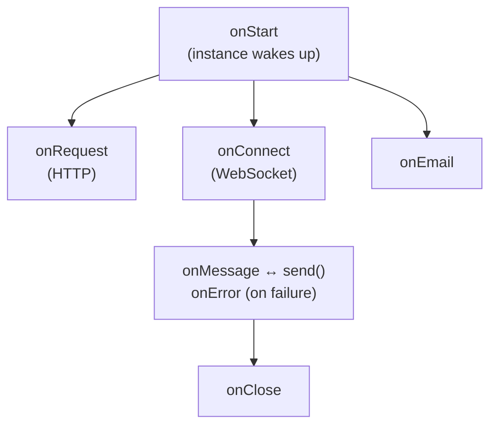

# Source: https://developers.cloudflare.com/agents/api-reference/agents-api/index.md

---

title: Agents API · Cloudflare Agents docs
description: This page provides an overview of the Agents SDK. For detailed
  documentation on each feature, refer to the linked reference pages.
lastUpdated: 2026-02-11T18:46:14.000Z
chatbotDeprioritize: false
source_url:
  html: https://developers.cloudflare.com/agents/api-reference/agents-api/
  md: https://developers.cloudflare.com/agents/api-reference/agents-api/index.md
---

This page provides an overview of the Agents SDK. For detailed documentation on each feature, refer to the linked reference pages.

## Overview

The Agents SDK provides two main APIs:

| API | Description |
| - | - |
| **Server-side** `Agent` class | Encapsulates agent logic: connections, state, methods, AI models, error handling |
| **Client-side** SDK | `AgentClient`, `useAgent`, and `useAgentChat` for connecting from browsers |

Note

Agents require [Cloudflare Durable Objects](https://developers.cloudflare.com/durable-objects/). Refer to [Configuration](https://developers.cloudflare.com/agents/api-reference/configuration/) to learn how to add the required bindings.

## Agent class

An Agent is a class that extends the base `Agent` class:

```ts
import { Agent } from "agents";


class MyAgent extends Agent<Env, State> {
  // Your agent logic
}


export default MyAgent;
```

Each Agent can have millions of instances. Each instance is a separate micro-server that runs independently, allowing horizontal scaling. Instances are addressed by a unique identifier (user ID, email, ticket number, etc.).

Note

An instance of an Agent is globally unique: given the same name (or ID), you will always get the same instance of an agent.

This allows you to avoid synchronizing state across requests: if an Agent instance represents a specific user, team, channel or other entity, you can use the Agent instance to store state for that entity. There is no need to set up a centralized session store.

If the client disconnects, you can always route the client back to the exact same Agent and pick up where they left off.

## Lifecycle



| Method | When it runs |
| - | - |
| `onStart(props?)` | When the instance starts, or wakes from hibernation. Receives optional [initialization props](https://developers.cloudflare.com/agents/api-reference/routing/#props) passed via `getAgentByName` or `routeAgentRequest`. |
| `onRequest(request)` | For each HTTP request to the instance |
| `onConnect(connection, ctx)` | When a WebSocket connection is established |
| `onMessage(connection, message)` | For each WebSocket message received |
| `onError(connection, error)` | When a WebSocket error occurs |
| `onClose(connection, code, reason, wasClean)` | When a WebSocket connection closes |
| `onEmail(email)` | When an email is routed to the instance |
| `onStateChanged(state, source)` | When state changes (from server or client) |

## Core properties

| Property | Type | Description |
| - | - | - |
| `this.env` | `Env` | Environment variables and bindings |
| `this.ctx` | `ExecutionContext` | Execution context for the request |
| `this.state` | `State` | Current persisted state |
| `this.sql` | Function | Execute SQL queries on embedded SQLite |

## Server-side API reference

| Feature | Methods | Documentation |
| - | - | - |
| **State** | `setState()`, `onStateChanged()`, `initialState` | [Store and sync state](https://developers.cloudflare.com/agents/api-reference/store-and-sync-state/) |
| **Callable methods** | `@callable()` decorator | [Callable methods](https://developers.cloudflare.com/agents/api-reference/callable-methods/) |
| **Scheduling** | `schedule()`, `scheduleEvery()`, `getSchedules()`, `cancelSchedule()` | [Schedule tasks](https://developers.cloudflare.com/agents/api-reference/schedule-tasks/) |
| **Queue** | `queue()`, `dequeue()`, `dequeueAll()`, `getQueue()` | [Queue tasks](https://developers.cloudflare.com/agents/api-reference/queue-tasks/) |
| **WebSockets** | `onConnect()`, `onMessage()`, `onClose()`, `broadcast()` | [WebSockets](https://developers.cloudflare.com/agents/api-reference/websockets/) |
| **HTTP/SSE** | `onRequest()` | [HTTP and SSE](https://developers.cloudflare.com/agents/api-reference/http-sse/) |
| **Email** | `onEmail()`, `replyToEmail()` | [Email routing](https://developers.cloudflare.com/agents/api-reference/email/) |
| **Workflows** | `runWorkflow()`, `waitForApproval()` | [Run Workflows](https://developers.cloudflare.com/agents/api-reference/run-workflows/) |
| **MCP Client** | `addMcpServer()`, `removeMcpServer()`, `getMcpServers()` | [MCP Client API](https://developers.cloudflare.com/agents/api-reference/mcp-client-api/) |
| **AI Models** | Workers AI, OpenAI, Anthropic bindings | [Using AI models](https://developers.cloudflare.com/agents/api-reference/using-ai-models/) |
| **Context** | `getCurrentAgent()` | [getCurrentAgent()](https://developers.cloudflare.com/agents/api-reference/get-current-agent/) |
| **Observability** | `observability.emit()` | [Observability](https://developers.cloudflare.com/agents/api-reference/observability/) |

## SQL API

Each Agent instance has an embedded SQLite database accessed via `this.sql`:

```ts
// Create tables
this.sql`CREATE TABLE IF NOT EXISTS users (id TEXT PRIMARY KEY, name TEXT)`;


// Insert data
this.sql`INSERT INTO users (id, name) VALUES (${id}, ${name})`;


// Query data
const users = this.sql<User>`SELECT * FROM users WHERE id = ${id}`;
```

For state that needs to sync with clients, use the [State API](https://developers.cloudflare.com/agents/api-reference/store-and-sync-state/) instead.

## Client-side API reference

| Feature | Methods | Documentation |
| - | - | - |
| **WebSocket client** | `AgentClient` | [Client SDK](https://developers.cloudflare.com/agents/api-reference/client-sdk/) |
| **HTTP client** | `agentFetch()` | [Client SDK](https://developers.cloudflare.com/agents/api-reference/client-sdk/#http-requests-with-agentfetch) |
| **React hook** | `useAgent()` | [Client SDK](https://developers.cloudflare.com/agents/api-reference/client-sdk/#react) |
| **Chat hook** | `useAgentChat()` | [Client SDK](https://developers.cloudflare.com/agents/api-reference/client-sdk/) |

### Quick example

```ts
import { useAgent } from "agents/react";
import type { MyAgent } from "./server";


function App() {
  const agent = useAgent<MyAgent, State>({
    agent: "my-agent",
    name: "user-123",
  });


  // Call methods on the agent
  agent.stub.someMethod();


  // Update state (syncs to server and all clients)
  agent.setState({ count: 1 });
}
```

## Chat agents

For AI chat applications, extend `AIChatAgent` instead of `Agent`:

```ts
import { AIChatAgent } from "agents/ai-chat-agent";


class ChatAgent extends AIChatAgent<Env> {
  async onChatMessage(onFinish) {
    // this.messages contains the conversation history
    // Return a streaming response
  }
}
```

Features include:

* Built-in message persistence
* Automatic resumable streaming (reconnect mid-stream)
* Works with `useAgentChat` React hook

Refer to [Build a chat agent](https://developers.cloudflare.com/agents/getting-started/build-a-chat-agent/) for a complete tutorial.

## Routing

Agents are accessed via URL patterns:

```txt
https://your-worker.workers.dev/agents/:agent-name/:instance-name
```

Use `routeAgentRequest()` in your Worker to route requests:

```ts
import { routeAgentRequest } from "agents";


export default {
  async fetch(request: Request, env: Env) {
    return (
      routeAgentRequest(request, env) ||
      new Response("Not found", { status: 404 })
    );
  },
};
```

Refer to [Routing](https://developers.cloudflare.com/agents/api-reference/routing/) for custom paths, CORS, and instance naming patterns.

## Next steps

[Quick start](https://developers.cloudflare.com/agents/getting-started/quick-start/)Build your first agent in about 10 minutes.

[Configuration](https://developers.cloudflare.com/agents/api-reference/configuration/)Learn about wrangler.jsonc setup and deployment.

[WebSockets](https://developers.cloudflare.com/agents/api-reference/websockets/)Real-time bidirectional communication with clients.

[Build a chat agent](https://developers.cloudflare.com/agents/getting-started/build-a-chat-agent/)Build AI applications with AIChatAgent.
