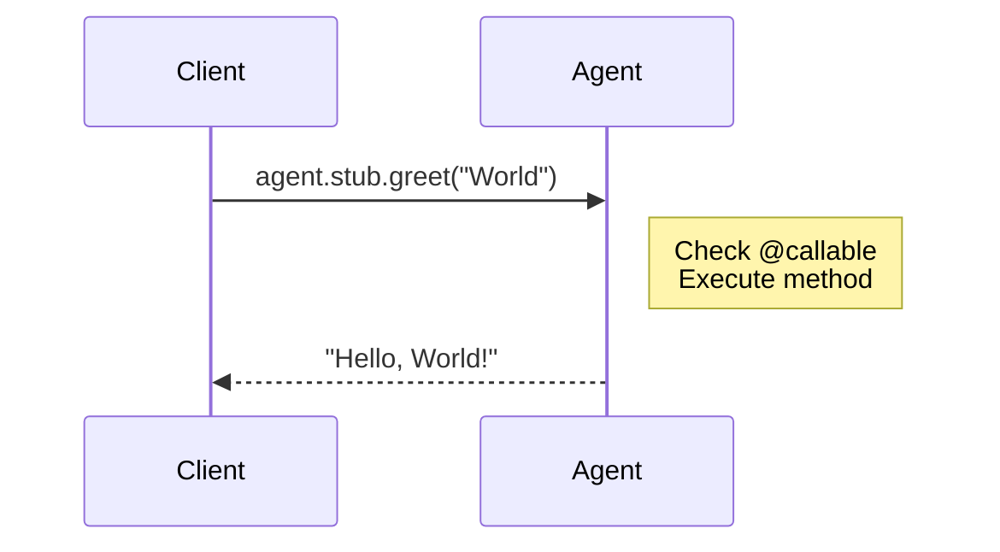

# Source: https://developers.cloudflare.com/agents/api-reference/callable-methods/index.md

---

title: Callable methods · Cloudflare Agents docs
description: Callable methods let clients invoke agent methods over WebSocket
  using RPC (Remote Procedure Call). Mark methods with @callable() to expose
  them to external clients like browsers, mobile apps, or other services.
lastUpdated: 2026-02-14T21:19:22.000Z
chatbotDeprioritize: false
source_url:
  html: https://developers.cloudflare.com/agents/api-reference/callable-methods/
  md: https://developers.cloudflare.com/agents/api-reference/callable-methods/index.md
---

Callable methods let clients invoke agent methods over WebSocket using RPC (Remote Procedure Call). Mark methods with `@callable()` to expose them to external clients like browsers, mobile apps, or other services.

## Overview

* JavaScript

  ```js
  import { Agent, callable } from "agents";


  export class MyAgent extends Agent {
    @callable()
    async greet(name) {
      return `Hello, ${name}!`;
    }
  }
  ```

* TypeScript

  ```ts
  import { Agent, callable } from "agents";


  export class MyAgent extends Agent {
    @callable()
    async greet(name: string): Promise<string> {
      return `Hello, ${name}!`;
    }
  }
  ```

* JavaScript

  ```js
  // Client
  const result = await agent.stub.greet("World");
  console.log(result); // "Hello, World!"
  ```

* TypeScript

  ```ts
  // Client
  const result = await agent.stub.greet("World");
  console.log(result); // "Hello, World!"
  ```

### How it works



### When to use `@callable()`

| Scenario | Use |
| - | - |
| Browser/mobile calling agent | `@callable()` |
| External service calling agent | `@callable()` |
| Worker calling agent (same codebase) | Durable Object RPC (no decorator needed) |
| Agent calling another agent | Durable Object RPC via `getAgentByName()` |

The `@callable()` decorator is specifically for WebSocket-based RPC from external clients. When calling from within the same Worker or another agent, use standard [Durable Object RPC](https://developers.cloudflare.com/durable-objects/best-practices/create-durable-object-stubs-and-send-requests/) directly.

## Basic usage

### Defining callable methods

Add the `@callable()` decorator to any method you want to expose:

* JavaScript

  ```js
  import { Agent, callable } from "agents";


  export class CounterAgent extends Agent {
    initialState = { count: 0, items: [] };


    @callable()
    increment() {
      this.setState({ ...this.state, count: this.state.count + 1 });
      return this.state.count;
    }


    @callable()
    decrement() {
      this.setState({ ...this.state, count: this.state.count - 1 });
      return this.state.count;
    }


    @callable()
    async addItem(item) {
      this.setState({ ...this.state, items: [...this.state.items, item] });
      return this.state.items;
    }


    @callable()
    getStats() {
      return {
        count: this.state.count,
        itemCount: this.state.items.length,
      };
    }
  }
  ```

* TypeScript

  ```ts
  import { Agent, callable } from "agents";


  export type CounterState = {
    count: number;
    items: string[];
  };


  export class CounterAgent extends Agent<Env, CounterState> {
    initialState: CounterState = { count: 0, items: [] };


    @callable()
    increment(): number {
      this.setState({ ...this.state, count: this.state.count + 1 });
      return this.state.count;
    }


    @callable()
    decrement(): number {
      this.setState({ ...this.state, count: this.state.count - 1 });
      return this.state.count;
    }


    @callable()
    async addItem(item: string): Promise<string[]> {
      this.setState({ ...this.state, items: [...this.state.items, item] });
      return this.state.items;
    }


    @callable()
    getStats(): { count: number; itemCount: number } {
      return {
        count: this.state.count,
        itemCount: this.state.items.length,
      };
    }
  }
  ```

### Calling from the client

There are two ways to call methods from the client:

#### Using `agent.stub` (recommended):

* JavaScript

  ```js
  // Clean, typed syntax
  const count = await agent.stub.increment();
  const items = await agent.stub.addItem("new item");
  const stats = await agent.stub.getStats();
  ```

* TypeScript

  ```ts
  // Clean, typed syntax
  const count = await agent.stub.increment();
  const items = await agent.stub.addItem("new item");
  const stats = await agent.stub.getStats();
  ```

#### Using `agent.call()`:

* JavaScript

  ```js
  // Explicit method name as string
  const count = await agent.call("increment");
  const items = await agent.call("addItem", ["new item"]);
  const stats = await agent.call("getStats");
  ```

* TypeScript

  ```ts
  // Explicit method name as string
  const count = await agent.call("increment");
  const items = await agent.call("addItem", ["new item"]);
  const stats = await agent.call("getStats");
  ```

The `stub` proxy provides better ergonomics and TypeScript support.

## Method signatures

### Serializable types

Arguments and return values must be JSON-serializable:

* JavaScript

  ```js
  // Valid - primitives and plain objects
  class MyAgent extends Agent {
    @callable()
    processData(input) {
      return { result: true };
    }
  }


  // Valid - arrays
  class MyAgent extends Agent {
    @callable()
    processItems(items) {
      return items.map((item) => item.length);
    }
  }


  // Invalid - non-serializable types
  // Functions, Dates, Maps, Sets, etc. cannot be serialized
  ```

* TypeScript

  ```ts
  // Valid - primitives and plain objects
  class MyAgent extends Agent {
    @callable()
    processData(input: { name: string; count: number }): { result: boolean } {
      return { result: true };
    }
  }


  // Valid - arrays
  class MyAgent extends Agent {
    @callable()
    processItems(items: string[]): number[] {
      return items.map((item) => item.length);
    }
  }


  // Invalid - non-serializable types
  // Functions, Dates, Maps, Sets, etc. cannot be serialized
  ```

### Async methods

Both sync and async methods work:

* JavaScript

  ```js
  // Sync method
  class MyAgent extends Agent {
    @callable()
    add(a, b) {
      return a + b;
    }
  }


  // Async method
  class MyAgent extends Agent {
    @callable()
    async fetchUser(id) {
      const user = await this.sql`SELECT * FROM users WHERE id = ${id}`;
      return user[0];
    }
  }
  ```

* TypeScript

  ```ts
  // Sync method
  class MyAgent extends Agent {
    @callable()
    add(a: number, b: number): number {
      return a + b;
    }
  }


  // Async method
  class MyAgent extends Agent {
    @callable()
    async fetchUser(id: string): Promise<User> {
      const user = await this.sql`SELECT * FROM users WHERE id = ${id}`;
      return user[0];
    }
  }
  ```

### Void methods

Methods that do not return a value:

* JavaScript

  ```js
  class MyAgent extends Agent {
    @callable()
    async logEvent(event) {
      await this.sql`INSERT INTO events (name) VALUES (${event})`;
    }
  }
  ```

* TypeScript

  ```ts
  class MyAgent extends Agent {
    @callable()
    async logEvent(event: string): Promise<void> {
      await this.sql`INSERT INTO events (name) VALUES (${event})`;
    }
  }
  ```

On the client, these still return a Promise that resolves when the method completes:

* JavaScript

  ```js
  await agent.stub.logEvent("user-clicked");
  // Resolves when the server confirms execution
  ```

* TypeScript

  ```ts
  await agent.stub.logEvent("user-clicked");
  // Resolves when the server confirms execution
  ```

## Streaming responses

For methods that produce data over time (like AI text generation), use streaming:

### Defining a streaming method

* JavaScript

  ```js
  import { Agent, callable } from "agents";


  export class AIAgent extends Agent {
    @callable({ streaming: true })
    async generateText(stream, prompt) {
      // First parameter is always StreamingResponse for streaming methods


      for await (const chunk of this.llm.stream(prompt)) {
        stream.send(chunk); // Send each chunk to the client
      }


      stream.end(); // Signal completion
    }


    @callable({ streaming: true })
    async streamNumbers(stream, count) {
      for (let i = 0; i < count; i++) {
        stream.send(i);
        await new Promise((resolve) => setTimeout(resolve, 100));
      }
      stream.end(count); // Optional final value
    }
  }
  ```

* TypeScript

  ```ts
  import { Agent, callable, type StreamingResponse } from "agents";


  export class AIAgent extends Agent {
    @callable({ streaming: true })
    async generateText(stream: StreamingResponse, prompt: string) {
      // First parameter is always StreamingResponse for streaming methods


      for await (const chunk of this.llm.stream(prompt)) {
        stream.send(chunk); // Send each chunk to the client
      }


      stream.end(); // Signal completion
    }


    @callable({ streaming: true })
    async streamNumbers(stream: StreamingResponse, count: number) {
      for (let i = 0; i < count; i++) {
        stream.send(i);
        await new Promise((resolve) => setTimeout(resolve, 100));
      }
      stream.end(count); // Optional final value
    }
  }
  ```

### Consuming streams on the client

* JavaScript

  ```js
  // Preferred format (supports timeout and other options)
  await agent.call("generateText", [prompt], {
    stream: {
      onChunk: (chunk) => {
        // Called for each chunk
        appendToOutput(chunk);
      },
      onDone: (finalValue) => {
        // Called when stream ends
        console.log("Stream complete", finalValue);
      },
      onError: (error) => {
        // Called if an error occurs
        console.error("Stream error:", error);
      },
    },
  });


  // Legacy format (still supported for backward compatibility)
  await agent.call("generateText", [prompt], {
    onChunk: (chunk) => appendToOutput(chunk),
    onDone: (finalValue) => console.log("Done", finalValue),
    onError: (error) => console.error("Error:", error),
  });
  ```

* TypeScript

  ```ts
  // Preferred format (supports timeout and other options)
  await agent.call("generateText", [prompt], {
    stream: {
      onChunk: (chunk) => {
        // Called for each chunk
        appendToOutput(chunk);
      },
      onDone: (finalValue) => {
        // Called when stream ends
        console.log("Stream complete", finalValue);
      },
      onError: (error) => {
        // Called if an error occurs
        console.error("Stream error:", error);
      },
    },
  });


  // Legacy format (still supported for backward compatibility)
  await agent.call("generateText", [prompt], {
    onChunk: (chunk) => appendToOutput(chunk),
    onDone: (finalValue) => console.log("Done", finalValue),
    onError: (error) => console.error("Error:", error),
  });
  ```

### StreamingResponse API

| Method | Description |
| - | - |
| `send(chunk)` | Send a chunk to the client |
| `end(finalChunk?)` | End the stream, optionally with a final value |
| `error(message)` | Send an error to the client and close the stream |

* JavaScript

  ```js
  class MyAgent extends Agent {
    @callable({ streaming: true })
    async processWithProgress(stream, items) {
      for (let i = 0; i < items.length; i++) {
        await this.process(items[i]);
        stream.send({ progress: (i + 1) / items.length, item: items[i] });
      }
      stream.end({ completed: true, total: items.length });
    }
  }
  ```

* TypeScript

  ```ts
  class MyAgent extends Agent {
    @callable({ streaming: true })
    async processWithProgress(stream: StreamingResponse, items: string[]) {
      for (let i = 0; i < items.length; i++) {
        await this.process(items[i]);
        stream.send({ progress: (i + 1) / items.length, item: items[i] });
      }
      stream.end({ completed: true, total: items.length });
    }
  }
  ```

## TypeScript integration

### Typed client calls

Pass your agent class as a type parameter for full type safety:

* JavaScript

  ```js
  import { useAgent } from "agents/react";
  function App() {
    const agent = useAgent({
      agent: "MyAgent",
      name: "default",
    });


    async function handleGreet() {
      // TypeScript knows the method signature
      const result = await agent.stub.greet("World");
      // ^? string
    }


    // TypeScript catches errors
    // await agent.stub.greet(123); // Error: Argument of type 'number' is not assignable
    // await agent.stub.nonExistent(); // Error: Property 'nonExistent' does not exist
  }
  ```

* TypeScript

  ```ts
  import { useAgent } from "agents/react";
  import type { MyAgent } from "./server";


  function App() {
    const agent = useAgent<MyAgent>({
      agent: "MyAgent",
      name: "default",
    });


    async function handleGreet() {
      // TypeScript knows the method signature
      const result = await agent.stub.greet("World");
      // ^? string
    }


    // TypeScript catches errors
    // await agent.stub.greet(123); // Error: Argument of type 'number' is not assignable
    // await agent.stub.nonExistent(); // Error: Property 'nonExistent' does not exist
  }
  ```

### Excluding non-callable methods

If you have methods that are not decorated with `@callable()`, you can exclude them from the type:

* JavaScript

  ```js
  class MyAgent extends Agent {
    @callable()
    publicMethod() {
      return "public";
    }


    // Not callable from clients
    internalMethod() {
      // internal logic
    }
  }


  // Exclude internal methods from the client type
  const agent = useAgent({
    agent: "MyAgent",
  });


  agent.stub.publicMethod(); // Works
  // agent.stub.internalMethod(); // TypeScript error
  ```

* TypeScript

  ```ts
  class MyAgent extends Agent {
    @callable()
    publicMethod(): string {
      return "public";
    }


    // Not callable from clients
    internalMethod(): void {
      // internal logic
    }
  }


  // Exclude internal methods from the client type
  const agent = useAgent<Omit<MyAgent, "internalMethod">>({
    agent: "MyAgent",
  });


  agent.stub.publicMethod(); // Works
  // agent.stub.internalMethod(); // TypeScript error
  ```

## Error handling

### Throwing errors in callable methods

Errors thrown in callable methods are propagated to the client:

* JavaScript

  ```js
  class MyAgent extends Agent {
    @callable()
    async riskyOperation(data) {
      if (!isValid(data)) {
        throw new Error("Invalid data format");
      }


      try {
        await this.processData(data);
      } catch (e) {
        throw new Error("Processing failed: " + e.message);
      }
    }
  }
  ```

* TypeScript

  ```ts
  class MyAgent extends Agent {
    @callable()
    async riskyOperation(data: unknown): Promise<void> {
      if (!isValid(data)) {
        throw new Error("Invalid data format");
      }


      try {
        await this.processData(data);
      } catch (e) {
        throw new Error("Processing failed: " + e.message);
      }
    }
  }
  ```

### Client-side error handling

* JavaScript

  ```js
  try {
    const result = await agent.stub.riskyOperation(data);
  } catch (error) {
    // Error thrown by the agent method
    console.error("RPC failed:", error.message);
  }
  ```

* TypeScript

  ```ts
  try {
    const result = await agent.stub.riskyOperation(data);
  } catch (error) {
    // Error thrown by the agent method
    console.error("RPC failed:", error.message);
  }
  ```

### Streaming error handling

For streaming methods, use the `onError` callback:

* JavaScript

  ```js
  await agent.call("streamData", [input], {
    stream: {
      onChunk: (chunk) => handleChunk(chunk),
      onError: (errorMessage) => {
        console.error("Stream error:", errorMessage);
        showErrorUI(errorMessage);
      },
      onDone: (result) => handleComplete(result),
    },
  });
  ```

* TypeScript

  ```ts
  await agent.call("streamData", [input], {
    stream: {
      onChunk: (chunk) => handleChunk(chunk),
      onError: (errorMessage) => {
        console.error("Stream error:", errorMessage);
        showErrorUI(errorMessage);
      },
      onDone: (result) => handleComplete(result),
    },
  });
  ```

Server-side, you can use `stream.error()` to gracefully send an error mid-stream:

* JavaScript

  ```js
  class MyAgent extends Agent {
    @callable({ streaming: true })
    async processItems(stream, items) {
      for (const item of items) {
        try {
          const result = await this.process(item);
          stream.send(result);
        } catch (e) {
          stream.error(`Failed to process ${item}: ${e.message}`);
          return; // Stream is now closed
        }
      }
      stream.end();
    }
  }
  ```

* TypeScript

  ```ts
  class MyAgent extends Agent {
    @callable({ streaming: true })
    async processItems(stream: StreamingResponse, items: string[]) {
      for (const item of items) {
        try {
          const result = await this.process(item);
          stream.send(result);
        } catch (e) {
          stream.error(`Failed to process ${item}: ${e.message}`);
          return; // Stream is now closed
        }
      }
      stream.end();
    }
  }
  ```

### Connection errors

If the WebSocket connection closes while RPC calls are pending, they automatically reject with a "Connection closed" error:

* JavaScript

  ```js
  try {
    const result = await agent.call("longRunningMethod", []);
  } catch (error) {
    if (error.message === "Connection closed") {
      // Handle disconnection
      console.log("Lost connection to agent");
    }
  }
  ```

* TypeScript

  ```ts
  try {
    const result = await agent.call("longRunningMethod", []);
  } catch (error) {
    if (error.message === "Connection closed") {
      // Handle disconnection
      console.log("Lost connection to agent");
    }
  }
  ```

#### Retrying after reconnection

The client automatically reconnects after disconnection. To retry a failed call after reconnection, await `agent.ready` before retrying:

* JavaScript

  ```js
  async function callWithRetry(agent, method, args = []) {
    try {
      return await agent.call(method, args);
    } catch (error) {
      if (error.message === "Connection closed") {
        await agent.ready; // Wait for reconnection
        return await agent.call(method, args); // Retry once
      }
      throw error;
    }
  }


  // Usage
  const result = await callWithRetry(agent, "processData", [data]);
  ```

* TypeScript

  ```ts
  async function callWithRetry<T>(
    agent: AgentClient,
    method: string,
    args: unknown[] = [],
  ): Promise<T> {
    try {
      return await agent.call(method, args);
    } catch (error) {
      if (error.message === "Connection closed") {
        await agent.ready; // Wait for reconnection
        return await agent.call(method, args); // Retry once
      }
      throw error;
    }
  }


  // Usage
  const result = await callWithRetry(agent, "processData", [data]);
  ```

Note

Only retry idempotent operations. If the server received the request but the connection dropped before the response arrived, retrying could cause duplicate execution.

## When NOT to use @callable

### Worker-to-Agent calls

When calling an agent from the same Worker (for example, in your `fetch` handler), use Durable Object RPC directly:

* JavaScript

  ```js
  import { getAgentByName } from "agents";


  export default {
    async fetch(request, env) {
      // Get the agent stub
      const agent = await getAgentByName(env.MyAgent, "instance-name");


      // Call methods directly - no @callable needed
      const result = await agent.processData(data);


      return Response.json(result);
    },
  };
  ```

* TypeScript

  ```ts
  import { getAgentByName } from "agents";


  export default {
    async fetch(request: Request, env: Env) {
      // Get the agent stub
      const agent = await getAgentByName(env.MyAgent, "instance-name");


      // Call methods directly - no @callable needed
      const result = await agent.processData(data);


      return Response.json(result);
    },
  };
  ```

### Agent-to-Agent calls

When one agent needs to call another:

* JavaScript

  ```js
  class OrchestratorAgent extends Agent {
    async delegateWork(taskId) {
      // Get another agent
      const worker = await getAgentByName(this.env.WorkerAgent, taskId);


      // Call its methods directly
      const result = await worker.doWork();


      return result;
    }
  }
  ```

* TypeScript

  ```ts
  class OrchestratorAgent extends Agent {
    async delegateWork(taskId: string) {
      // Get another agent
      const worker = await getAgentByName(this.env.WorkerAgent, taskId);


      // Call its methods directly
      const result = await worker.doWork();


      return result;
    }
  }
  ```

### Why the distinction?

| RPC Type | Transport | Use Case |
| - | - | - |
| `@callable` | WebSocket | External clients (browsers, apps) |
| Durable Object RPC | Internal | Worker to Agent, Agent to Agent |

Durable Object RPC is more efficient for internal calls since it does not go through WebSocket serialization. The `@callable` decorator adds the necessary WebSocket RPC handling for external clients.

## API reference

### @callable(metadata?) decorator

Marks a method as callable from external clients.

* JavaScript

  ```js
  import { callable } from "agents";


  class MyAgent extends Agent {
    @callable()
    method() {}


    @callable({ streaming: true })
    streamingMethod(stream) {}


    @callable({ description: "Fetches user data" })
    getUser(id) {}
  }
  ```

* TypeScript

  ```ts
  import { callable } from "agents";


  class MyAgent extends Agent {
    @callable()
    method(): void {}


    @callable({ streaming: true })
    streamingMethod(stream: StreamingResponse): void {}


    @callable({ description: "Fetches user data" })
    getUser(id: string): User {}
  }
  ```

### CallableMetadata type

```ts
type CallableMetadata = {
  /** Optional description of what the method does */
  description?: string;
  /** Whether the method supports streaming responses */
  streaming?: boolean;
};
```

### StreamingResponse class

Used in streaming callable methods to send data to the client.

* JavaScript

  ```js
  import {} from "agents";


  class MyAgent extends Agent {
    @callable({ streaming: true })
    async streamData(stream, input) {
      stream.send("chunk 1");
      stream.send("chunk 2");
      stream.end("final");
    }
  }
  ```

* TypeScript

  ```ts
  import { type StreamingResponse } from "agents";


  class MyAgent extends Agent {
    @callable({ streaming: true })
    async streamData(stream: StreamingResponse, input: string) {
      stream.send("chunk 1");
      stream.send("chunk 2");
      stream.end("final");
    }
  }
  ```

| Method | Signature | Description |
| - | - | - |
| `send` | `(chunk: unknown) => void` | Send a chunk to the client |
| `end` | `(finalChunk?: unknown) => void` | End the stream |
| `error` | `(message: string) => void` | Send an error and close the stream |

### Client methods

| Method | Signature | Description |
| - | - | - |
| `agent.call` | `(method, args?, options?) => Promise` | Call a method by name |
| `agent.stub` | `Proxy` | Typed method calls |

* JavaScript

  ```js
  // Using call()
  await agent.call("methodName", [arg1, arg2]);
  await agent.call("streamMethod", [arg], {
    stream: { onChunk, onDone, onError },
  });


  // With timeout (rejects if call does not complete in time)
  await agent.call("slowMethod", [], { timeout: 5000 });


  // Using stub
  await agent.stub.methodName(arg1, arg2);
  ```

* TypeScript

  ```ts
  // Using call()
  await agent.call("methodName", [arg1, arg2]);
  await agent.call("streamMethod", [arg], {
    stream: { onChunk, onDone, onError },
  });


  // With timeout (rejects if call does not complete in time)
  await agent.call("slowMethod", [], { timeout: 5000 });


  // Using stub
  await agent.stub.methodName(arg1, arg2);
  ```

### CallOptions type

```ts
type CallOptions = {
  /** Timeout in milliseconds. Rejects if call does not complete in time. */
  timeout?: number;
  /** Streaming options */
  stream?: {
    onChunk?: (chunk: unknown) => void;
    onDone?: (finalChunk: unknown) => void;
    onError?: (error: string) => void;
  };
};
```

Note

The legacy format `{ onChunk, onDone, onError }` (without nesting under `stream`) is still supported. The client automatically detects which format you are using.

### getCallableMethods() method

Returns a map of all callable methods on the agent with their metadata. Useful for introspection and automatic documentation.

* JavaScript

  ```js
  const methods = agent.getCallableMethods();
  // Map<string, CallableMetadata>


  for (const [name, meta] of methods) {
    console.log(`${name}: ${meta.description || "(no description)"}`);
    if (meta.streaming) console.log("  (streaming)");
  }
  ```

* TypeScript

  ```ts
  const methods = agent.getCallableMethods();
  // Map<string, CallableMetadata>


  for (const [name, meta] of methods) {
    console.log(`${name}: ${meta.description || "(no description)"}`);
    if (meta.streaming) console.log("  (streaming)");
  }
  ```

## Troubleshooting

### `SyntaxError: Invalid or unexpected token`

If your dev server fails with `SyntaxError: Invalid or unexpected token` when using `@callable()`, set `"target": "ES2021"` in your `tsconfig.json`. This ensures that Vite's esbuild transpiler downlevels TC39 decorators instead of passing them through as native syntax.

```json
{
  "compilerOptions": {
    "target": "ES2021"
  }
}
```

Warning

Do not set `"experimentalDecorators": true` in your `tsconfig.json`. The Agents SDK uses [TC39 standard decorators](https://github.com/tc39/proposal-decorators), not TypeScript legacy decorators. Enabling `experimentalDecorators` applies an incompatible transform that silently breaks `@callable()` at runtime.

## Next steps

[Agents API](https://developers.cloudflare.com/agents/api-reference/agents-api/)Complete API reference for the Agents SDK.

[WebSockets](https://developers.cloudflare.com/agents/api-reference/websockets/)Real-time bidirectional communication with clients.

[State management](https://developers.cloudflare.com/agents/api-reference/store-and-sync-state/)Sync state between agents and clients.
