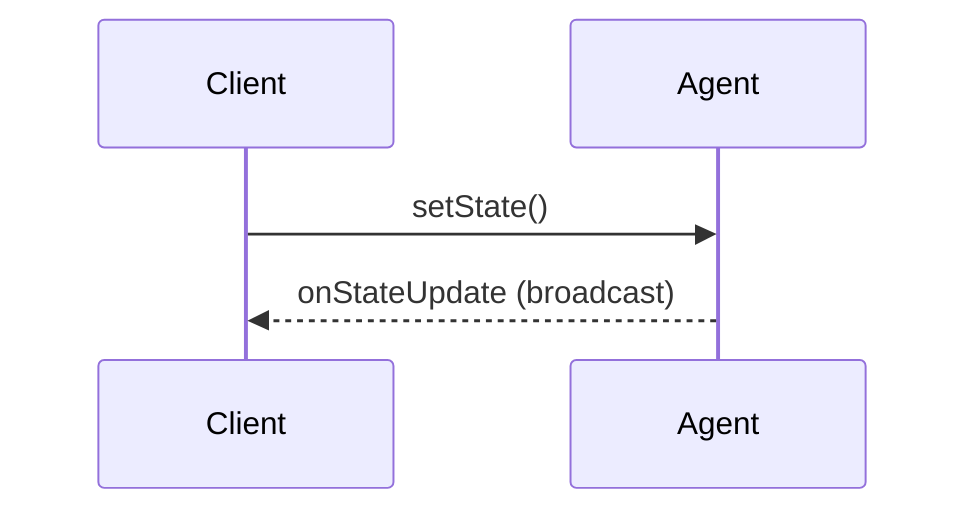

# Source: https://developers.cloudflare.com/agents/api-reference/client-sdk/index.md

---

title: Client SDK · Cloudflare Agents docs
description: Connect to agents from any JavaScript runtime — browsers, Node.js,
  Deno, Bun, or edge functions — using WebSockets or HTTP. The SDK provides
  real-time state synchronization, RPC method calls, and streaming responses.
lastUpdated: 2026-02-11T09:01:16.000Z
chatbotDeprioritize: false
source_url:
  html: https://developers.cloudflare.com/agents/api-reference/client-sdk/
  md: https://developers.cloudflare.com/agents/api-reference/client-sdk/index.md
---

Connect to agents from any JavaScript runtime — browsers, Node.js, Deno, Bun, or edge functions — using WebSockets or HTTP. The SDK provides real-time state synchronization, RPC method calls, and streaming responses.

## Overview

The client SDK offers two ways to connect with a WebSocket connection, and one way to make HTTP requests.

| Client | Use Case |
| - | - |
| `useAgent` | React hook with automatic reconnection and state management |
| `AgentClient` | Vanilla JavaScript/TypeScript class for any environment |
| `agentFetch` | HTTP requests when WebSocket is not needed |

All clients provide:

* **Bidirectional state sync** - Push and receive state updates in real-time
* **RPC calls** - Call agent methods with typed arguments and return values
* **Streaming** - Handle chunked responses for AI completions
* **Auto-reconnection** - Automatic reconnection with exponential backoff

## Quick start

### React

* JavaScript

  ```js
  import { useAgent } from "agents/react";


  function Chat() {
    const agent = useAgent({
      agent: "ChatAgent",
      name: "room-123",
      onStateUpdate: (state) => {
        console.log("New state:", state);
      },
    });


    const sendMessage = async () => {
      const response = await agent.call("sendMessage", ["Hello!"]);
      console.log("Response:", response);
    };


    return <button onClick={sendMessage}>Send</button>;
  }
  ```

* TypeScript

  ```ts
  import { useAgent } from "agents/react";


  function Chat() {
    const agent = useAgent({
      agent: "ChatAgent",
      name: "room-123",
      onStateUpdate: (state) => {
        console.log("New state:", state);
      },
    });


    const sendMessage = async () => {
      const response = await agent.call("sendMessage", ["Hello!"]);
      console.log("Response:", response);
    };


    return <button onClick={sendMessage}>Send</button>;
  }
  ```

### Vanilla JavaScript

* JavaScript

  ```js
  import { AgentClient } from "agents/client";


  const client = new AgentClient({
    agent: "ChatAgent",
    name: "room-123",
    host: "your-worker.your-subdomain.workers.dev",
    onStateUpdate: (state) => {
      console.log("New state:", state);
    },
  });


  // Call a method
  const response = await client.call("sendMessage", ["Hello!"]);
  ```

* TypeScript

  ```ts
  import { AgentClient } from "agents/client";


  const client = new AgentClient({
    agent: "ChatAgent",
    name: "room-123",
    host: "your-worker.your-subdomain.workers.dev",
    onStateUpdate: (state) => {
      console.log("New state:", state);
    },
  });


  // Call a method
  const response = await client.call("sendMessage", ["Hello!"]);
  ```

## Connecting to agents

### Agent naming

The `agent` parameter is your agent class name. It is automatically converted from camelCase to kebab-case for the URL:

* JavaScript

  ```js
  // These are equivalent:
  useAgent({ agent: "ChatAgent" }); // → /agents/chat-agent/...
  useAgent({ agent: "MyCustomAgent" }); // → /agents/my-custom-agent/...
  useAgent({ agent: "LOUD_AGENT" }); // → /agents/loud-agent/...
  ```

* TypeScript

  ```ts
  // These are equivalent:
  useAgent({ agent: "ChatAgent" }); // → /agents/chat-agent/...
  useAgent({ agent: "MyCustomAgent" }); // → /agents/my-custom-agent/...
  useAgent({ agent: "LOUD_AGENT" }); // → /agents/loud-agent/...
  ```

### Instance names

The `name` parameter identifies a specific agent instance. If omitted, defaults to `"default"`:

* JavaScript

  ```js
  // Connect to a specific chat room
  useAgent({ agent: "ChatAgent", name: "room-123" });


  // Connect to a user's personal agent
  useAgent({ agent: "UserAgent", name: userId });


  // Uses "default" instance
  useAgent({ agent: "ChatAgent" });
  ```

* TypeScript

  ```ts
  // Connect to a specific chat room
  useAgent({ agent: "ChatAgent", name: "room-123" });


  // Connect to a user's personal agent
  useAgent({ agent: "UserAgent", name: userId });


  // Uses "default" instance
  useAgent({ agent: "ChatAgent" });
  ```

### Connection options

Both `useAgent` and `AgentClient` accept connection options:

* JavaScript

  ```js
  useAgent({
    agent: "ChatAgent",
    name: "room-123",


    // Connection settings
    host: "my-worker.workers.dev", // Custom host (defaults to current origin)
    path: "/custom/path", // Custom path prefix


    // Query parameters (sent on connection)
    query: {
      token: "abc123",
      version: "2",
    },


    // Event handlers
    onOpen: () => console.log("Connected"),
    onClose: () => console.log("Disconnected"),
    onError: (error) => console.error("Error:", error),
  });
  ```

* TypeScript

  ```ts
  useAgent({
    agent: "ChatAgent",
    name: "room-123",


    // Connection settings
    host: "my-worker.workers.dev", // Custom host (defaults to current origin)
    path: "/custom/path", // Custom path prefix


    // Query parameters (sent on connection)
    query: {
      token: "abc123",
      version: "2",
    },


    // Event handlers
    onOpen: () => console.log("Connected"),
    onClose: () => console.log("Disconnected"),
    onError: (error) => console.error("Error:", error),
  });
  ```

### Async query parameters

For authentication tokens or other async data, pass a function that returns a Promise:

* JavaScript

  ```js
  useAgent({
    agent: "ChatAgent",
    name: "room-123",


    // Async query - called before connecting
    query: async () => {
      const token = await getAuthToken();
      return { token };
    },


    // Dependencies that trigger re-fetching the query
    queryDeps: [userId],


    // Cache TTL for the query result (default: 5 minutes)
    cacheTtl: 60 * 1000, // 1 minute
  });
  ```

* TypeScript

  ```ts
  useAgent({
    agent: "ChatAgent",
    name: "room-123",


    // Async query - called before connecting
    query: async () => {
      const token = await getAuthToken();
      return { token };
    },


    // Dependencies that trigger re-fetching the query
    queryDeps: [userId],


    // Cache TTL for the query result (default: 5 minutes)
    cacheTtl: 60 * 1000, // 1 minute
  });
  ```

The query function is cached and only re-called when:

* `queryDeps` change
* `cacheTtl` expires
* The WebSocket connection closes (automatic cache invalidation)
* The component remounts

Automatic cache invalidation on disconnect

When the WebSocket connection closes — whether due to network issues, server restarts, or explicit disconnection — the async query cache is automatically invalidated. This ensures that when the client reconnects, the query function is re-executed to fetch fresh data. This is particularly important for authentication tokens that may have expired during the disconnection period.

## State synchronization

Agents can maintain state that syncs bidirectionally with all connected clients.

### Receiving state updates

* JavaScript

  ```js
  const agent = useAgent({
    agent: "GameAgent",
    name: "game-123",
    onStateUpdate: (state, source) => {
      // state: The new state from the agent
      // source: "server" (agent pushed) or "client" (you pushed)
      console.log(`State updated from ${source}:`, state);
      setGameState(state);
    },
  });
  ```

* TypeScript

  ```ts
  const agent = useAgent({
    agent: "GameAgent",
    name: "game-123",
    onStateUpdate: (state, source) => {
      // state: The new state from the agent
      // source: "server" (agent pushed) or "client" (you pushed)
      console.log(`State updated from ${source}:`, state);
      setGameState(state);
    },
  });
  ```

### Pushing state updates

* JavaScript

  ```js
  // Update the agent's state from the client
  agent.setState({ score: 100, level: 5 });
  ```

* TypeScript

  ```ts
  // Update the agent's state from the client
  agent.setState({ score: 100, level: 5 });
  ```

When you call `setState()`:

1. The state is sent to the agent over WebSocket
2. The agent's `onStateChanged()` method is called
3. The agent broadcasts the new state to all connected clients
4. Your `onStateUpdate` callback fires with `source: "client"`

### State flow



## Calling agent methods (RPC)

Call methods on your agent that are decorated with `@callable()`.

Note

The `@callable()` decorator is only required for methods called from external runtimes (browsers, other services). When calling from within the same Worker, you can use standard [Durable Object RPC](https://developers.cloudflare.com/durable-objects/best-practices/create-durable-object-stubs-and-send-requests/#invoke-rpc-methods) directly on the stub without the decorator.

### Using call()

* JavaScript

  ```js
  // Basic call
  const result = await agent.call("getUser", [userId]);


  // Call with multiple arguments
  const result = await agent.call("createPost", [title, content, tags]);


  // Call with no arguments
  const result = await agent.call("getStats");
  ```

* TypeScript

  ```ts
  // Basic call
  const result = await agent.call("getUser", [userId]);


  // Call with multiple arguments
  const result = await agent.call("createPost", [title, content, tags]);


  // Call with no arguments
  const result = await agent.call("getStats");
  ```

### Using the stub proxy

The `stub` property provides a cleaner syntax for method calls:

* JavaScript

  ```js
  // Instead of:
  const user = await agent.call("getUser", ["user-123"]);


  // You can write:
  const user = await agent.stub.getUser("user-123");


  // Multiple arguments work naturally:
  const post = await agent.stub.createPost(title, content, tags);
  ```

* TypeScript

  ```ts
  // Instead of:
  const user = await agent.call("getUser", ["user-123"]);


  // You can write:
  const user = await agent.stub.getUser("user-123");


  // Multiple arguments work naturally:
  const post = await agent.stub.createPost(title, content, tags);
  ```

### TypeScript integration

For full type safety, pass your Agent class as a type parameter:

* JavaScript

  ```js
  const agent = useAgent({
    agent: "MyAgent",
    name: "instance-1",
  });


  // Now stub methods are fully typed
  const result = await agent.stub.processData({ input: "test" });
  ```

* TypeScript

  ```ts
  import type { MyAgent } from "./agents/my-agent";


  const agent = useAgent<MyAgent>({
    agent: "MyAgent",
    name: "instance-1",
  });


  // Now stub methods are fully typed
  const result = await agent.stub.processData({ input: "test" });
  ```

### Streaming responses

For methods that return `StreamingResponse`, handle chunks as they arrive:

* JavaScript

  ```js
  // Agent-side:
  class MyAgent extends Agent {
    @callable({ streaming: true })
    async generateText(stream, prompt) {
      for await (const chunk of llm.stream(prompt)) {
        await stream.write(chunk);
      }
    }
  }


  // Client-side:
  await agent.call("generateText", [prompt], {
    onChunk: (chunk) => {
      // Called for each chunk
      appendToOutput(chunk);
    },
    onDone: (finalResult) => {
      // Called when stream completes
      console.log("Complete:", finalResult);
    },
    onError: (error) => {
      // Called if streaming fails
      console.error("Stream error:", error);
    },
  });
  ```

* TypeScript

  ```ts
  // Agent-side:
  class MyAgent extends Agent {
    @callable({ streaming: true })
    async generateText(stream: StreamingResponse, prompt: string) {
      for await (const chunk of llm.stream(prompt)) {
        await stream.write(chunk);
      }
    }
  }


  // Client-side:
  await agent.call("generateText", [prompt], {
    onChunk: (chunk) => {
      // Called for each chunk
      appendToOutput(chunk);
    },
    onDone: (finalResult) => {
      // Called when stream completes
      console.log("Complete:", finalResult);
    },
    onError: (error) => {
      // Called if streaming fails
      console.error("Stream error:", error);
    },
  });
  ```

## HTTP requests with agentFetch

For one-off requests without maintaining a WebSocket connection:

* JavaScript

  ```js
  import { agentFetch } from "agents/client";


  // GET request
  const response = await agentFetch({
    agent: "DataAgent",
    name: "instance-1",
    host: "my-worker.workers.dev",
  });


  const data = await response.json();


  // POST request with body
  const response = await agentFetch(
    {
      agent: "DataAgent",
      name: "instance-1",
      host: "my-worker.workers.dev",
    },
    {
      method: "POST",
      headers: { "Content-Type": "application/json" },
      body: JSON.stringify({ action: "process" }),
    },
  );
  ```

* TypeScript

  ```ts
  import { agentFetch } from "agents/client";


  // GET request
  const response = await agentFetch({
    agent: "DataAgent",
    name: "instance-1",
    host: "my-worker.workers.dev",
  });


  const data = await response.json();


  // POST request with body
  const response = await agentFetch(
    {
      agent: "DataAgent",
      name: "instance-1",
      host: "my-worker.workers.dev",
    },
    {
      method: "POST",
      headers: { "Content-Type": "application/json" },
      body: JSON.stringify({ action: "process" }),
    },
  );
  ```

**When to use `agentFetch` vs WebSocket:**

| Use `agentFetch` | Use `useAgent`/`AgentClient` |
| - | - |
| One-time requests | Real-time updates needed |
| Server-to-server calls | Bidirectional communication |
| Simple REST-style API | State synchronization |
| No persistent connection needed | Multiple RPC calls |

## MCP server integration

If your agent uses MCP (Model Context Protocol) servers, you can receive updates about their state:

* JavaScript

  ```js
  const agent = useAgent({
    agent: "AssistantAgent",
    name: "session-123",
    onMcpUpdate: (mcpServers) => {
      // mcpServers is a record of server states
      for (const [serverId, server] of Object.entries(mcpServers)) {
        console.log(`${serverId}: ${server.connectionState}`);
        console.log(`Tools: ${server.tools?.map((t) => t.name).join(", ")}`);
      }
    },
  });
  ```

* TypeScript

  ```ts
  const agent = useAgent({
    agent: "AssistantAgent",
    name: "session-123",
    onMcpUpdate: (mcpServers) => {
      // mcpServers is a record of server states
      for (const [serverId, server] of Object.entries(mcpServers)) {
        console.log(`${serverId}: ${server.connectionState}`);
        console.log(`Tools: ${server.tools?.map((t) => t.name).join(", ")}`);
      }
    },
  });
  ```

## Error handling

### Connection errors

* JavaScript

  ```js
  const agent = useAgent({
    agent: "MyAgent",
    onError: (error) => {
      console.error("WebSocket error:", error);
    },
    onClose: () => {
      console.log("Connection closed, will auto-reconnect...");
    },
  });
  ```

* TypeScript

  ```ts
  const agent = useAgent({
    agent: "MyAgent",
    onError: (error) => {
      console.error("WebSocket error:", error);
    },
    onClose: () => {
      console.log("Connection closed, will auto-reconnect...");
    },
  });
  ```

### RPC errors

* JavaScript

  ```js
  try {
    const result = await agent.call("riskyMethod", [data]);
  } catch (error) {
    // Error thrown by the agent method
    console.error("RPC failed:", error.message);
  }
  ```

* TypeScript

  ```ts
  try {
    const result = await agent.call("riskyMethod", [data]);
  } catch (error) {
    // Error thrown by the agent method
    console.error("RPC failed:", error.message);
  }
  ```

### Streaming errors

* JavaScript

  ```js
  await agent.call("streamingMethod", [data], {
    onChunk: (chunk) => handleChunk(chunk),
    onError: (errorMessage) => {
      // Stream-specific error handling
      console.error("Stream error:", errorMessage);
    },
  });
  ```

* TypeScript

  ```ts
  await agent.call("streamingMethod", [data], {
    onChunk: (chunk) => handleChunk(chunk),
    onError: (errorMessage) => {
      // Stream-specific error handling
      console.error("Stream error:", errorMessage);
    },
  });
  ```

## Best practices

### 1. Use typed stubs

* JavaScript

  ```js
  // Prefer this:
  const user = await agent.stub.getUser(id);


  // Over this:
  const user = await agent.call("getUser", [id]);
  ```

* TypeScript

  ```ts
  // Prefer this:
  const user = await agent.stub.getUser(id);


  // Over this:
  const user = await agent.call("getUser", [id]);
  ```

### 2. Reconnection is automatic

The client auto-reconnects and the agent automatically sends the current state on each connection. Your `onStateUpdate` callback will fire with the latest state — no manual re-sync is needed. If you use an async `query` function for authentication, the cache is automatically invalidated on disconnect, ensuring fresh tokens are fetched on reconnect.

### 3. Optimize query caching

* JavaScript

  ```js
  // For auth tokens that expire hourly:
  useAgent({
    query: async () => ({ token: await getToken() }),
    cacheTtl: 55 * 60 * 1000, // Refresh 5 min before expiry
    queryDeps: [userId], // Refresh if user changes
  });
  ```

* TypeScript

  ```ts
  // For auth tokens that expire hourly:
  useAgent({
    query: async () => ({ token: await getToken() }),
    cacheTtl: 55 * 60 * 1000, // Refresh 5 min before expiry
    queryDeps: [userId], // Refresh if user changes
  });
  ```

### 4. Clean up connections

In vanilla JS, close connections when done:

* JavaScript

  ```js
  const client = new AgentClient({ agent: "MyAgent", host: "..." });


  // When done:
  client.close();
  ```

* TypeScript

  ```ts
  const client = new AgentClient({ agent: "MyAgent", host: "..." });


  // When done:
  client.close();
  ```

React's `useAgent` handles cleanup automatically on unmount.

## React hook reference

### UseAgentOptions

```ts
type UseAgentOptions<State> = {
  // Required
  agent: string; // Agent class name


  // Optional
  name?: string; // Instance name (default: "default")
  host?: string; // Custom host
  path?: string; // Custom path prefix


  // Query parameters
  query?: Record<string, string> | (() => Promise<Record<string, string>>);
  queryDeps?: unknown[]; // Dependencies for async query
  cacheTtl?: number; // Query cache TTL in ms (default: 5 min)


  // Callbacks
  onStateUpdate?: (state: State, source: "server" | "client") => void;
  onMcpUpdate?: (mcpServers: MCPServersState) => void;
  onOpen?: () => void;
  onClose?: () => void;
  onError?: (error: Event) => void;
  onMessage?: (message: MessageEvent) => void;
};
```

### Return value

The `useAgent` hook returns an object with the following properties and methods:

| Property/Method | Type | Description |
| - | - | - |
| `agent` | `string` | Kebab-case agent name |
| `name` | `string` | Instance name |
| `setState(state)` | `void` | Push state to agent |
| `call(method, args?, options?)` | `Promise` | Call agent method |
| `stub` | `Proxy` | Typed method calls |
| `send(data)` | `void` | Send raw WebSocket message |
| `close()` | `void` | Close connection |
| `reconnect()` | `void` | Force reconnection |

## Vanilla JS reference

### AgentClientOptions

```ts
type AgentClientOptions<State> = {
  // Required
  agent: string; // Agent class name
  host: string; // Worker host


  // Optional
  name?: string; // Instance name (default: "default")
  path?: string; // Custom path prefix
  query?: Record<string, string>;


  // Callbacks
  onStateUpdate?: (state: State, source: "server" | "client") => void;
};
```

### AgentClient methods

| Property/Method | Type | Description |
| - | - | - |
| `agent` | `string` | Kebab-case agent name |
| `name` | `string` | Instance name |
| `setState(state)` | `void` | Push state to agent |
| `call(method, args?, options?)` | `Promise` | Call agent method |
| `send(data)` | `void` | Send raw WebSocket message |
| `close()` | `void` | Close connection |
| `reconnect()` | `void` | Force reconnection |

The client also supports WebSocket event listeners:

* JavaScript

  ```js
  client.addEventListener("open", () => {});
  client.addEventListener("close", () => {});
  client.addEventListener("error", () => {});
  client.addEventListener("message", () => {});
  ```

* TypeScript

  ```ts
  client.addEventListener("open", () => {});
  client.addEventListener("close", () => {});
  client.addEventListener("error", () => {});
  client.addEventListener("message", () => {});
  ```

## Next steps

[Routing](https://developers.cloudflare.com/agents/api-reference/routing/)URL patterns and custom routing options.

[Callable methods](https://developers.cloudflare.com/agents/api-reference/callable-methods/)RPC over WebSocket for client-server method calls.

[Cross-domain authentication](https://developers.cloudflare.com/agents/guides/cross-domain-authentication/)Secure WebSocket connections across domains.

[Build a chat agent](https://developers.cloudflare.com/agents/getting-started/build-a-chat-agent/)Complete client integration with AI chat.
