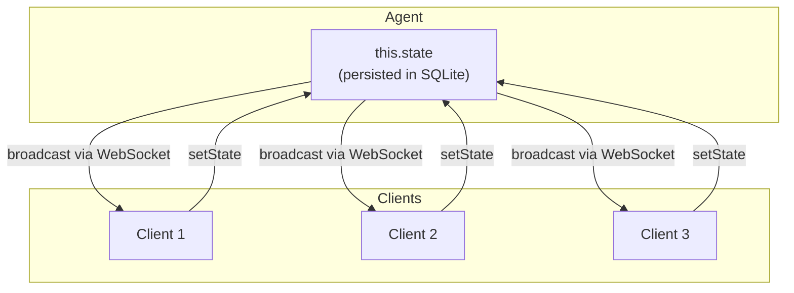

# Source: https://developers.cloudflare.com/agents/api-reference/store-and-sync-state/index.md

---

title: Store and sync state · Cloudflare Agents docs
description: Agents provide built-in state management with automatic persistence
  and real-time synchronization across all connected clients.
lastUpdated: 2026-02-11T09:01:16.000Z
chatbotDeprioritize: false
source_url:
  html: https://developers.cloudflare.com/agents/api-reference/store-and-sync-state/
  md: https://developers.cloudflare.com/agents/api-reference/store-and-sync-state/index.md
---

Agents provide built-in state management with automatic persistence and real-time synchronization across all connected clients.

## Overview

State within an Agent is:

* **Persistent** - Automatically saves to SQLite, survives restarts and hibernation
* **Synchronized** - Changes are broadcast to all connected WebSocket clients instantly
* **Bidirectional** - Both server and clients can update state
* **Type-safe** - Full TypeScript support with generics
* **Immediately consistent** - Read your own writes
* **Thread-safe** - Safe for concurrent updates
* **Fast** - State is colocated wherever the Agent is running

Agent state is stored in a SQL database embedded within each individual Agent instance. You can interact with it using the higher-level `this.setState` API (recommended), which allows you to sync state and trigger events on state changes, or by directly querying the database with `this.sql`.

State vs Props

**State** is persistent data that survives restarts and syncs across clients. **[Props](https://developers.cloudflare.com/agents/api-reference/routing/#props)** are one-time initialization arguments passed when an agent is instantiated - use props for configuration that does not need to persist.

* JavaScript

  ```js
  import { Agent } from "agents";


  export class GameAgent extends Agent {
    // Default state for new agents
    initialState = {
      players: [],
      score: 0,
      status: "waiting",
    };


    // React to state changes
    onStateChanged(state, source) {
      if (source !== "server" && state.players.length >= 2) {
        // Client added a player, start the game
        this.setState({ ...state, status: "playing" });
      }
    }


    addPlayer(name) {
      this.setState({
        ...this.state,
        players: [...this.state.players, name],
      });
    }
  }
  ```

* TypeScript

  ```ts
  import { Agent } from "agents";


  type GameState = {
    players: string[];
    score: number;
    status: "waiting" | "playing" | "finished";
  };


  export class GameAgent extends Agent<Env, GameState> {
    // Default state for new agents
    initialState: GameState = {
      players: [],
      score: 0,
      status: "waiting",
    };


    // React to state changes
    onStateChanged(state: GameState, source: Connection | "server") {
      if (source !== "server" && state.players.length >= 2) {
        // Client added a player, start the game
        this.setState({ ...state, status: "playing" });
      }
    }


    addPlayer(name: string) {
      this.setState({
        ...this.state,
        players: [...this.state.players, name],
      });
    }
  }
  ```

## Defining initial state

Use the `initialState` property to define default values for new agent instances:

* JavaScript

  ```js
  export class ChatAgent extends Agent {
    initialState = {
      messages: [],
      settings: { theme: "dark", notifications: true },
      lastActive: null,
    };
  }
  ```

* TypeScript

  ```ts
  type State = {
    messages: Message[];
    settings: UserSettings;
    lastActive: string | null;
  };


  export class ChatAgent extends Agent<Env, State> {
    initialState: State = {
      messages: [],
      settings: { theme: "dark", notifications: true },
      lastActive: null,
    };
  }
  ```

### Type safety

The second generic parameter to `Agent` defines your state type:

* JavaScript

  ```js
  // State is fully typed
  export class MyAgent extends Agent {
    initialState = { count: 0 };


    increment() {
      // TypeScript knows this.state is MyState
      this.setState({ count: this.state.count + 1 });
    }
  }
  ```

* TypeScript

  ```ts
  // State is fully typed
  export class MyAgent extends Agent<Env, MyState> {
    initialState: MyState = { count: 0 };


    increment() {
      // TypeScript knows this.state is MyState
      this.setState({ count: this.state.count + 1 });
    }
  }
  ```

### When initial state applies

Initial state is applied lazily on first access, not on every wake:

1. **New agent** - `initialState` is used and persisted
2. **Existing agent** - Persisted state is loaded from SQLite
3. **No `initialState` defined** - `this.state` is `undefined`

* JavaScript

  ```js
  class MyAgent extends Agent {
    initialState = { count: 0 };
    async onStart() {
      // Safe to access - returns initialState if new, or persisted state
      console.log("Current count:", this.state.count);
    }
  }
  ```

* TypeScript

  ```ts
  class MyAgent extends Agent<Env, { count: number }> {
    initialState = { count: 0 };
    async onStart() {
      // Safe to access - returns initialState if new, or persisted state
      console.log("Current count:", this.state.count);
    }
  }
  ```

## Reading state

Access the current state via the `this.state` getter:

* JavaScript

  ```js
  class MyAgent extends Agent {
    async onRequest(request) {
      // Read current state
      const { players, status } = this.state;


      if (status === "waiting" && players.length < 2) {
        return new Response("Waiting for players...");
      }


      return Response.json(this.state);
    }
  }
  ```

* TypeScript

  ```ts
  class MyAgent extends Agent<
    Env,
    { players: string[]; status: "waiting" | "playing" | "finished" }
  > {
    async onRequest(request: Request) {
      // Read current state
      const { players, status } = this.state;


      if (status === "waiting" && players.length < 2) {
        return new Response("Waiting for players...");
      }


      return Response.json(this.state);
    }
  }
  ```

### Undefined state

If you do not define `initialState`, `this.state` returns `undefined`:

* JavaScript

  ```js
  export class MinimalAgent extends Agent {
    // No initialState defined


    async onConnect(connection) {
      if (!this.state) {
        // First time - initialize state
        this.setState({ initialized: true });
      }
    }
  }
  ```

* TypeScript

  ```ts
  export class MinimalAgent extends Agent {
    // No initialState defined


    async onConnect(connection: Connection) {
      if (!this.state) {
        // First time - initialize state
        this.setState({ initialized: true });
      }
    }
  }
  ```

## Updating state

Use `setState()` to update state. This:

1. Saves to SQLite (persistent)
2. Broadcasts to all connected clients
3. Triggers `onStateChanged()` (after broadcast; best-effort)

* JavaScript

  ```js
  // Replace entire state
  this.setState({
    players: ["Alice", "Bob"],
    score: 0,
    status: "playing",
  });


  // Update specific fields (spread existing state)
  this.setState({
    ...this.state,
    score: this.state.score + 10,
  });
  ```

* TypeScript

  ```ts
  // Replace entire state
  this.setState({
    players: ["Alice", "Bob"],
    score: 0,
    status: "playing",
  });


  // Update specific fields (spread existing state)
  this.setState({
    ...this.state,
    score: this.state.score + 10,
  });
  ```

### State must be serializable

State is stored as JSON, so it must be serializable:

* JavaScript

  ```js
  // Good - plain objects, arrays, primitives
  this.setState({
    items: ["a", "b", "c"],
    count: 42,
    active: true,
    metadata: { key: "value" },
  });


  // Bad - functions, classes, circular references
  // Functions do not serialize
  // Dates become strings, lose methods
  // Circular references fail


  // For dates, use ISO strings
  this.setState({
    createdAt: new Date().toISOString(),
  });
  ```

* TypeScript

  ```ts
  // Good - plain objects, arrays, primitives
  this.setState({
    items: ["a", "b", "c"],
    count: 42,
    active: true,
    metadata: { key: "value" },
  });


  // Bad - functions, classes, circular references
  // Functions do not serialize
  // Dates become strings, lose methods
  // Circular references fail


  // For dates, use ISO strings
  this.setState({
    createdAt: new Date().toISOString(),
  });
  ```

## Responding to state changes

Override `onStateChanged()` to react when state changes (notifications/side-effects):

* JavaScript

  ```js
  class MyAgent extends Agent {
    onStateChanged(state, source) {
      console.log("State updated:", state);
      console.log("Updated by:", source === "server" ? "server" : source.id);
    }
  }
  ```

* TypeScript

  ```ts
  class MyAgent extends Agent<Env, GameState> {
    onStateChanged(state: GameState, source: Connection | "server") {
      console.log("State updated:", state);
      console.log("Updated by:", source === "server" ? "server" : source.id);
    }
  }
  ```

### The source parameter

The `source` shows who triggered the update:

| Value | Meaning |
| - | - |
| `"server"` | Agent called `setState()` |
| `Connection` | A client pushed state via WebSocket |

This is useful for:

* Avoiding infinite loops (do not react to your own updates)
* Validating client input
* Triggering side effects only on client actions

* JavaScript

  ```js
  class MyAgent extends Agent {
    onStateChanged(state, source) {
      // Ignore server-initiated updates
      if (source === "server") return;


      // A client updated state - validate and process
      const connection = source;
      console.log(`Client ${connection.id} updated state`);


      // Maybe trigger something based on the change
      if (state.status === "submitted") {
        this.processSubmission(state);
      }
    }
  }
  ```

* TypeScript

  ```ts
  class MyAgent extends Agent<
    Env,
    { status: "waiting" | "playing" | "finished" }
  > {
    onStateChanged(state: GameState, source: Connection | "server") {
      // Ignore server-initiated updates
      if (source === "server") return;


      // A client updated state - validate and process
      const connection = source;
      console.log(`Client ${connection.id} updated state`);


      // Maybe trigger something based on the change
      if (state.status === "submitted") {
        this.processSubmission(state);
      }
    }
  }
  ```

### Common pattern: Client-driven actions

* JavaScript

  ```js
  class MyAgent extends Agent {
    onStateChanged(state, source) {
      if (source === "server") return;


      // Client added a message
      const lastMessage = state.messages[state.messages.length - 1];
      if (lastMessage && !lastMessage.processed) {
        // Process and update
        this.setState({
          ...state,
          messages: state.messages.map((m) =>
            m.id === lastMessage.id ? { ...m, processed: true } : m,
          ),
        });
      }
    }
  }
  ```

* TypeScript

  ```ts
  class MyAgent extends Agent<Env, { messages: Message[] }> {
    onStateChanged(state: State, source: Connection | "server") {
      if (source === "server") return;


      // Client added a message
      const lastMessage = state.messages[state.messages.length - 1];
      if (lastMessage && !lastMessage.processed) {
        // Process and update
        this.setState({
          ...state,
          messages: state.messages.map((m) =>
            m.id === lastMessage.id ? { ...m, processed: true } : m,
          ),
        });
      }
    }
  }
  ```

## Validating state updates

If you want to validate or reject state updates, override `validateStateChange()`:

* Runs before persistence and broadcast
* Must be synchronous
* Throwing aborts the update

* JavaScript

  ```js
  class MyAgent extends Agent {
    validateStateChange(nextState, source) {
      // Example: reject negative scores
      if (nextState.score < 0) {
        throw new Error("score cannot be negative");
      }


      // Example: only allow certain status transitions
      if (this.state.status === "finished" && nextState.status !== "finished") {
        throw new Error("Cannot restart a finished game");
      }
    }
  }
  ```

* TypeScript

  ```ts
  class MyAgent extends Agent<Env, GameState> {
    validateStateChange(nextState: GameState, source: Connection | "server") {
      // Example: reject negative scores
      if (nextState.score < 0) {
        throw new Error("score cannot be negative");
      }


      // Example: only allow certain status transitions
      if (this.state.status === "finished" && nextState.status !== "finished") {
        throw new Error("Cannot restart a finished game");
      }
    }
  }
  ```

Note

`onStateChanged()` is not intended for validation; it is a notification hook and should not block broadcasts. Use `validateStateChange()` for validation.

## Client-side state sync

State synchronizes automatically with connected clients.

### React (useAgent)

* JavaScript

  ```js
  import { useAgent } from "agents/react";


  function GameUI() {
    const agent = useAgent({
      agent: "game-agent",
      name: "room-123",
      onStateChanged: (state, source) => {
        console.log("State updated:", state);
      },
    });


    // Push state to agent
    const addPlayer = (name) => {
      agent.setState({
        ...agent.state,
        players: [...agent.state.players, name],
      });
    };


    return <div>Players: {agent.state?.players.join(", ")}</div>;
  }
  ```

* TypeScript

  ```ts
  import { useAgent } from "agents/react";


  function GameUI() {
    const agent = useAgent({
      agent: "game-agent",
      name: "room-123",
      onStateChanged: (state, source) => {
        console.log("State updated:", state);
      }
    });


    // Push state to agent
    const addPlayer = (name: string) => {
      agent.setState({
        ...agent.state,
        players: [...agent.state.players, name]
      });
    };


    return <div>Players: {agent.state?.players.join(", ")}</div>;
  }
  ```

### Vanilla JS (AgentClient)

* JavaScript

  ```js
  import { AgentClient } from "agents/client";


  const client = new AgentClient({
    agent: "game-agent",
    name: "room-123",
    onStateChanged: (state) => {
      document.getElementById("score").textContent = state.score;
    },
  });


  // Push state update
  client.setState({ ...client.state, score: 100 });
  ```

* TypeScript

  ```ts
  import { AgentClient } from "agents/client";


  const client = new AgentClient({
    agent: "game-agent",
    name: "room-123",
    onStateChanged: (state) => {
      document.getElementById("score").textContent = state.score;
    },
  });


  // Push state update
  client.setState({ ...client.state, score: 100 });
  ```

### State flow



## State from Workflows

When using [Workflows](https://developers.cloudflare.com/agents/api-reference/run-workflows/), you can update agent state from workflow steps:

* JavaScript

  ```js
  // In your workflow
  class MyWorkflow extends Workflow {
    async run(event, step) {
      // Replace entire state
      await step.updateAgentState({ status: "processing", progress: 0 });


      // Merge partial updates (preserves other fields)
      await step.mergeAgentState({ progress: 50 });


      // Reset to initialState
      await step.resetAgentState();


      return result;
    }
  }
  ```

* TypeScript

  ```ts
  // In your workflow
  class MyWorkflow extends Workflow<Env> {
    async run(event: AgentWorkflowEvent, step: AgentWorkflowStep) {
      // Replace entire state
      await step.updateAgentState({ status: "processing", progress: 0 });


      // Merge partial updates (preserves other fields)
      await step.mergeAgentState({ progress: 50 });


      // Reset to initialState
      await step.resetAgentState();


      return result;
    }
  }
  ```

These are durable operations - they persist even if the workflow retries.

## SQL API

Every individual Agent instance has its own SQL (SQLite) database that runs within the same context as the Agent itself. This means that inserting or querying data within your Agent is effectively zero-latency: the Agent does not have to round-trip across a continent or the world to access its own data.

You can access the SQL API within any method on an Agent via `this.sql`. The SQL API accepts template literals:

* JavaScript

  ```js
  export class MyAgent extends Agent {
    async onRequest(request) {
      let userId = new URL(request.url).searchParams.get("userId");


      // 'users' is just an example here: you can create arbitrary tables and define your own schemas
      // within each Agent's database using SQL (SQLite syntax).
      let [user] = this.sql`SELECT * FROM users WHERE id = ${userId}`;
      return Response.json(user);
    }
  }
  ```

* TypeScript

  ```ts
  export class MyAgent extends Agent<Env> {
    async onRequest(request: Request) {
      let userId = new URL(request.url).searchParams.get("userId");


      // 'users' is just an example here: you can create arbitrary tables and define your own schemas
      // within each Agent's database using SQL (SQLite syntax).
      let [user] = this.sql`SELECT * FROM users WHERE id = ${userId}`;
      return Response.json(user);
    }
  }
  ```

You can also supply a TypeScript type argument to the query, which will be used to infer the type of the result:

* JavaScript

  ```js
  export class MyAgent extends Agent {
    async onRequest(request) {
      let userId = new URL(request.url).searchParams.get("userId");
      // Supply the type parameter to the query when calling this.sql
      // This assumes the results returns one or more User rows with "id", "name", and "email" columns
      const [user] = this.sql`SELECT * FROM users WHERE id = ${userId}`;
      return Response.json(user);
    }
  }
  ```

* TypeScript

  ```ts
  type User = {
    id: string;
    name: string;
    email: string;
  };


  export class MyAgent extends Agent<Env> {
    async onRequest(request: Request) {
      let userId = new URL(request.url).searchParams.get("userId");
      // Supply the type parameter to the query when calling this.sql
      // This assumes the results returns one or more User rows with "id", "name", and "email" columns
      const [user] = this.sql<User>`SELECT * FROM users WHERE id = ${userId}`;
      return Response.json(user);
    }
  }
  ```

You do not need to specify an array type (`User[]` or `Array<User>`), as `this.sql` will always return an array of the specified type.

Note

Providing a type parameter does not validate that the result matches your type definition. If you need to validate incoming events, we recommend a library such as [zod](https://zod.dev/) or your own validator logic.

The SQL API exposed to an Agent is similar to the one [within Durable Objects](https://developers.cloudflare.com/durable-objects/api/sqlite-storage-api/#sql-api). You can use the same SQL queries with the Agent's database. Create tables and query data, just as you would with Durable Objects or [D1](https://developers.cloudflare.com/d1/).

## Best practices

### Keep state small

State is broadcast to all clients on every change. For large data:

```ts
// Bad - storing large arrays in state
initialState = {
  allMessages: [] // Could grow to thousands of items
};


// Good - store in SQL, keep state light
initialState = {
  messageCount: 0,
  lastMessageId: null
};


// Query SQL for full data
async getMessages(limit = 50) {
  return this.sql`SELECT * FROM messages ORDER BY created_at DESC LIMIT ${limit}`;
}
```

### Optimistic updates

For responsive UIs, update client state immediately:

* JavaScript

  ```js
  // Client-side
  function sendMessage(text) {
    const optimisticMessage = {
      id: crypto.randomUUID(),
      text,
      pending: true,
    };


    // Update immediately
    agent.setState({
      ...agent.state,
      messages: [...agent.state.messages, optimisticMessage],
    });


    // Server will confirm/update
  }


  // Server-side
  class MyAgent extends Agent {
    onStateChanged(state, source) {
      if (source === "server") return;


      const pendingMessages = state.messages.filter((m) => m.pending);
      for (const msg of pendingMessages) {
        // Validate and confirm
        this.setState({
          ...state,
          messages: state.messages.map((m) =>
            m.id === msg.id ? { ...m, pending: false, timestamp: Date.now() } : m,
          ),
        });
      }
    }
  }
  ```

* TypeScript

  ```ts
  // Client-side
  function sendMessage(text: string) {
    const optimisticMessage = {
      id: crypto.randomUUID(),
      text,
      pending: true,
    };


    // Update immediately
    agent.setState({
      ...agent.state,
      messages: [...agent.state.messages, optimisticMessage],
    });


    // Server will confirm/update
  }


  // Server-side
  class MyAgent extends Agent<Env, { messages: Message[] }> {
    onStateChanged(state: GameState, source: Connection | "server") {
      if (source === "server") return;


      const pendingMessages = state.messages.filter((m) => m.pending);
      for (const msg of pendingMessages) {
        // Validate and confirm
        this.setState({
          ...state,
          messages: state.messages.map((m) =>
            m.id === msg.id ? { ...m, pending: false, timestamp: Date.now() } : m,
          ),
        });
      }
    }
  }
  ```

### State vs SQL

| Use State For | Use SQL For |
| - | - |
| UI state (loading, selected items) | Historical data |
| Real-time counters | Large collections |
| Active session data | Relationships |
| Configuration | Queryable data |

* JavaScript

  ```js
  export class ChatAgent extends Agent {
    // State: current UI state
    initialState = {
      typing: [],
      unreadCount: 0,
      activeUsers: [],
    };


    // SQL: message history
    async getMessages(limit = 100) {
      return this.sql`
        SELECT * FROM messages
        ORDER BY created_at DESC
        LIMIT ${limit}
      `;
    }


    async saveMessage(message) {
      this.sql`
        INSERT INTO messages (id, text, user_id, created_at)
        VALUES (${message.id}, ${message.text}, ${message.userId}, ${Date.now()})
      `;
      // Update state for real-time UI
      this.setState({
        ...this.state,
        unreadCount: this.state.unreadCount + 1,
      });
    }
  }
  ```

* TypeScript

  ```ts
  export class ChatAgent extends Agent {
    // State: current UI state
    initialState = {
      typing: [],
      unreadCount: 0,
      activeUsers: [],
    };


    // SQL: message history
    async getMessages(limit = 100) {
      return this.sql`
        SELECT * FROM messages
        ORDER BY created_at DESC
        LIMIT ${limit}
      `;
    }


    async saveMessage(message: Message) {
      this.sql`
        INSERT INTO messages (id, text, user_id, created_at)
        VALUES (${message.id}, ${message.text}, ${message.userId}, ${Date.now()})
      `;
      // Update state for real-time UI
      this.setState({
        ...this.state,
        unreadCount: this.state.unreadCount + 1,
      });
    }
  }
  ```

### Avoid infinite loops

Be careful not to trigger state updates in response to your own updates:

```ts
// Bad - infinite loop
onStateChanged(state: State) {
  this.setState({ ...state, lastUpdated: Date.now() });
}


// Good - check source
onStateChanged(state: State, source: Connection | "server") {
  if (source === "server") return; // Do not react to own updates
  this.setState({ ...state, lastUpdated: Date.now() });
}
```

## Use Agent state as model context

You can combine the state and SQL APIs in your Agent with its ability to [call AI models](https://developers.cloudflare.com/agents/api-reference/using-ai-models/) to include historical context within your prompts to a model. Modern Large Language Models (LLMs) often have very large context windows (up to millions of tokens), which allows you to pull relevant context into your prompt directly.

For example, you can use an Agent's built-in SQL database to pull history, query a model with it, and append to that history ahead of the next call to the model:

* JavaScript

  ```js
  export class ReasoningAgent extends Agent {
    async callReasoningModel(prompt) {
      let result = this
        .sql`SELECT * FROM history WHERE user = ${prompt.userId} ORDER BY timestamp DESC LIMIT 1000`;
      let context = [];
      for (const row of result) {
        context.push(row.entry);
      }


      const client = new OpenAI({
        apiKey: this.env.OPENAI_API_KEY,
      });


      // Combine user history with the current prompt
      const systemPrompt = prompt.system || "You are a helpful assistant.";
      const userPrompt = `${prompt.user}\n\nUser history:\n${context.join("\n")}`;


      try {
        const completion = await client.chat.completions.create({
          model: this.env.MODEL || "o3-mini",
          messages: [
            { role: "system", content: systemPrompt },
            { role: "user", content: userPrompt },
          ],
          temperature: 0.7,
          max_tokens: 1000,
        });


        // Store the response in history
        this
          .sql`INSERT INTO history (timestamp, user, entry) VALUES (${new Date()}, ${prompt.userId}, ${completion.choices[0].message.content})`;


        return completion.choices[0].message.content;
      } catch (error) {
        console.error("Error calling reasoning model:", error);
        throw error;
      }
    }
  }
  ```

* TypeScript

  ```ts
  export class ReasoningAgent extends Agent<Env> {
    async callReasoningModel(prompt: Prompt) {
      let result = this
        .sql<History>`SELECT * FROM history WHERE user = ${prompt.userId} ORDER BY timestamp DESC LIMIT 1000`;
      let context = [];
      for (const row of result) {
        context.push(row.entry);
      }


      const client = new OpenAI({
        apiKey: this.env.OPENAI_API_KEY,
      });


      // Combine user history with the current prompt
      const systemPrompt = prompt.system || "You are a helpful assistant.";
      const userPrompt = `${prompt.user}\n\nUser history:\n${context.join("\n")}`;


      try {
        const completion = await client.chat.completions.create({
          model: this.env.MODEL || "o3-mini",
          messages: [
            { role: "system", content: systemPrompt },
            { role: "user", content: userPrompt },
          ],
          temperature: 0.7,
          max_tokens: 1000,
        });


        // Store the response in history
        this
          .sql`INSERT INTO history (timestamp, user, entry) VALUES (${new Date()}, ${prompt.userId}, ${completion.choices[0].message.content})`;


        return completion.choices[0].message.content;
      } catch (error) {
        console.error("Error calling reasoning model:", error);
        throw error;
      }
    }
  }
  ```

This works because each instance of an Agent has its own database, and the state stored in that database is private to that Agent: whether it is acting on behalf of a single user, a room or channel, or a deep research tool. By default, you do not have to manage contention or reach out over the network to a centralized database to retrieve and store state.

## API reference

### Properties

| Property | Type | Description |
| - | - | - |
| `state` | `State` | Current state (getter) |
| `initialState` | `State` | Default state for new agents |

### Methods

| Method | Signature | Description |
| - | - | - |
| `setState` | `(state: State) => void` | Update state, persist, and broadcast |
| `onStateChanged` | `(state: State, source: Connection \| "server") => void` | Called when state changes |
| `validateStateChange` | `(nextState: State, source: Connection \| "server") => void` | Validate before persistence (throw to reject) |

### Workflow step methods

| Method | Description |
| - | - |
| `step.updateAgentState(state)` | Replace agent state from workflow |
| `step.mergeAgentState(partial)` | Merge partial state from workflow |
| `step.resetAgentState()` | Reset to `initialState` from workflow |

## Next steps

[Agents API](https://developers.cloudflare.com/agents/api-reference/agents-api/)Complete API reference for the Agents SDK.

[Build a chat agent](https://developers.cloudflare.com/agents/getting-started/build-a-chat-agent/)Build and deploy an AI chat agent.

[WebSockets](https://developers.cloudflare.com/agents/api-reference/websockets/)Build interactive agents with real-time data streaming.

[Run Workflows](https://developers.cloudflare.com/agents/api-reference/run-workflows/)Orchestrate asynchronous workflows from your agent.
