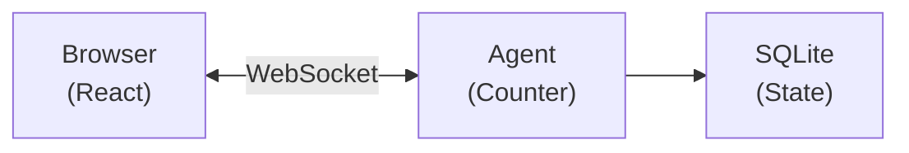

# Source: https://developers.cloudflare.com/agents/getting-started/quick-start/index.md

---

title: Quick start · Cloudflare Agents docs
description: Build your first agent in 10 minutes — a counter with persistent
  state that syncs to a React frontend in real-time.
lastUpdated: 2026-02-14T21:19:22.000Z
chatbotDeprioritize: false
source_url:
  html: https://developers.cloudflare.com/agents/getting-started/quick-start/
  md: https://developers.cloudflare.com/agents/getting-started/quick-start/index.md
---

Build AI agents that persist, think, and act. Agents run on Cloudflare's global network, maintain state across requests, and connect to clients in real-time via WebSockets.

**What you will build:** A counter agent with persistent state that syncs to a React frontend in real-time.

**Time:** \~10 minutes

## Create a new project

* npm

  ```sh
  npm create cloudflare@latest -- -- --template cloudflare/agents-starter
  ```

* yarn

  ```sh
  yarn create cloudflare -- --template cloudflare/agents-starter
  ```

* pnpm

  ```sh
  pnpm create cloudflare@latest -- --template cloudflare/agents-starter
  ```

Then install dependencies and start the dev server:

```sh
cd my-agent
npm install
npm run dev
```

This creates a project with:

* `src/server.ts` — Your agent code
* `src/client.tsx` — React frontend
* `wrangler.jsonc` — Cloudflare configuration

Open <http://localhost:5173> to see your agent in action.

## Your first agent

Build a simple counter agent from scratch. Replace `src/server.ts`:

* JavaScript

  ```js
  import { Agent, routeAgentRequest, callable } from "agents";


  // Define the state shape
  // Create the agent
  export class CounterAgent extends Agent {
    // Initial state for new instances
    initialState = { count: 0 };


    // Methods marked with @callable can be called from the client
    @callable()
    increment() {
      this.setState({ count: this.state.count + 1 });
      return this.state.count;
    }


    @callable()
    decrement() {
      this.setState({ count: this.state.count - 1 });
      return this.state.count;
    }


    @callable()
    reset() {
      this.setState({ count: 0 });
    }
  }


  // Route requests to agents
  export default {
    async fetch(request, env, ctx) {
      return (
        (await routeAgentRequest(request, env)) ??
        new Response("Not found", { status: 404 })
      );
    },
  };
  ```

* TypeScript

  ```ts
  import { Agent, routeAgentRequest, callable } from "agents";


  // Define the state shape
  export type CounterState = {
    count: number;
  };


  // Create the agent
  export class CounterAgent extends Agent<Env, CounterState> {
    // Initial state for new instances
    initialState: CounterState = { count: 0 };


    // Methods marked with @callable can be called from the client
    @callable()
    increment() {
      this.setState({ count: this.state.count + 1 });
      return this.state.count;
    }


    @callable()
    decrement() {
      this.setState({ count: this.state.count - 1 });
      return this.state.count;
    }


    @callable()
    reset() {
      this.setState({ count: 0 });
    }
  }


  // Route requests to agents
  export default {
    async fetch(request: Request, env: Env, ctx: ExecutionContext) {
      return (
        (await routeAgentRequest(request, env)) ??
        new Response("Not found", { status: 404 })
      );
    },
  };
  ```

Update `wrangler.jsonc` to register the agent:

* wrangler.jsonc

  ```jsonc
  {
    "name": "my-agent",
    "main": "src/server.ts",
    "compatibility_date": "2025-01-01",
    "compatibility_flags": ["nodejs_compat"],
    "durable_objects": {
      "bindings": [
        {
          "name": "CounterAgent",
          "class_name": "CounterAgent",
        },
      ],
    },
    "migrations": [
      {
        "tag": "v1",
        "new_sqlite_classes": ["CounterAgent"],
      },
    ],
  }
  ```

* wrangler.toml

  ```toml
  name = "my-agent"
  main = "src/server.ts"
  compatibility_date = "2025-01-01"
  compatibility_flags = [ "nodejs_compat" ]


  [[durable_objects.bindings]]
  name = "CounterAgent"
  class_name = "CounterAgent"


  [[migrations]]
  tag = "v1"
  new_sqlite_classes = [ "CounterAgent" ]
  ```

## Connect from React

Replace `src/client.tsx`:

```tsx
import { useState } from "react";
import { useAgent } from "agents/react";
import type { CounterAgent, CounterState } from "./server";


export default function App() {
  const [count, setCount] = useState(0);


  // Connect to the Counter agent
  const agent = useAgent<CounterAgent, CounterState>({
    agent: "CounterAgent",
    onStateUpdate: (state) => setCount(state.count),
  });


  return (
    <div style={{ padding: "2rem", fontFamily: "system-ui" }}>
      <h1>Counter Agent</h1>
      <p style={{ fontSize: "3rem" }}>{count}</p>
      <div style={{ display: "flex", gap: "1rem" }}>
        <button onClick={() => agent.stub.decrement()}>-</button>
        <button onClick={() => agent.stub.reset()}>Reset</button>
        <button onClick={() => agent.stub.increment()}>+</button>
      </div>
    </div>
  );
}
```

Key points:

* `useAgent` connects to your agent via WebSocket
* `onStateUpdate` fires whenever the agent's state changes
* `agent.stub.methodName()` calls methods marked with `@callable()` on your agent

## What just happened?

When you clicked the button:

1. **Client** called `agent.stub.increment()` over WebSocket
2. **Agent** ran `increment()`, updated state with `setState()`
3. **State** persisted to SQLite automatically
4. **Broadcast** sent to all connected clients
5. **React** updated via `onStateUpdate`



### Key concepts

| Concept | What it means |
| - | - |
| **Agent instance** | Each unique name gets its own agent. `CounterAgent:user-123` is separate from `CounterAgent:user-456` |
| **Persistent state** | State survives restarts, deploys, and hibernation. It is stored in SQLite |
| **Real-time sync** | All clients connected to the same agent receive state updates instantly |
| **Hibernation** | When no clients are connected, the agent hibernates (no cost). It wakes on the next request |

## Connect from vanilla JavaScript

If you are not using React:

* JavaScript

  ```js
  import { AgentClient } from "agents/client";


  const agent = new AgentClient({
    agent: "CounterAgent",
    name: "my-counter", // optional, defaults to "default"
    onStateUpdate: (state) => {
      console.log("New count:", state.count);
    },
  });


  // Call methods
  await agent.call("increment");
  await agent.call("reset");
  ```

* TypeScript

  ```ts
  import { AgentClient } from "agents/client";


  const agent = new AgentClient({
    agent: "CounterAgent",
    name: "my-counter", // optional, defaults to "default"
    onStateUpdate: (state) => {
      console.log("New count:", state.count);
    },
  });


  // Call methods
  await agent.call("increment");
  await agent.call("reset");
  ```

## Deploy to Cloudflare

```sh
npm run deploy
```

Your agent is now live on Cloudflare's global network, running close to your users.

## Troubleshooting

### "Agent not found" or 404 errors

Make sure:

1. Agent class is exported from your server file
2. `wrangler.jsonc` has the binding and migration
3. Agent name in client matches the class name (case-insensitive)

### State not syncing

Check that:

1. You are calling `this.setState()`, not mutating `this.state` directly
2. The `onStateUpdate` callback is wired up in your client
3. WebSocket connection is established (check browser dev tools)

### "Method X is not callable" errors

Make sure your methods are decorated with `@callable()`:

* JavaScript

  ```js
  import { Agent, callable } from "agents";


  export class MyAgent extends Agent {
    @callable()
    increment() {
      // ...
    }
  }
  ```

* TypeScript

  ```ts
  import { Agent, callable } from "agents";


  export class MyAgent extends Agent {
    @callable()
    increment() {
      // ...
    }
  }
  ```

### Type errors with `agent.stub`

Add the agent and state type parameters:

* JavaScript

  ```js
  import { useAgent } from "agents/react";
  // Pass the agent and state types to useAgent
  const agent = useAgent({
    agent: "CounterAgent",
    onStateUpdate: (state) => setCount(state.count),
  });


  // Now agent.stub is fully typed
  agent.stub.increment();
  ```

* TypeScript

  ```ts
  import { useAgent } from "agents/react";
  import type { CounterAgent, CounterState } from "./server";


  // Pass the agent and state types to useAgent
  const agent = useAgent<CounterAgent, CounterState>({
    agent: "CounterAgent",
    onStateUpdate: (state) => setCount(state.count),
  });


  // Now agent.stub is fully typed
  agent.stub.increment();
  ```

### `SyntaxError: Invalid or unexpected token` with `@callable()`

If your dev server fails with `SyntaxError: Invalid or unexpected token`, set `"target": "ES2021"` in your `tsconfig.json`. This ensures that Vite's esbuild transpiler downlevels TC39 decorators instead of passing them through as native syntax.

```json
{
  "compilerOptions": {
    "target": "ES2021"
  }
}
```

Warning

Do not set `"experimentalDecorators": true` in your `tsconfig.json`. The Agents SDK uses [TC39 standard decorators](https://github.com/tc39/proposal-decorators), not TypeScript legacy decorators. Enabling `experimentalDecorators` applies an incompatible transform that silently breaks `@callable()` at runtime.

## Next steps

Now that you have a working agent, explore these topics:

### Common patterns

| Learn how to | Refer to |
| - | - |
| Add AI/LLM capabilities | [Using AI models](https://developers.cloudflare.com/agents/api-reference/using-ai-models/) |
| Expose tools via MCP | [MCP servers](https://developers.cloudflare.com/agents/api-reference/mcp-agent-api/) |
| Run background tasks | [Schedule tasks](https://developers.cloudflare.com/agents/api-reference/schedule-tasks/) |
| Handle emails | [Email routing](https://developers.cloudflare.com/agents/api-reference/email/) |
| Use Cloudflare Workflows | [Run Workflows](https://developers.cloudflare.com/agents/api-reference/run-workflows/) |

### Explore more

[State management](https://developers.cloudflare.com/agents/api-reference/store-and-sync-state/)Deep dive into setState(), initialState, and onStateChanged().

[Client SDK](https://developers.cloudflare.com/agents/api-reference/client-sdk/)Full useAgent and AgentClient API reference.

[Callable methods](https://developers.cloudflare.com/agents/api-reference/callable-methods/)Expose methods to clients with @callable().

[Schedule tasks](https://developers.cloudflare.com/agents/api-reference/schedule-tasks/)Run tasks on a delay, schedule, or cron.
