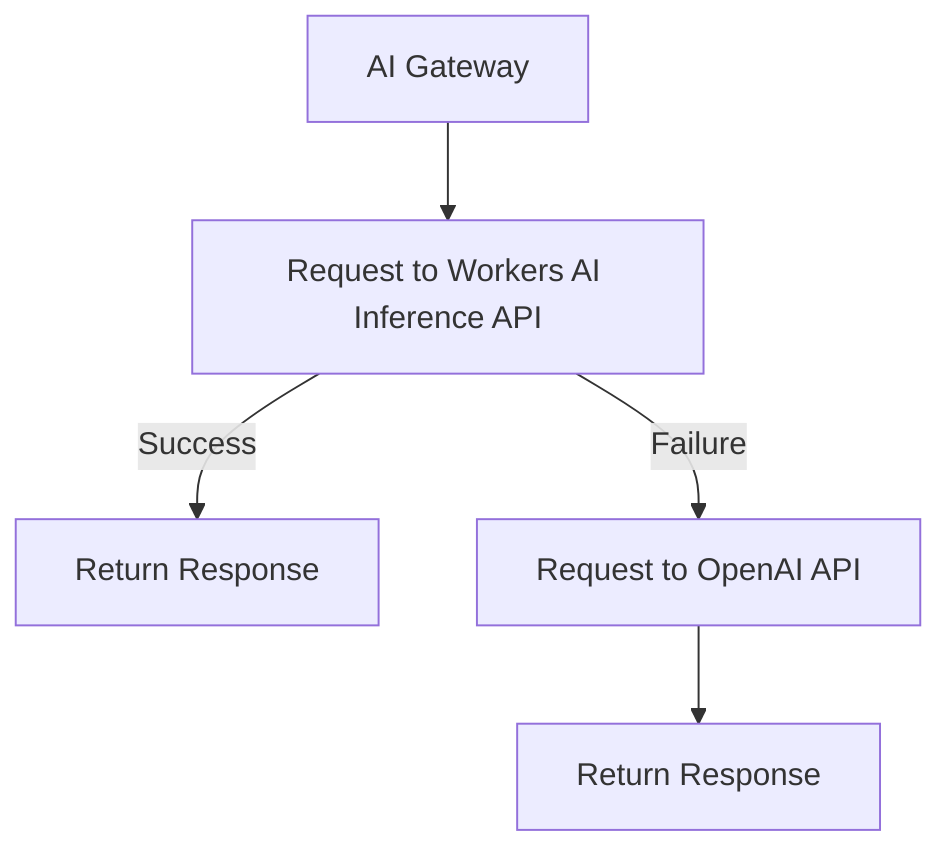

# Source: https://developers.cloudflare.com/ai-gateway/configuration/fallbacks/index.md

---

title: Fallbacks · Cloudflare AI Gateway docs
description: Specify model or provider fallbacks with your Universal endpoint to
  handle request failures and ensure reliability.
lastUpdated: 2025-08-20T18:25:25.000Z
chatbotDeprioritize: true
source_url:
  html: https://developers.cloudflare.com/ai-gateway/configuration/fallbacks/
  md: https://developers.cloudflare.com/ai-gateway/configuration/fallbacks/index.md
---

Specify model or provider fallbacks with your [Universal endpoint](https://developers.cloudflare.com/ai-gateway/usage/universal/) to handle request failures and ensure reliability.

Cloudflare can trigger your fallback provider in response to [request errors](#request-failures) or [predetermined request timeouts](https://developers.cloudflare.com/ai-gateway/configuration/request-handling#request-timeouts). The [response header `cf-aig-step`](#response-headercf-aig-step) indicates which step successfully processed the request.

## Request failures

By default, Cloudflare triggers your fallback if a model request returns an error.

### Example

In the following example, a request first goes to the [Workers AI](https://developers.cloudflare.com/workers-ai/) Inference API. If the request fails, it falls back to OpenAI. The response header `cf-aig-step` indicates which provider successfully processed the request.

1. Sends a request to Workers AI Inference API.
2. If that request fails, proceeds to OpenAI.




You can add as many fallbacks as you need, just by adding another object in the array.

```bash
curl https://gateway.ai.cloudflare.com/v1/{account_id}/{gateway_id} \
  --header 'Content-Type: application/json' \
  --data '[
  {
    "provider": "workers-ai",
    "endpoint": "@cf/meta/llama-3.1-8b-instruct",
    "headers": {
      "Authorization": "Bearer {cloudflare_token}",
      "Content-Type": "application/json"
    },
    "query": {
      "messages": [
        {
          "role": "system",
          "content": "You are a friendly assistant"
        },
        {
          "role": "user",
          "content": "What is Cloudflare?"
        }
      ]
    }
  },
  {
    "provider": "openai",
    "endpoint": "chat/completions",
    "headers": {
      "Authorization": "Bearer {open_ai_token}",
      "Content-Type": "application/json"
    },
    "query": {
      "model": "gpt-4o-mini",
      "stream": true,
      "messages": [
        {
          "role": "user",
          "content": "What is Cloudflare?"
        }
      ]
    }
  }
]'
```

## Response header(cf-aig-step)

When using the [Universal endpoint](https://developers.cloudflare.com/ai-gateway/usage/universal/) with fallbacks, the response header `cf-aig-step` indicates which model successfully processed the request by returning the step number. This header provides visibility into whether a fallback was triggered and which model ultimately processed the response.

* `cf-aig-step:0` – The first (primary) model was used successfully.
* `cf-aig-step:1` – The request fell back to the second model.
* `cf-aig-step:2` – The request fell back to the third model.
* Subsequent steps – Each fallback increments the step number by 1.
