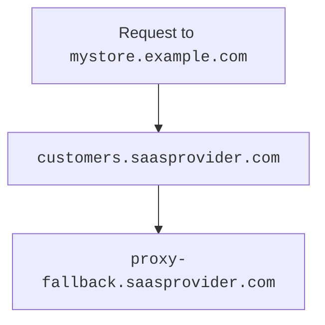

# Source: https://developers.cloudflare.com/cloudflare-for-platforms/cloudflare-for-saas/start/getting-started/index.md

---

title: Configuring Cloudflare for SaaS · Cloudflare for Platforms docs
description: Get started with Cloudflare for SaaS
lastUpdated: 2025-08-22T14:24:45.000Z
chatbotDeprioritize: false
source_url:
  html: https://developers.cloudflare.com/cloudflare-for-platforms/cloudflare-for-saas/start/getting-started/
  md: https://developers.cloudflare.com/cloudflare-for-platforms/cloudflare-for-saas/start/getting-started/index.md
---

***

## Before you begin

Before you start creating custom hostnames:

1. [Add](https://developers.cloudflare.com/fundamentals/manage-domains/add-site/) your zone to Cloudflare on a Free plan.
2. [Enable](https://developers.cloudflare.com/cloudflare-for-platforms/cloudflare-for-saas/start/enable/) Cloudflare for SaaS for your zone.
3. Review the [Hostname prioritization guidelines](https://developers.cloudflare.com/ssl/reference/certificate-and-hostname-priority/#hostname-priority). Wildcard custom hostnames behave differently than an exact hostname match.
4. (optional) Review the following documentation:

* [API documentation](https://developers.cloudflare.com/fundamentals/api/) (if you have not worked with the Cloudflare API before).
* [Certificate validation](https://developers.cloudflare.com/cloudflare-for-platforms/cloudflare-for-saas/security/certificate-management/issue-and-validate/validate-certificates/).

***

## Initial setup

When you first [enable](https://developers.cloudflare.com/cloudflare-for-platforms/cloudflare-for-saas/start/enable/) Cloudflare for SaaS, you need to perform a few steps prior to creating any custom hostnames.


### 1. Create fallback origin

The fallback origin is where Cloudflare will route traffic sent to your custom hostnames (must be proxied).

Note

To route custom hostnames to distinct origins, refer to [custom origin server](https://developers.cloudflare.com/cloudflare-for-platforms/cloudflare-for-saas/start/advanced-settings/custom-origin/).

To create your fallback origin:

1. [Create](https://developers.cloudflare.com/dns/manage-dns-records/how-to/create-dns-records/#create-dns-records) a proxied `A`, `AAAA`, or `CNAME` record pointing to the IP address of your fallback origin (where Cloudflare will send custom hostname traffic).

| **Type** | **Name** | **IPv4 address** | **Proxy status** |
| - | - | - | - |
| `A` | `proxy-fallback` | `192.0.2.1` | Proxied |

1. Designate that record as your fallback origin.

* Dashboard

  1. In the Cloudflare dashboard, go to the **Custom Hostnames** page.

     [Go to **Custom Hostnames**](https://dash.cloudflare.com/?to=/:account/:zone/ssl-tls/custom-hostnames)

  2. For **Fallback Origin**, enter the hostname for your fallback origin.

  3. Select **Add Fallback Origin**.

* API

  Using the hostname of the record you just created, [update the fallback origin value](https://developers.cloudflare.com/api/resources/custom_hostnames/subresources/fallback_origin/methods/update/).

1. Once you have added the fallback origin, confirm that its status is **Active**.

Note

When Cloudflare marks your fallback origin as **Active**, that only reflects that we are ready to send traffic to that DNS record.

You need to make sure your DNS record is sending traffic to the correct origin location.

### 2. (Optional) Create CNAME target

The CNAME target — optional, but highly encouraged — provides a friendly and more flexible place for customers to [route their traffic](#3-have-customer-create-cname-record). You may want to use a subdomain such as `customers.<SAAS_PROVIDER>.com`.

[Create](https://developers.cloudflare.com/dns/manage-dns-records/how-to/create-dns-records/#create-dns-records) a proxied CNAME that points your CNAME target to your fallback origin (can be a wildcard such as `*.customers.saasprovider.com`).

| **Type** | **Name** | **Target** | **Proxy status** |
| - | - | - | - |
| `CNAME` | `.customers` | `proxy-fallback.saasprovider.com` | Proxied |

***

## Per-hostname setup

You need to perform the following steps for each custom hostname.

### 1. Plan for validation

Before you create a hostname, you need to plan for:

1. [Certificate validation](https://developers.cloudflare.com/cloudflare-for-platforms/cloudflare-for-saas/security/certificate-management/issue-and-validate/validate-certificates/): Upon successful validation, the certificates are deployed to Cloudflare’s global network.
2. [Hostname validation](https://developers.cloudflare.com/cloudflare-for-platforms/cloudflare-for-saas/domain-support/hostname-validation/): Upon successful validation, Cloudflare proxies traffic for this hostname.

You must complete both these steps for the hostname to work as expected.

Note

Depending on which method you select for each of these options, additional steps might be required for you and your customers.

### 2. Create custom hostname

After planning for certification and hostname validation, you can create the custom hostname.

Zone name restriction

Do not configure a custom hostname which matches the zone name. For example, if your SaaS zone is `example.com`, do not create a custom hostname named `example.com`.

To create a custom hostname:

* Dashboard

  1. In the Cloudflare dashboard, go to the **Custom Hostnames** page.

     [Go to **Custom Hostnames**](https://dash.cloudflare.com/?to=/:account/:zone/ssl-tls/custom-hostnames)

  2. Select **Add Custom Hostname**.

  3. Add your customer's hostname `app.customer.com` and set the relevant options, including:

     * The [minimum TLS version](https://developers.cloudflare.com/ssl/reference/protocols/).
     * Defining whether you want to use a certificate provided by Cloudflare or [upload a custom certificate](https://developers.cloudflare.com/cloudflare-for-platforms/cloudflare-for-saas/security/certificate-management/custom-certificates/uploading-certificates/).
     * Selecting the [certificate authority (CA)](https://developers.cloudflare.com/ssl/reference/certificate-authorities/) that will issue the certificate.
     * Choosing the [validation method](https://developers.cloudflare.com/cloudflare-for-platforms/cloudflare-for-saas/security/certificate-management/issue-and-validate/validate-certificates/).
     * Whether you want to **Enable wildcard**, which adds a `*.<custom-hostname>` SAN to the custom hostname certificate. For more details, refer to [Hostname priority](https://developers.cloudflare.com/ssl/reference/certificate-and-hostname-priority/#hostname-priority).
     * Choosing a value for [Custom origin server](https://developers.cloudflare.com/cloudflare-for-platforms/cloudflare-for-saas/start/advanced-settings/custom-origin/).

  4. Select **Add Custom Hostname**.

  Default behavior

  When you create a custom hostname:

  * If you issue a custom hostname certificate with wildcards enabled, you cannot customize TLS settings for these wildcard hostnames.
  * If you do not specify the **Minimum TLS Version**, it defaults to the zone's Minimum TLS Version. You can still [edit this setting](https://developers.cloudflare.com/cloudflare-for-platforms/cloudflare-for-saas/security/certificate-management/enforce-mtls/#minimum-tls-version) after creation.

* API

  1. To create a custom hostname using the API, use the [Create Custom Hostname](https://developers.cloudflare.com/api/resources/custom_hostnames/methods/create/) endpoint.

     * You can leave the `certificate_authority` parameter empty to set it to "default CA". With this option, Cloudflare checks the CAA records before requesting the certificates, which helps ensure the certificates can be issued from the CA.

  2. For the newly created custom hostname, the `POST` response may not return the DCV validation token `validation_records`. It is recommended to make a second [`GET` command](https://developers.cloudflare.com/api/resources/custom_hostnames/methods/list/) (with a delay) to retrieve these details.

  The response contains the complete definition of the new custom hostname.

  Default behavior

  When you create a custom hostname:

  * If you issue a custom hostname certificate with wildcards enabled, you cannot customize TLS settings for these wildcard hostnames.
  * If you do not specify the **Minimum TLS Version**, it defaults to the zone's Minimum TLS Version. You can still [edit this setting](https://developers.cloudflare.com/cloudflare-for-platforms/cloudflare-for-saas/security/certificate-management/enforce-mtls/#minimum-tls-version) after creation.

Note

For each custom hostname, Cloudflare issues two certificates bundled in chains that maximize browser compatibility (unless you [upload custom certificates](https://developers.cloudflare.com/cloudflare-for-platforms/cloudflare-for-saas/security/certificate-management/custom-certificates/uploading-certificates/)).

The primary certificate uses a `P-256` key, is `SHA-2/ECDSA` signed, and will be presented to browsers that support elliptic curve cryptography (ECC). The secondary or fallback certificate uses an `RSA 2048-bit` key, is `SHA-2/RSA` signed, and will be presented to browsers that do not support ECC.

### 3. Have customer create CNAME record

To finish the custom hostname setup, your customer needs to set up a CNAME record at their authoritative DNS that points to your [CNAME target](#2-optional-create-cname-target) [1](#user-content-fn-1).

Warning

Before your customer does this step, confirm that the hostname's **Certificate status** and **Hostname status** are both **Active**.

If not, confirm that you are using a method of [certificate](https://developers.cloudflare.com/cloudflare-for-platforms/cloudflare-for-saas/security/certificate-management/issue-and-validate/validate-certificates/http/#http-automatic) or [hostnames](https://developers.cloudflare.com/cloudflare-for-platforms/cloudflare-for-saas/domain-support/hostname-validation/realtime-validation/) validation that occurs after your customer adds their DNS record.

Your customer's CNAME record might look like the following:

```txt
mystore.example.com CNAME customers.saasprovider.com
```

This record would route traffic in the following way:




Requests to `mystore.example.com` would go to your CNAME target (`customers.saasprovider.com`), which would then route to your fallback origin (`proxy-fallback.saasprovider.com`).

Warning

If your customer needs to use an A record to point to the SaaS target, you will need to get [apex proxying](https://developers.cloudflare.com/cloudflare-for-platforms/cloudflare-for-saas/start/advanced-settings/apex-proxying/). By default, using an A record to point to the target is not a supported setup.

#### Service continuation

If your customer is also using Cloudflare for their domain, they should keep their DNS record pointing to your SaaS provider in place for as long as they want to use your service.

For more details, refer to [Remove custom hostnames](https://developers.cloudflare.com/cloudflare-for-platforms/cloudflare-for-saas/domain-support/remove-custom-hostnames/).

## Footnotes

1. If you have [regional services](https://developers.cloudflare.com/data-localization/regional-services/) set up for your custom hostnames, Cloudflare always uses the processing region associated with your DNS target record (instead of the processing region of any [custom origins](https://developers.cloudflare.com/cloudflare-for-platforms/cloudflare-for-saas/start/advanced-settings/custom-origin/)).

   [↩](#user-content-fnref-1)
