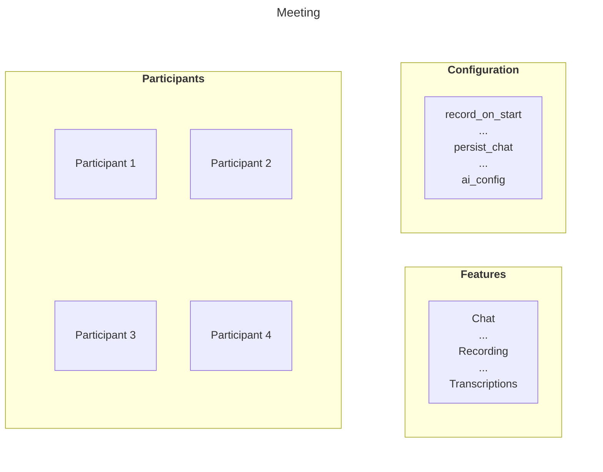

# Source: https://developers.cloudflare.com/realtime/realtimekit/concepts/meeting/index.md

---

title: Meeting · Cloudflare Realtime docs
description: Meeting is a re-usable virtual room that you can join and interact
  in, in real-time.
lastUpdated: 2025-12-30T17:46:42.000Z
chatbotDeprioritize: false
source_url:
  html: https://developers.cloudflare.com/realtime/realtimekit/concepts/meeting/
  md: https://developers.cloudflare.com/realtime/realtimekit/concepts/meeting/index.md
---

Meeting is a **re-usable virtual room** that you can join and interact in, in real-time.

You can assign a title and feature configuration to it, then add participants who are authorised to join. The Meeting itself doesn't "start" or "end"; it just exists.

Because Meetings do not have a specific date or time, you can create them well in advance or create them just-in-time, right when users need to join.

The following diagram shows the blueprint of a Meeting:



### Session

A **Session** is a live instance of a Meeting. It starts automatically when the first participant joins the meeting and ends shortly after the last participant leaves. A Session inherits all settings (like features and title) from its parent Meeting.

Because the Meeting is persistent, it can have many different Sessions over time.

Example - **Think of a Meeting as a recurring weekly standup event.**

The Meeting is the permanent “standup event” that exists in your system.

Each week, when participants join for that week’s standup, a **new Session** is created — this Session represents that week’s actual live standup.

> **Note**: This distinction is important for billing. You are charged on a per-participant basis only for the duration of an active Session, not for an idle Meeting.

You can get the details of your sessions from the [RealtimeKit Dashboard](https://dash.cloudflare.com/?to=/:account/realtime/kit) or using the [Sessions API](https://developers.cloudflare.com/api/resources/realtime_kit/subresources/sessions/) endpoints.


### Session Terminologies

#### Waiting Room

A **waiting room** lets participants join a meeting without immediately entering the live session. This gives hosts full control over **who gets in**, **when they enter**, and **how the meeting flow is managed**.

Hosts can also configure specific behaviours for how users move from the waiting room into the meeting.

* **Join when accepted by someone** Participants stay in the waiting room until a host or another authorized user explicitly admits them. Ideal for highly controlled or private meetings.

* **Join when a privileged user joins** Participants remain in the waiting room initially, but are automatically admitted once a host or other privileged user enters the meeting. Useful for scheduled events where attendees should only join after the moderator is present.

* **Accept users into waiting room** Hosts can see the list of waiting users, admit them individually or in bulk, or remove them. This mode provides maximum visibility and control over incoming participants.

These options allow you to tailor how access is managed—whether you need strict admission control, a smoother flow once a host arrives, or a combination of both.

#### Stage

Meetings can be configured with a **virtual stage**, which helps you manage who actively participates with audio and video during high-attendance sessions.

When a participant is **on the stage**, they are visible in the grid and they can publish their audio and video to everyone in the meeting. Participants who are **off the stage** cannot publish media, but they can still fully engage through features like **chat**, **polls**, **Q\&A**, and **plugins**—making the experience interactive without overwhelming the live video layout.

Participants can also **request to join the stage**, allowing them to signal when they want to speak or present. Hosts retain full control at all times: they can **approve or deny requests**, or directly **invite or remove participants from the stage** as needed.

This setup is ideal for webinars, town halls, AMAs, and other structured events where only a subset of users should broadcast while everyone else participates from the audience.

#### Connected Meetings

Connected Meetings let you create linked meeting spaces, that participants can switch between during a session. This is useful for workshops, classrooms, parallel discussions, or any scenario where the main meeting splits into smaller groups before coming back together.

You can control how participants move between these connected spaces using the following permissions:

* **Full Access:** Allows participants to create, update, and delete connected meetings.
* **Switch Connected Meeting:** Lets participants move freely between the available connected (child) meetings.
* **Switch to Parent Meeting:** Allows participants to return to the main (parent) meeting at any time.

### Create a meeting

You create and manage RealtimeKit meetings, typically from your backend, using the [Meetings API](https://developers.cloudflare.com/api/resources/realtime_kit/subresources/meetings/). To create a meeting, send a `POST` request to the [Create Meeting](https://developers.cloudflare.com/api/resources/realtime_kit/subresources/meetings/methods/create/) endpoint.

API Prerequisites

Make sure you have the following values for this API request:

* Your Cloudflare `ACCOUNT_ID`
* RealtimeKit `APP_ID`
* Your `CLOUDFLARE_API_TOKEN` (with Realtime permissions)

If you do not have them yet, refer to the [Getting Started](https://developers.cloudflare.com/realtime/realtimekit/quickstart/) guide.

```bash
curl https://api.cloudflare.com/client/v4/accounts/{ACCOUNT_ID}/realtime/kit/{APP_ID}/meetings \
  --request POST \
  --header "Authorization: Bearer <CLOUDFLARE_API_TOKEN>" \
  --header "Content-Type: application/json" \
  --data '{
    "title": "My First Cloudflare RealtimeKit meeting"
    }'
```

A successful response includes a unique `id` for the created meeting. Save this ID, as it is required for all future operations on this specific meeting, such as adding participants or disabling it.

For a complete list of all available configuration parameters, refer to the [Create Meeting API](https://developers.cloudflare.com/api/resources/realtime_kit/subresources/meetings/methods/create/).

### Where to Go Next

After learning about Meetings and Sessions, you can explore the following next steps:

* Configure [Presets](https://developers.cloudflare.com/realtime/realtimekit/concepts/preset/) for your App – Set up default permissions, media settings, and behavior for all Sessions created from a Meeting.
* Add [Participants](https://developers.cloudflare.com/realtime/realtimekit/concepts/participant/) to a Meeting – Manage who can join, their roles, and the access controls they inherit.
* Get started with [RealtimeKit SDKs](https://developers.cloudflare.com/realtime/realtimekit/quickstart/) – Integrate RealtimeKit into your web or mobile app with just a few lines of code.
