# Source: https://developers.cloudflare.com/realtime/realtimekit/ui-kit/state-management/index.md

---

title: State Management · Cloudflare Realtime docs
description: This page builds upon the Basic Implementation Guide. Make sure
  you've read those first.
lastUpdated: 2025-12-30T17:46:42.000Z
chatbotDeprioritize: false
source_url:
  html: https://developers.cloudflare.com/realtime/realtimekit/ui-kit/state-management/
  md: https://developers.cloudflare.com/realtime/realtimekit/ui-kit/state-management/index.md
---

## Prerequisites

This page builds upon the [Basic Implementation Guide](https://developers.cloudflare.com/realtime/realtimekit/ui-kit). Make sure you've read those first.

The code examples on this page assume you've already imported the necessary packages and initialized the SDK.

## How UI Kit Components Communicate

Here's an example of how state synchronization works when opening the participants sidebar:

```mermaid
flowchart LR
    accTitle: Sidebar State Synchronization Example
    accDescr: Example showing how clicking participants toggle updates sidebar through meeting coordination

    Toggle["👤 ParticipantsToggle<br/>(User clicks)"]
    Meeting["Meeting Component<br/>(State Coordinator)"]
    Sidebar["Sidebar<br/>(Opens/Closes)"]
    App["Your App<br/>(Gets notified)"]

    Toggle -->|"emits rtkStateUpdate<br/>{activeSidebar: true,<br/>sidebar: 'participants'}"|Meeting
    Meeting -->|"propagates state"|Sidebar
    Meeting -->|"emits rtkStatesUpdate"|App

    style Meeting fill:#F48120,stroke:#333,stroke-width:2px,color:#fff
    style App fill:#0051C3,stroke:#333,stroke-width:2px,color:#fff
```

## State Flow

1. **Child components emit state updates**: When any UI component needs to update state, it emits a state update event
2. **Meeting component listens and coordinates**: The meeting component listens to all these state update events from its children
3. **State propagation**: The meeting component propagates the updated state to all other child components to keep them synchronized
4. **External notification**: The meeting component also emits `rtkStatesUpdate` event that your application can listen to for updating your custom UI or performing actions based on state changes

## Listening to State Updates

To build custom UI or perform actions based on meeting state changes, you need to listen to the `rtkStatesUpdate` event emitted by the meeting component. This event provides you with the current state of the meeting, including active speaker, participant list, recording status, and more.

Note

Store the states in a state management solution (like React's `useState` or a plain JavaScript object) to alter your UI based on meeting state changes.

## Example Code

## State Properties

The `rtkStatesUpdate` event provides detailed information about the UI Kit's internal state. Key properties include:

* **`meeting`**: Current meeting state - `'idle'`, `'setup'`, `'joined'`, `'ended'`, or `'waiting'`
* **`activeSidebar`**: Whether the sidebar is currently open (boolean)
* **`sidebar`**: Current sidebar section - `'chat'`, `'participants'`, `'polls'`, `'plugins'`, etc.
* **`activeScreenShare`**: Whether screen sharing UI is active (boolean)
* **`activeMoreMenu`**: Whether the more menu is open (boolean)
* **`activeSettings`**: Whether settings panel is open (boolean)
* **`viewType`**: Current video grid view type (string)
* **`prefs`**: User preferences object (e.g., `mirrorVideo`, `muteNotificationSounds`)
* **`roomLeftState`**: State when leaving the room
* **`activeOverlayModal`**: Active overlay modal configuration object
* **`activeConfirmationModal`**: Active confirmation modal configuration object
* **And many more UI state properties**

Note

These are **UI Kit internal states** for managing the interface. For meeting data like participants, active speaker, or recording status, use the [Core SDK's meeting object](https://developers.cloudflare.com/realtime/realtimekit/core/meeting-object-explained/) directly.

## Best Practices

* **Store states appropriately**: Use React's `useState` hook or a state management library (like Zustand or Redux) for React apps. For vanilla JavaScript, use a reactive state management solution or simple object storage.
* **Avoid excessive re-renders**: Only update your UI when necessary. In React, consider using `useMemo` or `useCallback` to optimize performance.
* **Access nested properties safely**: Always check if nested properties exist before accessing them (e.g., `states.sidebar`, `states.prefs?.mirrorVideo`).
* **Use states for conditional rendering**: Leverage the UI states to show/hide UI elements or respond to interface changes (e.g., showing custom indicators when `states.activeScreenShare` is true).
* **Understand the difference**: `rtkStatesUpdate` provides **UI Kit internal states** for interface management. For meeting data (participants, active speaker, recording status), use the Core SDK's `meeting` object and its events directly.
