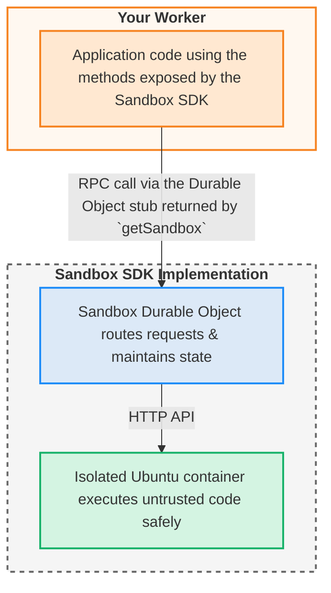

# Source: https://developers.cloudflare.com/sandbox/concepts/architecture/index.md

---

title: Architecture · Cloudflare Sandbox SDK docs
description: "Sandbox SDK lets you execute untrusted code safely from your
  Workers. It combines three Cloudflare technologies to provide secure,
  stateful, and isolated execution:"
lastUpdated: 2026-02-10T11:20:23.000Z
chatbotDeprioritize: false
source_url:
  html: https://developers.cloudflare.com/sandbox/concepts/architecture/
  md: https://developers.cloudflare.com/sandbox/concepts/architecture/index.md
---

Sandbox SDK lets you execute untrusted code safely from your Workers. It combines three Cloudflare technologies to provide secure, stateful, and isolated execution:

* **Workers** - Your application logic that calls the Sandbox SDK
* **Durable Objects** - Persistent sandbox instances with unique identities
* **Containers** - Isolated Linux environments where code actually runs

## Architecture overview



### Layer 1: Client SDK

The developer-facing API you use in your Workers:

```typescript
import { getSandbox } from "@cloudflare/sandbox";


const sandbox = getSandbox(env.Sandbox, "my-sandbox");
const result = await sandbox.exec("python script.py");
```

**Purpose**: Provide a clean, type-safe TypeScript interface for all sandbox operations.

### Layer 2: Durable Object

Manages sandbox lifecycle and routing:

```typescript
export class Sandbox extends DurableObject<Env> {
  // Extends Cloudflare Container for isolation
  // Routes requests between client and container
  // Manages preview URLs and state
}
```

**Purpose**: Provide persistent, stateful sandbox instances with unique identities.

**Why Durable Objects**:

* **Persistent identity** - Same sandbox ID always routes to same instance
* **Container management** - Durable Object owns and manages the container lifecycle
* **Geographic distribution** - Sandboxes run close to users
* **Automatic scaling** - Cloudflare manages provisioning

### Layer 3: Container Runtime

Executes code in isolation with full Linux capabilities.

**Purpose**: Safely execute untrusted code.

**Why containers**:

* **VM-based isolation** - Each sandbox runs in its own VM
* **Full environment** - Ubuntu Linux with Python, Node.js, Git, etc.

## Communication transports

The SDK supports two transport protocols for communication between the Durable Object and container:

### HTTP transport (default)

Each SDK method makes a separate HTTP request to the container API. Simple, reliable, and works for most use cases.

```typescript
// Default behavior - uses HTTP
const sandbox = getSandbox(env.Sandbox, "my-sandbox");
await sandbox.exec("python script.py");
```

### WebSocket transport

Multiplexes all SDK calls over a single persistent WebSocket connection. Avoids [subrequest limits](https://developers.cloudflare.com/workers/platform/limits/#subrequests) when making many concurrent operations.

Enable WebSocket transport by setting the `SANDBOX_TRANSPORT` variable in your Worker's configuration:

* wrangler.jsonc

  ```jsonc
  {
    "vars": {
      "SANDBOX_TRANSPORT": "websocket"
    },
  }
  ```

* wrangler.toml

  ```toml
  [vars]
  SANDBOX_TRANSPORT = "websocket"
  ```

The transport layer is transparent to your application code - all SDK methods work identically regardless of transport. See [Transport modes](https://developers.cloudflare.com/sandbox/configuration/transport/) for details on when to use each transport and configuration examples.

## Request flow

When you execute a command:

```typescript
await sandbox.exec("python script.py");
```

**HTTP transport flow**:

1. **Client SDK** validates parameters and sends HTTP request to Durable Object
2. **Durable Object** authenticates and forwards HTTP request to container
3. **Container Runtime** validates inputs, executes command, captures output
4. **Response flows back** through all layers with proper error transformation

**WebSocket transport flow**:

1. **Client SDK** validates parameters and sends request over persistent WebSocket connection
2. **Durable Object** maintains WebSocket connection, multiplexes concurrent requests
3. **Container Runtime** adapts WebSocket messages to HTTP-style request/response
4. **Response flows back** over same WebSocket connection with proper error transformation

The WebSocket connection is established on first SDK call and reused for all subsequent operations, reducing overhead for high-frequency operations.

## Related resources

* [Sandbox lifecycle](https://developers.cloudflare.com/sandbox/concepts/sandboxes/) - How sandboxes are created and managed
* [Container runtime](https://developers.cloudflare.com/sandbox/concepts/containers/) - Inside the execution environment
* [Security model](https://developers.cloudflare.com/sandbox/concepts/security/) - How isolation and validation work
* [Session management](https://developers.cloudflare.com/sandbox/concepts/sessions/) - Advanced state management
