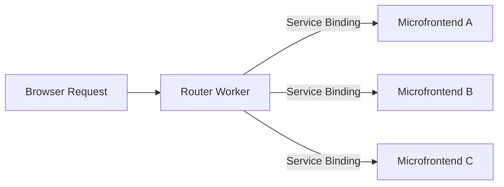

# Source: https://developers.cloudflare.com/workers/framework-guides/web-apps/microfrontends/index.md

---

title: Microfrontends · Cloudflare Workers docs
description: Split a single application into independently deployable frontends,
  using a router worker and service bindings
lastUpdated: 2026-01-30T14:24:48.000Z
chatbotDeprioritize: false
source_url:
  html: https://developers.cloudflare.com/workers/framework-guides/web-apps/microfrontends/
  md: https://developers.cloudflare.com/workers/framework-guides/web-apps/microfrontends/index.md
---

Microfrontends let you split a single application into smaller, independently deployable units that render as one cohesive application. Different teams using different technologies can develop, test, and deploy each microfrontend.

Use microfrontends when you want to:

* Enable many teams to deploy independently without coordinating releases
* Gradually migrate from a monolith to a distributed architecture
* Build multi-framework applications (for example, Astro, Remix, and Next.js in one app)

## Get started

Create a microfrontend project:

[](https://dash.cloudflare.com/?to=/:account/workers-and-pages/create?type=vmfe)

This template automatically creates a router worker with pre-configured routing logic, and lets you configure [Service bindings](https://developers.cloudflare.com/workers/runtime-apis/bindings/service-bindings/) to Workers you have already deployed to your Cloudflare account. The code or this template is available on GitHub at [cloudflare/templates](https://github.com/cloudflare/templates/tree/main/microfrontend-template).

## How it works



The router worker:

1. Analyzes the incoming request path
2. Matches it against configured routes
3. Forwards the request to the appropriate microfrontend via service binding
4. Rewrites HTML, CSS, and headers to ensure assets load correctly
5. Returns the response to the browser

Each microfrontend can be:

* A full-framework application (Next.js, SvelteKit, Astro, etc.)
* A static site with [Workers Static Assets](https://developers.cloudflare.com/workers/static-assets/)
* Built with different frameworks and technologies

## Routing logic

The router worker uses a `ROUTES` [environment variable](https://developers.cloudflare.com/workers/configuration/environment-variables/) to determine which microfrontend handles each path. Routes are matched by specificity, with longer paths taking precedence.

Example `ROUTES` configuration:

```json
{
  "routes": [
    { "path": "/app-a", "binding": "MICROFRONTEND_A", "preload": true },
    { "path": "/app-b", "binding": "MICROFRONTEND_B", "preload": true },
    { "path": "/", "binding": "MICROFRONTEND_HOME" }
  ],
  "smoothTransitions": true
}
```

Each route requires:

* `path`: The mount path for the microfrontend (must be distinct from other routes)
* `binding`: The name of the service binding in your [Wrangler configuration file](https://developers.cloudflare.com/workers/wrangler/configuration/)
* `preload` (optional): Whether to prefetch this microfrontend for faster navigation

When a request comes in for `/app-a/dashboard`, the router:

1. Matches it to the `/app-a` route
2. Forwards the request to `MICROFRONTEND_A`
3. Strips the `/app-a` prefix, so the microfrontend receives `/dashboard`

The router includes path matching logic that supports:

```typescript
// Static paths
{ "path": "/dashboard" }


// Dynamic parameters
{ "path": "/users/:id" }


// Wildcard matching (zero or more segments)
{ "path": "/docs/:path*" }


// Required segments (one or more segments)
{ "path": "/api/:path+" }
```

## Path rewriting

The router worker uses [HTMLRewriter](https://developers.cloudflare.com/workers/runtime-apis/html-rewriter/) to automatically rewrite HTML attributes to include the mount path prefix, ensuring assets load from the correct location.

When a microfrontend mounted at `/app-a` returns HTML:

```html
<link rel="stylesheet" href="/assets/styles.css" />
<script src="/assets/app.js"></script>

```

The router rewrites it to:

```html
<link rel="stylesheet" href="/app-a/assets/styles.css" />
<script src="/app-a/assets/app.js"></script>

```

The rewriter handles these attributes across all HTML elements:

* `href`, `src`, `poster`, `action`, `srcset`
* `data-*` attributes like `data-src`, `data-href`, `data-background`
* Framework-specific attributes like `astro-component-url`

The router only rewrites paths that start with configured asset prefixes to avoid breaking external URLs:

```javascript
// Default asset prefixes
const DEFAULT_ASSET_PREFIXES = [
  "/assets/",
  "/static/",
  "/build/",
  "/_astro/",
  "/fonts/",
];
```

Most frameworks work with the default prefixes. For frameworks with different build outputs (like Next.js which uses `/_next/`), you can configure custom prefixes using the `ASSET_PREFIXES` [environment variable](https://developers.cloudflare.com/workers/configuration/environment-variables/):

```json
["/_next/", "/public/"]
```

## Asset handling

The router also rewrites CSS files to ensure `url()` references work correctly. When a microfrontend mounted at `/app-a` returns CSS:

```css
.hero {
  background: url(/assets/hero.jpg);
}


.icon {
  background: url("/static/icon.svg");
}
```

The router rewrites it to:

```css
.hero {
  background: url(/app-a/assets/hero.jpg);
}


.icon {
  background: url("/app-a/static/icon.svg");
}
```

The router also handles:

* **Redirect headers**: Rewrites `Location` headers to include the mount path
* **Cookie paths**: Updates `Set-Cookie` headers to scope cookies to the mount path

## Route Preloading

When `preload: true` is set on a static mount route, the router automatically preloads those routes to enable faster navigation. The router uses **browser-specific optimization** to provide the best performance for each browser:

### Chromium Browsers (Chrome, Edge, Opera, Brave)

For Chromium-based browsers, the router uses the **Speculation Rules API** - a modern, browser-native prefetching mechanism:

* Injects `<script type="speculationrules">` into the `<head>` element
* Browser handles prefetching automatically with optimal priority management
* Respects user preferences (battery saver, data saver modes)
* Uses per-document in-memory cache for faster access
* Not blocked by Cache-Control headers
* More efficient than JavaScript-based fetching

**Example injected speculation rules:**

````json
{
  "prefetch": [
    {
      "urls": ["/app1", "/app2", "/dashboard"]
    }
  ]
}


## Smooth transitions


You can enable smooth page transitions between microfrontends using the [View Transitions API](https://developer.mozilla.org/en-US/docs/Web/API/View_Transitions_API).


To enable smooth transitions, set `"smoothTransitions": true` in your `ROUTES` configuration:


```json
{
  "routes": [
    { "path": "/app-a", "binding": "MICROFRONTEND_A" },
    { "path": "/app-b", "binding": "MICROFRONTEND_B" }
  ],
  "smoothTransitions": true
}
````

The router automatically injects CSS into HTML responses:

```css
@supports (view-transition-name: none) {
  ::view-transition-old(root),
  ::view-transition-new(root) {
    animation-duration: 0.3s;
    animation-timing-function: ease-in-out;
  }
  main {
    view-transition-name: main-content;
  }
  nav {
    view-transition-name: navigation;
  }
}
```

This feature only works in browsers that support the View Transitions API. Browsers without support will navigate normally without animations.

## Add a new microfrontend

To add a new microfrontend to your application after initial setup:

1. **Create and deploy the new microfrontend worker**

   Deploy your new microfrontend as a separate Worker. This can be a [framework application](https://developers.cloudflare.com/workers/framework-guides/) (Next.js, Astro, etc.) or a static site with [Workers Static Assets](https://developers.cloudflare.com/workers/static-assets/).

2. **Add a [service binding](https://developers.cloudflare.com/workers/runtime-apis/bindings/service-bindings/) in your router's Wrangler configuration file**

   * wrangler.jsonc

     ```jsonc
     {
       "$schema": "./node_modules/wrangler/config-schema.json",
       "services": [
         {
           "binding": "MICROFRONTEND_C",
           "service": "my-new-microfrontend"
         }
       ]
     }
     ```

   * wrangler.toml

     ```toml
     [[services]]
     binding = "MICROFRONTEND_C"
     service = "my-new-microfrontend"
     ```

3. **Update the `ROUTES` environment variable**

   Add your new route to the `ROUTES` configuration:

   ```json
   {
     "routes": [
       { "path": "/app-a", "binding": "MICROFRONTEND_A", "preload": true },
       { "path": "/app-b", "binding": "MICROFRONTEND_B", "preload": true },
       { "path": "/app-c", "binding": "MICROFRONTEND_C", "preload": true },
       { "path": "/", "binding": "MICROFRONTEND_HOME" }
     ]
   }
   ```

4. **Redeploy the router worker**

   ```sh
   npx wrangler deploy
   ```

Your new microfrontend is now accessible at the configured path (for example, `/app-c`).

## Local development

During development, you can test your microfrontend architecture locally using Wrangler's service binding support. Run the router Worker locally using `wrangler dev`, and then in separate terminals run each of the microfrontends.

If you only need to work on one of the microfrontends, you can run the others remotely using [remote bindings](https://developers.cloudflare.com/workers/development-testing/#remote-bindings), without needing to have access to the source code or run a local dev server.

For each microfrontend you want to run remotely while in local dev, configure its service binding with the remote flag:

* wrangler.jsonc

  ```jsonc
  {
  "services": [
    {
    "binding": "<BINDING_NAME>",
    "service": "<WORKER_NAME>",
    "remote": true
    }
  ]
  }
  ```

* wrangler.toml

  ```toml
  [[services]]
  binding = "<BINDING_NAME>"
  service = "<WORKER_NAME>"
  remote = true
  ```

## Deployment

Each microfrontend can be deployed independently without redeploying the router or other microfrontends. This enables teams to:

* Deploy updates on their own schedule
* Roll back individual microfrontends without affecting others
* Test and release features independently

When you deploy a microfrontend worker, the router automatically routes requests to the latest version via the service binding. No router changes are required unless you are adding new routes or updating the `ROUTES` configuration.

To deploy to production, you can use [custom domains](https://developers.cloudflare.com/workers/configuration/routing/custom-domains/) for your router worker, and configure [Workers Builds](https://developers.cloudflare.com/workers/ci-cd/builds/) for continuous deployment from your Git repository.
