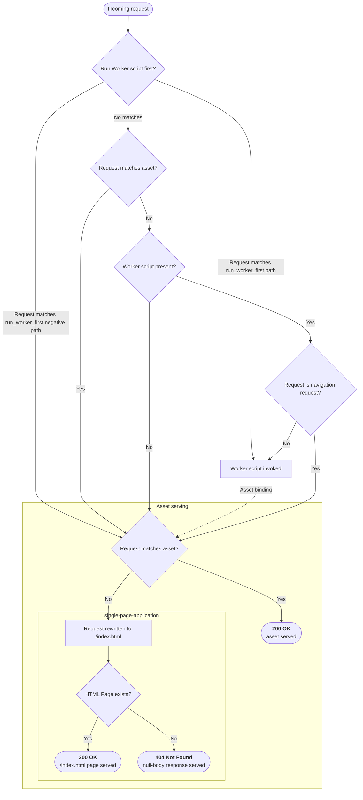

# Source: https://developers.cloudflare.com/workers/static-assets/routing/single-page-application/index.md

---

title: Single Page Application (SPA) · Cloudflare Workers docs
description: How to configure and use a Single Page Application (SPA) with Workers.
lastUpdated: 2025-12-09T19:56:58.000Z
chatbotDeprioritize: false
source_url:
  html: https://developers.cloudflare.com/workers/static-assets/routing/single-page-application/
  md: https://developers.cloudflare.com/workers/static-assets/routing/single-page-application/index.md
---

Single Page Applications (SPAs) are web applications which are client-side rendered (CSR). They are often built with a framework such as [React](https://developers.cloudflare.com/workers/framework-guides/web-apps/react/), [Vue](https://developers.cloudflare.com/workers/framework-guides/web-apps/vue/) or [Svelte](https://developers.cloudflare.com/workers/framework-guides/web-apps/sveltekit/). The build process of these frameworks will produce a single `/index.html` file and accompanying client-side resources (e.g. JavaScript bundles, CSS stylesheets, images, fonts, etc.). Typically, data is fetched by the client from an API with client-side requests.

When you configure `single-page-application` mode, Cloudflare provides default routing behavior that automatically serves your `/index.html` file for navigation requests (those with `Sec-Fetch-Mode: navigate` headers) which don't match any other asset. For more control over which paths invoke your Worker script, you can use [advanced routing control](#advanced-routing-control).

## Configuration

In order to deploy a Single Page Application to Workers, you must configure the `assets.directory` and `assets.not_found_handling` options in your [Wrangler configuration file](https://developers.cloudflare.com/workers/wrangler/configuration/#assets):

* wrangler.jsonc

  ```jsonc
  {
    "name": "my-worker",
    "compatibility_date": "2026-02-14",
    "assets": {
      "directory": "./dist/",
      "not_found_handling": "single-page-application"
    }
  }
  ```

* wrangler.toml

  ```toml
  name = "my-worker"
  compatibility_date = "2026-02-14"


  [assets]
  directory = "./dist/"
  not_found_handling = "single-page-application"
  ```

Configuring `assets.not_found_handling` to `single-page-application` overrides the default serving behavior of Workers for static assets. When an incoming request does not match a file in the `assets.directory`, Workers will serve the contents of the `/index.html` file with a `200 OK` status.

### Navigation requests

If you have a Worker script (`main`), have configured `assets.not_found_handling`, and use the [`assets_navigation_prefers_asset_serving` compatibility flag](https://developers.cloudflare.com/workers/configuration/compatibility-flags/#navigation-requests-prefer-asset-serving) (or set a compatibility date of `2025-04-01` or greater), *navigation requests* will not invoke the Worker script. A *navigation request* is a request made with the `Sec-Fetch-Mode: navigate` header, which browsers automatically attach when navigating to a page. This reduces billable invocations of your Worker script, and is particularly useful for client-heavy applications which would otherwise invoke your Worker script very frequently and unnecessarily.

Note

This can lead to surprising but intentional behavior. For example, if you define an API endpoint in a Worker script (e.g. `/api/date`) and then fetch it with a client-side request in your SPA (e.g. `fetch("/api/date")`), the Worker script will be invoked and your API response will be returned as expected. However, if you navigate to `/api/date` in your browser, you will be served an HTML file. Again, this is to reduce the number of billable invocations for your application while still maintaining SPA-like functionality. This behavior can be disabled by setting the [`assets_navigation_has_no_effect` compatibility flag](https://developers.cloudflare.com/workers/configuration/compatibility-flags/#navigation-requests-prefer-asset-serving).

Note

If you wish to run the Worker script ahead of serving static assets (e.g. to log requests, or perform some authentication checks), you can additionally configure the [`assets.run_worker_first` setting](https://developers.cloudflare.com/workers/static-assets/routing/worker-script/#run_worker_first). This will retain your `assets.not_found_handling` behavior when no other asset matches, while still allowing you to control access to your application with your Worker script.

#### Client-side callbacks

In some cases, you might need to pass a value from a navigation request to your Worker script. For example, if you are acting as an OAuth callback, you might expect to see requests made to some route such as `/oauth/callback?code=...`. With the `assets_navigation_prefers_asset_serving` flag, your HTML assets will be server, rather than your Worker script. In this case, we recommend, either as part of your client application for this appropriate route, or with a slimmed-down endpoint-specific HTML file, passing the value to the server with client-side JavaScript.

```html
<!DOCTYPE html>
<html>
  <head>
    <title>OAuth callback</title>
  </head>
  <body>
    <p>Loading...</p>
    <script>
      (async () => {
        const response = await fetch("/api/oauth/callback" + window.location.search);
        if (response.ok) {
          window.location.href = '/';
        } else {
          document.querySelector('p').textContent = 'Error: ' + (await response.json()).error;
        }
      })();
    </script>
  </body>
</html>
```

* JavaScript

  ```js
  import { WorkerEntrypoint } from "cloudflare:workers";


  export default class extends WorkerEntrypoint {
    async fetch(request) {
      const url = new URL(request.url);
      if (url.pathname === "/api/oauth/callback") {
        const code = url.searchParams.get("code");


        const sessionId =
          await exchangeAuthorizationCodeForAccessAndRefreshTokensAndPersistToDatabaseAndGetSessionId(
            code,
          );


        if (sessionId) {
          return new Response(null, {
            headers: {
              "Set-Cookie": `sessionId=${sessionId}; HttpOnly; SameSite=Strict; Secure; Path=/; Max-Age=86400`,
            },
          });
        } else {
          return Response.json(
            { error: "Invalid OAuth code. Please try again." },
            { status: 400 },
          );
        }
      }


      return new Response(null, { status: 404 });
    }
  }
  ```

* TypeScript

  ```ts
  import { WorkerEntrypoint } from "cloudflare:workers";


  export default class extends WorkerEntrypoint {
    async fetch(request: Request) {
      const url = new URL(request.url);
      if (url.pathname === "/api/oauth/callback") {
        const code = url.searchParams.get("code");


        const sessionId = await exchangeAuthorizationCodeForAccessAndRefreshTokensAndPersistToDatabaseAndGetSessionId(code);


        if (sessionId) {
          return new Response(null, {
            headers: {
              "Set-Cookie": `sessionId=${sessionId}; HttpOnly; SameSite=Strict; Secure; Path=/; Max-Age=86400`,
            },
          });
        } else {
          return Response.json(
            { error: "Invalid OAuth code. Please try again." },
            { status: 400 }
          );
        }
      }


      return new Response(null, { status: 404 });
    }
  }
  ```

## Advanced routing control

For more explicit control over SPA routing behavior, you can use `run_worker_first` with an array of route patterns. This approach disables the automatic `Sec-Fetch-Mode: navigate` detection and gives you explicit control over which requests should be handled by your Worker script vs served as static assets.

Note

Advanced routing control is supported in:

* [Wrangler](https://developers.cloudflare.com/workers/wrangler/install-and-update/) v4.20.0 and above
* [Cloudflare Vite plugin](https://developers.cloudflare.com/workers/vite-plugin/get-started/) v1.7.0 and above

* wrangler.jsonc

  ```jsonc
  {
    "name": "my-worker",
    "compatibility_date": "2026-02-14",
    "main": "./src/index.ts",
    "assets": {
      "directory": "./dist/",
      "not_found_handling": "single-page-application",
      "binding": "ASSETS",
      "run_worker_first": ["/api/*", "!/api/docs/*"]
    }
  }
  ```

* wrangler.toml

  ```toml
  name = "my-worker"
  compatibility_date = "2026-02-14"
  main = "./src/index.ts"


  [assets]
  directory = "./dist/"
  not_found_handling = "single-page-application"
  binding = "ASSETS"
  run_worker_first = [ "/api/*", "!/api/docs/*" ]
  ```

This configuration provides explicit routing control without relying on browser navigation headers, making it ideal for complex SPAs that need fine-grained routing behavior. Your Worker script can then handle the matched routes and (optionally using [the assets binding](https://developers.cloudflare.com/workers/static-assets/binding/#binding)) and serve dynamic content.

**For example:**

* JavaScript

  ```js
  export default {
    async fetch(request, env) {
      const url = new URL(request.url);


      if (url.pathname === "/api/name") {
        return new Response(JSON.stringify({ name: "Cloudflare" }), {
          headers: { "Content-Type": "application/json" },
        });
      }


      return new Response(null, { status: 404 });
    },
  };
  ```

* TypeScript

  ```ts
  export default {
    async fetch(request, env): Promise<Response> {
      const url = new URL(request.url);


      if (url.pathname === "/api/name") {
        return new Response(JSON.stringify({ name: "Cloudflare" }), {
          headers: { "Content-Type": "application/json" },
        });
      }


      return new Response(null, { status: 404 });
    },
  } satisfies ExportedHandler;
  ```

## Local Development

If you are using a Vite-powered SPA framework, you might be interested in using our [Vite plugin](https://developers.cloudflare.com/workers/vite-plugin/) which offers a Vite-native developer experience.

### Reference

In most cases, configuring `assets.not_found_handling` to `single-page-application` will provide the desired behavior. If you are building your own framework, or have specialized needs, the following diagram can provide insight into exactly how the routing decisions are made.

Full routing decision diagram



Requests are only billable if a Worker script is invoked. From there, it is possible to serve assets using the assets binding (depicted as the dotted line in the diagram above).

Although unlikely to impact how a SPA is served, you can read more about how we match assets in the [HTML handling docs](https://developers.cloudflare.com/workers/static-assets/routing/advanced/html-handling/).
