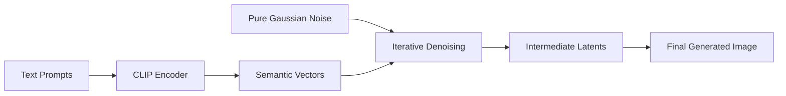
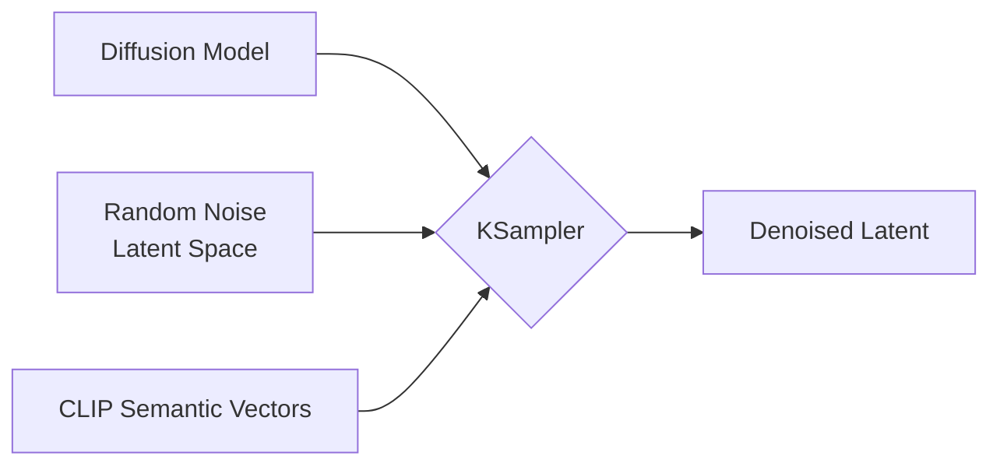
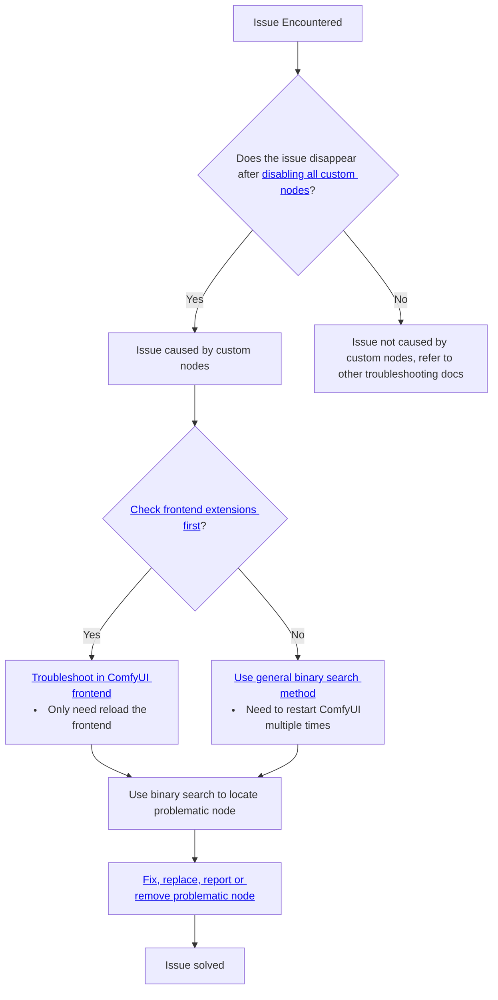
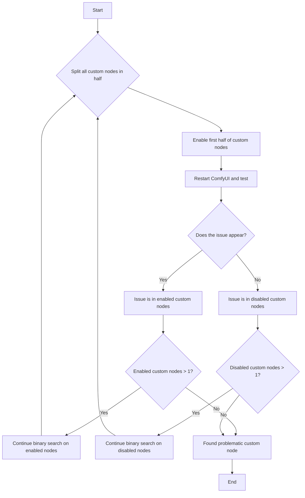

# Comfy Documentation

Source: https://docs.comfy.org/llms-full.txt

---

# Custom Nodes
Source: https://docs.comfy.org/development/core-concepts/custom-nodes

Learn about installing, enabling dependencies, updating, disabling, and uninstalling custom nodes in ComfyUI

## About Custom Nodes

After installing ComfyUI, you'll discover that it includes many built-in nodes. These native nodes are called **Comfy Core** nodes, which are officially maintained by ComfyUI.

Additionally, there are numerous [**custom nodes**](https://registry.comfy.org) created by various authors from the ComfyUI community. These custom nodes bring extensive functionality to ComfyUI, greatly expanding its capabilities and feature boundaries.

In this guide, we'll cover various operations related to custom nodes, including installation, updates, disabling, uninstalling, and dependency installation.

Anyone can develop their own custom extensions for ComfyUI and share them with others. You can find many community custom nodes [here](https://registry.comfy.org). If you want to develop your own custom nodes, visit the section below to get started:

<Card title="Start Developing Custom Nodes" icon="link" href="/custom-nodes/overview">
  Learn how to start developing a custom node
</Card>

## Custom Node Management

In this section we will cover:

* Installing custom nodes
* Installing node dependencies
* Custom node version control
* Uninstalling custom nodes
* Temporarily disabling custom nodes
* Handling custom node dependency conflicts

### 1. Installing Custom Nodes

Currently, ComfyUI supports installing custom nodes through multiple methods, including:

* [Install via ComfyUI Manager (Recommended)](#install-via-comfyui-manager)
* Install via Git
* Manual installation

We recommend installing custom nodes through **ComfyUI Manager**, which is a highly significant tool in the ComfyUI custom node ecosystem. It makes custom node management (such as searching, installing, updating, disabling, and uninstalling) simple - you just need to search for the node you want to install in ComfyUI Manager and click install.

However, since all custom nodes are currently stored on GitHub, for regions that cannot access GitHub normally, we have written detailed instructions for different custom node installation methods in this guide.

Additionally, since we recommend using **ComfyUI Manager** for plugin management, we recommend using this tool for plugin management. You can find its source code [here](https://github.com/Comfy-Org/ComfyUI-Manager).
Therefore, in this documentation, we will use installing ComfyUI Manager as a custom node installation example, and supplement how to use it for node management in the relevant introduction sections.

<Tabs>
  <Tab title="Install via ComfyUI Manager">
    Since ComfyUI Manager has very rich functionality, we will use a separate document to introduce the ComfyUI Manager installation chapter. Please visit the link below to learn how to use ComfyUI Manager to install custom nodes.

    <Card title="Install Custom Nodes with ComfyUI Manager" icon="link" href="/installation/install_custom_node#method-1%3A-comfyui-manager-recommended">
      Learn how to use ComfyUI Manager to install custom nodes
    </Card>
  </Tab>

  <Tab title="Install via Git">
    <Steps>
      <Step title="Ensure Git is Installed">
        First, you need to ensure that Git is installed on your system. You can check if Git is installed by entering the following command in your system terminal:

        ```bash  theme={null}
        git --version
        ```

        If Git is installed, you will see output similar to the following:

                

        If not yet installed, please visit [git-scm.com](https://git-scm.com/) to download the corresponding installation package. Linux users please refer to [git-scm.com/downloads/linux](https://git-scm.com/downloads/linux) for installation instructions.

        <Tip>
          For ComfyUI Desktop version, you can use the Desktop terminal as shown below to complete the installation.
          
        </Tip>
      </Step>

      <Step title="Clone Custom Node Code to Directory">
        After completing the Git installation, we need the repository address of the custom node. Here we use the ComfyUI-Manager repository address as an example:

        ```bash  theme={null}
        https://github.com/Comfy-Org/ComfyUI-Manager
        ```

        <Tip>For regions that cannot access GitHub smoothly, you can try using other code hosting service websites to fork the corresponding repository, then use that repository address to complete the node installation, such as gitee, etc.</Tip>

        First, we need to navigate to the ComfyUI custom nodes directory. Using ComfyUI portable version as an example, if the folder location is `D:\ComfyUI_windows_portable`, then you should be able to find the custom nodes folder at `D:\ComfyUI_windows_portable\ComfyUI\custom_nodes`. First, we need to use the `cd` command to enter the corresponding directory:

        ```bash  theme={null}
        cd D:\ComfyUI_windows_portable\ComfyUI\custom_nodes
        ```

        Then we use the `git clone` command to complete the node installation:

        ```bash  theme={null}
        git clone https://github.com/Comfy-Org/ComfyUI-Manager
        ```

        If everything goes smoothly, you will see output similar to the following:

                

        This means you have successfully cloned the custom node code. Next, we need to install the corresponding dependencies.
      </Step>

      <Step title="Install Dependencies">
        Please refer to the instructions in the [Installing Node Dependencies](#installing-node-dependencies) section for dependency installation.
      </Step>
    </Steps>
  </Tab>

  <Tab title="Manual Installation">
    Manual installation is not the recommended installation method, but it serves as a backup option when you cannot install smoothly using git.

    <Warning>
      Plugins installed this way will lose the corresponding git version history information and will not be convenient for subsequent version management.
    </Warning>

    <Steps>
      <Step title="Download Custom Node Code ZIP Package">
        For manual installation, we need to first download the corresponding node code and then extract it to the appropriate directory.

                

        Visit the corresponding custom node repository page:

        1. Click the `Code` button
        2. Then click the `Download ZIP` button to download the ZIP package
        3. Extract the ZIP package
      </Step>

      <Step title="Copy Files to ComfyUI Custom Nodes Directory">
        Copy the extracted code from the above steps to the ComfyUI custom nodes directory. Using ComfyUI portable version as an example, if the folder location is `D:\ComfyUI_windows_portable`, then you should be able to find the custom nodes folder at `D:\ComfyUI_windows_portable\ComfyUI\custom_nodes`. Copy the extracted code from the above steps to the corresponding directory.
      </Step>

      <Step title="Install Dependencies">
        Please refer to the instructions in the [Installing Node Dependencies](#installing-node-dependencies) section for dependency installation.
      </Step>
    </Steps>
  </Tab>
</Tabs>

### 2. Installing Node Dependencies

Custom nodes all require the installation of related dependencies. For example, for ComfyUI-Manager, you can visit the [requirements.txt](https://github.com/Comfy-Org/ComfyUI-Manager/blob/main/requirements.txt) file to view the dependency package requirements.

In the previous steps, we only cloned the custom node code locally and did not install the corresponding dependencies, so next we need to install the corresponding dependencies.

<Note>
  Actually, if you use ComfyUI-Manager to install plugins, ComfyUI Manager will automatically help you complete the dependency installation. You just need to restart ComfyUI after installing the plugin. This is why we strongly recommend using ComfyUI Manager to install custom nodes.

  But perhaps you may not be able to use ComfyUI Manager to install custom nodes smoothly in some situations, so we provide this more detailed dependency installation guide.
</Note>

In the [Dependencies](/development/core-concepts/dependencies) chapter, we introduced the relevant content about dependencies in ComfyUI. ComfyUI is a **Python**-based project, and we built an independent **Python** runtime environment for running ComfyUI. All related dependencies need to be installed in this independent **Python** runtime environment.

If you run `pip install -r requirements.txt` directly in the system-level terminal, the corresponding dependencies may be installed in the system-level **Python** environment, which will cause the dependencies to still be missing in ComfyUI's environment, preventing the corresponding custom nodes from running normally.

So next we need to use ComfyUI's independent Python runtime environment to complete the dependency installation.

Depending on different ComfyUI versions, we will use different methods to install the corresponding dependencies:

<Tabs>
  <Tab title="ComfyUI Portable">
    For ComfyUI Portable version, it uses an embedded Python located in the `\ComfyUI_windows_portable\python_embeded` directory. We need to use this Python to complete the dependency installation.

    First, start the terminal in the portable version directory, or use the `cd` command to navigate to the `\ComfyUI_windows_portable\` directory after starting the terminal.

        

    Ensure that the terminal directory is `\ComfyUI_windows_portable\`, as shown below for `D:\ComfyUI_windows_portable\`

        

    Then use `python_embeded\python.exe` to complete the dependency installation:

    ```bash  theme={null}
    python_embeded\python.exe -m pip install -r ComfyUI\custom_nodes\ComfyUI-Manager\requirements.txt
    ```

    Of course, you can replace ComfyUI-Manager with the name of the custom node you actually installed, but make sure that a `requirements.txt` file exists in the corresponding node directory.
  </Tab>

  <Tab title="ComfyUI Desktop">
    <Tip>
      Since ComfyUI Desktop already has ComfyUI-Manager and its dependencies installed during the installation process, and this guide uses ComfyUI Manager as an example for custom node installation, you don't actually need to perform ComfyUI Manager dependency installation in the desktop version.
      If there are no unexpected issues, we recommend using ComfyUI Manager to install custom nodes, so you don't need to manually install dependencies.
    </Tip>

        

    Then use the following command to install the dependencies for the corresponding plugin:

    ```bash  theme={null}
    pip install -r .\custom_nodes\<corresponding_custom_node_name>\requirements.txt
    ```

    As shown below, this is the dependency installation for ComfyUI-Hunyuan3Dwrapper:

        
  </Tab>

  <Tab title="Custom Python Environment Users">
    For users with custom Python environments, we recommend using `pip install -r requirements.txt` to complete the dependency installation.
  </Tab>
</Tabs>

### Custom Node Version Control

Custom node version control is actually based on Git version control. You can manage node versions through Git, but ComfyUI Manager has already integrated this version management functionality very well. Many thanks to [@Dr.Lt.Data](https://github.com/ltdrdata) for bringing us such a convenient tool.

In this section, we will still explain these two different plugin version management methods for you, but if you use ZIP packages for manual installation, the corresponding git version history information will be lost, making it impossible to perform version management.

<Tabs>
  <Tab title="Version Management with ComfyUI Manager">
    <Tip>Since we are iterating on ComfyUI Manager, the actual latest interface and steps may change significantly</Tip>

    <Steps>
      <Step title="Enter Node Management Interface">
        Perform the corresponding operations as shown to enter the ComfyUI Manager interface
      </Step>

      <Step title="Find the Corresponding Custom Node Package">
        You can use the corresponding filters to filter out installed node packages and then perform the corresponding node management
      </Step>

      <Step title="Perform Version Switching">
        Switch to the corresponding version. Manager will help you complete the corresponding dependency updates and installation. Usually, you need to restart ComfyUI after switching versions for the changes to take effect.
      </Step>
    </Steps>
  </Tab>

  <Tab title="Version Management with Git">
    <Steps>
      <Step title="Navigate to Directory Using Command Line">
        Find the directory folder where your corresponding node is located, such as `ComfyUI/custom_nodes/ComfyUI-Manager`
        Use the `cd` command to enter the corresponding folder:

        ```bash  theme={null}
        cd <your_installation_directory>/ComfyUI/custom_nodes/ComfyUI-Manager
        ```
      </Step>

      <Step title="View Versions Using Git Commands">
        You can use the following command to view all available tags and releases:

        ```bash  theme={null}
        git tag
        ```

        This will list all version tags, and you can choose the version you want to switch to.
      </Step>

      <Step title="Switch to Specified Version">
        Use the following command to switch to a specified tag or release:

        ```bash  theme={null}
        git checkout <tag_name>
        ```

        Replace `<tag_name>` with the specific version tag you want to switch to.
      </Step>

      <Step title="Switch to Specific Commit Version">
        If you want to switch to a specific commit version, you can use the following command:

        ```bash  theme={null}
        git checkout <commit_hash>
        ```

        Replace `<commit_hash>` with the specific commit hash you want to switch to.
      </Step>

      <Step title="Install Dependencies">
        Since the dependencies of the corresponding custom node package may change after version switching, you need to reinstall the dependencies for the corresponding node. Please refer to the instructions in the [Installing Node Dependencies](#2-installing-node-dependencies) section to enter the corresponding environment for installation.
      </Step>
    </Steps>
  </Tab>
</Tabs>

### Uninstalling Custom Nodes

To be updated

### Temporarily Disabling Custom Nodes

To be updated

### Custom Node Dependency Conflicts

To be updated

## ComfyUI Manager


This tool is currently included by default in the [Desktop version](/installation/desktop/windows), while in the [Portable version](/installation/comfyui_portable_windows), you need to refer to the installation instructions in the [Install Manager](#installing-custom-nodes) section of this document.

<Note>
  As ComfyUI continues to develop, ComfyUI Manager plays an increasingly important role in ComfyUI. Currently, ComfyUI-Manager has officially joined the Comfy Org organization, officially becoming part of ComfyUI's core dependencies, and continues to be maintained by the original author [Dr.Lt.Data](https://github.com/ltdrdata). You can read [this blog post](https://blog.comfy.org/p/comfyui-manager-joins-comfy-org) for more information.
  In future iterations, we will greatly optimize the use of ComfyUI Manager, so the interface shown in this documentation may differ from the latest version of ComfyUI Manager.
</Note>

### Installing the Manager

If you are running the ComfyUI server application, you need to install the manager. If ComfyUI is running, please close it before continuing.

The first step is to install Git, which is a command-line application for software version control. Git will download the ComfyUI manager from [github.com](https://github.com). Download and install Git from [git-scm.com](https://git-scm.com/).

After installing Git, navigate to the ComfyUI server program directory and enter the folder labeled **custom\_nodes**. Open a command window or terminal. Make sure the command line shows the current directory path as **custom\_nodes**. Enter the following command. This will download the manager. Technically, this is called *cloning a Git repository*.

### Detecting Missing Nodes

After installing the manager, you can detect missing nodes in the manager.


## Developing a Custom Node

If you have some development capabilities, please start with the documentation below to learn how to begin developing a custom node.

<Card title="Start Developing Custom Nodes" icon="link" href="/custom-nodes/overview">
  Learn how to start developing a custom node
</Card>


# Dependencies
Source: https://docs.comfy.org/development/core-concepts/dependencies

Understand dependencies in ComfyUI

## A workflow file depends on other files

We often obtain various workflow files from the community, but frequently find that the workflow cannot run directly after loading. This is because a workflow file depends on other files besides the workflow itself, such as media asset inputs, models, custom nodes, related Python dependencies, etc.
ComfyUI workflows can only run normally when all relevant dependencies are satisfied.

ComfyUI workflow dependencies mainly fall into the following categories:

* Assets (media files including audio, video, images, and other inputs)
* Custom nodes
* Python dependencies
* Models (such as Stable Diffusion models, etc.)

## Assets

An AI model is an example of an ***asset***. In media production, an asset is some media file that supplies input data. For example, a video editing program operates on movie files stored on disk. The editing program's project file holds links to these movie file assets, allowing non-destructive editing that doesn't alter the original movie files.

ComfyUI works the same way. A workflow can only run if all of the required assets are found and loaded. Generative AI models, images, movies, and sounds are some examples of assets that a workflow might depend upon. These are therefore known as ***dependent assets*** or ***asset dependencies***.

## Custom Nodes

Custom nodes are an important component of ComfyUI that extend its functionality. They are created by the community and can be installed to add new capabilities to your workflows.

## Python Dependencies

ComfyUI is a Python-based project. We build a standalone Python environment to run ComfyUI, and all related dependencies are installed in this isolated Python environment.

### ComfyUI Dependencies

You can view ComfyUI's current dependencies in the [requirements.txt](https://github.com/comfyanonymous/ComfyUI/blob/master/requirements.txt) file:

```text  theme={null}
comfyui-frontend-package==1.14.5
torch
torchsde
torchvision
torchaudio
numpy>=1.25.0
einops
transformers>=4.28.1
tokenizers>=0.13.3
sentencepiece
safetensors>=0.4.2
aiohttp>=3.11.8
yarl>=1.18.0
pyyaml
Pillow
scipy
tqdm
psutil

#non essential dependencies:
kornia>=0.7.1
spandrel
soundfile
av
```

As ComfyUI evolves, we may adjust dependencies accordingly, such as adding new dependencies or removing ones that are no longer needed.
So if you use Git to update ComfyUI, you need to run the following command in the corresponding environment after pulling the latest updates:

```bash  theme={null}
pip install -r requirements.txt
```

This ensures that ComfyUI's dependencies are up to date for proper operation. You can also modify specific package dependency versions to upgrade or downgrade certain dependencies.

Additionally, ComfyUI's frontend [ComfyUI\_frontend](https://github.com/Comfy-Org/ComfyUI_frontend) is currently maintained as a separate project. We update the `comfyui-frontend-package` dependency version after the corresponding version stabilizes. If you need to switch to a different frontend version, you can check the version information [here](https://pypi.org/project/comfyui-frontend-package/#history).

### Custom Node Dependencies

Thanks to the efforts of many authors in the ComfyUI community, we can extend ComfyUI's functionality by using different custom nodes, enabling impressive creativity.

Typically, each custom node has its own dependencies and a separate `requirements.txt` file.
If you use [ComfyUI Manager](https://github.com/ltdrdata/ComfyUI-Manager) to install custom nodes, ComfyUI Manager will usually automatically install the corresponding dependencies.

There are also cases where you need to install dependencies manually. Currently, all custom nodes are installed in the `ComfyUI/custom_nodes` directory.

You need to navigate to the corresponding plugin directory in your ComfyUI Python environment and run `pip install -r requirements.txt` to install the dependencies.

If you're using the [Windows Portable version](/installation/comfyui_portable_windows), you can use the following command in the `ComfyUI_windows_portable` directory:

```
python_embeded\python.exe -m pip install -r ComfyUI\custom_nodes\<custom_node_name>\requirements.txt
```

to install the dependencies for the corresponding node.

### Dependency Conflicts

Dependency conflicts are a common issue when using ComfyUI. You might find that after installing or updating a custom node, previously installed custom nodes can no longer be found in ComfyUI's node library, or error pop-ups appear. One possible reason is dependency conflicts.

There can be many reasons for dependency conflicts, such as:

1. Custom node version locking

Some plugins may fix the exact version of a dependency library (e.g., `open_clip_torch==2.26.1`), while other plugins may require a higher version (e.g., `open_clip_torch>=2.29.0`), making it impossible to satisfy both version requirements simultaneously.

**Solution**: You can try changing the fixed version dependency to a range constraint, such as `open_clip_torch>=2.26.1`, and then reinstall the dependencies to resolve these issues.

2. Environment pollution

During the installation of custom node dependencies, it may overwrite versions of libraries already installed by other plugins. For example, multiple plugins may depend on `PyTorch` but require different CUDA versions, and the later installed plugin will break the existing environment.

**Solutions**:

* You can try manually installing specific versions of dependencies in the Python virtual environment to resolve such issues.
* Or create different Python virtual environments for different plugins to resolve these issues.
* Try installing plugins one by one, restarting ComfyUI after each installation to observe if dependency conflicts occur.

3. Custom node dependency versions incompatible with ComfyUI dependency versions

These types of dependency conflicts may be more difficult to resolve, and you may need to upgrade/downgrade ComfyUI or change the dependency versions of custom nodes to resolve these issues.

**Solution**: These types of dependency conflicts may be more difficult to resolve, and you may need to upgrade/downgrade ComfyUI or change the dependency versions of custom nodes to resolve these issues.

## Models

Models are a significant asset dependency for ComfyUI. Various custom nodes and workflows are built around specific models, such as the Stable Diffusion series, Flux series, Ltxv, and others.
These models are an essential foundation for creation with ComfyUI, so we need to ensure that the models we use are properly available. Typically, our models are saved in the corresponding directory under `ComfyUI/models/`. Of course, you can also create an [extra\_model\_paths.yaml](https://github.com/comfyanonymous/ComfyUI/blob/master/extra_model_paths.yaml.example) by modifying the template to make additional model paths recognized by ComfyUI.
This allows multiple ComfyUI instances to share the same model library, reducing disk usage.

## Software

An advanced application like ComfyUI also has ***software dependencies***. These are libraries of programming code and data that are required for the application to run. Custom nodes are examples of software dependencies. On an even more fundamental level, the Python programming environment is the ultimate dependency for ComfyUI. The correct version of Python is required to run a particular version of ComfyUI. Updates to Python, ComfyUI, and custom nodes can all be handled from the **ComfyUI Manager** window.


# Links
Source: https://docs.comfy.org/development/core-concepts/links

Understand connection links in ComfyUI

<Note>
  As ComfyUI is still in rapid iteration and development, we are continuously improving it every day. Therefore, some operations mentioned in this article may change or be omitted. Please refer to the actual interface. If you find changes in actual operations, it may be due to our iterative updates. You can also fork [this repo](https://github.com/Comfy-Org/docs) and help us improve this documentation.
</Note>

## Links connect nodes

In the terminology of ComfyUI, the lines or curves between nodes are called ***links***. They're also known as ***connections*** or wires. Links can be displayed in several ways, such as curves, right angles, straight lines, or completely hidden.


You can modify the link style in **Setup Menu** --> **Display (Lite Graph)** --> **Graph** --> **Link Render Mode**.


You can also temporarily hide links in the **Canvas Menu**.


Link display is crucial. Depending on the situation, it may be necessary to see all links. Especially when learning, sharing, or even just understanding workflows, the visibility of links enables users to follow the flow of data through the graph. For packaged workflows that aren't intended to be altered, it might make sense to hide the links to reduce clutter.

### Reroute node

If legibility of the graph structure is important, then link wires can be manually routed in the 2D space of the graph with a tiny node called **Reroute**. Its purpose is to position the beginning and/or end points of link wires to ensure visibility. We can design a workflow so that link wires don't pass behind nodes, don't cross other link wires, and so on.


We are also continuously improving the native reroute functionality in litegraph. We recommend using this feature in the future to reorganize connections.


## Color-coding

The data type of node properties is indicated by color coding of input/output ports and link connection wires. We can always tell which inputs and outputs can be connected to one another by their color. Ports can only be connected to other ports of the same color to ensure matching data types.

Common data types:


| Data type                 | Color        |
| ------------------------- | ------------ |
| diffusion model           | lavender     |
| CLIP model                | yellow       |
| VAE model                 | rose         |
| conditioning              | orange       |
| latent image              | pink         |
| pixel image               | blue         |
| mask                      | green        |
| number (integer or float) | light green  |
| mesh                      | bright green |


# Models
Source: https://docs.comfy.org/development/core-concepts/models


## Models are essential

Models are essential building blocks for media generation workflows. They can be combined and mixed to achieve different creative effects.

The word ***model*** has many different meanings. Here, it means a data file carrying information that is required for a node graph to do its work. Specifically, it’s a data structure that *models* some function. As a verb, to model something means to represent it or provide an example.

The primary example of a model data file in ComfyUI is an AI ***diffusion model***. This is a large set of data that represents the complex relationships among text strings and images, making it possible to translate words into pictures or vice versa. Other examples of common models used for image generation are multimodal vision and language models such as CLIP, and upscaling models such as RealESRGAN.

## Model files

Model files are indispensable for generative media production. Without them, workflows cannot proceed effectively. Models are not included in the ComfyUI installation, but ComfyUI can often automatically download and install missing model files. Many models can be downloaded and installed from the **ComfyUI Manager** window. Models can also be found at websites such as [huggingface.co](https://huggingface.co), [civitai.green](https://civitai.green), and [github.com](https://github.com).

### Using Models in ComfyUI

1. Download and place them in the ComfyUI program directory
   1. Within the **models** folder, you'll find subfolders for various types of models, such as **checkpoints**
   2. The **ComfyUI Manager** helps to automate the process of searching, downloading, and installing
   3. Restart ComfyUI if it's running
2. In your workflow, create the node appropriate to the model type, e.g. **Load Checkpoint**, **Load LoRA**, **Load VAE**
3. In the loader node, choose the model you wish to use
4. Connect the loader node to other nodes in your workflow

## Adding Extra Model Paths

If you want to manage your model files outside of `ComfyUI/models`, you may have the following reasons:

* You have multiple ComfyUI instances and want them to share model files to save disk space
* You have different types of GUI programs (such as WebUI) and want them to use the same model files
* Model files cannot be recognized or found

We provide a way to add extra model search paths via the `extra_model_paths.yaml` configuration file

### Open Config File

<Tabs>
  <Tab title="Portable/Manual Install">
    For the ComfyUI version such as [portable](/installation/comfyui_portable_windows) and [manual](/installation/manual_install), you can find an example file named `extra_model_paths.yaml.example` in the root directory of ComfyUI:

    ```
    ComfyUI/extra_model_paths.yaml.example
    ```

    Copy and rename it to `extra_model_paths.yaml` for use. Keep it in ComfyUI's root directory at `ComfyUI/extra_model_paths.yaml`.
    You can also find the config example file [here](https://github.com/comfyanonymous/ComfyUI/blob/master/extra_model_paths.yaml.example)
  </Tab>

  <Tab title="ComfyUI Desktop">
    If you are using the [ComfyUI Desktop](/installation/desktop/windows) application, you can follow the image below to open the extra model config file:

        

    Or open it directly at:

    <Tabs>
      <Tab title="Windows">
        ```
        C:\Users\YourUsername\AppData\Roaming\ComfyUI\extra_models_config.yaml
        ```
      </Tab>

      <Tab title="macOS">
        ```
        ~/Library/Application Support/ComfyUI/extra_models_config.yaml
        ```
      </Tab>
    </Tabs>

    You should keep the file in the same directory, should not move these files to other places.
  </Tab>
</Tabs>

If the file does not exist, you can create it yourself with any text editor.

### Example Structure

Suppose you want to add the following model paths to ComfyUI:

```
📁 YOUR_PATH/
  ├── 📁models/
  |   ├── 📁 lora/
  |   │   └── xxxxx.safetensors
  |   ├── 📁 checkpoints/
  |   │   └── xxxxx.safetensors
  |   ├── 📁 vae/
  |   │   └── xxxxx.safetensors
  |   └── 📁 controlnet/
  |       └── xxxxx.safetensors
```

Then you can configure the `extra_model_paths.yaml` file like below to let ComfyUI recognize the model paths on your device:

```
my_custom_config:
    base_path: YOUR_PATH
    loras: models/loras/
    checkpoints: models/checkpoints/
    vae: models/vae/
    controlnet: models/controlnet/
```

or

```
my_custom_config:
    base_path: YOUR_PATH/models/
    loras: loras
    checkpoints: checkpoints
    vae: vae
    controlnet: controlnet
```

<Warning>
  For the desktop version, please add the configuration to the existing configuration path without overwriting the path configuration generated during installation. Please back up the corresponding file before modification, so that you can restore it when you make a mistake.
</Warning>

Or you can refer to the default [extra\_model\_paths.yaml.example](https://github.com/comfyanonymous/ComfyUI/blob/master/extra_model_paths.yaml.example) for more configuration options. After saving, you need to **restart ComfyUI** for the changes to take effect.

Below is the original config example:

```yaml  theme={null}
#Rename this to extra_model_paths.yaml and ComfyUI will load it


#config for a1111 ui
#all you have to do is change the base_path to where yours is installed
a111:
    base_path: path/to/stable-diffusion-webui/

    checkpoints: models/Stable-diffusion
    configs: models/Stable-diffusion
    vae: models/VAE
    loras: |
         models/Lora
         models/LyCORIS
    upscale_models: |
                  models/ESRGAN
                  models/RealESRGAN
                  models/SwinIR
    embeddings: embeddings
    hypernetworks: models/hypernetworks
    controlnet: models/ControlNet

#config for comfyui
#your base path should be either an existing comfy install or a central folder where you store all of your models, loras, etc.

#comfyui:
#     base_path: path/to/comfyui/
#     # You can use is_default to mark that these folders should be listed first, and used as the default dirs for eg downloads
#     #is_default: true
#     checkpoints: models/checkpoints/
#     clip: models/clip/
#     clip_vision: models/clip_vision/
#     configs: models/configs/
#     controlnet: models/controlnet/
#     diffusion_models: |
#                  models/diffusion_models
#                  models/unet
#     embeddings: models/embeddings/
#     loras: models/loras/
#     upscale_models: models/upscale_models/
#     vae: models/vae/

#other_ui:
#    base_path: path/to/ui
#    checkpoints: models/checkpoints
#    gligen: models/gligen
#    custom_nodes: path/custom_nodes

```

For example, if your WebUI is located at `D:\stable-diffusion-webui\`, you can modify the corresponding configuration to

```yaml  theme={null}
a111:
    base_path: D:\stable-diffusion-webui\
    checkpoints: models/Stable-diffusion
    configs: models/Stable-diffusion
    vae: models/VAE
    loras: |
         models/Lora
         models/LyCORIS
    upscale_models: |
                  models/ESRGAN
                  models/RealESRGAN
                  models/SwinIR
    embeddings: embeddings
    hypernetworks: models/hypernetworks
    controlnet: models/ControlNet
```

### Add Extra Custom Nodes Path

Besides adding external models, you can also add custom nodes paths that are not in the default path of ComfyUI

<Tip>
  Please note that this will not change the default installation path of custom nodes, but will add an extra path search when starting ComfyUI. You still need to complete the installation of custom node dependencies in the corresponding environment to ensure the integrity of the running environment.
</Tip>

Below is a simple configuration example (MacOS), please modify it according to your actual situation and add it to the corresponding configuration file, save it and restart ComfyUI for the changes to take effect:

```yaml  theme={null}
my_custom_nodes:
  custom_nodes: /Users/your_username/Documents/extra_custom_nodes
```

### File size

Models can be extremely large files relative to image files. A typical uncompressed image may require a few megabytes of disk storage. Generative AI models can be tens of thousands of times larger, up to tens of gigabytes per model. They take up a great deal of disk space and take a long time to transfer over a network.

## Model training and refinement

A generative AI model is created by training a machine learning program on a very large set of data, such as pairs of images and text descriptions. An AI model doesn’t store the training data explicitly, but rather it stores the correlations that are implicit within the data.

Organizations and companies such as Stability AI and Black Forest Labs release “base” models that carry large amounts of generic information. These are general purpose generative AI models. Commonly, the base models need to be ***refined*** in order to get high quality generative outputs. A dedicated community of people work to refine the base models. The new, refined models produce better output, provide new or different functionality, and/or use fewer resources. Refined models can usually be run on systems with less computing power and/or memory.

## Auxiliary models

Model functionality can be extended with auxiliary models. For example, art directing a text-to-image workflow to achieve a specific result may be difficult or impossible using a diffusion model alone. Additional models can refine a diffusion model within the workflow graph to produce desired results. Examples include **LoRA** (Low Rank Adaptation), a small model that is trained on a specific subject; **ControlNet**, a model that helps control composition using a guide image; and **Inpainting**, a model that allows certain diffusion models to generate new content within an existing image.


## Uninstalling models

ComfyUI does not currently support uninstalling models through the frontend interface. If you want to remove or uninstall models, you need to manually delete the corresponding model files from the `ComfyUI/models/` directory on your system.

## Common issues

<AccordionGroup>
  <Accordion title="Does ComfyUI support GGUF format models?">
    ComfyUI does not natively support GGUF format models. To use GGUF models, you need to install community custom nodes such as [ComfyUI-GGUF](https://github.com/city96/ComfyUI-GGUF).
  </Accordion>

  <Accordion title="Why can't I find my model?">
    If you've installed a model but can't find it in ComfyUI, try these steps:

    * Verify the model is in the correct location:
      * For **ComfyUI Desktop**: Go to **Help** menu → **Open Folder** → **Open Model Folder** to check the model installation path
      * Ensure your model file is placed in the correct subfolder (e.g., `checkpoints`, `loras`, `vae`)
    * Press the `r` key to refresh node definitions so ComfyUI can detect the model
    * Restart ComfyUI
    * Ensure the correct model is selected in the model loader node
  </Accordion>
</AccordionGroup>


# Nodes
Source: https://docs.comfy.org/development/core-concepts/nodes

Understand the concept of a node in ComfyUI.

In ComfyUI, nodes are the fundamental building blocks for executing tasks. Each node is an independently built module, whether it's a **Comfy Core** node or a **Custom Node**, with its own unique functionality. Nodes connect to each other through links, allowing us to build complex functionality like assembling LEGO blocks.
The combinations of different nodes create the unlimited possibilities of ComfyUI.


For example, in the K-Sampler node, you can see it has multiple inputs and outputs, and also includes multiple parameter settings. These parameters determine the logic of node execution. Behind each node is well-written Python logic, allowing you to achieve corresponding functionality without having to write code yourself.

<Note>
  As ComfyUI is still in rapid iteration and development, we are continuously improving it every day. Therefore, some operations mentioned in this article may change or be omitted. Please refer to the actual interface. If you find changes in actual operations, it may be due to our iterative updates. You can also fork [this repo](https://github.com/Comfy-Org/docs) and help us improve this documentation.
</Note>

## Nodes perform operations

In computer science, a ***node*** is a container for information, usually including programmed instructions to perform some task. Nodes almost never exist in isolation, they're almost always connected to other nodes in a networked graph. In ComfyUI, nodes take the visual form of boxes that are connected to each other.

ComfyUI nodes are usually ***function operators***. This means that they operate on some data to perform a function. A function is a process that accepts input data, performs some operation on it, and produces output data. In other words, nodes do some work, contributing to the completion of a task such as generating an image. So ComfyUI nodes almost always have at least one input or output, and usually have multiple inputs and outputs.

## Different Node States


In ComfyUI, nodes have multiple states. Here are some common node states:

1. **Normal State**: The default state
2. **Running State**: The running state, typically displayed when a node is executing after you start running the workflow
3. **Error State**: Node error, typically displayed after running the workflow if there's a problem with the node's input, indicated by red marking of the erroneous input node. You need to fix the problematic input to ensure the workflow runs correctly
4. **Missing State**: This state usually appears after importing workflows, with two possibilities:
   * Comfy Core native node missing: This usually happens because ComfyUI has been updated, but you're using an older version of ComfyUI. You need to update ComfyUI to resolve this issue
   * Custom node missing: The workflow uses custom nodes developed by third-party authors, but your local ComfyUI version doesn't have these custom nodes installed. You can use [ComfyUI-Manager](https://github.com/Comfy-Org/ComfyUI-Manager) to find and install the missing custom nodes

## Connections Between Nodes

In ComfyUI, nodes are connected through [links](/development/core-concepts/links), allowing data of the same type to flow between different processing units to achieve the final result.


Each node receives some input, processes it through its module, and converts it to corresponding output. Connections between different nodes must conform to the data type requirements. In ComfyUI, we use different colors to distinguish node data types. Below are some basic data types:


| Data type                 | Color        |
| ------------------------- | ------------ |
| diffusion model           | lavender     |
| CLIP model                | yellow       |
| VAE model                 | rose         |
| conditioning              | orange       |
| latent image              | pink         |
| pixel image               | blue         |
| mask                      | green        |
| number (integer or float) | light green  |
| mesh                      | bright green |

As ComfyUI evolves, we may expand to more data types to meet the needs of more scenarios.

### Connecting and Disconnecting Nodes


**Connecting**: Drag from the output point of one node to the input of the same color on another node to connect them
**Disconnecting**: Click on the input endpoint and drag the mouse left button to disconnect, or cancel the connection through the midpoint menu of the link

## Node Appearance


We provide various style settings for you to customize the appearance of nodes:

* Modify styles
* Double-click the node title to modify the node name
* Switch node inputs between input sockets and widgets through the context menu
* Resize the node using the bottom right corner

<video controls className="w-full aspect-video" src="https://mintcdn.com/dripart/CGWmMjlFmU7msQ5S/images/concepts/node/node_appearance.mp4?fit=max&auto=format&n=CGWmMjlFmU7msQ5S&q=85&s=2fb1ff4aac3396cb3e4ecbebd8db7b14" data-path="images/concepts/node/node_appearance.mp4" />

### Node Badges


We provide multiple node badge display features, such as:

* Node ID
* Node source

Currently, **Comfy Core nodes** use a fox icon for display, while custom nodes use their names. This way you can quickly understand which node package a node comes from.

You can set the corresponding display in the menu:


## Node Context Menus

Node context menus are mainly divided into two types:

* Context menu for the node itself
* Context menu for inputs/outputs

### Node Context Menu

By right-clicking on a node, you can expand the corresponding node context menu:


In the node's right-click context menu, you can:

* Adjust the node's color style
* Modify the title
* Clone, copy, or delete the node
* Set the node's mode

In this menu, besides appearance-related settings, the following menu operations are important:

* **Mode**: Set the node's mode: Always, Never, Bypass
* **Toggle between Widget and Input mode for node inputs**: Switch between widget and input mode for node inputs

#### Mode

For modes, you may notice that we currently provide: Always, Never, On Event, On Trigger - four modes, but actually only **Always** and **Never** are effective. **On Event** and **On Trigger** are currently ineffective as we haven't fully implemented this feature. Additionally, you can understand **Bypass** as a mode. Below is an explanation of the available modes:

* **Always**: The default node mode. The node will execute whenever it runs for the first time or when any of its inputs change since the last execution
* **Never**: The node will never execute under any circumstances, as if it's been deleted. Subsequent nodes cannot read or receive any data from it
* **Bypass**: The node will never execute under any circumstances, but subsequent nodes can still try to obtain data that hasn't been processed by this node

Below is a comparison of the `Never` and `Bypass` modes:


In this comparison example, you can see that both workflows apply two LoRA models simultaneously, with the difference being that one `Load LoRA` node is set to `Never` mode while the other is set to `Bypass` mode.

* The node set to `Never` mode causes subsequent nodes to show errors because they don't receive any input data
* The node set to `Bypass` mode still allows subsequent nodes to receive unprocessed data, so they load the output data from the first `Load LoRA` node, allowing the subsequent workflow to continue running normally

#### Switching Between Widget and Input Mode for Node Inputs

In some cases, we need to use output results from other nodes as input. In this case, we can switch between widget and input mode for node inputs.

Here's a very simple example:


By switching the K-Sampler's Seed from widget to input mode, multiple nodes can share the same seed, achieving variable uniformity across multiple samplers.
Comparing the first node with the subsequent two nodes, you can see that the seed in the latter two nodes is in input mode. You can also convert it back to widget mode:


<Note>
  After frontend version v1.16.0, we improved this feature. Now you only need to directly connect the input line to the corresponding widget to complete this process
  <blockquote class="twitter-tweet"><p lang="en" dir="ltr">Say goodbye to annoying widget \<> socket conversion starting from frontend version v1.16.0! Now each widget just always have an associated input socket by default <a href="https://twitter.com/hashtag/ComfyUI?src=hash&ref_src=twsrc%5Etfw">#ComfyUI</a> <a href="https://t.co/sP9HHKyGYW">pic.twitter.com/sP9HHKyGYW</a></p>— Chenlei Hu (@HclHno3) <a href="https://twitter.com/HclHno3/status/1909059259536375961?ref_src=twsrc%5Etfw">April 7, 2025</a></blockquote> <script async src="https://platform.twitter.com/widgets.js" charset="utf-8" />
</Note>

### Input/Output Context Menu

This context menu is mainly related to the data type of the corresponding input/output:


When dragging the input/output of a node, if a connection appears but you haven't connected to another node's input or output, releasing the mouse will pop up a context menu for the input/output, used to quickly add related types of nodes.
You can adjust the number of node suggestions in the settings:


## Node Selection Toolbox

<video controls className="w-full aspect-video" src="https://mintcdn.com/dripart/CGWmMjlFmU7msQ5S/images/concepts/node/selection_toolbox.mp4?fit=max&auto=format&n=CGWmMjlFmU7msQ5S&q=85&s=f2a55de5682187a2e9e012120b968c95" data-path="images/concepts/node/selection_toolbox.mp4" />

The **Node Selection Toolbox** is a floating tool that provides quick operations for nodes. When you select a node, it hovers above the selected node. Through this toolbox, you can:

* Change the node's color
* Quickly set the node to Bypass mode (not execute during runtime)
* Lock the node
* Delete the node

Of course, these functions can also be found in the right-click menu of the corresponding node. The node selection toolbox just provides a shortcut operation. If you want to disable this feature, you can turn it off in the settings.


## Node Groups

In ComfyUI, you can select multiple parts of a workflow simultaneously, then use the right-click menu to merge them into a node group, making that part a reusable module that can be repeatedly called in your ComfyUI.

## Custom Nodes

ComfyUI includes many powerful nodes in the base installation package. These are known as **Comfy Core** nodes. Additionally, the ComfyUI community has created an amazing array of [***custom nodes***](https://registry.comfy.org) to perform a wide variety of functions.

## ComfyUI Manager


The **ComfyUI Manager** window makes it easy to perform custom node management tasks such as search, install, update, disable, and uninstall. The Manager is included in the ComfyUI desktop application, but not in the ComfyUI server application.

### Installing the ComfyUI Manager

If you're running the ComfyUI server application, you need to install the Manager. If ComfyUI is running, shut it down before proceeding.

The first step is to install Git, a command-line application for software version control. Git will download the ComfyUI Manager from [github.com](https://github.com). Download Git from [git-scm.com](https://git-scm.com/) and install it.

Once Git is installed, navigate to the ComfyUI server program directory, to the folder labeled **custom\_nodes**. Open up a command window or terminal. Make sure that the command line displays the current directory path as **custom\_nodes**. Enter the following command. This will download the Manager. Technically, this is known as *cloning a Git repository*.

```bash  theme={null}
git clone https://github.com/ltdrdata/ComfyUI-Manager.git
```

For details or special cases, see [ComfyUI Manager Install](https://github.com/ltdrdata/ComfyUI-Manager?tab=readme-ov-file#installation).


# Properties
Source: https://docs.comfy.org/development/core-concepts/properties


## Nodes are containers for properties

Nodes usually have ***properties***. Also known as ***parameters*** or ***attributes***, node properties are variables that can be changed. Some properties can be adjusted manually by the user, using a data entry field called a ***widget***. Other properties can be driven automatically by other nodes connected to the property ***input slot*** or port. Usually, a property can be converted from widget to input and vice versa, allowing users to control property values manually or automatically.

Properties can take many forms and hold many different types of information. For example, a **Load Checkpoint** node has a single property:  the file path to the generative model checkpoint file. A **KSampler** node has multiple properties such as the number of sampling **steps**, **CFG** scale, **sampler\_name**, etc.


## Data types

Information can come in many different forms, called ***data types***. For example, alphanumeric text is known as a ***string***, a whole number is an ***integer***, and a number with a decimal point is known as a ***floating point*** number or ***float***. New data types are always being added to ComfyUI.

ComfyUI is written in the Python scripting language, which is very forgiving about data types. By contrast, the ComfyUI environment is very ***strongly typed***. This means that different data types can’t be mixed up. For example, we can’t connect an image output to an integer input. This is a huge benefit to users, guiding them to proper workflow construction and preventing program errors.


# Workflow
Source: https://docs.comfy.org/development/core-concepts/workflow


## A graph of nodes

ComfyUI is an environment for building and running generative content ***workflows***. In this context, a workflow is defined as a collection of program objects called ***nodes*** that are connected to each other, forming a network. This network is also known as a ***graph***.

A ComfyUI workflow can generate any type of media: image, video, audio, AI model, AI agent, and so on.

## Sample workflows

To get started, try out some of the [official workflows](https://comfyanonymous.github.io/ComfyUI_examples). These use only the Core nodes included in the ComfyUI installation. A thriving community of developers has created a rich [ecosystem](https://registry.comfy.org) of custom nodes to extend the functionality of ComfyUI.

### Simple Example


## Visual programming

A node-based computer program like ComfyUI provides a level of power and flexibility that can’t be achieved with traditional menu- and button-driven applications. The ComfyUI node graph is not limited by the tools provided in a traditional computer application. It’s a high-level ***visual programming environment*** allowing users to design complex systems without needing to write program code or understand advanced mathematics.

Many other computer applications use this same node graph paradigm. Examples include the compositing application called Nuke, the 3D programs Maya and Blender, the Unreal real-time graphics engine, and the interactive media authoring program called Max.

### More Complex Example


## Procedural framework

Another term used to describe a node-based application is ***procedural framework***. Procedural means generative: some procedure or algorithm is employed to generate content such as a 3D model or a musical composition.

ComfyUI is all of these things: a node graph, a visual programming environment, and a procedural framework. What makes ComfyUI different (and amazing!) is that its radically open structure allows us to generate any type of media asset such as picture, movie, sound, 3D model, AI model, etc.

In the context of ComfyUI, the term ***workflow*** is a synonym for the node network or graph. It corresponds to the ***scene graph*** in a 3D or multimedia program: the network of all of the nodes within a particular disk file. 3D programs call this a ***scene file***. Video editing, compositing, and multimedia programs usually call it a ***project file***.

## Saving workflows

The ComfyUI workflow is automatically saved in the metadata of any generated image, allowing users to open and use the graph that generated the image. A workflow can also be stored in a human-readable text file that follows the JSON data format. This is necessary for media formats that don’t support metadata. ComfyUI workflows stored as JSON files are very small, allowing convenient versioning, archiving, and sharing of graphs, independently of any generated media.


# Comfy Cloud
Source: https://docs.comfy.org/get_started/cloud

Get started with Comfy Cloud to run ComfyUI workflows in the cloud without local installation

<Card title="Access Comfy Cloud" icon="cloud" href="https://comfy.org/cloud">
  Click here to access ComfyUI Cloud directly
</Card>

## What is Comfy Cloud?

ComfyUI Cloud is the cloud version of ComfyUI with the same features as the local version. Everything is pre-installed and ready to use.

### Key features

<CardGroup cols={2}>
  <Card title="Zero setup" icon="bolt">
    No installation required. All models and custom nodes are pre-installed and ready to use
  </Card>

  <Card title="Powerful GPUs" icon="microchip">
    Run workflows fast on our powerful server GPUs without needing your own hardware
  </Card>

  <Card title="Always up-to-date" icon="arrows-rotate">
    Automatically stays current with the latest ComfyUI releases and features
  </Card>

  <Card title="Access anywhere" icon="globe">
    Use ComfyUI from any device with an internet connection - no local installation needed
  </Card>
</CardGroup>

## Cloud vs local

ComfyUI offers both an official cloud version, [Comfy Cloud](https://comfy.org/cloud), and an open-source self-hosted version. If you have a powerful GPU, running ComfyUI locally is a great option. The cloud version, on the other hand, is an online service that's ready to use instantly—simply open the URL, no installation or setup required.

| Category                | Comfy Cloud                                                                | Self-hosted (local ComfyUI)                                                                                                                        |
| ----------------------- | -------------------------------------------------------------------------- | -------------------------------------------------------------------------------------------------------------------------------------------------- |
| **Cost**                | Monthly Subscription                                                       | Free                                                                                                                                               |
| **GPU**                 | Powerful A100s with 40GB+ VRAM                                             | Bring your own GPU                                                                                                                                 |
| **Technical Knowledge** | No technical knowledge required.                                           | While desktop and portable give you easy ways to get started, you'll need to troubleshoot custom node installations and local installation issues. |
| **Custom Nodes**        | Use pre-installed custom nodes and never worry about compatibility issues. | Install any custom node you want, but you'll need to manage it yourself.                                                                           |
| **Models**              | Use pre-installed models. Upload your own models (coming soon).            | Use any models you want, but you'll need to download them first.                                                                                   |
| **Notable Differences** | Easy to onboard your team                                                  | Works offline, infinitely customizable                                                                                                             |
| **Get started**         | [Run ComfyUI Cloud](https://comfy.org/cloud)                               | [Install ComfyUI locally](/installation/system_requirements)                                                                                       |

## Pricing and subscription

<Card title="Check pricing" icon="tag" href="https://www.comfy.org/cloud/pricing">
  View pricing and subscription options for Comfy Cloud
</Card>

## How to use ComfyUI Cloud

Using ComfyUI Cloud is essentially the same as using your local ComfyUI. If this is your first time using ComfyUI, here are some quick tips to get started:

<Steps>
  <Step title="Select a template">
    Click the template icon in the left sidebar to browse available workflows.
    
  </Step>

  <Step title="Select the workflow you want to run">
    Click on the template you want to run.
    
  </Step>

  <Step title="Update template inputs">
    1. In the loaded workflow, since we have pre-installed all models in the cloud version, all templates are ready to run immediately after loading.
    2. If you need to make updates, you only need to provide image inputs or text prompts. Check the `Load Image` node or `CLIP Text Encode` node.
       
  </Step>

  <Step title="Run your workflow">
    If everything is correct, click the "Run" icon or use the shortcut "Ctrl + Enter" to run the workflow.
    
  </Step>

  <Step title="View output">
    After clicking run, our service will start allocating a machine for your workflow. You can check the execution status of the corresponding workflow in the queue panel.
    
  </Step>

  <Step title="Save content locally">
    After the workflow execution is complete, you can save the generated content locally. Depending on the asset type, the save method is as follows:

    <Tabs>
      <Tab title="Save images">
        In the queue panel or on the save image node, right-click on the generated image and select "Save image" to save the image locally.

                
      </Tab>

      <Tab title="Save videos">
        In the queue panel or on the save video node:

        1. Click the three dots on the browser player component to open the menu
        2. Select "Download" to save the video locally.

                
      </Tab>

      <Tab title="Save audio">
        In the queue panel or on the save audio node:

        1. Click the three dots on the browser player component to open the menu
        2. Select "Download" to save the audio file locally.

                
      </Tab>

      <Tab title="Save 3D assets">
        In the 3D browser node menu, select the "Export" option, choose the format you want to save, and the 3D file will be saved locally.

                
      </Tab>
    </Tabs>
  </Step>
</Steps>

## Feedback

If you have any thoughts, suggestions, or run into any issues, simply click the "Feedback" icon. This will directly send your feedback to us.


## Frequently Asked Questions

<Card title="View FAQs" icon="circle-question" href="https://comfy.org/cloud">
  View frequently asked questions and answers about Comfy Cloud, including pricing, features, limitations, and more
</Card>

## Next steps

<CardGroup cols={2}>
  <Card title="Tutorials" icon="book" href="/tutorials/basic/text-to-image">
    Explore tutorials to learn ComfyUI workflows
  </Card>

  <Card title="Support" icon="life-ring" href="https://discord.com/invite/comfyorg">
    Join our Discord community for help
  </Card>
</CardGroup>


# Getting Started with AI Image Generation
Source: https://docs.comfy.org/get_started/first_generation

This tutorial will guide you through your first image generation with ComfyUI, covering basic interface operations like workflow loading, model installation, and image generation

This guide aims to help you understand ComfyUI's basic operations and complete your first image generation. We'll cover:

1. Loading example workflows
   * Loading from ComfyUI's workflow templates
   * Loading from images with workflow metadata
2. Model installation guidance
   * Automatic model installation
   * Manual model installation
   * Using ComfyUI Manager for model installation
3. Completing your first text-to-image generation

## About Text-to-Image

Text-to-Image is a fundamental AI drawing feature that generates images from text descriptions. It's one of the most commonly used functions in AI art generation. You can think of the process as telling your requirements (positive and negative prompts) to an artist (the drawing model), who will then create what you want. Detailed explanations about text-to-image will be covered in the [Text to Image](/tutorials/basic/text-to-image) chapter.

## ComfyUI Text-to-Image Workflow Tutorial

### 1. Launch ComfyUI

Make sure you've followed the [installation guide](/installation/system_requirements) to start ComfyUI and can successfully enter the ComfyUI interface. Alternatively, you can use [Comfy Cloud](/get_started/cloud) to use ComfyUI without any installation.


If you have not installed ComfyUI, please choose a suitable version to install based on your device.

<AccordionGroup>
  <Accordion title="ComfyUI Desktop">
    ComfyUI Desktop currently supports standalone installation for **Windows and MacOS (ARM)**, currently in Beta

    * Code is open source on [Github](https://github.com/Comfy-Org/desktop)

    <Tip>
      Because Desktop is always built based on the **stable release**, so the latest updates may take some time to experience for Desktop, if you want to always experience the latest version, please use the portable version or manual installation
    </Tip>

    You can choose the appropriate installation for your system and hardware below

    <Tabs>
      <Tab title="Windows">
        <Card title="ComfyUI Desktop (Windows) Installation Guide" icon="link" href="/installation/desktop/windows">
          Suitable for **Windows** version with **Nvidia** GPU
        </Card>
      </Tab>

      <Tab title="MacOS(Apple Silicon)">
        <Card title="ComfyUI Desktop (MacOS) Installation Guide" icon="link" href="/installation/desktop/macos">
          Suitable for MacOS with **Apple Silicon**
        </Card>
      </Tab>

      <Tab title="Linux">
        <Note>ComfyUI Desktop **currently has no Linux prebuilds**, please visit the [Manual Installation](/installation/manual_install) section to install ComfyUI</Note>
      </Tab>
    </Tabs>
  </Accordion>

  <Accordion title="ComfyUI Portable (Windows)">
    Portable version is a ComfyUI version that integrates an independent embedded Python environment, using the portable version you can experience the latest features, currently only supports **Windows** system

    <Card title="ComfyUI Portable (Windows) Installation Guide" icon="link" href="/installation/comfyui_portable_windows">
      Supports **Windows** ComfyUI version running on **Nvidia GPUs** or **CPU-only**, always use the latest commits and completely portable.
    </Card>
  </Accordion>

  <Accordion title="Manual Installation">
    <Card title="ComfyUI Manual Installation Guide" icon="link" href="/installation/manual_install">
      Supports all system types and GPU types (Nvidia, AMD, Intel, Apple Silicon, Ascend NPU, Cambricon MLU)
    </Card>
  </Accordion>
</AccordionGroup>

### 2. Load Default Text-to-Image Workflow

ComfyUI usually loads the default text-to-image workflow automatically when launched. However, you can try different methods to load workflows to familiarize yourself with ComfyUI's basic operations:

<Tabs>
  <Tab title="Load from Workflow Template">
    
    Follow the numbered steps in the image:

    1. Click the **Fit View** button in the bottom right to ensure any loaded workflow isn't hidden
    2. Click the **folder icon (workflows)** in the sidebar
    3. Click the **Browse example workflows** button at the top of the Workflows panel

    Continue with:
    

    4. Select the first default workflow **Image Generation** to load it

    Alternatively, you can select **Browse workflow templates** from the workflow menu
    
  </Tab>

  <Tab title="Load from Images with Metadata">
    All images generated by ComfyUI contain metadata including workflow information. You can load workflows by:

    * Dragging and dropping a ComfyUI-generated image into the interface
    * Using menu **Workflows** -> **Open** to open an image

    Try loading the workflow using this example image:
    
  </Tab>

  <Tab title="Load from workflow.json">
    ComfyUI workflows can be stored in JSON format. You can export workflows using menu **Workflows** -> **Export**.

    Try downloading and loading this example workflow:

    <a className="prose" href="https://github.com/Comfy-Org/docs/blob/main/public/text-to-image.json" download style={{ display: 'inline-block', backgroundColor: '#0078D6', color: '#ffffff', padding: '10px 20px', borderRadius: '8px', borderColor: "transparent", textDecoration: 'none', fontWeight: 'bold'}}>
      <p className="prose" style={{ margin: 0, fontSize: "0.8rem" }}>Download text-to-image.json</p>
    </a>

    After downloading, use menu **Workflows** -> **Open** to load the JSON file.
  </Tab>
</Tabs>

### 3. Model Installation

Most ComfyUI installations don't include base models by default. After loading the workflow, if you don't have the [v1-5-pruned-emaonly-fp16.safetensors](https://huggingface.co/Comfy-Org/stable-diffusion-v1-5-archive/blob/main/v1-5-pruned-emaonly-fp16.safetensors) model installed, you'll see this prompt:


All models are stored in `<your ComfyUI installation>/ComfyUI/models/` with subfolders like `checkpoints`, `embeddings`, `vae`, `lora`, `upscale_model`, etc. ComfyUI detects models in these folders and paths configured in `extra_model_paths.yaml` at startup.


You can install models through:

<Tabs>
  <Tab title="Automatic Download">
    After you click the **Download** button, ComfyUI will execute the download, and different behaviors will be performed depending on the version you are using.

    <Tabs>
      <Tab title="ComfyUI Desktop">
        The desktop version will automatically complete the model download and save it to the `<your ComfyUI installation location>/ComfyUI/models/checkpoints` directory.
        You can wait for the installation to complete or view the installation progress in the model panel on the sidebar.

                

        If everything goes smoothly, the model should be able to download locally. If the download fails for a long time, please try other installation methods.
      </Tab>

      <Tab title="ComfyUI Portable">
        The browser will execute file downloads. Please save the file to the `<your ComfyUI installation location>/ComfyUI_windows_portable/ComfyUI/models/checkpoints` directory after the download is complete.
      </Tab>
    </Tabs>
  </Tab>

  <Tab title="ComfyUI Manager">
    ComfyUI Manager is a tool for managing custom nodes, models, and plugins.

    <Steps>
      <Step title="Open ComfyUI Manager">
                

        Click the `Manager` button to open ComfyUI Manager
      </Step>

      <Step title="Open Model Manager">
                

        Click `Model Manager`
      </Step>

      <Step title="Search and Install Model">
                

        1. Search for `v1-5-pruned-emaonly.ckpt`
        2. Click `install` on the desired model
      </Step>
    </Steps>
  </Tab>

  <Tab title="Manual Installation">
    Visit [v1-5-pruned-emaonly-fp16.safetensors](https://huggingface.co/Comfy-Org/stable-diffusion-v1-5-archive/blob/main/v1-5-pruned-emaonly-fp16.safetensors) and follow this guide:

        

    Save the downloaded file to:

    <Tabs>
      <Tab title="ComfyUI Desktop">
        Save to `<your ComfyUI installation>/ComfyUI/models/checkpoints`

                
      </Tab>

      <Tab title="ComfyUI Portable">
        Save to `ComfyUI_windows_portable/ComfyUI/models/checkpoints`

                
      </Tab>
    </Tabs>

    Refresh or restart ComfyUI after saving.
  </Tab>
</Tabs>

### 4. Load Model and Generate Your First Image

After installing the model:


1. In the **Load Checkpoint** node, ensure **v1-5-pruned-emaonly-fp16.safetensors** is selected
2. Click `Queue` or press `Ctrl + Enter` to generate

The result will appear in the **Save Image** node. Right-click to save locally.


For detailed text-to-image instructions, see our comprehensive guide:

<Card title="ComfyUI Text-to-Image Workflow Guide" icon="link" href="/tutorials/basic/text-to-image">
  Click here for detailed text-to-image workflow instructions
</Card>

## Troubleshooting

### Model Loading Issues

If the `Load Checkpoint` node shows no models or displays "null", verify your model installation location and try refreshing or restarting ComfyUI.


# ComfyUI Official Documentation
Source: https://docs.comfy.org/index

ComfyUI Official Documentation

<div className="relative">
  <div className="w-full text-center mt-16 pb-8">
    <div className="mt-24 text-center">
      

      
    </div>

    <div className="flex justify-center w-full">
      <h1
        style={{
      fontSize: "18px",
      fontWeight: "bold",
      marginTop: "10px",
      textAlign: "center"
    }}
        className="text-center"
      >
        ComfyUI Official Documentation
      </h1>
    </div>
  </div>

  {/* social start */}

  <div className="text-center pb-8">
    <div className="flex gap-4 justify-center items-center">
      <a href="https://github.com/comfyanonymous/ComfyUI/" target="_blank" className="hover:opacity-80">
        <Icon icon="github" iconType="solid" size={32} />
      </a>

      <a href="https://x.com/ComfyUI" target="_blank" className="hover:opacity-80">
        <Icon icon="x-twitter" iconType="solid" size={32} />
      </a>

      <a href="https://discord.com/invite/comfyorg" target="_blank" className="hover:opacity-80">
        <Icon icon="discord" iconType="solid" size={32} />
      </a>

      <a href="https://www.youtube.com/@comfyorg" target="_blank" className="hover:opacity-80">
        <Icon icon="youtube" iconType="solid" size={32} />
      </a>
    </div>
  </div>

  <div className="px-4 max-w-5xl mx-auto">
    <p className="max-w-xl mx-auto px-4 mb-12 text-lg text-center text-gray-500 dark:text-zinc-500">
      The most powerful open source node-based application for generative AI
    </p>

    {/* Getting Started Section */}

    <div className="mb-12">
      <h2 className="text-2xl font-bold mb-6 text-center">Getting Started</h2>

      <CardGroup cols={3}>
        <Card title="Download & Install" icon="download" href="/installation/system_requirements">
          Install ComfyUI on Windows, macOS, or Linux
        </Card>

        <Card title="First Generation" icon="rocket" href="/get_started/first_generation">
          Create your first AI-generated image
        </Card>

        <Card title="Basic Concepts" icon="lightbulb" href="/development/core-concepts/workflow">
          Understand workflows, nodes, and links
        </Card>
      </CardGroup>
    </div>

    {/* Learn & Tutorials Section */}

    <div className="mb-12">
      <h2 className="text-2xl font-bold mb-6 text-center">Learn & Tutorials</h2>

      <CardGroup cols={3}>
        <Card title="Interface Guide" icon="window-maximize" href="/interface/overview">
          Navigate the ComfyUI interface
        </Card>

        <Card title="Tutorials" icon="book-open" href="/tutorials/basic/text-to-image">
          Step-by-step guides for common tasks
        </Card>

        <Card title="Built-in Nodes" icon="diagram-project" href="/built-in-nodes/overview">
          Learn about each node in ComfyUI
        </Card>
      </CardGroup>
    </div>

    {/* Development Section */}

    <div className="mb-12">
      <h2 className="text-2xl font-bold mb-6 text-center">Development & Extension</h2>

      <CardGroup cols={3}>
        <Card title="Development Guide" icon="code" href="/development/overview">
          Contribute to ComfyUI development
        </Card>

        <Card title="Custom Nodes" icon="puzzle-piece" href="/custom-nodes/overview">
          Create and publish custom nodes
        </Card>

        <Card title="API Documentation" icon="terminal" href="/development/comfyui-server/comms_overview">
          Integrate ComfyUI with your applications
        </Card>
      </CardGroup>
    </div>

    {/* Get Help Section */}

    <div className="mb-12">
      <h2 className="text-2xl font-bold mb-6 text-center">Get Help</h2>

      <CardGroup cols={3}>
        <Card title="Contact Support" icon="headset" href="/support/contact-support">
          Get help from our support team
        </Card>

        <Card title="Account Management" icon="user-gear" href="/account/create-account">
          Create, login, and manage your account
        </Card>

        <Card title="Billing Support" icon="credit-card" href="/support/subscription/subscribing">
          Manage subscriptions and payments
        </Card>

        <Card title="Troubleshooting" icon="circle-question" href="/troubleshooting/overview">
          Resolve common issues and errors
        </Card>

        <Card title="Community" icon="users" href="/community/links">
          Join the ComfyUI community
        </Card>
      </CardGroup>
    </div>

    {/* About ComfyUI Section */}

    <div className="text-center mt-16 mb-8">
      <h2 className="text-2xl font-bold mb-4">About ComfyUI</h2>

      <p className="mb-4">
        Written by <a href="https://github.com/comfyanonymous" className="text-blue-500 dark:text-blue-400 underline hover:text-blue-600 dark:hover:text-blue-500">comfyanonymous</a> and other <a href="https://github.com/comfyanonymous/ComfyUI/graphs/contributors" className="text-blue-500 dark:text-blue-400 underline hover:text-blue-600 dark:hover:text-blue-500">contributors</a>.
      </p>

      <ul className="list-none space-y-2 max-w-2xl mx-auto">
        <li><strong>ComfyUI</strong> is a node-based interface and inference engine for generative AI</li>
        <li>Users can combine various AI models and operations through nodes to achieve highly customizable and controllable content generation</li>
        <li>ComfyUI is completely open source and can run on your local device</li>
      </ul>
    </div>
  </div>
</div>


# ComfyUI(portable) Windows
Source: https://docs.comfy.org/installation/comfyui_portable_windows

This tutorial will guide you on how to download and start using ComfyUI Portable and run the corresponding programs

**ComfyUI Portable** is a standalone packaged complete ComfyUI Windows version that has integrated an independent **Python (python\_embeded)** required for ComfyUI to run. You only need to extract it to use it. Currently, the portable version supports running through **Nvidia GPU** or **CPU**.

This guide section will walk you through installing ComfyUI Portable.

## Download ComfyUI Portable

You can get the latest ComfyUI Portable download link by clicking the link below

<a className="prose" href="https://github.com/comfyanonymous/ComfyUI/releases/latest/download/ComfyUI_windows_portable_nvidia.7z" style={{ display: 'inline-block', backgroundColor: '#0078D6', color: '#ffffff', padding: '10px 20px', borderRadius: '8px', borderColor: "transparent", textDecoration: 'none', fontWeight: 'bold'}}>
  <p className="prose" style={{ margin: 0, fontSize: "0.8rem" }}>Download ComfyUI Portable</p>
</a>

After downloading, you can use decompression software like [7-ZIP](https://7-zip.org/) to extract the compressed package

The file structure and description after extracting the portable version are as follows:

```
ComfyUI_windows_portable
├── 📂ComfyUI                   // ComfyUI main program
├── 📂python_embeded            // Independent Python environment
├── 📂update                    // Batch scripts for upgrading portable version
├── README_VERY_IMPORTANT.txt   // ComfyUI Portable usage instructions in English
├── run_cpu.bat                 // Double click to start ComfyUI (CPU only)
└── run_nvidia_gpu.bat          // Double click to start ComfyUI (Nvidia GPU)
```

## How to Launch ComfyUI

Double click either `run_nvidia_gpu.bat` or `run_cpu.bat` depending on your computer's configuration to launch ComfyUI.
You will see the command running as shown in the image below


When you see something similar to the image

```
To see the GUI go to: http://127.0.0.1:8188
```

At this point, your ComfyUI service has started. Normally, ComfyUI will automatically open your default browser and navigate to `http://127.0.0.1:8188`. If it doesn't open automatically, please manually open your browser and visit this address.

<Warning>During use, please do not close the corresponding command line window, otherwise ComfyUI will stop running</Warning>

## Adding Extra Model Paths

If you want to manage your model files outside of `ComfyUI/models`, you may have the following reasons:

* You have multiple ComfyUI instances and want them to share model files to save disk space
* You have different types of GUI programs (such as WebUI) and want them to use the same model files
* Model files cannot be recognized or found

We provide a way to add extra model search paths via the `extra_model_paths.yaml` configuration file

### Open Config File

<Tabs>
  <Tab title="Portable/Manual Install">
    For the ComfyUI version such as [portable](/installation/comfyui_portable_windows) and [manual](/installation/manual_install), you can find an example file named `extra_model_paths.yaml.example` in the root directory of ComfyUI:

    ```
    ComfyUI/extra_model_paths.yaml.example
    ```

    Copy and rename it to `extra_model_paths.yaml` for use. Keep it in ComfyUI's root directory at `ComfyUI/extra_model_paths.yaml`.
    You can also find the config example file [here](https://github.com/comfyanonymous/ComfyUI/blob/master/extra_model_paths.yaml.example)
  </Tab>

  <Tab title="ComfyUI Desktop">
    If you are using the [ComfyUI Desktop](/installation/desktop/windows) application, you can follow the image below to open the extra model config file:

        

    Or open it directly at:

    <Tabs>
      <Tab title="Windows">
        ```
        C:\Users\YourUsername\AppData\Roaming\ComfyUI\extra_models_config.yaml
        ```
      </Tab>

      <Tab title="macOS">
        ```
        ~/Library/Application Support/ComfyUI/extra_models_config.yaml
        ```
      </Tab>
    </Tabs>

    You should keep the file in the same directory, should not move these files to other places.
  </Tab>
</Tabs>

If the file does not exist, you can create it yourself with any text editor.

### Example Structure

Suppose you want to add the following model paths to ComfyUI:

```
📁 YOUR_PATH/
  ├── 📁models/
  |   ├── 📁 lora/
  |   │   └── xxxxx.safetensors
  |   ├── 📁 checkpoints/
  |   │   └── xxxxx.safetensors
  |   ├── 📁 vae/
  |   │   └── xxxxx.safetensors
  |   └── 📁 controlnet/
  |       └── xxxxx.safetensors
```

Then you can configure the `extra_model_paths.yaml` file like below to let ComfyUI recognize the model paths on your device:

```
my_custom_config:
    base_path: YOUR_PATH
    loras: models/loras/
    checkpoints: models/checkpoints/
    vae: models/vae/
    controlnet: models/controlnet/
```

or

```
my_custom_config:
    base_path: YOUR_PATH/models/
    loras: loras
    checkpoints: checkpoints
    vae: vae
    controlnet: controlnet
```

<Warning>
  For the desktop version, please add the configuration to the existing configuration path without overwriting the path configuration generated during installation. Please back up the corresponding file before modification, so that you can restore it when you make a mistake.
</Warning>

Or you can refer to the default [extra\_model\_paths.yaml.example](https://github.com/comfyanonymous/ComfyUI/blob/master/extra_model_paths.yaml.example) for more configuration options. After saving, you need to **restart ComfyUI** for the changes to take effect.

Below is the original config example:

```yaml  theme={null}
#Rename this to extra_model_paths.yaml and ComfyUI will load it


#config for a1111 ui
#all you have to do is change the base_path to where yours is installed
a111:
    base_path: path/to/stable-diffusion-webui/

    checkpoints: models/Stable-diffusion
    configs: models/Stable-diffusion
    vae: models/VAE
    loras: |
         models/Lora
         models/LyCORIS
    upscale_models: |
                  models/ESRGAN
                  models/RealESRGAN
                  models/SwinIR
    embeddings: embeddings
    hypernetworks: models/hypernetworks
    controlnet: models/ControlNet

#config for comfyui
#your base path should be either an existing comfy install or a central folder where you store all of your models, loras, etc.

#comfyui:
#     base_path: path/to/comfyui/
#     # You can use is_default to mark that these folders should be listed first, and used as the default dirs for eg downloads
#     #is_default: true
#     checkpoints: models/checkpoints/
#     clip: models/clip/
#     clip_vision: models/clip_vision/
#     configs: models/configs/
#     controlnet: models/controlnet/
#     diffusion_models: |
#                  models/diffusion_models
#                  models/unet
#     embeddings: models/embeddings/
#     loras: models/loras/
#     upscale_models: models/upscale_models/
#     vae: models/vae/

#other_ui:
#    base_path: path/to/ui
#    checkpoints: models/checkpoints
#    gligen: models/gligen
#    custom_nodes: path/custom_nodes

```

For example, if your WebUI is located at `D:\stable-diffusion-webui\`, you can modify the corresponding configuration to

```yaml  theme={null}
a111:
    base_path: D:\stable-diffusion-webui\
    checkpoints: models/Stable-diffusion
    configs: models/Stable-diffusion
    vae: models/VAE
    loras: |
         models/Lora
         models/LyCORIS
    upscale_models: |
                  models/ESRGAN
                  models/RealESRGAN
                  models/SwinIR
    embeddings: embeddings
    hypernetworks: models/hypernetworks
    controlnet: models/ControlNet
```

### Add Extra Custom Nodes Path

Besides adding external models, you can also add custom nodes paths that are not in the default path of ComfyUI

<Tip>
  Please note that this will not change the default installation path of custom nodes, but will add an extra path search when starting ComfyUI. You still need to complete the installation of custom node dependencies in the corresponding environment to ensure the integrity of the running environment.
</Tip>

Below is a simple configuration example (MacOS), please modify it according to your actual situation and add it to the corresponding configuration file, save it and restart ComfyUI for the changes to take effect:

```yaml  theme={null}
my_custom_nodes:
  custom_nodes: /Users/your_username/Documents/extra_custom_nodes
```

## First Image Generation

After successful installation, you can refer to the section below to start your ComfyUI journey\~

<Card title="First Image Generation" icon="link" href="/get_started/first_generation">
  This tutorial will guide you through your first model installation and text-to-image generation
</Card>

## Additional ComfyUI Portable Instructions

### 1. Upgrading ComfyUI Portable

You can use the batch commands in the update folder to upgrade your ComfyUI Portable version

```
ComfyUI_windows_portable
└─ 📂update
   ├── update.py
   ├── update_comfyui.bat                          // Update ComfyUI to the latest commit version
   ├── update_comfyui_and_python_dependencies.bat  // Only use when you have issues with your runtime environment
   └── update_comfyui_stable.bat                   // Update ComfyUI to the latest stable version
```

### 2. Setting Up LAN Access for ComfyUI Portable

If your ComfyUI is running on a local network and you want other devices to access ComfyUI, you can modify the `run_nvidia_gpu.bat` or `run_cpu.bat` file using Notepad to complete the configuration. This is mainly done by adding `--listen` to specify the listening address.
Below is an example of the `run_nvidia_gpu.bat` file command with the `--listen` parameter added

```bat  theme={null}
.\python_embeded\python.exe -s ComfyUI\main.py --listen --windows-standalone-build
pause
```

After enabling ComfyUI, you will notice the final running address will become

```
Starting server

To see the GUI go to: http://0.0.0.0:8188
To see the GUI go to: http://[::]:8188
```

You can press `WIN + R` and type `cmd` to open the command prompt, then enter `ipconfig` to view your local IP address. Other devices can then access ComfyUI by entering `http://your-local-IP:8188` in their browser.


# Linux Desktop Version
Source: https://docs.comfy.org/installation/desktop/linux

This article introduces how to download, install and use ComfyUI Desktop for Linux

<Warning>Linux pre-built packages are not yet available. Please try [manual installation.](/installation/manual_install)</Warning>

When Linux desktop packages become available, you can configure external model paths:

## Adding External Model Paths

If you have models stored in other locations on your computer outside the ComfyUI installation directory, you can add them to ComfyUI by configuring the `extra_models_config.yaml` file.

For ComfyUI Desktop, this file is located at:

* On Windows: `C:\Users\<YOUR_USERNAME>\AppData\Roaming\ComfyUI\extra_models_config.yaml`
* On macOS: `~/Library/Application Support/ComfyUI/extra_models_config.yaml`
* On Linux: `~/.config/ComfyUI/extra_models_config.yaml`

For detailed instructions, see [Models documentation](/development/core-concepts/models#adding-external-model-paths)


# MacOS Desktop Version
Source: https://docs.comfy.org/installation/desktop/macos

This article introduces how to download, install and use ComfyUI Desktop for MacOS

export const log_path_0 = "~/Library/Logs/ComfyUI"

export const config_path_0 = "~/Library/Application Support/ComfyUI"

**ComfyUI Desktop** is a standalone installation version that can be installed like regular software.
It supports quick installation and automatic configuration of the **Python environment and dependencies**, and supports one-click import of existing ComfyUI settings, models, workflows, and files.

ComfyUI Desktop is an open source project, please visit the full code [here](https://github.com/Comfy-Org/desktop).

<Note>ComfyUI Desktop (MacOS) only supports Apple Silicon</Note>

This tutorial will guide you through the software installation process and explain related configuration details.

<Warning>As **ComfyUI Desktop** is still in **Beta** status, the actual installation process may change</Warning>

## ComfyUI Desktop (MacOS) Download

Please click the button below to download the installation package for MacOS **ComfyUI Desktop**

<a className="prose" href="https://download.comfy.org/mac/dmg/arm64" style={{ display: 'inline-block', backgroundColor: '#0078D6', color: '#ffffff', padding: '10px 20px', borderRadius: '8px', borderColor: "transparent", textDecoration: 'none', fontWeight: 'bold'}}>
  <p className="prose" style={{ margin: 0, fontSize: "0.8rem" }}>Download for MacOS</p>
</a>

## Install via Homebrew

ComfyUI Desktop can also be installed via [Homebrew](https://brew.sh/):

```
brew install comfyui
```

## ComfyUI Desktop Installation Steps

Double-click the downloaded installation package file. As shown in the image, drag the **ComfyUI** application into the **Applications** folder following the arrow


If your folder shows as below with a prohibition sign on the icon after opening the installation package, it means your current system version is not compatible with **ComfyUI Desktop**


Then find the **ComfyUI icon** in **Launchpad** and click it to enter ComfyUI initialization settings


## ComfyUI Desktop Initialization Process

<Steps>
  <Step title="Start Screen">
    <Tabs>
      <Tab title="Normal Start">
                

        Click **Get Started** to begin initialization
      </Tab>

      <Tab title="Maintenance Page">
        There are many reasons you might have issues installing ComfyUI. Maybe a network connection failed when installing pytorch (15 GB). Or you don’t have git installed. The maintenance page automatically opens when it detects an issue and provides a way to resolve the issue.

        You can use it to resolve most issues:

        * Create a python virtual environment
        * Reinstall all missing core dependencies to your Python virtual environment that’s managed by Desktop
        * Install git, VC redis
        * Choose a new install location

        The default maintenance page displays the current error content

                

        Clicking `All` allows you to view all the content that can be operated on currently

                
      </Tab>
    </Tabs>
  </Step>

  <Step title="Select GPU">
        

    The three options are:

    1. **MPS (Recommended):** Metal Performance Shaders (MPS) is an Apple framework that uses GPUs to accelerate computing and machine learning tasks on Apple devices, supporting frameworks like PyTorch.
    2. **Manual Configuration:** You need to manually install and configure the python runtime environment. Don't select this unless you know how to configure
    3. **Enable CPU Mode:** For developers and special cases only. Don't select this unless you're sure you need it

    Unless there are special circumstances, please select **MPS** as shown and click **Next** to proceed
  </Step>

  <Step title="Install location">
        

    In this step, you will select the installation location for the following related content of ComfyUI:

    * **Python Environment**
    * **Models Model Files**
    * **Custom Nodes Custom Nodes**

    Recommendations:

    * Please create a separate empty folder as the installation directory for ComfyUI
    * Please ensure that the disk has at least **5G** of disk space to ensure the normal installation of **ComfyUI Desktop**

    <Note>Not all files are installed in this directory, some files will be located in the MacOS system directory, you can refer to the uninstallation section of this guide to complete the uninstallation of the ComfyUI desktop version</Note>
  </Step>

  <Step title="Migrate from Existing Installation (Optional)">
        

    In this step you can migrate your existing ComfyUI installation content to ComfyUI Desktop. Select your existing ComfyUI installation directory, and the installer will automatically recognize:

    * **User Files**
    * **Models:** Will not be copied, only linked with desktop version
    * **Custom Nodes:** Nodes will be reinstalled

    Don't worry, this step won't copy model files. You can check or uncheck options as needed. Click **Next** to continue
  </Step>

  <Step title="Desktop Settings">
        

    These are preference settings:

    1. **Automatic Updates:** Whether to set automatic updates when ComfyUI updates are available
    2. **Usage Metrics:** If enabled, we will collect **anonymous usage data** to help improve ComfyUI
    3. **Mirror Settings:** Since the program needs internet access to download Python and complete environment installation, if you see a red ❌ during installation indicating this may cause installation failure, please follow the steps below

    
    Expand the mirror settings to find the specific failing mirror. In this screenshot the error is **Python Install Mirror** failure.

    For different mirror errors, you can refer to the following content to try to manually find different mirrors and replace them

    The following cases mainly apply to users in China.

    #### Python Installation Mirror

    If the default mirror is unavailable, please try using the mirror below.

    ```
    https://python-standalone.org/mirror/astral-sh/python-build-standalone
    ```

    If you need to find other alternative GitHub mirror addresses, please look for and construct a mirror address pointing to the releases of the `python-build-standalone` repository.

    ```
    https://github.com/astral-sh/python-build-standalone/releases/download
    ```

    Build a link in the following pattern

    ```
    https://xxx/astral-sh/python-build-standalone/releases/download
    ```

    <info>Since most of the Github mirror services are provided by third parties, please pay attention to the security during use.</info>

    #### PyPI Mirror

    * Alibaba Cloud: [https://mirrors.aliyun.com/pypi/simple/](https://mirrors.aliyun.com/pypi/simple/)
    * Tencent Cloud: [https://mirrors.cloud.tencent.com/pypi/simple/](https://mirrors.cloud.tencent.com/pypi/simple/)
    * University of Science and Technology of China: [https://pypi.mirrors.ustc.edu.cn/simple/](https://pypi.mirrors.ustc.edu.cn/simple/)
    * Shanghai Jiao Tong University: [https://pypi.sjtu.edu.cn/simple/](https://pypi.sjtu.edu.cn/simple/)

    #### Torch Mirror

    * Aliyun: [https://mirrors.aliyun.com/pytorch-wheels/cu121/](https://mirrors.aliyun.com/pytorch-wheels/cu121/)
  </Step>

  <Step title="Complete the installation">
    If everything is correct, the installer will complete and automatically enter the ComfyUI Desktop interface, then the installation is successful
    
  </Step>
</Steps>

## First Image Generation

After successful installation, you can refer to the section below to start your ComfyUI journey\~

<Card title="First Image Generation" icon="link" href="/get_started/first_generation">
  This tutorial will guide you through your first model installation and text-to-image generation
</Card>

## How to Update ComfyUI Desktop

Currently, ComfyUI Desktop updates use automatic detection updates, please ensure that automatic updates are enabled in the settings


You can also choose to manually check for available updates in the `Menu` --> `Help` --> `Check for Updates`


## Adding Extra Model Paths

If you want to manage your model files outside of `ComfyUI/models`, you may have the following reasons:

* You have multiple ComfyUI instances and want them to share model files to save disk space
* You have different types of GUI programs (such as WebUI) and want them to use the same model files
* Model files cannot be recognized or found

We provide a way to add extra model search paths via the `extra_model_paths.yaml` configuration file

### Open Config File

<Tabs>
  <Tab title="Portable/Manual Install">
    For the ComfyUI version such as [portable](/installation/comfyui_portable_windows) and [manual](/installation/manual_install), you can find an example file named `extra_model_paths.yaml.example` in the root directory of ComfyUI:

    ```
    ComfyUI/extra_model_paths.yaml.example
    ```

    Copy and rename it to `extra_model_paths.yaml` for use. Keep it in ComfyUI's root directory at `ComfyUI/extra_model_paths.yaml`.
    You can also find the config example file [here](https://github.com/comfyanonymous/ComfyUI/blob/master/extra_model_paths.yaml.example)
  </Tab>

  <Tab title="ComfyUI Desktop">
    If you are using the [ComfyUI Desktop](/installation/desktop/windows) application, you can follow the image below to open the extra model config file:

        

    Or open it directly at:

    <Tabs>
      <Tab title="Windows">
        ```
        C:\Users\YourUsername\AppData\Roaming\ComfyUI\extra_models_config.yaml
        ```
      </Tab>

      <Tab title="macOS">
        ```
        ~/Library/Application Support/ComfyUI/extra_models_config.yaml
        ```
      </Tab>
    </Tabs>

    You should keep the file in the same directory, should not move these files to other places.
  </Tab>
</Tabs>

If the file does not exist, you can create it yourself with any text editor.

### Example Structure

Suppose you want to add the following model paths to ComfyUI:

```
📁 YOUR_PATH/
  ├── 📁models/
  |   ├── 📁 lora/
  |   │   └── xxxxx.safetensors
  |   ├── 📁 checkpoints/
  |   │   └── xxxxx.safetensors
  |   ├── 📁 vae/
  |   │   └── xxxxx.safetensors
  |   └── 📁 controlnet/
  |       └── xxxxx.safetensors
```

Then you can configure the `extra_model_paths.yaml` file like below to let ComfyUI recognize the model paths on your device:

```
my_custom_config:
    base_path: YOUR_PATH
    loras: models/loras/
    checkpoints: models/checkpoints/
    vae: models/vae/
    controlnet: models/controlnet/
```

or

```
my_custom_config:
    base_path: YOUR_PATH/models/
    loras: loras
    checkpoints: checkpoints
    vae: vae
    controlnet: controlnet
```

<Warning>
  For the desktop version, please add the configuration to the existing configuration path without overwriting the path configuration generated during installation. Please back up the corresponding file before modification, so that you can restore it when you make a mistake.
</Warning>

Or you can refer to the default [extra\_model\_paths.yaml.example](https://github.com/comfyanonymous/ComfyUI/blob/master/extra_model_paths.yaml.example) for more configuration options. After saving, you need to **restart ComfyUI** for the changes to take effect.

Below is the original config example:

```yaml  theme={null}
#Rename this to extra_model_paths.yaml and ComfyUI will load it


#config for a1111 ui
#all you have to do is change the base_path to where yours is installed
a111:
    base_path: path/to/stable-diffusion-webui/

    checkpoints: models/Stable-diffusion
    configs: models/Stable-diffusion
    vae: models/VAE
    loras: |
         models/Lora
         models/LyCORIS
    upscale_models: |
                  models/ESRGAN
                  models/RealESRGAN
                  models/SwinIR
    embeddings: embeddings
    hypernetworks: models/hypernetworks
    controlnet: models/ControlNet

#config for comfyui
#your base path should be either an existing comfy install or a central folder where you store all of your models, loras, etc.

#comfyui:
#     base_path: path/to/comfyui/
#     # You can use is_default to mark that these folders should be listed first, and used as the default dirs for eg downloads
#     #is_default: true
#     checkpoints: models/checkpoints/
#     clip: models/clip/
#     clip_vision: models/clip_vision/
#     configs: models/configs/
#     controlnet: models/controlnet/
#     diffusion_models: |
#                  models/diffusion_models
#                  models/unet
#     embeddings: models/embeddings/
#     loras: models/loras/
#     upscale_models: models/upscale_models/
#     vae: models/vae/

#other_ui:
#    base_path: path/to/ui
#    checkpoints: models/checkpoints
#    gligen: models/gligen
#    custom_nodes: path/custom_nodes

```

For example, if your WebUI is located at `D:\stable-diffusion-webui\`, you can modify the corresponding configuration to

```yaml  theme={null}
a111:
    base_path: D:\stable-diffusion-webui\
    checkpoints: models/Stable-diffusion
    configs: models/Stable-diffusion
    vae: models/VAE
    loras: |
         models/Lora
         models/LyCORIS
    upscale_models: |
                  models/ESRGAN
                  models/RealESRGAN
                  models/SwinIR
    embeddings: embeddings
    hypernetworks: models/hypernetworks
    controlnet: models/ControlNet
```

### Add Extra Custom Nodes Path

Besides adding external models, you can also add custom nodes paths that are not in the default path of ComfyUI

<Tip>
  Please note that this will not change the default installation path of custom nodes, but will add an extra path search when starting ComfyUI. You still need to complete the installation of custom node dependencies in the corresponding environment to ensure the integrity of the running environment.
</Tip>

Below is a simple configuration example (MacOS), please modify it according to your actual situation and add it to the corresponding configuration file, save it and restart ComfyUI for the changes to take effect:

```yaml  theme={null}
my_custom_nodes:
  custom_nodes: /Users/your_username/Documents/extra_custom_nodes
```

## Desktop Python Environment

The desktop installation will create a Python virtual environment in your chosen installation directory, typically a hidden `.venv` folder.

If you need to handle dependencies for ComfyUI plugins, you'll need to do so within this environment. Using the system command line directly risks installing dependencies to the system environment, so please follow the instructions below to activate the appropriate environment.

### How to use the Desktop Python environment?

<Tabs>
  <Tab title="Desktop (Recommended)">
    You can use the built-in terminal in the desktop app to access the Python environment.
    

    1. Click the icon in the menu bar to open the bottom panel
    2. Click `Terminal` to open the terminal
    3. If you want to check the Python installation location for the corresponding environment, you can use the following command

    <Tabs>
      <Tab title="Windows">
        ```
          python -c "import sys; print(sys.executable)"
        ```
      </Tab>

      <Tab title="macOS">
        ```
        which python
        ```
      </Tab>
    </Tabs>

    <Warning>
      Unless you understand the meaning of your current operations, your actions may cause dependency issues in the corresponding environment. Please use this method with caution.
    </Warning>
  </Tab>

  <Tab title="Terminal">
    You can also use your preferred terminal to access the Python environment, but you'll need to activate the virtual environment first.

    <Warning>
      When using other terminals, if you're not familiar with the operations, you may accidentally install dependencies to the system environment. Please use this method with caution.
    </Warning>

        

    <Warning>
      In the screenshot, it shows a macOS terminal. If you are using Windows, please refer to the following steps to activate the virtual environment on your system.
    </Warning>

    <Steps>
      <Step title="Open Terminal">
        Open your preferred terminal and use the `cd` command to navigate to your ComfyUI installation directory, for example:

        ```
        cd <your comfyui install directory>/ComfyUI
        ```
      </Step>

      <Step title="Activate Virtual Environment">
        Type the following command in the terminal to activate the virtual environment

        <Tabs>
          <Tab title="Windows">
            ```
            .venv/Scripts/activate
            ```
          </Tab>

          <Tab title="macOS">
            ```
            source .venv/bin/activate
            ```
          </Tab>
        </Tabs>

        After activation, you should see a prompt like `(ComfyUI)` in the terminal, indicating that you've activated the virtual environment.
      </Step>

      <Step title="Confirm Current Python Environment">
        Use `which python` to check the current Python installation location and confirm it's not the system environment.
      </Step>

      After completing these steps, you've activated the corresponding Python environment, and you can continue to perform dependency installation operations in this environment.
    </Steps>
  </Tab>
</Tabs>

## How to Uninstall ComfyUI Desktop

For **ComfyUI Desktop**, you can directly delete **ComfyUI** from the **Applications** folder

If you want to completely remove all **ComfyUI Desktop** files, you can manually delete these folders:

```
~/Library/Application Support/ComfyUI
```

The above operations will not delete your following folders. If you need to delete corresponding files, please delete manually:

* models files
* custom nodes
* input/output directories

## Troubleshooting

### ​Error identification​

If installation fails, you should see the following screen


It is recommended to take these steps to find the error cause:

1. Click `Show Terminal` to view error output
2. Click `Open Logs` to view installation logs
3. Visit official forum to search for error reports
4. Click `Reinstall` to try reinstalling

Before submitting feedback, it's recommended to provide the **error output** and **log files** to tools like **GPT**


As shown above, ask the GPT for the cause of the corresponding error, or remove ComfyUI completely and retry the installation.

### Feedback Installation Failure

If you encounter any errors during installation, please check if there are similar error reports or submit errors to us through:

* Github Issues: [https://github.com/Comfy-Org/desktop/issues](https://github.com/Comfy-Org/desktop/issues)
* Comfy Official Forum: [https://forum.comfy.org/](https://forum.comfy.org/)

When submitting error reports, please ensure you include the following logs and configuration files to help us locate and investigate the issue:

1. Log Files

| Filename    | Description                                                                                     | Location     |
| ----------- | ----------------------------------------------------------------------------------------------- | ------------ |
| main.log    | Contains logs related to desktop application and server startup from the Electron process       | {log_path_0} |
| comfyui.log | Contains logs related to ComfyUI normal operation, such as core ComfyUI process terminal output | {log_path_0} |


2. Configuration Files

| Filename                 | Description                                                                     | Location        |
| ------------------------ | ------------------------------------------------------------------------------- | --------------- |
| extra\_model\_paths.yaml | Contains additional paths where ComfyUI will search for models and custom nodes | {config_path_0} |
| config.json              | Contains application configuration. This file should not be edited directly     | {config_path_0} |


# Windows Desktop Version
Source: https://docs.comfy.org/installation/desktop/windows

This article introduces how to download, install and use ComfyUI Desktop for Windows

export const log_path_0 = "C:\\Users\\<YOUR_USERNAME>\\AppData\\Roaming\\ComfyUI\\logs"

export const config_path_0 = "C:\\Users\\<YOUR_USERNAME>\\AppData\\Roaming\\ComfyUI"

**ComfyUI Desktop** is a standalone installation version that can be installed like regular software. It supports quick installation and automatic configuration of the **Python environment and dependencies**, and supports one-click import of existing ComfyUI settings, models, workflows, and files. You can quickly migrate from an existing [ComfyUI Portable version](/installation/comfyui_portable_windows) to the Desktop version.

ComfyUI Desktop is an open source project, please visit the full code [here](https://github.com/Comfy-Org/desktop)

ComfyUI Desktop hardware requirements:

* NVIDIA GPU

This tutorial will guide you through the software installation process and explain related configuration details.

<Warning>As **ComfyUI Desktop** is still in **Beta** status, the actual installation process may change</Warning>

## ComfyUI Desktop (Windows) Download

Please click the button below to download the installation package for Windows **ComfyUI Desktop**

<a className="prose" href="https://download.comfy.org/windows/nsis/x64" style={{ display: 'inline-block', backgroundColor: '#0078D6', color: '#ffffff', padding: '10px 20px', borderRadius: '8px', borderColor: "transparent", textDecoration: 'none', fontWeight: 'bold'}}>
  <p className="prose" style={{ margin: 0, fontSize: "0.8rem" }}>Download for Windows (NVIDIA)</p>
</a>

## ComfyUI Desktop Installation Steps

Double-click the downloaded installation package file, which will first perform an automatic installation and create a **ComfyUI Desktop** shortcut on the desktop


Double-click the corresponding shortcut to enter ComfyUI initialization settings

### ComfyUI Desktop Initialization Process

<Steps>
  <Step title="Start Screen">
    <Tabs>
      <Tab title="Normal Start">
                

        Click **Get Started** to begin initialization
      </Tab>

      <Tab title="Maintenance Page">
        There are many reasons you might have issues installing ComfyUI. Maybe a network connection failed when installing pytorch (15 GB). Or you don’t have git installed. The maintenance page automatically opens when it detects an issue and provides a way to resolve the issue.

        You can use it to resolve most issues:

        * Create a python virtual environment
        * Reinstall all missing core dependencies to your Python virtual environment that’s managed by Desktop
        * Install git, VC redis
        * Choose a new install location

        The default maintenance page displays the current error content

                

        Clicking `All` allows you to view all the content that can be operated on currently

                
      </Tab>
    </Tabs>
  </Step>

  <Step title="Select GPU">
        

    The three options are:

    1. **Nvidia GPU (Recommended):** Direct support for pytorch and CUDA
    2. **Manual Configuration:** You need to manually install and configure the python runtime environment. Don't select this unless you know how to configure
    3. **Enable CPU Mode:** For developers and special cases only. Don't select this unless you're sure you need it

    Unless there are special circumstances, please select **NVIDIA** as shown and click **Next** to proceed
  </Step>

  <Step title="Install location">
        

    In this step, you will select the installation location for the following ComfyUI content:

    * **Python Environment**
    * **Models Model Files**
    * **Custom Nodes Custom Nodes**

    Recommendations:

    * Please select a **solid-state drive** as the installation location, which will increase ComfyUI's performance when accessing models.
    * Please create a separate empty folder as the ComfyUI installation directory
    * Please ensure that the corresponding disk has at least around **15G** of disk space to ensure the installation of ComfyUI Desktop

    <Note>Not all files are installed in this directory, some files will still be installed on the C drive, and if you need to uninstall in the future, you can refer to the uninstallation section of this guide to complete the full uninstallation of ComfyUI Desktop</Note>

    After completing this step, click **Next** to proceed to the next step
  </Step>

  <Step title="Migrate from Existing Installation (Optional)">
        

    In this step you can migrate your existing ComfyUI installation content to ComfyUI Desktop. As shown, I selected my original **D:\ComfyUI\_windows\_portable\ComfyUI** installation directory. The installer will automatically recognize:

    * **User Files**
    * **Models:** Will not be copied, only linked with desktop version
    * **Custom Nodes:** Nodes will be reinstalled

    Don't worry, this step won't copy model files. You can check or uncheck options as needed. Click **Next** to continue
  </Step>

  <Step title="Desktop Settings">
        

    These are preference settings:

    1. **Automatic Updates:** Whether to set automatic updates when ComfyUI updates are available
    2. **Usage Metrics:** If enabled, we will collect **anonymous usage data** to help improve ComfyUI
    3. **Mirror Settings:** Since the program needs internet access to download Python and complete environment installation, if you see a red ❌ during installation indicating this may cause installation failure, please follow the steps below

    
    Expand the mirror settings to find the specific failing mirror. In this screenshot the error is **Python Install Mirror** failure.

    For different mirror errors, you can refer to the following content to try to manually find different mirrors and replace them

    The following cases mainly apply to users in China.

    #### Python Installation Mirror

    If the default mirror is unavailable, please try using the mirror below.

    ```
    https://python-standalone.org/mirror/astral-sh/python-build-standalone
    ```

    If you need to find other alternative GitHub mirror addresses, please look for and construct a mirror address pointing to the releases of the `python-build-standalone` repository.

    ```
    https://github.com/astral-sh/python-build-standalone/releases/download
    ```

    Build a link in the following pattern

    ```
    https://xxx/astral-sh/python-build-standalone/releases/download
    ```

    <info>Since most of the Github mirror services are provided by third parties, please pay attention to the security during use.</info>

    #### PyPI Mirror

    * Alibaba Cloud: [https://mirrors.aliyun.com/pypi/simple/](https://mirrors.aliyun.com/pypi/simple/)
    * Tencent Cloud: [https://mirrors.cloud.tencent.com/pypi/simple/](https://mirrors.cloud.tencent.com/pypi/simple/)
    * University of Science and Technology of China: [https://pypi.mirrors.ustc.edu.cn/simple/](https://pypi.mirrors.ustc.edu.cn/simple/)
    * Shanghai Jiao Tong University: [https://pypi.sjtu.edu.cn/simple/](https://pypi.sjtu.edu.cn/simple/)

    #### Torch Mirror

    * Aliyun: [https://mirrors.aliyun.com/pytorch-wheels/cu121/](https://mirrors.aliyun.com/pytorch-wheels/cu121/)
  </Step>

  <Step title="Complete the installation">
    If everything is correct, the installer will complete and automatically enter the ComfyUI Desktop interface, then the installation is successful
    
  </Step>
</Steps>

## First Image Generation

After successful installation, you can refer to the section below to start your ComfyUI journey\~

<Card title="First Image Generation" icon="link" href="/get_started/first_generation">
  This tutorial will guide you through your first model installation and text-to-image generation
</Card>

## How to Update ComfyUI Desktop

Currently, ComfyUI Desktop updates use automatic detection updates, please ensure that automatic updates are enabled in the settings


You can also choose to manually check for available updates in the `Menu` --> `Help` --> `Check for Updates`


## Adding Extra Model Paths

If you want to manage your model files outside of `ComfyUI/models`, you may have the following reasons:

* You have multiple ComfyUI instances and want them to share model files to save disk space
* You have different types of GUI programs (such as WebUI) and want them to use the same model files
* Model files cannot be recognized or found

We provide a way to add extra model search paths via the `extra_model_paths.yaml` configuration file

### Open Config File

<Tabs>
  <Tab title="Portable/Manual Install">
    For the ComfyUI version such as [portable](/installation/comfyui_portable_windows) and [manual](/installation/manual_install), you can find an example file named `extra_model_paths.yaml.example` in the root directory of ComfyUI:

    ```
    ComfyUI/extra_model_paths.yaml.example
    ```

    Copy and rename it to `extra_model_paths.yaml` for use. Keep it in ComfyUI's root directory at `ComfyUI/extra_model_paths.yaml`.
    You can also find the config example file [here](https://github.com/comfyanonymous/ComfyUI/blob/master/extra_model_paths.yaml.example)
  </Tab>

  <Tab title="ComfyUI Desktop">
    If you are using the [ComfyUI Desktop](/installation/desktop/windows) application, you can follow the image below to open the extra model config file:

        

    Or open it directly at:

    <Tabs>
      <Tab title="Windows">
        ```
        C:\Users\YourUsername\AppData\Roaming\ComfyUI\extra_models_config.yaml
        ```
      </Tab>

      <Tab title="macOS">
        ```
        ~/Library/Application Support/ComfyUI/extra_models_config.yaml
        ```
      </Tab>
    </Tabs>

    You should keep the file in the same directory, should not move these files to other places.
  </Tab>
</Tabs>

If the file does not exist, you can create it yourself with any text editor.

### Example Structure

Suppose you want to add the following model paths to ComfyUI:

```
📁 YOUR_PATH/
  ├── 📁models/
  |   ├── 📁 lora/
  |   │   └── xxxxx.safetensors
  |   ├── 📁 checkpoints/
  |   │   └── xxxxx.safetensors
  |   ├── 📁 vae/
  |   │   └── xxxxx.safetensors
  |   └── 📁 controlnet/
  |       └── xxxxx.safetensors
```

Then you can configure the `extra_model_paths.yaml` file like below to let ComfyUI recognize the model paths on your device:

```
my_custom_config:
    base_path: YOUR_PATH
    loras: models/loras/
    checkpoints: models/checkpoints/
    vae: models/vae/
    controlnet: models/controlnet/
```

or

```
my_custom_config:
    base_path: YOUR_PATH/models/
    loras: loras
    checkpoints: checkpoints
    vae: vae
    controlnet: controlnet
```

<Warning>
  For the desktop version, please add the configuration to the existing configuration path without overwriting the path configuration generated during installation. Please back up the corresponding file before modification, so that you can restore it when you make a mistake.
</Warning>

Or you can refer to the default [extra\_model\_paths.yaml.example](https://github.com/comfyanonymous/ComfyUI/blob/master/extra_model_paths.yaml.example) for more configuration options. After saving, you need to **restart ComfyUI** for the changes to take effect.

Below is the original config example:

```yaml  theme={null}
#Rename this to extra_model_paths.yaml and ComfyUI will load it


#config for a1111 ui
#all you have to do is change the base_path to where yours is installed
a111:
    base_path: path/to/stable-diffusion-webui/

    checkpoints: models/Stable-diffusion
    configs: models/Stable-diffusion
    vae: models/VAE
    loras: |
         models/Lora
         models/LyCORIS
    upscale_models: |
                  models/ESRGAN
                  models/RealESRGAN
                  models/SwinIR
    embeddings: embeddings
    hypernetworks: models/hypernetworks
    controlnet: models/ControlNet

#config for comfyui
#your base path should be either an existing comfy install or a central folder where you store all of your models, loras, etc.

#comfyui:
#     base_path: path/to/comfyui/
#     # You can use is_default to mark that these folders should be listed first, and used as the default dirs for eg downloads
#     #is_default: true
#     checkpoints: models/checkpoints/
#     clip: models/clip/
#     clip_vision: models/clip_vision/
#     configs: models/configs/
#     controlnet: models/controlnet/
#     diffusion_models: |
#                  models/diffusion_models
#                  models/unet
#     embeddings: models/embeddings/
#     loras: models/loras/
#     upscale_models: models/upscale_models/
#     vae: models/vae/

#other_ui:
#    base_path: path/to/ui
#    checkpoints: models/checkpoints
#    gligen: models/gligen
#    custom_nodes: path/custom_nodes

```

For example, if your WebUI is located at `D:\stable-diffusion-webui\`, you can modify the corresponding configuration to

```yaml  theme={null}
a111:
    base_path: D:\stable-diffusion-webui\
    checkpoints: models/Stable-diffusion
    configs: models/Stable-diffusion
    vae: models/VAE
    loras: |
         models/Lora
         models/LyCORIS
    upscale_models: |
                  models/ESRGAN
                  models/RealESRGAN
                  models/SwinIR
    embeddings: embeddings
    hypernetworks: models/hypernetworks
    controlnet: models/ControlNet
```

### Add Extra Custom Nodes Path

Besides adding external models, you can also add custom nodes paths that are not in the default path of ComfyUI

<Tip>
  Please note that this will not change the default installation path of custom nodes, but will add an extra path search when starting ComfyUI. You still need to complete the installation of custom node dependencies in the corresponding environment to ensure the integrity of the running environment.
</Tip>

Below is a simple configuration example (MacOS), please modify it according to your actual situation and add it to the corresponding configuration file, save it and restart ComfyUI for the changes to take effect:

```yaml  theme={null}
my_custom_nodes:
  custom_nodes: /Users/your_username/Documents/extra_custom_nodes
```

## Desktop Python Environment

The desktop installation will create a Python virtual environment in your chosen installation directory, typically a hidden `.venv` folder.

If you need to handle dependencies for ComfyUI plugins, you'll need to do so within this environment. Using the system command line directly risks installing dependencies to the system environment, so please follow the instructions below to activate the appropriate environment.

### How to use the Desktop Python environment?

<Tabs>
  <Tab title="Desktop (Recommended)">
    You can use the built-in terminal in the desktop app to access the Python environment.
    

    1. Click the icon in the menu bar to open the bottom panel
    2. Click `Terminal` to open the terminal
    3. If you want to check the Python installation location for the corresponding environment, you can use the following command

    <Tabs>
      <Tab title="Windows">
        ```
          python -c "import sys; print(sys.executable)"
        ```
      </Tab>

      <Tab title="macOS">
        ```
        which python
        ```
      </Tab>
    </Tabs>

    <Warning>
      Unless you understand the meaning of your current operations, your actions may cause dependency issues in the corresponding environment. Please use this method with caution.
    </Warning>
  </Tab>

  <Tab title="Terminal">
    You can also use your preferred terminal to access the Python environment, but you'll need to activate the virtual environment first.

    <Warning>
      When using other terminals, if you're not familiar with the operations, you may accidentally install dependencies to the system environment. Please use this method with caution.
    </Warning>

        

    <Warning>
      In the screenshot, it shows a macOS terminal. If you are using Windows, please refer to the following steps to activate the virtual environment on your system.
    </Warning>

    <Steps>
      <Step title="Open Terminal">
        Open your preferred terminal and use the `cd` command to navigate to your ComfyUI installation directory, for example:

        ```
        cd <your comfyui install directory>/ComfyUI
        ```
      </Step>

      <Step title="Activate Virtual Environment">
        Type the following command in the terminal to activate the virtual environment

        <Tabs>
          <Tab title="Windows">
            ```
            .venv/Scripts/activate
            ```
          </Tab>

          <Tab title="macOS">
            ```
            source .venv/bin/activate
            ```
          </Tab>
        </Tabs>

        After activation, you should see a prompt like `(ComfyUI)` in the terminal, indicating that you've activated the virtual environment.
      </Step>

      <Step title="Confirm Current Python Environment">
        Use `which python` to check the current Python installation location and confirm it's not the system environment.
      </Step>

      After completing these steps, you've activated the corresponding Python environment, and you can continue to perform dependency installation operations in this environment.
    </Steps>
  </Tab>
</Tabs>

## How to Uninstall ComfyUI Desktop

For **ComfyUI Desktop** you can use the system uninstall function in Windows Settings to complete software uninstallation


If you want to completely remove all **ComfyUI Desktop** files, you can manually delete these folders:

* C:\Users\<YOUR\_USERNAME>\AppData\Local\@comfyorgcomfyui-electron-updater
* C:\Users\<YOUR\_USERNAME>\AppData\Local\Programs\@comfyorgcomfyui-electron
* C:\Users\<YOUR\_USERNAME>\AppData\Roaming\ComfyUI

The above operations will not delete your following folders. If you need to delete corresponding files, please delete manually:

* models files
* custom nodes
* input/output directories

## Troubleshooting

### Display unsupported devices


Since ComfyUI Desktop (Windows) only supports **NVIDIA GPUs with CUDA**, you may see this screen if your device is not supported

* Please switch to a supported device
* Or consider using [ComfyUI Portable](/installation/comfyui_portable_windows) or through [manual installation](/installation/manual_install) to use ComfyUI

### ​Error identification​

If installation fails, you should see the following screen


It is recommended to take these steps to find the error cause:

1. Click `Show Terminal` to view error output
2. Click `Open Logs` to view installation logs
3. Visit official forum to search for error reports
4. Click `Reinstall` to try reinstalling

Before submitting feedback, it's recommended to provide the **error output** and **log files** to tools like **GPT**


As shown above, ask the GPT for the cause of the corresponding error, or remove ComfyUI completely and retry the installation.

### Feedback Installation Failure

If you encounter any errors during installation, please check if there are similar error reports or submit errors to us through:

* Github Issues: [https://github.com/Comfy-Org/desktop/issues](https://github.com/Comfy-Org/desktop/issues)
* Comfy Official Forum: [https://forum.comfy.org/](https://forum.comfy.org/)

When submitting error reports, please ensure you include the following logs and configuration files to help us locate and investigate the issue:

1. Log Files

| Filename    | Description                                                                                     | Location     |
| ----------- | ----------------------------------------------------------------------------------------------- | ------------ |
| main.log    | Contains logs related to desktop application and server startup from the Electron process       | {log_path_0} |
| comfyui.log | Contains logs related to ComfyUI normal operation, such as core ComfyUI process terminal output | {log_path_0} |


2. Configuration Files

| Filename                 | Description                                                                     | Location        |
| ------------------------ | ------------------------------------------------------------------------------- | --------------- |
| extra\_model\_paths.yaml | Contains additional paths where ComfyUI will search for models and custom nodes | {config_path_0} |
| config.json              | Contains application configuration. This file should not be edited directly     | {config_path_0} |


# How to Install Custom Nodes in ComfyUI
Source: https://docs.comfy.org/installation/install_custom_node

This guide will show you different methods to install custom nodes in ComfyUI

## What are Custom Nodes ?

Custom nodes are extensions for ComfyUI that add new functionality like advanced image processing, machine learning fine-tuning, color adjustments, and more. These community-developed nodes can significantly expand ComfyUI's core capabilities.

<Warning>
  Before installing custom nodes, it's important to review them carefully. Since ComfyUI is an open-source project, malicious plugins could potentially exploit custom nodes:

  1. Only install custom nodes from trusted authors and those commonly used by the community
  2. Understand the plugin's functionality before installing and avoid unknown sources to ensure system security
  3. Avoid installing obscure or suspicious plugins - unverified plugins may pose security risks that could lead to system compromise
</Warning>

All custom node installations require completing these two steps:

1. Clone the node code to the `ComfyUI/custom_nodes` directory
2. Install the required Python dependencies

This guide covers three installation methods. Here's a comparison of their pros and cons. While [ComfyUI Manager](https://github.com/Comfy-Org/ComfyUI-Manager) isn't yet part of the core dependencies, it will be in the future. We still provide other installation guides to meet different needs.

| Method                            | Advantages                                                                  | Disadvantages                                                                           |
| --------------------------------- | --------------------------------------------------------------------------- | --------------------------------------------------------------------------------------- |
| **ComfyUI Manager** (Recommended) | 1. Automated installation<br />2. Dependency handling<br />3. GUI interface | Cannot directly search for nodes not registered in the registry                         |
| **Git Clone**                     | Can install nodes not registered in the registry                            | 1. Requires Git knowledge<br />2. Manual dependency handling<br />3. Installation risks |
| **Repository ZIP Download**       | 1. No Git required<br />2. Manual control                                   | 1. Manual dependency handling<br />2. No version control<br />3. Installation risks     |

Tip: Before installing custom nodes, check the plugin's README file to understand installation methods, usage, and requirements like specific models, dependency versions, and common issue solutions.

## Method 1: ComfyUI Manager (Recommended)

<Steps>
  <Step title="Click the `Manager` button in ComfyUI interface">
        
  </Step>

  <Step title="Select `Install Custom Nodes`">
        
  </Step>

  <Step title="Browse the custom nodes list">
    <Warning>
      Custom nodes listed in ComfyUI Manager aren't necessarily safe. Understand their functionality before installing and ensure you only install trusted plugins and those from popular authors to avoid potential device risks.
    </Warning>

    
    

    1. Nodes marked with `⚠️` may have dependency conflicts with other plugins
    2. Author names marked with `✅` indicate their activity level on Github
    3. Potential plugin risks are highlighted in red - ensure plugin safety before installing
  </Step>

  <Step title="Click the `Install` button for the desired node">
    
    Find the node you want to install and click the `Install` button.
    

    * At this step, if you select the `nightly` version, it will directly download the latest source code of the plugin from Github. However, if your Manager's `security_level` is set to `normal`, you will not be allowed to download the source code directly from Github because the code has not been scanned.
    * If you select other versions such as `latest` or a stable version with a number, the code will be downloaded from [https://registry.comfy.org/](https://registry.comfy.org/), which means the code has been reviewed and will not trigger a security check.

    <Tip>
      The `nightly` version is usually the latest version, but since it is downloaded directly from Github and has not been reviewed, there is a certain code risk. If you really need to install the `nightly` version, please set the Manager's `security_level` to `weak`.
      The configuration file path is `ComfyUI/user/default/ComfyUI-Manager/config.ini`. Please note that this is not our recommended configuration and should only be used temporarily.
    </Tip>
  </Step>

  <Step title="Wait for dependencies to install and restart ComfyUI">
    Manager will automatically install dependencies and prompt you to restart ComfyUI when complete
    
    
  </Step>

  <Step title="Verify successful installation">
    Check ComfyUI Manager after restart to confirm the plugin installed successfully and there are no `import failed` errors
    
  </Step>
</Steps>

## Method 2: Manual Installation Using Git

Suitable for new nodes not found in Manager or when specific versions are needed. Requires [Git](https://git-scm.com/) installed on your system.

<Steps>
  <Step title="Get the repository URL">
    Click the "Code" button on GitHub and copy the HTTPS link
  </Step>

  <Step title="Navigate to custom_nodes directory">
    ```bash  theme={null}
    cd /path/to/ComfyUI/custom_nodes
    ```
  </Step>

  <Step title="Clone the repository">
    ```bash  theme={null}
    git clone [repository URL]
    ```
  </Step>

  <Step title="Install dependencies">
    Dependencies must be installed in your ComfyUI environment - be careful not to mix with your system environment to avoid contamination

    <Tabs>
      <Tab title="Windows Portable">
        For Windows portable version, install dependencies in the embedded Python environment

        ```bash  theme={null}
        python_embeded\python.exe -m pip install -r ComfyUI\custom_nodes\[node directory]\requirements.txt
        ```
      </Tab>

      <Tab title="Manual Install">
        Install dependencies in your ComfyUI environment

        ```bash  theme={null}
        cd [node directory]
        pip install -r requirements.txt
        ```
      </Tab>
    </Tabs>
  </Step>

  <Step title="Restart ComfyUI and refresh browser">
    Restart ComfyUI and refresh your browser. Check startup logs for any `import failed` errors
  </Step>
</Steps>

## Method 3: ZIP Download Installation

Suitable for users who cannot use Git or Manager

<Warning>
  We don't recommend this installation method as it loses version control capabilities
</Warning>

<Steps>
  <Step title="Click `Code` → `Download ZIP` on GitHub">
    Click `Code` → `Download ZIP` on the GitHub page
    
  </Step>

  <Step title="Extract the ZIP file">
    Extract the downloaded ZIP file
  </Step>

  <Step title="Copy extracted folder to `ComfyUI/custom_nodes/` directory">
    Copy the extracted folder to `ComfyUI/custom_nodes/` directory
  </Step>

  <Step title="Install dependencies manually (same as Git method step 4)">
    Restart ComfyUI and refresh browser
  </Step>

  <Step title="Verify successful installation">
    Check ComfyUI Manager after restart to confirm the plugin installed successfully and there are no `import failed` errors
  </Step>
</Steps>

## Custom Node Resources

In ComfyUI, besides the basic node extension functionality, custom nodes can also include the following additional resources:

* [Node Documentation](/custom-nodes/help_page): This feature supports all custom and basic nodes. You can use it to view node documentation, understand the purpose and usage of nodes, and contribute documentation via PRs to the author.
* [Custom Node Workflow Templates](/custom-nodes/workflow_templates): Workflow templates provided by node authors as example workflows, which can be browsed and loaded from the ComfyUI templates.
* [Multi-language Support](/custom-nodes/i18n)

If you are a custom node developer, you can add these resources to make your custom node more user-friendly.


# How to install ComfyUI manually in different systems
Source: https://docs.comfy.org/installation/manual_install


For the installation of ComfyUI, it is mainly divided into several steps:

1. Create a virtual environment(avoid polluting the system-level Python environment)
2. Clone the ComfyUI code repository
3. Install dependencies
4. Start ComfyUI

You can also refer to [ComfyUI CLI](/comfy-cli/getting-started) to install ComfyUI, it is a command line tool that can easily install ComfyUI and manage its dependencies.

## Create a virtual environment

<Tip>
  Independent virtual environments are necessary because ComfyUI's dependencies may conflict with other dependencies on the system, and it can also avoid polluting the system-level Python environment.
</Tip>

[Install Miniconda](https://docs.anaconda.com/free/miniconda/index.html#latest-miniconda-installer-links). This will help you install the correct versions of Python and other libraries needed by ComfyUI.

Create an environment with Conda.

```
conda create -n comfyenv
conda activate comfyenv
```

## Clone the ComfyUI code repository

You need to ensure that you have installed [Git](https://git-scm.com/downloads) on your system. First, you need to open the terminal (command line), then clone the code repository.

<Tabs>
  <Tab title="Windows">
    <Warning>If you have not installed Microsoft Visual C++ Redistributable, please install it [here.](https://learn.microsoft.com/en-us/cpp/windows/latest-supported-vc-redist?view=msvc-170)</Warning>
  </Tab>

  <Tab title="Linux">
    Open Terminal application.
  </Tab>

  <Tab title="MacOS">
    Open [Terminal application](https://support.apple.com/guide/terminal/open-or-quit-terminal-apd5265185d-f365-44cb-8b09-71a064a42125/mac).
  </Tab>
</Tabs>

```bash  theme={null}
git clone git@github.com:comfyanonymous/ComfyUI.git
```

## Install GPU and ComfyUI dependencies

<Steps>
  <Step title="Install GPU dependencies">
    Install GPU Dependencies

    <Accordion title="Nvidia">
      ```
      conda install pytorch torchvision torchaudio pytorch-cuda=12.1 -c pytorch -c nvidia
      ```

      Alternatively, you can install the nightly version of PyTorch.

      <Accordion title="Install Nightly">
        <Warning>Install Nightly version (might be more risky)</Warning>

        ```
        conda install pytorch torchvision torchaudio pytorch-cuda=12.1 -c pytorch-nightly -c nvidia
        ```
      </Accordion>
    </Accordion>

    <Accordion title="AMD">
      ```
      pip3 install torch torchvision torchaudio --index-url https://download.pytorch.org/whl/rocm6.0
      ```

      Alternatively, you can install the nightly version of PyTorch.

      <Accordion title="Install Nightly">
        <Warning>Install Nightly version (might be more risky)</Warning>

        ```
        pip3 install --pre torch torchvision torchaudio --index-url https://download.pytorch.org/whl/nightly/rocm6.0
        ```
      </Accordion>
    </Accordion>

    <Accordion title="Mac ARM Silicon">
      ```bash  theme={null}
      conda install pytorch-nightly::pytorch torchvision torchaudio -c pytorch-nightly
      ```
    </Accordion>
  </Step>

  <Step title="Install ComfyUI dependencies">
    ```bash  theme={null}
    cd ComfyUI
    pip install -r requirements.txt
    ```
  </Step>

  <Step title="Start ComfyUI">
    Start the application

    ```
    cd ComfyUI
    python main.py
    ```
  </Step>
</Steps>

## How to update ComfyUI

<Steps>
  <Step title="pull the latest code">
    Use the command line to enter the installation path of ComfyUI, then pull the latest code.

    ```bash  theme={null}
    cd <installation path>/ComfyUI
    git pull
    ```
  </Step>

  <Step title="install the dependencies">
    Use the command line to enter the installation path of ComfyUI, then install the dependencies.

    <Warning>
      You need to ensure that the current Python environment is the ComfyUI virtual environment, otherwise the dependencies will be installed to the system-level Python environment, polluting the system-level Python environment.
    </Warning>

    ```bash  theme={null}
        pip install -r requirements.txt
    ```
  </Step>
</Steps>

## Adding Extra Model Paths

If you want to manage your model files outside of `ComfyUI/models`, you may have the following reasons:

* You have multiple ComfyUI instances and want them to share model files to save disk space
* You have different types of GUI programs (such as WebUI) and want them to use the same model files
* Model files cannot be recognized or found

We provide a way to add extra model search paths via the `extra_model_paths.yaml` configuration file

### Open Config File

<Tabs>
  <Tab title="Portable/Manual Install">
    For the ComfyUI version such as [portable](/installation/comfyui_portable_windows) and [manual](/installation/manual_install), you can find an example file named `extra_model_paths.yaml.example` in the root directory of ComfyUI:

    ```
    ComfyUI/extra_model_paths.yaml.example
    ```

    Copy and rename it to `extra_model_paths.yaml` for use. Keep it in ComfyUI's root directory at `ComfyUI/extra_model_paths.yaml`.
    You can also find the config example file [here](https://github.com/comfyanonymous/ComfyUI/blob/master/extra_model_paths.yaml.example)
  </Tab>

  <Tab title="ComfyUI Desktop">
    If you are using the [ComfyUI Desktop](/installation/desktop/windows) application, you can follow the image below to open the extra model config file:

        

    Or open it directly at:

    <Tabs>
      <Tab title="Windows">
        ```
        C:\Users\YourUsername\AppData\Roaming\ComfyUI\extra_models_config.yaml
        ```
      </Tab>

      <Tab title="macOS">
        ```
        ~/Library/Application Support/ComfyUI/extra_models_config.yaml
        ```
      </Tab>
    </Tabs>

    You should keep the file in the same directory, should not move these files to other places.
  </Tab>
</Tabs>

If the file does not exist, you can create it yourself with any text editor.

### Example Structure

Suppose you want to add the following model paths to ComfyUI:

```
📁 YOUR_PATH/
  ├── 📁models/
  |   ├── 📁 lora/
  |   │   └── xxxxx.safetensors
  |   ├── 📁 checkpoints/
  |   │   └── xxxxx.safetensors
  |   ├── 📁 vae/
  |   │   └── xxxxx.safetensors
  |   └── 📁 controlnet/
  |       └── xxxxx.safetensors
```

Then you can configure the `extra_model_paths.yaml` file like below to let ComfyUI recognize the model paths on your device:

```
my_custom_config:
    base_path: YOUR_PATH
    loras: models/loras/
    checkpoints: models/checkpoints/
    vae: models/vae/
    controlnet: models/controlnet/
```

or

```
my_custom_config:
    base_path: YOUR_PATH/models/
    loras: loras
    checkpoints: checkpoints
    vae: vae
    controlnet: controlnet
```

<Warning>
  For the desktop version, please add the configuration to the existing configuration path without overwriting the path configuration generated during installation. Please back up the corresponding file before modification, so that you can restore it when you make a mistake.
</Warning>

Or you can refer to the default [extra\_model\_paths.yaml.example](https://github.com/comfyanonymous/ComfyUI/blob/master/extra_model_paths.yaml.example) for more configuration options. After saving, you need to **restart ComfyUI** for the changes to take effect.

Below is the original config example:

```yaml  theme={null}
#Rename this to extra_model_paths.yaml and ComfyUI will load it


#config for a1111 ui
#all you have to do is change the base_path to where yours is installed
a111:
    base_path: path/to/stable-diffusion-webui/

    checkpoints: models/Stable-diffusion
    configs: models/Stable-diffusion
    vae: models/VAE
    loras: |
         models/Lora
         models/LyCORIS
    upscale_models: |
                  models/ESRGAN
                  models/RealESRGAN
                  models/SwinIR
    embeddings: embeddings
    hypernetworks: models/hypernetworks
    controlnet: models/ControlNet

#config for comfyui
#your base path should be either an existing comfy install or a central folder where you store all of your models, loras, etc.

#comfyui:
#     base_path: path/to/comfyui/
#     # You can use is_default to mark that these folders should be listed first, and used as the default dirs for eg downloads
#     #is_default: true
#     checkpoints: models/checkpoints/
#     clip: models/clip/
#     clip_vision: models/clip_vision/
#     configs: models/configs/
#     controlnet: models/controlnet/
#     diffusion_models: |
#                  models/diffusion_models
#                  models/unet
#     embeddings: models/embeddings/
#     loras: models/loras/
#     upscale_models: models/upscale_models/
#     vae: models/vae/

#other_ui:
#    base_path: path/to/ui
#    checkpoints: models/checkpoints
#    gligen: models/gligen
#    custom_nodes: path/custom_nodes

```

For example, if your WebUI is located at `D:\stable-diffusion-webui\`, you can modify the corresponding configuration to

```yaml  theme={null}
a111:
    base_path: D:\stable-diffusion-webui\
    checkpoints: models/Stable-diffusion
    configs: models/Stable-diffusion
    vae: models/VAE
    loras: |
         models/Lora
         models/LyCORIS
    upscale_models: |
                  models/ESRGAN
                  models/RealESRGAN
                  models/SwinIR
    embeddings: embeddings
    hypernetworks: models/hypernetworks
    controlnet: models/ControlNet
```

### Add Extra Custom Nodes Path

Besides adding external models, you can also add custom nodes paths that are not in the default path of ComfyUI

<Tip>
  Please note that this will not change the default installation path of custom nodes, but will add an extra path search when starting ComfyUI. You still need to complete the installation of custom node dependencies in the corresponding environment to ensure the integrity of the running environment.
</Tip>

Below is a simple configuration example (MacOS), please modify it according to your actual situation and add it to the corresponding configuration file, save it and restart ComfyUI for the changes to take effect:

```yaml  theme={null}
my_custom_nodes:
  custom_nodes: /Users/your_username/Documents/extra_custom_nodes
```


# System Requirements
Source: https://docs.comfy.org/installation/system_requirements

This guide introduces some system requirements for ComfyUI, including hardware and software requirements

In this guide, we will introduce the system requirements for installing ComfyUI. Due to frequent updates of ComfyUI, this document may not be updated in a timely manner. Please refer to the relevant instructions in [ComfyUI](https://github.com/comfyanonymous/ComfyUI).

Regardless of which version of ComfyUI you use, it runs in a separate Python environment.

### System Requirements

Currently, we support the following operating systems:

* Windows
* Linux
* macOS (supports Apple Silicon, such as the M series)

You can refer to the following sections to learn about the installation methods for different systems and versions of ComfyUI. In the installation of different versions, we have simply described the system requirements.

<AccordionGroup>
  <Accordion title="ComfyUI Desktop">
    ComfyUI Desktop currently supports standalone installation for **Windows and MacOS (ARM)**, currently in Beta

    * Code is open source on [Github](https://github.com/Comfy-Org/desktop)

    <Tip>
      Because Desktop is always built based on the **stable release**, so the latest updates may take some time to experience for Desktop, if you want to always experience the latest version, please use the portable version or manual installation
    </Tip>

    You can choose the appropriate installation for your system and hardware below

    <Tabs>
      <Tab title="Windows">
        <Card title="ComfyUI Desktop (Windows) Installation Guide" icon="link" href="/installation/desktop/windows">
          Suitable for **Windows** version with **Nvidia** GPU
        </Card>
      </Tab>

      <Tab title="MacOS(Apple Silicon)">
        <Card title="ComfyUI Desktop (MacOS) Installation Guide" icon="link" href="/installation/desktop/macos">
          Suitable for MacOS with **Apple Silicon**
        </Card>
      </Tab>

      <Tab title="Linux">
        <Note>ComfyUI Desktop **currently has no Linux prebuilds**, please visit the [Manual Installation](/installation/manual_install) section to install ComfyUI</Note>
      </Tab>
    </Tabs>
  </Accordion>

  <Accordion title="ComfyUI Portable (Windows)">
    Portable version is a ComfyUI version that integrates an independent embedded Python environment, using the portable version you can experience the latest features, currently only supports **Windows** system

    <Card title="ComfyUI Portable (Windows) Installation Guide" icon="link" href="/installation/comfyui_portable_windows">
      Supports **Windows** ComfyUI version running on **Nvidia GPUs** or **CPU-only**, always use the latest commits and completely portable.
    </Card>
  </Accordion>

  <Accordion title="Manual Installation">
    <Card title="ComfyUI Manual Installation Guide" icon="link" href="/installation/manual_install">
      Supports all system types and GPU types (Nvidia, AMD, Intel, Apple Silicon, Ascend NPU, Cambricon MLU)
    </Card>
  </Accordion>
</AccordionGroup>

### Python Version

* Recommended Python 3.12
* Supports Python 3.13 (some custom nodes may not be compatible)

### Supported Hardware

* NVIDIA GPU
* AMD GPU
* Intel GPU (includes Arc series, supports IPEX)
* Apple Silicon (M1/M2)
* Ascend NPU
* Cambricon MLU
* CPU (can use the --cpu parameter, slower)

Please refer to the [ComfyUI Windows and Linux manual installation section](https://github.com/comfyanonymous/ComfyUI?tab=readme-ov-file#manual-install-windows-linux) for detailed installation steps.

<Note>
  The stable version of PyTorch 2.7 now supports the Blackwell architecture (CUDA 12.8), and the core and desktop versions of ComfyUI have adopted this version.
</Note>

### Dependencies

* Install PyTorch
* Install all dependencies in the requirements.txt of ComfyUI

<Card title="Manual Installation" icon="book" href="/installation/manual_install">
  Please refer to the manual installation section for detailed installation steps.
</Card>


# How to Update ComfyUI
Source: https://docs.comfy.org/installation/update_comfyui

This section provides a comprehensive guide to updating ComfyUI

While we've covered ComfyUI updates across different installation methods in various sections, this comprehensive guide consolidates all update procedures to help users clearly understand how to update ComfyUI.

## How to Update ComfyUI?

<Tabs>
  <Tab title="Portable">
    ComfyUI Portable provides convenient batch scripts for easy updates.

    ### Update Script Location

    In the `update` folder within your portable installation directory, you'll find the following update scripts:

    ```
    ComfyUI_windows_portable
    └─ 📂update
       ├── update.py
       ├── update_comfyui.bat                           // Update to latest development version
       ├── update_comfyui_stable.bat                    // Update to latest stable version
       └── update_comfyui_and_python_dependencies.bat   // ⚠️ DANGER: Reinstalls dependencies - may cause conflicts
    ```

    <Warning>Ensure a stable internet connection during updates.</Warning>

    <Warning>
      **⚠️ DANGER: Use `update_comfyui_and_python_dependencies.bat` with extreme caution!**

      This script is more thorough than regular updates and will:

      * ✅ Update ComfyUI code itself
      * ✅ Update PyTorch (for NVIDIA GPU CUDA 12.9)
      * ✅ Reinstall ALL Python dependencies

      **Risks:**

      * May cause dependency conflicts with your existing setup
      * Can break custom nodes that rely on specific package versions
      * May overwrite manually configured packages

      **⚠️ Only use this script when:**

      * You need to fix dependency issues
      * Performing major version updates
      * For daily updates, use `update_comfyui.bat` instead

      **Before running this script:**

      1. **Back up your entire ComfyUI installation**
      2. Document any custom package versions you've installed
      3. Be prepared to reinstall custom nodes if needed
    </Warning>
  </Tab>

  <Tab title="Desktop">
    ComfyUI Desktop features automatic updates to ensure you're always running the latest version. However, since the Desktop version is built on stable releases, feature updates may lag behind. You can also visit the [download page](https://www.comfy.org/download) to get the latest version.

    ### Auto-Update Settings

    Ensure automatic updates are enabled in your settings:
    

    ### Manual Update Check

    You can also manually check for available updates:

    1. Click `Menu` in the menu bar
    2. Select `Help`
    3. Click `Check for Updates`
       

    <Note>Desktop version automatically handles all update processes, including ComfyUI core code and dependency updates</Note>
  </Tab>

  <Tab title="Manual Installation">
    Manually installed ComfyUI requires Git commands to complete updates.

    ### Pre-Update Requirements

    Ensure your system has [Git](https://git-scm.com/downloads) installed and ComfyUI was installed via Git clone.

    ### Update Steps

    <Steps>
      <Step title="Activate Virtual Environment">
        First, activate ComfyUI's Python virtual environment (if using one):

        ```bash  theme={null}
        # For conda environment
        conda activate comfyui

        # For venv environment
        # Windows
        venv\Scripts\activate
        # macOS/Linux  
        source venv/bin/activate
        ```
      </Step>

      <Step title="Pull Latest Code">
        Navigate to your ComfyUI installation directory and pull the latest code:

        ```bash  theme={null}
        cd <ComfyUI-installation-path>
        git pull
        ```
      </Step>

      <Step title="Update Dependencies">
        Install or update ComfyUI's dependency packages:

        ```bash  theme={null}
        pip install -r requirements.txt
        ```

        <Warning>
          Ensure you're in ComfyUI's virtual environment to avoid contaminating the system-level Python environment
        </Warning>
      </Step>

      <Step title="Restart ComfyUI">
        After updating, restart ComfyUI:

        ```bash  theme={null}
        python main.py
        ```
      </Step>
    </Steps>

    ### Version Switching (Optional)

    To switch to a specific version, use these commands:

    ```bash  theme={null}
    # View commit history
    git log --oneline

    # Switch to specific commit
    git checkout <commit-hash>

    # Return to latest version
    git checkout master
    ```

    <Tip>Regular updates are recommended for the latest features and security fixes, while stable versions are recommended for system stability</Tip>
  </Tab>
</Tabs>

## ComfyUI Version Types

Depending on your installation method, ComfyUI offers several installation versions. The links below contain update instructions for each version.

<AccordionGroup>
  <Accordion title="ComfyUI Desktop">
    ComfyUI Desktop currently supports standalone installation for **Windows and MacOS (ARM)**, currently in Beta

    * Code is open source on [Github](https://github.com/Comfy-Org/desktop)

    <Tip>
      Because Desktop is always built based on the **stable release**, so the latest updates may take some time to experience for Desktop, if you want to always experience the latest version, please use the portable version or manual installation
    </Tip>

    You can choose the appropriate installation for your system and hardware below

    <Tabs>
      <Tab title="Windows">
        <Card title="ComfyUI Desktop (Windows) Installation Guide" icon="link" href="/installation/desktop/windows">
          Suitable for **Windows** version with **Nvidia** GPU
        </Card>
      </Tab>

      <Tab title="MacOS(Apple Silicon)">
        <Card title="ComfyUI Desktop (MacOS) Installation Guide" icon="link" href="/installation/desktop/macos">
          Suitable for MacOS with **Apple Silicon**
        </Card>
      </Tab>

      <Tab title="Linux">
        <Note>ComfyUI Desktop **currently has no Linux prebuilds**, please visit the [Manual Installation](/installation/manual_install) section to install ComfyUI</Note>
      </Tab>
    </Tabs>
  </Accordion>

  <Accordion title="ComfyUI Portable (Windows)">
    Portable version is a ComfyUI version that integrates an independent embedded Python environment, using the portable version you can experience the latest features, currently only supports **Windows** system

    <Card title="ComfyUI Portable (Windows) Installation Guide" icon="link" href="/installation/comfyui_portable_windows">
      Supports **Windows** ComfyUI version running on **Nvidia GPUs** or **CPU-only**, always use the latest commits and completely portable.
    </Card>
  </Accordion>

  <Accordion title="Manual Installation">
    <Card title="ComfyUI Manual Installation Guide" icon="link" href="/installation/manual_install">
      Supports all system types and GPU types (Nvidia, AMD, Intel, Apple Silicon, Ascend NPU, Cambricon MLU)
    </Card>
  </Accordion>
</AccordionGroup>

## What Needs to Be Updated When Updating ComfyUI?

ComfyUI updates primarily consist of two components:

1. Update ComfyUI's core code
2. Update ComfyUI's core dependencies, including necessary Python dependencies and ComfyUI functional dependency packages

**Core Code**: New nodes, new model support, new features, etc.
**Core Dependencies**: Mainly includes ComfyUI's frontend functionality, workflow templates, node help documentation, etc.

```
comfyui-frontend-package   # ComfyUI frontend functionality
comfyui-workflow-templates # ComfyUI workflow templates  
comfyui-embedded-docs      # ComfyUI node help documentation
```

These three core dependencies are maintained in separate repositories:

* [ComfyUI\_frontend](https://github.com/Comfy-Org/ComfyUI_frontend/) - Frontend interface and interactive features
* [workflow\_templates](https://github.com/Comfy-Org/workflow_templates) - Pre-built workflow templates
* [comfyui-embedded-docs](https://github.com/Comfy-Org/embedded-docs) - Node help documentation

It's important to understand the difference between development (nightly) and stable (release) versions:

* **Development version (nightly)**: Latest commit code, giving you access to the newest features, but may contain potential issues
* **Stable version (release)**: Built on stable releases, usually lags behind development versions but offers higher stability. We support stable versions after features are tested and stabilized

Many users often find themselves on release versions or desktop versions during updates, but discover that needed features are only available in development versions. In such cases, check if your local `ComfyUI/requirements.txt` matches the [nightly version dependencies](https://github.com/comfyanonymous/ComfyUI/blob/master/requirements.txt) to determine if all dependencies support the latest features.

## Common Update Issues

### Missing or Outdated Frontend, Workflow Templates, Node  After Updates

<Tabs>
  <Tab title="Dependencies Not Properly Updated">
    Users often only use the `git pull` command to update ComfyUI code but **neglect core dependency updates**, leading to the following issues:

    * Missing or abnormal frontend functionality
    * Cannot find newly added workflow templates
    * Outdated or missing node help documentation
    * New features lack corresponding frontend support

    After using the `git pull` command, use the corresponding ComfyUI environment to use `pip install -r requirements.txt` to update dependencies.
  </Tab>

  <Tab title="Dependency Update Failures">
    If dependency updates fail, it's commonly due to network or computer permission issues. When core dependency failures occur during updates, the system falls back to older versions. You'll typically see logs like this during startup:

    ```
    Falling back to the default frontend.
    ComfyUI frontend version: xxx
    ```

    Follow these troubleshooting steps:

    1. Use `pip list` in the appropriate environment to view currently installed dependency packages. If you find version inconsistencies, use `pip install -r requirements.txt` in the ComfyUI environment to attempt dependency updates again.
    2. If issues persist after updating, check your network connection. Users in mainland China may need to configure a proxy to reliably access GitHub repositories.
    3. If problems continue, check computer permissions. If administrator privileges are required, run the command line with administrator rights.
  </Tab>
</Tabs>

### How to Properly Update Core Dependencies

<Tabs>
  <Tab title="Portable">
    **Recommended Method**: Use the `ComfyUI_windows_portable\update\update_comfyui.bat` batch script, which will update both ComfyUI code and all Python dependencies.

    **Manual Dependency Update**:
    If you need to manually update dependencies, use the following command:

    ```bash  theme={null}
    # Open command line in portable version directory
    .\python_embeded\python.exe -m pip install -r ComfyUI\requirements.txt
    ```
  </Tab>

  <Tab title="Manual Installation">
    <Steps>
      <Step title="Activate Python Environment">
        If you use Conda to manage Python environments, activate your environment first:

        ```bash  theme={null}
        conda activate comfyui  # or other environment name
        ```
      </Step>

      <Step title="Update Code">
        Navigate to the ComfyUI root directory and update the code using Git:

        ```
        cd <ComfyUI_ROOT_PATH>
        git pull
        ```
      </Step>

      <Step title="Update Dependencies">
        Update ComfyUI dependencies - this step is crucial, especially for the `comfyui-frontend-package`:

        ```
        pip install -r requirements.txt
        ```
      </Step>
    </Steps>
  </Tab>

  <Tab title="Desktop">
    Desktop version usually handles dependency updates automatically. If you encounter issues:

    1. **Check if auto-update** is enabled
    2. **Manually trigger update**: Menu → Help → Check for Updates
    3. **Reinstall desktop version** (in extreme cases)
  </Tab>
</Tabs>

### Core Dependency Update Troubleshooting

If core dependency updates fail, follow these troubleshooting steps:

<Steps>
  <Step title="Check Network Connection">
    If located in mainland China, ensure you can access PyPI or configure a domestic mirror:

    ```bash  theme={null}
    # Using Tsinghua University mirror
    pip install -r requirements.txt -i https://pypi.tuna.tsinghua.edu.cn/simple
    ```
  </Step>

  <Step title="Install Core Packages Individually">
    If batch installation fails, try installing packages individually. **First check version requirements in `ComfyUI/requirements.txt`**:

    **Then install according to specified versions:**

    ```bash  theme={null}
    pip install comfyui-frontend-package==1.17.11 
    pip install comfyui-workflow-templates==1.0.0
    pip install comfyui-embedded-docs==1.0.0
    ```

    <Warning>
      It's recommended to use the exact version numbers specified in `ComfyUI/requirements.txt`. Don't upgrade to the latest versions independently, as this may cause compatibility issues.
    </Warning>
  </Step>
</Steps>

### Why Can't I Find New Features After Updating?

This is one of the most common issues:

* If you're using the **Desktop version**, features may lag behind because the desktop version is built on stable releases
* Ensure you're using the **development version (nightly)**, not the **stable version (release)**

Additionally, ensure that corresponding dependencies have been successfully updated during the update process. If issues persist after updating, refer to the [Dependency Update Troubleshooting](#dependency-update-troubleshooting) section to diagnose problems.

### How to Switch Between Development (Nightly) and Stable (Release) Versions?

Differences between versions:

<Tabs>
  <Tab title="Development Version (Nightly)">
    * **Characteristics**: Contains the latest commit code
    * **Advantages**: Experience the latest features and improvements first
    * **Risks**: May contain undiscovered bugs or unstable factors
    * **Suitable for**: Developers, testers, users wanting to experience the latest features
  </Tab>

  <Tab title="Stable Version (Release)">
    * **Characteristics**: Tested and verified stable code
    * **Advantages**: High stability, suitable for production environments
    * **Disadvantages**: Feature updates have delays, may lag behind development versions by weeks or months
    * **Suitable for**: Users requiring stability, production environment users
  </Tab>
</Tabs>

<Tabs>
  <Tab title="Portable">
    Use `update_comfyui.bat` instead of `update_comfyui_stable.bat`:

    ```
    # Development version (latest features)
    double-click: update_comfyui.bat

    # Stable version
    double-click: update_comfyui_stable.bat
    ```
  </Tab>

  <Tab title="Manual Installation">
    ```bash  theme={null}
    # Switch to development version
    git checkout master
    git pull

    # Switch to latest stable version
    git fetch --tags
    git checkout $(git describe --tags `git rev-list --tags --max-count=1`)
    ```
  </Tab>

  <Tab title="Desktop">
    Desktop version is typically built on stable releases and doesn't currently support version switching. If you need the latest features, we recommend:

    1. Wait for desktop version updates
    2. Or use portable/manual installation to experience the latest features
  </Tab>
</Tabs>

### What to Do When Errors Occur After Updates?

1. **Check Dependencies**: Run `pip install -r requirements.txt` to ensure all dependencies are updated
2. **Check Custom Nodes**: Some custom nodes may be incompatible with new versions
3. **Roll Back Version**: If issues are severe, you can roll back to a previous stable version

If problems occur, refer to our troubleshooting page for solutions.

<Card title="Troubleshooting" icon="bug" href="/troubleshooting/overview">
  Learn how to troubleshoot ComfyUI issues
</Card>

### How to Stay Updated on New Features?

* **GitHub Releases**: Check [ComfyUI Releases](https://github.com/comfyanonymous/ComfyUI/releases) for stable version updates
* **GitHub Commits**: View [latest commits](https://github.com/comfyanonymous/ComfyUI/commits/master) to understand development progress
* **Community Discussion**: Follow our [blog](https://blog.comfy.org) and [Twitter](https://x.com/comfyui) for the latest updates


# Customizing ComfyUI Appearance
Source: https://docs.comfy.org/interface/appearance

Learn how to customize the appearance of ComfyUI using color palettes and advanced CSS options

ComfyUI offers flexible appearance customization options that allow you to personalize the interface to your preferences.

## Color Palette System

The primary way to customize ComfyUI's appearance is through the built-in color palette system.


This allows you to:

1. Switch ComfyUI themes
2. Export the currently selected theme as JSON format
3. Load custom theme configuration from JSON file
4. Delete custom theme configuration

<Note>
  For appearance needs that cannot be satisfied by the color palette, you can perform advanced appearance customization through the [user.css](#advanced-customization-with-user-css) file
</Note>

### How to Customize Color Themes

The color palette allows you to modify many specific properties. Here are some of the most commonly customized elements, with colors represented in hexadecimal format:

<Tip>
  1. The JSON comments below are for illustration only. Do not copy the content below for modification as it will cause the theme to malfunction.
  2. Since we are still iterating frequently, the content below may change with ComfyUI frontend updates. If you need to modify, please export the theme configuration from settings and then modify it.
</Tip>

```json  theme={null}
{
  "id": "dark",                     // Must be unique, cannot be the same as other theme IDs
  "name": "Dark (Default)",         // Theme name, displayed in theme selector
  "colors": {
    "node_slot": {                  // Node connection slot color configuration
      "CLIP": "#FFD500",            // CLIP model connection slot color
      "CLIP_VISION": "#A8DADC",     // CLIP Vision model connection slot color
      "CLIP_VISION_OUTPUT": "#ad7452", // CLIP Vision output connection slot color
      "CONDITIONING": "#FFA931",     // Conditioning control connection slot color
      "CONTROL_NET": "#6EE7B7",     // ControlNet model connection slot color
      "IMAGE": "#64B5F6",           // Image data connection slot color
      "LATENT": "#FF9CF9",          // Latent space connection slot color
      "MASK": "#81C784",            // Mask data connection slot color
      "MODEL": "#B39DDB",           // Model connection slot color
      "STYLE_MODEL": "#C2FFAE",     // Style model connection slot color
      "VAE": "#FF6E6E",             // VAE model connection slot color
      "NOISE": "#B0B0B0",           // Noise data connection slot color
      "GUIDER": "#66FFFF",          // Guider connection slot color
      "SAMPLER": "#ECB4B4",         // Sampler connection slot color
      "SIGMAS": "#CDFFCD",          // Sigmas data connection slot color
      "TAESD": "#DCC274"            // TAESD model connection slot color
    },
    "litegraph_base": {             // LiteGraph base interface configuration
      "BACKGROUND_IMAGE": "",        // Background image, default is empty
      "CLEAR_BACKGROUND_COLOR": "#222", // Main canvas background color
      "NODE_TITLE_COLOR": "#999",    // Node title text color
      "NODE_SELECTED_TITLE_COLOR": "#FFF", // Selected node title color
      "NODE_TEXT_SIZE": 14,          // Node text size
      "NODE_TEXT_COLOR": "#AAA",     // Node text color
      "NODE_TEXT_HIGHLIGHT_COLOR": "#FFF", // Node text highlight color
      "NODE_SUBTEXT_SIZE": 12,       // Node subtext size
      "NODE_DEFAULT_COLOR": "#333",   // Node default color
      "NODE_DEFAULT_BGCOLOR": "#353535", // Node default background color
      "NODE_DEFAULT_BOXCOLOR": "#666", // Node default border color
      "NODE_DEFAULT_SHAPE": 2,        // Node default shape
      "NODE_BOX_OUTLINE_COLOR": "#FFF", // Node border outline color
      "NODE_BYPASS_BGCOLOR": "#FF00FF", // Node bypass background color
      "NODE_ERROR_COLOUR": "#E00",    // Node error state color
      "DEFAULT_SHADOW_COLOR": "rgba(0,0,0,0.5)", // Default shadow color
      "DEFAULT_GROUP_FONT": 24,       // Group default font size
      "WIDGET_BGCOLOR": "#222",       // Widget background color
      "WIDGET_OUTLINE_COLOR": "#666", // Widget outline color
      "WIDGET_TEXT_COLOR": "#DDD",    // Widget text color
      "WIDGET_SECONDARY_TEXT_COLOR": "#999", // Widget secondary text color
      "WIDGET_DISABLED_TEXT_COLOR": "#666", // Widget disabled state text color
      "LINK_COLOR": "#9A9",          // Connection line color
      "EVENT_LINK_COLOR": "#A86",    // Event connection line color
      "CONNECTING_LINK_COLOR": "#AFA", // Connecting line color
      "BADGE_FG_COLOR": "#FFF",      // Badge foreground color
      "BADGE_BG_COLOR": "#0F1F0F"    // Badge background color
    },
    "comfy_base": {                  // ComfyUI base interface configuration
      "fg-color": "#fff",            // Foreground color
      "bg-color": "#202020",         // Background color
      "comfy-menu-bg": "#353535",    // Menu background color
      "comfy-menu-secondary-bg": "#303030", // Secondary menu background color
      "comfy-input-bg": "#222",      // Input field background color
      "input-text": "#ddd",          // Input text color
      "descrip-text": "#999",        // Description text color
      "drag-text": "#ccc",           // Drag text color
      "error-text": "#ff4444",       // Error text color
      "border-color": "#4e4e4e",     // Border color
      "tr-even-bg-color": "#222",    // Table even row background color
      "tr-odd-bg-color": "#353535",  // Table odd row background color
      "content-bg": "#4e4e4e",       // Content area background color
      "content-fg": "#fff",          // Content area foreground color
      "content-hover-bg": "#222",    // Content area hover background color
      "content-hover-fg": "#fff",    // Content area hover foreground color
      "bar-shadow": "rgba(16, 16, 16, 0.5) 0 0 0.5rem" // Bar shadow effect
    }
  }
}
```

## Canvas

### Background Image

* **Requirements**: ComfyUI frontend version 1.20.5 or newer
* **Function**: Set a custom background image for the canvas to provide a more personalized workspace. You can upload images or use web images to set the background for the canvas.


## Node

### Node Opacity

* **Function**: Set the opacity of nodes, where 0 represents completely transparent and 1 represents completely opaque.


## Node Widget

### Textarea Widget Font Size

* **Range**: 8 - 24
* **Function**: Set the font size in textarea widgets. Adjusts the text display size in text input boxes to improve readability.


## Sidebar

### Unified Sidebar Width

* **Function**: When enabled, the sidebar width will be unified to a consistent width when switching between different sidebars. If disabled, different sidebars can maintain their custom widths when switching.

### Sidebar Size

* **Function**: Control the size of the sidebar, can be set to normal or small.

### Sidebar Location

* **Function**: Control whether the sidebar is displayed on the left or right side of the interface, allowing users to adjust the sidebar position according to their usage habits.

## Tree Explorer

### Tree Explorer Item Padding

* **Function**: Set the padding of items in the tree explorer (sidebar panel), adjusting the spacing between items in the tree structure.


## Advanced Customization with user.css

For cases where the color palette doesn't provide enough control, you can use custom CSS via a user.css file. This method is recommended for advanced users who need to customize elements that aren't available in the color palette system.

### Requirements

* ComfyUI frontend version 1.20.5 or newer

### Setting Up user.css

1. Create a file named `user.css` in your ComfyUI user directory (same location as your workflows and settings - see location details below)
2. Add your custom CSS rules to this file
3. Restart ComfyUI or refresh the page to apply changes

### User Directory Location

The ComfyUI user directory is where your personal settings, workflows, and customizations are stored. The location depends on your installation type:

<Tabs>
  <Tab title="Desktop - Windows">
    ```
    C:\Users\<your username>\AppData\Roaming\ComfyUI\user
    ```
  </Tab>

  <Tab title="Desktop - macOS">
    ```
    ~/<ComfyUI installation path>/ComfyUI/user
    ```
  </Tab>

  <Tab title="Desktop - Linux">
    ```
    ~/.config/ComfyUI/user
    ```
  </Tab>

  <Tab title="Manual Install">
    The user directory is located in your ComfyUI installation folder:

    ```
    <ComfyUI installation path>/user
    ```

    For example, if you cloned ComfyUI to `C:\ComfyUI`, your user directory would be `C:\ComfyUI\user\default` (or `C:\ComfyUI\user\john` if you've set up a custom username).

    <Note>
      ComfyUI supports multiple users per installation. If you haven't configured a custom username, it defaults to "default". Each user gets their own subdirectory within the `user` folder.
    </Note>
  </Tab>

  <Tab title="Portable">
    The user directory is located in your ComfyUI portable folder:

    ```
    <ComfyUI_windows_portable>/ComfyUI/user
    ```

    For example: `ComfyUI_windows_portable/ComfyUI/user/default`

    <Note>
      ComfyUI supports multiple users per installation. If you haven't configured a custom username, it defaults to "default". Each user gets their own subdirectory within the `user` folder.
    </Note>
  </Tab>
</Tabs>

This location contains your workflows, settings, and other user-specific files.

After finding the above folder location, please copy the corresponding CSS file to the corresponding user directory, such as the default user folder being `ComfyUI/user/default`, then restart ComfyUI or refresh the page to apply changes.

### user.css Examples and Related Instructions

The `user.css` file is loaded early in the application startup process. So you may need to use `!important` in your CSS rules to ensure they override the default styles.

**user.css Customization Examples**

```css  theme={null}
/* Increase font size in inputs and menus for better readability */
.comfy-multiline-input, .litecontextmenu .litemenu-entry {
    font-size: 20px !important;
}

/* Make context menu entries larger for easier selection */
.litegraph .litemenu-entry,
.litemenu-title {
  font-size: 24px !important; 
}

/* Custom styling for specific elements not available in the color palette */
.comfy-menu {
    border: 1px solid rgb(126, 179, 189) !important;
    border-radius: 0px 0px 0px 10px !important;
    backdrop-filter: blur(2px);
}
```

**Best Practices**

1. **Start with the color palette** for most customizations
2. Use **user.css only when necessary** for elements not covered by the color palette
3. **Export your theme** before making significant changes so you can revert if needed
4. **Share your themes** with the community to inspire others

**Troubleshooting**

* If your color palette changes don't appear, try refreshing the page
* If CSS customizations don't work, check that you're using frontend version 1.20.5+
* Try adding `!important` to user.css rules that aren't being applied
* Keep backups of your customizations to easily restore them


# Credits Management
Source: https://docs.comfy.org/interface/credits

In this article, we will introduce ComfyUI's credit management features, including how to obtain, use, and view credits.

The credit system was added to support the `API Nodes`, as calling closed-source AI models requires token consumption, so proper credit management is necessary. By default, the credits interface is not displayed. Please first log in to your ComfyUI account in `Settings` -> `User`, and then you can view your associated account's credit information in `Settings` -> `Credits`.


<Note>
  ComfyUI will always remain fully open-source and free for local users.
</Note>

## How to Purchase Credits?

Below is a demonstration video for purchasing credits:

<video controls className="w-full aspect-video" src="https://mintcdn.com/dripart/qYv6P0RgI3co7-eH/images/interface/setting/Buy_Credits_Flow.mp4?fit=max&auto=format&n=qYv6P0RgI3co7-eH&q=85&s=a339505a6c77545fbb91e03a7a627c8b" data-path="images/interface/setting/Buy_Credits_Flow.mp4" />

Detailed steps are as follows:

<Steps>
  <Step title="Log in to your ComfyUI account">
    Log in to your ComfyUI account in `Settings` -> `User`
    
  </Step>

  <Step title="Go to `Settings` -> `Credits` to purchase credits">
    After logging in, you should see the `Credits` option added to the menu

    Go to `Settings` -> `Credits` to purchase credits
    
  </Step>

  <Step title="Set the amount of credits to purchase">
    
    In the popup, set the purchase amount and click the `Buy` button
  </Step>

  <Step title="Make payment through Stripe">
    
    On the payment page, please follow these steps:

    1. Select the currency for payment
    2. Confirm that the email is the same as your ComfyUI registration email
    3. Choose your payment method

    * Credit Card
    * WeChat (only supported when paying in USD)
    * Alipay (only supported when paying in USD)

    4. Click the `Pay` button or the `Generate QR Code` button to complete the payment process
  </Step>

  <Step title="Complete payment and check your credit balance">
    
    After completing the payment, please return to `Menu` -> `Credits` to check if your balance has been updated. Try refreshing the interface or restarting if necessary
  </Step>
</Steps>

## Frequently Asked Questions

<AccordionGroup>
  <Accordion title="Can credits go negative?">
    No, when your credit balance is negative, you will not be able to run API Nodes
  </Accordion>

  <Accordion title="Can I get a refund for unused credits?">
    Currently, we do not support refunds
  </Accordion>

  <Accordion title="How do I check my current balance and usage?">
    Click on `Settings` -> `Credits` to see your current balance and access the `Credit History` entry
  </Accordion>

  <Accordion title="Can I share my credits with other users?">
    You can log into the same account on multiple devices, but we do not support sharing credits with other users
  </Accordion>

  <Accordion title="How do I know how many credits I've consumed each time?">
    Due to different image sizes and generation quantities, the `Tokens` and `Credits` consumed each time vary. In `Settings` -> `Credits`, you can see the credits consumed each time and the corresponding credit history
  </Accordion>

  <Accordion title="Why don't I see WeChat or Alipay payment options?">
    Please ensure you are paying in USD, as WeChat and Alipay are only supported when paying in USD
  </Accordion>

  <Accordion title="Do credits expire?">
    Yes, the expiration depends on the type of credits:

    * **Monthly credits**: Expire at the end of your billing period
    * **Top-up credits**: Expire 1 year from the date of purchase
  </Accordion>
</AccordionGroup>


# Node docs - View documentation for any node
Source: https://docs.comfy.org/interface/features/node-docs

Learn how to access built-in documentation for nodes in ComfyUI, including both built-in and custom nodes.

Node docs provide quick access to documentation for any node in your workflow. You can view detailed information about a node's functionality, parameters, and usage examples directly within ComfyUI.

## How to view node docs


1. **Select a node:**\
   Click on any node in your workflow to select it.

2. **Open node docs:**\
   Click the node info icon in the selection toolbox to open the node documentation page.

3. **Exit node docs:**\
   If you want to exit the node docs, you can click the arrow icon in the top left corner to exit the node docs.

You can also access the node docs via the node library, hover on a node then click the "?" icon to open the node docs.


## Built-in node documentation

Documentation for ComfyUI's built-in nodes is maintained in the [embedded-docs repository](https://github.com/Comfy-Org/embedded-docs).

**Contributing to built-in node docs:**

* Users can contribute improvements and additions to built-in node documentation
* Submit pull requests to the [embedded-docs repository](https://github.com/Comfy-Org/embedded-docs)
* Help improve documentation quality for the entire ComfyUI community

## Custom node documentation

Custom nodes can also include their own documentation. When custom node authors provide documentation, it will automatically appear in the node docs panel when you select their nodes.

<Card title="Developer guide: Adding node docs" icon="code" href="/custom-nodes/help_page">
  Learn how to create rich documentation for your custom nodes
</Card>


# Partial Execution - Run Only Part of Your workflow in ComfyUI
Source: https://docs.comfy.org/interface/features/partial-execution

How to use and the requirements for the Partial Execution feature in ComfyUI


The Partial Execution feature is located in the ComfyUI node selection toolbox. It allows you to run only a part of your workflow instead of executing all nodes. This feature is only available when the selected node is an output node, and when available, it appears as a green triangle icon.

## What is Partial Execution?

Partial Execution, as the name suggests, lets you run only a part of your workflow instead of executing all nodes in the workflow.


The diagram above compares Partial Execution and running the entire workflow:

1. Partial Execution (left): Only runs the branch of the workflow from the starting node to the output node.
2. Run Workflow (right): Runs all nodes in the workflow.

This feature allows you to flexibly execute specific parts of your workflow, rather than running the entire workflow every time.

## How to Use the Partial Execution Feature?


To use the Partial Execution feature, the currently selected node must be an output node, such as preview or save nodes. When the corresponding node meets the criteria, after selecting the node, the button in the toolbox will display as a green triangle icon. Click this icon to run the partial workflow.

## Common Issues

Q: Why do all nodes run when I use this feature?
A: Please ensure your ComfyUI frontend version is after v1.23.4, or possibly requires v1.24.x version. The corresponding bug was fixed around version 1.24.x, so please update your ComfyUI to the latest version to ensure the frontend version meets the requirements.


# Subgraph - Simplify your workflow
Source: https://docs.comfy.org/interface/features/subgraph

An introduction to the Subgraph feature in ComfyUI, including how to create, navigate, and manage subgraphs.

<Note>
  The subgraph feature requires ComfyUI frontend version 1.24.3 or later. If you don't see this feature, please refer to: [How to Update ComfyUI](/installation/update_comfyui)

  * Images in this document are made with nightly version frontend, please refer to the actual interface
  * Some features like converting subgraph back to nodes will be supported in the future
</Note>

<iframe className="w-full aspect-video rounded-xl" src="https://www.youtube.com/embed/xgQoGT-VpxE?si=hD5196gcX0RW-0Ko" title="ComfyUI Selection Toolbox New Features" allow="accelerometer; clipboard-write; encrypted-media; gyroscope; picture-in-picture" allowFullScreen />

A subgraph is a powerful ComfyUI feature that lets you package complex workflows into a single reusable subgraph node, making them easier to manage and share.


Think of a subgraph as a "folder" for your workflow – you can group related nodes together and use the entire collection as one unified subgraph node.

**Use subgraphs to:**

* Simplify complex workflows
* Reuse common node combinations
* Build more efficient workflows with modular components

## Creating a Subgraph

<Steps>
  <Step title="Select nodes">
    Select the nodes you want to group in ComfyUI
  </Step>

  <Step title="Click the subgraph icon">
    
    Find the subgraph icon in the toolbar
  </Step>

  <Step title="Subgraph created">
    
    ComfyUI automatically creates a subgraph based on your selected nodes' inputs and outputs
  </Step>

  <Step title="Customize your subgraph">
    Refer to [Editing Subgraphs](#editing-subgraphs), you can edit and organize the subgraph to create a fully functional node
    
  </Step>
</Steps>

## Working with Subgraphs

### Basic Operations

Subgraphs work just like regular nodes. You can:

* Change colors and names
* Use bypass to disable
* Apply all standard node operations

### Editing Subgraphs

**To enter edit mode:**

* Double-click the empty area inside the subgraph (not on widgets), or
* Click the subgraph edit button


**In edit mode you'll see:**

1. **Navigation bar**: Exit the current subgraph and return to the parent level
2. **Input slots**: Internal node inputs exposed to the outside
   * Connect outputs to slots like normal nodes
   * **Right-click** connection points to rename/delete exposed slots
3. **Output slots**: Outputs exposed to the outside (same functionality as input slots)


**Working with slots:**

1. **Default slot** (labeled 1): Use this to add new input/output connections
2. **Right-click** existing slots to rename, delete, or disconnect from original nodes

> Note: Slot connections follow standard data type validation rules

### Parameters Panel

With ComfyUI v0.3.66 or later, you can edit the subgraph parameters directly from the parameters panel without entering the subgraph.

You can select any subgraph and use the "Edit Subgraph Widgets" button to open the parameters panel.


After it is opened, you can edit the order and visibility of the subgraph widgets directly in the parameters panel.


1. Reordering: you use right-click and hold the widget to drag it to the desired position
2. Visibility: you can check the visibility of the widget by clicking the eye icon

### Nested Subgraphs

Create even more complex workflows by nesting subgraphs within subgraphs.


The navigation bar shows your current level and lets you easily move between nested subgraphs.


### Exit subgraph

To exit a subgraph and return to the parent level, use the **Navigation bar** (labeled 1 in the image) at the top of the canvas.


Click on the navigation bar to exit the current subgraph and return to the parent workflow.

## Unpack Subgraphs to Nodes

When you're done creating a subgraph, you can convert it back to nodes if you need to.


1. You can select the subgraph node then use right-click menu "Unpack subgraph" to convert it back to nodes.
2. Click the "Unpack subgraph" button in the select toolbox to convert it back to nodes.

## Subgraph Blueprint

With ComfyUI frontend version 1.27.7 or later, you can publish your subgraph to the node library.

This feature allows you to convert a subgraph to a `Subgraph Blueprints` node, which means it's a reusable subgraph node.

### Publish Subgraph to Node Library


Currently, you have two ways to publish subgraph to node library, both are in the selection toolbox:

1. Click the `book(publish)` icon on the selection toolbox
2. Open the selection toolbox menu, use the `Add Subgraph to Library` menu to publish subgraph

After you click on the `book(publish)` icon or `Add Subgraph to Library` menu, you will see the following dialog:


By default, the subgraph will use the name of the subgraph node as the name of the subgraph blueprint.

After publishing, you will see the subgraph blueprint node in the node library.


Now, you can drag or search the subgraph just like a normal node. The new subgraph node that has been added from Subgraph Blueprints is still isolated, which means after adding it to the workflow, it can be edited independently, they will not affect each other.

### Edit Subgraph Blueprint

If you want to edit the subgraph blueprint, you can click the edit button just like the image below, you can delete it as well.


This will enable the subgraph editing mode


After editing the subgraph blueprint, you can go to the parent level to preview the subgraph.


If you want to save the updated subgraph blueprint, you can click the save button or use the shortcut key Ctrl + S.


# Templates - ComfyUI Built-in Workflow Templates
Source: https://docs.comfy.org/interface/features/template

Templates provide model workflows natively supported by ComfyUI and example workflows from custom nodes. You can find and use workflows for currently supported models here.

Workflow Templates is the browser for ComfyUI's natively supported model workflows and also some example workflows from custom nodes.

In ComfyUI’s Workflow Templates, you can find:

* Natively supported model workflows
* Example workflows from custom nodes


## How to open Templates in ComfyUI

Open via the menu `Workflow` --> `Browse Workflow Templates`.


## How to use templates

1. Load a template: Click any template you want to load its workflow.
2. Download models: When loading a template, ComfyUI automatically checks whether all required model files exist. If anything is missing, it will prompt you to download the models.
3. Run the workflow: Once all requirements—such as models, input images, and prompts—are ready, click the Run button to start using the workflow.

### Model storage location

Each workflow template embeds links to the required models. On first use, if the corresponding model files are not detected, you will see a download prompt.


1. For desktop version, when you click the `Download` button, the desktop program will automatically download the model files for you.
2. For other versions, the browser will be used to download the corresponding model. You need to download the model and save it to the corresponding folder under `ComfyUI/models`. For example, the model in the screenshot should be saved in the following location:

```
📂 ComfyUI/
├── 📂 models/
│   ├── 📂 diffusion_models/
│   │   └── qwen_image_fp8_e4m3fn.safetensors
│   ├── 📂 vae/
│   │   └── qwen_image_vae.safetensors
│   └── 📂 text_encoders/
│       └── qwen_2.5_vl_7b_fp8_scaled.safetensors
```

In the current version, missing-file detection only checks whether there is a file with the same name in the corresponding top-level directory. For example, the file must exist directly under `ComfyUI/models/diffusion_models`.
If you have already downloaded the model into a subfolder such as `ComfyUI/models/diffusion_models/wan_video`, you can ignore the popup and simply ensure the correct model is selected in the corresponding model loader node.

If you're curious how model links are embedded, we add a `models` field under the node’s `properties`. Below is a complete snippet of a `DualCLIPLoader` node with embedded model information:

```json  theme={null}
    {
      "id": 40,
      "type": "DualCLIPLoader",
      "pos": [
        -320,
        290
      ],
      "size": [
        270,
        130
      ],
      "flags": {},
      "order": 0,
      "mode": 0,
      "inputs": [],
      "outputs": [
        {
          "name": "CLIP",
          "type": "CLIP",
          "links": [
            64
          ]
        }
      ],
      "properties": {
        "Node name for S&R": "DualCLIPLoader",
        "cnr_id": "comfy-core",
        "ver": "0.3.40",
        "models": [
          {
            "name": "clip_l.safetensors",
            "url": "https://huggingface.co/comfyanonymous/flux_text_encoders/resolve/main/clip_l.safetensors",
            "directory": "text_encoders"
          },
          {
            "name": "t5xxl_fp16.safetensors",
            "url": "https://huggingface.co/comfyanonymous/flux_text_encoders/resolve/main/t5xxl_fp16.safetensors",
            "directory": "text_encoders"
          }
        ]
      },
      "widgets_values": [
        "clip_l.safetensors",
        "t5xxl_fp16.safetensors",
        "flux",
        "default"
      ]
    }
```

The `models` field inside `properties` includes `name`, `url`, and `directory`.

* `name`: the model file name
* `url`: a direct download link to the file (not a repository page)
* `directory`: which subfolder under `ComfyUI/models` to store the file, e.g. `vae` means `ComfyUI/models/vae`

Currently, only links from Hugging Face and Civitai are supported. The model format must be a safe format such as `.safetensors` or `.sft`. Formats like `.gguf` are considered unsafe; when embedded they will be flagged as unsafe and the link will not be shown.

You can use [this tool](https://comfyui-wiki.github.io/ComfyUI-Workflow-JSON-Editor/) to edit the model information in workflow templates. At the moment, [@ComfyUI-Wiki](https://github.com/ComfyUI-Wiki) only adds support for native nodes.

## How to update templates?

Templates are managed and updated as a separate dependency: [`comfyui-workflow-templates`](https://pypi.org/project/comfyui-workflow-templates/).

If, after updating ComfyUI, you don’t see the documentation or newly announced templates, you may need to update the corresponding dependency. You can check versions in [`ComfyUI/requirements.txt`](https://github.com/comfyanonymous/ComfyUI/blob/master/requirements.txt).

Typically, the following three dependencies may be upgraded together when ComfyUI is updated:

```
comfyui-frontend-package==1.24.4
comfyui-workflow-templates==0.1.52
comfyui-embedded-docs==0.2.4
```

If you’re not sure how to update correctly, see [Update ComfyUI](/installation/update_comfyui) for how to update ComfyUI and its dependencies.

## How to contribute templates to the ComfyUI repository?

All templates are hosted in the [workflow\_templates](https://github.com/Comfy-Org/workflow_templates/) repository. You can contribute templates by submitting a PR. For official templates, we require the following:

1. Do not use any third-party nodes (to avoid extra installations for users who lack those nodes).
2. The template must not duplicate existing ones and should target supported model capabilities.
3. You may open an issue in the repository to ask questions.

## Custom node templates

If a custom node author provides templates and example workflows, you can also find them in the Templates browser. Usually, you can locate all templates by finding the category named after the node.

If you are a custom node author, note that we currently only support a single directory level under the `templates` folder (no nested subdirectories), and only JSON-format templates are supported.

## How to add templates for custom nodes?

See [Custom Node Templates](/custom-nodes/workflow_templates) for how to add workflow templates for your custom nodes.


# Mask Editor - Create and Edit Masks in ComfyUI
Source: https://docs.comfy.org/interface/maskeditor

Learn how to use the Mask Editor in ComfyUI, including settings and usage instructions

The Mask Editor is a very useful feature in ComfyUI that allows users to create and edit masks within images without needing to use other applications.

The Mask Editor is currently triggered through the `Load Image` node. After uploading an image, you can right-click on the node and select `Open in MaskEditor` from the menu to open the Mask Editor.


You can then click with your mouse on the image to create and edit masks.

## Video Tutorial

<video controls>
  <source src="https://mintcdn.com/dripart/EgZuQyCGLVUEw53Z/images/interface/maskeditor/maskeditor.mp4?fit=max&auto=format&n=EgZuQyCGLVUEw53Z&q=85&s=f2f905b202074a6f51d1021e799d894d" type="video/mp4" data-path="images/interface/maskeditor/maskeditor.mp4" />

  Your browser does not support the video tag.
</video>


# ComfyUI Interface Overview
Source: https://docs.comfy.org/interface/overview

In this article, we will briefly introduce the basic user interface of ComfyUI, familiarizing you with the various parts of the ComfyUI interface.

The visual interface is currently the way most users utilize ComfyUI to call the [ComfyUI Server](/development/comfyui-server/comms_overview) to generate corresponding media resources. It provides a visual interface for users to operate and organize workflows, debug workflows, and create amazing works.

Typically, when you start the ComfyUI server, you will see an interface like this:


If you are an earlier user, you may have seen the previous menu interface like this:


Currently, the [ComfyUI frontend](https://github.com/Comfy-Org/ComfyUI_frontend) is a separate project, released and maintained as an independent pip package. If you want to contribute, you can fork this [repository](https://github.com/Comfy-Org/ComfyUI_frontend) and submit a pull request.

## Localization Support

Currently, ComfyUI supports: English, Chinese, Russian, French, Japanese, and Korean.
If you need to switch the interface language to your preferred language, you can click the **Settings gear icon** and then select your desired language under `Comfy` --> `Locale`.


## New Menu Interface

### Workspace Areas

Below are the main interface areas of ComfyUI and a brief introduction to each part.


Currently, apart from the main workflow interface, the ComfyUI interface is mainly divided into the following parts:

1. Menu Bar: Provides workflow, editing, help menus, workflow execution, ComfyUI Manager entry, etc.
2. Sidebar Panel Switch Buttons: Used to switch between workflow history queue, node library, model library, local user workflow browsing, etc.
3. Theme Switch Button: Quickly switch between ComfyUI's default dark theme and light theme
4. Settings: Click to open the settings button
5. Canvas Menu: Provides zoom in, zoom out, and auto-fit operations for the ComfyUI canvas

### Menu Bar Functions


The image above shows the corresponding functions of the top menu bar, including common features, which we will explain in detail in the specific function usage section.

### Sidebar Panel Buttons


In the current ComfyUI, we provide four side panels with the following functions:

1. Workflow History Queue (Queue): All queue information for ComfyUI executing media content generation
2. Node Library: All nodes in ComfyUI, including `Comfy Core` and your installed custom nodes, can be found here
3. Model Library: Models in your local `ComfyUI/models` directory can be found here
4. Local User Workflows (Workflows): Your locally saved workflows can be found here

## Old Menu Version

Currently, ComfyUI enables the new interface by default. If you prefer to use the old interface, you can click the **Settings gear icon** and then set `Use new menu` to `disabled` under `Comfy` --> `Menu` to switch to the old menu version.

<Note>
  The old menu interface only supports English.
</Note>

The function annotations for the old menu interface are explained below:


# ComfyUI 3D Settings
Source: https://docs.comfy.org/interface/settings/3d

Detailed description of ComfyUI 3D setting options

This section of settings is mainly used to control the initialization settings of 3D-related components in ComfyUI, including camera, lighting, scene, etc. When creating new 3D components, they will be initialized according to these settings. After creation, these settings can still be adjusted individually.

## Camera

### Initial Camera Type

* **Options**:
  * `perspective`
  * `orthographic`
* **Function**: Controls whether the default camera is perspective or orthographic when creating new 3D components. This default setting can still be switched individually for each component after creation


## Light

The light settings in this section are used to set the default lighting settings for 3D components. The corresponding settings in the 3D settings in ComfyUI can also be modified.


### Light Adjustment Increment

* **Default Value**: 0.5
* **Function**: Controls the step size when adjusting light intensity in 3D scenes. Smaller step values allow for finer light adjustments, while larger values make each adjustment more noticeable

### Light Intensity Minimum

* **Default Value**: 1
* **Function**: Sets the minimum light intensity value allowed in 3D scenes. This defines the lowest brightness that can be set when adjusting the lighting of any 3D control

### Light Intensity Maximum

* **Default Value**: 10
* **Function**: Sets the maximum light intensity value allowed in 3D scenes. This defines the upper limit of brightness that can be set when adjusting the lighting of any 3D control

### Initial Light Intensity

* **Default Value**: 3
* **Function**: Sets the default brightness level of lights in 3D scenes. This value determines the intensity with which lights illuminate objects when creating new 3D controls, but each control can be adjusted individually after creation

## Scene

### Initial Background Color

* **Function**: Controls the default background color of 3D scenes. This setting determines the background appearance when creating new 3D components, but each component can be adjusted individually after creation
* **Default Value**: `282828` (dark gray)

Change the background color, which can also be adjusted in the canvas.


### Initial Preview Visibility

* **Function**: Controls whether the preview screen is displayed by default when creating new 3D components. This default setting can still be toggled individually for each component after creation
* **Default Value**: true (enabled)


### Initial Grid Visibility

* **Function**: Controls whether the grid is displayed by default when creating new 3D components. This default setting can still be toggled individually for each component after creation
* **Default Value**: true (enabled)

Hide or show the grid on initialization


# About Page
Source: https://docs.comfy.org/interface/settings/about

Detailed description of ComfyUI About settings page

The About page is an information display panel in the ComfyUI settings system, used to show application version information, related links, and system statistics. These settings can provide us with critical information when you submit feedback or report issues.


### Version Information Badges

The About page displays the following core version information:

* **ComfyUI Version**: Shows the backend ComfyUI version number, linked to the official GitHub repository
* **ComfyUI\_frontend Version**: Shows the frontend interface version number, linked to the frontend GitHub repository
* **Discord Community**: Provides a link to the ComfyOrg Discord server
* **Official Website**: Links to the ComfyOrg official website

<Tip>
  Since the version information here mainly corresponds to stable version information, if you are using the nightly version, the corresponding commit hash will not be displayed here. If you are using the nightly version, you can use the `git log` command in the corresponding ComfyUI main directory to view the corresponding commit hash and other information.
  Another common issue is that different dependency packages may fail and rollback during updates.
</Tip>

### Custom Node Badges

If custom nodes are installed, the About page will also display additional badge information provided by custom nodes. These badges are registered by each custom node through the `aboutPageBadges` property.

### System Info

The bottom of the page displays detailed system statistics, including:

* Hardware configuration information
* Software environment information
* System performance data

## Extension Developer Guide

Extension developers can add custom badges to the About page by adding the `aboutPageBadges` property to their extension configuration:

```javascript  theme={null}
app.registerExtension({
  name: 'MyExtension',
  aboutPageBadges: [
    {
      label: 'My Extension v1.0.0',
      url: 'https://github.com/myuser/myextension',
      icon: 'pi pi-github'
    }
  ]
})
```


# Comfy Settings
Source: https://docs.comfy.org/interface/settings/comfy

Detailed description of ComfyUI core setting options

## API Nodes

### Show API node pricing badge

* **Default Value**: Enabled
* **Function**: Controls whether to display pricing badges on API nodes, helping users identify the usage cost of API nodes


> For more information about API nodes, please refer to [API Nodes](/tutorials/partner-nodes/overview)

## Dev Mode

### Enable dev mode options (API save, etc.)

* **Default Value**: Disabled
* **Function**: Enables development mode options (such as API save, etc.)

## Edit Token Weight

### Ctrl+up/down precision

* **Default Value**: 0.01
* **Function**: When using CLIPTextEncode type nodes or text input node widgets, use Ctrl+up/down to quickly adjust weights. This option changes the weight value for each adjustment

<video controls>
  <source src="https://mintcdn.com/dripart/qYv6P0RgI3co7-eH/images/interface/setting/comfy/token_weight.mp4?fit=max&auto=format&n=qYv6P0RgI3co7-eH&q=85&s=d65dd660f6b706e509bab75387c0b1bc" type="video/mp4" data-path="images/interface/setting/comfy/token_weight.mp4" />
</video>

## Locale

### Language

* **Options**: English, 中文 (Chinese),日本語 (Japanese), 한국어 (Korean), Русский (Russian), Español (Spanish), Français (French)
* **Default Value**: Auto-detect browser language
* **Function**: Modify the display language of ComfyUI interface

## Menu

### Use new menu

* **Default Value**: Top
* **Function**: Select menu interface and position, currently only supports Top, Bottom, Disabled

<Tabs>
  <Tab title="Top">
    The menu interface will be displayed at the top of the workspace
    
  </Tab>

  <Tab title="Bottom">
    The menu bar interface will be displayed at the bottom of the workspace
    
  </Tab>

  <Tab title="Disabled">
    If you prefer the early legacy menu, you can try this option.

    <Tip>
      Since we are constantly updating, some new features will not be synchronized and supported in the legacy menu.
    </Tip>

        
  </Tab>
</Tabs>

## Model Library

Model Library refers to the model management function in the ComfyUI sidebar menu. You can use this function to view models in your `ComfyUI/models` and additionally configured model folders.


### What name to display in the model library tree view

* **Default Value**: title
* **Function**: Select the name format to display in the model library tree view, currently only supports filename and title

### Automatically load all model folders

* **Default Value**: Disabled
* **Function**: Whether to automatically detect model files in all folders when clicking the model library. Enabling may cause loading delays (requires traversing all folders). When disabled, files in the corresponding folder will only be loaded when clicking the folder name.

## Node

During the iteration process of ComfyUI, we will adjust some nodes and enable some nodes. These nodes may undergo major changes or be removed in future versions. However, to ensure compatibility, deprecated nodes have not been removed. You can use the settings below to enable whether to display **experimental nodes** and **deprecated nodes**.

### Show deprecated nodes in search

* **Default Value**: Disabled
* **Function**: Controls whether to display deprecated nodes in search. Deprecated nodes are hidden by default in the UI, but remain effective in existing workflows.


### Show experimental nodes in search

* **Default Value**: Enabled
* **Function**: Controls whether to display experimental nodes in search. Experimental nodes are some new feature support, but are not fully stable and may change or be removed in future versions.


## Node Search Box

### Number of nodes suggestions

* **Default Value**: 5
* **Function**: Used to modify the number of recommended nodes in the related node context menu. The larger the value, the more related recommended nodes are displayed.


### Show node frequency in search results

* **Default Value**: Disabled
* **Function**: Controls whether to display node usage frequency in search results


### Show node id name in search results

* **Default Value**: Disabled
* **Function**: Controls whether to display node ID names in search results


### Show node category in search results

* **Default Value**: Enabled
* **Function**: Controls whether to display node categories in search results, helping users understand node classification information

### Node preview

* **Default Value**: Enabled
* **Function**: Controls whether to display node previews in search results, making it convenient for you to quickly preview nodes

### Node search box implementation

* **Default Value**: default
* **Function**: Select the implementation method of the node search box (experimental feature). If you select `litegraph (legacy)`, it will switch to the early ComfyUI search box

## Node Widget

### Widget control mode

* **Options**: before, after
* **Function**: Controls whether the timing of node widget value updates is before or after workflow execution, such as updating seed values

### Textarea widget spellcheck

* **Default Value**: Disabled
* **Function**: Controls whether text area widgets enable spellcheck, providing spellcheck functionality during text input. This functionality is implemented through the browser's spellcheck attribute

## Queue

### Queue history size

* **Default Value**: 100
* **Function**: Controls the queue history size recorded in the sidebar queue history panel. The larger the value, the more queue history is recorded. When the number is large, loading the page will also consume more memory

## Queue Button

### Batch count limit

* **Default Value**: 100
* **Function**: Sets the maximum number of tasks added to the queue in a single click, preventing accidentally adding too many tasks to the queue

## Validation

### Validate node definitions (slow)

* **Default Value**: Disabled
* **Function**: Controls whether to validate all node definitions at startup (slow). Only recommended for node developers. When enabled, the system will use Zod schemas to strictly validate each node definition. This functionality will consume more memory and time
* **Error Handling**: Failed node definitions will be skipped and warning information will be output to the console

<Tip>
  Since detailed schema validation needs to be performed on all node definitions, this feature will significantly increase startup time, so it is disabled by default and only recommended for node developers
</Tip>

### Validate workflows

* **Default Value**: Enabled
* **Function**: Ensures the structural and connection correctness of workflows. If enabled, the system will call `useWorkflowValidation().validateWorkflow()` to validate workflow data
* **Validation Process**: The validation process includes two steps:
  * Schema validation: Use Zod schemas to validate workflow structure
  * Link repair: Check and repair connection issues between nodes
* **Error Handling**: When validation fails, error prompts will be displayed, but workflow loading will not be blocked

## Window

### Show confirmation when closing window

* **Default Value**: Enabled
* **Function**: When there are modified but unsaved workflows, controls whether to display confirmation when closing the browser window or tab, preventing accidental window closure that leads to loss of unsaved workflows

## Workflow

### Persist workflow state and restore on page (re)load

* **Default Value**: Enabled
* **Function**: Controls whether to restore workflow state on page (re)load, maintaining workflow content after page refresh

### Auto Save

* **Default Value**: off
* **Function**: Controls the auto-save behavior of workflows, automatically saving workflow changes to avoid data loss

### Auto Save Delay (ms)

* **Default Value**: 1000
* **Function**: Sets the delay time for auto-save, only effective when auto-save is set to "after delay"

### Show confirmation when deleting workflows

* **Default Value**: Enabled
* **Function**: Controls whether to display a confirmation dialog when deleting workflows in the sidebar, preventing accidental deletion of important workflows

### Save and restore canvas position and zoom level in workflows

* **Default Value**: Enabled
* **Function**: Controls whether to save and restore canvas position and zoom level in workflows, restoring the previous view state when reopening workflows

### Opened workflows position

* **Options**: Sidebar, Topbar, Topbar (Second Row)
* **Default Value**: Topbar
* **Function**: Controls the display position of opened workflow tabs, currently only supports Sidebar, Topbar, Topbar (Second Row)

### Prompt for filename when saving workflow

* **Default Value**: Enabled
* **Function**: Controls whether to prompt for filename input when saving workflows, allowing users to customize workflow filenames

### Sort node IDs when saving workflow

* **Default Value**: Disabled
* **Function**: Determines whether to sort node IDs when saving workflows, making workflow file format more standardized and convenient for version control

### Show missing nodes warning

* **Default Value**: Enabled
* **Function**: Controls whether to display warnings for missing nodes in workflows, helping users identify unavailable nodes in workflows

### Show missing models warning

* **Default Value**: Enabled
* **Function**: We support adding model link information to widget values in workflow files for prompts when loading model files. When enabled, if you don't have the corresponding model files locally, warnings for missing models in workflows will be displayed

### Require confirmation when clearing workflow

* **Default Value**: Enabled
* **Function**: Controls whether to display a confirmation dialog when clearing workflows, preventing accidental clearing of workflow content

### Save node IDs to workflow

* **Default Value**: Enabled
* **Function**: Controls whether to save node IDs when saving workflows, making workflow file format more standardized and convenient for version control


# Comfy Desktop General Settings
Source: https://docs.comfy.org/interface/settings/comfy-desktop

Detailed description of ComfyUI Desktop general setting options

## General

### Window Style

**Function**: Controls the title bar style of the application window

### Automatically check for updates

**Function**: Automatically checks for ComfyUI Desktop updates and will remind you to update when updates are available

### Send anonymous usage metrics

**Function**: Sends anonymous usage statistics to help improve the software. Changes to this setting require a restart to take effect

## UV

This section is mainly for users in China, because many of the original mirrors used by Desktop are outside of China, so access may not be friendly for domestic users. You can set your own mirror sources here to improve access speed and ensure that corresponding packages can be accessed and downloaded normally.

### Python Install Mirror

**Function**:

* Managed Python installation packages are downloaded from the Astral python-build-standalone project
* Can set mirror URL to use different Python installation sources
* The provided URL will replace the default GitHub download address
* Supports using file:// protocol to read distribution packages from local directories\
  **Validation**: Automatically checks mirror reachability

### Pypi Install Mirror

**Function**: Default pip package installation mirror source

### Torch Install Mirror

**Function**: PyTorch-specific pip installation mirror source


# Extension Settings
Source: https://docs.comfy.org/interface/settings/extension

Detailed description of ComfyUI extension management and setting options

The Extension settings panel is a special management panel in the ComfyUI frontend settings system, specifically used to manage the enable/disable status of frontend extension plugins. Unlike Custom Nodes, this panel is only used to manage frontend extensions registered by custom nodes, not to disable custom nodes themselves.


These frontend extension plugins are used to enhance the ComfyUI experience, such as providing shortcuts, settings, UI components, menu items, and other features.

Extension status changes require a page reload to take effect:

## Extension Settings Panel Features

### 1. Extension List Management

Displays all registered extensions, including:

* Extension Name
* Core extension identification (displays "Core" label)
* Enable/disable status

### 2. Search Functionality

Provides a search box to quickly find specific extensions:

### 3. Enable/Disable Control

Each extension has an independent toggle switch:

### 4. Batch Operations

Provides right-click menu for batch operations:

* Enable All extensions
* Disable All extensions
* Disable 3rd Party extensions (keep core extensions)

## Notes

* Extension status changes require a page reload to take effect
* Some core extensions cannot be disabled
* The system will automatically disable known problematic extensions
* Extension settings are automatically saved to the user configuration file

This Extension settings panel is essentially a "frontend plugin manager" that allows users to flexibly control ComfyUI's functional modules.


# ComfyUI LiteGraph (Canvas) Settings
Source: https://docs.comfy.org/interface/settings/lite-graph

Detailed description of ComfyUI graphics rendering engine LiteGraph setting options

LiteGraph is the underlying graphics rendering engine of ComfyUI. The settings in this category mainly control the behavior and appearance of graphical interfaces such as canvas, nodes, and links.

## Canvas

### Show selection toolbox

* **Default Value**: Enabled
* **Function**: The selection toolbox is a floating quick action toolbar that appears on nodes after they are selected, providing common quick operations such as partial execution, pinning, deletion, color modification, etc.


### Low quality rendering zoom threshold

* **Default Value**: 0.6
* **Range**: 0.1 - 1.0
* **Function**: When rendering the interface, especially when the workflow is particularly complex and the entire canvas is particularly large, the frontend rendering of corresponding elements will consume a lot of memory and cause lag. By lowering this threshold, you can control elements to enter low quality rendering mode when scaled to a specific percentage, thereby reducing memory consumption. The corresponding different rendering modes are shown below


### Maximum FPS

* **Default Value**: 0 (use screen refresh rate)
* **Range**: 0 - 120
* **Function**: Limits the rendering frame rate of the canvas. 0 means using the screen refresh rate. Higher FPS will make the canvas rendering smoother, but will also consume more performance. Too low values will cause more obvious stuttering.

### Always snap to grid

* **Default Value**: Disabled
* **Function**: When this option is not enabled, you can hold the `Shift` key to align node edges with the grid. When enabled, node edges will automatically align with the grid without holding the `Shift` key.

<video controls>
  <source src="https://mintcdn.com/dripart/NmGUk_QSXQXRVtZP/images/interface/setting/lite-graph/snap-to-grid.mp4?fit=max&auto=format&n=NmGUk_QSXQXRVtZP&q=85&s=2afb1c5c09f9fca9f4b8333e975d0f44" type="video/mp4" data-path="images/interface/setting/lite-graph/snap-to-grid.mp4" />
</video>

### Snap to grid size

* **Range**: 1 - 500
* **Function**: When auto-snap is enabled or when moving nodes while holding the `Shift` key, this parameter determines the grid size for snapping. The default value is 10, and you can adjust it according to your needs.

### Enable fast-zoom shortcut (Ctrl + Shift + Drag)

* **Default Value**: Enabled
* **Function**: Enables the `Ctrl + Shift + Left Mouse Button Drag` fast zoom function, providing a faster zoom operation method

<video controls>
  <source src="https://mintcdn.com/dripart/qYv6P0RgI3co7-eH/images/interface/setting/lite-graph/fast-zoom.mp4?fit=max&auto=format&n=qYv6P0RgI3co7-eH&q=85&s=2d6e53041600bb97d28cb81786af40fd" type="video/mp4" data-path="images/interface/setting/lite-graph/fast-zoom.mp4" />
</video>

### Show graph canvas menu

* **Default Value**: Enabled
* **Function**: Controls whether to display the canvas menu in the bottom right corner

The canvas menu is located in the bottom right corner of the entire ComfyUI interface, containing operations such as canvas zooming, temporarily hiding all connections, quickly scaling the workflow to fit the canvas, etc., as shown in the image below


### Canvas zoom speed

* **Default Value**: 1.1
* **Range**: 1.01 - 2.5
* **Function**: Controls the speed of canvas zooming, adjusts the sensitivity of mouse wheel zooming

### Show canvas info on bottom left corner (fps, etc.)

* **Default Value**: Enabled
* **Function**: Controls whether to display canvas information in the bottom left corner, showing performance metrics like FPS


## Context Menu

### Scale node combo widget menus (lists) when zoomed in

* **Default Value**: Enabled
* **Function**: Controls whether to scale node combo widget menus (lists) when zoomed in, allowing users to select node combo widgets

## Graph

### Link Render Mode

* **Default Value**: 2 (Spline)
* **Options**: Straight, Linear, Spline, Hidden
* **Function**: Sets the rendering style of connections, controlling the visual style of links between nodes


## Group

This section of settings is mainly related to node group functionality


### Double click group title to edit

* **Default Value**: Enabled
* **Function**: Controls whether you can double-click the node title to edit it, allowing users to rename nodes, marked as part `1` in the image

### Group selected nodes padding

* **Default Value**: 10
* **Range**: 0 - 100
* **Function**: Sets the inner padding when grouping selected nodes, controlling the spacing between the group frame and nodes, marked as the arrow annotation part `2` in the image

## Link

### Link midpoint markers

* **Default Value**: Circle
* **Options**: None, Circle, Arrow
* **Function**: Sets the marker style at link midpoints, displaying direction indicators at link midpoints


## Link Release

This menu section currently mainly controls related operations when link connections are released. The current two related operations are:

**A node recommendation list related to the current input/output will appear after release**

<video controls>
  <source src="https://mintcdn.com/dripart/qYv6P0RgI3co7-eH/images/interface/setting/lite-graph/link-release-contenxt-menu.mp4?fit=max&auto=format&n=qYv6P0RgI3co7-eH&q=85&s=1b8a078d5a122fa327f9ffefebc9e489" type="video/mp4" data-path="images/interface/setting/lite-graph/link-release-contenxt-menu.mp4" />
</video>

**A search box will be launched after release**

<video controls>
  <source src="https://mintcdn.com/dripart/qYv6P0RgI3co7-eH/images/interface/setting/lite-graph/link-release-search-box.mp4?fit=max&auto=format&n=qYv6P0RgI3co7-eH&q=85&s=52747dcfcf1d0c31b2163961c62e9efb" type="video/mp4" data-path="images/interface/setting/lite-graph/link-release-search-box.mp4" />
</video>

### Action on link release (Shift)

* **Default Value**: search box
* **Options**: context menu, search box, no action
* **Function**: Sets the action when releasing links while holding the Shift key, special behavior when releasing links while holding Shift

### Action on link release (No modifier)

* **Default Value**: context menu
* **Options**: context menu, search box, no action
* **Function**: Sets the default action when releasing links, controls the behavior after dragging and releasing links

## Node

### Always shrink new nodes

* **Default Value**: Enabled
* **Function**: Controls whether to automatically shrink when creating new nodes, so nodes can always display the minimum size, but may cause some text display to be truncated when adding, requiring manual adjustment of node size

### Enable DOM element clipping (enabling may reduce performance)

* **Default Value**: Enabled
* **Function**: Enables DOM element clipping (may affect performance), optimizes rendering but may reduce performance

### Middle-click creates a new Reroute node

* **Default Value**: Enabled
* **Function**: Creates a new reroute node when middle-clicking, quickly creates reroute nodes for organizing connections

### Keep all links when deleting nodes

* **Default Value**: Enabled
* **Function**: Automatically bypasses connections when deleting intermediate nodes, attempts to reconnect input and output links when deleting nodes

### Snap highlights node

* **Default Value**: Enabled
* **Function**: Highlights nodes when dragging links to them, provides visual feedback, shows connectable nodes. When enabled, the effect is as shown in the image below, the corresponding side of the link will display highlighted style


### Auto snap link to node slot

* **Default Value**: Enabled
* **Function**: Automatically snaps to available slots when dragging links to nodes, simplifies connection operations, automatically finds suitable input slots

<video controls>
  <source src="https://mintcdn.com/dripart/qYv6P0RgI3co7-eH/images/interface/setting/lite-graph/snap-link-to-node-slot.mp4?fit=max&auto=format&n=qYv6P0RgI3co7-eH&q=85&s=1f517cf34f3f994c4c03a267d8fbbd91" type="video/mp4" data-path="images/interface/setting/lite-graph/snap-link-to-node-slot.mp4" />
</video>

### Enable Tooltips

* **Default Value**: Enabled
* **Function**: Some node information will contain tooltips, including parameter descriptions, etc. When enabled, these tooltips will be displayed when hovering the mouse, as shown in the image below


### Tooltip Delay

* **Default Value**: 500
* **Function**: Controls the delay time for tooltips, in milliseconds. Setting to 0 means displaying tooltips immediately

### Node life cycle badge mode

* **Default Value**: Show all
* **Function**: Controls the display of node lifecycle markers, showing node status information

### Node ID badge mode

* **Default Value**: Show all
* **Function**: Controls the display of node ID markers, showing node unique identifiers


### Node source badge mode

* **Options**:
  * None
  * Hide built-in
  * Show all
* **Function**: Controls the display mode of node source markers, showing node source information. The corresponding display effect is shown in the image below. If show all is selected, it will display labels for both custom nodes and built-in nodes, making it convenient for you to determine the corresponding node source. The corresponding fox logo represents ComfyUI built-in nodes


### Double click node title to edit

* **Default Value**: Enabled
* **Function**: Controls whether you can double-click the node title to edit it, allowing users to rename nodes

## Node Widget

### Float widget rounding decimal places \[0 = auto]

* **Default Value**: 0 (auto)
* **Range**: 0 - 6
* **Function**: Sets the decimal places for float widget rounding, 0 means auto, requires page reload

### Disable default float widget rounding

* **Default Value**: Disabled
* **Function**: Controls whether to disable default float widget rounding, requires page reload, cannot be disabled when the node backend has set rounding

### Disable node widget sliders

* **Default Value**: Disabled
* **Function**: Controls whether to disable slider controls in node widgets, forcing text input instead of sliders

### Preview image format

* **Default Value**: Empty string (use original format)
* **Function**: Sets the format for preview images in image widgets, converts to lightweight formats like webp, jpeg, etc.

### Show width × height below the image preview

* **Default Value**: Enabled
* **Function**: Displays width × height information below image previews, showing image dimension information


## Pointer

### Enable trackpad gestures

* **Default Value**: Enabled
* **Function**: This setting enables trackpad mode for the canvas, allowing two-finger pinch zoom and drag.

### Double click interval (maximum)

* **Default Value**: 300
* **Function**: Maximum time (milliseconds) between two clicks of a double-click. Increasing this value helps solve issues where double-clicks are sometimes not recognized.

### Pointer click drift delay

* **Default Value**: 150
* **Function**: Maximum time (milliseconds) to ignore pointer movement after pressing the pointer button. Helps prevent accidental mouse movement when clicking.

### Pointer click drift (maximum distance)

* **Default Value**: 6
* **Function**: If the pointer moves more than this distance while holding the button, it is considered a drag (rather than a click). Helps prevent accidental mouse movement when clicking.

## Reroute

### Reroute spline offset

* **Default Value**: 20
* **Function**: Used to determine the smoothness of curves on both sides of reroute nodes. Larger values make curves smoother, smaller values make curves sharper.


# ComfyUI Mask Editor Settings
Source: https://docs.comfy.org/interface/settings/mask-editor

Detailed description of ComfyUI mask editor setting options

## Brush Adjustment

### Brush adjustment speed multiplier

* **Function**: Controls the speed of brush size and hardness changes during adjustment
* **Description**: Higher values mean faster changes

### Lock brush adjustment to dominant axis

* **Function**: When enabled, brush adjustment will only affect size or hardness based on the direction you move
* **Description**: This feature allows users to more precisely control brush property adjustments

## New Editor

### Use new mask editor

* **Function**: Switch to the new brush editor interface
* **Description**: Allows users to switch between new and old editor interfaces

<Tabs>
  <Tab title="New Editor">
    The new version has a better UI interface and interaction, with more complete functionality
    
  </Tab>

  <Tab title="Old Editor">
    The old version is an early version with relatively simple functionality, but can meet basic needs. It will not be updated in the future.
    
  </Tab>
</Tabs>


# ComfyUI Settings Overview
Source: https://docs.comfy.org/interface/settings/overview

Detailed description of ComfyUI settings overview

This section covers detailed setting descriptions in the ComfyUI frontend settings menu. All user settings are automatically saved to the `ComfyUI/user/default/comfy.settings.json` file.

You can use the `Ctrl + ,` keyboard shortcut to open the settings panel, then click on the corresponding setting options to configure them.

Since custom nodes can also register corresponding setting categories in the menu, our official documentation currently only includes native setting content. Additionally, some setting options are **only effective for ComfyUI Desktop**, which we have noted on the corresponding pages.

## ComfyUI Settings Menu

<Columns cols={3}>
  <Card title="User" icon="user" href="/interface/user">
    User settings related to ComfyUI account, mainly used for logging into ComfyUI account to use API nodes
  </Card>

  <Card title="Credits" icon="credit-card" href="/interface/credits">
    Entry for purchasing credits and credit balance history, only visible after logging into ComfyUI account
  </Card>

  <Card title="Comfy" icon="sliders" href="/interface/settings/comfy">
    Detailed description of ComfyUI core setting options
  </Card>

  <Card title="Lite Graph" icon="diagram-project" href="/interface/settings/lite-graph">
    Detailed description of Canvas (Lite Graph) setting options in ComfyUI
  </Card>

  <Card title="Appearance" icon="palette" href="/interface/appearance">
    Modify ComfyUI appearance options such as themes, background colors, sidebar position, etc.
  </Card>

  <Card title="Extension" icon="puzzle-piece" href="/interface/settings/extension">
    Manage the enable/disable status of frontend extension plugins in ComfyUI
  </Card>

  <Card title="3D" icon="cube" href="/interface/settings/3d">
    Some setting options for 3D node initialization
  </Card>

  <Card title="Comfy Desktop" icon="desktop" href="/interface/settings/comfy-desktop">
    Desktop update settings, mirror settings, etc. (only effective for ComfyUI Desktop)
  </Card>

  <Card title="Mask Editor" icon="brush" href="/interface/settings/mask-editor">
    Adjust mask editor usage preferences
  </Card>

  <Card title="Keybinding" icon="keyboard" href="/interface/shortcuts">
    Modify ComfyUI keyboard shortcut settings
  </Card>

  <Card title="About" icon="info" href="/interface/settings/about">
    Learn about current ComfyUI version information, device runtime information, etc., which is very useful for daily feedback
  </Card>

  <Card title="Server Config" icon="server" href="/interface/settings/server-config">
    Modify ComfyUI configuration file, this setting is only effective for ComfyUI Desktop
  </Card>
</Columns>


# Server Config
Source: https://docs.comfy.org/interface/settings/server-config

Detailed description of ComfyUI server configuration options

<Note>
  Currently the `Server Config` settings menu only exists in the Desktop version, and this settings menu item does not exist in other versions
</Note>

## Network

### Host: The IP address to listen on

* **Function**: Sets the IP address the server binds to. Default `127.0.0.1` means only local access is allowed. If you need LAN access, you can set it to `0.0.0.0`

<Tip>
  Although we provide LAN listening settings for the Desktop version, as a desktop application, it is not suitable for use as a server. We recommend that if you need to use ComfyUI as a public service within the LAN, please refer to the manual deployment tutorial to deploy the corresponding ComfyUI service.
</Tip>

### Port: The port to listen on

**Function**: The port number the server listens on. Desktop version defaults to port 8000, Web version typically uses port 8188

### TLS Key File: Path to TLS key file for HTTPS

**Function**: The private key file path required for HTTPS encryption, used to establish secure connections

### TLS Certificate File: Path to TLS certificate file for HTTPS

**Function**: The certificate file path required for HTTPS encryption, used in conjunction with the private key

### Enable CORS header: Use "\*" for all origins or specify domain

**Function**: Cross-Origin Resource Sharing settings, allowing web browsers to access the server from different domains

### Maximum upload size (MB)

**Function**: Limits the maximum size of single file uploads, in MB, default 100MB. Affects upload limits for images, models and other files

## CUDA

### CUDA device index to use

**Function**: Specifies which NVIDIA graphics card to use. 0 represents the first graphics card, 1 represents the second, and so on. Important for multi-GPU systems

### Use CUDA malloc for memory allocation

**Function**: Controls whether to use CUDA's memory allocator. Can improve memory management efficiency in certain situations

## Inference

### Global floating point precision

**Function**: Sets the numerical precision for model calculations. FP16 saves VRAM but may affect quality, FP32 is more precise but uses more VRAM

### UNET precision

**Options**:

* `auto`: Automatically selects the most suitable precision
* `fp64`: 64-bit floating point precision, highest precision but largest VRAM usage
* `fp32`: 32-bit floating point precision, standard precision
* `fp16`: 16-bit floating point precision, can save VRAM
* `bf16`: 16-bit brain floating point precision, between fp16 and fp32
* `fp8_e4m3fn`: 8-bit floating point precision (e4m3), minimal VRAM usage
* `fp8_e5m2`: 8-bit floating point precision (e5m2), minimal VRAM usage

**Function**: Specifically controls the computational precision of the UNET core component of diffusion models. Higher precision can provide better image generation quality but uses more VRAM. Lower precision can significantly save VRAM but may affect the quality of generated results.

### VAE precision

**Options and Recommendations**:

* `auto`: Automatically selects the most suitable precision, recommended for users with 8-12GB VRAM
* `fp16`: 16-bit floating point precision, recommended for users with 6GB or less VRAM, can save VRAM but may affect quality
* `fp32`: 32-bit floating point precision, recommended for users with 16GB or more VRAM who pursue the best quality
* `bf16`: 16-bit brain floating point precision, recommended for newer graphics cards that support this format, can achieve better performance balance

**Function**: Controls the computational precision of the Variational Autoencoder (VAE), affecting the quality and speed of image encoding/decoding. Higher precision can provide better image reconstruction quality but uses more VRAM. Lower precision can save VRAM but may affect image detail restoration.

### Run VAE on CPU

**Function**: Forces VAE to run on CPU, can save VRAM but will reduce processing speed

### Text Encoder precision

**Options**:

* `auto`: Automatically selects the most suitable precision
* `fp8_e4m3fn`: 8-bit floating point precision (e4m3), minimal VRAM usage
* `fp8_e5m2`: 8-bit floating point precision (e5m2), minimal VRAM usage
* `fp16`: 16-bit floating point precision, can save VRAM
* `fp32`: 32-bit floating point precision, standard precision

**Function**: Controls the computational precision of the text prompt encoder, affecting the accuracy of text understanding and VRAM usage. Higher precision can provide more accurate text understanding but uses more VRAM. Lower precision can save VRAM but may affect prompt parsing effectiveness.

## Memory

### Force channels-last memory format

**Function**: Changes the data arrangement in memory, may improve performance on certain hardware

### DirectML device index

**Function**: Specifies the device when using DirectML acceleration on Windows, mainly for AMD graphics cards

### Disable IPEX optimization

**Function**: Disables Intel CPU optimization, mainly affects Intel processor performance

### VRAM management mode

**Options**:

* `auto`: Automatically manages VRAM, allocating VRAM based on model size and requirements
* `lowvram`: Low VRAM mode, uses minimal VRAM, may affect generation quality
* `normalvram`: Standard VRAM mode, balances VRAM usage and performance
* `highvram`: High VRAM mode, uses more VRAM for better performance
* `novram`: No VRAM usage, runs entirely on system memory
* `cpu`: CPU-only mode, doesn't use graphics card

**Function**: Controls VRAM usage strategy, such as automatic management, low VRAM mode, etc.

### Reserved VRAM (GB)

**Function**: Amount of VRAM reserved for the operating system and other programs, prevents system freezing

### Disable smart memory management

**Function**: Disables automatic memory optimization, forces models to move to system memory to free VRAM

## Preview

### Method used for latent previews

**Options**:

* `none`: No preview images displayed, only shows progress bar during generation
* `auto`: Automatically selects the most suitable preview method, dynamically adjusts based on system performance and VRAM
* `latent2rgb`: Directly converts latent space data to RGB images for preview, faster but average quality
* `taesd`: Uses lightweight TAESD model for preview, balances speed and quality

**Function**: Controls how to preview intermediate results during generation. Different preview methods affect preview quality and performance consumption. Choosing the right preview method can find a balance between preview effects and system resource usage.

### Size of preview images

**Function**: Sets the resolution of preview images, affects preview clarity and performance. Larger sizes provide higher preview quality but also consume more VRAM

## Cache

### Use classic cache system

**Function**: Uses traditional caching strategy, more conservative but stable

### Use LRU caching with a maximum of N node results cached

**Function**: Uses Least Recently Used (LRU) algorithm caching system, can cache a specified number of node computation results

**Description**:

* Set a specific number to control maximum cache count, such as 10, 50, 100, etc.
* Caching can avoid repeated computation of the same node operations, improving workflow execution speed
* When cache reaches the limit, automatically clears the least recently used results
* Cached results occupy system memory (RAM/VRAM), larger values use more memory

**Usage Recommendations**:

* Default value is null, meaning LRU caching is not enabled
* Set appropriate cache count based on system memory capacity and usage requirements
* Recommended for workflows that frequently reuse the same node configurations
* If system memory is sufficient, larger values can be set for better performance improvement

## Attention

### Cross attention method

**Options**:

* `auto`: Automatically selects the most suitable attention computation method
* `split`: Block-wise attention computation, can save VRAM but slower speed
* `quad`: Uses quad attention algorithm, balances speed and VRAM usage
* `pytorch`: Uses PyTorch native attention computation, faster but higher VRAM usage

**Function**: Controls the specific algorithm used when the model computes attention. Different algorithms make different trade-offs between generation quality, speed, and VRAM usage. Usually recommended to use auto for automatic selection.

### Force attention upcast

**Function**: Forces high-precision attention computation, improves quality but increases VRAM usage

### Prevent attention upcast

**Function**: Disables high-precision attention computation, saves VRAM

## General

### Disable xFormers optimization

**Function**: Disables the optimization features of the xFormers library. xFormers is a library specifically designed to optimize the attention mechanisms of Transformer models, typically improving computational efficiency, reducing memory usage, and accelerating inference speed. Disabling this optimization will:

* Fall back to standard attention computation methods
* May increase memory usage and computation time
* Provide a more stable runtime environment in certain situations

**Use Cases**:

* When encountering compatibility issues related to xFormers
* When more precise computation results are needed (some optimizations may affect numerical precision)
* When debugging or troubleshooting requires using standard implementations

### Default hashing function for model files

**Options**:

* `sha256`: Uses SHA-256 algorithm for hash verification, high security but slower computation
* `sha1`: Uses SHA-1 algorithm, faster but slightly lower security
* `sha512`: Uses SHA-512 algorithm, provides highest security but slowest computation
* `md5`: Uses MD5 algorithm, fastest but lowest security

**Function**: Sets the hash algorithm for model file verification, used to verify file integrity. Different hash algorithms have different trade-offs between computation speed and security. Usually recommended to use sha256 as the default option, which achieves a good balance between security and performance.

### Make pytorch use slower deterministic algorithms when it can

**Function**: Forces PyTorch to use deterministic algorithms when possible to improve result reproducibility.

**Description**:

* When enabled, PyTorch will prioritize deterministic algorithms over faster non-deterministic algorithms
* Same inputs will produce same outputs, helpful for debugging and result verification
* Deterministic algorithms typically run slower than non-deterministic algorithms
* Even with this setting enabled, completely identical image results cannot be guaranteed in all situations

**Use Cases**:

* Scientific research requiring strict result reproducibility
* Debugging processes requiring stable output results
* Production environments requiring result consistency

### Enable some untested and potentially quality deteriorating optimizations

**Function**: Enables experimental optimizations that may improve speed but could potentially affect generation quality

### Don't print server output to console

**Function**: Prevents displaying server runtime information in the console, keeping the interface clean.

**Description**:

* When enabled, ComfyUI server logs and runtime information will not be displayed
* Can reduce console information interference, making the interface cleaner
* May slightly improve system performance when there's heavy log output
* Default is disabled (false), meaning server output is displayed by default

**Use Cases**:

* Production environments where debugging information is not needed
* When wanting to keep the console interface clean
* When the system runs stably and log monitoring is not required

**Note**: It's recommended to keep this option disabled during development and debugging to promptly view server runtime status and error information.

### Disable saving prompt metadata in files

**Function**: Does not save workflow information in generated images, reducing file size, but also means the loss of corresponding workflow information, preventing you from using workflow output files to reproduce the corresponding generation results

### Disable loading all custom nodes

**Function**: Prevents loading all third-party extension nodes, typically used when troubleshooting issues to locate whether errors are caused by third-party extension nodes

### Logging verbosity level

**Function**: Controls the verbosity level of log output, used for debugging and monitoring system runtime status.

**Options**:

* `CRITICAL`: Only outputs critical error information that may cause the program to stop running
* `ERROR`: Outputs error information indicating some functions cannot work properly
* `WARNING`: Outputs warning information indicating possible issues that don't affect main functionality
* `INFO`: Outputs general information including system runtime status and important operation records
* `DEBUG`: Outputs the most detailed debugging information including system internal runtime details

**Description**:

* Log levels increase in verbosity from top to bottom
* Each level includes all log information from higher levels
* Recommended to set to INFO level for normal use
* Can be set to DEBUG level when troubleshooting for more information
* Can be set to WARNING or ERROR level in production environments to reduce log volume

## Directories

### Input directory

**Function**: Sets the default storage path for input files (such as images, models)

### Output directory

**Function**: Sets the save path for generation results


# ComfyUI Keyboard Shortcuts and Custom Settings
Source: https://docs.comfy.org/interface/shortcuts

Keyboard and mouse shortcuts for ComfyUI and related settings

{/* TODO(yoland): Add this back to comfyUI readme page */}

Currently, ComfyUI supports custom keyboard shortcuts. You can set the shortcuts by clicking on `Settings (gear icon)` --> `Keybinding`.


In the corresponding menu, you can see all the current shortcut settings for ComfyUI. Click the `edit icon` before the corresponding command to customize the shortcut.

Below is the current list of shortcuts for ComfyUI, which you can customize as needed.

<Tabs>
  <Tab title="Windows/Linux">
    | Shortcut                        | Command                                                                                                            |
    | ------------------------------- | ------------------------------------------------------------------------------------------------------------------ |
    | Ctrl + Enter                    | Queue prompt                                                                                                       |
    | Ctrl + Shift + Enter            | Queue prompt (Front)                                                                                               |
    | Ctrl + Alt + Enter              | Interrupt                                                                                                          |
    | Ctrl + Z / Ctrl + Y             | Undo/Redo                                                                                                          |
    | Ctrl + S                        | Save workflow                                                                                                      |
    | Ctrl + O                        | Load workflow                                                                                                      |
    | Ctrl + A                        | Select all nodes                                                                                                   |
    | Alt + C                         | Collapse/uncollapse selected nodes                                                                                 |
    | Ctrl + M                        | Mute/unmute selected nodes                                                                                         |
    | Ctrl + B                        | Bypass/unbypass selected nodes                                                                                     |
    | Delete<br />Backspace           | Delete selected nodes                                                                                              |
    | Backspace                       | Clear workflow                                                                                                     |
    | Space                           | Move canvas when holding and moving cursor                                                                         |
    | Ctrl + Click<br />Shift + Click | Add clicked node to selection                                                                                      |
    | Ctrl + C/Ctrl + V               | Copy and paste selected nodes (without maintaining connections to outputs of unselected nodes)                     |
    | Ctrl + C/Ctrl + Shift + V       | Copy and paste selected nodes (maintaining connections from outputs of unselected nodes to inputs of pasted nodes) |
    | Shift + Drag                    | Move multiple selected nodes at the same time                                                                      |
    | Ctrl + G                        | Add frame to selected nodes                                                                                        |
    | Ctrl + ,                        | Show settings dialog                                                                                               |
    | Alt + =                         | Zoom in (canvas)                                                                                                   |
    | Alt + -                         | Zoom out (canvas)                                                                                                  |
    | .                               | Fit view to selected nodes                                                                                         |
    | P                               | Pin/unpin selected items                                                                                           |
    | Q                               | Toggle queue sidebar                                                                                               |
    | W                               | Toggle workflow sidebar                                                                                            |
    | N                               | Toggle node library sidebar                                                                                        |
    | M                               | Toggle model library sidebar                                                                                       |
    | Ctrl + \`                       | Toggle log bottom panel                                                                                            |
    | F                               | Toggle focus mode (full screen)                                                                                    |
    | R                               | Refresh node definitions                                                                                           |
    | Double-Click LMB                | Quick search for nodes to add                                                                                      |
  </Tab>

  <Tab title="MacOS">
    | Shortcut                         | Command                                                                                                            |
    | -------------------------------- | ------------------------------------------------------------------------------------------------------------------ |
    | Cmd ⌘ + Enter                    | Queue prompt                                                                                                       |
    | Cmd ⌘ + Shift + Enter            | Queue prompt (Front)                                                                                               |
    | Cmd ⌘ + Alt + Enter              | Interrupt                                                                                                          |
    | Cmd ⌘ + Z/Cmd ⌘ + Y              | Undo/Redo                                                                                                          |
    | Cmd ⌘ + S                        | Save workflow                                                                                                      |
    | Cmd ⌘ + O                        | Load workflow                                                                                                      |
    | Cmd ⌘ + A                        | Select all nodes                                                                                                   |
    | Opt ⌥ + C                        | Collapse/uncollapse selected nodes                                                                                 |
    | Cmd ⌘ + M                        | Mute/unmute selected nodes                                                                                         |
    | Cmd ⌘ + B                        | Bypass/unbypass selected nodes                                                                                     |
    | Delete<br />Backspace            | Delete selected nodes                                                                                              |
    | Backspace                        | Clear workflow                                                                                                     |
    | Space                            | Move canvas when holding and moving cursor                                                                         |
    | Cmd ⌘ + Click<br />Shift + Click | Add clicked node to selection                                                                                      |
    | Cmd ⌘ + C / Cmd ⌘ + V            | Copy and paste selected nodes (without maintaining connections to outputs of unselected nodes)                     |
    | Cmd ⌘ + C / Cmd ⌘ + Shift + V    | Copy and paste selected nodes (maintaining connections from outputs of unselected nodes to inputs of pasted nodes) |
    | Shift + Drag                     | Move multiple selected nodes at the same time                                                                      |
    | Cmd ⌘ + G                        | Add frame to selected nodes                                                                                        |
    | Cmd ⌘ + ,                        | Show settings dialog                                                                                               |
    | Opt ⌥ + =                        | Zoom in (canvas)                                                                                                   |
    | Opt ⌥ + -                        | Zoom out (canvas)                                                                                                  |
    | .                                | Fit view to selected nodes                                                                                         |
    | P                                | Pin/unpin selected items                                                                                           |
    | Q                                | Toggle queue sidebar                                                                                               |
    | W                                | Toggle workflow sidebar                                                                                            |
    | N                                | Toggle node library sidebar                                                                                        |
    | M                                | Toggle model library sidebar                                                                                       |
    | Cmd ⌘ + \`                       | Toggle log bottom panel                                                                                            |
    | F                                | Toggle focus mode (full screen)                                                                                    |
    | R                                | Refresh node definitions                                                                                           |
    | Double-Click LMB                 | Quick search for nodes to add                                                                                      |
  </Tab>
</Tabs>


# Account Management
Source: https://docs.comfy.org/interface/user

In this document, we will introduce the account management features of ComfyUI, including account login, registration, and logout operations.

The account system was added to support `API Nodes`, which enable calls to closed-source model APIs, greatly expanding the possibilities of ComfyUI. Since these API calls consume tokens, we have added a corresponding user system.

Currently, we support the following login methods:

* Email login
* Google login
* Github login
* API Key login (for non-whitelisted site authorization)

We will provide relevant login requirements and explanations in this document.

## ComfyUI Version Requirements

You may need to use at least [ComfyUI v0.3.0](https://github.com/comfyanonymous/ComfyUI/releases/tag/v0.3.30) to use the account system. Ensure that the corresponding frontend version is at least `1.17.11`. Sometimes the frontend may fail to install and revert to an older version, so please check if the frontend version is greater than `1.17.11` in `Settings` -> `About`.

In some regions, network restrictions may prevent normal access to the login API, causing timeouts or failures. Before logging in, please **ensure that your network environment does not restrict access to the corresponding API**, and make sure you can access sites like Google or Github.

<Tip>
  Since we are still in rapid iterative updates, related functions may change. If there are no special circumstances, please try to update to the latest version to get support for relevant functions.
</Tip>

## Network Requirements

To login to ComfyUI account, you must be in a secure network environment:

* Only allow access from `127.0.0.1` or `localhost`.
* Do not support using the `--listen` parameter to access the API node through a local network.
* If you are using a non-SSL certificate or a site that does not start with `https`, you may not be able to successfully log in.
* You may not be able to log in on a site that is not in our whitelist (but you can log in using an API Key now).
* Ensure you can connect to our service normally (some regions may require a proxy).

## How to Log In

Log in via `Settings` -> `User`:


## Login Methods


If this is your first login, please create an account first.

<Card title="Logging in with an API Key" icon="key" href="/account/login#logging-in-with-an-api-key">
  For non-whitelisted sites or LAN environments, you can use API Key login. See the detailed guide in the account login documentation.
</Card>

## Post-Login Status

After logging in, a login button is displayed in the top menu bar of the ComfyUI interface. You can open the corresponding login interface through this button and log out of the corresponding account in the settings menu.


## Frequently Asked Questions

<AccordionGroup>
  <Accordion title="Are there any login device restrictions?">
    We do not restrict login devices. You can log in to your account on any device, but please note that your account information may be accessed by other devices, so do not log in to your account on public devices.
  </Accordion>

  <Accordion title="How to log in in a LAN environment?">
    Currently, only API Key login is supported in a LAN environment. If you are accessing ComfyUI services through a LAN, please use API Key to log in.
  </Accordion>

  <Accordion title="Why can't I log in on some websites?">
    Our login service has a whitelist, so you may not be able to log in to ComfyUI deployed on some servers, for this case, you can use API Key login to solve it.
  </Accordion>
</AccordionGroup>


# ComfyUI Hunyuan3D-2 Examples
Source: https://docs.comfy.org/tutorials/3d/hunyuan3D-2

This guide will demonstrate how to use Hunyuan3D-2 in ComfyUI to generate 3D assets.

# Hunyuan3D 2.0 Introduction


[Hunyuan3D 2.0](https://github.com/Tencent/Hunyuan3D-2) is an open-source 3D asset generation model released by Tencent, capable of generating high-fidelity 3D models with high-resolution texture maps through text or images.

Hunyuan3D 2.0 adopts a two-stage generation approach, first generating a geometry model without textures, then synthesizing high-resolution texture maps. This effectively separates the complexity of shape and texture generation. Below are the two core components of Hunyuan3D 2.0:

1. **Geometry Generation Model (Hunyuan3D-DiT)**: Based on a flow diffusion Transformer architecture, it generates untextured geometric models that precisely match input conditions.
2. **Texture Generation Model (Hunyuan3D-Paint)**: Combines geometric conditions and multi-view diffusion techniques to add high-resolution textures to models, supporting PBR materials.

**Key Advantages**

* **High-Precision Generation**: Sharp geometric structures, rich texture colors, support for PBR material generation, achieving near-realistic lighting effects.
* **Diverse Usage Methods**: Provides code calls, Blender plugins, Gradio applications, and online experience through the official website, suitable for different user needs.
* **Lightweight and Compatibility**: The Hunyuan3D-2mini model requires only 5GB VRAM, the standard version needs 6GB VRAM for shape generation, and the complete process (shape + texture) requires only 12GB VRAM.

Recently (March 18, 2025), Hunyuan3D 2.0 also introduced a multi-view shape generation model (Hunyuan3D-2mv), which supports generating more detailed geometric structures from inputs at different angles.

This example includes three workflows:

* Using Hunyuan3D-2mv with multiple view inputs to generate 3D models
* Using Hunyuan3D-2mv-turbo with multiple view inputs to generate 3D models
* Using Hunyuan3D-2 with a single view input to generate 3D models

<Tip>
  ComfyUI now natively supports Hunyuan3D-2mv, but does not yet support texture and material generation. Please make sure you have updated to the latest version of [ComfyUI](https://github.com/comfyanonymous/ComfyUI) before starting.

  The workflow example PNG images in this tutorial contain workflow JSON in their metadata:

  * You can drag them directly into ComfyUI
  * Or use the menu `Workflows` -> `Open (ctrl+o)`

  This will load the corresponding workflow and prompt you to download the required models. The generated `.glb` format models will be output to the `ComfyUI/output/mesh` folder.
</Tip>

## ComfyUI Hunyuan3D-2mv Workflow Example

In the Hunyuan3D-2mv workflow, we'll use multi-view images to generate a 3D model. Note that multiple view images are not mandatory in this workflow - you can use only the `front` view image to generate a 3D model.

<Tip>
  <Tabs>
    <Tab title="Portable or self deployed users">
      Make sure your ComfyUI is updated.

      * [Download ComfyUI](https://www.comfy.org/download)
      * [Update Guide](/installation/update_comfyui)

      Workflows in this guide can be found in the [Workflow Templates](/interface/features/template).
      If you can't find them in the template, your ComfyUI may be outdated. (Desktop version's update will delay sometime)

      If nodes are missing when loading a workflow, possible reasons:

      1. You are not using the latest ComfyUI version (Nightly version)
      2. Some nodes failed to import at startup
    </Tab>

    <Tab title="Desktop or Cloud users">
      * The Desktop is base on ComfyUI stable release, it will auto-update when there is a new Desktop stable release available.
      * [Cloud](https://cloud.comfy.org) will update after ComfyUI stable release, we will update the Cloud after ComfyUI stable release.

      So, if you find any core node missing in this document, it might be because the new core nodes have not yet been released in the latest stable version. Please wait for the next stable release.
    </Tab>
  </Tabs>
</Tip>

### 1. Workflow

Please download the images below and drag  into ComfyUI to load the workflow.


Download the images below we will use them as input images.


<Tip>
  In this example, the input images have already been preprocessed to remove excess background. In actual use, you can use custom nodes like [ComfyUI\_essentials](https://github.com/cubiq/ComfyUI_essentials) to automatically remove excess background.
</Tip>

### 2. Manual Model Installation

Download the model below and save it to the corresponding ComfyUI folder

* hunyuan3d-dit-v2-mv: [model.fp16.safetensors](https://huggingface.co/tencent/Hunyuan3D-2mv/resolve/main/hunyuan3d-dit-v2-mv/model.fp16.safetensors?download=true) - after downloading, you can rename it to `hunyuan3d-dit-v2-mv.safetensors`

```
ComfyUI/
├── models/
│   ├── checkpoints/
│   │   └── hunyuan3d-dit-v2-mv.safetensors  // renamed file
```

### 3. Steps to Run the Workflow


1. Ensure that the Image Only Checkpoint Loader(img2vid model) has loaded our downloaded and renamed `hunyuan3d-dit-v2-mv.safetensors` model
2. Load the corresponding view images in each of the `Load Image` nodes
3. Click the `Queue` button, or use the shortcut `Ctrl(cmd) + Enter` to run the workflow

If you need to add more views, make sure to load other view images in the `Hunyuan3Dv2ConditioningMultiView` node, and ensure that you load the corresponding view images in the `Load Image` nodes.

## Hunyuan3D-2mv-turbo Workflow

In the Hunyuan3D-2mv-turbo workflow, we'll use the Hunyuan3D-2mv-turbo model to generate 3D models. This model is a step distillation version of Hunyuan3D-2mv, allowing for faster 3D model generation. In this version of the workflow, we set `cfg` to 1.0 and add a `flux guidance` node to control the `distilled cfg` generation.

### 1. Workflow

Please download the images below and drag into ComfyUI to load the workflow.


Download the images below we will use them as input images.


### 2. Manual Model Installation

Download the model below and save it to the corresponding ComfyUI folder

* hunyuan3d-dit-v2-mv-turbo: [model.fp16.safetensors](https://huggingface.co/tencent/Hunyuan3D-2mv/resolve/main/hunyuan3d-dit-v2-mv-turbo/model.fp16.safetensors?download=true) - after downloading, you can rename it to `hunyuan3d-dit-v2-mv-turbo.safetensors`

```
ComfyUI/
├── models/
│   ├── checkpoints/
│   │   └── hunyuan3d-dit-v2-mv-turbo.safetensors  // renamed file
```

### 3. Steps to Run the Workflow


1. Ensure that the `Image Only Checkpoint Loader(img2vid model)` node has loaded our renamed `hunyuan3d-dit-v2-mv-turbo.safetensors` model
2. Load the corresponding view images in each of the `Load Image` nodes
3. Click the `Queue` button, or use the shortcut `Ctrl(cmd) + Enter` to run the workflow

## Hunyuan3D-2 Single View Workflow

In the Hunyuan3D-2 workflow, we'll use the Hunyuan3D-2 model to generate 3D models. This model is not a multi-view model. In this workflow, we use the `Hunyuan3Dv2Conditioning` node instead of the `Hunyuan3Dv2ConditioningMultiView` node.

### 1. Workflow

Please download the image below and drag it into ComfyUI to load the workflow.


Download the image below we will use it as input image.


### 2. Manual Model Installation

Download the model below and save it to the corresponding ComfyUI folder

* hunyuan3d-dit-v2-0: [model.fp16.safetensors](https://huggingface.co/tencent/Hunyuan3D-2/resolve/main/hunyuan3d-dit-v2-0/model.fp16.safetensors?download=true) - after downloading, you can rename it to `hunyuan3d-dit-v2.safetensors`

```
ComfyUI/
├── models/
│   ├── checkpoints/
│   │   └── hunyuan3d-dit-v2.safetensors  // renamed file
```

### 3. Steps to Run the Workflow


1. Ensure that the `Image Only Checkpoint Loader(img2vid model)` node has loaded our renamed `hunyuan3d-dit-v2.safetensors` model
2. Load the image in the `Load Image` node
3. Click the `Queue` button, or use the shortcut `Ctrl(cmd) + Enter` to run the workflow

## Community Resources

Below are ComfyUI community resources related to Hunyuan3D-2

* [ComfyUI-Hunyuan3DWrapper](https://github.com/kijai/ComfyUI-Hunyuan3DWrapper)
* [Kijai/Hunyuan3D-2\_safetensors](https://huggingface.co/Kijai/Hunyuan3D-2_safetensors/tree/main)
* [ComfyUI-3D-Pack](https://github.com/MrForExample/ComfyUI-3D-Pack)

## Hunyuan3D 2.0 Open-Source Model Series

Currently, Hunyuan3D 2.0 has open-sourced multiple models covering the complete 3D generation process. You can visit [Hunyuan3D-2](https://github.com/Tencent/Hunyuan3D-2) for more information.

**Hunyuan3D-2mini Series**

| Model                 | Description               | Date       | Parameters | Huggingface                                                                             |
| --------------------- | ------------------------- | ---------- | ---------- | --------------------------------------------------------------------------------------- |
| Hunyuan3D-DiT-v2-mini | Mini Image to Shape Model | 2025-03-18 | 0.6B       | [Visit](https://huggingface.co/tencent/Hunyuan3D-2mini/tree/main/hunyuan3d-dit-v2-mini) |

**Hunyuan3D-2mv Series**

| Model                    | Description                                                                                                 | Date       | Parameters | Huggingface                                                                              |
| ------------------------ | ----------------------------------------------------------------------------------------------------------- | ---------- | ---------- | ---------------------------------------------------------------------------------------- |
| Hunyuan3D-DiT-v2-mv-Fast | Guidance Distillation Version, can halve DIT inference time                                                 | 2025-03-18 | 1.1B       | [Visit](https://huggingface.co/tencent/Hunyuan3D-2mv/tree/main/hunyuan3d-dit-v2-mv-fast) |
| Hunyuan3D-DiT-v2-mv      | Multi-view Image to Shape Model, suitable for 3D creation requiring multiple angles to understand the scene | 2025-03-18 | 1.1B       | [Visit](https://huggingface.co/tencent/Hunyuan3D-2mv/tree/main/hunyuan3d-dit-v2-mv)      |

**Hunyuan3D-2 Series**

| Model                   | Description                 | Date       | Parameters | Huggingface                                                                           |
| ----------------------- | --------------------------- | ---------- | ---------- | ------------------------------------------------------------------------------------- |
| Hunyuan3D-DiT-v2-0-Fast | Guidance Distillation Model | 2025-02-03 | 1.1B       | [Visit](https://huggingface.co/tencent/Hunyuan3D-2/tree/main/hunyuan3d-dit-v2-0-fast) |
| Hunyuan3D-DiT-v2-0      | Image to Shape Model        | 2025-01-21 | 1.1B       | [Visit](https://huggingface.co/tencent/Hunyuan3D-2/tree/main/hunyuan3d-dit-v2-0)      |
| Hunyuan3D-Paint-v2-0    | Texture Generation Model    | 2025-01-21 | 1.3B       | [Visit](https://huggingface.co/tencent/Hunyuan3D-2/tree/main/hunyuan3d-paint-v2-0)    |
| Hunyuan3D-Delight-v2-0  | Image Delight Model         | 2025-01-21 | 1.3B       | [Visit](https://huggingface.co/tencent/Hunyuan3D-2/tree/main/hunyuan3d-delight-v2-0)  |


# ComfyUI ACE-Step Native Example
Source: https://docs.comfy.org/tutorials/audio/ace-step/ace-step-v1

This guide will help you create dynamic music using the ACE-Step model in ComfyUI

ACE-Step is an open-source foundational music generation model jointly developed by Chinese team StepFun and ACE Studio, aimed at providing music creators with efficient, flexible and high-quality music generation and editing tools.

The model is released under the [Apache-2.0](https://github.com/ace-step/ACE-Step?tab=readme-ov-file#-license) license and is free for commercial use.

As a powerful music generation foundation, ACE-Step provides rich extensibility. Through fine-tuning techniques like LoRA and ControlNet, developers can customize the model according to their actual needs.
Whether it's audio editing, vocal synthesis, accompaniment production, voice cloning or style transfer applications, ACE-Step provides stable and reliable technical support.
This flexible architecture greatly simplifies the development process of music AI applications, allowing more creators to quickly apply AI technology to music creation.

Currently, ACE-Step has released related training code, including LoRA model training, and the corresponding ControlNet training code will be released in the future.
You can visit their [Github](https://github.com/ace-step/ACE-Step?tab=readme-ov-file#-roadmap) to learn more details.

<Tip>
  <Tabs>
    <Tab title="Portable or self deployed users">
      Make sure your ComfyUI is updated.

      * [Download ComfyUI](https://www.comfy.org/download)
      * [Update Guide](/installation/update_comfyui)

      Workflows in this guide can be found in the [Workflow Templates](/interface/features/template).
      If you can't find them in the template, your ComfyUI may be outdated. (Desktop version's update will delay sometime)

      If nodes are missing when loading a workflow, possible reasons:

      1. You are not using the latest ComfyUI version (Nightly version)
      2. Some nodes failed to import at startup
    </Tab>

    <Tab title="Desktop or Cloud users">
      * The Desktop is base on ComfyUI stable release, it will auto-update when there is a new Desktop stable release available.
      * [Cloud](https://cloud.comfy.org) will update after ComfyUI stable release, we will update the Cloud after ComfyUI stable release.

      So, if you find any core node missing in this document, it might be because the new core nodes have not yet been released in the latest stable version. Please wait for the next stable release.
    </Tab>
  </Tabs>
</Tip>

## ACE-Step ComfyUI Text-to-Audio Generation Workflow Example

### 1. Download Workflow and Related Models

Click the button below to download the corresponding workflow file. Drag it into ComfyUI to load the workflow information. The workflow includes model download information.

Click the button below to download the corresponding workflow file. Drag it into ComfyUI to load the workflow information. The workflow includes model download information.

<a className="prose" target="_blank" href="https://raw.githubusercontent.com/Comfy-Org/example_workflows/main/audio/ace-step/ace_step_1_t2m.json" style={{ display: 'inline-block', backgroundColor: '#0078D6', color: '#ffffff', padding: '10px 20px', borderRadius: '8px', borderColor: "transparent", textDecoration: 'none', fontWeight: 'bold'}}>
  <p className="prose" style={{ margin: 0, fontSize: "0.8rem" }}>Download Json Format Workflow File</p>
</a>

You can also manually download [ace\_step\_v1\_3.5b.safetensors](https://huggingface.co/Comfy-Org/ACE-Step_ComfyUI_repackaged/blob/main/all_in_one/ace_step_v1_3.5b.safetensors) and save it to the `ComfyUI/models/checkpoints` folder

### 2. Complete the Workflow Step by Step


1. Ensure the `Load Checkpoints` node has loaded the `ace_step_v1_3.5b.safetensors` model
2. (Optional) In the `EmptyAceStepLatentAudio` node, you can set the duration of the music to be generated
3. (Optional) In the `LatentOperationTonemapReinhard` node, you can adjust the `multiplier` to control the volume of the vocals (higher numbers result in more prominent vocals)
4. (Optional) Input corresponding music styles etc. in the `tags` field of `TextEncodeAceStepAudio`
5. (Optional) Input corresponding lyrics in the `lyrics` field of `TextEncodeAceStepAudio`
6. Click the `Run` button, or use the shortcut `Ctrl(cmd) + Enter` to execute the audio generation
7. After the workflow completes,, you can preview the generated audio in the `Save Audio` node. You can click to play and listen to it, and the audio will also be saved to `ComfyUI/output/audio` (subdirectory determined by the `Save Audio` node).

## ACE-Step ComfyUI Audio-to-Audio Workflow

Similar to image-to-image workflows, you can input a piece of music and use the workflow below to resample and generate music. You can also adjust the difference from the original audio by controlling the `denoise` parameter in the `Ksampler`.

### 1. Download Workflow File

Click the button below to download the corresponding workflow file. Drag it into ComfyUI to load the workflow information.

<a className="prose" target="_blank" href="https://raw.githubusercontent.com/Comfy-Org/example_workflows/main/audio/ace-step/ace_step_1_m2m_editing.json" style={{ display: 'inline-block', backgroundColor: '#0078D6', color: '#ffffff', padding: '10px 20px', borderRadius: '8px', borderColor: "transparent", textDecoration: 'none', fontWeight: 'bold'}}>
  <p className="prose" style={{ margin: 0, fontSize: "0.8rem" }}>Download Json Format Workflow File</p>
</a>

Download the following audio file as the input audio:

<a className="prose" target="_blank" href="https://github.com/Comfy-Org/example_workflows/raw/refs/heads/main/audio/ace-step/input.mp3" style={{ display: 'inline-block', backgroundColor: '#0078D6', color: '#ffffff', padding: '10px 20px', borderRadius: '8px', borderColor: "transparent", textDecoration: 'none', fontWeight: 'bold'}}>
  <p className="prose" style={{ margin: 0, fontSize: "0.8rem" }}>Download Example Audio File for Input</p>
</a>

### 2. Complete the Workflow Step by Step


1. Ensure the `Load Checkpoints` node has loaded the `ace_step_v1_3.5b.safetensors` model
2. Upload the provided audio file in the `LoadAudio` node
3. (Optional) Input corresponding music styles and lyrics in the `tags` and `lyrics` fields of `TextEncodeAceStepAudio`. Providing lyrics is very important for audio editing
4. (Optional) Modify the `denoise` parameter in the `Ksampler` node to adjust the noise added during sampling to control similarity with the original audio (smaller values result in more similarity to the original audio; setting it to `1.00` is approximately equivalent to having no audio input)
5. Click the `Run` button, or use the shortcut `Ctrl(cmd) + Enter` to execute the audio generation
6. After the workflow completes, you can preview the generated audio in the `Save Audio` node. You can click to play and listen to it, and the audio will also be saved to `ComfyUI/output/audio` (subdirectory determined by the `Save Audio` node).

You can also implement the lyrics modification and editing functionality from the ACE-Step project page, modifying the original lyrics to change the audio effect.

### 3. Additional Workflow Notes

1. In the example workflow, you can change the `tags` in `TextEncodeAceStepAudio` from `male voice` to `female voice` to generate female vocals.
2. You can also modify the `lyrics` in `TextEncodeAceStepAudio` to change the lyrics and thus the generated audio. Refer to the examples on the ACE-Step project page for more details.

## ACE-Step Prompt Guide

ACE currently uses two types of prompts: `tags` and `lyrics`.

* `tags`: Mainly used to describe music styles, scenes, etc. Similar to prompts we use for other generations, they primarily describe the overall style and requirements of the audio, separated by English commas
* `lyrics`: Mainly used to describe lyrics, supporting lyric structure tags such as \[verse], \[chorus], and \[bridge] to distinguish different parts of the lyrics. You can also input instrument names for purely instrumental music

You can find rich examples of `tags` and `lyrics` on the [ACE-Step model homepage](https://ace-step.github.io/). You can refer to these examples to try corresponding prompts. This document's prompt guide is organized based on the project to help you quickly try combinations to achieve your desired effect.

### Tags (prompt)

#### Mainstream Music Styles

Use short tag combinations to generate specific music styles

* electronic
* rock
* pop
* funk
* soul
* cyberpunk
* Acid jazz
* electro
* em (electronic music)
* soft electric drums
* melodic

#### Scene Types

Combine specific usage scenarios and atmospheres to generate music that matches the corresponding mood

* background music for parties
* radio broadcasts
* workout playlists

#### Instrumental Elements

* saxophone
* jazz
* piano, violin

#### Vocal Types

* female voice
* male voice
* clean vocals

#### Professional Terms

Use some professional terms commonly used in music to precisely control music effects

* 110 bpm (beats per minute is 110)

* fast tempo

* slow tempo

* loops

* fills

* acoustic guitar

* electric bass

{/* - Lyrics editing:
  - edit lyrics: 'When I was young' -> 'When you were kid' (lyrics editing example) */}

### Lyrics

#### Lyric Structure Tags

* \[outro]
* \[verse]
* \[chorus]
* \[bridge]

#### Multilingual Support

* ACE-Step V1 supports multiple languages. When used, ACE-Step converts different languages into English letters and then generates music.
* In ComfyUI, we haven't fully implemented the conversion of all languages to English letters. Currently, only [Japanese hiragana and katakana characters](https://github.com/comfyanonymous/ComfyUI/commit/5d3cc85e13833aeb6ef9242cdae243083e30c6fc) are implemented.
  So if you need to use multiple languages for music generation, you need to first convert the corresponding language to English letters, and then input the language code abbreviation at the beginning of the `lyrics`, such as Chinese `[zh]`, Korean `[ko]`, etc.

For example:

```
[verse]

[zh]wo3zou3guo4shen1ye4de5jie1dao4
[zh]leng3feng1chui1luan4si1nian4de5piao4liang4wai4tao4
[zh]ni3de5wei1xiao4xiang4xing1guang1hen3xuan4yao4
[zh]zhao4liang4le5wo3gu1du2de5mei3fen1mei3miao3

[chorus]

[verse]​
[ko]hamkke si-kkeuleo-un sesang-ui sodong-eul pihae​
[ko]honja ogsang-eseo dalbich-ui eolyeompus-ileul balaboda​
[ko]niga salang-eun lideum-i ganghan eum-ag gatdago malhaess-eo​
[ko]han ta han tamada ma-eum-ui ondoga eolmana heojeonhanji ijge hae

[bridge]
[es]cantar mi anhelo por ti sin ocultar
[es]como poesía y pintura, lleno de anhelo indescifrable
[es]tu sombra es tan terca como el viento, inborrable
[es]persiguiéndote en vuelo, brilla como cruzar una mar de nubes

[chorus]
[fr]que tu sois le vent qui souffle sur ma main
[fr]un contact chaud comme la douce pluie printanière
[fr]que tu sois le vent qui s'entoure de mon corps
[fr]un amour profond qui ne s'éloignera jamais
```

Currently, ACE-Step supports 19 languages, but the following ten languages have better support:

* English
* Chinese: \[zh]
* Russian: \[ru]
* Spanish: \[es]
* Japanese: \[ja]
* German: \[de]
* French: \[fr]
* Portuguese: \[pt]
* Italian: \[it]
* Korean: \[ko]

<Note>
  The language tags above have not been fully tested at the time of writing this documentation. If any language tag is incorrect, please [submit an issue to our documentation repository](https://github.com/Comfy-Org/docs/issues) and we will make timely corrections.
</Note>

## ACE-Step Related Resources

* [Project Page](https://ace-step.github.io/)
* [Hugging Face](https://huggingface.co/ACE-Step/ACE-Step-v1-3.5B)
* [GitHub](https://github.com/ace-step/ACE-Step)
* [Training Scripts](https://github.com/ace-step/ACE-Step?tab=readme-ov-file#-train)


# ComfyUI Image to Image Workflow
Source: https://docs.comfy.org/tutorials/basic/image-to-image

This guide will help you understand and complete an image to image workflow

## What is Image to Image

Image to Image is a workflow in ComfyUI that allows users to input an image and generate a new image based on it.

Image to Image can be used in scenarios such as:

* Converting original image styles, like transforming realistic photos into artistic styles
* Converting line art into realistic images
* Image restoration
* Colorizing old photos
* ... and other scenarios

To explain it with an analogy:
It's like asking an artist to create a specific piece based on your reference image.

If you carefully compare this tutorial with the [Text to Image](/tutorials/basic/text-to-image) tutorial,
you'll notice that the Image to Image process is very similar to Text to Image,
just with an additional input reference image as a condition. In Text to Image, we let the artist (image model) create freely based on our prompts,
while in Image to Image, we let the artist create based on both our reference image and prompts.

## ComfyUI Image to Image Workflow Example Guide

### Model Installation

Download the [v1-5-pruned-emaonly-fp16.safetensors](https://huggingface.co/Comfy-Org/stable-diffusion-v1-5-archive/blob/main/v1-5-pruned-emaonly-fp16.safetensors) file and put it in your `ComfyUI/models/checkpoints` folder.

### Image to Image Workflow and Input Image

Download the image below and **drag it into ComfyUI** to load the workflow:


<Tip>
  Images containing workflow JSON in their metadata can be directly dragged into ComfyUI or loaded using the menu `Workflows` -> `Open (ctrl+o)`.
</Tip>

Download the image below and we will use it as the input image:


### Complete the Workflow Step by Step

Follow the steps in the diagram below to ensure the workflow runs correctly.


1. Ensure `Load Checkpoint` loads  **v1-5-pruned-emaonly-fp16.safetensors**
2. Upload the input image to the `Load Image` node
3. Click `Queue` or press `Ctrl/Cmd + Enter` to generate

## Key Points of Image to Image Workflow

The key to the Image to Image workflow lies in the `denoise` parameter in the `KSampler` node, which should be **less than 1**

If you've adjusted the `denoise` parameter and generated images, you'll notice:

* The smaller the `denoise` value, the smaller the difference between the generated image and the reference image
* The larger the `denoise` value, the larger the difference between the generated image and the reference image

This is because `denoise` determines the strength of noise added to the latent space image after converting the reference image. If `denoise` is 1, the latent space image will become completely random noise, making it the same as the latent space generated by the `empty latent image` node, losing all characteristics of the reference image.

For the corresponding principles, please refer to the principle explanation in the [Text to Image](/tutorials/basic/text-to-image) tutorial.

## Try It Yourself

1. Try modifying the `denoise` parameter in the **KSampler** node, gradually changing it from 1 to 0, and observe the changes in the generated images
2. Replace with your own prompts and reference images to generate your own image effects


# ComfyUI Inpainting Workflow
Source: https://docs.comfy.org/tutorials/basic/inpaint

This guide will introduce you to the inpainting workflow in ComfyUI, walk you through an inpainting example, and cover topics like using the mask editor

This article will introduce the concept of inpainting in AI image generation and guide you through creating an inpainting workflow in ComfyUI. We'll cover:

* Using inpainting workflows to modify images
* Using the ComfyUI mask editor to draw masks
* `VAE Encoder (for Inpainting)` node

## About Inpainting

In AI image generation, we often encounter situations where we're satisfied with the overall image but there are elements we don't want or that contain errors. Simply regenerating might produce a completely different image, so using inpainting to fix specific parts becomes very useful.

It's like having an **artist (AI model)** paint a picture, but we're still not satisfied with the specific details. We need to tell the artist **which areas to adjust (mask)**, and then let them **repaint (inpaint)** according to our requirements.

Common inpainting scenarios include:

* **Defect Repair:** Removing unwanted objects, fixing incorrect AI-generated body parts, etc.
* **Detail Optimization:** Precisely adjusting local elements (like modifying clothing textures, adjusting facial expressions)
* And other scenarios

## ComfyUI Inpainting Workflow Example

### Model and Resource Preparation

#### 1. Model Installation

Download the [512-inpainting-ema.safetensors](https://huggingface.co/stabilityai/stable-diffusion-2-inpainting/blob/main/512-inpainting-ema.safetensors)  file and put it in your `ComfyUI/models/checkpoints` folder:

#### 2. Inpainting Asset

Please download the following image which we'll use as input:


<Note>This image already contains an alpha channel (transparency mask), so you don't need to manually draw a mask. This tutorial will also cover how to use the mask editor to draw masks.</Note>

#### 3. Inpainting Workflow

Download the image below and **drag it into ComfyUI** to load the workflow:


<Tip>
  Images containing workflow JSON in their metadata can be directly dragged into ComfyUI or loaded using the menu `Workflows` -> `Open (ctrl+o)`.
</Tip>

### ComfyUI Inpainting Workflow Example Explanation

Follow the steps in the diagram below to ensure the workflow runs correctly.


1. Ensure `Load Checkpoint` loads `512-inpainting-ema.safetensors`
2. Upload the input image to the `Load Image` node
3. Click `Queue` or use `Ctrl + Enter` to generate

For comparison, here's the result using the [v1-5-pruned-emaonly-fp16.safetensors](https://huggingface.co/Comfy-Org/stable-diffusion-v1-5-archive/blob/main/v1-5-pruned-emaonly-fp16.safetensors) model:


You will find that the results generated by the [512-inpainting-ema.safetensors](https://huggingface.co/stabilityai/stable-diffusion-2-inpainting/blob/main/512-inpainting-ema.safetensors) model have better inpainting effects and more natural transitions.
This is because this model is specifically designed for inpainting, which helps us better control the generation area, resulting in improved inpainting effects.

Do you remember the analogy we've been using? Different models are like artists with varying abilities, but each artist has their own limits. Choosing the right model can help you achieve better generation results.

You can try these approaches to achieve better results:

1. Modify positive and negative prompts with more specific descriptions
2. Try multiple runs using different seeds in the `KSampler` for different generation results
3. After learning about the mask editor in this tutorial, you can re-inpaint the generated results to achieve satisfactory outcomes.

Next, we'll learn about using the **Mask Editor**. While our input image already includes an `alpha` transparency channel (the area we want to edit),
so manual mask drawing isn't necessary, you'll often use the Mask Editor to create masks in practical applications.

### Using the Mask Editor

First right-click the `Save Image` node and select `Copy(Clipspace)`:


Then right-click the **Load Image** node and select `Paste(Clipspace)`:


Right-click the **Load Image** node again and select `Open in MaskEditor`:


1. Adjust brush parameters on the right panel
2. Use eraser to correct mistakes
3. Click `Save` when finished

The drawn content will be used as a Mask input to the VAE Encoder (for Inpainting) node for encoding

Then try adjusting your prompts and generating again until you achieve satisfactory results.

## VAE Encoder (for Inpainting) Node

Comparing this workflow with [Text-to-Image](/tutorials/basic/text-to-image) and [Image-to-Image](/tutorials/basic/image-to-image), you'll notice the main differences are in the VAE section's conditional inputs.
In this workflow, we use the **VAE Encoder (for Inpainting)** node, specifically designed for inpainting to help us better control the generation area and achieve better results.


**Input Types**

| Parameter Name | Function                                                                                                                                              |
| -------------- | ----------------------------------------------------------------------------------------------------------------------------------------------------- |
| `pixels`       | Input image to be encoded into latent space.                                                                                                          |
| `vae`          | VAE model used to encode the image from pixel space to latent space.                                                                                  |
| `mask`         | Image mask specifying which areas need modification.                                                                                                  |
| `grow_mask_by` | Pixel value to expand the original mask outward, ensuring a transition area around the mask to avoid hard edges between inpainted and original areas. |

**Output Types**

| Parameter Name | Function                                    |
| -------------- | ------------------------------------------- |
| `latent`       | Image encoded into latent space by the VAE. |


# ComfyUI LoRA Example
Source: https://docs.comfy.org/tutorials/basic/lora

This guide will help you understand and use a single LoRA model

**LoRA (Low-Rank Adaptation)** is an efficient technique for fine-tuning large generative models like Stable Diffusion.
It introduces trainable low-rank matrices to the pre-trained model, adjusting only a portion of parameters rather than retraining the entire model,
thus achieving optimization for specific tasks at a lower computational cost.
Compared to base models like SD1.5, LoRA models are smaller and easier to train.


The image above compares generation with the same parameters using [dreamshaper\_8](https://civitai.com/models/4384?modelVersionId=128713) directly versus using the [blindbox\_V1Mix](https://civitai.com/models/25995/blindbox) LoRA model.
As you can see, by using a LoRA model, we can generate images in different styles without adjusting the base model.

We will demonstrate how to use a LoRA model. All LoRA variants: Lycoris, loha, lokr, locon, etc... are used in the same way.

In this example, we will learn how to load and use a LoRA model in [ComfyUI](https://github.com/comfyanonymous/ComfyUI), covering the following topics:

1. Installing a LoRA model
2. Generating images using a LoRA model
3. A simple introduction to the `Load LoRA` node

## Required Model Installation

Download the [dreamshaper\_8.safetensors](https://civitai.com/api/download/models/128713?type=Model\&format=SafeTensor\&size=pruned\&fp=fp16) file and put it in your `ComfyUI/models/checkpoints` folder.

Download the [blindbox\_V1Mix.safetensors](https://civitai.com/api/download/models/32988?type=Model\&format=SafeTensor\&size=full\&fp=fp16) file and put it in your `ComfyUI/models/loras` folder.

## LoRA Workflow File

Download the image below and **drag it into ComfyUI** to load the workflow.


<Tip>
  Images containing workflow JSON in their metadata can be directly dragged into ComfyUI or loaded using the menu `Workflows` -> `Open (ctrl+o)`.
</Tip>

## Complete the Workflow Step by Step

Follow the steps in the diagram below to ensure the workflow runs correctly.


1. Ensure `Load Checkpoint` loads `dreamshaper_8.safetensors`
2. Ensure `Load LoRA` loads `blindbox_V1Mix.safetensors`
3. Click the `Queue` button, or use the shortcut `Ctrl(cmd) + Enter` to generate the image

## Load LoRA Node Introduction


Models in the `ComfyUI\models\loras` folder will be detected by ComfyUI and can be loaded using this node.

### Input Types

| Parameter Name   | Function                                                                                               |
| ---------------- | ------------------------------------------------------------------------------------------------------ |
| `model`          | Connect to the base model                                                                              |
| `clip`           | Connect to the CLIP model                                                                              |
| `lora_name`      | Select the LoRA model to load and use                                                                  |
| `strength_model` | Affects how strongly the LoRA influences the model weights; higher values make the LoRA style stronger |
| `strength_clip`  | Affects how strongly the LoRA influences the CLIP text embeddings                                      |

### Output Types

| Parameter Name | Function                                             |
| -------------- | ---------------------------------------------------- |
| `model`        | Outputs the model with LoRA adjustments applied      |
| `clip`         | Outputs the CLIP model with LoRA adjustments applied |

This node supports chain connections, allowing multiple `Load LoRA` nodes to be linked in series to apply multiple LoRA models. For more details, please refer to [ComfyUI Multiple LoRAs Example](/tutorials/basic/multiple-loras)


## Try It Yourself

1. Try modifying the prompt or adjusting different parameters of the `Load LoRA` node, such as `strength_model`, to observe changes in the generated images and become familiar with the `Load LoRA` node.
2. Visit [CivitAI](https://civitai.com/models) to download other kinds of LoRA models and try using them.


# ComfyUI Multiple LoRAs Example
Source: https://docs.comfy.org/tutorials/basic/multiple-loras

This guide demonstrates how to apply multiple LoRA models simultaneously in ComfyUI

In our [ComfyUI LoRA Example](/tutorials/basic/lora), we introduced how to load and use a single LoRA model, mentioning the node's chain connection capability.


This tutorial demonstrates chaining multiple `Load LoRA` nodes to apply two LoRA models simultaneously: [blindbox\_V1Mix](https://civitai.com/models/25995?modelVersionId=32988) and [MoXinV1](https://civitai.com/models/12597?modelVersionId=14856).

The comparison below shows individual effects of these LoRAs using identical parameters:


By chaining multiple LoRA models, we achieve a blended style in the final output:


## Model Installation

Download the [dreamshaper\_8.safetensors](https://civitai.com/api/download/models/128713?type=Model\&format=SafeTensor\&size=pruned\&fp=fp16) file and put it in your `ComfyUI/models/checkpoints` folder.

Download the [blindbox\_V1Mix.safetensors](https://civitai.com/api/download/models/32988?type=Model\&format=SafeTensor\&size=full\&fp=fp16) file and put it in your `ComfyUI/models/loras` folder.

Download the [MoXinV1.safetensors](https://civitai.com/api/download/models/14856?type=Model\&format=SafeTensor\&size=full\&fp=fp16) file and put it in your `ComfyUI/models/loras` folder.

## Multi-LoRA Workflow

Download the image below and **drag it into ComfyUI** to load the workflow:


<Tip>
  Images containing workflow JSON in their metadata can be directly dragged into ComfyUI or loaded using the menu `Workflows` -> `Open (ctrl+o)`.
</Tip>

## Complete the Workflow Step by Step

Follow the steps in the diagram below to ensure the workflow runs correctly.


1. Ensure `Load Checkpoint` loads  **dreamshaper\_8.safetensors**
2. Ensure first `Load LoRA` loads **blindbox\_V1Mix.safetensors**
3. Ensure second `Load LoRA` loads **MoXinV1.safetensors**
4. Click `Queue` or press `Ctrl/Cmd + Enter` to generate

## Try It Yourself

1. Adjust `strength_model` values in both `Load LoRA` nodes to control each LoRA's influence
2. Explore [CivitAI](https://civitai.com/models) for additional LoRAs and create custom combinations


# ComfyUI Outpainting Workflow Example
Source: https://docs.comfy.org/tutorials/basic/outpaint

This guide will introduce you to the outpainting workflow in ComfyUI and walk you through an outpainting example

This guide will introduce you to the concept of outpainting in AI image generation and how to create an outpainting workflow in ComfyUI. We will cover:

* Using outpainting workflow to extend an image
* Understanding and using outpainting-related nodes in ComfyUI
* Mastering the basic outpainting process

## About Outpainting

In AI image generation, we often encounter situations where an existing image has good composition but the canvas area is too small, requiring us to extend the canvas to get a larger scene. This is where outpainting comes in.

Basically, it requires similar content to [Inpainting](/tutorials/basic/inpaint), but we use different nodes to **build the mask**.

Outpainting applications include:

* **Scene Extension:** Expand the scene range of the original image to show a more complete environment
* **Composition Adjustment:** Optimize the overall composition by extending the canvas
* **Content Addition:** Add more related scene elements to the original image

## ComfyUI Outpainting Workflow Example Explanation

### Preparation

#### 1. Model Installation

Download the following model file and save it to `ComfyUI/models/checkpoints` directory:

* [512-inpainting-ema.safetensors](https://huggingface.co/stabilityai/stable-diffusion-2-inpainting/blob/main/512-inpainting-ema.safetensors)

#### 2. Input Image

Prepare an image you want to extend. In this example, we will use the following image:


#### 3. Outpainting Workflow

Download the image below and **drag it into ComfyUI** to load the workflow:


<Tip>
  Images containing workflow JSON in their metadata can be directly dragged into ComfyUI or loaded using the menu `Workflows` -> `Open (ctrl+o)`.
</Tip>

### Outpainting Workflow Usage Explanation


The key steps of the outpainting workflow are as follows:

1. Load the locally installed model file in the `Load Checkpoint` node
2. Click the `Upload` button in the `Load Image` node to upload your image
3. Click the `Queue` button or use the shortcut `Ctrl + Enter` to execute the image generation

In this workflow, we mainly use the `Pad Image for outpainting` node to control the direction and range of image extension. This is actually an [Inpaint](/tutorials/basic/inpaint) workflow, but we use different nodes to build the mask.

### Pad Image for outpainting Node


This node accepts an input image and outputs an extended image with a corresponding mask, where the mask is built based on the node parameters.

#### Input Parameters

| Parameter Name | Function                                                                                                                              |
| -------------- | ------------------------------------------------------------------------------------------------------------------------------------- |
| `image`        | Input image                                                                                                                           |
| `left`         | Left padding amount                                                                                                                   |
| `top`          | Top padding amount                                                                                                                    |
| `right`        | Right padding amount                                                                                                                  |
| `bottom`       | Bottom padding amount                                                                                                                 |
| `feathering`   | Controls the smoothness of the transition between the original image and the added padding, higher values create smoother transitions |

#### Output Parameters

| Parameter Name | Function                                                                   |
| -------------- | -------------------------------------------------------------------------- |
| `image`        | Output `image` represents the padded image                                 |
| `mask`         | Output `mask` indicates the original image area and the added padding area |

#### Node Output Content

After processing by the `Pad Image for outpainting` node, the output image and mask preview are as follows:


You can see the corresponding output results:

* The `Image` output is the extended image
* The `Mask` output is the mask marking the extension areas


# ComfyUI Text to Image Workflow
Source: https://docs.comfy.org/tutorials/basic/text-to-image

This guide will help you understand the concept of text-to-image in AI art generation and complete a text-to-image workflow in ComfyUI

This guide aims to introduce you to ComfyUI's text-to-image workflow and help you understand the functionality and usage of various ComfyUI nodes.

In this document, we will:

* Complete a text-to-image workflow
* Gain a basic understanding of diffusion model principles
* Learn about the functions and roles of workflow nodes
* Get an initial understanding of the SD1.5 model

We'll start by running a text-to-image workflow, followed by explanations of related concepts. Please choose the relevant sections based on your needs.

## About Text to Image

**Text to Image** is a fundamental process in AI art generation that creates images from text descriptions, with **diffusion models** at its core.

The text-to-image process requires the following elements:

* **Artist:** The image generation model
* **Canvas:** The latent space
* **Image Requirements (Prompts):** Including positive prompts (elements you want in the image) and negative prompts (elements you don't want)

This text-to-image generation process can be simply understood as telling your requirements (positive and negative prompts) to an **artist (the image model)**, who then creates what you want based on these requirements.

## ComfyUI Text to Image Workflow Example Guide

### 1. Preparation

Ensure you have at least one SD1.5 model file in your `ComfyUI/models/checkpoints` folder, such as [v1-5-pruned-emaonly-fp16.safetensors](https://huggingface.co/Comfy-Org/stable-diffusion-v1-5-archive/blob/main/v1-5-pruned-emaonly-fp16.safetensors)

If you haven't installed it yet, please refer to the model installation section in [Getting Started with ComfyUI AI Art Generation](/get_started/first_generation).

### 2. Loading the Text to Image Workflow

Download the image below and **drag it into ComfyUI** to load the workflow:


<Tip>
  Images containing workflow JSON in their metadata can be directly dragged into ComfyUI or loaded using the menu `Workflows` -> `Open (ctrl+o)`.
</Tip>

### 3. Loading the Model and Generating Your First Image

After installing the image model, follow the steps in the image below to load the model and generate your first image


Follow these steps according to the image numbers:

1. In the **Load Checkpoint** node, use the arrows or click the text area to ensure **v1-5-pruned-emaonly-fp16.safetensors** is selected, and the left/right arrows don't show **null** text
2. Click the `Queue` button or use the shortcut `Ctrl + Enter` to execute image generation

After the process completes, you should see the resulting image in the **Save Image** node interface, which you can right-click to save locally


<Tip>If you're not satisfied with the result, try running the generation multiple times. Each time you run it, **KSampler** will use a different random seed based on the `seed` parameter, so each generation will produce different results</Tip>

### 4. Start Experimenting

Try modifying the text in the **CLIP Text Encoder**


The `Positive` connection to the KSampler node represents positive prompts, while the `Negative` connection represents negative prompts

Here are some basic prompting principles for the SD1.5 model:

* Use English whenever possible
* Separate prompts with English commas `,`
* Use phrases rather than long sentences
* Use specific descriptions
* Use expressions like `(golden hour:1.2)` to increase the weight of specific keywords, making them more likely to appear in the image. `1.2` is the weight, `golden hour` is the keyword
* Use keywords like `masterpiece, best quality, 4k` to improve generation quality

Here are several prompt examples you can try, or use your own prompts for generation:

**1. Anime Style**

Positive prompts:

```
anime style, 1girl with long pink hair, cherry blossom background, studio ghibli aesthetic, soft lighting, intricate details

masterpiece, best quality, 4k
```

Negative prompts:

```
low quality, blurry, deformed hands, extra fingers
```

**2. Realistic Style**

Positive prompts:

```
(ultra realistic portrait:1.3), (elegant woman in crimson silk dress:1.2), 
full body, soft cinematic lighting, (golden hour:1.2), 
(fujifilm XT4:1.1), shallow depth of field, 
(skin texture details:1.3), (film grain:1.1), 
gentle wind flow, warm color grading, (perfect facial symmetry:1.3)
```

Negative prompts:

```
(deformed, cartoon, anime, doll, plastic skin, overexposed, blurry, extra fingers)
```

**3. Specific Artist Style**

Positive prompts:

```
fantasy elf, detailed character, glowing magic, vibrant colors, long flowing hair, elegant armor, ethereal beauty, mystical forest, magical aura, high detail, soft lighting, fantasy portrait, Artgerm style
```

Negative prompts:

```
blurry, low detail, cartoonish, unrealistic anatomy, out of focus, cluttered, flat lighting
```

## Text to Image Working Principles

The entire text-to-image process can be understood as a **reverse diffusion process**. The [v1-5-pruned-emaonly-fp16.safetensors](https://huggingface.co/Comfy-Org/stable-diffusion-v1-5-archive/blob/main/v1-5-pruned-emaonly-fp16.safetensors) we downloaded is a pre-trained model that can **generate target images from pure Gaussian noise**. We only need to input our prompts, and it can generate target images through denoising random noise.



We need to understand two concepts:

1. **Latent Space:** Latent Space is an abstract data representation method in diffusion models. Converting images from pixel space to latent space reduces storage space and makes it easier to train diffusion models and reduce denoising complexity. It's like architects using blueprints (latent space) for design rather than designing directly on the building (pixel space), maintaining structural features while significantly reducing modification costs
2. **Pixel Space:** Pixel Space is the storage space for images, which is the final image we see, used to store pixel values.

If you want to learn more about diffusion models, you can read these papers:

* [Denoising Diffusion Probabilistic Models (DDPM)](https://arxiv.org/pdf/2006.11239)
* [Denoising Diffusion Implicit Models (DDIM)](https://arxiv.org/pdf/2010.02502)
* [High-Resolution Image Synthesis with Latent Diffusion Models](https://arxiv.org/pdf/2112.10752)

## ComfyUI Text to Image Workflow Node Explanation


### A. Load Checkpoint Node


This node is typically used to load the image generation model. A `checkpoint` usually contains three components: `MODEL (UNet)`, `CLIP`, and `VAE`

* `MODEL (UNet)`: The UNet model responsible for noise prediction and image generation during the diffusion process
* `CLIP`: The text encoder that converts our text prompts into vectors that the model can understand, as the model cannot directly understand text prompts
* `VAE`: The Variational AutoEncoder that converts images between pixel space and latent space, as diffusion models work in latent space while our images are in pixel space

### B. Empty Latent Image Node


Defines a latent space that outputs to the KSampler node. The Empty Latent Image node constructs a **pure noise latent space**

You can think of its function as defining the canvas size, which determines the dimensions of our final generated image

### C. CLIP Text Encoder Node


Used to encode prompts, which are your requirements for the image

* The `Positive` condition input connected to the KSampler node represents positive prompts (elements you want in the image)
* The `Negative` condition input connected to the KSampler node represents negative prompts (elements you don't want in the image)

The prompts are encoded into semantic vectors by the `CLIP` component from the `Load Checkpoint` node and output as conditions to the KSampler node

### D. KSampler Node


The **KSampler** is the core of the entire workflow, where the entire noise denoising process occurs, ultimately outputting a latent space image



Here's an explanation of the KSampler node parameters:

| Parameter Name               | Description                        | Function                                                                                                    |
| ---------------------------- | ---------------------------------- | ----------------------------------------------------------------------------------------------------------- |
| **model**                    | Diffusion model used for denoising | Determines the style and quality of generated images                                                        |
| **positive**                 | Positive prompt condition encoding | Guides generation to include specified elements                                                             |
| **negative**                 | Negative prompt condition encoding | Suppresses unwanted content                                                                                 |
| **latent\_image**            | Latent space image to be denoised  | Serves as the input carrier for noise initialization                                                        |
| **seed**                     | Random seed for noise generation   | Controls generation randomness                                                                              |
| **control\_after\_generate** | Seed control mode after generation | Determines seed variation pattern in batch generation                                                       |
| **steps**                    | Number of denoising iterations     | More steps mean finer details but longer processing time                                                    |
| **cfg**                      | Classifier-free guidance scale     | Controls prompt constraint strength (too high leads to overfitting)                                         |
| **sampler\_name**            | Sampling algorithm name            | Determines the mathematical method for denoising path                                                       |
| **scheduler**                | Scheduler type                     | Controls noise decay rate and step size allocation                                                          |
| **denoise**                  | Denoising strength coefficient     | Controls noise strength added to latent space, 0.0 preserves original input features, 1.0 is complete noise |

In the KSampler node, the latent space uses `seed` as an initialization parameter to construct random noise, and semantic vectors `Positive` and `Negative` are input as conditions to the diffusion model

Then, based on the number of denoising steps specified by the `steps` parameter, denoising is performed. Each denoising step uses the denoising strength coefficient specified by the `denoise` parameter to denoise the latent space and generate a new latent space image

### E. VAE Decode Node


Converts the latent space image output from the **KSampler** into a pixel space image

### F. Save Image Node


Previews and saves the decoded image from latent space to the local `ComfyUI/output` folder

## Introduction to SD1.5 Model

**SD1.5 (Stable Diffusion 1.5)** is an AI image generation model developed by [Stability AI](https://stability.ai/). It's the foundational version of the Stable Diffusion series, trained on **512×512** resolution images, making it particularly good at generating images at this resolution. With a size of about 4GB, it runs smoothly on **consumer-grade GPUs (e.g., 6GB VRAM)**. Currently, SD1.5 has a rich ecosystem, supporting various plugins (like ControlNet, LoRA) and optimization tools.
As a milestone model in AI art generation, SD1.5 remains the best entry-level choice thanks to its open-source nature, lightweight architecture, and rich ecosystem. Although newer versions like SDXL/SD3 have been released, its value for consumer-grade hardware remains unmatched.

### Basic Information

* **Release Date**: October 2022
* **Core Architecture**: Based on Latent Diffusion Model (LDM)
* **Training Data**: LAION-Aesthetics v2.5 dataset (approximately 590M training steps)
* **Open Source Features**: Fully open-source model/code/training data

### Advantages and Limitations

Model Advantages:

* Lightweight: Small size, only about 4GB, runs smoothly on consumer GPUs
* Low Entry Barrier: Supports a wide range of plugins and optimization tools
* Mature Ecosystem: Extensive plugin and tool support
* Fast Generation: Smooth operation on consumer GPUs

Model Limitations:

* Detail Handling: Hands/complex lighting prone to distortion
* Resolution Limits: Quality degrades for direct 1024x1024 generation
* Prompt Dependency: Requires precise English descriptions for control


# ComfyUI Image Upscale Workflow
Source: https://docs.comfy.org/tutorials/basic/upscale

This guide explains the concept of image upscaling in AI drawing and demonstrates how to implement an image upscaling workflow in ComfyUI

## What is Image Upscaling?

Image Upscaling is the process of converting low-resolution images to high-resolution using algorithms.
Unlike traditional interpolation methods, AI upscaling models (like ESRGAN) can intelligently reconstruct details while maintaining image quality.

For instance, the default SD1.5 model often struggles with large-size image generation.
To achieve high-resolution results,we typically generate smaller images first and then use upscaling techniques.

This article covers one of many upscaling methods in ComfyUI. In this tutorial, we'll guide you through:

1. Downloading and installing upscaling models
2. Performing basic image upscaling
3. Combining text-to-image workflows with upscaling

## Upscaling Workflow

### Model Installation

Required ESRGAN models download:

<Steps>
  <Step title="Visit OpenModelDB">
    Visit [OpenModelDB](https://openmodeldb.info/) to search and download upscaling models (e.g., RealESRGAN)

        

    As shown:

    1. Filter models by image type using the category selector
    2. The model's magnification factor is indicated in the top-right corner (e.g., 2x in the screenshot)

    We'll use the [4x-ESRGAN](https://openmodeldb.info/models/4x-ESRGAN) model for this tutorial. Click the `Download` button on the model detail page.

        
  </Step>

  <Step title="Save Model Files in Directory">
    Save the model file (.pth) in `ComfyUI/models/upscale_models` directory
  </Step>
</Steps>

### Workflow and Assets

Download and drag the following image into ComfyUI to load the basic upscaling workflow:


<Tip>
  Images containing workflow JSON in their metadata can be directly dragged into ComfyUI or loaded using the menu `Workflows` -> `Open (ctrl+o)`.
</Tip>

Use this image in smaller size as input:


### Complete the Workflow Step by Step

Follow the steps in the diagram below to ensure the workflow runs correctly.


1. Ensure `Load Upscale Model` loads `4x-ESRGAN.pth`
2. Upload the input image to the `Load Image` node
3. Click the `Queue` button, or use the shortcut `Ctrl(cmd) + Enter` to generate the image

The core components are the `Load Upscale Model` and `Upscale Image (Using Model)` nodes, which receive an image input and upscale it using the selected model.

## Text-to-Image Combined Workflow

After mastering basic upscaling, we can combine it with the [text-to-image](/tutorials/basic/text-to-image) workflow. For text-to-image basics, refer to the [text-to-image tutorial](/tutorials/basic/text-to-image).

Download and drag this image into ComfyUI to load the combined workflow:


This workflow connects the text-to-image output image directly to the upscaling nodes for final processing.

## Additional Tips

<Tip>
  Model characteristics:

  * **RealESRGAN**: General-purpose upscaling
  * **BSRGAN**: Excels with text and sharp edges
  * **SwinIR**: Preserves natural textures, ideal for landscapes
</Tip>

1. **Chained Upscaling**: Combine multiple upscale nodes (e.g., 2x → 4x) for ultra-high magnification
2. **Hybrid Workflow**: Connect upscale nodes after generation for "generate+enhance" pipelines
3. **Comparative Testing**: Different models perform better on specific image types - test multiple options


# ComfyUI ControlNet Usage Example
Source: https://docs.comfy.org/tutorials/controlnet/controlnet

This guide will introduce you to the basic concepts of ControlNet and demonstrate how to generate corresponding images in ComfyUI

Achieving precise control over image creation in AI image generation cannot be done with just one click.
It typically requires numerous generation attempts to produce a satisfactory image. However, the emergence of **ControlNet** has effectively addressed this challenge.

ControlNet is a conditional control generation model based on diffusion models (such as Stable Diffusion),
first proposed by [Lvmin Zhang](https://lllyasviel.github.io/) and Maneesh Agrawala et al. in 2023 in the paper [Adding Conditional Control to Text-to-Image Diffusion Models](https://arxiv.org/abs/2302.05543).

ControlNet models significantly enhance the controllability of image generation and the ability to reproduce details by introducing multimodal input conditions,
such as edge detection maps, depth maps, and pose keypoints.

These conditioning constraints make image generation more controllable, allowing multiple ControlNet models to be used simultaneously during the drawing process for better results.

Before ControlNet, we could only rely on the model to generate images repeatedly until we were satisfied with the results, which involved a lot of randomness.


With the advent of ControlNet, we can control image generation by introducing additional conditions.
For example, we can use a simple sketch to guide the image generation process, producing images that closely align with our sketch.


In this example, we will guide you through installing and using ControlNet models in [ComfyUI](https://github.com/comfyanonymous/ComfyUI), and complete a sketch-controlled image generation example.


<Tip>
  The workflows for other types of ControlNet V1.1 models are similar to this example. You only need to select the appropriate model and upload the corresponding reference image based on your needs.
</Tip>

## ControlNet Image Preprocessing Information

Different types of ControlNet models typically require different types of reference images:


> Image source: [ComfyUI ControlNet aux](https://github.com/Fannovel16/comfyui_controlnet_aux)

Since the current **Comfy Core** nodes do not include all types of **preprocessors**, in the actual examples in this documentation, we will provide pre-processed images.
However, in practical use, you may need to use custom nodes to preprocess images to meet the requirements of different ControlNet models. Below are some relevant custom nodes:

* [ComfyUI-Advanced-ControlNet](https://github.com/Kosinkadink/ComfyUI-Advanced-ControlNet)
* [ComfyUI ControlNet aux](https://github.com/Fannovel16/comfyui_controlnet_aux)

## ComfyUI ControlNet Workflow Example Explanation

### 1. ControlNet Workflow Assets

Please download the workflow image below and drag it into ComfyUI to load the workflow:


<Tip>
  Images with workflow JSON in their metadata can be directly dragged into ComfyUI or loaded using the menu `Workflows` -> `Open (ctrl+o)`.
  This image already includes download links for the corresponding models, and dragging it into ComfyUI will automatically prompt for downloads.
</Tip>

Please download the image below, which we will use as input:


### 2. Manual Model Installation

<Note>
  If your network cannot successfully complete the automatic download of the corresponding models, please try manually downloading the models below and placing them in the specified directories:
</Note>

* [dreamCreationVirtual3DECommerce\_v10.safetensors](https://civitai.com/api/download/models/731340?type=Model\&format=SafeTensor\&size=full\&fp=fp16)
* [vae-ft-mse-840000-ema-pruned.safetensors](https://huggingface.co/stabilityai/sd-vae-ft-mse-original/resolve/main/vae-ft-mse-840000-ema-pruned.safetensors?download=true)
* [control\_v11p\_sd15\_scribble\_fp16.safetensors](https://huggingface.co/comfyanonymous/ControlNet-v1-1_fp16_safetensors/resolve/main/control_v11p_sd15_scribble_fp16.safetensors?download=true)

```
ComfyUI/
├── models/
│   ├── checkpoints/
│   │   └── dreamCreationVirtual3DECommerce_v10.safetensors
│   ├── vae/
│   │   └── vae-ft-mse-840000-ema-pruned.safetensors
│   └── controlnet/
│       └── control_v11p_sd15_scribble_fp16.safetensors
```

<Note>
  In this example, you could also use the VAE model embedded in dreamCreationVirtual3DECommerce\_v10.safetensors, but we're following the model author's recommendation to use a separate VAE model.
</Note>

### 3. Step-by-Step Workflow Execution


1. Ensure that `Load Checkpoint` can load **dreamCreationVirtual3DECommerce\_v10.safetensors**
2. Ensure that `Load VAE` can load **vae-ft-mse-840000-ema-pruned.safetensors**
3. Click `Upload` in the `Load Image` node to upload the input image provided earlier
4. Ensure that `Load ControlNet` can load **control\_v11p\_sd15\_scribble\_fp16.safetensors**
5. Click the `Queue` button or use the shortcut `Ctrl(cmd) + Enter` to execute the image generation

## Related Node Explanations

### Load ControlNet Node Explanation


Models located in `ComfyUI\models\controlnet` will be detected by ComfyUI and can be loaded through this node.

### Apply ControlNet Node Explanation


This node accepts the ControlNet model loaded by `load controlnet` and generates corresponding control conditions based on the input image.

**Input Types**

| Parameter Name  | Function                                                                                                                                   |
| --------------- | ------------------------------------------------------------------------------------------------------------------------------------------ |
| `positive`      | Positive conditioning                                                                                                                      |
| `negative`      | Negative conditioning                                                                                                                      |
| `control_net`   | The ControlNet model to be applied                                                                                                         |
| `image`         | Preprocessed image used as reference for ControlNet application                                                                            |
| `vae`           | VAE model input                                                                                                                            |
| `strength`      | Strength of ControlNet application; higher values increase ControlNet's influence on the generated image                                   |
| `start_percent` | Determines when to start applying ControlNet as a percentage; e.g., 0.2 means ControlNet guidance begins when 20% of diffusion is complete |
| `end_percent`   | Determines when to stop applying ControlNet as a percentage; e.g., 0.8 means ControlNet guidance stops when 80% of diffusion is complete   |

**Output Types**

| Parameter Name | Function                                           |
| -------------- | -------------------------------------------------- |
| `positive`     | Positive conditioning data processed by ControlNet |
| `negative`     | Negative conditioning data processed by ControlNet |

You can use chain connections to apply multiple ControlNet models, as shown in the image below. You can also refer to the [Mixing ControlNet Models](/tutorials/controlnet/mixing-controlnets) guide to learn more about combining multiple ControlNet models.


<Note>
  You might see the `Apply ControlNet(Old)` node in some early workflows, which is an early version of the ControlNet node. It is currently deprecated and not visible by default in search and node lists.
  
  To enable it, go to **Settings** --> **comfy** --> **Node** and enable the `Show deprecated nodes in search` option. However, it's recommended to use the new node.
</Note>

## Start Your Exploration

1. Try creating similar sketches, or even draw your own, and use ControlNet models to generate images to experience the benefits of ControlNet.
2. Adjust the `Control Strength` parameter in the Apply ControlNet node to control the influence of the ControlNet model on the generated image.
3. Visit the [ControlNet-v1-1\_fp16\_safetensors](https://huggingface.co/comfyanonymous/ControlNet-v1-1_fp16_safetensors/tree/main) repository to download other types of ControlNet models and try using them to generate images.


# ComfyUI Depth ControlNet Usage Example
Source: https://docs.comfy.org/tutorials/controlnet/depth-controlnet

This guide will introduce you to the basic concepts of Depth ControlNet and demonstrate how to generate corresponding images in ComfyUI

## Introduction to Depth Maps and Depth ControlNet

A depth map is a special type of image that uses grayscale values to represent the distance between objects in a scene and the observer or camera. In a depth map, the grayscale value is inversely proportional to distance: brighter areas (closer to white) indicate objects that are closer, while darker areas (closer to black) indicate objects that are farther away.


Depth ControlNet is a ControlNet model specifically trained to understand and utilize depth map information. It helps AI correctly interpret spatial relationships, ensuring that generated images conform to the spatial structure specified by the depth map, thereby enabling precise control over three-dimensional spatial layouts.

### Application Scenarios for Depth Maps with ControlNet

Depth maps have numerous applications in various scenarios:

1. **Portrait Scenes**: Control the spatial relationship between subjects and backgrounds, avoiding distortion in critical areas such as faces
2. **Landscape Scenes**: Control the hierarchical relationships between foreground, middle ground, and background
3. **Architectural Scenes**: Control the spatial structure and perspective relationships of buildings
4. **Product Showcase**: Control the separation and spatial positioning of products against their backgrounds

In this example, we will use a depth map to generate an architectural visualization scene.

## ComfyUI ControlNet Workflow Example Explanation

### 1. ControlNet Workflow Assets

Please download the workflow image below and drag it into ComfyUI to load the workflow:


<Tip>
  Images with workflow JSON in their metadata can be directly dragged into ComfyUI or loaded using the menu `Workflows` -> `Open (ctrl+o)`.
  This image already includes download links for the corresponding models, and dragging it into ComfyUI will automatically prompt for downloads.
</Tip>

Please download the image below, which we will use as input:


### 2. Model Installation

<Note>
  If your network cannot successfully complete the automatic download of the corresponding models, please try manually downloading the models below and placing them in the specified directories:
</Note>

* [architecturerealmix\_v11.safetensors](https://civitai.com/api/download/models/431755?type=Model\&format=SafeTensor\&size=full\&fp=fp16)
* [control\_v11f1p\_sd15\_depth\_fp16.safetensors](https://huggingface.co/comfyanonymous/ControlNet-v1-1_fp16_safetensors/resolve/main/control_v11f1p_sd15_depth_fp16.safetensors?download=true)

```
ComfyUI/
├── models/
│   ├── checkpoints/
│   │   └── architecturerealmix_v11.safetensors
│   └── controlnet/
│       └── control_v11f1p_sd15_depth_fp16.safetensors
```

### 3. Step-by-Step Workflow Execution


1. Ensure that `Load Checkpoint` can load **architecturerealmix\_v11.safetensors**
2. Ensure that `Load ControlNet` can load **control\_v11f1p\_sd15\_depth\_fp16.safetensors**
3. Click `Upload` in the `Load Image` node to upload the depth image provided earlier
4. Click the `Queue` button or use the shortcut `Ctrl(cmd) + Enter` to execute the image generation

## Combining Depth Control with Other Techniques

Based on different creative needs, you can combine Depth ControlNet with other types of ControlNet to achieve better results:

1. **Depth + Lineart**: Maintain spatial relationships while reinforcing outlines, suitable for architecture, products, and character design
2. **Depth + Pose**: Control character posture while maintaining correct spatial relationships, suitable for character scenes

For more information on using multiple ControlNet models together, please refer to the [Mixing ControlNet](/tutorials/controlnet/mixing-controlnets) example.


# ComfyUI Depth T2I Adapter Usage Example
Source: https://docs.comfy.org/tutorials/controlnet/depth-t2i-adapter

This guide will introduce you to the basic concepts of Depth T2I Adapter and demonstrate how to generate corresponding images in ComfyUI

## Introduction to T2I Adapter

[T2I-Adapter](https://huggingface.co/TencentARC/T2I-Adapter) is a lightweight adapter developed by [Tencent ARC Lab](https://github.com/TencentARC) designed to enhance the structural, color, and style control capabilities of text-to-image generation models (such as Stable Diffusion).
It works by aligning external conditions (such as edge detection maps, depth maps, sketches, or color reference images) with the model's internal features, achieving high-precision control without modifying the original model structure. With only about 77M parameters (approximately 300MB in size), its inference speed is about 3 times faster than [ControlNet](https://github.com/lllyasviel/ControlNet-v1-1-nightly), and it supports multiple condition combinations (such as sketch + color grid). Application scenarios include line art to image conversion, color style transfer, multi-element scene generation, and more.

### Comparison Between T2I Adapter and ControlNet

Although their functions are similar, there are notable differences in implementation and application:

1. **Lightweight Design**: T2I Adapter has fewer parameters and a smaller memory footprint
2. **Inference Speed**: T2I Adapter is typically about 3 times faster than ControlNet
3. **Control Precision**: ControlNet offers more precise control in certain scenarios, while T2I Adapter is more suitable for lightweight control
4. **Multi-condition Combination**: T2I Adapter shows more significant resource advantages when combining multiple conditions

### Main Types of T2I Adapter

T2I Adapter provides various types to control different aspects:

* **Depth**: Controls the spatial structure and depth relationships in images
* **Line Art (Canny/Sketch)**: Controls image edges and lines
* **Keypose**: Controls character poses and actions
* **Segmentation (Seg)**: Controls scene layout through semantic segmentation
* **Color**: Controls the overall color scheme of images

In ComfyUI, using T2I Adapter is similar to [ControlNet](/tutorials/controlnet/controlnet) in terms of interface and workflow. In this example, we will demonstrate how to use a depth T2I Adapter to control an interior scene.


## Value of Depth T2I Adapter Applications

Depth maps have several important applications in image generation:

1. **Spatial Layout Control**: Accurately describes three-dimensional spatial structures, suitable for interior design and architectural visualization
2. **Object Positioning**: Controls the relative position and size of objects in a scene, suitable for product showcases and scene construction
3. **Perspective Relationships**: Maintains reasonable perspective and proportions, suitable for landscape and urban scene generation
4. **Light and Shadow Layout**: Natural light and shadow distribution based on depth information, enhancing realism

We will use interior design as an example to demonstrate how to use the depth T2I Adapter, but these techniques are applicable to other scenarios as well.

## ComfyUI Depth T2I Adapter Workflow Example Explanation

### 1. Depth T2I Adapter Workflow Assets

Please download the workflow image below and drag it into ComfyUI to load the workflow:


<Tip>
  Images with workflow JSON in their metadata can be directly dragged into ComfyUI or loaded using the menu `Workflows` -> `Open (ctrl+o)`.
  This image already includes download links for the corresponding models, and dragging it into ComfyUI will automatically prompt for downloads.
</Tip>

Please download the image below, which we will use as input:


### 2. Model Installation

<Note>
  If your network cannot successfully complete the automatic download of the corresponding models, please try manually downloading the models below and placing them in the specified directories:
</Note>

* [interiordesignsuperm\_v2.safetensors](https://civitai.com/api/download/models/93152?type=Model\&format=SafeTensor\&size=full\&fp=fp16)
* [t2iadapter\_depth\_sd15v2.pth](https://huggingface.co/TencentARC/T2I-Adapter/resolve/main/models/t2iadapter_depth_sd15v2.pth?download=true)

```
ComfyUI/
├── models/
│   ├── checkpoints/
│   │   └── interiordesignsuperm_v2.safetensors
│   └── controlnet/
│       └── t2iadapter_depth_sd15v2.pth
```

### 3. Step-by-Step Workflow Execution


1. Ensure that `Load Checkpoint` can load **interiordesignsuperm\_v2.safetensors**
2. Ensure that `Load ControlNet` can load **t2iadapter\_depth\_sd15v2.pth**
3. Click `Upload` in the `Load Image` node to upload the input image provided earlier
4. Click the `Queue` button or use the shortcut `Ctrl(cmd) + Enter` to execute the image generation

## General Tips for Using T2I Adapter

### Input Image Quality Optimization

Regardless of the application scenario, high-quality input images are key to successfully using T2I Adapter:

1. **Moderate Contrast**: Control images (such as depth maps, line art) should have clear contrast, but not excessively extreme
2. **Clear Boundaries**: Ensure that major structures and element boundaries are clearly distinguishable in the control image
3. **Noise Control**: Try to avoid excessive noise in control images, especially for depth maps and line art
4. **Reasonable Layout**: Control images should have a reasonable spatial layout and element distribution

## Characteristics of T2I Adapter Usage

One major advantage of T2I Adapter is its ability to easily combine multiple conditions for complex control effects:

1. **Depth + Edge**: Control spatial layout while maintaining clear structural edges, suitable for architecture and interior design
2. **Line Art + Color**: Control shapes while specifying color schemes, suitable for character design and illustrations
3. **Pose + Segmentation**: Control character actions while defining scene areas, suitable for complex narrative scenes

Mixing different T2I Adapters, or combining them with other control methods (such as ControlNet, regional prompts, etc.), can further expand creative possibilities. To achieve mixing, simply chain multiple `Apply ControlNet` nodes together in the same way as described in [Mixing ControlNet](/tutorials/controlnet/mixing-controlnets).


# ComfyUI Mixing ControlNet Examples
Source: https://docs.comfy.org/tutorials/controlnet/mixing-controlnets

In this example, we will demonstrate how to mix multiple ControlNets and learn to use multiple ControlNet models to control image generation

In AI image generation, a single control condition often fails to meet the requirements of complex scenes. Mixing multiple ControlNets allows you to control different regions or aspects of an image simultaneously, achieving more precise control over image generation.

In certain scenarios, mixing ControlNets can leverage the characteristics of different control conditions to achieve more refined conditional control:

1. **Scene Complexity**: Complex scenes require multiple control conditions working together
2. **Fine-grained Control**: By adjusting the strength parameter of each ControlNet, you can precisely control the degree of influence for each part
3. **Complementary Effects**: Different types of ControlNets can complement each other, compensating for the limitations of single controls
4. **Creative Expression**: Combining different controls can produce unique creative effects

### How to Mix ControlNets

When mixing multiple ControlNets, each ControlNet influences the image generation process according to its applied area. ComfyUI enables multiple ControlNet conditions to be applied sequentially in a layered manner through chain connections in the `Apply ControlNet` node:


## ComfyUI ControlNet Regional Division Mixing Example

In this example, we will use a combination of **Pose ControlNet** and **Scribble ControlNet** to generate a scene containing multiple elements: a character on the left controlled by Pose ControlNet and a cat on a scooter on the right controlled by Scribble ControlNet.

### 1. ControlNet Mixing Workflow Assets

Please download the workflow image below and drag it into ComfyUI to load the workflow:


<Tip>
  This workflow image contains Metadata, and can be directly dragged into ComfyUI or loaded using the menu `Workflows` -> `Open (ctrl+o)`. The system will automatically detect and prompt to download the required models.
</Tip>

Input pose image (controls the character pose on the left):


Input scribble image (controls the cat and scooter on the right):


### 2. Manual Model Installation

<Note>
  If your network cannot successfully complete the automatic download of the corresponding models, please try manually downloading the models below and placing them in the specified directories:
</Note>

* [awpainting\_v14.safetensors](https://civitai.com/api/download/models/624939?type=Model\&format=SafeTensor\&size=full\&fp=fp16)
* [control\_v11p\_sd15\_scribble\_fp16.safetensors](https://huggingface.co/comfyanonymous/ControlNet-v1-1_fp16_safetensors/resolve/main/control_v11p_sd15_scribble_fp16.safetensors?download=true)
* [control\_v11p\_sd15\_openpose\_fp16.safetensors](https://huggingface.co/comfyanonymous/ControlNet-v1-1_fp16_safetensors/resolve/main/control_v11p_sd15_openpose_fp16.safetensors?download=true)
* [vae-ft-mse-840000-ema-pruned.safetensors](https://huggingface.co/stabilityai/sd-vae-ft-mse-original/resolve/main/vae-ft-mse-840000-ema-pruned.safetensors?download=true)

```
ComfyUI/
├── models/
│   ├── checkpoints/
│   │   └── awpainting_v14.safetensors
│   ├── controlnet/
│   │   └── control_v11p_sd15_scribble_fp16.safetensors
│   │   └── control_v11p_sd15_openpose_fp16.safetensors
│   ├── vae/
│   │   └── vae-ft-mse-840000-ema-pruned.safetensors
```

### 3. Step-by-Step Workflow Execution


Follow these steps according to the numbered markers in the image:

1. Ensure that `Load Checkpoint` can load **awpainting\_v14.safetensors**
2. Ensure that `Load VAE` can load **vae-ft-mse-840000-ema-pruned.safetensors**

First ControlNet group using the Openpose model:
3\. Ensure that `Load ControlNet Model` loads **control\_v11p\_sd15\_openpose\_fp16.safetensors**
4\. Click `Upload` in the `Load Image` node to upload the pose image provided earlier

Second ControlNet group using the Scribble model:
5\. Ensure that `Load ControlNet Model` loads **control\_v11p\_sd15\_scribble\_fp16.safetensors**
6\. Click `Upload` in the `Load Image` node to upload the scribble image provided earlier
7\. Click the `Queue` button or use the shortcut `Ctrl(cmd) + Enter` to execute the image generation

## Workflow Explanation

#### Strength Balance

When controlling different regions of an image, balancing the strength parameters is particularly important:

* If the ControlNet strength for one region is significantly higher than another, it may cause that region's control effect to overpower and suppress the other region
* It's recommended to set similar strength values for ControlNets controlling different regions, for example, both set to 1.0

#### Prompt Techniques

For regional division mixing, the prompt needs to include descriptions of both regions:

```
"A woman in red dress, a cat riding a scooter, detailed background, high quality"
```

Such a prompt covers both the character and the cat on the scooter, ensuring the model pays attention to both control regions.

## Multi-dimensional Control Applications for a Single Subject

In addition to the regional division mixing shown in this example, another common mixing approach is to apply multi-dimensional control to the same subject. For example:

* **Pose + Depth**: Control character posture and spatial sense
* **Pose + Canny**: Control character posture and edge details
* **Pose + Reference**: Control character posture while referencing a specific style

In this type of application, reference images for multiple ControlNets should be aligned to the same subject, and their strengths should be adjusted to ensure proper balance.

By combining different types of ControlNets and specifying their control regions, you can achieve precise control over elements in your image.


# ComfyUI Pose ControlNet Usage Example
Source: https://docs.comfy.org/tutorials/controlnet/pose-controlnet-2-pass

This guide will introduce you to the basic concepts of Pose ControlNet, and demonstrate how to generate large-sized images in ComfyUI using a two-pass generation approach

## Introduction to OpenPose

[OpenPose](https://github.com/CMU-Perceptual-Computing-Lab/openpose) is an open-source real-time multi-person pose estimation system developed by Carnegie Mellon University (CMU), representing a significant breakthrough in the field of computer vision. The system can simultaneously detect multiple people in an image, capturing:

* **Body skeleton**: 18 keypoints, including head, shoulders, elbows, wrists, hips, knees, and ankles
* **Facial expressions**: 70 facial keypoints for capturing micro-expressions and facial contours
* **Hand details**: 21 hand keypoints for precisely expressing finger positions and gestures
* **Foot posture**: 6 foot keypoints, recording standing postures and movement details


In AI image generation, skeleton structure maps generated by OpenPose serve as conditional inputs for ControlNet, enabling precise control over the posture, actions, and expressions of generated characters. This allows us to generate realistic human figures with expected poses and actions, greatly improving the controllability and practical value of AI-generated content.
Particularly for early Stable Diffusion 1.5 series models, skeletal maps generated by OpenPose can effectively prevent issues with distorted character actions, limbs, and expressions.

## ComfyUI 2-Pass Pose ControlNet Usage Example

### 1. Pose ControlNet Workflow Assets

Please download the workflow image below and drag it into ComfyUI to load the workflow:


<Tip>
  Images with workflow JSON in their metadata can be directly dragged into ComfyUI or loaded using the menu `Workflows` -> `Open (ctrl+o)`.
  This image already includes download links for the corresponding models, and dragging it into ComfyUI will automatically prompt for downloads.
</Tip>

Please download the image below, which we will use as input:


### 2. Manual Model Installation

<Note>
  If your network cannot successfully complete the automatic download of the corresponding models, please try manually downloading the models below and placing them in the specified directories:
</Note>

* [control\_v11p\_sd15\_openpose\_fp16.safetensors](https://huggingface.co/comfyanonymous/ControlNet-v1-1_fp16_safetensors/resolve/main/control_v11p_sd15_openpose_fp16.safetensors?download=true)
* [majicmixRealistic\_v7.safetensors](https://civitai.com/api/download/models/176425?type=Model\&format=SafeTensor\&size=pruned\&fp=fp16)
* [japaneseStyleRealistic\_v20.safetensors](https://civitai.com/api/download/models/85426?type=Model\&format=SafeTensor\&size=pruned\&fp=fp16)
* [vae-ft-mse-840000-ema-pruned.safetensors](https://huggingface.co/stabilityai/sd-vae-ft-mse-original/resolve/main/vae-ft-mse-840000-ema-pruned.safetensors?download=true)

```
ComfyUI/
├── models/
│   ├── checkpoints/
│   │   └── majicmixRealistic_v7.safetensors
│   │   └── japaneseStyleRealistic_v20.safetensors
│   ├── vae/
│   │   └── vae-ft-mse-840000-ema-pruned.safetensors
│   └── controlnet/
│       └── control_v11p_sd15_openpose_fp16.safetensors
```

### 3. Step-by-Step Workflow Execution


Follow these steps according to the numbered markers in the image:

1. Ensure that `Load Checkpoint` can load **majicmixRealistic\_v7.safetensors**
2. Ensure that `Load VAE` can load **vae-ft-mse-840000-ema-pruned.safetensors**
3. Ensure that `Load ControlNet Model` can load **control\_v11p\_sd15\_openpose\_fp16.safetensors**
4. Click the select button in the `Load Image` node to upload the pose input image provided earlier, or use your own OpenPose skeleton map
5. Ensure that `Load Checkpoint` can load **japaneseStyleRealistic\_v20.safetensors**
6. Click the `Queue` button or use the shortcut `Ctrl(cmd) + Enter` to execute the image generation

## Explanation of the Pose ControlNet 2-Pass Workflow

This workflow uses a two-pass image generation approach, dividing the image creation process into two phases:

### First Phase: Basic Pose Image Generation

In the first phase, the **majicmixRealistic\_v7** model is combined with Pose ControlNet to generate an initial character pose image:

1. First, load the majicmixRealistic\_v7 model via the `Load Checkpoint` node
2. Load the pose control model through the `Load ControlNet Model` node
3. The input pose image is fed into the `Apply ControlNet` node and combined with positive and negative prompt conditions
4. The first `KSampler` node (typically using 20-30 steps) generates a basic character pose image
5. The pixel-space image for the first phase is obtained through `VAE Decode`

This phase primarily focuses on correct character posture, pose, and basic structure, ensuring that the generated character conforms to the input skeletal pose.

### Second Phase: Style Optimization and Detail Enhancement

In the second phase, the output image from the first phase is used as a reference, with the **japaneseStyleRealistic\_v20** model performing stylization and detail enhancement:

1. The image generated in the first phase creates a larger resolution latent space through the `Upscale latent` node
2. The second `Load Checkpoint` loads the japaneseStyleRealistic\_v20 model, which focuses on details and style
3. The second `KSampler` node uses a lower `denoise` strength (typically 0.4-0.6) for refinement, preserving the basic structure from the first phase
4. Finally, a higher quality, larger resolution image is output through the second `VAE Decode` and `Save Image` nodes

This phase primarily focuses on style consistency, detail richness, and enhancing overall image quality.

## Advantages of 2-Pass Image Generation

Compared to single-pass generation, the two-pass image generation method offers the following advantages:

1. **Higher Resolution**: Two-pass processing can generate high-resolution images beyond the capabilities of single-pass generation
2. **Style Blending**: Can combine advantages of different models, such as using a realistic model in the first phase and a stylized model in the second phase
3. **Better Details**: The second phase can focus on optimizing details without having to worry about overall structure
4. **Precise Control**: Once pose control is completed in the first phase, the second phase can focus on refining style and details
5. **Reduced GPU Load**: Generating in two passes allows for high-quality large images with limited GPU resources

<Tip>
  To learn more about techniques for mixing multiple ControlNets, please refer to the [Mixing ControlNet Models](/tutorials/controlnet/mixing-controlnets) tutorial.
</Tip>


# ComfyUI Flux.1 ControlNet Examples
Source: https://docs.comfy.org/tutorials/flux/flux-1-controlnet

This guide will demonstrate workflow examples using Flux.1 ControlNet.


## FLUX.1 ControlNet Model Introduction

FLUX.1 Canny and Depth are two powerful models from the [FLUX.1 Tools](https://blackforestlabs.ai/flux-1-tools/) launched by [Black Forest Labs](https://blackforestlabs.ai/). This toolkit is designed to add control and guidance capabilities to FLUX.1, enabling users to modify and recreate real or generated images.

**FLUX.1-Depth-dev** and **FLUX.1-Canny-dev** are both 12B parameter Rectified Flow Transformer models that can generate images based on text descriptions while maintaining the structural features of the input image.
The Depth version maintains the spatial structure of the source image through depth map extraction techniques, while the Canny version uses edge detection techniques to preserve the structural features of the source image, allowing users to choose the appropriate control method based on different needs.

Both models have the following features:

* Top-tier output quality and detail representation
* Excellent prompt following ability while maintaining consistency with the original image
* Trained using guided distillation techniques for improved efficiency
* Open weights for the research community
* API interfaces (pro version) and open-source weights (dev version)

Additionally, Black Forest Labs also provides **FLUX.1-Depth-dev-lora** and **FLUX.1-Canny-dev-lora** adapter versions extracted from the complete models.
These can be applied to the FLUX.1 \[dev] base model to provide similar functionality with smaller file size, especially suitable for resource-constrained environments.

We will use the full version of **FLUX.1-Canny-dev** and **FLUX.1-Depth-dev-lora** to complete the workflow examples.

<Tip>
  All workflow images's Metadata contains the corresponding model download information. You can load the workflows by:

  * Dragging them directly into ComfyUI
  * Or using the menu `Workflows` -> `Open（ctrl+o）`

  If you're not using the Desktop Version or some models can't be downloaded automatically, please refer to the manual installation sections to save the model files to the corresponding folder.

  For image preprocessors, you can use the following custom nodes to complete image preprocessing. In this example, we will provide processed images as input.

  * [ComfyUI-Advanced-ControlNet](https://github.com/Kosinkadink/ComfyUI-Advanced-ControlNet)
  * [ComfyUI ControlNet aux](https://github.com/Fannovel16/comfyui_controlnet_aux)
</Tip>

## FLUX.1-Canny-dev Complete Version Workflow

### 1. Workflow and Asset

Please download the workflow image below and drag it into ComfyUI to load the workflow


Please download the image below, which we will use as the input image


### 2. Manual Models Installation

<Note>
  If you have previously used the [complete version of Flux related workflows](/tutorials/flux/flux-1-text-to-image), then you only need to download the **flux1-canny-dev.safetensors** model file.
  Since you need to first agree to the terms of [black-forest-labs/FLUX.1-Canny-dev](https://huggingface.co/black-forest-labs/FLUX.1-Canny-dev), please visit the [black-forest-labs/FLUX.1-Canny-dev](https://huggingface.co/black-forest-labs/FLUX.1-Canny-dev) page and make sure you have agreed to the corresponding terms as shown in the image below.
  
</Note>

Complete model list:

* [clip\_l.safetensors](https://huggingface.co/comfyanonymous/flux_text_encoders/resolve/main/clip_l.safetensors?download=true)
* [t5xxl\_fp16.safetensors](https://huggingface.co/comfyanonymous/flux_text_encoders/resolve/main/t5xxl_fp16.safetensors?download=true)
* [ae.safetensors](https://huggingface.co/black-forest-labs/FLUX.1-schnell/resolve/main/ae.safetensors?download=true)
* [flux1-canny-dev.safetensors](https://huggingface.co/black-forest-labs/FLUX.1-Canny-dev/resolve/main/flux1-canny-dev.safetensors?download=true) (Please ensure you have agreed to the corresponding repo's terms)

File storage location:

```
ComfyUI/
├── models/
│   ├── text_encoders/
│   │   ├── clip_l.safetensors
│   │   └── t5xxl_fp16.safetensors
│   ├── vae/
│   │   └── ae.safetensors
│   └── diffusion_models/
│       └── flux1-canny-dev.safetensors
```

### 3. Step-by-Step Workflow Execution


1. Make sure `ae.safetensors` is loaded in the `Load VAE` node
2. Make sure `flux1-canny-dev.safetensors` is loaded in the `Load Diffusion Model` node
3. Make sure the following models are loaded in the `DualCLIPLoader` node:
   * clip\_name1: t5xxl\_fp16.safetensors
   * clip\_name2: clip\_l.safetensors
4. Upload the provided input image in the `Load Image` node
5. Click the `Queue` button, or use the shortcut `Ctrl(cmd) + Enter` to run the workflow

### 4. Start Your Experimentation

Try using the [FLUX.1-Depth-dev](https://huggingface.co/black-forest-labs/FLUX.1-Depth-dev) model to complete the Depth version of the workflow

You can use the image below as input


Or use the following custom nodes to complete image preprocessing:

* [ComfyUI-Advanced-ControlNet](https://github.com/Kosinkadink/ComfyUI-Advanced-ControlNet)
* [ComfyUI ControlNet aux](https://github.com/Fannovel16/comfyui_controlnet_aux)

## FLUX.1-Depth-dev-lora Workflow

The LoRA version workflow builds on the complete version by adding the LoRA model. Compared to the [complete version of the Flux workflow](/tutorials/flux/flux-1-text-to-image), it adds nodes for loading and using the corresponding LoRA model.

### 1. Workflow and Asset

Please download the workflow image below and drag it into ComfyUI to load the workflow


Please download the image below, which we will use as the input image


### 2. Manual Model Download

<Tip>
  If you have previously used the [complete version of Flux related workflows](/tutorials/flux/flux-1-text-to-image), then you only need to download the **flux1-depth-dev-lora.safetensors** model file.
</Tip>

Complete model list:

* [clip\_l.safetensors](https://huggingface.co/comfyanonymous/flux_text_encoders/resolve/main/clip_l.safetensors?download=true)
* [t5xxl\_fp16.safetensors](https://huggingface.co/comfyanonymous/flux_text_encoders/resolve/main/t5xxl_fp16.safetensors?download=true)
* [ae.safetensors](https://huggingface.co/black-forest-labs/FLUX.1-schnell/resolve/main/ae.safetensors?download=true)
* [flux1-dev.safetensors](https://huggingface.co/black-forest-labs/FLUX.1-dev/resolve/main/flux1-dev.safetensors?download=true)
* [flux1-depth-dev-lora.safetensors](https://huggingface.co/black-forest-labs/FLUX.1-Depth-dev-lora/resolve/main/flux1-depth-dev-lora.safetensors?download=true)

File storage location:

```
ComfyUI/
├── models/
│   ├── text_encoders/
│   │   ├── clip_l.safetensors
│   │   └── t5xxl_fp16.safetensors
│   ├── vae/
│   │   └── ae.safetensors
│   ├── diffusion_models/
│   │   └── flux1-dev.safetensors
│   └── loras/
│       └── flux1-depth-dev-lora.safetensors
```

### 3. Step-by-Step Workflow Execution


1. Make sure `flux1-dev.safetensors` is loaded in the `Load Diffusion Model` node
2. Make sure `flux1-depth-dev-lora.safetensors` is loaded in the `LoraLoaderModelOnly` node
3. Make sure the following models are loaded in the `DualCLIPLoader` node:
   * clip\_name1: t5xxl\_fp16.safetensors
   * clip\_name2: clip\_l.safetensors
4. Upload the provided input image in the `Load Image` node
5. Make sure `ae.safetensors` is loaded in the `Load VAE` node
6. Click the `Queue` button, or use the shortcut `Ctrl(cmd) + Enter` to run the workflow

### 4. Start Your Experimentation

Try using the [FLUX.1-Canny-dev-lora](https://huggingface.co/black-forest-labs/FLUX.1-Canny-dev-lora) model to complete the Canny version of the workflow

Use [ComfyUI-Advanced-ControlNet](https://github.com/Kosinkadink/ComfyUI-Advanced-ControlNet) or [ComfyUI ControlNet aux](https://github.com/Fannovel16/comfyui_controlnet_aux) to complete image preprocessing

## Community Versions of Flux Controlnets

XLab and InstantX + Shakker Labs have released Controlnets for Flux.

**InstantX:**

* [FLUX.1-dev-Controlnet-Canny](https://huggingface.co/InstantX/FLUX.1-dev-Controlnet-Canny/blob/main/diffusion_pytorch_model.safetensors)
* [FLUX.1-dev-ControlNet-Depth](https://huggingface.co/Shakker-Labs/FLUX.1-dev-ControlNet-Depth/blob/main/diffusion_pytorch_model.safetensors)
* [FLUX.1-dev-ControlNet-Union-Pro](https://huggingface.co/Shakker-Labs/FLUX.1-dev-ControlNet-Union-Pro/blob/main/diffusion_pytorch_model.safetensors)

**XLab**: [flux-controlnet-collections](https://huggingface.co/XLabs-AI/flux-controlnet-collections)

Place these files in the `ComfyUI/models/controlnet` directory.

You can visit [Flux Controlnet Example](https://raw.githubusercontent.com/comfyanonymous/ComfyUI_examples/refs/heads/master/flux/flux_controlnet_example.png) to get the corresponding workflow image, and use the image from [here](https://raw.githubusercontent.com/comfyanonymous/ComfyUI_examples/refs/heads/master/flux/girl_in_field.png) as the input image.


# ComfyUI Flux.1 fill dev Example
Source: https://docs.comfy.org/tutorials/flux/flux-1-fill-dev

This guide demonstrates how to use Flux.1 fill dev to create Inpainting and Outpainting workflows.


## Introduction to Flux.1 fill dev Model

Flux.1 fill dev is one of the core tools in the [FLUX.1 Tools suite](https://blackforestlabs.ai/flux-1-tools/) launched by [Black Forest Labs](https://blackforestlabs.ai/), specifically designed for image inpainting and outpainting.

Key features of Flux.1 fill dev:

* Powerful image inpainting and outpainting capabilities, with results second only to the commercial version FLUX.1 Fill \[pro].
* Excellent prompt understanding and following ability, precisely capturing user intent while maintaining high consistency with the original image.
* Advanced guided distillation training technology, making the model more efficient while maintaining high-quality output.
* Friendly licensing terms, with generated outputs usable for personal, scientific, and commercial purposes, please refer to the [FLUX.1 \[dev\] non-commercial license](https://huggingface.co/black-forest-labs/FLUX.1-dev/blob/main/LICENSE.md) for details.

Open Source Repository: [FLUX.1 \[dev\]](https://huggingface.co/black-forest-labs/FLUX.1-dev)

This guide will demonstrate inpainting and outpainting workflows based on the Flux.1 fill dev model.
If you're not familiar with inpainting and outpainting workflows, you can refer to [ComfyUI Layout Inpainting Example](/tutorials/basic/inpaint) and [ComfyUI Image Extension Example](/tutorials/basic/outpaint) for some related explanations.

## Flux.1 Fill dev and related models installation

Before we begin, let's complete the installation of the Flux.1 Fill dev model files. The inpainting and outpainting workflows will use exactly the same model files.
If you've previously used the full version of the [Flux.1 Text-to-Image workflow](/tutorials/flux/flux-1-text-to-image),
then you only need to download the **flux1-fill-dev.safetensors** model file in this section.

However, since downloading the corresponding model requires agreeing to the corresponding usage agreement, please visit the [black-forest-labs/FLUX.1-Fill-dev](https://huggingface.co/black-forest-labs/FLUX.1-Fill-dev) page and make sure you have agreed to the corresponding agreement as shown in the image below.


Complete model list:

* [clip\_l.safetensors](https://huggingface.co/comfyanonymous/flux_text_encoders/resolve/main/clip_l.safetensors?download=true)
* [t5xxl\_fp16.safetensors](https://huggingface.co/comfyanonymous/flux_text_encoders/resolve/main/t5xxl_fp16.safetensors?download=true)
* [ae.safetensors](https://huggingface.co/black-forest-labs/FLUX.1-schnell/resolve/main/ae.safetensors?download=true)
* [flux1-fill-dev.safetensors](https://huggingface.co/black-forest-labs/FLUX.1-Fill-dev/resolve/main/flux1-fill-dev.safetensors?download=true)

File storage location:

```
ComfyUI/
├── models/
│   ├── text_encoders/
│   │    ├── clip_l.safetensors
│   │    └── t5xxl_fp16.safetensors
│   ├── vae/
│   │    └── ae.safetensors
│   └── diffusion_models/
│        └── flux1-fill-dev.safetensors
```

## Flux.1 Fill dev inpainting workflow

### 1. Inpainting workflow and asset

Please download the image below and drag it into ComfyUI to load the corresponding workflow


Please download the image below, we will use it as the input image


<Note>
  The corresponding image already contains an alpha channel, so you don't need to draw a mask separately.
  If you want to draw your own mask, please [click here](https://raw.githubusercontent.com/Comfy-Org/example_workflows/main/flux/inpaint/flux_fill_inpaint_input_original.png) to get the image without a mask, and refer to the MaskEditor usage section in the [ComfyUI Layout Inpainting Example](/tutorials/basic/inpaint#using-the-mask-editor) to learn how to draw a mask in the `Load Image` node.
</Note>

### 2. Steps to run the workflow


1. Ensure the `Load Diffusion Model` node has `flux1-fill-dev.safetensors` loaded.
2. Ensure the `DualCLIPLoader` node has the following models loaded:
   * clip\_name1: `t5xxl_fp16.safetensors`
   * clip\_name2: `clip_l.safetensors`
3. Ensure the `Load VAE` node has `ae.safetensors` loaded.
4. Upload the input image provided in the document to the `Load Image` node; if you're using the version without a mask, remember to complete the mask drawing using the mask editor
5. Click the `Queue` button, or use the shortcut `Ctrl(cmd) + Enter` to run the workflow

## Flux.1 Fill dev Outpainting Workflow

### 1. Outpainting workflow and asset

Please download the image below and drag it into ComfyUI to load the corresponding workflow


Please download the image below, we will use it as the input image


### 2. Steps to run the workflow


1. Ensure the `Load Diffusion Model` node has `flux1-fill-dev.safetensors` loaded.
2. Ensure the `DualCLIPLoader` node has the following models loaded:
   * clip\_name1: `t5xxl_fp16.safetensors`
   * clip\_name2: `clip_l.safetensors`
3. Ensure the `Load VAE` node has `ae.safetensors` loaded.
4. Upload the input image provided in the document to the `Load Image` node
5. Click the `Queue` button, or use the shortcut `Ctrl(cmd) + Enter` to run the workflow


# ComfyUI Flux Kontext Dev Native Workflow Example
Source: https://docs.comfy.org/tutorials/flux/flux-1-kontext-dev

ComfyUI Flux Kontext Dev Native Workflow Example.

<iframe className="w-full aspect-video rounded-xl" src="https://www.youtube.com/embed/Y7L_cbNJHj0?si=zuaRiU3qJYMNW2uv" title="ComfyUI Selection Toolbox New Features" allow="accelerometer; clipboard-write; encrypted-media; gyroscope; picture-in-picture" allowFullScreen />

## About FLUX.1 Kontext Dev

FLUX.1 Kontext is a breakthrough multimodal image editing model from Black Forest Labs that supports simultaneous text and image input, intelligently understanding image context and performing precise editing. Its development version is an open-source diffusion transformer model with 12 billion parameters, featuring excellent context understanding and character consistency maintenance, ensuring that key elements such as character features and composition layout remain stable even after multiple iterative edits.

It shares the same core capabilities as the FLUX.1 Kontext suite:

* Character Consistency: Preserves unique elements in images across multiple scenes and environments, such as reference characters or objects in the image.
* Editing: Makes targeted modifications to specific elements in the image without affecting other parts.
* Style Reference: Generates novel scenes while preserving the unique style of the reference image according to text prompts.
* Interactive Speed: Minimal latency in image generation and editing.

While the previously released API version offers the highest fidelity and speed, FLUX.1 Kontext \[Dev] runs entirely on local machines, providing unparalleled flexibility for developers, researchers, and advanced users who wish to experiment.

### Version Information

* **\[FLUX.1 Kontext \[pro]** - Commercial version, focused on rapid iterative editing
* **FLUX.1 Kontext \[max]** - Experimental version with stronger prompt adherence
* **FLUX.1 Kontext \[dev]** - Open source version (used in this tutorial), 12B parameters, mainly for research

Currently in ComfyUI, you can use all these versions, where [Pro and Max versions](/tutorials/partner-nodes/black-forest-labs/flux-1-kontext) can be called through API nodes, while the Dev open source version please refer to the instructions in this guide.

<Tip>
  <Tabs>
    <Tab title="Portable or self deployed users">
      Make sure your ComfyUI is updated.

      * [Download ComfyUI](https://www.comfy.org/download)
      * [Update Guide](/installation/update_comfyui)

      Workflows in this guide can be found in the [Workflow Templates](/interface/features/template).
      If you can't find them in the template, your ComfyUI may be outdated. (Desktop version's update will delay sometime)

      If nodes are missing when loading a workflow, possible reasons:

      1. You are not using the latest ComfyUI version (Nightly version)
      2. Some nodes failed to import at startup
    </Tab>

    <Tab title="Desktop or Cloud users">
      * The Desktop is base on ComfyUI stable release, it will auto-update when there is a new Desktop stable release available.
      * [Cloud](https://cloud.comfy.org) will update after ComfyUI stable release, we will update the Cloud after ComfyUI stable release.

      So, if you find any core node missing in this document, it might be because the new core nodes have not yet been released in the latest stable version. Please wait for the next stable release.
    </Tab>
  </Tabs>
</Tip>

## Model Download

To run the workflows in this guide successfully, you first need to download the following model files. You can also directly get the model download links from the corresponding workflows, which already contain the model file download information.

**Diffusion Model**

* [flux1-dev-kontext\_fp8\_scaled.safetensors](https://huggingface.co/Comfy-Org/flux1-kontext-dev_ComfyUI/resolve/main/split_files/diffusion_models/flux1-dev-kontext_fp8_scaled.safetensors)

<Tip>
  If you want to use the original weights, you can visit Black Forest Labs' related repository to obtain and use the original model weights.
</Tip>

**VAE**

* [ae.safetensors](https://huggingface.co/Comfy-Org/Lumina_Image_2.0_Repackaged/blob/main/split_files/vae/ae.safetensors)

**Text Encoder**

* [clip\_l.safetensors](https://huggingface.co/comfyanonymous/flux_text_encoders/blob/main/clip_l.safetensors)
* [t5xxl\_fp16.safetensors](https://huggingface.co/comfyanonymous/flux_text_encoders/resolve/main/t5xxl_fp16.safetensors) or [t5xxl\_fp8\_e4m3fn\_scaled.safetensors](https://huggingface.co/comfyanonymous/flux_text_encoders/resolve/main/t5xxl_fp8_e4m3fn_scaled.safetensors)

Model save location

```
📂 ComfyUI/
├── 📂 models/
│   ├── 📂 diffusion_models/
│   │   └── flux1-dev-kontext_fp8_scaled.safetensors
│   ├── 📂 vae/
│   │   └── ae.safetensor
│   └── 📂 text_encoders/
│       ├── clip_l.safetensors
│       └── t5xxl_fp16.safetensors or t5xxl_fp8_e4m3fn_scaled.safetensors
```

## Flux.1 Kontext Dev Workflow

This workflow uses the `Load Image(from output)` node to load the image to be edited, making it more convenient for you to access the edited image for multiple rounds of editing.

### 1. Workflow and Input Image Download

Download the following files and drag them into ComfyUI to load the corresponding workflow


**Input Image**


### 2. Complete the workflow step by step


You can refer to the numbers in the image to complete the workflow run:

1. In the `Load Diffusion Model` node, load the `flux1-dev-kontext_fp8_scaled.safetensors` model
2. In the `DualCLIP Load` node, ensure that `clip_l.safetensors` and `t5xxl_fp16.safetensors` or `t5xxl_fp8_e4m3fn_scaled.safetensors` are loaded
3. In the `Load VAE` node, ensure that `ae.safetensors` model is loaded
4. In the `Load Image(from output)` node, load the provided input image
5. In the `CLIP Text Encode` node, modify the prompts, only English is supported
6. Click the `Queue` button, or use the shortcut `Ctrl(cmd) + Enter` to run the workflow

## Flux Kontext Prompt Techniques

### 1. Basic Modifications

* Simple and direct: `"Change the car color to red"`
* Maintain style: `"Change to daytime while maintaining the same style of the painting"`

### 2. Style Transfer

**Principles:**

* Clearly name style: `"Transform to Bauhaus art style"`
* Describe characteristics: `"Transform to oil painting with visible brushstrokes, thick paint texture"`
* Preserve composition: `"Change to Bauhaus style while maintaining the original composition"`

### 3. Character Consistency

**Framework:**

* Specific description: `"The woman with short black hair"` instead of "she"
* Preserve features: `"while maintaining the same facial features, hairstyle, and expression"`
* Step-by-step modifications: Change background first, then actions

### 4. Text Editing

* Use quotes: `"Replace 'joy' with 'BFL'"`
* Maintain format: `"Replace text while maintaining the same font style"`

## Common Problem Solutions

### Character Changes Too Much

❌ Wrong: `"Transform the person into a Viking"`
✅ Correct: `"Change the clothes to be a viking warrior while preserving facial features"`

### Composition Position Changes

❌ Wrong: `"Put him on a beach"`
✅ Correct: `"Change the background to a beach while keeping the person in the exact same position, scale, and pose"`

### Style Application Inaccuracy

❌ Wrong: `"Make it a sketch"`
✅ Correct: `"Convert to pencil sketch with natural graphite lines, cross-hatching, and visible paper texture"`

## Core Principles

1. **Be Specific and Clear** - Use precise descriptions, avoid vague terms
2. **Step-by-step Editing** - Break complex modifications into multiple simple steps
3. **Explicit Preservation** - State what should remain unchanged
4. **Verb Selection** - Use "change", "replace" rather than "transform"

## Best Practice Templates

**Object Modification:**
`"Change [object] to [new state], keep [content to preserve] unchanged"`

**Style Transfer:**
`"Transform to [specific style], while maintaining [composition/character/other] unchanged"`

**Background Replacement:**
`"Change the background to [new background], keep the subject in the exact same position and pose"`

**Text Editing:**
`"Replace '[original text]' with '[new text]', maintain the same font style"`

> **Remember:** The more specific, the better. Kontext excels at understanding detailed instructions and maintaining consistency.


# ComfyUI Flux.1 Text-to-Image Workflow Example
Source: https://docs.comfy.org/tutorials/flux/flux-1-text-to-image

This guide provides a brief introduction to the Flux.1 model and guides you through using the Flux.1 model for text-to-image generation with examples including the full version and the FP8 Checkpoint version.


Flux is one of the largest open-source text-to-image generation models, with 12B parameters and an original file size of approximately 23GB. It was developed by [Black Forest Labs](https://blackforestlabs.ai/), a team founded by former Stable Diffusion team members.
Flux is known for its excellent image quality and flexibility, capable of generating high-quality, diverse images.

Currently, the Flux.1 model has several main versions:

* **Flux.1 Pro:** The best performing model, closed-source, only available through API calls.
* **[Flux.1 \[dev\]：](https://huggingface.co/black-forest-labs/FLUX.1-dev)** Open-source but limited to non-commercial use, distilled from the Pro version, with performance close to the Pro version.
* **[Flux.1 \[schnell\]：](https://huggingface.co/black-forest-labs/FLUX.1-schnell)** Uses the Apache2.0 license, requires only 4 steps to generate images, suitable for low-spec hardware.

**Flux.1 Model Features**

* **Hybrid Architecture:** Combines the advantages of Transformer networks and diffusion models, effectively integrating text and image information, improving the alignment accuracy between generated images and prompts, with excellent fidelity to complex prompts.
* **Parameter Scale:** Flux has 12B parameters, capturing more complex pattern relationships and generating more realistic, diverse images.
* **Supports Multiple Styles:** Supports diverse styles, with excellent performance for various types of images.

In this example, we'll introduce text-to-image examples using both Flux.1 Dev and Flux.1 Schnell versions, including the full version model and the simplified FP8 Checkpoint version.

* **Flux Full Version:** Best performance, but requires larger VRAM resources and installation of multiple model files.
* **Flux FP8 Checkpoint:** Requires only one fp8 version of the model, but quality is slightly reduced compared to the full version.

<Tip>
  All workflow images's Metadata contains the corresponding model download information. You can load the workflows by:

  * Dragging them directly into ComfyUI
  * Or using the menu `Workflows` -> `Open（ctrl+o）`

  If you're not using the Desktop Version or some models can't be downloaded automatically, please refer to the manual installation sections to save the model files to the corresponding folder.
  Make sure your ComfyUI is updated to the latest version before starting.
</Tip>

## Flux.1 Full Version Text-to-Image Example

<Note>
  If you can't download models from [black-forest-labs/FLUX.1-dev](https://huggingface.co/black-forest-labs/FLUX.1-dev), make sure you've logged into Huggingface and agreed to the corresponding repository's license agreement.
  
</Note>

### Flux.1 Dev

#### 1. Workflow File

Please download the image below and drag it into ComfyUI to load the workflow.


#### 2. Manual Model Installation

<Note>
  * The `flux1-dev.safetensors` file requires agreeing to the [black-forest-labs/FLUX.1-dev](https://huggingface.co/black-forest-labs/FLUX.1-dev) agreement before downloading via browser.
  * If your VRAM is low, you can try using [t5xxl\_fp8\_e4m3fn.safetensors](https://huggingface.co/comfyanonymous/flux_text_encoders/resolve/main/t5xxl_fp8_e4m3fn.safetensors?download=true) to replace the `t5xxl_fp16.safetensors` file.
</Note>

Please download the following model files:

* [clip\_l.safetensors](https://huggingface.co/comfyanonymous/flux_text_encoders/resolve/main/clip_l.safetensors?download=true)
* [t5xxl\_fp16.safetensors](https://huggingface.co/comfyanonymous/flux_text_encoders/resolve/main/t5xxl_fp16.safetensors?download=true) Recommended when your VRAM is greater than 32GB.
* [ae.safetensors](https://huggingface.co/black-forest-labs/FLUX.1-schnell/resolve/main/ae.safetensors?download=true)
* [flux1-dev.safetensors](https://huggingface.co/black-forest-labs/FLUX.1-dev/resolve/main/flux1-dev.safetensors)

Storage location:

```
ComfyUI/
├── models/
│   ├── text_encoders/
│   │   ├── clip_l.safetensors
│   │   └── t5xxl_fp16.safetensors
│   ├── vae/
│   │   └── ae.safetensors
│   └── diffusion_models/
│       └── flux1-dev.safetensors
```

#### 3. Steps to Run the Workflow

Please refer to the image below to ensure all model files are loaded correctly


1. Ensure the `DualCLIPLoader` node has the following models loaded:
   * clip\_name1: t5xxl\_fp16.safetensors
   * clip\_name2: clip\_l.safetensors
2. Ensure the `Load Diffusion Model` node has `flux1-dev.safetensors` loaded
3. Make sure the `Load VAE` node has `ae.safetensors` loaded
4. Click the `Queue` button, or use the shortcut `Ctrl(cmd) + Enter` to run the workflow

<Tip>
  Thanks to Flux's excellent prompt following capability, we don't need any negative prompts
</Tip>

### Flux.1 Schnell

#### 1. Workflow File

Please download the image below and drag it into ComfyUI to load the workflow.


#### 2. Manual Models Installation

<Note>
  In this workflow, only two model files are different from the Flux1 Dev version workflow. For t5xxl, you can still use the fp16 version for better results.

  * **t5xxl\_fp16.safetensors** -> **t5xxl\_fp8.safetensors**
  * **flux1-dev.safetensors** -> **flux1-schnell.safetensors**
</Note>

Complete model file list:

* [clip\_l.safetensors](https://huggingface.co/comfyanonymous/flux_text_encoders/resolve/main/clip_l.safetensors?download=true)
* [t5xxl\_fp8\_e4m3fn.safetensors](https://huggingface.co/comfyanonymous/flux_text_encoders/resolve/main/t5xxl_fp8_e4m3fn.safetensors?download=true)
* [ae.safetensors](https://huggingface.co/black-forest-labs/FLUX.1-schnell/resolve/main/ae.safetensors?download=true)
* [flux1-schnell.safetensors](https://huggingface.co/black-forest-labs/FLUX.1-schnell/resolve/main/flux1-schnell.safetensors)

File storage location:

```
ComfyUI/
├── models/
│   ├── text_encoders/
│   │   ├── clip_l.safetensors
│   │   └── t5xxl_fp8_e4m3fn.safetensors
│   ├── vae/
│   │   └── ae.safetensors
│   └── diffusion_models/
│       └── flux1-schnell.safetensors
```

#### 3. Steps to Run the Workflow


1. Ensure the `DualCLIPLoader` node has the following models loaded:
   * clip\_name1: t5xxl\_fp8\_e4m3fn.safetensors
   * clip\_name2: clip\_l.safetensors
2. Ensure the `Load Diffusion Model` node has `flux1-schnell.safetensors` loaded
3. Ensure the `Load VAE` node has `ae.safetensors` loaded
4. Click the `Queue` button, or use the shortcut `Ctrl(cmd) + Enter` to run the workflow

## Flux.1 FP8 Checkpoint Version Text-to-Image Example

The fp8 version is a quantized version of the original Flux.1 fp16 version.
To some extent, the quality of this version will be lower than that of the fp16 version,
but it also requires less VRAM, and you only need to install one model file to try running it.

### Flux.1 Dev

Please download the image below and drag it into ComfyUI to load the workflow.


Please download [flux1-dev-fp8.safetensors](https://huggingface.co/Comfy-Org/flux1-dev/resolve/main/flux1-dev-fp8.safetensors?download=true) and save it to the `ComfyUI/models/checkpoints/` directory.

Ensure that the corresponding `Load Checkpoint` node loads `flux1-dev-fp8.safetensors`, and you can try to run the workflow.

### Flux.1 Schnell

Please download the image below and drag it into ComfyUI to load the workflow.


Please download [flux1-schnell-fp8.safetensors](https://huggingface.co/Comfy-Org/flux1-schnell/resolve/main/flux1-schnell-fp8.safetensors?download=true) and save it to the `ComfyUI/models/checkpoints/` directory.

Ensure that the corresponding `Load Checkpoint` node loads `flux1-schnell-fp8.safetensors`, and you can try to run the workflow.


# ByteDance USO ComfyUI Native Workflow example
Source: https://docs.comfy.org/tutorials/flux/flux-1-uso

Unified Style and Subject-Driven Generation with ByteDance's USO model

**USO (Unified Style-Subject Optimized)** is a model developed by ByteDance's UXO Team that unifies style-driven and subject-driven generation tasks.
Built on FLUX.1-dev architecture, the model achieves both style similarity and subject consistency through disentangled learning and style reward learning (SRL).

USO supports three main approaches:

* **Subject-Driven**: Place subjects into new scenes while maintaining identity consistency
* **Style-Driven**: Apply artistic styles to new content based on reference images
* **Combined**: Use both subject and style references simultaneously

**Related Links**

* [Project Page](https://bytedance.github.io/USO/)
* [GitHub](https://github.com/bytedance/USO)
* [Model Weights](https://huggingface.co/bytedance-research/USO)

## ByteDance USO ComfyUI Native Workflow

<Tip>
  <Tabs>
    <Tab title="Portable or self deployed users">
      Make sure your ComfyUI is updated.

      * [Download ComfyUI](https://www.comfy.org/download)
      * [Update Guide](/installation/update_comfyui)

      Workflows in this guide can be found in the [Workflow Templates](/interface/features/template).
      If you can't find them in the template, your ComfyUI may be outdated. (Desktop version's update will delay sometime)

      If nodes are missing when loading a workflow, possible reasons:

      1. You are not using the latest ComfyUI version (Nightly version)
      2. Some nodes failed to import at startup
    </Tab>

    <Tab title="Desktop or Cloud users">
      * The Desktop is base on ComfyUI stable release, it will auto-update when there is a new Desktop stable release available.
      * [Cloud](https://cloud.comfy.org) will update after ComfyUI stable release, we will update the Cloud after ComfyUI stable release.

      So, if you find any core node missing in this document, it might be because the new core nodes have not yet been released in the latest stable version. Please wait for the next stable release.
    </Tab>
  </Tabs>
</Tip>

### 1. Workflow and input

Download the image below and drag it into ComfyUI to load the corresponding workflow.


<a className="prose" target="_blank" href="https://raw.githubusercontent.com/Comfy-Org/workflow_templates/refs/heads/main/templates/flux1_dev_uso_reference_image_gen.json" style={{ display: 'inline-block', backgroundColor: '#0078D6', color: '#ffffff', padding: '10px 20px', borderRadius: '8px', borderColor: "transparent", textDecoration: 'none', fontWeight: 'bold'}}>
  <p className="prose" style={{ margin: 0, fontSize: "0.8rem" }}>Download JSON Workflow</p>
</a>

Use the image below as an input image.


### 2. Model links

**checkpoints**

* [flux1-dev-fp8.safetensors](https://huggingface.co/Comfy-Org/flux1-dev/resolve/main/flux1-dev-fp8.safetensors)

**loras**

* [uso-flux1-dit-lora-v1.safetensors](https://huggingface.co/Comfy-Org/USO_1.0_Repackaged/resolve/main/split_files/loras/uso-flux1-dit-lora-v1.safetensors)

**model\_patches**

* [uso-flux1-projector-v1.safetensors](https://huggingface.co/Comfy-Org/USO_1.0_Repackaged/resolve/main/split_files/model_patches/uso-flux1-projector-v1.safetensors)

**clip\_visions**

* [sigclip\_vision\_patch14\_384.safetensors](https://huggingface.co/Comfy-Org/sigclip_vision_384/resolve/main/sigclip_vision_patch14_384.safetensors)

Please download all models and place them in the following directories:

```
📂 ComfyUI/
├── 📂 models/
│   ├── 📂 checkpoints/
│   │   └── flux1-dev-fp8.safetensors
│   ├── 📂 loras/
│   │   └── uso-flux1-dit-lora-v1.safetensors
│   ├── 📂 model_patches/
│   │   └── uso-flux1-projector-v1.safetensors
│   ├── 📂 clip_visions/
│   │   └── sigclip_vision_patch14_384.safetensors
```

### 3. Workflow instructions


1. Load models:
   * 1.1 Ensure the `Load Checkpoint` node has `flux1-dev-fp8.safetensors` loaded
   * 1.2 Ensure the `LoraLoaderModelOnly` node has `dit_lora.safetensors` loaded
   * 1.3 Ensure the `ModelPatchLoader` node has `projector.safetensors` loaded
   * 1.4 Ensure the `Load CLIP Vision` node has `sigclip_vision_patch14_384.safetensors` loaded
2. Content Reference:
   * 2.1 Click `Upload` to upload the input image we provided
   * 2.2 The `ImageScaleToMaxDimension` node will scale your input image for content reference, 512px will keep more character features, but if you only use the character's head as input, the final output image often has issues like the character taking up too much space. Setting it to 1024px gives much better results.
3. In the example, we only use the `content reference` image input. If you want to use the `style reference` image input, you can use `Ctrl-B` to bypass the marked node group.
4. Write your prompt or keep default
5. Set the image size if you need
6. The EasyCache node is for inference acceleration, but it will also sacrifice some quality and details. You can bypass it (Ctrl+B) if you don't need to use it.
7. Click the `Run` button, or use the shortcut `Ctrl(Cmd) + Enter` to run the workflow

### 4. Additional Notes

1. Style reference only:

We also provide a workflow that only uses style reference in the same workflow we provided


The only different is we replaced the `content reference` node and only use an `Empty Latent Image` node.

2. You can also bypass whole `Style Reference` group and use the workflow as a text to image workflow, which means this workflow has 4 variations

* Only use content (subject) reference
* Only use style reference
* Mixed content and style reference
* As a text to image workflow


# Flux.1 Krea Dev ComfyUI Workflow Tutorial
Source: https://docs.comfy.org/tutorials/flux/flux1-krea-dev

Best open-source FLUX model developed by Black Forest Labs in collaboration with Krea, focusing on unique aesthetic style and natural details, avoiding AI look, providing exceptional realism and image quality.


[Flux.1 Krea Dev](https://huggingface.co/black-forest-labs/FLUX.1-Krea-dev) is an advanced text-to-image generation model developed in collaboration between Black Forest Labs (BFL) and Krea. This is currently the best open-source FLUX model, specifically designed for text-to-image generation.

**Model Features**

* **Unique Aesthetic Style**: Focuses on generating images with unique aesthetics, avoiding common "AI look" appearance
* **Natural Details**: Does not produce blown-out highlights, maintaining natural detail representatio
* **Exceptional Realism**: Provides outstanding realism and image quality
* **Fully Compatible Architecture**: Fully compatible architecture design with FLUX.1 \[dev]

**Model License**
This model is released under the [flux-1-dev-non-commercial-license](https://huggingface.co/black-forest-labs/FLUX.1-Krea-dev/blob/main/LICENSE.md)

## Flux.1 Krea Dev ComfyUI Workflow

<Tip>
  <Tabs>
    <Tab title="Portable or self deployed users">
      Make sure your ComfyUI is updated.

      * [Download ComfyUI](https://www.comfy.org/download)
      * [Update Guide](/installation/update_comfyui)

      Workflows in this guide can be found in the [Workflow Templates](/interface/features/template).
      If you can't find them in the template, your ComfyUI may be outdated. (Desktop version's update will delay sometime)

      If nodes are missing when loading a workflow, possible reasons:

      1. You are not using the latest ComfyUI version (Nightly version)
      2. Some nodes failed to import at startup
    </Tab>

    <Tab title="Desktop or Cloud users">
      * The Desktop is base on ComfyUI stable release, it will auto-update when there is a new Desktop stable release available.
      * [Cloud](https://cloud.comfy.org) will update after ComfyUI stable release, we will update the Cloud after ComfyUI stable release.

      So, if you find any core node missing in this document, it might be because the new core nodes have not yet been released in the latest stable version. Please wait for the next stable release.
    </Tab>
  </Tabs>
</Tip>

#### 1. Workflow Files

Download the image or JSON below and drag it into ComfyUI to load the corresponding workflow


<a className="prose" target="_blank" href="https://raw.githubusercontent.com/Comfy-Org/workflow_templates/refs/heads/main/templates/flux1_krea_dev.json" style={{ display: 'inline-block', backgroundColor: '#0078D6', color: '#ffffff', padding: '10px 20px', borderRadius: '8px', borderColor: "transparent", textDecoration: 'none', fontWeight: 'bold'}}>
  <p className="prose" style={{ margin: 0, fontSize: "0.8rem" }}>Download JSON Workflow</p>
</a>

#### 2. Manual Model Installation

Please download the following model files:
**Diffusion model**

* [flux1-krea-dev\_fp8\_scaled.safetensors](https://huggingface.co/Comfy-Org/FLUX.1-Krea-dev_ComfyUI/blob/main/split_files/diffusion_models/flux1-krea-dev_fp8_scaled.safetensors)

If you want to pursue higher quality and have enough VRAM, you can try the original model weights

* [flux1-krea-dev.safetensors](https://huggingface.co/black-forest-labs/FLUX.1-Krea-dev/resolve/main/flux1-krea-dev.safetensors)

<Note>
  The `flux1-dev.safetensors` file requires agreeing to the [black-forest-labs/FLUX.1-Krea-dev](https://huggingface.co/black-forest-labs/FLUX.1-Krea-dev/) agreement before downloading via browser.
</Note>

If you have used Flux related workflows before, the following models are the same and don't need to be downloaded again

**Text encoders**

* [clip\_l.safetensors](https://huggingface.co/comfyanonymous/flux_text_encoders/resolve/main/clip_l.safetensors?download=true)
* [t5xxl\_fp16.safetensors](https://huggingface.co/comfyanonymous/flux_text_encoders/resolve/main/t5xxl_fp16.safetensors?download=true) Recommended when your VRAM is greater than 32GB.
* [t5xxl\_fp8\_e4m3fn.safetensors](https://huggingface.co/comfyanonymous/flux_text_encoders/resolve/main/t5xxl_fp8_e4m3fn.safetensors)  For Low VRAM

**VAE**

* [ae.safetensors](https://huggingface.co/black-forest-labs/FLUX.1-schnell/resolve/main/ae.safetensors?download=true)

File save location:

```
ComfyUI/
├── models/
│   ├── diffusion_models/
│   │   └── flux1-krea-dev_fp8_scaled.safetensors or flux1-krea-dev.safetensors
│   ├── text_encoders/
│   │   ├── clip_l.safetensors
│   │   └── t5xxl_fp16.safetensors or t5xxl_fp8_e4m3fn.safetensors
│   ├── vae/
│   │   └── ae.safetensors

```

#### 3. Step-by-step Verification to Ensure Workflow Runs Properly

<Tip>
  For low VRAM users, this model may not run smoothly on your device, you can wait for the community to provide FP8 or GGUF version.
</Tip>

Please refer to the image below to ensure all model files have been loaded correctly


1. Ensure that `flux1-krea-dev_fp8_scaled.safetensors` or `flux1-krea-dev.safetensors` is loaded in the `Load Diffusion Model` node
   * `flux1-krea-dev_fp8_scaled.safetensors` is recommended for low VRAM users
   * `flux1-krea-dev.safetensors` is the original weights, if you have enough VRAM like 24GB you can use it for better quality
2. Ensure the following models are loaded in the `DualCLIPLoader` node:
   * clip\_name1: t5xxl\_fp16.safetensors or t5xxl\_fp8\_e4m3fn.safetensors
   * clip\_name2: clip\_l.safetensors
3. Ensure that `ae.safetensors` is loaded in the `Load VAE` node
4. Click the `Queue` button, or use the shortcut `Ctrl(cmd) + Enter` to run the workflow


# Cosmos Predict2 Text-to-Image ComfyUI Official Example
Source: https://docs.comfy.org/tutorials/image/cosmos/cosmos-predict2-t2i

This guide demonstrates how to complete Cosmos-Predict2 text-to-image workflow in ComfyUI

Cosmos-Predict2 is NVIDIA's next-generation physical world foundation model, specifically designed for high-quality visual generation and prediction tasks in physical AI scenarios.
The model features exceptional physical accuracy, environmental interactivity, and detail reproduction capabilities, enabling realistic simulation of complex physical phenomena and dynamic scenes.

Cosmos-Predict2 supports various generation methods including Text-to-Image (Text2Image) and Video-to-World (Video2World), and is widely used in industrial simulation, autonomous driving, urban planning, scientific research, and other fields.

GitHub:[Cosmos-predict2](https://github.com/nvidia-cosmos/cosmos-predict2)
huggingface: [Cosmos-Predict2](https://huggingface.co/collections/nvidia/cosmos-predict2-68028efc052239369a0f2959)

This guide will walk you through completing **text-to-image** workflow in ComfyUI.

For the video generation section, please refer to the following part:

<Card title="Cosmos Predict2 Video Generation" icon="book" href="/tutorials/video/cosmos/cosmos-predict2-video2world">
  Using Cosmos-Predict2  for video generation
</Card>

<Tip>
  <Tabs>
    <Tab title="Portable or self deployed users">
      Make sure your ComfyUI is updated.

      * [Download ComfyUI](https://www.comfy.org/download)
      * [Update Guide](/installation/update_comfyui)

      Workflows in this guide can be found in the [Workflow Templates](/interface/features/template).
      If you can't find them in the template, your ComfyUI may be outdated. (Desktop version's update will delay sometime)

      If nodes are missing when loading a workflow, possible reasons:

      1. You are not using the latest ComfyUI version (Nightly version)
      2. Some nodes failed to import at startup
    </Tab>

    <Tab title="Desktop or Cloud users">
      * The Desktop is base on ComfyUI stable release, it will auto-update when there is a new Desktop stable release available.
      * [Cloud](https://cloud.comfy.org) will update after ComfyUI stable release, we will update the Cloud after ComfyUI stable release.

      So, if you find any core node missing in this document, it might be because the new core nodes have not yet been released in the latest stable version. Please wait for the next stable release.
    </Tab>
  </Tabs>
</Tip>


# ComfyUI Native HiDream-E1, E1.1 Workflow Example
Source: https://docs.comfy.org/tutorials/image/hidream/hidream-e1

This guide will help you understand and complete the ComfyUI native HiDream-I1 text-to-image workflow example


HiDream-E1 is an interactive image editing large model officially open-sourced by HiDream-ai, built based on HiDream-I1.

It allows you to edit images using natural language. The model is released under the [MIT License](https://github.com/HiDream-ai/HiDream-E1?tab=MIT-1-ov-file), supporting use in personal projects, scientific research, and commercial applications.
In combination with the previously released [hidream-i1](/tutorials/image/hidream/hidream-i1), it enables **creative capabilities from image generation to editing**.

| Name            | Update Date | Inference Steps | Resolution            | HuggingFace Repository                                                  |
| --------------- | ----------- | --------------- | --------------------- | ----------------------------------------------------------------------- |
| HiDream-E1-Full | 2025-4-28   | 28              | 768x768               | 🤗 [HiDream-E1-Full](https://huggingface.co/HiDream-ai/HiDream-E1-Full) |
| HiDream-E1.1    | 2025-7-16   | 28              | Dynamic (1 Megapixel) | 🤗 [HiDream-E1.1](https://huggingface.co/HiDream-ai/HiDream-E1-1)       |

[HiDream E1 - Github](https://github.com/HiDream-ai/HiDream-E1)

<Tip>
  <Tabs>
    <Tab title="Portable or self deployed users">
      Make sure your ComfyUI is updated.

      * [Download ComfyUI](https://www.comfy.org/download)
      * [Update Guide](/installation/update_comfyui)

      Workflows in this guide can be found in the [Workflow Templates](/interface/features/template).
      If you can't find them in the template, your ComfyUI may be outdated. (Desktop version's update will delay sometime)

      If nodes are missing when loading a workflow, possible reasons:

      1. You are not using the latest ComfyUI version (Nightly version)
      2. Some nodes failed to import at startup
    </Tab>

    <Tab title="Desktop or Cloud users">
      * The Desktop is base on ComfyUI stable release, it will auto-update when there is a new Desktop stable release available.
      * [Cloud](https://cloud.comfy.org) will update after ComfyUI stable release, we will update the Cloud after ComfyUI stable release.

      So, if you find any core node missing in this document, it might be because the new core nodes have not yet been released in the latest stable version. Please wait for the next stable release.
    </Tab>
  </Tabs>
</Tip>

## HiDream E1 and E1.1 Workflow Related Models

All the models involved in this guide can be found [here](https://huggingface.co/Comfy-Org/HiDream-I1_ComfyUI/tree/main/split_files). Except for the Diffusion model, E1 and E1.1 use the same models.
The corresponding workflow files also include the relevant model information. You can choose to manually download and save the models, or follow the workflow prompts to download them after loading the workflow. It is recommended to use E1.1.

This model requires a large amount of VRAM to run. Please refer to the relevant sections for specific VRAM requirements.

**Diffusion Model**

You do not need to download both models. Since E1.1 is an iterative version based on E1, our tests show that its quality and performance are significantly improved compared to E1.

* [hidream\_e1\_1\_bf16.safetensors (Recommended)](https://huggingface.co/Comfy-Org/HiDream-I1_ComfyUI/resolve/main/split_files/diffusion_models/hidream_e1_1_bf16.safetensors) 34.2GB
* [hidream\_e1\_full\_bf16.safetensors](https://huggingface.co/Comfy-Org/HiDream-I1_ComfyUI/resolve/main/split_files/diffusion_models/hidream_e1_full_bf16.safetensors) 34.2GB

**Text Encoder**:

* [clip\_l\_hidream.safetensors](https://huggingface.co/Comfy-Org/HiDream-I1_ComfyUI/blob/main/split_files/text_encoders/clip_l_hidream.safetensors) 236.12MB
* [clip\_g\_hidream.safetensors](https://huggingface.co/Comfy-Org/HiDream-I1_ComfyUI/blob/main/split_files/text_encoders/clip_g_hidream.safetensors) 1.29GB
* [t5xxl\_fp8\_e4m3fn\_scaled.safetensors](https://huggingface.co/Comfy-Org/HiDream-I1_ComfyUI/blob/main/split_files/text_encoders/t5xxl_fp8_e4m3fn_scaled.safetensors) 4.8GB
* [llama\_3.1\_8b\_instruct\_fp8\_scaled.safetensors](https://huggingface.co/Comfy-Org/HiDream-I1_ComfyUI/blob/main/split_files/text_encoders/llama_3.1_8b_instruct_fp8_scaled.safetensors) 8.46GB

**VAE**

* [ae.safetensors](https://huggingface.co/Comfy-Org/HiDream-I1_ComfyUI/blob/main/split_files/vae/ae.safetensors) 319.77MB

> This is the VAE model for Flux. If you have used the Flux workflow before, you may have already downloaded this file.

Model Save Location

```
📂 ComfyUI/
├── 📂 models/
│   ├── 📂 text_encoders/
│   │   ├─── clip_l_hidream.safetensors
│   │   ├─── clip_g_hidream.safetensors
│   │   ├─── t5xxl_fp8_e4m3fn_scaled.safetensors
│   │   └─── llama_3.1_8b_instruct_fp8_scaled.safetensors
│   └── 📂 vae/
│   │   └── ae.safetensors
│   └── 📂 diffusion_models/
│       ├── hidream_e1_1_bf16.safetensors
│       └── hidream_e1_full_bf16.safetensors
```

## HiDream E1.1 ComfyUI Native Workflow Example

E1.1 is an updated version released on July 16, 2025. This version supports dynamic 1-megapixel resolution, and the workflow uses the `Scale Image to Total Pixels` node to dynamically adjust the input image to 1 million pixels.

<Tip>
  Here are the VRAM usage references during testing:

  1. A100 40GB (VRAM usage 95%): First generation: 211s, second generation: 73s

  2. 4090D 24GB (VRAM usage 98%)

  * Full version: Out of memory
  * FP8\_e4m3fn\_fast (VRAM 98%) First generation: 120s, second generation: 91s
</Tip>

### 1. HiDream E1.1 Workflow and Related Materials

Download the image below and drag it into ComfyUI with the corresponding workflow and models loaded:


Download the image below as input:


### 2. Step-by-step Guide to Running the HiDream-e1 Workflow


Follow these steps to run the workflow:

1. Make sure the `Load Diffusion Model` node loads the `hidream_e1_1_bf16.safetensors` model.
2. Make sure the four corresponding text encoders in `QuadrupleCLIPLoader` are loaded correctly:
   * clip\_l\_hidream.safetensors
   * clip\_g\_hidream.safetensors
   * t5xxl\_fp8\_e4m3fn\_scaled.safetensors
   * llama\_3.1\_8b\_instruct\_fp8\_scaled.safetensors
3. Make sure the `Load VAE` node uses the `ae.safetensors` file.
4. In the `Load Image` node, load the provided input or your desired image.
5. In the `Empty Text Encoder(Positive)` node, enter **the modifications you want to make to the image**.
6. In the `Empty Text Encoder(Negative)` node, enter **the content you do not want to appear in the image**.
7. Click the `Run` button, or use the shortcut `Ctrl(cmd) + Enter` to execute image generation.

### 3. Additional Notes on the Workflow

* Since HiDream E1.1 supports dynamic input with a total of 1 million pixels, the workflow uses `Scale Image to Total Pixels` to process and convert all input images, which may cause the aspect ratio to differ from the original input image.
* When using the fp16 version of the model, in actual tests, the full version ran out of memory on both A100 40GB and 4090D 24GB, so the workflow is set by default to use `fp8_e4m3fn_fast` for inference.

## HiDream E1 ComfyUI Native Workflow Example

E1 is a model released on April 28, 2025. This model only supports 768\*768 resolution.

<Tip>
  For reference, this workflow takes about 500s for the first run and 370s for the second run with 28 sampling steps on Google Colab L4 with 22.5GB VRAM.
</Tip>

### 1. HiDream-e1 workflow

Please download the image below and drag it into ComfyUI. The workflow already contains model download information, and after loading, it will prompt you to download the corresponding models.


Download this image below as input:


### 2. Complete the HiDream-e1 Workflow Step by Step


Follow these steps to complete the workflow:

1. Make sure the `Load Diffusion Model` node has loaded the `hidream_e1_full_bf16.safetensors` model
2. Ensure that the four corresponding text encoders are correctly loaded in the `QuadrupleCLIPLoader`
   * clip\_l\_hidream.safetensors
   * clip\_g\_hidream.safetensors
   * t5xxl\_fp8\_e4m3fn\_scaled.safetensors
   * llama\_3.1\_8b\_instruct\_fp8\_scaled.safetensors
3. Make sure the `Load VAE` node is using the `ae.safetensors` file
4. Load the input image we downloaded earlier in the `Load Image` node
5. (Important) Enter **the prompt for how you want to modify the image** in the `Empty Text Encoder(Positive)` node
6. Click the `Run` button, or use the shortcut `Ctrl(cmd) + Enter` to generate the image

### Additional Notes on ComfyUI HiDream-e1 Workflow

* You may need to modify the prompt multiple times or generate multiple times to get better results
* This model has difficulty maintaining consistency when changing image styles, so try to make your prompts as complete as possible
* As the model supports a resolution of 768\*768, in actual testing with other dimensions, the image performance is poor or even significantly different at other dimensions


# ComfyUI Native HiDream-I1 Text-to-Image Workflow Example
Source: https://docs.comfy.org/tutorials/image/hidream/hidream-i1

This guide will walk you through completing a ComfyUI native HiDream-I1 text-to-image workflow example


HiDream-I1 is a text-to-image model officially open-sourced by HiDream-ai on April 7, 2025. The model has 17B parameters and is released under the [MIT license](https://github.com/HiDream-ai/HiDream-I1/blob/main/LICENSE), supporting personal projects, scientific research, and commercial use.
It currently performs excellently in multiple benchmark tests.

## Model Features

**Hybrid Architecture Design**
A combination of Diffusion Transformer (DiT) and Mixture of Experts (MoE) architecture:

* Based on Diffusion Transformer (DiT), with dual-stream MMDiT modules processing multimodal information and single-stream DiT modules optimizing global consistency.
* Dynamic routing mechanism flexibly allocates computing resources, enhancing complex scene processing capabilities and delivering excellent performance in color restoration, edge processing, and other details.

**Multimodal Text Encoder Integration**
Integrates four text encoders:

* OpenCLIP ViT-bigG, OpenAI CLIP ViT-L (visual semantic alignment)
* T5-XXL (long text parsing)
* Llama-3.1-8B-Instruct (instruction understanding)
  This combination achieves SOTA performance in complex semantic parsing of colors, quantities, spatial relationships, etc., with Chinese prompt support significantly outperforming similar open-source models.

**Original Model Versions**

HiDream-ai provides three versions of the HiDream-I1 model to meet different needs. Below are the links to the original model repositories:

| Model Name      | Description    | Inference Steps | Repository Link                                                         |
| --------------- | -------------- | --------------- | ----------------------------------------------------------------------- |
| HiDream-I1-Full | Full version   | 50              | [🤗 HiDream-I1-Full](https://huggingface.co/HiDream-ai/HiDream-I1-Full) |
| HiDream-I1-Dev  | Distilled dev  | 28              | [🤗 HiDream-I1-Dev](https://huggingface.co/HiDream-ai/HiDream-I1-Dev)   |
| HiDream-I1-Fast | Distilled fast | 16              | [🤗 HiDream-I1-Fast](https://huggingface.co/HiDream-ai/HiDream-I1-Fast) |

## About This Workflow Example

In this example, we will use the repackaged version from ComfyOrg. You can find all the model files we'll use in this example in the [HiDream-I1\_ComfyUI](https://huggingface.co/Comfy-Org/HiDream-I1_ComfyUI/) repository.

<Tip>
  Before starting, please update your ComfyUI version to ensure it's at least after this [commit](https://github.com/comfyanonymous/ComfyUI/commit/9ad792f92706e2179c58b2e5348164acafa69288) to make sure your ComfyUI has native support for HiDream
</Tip>

## HiDream-I1 Workflow

The model requirements for different ComfyUI native HiDream-I1 workflows are basically the same, with only the [diffusion models](https://huggingface.co/Comfy-Org/HiDream-I1_ComfyUI/tree/main/split_files/diffusion_models) files being different.

If you don't know which version to choose, please refer to the following suggestions:

* **HiDream-I1-Full** can generate the highest quality images
* **HiDream-I1-Dev** balances high-quality image generation with speed
* **HiDream-I1-Fast** can generate images in just 16 steps, suitable for scenarios requiring real-time iteration

For the **dev** and **fast** versions, negative prompts are not needed, so please set the `cfg` parameter to `1.0` during sampling. We have noted the corresponding parameter settings in the relevant workflows.

<Tip>
  The full versions of all three versions require a lot of VRAM - you may need more than 27GB of VRAM to run them smoothly. In the corresponding workflow tutorials,
  we will use the **fp8** version as a demonstration example to ensure that most users can run it smoothly.
  However, we will still provide download links for different versions of the model in the corresponding examples, and you can choose the appropriate file based on your VRAM situation.
</Tip>

### Model Installation

The following model files are common files that we will use.
Please click on the corresponding links to download and save them according to the model file save location.
We will guide you to download the corresponding **diffusion models** in the corresponding workflows.

**text\_encoders**：

* [clip\_l\_hidream.safetensors](https://huggingface.co/Comfy-Org/HiDream-I1_ComfyUI/blob/main/split_files/text_encoders/clip_l_hidream.safetensors)
* [clip\_g\_hidream.safetensors](https://huggingface.co/Comfy-Org/HiDream-I1_ComfyUI/blob/main/split_files/text_encoders/clip_g_hidream.safetensors)
* [t5xxl\_fp8\_e4m3fn\_scaled.safetensors](https://huggingface.co/Comfy-Org/HiDream-I1_ComfyUI/blob/main/split_files/text_encoders/t5xxl_fp8_e4m3fn_scaled.safetensors) This model has been used in many workflows, you may have already downloaded this file.
* [llama\_3.1\_8b\_instruct\_fp8\_scaled.safetensors](https://huggingface.co/Comfy-Org/HiDream-I1_ComfyUI/blob/main/split_files/text_encoders/llama_3.1_8b_instruct_fp8_scaled.safetensors)

**VAE**

* [ae.safetensors](https://huggingface.co/Comfy-Org/HiDream-I1_ComfyUI/blob/main/split_files/vae/ae.safetensors) This is Flux's VAE model, if you have used Flux's workflow before, you may have already downloaded this file.

**diffusion models**
We will guide you to download the corresponding model files in the corresponding workflows.

Model file save location

```
📂 ComfyUI/
├── 📂 models/
│   ├── 📂 text_encoders/
│   │   ├─── clip_l_hidream.safetensors
│   │   ├─── clip_g_hidream.safetensors
│   │   ├─── t5xxl_fp8_e4m3fn_scaled.safetensors
│   │   └─── llama_3.1_8b_instruct_fp8_scaled.safetensors
│   └── 📂 vae/
│   │   └── ae.safetensors
│   └── 📂 diffusion_models/
│       └── ...               # We will guide you to install in the corresponding version workflow       
```

### HiDream-I1 Full Version Workflow

#### 1. Model File Download

Please select the appropriate version based on your hardware. Click the link and download the corresponding model file to save it to the `ComfyUI/models/diffusion_models/` folder.

* FP8 version: [hidream\_i1\_full\_fp8.safetensors](https://huggingface.co/Comfy-Org/HiDream-I1_ComfyUI/resolve/main/split_files/diffusion_models/hidream_i1_full_fp8.safetensors?download=true) requires more than 16GB of VRAM
* Full version: [hidream\_i1\_full\_f16.safetensors](https://huggingface.co/Comfy-Org/HiDream-I1_ComfyUI/resolve/main/split_files/diffusion_models/hidream_i1_full_fp16.safetensors?download=true) requires more than 27GB of VRAM

#### 2. Workflow File Download

Please download the image below and drag it into ComfyUI to load the corresponding workflow


#### 3. Complete the Workflow Step by Step


Complete the workflow execution step by step

1. Make sure the `Load Diffusion Model` node is using the `hidream_i1_full_fp8.safetensors` file
2. Make sure the four corresponding text encoders in `QuadrupleCLIPLoader` are loaded correctly
   * clip\_l\_hidream.safetensors
   * clip\_g\_hidream.safetensors
   * t5xxl\_fp8\_e4m3fn\_scaled.safetensors
   * llama\_3.1\_8b\_instruct\_fp8\_scaled.safetensors
3. Make sure the `Load VAE` node is using the `ae.safetensors` file
4. For the **full** version, you need to set the `shift` parameter in `ModelSamplingSD3` to `3.0`
5. For the `Ksampler` node, you need to make the following settings
   * Set `steps` to `50`
   * Set `cfg` to `5.0`
   * (Optional) Set `sampler` to `lcm`
   * (Optional) Set `scheduler` to `normal`
6. Click the `Run` button, or use the shortcut `Ctrl(cmd) + Enter` to execute the image generation

### HiDream-I1 Dev Version Workflow

#### 1. Model File Download

Please select the appropriate version based on your hardware, click the link and download the corresponding model file to save to the `ComfyUI/models/diffusion_models/` folder.

* FP8 version: [hidream\_i1\_dev\_fp8.safetensors](https://huggingface.co/Comfy-Org/HiDream-I1_ComfyUI/resolve/main/split_files/diffusion_models/hidream_i1_dev_fp8.safetensors?download=true) requires more than 16GB of VRAM
* Full version: [hidream\_i1\_dev\_bf16.safetensors](https://huggingface.co/Comfy-Org/HiDream-I1_ComfyUI/resolve/main/split_files/diffusion_models/hidream_i1_dev_bf16.safetensors?download=true) requires more than 27GB of VRAM

#### 2. Workflow File Download

Please download the image below and drag it into ComfyUI to load the corresponding workflow


#### 3. Complete the Workflow Step by Step


Complete the workflow execution step by step

1. Make sure the `Load Diffusion Model` node is using the `hidream_i1_dev_fp8.safetensors` file
2. Make sure the four corresponding text encoders in `QuadrupleCLIPLoader` are loaded correctly
   * clip\_l\_hidream.safetensors
   * clip\_g\_hidream.safetensors
   * t5xxl\_fp8\_e4m3fn\_scaled.safetensors
   * llama\_3.1\_8b\_instruct\_fp8\_scaled.safetensors
3. Make sure the `Load VAE` node is using the `ae.safetensors` file
4. For the **dev** version, you need to set the `shift` parameter in `ModelSamplingSD3` to `6.0`
5. For the `Ksampler` node, you need to make the following settings
   * Set `steps` to `28`
   * (Important) Set `cfg` to `1.0`
   * (Optional) Set `sampler` to `lcm`
   * (Optional) Set `scheduler` to `normal`
6. Click the `Run` button, or use the shortcut `Ctrl(cmd) + Enter` to execute the image generation

### HiDream-I1 Fast Version Workflow

#### 1. Model File Download

Please select the appropriate version based on your hardware, click the link and download the corresponding model file to save to the `ComfyUI/models/diffusion_models/` folder.

* FP8 version: [hidream\_i1\_fast\_fp8.safetensors](https://huggingface.co/Comfy-Org/HiDream-I1_ComfyUI/resolve/main/split_files/diffusion_models/hidream_i1_fast_fp8.safetensors?download=true) requires more than 16GB of VRAM
* Full version: [hidream\_i1\_fast\_bf16.safetensors](https://huggingface.co/Comfy-Org/HiDream-I1_ComfyUI/resolve/main/split_files/diffusion_models/hidream_i1_fast_bf16.safetensors?download=true) requires more than 27GB of VRAM

#### 2. Workflow File Download

Please download the image below and drag it into ComfyUI to load the corresponding workflow


#### 3. Complete the Workflow Step by Step


Complete the workflow execution step by step

1. Make sure the `Load Diffusion Model` node is using the `hidream_i1_fast_fp8.safetensors` file
2. Make sure the four corresponding text encoders in `QuadrupleCLIPLoader` are loaded correctly
   * clip\_l\_hidream.safetensors
   * clip\_g\_hidream.safetensors
   * t5xxl\_fp8\_e4m3fn\_scaled.safetensors
   * llama\_3.1\_8b\_instruct\_fp8\_scaled.safetensors
3. Make sure the `Load VAE` node is using the `ae.safetensors` file
4. For the **fast** version, you need to set the `shift` parameter in `ModelSamplingSD3` to `3.0`
5. For the `Ksampler` node, you need to make the following settings
   * Set `steps` to `16`
   * (Important) Set `cfg` to `1.0`
   * (Optional) Set `sampler` to `lcm`
   * (Optional) Set `scheduler` to `normal`
6. Click the `Run` button, or use the shortcut `Ctrl(cmd) + Enter` to execute the image generation

## Other Related Resources

### GGUF Version Models

* [HiDream-I1-Full-gguf](https://huggingface.co/city96/HiDream-I1-Full-gguf)
* [HiDream-I1-Dev-gguf](https://huggingface.co/city96/HiDream-I1-Dev-gguf)

You need to use the “Unet Loader (GGUF)” node in City96's [ComfyUI-GGUF](https://github.com/city96/ComfyUI-GGUF) to replace the “Load Diffusion Model” node.

### NF4 Version Models

* [HiDream-I1-nf4](https://github.com/hykilpikonna/HiDream-I1-nf4)
* Use the [ComfyUI-HiDream-Sampler](https://github.com/SanDiegoDude/ComfyUI-HiDream-Sampler) node to use the NF4 version model.


# ComfyUI OmniGen2 Native Workflow Examples
Source: https://docs.comfy.org/tutorials/image/omnigen/omnigen2

ComfyUI OmniGen2 Native Workflow Examples - Unified text-to-image, image editing, and multi-image composition model.

## About OmniGen2

OmniGen2 is a powerful and efficient unified multimodal generation model with approximately **7B** total parameters (3B text model + 4B image generation model). Unlike OmniGen v1, OmniGen2 adopts an innovative dual-path Transformer architecture with completely independent text autoregressive model and image diffusion model, achieving parameter decoupling and specialized optimization.

### Model Highlights

* **Visual Understanding**: Inherits the powerful image content interpretation and analysis capabilities of the Qwen-VL-2.5 foundation model
* **Text-to-Image Generation**: Creates high-fidelity and aesthetically pleasing images from text prompts
* **Instruction-guided Image Editing**: Performs complex, instruction-based image modifications, achieving state-of-the-art performance among open-source models
* **Contextual Generation**: Versatile capabilities to process and flexibly combine diverse inputs (including people, reference objects, and scenes), producing novel and coherent visual outputs

### Technical Features

* **Dual-path Architecture**: Based on Qwen 2.5 VL (3B) text encoder + independent diffusion Transformer (4B)
* **Omni-RoPE Position Encoding**: Supports multi-image spatial positioning and identity distinction
* **Parameter Decoupling Design**: Avoids negative impact of text generation on image quality
* Support for complex text understanding and image understanding
* Controllable image generation and editing
* Excellent detail preservation capabilities
* Unified architecture supporting multiple image generation tasks
* Text generation capability: Can generate clear text content within images

<Tip>
  <Tabs>
    <Tab title="Portable or self deployed users">
      Make sure your ComfyUI is updated.

      * [Download ComfyUI](https://www.comfy.org/download)
      * [Update Guide](/installation/update_comfyui)

      Workflows in this guide can be found in the [Workflow Templates](/interface/features/template).
      If you can't find them in the template, your ComfyUI may be outdated. (Desktop version's update will delay sometime)

      If nodes are missing when loading a workflow, possible reasons:

      1. You are not using the latest ComfyUI version (Nightly version)
      2. Some nodes failed to import at startup
    </Tab>

    <Tab title="Desktop or Cloud users">
      * The Desktop is base on ComfyUI stable release, it will auto-update when there is a new Desktop stable release available.
      * [Cloud](https://cloud.comfy.org) will update after ComfyUI stable release, we will update the Cloud after ComfyUI stable release.

      So, if you find any core node missing in this document, it might be because the new core nodes have not yet been released in the latest stable version. Please wait for the next stable release.
    </Tab>
  </Tabs>
</Tip>

## OmniGen2 Model Download

Since this article involves different workflows, the corresponding model files and installation locations are as follows. The download information for model files is also included in the corresponding workflows:

**Diffusion Models**

* [omnigen2\_fp16.safetensors](https://huggingface.co/Comfy-Org/Omnigen2_ComfyUI_repackaged/resolve/main/split_files/diffusion_models/omnigen2_fp16.safetensors)

**VAE**

* [ae.safetensors](https://huggingface.co/Comfy-Org/Lumina_Image_2.0_Repackaged/resolve/main/split_files/vae/ae.safetensors)

**Text Encoders**

* [qwen\_2.5\_vl\_fp16.safetensors](https://huggingface.co/Comfy-Org/Omnigen2_ComfyUI_repackaged/resolve/main/split_files/text_encoders/qwen_2.5_vl_fp16.safetensors)

File save location:

```
📂 ComfyUI/
├── 📂 models/
│   ├── 📂 diffusion_models/
│   │   └── omnigen2_fp16.safetensors
│   ├── 📂 vae/
│   │   └── ae.safetensors
│   └── 📂 text_encoders/
│       └── qwen_2.5_vl_fp16.safetensors
```

## ComfyUI OmniGen2 Text-to-Image Workflow

### 1. Download Workflow File


### 2. Complete Workflow Step by Step


Please follow the numbered steps in the image for step-by-step confirmation to ensure smooth operation of the corresponding workflow:

1. **Load Main Model**: Ensure the `Load Diffusion Model` node loads `omnigen2_fp16.safetensors`
2. **Load Text Encoder**: Ensure the `Load CLIP` node loads `qwen_2.5_vl_fp16.safetensors`
3. **Load VAE**: Ensure the `Load VAE` node loads `ae.safetensors`
4. **Set Image Dimensions**: Set the generated image dimensions in the `EmptySD3LatentImage` node (recommended 1024x1024)
5. **Input Prompts**:
   * Input positive prompts in the first `CLipTextEncode` node (content you want to appear in the image)
   * Input negative prompts in the second `CLipTextEncode` node (content you don't want to appear in the image)
6. **Start Generation**: Click the `Queue Prompt` button, or use the shortcut `Ctrl(cmd) + Enter` to execute text-to-image generation
7. **View Results**: After generation is complete, the corresponding images will be automatically saved to the `ComfyUI/output/` directory, and you can also preview them in the `SaveImage` node

## ComfyUI OmniGen2 Image Editing Workflow

OmniGen2 has rich image editing capabilities and supports adding text to images

### 1. Download Workflow File


Download the image below, which we will use as the input image.


### 2. Complete Workflow Step by Step


1. **Load Main Model**: Ensure the `Load Diffusion Model` node loads `omnigen2_fp16.safetensors`
2. **Load Text Encoder**: Ensure the `Load CLIP` node loads `qwen_2.5_vl_fp16.safetensors`
3. **Load VAE**: Ensure the `Load VAE` node loads `ae.safetensors`
4. **Upload Image**: Upload the provided image in the `Load Image` node
5. **Input Prompts**:
   * Input positive prompts in the first `CLipTextEncode` node (content you want to appear in the image)
   * Input negative prompts in the second `CLipTextEncode` node (content you don't want to appear in the image)
6. **Start Generation**: Click the `Queue Prompt` button, or use the shortcut `Ctrl(cmd) + Enter` to execute text-to-image generation
7. **View Results**: After generation is complete, the corresponding images will be automatically saved to the `ComfyUI/output/` directory, and you can also preview them in the `SaveImage` node

### 3. Additional Workflow Instructions

* If you want to enable the second image input, you can use the shortcut **Ctrl + B** to enable the corresponding node inputs for nodes that are in pink/purple state in the workflow
* If you want to customize dimensions, you can delete the `Get image size` node linked to the `EmptySD3LatentImage` node and input custom dimensions


# Qwen-Image ComfyUI Native Workflow Example
Source: https://docs.comfy.org/tutorials/image/qwen/qwen-image

Qwen-Image is a 20B parameter MMDiT (Multimodal Diffusion Transformer) model open-sourced under the Apache 2.0 license.

**Qwen-Image** is the first image generation foundation model released by Alibaba's Qwen team. It's a 20B parameter MMDiT (Multimodal Diffusion Transformer) model open-sourced under the Apache 2.0 license. The model has made significant advances in **complex text rendering** and **precise image editing**, achieving high-fidelity output for multiple languages including English and Chinese.

**Model Highlights**:

* **Excellent Multilingual Text Rendering**: Supports high-precision text generation in multiple languages including English, Chinese, Korean, Japanese, maintaining font details and layout consistency
* **Diverse Artistic Styles**: From photorealistic scenes to impressionist paintings, from anime aesthetics to minimalist design, fluidly adapting to various creative prompts

**Related Links**:

* [GitHub](https://github.com/QwenLM/Qwen-Image)
* [Hugging Face](https://huggingface.co/Qwen/Qwen-Image)
* [ModelScope](https://modelscope.cn/models/qwen/Qwen-Image)

Currently Qwen-Image has multiple ControlNet support options available:

* [Qwen-Image-DiffSynth-ControlNets/model\_patches](https://huggingface.co/Comfy-Org/Qwen-Image-DiffSynth-ControlNets/tree/main/split_files/model_patches): Includes canny, depth, and inpaint models
* [qwen\_image\_union\_diffsynth\_lora.safetensors](https://huggingface.co/Comfy-Org/Qwen-Image-DiffSynth-ControlNets/blob/main/split_files/loras/qwen_image_union_diffsynth_lora.safetensors): Image structure control LoRA supporting canny, depth, pose, lineart, softedge, normal, openpose
* InstantX ControlNet: To be updated

## ComfyOrg Qwen-Image live stream

**Qwen-Image in ComfyUI - Lightning & LoRAs**

<iframe className="w-full aspect-video rounded-xl" src="https://www.youtube.com/embed/WBFHwrpYRtY?si=uREGRhBDryTJBIry" title="Qwen-Image in ComfyUI - Lightning & LoRAs / August 15th, 2025" allow="accelerometer; clipboard-write; encrypted-media; gyroscope; picture-in-picture" allowFullScreen />

**Qwen-Image ControlNet in ComfyUI - DiffSynth**

<iframe className="w-full aspect-video rounded-xl" src="https://www.youtube.com/embed/bXMClHfEFn4?si=dcaNdqOMSwvu3t8x" title="Qwen-Image ControlNet in ComfyUI - DiffSynth / August 26th, 2025" allow="accelerometer; clipboard-write; encrypted-media; gyroscope; picture-in-picture" allowFullScreen />

## Qwen-Image Native Workflow Example

<Tip>
  <Tabs>
    <Tab title="Portable or self deployed users">
      Make sure your ComfyUI is updated.

      * [Download ComfyUI](https://www.comfy.org/download)
      * [Update Guide](/installation/update_comfyui)

      Workflows in this guide can be found in the [Workflow Templates](/interface/features/template).
      If you can't find them in the template, your ComfyUI may be outdated. (Desktop version's update will delay sometime)

      If nodes are missing when loading a workflow, possible reasons:

      1. You are not using the latest ComfyUI version (Nightly version)
      2. Some nodes failed to import at startup
    </Tab>

    <Tab title="Desktop or Cloud users">
      * The Desktop is base on ComfyUI stable release, it will auto-update when there is a new Desktop stable release available.
      * [Cloud](https://cloud.comfy.org) will update after ComfyUI stable release, we will update the Cloud after ComfyUI stable release.

      So, if you find any core node missing in this document, it might be because the new core nodes have not yet been released in the latest stable version. Please wait for the next stable release.
    </Tab>
  </Tabs>
</Tip>

There are three different models used in the workflow attached to this document:

1. Qwen-Image original model fp8\_e4m3fn
2. 8-step accelerated version: Qwen-Image original model fp8\_e4m3fn with lightx2v 8-step LoRA
3. Distilled version: Qwen-Image distilled model fp8\_e4m3fn

**VRAM Usage Reference**
GPU: RTX4090D 24GB

| Model Used                            | VRAM Usage | First Generation | Second Generation |
| ------------------------------------- | ---------- | ---------------- | ----------------- |
| fp8\_e4m3fn                           | 86%        | ≈ 94s            | ≈ 71s             |
| fp8\_e4m3fn with lightx2v 8-step LoRA | 86%        | ≈ 55s            | ≈ 34s             |
| Distilled fp8\_e4m3fn                 | 86%        | ≈ 69s            | ≈ 36s             |

### 1. Workflow File

After updating ComfyUI, you can find the workflow file in the templates, or drag the workflow below into ComfyUI to load it.


<a className="prose" target="_blank" href="https://raw.githubusercontent.com/Comfy-Org/workflow_templates/refs/heads/main/templates/image_qwen_image.json" style={{ display: 'inline-block', backgroundColor: '#0078D6', color: '#ffffff', padding: '10px 20px', borderRadius: '8px', borderColor: "transparent", textDecoration: 'none', fontWeight: 'bold'}}>
  <p className="prose" style={{ margin: 0, fontSize: "0.8rem" }}>Download Workflow for Qwen-Image Official Model</p>
</a>

Distilled version

<a className="prose" target="_blank" href="https://raw.githubusercontent.com/Comfy-Org/example_workflows/main/image/qwen/image_qwen_image_distill.json" style={{ display: 'inline-block', backgroundColor: '#0078D6', color: '#ffffff', padding: '10px 20px', borderRadius: '8px', borderColor: "transparent", textDecoration: 'none', fontWeight: 'bold'}}>
  <p className="prose" style={{ margin: 0, fontSize: "0.8rem" }}>Download Workflow for Distilled Model</p>
</a>

### 2. Model Download

**Available Models in ComfyUI**

* Qwen-Image\_bf16 (40.9 GB)
* Qwen-Image\_fp8 (20.4 GB)
* Distilled versions (non-official, requires only 15 steps)

All models are available at [Huggingface](https://huggingface.co/Comfy-Org/Qwen-Image_ComfyUI/tree/main) and [Modelscope](https://modelscope.cn/models/Comfy-Org/Qwen-Image_ComfyUI/files)

**Diffusion model**

* [qwen\_image\_fp8\_e4m3fn.safetensors](https://huggingface.co/Comfy-Org/Qwen-Image_ComfyUI/resolve/main/split_files/diffusion_models/qwen_image_fp8_e4m3fn.safetensors)

Qwen\_image\_distill

* [qwen\_image\_distill\_full\_fp8\_e4m3fn.safetensors](https://huggingface.co/Comfy-Org/Qwen-Image_ComfyUI/resolve/main/non_official/diffusion_models/qwen_image_distill_full_fp8_e4m3fn.safetensors)
* [qwen\_image\_distill\_full\_bf16.safetensors](https://huggingface.co/Comfy-Org/Qwen-Image_ComfyUI/resolve/main/non_official/diffusion_models/qwen_image_distill_full_bf16.safetensors)

<Note>
  - The original author of the distilled version recommends using 15 steps with cfg 1.0.
  - According to tests, this distilled version also performs well at 10 steps with cfg 1.0. You can choose either euler or res\_multistep based on the type of image you want.
</Note>

**LoRA**

* [Qwen-Image-Lightning-8steps-V1.0.safetensors](https://huggingface.co/lightx2v/Qwen-Image-Lightning/resolve/main/Qwen-Image-Lightning-8steps-V1.0.safetensors)

**Text encoder**

* [qwen\_2.5\_vl\_7b\_fp8\_scaled.safetensors](https://huggingface.co/Comfy-Org/Qwen-Image_ComfyUI/resolve/main/split_files/text_encoders/qwen_2.5_vl_7b_fp8_scaled.safetensors)

**VAE**

[qwen\_image\_vae.safetensors](https://huggingface.co/Comfy-Org/Qwen-Image_ComfyUI/resolve/main/split_files/vae/qwen_image_vae.safetensors)

**Model Storage Location**

```
📂 ComfyUI/
├── 📂 models/
│   ├── 📂 diffusion_models/
│   │   ├── qwen_image_fp8_e4m3fn.safetensors
│   │   └── qwen_image_distill_full_fp8_e4m3fn.safetensors ## 蒸馏版
│   ├── 📂 loras/
│   │   └── Qwen-Image-Lightning-8steps-V1.0.safetensors   ## 8步加速 LoRA 模型
│   ├── 📂 vae/
│   │   └── qwen_image_vae.safetensors
│   └── 📂 text_encoders/
│       └── qwen_2.5_vl_7b_fp8_scaled.safetensors
```

### 3. Workflow Instructions


1. Make sure the `Load Diffusion Model` node has loaded `qwen_image_fp8_e4m3fn.safetensors`
2. Make sure the `Load CLIP` node has loaded `qwen_2.5_vl_7b_fp8_scaled.safetensors`
3. Make sure the `Load VAE` node has loaded `qwen_image_vae.safetensors`
4. Make sure the `EmptySD3LatentImage` node is set with the correct image dimensions
5. Set your prompt in the `CLIP Text Encoder` node; currently, it supports at least English, Chinese, Korean, Japanese, Italian, etc.
6. If you want to enable the 8-step acceleration LoRA by lightx2v, select the node and use `Ctrl + B` to enable it, and modify the Ksampler settings as described in step 8
7. Click the `Queue` button, or use the shortcut `Ctrl(cmd) + Enter` to run the workflow
8. For different model versions and workflows, adjust the KSampler parameters accordingly

<Note>
  The distilled model and the 8-step acceleration LoRA by lightx2v do not seem to be compatible for simultaneous use. You can experiment with different combinations to verify if they can be used together.
</Note>

## Qwen Image InstantX ControlNet Workflow

This is a ControlNet model, so you can use it as normal ControlNet.

### 1. Workflow and Input Images

Download the image below and drag it into ComfyUI to load the workflow


<a className="prose" target="_blank" href="https://raw.githubusercontent.com/Comfy-Org/workflow_templates/refs/heads/main/templates/image_qwen_image_instantx_controlnet.json" style={{ display: 'inline-block', backgroundColor: '#0078D6', color: '#ffffff', padding: '10px 20px', borderRadius: '8px', borderColor: "transparent", textDecoration: 'none', fontWeight: 'bold'}}>
  <p className="prose" style={{ margin: 0, fontSize: "0.8rem" }}>Download JSON Format Workflow</p>
</a>

Download the image below as input


### 2. Model Links

1. InstantX Controlnet

Download [Qwen-Image-InstantX-ControlNet-Union.safetensors](https://huggingface.co/Comfy-Org/Qwen-Image-InstantX-ControlNets/resolve/main/split_files/controlnet/Qwen-Image-InstantX-ControlNet-Union.safetensors) and save it to the `ComfyUI/models/controlnet/` folder

2. **Lotus Depth model**

We will use this model to generate the depth map of the image. The following two models need to be downloaded:

**Diffusion Model**

* [lotus-depth-d-v1-1.safetensors](https://huggingface.co/Comfy-Org/lotus/resolve/main/lotus-depth-d-v1-1.safetensors)

**VAE Model**

* [vae-ft-mse-840000-ema-pruned.safetensors](https://huggingface.co/stabilityai/sd-vae-ft-mse-original/resolve/main/vae-ft-mse-840000-ema-pruned.safetensors)  or any SD1.5 VAE

```
ComfyUI/
├── models/
│   ├── diffusion_models/
│   │   └─── lotus-depth-d-v1-1.safetensors
│   └── vae/
│       └──  lvae-ft-mse-840000-ema-pruned.safetensors
```

> You can also use custom nodes like [comfyui\_controlnet\_aux](https://github.com/Fannovel16/comfyui_controlnet_aux) to generate depth map.

### 3. Workflow Instructions


1. Ensure that the `Load ControlNet Model` node correctly loads the `Qwen-Image-InstantX-ControlNet-Union.safetensors` model
2. Upload input image
3. This subgraph uses the Lotus Depth model. You can find it in the templates or edit the subgraph to learn more, make sure all the models are loaded correctly
4. Click the `Run` button, or use the shortcut `Ctrl(cmd) + Enter` to run the workflow

## Qwen Image ControlNet DiffSynth-ControlNets Model Patches Workflow

This model is actually not a ControlNet, but a Model patch that supports three different control modes: canny, depth, and inpaint.

Original model address: [DiffSynth-Studio/Qwen-Image ControlNet](https://www.modelscope.cn/collections/Qwen-Image-ControlNet-6157b44e89d444)
Comfy Org rehost address: [Qwen-Image-DiffSynth-ControlNets/model\_patches](https://huggingface.co/Comfy-Org/Qwen-Image-DiffSynth-ControlNets/tree/main/split_files/model_patches)

### 1. Workflow and Input Images

Download the image below and drag it into ComfyUI to load the corresponding workflow


<a className="prose" target="_blank" href="https://raw.githubusercontent.com/Comfy-Org/workflow_templates/refs/heads/main/templates/image_qwen_image_controlnet_patch.json" style={{ display: 'inline-block', backgroundColor: '#0078D6', color: '#ffffff', padding: '10px 20px', borderRadius: '8px', borderColor: "transparent", textDecoration: 'none', fontWeight: 'bold'}}>
  <p className="prose" style={{ margin: 0, fontSize: "0.8rem" }}>Download JSON Format Workflow</p>
</a>

Download the image below as input:


### 2. Model Links

Other models are the same as the Qwen-Image basic workflow. You only need to download the models below and save them to the `ComfyUI/models/model_patches` folder

* [qwen\_image\_canny\_diffsynth\_controlnet.safetensors](https://huggingface.co/Comfy-Org/Qwen-Image-DiffSynth-ControlNets/resolve/main/split_files/model_patches/qwen_image_canny_diffsynth_controlnet.safetensors)
* [qwen\_image\_depth\_diffsynth\_controlnet.safetensors](https://huggingface.co/Comfy-Org/Qwen-Image-DiffSynth-ControlNets/resolve/main/split_files/model_patches/qwen_image_depth_diffsynth_controlnet.safetensors)
* [qwen\_image\_inpaint\_diffsynth\_controlnet.safetensors](https://huggingface.co/Comfy-Org/Qwen-Image-DiffSynth-ControlNets/resolve/main/split_files/model_patches/qwen_image_inpaint_diffsynth_controlnet.safetensors)

### 3. Workflow Usage Instructions

Currently, diffsynth has three patch models: Canny, Depth, and Inpaint.

If you're using ControlNet-related workflows for the first time, you need to understand that control images need to be preprocessed into supported image formats before they can be used and recognized by the model.


* Canny: Processed canny edge, line art contours
* Depth: Preprocessed depth map showing spatial relationships
* Inpaint: Requires using Mask to mark areas that need to be repainted

Since this patch model is divided into three different models, you need to select the correct preprocessing type when inputting to ensure proper image preprocessing.

**Canny Model ControlNet Usage Instructions**


1. Ensure that `qwen_image_canny_diffsynth_controlnet.safetensors` is loaded
2. Upload input image for subsequent processing
3. The Canny node is a native preprocessing node that will preprocess the input image according to your set parameters to control generation
4. If needed, you can modify the `strength` in the `QwenImageDiffsynthControlnet` node to control the intensity of line art control
5. Click the `Run` button, or use the shortcut `Ctrl(cmd) + Enter` to run the workflow

> For using qwen\_image\_depth\_diffsynth\_controlnet.safetensors, you need to preprocess the image into a depth map and replace the `image processing` part. For this usage, please refer to the InstantX processing method in this document. Other parts are similar to using the Canny model.

**Inpaint Model ControlNet Usage Instructions**


For the Inpaint model, it requires using the [Mask Editor](/interface/maskeditor) to draw a mask and use it as input control condition.

1. Ensure that `ModelPatchLoader` loads the `qwen_image_inpaint_diffsynth_controlnet.safetensors` model
2. Upload image and use the [Mask Editor](/interface/maskeditor) to draw a mask. You need to connect the `mask` output of the corresponding `Load Image` node to the `mask` input of `QwenImageDiffsynthControlnet` to ensure the corresponding mask is loaded
3. Use the `Ctrl-B` shortcut to set the original Canny in the workflow to bypass mode, making the corresponding Canny node processing ineffective
4. In `CLIP Text Encoder`, input what you want to change the masked area to
5. If needed, you can modify the `strength` in the `QwenImageDiffsynthControlnet` node to control the corresponding control intensity
6. Click the `Run` button, or use the shortcut `Ctrl(cmd) + Enter` to run the workflow

## Qwen Image Union ControlNet LoRA Workflow

Original model address: [DiffSynth-Studio/Qwen-Image-In-Context-Control-Union](https://www.modelscope.cn/models/DiffSynth-Studio/Qwen-Image-In-Context-Control-Union/)
Comfy Org rehost address: [qwen\_image\_union\_diffsynth\_lora.safetensors](https://huggingface.co/Comfy-Org/Qwen-Image-DiffSynth-ControlNets/blob/main/split_files/loras/qwen_image_union_diffsynth_lora.safetensors): Image structure control LoRA supporting canny, depth, pose, lineart, softedge, normal, openpose

### 1. Workflow and Input Images

Download the image below and drag it into ComfyUI to load the workflow


<a className="prose" target="_blank" href="https://raw.githubusercontent.com/Comfy-Org/workflow_templates/refs/heads/main/templates/image_qwen_image_union_control_lora.json" style={{ display: 'inline-block', backgroundColor: '#0078D6', color: '#ffffff', padding: '10px 20px', borderRadius: '8px', borderColor: "transparent", textDecoration: 'none', fontWeight: 'bold'}}>
  <p className="prose" style={{ margin: 0, fontSize: "0.8rem" }}>Download JSON Format Workflow</p>
</a>

Download the image below as input


### 2. Model Links

Download the model below. Since this is a LoRA model, it needs to be saved to the `ComfyUI/models/loras/` folder

* [qwen\_image\_union\_diffsynth\_lora.safetensors](https://huggingface.co/Comfy-Org/Qwen-Image-DiffSynth-ControlNets/blob/main/split_files/loras/qwen_image_union_diffsynth_lora.safetensors): Image structure control LoRA supporting canny, depth, pose, lineart, softedge, normal, openpose

### 3. Workflow Instructions

This model is a unified control LoRA that supports canny, depth, pose, lineart, softedge, normal, openpose controls. Since many image preprocessing native nodes are not fully supported, you should use something like [comfyui\_controlnet\_aux](https://github.com/Fannovel16/comfyui_controlnet_aux) to complete other image preprocessing.


1. Ensure that `LoraLoaderModelOnly` correctly loads the `qwen_image_union_diffsynth_lora.safetensors` model
2. Upload input image
3. If needed, you can adjust the `Canny` node parameters. Since different input images require different parameter settings to get better image preprocessing results, you can try adjusting the corresponding parameter values to get more/fewer details
4. Click the `Run` button, or use the shortcut `Ctrl(cmd) + Enter` to run the workflow

> For other types of control, you also need to replace the image processing part.


# Qwen-Image-Edit ComfyUI Native Workflow Example
Source: https://docs.comfy.org/tutorials/image/qwen/qwen-image-edit

Qwen-Image-Edit is the image editing version of Qwen-Image, further trained based on the 20B model, supporting precise text editing and dual semantic/appearance editing capabilities.

**Qwen-Image-Edit** is the image editing version of Qwen-Image. It is further trained based on the 20B Qwen-Image model, successfully extending Qwen-Image's unique text rendering capabilities to editing tasks, enabling precise text editing. In addition, Qwen-Image-Edit feeds the input image into both Qwen2.5-VL (for visual semantic control) and the VAE Encoder (for visual appearance control), thus achieving dual semantic and appearance editing capabilities.

**Model Features**

Features include:

* Precise Text Editing: Qwen-Image-Edit supports bilingual (Chinese and English) text editing, allowing direct addition, deletion, and modification of text in images while preserving the original text size, font, and style.
* Dual Semantic/Appearance Editing: Qwen-Image-Edit supports not only low-level visual appearance editing (such as style transfer, addition, deletion, modification, etc.) but also high-level visual semantic editing (such as IP creation, object rotation, etc.).
* Strong Cross-Benchmark Performance: Evaluations on multiple public benchmarks show that Qwen-Image-Edit achieves SOTA in editing tasks, making it a powerful foundational model for image generation.

**Official Links**:

* [GitHub Repository](https://github.com/QwenLM/Qwen-Image)
* [Hugging Face](https://huggingface.co/Qwen/Qwen-Image-Edit)
* [ModelScope](https://modelscope.cn/models/qwen/Qwen-Image-Edit)

## ComfyOrg Qwen-Image-Edit Live Stream

<iframe className="w-full aspect-video rounded-xl" src="https://www.youtube.com/embed/TZIijn-tvoc?si=Vb-ZNwTvJC67_UEE" title="Qwen-Image Edit in ComfyUI - Image Editing Model / August 19th, 2025" frameborder="0" allow="accelerometer; clipboard-write; encrypted-media; gyroscope; picture-in-picture; web-share" referrerpolicy="strict-origin-when-cross-origin" allowfullscreen />

## Qwen-Image-Edit ComfyUI Native Workflow Example

<Tip>
  <Tabs>
    <Tab title="Portable or self deployed users">
      Make sure your ComfyUI is updated.

      * [Download ComfyUI](https://www.comfy.org/download)
      * [Update Guide](/installation/update_comfyui)

      Workflows in this guide can be found in the [Workflow Templates](/interface/features/template).
      If you can't find them in the template, your ComfyUI may be outdated. (Desktop version's update will delay sometime)

      If nodes are missing when loading a workflow, possible reasons:

      1. You are not using the latest ComfyUI version (Nightly version)
      2. Some nodes failed to import at startup
    </Tab>

    <Tab title="Desktop or Cloud users">
      * The Desktop is base on ComfyUI stable release, it will auto-update when there is a new Desktop stable release available.
      * [Cloud](https://cloud.comfy.org) will update after ComfyUI stable release, we will update the Cloud after ComfyUI stable release.

      So, if you find any core node missing in this document, it might be because the new core nodes have not yet been released in the latest stable version. Please wait for the next stable release.
    </Tab>
  </Tabs>
</Tip>

### 1. Workflow File

After updating ComfyUI, you can find the workflow file from the templates, or drag the workflow below into ComfyUI to load it.


<a className="prose" target="_blank" href="https://raw.githubusercontent.com/Comfy-Org/workflow_templates/refs/heads/main/templates/image_qwen_image_edit.json" style={{ display: 'inline-block', backgroundColor: '#0078D6', color: '#ffffff', padding: '10px 20px', borderRadius: '8px', borderColor: "transparent", textDecoration: 'none', fontWeight: 'bold'}}>
  <p className="prose" style={{ margin: 0, fontSize: "0.8rem" }}>Download JSON Workflow</p>
</a>

Download the image below as input


### 2. Model Download

All models can be found at [Comfy-Org/Qwen-Image\_ComfyUI](https://huggingface.co/Comfy-Org/Qwen-Image_ComfyUI/tree/main) or [Comfy-Org/Qwen-Image-Edit\_ComfyUI](https://huggingface.co/Comfy-Org/Qwen-Image-Edit_ComfyUI)

**Diffusion model**

* [qwen\_image\_edit\_fp8\_e4m3fn.safetensors](https://huggingface.co/Comfy-Org/Qwen-Image-Edit_ComfyUI/resolve/main/split_files/diffusion_models/qwen_image_edit_fp8_e4m3fn.safetensors)

**LoRA**

* [Qwen-Image-Lightning-4steps-V1.0.safetensors](https://huggingface.co/lightx2v/Qwen-Image-Lightning/resolve/main/Qwen-Image-Lightning-4steps-V1.0.safetensors)

**Text encoder**

* [qwen\_2.5\_vl\_7b\_fp8\_scaled.safetensors](https://huggingface.co/Comfy-Org/Qwen-Image_ComfyUI/resolve/main/split_files/text_encoders/qwen_2.5_vl_7b_fp8_scaled.safetensors)

**VAE**

* [qwen\_image\_vae.safetensors](https://huggingface.co/Comfy-Org/Qwen-Image_ComfyUI/resolve/main/split_files/vae/qwen_image_vae.safetensors)

Model Storage Location

```
📂 ComfyUI/
├── 📂 models/
│   ├── 📂 diffusion_models/
│   │   └── qwen_image_edit_fp8_e4m3fn.safetensors
│   ├── 📂 loras/
│   │   └── Qwen-Image-Lightning-4steps-V1.0.safetensors
│   ├── 📂 vae/
│   │   └── qwen_image_vae.safetensors
│   └── 📂 text_encoders/
│       └── qwen_2.5_vl_7b_fp8_scaled.safetensors
```

### 3. Follow the Steps to Complete the Workflow


1. Model Loading
   * Ensure the `Load Diffusion Model` node loads `qwen_image_edit_fp8_e4m3fn.safetensors`
   * Ensure the `Load CLIP` node loads `qwen_2.5_vl_7b_fp8_scaled.safetensors`
   * Ensure the `Load VAE` node loads `qwen_image_vae.safetensors`
2. Image Loading
   * Ensure the `Load Image` node uploads the image to be edited
3. Prompt Setting
   * Set the prompt in the `CLIP Text Encoder` node
4. The Scale Image to Total Pixels node will scale your input image to a total of one million pixels,
   * Mainly to avoid quality loss in output images caused by oversized input images such as 2048x2048
   * If you are familiar with your input image size, you can bypass this node using `Ctrl+B`
5. If you want to use the 4-step Lighting LoRA to speed up image generation, you can select the `LoraLoaderModelOnly` node and press `Ctrl+B` to enable it
6. For the `steps` and `cfg` settings of the Ksampler node, we've added a note below the node where you can test the optimal parameter settings
7. Click the `Queue` button, or use the shortcut `Ctrl(cmd) + Enter` to run the workflow


# Flux 1.1 Pro Ultra Image API Node ComfyUI Official Workflow Examples
Source: https://docs.comfy.org/tutorials/partner-nodes/black-forest-labs/flux-1-1-pro-ultra-image

This guide covers how to use the Flux 1.1 Pro Ultra Image Partner node in ComfyUI

FLUX 1.1 Pro Ultra is a high-performance AI image generation tool by BlackForestLabs, featuring ultra-high resolution and efficient generation capabilities. It supports up to 4MP resolution (4x the standard version) while keeping single image generation time under 10 seconds - 2.5x faster than similar high-resolution models.

The tool offers two core modes:

* **Ultra Mode**: Designed for high-resolution needs, perfect for advertising and e-commerce where detail magnification is important. It accurately reflects prompts while maintaining generation speed.
* **Raw Mode**: Focuses on natural realism, optimizing skin tones, lighting, and landscape details. Reduces the "AI look" and is ideal for photography and realistic style creation.

We now support the Flux 1.1 Pro Ultra Image node in ComfyUI. This guide will cover:

* Flux 1.1 Pro Text-to-Image
* Flux 1.1 Pro Image-to-Image (Remix)

<Tip>
  To use the API nodes, you need to ensure that you are logged in properly and using a permitted network environment. Please refer to the [API Nodes Overview](/tutorials/partner-nodes/overview) section of the documentation to understand the specific requirements for using the API nodes.
</Tip>

<Tip>
  <Tabs>
    <Tab title="Portable or self deployed users">
      Make sure your ComfyUI is updated.

      * [Download ComfyUI](https://www.comfy.org/download)
      * [Update Guide](/installation/update_comfyui)

      Workflows in this guide can be found in the [Workflow Templates](/interface/features/template).
      If you can't find them in the template, your ComfyUI may be outdated. (Desktop version's update will delay sometime)

      If nodes are missing when loading a workflow, possible reasons:

      1. You are not using the latest ComfyUI version (Nightly version)
      2. Some nodes failed to import at startup
    </Tab>

    <Tab title="Desktop or Cloud users">
      * The Desktop is base on ComfyUI stable release, it will auto-update when there is a new Desktop stable release available.
      * [Cloud](https://cloud.comfy.org) will update after ComfyUI stable release, we will update the Cloud after ComfyUI stable release.

      So, if you find any core node missing in this document, it might be because the new core nodes have not yet been released in the latest stable version. Please wait for the next stable release.
    </Tab>
  </Tabs>
</Tip>

## Flux 1.1 Pro Ultra Image Node Documentation

Check the following documentation for detailed node parameter settings:

* [Flux 1.1 Pro Ultra Image](/images/built-in-nodes/api_nodes/bfl/flux-1-1-pro-ultra-image.jpg)

## Flux 1.1 \[pro] Text-to-Image Tutorial

### 1. Download Workflow File

Download and drag the following file into ComfyUI to load the workflow:


### 2. Complete the Workflow Steps


Follow the numbered steps to complete the basic workflow:

1. (Optional) Modify the prompt in the `Flux 1.1 [pro] Ultra Image` node
2. (Optional) Set `raw` parameter to `false` for more realistic output
3. Click `Run` or use shortcut `Ctrl(cmd) + Enter` to generate the image
4. After the API returns results, view the generated image in the `Save Image` node. Images are saved to the `ComfyUI/output/` directory

## Flux 1.1\[pro] Image-to-Image Tutorial

When adding an `image_prompt` to the node input, the output will blend features from the input image (Remix). The `image_prompt_strength` value affects the blend ratio: higher values make the output more similar to the input image.

### 1. Download Workflow File

Download and drag the following file into ComfyUI, or right-click the purple node in the Text-to-Image workflow and set `mode` to `always` to enable `image_prompt` input:


We'll use this image as input:


### 2. Complete the Workflow Steps


Follow these numbered steps:

1. Click **Upload** on the `Load Image` node to upload your input image
2. (Optional) Adjust `image_prompt_strength` in `Flux 1.1 [pro] Ultra Image` to change the blend ratio
3. Click `Run` or use shortcut `Ctrl(cmd) + Enter` to generate the image
4. After the API returns results, view the generated image in the `Save Image` node. Images are saved to the `ComfyUI/output/` directory

Here's a comparison of outputs with different `image_prompt_strength` values:


# ComfyUI Flux.1 Kontext Pro Image API Node Official Example
Source: https://docs.comfy.org/tutorials/partner-nodes/black-forest-labs/flux-1-kontext

This guide will show you how to use the Flux.1 Kontext Pro Image Partner node in ComfyUI to perform image editing

FLUX.1 Kontext is a professional image-to-image editing model developed by Black Forest Labs, focusing on intelligent understanding of image context and precise editing.
It can perform various editing tasks without complex descriptions, including object modification, style transfer, background replacement, character consistency editing, and text editing.
The core advantage of Kontext lies in its excellent context understanding ability and character consistency maintenance, ensuring that key elements such as character features and composition layout remain stable even after multiple iterations of editing.

Currently, ComfyUI has supported two models of Flux.1 Kontext:

* **Kontext Pro** is ideal for editing, composing, and remixing.
* **Kontext Max** pushes the limits on typography, prompt precision, and speed.

In this guide, we will briefly introduce how to use the Flux.1 Kontext Partner nodes to perform image editing through corresponding workflows.

<Tip>
  To use the API nodes, you need to ensure that you are logged in properly and using a permitted network environment. Please refer to the [API Nodes Overview](/tutorials/partner-nodes/overview) section of the documentation to understand the specific requirements for using the API nodes.
</Tip>

<Tip>
  <Tabs>
    <Tab title="Portable or self deployed users">
      Make sure your ComfyUI is updated.

      * [Download ComfyUI](https://www.comfy.org/download)
      * [Update Guide](/installation/update_comfyui)

      Workflows in this guide can be found in the [Workflow Templates](/interface/features/template).
      If you can't find them in the template, your ComfyUI may be outdated. (Desktop version's update will delay sometime)

      If nodes are missing when loading a workflow, possible reasons:

      1. You are not using the latest ComfyUI version (Nightly version)
      2. Some nodes failed to import at startup
    </Tab>

    <Tab title="Desktop or Cloud users">
      * The Desktop is base on ComfyUI stable release, it will auto-update when there is a new Desktop stable release available.
      * [Cloud](https://cloud.comfy.org) will update after ComfyUI stable release, we will update the Cloud after ComfyUI stable release.

      So, if you find any core node missing in this document, it might be because the new core nodes have not yet been released in the latest stable version. Please wait for the next stable release.
    </Tab>
  </Tabs>
</Tip>

## Flux.1 Kontext Multiple Image Input Workflow

We have recently updated to support multiple image input workflows. Using the new `Image Stitch` node, you can stitch multiple images into a single image and edit it using Flux.1 Kontext.

### 1. Workflow File Download

The `metadata` of the images below contains the workflow information. Please download and drag them into ComfyUI to load the corresponding workflow.


Download the following images for input or use your own images:


### 2. Complete the Workflow Step by Step


You can follow the numbered steps in the image to complete the workflow:

1. Upload the provided images in the `Load image` node
2. Modify the necessary parameters in `Flux.1 Kontext Pro Image`:
   * `prompt` Enter the prompt for the image you want to edit
   * `aspect_ratio` Set the aspect ratio of the original image, which must be between 1:4 and 4:1
   * `prompt_upsampling` Set whether to use prompt upsampling. If enabled, it will automatically modify the prompt to get richer results, but the results are not reproducible
3. Click the `Run` button or use the shortcut `Ctrl(cmd) + Enter` to execute the image editing
4. After waiting for the API to return results, you can view the edited image in the `Save Image` node, and the corresponding image will also be saved to the `ComfyUI/output/` directory

<Tip>
  The subsequent two workflows only differ in the Partner nodes used. In fact, you only need to modify based on the multiple image input workflow, with no significant differences
</Tip>

## Flux.1 Kontext Pro Image API Node Workflow

### 1. Workflow File Download

The `metadata` of the image below contains the workflow information. Please download and drag it into ComfyUI to load the corresponding workflow.


Download the image below for input or use your own image:


### 2. Complete the Workflow Step by Step


You can follow the numbered steps in the image to complete the workflow:

1. Load the image you want to edit in the `Load Image` node
2. (Optional) Modify the necessary parameters in `Flux.1 Kontext Pro Image`
3. Click the `Run` button or use the shortcut `Ctrl(cmd) + Enter` to execute the image editing
4. After waiting for the API to return results, you can view the edited image in the `Save Image` node, and the corresponding image will also be saved to the `ComfyUI/output/` directory

## Flux.1 Kontext Max Image API Node Workflow

### 1. Workflow File Download

The `metadata` of the image below contains the workflow information. Please download and drag it into ComfyUI to load the corresponding workflow.


Download the image below for input or use your own image for demonstration:


### 2. Complete the Workflow Step by Step


You can follow the numbered steps in the image to complete the workflow:

1. Load the image you want to edit in the `Load Image` node
2. (Optional) Modify the necessary parameters in `Flux.1 Kontext Max Image`
3. Click the `Run` button or use the shortcut `Ctrl(cmd) + Enter` to execute the image editing
4. After waiting for the API to return results, you can view the edited image in the `Save Image` node, and the corresponding image will also be saved to the `ComfyUI/output/` directory

## Flux Kontext Prompt Techniques

### 1. Basic Modifications

* Simple and direct: `"Change the car color to red"`
* Maintain style: `"Change to daytime while maintaining the same style of the painting"`

### 2. Style Transfer

**Principles:**

* Clearly name style: `"Transform to Bauhaus art style"`
* Describe characteristics: `"Transform to oil painting with visible brushstrokes, thick paint texture"`
* Preserve composition: `"Change to Bauhaus style while maintaining the original composition"`

### 3. Character Consistency

**Framework:**

* Specific description: `"The woman with short black hair"` instead of "she"
* Preserve features: `"while maintaining the same facial features, hairstyle, and expression"`
* Step-by-step modifications: Change background first, then actions

### 4. Text Editing

* Use quotes: `"Replace 'joy' with 'BFL'"`
* Maintain format: `"Replace text while maintaining the same font style"`

## Common Problem Solutions

### Character Changes Too Much

❌ Wrong: `"Transform the person into a Viking"`
✅ Correct: `"Change the clothes to be a viking warrior while preserving facial features"`

### Composition Position Changes

❌ Wrong: `"Put him on a beach"`
✅ Correct: `"Change the background to a beach while keeping the person in the exact same position, scale, and pose"`

### Style Application Inaccuracy

❌ Wrong: `"Make it a sketch"`
✅ Correct: `"Convert to pencil sketch with natural graphite lines, cross-hatching, and visible paper texture"`

## Core Principles

1. **Be Specific and Clear** - Use precise descriptions, avoid vague terms
2. **Step-by-step Editing** - Break complex modifications into multiple simple steps
3. **Explicit Preservation** - State what should remain unchanged
4. **Verb Selection** - Use "change", "replace" rather than "transform"

## Best Practice Templates

**Object Modification:**
`"Change [object] to [new state], keep [content to preserve] unchanged"`

**Style Transfer:**
`"Transform to [specific style], while maintaining [composition/character/other] unchanged"`

**Background Replacement:**
`"Change the background to [new background], keep the subject in the exact same position and pose"`

**Text Editing:**
`"Replace '[original text]' with '[new text]', maintain the same font style"`

> **Remember:** The more specific, the better. Kontext excels at understanding detailed instructions and maintaining consistency.


# FAQs about Partner Nodes
Source: https://docs.comfy.org/tutorials/partner-nodes/faq

Some FAQs you may encounter when using Partner Nodes.

This article addresses common questions regarding the use of Partner nodes.

<AccordionGroup>
  <Accordion title="Why can't I find the API nodes?">
    Please update your ComfyUI to the latest version (the latest commit or the latest [desktop version](https://www.comfy.org/download)).
    We may add more API support in the future, and the corresponding nodes will be updated, so please keep your ComfyUI up to date.

    <Tip>
      Please note that you need to distinguish between the nightly version and the release version.
      In some cases, the latest `release` version may not be updated in time compared to the `nightly` version.
      Since we are still iterating quickly, please ensure you are using the latest version when you cannot find the corresponding node.
    </Tip>
  </Accordion>

  <Accordion title="Why can't I use / log in to the API Nodes?">
    API access requires that your current request is based on a secure network environment. The current requirements for API access are as follows:

    * The local network only allows access from `127.0.0.1` or `localhost`, which may mean that you cannot use the API Nodes in a ComfyUI service started with the `--listen` parameter in a LAN environment.
    * Able to access our API service normally (a proxy service may be required in some regions).
    * Your account does not have enough [credits](/interface/credits).
  </Accordion>

  <Accordion title="Why can't I use API node even after logging in, or why does it keep asking me to log in while using?">
    * Currently, only `127.0.0.1` or `localhost` access is supported.
    * Ensure your account has enough credits.
  </Accordion>

  <Accordion title="Can API Nodes be used for free?">
    API Nodes require credits for API calls to closed-source models, so they do not support free usage.
  </Accordion>

  <Accordion title="How to purchase credits?">
    Please refer to the following documentation:

    1. [Comfy Account](/interface/user): Find the `User` section in the settings menu to log in.
    2. [Credits](/interface/credits): After logging in, the settings interface will show the credits menu. You can purchase credits in `Settings` → `Credits`. We use a prepaid system, so there will be no unexpected charges.
    3. Complete the payment through Stripe.
    4. Check if the credits have been updated. If not, try restarting or refreshing the page.
  </Accordion>

  <Accordion title="Are unused credits refundable?">
    Currently, we do not support refunds for credits.
    If you believe there is an error resulting in unused balance due to technical issues, please [contact support](mailto:support@comfy.org).
  </Accordion>

  <Accordion title="Can credits go negative?">
    Credits cannot go negative, so please ensure you have enough credits before making the corresponding API calls.
  </Accordion>

  <Accordion title="Where can I check usage and expenses?">
    Please visit the [Credits](/interface/credits) menu after logging in to check the corresponding credits.
  </Accordion>

  <Accordion title="Is it possible to use my own API Key?">
    Currently, the API Nodes are still in the testing phase and do not support this feature yet, but we have considered adding it.
  </Accordion>

  <Accordion title="Do credits expire?">
    No, your credits do not expire.
  </Accordion>

  <Accordion title="Can credits be transferred or shared?">
    No, your credits cannot be transferred to other users and are limited to the currently logged-in account, but we do not restrict the number of devices that can log in.
  </Accordion>

  <Accordion title="Can I use the same account on different devices?">
    We do not limit the number of devices that can log in; you can use your account anywhere you want.
  </Accordion>

  <Accordion title="How can I request for my account or information to be deleted??">
    Email a request to [support@comfy.org](mailto:support@comfy.org) and we will delete your information
  </Accordion>
</AccordionGroup>


# Google Gemini API Node ComfyUI Official Example
Source: https://docs.comfy.org/tutorials/partner-nodes/google/gemini

This article will introduce how to use Google Gemini Partner nodes in ComfyUI to complete conversational functions

Google Gemini is a powerful AI model developed by Google, supporting conversational and text generation functions. Currently, ComfyUI has integrated the Google Gemini API, allowing you to directly use the related nodes in ComfyUI to complete conversational functions.

In this guide, we will walk you through completing the corresponding conversational functionality.

<Tip>
  To use the API nodes, you need to ensure that you are logged in properly and using a permitted network environment. Please refer to the [API Nodes Overview](/tutorials/partner-nodes/overview) section of the documentation to understand the specific requirements for using the API nodes.
</Tip>

<Tip>
  <Tabs>
    <Tab title="Portable or self deployed users">
      Make sure your ComfyUI is updated.

      * [Download ComfyUI](https://www.comfy.org/download)
      * [Update Guide](/installation/update_comfyui)

      Workflows in this guide can be found in the [Workflow Templates](/interface/features/template).
      If you can't find them in the template, your ComfyUI may be outdated. (Desktop version's update will delay sometime)

      If nodes are missing when loading a workflow, possible reasons:

      1. You are not using the latest ComfyUI version (Nightly version)
      2. Some nodes failed to import at startup
    </Tab>

    <Tab title="Desktop or Cloud users">
      * The Desktop is base on ComfyUI stable release, it will auto-update when there is a new Desktop stable release available.
      * [Cloud](https://cloud.comfy.org) will update after ComfyUI stable release, we will update the Cloud after ComfyUI stable release.

      So, if you find any core node missing in this document, it might be because the new core nodes have not yet been released in the latest stable version. Please wait for the next stable release.
    </Tab>
  </Tabs>
</Tip>

## Google Gemini Chat Workflow

### 1. Workflow File Download

Please download the Json file below and drag it into ComfyUI to load the corresponding workflow.

<a className="prose" target="_blank" href="https://raw.githubusercontent.com/Comfy-Org/example_workflows/refs/heads/main/api_nodes/google/api_google_gemini.json" style={{ display: 'inline-block', backgroundColor: '#0078D6', color: '#ffffff', padding: '10px 20px', borderRadius: '8px', borderColor: "transparent", textDecoration: 'none', fontWeight: 'bold'}}>
  <p className="prose" style={{ margin: 0, fontSize: "0.8rem" }}>Download Json Format Workflow File</p>
</a>

### 2. Complete the Workflow Execution Step by Step


<Note>
  In the corresponding template, we have built a prompt for analyzing and generating role prompts, used to interpret your images into corresponding drawing prompts
</Note>

You can refer to the numbers in the image to complete the basic text-to-image workflow execution:

1. In the `Load Image` node, load the image you need AI to interpret
2. (Optional) If needed, you can modify the prompt in `Google Gemini` to have AI execute specific tasks
3. Click the `Run` button, or use the shortcut `Ctrl(cmd) + Enter` to execute the conversation.
4. After waiting for the API to return results, you can view the corresponding AI returned content in the `Preview Any` node.

### 3. Additional Notes

* Currently, the file input node `Gemini Input Files` requires files to be uploaded to the `ComfyUI/input/` directory first. This node is being improved, and we will modify the template after updates
* The workflow provides an example using `Batch Images` for input. If you have multiple images that need AI interpretation, you can refer to the step diagram and use right-click to set the corresponding node mode to `Always` to enable it


# Nano Banana Pro and ComfyUI Official Example
Source: https://docs.comfy.org/tutorials/partner-nodes/google/nano-banana-pro

This article will introduce how to use Google's Nano Banana Pro (Gemini 3 Pro Image) in ComfyUI for high-fidelity image generation and editing

Nano Banana Pro is Google DeepMind's new flagship model for high-fidelity image generation and editing. It pushes beyond casual creation into production-ready visuals with advanced capabilities including 4K generation, text rendering, and character consistency.

In this guide, we will walk you through using Nano Banana Pro in ComfyUI.

## Highlights of Nano Banana Pro

* **World knowledge:** Generates accurate, real-world images by tapping into Search's knowledge base.
* **Text & translation:** Renders clean text and supports detection/translation across **10 languages**.
* **High resolutions and studio controls:** Blend up to **14 images**, adjust angles and focus, apply color grading, and create in native **4K**.
* **Consistency:** Turns sketches into dresses or blueprints into 3D visuals with high-fidelity consistency.

<Tip>
  To use the API nodes, you need to ensure that you are logged in properly and using a permitted network environment. Please refer to the [API Nodes Overview](/tutorials/partner-nodes/overview) section of the documentation to understand the specific requirements for using the API nodes.
</Tip>

<Tip>
  <Tabs>
    <Tab title="Portable or self deployed users">
      Make sure your ComfyUI is updated.

      * [Download ComfyUI](https://www.comfy.org/download)
      * [Update Guide](/installation/update_comfyui)

      Workflows in this guide can be found in the [Workflow Templates](/interface/features/template).
      If you can't find them in the template, your ComfyUI may be outdated. (Desktop version's update will delay sometime)

      If nodes are missing when loading a workflow, possible reasons:

      1. You are not using the latest ComfyUI version (Nightly version)
      2. Some nodes failed to import at startup
    </Tab>

    <Tab title="Desktop or Cloud users">
      * The Desktop is base on ComfyUI stable release, it will auto-update when there is a new Desktop stable release available.
      * [Cloud](https://cloud.comfy.org) will update after ComfyUI stable release, we will update the Cloud after ComfyUI stable release.

      So, if you find any core node missing in this document, it might be because the new core nodes have not yet been released in the latest stable version. Please wait for the next stable release.
    </Tab>
  </Tabs>
</Tip>

## Get started

### For new users

The easiest way to use Nano Banana Pro is to go to Comfy Cloud through the link below. No extra setup needed.

<a className="prose" target="_blank" href="https://cloud.comfy.org/?template=api_nano_banana_pro&utm_source=blog" style={{ display: 'inline-block', backgroundColor: '#0078D6', color: '#ffffff', padding: '10px 20px', borderRadius: '8px', borderColor: "transparent", textDecoration: 'none', fontWeight: 'bold'}}>
  <p className="prose" style={{ margin: 0, fontSize: "0.8rem" }}>Try Nano Banana Pro on Comfy Cloud</p>
</a>

### For local users

Please update ComfyUI and go to Template → Nano Banana Pro to access the workflow.


# ComfyUI Ideogram 3.0 API Node Official Examples
Source: https://docs.comfy.org/tutorials/partner-nodes/ideogram/ideogram-v3

This guide covers how to use the Ideogram 3.0 Partner node in ComfyUI

Ideogram 3.0 is a powerful text-to-image model by Ideogram, known for its photorealistic quality, accurate text rendering, and consistent style control.

The [Ideogram V3](/built-in-nodes/partner-node/image/ideogram/ideogram-v3) node currently supports two modes:

* Text-to-Image mode
* Image Editing mode (when both image and mask inputs are provided)

<Tip>
  To use the API nodes, you need to ensure that you are logged in properly and using a permitted network environment. Please refer to the [API Nodes Overview](/tutorials/partner-nodes/overview) section of the documentation to understand the specific requirements for using the API nodes.
</Tip>

<Tip>
  <Tabs>
    <Tab title="Portable or self deployed users">
      Make sure your ComfyUI is updated.

      * [Download ComfyUI](https://www.comfy.org/download)
      * [Update Guide](/installation/update_comfyui)

      Workflows in this guide can be found in the [Workflow Templates](/interface/features/template).
      If you can't find them in the template, your ComfyUI may be outdated. (Desktop version's update will delay sometime)

      If nodes are missing when loading a workflow, possible reasons:

      1. You are not using the latest ComfyUI version (Nightly version)
      2. Some nodes failed to import at startup
    </Tab>

    <Tab title="Desktop or Cloud users">
      * The Desktop is base on ComfyUI stable release, it will auto-update when there is a new Desktop stable release available.
      * [Cloud](https://cloud.comfy.org) will update after ComfyUI stable release, we will update the Cloud after ComfyUI stable release.

      So, if you find any core node missing in this document, it might be because the new core nodes have not yet been released in the latest stable version. Please wait for the next stable release.
    </Tab>
  </Tabs>
</Tip>

## Ideogram 3.0 Node Documentation

Check the following documentation for detailed node parameter settings:

* [Ideogram V3](/built-in-nodes/partner-node/image/ideogram/ideogram-v3)

## Ideogram 3.0 API Node Text-to-Image Mode

When using [Ideogram V3](/built-in-nodes/partner-node/image/ideogram/ideogram-v3) without image and mask inputs, the node operates in Text-to-Image mode.

### 1. Download Workflow File

Download and drag the following file into ComfyUI to load the workflow:


### 2. Complete the Workflow Steps


Follow the numbered steps to complete the basic workflow:

1. Enter your image description in the `prompt` field of the `Ideogram V3` node
2. Click `Run` or use shortcut `Ctrl(cmd) + Enter` to generate the image
3. After the API returns results, view the generated image in the `Save Image` node. Images are saved to the `ComfyUI/output/` directory

## Ideogram 3.0 API Node Image Editing Mode

\[To be updated]


# Luma Image to Image API Node ComfyUI Official Example
Source: https://docs.comfy.org/tutorials/partner-nodes/luma/luma-image-to-image

This guide covers how to use the Luma Image to Image Partner node in ComfyUI

The [Luma Image to Image](/built-in-nodes/partner-node/image/luma/luma-image-to-image) node allows you to modify existing images based on text prompts using Luma AI technology, while preserving certain features and structures from the original image.

In this guide, we'll show you how to set up an image-to-image workflow using this node.

<Tip>
  To use the API nodes, you need to ensure that you are logged in properly and using a permitted network environment. Please refer to the [API Nodes Overview](/tutorials/partner-nodes/overview) section of the documentation to understand the specific requirements for using the API nodes.
</Tip>

<Tip>
  <Tabs>
    <Tab title="Portable or self deployed users">
      Make sure your ComfyUI is updated.

      * [Download ComfyUI](https://www.comfy.org/download)
      * [Update Guide](/installation/update_comfyui)

      Workflows in this guide can be found in the [Workflow Templates](/interface/features/template).
      If you can't find them in the template, your ComfyUI may be outdated. (Desktop version's update will delay sometime)

      If nodes are missing when loading a workflow, possible reasons:

      1. You are not using the latest ComfyUI version (Nightly version)
      2. Some nodes failed to import at startup
    </Tab>

    <Tab title="Desktop or Cloud users">
      * The Desktop is base on ComfyUI stable release, it will auto-update when there is a new Desktop stable release available.
      * [Cloud](https://cloud.comfy.org) will update after ComfyUI stable release, we will update the Cloud after ComfyUI stable release.

      So, if you find any core node missing in this document, it might be because the new core nodes have not yet been released in the latest stable version. Please wait for the next stable release.
    </Tab>
  </Tabs>
</Tip>

## Luma Image to Image Node Documentation

Check the following documentation for detailed node parameter settings:

<Card title="Luma Image to Image Node Documentation" icon="book" href="/built-in-nodes/partner-node/image/luma/luma-image-to-image">
  Luma Image to Image API Node Documentation
</Card>

## Luma Image to Image API Node Workflow

<Tip>
  This feature works well for changing objects and shapes. However, it may not be ideal for color changes. We recommend using lower weight values, around 0.0 to 0.1.
</Tip>

### 1. Download Workflow File

Download and drag the following image into ComfyUI to load the workflow (workflow information is included in the image metadata):


Download this image to use as input:


### 2. Complete the Workflow Steps


Follow these numbered steps:

1. Click **Upload** on the `Load Image` node to upload your input image
2. (Optional) Modify the workflow prompts
3. (Optional) Adjust `image_weight` to change input image influence (lower values stay closer to original)
4. Click `Run` or use shortcut `Ctrl(cmd) + Enter` to generate the image
5. After API returns results, view the generated image in the `Save Image` node. Images are saved to the `ComfyUI/output/` directory

### 3. Results with Different `image_weight` Values


# Luma Image to Video API Node ComfyUI Official Example
Source: https://docs.comfy.org/tutorials/partner-nodes/luma/luma-image-to-video

Learn how to use the Luma Image to Video Partner node in ComfyUI

The [Luma Image to Video](/built-in-nodes/partner-node/video/luma/luma-image-to-video) node allows you to convert static images into smooth, dynamic videos using Luma AI's advanced technology, bringing life and motion to your images.

In this guide, we'll show you how to set up a workflow for image-to-video conversion using this node.

<Tip>
  To use the API nodes, you need to ensure that you are logged in properly and using a permitted network environment. Please refer to the [API Nodes Overview](/tutorials/partner-nodes/overview) section of the documentation to understand the specific requirements for using the API nodes.
</Tip>

<Tip>
  <Tabs>
    <Tab title="Portable or self deployed users">
      Make sure your ComfyUI is updated.

      * [Download ComfyUI](https://www.comfy.org/download)
      * [Update Guide](/installation/update_comfyui)

      Workflows in this guide can be found in the [Workflow Templates](/interface/features/template).
      If you can't find them in the template, your ComfyUI may be outdated. (Desktop version's update will delay sometime)

      If nodes are missing when loading a workflow, possible reasons:

      1. You are not using the latest ComfyUI version (Nightly version)
      2. Some nodes failed to import at startup
    </Tab>

    <Tab title="Desktop or Cloud users">
      * The Desktop is base on ComfyUI stable release, it will auto-update when there is a new Desktop stable release available.
      * [Cloud](https://cloud.comfy.org) will update after ComfyUI stable release, we will update the Cloud after ComfyUI stable release.

      So, if you find any core node missing in this document, it might be because the new core nodes have not yet been released in the latest stable version. Please wait for the next stable release.
    </Tab>
  </Tabs>
</Tip>

## Luma Image to Video Node Documentation

Check out the following documentation to learn more about the node's parameters:

<Card title="Luma Image to Video Node Docs" icon="book" href="/built-in-nodes/partner-node/video/luma/luma-image-to-video">
  Luma Image to Video Partner node documentation
</Card>

<Card title="Luma Concepts Node Docs" icon="book" href="/built-in-nodes/partner-node/video/luma/luma-concepts">
  Luma Concepts Partner node documentation
</Card>

## Image to Video Workflow with Luma API Node

The Luma Image to Video node requires at least one image input (`first_image` or `last_image`) along with text prompts to determine the video's motion effects. In this guide, we've created an example using `first_image` and `luma_concepts` to showcase Luma AI's video generation capabilities.

### 1. Download the Workflow

The workflow information is included in the metadata of the video below. Download and drag it into ComfyUI to load the workflow.


Download the following image to use as input:


### 2. Follow the Workflow Steps


Follow these basic steps to run the workflow:

1. Upload your input image in the `first_image` node
2. (Optional) Write prompts in the Luma Image to Video node to describe how you want the image animated
3. (Optional) Modify the `Luma Concepts` node to control camera movement for professional cinematography
4. Click `Run` or use `Ctrl(cmd) + Enter` to generate the video
5. Once the API returns results, view the generated video in the `Save Video` node. The video will also be saved to the `ComfyUI/output/` directory

### 3. Additional Notes

* **Image Input Requirements**: At least one of `first_image` or `last_image` is required, with a maximum of 1 image per input
* **Luma Concepts**: Controls camera movement for professional video effects
* **Seed Parameter**: Only determines if the node should rerun, doesn't affect generation results
* **Enable Input Nodes**: Right-click on purple "Bypass" mode nodes and set "mode" to "always" to enable inputs
* **Model Selection**: Different video generation models have unique characteristics, adjustable via the model parameter
* **Resolution and Duration**: Adjust output video resolution and length using resolution and duration parameters


# Luma Text to Image API Node ComfyUI Official Example
Source: https://docs.comfy.org/tutorials/partner-nodes/luma/luma-text-to-image

This guide explains how to use the Luma Text to Image Partner node in ComfyUI

The [Luma Text to Image](/built-in-nodes/partner-node/image/luma/luma-text-to-image) node allows you to generate high-quality images from text prompts using Luma AI's advanced technology, capable of creating photorealistic content and artistic style images.

In this guide, we'll show you how to set up workflows using this node for text-to-image generation.

<Tip>
  To use the API nodes, you need to ensure that you are logged in properly and using a permitted network environment. Please refer to the [API Nodes Overview](/tutorials/partner-nodes/overview) section of the documentation to understand the specific requirements for using the API nodes.
</Tip>

<Tip>
  <Tabs>
    <Tab title="Portable or self deployed users">
      Make sure your ComfyUI is updated.

      * [Download ComfyUI](https://www.comfy.org/download)
      * [Update Guide](/installation/update_comfyui)

      Workflows in this guide can be found in the [Workflow Templates](/interface/features/template).
      If you can't find them in the template, your ComfyUI may be outdated. (Desktop version's update will delay sometime)

      If nodes are missing when loading a workflow, possible reasons:

      1. You are not using the latest ComfyUI version (Nightly version)
      2. Some nodes failed to import at startup
    </Tab>

    <Tab title="Desktop or Cloud users">
      * The Desktop is base on ComfyUI stable release, it will auto-update when there is a new Desktop stable release available.
      * [Cloud](https://cloud.comfy.org) will update after ComfyUI stable release, we will update the Cloud after ComfyUI stable release.

      So, if you find any core node missing in this document, it might be because the new core nodes have not yet been released in the latest stable version. Please wait for the next stable release.
    </Tab>
  </Tabs>
</Tip>

## Luma Text to Image Node Documentation

You can refer to the following documentation for detailed parameter settings:

<Card title="Luma Text to Image Node Documentation" icon="book" href="/built-in-nodes/partner-node/image/luma/luma-text-to-image">
  Luma Text to Image API Node Documentation
</Card>

<Card title="Luma Reference Node Documentation" icon="book" href="/built-in-nodes/partner-node/image/luma/luma-reference">
  Luma Reference API Node Documentation
</Card>

## Luma Text to Image API Node Workflow

When the `Luma Text to Image` node is used without any image inputs, it functions as a text-to-image workflow. In this guide, we've created examples using `style_image` and `image_luma_ref` to showcase Luma AI's excellent image processing capabilities.

### 1. Download Workflow Files

The workflow information is included in the metadata of the image below. Download and drag it into ComfyUI to load the workflow.


Please download these images for input:


### 2. Follow Steps to Run the Workflow


Follow the numbered steps in the image to complete the basic workflow:

1. Upload the reference image in the `Load image` node
2. Upload the style reference image in the `Load image (renamed to styleref)` node
3. (Optional) Modify the prompts in the `Luma Text to Image` node
4. (Optional) Adjust the `style_image_weight` to control the style reference image's influence
5. Click the `Run` button or use the shortcut `Ctrl(cmd) + Enter` to generate the image
6. After the API returns results, view the generated image in the `Save Image` node. Images are saved to the `ComfyUI/output/` directory


### 3. Additional Notes

* The [node](/built-in-nodes/partner-node/image/luma/luma-text-to-image) allows up to 4 reference images and character references simultaneously.
* To enable multiple image inputs, right-click on the purple "Bypassed" nodes and set their `mode` to `always`


# Luma Text to Video API Node ComfyUI Official Guide
Source: https://docs.comfy.org/tutorials/partner-nodes/luma/luma-text-to-video

Learn how to use the Luma Text to Video Partner node in ComfyUI

The [Luma Text to Video](/built-in-nodes/partner-node/video/luma/luma-text-to-video) node allows you to create high-quality, smooth videos from text descriptions using Luma AI's innovative video generation technology.

In this guide, we'll show you how to set up a text-to-video workflow using this node.

<Tip>
  To use the API nodes, you need to ensure that you are logged in properly and using a permitted network environment. Please refer to the [API Nodes Overview](/tutorials/partner-nodes/overview) section of the documentation to understand the specific requirements for using the API nodes.
</Tip>

<Tip>
  <Tabs>
    <Tab title="Portable or self deployed users">
      Make sure your ComfyUI is updated.

      * [Download ComfyUI](https://www.comfy.org/download)
      * [Update Guide](/installation/update_comfyui)

      Workflows in this guide can be found in the [Workflow Templates](/interface/features/template).
      If you can't find them in the template, your ComfyUI may be outdated. (Desktop version's update will delay sometime)

      If nodes are missing when loading a workflow, possible reasons:

      1. You are not using the latest ComfyUI version (Nightly version)
      2. Some nodes failed to import at startup
    </Tab>

    <Tab title="Desktop or Cloud users">
      * The Desktop is base on ComfyUI stable release, it will auto-update when there is a new Desktop stable release available.
      * [Cloud](https://cloud.comfy.org) will update after ComfyUI stable release, we will update the Cloud after ComfyUI stable release.

      So, if you find any core node missing in this document, it might be because the new core nodes have not yet been released in the latest stable version. Please wait for the next stable release.
    </Tab>
  </Tabs>
</Tip>

## Luma Text to Video Node Documentation

Check out the following documentation to learn more about the node parameters:

<Card title="Luma Text to Video Node Docs" icon="book" href="/built-in-nodes/partner-node/video/luma/luma-text-to-video">
  Documentation for the Luma Text to Video Partner node
</Card>

<Card title="Luma Concepts Node Docs" icon="book" href="/built-in-nodes/partner-node/video/luma/luma-concepts">
  Documentation for the Luma Concepts Partner node
</Card>

## Text to Video Workflow with Luma API Node

The Luma Text to Video node requires text prompts to describe the video content. In this guide, we've created examples using `prompt` and `luma_concepts` to showcase Luma AI's excellent video generation capabilities.

### 1. Download the Workflow

The workflow information is included in the metadata of the video below. Download and drag it into ComfyUI to load the workflow.


### 2. Follow the Steps


Follow these basic steps to run the workflow:

1. Write your prompt in the `Luma Text to Video` node to describe the video content you want
2. Click the `Run` button or use the shortcut `Ctrl(cmd) + Enter` to generate the video
3. After the API returns results, you can view the generated video in the `Save Video` node. The video will also be saved to the `ComfyUI/output/` directory

> (Optional) Modify the `Luma Concepts` node to control camera movements and add professional cinematography

### 3. Additional Notes

* **Writing Prompts**: Describe scenes, subjects, actions, and mood in detail for best results
* **Luma Concepts**: Mainly used for camera control to create professional video shots
* **Seed Parameter**: Only determines if the node should rerun, doesn't affect generation results
* **Model Selection**: Different video models have different features, adjustable via the model parameter
* **Resolution and Duration**: Adjust output video resolution and length using these parameters
* **Ray 1.6 Model Note**: Duration and resolution parameters don't work when using the Ray 1.6 model


# Moonvalley API Node Official ComfyUI Example
Source: https://docs.comfy.org/tutorials/partner-nodes/moonvalley/moonvalley-video-generation

This article introduces how to use Moonvalley Partner nodes for text-to-video, image-to-video, and video-to-video capabilities in ComfyUI.

<iframe className="w-full aspect-video rounded-xl" src="https://www.youtube.com/embed/8Z8X9fFKapQ?si=lK_KFSzDcT0Mepk9" title="ComfyUI Selection Toolbox New Features" allow="accelerometer; clipboard-write; encrypted-media; gyroscope; picture-in-picture" allowFullScreen />

Moonvalley Marey Realism v1.5 is an AI video generation model designed for cinematic-level creation. The model is **trained entirely with commercially licensed content**, ensuring **copyright compliance and commercial safety**.

## Product Highlights

* Exceptional prompt comprehension: Accurately interprets complex prompt instructions.
* Native 1080p HD quality: The training dataset is based on **1080P** videos, resulting in fine and detailed output.
* Realistic physics and dynamic performance: Precisely simulates physical motion models and natural dynamics, delivering professional-grade realism.
* Complex scene layering and advanced lighting effects: Supports foreground, midground, and background layering in complex scenes, with intelligent spatial relationship understanding.
* Production-level control features such as motion and pose transfer: Automatically generates realistic lighting for composite scenes.

Currently, Moonvalley-related Partner nodes are natively supported in ComfyUI. You can use the corresponding text-to-video, image-to-video, and video-to-video capabilities directly in ComfyUI.

<Tip>
  To use the API nodes, you need to ensure that you are logged in properly and using a permitted network environment. Please refer to the [API Nodes Overview](/tutorials/partner-nodes/overview) section of the documentation to understand the specific requirements for using the API nodes.
</Tip>

<Tip>
  <Tabs>
    <Tab title="Portable or self deployed users">
      Make sure your ComfyUI is updated.

      * [Download ComfyUI](https://www.comfy.org/download)
      * [Update Guide](/installation/update_comfyui)

      Workflows in this guide can be found in the [Workflow Templates](/interface/features/template).
      If you can't find them in the template, your ComfyUI may be outdated. (Desktop version's update will delay sometime)

      If nodes are missing when loading a workflow, possible reasons:

      1. You are not using the latest ComfyUI version (Nightly version)
      2. Some nodes failed to import at startup
    </Tab>

    <Tab title="Desktop or Cloud users">
      * The Desktop is base on ComfyUI stable release, it will auto-update when there is a new Desktop stable release available.
      * [Cloud](https://cloud.comfy.org) will update after ComfyUI stable release, we will update the Cloud after ComfyUI stable release.

      So, if you find any core node missing in this document, it might be because the new core nodes have not yet been released in the latest stable version. Please wait for the next stable release.
    </Tab>
  </Tabs>
</Tip>

## Moonvalley Text-to-Video Workflow

### 1. Download the Workflow File

<video controls className="w-full aspect-video" src="https://raw.githubusercontent.com/Comfy-Org/example_workflows/refs/heads/main/api_nodes/moonvalley/api_moonvalley_text_to_video.mp4" />

<a className="prose" target="_blank" href="https://raw.githubusercontent.com/Comfy-Org/example_workflows/refs/heads/main/api_nodes/moonvalley/api_moonvalley_text_to_video.json" style={{ display: 'inline-block', backgroundColor: '#0078D6', color: '#ffffff', padding: '10px 20px', borderRadius: '8px', borderColor: "transparent", textDecoration: 'none', fontWeight: 'bold'}}>
  <p className="prose" style={{ margin: 0, fontSize: "0.8rem" }}>Download the workflow file in JSON format</p>
</a>

### 2. Follow the Steps to Run the Workflow


1. Enter the positive prompt (content you want to appear in the video)
2. Enter the negative prompt (content you do not want to appear in the video)
3. Modify the video output resolution
4. Click the `Run` button, or use the shortcut `Ctrl(cmd) + Enter` to start video generation
5. After the API returns the result, you can view the generated video in the `Save Video` node. The video will also be saved in the `ComfyUI/output/` directory

## Moonvalley Image-to-Video Workflow

### 1. Download the Workflow File

<video controls className="w-full aspect-video" src="https://raw.githubusercontent.com/Comfy-Org/example_workflows/refs/heads/main/api_nodes/moonvalley/api_moonvalley_image_to_video.mp4" />

<a className="prose" target="_blank" href="https://raw.githubusercontent.com/Comfy-Org/example_workflows/refs/heads/main/api_nodes/moonvalley/api_moonvalley_image_to_video.json" style={{ display: 'inline-block', backgroundColor: '#0078D6', color: '#ffffff', padding: '10px 20px', borderRadius: '8px', borderColor: "transparent", textDecoration: 'none', fontWeight: 'bold'}}>
  <p className="prose" style={{ margin: 0, fontSize: "0.8rem" }}>Download the workflow file in JSON format</p>
</a>

Download the image below as the input image


### 2. Follow the Steps to Run the Workflow


1. Load the input image in the `Load Image` node
2. Enter the positive prompt (content you want to appear in the video)
3. Enter the negative prompt (content you do not want to appear in the video)
4. Modify the video output resolution
5. Click the `Run` button, or use the shortcut `Ctrl(cmd) + Enter` to start video generation
6. After the API returns the result, you can view the generated video in the `Save Video` node. The video will also be saved in the `ComfyUI/output/` directory

## Moonvalley Video-to-Video Workflow

The `Moonvalley Marey Video to Video` node allows you to input a reference video for video re-drawing. You can use the reference video's motion or character poses for video generation.

### 1. Download the Workflow File

<video controls className="w-full aspect-video" src="https://raw.githubusercontent.com/Comfy-Org/example_workflows/refs/heads/main/api_nodes/moonvalley/api_moonvalley_video_to_video.mp4" />

<a className="prose" target="_blank" href="https://raw.githubusercontent.com/Comfy-Org/example_workflows/refs/heads/main/api_nodes/moonvalley/api_moonvalley_video_to_video.json" style={{ display: 'inline-block', backgroundColor: '#0078D6', color: '#ffffff', padding: '10px 20px', borderRadius: '8px', borderColor: "transparent", textDecoration: 'none', fontWeight: 'bold'}}>
  <p className="prose" style={{ margin: 0, fontSize: "0.8rem" }}>Download the workflow file in JSON format</p>
</a>

Download the video below as the input video:

<video controls className="w-full aspect-video" src="https://raw.githubusercontent.com/Comfy-Org/example_workflows/refs/heads/main/api_nodes/moonvalley/api_moonvalley_video_to_video_input.mp4" />

### 2. Follow the Steps to Run the Workflow


1. Load the reference video (or your own material) in the `Load Video` node
   * If the final video duration is 5s, the input video must be longer than 5s
   * If the final video duration is 10s, the input video must be longer than 10s
2. Enter the positive prompt (content you want to appear in the video)
3. Enter the negative prompt (content you do not want to appear in the video)
4. Set the `control_type` parameter to choose the reference type for video re-drawing
   * `Motion Transfer`: Generate based on the motion in the reference video
   * `Pose Transfer`: Generate based on the character poses in the reference video
5. Click the `Run` button, or use the shortcut `Ctrl(cmd) + Enter` to start video generation
6. After the API returns the result, you can view the generated video in the `Save Video` node. The video will also be saved in the `ComfyUI/output/` directory


# OpenAI DALL·E 2 Node
Source: https://docs.comfy.org/tutorials/partner-nodes/openai/dall-e-2

Learn how to use the OpenAI DALL·E 2 Partner node to generate images in ComfyUI


OpenAI DALL·E 2 is part of the ComfyUI Partner Nodes series, allowing users to generate images through OpenAI's **DALL·E 2** model.

This node supports:

* Text-to-image generation
* Image editing functionality (inpainting through masks)

## Node Overview

The **OpenAI DALL·E 2** node generates images synchronously through OpenAI's image generation API. It receives text prompts and returns images that match the description.

<Tip>
  To use the API nodes, you need to ensure that you are logged in properly and using a permitted network environment. Please refer to the [API Nodes Overview](/tutorials/partner-nodes/overview) section of the documentation to understand the specific requirements for using the API nodes.
</Tip>

<Tip>
  <Tabs>
    <Tab title="Portable or self deployed users">
      Make sure your ComfyUI is updated.

      * [Download ComfyUI](https://www.comfy.org/download)
      * [Update Guide](/installation/update_comfyui)

      Workflows in this guide can be found in the [Workflow Templates](/interface/features/template).
      If you can't find them in the template, your ComfyUI may be outdated. (Desktop version's update will delay sometime)

      If nodes are missing when loading a workflow, possible reasons:

      1. You are not using the latest ComfyUI version (Nightly version)
      2. Some nodes failed to import at startup
    </Tab>

    <Tab title="Desktop or Cloud users">
      * The Desktop is base on ComfyUI stable release, it will auto-update when there is a new Desktop stable release available.
      * [Cloud](https://cloud.comfy.org) will update after ComfyUI stable release, we will update the Cloud after ComfyUI stable release.

      So, if you find any core node missing in this document, it might be because the new core nodes have not yet been released in the latest stable version. Please wait for the next stable release.
    </Tab>
  </Tabs>
</Tip>

## Parameter Description

### Required Parameters

| Parameter | Description                                                   |
| --------- | ------------------------------------------------------------- |
| `prompt`  | Text prompt describing the image content you want to generate |

### Widget Parameters

| Parameter | Description                                                                | Options/Range                     | Default Value |
| --------- | -------------------------------------------------------------------------- | --------------------------------- | ------------- |
| `seed`    | Seed value for image generation (currently not implemented in the backend) | 0 to 2^31-1                       | 0             |
| `size`    | Output image dimensions                                                    | "256x256", "512x512", "1024x1024" | "1024x1024"   |
| `n`       | Number of images to generate                                               | 1 to 8                            | 1             |

### Optional Parameters

| Parameter | Description                                | Options/Range   | Default Value |
| --------- | ------------------------------------------ | --------------- | ------------- |
| `image`   | Optional reference image for image editing | Any image input | None          |
| `mask`    | Optional mask for local inpainting         | Mask input      | None          |

## Usage Method

## Workflow Examples

This Partner node currently supports two workflows:

* Text to Image
* Inpainting

<Note>
  Image to Image workflow is not supported
</Note>

### Text to Image Example

The image below contains a simple text-to-image workflow. Please download the corresponding image and drag it into ComfyUI to load the workflow.


The corresponding example is very simple


You only need to load the `OpenAI DALL·E 2` node, input the description of the image you want to generate in the `prompt` node, connect a `Save Image` node, and then run the workflow.

### Inpainting Workflow

DALL·E 2 supports image editing functionality, allowing you to use a mask to specify the area to be replaced. Below is a simple inpainting workflow example:

#### 1. Workflow File Download

Download the image below and drag it into ComfyUI to load the corresponding workflow.


We will use the image below as input:


#### 2. Workflow File Usage Instructions


Since this workflow is relatively simple, if you want to manually implement the corresponding workflow yourself, you can follow the steps below:

1. Use the `Load Image` node to load the image
2. Right-click on the load image node and select `MaskEditor`
3. In the mask editor, use the brush to draw the area you want to redraw
4. Connect the loaded image to the `image` input of the **OpenAI DALL·E 2** node
5. Connect the mask to the `mask` input of the **OpenAI DALL·E 2** node
6. Edit the prompt in the `prompt` node
7. Run the workflow

**Notes**

* If you want to use the image editing functionality, you must provide both an image and a mask (both are required)
* The mask and image must be the same size
* When inputting large images, the node will automatically resize the image to an appropriate size
* The URLs returned by the API are valid for a short period, please save the results promptly
* Each generation consumes credits, charged according to image size and quantity

## FAQs

<AccordionGroup>
  <Accordion title="Why can't I find the API nodes?">
    Please update your ComfyUI to the latest version (the latest commit or the latest [desktop version](https://www.comfy.org/download)).
    We may add more API support in the future, and the corresponding nodes will be updated, so please keep your ComfyUI up to date.

    <Tip>
      Please note that you need to distinguish between the nightly version and the release version.
      In some cases, the latest `release` version may not be updated in time compared to the `nightly` version.
      Since we are still iterating quickly, please ensure you are using the latest version when you cannot find the corresponding node.
    </Tip>
  </Accordion>

  <Accordion title="Why can't I use / log in to the API Nodes?">
    API access requires that your current request is based on a secure network environment. The current requirements for API access are as follows:

    * The local network only allows access from `127.0.0.1` or `localhost`, which may mean that you cannot use the API Nodes in a ComfyUI service started with the `--listen` parameter in a LAN environment.
    * Able to access our API service normally (a proxy service may be required in some regions).
    * Your account does not have enough [credits](/interface/credits).
  </Accordion>

  <Accordion title="Why can't I use API node even after logging in, or why does it keep asking me to log in while using?">
    * Currently, only `127.0.0.1` or `localhost` access is supported.
    * Ensure your account has enough credits.
  </Accordion>

  <Accordion title="Can API Nodes be used for free?">
    API Nodes require credits for API calls to closed-source models, so they do not support free usage.
  </Accordion>

  <Accordion title="How to purchase credits?">
    Please refer to the following documentation:

    1. [Comfy Account](/interface/user): Find the `User` section in the settings menu to log in.
    2. [Credits](/interface/credits): After logging in, the settings interface will show the credits menu. You can purchase credits in `Settings` → `Credits`. We use a prepaid system, so there will be no unexpected charges.
    3. Complete the payment through Stripe.
    4. Check if the credits have been updated. If not, try restarting or refreshing the page.
  </Accordion>

  <Accordion title="Are unused credits refundable?">
    Currently, we do not support refunds for credits.
    If you believe there is an error resulting in unused balance due to technical issues, please [contact support](mailto:support@comfy.org).
  </Accordion>

  <Accordion title="Can credits go negative?">
    Credits cannot go negative, so please ensure you have enough credits before making the corresponding API calls.
  </Accordion>

  <Accordion title="Where can I check usage and expenses?">
    Please visit the [Credits](/interface/credits) menu after logging in to check the corresponding credits.
  </Accordion>

  <Accordion title="Is it possible to use my own API Key?">
    Currently, the API Nodes are still in the testing phase and do not support this feature yet, but we have considered adding it.
  </Accordion>

  <Accordion title="Do credits expire?">
    No, your credits do not expire.
  </Accordion>

  <Accordion title="Can credits be transferred or shared?">
    No, your credits cannot be transferred to other users and are limited to the currently logged-in account, but we do not restrict the number of devices that can log in.
  </Accordion>

  <Accordion title="Can I use the same account on different devices?">
    We do not limit the number of devices that can log in; you can use your account anywhere you want.
  </Accordion>

  <Accordion title="How can I request for my account or information to be deleted??">
    Email a request to [support@comfy.org](mailto:support@comfy.org) and we will delete your information
  </Accordion>
</AccordionGroup>


# OpenAI DALL·E 3 Node
Source: https://docs.comfy.org/tutorials/partner-nodes/openai/dall-e-3

Learn how to use the OpenAI DALL·E 3 Partner node to generate images in ComfyUI

OpenAI DALL·E 3 is part of the ComfyUI Partner Nodes series, allowing users to generate images through OpenAI's **DALL·E 3** model. This node supports text-to-image generation functionality.


## Node Overview

DALL·E 3 is OpenAI's latest image generation model, capable of creating detailed and high-quality images based on text prompts. Through this node in ComfyUI, you can directly access DALL·E 3's generation capabilities without leaving the ComfyUI interface.

The **OpenAI DALL·E 3** node generates images synchronously through OpenAI's image generation API. It receives text prompts and returns images that match the description.

<Tip>
  To use the API nodes, you need to ensure that you are logged in properly and using a permitted network environment. Please refer to the [API Nodes Overview](/tutorials/partner-nodes/overview) section of the documentation to understand the specific requirements for using the API nodes.
</Tip>

<Tip>
  <Tabs>
    <Tab title="Portable or self deployed users">
      Make sure your ComfyUI is updated.

      * [Download ComfyUI](https://www.comfy.org/download)
      * [Update Guide](/installation/update_comfyui)

      Workflows in this guide can be found in the [Workflow Templates](/interface/features/template).
      If you can't find them in the template, your ComfyUI may be outdated. (Desktop version's update will delay sometime)

      If nodes are missing when loading a workflow, possible reasons:

      1. You are not using the latest ComfyUI version (Nightly version)
      2. Some nodes failed to import at startup
    </Tab>

    <Tab title="Desktop or Cloud users">
      * The Desktop is base on ComfyUI stable release, it will auto-update when there is a new Desktop stable release available.
      * [Cloud](https://cloud.comfy.org) will update after ComfyUI stable release, we will update the Cloud after ComfyUI stable release.

      So, if you find any core node missing in this document, it might be because the new core nodes have not yet been released in the latest stable version. Please wait for the next stable release.
    </Tab>
  </Tabs>
</Tip>

## Parameter Details

### Required Parameters

| Parameter | Type | Description                                                                                                                  |
| --------- | ---- | ---------------------------------------------------------------------------------------------------------------------------- |
| prompt    | Text | Text prompt for generating images. Supports multi-line input, can describe in detail the image content you want to generate. |

### Widget Parameters

| Parameter | Type    | Options                         | Default Value | Description                                                                                                                               |
| --------- | ------- | ------------------------------- | ------------- | ----------------------------------------------------------------------------------------------------------------------------------------- |
| seed      | Integer | 0-2147483647                    | 0             | Random seed used to control the generation result                                                                                         |
| quality   | Option  | standard, hd                    | standard      | Image quality setting. The "hd" option generates higher quality images but may require more computational resources                       |
| style     | Option  | natural, vivid                  | natural       | Image style. "Vivid" tends to generate hyperrealistic and dramatic images, while "natural" produces more natural, less exaggerated images |
| size      | Option  | 1024x1024, 1024x1792, 1792x1024 | 1024x1024     | Size of the generated image. You can choose square or rectangular images in different orientations                                        |

## Usage Examples

You can download the image below and drag it into ComfyUI to load the corresponding workflow


Since the corresponding workflow is very simple, you can also directly add the **OpenAI DALL·E 3** node in ComfyUI, input the description of the image you want to generate, and then run the workflow


1. Add the **OpenAI DALL·E 3** node in ComfyUI
2. Enter the description of the image you want to generate in the prompt text box
3. Adjust optional parameters as needed (quality, style, size, etc.)
4. Run the workflow to generate the image

## FAQs

<AccordionGroup>
  <Accordion title="Why can't I find the API nodes?">
    Please update your ComfyUI to the latest version (the latest commit or the latest [desktop version](https://www.comfy.org/download)).
    We may add more API support in the future, and the corresponding nodes will be updated, so please keep your ComfyUI up to date.

    <Tip>
      Please note that you need to distinguish between the nightly version and the release version.
      In some cases, the latest `release` version may not be updated in time compared to the `nightly` version.
      Since we are still iterating quickly, please ensure you are using the latest version when you cannot find the corresponding node.
    </Tip>
  </Accordion>

  <Accordion title="Why can't I use / log in to the API Nodes?">
    API access requires that your current request is based on a secure network environment. The current requirements for API access are as follows:

    * The local network only allows access from `127.0.0.1` or `localhost`, which may mean that you cannot use the API Nodes in a ComfyUI service started with the `--listen` parameter in a LAN environment.
    * Able to access our API service normally (a proxy service may be required in some regions).
    * Your account does not have enough [credits](/interface/credits).
  </Accordion>

  <Accordion title="Why can't I use API node even after logging in, or why does it keep asking me to log in while using?">
    * Currently, only `127.0.0.1` or `localhost` access is supported.
    * Ensure your account has enough credits.
  </Accordion>

  <Accordion title="Can API Nodes be used for free?">
    API Nodes require credits for API calls to closed-source models, so they do not support free usage.
  </Accordion>

  <Accordion title="How to purchase credits?">
    Please refer to the following documentation:

    1. [Comfy Account](/interface/user): Find the `User` section in the settings menu to log in.
    2. [Credits](/interface/credits): After logging in, the settings interface will show the credits menu. You can purchase credits in `Settings` → `Credits`. We use a prepaid system, so there will be no unexpected charges.
    3. Complete the payment through Stripe.
    4. Check if the credits have been updated. If not, try restarting or refreshing the page.
  </Accordion>

  <Accordion title="Are unused credits refundable?">
    Currently, we do not support refunds for credits.
    If you believe there is an error resulting in unused balance due to technical issues, please [contact support](mailto:support@comfy.org).
  </Accordion>

  <Accordion title="Can credits go negative?">
    Credits cannot go negative, so please ensure you have enough credits before making the corresponding API calls.
  </Accordion>

  <Accordion title="Where can I check usage and expenses?">
    Please visit the [Credits](/interface/credits) menu after logging in to check the corresponding credits.
  </Accordion>

  <Accordion title="Is it possible to use my own API Key?">
    Currently, the API Nodes are still in the testing phase and do not support this feature yet, but we have considered adding it.
  </Accordion>

  <Accordion title="Do credits expire?">
    No, your credits do not expire.
  </Accordion>

  <Accordion title="Can credits be transferred or shared?">
    No, your credits cannot be transferred to other users and are limited to the currently logged-in account, but we do not restrict the number of devices that can log in.
  </Accordion>

  <Accordion title="Can I use the same account on different devices?">
    We do not limit the number of devices that can log in; you can use your account anywhere you want.
  </Accordion>

  <Accordion title="How can I request for my account or information to be deleted??">
    Email a request to [support@comfy.org](mailto:support@comfy.org) and we will delete your information
  </Accordion>
</AccordionGroup>


# OpenAI GPT-Image-1 Node
Source: https://docs.comfy.org/tutorials/partner-nodes/openai/gpt-image-1

Learn how to use the OpenAI GPT-Image-1 Partner node to generate images in ComfyUI


OpenAI GPT-Image-1 is part of the ComfyUI Partner nodes series that allows users to generate images through OpenAI's **GPT-Image-1** model. This is the same model used for image generation in ChatGPT 4o.

This node supports:

* Text-to-image generation
* Image editing functionality (inpainting through masks)

## Node Overview

The **OpenAI GPT-Image-1** node synchronously generates images through OpenAI's image generation API. It receives text prompts and returns images matching the description. GPT-Image-1 is OpenAI's most advanced image generation model currently available, capable of creating highly detailed and realistic images.

<Tip>
  To use the API nodes, you need to ensure that you are logged in properly and using a permitted network environment. Please refer to the [API Nodes Overview](/tutorials/partner-nodes/overview) section of the documentation to understand the specific requirements for using the API nodes.
</Tip>

<Tip>
  <Tabs>
    <Tab title="Portable or self deployed users">
      Make sure your ComfyUI is updated.

      * [Download ComfyUI](https://www.comfy.org/download)
      * [Update Guide](/installation/update_comfyui)

      Workflows in this guide can be found in the [Workflow Templates](/interface/features/template).
      If you can't find them in the template, your ComfyUI may be outdated. (Desktop version's update will delay sometime)

      If nodes are missing when loading a workflow, possible reasons:

      1. You are not using the latest ComfyUI version (Nightly version)
      2. Some nodes failed to import at startup
    </Tab>

    <Tab title="Desktop or Cloud users">
      * The Desktop is base on ComfyUI stable release, it will auto-update when there is a new Desktop stable release available.
      * [Cloud](https://cloud.comfy.org) will update after ComfyUI stable release, we will update the Cloud after ComfyUI stable release.

      So, if you find any core node missing in this document, it might be because the new core nodes have not yet been released in the latest stable version. Please wait for the next stable release.
    </Tab>
  </Tabs>
</Tip>

## Parameter Description

### Required Parameters

| Parameter | Type | Description                                                   |
| --------- | ---- | ------------------------------------------------------------- |
| `prompt`  | Text | Text prompt describing the image content you want to generate |

### Widget Parameters

| Parameter    | Type    | Options                               | Default | Description                                             |
| ------------ | ------- | ------------------------------------- | ------- | ------------------------------------------------------- |
| `seed`       | Integer | 0-2147483647                          | 0       | Random seed used to control generation results          |
| `quality`    | Option  | low, medium, high                     | low     | Image quality setting, affects cost and generation time |
| `background` | Option  | opaque, transparent                   | opaque  | Whether the returned image has a background             |
| `size`       | Option  | auto, 1024x1024, 1024x1536, 1536x1024 | auto    | Size of the generated image                             |
| `n`          | Integer | 1-8                                   | 1       | Number of images to generate                            |

### Optional Parameters

| Parameter | Type  | Options         | Default | Description                                                 |
| --------- | ----- | --------------- | ------- | ----------------------------------------------------------- |
| `image`   | Image | Any image input | None    | Optional reference image for image editing                  |
| `mask`    | Mask  | Mask input      | None    | Optional mask for inpainting (white areas will be replaced) |

## Usage Examples

### Text-to-Image Example

The image below contains a simple text-to-image workflow. Please download the image and drag it into ComfyUI to load the corresponding workflow.


The corresponding workflow is very simple:


You only need to load the `OpenAI GPT-Image-1` node, input the description of the image you want to generate in the `prompt` node, connect a `Save Image` node, and then run the workflow.

### Image-to-Image Example

The image below contains a simple image-to-image workflow. Please download the image and drag it into ComfyUI to load the corresponding workflow.


We will use the image below as input:


In this workflow, we use the `OpenAI GPT-Image-1` node to generate images and the `Load Image` node to load the input image, then connect it to the `image` input of the `OpenAI GPT-Image-1` node.


### Multiple Image Input Example

Please download the image below and drag it into ComfyUI to load the corresponding workflow.


Use the hat image below as an additional input image.


The corresponding workflow is shown in the image below:


The `Batch Images` node is used to load multiple images into the `OpenAI GPT-Image-1` node.

### Inpainting Workflow

GPT-Image-1 also supports image editing functionality, allowing you to specify areas to replace using a mask. Below is a simple inpainting workflow example:

Download the image below and drag it into ComfyUI to load the corresponding workflow. We will continue to use the input image from the image-to-image workflow section.


The corresponding workflow is shown in the image


Compared to the image-to-image workflow, we use the MaskEditor in the `Load Image` node through the right-click menu to draw a mask, then connect it to the `mask` input of the `OpenAI GPT-Image-1` node to complete the workflow.

**Notes**

* The mask and image must be the same size
* When inputting large images, the node will automatically resize the image to an appropriate size

## FAQs

<AccordionGroup>
  <Accordion title="Why can't I find the API nodes?">
    Please update your ComfyUI to the latest version (the latest commit or the latest [desktop version](https://www.comfy.org/download)).
    We may add more API support in the future, and the corresponding nodes will be updated, so please keep your ComfyUI up to date.

    <Tip>
      Please note that you need to distinguish between the nightly version and the release version.
      In some cases, the latest `release` version may not be updated in time compared to the `nightly` version.
      Since we are still iterating quickly, please ensure you are using the latest version when you cannot find the corresponding node.
    </Tip>
  </Accordion>

  <Accordion title="Why can't I use / log in to the API Nodes?">
    API access requires that your current request is based on a secure network environment. The current requirements for API access are as follows:

    * The local network only allows access from `127.0.0.1` or `localhost`, which may mean that you cannot use the API Nodes in a ComfyUI service started with the `--listen` parameter in a LAN environment.
    * Able to access our API service normally (a proxy service may be required in some regions).
    * Your account does not have enough [credits](/interface/credits).
  </Accordion>

  <Accordion title="Why can't I use API node even after logging in, or why does it keep asking me to log in while using?">
    * Currently, only `127.0.0.1` or `localhost` access is supported.
    * Ensure your account has enough credits.
  </Accordion>

  <Accordion title="Can API Nodes be used for free?">
    API Nodes require credits for API calls to closed-source models, so they do not support free usage.
  </Accordion>

  <Accordion title="How to purchase credits?">
    Please refer to the following documentation:

    1. [Comfy Account](/interface/user): Find the `User` section in the settings menu to log in.
    2. [Credits](/interface/credits): After logging in, the settings interface will show the credits menu. You can purchase credits in `Settings` → `Credits`. We use a prepaid system, so there will be no unexpected charges.
    3. Complete the payment through Stripe.
    4. Check if the credits have been updated. If not, try restarting or refreshing the page.
  </Accordion>

  <Accordion title="Are unused credits refundable?">
    Currently, we do not support refunds for credits.
    If you believe there is an error resulting in unused balance due to technical issues, please [contact support](mailto:support@comfy.org).
  </Accordion>

  <Accordion title="Can credits go negative?">
    Credits cannot go negative, so please ensure you have enough credits before making the corresponding API calls.
  </Accordion>

  <Accordion title="Where can I check usage and expenses?">
    Please visit the [Credits](/interface/credits) menu after logging in to check the corresponding credits.
  </Accordion>

  <Accordion title="Is it possible to use my own API Key?">
    Currently, the API Nodes are still in the testing phase and do not support this feature yet, but we have considered adding it.
  </Accordion>

  <Accordion title="Do credits expire?">
    No, your credits do not expire.
  </Accordion>

  <Accordion title="Can credits be transferred or shared?">
    No, your credits cannot be transferred to other users and are limited to the currently logged-in account, but we do not restrict the number of devices that can log in.
  </Accordion>

  <Accordion title="Can I use the same account on different devices?">
    We do not limit the number of devices that can log in; you can use your account anywhere you want.
  </Accordion>

  <Accordion title="How can I request for my account or information to be deleted??">
    Email a request to [support@comfy.org](mailto:support@comfy.org) and we will delete your information
  </Accordion>
</AccordionGroup>


# Partner Nodes
Source: https://docs.comfy.org/tutorials/partner-nodes/overview

In this article, we will introduce ComfyUI's Partner Nodes and related information.

Partner Nodes are ComfyUI's new way of calling closed-source models through API requests, providing ComfyUI users with access to external state-of-the-art AI models without complex API key setup.

## What are Partner Nodes?

Partner Nodes are a set of special nodes that connect to external API services, allowing you to use closed-source or third-party hosted AI models directly in your ComfyUI workflows. These nodes are designed to seamlessly integrate the capabilities of external models while maintaining the open-source nature of ComfyUI's core.

Currently supported models include:

* **Black Forest Labs**: Flux 1.1\[pro] Ultra, Flux .1\[pro], Flux .1 Kontext Pro, Flux .1 Kontext Max, Flux.1 Canny Control, Flux.1 Depth Control, Flux.1 Expand, Flux.1 Fill
* **Google**: Veo2, Veo 3.0, Gemini 2.5 Pro, Gemini 2.5 Flash, Gemini Image
* **Ideogram**: V3, V2, V1
* **Kling**: 2.0, 1.6, 1.5, v1, v2-1, v2-1-master, v2-maser & Various Effects
* **Luma**: Photon, Ray2, Ray1.6, Ray-flash-2, Photo-flash-1
* **MiniMax**: Text-to-Video, Image-to-Video, Hailuo-02, T2V-01, I2V-01
* **Moonvalley**: Image-to-Video, Text-to-Video, Video-to-Video
* **OpenAI**: o1, o1-pro, o3, o4-mini, gpt-4o, gpt-4.1, gpt-4.1-mini, gpt-4.1-nano, gpt-5, gpt-5-mini, gpt-5-nano, DALL·E 2, DALL·E 3, GPT-Image-1
* **PixVerse**: V4 & Effects
* **Pika**: 2.2
* **Recraft**: V3, V2 & Various Tools
* **Rodin**: 3D Generation
* **Runway**: Text-to-Image, First-Last-Frame to Video, Image to Video (Gen3a Turbo, Gen4 Turbo)
* **Stability AI**: Stable Image Ultra, Stable Diffusion 3.5 Large, Stable Diffusion 3.5 Medium, Image Upscale
* **Tripo**: v1-4, v2.0, v2.5
* **Vidu**: Image-to-Video, Reference Video, Start-End to Video, Text-to-Video

## Prerequisites for Using API Nodes

To use API Nodes, the following requirements must be met:

### 1. ComfyUI Version Requirements

Please update your ComfyUI to the latest version, as we may add more API support in the future, and corresponding nodes will be updated, so please keep your ComfyUI up to date.

<Tip>
  Please note the distinction between nightly and release versions. We recommend using the `nightly` version (which is the latest code commit), as the release version may not be updated in a timely manner.
  This refers to the development version and the stable version, and since we are still rapidly iterating, this document may not be updated promptly, so please pay attention to the version differences.
</Tip>

### 2. Account and Credits Requirements

You need to be logged into your ComfyUI with a [Comfy account](/interface/user) and have a credit balance of [credits](/interface/credits) greater than 0.

Log in via `Settings` -> `User`:


Go to `Settings` -> `Credits` to purchase credits


Please refer to the corresponding documentation for account and credits to ensure this requirement:

* [Comfy account](/interface/user): Find the `User` section in the settings menu to log in.
* [Credits](/interface/credits): After logging in, the settings interface will show a credits menu where you can purchase credits. We use a prepaid system, so there will be no unexpected charges.

### 3. Network Environment Requirements

API access requires that your current requests are based on a secure network environment. The current requirements for API access are as follows:

* The local network only allows access from `127.0.0.1` or `localhost`, and you can directly use the login function.
* If you are accessing from a local area network or a website that is not on the whitelist, please log in with an API Key. Please refer to [Log in with an API Key](/interface/user#logging-in-with-an-api-key).
* You should be able to access our API service normally (in some regions, you may need to use a proxy service).
* Access should be carried out in an `https` environment to ensure the security of the requests.

<Note>
  Accessing in an insecure context poses significant risks, which may result in the following consequences:

  1. Authentication may be stolen, leading to the leakage of your account information.
  2. Your account may be maliciously used, resulting in financial losses.

  Even if we open this restriction in the future, we strongly advise against accessing API services through insecure network requests due to the high risks involved.
</Note>

### 4. Using the Corresponding Nodes

**Add to Workflow**: Add the API node to your workflow just like you would with other nodes.
**Run**: Set the parameters and then run the workflow.


## Log in with ComfyUI Account API Key on non-whitelisted websites

Currently, we have set up a whitelist to restrict the websites where you can log in to your ComfyUI account.
If you need to log in to your ComfyUI account on some non-whitelisted websites, please refer to the account management section to learn how to log in using an API Key.
In this case, the corresponding website does not need to be on our whitelist.

<Card title="Account Management" icon="book" href="/interface/user#logging-in-with-an-api-key">
  Learn how to log in with ComfyUI Account API Key
</Card>


## Use ComfyUI Account API Key Integration to call paid model Partner nodes

Currently, we support accessing our services through ComfyUI API Key Integration to call paid model Partner nodes. Please refer to the API Key Integration section to learn how to use API Key Integration to call paid model Partner nodes.

<Note>
  **Important:** The API key discussed here is your **ComfyUI Account API Key** (used for accessing paid Partner nodes in workflows). This is **NOT** the same as the **Registry Publishing API Key** used by developers to publish custom nodes to the registry. If you're looking to publish custom nodes, see [Publishing Nodes](/registry/publishing).
</Note>

<Card title="API Key Integration" icon="link" href="/development/comfyui-server/api-key-integration">
  Please refer to the API Key Integration section to learn how to use API Key Integration to call paid model Partner nodes
</Card>

## Advantages of Partner Nodes

Partner Nodes provide several important advantages for ComfyUI users:

* **Access to closed-source models**: Use state-of-the-art AI models without having to deploy them yourself
* **Seamless integration**: Partner nodes are fully compatible with other ComfyUI nodes and can be combined to create complex workflows
* **Simplified experience**: No need to manage API keys or handle complex API requests
* **Controlled costs**: The prepaid system ensures you have complete control over your spending with no unexpected charges

## Pricing

<Card title="Partner Node Pricing" icon="coin" href="/tutorials/partner-nodes/pricing">
  Please refer to the pricing page for the corresponding Partner pricing
</Card>

## About Open Source and Opt-in

It's important to note that **Partner Nodes are completely optional**. ComfyUI will always remain fully open-source and free for local users. Partner nodes are designed as an "opt-in" feature, providing convenience for those who want access to external SOTA (state-of-the-art) models.

## Use Cases

A powerful application of Partner Nodes is combining the output of external models with local nodes. For example:

* Using GPT-Image-1 to generate a base image, then transforming it into video with a local `wan` node
* Combining externally generated images with local upscaling or style transfer nodes
* Creating hybrid workflows that leverage the advantages of both closed-source and open-source models

This flexibility makes ComfyUI a truly universal generative AI interface, integrating various AI capabilities into a unified workflow, opening up more possibilities

## FAQs

<AccordionGroup>
  <Accordion title="Why can't I find the API nodes?">
    Please update your ComfyUI to the latest version (the latest commit or the latest [desktop version](https://www.comfy.org/download)).
    We may add more API support in the future, and the corresponding nodes will be updated, so please keep your ComfyUI up to date.

    <Tip>
      Please note that you need to distinguish between the nightly version and the release version.
      In some cases, the latest `release` version may not be updated in time compared to the `nightly` version.
      Since we are still iterating quickly, please ensure you are using the latest version when you cannot find the corresponding node.
    </Tip>
  </Accordion>

  <Accordion title="Why can't I use / log in to the API Nodes?">
    API access requires that your current request is based on a secure network environment. The current requirements for API access are as follows:

    * The local network only allows access from `127.0.0.1` or `localhost`, which may mean that you cannot use the API Nodes in a ComfyUI service started with the `--listen` parameter in a LAN environment.
    * Able to access our API service normally (a proxy service may be required in some regions).
    * Your account does not have enough [credits](/interface/credits).
  </Accordion>

  <Accordion title="Why can't I use API node even after logging in, or why does it keep asking me to log in while using?">
    * Currently, only `127.0.0.1` or `localhost` access is supported.
    * Ensure your account has enough credits.
  </Accordion>

  <Accordion title="Can API Nodes be used for free?">
    API Nodes require credits for API calls to closed-source models, so they do not support free usage.
  </Accordion>

  <Accordion title="How to purchase credits?">
    Please refer to the following documentation:

    1. [Comfy Account](/interface/user): Find the `User` section in the settings menu to log in.
    2. [Credits](/interface/credits): After logging in, the settings interface will show the credits menu. You can purchase credits in `Settings` → `Credits`. We use a prepaid system, so there will be no unexpected charges.
    3. Complete the payment through Stripe.
    4. Check if the credits have been updated. If not, try restarting or refreshing the page.
  </Accordion>

  <Accordion title="Are unused credits refundable?">
    Currently, we do not support refunds for credits.
    If you believe there is an error resulting in unused balance due to technical issues, please [contact support](mailto:support@comfy.org).
  </Accordion>

  <Accordion title="Can credits go negative?">
    Credits cannot go negative, so please ensure you have enough credits before making the corresponding API calls.
  </Accordion>

  <Accordion title="Where can I check usage and expenses?">
    Please visit the [Credits](/interface/credits) menu after logging in to check the corresponding credits.
  </Accordion>

  <Accordion title="Is it possible to use my own API Key?">
    Currently, the API Nodes are still in the testing phase and do not support this feature yet, but we have considered adding it.
  </Accordion>

  <Accordion title="Do credits expire?">
    No, your credits do not expire.
  </Accordion>

  <Accordion title="Can credits be transferred or shared?">
    No, your credits cannot be transferred to other users and are limited to the currently logged-in account, but we do not restrict the number of devices that can log in.
  </Accordion>

  <Accordion title="Can I use the same account on different devices?">
    We do not limit the number of devices that can log in; you can use your account anywhere you want.
  </Accordion>

  <Accordion title="How can I request for my account or information to be deleted??">
    Email a request to [support@comfy.org](mailto:support@comfy.org) and we will delete your information
  </Accordion>
</AccordionGroup>


# Pricing
Source: https://docs.comfy.org/tutorials/partner-nodes/pricing

This article lists the pricing of the current Partner Nodes.

The following table lists the pricing of the current Partner Nodes. All prices are in USD.

## BFL

| Model(Node name)            | Category | Parameters that affect price | Parameter combo | Price \$ |
| --------------------------- | -------- | ---------------------------- | --------------- | -------- |
| Flux 1.1 \[pro] Ultra Image | Image    | NA                           | NA              | 0.06     |
| Flux.1 Canny Control Image  | Image    | NA                           | NA              | 0.05     |
| Flux.1 Depth Control Image  | Image    | NA                           | NA              | 0.05     |
| Flux.1 Expand Image         | Image    | NA                           | NA              | 0.05     |
| Flux.1 Fill Image           | Image    | NA                           | NA              | 0.05     |
| Flux.1 Kontext \[max] Image | Image    | NA                           | NA              | 0.08     |
| Flux.1 Kontext \[pro] Image | Image    | NA                           | NA              | 0.04     |
| Flux.1 Kontext \[pro] Image | Image    | NA                           | NA              | 0.05     |

## ByteDance

| Model(Node name)                        | Category | Parameters that affect price | Parameter combo                                | Price \$              |
| --------------------------------------- | -------- | ---------------------------- | ---------------------------------------------- | --------------------- |
| Image Edit                              | Image    | model                        | bytedance-seedream-4.0                         | 0.03                  |
| Image Edit                              | Image    | model                        | bytedance-seededit-3.0-i2i                     | 0.03                  |
| Image Generation                        | Image    | model                        | bytedance-seedream-3.0-t2i                     | 0.03                  |
| Video Generation - Lite - Image 2 Video | Video    | duration, model, type        | seedance-1-0-lite-i2v-250428, image\_to\_video | \$1.8/1M total tokens |
| Video Generation - Lite - Text 2 Video  | Video    | duration, model, type        | seedance-1-0-lite-t2v-250428, text\_to\_video  | \$1.8/1M total tokens |
| Video Generation - Pro - Image 2 Video  | Video    | duration, model, type        | seedance-1-0-pro-250528, image\_to\_video      | \$2.5/1M total tokens |
| Video Generation - Pro - Text 2 Video   | Video    | duration, model, type        | seedance-1-0-pro-250528, text\_to\_video       | \$2.5/1M total tokens |

## Kling

| Model(Node name)                     | Category | Parameters that affect price | Parameter combo                                | Price \$ |
| ------------------------------------ | -------- | ---------------------------- | ---------------------------------------------- | -------- |
| Kling Image Generation               | Image    | image input, model\_name, n  | kling-v1-5, 1, image to image                  | 0.028    |
| Kling Image Generation               | Image    | image input, model\_name, n  | kling-v1-5, 1, text to image                   | 0.014    |
| Kling Image Generation               | Image    | image input, model\_name, n  | kling-v1, 1, image to image                    | 0.0035   |
| Kling Image Generation               | Image    | image input, model\_name, n  | kling-v1, 1, text to image                     | 0.0035   |
| Kling Image Generation               | Image    | image input, model\_name, n  | kling-v2, 1, text to image                     | 0.014    |
| Kling Virtual Try On                 | Image    | NA                           | NA                                             | 0.07     |
| Kling Text to Video (Camera Control) | Video    | NA                           | NA                                             | 0.49     |
| Kling Dual Character Video Effects   | Video    | duration, mode, model\_name  | kling-v1-5, pro, 5                             | 0.49     |
| Kling Dual Character Video Effects   | Video    | duration, mode, model\_name  | kling-v1-5, pro, 10                            | 0.98     |
| Kling Dual Character Video Effects   | Video    | duration, mode, model\_name  | kling-v1-5, std, 5                             | 0.28     |
| Kling Dual Character Video Effects   | Video    | duration, mode, model\_name  | kling-v1-5, std, 10                            | 0.56     |
| Kling Dual Character Video Effects   | Video    | duration, mode, model\_name  | kling-v1-6, pro, 5                             | 0.49     |
| Kling Dual Character Video Effects   | Video    | duration, mode, model\_name  | kling-v1-6, pro, 10                            | 0.98     |
| Kling Dual Character Video Effects   | Video    | duration, mode, model\_name  | kling-v1-6, std, 5                             | 0.28     |
| Kling Dual Character Video Effects   | Video    | duration, mode, model\_name  | kling-v1-6, std, 10                            | 0.56     |
| Kling Dual Character Video Effects   | Video    | duration, mode, model\_name  | kling-v1, pro, 5                               | 0.49     |
| Kling Dual Character Video Effects   | Video    | duration, mode, model\_name  | kling-v1, pro, 10                              | 0.98     |
| Kling Dual Character Video Effects   | Video    | duration, mode, model\_name  | kling-v1, std, 5                               | 0.14     |
| Kling Dual Character Video Effects   | Video    | duration, mode, model\_name  | kling-v1, std, 10                              | 0.28     |
| Kling Image to Video                 | Video    | duration, mode, model\_name  | kling-v1-5, pro, 5                             | 0.49     |
| Kling Image to Video                 | Video    | duration, mode, model\_name  | kling-v1-5, pro, 10                            | 0.98     |
| Kling Image to Video                 | Video    | duration, mode, model\_name  | kling-v1-5, std, 5                             | 0.28     |
| Kling Image to Video                 | Video    | duration, mode, model\_name  | kling-v1-5, std, 10                            | 0.56     |
| Kling Image to Video                 | Video    | duration, mode, model\_name  | kling-v1-6, pro, 5                             | 0.49     |
| Kling Image to Video                 | Video    | duration, mode, model\_name  | kling-v1-6, pro, 10                            | 0.98     |
| Kling Image to Video                 | Video    | duration, mode, model\_name  | kling-v1-6, std, 5                             | 0.28     |
| Kling Image to Video                 | Video    | duration, mode, model\_name  | kling-v1-6, std, 10                            | 0.56     |
| Kling Image to Video                 | Video    | duration, mode, model\_name  | kling-v1, pro, 5                               | 0.49     |
| Kling Image to Video                 | Video    | duration, mode, model\_name  | kling-v1, pro, 10                              | 0.98     |
| Kling Image to Video                 | Video    | duration, mode, model\_name  | kling-v1, std, 5                               | 0.14     |
| Kling Image to Video                 | Video    | duration, mode, model\_name  | kling-v1, std, 10                              | 0.28     |
| Kling Image to Video                 | Video    | duration, model, model\_name | kling-v2-1-master, 5s                          | 1.4      |
| Kling Image to Video                 | Video    | duration, model, model\_name | kling-v2-1-master, 10s                         | 2.8      |
| Kling Image to Video                 | Video    | duration, model, model\_name | kling-v2-1, pro, 5s                            | 0.49     |
| Kling Image to Video                 | Video    | duration, model, model\_name | kling-v2-1, pro, 10s                           | 0.98     |
| Kling Image to Video                 | Video    | duration, model, model\_name | kling-v2-1, std, 5s                            | 0.28     |
| Kling Image to Video                 | Video    | duration, model, model\_name | kling-v2-1, std, 10s                           | 0.56     |
| Kling Image to Video                 | Video    | duration, mode, model\_name  | kling-v2-maser, pro, 5s                        | 1.4      |
| Kling Image to Video                 | Video    | duration, mode, model\_name  | kling-v2-maser, pro, 10s                       | 2.8      |
| Kling Image to Video                 | Video    | duration, mode, model\_name  | kling-v2-maser, std, 5s                        | 1.4      |
| Kling Image to Video                 | Video    | duration, mode, model\_name  | kling-v2-maser, std, 10s                       | 2.8      |
| Kling Lip Sync Video with Audio      | Video    | output\_length               | 5s                                             | 0.07     |
| Kling Lip Sync Video with Audio      | Video    | output\_length               | 10s                                            | 0.14     |
| Kling Lip Sync Video with Text       | Video    | output\_length               | 5s                                             | 0.07     |
| Kling Lip Sync Video with Text       | Video    | output\_length               | 10s                                            | 0.14     |
| Kling Start-End Frame to Video       | Video    | mode                         | pro mode / 5s duration / kling-v1              | 0.49     |
| Kling Start-End Frame to Video       | Video    | mode                         | pro mode / 5s duration / kling-v1-5            | 0.49     |
| Kling Start-End Frame to Video       | Video    | mode                         | pro mode / 5s duration / kling-v1-6            | 0.49     |
| Kling Start-End Frame to Video       | Video    | mode                         | pro mode / 10s duration / kling-v1-5           | 0.98     |
| Kling Start-End Frame to Video       | Video    | mode                         | pro mode / 10s duration / kling-v1-6           | 0.98     |
| Kling Start-End Frame to Video       | Video    | mode                         | standard mode / 5s duration / kling-v1         | 0.14     |
| Kling Text to Video                  | Video    | mode                         | 5s duration / kling-v2-1-master                | 1.4      |
| Kling Text to Video                  | Video    | mode                         | 10s duration / kling-v2-1-master               | 2.8      |
| Kling Text to Video                  | Video    | mode                         | pro mode / 5s duration / kling-v1              | 0.49     |
| Kling Text to Video                  | Video    | mode                         | pro mode / 5s duration / kling-v2-master       | 1.4      |
| Kling Text to Video                  | Video    | mode                         | pro mode / 10s duration / kling-v1             | 0.98     |
| Kling Text to Video                  | Video    | mode                         | pro mode / 10s duration / kling-v2-master      | 2.8      |
| Kling Text to Video                  | Video    | mode                         | standard mode / 5s duration / kling-v1         | 0.14     |
| Kling Text to Video                  | Video    | mode                         | standard mode / 5s duration / kling-v1-6       | 0.28     |
| Kling Text to Video                  | Video    | mode                         | standard mode / 5s duration / kling-v2-master  | 1.4      |
| Kling Text to Video                  | Video    | mode                         | standard mode / 10s duration / kling-v1        | 0.28     |
| Kling Text to Video                  | Video    | mode                         | standard mode / 10s duration / kling-v1-6      | 0.56     |
| Kling Text to Video                  | Video    | mode                         | standard mode / 10s duration / kling-v2-master | 2.8      |
| Kling Video Effects                  | Video    | duration, effect\_scene      | dizzydizzy or bloombloom, 5                    | 0.49     |
| Kling Video Effects                  | Video    | duration, effect\_scene      | fuzzyfuzzy or squish or expansion, 5           | 0.28     |
| Kling Video Extend                   | Video    | NA                           | NA                                             | 0.28     |
| Kling Text to Video                  | Video    | duration, model\_name        | kling-v2-5-turbo, 5s                           | 0.35     |
| Kling Text to Video                  | Video    | duration, model\_name        | kling-v2-5-turbo, 10s                          | 0.7      |

## Lightricks

| Model(Node name)   | Category | Parameters that affect price | Parameter combo       | Price \$    |
| ------------------ | -------- | ---------------------------- | --------------------- | ----------- |
| LTX Text to Video  | Video    | model, resolution, duration  | ltx-2-fast, 1920x1080 | 0.04/second |
| LTX Text to Video  | Video    | model, resolution, duration  | ltx-2-fast, 2560x1440 | 0.08/second |
| LTX Text to Video  | Video    | model, resolution, duration  | ltx-2-fast, 3840x2160 | 0.16/second |
| LTX Text to Video  | Video    | model, resolution, duration  | ltx-2-pro, 1920x1080  | 0.06/second |
| LTX Text to Video  | Video    | model, resolution, duration  | ltx-2-pro, 2560x1440  | 0.12/second |
| LTX Text to Video  | Video    | model, resolution, duration  | ltx-2-pro, 3840x2160  | 0.24/second |
| LTX Image to Video | Video    | model, resolution, duration  | ltx-2-fast, 1920x1080 | 0.04/second |
| LTX Image to Video | Video    | model, resolution, duration  | ltx-2-fast, 2560x1440 | 0.08/second |
| LTX Image to Video | Video    | model, resolution, duration  | ltx-2-fast, 3840x2160 | 0.16/second |
| LTX Image to Video | Video    | model, resolution, duration  | ltx-2-pro, 1920x1080  | 0.06/second |
| LTX Image to Video | Video    | model, resolution, duration  | ltx-2-pro, 2560x1440  | 0.12/second |
| LTX Image to Video | Video    | model, resolution, duration  | ltx-2-pro, 3840x2160  | 0.24/second |

## Luma

| Model(Node name)    | Category | Parameters that affect price | Parameter combo        | Price \$ |
| ------------------- | -------- | ---------------------------- | ---------------------- | -------- |
| Luma Text to Image  | Image    | model                        | photo-flash-1          | 0.0019   |
| Luma Text to Image  | Image    | model                        | photo-flash-1          | 0.0019   |
| Luma Image to Image | Image    | model                        | photon-1               | 0.0073   |
| Luma Image to Image | Image    | model                        | photon-1               | 0.0073   |
| Luma Image to Video | Video    | duration, model, resolution  | ray-1-6, 720p, 5s      | 0.35     |
| Luma Image to Video | Video    | duration, model, resolution  | ray-2, 4k, 5s          | 6.37     |
| Luma Image to Video | Video    | duration, model, resolution  | ray-2, 4k, 9s          | 11.47    |
| Luma Image to Video | Video    | duration, model, resolution  | ray-2, 540p, 5s        | 0.4      |
| Luma Image to Video | Video    | duration, model, resolution  | ray-2, 540p, 9s        | 0.72     |
| Luma Image to Video | Video    | duration, model, resolution  | ray-2, 720p, 5s        | 0.71     |
| Luma Image to Video | Video    | duration, model, resolution  | ray-2, 720p, 9s        | 1.27     |
| Luma Image to Video | Video    | duration, model, resolution  | ray-2, 1080p, 5s       | 1.59     |
| Luma Image to Video | Video    | duration, model, resolution  | ray-2, 1080p, 9s       | 2.87     |
| Luma Image to Video | Video    | duration, model, resolution  | ray-flash-2, 4k, 5s    | 2.19     |
| Luma Image to Video | Video    | duration, model, resolution  | ray-flash-2, 4k, 9s    | 3.94     |
| Luma Image to Video | Video    | duration, model, resolution  | ray-flash-2, 540p, 5s  | 0.14     |
| Luma Image to Video | Video    | duration, model, resolution  | ray-flash-2, 540p, 9s  | 0.25     |
| Luma Image to Video | Video    | duration, model, resolution  | ray-flash-2, 720p, 5s  | 0.24     |
| Luma Image to Video | Video    | duration, model, resolution  | ray-flash-2, 720p, 9s  | 0.44     |
| Luma Image to Video | Video    | duration, model, resolution  | ray-flash-2, 1080p, 5s | 0.55     |
| Luma Image to Video | Video    | duration, model, resolution  | ray-flash-2, 1080p, 9s | 0.99     |
| Luma Text-to-video  | Video    | duration, model, resolution  | ray-1-6, 720p, 5s      | 0.35     |
| Luma Text-to-video  | Video    | duration, model, resolution  | ray-2, 4k, 5s          | 6.37     |
| Luma Text-to-video  | Video    | duration, model, resolution  | ray-2, 4k, 9s          | 11.47    |
| Luma Text-to-video  | Video    | duration, model, resolution  | ray-2, 540p, 5s        | 0.4      |
| Luma Text-to-video  | Video    | duration, model, resolution  | ray-2, 540p, 9s        | 0.72     |
| Luma Text-to-video  | Video    | duration, model, resolution  | ray-2, 720p, 5s        | 0.71     |
| Luma Text-to-video  | Video    | duration, model, resolution  | ray-2, 720p, 9s        | 1.27     |
| Luma Text-to-video  | Video    | duration, model, resolution  | ray-2, 1080p, 5s       | 1.59     |
| Luma Text-to-video  | Video    | duration, model, resolution  | ray-2, 1080p, 9s       | 2.87     |
| Luma Text-to-video  | Video    | duration, model, resolution  | ray-flash-2, 4k, 5s    | 2.19     |
| Luma Text-to-video  | Video    | duration, model, resolution  | ray-flash-2, 4k, 9s    | 3.94     |
| Luma Text-to-video  | Video    | duration, model, resolution  | ray-flash-2, 540p, 5s  | 0.14     |
| Luma Text-to-video  | Video    | duration, model, resolution  | ray-flash-2, 540p, 9s  | 0.25     |
| Luma Text-to-video  | Video    | duration, model, resolution  | ray-flash-2, 720p, 5s  | 0.24     |
| Luma Text-to-video  | Video    | duration, model, resolution  | ray-flash-2, 720p, 9s  | 0.44     |
| Luma Text-to-video  | Video    | duration, model, resolution  | ray-flash-2, 1080p, 5s | 0.55     |
| Luma Text-to-video  | Video    | duration, model, resolution  | ray-flash-2, 1080p, 9s | 0.99     |

## Google

| Model(Node name)                     | Category | Parameters that affect price | Parameter combo                     | Price \$                                                                                                                             |
| ------------------------------------ | -------- | ---------------------------- | ----------------------------------- | ------------------------------------------------------------------------------------------------------------------------------------ |
| Google Veo 3.1 Video Generation      | Video    | model, generate\_audio       | veo-3.1-fast-generate-001, true     | \$0.15/second                                                                                                                        |
| Google Veo 3.1 Video Generation      | Video    | model, generate\_audio       | veo-3.1-standard-generate-001, true | \$0.40/second                                                                                                                        |
| Google Veo 3 Video Generatoin        | Video    | model, generate\_audio       | veo-3.0-fast-generate-001, false    | \$0.10/second                                                                                                                        |
| Google Veo 3 Video Generatoin        | Video    | model, generate\_audio       | veo-3.0-fast-generate-001, true     | \$0.15/second                                                                                                                        |
| Google Veo 3 Video Generatoin        | Video    | model, generate\_audio       | veo-3.0-generate-001, false         | \$0.20/second                                                                                                                        |
| Google Veo 3 Video Generatoin        | Video    | model, generate\_audio       | veo-3.0-generate-001, true          | \$0.40/second                                                                                                                        |
| Google Veo2 Video Generation         | Video    | duration                     | 5                                   | 2.5                                                                                                                                  |
| Google Veo2 Video Generation         | Video    | duration                     | 8                                   | 4                                                                                                                                    |
| Google Gemini                        | Text     | model                        | gemini-2.5-flash-preview-04-17      | $1.25/1M input tokens + $10/1M output tokens (\< 200K tokens)                                                                        |
| Google Gemini                        | Text     | model                        | gemini-2.5-pro-preview-05-06        | $0.16/1M input tokens + $0.6/1M output tokens + \$1/1M input audio tokens (\< 200K tokens)                                           |
| Google Gemini                        | Text     | model                        | gemini-2.5-flash                    | $0.3/1M input tokens(txt, img, vid) + $2.5/1M output tex tokens + \$1/1M input audio tokens (\< 200K tokens)                         |
| Google Gemini                        | Text     | model                        | gemini-2.5-pro                      | $1.25/1M input tokens (text, img, vid) + $10/1M output tokens (\< 200K total tokens)                                                 |
| Google Gemini                        | Text     | model                        | gemini-2.5-pro-preview-05-06        | $1.25/1M input tokens(text, img, vid) + $10/1M output tokens (\< 200K total tokens)                                                  |
| Google Gemini Image                  | Image    | model                        | gemini-2.5-flash-image-preview      | $0.3/1M input tokens (text, video, image) + $1/1M input tokens (audio) + $2.5/1M output tokens (text) + $30/1M output tokens (image) |
| Nano Banana Pro (Gemini 3 Pro Image) | Image    | model                        | gemini-pro-image-preview            | $0.134 per 1K & 2K image output + $0.24 per 4K image output                                                                          |

## Minimax

| Model(Node name)       | Category | Parameters that affect price | Parameter combo                    | Price \$ |
| ---------------------- | -------- | ---------------------------- | ---------------------------------- | -------- |
| Minimax Text to Video  | Video    | model                        | Hailuo-02 / 768 P / 6s             | 0.28     |
| Minimax Text to Video  | Video    | model                        | Hailuo-02 / 768 P / 10s            | 0.56     |
| Minimax Text to Video  | Video    | model                        | Hailuo-02 / 1080 P / 6s            | 0.49     |
| Minimax Text to Video  | Video    | model                        | T2V-01                             | 0.43     |
| Minimax Text to Video  | Video    | model                        | T2V-01-Director                    | 0.43     |
| Minimax Image to Video | Video    | model                        | Hailuo-02 / 768 P / 6s             | 0.28     |
| Minimax Image to Video | Video    | model                        | Hailuo-02 / 768 P / 10s            | 0.56     |
| Minimax Image to Video | Video    | model                        | Hailuo-02 / 1080 P / 6s            | 0.49     |
| Minimax Image to Video | Video    | model                        | I2V-01                             | 0.43     |
| Minimax Image to Video | Video    | model                        | I2V-01-live                        | 0.43     |
| Minimax Video          | Video    | model                        | 768P, 6  (Text or Image to video)  | 0.28     |
| Minimax Video          | Video    | model                        | 768P, 10  (Text or Image to video) | 0.56     |
| Minimax Video          | Video    | model                        | 1080P, 6  (Text or Image to video) | 0.49     |

## Recraft

| Model(Node name)               | Category | Parameters that affect price | Parameter combo | Price \$ |
| ------------------------------ | -------- | ---------------------------- | --------------- | -------- |
| Recraft Creative Upscale Image | Image    | NA                           | NA              | 0.25     |
| Recraft Crisp Upscale Image    | Image    | NA                           | NA              | 0.004    |
| Recraft Image to Image         | Image    | n                            | 1               | 0.04     |
| Recraft Remove Background      | Image    | NA                           | NA              | 0.01     |
| Recraft Replace Background     | Image    | n                            | 1               | 0.04     |
| Recraft Text to Image          | Image    | n                            | 1               | 0.04     |
| Recraft Vectorize Image        | Image    | NA                           | NA              | 0.01     |
| Recraft Text to Vector         | Image    | n                            | 1               | 0.08     |
| Recraft Image Inpainting       | Image    | n                            | 1               | 0.04     |

## Ideogram

| Model(Node name)                | Category | Parameters that affect price   | Parameter combo     | Price \$ |
| ------------------------------- | -------- | ------------------------------ | ------------------- | -------- |
| Ideogram V1                     | Image    | num\_images, turbo(true/false) | 1, false            | 0.06     |
| Ideogram V1                     | Image    | num\_images, turbo(true/false) | 1, true             | 0.02     |
| Ideogram V2                     | Image    | num\_images, turbo(true/false) | 1, false            | 0.08     |
| Ideogram V2                     | Image    | num\_images, turbo(true/false) | 1, true             | 0.05     |
| Ideogram V3                     | Image    | num\_images, rendering\_speed  | 1, Balanced         | 0.06     |
| Ideogram V3                     | Image    | num\_images, rendering\_speed  | 1, Quality          | 0.09     |
| Ideogram V3                     | Image    | num\_images, rendering\_speed  | 1, Turbo            | 0.03     |
| Ideogram V3 Character Reference | Image    | num\_images, rendering\_speed  | 1, Balanced/Default | 0.15     |
| Ideogram V3 Character Reference | Image    | num\_images, rendering\_speed  | 1, Quality          | 0.20     |
| Ideogram V3 Character Reference | Image    | num\_images, rendering\_speed  | 1, Turbo            | 0.10     |

## Runway

| Model(Node name)                    | Category | Parameters that affect price | Parameter combo | Price \$ |
| ----------------------------------- | -------- | ---------------------------- | --------------- | -------- |
| Ruway Text to Image                 | Image    | NA                           | NA              | 0.08     |
| Runway First-Last-Frame to Video    | Video    | duration                     | 5s              | 0.25     |
| Runway First-Last-Frame to Video    | Video    | duration                     | 10s             | 0.5      |
| Runway Image to Video (Gen3a Turbo) | Video    | duration                     | 5s              | 0.25     |
| Runway Image to Video (Gen3a Turbo) | Video    | duration                     | 10s             | 0.5      |
| Runway Image to Video (Gen4 Turbo)  | Video    | duration                     | 5s              | 0.25     |
| Runway Image to Video (Gen4 Turbo)  | Video    | duration                     | 10s             | 0.5      |

## OpenAI

| Model(Node name)                | Category | Parameters that affect price | Parameter combo          | Price \$                                                                                           |
| ------------------------------- | -------- | ---------------------------- | ------------------------ | -------------------------------------------------------------------------------------------------- |
| Sora-2                          | Video    | duration, resolution, size   | 720x1280 or 1280x720     | \$0.1/second                                                                                       |
| Sora-2 Pro                      | Video    | duration, resolution, size   | 720x1280 or 1280x720     | \$0.3/second                                                                                       |
| Sora-2 Pro                      | Video    | duration, resolution, size   | 1024x1792 or 1792x1024   | \$0.5/second                                                                                       |
| GPT-Image-1 - Actual            | Image    | n, quality, size             |                          | input image tokens$10 / 1M tokens + input text tokens$5 / 1M tokens +output tokens\$40 / 1M tokens |
| GPT-Image-1 (Approximate price) | Image    | n, quality, size             | high, 1024x1024          | 0.167                                                                                              |
| GPT-Image-1 (Approximate price) | Image    | n, quality, size             | high, 1024x1536          | 0.25                                                                                               |
| GPT-Image-1 (Approximate price) | Image    | n, quality, size             | high, 1536x1024          | 0.25                                                                                               |
| GPT-Image-1 (Approximate price) | Image    | n, quality, size             | low, 1024x1024           | 0.011                                                                                              |
| GPT-Image-1 (Approximate price) | Image    | n, quality, size             | low, 1024x1536           | 0.016                                                                                              |
| GPT-Image-1 (Approximate price) | Image    | n, quality, size             | low, 1536x1024           | 0.016                                                                                              |
| GPT-Image-1 (Approximate price) | Image    | n, quality, size             | medium, 1024x1024        | 0.042                                                                                              |
| GPT-Image-1 (Approximate price) | Image    | n, quality, size             | medium, 1024x1536        | 0.063                                                                                              |
| GPT-Image-1 (Approximate price) | Image    | n, quality, size             | medium, 1536x1024        | 0.063                                                                                              |
| Image Generation (DALL·E 2)     | Image    | size                         | size = 512 \* 512        | 0.018                                                                                              |
| Image Generation (DALL·E 2)     | Image    | size                         | size = 1024 \* 1024      | 0.02                                                                                               |
| Image Generation (DALL·E 2)     | Image    | size                         | size 256 \* 256          | 0.016                                                                                              |
| Image Generation (DALL·E 3 HD)  | Image    | quality, size                | size = 1024 \* 1024, hd  | 0.08                                                                                               |
| Image Generation (DALL·E 3 HD)  | Image    | quality, size                | size = 1024 \* 1792, hd  | 0.12                                                                                               |
| Image Generation (DALL·E 3 HD)  | Image    | quality, size                | size = 1792 \* 1024, hd  | 0.12                                                                                               |
| Image Generation (DALL·E 3 Std) | Image    | quality, size                | size = 1024 \* 1024,std  | 0.04                                                                                               |
| Image Generation (DALL·E 3 Std) | Image    | quality, size                | size = 1024 \* 1792, std | 0.08                                                                                               |
| Image Generation (DALL·E 3 Std) | Image    | quality, size                | size = 1792 \* 1024, std | 0.08                                                                                               |
| OpenAI Chat                     | Text     | gpt-4.1                      |                          | Per 1M tokens: Input Text: $0.05, Cached Input text: $0.005, Output text: \$0.4                    |
| OpenAI Chat                     | Text     | gpt-4.1-mini                 |                          | Per 1M tokens: Input Text: $0.4, Cached Input text: $0.1, Output text: \$1.6                       |
| OpenAI Chat                     | Text     | gpt-4.1-nano                 |                          | Per 1M tokens: Input Text: $0.1, Cached Input text: $0.025, Output text: \$0.4                     |
| OpenAI Chat                     | Text     | gpt-5                        |                          | Per 1M tokens: Input Text: $1.25, Cached Input text: $0.125, Output text: \$10                     |
| OpenAI Chat                     | Text     | gpt-5-mini                   |                          | Per 1M tokens: Input Text: $0.25 ,Cached Input text: $0.025, Output text: \$2                      |
| OpenAI Chat                     | Text     | gpt-5-nano                   |                          | Per 1M tokens: Input Text: $0.05, Cached Input text: $0.005, Output text: \$0.4                    |
| OpenAI Chat                     | Text     | gpt-4o                       |                          | Per 1M tokens: Input Text: $2.5, Cached Input text: $1.25, Output text: \$10                       |
| OpenAI Chat                     | Text     | o1                           |                          | Per 1M tokens: Input Text: $15, Cached Input text: $7.5, Output text: \$60                         |
| OpenAI Chat                     | Text     | o1-pro                       |                          | Per 1M tokens: Input Text: $150, Cached Input text: NA, Output text: $600                          |
| OpenAI Chat                     | Text     | o3                           |                          | Per 1M tokens: Input Text: $2, Cached Input text: $0.5, Output text: \$8                           |
| OpenAI Chat                     | Text     | o4-mini                      |                          | Per 1M tokens: Input Text: $1.1, Cached Input text: $0.275, Output text: \$4.4                     |

## Pixverse

| Model(Node name)          | Category | Parameters that affect price  | Parameter combo | Price \$ |
| ------------------------- | -------- | ----------------------------- | --------------- | -------- |
| PixVerse Text to Video    | Video    | duration, quality, resolution | 360p fast 5s    | 0.9      |
| PixVerse Text to Video    | Video    | duration, quality, resolution | 360p normal 5s  | 0.45     |
| PixVerse Text to Video    | Video    | duration, quality, resolution | 360p normal 8s  | 0.9      |
| PixVerse Text to Video    | Video    | duration, quality, resolution | 540p fast 5s    | 0.9      |
| PixVerse Text to Video    | Video    | duration, quality, resolution | 540p normal 5s  | 0.45     |
| PixVerse Text to Video    | Video    | duration, quality, resolution | 540p normal 8s  | 0.9      |
| PixVerse Text to Video    | Video    | duration, quality, resolution | 720p fast 5s    | 1.2      |
| PixVerse Text to Video    | Video    | duration, quality, resolution | 720p normal 5s  | 0.6      |
| PixVerse Text to Video    | Video    | duration, quality, resolution | 720p normal 8s  | 1.2      |
| PixVerse Text to Video    | Video    | duration, quality, resolution | 1080p normal 5s | 1.2      |
| PixVerse Transition Video | Video    | duration, quality, resolution | 360p fast 5s    | 0.9      |
| PixVerse Transition Video | Video    | duration, quality, resolution | 360p normal 5s  | 0.45     |
| PixVerse Transition Video | Video    | duration, quality, resolution | 360p normal 8s  | 0.9      |
| PixVerse Transition Video | Video    | duration, quality, resolution | 540p fast 5s    | 0.9      |
| PixVerse Transition Video | Video    | duration, quality, resolution | 540p normal 5s  | 0.45     |
| PixVerse Transition Video | Video    | duration, quality, resolution | 540p normal 8s  | 0.9      |
| PixVerse Transition Video | Video    | duration, quality, resolution | 720p fast 5s    | 1.2      |
| PixVerse Transition Video | Video    | duration, quality, resolution | 720p normal 5s  | 0.6      |
| PixVerse Transition Video | Video    | duration, quality, resolution | 720p normal 8s  | 1.2      |
| PixVerse Transition Video | Video    | duration, quality, resolution | 1080p normal 5s | 1.2      |
| PixVerseImage to Video    | Video    | duration, quality, resolution | 360p fast 5s    | 0.9      |
| PixVerseImage to Video    | Video    | duration, quality, resolution | 360p normal 5s  | 0.45     |
| PixVerseImage to Video    | Video    | duration, quality, resolution | 360p normal 8s  | 0.9      |
| PixVerseImage to Video    | Video    | duration, quality, resolution | 540p fast 5s    | 0.9      |
| PixVerseImage to Video    | Video    | duration, quality, resolution | 540p normal 5s  | 0.45     |
| PixVerseImage to Video    | Video    | duration, quality, resolution | 540p normal 8s  | 0.9      |
| PixVerseImage to Video    | Video    | duration, quality, resolution | 720p fast 5s    | 1.2      |
| PixVerseImage to Video    | Video    | duration, quality, resolution | 720p normal 5s  | 0.6      |
| PixVerseImage to Video    | Video    | duration, quality, resolution | 720p normal 8s  | 1.2      |
| PixVerseImage to Video    | Video    | duration, quality, resolution | 1080p normal 5s | 1.2      |

## Pika

| Model(Node name)                      | Category | Parameters that affect price | Parameter combo | Price \$ |
| ------------------------------------- | -------- | ---------------------------- | --------------- | -------- |
| Pika Scenes (Video Image Composition) | Video    | duration, resolution         | 720p, 5s        | 0.3      |
| Pika Scenes (Video Image Composition) | Video    | duration, resolution         | 720p, 10s       | 0.4      |
| Pika Scenes (Video Image Composition) | Video    | duration, resolution         | 1080p, 5s       | 0.5      |
| Pika Scenes (Video Image Composition) | Video    | duration, resolution         | 1080p, 10s      | 1.5      |
| Pika Start and End Frame to Video     | Video    | duration, resolution         | 720p, 5s        | 0.2      |
| Pika Start and End Frame to Video     | Video    | duration, resolution         | 720p, 10s       | 0.25     |
| Pika Start and End Frame to Video     | Video    | duration, resolution         | 1080p, 5s       | 0.3      |
| Pika Start and End Frame to Video     | Video    | duration, resolution         | 1080p, 10s      | 1        |
| Pika Text to Video                    | Video    | duration, resolution         | 720p, 5s        | 0.2      |
| Pika Text to Video                    | Video    | duration, resolution         | 720p, 10s       | 0.6      |
| Pika Text to Video                    | Video    | duration, resolution         | 1080p, 5s       | 0.45     |
| Pika Text to Video                    | Video    | duration, resolution         | 1080p, 10s      | 1        |
| PikaImage to Video                    | Video    | duration, resolution         | 720p, 5s        | 0.2      |
| PikaImage to Video                    | Video    | duration, resolution         | 720p, 10s       | 0.6      |
| PikaImage to Video                    | Video    | duration, resolution         | 1080p, 5s       | 0.45     |
| PikaImage to Video                    | Video    | duration, resolution         | 1080p, 10s      | 1        |
| Pika Swaps (Video Object Replacement) | Video    | NA                           | NA              | 0.3      |
| Pikadditios (Video Object Insertion)  | Video    | NA                           | NA              | 0.3      |
| Pikaffects (Video Effects)            | Video    | NA                           | NA              | 0.45     |

## Moonvalley

| Model(Node name)    | Category | Parameters that affect price | Parameter combo | Price \$ |
| ------------------- | -------- | ---------------------------- | --------------- | -------- |
| Image to video - 5s | Video    | NA                           | NA              | 1.5      |
| Text to video - 5s  | Video    | NA                           | NA              | 1.5      |
| Video to video - 5s | Video    | NA                           | NA              | 2.25     |

## Rodin

| Model(Node name)                     | Category | Parameters that affect price | Parameter combo | Price \$ |
| ------------------------------------ | -------- | ---------------------------- | --------------- | -------- |
| Rodin 3D Generate - Regular Generate | 3D       | NA                           | NA              | 0.4      |
| Rodin 3D Generate - Detail Generate  | 3D       | NA                           | NA              | 0.4      |
| Rodin 3D Generate - Sketch Generate  | 3D       | NA                           | NA              | 0.4      |
| Rodin 3D Generate - Smooth Generate  | 3D       | NA                           | NA              | 0.4      |

## Tripo

| Model(Node name)                          | Category | Parameters that affect price           | Parameter combo                      | Price \$ |
| ----------------------------------------- | -------- | -------------------------------------- | ------------------------------------ | -------- |
| Tripo: Text to Model                      | 3D       | quad, style, texture, texture\_quality | any style, false, any quality, false | 0.15     |
| Tripo: Text to Model                      | 3D       | quad, style, texture, texture\_quality | any style, false, any quality, true  | 0.2      |
| Tripo: Text to Model                      | 3D       | quad, style, texture, texture\_quality | any style, true, detailed, false     | 0.35     |
| Tripo: Text to Model                      | 3D       | quad, style, texture, texture\_quality | any style, true, detailed, true      | 0.4      |
| Tripo: Text to Model                      | 3D       | quad, style, texture, texture\_quality | any style, true, standard, false     | 0.25     |
| Tripo: Text to Model                      | 3D       | quad, style, texture, texture\_quality | any style, true, standard, true      | 0.3      |
| Tripo: Text to Model                      | 3D       | quad, style, texture, texture\_quality | none, false, any quality, false      | 0.1      |
| Tripo: Text to Model                      | 3D       | quad, style, texture, texture\_quality | none, false, any quality, true       | 0.15     |
| Tripo: Text to Model                      | 3D       | quad, style, texture, texture\_quality | none, true, detailed, false          | 0.3      |
| Tripo: Text to Model                      | 3D       | quad, style, texture, texture\_quality | none, true, detailed, true           | 0.35     |
| Tripo: Text to Model                      | 3D       | quad, style, texture, texture\_quality | none, true, standard, false          | 0.2      |
| Tripo: Text to Model                      | 3D       | quad, style, texture, texture\_quality | none, true, standard, true           | 0.25     |
| Tripo:Image to Model / Multiview to Model | 3D       | quad, style, texture, texture\_quality | any style, false, any quality, false | 0.25     |
| Tripo:Image to Model / Multiview to Model | 3D       | quad, style, texture, texture\_quality | any style, false, any quality, true  | 0.3      |
| Tripo:Image to Model / Multiview to Model | 3D       | quad, style, texture, texture\_quality | any style, true, detailed, false     | 0.45     |
| Tripo:Image to Model / Multiview to Model | 3D       | quad, style, texture, texture\_quality | any style, true, detailed, true      | 0.5      |
| Tripo:Image to Model / Multiview to Model | 3D       | quad, style, texture, texture\_quality | any style, true, standard, false     | 0.35     |
| Tripo:Image to Model / Multiview to Model | 3D       | quad, style, texture, texture\_quality | any style, true, standard, true      | 0.4      |
| Tripo:Image to Model / Multiview to Model | 3D       | quad, style, texture, texture\_quality | none, false, any quality, false      | 0.2      |
| Tripo:Image to Model / Multiview to Model | 3D       | quad, style, texture, texture\_quality | none, false, any quality, true       | 0.25     |
| Tripo:Image to Model / Multiview to Model | 3D       | quad, style, texture, texture\_quality | none, true, detailed, false          | 0.4      |
| Tripo:Image to Model / Multiview to Model | 3D       | quad, style, texture, texture\_quality | none, true, detailed, true           | 0.45     |
| Tripo:Image to Model / Multiview to Model | 3D       | quad, style, texture, texture\_quality | none, true, standard, false          | 0.3      |
| Tripo:Image to Model / Multiview to Model | 3D       | quad, style, texture, texture\_quality | none, true, standard, true           | 0.35     |
| Tripo: Convert model                      | 3D       | NA                                     | NA                                   | 0.1      |
| Tripo: Refine Draft model                 | 3D       | NA                                     | NA                                   | 0.3      |
| Tripo: Retarget rigged model              | 3D       | NA                                     | NA                                   | 0.1      |
| Tripo: Rig model                          | 3D       | NA                                     | NA                                   | 0.25     |
| Tripo: Texture model                      | 3D       | texture\_quality                       | detailed                             | 0.2      |
| Tripo: Texture model                      | 3D       | texture\_quality                       | standard                             | 0.1      |

## Stability AI

| Model(Node name)                        | Category | Parameters that affect price | Parameter combo     | Price \$ |
| --------------------------------------- | -------- | ---------------------------- | ------------------- | -------- |
| Stability AI Stable Image Ultra         | Image    | NA                           | NA                  | 0.08     |
| Stability AI Stable Diffusion 3.5 Image | Image    | model                        | sd3.5-large         | 0.065    |
| Stability AI Stable Diffusion 3.5 Image | Image    | model                        | sd3.5-medium        | 0.035    |
| Stability AI Upscale Conservative       | Image    | NA                           | NA                  | 0.40     |
| Stability AI Upscale Creative           | Image    | NA                           | NA                  | 0.60     |
| Stability AI Upscale Fast               | Image    | NA                           | NA                  | 0.02     |
| Stability AI Audio 2.5 - Audio To Audio | Audio    | model                        | stability-audio-2.5 | 0.2      |
| Stability AI Audio 2.5 - Inpaint        | Audio    | model                        | stability-audio-2.5 | 0.2      |
| Stability AI Audio 2.5 - Text To Audio  | Audio    | model                        | stability-audio-2.5 | 0.2      |

## Vidu

| Model(Node name)        | Category | Parameters that affect price | Parameter combo | Price \$ |
| ----------------------- | -------- | ---------------------------- | --------------- | -------- |
| ViduImageToVideoNode    | Video    | NA                           | NA              | 0.4      |
| ViduReferenceVideoNode  | Video    | NA                           | NA              | 0.4      |
| ViduStartEndToVideoNode | Video    | NA                           | NA              | 0.4      |
| ViduTextToVideoNode     | Video    | NA                           | NA              | 0.4      |

## WAN

| Model(Node name)   | Category | Parameters that affect price | Parameter combo           | Price \$      |
| ------------------ | -------- | ---------------------------- | ------------------------- | ------------- |
| WAN Text to Video  | Video    | model, resolution, duration  | wan2.5-t2v-preview, 1080p | \$0.15/second |
| WAN Text to Video  | Video    | model, resolution, duration  | wan2.5-t2v-preview, 720p  | \$0.10/second |
| WAN Text to Video  | Video    | model, resolution, duration  | wan2.5-t2v-preview, 480p  | \$0.05/second |
| WAN Image to Video | Video    | model, resolution, duration  | wan2.5-i2v-preview, 1080p | \$0.15/second |
| WAN Image to Video | Video    | model, resolution, duration  | wan2.5-i2v-preview, 720p  | \$0.10/second |
| WAN Image to Video | Video    | model, resolution, duration  | wan2.5-i2v-preview, 480p  | \$0.05/second |
| WAN Text to Image  | Image    | model                        | wan2.5-t2i-preview        | \$0.03/run    |

## Topaz

| Model(Node name)    | Category | Parameters that affect price     | Parameter combo                                  | Price \$    |
| ------------------- | -------- | -------------------------------- | ------------------------------------------------ | ----------- |
| Topaz Image Enhance | Image    | model, output\_resolution        | Reimagine, 12 MP                                 | 0.08        |
| Topaz Image Enhance | Image    | model, output\_resolution        | Reimagine, 24 MP                                 | 0.08        |
| Topaz Image Enhance | Image    | model, output\_resolution        | Reimagine, 36 MP                                 | 0.16        |
| Topaz Image Enhance | Image    | model, output\_resolution        | Reimagine, 48 MP                                 | 0.16        |
| Topaz Image Enhance | Image    | model, output\_resolution        | Reimagine, 60 MP                                 | 0.24        |
| Topaz Image Enhance | Image    | model, output\_resolution        | Reimagine, 96 MP                                 | 0.32        |
| Topaz Image Enhance | Image    | model, output\_resolution        | Reimagine, 132 MP                                | 0.40        |
| Topaz Image Enhance | Image    | model, output\_resolution        | Reimagine, 168 MP                                | 0.48        |
| Topaz Image Enhance | Image    | model, output\_resolution        | Reimagine, 336 MP                                | 0.88        |
| Topaz Image Enhance | Image    | model, output\_resolution        | Reimagine, 512 MP                                | 1.36        |
| Topaz Video Enhance | Video    | upscaler\_model, resolution, fps | Starlight (Astra) Fast, 720p/30fps → 720p/60fps  | 0.01/second |
| Topaz Video Enhance | Video    | upscaler\_model, resolution, fps | Starlight (Astra) Fast, 720p/30fps → 1080p/30fps | 0.02/second |
| Topaz Video Enhance | Video    | upscaler\_model, resolution, fps | Starlight (Astra) Fast, 720p/30fps → 1080p/60fps | 0.04/second |
| Topaz Video Enhance | Video    | upscaler\_model, resolution, fps | Starlight (Astra) Fast, 720p/30fps → 4K/30fps    | 0.08/second |
| Topaz Video Enhance | Video    | upscaler\_model, resolution, fps | Starlight (Astra) Fast, 720p/30fps → 4K/60fps    | 0.15/second |


# Stability AI Stable Audio 2.5 API Node ComfyUI Official workflow example
Source: https://docs.comfy.org/tutorials/partner-nodes/stability-ai/stable-audio

This article will introduce how to use Stability AI Stable Audio 2.5 Partner node's text-to-audio, audio-to-audio and audio-inpainting capabilities in ComfyUI

The Stability AI Stable Audio 2.5 Partner node allows you to use Stability AI's latest audio generation model to create high-quality music through text prompts, audio transformations, and audio inpainting capabilities.

Stable Audio 2.5 is designed for enterprise use, featuring improved musical structure, better prompt adherence, and the ability to generate minutes-long compositions in seconds. The model offers three main workflows: **Text-to-Audio** for generating music from descriptions, **Audio-to-Audio** for transforming existing audio into new compositions, and **Audio Inpainting** for completing or extending existing tracks.

Trained exclusively on licensed audio, Stable Audio 2.5 is commercially safe and perfect for advertisers, game studios, and content creators who need professional-quality audio generation with enterprise-grade reliability.

<Tip>
  To use the API nodes, you need to ensure that you are logged in properly and using a permitted network environment. Please refer to the [API Nodes Overview](/tutorials/partner-nodes/overview) section of the documentation to understand the specific requirements for using the API nodes.
</Tip>

<Tip>
  <Tabs>
    <Tab title="Portable or self deployed users">
      Make sure your ComfyUI is updated.

      * [Download ComfyUI](https://www.comfy.org/download)
      * [Update Guide](/installation/update_comfyui)

      Workflows in this guide can be found in the [Workflow Templates](/interface/features/template).
      If you can't find them in the template, your ComfyUI may be outdated. (Desktop version's update will delay sometime)

      If nodes are missing when loading a workflow, possible reasons:

      1. You are not using the latest ComfyUI version (Nightly version)
      2. Some nodes failed to import at startup
    </Tab>

    <Tab title="Desktop or Cloud users">
      * The Desktop is base on ComfyUI stable release, it will auto-update when there is a new Desktop stable release available.
      * [Cloud](https://cloud.comfy.org) will update after ComfyUI stable release, we will update the Cloud after ComfyUI stable release.

      So, if you find any core node missing in this document, it might be because the new core nodes have not yet been released in the latest stable version. Please wait for the next stable release.
    </Tab>
  </Tabs>
</Tip>

## Text-to-Audio Workflow

For text-to-audio, you can generate audio through text prompts. You need to describe the music you want to generate.

<a className="prose" target="_blank" href="https://raw.githubusercontent.com/Comfy-Org/workflow_templates/refs/heads/main/templates/api_stability_ai_text_to_audio.json" style={{ display: 'inline-block', backgroundColor: '#0078D6', color: '#ffffff', padding: '10px 20px', borderRadius: '8px', borderColor: "transparent", textDecoration: 'none', fontWeight: 'bold'}}>
  <p className="prose" style={{ margin: 0, fontSize: "0.8rem" }}>Download JSON Workflow</p>
</a>


1. Modify the text prompt. You should use keywords to describe the music you want to generate.
2. (Optional) Modify the `duration` parameter. It's `190` by default.
3. Click the `Run` button or use the shortcut `Ctrl(cmd) + Enter` to execute the audio generation. The audio will be saved to the `ComfyUI/output/audio` directory.

## Audio-to-Audio Workflow

Audio-to-audio is basically music re-sampling. You can use it to generate new music from a given piece of music, or you can just hum a melody, and then the model will generate new music based on the input audio.

<a className="prose" target="_blank" href="https://raw.githubusercontent.com/Comfy-Org/workflow_templates/refs/heads/main/templates/api_stability_ai_audio_to_audio.json" style={{ display: 'inline-block', backgroundColor: '#0078D6', color: '#ffffff', padding: '10px 20px', borderRadius: '8px', borderColor: "transparent", textDecoration: 'none', fontWeight: 'bold'}}>
  <p className="prose" style={{ margin: 0, fontSize: "0.8rem" }}>Download JSON Workflow</p>
</a>

<a className="prose" target="_blank" href="https://raw.githubusercontent.com/Comfy-Org/example_workflows/refs/heads/main/api_nodes/stability_ai/stable_audio/beatbox.mp3" style={{ display: 'inline-block', backgroundColor: '#0078D6', color: '#ffffff', padding: '10px 20px', borderRadius: '8px', borderColor: "transparent", textDecoration: 'none', fontWeight: 'bold'}}>
  <p className="prose" style={{ margin: 0, fontSize: "0.8rem" }}>Download Input  Audio</p>
</a>


1. In this workflow, we have provided two nodes for you to input the audio（at least 6 seconds） you want to edit:
   * 1.1 `Record Audio` node: You can use it to record any of your music ideas, such as a hummed melody. It should be at least 6 seconds.
   * 1.2 `LoadAudio` node: You can use it to upload audio that you want to be used in this workflow.
2. Modify the text prompt. You should use keywords to describe the music you want to generate.
3. The `strength` parameter is used to control the difference from the original audio. The lower the value, the more similar the generated audio will be to the original audio.
4. Click the `Run` button or use the shortcut `Ctrl(cmd) + Enter` to execute the audio generation. The audio will be saved to the `ComfyUI/output/audio` directory.

## Audio Inpainting Workflow

Audio inpainting is used to complete or extend existing tracks. You can use it to complete the missing part of music or extend the music to a longer duration.

You need to set where you want to start and end the inpainting.

<a className="prose" target="_blank" href="https://raw.githubusercontent.com/Comfy-Org/workflow_templates/refs/heads/main/templates/api_stability_ai_audio_inpaint.json" style={{ display: 'inline-block', backgroundColor: '#0078D6', color: '#ffffff', padding: '10px 20px', borderRadius: '8px', borderColor: "transparent", textDecoration: 'none', fontWeight: 'bold'}}>
  <p className="prose" style={{ margin: 0, fontSize: "0.8rem" }}>Download JSON Workflow</p>
</a>

<a className="prose" target="_blank" href="https://raw.githubusercontent.com/Comfy-Org/example_workflows/refs/heads/main/api_nodes/stability_ai/stable_audio/audio_input.wav" style={{ display: 'inline-block', backgroundColor: '#0078D6', color: '#ffffff', padding: '10px 20px', borderRadius: '8px', borderColor: "transparent", textDecoration: 'none', fontWeight: 'bold'}}>
  <p className="prose" style={{ margin: 0, fontSize: "0.8rem" }}>Download Input  Audio</p>
</a>


1. Upload audio to the `LoadAudio` node.
2. Modify the text prompt. You should use keywords to describe the music you want to generate.
3. (Optional) Modify the `duration` parameter. It's `190` by default.
4. (Important) Modify the `mask_start` and `mask_end` parameters. You need to set where you want to start and end the inpainting.
5. Click the `Run` button or use the shortcut `Ctrl(cmd) + Enter` to execute the audio generation. The audio will be saved to the `ComfyUI/output/audio` directory.


# Stability AI Stable Diffusion 3.5 API Node ComfyUI Official Example
Source: https://docs.comfy.org/tutorials/partner-nodes/stability-ai/stable-diffusion-3-5-image

This article will introduce how to use Stability AI Stable Diffusion 3.5 Partner node's text-to-image and image-to-image capabilities in ComfyUI

The [Stability AI Stable Diffusion 3.5 Image](/built-in-nodes/partner-node/image/stability-ai/stability-ai-stable-diffusion-3-5-image) node allows you to use Stability AI's Stable Diffusion 3.5 model to create high-quality, detail-rich image content through text prompts or reference images.

In this guide, we will show you how to set up workflows for both text-to-image and image-to-image generation using this node.

<Tip>
  To use the API nodes, you need to ensure that you are logged in properly and using a permitted network environment. Please refer to the [API Nodes Overview](/tutorials/partner-nodes/overview) section of the documentation to understand the specific requirements for using the API nodes.
</Tip>

<Tip>
  <Tabs>
    <Tab title="Portable or self deployed users">
      Make sure your ComfyUI is updated.

      * [Download ComfyUI](https://www.comfy.org/download)
      * [Update Guide](/installation/update_comfyui)

      Workflows in this guide can be found in the [Workflow Templates](/interface/features/template).
      If you can't find them in the template, your ComfyUI may be outdated. (Desktop version's update will delay sometime)

      If nodes are missing when loading a workflow, possible reasons:

      1. You are not using the latest ComfyUI version (Nightly version)
      2. Some nodes failed to import at startup
    </Tab>

    <Tab title="Desktop or Cloud users">
      * The Desktop is base on ComfyUI stable release, it will auto-update when there is a new Desktop stable release available.
      * [Cloud](https://cloud.comfy.org) will update after ComfyUI stable release, we will update the Cloud after ComfyUI stable release.

      So, if you find any core node missing in this document, it might be because the new core nodes have not yet been released in the latest stable version. Please wait for the next stable release.
    </Tab>
  </Tabs>
</Tip>

## Stability AI Stable Diffusion 3.5 Text-to-Image Workflow

### 1. Workflow File Download

The image below contains workflow information in its `metadata`. Please download and drag it into ComfyUI to load the corresponding workflow.


### 2. Complete the Workflow Step by Step


You can follow the numbered steps in the image to complete the basic text-to-image workflow:

1. (Optional) Modify the `prompt` parameter in the `Stability AI Stable Diffusion 3.5 Image` node to input your desired image description. More detailed prompts often result in better image quality.
2. (Optional) Select the `model` parameter to choose which SD 3.5 model version to use.
3. (Optional) Select the `style_preset` parameter to control the visual style of the image. Different presets produce images with different stylistic characteristics, such as "cinematic" or "anime". Select "None" to not apply any specific style.
4. (Optional) Edit the `String(Multiline)` to modify negative prompts, specifying elements you don't want to appear in the generated image.
5. Click the `Run` button or use the shortcut `Ctrl(cmd) + Enter` to execute the image generation.
6. After the API returns results, you can view the generated image in the `Save Image` node. The image will also be saved to the `ComfyUI/output/` directory.

### 3. Additional Notes

* **Prompt**: The prompt is one of the most important parameters in the generation process. Detailed, clear descriptions lead to better results. Can include elements like scene, subject, colors, lighting, and style.
* **CFG Scale**: Controls how closely the generator follows the prompt. Higher values make the image more closely match the prompt description, but too high may result in oversaturated or unnatural results.
* **Style Preset**: Offers various preset styles for quickly defining the overall style of the image.
* **Negative Prompt**: Used to specify elements you don't want to appear in the generated image.
* **Seed Parameter**: Can be used to reproduce or fine-tune generation results, helpful for iteration during creation.
* Currently the `Load Image` node is in "Bypass" mode. To enable it, refer to the step guide and right-click the node to set "Mode" to "Always" to enable input, switching to image-to-image mode.
* `image_denoise` has no effect when there is no input image.

## Stability AI Stable Diffusion 3.5 Image-to-Image Workflow

### 1. Workflow File Download

The image below contains workflow information in its `metadata`. Please download and drag it into ComfyUI to load the corresponding workflow.


Download the image below to use as input
!\[Stability AI Stable Diffusion 3.5 Image-to-Image Workflow Input Image]\(

### 2. Complete the Workflow Step by Step


You can follow the numbered steps in the image to complete the image-to-image workflow:

1. Load a reference image through the `Load Image` node, which will serve as the basis for generation.
2. (Optional) Modify the `prompt` parameter in the `Stability AI Stable Diffusion 3.5 Image` node to describe elements you want to change or enhance in the reference image.
3. (Optional) Select the `style_preset` parameter to control the visual style of the image. Different presets produce images with different stylistic characteristics.
4. (Optional|Important) Adjust the `image_denoise` parameter (range 0.0-1.0) to control how much the original image is modified:
   * Values closer to 0.0 make the generated image more similar to the input reference image (at 0.0, it's basically identical to the original)
   * Values closer to 1.0 make the generated image more like pure text-to-image generation (at 1.0, it's as if no reference image was provided)
5. (Optional) Edit the `String(Multiline)` to modify negative prompts, specifying elements you don't want to appear in the generated image.
6. Click the `Run` button or use the shortcut `Ctrl(cmd) + Enter` to execute the image generation.
7. After the API returns results, you can view the generated image in the `Save Image` node. The image will also be saved to the `ComfyUI/output/` directory.

### 3. Additional Notes

The image below shows a comparison of results with and without input image using the same parameter settings:


**Image Denoise**: This parameter determines how much of the original image's features are preserved during generation. It's the most crucial adjustment parameter in image-to-image mode. The image below shows the effects of different denoising strengths:


* **Reference Image Selection**: Choosing images with clear subjects and good composition usually yields better results.
* **Prompt Tips**: In image-to-image mode, prompts should focus more on elements you want to change or enhance, rather than describing everything already present in the image.
* **Mode Switching**: When an input image is provided, the node automatically switches from text-to-image mode to image-to-image mode, and aspect ratio parameters are ignored.

## Related Node Details

You can refer to the documentation below to understand detailed parameter settings for the corresponding node

<Card title="Stability Stable Diffusion 3.5 Image Node Documentation" icon="book" href="/built-in-nodes/partner-node/image/stability-ai/stability-ai-stable-diffusion-3-5-image">
  Stability Stable Diffusion 3.5 Image API Node Documentation
</Card>


# Stability AI Stable Image Ultra API Node ComfyUI Official Example
Source: https://docs.comfy.org/tutorials/partner-nodes/stability-ai/stable-image-ultra

This article will introduce how to use the Stability AI Stable Image Ultra Partner node's text-to-image and image-to-image capabilities in ComfyUI

The [Stability Stable Image Ultra](/images/built-in-nodes/api_nodes/stability-ai/stability-ai-stable-image-ultra.jpg) node allows you to use Stability AI's Stable Image Ultra model to create high-quality, detailed image content through text prompts or reference images.

In this guide, we will show you how to set up workflows for both text-to-image and image-to-image generation using this node.

<Tip>
  To use the API nodes, you need to ensure that you are logged in properly and using a permitted network environment. Please refer to the [API Nodes Overview](/tutorials/partner-nodes/overview) section of the documentation to understand the specific requirements for using the API nodes.
</Tip>

<Tip>
  <Tabs>
    <Tab title="Portable or self deployed users">
      Make sure your ComfyUI is updated.

      * [Download ComfyUI](https://www.comfy.org/download)
      * [Update Guide](/installation/update_comfyui)

      Workflows in this guide can be found in the [Workflow Templates](/interface/features/template).
      If you can't find them in the template, your ComfyUI may be outdated. (Desktop version's update will delay sometime)

      If nodes are missing when loading a workflow, possible reasons:

      1. You are not using the latest ComfyUI version (Nightly version)
      2. Some nodes failed to import at startup
    </Tab>

    <Tab title="Desktop or Cloud users">
      * The Desktop is base on ComfyUI stable release, it will auto-update when there is a new Desktop stable release available.
      * [Cloud](https://cloud.comfy.org) will update after ComfyUI stable release, we will update the Cloud after ComfyUI stable release.

      So, if you find any core node missing in this document, it might be because the new core nodes have not yet been released in the latest stable version. Please wait for the next stable release.
    </Tab>
  </Tabs>
</Tip>

## Stability AI Stable Image Ultra Text-to-Image Workflow

### 1. Workflow File Download

The workflow information is included in the metadata of the image below. Please download and drag it into ComfyUI to load the corresponding workflow.


### 2. Complete the Workflow Execution Step by Step


You can follow the numbered steps in the image to complete the basic text-to-image workflow:

1. (Optional) Modify the `prompt` parameter in the `Stability AI Stable Image Ultra` node to input your desired image description. More detailed prompts often lead to better image quality. You can use the `(word:weight)` format to control specific word weights, for example: `The sky was crisp (blue:0.3) and (green:0.8)` indicates the sky is blue and green, but green is more prominent.
2. (Optional) Select the `style_preset` parameter to control the visual style of the image. Different preset styles will produce images with different stylistic characteristics, such as "cinematic", "anime", etc. Selecting "None" will not apply any specific style.
3. Click the `Run` button or use the shortcut `Ctrl(cmd) + Enter` to execute the image generation.
4. After the API returns the result, you can view the generated image in the `Save Image` node, and the image will also be saved to the `ComfyUI/output/` directory.

### 3. Additional Notes

* **Prompt**: The prompt is one of the most important parameters in the generation process. Detailed, clear descriptions will lead to better results. It can include elements like scene, subject, colors, lighting, and style.
* **Style Preset**: Provides multiple preset styles such as cinematic, anime, digital art, etc., which can quickly define the overall style of the image.
* **Negative Prompt**: Used to specify elements you don't want to appear in the generated image, helping avoid common issues like extra limbs or distorted faces.
* **Seed Parameter**: Can be used to reproduce or fine-tune generation results, helpful for iteration during the creative process.
* Currently, the `Load Image` node is in "Bypass" mode. To enable it, refer to the step guide and right-click on the corresponding node to set "Mode" to "Always" to enable input, which will switch to image-to-image mode.

## Stability AI Stable Image Ultra Image-to-Image Workflow

### 1. Workflow File Download

The workflow information is included in the metadata of the image below. Please download and drag it into ComfyUI to load the corresponding workflow.


Download the image below which we will use as input


### 2. Complete the Workflow Execution Step by Step


You can follow the numbered steps in the image to complete the image-to-image workflow:

1. Load a reference image through the `Load Image` node, which will serve as the basis for generation.
2. (Optional) Modify the `prompt` parameter in the `Stability Stable Image Ultra` node to describe elements you want to change or enhance in the reference image.
3. (Optional) Adjust the `image_denoise` parameter (range 0.0-1.0) to control the degree of modification to the original image:
   * Values closer to 0.0 will make the generated image more similar to the input reference image
   * Values closer to 1.0 will make the generated image more like pure text-to-image generation
4. (Optional) You can also set `style_preset` and other parameters to further control the generation effect.
5. Click the `Run` button or use the shortcut `Ctrl(cmd) + Enter` to execute the image generation.
6. After the API returns the result, you can view the generated image in the `Save Image` node, and the image will also be saved to the `ComfyUI/output/` directory.

### 3. Additional Notes

**Image Denoise**: This parameter determines how much of the original image's features are preserved during generation, and is the most crucial adjustment parameter in image-to-image mode. The image below shows the effects of different denoising strengths


* **Reference Image Selection**: Choosing images with clear subjects and good composition usually leads to better results.
* **Prompt Tips**: In image-to-image mode, prompts should focus more on what you want to change or enhance, rather than describing all elements already present in the image.

## Related Node Documentation

You can refer to the documentation below for detailed parameter settings and more information about the corresponding nodes

<Card title="Stability Stable Image Ultra Node Documentation" icon="book" href="/built-in-nodes/partner-node/image/stability-ai/stability-ai-stable-image-ultra">
  Stability Stable Image Ultra API Node Documentation
</Card>


# Cosmos Predict2 Video2World  ComfyUI Official Example
Source: https://docs.comfy.org/tutorials/video/cosmos/cosmos-predict2-video2world

This guide demonstrates how to complete Cosmos-Predict2 Video2World workflows in ComfyUI

Cosmos-Predict2 is NVIDIA's next-generation physical world foundation model, specifically designed for high-quality visual generation and prediction tasks in physical AI scenarios.
The model features exceptional physical accuracy, environmental interactivity, and detail reproduction capabilities, enabling realistic simulation of complex physical phenomena and dynamic scenes.

Cosmos-Predict2 supports various generation methods including Text-to-Image (Text2Image) and Video-to-World (Video2World),
and is widely used in industrial simulation, autonomous driving, urban planning, scientific research, and other fields.
It serves as a crucial foundational tool for promoting deep integration of intelligent vision and the physical world.

GitHub:[Cosmos-predict2](https://github.com/nvidia-cosmos/cosmos-predict2)
huggingface: [Cosmos-Predict2](https://huggingface.co/collections/nvidia/cosmos-predict2-68028efc052239369a0f2959)

This guide will walk you through completing **Video2World** generation in ComfyUI.

For the text-to-image section, please refer to the following part:

<Card title="Cosmos Predict2 Text to Image" icon="book" href="/tutorials/image/cosmos/cosmos-predict2-t2i">
  Using Cosmos-Predict2 for text-to-image generation
</Card>


# ComfyUI Hunyuan Video Examples
Source: https://docs.comfy.org/tutorials/video/hunyuan/hunyuan-video

This guide shows how to use Hunyuan Text-to-Video and Image-to-Video workflows in ComfyUI

<video controls className="w-full aspect-video" src="https://github.com/user-attachments/assets/442afb73-3092-454f-bc46-02361c285930" />

Hunyuan Video series is developed and open-sourced by [Tencent](https://huggingface.co/tencent), featuring a hybrid architecture that supports both [Text-to-Video](https://github.com/Tencent/HunyuanVideo) and [Image-to-Video](https://github.com/Tencent/HunyuanVideo-I2V) generation with a parameter scale of 13B.

Technical features:

* **Core Architecture:** Uses a DiT (Diffusion Transformer) architecture similar to Sora, effectively fusing text, image, and motion information to improve consistency, quality, and alignment between generated video frames. A unified full-attention mechanism enables multi-view camera transitions while ensuring subject consistency.
* **3D VAE:** The custom 3D VAE compresses videos into a compact latent space, making image-to-video generation more efficient.
* **Superior Image-Video-Text Alignment:** Utilizing MLLM text encoders that excel in both image and video generation, better following text instructions, capturing details, and performing complex reasoning.

You can learn more through the official repositories: [Hunyuan Video](https://github.com/Tencent/HunyuanVideo) and [Hunyuan Video-I2V](https://github.com/Tencent/HunyuanVideo-I2V).

This guide will walk you through setting up both **Text-to-Video** and **Image-to-Video** workflows in ComfyUI.

<Tip>
  The workflow images in this tutorial contain metadata with model download information.

  Simply drag them into ComfyUI or use the menu `Workflows` -> `Open (ctrl+o)` to load the corresponding workflow, which will prompt you to download the required models.

  Alternatively, this guide provides direct model links if automatic downloads fail or you are not using the Desktop version. All models are available [here](https://huggingface.co/Comfy-Org/HunyuanVideo_repackaged/tree/main/split_files) for download.
</Tip>

<Tip>
  <Tabs>
    <Tab title="Portable or self deployed users">
      Make sure your ComfyUI is updated.

      * [Download ComfyUI](https://www.comfy.org/download)
      * [Update Guide](/installation/update_comfyui)

      Workflows in this guide can be found in the [Workflow Templates](/interface/features/template).
      If you can't find them in the template, your ComfyUI may be outdated. (Desktop version's update will delay sometime)

      If nodes are missing when loading a workflow, possible reasons:

      1. You are not using the latest ComfyUI version (Nightly version)
      2. Some nodes failed to import at startup
    </Tab>

    <Tab title="Desktop or Cloud users">
      * The Desktop is base on ComfyUI stable release, it will auto-update when there is a new Desktop stable release available.
      * [Cloud](https://cloud.comfy.org) will update after ComfyUI stable release, we will update the Cloud after ComfyUI stable release.

      So, if you find any core node missing in this document, it might be because the new core nodes have not yet been released in the latest stable version. Please wait for the next stable release.
    </Tab>
  </Tabs>
</Tip>

## Common Models for All Workflows

The following models are used in both Text-to-Video and Image-to-Video workflows. Please download and save them to the specified directories:

* [clip\_l.safetensors](https://huggingface.co/Comfy-Org/HunyuanVideo_repackaged/resolve/main/split_files/text_encoders/clip_l.safetensors?download=true)
* [llava\_llama3\_fp8\_scaled.safetensors](https://huggingface.co/Comfy-Org/HunyuanVideo_repackaged/resolve/main/split_files/text_encoders/llava_llama3_fp8_scaled.safetensors?download=true)
* [hunyuan\_video\_vae\_bf16.safetensors](https://huggingface.co/Comfy-Org/HunyuanVideo_repackaged/resolve/main/split_files/vae/hunyuan_video_vae_bf16.safetensors?download=true)

Storage location:

```
ComfyUI/
├── models/
│   ├── text_encoders/
│   │   ├── clip_l.safetensors
│   │   └── llava_llama3_fp8_scaled.safetensors
│   ├── vae/
│   │   └── hunyuan_video_vae_bf16.safetensors
```

## Hunyuan Text-to-Video Workflow

Hunyuan Text-to-Video was open-sourced in December 2024, supporting 5-second short video generation through natural language descriptions in both Chinese and English.

### 1. Workflow

Download the image below and drag it into ComfyUI to load the workflow:


### 2. Manual Models Installation

Download [hunyuan\_video\_t2v\_720p\_bf16.safetensors](https://huggingface.co/Comfy-Org/HunyuanVideo_repackaged/resolve/main/split_files/diffusion_models/hunyuan_video_t2v_720p_bf16.safetensors?download=true) and save it to the `ComfyUI/models/diffusion_models` folder.

Ensure you have all these model files in the correct locations:

```
ComfyUI/
├── models/
│   ├── text_encoders/
│   │   ├── clip_l.safetensors                       // Shared model
│   │   └── llava_llama3_fp8_scaled.safetensors      // Shared model
│   ├── vae/
│   │   └── hunyuan_video_vae_bf16.safetensors       // Shared model
│   └── diffusion_models/
│       └── hunyuan_video_t2v_720p_bf16.safetensors  // T2V model
```

### 3. Steps to Run the Workflow


1. Ensure the `DualCLIPLoader` node has loaded these models:
   * clip\_name1: clip\_l.safetensors
   * clip\_name2: llava\_llama3\_fp8\_scaled.safetensors
2. Ensure the `Load Diffusion Model` node has loaded `hunyuan_video_t2v_720p_bf16.safetensors`
3. Ensure the `Load VAE` node has loaded `hunyuan_video_vae_bf16.safetensors`
4. Click the `Queue` button or use the shortcut `Ctrl(cmd) + Enter` to run the workflow

<Tip>
  When the `length` parameter in the `EmptyHunyuanLatentVideo` node is set to 1, the model can generate a static image.
</Tip>

## Hunyuan Image-to-Video Workflow

Hunyuan Image-to-Video model was open-sourced on March 6, 2025, based on the HunyuanVideo framework. It transforms static images into smooth, high-quality videos and also provides LoRA training code to customize special video effects like hair growth, object transformation, etc.

Currently, the Hunyuan Image-to-Video model has two versions:

* v1 "concat": Better motion fluidity but less adherence to the image guidance
* v2 "replace": Updated the day after v1, with better image guidance but seemingly less dynamic compared to v1

<div class="flex justify-between">
  <div class="text-center">
    <p>v1 "concat"</p>

    
  </div>

  <div class="text-center">
    <p>v2 "replace"</p>

    
  </div>
</div>

### Shared Model for v1 and v2 Versions

Download the following file and save it to the `ComfyUI/models/clip_vision` directory:

* [llava\_llama3\_vision.safetensors](https://huggingface.co/Comfy-Org/HunyuanVideo_repackaged/resolve/main/split_files/clip_vision/llava_llama3_vision.safetensors?download=true)

### V1 "concat" Image-to-Video Workflow

#### 1. Workflow and Asset

Download the workflow image below and drag it into ComfyUI to load the workflow:


Download the image below, which we'll use as the starting frame for the image-to-video generation:


#### 2. Related models manual installation

* [hunyuan\_video\_image\_to\_video\_720p\_bf16.safetensors](https://huggingface.co/Comfy-Org/HunyuanVideo_repackaged/resolve/main/split_files/diffusion_models/hunyuan_video_image_to_video_720p_bf16.safetensors?download=true)

Ensure you have all these model files in the correct locations:

```
ComfyUI/
├── models/
│   ├── clip_vision/
│   │   └── llava_llama3_vision.safetensors                     // I2V shared model
│   ├── text_encoders/
│   │   ├── clip_l.safetensors                                  // Shared model
│   │   └── llava_llama3_fp8_scaled.safetensors                 // Shared model
│   ├── vae/
│   │   └── hunyuan_video_vae_bf16.safetensors                  // Shared model
│   └── diffusion_models/
│       └── hunyuan_video_image_to_video_720p_bf16.safetensors  // I2V v1 "concat" version model
```

#### 3. Steps to Run the Workflow


1. Ensure that `DualCLIPLoader` has loaded these models:
   * clip\_name1: clip\_l.safetensors
   * clip\_name2: llava\_llama3\_fp8\_scaled.safetensors
2. Ensure that `Load CLIP Vision` has loaded `llava_llama3_vision.safetensors`
3. Ensure that `Load Image Model` has loaded `hunyuan_video_image_to_video_720p_bf16.safetensors`
4. Ensure that `Load VAE` has loaded `vae_name: hunyuan_video_vae_bf16.safetensors`
5. Ensure that `Load Diffusion Model` has loaded `hunyuan_video_image_to_video_720p_bf16.safetensors`
6. Click the `Queue` button or use the shortcut `Ctrl(cmd) + Enter` to run the workflow

### v2 "replace" Image-to-Video Workflow

The v2 workflow is essentially the same as the v1 workflow. You just need to download the **replace** model and use it in the `Load Diffusion Model` node.

#### 1. Workflow and Asset

Download the workflow image below and drag it into ComfyUI to load the workflow:


Download the image below, which we'll use as the starting frame for the image-to-video generation:


#### 2. Related models manual installation

* [hunyuan\_video\_v2\_replace\_image\_to\_video\_720p\_bf16.safetensors](https://huggingface.co/Comfy-Org/HunyuanVideo_repackaged/resolve/main/split_files/diffusion_models/hunyuan_video_v2_replace_image_to_video_720p_bf16.safetensors?download=true)

Ensure you have all these model files in the correct locations:

```
ComfyUI/
├── models/
│   ├── clip_vision/
│   │   └── llava_llama3_vision.safetensors                                // I2V shared model
│   ├── text_encoders/
│   │   ├── clip_l.safetensors                                             // Shared model
│   │   └── llava_llama3_fp8_scaled.safetensors                            // Shared model
│   ├── vae/
│   │   └── hunyuan_video_vae_bf16.safetensors                             // Shared model
│   └── diffusion_models/
│       └── hunyuan_video_v2_replace_image_to_video_720p_bf16.safetensors  // V2 "replace" version model
```

#### 3. Steps to Run the Workflow


1. Ensure the `DualCLIPLoader` node has loaded these models:
   * clip\_name1: clip\_l.safetensors
   * clip\_name2: llava\_llama3\_fp8\_scaled.safetensors
2. Ensure the `Load CLIP Vision` node has loaded `llava_llama3_vision.safetensors`
3. Ensure the `Load Image Model` node has loaded `hunyuan_video_image_to_video_720p_bf16.safetensors`
4. Ensure the `Load VAE` node has loaded `hunyuan_video_vae_bf16.safetensors`
5. Ensure the `Load Diffusion Model` node has loaded `hunyuan_video_v2_replace_image_to_video_720p_bf16.safetensors`
6. Click the `Queue` button or use the shortcut `Ctrl(cmd) + Enter` to run the workflow

## Try it yourself

Here are some images and prompts we provide. Based on that content or make an adjustment to create your own video.


```
Futuristic robot dancing ballet, dynamic motion, fast motion, fast shot, moving scene
```

***


```
Samurai waving sword and hitting the camera. camera angle movement, zoom in, fast scene, super fast, dynamic
```

***


```
flying car fastly moving and flying through the city
```

***


```
cyberpunk car race in night city, dynamic, super fast, fast shot
```


# HunyuanVideo 1.5
Source: https://docs.comfy.org/tutorials/video/hunyuan/hunyuan-video-1-5

Learn how to use HunyuanVideo 1.5, a lightweight 8.3B parameter model for high-quality video generation on consumer GPUs

[HunyuanVideo 1.5](https://github.com/Tencent/HunyuanVideo) is a lightweight 8.3B parameter model developed by Tencent's Hunyuan team. It delivers flagship-quality video generation on consumer GPUs (24GB VRAM), dramatically lowering the barrier to entry without compromising on quality.

<Tip>
  <Tabs>
    <Tab title="Portable or self deployed users">
      Make sure your ComfyUI is updated.

      * [Download ComfyUI](https://www.comfy.org/download)
      * [Update Guide](/installation/update_comfyui)

      Workflows in this guide can be found in the [Workflow Templates](/interface/features/template).
      If you can't find them in the template, your ComfyUI may be outdated. (Desktop version's update will delay sometime)

      If nodes are missing when loading a workflow, possible reasons:

      1. You are not using the latest ComfyUI version (Nightly version)
      2. Some nodes failed to import at startup
    </Tab>

    <Tab title="Desktop or Cloud users">
      * The Desktop is base on ComfyUI stable release, it will auto-update when there is a new Desktop stable release available.
      * [Cloud](https://cloud.comfy.org) will update after ComfyUI stable release, we will update the Cloud after ComfyUI stable release.

      So, if you find any core node missing in this document, it might be because the new core nodes have not yet been released in the latest stable version. Please wait for the next stable release.
    </Tab>
  </Tabs>
</Tip>

## Model highlights

* **Compact powerhouse**: Delivers SOTA performance comparable to larger models while running on consumer hardware.
* **Versatile generation**: Supports high-quality Text-to-Video and Image-to-Video (5-10s) with exceptional consistency.
* **Precise control**: Strong instruction following for camera movements, physics, and emotional expressions.
* **Cinematic quality**: Native 720p output (upscalable to 1080p) with professional aesthetics.
* **Rich features**: Supports diverse styles (realistic, anime, 3D) and in-video text rendering (Chinese/English).

## Workflow templates

[video\_hunyuan\_video\_1.5\_720p\_i2v.json](https://raw.githubusercontent.com/Comfy-Org/workflow_templates/refs/heads/main/templates/video_hunyuan_video_1.5_720p_i2v.json)

[video\_hunyuan\_video\_1.5\_720p\_t2v.json](https://raw.githubusercontent.com/Comfy-Org/workflow_templates/refs/heads/main/templates/video_hunyuan_video_1.5_720p_t2v.json)

## Model links

**text\_encoders**

* [qwen\_2.5\_vl\_7b\_fp8\_scaled.safetensors](https://huggingface.co/Comfy-Org/HunyuanVideo_1.5_repackaged/resolve/main/split_files/text_encoders/qwen_2.5_vl_7b_fp8_scaled.safetensors)
* [byt5\_small\_glyphxl\_fp16.safetensors](https://huggingface.co/Comfy-Org/HunyuanVideo_1.5_repackaged/resolve/main/split_files/text_encoders/byt5_small_glyphxl_fp16.safetensors)

**diffusion\_models**

* [hunyuanvideo1.5\_1080p\_sr\_distilled\_fp16.safetensors](https://huggingface.co/Comfy-Org/HunyuanVideo_1.5_repackaged/resolve/main/split_files/diffusion_models/hunyuanvideo1.5_1080p_sr_distilled_fp16.safetensors)
* [hunyuanvideo1.5\_720p\_t2v\_fp16.safetensors](https://huggingface.co/Comfy-Org/HunyuanVideo_1.5_repackaged/resolve/main/split_files/diffusion_models/hunyuanvideo1.5_720p_t2v_fp16.safetensors)

**vae**

* [hunyuanvideo15\_vae\_fp16.safetensors](https://huggingface.co/Comfy-Org/HunyuanVideo_1.5_repackaged/resolve/main/split_files/vae/hunyuanvideo15_vae_fp16.safetensors)

Model Storage Location

```
:open_file_folder: ComfyUI/
├── :open_file_folder: models/
│   ├── :open_file_folder: text_encoders/
│   │      ├── qwen_2.5_vl_7b_fp8_scaled.safetensors
│   │      └── byt5_small_glyphxl_fp16.safetensors
│   ├── :open_file_folder: diffusion_models/
│   │      ├── hunyuanvideo1.5_1080p_sr_distilled_fp16.safetensors
│   │      └── hunyuanvideo1.5_720p_t2v_fp16.safetensors
│   └── :open_file_folder: vae/
│          └── hunyuanvideo15_vae_fp16.safetensors
```


# LTX-Video
Source: https://docs.comfy.org/tutorials/video/ltxv


[LTX-Video](https://huggingface.co/Lightricks/LTX-Video) is a very efficient video model by lightricks. The important thing with this model is to give it long descriptive prompts.

<Tip>
  <Tabs>
    <Tab title="Portable or self deployed users">
      Make sure your ComfyUI is updated.

      * [Download ComfyUI](https://www.comfy.org/download)
      * [Update Guide](/installation/update_comfyui)

      Workflows in this guide can be found in the [Workflow Templates](/interface/features/template).
      If you can't find them in the template, your ComfyUI may be outdated. (Desktop version's update will delay sometime)

      If nodes are missing when loading a workflow, possible reasons:

      1. You are not using the latest ComfyUI version (Nightly version)
      2. Some nodes failed to import at startup
    </Tab>

    <Tab title="Desktop or Cloud users">
      * The Desktop is base on ComfyUI stable release, it will auto-update when there is a new Desktop stable release available.
      * [Cloud](https://cloud.comfy.org) will update after ComfyUI stable release, we will update the Cloud after ComfyUI stable release.

      So, if you find any core node missing in this document, it might be because the new core nodes have not yet been released in the latest stable version. Please wait for the next stable release.
    </Tab>
  </Tabs>
</Tip>

## Multi Frame Control

Allows you to control the video with a series of images. You can download the input images: [starting frame](https://raw.githubusercontent.com/Comfy-Org/example_workflows/refs/heads/main/ltxv/multi-frame/house1.png) and [ending frame](https://raw.githubusercontent.com/Comfy-Org/example_workflows/refs/heads/main/ltxv/multi-frame/house2.png).


<Tip>
  Drag the video directly into ComfyUI to run the workflow.
</Tip>

## Image to Video

Allows you to control the video with a first [frame image](https://raw.githubusercontent.com/Comfy-Org/example_workflows/refs/heads/main/ltxv/i2v/girl1.png).


<Tip>
  Drag the video directly into ComfyUI to run the workflow.
</Tip>

## Text to Video


<Tip>
  Drag the video directly into ComfyUI to run the workflow.
</Tip>

## Requirements

Download the following models and place them in the locations specified below:

* [ltx-video-2b-v0.9.5.safetensors](https://huggingface.co/Lightricks/LTX-Video/resolve/main/ltx-video-2b-v0.9.5.safetensors?download=true)
* [t5xxl\_fp16.safetensors](https://huggingface.co/Comfy-Org/mochi_preview_repackaged/resolve/main/split_files/text_encoders/t5xxl_fp16.safetensors?download=true)

```
├── checkpoints/
│   └── ltx-video-2b-v0.9.5.safetensors
└── text_encoders/
    └── t5xxl_fp16.safetensors
```


# ComfyUI Wan2.1 Fun Camera Official Examples
Source: https://docs.comfy.org/tutorials/video/wan/fun-camera

This guide demonstrates how to use Wan2.1 Fun Camera in ComfyUI for video generation

## About Wan2.1 Fun Camera

**Wan2.1 Fun Camera** is a video generation project launched by the Alibaba team, focusing on controlling video generation effects through camera motion.

**Model Weights Download**:

* [14B Version](https://huggingface.co/alibaba-pai/Wan2.1-Fun-V1.1-14B-Control-Camera)
* [1.3B Version](https://huggingface.co/alibaba-pai/Wan2.1-Fun-V1.1-1.3B-Control-Camera)

**Code Repository**: [VideoX-Fun](https://github.com/aigc-apps/VideoX-Fun)

**ComfyUI now natively supports the Wan2.1 Fun Camera model**.

<Tip>
  <Tabs>
    <Tab title="Portable or self deployed users">
      Make sure your ComfyUI is updated.

      * [Download ComfyUI](https://www.comfy.org/download)
      * [Update Guide](/installation/update_comfyui)

      Workflows in this guide can be found in the [Workflow Templates](/interface/features/template).
      If you can't find them in the template, your ComfyUI may be outdated. (Desktop version's update will delay sometime)

      If nodes are missing when loading a workflow, possible reasons:

      1. You are not using the latest ComfyUI version (Nightly version)
      2. Some nodes failed to import at startup
    </Tab>

    <Tab title="Desktop or Cloud users">
      * The Desktop is base on ComfyUI stable release, it will auto-update when there is a new Desktop stable release available.
      * [Cloud](https://cloud.comfy.org) will update after ComfyUI stable release, we will update the Cloud after ComfyUI stable release.

      So, if you find any core node missing in this document, it might be because the new core nodes have not yet been released in the latest stable version. Please wait for the next stable release.
    </Tab>
  </Tabs>
</Tip>

## Model Installation

These models only need to be installed once. Additionally, model download information is included in the corresponding workflow images, so you can choose your preferred way to download the models.

All of the following models can be found at [Wan\_2.1\_ComfyUI\_repackaged](https://huggingface.co/Comfy-Org/Wan_2.1_ComfyUI_repackaged)

**Diffusion Models** choose either 1.3B or 14B:

* [wan2.1\_fun\_camera\_v1.1\_1.3B\_bf16.safetensors](https://huggingface.co/Comfy-Org/Wan_2.1_ComfyUI_repackaged/resolve/main/split_files/diffusion_models/wan2.1_fun_camera_v1.1_1.3B_bf16.safetensors)
* [wan2.1\_fun\_camera\_v1.1\_14B\_bf16.safetensors](https://huggingface.co/Comfy-Org/Wan_2.1_ComfyUI_repackaged/resolve/main/split_files/diffusion_models/wan2.1_fun_camera_v1.1_14B_bf16.safetensors)

If you've used Wan2.1 related models before, you should already have the following models. If not, please download them:

**Text Encoders** choose one:

* [umt5\_xxl\_fp16.safetensors](https://huggingface.co/Comfy-Org/Wan_2.1_ComfyUI_repackaged/resolve/main/split_files/text_encoders/umt5_xxl_fp16.safetensors)
* [umt5\_xxl\_fp8\_e4m3fn\_scaled.safetensors](https://huggingface.co/Comfy-Org/Wan_2.1_ComfyUI_repackaged/resolve/main/split_files/text_encoders/umt5_xxl_fp8_e4m3fn_scaled.safetensors)

**VAE**

* [wan\_2.1\_vae.safetensors](https://huggingface.co/Comfy-Org/Wan_2.1_ComfyUI_repackaged/resolve/main/split_files/vae/wan_2.1_vae.safetensors)

**CLIP Vision**

* [clip\_vision\_h.safetensors](https://huggingface.co/Comfy-Org/Wan_2.1_ComfyUI_repackaged/resolve/main/split_files/clip_vision/clip_vision_h.safetensors)

File Storage Location:

```
📂 ComfyUI/
├── 📂 models/
│ ├── 📂 diffusion_models/
│ │   ├── wan2.1_fun_camera_v1.1_1.3B_bf16.safetensors # 1.3B version
│ │   └── wan2.1_fun_camera_v1.1_14B_bf16.safetensors # 14B version
│ ├── 📂 text_encoders/
│ │   └── umt5_xxl_fp8_e4m3fn_scaled.safetensors
│ ├── 📂 vae/
│ │   └── wan_2.1_vae.safetensors
│ └── 📂 clip_vision/
│     └── clip_vision_h.safetensors
```

## ComfyUI Wan2.1 Fun Camera 1.3B Native Workflow Example

### 1. Workflow Related Files Download

#### 1.1 Workflow File

Download the video below and drag it into ComfyUI to load the corresponding workflow:

<video controls className="w-full aspect-video" src="https://raw.githubusercontent.com/Comfy-Org/example_workflows/refs/heads/main/video/wan/fun-camera/v1.1/wan2.1_fun_camera_1.3B.mp4" />

<a className="prose" target="_blank" href="https://raw.githubusercontent.com/Comfy-Org/example_workflows/refs/heads/main/video/wan/fun-camera/v1.1/wan2.1_fun_camera_1.3B.json" style={{ display: 'inline-block', backgroundColor: '#0078D6', color: '#ffffff', padding: '10px 20px', borderRadius: '8px', borderColor: "transparent", textDecoration: 'none', fontWeight: 'bold'}}>
  <p className="prose" style={{ margin: 0, fontSize: "0.8rem" }}>Download Json Workflow File</p>
</a>

<Note>
  If you want to use the 14B version, simply replace the model file with the 14B version, but please be aware of the VRAM requirements.
</Note>

#### 1.2 Input Image Download

Please download the image below, which we will use as the starting frame:


### 2. Complete the Workflow Step by Step


1. Ensure the correct version of model file is loaded:
   * 1.3B version: `wan2.1_fun_camera_v1.1_1.3B_bf16.safetensors`
   * 14B version: `wan2.1_fun_camera_v1.1_14B_bf16.safetensors`
2. Ensure the `Load CLIP` node has loaded `umt5_xxl_fp8_e4m3fn_scaled.safetensors`
3. Ensure the `Load VAE` node has loaded `wan_2.1_vae.safetensors`
4. Ensure the `Load CLIP Vision` node has loaded `clip_vision_h.safetensors`
5. Upload the starting frame to the `Load Image` node
6. Modify the Prompt if you're using your own input image
7. Set camera motion in the `WanCameraEmbedding` node
8. Click the `Run` button or use the shortcut `Ctrl(cmd) + Enter` to execute generation

## ComfyUI Wan2.1 Fun Camera 14B Workflow and Input Image

<video controls className="w-full aspect-video" src="https://raw.githubusercontent.com/Comfy-Org/example_workflows/refs/heads/main/video/wan/fun-camera/v1.1/wan2.1_fun_camera_14B.mp4" />

<a className="prose" target="_blank" href="https://raw.githubusercontent.com/Comfy-Org/example_workflows/refs/heads/main/video/wan/fun-camera/v1.1/wan2.1_fun_camera_14B.json" style={{ display: 'inline-block', backgroundColor: '#0078D6', color: '#ffffff', padding: '10px 20px', borderRadius: '8px', borderColor: "transparent", textDecoration: 'none', fontWeight: 'bold'}}>
  <p className="prose" style={{ margin: 0, fontSize: "0.8rem" }}>Download Json Workflow File</p>
</a>

**Input Image**


## Performance Reference

**1.3B Version**:

* 512×512 resolution on RTX 4090 takes about 72 seconds to generate 81 frames

**14B Version**:

* RTX4090 24GB VRAM may experience insufficient memory when generating 512×512 resolution, and memory issues have also occurred on A100 when using larger sizes


# ComfyUI Wan2.1 Fun Control Video Examples
Source: https://docs.comfy.org/tutorials/video/wan/fun-control

This guide demonstrates how to use Wan2.1 Fun Control in ComfyUI to generate videos with control videos

## About Wan2.1-Fun-Control

**Wan2.1-Fun-Control** is an open-source video generation and control project developed by Alibaba team.
It introduces innovative Control Codes mechanisms combined with deep learning and multimodal conditional inputs to generate high-quality videos that conform to preset control conditions. The project focuses on precisely guiding generated video content through multimodal control conditions.

Currently, the Fun Control model supports various control conditions, including **Canny (line art), Depth, OpenPose (human posture), MLSD (geometric edges), and trajectory control.**
The model also supports multi-resolution video prediction with options for 512, 768, and 1024 resolutions at 16 frames per second, generating videos up to 81 frames (approximately 5 seconds) in length.

Model versions:

* **1.3B** Lightweight: Suitable for local deployment and quick inference with **lower VRAM requirements**
* **14B** High-performance: Model size reaches 32GB+, offering better results but **requiring higher VRAM**

Here are the relevant code repositories:

* [Wan2.1-Fun-1.3B-Control](https://huggingface.co/alibaba-pai/Wan2.1-Fun-1.3B-Control)
* [Wan2.1-Fun-14B-Control](https://huggingface.co/alibaba-pai/Wan2.1-Fun-14B-Control)
* Code repository: [VideoX-Fun](https://github.com/aigc-apps/VideoX-Fun)

ComfyUI now **natively supports** the Wan2.1 Fun Control model. Before starting this tutorial, please update your ComfyUI to ensure you're using a version after [this commit](https://github.com/comfyanonymous/ComfyUI/commit/3661c833bcc41b788a7c9f0e7bc48524f8ee5f82).

In this guide, we'll provide two workflows:

1. A workflow using only native Comfy Core nodes
2. A workflow using custom nodes

<Tip>
  Due to current limitations in native nodes for video support, the native-only workflow ensures users can complete the process without installing custom nodes.
  However, we've found that providing a good user experience for video generation is challenging without custom nodes, so we're providing both workflow versions in this guide.
</Tip>

<Tip>
  <Tabs>
    <Tab title="Portable or self deployed users">
      Make sure your ComfyUI is updated.

      * [Download ComfyUI](https://www.comfy.org/download)
      * [Update Guide](/installation/update_comfyui)

      Workflows in this guide can be found in the [Workflow Templates](/interface/features/template).
      If you can't find them in the template, your ComfyUI may be outdated. (Desktop version's update will delay sometime)

      If nodes are missing when loading a workflow, possible reasons:

      1. You are not using the latest ComfyUI version (Nightly version)
      2. Some nodes failed to import at startup
    </Tab>

    <Tab title="Desktop or Cloud users">
      * The Desktop is base on ComfyUI stable release, it will auto-update when there is a new Desktop stable release available.
      * [Cloud](https://cloud.comfy.org) will update after ComfyUI stable release, we will update the Cloud after ComfyUI stable release.

      So, if you find any core node missing in this document, it might be because the new core nodes have not yet been released in the latest stable version. Please wait for the next stable release.
    </Tab>
  </Tabs>
</Tip>

## Model Installation

You only need to install these models once. The workflow images also contain model download information, so you can choose your preferred download method.

The following models can be found at [Wan\_2.1\_ComfyUI\_repackaged](https://huggingface.co/Comfy-Org/Wan_2.1_ComfyUI_repackaged) and [Wan2.1-Fun](https://huggingface.co/collections/alibaba-pai/wan21-fun-67e4fb3b76ca01241eb7e334)

Click the corresponding links to download. If you've used Wan-related workflows before, you only need to download the **Diffusion models**.

**Diffusion models** - choose 1.3B or 14B. The 14B version has a larger file size (32GB) and higher VRAM requirements:

* [wan2.1\_fun\_control\_1.3B\_bf16.safetensors](https://huggingface.co/Comfy-Org/Wan_2.1_ComfyUI_repackaged/resolve/main/split_files/diffusion_models/wan2.1_fun_control_1.3B_bf16.safetensors?download=true)
* [Wan2.1-Fun-14B-Control](https://huggingface.co/alibaba-pai/Wan2.1-Fun-14B-Control/blob/main/diffusion_pytorch_model.safetensors?download=true): Rename to `Wan2.1-Fun-14B-Control.safetensors` after downloading

**Text encoders** - choose one of the following models (fp16 precision has a larger size and higher performance requirements):

* [umt5\_xxl\_fp16.safetensors](https://huggingface.co/Comfy-Org/Wan_2.1_ComfyUI_repackaged/resolve/main/split_files/text_encoders/umt5_xxl_fp16.safetensors?download=true)
* [umt5\_xxl\_fp8\_e4m3fn\_scaled.safetensors](https://huggingface.co/Comfy-Org/Wan_2.1_ComfyUI_repackaged/resolve/main/split_files/text_encoders/umt5_xxl_fp8_e4m3fn_scaled.safetensors?download=true)

**VAE**

* [wan\_2.1\_vae.safetensors](https://huggingface.co/Comfy-Org/Wan_2.1_ComfyUI_repackaged/resolve/main/split_files/vae/wan_2.1_vae.safetensors?download=true)

**CLIP Vision**

* [clip\_vision\_h.safetensors](https://huggingface.co/Comfy-Org/Wan_2.1_ComfyUI_repackaged/resolve/main/split_files/clip_vision/clip_vision_h.safetensors?download=true)

File storage location:

```
📂 ComfyUI/
├── 📂 models/
│   ├── 📂 diffusion_models/
│   │   └── wan2.1_fun_control_1.3B_bf16.safetensors
│   ├── 📂 text_encoders/
│   │   └─── umt5_xxl_fp8_e4m3fn_scaled.safetensors
│   └── 📂 vae/
│   │   └── wan_2.1_vae.safetensors
│   └── 📂 clip_vision/
│       └──  clip_vision_h.safetensors                 
```

## ComfyUI Native Workflow

In this workflow, we use videos converted to **WebP format** since the `Load Image` node doesn't currently support mp4 format. We also use **Canny Edge** to preprocess the original video.
Because many users encounter installation failures and environment issues when installing custom nodes, this version of the workflow uses only native nodes to ensure a smoother experience.

Thanks to our powerful ComfyUI authors who provide feature-rich nodes. If you want to directly check the related version, see [Workflow Using Custom Nodes](#workflow-using-custom-nodes).

### 1. Workflow File Download

#### 1.1 Workflow File

Download the image below and drag it into ComfyUI to load the workflow:


#### 1.2 Input Images and Videos Download

Please download the following image and video for input:


### 2. Complete the Workflow Step by Step


1. Ensure the `Load Diffusion Model` node has loaded `wan2.1_fun_control_1.3B_bf16.safetensors`
2. Ensure the `Load CLIP` node has loaded `umt5_xxl_fp8_e4m3fn_scaled.safetensors`
3. Ensure the `Load VAE` node has loaded `wan_2.1_vae.safetensors`
4. Ensure the `Load CLIP Vision` node has loaded `clip_vision_h.safetensors`
5. Upload the starting frame to the `Load Image` node (renamed to `Start_image`)
6. Upload the control video to the second `Load Image` node. Note: This node currently doesn't support mp4, only WebP videos
7. (Optional) Modify the prompt (both English and Chinese are supported)
8. (Optional) Adjust the video size in `WanFunControlToVideo`, avoiding overly large dimensions
9. Click the `Run` button or use the shortcut `Ctrl(cmd) + Enter` to execute video generation

### 3. Usage Notes

* Since we need to input the same number of frames as the control video into the `WanFunControlToVideo` node, if the specified frame count exceeds the actual control video frames, the excess frames may display scenes not conforming to control conditions. We'll address this issue in the [Workflow Using Custom Nodes](#workflow-using-custom-nodes)
* Avoid setting overly large dimensions, as this can make the sampling process very time-consuming. Try generating smaller images first, then upscale
* Use your imagination to build upon this workflow by adding text-to-image or other types of workflows to achieve direct text-to-video generation or style transfer
* Use tools like [ComfyUI-comfyui\_controlnet\_aux](https://github.com/Fannovel16/comfyui_controlnet_aux) for richer control options

## Workflow Using Custom Nodes

We'll need to install the following two custom nodes:

* [ComfyUI-VideoHelperSuite](https://github.com/Kosinkadink/ComfyUI-VideoHelperSuite)
* [ComfyUI-comfyui\_controlnet\_aux](https://github.com/Fannovel16/comfyui_controlnet_aux)

You can use [ComfyUI Manager](https://github.com/Comfy-Org/ComfyUI-Manager) to install missing nodes or follow the installation instructions for each custom node package.

### 1. Workflow File Download

#### 1.1 Workflow File

Download the image below and drag it into ComfyUI to load the workflow:


<Note>
  Due to the large size of video files, you can also click [here](https://raw.githubusercontent.com/Comfy-Org/example_workflows/main/wan2.1_fun_control/wan2.1_fun_control_use_custom_nodes.json) to download the workflow file in JSON format.
</Note>

#### 1.2 Input Images and Videos Download

Please download the following image and video for input:


<video controls className="w-full aspect-video" src="https://raw.githubusercontent.com/Comfy-Org/example_workflows/main/wan2.1_fun_control/input/02-man's_eye.mp4" />

### 2. Complete the Workflow Step by Step


> The model part is essentially the same. If you've already experienced the native-only workflow, you can directly upload the corresponding images and run it.

1. Ensure the `Load Diffusion Model` node has loaded `wan2.1_fun_control_1.3B_bf16.safetensors`
2. Ensure the `Load CLIP` node has loaded `umt5_xxl_fp8_e4m3fn_scaled.safetensors`
3. Ensure the `Load VAE` node has loaded `wan_2.1_vae.safetensors`
4. Ensure the `Load CLIP Vision` node has loaded `clip_vision_h.safetensors`
5. Upload the starting frame to the `Load Image` node
6. Upload an mp4 format video to the `Load Video(Upload)` custom node. Note that the workflow has adjusted the default `frame_load_cap`
7. For the current image, the `DWPose Estimator` only uses the `detect_face` option
8. (Optional) Modify the prompt (both English and Chinese are supported)
9. (Optional) Adjust the video size in `WanFunControlToVideo`, avoiding overly large dimensions
10. Click the `Run` button or use the shortcut `Ctrl(cmd) + Enter` to execute video generation

### 3. Workflow Notes

Thanks to the ComfyUI community authors for their custom node packages:

* This example uses `Load Video(Upload)` to support mp4 videos
* The `video_info` obtained from `Load Video(Upload)` allows us to maintain the same `fps` for the output video
* You can replace `DWPose Estimator` with other preprocessors from the `ComfyUI-comfyui_controlnet_aux` node package
* Prompts support multiple languages

## Usage Tips


* A useful tip is that you can combine multiple image preprocessing techniques and then use the `Image Blend` node to achieve the goal of applying multiple control methods simultaneously.

* You can use the `Video Combine` node from `ComfyUI-VideoHelperSuite` to save videos in mp4 format

* We use `SaveAnimatedWEBP` because we currently don't support embedding workflow into **mp4** and some other custom nodes may not support embedding workflow too. To preserve the workflow in the video, we choose  `SaveAnimatedWEBP` node.

* In the `WanFunControlToVideo` node, `control_video` is not mandatory, so sometimes you can skip using a control video, first generate a very small video size like 320x320, and then use them as control video input to achieve consistent results.

* [ComfyUI-WanVideoWrapper](https://github.com/kijai/ComfyUI-WanVideoWrapper)

* [ComfyUI-KJNodes](https://github.com/kijai/ComfyUI-KJNodes)


# ComfyUI Wan2.1 Fun InP Video Examples
Source: https://docs.comfy.org/tutorials/video/wan/fun-inp

This guide demonstrates how to use Wan2.1 Fun InP in ComfyUI to generate videos with first and last frame control

## About Wan2.1-Fun-InP

**Wan-Fun InP** is an open-source video generation model released by Alibaba, part of the Wan2.1-Fun series, focusing on generating videos from images with first and last frame control.

**Key features**:

* **First and last frame control**: Supports inputting both first and last frame images to generate transitional video between them, enhancing video coherence and creative freedom. Compared to earlier community versions, Alibaba's official model produces more stable and significantly higher quality results.
* **Multi-resolution support**: Supports generating videos at 512×512, 768×768, 1024×1024 and other resolutions to accommodate different scenario requirements.

**Model versions**:

* **1.3B** Lightweight: Suitable for local deployment and quick inference with **lower VRAM requirements**
* **14B** High-performance: Model size reaches 32GB+, offering better results but requiring **higher VRAM**

Below are the relevant model weights and code repositories:

* [Wan2.1-Fun-1.3B-Input](https://huggingface.co/alibaba-pai/Wan2.1-Fun-1.3B-Input)
* [Wan2.1-Fun-14B-Input](https://huggingface.co/alibaba-pai/Wan2.1-Fun-14B-Input)
* Code repository: [VideoX-Fun](https://github.com/aigc-apps/VideoX-Fun)

<Tip>
  Currently, ComfyUI natively supports the Wan2.1 Fun InP model. Before starting this tutorial, please update your ComfyUI to ensure your version is after [this commit](https://github.com/comfyanonymous/ComfyUI/commit/0a1f8869c9998bbfcfeb2e97aa96a6d3e0a2b5df).
</Tip>

<Tip>
  <Tabs>
    <Tab title="Portable or self deployed users">
      Make sure your ComfyUI is updated.

      * [Download ComfyUI](https://www.comfy.org/download)
      * [Update Guide](/installation/update_comfyui)

      Workflows in this guide can be found in the [Workflow Templates](/interface/features/template).
      If you can't find them in the template, your ComfyUI may be outdated. (Desktop version's update will delay sometime)

      If nodes are missing when loading a workflow, possible reasons:

      1. You are not using the latest ComfyUI version (Nightly version)
      2. Some nodes failed to import at startup
    </Tab>

    <Tab title="Desktop or Cloud users">
      * The Desktop is base on ComfyUI stable release, it will auto-update when there is a new Desktop stable release available.
      * [Cloud](https://cloud.comfy.org) will update after ComfyUI stable release, we will update the Cloud after ComfyUI stable release.

      So, if you find any core node missing in this document, it might be because the new core nodes have not yet been released in the latest stable version. Please wait for the next stable release.
    </Tab>
  </Tabs>
</Tip>

## Wan2.1 Fun InP Workflow

Download the image below and drag it into ComfyUI to load the workflow:


### 1. Workflow File Download

### 2. Manual Model Installation

If automatic model downloading is ineffective, please download the models manually and save them to the corresponding folders.

The following models can be found at [Wan\_2.1\_ComfyUI\_repackaged](https://huggingface.co/Comfy-Org/Wan_2.1_ComfyUI_repackaged) and [Wan2.1-Fun](https://huggingface.co/collections/alibaba-pai/wan21-fun-67e4fb3b76ca01241eb7e334)

**Diffusion models** - choose 1.3B or 14B. The 14B version has a larger file size (32GB) and higher VRAM requirements:

* [wan2.1\_fun\_inp\_1.3B\_bf16.safetensors](https://huggingface.co/Comfy-Org/Wan_2.1_ComfyUI_repackaged/resolve/main/split_files/diffusion_models/wan2.1_fun_inp_1.3B_bf16.safetensors?download=true)
* [Wan2.1-Fun-14B-InP](https://huggingface.co/alibaba-pai/Wan2.1-Fun-14B-InP/resolve/main/diffusion_pytorch_model.safetensors?download=true): Rename to `Wan2.1-Fun-14B-InP.safetensors` after downloading

**Text encoders** - choose one of the following models (fp16 precision has a larger size and higher performance requirements):

* [umt5\_xxl\_fp16.safetensors](https://huggingface.co/Comfy-Org/Wan_2.1_ComfyUI_repackaged/resolve/main/split_files/text_encoders/umt5_xxl_fp16.safetensors?download=true)
* [umt5\_xxl\_fp8\_e4m3fn\_scaled.safetensors](https://huggingface.co/Comfy-Org/Wan_2.1_ComfyUI_repackaged/resolve/main/split_files/text_encoders/umt5_xxl_fp8_e4m3fn_scaled.safetensors?download=true)

**VAE**

* [wan\_2.1\_vae.safetensors](https://huggingface.co/Comfy-Org/Wan_2.1_ComfyUI_repackaged/resolve/main/split_files/vae/wan_2.1_vae.safetensors?download=true)

**CLIP Vision**

* [clip\_vision\_h.safetensors](https://huggingface.co/Comfy-Org/Wan_2.1_ComfyUI_repackaged/resolve/main/split_files/clip_vision/clip_vision_h.safetensors?download=true)

File storage location:

```
📂 ComfyUI/
├── 📂 models/
│   ├── 📂 diffusion_models/
│   │   └── wan2.1_fun_inp_1.3B_bf16.safetensors
│   ├── 📂 text_encoders/
│   │   └─── umt5_xxl_fp8_e4m3fn_scaled.safetensors
│   └── 📂 vae/
│   │   └── wan_2.1_vae.safetensors
│   └── 📂 clip_vision/
│       └──  clip_vision_h.safetensors                 
```

### 3. Complete the Workflow Step by Step


1. Ensure the `Load Diffusion Model` node has loaded `wan2.1_fun_inp_1.3B_bf16.safetensors`
2. Ensure the `Load CLIP` node has loaded `umt5_xxl_fp8_e4m3fn_scaled.safetensors`
3. Ensure the `Load VAE` node has loaded `wan_2.1_vae.safetensors`
4. Ensure the `Load CLIP Vision` node has loaded `clip_vision_h.safetensors`
5. Upload the starting frame to the `Load Image` node (renamed to `Start_image`)
6. Upload the ending frame to the second `Load Image` node
7. (Optional) Modify the prompt (both English and Chinese are supported)
8. (Optional) Adjust the video size in `WanFunInpaintToVideo`, avoiding overly large dimensions
9. Click the `Run` button or use the shortcut `Ctrl(cmd) + Enter` to execute video generation

### 4. Workflow Notes

<Tip>
  Please make sure to use the correct model, as `wan2.1_fun_inp_1.3B_bf16.safetensors` and `wan2.1_fun_control_1.3B_bf16.safetensors` are stored in the same folder and have very similar names. Ensure you're using the right model.
</Tip>

* When using Wan Fun InP, you may need to frequently modify prompts to ensure the accuracy of the corresponding scene transitions.

## Other Wan2.1 Fun InP or video-related custom node packages

* [ComfyUI-VideoHelperSuite](https://github.com/Kosinkadink/ComfyUI-VideoHelperSuite)
* [ComfyUI-WanVideoWrapper](https://github.com/kijai/ComfyUI-WanVideoWrapper)
* [ComfyUI-KJNodes](https://github.com/kijai/ComfyUI-KJNodes)


# ComfyUI Wan2.1 VACE Video Examples
Source: https://docs.comfy.org/tutorials/video/wan/vace

This article introduces how to complete Wan VACE video generation examples in ComfyUI

<Warning>
  As we have made adjustments to the template and added related usage and instructions for CausVid LoRA, this document needs to be updated and requires some preparation time. Until then, please refer to the notes in the template for usage
</Warning>

## About VACE

VACE 14B is an open-source unified video editing model launched by the Alibaba Tongyi Wanxiang team. Through integrating multi-task capabilities, supporting high-resolution processing and flexible multi-modal input mechanisms, this model significantly improves the efficiency and quality of video creation.

The model is open-sourced under the [Apache-2.0](https://github.com/ali-vilab/VACE?tab=Apache-2.0-1-ov-file) license and can be used for personal or commercial purposes.

Here is a comprehensive analysis of its core features and technical highlights:

* Multi-modal input: Supports multiple input forms including text, images, video, masks, and control signals
* Unified architecture: Single model supports multiple tasks with freely combinable functions
* Motion transfer: Generates coherent actions based on reference videos
* Local replacement: Replaces specific areas in videos through masks
* Video extension: Completes actions or extends backgrounds
* Background replacement: Preserves subjects while changing environmental backgrounds

Currently VACE has released two versions - 1.3B and 14B. Compared to the 1.3B version, the 14B version supports 720P resolution output with better image details and stability.

| Model                                                       | 480P | 720P |
| ----------------------------------------------------------- | ---- | ---- |
| [VACE-1.3B](https://huggingface.co/Wan-AI/Wan2.1-VACE-1.3B) | ✅    | ❌    |
| [VACE-14B](https://huggingface.co/Wan-AI/Wan2.1-VACE-14B)   | ✅    | ✅    |

Related model weights and code repositories:

* [VACE-1.3B](https://huggingface.co/Wan-AI/Wan2.1-VACE-1.3B)
* [VACE-14B](https://huggingface.co/Wan-AI/Wan2.1-VACE-14B)
* [Github](https://github.com/ali-vilab/VACE)
* [VACE Project Homepage](https://ali-vilab.github.io/VACE-Page/)

<Tip>
  <Tabs>
    <Tab title="Portable or self deployed users">
      Make sure your ComfyUI is updated.

      * [Download ComfyUI](https://www.comfy.org/download)
      * [Update Guide](/installation/update_comfyui)

      Workflows in this guide can be found in the [Workflow Templates](/interface/features/template).
      If you can't find them in the template, your ComfyUI may be outdated. (Desktop version's update will delay sometime)

      If nodes are missing when loading a workflow, possible reasons:

      1. You are not using the latest ComfyUI version (Nightly version)
      2. Some nodes failed to import at startup
    </Tab>

    <Tab title="Desktop or Cloud users">
      * The Desktop is base on ComfyUI stable release, it will auto-update when there is a new Desktop stable release available.
      * [Cloud](https://cloud.comfy.org) will update after ComfyUI stable release, we will update the Cloud after ComfyUI stable release.

      So, if you find any core node missing in this document, it might be because the new core nodes have not yet been released in the latest stable version. Please wait for the next stable release.
    </Tab>
  </Tabs>
</Tip>

## Model Download and Loading in Workflows

Since the workflows covered in this document all use the same workflow template, we can first complete the model download and loading information introduction, then enable/disable different inputs through Bypassing different nodes to achieve different workflows.
The model download information is already embedded in the workflow information in specific examples, so you can also complete the model download when downloading specific example workflows.

### Model Download

**diffusion\_models**
[wan2.1\_vace\_14B\_fp16.safetensors](https://huggingface.co/Comfy-Org/Wan_2.1_ComfyUI_repackaged/resolve/main/split_files/diffusion_models/wan2.1_vace_14B_fp16.safetensors)
[wan2.1\_vace\_1.3B\_fp16.safetensors](https://huggingface.co/Comfy-Org/Wan_2.1_ComfyUI_repackaged/resolve/main/split_files/diffusion_models/wan2.1_vace_1.3B_fp16.safetensors)

<Tip>
  If you have used Wan Video related workflows before, you have already downloaded the following model files.
</Tip>

**VAE**

* [wan\_2.1\_vae.safetensors](https://huggingface.co/Comfy-Org/Wan_2.1_ComfyUI_repackaged/resolve/main/split_files/vae/wan_2.1_vae.safetensors?download=true)

Choose one version from **Text encoders** to download

* [umt5\_xxl\_fp16.safetensors](https://huggingface.co/Comfy-Org/Wan_2.1_ComfyUI_repackaged/resolve/main/split_files/text_encoders/umt5_xxl_fp16.safetensors?download=true)
* [umt5\_xxl\_fp8\_e4m3fn\_scaled.safetensors](https://huggingface.co/Comfy-Org/Wan_2.1_ComfyUI_repackaged/resolve/main/split_files/text_encoders/umt5_xxl_fp8_e4m3fn_scaled.safetensors?download=true)

File save location

```
📂 ComfyUI/
├── 📂 models/
│   ├── 📂 diffusion_models/
│   │   └─── wan2.1_vace_14B_fp16.safetensors
│   ├── 📂 text_encoders/
│   │   └─── umt5_xxl_fp8_e4m3fn_scaled.safetensors # or umt5_xxl_fp16.safetensors
│   └── 📂 vae/
│       └──  wan_2.1_vae.safetensors
```

### Model Loading

Since the models used in the workflows covered in this document are consistent, the workflows are also the same, and only the nodes are bypassed to enable/disable different inputs, please refer to the following image to ensure that the corresponding models are correctly loaded in different workflows.


1. Make sure the `Load Diffusion Model` node has loaded `wan2.1_vace_14B_fp16.safetensors`
2. Make sure the `Load CLIP` node has loaded `umt5_xxl_fp8_e4m3fn_scaled.safetensors` or `umt5_xxl_fp16.safetensors`
3. Make sure the `Load VAE` node has loaded `wan_2.1_vae.safetensors`

### How to toggle Node Bypass Status

When a node is set to Bypass status, data passing through the node will not be affected by the node and will be output directly. We often set nodes to Bypass status when we don't need them.
Here are three ways to toggle a node's Bypass status:


1. After selecting the node, click the arrow in the indicator section of the selection toolbox to quickly toggle the node's Bypass status
2. After selecting the node, right-click the node and select `Mode` -> `Always` to switch to Always mode
3. After selecting the node, right-click the node and select the `Bypass` option to toggle the Bypass status

## VACE Text-to-Video Workflow

<Tip>
  If you cannot load the workflow from mp4 file, please ensure that your ComfyUI front-end version is up to date version in [requirements.txt](https://github.com/comfyanonymous/ComfyUI/blob/master/requirements.txt) , make sure you can load the workflow from mp4 file.

  Currently 1.19.9 is the latest ComfyUI front-end version in the requirements.txt file.
</Tip>

### 1. Workflow Download

Download the video below and drag it into ComfyUI to load the corresponding workflow

<video controls className="w-full aspect-video" src="https://github.com/Comfy-Org/example_workflows/raw/refs/heads/main/video/wan/vace/vace-t2v.mp4" />

### 2. Complete the Workflow Step by Step


Please follow the numbered steps in the image to ensure smooth workflow execution

1. Enter positive prompts in the `CLIP Text Encode (Positive Prompt)` node
2. Enter negative prompts in the `CLIP Text Encode (Negative Prompt)` node
3. Set the image dimensions (640x640 resolution recommended for first run) and frame count (video duration) in `WanVaceToVideo`
4. Click the `Run` button or use the shortcut `Ctrl(cmd) + Enter` to execute video generation
5. Once generated, the video will automatically save to `ComfyUI/output/video` directory (subfolder location depends on `save video` node settings)

<Tip>
  During testing with a 4090 GPU:

  * 720x1280 resolution, generating 81 frames takes about 40 minutes
  * 640x640 resolution, generating 49 frames takes about 7 minutes

  However, 720P video quality is better.
</Tip>

## VACE Image-to-Video Workflow

You can continue using the workflow above, just unbypass the `Load image` node in **Load reference image** and input your image. You can also use the image below - in this file we've already set up the corresponding parameters.

### 1. Workflow Download

Download the video below and drag it into ComfyUI to load the corresponding workflow

<video controls className="w-full aspect-video" src="https://raw.githubusercontent.com/Comfy-Org/example_workflows/refs/heads/main/video/wan/vace/i2v/vace_i2v.mp4" />

Please download the image below as input


### 2. Complete the Workflow Step by Step


Please follow the numbered steps in the image to ensure smooth workflow execution

1. Input the corresponding image in the `Load image` node
2. You can modify and edit prompts like in the text-to-video workflow
3. Set the image dimensions (640x640 resolution recommended for first run) and frame count (video duration) in `WanVaceToVideo`
4. Click the `Run` button or use the shortcut `Ctrl(cmd) + Enter` to execute video generation
5. Once generated, the video will automatically save to `ComfyUI/output/video` directory (subfolder location depends on `save video` node settings)

<Tip>
  You may want to use nodes like getting image dimensions to set the resolution, but due to width and height step requirements of the corresponding nodes, you may get error messages if your image dimensions are not divisible by 16.
</Tip>

### 3. Additional Workflow Notes

VACE also supports inputting multiple reference images in a single image to generate corresponding videos. You can see related examples on the VACE project [page](https://ali-vilab.github.io/VACE-Page/)

## VACE Video-to-Video Workflow

### 1. Workflow Download

Download the video below and drag it into ComfyUI to load the corresponding workflow

<video controls className="w-full aspect-video" src="https://raw.githubusercontent.com/Comfy-Org/example_workflows/refs/heads/main/video/wan/vace/v2v/vace_v2v.mp4" />

We will use the following materials as input:

1. Input image for reference
   

2. The video below has been preprocessed and will be used to control video generation

<video controls className="w-full aspect-video" src="https://raw.githubusercontent.com/Comfy-Org/example_workflows/refs/heads/main/video/wan/vace/v2v/post+depth.mp4" />

3. The video below is the original video. You can download these materials and use preprocessing nodes like [comfyui\_controlnet\_aux](https://github.com/Fannovel16/comfyui_controlnet_aux) to preprocess the images

<video controls className="w-full aspect-video" src="https://raw.githubusercontent.com/Comfy-Org/example_workflows/refs/heads/main/video/wan/vace/v2v/original.mp4" />

### 2. Complete the Workflow Step by Step


Please follow the numbered steps in the image to ensure smooth workflow execution

1. Input the reference image in the `Load Image` node under `Load reference image`
2. Input the control video in the `Load Video` node under `Load control video`. Since the provided video is preprocessed, no additional processing is needed
3. If you need to preprocess the original video yourself, you can modify the `Image preprocessing` group or use `comfyui_controlnet_aux` nodes to complete the preprocessing
4. Modify prompts
5. Set the image dimensions (640x640 resolution recommended for first run) and frame count (video duration) in `WanVaceToVideo`
6. Click the `Run` button or use the shortcut `Ctrl(cmd) + Enter` to execute video generation
7. Once generated, the video will automatically save to `ComfyUI/output/video` directory (subfolder location depends on `save video` node settings)

## VACE Video Outpainting Workflow

\[To be updated]

## VACE First-Last Frame Video Generation

\[To be updated]

To ensure that the first and last frames are effective, the video `length` setting must satisfy that `length-1` is divisible by 4.

The corresponding `Batch_size` setting must satisfy `Batch_size = length - 2`

## Related Node Documentation

Please refer to the documentation below to learn about related nodes

<Card title="WanVaceToVideo Node Documentation" icon="book" href="/built-in-nodes/conditioning/video-models/wan-vace-to-video">
  WanVaceToVideo Node Documentation
</Card>

<Card title="TrimVideoLatent Node Documentation" icon="book" href="/built-in-nodes/latent/video/trim-video-latent">
  ComfyUI TrimVideoLatent Node Documentation
</Card>


# Wan-Alpha Tutorial
Source: https://docs.comfy.org/tutorials/video/wan/wan-alpha

Learn how to generate videos with alpha channel transparency using Wan-Alpha in ComfyUI

Wan-Alpha is a specialized text-to-video model that generates high-quality videos with alpha channel transparency. Built on the Wan2.1-14B-T2V base model, it creates videos with transparent backgrounds and semi-transparent objects, perfect for compositing workflows.

The model excels at generating transparent backgrounds, semi-transparent objects (bubbles, glass, water), glowing effects, and fine details with proper alpha channels (hair, smoke, particles).

# Video tutorial

<iframe width="560" height="315" src="https://www.youtube.com/embed/OyDjj7OPUzA" title="YouTube video player" frameborder="0" allow="accelerometer; autoplay; clipboard-write; encrypted-media; gyroscope; picture-in-picture" allowfullscreen />

[Download workflow](https://github.com/Comfy-Org/workflows/blob/main/tutorial_workflows/Get_Comfy_With_Comfy_Wan_Alpha.json)

## Resources

* [Wan-Alpha GitHub](https://github.com/WeChatCV/Wan-Alpha)
* [Hugging Face Model](https://huggingface.co/htdong/Wan-Alpha)
* [ComfyUI Version](https://huggingface.co/htdong/Wan-Alpha_ComfyUI)
* [Research Paper](https://arxiv.org/pdf/2509.24979)


# Wan ATI ComfyUI Native Workflow Tutorial
Source: https://docs.comfy.org/tutorials/video/wan/wan-ati

Using trajectory control for video generation.

**ATI (Any Trajectory Instruction)** is a controllable video generation framework proposed by the ByteDance team. ATI is implemented based on Wan2.1 and supports unified control of objects, local regions, and camera motion in videos through arbitrary trajectory instructions.

Project URL: [https://github.com/bytedance/ATI](https://github.com/bytedance/ATI)

## Key Features

* **Unified Motion Control**: Supports trajectory control for multiple motion types including objects, local regions, and camera movements.
* **Interactive Trajectory Editor**: Visual tool that allows users to freely draw and edit motion trajectories on images.
* **Wan2.1 Compatible**: Based on the official Wan2.1 implementation, compatible with environments and model structures.
* **Rich Visualization Tools**: Supports visualization of input trajectories, output videos, and trajectory overlays.

## WAN ATI Trajectory Control Workflow Example

<Tip>
  <Tabs>
    <Tab title="Portable or self deployed users">
      Make sure your ComfyUI is updated.

      * [Download ComfyUI](https://www.comfy.org/download)
      * [Update Guide](/installation/update_comfyui)

      Workflows in this guide can be found in the [Workflow Templates](/interface/features/template).
      If you can't find them in the template, your ComfyUI may be outdated. (Desktop version's update will delay sometime)

      If nodes are missing when loading a workflow, possible reasons:

      1. You are not using the latest ComfyUI version (Nightly version)
      2. Some nodes failed to import at startup
    </Tab>

    <Tab title="Desktop or Cloud users">
      * The Desktop is base on ComfyUI stable release, it will auto-update when there is a new Desktop stable release available.
      * [Cloud](https://cloud.comfy.org) will update after ComfyUI stable release, we will update the Cloud after ComfyUI stable release.

      So, if you find any core node missing in this document, it might be because the new core nodes have not yet been released in the latest stable version. Please wait for the next stable release.
    </Tab>
  </Tabs>
</Tip>

### 1. Workflow Download

Download the video below and drag it into ComfyUI to load the corresponding workflow

<video controls className="w-full aspect-video" src="https://raw.githubusercontent.com/Comfy-Org/example_workflows/refs/heads/main/video/wan/ati/wan_ati.mp4" />

We will use the following image as input:


### 2. Model Download

If you haven't successfully downloaded the model files from the workflow, you can try downloading them manually using the links below

**Diffusion Model**

* [Wan2\_1-I2V-ATI-14B\_fp8\_e4m3fn.safetensors](https://huggingface.co/Kijai/WanVideo_comfy/resolve/main/Wan2_1-I2V-ATI-14B_fp8_e4m3fn.safetensors)

**VAE**

* [wan\_2.1\_vae.safetensors](https://huggingface.co/Comfy-Org/Wan_2.1_ComfyUI_repackaged/resolve/main/split_files/vae/wan_2.1_vae.safetensors?download=true)

**Text encoders**   Chose one of following model

* [umt5\_xxl\_fp16.safetensors](https://huggingface.co/Comfy-Org/Wan_2.1_ComfyUI_repackaged/resolve/main/split_files/text_encoders/umt5_xxl_fp16.safetensors?download=true)
* [umt5\_xxl\_fp8\_e4m3fn\_scaled.safetensors](https://huggingface.co/Comfy-Org/Wan_2.1_ComfyUI_repackaged/resolve/main/split_files/text_encoders/umt5_xxl_fp8_e4m3fn_scaled.safetensors?download=true)

**clip\_vision**

* [clip\_vision\_h.safetensors](https://huggingface.co/Comfy-Org/Wan_2.1_ComfyUI_repackaged/resolve/main/split_files/clip_vision/clip_vision_h.safetensors)

File save location

```
ComfyUI/
├───📂 models/
│   ├───📂 diffusion_models/
│   │   └───Wan2_1-I2V-ATI-14B_fp8_e4m3fn.safetensors
│   ├───📂 text_encoders/
│   │   └─── umt5_xxl_fp8_e4m3fn_scaled.safetensors # or other version
│   ├───📂 clip_vision/
│   │   └─── clip_vision_h.safetensors
│   └───📂 vae/
│       └──  wan_2.1_vae.safetensors
```

### 3. Complete the workflow execution step by step


Please follow the numbered steps in the image to ensure smooth execution of the corresponding workflow

1. Ensure the `Load Diffusion Model` node has loaded the `Wan2_1-I2V-ATI-14B_fp8_e4m3fn.safetensors` model
2. Ensure the `Load CLIP` node has loaded the `umt5_xxl_fp8_e4m3fn_scaled.safetensors` model
3. Ensure the `Load VAE` node has loaded the `wan_2.1_vae.safetensors` model
4. Ensure the `Load CLIP Vision` node has loaded the `clip_vision_h.safetensors` model
5. Upload the provided input image in the `Load Image` node
6. Trajectory editing: Currently there is no corresponding trajectory editor in ComfyUI yet, you can use the following link to complete trajectory editing
   * [Online Trajectory Editing Tool](https://comfyui-wiki.github.io/Trajectory-Annotation-Tool/)
7. If you need to modify the prompts (positive and negative), please make changes in the `CLIP Text Encoder` node numbered `5`
8. Click the `Run` button, or use the shortcut `Ctrl(cmd) + Enter` to execute video generation


# ComfyUI Wan2.1 FLF2V Native Example
Source: https://docs.comfy.org/tutorials/video/wan/wan-flf

This guide explains how to complete Wan2.1 FLF2V video generation examples in ComfyUI

Wan FLF2V (First-Last Frame Video Generation) is an open-source video generation model developed by the Alibaba Tongyi Wanxiang team. Its open-source license is [Apache 2.0](https://github.com/Wan-Video/Wan2.1?tab=Apache-2.0-1-ov-file).
Users only need to provide two images as the starting and ending frames, and the model automatically generates intermediate transition frames, outputting a logically coherent and naturally flowing 720p high-definition video.

**Core Technical Highlights**

1. **Precise First-Last Frame Control**: The matching rate of first and last frames reaches 98%, defining video boundaries through starting and ending scenes, intelligently filling intermediate dynamic changes to achieve scene transitions and object morphing effects.
2. **Stable and Smooth Video Generation**: Using CLIP semantic features and cross-attention mechanisms, the video jitter rate is reduced by 37% compared to similar models, ensuring natural and smooth transitions.
3. **Multi-functional Creative Capabilities**: Supports dynamic embedding of Chinese and English subtitles, generation of anime/realistic/fantasy and other styles, adapting to different creative needs.
4. **720p HD Output**: Directly generates 1280×720 resolution videos without post-processing, suitable for social media and commercial applications.
5. **Open-source Ecosystem Support**: Model weights, code, and training framework are fully open-sourced, supporting deployment on mainstream AI platforms.

**Technical Principles and Architecture**

1. **DiT Architecture**: Based on diffusion models and Diffusion Transformer architecture, combined with Full Attention mechanism to optimize spatiotemporal dependency modeling, ensuring video coherence.
2. **3D Causal Variational Encoder**: Wan-VAE technology compresses HD frames to 1/128 size while retaining subtle dynamic details, significantly reducing memory requirements.
3. **Three-stage Training Strategy**: Starting from 480P resolution pre-training, gradually upgrading to 720P, balancing generation quality and computational efficiency through phased optimization.

**Related Links**

* **GitHub Repository**: [GitHub](https://github.com/Wan-Video/Wan2.1)
* **Hugging Face Model Page**: [Hugging Face](https://huggingface.co/Wan-AI/Wan2.1-FLF2V-14B-720P)
* **ModelScope Community**: [ModelScope](https://www.modelscope.cn/models/Wan-AI/Wan2.1-FLF2V-14B-720P)

<Tip>
  <Tabs>
    <Tab title="Portable or self deployed users">
      Make sure your ComfyUI is updated.

      * [Download ComfyUI](https://www.comfy.org/download)
      * [Update Guide](/installation/update_comfyui)

      Workflows in this guide can be found in the [Workflow Templates](/interface/features/template).
      If you can't find them in the template, your ComfyUI may be outdated. (Desktop version's update will delay sometime)

      If nodes are missing when loading a workflow, possible reasons:

      1. You are not using the latest ComfyUI version (Nightly version)
      2. Some nodes failed to import at startup
    </Tab>

    <Tab title="Desktop or Cloud users">
      * The Desktop is base on ComfyUI stable release, it will auto-update when there is a new Desktop stable release available.
      * [Cloud](https://cloud.comfy.org) will update after ComfyUI stable release, we will update the Cloud after ComfyUI stable release.

      So, if you find any core node missing in this document, it might be because the new core nodes have not yet been released in the latest stable version. Please wait for the next stable release.
    </Tab>
  </Tabs>
</Tip>

## Wan2.1 FLF2V 720P ComfyUI Native Workflow Example

### 1. Download Workflow Files and Related Input Files

<Tip>
  Since this model is trained on high-resolution images, using smaller sizes may not yield good results. In the example, we use a size of 720 \* 1280, which may cause users with lower VRAM hard to run smoothly and will take a long time to generate.
  If needed, please adjust the video generation size for testing. A small generation size may not produce good output with this model, please notice that.
</Tip>

Please download the WebP file below, and drag it into ComfyUI to load the corresponding workflow. The workflow has embedded the corresponding model download file information.


Please download the two images below, which we will use as the starting and ending frames of the video


### 2. Manual Model Installation

If corresponding

All models involved in this guide can be found [here](https://huggingface.co/Comfy-Org/Wan_2.1_ComfyUI_repackaged/tree/main/split_files).

**diffusion\_models** Choose one version based on your hardware conditions

* FP16:[wan2.1\_flf2v\_720p\_14B\_fp16.safetensors](https://huggingface.co/Comfy-Org/Wan_2.1_ComfyUI_repackaged/resolve/main/split_files/diffusion_models/wan2.1_flf2v_720p_14B_fp16.safetensors?download=true)
* FP8:[wan2.1\_flf2v\_720p\_14B\_fp8\_e4m3fn.safetensors](https://huggingface.co/Comfy-Org/Wan_2.1_ComfyUI_repackaged/blob/main/split_files/diffusion_models/wan2.1_flf2v_720p_14B_fp8_e4m3fn.safetensors)

<Tip>
  If you have previously tried Wan Video related workflows, you may already have the following files.
</Tip>

Choose one version from **Text encoders** for download,

* [umt5\_xxl\_fp16.safetensors](https://huggingface.co/Comfy-Org/Wan_2.1_ComfyUI_repackaged/resolve/main/split_files/text_encoders/umt5_xxl_fp16.safetensors?download=true)
* [umt5\_xxl\_fp8\_e4m3fn\_scaled.safetensors](https://huggingface.co/Comfy-Org/Wan_2.1_ComfyUI_repackaged/resolve/main/split_files/text_encoders/umt5_xxl_fp8_e4m3fn_scaled.safetensors?download=true)

**VAE**

* [wan\_2.1\_vae.safetensors](https://huggingface.co/Comfy-Org/Wan_2.1_ComfyUI_repackaged/resolve/main/split_files/vae/wan_2.1_vae.safetensors?download=true)

**CLIP Vision**

* [clip\_vision\_h.safetensors](https://huggingface.co/Comfy-Org/Wan_2.1_ComfyUI_repackaged/resolve/main/split_files/clip_vision/clip_vision_h.safetensors?download=true)

File Storage Location

```
ComfyUI/
├── models/
│   ├── diffusion_models/
│   │   └─── wan2.1_flf2v_720p_14B_fp16.safetensors           # or FP8 version
│   ├── text_encoders/
│   │   └─── umt5_xxl_fp8_e4m3fn_scaled.safetensors           # or your chosen version
│   ├── vae/
│   │   └──  wan_2.1_vae.safetensors
│   └── clip_vision/
│       └──  clip_vision_h.safetensors   
```

### 3. Complete Workflow Execution Step by Step


1. Ensure the `Load Diffusion Model` node has loaded `wan2.1_flf2v_720p_14B_fp16.safetensors` or `wan2.1_flf2v_720p_14B_fp8_e4m3fn.safetensors`
2. Ensure the `Load CLIP` node has loaded `umt5_xxl_fp8_e4m3fn_scaled.safetensors`
3. Ensure the `Load VAE` node has loaded `wan_2.1_vae.safetensors`
4. Ensure the `Load CLIP Vision` node has loaded `clip_vision_h.safetensors`
5. Upload the starting frame to the `Start_image` node
6. Upload the ending frame to the `End_image` node
7. (Optional) Modify the positive and negative prompts, both Chinese and English are supported
8. (**Important**) In `WanFirstLastFrameToVideo` we use 720*1280 as default size.because it's a 720P model, so using a small size will not yield good output. Please use size around 720*1280 for good generation.
9. Click the `Run` button, or use the shortcut `Ctrl(cmd) + Enter` to execute video generation


# ComfyUI Wan2.1 Video Examples
Source: https://docs.comfy.org/tutorials/video/wan/wan-video

This guide demonstrates how to generate videos with first and last frames using Wan2.1 Video in ComfyUI

Wan2.1 Video series is a video generation model open-sourced by Alibaba in February 2025 under the [Apache 2.0 license](https://github.com/Wan-Video/Wan2.1?tab=Apache-2.0-1-ov-file).
It offers two versions:

* 14B (14 billion parameters)
* 1.3B (1.3 billion parameters)
  Covering multiple tasks including text-to-video (T2V) and image-to-video (I2V).
  The model not only outperforms existing open-source models in performance but more importantly, its lightweight version requires only 8GB of VRAM to run, significantly lowering the barrier to entry.

<video controls>
  <source src="https://github.com/user-attachments/assets/4aca6063-60bf-4953-bfb7-e265053f49ef" type="video/mp4" />
</video>

* [Wan2.1 Code Repository](https://github.com/Wan-Video/Wan2.1)
* [Wan2.1 Model Repository](https://huggingface.co/Wan-AI)

<UpdateReminder />

## Wan2.1 ComfyUI Native Workflow Examples

<Tip>
  Please update ComfyUI to the latest version before starting the examples to make sure you have native Wan Video support.
</Tip>

## Model Installation

All models mentioned in this guide can be found [here](https://huggingface.co/Comfy-Org/Wan_2.1_ComfyUI_repackaged/tree/main/split_files). Below are the common models you'll need for the examples in this guide, which you can download in advance:

Choose one version from **Text encoders** to download:

* [umt5\_xxl\_fp16.safetensors](https://huggingface.co/Comfy-Org/Wan_2.1_ComfyUI_repackaged/resolve/main/split_files/text_encoders/umt5_xxl_fp16.safetensors?download=true)
* [umt5\_xxl\_fp8\_e4m3fn\_scaled.safetensors](https://huggingface.co/Comfy-Org/Wan_2.1_ComfyUI_repackaged/resolve/main/split_files/text_encoders/umt5_xxl_fp8_e4m3fn_scaled.safetensors?download=true)

**VAE**

* [wan\_2.1\_vae.safetensors](https://huggingface.co/Comfy-Org/Wan_2.1_ComfyUI_repackaged/resolve/main/split_files/vae/wan_2.1_vae.safetensors?download=true)

**CLIP Vision**

* [clip\_vision\_h.safetensors](https://huggingface.co/Comfy-Org/Wan_2.1_ComfyUI_repackaged/resolve/main/split_files/clip_vision/clip_vision_h.safetensors?download=true)

File storage locations:

```
ComfyUI/
├── models/
│   ├── diffusion_models/
│   ├── ...                  # Let's download the models in the corresponding workflow
│   ├── text_encoders/
│   │   └─── umt5_xxl_fp8_e4m3fn_scaled.safetensors
│   └── vae/
│   │   └──  wan_2.1_vae.safetensors
│   └── clip_vision/
│       └──  clip_vision_h.safetensors   
```

<Note>
  For diffusion models, we'll use the fp16 precision models in this guide because we've found that they perform better than the bf16 versions. If you need other precision versions, please visit [here](https://huggingface.co/Comfy-Org/Wan_2.1_ComfyUI_repackaged/tree/main/split_files/diffusion_models) to download them.
</Note>

## Wan2.1 Text-to-Video Workflow

Before starting the workflow, please download [wan2.1\_t2v\_1.3B\_fp16.safetensors](https://huggingface.co/Comfy-Org/Wan_2.1_ComfyUI_repackaged/resolve/main/split_files/diffusion_models/wan2.1_t2v_1.3B_fp16.safetensors?download=true) and save it to the `ComfyUI/models/diffusion_models/` directory.

> If you need other t2v precision versions, please visit [here](https://huggingface.co/Comfy-Org/Wan_2.1_ComfyUI_repackaged/tree/main/split_files/diffusion_models) to download them.

### 1. Workflow File Download

Download the file below and drag it into ComfyUI to load the corresponding workflow:


### 2. Complete the Workflow Step by Step


1. Make sure the `Load Diffusion Model` node has loaded the `wan2.1_t2v_1.3B_fp16.safetensors` model
2. Make sure the `Load CLIP` node has loaded the `umt5_xxl_fp8_e4m3fn_scaled.safetensors` model
3. Make sure the `Load VAE` node has loaded the `wan_2.1_vae.safetensors` model
4. (Optional) You can modify the video dimensions in the `EmptyHunyuanLatentVideo` node if needed
5. (Optional) If you need to modify the prompts (positive and negative), make changes in the `CLIP Text Encoder` node at number `5`
6. Click the `Run` button or use the shortcut `Ctrl(cmd) + Enter` to execute the video generation

## Wan2.1 Image-to-Video Workflow

**Since Wan Video separates the 480P and 720P models**, we'll need to provide examples for both resolutions in this guide. In addition to using different models, they also have slight parameter differences.

### 480P Version

#### 1. Workflow and Input Image

Download the image below and drag it into ComfyUI to load the corresponding workflow:


We'll use the following image as input:


#### 2. Model Download

Please download [wan2.1\_i2v\_480p\_14B\_fp16.safetensors](https://huggingface.co/Comfy-Org/Wan_2.1_ComfyUI_repackaged/resolve/main/split_files/diffusion_models/wan2.1_i2v_480p_14B_fp16.safetensors?download=true) and save it to the `ComfyUI/models/diffusion_models/` directory.

#### 3. Complete the Workflow Step by Step


1. Make sure the `Load Diffusion Model` node has loaded the `wan2.1_i2v_480p_14B_fp16.safetensors` model
2. Make sure the `Load CLIP` node has loaded the `umt5_xxl_fp8_e4m3fn_scaled.safetensors` model
3. Make sure the `Load VAE` node has loaded the `wan_2.1_vae.safetensors` model
4. Make sure the `Load CLIP Vision` node has loaded the `clip_vision_h.safetensors` model
5. Upload the provided input image in the `Load Image` node
6. (Optional) Enter the video description content you want to generate in the `CLIP Text Encoder` node
7. (Optional) You can modify the video dimensions in the `WanImageToVideo` node if needed
8. Click the `Run` button or use the shortcut `Ctrl(cmd) + Enter` to execute the video generation

### 720P Version

#### 1. Workflow and Input Image

Download the image below and drag it into ComfyUI to load the corresponding workflow:


We'll use the following image as input:


#### 2. Model Download

Please download [wan2.1\_i2v\_720p\_14B\_fp16.safetensors](https://huggingface.co/Comfy-Org/Wan_2.1_ComfyUI_repackaged/resolve/main/split_files/diffusion_models/wan2.1_i2v_720p_14B_fp16.safetensors?download=true) and save it to the `ComfyUI/models/diffusion_models/` directory.

#### 3. Complete the Workflow Step by Step


1. Make sure the `Load Diffusion Model` node has loaded the `wan2.1_i2v_720p_14B_fp16.safetensors` model
2. Make sure the `Load CLIP` node has loaded the `umt5_xxl_fp8_e4m3fn_scaled.safetensors` model
3. Make sure the `Load VAE` node has loaded the `wan_2.1_vae.safetensors` model
4. Make sure the `Load CLIP Vision` node has loaded the `clip_vision_h.safetensors` model
5. Upload the provided input image in the `Load Image` node
6. (Optional) Enter the video description content you want to generate in the `CLIP Text Encoder` node
7. (Optional) You can modify the video dimensions in the `WanImageToVideo` node if needed
8. Click the `Run` button or use the shortcut `Ctrl(cmd) + Enter` to execute the video generation


# Wan2.2 Animate ComfyUI native workflow
Source: https://docs.comfy.org/tutorials/video/wan/wan2-2-animate

Unified character animation and replacement framework with precise motion and expression replication.

Wan-Animate is a unified framework for character animation and replacement developed by the WAN Team.

The model can animate any character based on a performer’s video, precisely replicating the performer’s facial expressions and movements to generate highly realistic character videos.

It can also replace characters in a video with animated characters, preserving their expressions and movements while replicating the original lighting and color tone for seamless environmental integration.

## Model Highlights

* Dual Mode Functionality: A single architecture supports both animation and replacement functions, enabling easy operation switching.
* Advanced Body Motion Control: Uses spatially-aligned skeleton signals for accurate body movement replication
* Precise Motion and Expression: Accurately reproduces the movements and facial expressions from the reference video.
* Natural Environment Integration: Seamlessly blends the replaced character with the original video environment.
* Smooth Long Video Generation: Iterative generation ensures consistent motion and visual flow in extended videos

## ComfyOrg Wan2.2 Animate stream replay

<iframe className="w-full aspect-video rounded-xl" src="https://www.youtube.com/embed/5kb-rP0m5BA?si=lbIYkCP5akkG2N6D" title="Wan 2.2 Animate in ComfyUI with Flipping Sigmas / September 19th, 2025" frameborder="0" allow="accelerometer; clipboard-write; encrypted-media; gyroscope; picture-in-picture; web-share" referrerpolicy="strict-origin-when-cross-origin" allowfullscreen />

<Tip>
  <Tabs>
    <Tab title="Portable or self deployed users">
      Make sure your ComfyUI is updated.

      * [Download ComfyUI](https://www.comfy.org/download)
      * [Update Guide](/installation/update_comfyui)

      Workflows in this guide can be found in the [Workflow Templates](/interface/features/template).
      If you can't find them in the template, your ComfyUI may be outdated. (Desktop version's update will delay sometime)

      If nodes are missing when loading a workflow, possible reasons:

      1. You are not using the latest ComfyUI version (Nightly version)
      2. Some nodes failed to import at startup
    </Tab>

    <Tab title="Desktop or Cloud users">
      * The Desktop is base on ComfyUI stable release, it will auto-update when there is a new Desktop stable release available.
      * [Cloud](https://cloud.comfy.org) will update after ComfyUI stable release, we will update the Cloud after ComfyUI stable release.

      So, if you find any core node missing in this document, it might be because the new core nodes have not yet been released in the latest stable version. Please wait for the next stable release.
    </Tab>
  </Tabs>
</Tip>

## About Wan2.2 Animate workflow

In this docs, we will provide two workflow:

1. Workflow that only uses core nodes (It is incomplete; you need to preprocess the image by yourself first)
2. Workflow that includes some custom nodes (It is complete; you can use it directly, but some new user might not know how to install the custom nodes)

## Wan2.2 Anmate ComfyUI native workflow(without custom nodes)

### 1. Download Workflow File

Download the following workflow file and drag it into ComfyUI to load the workflow.

<a className="prose" target="_blank" href="https://raw.githubusercontent.com/Comfy-Org/workflow_templates/refs/heads/main/templates/video_wan2_2_14B_animate.json" style={{ display: 'inline-block', backgroundColor: '#0078D6', color: '#ffffff', padding: '10px 20px', borderRadius: '8px', borderColor: "transparent", textDecoration: 'none', fontWeight: 'bold'}}>
  <p className="prose" style={{ margin: 0, fontSize: "0.8rem" }}>Download JSON Workflow</p>
</a>

Download materials below as input:

**Reference Image:**


**Input Video**

<video controls className="w-full aspect-video" src="https://raw.githubusercontent.com/Comfy-Org/example_workflows/refs/heads/main/video/wan/wan2.2_animate/original_video.mp4" />

### 2. Model links

**diffusion\_models**

* [Wan2\_2-Animate-14B\_fp8\_e4m3fn\_scaled\_KJ.safetensors](https://huggingface.co/Kijai/WanVideo_comfy_fp8_scaled/resolve/main/Wan22Animate/Wan2_2-Animate-14B_fp8_e4m3fn_scaled_KJ.safetensors) This is the model that from Kijai's repo
* [wan2.2\_animate\_14B\_bf16.safetensors](https://huggingface.co/Comfy-Org/Wan_2.2_ComfyUI_Repackaged/resolve/main/split_files/diffusion_models/wan2.2_animate_14B_bf16.safetensors) original model weight

**clip\_visions**

* [clip\_vision\_h.safetensors](https://huggingface.co/Comfy-Org/Wan_2.1_ComfyUI_repackaged/resolve/main/split_files/clip_vision/clip_vision_h.safetensors)

**loras**

* [lightx2v\_I2V\_14B\_480p\_cfg\_step\_distill\_rank64\_bf16.safetensors](https://huggingface.co/Kijai/WanVideo_comfy/resolve/main/Lightx2v/lightx2v_I2V_14B_480p_cfg_step_distill_rank64_bf16.safetensors) 这是一个 4 步的加速 lora

**vae**

* [wan\_2.1\_vae.safetensors](https://huggingface.co/Comfy-Org/Wan_2.2_ComfyUI_Repackaged/resolve/main/split_files/vae/wan_2.1_vae.safetensors)

**text\_encoders**

* [umt5\_xxl\_fp8\_e4m3fn\_scaled.safetensors](https://huggingface.co/Comfy-Org/Wan_2.1_ComfyUI_repackaged/resolve/main/split_files/text_encoders/umt5_xxl_fp8_e4m3fn_scaled.safetensors)

```
ComfyUI/
├───📂 models/
│   ├───📂 diffusion_models/
│   │   ├─── Wan2_2-Animate-14B_fp8_e4m3fn_scaled_KJ.safetensors
│   │   └─── wan2.2_animate_14B_bf16.safetensors
│   ├───📂 loras/
│   │   └─── lightx2v_I2V_14B_480p_cfg_step_distill_rank64_bf16.safetensors
│   ├───📂 text_encoders/
│   │   └─── umt5_xxl_fp8_e4m3fn_scaled.safetensors 
│   ├───📂 clip_visions/ 
│   │   └─── clip_vision_h.safetensors
│   └───📂 vae/
│       └── wan_2.1_vae.safetensors
```

### 3. Install custom nodes

Download the following workflow file and drag it into ComfyUI to load the workflow, if you have [ComfyUI-Manager](https://github.com/Comfy-Org/ComfyUI-Manager) installed, you can just click the `Install missing nodes` button to install the missing nodes.

We need to install the following custom nodes:

* [ComfyUI-KJNodes](https://github.com/kijai/ComfyUI-KJNodes)
* [ComfyUI-comfyui\_controlnet\_aux](https://github.com/Fannovel16/comfyui_controlnet_aux)

If you don't know how to install custom nodes please refer to [How to install custom nodes](/installation/install_custom_node)

### 4. Workflow Instructions

The Wan2.2 animate has two modes: Mix and move

* Mix: use the reference image to replace the character in the video
* Move: Use the character movement from the input video to animate the character in the reference image (like Wan2.2 Fun Control)

#### 4.1 Mix mode


0. If you are running this workflow for the first time, please use a small size for video generation, in case you don't have enough VRAM to run the workflow, and due to the `WanAnimateToVideo` limited, the video width or height should be multiples of 16.
1. Make sure all the models are loaded correctly
2. Update the prompt if you want
3. Upload the reference image, the character is this image will be the target character
4. You can use the videos we provided as input videos for the first time， the **DWPose Estimator** node  in [comfyui\_controlnet\_aux](https://github.com/Fannovel16/comfyui_controlnet_aux) will preprocess the input video to pose and face control videos
5. The `Points Editor` is from [KJNodes](https://github.com/kijai/ComfyUI-KJNodes/), by default this node will not load the first frame from the input video, you need to run the workflow once or manually upload the first frame
   * Bleow the `Points Editor` node, we have added note about how this node work, and how to edit it please refer to it
6. For the "Video Extend" group, it's in order to extend to the output video length
   * Each `Video Extend` will extend another 77 frames(Around 4.8125 seconds)
   * If your input video is less then 5s, you might not need it
   * If you want to extend longer, you need to copy and paste multiple times, you need to link the `batch_images` from last Video Extend to next one, and also the `video_frame_offset` from last Video Extend to next one
7. Click the `Run` button or use the shortcut `Ctrl(cmd) + Enter` to execute video generation

#### 4.2 Move mode

We used [subgraph](/interface/features/subgraph) in the Wan2.2 animate workflow, here is how to switching to move mode:


If you want to switch to Move mode, you can disconnect `background_video` and `character_mask` inputs from the `Video Sampling and output(Subgraph)` node.


# ComfyUI Wan2.2 Fun Camera Control: Video Generation Workflow Example
Source: https://docs.comfy.org/tutorials/video/wan/wan2-2-fun-camera

This article demonstrates how to use camera control for video generation with Wan2.2 Fun Camera Control in ComfyUI.

**Wan2.2-Fun-Camera-Control** is a next-generation video generation and camera control model developed by Alibaba PAI. By introducing innovative Camera Control Codes and combining deep learning with multimodal conditional inputs, it generates high-quality videos that adhere to predefined camera motion conditions. The model is released under the **Apache 2.0 license**, allowing for commercial use.

**Key Features**:

* **Camera Motion Control**: Supports various camera motion modes, including **Pan Up**, **Pan Down**, **Pan Left**, **Pan Right**, **Zoom In**, **Zoom Out**, and combinations thereof.
* **High-Quality Video Generation**: Based on the Wan2.2 architecture, it outputs cinematic-quality videos.

Here are the relevant model weights and code repository:

* [🤗Wan2.2-Fun-A14B-Control-Camera](https://huggingface.co/alibaba-pai/Wan2.2-Fun-A14B-Control-Camera)
* Code Repository: [VideoX-Fun](https://github.com/aigc-apps/VideoX-Fun)

## Wan2.2 Fun Camera Control: Video Generation Workflow Example

<Tip>
  <Tabs>
    <Tab title="Portable or self deployed users">
      Make sure your ComfyUI is updated.

      * [Download ComfyUI](https://www.comfy.org/download)
      * [Update Guide](/installation/update_comfyui)

      Workflows in this guide can be found in the [Workflow Templates](/interface/features/template).
      If you can't find them in the template, your ComfyUI may be outdated. (Desktop version's update will delay sometime)

      If nodes are missing when loading a workflow, possible reasons:

      1. You are not using the latest ComfyUI version (Nightly version)
      2. Some nodes failed to import at startup
    </Tab>

    <Tab title="Desktop or Cloud users">
      * The Desktop is base on ComfyUI stable release, it will auto-update when there is a new Desktop stable release available.
      * [Cloud](https://cloud.comfy.org) will update after ComfyUI stable release, we will update the Cloud after ComfyUI stable release.

      So, if you find any core node missing in this document, it might be because the new core nodes have not yet been released in the latest stable version. Please wait for the next stable release.
    </Tab>
  </Tabs>
</Tip>

The workflow provided includes two versions:

1. Using the [Wan2.2-Lightning](https://huggingface.co/lightx2v/Wan2.2-Lightning) 4-step LoRA via lightx2v: This may result in reduced video dynamics but offers faster generation.
2. The fp8\_scaled version without the acceleration LoRA.

Below are the timing results tested on an RTX4090D 24GB GPU for 640\*640 resolution and 81-frame length:

| Model Type                | Resolution | VRAM Usage | First Generation Time | Second Generation Time |
| ------------------------- | ---------- | ---------- | --------------------- | ---------------------- |
| fp8\_scaled               | 640×640    | 84%        | ≈ 536 seconds         | ≈ 513 seconds          |
| fp8\_scaled + 4-step LoRA | 640×640    | 89%        | ≈ 108 seconds         | ≈ 71 seconds           |

While the 4-step LoRA improves initial user experience, it may reduce video dynamism. By default, the accelerated LoRA version is enabled. To switch workflows, select the nodes and press **Ctrl+B**.

### 1. Workflow and Asset Download

Download the video or JSON file below and drag it into ComfyUI to load the corresponding workflow. The workflow will prompt you to download the models.

<video controls className="w-full aspect-video" src="https://raw.githubusercontent.com/Comfy-Org/example_workflows/refs/heads/main/video/wan/wan2.2_fun_camera/wan2.2_14B_fun_camera.mp4" />

<a className="prose" target="_blank" href="https://raw.githubusercontent.com/Comfy-Org/workflow_templates/refs/heads/main/templates/video_wan2_2_14B_fun_camera.json" style={{ display: 'inline-block', backgroundColor: '#0078D6', color: '#ffffff', padding: '10px 20px', borderRadius: '8px', borderColor: "transparent", textDecoration: 'none', fontWeight: 'bold'}}>
  <p className="prose" style={{ margin: 0, fontSize: "0.8rem" }}>Download JSON Workflow</p>
</a>

Please download the image below, which we will use as input.


### 2. Model Links

The following models can be found in [Wan\_2.2\_ComfyUI\_Repackaged](https://huggingface.co/Comfy-Org/Wan_2.2_ComfyUI_Repackaged):

**Diffusion Model**

* [wan2.2\_fun\_camera\_high\_noise\_14B\_fp8\_scaled.safetensors](https://huggingface.co/Comfy-Org/Wan_2.2_ComfyUI_Repackaged/resolve/main/split_files/diffusion_models/wan2.2_fun_camera_high_noise_14B_fp8_scaled.safetensors)
* [wan2.2\_fun\_camera\_low\_noise\_14B\_fp8\_scaled.safetensors](https://huggingface.co/Comfy-Org/Wan_2.2_ComfyUI_Repackaged/resolve/main/split_files/diffusion_models/wan2.2_fun_camera_low_noise_14B_fp8_scaled.safetensors)

**Wan2.2-Lightning LoRA (Optional, for acceleration)**

* [wan2.2\_i2v\_lightx2v\_4steps\_lora\_v1\_high\_noise.safetensors](https://huggingface.co/Comfy-Org/Wan_2.2_ComfyUI_Repackaged/resolve/main/split_files/loras/wan2.2_i2v_lightx2v_4steps_lora_v1_high_noise.safetensors)
* [wan2.2\_i2v\_lightx2v\_4steps\_lora\_v1\_low\_noise.safetensors](https://huggingface.co/Comfy-Org/Wan_2.2_ComfyUI_Repackaged/resolve/main/split_files/loras/wan2.2_i2v_lightx2v_4steps_lora_v1_low_noise.safetensors)

**VAE**

* [wan\_2.1\_vae.safetensors](https://huggingface.co/Comfy-Org/Wan_2.2_ComfyUI_Repackaged/resolve/main/split_files/vae/wan_2.1_vae.safetensors)

**Text Encoder**

* [umt5\_xxl\_fp8\_e4m3fn\_scaled.safetensors](https://huggingface.co/Comfy-Org/Wan_2.1_ComfyUI_repackaged/resolve/main/split_files/text_encoders/umt5_xxl_fp8_e4m3fn_scaled.safetensors)

File save location

```
ComfyUI/
├───📂 models/
│   ├───📂 diffusion_models/
│   │   ├─── wan2.2_fun_camera_low_noise_14B_fp8_scaled.safetensors
│   │   └─── wan2.2_fun_camera_high_noise_14B_fp8_scaled.safetensors
│   ├───📂 loras/
│   │   ├─── wan2.2_i2v_lightx2v_4steps_lora_v1_high_noise.safetensors
│   │   └─── wan2.2_i2v_lightx2v_4steps_lora_v1_low_noise.safetensors
│   ├───📂 text_encoders/
│   │   └─── umt5_xxl_fp8_e4m3fn_scaled.safetensors 
│   └───📂 vae/
│       └── wan_2.1_vae.safetensors
```

### 3. Complete the Workflow Step-by-Step


<Note>
  This workflow uses LoRA. Ensure the Diffusion model and LoRA are consistent; high noise and low noise models and LoRA must be paired accordingly.
</Note>

1. **High noise** model and **LoRA** loading

* Ensure the `Load Diffusion Model` node loads `wan2.2_fun_camera_high_noise_14B_fp8_scaled.safetensors`
* Ensure the `LoraLoaderModelOnly` node loads `wan2.2_i2v_lightx2v_4steps_lora_v1_high_noise.safetensors`

2. **Low noise** model and **LoRA** loading

* Ensure the `Load Diffusion Model` node loads `wan2.2_fun_camera_low_noise_14B_fp8_scaled.safetensors`
* Ensure the `LoraLoaderModelOnly` node loads `wan2.2_i2v_lightx2v_4steps_lora_v1_low_noise.safetensors`

3. Ensure the `Load CLIP` node loads `umt5_xxl_fp8_e4m3fn_scaled.safetensors`
4. Ensure the `Load VAE` node loads `wan_2.1_vae.safetensors`
5. Upload the starting frame in the `Load Image` node
6. Modify the Prompt (both Chinese and English are acceptable)
7. Set camera control parameters in the `WanCameraEmbedding` node:
   * **Camera Motion**: Select the camera motion type (Zoom In, Zoom Out, Pan Up, Pan Down, Pan Left, Pan Right, Static, etc.)
   * **Width/Height**: Set video resolution
   * **Length**: Set the number of video frames (default is 81 frames)
   * **Speed**: Set video speed (default is 1.0)
8. Click the `Run` button or use the shortcut `Ctrl(cmd) + Enter` to execute video generation


# ComfyUI Wan2.2 Fun Control Video Generation Example
Source: https://docs.comfy.org/tutorials/video/wan/wan2-2-fun-control

This article introduces how to use ComfyUI to complete the Wan2.2 Fun Control video generation using control videos

**Wan2.2-Fun-Control** is a next-generation video generation and control model launched by Alibaba PAI team. Through innovative Control Codes mechanism combined with deep learning and multi-modal conditional inputs, it can generate high-quality videos that comply with preset control conditions. The model is released under the **Apache 2.0 license** and supports commercial use.

**Key Features**:

* **Multi-modal Control**: Supports multiple control conditions including **Canny (line art)**, **Depth**, **OpenPose (human pose)**, **MLSD (geometric edges)**, and **trajectory control**
* **High-Quality Video Generation**: Based on the Wan2.2 architecture, outputs film-level quality videos
* **Multi-language Support**: Supports multi-language prompts including Chinese and English

Below are the relevant model weights and code repositories:

* [🤗Wan2.2-Fun-A14B-Control](https://huggingface.co/alibaba-pai/Wan2.2-Fun-A14B-Control)
* Code repository: [VideoX-Fun](https://github.com/aigc-apps/VideoX-Fun)

## ComfyOrg Wan2.2 Fun InP & Control Youtube Live Stream Replay

<iframe className="w-full aspect-video rounded-xl" src="https://www.youtube.com/embed/YcAerNYIvho?si=Zh8tzRwI_OTAFx3m" title="ComfyUI Selection Toolbox New Features" allow="accelerometer; clipboard-write; encrypted-media; gyroscope; picture-in-picture" allowFullScreen />

## Wan2.2 Fun Control Video Generation Workflow Example

<Tip>
  <Tabs>
    <Tab title="Portable or self deployed users">
      Make sure your ComfyUI is updated.

      * [Download ComfyUI](https://www.comfy.org/download)
      * [Update Guide](/installation/update_comfyui)

      Workflows in this guide can be found in the [Workflow Templates](/interface/features/template).
      If you can't find them in the template, your ComfyUI may be outdated. (Desktop version's update will delay sometime)

      If nodes are missing when loading a workflow, possible reasons:

      1. You are not using the latest ComfyUI version (Nightly version)
      2. Some nodes failed to import at startup
    </Tab>

    <Tab title="Desktop or Cloud users">
      * The Desktop is base on ComfyUI stable release, it will auto-update when there is a new Desktop stable release available.
      * [Cloud](https://cloud.comfy.org) will update after ComfyUI stable release, we will update the Cloud after ComfyUI stable release.

      So, if you find any core node missing in this document, it might be because the new core nodes have not yet been released in the latest stable version. Please wait for the next stable release.
    </Tab>
  </Tabs>
</Tip>

This workflow provides two versions:

1. A version using [Wan2.2-Lightning](https://huggingface.co/lightx2v/Wan2.2-Lightning) 4-step LoRA from lightx2v: may cause some loss in video dynamics but offers faster speed
2. A fp8\_scaled version without acceleration LoRA

Below are the test results using an RTX4090D 24GB VRAM GPU at 640×640 resolution with 81 frames

| Model Type                | VRAM Usage | First Generation Time | Second Generation Time |
| ------------------------- | ---------- | --------------------- | ---------------------- |
| fp8\_scaled               | 83%        | ≈ 524s                | ≈ 520s                 |
| fp8\_scaled + 4-step LoRA | 89%        | ≈ 138s                | ≈ 79s                  |

Since using the 4-step LoRA provides a better experience for first-time workflow users, but may cause some loss in video dynamics, we have enabled the accelerated LoRA version by default. If you want to enable the other workflow, select it and use **Ctrl+B** to activate.

### 1. Download Workflow and Materials

Download the video below or JSON file and drag it into ComfyUI to load the workflow

<video controls className="w-full aspect-video" src="https://raw.githubusercontent.com/Comfy-Org/example_workflows/refs/heads/main/video/wan/wan2.2_fun_control/wan2.2_14B_fun_inp.mp4" />

<a className="prose" target="_blank" href="https://raw.githubusercontent.com/Comfy-Org/workflow_templates/refs/heads/main/templates/video_wan2_2_14B_fun_control.json" style={{ display: 'inline-block', backgroundColor: '#0078D6', color: '#ffffff', padding: '10px 20px', borderRadius: '8px', borderColor: "transparent", textDecoration: 'none', fontWeight: 'bold'}}>
  <p className="prose" style={{ margin: 0, fontSize: "0.8rem" }}>Download JSON Workflow</p>
</a>

Please download the following images and videos as input materials.


<video controls className="w-full aspect-video" src="https://raw.githubusercontent.com/Comfy-Org/example_workflows/refs/heads/main/video/wan/wan2.2_fun_control/control_video.mp4" />

> We use a preprocessed video here.

### 2. Models

You can find the models below at [Wan\_2.2\_ComfyUI\_Repackaged](https://huggingface.co/Comfy-Org/Wan_2.2_ComfyUI_Repackaged)

**Diffusion Model**

* [wan2.2\_fun\_control\_high\_noise\_14B\_fp8\_scaled.safetensors](https://huggingface.co/Comfy-Org/Wan_2.2_ComfyUI_Repackaged/resolve/main/split_files/diffusion_models/wan2.2_fun_control_high_noise_14B_fp8_scaled.safetensors)
* [wan2.2\_fun\_control\_low\_noise\_14B\_fp8\_scaled.safetensors](https://huggingface.co/Comfy-Org/Wan_2.2_ComfyUI_Repackaged/resolve/main/split_files/diffusion_models/wan2.2_fun_control_low_noise_14B_fp8_scaled.safetensors)

**Wan2.2-Lightning LoRA (Optional, for acceleration)**

* [wan2.2\_i2v\_lightx2v\_4steps\_lora\_v1\_high\_noise.safetensors](https://huggingface.co/Comfy-Org/Wan_2.2_ComfyUI_Repackaged/resolve/main/split_files/loras/wan2.2_i2v_lightx2v_4steps_lora_v1_high_noise.safetensors)
* [wan2.2\_i2v\_lightx2v\_4steps\_lora\_v1\_low\_noise.safetensors](https://huggingface.co/Comfy-Org/Wan_2.2_ComfyUI_Repackaged/resolve/main/split_files/loras/wan2.2_i2v_lightx2v_4steps_lora_v1_low_noise.safetensors)

**VAE**

* [wan\_2.1\_vae.safetensors](https://huggingface.co/Comfy-Org/Wan_2.2_ComfyUI_Repackaged/resolve/main/split_files/vae/wan_2.1_vae.safetensors)

**Text Encoder**

* [umt5\_xxl\_fp8\_e4m3fn\_scaled.safetensors](https://huggingface.co/Comfy-Org/Wan_2.1_ComfyUI_repackaged/resolve/main/split_files/text_encoders/umt5_xxl_fp8_e4m3fn_scaled.safetensors)

```
ComfyUI/
├───📂 models/
│   ├───📂 diffusion_models/
│   │   ├─── wan2.2_fun_control_low_noise_14B_fp8_scaled.safetensors
│   │   └─── wan2.2_fun_control_high_noise_14B_fp8_scaled.safetensors
│   ├───📂 loras/
│   │   ├─── wan2.2_i2v_lightx2v_4steps_lora_v1_high_noise.safetensors
│   │   └─── wan2.2_i2v_lightx2v_4steps_lora_v1_low_noise.safetensors
│   ├───📂 text_encoders/
│   │   └─── umt5_xxl_fp8_e4m3fn_scaled.safetensors 
│   └───📂 vae/
│       └── wan_2.1_vae.safetensors
```

### 3. Workflow Guide


<Note>
  This workflow uses LoRA. Please ensure the corresponding Diffusion model and LoRA are matched - high noise and low noise models and LoRAs need to be used correspondingly.
</Note>

1. **High noise** model and **LoRA** loading
   * Ensure the `Load Diffusion Model` node loads the `wan2.2_fun_control_high_noise_14B_fp8_scaled.safetensors` model
   * Ensure the `LoraLoaderModelOnly` node loads the `wan2.2_i2v_lightx2v_4steps_lora_v1_high_noise.safetensors`
2. **Low noise** model and **LoRA** loading
   * Ensure the `Load Diffusion Model` node loads the `wan2.2_fun_control_low_noise_14B_fp8_scaled.safetensors` model
   * Ensure the `LoraLoaderModelOnly` node loads the `wan2.2_i2v_lightx2v_4steps_lora_v1_low_noise.safetensors`
3. Ensure the `Load CLIP` node loads the `umt5_xxl_fp8_e4m3fn_scaled.safetensors` model
4. Ensure the `Load VAE` node loads the `wan_2.1_vae.safetensors` model
5. Upload the start frame in the `Load Image` node
6. In the second `Load video` node, load the pose control video. The provided video has been preprocessed and can be used directly
7. Since we provide a preprocessed pose video, the corresponding video image preprocessing node needs to be disabled. You can select it and use `Ctrl + B` to disable it
8. Modify the Prompt - you can use both Chinese and English
9. In `Wan22FunControlToVideo`, modify the video dimensions. The default is set to 640×640 resolution to avoid excessive processing time for users with low VRAM
10. Click the `Run` button, or use the shortcut `Ctrl(cmd) + Enter` to execute video generation

### Additional Notes

Since ComfyUI's built-in nodes only include Canny preprocessor, you can use tools like [ComfyUI-comfyui\_controlnet\_aux](https://github.com/Fannovel16/comfyui_controlnet_aux) to implement other types of image preprocessing


# ComfyUI Wan2.2 Fun Inp Start-End Frame Video Generation Example
Source: https://docs.comfy.org/tutorials/video/wan/wan2-2-fun-inp

This article introduces how to use ComfyUI to complete the Wan2.2 Fun Inp start-end frame video generation example

**Wan2.2-Fun-Inp** is a start-end frame controlled video generation model launched by Alibaba PAI team. It supports inputting **start and end frame images** to generate intermediate transition videos, providing creators with greater creative control. The model is released under the **Apache 2.0 license** and supports commercial use.

**Key Features**:

* **Start-End Frame Control**: Supports inputting start and end frame images to generate intermediate transition videos, enhancing video coherence and creative freedom
* **High-Quality Video Generation**: Based on the Wan2.2 architecture, outputs film-level quality videos
* **Multi-Resolution Support**: Supports generating videos at 512×512, 768×768, 1024×1024 and other resolutions to suit different scenarios

**Model Version**:

* **14B High-Performance Version**: Model size exceeds 32GB, with better results but requires high VRAM

Below are the relevant model weights and code repositories:

* [🤗Wan2.2-Fun-Inp-14B](https://huggingface.co/alibaba-pai/Wan2.2-Fun-A14B-InP)
* Code repository: [VideoX-Fun](https://github.com/aigc-apps/VideoX-Fun)

## ComfyOrg Wan2.2 Fun InP & Control Youtube Live Stream Replay

<iframe className="w-full aspect-video rounded-xl" src="https://www.youtube.com/embed/YcAerNYIvho?si=Zh8tzRwI_OTAFx3m" title="ComfyUI Selection Toolbox New Features" allow="accelerometer; clipboard-write; encrypted-media; gyroscope; picture-in-picture" allowFullScreen />

## Wan2.2 Fun Inp Start-End Frame Video Generation Workflow Example

<Tip>
  <Tabs>
    <Tab title="Portable or self deployed users">
      Make sure your ComfyUI is updated.

      * [Download ComfyUI](https://www.comfy.org/download)
      * [Update Guide](/installation/update_comfyui)

      Workflows in this guide can be found in the [Workflow Templates](/interface/features/template).
      If you can't find them in the template, your ComfyUI may be outdated. (Desktop version's update will delay sometime)

      If nodes are missing when loading a workflow, possible reasons:

      1. You are not using the latest ComfyUI version (Nightly version)
      2. Some nodes failed to import at startup
    </Tab>

    <Tab title="Desktop or Cloud users">
      * The Desktop is base on ComfyUI stable release, it will auto-update when there is a new Desktop stable release available.
      * [Cloud](https://cloud.comfy.org) will update after ComfyUI stable release, we will update the Cloud after ComfyUI stable release.

      So, if you find any core node missing in this document, it might be because the new core nodes have not yet been released in the latest stable version. Please wait for the next stable release.
    </Tab>
  </Tabs>
</Tip>

This workflow provides two versions:

1. A version using [Wan2.2-Lightning](https://huggingface.co/lightx2v/Wan2.2-Lightning) 4-step LoRA from lightx2v for accelerated video generation
2. A fp8\_scaled version without acceleration LoRA

Below are the test results using an RTX4090D 24GB VRAM GPU at 640×640 resolution with 81 frames

| Model Type                | VRAM Usage | First Generation Time | Second Generation Time |
| ------------------------- | ---------- | --------------------- | ---------------------- |
| fp8\_scaled               | 83%        | ≈ 524s                | ≈ 520s                 |
| fp8\_scaled + 4-step LoRA | 89%        | ≈ 138s                | ≈ 79s                  |

Since the acceleration with LoRA is significant but the video dynamic is lost,  the provided workflows enable the accelerated LoRA version by default. If you want to enable the other workflow, select it and use **Ctrl+B** to activate.

### 1. Download Workflow File

Please update your ComfyUI to the latest version, and find "**Wan2.2 Fun Inp**" under the menu `Workflow` -> `Browse Templates` -> `Video` to load the workflow.

Or, after updating ComfyUI to the latest version, download the workflow below and drag it into ComfyUI to load.

<a className="prose" target="_blank" href="https://raw.githubusercontent.com/Comfy-Org/workflow_templates/refs/heads/main/templates/video_wan2_2_14B_animate.json" style={{ display: 'inline-block', backgroundColor: '#0078D6', color: '#ffffff', padding: '10px 20px', borderRadius: '8px', borderColor: "transparent", textDecoration: 'none', fontWeight: 'bold'}}>
  <p className="prose" style={{ margin: 0, fontSize: "0.8rem" }}>Download JSON Workflow</p>
</a>

Use the following materials as the start and end frames


### 2. Models

**Diffusion Model**

* [wan2.2\_fun\_inpaint\_high\_noise\_14B\_fp8\_scaled.safetensors](https://huggingface.co/Comfy-Org/Wan_2.2_ComfyUI_Repackaged/resolve/main/split_files/diffusion_models/wan2.2_fun_inpaint_high_noise_14B_fp8_scaled.safetensors)
* [wan2.2\_fun\_inpaint\_low\_noise\_14B\_fp8\_scaled.safetensors](https://huggingface.co/Comfy-Org/Wan_2.2_ComfyUI_Repackaged/resolve/main/split_files/diffusion_models/wan2.2_fun_inpaint_low_noise_14B_fp8_scaled.safetensors)

**Lightning LoRA (Optional, for acceleration)**

* [wan2.2\_i2v\_lightx2v\_4steps\_lora\_v1\_high\_noise.safetensors](https://huggingface.co/Comfy-Org/Wan_2.2_ComfyUI_Repackaged/resolve/main/split_files/loras/wan2.2_i2v_lightx2v_4steps_lora_v1_high_noise.safetensors)
* [wan2.2\_i2v\_lightx2v\_4steps\_lora\_v1\_low\_noise.safetensors](https://huggingface.co/Comfy-Org/Wan_2.2_ComfyUI_Repackaged/resolve/main/split_files/loras/wan2.2_i2v_lightx2v_4steps_lora_v1_low_noise.safetensors)

**VAE**

* [wan\_2.1\_vae.safetensors](https://huggingface.co/Comfy-Org/Wan_2.2_ComfyUI_Repackaged/resolve/main/split_files/vae/wan_2.1_vae.safetensors)

**Text Encoder**

* [umt5\_xxl\_fp8\_e4m3fn\_scaled.safetensors](https://huggingface.co/Comfy-Org/Wan_2.1_ComfyUI_repackaged/resolve/main/split_files/text_encoders/umt5_xxl_fp8_e4m3fn_scaled.safetensors)

```
ComfyUI/
├───📂 models/
│   ├───📂 diffusion_models/
│   │   ├─── wan2.2_fun_inpaint_high_noise_14B_fp8_scaled.safetensors
│   │   └─── wan2.2_fun_inpaint_low_noise_14B_fp8_scaled.safetensors
│   ├───📂 loras/
│   │   ├─── wan2.2_i2v_lightx2v_4steps_lora_v1_high_noise.safetensors
│   │   └─── wan2.2_i2v_lightx2v_4steps_lora_v1_low_noise.safetensors
│   ├───📂 text_encoders/
│   │   └─── umt5_xxl_fp8_e4m3fn_scaled.safetensors 
│   └───📂 vae/
│       └── wan_2.1_vae.safetensors
```

### 3. Workflow Guide


<Note>
  This workflow uses LoRA. Please make sure the corresponding Diffusion model and LoRA are matched.
</Note>

1. **High noise** model and **LoRA** loading
   * Ensure the `Load Diffusion Model` node loads the `wan2.2_fun_inpaint_high_noise_14B_fp8_scaled.safetensors` model
   * Ensure the `LoraLoaderModelOnly` node loads the `wan2.2_i2v_lightx2v_4steps_lora_v1_high_noise.safetensors`
2. **Low noise** model and **LoRA** loading
   * Ensure the `Load Diffusion Model` node loads the `wan2.2_fun_inpaint_low_noise_14B_fp8_scaled.safetensors` model
   * Ensure the `LoraLoaderModelOnly` node loads the `wan2.2_i2v_lightx2v_4steps_lora_v1_low_noise.safetensors`
3. Ensure the `Load CLIP` node loads the `umt5_xxl_fp8_e4m3fn_scaled.safetensors` model
4. Ensure the `Load VAE` node loads the `wan_2.1_vae.safetensors` model
5. Upload the start and end frame images as materials
6. Enter your prompt in the Prompt group
7. Adjust the size and video length in the `WanFunInpaintToVideo` node
   * Adjust the `width` and `height` parameters. The default is `640`. We set a smaller size, but you can modify it as needed.
   * Adjust the `length`, which is the total number of frames. The current workflow fps is 16. For example, if you want to generate a 5-second video, you should set it to 5\*16 = 80.
8. Click the `Run` button, or use the shortcut `Ctrl(cmd) + Enter` to execute video generation


# Wan2.2-S2V Audio-Driven Video Generation ComfyUI Native Workflow Example
Source: https://docs.comfy.org/tutorials/video/wan/wan2-2-s2v

This is a native workflow example for Wan2.2-S2V audio-driven video generation in ComfyUI.

We're excited to announce that Wan2.2-S2V, the advanced audio-driven video generation model, is now natively supported in ComfyUI! This powerful AI model can transform static images and audio inputs into dynamic video content, supporting dialogue, singing, performance, and various creative content needs.

**Model Highlights**

* **Audio-Driven Video Generation**: Transforms static images and audio into synchronized videos
* **Cinematic-Grade Quality**: Generates film-quality videos with natural expressions and movements
* **Minute-Level Generation**: Supports long-form video creation
* **Multi-Format Support**: Works with full-body and half-body characters
* **Enhanced Motion Control**: Generates actions and environments from text instructions

Wan2.2 S2V Code: [GitHub](https://github.com/aigc-apps/VideoX-Fun)
Wan2.2 S2V Model: [Hugging Face](https://huggingface.co/Wan-AI/Wan2.2-S2V-14B)

## Wan2.2 S2V ComfyUI Native Workflow

<Tip>
  <Tabs>
    <Tab title="Portable or self deployed users">
      Make sure your ComfyUI is updated.

      * [Download ComfyUI](https://www.comfy.org/download)
      * [Update Guide](/installation/update_comfyui)

      Workflows in this guide can be found in the [Workflow Templates](/interface/features/template).
      If you can't find them in the template, your ComfyUI may be outdated. (Desktop version's update will delay sometime)

      If nodes are missing when loading a workflow, possible reasons:

      1. You are not using the latest ComfyUI version (Nightly version)
      2. Some nodes failed to import at startup
    </Tab>

    <Tab title="Desktop or Cloud users">
      * The Desktop is base on ComfyUI stable release, it will auto-update when there is a new Desktop stable release available.
      * [Cloud](https://cloud.comfy.org) will update after ComfyUI stable release, we will update the Cloud after ComfyUI stable release.

      So, if you find any core node missing in this document, it might be because the new core nodes have not yet been released in the latest stable version. Please wait for the next stable release.
    </Tab>
  </Tabs>
</Tip>

### 1. Download Workflow File

Download the following workflow file and drag it into ComfyUI to load the workflow.

<video controls className="w-full aspect-video" src="https://raw.githubusercontent.com/Comfy-Org/example_workflows/refs/heads/main/video/wan/wan2.2_s2v/wan2.2-s2v.mp4" />

<a className="prose" target="_blank" href="https://raw.githubusercontent.com/Comfy-Org/workflow_templates/refs/heads/main/templates/video_wan2_2_14B_s2v.json" style={{ display: 'inline-block', backgroundColor: '#0078D6', color: '#ffffff', padding: '10px 20px', borderRadius: '8px', borderColor: "transparent", textDecoration: 'none', fontWeight: 'bold'}}>
  <p className="prose" style={{ margin: 0, fontSize: "0.8rem" }}>Download JSON Workflow</p>
</a>

Download the following image and audio as input:


<a className="prose" target="_blank" href="https://raw.githubusercontent.com/Comfy-Org/example_workflows/refs/heads/main/video/wan/wan2.2_s2v/input_audio.MP3" style={{ display: 'inline-block', backgroundColor: '#0078D6', color: '#ffffff', padding: '10px 20px', borderRadius: '8px', borderColor: "transparent", textDecoration: 'none', fontWeight: 'bold'}}>
  <p className="prose" style={{ margin: 0, fontSize: "0.8rem" }}>Download Input  Audio</p>
</a>

### 2. Model Links

You can find the models in [our repo](https://huggingface.co/Comfy-Org/Wan_2.2_ComfyUI_Repackaged)

**diffusion\_models**

* [wan2.2\_s2v\_14B\_fp8\_scaled.safetensors](https://huggingface.co/Comfy-Org/Wan_2.2_ComfyUI_Repackaged/resolve/main/split_files/diffusion_models/wan2.2_s2v_14B_fp8_scaled.safetensors)
* [wan2.2\_s2v\_14B\_bf16.safetensors](https://huggingface.co/Comfy-Org/Wan_2.2_ComfyUI_Repackaged/resolve/main/split_files/diffusion_models/wan2.2_s2v_14B_bf16.safetensors)

**audio\_encoders**

* [wav2vec2\_large\_english\_fp16.safetensors](https://huggingface.co/Comfy-Org/Wan_2.2_ComfyUI_Repackaged/resolve/main/split_files/audio_encoders/wav2vec2_large_english_fp16.safetensors)

**vae**

* [wan\_2.1\_vae.safetensors](https://huggingface.co/Comfy-Org/Wan_2.2_ComfyUI_Repackaged/resolve/main/split_files/vae/wan_2.1_vae.safetensors)

**text\_encoders**

* [umt5\_xxl\_fp8\_e4m3fn\_scaled.safetensors](https://huggingface.co/Comfy-Org/Wan_2.1_ComfyUI_repackaged/resolve/main/split_files/text_encoders/umt5_xxl_fp8_e4m3fn_scaled.safetensors)

```
ComfyUI/
├───📂 models/
│   ├───📂 diffusion_models/
│   │   ├─── wan2.2_s2v_14B_fp8_scaled.safetensors
│   │   └─── wan2.2_s2v_14B_bf16.safetensors
│   ├───📂 text_encoders/
│   │   └─── umt5_xxl_fp8_e4m3fn_scaled.safetensors 
│   ├───📂 audio_encoders/ # Create one if you can't find this folder
│   │   └─── wav2vec2_large_english_fp16.safetensors 
│   └───📂 vae/
│       └── wan_2.1_vae.safetensors
```

### 3. Workflow Instructions


#### 3.1 About Lightning LoRA

#### 3.2 About fp8\_scaled and bf16 Models

You can find both models [here](https://huggingface.co/Comfy-Org/Wan_2.2_ComfyUI_Repackaged/tree/main/split_files/diffusion_models):

* [wan2.2\_s2v\_14B\_fp8\_scaled.safetensors](https://huggingface.co/Comfy-Org/Wan_2.2_ComfyUI_Repackaged/resolve/main/split_files/diffusion_models/wan2.2_s2v_14B_fp8_scaled.safetensors)
* [wan2.2\_s2v\_14B\_bf16.safetensors](https://huggingface.co/Comfy-Org/Wan_2.2_ComfyUI_Repackaged/resolve/main/split_files/diffusion_models/wan2.2_s2v_14B_bf16.safetensors)

This template uses `wan2.2_s2v_14B_fp8_scaled.safetensors`, which requires less VRAM. But you can try `wan2.2_s2v_14B_bf16.safetensors` to reduce quality degradation.

#### 3.3 Step-by-Step Operation Instructions

**Step 1: Load Models**

1. **Load Diffusion Model**: Load `wan2.2_s2v_14B_fp8_scaled.safetensors` or `wan2.2_s2v_14B_bf16.safetensors`
   * The provided workflow uses `wan2.2_s2v_14B_fp8_scaled.safetensors`, which requires less VRAM
   * But you can try `wan2.2_s2v_14B_bf16.safetensors` to reduce quality degradation

2. **Load CLIP**: Load `umt5_xxl_fp8_e4m3fn_scaled.safetensors`

3. **Load VAE**: Load `wan_2.1_vae.safetensors`

4. **AudioEncoderLoader**: Load `wav2vec2_large_english_fp16.safetensors`

5. **LoraLoaderModelOnly**: Load `wan2.2_t2v_lightx2v_4steps_lora_v1.1_high_noise.safetensors` (Lightning LoRA)
   * We tested all wan2.2 lightning LoRAs. Since this is not a LoRA specifically trained for Wan2.2 S2V, many key values don't match, but we added it because it significantly reduces generation time. We will continue to optimize this template
   * Using it will cause significant dynamic and quality loss
   * If you find the output quality too poor, you can try the original 20-step workflow

6. **LoadAudio**: Upload our provided audio file or your own audio

7. **Load Image**: Upload reference image

8. **Batch sizes**: Set according to the number of Video S2V Extend subgraph nodes you add
   * Each Video S2V Extend subgraph adds 77 frames to the final output
   * For example: If you added 2 Video S2V Extend subgraphs, the batch size should be 3, which means the total number of sampling iterations
   * **Chunk Length**: Keep the default value of 77

9. **Sampler Settings**: Choose different settings based on whether you use Lightning LoRA
   * With 4-step Lightning LoRA: steps: 4, cfg: 1.0
   * Without 4-step Lightning LoRA: steps: 20, cfg: 6.0

10. **Size Settings**: Set the output video dimensions

11. **Video S2V Extend**: Video extension subgraph nodes. Since our default frames per sampling is 77, and this is a 16fps model, each extension will generate 77 / 16 = 4.8125 seconds of video
    * You need some calculation to match the number of video extension subgraph nodes with the input audio length. For example: If input audio is 14s, the total frames needed are 14x16=224, each video extension is 77 frames, so you need 224/77 = 2.9, rounded up to 3 video extension subgraph nodes

12. Use Ctrl-Enter or click the Run button to execute the workflow


# Wan2.2 Video Generation ComfyUI Official Native Workflow Example
Source: https://docs.comfy.org/tutorials/video/wan/wan2_2

Official usage guide for Alibaba Cloud Tongyi Wanxiang 2.2 video generation model in ComfyUI

<iframe className="w-full aspect-video rounded-xl" src="https://www.youtube.com/embed/S45XQXFOutM?si=Qvfco7Cyr_3akZ3Hv" title="ComfyUI Selection Toolbox New Features" allow="accelerometer; clipboard-write; encrypted-media; gyroscope; picture-in-picture" allowFullScreen />

Wan 2.2 is a new generation multimodal generative model launched by WAN AI. This model adopts an innovative MoE (Mixture of Experts) architecture, consisting of high-noise and low-noise expert models. It can divide expert models according to denoising timesteps, thus generating higher quality video content.

Wan 2.2 has three core features: cinematic-level aesthetic control, deeply integrating professional film industry aesthetic standards, supporting multi-dimensional visual control such as lighting, color, and composition; large-scale complex motion, easily restoring various complex motions and enhancing the smoothness and controllability of motion; precise semantic compliance, excelling in complex scenes and multi-object generation, better restoring users' creative intentions.
The model supports multiple generation modes such as text-to-video and image-to-video, suitable for content creation, artistic creation, education and training, and other application scenarios.

[Wan2.2 Prompt Guide](https://alidocs.dingtalk.com/i/nodes/EpGBa2Lm8aZxe5myC99MelA2WgN7R35y)

## Model Highlights

* **Cinematic-level Aesthetic Control**: Professional camera language, supports multi-dimensional visual control such as lighting, color, and composition
* **Large-scale Complex Motion**: Smoothly restores various complex motions, enhances motion controllability and naturalness
* **Precise Semantic Compliance**: Complex scene understanding, multi-object generation, better restoring creative intentions
* **Efficient Compression Technology**: 5B version with high compression ratio VAE, memory optimization, supports mixed training

## Wan2.2 Open Source Model Versions

The Wan2.2 series models are based on the Apache 2.0 open source license and support commercial use. The Apache 2.0 license allows you to freely use, modify, and distribute these models, including for commercial purposes, as long as you retain the original copyright notice and license text.

| Model Type     | Model Name      | Parameters | Main Function                                                                                                                | Model Repository                                                    |
| -------------- | --------------- | ---------- | ---------------------------------------------------------------------------------------------------------------------------- | ------------------------------------------------------------------- |
| Hybrid Model   | Wan2.2-TI2V-5B  | 5B         | Hybrid version supporting both text-to-video and image-to-video, a single model meets two core task requirements             | 🤗 [Wan2.2-TI2V-5B](https://huggingface.co/Wan-AI/Wan2.2-TI2V-5B)   |
| Image-to-Video | Wan2.2-I2V-A14B | 14B        | Converts static images into dynamic videos, maintaining content consistency and smooth dynamic process                       | 🤗 [Wan2.2-I2V-A14B](https://huggingface.co/Wan-AI/Wan2.2-I2V-A14B) |
| Text-to-Video  | Wan2.2-T2V-A14B | 14B        | Generates high-quality videos from text descriptions, with cinematic-level aesthetic control and precise semantic compliance | 🤗 [Wan2.2-T2V-A14B](https://huggingface.co/Wan-AI/Wan2.2-T2V-A14B) |

## ComfyOrg Wan2.2 Live Streams

For ComfyUI Wan2.2 usage, we have conducted live streams, which you can view to learn how to use them.

<iframe className="w-full aspect-video rounded-xl" src="https://www.youtube.com/embed/Z0yo16LzReA?si=I-BlUfktxqt9URQk" title="ComfyUI Wan2.2 Live Streams" allow="accelerometer; clipboard-write; encrypted-media; gyroscope; picture-in-picture" allowFullScreen />

<iframe className="w-full aspect-video rounded-xl" src="https://www.youtube.com/embed/z62QLQ3XqSA?si=yUenvPa9Q4-VX28M" title="ComfyUI Wan2.2 Deep Dive" allow="accelerometer; clipboard-write; encrypted-media; gyroscope; picture-in-picture" allowFullScreen />

<iframe className="w-full aspect-video rounded-xl" src="https://www.youtube.com/embed/0fyZhXga8P8?si=PMv9xQLP32wP8Ni9" title="ComfyUI Wan2.2 Deep Dive #2" allow="accelerometer; clipboard-write; encrypted-media; gyroscope; picture-in-picture" allowFullScreen />

This tutorial will use the [🤗 Comfy-Org/Wan\_2.2\_ComfyUI\_Repackaged](https://huggingface.co/Comfy-Org/Wan_2.2_ComfyUI_Repackaged) version.

<Tip>
  <Tabs>
    <Tab title="Portable or self deployed users">
      Make sure your ComfyUI is updated.

      * [Download ComfyUI](https://www.comfy.org/download)
      * [Update Guide](/installation/update_comfyui)

      Workflows in this guide can be found in the [Workflow Templates](/interface/features/template).
      If you can't find them in the template, your ComfyUI may be outdated. (Desktop version's update will delay sometime)

      If nodes are missing when loading a workflow, possible reasons:

      1. You are not using the latest ComfyUI version (Nightly version)
      2. Some nodes failed to import at startup
    </Tab>

    <Tab title="Desktop or Cloud users">
      * The Desktop is base on ComfyUI stable release, it will auto-update when there is a new Desktop stable release available.
      * [Cloud](https://cloud.comfy.org) will update after ComfyUI stable release, we will update the Cloud after ComfyUI stable release.

      So, if you find any core node missing in this document, it might be because the new core nodes have not yet been released in the latest stable version. Please wait for the next stable release.
    </Tab>
  </Tabs>
</Tip>


## Wan2.2 TI2V 5B Hybrid Version Workflow Example

<Tip>
  The Wan2.2 5B version should fit well on 8GB vram with the ComfyUI native offloading.
</Tip>

### 1. Download Workflow File

Please update your ComfyUI to the latest version, and through the menu `Workflow` -> `Browse Templates` -> `Video`, find "Wan2.2 5B video generation" to load the workflow.

<video controls className="w-full aspect-video" src="https://raw.githubusercontent.com/Comfy-Org/example_workflows/refs/heads/main/video/wan/2.2/wan_2_2_5B_t2v.mp4" />

<a className="prose" target="_blank" href="https://raw.githubusercontent.com/Comfy-Org/workflow_templates/refs/heads/main/templates/video_wan2_2_5B_ti2v.json" style={{ display: 'inline-block', backgroundColor: '#0078D6', color: '#ffffff', padding: '10px 20px', borderRadius: '8px', borderColor: "transparent", textDecoration: 'none', fontWeight: 'bold'}}>
  <p className="prose" style={{ margin: 0, fontSize: "0.8rem" }}>Download JSON Workflow File</p>
</a>

### 2. Manually Download Models

**Diffusion Model**

* [wan2.2\_ti2v\_5B\_fp16.safetensors](https://huggingface.co/Comfy-Org/Wan_2.2_ComfyUI_Repackaged/resolve/main/split_files/diffusion_models/wan2.2_ti2v_5B_fp16.safetensors)

**VAE**

* [wan2.2\_vae.safetensors](https://huggingface.co/Comfy-Org/Wan_2.2_ComfyUI_Repackaged/resolve/main/split_files/vae/wan2.2_vae.safetensors)

**Text Encoder**

* [umt5\_xxl\_fp8\_e4m3fn\_scaled.safetensors](https://huggingface.co/Comfy-Org/Wan_2.1_ComfyUI_repackaged/resolve/main/split_files/text_encoders/umt5_xxl_fp8_e4m3fn_scaled.safetensors)

```
ComfyUI/
├───📂 models/
│   ├───📂 diffusion_models/
│   │   └───wan2.2_ti2v_5B_fp16.safetensors
│   ├───📂 text_encoders/
│   │   └─── umt5_xxl_fp8_e4m3fn_scaled.safetensors 
│   └───📂 vae/
│       └── wan2.2_vae.safetensors
```

### 3. Follow the Steps


1. Ensure the `Load Diffusion Model` node loads the `wan2.2_ti2v_5B_fp16.safetensors` model.
2. Ensure the `Load CLIP` node loads the `umt5_xxl_fp8_e4m3fn_scaled.safetensors` model.
3. Ensure the `Load VAE` node loads the `wan2.2_vae.safetensors` model.
4. (Optional) If you need to perform image-to-video generation, you can use the shortcut Ctrl+B to enable the `Load image` node to upload an image.
5. (Optional) In the `Wan22ImageToVideoLatent` node, you can adjust the size settings and the total number of video frames (`length`).
6. (Optional) If you need to modify the prompts (positive and negative), please do so in the `CLIP Text Encoder` node at step 5.
7. Click the `Run` button, or use the shortcut `Ctrl(cmd) + Enter` to execute video generation.

## Wan2.2 14B T2V Text-to-Video Workflow Example

### 1. Workflow File

Please update your ComfyUI to the latest version, and through the menu `Workflow` -> `Browse Templates` -> `Video`, find "Wan2.2 14B T2V" to load the workflow.

Or update your ComfyUI to the latest version, then download the following video and drag it into ComfyUI to load the workflow.

<video controls className="w-full aspect-video" src="https://raw.githubusercontent.com/Comfy-Org/example_workflows/refs/heads/main/video/wan/2.2/wan_2_2_14B_t2v.mp4" />

<a className="prose" target="_blank" href="https://raw.githubusercontent.com/Comfy-Org/workflow_templates/refs/heads/main/templates/video_wan2_2_14B_t2v.json" style={{ display: 'inline-block', backgroundColor: '#0078D6', color: '#ffffff', padding: '10px 20px', borderRadius: '8px', borderColor: "transparent", textDecoration: 'none', fontWeight: 'bold'}}>
  <p className="prose" style={{ margin: 0, fontSize: "0.8rem" }}>Download JSON Workflow File</p>
</a>

### 2. Manually Download Models

**Diffusion Model**

* [wan2.2\_t2v\_high\_noise\_14B\_fp8\_scaled.safetensors](https://huggingface.co/Comfy-Org/Wan_2.2_ComfyUI_Repackaged/resolve/main/split_files/diffusion_models/wan2.2_t2v_high_noise_14B_fp8_scaled.safetensors)
* [wan2.2\_t2v\_low\_noise\_14B\_fp8\_scaled.safetensors](https://huggingface.co/Comfy-Org/Wan_2.2_ComfyUI_Repackaged/resolve/main/split_files/diffusion_models/wan2.2_t2v_low_noise_14B_fp8_scaled.safetensors)

**VAE**

* [wan\_2.1\_vae.safetensors](https://huggingface.co/Comfy-Org/Wan_2.2_ComfyUI_Repackaged/resolve/main/split_files/vae/wan_2.1_vae.safetensors)

**Text Encoder**

* [umt5\_xxl\_fp8\_e4m3fn\_scaled.safetensors](https://huggingface.co/Comfy-Org/Wan_2.1_ComfyUI_repackaged/resolve/main/split_files/text_encoders/umt5_xxl_fp8_e4m3fn_scaled.safetensors)

```
ComfyUI/
├───📂 models/
│   ├───📂 diffusion_models/
│   │   ├─── wan2.2_t2v_low_noise_14B_fp8_scaled.safetensors
│   │   └─── wan2.2_t2v_high_noise_14B_fp8_scaled.safetensors
│   ├───📂 text_encoders/
│   │   └─── umt5_xxl_fp8_e4m3fn_scaled.safetensors 
│   └───📂 vae/
│       └── wan_2.1_vae.safetensors
```

### 3. Follow the Steps


1. Ensure the first `Load Diffusion Model` node loads the `wan2.2_t2v_high_noise_14B_fp8_scaled.safetensors` model.
2. Ensure the second `Load Diffusion Model` node loads the `wan2.2_t2v_low_noise_14B_fp8_scaled.safetensors` model.
3. Ensure the `Load CLIP` node loads the `umt5_xxl_fp8_e4m3fn_scaled.safetensors` model.
4. Ensure the `Load VAE` node loads the `wan_2.1_vae.safetensors` model.
5. (Optional) In the `EmptyHunyuanLatentVideo` node, you can adjust the size settings and the total number of video frames (`length`).
6. (Optional) If you need to modify the prompts (positive and negative), please do so in the `CLIP Text Encoder` node at step 5.
7. Click the `Run` button, or use the shortcut `Ctrl(cmd) + Enter` to execute video generation.

## Wan2.2 14B I2V Image-to-Video Workflow Example

### 1. Workflow File

Please update your ComfyUI to the latest version, and through the menu `Workflow` -> `Browse Templates` -> `Video`, find "Wan2.2 14B I2V" to load the workflow.

Or update your ComfyUI to the latest version, then download the following video and drag it into ComfyUI to load the workflow.

<video controls className="w-full aspect-video" src="https://raw.githubusercontent.com/Comfy-Org/example_workflows/refs/heads/main/video/wan/2.2/wan_2_2_14B_i2v.mp4" />

<a className="prose" target="_blank" href="https://raw.githubusercontent.com/Comfy-Org/workflow_templates/refs/heads/main/templates/video_wan2_2_14B_i2v.json" style={{ display: 'inline-block', backgroundColor: '#0078D6', color: '#ffffff', padding: '10px 20px', borderRadius: '8px', borderColor: "transparent", textDecoration: 'none', fontWeight: 'bold'}}>
  <p className="prose" style={{ margin: 0, fontSize: "0.8rem" }}>Download JSON Workflow File</p>
</a>

You can use the following image as input:


### 2. Manually Download Models

**Diffusion Model**

* [wan2.2\_i2v\_high\_noise\_14B\_fp16.safetensors](https://huggingface.co/Comfy-Org/Wan_2.2_ComfyUI_Repackaged/resolve/main/split_files/diffusion_models/wan2.2_i2v_high_noise_14B_fp16.safetensors)
* [wan2.2\_i2v\_low\_noise\_14B\_fp16.safetensors](https://huggingface.co/Comfy-Org/Wan_2.2_ComfyUI_Repackaged/resolve/main/split_files/diffusion_models/wan2.2_i2v_low_noise_14B_fp16.safetensors)

**VAE**

* [wan\_2.1\_vae.safetensors](https://huggingface.co/Comfy-Org/Wan_2.2_ComfyUI_Repackaged/resolve/main/split_files/vae/wan_2.1_vae.safetensors)

**Text Encoder**

* [umt5\_xxl\_fp8\_e4m3fn\_scaled.safetensors](https://huggingface.co/Comfy-Org/Wan_2.1_ComfyUI_repackaged/resolve/main/split_files/text_encoders/umt5_xxl_fp8_e4m3fn_scaled.safetensors)

```
ComfyUI/
├───📂 models/
│   ├───📂 diffusion_models/
│   │   ├─── wan2.2_i2v_low_noise_14B_fp16.safetensors
│   │   └─── wan2.2_i2v_high_noise_14B_fp16.safetensors
│   ├───📂 text_encoders/
│   │   └─── umt5_xxl_fp8_e4m3fn_scaled.safetensors 
│   └───📂 vae/
│       └── wan_2.1_vae.safetensors
```

### 3. Follow the Steps


1. Make sure the first `Load Diffusion Model` node loads the `wan2.2_t2v_high_noise_14B_fp8_scaled.safetensors` model.
2. Make sure the second `Load Diffusion Model` node loads the `wan2.2_t2v_low_noise_14B_fp8_scaled.safetensors` model.
3. Make sure the `Load CLIP` node loads the `umt5_xxl_fp8_e4m3fn_scaled.safetensors` model.
4. Make sure the `Load VAE` node loads the `wan_2.1_vae.safetensors` model.
5. In the `Load Image` node, upload the image to be used as the initial frame.
6. If you need to modify the prompts (positive and negative), do so in the `CLIP Text Encoder` node at step 6.
7. (Optional) In `EmptyHunyuanLatentVideo`, you can adjust the size settings and the total number of video frames (`length`).
8. Click the `Run` button, or use the shortcut `Ctrl(cmd) + Enter` to execute video generation.

## Wan2.2 14B FLF2V Workflow Example

The first and last frame workflow uses the same model locations as the I2V section.

### 1. Workflow and Input Material Preparation

Download the video or the JSON workflow below and open it in ComfyUI.

<video controls className="w-full aspect-video" src="https://raw.githubusercontent.com/Comfy-Org/example_workflows/refs/heads/main/video/wan/2.2/wan22_14B_flf2v.mp4" />

<a className="prose" target="_blank" href="https://raw.githubusercontent.com/Comfy-Org/workflow_templates/refs/heads/main/templates/video_wan2_2_14B_flf2v.json" style={{ display: 'inline-block', backgroundColor: '#0078D6', color: '#ffffff', padding: '10px 20px', borderRadius: '8px', borderColor: "transparent", textDecoration: 'none', fontWeight: 'bold'}}>
  <p className="prose" style={{ margin: 0, fontSize: "0.8rem" }}>Download JSON Workflow</p>
</a>

Download the following images as input materials:


### 2. Follow the Steps


1. Upload the image to be used as the starting frame in the first `Load Image` node.
2. Upload the image to be used as the ending frame in the second `Load Image` node.
3. Adjust the size settings in the `WanFirstLastFrameToVideo` node.
   * By default, a relatively small size is set to prevent low VRAM users from consuming too many resources.
   * If you have enough VRAM, you can try a resolution around 720P.
4. Write appropriate prompts according to your first and last frames.
5. Click the `Run` button, or use the shortcut `Ctrl(cmd) + Enter` to execute video generation.

## Community Resources

### GGUF Versions

* [bullerwins/Wan2.2-I2V-A14B-GGUF/](https://huggingface.co/bullerwins/Wan2.2-I2V-A14B-GGUF/)
* [bullerwins/Wan2.2-T2V-A14B-GGUF](https://huggingface.co/bullerwins/Wan2.2-T2V-A14B-GGUF)
* [QuantStack/Wan2.2 GGUFs](https://huggingface.co/collections/QuantStack/wan22-ggufs-6887ec891bdea453a35b95f3)

**Custom Node**
[City96/ComfyUI-GGUF](https://github.com/city96/ComfyUI-GGUF)

### WanVideoWrapper

[Kijai/ComfyUI-WanVideoWrapper](https://github.com/kijai/ComfyUI-WanVideoWrapper)

**Wan2.2 models**
[Kijai/WanVideo\_comfy\_fp8\_scaled](https://hf-mirror.com/Kijai/WanVideo_comfy_fp8_scaled)

**Wan2.1 models**
[Kijai/WanVideo\_comfy/Lightx2v](https://huggingface.co/Kijai/WanVideo_comfy/tree/main/Lightx2v)

**Lightx2v 4steps LoRA**

* [Wan2.2-T2V-A14B-4steps-lora-rank64-V1](https://huggingface.co/lightx2v/Wan2.2-Lightning/tree/main/Wan2.2-T2V-A14B-4steps-lora-rank64-V1)


# BasicScheduler - ComfyUI Built-in Node Documentation
Source: https://docs.comfy.org/built-in-nodes/BasicScheduler

The BasicScheduler node is used to compute a sequence of sigma values for diffusion models based on the provided scheduler, model, and denoising parameters.

The `BasicScheduler` node is designed to compute a sequence of sigma values for diffusion models based on the provided scheduler, model, and denoising parameters. It dynamically adjusts the total number of steps based on the denoise factor to fine-tune the diffusion process, providing precise "recipes" for different stages in advanced sampling processes that require fine control (such as multi-stage sampling).

## Inputs

| Parameter   | Data Type      | Input Type | Default | Range     | Metaphor Description                                                      | Technical Purpose                                          |
| ----------- | -------------- | ---------- | ------- | --------- | ------------------------------------------------------------------------- | ---------------------------------------------------------- |
| `model`     | MODEL          | Input      | -       | -         | **Canvas Type**: Different canvas materials need different paint formulas | Diffusion model object, determines sigma calculation basis |
| `scheduler` | COMBO\[STRING] | Widget     | -       | 9 options | **Mixing Technique**: Choose how paint concentration changes              | Scheduling algorithm, controls noise decay mode            |
| `steps`     | INT            | Widget     | 20      | 1-10000   | **Mixing Count**: 20 mixes vs 50 mixes precision difference               | Sampling steps, affects generation quality and speed       |
| `denoise`   | FLOAT          | Widget     | 1.0     | 0.0-1.0   | **Creation Intensity**: Control level from fine-tuning to repainting      | Denoising strength, supports partial repainting scenarios  |

### Scheduler Types

Based on source code `comfy.samplers.SCHEDULER_NAMES`, supports the following 9 schedulers:

| Scheduler Name        | Characteristics   | Use Cases                     | Noise Decay Pattern           |
| --------------------- | ----------------- | ----------------------------- | ----------------------------- |
| **normal**            | Standard linear   | General scenarios, balanced   | Uniform decay                 |
| **karras**            | Smooth transition | High quality, detail-rich     | Smooth non-linear decay       |
| **exponential**       | Exponential decay | Fast generation, efficiency   | Exponential rapid decay       |
| **sgm\_uniform**      | SGM uniform       | Specific model optimization   | SGM optimized decay           |
| **simple**            | Simple scheduling | Quick testing, basic use      | Simplified decay              |
| **ddim\_uniform**     | DDIM uniform      | DDIM sampling optimization    | DDIM specific decay           |
| **beta**              | Beta distribution | Special distribution needs    | Beta function decay           |
| **linear\_quadratic** | Linear quadratic  | Complex scenario optimization | Quadratic function decay      |
| **kl\_optimal**       | KL optimal        | Theoretical optimization      | KL divergence optimized decay |

## Outputs

| Parameter | Data Type | Output Type | Metaphor Description                                                           | Technical Meaning                                              |
| --------- | --------- | ----------- | ------------------------------------------------------------------------------ | -------------------------------------------------------------- |
| `sigmas`  | SIGMAS    | Output      | **Paint Recipe Chart**: Detailed paint concentration list for step-by-step use | Noise level sequence, guides diffusion model denoising process |

## Node Role: Artist's Color Mixing Assistant

Imagine you are an artist creating a clear image from a chaotic mixture of paint (noise). `BasicScheduler` acts like your **professional color mixing assistant**, whose job is to prepare a series of precise paint concentration recipes:

### Workflow

* **Step 1**: Use 90% concentration paint (high noise level)
* **Step 2**: Use 80% concentration paint
* **Step 3**: Use 70% concentration paint
* **...**
* **Final Step**: Use 0% concentration (clean canvas, no noise)

### Color Assistant's Special Skills

**Different mixing methods (scheduler)**:

* **"karras" mixing method**: Paint concentration changes very smoothly, like professional artist's gradient technique
* **"exponential" mixing method**: Paint concentration decreases rapidly, suitable for quick creation
* **"linear" mixing method**: Paint concentration decreases uniformly, stable and controllable

**Fine control (steps)**:

* **20 mixes**: Quick painting, efficiency priority
* **50 mixes**: Fine painting, quality priority

**Creation intensity (denoise)**:

* **1.0 = Complete new creation**: Start completely from blank canvas
* **0.5 = Half transformation**: Keep half of original painting, transform half
* **0.2 = Fine adjustment**: Only make subtle adjustments to original painting

### Collaboration with Other Nodes

`BasicScheduler` (Color Assistant) → Prepare Recipe → `SamplerCustom` (Artist) → Actual Painting → Completed Work


# Canny - ComfyUI Built-in Node Documentation
Source: https://docs.comfy.org/built-in-nodes/Canny

The Canny node used to extract edge lines from photos.

Extract all edge lines from photos, like using a pen to outline a photo, drawing out the contours and detail boundaries of objects.

## Working Principle

Imagine you are an artist who needs to use a pen to outline a photo. The Canny node acts like an intelligent assistant, helping you decide where to draw lines (edges) and where not to.

This process is like a screening job:

* **High threshold** is the "must draw line standard": only very obvious and clear contour lines will be drawn, such as facial contours of people and building frames
* **Low threshold** is the "definitely don't draw line standard": edges that are too weak will be ignored to avoid drawing noise and meaningless lines
* **Middle area**: edges between the two standards will be drawn together if they connect to "must draw lines", but won't be drawn if they are isolated

The final output is a black and white image, where white parts are detected edge lines and black parts are areas without edges.

## Inputs

| Parameter Name   | Data Type | Input Type | Default | Range     | Function Description                                                                                            |
| ---------------- | --------- | ---------- | ------- | --------- | --------------------------------------------------------------------------------------------------------------- |
| `image`          | IMAGE     | Input      | -       | -         | Original photo that needs edge extraction                                                                       |
| `low_threshold`  | FLOAT     | Widget     | 0.4     | 0.01-0.99 | Low threshold, determines how weak edges to ignore. Lower values preserve more details but may produce noise    |
| `high_threshold` | FLOAT     | Widget     | 0.8     | 0.01-0.99 | High threshold, determines how strong edges to preserve. Higher values only keep the most obvious contour lines |

## Outputs

| Output Name | Data Type | Description                                                                                     |
| ----------- | --------- | ----------------------------------------------------------------------------------------------- |
| `image`     | IMAGE     | Black and white edge image, white lines are detected edges, black areas are parts without edges |

## Parameter Comparison


**Common Issues:**

* Broken edges: Try lowering high threshold
* Too much noise: Raise low threshold
* Missing important details: Lower low threshold
* Edges too rough: Check input image quality and resolution


# CheckpointLoaderSimple - ComfyUI Built-in Node Documentation
Source: https://docs.comfy.org/built-in-nodes/CheckpointLoaderSimple

The CheckpointLoaderSimple node is used to load model files from specified locations and decompose them into three core components: the main model, text encoder, and image encoder/decoder.

This is a model loader node that loads model files from specified locations and decomposes them into three core components: the main model, text encoder, and image encoder/decoder.

This node automatically detects all model files in the `ComfyUI/models/checkpoints` folder, as well as additional paths configured in your `extra_model_paths.yaml` file.

1. **Model Compatibility**: Ensure the selected model is compatible with your workflow. Different model types (such as SD1.5, SDXL, Flux, etc.) need to be paired with corresponding samplers and other nodes
2. **File Management**: Place model files in the `ComfyUI/models/checkpoints` folder, or configure other paths through extra\_model\_paths.yaml
3. **Interface Refresh**: If new model files are added while ComfyUI is running, you need to refresh the browser (Ctrl+R) to see the new files in the dropdown list

## Inputs

| Parameter   | Data Type | Input Type | Default | Range                                 | Description                                                                                                       |
| ----------- | --------- | ---------- | ------- | ------------------------------------- | ----------------------------------------------------------------------------------------------------------------- |
| `ckpt_name` | STRING    | Widget     | null    | All model files in checkpoints folder | Select the checkpoint model file name to load, which determines the AI model used for subsequent image generation |

## Outputs

| Output Name | Data Type | Description                                                                                                     |
| ----------- | --------- | --------------------------------------------------------------------------------------------------------------- |
| `MODEL`     | MODEL     | The main diffusion model used for image denoising generation, the core component of AI image creation           |
| `CLIP`      | CLIP      | The model used for encoding text prompts, converting text descriptions into information that AI can understand  |
| `VAE`       | VAE       | The model used for image encoding and decoding, responsible for converting between pixel space and latent space |


# ClipLoader - ComfyUI Built-in Node Documentation
Source: https://docs.comfy.org/built-in-nodes/ClipLoader

The ClipLoader node is used to load CLIP text encoder models independently.

This node is primarily used for loading CLIP text encoder models independently.
The model files can be detected in the following paths:

* "ComfyUI/models/text\_encoders/"
* "ComfyUI/models/clip/"

> If you save a model after ComfyUI has started, you'll need to refresh the ComfyUI frontend to get the latest model file path list

Supported model formats:

* `.ckpt`
* `.pt`
* `.pt2`
* `.bin`
* `.pth`
* `.safetensors`
* `.pkl`
* `.sft`

For more details on the latest model file loading, please refer to [folder\_paths](https://github.com/comfyanonymous/ComfyUI/blob/master/folder_paths.py)

## Inputs

| Parameter   | Data Type      | Description                                                                                                                                                                                                                                        |
| ----------- | -------------- | -------------------------------------------------------------------------------------------------------------------------------------------------------------------------------------------------------------------------------------------------- |
| `clip_name` | COMBO\[STRING] | Specifies the name of the CLIP model to be loaded. This name is used to locate the model file within a predefined directory structure.                                                                                                             |
| `type`      | COMBO\[STRING] | Determines the type of CLIP model to load. As ComfyUI supports more models, new types will be added here. Please check the `CLIPLoader` class definition in [node.py](https://github.com/comfyanonymous/ComfyUI/blob/master/nodes.py) for details. |
| `device`    | COMBO\[STRING] | Choose the device for loading the CLIP model. `default` will run the model on GPU, while selecting `CPU` will force loading on CPU.                                                                                                                |

### Device Options Explained

**When to choose "default":**

* Have sufficient GPU memory
* Want the best performance
* Let the system optimize memory usage automatically

**When to choose "cpu":**

* Insufficient GPU memory
* Need to reserve GPU memory for other models (like UNet)
* Running in a low VRAM environment
* Debugging or special purpose needs

**Performance Impact**

Running on CPU will be much slower than GPU, but it can save valuable GPU memory for other more important model components. In memory-constrained environments, putting the CLIP model on CPU is a common optimization strategy.

### Supported Combinations

| Model Type        | Corresponding Encoder   |
| ----------------- | ----------------------- |
| stable\_diffusion | clip-l                  |
| stable\_cascade   | clip-g                  |
| sd3               | t5 xxl/ clip-g / clip-l |
| stable\_audio     | t5 base                 |
| mochi             | t5 xxl                  |
| cosmos            | old t5 xxl              |
| lumina2           | gemma 2 2B              |
| wan               | umt5 xxl                |

As ComfyUI updates, these combinations may expand. For details, please refer to the `CLIPLoader` class definition in [node.py](https://github.com/comfyanonymous/ComfyUI/blob/master/nodes.py)

## Outputs

| Parameter | Data Type | Description                                                                     |
| --------- | --------- | ------------------------------------------------------------------------------- |
| `clip`    | CLIP      | The loaded CLIP model, ready for use in downstream tasks or further processing. |

## Additional Notes

CLIP models play a core role as text encoders in ComfyUI, responsible for converting text prompts into numerical representations that diffusion models can understand. You can think of them as translators, responsible for translating your text into a language that large models can understand. Of course, different models have their own "dialects," so different CLIP encoders are needed between different architectures to complete the text encoding process.


# ClipMergeSimple - ComfyUI Built-in Node Documentation
Source: https://docs.comfy.org/built-in-nodes/ClipMergeSimple

The ClipMergeSimple node is used to combine two CLIP text encoder models based on a specified ratio.

`CLIPMergeSimple` is an advanced model merging node used to combine two CLIP text encoder models based on a specified ratio.

This node specializes in merging two CLIP models based on a specified ratio, effectively blending their characteristics. It selectively applies patches from one model to another, excluding specific components like position IDs and logit scale, to create a hybrid model that combines features from both source models.

## Inputs

| Parameter | Data Type | Description                                                                                                                                                                                                                       |
| --------- | --------- | --------------------------------------------------------------------------------------------------------------------------------------------------------------------------------------------------------------------------------- |
| `clip1`   | CLIP      | The first CLIP model to be merged. It serves as the base model for the merging process.                                                                                                                                           |
| `clip2`   | CLIP      | The second CLIP model to be merged. Its key patches, except for position IDs and logit scale, are applied to the first model based on the specified ratio.                                                                        |
| `ratio`   | FLOAT     | Range `0.0 - 1.0`, determines the proportion of features from the second model to blend into the first model. A ratio of 1.0 means fully adopting the second model's features, while 0.0 retains only the first model's features. |

## Outputs

| Parameter | Data Type | Description                                                                                                      |
| --------- | --------- | ---------------------------------------------------------------------------------------------------------------- |
| `clip`    | CLIP      | The resulting merged CLIP model, incorporating features from both input models according to the specified ratio. |

## Merging Mechanism Explained

### Merging Algorithm

The node uses weighted averaging to merge the two models:

1. **Clone Base Model**: First clones `clip1` as the base model
2. **Get Patches**: Obtains all key patches from `clip2`
3. **Filter Special Keys**: Skips keys ending with `.position_ids` and `.logit_scale`
4. **Apply Weighted Merge**: Uses the formula `(1.0 - ratio) * clip1 + ratio * clip2`

### Ratio Parameter Explained

* **ratio = 0.0**: Fully uses clip1, ignores clip2
* **ratio = 0.5**: 50% contribution from each model
* **ratio = 1.0**: Fully uses clip2, ignores clip1

## Use Cases

1. **Model Style Fusion**: Combine characteristics of CLIP models trained on different data
2. **Performance Optimization**: Balance strengths and weaknesses of different models
3. **Experimental Research**: Explore combinations of different CLIP encoders


# ClipSave - ComfyUI Built-in Node Documentation
Source: https://docs.comfy.org/built-in-nodes/ClipSave

The ClipSave node is used to save CLIP text encoder models in SafeTensors format.

The `CLIPSave` node is designed for saving CLIP text encoder models in SafeTensors format. This node is part of advanced model merging workflows and is typically used in conjunction with nodes like `CLIPMergeSimple` and `CLIPMergeAdd`. The saved files use the SafeTensors format to ensure security and compatibility.

## Inputs

| Parameter        | Data Type      | Required | Default Value  | Description                                |
| ---------------- | -------------- | -------- | -------------- | ------------------------------------------ |
| clip             | CLIP           | Yes      | -              | The CLIP model to be saved                 |
| filename\_prefix | STRING         | Yes      | "clip/ComfyUI" | The prefix path for the saved file         |
| prompt           | PROMPT         | Hidden   | -              | Workflow prompt information (for metadata) |
| extra\_pnginfo   | EXTRA\_PNGINFO | Hidden   | -              | Additional PNG information (for metadata)  |

## Outputs

This node has no defined output types. It saves the processed files to the `ComfyUI/output/` folder.

### Multi-file Saving Strategy

The node saves different components based on the CLIP model type:

| Prefix Type  | File Suffix | Description           |
| ------------ | ----------- | --------------------- |
| `clip_l.`    | `_clip_l`   | CLIP-L text encoder   |
| `clip_g.`    | `_clip_g`   | CLIP-G text encoder   |
| Empty prefix | No suffix   | Other CLIP components |

## Usage Notes

1. **File Location**: All files are saved in the `ComfyUI/output/` directory
2. **File Format**: Models are saved in SafeTensors format for security
3. **Metadata**: Includes workflow information and PNG metadata if available
4. **Naming Convention**: Uses the specified prefix plus appropriate suffixes based on model type


# ClipSetLastLayer - ComfyUI Built-in Node Documentation
Source: https://docs.comfy.org/built-in-nodes/ClipSetLastLayer

The ClipSetLastLayer node is used to control the processing depth of CLIP models.

`CLIP Set Last Layer` is a core node in ComfyUI for controlling the processing depth of CLIP models. It allows users to precisely control where the CLIP text encoder stops processing, affecting both the depth of text understanding and the style of generated images.

Imagine the CLIP model as a 24-layer intelligent brain:

* Shallow layers (1-8): Recognize basic letters and words
* Middle layers (9-16): Understand grammar and sentence structure
* Deep layers (17-24): Grasp abstract concepts and complex semantics

`CLIP Set Last Layer` works like a **"thinking depth controller"**:

-1: Use all 24 layers (complete understanding)
-2: Stop at layer 23 (slightly simplified)
-12: Stop at layer 13 (medium understanding)
-24: Use only layer 1 (basic understanding)

## Inputs

| Parameter            | Data Type | Default | Range     | Description                                                                         |
| -------------------- | --------- | ------- | --------- | ----------------------------------------------------------------------------------- |
| `clip`               | CLIP      | -       | -         | The CLIP model to be modified                                                       |
| `stop_at_clip_layer` | INT       | -1      | -24 to -1 | Specifies which layer to stop at, -1 uses all layers, -24 uses only the first layer |

## Outputs

| Output Name | Data Type | Description                                                          |
| ----------- | --------- | -------------------------------------------------------------------- |
| clip        | CLIP      | The modified CLIP model with the specified layer set as the last one |

## Why Set the Last Layer

* **Performance Optimization**: Like not needing a PhD to understand simple sentences, sometimes shallow understanding is enough and faster
* **Style Control**: Different levels of understanding produce different artistic styles
* **Compatibility**: Some models might perform better at specific layers


# ClipTextEncode - ComfyUI Built-in Node Documentation
Source: https://docs.comfy.org/built-in-nodes/ClipTextEncode

The ClipTextEncode node is used to convert text prompts into AI-understandable 'language' for image generation.

`CLIP Text Encode (CLIPTextEncode)` acts like a translator, converting your creative text prompts into a special "language" that AI can understand, helping the AI accurately interpret what kind of image you want to create.

Imagine communicating with a foreign artist - you need a translator to help accurately convey the artwork you want. This node acts as that translator, using the CLIP model (an AI model trained on vast amounts of image-text pairs) to understand your text descriptions and convert them into "instructions" that the AI art model can understand.

## Inputs

| Parameter | Data Type | Input Method    | Default | Range              | Description                                                                                                                                          |
| --------- | --------- | --------------- | ------- | ------------------ | ---------------------------------------------------------------------------------------------------------------------------------------------------- |
| text      | STRING    | Text Input      | Empty   | Any text           | Like detailed instructions to an artist, enter your image description here. Supports multi-line text for detailed descriptions.                      |
| clip      | CLIP      | Model Selection | None    | Loaded CLIP models | Like choosing a specific translator, different CLIP models are like different translators with slightly different understandings of artistic styles. |

## Outputs

| Output Name  | Data Type    | Description                                                                                                                                                                                                     |
| ------------ | ------------ | --------------------------------------------------------------------------------------------------------------------------------------------------------------------------------------------------------------- |
| CONDITIONING | CONDITIONING | These are the translated "painting instructions" containing detailed creative guidance that the AI model can understand. These instructions tell the AI model how to create an image matching your description. |

## Usage Tips

1. **Basic Text Prompt Usage**
   * Write detailed descriptions like you're writing a short essay
   * More specific descriptions lead to more accurate results
   * Use English commas to separate different descriptive elements

2. **Special Feature: Using Embedding Models**
   * Embedding models are like preset art style packages that can quickly apply specific artistic effects
   * Currently supports .safetensors, .pt, and .bin file formats, and you don't necessarily need to use the complete model name
   * How to use:

     1. Place the embedding model file (in .pt format) in the `ComfyUI/models/embeddings` folder
     2. Use `embedding:model_name` in your text
        Example: If you have a model called `EasyNegative.pt`, you can use it like this:

     ```
     a beautiful landscape, embedding:EasyNegative, high quality
     ```

3. **Prompt Weight Adjustment**
   * Use parentheses to adjust the importance of certain descriptions
   * For example: `(beautiful:1.2)` will make the "beautiful" feature more prominent
   * Regular parentheses `()` have a default weight of 1.1
   * Use keyboard shortcuts `ctrl + up/down arrow` to quickly adjust weights
   * The weight adjustment step size can be modified in settings

4. **Important Notes**
   * Ensure the CLIP model is properly loaded
   * Use positive and clear text descriptions
   * When using embedding models, make sure the file name is correct and compatible with your current main model's architecture


# ClipTextEncodeFlux - ComfyUI Built-in Node Documentation
Source: https://docs.comfy.org/built-in-nodes/ClipTextEncodeFlux

The ClipTextEncodeFlux node is used to encode text prompts into Flux-compatible conditioning embeddings.

`CLIPTextEncodeFlux` is an advanced text encoding node in ComfyUI, specifically designed for the Flux architecture. It uses a dual-encoder mechanism (CLIP-L and T5XXL) to process both structured keywords and detailed natural language descriptions, providing the Flux model with more accurate and comprehensive text understanding for improved text-to-image generation quality.

This node is based on a dual-encoder collaboration mechanism:

1. The `clip_l` input is processed by the CLIP-L encoder, extracting style, theme, and other keyword features—ideal for concise descriptions.
2. The `t5xxl` input is processed by the T5XXL encoder, which excels at understanding complex and detailed natural language scene descriptions.
3. The outputs from both encoders are fused, and combined with the `guidance` parameter to generate unified conditioning embeddings (`CONDITIONING`) for downstream Flux sampler nodes, controlling how closely the generated content matches the text description.

## Inputs

| Parameter  | Data Type | Input Method | Default | Range            | Description                                                                                                            |
| ---------- | --------- | ------------ | ------- | ---------------- | ---------------------------------------------------------------------------------------------------------------------- |
| `clip`     | CLIP      | Node input   | None    | -                | Must be a CLIP model supporting the Flux architecture, including both CLIP-L and T5XXL encoders                        |
| `clip_l`   | STRING    | Text box     | None    | Up to 77 tokens  | Suitable for concise keyword descriptions, such as style or theme                                                      |
| `t5xxl`    | STRING    | Text box     | None    | Nearly unlimited | Suitable for detailed natural language descriptions, expressing complex scenes and details                             |
| `guidance` | FLOAT     | Slider       | 3.5     | 0.0 - 100.0      | Controls the influence of text conditions on the generation process; higher values mean stricter adherence to the text |

## Outputs

| Output Name    | Data Type    | Description                                                                                                        |
| -------------- | ------------ | ------------------------------------------------------------------------------------------------------------------ |
| `CONDITIONING` | CONDITIONING | Contains the fused embeddings from both encoders and the guidance parameter, used for conditional image generation |

## Usage Examples

### Prompt Examples

* **clip\_l input** (keyword style):
  * Use structured, concise keyword combinations
  * Example: `masterpiece, best quality, portrait, oil painting, dramatic lighting`
  * Focus on style, quality, and main subject

* **t5xxl input** (natural language description):
  * Use complete, fluent scene descriptions
  * Example: `A highly detailed portrait in oil painting style, featuring dramatic chiaroscuro lighting that creates deep shadows and bright highlights, emphasizing the subject's features with renaissance-inspired composition.`
  * Focus on scene details, spatial relationships, and lighting effects

### Notes

1. Make sure to use a CLIP model compatible with the Flux architecture
2. It is recommended to fill in both `clip_l` and `t5xxl` to leverage the dual-encoder advantage
3. Note the 77-token limit for `clip_l`
4. Adjust the `guidance` parameter based on the generated results


# ClipTextEncodeHunyuanDit - ComfyUI Built-in Node Documentation
Source: https://docs.comfy.org/built-in-nodes/ClipTextEncodeHunyuanDit

The ClipTextEncodeHunyuanDit node is used to encode text prompts into HunyuanDiT-compatible conditioning embeddings.

The `CLIPTextEncodeHunyuanDiT` node's main function is to convert input text into a form that the model can understand. It is an advanced conditioning node specifically designed for the dual text encoder architecture of the HunyuanDiT model.
Its primary role is like a translator, converting our text descriptions into "machine language" that the AI model can understand. The `bert` and `mt5xl` inputs prefer different types of prompt inputs.

## Inputs

| Parameter | Data Type | Description                                                                                                                                  |
| --------- | --------- | -------------------------------------------------------------------------------------------------------------------------------------------- |
| `clip`    | CLIP      | A CLIP model instance used for text tokenization and encoding, which is core to generating conditions.                                       |
| `bert`    | STRING    | Text input for encoding, prefers phrases and keywords, supports multiline and dynamic prompts.                                               |
| `mt5xl`   | STRING    | Another text input for encoding, supports multiline and dynamic prompts (multilingual), can use complete sentences and complex descriptions. |

## Outputs

| Parameter      | Data Type    | Description                                                                     |
| -------------- | ------------ | ------------------------------------------------------------------------------- |
| `CONDITIONING` | CONDITIONING | The encoded conditional output used for further processing in generation tasks. |


# ClipTextEncodeSdxl - ComfyUI Built-in Node Documentation
Source: https://docs.comfy.org/built-in-nodes/ClipTextEncodeSdxl

The ClipTextEncodeSdxl node is used to encode text prompts into SDXL-compatible conditioning embeddings.

This node is designed to encode text input using a CLIP model specifically customized for the SDXL architecture. It uses a dual encoder system (CLIP-L and CLIP-G) to process text descriptions, resulting in more accurate image generation.

## Inputs

| Parameter       | Data Type | Description                                            |
| --------------- | --------- | ------------------------------------------------------ |
| `clip`          | CLIP      | CLIP model instance used for text encoding.            |
| `width`         | INT       | Specifies the image width in pixels, default 1024.     |
| `height`        | INT       | Specifies the image height in pixels, default 1024.    |
| `crop_w`        | INT       | Width of the crop area in pixels, default 0.           |
| `crop_h`        | INT       | Height of the crop area in pixels, default 0.          |
| `target_width`  | INT       | Target width for the output image, default 1024.       |
| `target_height` | INT       | Target height for the output image, default 1024.      |
| `text_g`        | STRING    | Global text description for overall scene description. |
| `text_l`        | STRING    | Local text description for detail description.         |

## Outputs

| Parameter      | Data Type    | Description                                                                    |
| -------------- | ------------ | ------------------------------------------------------------------------------ |
| `CONDITIONING` | CONDITIONING | Contains encoded text and conditional information needed for image generation. |


# ClipTextEncodeSdxlRefiner - ComfyUI Built-in Node Documentation
Source: https://docs.comfy.org/built-in-nodes/ClipTextEncodeSdxlRefiner

The ClipTextEncodeSdxlRefiner node is used to encode text prompts into SDXL Refiner-compatible conditioning embeddings.

This node is specifically designed for the SDXL Refiner model to convert text prompts into conditioning information by incorporating aesthetic scores and dimensional information to enhance the conditions for generation tasks, thereby improving the final refinement effect. It acts like a professional art director, not only conveying your creative intent but also injecting precise aesthetic standards and specification requirements into the work.

## About SDXL Refiner

SDXL Refiner is a specialized refinement model that focuses on enhancing image details and quality based on the SDXL base model. This process is like having an art retoucher:

1. First, it receives preliminary images or text descriptions generated by the base model
2. Then, it guides the refinement process through precise aesthetic scoring and dimensional parameters
3. Finally, it focuses on processing high-frequency image details to improve overall quality

Refiner can be used in two ways:

* As a standalone refinement step for post-processing images generated by the base model
* As part of an expert integration system, taking over processing during the low-noise phase of generation

## Inputs

| Parameter Name | Data Type | Input Type | Default Value | Value Range | Description                                                                                                                                                                                                                                                                                                |
| -------------- | --------- | ---------- | ------------- | ----------- | ---------------------------------------------------------------------------------------------------------------------------------------------------------------------------------------------------------------------------------------------------------------------------------------------------------- |
| `clip`         | CLIP      | Required   | -             | -           | CLIP model instance used for text tokenization and encoding, the core component for converting text into model-understandable format                                                                                                                                                                       |
| `ascore`       | FLOAT     | Optional   | 6.0           | 0.0-1000.0  | Controls the visual quality and aesthetics of generated images, similar to setting quality standards for artwork:<br />- High scores(7.5-8.5): Pursues more refined, detail-rich effects<br />- Medium scores(6.0-7.0): Balanced quality control<br />- Low scores(2.0-3.0): Suitable for negative prompts |
| `width`        | INT       | Required   | 1024          | 64-16384    | Specifies output image width (pixels), must be multiple of 8. SDXL performs best when total pixel count is close to 1024×1024 (about 1M pixels)                                                                                                                                                            |
| `height`       | INT       | Required   | 1024          | 64-16384    | Specifies output image height (pixels), must be multiple of 8. SDXL performs best when total pixel count is close to 1024×1024 (about 1M pixels)                                                                                                                                                           |
| `text`         | STRING    | Required   | -             | -           | Text prompt description, supports multi-line input and dynamic prompt syntax. In Refiner, text prompts should focus more on describing desired visual quality and detail characteristics                                                                                                                   |

## Outputs

| Output Name    | Data Type    | Description                                                                                                                                                                                            |
| -------------- | ------------ | ------------------------------------------------------------------------------------------------------------------------------------------------------------------------------------------------------ |
| `CONDITIONING` | CONDITIONING | Refined conditional output containing integrated encoding of text semantics, aesthetic standards, and dimensional information, specifically for guiding SDXL Refiner model in precise image refinement |

## Notes

1. This node is specifically optimized for the SDXL Refiner model and differs from regular CLIPTextEncode nodes
2. An aesthetic score of 7.5 is recommended as the baseline, which is the standard setting used in SDXL training
3. All dimensional parameters must be multiples of 8, and total pixel count close to 1024×1024 (about 1M pixels) is recommended
4. The Refiner model focuses on enhancing image details and quality, so text prompts should emphasize desired visual effects rather than scene content
5. In practical use, Refiner is typically used in the later stages of generation (approximately the last 20% of steps), focusing on detail optimization


# ClipVisionEncode - ComfyUI Built-in Node Documentation
Source: https://docs.comfy.org/built-in-nodes/ClipVisionEncode

The ClipVisionEncode node is used to encode input images into visual feature vectors through the CLIP Vision model.

The `CLIP Vision Encode` node is an image encoding node in ComfyUI, used to convert input images into visual feature vectors through the CLIP Vision model. This node is an important bridge connecting image and text understanding, and is widely used in various AI image generation and processing workflows.

**Node Functionality**

* **Image feature extraction**: Converts input images into high-dimensional feature vectors
* **Multimodal bridging**: Provides a foundation for joint processing of images and text
* **Conditional generation**: Provides visual conditions for image-based conditional generation

## Inputs

| Parameter Name | Data Type    | Description                                                          |
| -------------- | ------------ | -------------------------------------------------------------------- |
| `clip_vision`  | CLIP\_VISION | CLIP vision model, usually loaded via the CLIPVisionLoader node      |
| `image`        | IMAGE        | The input image to be encoded                                        |
| `crop`         | Dropdown     | Image cropping method, options: center (center crop), none (no crop) |

## Outputs

| Output Name          | Data Type            | Description             |
| -------------------- | -------------------- | ----------------------- |
| CLIP\_VISION\_OUTPUT | CLIP\_VISION\_OUTPUT | Encoded visual features |

This output object contains:

* `last_hidden_state`: The last hidden state
* `image_embeds`: Image embedding vector
* `penultimate_hidden_states`: The penultimate hidden state
* `mm_projected`: Multimodal projection result (if available)


# Load CLIP Vision - ComfyUI Built-in Node Documentation
Source: https://docs.comfy.org/built-in-nodes/ClipVisionLoader

The Load CLIP Vision node is used to load CLIP Vision models from the `ComfyUI/models/clip_vision` folder.

This node automatically detects models located in the `ComfyUI/models/clip_vision` folder, as well as any additional model paths configured in the `extra_model_paths.yaml` file. If you add models after starting ComfyUI, please **refresh the ComfyUI interface** to ensure the latest model files are listed.

## Inputs

| Field       | Data Type      | Description                                                                 |
| ----------- | -------------- | --------------------------------------------------------------------------- |
| `clip_name` | COMBO\[STRING] | Lists all supported model files in the `ComfyUI/models/clip_vision` folder. |

## Outputs

| Field         | Data Type    | Description                                                                        |
| ------------- | ------------ | ---------------------------------------------------------------------------------- |
| `clip_vision` | CLIP\_VISION | Loaded CLIP Vision model, ready for encoding images or other vision-related tasks. |


# Load3D - ComfyUI Built-in Node Documentation
Source: https://docs.comfy.org/built-in-nodes/Load3D

The Load3D node is a core node in ComfyUI for loading and previewing various 3D model files, supporting multi-format import and rich three-dimensional view operations.

The Load3D node is a core node for loading and processing 3D model files. When loading the node, it automatically retrieves available 3D resources from `ComfyUI/input/3d/`. You can also upload supported 3D files for preview using the upload function.

**Supported Formats**
Currently, this node supports multiple 3D file formats, including `.gltf`, `.glb`, `.obj`, `.fbx`, and `.stl`.

**3D Node Preferences**
Some related preferences for 3D nodes can be configured in ComfyUI's settings menu. Please refer to the following documentation for corresponding settings:

[Settings Menu - 3D](/interface/settings/3d)

Besides regular node outputs, Load3D has lots of 3D view-related settings in the canvas menu.

## Inputs

| Parameter Name | Type           | Description                                                                                   | Default | Range             |
| -------------- | -------------- | --------------------------------------------------------------------------------------------- | ------- | ----------------- |
| model\_file    | File Selection | 3D model file path, supports upload, defaults to reading model files from `ComfyUI/input/3d/` | -       | Supported formats |
| width          | INT            | Canvas rendering width                                                                        | 1024    | 1-4096            |
| height         | INT            | Canvas rendering height                                                                       | 1024    | 1-4096            |

## Outputs

| Parameter Name   | Data Type      | Description                                                                                    |
| ---------------- | -------------- | ---------------------------------------------------------------------------------------------- |
| image            | IMAGE          | Canvas rendered image                                                                          |
| mask             | MASK           | Mask containing current model position                                                         |
| mesh\_path       | STRING         | Model file path                                                                                |
| normal           | IMAGE          | Normal map                                                                                     |
| lineart          | IMAGE          | Line art image output, corresponding `edge_threshold` can be adjusted in the canvas model menu |
| camera\_info     | LOAD3D\_CAMERA | Camera information                                                                             |
| recording\_video | VIDEO          | Recorded video (only when recording exists)                                                    |

All corresponding outputs preview


## Canvas Area Description

The Load3D node's Canvas area contains numerous view operations, including:

* Preview view settings (grid, background color, preview view)
* Camera control: Control FOV, camera type
* Global illumination intensity: Adjust lighting intensity
* Video recording: Record and export videos
* Model export: Supports `GLB`, `OBJ`, `STL` formats
* And more


1. Contains multiple menus and hidden menus of the Load 3D node
2. Menu for `resizing preview window` and `canvas video recording`
3. 3D view operation axis
4. Preview thumbnail
5. Preview size settings, scale preview view display by setting dimensions and then resizing window

### 1. View Operations

<video controls muted loop playsInline className="w-full aspect-video rounded-xl" src="https://mintcdn.com/dripart/Rig0_LOInmwVbVSB/images/comfy_core/load3d/view_operations.mp4?fit=max&auto=format&n=Rig0_LOInmwVbVSB&q=85&s=651f1cf60f5868704e03b4fb0c773761" data-path="images/comfy_core/load3d/view_operations.mp4" />

View control operations:

* Left-click + drag: Rotate the view
* Right-click + drag: Pan the view
* Middle wheel scroll or middle-click + drag: Zoom in/out
* Coordinate axis: Switch views

### 2. Left Menu Functions


In the canvas, some settings are hidden in the menu. Click the menu button to expand different menus

* 1. Scene: Contains preview window grid, background color, preview settings
* 2. Model: Model rendering mode, texture materials, up direction settings
* 3. Camera: Switch between orthographic and perspective views, and set the perspective angle size
* 4. Light: Scene global illumination intensity
* 5. Export: Export model to other formats (GLB, OBJ, STL)

#### Scene


The Scene menu provides some basic scene setting functions

1. Show/Hide grid
2. Set background color
3. Click to upload a background image
4. Hide the preview

#### Model


The Model menu provides some model-related functions

1. **Up direction**: Determine which axis is the up direction for the model
2. **Material mode**: Switch model rendering modes - Original, Normal, Wireframe, Lineart

#### Camera


This menu provides switching between orthographic and perspective views, and perspective angle size settings

1. **Camera**: Quickly switch between orthographic and orthographic views
2. **FOV**: Adjust FOV angle

#### Light


Through this menu, you can quickly adjust the scene's global illumination intensity

#### Export


This menu provides the ability to quickly convert and export model formats

### 3. Right Menu Functions

<video controls muted loop playsInline className="w-full aspect-video rounded-xl" src="https://mintcdn.com/dripart/Rig0_LOInmwVbVSB/images/comfy_core/load3d/recording.mp4?fit=max&auto=format&n=Rig0_LOInmwVbVSB&q=85&s=4a5ed3f8ebba73beb99e7f86bd35c71e" data-path="images/comfy_core/load3d/recording.mp4" />

The right menu has two main functions:

1. **Reset view ratio**: After clicking the button, the view will adjust the canvas rendering area ratio according to the set width and height
2. **Video recording**: Allows you to record current 3D view operations as video, allows import, and can be output as `recording_video` to subsequent nodes


# Wan Vace To Video - ComfyUI Built-in Node Documentation
Source: https://docs.comfy.org/built-in-nodes/conditioning/video-models/wan-vace-to-video

Create videos using Alibaba Tongyi Wanxiang's high-resolution video generation API


The Wan Vace To Video node allows you to generate videos through text prompts and supports multiple input methods, including text, images, videos, masks, and control signals.

This node combines input conditions (prompts), control videos, and masks to generate high-quality videos. It first preprocesses and encodes the inputs, then applies the conditional information to generate the final video latent representation.
When a reference image is provided, it serves as the initial reference for the video. Control videos and masks can be used to guide the generation process, making the generated video more aligned with expectations.

## Parameter Description

### Required Parameters

| Parameter   | Type         | Default | Range              | Description                         |
| ----------- | ------------ | ------- | ------------------ | ----------------------------------- |
| positive    | CONDITIONING | -       | -                  | Positive prompt condition           |
| negative    | CONDITIONING | -       | -                  | Negative prompt condition           |
| vae         | VAE          | -       | -                  | VAE model for encoding/decoding     |
| width       | INT          | 832     | 16-MAX\_RESOLUTION | Video width, step size 16           |
| height      | INT          | 480     | 16-MAX\_RESOLUTION | Video height, step size 16          |
| length      | INT          | 81      | 1-MAX\_RESOLUTION  | Number of video frames, step size 4 |
| batch\_size | INT          | 1       | 1-4096             | Batch size                          |
| strength    | FLOAT        | 1.0     | 0.0-1000.0         | Condition strength, step size 0.01  |

### Optional Parameters

| Parameter        | Type  | Description                                                   |
| ---------------- | ----- | ------------------------------------------------------------- |
| control\_video   | IMAGE | Control video for guiding the generation process              |
| control\_masks   | MASK  | Control masks defining which areas should be controlled       |
| reference\_image | IMAGE | Reference image as starting point or reference (single image) |

### Output Parameters

| Parameter    | Type         | Description                                                                                                                                                                                                                                                                                                                                                                                           |
| ------------ | ------------ | ----------------------------------------------------------------------------------------------------------------------------------------------------------------------------------------------------------------------------------------------------------------------------------------------------------------------------------------------------------------------------------------------------- |
| positive     | CONDITIONING | Processed positive prompt condition                                                                                                                                                                                                                                                                                                                                                                   |
| negative     | CONDITIONING | Processed negative prompt condition                                                                                                                                                                                                                                                                                                                                                                   |
| latent       | LATENT       | Generated video latent representation                                                                                                                                                                                                                                                                                                                                                                 |
| trim\_latent | INT          | Parameter for trimming latent representation, default value is 0. When a reference image is provided, this value is set to the shape size of the reference image in latent space. It indicates how much content from the reference image downstream nodes should trim from the generated latent representation to ensure proper control of the reference image's influence in the final video output. |

## Source Code

\[Source code update time: 2025-05-15]

```Python  theme={null}
class WanVaceToVideo:
    @classmethod
    def INPUT_TYPES(s):
        return {"required": {"positive": ("CONDITIONING", ),
                             "negative": ("CONDITIONING", ),
                             "vae": ("VAE", ),
                             "width": ("INT", {"default": 832, "min": 16, "max": nodes.MAX_RESOLUTION, "step": 16}),
                             "height": ("INT", {"default": 480, "min": 16, "max": nodes.MAX_RESOLUTION, "step": 16}),
                             "length": ("INT", {"default": 81, "min": 1, "max": nodes.MAX_RESOLUTION, "step": 4}),
                             "batch_size": ("INT", {"default": 1, "min": 1, "max": 4096}),
                             "strength": ("FLOAT", {"default": 1.0, "min": 0.0, "max": 1000.0, "step": 0.01}),
                },
                "optional": {"control_video": ("IMAGE", ),
                             "control_masks": ("MASK", ),
                             "reference_image": ("IMAGE", ),
                }}

    RETURN_TYPES = ("CONDITIONING", "CONDITIONING", "LATENT", "INT")
    RETURN_NAMES = ("positive", "negative", "latent", "trim_latent")
    FUNCTION = "encode"

    CATEGORY = "conditioning/video_models"

    EXPERIMENTAL = True

    def encode(self, positive, negative, vae, width, height, length, batch_size, strength, control_video=None, control_masks=None, reference_image=None):
        latent_length = ((length - 1) // 4) + 1
        if control_video is not None:
            control_video = comfy.utils.common_upscale(control_video[:length].movedim(-1, 1), width, height, "bilinear", "center").movedim(1, -1)
            if control_video.shape[0] < length:
                control_video = torch.nn.functional.pad(control_video, (0, 0, 0, 0, 0, 0, 0, length - control_video.shape[0]), value=0.5)
        else:
            control_video = torch.ones((length, height, width, 3)) * 0.5

        if reference_image is not None:
            reference_image = comfy.utils.common_upscale(reference_image[:1].movedim(-1, 1), width, height, "bilinear", "center").movedim(1, -1)
            reference_image = vae.encode(reference_image[:, :, :, :3])
            reference_image = torch.cat([reference_image, comfy.latent_formats.Wan21().process_out(torch.zeros_like(reference_image))], dim=1)

        if control_masks is None:
            mask = torch.ones((length, height, width, 1))
        else:
            mask = control_masks
            if mask.ndim == 3:
                mask = mask.unsqueeze(1)
            mask = comfy.utils.common_upscale(mask[:length], width, height, "bilinear", "center").movedim(1, -1)
            if mask.shape[0] < length:
                mask = torch.nn.functional.pad(mask, (0, 0, 0, 0, 0, 0, 0, length - mask.shape[0]), value=1.0)

        control_video = control_video - 0.5
        inactive = (control_video * (1 - mask)) + 0.5
        reactive = (control_video * mask) + 0.5

        inactive = vae.encode(inactive[:, :, :, :3])
        reactive = vae.encode(reactive[:, :, :, :3])
        control_video_latent = torch.cat((inactive, reactive), dim=1)
        if reference_image is not None:
            control_video_latent = torch.cat((reference_image, control_video_latent), dim=2)

        vae_stride = 8
        height_mask = height // vae_stride
        width_mask = width // vae_stride
        mask = mask.view(length, height_mask, vae_stride, width_mask, vae_stride)
        mask = mask.permute(2, 4, 0, 1, 3)
        mask = mask.reshape(vae_stride * vae_stride, length, height_mask, width_mask)
        mask = torch.nn.functional.interpolate(mask.unsqueeze(0), size=(latent_length, height_mask, width_mask), mode='nearest-exact').squeeze(0)

        trim_latent = 0
        if reference_image is not None:
            mask_pad = torch.zeros_like(mask[:, :reference_image.shape[2], :, :])
            mask = torch.cat((mask_pad, mask), dim=1)
            latent_length += reference_image.shape[2]
            trim_latent = reference_image.shape[2]

        mask = mask.unsqueeze(0)
        positive = node_helpers.conditioning_set_values(positive, {"vace_frames": control_video_latent, "vace_mask": mask, "vace_strength": strength})
        negative = node_helpers.conditioning_set_values(negative, {"vace_frames": control_video_latent, "vace_mask": mask, "vace_strength": strength})

        latent = torch.zeros([batch_size, 16, latent_length, height // 8, width // 8], device=comfy.model_management.intermediate_device())
        out_latent = {}
        out_latent["samples"] = latent
        return (positive, negative, out_latent, trim_latent)

```


# TrimVideoLatent Node
Source: https://docs.comfy.org/built-in-nodes/latent/video/trim-video-latent

Trim video frames in latent space


The TrimVideoLatent node is used to trim video frames in latent space (LATENT). It is commonly used when processing video latent sequences to remove unwanted frames from the beginning, achieving "forward trimming" of the video.

Basic usage: Input the video latent data to be trimmed into samples, and set trim\_amount to the number of frames to trim. The node will trim the specified number of frames from the beginning of the video and output the remaining latent sequence.
Typical scenarios: Used in video generation, video editing and other scenarios to remove unwanted leading frames, or to work with other nodes to achieve video segment splicing and processing.

## Parameters

### Input Parameters

| Parameter    | Type   | Required | Default | Description                           |
| ------------ | ------ | -------- | ------- | ------------------------------------- |
| samples      | LATENT | Yes      | None    | Input latent video data               |
| trim\_amount | INT    | Yes      | 0       | Number of frames to trim (from start) |

### Output Parameters

| Parameter | Type   | Description               |
| --------- | ------ | ------------------------- |
| samples   | LATENT | Trimmed video latent data |

## Usage Example

<Card title="Wan2.1 VACE Video Generation Workflow Example" icon="book" href="/tutorials/video/wan/vace">
  Wan2.1 VACE Video Generation Workflow Example
</Card>

### Source Code

```python  theme={null}
class TrimVideoLatent:
    @classmethod
    def INPUT_TYPES(s):
        return {"required": { "samples": ("LATENT",),
                              "trim_amount": ("INT", {"default": 0, "min": 0, "max": 99999}),
                             }}

    RETURN_TYPES = ("LATENT",)
    FUNCTION = "op"

    CATEGORY = "latent/video"

    EXPERIMENTAL = True

    def op(self, samples, trim_amount):
        samples_out = samples.copy()

        s1 = samples["samples"]
        samples_out["samples"] = s1[:, :, trim_amount:]
        return (samples_out,)

```


# ComfyUI Built-in Nodes
Source: https://docs.comfy.org/built-in-nodes/overview

Introduction to ComfyUI Built-in Nodes

Built-in nodes are ComfyUI's default nodes. They are core functionalities of ComfyUI that you can use without installing any third-party custom node packages.

## About built-in node document

We have now added built-in node help documentation, so the content of this section is periodically synced from [this repo](https://github.com/Comfy-Org/embedded-docs). We will update the content manually once a week.

## Contribute

If you find any errors in the content, or want to contribute missing content, please submit an issue or PR in [this repo](https://github.com/Comfy-Org/embedded-docs) to help us improve.


# Flux 1.1 [pro] Ultra Image - ComfyUI Native Node Documentation
Source: https://docs.comfy.org/built-in-nodes/partner-node/image/bfl/flux-1-1-pro-ultra-image

Create images using Black Forest Labs' high-resolution image generation API


The Flux 1.1 \[pro] Ultra Image node allows you to generate ultra-high-resolution images through text prompts, directly connecting to Black Forest Labs' latest image generation API.

This node supports two main usage modes:

1. **Text-to-Image**: Generate high-quality images from text prompts (when no image input is used)
2. **Image-to-Image**: Combine existing images with prompts to create new images that blend features from both (Remix mode)

This node supports Ultra mode through API calls, capable of generating images at 4 times the resolution of standard Flux 1.1 \[pro] (up to 4MP), without sacrificing prompt adherence, and maintaining super-fast generation times of just 10 seconds. Compared to other high-resolution models, it's more than 2.5 times faster.

## Parameter Description

### Basic Parameters

| Parameter          | Type    | Default | Description                                                                                                                                                                                                                      |
| ------------------ | ------- | ------- | -------------------------------------------------------------------------------------------------------------------------------------------------------------------------------------------------------------------------------- |
| prompt             | String  | ""      | Text description for generating the image                                                                                                                                                                                        |
| prompt\_upsampling | Boolean | False   | Whether to use prompt upsampling technique to enhance details. When enabled, automatically modifies prompts for more creative generation, but results become non-deterministic (same seed won't produce exactly the same result) |
| seed               | Integer | 0       | Random seed value, controls generation randomness                                                                                                                                                                                |
| aspect\_ratio      | String  | "16:9"  | Width-to-height ratio of the image, must be between 1:4 and 4:1                                                                                                                                                                  |
| raw                | Boolean | False   | When set to True, generates less processed, more natural-looking images                                                                                                                                                          |

### Optional Parameters

| Parameter               | Type  | Default | Description                                                                                                                                               |
| ----------------------- | ----- | ------- | --------------------------------------------------------------------------------------------------------------------------------------------------------- |
| image\_prompt           | Image | None    | Optional input, used for Image-to-Image (Remix) mode                                                                                                      |
| image\_prompt\_strength | Float | 0.1     | Active when `image_prompt` is input, adjusts the blend between prompt and image prompt. Higher values make output closer to input image, range is 0.0-1.0 |

### Output

| Output | Type  | Description                            |
| ------ | ----- | -------------------------------------- |
| IMAGE  | Image | Generated high-resolution image result |

## Usage Examples

Please visit the tutorial below to see corresponding usage examples

* [Flux 1.1 Pro Ultra Image API Node ComfyUI Official Example Workflow](/tutorials/partner-nodes/black-forest-labs/flux-1-1-pro-ultra-image)

## How It Works

Flux 1.1 \[pro] Ultra mode uses optimized deep learning architecture and efficient GPU acceleration technology to achieve high-resolution image generation without sacrificing speed. When a request is sent to the API, the system parses the prompt, applies appropriate parameters, then computes the image in parallel, finally generating and returning the high-resolution result.

Compared to regular models, Ultra mode particularly focuses on detail preservation and consistency at large scales, ensuring impressive quality even at 4MP high resolution.

## Source Code

\[Node Source Code (Updated on 2025-05-03)]

```python  theme={null}
class FluxProUltraImageNode(ComfyNodeABC):
    """
    Generates images synchronously based on prompt and resolution.
    """

    MINIMUM_RATIO = 1 / 4
    MAXIMUM_RATIO = 4 / 1
    MINIMUM_RATIO_STR = "1:4"
    MAXIMUM_RATIO_STR = "4:1"

    @classmethod
    def INPUT_TYPES(s):
        return {
            "required": {
                "prompt": (
                    IO.STRING,
                    {
                        "multiline": True,
                        "default": "",
                        "tooltip": "Prompt for the image generation",
                    },
                ),
                "prompt_upsampling": (
                    IO.BOOLEAN,
                    {
                        "default": False,
                        "tooltip": "Whether to perform upsampling on the prompt. If active, automatically modifies the prompt for more creative generation, but results are nondeterministic (same seed will not produce exactly the same result).",
                    },
                ),
                "seed": (
                    IO.INT,
                    {
                        "default": 0,
                        "min": 0,
                        "max": 0xFFFFFFFFFFFFFFFF,
                        "control_after_generate": True,
                        "tooltip": "The random seed used for creating the noise.",
                    },
                ),
                "aspect_ratio": (
                    IO.STRING,
                    {
                        "default": "16:9",
                        "tooltip": "Aspect ratio of image; must be between 1:4 and 4:1.",
                    },
                ),
                "raw": (
                    IO.BOOLEAN,
                    {
                        "default": False,
                        "tooltip": "When True, generate less processed, more natural-looking images.",
                    },
                ),
            },
            "optional": {
                "image_prompt": (IO.IMAGE,),
                "image_prompt_strength": (
                    IO.FLOAT,
                    {
                        "default": 0.1,
                        "min": 0.0,
                        "max": 1.0,
                        "step": 0.01,
                        "tooltip": "Blend between the prompt and the image prompt.",
                    },
                ),
            },
            "hidden": {
                "auth_token": "AUTH_TOKEN_COMFY_ORG",
            },
        }

    @classmethod
    def VALIDATE_INPUTS(cls, aspect_ratio: str):
        try:
            validate_aspect_ratio(
                aspect_ratio,
                minimum_ratio=cls.MINIMUM_RATIO,
                maximum_ratio=cls.MAXIMUM_RATIO,
                minimum_ratio_str=cls.MINIMUM_RATIO_STR,
                maximum_ratio_str=cls.MAXIMUM_RATIO_STR,
            )
        except Exception as e:
            return str(e)
        return True

    RETURN_TYPES = (IO.IMAGE,)
    DESCRIPTION = cleandoc(__doc__ or "")  # Handle potential None value
    FUNCTION = "api_call"
    API_NODE = True
    CATEGORY = "api node/image/bfl"

    def api_call(
        self,
        prompt: str,
        aspect_ratio: str,
        prompt_upsampling=False,
        raw=False,
        seed=0,
        image_prompt=None,
        image_prompt_strength=0.1,
        auth_token=None,
        **kwargs,
    ):
        operation = SynchronousOperation(
            endpoint=ApiEndpoint(
                path="/proxy/bfl/flux-pro-1.1-ultra/generate",
                method=HttpMethod.POST,
                request_model=BFLFluxProUltraGenerateRequest,
                response_model=BFLFluxProGenerateResponse,
            ),
            request=BFLFluxProUltraGenerateRequest(
                prompt=prompt,
                prompt_upsampling=prompt_upsampling,
                seed=seed,
                aspect_ratio=validate_aspect_ratio(
                    aspect_ratio,
                    minimum_ratio=self.MINIMUM_RATIO,
                    maximum_ratio=self.MAXIMUM_RATIO,
                    minimum_ratio_str=self.MINIMUM_RATIO_STR,
                    maximum_ratio_str=self.MAXIMUM_RATIO_STR,
                ),
                raw=raw,
                image_prompt=(
                    image_prompt
                    if image_prompt is None
                    else convert_image_to_base64(image_prompt)
                ),
                image_prompt_strength=(
                    None if image_prompt is None else round(image_prompt_strength, 2)
                ),
            ),
            auth_token=auth_token,
        )
        output_image = handle_bfl_synchronous_operation(operation)
        return (output_image,)
```


# Ideogram V1 - ComfyUI Native Node Documentation
Source: https://docs.comfy.org/built-in-nodes/partner-node/image/ideogram/ideogram-v1

Node for creating precise text rendering images using Ideogram API


The Ideogram V1 node allows you to generate images with high-quality text rendering capabilities using Ideogram's text-to-image API.

## Parameter Description

### Required Parameters

| Parameter             | Type    | Default | Description                                                                 |
| --------------------- | ------- | ------- | --------------------------------------------------------------------------- |
| prompt                | string  | ""      | Text prompt describing the content to generate                              |
| turbo                 | boolean | False   | Whether to use turbo mode (faster but possibly lower quality)               |
| aspect\_ratio         | select  | "1:1"   | Image aspect ratio                                                          |
| magic\_prompt\_option | select  | "AUTO"  | Determines whether to use MagicPrompt in generation, options: AUTO, ON, OFF |
| seed                  | integer | 0       | Random seed value (0-2147483647)                                            |
| negative\_prompt      | string  | ""      | Specifies elements you don't want in the image                              |
| num\_images           | integer | 1       | Number of images to generate (1-8)                                          |

### Output

| Output | Type  | Description            |
| ------ | ----- | ---------------------- |
| IMAGE  | image | Generated image result |

## Source Code

\[Node Source Code (Updated on 2025-05-03)]

```python  theme={null}
class IdeogramV1(ComfyNodeABC):
    """
    Generates images synchronously using the Ideogram V1 model.

    Images links are available for a limited period of time; if you would like to keep the image, you must download it.
    """

    def __init__(self):
        pass

    @classmethod
    def INPUT_TYPES(cls) -> InputTypeDict:
        return {
            "required": {
                "prompt": (
                    IO.STRING,
                    {
                        "multiline": True,
                        "default": "",
                        "tooltip": "Prompt for the image generation",
                    },
                ),
                "turbo": (
                    IO.BOOLEAN,
                    {
                        "default": False,
                        "tooltip": "Whether to use turbo mode (faster generation, potentially lower quality)",
                    }
                ),
            },
            "optional": {
                "aspect_ratio": (
                    IO.COMBO,
                    {
                        "options": list(V1_V2_RATIO_MAP.keys()),
                        "default": "1:1",
                        "tooltip": "The aspect ratio for image generation.",
                    },
                ),
                "magic_prompt_option": (
                    IO.COMBO,
                    {
                        "options": ["AUTO", "ON", "OFF"],
                        "default": "AUTO",
                        "tooltip": "Determine if MagicPrompt should be used in generation",
                    },
                ),
                "seed": (
                    IO.INT,
                    {
                        "default": 0,
                        "min": 0,
                        "max": 2147483647,
                        "step": 1,
                        "control_after_generate": True,
                        "display": "number",
                    },
                ),
                "negative_prompt": (
                    IO.STRING,
                    {
                        "multiline": True,
                        "default": "",
                        "tooltip": "Description of what to exclude from the image",
                    },
                ),
                "num_images": (
                    IO.INT,
                    {"default": 1, "min": 1, "max": 8, "step": 1, "display": "number"},
                ),
            },
            "hidden": {"auth_token": "AUTH_TOKEN_COMFY_ORG"},
        }

    RETURN_TYPES = (IO.IMAGE,)
    FUNCTION = "api_call"
    CATEGORY = "api node/image/ideogram/v1"
    DESCRIPTION = cleandoc(__doc__ or "")
    API_NODE = True

    def api_call(
        self,
        prompt,
        turbo=False,
        aspect_ratio="1:1",
        magic_prompt_option="AUTO",
        seed=0,
        negative_prompt="",
        num_images=1,
        auth_token=None,
    ):
        # Determine the model based on turbo setting
        aspect_ratio = V1_V2_RATIO_MAP.get(aspect_ratio, None)
        model = "V_1_TURBO" if turbo else "V_1"

        operation = SynchronousOperation(
            endpoint=ApiEndpoint(
                path="/proxy/ideogram/generate",
                method=HttpMethod.POST,
                request_model=IdeogramGenerateRequest,
                response_model=IdeogramGenerateResponse,
            ),
            request=IdeogramGenerateRequest(
                image_request=ImageRequest(
                    prompt=prompt,
                    model=model,
                    num_images=num_images,
                    seed=seed,
                    aspect_ratio=aspect_ratio if aspect_ratio != "ASPECT_1_1" else None,
                    magic_prompt_option=(
                        magic_prompt_option if magic_prompt_option != "AUTO" else None
                    ),
                    negative_prompt=negative_prompt if negative_prompt else None,
                )
            ),
            auth_token=auth_token,
        )

        response = operation.execute()

        if not response.data or len(response.data) == 0:
            raise Exception("No images were generated in the response")

        image_urls = [image_data.url for image_data in response.data if image_data.url]

        if not image_urls:
            raise Exception("No image URLs were generated in the response")

        return (download_and_process_images(image_urls),)
```


# Ideogram V2 - ComfyUI Built-in Node Documentation
Source: https://docs.comfy.org/built-in-nodes/partner-node/image/ideogram/ideogram-v2

Node for creating high-quality images and text rendering using Ideogram V2 API


The Ideogram V2 node allows you to generate more refined images using Ideogram's second-generation AI model, with significant improvements in text rendering, image quality, and overall aesthetics.

## Parameters

### Required Parameters

| Parameter | Type    | Default | Description                                                           |
| --------- | ------- | ------- | --------------------------------------------------------------------- |
| prompt    | string  | ""      | Text prompt describing the content to generate                        |
| turbo     | boolean | False   | Whether to use turbo mode (faster generation, possibly lower quality) |

### Optional Parameters

| Parameter             | Type     | Default | Description                                                                                                     |
| --------------------- | -------- | ------- | --------------------------------------------------------------------------------------------------------------- |
| aspect\_ratio         | dropdown | "1:1"   | Image aspect ratio, effective when resolution is set to "Auto"                                                  |
| resolution            | dropdown | "Auto"  | Output image resolution, if not set to "Auto", it will override the aspect\_ratio setting                       |
| magic\_prompt\_option | dropdown | "AUTO"  | Determines whether to use MagicPrompt feature during generation, options are \["AUTO", "ON", "OFF"]             |
| seed                  | integer  | 0       | Random seed value, range 0-2147483647                                                                           |
| style\_type           | dropdown | "NONE"  | Generation style type (V2 only), options are \["AUTO", "GENERAL", "REALISTIC", "DESIGN", "RENDER\_3D", "ANIME"] |
| negative\_prompt      | string   | ""      | Specifies elements you don't want to appear in the image                                                        |
| num\_images           | integer  | 1       | Number of images to generate, range 1-8                                                                         |

### Output

| Output | Type  | Description        |
| ------ | ----- | ------------------ |
| IMAGE  | image | Generated image(s) |

## Source Code

\[Node Source Code (Updated on 2025-05-03)]

```python  theme={null}

class IdeogramV2(ComfyNodeABC):
    """
    Generates images synchronously using the Ideogram V2 model.

    Images links are available for a limited period of time; if you would like to keep the image, you must download it.
    """

    def __init__(self):
        pass

    @classmethod
    def INPUT_TYPES(cls) -> InputTypeDict:
        return {
            "required": {
                "prompt": (
                    IO.STRING,
                    {
                        "multiline": True,
                        "default": "",
                        "tooltip": "Prompt for the image generation",
                    },
                ),
                "turbo": (
                    IO.BOOLEAN,
                    {
                        "default": False,
                        "tooltip": "Whether to use turbo mode (faster generation, potentially lower quality)",
                    }
                ),
            },
            "optional": {
                "aspect_ratio": (
                    IO.COMBO,
                    {
                        "options": list(V1_V2_RATIO_MAP.keys()),
                        "default": "1:1",
                        "tooltip": "The aspect ratio for image generation. Ignored if resolution is not set to AUTO.",
                    },
                ),
                "resolution": (
                    IO.COMBO,
                    {
                        "options": list(V1_V1_RES_MAP.keys()),
                        "default": "Auto",
                        "tooltip": "The resolution for image generation. If not set to AUTO, this overrides the aspect_ratio setting.",
                    },
                ),
                "magic_prompt_option": (
                    IO.COMBO,
                    {
                        "options": ["AUTO", "ON", "OFF"],
                        "default": "AUTO",
                        "tooltip": "Determine if MagicPrompt should be used in generation",
                    },
                ),
                "seed": (
                    IO.INT,
                    {
                        "default": 0,
                        "min": 0,
                        "max": 2147483647,
                        "step": 1,
                        "control_after_generate": True,
                        "display": "number",
                    },
                ),
                "style_type": (
                    IO.COMBO,
                    {
                        "options": ["AUTO", "GENERAL", "REALISTIC", "DESIGN", "RENDER_3D", "ANIME"],
                        "default": "NONE",
                        "tooltip": "Style type for generation (V2 only)",
                    },
                ),
                "negative_prompt": (
                    IO.STRING,
                    {
                        "multiline": True,
                        "default": "",
                        "tooltip": "Description of what to exclude from the image",
                    },
                ),
                "num_images": (
                    IO.INT,
                    {"default": 1, "min": 1, "max": 8, "step": 1, "display": "number"},
                ),
                #"color_palette": (
                #    IO.STRING,
                #    {
                #        "multiline": False,
                #        "default": "",
                #        "tooltip": "Color palette preset name or hex colors with weights",
                #    },
                #),
            },
            "hidden": {"auth_token": "AUTH_TOKEN_COMFY_ORG"},
        }

    RETURN_TYPES = (IO.IMAGE,)
    FUNCTION = "api_call"
    CATEGORY = "api node/image/ideogram/v2"
    DESCRIPTION = cleandoc(__doc__ or "")
    API_NODE = True

    def api_call(
        self,
        prompt,
        turbo=False,
        aspect_ratio="1:1",
        resolution="Auto",
        magic_prompt_option="AUTO",
        seed=0,
        style_type="NONE",
        negative_prompt="",
        num_images=1,
        color_palette="",
        auth_token=None,
    ):
        aspect_ratio = V1_V2_RATIO_MAP.get(aspect_ratio, None)
        resolution = V1_V1_RES_MAP.get(resolution, None)
        # Determine the model based on turbo setting
        model = "V_2_TURBO" if turbo else "V_2"

        # Handle resolution vs aspect_ratio logic
        # If resolution is not AUTO, it overrides aspect_ratio
        final_resolution = None
        final_aspect_ratio = None

        if resolution != "AUTO":
            final_resolution = resolution
        else:
            final_aspect_ratio = aspect_ratio if aspect_ratio != "ASPECT_1_1" else None

        operation = SynchronousOperation(
            endpoint=ApiEndpoint(
                path="/proxy/ideogram/generate",
                method=HttpMethod.POST,
                request_model=IdeogramGenerateRequest,
                response_model=IdeogramGenerateResponse,
            ),
            request=IdeogramGenerateRequest(
                image_request=ImageRequest(
                    prompt=prompt,
                    model=model,
                    num_images=num_images,
                    seed=seed,
                    aspect_ratio=final_aspect_ratio,
                    resolution=final_resolution,
                    magic_prompt_option=(
                        magic_prompt_option if magic_prompt_option != "AUTO" else None
                    ),
                    style_type=style_type if style_type != "NONE" else None,
                    negative_prompt=negative_prompt if negative_prompt else None,
                    color_palette=color_palette if color_palette else None,
                )
            ),
            auth_token=auth_token,
        )

        response = operation.execute()

        if not response.data or len(response.data) == 0:
            raise Exception("No images were generated in the response")

        image_urls = [image_data.url for image_data in response.data if image_data.url]

        if not image_urls:
            raise Exception("No image URLs were generated in the response")

        return (download_and_process_images(image_urls),)

```


# Ideogram V3 - ComfyUI Native Node Documentation
Source: https://docs.comfy.org/built-in-nodes/partner-node/image/ideogram/ideogram-v3

Node for creating top-quality images and text rendering using Ideogram's latest V3 API


This node connects to the Ideogram V3 API to perform image generation tasks.

Currently, this node supports two image generation modes:

* **Text-to-Image Mode** - Generate new images from text prompts
* **Inpainting Mode** - Regenerate specific areas by providing an original image and mask

### Text-to-Image Mode

This is the default mode, activated when no image or mask inputs are provided. Simply provide a prompt and the desired parameters:

1. Describe the image you want in the prompt field
2. Select an appropriate aspect ratio or resolution
3. Adjust other parameters like magic prompt, seed, and rendering quality
4. Run the node to generate the image

### Inpainting Mode

**Important Note**: This mode requires both image and mask inputs. If only one is provided, the node will throw an error.

1. Connect the original image to the `image` input port
2. Create a mask with the same dimensions as the original image, where white areas represent parts to be regenerated
3. Connect the mask to the `mask` input port
4. Describe what you want to generate in the masked area in the prompt
5. Run the node to perform local editing

## Parameter Descriptions

### Basic Parameters

| Parameter             | Type   | Default    | Description                                       |
| --------------------- | ------ | ---------- | ------------------------------------------------- |
| prompt                | string | ""         | Text prompt describing the content to generate    |
| aspect\_ratio         | combo  | "1:1"      | Image aspect ratio (text-to-image mode only)      |
| resolution            | combo  | "Auto"     | Image resolution, overrides aspect ratio when set |
| magic\_prompt\_option | combo  | "AUTO"     | Magic prompt enhancement: AUTO, ON, or OFF        |
| seed                  | int    | 0          | Random seed value, 0 for random generation        |
| num\_images           | int    | 1          | Number of images to generate (1-8)                |
| rendering\_speed      | combo  | "BALANCED" | Rendering speed: BALANCED, TURBO, or QUALITY      |

### Optional Parameters

| Parameter | Type  | Description                                                                         |
| --------- | ----- | ----------------------------------------------------------------------------------- |
| image     | image | Input image for inpainting mode (**must be provided with mask**)                    |
| mask      | mask  | Mask for inpainting, white areas will be replaced (**must be provided with image**) |

### Output

| Output | Type  | Description     |
| ------ | ----- | --------------- |
| IMAGE  | image | Generated image |

## How It Works

The Ideogram V3 node uses state-of-the-art AI models to process user input, capable of understanding complex design intentions and text layout requirements. It supports two main modes:

1. **Generation Mode**: Creates new images from text prompts
2. **Edit Mode**: Uses original image + mask combination, replacing only the areas specified by the mask

## Source Code

\[Node Source Code (Updated 2025-05-03)]

```python  theme={null}

class IdeogramV3(ComfyNodeABC):
    """
    Generates images synchronously using the Ideogram V3 model.

    Supports both regular image generation from text prompts and image editing with mask.
    Images links are available for a limited period of time; if you would like to keep the image, you must download it.
    """

    def __init__(self):
        pass

    @classmethod
    def INPUT_TYPES(cls) -> InputTypeDict:
        return {
            "required": {
                "prompt": (
                    IO.STRING,
                    {
                        "multiline": True,
                        "default": "",
                        "tooltip": "Prompt for the image generation or editing",
                    },
                ),
            },
            "optional": {
                "image": (
                    IO.IMAGE,
                    {
                        "default": None,
                        "tooltip": "Optional reference image for image editing.",
                    },
                ),
                "mask": (
                    IO.MASK,
                    {
                        "default": None,
                        "tooltip": "Optional mask for inpainting (white areas will be replaced)",
                    },
                ),
                "aspect_ratio": (
                    IO.COMBO,
                    {
                        "options": list(V3_RATIO_MAP.keys()),
                        "default": "1:1",
                        "tooltip": "The aspect ratio for image generation. Ignored if resolution is not set to Auto.",
                    },
                ),
                "resolution": (
                    IO.COMBO,
                    {
                        "options": V3_RESOLUTIONS,
                        "default": "Auto",
                        "tooltip": "The resolution for image generation. If not set to Auto, this overrides the aspect_ratio setting.",
                    },
                ),
                "magic_prompt_option": (
                    IO.COMBO,
                    {
                        "options": ["AUTO", "ON", "OFF"],
                        "default": "AUTO",
                        "tooltip": "Determine if MagicPrompt should be used in generation",
                    },
                ),
                "seed": (
                    IO.INT,
                    {
                        "default": 0,
                        "min": 0,
                        "max": 2147483647,
                        "step": 1,
                        "control_after_generate": True,
                        "display": "number",
                    },
                ),
                "num_images": (
                    IO.INT,
                    {"default": 1, "min": 1, "max": 8, "step": 1, "display": "number"},
                ),
                "rendering_speed": (
                    IO.COMBO,
                    {
                        "options": ["BALANCED", "TURBO", "QUALITY"],
                        "default": "BALANCED",
                        "tooltip": "Controls the trade-off between generation speed and quality",
                    },
                ),
            },
            "hidden": {"auth_token": "AUTH_TOKEN_COMFY_ORG"},
        }

    RETURN_TYPES = (IO.IMAGE,)
    FUNCTION = "api_call"
    CATEGORY = "api node/image/ideogram/v3"
    DESCRIPTION = cleandoc(__doc__ or "")
    API_NODE = True

    def api_call(
        self,
        prompt,
        image=None,
        mask=None,
        resolution="Auto",
        aspect_ratio="1:1",
        magic_prompt_option="AUTO",
        seed=0,
        num_images=1,
        rendering_speed="BALANCED",
        auth_token=None,
    ):
        # Check if both image and mask are provided for editing mode
        if image is not None and mask is not None:
            # Edit mode
            path = "/proxy/ideogram/ideogram-v3/edit"

            # Process image and mask
            input_tensor = image.squeeze().cpu()

            # Validate mask dimensions match image
            if mask.shape[1:] != image.shape[1:-1]:
                raise Exception("Mask and Image must be the same size")

            # Process image
            img_np = (input_tensor.numpy() * 255).astype(np.uint8)
            img = Image.fromarray(img_np)
            img_byte_arr = io.BytesIO()
            img.save(img_byte_arr, format="PNG")
            img_byte_arr.seek(0)
            img_binary = img_byte_arr
            img_binary.name = "image.png"

            # Process mask - white areas will be replaced
            mask_np = (mask.squeeze().cpu().numpy() * 255).astype(np.uint8)
            mask_img = Image.fromarray(mask_np)
            mask_byte_arr = io.BytesIO()
            mask_img.save(mask_byte_arr, format="PNG")
            mask_byte_arr.seek(0)
            mask_binary = mask_byte_arr
            mask_binary.name = "mask.png"

            # Create edit request
            edit_request = IdeogramV3EditRequest(
                prompt=prompt,
                rendering_speed=rendering_speed,
            )

            # Add optional parameters
            if magic_prompt_option != "AUTO":
                edit_request.magic_prompt = magic_prompt_option
            if seed != 0:
                edit_request.seed = seed
            if num_images > 1:
                edit_request.num_images = num_images

            # Execute the operation for edit mode
            operation = SynchronousOperation(
                endpoint=ApiEndpoint(
                    path=path,
                    method=HttpMethod.POST,
                    request_model=IdeogramV3EditRequest,
                    response_model=IdeogramGenerateResponse,
                ),
                request=edit_request,
                files={
                    "image": img_binary,
                    "mask": mask_binary,
                },
                content_type="multipart/form-data",
                auth_token=auth_token,
            )

        elif image is not None or mask is not None:
            # If only one of image or mask is provided, raise an error
            raise Exception("Ideogram V3 image editing requires both an image AND a mask")
        else:
            # Generation mode
            path = "/proxy/ideogram/ideogram-v3/generate"

            # Create generation request
            gen_request = IdeogramV3Request(
                prompt=prompt,
                rendering_speed=rendering_speed,
            )

            # Handle resolution vs aspect ratio
            if resolution != "Auto":
                gen_request.resolution = resolution
            elif aspect_ratio != "1:1":
                v3_aspect = V3_RATIO_MAP.get(aspect_ratio)
                if v3_aspect:
                    gen_request.aspect_ratio = v3_aspect

            # Add optional parameters
            if magic_prompt_option != "AUTO":
                gen_request.magic_prompt = magic_prompt_option
            if seed != 0:
                gen_request.seed = seed
            if num_images > 1:
                gen_request.num_images = num_images

            # Execute the operation for generation mode
            operation = SynchronousOperation(
                endpoint=ApiEndpoint(
                    path=path,
                    method=HttpMethod.POST,
                    request_model=IdeogramV3Request,
                    response_model=IdeogramGenerateResponse,
                ),
                request=gen_request,
                auth_token=auth_token,
            )

        # Execute the operation and process response
        response = operation.execute()

        if not response.data or len(response.data) == 0:
            raise Exception("No images were generated in the response")

        image_urls = [image_data.url for image_data in response.data if image_data.url]

        if not image_urls:
            raise Exception("No image URLs were generated in the response")

        return (download_and_process_images(image_urls),)

```


# Luma Image to Image - ComfyUI Built-in Node Documentation
Source: https://docs.comfy.org/built-in-nodes/partner-node/image/luma/luma-image-to-image

Node for modifying images using Luma AI


The Luma Image to Image node allows you to modify existing images using Luma AI technology based on text prompts, while preserving certain features and structure of the original image.

## Node Function

This node connects to Luma AI's text-to-image API, enabling users to generate images through detailed text prompts. Luma AI is known for its excellent realism and detail, particularly excelling at generating photorealistic content and artistic style images.

## Parameters

### Basic Parameters

| Parameter            | Type    | Default | Description                                                                             |
| -------------------- | ------- | ------- | --------------------------------------------------------------------------------------- |
| prompt               | string  | ""      | Text prompt describing the content to generate                                          |
| model                | select  | -       | Select which generation model to use                                                    |
| aspect\_ratio        | select  | 16:9    | Set the aspect ratio of the output image                                                |
| seed                 | integer | 0       | Seed value to determine if node should rerun, but actual results don't depend on seed   |
| style\_image\_weight | float   | 1.0     | Weight of the style image, range 0.02-1.0, only effective when style\_image is provided |

### Optional Parameters

Without the following parameter inputs, the node functions in text-to-image mode

| Parameter        | Type      | Description                                                                                                               |
| ---------------- | --------- | ------------------------------------------------------------------------------------------------------------------------- |
| image\_luma\_ref | LUMA\_REF | Luma reference node connection, influences generation results through input images, can consider up to 4 images           |
| style\_image     | image     | Style reference image, uses only 1 image, influences the style of generated images, adjusted through `style_image_weight` |
| character\_image | image     | Adds character features to the generated results, can be a batch of multiple images, up to 4 images                       |

### Output

| Output | Type  | Description         |
| ------ | ----- | ------------------- |
| IMAGE  | image | The generated image |

## Usage Examples

## How It Works

The Luma Image to Image node analyzes the input image and combines it with text prompts to guide the modification process. It uses Luma AI's generation models to make creative changes to images based on prompts.

Node process:

1. First uploads the input image to ComfyAPI
2. Then sends the image URL with the prompt to Luma API
3. Waits for Luma AI to complete processing
4. Downloads and returns the generated image

The image\_weight parameter controls the degree of influence from the original image - values closer to 0 will preserve more of the original image features, while values closer to 1 allow for more substantial modifications.

## Source Code

\[Node Source Code (Updated on 2025-05-05)]

```python  theme={null}

class LumaImageModifyNode(ComfyNodeABC):
    """
    Modifies images synchronously based on prompt and aspect ratio.
    """

    RETURN_TYPES = (IO.IMAGE,)
    DESCRIPTION = cleandoc(__doc__ or "")  # Handle potential None value
    FUNCTION = "api_call"
    API_NODE = True
    CATEGORY = "api node/image/Luma"

    @classmethod
    def INPUT_TYPES(s):
        return {
            "required": {
                "image": (IO.IMAGE,),
                "prompt": (
                    IO.STRING,
                    {
                        "multiline": True,
                        "default": "",
                        "tooltip": "Prompt for the image generation",
                    },
                ),
                "image_weight": (
                    IO.FLOAT,
                    {
                        "default": 1.0,
                        "min": 0.02,
                        "max": 1.0,
                        "step": 0.01,
                        "tooltip": "Weight of the image; the closer to 0.0, the less the image will be modified.",
                    },
                ),
                "model": ([model.value for model in LumaImageModel],),
                "seed": (
                    IO.INT,
                    {
                        "default": 0,
                        "min": 0,
                        "max": 0xFFFFFFFFFFFFFFFF,
                        "control_after_generate": True,
                        "tooltip": "Seed to determine if node should re-run; actual results are nondeterministic regardless of seed.",
                    },
                ),
            },
            "optional": {},
            "hidden": {
                "auth_token": "AUTH_TOKEN_COMFY_ORG",
            },
        }

    def api_call(
        self,
        prompt: str,
        model: str,
        image: torch.Tensor,
        image_weight: float,
        seed,
        auth_token=None,
        **kwargs,
    ):
        # first, upload image
        download_urls = upload_images_to_comfyapi(
            image, max_images=1, auth_token=auth_token
        )
        image_url = download_urls[0]
        # next, make Luma call with download url provided
        operation = SynchronousOperation(
            endpoint=ApiEndpoint(
                path="/proxy/luma/generations/image",
                method=HttpMethod.POST,
                request_model=LumaImageGenerationRequest,
                response_model=LumaGeneration,
            ),
            request=LumaImageGenerationRequest(
                prompt=prompt,
                model=model,
                modify_image_ref=LumaModifyImageRef(
                    url=image_url, weight=round(image_weight, 2)
                ),
            ),
            auth_token=auth_token,
        )
        response_api: LumaGeneration = operation.execute()

        operation = PollingOperation(
            poll_endpoint=ApiEndpoint(
                path=f"/proxy/luma/generations/{response_api.id}",
                method=HttpMethod.GET,
                request_model=EmptyRequest,
                response_model=LumaGeneration,
            ),
            completed_statuses=[LumaState.completed],
            failed_statuses=[LumaState.failed],
            status_extractor=lambda x: x.state,
            auth_token=auth_token,
        )
        response_poll = operation.execute()

        img_response = requests.get(response_poll.assets.image)
        img = process_image_response(img_response)
        return (img,)

```


# Luma Reference - ComfyUI Built-in Node Documentation
Source: https://docs.comfy.org/built-in-nodes/partner-node/image/luma/luma-reference

Helper node providing reference images for Luma image generation


The Luma Reference node allows you to set reference images and weights to guide the creation process of Luma image generation nodes, making the generated images closer to specific features of the reference images.

## Node Function

This node works as a helper tool for Luma generation nodes, allowing users to provide reference images to influence generation results. It enables users to set the weight of reference images to control how much they affect the final result.
Multiple Luma Reference nodes can be chained together, with a maximum of 4 working simultaneously according to API requirements.

## Parameters

### Basic Parameters

| Parameter | Type  | Default | Description                                                    |
| --------- | ----- | ------- | -------------------------------------------------------------- |
| image     | Image | -       | Input image used as reference                                  |
| weight    | Float | 1.0     | Controls the strength of the reference image's influence (0-1) |

### Output

| Output    | Type      | Description                                  |
| --------- | --------- | -------------------------------------------- |
| luma\_ref | LUMA\_REF | Reference object containing image and weight |

## Usage Example

<Card title="Luma Text to Image Workflow Example" icon="book" href="/tutorials/partner-nodes/luma/luma-text-to-image">
  Luma Text to Image Workflow Example
</Card>

## How It Works

The Luma Reference node receives image input and allows setting a weight value. The node doesn't directly generate or modify images but creates a reference object containing image data and weight information, which is then passed to Luma generation nodes.

During the generation process, Luma AI analyzes the features of the reference image and incorporates these features into the generation results based on the set weight. Higher weight values mean the generated image will be closer to the reference image's features, while lower weight values indicate the reference image will only slightly influence the final result.

## Source Code

\[Node Source Code (Updated on 2025-05-03)]

```python  theme={null}

class LumaReferenceNode(ComfyNodeABC):
    """
    Holds an image and weight for use with Luma Generate Image node.
    """

    RETURN_TYPES = (LumaIO.LUMA_REF,)
    RETURN_NAMES = ("luma_ref",)
    DESCRIPTION = cleandoc(__doc__ or "")  # Handle potential None value
    FUNCTION = "create_luma_reference"
    CATEGORY = "api node/image/Luma"

    @classmethod
    def INPUT_TYPES(s):
        return {
            "required": {
                "image": (
                    IO.IMAGE,
                    {
                        "tooltip": "Image to use as reference.",
                    },
                ),
                "weight": (
                    IO.FLOAT,
                    {
                        "default": 1.0,
                        "min": 0.0,
                        "max": 1.0,
                        "step": 0.01,
                        "tooltip": "Weight of image reference.",
                    },
                ),
            },
            "optional": {"luma_ref": (LumaIO.LUMA_REF,)},
        }

    def create_luma_reference(
        self, image: torch.Tensor, weight: float, luma_ref: LumaReferenceChain = None
    ):
        if luma_ref is not None:
            luma_ref = luma_ref.clone()
        else:
            luma_ref = LumaReferenceChain()
        luma_ref.add(LumaReference(image=image, weight=round(weight, 2)))
        return (luma_ref,)

```


# Luma Text to Image - ComfyUI Native Node Documentation
Source: https://docs.comfy.org/built-in-nodes/partner-node/image/luma/luma-text-to-image

A node that converts text descriptions into high-quality images using Luma AI


The Luma Text to Image node allows you to create highly realistic and artistic images from text descriptions using Luma AI's advanced image generation capabilities.

## Node Function

This node connects to Luma AI's text-to-image API, enabling users to generate images through detailed text prompts. Luma AI is known for its excellent realism and detail representation, particularly excelling at producing photorealistic content and artistic style images.

## Parameters

### Basic Parameters

| Parameter            | Type    | Default | Description                                                                                                          |
| -------------------- | ------- | ------- | -------------------------------------------------------------------------------------------------------------------- |
| prompt               | String  | ""      | Text prompt describing the content to generate                                                                       |
| model                | Select  | -       | Choose which generation model to use                                                                                 |
| aspect\_ratio        | Select  | 16:9    | Set the output image's aspect ratio                                                                                  |
| seed                 | Integer | 0       | Seed value to determine if the node should re-run, but actual results are independent of the seed                    |
| style\_image\_weight | Float   | 1.0     | Style image weight, range 0.0-1.0, only applies when style\_image is provided, higher means stronger style reference |

### Optional Parameters

| Parameter        | Type      | Description                                                                              |
| ---------------- | --------- | ---------------------------------------------------------------------------------------- |
| image\_luma\_ref | LUMA\_REF | Luma reference node connection to influence generation with input images; up to 4 images |
| style\_image     | Image     | Style reference image; only 1 image will be used                                         |
| character\_image | Image     | Character reference images; can be a batch of multiple, up to 4 images                   |

### Output

| Output | Type  | Description            |
| ------ | ----- | ---------------------- |
| IMAGE  | Image | Generated image result |

## Usage Example

<Card title="Luma Text to Image Usage Example" icon="book" href="/tutorials/partner-nodes/luma/luma-text-to-image">
  Detailed guide for Luma Text to Image workflow
</Card>

## How It Works

The Luma Text to Image node analyzes the text prompt provided by the user and creates corresponding images through Luma AI's generation models. This process uses deep learning technology to understand text descriptions and convert them into visual representations. Users can fine-tune the generation process by adjusting various parameters, including resolution, guidance scale, and negative prompts.

Additionally, the node supports using reference images and concept guidance to further influence the generation results, allowing creators to more precisely achieve their creative vision.

## Source Code

\[Node Source Code (Updated on 2025-05-03)]

```python  theme={null}

class LumaImageGenerationNode(ComfyNodeABC):
    """
    Generates images synchronously based on prompt and aspect ratio.
    """

    RETURN_TYPES = (IO.IMAGE,)
    DESCRIPTION = cleandoc(__doc__ or "")  # Handle potential None value
    FUNCTION = "api_call"
    API_NODE = True
    CATEGORY = "api node/image/Luma"

    @classmethod
    def INPUT_TYPES(s):
        return {
            "required": {
                "prompt": (
                    IO.STRING,
                    {
                        "multiline": True,
                        "default": "",
                        "tooltip": "Prompt for the image generation",
                    },
                ),
                "model": ([model.value for model in LumaImageModel],),
                "aspect_ratio": (
                    [ratio.value for ratio in LumaAspectRatio],
                    {
                        "default": LumaAspectRatio.ratio_16_9,
                    },
                ),
                "seed": (
                    IO.INT,
                    {
                        "default": 0,
                        "min": 0,
                        "max": 0xFFFFFFFFFFFFFFFF,
                        "control_after_generate": True,
                        "tooltip": "Seed to determine if node should re-run; actual results are nondeterministic regardless of seed.",
                    },
                ),
                "style_image_weight": (
                    IO.FLOAT,
                    {
                        "default": 1.0,
                        "min": 0.0,
                        "max": 1.0,
                        "step": 0.01,
                        "tooltip": "Weight of style image. Ignored if no style_image provided.",
                    },
                ),
            },
            "optional": {
                "image_luma_ref": (
                    LumaIO.LUMA_REF,
                    {
                        "tooltip": "Luma Reference node connection to influence generation with input images; up to 4 images can be considered."
                    },
                ),
                "style_image": (
                    IO.IMAGE,
                    {"tooltip": "Style reference image; only 1 image will be used."},
                ),
                "character_image": (
                    IO.IMAGE,
                    {
                        "tooltip": "Character reference images; can be a batch of multiple, up to 4 images can be considered."
                    },
                ),
            },
            "hidden": {
                "auth_token": "AUTH_TOKEN_COMFY_ORG",
            },
        }

    def api_call(
        self,
        prompt: str,
        model: str,
        aspect_ratio: str,
        seed,
        style_image_weight: float,
        image_luma_ref: LumaReferenceChain = None,
        style_image: torch.Tensor = None,
        character_image: torch.Tensor = None,
        auth_token=None,
        **kwargs,
    ):
        # handle image_luma_ref
        api_image_ref = None
        if image_luma_ref is not None:
            api_image_ref = self._convert_luma_refs(
                image_luma_ref, max_refs=4, auth_token=auth_token
            )
        # handle style_luma_ref
        api_style_ref = None
        if style_image is not None:
            api_style_ref = self._convert_style_image(
                style_image, weight=style_image_weight, auth_token=auth_token
            )
        # handle character_ref images
        character_ref = None
        if character_image is not None:
            download_urls = upload_images_to_comfyapi(
                character_image, max_images=4, auth_token=auth_token
            )
            character_ref = LumaCharacterRef(
                identity0=LumaImageIdentity(images=download_urls)
            )

        operation = SynchronousOperation(
            endpoint=ApiEndpoint(
                path="/proxy/luma/generations/image",
                method=HttpMethod.POST,
                request_model=LumaImageGenerationRequest,
                response_model=LumaGeneration,
            ),
            request=LumaImageGenerationRequest(
                prompt=prompt,
                model=model,
                aspect_ratio=aspect_ratio,
                image_ref=api_image_ref,
                style_ref=api_style_ref,
                character_ref=character_ref,
            ),
            auth_token=auth_token,
        )
        response_api: LumaGeneration = operation.execute()

        operation = PollingOperation(
            poll_endpoint=ApiEndpoint(
                path=f"/proxy/luma/generations/{response_api.id}",
                method=HttpMethod.GET,
                request_model=EmptyRequest,
                response_model=LumaGeneration,
            ),
            completed_statuses=[LumaState.completed],
            failed_statuses=[LumaState.failed],
            status_extractor=lambda x: x.state,
            auth_token=auth_token,
        )
        response_poll = operation.execute()

        img_response = requests.get(response_poll.assets.image)
        img = process_image_response(img_response)
        return (img,)

    def _convert_luma_refs(
        self, luma_ref: LumaReferenceChain, max_refs: int, auth_token=None
    ):
        luma_urls = []
        ref_count = 0
        for ref in luma_ref.refs:
            download_urls = upload_images_to_comfyapi(
                ref.image, max_images=1, auth_token=auth_token
            )
            luma_urls.append(download_urls[0])
            ref_count += 1
            if ref_count >= max_refs:
                break
        return luma_ref.create_api_model(download_urls=luma_urls, max_refs=max_refs)

    def _convert_style_image(
        self, style_image: torch.Tensor, weight: float, auth_token=None
    ):
        chain = LumaReferenceChain(
            first_ref=LumaReference(image=style_image, weight=weight)
        )
        return self._convert_luma_refs(chain, max_refs=1, auth_token=auth_token)

```


# OpenAI DALL·E 2 - ComfyUI Native Node Documentation
Source: https://docs.comfy.org/built-in-nodes/partner-node/image/openai/openai-dalle2

Node for generating images using OpenAI's DALL·E 2 model


The OpenAI DALL·E 2 node allows you to use OpenAI's DALL·E 2 API to generate creative images from text descriptions.

## Parameters

### Basic Parameters

| Parameter | Type    | Default     | Description                                                                                          |
| --------- | ------- | ----------- | ---------------------------------------------------------------------------------------------------- |
| prompt    | string  | ""          | Text prompt for DALL·E to generate images, supports multi-line input                                 |
| seed      | integer | 0           | The result is not actually related to the seed, this parameter only determines whether to re-execute |
| size      | select  | "1024x1024" | Output image size, options: 256x256, 512x512, 1024x1024                                              |
| n         | integer | 1           | Number of images to generate, range 1-8                                                              |

### Optional Parameters

| Parameter | Type  | Default | Description                                                 |
| --------- | ----- | ------- | ----------------------------------------------------------- |
| image     | image | None    | Optional reference image for image editing                  |
| mask      | mask  | None    | Optional mask for inpainting (white areas will be replaced) |

### Output

| Output | Type  | Description        |
| ------ | ----- | ------------------ |
| IMAGE  | image | Generated image(s) |

## Features

* Basic function: Generate images from text prompts
* Image editing: When both image and mask parameters are provided, performs image editing (white masked areas will be replaced)

## Source Code

\[Node source code (Updated on 2025-05-03)]

```python  theme={null}

class OpenAIDalle2(ComfyNodeABC):
    """
    Generates images synchronously via OpenAI's DALL·E 2 endpoint.

    Uses the proxy at /proxy/openai/images/generations. Returned URLs are short‑lived,
    so download or cache results if you need to keep them.
    """

    def __init__(self):
        pass

    @classmethod
    def INPUT_TYPES(cls) -> InputTypeDict:
        return {
            "required": {
                "prompt": (
                    IO.STRING,
                    {
                        "multiline": True,
                        "default": "",
                        "tooltip": "Text prompt for DALL·E",
                    },
                ),
            },
            "optional": {
                "seed": (
                    IO.INT,
                    {
                        "default": 0,
                        "min": 0,
                        "max": 2**31 - 1,
                        "step": 1,
                        "display": "number",
                        "control_after_generate": True,
                        "tooltip": "not implemented yet in backend",
                    },
                ),
                "size": (
                    IO.COMBO,
                    {
                        "options": ["256x256", "512x512", "1024x1024"],
                        "default": "1024x1024",
                        "tooltip": "Image size",
                    },
                ),
                "n": (
                    IO.INT,
                    {
                        "default": 1,
                        "min": 1,
                        "max": 8,
                        "step": 1,
                        "display": "number",
                        "tooltip": "How many images to generate",
                    },
                ),
                "image": (
                    IO.IMAGE,
                    {
                        "default": None,
                        "tooltip": "Optional reference image for image editing.",
                    },
                ),
                "mask": (
                    IO.MASK,
                    {
                        "default": None,
                        "tooltip": "Optional mask for inpainting (white areas will be replaced)",
                    },
                ),
            },
            "hidden": {"auth_token": "AUTH_TOKEN_COMFY_ORG"},
        }

    RETURN_TYPES = (IO.IMAGE,)
    FUNCTION = "api_call"
    CATEGORY = "api node/image/openai"
    DESCRIPTION = cleandoc(__doc__ or "")
    API_NODE = True

    def api_call(
        self,
        prompt,
        seed=0,
        image=None,
        mask=None,
        n=1,
        size="1024x1024",
        auth_token=None,
    ):
        model = "dall-e-2"
        path = "/proxy/openai/images/generations"
        content_type = "application/json"
        request_class = OpenAIImageGenerationRequest
        img_binary = None

        if image is not None and mask is not None:
            path = "/proxy/openai/images/edits"
            content_type = "multipart/form-data"
            request_class = OpenAIImageEditRequest

            input_tensor = image.squeeze().cpu()
            height, width, channels = input_tensor.shape
            rgba_tensor = torch.ones(height, width, 4, device="cpu")
            rgba_tensor[:, :, :channels] = input_tensor

            if mask.shape[1:] != image.shape[1:-1]:
                raise Exception("Mask and Image must be the same size")
            rgba_tensor[:, :, 3] = 1 - mask.squeeze().cpu()

            rgba_tensor = downscale_image_tensor(rgba_tensor.unsqueeze(0)).squeeze()

            image_np = (rgba_tensor.numpy() * 255).astype(np.uint8)
            img = Image.fromarray(image_np)
            img_byte_arr = io.BytesIO()
            img.save(img_byte_arr, format="PNG")
            img_byte_arr.seek(0)
            img_binary = img_byte_arr  # .getvalue()
            img_binary.name = "image.png"
        elif image is not None or mask is not None:
            raise Exception("Dall-E 2 image editing requires an image AND a mask")

        # Build the operation
        operation = SynchronousOperation(
            endpoint=ApiEndpoint(
                path=path,
                method=HttpMethod.POST,
                request_model=request_class,
                response_model=OpenAIImageGenerationResponse,
            ),
            request=request_class(
                model=model,
                prompt=prompt,
                n=n,
                size=size,
                seed=seed,
            ),
            files=(
                {
                    "image": img_binary,
                }
                if img_binary
                else None
            ),
            content_type=content_type,
            auth_token=auth_token,
        )

        response = operation.execute()

        img_tensor = validate_and_cast_response(response)
        return (img_tensor,)
```


# OpenAI DALL·E 3 - ComfyUI Native Node Documentation
Source: https://docs.comfy.org/built-in-nodes/partner-node/image/openai/openai-dalle3

Node for generating high-quality images using OpenAI's DALL·E 3 model


This node connects to OpenAI's DALL·E 3 API, allowing users to generate high-quality images through detailed text prompts. DALL·E 3 is OpenAI's image generation model that offers significantly improved image quality, more accurate prompt understanding, and better detail rendering compared to previous versions.

## Parameters

### Input Parameters

| Parameter | Type      | Default     | Description                                                                                                                                                                         |
| --------- | --------- | ----------- | ----------------------------------------------------------------------------------------------------------------------------------------------------------------------------------- |
| prompt    | string    | ""          | Detailed text prompt describing what to generate                                                                                                                                    |
| seed      | integer   | 0           | Final result is not related to seed, this parameter only determines whether to re-execute                                                                                           |
| quality   | selection | "standard"  | Image quality, options: "standard" or "hd"                                                                                                                                          |
| style     | selection | "natural"   | Visual style, options: "natural" or "vivid". "Vivid" makes the model tend to create more surreal and dramatic images, while "natural" generates more realistic, less surreal images |
| size      | selection | "1024x1024" | Output image size, options: "1024x1024", "1024x1792", or "1792x1024"                                                                                                                |

### Output Parameters

| Output | Type  | Description                |
| ------ | ----- | -------------------------- |
| IMAGE  | image | The generated image result |

## Source Code

\[Node source code (Updated on 2025-05-03)]

```python  theme={null}

class OpenAIDalle3(ComfyNodeABC):
    """
    Generates images synchronously via OpenAI's DALL·E 3 endpoint.

    Uses the proxy at /proxy/openai/images/generations. Returned URLs are short‑lived,
    so download or cache results if you need to keep them.
    """

    def __init__(self):
        pass

    @classmethod
    def INPUT_TYPES(cls) -> InputTypeDict:
        return {
            "required": {
                "prompt": (
                    IO.STRING,
                    {
                        "multiline": True,
                        "default": "",
                        "tooltip": "Text prompt for DALL·E",
                    },
                ),
            },
            "optional": {
                "seed": (
                    IO.INT,
                    {
                        "default": 0,
                        "min": 0,
                        "max": 2**31 - 1,
                        "step": 1,
                        "display": "number",
                        "control_after_generate": True,
                        "tooltip": "not implemented yet in backend",
                    },
                ),
                "quality": (
                    IO.COMBO,
                    {
                        "options": ["standard", "hd"],
                        "default": "standard",
                        "tooltip": "Image quality",
                    },
                ),
                "style": (
                    IO.COMBO,
                    {
                        "options": ["natural", "vivid"],
                        "default": "natural",
                        "tooltip": "Vivid causes the model to lean towards generating hyper-real and dramatic images. Natural causes the model to produce more natural, less hyper-real looking images.",
                    },
                ),
                "size": (
                    IO.COMBO,
                    {
                        "options": ["1024x1024", "1024x1792", "1792x1024"],
                        "default": "1024x1024",
                        "tooltip": "Image size",
                    },
                ),
            },
            "hidden": {"auth_token": "AUTH_TOKEN_COMFY_ORG"},
        }

    RETURN_TYPES = (IO.IMAGE,)
    FUNCTION = "api_call"
    CATEGORY = "api node/image/openai"
    DESCRIPTION = cleandoc(__doc__ or "")
    API_NODE = True

    def api_call(
        self,
        prompt,
        seed=0,
        style="natural",
        quality="standard",
        size="1024x1024",
        auth_token=None,
    ):
        model = "dall-e-3"

        # build the operation
        operation = SynchronousOperation(
            endpoint=ApiEndpoint(
                path="/proxy/openai/images/generations",
                method=HttpMethod.POST,
                request_model=OpenAIImageGenerationRequest,
                response_model=OpenAIImageGenerationResponse,
            ),
            request=OpenAIImageGenerationRequest(
                model=model,
                prompt=prompt,
                quality=quality,
                size=size,
                style=style,
                seed=seed,
            ),
            auth_token=auth_token,
        )

        response = operation.execute()

        img_tensor = validate_and_cast_response(response)
        return (img_tensor,)
```


# OpenAI GPT Image 1 - ComfyUI Native Node Documentation
Source: https://docs.comfy.org/built-in-nodes/partner-node/image/openai/openai-gpt-image1

Node for generating images using OpenAI's GPT-4 Vision model


This node connects to OpenAI's GPT Image 1 API, allowing users to generate images through detailed text prompts. Unlike traditional DALL·E models, GPT Image 1 leverages GPT-4's language understanding capabilities to handle more complex prompts and generate images that better match user intent.

## Parameters

### Basic Parameters

| Parameter | Type      | Default | Description                                                               |
| --------- | --------- | ------- | ------------------------------------------------------------------------- |
| prompt    | string    | ""      | Text prompt describing what to generate                                   |
| quality   | selection | "low"   | Image quality level, options: "low", "medium", "high"                     |
| size      | selection | "auto"  | Output image size, options: "auto", "1024x1024", "1024x1536", "1536x1024" |

### Image Editing Parameters

| Parameter | Type  | Description                                                  |
| --------- | ----- | ------------------------------------------------------------ |
| image     | image | Input image for editing, supports multiple images            |
| mask      | mask  | Optional mask to specify areas to modify (single image only) |

### Optional Parameters

| Parameter  | Type      | Description                                   |
| ---------- | --------- | --------------------------------------------- |
| background | selection | Background options: "opaque" or "transparent" |
| seed       | integer   | Random seed (not yet implemented in backend)  |
| n          | integer   | Number of images to generate, range 1-8       |

### Output

| Output | Type  | Description            |
| ------ | ----- | ---------------------- |
| IMAGE  | image | Generated image result |

## How It Works

The OpenAI GPT Image 1 node combines GPT-4's language understanding with image generation. It analyzes the text prompt to understand its meaning and intent, then generates matching images.

In image editing mode, the node can modify existing images. Using a mask allows precise control over which areas to change. Note that mask input only works with single image input.

Users can control the output by adjusting parameters like quality level, size, background handling, and number of generations.

## Source Code

\[Node source code (Updated on 2025-05-03)]

```python  theme={null}

class OpenAIGPTImage1(ComfyNodeABC):
    """
    Generates images synchronously via OpenAI's GPT Image 1 endpoint.

    Uses the proxy at /proxy/openai/images/generations. Returned URLs are short‑lived,
    so download or cache results if you need to keep them.
    """

    def __init__(self):
        pass

    @classmethod
    def INPUT_TYPES(cls) -> InputTypeDict:
        return {
            "required": {
                "prompt": (
                    IO.STRING,
                    {
                        "multiline": True,
                        "default": "",
                        "tooltip": "Text prompt for GPT Image 1",
                    },
                ),
            },
            "optional": {
                "seed": (
                    IO.INT,
                    {
                        "default": 0,
                        "min": 0,
                        "max": 2**31 - 1,
                        "step": 1,
                        "display": "number",
                        "control_after_generate": True,
                        "tooltip": "not implemented yet in backend",
                    },
                ),
                "quality": (
                    IO.COMBO,
                    {
                        "options": ["low", "medium", "high"],
                        "default": "low",
                        "tooltip": "Image quality, affects cost and generation time.",
                    },
                ),
                "background": (
                    IO.COMBO,
                    {
                        "options": ["opaque", "transparent"],
                        "default": "opaque",
                        "tooltip": "Return image with or without background",
                    },
                ),
                "size": (
                    IO.COMBO,
                    {
                        "options": ["auto", "1024x1024", "1024x1536", "1536x1024"],
                        "default": "auto",
                        "tooltip": "Image size",
                    },
                ),
                "n": (
                    IO.INT,
                    {
                        "default": 1,
                        "min": 1,
                        "max": 8,
                        "step": 1,
                        "display": "number",
                        "tooltip": "How many images to generate",
                    },
                ),
                "image": (
                    IO.IMAGE,
                    {
                        "default": None,
                        "tooltip": "Optional reference image for image editing.",
                    },
                ),
                "mask": (
                    IO.MASK,
                    {
                        "default": None,
                        "tooltip": "Optional mask for inpainting (white areas will be replaced)",
                    },
                ),
            },
            "hidden": {"auth_token": "AUTH_TOKEN_COMFY_ORG"},
        }

    RETURN_TYPES = (IO.IMAGE,)
    FUNCTION = "api_call"
    CATEGORY = "api node/image/openai"
    DESCRIPTION = cleandoc(__doc__ or "")
    API_NODE = True

    def api_call(
        self,
        prompt,
        seed=0,
        quality="low",
        background="opaque",
        image=None,
        mask=None,
        n=1,
        size="1024x1024",
        auth_token=None,
    ):
        model = "gpt-image-1"
        path = "/proxy/openai/images/generations"
        content_type="application/json"
        request_class = OpenAIImageGenerationRequest
        img_binaries = []
        mask_binary = None
        files = []

        if image is not None:
            path = "/proxy/openai/images/edits"
            request_class = OpenAIImageEditRequest
            content_type ="multipart/form-data"

            batch_size = image.shape[0]

            for i in range(batch_size):
                single_image = image[i : i + 1]
                scaled_image = downscale_image_tensor(single_image).squeeze()

                image_np = (scaled_image.numpy() * 255).astype(np.uint8)
                img = Image.fromarray(image_np)
                img_byte_arr = io.BytesIO()
                img.save(img_byte_arr, format="PNG")
                img_byte_arr.seek(0)
                img_binary = img_byte_arr
                img_binary.name = f"image_{i}.png"

                img_binaries.append(img_binary)
                if batch_size == 1:
                    files.append(("image", img_binary))
                else:
                    files.append(("image[]", img_binary))

        if mask is not None:
            if image.shape[0] != 1:
                raise Exception("Cannot use a mask with multiple image")
            if image is None:
                raise Exception("Cannot use a mask without an input image")
            if mask.shape[1:] != image.shape[1:-1]:
                raise Exception("Mask and Image must be the same size")
            batch, height, width = mask.shape
            rgba_mask = torch.zeros(height, width, 4, device="cpu")
            rgba_mask[:, :, 3] = 1 - mask.squeeze().cpu()

            scaled_mask = downscale_image_tensor(rgba_mask.unsqueeze(0)).squeeze()

            mask_np = (scaled_mask.numpy() * 255).astype(np.uint8)
            mask_img = Image.fromarray(mask_np)
            mask_img_byte_arr = io.BytesIO()
            mask_img.save(mask_img_byte_arr, format="PNG")
            mask_img_byte_arr.seek(0)
            mask_binary = mask_img_byte_arr
            mask_binary.name = "mask.png"
            files.append(("mask", mask_binary))

        # Build the operation
        operation = SynchronousOperation(
            endpoint=ApiEndpoint(
                path=path,
                method=HttpMethod.POST,
                request_model=request_class,
                response_model=OpenAIImageGenerationResponse,
            ),
            request=request_class(
                model=model,
                prompt=prompt,
                quality=quality,
                background=background,
                n=n,
                seed=seed,
                size=size,
            ),
            files=files if files else None,
            content_type=content_type,
            auth_token=auth_token,
        )

        response = operation.execute()

        img_tensor = validate_and_cast_response(response)
        return (img_tensor,)
```


# Recraft Color RGB - ComfyUI Native Node Documentation
Source: https://docs.comfy.org/built-in-nodes/partner-node/image/recraft/recraft-color-rgb

Helper node for defining color controls in Recraft image generation


The Recraft Color RGB node lets you define precise RGB color values to control colors in Recraft image generation.

## Node Function

This node creates a color configuration object that connects to the Recraft Controls node to specify colors used in generated images.

## Parameters

### Basic Parameters

| Parameter | Type    | Default | Description           |
| --------- | ------- | ------- | --------------------- |
| r         | integer | 0       | Red channel (0-255)   |
| g         | integer | 0       | Green channel (0-255) |
| b         | integer | 0       | Blue channel (0-255)  |

### Output

| Output         | Type          | Description                                        |
| -------------- | ------------- | -------------------------------------------------- |
| recraft\_color | Recraft Color | Color config object to connect to Recraft Controls |

## Usage Example

<Card title="Recraft Text to Image Workflow Example" icon="book" href="/tutorials/partner-nodes/recraft/recraft-text-to-image">
  Recraft Text to Image Workflow Example
</Card>

## Source Code

\[Node source code (Updated on 2025-05-03)]

```python  theme={null}
class RecraftColorRGBNode:
    """
    Create Recraft Color by choosing specific RGB values.
    """

    RETURN_TYPES = (RecraftIO.COLOR,)
    DESCRIPTION = cleandoc(__doc__ or "")  # Handle potential None value
    RETURN_NAMES = ("recraft_color",)
    FUNCTION = "create_color"
    CATEGORY = "api node/image/Recraft"

    @classmethod
    def INPUT_TYPES(s):
        return {
            "required": {
                "r": (IO.INT, {
                    "default": 0,
                    "min": 0,
                    "max": 255,
                    "tooltip": "Red value of color."
                }),
                "g": (IO.INT, {
                    "default": 0,
                    "min": 0,
                    "max": 255,
                    "tooltip": "Green value of color."
                }),
                "b": (IO.INT, {
                    "default": 0,
                    "min": 0,
                    "max": 255,
                    "tooltip": "Blue value of color."
                }),
            },
            "optional": {
                "recraft_color": (RecraftIO.COLOR,),
            }
        }

    def create_color(self, r: int, g: int, b: int, recraft_color: RecraftColorChain=None):
        recraft_color = recraft_color.clone() if recraft_color else RecraftColorChain()
        recraft_color.add(RecraftColor(r, g, b))
        return (recraft_color, )

```


# Recraft Controls - ComfyUI Native Node Documentation
Source: https://docs.comfy.org/built-in-nodes/partner-node/image/recraft/recraft-controls

Node providing advanced control parameters for Recraft image generation


The Recraft Controls node lets you define control parameters (like colors and background colors) to guide Recraft's image generation process. This node combines multiple control inputs into a unified control object.

## Parameters

### Optional Parameters

| Parameter         | Type          | Description                         |
| ----------------- | ------------- | ----------------------------------- |
| colors            | Recraft Color | Color controls for image generation |
| background\_color | Recraft Color | Background color control            |

### Output

| Output            | Type             | Description                                        |
| ----------------- | ---------------- | -------------------------------------------------- |
| recraft\_controls | Recraft Controls | Control config object for Recraft generation nodes |

## Usage Example

<Card title="Recraft Text to Image Workflow Example" icon="book" href="/tutorials/partner-nodes/recraft/recraft-text-to-image">
  Recraft Text to Image Workflow Example
</Card>

## How It Works

Node process:

1. Collects input control parameters (colors and background\_color)
2. Combines these parameters into a structured control object
3. Outputs this control object for connecting to Recraft generation nodes

When connected to Recraft generation nodes, these control parameters influence the AI generation process. The AI considers multiple factors beyond just the text prompt's semantic content. If color inputs are configured, the AI will try to use these colors appropriately in the generated image.

## Source Code

\[Node source code (Updated on 2025-05-03)]

```python  theme={null}
class RecraftControlsNode:
    """
    Create Recraft Controls for customizing Recraft generation.
    """

    RETURN_TYPES = (RecraftIO.CONTROLS,)
    RETURN_NAMES = ("recraft_controls",)
    DESCRIPTION = cleandoc(__doc__ or "")  # Handle potential None value
    FUNCTION = "create_controls"
    CATEGORY = "api node/image/Recraft"

    @classmethod
    def INPUT_TYPES(s):
        return {
            "required": {
            },
            "optional": {
                "colors": (RecraftIO.COLOR,),
                "background_color": (RecraftIO.COLOR,),
            }
        }

    def create_controls(self, colors: RecraftColorChain=None, background_color: RecraftColorChain=None):
        return (RecraftControls(colors=colors, background_color=background_color), )

```


# Recraft Creative Upscale - ComfyUI Native Node Documentation
Source: https://docs.comfy.org/built-in-nodes/partner-node/image/recraft/recraft-creative-upscale

A Recraft Partner node that uses AI to creatively enhance image details and resolution


The Recraft Creative Upscale node uses Recraft's API to increase image resolution while creatively enhancing and enriching image details.

## Parameters

### Basic Parameters

| Parameter | Type  | Default | Description                           |
| --------- | ----- | ------- | ------------------------------------- |
| image     | image | -       | Input image to be creatively upscaled |

### Output

| Output | Type  | Description                                    |
| ------ | ----- | ---------------------------------------------- |
| IMAGE  | image | High-resolution image after creative upscaling |

## Source Code

\[Node source code (Updated on 2025-05-03)]

```python  theme={null}
class RecraftCreativeUpscaleNode(RecraftCrispUpscaleNode):
    """
    Upscale image synchronously.
    Enhances a given raster image using ‘creative upscale’ tool, boosting resolution with a focus on refining small details and faces.
    """

    RETURN_TYPES = (IO.IMAGE,)
    DESCRIPTION = cleandoc(__doc__ or "")  # Handle potential None value
    FUNCTION = "api_call"
    API_NODE = True
    CATEGORY = "api node/image/Recraft"

    RECRAFT_PATH = "/proxy/recraft/images/creativeUpscale"
```


# Recraft Crisp Upscale - ComfyUI Native Node Documentation
Source: https://docs.comfy.org/built-in-nodes/partner-node/image/recraft/recraft-crisp-upscale

A Recraft Partner node that enhances image clarity and resolution using AI


The Recraft Crisp Upscale node uses Recraft's API to improve image resolution and clarity.

## Parameters

### Basic Parameters

| Parameter | Type  | Default | Description                |
| --------- | ----- | ------- | -------------------------- |
| image     | image | -       | Input image to be upscaled |

### Output

| Output | Type  | Description                        |
| ------ | ----- | ---------------------------------- |
| IMAGE  | image | Upscaled and enhanced output image |

## Source Code

\[Node source code (Updated on 2025-05-03)]

```python  theme={null}
class RecraftCrispUpscaleNode:
    """
    Upscale image synchronously.
    Enhances a given raster image using ‘crisp upscale’ tool, increasing image resolution, making the image sharper and cleaner.
    """

    RETURN_TYPES = (IO.IMAGE,)
    DESCRIPTION = cleandoc(__doc__ or "")  # Handle potential None value
    FUNCTION = "api_call"
    API_NODE = True
    CATEGORY = "api node/image/Recraft"

    RECRAFT_PATH = "/proxy/recraft/images/crispUpscale"

    @classmethod
    def INPUT_TYPES(s):
        return {
            "required": {
                "image": (IO.IMAGE, ),
            },
            "optional": {
            },
            "hidden": {
                "auth_token": "AUTH_TOKEN_COMFY_ORG",
            },
        }

    def api_call(
        self,
        image: torch.Tensor,
        auth_token=None,
        **kwargs,
    ):
        images = []
        total = image.shape[0]
        pbar = ProgressBar(total)
        for i in range(total):
            sub_bytes = handle_recraft_file_request(
                image=image[i],
                path=self.RECRAFT_PATH,
                auth_token=auth_token,
            )
            images.append(torch.cat([bytesio_to_image_tensor(x) for x in sub_bytes], dim=0))
            pbar.update(1)

        images_tensor = torch.cat(images, dim=0)
        return (images_tensor,)
```


# Recraft Image Inpainting - ComfyUI Native Node Documentation
Source: https://docs.comfy.org/built-in-nodes/partner-node/image/recraft/recraft-image-inpainting

Selectively modify image regions using Recraft API


The Recraft Image Inpainting node lets you modify specific areas of an image while keeping the rest unchanged. By providing an image, mask and text prompt, you can generate new content to fill the selected areas.

## Parameters

### Basic Parameters

| Parameter | Type    | Default | Description                                     |
| --------- | ------- | ------- | ----------------------------------------------- |
| image     | image   | -       | Input image to modify                           |
| mask      | mask    | -       | Black and white mask defining areas to change   |
| prompt    | string  | ""      | Text describing what to generate in masked area |
| n         | integer | 1       | Number of results to generate (1-6)             |
| seed      | integer | 0       | Random seed value                               |

### Optional Parameters

| Parameter         | Type             | Description                            |
| ----------------- | ---------------- | -------------------------------------- |
| recraft\_style    | Recraft Style    | Style settings for generated content   |
| negative\_prompt  | string           | Elements to avoid in generated content |
| recraft\_controls | Recraft Controls | Additional controls like colors        |

### Output

| Output | Type  | Description           |
| ------ | ----- | --------------------- |
| IMAGE  | image | Modified image result |

## Source Code

\[Node source code (Updated on 2025-05-03)]

```python  theme={null}
class RecraftImageInpaintingNode:
    """
    Modify image based on prompt and mask.
    """

    RETURN_TYPES = (IO.IMAGE,)
    DESCRIPTION = cleandoc(__doc__ or "")  # Handle potential None value
    FUNCTION = "api_call"
    API_NODE = True
    CATEGORY = "api node/image/Recraft"

    @classmethod
    def INPUT_TYPES(s):
        return {
            "required": {
                "image": (IO.IMAGE, ),
                "mask": (IO.MASK, ),
                "prompt": (
                    IO.STRING,
                    {
                        "multiline": True,
                        "default": "",
                        "tooltip": "Prompt for the image generation.",
                    },
                ),
                "n": (
                    IO.INT,
                    {
                        "default": 1,
                        "min": 1,
                        "max": 6,
                        "tooltip": "The number of images to generate.",
                    },
                ),
                "seed": (
                    IO.INT,
                    {
                        "default": 0,
                        "min": 0,
                        "max": 0xFFFFFFFFFFFFFFFF,
                        "control_after_generate": True,
                        "tooltip": "Seed to determine if node should re-run; actual results are nondeterministic regardless of seed.",
                    },
                ),
            },
            "optional": {
                "recraft_style": (RecraftIO.STYLEV3,),
                "negative_prompt": (
                    IO.STRING,
                    {
                        "default": "",
                        "forceInput": True,
                        "tooltip": "An optional text description of undesired elements on an image.",
                    },
                ),
            },
            "hidden": {
                "auth_token": "AUTH_TOKEN_COMFY_ORG",
            },
        }

    def api_call(
        self,
        image: torch.Tensor,
        mask: torch.Tensor,
        prompt: str,
        n: int,
        seed,
        auth_token=None,
        recraft_style: RecraftStyle = None,
        negative_prompt: str = None,
        **kwargs,
    ):
        default_style = RecraftStyle(RecraftStyleV3.realistic_image)
        if recraft_style is None:
            recraft_style = default_style

        if not negative_prompt:
            negative_prompt = None

        request = RecraftImageGenerationRequest(
            prompt=prompt,
            negative_prompt=negative_prompt,
            model=RecraftModel.recraftv3,
            n=n,
            style=recraft_style.style,
            substyle=recraft_style.substyle,
            style_id=recraft_style.style_id,
            random_seed=seed,
        )

        # prepare mask tensor
        _, H, W, _ = image.shape
        mask = mask.unsqueeze(-1)
        mask = mask.movedim(-1,1)
        mask = common_upscale(mask, width=W, height=H, upscale_method="nearest-exact", crop="disabled")
        mask = mask.movedim(1,-1)
        mask = (mask > 0.5).float()

        images = []
        total = image.shape[0]
        pbar = ProgressBar(total)
        for i in range(total):
            sub_bytes = handle_recraft_file_request(
                image=image[i],
                mask=mask[i:i+1],
                path="/proxy/recraft/images/inpaint",
                request=request,
                auth_token=auth_token,
            )
            images.append(torch.cat([bytesio_to_image_tensor(x) for x in sub_bytes], dim=0))
            pbar.update(1)

        images_tensor = torch.cat(images, dim=0)
        return (images_tensor, )
```


# Recraft Image to Image - ComfyUI Native Node Documentation
Source: https://docs.comfy.org/built-in-nodes/partner-node/image/recraft/recraft-image-to-image

A Recraft Partner node that generates new images based on text prompts and reference images


The Recraft Image to Image node uses Recraft's API to generate new images based on a reference image and text prompts.

## Parameters

### Basic Parameters

| Parameter | Type    | Default | Description                              |
| --------- | ------- | ------- | ---------------------------------------- |
| image     | image   | -       | Reference image input                    |
| prompt    | string  | ""      | Text description for the generated image |
| n         | integer | 1       | Number of images to generate (1-6)       |
| seed      | integer | 0       | Random seed value                        |

### Optional Parameters

| Parameter         | Type             | Description                           |
| ----------------- | ---------------- | ------------------------------------- |
| recraft\_style    | Recraft Style    | Style settings for generated images   |
| negative\_prompt  | string           | Elements to avoid in generated images |
| recraft\_controls | Recraft Controls | Additional controls like colors       |

### Output

| Output | Type  | Description            |
| ------ | ----- | ---------------------- |
| IMAGE  | image | Generated image result |

## Source Code

\[Node source code (Updated on 2025-05-03)]

```python  theme={null}

class RecraftImageToImageNode:
    """
    Modify image based on prompt and strength.
    """

    RETURN_TYPES = (IO.IMAGE,)
    DESCRIPTION = cleandoc(__doc__ or "")  # Handle potential None value
    FUNCTION = "api_call"
    API_NODE = True
    CATEGORY = "api node/image/Recraft"

    @classmethod
    def INPUT_TYPES(s):
        return {
            "required": {
                "image": (IO.IMAGE, ),
                "prompt": (
                    IO.STRING,
                    {
                        "multiline": True,
                        "default": "",
                        "tooltip": "Prompt for the image generation.",
                    },
                ),
                "n": (
                    IO.INT,
                    {
                        "default": 1,
                        "min": 1,
                        "max": 6,
                        "tooltip": "The number of images to generate.",
                    },
                ),
                "strength": (
                    IO.FLOAT,
                    {
                        "default": 0.5,
                        "min": 0.0,
                        "max": 1.0,
                        "step": 0.01,
                        "tooltip": "Defines the difference with the original image, should lie in [0, 1], where 0 means almost identical, and 1 means miserable similarity."
                    }
                ),
                "seed": (
                    IO.INT,
                    {
                        "default": 0,
                        "min": 0,
                        "max": 0xFFFFFFFFFFFFFFFF,
                        "control_after_generate": True,
                        "tooltip": "Seed to determine if node should re-run; actual results are nondeterministic regardless of seed.",
                    },
                ),
            },
            "optional": {
                "recraft_style": (RecraftIO.STYLEV3,),
                "negative_prompt": (
                    IO.STRING,
                    {
                        "default": "",
                        "forceInput": True,
                        "tooltip": "An optional text description of undesired elements on an image.",
                    },
                ),
                "recraft_controls": (
                    RecraftIO.CONTROLS,
                    {
                        "tooltip": "Optional additional controls over the generation via the Recraft Controls node."
                    },
                ),
            },
            "hidden": {
                "auth_token": "AUTH_TOKEN_COMFY_ORG",
            },
        }

    def api_call(
        self,
        image: torch.Tensor,
        prompt: str,
        n: int,
        strength: float,
        seed,
        auth_token=None,
        recraft_style: RecraftStyle = None,
        negative_prompt: str = None,
        recraft_controls: RecraftControls = None,
        **kwargs,
    ):
        default_style = RecraftStyle(RecraftStyleV3.realistic_image)
        if recraft_style is None:
            recraft_style = default_style

        controls_api = None
        if recraft_controls:
            controls_api = recraft_controls.create_api_model()

        if not negative_prompt:
            negative_prompt = None

        request = RecraftImageGenerationRequest(
            prompt=prompt,
            negative_prompt=negative_prompt,
            model=RecraftModel.recraftv3,
            n=n,
            strength=round(strength, 2),
            style=recraft_style.style,
            substyle=recraft_style.substyle,
            style_id=recraft_style.style_id,
            controls=controls_api,
            random_seed=seed,
        )

        images = []
        total = image.shape[0]
        pbar = ProgressBar(total)
        for i in range(total):
            sub_bytes = handle_recraft_file_request(
                image=image[i],
                path="/proxy/recraft/images/imageToImage",
                request=request,
                auth_token=auth_token,
            )
            images.append(torch.cat([bytesio_to_image_tensor(x) for x in sub_bytes], dim=0))
            pbar.update(1)

        images_tensor = torch.cat(images, dim=0)
        return (images_tensor, )
```


# Recraft Remove Background - ComfyUI Native Node Documentation
Source: https://docs.comfy.org/built-in-nodes/partner-node/image/recraft/recraft-remove-background

A Recraft Partner node that automatically removes image backgrounds and creates transparent alpha channels


The Recraft Remove Background node uses Recraft's API to intelligently detect and remove image backgrounds, creating images with transparent backgrounds and corresponding alpha masks.

## Parameters

### Basic Parameters

| Parameter | Type  | Default | Description                           |
| --------- | ----- | ------- | ------------------------------------- |
| image     | image | -       | Input image to remove background from |

### Output

| Output | Type  | Description                                          |
| ------ | ----- | ---------------------------------------------------- |
| IMAGE  | image | Image with background removed (with alpha channel)   |
| MASK   | mask  | Mask of the main subject (white areas are preserved) |

## Source Code

\[Node source code (Updated on 2025-05-03)]

```python  theme={null}
class RecraftRemoveBackgroundNode:
    """
    Remove background from image, and return processed image and mask.
    """

    RETURN_TYPES = (IO.IMAGE, IO.MASK)
    DESCRIPTION = cleandoc(__doc__ or "")  # Handle potential None value
    FUNCTION = "api_call"
    API_NODE = True
    CATEGORY = "api node/image/Recraft"

    @classmethod
    def INPUT_TYPES(s):
        return {
            "required": {
                "image": (IO.IMAGE, ),
            },
            "optional": {
            },
            "hidden": {
                "auth_token": "AUTH_TOKEN_COMFY_ORG",
            },
        }

    def api_call(
        self,
        image: torch.Tensor,
        auth_token=None,
        **kwargs,
    ):
        images = []
        total = image.shape[0]
        pbar = ProgressBar(total)
        for i in range(total):
            sub_bytes = handle_recraft_file_request(
                image=image[i],
                path="/proxy/recraft/images/removeBackground",
                auth_token=auth_token,
            )
            images.append(torch.cat([bytesio_to_image_tensor(x) for x in sub_bytes], dim=0))
            pbar.update(1)

        images_tensor = torch.cat(images, dim=0)
        # use alpha channel as masks, in B,H,W format
        masks_tensor = images_tensor[:,:,:,-1:].squeeze(-1)
        return (images_tensor, masks_tensor)

```


# Recraft Replace Background - ComfyUI Native Node Documentation
Source: https://docs.comfy.org/built-in-nodes/partner-node/image/recraft/recraft-replace-background

A Recraft Partner node that automatically detects foreground subjects and replaces backgrounds


The Recraft Replace Background node uses Recraft's API to intelligently detect subjects in images and generate new backgrounds based on text prompts.

## Parameters

### Basic Parameters

| Parameter | Type    | Default | Description                           |
| --------- | ------- | ------- | ------------------------------------- |
| image     | image   | -       | Input image with subject to preserve  |
| prompt    | string  | ""      | Text prompt for background generation |
| n         | integer | 1       | Number of images to generate (1-6)    |
| seed      | integer | 0       | Random seed value for node re-runs    |

### Optional Parameters

| Parameter        | Type          | Description                              |
| ---------------- | ------------- | ---------------------------------------- |
| recraft\_style   | Recraft Style | Style settings for background generation |
| negative\_prompt | string        | Text describing elements to avoid        |

### Output

| Output | Type  | Description                          |
| ------ | ----- | ------------------------------------ |
| IMAGE  | image | Final image with replaced background |

## Source Code

\[Node source code (Updated on 2025-05-03)]

```python  theme={null}

class RecraftReplaceBackgroundNode:
    """
    Replace background on image, based on provided prompt.
    """

    RETURN_TYPES = (IO.IMAGE,)
    DESCRIPTION = cleandoc(__doc__ or "")  # Handle potential None value
    FUNCTION = "api_call"
    API_NODE = True
    CATEGORY = "api node/image/Recraft"

    @classmethod
    def INPUT_TYPES(s):
        return {
            "required": {
                "image": (IO.IMAGE, ),
                "prompt": (
                    IO.STRING,
                    {
                        "multiline": True,
                        "default": "",
                        "tooltip": "Prompt for the image generation.",
                    },
                ),
                "n": (
                    IO.INT,
                    {
                        "default": 1,
                        "min": 1,
                        "max": 6,
                        "tooltip": "The number of images to generate.",
                    },
                ),
                "seed": (
                    IO.INT,
                    {
                        "default": 0,
                        "min": 0,
                        "max": 0xFFFFFFFFFFFFFFFF,
                        "control_after_generate": True,
                        "tooltip": "Seed to determine if node should re-run; actual results are nondeterministic regardless of seed.",
                    },
                ),
            },
            "optional": {
                "recraft_style": (RecraftIO.STYLEV3,),
                "negative_prompt": (
                    IO.STRING,
                    {
                        "default": "",
                        "forceInput": True,
                        "tooltip": "An optional text description of undesired elements on an image.",
                    },
                ),
            },
            "hidden": {
                "auth_token": "AUTH_TOKEN_COMFY_ORG",
            },
        }

    def api_call(
        self,
        image: torch.Tensor,
        prompt: str,
        n: int,
        seed,
        auth_token=None,
        recraft_style: RecraftStyle = None,
        negative_prompt: str = None,
        **kwargs,
    ):
        default_style = RecraftStyle(RecraftStyleV3.realistic_image)
        if recraft_style is None:
            recraft_style = default_style

        if not negative_prompt:
            negative_prompt = None

        request = RecraftImageGenerationRequest(
            prompt=prompt,
            negative_prompt=negative_prompt,
            model=RecraftModel.recraftv3,
            n=n,
            style=recraft_style.style,
            substyle=recraft_style.substyle,
            style_id=recraft_style.style_id,
        )

        images = []
        total = image.shape[0]
        pbar = ProgressBar(total)
        for i in range(total):
            sub_bytes = handle_recraft_file_request(
                image=image[i],
                path="/proxy/recraft/images/replaceBackground",
                request=request,
                auth_token=auth_token,
            )
            images.append(torch.cat([bytesio_to_image_tensor(x) for x in sub_bytes], dim=0))
            pbar.update(1)

        images_tensor = torch.cat(images, dim=0)
        return (images_tensor, )

```


# Recraft Style - Digital Illustration - ComfyUI Native Node Documentation
Source: https://docs.comfy.org/built-in-nodes/partner-node/image/recraft/recraft-style-digital-illustration

A helper node for setting digital illustration style in Recraft image generation


This node creates a style configuration object that guides Recraft's image generation process towards a digital illustration look.

## Parameters

### Basic Parameters

| Parameter | Type   | Default | Description                               |
| --------- | ------ | ------- | ----------------------------------------- |
| substyle  | select | None    | Specific substyle of digital illustration |

### Output

| Output         | Type          | Description                                                |
| -------------- | ------------- | ---------------------------------------------------------- |
| recraft\_style | Recraft Style | Style config object to connect to Recraft generation nodes |

## Usage Example

<Card title="Recraft Text to Image Workflow Example" icon="book" href="/tutorials/partner-nodes/recraft/recraft-text-to-image">
  Recraft Text to Image Workflow Example
</Card>

## Source Code

\[Node source code (Updated on 2025-05-03)]

```python  theme={null}
class RecraftStyleV3DigitalIllustrationNode(RecraftStyleV3RealisticImageNode):
    """
    Select digital_illustration style and optional substyle.
    """

    RECRAFT_STYLE = RecraftStyleV3.digital_illustration

```


# Recraft Style - Logo Raster - ComfyUI Built-in Node Documentation
Source: https://docs.comfy.org/built-in-nodes/partner-node/image/recraft/recraft-style-logo-raster

Helper node for setting logo raster style in Recraft image generation


This node creates a style configuration object that guides Recraft's image generation process toward professional logo design effects. By selecting different substyles, you can define the design style, complexity and use cases of the generated logo.

## Parameters

### Basic Parameters

| Parameter | Type      | Default | Description                                  |
| --------- | --------- | ------- | -------------------------------------------- |
| substyle  | Selection | -       | Specific substyle for logo raster (Required) |

### Output

| Output         | Type          | Description                                                     |
| -------------- | ------------- | --------------------------------------------------------------- |
| recraft\_style | Recraft Style | Style configuration object, connects to Recraft generation node |

## Usage Example

<Card title="Recraft Text to Image Workflow Example" icon="book" href="/tutorials/partner-nodes/recraft/recraft-text-to-image">
  Recraft Text to Image Workflow Example
</Card>

## Source Code

\[Node Source Code (Updated 2025-05-03)]

```python  theme={null}
class RecraftStyleV3LogoRasterNode(RecraftStyleV3RealisticImageNode):
    """
    Select vector_illustration style and optional substyle.
    """

    @classmethod
    def INPUT_TYPES(s):
        return {
            "required": {
                "substyle": (get_v3_substyles(s.RECRAFT_STYLE, include_none=False),),
            }
        }

    RECRAFT_STYLE = RecraftStyleV3.logo_raster
```


# Recraft Style - Realistic Image - ComfyUI Native Node Documentation
Source: https://docs.comfy.org/built-in-nodes/partner-node/image/recraft/recraft-style-realistic-image

A helper node for setting realistic photo style in Recraft image generation


The Recraft Style - Realistic Image node helps set up realistic photo styles for Recraft image generation, with various substyle options to control the visual characteristics of generated images.

## Node Function

This node creates a style configuration object that guides Recraft's image generation process towards realistic photo effects.

## Parameters

### Basic Parameters

| Parameter | Type   | Default | Description                                     |
| --------- | ------ | ------- | ----------------------------------------------- |
| substyle  | select | None    | Specific substyle of realistic photo (Required) |

### Output

| Output         | Type          | Description                                                |
| -------------- | ------------- | ---------------------------------------------------------- |
| recraft\_style | Recraft Style | Style config object to connect to Recraft generation nodes |

## Usage Example

<Card title="Recraft Text to Image Workflow Example" icon="book" href="/tutorials/partner-nodes/recraft/recraft-text-to-image">
  Recraft Text to Image Workflow Example
</Card>

## Source Code

\[Node source code (Updated on 2025-05-03)]

```python  theme={null}

class RecraftStyleV3RealisticImageNode:
    """
    Select realistic_image style and optional substyle.
    """

    RETURN_TYPES = (RecraftIO.STYLEV3,)
    RETURN_NAMES = ("recraft_style",)
    DESCRIPTION = cleandoc(__doc__ or "")  # Handle potential None value
    FUNCTION = "create_style"
    CATEGORY = "api node/image/Recraft"

    RECRAFT_STYLE = RecraftStyleV3.realistic_image

    @classmethod
    def INPUT_TYPES(s):
        return {
            "required": {
                "substyle": (get_v3_substyles(s.RECRAFT_STYLE),),
            }
        }

    def create_style(self, substyle: str):
        if substyle == "None":
            substyle = None
        return (RecraftStyle(self.RECRAFT_STYLE, substyle),)

```


# Recraft Text to Image - ComfyUI Built-in Node Documentation
Source: https://docs.comfy.org/built-in-nodes/partner-node/image/recraft/recraft-text-to-image

A Recraft Partner node that generates high-quality images from text descriptions


The Recraft Text to Image node lets you generate high-quality images from text prompts by directly connecting to Recraft AI's image generation API to create images in various styles.

## Parameters

### Basic Parameters

| Parameter | Type   | Default   | Description                    |
| --------- | ------ | --------- | ------------------------------ |
| prompt    | string | ""        | Text description for the image |
| size      | select | 1024x1024 | Output image size              |
| n         | int    | 1         | Number of images (1-6)         |
| seed      | int    | 0         | Random seed value              |

### Optional Parameters

| Parameter         | Type             | Description                                       |
| ----------------- | ---------------- | ------------------------------------------------- |
| recraft\_style    | Recraft Style    | Image style setting, default is "realistic photo" |
| negative\_prompt  | string           | Elements to exclude from generation               |
| recraft\_controls | Recraft Controls | Additional control parameters (colors, etc.)      |

### Output

| Output | Type  | Description        |
| ------ | ----- | ------------------ |
| IMAGE  | image | Generated image(s) |

## Source Code

\[Node source code (Updated on 2025-05-03)]

```python  theme={null}
class RecraftTextToImageNode:
    """
    Generates images synchronously based on prompt and resolution.
    """

    RETURN_TYPES = (IO.IMAGE,)
    DESCRIPTION = cleandoc(__doc__ or "")  # Handle potential None value
    FUNCTION = "api_call"
    API_NODE = True
    CATEGORY = "api node/image/Recraft"

    @classmethod
    def INPUT_TYPES(s):
        return {
            "required": {
                "prompt": (
                    IO.STRING,
                    {
                        "multiline": True,
                        "default": "",
                        "tooltip": "Prompt for the image generation.",
                    },
                ),
                "size": (
                    [res.value for res in RecraftImageSize],
                    {
                        "default": RecraftImageSize.res_1024x1024,
                        "tooltip": "The size of the generated image.",
                    },
                ),
                "n": (
                    IO.INT,
                    {
                        "default": 1,
                        "min": 1,
                        "max": 6,
                        "tooltip": "The number of images to generate.",
                    },
                ),
                "seed": (
                    IO.INT,
                    {
                        "default": 0,
                        "min": 0,
                        "max": 0xFFFFFFFFFFFFFFFF,
                        "control_after_generate": True,
                        "tooltip": "Seed to determine if node should re-run; actual results are nondeterministic regardless of seed.",
                    },
                ),
            },
            "optional": {
                "recraft_style": (RecraftIO.STYLEV3,),
                "negative_prompt": (
                    IO.STRING,
                    {
                        "default": "",
                        "forceInput": True,
                        "tooltip": "An optional text description of undesired elements on an image.",
                    },
                ),
                "recraft_controls": (
                    RecraftIO.CONTROLS,
                    {
                        "tooltip": "Optional additional controls over the generation via the Recraft Controls node."
                    },
                ),
            },
            "hidden": {
                "auth_token": "AUTH_TOKEN_COMFY_ORG",
            },
        }

    def api_call(
        self,
        prompt: str,
        size: str,
        n: int,
        seed,
        recraft_style: RecraftStyle = None,
        negative_prompt: str = None,
        recraft_controls: RecraftControls = None,
        auth_token=None,
        **kwargs,
    ):
        default_style = RecraftStyle(RecraftStyleV3.realistic_image)
        if recraft_style is None:
            recraft_style = default_style

        controls_api = None
        if recraft_controls:
            controls_api = recraft_controls.create_api_model()

        if not negative_prompt:
            negative_prompt = None

        operation = SynchronousOperation(
            endpoint=ApiEndpoint(
                path="/proxy/recraft/image_generation",
                method=HttpMethod.POST,
                request_model=RecraftImageGenerationRequest,
                response_model=RecraftImageGenerationResponse,
            ),
            request=RecraftImageGenerationRequest(
                prompt=prompt,
                negative_prompt=negative_prompt,
                model=RecraftModel.recraftv3,
                size=size,
                n=n,
                style=recraft_style.style,
                substyle=recraft_style.substyle,
                style_id=recraft_style.style_id,
                controls=controls_api,
            ),
            auth_token=auth_token,
        )
        response: RecraftImageGenerationResponse = operation.execute()
        images = []
        for data in response.data:
            image = bytesio_to_image_tensor(
                download_url_to_bytesio(data.url, timeout=1024)
            )
            if len(image.shape) < 4:
                image = image.unsqueeze(0)
            images.append(image)
        output_image = torch.cat(images, dim=0)

        return (output_image,)
```


# Recraft Text to Vector - ComfyUI Native Node Documentation
Source: https://docs.comfy.org/built-in-nodes/partner-node/image/recraft/recraft-text-to-vector

A Recraft Partner node that generates scalable vector graphics from text descriptions


The Recraft Text to Vector node lets you create high-quality vector graphics (SVG format) from text descriptions using Recraft's API. It's perfect for making logos, icons, and infinitely scalable illustrations.

## Parameters

### Basic Parameters

| Parameter | Type    | Default   | Description                                        |
| --------- | ------- | --------- | -------------------------------------------------- |
| prompt    | string  | ""        | Text description of the vector graphic to generate |
| substyle  | select  | -         | Vector style subtype                               |
| size      | select  | 1024x1024 | Canvas size for the vector output                  |
| n         | integer | 1         | Number of results to generate (1-6)                |
| seed      | integer | 0         | Random seed value                                  |

### Optional Parameters

| Parameter         | Type             | Description                                  |
| ----------------- | ---------------- | -------------------------------------------- |
| negative\_prompt  | string           | Elements to exclude from generation          |
| recraft\_controls | Recraft Controls | Additional control parameters (colors, etc.) |

### Output

| Output | Type   | Description                                                   |
| ------ | ------ | ------------------------------------------------------------- |
| SVG    | vector | Generated SVG vector graphic, connect to SaveSVG node to save |

## Source Code

\[Node source code (Updated on 2025-05-03)]

```python  theme={null}

class RecraftTextToVectorNode:
    """
    Generates SVG synchronously based on prompt and resolution.
    """

    RETURN_TYPES = (RecraftIO.SVG,)
    DESCRIPTION = cleandoc(__doc__ or "")  # Handle potential None value
    FUNCTION = "api_call"
    API_NODE = True
    CATEGORY = "api node/image/Recraft"

    @classmethod
    def INPUT_TYPES(s):
        return {
            "required": {
                "prompt": (
                    IO.STRING,
                    {
                        "multiline": True,
                        "default": "",
                        "tooltip": "Prompt for the image generation.",
                    },
                ),
                "substyle": (get_v3_substyles(RecraftStyleV3.vector_illustration),),
                "size": (
                    [res.value for res in RecraftImageSize],
                    {
                        "default": RecraftImageSize.res_1024x1024,
                        "tooltip": "The size of the generated image.",
                    },
                ),
                "n": (
                    IO.INT,
                    {
                        "default": 1,
                        "min": 1,
                        "max": 6,
                        "tooltip": "The number of images to generate.",
                    },
                ),
                "seed": (
                    IO.INT,
                    {
                        "default": 0,
                        "min": 0,
                        "max": 0xFFFFFFFFFFFFFFFF,
                        "control_after_generate": True,
                        "tooltip": "Seed to determine if node should re-run; actual results are nondeterministic regardless of seed.",
                    },
                ),
            },
            "optional": {
                "negative_prompt": (
                    IO.STRING,
                    {
                        "default": "",
                        "forceInput": True,
                        "tooltip": "An optional text description of undesired elements on an image.",
                    },
                ),
                "recraft_controls": (
                    RecraftIO.CONTROLS,
                    {
                        "tooltip": "Optional additional controls over the generation via the Recraft Controls node."
                    },
                ),
            },
            "hidden": {
                "auth_token": "AUTH_TOKEN_COMFY_ORG",
            },
        }

    def api_call(
        self,
        prompt: str,
        substyle: str,
        size: str,
        n: int,
        seed,
        negative_prompt: str = None,
        recraft_controls: RecraftControls = None,
        auth_token=None,
        **kwargs,
    ):
        # create RecraftStyle so strings will be formatted properly (i.e. "None" will become None)
        recraft_style = RecraftStyle(RecraftStyleV3.vector_illustration, substyle=substyle)

        controls_api = None
        if recraft_controls:
            controls_api = recraft_controls.create_api_model()

        if not negative_prompt:
            negative_prompt = None

        operation = SynchronousOperation(
            endpoint=ApiEndpoint(
                path="/proxy/recraft/image_generation",
                method=HttpMethod.POST,
                request_model=RecraftImageGenerationRequest,
                response_model=RecraftImageGenerationResponse,
            ),
            request=RecraftImageGenerationRequest(
                prompt=prompt,
                negative_prompt=negative_prompt,
                model=RecraftModel.recraftv3,
                size=size,
                n=n,
                style=recraft_style.style,
                substyle=recraft_style.substyle,
                controls=controls_api,
            ),
            auth_token=auth_token,
        )
        response: RecraftImageGenerationResponse = operation.execute()
        svg_data = []
        for data in response.data:
            svg_data.append(download_url_to_bytesio(data.url, timeout=1024))

        return (SVG(svg_data),)
```


# Recraft Vectorize Image - ComfyUI Built-in Node Documentation
Source: https://docs.comfy.org/built-in-nodes/partner-node/image/recraft/recraft-vectorize-image

A Recraft Partner node that converts raster images to vector SVG format


The Recraft Vectorize Image node uses Recraft's API to convert raster images (like photos, PNGs or JPEGs) into vector SVG format.

## Parameters

### Basic Parameters

| Parameter | Type  | Default | Description                           |
| --------- | ----- | ------- | ------------------------------------- |
| image     | Image | -       | Input image to be converted to vector |

### Output

| Output | Type   | Description                                                                 |
| ------ | ------ | --------------------------------------------------------------------------- |
| SVG    | Vector | Converted SVG vector graphic, needs to be connected to SaveSVG node to save |

## Usage Example

<Card title="Recraft Text to Image Workflow Example" icon="book" href="/tutorials/partner-nodes/recraft/recraft-text-to-image">
  Recraft Text to Image Workflow Example
</Card>

## Source Code

\[Node Source Code (Updated 2025-05-03)]

```python  theme={null}

class RecraftVectorizeImageNode:
    """
    Generates SVG synchronously from an input image.
    """

    RETURN_TYPES = (RecraftIO.SVG,)
    DESCRIPTION = cleandoc(__doc__ or "")  # Handle potential None value
    FUNCTION = "api_call"
    API_NODE = True
    CATEGORY = "api node/image/Recraft"

    @classmethod
    def INPUT_TYPES(s):
        return {
            "required": {
                "image": (IO.IMAGE, ),
            },
            "optional": {
            },
            "hidden": {
                "auth_token": "AUTH_TOKEN_COMFY_ORG",
            },
        }

    def api_call(
        self,
        image: torch.Tensor,
        auth_token=None,
        **kwargs,
    ):
        svgs = []
        total = image.shape[0]
        pbar = ProgressBar(total)
        for i in range(total):
            sub_bytes = handle_recraft_file_request(
                image=image[i],
                path="/proxy/recraft/images/vectorize",
                auth_token=auth_token,
            )
            svgs.append(SVG(sub_bytes))
            pbar.update(1)

        return (SVG.combine_all(svgs), )

```


# Save SVG - ComfyUI Built-in Node Documentation
Source: https://docs.comfy.org/built-in-nodes/partner-node/image/recraft/save-svg

A utility node for saving SVG vector graphics to files


The Save SVG node allows you to save SVG data from Recraft vector generation nodes as usable files in the filesystem. This is an essential component for handling and exporting vector graphics.

## Node Function

This node receives SVG vector data and saves it as standard SVG files in the filesystem. It supports automatic file naming and save path specification, allowing vector graphics to be opened and edited in other software.

## Parameters

### Basic Parameters

| Parameter        | Type    | Default   | Description                                                                  |
| ---------------- | ------- | --------- | ---------------------------------------------------------------------------- |
| svg              | SVG     | -         | SVG vector data to save                                                      |
| filename\_prefix | string  | "recraft" | Prefix for the filename                                                      |
| output\_dir      | string  | -         | Output directory, defaults to ComfyUI output folder at `ComfyUI/output/svg/` |
| index            | integer | -1        | Save index, -1 means save all generated SVGs                                 |

### Output

| Output | Type | Description                       |
| ------ | ---- | --------------------------------- |
| SVG    | SVG  | Passes through the input SVG data |

## Usage Example

<Card title="Recraft Text to Image Workflow Example" icon="book" href="/tutorials/partner-nodes/recraft/recraft-text-to-image">
  Recraft Text to Image Workflow Example
</Card>

## Source Code

\[Node Source Code (Updated 2025-05-03)]

```python  theme={null}
class SaveSVGNode:
    """
    Save SVG files on disk.
    """

    def __init__(self):
        self.output_dir = folder_paths.get_output_directory()
        self.type = "output"
        self.prefix_append = ""

    RETURN_TYPES = ()
    DESCRIPTION = cleandoc(__doc__ or "")  # Handle potential None value
    FUNCTION = "save_svg"
    CATEGORY = "api node/image/Recraft"
    OUTPUT_NODE = True

    @classmethod
    def INPUT_TYPES(s):
        return {
            "required": {
                "svg": (RecraftIO.SVG,),
                "filename_prefix": ("STRING", {"default": "svg/ComfyUI", "tooltip": "The prefix for the file to save. This may include formatting information such as %date:yyyy-MM-dd% or %Empty Latent Image.width% to include values from nodes."})
            },
            "hidden": {
                "prompt": "PROMPT",
                "extra_pnginfo": "EXTRA_PNGINFO"
            }
        }

    def save_svg(self, svg: SVG, filename_prefix="svg/ComfyUI", prompt=None, extra_pnginfo=None):
        filename_prefix += self.prefix_append
        full_output_folder, filename, counter, subfolder, filename_prefix = folder_paths.get_save_image_path(filename_prefix, self.output_dir)
        results = list()

        # Prepare metadata JSON
        metadata_dict = {}
        if prompt is not None:
            metadata_dict["prompt"] = prompt
        if extra_pnginfo is not None:
            metadata_dict.update(extra_pnginfo)

        # Convert metadata to JSON string
        metadata_json = json.dumps(metadata_dict, indent=2) if metadata_dict else None

        for batch_number, svg_bytes in enumerate(svg.data):
            filename_with_batch_num = filename.replace("%batch_num%", str(batch_number))
            file = f"{filename_with_batch_num}_{counter:05}_.svg"

            # Read SVG content
            svg_bytes.seek(0)
            svg_content = svg_bytes.read().decode('utf-8')

            # Inject metadata if available
            if metadata_json:
                # Create metadata element with CDATA section
                metadata_element = f"""  <metadata>
    <![CDATA[
{metadata_json}
    ]]>
  </metadata>
"""
                # Insert metadata after opening svg tag using regex
                import re
                svg_content = re.sub(r'(<svg[^>]*>)', r'\1\n' + metadata_element, svg_content)

            # Write the modified SVG to file
            with open(os.path.join(full_output_folder, file), 'wb') as svg_file:
                svg_file.write(svg_content.encode('utf-8'))

            results.append({
                "filename": file,
                "subfolder": subfolder,
                "type": self.type
            })
            counter += 1
        return { "ui": { "images": results } }

```


# Stability AI Stable Diffusion 3.5 - ComfyUI Native Node Documentation
Source: https://docs.comfy.org/built-in-nodes/partner-node/image/stability-ai/stability-ai-stable-diffusion-3-5-image

A node that generates high-quality images using Stability AI Stable Diffusion 3.5 model


The Stability AI Stable Diffusion 3.5 Image node uses Stability AI's Stable Diffusion 3.5 API to generate high-quality images. It supports both text-to-image and image-to-image generation, capable of creating detailed visual content from text prompts.

## Parameters

### Required Parameters

| Parameter     | Type    | Default | Description                                                                                                                                       |
| ------------- | ------- | ------- | ------------------------------------------------------------------------------------------------------------------------------------------------- |
| prompt        | string  | ""      | What you want to see in the output image. Strong, descriptive prompts that clearly define elements, colors and themes will yield better results   |
| model         | select  | -       | Choose which Stability SD 3.5 model to use                                                                                                        |
| aspect\_ratio | select  | "1:1"   | Width to height ratio of generated image                                                                                                          |
| style\_preset | select  | "None"  | Optional preset style for the desired image                                                                                                       |
| cfg\_scale    | float   | 4.0     | How strictly the diffusion process adheres to the prompt text (higher values keep your image closer to your prompt). Range: 1.0 - 10.0, Step: 0.1 |
| seed          | integer | 0       | Random seed for noise generation (0-4294967294)                                                                                                   |

### Optional Parameters

| Parameter        | Type   | Default | Description                                                                                                                                                                             |
| ---------------- | ------ | ------- | --------------------------------------------------------------------------------------------------------------------------------------------------------------------------------------- |
| image            | image  | -       | Input image. When provided, the node switches to image-to-image mode                                                                                                                    |
| negative\_prompt | string | ""      | Keywords of what you don't want to see in the output image. This is an advanced feature                                                                                                 |
| image\_denoise   | float  | 0.5     | Denoising strength for input image. 0.0 yields image identical to input, 1.0 is as if no image was provided at all. Range: 0.0 - 1.0, Step: 0.01. Only effective when image is provided |

### Output

| Output | Type  | Description     |
| ------ | ----- | --------------- |
| IMAGE  | image | Generated image |

## Usage Example

<Card title="Stability AI Stable Diffusion 3.5 Image Workflow Example" icon="book" href="/tutorials/partner-nodes/stability-ai/stable-diffusion-3-5-image">
  Stability AI Stable Diffusion 3.5 Image Workflow Example
</Card>

## Notes

* When an input image is provided, the node switches from text-to-image mode to image-to-image mode
* In image-to-image mode, aspect ratio parameters are ignored
* Mode selection automatically switches based on whether an image is provided:
  * No image provided: text-to-image mode
  * Image provided: image-to-image mode
* If style\_preset is set to "None", no preset style will be applied

## Source Code

\[Node source code (Updated on 2025-05-07)]

```python  theme={null}
class StabilityStableImageSD_3_5Node:
    """
    Generates images synchronously based on prompt and resolution.
    """

    RETURN_TYPES = (IO.IMAGE,)
    DESCRIPTION = cleandoc(__doc__ or "")  # Handle potential None value
    FUNCTION = "api_call"
    API_NODE = True
    CATEGORY = "api node/image/Stability AI"

    @classmethod
    def INPUT_TYPES(s):
        return {
            "required": {
                "prompt": (
                    IO.STRING,
                    {
                        "multiline": True,
                        "default": "",
                        "tooltip": "What you wish to see in the output image. A strong, descriptive prompt that clearly defines elements, colors, and subjects will lead to better results."
                    },
                ),
                "model": ([x.value for x in Stability_SD3_5_Model],),
                "aspect_ratio": ([x.value for x in StabilityAspectRatio],
                    {
                        "default": StabilityAspectRatio.ratio_1_1,
                        "tooltip": "Aspect ratio of generated image.",
                    },
                ),
                "style_preset": (get_stability_style_presets(),
                    {
                        "tooltip": "Optional desired style of generated image.",
                    },
                ),
                "cfg_scale": (
                    IO.FLOAT,
                    {
                        "default": 4.0,
                        "min": 1.0,
                        "max": 10.0,
                        "step": 0.1,
                        "tooltip": "How strictly the diffusion process adheres to the prompt text (higher values keep your image closer to your prompt)",
                    },
                ),
                "seed": (
                    IO.INT,
                    {
                        "default": 0,
                        "min": 0,
                        "max": 4294967294,
                        "control_after_generate": True,
                        "tooltip": "The random seed used for creating the noise.",
                    },
                ),
            },
            "optional": {
                "image": (IO.IMAGE,),
                "negative_prompt": (
                    IO.STRING,
                    {
                        "default": "",
                        "forceInput": True,
                        "tooltip": "Keywords of what you do not wish to see in the output image. This is an advanced feature."
                    },
                ),
                "image_denoise": (
                    IO.FLOAT,
                    {
                        "default": 0.5,
                        "min": 0.0,
                        "max": 1.0,
                        "step": 0.01,
                        "tooltip": "Denoise of input image; 0.0 yields image identical to input, 1.0 is as if no image was provided at all.",
                    },
                ),
            },
            "hidden": {
                "auth_token": "AUTH_TOKEN_COMFY_ORG",
            },
        }

    def api_call(self, model: str, prompt: str, aspect_ratio: str, style_preset: str, seed: int, cfg_scale: float,
                 negative_prompt: str=None, image: torch.Tensor = None, image_denoise: float=None,
                 auth_token=None):
        validate_string(prompt, strip_whitespace=False)
        # prepare image binary if image present
        image_binary = None
        mode = Stability_SD3_5_GenerationMode.text_to_image
        if image is not None:
            image_binary = tensor_to_bytesio(image, total_pixels=1504*1504).read()
            mode = Stability_SD3_5_GenerationMode.image_to_image
            aspect_ratio = None
        else:
            image_denoise = None

        if not negative_prompt:
            negative_prompt = None
        if style_preset == "None":
            style_preset = None

        files = {
            "image": image_binary
        }

        operation = SynchronousOperation(
            endpoint=ApiEndpoint(
                path="/proxy/stability/v2beta/stable-image/generate/sd3",
                method=HttpMethod.POST,
                request_model=StabilityStable3_5Request,
                response_model=StabilityStableUltraResponse,
            ),
            request=StabilityStable3_5Request(
                prompt=prompt,
                negative_prompt=negative_prompt,
                aspect_ratio=aspect_ratio,
                seed=seed,
                strength=image_denoise,
                style_preset=style_preset,
                cfg_scale=cfg_scale,
                model=model,
                mode=mode,
            ),
            files=files,
            content_type="multipart/form-data",
            auth_token=auth_token,
        )
        response_api = operation.execute()

        if response_api.finish_reason != "SUCCESS":
            raise Exception(f"Stable Diffusion 3.5 Image generation failed: {response_api.finish_reason}.")

        image_data = base64.b64decode(response_api.image)
        returned_image = bytesio_to_image_tensor(BytesIO(image_data))

        return (returned_image,)
```


# Stability Stable Image Ultra - ComfyUI Native Node Documentation
Source: https://docs.comfy.org/built-in-nodes/partner-node/image/stability-ai/stability-ai-stable-image-ultra

A node that generates high-quality images using Stability AI's ultra stable diffusion model


The Stability Stable Image Ultra node uses Stability AI's Stable Diffusion Ultra API to generate high-quality images. It supports both text-to-image and image-to-image generation, creating detailed and artistic visuals from text prompts.

## Parameters

### Required Parameters

| Parameter     | Type    | Default | Description                                                                                                                                                                                                                                                                                                               |
| ------------- | ------- | ------- | ------------------------------------------------------------------------------------------------------------------------------------------------------------------------------------------------------------------------------------------------------------------------------------------------------------------------- |
| prompt        | string  | ""      | Text description of what you want to generate. Better results come from clear, descriptive prompts that specify elements, colors and themes. You can control word importance using `(word:weight)` format, where weight is 0-1. For example: `The sky was (blue:0.3) and (green:0.8)` makes the sky more green than blue. |
| aspect\_ratio | select  | "1:1"   | Width to height ratio of output image                                                                                                                                                                                                                                                                                     |
| style\_preset | select  | "None"  | Optional preset style for generated image                                                                                                                                                                                                                                                                                 |
| seed          | integer | 0       | Random seed for noise generation (0-4294967294)                                                                                                                                                                                                                                                                           |

### Optional Parameters

| Parameter        | Type   | Default | Description                                                                                                      |
| ---------------- | ------ | ------- | ---------------------------------------------------------------------------------------------------------------- |
| image            | image  | -       | Input image for image-to-image generation                                                                        |
| negative\_prompt | string | ""      | Describes what you don't want in the output image. This is an advanced feature                                   |
| image\_denoise   | float  | 0.5     | Denoising strength for input image (0.0-1.0). 0.0 keeps input image unchanged, 1.0 is like having no input image |

### Output

| Output | Type  | Description     |
| ------ | ----- | --------------- |
| IMAGE  | image | Generated image |

## Notes

* image\_denoise has no effect when no input image is provided
* No preset style is applied when style\_preset is "None"
* For image-to-image, input images are converted to the proper format before API submission

## Source Code

\[Node source code (Updated on 2025-05-03)]

```python  theme={null}

class StabilityStableImageUltraNode:
    """
    Generates images synchronously based on prompt and resolution.
    """

    RETURN_TYPES = (IO.IMAGE,)
    DESCRIPTION = cleandoc(__doc__ or "")  # Handle potential None value
    FUNCTION = "api_call"
    API_NODE = True
    CATEGORY = "api node/image/stability"

    @classmethod
    def INPUT_TYPES(s):
        return {
            "required": {
                "prompt": (
                    IO.STRING,
                    {
                        "multiline": True,
                        "default": "",
                        "tooltip": "What you wish to see in the output image. A strong, descriptive prompt that clearly defines" +
                                    "What you wish to see in the output image. A strong, descriptive prompt that clearly defines" +
                                    "elements, colors, and subjects will lead to better results. " +
                                    "To control the weight of a given word use the format `(word:weight)`," +
                                    "where `word` is the word you'd like to control the weight of and `weight`" +
                                    "is a value between 0 and 1. For example: `The sky was a crisp (blue:0.3) and (green:0.8)`" +
                                    "would convey a sky that was blue and green, but more green than blue."
                    },
                ),
                "aspect_ratio": ([x.value for x in StabilityAspectRatio],
                    {
                        "default": StabilityAspectRatio.ratio_1_1,
                        "tooltip": "Aspect ratio of generated image.",
                    },
                ),
                "style_preset": (get_stability_style_presets(),
                    {
                        "tooltip": "Optional desired style of generated image.",
                    },
                ),
                "seed": (
                    IO.INT,
                    {
                        "default": 0,
                        "min": 0,
                        "max": 4294967294,
                        "control_after_generate": True,
                        "tooltip": "The random seed used for creating the noise.",
                    },
                ),
            },
            "optional": {
                "image": (IO.IMAGE,),
                "negative_prompt": (
                    IO.STRING,
                    {
                        "default": "",
                        "forceInput": True,
                        "tooltip": "A blurb of text describing what you do not wish to see in the output image. This is an advanced feature."
                    },
                ),
                "image_denoise": (
                    IO.FLOAT,
                    {
                        "default": 0.5,
                        "min": 0.0,
                        "max": 1.0,
                        "step": 0.01,
                        "tooltip": "Denoise of input image; 0.0 yields image identical to input, 1.0 is as if no image was provided at all.",
                    },
                ),
            },
            "hidden": {
                "auth_token": "AUTH_TOKEN_COMFY_ORG",
            },
        }

    def api_call(self, prompt: str, aspect_ratio: str, style_preset: str, seed: int,
                 negative_prompt: str=None, image: torch.Tensor = None, image_denoise: float=None,
                 auth_token=None):
        # prepare image binary if image present
        image_binary = None
        if image is not None:
            image_binary = tensor_to_bytesio(image, 1504 * 1504).read()
        else:
            image_denoise = None

        if not negative_prompt:
            negative_prompt = None
        if style_preset == "None":
            style_preset = None

        files = {
            "image": image_binary
        }

        operation = SynchronousOperation(
            endpoint=ApiEndpoint(
                path="/proxy/stability/v2beta/stable-image/generate/ultra",
                method=HttpMethod.POST,
                request_model=StabilityStableUltraRequest,
                response_model=StabilityStableUltraResponse,
            ),
            request=StabilityStableUltraRequest(
                prompt=prompt,
                negative_prompt=negative_prompt,
                aspect_ratio=aspect_ratio,
                seed=seed,
                strength=image_denoise,
                style_preset=style_preset,
            ),
            files=files,
            content_type="multipart/form-data",
            auth_token=auth_token,
        )
        response_api = operation.execute()

        if response_api.finish_reason != "SUCCESS":
            raise Exception(f"Stable Image Ultra generation failed: {response_api.finish_reason}.")

        image_data = base64.b64decode(response_api.image)
        returned_image = bytesio_to_image_tensor(BytesIO(image_data))

        return (returned_image,)


```


# Google Veo2 Video - ComfyUI Native Node Documentation
Source: https://docs.comfy.org/built-in-nodes/partner-node/video/google/google-veo2-video

A node that generates videos from text descriptions using Google's Veo2 technology


The Google Veo2 Video node generates high-quality videos from text descriptions using Google's Veo2 API technology, converting text prompts into dynamic video content.

## Parameters

### Basic Parameters

| Parameter          | Type    | Default | Description                                          |
| ------------------ | ------- | ------- | ---------------------------------------------------- |
| prompt             | string  | ""      | Text description of the video content to generate    |
| aspect\_ratio      | select  | "16:9"  | Output video aspect ratio, "16:9" or "9:16"          |
| negative\_prompt   | string  | ""      | Text describing what to avoid in the video           |
| duration\_seconds  | integer | 5       | Video duration, 5-8 seconds                          |
| enhance\_prompt    | boolean | True    | Whether to use AI to enhance the prompt              |
| person\_generation | select  | "ALLOW" | Allow or block person generation, "ALLOW" or "BLOCK" |
| seed               | integer | 0       | Random seed, 0 means randomly generated              |

### Optional Parameters

| Parameter | Type  | Default | Description                                      |
| --------- | ----- | ------- | ------------------------------------------------ |
| image     | image | None    | Optional reference image to guide video creation |

### Output

| Output | Type  | Description     |
| ------ | ----- | --------------- |
| VIDEO  | video | Generated video |

## Source Code

\[Node Source Code (Updated 2025-05-03)]

```python  theme={null}

class VeoVideoGenerationNode(ComfyNodeABC):
    """
    Generates videos from text prompts using Google's Veo API.

    This node can create videos from text descriptions and optional image inputs,
    with control over parameters like aspect ratio, duration, and more.
    """

    @classmethod
    def INPUT_TYPES(s):
        return {
            "required": {
                "prompt": (
                    IO.STRING,
                    {
                        "multiline": True,
                        "default": "",
                        "tooltip": "Text description of the video",
                    },
                ),
                "aspect_ratio": (
                    IO.COMBO,
                    {
                        "options": ["16:9", "9:16"],
                        "default": "16:9",
                        "tooltip": "Aspect ratio of the output video",
                    },
                ),
            },
            "optional": {
                "negative_prompt": (
                    IO.STRING,
                    {
                        "multiline": True,
                        "default": "",
                        "tooltip": "Negative text prompt to guide what to avoid in the video",
                    },
                ),
                "duration_seconds": (
                    IO.INT,
                    {
                        "default": 5,
                        "min": 5,
                        "max": 8,
                        "step": 1,
                        "display": "number",
                        "tooltip": "Duration of the output video in seconds",
                    },
                ),
                "enhance_prompt": (
                    IO.BOOLEAN,
                    {
                        "default": True,
                        "tooltip": "Whether to enhance the prompt with AI assistance",
                    }
                ),
                "person_generation": (
                    IO.COMBO,
                    {
                        "options": ["ALLOW", "BLOCK"],
                        "default": "ALLOW",
                        "tooltip": "Whether to allow generating people in the video",
                    },
                ),
                "seed": (
                    IO.INT,
                    {
                        "default": 0,
                        "min": 0,
                        "max": 0xFFFFFFFF,
                        "step": 1,
                        "display": "number",
                        "control_after_generate": True,
                        "tooltip": "Seed for video generation (0 for random)",
                    },
                ),
                "image": (IO.IMAGE, {
                    "default": None,
                    "tooltip": "Optional reference image to guide video generation",
                }),
            },
            "hidden": {
                "auth_token": "AUTH_TOKEN_COMFY_ORG",
            },
        }

    RETURN_TYPES = (IO.VIDEO,)
    FUNCTION = "generate_video"
    CATEGORY = "api node/video/Veo"
    DESCRIPTION = "Generates videos from text prompts using Google's Veo API"
    API_NODE = True

    def generate_video(
        self,
        prompt,
        aspect_ratio="16:9",
        negative_prompt="",
        duration_seconds=5,
        enhance_prompt=True,
        person_generation="ALLOW",
        seed=0,
        image=None,
        auth_token=None,
    ):
        # Prepare the instances for the request
        instances = []

        instance = {
            "prompt": prompt
        }

        # Add image if provided
        if image is not None:
            image_base64 = convert_image_to_base64(image)
            if image_base64:
                instance["image"] = {
                    "bytesBase64Encoded": image_base64,
                    "mimeType": "image/png"
                }

        instances.append(instance)

        # Create parameters dictionary
        parameters = {
            "aspectRatio": aspect_ratio,
            "personGeneration": person_generation,
            "durationSeconds": duration_seconds,
            "enhancePrompt": enhance_prompt,
        }

        # Add optional parameters if provided
        if negative_prompt:
            parameters["negativePrompt"] = negative_prompt
        if seed > 0:
            parameters["seed"] = seed

        # Initial request to start video generation
        initial_operation = SynchronousOperation(
            endpoint=ApiEndpoint(
                path="/proxy/veo/generate",
                method=HttpMethod.POST,
                request_model=Veo2GenVidRequest,
                response_model=Veo2GenVidResponse
            ),
            request=Veo2GenVidRequest(
                instances=instances,
                parameters=parameters
            ),
            auth_token=auth_token
        )

        initial_response = initial_operation.execute()
        operation_name = initial_response.name

        logging.info(f"Veo generation started with operation name: {operation_name}")

        # Define status extractor function
        def status_extractor(response):
            # Only return "completed" if the operation is done, regardless of success or failure
            # We'll check for errors after polling completes
            return "completed" if response.done else "pending"

        # Define progress extractor function
        def progress_extractor(response):
            # Could be enhanced if the API provides progress information
            return None

        # Define the polling operation
        poll_operation = PollingOperation(
            poll_endpoint=ApiEndpoint(
                path="/proxy/veo/poll",
                method=HttpMethod.POST,
                request_model=Veo2GenVidPollRequest,
                response_model=Veo2GenVidPollResponse
            ),
            completed_statuses=["completed"],
            failed_statuses=[],  # No failed statuses, we'll handle errors after polling
            status_extractor=status_extractor,
            progress_extractor=progress_extractor,
            request=Veo2GenVidPollRequest(
                operationName=operation_name
            ),
            auth_token=auth_token,
            poll_interval=5.0
        )

        # Execute the polling operation
        poll_response = poll_operation.execute()

        # Now check for errors in the final response
        # Check for error in poll response
        if hasattr(poll_response, 'error') and poll_response.error:
            error_message = f"Veo API error: {poll_response.error.message} (code: {poll_response.error.code})"
            logging.error(error_message)
            raise Exception(error_message)

        # Check for RAI filtered content
        if (hasattr(poll_response.response, 'raiMediaFilteredCount') and
            poll_response.response.raiMediaFilteredCount > 0):

            # Extract reason message if available
            if (hasattr(poll_response.response, 'raiMediaFilteredReasons') and
                poll_response.response.raiMediaFilteredReasons):
                reason = poll_response.response.raiMediaFilteredReasons[0]
                error_message = f"Content filtered by Google's Responsible AI practices: {reason} ({poll_response.response.raiMediaFilteredCount} videos filtered.)"
            else:
                error_message = f"Content filtered by Google's Responsible AI practices ({poll_response.response.raiMediaFilteredCount} videos filtered.)"

            logging.error(error_message)
            raise Exception(error_message)

        # Extract video data
        video_data = None
        if poll_response.response and hasattr(poll_response.response, 'videos') and poll_response.response.videos and len(poll_response.response.videos) > 0:
            video = poll_response.response.videos[0]

            # Check if video is provided as base64 or URL
            if hasattr(video, 'bytesBase64Encoded') and video.bytesBase64Encoded:
                # Decode base64 string to bytes
                video_data = base64.b64decode(video.bytesBase64Encoded)
            elif hasattr(video, 'gcsUri') and video.gcsUri:
                # Download from URL
                video_url = video.gcsUri
                video_response = requests.get(video_url)
                video_data = video_response.content
            else:
                raise Exception("Video returned but no data or URL was provided")
        else:
            raise Exception("Video generation completed but no video was returned")

        if not video_data:
            raise Exception("No video data was returned")

        logging.info("Video generation completed successfully")

        # Convert video data to BytesIO object
        video_io = io.BytesIO(video_data)

        # Return VideoFromFile object
        return (VideoFromFile(video_io),)

```


# Kling Image to Video (Camera Control) - ComfyUI Built-in Node
Source: https://docs.comfy.org/built-in-nodes/partner-node/video/kwai_vgi/kling-camera-control-i2v

Image to video conversion node with camera control features


The Kling Image to Video (Camera Control) node converts static images into videos with professional camera movements. It supports camera controls like zoom, rotation, pan, tilt and first-person view while maintaining focus on the original image content.

## Parameters

### Basic Parameters

| Parameter        | Type   | Default | Description                                     |
| ---------------- | ------ | ------- | ----------------------------------------------- |
| start\_frame     | Image  | -       | Input image to convert to video                 |
| prompt           | String | ""      | Text prompt describing video action and content |
| negative\_prompt | String | ""      | Elements to avoid in the video                  |
| cfg\_scale       | Float  | 7.0     | Controls how closely to follow the prompt       |
| aspect\_ratio    | Select | 16:9    | Output video aspect ratio                       |

### Camera Control Parameters

| Parameter       | Type          | Description                                           |
| --------------- | ------------- | ----------------------------------------------------- |
| camera\_control | CameraControl | Camera control config from Kling Camera Controls node |

### Output

| Output | Type  | Description     |
| ------ | ----- | --------------- |
| VIDEO  | Video | Generated video |

## Source Code

\[Node Source Code (Updated 2025-05-03)]

```python  theme={null}

class KlingCameraControlI2VNode(KlingImage2VideoNode):
    """
    Kling Image to Video Camera Control Node. This node is a image to video node, but it supports controlling the camera.
    Duration, mode, and model_name request fields are hard-coded because camera control is only supported in pro mode with the kling-v1-5 model at 5s duration as of 2025-05-02.
    """

    @classmethod
    def INPUT_TYPES(s):
        return {
            "required": {
                "start_frame": model_field_to_node_input(
                    IO.IMAGE, KlingImage2VideoRequest, "image"
                ),
                "prompt": model_field_to_node_input(
                    IO.STRING, KlingImage2VideoRequest, "prompt", multiline=True
                ),
                "negative_prompt": model_field_to_node_input(
                    IO.STRING,
                    KlingImage2VideoRequest,
                    "negative_prompt",
                    multiline=True,
                ),
                "cfg_scale": model_field_to_node_input(
                    IO.FLOAT, KlingImage2VideoRequest, "cfg_scale"
                ),
                "aspect_ratio": model_field_to_node_input(
                    IO.COMBO,
                    KlingImage2VideoRequest,
                    "aspect_ratio",
                    enum_type=AspectRatio,
                ),
                "camera_control": (
                    "CAMERA_CONTROL",
                    {
                        "tooltip": "Can be created using the Kling Camera Controls node. Controls the camera movement and motion during the video generation.",
                    },
                ),
            },
            "hidden": {"auth_token": "AUTH_TOKEN_COMFY_ORG"},
        }

    DESCRIPTION = "Transform still images into cinematic videos with professional camera movements that simulate real-world cinematography. Control virtual camera actions including zoom, rotation, pan, tilt, and first-person view, while maintaining focus on your original image."

    def api_call(
        self,
        start_frame: torch.Tensor,
        prompt: str,
        negative_prompt: str,
        cfg_scale: float,
        aspect_ratio: str,
        camera_control: CameraControl,
        auth_token: Optional[str] = None,
    ):
        return super().api_call(
            model_name="kling-v1-5",
            start_frame=start_frame,
            cfg_scale=cfg_scale,
            mode="pro",
            aspect_ratio=aspect_ratio,
            duration="5",
            prompt=prompt,
            negative_prompt=negative_prompt,
            camera_control=camera_control,
            auth_token=auth_token,
        )


```


# Kling Text to Video (Camera Control) - ComfyUI Built-in Node
Source: https://docs.comfy.org/built-in-nodes/partner-node/video/kwai_vgi/kling-camera-control-t2v

A text to video generation node with camera control features


The Kling Text to Video (Camera Control) node converts text into videos with professional camera movements. It extends the standard Kling Text to Video node by adding camera control capabilities.

## Parameters

### Basic Parameters

| Parameter        | Type            | Default | Description                                     |
| ---------------- | --------------- | ------- | ----------------------------------------------- |
| prompt           | String          | ""      | Text prompt describing video content            |
| negative\_prompt | String          | ""      | Elements to avoid in the video                  |
| cfg\_scale       | Float           | 7.0     | Controls how closely to follow the prompt       |
| aspect\_ratio    | Select          | "16:9"  | Output video aspect ratio                       |
| camera\_control  | CAMERA\_CONTROL | -       | Camera settings from Kling Camera Controls node |

### Fixed Parameters

Note: The following parameters are fixed and cannot be changed:

* Model: kling-v1-5
* Mode: pro
* Duration: 5 seconds

### Output

| Output | Type  | Description     |
| ------ | ----- | --------------- |
| VIDEO  | Video | Generated video |

## Source Code

\[Node Source Code (Updated 2025-05-03)]

```python  theme={null}

class KlingCameraControlT2VNode(KlingTextToVideoNode):
    """
    Kling Text to Video Camera Control Node. This node is a text to video node, but it supports controlling the camera.
    Duration, mode, and model_name request fields are hard-coded because camera control is only supported in pro mode with the kling-v1-5 model at 5s duration as of 2025-05-02.
    """

    @classmethod
    def INPUT_TYPES(s):
        return {
            "required": {
                "prompt": model_field_to_node_input(
                    IO.STRING, KlingText2VideoRequest, "prompt", multiline=True
                ),
                "negative_prompt": model_field_to_node_input(
                    IO.STRING,
                    KlingText2VideoRequest,
                    "negative_prompt",
                    multiline=True,
                ),
                "cfg_scale": model_field_to_node_input(
                    IO.FLOAT, KlingText2VideoRequest, "cfg_scale"
                ),
                "aspect_ratio": model_field_to_node_input(
                    IO.COMBO,
                    KlingText2VideoRequest,
                    "aspect_ratio",
                    enum_type=AspectRatio,
                ),
                "camera_control": (
                    "CAMERA_CONTROL",
                    {
                        "tooltip": "Can be created using the Kling Camera Controls node. Controls the camera movement and motion during the video generation.",
                    },
                ),
            },
            "hidden": {"auth_token": "AUTH_TOKEN_COMFY_ORG"},
        }

    DESCRIPTION = "Transform text into cinematic videos with professional camera movements that simulate real-world cinematography. Control virtual camera actions including zoom, rotation, pan, tilt, and first-person view, while maintaining focus on your original text."

    def api_call(
        self,
        prompt: str,
        negative_prompt: str,
        cfg_scale: float,
        aspect_ratio: str,
        camera_control: Optional[CameraControl] = None,
        auth_token: Optional[str] = None,
    ):
        return super().api_call(
            model_name="kling-v1-5",
            cfg_scale=cfg_scale,
            mode="pro",
            aspect_ratio=aspect_ratio,
            duration="5",
            prompt=prompt,
            negative_prompt=negative_prompt,
            camera_control=camera_control,
            auth_token=auth_token,
        )


```


# Kling Camera Controls - ComfyUI Built-in Node Documentation
Source: https://docs.comfy.org/built-in-nodes/partner-node/video/kwai_vgi/kling-camera-controls

A node that provides camera control parameters for Kling video generation


The Kling Camera Controls node defines virtual camera behavior parameters to control camera movement and view changes during Kling video generation.

## Parameters

| Parameter             | Type   | Default  | Description                                                                                                                                                                                                                                          |
| --------------------- | ------ | -------- | ---------------------------------------------------------------------------------------------------------------------------------------------------------------------------------------------------------------------------------------------------- |
| camera\_control\_type | Select | "simple" | Preset camera motion types. simple: Custom camera movement; down\_back: Camera moves down and back; forward\_up: Camera moves forward and up; right\_turn\_forward: Rotate right and move forward; left\_turn\_forward: Rotate left and move forward |
| horizontal\_movement  | Float  | 0        | Controls camera movement on horizontal axis (x-axis). Negative values move left, positive values move right                                                                                                                                          |
| vertical\_movement    | Float  | 0        | Controls camera movement on vertical axis (y-axis). Negative values move down, positive values move up                                                                                                                                               |
| pan                   | Float  | 0.5      | Controls camera rotation in vertical plane (x-axis). Negative values rotate down, positive values rotate up                                                                                                                                          |
| tilt                  | Float  | 0        | Controls camera rotation in horizontal plane (y-axis). Negative values rotate left, positive values rotate right                                                                                                                                     |
| roll                  | Float  | 0        | Controls camera roll amount (z-axis). Negative values rotate counterclockwise, positive values rotate clockwise                                                                                                                                      |
| zoom                  | Float  | 0        | Controls camera focal length. Negative values narrow field of view, positive values widen it                                                                                                                                                         |

**Note**: At least one non-zero camera control parameter is required for the effect to work.

### Output

| Output          | Type            | Description                               |
| --------------- | --------------- | ----------------------------------------- |
| camera\_control | CAMERA\_CONTROL | Configuration object with camera settings |

**Note**: Not all model and mode combinations support camera control. Please check the Kling API documentation for details.

## Source Code

\[Node Source Code (Updated 2025-05-03)]

```python  theme={null}

class KlingCameraControls(KlingNodeBase):
    """Kling Camera Controls Node"""

    @classmethod
    def INPUT_TYPES(cls):
        return {
            "required": {
                "camera_control_type": (
                    IO.COMBO,
                    {
                        "options": [
                            camera_control_type.value
                            for camera_control_type in CameraType
                        ],
                        "default": "simple",
                        "tooltip": "Predefined camera movements type. simple: Customizable camera movement. down_back: Camera descends and moves backward. forward_up: Camera moves forward and tilts up. right_turn_forward: Rotate right and move forward. left_turn_forward: Rotate left and move forward.",
                    },
                ),
                "horizontal_movement": get_camera_control_input_config(
                    "Controls camera's movement along horizontal axis (x-axis). Negative indicates left, positive indicates right"
                ),
                "vertical_movement": get_camera_control_input_config(
                    "Controls camera's movement along vertical axis (y-axis). Negative indicates downward, positive indicates upward."
                ),
                "pan": get_camera_control_input_config(
                    "Controls camera's rotation in vertical plane (x-axis). Negative indicates downward rotation, positive indicates upward rotation.",
                    default=0.5,
                ),
                "tilt": get_camera_control_input_config(
                    "Controls camera's rotation in horizontal plane (y-axis). Negative indicates left rotation, positive indicates right rotation.",
                ),
                "roll": get_camera_control_input_config(
                    "Controls camera's rolling amount (z-axis). Negative indicates counterclockwise, positive indicates clockwise.",
                ),
                "zoom": get_camera_control_input_config(
                    "Controls change in camera's focal length. Negative indicates narrower field of view, positive indicates wider field of view.",
                ),
            }
        }

    DESCRIPTION = "Kling Camera Controls Node. Not all model and mode combinations support camera control. Please refer to the Kling API documentation for more information."
    RETURN_TYPES = ("CAMERA_CONTROL",)
    RETURN_NAMES = ("camera_control",)
    FUNCTION = "main"

    @classmethod
    def VALIDATE_INPUTS(
        cls,
        horizontal_movement: float,
        vertical_movement: float,
        pan: float,
        tilt: float,
        roll: float,
        zoom: float,
    ) -> bool | str:
        if not is_valid_camera_control_configs(
            [
                horizontal_movement,
                vertical_movement,
                pan,
                tilt,
                roll,
                zoom,
            ]
        ):
            return "Invalid camera control configs: at least one of the values must be non-zero"
        return True

    def main(
        self,
        camera_control_type: str,
        horizontal_movement: float,
        vertical_movement: float,
        pan: float,
        tilt: float,
        roll: float,
        zoom: float,
    ) -> tuple[CameraControl]:
        return (
            CameraControl(
                type=CameraType(camera_control_type),
                config=CameraConfig(
                    horizontal=horizontal_movement,
                    vertical=vertical_movement,
                    pan=pan,
                    roll=roll,
                    tilt=tilt,
                    zoom=zoom,
                ),
            ),
        )
```


# Kling Image to Video - ComfyUI Built-in Node
Source: https://docs.comfy.org/built-in-nodes/partner-node/video/kwai_vgi/kling-image-to-video

A node that converts static images to dynamic videos using Kling's AI technology


The Kling Image to Video node converts static images into dynamic video content using Kling's image-to-video API.

## Parameters

### Basic Parameters

All parameters below are required:

| Parameter        | Type   | Default      | Description                                     |
| ---------------- | ------ | ------------ | ----------------------------------------------- |
| start\_frame     | Image  | -            | Input source image                              |
| prompt           | String | ""           | Text prompt describing video action and content |
| negative\_prompt | String | ""           | Elements to avoid in the video                  |
| cfg\_scale       | Float  | 7.0          | Controls how closely to follow the prompt       |
| model\_name      | Select | "kling-v1-5" | Model type to use                               |
| aspect\_ratio    | Select | "16:9"       | Output video aspect ratio                       |
| duration         | Select | "5s"         | Generated video duration                        |
| mode             | Select | "pro"        | Video generation mode                           |

### Output

| Output    | Type   | Description             |
| --------- | ------ | ----------------------- |
| VIDEO     | Video  | Generated video         |
| video\_id | String | Unique video identifier |
| duration  | String | Actual video duration   |

## Source Code

\[Node Source Code (Updated 2025-05-03)]

```python  theme={null}

class KlingImage2VideoNode(KlingNodeBase):
    """Kling Image to Video Node"""

    @classmethod
    def INPUT_TYPES(s):
        return {
            "required": {
                "start_frame": model_field_to_node_input(
                    IO.IMAGE, KlingImage2VideoRequest, "image"
                ),
                "prompt": model_field_to_node_input(
                    IO.STRING, KlingImage2VideoRequest, "prompt", multiline=True
                ),
                "negative_prompt": model_field_to_node_input(
                    IO.STRING,
                    KlingImage2VideoRequest,
                    "negative_prompt",
                    multiline=True,
                ),
                "model_name": model_field_to_node_input(
                    IO.COMBO,
                    KlingImage2VideoRequest,
                    "model_name",
                    enum_type=KlingVideoGenModelName,
                ),
                "cfg_scale": model_field_to_node_input(
                    IO.FLOAT, KlingImage2VideoRequest, "cfg_scale"
                ),
                "mode": model_field_to_node_input(
                    IO.COMBO,
                    KlingImage2VideoRequest,
                    "mode",
                    enum_type=KlingVideoGenMode,
                ),
                "aspect_ratio": model_field_to_node_input(
                    IO.COMBO,
                    KlingImage2VideoRequest,
                    "aspect_ratio",
                    enum_type=KlingVideoGenAspectRatio,
                ),
                "duration": model_field_to_node_input(
                    IO.COMBO,
                    KlingImage2VideoRequest,
                    "duration",
                    enum_type=KlingVideoGenDuration,
                ),
            },
            "hidden": {"auth_token": "AUTH_TOKEN_COMFY_ORG"},
        }

    RETURN_TYPES = ("VIDEO", "STRING", "STRING")
    RETURN_NAMES = ("VIDEO", "video_id", "duration")
    DESCRIPTION = "Kling Image to Video Node"

    def get_response(self, task_id: str, auth_token: str) -> KlingImage2VideoResponse:
        return poll_until_finished(
            auth_token,
            ApiEndpoint(
                path=f"{PATH_IMAGE_TO_VIDEO}/{task_id}",
                method=HttpMethod.GET,
                request_model=KlingImage2VideoRequest,
                response_model=KlingImage2VideoResponse,
            ),
        )

    def api_call(
        self,
        start_frame: torch.Tensor,
        prompt: str,
        negative_prompt: str,
        model_name: str,
        cfg_scale: float,
        mode: str,
        aspect_ratio: str,
        duration: str,
        camera_control: Optional[KlingCameraControl] = None,
        end_frame: Optional[torch.Tensor] = None,
        auth_token: Optional[str] = None,
    ) -> tuple[VideoFromFile]:
        validate_prompts(prompt, negative_prompt, MAX_PROMPT_LENGTH_I2V)
        initial_operation = SynchronousOperation(
            endpoint=ApiEndpoint(
                path=PATH_IMAGE_TO_VIDEO,
                method=HttpMethod.POST,
                request_model=KlingImage2VideoRequest,
                response_model=KlingImage2VideoResponse,
            ),
            request=KlingImage2VideoRequest(
                model_name=KlingVideoGenModelName(model_name),
                image=tensor_to_base64_string(start_frame),
                image_tail=(
                    tensor_to_base64_string(end_frame)
                    if end_frame is not None
                    else None
                ),
                prompt=prompt,
                negative_prompt=negative_prompt if negative_prompt else None,
                cfg_scale=cfg_scale,
                mode=KlingVideoGenMode(mode),
                aspect_ratio=KlingVideoGenAspectRatio(aspect_ratio),
                duration=KlingVideoGenDuration(duration),
                camera_control=camera_control,
            ),
            auth_token=auth_token,
        )

        task_creation_response = initial_operation.execute()
        validate_task_creation_response(task_creation_response)
        task_id = task_creation_response.data.task_id

        final_response = self.get_response(task_id, auth_token)
        validate_video_result_response(final_response)

        video = get_video_from_response(final_response)
        return video_result_to_node_output(video)

```


# Kling Start-End Frame to Video - ComfyUI Built-in Node
Source: https://docs.comfy.org/built-in-nodes/partner-node/video/kwai_vgi/kling-start-end-frame-to-video

A node that creates smooth video transitions between start and end frames using Kling's AI technology


The Kling Start-End Frame to Video node lets you create smooth video transitions between two images. It automatically generates all the intermediate frames to produce a fluid transformation.

## Parameters

### Required Parameters

| Parameter        | Type   | Description                                     |
| ---------------- | ------ | ----------------------------------------------- |
| start\_frame     | Image  | Starting image for the video                    |
| end\_frame       | Image  | Ending image for the video                      |
| prompt           | String | Text describing video content and transition    |
| negative\_prompt | String | Elements to avoid in the video                  |
| cfg\_scale       | Float  | Controls how closely to follow the prompt       |
| aspect\_ratio    | Select | Output video aspect ratio                       |
| mode             | Select | Video generation settings (mode/duration/model) |

### Mode Options

Available mode combinations:

* standard mode / 5s duration / kling-v1
* standard mode / 5s duration / kling-v1-5
* pro mode / 5s duration / kling-v1
* pro mode / 5s duration / kling-v1-5
* pro mode / 5s duration / kling-v1-6
* pro mode / 10s duration / kling-v1-5
* pro mode / 10s duration / kling-v1-6

Default: "pro mode / 5s duration / kling-v1"

### Output

| Output | Type  | Description     |
| ------ | ----- | --------------- |
| VIDEO  | Video | Generated video |

## How It Works

The node analyzes the start and end frames to create a smooth transition sequence between them. It sends the images and parameters to Kling's API server, which generates all necessary intermediate frames for a fluid transformation.

The transition style and content can be guided using prompts, while negative prompts help avoid unwanted elements.

## Source Code

\[Node Source Code (Updated 2025-05-03)]

```python  theme={null}


class KlingStartEndFrameNode(KlingImage2VideoNode):
    """
    Kling First Last Frame Node. This node allows creation of a video from a first and last frame. It calls the normal image to video endpoint, but only allows the subset of input options that support the `image_tail` request field.
    """

    @staticmethod
    def get_mode_string_mapping() -> dict[str, tuple[str, str, str]]:
        """
        Returns a mapping of mode strings to their corresponding (mode, duration, model_name) tuples.
        Only includes config combos that support the `image_tail` request field.
        """
        return {
            "standard mode / 5s duration / kling-v1": ("std", "5", "kling-v1"),
            "standard mode / 5s duration / kling-v1-5": ("std", "5", "kling-v1-5"),
            "pro mode / 5s duration / kling-v1": ("pro", "5", "kling-v1"),
            "pro mode / 5s duration / kling-v1-5": ("pro", "5", "kling-v1-5"),
            "pro mode / 5s duration / kling-v1-6": ("pro", "5", "kling-v1-6"),
            "pro mode / 10s duration / kling-v1-5": ("pro", "10", "kling-v1-5"),
            "pro mode / 10s duration / kling-v1-6": ("pro", "10", "kling-v1-6"),
        }

    @classmethod
    def INPUT_TYPES(s):
        modes = list(KlingStartEndFrameNode.get_mode_string_mapping().keys())
        return {
            "required": {
                "start_frame": model_field_to_node_input(
                    IO.IMAGE, KlingImage2VideoRequest, "image"
                ),
                "end_frame": model_field_to_node_input(
                    IO.IMAGE, KlingImage2VideoRequest, "image_tail"
                ),
                "prompt": model_field_to_node_input(
                    IO.STRING, KlingImage2VideoRequest, "prompt", multiline=True
                ),
                "negative_prompt": model_field_to_node_input(
                    IO.STRING,
                    KlingImage2VideoRequest,
                    "negative_prompt",
                    multiline=True,
                ),
                "cfg_scale": model_field_to_node_input(
                    IO.FLOAT, KlingImage2VideoRequest, "cfg_scale"
                ),
                "aspect_ratio": model_field_to_node_input(
                    IO.COMBO,
                    KlingImage2VideoRequest,
                    "aspect_ratio",
                    enum_type=AspectRatio,
                ),
                "mode": (
                    modes,
                    {
                        "default": modes[2],
                        "tooltip": "The configuration to use for the video generation following the format: mode / duration / model_name.",
                    },
                ),
            },
            "hidden": {"auth_token": "AUTH_TOKEN_COMFY_ORG"},
        }

    DESCRIPTION = "Generate a video sequence that transitions between your provided start and end images. The node creates all frames in between, producing a smooth transformation from the first frame to the last."

    def parse_inputs_from_mode(self, mode: str) -> tuple[str, str, str]:
        """Parses the mode input into a tuple of (model_name, duration, mode)."""
        return KlingStartEndFrameNode.get_mode_string_mapping()[mode]

    def api_call(
        self,
        start_frame: torch.Tensor,
        end_frame: torch.Tensor,
        prompt: str,
        negative_prompt: str,
        cfg_scale: float,
        aspect_ratio: str,
        mode: str,
        auth_token: Optional[str] = None,
    ):
        mode, duration, model_name = self.parse_inputs_from_mode(mode)
        return super().api_call(
            prompt=prompt,
            negative_prompt=negative_prompt,
            model_name=model_name,
            start_frame=start_frame,
            cfg_scale=cfg_scale,
            mode=mode,
            aspect_ratio=aspect_ratio,
            duration=duration,
            end_frame=end_frame,
            auth_token=auth_token,
        )


```


# Kling Text to Video - ComfyUI Built-in Node
Source: https://docs.comfy.org/built-in-nodes/partner-node/video/kwai_vgi/kling-text-to-video

A node that converts text descriptions into videos using Kling's AI technology


The Kling Text to Video node connects to Kling's API service to generate videos from text descriptions. Users simply provide descriptive text to create corresponding video content.

## Parameters

### Required Parameters

| Parameter        | Type   | Default           | Description                                  |
| ---------------- | ------ | ----------------- | -------------------------------------------- |
| prompt           | String | ""                | Text prompt describing desired video content |
| negative\_prompt | String | ""                | Elements to avoid in the video               |
| cfg\_scale       | Float  | 7.0               | Controls how closely to follow the prompt    |
| model\_name      | Select | "kling-v2-master" | Video generation model to use                |
| aspect\_ratio    | Select | AspectRatio enum  | Output video aspect ratio                    |
| duration         | Select | Duration enum     | Length of generated video                    |
| mode             | Select | Mode enum         | Video generation mode                        |

### Output

| Output         | Type   | Description             |
| -------------- | ------ | ----------------------- |
| VIDEO          | Video  | Generated video         |
| Kling ID       | String | Task identifier         |
| Duration (sec) | String | Video length in seconds |

## How It Works

The node sends text prompts to Kling's API server, which processes and returns the generated video. The process includes initial request and status polling. When complete, the node downloads and outputs the video.

Users can control the generation by adjusting parameters like negative prompts, configuration scale, and video properties. The system validates prompt length to ensure API compliance.

## Source Code

\[Node Source Code (Updated 2025-05-03)]

```python  theme={null}

class KlingTextToVideoNode(KlingNodeBase):
    """Kling Text to Video Node"""

    @staticmethod
    def poll_for_task_status(task_id: str, auth_token: str) -> KlingText2VideoResponse:
        """Polls the Kling API endpoint until the task reaches a terminal state."""
        polling_operation = PollingOperation(
            poll_endpoint=ApiEndpoint(
                path=f"{PATH_TEXT_TO_VIDEO}/{task_id}",
                method=HttpMethod.GET,
                request_model=EmptyRequest,
                response_model=KlingText2VideoResponse,
            ),
            completed_statuses=[
                TaskStatus.succeed.value,
            ],
            failed_statuses=[TaskStatus.failed.value],
            status_extractor=lambda response: (
                response.data.task_status.value
                if response.data and response.data.task_status
                else None
            ),
            auth_token=auth_token,
        )
        return polling_operation.execute()

    @classmethod
    def INPUT_TYPES(s):
        return {
            "required": {
                "prompt": model_field_to_node_input(
                    IO.STRING, KlingText2VideoRequest, "prompt", multiline=True
                ),
                "negative_prompt": model_field_to_node_input(
                    IO.STRING, KlingText2VideoRequest, "negative_prompt", multiline=True
                ),
                "model_name": model_field_to_node_input(
                    IO.COMBO,
                    KlingText2VideoRequest,
                    "model_name",
                    enum_type=ModelName,
                    default="kling-v2-master",
                ),
                "cfg_scale": model_field_to_node_input(
                    IO.FLOAT, KlingText2VideoRequest, "cfg_scale"
                ),
                "mode": model_field_to_node_input(
                    IO.COMBO, KlingText2VideoRequest, "mode", enum_type=Mode
                ),
                "duration": model_field_to_node_input(
                    IO.COMBO, KlingText2VideoRequest, "duration", enum_type=Duration
                ),
                "aspect_ratio": model_field_to_node_input(
                    IO.COMBO,
                    KlingText2VideoRequest,
                    "aspect_ratio",
                    enum_type=AspectRatio,
                ),
            },
            "hidden": {"auth_token": "AUTH_TOKEN_COMFY_ORG"},
        }

    RETURN_TYPES = ("VIDEO", "STRING", "STRING")
    RETURN_NAMES = ("VIDEO", "Kling ID", "Duration (sec)")
    DESCRIPTION = "Kling Text to Video Node"

    def api_call(
        self,
        prompt: str,
        negative_prompt: str,
        model_name: str,
        cfg_scale: float,
        mode: str,
        duration: int,
        aspect_ratio: str,
        camera_control: Optional[CameraControl] = None,
        auth_token: Optional[str] = None,
    ) -> tuple[VideoFromFile, str, str]:
        validate_prompts(prompt, negative_prompt, MAX_PROMPT_LENGTH_T2V)
        initial_operation = SynchronousOperation(
            endpoint=ApiEndpoint(
                path=PATH_TEXT_TO_VIDEO,
                method=HttpMethod.POST,
                request_model=KlingText2VideoRequest,
                response_model=KlingText2VideoResponse,
            ),
            request=KlingText2VideoRequest(
                prompt=prompt if prompt else None,
                negative_prompt=negative_prompt if negative_prompt else None,
                duration=Duration(duration),
                mode=Mode(mode),
                model_name=ModelName(model_name),
                cfg_scale=cfg_scale,
                aspect_ratio=AspectRatio(aspect_ratio),
                camera_control=camera_control,
            ),
            auth_token=auth_token,
        )

        initial_response = initial_operation.execute()
        if not is_valid_initial_response(initial_response):
            error_msg = f"Kling initial request failed. Code: {initial_response.code}, Message: {initial_response.message}, Data: {initial_response.data}"
            logging.error(error_msg)
            raise KlingApiError(error_msg)

        task_id = initial_response.data.task_id
        final_response = self.poll_for_task_status(task_id, auth_token)
        if not is_valid_video_response(final_response):
            error_msg = (
                f"Kling task {task_id} succeeded but no video data found in response."
            )
            logging.error(error_msg)
            raise KlingApiError(error_msg)

        video = final_response.data.task_result.videos[0]
        logging.debug("Kling task %s succeeded. Video URL: %s", task_id, video.url)
        return (
            download_url_to_video_output(video.url),
            str(video.id),
            str(video.duration),
        )

```


# Luma Concepts - ComfyUI Native Node Documentation
Source: https://docs.comfy.org/built-in-nodes/partner-node/video/luma/luma-concepts

A helper node that provides concept guidance for Luma image generation


The Luma Concepts node allows you to apply predefined camera concepts to the Luma generation process, providing precise control over camera angles and perspectives without complex prompt descriptions.

## Node Function

This node serves as a helper tool for Luma generation nodes, enabling users to select and apply predefined camera concepts. These concepts include different shooting angles (like overhead or low angle), camera distances (like close-up or long shot), and movement styles (like push-in or follow). It simplifies the creative workflow by providing an intuitive way to control camera effects in the generated output.

## Parameters

### Basic Parameters

| Parameter | Type   | Description                                                       |
| --------- | ------ | ----------------------------------------------------------------- |
| concept1  | select | First camera concept choice, includes various presets and "none"  |
| concept2  | select | Second camera concept choice, includes various presets and "none" |
| concept3  | select | Third camera concept choice, includes various presets and "none"  |
| concept4  | select | Fourth camera concept choice, includes various presets and "none" |

### Optional Parameters

| Parameter      | Type           | Description                                              |
| -------------- | -------------- | -------------------------------------------------------- |
| luma\_concepts | LUMA\_CONCEPTS | Optional Camera Concepts to merge with selected concepts |

### Output

| Output         | Type          | Description                                      |
| -------------- | ------------- | ------------------------------------------------ |
| luma\_concepts | LUMA\_CONCEPT | Combined object containing all selected concepts |

## Usage Examples

<Card title="Luma Text to Video Workflow Example" icon="book" href="/tutorials/partner-nodes/luma/luma-text-to-video">
  Luma Text to Video Workflow Example
</Card>

<Card title="Luma Image to Video Workflow Example" icon="book" href="/tutorials/partner-nodes/luma/luma-image-to-video">
  Luma Image to Video Workflow Example
</Card>

## How It Works

The Luma Concepts node offers a variety of predefined camera concepts including:

* Camera distances (close-up, medium shot, long shot)
* View angles (eye level, overhead, low angle)
* Movement types (push-in, follow, orbit)
* Special effects (handheld, stabilized, floating)

Users can select up to 4 concepts to use together. The node creates an object containing the selected camera concepts, which is then passed to Luma generation nodes. During generation, Luma AI uses these camera concepts to influence the viewpoint and composition of the output, ensuring the results reflect the chosen photographic effects.

By combining multiple camera concepts, users can create complex camera guidance without writing detailed prompt descriptions. This is particularly useful when specific camera angles or compositions are needed.

## Source Code

\[Node source code (Updated on 2025-05-03)]

```python  theme={null}

class LumaConceptsNode(ComfyNodeABC):
    """
    Holds one or more Camera Concepts for use with Luma Text to Video and Luma Image to Video nodes.
    """

    RETURN_TYPES = (LumaIO.LUMA_CONCEPTS,)
    RETURN_NAMES = ("luma_concepts",)
    DESCRIPTION = cleandoc(__doc__ or "")  # Handle potential None value
    FUNCTION = "create_concepts"
    CATEGORY = "api node/image/Luma"

    @classmethod
    def INPUT_TYPES(s):
        return {
            "required": {
                "concept1": (get_luma_concepts(include_none=True),),
                "concept2": (get_luma_concepts(include_none=True),),
                "concept3": (get_luma_concepts(include_none=True),),
                "concept4": (get_luma_concepts(include_none=True),),
            },
            "optional": {
                "luma_concepts": (
                    LumaIO.LUMA_CONCEPTS,
                    {
                        "tooltip": "Optional Camera Concepts to add to the ones chosen here."
                    },
                ),
            },
        }

    def create_concepts(
        self,
        concept1: str,
        concept2: str,
        concept3: str,
        concept4: str,
        luma_concepts: LumaConceptChain = None,
    ):
        chain = LumaConceptChain(str_list=[concept1, concept2, concept3, concept4])
        if luma_concepts is not None:
            chain = luma_concepts.clone_and_merge(chain)
        return (chain,)


```


# Luma Image to Video - ComfyUI Native API Node Documentation
Source: https://docs.comfy.org/built-in-nodes/partner-node/video/luma/luma-image-to-video

A node that converts static images to dynamic videos using Luma AI


The Luma Image to Video node uses Luma AI's technology to transform static images into smooth, dynamic videos, bringing your images to life.

## Node Function

This node connects to Luma AI's image-to-video API, allowing users to create dynamic videos from input images. It understands the image content and generates natural, coherent motion while maintaining the original visual style. Combined with text prompts, users can precisely control the video's dynamic effects.

## Parameters

### Basic Parameters

| Parameter  | Type    | Default | Description                                             |
| ---------- | ------- | ------- | ------------------------------------------------------- |
| prompt     | string  | ""      | Text prompt describing video motion and content         |
| model      | select  | -       | Video generation model to use                           |
| resolution | select  | "540p"  | Output video resolution                                 |
| duration   | select  | -       | Video length options                                    |
| loop       | boolean | False   | Whether to loop the video                               |
| seed       | integer | 0       | Seed value for node rerun, results are nondeterministic |

### Optional Parameters

| Parameter      | Type           | Description                                           |
| -------------- | -------------- | ----------------------------------------------------- |
| first\_image   | image          | First frame of video (required if no last\_image)     |
| last\_image    | image          | Last frame of video (required if no first\_image)     |
| luma\_concepts | LUMA\_CONCEPTS | Concepts for controlling camera motion and shot style |

### Requirements

* Either **first\_image** or **last\_image** must be provided
* Each image input (first\_image and last\_image) accepts only 1 image

### Output

| Output | Type  | Description     |
| ------ | ----- | --------------- |
| VIDEO  | video | Generated video |

## Usage Example

<Card title="Luma Image to Video Workflow Example" icon="book" href="/tutorials/partner-nodes/luma/luma-image-to-video">
  Luma Image to Video Workflow Tutorial
</Card>

## Source Code

\[Node Source Code (Updated 2025-05-03)]

```python  theme={null}

class LumaImageToVideoGenerationNode(ComfyNodeABC):
    """
    Generates videos synchronously based on prompt, input images, and output_size.
    """

    RETURN_TYPES = (IO.VIDEO,)
    DESCRIPTION = cleandoc(__doc__ or "")  # Handle potential None value
    FUNCTION = "api_call"
    API_NODE = True
    CATEGORY = "api node/video/Luma"

    @classmethod
    def INPUT_TYPES(s):
        return {
            "required": {
                "prompt": (
                    IO.STRING,
                    {
                        "multiline": True,
                        "default": "",
                        "tooltip": "Prompt for the video generation",
                    },
                ),
                "model": ([model.value for model in LumaVideoModel],),
                # "aspect_ratio": ([ratio.value for ratio in LumaAspectRatio], {
                #     "default": LumaAspectRatio.ratio_16_9,
                # }),
                "resolution": (
                    [resolution.value for resolution in LumaVideoOutputResolution],
                    {
                        "default": LumaVideoOutputResolution.res_540p,
                    },
                ),
                "duration": ([dur.value for dur in LumaVideoModelOutputDuration],),
                "loop": (
                    IO.BOOLEAN,
                    {
                        "default": False,
                    },
                ),
                "seed": (
                    IO.INT,
                    {
                        "default": 0,
                        "min": 0,
                        "max": 0xFFFFFFFFFFFFFFFF,
                        "control_after_generate": True,
                        "tooltip": "Seed to determine if node should re-run; actual results are nondeterministic regardless of seed.",
                    },
                ),
            },
            "optional": {
                "first_image": (
                    IO.IMAGE,
                    {"tooltip": "First frame of generated video."},
                ),
                "last_image": (IO.IMAGE, {"tooltip": "Last frame of generated video."}),
                "luma_concepts": (
                    LumaIO.LUMA_CONCEPTS,
                    {
                        "tooltip": "Optional Camera Concepts to dictate camera motion via the Luma Concepts node."
                    },
                ),
            },
            "hidden": {
                "auth_token": "AUTH_TOKEN_COMFY_ORG",
            },
        }

    def api_call(
        self,
        prompt: str,
        model: str,
        resolution: str,
        duration: str,
        loop: bool,
        seed,
        first_image: torch.Tensor = None,
        last_image: torch.Tensor = None,
        luma_concepts: LumaConceptChain = None,
        auth_token=None,
        **kwargs,
    ):
        if first_image is None and last_image is None:
            raise Exception(
                "At least one of first_image and last_image requires an input."
            )
        keyframes = self._convert_to_keyframes(first_image, last_image, auth_token)
        duration = duration if model != LumaVideoModel.ray_1_6 else None
        resolution = resolution if model != LumaVideoModel.ray_1_6 else None

        operation = SynchronousOperation(
            endpoint=ApiEndpoint(
                path="/proxy/luma/generations",
                method=HttpMethod.POST,
                request_model=LumaGenerationRequest,
                response_model=LumaGeneration,
            ),
            request=LumaGenerationRequest(
                prompt=prompt,
                model=model,
                aspect_ratio=LumaAspectRatio.ratio_16_9,  # ignored, but still needed by the API for some reason
                resolution=resolution,
                duration=duration,
                loop=loop,
                keyframes=keyframes,
                concepts=luma_concepts.create_api_model() if luma_concepts else None,
            ),
            auth_token=auth_token,
        )
        response_api: LumaGeneration = operation.execute()

        operation = PollingOperation(
            poll_endpoint=ApiEndpoint(
                path=f"/proxy/luma/generations/{response_api.id}",
                method=HttpMethod.GET,
                request_model=EmptyRequest,
                response_model=LumaGeneration,
            ),
            completed_statuses=[LumaState.completed],
            failed_statuses=[LumaState.failed],
            status_extractor=lambda x: x.state,
            auth_token=auth_token,
        )
        response_poll = operation.execute()

        vid_response = requests.get(response_poll.assets.video)
        return (VideoFromFile(BytesIO(vid_response.content)),)

    def _convert_to_keyframes(
        self,
        first_image: torch.Tensor = None,
        last_image: torch.Tensor = None,
        auth_token=None,
    ):
        if first_image is None and last_image is None:
            return None
        frame0 = None
        frame1 = None
        if first_image is not None:
            download_urls = upload_images_to_comfyapi(
                first_image, max_images=1, auth_token=auth_token
            )
            frame0 = LumaImageReference(type="image", url=download_urls[0])
        if last_image is not None:
            download_urls = upload_images_to_comfyapi(
                last_image, max_images=1, auth_token=auth_token
            )
            frame1 = LumaImageReference(type="image", url=download_urls[0])
        return LumaKeyframes(frame0=frame0, frame1=frame1)

```


# Luma Text to Video - ComfyUI Native Node Documentation
Source: https://docs.comfy.org/built-in-nodes/partner-node/video/luma/luma-text-to-video

A node that converts text descriptions to videos using Luma AI


The Luma Text to Video node lets you create high-quality, smooth videos from text descriptions using Luma AI's video generation technology.

## Node Function

This node connects to Luma AI's text-to-video API, allowing users to generate dynamic video content from detailed text prompts.

## Parameters

### Basic Parameters

| Parameter     | Type    | Default        | Description                                             |
| ------------- | ------- | -------------- | ------------------------------------------------------- |
| prompt        | string  | ""             | Text prompt describing the video content to generate    |
| model         | select  | -              | Video generation model to use                           |
| aspect\_ratio | select  | "ratio\_16\_9" | Video aspect ratio                                      |
| resolution    | select  | "res\_540p"    | Video resolution                                        |
| duration      | select  | -              | Video length options                                    |
| loop          | boolean | False          | Whether to loop the video                               |
| seed          | integer | 0              | Seed value for node rerun, results are nondeterministic |

<Note>
  When using Ray 1.6 model, duration and resolution parameters will not take effect.
</Note>

### Optional Parameters

| Parameter      | Type           | Description                                              |
| -------------- | -------------- | -------------------------------------------------------- |
| luma\_concepts | LUMA\_CONCEPTS | Camera concepts to control motion via Luma Concepts node |

### Output

| Output | Type  | Description     |
| ------ | ----- | --------------- |
| VIDEO  | video | Generated video |

## Usage Example

<Card title="Luma Text to Video Workflow Example" icon="book" href="/tutorials/partner-nodes/luma/luma-text-to-video">
  Luma Text to Video Workflow Example
</Card>

## Source Code

\[Node source code (Updated on 2025-05-03)]

```python  theme={null}

class LumaTextToVideoGenerationNode(ComfyNodeABC):
    """
    Generates videos synchronously based on prompt and output_size.
    """

    RETURN_TYPES = (IO.VIDEO,)
    DESCRIPTION = cleandoc(__doc__ or "")  # Handle potential None value
    FUNCTION = "api_call"
    API_NODE = True
    CATEGORY = "api node/video/Luma"

    @classmethod
    def INPUT_TYPES(s):
        return {
            "required": {
                "prompt": (
                    IO.STRING,
                    {
                        "multiline": True,
                        "default": "",
                        "tooltip": "Prompt for the video generation",
                    },
                ),
                "model": ([model.value for model in LumaVideoModel],),
                "aspect_ratio": (
                    [ratio.value for ratio in LumaAspectRatio],
                    {
                        "default": LumaAspectRatio.ratio_16_9,
                    },
                ),
                "resolution": (
                    [resolution.value for resolution in LumaVideoOutputResolution],
                    {
                        "default": LumaVideoOutputResolution.res_540p,
                    },
                ),
                "duration": ([dur.value for dur in LumaVideoModelOutputDuration],),
                "loop": (
                    IO.BOOLEAN,
                    {
                        "default": False,
                    },
                ),
                "seed": (
                    IO.INT,
                    {
                        "default": 0,
                        "min": 0,
                        "max": 0xFFFFFFFFFFFFFFFF,
                        "control_after_generate": True,
                        "tooltip": "Seed to determine if node should re-run; actual results are nondeterministic regardless of seed.",
                    },
                ),
            },
            "optional": {
                "luma_concepts": (
                    LumaIO.LUMA_CONCEPTS,
                    {
                        "tooltip": "Optional Camera Concepts to dictate camera motion via the Luma Concepts node."
                    },
                ),
            },
            "hidden": {
                "auth_token": "AUTH_TOKEN_COMFY_ORG",
            },
        }

    def api_call(
        self,
        prompt: str,
        model: str,
        aspect_ratio: str,
        resolution: str,
        duration: str,
        loop: bool,
        seed,
        luma_concepts: LumaConceptChain = None,
        auth_token=None,
        **kwargs,
    ):
        duration = duration if model != LumaVideoModel.ray_1_6 else None
        resolution = resolution if model != LumaVideoModel.ray_1_6 else None

        operation = SynchronousOperation(
            endpoint=ApiEndpoint(
                path="/proxy/luma/generations",
                method=HttpMethod.POST,
                request_model=LumaGenerationRequest,
                response_model=LumaGeneration,
            ),
            request=LumaGenerationRequest(
                prompt=prompt,
                model=model,
                resolution=resolution,
                aspect_ratio=aspect_ratio,
                duration=duration,
                loop=loop,
                concepts=luma_concepts.create_api_model() if luma_concepts else None,
            ),
            auth_token=auth_token,
        )
        response_api: LumaGeneration = operation.execute()

        operation = PollingOperation(
            poll_endpoint=ApiEndpoint(
                path=f"/proxy/luma/generations/{response_api.id}",
                method=HttpMethod.GET,
                request_model=EmptyRequest,
                response_model=LumaGeneration,
            ),
            completed_statuses=[LumaState.completed],
            failed_statuses=[LumaState.failed],
            status_extractor=lambda x: x.state,
            auth_token=auth_token,
        )
        response_poll = operation.execute()

        vid_response = requests.get(response_poll.assets.video)
        return (VideoFromFile(BytesIO(vid_response.content)),)

```


# MiniMax Image to Video - ComfyUI Native Node Documentation
Source: https://docs.comfy.org/built-in-nodes/partner-node/video/minimax/minimax-image-to-video

A node that converts static images to dynamic videos using MiniMax AI


The MiniMax Image to Video node uses MiniMax's API to generate videos from input images and text prompts.

## Parameters

### Required Parameters

| Parameter    | Type   | Default  | Description                                                  |
| ------------ | ------ | -------- | ------------------------------------------------------------ |
| image        | image  | -        | Input image used as the first frame of video                 |
| prompt\_text | string | ""       | Text prompt to guide video generation                        |
| model        | select | "I2V-01" | Available models: "I2V-01-Director", "I2V-01", "I2V-01-live" |

### Optional Parameters

| Parameter | Type    | Description                      |
| --------- | ------- | -------------------------------- |
| seed      | integer | Random seed for noise generation |

### Output

| Output | Type  | Description     |
| ------ | ----- | --------------- |
| VIDEO  | video | Generated video |

## Source Code

\[Node source code (Updated on 2025-05-03)]

```python  theme={null}

class MinimaxImageToVideoNode(MinimaxTextToVideoNode):
    """
    Generates videos synchronously based on an image and prompt, and optional parameters using Minimax's API.
    """

    @classmethod
    def INPUT_TYPES(s):
        return {
            "required": {
                "image": (
                    IO.IMAGE,
                    {
                        "tooltip": "Image to use as first frame of video generation"
                    },
                ),
                "prompt_text": (
                    "STRING",
                    {
                        "multiline": True,
                        "default": "",
                        "tooltip": "Text prompt to guide the video generation",
                    },
                ),
                "model": (
                    [
                        "I2V-01-Director",
                        "I2V-01",
                        "I2V-01-live",
                    ],
                    {
                        "default": "I2V-01",
                        "tooltip": "Model to use for video generation",
                    },
                ),
            },
            "optional": {
                "seed": (
                    IO.INT,
                    {
                        "default": 0,
                        "min": 0,
                        "max": 0xFFFFFFFFFFFFFFFF,
                        "control_after_generate": True,
                        "tooltip": "The random seed used for creating the noise.",
                    },
                ),
            },
            "hidden": {
                "auth_token": "AUTH_TOKEN_COMFY_ORG",
            },
        }

    RETURN_TYPES = ("VIDEO",)
    DESCRIPTION = "Generates videos from an image and prompts using Minimax's API"
    FUNCTION = "generate_video"
    CATEGORY = "api node/video/Minimax"
    API_NODE = True
    OUTPUT_NODE = True
```


# MiniMax Text to Video - ComfyUI Native Node Documentation
Source: https://docs.comfy.org/built-in-nodes/partner-node/video/minimax/minimax-text-to-video

A node that converts text descriptions into videos using MiniMax AI


The MiniMax Text to Video node connects to MiniMax's API to generate high-quality, smooth videos from text prompts. It supports different video generation models to create short video clips in various styles.

## Parameters

### Required Parameters

| Parameter    | Type    | Default  | Description                                                    |
| ------------ | ------- | -------- | -------------------------------------------------------------- |
| prompt\_text | String  | ""       | Text prompt that guides the video generation                   |
| model        | Select  | "T2V-01" | Video model to use, options are "T2V-01" and "T2V-01-Director" |
| seed         | Integer | 0        | Random seed for noise generation, defaults to 0                |

### Output

| Output | Type  | Description     |
| ------ | ----- | --------------- |
| VIDEO  | Video | Generated video |

## Source Code

\[Node Source Code (Updated 2025-05-03)]

```python  theme={null}

class MinimaxTextToVideoNode:
    """
    Generates videos synchronously based on a prompt, and optional parameters using Minimax's API.
    """

    @classmethod
    def INPUT_TYPES(s):
        return {
            "required": {
                "prompt_text": (
                    "STRING",
                    {
                        "multiline": True,
                        "default": "",
                        "tooltip": "Text prompt to guide the video generation",
                    },
                ),
                "model": (
                    [
                        "T2V-01",
                        "T2V-01-Director",
                    ],
                    {
                        "default": "T2V-01",
                        "tooltip": "Model to use for video generation",
                    },
                ),
            },
            "optional": {
                "seed": (
                    IO.INT,
                    {
                        "default": 0,
                        "min": 0,
                        "max": 0xFFFFFFFFFFFFFFFF,
                        "control_after_generate": True,
                        "tooltip": "The random seed used for creating the noise.",
                    },
                ),
            },
            "hidden": {
                "auth_token": "AUTH_TOKEN_COMFY_ORG",
            },
        }

    RETURN_TYPES = ("VIDEO",)
    DESCRIPTION = "Generates videos from prompts using Minimax's API"
    FUNCTION = "generate_video"
    CATEGORY = "api node/video/Minimax"
    API_NODE = True
    OUTPUT_NODE = True

    def generate_video(
        self,
        prompt_text,
        seed=0,
        model="T2V-01",
        image: torch.Tensor=None, # used for ImageToVideo
        subject: torch.Tensor=None, # used for SubjectToVideo
        auth_token=None,
    ):
        '''
        Function used between Minimax nodes - supports T2V, I2V, and S2V, based on provided arguments.
        '''
        # upload image, if passed in
        image_url = None
        if image is not None:
            image_url = upload_images_to_comfyapi(image, max_images=1, auth_token=auth_token)[0]

        # TODO: figure out how to deal with subject properly, API returns invalid params when using S2V-01 model
        subject_reference = None
        if subject is not None:
            subject_url = upload_images_to_comfyapi(subject, max_images=1, auth_token=auth_token)[0]
            subject_reference = [SubjectReferenceItem(image=subject_url)]


        video_generate_operation = SynchronousOperation(
            endpoint=ApiEndpoint(
                path="/proxy/minimax/video_generation",
                method=HttpMethod.POST,
                request_model=MinimaxVideoGenerationRequest,
                response_model=MinimaxVideoGenerationResponse,
            ),
            request=MinimaxVideoGenerationRequest(
                model=Model(model),
                prompt=prompt_text,
                callback_url=None,
                first_frame_image=image_url,
                subject_reference=subject_reference,
                prompt_optimizer=None,
            ),
            auth_token=auth_token,
        )
        response = video_generate_operation.execute()

        task_id = response.task_id
        if not task_id:
            raise Exception(f"Minimax generation failed: {response.base_resp}")

        video_generate_operation = PollingOperation(
            poll_endpoint=ApiEndpoint(
                path="/proxy/minimax/query/video_generation",
                method=HttpMethod.GET,
                request_model=EmptyRequest,
                response_model=MinimaxTaskResultResponse,
                query_params={"task_id": task_id},
            ),
            completed_statuses=["Success"],
            failed_statuses=["Fail"],
            status_extractor=lambda x: x.status.value,
            auth_token=auth_token,
        )
        task_result = video_generate_operation.execute()

        file_id = task_result.file_id
        if file_id is None:
            raise Exception("Request was not successful. Missing file ID.")
        file_retrieve_operation = SynchronousOperation(
            endpoint=ApiEndpoint(
                path="/proxy/minimax/files/retrieve",
                method=HttpMethod.GET,
                request_model=EmptyRequest,
                response_model=MinimaxFileRetrieveResponse,
                query_params={"file_id": int(file_id)},
            ),
            request=EmptyRequest(),
            auth_token=auth_token,
        )
        file_result = file_retrieve_operation.execute()

        file_url = file_result.file.download_url
        if file_url is None:
            raise Exception(
                f"No video was found in the response. Full response: {file_result.model_dump()}"
            )
        logging.info(f"Generated video URL: {file_url}")

        video_io = download_url_to_bytesio(file_url)
        if video_io is None:
            error_msg = f"Failed to download video from {file_url}"
            logging.error(error_msg)
            raise Exception(error_msg)
        return (VideoFromFile(video_io),)
```


# Pika 2.2 Image to Video - ComfyUI Native Node Documentation
Source: https://docs.comfy.org/built-in-nodes/partner-node/video/pika/pika-image-to-video

A node that converts static images to dynamic videos using Pika AI


The Pika 2.2 Image to Video node connects to Pika's latest 2.2 API to transform static images into dynamic videos. It preserves the visual features of the original image while adding natural motion based on text prompts.

## Parameters

### Required Parameters

| Parameter        | Type    | Default | Description                                     |
| ---------------- | ------- | ------- | ----------------------------------------------- |
| image            | Image   | -       | Input image to convert to video                 |
| prompt\_text     | String  | ""      | Text prompt describing video motion and content |
| negative\_prompt | String  | ""      | Elements to avoid in the video                  |
| seed             | Integer | 0       | Random seed for generation                      |
| resolution       | Select  | "1080p" | Output video resolution                         |
| duration         | Select  | "5s"    | Length of generated video                       |

### Output

| Output | Type  | Description     |
| ------ | ----- | --------------- |
| VIDEO  | Video | Generated video |

## How It Works

The node sends the input image and parameters (prompts, resolution, duration, etc.) to Pika's API server as multipart form data. The API processes this and returns the generated video. Users can control the output by adjusting the prompts, negative prompts, random seed and other parameters.

## Source Code

\[Node Source Code (Updated 2025-05-05)]

```python  theme={null}

class PikaImageToVideoV2_2(PikaNodeBase):
    """Pika 2.2 Image to Video Node."""

    @classmethod
    def INPUT_TYPES(cls):
        return {
            "required": {
                "image": (
                    IO.IMAGE,
                    {"tooltip": "The image to convert to video"},
                ),
                **cls.get_base_inputs_types(PikaBodyGenerate22I2vGenerate22I2vPost),
            },
            "hidden": {
                "auth_token": "AUTH_TOKEN_COMFY_ORG",
            },
        }

    DESCRIPTION = "Sends an image and prompt to the Pika API v2.2 to generate a video."
    RETURN_TYPES = ("VIDEO",)

    def api_call(
        self,
        image: torch.Tensor,
        prompt_text: str,
        negative_prompt: str,
        seed: int,
        resolution: str,
        duration: int,
        auth_token: Optional[str] = None,
    ) -> tuple[VideoFromFile]:
        """API call for Pika 2.2 Image to Video."""
        # Convert image to BytesIO
        image_bytes_io = tensor_to_bytesio(image)
        image_bytes_io.seek(0)  # Reset stream position

        # Prepare file data for multipart upload
        pika_files = {"image": ("image.png", image_bytes_io, "image/png")}

        # Prepare non-file data using the Pydantic model
        pika_request_data = PikaBodyGenerate22I2vGenerate22I2vPost(
            promptText=prompt_text,
            negativePrompt=negative_prompt,
            seed=seed,
            resolution=resolution,
            duration=duration,
        )

        initial_operation = SynchronousOperation(
            endpoint=ApiEndpoint(
                path=PATH_IMAGE_TO_VIDEO,
                method=HttpMethod.POST,
                request_model=PikaBodyGenerate22I2vGenerate22I2vPost,
                response_model=PikaGenerateResponse,
            ),
            request=pika_request_data,
            files=pika_files,
            content_type="multipart/form-data",
            auth_token=auth_token,
        )

        return self.execute_task(initial_operation, auth_token)

```


# Pika 2.2 Scenes - ComfyUI Built-in Node Documentation
Source: https://docs.comfy.org/built-in-nodes/partner-node/video/pika/pika-scenes

A node that creates coherent scene videos from multiple images using Pika AI


The Pika 2.2 Scenes node allows you to upload multiple images and generate a high-quality video incorporating these elements. It uses Pika's 2.2 API to create smooth scene transitions between the images.

## Parameters

### Required Parameters

| Parameter         | Type    | Default                   | Description                                     |
| ----------------- | ------- | ------------------------- | ----------------------------------------------- |
| prompt\_text      | string  | ""                        | Text prompt describing video content and scenes |
| negative\_prompt  | string  | ""                        | Elements to exclude from the video              |
| seed              | integer | 0                         | Random seed for generation                      |
| ingredients\_mode | select  | "creative"                | Image combination mode                          |
| resolution        | select  | API default               | Output video resolution                         |
| duration          | select  | API default               | Output video length                             |
| aspect\_ratio     | float   | 1.7777777777777777 (16:9) | Video aspect ratio, range 0.4-2.5               |

### Optional Parameters

| Parameter            | Type  | Description        |
| -------------------- | ----- | ------------------ |
| image\_ingredient\_1 | image | First scene image  |
| image\_ingredient\_2 | image | Second scene image |
| image\_ingredient\_3 | image | Third scene image  |
| image\_ingredient\_4 | image | Fourth scene image |
| image\_ingredient\_5 | image | Fifth scene image  |

### Output

| Output | Type  | Description     |
| ------ | ----- | --------------- |
| VIDEO  | video | Generated video |

## How It Works

The Pika 2.2 Scenes node analyzes all input images and creates a video containing these image elements. The node sends the images and parameters to Pika's API server, which processes them and returns the generated video.

Users can guide the video style and content through prompts, and exclude unwanted elements using negative prompts. The node supports up to 5 input images as ingredients and generates the final video based on the specified combination mode, resolution, duration, and aspect ratio.

## Source Code

```python  theme={null}

class PikaScenesV2_2(PikaNodeBase):
    """Pika 2.2 Scenes Node."""

    @classmethod
    def INPUT_TYPES(cls):
        image_ingredient_input = (
            IO.IMAGE,
            {"tooltip": "Image that will be used as ingredient to create a video."},
        )
        return {
            "required": {
                **cls.get_base_inputs_types(
                    PikaBodyGenerate22C2vGenerate22PikascenesPost,
                ),
                "ingredients_mode": model_field_to_node_input(
                    IO.COMBO,
                    PikaBodyGenerate22C2vGenerate22PikascenesPost,
                    "ingredientsMode",
                    enum_type=IngredientsMode,
                    default="creative",
                ),
                "aspect_ratio": model_field_to_node_input(
                    IO.FLOAT,
                    PikaBodyGenerate22C2vGenerate22PikascenesPost,
                    "aspectRatio",
                    step=0.001,
                    min=0.4,
                    max=2.5,
                    default=1.7777777777777777,
                ),
            },
            "optional": {
                "image_ingredient_1": image_ingredient_input,
                "image_ingredient_2": image_ingredient_input,
                "image_ingredient_3": image_ingredient_input,
                "image_ingredient_4": image_ingredient_input,
                "image_ingredient_5": image_ingredient_input,
            },
            "hidden": {
                "auth_token": "AUTH_TOKEN_COMFY_ORG",
            },
        }

    DESCRIPTION = "Combine your images to create a video with the objects in them. Upload multiple images as ingredients and generate a high-quality video that incorporates all of them."
    RETURN_TYPES = ("VIDEO",)

    def api_call(
        self,
        prompt_text: str,
        negative_prompt: str,
        seed: int,
        resolution: str,
        duration: int,
        ingredients_mode: str,
        aspect_ratio: float,
        image_ingredient_1: Optional[torch.Tensor] = None,
        image_ingredient_2: Optional[torch.Tensor] = None,
        image_ingredient_3: Optional[torch.Tensor] = None,
        image_ingredient_4: Optional[torch.Tensor] = None,
        image_ingredient_5: Optional[torch.Tensor] = None,
        auth_token: Optional[str] = None,
    ) -> tuple[VideoFromFile]:
        """API call for Pika Scenes 2.2."""
        all_image_bytes_io = []
        for image in [
            image_ingredient_1,
            image_ingredient_2,
            image_ingredient_3,
            image_ingredient_4,
            image_ingredient_5,
        ]:
            if image is not None:
                image_bytes_io = tensor_to_bytesio(image)
                image_bytes_io.seek(0)
                all_image_bytes_io.append(image_bytes_io)

        # Prepare files data for multipart upload
        pika_files = [
            ("images", (f"image_{i}.png", image_bytes_io, "image/png"))
            for i, image_bytes_io in enumerate(all_image_bytes_io)
        ]

        # Prepare non-file data using the Pydantic model
        pika_request_data = PikaBodyGenerate22C2vGenerate22PikascenesPost(
            ingredientsMode=ingredients_mode,
            promptText=prompt_text,
            negativePrompt=negative_prompt,
            seed=seed,
            resolution=resolution,
            duration=duration,
            aspectRatio=aspect_ratio,
        )

        initial_operation = SynchronousOperation(
            endpoint=ApiEndpoint(
                path=PATH_PIKASCENES,
                method=HttpMethod.POST,
                request_model=PikaBodyGenerate22C2vGenerate22PikascenesPost,
                response_model=PikaGenerateResponse,
            ),
            request=pika_request_data,
            files=pika_files,
            content_type="multipart/form-data",
            auth_token=auth_token,
        )

        return self.execute_task(initial_operation, auth_token)


```


# Pika 2.2 Text to Video - ComfyUI Native Node Documentation
Source: https://docs.comfy.org/built-in-nodes/partner-node/video/pika/pika-text-to-video

A node that converts text descriptions into videos using Pika AI


The Pika 2.2 Text to Video node uses Pika's 2.2 API to create videos from text descriptions. It connects to Pika's text-to-video API, allowing users to generate videos using text prompts with various control parameters.

## Parameters

### Required Parameters

| Parameter        | Type    | Default            | Description                                   |
| ---------------- | ------- | ------------------ | --------------------------------------------- |
| prompt\_text     | String  | ""                 | Text prompt describing the video content      |
| negative\_prompt | String  | ""                 | Elements to exclude from the video            |
| seed             | Integer | 0                  | Random seed for generation                    |
| resolution       | Select  | "1080p"            | Output video resolution                       |
| duration         | Select  | "5s"               | Length of generated video                     |
| aspect\_ratio    | Float   | 1.7777777777777777 | Video aspect ratio, range 0.4-2.5, step 0.001 |

### Output

| Output | Type  | Description     |
| ------ | ----- | --------------- |
| VIDEO  | Video | Generated video |

## Source Code

\[Node Source Code (Updated 2025-05-05)]

```python  theme={null}

class PikaTextToVideoNodeV2_2(PikaNodeBase):
    """Pika 2.2 Text to Video Node."""

    @classmethod
    def INPUT_TYPES(cls):
        return {
            "required": {
                **cls.get_base_inputs_types(PikaBodyGenerate22T2vGenerate22T2vPost),
                "aspect_ratio": model_field_to_node_input(
                    IO.FLOAT,
                    PikaBodyGenerate22T2vGenerate22T2vPost,
                    "aspectRatio",
                    step=0.001,
                    min=0.4,
                    max=2.5,
                    default=1.7777777777777777,
                ),
            },
            "hidden": {
                "auth_token": "AUTH_TOKEN_COMFY_ORG",
            },
        }

    RETURN_TYPES = ("VIDEO",)
    DESCRIPTION = "Sends a text prompt to the Pika API v2.2 to generate a video."

    def api_call(
        self,
        prompt_text: str,
        negative_prompt: str,
        seed: int,
        resolution: str,
        duration: int,
        aspect_ratio: float,
        auth_token: Optional[str] = None,
    ) -> tuple[VideoFromFile]:
        """API call for Pika 2.2 Text to Video."""
        initial_operation = SynchronousOperation(
            endpoint=ApiEndpoint(
                path=PATH_TEXT_TO_VIDEO,
                method=HttpMethod.POST,
                request_model=PikaBodyGenerate22T2vGenerate22T2vPost,
                response_model=PikaGenerateResponse,
            ),
            request=PikaBodyGenerate22T2vGenerate22T2vPost(
                promptText=prompt_text,
                negativePrompt=negative_prompt,
                seed=seed,
                resolution=resolution,
                duration=duration,
                aspectRatio=aspect_ratio,
            ),
            auth_token=auth_token,
            content_type="application/x-www-form-urlencoded",
        )

        return self.execute_task(initial_operation, auth_token)


```


# PixVerse Image to Video - ComfyUI Native Node Documentation
Source: https://docs.comfy.org/built-in-nodes/partner-node/video/pixverse/pixverse-image-to-video

A node that converts static images to dynamic videos using PixVerse AI


The PixVerse Image to Video node uses PixVerse's API to transform static images into dynamic videos. It preserves the visual features of the original image while adding natural motion based on text prompts.

## Parameters

### Required Parameters

| Parameter        | Type    | Default      | Description                                 |
| ---------------- | ------- | ------------ | ------------------------------------------- |
| image            | Image   | -            | Input image to convert to video             |
| prompt           | String  | ""           | Text prompt describing video motion/content |
| negative\_prompt | String  | ""           | Elements to avoid in the video              |
| seed             | Integer | -1           | Random seed (-1 for random)                 |
| quality          | Select  | "high"       | Output video quality level                  |
| aspect\_ratio    | Select  | "r16\_9"     | Output video aspect ratio                   |
| duration         | Select  | "seconds\_4" | Length of generated video                   |
| motion\_mode     | Select  | "standard"   | Video motion style                          |

### Optional Parameters

| Parameter          | Type               | Default | Description                |
| ------------------ | ------------------ | ------- | -------------------------- |
| pixverse\_template | PIXVERSE\_TEMPLATE | None    | Optional PixVerse template |

### Output

| Output | Type  | Description     |
| ------ | ----- | --------------- |
| VIDEO  | Video | Generated video |

## Source Code

\[Node Source Code (Updated 2025-05-05)]

```python  theme={null}
class PixverseImageToVideoNode(ComfyNodeABC):
    """
    Pixverse Image to Video

    Generates videos from an image and prompts.
    """

    @classmethod
    def INPUT_TYPES(s):
        return {
            "required": {
                "image": ("IMAGE",),
                "prompt": ("STRING", {"multiline": True, "default": ""}),
                "negative_prompt": ("STRING", {"multiline": True, "default": ""}),
                "seed": ("INT", {"default": -1, "min": -1, "max": 0xffffffffffffffff}),
                "quality": (list(PixverseQuality.__members__.keys()), {"default": "high"}),
                "aspect_ratio": (list(PixverseAspectRatio.__members__.keys()), {"default": "r16_9"}),
                "duration": (list(PixverseDuration.__members__.keys()), {"default": "seconds_4"}),
                "motion_mode": (list(PixverseMotionMode.__members__.keys()), {"default": "standard"}),
            },
            "optional": {
                "pixverse_template": ("PIXVERSE_TEMPLATE",),
            },
            "hidden": {
                "auth_token": "AUTH_TOKEN_COMFY_ORG",
            },
        }

    RETURN_TYPES = ("VIDEO",)
    DESCRIPTION = "Generates videos from an image and prompts using Pixverse's API"
    FUNCTION = "generate_video"
    CATEGORY = "api node/video/Pixverse"
    API_NODE = True
    OUTPUT_NODE = True
```


# PixVerse Template - ComfyUI Native Node Documentation
Source: https://docs.comfy.org/built-in-nodes/partner-node/video/pixverse/pixverse-template

A helper node that provides preset templates for PixVerse video generation


The PixVerse Template node lets you choose from predefined video generation templates to control the style and effects of PixVerse video generation nodes.
This helper node connects to PixVerse video generation nodes, allowing users to quickly apply preset video styles without manually adjusting complex parameter combinations.

## Parameters

### Required Parameters

| Parameter | Type   | Description                                    |
| --------- | ------ | ---------------------------------------------- |
| template  | Select | Choose a template from available video presets |

### Output

| Output             | Type                | Description                                              |
| ------------------ | ------------------- | -------------------------------------------------------- |
| pixverse\_template | PixverseIO.TEMPLATE | Configuration object containing the selected template ID |

## Source Code

\[Node Source Code (Updated 2025-05-05)]

```python  theme={null}

class PixverseTemplateNode:
    """
    Select template for Pixverse Video generation.
    """

    RETURN_TYPES = (PixverseIO.TEMPLATE,)
    RETURN_NAMES = ("pixverse_template",)
    FUNCTION = "create_template"
    CATEGORY = "api node/video/Pixverse"

    @classmethod
    def INPUT_TYPES(s):
        return {
            "required": {
                "template": (list(pixverse_templates.keys()), ),
            }
        }

    def create_template(self, template: str):
        template_id = pixverse_templates.get(template, None)
        if template_id is None:
            raise Exception(f"Template '{template}' is not recognized.")
        # just return the integer
        return (template_id,)

```


# PixVerse Text to Video - ComfyUI Built-in Node Documentation
Source: https://docs.comfy.org/built-in-nodes/partner-node/video/pixverse/pixverse-text-to-video

A node that converts text descriptions into videos using PixVerse AI technology


The PixVerse Text to Video node connects to PixVerse's text-to-video API, allowing users to generate high-quality videos from text descriptions. Users can customize their creations by adjusting various parameters like video quality, duration, and motion mode.

## Parameters

### Required Parameters

| Parameter         | Type    | Default                   | Description                                   |
| ----------------- | ------- | ------------------------- | --------------------------------------------- |
| prompt            | string  | ""                        | Text prompt describing the video content      |
| aspect\_ratio     | select  | -                         | Output video aspect ratio                     |
| quality           | select  | PixverseQuality.res\_540p | Video quality level                           |
| duration\_seconds | select  | -                         | Video duration                                |
| motion\_mode      | select  | -                         | Video motion mode                             |
| seed              | integer | 0                         | Random seed for consistent generation results |

### Optional Parameters

| Parameter          | Type               | Default | Description                          |
| ------------------ | ------------------ | ------- | ------------------------------------ |
| negative\_prompt   | string             | ""      | Elements to exclude from the video   |
| pixverse\_template | PIXVERSE\_TEMPLATE | None    | Optional template for style settings |

### Limitations

* 1080p quality only supports normal motion mode with 5-second duration
* Non 5-second durations only support normal motion mode

### Output

| Output | Type  | Description     |
| ------ | ----- | --------------- |
| VIDEO  | video | Generated video |

## Source Code

\[Node Source Code (Updated 2025-05-05)]

```python  theme={null}

class PixverseTextToVideoNode(ComfyNodeABC):
    """
    Generates videos synchronously based on prompt and output_size.
    """

    RETURN_TYPES = (IO.VIDEO,)
    DESCRIPTION = cleandoc(__doc__ or "")  # Handle potential None value
    FUNCTION = "api_call"
    API_NODE = True
    CATEGORY = "api node/video/Pixverse"

    @classmethod
    def INPUT_TYPES(s):
        return {
            "required": {
                "prompt": (
                    IO.STRING,
                    {
                        "multiline": True,
                        "default": "",
                        "tooltip": "Prompt for the video generation",
                    },
                ),
                "aspect_ratio": (
                    [ratio.value for ratio in PixverseAspectRatio],
                ),
                "quality": (
                    [resolution.value for resolution in PixverseQuality],
                    {
                        "default": PixverseQuality.res_540p,
                    },
                ),
                "duration_seconds": ([dur.value for dur in PixverseDuration],),
                "motion_mode": ([mode.value for mode in PixverseMotionMode],),
                "seed": (
                    IO.INT,
                    {
                        "default": 0,
                        "min": 0,
                        "max": 2147483647,
                        "control_after_generate": True,
                        "tooltip": "Seed for video generation.",
                    },
                ),
            },
            "optional": {
                "negative_prompt": (
                    IO.STRING,
                    {
                        "default": "",
                        "forceInput": True,
                        "tooltip": "An optional text description of undesired elements on an image.",
                    },
                ),
                "pixverse_template": (
                    PixverseIO.TEMPLATE,
                    {
                        "tooltip": "An optional template to influence style of generation, created by the Pixverse Template node."
                    }
                )
            },
            "hidden": {
                "auth_token": "AUTH_TOKEN_COMFY_ORG",
            },
        }

    def api_call(
        self,
        prompt: str,
        aspect_ratio: str,
        quality: str,
        duration_seconds: int,
        motion_mode: str,
        seed,
        negative_prompt: str=None,
        pixverse_template: int=None,
        auth_token=None,
        **kwargs,
    ):
        # 1080p is limited to 5 seconds duration
        # only normal motion_mode supported for 1080p or for non-5 second duration
        if quality == PixverseQuality.res_1080p:
            motion_mode = PixverseMotionMode.normal
            duration_seconds = PixverseDuration.dur_5
        elif duration_seconds != PixverseDuration.dur_5:
            motion_mode = PixverseMotionMode.normal

        operation = SynchronousOperation(
            endpoint=ApiEndpoint(
                path="/proxy/pixverse/video/text/generate",
                method=HttpMethod.POST,
                request_model=PixverseTextVideoRequest,
                response_model=PixverseVideoResponse,
            ),
            request=PixverseTextVideoRequest(
                prompt=prompt,
                aspect_ratio=aspect_ratio,
                quality=quality,
                duration=duration_seconds,
                motion_mode=motion_mode,
                negative_prompt=negative_prompt if negative_prompt else None,
                template_id=pixverse_template,
                seed=seed,
            ),
            auth_token=auth_token,
        )
        response_api = operation.execute()

        if response_api.Resp is None:
            raise Exception(f"Pixverse request failed: '{response_api.ErrMsg}'")

        operation = PollingOperation(
            poll_endpoint=ApiEndpoint(
                path=f"/proxy/pixverse/video/result/{response_api.Resp.video_id}",
                method=HttpMethod.GET,
                request_model=EmptyRequest,
                response_model=PixverseGenerationStatusResponse,
            ),
            completed_statuses=[PixverseStatus.successful],
            failed_statuses=[PixverseStatus.contents_moderation, PixverseStatus.failed, PixverseStatus.deleted],
            status_extractor=lambda x: x.Resp.status,
            auth_token=auth_token,
        )
        response_poll = operation.execute()

        vid_response = requests.get(response_poll.Resp.url)
        return (VideoFromFile(BytesIO(vid_response.content)),)

```


# PixVerse Transition Video - ComfyUI Native Node Documentation
Source: https://docs.comfy.org/built-in-nodes/partner-node/video/pixverse/pixverse-transition-video

Create smooth transition videos between start and end frames using PixVerse AI


The Pixverse Transition Video node connects to PixVerse's API to generate smooth video transitions between two images. It automatically creates all intermediate frames to produce fluid transformations, perfect for morphing effects, scene transitions, and object evolution.

## Parameters

### Required Parameters

| Parameter         | Type    | Default                     | Description                                 |
| ----------------- | ------- | --------------------------- | ------------------------------------------- |
| first\_frame      | Image   | -                           | Starting frame image                        |
| last\_frame       | Image   | -                           | Ending frame image                          |
| prompt            | String  | ""                          | Text prompt describing video and transition |
| quality           | Select  | "PixverseQuality.res\_540p" | Output video quality                        |
| duration\_seconds | Select  | -                           | Length of generated video                   |
| motion\_mode      | Select  | -                           | Video motion style                          |
| seed              | Integer | 0                           | Random seed (range: 0-2147483647)           |

### Optional Parameters

| Parameter          | Type               | Default | Description                |
| ------------------ | ------------------ | ------- | -------------------------- |
| negative\_prompt   | String             | ""      | Elements to avoid in video |
| pixverse\_template | PIXVERSE\_TEMPLATE | None    | Optional style preset      |

### Parameter Constraints

* When quality is set to 1080p, motion\_mode is forced to normal and duration\_seconds to 5 seconds
* When duration\_seconds is not 5 seconds, motion\_mode is forced to normal

### Output

| Output | Type  | Description     |
| ------ | ----- | --------------- |
| VIDEO  | Video | Generated video |

## Source Code

```python  theme={null}

class PixverseTransitionVideoNode(ComfyNodeABC):
    """
    Generates videos synchronously based on prompt and output_size.
    """

    RETURN_TYPES = (IO.VIDEO,)
    DESCRIPTION = cleandoc(__doc__ or "")  # Handle potential None value
    FUNCTION = "api_call"
    API_NODE = True
    CATEGORY = "api node/video/Pixverse"

    @classmethod
    def INPUT_TYPES(s):
        return {
            "required": {
                "first_frame": (
                    IO.IMAGE,
                ),
                "last_frame": (
                    IO.IMAGE,
                ),
                "prompt": (
                    IO.STRING,
                    {
                        "multiline": True,
                        "default": "",
                        "tooltip": "Prompt for the video generation",
                    },
                ),
                "quality": (
                    [resolution.value for resolution in PixverseQuality],
                    {
                        "default": PixverseQuality.res_540p,
                    },
                ),
                "duration_seconds": ([dur.value for dur in PixverseDuration],),
                "motion_mode": ([mode.value for mode in PixverseMotionMode],),
                "seed": (
                    IO.INT,
                    {
                        "default": 0,
                        "min": 0,
                        "max": 2147483647,
                        "control_after_generate": True,
                        "tooltip": "Seed for video generation.",
                    },
                ),
            },
            "optional": {
                "negative_prompt": (
                    IO.STRING,
                    {
                        "default": "",
                        "forceInput": True,
                        "tooltip": "An optional text description of undesired elements on an image.",
                    },
                ),
                "pixverse_template": (
                    PixverseIO.TEMPLATE,
                    {
                        "tooltip": "An optional template to influence style of generation, created by the Pixverse Template node."
                    }
                )
            },
            "hidden": {
                "auth_token": "AUTH_TOKEN_COMFY_ORG",
            },
        }

    def api_call(
        self,
        first_frame: torch.Tensor,
        last_frame: torch.Tensor,
        prompt: str,
        quality: str,
        duration_seconds: int,
        motion_mode: str,
        seed,
        negative_prompt: str=None,
        pixverse_template: int=None,
        auth_token=None,
        **kwargs,
    ):
        first_frame_id = upload_image_to_pixverse(first_frame, auth_token=auth_token)
        last_frame_id = upload_image_to_pixverse(last_frame, auth_token=auth_token)

        # 1080p is limited to 5 seconds duration
        # only normal motion_mode supported for 1080p or for non-5 second duration
        if quality == PixverseQuality.res_1080p:
            motion_mode = PixverseMotionMode.normal
            duration_seconds = PixverseDuration.dur_5
        elif duration_seconds != PixverseDuration.dur_5:
            motion_mode = PixverseMotionMode.normal

        operation = SynchronousOperation(
            endpoint=ApiEndpoint(
                path="/proxy/pixverse/video/transition/generate",
                method=HttpMethod.POST,
                request_model=PixverseTransitionVideoRequest,
                response_model=PixverseVideoResponse,
            ),
            request=PixverseTransitionVideoRequest(
                first_frame_img=first_frame_id,
                last_frame_img=last_frame_id,
                prompt=prompt,
                quality=quality,
                duration=duration_seconds,
                motion_mode=motion_mode,
                negative_prompt=negative_prompt if negative_prompt else None,
                template_id=pixverse_template,
                seed=seed,
            ),
            auth_token=auth_token,
        )
        response_api = operation.execute()

        if response_api.Resp is None:
            raise Exception(f"Pixverse request failed: '{response_api.ErrMsg}'")

        operation = PollingOperation(
            poll_endpoint=ApiEndpoint(
                path=f"/proxy/pixverse/video/result/{response_api.Resp.video_id}",
                method=HttpMethod.GET,
                request_model=EmptyRequest,
                response_model=PixverseGenerationStatusResponse,
            ),
            completed_statuses=[PixverseStatus.successful],
            failed_statuses=[PixverseStatus.contents_moderation, PixverseStatus.failed, PixverseStatus.deleted],
            status_extractor=lambda x: x.Resp.status,
            auth_token=auth_token,
        )
        response_poll = operation.execute()

        vid_response = requests.get(response_poll.Resp.url)
        return (VideoFromFile(BytesIO(vid_response.content)),)
```


# Ksampler - ComfyUI Built-in Node Documentation
Source: https://docs.comfy.org/built-in-nodes/sampling/ksampler

The Ksampler node is a commonly used sampling node in ComfyUI.


The KSampler node performs multi-step denoising sampling on latent images. It combines positive and negative conditions (prompts) and uses specified sampling algorithms and schedulers to generate high-quality latent images. It is commonly used in AI image generation workflows like text-to-image and image-to-image.

## Parameter Description

### Input Parameters

| Parameter     | Type         | Required | Default | Description                                                                                                        |
| ------------- | ------------ | -------- | ------- | ------------------------------------------------------------------------------------------------------------------ |
| model         | MODEL        | Yes      | None    | Model used for denoising (e.g. Stable Diffusion model)                                                             |
| seed          | INT          | Yes      | 0       | Random seed to ensure reproducible results                                                                         |
| steps         | INT          | Yes      | 20      | Number of denoising steps - more steps mean finer details but slower generation                                    |
| cfg           | FLOAT        | Yes      | 8.0     | Classifier-Free Guidance scale - higher values better match prompts but too high impacts quality                   |
| sampler\_name | Enum         | Yes      | None    | Name of sampling algorithm, affects generation speed, style and quality                                            |
| scheduler     | Enum         | Yes      | None    | Scheduler that controls the noise removal process                                                                  |
| positive      | CONDITIONING | Yes      | None    | Positive conditions describing desired image content                                                               |
| negative      | CONDITIONING | Yes      | None    | Negative conditions describing content to exclude                                                                  |
| latent\_image | LATENT       | Yes      | None    | Latent image to denoise, usually noise or output from previous step                                                |
| denoise       | FLOAT        | Yes      | 1.0     | Denoising strength - 1.0 for full denoising, lower values preserve original structure, suitable for image-to-image |

### Output Parameters

| Output  | Type   | Description                                              |
| ------- | ------ | -------------------------------------------------------- |
| samples | LATENT | Denoised latent image that can be decoded to final image |

## Usage Examples

<Card title="Stable diffusion 1.5 Text-to-Image Workflow Example" icon="book" href="/tutorials/basic/text-to-image">
  Stable diffusion 1.5 Text-to-Image Workflow Example
</Card>

<Card title="Stable diffusion 1.5 Image-to-Image Workflow Example" icon="book" href="/tutorials/basic/image-to-image">
  Stable diffusion 1.5 Image-to-Image Workflow Example
</Card>

## Source Code

\[Updated on May 15, 2025]

```Python  theme={null}

def common_ksampler(model, seed, steps, cfg, sampler_name, scheduler, positive, negative, latent, denoise=1.0, disable_noise=False, start_step=None, last_step=None, force_full_denoise=False):
    latent_image = latent["samples"]
    latent_image = comfy.sample.fix_empty_latent_channels(model, latent_image)

    if disable_noise:
        noise = torch.zeros(latent_image.size(), dtype=latent_image.dtype, layout=latent_image.layout, device="cpu")
    else:
        batch_inds = latent["batch_index"] if "batch_index" in latent else None
        noise = comfy.sample.prepare_noise(latent_image, seed, batch_inds)

    noise_mask = None
    if "noise_mask" in latent:
        noise_mask = latent["noise_mask"]

    callback = latent_preview.prepare_callback(model, steps)
    disable_pbar = not comfy.utils.PROGRESS_BAR_ENABLED
    samples = comfy.sample.sample(model, noise, steps, cfg, sampler_name, scheduler, positive, negative, latent_image,
                                  denoise=denoise, disable_noise=disable_noise, start_step=start_step, last_step=last_step,
                                  force_full_denoise=force_full_denoise, noise_mask=noise_mask, callback=callback, disable_pbar=disable_pbar, seed=seed)
    out = latent.copy()
    out["samples"] = samples
    return (out, )


class KSampler:
    @classmethod
    def INPUT_TYPES(s):
        return {
            "required": {
                "model": ("MODEL", {"tooltip": "The model used for denoising the input latent."}),
                "seed": ("INT", {"default": 0, "min": 0, "max": 0xffffffffffffffff, "control_after_generate": True, "tooltip": "The random seed used for creating the noise."}),
                "steps": ("INT", {"default": 20, "min": 1, "max": 10000, "tooltip": "The number of steps used in the denoising process."}),
                "cfg": ("FLOAT", {"default": 8.0, "min": 0.0, "max": 100.0, "step":0.1, "round": 0.01, "tooltip": "The Classifier-Free Guidance scale balances creativity and adherence to the prompt. Higher values result in images more closely matching the prompt however too high values will negatively impact quality."}),
                "sampler_name": (comfy.samplers.KSampler.SAMPLERS, {"tooltip": "The algorithm used when sampling, this can affect the quality, speed, and style of the generated output."}),
                "scheduler": (comfy.samplers.KSampler.SCHEDULERS, {"tooltip": "The scheduler controls how noise is gradually removed to form the image."}),
                "positive": ("CONDITIONING", {"tooltip": "The conditioning describing the attributes you want to include in the image."}),
                "negative": ("CONDITIONING", {"tooltip": "The conditioning describing the attributes you want to exclude from the image."}),
                "latent_image": ("LATENT", {"tooltip": "The latent image to denoise."}),
                "denoise": ("FLOAT", {"default": 1.0, "min": 0.0, "max": 1.0, "step": 0.01, "tooltip": "The amount of denoising applied, lower values will maintain the structure of the initial image allowing for image to image sampling."}),
            }
        }

    RETURN_TYPES = ("LATENT",)
    OUTPUT_TOOLTIPS = ("The denoised latent.",)
    FUNCTION = "sample"

    CATEGORY = "sampling"
    DESCRIPTION = "Uses the provided model, positive and negative conditioning to denoise the latent image."

    def sample(self, model, seed, steps, cfg, sampler_name, scheduler, positive, negative, latent_image, denoise=1.0):
        return common_ksampler(model, seed, steps, cfg, sampler_name, scheduler, positive, negative, latent_image, denoise=denoise)

```


# Changelog
Source: https://docs.comfy.org/changelog/index

Track ComfyUI's latest features, improvements, and bug fixes. For detailed release notes, see the [Github releases](https://github.com/comfyanonymous/ComfyUI/releases) page.

<Update label="v0.3.71" description="November 21, 2025">
  **Model Compatibility & Enhancements**

  * **HunyuanVideo 1.5 Support**: Added compatibility for the latest version of HunyuanVideo models, expanding video generation capabilities
  * **LLAMA Text Encoder Improvements**: Added ability to disable final normalization in LLAMA-based text encoder models for better workflow customization
  * **HunyuanV3D Schema Migration**: Updated Hunyuan3D nodes to V3 schema for improved performance and compatibility

  **API Node Expansions**

  * **New Topaz API Nodes**: Added support for Topaz video enhancement workflows directly within ComfyUI
  * **Nano Banana Pro Integration**: Expanded API node collection with Nano Banana Pro for enhanced processing capabilities
  * **Kling Lip Sync Improvements**: Fixed audio format conversion issues in KlingLipSyncAudioToVideoNode, ensuring proper MP3 format handling

  **Image Processing & Workflow Improvements**

  * **Enhanced Image Batching**: Fixed ImageBatch node to handle images with different channel counts and automatically add alpha channels when needed
  * **Preview Node Refinement**: Renamed PreviewAny node to "Preview as Text" for clearer workflow organization
  * **Workflow Template Updates**: Enhanced server template handler to support multi-package distribution for better workflow management

  **Performance & System Optimizations**

  * **CUDA Optimization**: Disabled unnecessary workarounds on newer CUDNN versions for improved GPU performance
  * Fixed workflow naming issues and improved overall stability for complex processing pipelines
</Update>

<Update label="v0.3.70" description="November 19, 2025">
  **CUDA 12.6 Support & Distribution**

  * Added official CUDA 12.6 release workflow and portable download support for enhanced GPU compatibility
  * Updated README with corrected portable download links for streamlined installation

  **Model Compatibility & Fixes**

  * **HunYuan 3D 2.0 Support**: Fixed compatibility issues for improved 3D model generation workflows
  * **EasyCache Improvements**: Resolved input/output channel mismatches that affected certain model configurations
  * Enhanced block swap functionality by removing potentially harmful native custom node implementations

  **API Node Enhancements**

  * **New Gemini Models Added**: Expanded AI model options for text and multimodal generation workflows
  * Improved API node development infrastructure with updated PR templates and Python 3.10 minimum version requirements

  **Development & Infrastructure**

  * Enhanced pylint configuration for better code quality in custom node development
  * Improved release automation and distribution processes for more reliable updates
</Update>

<Update label="v0.3.69" description="November 18, 2025">
  **Memory & Performance Optimizations**

  * **Pinned Memory Enabled by Default** for NVIDIA and AMD GPUs
  * **Reduced VRAM Usage** for Flux, Qwen, and LTX-Video models
  * Smart model unloading that automatically frees memory when VRAM usage increases
  * Improved weight casting performance on offload streams

  **New Features**

  * **ScaleROPE Node Now Works with Flux Models**
  * Added left padding support to tokenizers
  * Added `create_time` field to `/history` and `/queue` endpoints

  **Bug Fixes**

  * Fixed custom node import errors for SingleStreamBlock/DoubleStreamBlock (temporary fix)
  * Fixed Qwen ControlNet regression
  * Enhanced quantized operations with offload support and stability improvements
  * Unified RoPE function implementation across models
</Update>

<Update label="v0.3.68" description="November 5, 2025">
  **Performance & Memory Optimizations**

  * Introduced **Mixed Precision Quantization System** for optimized model loading
  * Added **RAM Pressure Cache Mode** for intelligent memory management under resource constraints
  * Accelerated model offloading using pinned memory with automatic low-RAM hardware detection
  * Enhanced FP8 operations: reduced memory usage and fixed torch.compile performance regressions
  * Improved async offload speeds and resolved race conditions

  **New Nodes & Execution Features**

  * **ScaleROPE Node**: Rope scaling support for WAN and Lumina models
  * Enhanced subgraph execution allowing multiple runs within single workflows
  * Improved caching system with proper handling of bytes data and None outputs

  **API Node Enhancements**

  * Migrated API nodes to V3 client architecture: Luma, Minimax, Pixverse, Ideogram, StabilityAI, Pika, Recraft, Hypernetwork, OpenAI
  * Extended LTXV API nodes with 12s-20s duration options
  * Fixed img2img operations in DALL-E 2 node
  * Enhanced Rodin3D nodes to return proper relative paths

  **Updates**

  * Embedded documentation updated to v0.3.1
  * Workflow templates updated to v0.2.11
  * Fixed Windows pinned memory allocation issues
</Update>

<Update label="v0.3.67" description="October 28, 2025">
  **API Nodes**

  * **LTXV API Integration**: Added new LTXV API nodes for Lightricks LTX video generation
  * Network Client V2 upgrade with async operations and cancellation support
  * Converted Tripo and Gemini API nodes to V3 schema

  **Performance & Compatibility**

  * Improved AMD GPU support by only disabling cudnn on newer AMD GPUs
  * Fixed Windows-specific network issues in API nodes for better retry handling

  **Core Improvements**

  * Enhanced dependency-aware caching system that fixes --cache-none behavior with loops
  * Added support for multi-dimensional latents
  * Added custom node published subgraphs endpoint

  **Updates**

  * Frontend bumped to version 1.28.8
  * Template updates to version 0.2.4
</Update>

<Update label="v0.3.66" description="October 21, 2025">
  **Frontend Updates**

  * **Subgraph Widget Editing**: Edit subgraph parameters directly from new Parameters panel without entering the subgraph
  * **Template Modal Redesign**: New template browser with advanced filtering by model tags and categories

  **Performance Optimizations**

  * Iimproved workflow cancellation speed
  * Fixed VAE memory issue consuming 3x more on PyTorch 2.9 with NVIDIA GPUs
  * Enhanced chroma radiance processing speed and fixed batch size issues above 1

  **API Nodes**

  * Added Veo 3.1 model support
  * Added TemporalScoreRescaling node for advanced temporal control in video workflows

  **Hardware & Compatibility**

  * Disabled FP8 operations for AMD gfx942 GPUs
  * Improved CUDA memory management in --fast autotune mode

  **Execution & Schema**

  * Converted ControlNet nodes to V3 schema
  * Enhanced EasyCache with proper batch\_slice handling
  * Improved merge\_nested\_dicts functionality with proper input ordering
  * Added deprecation warnings for unused files
</Update>

<Update label="v0.3.65" description="October 14, 2025">
  **Node Schema Migration (V3)**

  * Migrated core node categories to V3 schema including model downscale, LoRA extraction, compositing, latent ops, SD3/SLG, Flux, upscale models, and HunyuanVideo nodes

  **Audio & Model Improvements**

  * Added MMaudio 16K VAE support for high-fidelity audio workflows
  * Fixed mono audio incorrectly saving as stereo
  * Refactored model sampling sigmas code and fixed FP8 scaled LoRA issues
  * Fixed loading of older Stable Diffusion checkpoints on newer NumPy versions

  **AMD GPU Optimizations**

  * Better memory estimation for SD/Flux VAE operations
  * Enabled RDNA4 PyTorch attention on ROCm 7.0+

  **API Node Updates**

  * Added price extractor and improvements to Kling/Pika API nodes
  * Enhanced Gemini Image API with aspect\_ratio support

  **Updates**

  * Template v0.1.95, node docs v0.3.0
  * Fixed WAN2.2 cache VRAM leak
</Update>

<Update label="v0.3.64" description="October 8, 2025">
  **API Nodes**

  * Added Sora2 API node for OpenAI's video generation API
</Update>

<Update label="v0.3.63" description="October 6, 2025">
  **Model Compatibility Enhancements**

  * **HunyuanVAE Support**: Added support for the new HunyuanVAE, expanding model compatibility for advanced image generation workflows
  * **Epsilon Scaling Node**: Introduced new Epsilon Scaling node that reduces exposure bias in diffusion models by scaling predicted noise, improving generation quality (based on the paper [Elucidating the Exposure Bias in Diffusion Models](https://arxiv.org/abs/2308.15321))

  **Memory and Performance Optimizations**

  * **VAE Memory Leak Fix**: Fixed VRAM leak caused by Python call stack holding tensor references during VAE OOM exception handling, significantly improving tiled fallback reliability on low VRAM devices
  * **AMD Support**: Enabled TORCH\_ROCM\_AOTRITON\_ENABLE\_EXPERIMENTAL by default

  **API Node Updates**

  * **Kling 2.5 Turbo**: Added support for kling-2-5-turbo in both txt2video and img2video nodes, with proper mode configuration fixes
  * **API Node Fixes**: Improved Gemini node base64 handling and fixed indentation issues in Recraft API node functions

  **Node Schema Migration (V3)**

  * **Extensive V3 Conversion**: Migrated numerous node categories to V3 schema including audio encoder, GITS, differential diffusion, optimal steps, PAG, LT, IP2P, morphology, torch compile, EPS, Pixverse, TomeSD, edit model, Rodin, and Stable3D nodes for improved workflow compatibility

  **Developer Experience Improvements**

  * **Code Quality**: Added pylint support for comfy\_api\_nodes folder and updated example\_node.py to use V3 schema, making custom node development more consistent
  * **Documentation Updates**: Enhanced AMD installation instructions with nightly PyTorch commands for Windows users

  **Frontend Updates**

  * **Subgraph Publish**: Allows publishing subgraphs to the node library
  * **Node Selection Toolbox Redesign**: Redesigned the node selection toolbox
</Update>

<Update label="v0.3.62" description="September 30, 2025">
  **API Node**

  * **Rodin3D-Gen2 Parameter Fix**
  * **Seedance Pro Model Support**
</Update>

<Update label="v0.3.61" description="September 30, 2025">
  **API Node**

  * **Rodin3D Gen-2**: Rodin's most powerful image-to-3D tool, is now live in ComfyUI!
  * **WAN Image-to-Image**: Wan2.5 Image-to-Image API node, support image editing.

  **Enhanced Audio Capabilities**

  * **New Audio Nodes**: Added new audio nodes for enhanced audio-driven workflows and multimodal content creation

  **Model Compatibility Fixes**

  * **Qwen2.5VL Template Handling**: Improved template management for Qwen2.5VL models when templates are already present in prompts
  * **HuMo View Operation**: Fixed .view() operation issues in HuMo models for more stable video generation

  **Memory and Performance Optimizations**

  * **Memory Leak Fix**: Resolved memory leaks by explicitly detaching model finalizers, improving long-running workflow stability
  * **Sampler CFG Enhancement**: Added 'input\_cond' and 'input\_uncond' parameters to sampler CFG function arguments for more flexible conditioning control
</Update>

<Update label="v0.3.60" description="September 23, 2025">
  **New Model Support**

  * **Wan2.2 Animate**: Support for Wan2.2 Animate video generation model with character replacement and motion transfer capabilities
  * **Qwen Image Edit 2509 Support**: Support for the updated Qwen Image Edit 2509 with multi-image editing, higher consistency, and native ControlNet support
  * **HuMo Models**: Added support for both 1.7B and 17B HuMo models that use audio to drive video generation while maintaining lip sync
  * **Chroma Radiance**: A model that performs image generation in pixel space, reducing losses during the image generation process
  * **Omnigen2 UMO LoRA**: Added support for Omnigen2 UMO LoRA models

  **API Node Additions**

  * **Kling v2.1 Support**: Added kling-v2-1 model to KlingStartEndFrame node
  * **Seedream4 Fixes**: Fixed the flag that ignores errors on partial success, making workflows more robust

  **Node Schema Migration (V3)**

  * **Core Node Updates**: Migrated multiple node categories to V3 schema including Minimax API, Cosmos, conditioning, CFG, and Canny nodes

  **Performance & Technical Improvements**

  * **FP8 Operations**: Enabled FP8 operations by default on gfx1200 hardware for faster processing
  * **LoRA Trainer Fixes**: Resolved bugs with FP8 model compatibility in LoRA training workflows

  **Frontend Updates**

  * **Frontend Version Update**: Updated to version 1.26.13
</Update>

<Update label="v0.3.59" description="September 10, 2025">
  **ByteDance Seedream 4.0 Integration**

  * **New Seedream Node**: Added ByteDanceSeedream (4.0) node.
</Update>

<Update label="v0.3.58" description="September 6, 2025">
  **New Model Support**

  * Hunyuan Image 2.1 regular model
  * Hunyuan 3D 2.1

  **New API Nodes**

  * Stable Audio 2.5 API
  * Seedance Video API
</Update>

<Update label="v0.3.57" description="September 4, 2025">
  **ByteDance USO Model Support**

  * **UXO Subject Identity LoRA Support**: It's a subject identity LoRA model based on FLUX architecture
  * **Related Workflow**: Please find the workflow in the template `Flux` -> `Flux.1 Dev USO Reference Image Generation`

  **Workflow Utilities**

  * **ImageScaleToMaxDimension Node**: New utility for intelligent image scaling
  * **SEEDS Noise System**: Updated noise decomposition with improved algorithms
  * **Enhanced Prompt Control**: Interrupt handler now accepts prompt\_id parameters

  **Performance & Architecture**

  * **V3 Schema Migration**: Converted some core nodes to V3 schema
  * **Convolution AutoTuning**: Enabled automatic convolution optimization

  **New API Integration**

  * **ByteDance Image Nodes**: Added support for ByteDance image generation services
  * **Ideogram Character Reference**: Ideogram v3 API now supports character reference
</Update>

<Update label="v0.3.56" description="August 30, 2025">
  **Performance Enhancement**

  * **Reduced RAM Usage on Windows**
</Update>

<Update label="v0.3.55" description="August 29, 2025">
  **Wan2.2 S2V Workflow Enhancements & Model Support Expansion**

  This release focuses on Wan2.2 S2V related video workflow capabilities and model support expansion:

  **Wan2.2 S2V Workflow Control**

  * **WanSoundImageToVideoExtend Node**: New manual video extension node for audio-driven video workflows, giving creators precise control over generated video length and timing. This enables fine-tuned control over how audio content translates to video sequences.
  * **Audio-Video Synchronization**: Fixed critical issue where extending video past audio length caused workflow failures, ensuring reliable sound-to-video generation regardless of audio duration.
  * **Automatic Audio Trimming**: Video saves now automatically trim audio to match video length, eliminating audio-video sync issues in final output files.

  **Advanced Latent Processing**

  * **LatentCut Node**: New node for cutting latents at precise points, enabling more granular control over latent space manipulation in complex generation workflows. This is particularly useful for batch processing and temporal video workflows, such as removing specific frames from videos.

  **Wan2.2 5B Model Integration**

  * **Fun Control Model Support**: Added support for Wan2.2 5B fun control model.
  * **Fun Inpaint Model Support**: Integrated Wan2.2 5B fun inpaint model.
</Update>

<Update label="v0.3.54" description="August 28, 2025">
  **Node Model Patch Improvements**

  This focused update improves the core node model patching system that underpins ComfyUI's flexible architecture:

  **Core Infrastructure Enhancement**

  * **Node Model Patch Updates**: Enhanced nodes\_model\_patch.py with improvements to the underlying model patching mechanism, making ComfyUI extensions for Qwen-Image ControlNet easier

  **Workflow Benefits**

  * **Enhanced Stability**: Core model patching improvements contribute to more reliable node execution and model handling across different workflow configurations
</Update>

<Update label="v0.3.53" description="August 28, 2025">
  **Audio Workflow Integration & Enhanced Performance Optimizations**

  This release adds ComfyUI audio processing capabilities and includes performance improvements and model compatibility updates:

  **Audio Processing Updates**

  * **Wav2vec2 Audio Encoder**: Added native wav2vec2 implementation as an audio encoder model, enabling audio-to-embedding workflows for multimodal applications
  * **Audio Encoders Directory**: Added models/audio\_encoders directory, which is the audio encoder directory for Wan2.2 S2V
  * **AudioEncoderOutput V3 Support**: Made AudioEncoderOutput compatible with V3 node schema, ensuring seamless integration with modern workflow architectures

  **Google Gemini API Integration**

  * **Gemini Image API Node**: Added new Google Gemini Image API node, the "nano-Nano-banana" image editing model API with high consistency

  **Video Generation Performance & Memory Optimizations**

  * **WAN 2.2 S2V Model Support**: Work-in-progress implementation of WAN 2.2 Sound-to-Video model with optimized memory usage and performance
  * **Enhanced S2V Performance**: Performance improvements for video generation longer than 120 frames, improving extended video workflows
  * **Better Memory Estimation**: Improved memory usage estimation for S2V workflows prevents out-of-memory errors during long video generation
  * **Negative Audio Handling**: Fixed negative audio input handling in S2V workflows to use proper zero values

  **Sampling & Node Enhancements**

  * **DPM++ 2M SDE Heun (RES) Sampler**: New advanced sampler by @Balladie provides additional sampling options for fine-tuned generation control
  * **LatentConcat Node**: New node for concatenating latent tensors, enabling advanced latent space manipulation workflows
  * **EasyCache/LazyCache Stability**: Fixed critical crashes when tensor properties (shape/dtype/device) change during sampling, ensuring workflow reliability

  **Model Compatibility Improvements**

  * **ControlNet Type Models**: Enhanced compatibility fixes for ControlNet-type models working with Qwen Edit and Kontext workflows
  * **Flux Memory Optimization**: Adjusted Flux model memory usage factors for better resource utilization

  **Infrastructure & Reliability**

  * **Template Updates**: Updated to versions 0.1.66 and 0.1.68
  * **Documentation Cleanup**: Removed incompletely implemented models from readme to avoid user confusion
</Update>

<Update label="v0.3.52" description="August 23, 2025">
  **Enhanced Model Support & Qwen Image ControlNet Integration**

  This release significantly expands ControlNet capabilities and improves model compatibility, making ComfyUI workflows more versatile and reliable:

  **Qwen ControlNet Ecosystem**

  * **Diffsynth ControlNet Support**: Added support for Qwen Diffsynth ControlNets with Canny and depth conditioning, enabling precise edge and depth-based image control
  * **InstantX Qwen ControlNet**: Integrated InstantX Qwen ControlNet for expanded creative control options
  * **Inpaint ControlNet/Model Patches**: Enhanced inpainting capabilities with dedicated Diffsynth inpaint ControlNet support

  **Node Architecture & API Evolution**

  * **V3 Architecture Migration**: String nodes, Google Veo API, and Ideogram API nodes upgraded to V3 architecture for better performance and consistency
  * **Enhanced API Nodes**: OpenAI Chat node renamed to "OpenAI ChatGPT" for clarity, Gemini Chat node now includes copy button functionality
  * **Improved Usability**: API nodes now provide better user experience with clearer labeling and enhanced interaction features

  **Workflow Reliability & Performance**

  * **LTXV Noise Mask Fix**: Resolved key frame noise mask dimension issues when real noise masks exist, ensuring stable video workflow execution
  * **3D Latent Conditioning Control**: Fixed conditioning masks on 3D latents, enabling proper depth-aware conditioning control in advanced workflows
  * **Invalid Filename Handling**: Improved workflow save functionality with proper handling of invalid filenames, preventing save failures
  * **EasyCache & LazyCache**: Implemented advanced caching systems for improved workflow execution performance

  **Platform & Development Improvements**

  * **Python 3.13 Support**: Full compatibility with Python 3.13, keeping ComfyUI current with latest Python developments
  * **Frontend Update**: Updated to v1.25.10 with improved navigation and user interface enhancements
  * **Elementwise Fusions**: Added performance optimizations through elementwise operations fusion
  * **Navigation Mode Rollback**: Rolled back navigation default to traditional legacy mode, avoiding user experience issues caused by default enabled standard navigation mode. Users can still enable standard navigation mode in settings
</Update>

<Update label="v0.3.51" description="August 20, 2025">
  **Model Support**

  * **Qwen-Image-Edit Model**: Native support for Qwen-Image-Edit
  * **FluxKontextMultiReferenceLatentMethod Node**: Multi-reference input node for Flux workflows
  * **WAN 2.2 Fun Camera Model Support**: Support for video generation through camera control
  * **Template Updates**: Upgraded to version 0.1.62, added Wan2.2 Fun Camera and Qwen Image Edit templates

  **Core Function Improvements**

  * **Context Windows Support**: Enhanced sampling code to support longer sequence generation tasks
  * **SDPA Backend Optimization**: Improved Scaled Dot Product Attention backend settings for better performance

  **Multimedia Node Support**

  * **Audio Recording Node**: New native audio recording node, now you can record audio directly in ComfyUI
  * **Audio Video Integration**: Complete audio-video dependency integration

  **API Node Support Updates**

  * **GPT-5 Series Models**: Support for the latest GPT-5 models
  * **Kling V2-1 and V2-1-Master**: Updated video generation model functionality
  * **Minimax Hailuo Video Node**: New video generation node
  * **Vidu Video Node**: Vidu API node support
  * **Google Model Updates**: Added new Google Gemini models
  * **OpenAI API Fix**: Fixed MIME type errors in OpenAI API node input images

  **Performance Optimization**

  * **Intel GPU Compatibility**: Fixed Intel integrated GPU compatibility issues
  * **PyTorch Compatibility**: Enhanced compatibility with older PyTorch versions
  * **Torch Compile Optimization**: Improved torch compile behavior
  * **Memory Management**: Optimized installation size and memory efficiency

  **Frontend Changes**

  * **Subgraph Support**: Subgraph functionality support
  * **Shortcut Panel**: Added bottom shortcut panel
  * **UI Layout Modifications**: Modified terminal entry layout, added template, log panel and other entries
  * **Standard Canvas Mode**: Added standard canvas mode, can be switched in `Lite Graph` > `Canvas` > `Canvas Navigation Mode`
  * **Mini Map**: Added workflow mini map
  * **Tab Preview**: Added workflow tab preview
  * **Top Tab Menu Layout Adjustments**
</Update>

<Update label="v0.3.50" description="August 13, 2025">
  **Model Integration & Performance Enhancements**

  This release expands ComfyUI's model ecosystem with enhanced Qwen support, async API capabilities, and stability improvements for complex workflows:

  **Qwen Model Ecosystem**

  * **Qwen Image Model Support**: Improved integration including proper LoRA loading and model merging capabilities for sophisticated vision workflows
  * **Qwen Model Merging Node**: New dedicated node for merging Qwen image models, allowing creators to combine different model strengths
  * **SimpleTuner Lycoris LoRA Support**: Extended compatibility with SimpleTuner-trained Lycoris LoRAs for Qwen-Image models

  **API & Performance Infrastructure**

  * **Async API Nodes**: Introduction of asynchronous API nodes, enabling non-blocking workflow execution for better performance
  * **Memory Handling**: Enhanced RepeatLatentBatch node now properly handles multi-dimensional latents, fixing workflow interruptions
  * **WAN 2.2 Fun Control Support**: Added support for WAN 2.2 fun control features, expanding creative control for video workflows

  **Hardware Optimization & Compatibility**

  * **AMD GPU Improvements**: Enhanced AMD Radeon support with improved FP16 accuracy handling and performance optimization
  * **RDNA3 Architecture Fixes**: Resolved issues with gfx1201 GPUs when using Flux models with PyTorch attention
  * **Updated PyTorch Support**: Bumped CUDA and ROCM PyTorch versions with testing on Python 3.13 and CUDA 12.9

  **Developer Experience Enhancements**

  * **Cleaner Logging**: Feature flags now only display in verbose mode, reducing console noise
  * **Audio Processing Safety**: Enhanced torchaudio import safety checks prevent crashes when audio dependencies are unavailable
  * **Kling API Improvements**: Fixed image type parameter handling in Kling Image API nodes

  **Workflow Benefits**

  * **Async Workflow Execution**: New async API capabilities enable more responsive workflows when integrating external services
  * **Model Flexibility**: Expanded Qwen support allows for more diverse vision-language workflows with improved LoRA compatibility
  * **Hardware Utilization**: AMD GPU optimizations and updated PyTorch support improve performance across hardware configurations
  * **Batch Processing**: Fixed RepeatLatentBatch ensures reliable operation with complex multi-dimensional data structures
  * **Video Control**: WAN 2.2 fun control features provide advanced creative control for video generation workflows
</Update>

<Update label="v0.3.49" description="August 5, 2025">
  **UI Experience & Model Support**

  This release brings user experience improvements and model support that enhance workflow creation and performance:

  **User Interface Enhancements**

  * **Recently Used Items API**: New API for tracking recently used items in the interface, streamlining workflow creation
  * **Workflow Navigation**: Enhanced user experience with better organization of commonly accessed elements

  **Model Integration**

  * **Qwen Vision Model Support**: Initial support for Qwen image models with configuration options
  * **Image Processing**: Enhanced Qwen model integration allows for more versatile image analysis and generation workflows

  **Video Generation**

  * **Veo3 Video Generation**: Added Veo3 video generation node with integrated audio support
  * **Audio-Visual Synthesis**: Capability combining video and audio generation in a single node

  **Performance & Stability Improvements**

  * **Memory Management**: Optimized conditional VRAM usage through improved casting and device transfer operations
  * **Device Consistency**: Fixes ensuring all conditioning data and context remain on correct devices
  * **ControlNet Stability**: Resolved ControlNet compatibility issues, restoring functionality for image control workflows

  **Developer & System Enhancements**

  * **Error Handling**: Added warnings and crash prevention when conditioning devices don't match
  * **Template Updates**: Multiple template version updates (0.1.47, 0.1.48, 0.1.51) maintaining compatibility

  **Workflow Benefits**

  * **Faster Iteration**: Recently used items API enables quicker workflow assembly and modification
  * **Enhanced Creativity**: Qwen vision models open new possibilities for image understanding and manipulation workflows
  * **Video Production**: Veo3 integration transforms ComfyUI into a comprehensive multimedia creation platform
  * **Reliability**: Memory optimizations and device management fixes ensure stable operation with complex workflows
  * **Performance**: Optimized VRAM usage allows for more ambitious projects on systems with limited resources
</Update>

<Update label="v0.3.48" description="August 2, 2025">
  **API Enhancement & Performance Optimizations**

  This release introduces backend improvements and performance optimizations that enhance workflow execution and node development:

  **ComfyAPI Core Framework**

  * **ComfyAPI Core v0.0.2**: Update to the core API framework, providing improved stability and extensibility
  * **Partial Execution Support**: New backend support for partial workflow execution, enabling efficient processing of multi-stage workflows

  **Video Processing Improvements**

  * **WAN Camera Memory Optimization**: Enhanced memory management for WAN-based camera workflows, reducing VRAM usage
  * **WanFirstLastFrameToVideo Fix**: Resolved issue preventing proper video generation when clip vision components are not available

  **Performance & Model Optimizations**

  * **VAE Nonlinearity Enhancement**: Replaced manual activation functions with optimized torch.silu in VAE operations
  * **WAN VAE Optimizations**: Fine-tuning optimizations for WAN VAE operations, improving processing speed and memory efficiency

  **Node Schema Evolution**

  * **V3 Node Schema Definition**: Implementation of next-generation node schema system
  * **Template Updates**: Multiple template version updates (0.1.44, 0.1.45) ensuring compatibility

  **Workflow Development Benefits**

  * **Video Workflows**: Improved stability and performance for video generation pipelines
  * **Memory Management**: Optimized memory usage patterns enable more complex workflows on systems with limited VRAM
  * **API Reliability**: Core API enhancements provide more stable foundation for custom node development
  * **Execution Flexibility**: New partial execution capabilities allow for more efficient debugging and development
</Update>

<Update label="v0.3.47" description="July 30, 2025">
  **Memory Optimization & Large Model Performance**

  This release focuses on memory optimizations for large model workflows, improving performance with WAN 2.2 models and VRAM management:

  **WAN 2.2 Model Optimizations**

  * **Reduced Memory Footprint**: Eliminated unnecessary memory clones in WAN 2.2 VAE operations, reducing memory usage
  * **5B I2V Model Support**: Memory optimization for WAN 2.2 5B image-to-video models, making these models more accessible

  **Enhanced VRAM Management**

  * **Windows Large Card Support**: Added reserved VRAM allocation for high-end graphics cards on Windows
  * **Memory Allocation**: Improved memory management for users working with multiple large models simultaneously

  **Workflow Performance Benefits**

  * **VAE Processing**: WAN 2.2 VAE operations now run more efficiently with reduced memory overhead
  * **Large Model Inference**: Enhanced stability when working with billion-parameter models
  * **Batch Processing**: Memory optimizations enable better handling of batch operations with large models
</Update>

<Update label="v0.3.46" description="July 28, 2025">
  **Hardware Acceleration & Audio Processing**

  This release expands hardware support and enhances audio processing capabilities:

  **Audio Processing Enhancements**

  * **PyAV Audio Backend**: Replaced torchaudio.load with PyAV for more reliable audio processing in video workflows
  * **Audio Integration**: Enhanced audio handling for multimedia generation workflows

  **Hardware Support**

  * **Iluvatar CoreX Support**: Added native support for Iluvatar CoreX accelerators
  * **Intel XPU Optimization**: XPU support improvements including async offload capabilities
  * **AMD ROCm Enhancements**: Enabled PyTorch attention by default for gfx1201 on Torch 2.8
  * **CUDA Memory Management**: Fixed CUDA malloc to only activate on CUDA-enabled PyTorch installations

  **Sampling Algorithm Improvements**

  * **Euler CFG++ Enhancement**: Separated denoised and noise estimation processes in Euler CFG++ sampler
  * **WAN Model Support**: Added support for WAN (Wavelet-based Attention Network) models

  **Training Features**

  * **Training Nodes**: Added algorithm support, gradient accumulation, and optional gradient checkpointing
  * **Training Flexibility**: Better memory management and performance optimization for custom model training

  **Node & Workflow Enhancements**

  * **Moonvalley V2V Node**: Added Moonvalley Marey V2V node with enhanced input validation
  * **Negative Prompt Updates**: Improved negative prompt handling for Moonvalley nodes
  * **History API Enhancement**: Added map\_function parameter to get\_history API

  **API & System Improvements**

  * **Frontend Version Tracking**: Added required\_frontend\_version parameter in /system\_stats API response
  * **Device Information**: Enhanced XPU device name printing for better hardware identification
  * **Template Updates**: Multiple template updates (0.1.40, 0.1.41) ensuring compatibility

  **Developer Experience**

  * **Documentation Updates**: Enhanced README with examples and updated model integration guides
  * **Line Ending Fixes**: Improved cross-platform compatibility by standardizing line endings
  * **Code Cleanup**: Removed deprecated code and optimized components
</Update>

<Update label="v0.3.45" description="July 21, 2025">
  **Sampling & Training Improvements**

  This release introduces enhancements to sampling algorithms, training capabilities, and node functionality:

  **Sampling & Generation Features**

  * **SA-Solver Sampler**: New reconstructed SA-Solver sampling algorithm providing enhanced numerical stability
  * **Experimental CFGNorm Node**: Classifier-free guidance normalization for improved control over generation quality
  * **Nested Dual CFG Support**: Added nested style configuration to DualCFGGuider node
  * **SamplingPercentToSigma Node**: New utility node for precise sigma calculation from sampling percentages

  **Training Capabilities**

  * **Multi Image-Caption Dataset Support**: LoRA training node now handles multiple image-caption datasets simultaneously
  * **Training Loop Implementation**: Optimized training algorithms for improved convergence and stability
  * **Error Detection**: Added model detection error hints for LoRA operations

  **Platform & Performance Improvements**

  * **Async Node Support**: Full support for asynchronous node functions with earlier execution optimization
  * **Chroma Flexibility**: Un-hardcoded patch\_size parameter in Chroma
  * **LTXV VAE Decoder**: Switched to improved default padding mode for better image quality
  * **Safetensors Memory Management**: Added workaround for mmap issues

  **API & Integration Enhancements**

  * **Custom Prompt IDs**: API now allows specifying prompt IDs for better workflow tracking
  * **Kling API Optimization**: Increased polling timeout to prevent user timeouts
  * **History Token Cleanup**: Removed sensitive tokens from history items
  * **Python 3.9 Compatibility**: Fixed compatibility issues ensuring broader platform support

  **Bug Fixes & Stability**

  * **MaskComposite Fixes**: Resolved errors when destination masks have 2 dimensions
  * **Fresca Input/Output**: Corrected input and output handling for Fresca model workflows
  * **Reference Bug Fixes**: Resolved incorrect reference bugs in Gemini node implementations
  * **Line Ending Standardization**: Automated detection and removal of Windows line endings

  **Developer Experience**

  * **Warning Systems**: Added torch import mistake warnings to catch common configuration issues
  * **Template Updates**: Multiple template version updates (0.1.36, 0.1.37, 0.1.39) for improved custom node development
  * **Documentation**: Enhanced fast\_fp16\_accumulation documentation
</Update>

<Update label="v0.3.44" description="July 8, 2025">
  **Sampling & Model Control Enhancements**

  This release delivers improvements to sampling algorithms and model control systems:

  **Sampling Capabilities**

  * **TCFG Node**: Enhanced classifier-free guidance control for more nuanced generation control
  * **ER-SDE Sampler**: Migrated from VE to VP algorithm with new sampler node
  * **Skip Layer Guidance (SLG)**: Implementation for precise layer-level control during inference

  **Development Tools**

  * **Custom Node Management**: New `--whitelist-custom-nodes` argument pairs with `--disable-all-custom-nodes`
  * **Performance Optimizations**: Dual CFG node now optimizes automatically when CFG is 1.0
  * **GitHub Actions Integration**: Automated release webhook notifications

  **Image Processing Improvements**

  * **Transform Nodes**: Added ImageRotate and ImageFlip nodes for enhanced image manipulation
  * **ImageColorToMask Fix**: Corrected mask value returns for more accurate color-based masking
  * **3D Model Support**: Upload 3D models to custom subfolders for better organization

  **Guidance & Conditioning Enhancements**

  * **PerpNeg Guider**: Updated with improved pre and post-CFG handling
  * **Latent Conditioning Fix**: Resolved issues with conditioning at index > 0 for multi-step workflows
  * **Denoising Steps**: Added denoising step support to several samplers

  **Platform Stability**

  * **PyTorch Compatibility**: Fixed contiguous memory issues with PyTorch nightly builds
  * **FP8 Fallback**: Automatic fallback to regular operations when FP8 operations encounter exceptions
  * **Audio Processing**: Removed deprecated torchaudio.save function dependencies

  **Model Integration**

  * **Moonvalley Nodes**: Added native support for Moonvalley model workflows
  * **Scheduler Reordering**: Simple scheduler now defaults first
  * **Template Updates**: Multiple template version updates (0.1.31-0.1.35)

  **Security & Safety**

  * **Safe Loading**: Added warnings when loading files unsafely
  * **File Validation**: Enhanced checkpoint loading safety measures
</Update>

<Update label="v0.3.43" description="June 30, 2025">
  **Model Support & Workflow Reliability**

  This release brings improvements to model compatibility and workflow stability:

  **Expanded Model Documentation**: Added support documentation for Flux Kontext and Omnigen 2 models
  **VAE Encoding Improvements**: Removed unnecessary random noise injection during VAE encoding
  **Memory Management Fix**: Resolved a memory estimation bug affecting Kontext model usage
</Update>

<Update label="v0.3.41" description="June 17, 2025">
  **Model Support Additions**

  * **Cosmos Predict2 Support**: Implementation for text-to-image (2B and 14B models) and image-to-video generation workflows
  * **Flux Compatibility**: Chroma Text Encoder now works with regular Flux models
  * **LoRA Training Integration**: New native LoRA training node using weight adapter scheme

  **Performance & Hardware Optimizations**

  * **AMD GPU Enhancements**: Enabled FP8 operations and PyTorch attention on AMD GPUs
  * **Apple Silicon Fixes**: Addressed FP16 attention issues on Apple devices
  * **Flux Model Stability**: Resolved black image generation issues with certain Flux models

  **Sampling Improvements**

  * **Rectified Flow Samplers**: Added SEEDS and multistep DPM++ SDE samplers with RF support
  * **ModelSamplingContinuousEDM**: New cosmos\_rflow option for enhanced sampling control
  * **Memory Optimization**: Improved memory estimation for Cosmos models

  **Developer & Integration Features**

  * **SQLite Database Support**: Enhanced data management capabilities for custom nodes
  * **PyProject.toml Integration**: Automatic web folder registration from pyproject files
  * **Frontend Flexibility**: Support for semver suffixes and prerelease frontend versions
  * **Tokenizer Enhancements**: Configurable min\_length settings with tokenizer\_data

  **Quality of Life Improvements**

  * **Kontext Aspect Ratio Fix**: Resolved widget-only limitation
  * **SaveLora Consistency**: Standardized filename format across all save nodes
  * **Python Version Warnings**: Added alerts for outdated Python installations
  * **WebcamCapture Fixes**: Corrected IS\_CHANGED signature
</Update>

<Update label="v0.3.40" description="June 5, 2025">
  **Workflow Tools & Performance Optimizations**

  This release brings new workflow utilities and performance optimizations:

  **Workflow Tools**

  * **ImageStitch Node**: Concatenate multiple images seamlessly in your workflows
  * **GetImageSize Node**: Extract image dimensions with batch processing support
  * **Regex Replace Node**: Advanced text manipulation capabilities for workflows

  **Model Compatibility**

  * **Tensor Handling**: Streamlined list processing makes multi-model workflows more reliable
  * **BFL API Optimization**: Refined support for Kontext models with cleaner node interfaces
  * **Performance Boost**: Fused multiply-add operations in chroma processing for faster generation

  **Developer Experience**

  * **Custom Node Support**: Added pyproject.toml support for better dependency management
  * **Help Menu Integration**: New help system in the Node Library sidebar
  * **API Documentation**: Enhanced API nodes documentation

  **Frontend & UI Enhancements**

  * **Frontend Updated to v1.21.7**: Stability fixes and performance improvements
  * **Custom API Base Support**: Better subpath handling for custom deployment configurations
  * **Security Hardening**: XSS vulnerability fixes

  **Bug Fixes & Stability**

  * **Pillow Compatibility**: Updated deprecated API calls
  * **ROCm Support**: Improved version detection for AMD GPU users
  * **Template Updates**: Enhanced project templates for custom node development
</Update>


# Getting Started
Source: https://docs.comfy.org/comfy-cli/getting-started


### Overview

`comfy-cli` is a [command line tool](https://github.com/Comfy-Org/comfy-cli) that makes it easier to install and manage Comfy.

### Install CLI

<CodeGroup>
  ```bash pip theme={null}
  pip install comfy-cli
  ```

  ```bash homebrew theme={null}
  brew tap Comfy-Org/comfy-cli
  brew install comfy-org/comfy-cli/comfy-cli
  ```
</CodeGroup>

To get shell completion hints:

```bash  theme={null}
comfy --install-completion
```

### Install ComfyUI

Create a virtual environment with any Python version greater than 3.9.

<CodeGroup>
  ```bash conda theme={null}
  conda create -n comfy-env python=3.11
  conda activate comfy-env
  ```

  ```bash venv theme={null}
  python3 -m venv comfy-env
  source comfy-env/bin/activate
  ```
</CodeGroup>

Install ComfyUI

```bash  theme={null}
comfy install
```

<Warning>You still need to install CUDA, or ROCm depending on your GPU.</Warning>

### Run ComfyUI

```bash  theme={null}
comfy launch
```

### Manage Custom Nodes

```bash  theme={null}
comfy node install <NODE_NAME>
```

We use `cm-cli` for installing custom nodes. See the [docs](https://github.com/ltdrdata/ComfyUI-Manager/blob/main/docs/en/cm-cli.md) for more information.

### Manage Models

Downloading models with `comfy-cli` is easy. Just run:

```bash  theme={null}
comfy model download <url> models/checkpoints
```

### Contributing

We encourage contributions to comfy-cli! If you have suggestions, ideas, or bug reports, please open an issue on our [GitHub repository](https://github.com/Comfy-Org/comfy-cli/issues). If you want to contribute code, fork the repository and submit a pull request.

Refer to the [Dev Guide](https://github.com/Comfy-Org/comfy-cli/blob/main/DEV_README.md) for further details.

### Analytics

We track usage of the CLI to improve the user experience. You can disable this by running:

```bash  theme={null}
comfy tracking disable
```

To re-enable tracking, run:

```bash  theme={null}
comfy tracking enable
```


# Reference
Source: https://docs.comfy.org/comfy-cli/reference


# CLI

## Nodes

**Usage**:

```console  theme={null}
$ comfy node [OPTIONS] COMMAND [ARGS]...
```

**Options**:

* `--install-completion`: Install completion for the current shell.
* `--show-completion`: Show completion for the current shell, to copy it or customize the installation.
* `--help`: Show this message and exit.

**Commands**:

* `deps-in-workflow`
* `disable`
* `enable`
* `fix`
* `install`
* `install-deps`
* `reinstall`
* `restore-dependencies`
* `restore-snapshot`
* `save-snapshot`: Save a snapshot of the current ComfyUI...
* `show`
* `simple-show`
* `uninstall`
* `update`

### `deps-in-workflow`

**Usage**:

```console  theme={null}
$ deps-in-workflow [OPTIONS]
```

**Options**:

* `--workflow TEXT`: Workflow file (.json/.png)  \[required]
* `--output TEXT`: Workflow file (.json/.png)  \[required]
* `--channel TEXT`: Specify the operation mode
* `--mode TEXT`: \[remote|local|cache]
* `--help`: Show this message and exit.

### `disable`

**Usage**:

```console  theme={null}
$ disable [OPTIONS] ARGS...
```

**Arguments**:

* `ARGS...`: disable custom nodes  \[required]

**Options**:

* `--channel TEXT`: Specify the operation mode
* `--mode TEXT`: \[remote|local|cache]
* `--help`: Show this message and exit.

### `enable`

**Usage**:

```console  theme={null}
$ enable [OPTIONS] ARGS...
```

**Arguments**:

* `ARGS...`: enable custom nodes  \[required]

**Options**:

* `--channel TEXT`: Specify the operation mode
* `--mode TEXT`: \[remote|local|cache]
* `--help`: Show this message and exit.

### `fix`

**Usage**:

```console  theme={null}
$ fix [OPTIONS] ARGS...
```

**Arguments**:

* `ARGS...`: fix dependencies for specified custom nodes  \[required]

**Options**:

* `--channel TEXT`: Specify the operation mode
* `--mode TEXT`: \[remote|local|cache]
* `--help`: Show this message and exit.

### `install`

**Usage**:

```console  theme={null}
$ install [OPTIONS] ARGS...
```

**Arguments**:

* `ARGS...`: install custom nodes  \[required]

**Options**:

* `--channel TEXT`: Specify the operation mode
* `--mode TEXT`: \[remote|local|cache]
* `--help`: Show this message and exit.

### `install-deps`

**Usage**:

```console  theme={null}
$ install-deps [OPTIONS]
```

**Options**:

* `--deps TEXT`: Dependency spec file (.json)
* `--workflow TEXT`: Workflow file (.json/.png)
* `--channel TEXT`: Specify the operation mode
* `--mode TEXT`: \[remote|local|cache]
* `--help`: Show this message and exit.

### `reinstall`

**Usage**:

```console  theme={null}
$ reinstall [OPTIONS] ARGS...
```

**Arguments**:

* `ARGS...`: reinstall custom nodes  \[required]

**Options**:

* `--channel TEXT`: Specify the operation mode
* `--mode TEXT`: \[remote|local|cache]
* `--help`: Show this message and exit.

### `restore-dependencies`

**Usage**:

```console  theme={null}
$ restore-dependencies [OPTIONS]
```

**Options**:

* `--help`: Show this message and exit.

### `restore-snapshot`

**Usage**:

```console  theme={null}
$ restore-snapshot [OPTIONS] PATH
```

**Arguments**:

* `PATH`: \[required]

**Options**:

* `--help`: Show this message and exit.

### `save-snapshot`

Save a snapshot of the current ComfyUI environment

**Usage**:

```console  theme={null}
$ save-snapshot [OPTIONS]
```

**Options**:

* `--output TEXT`: Specify the output file path. (.json/.yaml)
* `--help`: Show this message and exit.

### `show`

**Usage**:

```console  theme={null}
$ show [OPTIONS] ARGS...
```

**Arguments**:

* `ARGS...`: \[installed|enabled|not-installed|disabled|all|snapshot|snapshot-list]  \[required]

**Options**:

* `--channel TEXT`: Specify the operation mode
* `--mode TEXT`: \[remote|local|cache]
* `--help`: Show this message and exit.

### `simple-show`

**Usage**:

```console  theme={null}
$ simple-show [OPTIONS] ARGS...
```

**Arguments**:

* `ARGS...`: \[installed|enabled|not-installed|disabled|all|snapshot|snapshot-list]  \[required]

**Options**:

* `--channel TEXT`: Specify the operation mode
* `--mode TEXT`: \[remote|local|cache]
* `--help`: Show this message and exit.

### `uninstall`

**Usage**:

```console  theme={null}
$ uninstall [OPTIONS] ARGS...
```

**Arguments**:

* `ARGS...`: uninstall custom nodes  \[required]

**Options**:

* `--channel TEXT`: Specify the operation mode
* `--mode TEXT`: \[remote|local|cache]
* `--help`: Show this message and exit.

### `update`

**Usage**:

```console  theme={null}
$ update [OPTIONS] ARGS...
```

**Arguments**:

* `ARGS...`: update custom nodes  \[required]

**Options**:

* `--channel TEXT`: Specify the operation mode
* `--mode TEXT`: \[remote|local|cache]
* `--help`: Show this message and exit.

## Models

**Usage**:

```console  theme={null}
$ comfy model [OPTIONS] COMMAND [ARGS]...
```

**Options**:

* `--install-completion`: Install completion for the current shell.
* `--show-completion`: Show completion for the current shell, to copy it or customize the installation.
* `--help`: Show this message and exit.

**Commands**:

* `download`: Download a model to a specified relative...
* `list`: Display a list of all models currently...
* `remove`: Remove one or more downloaded models,...

### `download`

Download a model to a specified relative path if it is not already downloaded.

**Usage**:

```console  theme={null}
$ download [OPTIONS]
```

**Options**:

* `--url TEXT`: The URL from which to download the model  \[required]
* `--relative-path TEXT`: The relative path from the current workspace to install the model.  \[default: models/checkpoints]
* `--help`: Show this message and exit.

### `list`

Display a list of all models currently downloaded in a table format.

**Usage**:

```console  theme={null}
$ list [OPTIONS]
```

**Options**:

* `--relative-path TEXT`: The relative path from the current workspace where the models are stored.  \[default: models/checkpoints]
* `--help`: Show this message and exit.

### `remove`

Remove one or more downloaded models, either by specifying them directly or through an interactive selection.

**Usage**:

```console  theme={null}
$ remove [OPTIONS]
```

**Options**:

* `--relative-path TEXT`: The relative path from the current workspace where the models are stored.  \[default: models/checkpoints]
* `--model-names TEXT`: List of model filenames to delete, separated by spaces
* `--help`: Show this message and exit.


# Getting Started
Source: https://docs.comfy.org/comfy-cli/troubleshooting


### Prerequisites

You need to have git installed on your system. Install it [here](https://git-scm.com/downloads).


# Datatypes
Source: https://docs.comfy.org/custom-nodes/backend/datatypes


These are the most important built in datatypes. You can also [define your own](./more_on_inputs#custom-datatypes).

Datatypes are used on the client side to prevent a workflow from passing the wrong form of data into a node - a bit like strong typing.
The JavaScript client side code will generally not allow a node output to be connected to an input of a different datatype,
although a few exceptions are noted below.

## Comfy datatypes

### COMBO

* No additional parameters in `INPUT_TYPES`

* Python datatype: defined as `list[str]`, output value is `str`

Represents a dropdown menu widget.
Unlike other datatypes, `COMBO` it is not specified in `INPUT_TYPES` by a `str`, but by a `list[str]`
corresponding to the options in the dropdown list, with the first option selected by default.

`COMBO` inputs are often dynamically generated at run time. For instance, in the built-in `CheckpointLoaderSimple` node, you find

```
"ckpt_name": (folder_paths.get_filename_list("checkpoints"), )
```

or they might just be a fixed list of options,

```
"play_sound": (["no","yes"], {}),
```

### Primitive and reroute

Primitive and reroute nodes only exist on the client side. They do not have an intrinsic datatype, but when connected they take on
the datatype of the input or output to which they have been connected (which is why they can't connect to a `*` input...)

## Python datatypes

### INT

* Additional parameters in `INPUT_TYPES`:

  * `default` is required

  * `min` and `max` are optional

* Python datatype `int`

### FLOAT

* Additional parameters in `INPUT_TYPES`:

  * `default` is required

  * `min`, `max`, `step` are optional

* Python datatype `float`

### STRING

* Additional parameters in `INPUT_TYPES`:

  * `default` is required

* Python datatype `str`

### BOOLEAN

* Additional parameters in `INPUT_TYPES`:

  * `default` is required

* Python datatype `bool`

## Tensor datatypes

### IMAGE

* No additional parameters in `INPUT_TYPES`

* Python datatype `torch.Tensor` with *shape* \[B,H,W,C]

A batch of `B` images, height `H`, width `W`, with `C` channels (generally `C=3` for `RGB`).

### LATENT

* No additional parameters in `INPUT_TYPES`

* Python datatype `dict`, containing a `torch.Tensor` with *shape* \[B,C,H,W]

The `dict` passed contains the key `samples`, which is a `torch.Tensor` with *shape* \[B,C,H,W] representing
a batch of `B` latents, with `C` channels (generally `C=4` for existing stable diffusion models), height `H`, width `W`.

The height and width are 1/8 of the corresponding image size (which is the value you set in the Empty Latent Image node).

Other entries in the dictionary contain things like latent masks.

{/* TODO new SD models might have different C values? */}

### MASK

* No additional parameters in `INPUT_TYPES`

* Python datatype `torch.Tensor` with *shape* \[H,W] or \[B,C,H,W]

### AUDIO

* No additional parameters in `INPUT_TYPES`

* Python datatype `dict`, containing a `torch.Tensor` with *shape* \[B, C, T] and a sample rate.

The `dict` passed contains the key `waveform`, which is a `torch.Tensor` with *shape* \[B, C, T] representing a batch of `B` audio samples, with `C` channels (`C=2` for stereo and `C=1` for mono), and `T` time steps (i.e., the number of audio samples).

The `dict` contains another key `sample_rate`, which indicates the sampling rate of the audio.

## Custom Sampling datatypes

### Noise

The `NOISE` datatype represents a *source* of noise (not the actual noise itself). It can be represented by any Python object
that provides a method to generate noise, with the signature `generate_noise(self, input_latent:Tensor) -> Tensor`, and a
property, `seed:Optional[int]`.

<Tip>The `seed` is passed into `sample` guider in the `SamplerCustomAdvanced`, but does not appear to be used in any of the standard guiders.
It is Optional, so you can generally set it to None.</Tip>

When noise is to be added, the latent is passed into this method, which should return a `Tensor` of the same shape containing the noise.

See the [noise mixing example](./snippets#creating-noise-variations)

### Sampler

The `SAMPLER` datatype represents a sampler, which is represented as a Python object providing a `sample` method.
Stable diffusion sampling is beyond the scope of this guide; see `comfy/samplers.py` if you want to dig into this part of the code.

### Sigmas

The `SIGMAS` datatypes represents the values of sigma before and after each step in the sampling process, as produced by a scheduler.
This is represented as a one-dimensional tensor, of length `steps+1`, where each element represents the noise expected to be present
before the corresponding step, with the final value representing the noise present after the final step.

A `normal` scheduler, with 20 steps and denoise of 1, for an SDXL model, produces:

```
tensor([14.6146, 10.7468,  8.0815,  6.2049,  4.8557,  
         3.8654,  3.1238,  2.5572,  2.1157,  1.7648,  
         1.4806,  1.2458,  1.0481,  0.8784,  0.7297,  
         0.5964,  0.4736,  0.3555,  0.2322,  0.0292,  0.0000])
```

<Tip>The starting value of sigma depends on the model, which is why a scheduler node requires a `MODEL` input to produce a SIGMAS output</Tip>

### Guider

A `GUIDER` is a generalisation of the denoising process, as 'guided' by a prompt or any other form of conditioning. In Comfy the guider is
represented by a `callable` Python object providing a `__call__(*args, **kwargs)` method which is called by the sample.

The `__call__` method takes (in `args[0]`) a batch of noisy latents (tensor `[B,C,H,W]`), and returns a prediction of the noise (a tensor of the same shape).

## Model datatypes

There are a number of more technical datatypes for stable diffusion models. The most significant ones are `MODEL`, `CLIP`, `VAE` and `CONDITIONING`.
Working with these is (for the time being) beyond the scope of this guide! {/* TODO but maybe not forever */}

## Additional Parameters

Below is a list of officially supported keys that can be used in the 'extra options' portion of an input definition.

<Warning>You can use additional keys for your own custom widgets, but should *not* reuse any of the keys below for other purposes.</Warning>

| Key              | Description                                                                                                                                                                                      |
| ---------------- | ------------------------------------------------------------------------------------------------------------------------------------------------------------------------------------------------ |
| `default`        | The default value of the widget                                                                                                                                                                  |
| `min`            | The minimum value of a number (`FLOAT` or `INT`)                                                                                                                                                 |
| `max`            | The maximum value of a number (`FLOAT` or `INT`)                                                                                                                                                 |
| `step`           | The amount to increment or decrement a widget                                                                                                                                                    |
| `label_on`       | The label to use in the UI when the bool is `True` (`BOOL`)                                                                                                                                      |
| `label_off`      | The label to use in the UI when the bool is `False` (`BOOL`)                                                                                                                                     |
| `defaultInput`   | Defaults to an input socket rather than a supported widget                                                                                                                                       |
| `forceInput`     | `defaultInput` and also don't allow converting to a widget                                                                                                                                       |
| `multiline`      | Use a multiline text box (`STRING`)                                                                                                                                                              |
| `placeholder`    | Placeholder text to display in the UI when empty (`STRING`)                                                                                                                                      |
| `dynamicPrompts` | Causes the front-end to evaluate dynamic prompts                                                                                                                                                 |
| `lazy`           | Declares that this input uses [Lazy Evaluation](./lazy_evaluation)                                                                                                                               |
| `rawLink`        | When a link exists, rather than receiving the evaluated value, you will receive the link (i.e. `["nodeId", <outputIndex>]`). Primarily useful when your node uses [Node Expansion](./expansion). |


# Node Expansion
Source: https://docs.comfy.org/custom-nodes/backend/expansion


## Node Expansion

Normally, when a node is executed, that execution function immediately returns the output results of that node. "Node Expansion" is a relatively advanced technique that allows nodes to return a new subgraph of nodes that should take its place in the graph. This technique is what allows custom nodes to implement loops.

### A Simple Example

First, here's a simple example of what node expansion looks like:

<Tip>We highly recommend using the `GraphBuilder` class when creating subgraphs. It isn't mandatory, but it prevents you from making many easy mistakes.</Tip>

```python  theme={null}
def load_and_merge_checkpoints(self, checkpoint_path1, checkpoint_path2, ratio):
    from comfy_execution.graph_utils import GraphBuilder # Usually at the top of the file
    graph = GraphBuilder()
    checkpoint_node1 = graph.node("CheckpointLoaderSimple", checkpoint_path=checkpoint_path1)
    checkpoint_node2 = graph.node("CheckpointLoaderSimple", checkpoint_path=checkpoint_path2)
    merge_model_node = graph.node("ModelMergeSimple", model1=checkpoint_node1.out(0), model2=checkpoint_node2.out(0), ratio=ratio)
    merge_clip_node = graph.node("ClipMergeSimple", clip1=checkpoint_node1.out(1), clip2=checkpoint_node2.out(1), ratio=ratio)
    return {
        # Returning (MODEL, CLIP, VAE) outputs
        "result": (merge_model_node.out(0), merge_clip_node.out(0), checkpoint_node1.out(2)),
        "expand": graph.finalize(),
    }
```

While this same node could previously be implemented by manually calling into ComfyUI internals, using expansion means that each subnode will be cached separately (so if you change `model2`, you don't have to reload `model1`).

### Requirements

In order to perform node expansion, a node must return a dictionary with the following keys:

1. `result`: A tuple of the outputs of the node. This may be a mix of finalized values (like you would return from a normal node) and node outputs.
2. `expand`: The finalized graph to perform expansion on. See below if you are not using the `GraphBuilder`.

#### Additional Requirements if not using GraphBuilder

The format expected from the `expand` key is the same as the ComfyUI API format. The following requirements are handled by the `GraphBuilder`, but must be handled manually if you choose to forego it:

1. Node IDs must be unique across the entire graph. (This includes between multiple executions of the same node due to the use of lists.)
2. Node IDs must be deterministic and consistent between multiple executions of the graph (including partial executions due to caching).

Even if you don't want to use the `GraphBuilder` for actually building the graph (e.g. because you're loading the raw json of the graph from a file), you can use the `GraphBuilder.alloc_prefix()` function to generate a prefix and `comfy.graph_utils.add_graph_prefix` to fix existing graphs to meet these requirements.

### Efficient Subgraph Caching

While you can pass non-literal inputs to nodes within the subgraph (like torch tensors), this can inhibit caching *within* the subgraph. When possible, you should pass links to subgraph objects rather than the node itself. (You can declare an input as a `rawLink` within the input's [Additional Parameters](./datatypes#additional-parameters) to do this easily.)


# Images, Latents, and Masks
Source: https://docs.comfy.org/custom-nodes/backend/images_and_masks


When working with these datatypes, you will need to know about the `torch.Tensor` class.
Complete documentation is [here](https://pytorch.org/docs/stable/tensors.html), or
an introduction to the key concepts required for Comfy [here](./tensors).

<Warning>If your node has a single output which is a tensor, remember to return `(image,)` not `(image)`</Warning>

Most of the concepts below are illustrated in the [example code snippets](./snippets).

## Images

An IMAGE is a `torch.Tensor` with shape `[B,H,W,C]`, `C=3`. If you are going to save or load images, you will
need to convert to and from `PIL.Image` format - see the code snippets below! Note that some `pytorch` operations
offer (or expect) `[B,C,H,W]`, known as 'channel first', for reasons of computational efficiency. Just be careful.

### Working with PIL.Image

If you want to load and save images, you'll want to use PIL:

```python  theme={null}
from PIL import Image, ImageOps
```

## Masks

A MASK is a `torch.Tensor` with shape `[B,H,W]`.
In many contexts, masks have binary values (0 or 1), which are used to indicate which pixels should undergo specific operations.
In some cases values between 0 and 1 are used indicate an extent of masking, (for instance, to alter transparency, adjust filters, or composite layers).

### Masks from the Load Image Node

The `LoadImage` node uses an image's alpha channel (the "A" in "RGBA") to create MASKs.
The values from the alpha channel are normalized to the range \[0,1] (torch.float32) and then inverted.
The `LoadImage` node always produces a MASK output when loading an image. Many images (like JPEGs) don't have an alpha channel.
In these cases, `LoadImage` creates a default mask with the shape `[1, 64, 64]`.

### Understanding Mask Shapes

In libraries like `numpy`, `PIL`, and many others, single-channel images (like masks) are typically represented as 2D arrays, shape `[H,W]`.
This means the `C` (channel) dimension is implicit, and thus unlike IMAGE types, batches of MASKs have only three dimensions: `[B, H, W]`.
It is not uncommon to encounter a mask which has had the `B` dimension implicitly squeezed, giving a tensor `[H,W]`.

To use a MASK, you will often have to match shapes by unsqueezing to produce a shape `[B,H,W,C]` with `C=1`
To unsqueezing the `C` dimension, so you should `unsqueeze(-1)`, to unsqueeze `B`, you `unsqueeze(0)`.
If your node receives a MASK as input, you would be wise to always check `len(mask.shape)`.

## Latents

A LATENT is a `dict`; the latent sample is referenced by the key `samples` and has shape `[B,C,H,W]`, with `C=4`.

<Tip>LATENT is channel first, IMAGE is channel last</Tip>


# Lazy Evaluation
Source: https://docs.comfy.org/custom-nodes/backend/lazy_evaluation


## Lazy Evaluation

By default, all `required` and `optional` inputs are evaluated before a node can be run. Sometimes, however, an
input won't necessarily be used and evaluating it would result in unnecessary processing. Here are some examples
of nodes where lazy evaluation may be beneficial:

1. A `ModelMergeSimple` node where the ratio is either `0.0` (in which case the first model doesn't need to be loaded)
   or `1.0` (in which case the second model doesn't need to be loaded).
2. Interpolation between two images where the ratio (or mask) is either entirely `0.0` or entirely `1.0`.
3. A Switch node where one input determines which of the other inputs will be passed through.

<Tip>There is very little cost in making an input lazy. If it's something you can do, you generally should.</Tip>

### Creating Lazy Inputs

There are two steps to making an input a "lazy" input. They are:

1. Mark the input as lazy in the dictionary returned by `INPUT_TYPES`
2. Define a method named `check_lazy_status` (note: *not* a class method) that will be called prior to evaluation to determine if any more inputs are necessary.

To demonstrate these, we'll make a "MixImages" node that interpolates between two images according to a mask. If the entire mask is `0.0`, we don't need to evaluate any part of the tree leading up to the second image. If the entire mask is `1.0`, we can skip evaluating the first image.

#### Defining `INPUT_TYPES`

Declaring that an input is lazy is as simple as adding a `lazy: True` key-value pair to the input's options dictionary.

```python  theme={null}
@classmethod
def INPUT_TYPES(cls):
    return {
        "required": {
            "image1": ("IMAGE",{"lazy": True}),
            "image2": ("IMAGE",{"lazy": True}),
            "mask": ("MASK",),
        },
    }
```

In this example, `image1` and `image2` are both marked as lazy inputs, but `mask` will always be evaluated.

#### Defining `check_lazy_status`

A `check_lazy_status` method is called if there are one or more lazy inputs that are not yet available. This method receives the same arguments as the standard execution function. All available inputs are passed in with their final values while unavailable lazy inputs have a value of `None`.

The responsibility of the `check_lazy_status` function is to return a list of the names of any lazy inputs that are needed to proceed. If all lazy inputs are available, the function should return an empty list.

Note that `check_lazy_status` may be called multiple times. (For example, you might find after evaluating one lazy input that you need to evaluate another.)

<Tip>Note that because the function uses actual input values, it is *not* a class method.</Tip>

```python  theme={null}
def check_lazy_status(self, mask, image1, image2):
    mask_min = mask.min()
    mask_max = mask.max()
    needed = []
    if image1 is None and (mask_min != 1.0 or mask_max != 1.0):
        needed.append("image1")
    if image2 is None and (mask_min != 0.0 or mask_max != 0.0):
        needed.append("image2")
    return needed
```

### Full Example

```python  theme={null}
class LazyMixImages:
    @classmethod
    def INPUT_TYPES(cls):
        return {
            "required": {
                "image1": ("IMAGE",{"lazy": True}),
                "image2": ("IMAGE",{"lazy": True}),
                "mask": ("MASK",),
            },
        }

    RETURN_TYPES = ("IMAGE",)
    FUNCTION = "mix"

    CATEGORY = "Examples"

    def check_lazy_status(self, mask, image1, image2):
        mask_min = mask.min()
        mask_max = mask.max()
        needed = []
        if image1 is None and (mask_min != 1.0 or mask_max != 1.0):
            needed.append("image1")
        if image2 is None and (mask_min != 0.0 or mask_max != 0.0):
            needed.append("image2")
        return needed

    # Not trying to handle different batch sizes here just to keep the demo simple
    def mix(self, mask, image1, image2):
        mask_min = mask.min()
        mask_max = mask.max()
        if mask_min == 0.0 and mask_max == 0.0:
            return (image1,)
        elif mask_min == 1.0 and mask_max == 1.0:
            return (image2,)

        result = image1 * (1. - mask) + image2 * mask,
        return (result[0],)
```

## Execution Blocking

While Lazy Evaluation is the recommended way to "disable" part of a graph, there are times when you want to disable an `OUTPUT` node that doesn't implement lazy evaluation itself. If it's an output node that you developed yourself, you should just add lazy evaluation as follows:

1. Add a required (if this is a new node) or optional (if you care about backward compatibility) input for `enabled` that defaults to `True`
2. Make all other inputs `lazy` inputs
3. Only evaluate the other inputs if `enabled` is `True`

If it's not a node you control, you can make use of a `comfy_execution.graph.ExecutionBlocker`. This special object can be returned as an output from any socket. Any nodes which receive an `ExecutionBlocker` as input will skip execution and return that `ExecutionBlocker` for any outputs.

<Tip>**There is intentionally no way to stop an ExecutionBlocker from propagating forward.** If you think you want this, you should really be using Lazy Evaluation.</Tip>

### Usage

There are two ways to construct and use an `ExecutionBlocker`

1. Pass `None` into the constructor to silently block execution. This is useful for cases where blocking execution is part of a successful run -- like disabling an output.

```python  theme={null}
def silent_passthrough(self, passthrough, blocked):
    if blocked:
        return (ExecutionBlocker(None),)
    else:
        return (passthrough,)
```

2. Pass a string into the constructor to display an error message when a node is blocked due to receiving the object. This can be useful if you want to display a meaningful error message if someone uses a meaningless output -- for example, the `VAE` output when loading a model that doesn't contain VAEs.

```python  theme={null}
def load_checkpoint(self, ckpt_name):
    ckpt_path = folder_paths.get_full_path("checkpoints", ckpt_name)
    model, clip, vae = load_checkpoint(ckpt_path)
    if vae is None:
        # This error is more useful than a "'NoneType' has no attribute" error
        # in a later node
        vae = ExecutionBlocker(f"No VAE contained in the loaded model {ckpt_name}")
    return (model, clip, vae)
```


# Lifecycle
Source: https://docs.comfy.org/custom-nodes/backend/lifecycle


## How Comfy loads custom nodes

When Comfy starts, it scans the directory `custom_nodes` for Python modules, and attempts to load them.
If the module exports `NODE_CLASS_MAPPINGS`, it will be treated as a custom node.
<Tip>A python module is a directory containing an `__init__.py` file.
The module exports whatever is listed in the `__all__` attribute defined in `__init__.py`.</Tip>

### **init**.py

`__init__.py` is executed when Comfy attempts to import the module. For a module to be recognized as containing
custom node definitions, it needs to export `NODE_CLASS_MAPPINGS`. If it does (and if nothing goes wrong in the import),
the nodes defined in the module will be available in Comfy. If there is an error in your code,
Comfy will continue, but will report the module as having failed to load. So check the Python console!

A very simple `__init__.py` file would look like this:

```python  theme={null}
from .python_file import MyCustomNode
NODE_CLASS_MAPPINGS = { "My Custom Node" : MyCustomNode }
__all__ = ["NODE_CLASS_MAPPINGS"]
```

#### NODE\_CLASS\_MAPPINGS

`NODE_CLASS_MAPPINGS` must be a `dict` mapping custom node names (unique across the Comfy install)
to the corresponding node class.

#### NODE\_DISPLAY\_NAME\_MAPPINGS

`__init__.py` may also export `NODE_DISPLAY_NAME_MAPPINGS`, which maps the same unique name to a display name for the node.
If `NODE_DISPLAY_NAME_MAPPINGS` is not provided, Comfy will use the unique name as the display name.

#### WEB\_DIRECTORY

If you are deploying client side code, you will also need to export the path, relative to the module, in which the
JavaScript files are to be found. It is conventional to place these in a subdirectory of your custom node named `js`.
<Tip>*Only* `.js` files will be served; you can't deploy `.css` or other types in this way</Tip>

<Warning>In previous versions of Comfy, `__init__.py` was required to copy the JavaScript files into the main Comfy web
subdirectory. You will still see code that does this. Don't.</Warning>


# Data lists
Source: https://docs.comfy.org/custom-nodes/backend/lists


## Length one processing

Internally, the Comfy server represents data flowing from one node to the next as a Python `list`, normally length 1, of the relevant datatype.
In normal operation, when a node returns an output, each element in the output `tuple` is separately wrapped in a list (length 1); then when the
next node is called, the data is unwrapped and passed to the main function.

<Tip>You generally don't need to worry about this, since Comfy does the wrapping and unwrapping.</Tip>

<Tip>This isn't about batches. A batch (of, for instance, latents, or images) is a *single entry* in the list (see [tensor datatypes](./images_and_masks))</Tip>

## List processing

In some circumstance, multiple data instances are processed in a single workflow, in which case the internal data will be a list containing the data instances.
An example of this might be processing a series of images one at a time to avoid running out of VRAM, or handling images of different sizes.

By default, Comfy will process the values in the list sequentially:

* if the inputs are `list`s of different lengths, the shorter ones are padded by repeating the last value
* the main method is called once for each value in the input lists
* the outputs are `list`s, each of which is the same length as the longest input

The relevant code can be found in the method `map_node_over_list` in `execution.py`.

However, as Comfy wraps node outputs into a `list` of length one, if the `tuple` returned by
a custom node contains a `list`, that `list` will be wrapped, and treated as a single piece of data.
In order to tell Comfy that the list being returned should not be wrapped, but treated as a series of data for sequential processing,
the node should provide a class attribute `OUTPUT_IS_LIST`, which is a `tuple[bool]`, of the same length as `RETURN_TYPES`, specifying
which outputs which should be so treated.

A node can also override the default input behaviour and receive the whole list in a single call. This is done by setting a class attribute
`INPUT_IS_LIST` to `True`.

Here's a (lightly annotated) example from the built in nodes - `ImageRebatch` takes one or more batches of images (received as a list, because `INPUT_IS_LIST - True`)
and rebatches them into batches of the requested size.

<Tip>`INPUT_IS_LIST` is node level - all inputs get the same treatment. So the value of the `batch_size` widget is given by `batch_size[0]`.</Tip>

```Python  theme={null}

class ImageRebatch:
    @classmethod
    def INPUT_TYPES(s):
        return {"required": { "images": ("IMAGE",),
                              "batch_size": ("INT", {"default": 1, "min": 1, "max": 4096}) }}
    RETURN_TYPES = ("IMAGE",)
    INPUT_IS_LIST = True
    OUTPUT_IS_LIST = (True, )
    FUNCTION = "rebatch"
    CATEGORY = "image/batch"

    def rebatch(self, images, batch_size):
        batch_size = batch_size[0]    # everything comes as a list, so batch_size is list[int]

        output_list = []
        all_images = []
        for img in images:                    # each img is a batch of images
            for i in range(img.shape[0]):     # each i is a single image
                all_images.append(img[i:i+1])

        for i in range(0, len(all_images), batch_size): # take batch_size chunks and turn each into a new batch
            output_list.append(torch.cat(all_images[i:i+batch_size], dim=0))  # will die horribly if the image batches had different width or height!

        return (output_list,)
```

#### INPUT\_IS\_LIST


# Hidden and Flexible inputs
Source: https://docs.comfy.org/custom-nodes/backend/more_on_inputs


## Hidden inputs

Alongside the `required` and `optional` inputs, which create corresponding inputs or widgets on the client-side,
there are three `hidden` input options which allow the custom node to request certain information from the server.

These are accessed by returning a value for `hidden` in the `INPUT_TYPES` `dict`, with the signature `dict[str,str]`,
containing one or more of `PROMPT`, `EXTRA_PNGINFO`, or `UNIQUE_ID`

```python  theme={null}
@classmethod
def INPUT_TYPES(s):
    return {
        "required": {...},
        "optional": {...},
        "hidden": {
            "unique_id": "UNIQUE_ID",
            "prompt": "PROMPT", 
            "extra_pnginfo": "EXTRA_PNGINFO",
        }
    }
```

### UNIQUE\_ID

`UNIQUE_ID` is the unique identifier of the node, and matches the `id` property of the node on the client side.
It is commonly used in client-server communications (see [messages](/development/comfyui-server/comms_messages#getting-node-id)).

### PROMPT

`PROMPT` is the complete prompt sent by the client to the server.
See [the prompt object](/custom-nodes/js/javascript_objects_and_hijacking#prompt) for a full description.

### EXTRA\_PNGINFO

`EXTRA_PNGINFO` is a dictionary that will be copied into the metadata of any `.png` files saved. Custom nodes can store additional
information in this dictionary for saving (or as a way to communicate with a downstream node).

<Tip>Note that if Comfy is started with the `disable_metadata` option, this data won't be saved.</Tip>

### DYNPROMPT

`DYNPROMPT` is an instance of `comfy_execution.graph.DynamicPrompt`. It differs from `PROMPT` in that it may mutate during the course of execution in response to [Node Expansion](/custom-nodes/backend/expansion).
<Tip>`DYNPROMPT` should only be used for advanced cases (like implementing loops in custom nodes).</Tip>

## Flexible inputs

### Custom datatypes

If you want to pass data between your own custom nodes, you may find it helpful to define a custom datatype. This is (almost) as simple as
just choosing a name for the datatype, which should be a unique string in upper case, such as `CHEESE`.

You can then use `CHEESE` in your node `INPUT_TYPES` and `RETURN_TYPES`, and the Comfy client will only allow `CHEESE` outputs to connect to a `CHEESE` input.
`CHEESE` can be any python object.

The only point to note is that because the Comfy client doesn't know about `CHEESE` you need (unless you define a custom widget for `CHEESE`,
which is a topic for another day), to force it to be an input rather than a widget. This can be done with the `forceInput` option in the input options dictionary:

```python  theme={null}
@classmethod
def INPUT_TYPES(s):
    return {
        "required": { "my_cheese": ("CHEESE", {"forceInput":True}) }
    }
```

### Wildcard inputs

```python  theme={null}
@classmethod
def INPUT_TYPES(s):
    return {
        "required": { "anything": ("*",{})},
    }

@classmethod
def VALIDATE_INPUTS(s, input_types):
    return True
```

The frontend allows `*` to indicate that an input can be connected to any source. Because this is not officially supported by the backend, you can skip the backend validation of types by accepting a parameter named `input_types` in your `VALIDATE_INPUTS` function. (See [VALIDATE\_INPUTS](./server_overview#validate-inputs) for more information.)
It's up to the node to make sense of the data that is passed.

### Dynamically created inputs

If inputs are dynamically created on the client side, they can't be defined in the Python source code.
In order to access this data we need an `optional` dictionary that allows Comfy to pass data with
arbitrary names. Since the Comfy server

```python  theme={null}
class ContainsAnyDict(dict):
    def __contains__(self, key):
        return True
...

@classmethod
def INPUT_TYPES(s):
    return {
        "required": {},
        "optional": ContainsAnyDict()
    }
...

def main_method(self, **kwargs):
    # the dynamically created input data will be in the dictionary kwargs

```

<Tip>Hat tip to rgthree for this pythonic trick!</Tip>


# Properties
Source: https://docs.comfy.org/custom-nodes/backend/server_overview

Properties of a custom node

### Simple Example

Here's the code for the Invert Image Node, which gives an overview of the key concepts in custom node development.

```python  theme={null}
class InvertImageNode:
    @classmethod
    def INPUT_TYPES(cls):
        return {
            "required": { "image_in" : ("IMAGE", {}) },
        }

    RETURN_TYPES = ("IMAGE",)
    RETURN_NAMES = ("image_out",)
    CATEGORY = "examples"
    FUNCTION = "invert"

    def invert(self, image_in):
        image_out = 1 - image_in
        return (image_out,)
```

### Main properties

Every custom node is a Python class, with the following key properties:

#### INPUT\_TYPES

`INPUT_TYPES`, as the name suggests, defines the inputs for the node. The method returns a `dict`
which *must* contain the key `required`, and *may* also include the keys `optional` and/or `hidden`. The only difference
between `required` and `optional` inputs is that `optional` inputs can be left unconnected.
For more information on `hidden` inputs, see [Hidden Inputs](./more_on_inputs#hidden-inputs).

Each key has, as its value, another `dict`, in which key-value pairs specify the names and types of the inputs.
The types are defined by a `tuple`, the first element of which defines the data type,
and the second element of which is a `dict` of additional parameters.

Here we have just one required input, named `image_in`, of type `IMAGE`, with no additional parameters.

Note that unlike the next few attributes, this `INPUT_TYPES` is a `@classmethod`. This is so
that the options in dropdown widgets (like the name of the checkpoint to be loaded) can be
computed by Comfy at run time. We'll go into this more later. {/* TODO link when written */}

#### RETURN\_TYPES

A `tuple` of `str` defining the data types returned by the node.
If the node has no outputs this must still be provided `RETURN_TYPES = ()`
<Warning>If you have exactly one output, remember the trailing comma: `RETURN_TYPES = ("IMAGE",)`.
This is required for Python to make it a `tuple`</Warning>

#### RETURN\_NAMES

The names to be used to label the outputs. This is optional; if omitted, the names are simply the `RETURN_TYPES` in lowercase.

#### CATEGORY

Where the node will be found in the ComfyUI **Add Node** menu. Submenus can be specified as a path, eg. `examples/trivial`.

#### FUNCTION

The name of the Python function in the class that should be called when the node is executed.

The function is called with named arguments. All `required` (and `hidden`) inputs will be included;
`optional` inputs will be included only if they are connected, so you should provide default values for them in the function
definition (or capture them with `**kwargs`).

The function returns a tuple corresponding to the `RETURN_TYPES`. This is required even if nothing is returned (`return ()`).
Again, if you only have one output, remember that trailing comma `return (image_out,)`!

### Execution Control Extras

A great feature of Comfy is that it caches outputs,
and only executes nodes that might produce a different result than the previous run.
This can greatly speed up lots of workflows.

In essence this works by identifying which nodes produce an output (these, notably the Image Preview and Save Image nodes, are always executed), and then working
backwards to identify which nodes provide data that might have changed since the last run.

Two optional features of a custom node assist in this process.

#### OUTPUT\_NODE

By default, a node is not considered an output. Set `OUTPUT_NODE = True` to specify that it is.

#### IS\_CHANGED

By default, Comfy considers that a node has changed if any of its inputs or widgets have changed.
This is normally correct, but you may need to override this if, for instance, the node uses a random
number (and does not specify a seed - it's best practice to have a seed input in this case so that
the user can control reproducibility and avoid unnecessary execution), or loads an input that may have
changed externally, or sometimes ignores inputs (so doesn't need to execute just because those inputs changed).

<Warning>Despite the name, IS\_CHANGED should not return a `bool`</Warning>

`IS_CHANGED` is passed the same arguments as the main function defined by `FUNCTION`, and can return any
Python object. This object is compared with the one returned in the previous run (if any) and the node
will be considered to have changed if `is_changed != is_changed_old` (this code is in `execution.py` if you need to dig).

Since `True == True`, a node that returns `True` to say it has changed will be considered not to have! I'm sure this would
be changed in the Comfy code if it wasn't for the fact that it might break existing nodes to do so.

To specify that your node should always be considered to have changed (which you should avoid if possible, since it
stops Comfy optimising what gets run), `return float("NaN")`. This returns a `NaN` value, which is not equal
to anything, even another `NaN`.

A good example of actually checking for changes is the code from the built-in LoadImage node, which loads the image and returns a hash

```python  theme={null}
    @classmethod
    def IS_CHANGED(s, image):
        image_path = folder_paths.get_annotated_filepath(image)
        m = hashlib.sha256()
        with open(image_path, 'rb') as f:
            m.update(f.read())
        return m.digest().hex()
```

### Other attributes

There are three other attributes that can be used to modify the default Comfy treatment of a node.

#### INPUT\_IS\_LIST, OUTPUT\_IS\_LIST

These are used to control sequential processing of data, and are described [later](./lists).

### VALIDATE\_INPUTS

If a class method `VALIDATE_INPUTS` is defined, it will be called before the workflow begins execution.
`VALIDATE_INPUTS` should return `True` if the inputs are valid, or a message (as a `str`) describing the error (which will prevent execution).

#### Validating Constants

<Warning>Note that `VALIDATE_INPUTS` will only receive inputs that are defined as constants within the workflow. Any inputs that are received from other nodes will *not* be available in `VALIDATE_INPUTS`.</Warning>

`VALIDATE_INPUTS` is called with only the inputs that its signature requests (those returned by `inspect.getfullargspec(obj_class.VALIDATE_INPUTS).args`). Any inputs which are received in this way will *not* run through the default validation rules. For example, in the following snippet, the front-end will use the specified `min` and `max` values of the `foo` input, but the back-end will not enforce it.

```python  theme={null}
class CustomNode:
    @classmethod
    def INPUT_TYPES(cls):
        return {
            "required": { "foo" : ("INT", {"min": 0, "max": 10}) },
        }

    @classmethod
    def VALIDATE_INPUTS(cls, foo):
        # YOLO, anything goes!
        return True
```

Additionally, if the function takes a `**kwargs` input, it will receive *all* available inputs and all of them will skip validation as if specified explicitly.

#### Validating Types

If the `VALIDATE_INPUTS` method receives an argument named `input_types`, it will be passed a dictionary in which the key is the name of each input which is connected to an output from another node and the value is the type of that output.

When this argument is present, all default validation of input types is skipped. Here's an example making use of the fact that the front-end allows for the specification of multiple types:

```python  theme={null}
class AddNumbers:
    @classmethod
    def INPUT_TYPES(cls):
        return {
            "required": {
                "input1" : ("INT,FLOAT", {"min": 0, "max": 1000})
                "input2" : ("INT,FLOAT", {"min": 0, "max": 1000})
            },
        }

    @classmethod
    def VALIDATE_INPUTS(cls, input_types):
        # The min and max of input1 and input2 are still validated because
        # we didn't take `input1` or `input2` as arguments
        if input_types["input1"] not in ("INT", "FLOAT"):
            return "input1 must be an INT or FLOAT type"
        if input_types["input2"] not in ("INT", "FLOAT"):
            return "input2 must be an INT or FLOAT type"
        return True
```


# Annotated Examples
Source: https://docs.comfy.org/custom-nodes/backend/snippets


A growing collection of fragments of example code...

## Images and Masks

### Load an image

Load an image into a batch of size 1 (based on `LoadImage` source code in `nodes.py`)

```python  theme={null}
i = Image.open(image_path)
i = ImageOps.exif_transpose(i)
if i.mode == 'I':
    i = i.point(lambda i: i * (1 / 255))
image = i.convert("RGB")
image = np.array(image).astype(np.float32) / 255.0
image = torch.from_numpy(image)[None,]
```

### Save an image batch

Save a batch of images (based on `SaveImage` source code in `nodes.py`)

```python  theme={null}
for (batch_number, image) in enumerate(images):
    i = 255. * image.cpu().numpy()
    img = Image.fromarray(np.clip(i, 0, 255).astype(np.uint8))
    filepath = # some path that takes the batch number into account
    img.save(filepath)
```

### Invert a mask

Inverting a mask is a straightforward process. Since masks are normalised to the range \[0,1]:

```python  theme={null}
mask = 1.0 - mask
```

### Convert a mask to Image shape

```Python  theme={null}
# We want [B,H,W,C] with C = 1
if len(mask.shape)==2: # we have [H,W], so insert B and C as dimension 1
    mask = mask[None,:,:,None]
elif len(mask.shape)==3 and mask.shape[2]==1: # we have [H,W,C]
    mask = mask[None,:,:,:]
elif len(mask.shape)==3:                      # we have [B,H,W]
    mask = mask[:,:,:,None]
```

### Using Masks as Transparency Layers

When used for tasks like inpainting or segmentation, the MASK's values will eventually be rounded to the nearest integer so that they are binary — 0 indicating regions to be ignored and 1 indicating regions to be targeted. However, this doesn't happen until the MASK is passed to those nodes. This flexibility allows you to use MASKs as you would in digital photography contexts as a transparency layer:

```python  theme={null}
# Invert mask back to original transparency layer
mask = 1.0 - mask

# Unsqueeze the `C` (channels) dimension
mask = mask.unsqueeze(-1)

# Concatenate ("cat") along the `C` dimension
rgba_image = torch.cat((rgb_image, mask), dim=-1)
```

## Noise

### Creating noise variations

Here's an example of creating a noise object which mixes the noise from two sources. This could be used to create slight noise variations by varying `weight2`.

```python  theme={null}
class Noise_MixedNoise:
    def __init__(self, nosie1, noise2, weight2):
        self.noise1  = noise1
        self.noise2  = noise2
        self.weight2 = weight2

    @property
    def seed(self): return self.noise1.seed

    def generate_noise(self, input_latent:torch.Tensor) -> torch.Tensor:
        noise1 = self.noise1.generate_noise(input_latent)
        noise2 = self.noise2.generate_noise(input_latent)
        return noise1 * (1.0-self.weight2) + noise2 * (self.weight2)
```


# Working with torch.Tensor
Source: https://docs.comfy.org/custom-nodes/backend/tensors


## pytorch, tensors, and torch.Tensor

All the core number crunching in Comfy is done by [pytorch](https://pytorch.org/). If your custom nodes are going
to get into the guts of stable diffusion you will need to become familiar with this library, which is way beyond
the scope of this introduction.

However, many custom nodes will need to manipulate images, latents and masks, each of which are represented internally
as `torch.Tensor`, so you'll want to bookmark the
[documentation for torch.Tensor](https://pytorch.org/docs/stable/tensors.html).

### What is a Tensor?

`torch.Tensor` represents a tensor, which is the mathematical generalization of a vector or matrix to any number of dimensions.
A tensor's *rank* is the number of dimensions it has (so a vector has *rank* 1, a matrix *rank* 2); its *shape* describes the
size of each dimension.

So an RGB image (of height H and width W) might be thought of as three arrays (one for each color channel), each measuring H x W,
which could be represented as a tensor with *shape* `[H,W,3]`. In Comfy images almost always come in a batch (even if the batch
only contains a single image). `torch` always places the batch dimension first, so Comfy images have *shape* `[B,H,W,3]`, generally
written as `[B,H,W,C]` where C stands for Channels.

### squeeze, unsqueeze, and reshape

If a tensor has a dimension of size 1 (known as a collapsed dimension), it is equivalent to the same tensor with that dimension removed
(a batch with 1 image is just an image). Removing such a collapsed dimension is referred to as squeezing, and
inserting one is known as unsqueezing.

<Warning>Some torch code, and some custom node authors, will return a squeezed tensor when a dimension is collapsed - such
as when a batch has only one member. This is a common cause of bugs!</Warning>

To represent the same data in a different shape is referred to as reshaping. This often requires you to know
the underlying data structure, so handle with care!

### Important notation

`torch.Tensor` supports most Python slice notation, iteration, and other common list-like operations. A tensor
also has a `.shape` attribute which returns its size as a `torch.Size` (which is a subclass of `tuple` and can
be treated as such).

There are some other important bits of notation you'll often see (several of these are less common
standard Python notation, seen much more frequently when dealing with tensors)

* `torch.Tensor` supports the use of `None` in slice notation
  to indicate the insertion of a dimension of size 1.

* `:` is frequently used when slicing a tensor; this simply means 'keep the whole dimension'.
  It's like using `a[start:end]` in Python, but omitting the start point and end point.

* `...` represents 'the whole of an unspecified number of dimensions'. So `a[0, ...]` would extract the first
  item from a batch regardless of the number of dimensions.

* in methods which require a shape to be passed, it is often passed as a `tuple` of the dimensions, in
  which a single dimension can be given the size `-1`, indicating that the size of this dimension should
  be calculated based on the total size of the data.

```python  theme={null}
>>> a = torch.Tensor((1,2))
>>> a.shape
torch.Size([2])
>>> a[:,None].shape 
torch.Size([2, 1])
>>> a.reshape((1,-1)).shape
torch.Size([1, 2])
```

### Elementwise operations

Many binary on `torch.Tensor` (including '+', '-', '\*', '/' and '==') are applied elementwise (independently applied to each element).
The operands must be *either* two tensors of the same shape, *or* a tensor and a scalar. So:

```python  theme={null}
>>> import torch
>>> a = torch.Tensor((1,2))
>>> b = torch.Tensor((3,2))
>>> a*b
tensor([3., 4.])
>>> a/b
tensor([0.3333, 1.0000])
>>> a==b
tensor([False,  True])
>>> a==1
tensor([ True, False])
>>> c = torch.Tensor((3,2,1)) 
>>> a==c
Traceback (most recent call last):
  File "<stdin>", line 1, in <module>
RuntimeError: The size of tensor a (2) must match the size of tensor b (3) at non-singleton dimension 0
```

### Tensor truthiness

<Warning>The 'truthiness' value of a Tensor is not the same as that of Python lists.</Warning>

You may be familiar with the truthy value of a Python list as `True` for any non-empty list, and `False` for `None` or `[]`.
By contrast A `torch.Tensor` (with more than one elements) does not have a defined truthy value. Instead you need to use
`.all()` or `.any()` to combine the elementwise truthiness:

```python  theme={null}
>>> a = torch.Tensor((1,2))
>>> print("yes" if a else "no")
Traceback (most recent call last):
  File "<stdin>", line 1, in <module>
RuntimeError: Boolean value of Tensor with more than one value is ambiguous
>>> a.all()
tensor(False)
>>> a.any()
tensor(True)
```

This also means that you need to use `if a is not None:` not `if a:` to determine if a tensor variable has been set.


# About Panel Badges
Source: https://docs.comfy.org/custom-nodes/js/javascript_about_panel_badges


The About Panel Badges API allows extensions to add custom badges to the ComfyUI about page. These badges can display information about your extension and contain links to documentation, source code, or other resources.

## Basic Usage

```javascript  theme={null}
app.registerExtension({
  name: "MyExtension",
  aboutPageBadges: [
    {
      label: "Documentation",
      url: "https://example.com/docs",
      icon: "pi pi-file"
    },
    {
      label: "GitHub",
      url: "https://github.com/username/repo",
      icon: "pi pi-github"
    }
  ]
});
```

## Badge Configuration

Each badge requires all of these properties:

```javascript  theme={null}
{
  label: string,           // Text to display on the badge
  url: string,             // URL to open when badge is clicked
  icon: string             // Icon class (e.g., PrimeVue icon)
}
```

## Icon Options

Badge icons use PrimeVue's icon set. Here are some commonly used icons:

* Documentation: `pi pi-file` or `pi pi-book`
* GitHub: `pi pi-github`
* External link: `pi pi-external-link`
* Information: `pi pi-info-circle`
* Download: `pi pi-download`
* Website: `pi pi-globe`
* Discord: `pi pi-discord`

For a complete list of available icons, refer to the [PrimeVue Icons documentation](https://primevue.org/icons/).

## Example

```javascript  theme={null}
app.registerExtension({
  name: "BadgeExample",
  aboutPageBadges: [
    {
      label: "Website",
      url: "https://example.com",
      icon: "pi pi-home"
    },
    {
      label: "Donate",
      url: "https://example.com/donate",
      icon: "pi pi-heart"
    },
    {
      label: "Documentation",
      url: "https://example.com/docs",
      icon: "pi pi-book"
    }
  ]
});
```

Badges appear in the About panel of the Settings dialog, which can be accessed via the gear icon in the top-right corner of the ComfyUI interface.


# Dialog API
Source: https://docs.comfy.org/custom-nodes/js/javascript_dialog


The Dialog API provides standardized dialogs that work consistently across desktop and web environments. Extension authors will find the prompt and confirm methods most useful.

## Basic Usage

### Prompt Dialog

```javascript  theme={null}
// Show a prompt dialog
app.extensionManager.dialog.prompt({
  title: "User Input",
  message: "Please enter your name:",
  defaultValue: "User"
}).then(result => {
  if (result !== null) {
    console.log(`Input: ${result}`);
  }
});
```

### Confirm Dialog

```javascript  theme={null}
// Show a confirmation dialog
app.extensionManager.dialog.confirm({
  title: "Confirm Action",
  message: "Are you sure you want to continue?",
  type: "default"
}).then(result => {
  console.log(result ? "User confirmed" : "User cancelled");
});
```

## API Reference

### Prompt

```javascript  theme={null}
app.extensionManager.dialog.prompt({
  title: string,             // Dialog title
  message: string,           // Message/question to display
  defaultValue?: string      // Initial value in the input field (optional)
}).then((result: string | null) => {
  // result is the entered text, or null if cancelled
});
```

### Confirm

```javascript  theme={null}
app.extensionManager.dialog.confirm({
  title: string,             // Dialog title
  message: string,           // Message to display
  type?: "default" | "overwrite" | "delete" | "dirtyClose" | "reinstall", // Dialog type (optional)
  itemList?: string[],       // List of items to display (optional)
  hint?: string              // Hint text to display (optional)
}).then((result: boolean | null) => {
  // result is true if confirmed, false if denied, null if cancelled
});
```

For other specialized dialogs available in ComfyUI, extension authors can refer to the `dialogService.ts` file in the source code.


# Comfy Hooks
Source: https://docs.comfy.org/custom-nodes/js/javascript_hooks


## Extension hooks

At various points during Comfy execution, the application calls
`#invokeExtensionsAsync` or `#invokeExtensions` with the name of a hook.
These invoke, on all registered extensions, the appropriately named method (if present), such as `setup`
in the example above.

Comfy provides a variety of hooks for custom extension code to use to modify client behavior.

<Tip>These hooks are called during creation and modification of the Comfy client side elements.
<br />Events during workflow execution are handled by
the `apiUpdateHandlers`</Tip> {/* TODO link when written */}

A few of the most significant hooks are described below.
As Comfy is being actively developed, from time to time additional hooks are added, so
search for `#invokeExtensions` in `app.js` to find all available hooks.

See also the [sequence](#call-sequences) in which hooks are invoked.

### Commonly used hooks

Start with `beforeRegisterNodeDef`, which is used by the majority of extensions, and is often the only one needed.

#### beforeRegisterNodeDef()

Called once for each node type (the list of nodes available in the `AddNode` menu), and is used to
modify the behaviour of the node.

```Javascript  theme={null}
async beforeRegisterNodeDef(nodeType, nodeData, app) 
```

The object passed in the `nodeType` parameter essentially serves as a template
for all nodes that will be created of this type, so modifications made to `nodeType.prototype` will apply
to all nodes of this type. `nodeData` is an encapsulation of aspects of the node defined in the Python code,
such as its category, inputs, and outputs. `app` is a reference to the main Comfy app object (which you
have already imported anyway!)

<Tip>This method is called, on each registered extension, for *every* node type, not just the ones added by that extension.</Tip>

The usual idiom is to check `nodeType.ComfyClass`, which holds the Python class name corresponding to this node,
to see if you need to modify the node. Often this means modifying the custom nodes that you have added,
although you may sometimes need to modify the behavior of other nodes (or other custom nodes
might modify yours!), in which case care should be taken to ensure interoperability.

<Tip>Since other extensions may also modify nodes, aim to write code that makes as few assumptions as possible.
And play nicely - isolate your changes wherever possible.</Tip>

A very common idiom in `beforeRegisterNodeDef` is to 'hijack' an existing method:

```Javascript  theme={null}
async beforeRegisterNodeDef(nodeType, nodeData, app) {
	if (nodeType.comfyClass=="MyNodeClass") { 
		const onConnectionsChange = nodeType.prototype.onConnectionsChange;
		nodeType.prototype.onConnectionsChange = function (side,slot,connect,link_info,output) {     
			const r = onConnectionsChange?.apply(this, arguments);   
			console.log("Someone changed my connection!");
			return r;
		}
	}
}
```

In this idiom the existing prototype method is stored, and then replaced. The replacement calls the
original method (the `?.apply` ensures that if there wasn't one this is still safe) and then
performs additional operations. Depending on your code logic, you may need to place the `apply` elsewhere in your replacement code,
or even make calling it conditional.

When hijacking a method in this way, you will want to look at the core comfy code (breakpoints are your friend) to check
and conform with the method signature.

#### nodeCreated()

```Javascript  theme={null}
async nodeCreated(node)
```

Called when a specific instance of a node gets created
(right at the end of the `ComfyNode()` function on `nodeType` which serves as a constructor).
In this hook you can make modifications to individual instances of your node.

<Tip>Changes that apply to all instances are better added to the prototype in `beforeRegisterNodeDef` as described above.</Tip>

#### init()

```Javascript  theme={null}
async init()
```

Called when the Comfy webpage is loaded (or reloaded). The call is made after the graph object has been created, but before any
nodes are registered or created. It can be used to modify core Comfy behavior by hijacking methods of the app, or of the
graph (a `LiteGraph` object). This is discussed further in [Comfy Objects](./javascript_objects_and_hijacking).

<Warning>With great power comes great responsibility. Hijacking core behavior makes it more likely your nodes
will be incompatible with other custom nodes, or future Comfy updates</Warning>

#### setup()

```Javascript  theme={null}
async setup()
```

Called at the end of the startup process. A good place to add event listeners (either for Comfy events, or DOM events),
or adding to the global menus, both of which are discussed elsewhere. {/* TODO link when written */}

<Tip>To do something when a workflow has loaded, use `afterConfigureGraph`, not `setup`</Tip>

### Call sequences

These sequences were obtained by insert logging code into the Comfy `app.js` file. You may find similar code helpful
in understanding the execution flow.

```Javascript  theme={null}
/* approx line 220 at time of writing: */
	#invokeExtensions(method, ...args) {
		console.log(`invokeExtensions      ${method}`) // this line added
		// ...
	}
/* approx line 250 at time of writing: */
	async #invokeExtensionsAsync(method, ...args) {
		console.log(`invokeExtensionsAsync ${method}`) // this line added
		// ...
	}
```

#### Web page load

```
invokeExtensionsAsync init
invokeExtensionsAsync addCustomNodeDefs
invokeExtensionsAsync getCustomWidgets
invokeExtensionsAsync beforeRegisterNodeDef    [repeated multiple times]
invokeExtensionsAsync registerCustomNodes
invokeExtensionsAsync beforeConfigureGraph
invokeExtensionsAsync nodeCreated
invokeExtensions      loadedGraphNode
invokeExtensionsAsync afterConfigureGraph
invokeExtensionsAsync setup
```

#### Loading workflow

```
invokeExtensionsAsync beforeConfigureGraph
invokeExtensionsAsync beforeRegisterNodeDef   [zero, one, or multiple times]
invokeExtensionsAsync nodeCreated             [repeated multiple times]
invokeExtensions      loadedGraphNode         [repeated multiple times]
invokeExtensionsAsync afterConfigureGraph
```

#### Adding new node

```
invokeExtensionsAsync nodeCreated
```


# Comfy Objects
Source: https://docs.comfy.org/custom-nodes/js/javascript_objects_and_hijacking


## LiteGraph

The Comfy UI is built on top of [LiteGraph](https://github.com/jagenjo/litegraph.js).
Much of the Comfy functionality is provided by LiteGraph, so if developing more complex
nodes you will probably find it helpful to clone that repository and browse the documentation,
which can be found at `doc/index.html`.

## ComfyApp

The `app` object (always accessible by `import { app } from "../../scripts/app.js";`) represents the Comfy application running in the browser,
and contains a number of useful properties and functions, some of which are listed below.

<Warning>Hijacking functions on `app` is not recommended, as Comfy is under constant development, and core behavior may change.</Warning>

### Properties

Important properties of `app` include (this is not an exhaustive list):

| property        | contents                                                                                                                                                        |
| --------------- | --------------------------------------------------------------------------------------------------------------------------------------------------------------- |
| `canvas`        | An LGraphCanvas object, representing the current user interface. It contains some potentially interesting properties, such as `node_over` and `selected_nodes`. |
| `canvasEl`      | The DOM `<canvas>` element                                                                                                                                      |
| `graph`         | A reference to the LGraph object describing the current graph                                                                                                   |
| `runningNodeId` | During execution, the node currently being executed                                                                                                             |
| `ui`            | Provides access to some UI elements, such as the queue, menu, and dialogs                                                                                       |

`canvas` (for graphical elements) and `graph` (for logical connections) are probably the ones you are most likely to want to access.

### Functions

Again, there are many. A few significant ones are:

| function          | notes                                                                 |
| ----------------- | --------------------------------------------------------------------- |
| graphToPrompt     | Convert the graph into a prompt that can be sent to the Python server |
| loadGraphData     | Load a graph                                                          |
| queuePrompt       | Submit a prompt to the queue                                          |
| registerExtension | You've seen this one - used to add an extension                       |

## LGraph

The `LGraph` object is part of the LiteGraph framework, and represents the current logical state of the graph (nodes and links).
If you want to manipulate the graph, the LiteGraph documentation (at `doc/index.html` if you clone `https://github.com/jagenjo/litegraph.js`)
describes the functions you will need.

You can use `graph` to obtain details of nodes and links, for example:

```Javascript  theme={null}
const ComfyNode_object_for_my_node = app.graph._nodes_by_id(my_node_id) 
ComfyNode_object_for_my_node.inputs.forEach(input => {
    const link_id = input.link;
    if (link_id) {
        const LLink_object = app.graph.links[link_id]
        const id_of_upstream_node = LLink_object.origin_id
        // etc
    }
});
```

## LLink

The `LLink` object, accessible through `graph.links`, represents a single link in the graph, from node `link.origin_id` output slot `link.origin_slot`
to node `link.target_id` slot `link.target_slot`. It also has a string representing the data type, in `link.type`, and `link.id`.

`LLink`s are created in the `connect` method of a `LGraphNode` (of which `ComfyNode` is a subclass).

<Tip>Avoid creating your own LLink objects - use the LiteGraph functions instead.</Tip>

## ComfyNode

`ComfyNode` is a subclass of `LGraphNode`, and the LiteGraph documentation is therefore helpful for more generic
operations. However, Comfy has significantly extended the LiteGraph core behavior, and also does not make
use of all LiteGraph functionality.

<Tip>The description that follows applies to a normal node.
Group nodes, primitive nodes, notes, and redirect nodes have different properties.</Tip>

A `ComfyNode` object represents a node in the current workflow. It has a number of important properties
that you may wish to make use of, a very large number of functions that you may wish to use, or hijack to
modify behavior.

To get a more complete sense of the node object, you may find it helpful to insert the following
code into your extension and place a breakpoint on the `console.log` command. When you then create a new node
you can use your favorite debugger to interrogate the node.

```Javascript  theme={null}
async nodeCreated(node) {
    console.log("nodeCreated")
}
```

### Properties

| property          | contents                                                                                                                            |
| ----------------- | ----------------------------------------------------------------------------------------------------------------------------------- |
| `bgcolor`         | The background color of the node, or undefined for the default                                                                      |
| `comfyClass`      | The Python class representing the node                                                                                              |
| `flags`           | A dictionary that may contain flags related to the state of the node. In particular, `flags.collapsed` is true for collapsed nodes. |
| `graph`           | A reference to the LGraph object                                                                                                    |
| `id`              | A unique id                                                                                                                         |
| `input_type`      | A list of the input types (eg "STRING", "MODEL", "CLIP" etc). Generally matches the Python INPUT\_TYPES                             |
| `inputs`          | A list of inputs (discussed below)                                                                                                  |
| `mode`            | Normally 0, set to 2 if the node is muted and 4 if the node is bypassed. Values of 1 and 3 are not used by Comfy                    |
| `order`           | The node's position in the execution order. Set by `LGraph.computeExecutionOrder()` when the prompt is submitted                    |
| `pos`             | The \[x,y] position of the node on the canvas                                                                                       |
| `properties`      | A dictionary containing `"Node name for S&R"`, used by LiteGraph                                                                    |
| `properties_info` | The type and default value of entries in `properties`                                                                               |
| `size`            | The width and height of the node on the canvas                                                                                      |
| `title`           | Display Title                                                                                                                       |
| `type`            | The unique name (from Python) of the node class                                                                                     |
| `widgets`         | A list of widgets (discussed below)                                                                                                 |
| `widgets_values`  | A list of the current values of widgets                                                                                             |

### Functions

There are a very large number of functions (85, last time I counted). A selection are listed below.
Most of these functions are unmodified from the LiteGraph core code.

#### Inputs, Outputs, Widgets

| function               | notes                                                                                              |
| ---------------------- | -------------------------------------------------------------------------------------------------- |
| Inputs / Outputs       | Most have output methods with the equivalent names: s/In/Out/                                      |
| `addInput`             | Create a new input, defined by name and type                                                       |
| `addInputs`            | Array version of `addInput`                                                                        |
| `findInputSlot`        | Find the slot index from the input name                                                            |
| `findInputSlotByType`  | Find an input matching the type. Options to prefer, or only use, free slots                        |
| `removeInput`          | By slot index                                                                                      |
| `getInputNode`         | Get the node connected to this input. The output equivalent is `getOutputNodes` and returns a list |
| `getInputLink`         | Get the LLink connected to this input. No output equivalent                                        |
| Widgets                |                                                                                                    |
| `addWidget`            | Add a standard Comfy widget                                                                        |
| `addCustomWidget`      | Add a custom widget (defined in the `getComfyWidgets` hook)                                        |
| `addDOMWidget`         | Add a widget defined by a DOM element                                                              |
| `convertWidgetToInput` | Convert a widget to an input if allowed by `isConvertableWidget` (in `widgetInputs.js`)            |

#### Connections

| function              | notes                                                                                             |
| --------------------- | ------------------------------------------------------------------------------------------------- |
| `connect`             | Connect this node's output to another node's input                                                |
| `connectByType`       | Connect output to another node by specifying the type - connects to first available matching slot |
| `connectByTypeOutput` | Connect input to another node output by type                                                      |
| `disconnectInput`     | Remove any link into the input (specified by name or index)                                       |
| `disconnectOutput`    | Disconnect an output from a specified node's input                                                |
| `onConnectionChange`  | Called on each node. `side==1` if it's an input on this node                                      |
| `onConnectInput`      | Called *before* a connection is made. If this returns `false`, the connection is refused          |

#### Display

| function           | notes                                                                                                  |
| ------------------ | ------------------------------------------------------------------------------------------------------ |
| `setDirtyCanvas`   | Specify that the foreground (nodes) and/or background (links and images) need to be redrawn            |
| `onDrawBackground` | Called with a `CanvasRenderingContext2D` object to draw the background. Used by Comfy to render images |
| `onDrawForeground` | Called with a `CanvasRenderingContext2D` object to draw the node.                                      |
| `getTitle`         | The title to be displayed.                                                                             |
| `collapse`         | Toggles the collapsed state of the node.                                                               |

<Warning>`collapse` is badly named; it *toggles* the collapsed state.
It takes a boolean parameter, which can be used to override
`node.collapsable === false`.</Warning>

#### Other

| function     | notes                                                              |
| ------------ | ------------------------------------------------------------------ |
| `changeMode` | Use to set the node to bypassed (`mode == 4`) or not (`mode == 0`) |

## Inputs and Widgets

Inputs and Widgets represent the two ways that data can be fed into a node. In general a widget can be
converted to an input, but not all inputs can be converted to a widget (as many datatypes can't be
entered through a UI element).

`node.inputs` is a list of the current inputs (colored dots on the left hand side of the node),
specifying their `.name`, `.type`, and `.link` (a reference to the connected `LLink` in `app.graph.links`).

If an input is a widget which has been converted, it also holds a reference to the, now inactive, widget in `.widget`.

`node.widgets` is a list of all widgets, whether or not they have been converted to an input. A widget has:

| property/function | notes                                                                     |
| ----------------- | ------------------------------------------------------------------------- |
| `callback`        | A function called when the widget value is changed                        |
| `last_y`          | The vertical position of the widget in the node                           |
| `name`            | The (unique within a node) widget name                                    |
| `options`         | As specified in the Python code (such as default, min, and max)           |
| `type`            | The name of the widget type (see below) in lowercase                      |
| `value`           | The current widget value. This is a property with `get` and `set` methods |

### Widget Types

`app.widgets` is a dictionary of currently registered widget types, keyed in the UPPER CASE version of the name of the type.
Build in Comfy widgets types include the self explanatory `BOOLEAN`, `INT`, and `FLOAT`,
as well as `STRING` (which comes in two flavours, single line and multiline),
`COMBO` for dropdown selection from a list, and `IMAGEUPLOAD`, used in Load Image nodes.

Custom widget types can be added by providing a `getCustomWidgets` method in your extension.

### Linked widgets

Widgets can also be linked - the built in behavior of `seed` and `control_after_generate`, for example.
A linked widget has `.type = 'base_widget_type:base_widget_name'`; so `control_after_generate` may have
type `int:seed`.

## Prompt

When you press the `Queue Prompt` button in Comfy, the `app.graphToPrompt()` method is called to convert the
current graph into a prompt that can be sent to the server.

`app.graphToPrompt` returns an object (referred to herein as `prompt`) with two properties, `output` and `workflow`.

### output

`prompt.output` maps from the `node_id` of each node in the graph to an object with two properties.

* `prompt.output[node_id].class_type`, the unique name of the custom node class, as defined in the Python code
* `prompt.output[node_id].inputs`, which contains the value of each input (or widget) as a map from the input name to:
  * the selected value, if it is a widget, or
  * an array containing (`upstream_node_id`, `upstream_node_output_slot`) if there is a link connected to the input, or
  * undefined, if it is a widget that has been converted to an input and is not connected
  * other unconnected inputs are not included in `.inputs`

<Tip>Note that the `upstream_node_id` in the array describing a connected input is represented as a string, not an integer.</Tip>

### workflow

`prompt.workflow` contains the following properties:

* `config` - a dictionary of additional configuration options (empty by default)
* `extra` - a dictionary containing extra information about the workflow. By default it contains:
  * `extra.ds` - describes the current view of the graph (`scale` and `offset`)
* `groups` - all groups in the workflow
* `last_link_id` - the id of the last link added
* `last_node_id` - the id of the last node added
* `links` - a list of all links in the graph. Each entry is an array of five integers and one string:
  * (`link_id`, `upstream_node_id`, `upstream_node_output_slot`, `downstream_node_id`, `downstream_node_input_slot`, `data type`)
* `nodes` - a list of all nodes in the graph. Each entry is a map of a subset of the properties of the node as described [above](#comfynode)
  * The following properties are included: `flags`, `id`, `inputs`, `mode`, `order`, `pos`, `properties`, `size`, `type`, `widgets_values`
  * In addition, unless a node has no outputs, there is an `outputs` property, which is a list of the outputs of the node, each of which contains:
    * `name` - the name of the output
    * `type` - the data type of the output
    * `links` - a list of the `link_id` of all links from this output (if there are no connections, may be an empty list, or null),
    * `shape` - the shape used to draw the output (default 3 for a dot)
    * `slot_index` - the slot number of the output
* `version` - the LiteGraph version number (at time of writing, `0.4`)

<Tip>`nodes.output` is absent for nodes with no outputs, not an empty list.</Tip>


# Javascript Extensions
Source: https://docs.comfy.org/custom-nodes/js/javascript_overview


## Extending the Comfy Client

Comfy can be modified through an extensions mechanism. To add an extension you need to:

* Export `WEB_DIRECTORY` from your Python module,
* Place one or more `.js` files into that directory,
* Use `app.registerExtension` to register your extension.

These three steps are below. Once you know how to add an extension, look
through the [hooks](/custom-nodes/js/javascript_hooks) available to get your code called,
a description of various [Comfy objects](/custom-nodes/js/javascript_objects_and_hijacking) you might need,
or jump straight to some [example code snippets](/custom-nodes/js/javascript_examples).

### Exporting `WEB_DIRECTORY`

The Comfy web client can be extended by creating a subdirectory in your custom node directory, conventionally called `js`, and
exporting `WEB_DIRECTORY` - so your `__init_.py` will include something like:

```python  theme={null}
WEB_DIRECTORY = "./js"
__all__ = ["NODE_CLASS_MAPPINGS", "NODE_DISPLAY_NAME_MAPPINGS", "WEB_DIRECTORY"]
```

### Including `.js` files

<Tip>All Javascript `.js` files will be loaded by the browser as the Comfy webpage loads. You don't need to specify the file
your extension is in.</Tip>

*Only* `.js` files will be added to the webpage. Other resources (such as `.css` files) can be accessed
at `extensions/custom_node_subfolder/the_file.css` and added programmatically.

<Warning>That path does *not* include the name of the subfolder. The value of `WEB_DIRECTORY` is inserted by the server.</Warning>

### Registering an extension

The basic structure of an extension follows is to import the main Comfy `app` object, and call `app.registerExtension`,
passing a dictionary that contains a unique `name`,
and one or more functions to be called by hooks in the Comfy code.

A complete, trivial, and annoying, extension might look like this:

```Javascript  theme={null}
import { app } from "../../scripts/app.js";
app.registerExtension({ 
	name: "a.unique.name.for.a.useless.extension",
	async setup() { 
		alert("Setup complete!")
	},
})
```


# Settings
Source: https://docs.comfy.org/custom-nodes/js/javascript_settings


You can provide a settings object to ComfyUI that will show up when the user
opens the ComfyUI settings panel.

## Basic operation

### Add a setting

```javascript  theme={null}
import { app } from "../../scripts/app.js";

app.registerExtension({
    name: "My Extension",
    settings: [
        {
            id: "example.boolean",
            name: "Example boolean setting",
            type: "boolean",
            defaultValue: false,
        },
    ],
});
```

The `id` must be unique across all extensions and will be used to fetch values.

If you do not [provide a category](#categories), then the `id` will be split by
`.` to determine where it appears in the settings panel.

* If your `id` doesn't contain any `.` then it will appear in the "Other"
  category and your `id` will be used as the section heading.
* If your `id` contains at least one `.` then the leftmost part will be used
  as the setting category and the second part will be used as the section
  heading. Any further parts are ignored.

### Read a setting

```javascript  theme={null}
import { app } from "../../scripts/app.js";

if (app.extensionManager.setting.get('example.boolean')) {
    console.log("Setting is enabled.");
} else {
    console.log("Setting is disabled.");
}
```

### React to changes

The `onChange()` event handler will be called as soon as the user changes the
setting in the settings panel.

This will also be called when the extension is registered, on every page load.

```javascript  theme={null}
{
    id: "example.boolean",
    name: "Example boolean setting",
    type: "boolean",
    defaultValue: false,
    onChange: (newVal, oldVal) => {
        console.log(`Setting was changed from ${oldVal} to ${newVal}`);
    },
}
```

### Write a setting

```javascript  theme={null}
import { app } from "../../scripts/app.js";

try {
    await app.extensionManager.setting.set("example.boolean", true);
} catch (error) {
    console.error(`Error changing setting: ${error}`);
}
```

### Extra configuration

The setting types are based on [PrimeVue](https://primevue.org/) components.
Props described in the PrimeVue documentation can be defined for ComfyUI
settings by adding them in an `attrs` field.

For instance, this adds increment/decrement buttons to a number input:

```javascript  theme={null}
{
    id: "example.number",
    name: "Example number setting",
    type: "number",
    defaultValue: 0,
    attrs: {
        showButtons: true,
    },
    onChange: (newVal, oldVal) => {
        console.log(`Setting was changed from ${oldVal} to ${newVal}`);
    },
}
```

## Types

### Boolean

This shows an on/off toggle.

Based on the [ToggleSwitch PrimeVue
component](https://primevue.org/toggleswitch/).

```javascript  theme={null}
{
    id: "example.boolean",
    name: "Example boolean setting",
    type: "boolean",
    defaultValue: false,
    onChange: (newVal, oldVal) => {
        console.log(`Setting was changed from ${oldVal} to ${newVal}`);
    },
}
```

### Text

This is freeform text.

Based on the [InputText PrimeVue component](https://primevue.org/inputtext/).

```javascript  theme={null}
{
    id: "example.text",
    name: "Example text setting",
    type: "text",
    defaultValue: "Foo",
    onChange: (newVal, oldVal) => {
        console.log(`Setting was changed from ${oldVal} to ${newVal}`);
    },
}
```

### Number

This for entering numbers.

To allow decimal places, set the `maxFractionDigits` attribute to a number greater than zero.

Based on the [InputNumber PrimeVue
component](https://primevue.org/inputnumber/).

```javascript  theme={null}
{
    id: "example.number",
    name: "Example number setting",
    type: "number",
    defaultValue: 42,
    attrs: {
        showButtons: true,
        maxFractionDigits: 1,
    },
    onChange: (newVal, oldVal) => {
        console.log(`Setting was changed from ${oldVal} to ${newVal}`);
    },
}
```

### Slider

This lets the user enter a number directly or via a slider.

Based on the [Slider PrimeVue component](https://primevue.org/slider/). Ranges
are not supported.

```javascript  theme={null}
{
    id: "example.slider",
    name: "Example slider setting",
    type: "slider",
    attrs: {
        min: -10,
        max: 10,
        step: 0.5,
    },
    defaultValue: 0,
    onChange: (newVal, oldVal) => {
        console.log(`Setting was changed from ${oldVal} to ${newVal}`);
    },
}
```

### Combo

This lets the user pick from a drop-down list of values.

You can provide options either as a plain string or as an object with `text`
and `value` fields. If you only provide a plain string, then it will be used
for both.

You can let the user enter freeform text by supplying the `editable: true`
attribute, or search by supplying the `filter: true` attribute.

Based on the [Select PrimeVue component](https://primevue.org/select/). Groups
are not supported.

```javascript  theme={null}
{
    id: "example.combo",
    name: "Example combo setting",
    type: "combo",
    defaultValue: "first",
    options: [
        { text: "My first option", value: "first" },
        "My second option",
    ],
    attrs: {
        editable: true,
        filter: true,
    },
    onChange: (newVal, oldVal) => {
        console.log(`Setting was changed from ${oldVal} to ${newVal}`);
    },
}
```

### Color

This lets the user select a color from a color picker or type in a hex
reference.

Note that the format requires six full hex digits - three digit shorthand does
not work.

Based on the [ColorPicker PrimeVue
component](https://primevue.org/colorpicker/).

```javascript  theme={null}
{
    id: "example.color",
    name: "Example color setting",
    type: "color",
    defaultValue: "ff0000",
    onChange: (newVal, oldVal) => {
        console.log(`Setting was changed from ${oldVal} to ${newVal}`);
    },
}
```

### Image

This lets the user upload an image.

The setting will be saved as a [data
URL](https://developer.mozilla.org/en-US/docs/Web/URI/Schemes/data).

Based on the [FileUpload PrimeVue
component](https://primevue.org/fileupload/).

```javascript  theme={null}
{
    id: "example.image",
    name: "Example image setting",
    type: "image",
    onChange: (newVal, oldVal) => {
        console.log(`Setting was changed from ${oldVal} to ${newVal}`);
    },
}
```

### Hidden

Hidden settings aren't displayed in the settings panel, but you can read and
write to them from your code.

```javascript  theme={null}
{
    id: "example.hidden",
    name: "Example hidden setting",
    type: "hidden",
}
```

## Other

### Categories

You can specify the categorisation of your setting separately to the `id`.
This means you can change the categorisation and naming without changing the
`id` and losing the values that have already been set by users.

```javascript  theme={null}
{
    id: "example.boolean",
    name: "Example boolean setting",
    type: "boolean",
    defaultValue: false,
    category: ["Category name", "Section heading", "Setting label"],
}
```

### Tooltips

You can add extra contextual help with the `tooltip` field. This adds a small ℹ︎
icon after the field name that will show the help text when the user hovers
over it.

```javascript  theme={null}
{
    id: "example.boolean",
    name: "Example boolean setting",
    type: "boolean",
    defaultValue: false,
    tooltip: "This is some helpful information",
}
```


# Toast API
Source: https://docs.comfy.org/custom-nodes/js/javascript_toast


The Toast API provides a way to display non-blocking notification messages to users. These are useful for providing feedback without interrupting workflow.

## Basic Usage

### Simple Toast

```javascript  theme={null}
// Display a simple info toast
app.extensionManager.toast.add({
  severity: "info",
  summary: "Information",
  detail: "Operation completed successfully",
  life: 3000
});
```

### Toast Types

```javascript  theme={null}
// Success toast
app.extensionManager.toast.add({
  severity: "success",
  summary: "Success",
  detail: "Data saved successfully",
  life: 3000
});

// Warning toast
app.extensionManager.toast.add({
  severity: "warn",
  summary: "Warning",
  detail: "This action may cause problems",
  life: 5000
});

// Error toast
app.extensionManager.toast.add({
  severity: "error",
  summary: "Error",
  detail: "Failed to process request",
  life: 5000
});
```

### Alert Helper

```javascript  theme={null}
// Shorthand for creating an alert toast
app.extensionManager.toast.addAlert("This is an important message");
```

## API Reference

### Toast Message

```javascript  theme={null}
app.extensionManager.toast.add({
  severity?: "success" | "info" | "warn" | "error" | "secondary" | "contrast", // Message severity level (default: "info")
  summary?: string,         // Short title for the toast
  detail?: any,             // Detailed message content
  closable?: boolean,       // Whether user can close the toast (default: true)
  life?: number,            // Duration in milliseconds before auto-closing
  group?: string,           // Group identifier for managing related toasts
  styleClass?: any,         // Style class of the message
  contentStyleClass?: any   // Style class of the content
});
```

### Alert Helper

```javascript  theme={null}
app.extensionManager.toast.addAlert(message: string);
```

### Additional Methods

```javascript  theme={null}
// Remove a specific toast
app.extensionManager.toast.remove(toastMessage);

// Remove all toasts
app.extensionManager.toast.removeAll();
```


# Overview
Source: https://docs.comfy.org/custom-nodes/overview


Custom nodes allow you to implement new features and share them with the wider community.

A custom node is like any Comfy node: it takes input, does something to it, and produces an output.
While some custom nodes perform highly complex tasks, many just do one thing. Here's an example of a
simple node that takes an image and inverts it.


Custom node examples：

* [cookiecutter-comfy-extension](https://github.com/Comfy-Org/cookiecutter-comfy-extension)
* [ComfyUI-React-Extension-Template](https://github.com/Comfy-Org/ComfyUI-React-Extension-Template)
* [ComfyUI\_frontend\_vue\_basic](https://github.com/jtydhr88/ComfyUI_frontend_vue_basic)

## Client-Server Model

Comfy runs in a client-server model. The server, written in Python, handles all the real work: data-processing, models, image diffusion etc. The client, written in Javascript, handles the user interface.

Comfy can also be used in API mode, in which a workflow is sent to the server by a non-Comfy client (such as another UI, or a command line script).

Custom nodes can be placed into one of four categories:

### Server side only

The majority of Custom Nodes run purely on the server side, by defining a Python class that specifies the input and output types, and provides a function that can be called to process inputs and produce an output.

### Client side only

A few Custom Nodes provide a modification to the client UI, but do not add core functionality. Despite the name, they may not even add new nodes to the system.

### Independent Client and Server

Custom nodes may provide additional server features, and additional (related) UI features (such as a new widget to deal with a new data type). In most cases, communication between the client and server can be handled by the Comfy data flow control.

### Connected Client and Server

In a small number of cases, the UI features and the server need to interact with each other directly.

<Warning>Any node that requires Client-Server communication will not be compatible with use through the API.</Warning>


# Getting Started
Source: https://docs.comfy.org/custom-nodes/walkthrough


This page will take you step-by-step through the process of creating a custom node.

Our example will take a batch of images, and return one of the images. Initially, the node
will return the image which is, on average, the lightest in color; we'll then extend
it to have a range of selection criteria, and then finally add some client side code.

This page assumes very little knowledge of Python or Javascript.

After this walkthrough, dive into the details of [backend code](./backend/server_overview), and
[frontend code](./backend/server_overview).

## Write a basic node

### Prerequisites

* A working ComfyUI [installation](/installation/manual_install). For development, we recommend installing ComfyUI manually.
* A working comfy-cli [installation](/comfy-cli/getting-started).

### Setting up

```bash  theme={null}
cd ComfyUI/custom_nodes
comfy node scaffold
```

After answering a few questions, you'll have a new directory set up.

```bash  theme={null}
 ~  % comfy node scaffold
You've downloaded .cookiecutters/cookiecutter-comfy-extension before. Is it okay to delete and re-download it? [y/n] (y): y
  [1/9] full_name (): Comfy
  [2/9] email (you@gmail.com): me@comfy.org
  [3/9] github_username (your_github_username): comfy
  [4/9] project_name (My Custom Nodepack): FirstComfyNode
  [5/9] project_slug (firstcomfynode): 
  [6/9] project_short_description (A collection of custom nodes for ComfyUI): 
  [7/9] version (0.0.1): 
  [8/9] Select open_source_license
    1 - GNU General Public License v3
    2 - MIT license
    3 - BSD license
    4 - ISC license
    5 - Apache Software License 2.0
    6 - Not open source
    Choose from [1/2/3/4/5/6] (1): 1
  [9/9] include_web_directory_for_custom_javascript [y/n] (n): y
Initialized empty Git repository in firstcomfynode/.git/
✓ Custom node project created successfully!
```

### Defining the node

Add the following code to the end of `src/nodes.py`:

```Python src/nodes.py theme={null}
class ImageSelector:
    CATEGORY = "example"
    @classmethod    
    def INPUT_TYPES(s):
        return { "required":  { "images": ("IMAGE",), } }
    RETURN_TYPES = ("IMAGE",)
    FUNCTION = "choose_image"
```

<Info>The basic structure of a custom node is described in detail [here](/custom-nodes/backend/server_overview). </Info>

A custom node is defined using a Python class, which must include these four things: `CATEGORY`,
which specifies where in the add new node menu the custom node will be located,
`INPUT_TYPES`, which is a class method defining what inputs the node will take
(see [later](/custom-nodes/backend/server_overview#input-types) for details of the dictionary returned),
`RETURN_TYPES`, which defines what outputs the node will produce, and `FUNCTION`, the name
of the function that will be called when the node is executed.

<Tip>Notice that the data type for input and output is `IMAGE` (singular) even though
we expect to receive a batch of images, and return just one. In Comfy, `IMAGE` means
image batch, and a single image is treated as a batch of size 1.</Tip>

### The main function

The main function, `choose_image`, receives named arguments as defined in `INPUT_TYPES`, and
returns a `tuple` as defined in `RETURN_TYPES`. Since we're dealing with images, which are internally
stored as `torch.Tensor`,

```Python  theme={null}
import torch
```

Then add the function to your class. The datatype for image is `torch.Tensor` with shape `[B,H,W,C]`,
where `B` is the batch size and `C` is the number of channels - 3, for RGB. If we iterate over such
a tensor, we will get a series of `B` tensors of shape `[H,W,C]`. The `.flatten()` method turns
this into a one dimensional tensor, of length `H*W*C`, `torch.mean()` takes the mean, and `.item()`
turns a single value tensor into a Python float.

```Python  theme={null}
def choose_image(self, images):
    brightness = list(torch.mean(image.flatten()).item() for image in images)
    brightest = brightness.index(max(brightness))
    result = images[brightest].unsqueeze(0)
    return (result,)
```

Notes on those last two lines:

* `images[brightest]` will return a Tensor of shape `[H,W,C]`. `unsqueeze` is used to insert a (length 1) dimension at, in this case, dimension zero, to give
  us `[B,H,W,C]` with `B=1`: a single image.
* in `return (result,)`, the trailing comma is essential to ensure you return a tuple.

### Register the node

To make Comfy recognize the new node, it must be available at the package level. Modify the `NODE_CLASS_MAPPINGS` variable at the end of `src/nodes.py`. You must restart ComfyUI to see any changes.

```Python src/nodes.py theme={null}

NODE_CLASS_MAPPINGS = {
    "Example" : Example,
    "Image Selector" : ImageSelector,
}

# Optionally, you can rename the node in the `NODE_DISPLAY_NAME_MAPPINGS` dictionary.
NODE_DISPLAY_NAME_MAPPINGS = {
    "Example": "Example Node",
    "Image Selector": "Image Selector",
}
```

<Info>For a detailed explanation of how ComfyUI discovers and loads custom nodes, see the [node lifecycle documentation](/custom-nodes/backend/lifecycle).</Info>

## Add some options

That node is maybe a bit boring, so we might add some options; a widget that allows you to
choose the brightest image, or the reddest, bluest, or greenest. Edit your `INPUT_TYPES` to look like:

```Python  theme={null}
@classmethod    
def INPUT_TYPES(s):
    return { "required":  { "images": ("IMAGE",), 
                            "mode": (["brightest", "reddest", "greenest", "bluest"],)} }
```

Then update the main function. We'll use a fairly naive definition of 'reddest' as being the average
`R` value of the pixels divided by the average of all three colors. So:

```Python  theme={null}
def choose_image(self, images, mode):
    batch_size = images.shape[0]
    brightness = list(torch.mean(image.flatten()).item() for image in images)
    if (mode=="brightest"):
        scores = brightness
    else:
        channel = 0 if mode=="reddest" else (1 if mode=="greenest" else 2)
        absolute = list(torch.mean(image[:,:,channel].flatten()).item() for image in images)
        scores = list( absolute[i]/(brightness[i]+1e-8) for i in range(batch_size) )
    best = scores.index(max(scores))
    result = images[best].unsqueeze(0)
    return (result,)
```

## Tweak the UI

Maybe we'd like a bit of visual feedback, so let's send a little text message to be displayed.

### Send a message from server

This requires two lines to be added to the Python code:

```Python  theme={null}
from server import PromptServer
```

and, at the end of the `choose_image` method, add a line to send a message to the front end (`send_sync` takes a message
type, which should be unique, and a dictionary)

```Python  theme={null}
PromptServer.instance.send_sync("example.imageselector.textmessage", {"message":f"Picked image {best+1}"})
return (result,)
```

### Write a client extension

To add some Javascript to the client, create a subdirectory, `web/js` in your custom node directory, and modify the end of `__init__.py`
to tell Comfy about it by exporting `WEB_DIRECTORY`:

```Python  theme={null}
WEB_DIRECTORY = "./web/js"
__all__ = ['NODE_CLASS_MAPPINGS', 'WEB_DIRECTORY']
```

The client extension is saved as a `.js` file in the `web/js` subdirectory, so create `image_selector/web/js/imageSelector.js` with the
code below. (For more, see [client side coding](./js/javascript_overview)).

```Javascript  theme={null}
import { app } from "../../scripts/app.js";
app.registerExtension({
	name: "example.imageselector",
    async setup() {
        function messageHandler(event) { alert(event.detail.message); }
        app.api.addEventListener("example.imageselector.textmessage", messageHandler);
    },
})
```

All we've done is register an extension and add a listener for the message type we are sending in the `setup()` method. This reads the dictionary we sent (which is stored in `event.detail`).

Stop the Comfy server, start it again, reload the webpage, and run your workflow.

### The complete example

The complete example is available [here](https://gist.github.com/robinjhuang/fbf54b7715091c7b478724fc4dffbd03). You can download the example workflow [JSON file](https://github.com/Comfy-Org/docs/blob/main/public/workflow.json) or view it below:

<div align="center">
  
</div>


# ComfyUI Account API Key Integration
Source: https://docs.comfy.org/development/comfyui-server/api-key-integration

This article explains how to use ComfyUI Account API Key to call paid API nodes in headless mode

Starting from [PR #8041](https://github.com/comfyanonymous/ComfyUI/pull/8041), ComfyUI supports directly using built-in paid API nodes through your ComfyUI Account API Key, without requiring a specific frontend interface (you can even run without a frontend).

This means you can create workflows that combine:

* local OS models
* tools from the custom node community
* popular paid models

Then run everything together by simply sending the prompt to the Comfy webserver API, letting it handle all the orchestration.

This is helpful for users who want to use Comfy as a backend service, via the command line, with their own frontend, etc.

## Prerequisites

Using your ComfyUI Account API Key to call paid API nodes requires:

* A ComfyUI Account API Key
* Sufficient account credits

<Note>
  **Important:** This page describes the **ComfyUI Account API Key** used for accessing paid API nodes in workflows. If you're looking to publish custom nodes to the registry instead, see [Publishing Nodes](/registry/publishing).
</Note>

To use your ComfyUI Account API Key to call paid API nodes, you need to first register an account on [ComfyUI Platform](https://platform.comfy.org/login) and create an API key

<Card title="Login with API Key" icon="link" href="/interface/user#logging-in-with-an-api-key">
  Please refer to the User Interface section to learn how to login with API Key
</Card>

You need to ensure your ComfyUI account has sufficient credits to test the corresponding features.

<Card title="Credits" icon="link" href="/interface/credits">
  Please refer to the Credits section to learn how to purchase credits for your account
</Card>

## Python Example

Here is an example of how to send a workflow containing API nodes to the ComfyUI API using Python code:

```python  theme={null}
"""Using API nodes when running ComfyUI headless or with alternative frontend

You can execute a ComfyUI workflow that contains API nodes by including an API key in the prompt.
The API key should be added to the `extra_data` field of the payload.
Below we show an example of how to do this.

See more:

- API nodes overview: https://docs.comfy.org/tutorials/partner-nodes/overview
- To generate an API key, login here: https://platform.comfy.org/login
"""

import json
from urllib import request

SERVER_URL = "http://127.0.0.1:8188"

# We have a prompt/job (workflow in "API format") that contains API nodes.
workflow_with_api_nodes = """{
  "11": {
    "inputs": {
      "prompt": "A dreamy, surreal half-body portrait of a young woman meditating. She has a short, straight bob haircut dyed in pastel pink, with soft bangs covering her forehead. Her eyes are gently closed, and her hands are raised in a calm, open-palmed meditative pose, fingers slightly curved, as if levitating or in deep concentration. She wears a colorful dress made of patchwork-like pastel tiles, featuring clouds, stars, and rainbows. Around her float translucent, iridescent soap bubbles reflecting the rainbow hues. The background is a fantastical sky filled with cotton-candy clouds and vivid rainbow waves, giving the entire scene a magical, dreamlike atmosphere. Emphasis on youthful serenity, whimsical ambiance, and vibrant soft lighting.",
      "prompt_upsampling": false,
      "seed": 589991183902375,
      "aspect_ratio": "1:1",
      "raw": false,
      "image_prompt_strength": 0.4000000000000001,
      "image_prompt": [
        "14",
        0
      ]
    },
    "class_type": "FluxProUltraImageNode",
    "_meta": {
      "title": "Flux 1.1 [pro] Ultra Image"
    }
  },
  "12": {
    "inputs": {
      "filename_prefix": "ComfyUI",
      "images": [
        "11",
        0
      ]
    },
    "class_type": "SaveImage",
    "_meta": {
      "title": "Save Image"
    }
  },
  "14": {
    "inputs": {
      "image": "example.png"
    },
    "class_type": "LoadImage",
    "_meta": {
      "title": "Load Image"
    }
  }
}"""


prompt = json.loads(workflow_with_api_nodes)
payload = {
    "prompt": prompt,
    # Add the `api_key_comfy_org` to the payload.
    # You can first get the key from the associated user if handling multiple clients.
    "extra_data": {
        "api_key_comfy_org": "comfyui-87d01e28d*******************************************************"  # replace with actual key
    },
}
data = json.dumps(payload).encode("utf-8")
req = request.Request(f"{SERVER_URL}/prompt", data=data)
request.urlopen(req)

```

## Related Documentation

* [API nodes overview](https://docs.comfy.org/tutorials/partner-nodes/overview)
* [Account management](https://docs.comfy.org/interface/user)
* [Credits](https://docs.comfy.org/interface/credits)


# Messages
Source: https://docs.comfy.org/development/comfyui-server/comms_messages


## Messages

During execution (or when the state of the queue changes), the `PromptExecutor` sends messages back to the client
through the `send_sync` method of `PromptServer`.

These messages are received by a socket event listener defined in `api.js` (at time of writing around line 90, or search for `this.socket.addEventListener`),
which creates a `CustomEvent` object for any known message type, and dispatches it to any registered listeners.

An extension can register to receive events (normally done in the `setup()` function) following the standard Javascript idiom:

```Javascript  theme={null}
api.addEventListener(message_type, messageHandler);
```

If the `message_type` is not one of the built in ones, it will be added to the list of known message types automatically. The message `messageHandler`
will be called with a `CustomEvent` object, which extends the event raised by the socket to add a `.detail` property, which is a dictionary of
the data sent by the server. So usage is generally along the lines of:

```Javascript  theme={null}
function messageHandler(event) {
    if (event.detail.node == aNodeIdThatIsInteresting) {
        // do something with event.detail.other_things
    }
}
```

### Built in message types

During execution (or when the state of the queue changes), the `PromptExecutor` sends the following messages back to the client
through the `send_sync` method of `PromptServer`. An extension can register as a listener for any of these.

| event                   | when                                                                       | data                                                                                                    |
| ----------------------- | -------------------------------------------------------------------------- | ------------------------------------------------------------------------------------------------------- |
| `execution_start`       | When a prompt is about to run                                              | `prompt_id`                                                                                             |
| `execution_error`       | When an error occurs during execution                                      | `prompt_id`, plus additional information                                                                |
| `execution_interrupted` | When execution is stopped by a node raising `InterruptProcessingException` | `prompt_id`, `node_id`, `node_type` and `executed` (a list of executed nodes)                           |
| `execution_cached`      | At the start of execution                                                  | `prompt_id`, `nodes` (a list of nodes which are being skipped because their cached outputs can be used) |
| `execution_success`     | When all nodes from the prompt have been successfully executed             | `prompt_id`, `timestamp`                                                                                |
| `executing`             | When a new node is about to be executed                                    | `node` (node id or `None` to indicate completion), `prompt_id`                                          |
| `executed`              | When a node returns a ui element                                           | `node` (node id), `prompt_id`, `output`                                                                 |
| `progress`              | During execution of a node that implements the required hook               | `node` (node id), `prompt_id`, `value`, `max`                                                           |
| `status`                | When the state of the queue changes                                        | `exec_info`, a dictionary holding `queue_remaining`, the number of entries in the queue                 |

### Using executed

Despite the name, an `executed` message is not sent whenever a node completes execution (unlike `executing`), but only when the node
returns a ui update.

To do this, the main function needs to return a dictionary instead of a tuple:

```python  theme={null}
# at the end of my main method
        return { "ui":a_new_dictionary, "result": the_tuple_of_output_values }
```

`a_new_dictionary` will then be sent as the value of `output` in an `executed` message.
The `result` key can be omitted if the node has no outputs (see, for instance, the code for `SaveImage` in `nodes.py`)

### Custom message types

As indicated above, on the client side, a custom message type can be added simply by registering as a listener for a unique message type name.

```Javascript  theme={null}
api.addEventListener("my.custom.message", messageHandler);
```

On the server, the code is equally simple:

```Python  theme={null}
from server import PromptServer
# then, in your main execution function (normally)
        PromptServer.instance.send_sync("my.custom.message", a_dictionary)
```

#### Getting node\_id

Most of the built-in messages include the current node id in the value of `node`. It's likely that you will want to do the same.

The node\_id is available on the server side through a hidden input, which is obtained with the `hidden` key in the `INPUT_TYPES` dictionary:

```Python  theme={null}
    @classmethod    
    def INPUT_TYPES(s):
        return {"required" : { }, # whatever your required inputs are 
                "hidden": { "node_id": "UNIQUE_ID" } } # Add the hidden key

    def my_main_function(self, required_inputs, node_id):
        # do some things
        PromptServer.instance.send_sync("my.custom.message", {"node": node_id, "other_things": etc})
```


# Server Overview
Source: https://docs.comfy.org/development/comfyui-server/comms_overview


## Overview

The Comfy server runs on top of the [aiohttp framework](https://docs.aiohttp.org/), which in turn uses [asyncio](https://pypi.org/project/asyncio/).

Messages from the server to the client are sent by socket messages through the `send_sync` method of the server,
which is an instance of `PromptServer` (defined in `server.py`). They are processed
by a socket event listener registered in `api.js`. See [messages](/development/comfyui-server/comms_messages).

Messages from the client to the server are sent by the `api.fetchApi()` method defined in `api.js`,
and are handled by http routes defined by the server. See [routes](/development/comfyui-server/comms_routes).

<Tip>The client submits the whole workflow (widget values and all) when you queue a request.
The server does not receive any changes you make after you send a request to the queue.
If you want to modify server behavior during execution, you'll need routes.</Tip>


# Routes
Source: https://docs.comfy.org/development/comfyui-server/comms_routes


## Routes

The server defines a series of `get` and `post` methods
which can be found by searching for `@routes` in `server.py`. When you submit a workflow
in the web client, it is posted to `/prompt` which validates the prompt and adds it to an execution queue,
returning either a `prompt_id` and `number` (the position in the queue), or `error` and `node_errors` if validation fails.
The prompt queue is defined in `execution.py`, which also defines the `PromptExecutor` class.

### Built in routes

`server.py` defines the following routes:

#### Core API Routes

| path                           | get/post/ws | purpose                                                                   |
| ------------------------------ | ----------- | ------------------------------------------------------------------------- |
| `/`                            | get         | load the comfy webpage                                                    |
| `/ws`                          | websocket   | WebSocket endpoint for real-time communication with the server            |
| `/embeddings`                  | get         | retrieve a list of the names of embeddings available                      |
| `/extensions`                  | get         | retrieve a list of the extensions registering a `WEB_DIRECTORY`           |
| `/features`                    | get         | retrieve server features and capabilities                                 |
| `/models`                      | get         | retrieve a list of available model types                                  |
| `/models/{folder}`             | get         | retrieve models in a specific folder                                      |
| `/workflow_templates`          | get         | retrieve a map of custom node modules and associated template workflows   |
| `/upload/image`                | post        | upload an image                                                           |
| `/upload/mask`                 | post        | upload a mask                                                             |
| `/view`                        | get         | view an image. Lots of options, see `@routes.get("/view")` in `server.py` |
| `/view_metadata`/{folder_name} | get         | retrieve metadata for a model                                             |
| `/system_stats`                | get         | retrieve information about the system (python version, devices, vram etc) |
| `/prompt`                      | get         | retrieve current queue status and execution information                   |
| `/prompt`                      | post        | submit a prompt to the queue                                              |
| `/object_info`                 | get         | retrieve details of all node types                                        |
| `/object_info/{node_class}`    | get         | retrieve details of one node type                                         |
| `/history`                     | get         | retrieve the queue history                                                |
| `/history/{prompt_id}`         | get         | retrieve the queue history for a specific prompt                          |
| `/history`                     | post        | clear history or delete history item                                      |
| `/queue`                       | get         | retrieve the current state of the execution queue                         |
| `/queue`                       | post        | manage queue operations (clear pending/running)                           |
| `/interrupt`                   | post        | stop the current workflow execution                                       |
| `/free`                        | post        | free memory by unloading specified models                                 |
| `/userdata`                    | get         | list user data files in a specified directory                             |
| `/v2/userdata`                 | get         | enhanced version that lists files and directories in structured format    |
| `/userdata/{file}`             | get         | retrieve a specific user data file                                        |
| `/userdata/{file}`             | post        | upload or update a user data file                                         |
| `/userdata/{file}`             | delete      | delete a specific user data file                                          |
| `/userdata/{file}/move/{dest}` | post        | move or rename a user data file                                           |
| `/users`                       | get         | get user information                                                      |
| `/users`                       | post        | create a new user (multi-user mode only)                                  |

### WebSocket Communication

The `/ws` endpoint provides real-time bidirectional communication between the client and server. This is used for:

* Receiving execution progress updates
* Getting node execution status in real-time
* Receiving error messages and debugging information
* Live updates when queue status changes

The WebSocket connection sends JSON messages with different types such as:

* `status` - Overall system status updates
* `execution_start` - When a prompt execution begins
* `execution_cached` - When cached results are used
* `executing` - Updates during node execution
* `progress` - Progress updates for long-running operations
* `executed` - When a node completes execution

### Custom routes

If you want to send a message from the client to the server during execution, you will need to add a custom route to the server.
For anything complicated, you will need to dive into the [aiohttp framework docs](https://docs.aiohttp.org/), but most cases can
be handled as follows:

```Python  theme={null}
from server import PromptServer
from aiohttp import web
routes = PromptServer.instance.routes
@routes.post('/my_new_path')
async def my_function(request):
    the_data = await request.post()
    # the_data now holds a dictionary of the values sent
    MyClass.handle_my_message(the_data)
    return web.json_response({})
```

<Tip>Unless you know what you are doing, don't try to define `my_function` within a class.
The `@routes.post` decorator does a lot of work! Instead, define the function as above
and then call a classmethod.</Tip>

<Tip>You can also define a `@routes.get` if you aren't changing anything.</Tip>

The client can use this new route by sending a `FormData` object with code something like this,
which would result in `the_data`, in the above code, containing `message` and `node_id` keys:

```Javascript  theme={null}
import { api } from "../../scripts/api.js";
function send_message(node_id, message) {
    const body = new FormData();
    body.append('message',message);
    body.append('node_id', node_id);
    api.fetchApi("/my_new_path", { method: "POST", body, });
}
```


# Execution Model Inversion Guide
Source: https://docs.comfy.org/development/comfyui-server/execution_model_inversion_guide


[PR #2666](https://github.com/comfyanonymous/ComfyUI/pull/2666) inverts the execution model from a back-to-front recursive model to a front-to-back topological sort. While most custom nodes should continue to "just work", this page is intended to serve as a guide for custom node creators to the things that *could* break.

## Breaking Changes

### Monkey Patching

Any code that monkey patched the execution model is likely to stop working. Note that the performance of execution with this PR exceeds that with the most popular monkey patches, so many of them will be unnecessary.

### Optional Input Validation

Prior to this PR, only nodes that were connected to outputs exclusively through a string of `"required"` inputs were actually validated. If you had custom nodes that were only ever connected to `"optional"` inputs, you previously wouldn't have been seeing that they failed validation.

<Tip>If your nodes' outputs could already be connected to `"required"` inputs, it is unlikely that anything in this section applies to you. It will primarily apply to custom node authors who use custom types and exclusively use `"optional"` inputs.</Tip>

Here are some of the things that could cause you to fail validation along with recommended solutions:

* Use of reserved [Additional Parameters](/custom-nodes/backend/datatypes#additional-parameters) like `min` and `max` on types that aren't comparable (e.g. dictionaries) in order to configure custom widgets.
  * Change the additional parameters used to non-reserved keys like `uiMin` and `uiMax`. *(Recommended Solution)*
    ```python  theme={null}
    @classmethod
    def INPUT_TYPES(cls):
        return {
            "required": {
                "my_size": ("VEC2", {"uiMin": 0.0, "uiMax": 1.0}),
            }
        }
    ```

  * Define a custom [VALIDATE\_INPUTS](/custom-nodes/backend/server_overview#validate-inputs) function with this input so validation of it is skipped. *(Quick Solution)*
    ```python  theme={null}
    @classmethod
    def VALIDATE_INPUTS(cls, my_size):
        return True
    ```

* Use of composite types (e.g. `CUSTOM_A,CUSTOM_B`)
  * (When used as output) Define and use a wrapper like `MakeSmartType` [seen here in the PR's unit tests](https://github.com/comfyanonymous/ComfyUI/pull/2666/files#diff-714643f1fdb6f8798c45f77ab10d212ca7f41dd71bbe55069f1f9f146a8f0cb9R2)
    ```python  theme={null}
    class MyCustomNode:

        @classmethod
        def INPUT_TYPES(cls):
            return {
                "required": {
                    "input": (MakeSmartType("FOO,BAR"), {}),
                }
            }

        RETURN_TYPES = (MakeSmartType("FOO,BAR"),)

        # ...
    ```
  * (When used as input) Define a custom[VALIDATE\_INPUTS](/custom-nodes/backend/server_overview#validate-inputs) function that takes a `input_types` argument so type validation is skipped.
    ```python  theme={null}
    @classmethod
    def VALIDATE_INPUTS(cls, input_types):
        return True
    ```
  * (Supports both, convenient) Define and use the `@VariantSupport` decorator [seen here in the PR's unit tests](https://github.com/comfyanonymous/ComfyUI/pull/2666/files#diff-714643f1fdb6f8798c45f77ab10d212ca7f41dd71bbe55069f1f9f146a8f0cb9R15)
    ```python  theme={null}
    @VariantSupport
    class MyCustomNode:

        @classmethod
        def INPUT_TYPES(cls):
            return {
                "required": {
                    "input": ("FOO,BAR", {}),
                }
            }
        
        RETURN_TYPES = (MakeSmartType("FOO,BAR"),)

        # ...
    ```

* The use of lists (e.g. `[1, 2, 3]`) as constants in the graph definition (e.g. to represent a const `VEC3` input). This would have required a front-end extension before. Previously, lists of size exactly `2` would have failed anyway -- they would have been treated as broken links.
  * Wrap the lists in a dictionary like `{ "value": [1, 2, 3] }`

### Execution Order

Execution order has always changed depending on which nodes happen to have which IDs, but it may now change depending on which values are cached as well. In general, the execution order should be considered non-deterministic and subject to change (beyond what is enforced by the graph's structure).

Don't rely on the execution order.

*HIC SUNT DRACONES*

## New Functionality

### Validation Changes

A number of features were added to the `VALIDATE_INPUTS` function in order to lessen the impact of the [Optional Input Validation](#optional-input-validation) mentioned above.

* Default validation will now be skipped for inputs which are received by the `VALIDATE_INPUTS` function.
* The `VALIDATE_INPUTS` function can now take `**kwargs` which causes all inputs to be treated as validated by the node creator.
* The `VALIDATE_INPUTS` function can take an input named `input_types`. This input will be a dict mapping each input (connected via a link) to the type of the connected output. When this argument exists, type validation for the node's inputs is skipped.

You can read more at [VALIDATE\_INPUTS](/custom-nodes/backend/server_overview#validate-inputs).

### Lazy Evaluation

Inputs can be evaluated lazily (i.e. you can wait to see if they are needed before evaluating the attached node and all its ancestors). See [Lazy Evaluation](/custom-nodes/backend/lazy_evaluation) for more information.

### Node Expansion

At runtime, nodes can expand into a subgraph of nodes. This is what allows loops to be implemented (via tail-recursion). See [Node Expansion](/custom-nodes/backend/expansion) for more information.


# Overview
Source: https://docs.comfy.org/development/overview

Using ComfyUI as a Developer

ComfyUI is a powerful GenAI inference engine that can be used to run AI models locally, create workflows, develop custom nodes, and be deployed as a server.

ComfyUI's key capabilities are:

* **[Creating Workflows](/development/core-concepts/workflow)**: Workflows are a way to orchestrate AI models and automate tasks. They are a series of nodes that are connected together to form a pipeline.
* **[Custom Nodes](/custom-nodes/overview)**: Custom nodes can be written by anyone to extend the capabilities of ComfyUI for your own use. Nodes are written in Python and are published by the community.
* **Extensions**: Extensions are 3rd party applications that improve the UI of ComfyUI.
* **[Deployment](/development/comfyui-server/comms_overview)**: ComfyUI can be deployed in your own environment as an API endpoint. \[Learn more]


# OpenAI Chat API Node ComfyUI Official Example
Source: https://docs.comfy.org/tutorials/partner-nodes/openai/chat

This article will introduce how to use OpenAI Chat Partner nodes in ComfyUI to complete conversational functions

OpenAI is a company focused on generative AI, providing powerful conversational capabilities. Currently, ComfyUI has integrated the OpenAI API, allowing you to directly use the related nodes in ComfyUI to complete conversational functions.

In this guide, we will walk you through completing the corresponding conversational functionality.

<Tip>
  To use the API nodes, you need to ensure that you are logged in properly and using a permitted network environment. Please refer to the [API Nodes Overview](/tutorials/partner-nodes/overview) section of the documentation to understand the specific requirements for using the API nodes.
</Tip>

<Tip>
  <Tabs>
    <Tab title="Portable or self deployed users">
      Make sure your ComfyUI is updated.

      * [Download ComfyUI](https://www.comfy.org/download)
      * [Update Guide](/installation/update_comfyui)

      Workflows in this guide can be found in the [Workflow Templates](/interface/features/template).
      If you can't find them in the template, your ComfyUI may be outdated. (Desktop version's update will delay sometime)

      If nodes are missing when loading a workflow, possible reasons:

      1. You are not using the latest ComfyUI version (Nightly version)
      2. Some nodes failed to import at startup
    </Tab>

    <Tab title="Desktop or Cloud users">
      * The Desktop is base on ComfyUI stable release, it will auto-update when there is a new Desktop stable release available.
      * [Cloud](https://cloud.comfy.org) will update after ComfyUI stable release, we will update the Cloud after ComfyUI stable release.

      So, if you find any core node missing in this document, it might be because the new core nodes have not yet been released in the latest stable version. Please wait for the next stable release.
    </Tab>
  </Tabs>
</Tip>

## OpenAI Chat Workflow

### 1. Workflow File Download

Please download the Json file below and drag it into ComfyUI to load the corresponding workflow.

<a className="prose" target="_blank" href="https://raw.githubusercontent.com/Comfy-Org/example_workflows/refs/heads/main/api_nodes/openai/api_openai_chat.json" style={{ display: 'inline-block', backgroundColor: '#0078D6', color: '#ffffff', padding: '10px 20px', borderRadius: '8px', borderColor: "transparent", textDecoration: 'none', fontWeight: 'bold'}}>
  <p className="prose" style={{ margin: 0, fontSize: "0.8rem" }}>Download Json Format Workflow File</p>
</a>

### 2. Complete the Workflow Execution Step by Step


<Note>
  In the corresponding template, we have built a role setting for analyzing prompt generation.
</Note>

You can refer to the numbers in the image to complete the basic text-to-image workflow execution:

1. In the `Load Image` node, load the image you need AI to interpret
2. (Optional) If needed, you can modify the settings in `OpenAI Chat Advanced Options` to have AI execute specific tasks
3. In the `OpenAI Chat` node, you can modify `Prompt` to set the conversation prompt, or modify `model` to select different models
4. Click the `Run` button, or use the shortcut `Ctrl(cmd) + Enter` to execute the conversation.
5. After waiting for the API to return results, you can view the corresponding AI returned content in the `Preview Any` node.

### 3. Additional Notes

* Currently, the file input node `OpenAI Chat Input Files` requires files to be uploaded to the `ComfyUI/input/` directory first. This node is being improved, and we will modify the template after updates
* The workflow provides an example using `Batch Images` for input. If you have multiple images that need AI interpretation, you can refer to the step diagram and use right-click to set the corresponding node mode to `Always` to enable it


# Recraft Text to Image API Node ComfyUI Official Example
Source: https://docs.comfy.org/tutorials/partner-nodes/recraft/recraft-text-to-image

Learn how to use the Recraft Text to Image Partner node in ComfyUI

The [Recraft Text to Image](/built-in-nodes/partner-node/image/recraft/recraft-text-to-image) node allows you to create high-quality images in various styles using Recraft AI's image generation technology based on text descriptions.

In this guide, we'll show you how to set up a text-to-image workflow using this node.

<Tip>
  To use the API nodes, you need to ensure that you are logged in properly and using a permitted network environment. Please refer to the [API Nodes Overview](/tutorials/partner-nodes/overview) section of the documentation to understand the specific requirements for using the API nodes.
</Tip>

<Tip>
  <Tabs>
    <Tab title="Portable or self deployed users">
      Make sure your ComfyUI is updated.

      * [Download ComfyUI](https://www.comfy.org/download)
      * [Update Guide](/installation/update_comfyui)

      Workflows in this guide can be found in the [Workflow Templates](/interface/features/template).
      If you can't find them in the template, your ComfyUI may be outdated. (Desktop version's update will delay sometime)

      If nodes are missing when loading a workflow, possible reasons:

      1. You are not using the latest ComfyUI version (Nightly version)
      2. Some nodes failed to import at startup
    </Tab>

    <Tab title="Desktop or Cloud users">
      * The Desktop is base on ComfyUI stable release, it will auto-update when there is a new Desktop stable release available.
      * [Cloud](https://cloud.comfy.org) will update after ComfyUI stable release, we will update the Cloud after ComfyUI stable release.

      So, if you find any core node missing in this document, it might be because the new core nodes have not yet been released in the latest stable version. Please wait for the next stable release.
    </Tab>
  </Tabs>
</Tip>

## Recraft Text to Image API Node Workflow

### 1. Download the Workflow File

The workflow information is included in the metadata of the image below. Download and drag it into ComfyUI to load the workflow.


### 2. Follow the Steps to Run the Workflow


Follow these numbered steps to run the basic workflow:

1. (Optional) Change the `Recraft Color RGB` in the `Color` node to your desired color
2. (Optional) Modify the `Recraft Style` node to control the visual style, such as digital art, realistic photo, or logo design. This group includes other style nodes you can enable as needed
3. (Optional) Edit the `prompt` parameter in the `Recraft Text to Image` node. You can also change the `size` parameter
4. Click the `Run` button or use the shortcut `Ctrl(cmd) + Enter` to generate the image
5. After the API returns the result, you can view the generated image in the `Save Image` node. The image will also be saved to the `ComfyUI/output/` directory

> (Optional) We've included a **Convert to SVG** group in the workflow. Since the `Recraft Vectorize Image` node in this group consumes additional credits, enable it only when you need to convert the generated image to SVG format

### 3. Additional Notes

* **Recraft Style**: Offers various preset styles like realistic photos, digital art, and logo designs
* **Seed Parameter**: Only used to determine if the node should run again, the actual generation result is not affected by the seed value

## Related Node Documentation

Check the following documentation for detailed parameter settings of the nodes

<Card title="Recraft Text to Image Node Documentation" icon="book" href="/built-in-nodes/partner-node/image/recraft/recraft-text-to-image">
  Documentation for the Recraft Text to Image Partner node
</Card>

<Card title="Recraft Style Node Documentation" icon="book" href="/built-in-nodes/partner-node/image/recraft/recraft-style-realistic-image">
  Documentation for the Recraft Style - Realistic Image Partner node
</Card>

<Card title="Recraft Controls Node Documentation" icon="book" href="/built-in-nodes/partner-node/image/recraft/recraft-controls">
  Documentation for the Recraft Controls Partner node
</Card>


# Rodin API Node Model Generation ComfyUI Official Example
Source: https://docs.comfy.org/tutorials/partner-nodes/rodin/model-generation

This article will introduce how to use Rodin node's API in ComfyUI for model generation

Hyper3D Rodin (hyper3d.ai) is a platform focused on rapidly generating high-quality, production-ready 3D models and materials through artificial intelligence.
ComfyUI has now natively integrated the corresponding Rodin model generation API, allowing you to conveniently use the related nodes in ComfyUI for model generation.

Currently, ComfyUI's Partner nodes support the following Rodin model generation capabilities:

* Single-view model generation
* Multi-view model generation
* Model generation with different levels of detail

<Tip>
  To use the API nodes, you need to ensure that you are logged in properly and using a permitted network environment. Please refer to the [API Nodes Overview](/tutorials/partner-nodes/overview) section of the documentation to understand the specific requirements for using the API nodes.
</Tip>

<Tip>
  <Tabs>
    <Tab title="Portable or self deployed users">
      Make sure your ComfyUI is updated.

      * [Download ComfyUI](https://www.comfy.org/download)
      * [Update Guide](/installation/update_comfyui)

      Workflows in this guide can be found in the [Workflow Templates](/interface/features/template).
      If you can't find them in the template, your ComfyUI may be outdated. (Desktop version's update will delay sometime)

      If nodes are missing when loading a workflow, possible reasons:

      1. You are not using the latest ComfyUI version (Nightly version)
      2. Some nodes failed to import at startup
    </Tab>

    <Tab title="Desktop or Cloud users">
      * The Desktop is base on ComfyUI stable release, it will auto-update when there is a new Desktop stable release available.
      * [Cloud](https://cloud.comfy.org) will update after ComfyUI stable release, we will update the Cloud after ComfyUI stable release.

      So, if you find any core node missing in this document, it might be because the new core nodes have not yet been released in the latest stable version. Please wait for the next stable release.
    </Tab>
  </Tabs>
</Tip>

## Single-view Model Generation Workflow

### 1. Workflow File Download

Download the file below and drag it into ComfyUI to load the corresponding workflow.

<a className="prose" target="_blank" href="https://raw.githubusercontent.com/Comfy-Org/example_workflows/refs/heads/main/api_nodes/rodin/rodin_image_to_model.json" style={{ display: 'inline-block', backgroundColor: '#0078D6', color: '#ffffff', padding: '10px 20px', borderRadius: '8px', borderColor: "transparent", textDecoration: 'none', fontWeight: 'bold'}}>
  <p className="prose" style={{ margin: 0, fontSize: "0.8rem" }}>Download Json Format Workflow File</p>
</a>

Download the image below as input image


### 2. Complete the Workflow Execution Step by Step


You can refer to the numbers in the image to complete the basic text-to-image workflow execution:

1. In the `Load Image` node, load the provided input image
2. (Optional) In `Rodin 3D Generate - Regular Generate` adjust the corresponding parameters
   * polygon\_count: You can set different polygon counts, the higher the value, the smoother and more detailed the model
3. Click the `Run` button, or use the shortcut `Ctrl(cmd) + Enter` to execute model generation. After the workflow completes, the corresponding model will be automatically saved to the `ComfyUI/output/Rodin` directory
4. In the `Preview 3D` node, click to expand the menu
5. Select `Export` to directly export the corresponding model

## Multi-view Model Generation Workflow

The corresponding `Rodin 3D Generate - Regular Generate` allows up to 5 image inputs

### 1. Workflow File Download

You can modify the single-view workflow to a multi-view workflow, or directly download the workflow file below

Download the file below and drag it into ComfyUI to load the corresponding workflow.

<a className="prose" target="_blank" href="https://raw.githubusercontent.com/Comfy-Org/example_workflows/refs/heads/main/api_nodes/rodin/multiview_to_model/api_rodin_multiview_to_model.json" style={{ display: 'inline-block', backgroundColor: '#0078D6', color: '#ffffff', padding: '10px 20px', borderRadius: '8px', borderColor: "transparent", textDecoration: 'none', fontWeight: 'bold'}}>
  <p className="prose" style={{ margin: 0, fontSize: "0.8rem" }}>Download Json Format Workflow File</p>
</a>

Download the images below as input images


### 2. Complete the Workflow Execution Step by Step


You can refer to the numbers in the image to complete the basic text-to-image workflow execution:

1. In the `Load Image` node, load the provided input images
2. Click the `Run` button, or use the shortcut `Ctrl(cmd) + Enter` to execute model generation. After the workflow completes, the corresponding model will be automatically saved to the `ComfyUI/output/Rodin` directory
3. In the `Preview 3D` node, click to expand the menu
4. Select `Export` to directly export the corresponding model

## Other Related Nodes

Currently, Rodin provides different types of model generation nodes in ComfyUI, since the corresponding input conditions are the same as the workflow introduced in this article, you can enable them as needed. In addition, we have provided corresponding nodes in the corresponding templates, you can also modify the corresponding node mode as needed to enable them


# Runway API Node Image Generation ComfyUI Official Example
Source: https://docs.comfy.org/tutorials/partner-nodes/runway/image-generation

This article will introduce how to use Runway nodes in ComfyUI for text-to-image and reference-to-image generation

Runway is a company focused on generative AI, providing powerful image generation capabilities. Its models support features such as style transfer, image extension, and detail control. Currently, ComfyUI has integrated the Runway API, allowing you to directly use the related nodes in ComfyUI for image generation.

In this guide, we will walk you through the following workflows:

* Text-to-image
* Reference-to-image

<Tip>
  To use the API nodes, you need to ensure that you are logged in properly and using a permitted network environment. Please refer to the [API Nodes Overview](/tutorials/partner-nodes/overview) section of the documentation to understand the specific requirements for using the API nodes.
</Tip>

<Tip>
  <Tabs>
    <Tab title="Portable or self deployed users">
      Make sure your ComfyUI is updated.

      * [Download ComfyUI](https://www.comfy.org/download)
      * [Update Guide](/installation/update_comfyui)

      Workflows in this guide can be found in the [Workflow Templates](/interface/features/template).
      If you can't find them in the template, your ComfyUI may be outdated. (Desktop version's update will delay sometime)

      If nodes are missing when loading a workflow, possible reasons:

      1. You are not using the latest ComfyUI version (Nightly version)
      2. Some nodes failed to import at startup
    </Tab>

    <Tab title="Desktop or Cloud users">
      * The Desktop is base on ComfyUI stable release, it will auto-update when there is a new Desktop stable release available.
      * [Cloud](https://cloud.comfy.org) will update after ComfyUI stable release, we will update the Cloud after ComfyUI stable release.

      So, if you find any core node missing in this document, it might be because the new core nodes have not yet been released in the latest stable version. Please wait for the next stable release.
    </Tab>
  </Tabs>
</Tip>

## Runway Image Text-to-Image Workflow

### 1. Workflow File Download

The image below contains workflow information in its `metadata`. Please download and drag it into ComfyUI to load the corresponding workflow.


### 2. Complete the Workflow Execution Step by Step


You can refer to the numbers in the image to complete the basic text-to-image workflow execution:

1. In the `Runway Text to Image` node, input your prompt in the `prompt` field
2. (Optional) Adjust the `ratio` setting to set different output aspect ratios
3. Click the `Run` button, or use the shortcut `Ctrl(cmd) + Enter` to execute image generation.
4. After waiting for the API to return results, you can view the generated image in the `Save Image` node (right-click to save). The corresponding image will also be saved to the `ComfyUI/output/` directory.

## Runway Image Reference-to-Image Workflow

### 1. Workflow and Input Image Download

The image below contains workflow information in its `metadata`. Please download and drag it into ComfyUI to load the corresponding workflow.


Download the image below for input


### 2. Complete the Workflow Execution Step by Step


You can refer to the numbers in the image to complete the basic reference-to-image workflow execution:

1. In the `Load Image` node, load the provided input image
2. In the `Runway Text to Image` node, input your prompt in the `prompt` field and adjust dimensions
3. Click the `Run` button, or use the shortcut `Ctrl(cmd) + Enter` to execute image generation.
4. After waiting for the API to return results, you can view the generated image in the `Save Image` node (right-click to save). The corresponding image will also be saved to the `ComfyUI/output/` directory.


# Runway API Node Video Generation ComfyUI Official Example
Source: https://docs.comfy.org/tutorials/partner-nodes/runway/video-generation

This article will introduce how to use Runway nodes in ComfyUI for video generation workflows

Runway is a company focused on generative AI, providing powerful video generation capabilities. Currently, ComfyUI has integrated the Runway API, allowing you to directly use the related nodes in ComfyUI for video generation.

Currently, ComfyUI natively integrates the following Runway video generation models:

* Runway Gen3a turbo
* Runway Gen4 turbo
* Runway First Last Frame to video

<Tip>
  To use the API nodes, you need to ensure that you are logged in properly and using a permitted network environment. Please refer to the [API Nodes Overview](/tutorials/partner-nodes/overview) section of the documentation to understand the specific requirements for using the API nodes.
</Tip>

<Tip>
  <Tabs>
    <Tab title="Portable or self deployed users">
      Make sure your ComfyUI is updated.

      * [Download ComfyUI](https://www.comfy.org/download)
      * [Update Guide](/installation/update_comfyui)

      Workflows in this guide can be found in the [Workflow Templates](/interface/features/template).
      If you can't find them in the template, your ComfyUI may be outdated. (Desktop version's update will delay sometime)

      If nodes are missing when loading a workflow, possible reasons:

      1. You are not using the latest ComfyUI version (Nightly version)
      2. Some nodes failed to import at startup
    </Tab>

    <Tab title="Desktop or Cloud users">
      * The Desktop is base on ComfyUI stable release, it will auto-update when there is a new Desktop stable release available.
      * [Cloud](https://cloud.comfy.org) will update after ComfyUI stable release, we will update the Cloud after ComfyUI stable release.

      So, if you find any core node missing in this document, it might be because the new core nodes have not yet been released in the latest stable version. Please wait for the next stable release.
    </Tab>
  </Tabs>
</Tip>

## Gen3a turbo Image-to-Video Workflow

### 1. Workflow File Download

The video below contains workflow information in its `metadata`. Please download and drag it into ComfyUI to load the corresponding workflow.

<video controls className="w-full aspect-video" src="https://raw.githubusercontent.com/Comfy-Org/example_workflows/refs/heads/main/api_nodes/runway/gen3a_turbo_image_to_video/runway_image_to_video_gen3a_turbo.mp4" />

<a className="prose" target="_blank" href="https://raw.githubusercontent.com/Comfy-Org/example_workflows/refs/heads/main/api_nodes/runway/gen3a_turbo_image_to_video/runway_image_to_video_gen3a_turbo.json" style={{ display: 'inline-block', backgroundColor: '#0078D6', color: '#ffffff', padding: '10px 20px', borderRadius: '8px', borderColor: "transparent", textDecoration: 'none', fontWeight: 'bold'}}>
  <p className="prose" style={{ margin: 0, fontSize: "0.8rem" }}>Download Json Format Workflow File</p>
</a>

Download the image below as input image


### 2. Complete the Workflow Execution Step by Step


You can refer to the numbers in the image to complete the basic image-to-video workflow execution:

1. In the `Load Image` node, load the provided input image
2. In the `Runway Gen3a turbo` node, set the `prompt` to describe video content, modify the `duration` parameter to set video length, modify the `ratio` parameter to set video aspect ratio
3. Click the `Run` button, or use the shortcut `Ctrl(cmd) + Enter` to execute video generation.
4. After waiting for the API to return results, you can view the generated video in the `Save Video` node (right-click to save). The corresponding video will also be saved to the `ComfyUI/output/` directory.

## Gen4 turbo Image-to-Video Workflow

### 1. Workflow File Download

The video below contains workflow information in its `metadata`. Please download and drag it into ComfyUI to load the corresponding workflow.

<video controls className="w-full aspect-video" src="https://raw.githubusercontent.com/Comfy-Org/example_workflows/refs/heads/main/api_nodes/runway/gen4_turbo_image_to_video/runway_gen4_turo_image_to_video.mp4" />

<a className="prose" target="_blank" href="https://raw.githubusercontent.com/Comfy-Org/example_workflows/refs/heads/main/api_nodes/runway/gen4_turbo_image_to_video/runway_gen4_turo_image_to_video.json" style={{ display: 'inline-block', backgroundColor: '#0078D6', color: '#ffffff', padding: '10px 20px', borderRadius: '8px', borderColor: "transparent", textDecoration: 'none', fontWeight: 'bold'}}>
  <p className="prose" style={{ margin: 0, fontSize: "0.8rem" }}>Download Json Format Workflow File</p>
</a>

Download the image below as input image


### 2. Complete the Workflow Execution Step by Step


You can refer to the numbers in the image to complete the basic image-to-video workflow execution:

1. In the `Load Image` node, load the provided input image
2. In the `Runway Gen4 turbo` node, set the `prompt` to describe video content, modify the `duration` parameter to set video length, modify the `ratio` parameter to set video aspect ratio
3. Click the `Run` button, or use the shortcut `Ctrl(cmd) + Enter` to execute video generation.
4. After waiting for the API to return results, you can view the generated video in the `Save Video` node (right-click to save). The corresponding video will also be saved to the `ComfyUI/output/` directory.

## First-Last Frame Video Generation Workflow

### 1. Workflow File Download

The video below contains workflow information in its `metadata`. Please download and drag it into ComfyUI to load the corresponding workflow.

<video controls className="w-full aspect-video" src="https://raw.githubusercontent.com/Comfy-Org/example_workflows/refs/heads/main/api_nodes/runway/first_last_frame_to_video/runway_first_last_frame.mp4" />

<a className="prose" target="_blank" href="https://raw.githubusercontent.com/Comfy-Org/example_workflows/refs/heads/main/api_nodes/runway/first_last_frame_to_video/runway_first_last_frame.json" style={{ display: 'inline-block', backgroundColor: '#0078D6', color: '#ffffff', padding: '10px 20px', borderRadius: '8px', borderColor: "transparent", textDecoration: 'none', fontWeight: 'bold'}}>
  <p className="prose" style={{ margin: 0, fontSize: "0.8rem" }}>Download Json Format Workflow File</p>
</a>

Download the images below as input images


### 2. Complete the Workflow Execution Step by Step


You can refer to the numbers in the image to complete the basic first-last frame to video workflow execution:

1. In the `Load Image` node, load the starting frame
2. In the `Load Image` node, load the ending frame
3. In the `Runway First-Last-Frame to Video` node, set the `prompt` to describe video content, modify the `duration` parameter to set video length, modify the `ratio` parameter to set video aspect ratio
4. Click the `Run` button, or use the shortcut `Ctrl(cmd) + Enter` to execute video generation.
5. After waiting for the API to return results, you can view the generated video in the `Save Video` node (right-click to save). The corresponding video will also be saved to the `ComfyUI/output/` directory.


# Tripo API Node Model Generation ComfyUI Official Example
Source: https://docs.comfy.org/tutorials/partner-nodes/tripo/model-generation

This article will introduce how to use Tripo node's API in ComfyUI for model generation

Tripo AI is a company focused on generative AI 3D modeling. It provides user-friendly platforms and API services that can quickly convert text prompts or 2D images (single or multiple) into high-quality 3D models.
ComfyUI has now natively integrated the corresponding Tripo API, allowing you to conveniently use the related nodes in ComfyUI for model generation.

Currently, ComfyUI's Partner nodes support the following Tripo model generation capabilities:

* Text-to-model
* Image-to-model
* Multi-view model generation
* Rig model
* Retarget rigged model

<Tip>
  To use the API nodes, you need to ensure that you are logged in properly and using a permitted network environment. Please refer to the [API Nodes Overview](/tutorials/partner-nodes/overview) section of the documentation to understand the specific requirements for using the API nodes.
</Tip>

<Tip>
  <Tabs>
    <Tab title="Portable or self deployed users">
      Make sure your ComfyUI is updated.

      * [Download ComfyUI](https://www.comfy.org/download)
      * [Update Guide](/installation/update_comfyui)

      Workflows in this guide can be found in the [Workflow Templates](/interface/features/template).
      If you can't find them in the template, your ComfyUI may be outdated. (Desktop version's update will delay sometime)

      If nodes are missing when loading a workflow, possible reasons:

      1. You are not using the latest ComfyUI version (Nightly version)
      2. Some nodes failed to import at startup
    </Tab>

    <Tab title="Desktop or Cloud users">
      * The Desktop is base on ComfyUI stable release, it will auto-update when there is a new Desktop stable release available.
      * [Cloud](https://cloud.comfy.org) will update after ComfyUI stable release, we will update the Cloud after ComfyUI stable release.

      So, if you find any core node missing in this document, it might be because the new core nodes have not yet been released in the latest stable version. Please wait for the next stable release.
    </Tab>
  </Tabs>
</Tip>

## Text-to-Model Workflow

### 1. Workflow File Download

Download the file below and drag it into ComfyUI to load the corresponding workflow.

<a className="prose" target="_blank" href="https://raw.githubusercontent.com/Comfy-Org/example_workflows/refs/heads/main/api_nodes/tripo/api_tripo_text_to_model.json" style={{ display: 'inline-block', backgroundColor: '#0078D6', color: '#ffffff', padding: '10px 20px', borderRadius: '8px', borderColor: "transparent", textDecoration: 'none', fontWeight: 'bold'}}>
  <p className="prose" style={{ margin: 0, fontSize: "0.8rem" }}>Download Json Format Workflow File</p>
</a>

### 2. Complete the Workflow Execution Step by Step


You can refer to the numbers in the image to complete the basic text-to-model workflow execution:

1. In the `Tripo: Text to Model` node, input your prompt in the `prompt` field
   * model: You can select different models, currently only v1.4 model supports subsequent optimization with `Tripo: Refine Draft model`
   * style: You can set different styles
   * texture\_quality: You can set different texture qualities
2. Click the `Run` button, or use the shortcut `Ctrl(cmd) + Enter` to execute model generation. After the workflow completes, the corresponding model will be automatically saved to the `ComfyUI/output/` directory
3. In the `Preview 3D` node, click to expand the menu
4. Select `Export` to directly export the corresponding model

## Image-to-Model Workflow

### 1. Workflow File Download

Download the file below and drag it into ComfyUI to load the corresponding workflow.

<a className="prose" target="_blank" href="https://raw.githubusercontent.com/Comfy-Org/example_workflows/refs/heads/main/api_nodes/tripo/image_to_model/api_tripo_image_to_model.json" style={{ display: 'inline-block', backgroundColor: '#0078D6', color: '#ffffff', padding: '10px 20px', borderRadius: '8px', borderColor: "transparent", textDecoration: 'none', fontWeight: 'bold'}}>
  <p className="prose" style={{ margin: 0, fontSize: "0.8rem" }}>Download Json Format Workflow File</p>
</a>

Download the image below as input image


### 2. Complete the Workflow Execution Step by Step


You can refer to the numbers in the image to complete the basic image-to-model workflow execution:

1. In the `Load Image` node, load the provided input image
2. In the `Tripo: Image to Model` node, modify the corresponding parameter settings
   * model: You can select different models, currently only v1.4 model supports subsequent optimization with `Tripo: Refine Draft model`
   * style: You can set different styles
   * texture\_quality: You can set different texture qualities
3. Click the `Run` button, or use the shortcut `Ctrl(cmd) + Enter` to execute model generation. After the workflow completes, the corresponding model will be automatically saved to the `ComfyUI/output/` directory
4. For model download, please refer to the instructions in the text-to-model section

## Multi-view Model Generation Workflow

### 1. Workflow File Download

Download the file below and drag it into ComfyUI to load the corresponding workflow.

<a className="prose" target="_blank" href="https://raw.githubusercontent.com/Comfy-Org/example_workflows/refs/heads/main/api_nodes/tripo/multiview_to_image/api_tripo_multiview_to_model.json" style={{ display: 'inline-block', backgroundColor: '#0078D6', color: '#ffffff', padding: '10px 20px', borderRadius: '8px', borderColor: "transparent", textDecoration: 'none', fontWeight: 'bold'}}>
  <p className="prose" style={{ margin: 0, fontSize: "0.8rem" }}>Download Json Format Workflow File</p>
</a>

Download the images below as input images


### 2. Complete the Workflow Execution Step by Step


You can refer to the numbers in the image to complete the basic multi-view to model workflow execution:

1. In the `Load Image` nodes, load the provided input images respectively
2. In the `Tripo: Image to Model` node, modify the corresponding parameter settings
   * model: You can select different models, currently only v1.4 model supports subsequent optimization with `Tripo: Refine Draft model`
   * style: You can set different styles
   * texture\_quality: You can set different texture qualities
3. Click the `Run` button, or use the shortcut `Ctrl(cmd) + Enter` to execute model generation. After the workflow completes, the corresponding model will be automatically saved to the `ComfyUI/output/` directory
4. For other view inputs, you can refer to the step diagram and set the corresponding node mode to `Always` to enable it
5. For model download, please refer to the instructions in the text-to-model section

## Subsequent Task Processing for the Same Task

Tripo's corresponding nodes provide subsequent processing for the same task, you only need to input the corresponding `model_task_id` in the relevant nodes, and we have also provided the corresponding nodes in the relevant templates, you can also modify the corresponding node mode as needed to enable it


<Error>
  The `Tripo: Refine Draft model` node only supports V1.4 model, other models do not support it
</Error>


# Create a Comfy account
Source: https://docs.comfy.org/account/create-account

Learn how to create a new Comfy account for ComfyUI to access all features and services.

Your Comfy account gives you access to [partner nodes (API node)](/tutorials/partner-nodes/overview) and [cloud subscriptions](https://www.comfy.org/cloud), enabling you to use premium features and services across the ComfyUI platform.

## Creating a Comfy account on Comfy Cloud

You can create a Comfy account for ComfyUI directly on Comfy Cloud:

1. Navigate to [Comfy Cloud](https://www.comfy.org)
2. Click **Sign up** or **Create account**
3. Choose one of the following login methods:
   * **Email**: Enter your email address and create a password
   * **Google**: Sign up with your Google account
   * **GitHub**: Sign up with your GitHub account
4. Complete the registration process
5. Verify your email if using email registration

## Creating a Comfy account locally

If you have ComfyUI installed locally, you can create a Comfy account through the application:

1. Open ComfyUI on your local machine
2. Navigate to **Settings** in the interface
3. Go to the **User** section (see [User settings](/interface/user) for details)
4. Click **Create account** or **Sign up**
5. Choose one of the following login methods:
   * **Email**: Enter your email address and create a password
   * **Google**: Sign up with your Google account
   * **GitHub**: Sign up with your GitHub account
6. Complete the registration process


## Next steps

Once your account is created and verified:

* [Log in to your account](/account/login)
* Set up your profile preferences
* Start using ComfyUI features
* Explore tutorials and documentation

## Troubleshooting

If you encounter issues during account creation:

* Ensure your email address is valid and not already registered
* Check that your password meets the minimum requirements
* Clear your browser cache and try again
* Contact [support](/support/contact-support) if problems persist


# Delete your Comfy account
Source: https://docs.comfy.org/account/delete-account

Learn how to permanently delete your Comfy account for ComfyUI and associated data.

<Warning>
  Account deletion is permanent and cannot be undone. All your data, workflows, and settings will be permanently removed.
</Warning>

## Before you delete

Before proceeding with account deletion, consider:

* **Backup your data**: For Comfy Cloud users, your assets are stored under your account, so back up any data you want to keep. If you don't use Comfy Cloud, your API usage can be found at [https://platform.comfy.org/](https://platform.comfy.org/)
* **Cancel subscriptions**: Ensure all active subscriptions are cancelled to avoid future charges
* **Download invoices**: Save copies of any payment history or invoices you may need
* **Alternative options**: Consider deactivating your account temporarily instead of permanent deletion

## Deleting your Comfy account

To permanently delete your Comfy account for ComfyUI:

1. Log in to your account
2. Navigate to **Settings** > **Account**

<Frame>
  
</Frame>

3. Scroll to the bottom of the page
4. Click **Delete account**
5. Read the warning message carefully
6. Enter your password to confirm
7. Type "DELETE" in the confirmation field
8. Click **Permanently delete my account**

## What gets deleted

When you delete your account, the following data is permanently removed:

* Your user profile and account information
* All saved workflows and projects
* Generated images and outputs
* Custom settings and preferences
* Payment history and billing information
* API keys and access tokens


# Log in to your Comfy account
Source: https://docs.comfy.org/account/login

Access your Comfy account for ComfyUI to use all platform features and services.

Your Comfy account gives you access to [partner nodes (API node)](/tutorials/partner-nodes/overview) and [cloud subscriptions](https://www.comfy.org/cloud), enabling you to use premium features and services across the ComfyUI platform.

## Supported login methods

ComfyUI supports the following login methods:

* **Email**: Log in with your email address and password
* **Google**: Log in with your Google account
* **GitHub**: Log in with your GitHub account

## Logging in on Comfy Cloud

To access your Comfy account for ComfyUI on Comfy Cloud:

1. Navigate to [Comfy Cloud](https://www.comfy.org)
2. Click **Log in** or **Sign in**
3. Choose your login method:
   * **Email**: Enter your email address and password, then click **Log in**
   * **Google**: Click the Google login button and authenticate
   * **GitHub**: Click the GitHub login button and authenticate

## Logging in locally

If you have ComfyUI installed locally:

1. Open ComfyUI on your local machine
2. Navigate to **Settings** in the interface
3. Go to the **User** section (see [User settings](/interface/user) for details)
4. Choose your login method:
   * **Email**: Enter your email address and password
   * **Google**: Click the Google login button and authenticate
   * **GitHub**: Click the GitHub login button and authenticate
   * **API Key**: Use an API Key for non-whitelisted deployments (see below)


### Logging in with an API Key

Since not all ComfyUI deployments are on our domain authorization whitelist, we have provided API Key login in a recent update (2025-05-10) for logging in through non-whitelisted sites. Below are the steps for logging in with an API Key:

<video controls className="w-full aspect-video" src="https://mintcdn.com/dripart/NmGUk_QSXQXRVtZP/images/interface/setting/user/api_login.mp4?fit=max&auto=format&n=NmGUk_QSXQXRVtZP&q=85&s=66faa87880cf3961efc7849e2052a48a" data-path="images/interface/setting/user/api_login.mp4" />

<Tabs>
  <Tab title="Have an API Key">
    <Steps>
      <Step title="Select Comfy API Key Login on the Login Screen">
        Select `Comfy API Key` login in the login popup
        
      </Step>

      <Step title="Enter Your API Key">
                

        1. Enter your API Key and save it
        2. If you don't have an API Key, click the `Get one here` link to go to [https://platform.comfy.org/login](https://platform.comfy.org/login) and log in to obtain it.
      </Step>

      <Step title="Login Successful">
        After a successful login, you can see the corresponding API Key login information in the settings menu
        
      </Step>
    </Steps>
  </Tab>

  <Tab title="No API Key, Apply for an API Key First">
    Please refer to the following steps to apply for and obtain an API Key:

    <Steps>
      <Step title="Visit https://platform.comfy.org/login and Log In">
        Please visit [https://platform.comfy.org/login](https://platform.comfy.org/login) and log in with the corresponding account
        
      </Step>

      <Step title="Click `+ New` in API Keys to Create an API Key">
        Click `+ New` in API Keys to create an API Key
        
      </Step>

      <Step title="Enter API Key Name">
                

        1. (Required) Enter the API Key name,
        2. Click `Generate` to create
      </Step>

      <Step title="Save the Obtained API Key">
                

        <Warning>
          Since the API Key is only visible upon first creation, please save it immediately after creation. It cannot be viewed later, so please keep it safe.
          Please note that you should not share your API Key with others.Once it leaked, you can delete it and create a new one.
        </Warning>
      </Step>

      <Step title="API Key Management">
        
        For unused API Keys or those at risk of being leaked, you can click `Delete` to remove them to prevent unnecessary losses.
      </Step>

      <Step title="(Optional) Log Out">
        
        If you have obtained an API Key and are logged in on a public device, please log out promptly.
      </Step>
    </Steps>
  </Tab>
</Tabs>

## Forgot your password

If you can't remember your password (for email login):

1. Click the **Forgot password?** link on the login page
2. Enter your registered email address
3. Check your email for password reset instructions
4. Click the reset link in the email
5. Create a new password
6. Log in with your new password

## Troubleshooting login issues

If you're having trouble logging in:

* Verify your email address is correct
* Check that Caps Lock is not enabled when entering your password
* Clear your browser cookies and cache
* Try using a different browser or incognito mode
* Ensure your account email has been verified
* Contact [support](/support/contact-support) if issues persist

## Security tips

To keep your account secure:

* Use a strong, unique password
* Don't share your login credentials
* Log out when using shared devices
* Regularly update your password


# Get proxyvidutasks creations
Source: https://docs.comfy.org/api-reference/api-nodes/get-proxyvidutasks-creations

https://api.comfy.org/openapi get /proxy/vidu/tasks/{id}/creations


# Post proxyviduimg2video
Source: https://docs.comfy.org/api-reference/api-nodes/post-proxyviduimg2video

https://api.comfy.org/openapi post /proxy/vidu/img2video


# Post proxyvidureference2video
Source: https://docs.comfy.org/api-reference/api-nodes/post-proxyvidureference2video

https://api.comfy.org/openapi post /proxy/vidu/reference2video


# Post proxyvidustart end2video
Source: https://docs.comfy.org/api-reference/api-nodes/post-proxyvidustart-end2video

https://api.comfy.org/openapi post /proxy/vidu/start-end2video


# Post proxyvidutext2video
Source: https://docs.comfy.org/api-reference/api-nodes/post-proxyvidutext2video

https://api.comfy.org/openapi post /proxy/vidu/text2video


# Add review to a specific version of a node
Source: https://docs.comfy.org/api-reference/registry/add-review-to-a-specific-version-of-a-node

https://api.comfy.org/openapi post /nodes/{nodeId}/reviews


# Claim nodeId into publisherId for the authenticated publisher
Source: https://docs.comfy.org/api-reference/registry/claim-nodeid-into-publisherid-for-the-authenticated-publisher

https://api.comfy.org/openapi post /publishers/{publisherId}/nodes/{nodeId}/claim-my-node
This endpoint allows a publisher to claim an unclaimed node that they own the repo, which is identified by the nodeId. The unclaimed node's repository must be owned by the authenticated user.


# Create a new custom node
Source: https://docs.comfy.org/api-reference/registry/create-a-new-custom-node

https://api.comfy.org/openapi post /publishers/{publisherId}/nodes


# Create a new personal access token
Source: https://docs.comfy.org/api-reference/registry/create-a-new-personal-access-token

https://api.comfy.org/openapi post /publishers/{publisherId}/tokens


# Create a new publisher
Source: https://docs.comfy.org/api-reference/registry/create-a-new-publisher

https://api.comfy.org/openapi post /publishers


# create comfy-nodes for certain node
Source: https://docs.comfy.org/api-reference/registry/create-comfy-nodes-for-certain-node

https://api.comfy.org/openapi post /nodes/{nodeId}/versions/{version}/comfy-nodes


# Create Node Translations
Source: https://docs.comfy.org/api-reference/registry/create-node-translations

https://api.comfy.org/openapi post /nodes/{nodeId}/translations


# Delete a publisher
Source: https://docs.comfy.org/api-reference/registry/delete-a-publisher

https://api.comfy.org/openapi delete /publishers/{publisherId}


# Delete a specific node
Source: https://docs.comfy.org/api-reference/registry/delete-a-specific-node

https://api.comfy.org/openapi delete /publishers/{publisherId}/nodes/{nodeId}


# Delete a specific personal access token
Source: https://docs.comfy.org/api-reference/registry/delete-a-specific-personal-access-token

https://api.comfy.org/openapi delete /publishers/{publisherId}/tokens/{tokenId}


# Get information about the calling user.
Source: https://docs.comfy.org/api-reference/registry/get-information-about-the-calling-user

https://api.comfy.org/openapi get /users


# get specify comfy-node based on its id
Source: https://docs.comfy.org/api-reference/registry/get-specify-comfy-node-based-on-its-id

https://api.comfy.org/openapi get /nodes/{nodeId}/versions/{version}/comfy-nodes/{comfyNodeName}


# list all comfy-nodes
Source: https://docs.comfy.org/api-reference/registry/list-all-comfy-nodes

https://api.comfy.org/openapi get /comfy-nodes


# List all node versions given some filters.
Source: https://docs.comfy.org/api-reference/registry/list-all-node-versions-given-some-filters

https://api.comfy.org/openapi get /versions


# List all versions of a node
Source: https://docs.comfy.org/api-reference/registry/list-all-versions-of-a-node

https://api.comfy.org/openapi get /nodes/{nodeId}/versions


# list comfy-nodes for node version
Source: https://docs.comfy.org/api-reference/registry/list-comfy-nodes-for-node-version

https://api.comfy.org/openapi get /nodes/{nodeId}/versions/{version}/comfy-nodes


# Publish a new version of a node
Source: https://docs.comfy.org/api-reference/registry/publish-a-new-version-of-a-node

https://api.comfy.org/openapi post /publishers/{publisherId}/nodes/{nodeId}/versions


# Retrieve a node by ComfyUI node name
Source: https://docs.comfy.org/api-reference/registry/retrieve-a-node-by-comfyui-node-name

https://api.comfy.org/openapi get /comfy-nodes/{comfyNodeName}/node
Returns the node that contains a ComfyUI node with the specified name


# Retrieve a publisher by ID
Source: https://docs.comfy.org/api-reference/registry/retrieve-a-publisher-by-id

https://api.comfy.org/openapi get /publishers/{publisherId}


# Retrieve a specific node by ID
Source: https://docs.comfy.org/api-reference/registry/retrieve-a-specific-node-by-id

https://api.comfy.org/openapi get /nodes/{nodeId}
Returns the details of a specific node.


# Retrieve a specific version of a node
Source: https://docs.comfy.org/api-reference/registry/retrieve-a-specific-version-of-a-node

https://api.comfy.org/openapi get /nodes/{nodeId}/versions/{versionId}


# Retrieve all nodes
Source: https://docs.comfy.org/api-reference/registry/retrieve-all-nodes

https://api.comfy.org/openapi get /publishers/{publisherId}/nodes


# Retrieve all nodes
Source: https://docs.comfy.org/api-reference/registry/retrieve-all-nodes-1

https://api.comfy.org/openapi get /publishers/{publisherId}/nodes/v2


# Retrieve all publishers
Source: https://docs.comfy.org/api-reference/registry/retrieve-all-publishers

https://api.comfy.org/openapi get /publishers


# Retrieve all publishers for a given user
Source: https://docs.comfy.org/api-reference/registry/retrieve-all-publishers-for-a-given-user

https://api.comfy.org/openapi get /users/publishers/


# Retrieve multiple node versions in a single request
Source: https://docs.comfy.org/api-reference/registry/retrieve-multiple-node-versions-in-a-single-request

https://api.comfy.org/openapi post /bulk/nodes/versions


# Retrieve permissions the user has for a given publisher
Source: https://docs.comfy.org/api-reference/registry/retrieve-permissions-the-user-has-for-a-given-publisher

https://api.comfy.org/openapi get /publishers/{publisherId}/nodes/{nodeId}/permissions


# Retrieve permissions the user has for a given publisher
Source: https://docs.comfy.org/api-reference/registry/retrieve-permissions-the-user-has-for-a-given-publisher-1

https://api.comfy.org/openapi get /publishers/{publisherId}/permissions


# Retrieves a list of nodes
Source: https://docs.comfy.org/api-reference/registry/retrieves-a-list-of-nodes

https://api.comfy.org/openapi get /nodes
Returns a paginated list of nodes across all publishers.


# Retrieves a list of nodes
Source: https://docs.comfy.org/api-reference/registry/retrieves-a-list-of-nodes-1

https://api.comfy.org/openapi get /nodes/search
Returns a paginated list of nodes across all publishers.


# Returns a node version to be installed.
Source: https://docs.comfy.org/api-reference/registry/returns-a-node-version-to-be-installed

https://api.comfy.org/openapi get /nodes/{nodeId}/install
Retrieves the node data for installation, either the latest or a specific version.


# Unpublish (delete) a specific version of a node
Source: https://docs.comfy.org/api-reference/registry/unpublish-delete-a-specific-version-of-a-node

https://api.comfy.org/openapi delete /publishers/{publisherId}/nodes/{nodeId}/versions/{versionId}


# Update a publisher
Source: https://docs.comfy.org/api-reference/registry/update-a-publisher

https://api.comfy.org/openapi put /publishers/{publisherId}


# Update a specific comfy-node
Source: https://docs.comfy.org/api-reference/registry/update-a-specific-comfy-node

https://api.comfy.org/openapi put /nodes/{nodeId}/versions/{version}/comfy-nodes/{comfyNodeName}


# Update a specific node
Source: https://docs.comfy.org/api-reference/registry/update-a-specific-node

https://api.comfy.org/openapi put /publishers/{publisherId}/nodes/{nodeId}


# Update changelog and deprecation status of a node version
Source: https://docs.comfy.org/api-reference/registry/update-changelog-and-deprecation-status-of-a-node-version

https://api.comfy.org/openapi put /publishers/{publisherId}/nodes/{nodeId}/versions/{versionId}
Update only the changelog and deprecated status of a specific version of a node.


# Validate if a publisher username is available
Source: https://docs.comfy.org/api-reference/registry/validate-if-a-publisher-username-is-available

https://api.comfy.org/openapi get /publishers/validate
Checks if the publisher username is already taken.


# Get release notes
Source: https://docs.comfy.org/api-reference/releases/get-release-notes

https://api.comfy.org/openapi get /releases
Fetch release notes from Strapi with caching


# Contributing
Source: https://docs.comfy.org/community/contributing


### How to contribute

We welcome contributions of all kinds. Check out the various repositories we support on our [Github organization](https://github.com/Comfy-Org).

You can also contribute by sharing workflows or developing [custom nodes](/custom-nodes/overview).


# Community links
Source: https://docs.comfy.org/community/links

Connect with the ComfyUI community through various platforms

Join the ComfyUI community and get help, share your work, and stay updated with the latest developments.

<CardGroup cols={2}>
  <Card title="Discord" icon="discord" href="https://discord.gg/comfyorg">
    Join our Discord community
  </Card>

  <Card title="Support Portal" icon="life-ring" href="https://support.comfy.org/">
    Get help and support
  </Card>

  <Card title="Forum" icon="comments" href="https://forum.comfy.org/">
    Join community discussions
  </Card>

  <Card title="Matrix" icon="hashtag" href="https://app.element.io/#/room/%23comfyui_space%3Amatrix.org">
    Chat on Matrix
  </Card>

  <Card title="GitHub" icon="github" href="https://github.com/comfyanonymous/ComfyUI/">
    View source code
  </Card>

  <Card title="YouTube" icon="youtube" href="https://www.youtube.com/@comfyorg">
    Watch tutorials
  </Card>

  <Card title="X (Twitter)" icon="x-twitter" href="https://x.com/ComfyUI">
    Follow us on X
  </Card>

  <Card title="LinkedIn" icon="linkedin" href="https://www.linkedin.com/company/comfyui/">
    Connect on LinkedIn
  </Card>

  <Card title="Reddit" icon="reddit" href="https://www.reddit.com/r/comfyui/">
    Join our subreddit
  </Card>
</CardGroup>


# Add node docs for your ComfyUI custom node
Source: https://docs.comfy.org/custom-nodes/help_page

How to create rich documentation for your custom nodes

## Node Documentation with Markdown

Custom nodes can include rich markdown documentation that will be displayed in the UI instead of the generic node description. This provides users with detailed information about your node's functionality, parameters, and usage examples.

If you have already added tooltips for each parameter in the node definition, this basic information can be directly accessed via the node documentation panel.
No additional node documentation needs to be added, and you can refer to the related implementation of [ContextWindowsManualNode](https://github.com/comfyanonymous/ComfyUI/blob/master/comfy_extras/nodes_context_windows.py#L7)

## Setup

To add documentation for your custom nodes or multi-language support documentation:

1. Create a `docs` folder inside your `WEB_DIRECTORY`
2. Add markdown files named after your nodes (the names of your nodes are the dictionary keys in the `NODE_CLASS_MAPPINGS` dictionary used to register the nodes):
   * `WEB_DIRECTORY/docs/NodeName.md` - Default documentation
   * `WEB_DIRECTORY/docs/NodeName/en.md` - English documentation
   * `WEB_DIRECTORY/docs/NodeName/zh.md` - Chinese documentation
   * Add other locales as needed (e.g., `fr.md`, `de.md`, etc.)

The system will automatically load the appropriate documentation based on the user's locale, falling back to `NodeName.md` if a localized version is not available.

## Supported Markdown Features

* Standard markdown syntax (headings, lists, code blocks, etc.)
* Images using markdown syntax: ``
* HTML media elements with specific attributes:
  * `<video>` and `<source>` tags
  * Allowed attributes: `controls`, `autoplay`, `loop`, `muted`, `preload`, `poster`

## Example Structure

```
my-custom-node/
├── __init__.py
├── web/              # WEB_DIRECTORY
│   ├── js/
│   │   └── my-node.js
│   └── docs/
│       ├── MyNode.md           # Fallback documentation
│       └── MyNode/
│           ├── en.md           # English version
│           └── zh.md           # Chinese version
```

## Example Markdown File

```markdown  theme={null}
# My Custom Node

This node processes images using advanced algorithms.

## Parameters

- **image**: Input image to process
- **strength**: Processing strength (0.0 - 1.0)

## Usage


<video controls loop muted>
  <source src="demo.mp4" type="video/mp4">
</video>
```


# ComfyUI Custom Nodes i18n Support
Source: https://docs.comfy.org/custom-nodes/i18n

Learn how to add multi-language support for ComfyUI custom nodes

If you want to add support for multiple languages, you can refer to this document to learn how to implement multi-language support.

Currently, ComfyUI supports the following languages:

* English（en）
* Chinese (Simplified)（zh）
* Chinese (Traditional)（zh-TW）
* French（fr）
* Korean（ko）
* Russian（ru）
* Spanish（es）
* Japanese（ja）
* Arabic（ar）

Custom node i18n demo: [comfyui-wiki/ComfyUI-i18n-demo](https://github.com/comfyui-wiki/ComfyUI-i18n-demo)

## Directory Structure

Create a `locales` folder under your custom node, which supports multiple types of translation files:

```bash  theme={null}
your_custom_node/
├── __init__.py
├── your_node.py
└── locales/                   # i18n support folder
    ├── en/                    # English translations (recommended as the base)
    │   ├── main.json          # General English translation content
    │   ├── nodeDefs.json      # English node definition translations
    │   ├── settings.json      # Optional: settings interface translations
    │   └── commands.json      # Optional: command translations
    ├── zh/                    # Chinese translation files
    │   ├── nodeDefs.json      # Chinese node definition translations
    │   ├── main.json          # General Chinese translation content
    │   ├── settings.json      # Chinese settings interface translations
    │   └── commands.json      # Chinese command translations
    ├──...

```

## nodeDefs.json - Node Definition Translation

For example, here is a Python definition example of an [i18n-demo](https://github.com/comfyui-wiki/ComfyUI-i18n-demo) node:

```python  theme={null}
class I18nTextProcessor:
    @classmethod
    def INPUT_TYPES(cls):
        return {
            "required": {
                "text": ("STRING", {
                    "multiline": True,
                    "default": "Hello World!",
                    "tooltip": "The original text content to be processed"
                }),
                "operation": (["uppercase", "lowercase", "reverse", "add_prefix"], {
                    "default": "uppercase",
                    "tooltip": "The text processing operation to be executed"
                }),
                "count": ("INT", {
                    "default": 1,
                    "min": 1,
                    "max": 10,
                    "step": 1,
                    "tooltip": "The number of times to repeat the operation"
                }),
            },
            "optional": {
                "prefix": ("STRING", {
                    "default": "[I18N] ",
                    "multiline": False,
                    "tooltip": "The prefix to add to the text"
                }),
            }
        }

    RETURN_TYPES = ("STRING",)
    RETURN_NAMES = ("processed_text",)
    FUNCTION = "process_text"
    CATEGORY = "I18n Demo"
    DESCRIPTION = "A simple i18n demo node that demonstrates text processing with internationalization support"

    def process_text(self, text, operation, count, prefix=""):
        try:
            result = text
            
            for _ in range(count):
                if operation == "uppercase":
                    result = result.upper()
                elif operation == "lowercase":
                    result = result.lower()
                elif operation == "reverse":
                    result = result[::-1]
                elif operation == "add_prefix":
                    result = prefix + result
            
            return (result,)
        except Exception as e:
            print(f"I18nTextProcessor error: {e}")
            return (f"Error: {str(e)}",)
```

Then the corresponding localized support nodeDefs.json file content should include:

```json  theme={null}
{
  "I18nTextProcessor": {
    "display_name": "I18n Text Processor",
    "description": "A simple i18n demo node that demonstrates text processing with internationalization support",
    "inputs": {
      "text": {
        "name": "Text Input",
        "tooltip": "The original text content to be processed"
      },
      "operation": {
        "name": "Operation Type",
        "tooltip": "The text processing operation to be executed",
        "options": {
          "uppercase": "To Uppercase",
          "lowercase": "To Lowercase",
          "reverse": "Reverse Text",
          "add_prefix": "Add Prefix"
        }
      },
      "count": {
        "name": "Repeat Count",
        "tooltip": "The number of times to repeat the operation"
      },
      "prefix": {
        "name": "Prefix Text",
        "tooltip": "The prefix to add to the text"
      }
    },
    "outputs": {
      "0": {
        "name": "Processed Text",
        "tooltip": "The final processed text result"
      }
    }
  }
}
```

For the node output part, the corresponding output index is used instead of the output name, for example, the first output should be `0`, the second output should be `1`, and so on.

## Menu Settings

For example, in the i18n-demo custom node, we registered the following two menu settings:

```javascript  theme={null}
app.registerExtension({
    name: "I18nDemo",
    settings: [
        {
            id: "I18nDemo.EnableDebugMode",
            category: ["I18nDemo","DebugMode"], // This matches the settingsCategories key in main.json
            name: "Enable Debug Mode", // Will be overridden by translation
            tooltip: "Show debug information in console for i18n demo nodes", // Will be overridden by translation
            type: "boolean",
            defaultValue: false,
            experimental: true,
            onChange: (value) => {
                console.log("I18n Demo:", value ? "Debug mode enabled" : "Debug mode disabled");
            }
        },
        {
            id: "I18nDemo.DefaultTextOperation",
            category: ["I18nDemo","DefaultTextOperation"], // This matches the settingsCategories key in main.json
            name: "Default Text Operation", // Will be overridden by translation
            tooltip: "Default operation for text processor node", // Will be overridden by translation
            type: "combo",
            options: ["uppercase", "lowercase", "reverse", "add_prefix"],
            defaultValue: "uppercase",
            experimental: true
        }
    ],
    })
```

If you need to add corresponding internationalization support, for the menu category, you need to add it in the `main.json` file:

```json  theme={null}
{
  "settingsCategories": {
    "I18nDemo": "I18n Demo",
    "DebugMode": "Debug Mode",
    "DefaultTextOperation": "Default Text Operation"
  }
}
```

For the translation of the corresponding setting items, it is recommended to update them separately in the `settings.json` file, for example:

```json  theme={null}
{
  "I18nDemo_EnableDebugMode": {
    "name": "Enable Debug Mode",
    "tooltip": "Show debug information in console for i18n demo nodes"
  },
  "I18nDemo_DefaultTextOperation": {
    "name": "Default Text Operation",
    "tooltip": "Default operation for text processor node",
    "options": {
      "uppercase": "Uppercase",
      "lowercase": "Lowercase",
      "reverse": "Reverse",
      "add_prefix": "Add Prefix"
    }
  }
}
```

Note that the name of the corresponding translation key should replace the `.` in the original id with `_`, for example:

```
"I18nDemo.EnableDebugMode" -> "I18nDemo_EnableDebugMode"
```

## Custom Frontend Component Localization Support

\[To be updated]


# Context Menu Migration Guide
Source: https://docs.comfy.org/custom-nodes/js/context-menu-migration


This guide helps you migrate from the deprecated monkey-patching approach to the new context menu extension API.

The old approach of monkey-patching `LGraphCanvas.prototype.getCanvasMenuOptions` and `nodeType.prototype.getExtraMenuOptions` is deprecated:

<Tip>If you see deprecation warnings in your browser console, your extension is using the old API and should be migrated.</Tip>

## Migrating Canvas Menus

### Old Approach (Deprecated)

The old approach modified the prototype during extension setup:

```javascript  theme={null}
import { app } from "../../scripts/app.js"

app.registerExtension({
  name: "MyExtension",
  async setup() {
    // ❌ OLD: Monkey-patching the prototype
    const original = LGraphCanvas.prototype.getCanvasMenuOptions
    LGraphCanvas.prototype.getCanvasMenuOptions = function() {
      const options = original.apply(this, arguments)

      options.push(null) // separator
      options.push({
        content: "My Custom Action",
        callback: () => {
          console.log("Action triggered")
        }
      })

      return options
    }
  }
})
```

### New Approach (Recommended)

The new approach uses a dedicated extension hook:

```javascript  theme={null}
import { app } from "../../scripts/app.js"

app.registerExtension({
  name: "MyExtension",
  // ✅ NEW: Use the getCanvasMenuItems hook
  getCanvasMenuItems(canvas) {
    return [
      null, // separator
      {
        content: "My Custom Action",
        callback: () => {
          console.log("Action triggered")
        }
      }
    ]
  }
})
```

### Key Differences

| Old Approach               | New Approach                     |
| -------------------------- | -------------------------------- |
| Modified in `setup()`      | Uses `getCanvasMenuItems()` hook |
| Wraps existing function    | Returns menu items directly      |
| Modifies `options` array   | Returns new array                |
| Canvas accessed via `this` | Canvas passed as parameter       |

## Migrating Node Menus

### Old Approach (Deprecated)

The old approach modified the node type prototype:

```javascript  theme={null}
import { app } from "../../scripts/app.js"

app.registerExtension({
  name: "MyExtension",
  async beforeRegisterNodeDef(nodeType, nodeData, app) {
    if (nodeType.comfyClass === "KSampler") {
      // ❌ OLD: Monkey-patching the node prototype
      const original = nodeType.prototype.getExtraMenuOptions
      nodeType.prototype.getExtraMenuOptions = function(canvas, options) {
        original?.apply(this, arguments)

        options.push({
          content: "Randomize Seed",
          callback: () => {
            const seedWidget = this.widgets.find(w => w.name === "seed")
            if (seedWidget) {
              seedWidget.value = Math.floor(Math.random() * 1000000)
            }
          }
        })
      }
    }
  }
})
```

### New Approach (Recommended)

The new approach uses a dedicated extension hook:

```javascript  theme={null}
import { app } from "../../scripts/app.js"

app.registerExtension({
  name: "MyExtension",
  // ✅ NEW: Use the getNodeMenuItems hook
  getNodeMenuItems(node) {
    const items = []

    // Add items only for specific node types
    if (node.comfyClass === "KSampler") {
      items.push({
        content: "Randomize Seed",
        callback: () => {
          const seedWidget = node.widgets.find(w => w.name === "seed")
          if (seedWidget) {
            seedWidget.value = Math.floor(Math.random() * 1000000)
          }
        }
      })
    }

    return items
  }
})
```

### Key Differences

| Old Approach                          | New Approach                         |
| ------------------------------------- | ------------------------------------ |
| Modified in `beforeRegisterNodeDef()` | Uses `getNodeMenuItems()` hook       |
| Type-specific via `if` check          | Type-specific via `if` check in hook |
| Modifies `options` array              | Returns new array                    |
| Node accessed via `this`              | Node passed as parameter             |

## Common Patterns

### Conditional Menu Items

Both approaches support conditional items, but the new API is cleaner:

```javascript  theme={null}
// ✅ NEW: Clean conditional logic
getCanvasMenuItems(canvas) {
  const items = []

  if (canvas.selectedItems.size > 0) {
    items.push({
      content: `Process ${canvas.selectedItems.size} Selected Nodes`,
      callback: () => {
        // Process nodes
      }
    })
  }

  return items
}
```

### Adding Separators

Separators are added the same way in both approaches:

```javascript  theme={null}
getCanvasMenuItems(canvas) {
  return [
    null, // Separator (horizontal line)
    {
      content: "My Action",
      callback: () => {}
    }
  ]
}
```

### Creating Submenus

The recommended way to create submenus is using the declarative `submenu` property:

```javascript  theme={null}
getNodeMenuItems(node) {
  return [
    {
      content: "Advanced Options",
      submenu: {
        options: [
          { content: "Option 1", callback: () => {} },
          { content: "Option 2", callback: () => {} }
        ]
      }
    }
  ]
}
```

This declarative approach is cleaner and matches the patterns used throughout the ComfyUI codebase.

<Tip>While a callback-based approach with `has_submenu: true` and `new LiteGraph.ContextMenu()` is also supported, the declarative `submenu` property is preferred for better maintainability.</Tip>

### Accessing State

```javascript  theme={null}
// ✅ NEW: State access is clearer
getCanvasMenuItems(canvas) {
  // Access canvas properties
  const selectedCount = canvas.selectedItems.size
  const graphMousePos = canvas.graph_mouse

  return [/* menu items */]
}

getNodeMenuItems(node) {
  // Access node properties
  const nodeType = node.comfyClass
  const isDisabled = node.mode === 2
  const widgets = node.widgets

  return [/* menu items */]
}
```

## Troubleshooting

### How to Identify Old API Usage

Look for these patterns in your code:

```javascript  theme={null}
// ❌ Signs of old API:
LGraphCanvas.prototype.getCanvasMenuOptions = function() { /* ... */ }
nodeType.prototype.getExtraMenuOptions = function() { /* ... */ }
```

### Understanding Deprecation Warnings

If you see this warning in the console:

```
[DEPRECATED] Monkey-patching getCanvasMenuOptions is deprecated. (Extension: "MyExtension")
Please use the new context menu API instead.
See: https://docs.comfy.org/custom-nodes/js/context-menu-migration
```

Your extension is using the old approach and should be migrated.

### Verifying Migration Success

After migration:

1. Remove all prototype modifications from `setup()` and `beforeRegisterNodeDef()`
2. Add `getCanvasMenuItems()` and/or `getNodeMenuItems()` hooks
3. Test that your menu items still appear correctly
4. Verify no deprecation warnings appear in the console

### Complete Migration Example

**Before:**

```javascript  theme={null}
app.registerExtension({
  name: "MyExtension",
  async setup() {
    const original = LGraphCanvas.prototype.getCanvasMenuOptions
    LGraphCanvas.prototype.getCanvasMenuOptions = function() {
      const options = original.apply(this, arguments)
      options.push({ content: "Action", callback: () => {} })
      return options
    }
  },
  async beforeRegisterNodeDef(nodeType) {
    if (nodeType.comfyClass === "KSampler") {
      const original = nodeType.prototype.getExtraMenuOptions
      nodeType.prototype.getExtraMenuOptions = function(_, options) {
        original?.apply(this, arguments)
        options.push({ content: "Node Action", callback: () => {} })
      }
    }
  }
})
```

**After:**

```javascript  theme={null}
app.registerExtension({
  name: "MyExtension",
  getCanvasMenuItems(canvas) {
    return [
      { content: "Action", callback: () => {} }
    ]
  },
  getNodeMenuItems(node) {
    if (node.comfyClass === "KSampler") {
      return [
        { content: "Node Action", callback: () => {} }
      ]
    }
    return []
  }
})
```

## Additional Resources

* [Annotated Examples](./javascript_examples) - More examples using the new API
* [Extension Hooks](./javascript_hooks) - Complete list of available extension hooks
* [Commands and Keybindings](./javascript_commands_keybindings) - Add keyboard shortcuts to your menu actions


# Bottom Panel Tabs
Source: https://docs.comfy.org/custom-nodes/js/javascript_bottom_panel_tabs


The Bottom Panel Tabs API allows extensions to add custom tabs to the bottom panel of the ComfyUI interface. This is useful for adding features like logs, debugging tools, or custom panels.

## Basic Usage

```javascript  theme={null}
app.registerExtension({
  name: "MyExtension",
  bottomPanelTabs: [
    {
      id: "customTab",
      title: "Custom Tab",
      type: "custom",
      render: (el) => {
        el.innerHTML = '<div>This is my custom tab content</div>';
      }
    }
  ]
});
```

## Tab Configuration

Each tab requires an `id`, `title`, and `type`, along with a render function:

```javascript  theme={null}
{
  id: string,              // Unique identifier for the tab
  title: string,           // Display title shown on the tab
  type: string,            // Tab type (usually "custom")
  icon?: string,           // Icon class (optional)
  render: (element) => void // Function that populates the tab content
}
```

The `render` function receives a DOM element where you should insert your tab's content.

## Interactive Elements

You can add interactive elements like buttons:

```javascript  theme={null}
app.registerExtension({
  name: "InteractiveTabExample",
  bottomPanelTabs: [
    {
      id: "controlsTab",
      title: "Controls",
      type: "custom",
      render: (el) => {
        el.innerHTML = `
          <div style="padding: 10px;">
            <button id="runBtn">Run Workflow</button>
          </div>
        `;
        
        // Add event listeners
        el.querySelector('#runBtn').addEventListener('click', () => {
          app.queuePrompt();
        });
      }
    }
  ]
});
```

## Using React Components

You can mount React components in bottom panel tabs:

```javascript  theme={null}
// Import React dependencies in your extension
import React from "react";
import ReactDOM from "react-dom/client";

// Simple React component
function TabContent() {
  const [count, setCount] = React.useState(0);
  
  return (
    <div style={{ padding: "10px" }}>
      <h3>React Component</h3>
      <p>Count: {count}</p>
      <button onClick={() => setCount(count + 1)}>Increment</button>
    </div>
  );
}

// Register the extension with React content
app.registerExtension({
  name: "ReactTabExample",
  bottomPanelTabs: [
    {
      id: "reactTab",
      title: "React Tab",
      type: "custom",
      render: (el) => {
        const container = document.createElement("div");
        container.id = "react-tab-container";
        el.appendChild(container);
        
        // Mount React component
        ReactDOM.createRoot(container).render(
          <React.StrictMode>
            <TabContent />
          </React.StrictMode>
        );
      }
    }
  ]
});
```

## Standalone Registration

You can also register tabs outside of `registerExtension`:

```javascript  theme={null}
app.extensionManager.registerBottomPanelTab({
  id: "standAloneTab",
  title: "Stand-Alone Tab",
  type: "custom",
  render: (el) => {
    el.innerHTML = '<div>This tab was registered independently</div>';
  }
});
```


# Commands and Keybindings
Source: https://docs.comfy.org/custom-nodes/js/javascript_commands_keybindings


The Commands and Keybindings API allows extensions to register custom commands and associate them with keyboard shortcuts. This enables users to quickly trigger actions without using the mouse.

## Basic Usage

```javascript  theme={null}
app.registerExtension({
  name: "MyExtension",
  // Register commands
  commands: [
    {
      id: "myCommand",
      label: "My Command",
      function: () => {
        console.log("Command executed!");
      }
    }
  ],
  // Associate keybindings with commands
  keybindings: [
    {
      combo: { key: "k", ctrl: true },
      commandId: "myCommand"
    }
  ]
});
```

## Command Configuration

Each command requires an `id`, `label`, and `function`:

```javascript  theme={null}
{
  id: string,              // Unique identifier for the command
  label: string,           // Display name for the command
  function: () => void     // Function to execute when command is triggered
}
```

## Keybinding Configuration

Each keybinding requires a `combo` and `commandId`:

```javascript  theme={null}
{
  combo: {                 // Key combination
    key: string,           // The main key (single character or special key)
    ctrl?: boolean,        // Require Ctrl key (optional)
    shift?: boolean,       // Require Shift key (optional)
    alt?: boolean,         // Require Alt key (optional)
    meta?: boolean         // Require Meta/Command key (optional)
  },
  commandId: string        // ID of the command to trigger
}
```

### Special Keys

For non-character keys, use one of these values:

* Arrow keys: `"ArrowUp"`, `"ArrowDown"`, `"ArrowLeft"`, `"ArrowRight"`
* Function keys: `"F1"` through `"F12"`
* Other special keys: `"Escape"`, `"Tab"`, `"Enter"`, `"Backspace"`, `"Delete"`, `"Home"`, `"End"`, `"PageUp"`, `"PageDown"`

## Command Examples

```javascript  theme={null}
app.registerExtension({
  name: "CommandExamples",
  commands: [
    {
      id: "runWorkflow",
      label: "Run Workflow",
      function: () => {
        app.queuePrompt();
      }
    },
    {
      id: "clearWorkflow",
      label: "Clear Workflow",
      function: () => {
        if (confirm("Clear the workflow?")) {
          app.graph.clear();
        }
      }
    },
    {
      id: "saveWorkflow",
      label: "Save Workflow",
      function: () => {
        app.graphToPrompt().then(workflow => {
          const blob = new Blob([JSON.stringify(workflow)], {type: "application/json"});
          const url = URL.createObjectURL(blob);
          const a = document.createElement("a");
          a.href = url;
          a.download = "workflow.json";
          a.click();
          URL.revokeObjectURL(url);
        });
      }
    }
  ]
});
```

## Keybinding Examples

```javascript  theme={null}
app.registerExtension({
  name: "KeybindingExamples",
  commands: [
    /* Commands defined above */
  ],
  keybindings: [
    // Ctrl+R to run workflow
    {
      combo: { key: "r", ctrl: true },
      commandId: "runWorkflow"
    },
    // Ctrl+Shift+C to clear workflow
    {
      combo: { key: "c", ctrl: true, shift: true },
      commandId: "clearWorkflow"
    },
    // Ctrl+S to save workflow
    {
      combo: { key: "s", ctrl: true },
      commandId: "saveWorkflow"
    },
    // F5 to run workflow (alternative)
    {
      combo: { key: "F5" },
      commandId: "runWorkflow"
    }
  ]
});
```

## Notes and Limitations

* Keybindings defined in the ComfyUI core cannot be overwritten by extensions. Check the core keybindings in these source files:
  * [Core Commands](https://github.com/Comfy-Org/ComfyUI_frontend/blob/e76e9ec61a068fd2d89797762f08ee551e6d84a0/src/composables/useCoreCommands.ts)
  * [Core Menu Commands](https://github.com/Comfy-Org/ComfyUI_frontend/blob/e76e9ec61a068fd2d89797762f08ee551e6d84a0/src/constants/coreMenuCommands.ts)
  * [Core Keybindings](https://github.com/Comfy-Org/ComfyUI_frontend/blob/e76e9ec61a068fd2d89797762f08ee551e6d84a0/src/constants/coreKeybindings.ts)
  * [Reserved Key Combos](https://github.com/Comfy-Org/ComfyUI_frontend/blob/e76e9ec61a068fd2d89797762f08ee551e6d84a0/src/constants/reservedKeyCombos.ts)

* Some key combinations are reserved by the browser (like Ctrl+F for search) and cannot be overridden

* If multiple extensions register the same keybinding, the behavior is undefined


# Annotated Examples
Source: https://docs.comfy.org/custom-nodes/js/javascript_examples


A growing collection of fragments of example code...

## Right click menus

### Background menu

The main background menu (right-click on the canvas) is generated by a call to
`LGraphCanvas.getCanvasMenuOptions`. The standard way of editing this is to implement the `getCanvasMenuItems` method on your extension:

```javascript  theme={null}
app.registerExtension({
  name: "MyExtension",
  getCanvasMenuItems(canvas) {
    const items = []
    items.push(null) // inserts a divider
    items.push({
      content: "The text for the menu",
      callback: async () => {
        // do whatever
      }
    })
    return items
  }
});
```

### Node menu

When you right click on a node, the menu is similarly generated by `node.getExtraMenuOptions`.
The standard way is to implement the `getNodeMenuItems` method on your extension:

```javascript  theme={null}
app.registerExtension({
  name: "MyExtension",
  getNodeMenuItems(node) {
    const items = []

    // You can filter by node type if needed
    if (node.comfyClass === "MyNodeClass") {
      items.push({
        content: "Do something fun",
        callback: async () => {
          // fun thing
        }
      })
    }

    return items
  }
});
```

### Submenus

If you want a submenu, use the `submenu` property with an `options` array:

```javascript  theme={null}
app.registerExtension({
  name: "MyExtension",
  getCanvasMenuItems(canvas) {
    const items = []
    items.push({
      content: "Menu with options",
      submenu: {
        options: [
          {
            content: "option 1",
            callback: (v) => {
              // do something with v
            }
          },
          {
            content: "option 2",
            callback: (v) => {
              // do something with v
            }
          },
          {
            content: "option 3",
            callback: (v) => {
              // do something with v
            }
          }
        ]
      }
    })
    return items
  }
});
```

## Capture UI events

This works just like you'd expect - find the UI element in the DOM and
add an eventListener. `setup()` is a good place to do this, since the page
has fully loaded. For instance, to detect a click on the 'Queue' button:

```Javascript  theme={null}
function queue_button_pressed() { console.log("Queue button was pressed!") }
document.getElementById("queue-button").addEventListener("click", queue_button_pressed);
```

## Detect when a workflow starts

This is one of many `api` events:

```javascript  theme={null}
import { api } from "../../scripts/api.js";
/* in setup() */
    function on_execution_start() { 
        /* do whatever */
    }
    api.addEventListener("execution_start", on_execution_start);
```

## Detect an interrupted workflow

A simple example of hijacking the api:

```Javascript  theme={null}
import { api } from "../../scripts/api.js";
/* in setup() */
    const original_api_interrupt = api.interrupt;
    api.interrupt = function () {
        /* Do something before the original method is called */
        original_api_interrupt.apply(this, arguments);
        /* Or after */
    }
```

## Catch clicks on your node

`node` has a mouseDown method you can hijack.
This time we're careful to pass on any return value.

```javascript  theme={null}
async nodeCreated(node) {
    if (node?.comfyClass === "My Node Name") {
        const original_onMouseDown = node.onMouseDown;
        node.onMouseDown = function( e, pos, canvas ) {
            alert("ouch!");
            return original_onMouseDown?.apply(this, arguments);
        }        
    }
}
```


# Selection Toolbox
Source: https://docs.comfy.org/custom-nodes/js/javascript_selection_toolbox


The Selection Toolbox API allows extensions to add custom action buttons that appear when nodes are selected on the canvas. This provides quick access to context-sensitive commands for selected items (nodes, groups, etc.).

## Basic Usage

To add commands to the selection toolbox, your extension needs to:

1. Define commands with the standard [command interface](https://docs.comfy.org/custom-nodes/js/javascript_commands_keybindings)
2. Implement the `getSelectionToolboxCommands` method to specify which commands appear in the toolbox

Note: The `getSelectionToolboxCommands` method is called for each item in the selection set whenever a new selection is made.

```javascript  theme={null}
app.registerExtension({
  name: "MyExtension",
  commands: [
    {
      id: "my-extension.duplicate-special",
      label: "Duplicate Special",
      icon: "pi pi-copy",
      function: (selectedItem) => {
        // Your command logic here
        console.log("Duplicating selected nodes with special behavior");
      }
    }
  ],
  getSelectionToolboxCommands: (selectedItem) => {
    // Return array of command IDs to show in the toolbox
    return ["my-extension.duplicate-special"];
  }
});
```

## Command Definition

Commands for the selection toolbox use the standard ComfyUI command interface:

```javascript  theme={null}
{
  id: string,          // Unique identifier for the command
  label: string,       // Display text for the button tooltip
  icon?: string,       // Icon class for the button (optional)
  function: (selectedItem) => void  // Function executed when clicked
}
```

The `function` receives the selected item(s) as a parameter, allowing you to perform actions on the current selection.

## Icon Options

Selection toolbox buttons support the same icon libraries as other UI elements:

* PrimeVue icons: `pi pi-[icon-name]` (e.g., `pi pi-star`)
* Material Design icons: `mdi mdi-[icon-name]` (e.g., `mdi mdi-content-copy`)

## Dynamic Command Visibility

The `getSelectionToolboxCommands` method is called each time the selection changes, allowing you to show different commands based on what's selected:

```javascript  theme={null}
app.registerExtension({
  name: "ContextualCommands",
  commands: [
    {
      id: "my-ext.align-nodes",
      label: "Align Nodes",
      icon: "pi pi-align-left",
      function: () => {
        // Align multiple nodes
      }
    },
    {
      id: "my-ext.configure-single",
      label: "Configure",
      icon: "pi pi-cog",
      function: () => {
        // Configure single node
      }
    }
  ],
  getSelectionToolboxCommands: (selectedItem) => {
    const selectedItems = app.canvas.selectedItems;
    const itemCount = selectedItems ? selectedItems.size : 0;
    
    if (itemCount > 1) {
      // Show alignment command for multiple items
      return ["my-ext.align-nodes"];
    } else if (itemCount === 1) {
      // Show configuration for single item
      return ["my-ext.configure-single"];
    }
    
    return [];
  }
});
```

## Working with Selected Items

Access information about selected items through the app's canvas object. The `selectedItems` property is a Set that includes nodes, groups, and other canvas elements:

```javascript  theme={null}
app.registerExtension({
  name: "SelectionInfo",
  commands: [
    {
      id: "my-ext.show-info",
      label: "Show Selection Info",
      icon: "pi pi-info-circle",
      function: () => {
        const selectedItems = app.canvas.selectedItems;
        
        if (selectedItems && selectedItems.size > 0) {
          console.log(`Selected ${selectedItems.size} items`);
          
          // Iterate through selected items
          selectedItems.forEach(item => {
            if (item.type) {
              console.log(`Item: ${item.type} (ID: ${item.id})`);
            }
          });
        }
      }
    }
  ],
  getSelectionToolboxCommands: () => ["my-ext.show-info"]
});
```

## Complete Example

Here's a simple example showing various selection toolbox features:

```javascript  theme={null}
app.registerExtension({
  name: "SelectionTools",
  commands: [
    {
      id: "selection-tools.count",
      label: "Count Selection",
      icon: "pi pi-hashtag",
      function: () => {
        const count = app.canvas.selectedItems?.size || 0;
        app.extensionManager.toast.add({
          severity: "info",
          summary: "Selection Count",
          detail: `You have ${count} item${count !== 1 ? 's' : ''} selected`,
          life: 3000
        });
      }
    },
    {
      id: "selection-tools.copy-ids",
      label: "Copy IDs",
      icon: "pi pi-copy",
      function: () => {
        const items = Array.from(app.canvas.selectedItems || []);
        const ids = items.map(item => item.id).filter(id => id !== undefined);
        
        if (ids.length > 0) {
          navigator.clipboard.writeText(ids.join(', '));
          app.extensionManager.toast.add({
            severity: "success",
            summary: "Copied",
            detail: `Copied ${ids.length} IDs to clipboard`,
            life: 2000
          });
        }
      }
    },
    {
      id: "selection-tools.log-types",
      label: "Log Types",
      icon: "pi pi-info-circle",
      function: () => {
        const items = Array.from(app.canvas.selectedItems || []);
        const typeCount = {};
        
        items.forEach(item => {
          const type = item.type || 'unknown';
          typeCount[type] = (typeCount[type] || 0) + 1;
        });
        
        console.log("Selection types:", typeCount);
      }
    }
  ],
  
  getSelectionToolboxCommands: (selectedItem) => {
    const selectedItems = app.canvas.selectedItems;
    const itemCount = selectedItems ? selectedItems.size : 0;
    
    if (itemCount === 0) return [];
    
    const commands = ["selection-tools.count", "selection-tools.log-types"];
    
    // Only show copy command if items have IDs
    const hasIds = Array.from(selectedItems).some(item => item.id !== undefined);
    if (hasIds) {
      commands.push("selection-tools.copy-ids");
    }
    
    return commands;
  }
});
```

## Notes

* The selection toolbox must be enabled in settings: `Comfy.Canvas.SelectionToolbox`
* Commands must be defined in the `commands` array before being referenced in `getSelectionToolboxCommands`
* The toolbox automatically updates when the selection changes
* The `getSelectionToolboxCommands` method is called for each item in the selection set whenever a new selection is made
* Use `app.canvas.selectedItems` (a Set) to access all selected items including nodes, groups, and other canvas elements
* For backward compatibility, `app.canvas.selected_nodes` still exists but only contains nodes


# Sidebar Tabs
Source: https://docs.comfy.org/custom-nodes/js/javascript_sidebar_tabs


The Sidebar Tabs API allows extensions to add custom tabs to the sidebar of the ComfyUI interface. This is useful for adding features that require persistent visibility and quick access.

## Basic Usage

```javascript  theme={null}
app.extensionManager.registerSidebarTab({
  id: "customSidebar",
  icon: "pi pi-compass",
  title: "Custom Tab",
  tooltip: "My Custom Sidebar Tab",
  type: "custom",
  render: (el) => {
    el.innerHTML = '<div>This is my custom sidebar content</div>';
  }
});
```

## Tab Configuration

Each tab requires several properties:

```javascript  theme={null}
{
  id: string,              // Unique identifier for the tab
  icon: string,            // Icon class for the tab button
  title: string,           // Title text for the tab
  tooltip?: string,        // Tooltip text on hover (optional)
  type: string,            // Tab type (usually "custom")
  render: (element) => void // Function that populates the tab content
}
```

The `render` function receives a DOM element where you should insert your tab's content.

## Icon Options

Sidebar tab icons can use various icon sets:

* PrimeVue icons: `pi pi-[icon-name]` (e.g., `pi pi-home`)
* Material Design icons: `mdi mdi-[icon-name]` (e.g., `mdi mdi-robot`)
* Font Awesome icons: `fa-[style] fa-[icon-name]` (e.g., `fa-solid fa-star`)

Ensure the corresponding icon library is loaded before using these icons.

## Stateful Tab Example

You can create tabs that maintain state:

```javascript  theme={null}
app.extensionManager.registerSidebarTab({
  id: "statefulTab",
  icon: "pi pi-list",
  title: "Notes",
  type: "custom",
  render: (el) => {
    // Create elements
    const container = document.createElement('div');
    container.style.padding = '10px';
    
    const notepad = document.createElement('textarea');
    notepad.style.width = '100%';
    notepad.style.height = '200px';
    notepad.style.marginBottom = '10px';
    
    // Load saved content if available
    const savedContent = localStorage.getItem('comfyui-notes');
    if (savedContent) {
      notepad.value = savedContent;
    }
    
    // Auto-save content
    notepad.addEventListener('input', () => {
      localStorage.setItem('comfyui-notes', notepad.value);
    });
    
    // Assemble the UI
    container.appendChild(notepad);
    el.appendChild(container);
  }
});
```

## Using React Components

You can mount React components in sidebar tabs:

```javascript  theme={null}
// Import React dependencies in your extension
import React from "react";
import ReactDOM from "react-dom/client";

// Register sidebar tab with React content
app.extensionManager.registerSidebarTab({
  id: "reactSidebar",
  icon: "mdi mdi-react",
  title: "React Tab",
  type: "custom",
  render: (el) => {
    const container = document.createElement("div");
    container.id = "react-sidebar-container";
    el.appendChild(container);
    
    // Define a simple React component
    function SidebarContent() {
      const [count, setCount] = React.useState(0);
      
      return (
        <div style={{ padding: "10px" }}>
          <h3>React Sidebar</h3>
          <p>Count: {count}</p>
          <button onClick={() => setCount(count + 1)}>
            Increment
          </button>
        </div>
      );
    }
    
    // Mount React component
    ReactDOM.createRoot(container).render(
      <React.StrictMode>
        <SidebarContent />
      </React.StrictMode>
    );
  }
});
```

For a real-world example of a React application integrated as a sidebar tab, check out the [ComfyUI-Copilot project on GitHub](https://github.com/AIDC-AI/ComfyUI-Copilot).

## Dynamic Content Updates

You can update sidebar content in response to graph changes:

```javascript  theme={null}
app.extensionManager.registerSidebarTab({
  id: "dynamicSidebar",
  icon: "pi pi-chart-line",
  title: "Stats",
  type: "custom",
  render: (el) => {
    const container = document.createElement('div');
    container.style.padding = '10px';
    el.appendChild(container);
    
    // Function to update stats
    function updateStats() {
      const stats = {
        nodes: app.graph._nodes.length,
        connections: Object.keys(app.graph.links).length
      };
      
      container.innerHTML = `
        <h3>Workflow Stats</h3>
        <ul>
          <li>Nodes: ${stats.nodes}</li>
          <li>Connections: ${stats.connections}</li>
        </ul>
      `;
    }
    
    // Initial update
    updateStats();
    
    // Listen for graph changes
    const api = app.api;
    api.addEventListener("graphChanged", updateStats);
    
    // Clean up listeners when tab is destroyed
    return () => {
      api.removeEventListener("graphChanged", updateStats);
    };
  }
});
```


# Topbar Menu
Source: https://docs.comfy.org/custom-nodes/js/javascript_topbar_menu


The Topbar Menu API allows extensions to add custom menu items to the ComfyUI's top menu bar. This is useful for providing access to advanced features or less frequently used commands.

## Basic Usage

```javascript  theme={null}
app.registerExtension({
  name: "MyExtension",
  // Define commands
  commands: [
    { 
      id: "myCommand", 
      label: "My Command", 
      function: () => { alert("Command executed!"); } 
    }
  ],
  // Add commands to menu
  menuCommands: [
    { 
      path: ["Extensions", "My Extension"], 
      commands: ["myCommand"] 
    }
  ]
});
```

Command definitions follow the same pattern as in the [Commands and Keybindings API](./javascript_commands_keybindings). See that page for more detailed information about defining commands.

## Command Configuration

Each command requires an `id`, `label`, and `function`:

```javascript  theme={null}
{
  id: string,              // Unique identifier for the command
  label: string,           // Display name for the command
  function: () => void     // Function to execute when command is triggered
}
```

## Menu Configuration

The `menuCommands` array defines where to place commands in the menu structure:

```javascript  theme={null}
{
  path: string[],          // Array representing menu hierarchy
  commands: string[]       // Array of command IDs to add at this location
}
```

The `path` array specifies the menu hierarchy. For example, `["File", "Export"]` would add commands to the "Export" submenu under the "File" menu.

## Menu Examples

### Adding to Existing Menus

```javascript  theme={null}
app.registerExtension({
  name: "MenuExamples",
  commands: [
    { 
      id: "saveAsImage", 
      label: "Save as Image", 
      function: () => { 
        // Code to save canvas as image
      } 
    },
    { 
      id: "exportWorkflow", 
      label: "Export Workflow", 
      function: () => { 
        // Code to export workflow
      } 
    }
  ],
  menuCommands: [
    // Add to File menu
    { 
      path: ["File"], 
      commands: ["saveAsImage", "exportWorkflow"] 
    }
  ]
});
```

### Creating Submenu Structure

```javascript  theme={null}
app.registerExtension({
  name: "SubmenuExample",
  commands: [
    { 
      id: "option1", 
      label: "Option 1", 
      function: () => { console.log("Option 1"); } 
    },
    { 
      id: "option2", 
      label: "Option 2", 
      function: () => { console.log("Option 2"); } 
    },
    { 
      id: "suboption1", 
      label: "Sub-option 1", 
      function: () => { console.log("Sub-option 1"); } 
    }
  ],
  menuCommands: [
    // Create a nested menu structure
    { 
      path: ["Extensions", "My Tools"], 
      commands: ["option1", "option2"] 
    },
    { 
      path: ["Extensions", "My Tools", "Advanced"], 
      commands: ["suboption1"] 
    }
  ]
});
```

### Multiple Menu Locations

You can add the same command to multiple menu locations:

```javascript  theme={null}
app.registerExtension({
  name: "MultiLocationExample",
  commands: [
    { 
      id: "helpCommand", 
      label: "Get Help", 
      function: () => { window.open("https://docs.example.com", "_blank"); } 
    }
  ],
  menuCommands: [
    // Add to Help menu
    { 
      path: ["Help"], 
      commands: ["helpCommand"] 
    },
    // Also add to Extensions menu
    { 
      path: ["Extensions"], 
      commands: ["helpCommand"] 
    }
  ]
});
```

Commands can work with other ComfyUI APIs like settings. For more information about the Settings API, see the [Settings API](./javascript_settings) documentation.


# V3 Migration
Source: https://docs.comfy.org/custom-nodes/v3_migration

How to migrate your existing V1 nodes to the new V3 schema.

## Overview

The ComfyUI V3 schema introduces a more organized way of defining nodes, and future extensions to node features will only be added to V3 schema. You can use this guide to help you migrate your existing V1 nodes to the new V3 schema.

## Core Concepts

The V3 schema is kept on the new versioned Comfy API, meaning future revisions to the schema will be backwards compatible. `comfy_api.latest` will point to the latest numbered API that is still under development; the version before latest is what can be considered 'stable'. Version `v0_0_2` is the current (and first) API version so more changes will be made to it without warning. Once it is considered stable, a new version `v0_0_3` will be created for `latest` to point at.

```python  theme={null}
# use latest ComfyUI API
from comfy_api.latest import ComfyExtension, io, ui

# use a specific version of ComfyUI API
from comfy_api.v0_0_2 import ComfyExtension, io, ui
```

### V1 vs V3 Architecture

The biggest changes in V3 schema are:

* Inputs and Outputs defined by objects instead of a dictionary.
* The execution method is fixed to the name 'execute' and is a class method.
* `def comfy_entrypoint()` function that returns a ComfyExtension object defines exposed nodes instead of NODE\_CLASS\_MAPPINGS/NODE\_DISPLAY\_NAME\_MAPPINGS
* Node objects do not expose 'state' - `def __init__(self)` will have no effect on what is exposed in the node's functions, as all of them are class methods. The node class is sanitized before execution as well.

#### V1 (Legacy)

```python  theme={null}
class MyNode:
    @classmethod
    def INPUT_TYPES(s):
        return {"required": {...}}

    RETURN_TYPES = ("IMAGE",)
    FUNCTION = "execute"
    CATEGORY = "my_category"

    def execute(self, ...):
        return (result,)

NODE_CLASS_MAPPINGS = {"MyNode": MyNode}
```

#### V3 (Modern)

```python  theme={null}
from comfy_api.latest import ComfyExtension, io

class MyNode(io.ComfyNode):
    @classmethod
    def define_schema(cls) -> io.Schema:
        return io.Schema(
            node_id="MyNode",
            display_name="My Node",
            category="my_category",
            inputs=[...],
            outputs=[...]
        )

    @classmethod
    def execute(cls, ...) -> io.NodeOutput:
        return io.NodeOutput(result)

class MyExtension(ComfyExtension):
    async def get_node_list(self) -> list[type[io.ComfyNode]]:
        return [MyNode]

async def comfy_entrypoint() -> ComfyExtension:
    return MyExtension()
```

## Migration Steps

Going from V1 to V3 should be simple in most cases and is simply a syntax change.

### Step 1: Change Base Class

All V3 Schema nodes should inherit from `ComfyNode`. Multiple layers of inheritance are okay as long as at the top of the chain there is a `ComfyNode` parent.

**V1:**

```python  theme={null}
class Example:
    def __init__(self):
        pass
```

**V3:**

```python  theme={null}
from comfy_api.latest import io

class Example(io.ComfyNode):
    # No __init__ needed
```

### Step 2: Convert INPUT\_TYPES to define\_schema

Node properties like node id, display name, category, etc. that were assigned in different places in code such as dictionaries and class properties are now kept together via the `Schema` class.

The `define_schema(cls)` function is expected to return a `Schema` object in much the same way INPUT\_TYPES(s) worked in V1.

Supported core Input/Output types are stored and documented in `comfy_api/{version}` in `_io.py`, which is namespaced as `io` by default. Since Inputs/Outputs are defined by classes now instead of dictionaries or strings, custom types are supported by either defining your own class or using the helper function `Custom` in `io`.

Custom types are elaborated on in a section further below.

A type class has the following properties:

* `class Input` for Inputs (i.e. `Model.Input(...)`)
* `class Output` for Outputs (i.e. `Model.Output(...)`). Note that all types may not support being an output.
* `Type` for getting a typehint of the type (i.e. `Model.Type`). Note that some typehints are just `any`, which may be updated in the future. These typehints are not enforced and just act as useful documentation.

**V1:**

```python  theme={null}
@classmethod
def INPUT_TYPES(s):
    return {
        "required": {
            "image": ("IMAGE",),
            "int_field": ("INT", {
                "default": 0,
                "min": 0,
                "max": 4096,
                "step": 64,
                "display": "number"
            }),
            "string_field": ("STRING", {
                "multiline": False,
                "default": "Hello"
            }),
            # V1 handling of arbitrary types
            "custom_field": ("MY_CUSTOM_TYPE",),
        },
        "optional": {
            "mask": ("MASK",)
        }
    }
```

**V3:**

```python  theme={null}
@classmethod
def define_schema(cls) -> io.Schema:
    return io.Schema(
        node_id="Example",
        display_name="Example Node",
        category="examples",
        description="Node description here",
        inputs=[
            io.Image.Input("image"),
            io.Int.Input("int_field",
                default=0,
                min=0,
                max=4096,
                step=64,
                display_mode=io.NumberDisplay.number
            ),
            io.String.Input("string_field",
                default="Hello",
                multiline=False
            ),
            # V3 handling of arbitrary types
            io.Custom("my_custom_type").Input("custom_input"),
            io.Mask.Input("mask", optional=True)
        ],
        outputs=[
            io.Image.Output()
        ]
    )
```

### Step 3: Update Execute Method

All execution functions in v3 are named `execute` and are class methods.

**V1:**

```python  theme={null}
def test(self, image, string_field, int_field):
    # Process
    image = 1.0 - image
    return (image,)
```

**V3:**

```python  theme={null}
@classmethod
def execute(cls, image, string_field, int_field) -> io.NodeOutput:
    # Process
    image = 1.0 - image

    # Return with optional UI preview
    return io.NodeOutput(image, ui=ui.PreviewImage(image, cls=cls))
```

### Step 4: Convert Node Properties

Here are some examples of property names; see the source code in `comfy_api.latest._io` for more details.

| V1 Property    | V3 Schema Field             | Notes                       |
| -------------- | --------------------------- | --------------------------- |
| `RETURN_TYPES` | `outputs` in Schema         | List of Output objects      |
| `RETURN_NAMES` | `display_name` in Output    | Per-output display names    |
| `FUNCTION`     | Always `execute`            | Method name is standardized |
| `CATEGORY`     | `category` in Schema        | String value                |
| `OUTPUT_NODE`  | `is_output_node` in Schema  | Boolean flag                |
| `DEPRECATED`   | `is_deprecated` in Schema   | Boolean flag                |
| `EXPERIMENTAL` | `is_experimental` in Schema | Boolean flag                |

### Step 5: Handle Special Methods

The same special methods are supported as in v1, but either lowercased or renamed entirely to be more clear. Their usage remains the same.

#### Validation (V1 → V3)

The input validation function was renamed to `validate_inputs`.

**V1:**

```python  theme={null}
@classmethod
def VALIDATE_INPUTS(s, **kwargs):
    # Validation logic
    return True
```

**V3:**

```python  theme={null}
@classmethod
def validate_inputs(cls, **kwargs) -> bool | str:
    # Return True if valid, error string if not
    if error_condition:
        return "Error message"
    return True
```

#### Lazy Evaluation (V1 → V3)

The `check_lazy_status` function is class method, remains the same otherwise.

**V1:**

```python  theme={null}
def check_lazy_status(self, image, string_field, ...):
    if condition:
        return ["string_field"]
    return []
```

**V3:**

```python  theme={null}
@classmethod
def check_lazy_status(cls, image, string_field, ...):
    if condition:
        return ["string_field"]
    return []
```

#### Cache Control (V1 → V3)

The functionality of cache control remains the same as in V1, but the original name was very misleading as to how it operated.

V1's `IS_CHANGED` function signals execution not to trigger rerunning the node if the return value is the SAME as the last time the node was ran.

Thus, the function `IS_CHANGED` was renamed to `fingerprint_inputs`. One of the most common mistakes by developers was thinking if you return `True`, the node would always re-run. Because `True` would always be returned, it would have the opposite effect of only making the node run once and reuse cached values.

An example of using this function is the LoadImage node. It returns the hash of the selected file, so that if the file changes, the node will be forced to rerun.

**V1:**

```python  theme={null}
@classmethod
def IS_CHANGED(s, **kwargs):
    return "unique_value"
```

**V3:**

```python  theme={null}
@classmethod
def fingerprint_inputs(cls, **kwargs):
    return "unique_value"
```

### Step 6: Create Extension and Entry Point

Instead of defining dictionaries to link node id to node class/display name, there is now a `ComfyExtension` class and an expected `comfy_entrypoint` function to be defined.

In the future, more functions may be added to ComfyExtension to register more than just nodes via `get_node_list`.

`comfy_entrypoint` can be either async or not, but `get_node_list` must be defined as async.

**V1:**

```python  theme={null}
NODE_CLASS_MAPPINGS = {
    "Example": Example
}

NODE_DISPLAY_NAME_MAPPINGS = {
    "Example": "Example Node"
}
```

**V3:**

```python  theme={null}
from comfy_api.latest import ComfyExtension

class MyExtension(ComfyExtension):
    # must be declared as async
    async def get_node_list(self) -> list[type[io.ComfyNode]]:
        return [
            Example,
            # Add more nodes here
        ]

# can be declared async or not, both will work
async def comfy_entrypoint() -> MyExtension:
    return MyExtension()
```

## Input Type Reference

Already explained in step 2, but here are some type reference comparisons in V1 vs V3. See `comfy_api.latest._io` for the full type declarations.

### Basic Types

| V1 Type     | V3 Type              | Example                                                      |
| ----------- | -------------------- | ------------------------------------------------------------ |
| `"INT"`     | `io.Int.Input()`     | `io.Int.Input("count", default=1, min=0, max=100)`           |
| `"FLOAT"`   | `io.Float.Input()`   | `io.Float.Input("strength", default=1.0, min=0.0, max=10.0)` |
| `"STRING"`  | `io.String.Input()`  | `io.String.Input("text", multiline=True)`                    |
| `"BOOLEAN"` | `io.Boolean.Input()` | `io.Boolean.Input("enabled", default=True)`                  |

### ComfyUI Types

| V1 Type          | V3 Type                   | Example                                          |
| ---------------- | ------------------------- | ------------------------------------------------ |
| `"IMAGE"`        | `io.Image.Input()`        | `io.Image.Input("image", tooltip="Input image")` |
| `"MASK"`         | `io.Mask.Input()`         | `io.Mask.Input("mask", optional=True)`           |
| `"LATENT"`       | `io.Latent.Input()`       | `io.Latent.Input("latent")`                      |
| `"CONDITIONING"` | `io.Conditioning.Input()` | `io.Conditioning.Input("positive")`              |
| `"MODEL"`        | `io.Model.Input()`        | `io.Model.Input("model")`                        |
| `"VAE"`          | `io.VAE.Input()`          | `io.VAE.Input("vae")`                            |
| `"CLIP"`         | `io.CLIP.Input()`         | `io.CLIP.Input("clip")`                          |

### Combo (Dropdowns/Selection Lists)

Combo types in V3 require explicit class definition.

**V1:**

```python  theme={null}
"mode": (["option1", "option2", "option3"],)
```

**V3:**

```python  theme={null}
io.Combo.Input("mode", options=["option1", "option2", "option3"])
```

## Advanced Features

### UI Integration

V3 provides built-in UI helpers to avoid common boilerplate of saving files.

```python  theme={null}
from comfy_api.latest import ui

@classmethod
def execute(cls, images) -> io.NodeOutput:
    # Show preview in node
    return io.NodeOutput(images, ui=ui.PreviewImage(images, cls=cls))
```

### Output Nodes

For nodes that produce side effects (like saving files). Same as in V1, marking a node as output will display a `run` play button in the node's context window, allowing for partial execution of the graph.

```python  theme={null}
@classmethod
def define_schema(cls) -> io.Schema:
    return io.Schema(
        node_id="SaveNode",
        inputs=[...],
        outputs=[],  # Does not need to be empty.
        is_output_node=True  # Mark as output node
    )
```

### Custom Types

Create custom input/output types either via class definition of `Custom` helper function.

```python  theme={null}
from comfy_api.latest import io

# Method 1: Using decorator with class
@io.comfytype(io_type="MY_CUSTOM_TYPE")
class MyCustomType:
    Type = torch.Tensor  # Python type hint

    class Input(io.Input):
        def __init__(self, id: str, **kwargs):
            super().__init__(id, **kwargs)

    class Output(io.Output):
        def __init__(self, **kwargs):
            super().__init__(**kwargs)

# Method 2: Using Custom helper
# The helper can be used directly without saving to a variable first for convenience as well
MyCustomType = io.Custom("MY_CUSTOM_TYPE")
```


# Workflow templates
Source: https://docs.comfy.org/custom-nodes/workflow_templates


If you have example workflow files associated with your custom nodes
then ComfyUI can show these to the user in the template browser (`Workflow`/`Browse Templates` menu).
Workflow templates are a great way to support people getting started with your nodes.

All you have to do as a node developer is to create an `example_workflows` folder and place the `json` files there.
Optionally you can place `jpg` files with the same name to be shown as the template thumbnail.

Under the hood ComfyUI statically serves these files along with an endpoint (`/api/workflow_templates`)
that returns the collection of workflow templates.

<Note>
  The following folder names are also accepted, but we still recommend using `example_workflows`

  * workflow
  * workflows
  * example
  * examples
</Note>

## Example

Under `ComfyUI-MyCustomNodeModule/example_workflows/` directory:

* `My_example_workflow_1.json`
* `My_example_workflow_1.jpg`
* `My_example_workflow_2.json`

In this example ComfyUI's template browser shows a category called `ComfyUI-MyCustomNodeModule` with two items, one of which has a thumbnail.


# Custom Node CI/CD
Source: https://docs.comfy.org/registry/cicd


## Introduction

When making changes to custom nodes, it's not uncommon to break things in Comfy or other custom nodes. It is often unrealistic to test on every operating system and different configurations of Pytorch.

### Run Comfy Workflows using Github Actions

[Comfy-Action](https://github.com/Comfy-Org/comfy-action) allows you to run a Comfy workflow\.json file on Github Actions. It supports downloading models, custom nodes, and runs on Linux/Mac/Windows.

### Results

Output files are uploaded to the [CI/CD Dashboard](https://comfyci.org) and can be viewed as a last step before committing new changes or publishing new versions of the custom node.


# Claim My Node
Source: https://docs.comfy.org/registry/claim-my-node


## Overview

The **Claim My Node** feature allows developers to claim ownership of custom nodes in the ComfyUI Registry. This system ensures that only the rightful authors can manage and update their published nodes, providing security and accountability within the community.

## What are Unclaimed Nodes?

As we migrate from ComfyUI Manager to the Comfy Registry with new standards, many custom nodes that were previously listed in the ComfyUI Manager legacy system now appear as "unclaimed" in the registry. These are nodes that:

* Were originally published in the ComfyUI Manager legacy system
* Have been migrated to the Comfy Registry to meet the latest standards
* Are waiting for their original authors to claim ownership

We provide an easy way for developers to claim these migrated nodes, ensuring a smooth transition from the legacy system to the new registry standard while maintaining proper ownership and control.

## Getting Started

To claim your nodes:

1. **Navigate to Your Unclaimed Node Page**: Visit your unclaimed node page, Click "Claim my node!" button.

2. **Create a Publisher (if you don't have one yet)**:
   * If you haven't created a publisher yet, you'll be prompted to create one. A publisher is required to claim nodes and manage them effectively.

3. **Select a Publisher**: Choose the publisher under which you want to claim the node. this step will redirect you to the claim page.


To claim the node under the choosed publisher, follow these steps:

1. **Review Node Information:**
   * Check the node details, including the name, repository link, and publisher status as shown on the screen.


2. **GitHub Authentication:**
   * Click the "Continue with GitHub" button to start the authentication process. Ensure you're logged in to the correct GitHub account with admin rights to the repository.

3. **Verify Admin Access:**
   * Once logged in, the system will verify if you have admin privileges for the specified GitHub repository. This step is crucial to ensure you have the necessary permissions.

4. **Claim the Node:**
   * If the verification is successful, Click "Claim" to claim the node. The publisher status will change, indicating ownership.

5. **Complete!:**
   * After successfully claiming the node, you can continue on [publishing](./publishing) and managing your node as the rightful owner.

## Frequently Asked Questions

<AccordionGroup>
  <Accordion title="Who can claim nodes?">
    Any GitHub user can submit a claim request, but claims are verified against the original node repository and author information.
  </Accordion>

  <Accordion title="How long does the claim process take?">
    Claims are automatically approved once GitHub admin permissions to the repository are verified. This happens instantly upon submitting your claim.
  </Accordion>

  <Accordion title="What happens after my claim is approved?">
    Once approved, you'll have full control over your node's management, including publish versions, updates meta, deprecation, and policy settings.
  </Accordion>

  <Accordion title="Can I claim nodes I didn't create?">
    No, claims are automatically validated against GitHub repository admin permissions. Only users with admin access to the original repository can successfully claim nodes.
  </Accordion>

  <Accordion title="What if my claim is denied?">
    Claims are automatically processed based on GitHub admin permissions. If you don't have admin access to the repository, the claim will be automatically denied. Contact the repository owner to request admin access if you believe you should have ownership rights.
  </Accordion>
</AccordionGroup>


# Overview
Source: https://docs.comfy.org/registry/overview


## Introduction

The Registry is a public collection of custom nodes that powers [ComfyUI-Manager](https://github.com/ltdrdata/ComfyUI-Manager). Developers can publish, version, deprecate, and track metrics related to their custom nodes. ComfyUI users can discover, install, and rate custom nodes from the registry through ComfyUI-Manager.

## Why use the Registry?

The Comfy Registry helps the community by standardizing the development of custom nodes:

<Icon icon="timeline" iconType="solid" size={20} />  **Node Versioning:** Developers frequently publish new versions of their custom nodes which often break workflows that rely on them. With registry nodes being [semantically versioned](https://semver.org/), users can now choose to safely upgrade, deprecate, or lock their node versions in place, knowing in advance how their actions will impact their workflows. The workflow JSON will store the version of the node used, so you can always reliably reproduce your workflows.

<Icon icon="shield" iconType="solid" size={20} />  **Node Security:** The registry will serve as a backend for the [ComfyUI-manager](https://github.com/ltdrdata/ComfyUI-Manager). All nodes will be scanned for malicious behaviour such as custom pip wheels, arbitrary system calls, etc. Nodes that pass these checks will have a verification flag (<Icon icon="check" iconType="solid" />) beside their name on the UI-manager. For a list of security standards, see the [standards](/registry/standards).

<Icon icon="magnifying-glass" iconType="solid" size={20} />  **Search:** Search across all nodes on the Registry to find existing nodes for your workflow\.x

## Publishing Nodes

Get started publishing your first node by following the [tutorial](/registry/publishing).

## Frequently Asked Questions

<AccordionGroup>
  <Accordion title="Do registry nodes have unique identifiers?">
    Yes, a custom node on the Registry has a globally unique name and this allows Comfy Workflow JSON files to uniquely identify any custom node without collisions.
  </Accordion>

  <Accordion title="Are there any restrictions on what I can publish?">
    Check the [standards](/registry/standards) for more information.
  </Accordion>

  <Accordion title="How do you ensure node stability?">
    Once a custom node version is published, it cannot be changed. This ensures that users can rely on the stability of the custom node over time.
  </Accordion>

  <Accordion title="How are nodes versioned?">
    Custom nodes are versioned using [semantic versioning](https://semver.org/). This allows users to understand the impact of upgrading to a new version.
  </Accordion>

  <Accordion title="How do I deprecate a node version?">
    You can deprecate a version in the Comfy Registry website by clicking **More Actions > Deprecate**. Users who installed this version will be shown the deprecation message and be encouraged to upgrade to a newer version.

    Deprecating versions is useful when an issue is discovered after publishing.
  </Accordion>
</AccordionGroup>


# Publishing Nodes
Source: https://docs.comfy.org/registry/publishing


## Set up a Registry Account

Follow the steps below to set up a registry account and publish your first node.

### Watch a Tutorial

<iframe height="415" src="https://www.youtube.com/embed/WhOZZOgBggU?si=6TyvhJJadmQ65uXC" title="YouTube video player" frameborder="0" allow="accelerometer; autoplay; clipboard-write; encrypted-media; gyroscope; picture-in-picture; web-share" referrerpolicy="strict-origin-when-cross-origin" allowfullscreen style={{ width: "100%", borderRadius: "0.5rem" }} />

### Create a Publisher

A publisher is an identity that can publish custom nodes to the registry. Every custom node needs to include a publisher identifier in the pyproject.toml [file]().

Go to [Comfy Registry](https://registry.comfy.org), and create a publisher account. Your publisher id is globally unique, and cannot be changed later because it is used in the URL of your custom node.

Your publisher id is found after the `@` symbol on your profile page.


### Create a Registry Publishing API Key

<Note>
  **Important:** This API key is specifically for **publishing custom nodes to the Registry and ComfyUI-Manager**. If you're looking to use paid API nodes in your workflows instead, see [API Nodes Overview](/tutorials/partner-nodes/overview).
</Note>

Go [here](https://registry.comfy.org/nodes) and click on the publisher you want to create an API key for. This key will be used to publish custom nodes to the Registry (which powers ComfyUI-Manager) via the CLI or GitHub Actions.


Name the API key and save it somewhere safe. If you lose it, you'll have to create a new key.


### Add Metadata

<Tip>Have you installed the comfy-cli? [Do that first](/comfy-cli/getting-started).</Tip>

```bash  theme={null}
comfy node init
```

This command will generate the following metadata:

```toml  theme={null}
# pyproject.toml
[project]
name = "" # Unique identifier for your node. Immutable after creation.
description = ""
version = "1.0.0" # Custom Node version. Must be semantically versioned.
license = { file = "LICENSE.txt" }
dependencies  = [] # Filled in from requirements.txt

[project.urls]
Repository = "https://github.com/..."

[tool.comfy]
PublisherId = "" # TODO (fill in Publisher ID from Comfy Registry Website).
DisplayName = "" # Display name for the Custom Node. Can be changed later.
Icon = "https://example.com/icon.png" # SVG, PNG, JPG or GIF (MAX. 800x400px)
```

Add this file to your repository. Check the [specifications](/registry/specifications) for more information on the pyproject.toml file.

## Publish to the Registry

### Option 1: Comfy CLI

Run the command below to manually publish your node to the registry.

```bash  theme={null}
comfy node publish
```

You'll be prompted for the API key.

```bash  theme={null}
API Key for publisher '<publisher id>': ****************************************************

...Version 1.0.0 Published. 
See it here: https://registry.comfy.org/publisherId/your-node
```

<Warning>
  Keep in mind that the API key is hidden by default.
</Warning>

<Warning>
  When copy-pasting, your API key might have an additional \x16 at the back when using CTRL+V (for Windows), eg: \*\*\*\*\*\*\*\*\*\*\*\*\*\*\*\*\*\*\*\*\*\*\*\*\*\*\*\*\*\*\*\*\*\*\*\*\*\*\*\*\*\*\*\*\*\*\*\*\x16.

  It is recommended to copy-paste your API key via right-clicking instead.
</Warning>

### Option 2: Github Actions

Automatically publish your node through github actions.

<Steps>
  <Step title="Set up a Github Secret">
    Go to Settings -> Secrets and Variables -> Actions -> Under Secrets Tab and Repository secrets -> New Repository Secret.

    Create a secret called `REGISTRY_ACCESS_TOKEN` and store your API key as the value.
  </Step>

  <Step title="Create a Github Action">
    Copy the code below and paste it here `/.github/workflows/publish_action.yml`

    ```bash  theme={null}
    name: Publish to Comfy registry
    on:
      workflow_dispatch:
      push:
        branches:
          - main
        paths:
          - "pyproject.toml"

    jobs:
      publish-node:
        name: Publish Custom Node to registry
        runs-on: ubuntu-latest
        steps:
          - name: Check out code
            uses: actions/checkout@v4
          - name: Publish Custom Node
            uses: Comfy-Org/publish-node-action@main
            with:
              personal_access_token: ${{ secrets.REGISTRY_ACCESS_TOKEN }} ## Add your own personal access token to your Github Repository secrets and reference it here.
    ```

    <Warning>If your working branch is named something besides `main`, such as `master`, add the name under the branches section.</Warning>
  </Step>

  <Step title="Test the Github Action">
    Push an update to your `pyproject.toml`'s version number. You should see your updated node on the registry.

    <Tip>The github action will automatically run every time you push an update to your `pyproject.toml` file</Tip>
  </Step>
</Steps>


# pyproject.toml
Source: https://docs.comfy.org/registry/specifications


# Specifications

The `pyproject.toml` file contains two main sections for ComfyUI custom nodes: `[project]` and `[tool.comfy]`. Below are the specifications for each section.

## \[project] Section

### name (required)

The node id uniquely identifies the custom node and will be used in URLs from the registry. Users can install the node by referencing this name:

```bash  theme={null}
comfy node install <node-id>
```

**Requirements:**

* Must be less than 100 characters
* Can only contain alphanumeric characters, hyphens, underscores, and periods
* Cannot have consecutive special characters
* Cannot start with a number or special character
* Case-insensitive comparison

**Best Practices:**

* Use a short, descriptive name
* Don't include "ComfyUI" in the name
* Make it memorable and easy to type

**Examples:**

```toml  theme={null}
name = "image-processor"      # ✅ Good: Simple and clear
name = "super-resolution"     # ✅ Good: Describes functionality
name = "ComfyUI-enhancer"    # ❌ Bad: Includes ComfyUI
name = "123-tool"            # ❌ Bad: Starts with number
```

See the official [python documentation](https://packaging.python.org/en/latest/guides/writing-pyproject-toml/#name) for more details.

### version (required)

Uses [semantic versioning](https://semver.org/) with a three-digit version number X.Y.Z:

* X (**MAJOR**): Breaking changes
* Y (**MINOR**): New features (backwards compatible)
* Z (**PATCH**): Bug fixes

**Examples:**

```toml  theme={null}
version = "1.0.0"    # Initial release
version = "1.1.0"    # Added new features
version = "1.1.1"    # Bug fix
version = "2.0.0"    # Breaking changes
```

### license (optional)

Specifies the license for your custom node. Can be specified in two ways:

1. **File Reference:**

```toml  theme={null}
license = { file = "LICENSE" }     # ✅ Points to LICENSE file
license = { file = "LICENSE.txt" } # ✅ Points to LICENSE.txt
license = "LICENSE"                # ❌ Incorrect format
```

2. **License Name:**

```toml  theme={null}
license = { text = "MIT License" }  # ✅ Correct format
license = { text = "Apache-2.0" }   # ✅ Correct format
license = "MIT LICENSE"             # ❌ Incorrect format
```

Common licenses: [MIT](https://opensource.org/license/mit), [GPL](https://www.gnu.org/licenses/gpl-3.0.en.html), [Apache](https://www.apache.org/licenses/LICENSE-2.0)

### description (recommended)

A brief description of what your custom node does.

```toml  theme={null}
description = "A super resolution node for enhancing image quality"
```

### repository (required)

Links to related resources:

```toml  theme={null}
[project.urls]
Repository = "https://github.com/username/repository"
```

### urls (recommended)

Links to related resources:

```toml  theme={null}
[project.urls]
Documentation = "https://github.com/username/repository/wiki"
"Bug Tracker" = "https://github.com/username/repository/issues"
```

### requires-python (recommended)

Specifies the Python versions that your node supports:

```toml  theme={null}
requires-python = ">=3.8"        # Python 3.8 or higher
requires-python = ">=3.8,<3.11"  # Python 3.8 up to (but not including) 3.11
```

### Frontend Version Compatibility (optional)

If your node has specific requirements for which ComfyUI frontend versions it supports, you can specify this using the `comfyui-frontend-package` dependency. This package is published on [PyPI](https://pypi.org/project/comfyui-frontend-package/).

For example, use this field when:

* Your custom node uses frontend APIs that were introduced in a specific version
* You've identified incompatibilities between your node and certain frontend versions
* Your node requires specific UI features only available in newer frontend versions

```toml  theme={null}
[project]
dependencies = [
    "comfyui-frontend-package>=1.20.0"       # Requires frontend 1.20.0 or newer
    "comfyui-frontend-package<=1.21.6"       # Restricts to frontend versions up to 1.21.6
    "comfyui-frontend-package>=1.19,<1.22"   # Works with frontend 1.19 to 1.21.x
    "comfyui-frontend-package~=1.20.0"       # Compatible with 1.20.x but not 1.21.0
    "comfyui-frontend-package!=1.21.3"       # Works with any version except 1.21.3
]
```

### classifiers (recommended)

Use classifiers to specify operating system compatibility and GPU accelerators. This information is used to help users find the right node for their system.

```toml  theme={null}
[project]
classifiers = [
    # For OS-independent nodes (works on all operating systems)
    "Operating System :: OS Independent",

    # OR for OS-specific nodes, specify the supported systems:
    "Operating System :: Microsoft :: Windows",  # Windows specific
    "Operating System :: POSIX :: Linux",  # Linux specific
    "Operating System :: MacOS",  # macOS specific
    
    # GPU Accelerator support
    "Environment :: GPU :: NVIDIA CUDA",    # NVIDIA CUDA support
    "Environment :: GPU :: AMD ROCm",       # AMD ROCm support
    "Environment :: GPU :: Intel Arc",      # Intel Arc support
    "Environment :: NPU :: Huawei Ascend",  # Huawei Ascend support
    "Environment :: GPU :: Apple Metal",    # Apple Metal support
]
```

## \[tool.comfy] Section

### PublisherId (required)

Your unique publisher identifier, typically matching your GitHub username.

**Examples:**

```toml  theme={null}
PublisherId = "john-doe"        # ✅ Matches GitHub username
PublisherId = "image-wizard"    # ✅ Unique identifier
```

### DisplayName (optional)

A user-friendly name for your custom node.

```toml  theme={null}
DisplayName = "Super Resolution Node"
```

### Icon (optional)

URL to your custom node's icon that will be displayed on the ComfyUI Registry and ComfyUI-Manager.

**Requirements:**

* File types: SVG, PNG, JPG, or GIF
* Maximum resolution: 400px × 400px
* Aspect ratio should be square

```toml  theme={null}
Icon = "https://raw.githubusercontent.com/username/repo/main/icon.png"
```

### Banner (optional)

URL to a larger banner image that will be displayed on the ComfyUI Registry and ComfyUI-Manager.

**Requirements:**

* File types: SVG, PNG, JPG, or GIF
* Aspect ratio: 21:9

```toml  theme={null}
Banner = "https://raw.githubusercontent.com/username/repo/main/banner.png"
```

### requires-comfyui (optional)

Specifies which version of ComfyUI your node is compatible with. This helps users ensure they have the correct version of ComfyUI installed.

**Supported operators:** `<`, `>`, `<=`, `>=`, `~=`, `<>`, `!=` and ranges

```toml  theme={null}
requires-comfyui = ">=1.0.0"        # ComfyUI 1.0.0 or higher
requires-comfyui = ">=1.0.0,<2.0.0"  # ComfyUI 1.0.0 up to (but not including) 2.0.0
requires-comfyui = "~=1.0.0"         # Compatible release: version 1.0.0 or newer, but not version 2.0.0
requires-comfyui = "!=1.2.3"         # Any version except 1.2.3
requires-comfyui = ">0.1.3,<1.0.0"   # Greater than 0.1.3 and less than 1.0.0
```

### includes (optional)

Specifies whether to force include certain specific folders. For some situations, such as custom nodes in frontend projects, the final packaged output folder might be included in .gitignore. In such cases, we need to force include it for registry use.

```toml  theme={null}
includes = ['dist']
```

## Complete Example

```toml  theme={null}
[project]
name = "super-resolution-node"
version = "1.0.0"
description = "Enhance image quality using advanced super resolution techniques"
license = { file = "LICENSE" }
requires-python = ">=3.8"
dependencies = [
    "comfyui-frontend-package<=1.21.6"  # Frontend version compatibility
]
classifiers = [
    "Operating System :: OS Independent"  # Works on all operating systems
]
dynamic = ["dependencies"]

[tool.setuptools.dynamic]
dependencies = {file = ["requirements.txt"]}

[project.urls]
Repository = "https://github.com/username/super-resolution-node"
Documentation = "https://github.com/username/super-resolution-node/wiki"
"Bug Tracker" = "https://github.com/username/super-resolution-node/issues"

[tool.comfy]
PublisherId = "image-wizard"
DisplayName = "Super Resolution Node"
Icon = "https://raw.githubusercontent.com/username/super-resolution-node/main/icon.png"
Banner = "https://raw.githubusercontent.com/username/super-resolution-node/main/banner.png"
requires-comfyui = ">=1.0.0"  # ComfyUI version compatibility
```


# Standards
Source: https://docs.comfy.org/registry/standards

Security and other standards for publishing to the Registry

## Base Standards

### 1. Community Value

Custom nodes must provide valuable functionality to the ComfyUI community

Avoid:

* Excessive self-promotion
* Impersonation or misleading behavior
* Malicious behavior
* Self-promotion is permitted only within your designated settings menu section
* Top and side menus should contain only useful functionality

### 2. Node Compatibility

Do not interfere with other custom nodes' operations (installation, updates, removal)

* For dependencies on other custom nodes:
  * Display clear warnings when dependent functionality is used
  * Provide example workflows demonstrating required nodes

### 3. Legal Compliance

Must comply with all applicable laws and regulations

### 5. Quality Requirements

Nodes must be fully functional, well documented, and actively maintained.

### 6. Fork Guidelines

Forked nodes must:

* Have clearly distinct names from original
* Provide significant differences in functionality or code

Below are standards that must be met to publish custom nodes to the registry.

## Security Standards

Custom nodes should be secure. We will start working with custom nodes that violate these standards to be rewritten. If there is some major functionality that should be exposed by core, please request it in the [rfcs repo](https://github.com/comfy-org/rfcs).

### eval/exec Calls

#### Policy

The use of `eval` and `exec` functions is prohibited in custom nodes due to security concerns.

#### Reasoning

These functions can enable arbitrary code execution, creating potential Remote Code Execution (RCE) vulnerabilities when processing user inputs. Workflows containing nodes that pass user inputs into `eval` or `exec` could be exploited for various cyberattacks, including:

* Keylogging
* Ransomware
* Other malicious code execution

### subprocess for pip install

#### Policy

Runtime package installation through subprocess calls is not permitted.

#### Reasoning

* First item
  ComfyUI manager will ship with ComfyUI and lets the user install dependencies
* Centralized dependency management improves security and user experience
* Helps prevent potential supply chain attacks
* Eliminates need for multiple ComfyUI reloads

### Code Obfuscation

#### Policy

Code obfuscation is prohibited in custom nodes.

#### Reasoning

Obfuscated code:

* Impossible to review and likely to be malicious


# Node Definition JSON
Source: https://docs.comfy.org/specs/nodedef_json

JSON schema for a ComfyUI Node.

The node definition JSON is defined using [JSON Schema](https://json-schema.org/). Changes to this schema will be discussed in the [rfcs repo](https://github.com/comfy-org/rfcs).

## v2.0 (Latest)

```json Node Definition v2.0 theme={null}
{
  "$ref": "#/definitions/ComfyNodeDefV2",
  "definitions": {
    "ComfyNodeDefV2": {
      "type": "object",
      "properties": {
        "inputs": {
          "type": "object",
          "additionalProperties": {
            "anyOf": [
              {
                "type": "object",
                "properties": {
                  "default": {
                    "anyOf": [
                      {
                        "type": "number"
                      },
                      {
                        "type": "array",
                        "items": {
                          "type": "number"
                        }
                      }
                    ]
                  },
                  "defaultInput": {
                    "type": "boolean"
                  },
                  "forceInput": {
                    "type": "boolean"
                  },
                  "tooltip": {
                    "type": "string"
                  },
                  "hidden": {
                    "type": "boolean"
                  },
                  "advanced": {
                    "type": "boolean"
                  },
                  "rawLink": {
                    "type": "boolean"
                  },
                  "lazy": {
                    "type": "boolean"
                  },
                  "min": {
                    "type": "number"
                  },
                  "max": {
                    "type": "number"
                  },
                  "step": {
                    "type": "number"
                  },
                  "display": {
                    "type": "string",
                    "enum": [
                      "slider",
                      "number",
                      "knob"
                    ]
                  },
                  "control_after_generate": {
                    "type": "boolean"
                  },
                  "type": {
                    "type": "string",
                    "const": "INT"
                  },
                  "name": {
                    "type": "string"
                  },
                  "isOptional": {
                    "type": "boolean"
                  }
                },
                "required": [
                  "type",
                  "name"
                ],
                "additionalProperties": true
              },
              {
                "type": "object",
                "properties": {
                  "default": {
                    "anyOf": [
                      {
                        "type": "number"
                      },
                      {
                        "type": "array",
                        "items": {
                          "type": "number"
                        }
                      }
                    ]
                  },
                  "defaultInput": {
                    "type": "boolean"
                  },
                  "forceInput": {
                    "type": "boolean"
                  },
                  "tooltip": {
                    "type": "string"
                  },
                  "hidden": {
                    "type": "boolean"
                  },
                  "advanced": {
                    "type": "boolean"
                  },
                  "rawLink": {
                    "type": "boolean"
                  },
                  "lazy": {
                    "type": "boolean"
                  },
                  "min": {
                    "type": "number"
                  },
                  "max": {
                    "type": "number"
                  },
                  "step": {
                    "type": "number"
                  },
                  "display": {
                    "type": "string",
                    "enum": [
                      "slider",
                      "number",
                      "knob"
                    ]
                  },
                  "round": {
                    "anyOf": [
                      {
                        "type": "number"
                      },
                      {
                        "type": "boolean",
                        "const": false
                      }
                    ]
                  },
                  "type": {
                    "type": "string",
                    "const": "FLOAT"
                  },
                  "name": {
                    "type": "string"
                  },
                  "isOptional": {
                    "type": "boolean"
                  }
                },
                "required": [
                  "type",
                  "name"
                ],
                "additionalProperties": true
              },
              {
                "type": "object",
                "properties": {
                  "default": {
                    "type": "boolean"
                  },
                  "defaultInput": {
                    "type": "boolean"
                  },
                  "forceInput": {
                    "type": "boolean"
                  },
                  "tooltip": {
                    "type": "string"
                  },
                  "hidden": {
                    "type": "boolean"
                  },
                  "advanced": {
                    "type": "boolean"
                  },
                  "rawLink": {
                    "type": "boolean"
                  },
                  "lazy": {
                    "type": "boolean"
                  },
                  "label_on": {
                    "type": "string"
                  },
                  "label_off": {
                    "type": "string"
                  },
                  "type": {
                    "type": "string",
                    "const": "BOOLEAN"
                  },
                  "name": {
                    "type": "string"
                  },
                  "isOptional": {
                    "type": "boolean"
                  }
                },
                "required": [
                  "type",
                  "name"
                ],
                "additionalProperties": true
              },
              {
                "type": "object",
                "properties": {
                  "default": {
                    "type": "string"
                  },
                  "defaultInput": {
                    "type": "boolean"
                  },
                  "forceInput": {
                    "type": "boolean"
                  },
                  "tooltip": {
                    "type": "string"
                  },
                  "hidden": {
                    "type": "boolean"
                  },
                  "advanced": {
                    "type": "boolean"
                  },
                  "rawLink": {
                    "type": "boolean"
                  },
                  "lazy": {
                    "type": "boolean"
                  },
                  "multiline": {
                    "type": "boolean"
                  },
                  "dynamicPrompts": {
                    "type": "boolean"
                  },
                  "defaultVal": {
                    "type": "string"
                  },
                  "placeholder": {
                    "type": "string"
                  },
                  "type": {
                    "type": "string",
                    "const": "STRING"
                  },
                  "name": {
                    "type": "string"
                  },
                  "isOptional": {
                    "type": "boolean"
                  }
                },
                "required": [
                  "type",
                  "name"
                ],
                "additionalProperties": true
              },
              {
                "type": "object",
                "properties": {
                  "default": {},
                  "defaultInput": {
                    "type": "boolean"
                  },
                  "forceInput": {
                    "type": "boolean"
                  },
                  "tooltip": {
                    "type": "string"
                  },
                  "hidden": {
                    "type": "boolean"
                  },
                  "advanced": {
                    "type": "boolean"
                  },
                  "rawLink": {
                    "type": "boolean"
                  },
                  "lazy": {
                    "type": "boolean"
                  },
                  "control_after_generate": {
                    "type": "boolean"
                  },
                  "image_upload": {
                    "type": "boolean"
                  },
                  "image_folder": {
                    "type": "string",
                    "enum": [
                      "input",
                      "output",
                      "temp"
                    ]
                  },
                  "allow_batch": {
                    "type": "boolean"
                  },
                  "video_upload": {
                    "type": "boolean"
                  },
                  "remote": {
                    "type": "object",
                    "properties": {
                      "route": {
                        "anyOf": [
                          {
                            "type": "string",
                            "format": "uri"
                          },
                          {
                            "type": "string",
                            "pattern": "^\\/"
                          }
                        ]
                      },
                      "refresh": {
                        "anyOf": [
                          {
                            "type": "number",
                            "minimum": -9007199254740991,
                            "maximum": 9007199254740991
                          },
                          {
                            "type": "number",
                            "maximum": 9007199254740991,
                            "minimum": -9007199254740991
                          }
                        ]
                      },
                      "response_key": {
                        "type": "string"
                      },
                      "query_params": {
                        "type": "object",
                        "additionalProperties": {
                          "type": "string"
                        }
                      },
                      "refresh_button": {
                        "type": "boolean"
                      },
                      "control_after_refresh": {
                        "type": "string",
                        "enum": [
                          "first",
                          "last"
                        ]
                      },
                      "timeout": {
                        "type": "number",
                        "minimum": 0
                      },
                      "max_retries": {
                        "type": "number",
                        "minimum": 0
                      }
                    },
                    "required": [
                      "route"
                    ],
                    "additionalProperties": false
                  },
                  "options": {
                    "type": "array",
                    "items": {
                      "type": [
                        "string",
                        "number"
                      ]
                    }
                  },
                  "type": {
                    "type": "string",
                    "const": "COMBO"
                  },
                  "name": {
                    "type": "string"
                  },
                  "isOptional": {
                    "type": "boolean"
                  }
                },
                "required": [
                  "type",
                  "name"
                ],
                "additionalProperties": true
              },
              {
                "type": "object",
                "properties": {
                  "default": {},
                  "defaultInput": {
                    "type": "boolean"
                  },
                  "forceInput": {
                    "type": "boolean"
                  },
                  "tooltip": {
                    "type": "string"
                  },
                  "hidden": {
                    "type": "boolean"
                  },
                  "advanced": {
                    "type": "boolean"
                  },
                  "rawLink": {
                    "type": "boolean"
                  },
                  "lazy": {
                    "type": "boolean"
                  },
                  "type": {
                    "type": "string"
                  },
                  "name": {
                    "type": "string"
                  },
                  "isOptional": {
                    "type": "boolean"
                  }
                },
                "required": [
                  "type",
                  "name"
                ],
                "additionalProperties": true
              }
            ]
          }
        },
        "outputs": {
          "type": "array",
          "items": {
            "type": "object",
            "properties": {
              "index": {
                "type": "number"
              },
              "name": {
                "type": "string"
              },
              "type": {
                "type": "string"
              },
              "is_list": {
                "type": "boolean"
              },
              "options": {
                "type": "array"
              },
              "tooltip": {
                "type": "string"
              }
            },
            "required": [
              "index",
              "name",
              "type",
              "is_list"
            ],
            "additionalProperties": false
          }
        },
        "hidden": {
          "type": "object",
          "additionalProperties": {}
        },
        "name": {
          "type": "string"
        },
        "display_name": {
          "type": "string"
        },
        "description": {
          "type": "string"
        },
        "category": {
          "type": "string"
        },
        "output_node": {
          "type": "boolean"
        },
        "python_module": {
          "type": "string"
        },
        "deprecated": {
          "type": "boolean"
        },
        "experimental": {
          "type": "boolean"
        }
      },
      "required": [
        "inputs",
        "outputs",
        "name",
        "display_name",
        "description",
        "category",
        "output_node",
        "python_module"
      ],
      "additionalProperties": false
    }
  },
  "$schema": "http://json-schema.org/draft-07/schema#"
}
```


# Node Definition JSON 1.0
Source: https://docs.comfy.org/specs/nodedef_json_1_0

JSON schema for a ComfyUI Node.

## v1.0

```json Node Definition v1.0 theme={null}
{
  "$ref": "#/definitions/ComfyNodeDefV1",
  "definitions": {
    "ComfyNodeDefV1": {
      "type": "object",
      "properties": {
        "input": {
          "type": "object",
          "properties": {
            "required": {
              "type": "object",
              "additionalProperties": {
                "anyOf": [
                  {
                    "type": "array",
                    "minItems": 2,
                    "maxItems": 2,
                    "items": [
                      {
                        "type": "string",
                        "const": "INT"
                      },
                      {
                        "anyOf": [
                          {
                            "not": {}
                          },
                          {
                            "type": "object",
                            "properties": {
                              "default": {
                                "anyOf": [
                                  {
                                    "type": "number"
                                  },
                                  {
                                    "type": "array",
                                    "items": {
                                      "type": "number"
                                    }
                                  }
                                ]
                              },
                              "defaultInput": {
                                "type": "boolean"
                              },
                              "forceInput": {
                                "type": "boolean"
                              },
                              "tooltip": {
                                "type": "string"
                              },
                              "hidden": {
                                "type": "boolean"
                              },
                              "advanced": {
                                "type": "boolean"
                              },
                              "rawLink": {
                                "type": "boolean"
                              },
                              "lazy": {
                                "type": "boolean"
                              },
                              "min": {
                                "type": "number"
                              },
                              "max": {
                                "type": "number"
                              },
                              "step": {
                                "type": "number"
                              },
                              "display": {
                                "type": "string",
                                "enum": [
                                  "slider",
                                  "number",
                                  "knob"
                                ]
                              },
                              "control_after_generate": {
                                "type": "boolean"
                              }
                            },
                            "additionalProperties": true
                          }
                        ]
                      }
                    ]
                  },
                  {
                    "type": "array",
                    "minItems": 2,
                    "maxItems": 2,
                    "items": [
                      {
                        "type": "string",
                        "const": "FLOAT"
                      },
                      {
                        "anyOf": [
                          {
                            "not": {}
                          },
                          {
                            "type": "object",
                            "properties": {
                              "default": {
                                "anyOf": [
                                  {
                                    "type": "number"
                                  },
                                  {
                                    "type": "array",
                                    "items": {
                                      "type": "number"
                                    }
                                  }
                                ]
                              },
                              "defaultInput": {
                                "type": "boolean"
                              },
                              "forceInput": {
                                "type": "boolean"
                              },
                              "tooltip": {
                                "type": "string"
                              },
                              "hidden": {
                                "type": "boolean"
                              },
                              "advanced": {
                                "type": "boolean"
                              },
                              "rawLink": {
                                "type": "boolean"
                              },
                              "lazy": {
                                "type": "boolean"
                              },
                              "min": {
                                "type": "number"
                              },
                              "max": {
                                "type": "number"
                              },
                              "step": {
                                "type": "number"
                              },
                              "display": {
                                "type": "string",
                                "enum": [
                                  "slider",
                                  "number",
                                  "knob"
                                ]
                              },
                              "round": {
                                "anyOf": [
                                  {
                                    "type": "number"
                                  },
                                  {
                                    "type": "boolean",
                                    "const": false
                                  }
                                ]
                              }
                            },
                            "additionalProperties": true
                          }
                        ]
                      }
                    ]
                  },
                  {
                    "type": "array",
                    "minItems": 2,
                    "maxItems": 2,
                    "items": [
                      {
                        "type": "string",
                        "const": "BOOLEAN"
                      },
                      {
                        "anyOf": [
                          {
                            "not": {}
                          },
                          {
                            "type": "object",
                            "properties": {
                              "default": {
                                "type": "boolean"
                              },
                              "defaultInput": {
                                "type": "boolean"
                              },
                              "forceInput": {
                                "type": "boolean"
                              },
                              "tooltip": {
                                "type": "string"
                              },
                              "hidden": {
                                "type": "boolean"
                              },
                              "advanced": {
                                "type": "boolean"
                              },
                              "rawLink": {
                                "type": "boolean"
                              },
                              "lazy": {
                                "type": "boolean"
                              },
                              "label_on": {
                                "type": "string"
                              },
                              "label_off": {
                                "type": "string"
                              }
                            },
                            "additionalProperties": true
                          }
                        ]
                      }
                    ]
                  },
                  {
                    "type": "array",
                    "minItems": 2,
                    "maxItems": 2,
                    "items": [
                      {
                        "type": "string",
                        "const": "STRING"
                      },
                      {
                        "anyOf": [
                          {
                            "not": {}
                          },
                          {
                            "type": "object",
                            "properties": {
                              "default": {
                                "type": "string"
                              },
                              "defaultInput": {
                                "type": "boolean"
                              },
                              "forceInput": {
                                "type": "boolean"
                              },
                              "tooltip": {
                                "type": "string"
                              },
                              "hidden": {
                                "type": "boolean"
                              },
                              "advanced": {
                                "type": "boolean"
                              },
                              "rawLink": {
                                "type": "boolean"
                              },
                              "lazy": {
                                "type": "boolean"
                              },
                              "multiline": {
                                "type": "boolean"
                              },
                              "dynamicPrompts": {
                                "type": "boolean"
                              },
                              "defaultVal": {
                                "type": "string"
                              },
                              "placeholder": {
                                "type": "string"
                              }
                            },
                            "additionalProperties": true
                          }
                        ]
                      }
                    ]
                  },
                  {
                    "type": "array",
                    "minItems": 2,
                    "maxItems": 2,
                    "items": [
                      {
                        "type": "array",
                        "items": {
                          "type": [
                            "string",
                            "number"
                          ]
                        }
                      },
                      {
                        "anyOf": [
                          {
                            "not": {}
                          },
                          {
                            "type": "object",
                            "properties": {
                              "default": {},
                              "defaultInput": {
                                "type": "boolean"
                              },
                              "forceInput": {
                                "type": "boolean"
                              },
                              "tooltip": {
                                "type": "string"
                              },
                              "hidden": {
                                "type": "boolean"
                              },
                              "advanced": {
                                "type": "boolean"
                              },
                              "rawLink": {
                                "type": "boolean"
                              },
                              "lazy": {
                                "type": "boolean"
                              },
                              "control_after_generate": {
                                "type": "boolean"
                              },
                              "image_upload": {
                                "type": "boolean"
                              },
                              "image_folder": {
                                "type": "string",
                                "enum": [
                                  "input",
                                  "output",
                                  "temp"
                                ]
                              },
                              "allow_batch": {
                                "type": "boolean"
                              },
                              "video_upload": {
                                "type": "boolean"
                              },
                              "remote": {
                                "type": "object",
                                "properties": {
                                  "route": {
                                    "anyOf": [
                                      {
                                        "type": "string",
                                        "format": "uri"
                                      },
                                      {
                                        "type": "string",
                                        "pattern": "^\\/"
                                      }
                                    ]
                                  },
                                  "refresh": {
                                    "anyOf": [
                                      {
                                        "type": "number",
                                        "minimum": -9007199254740991,
                                        "maximum": 9007199254740991
                                      },
                                      {
                                        "type": "number",
                                        "maximum": 9007199254740991,
                                        "minimum": -9007199254740991
                                      }
                                    ]
                                  },
                                  "response_key": {
                                    "type": "string"
                                  },
                                  "query_params": {
                                    "type": "object",
                                    "additionalProperties": {
                                      "type": "string"
                                    }
                                  },
                                  "refresh_button": {
                                    "type": "boolean"
                                  },
                                  "control_after_refresh": {
                                    "type": "string",
                                    "enum": [
                                      "first",
                                      "last"
                                    ]
                                  },
                                  "timeout": {
                                    "type": "number",
                                    "minimum": 0
                                  },
                                  "max_retries": {
                                    "type": "number",
                                    "minimum": 0
                                  }
                                },
                                "required": [
                                  "route"
                                ],
                                "additionalProperties": false
                              },
                              "options": {
                                "type": "array",
                                "items": {
                                  "type": [
                                    "string",
                                    "number"
                                  ]
                                }
                              }
                            },
                            "additionalProperties": true
                          }
                        ]
                      }
                    ]
                  },
                  {
                    "type": "array",
                    "minItems": 2,
                    "maxItems": 2,
                    "items": [
                      {
                        "type": "string",
                        "const": "COMBO"
                      },
                      {
                        "anyOf": [
                          {
                            "not": {}
                          },
                          {
                            "type": "object",
                            "properties": {
                              "default": {},
                              "defaultInput": {
                                "type": "boolean"
                              },
                              "forceInput": {
                                "type": "boolean"
                              },
                              "tooltip": {
                                "type": "string"
                              },
                              "hidden": {
                                "type": "boolean"
                              },
                              "advanced": {
                                "type": "boolean"
                              },
                              "rawLink": {
                                "type": "boolean"
                              },
                              "lazy": {
                                "type": "boolean"
                              },
                              "control_after_generate": {
                                "type": "boolean"
                              },
                              "image_upload": {
                                "type": "boolean"
                              },
                              "image_folder": {
                                "type": "string",
                                "enum": [
                                  "input",
                                  "output",
                                  "temp"
                                ]
                              },
                              "allow_batch": {
                                "type": "boolean"
                              },
                              "video_upload": {
                                "type": "boolean"
                              },
                              "remote": {
                                "type": "object",
                                "properties": {
                                  "route": {
                                    "anyOf": [
                                      {
                                        "type": "string",
                                        "format": "uri"
                                      },
                                      {
                                        "type": "string",
                                        "pattern": "^\\/"
                                      }
                                    ]
                                  },
                                  "refresh": {
                                    "anyOf": [
                                      {
                                        "type": "number",
                                        "minimum": -9007199254740991,
                                        "maximum": 9007199254740991
                                      },
                                      {
                                        "type": "number",
                                        "maximum": 9007199254740991,
                                        "minimum": -9007199254740991
                                      }
                                    ]
                                  },
                                  "response_key": {
                                    "type": "string"
                                  },
                                  "query_params": {
                                    "type": "object",
                                    "additionalProperties": {
                                      "type": "string"
                                    }
                                  },
                                  "refresh_button": {
                                    "type": "boolean"
                                  },
                                  "control_after_refresh": {
                                    "type": "string",
                                    "enum": [
                                      "first",
                                      "last"
                                    ]
                                  },
                                  "timeout": {
                                    "type": "number",
                                    "minimum": 0
                                  },
                                  "max_retries": {
                                    "type": "number",
                                    "minimum": 0
                                  }
                                },
                                "required": [
                                  "route"
                                ],
                                "additionalProperties": false
                              },
                              "options": {
                                "type": "array",
                                "items": {
                                  "type": [
                                    "string",
                                    "number"
                                  ]
                                }
                              }
                            },
                            "additionalProperties": true
                          }
                        ]
                      }
                    ]
                  },
                  {
                    "type": "array",
                    "minItems": 2,
                    "maxItems": 2,
                    "items": [
                      {
                        "type": "string"
                      },
                      {
                        "anyOf": [
                          {
                            "not": {}
                          },
                          {
                            "type": "object",
                            "properties": {
                              "default": {},
                              "defaultInput": {
                                "type": "boolean"
                              },
                              "forceInput": {
                                "type": "boolean"
                              },
                              "tooltip": {
                                "type": "string"
                              },
                              "hidden": {
                                "type": "boolean"
                              },
                              "advanced": {
                                "type": "boolean"
                              },
                              "rawLink": {
                                "type": "boolean"
                              },
                              "lazy": {
                                "type": "boolean"
                              }
                            },
                            "additionalProperties": true
                          }
                        ]
                      }
                    ]
                  }
                ]
              }
            },
            "optional": {
              "type": "object",
              "additionalProperties": {
                "anyOf": [
                  {
                    "type": "array",
                    "minItems": 2,
                    "maxItems": 2,
                    "items": [
                      {
                        "type": "string",
                        "const": "INT"
                      },
                      {
                        "anyOf": [
                          {
                            "not": {}
                          },
                          {
                            "type": "object",
                            "properties": {
                              "default": {
                                "anyOf": [
                                  {
                                    "type": "number"
                                  },
                                  {
                                    "type": "array",
                                    "items": {
                                      "type": "number"
                                    }
                                  }
                                ]
                              },
                              "defaultInput": {
                                "type": "boolean"
                              },
                              "forceInput": {
                                "type": "boolean"
                              },
                              "tooltip": {
                                "type": "string"
                              },
                              "hidden": {
                                "type": "boolean"
                              },
                              "advanced": {
                                "type": "boolean"
                              },
                              "rawLink": {
                                "type": "boolean"
                              },
                              "lazy": {
                                "type": "boolean"
                              },
                              "min": {
                                "type": "number"
                              },
                              "max": {
                                "type": "number"
                              },
                              "step": {
                                "type": "number"
                              },
                              "display": {
                                "type": "string",
                                "enum": [
                                  "slider",
                                  "number",
                                  "knob"
                                ]
                              },
                              "control_after_generate": {
                                "type": "boolean"
                              }
                            },
                            "additionalProperties": true
                          }
                        ]
                      }
                    ]
                  },
                  {
                    "type": "array",
                    "minItems": 2,
                    "maxItems": 2,
                    "items": [
                      {
                        "type": "string",
                        "const": "FLOAT"
                      },
                      {
                        "anyOf": [
                          {
                            "not": {}
                          },
                          {
                            "type": "object",
                            "properties": {
                              "default": {
                                "anyOf": [
                                  {
                                    "type": "number"
                                  },
                                  {
                                    "type": "array",
                                    "items": {
                                      "type": "number"
                                    }
                                  }
                                ]
                              },
                              "defaultInput": {
                                "type": "boolean"
                              },
                              "forceInput": {
                                "type": "boolean"
                              },
                              "tooltip": {
                                "type": "string"
                              },
                              "hidden": {
                                "type": "boolean"
                              },
                              "advanced": {
                                "type": "boolean"
                              },
                              "rawLink": {
                                "type": "boolean"
                              },
                              "lazy": {
                                "type": "boolean"
                              },
                              "min": {
                                "type": "number"
                              },
                              "max": {
                                "type": "number"
                              },
                              "step": {
                                "type": "number"
                              },
                              "display": {
                                "type": "string",
                                "enum": [
                                  "slider",
                                  "number",
                                  "knob"
                                ]
                              },
                              "round": {
                                "anyOf": [
                                  {
                                    "type": "number"
                                  },
                                  {
                                    "type": "boolean",
                                    "const": false
                                  }
                                ]
                              }
                            },
                            "additionalProperties": true
                          }
                        ]
                      }
                    ]
                  },
                  {
                    "type": "array",
                    "minItems": 2,
                    "maxItems": 2,
                    "items": [
                      {
                        "type": "string",
                        "const": "BOOLEAN"
                      },
                      {
                        "anyOf": [
                          {
                            "not": {}
                          },
                          {
                            "type": "object",
                            "properties": {
                              "default": {
                                "type": "boolean"
                              },
                              "defaultInput": {
                                "type": "boolean"
                              },
                              "forceInput": {
                                "type": "boolean"
                              },
                              "tooltip": {
                                "type": "string"
                              },
                              "hidden": {
                                "type": "boolean"
                              },
                              "advanced": {
                                "type": "boolean"
                              },
                              "rawLink": {
                                "type": "boolean"
                              },
                              "lazy": {
                                "type": "boolean"
                              },
                              "label_on": {
                                "type": "string"
                              },
                              "label_off": {
                                "type": "string"
                              }
                            },
                            "additionalProperties": true
                          }
                        ]
                      }
                    ]
                  },
                  {
                    "type": "array",
                    "minItems": 2,
                    "maxItems": 2,
                    "items": [
                      {
                        "type": "string",
                        "const": "STRING"
                      },
                      {
                        "anyOf": [
                          {
                            "not": {}
                          },
                          {
                            "type": "object",
                            "properties": {
                              "default": {
                                "type": "string"
                              },
                              "defaultInput": {
                                "type": "boolean"
                              },
                              "forceInput": {
                                "type": "boolean"
                              },
                              "tooltip": {
                                "type": "string"
                              },
                              "hidden": {
                                "type": "boolean"
                              },
                              "advanced": {
                                "type": "boolean"
                              },
                              "rawLink": {
                                "type": "boolean"
                              },
                              "lazy": {
                                "type": "boolean"
                              },
                              "multiline": {
                                "type": "boolean"
                              },
                              "dynamicPrompts": {
                                "type": "boolean"
                              },
                              "defaultVal": {
                                "type": "string"
                              },
                              "placeholder": {
                                "type": "string"
                              }
                            },
                            "additionalProperties": true
                          }
                        ]
                      }
                    ]
                  },
                  {
                    "type": "array",
                    "minItems": 2,
                    "maxItems": 2,
                    "items": [
                      {
                        "type": "array",
                        "items": {
                          "type": [
                            "string",
                            "number"
                          ]
                        }
                      },
                      {
                        "anyOf": [
                          {
                            "not": {}
                          },
                          {
                            "type": "object",
                            "properties": {
                              "default": {},
                              "defaultInput": {
                                "type": "boolean"
                              },
                              "forceInput": {
                                "type": "boolean"
                              },
                              "tooltip": {
                                "type": "string"
                              },
                              "hidden": {
                                "type": "boolean"
                              },
                              "advanced": {
                                "type": "boolean"
                              },
                              "rawLink": {
                                "type": "boolean"
                              },
                              "lazy": {
                                "type": "boolean"
                              },
                              "control_after_generate": {
                                "type": "boolean"
                              },
                              "image_upload": {
                                "type": "boolean"
                              },
                              "image_folder": {
                                "type": "string",
                                "enum": [
                                  "input",
                                  "output",
                                  "temp"
                                ]
                              },
                              "allow_batch": {
                                "type": "boolean"
                              },
                              "video_upload": {
                                "type": "boolean"
                              },
                              "remote": {
                                "type": "object",
                                "properties": {
                                  "route": {
                                    "anyOf": [
                                      {
                                        "type": "string",
                                        "format": "uri"
                                      },
                                      {
                                        "type": "string",
                                        "pattern": "^\\/"
                                      }
                                    ]
                                  },
                                  "refresh": {
                                    "anyOf": [
                                      {
                                        "type": "number",
                                        "minimum": -9007199254740991,
                                        "maximum": 9007199254740991
                                      },
                                      {
                                        "type": "number",
                                        "maximum": 9007199254740991,
                                        "minimum": -9007199254740991
                                      }
                                    ]
                                  },
                                  "response_key": {
                                    "type": "string"
                                  },
                                  "query_params": {
                                    "type": "object",
                                    "additionalProperties": {
                                      "type": "string"
                                    }
                                  },
                                  "refresh_button": {
                                    "type": "boolean"
                                  },
                                  "control_after_refresh": {
                                    "type": "string",
                                    "enum": [
                                      "first",
                                      "last"
                                    ]
                                  },
                                  "timeout": {
                                    "type": "number",
                                    "minimum": 0
                                  },
                                  "max_retries": {
                                    "type": "number",
                                    "minimum": 0
                                  }
                                },
                                "required": [
                                  "route"
                                ],
                                "additionalProperties": false
                              },
                              "options": {
                                "type": "array",
                                "items": {
                                  "type": [
                                    "string",
                                    "number"
                                  ]
                                }
                              }
                            },
                            "additionalProperties": true
                          }
                        ]
                      }
                    ]
                  },
                  {
                    "type": "array",
                    "minItems": 2,
                    "maxItems": 2,
                    "items": [
                      {
                        "type": "string",
                        "const": "COMBO"
                      },
                      {
                        "anyOf": [
                          {
                            "not": {}
                          },
                          {
                            "type": "object",
                            "properties": {
                              "default": {},
                              "defaultInput": {
                                "type": "boolean"
                              },
                              "forceInput": {
                                "type": "boolean"
                              },
                              "tooltip": {
                                "type": "string"
                              },
                              "hidden": {
                                "type": "boolean"
                              },
                              "advanced": {
                                "type": "boolean"
                              },
                              "rawLink": {
                                "type": "boolean"
                              },
                              "lazy": {
                                "type": "boolean"
                              },
                              "control_after_generate": {
                                "type": "boolean"
                              },
                              "image_upload": {
                                "type": "boolean"
                              },
                              "image_folder": {
                                "type": "string",
                                "enum": [
                                  "input",
                                  "output",
                                  "temp"
                                ]
                              },
                              "allow_batch": {
                                "type": "boolean"
                              },
                              "video_upload": {
                                "type": "boolean"
                              },
                              "remote": {
                                "type": "object",
                                "properties": {
                                  "route": {
                                    "anyOf": [
                                      {
                                        "type": "string",
                                        "format": "uri"
                                      },
                                      {
                                        "type": "string",
                                        "pattern": "^\\/"
                                      }
                                    ]
                                  },
                                  "refresh": {
                                    "anyOf": [
                                      {
                                        "type": "number",
                                        "minimum": -9007199254740991,
                                        "maximum": 9007199254740991
                                      },
                                      {
                                        "type": "number",
                                        "maximum": 9007199254740991,
                                        "minimum": -9007199254740991
                                      }
                                    ]
                                  },
                                  "response_key": {
                                    "type": "string"
                                  },
                                  "query_params": {
                                    "type": "object",
                                    "additionalProperties": {
                                      "type": "string"
                                    }
                                  },
                                  "refresh_button": {
                                    "type": "boolean"
                                  },
                                  "control_after_refresh": {
                                    "type": "string",
                                    "enum": [
                                      "first",
                                      "last"
                                    ]
                                  },
                                  "timeout": {
                                    "type": "number",
                                    "minimum": 0
                                  },
                                  "max_retries": {
                                    "type": "number",
                                    "minimum": 0
                                  }
                                },
                                "required": [
                                  "route"
                                ],
                                "additionalProperties": false
                              },
                              "options": {
                                "type": "array",
                                "items": {
                                  "type": [
                                    "string",
                                    "number"
                                  ]
                                }
                              }
                            },
                            "additionalProperties": true
                          }
                        ]
                      }
                    ]
                  },
                  {
                    "type": "array",
                    "minItems": 2,
                    "maxItems": 2,
                    "items": [
                      {
                        "type": "string"
                      },
                      {
                        "anyOf": [
                          {
                            "not": {}
                          },
                          {
                            "type": "object",
                            "properties": {
                              "default": {},
                              "defaultInput": {
                                "type": "boolean"
                              },
                              "forceInput": {
                                "type": "boolean"
                              },
                              "tooltip": {
                                "type": "string"
                              },
                              "hidden": {
                                "type": "boolean"
                              },
                              "advanced": {
                                "type": "boolean"
                              },
                              "rawLink": {
                                "type": "boolean"
                              },
                              "lazy": {
                                "type": "boolean"
                              }
                            },
                            "additionalProperties": true
                          }
                        ]
                      }
                    ]
                  }
                ]
              }
            },
            "hidden": {
              "type": "object",
              "additionalProperties": {}
            }
          },
          "additionalProperties": false
        },
        "output": {
          "type": "array",
          "items": {
            "anyOf": [
              {
                "type": "string"
              },
              {
                "type": "array",
                "items": {
                  "type": [
                    "string",
                    "number"
                  ]
                }
              }
            ]
          }
        },
        "output_is_list": {
          "type": "array",
          "items": {
            "type": "boolean"
          }
        },
        "output_name": {
          "type": "array",
          "items": {
            "type": "string"
          }
        },
        "output_tooltips": {
          "type": "array",
          "items": {
            "type": "string"
          }
        },
        "name": {
          "type": "string"
        },
        "display_name": {
          "type": "string"
        },
        "description": {
          "type": "string"
        },
        "category": {
          "type": "string"
        },
        "output_node": {
          "type": "boolean"
        },
        "python_module": {
          "type": "string"
        },
        "deprecated": {
          "type": "boolean"
        },
        "experimental": {
          "type": "boolean"
        }
      },
      "required": [
        "name",
        "display_name",
        "description",
        "category",
        "output_node",
        "python_module"
      ],
      "additionalProperties": false
    }
  },
  "$schema": "http://json-schema.org/draft-07/schema#"
}
```


# Workflow JSON
Source: https://docs.comfy.org/specs/workflow_json

JSON schema for a ComfyUI workflow.

The workflow JSON is defined using [JSON Schema](https://json-schema.org/). Changes to this schema will be discussed in the [rfcs repo](https://github.com/comfy-org/rfcs).

## Version 1.0 (Latest)

```json ComfyUI Workflow v1.0 theme={null}
{
  "$ref": "#/definitions/ComfyWorkflow1_0",
  "definitions": {
    "ComfyWorkflow1_0": {
      "type": "object",
      "properties": {
        "version": {
          "type": "number",
          "const": 1
        },
        "config": {
          "anyOf": [
            {
              "anyOf": [
                {
                  "not": {}
                },
                {
                  "type": "object",
                  "properties": {
                    "links_ontop": {
                      "type": "boolean"
                    },
                    "align_to_grid": {
                      "type": "boolean"
                    }
                  },
                  "additionalProperties": true
                }
              ]
            },
            {
              "type": "null"
            }
          ]
        },
        "state": {
          "type": "object",
          "properties": {
            "lastGroupid": {
              "type": "number"
            },
            "lastNodeId": {
              "type": "number"
            },
            "lastLinkId": {
              "type": "number"
            },
            "lastRerouteId": {
              "type": "number"
            }
          },
          "additionalProperties": true
        },
        "groups": {
          "type": "array",
          "items": {
            "type": "object",
            "properties": {
              "title": {
                "type": "string"
              },
              "bounding": {
                "type": "array",
                "minItems": 4,
                "maxItems": 4,
                "items": [
                  {
                    "type": "number"
                  },
                  {
                    "type": "number"
                  },
                  {
                    "type": "number"
                  },
                  {
                    "type": "number"
                  }
                ]
              },
              "color": {
                "type": "string"
              },
              "font_size": {
                "type": "number"
              },
              "locked": {
                "type": "boolean"
              }
            },
            "required": [
              "title",
              "bounding"
            ],
            "additionalProperties": true
          }
        },
        "nodes": {
          "type": "array",
          "items": {
            "type": "object",
            "properties": {
              "id": {
                "anyOf": [
                  {
                    "type": "integer"
                  },
                  {
                    "type": "string"
                  }
                ]
              },
              "type": {
                "type": "string"
              },
              "pos": {
                "anyOf": [
                  {
                    "type": "object",
                    "properties": {
                      "0": {
                        "type": "number"
                      },
                      "1": {
                        "type": "number"
                      }
                    },
                    "required": [
                      "0",
                      "1"
                    ],
                    "additionalProperties": true
                  },
                  {
                    "type": "array",
                    "minItems": 2,
                    "maxItems": 2,
                    "items": [
                      {
                        "type": "number"
                      },
                      {
                        "type": "number"
                      }
                    ]
                  }
                ]
              },
              "size": {
                "anyOf": [
                  {
                    "type": "object",
                    "properties": {
                      "0": {
                        "type": "number"
                      },
                      "1": {
                        "type": "number"
                      }
                    },
                    "required": [
                      "0",
                      "1"
                    ],
                    "additionalProperties": true
                  },
                  {
                    "type": "array",
                    "minItems": 2,
                    "maxItems": 2,
                    "items": [
                      {
                        "type": "number"
                      },
                      {
                        "type": "number"
                      }
                    ]
                  }
                ]
              },
              "flags": {
                "type": "object",
                "properties": {
                  "collapsed": {
                    "type": "boolean"
                  },
                  "pinned": {
                    "type": "boolean"
                  },
                  "allow_interaction": {
                    "type": "boolean"
                  },
                  "horizontal": {
                    "type": "boolean"
                  },
                  "skip_repeated_outputs": {
                    "type": "boolean"
                  }
                },
                "additionalProperties": true
              },
              "order": {
                "type": "number"
              },
              "mode": {
                "type": "number"
              },
              "inputs": {
                "type": "array",
                "items": {
                  "type": "object",
                  "properties": {
                    "name": {
                      "type": "string"
                    },
                    "type": {
                      "anyOf": [
                        {
                          "type": "string"
                        },
                        {
                          "type": "array",
                          "items": {
                            "type": "string"
                          }
                        },
                        {
                          "type": "number"
                        }
                      ]
                    },
                    "link": {
                      "type": [
                        "number",
                        "null"
                      ]
                    },
                    "slot_index": {
                      "anyOf": [
                        {
                          "type": "integer"
                        },
                        {
                          "type": "string"
                        }
                      ]
                    }
                  },
                  "required": [
                    "name",
                    "type"
                  ],
                  "additionalProperties": true
                }
              },
              "outputs": {
                "type": "array",
                "items": {
                  "type": "object",
                  "properties": {
                    "name": {
                      "type": "string"
                    },
                    "type": {
                      "anyOf": [
                        {
                          "type": "string"
                        },
                        {
                          "type": "array",
                          "items": {
                            "type": "string"
                          }
                        },
                        {
                          "type": "number"
                        }
                      ]
                    },
                    "links": {
                      "anyOf": [
                        {
                          "type": "array",
                          "items": {
                            "type": "number"
                          }
                        },
                        {
                          "type": "null"
                        }
                      ]
                    },
                    "slot_index": {
                      "anyOf": [
                        {
                          "type": "integer"
                        },
                        {
                          "type": "string"
                        }
                      ]
                    }
                  },
                  "required": [
                    "name",
                    "type"
                  ],
                  "additionalProperties": true
                }
              },
              "properties": {
                "type": "object",
                "properties": {
                  "Node name for S&R": {
                    "type": "string"
                  }
                },
                "additionalProperties": true
              },
              "widgets_values": {
                "anyOf": [
                  {
                    "type": "array"
                  },
                  {
                    "type": "object",
                    "additionalProperties": {}
                  }
                ]
              },
              "color": {
                "type": "string"
              },
              "bgcolor": {
                "type": "string"
              }
            },
            "required": [
              "id",
              "type",
              "pos",
              "size",
              "flags",
              "order",
              "mode",
              "properties"
            ],
            "additionalProperties": true
          }
        },
        "links": {
          "type": "array",
          "items": {
            "type": "object",
            "properties": {
              "id": {
                "type": "number"
              },
              "origin_id": {
                "anyOf": [
                  {
                    "type": "integer"
                  },
                  {
                    "type": "string"
                  }
                ]
              },
              "origin_slot": {
                "anyOf": [
                  {
                    "type": "integer"
                  },
                  {
                    "type": "string"
                  }
                ]
              },
              "target_id": {
                "anyOf": [
                  {
                    "type": "integer"
                  },
                  {
                    "type": "string"
                  }
                ]
              },
              "target_slot": {
                "anyOf": [
                  {
                    "type": "integer"
                  },
                  {
                    "type": "string"
                  }
                ]
              },
              "type": {
                "anyOf": [
                  {
                    "type": "string"
                  },
                  {
                    "type": "array",
                    "items": {
                      "type": "string"
                    }
                  },
                  {
                    "type": "number"
                  }
                ]
              },
              "parentId": {
                "type": "number"
              }
            },
            "required": [
              "id",
              "origin_id",
              "origin_slot",
              "target_id",
              "target_slot",
              "type"
            ],
            "additionalProperties": true
          }
        },
        "reroutes": {
          "type": "array",
          "items": {
            "type": "object",
            "properties": {
              "id": {
                "type": "number"
              },
              "parentId": {
                "type": "number"
              },
              "pos": {
                "anyOf": [
                  {
                    "type": "object",
                    "properties": {
                      "0": {
                        "type": "number"
                      },
                      "1": {
                        "type": "number"
                      }
                    },
                    "required": [
                      "0",
                      "1"
                    ],
                    "additionalProperties": true
                  },
                  {
                    "type": "array",
                    "minItems": 2,
                    "maxItems": 2,
                    "items": [
                      {
                        "type": "number"
                      },
                      {
                        "type": "number"
                      }
                    ]
                  }
                ]
              },
              "linkIds": {
                "anyOf": [
                  {
                    "type": "array",
                    "items": {
                      "type": "number"
                    }
                  },
                  {
                    "type": "null"
                  }
                ]
              }
            },
            "required": [
              "id",
              "pos"
            ],
            "additionalProperties": true
          }
        },
        "extra": {
          "anyOf": [
            {
              "anyOf": [
                {
                  "not": {}
                },
                {
                  "type": "object",
                  "properties": {
                    "ds": {
                      "type": "object",
                      "properties": {
                        "scale": {
                          "type": "number"
                        },
                        "offset": {
                          "anyOf": [
                            {
                              "type": "object",
                              "properties": {
                                "0": {
                                  "type": "number"
                                },
                                "1": {
                                  "type": "number"
                                }
                              },
                              "required": [
                                "0",
                                "1"
                              ],
                              "additionalProperties": true
                            },
                            {
                              "type": "array",
                              "minItems": 2,
                              "maxItems": 2,
                              "items": [
                                {
                                  "type": "number"
                                },
                                {
                                  "type": "number"
                                }
                              ]
                            }
                          ]
                        }
                      },
                      "required": [
                        "scale",
                        "offset"
                      ],
                      "additionalProperties": true
                    },
                    "info": {
                      "type": "object",
                      "properties": {
                        "name": {
                          "type": "string"
                        },
                        "author": {
                          "type": "string"
                        },
                        "description": {
                          "type": "string"
                        },
                        "version": {
                          "type": "string"
                        },
                        "created": {
                          "type": "string"
                        },
                        "modified": {
                          "type": "string"
                        },
                        "software": {
                          "type": "string"
                        }
                      },
                      "required": [
                        "name",
                        "author",
                        "description",
                        "version",
                        "created",
                        "modified",
                        "software"
                      ],
                      "additionalProperties": true
                    },
                    "linkExtensions": {
                      "type": "array",
                      "items": {
                        "type": "object",
                        "properties": {
                          "id": {
                            "type": "number"
                          },
                          "parentId": {
                            "type": "number"
                          }
                        },
                        "required": [
                          "id",
                          "parentId"
                        ],
                        "additionalProperties": true
                      }
                    },
                    "reroutes": {
                      "type": "array",
                      "items": {
                        "type": "object",
                        "properties": {
                          "id": {
                            "type": "number"
                          },
                          "parentId": {
                            "type": "number"
                          },
                          "pos": {
                            "anyOf": [
                              {
                                "type": "object",
                                "properties": {
                                  "0": {
                                    "type": "number"
                                  },
                                  "1": {
                                    "type": "number"
                                  }
                                },
                                "required": [
                                  "0",
                                  "1"
                                ],
                                "additionalProperties": true
                              },
                              {
                                "type": "array",
                                "minItems": 2,
                                "maxItems": 2,
                                "items": [
                                  {
                                    "type": "number"
                                  },
                                  {
                                    "type": "number"
                                  }
                                ]
                              }
                            ]
                          },
                          "linkIds": {
                            "anyOf": [
                              {
                                "type": "array",
                                "items": {
                                  "type": "number"
                                }
                              },
                              {
                                "type": "null"
                              }
                            ]
                          }
                        },
                        "required": [
                          "id",
                          "pos"
                        ],
                        "additionalProperties": true
                      }
                    }
                  },
                  "additionalProperties": true
                }
              ]
            },
            {
              "type": "null"
            }
          ]
        },
        "models": {
          "type": "array",
          "items": {
            "type": "object",
            "properties": {
              "name": {
                "type": "string"
              },
              "url": {
                "type": "string",
                "format": "uri"
              },
              "hash": {
                "type": "string"
              },
              "hash_type": {
                "type": "string"
              },
              "directory": {
                "type": "string"
              }
            },
            "required": [
              "name",
              "url",
              "directory"
            ],
            "additionalProperties": false
          }
        }
      },
      "required": [
        "version",
        "state",
        "nodes"
      ],
      "additionalProperties": true
    }
  },
  "$schema": "http://json-schema.org/draft-07/schema#"
}
```

## Older versions

* [0.4](./workflow_json_0.4)


# Workflow JSON 0.4
Source: https://docs.comfy.org/specs/workflow_json_0.4

JSON schema for a ComfyUI workflow.

## v0.4

```json  theme={null}
{
  "$ref": "#/definitions/ComfyWorkflow0_4",
  "definitions": {
    "ComfyWorkflow0_4": {
      "type": "object",
      "properties": {
        "last_node_id": {
          "anyOf": [
            {
              "type": "integer"
            },
            {
              "type": "string"
            }
          ]
        },
        "last_link_id": {
          "type": "number"
        },
        "nodes": {
          "type": "array",
          "items": {
            "type": "object",
            "properties": {
              "id": {
                "anyOf": [
                  {
                    "type": "integer"
                  },
                  {
                    "type": "string"
                  }
                ]
              },
              "type": {
                "type": "string"
              },
              "pos": {
                "anyOf": [
                  {
                    "type": "object",
                    "properties": {
                      "0": {
                        "type": "number"
                      },
                      "1": {
                        "type": "number"
                      }
                    },
                    "required": [
                      "0",
                      "1"
                    ],
                    "additionalProperties": true
                  },
                  {
                    "type": "array",
                    "minItems": 2,
                    "maxItems": 2,
                    "items": [
                      {
                        "type": "number"
                      },
                      {
                        "type": "number"
                      }
                    ]
                  }
                ]
              },
              "size": {
                "anyOf": [
                  {
                    "type": "object",
                    "properties": {
                      "0": {
                        "type": "number"
                      },
                      "1": {
                        "type": "number"
                      }
                    },
                    "required": [
                      "0",
                      "1"
                    ],
                    "additionalProperties": true
                  },
                  {
                    "type": "array",
                    "minItems": 2,
                    "maxItems": 2,
                    "items": [
                      {
                        "type": "number"
                      },
                      {
                        "type": "number"
                      }
                    ]
                  }
                ]
              },
              "flags": {
                "type": "object",
                "properties": {
                  "collapsed": {
                    "type": "boolean"
                  },
                  "pinned": {
                    "type": "boolean"
                  },
                  "allow_interaction": {
                    "type": "boolean"
                  },
                  "horizontal": {
                    "type": "boolean"
                  },
                  "skip_repeated_outputs": {
                    "type": "boolean"
                  }
                },
                "additionalProperties": true
              },
              "order": {
                "type": "number"
              },
              "mode": {
                "type": "number"
              },
              "inputs": {
                "type": "array",
                "items": {
                  "type": "object",
                  "properties": {
                    "name": {
                      "type": "string"
                    },
                    "type": {
                      "anyOf": [
                        {
                          "type": "string"
                        },
                        {
                          "type": "array",
                          "items": {
                            "type": "string"
                          }
                        },
                        {
                          "type": "number"
                        }
                      ]
                    },
                    "link": {
                      "type": [
                        "number",
                        "null"
                      ]
                    },
                    "slot_index": {
                      "anyOf": [
                        {
                          "type": "integer"
                        },
                        {
                          "type": "string"
                        }
                      ]
                    }
                  },
                  "required": [
                    "name",
                    "type"
                  ],
                  "additionalProperties": true
                }
              },
              "outputs": {
                "type": "array",
                "items": {
                  "type": "object",
                  "properties": {
                    "name": {
                      "type": "string"
                    },
                    "type": {
                      "anyOf": [
                        {
                          "type": "string"
                        },
                        {
                          "type": "array",
                          "items": {
                            "type": "string"
                          }
                        },
                        {
                          "type": "number"
                        }
                      ]
                    },
                    "links": {
                      "anyOf": [
                        {
                          "type": "array",
                          "items": {
                            "type": "number"
                          }
                        },
                        {
                          "type": "null"
                        }
                      ]
                    },
                    "slot_index": {
                      "anyOf": [
                        {
                          "type": "integer"
                        },
                        {
                          "type": "string"
                        }
                      ]
                    }
                  },
                  "required": [
                    "name",
                    "type"
                  ],
                  "additionalProperties": true
                }
              },
              "properties": {
                "type": "object",
                "properties": {
                  "Node name for S&R": {
                    "type": "string"
                  }
                },
                "additionalProperties": true
              },
              "widgets_values": {
                "anyOf": [
                  {
                    "type": "array"
                  },
                  {
                    "type": "object",
                    "additionalProperties": {}
                  }
                ]
              },
              "color": {
                "type": "string"
              },
              "bgcolor": {
                "type": "string"
              }
            },
            "required": [
              "id",
              "type",
              "pos",
              "size",
              "flags",
              "order",
              "mode",
              "properties"
            ],
            "additionalProperties": true
          }
        },
        "links": {
          "type": "array",
          "items": {
            "type": "array",
            "minItems": 6,
            "maxItems": 6,
            "items": [
              {
                "type": "number"
              },
              {
                "anyOf": [
                  {
                    "type": "integer"
                  },
                  {
                    "type": "string"
                  }
                ]
              },
              {
                "anyOf": [
                  {
                    "type": "integer"
                  },
                  {
                    "type": "string"
                  }
                ]
              },
              {
                "anyOf": [
                  {
                    "type": "integer"
                  },
                  {
                    "type": "string"
                  }
                ]
              },
              {
                "anyOf": [
                  {
                    "type": "integer"
                  },
                  {
                    "type": "string"
                  }
                ]
              },
              {
                "anyOf": [
                  {
                    "type": "string"
                  },
                  {
                    "type": "array",
                    "items": {
                      "type": "string"
                    }
                  },
                  {
                    "type": "number"
                  }
                ]
              }
            ]
          }
        },
        "groups": {
          "type": "array",
          "items": {
            "type": "object",
            "properties": {
              "title": {
                "type": "string"
              },
              "bounding": {
                "type": "array",
                "minItems": 4,
                "maxItems": 4,
                "items": [
                  {
                    "type": "number"
                  },
                  {
                    "type": "number"
                  },
                  {
                    "type": "number"
                  },
                  {
                    "type": "number"
                  }
                ]
              },
              "color": {
                "type": "string"
              },
              "font_size": {
                "type": "number"
              },
              "locked": {
                "type": "boolean"
              }
            },
            "required": [
              "title",
              "bounding"
            ],
            "additionalProperties": true
          }
        },
        "config": {
          "anyOf": [
            {
              "anyOf": [
                {
                  "not": {}
                },
                {
                  "type": "object",
                  "properties": {
                    "links_ontop": {
                      "type": "boolean"
                    },
                    "align_to_grid": {
                      "type": "boolean"
                    }
                  },
                  "additionalProperties": true
                }
              ]
            },
            {
              "type": "null"
            }
          ]
        },
        "extra": {
          "anyOf": [
            {
              "anyOf": [
                {
                  "not": {}
                },
                {
                  "type": "object",
                  "properties": {
                    "ds": {
                      "type": "object",
                      "properties": {
                        "scale": {
                          "type": "number"
                        },
                        "offset": {
                          "anyOf": [
                            {
                              "type": "object",
                              "properties": {
                                "0": {
                                  "type": "number"
                                },
                                "1": {
                                  "type": "number"
                                }
                              },
                              "required": [
                                "0",
                                "1"
                              ],
                              "additionalProperties": true
                            },
                            {
                              "type": "array",
                              "minItems": 2,
                              "maxItems": 2,
                              "items": [
                                {
                                  "type": "number"
                                },
                                {
                                  "type": "number"
                                }
                              ]
                            }
                          ]
                        }
                      },
                      "required": [
                        "scale",
                        "offset"
                      ],
                      "additionalProperties": true
                    },
                    "info": {
                      "type": "object",
                      "properties": {
                        "name": {
                          "type": "string"
                        },
                        "author": {
                          "type": "string"
                        },
                        "description": {
                          "type": "string"
                        },
                        "version": {
                          "type": "string"
                        },
                        "created": {
                          "type": "string"
                        },
                        "modified": {
                          "type": "string"
                        },
                        "software": {
                          "type": "string"
                        }
                      },
                      "required": [
                        "name",
                        "author",
                        "description",
                        "version",
                        "created",
                        "modified",
                        "software"
                      ],
                      "additionalProperties": true
                    },
                    "linkExtensions": {
                      "type": "array",
                      "items": {
                        "type": "object",
                        "properties": {
                          "id": {
                            "type": "number"
                          },
                          "parentId": {
                            "type": "number"
                          }
                        },
                        "required": [
                          "id",
                          "parentId"
                        ],
                        "additionalProperties": true
                      }
                    },
                    "reroutes": {
                      "type": "array",
                      "items": {
                        "type": "object",
                        "properties": {
                          "id": {
                            "type": "number"
                          },
                          "parentId": {
                            "type": "number"
                          },
                          "pos": {
                            "anyOf": [
                              {
                                "type": "object",
                                "properties": {
                                  "0": {
                                    "type": "number"
                                  },
                                  "1": {
                                    "type": "number"
                                  }
                                },
                                "required": [
                                  "0",
                                  "1"
                                ],
                                "additionalProperties": true
                              },
                              {
                                "type": "array",
                                "minItems": 2,
                                "maxItems": 2,
                                "items": [
                                  {
                                    "type": "number"
                                  },
                                  {
                                    "type": "number"
                                  }
                                ]
                              }
                            ]
                          },
                          "linkIds": {
                            "anyOf": [
                              {
                                "type": "array",
                                "items": {
                                  "type": "number"
                                }
                              },
                              {
                                "type": "null"
                              }
                            ]
                          }
                        },
                        "required": [
                          "id",
                          "pos"
                        ],
                        "additionalProperties": true
                      }
                    }
                  },
                  "additionalProperties": true
                }
              ]
            },
            {
              "type": "null"
            }
          ]
        },
        "version": {
          "type": "number"
        },
        "models": {
          "type": "array",
          "items": {
            "type": "object",
            "properties": {
              "name": {
                "type": "string"
              },
              "url": {
                "type": "string",
                "format": "uri"
              },
              "hash": {
                "type": "string"
              },
              "hash_type": {
                "type": "string"
              },
              "directory": {
                "type": "string"
              }
            },
            "required": [
              "name",
              "url",
              "directory"
            ],
            "additionalProperties": false
          }
        }
      },
      "required": [
        "last_node_id",
        "last_link_id",
        "nodes",
        "links",
        "version"
      ],
      "additionalProperties": true
    }
  },
  "$schema": "http://json-schema.org/draft-07/schema#"
}
```


# Contact support
Source: https://docs.comfy.org/support/contact-support

Get help and report issues for ComfyUI

Get help with ComfyUI through our support channels and report issues in the appropriate repository.

## Support channels

<CardGroup cols={2}>
  <Card title="Zendesk Support" icon="life-ring" href="https://support.comfy.org/">
    Get help from our support team
  </Card>
</CardGroup>

## Report issues

Report bugs and issues in the corresponding GitHub repository:

<CardGroup cols={2}>
  <Card title="UI Issues" icon="browser" href="https://github.com/Comfy-Org/ComfyUI_frontend/issues">
    Report UI-related issues in ComfyUI\_frontend
  </Card>

  <Card title="Core Issues" icon="code" href="https://github.com/comfyanonymous/ComfyUI/issues">
    Report core functionality issues
  </Card>

  <Card title="Desktop Issues" icon="desktop" href="https://github.com/Comfy-Org/desktop/issues">
    Report issues with the desktop version
  </Card>
</CardGroup>


# Accepted payment methods
Source: https://docs.comfy.org/support/payment/accepted-payment-methods

Learn about the payment methods accepted by Comfy Organization Inc

Comfy Organization Inc uses Stripe as our payment processor, which means you can only use payment methods that Stripe accepts. Generally, you can pay with major credit and debit cards like Visa, Mastercard, and American Express, as well as some digital wallets such as Google Pay and Link in some regions. The options you see during checkout are the ones available to you.

## Credit and debit cards

We accept the following major credit and debit cards:

* Visa
* Mastercard
* American Express

## Digital wallets

You can also pay using digital wallet services:

* Google Pay
* Link

## Alternative payment methods

We also support the following payment methods, but only in USD:

* Alipay
* WeChat Pay

<Note>
  WeChat Pay and Alipay are only available in specific regions. Check the `Business locations` section in the Stripe documentation to verify availability in your country:

  * [Stripe WeChat Pay documentation](https://docs.stripe.com/payments/wechat-pay#get-started)
  * [Stripe Alipay documentation](https://docs.stripe.com/payments/alipay)
</Note>


*Select **USD** as your payment currency (1) to unlock the Alipay and WeChat Pay options (2) during checkout.*

<Note>
  Alipay and WeChat Pay are not yet supported for Comfy Cloud Subscription.
</Note>

To enable these options, choose **USD** in the Stripe billing portal currency selector. Once USD is selected, Alipay and WeChat Pay appear in the payment method list.


## Requirements

To successfully process your payment:

* Your card must have sufficient funds or available credit
* Your billing address must match the address on file with your card issuer
* International cards are accepted, but may be subject to currency conversion fees from your bank

## Security

Stripe is a PCI Service Provider Level 1, the most stringent level of certification available in the payments industry. All payment information is processed securely using industry-standard encryption. Comfy Organization Inc does not store your complete card details on our servers.

## Payment processing

Payments are processed immediately upon subscription or renewal. You will receive a confirmation email once your payment has been successfully processed.

If you experience any issues with payment processing, please contact our [support team](https://support.comfy.org/) for assistance.


# Editing your payment information
Source: https://docs.comfy.org/support/payment/editing-payment-information

Learn how to update your payment method and billing details

You can update your payment information at any time through your account settings.

## How to edit payment information

1. Log in to your ComfyUI account and open the profile menu
2. Click **User Settings**
3. Select the **Credits** tab in the settings panel
4. Choose **Invoice History** to open the Stripe billing portal in a new tab
5. Click **Update information** and edit your billing or payment details
6. Save your changes in the Stripe portal

### Visual walkthrough


*Open the profile menu and choose **User Settings** to manage billing.*


*Go to the **Credits** tab and select **Invoice History**.*


*Review the billing information fields in the Stripe portal.*


*Click **Update information** to edit payment details and save your changes.*

## What you can update

You can modify the following payment details:

* Credit or debit card number
* Card expiration date
* CVV/security code
* Billing address
* Payment method type (switch between card and digital wallet)

## When changes take effect

* Changes to your payment method take effect immediately
* Your next billing cycle will use the updated payment information
* Updates to billing details (name, address, tax ID) only apply to future invoices; existing invoices cannot be modified
* Active subscriptions will not be interrupted when you update payment details

## Important notes

* You must have an active payment method on file to maintain your subscription
* If you remove a payment method, you must add a new one before the next billing date
* Keep a copy of past invoices before making changes if you need them for record keeping
* Updating your payment information does not change your billing date or subscription plan

## Troubleshooting

If you encounter issues updating your payment information:

* Verify that all information is entered correctly
* Ensure your card has not expired
* Check that your billing address matches your card issuer's records
* Try using a different browser or clearing your cache
* Contact our [support team](https://support.comfy.org/) if problems persist


# Invoice information
Source: https://docs.comfy.org/support/payment/invoice-information

Learn how your invoice information is managed

Your invoice is based on the information you provide to Stripe during checkout. The details you enter will appear on all your invoices.

<Card title="Update your payment information" icon="credit-card" href="/support/payment/editing-payment-information">
  Learn how to update your billing details and payment information
</Card>

## Important notes

* Changes to your payment information only apply to **future invoices**
* Unfortunately, we cannot change invoices that have already been issued
* Ensure that the payment details you enter at checkout are the ones you want to see on your invoice


# Payment currency
Source: https://docs.comfy.org/support/payment/payment-currency

Information about supported currencies and currency conversion

Comfy Organization Inc processes payments in multiple currencies to serve our global user base.

## Primary currency

All subscription prices are listed in **US Dollars (USD)** by default.

## Payment method availability

### Alipay and WeChat Pay

* **Alipay** and **WeChat Pay** are currently only available for local API credits
* These payment methods are not yet supported for Comfy Cloud subscriptions
* Alipay support for Cloud subscriptions will be available soon

## Currency selection

Your payment currency is typically determined by:

* Your account location
* Your billing address
* Your payment method's default currency

## Currency conversion

### Automatic conversion

If your card's currency differs from the billing currency:

* Your bank or card issuer will automatically convert the amount
* Conversion rates are set by your financial institution
* Additional currency conversion fees may apply

### Conversion fees

* Currency conversion fees are charged by your bank, not by Comfy Organization Inc
* These fees typically range from 1-3% of the transaction amount
* Check with your bank for specific conversion fee rates

## Viewing charges in your currency

To see the approximate charge in your local currency:

1. Check your bank or card statement
2. Use your bank's currency converter
3. Note that exchange rates fluctuate daily

## Changing your billing currency

To change your billing currency:

1. Contact our [support team](https://support.comfy.org/)
2. Provide your preferred currency
3. Note that currency changes may affect your subscription price due to exchange rates

## Price variations by region

Subscription prices may vary slightly by region due to:

* Local tax requirements
* Currency exchange rates
* Regional pricing adjustments

## Tax and VAT

Depending on your location, additional charges may apply:

* Sales tax (US customers)
* VAT (European customers)
* GST (Australian, Canadian, and other applicable regions)

These taxes are calculated based on your billing address and added to your total.


# Viewing your payment history
Source: https://docs.comfy.org/support/payment/payment-history

Access and review your past payments and invoices

You can view your complete payment history and download invoices through your account dashboard.

## Accessing payment history

1. Log in to your ComfyUI account and open the profile menu
2. Click **User Settings**
3. Select the **Credits** tab in the settings panel
4. Click **Invoice History** to open the Stripe billing portal and view your payment history

### Visual walkthrough


*Open the profile menu and choose **User Settings** to manage billing.*


*Go to the **Credits** tab and select **Invoice History**.*


*Review your invoice list in the Stripe billing portal.*

## Downloading invoices

In the Stripe portal, open any entry in the invoice history list to view its details and download the PDF copy.


Make sure your billing details are correct before new invoices are generated. Update them from [Editing your payment information](/support/payment/editing-payment-information).


# Unsuccessful payments
Source: https://docs.comfy.org/support/payment/unsuccessful-payments

Understand why payments fail and how to resolve payment issues

If your payment fails, your subscription may be interrupted. This guide helps you understand and resolve payment issues.

## Common reasons for payment failure

### Insufficient funds

* Your card does not have enough available balance or credit
* **Solution**: Add funds to your account or use a different payment method

### Expired card

* Your credit or debit card has passed its expiration date
* **Solution**: Update your payment information with a valid card

### Incorrect information

* Card number, CVV, or billing address is entered incorrectly
* **Solution**: Verify and correct your payment details

### Card declined by issuer

* Your bank or card issuer has declined the transaction
* **Solution**: Contact your bank to authorize the payment

### International restrictions

* Your card does not support international transactions
* **Solution**: Enable international payments or use a different card

### Security holds

* Your bank has flagged the transaction as suspicious
* **Solution**: Contact your bank to verify and approve the charge

## What happens when payment fails

## Resolving payment issues

### Update your payment method

1. Log in to your account
2. Go to **Account Settings** > **Billing & Payment**
3. Update your payment information
4. Click **Retry Payment** if available

### Contact your bank

* Verify that your card is active and has sufficient funds
* Ensure international transactions are enabled
* Confirm that the charge from Comfy Organization Inc is authorized

### Try a different payment method

If your current payment method continues to fail, consider using:

* A different credit or debit card
* A digital wallet (Apple Pay, Google Pay, PayPal)
* An alternative payment method

## Preventing future payment failures

* Keep your payment information up to date
* Ensure your card has sufficient funds before billing dates
* Update your card details before expiration
* Whitelist charges from Comfy Organization Inc with your bank
* Enable email notifications for billing reminders

## Grace period and account suspension

* You typically have 7-14 days to resolve payment issues
* During this period, you may have limited access to services
* If payment is not resolved, your subscription will be cancelled
* You can reactivate your subscription at any time by updating payment information

## Need assistance?

If you continue to experience payment issues after trying these solutions, please contact our [support team](https://support.comfy.org/) with:

* Your account email
* The error message you received
* The payment method you're attempting to use
* Any relevant transaction IDs

We're here to help resolve your payment issues quickly.


# Canceling your Comfy Cloud subscription
Source: https://docs.comfy.org/support/subscription/canceling

Learn how to cancel your Comfy Cloud subscription

## How to cancel

To cancel your Comfy Cloud subscription:

1. Visit and log in to [cloud.comfy.org](https://cloud.comfy.org/)
2. Navigate to the settings menu
3. Go to **Plan & Credits**
4. Click **Manage subscription**


5. Click `Cancel subscription` button in Stripe to cancel your subscription


## Important notes

* All Comfy Cloud subscription plans automatically renew unless you set your plan to cancel
* Your subscription will remain active until the end of your current billing period
* You can resubscribe at any time by visiting [cloud.comfy.org](https://cloud.comfy.org/)


# Managing your Comfy Cloud subscription
Source: https://docs.comfy.org/support/subscription/managing

Learn how to manage your Comfy Cloud subscription

## Accessing subscription management

To manage your Comfy Cloud subscription:

1. Visit and log in to [cloud.comfy.org](https://cloud.comfy.org/)
2. Navigate to the settings menu
3. Go to **Plan & Credits**


4. Click **Manage subscription**

This will take you to Stripe, where you can manage your subscription details.


# Subscribing to Comfy Cloud
Source: https://docs.comfy.org/support/subscription/subscribing

Learn how to subscribe to Comfy Cloud

## How to subscribe

You can browse and use Comfy Cloud normally without a subscription, but you need to subscribe to run workflows.

To subscribe to Comfy Cloud:

1. Visit [cloud.comfy.org](https://cloud.comfy.org/) and log in to your account.
2. Click the **Subscribe** button.


3. Select your desired subscription plan.

For detailed information about Comfy Cloud subscription plans and pricing, visit [comfy.org/cloud/pricing](https://www.comfy.org/cloud/pricing).

Comfy Cloud subscriptions are managed through Stripe, our payment processor.

## Applying a promotion code

If you have a promotion code, you can apply it during checkout to receive a discount on your subscription:

### Step 1: Activate the promotion code field

During checkout, click the **Add promotion code** button to reveal the input field.


### Step 2: Enter and apply your code

Type your promotion code into the field and click **Apply**.


### Step 3: Verify the discount

If the code is valid, you'll see the updated price reflecting your discount.


Complete the payment process to activate your subscription with the applied discount.

<Note>
  Promotion codes may have specific terms and conditions, such as expiration dates or usage limits. Make sure to review the details of your promotion code before applying it.
</Note>

## Subscription renewal

Your subscription renews automatically on the same day and time each month as when you first subscribed.

All Comfy Cloud subscription plans automatically renew unless you set your plan to cancel.


# How to Troubleshoot and Solve ComfyUI Issues
Source: https://docs.comfy.org/troubleshooting/custom-node-issues

Troubleshoot and fix problems caused by custom nodes and extensions

Here is the overall approach for troubleshooting custom node issues:



## How to disable all custom nodes?

<Tabs>
  <Tab title="Desktop Users">
    Start ComfyUI Desktop with custom nodes disabled from the settings menu
    
    or run the server manually:

    ```bash  theme={null}
    cd path/to/your/comfyui
    python main.py --disable-all-custom-nodes
    ```
  </Tab>

  <Tab title="Manual Install">
    ```bash  theme={null}
    cd ComfyUI
    python main.py --disable-all-custom-nodes
    ```
  </Tab>

  <Tab title="Portable">
    <Tabs>
      <Tab title="Modify `.bat` file">
        Open the folder where the portable version is located, and find the `run_nvidia_gpu.bat` or `run_cpu.bat` file
        

        1. Copy `run_nvidia_gpu.bat` or `run_cpu.bat` file and rename it to `run_nvidia_gpu_disable_custom_nodes.bat`
        2. Open the copied file with Notepad
        3. Add the `--disable-all-custom-nodes` parameter to the file, or copy the parameters below into a `.txt` file and rename the file to `run_nvidia_gpu_disable_custom_nodes.bat`

        ```bash  theme={null}
        .\python_embeded\python.exe -s ComfyUI\main.py --disable-all-custom-nodes  --windows-standalone-build
        pause
        ```

        4. Save the file and close it
        5. Double-click the file to run it. If everything is normal, you should see ComfyUI start and custom nodes disabled
      </Tab>

      <Tab title="Through Command Line">
                

        1. Enter the folder where the portable version is located
        2. Open the terminal by right-clicking the menu → Open terminal
           
        3. Ensure that the folder name is the current directory of the portable version
        4. Enter the following command to start ComfyUI through the portable python and disable custom nodes

        ```
        .\python_embeded\python.exe -s ComfyUI\main.py --disable-all-custom-nodes
        ```
      </Tab>
    </Tabs>
  </Tab>
</Tabs>

**Results:**

* ✅ **Issue disappears**: A custom node is causing the problem → Continue to Step 2
* ❌ **Issue persists**: Not a custom node issue → [Report the issue](#reporting-issues)

## What is Binary Search?

In this document, we will introduce the binary search approach for troubleshooting custom node issues, which involves checking half of the custom nodes at a time until we locate the problematic node.

Please refer to the flowchart below for the specific approach - enable half of the currently disabled nodes each time and check if the issue appears, until we identify which custom node is causing the issue



## Two Troubleshooting Methods

In this document, we categorize custom nodes into two types for troubleshooting:


* A: Custom nodes with frontend extensions
* B: Regular custom nodes

Let's first understand the potential issues and causes for different types of custom nodes:

<Tabs>
  <Tab title="Custom Nodes with Frontend Extensions">
    For custom nodes, we can prioritize troubleshooting those with frontend extensions, as they cause the most issues. Their main conflicts arise from incompatibilities with ComfyUI frontend version updates.

    Common issues include:

    * Workflows not executing
    * Some nodes can't show preview images(such as save image node)
    * Misaligned UI elements
    * Unable to access ComfyUI frontend
    * Completely broken UI or blank screen
    * Unable to communicate normally with ComfyUI backend
    * Node connections not working properly
    * And more

    Common causes for these issues:

    * Frontend modifications during updates that custom nodes haven't adapted to yet
    * Users updating ComfyUI without synchronously upgrading custom nodes, even though authors have released compatible versions
    * Authors stopping maintenance, leading to incompatibility between custom node extensions and the ComfyUI frontend
  </Tab>

  <Tab title="Regular Custom Nodes">
    If the problem isn't caused by custom nodes' frontend extensions, issues often relate to dependencies. Common problems include:

    * "Failed to import" errors in console/logs
    * Missing nodes still showing as missing after installation and restart
    * ComfyUI crashes or fails to start
    * And more

    Common causes for these errors:

    * Custom nodes requiring additional wheels like ComfyUI-Nunchaku
    * Custom nodes using strict dependency versions (e.g., `torch==2.4.1`) while other plugins use different versions (e.g., `torch>=2.4.2`), causing conflicts after installation
    * Network issues preventing successful dependency installation

    When problems involve Python environment interdependencies and versions, troubleshooting becomes more complex and requires knowledge of Python environment management, including how to install and uninstall dependencies
  </Tab>
</Tabs>

## Using Binary Search for Troubleshooting

Among these two different types of custom node issues, conflicts between custom node frontend extensions and ComfyUI are more common. We'll prioritize troubleshooting these nodes first. Here's the overall troubleshooting approach:

### 1. Troubleshooting the Custom Nodes' Frontend Extensions

<Steps>
  <Step title="Disable All Third-Party Frontend Extensions">
    
    After starting ComfyUI, find the `Extensions` menu in settings and follow the steps shown in the image to disable all third-party extensions

    <Tip>
      If you can't enter ComfyUI frontend, just skip the frontend extensions troubleshooting section and continue to [General Custom Node Troubleshooting Approach](#2-general-custom-node-troubleshooting-approach)
    </Tip>
  </Step>

  <Step title="Restart ComfyUI">
    After disabling frontend extensions for the first time, it's recommended to restart ComfyUI to ensure all frontend extensions are properly disabled

    * If the problem disappears, then it was caused by custom node frontend extensions, and we can proceed with binary search troubleshooting
    * If the problem persists, then it's not caused by frontend extensions - please refer to the other troubleshooting approaches in this document
  </Step>

  <Step title="Use Binary Search to Locate Problem Nodes">
    Use the method mentioned at the beginning of this document to troubleshoot, enabling half of the custom nodes at a time until you find the problematic node
    
    Refer to the image to enable half of the frontend extensions. Note that if extension names are similar, they likely come from the same custom node's frontend extensions
  </Step>

  <Step title="Follow-up Actions">
    If you find the problematic custom node, please refer to the problem fixing section of this document to resolve the custom node issues
  </Step>
</Steps>

Using this method, you don't need to restart ComfyUI multiple times - just reload ComfyUI after enabling/disabling custom node frontend extensions. Plus, your troubleshooting scope is limited to nodes with frontend extensions, which greatly narrows down the search range.

### 2. General Custom Node Troubleshooting

<Steps>
  <Step title="Use Binary Search to Locate Custom Nodes">
    For the binary search localization method, in addition to manual search, we also have automated binary search using comfy-cli, as detailed below:

    <Tabs>
      <Tab title="Using Comfy CLI (Recommended)">
        Using Comfy CLI requires some command line experience. If you're not comfortable with it, use manual binary search instead.

        If you have [Comfy CLI](/comfy-cli/getting-started) installed, you can use the automated bisect tool to find the problematic node:

        ```bash  theme={null}
        # Start a bisect session
        comfy-cli node bisect start

        # Follow the prompts:
        # - Test ComfyUI with the current set of enabled nodes
        # - Mark as 'good' if the issue is gone: comfy-cli node bisect good
        # - Mark as 'bad' if the issue persists: comfy-cli node bisect bad
        # - Repeat until the problematic node is identified

        # Reset when done
        comfy-cli node bisect reset
        ```

        The bisect tool will automatically enable/disable nodes and guide you through the process.
      </Tab>

      <Tab title="Manual Binary Search">
        <Warning>
          Before starting, please **create a backup** of your custom\_nodes folder in case something goes wrong.
        </Warning>

        If you prefer to do the process manually or don't have Comfy CLI installed, follow the steps below:

        <Steps>
          <Step title="Create Temporary Folders">
            Before starting, enter the `<YOUR_COMFYUI_FOLDER>\ComfyUI\` folder

            <Tabs>
              <Tab title="Windows">
                * **Backup all custom nodes**: Copy and rename `custom_nodes` to `custom_nodes_backup`
                * **Create a temporary folder**: Create a folder named `custom_nodes_temp`

                Or use the following command line to backup:

                ```bash  theme={null}
                # Create backup and temporary folder
                mkdir "%USERPROFILE%\custom_nodes_backup"
                mkdir "%USERPROFILE%\custom_nodes_temp"

                # Backup all content
                xcopy "custom_nodes\*" "%USERPROFILE%\custom_nodes_backup\" /E /H /Y
                ```
              </Tab>

              <Tab title="macOS/Linux">
                Manually backup custom\_nodes folder
                Or use the following command line to backup:

                ```bash  theme={null}
                # Create backup and temporary folder
                mkdir ~/custom_nodes_backup
                mkdir ~/custom_nodes_temp

                # Backup all content
                cp -r custom_nodes/* ~/custom_nodes_backup/
                ```
              </Tab>

              <Tab title="Cloud/Colab">
                ```bash  theme={null}
                # Create backup and temporary folder
                mkdir /content/custom_nodes_backup
                mkdir /content/custom_nodes_temp

                # Backup all content
                cp -r /content/ComfyUI/custom_nodes/* /content/custom_nodes_backup/
                ```
              </Tab>
            </Tabs>
          </Step>

          <Step title="List all custom nodes">
            <Tabs>
              <Tab title="Windows">
                Since Windows has a visual interface, you can skip this step unless you're only using the command line

                ```bash  theme={null}
                dir custom_nodes
                ```
              </Tab>

              <Tab title="macOS/Linux">
                ```bash  theme={null}
                ls custom_nodes/
                ```
              </Tab>

              <Tab title="Cloud/Colab">
                ```bash  theme={null}
                ls /content/ComfyUI/custom_nodes/
                ```
              </Tab>
            </Tabs>
          </Step>

          <Step title="Split nodes in half">
            Let's assume that you have 8 custom nodes. Move the first half to temporary storage:

            <Tabs>
              <Tab title="Windows">
                ```bash  theme={null}
                # Move first half (nodes 1-4) to temp
                move "custom_nodes\node1" "%USERPROFILE%\custom_nodes_temp\"
                move "custom_nodes\node2" "%USERPROFILE%\custom_nodes_temp\"
                move "custom_nodes\node3" "%USERPROFILE%\custom_nodes_temp\"
                move "custom_nodes\node4" "%USERPROFILE%\custom_nodes_temp\"
                ```
              </Tab>

              <Tab title="macOS/Linux">
                ```bash  theme={null}
                # Move first half (nodes 1-4) to temp
                mv custom_nodes/node1 ~/custom_nodes_temp/
                mv custom_nodes/node2 ~/custom_nodes_temp/
                mv custom_nodes/node3 ~/custom_nodes_temp/
                mv custom_nodes/node4 ~/custom_nodes_temp/
                ```
              </Tab>

              <Tab title="Cloud/Colab">
                ```bash  theme={null}
                # Move first half (nodes 1-4) to temp
                mv /content/ComfyUI/custom_nodes/node1 /content/custom_nodes_temp/
                mv /content/ComfyUI/custom_nodes/node2 /content/custom_nodes_temp/
                mv /content/ComfyUI/custom_nodes/node3 /content/custom_nodes_temp/
                mv /content/ComfyUI/custom_nodes/node4 /content/custom_nodes_temp/
                ```
              </Tab>
            </Tabs>
          </Step>

          <Step title="Test ComfyUI">
            Start ComfyUI normally

            ```bash  theme={null}
            python main.py
            ```
          </Step>

          <Step title="Interpret results">
            * **Issue persists**: Problem is in the remaining nodes (5-8)
            * **Issue disappears**: Problem was in the moved nodes (1-4)
          </Step>

          <Step title="Narrow it down">
            * If issue persists: Move half of remaining nodes (e.g., nodes 7-8) to temp
            * If issue gone: Move half of temp nodes (e.g., nodes 3-4) back to custom\_nodes
          </Step>

          <Step title="Repeat until you find the single problematic node">
            * Repeat until you find the single problematic node
          </Step>
        </Steps>
      </Tab>
    </Tabs>
  </Step>
</Steps>

## How to Fix the Issue

Once you've identified the problematic custom node:

### Option 1: Update the Node

1. Check if there's an update available in ComfyUI Manager
2. Update the node and test again

### Option 2: Replace the Node

1. Look for alternative custom nodes with similar functionality
2. Check the [ComfyUI Registry](https://registry.comfy.org) for alternatives

### Option 3: Report the Issue

Contact the custom node developer:

1. Find the node's GitHub repository
2. Create an issue with:
   * Your ComfyUI version
   * Error messages/logs
   * Steps to reproduce
   * Your operating system

### Option 4: Remove or Disable the Node

If no fix is available and you don't need the functionality:

1. Remove the problematic node from `custom_nodes/` or disable it in the ComfyUI Manager interface
2. Restart ComfyUI

## Reporting Issues

If the issue isn't caused by custom nodes, refer to the general [troubleshooting overview](/troubleshooting/overview) for other common problems.

### For Custom Node-Specific Issues

Contact the custom node developer:

* Find the node's GitHub repository
* Create an issue with your ComfyUI version, error messages, reproduction steps, and OS
* Check the node's documentation and Issues page for known issues

### For ComfyUI Core Issues

* **GitHub**: [ComfyUI Issues](https://github.com/comfyanonymous/ComfyUI/issues)
* **Forum**: [Official ComfyUI Forum](https://forum.comfy.org/)

### For Desktop App Issues

* **GitHub**: [ComfyUI Desktop Issues](https://github.com/Comfy-Org/desktop/issues)

### For Frontend Issues

* **GitHub**: [ComfyUI Frontend Issues](https://github.com/Comfy-Org/ComfyUI_frontend/issues)

<Note>
  For general installation, model, or performance issues, see our [troubleshooting overview](/troubleshooting/overview) and [model issues](/troubleshooting/model-issues) pages.
</Note>


# How to Troubleshoot and Solve ComfyUI Model Issues
Source: https://docs.comfy.org/troubleshooting/model-issues

Troubleshooting model-related problems including architecture mismatches, missing models, and loading errors

## Model Architecture Mismatch

**Symptoms:** Tensor dimension errors during generation, especially during VAE decode stage

**Common error messages:**

* `Given groups=1, weight of size [64, 4, 3, 3], expected input[1, 16, 128, 128] to have 4 channels, but got 16 channels instead`
* `Given groups=1, weight of size [4, 4, 1, 1], expected input[1, 16, 144, 112] to have 4 channels, but got 16 channels instead`
* `Given groups=1, weight of size [320, 4, 3, 3], expected input[2, 16, 192, 128] to have 4 channels, but got 16 channels instead`
* `The size of tensor a (49) must match the size of tensor b (16) at non-singleton dimension 1`
* `Tensors must have same number of dimensions: got 2 and 3`
* `mat1 and mat2 shapes cannot be multiplied (154x2048 and 768x320)`

**Root cause:** Using models from different architecture families together

### Solutions

1. **Verify model family compatibility:**
   * **Flux models** use 16-channel latent space with dual text encoder conditioning (CLIP-L + T5-XXL)
   * **SD1.5 models** use 4-channel latent space with single CLIP ViT-L/14 text encoder
   * **SDXL models** use 4-channel latent space with dual text encoders (CLIP ViT-L/14 + OpenCLIP ViT-bigG/14)
   * **SD3 models** use 16-channel latent space with triple text encoder conditioning (CLIP-L + OpenCLIP bigG + T5-XXL)
   * **ControlNet models** must match the architecture of the base checkpoint (SD1.5 ControlNets only work with SD1.5 checkpoints, SDXL ControlNets only work with SDXL checkpoints, etc.)

2. **Common mismatch scenarios and fixes:**

   **Flux + wrong VAE:**

   ```
   Problem: Using taesd or sdxl_vae.safetensors with Flux checkpoint
   Fix: Use ae.safetensors (Flux VAE) from Hugging Face Flux releases
   ```

   **Flux + incorrect CLIP configuration:**

   ```
   Problem: Using t5xxl_fp8_e4m3fn.safetensors in both CLIP slots of DualClipLoader
   Fix: Use t5xxl_fp8_e4m3fn.safetensors in one slot and clip_l.safetensors in the other
   ```

   **ControlNet architecture mismatch:**

   ```
   Problem: SD1.5 ControlNet with SDXL checkpoint (or vice versa)
   Error: "mat1 and mat2 shapes cannot be multiplied (154x2048 and 768x320)"
   Fix: Use ControlNet models designed for your checkpoint architecture
        - SD1.5 checkpoints require SD1.5 ControlNets
        - SDXL checkpoints require SDXL ControlNets
   ```

3. **Quick diagnostics:**
   ```bash  theme={null}
   # Check if error occurs at VAE decode stage
   # Look for "expected input[X, Y, Z] to have N channels, but got M channels"
   # Y value indicates channel count: 4 = SD models, 16 = Flux models
   ```

4. **Prevention strategies:**
   * Keep all workflow models within the same architecture family
   * Download complete model packages from same source/release (often all in a Hugging Face repo)
   * When trying new models, start with the template workflows or official ComfyUI workflow examples before customizing

## Missing Models Error

**Example error message:**

```
Prompt execution failed
Prompt outputs failed validation:
CheckpointLoaderSimple:
- Value not in list: ckpt_name: 'model-name.safetensors' not in []
```

### Solutions

1. **Download required models:**
   * Use ComfyUI Manager to auto-download models
   * Verify models are in correct subfolders

2. **Check model paths:**
   * **Checkpoints**: `models/checkpoints/`
   * **VAE**: `models/vae/`
   * **LoRA**: `models/loras/`
   * **ControlNet**: `models/controlnet/`
   * **Embeddings**: `models/embeddings/`

3. **Share models between UIs or use custom paths:**
   * See [ComfyUI Model Sharing and Custom Model Directory Configuration](/installation/comfyui_portable_windows#2-comfyui-model-sharing-and-custom-model-directory-configuration) for detailed instructions
   * Edit `extra_model_paths.yaml` file to add custom model directories

### Model Search Path Configuration

If you have models in custom locations, see the detailed guide for [ComfyUI Model Sharing and Custom Model Directory Configuration](/installation/comfyui_portable_windows#2-comfyui-model-sharing-and-custom-model-directory-configuration) to configure ComfyUI to find them.

## Model Loading Errors

**Error message:** "Error while deserializing header"

### Solutions

1. **Re-download the model** - File may be corrupted during download
2. **Check available disk space** - Ensure enough space for model loading (models can be 2-15GB+)
3. **Check file permissions** - Ensure ComfyUI can read the model files
4. **Test with different model** - Verify if issue is model-specific or system-wide

## Model Performance Issues

### Slow Model Loading

**Symptoms:** Long delays when switching models or starting generation

**Solutions:**

1. **Use faster storage:**
   * Move models to SSD if using HDD
   * Use NVMe SSD for best performance

2. **Adjust caching settings:**
   ```bash  theme={null}
   python main.py --cache-classic       # Use the old style (aggressive) caching. 
   python main.py --cache-lru 10         # Increase size of LRU cache
   ```

### Memory Issues with Large Models

**"RuntimeError: CUDA out of memory":**

```bash  theme={null}
# Progressive memory reduction
python main.py --lowvram          # First try
python main.py --novram           # If lowvram insufficient  
python main.py --cpu              # Last resort
```

**Model-specific memory optimization:**

```bash  theme={null}
# Force lower precision
python main.py --force-fp16

# Reduce attention memory usage
python main.py --use-pytorch-cross-attention
```

<Note>
  For additional model configuration and setup information, see the [Models documentation](/development/core-concepts/models).
</Note>


# How to Troubleshoot and Solve ComfyUI Issues
Source: https://docs.comfy.org/troubleshooting/overview

Common ComfyUI issues, solutions, and how to report bugs effectively

<Tip>
  We receive a lot of feedback issues, and we find that most of the issues submitted are related to custom nodes. So please ensure that you have read the [custom node troubleshooting guide](/troubleshooting/custom-node-issues) before submitting an error report to ensure that the issue is not caused by ComfyUI core issues.
</Tip>

<Card title="Custom Node Troubleshooting Guide" icon="puzzle-piece" href="/troubleshooting/custom-node-issues">
  Check how to troubleshoot issues caused by custom nodes.
</Card>

## Common Issues & Quick Fixes

Before diving into detailed troubleshooting, try these common solutions:

### ComfyUI Won't Start

**Symptoms:** Application crashes on startup, black screen, or fails to load

**Quick fixes:**

1. **Check system requirements** - Ensure your system meets the [minimum requirements](/installation/system_requirements)
2. **Update GPU drivers** - Download latest drivers from NVIDIA/AMD/Intel

### Generation Fails or Produces Errors

**Symptoms:** "Prompt execution failed" dialog with "Show report" button, workflow stops executing

**Quick fixes:**

1. **Click "Show report"** - Read the detailed error message to identify the specific issue
2. **Check if it's a custom node issue** - [Follow our custom node troubleshooting guide](/troubleshooting/custom-node-issues)
3. **Verify model files** - See [Models documentation](/development/core-concepts/models) for model setup
4. **Check VRAM usage** - Close other applications using GPU memory

### Slow Performance

**Symptoms:** Very slow generation times, system freezing, out of memory errors

**Quick fixes:**

1. **Lower resolution/batch size** - Reduce image size or number of images
2. **Use memory optimization flags** - See performance optimization section below
3. **Close unnecessary applications** - Free up RAM and VRAM
4. **Check CPU/GPU usage** - Use Task Manager to identify bottlenecks

**Performance Optimization Commands:**

For low VRAM systems:

```bash  theme={null}
# Low VRAM mode (uses cpu for text encoder)
python main.py --lowvram

# CPU mode (very slow but works with any hardware, only use as absolute last resort)
python main.py --cpu
```

For better performance:

```bash  theme={null}
# Disable previews (saves VRAM and processing)
python main.py --preview-method none

# Use optimized attention mechanisms
python main.py --use-pytorch-cross-attention
python main.py --use-flash-attention

# Async weight offloading
python main.py --async-offload
```

For memory management:

```bash  theme={null}
# Reserve specific VRAM amount for OS (in GB)
python main.py --reserve-vram 2

# Disable smart memory management
python main.py --disable-smart-memory

# Use different caching strategies
python main.py --cache-none      # Less RAM usage, but slower
python main.py --cache-lru 10    # Cache 10 results, faster
python main.py --cache-classic   # Use the old style (aggressive) caching. 
```

## Installation-Specific Issues

### Desktop App Issues

For comprehensive desktop installation troubleshooting, see the [Desktop Installation Guide](/installation/desktop/windows).

<Tabs>
  <Tab title="Windows">
    * **Unsupported device**: ComfyUI Desktop Windows only supports NVIDIA GPUs with CUDA. Use [ComfyUI Portable](/installation/comfyui_portable_windows) or [manual installation](/installation/manual_install) for other GPUs
    * **Installation fails**: Run installer as administrator, ensure at least 15GB disk space
    * **Maintenance page**: Check [mirror settings](/installation/desktop/windows#mirror-settings) if downloads fail
    * **Missing models**: Models are not copied during migration, only linked. Verify model paths
  </Tab>

  <Tab title="macOS">
    * **"App is damaged"**: Allow app in Security & Privacy settings
    * **Performance issues**: Grant Full Disk Access in Privacy settings
    * **Crashes**: Check Console app for crash reports
  </Tab>

  <Tab title="Linux">
    * **Missing libraries**: Install dependencies with package manager
    * **LD\_LIBRARY\_PATH errors**: PyTorch library path issues (see below)
  </Tab>
</Tabs>

### Manual Installation Issues

<Note>
  The documentation may be slightly out of date. If an issue occurs, please manually verify whether a newer stable version of pytorch or any of the listed libraries exists. Refer to resources like the [pytorch installation matrix](https://pytorch.org/get-started/locally/) or the [ROCm website](https://rocm.docs.amd.com/projects/install-on-linux/en/develop/install/3rd-party/pytorch-install.html#using-a-wheels-package).
</Note>

**Python version conflicts:**

```bash  theme={null}
# Check Python version (3.9+ required, 3.12 recommended)
python --version

# Use virtual environment (recommended)
python -m venv comfyui_env
source comfyui_env/bin/activate  # Linux/Mac
comfyui_env\Scripts\activate     # Windows
```

**Package installation failures:**

```bash  theme={null}
# Update pip first
python -m pip install --upgrade pip

# Install dependencies
pip install -r requirements.txt

# For NVIDIA GPUs (CUDA 12.8)
pip install torch torchvision torchaudio --extra-index-url https://download.pytorch.org/whl/cu128

# For AMD GPUs (Linux only - ROCm 6.3)
pip install torch torchvision torchaudio --index-url https://download.pytorch.org/whl/rocm6.3
```

### Linux-Specific Issues

**LD\_LIBRARY\_PATH errors:**

Common symptoms:

* "libcuda.so.1: cannot open shared object file"
* "libnccl.so: cannot open shared object file"
* "ImportError: libnvinfer.so.X: cannot open shared object file"

**Solutions:**

1. **Modern PyTorch installations (most common):**

```bash  theme={null}
# For virtual environments with NVIDIA packages
export LD_LIBRARY_PATH=$VIRTUAL_ENV/lib/python3.12/site-packages/nvidia/nvjitlink/lib:$LD_LIBRARY_PATH

# For conda environments
export LD_LIBRARY_PATH=$CONDA_PREFIX/lib/python3.12/site-packages/nvidia/nvjitlink/lib:$LD_LIBRARY_PATH

# Or find your Python site-packages automatically
PYTHON_PATH=$(python -c "import site; print(site.getsitepackages()[0])")
export LD_LIBRARY_PATH=$PYTHON_PATH/nvidia/nvjitlink/lib:$LD_LIBRARY_PATH

# You may also need other NVIDIA libraries
export LD_LIBRARY_PATH=$PYTHON_PATH/nvidia/cuda_runtime/lib:$LD_LIBRARY_PATH
export LD_LIBRARY_PATH=$PYTHON_PATH/nvidia/cublas/lib:$LD_LIBRARY_PATH
```

2. **Find what libraries you have:**

```bash  theme={null}
# Check installed NVIDIA packages
python -c "import site; import os; nvidia_path=os.path.join(site.getsitepackages()[0], 'nvidia'); print('NVIDIA libs:', [d for d in os.listdir(nvidia_path) if os.path.isdir(os.path.join(nvidia_path, d))] if os.path.exists(nvidia_path) else 'Not found')"

# Find missing libraries that PyTorch needs
python -c "import torch; print(torch.__file__)"
ldd $(python -c "import torch; print(torch.__file__.replace('__init__.py', 'lib/libtorch_cuda.so'))")
```

3. **Set permanently for your environment:**

```bash  theme={null}
# For virtual environments, add to activation script
echo 'export LD_LIBRARY_PATH=$VIRTUAL_ENV/lib/python*/site-packages/nvidia/nvjitlink/lib:$LD_LIBRARY_PATH' >> $VIRTUAL_ENV/bin/activate

# For conda environments
conda env config vars set LD_LIBRARY_PATH=$CONDA_PREFIX/lib/python*/site-packages/nvidia/nvjitlink/lib:$LD_LIBRARY_PATH

# For global bashrc (adjust Python version as needed)
echo 'export LD_LIBRARY_PATH=$(python -c "import site; print(site.getsitepackages()[0])")/nvidia/nvjitlink/lib:$LD_LIBRARY_PATH' >> ~/.bashrc
```

4. **Alternative: Use ldconfig:**

```bash  theme={null}
# Check current library cache
ldconfig -p | grep cuda
ldconfig -p | grep nccl

# If missing, add library paths (requires root)
sudo echo "/usr/local/cuda/lib64" > /etc/ld.so.conf.d/cuda.conf
sudo ldconfig
```

5. **Debug library loading:**

```bash  theme={null}
# Verbose library loading to see what's missing
LD_DEBUG=libs python main.py 2>&1 | grep "looking for"

# Check PyTorch CUDA availability
python -c "import torch; print('CUDA available:', torch.cuda.is_available()); print('CUDA version:', torch.version.cuda)"
```

## Model-Related Issues

For comprehensive model troubleshooting including architecture mismatches, missing models, and loading errors, see the dedicated [Model Issues](/troubleshooting/model-issues) page.

## Network & API Issues

### API Nodes Not Working

**Symptoms:** API calls fail, timeout errors, quota exceeded

**Solutions:**

1. **Check API key validity** - Verify keys in [user settings](/interface/user)
2. **Check account credits** - Ensure sufficient [API credits](/interface/credits)
3. **Verify internet connection** - Test with other online services
4. **Check service status** - Provider may be experiencing downtime

### Connection Issues

**Symptoms:** "Failed to connect to server", timeout errors

**Solutions:**

1. **Check firewall settings** - Allow ComfyUI through firewall
2. **Try different port** - Default is 8188, try 8189 or 8190
3. **Disable VPN temporarily** - VPN may be blocking connections
4. **Check proxy settings** - Disable proxy if not required

### Frontend Issues

**"Frontend or Templates Package Not Updated":**

```bash  theme={null}
# After updating ComfyUI via Git, update frontend dependencies
pip install -r requirements.txt
```

**"Can't Find Custom Node":**

* Disable node validation in ComfyUI settings

**"Error Toast About Workflow Failing Validation":**

* Disable workflow validation in settings temporarily
* Report the issue to the ComfyUI team

**Login Issues When Not on Localhost:**

* Normal login only works when accessing from localhost
* For LAN/remote access: Generate API key at [platform.comfy.org/login](https://platform.comfy.org/login)
* Use API key in login dialog or with `--api-key` command line argument

## Hardware-Specific Issues

### NVIDIA GPU Issues

**"Torch not compiled with CUDA enabled" error:**

```bash  theme={null}
# First uninstall torch
pip uninstall torch

# Install stable PyTorch with CUDA 12.8
pip install torch torchvision torchaudio --extra-index-url https://download.pytorch.org/whl/cu128

# For nightly builds (might have performance improvements)
pip install --pre torch torchvision torchaudio --index-url https://download.pytorch.org/whl/nightly/cu128

# Verify CUDA support
python -c "import torch; print(torch.cuda.is_available())"
```

**GPU not detected:**

```bash  theme={null}
# Check if GPU is visible
nvidia-smi

# Check driver version and CUDA compatibility
nvidia-smi --query-gpu=driver_version --format=csv
```

### AMD GPU Issues

**ROCm support (Linux only):**

```bash  theme={null}
# Install stable ROCm PyTorch (6.3.1 at the time of writing)
pip install torch torchvision torchaudio --index-url https://download.pytorch.org/whl/rocm6.3

# For nightly builds (ROCm 6.4 at the time of writing), which might have performance improvements)
pip install --pre torch torchvision torchaudio --index-url https://download.pytorch.org/whl/nightly/rocm6.4
```

**Unsupported AMD GPUs:**

```bash  theme={null}
# For RDNA2 or older (6700, 6600)
HSA_OVERRIDE_GFX_VERSION=10.3.0 python main.py

# For RDNA3 cards (7600)
HSA_OVERRIDE_GFX_VERSION=11.0.0 python main.py
```

**Performance optimization:**

```bash  theme={null}
# Enable experimental memory efficient attention (no longer necessary with PyTorch 2.4)
TORCH_ROCM_AOTRITON_ENABLE_EXPERIMENTAL=1 python main.py --use-pytorch-cross-attention

# Enable tunable operations (slow first run, but faster subsequent runs)
PYTORCH_TUNABLEOP_ENABLED=1 python main.py
```

### Apple Silicon (M1/M2/M3) Issues

**MPS backend setup:**

```bash  theme={null}
# Install PyTorch nightly for Apple Silicon
# Follow Apple's guide: https://developer.apple.com/metal/pytorch/

# Check MPS availability
python -c "import torch; print(torch.backends.mps.is_available())"

# Launch ComfyUI
python main.py
```

**If MPS causes issues:**

```bash  theme={null}
# Force CPU mode
python main.py --cpu

# With memory optimization
python main.py --force-fp16 --cpu
```

### Intel GPU Issues

**Option 1: Native PyTorch XPU support (Windows/Linux):**

```bash  theme={null}
# Install PyTorch nightly with XPU support
pip install --pre torch torchvision torchaudio --index-url https://download.pytorch.org/whl/nightly/xpu

# Launch ComfyUI
python main.py
```

**Option 2: Intel Extension for PyTorch (IPEX):**

```bash  theme={null}
# For Intel Arc A-Series Graphics
conda install libuv
pip install torch==2.3.1.post0+cxx11.abi torchvision==0.18.1.post0+cxx11.abi torchaudio==2.3.1.post0+cxx11.abi intel-extension-for-pytorch==2.3.110.post0+xpu --extra-index-url https://pytorch-extension.intel.com/release-whl/stable/xpu/us/
```

## Getting Help & Reporting Bugs

### Before Reporting a Bug

1. **Check if it's a known issue:**
   * Search [GitHub Issues](https://github.com/comfyanonymous/ComfyUI/issues)
   * Check [ComfyUI Forum](https://forum.comfy.org/)
   * Review [Discord discussions](https://discord.com/invite/comfyorg)

2. **Try basic troubleshooting:**
   * Test with [default workflow](/get_started/first_generation)
   * Disable all custom nodes (see [custom node troubleshooting](/troubleshooting/custom-node-issues))
   * Check console/terminal for error messages
   * If using comfy-cli, try updating: `comfy node update all`

### How to Report Bugs Effectively

#### For ComfyUI Core Issues

**Where to report:** [GitHub Issues](https://github.com/comfyanonymous/ComfyUI/issues)

#### For Desktop App Issues

**Where to report:** [Desktop GitHub Issues](https://github.com/Comfy-Org/desktop/issues)

#### For Frontend Issues

**Where to report:** [Frontend GitHub Issues](https://github.com/Comfy-Org/ComfyUI_frontend/issues)

#### For Custom Node Issues

**Where to report:** Contact the specific custom node developer

### Required Information

When reporting any issue, include:

<Steps>
  <Step title="System Information">
    <Tabs>
      <Tab title="From ComfyUI Interface">
        **System Information (can be found in the About page in settings):**

        * Operating System (Windows 11, macOS 14.1, Ubuntu 22.04, etc.)
        * ComfyUI version (check About page in settings)
        * Python version: `python --version`
        * PyTorch version: `python -c "import torch; print(torch.__version__)"`
        * GPU model and driver version
        * Installation method (Desktop, Portable, Manual, comfy-cli)

                
      </Tab>

      <Tab title="From Command Line">
        <Tabs>
          <Tab title="Windows">
            ```bash  theme={null}
            # System info
            systeminfo | findstr /C:"OS Name" /C:"OS Version"

            # GPU info
            wmic path win32_VideoController get name

            # Python & PyTorch info
            python --version
            python -c "import torch; print(f'PyTorch: {torch.__version__}')"
            python -c "import torch; print(f'CUDA Available: {torch.cuda.is_available()}')"
            ```
          </Tab>

          <Tab title="macOS/Linux">
            ```bash  theme={null}
            # System info
            uname -a

            # GPU info (Linux)
            lspci | grep VGA

            # Python & PyTorch info
            python --version
            python -c "import torch; print(f'PyTorch: {torch.__version__}')"
            python -c "import torch; print(f'CUDA Available: {torch.cuda.is_available()}')"
            ```
          </Tab>
        </Tabs>
      </Tab>
    </Tabs>
  </Step>

  <Step title="Desktop App issues">
    **For Desktop App issues, also include:**

    * Log files from: `C:\Users\<username>\AppData\Roaming\ComfyUI\logs` (Windows)
    * Config files from: `C:\Users\<username>\AppData\Roaming\ComfyUI` (Windows)
  </Step>

  <Step title="Problem Details">
    **Problem Details:**

    * Clear description of the issue
    * Steps to reproduce the problem
    * Expected vs actual behavior
    * Screenshots or videos if applicable

    **Error Messages:**

    * Full error text from console/terminal
    * Browser console errors (F12 → Console tab)
    * Any crash logs or error dialogs
  </Step>

  <Step title="Additional Context">
    **Additional Context:**

    * List of installed custom nodes
    * Workflow file (.json) that reproduces the issue
    * Recent changes (new installations, updates, etc.)
  </Step>
</Steps>

## Community Resources

* **Official Forum:** [forum.comfy.org](https://forum.comfy.org/)
* **Discord:** [ComfyUI Discord Server](https://discord.com/invite/comfyorg)
* **Reddit:** [r/comfyui](https://reddit.com/r/comfyui)
* **YouTube:** [ComfyUI Tutorials](https://www.youtube.com/@comfyorg)


# Changelog
Source: https://docs.comfy.org/changelog/index

Track ComfyUI's latest features, improvements, and bug fixes. For detailed release notes, see the [Github releases](https://github.com/comfyanonymous/ComfyUI/releases) page.

<Update label="v0.3.71" description="November 21, 2025">
  **Model Compatibility & Enhancements**

  * **HunyuanVideo 1.5 Support**: Added compatibility for the latest version of HunyuanVideo models, expanding video generation capabilities
  * **LLAMA Text Encoder Improvements**: Added ability to disable final normalization in LLAMA-based text encoder models for better workflow customization
  * **HunyuanV3D Schema Migration**: Updated Hunyuan3D nodes to V3 schema for improved performance and compatibility

  **API Node Expansions**

  * **New Topaz API Nodes**: Added support for Topaz video enhancement workflows directly within ComfyUI
  * **Nano Banana Pro Integration**: Expanded API node collection with Nano Banana Pro for enhanced processing capabilities
  * **Kling Lip Sync Improvements**: Fixed audio format conversion issues in KlingLipSyncAudioToVideoNode, ensuring proper MP3 format handling

  **Image Processing & Workflow Improvements**

  * **Enhanced Image Batching**: Fixed ImageBatch node to handle images with different channel counts and automatically add alpha channels when needed
  * **Preview Node Refinement**: Renamed PreviewAny node to "Preview as Text" for clearer workflow organization
  * **Workflow Template Updates**: Enhanced server template handler to support multi-package distribution for better workflow management

  **Performance & System Optimizations**

  * **CUDA Optimization**: Disabled unnecessary workarounds on newer CUDNN versions for improved GPU performance
  * Fixed workflow naming issues and improved overall stability for complex processing pipelines
</Update>

<Update label="v0.3.70" description="November 19, 2025">
  **CUDA 12.6 Support & Distribution**

  * Added official CUDA 12.6 release workflow and portable download support for enhanced GPU compatibility
  * Updated README with corrected portable download links for streamlined installation

  **Model Compatibility & Fixes**

  * **HunYuan 3D 2.0 Support**: Fixed compatibility issues for improved 3D model generation workflows
  * **EasyCache Improvements**: Resolved input/output channel mismatches that affected certain model configurations
  * Enhanced block swap functionality by removing potentially harmful native custom node implementations

  **API Node Enhancements**

  * **New Gemini Models Added**: Expanded AI model options for text and multimodal generation workflows
  * Improved API node development infrastructure with updated PR templates and Python 3.10 minimum version requirements

  **Development & Infrastructure**

  * Enhanced pylint configuration for better code quality in custom node development
  * Improved release automation and distribution processes for more reliable updates
</Update>

<Update label="v0.3.69" description="November 18, 2025">
  **Memory & Performance Optimizations**

  * **Pinned Memory Enabled by Default** for NVIDIA and AMD GPUs
  * **Reduced VRAM Usage** for Flux, Qwen, and LTX-Video models
  * Smart model unloading that automatically frees memory when VRAM usage increases
  * Improved weight casting performance on offload streams

  **New Features**

  * **ScaleROPE Node Now Works with Flux Models**
  * Added left padding support to tokenizers
  * Added `create_time` field to `/history` and `/queue` endpoints

  **Bug Fixes**

  * Fixed custom node import errors for SingleStreamBlock/DoubleStreamBlock (temporary fix)
  * Fixed Qwen ControlNet regression
  * Enhanced quantized operations with offload support and stability improvements
  * Unified RoPE function implementation across models
</Update>

<Update label="v0.3.68" description="November 5, 2025">
  **Performance & Memory Optimizations**

  * Introduced **Mixed Precision Quantization System** for optimized model loading
  * Added **RAM Pressure Cache Mode** for intelligent memory management under resource constraints
  * Accelerated model offloading using pinned memory with automatic low-RAM hardware detection
  * Enhanced FP8 operations: reduced memory usage and fixed torch.compile performance regressions
  * Improved async offload speeds and resolved race conditions

  **New Nodes & Execution Features**

  * **ScaleROPE Node**: Rope scaling support for WAN and Lumina models
  * Enhanced subgraph execution allowing multiple runs within single workflows
  * Improved caching system with proper handling of bytes data and None outputs

  **API Node Enhancements**

  * Migrated API nodes to V3 client architecture: Luma, Minimax, Pixverse, Ideogram, StabilityAI, Pika, Recraft, Hypernetwork, OpenAI
  * Extended LTXV API nodes with 12s-20s duration options
  * Fixed img2img operations in DALL-E 2 node
  * Enhanced Rodin3D nodes to return proper relative paths

  **Updates**

  * Embedded documentation updated to v0.3.1
  * Workflow templates updated to v0.2.11
  * Fixed Windows pinned memory allocation issues
</Update>

<Update label="v0.3.67" description="October 28, 2025">
  **API Nodes**

  * **LTXV API Integration**: Added new LTXV API nodes for Lightricks LTX video generation
  * Network Client V2 upgrade with async operations and cancellation support
  * Converted Tripo and Gemini API nodes to V3 schema

  **Performance & Compatibility**

  * Improved AMD GPU support by only disabling cudnn on newer AMD GPUs
  * Fixed Windows-specific network issues in API nodes for better retry handling

  **Core Improvements**

  * Enhanced dependency-aware caching system that fixes --cache-none behavior with loops
  * Added support for multi-dimensional latents
  * Added custom node published subgraphs endpoint

  **Updates**

  * Frontend bumped to version 1.28.8
  * Template updates to version 0.2.4
</Update>

<Update label="v0.3.66" description="October 21, 2025">
  **Frontend Updates**

  * **Subgraph Widget Editing**: Edit subgraph parameters directly from new Parameters panel without entering the subgraph
  * **Template Modal Redesign**: New template browser with advanced filtering by model tags and categories

  **Performance Optimizations**

  * Iimproved workflow cancellation speed
  * Fixed VAE memory issue consuming 3x more on PyTorch 2.9 with NVIDIA GPUs
  * Enhanced chroma radiance processing speed and fixed batch size issues above 1

  **API Nodes**

  * Added Veo 3.1 model support
  * Added TemporalScoreRescaling node for advanced temporal control in video workflows

  **Hardware & Compatibility**

  * Disabled FP8 operations for AMD gfx942 GPUs
  * Improved CUDA memory management in --fast autotune mode

  **Execution & Schema**

  * Converted ControlNet nodes to V3 schema
  * Enhanced EasyCache with proper batch\_slice handling
  * Improved merge\_nested\_dicts functionality with proper input ordering
  * Added deprecation warnings for unused files
</Update>

<Update label="v0.3.65" description="October 14, 2025">
  **Node Schema Migration (V3)**

  * Migrated core node categories to V3 schema including model downscale, LoRA extraction, compositing, latent ops, SD3/SLG, Flux, upscale models, and HunyuanVideo nodes

  **Audio & Model Improvements**

  * Added MMaudio 16K VAE support for high-fidelity audio workflows
  * Fixed mono audio incorrectly saving as stereo
  * Refactored model sampling sigmas code and fixed FP8 scaled LoRA issues
  * Fixed loading of older Stable Diffusion checkpoints on newer NumPy versions

  **AMD GPU Optimizations**

  * Better memory estimation for SD/Flux VAE operations
  * Enabled RDNA4 PyTorch attention on ROCm 7.0+

  **API Node Updates**

  * Added price extractor and improvements to Kling/Pika API nodes
  * Enhanced Gemini Image API with aspect\_ratio support

  **Updates**

  * Template v0.1.95, node docs v0.3.0
  * Fixed WAN2.2 cache VRAM leak
</Update>

<Update label="v0.3.64" description="October 8, 2025">
  **API Nodes**

  * Added Sora2 API node for OpenAI's video generation API
</Update>

<Update label="v0.3.63" description="October 6, 2025">
  **Model Compatibility Enhancements**

  * **HunyuanVAE Support**: Added support for the new HunyuanVAE, expanding model compatibility for advanced image generation workflows
  * **Epsilon Scaling Node**: Introduced new Epsilon Scaling node that reduces exposure bias in diffusion models by scaling predicted noise, improving generation quality (based on the paper [Elucidating the Exposure Bias in Diffusion Models](https://arxiv.org/abs/2308.15321))

  **Memory and Performance Optimizations**

  * **VAE Memory Leak Fix**: Fixed VRAM leak caused by Python call stack holding tensor references during VAE OOM exception handling, significantly improving tiled fallback reliability on low VRAM devices
  * **AMD Support**: Enabled TORCH\_ROCM\_AOTRITON\_ENABLE\_EXPERIMENTAL by default

  **API Node Updates**

  * **Kling 2.5 Turbo**: Added support for kling-2-5-turbo in both txt2video and img2video nodes, with proper mode configuration fixes
  * **API Node Fixes**: Improved Gemini node base64 handling and fixed indentation issues in Recraft API node functions

  **Node Schema Migration (V3)**

  * **Extensive V3 Conversion**: Migrated numerous node categories to V3 schema including audio encoder, GITS, differential diffusion, optimal steps, PAG, LT, IP2P, morphology, torch compile, EPS, Pixverse, TomeSD, edit model, Rodin, and Stable3D nodes for improved workflow compatibility

  **Developer Experience Improvements**

  * **Code Quality**: Added pylint support for comfy\_api\_nodes folder and updated example\_node.py to use V3 schema, making custom node development more consistent
  * **Documentation Updates**: Enhanced AMD installation instructions with nightly PyTorch commands for Windows users

  **Frontend Updates**

  * **Subgraph Publish**: Allows publishing subgraphs to the node library
  * **Node Selection Toolbox Redesign**: Redesigned the node selection toolbox
</Update>

<Update label="v0.3.62" description="September 30, 2025">
  **API Node**

  * **Rodin3D-Gen2 Parameter Fix**
  * **Seedance Pro Model Support**
</Update>

<Update label="v0.3.61" description="September 30, 2025">
  **API Node**

  * **Rodin3D Gen-2**: Rodin's most powerful image-to-3D tool, is now live in ComfyUI!
  * **WAN Image-to-Image**: Wan2.5 Image-to-Image API node, support image editing.

  **Enhanced Audio Capabilities**

  * **New Audio Nodes**: Added new audio nodes for enhanced audio-driven workflows and multimodal content creation

  **Model Compatibility Fixes**

  * **Qwen2.5VL Template Handling**: Improved template management for Qwen2.5VL models when templates are already present in prompts
  * **HuMo View Operation**: Fixed .view() operation issues in HuMo models for more stable video generation

  **Memory and Performance Optimizations**

  * **Memory Leak Fix**: Resolved memory leaks by explicitly detaching model finalizers, improving long-running workflow stability
  * **Sampler CFG Enhancement**: Added 'input\_cond' and 'input\_uncond' parameters to sampler CFG function arguments for more flexible conditioning control
</Update>

<Update label="v0.3.60" description="September 23, 2025">
  **New Model Support**

  * **Wan2.2 Animate**: Support for Wan2.2 Animate video generation model with character replacement and motion transfer capabilities
  * **Qwen Image Edit 2509 Support**: Support for the updated Qwen Image Edit 2509 with multi-image editing, higher consistency, and native ControlNet support
  * **HuMo Models**: Added support for both 1.7B and 17B HuMo models that use audio to drive video generation while maintaining lip sync
  * **Chroma Radiance**: A model that performs image generation in pixel space, reducing losses during the image generation process
  * **Omnigen2 UMO LoRA**: Added support for Omnigen2 UMO LoRA models

  **API Node Additions**

  * **Kling v2.1 Support**: Added kling-v2-1 model to KlingStartEndFrame node
  * **Seedream4 Fixes**: Fixed the flag that ignores errors on partial success, making workflows more robust

  **Node Schema Migration (V3)**

  * **Core Node Updates**: Migrated multiple node categories to V3 schema including Minimax API, Cosmos, conditioning, CFG, and Canny nodes

  **Performance & Technical Improvements**

  * **FP8 Operations**: Enabled FP8 operations by default on gfx1200 hardware for faster processing
  * **LoRA Trainer Fixes**: Resolved bugs with FP8 model compatibility in LoRA training workflows

  **Frontend Updates**

  * **Frontend Version Update**: Updated to version 1.26.13
</Update>

<Update label="v0.3.59" description="September 10, 2025">
  **ByteDance Seedream 4.0 Integration**

  * **New Seedream Node**: Added ByteDanceSeedream (4.0) node.
</Update>

<Update label="v0.3.58" description="September 6, 2025">
  **New Model Support**

  * Hunyuan Image 2.1 regular model
  * Hunyuan 3D 2.1

  **New API Nodes**

  * Stable Audio 2.5 API
  * Seedance Video API
</Update>

<Update label="v0.3.57" description="September 4, 2025">
  **ByteDance USO Model Support**

  * **UXO Subject Identity LoRA Support**: It's a subject identity LoRA model based on FLUX architecture
  * **Related Workflow**: Please find the workflow in the template `Flux` -> `Flux.1 Dev USO Reference Image Generation`

  **Workflow Utilities**

  * **ImageScaleToMaxDimension Node**: New utility for intelligent image scaling
  * **SEEDS Noise System**: Updated noise decomposition with improved algorithms
  * **Enhanced Prompt Control**: Interrupt handler now accepts prompt\_id parameters

  **Performance & Architecture**

  * **V3 Schema Migration**: Converted some core nodes to V3 schema
  * **Convolution AutoTuning**: Enabled automatic convolution optimization

  **New API Integration**

  * **ByteDance Image Nodes**: Added support for ByteDance image generation services
  * **Ideogram Character Reference**: Ideogram v3 API now supports character reference
</Update>

<Update label="v0.3.56" description="August 30, 2025">
  **Performance Enhancement**

  * **Reduced RAM Usage on Windows**
</Update>

<Update label="v0.3.55" description="August 29, 2025">
  **Wan2.2 S2V Workflow Enhancements & Model Support Expansion**

  This release focuses on Wan2.2 S2V related video workflow capabilities and model support expansion:

  **Wan2.2 S2V Workflow Control**

  * **WanSoundImageToVideoExtend Node**: New manual video extension node for audio-driven video workflows, giving creators precise control over generated video length and timing. This enables fine-tuned control over how audio content translates to video sequences.
  * **Audio-Video Synchronization**: Fixed critical issue where extending video past audio length caused workflow failures, ensuring reliable sound-to-video generation regardless of audio duration.
  * **Automatic Audio Trimming**: Video saves now automatically trim audio to match video length, eliminating audio-video sync issues in final output files.

  **Advanced Latent Processing**

  * **LatentCut Node**: New node for cutting latents at precise points, enabling more granular control over latent space manipulation in complex generation workflows. This is particularly useful for batch processing and temporal video workflows, such as removing specific frames from videos.

  **Wan2.2 5B Model Integration**

  * **Fun Control Model Support**: Added support for Wan2.2 5B fun control model.
  * **Fun Inpaint Model Support**: Integrated Wan2.2 5B fun inpaint model.
</Update>

<Update label="v0.3.54" description="August 28, 2025">
  **Node Model Patch Improvements**

  This focused update improves the core node model patching system that underpins ComfyUI's flexible architecture:

  **Core Infrastructure Enhancement**

  * **Node Model Patch Updates**: Enhanced nodes\_model\_patch.py with improvements to the underlying model patching mechanism, making ComfyUI extensions for Qwen-Image ControlNet easier

  **Workflow Benefits**

  * **Enhanced Stability**: Core model patching improvements contribute to more reliable node execution and model handling across different workflow configurations
</Update>

<Update label="v0.3.53" description="August 28, 2025">
  **Audio Workflow Integration & Enhanced Performance Optimizations**

  This release adds ComfyUI audio processing capabilities and includes performance improvements and model compatibility updates:

  **Audio Processing Updates**

  * **Wav2vec2 Audio Encoder**: Added native wav2vec2 implementation as an audio encoder model, enabling audio-to-embedding workflows for multimodal applications
  * **Audio Encoders Directory**: Added models/audio\_encoders directory, which is the audio encoder directory for Wan2.2 S2V
  * **AudioEncoderOutput V3 Support**: Made AudioEncoderOutput compatible with V3 node schema, ensuring seamless integration with modern workflow architectures

  **Google Gemini API Integration**

  * **Gemini Image API Node**: Added new Google Gemini Image API node, the "nano-Nano-banana" image editing model API with high consistency

  **Video Generation Performance & Memory Optimizations**

  * **WAN 2.2 S2V Model Support**: Work-in-progress implementation of WAN 2.2 Sound-to-Video model with optimized memory usage and performance
  * **Enhanced S2V Performance**: Performance improvements for video generation longer than 120 frames, improving extended video workflows
  * **Better Memory Estimation**: Improved memory usage estimation for S2V workflows prevents out-of-memory errors during long video generation
  * **Negative Audio Handling**: Fixed negative audio input handling in S2V workflows to use proper zero values

  **Sampling & Node Enhancements**

  * **DPM++ 2M SDE Heun (RES) Sampler**: New advanced sampler by @Balladie provides additional sampling options for fine-tuned generation control
  * **LatentConcat Node**: New node for concatenating latent tensors, enabling advanced latent space manipulation workflows
  * **EasyCache/LazyCache Stability**: Fixed critical crashes when tensor properties (shape/dtype/device) change during sampling, ensuring workflow reliability

  **Model Compatibility Improvements**

  * **ControlNet Type Models**: Enhanced compatibility fixes for ControlNet-type models working with Qwen Edit and Kontext workflows
  * **Flux Memory Optimization**: Adjusted Flux model memory usage factors for better resource utilization

  **Infrastructure & Reliability**

  * **Template Updates**: Updated to versions 0.1.66 and 0.1.68
  * **Documentation Cleanup**: Removed incompletely implemented models from readme to avoid user confusion
</Update>

<Update label="v0.3.52" description="August 23, 2025">
  **Enhanced Model Support & Qwen Image ControlNet Integration**

  This release significantly expands ControlNet capabilities and improves model compatibility, making ComfyUI workflows more versatile and reliable:

  **Qwen ControlNet Ecosystem**

  * **Diffsynth ControlNet Support**: Added support for Qwen Diffsynth ControlNets with Canny and depth conditioning, enabling precise edge and depth-based image control
  * **InstantX Qwen ControlNet**: Integrated InstantX Qwen ControlNet for expanded creative control options
  * **Inpaint ControlNet/Model Patches**: Enhanced inpainting capabilities with dedicated Diffsynth inpaint ControlNet support

  **Node Architecture & API Evolution**

  * **V3 Architecture Migration**: String nodes, Google Veo API, and Ideogram API nodes upgraded to V3 architecture for better performance and consistency
  * **Enhanced API Nodes**: OpenAI Chat node renamed to "OpenAI ChatGPT" for clarity, Gemini Chat node now includes copy button functionality
  * **Improved Usability**: API nodes now provide better user experience with clearer labeling and enhanced interaction features

  **Workflow Reliability & Performance**

  * **LTXV Noise Mask Fix**: Resolved key frame noise mask dimension issues when real noise masks exist, ensuring stable video workflow execution
  * **3D Latent Conditioning Control**: Fixed conditioning masks on 3D latents, enabling proper depth-aware conditioning control in advanced workflows
  * **Invalid Filename Handling**: Improved workflow save functionality with proper handling of invalid filenames, preventing save failures
  * **EasyCache & LazyCache**: Implemented advanced caching systems for improved workflow execution performance

  **Platform & Development Improvements**

  * **Python 3.13 Support**: Full compatibility with Python 3.13, keeping ComfyUI current with latest Python developments
  * **Frontend Update**: Updated to v1.25.10 with improved navigation and user interface enhancements
  * **Elementwise Fusions**: Added performance optimizations through elementwise operations fusion
  * **Navigation Mode Rollback**: Rolled back navigation default to traditional legacy mode, avoiding user experience issues caused by default enabled standard navigation mode. Users can still enable standard navigation mode in settings
</Update>

<Update label="v0.3.51" description="August 20, 2025">
  **Model Support**

  * **Qwen-Image-Edit Model**: Native support for Qwen-Image-Edit
  * **FluxKontextMultiReferenceLatentMethod Node**: Multi-reference input node for Flux workflows
  * **WAN 2.2 Fun Camera Model Support**: Support for video generation through camera control
  * **Template Updates**: Upgraded to version 0.1.62, added Wan2.2 Fun Camera and Qwen Image Edit templates

  **Core Function Improvements**

  * **Context Windows Support**: Enhanced sampling code to support longer sequence generation tasks
  * **SDPA Backend Optimization**: Improved Scaled Dot Product Attention backend settings for better performance

  **Multimedia Node Support**

  * **Audio Recording Node**: New native audio recording node, now you can record audio directly in ComfyUI
  * **Audio Video Integration**: Complete audio-video dependency integration

  **API Node Support Updates**

  * **GPT-5 Series Models**: Support for the latest GPT-5 models
  * **Kling V2-1 and V2-1-Master**: Updated video generation model functionality
  * **Minimax Hailuo Video Node**: New video generation node
  * **Vidu Video Node**: Vidu API node support
  * **Google Model Updates**: Added new Google Gemini models
  * **OpenAI API Fix**: Fixed MIME type errors in OpenAI API node input images

  **Performance Optimization**

  * **Intel GPU Compatibility**: Fixed Intel integrated GPU compatibility issues
  * **PyTorch Compatibility**: Enhanced compatibility with older PyTorch versions
  * **Torch Compile Optimization**: Improved torch compile behavior
  * **Memory Management**: Optimized installation size and memory efficiency

  **Frontend Changes**

  * **Subgraph Support**: Subgraph functionality support
  * **Shortcut Panel**: Added bottom shortcut panel
  * **UI Layout Modifications**: Modified terminal entry layout, added template, log panel and other entries
  * **Standard Canvas Mode**: Added standard canvas mode, can be switched in `Lite Graph` > `Canvas` > `Canvas Navigation Mode`
  * **Mini Map**: Added workflow mini map
  * **Tab Preview**: Added workflow tab preview
  * **Top Tab Menu Layout Adjustments**
</Update>

<Update label="v0.3.50" description="August 13, 2025">
  **Model Integration & Performance Enhancements**

  This release expands ComfyUI's model ecosystem with enhanced Qwen support, async API capabilities, and stability improvements for complex workflows:

  **Qwen Model Ecosystem**

  * **Qwen Image Model Support**: Improved integration including proper LoRA loading and model merging capabilities for sophisticated vision workflows
  * **Qwen Model Merging Node**: New dedicated node for merging Qwen image models, allowing creators to combine different model strengths
  * **SimpleTuner Lycoris LoRA Support**: Extended compatibility with SimpleTuner-trained Lycoris LoRAs for Qwen-Image models

  **API & Performance Infrastructure**

  * **Async API Nodes**: Introduction of asynchronous API nodes, enabling non-blocking workflow execution for better performance
  * **Memory Handling**: Enhanced RepeatLatentBatch node now properly handles multi-dimensional latents, fixing workflow interruptions
  * **WAN 2.2 Fun Control Support**: Added support for WAN 2.2 fun control features, expanding creative control for video workflows

  **Hardware Optimization & Compatibility**

  * **AMD GPU Improvements**: Enhanced AMD Radeon support with improved FP16 accuracy handling and performance optimization
  * **RDNA3 Architecture Fixes**: Resolved issues with gfx1201 GPUs when using Flux models with PyTorch attention
  * **Updated PyTorch Support**: Bumped CUDA and ROCM PyTorch versions with testing on Python 3.13 and CUDA 12.9

  **Developer Experience Enhancements**

  * **Cleaner Logging**: Feature flags now only display in verbose mode, reducing console noise
  * **Audio Processing Safety**: Enhanced torchaudio import safety checks prevent crashes when audio dependencies are unavailable
  * **Kling API Improvements**: Fixed image type parameter handling in Kling Image API nodes

  **Workflow Benefits**

  * **Async Workflow Execution**: New async API capabilities enable more responsive workflows when integrating external services
  * **Model Flexibility**: Expanded Qwen support allows for more diverse vision-language workflows with improved LoRA compatibility
  * **Hardware Utilization**: AMD GPU optimizations and updated PyTorch support improve performance across hardware configurations
  * **Batch Processing**: Fixed RepeatLatentBatch ensures reliable operation with complex multi-dimensional data structures
  * **Video Control**: WAN 2.2 fun control features provide advanced creative control for video generation workflows
</Update>

<Update label="v0.3.49" description="August 5, 2025">
  **UI Experience & Model Support**

  This release brings user experience improvements and model support that enhance workflow creation and performance:

  **User Interface Enhancements**

  * **Recently Used Items API**: New API for tracking recently used items in the interface, streamlining workflow creation
  * **Workflow Navigation**: Enhanced user experience with better organization of commonly accessed elements

  **Model Integration**

  * **Qwen Vision Model Support**: Initial support for Qwen image models with configuration options
  * **Image Processing**: Enhanced Qwen model integration allows for more versatile image analysis and generation workflows

  **Video Generation**

  * **Veo3 Video Generation**: Added Veo3 video generation node with integrated audio support
  * **Audio-Visual Synthesis**: Capability combining video and audio generation in a single node

  **Performance & Stability Improvements**

  * **Memory Management**: Optimized conditional VRAM usage through improved casting and device transfer operations
  * **Device Consistency**: Fixes ensuring all conditioning data and context remain on correct devices
  * **ControlNet Stability**: Resolved ControlNet compatibility issues, restoring functionality for image control workflows

  **Developer & System Enhancements**

  * **Error Handling**: Added warnings and crash prevention when conditioning devices don't match
  * **Template Updates**: Multiple template version updates (0.1.47, 0.1.48, 0.1.51) maintaining compatibility

  **Workflow Benefits**

  * **Faster Iteration**: Recently used items API enables quicker workflow assembly and modification
  * **Enhanced Creativity**: Qwen vision models open new possibilities for image understanding and manipulation workflows
  * **Video Production**: Veo3 integration transforms ComfyUI into a comprehensive multimedia creation platform
  * **Reliability**: Memory optimizations and device management fixes ensure stable operation with complex workflows
  * **Performance**: Optimized VRAM usage allows for more ambitious projects on systems with limited resources
</Update>

<Update label="v0.3.48" description="August 2, 2025">
  **API Enhancement & Performance Optimizations**

  This release introduces backend improvements and performance optimizations that enhance workflow execution and node development:

  **ComfyAPI Core Framework**

  * **ComfyAPI Core v0.0.2**: Update to the core API framework, providing improved stability and extensibility
  * **Partial Execution Support**: New backend support for partial workflow execution, enabling efficient processing of multi-stage workflows

  **Video Processing Improvements**

  * **WAN Camera Memory Optimization**: Enhanced memory management for WAN-based camera workflows, reducing VRAM usage
  * **WanFirstLastFrameToVideo Fix**: Resolved issue preventing proper video generation when clip vision components are not available

  **Performance & Model Optimizations**

  * **VAE Nonlinearity Enhancement**: Replaced manual activation functions with optimized torch.silu in VAE operations
  * **WAN VAE Optimizations**: Fine-tuning optimizations for WAN VAE operations, improving processing speed and memory efficiency

  **Node Schema Evolution**

  * **V3 Node Schema Definition**: Implementation of next-generation node schema system
  * **Template Updates**: Multiple template version updates (0.1.44, 0.1.45) ensuring compatibility

  **Workflow Development Benefits**

  * **Video Workflows**: Improved stability and performance for video generation pipelines
  * **Memory Management**: Optimized memory usage patterns enable more complex workflows on systems with limited VRAM
  * **API Reliability**: Core API enhancements provide more stable foundation for custom node development
  * **Execution Flexibility**: New partial execution capabilities allow for more efficient debugging and development
</Update>

<Update label="v0.3.47" description="July 30, 2025">
  **Memory Optimization & Large Model Performance**

  This release focuses on memory optimizations for large model workflows, improving performance with WAN 2.2 models and VRAM management:

  **WAN 2.2 Model Optimizations**

  * **Reduced Memory Footprint**: Eliminated unnecessary memory clones in WAN 2.2 VAE operations, reducing memory usage
  * **5B I2V Model Support**: Memory optimization for WAN 2.2 5B image-to-video models, making these models more accessible

  **Enhanced VRAM Management**

  * **Windows Large Card Support**: Added reserved VRAM allocation for high-end graphics cards on Windows
  * **Memory Allocation**: Improved memory management for users working with multiple large models simultaneously

  **Workflow Performance Benefits**

  * **VAE Processing**: WAN 2.2 VAE operations now run more efficiently with reduced memory overhead
  * **Large Model Inference**: Enhanced stability when working with billion-parameter models
  * **Batch Processing**: Memory optimizations enable better handling of batch operations with large models
</Update>

<Update label="v0.3.46" description="July 28, 2025">
  **Hardware Acceleration & Audio Processing**

  This release expands hardware support and enhances audio processing capabilities:

  **Audio Processing Enhancements**

  * **PyAV Audio Backend**: Replaced torchaudio.load with PyAV for more reliable audio processing in video workflows
  * **Audio Integration**: Enhanced audio handling for multimedia generation workflows

  **Hardware Support**

  * **Iluvatar CoreX Support**: Added native support for Iluvatar CoreX accelerators
  * **Intel XPU Optimization**: XPU support improvements including async offload capabilities
  * **AMD ROCm Enhancements**: Enabled PyTorch attention by default for gfx1201 on Torch 2.8
  * **CUDA Memory Management**: Fixed CUDA malloc to only activate on CUDA-enabled PyTorch installations

  **Sampling Algorithm Improvements**

  * **Euler CFG++ Enhancement**: Separated denoised and noise estimation processes in Euler CFG++ sampler
  * **WAN Model Support**: Added support for WAN (Wavelet-based Attention Network) models

  **Training Features**

  * **Training Nodes**: Added algorithm support, gradient accumulation, and optional gradient checkpointing
  * **Training Flexibility**: Better memory management and performance optimization for custom model training

  **Node & Workflow Enhancements**

  * **Moonvalley V2V Node**: Added Moonvalley Marey V2V node with enhanced input validation
  * **Negative Prompt Updates**: Improved negative prompt handling for Moonvalley nodes
  * **History API Enhancement**: Added map\_function parameter to get\_history API

  **API & System Improvements**

  * **Frontend Version Tracking**: Added required\_frontend\_version parameter in /system\_stats API response
  * **Device Information**: Enhanced XPU device name printing for better hardware identification
  * **Template Updates**: Multiple template updates (0.1.40, 0.1.41) ensuring compatibility

  **Developer Experience**

  * **Documentation Updates**: Enhanced README with examples and updated model integration guides
  * **Line Ending Fixes**: Improved cross-platform compatibility by standardizing line endings
  * **Code Cleanup**: Removed deprecated code and optimized components
</Update>

<Update label="v0.3.45" description="July 21, 2025">
  **Sampling & Training Improvements**

  This release introduces enhancements to sampling algorithms, training capabilities, and node functionality:

  **Sampling & Generation Features**

  * **SA-Solver Sampler**: New reconstructed SA-Solver sampling algorithm providing enhanced numerical stability
  * **Experimental CFGNorm Node**: Classifier-free guidance normalization for improved control over generation quality
  * **Nested Dual CFG Support**: Added nested style configuration to DualCFGGuider node
  * **SamplingPercentToSigma Node**: New utility node for precise sigma calculation from sampling percentages

  **Training Capabilities**

  * **Multi Image-Caption Dataset Support**: LoRA training node now handles multiple image-caption datasets simultaneously
  * **Training Loop Implementation**: Optimized training algorithms for improved convergence and stability
  * **Error Detection**: Added model detection error hints for LoRA operations

  **Platform & Performance Improvements**

  * **Async Node Support**: Full support for asynchronous node functions with earlier execution optimization
  * **Chroma Flexibility**: Un-hardcoded patch\_size parameter in Chroma
  * **LTXV VAE Decoder**: Switched to improved default padding mode for better image quality
  * **Safetensors Memory Management**: Added workaround for mmap issues

  **API & Integration Enhancements**

  * **Custom Prompt IDs**: API now allows specifying prompt IDs for better workflow tracking
  * **Kling API Optimization**: Increased polling timeout to prevent user timeouts
  * **History Token Cleanup**: Removed sensitive tokens from history items
  * **Python 3.9 Compatibility**: Fixed compatibility issues ensuring broader platform support

  **Bug Fixes & Stability**

  * **MaskComposite Fixes**: Resolved errors when destination masks have 2 dimensions
  * **Fresca Input/Output**: Corrected input and output handling for Fresca model workflows
  * **Reference Bug Fixes**: Resolved incorrect reference bugs in Gemini node implementations
  * **Line Ending Standardization**: Automated detection and removal of Windows line endings

  **Developer Experience**

  * **Warning Systems**: Added torch import mistake warnings to catch common configuration issues
  * **Template Updates**: Multiple template version updates (0.1.36, 0.1.37, 0.1.39) for improved custom node development
  * **Documentation**: Enhanced fast\_fp16\_accumulation documentation
</Update>

<Update label="v0.3.44" description="July 8, 2025">
  **Sampling & Model Control Enhancements**

  This release delivers improvements to sampling algorithms and model control systems:

  **Sampling Capabilities**

  * **TCFG Node**: Enhanced classifier-free guidance control for more nuanced generation control
  * **ER-SDE Sampler**: Migrated from VE to VP algorithm with new sampler node
  * **Skip Layer Guidance (SLG)**: Implementation for precise layer-level control during inference

  **Development Tools**

  * **Custom Node Management**: New `--whitelist-custom-nodes` argument pairs with `--disable-all-custom-nodes`
  * **Performance Optimizations**: Dual CFG node now optimizes automatically when CFG is 1.0
  * **GitHub Actions Integration**: Automated release webhook notifications

  **Image Processing Improvements**

  * **Transform Nodes**: Added ImageRotate and ImageFlip nodes for enhanced image manipulation
  * **ImageColorToMask Fix**: Corrected mask value returns for more accurate color-based masking
  * **3D Model Support**: Upload 3D models to custom subfolders for better organization

  **Guidance & Conditioning Enhancements**

  * **PerpNeg Guider**: Updated with improved pre and post-CFG handling
  * **Latent Conditioning Fix**: Resolved issues with conditioning at index > 0 for multi-step workflows
  * **Denoising Steps**: Added denoising step support to several samplers

  **Platform Stability**

  * **PyTorch Compatibility**: Fixed contiguous memory issues with PyTorch nightly builds
  * **FP8 Fallback**: Automatic fallback to regular operations when FP8 operations encounter exceptions
  * **Audio Processing**: Removed deprecated torchaudio.save function dependencies

  **Model Integration**

  * **Moonvalley Nodes**: Added native support for Moonvalley model workflows
  * **Scheduler Reordering**: Simple scheduler now defaults first
  * **Template Updates**: Multiple template version updates (0.1.31-0.1.35)

  **Security & Safety**

  * **Safe Loading**: Added warnings when loading files unsafely
  * **File Validation**: Enhanced checkpoint loading safety measures
</Update>

<Update label="v0.3.43" description="June 30, 2025">
  **Model Support & Workflow Reliability**

  This release brings improvements to model compatibility and workflow stability:

  **Expanded Model Documentation**: Added support documentation for Flux Kontext and Omnigen 2 models
  **VAE Encoding Improvements**: Removed unnecessary random noise injection during VAE encoding
  **Memory Management Fix**: Resolved a memory estimation bug affecting Kontext model usage
</Update>

<Update label="v0.3.41" description="June 17, 2025">
  **Model Support Additions**

  * **Cosmos Predict2 Support**: Implementation for text-to-image (2B and 14B models) and image-to-video generation workflows
  * **Flux Compatibility**: Chroma Text Encoder now works with regular Flux models
  * **LoRA Training Integration**: New native LoRA training node using weight adapter scheme

  **Performance & Hardware Optimizations**

  * **AMD GPU Enhancements**: Enabled FP8 operations and PyTorch attention on AMD GPUs
  * **Apple Silicon Fixes**: Addressed FP16 attention issues on Apple devices
  * **Flux Model Stability**: Resolved black image generation issues with certain Flux models

  **Sampling Improvements**

  * **Rectified Flow Samplers**: Added SEEDS and multistep DPM++ SDE samplers with RF support
  * **ModelSamplingContinuousEDM**: New cosmos\_rflow option for enhanced sampling control
  * **Memory Optimization**: Improved memory estimation for Cosmos models

  **Developer & Integration Features**

  * **SQLite Database Support**: Enhanced data management capabilities for custom nodes
  * **PyProject.toml Integration**: Automatic web folder registration from pyproject files
  * **Frontend Flexibility**: Support for semver suffixes and prerelease frontend versions
  * **Tokenizer Enhancements**: Configurable min\_length settings with tokenizer\_data

  **Quality of Life Improvements**

  * **Kontext Aspect Ratio Fix**: Resolved widget-only limitation
  * **SaveLora Consistency**: Standardized filename format across all save nodes
  * **Python Version Warnings**: Added alerts for outdated Python installations
  * **WebcamCapture Fixes**: Corrected IS\_CHANGED signature
</Update>

<Update label="v0.3.40" description="June 5, 2025">
  **Workflow Tools & Performance Optimizations**

  This release brings new workflow utilities and performance optimizations:

  **Workflow Tools**

  * **ImageStitch Node**: Concatenate multiple images seamlessly in your workflows
  * **GetImageSize Node**: Extract image dimensions with batch processing support
  * **Regex Replace Node**: Advanced text manipulation capabilities for workflows

  **Model Compatibility**

  * **Tensor Handling**: Streamlined list processing makes multi-model workflows more reliable
  * **BFL API Optimization**: Refined support for Kontext models with cleaner node interfaces
  * **Performance Boost**: Fused multiply-add operations in chroma processing for faster generation

  **Developer Experience**

  * **Custom Node Support**: Added pyproject.toml support for better dependency management
  * **Help Menu Integration**: New help system in the Node Library sidebar
  * **API Documentation**: Enhanced API nodes documentation

  **Frontend & UI Enhancements**

  * **Frontend Updated to v1.21.7**: Stability fixes and performance improvements
  * **Custom API Base Support**: Better subpath handling for custom deployment configurations
  * **Security Hardening**: XSS vulnerability fixes

  **Bug Fixes & Stability**

  * **Pillow Compatibility**: Updated deprecated API calls
  * **ROCm Support**: Improved version detection for AMD GPU users
  * **Template Updates**: Enhanced project templates for custom node development
</Update>


# ComfyUI Hunyuan Video Examples
Source: https://docs.comfy.org/tutorials/video/hunyuan/hunyuan-video

This guide shows how to use Hunyuan Text-to-Video and Image-to-Video workflows in ComfyUI

<video controls className="w-full aspect-video" src="https://github.com/user-attachments/assets/442afb73-3092-454f-bc46-02361c285930" />

Hunyuan Video series is developed and open-sourced by [Tencent](https://huggingface.co/tencent), featuring a hybrid architecture that supports both [Text-to-Video](https://github.com/Tencent/HunyuanVideo) and [Image-to-Video](https://github.com/Tencent/HunyuanVideo-I2V) generation with a parameter scale of 13B.

Technical features:

* **Core Architecture:** Uses a DiT (Diffusion Transformer) architecture similar to Sora, effectively fusing text, image, and motion information to improve consistency, quality, and alignment between generated video frames. A unified full-attention mechanism enables multi-view camera transitions while ensuring subject consistency.
* **3D VAE:** The custom 3D VAE compresses videos into a compact latent space, making image-to-video generation more efficient.
* **Superior Image-Video-Text Alignment:** Utilizing MLLM text encoders that excel in both image and video generation, better following text instructions, capturing details, and performing complex reasoning.

You can learn more through the official repositories: [Hunyuan Video](https://github.com/Tencent/HunyuanVideo) and [Hunyuan Video-I2V](https://github.com/Tencent/HunyuanVideo-I2V).

This guide will walk you through setting up both **Text-to-Video** and **Image-to-Video** workflows in ComfyUI.

<Tip>
  The workflow images in this tutorial contain metadata with model download information.

  Simply drag them into ComfyUI or use the menu `Workflows` -> `Open (ctrl+o)` to load the corresponding workflow, which will prompt you to download the required models.

  Alternatively, this guide provides direct model links if automatic downloads fail or you are not using the Desktop version. All models are available [here](https://huggingface.co/Comfy-Org/HunyuanVideo_repackaged/tree/main/split_files) for download.
</Tip>

<Tip>
  <Tabs>
    <Tab title="Portable or self deployed users">
      Make sure your ComfyUI is updated.

      * [Download ComfyUI](https://www.comfy.org/download)
      * [Update Guide](/installation/update_comfyui)

      Workflows in this guide can be found in the [Workflow Templates](/interface/features/template).
      If you can't find them in the template, your ComfyUI may be outdated. (Desktop version's update will delay sometime)

      If nodes are missing when loading a workflow, possible reasons:

      1. You are not using the latest ComfyUI version (Nightly version)
      2. Some nodes failed to import at startup
    </Tab>

    <Tab title="Desktop or Cloud users">
      * The Desktop is base on ComfyUI stable release, it will auto-update when there is a new Desktop stable release available.
      * [Cloud](https://cloud.comfy.org) will update after ComfyUI stable release, we will update the Cloud after ComfyUI stable release.

      So, if you find any core node missing in this document, it might be because the new core nodes have not yet been released in the latest stable version. Please wait for the next stable release.
    </Tab>
  </Tabs>
</Tip>

## Common Models for All Workflows

The following models are used in both Text-to-Video and Image-to-Video workflows. Please download and save them to the specified directories:

* [clip\_l.safetensors](https://huggingface.co/Comfy-Org/HunyuanVideo_repackaged/resolve/main/split_files/text_encoders/clip_l.safetensors?download=true)
* [llava\_llama3\_fp8\_scaled.safetensors](https://huggingface.co/Comfy-Org/HunyuanVideo_repackaged/resolve/main/split_files/text_encoders/llava_llama3_fp8_scaled.safetensors?download=true)
* [hunyuan\_video\_vae\_bf16.safetensors](https://huggingface.co/Comfy-Org/HunyuanVideo_repackaged/resolve/main/split_files/vae/hunyuan_video_vae_bf16.safetensors?download=true)

Storage location:

```
ComfyUI/
├── models/
│   ├── text_encoders/
│   │   ├── clip_l.safetensors
│   │   └── llava_llama3_fp8_scaled.safetensors
│   ├── vae/
│   │   └── hunyuan_video_vae_bf16.safetensors
```

## Hunyuan Text-to-Video Workflow

Hunyuan Text-to-Video was open-sourced in December 2024, supporting 5-second short video generation through natural language descriptions in both Chinese and English.

### 1. Workflow

Download the image below and drag it into ComfyUI to load the workflow:


### 2. Manual Models Installation

Download [hunyuan\_video\_t2v\_720p\_bf16.safetensors](https://huggingface.co/Comfy-Org/HunyuanVideo_repackaged/resolve/main/split_files/diffusion_models/hunyuan_video_t2v_720p_bf16.safetensors?download=true) and save it to the `ComfyUI/models/diffusion_models` folder.

Ensure you have all these model files in the correct locations:

```
ComfyUI/
├── models/
│   ├── text_encoders/
│   │   ├── clip_l.safetensors                       // Shared model
│   │   └── llava_llama3_fp8_scaled.safetensors      // Shared model
│   ├── vae/
│   │   └── hunyuan_video_vae_bf16.safetensors       // Shared model
│   └── diffusion_models/
│       └── hunyuan_video_t2v_720p_bf16.safetensors  // T2V model
```

### 3. Steps to Run the Workflow


1. Ensure the `DualCLIPLoader` node has loaded these models:
   * clip\_name1: clip\_l.safetensors
   * clip\_name2: llava\_llama3\_fp8\_scaled.safetensors
2. Ensure the `Load Diffusion Model` node has loaded `hunyuan_video_t2v_720p_bf16.safetensors`
3. Ensure the `Load VAE` node has loaded `hunyuan_video_vae_bf16.safetensors`
4. Click the `Queue` button or use the shortcut `Ctrl(cmd) + Enter` to run the workflow

<Tip>
  When the `length` parameter in the `EmptyHunyuanLatentVideo` node is set to 1, the model can generate a static image.
</Tip>

## Hunyuan Image-to-Video Workflow

Hunyuan Image-to-Video model was open-sourced on March 6, 2025, based on the HunyuanVideo framework. It transforms static images into smooth, high-quality videos and also provides LoRA training code to customize special video effects like hair growth, object transformation, etc.

Currently, the Hunyuan Image-to-Video model has two versions:

* v1 "concat": Better motion fluidity but less adherence to the image guidance
* v2 "replace": Updated the day after v1, with better image guidance but seemingly less dynamic compared to v1

<div class="flex justify-between">
  <div class="text-center">
    <p>v1 "concat"</p>

    
  </div>

  <div class="text-center">
    <p>v2 "replace"</p>

    
  </div>
</div>

### Shared Model for v1 and v2 Versions

Download the following file and save it to the `ComfyUI/models/clip_vision` directory:

* [llava\_llama3\_vision.safetensors](https://huggingface.co/Comfy-Org/HunyuanVideo_repackaged/resolve/main/split_files/clip_vision/llava_llama3_vision.safetensors?download=true)

### V1 "concat" Image-to-Video Workflow

#### 1. Workflow and Asset

Download the workflow image below and drag it into ComfyUI to load the workflow:


Download the image below, which we'll use as the starting frame for the image-to-video generation:


#### 2. Related models manual installation

* [hunyuan\_video\_image\_to\_video\_720p\_bf16.safetensors](https://huggingface.co/Comfy-Org/HunyuanVideo_repackaged/resolve/main/split_files/diffusion_models/hunyuan_video_image_to_video_720p_bf16.safetensors?download=true)

Ensure you have all these model files in the correct locations:

```
ComfyUI/
├── models/
│   ├── clip_vision/
│   │   └── llava_llama3_vision.safetensors                     // I2V shared model
│   ├── text_encoders/
│   │   ├── clip_l.safetensors                                  // Shared model
│   │   └── llava_llama3_fp8_scaled.safetensors                 // Shared model
│   ├── vae/
│   │   └── hunyuan_video_vae_bf16.safetensors                  // Shared model
│   └── diffusion_models/
│       └── hunyuan_video_image_to_video_720p_bf16.safetensors  // I2V v1 "concat" version model
```

#### 3. Steps to Run the Workflow


1. Ensure that `DualCLIPLoader` has loaded these models:
   * clip\_name1: clip\_l.safetensors
   * clip\_name2: llava\_llama3\_fp8\_scaled.safetensors
2. Ensure that `Load CLIP Vision` has loaded `llava_llama3_vision.safetensors`
3. Ensure that `Load Image Model` has loaded `hunyuan_video_image_to_video_720p_bf16.safetensors`
4. Ensure that `Load VAE` has loaded `vae_name: hunyuan_video_vae_bf16.safetensors`
5. Ensure that `Load Diffusion Model` has loaded `hunyuan_video_image_to_video_720p_bf16.safetensors`
6. Click the `Queue` button or use the shortcut `Ctrl(cmd) + Enter` to run the workflow

### v2 "replace" Image-to-Video Workflow

The v2 workflow is essentially the same as the v1 workflow. You just need to download the **replace** model and use it in the `Load Diffusion Model` node.

#### 1. Workflow and Asset

Download the workflow image below and drag it into ComfyUI to load the workflow:


Download the image below, which we'll use as the starting frame for the image-to-video generation:


#### 2. Related models manual installation

* [hunyuan\_video\_v2\_replace\_image\_to\_video\_720p\_bf16.safetensors](https://huggingface.co/Comfy-Org/HunyuanVideo_repackaged/resolve/main/split_files/diffusion_models/hunyuan_video_v2_replace_image_to_video_720p_bf16.safetensors?download=true)

Ensure you have all these model files in the correct locations:

```
ComfyUI/
├── models/
│   ├── clip_vision/
│   │   └── llava_llama3_vision.safetensors                                // I2V shared model
│   ├── text_encoders/
│   │   ├── clip_l.safetensors                                             // Shared model
│   │   └── llava_llama3_fp8_scaled.safetensors                            // Shared model
│   ├── vae/
│   │   └── hunyuan_video_vae_bf16.safetensors                             // Shared model
│   └── diffusion_models/
│       └── hunyuan_video_v2_replace_image_to_video_720p_bf16.safetensors  // V2 "replace" version model
```

#### 3. Steps to Run the Workflow


1. Ensure the `DualCLIPLoader` node has loaded these models:
   * clip\_name1: clip\_l.safetensors
   * clip\_name2: llava\_llama3\_fp8\_scaled.safetensors
2. Ensure the `Load CLIP Vision` node has loaded `llava_llama3_vision.safetensors`
3. Ensure the `Load Image Model` node has loaded `hunyuan_video_image_to_video_720p_bf16.safetensors`
4. Ensure the `Load VAE` node has loaded `hunyuan_video_vae_bf16.safetensors`
5. Ensure the `Load Diffusion Model` node has loaded `hunyuan_video_v2_replace_image_to_video_720p_bf16.safetensors`
6. Click the `Queue` button or use the shortcut `Ctrl(cmd) + Enter` to run the workflow

## Try it yourself

Here are some images and prompts we provide. Based on that content or make an adjustment to create your own video.


```
Futuristic robot dancing ballet, dynamic motion, fast motion, fast shot, moving scene
```

***


```
Samurai waving sword and hitting the camera. camera angle movement, zoom in, fast scene, super fast, dynamic
```

***


```
flying car fastly moving and flying through the city
```

***


```
cyberpunk car race in night city, dynamic, super fast, fast shot
```


# HunyuanVideo 1.5
Source: https://docs.comfy.org/tutorials/video/hunyuan/hunyuan-video-1-5

Learn how to use HunyuanVideo 1.5, a lightweight 8.3B parameter model for high-quality video generation on consumer GPUs

[HunyuanVideo 1.5](https://github.com/Tencent/HunyuanVideo) is a lightweight 8.3B parameter model developed by Tencent's Hunyuan team. It delivers flagship-quality video generation on consumer GPUs (24GB VRAM), dramatically lowering the barrier to entry without compromising on quality.

<Tip>
  <Tabs>
    <Tab title="Portable or self deployed users">
      Make sure your ComfyUI is updated.

      * [Download ComfyUI](https://www.comfy.org/download)
      * [Update Guide](/installation/update_comfyui)

      Workflows in this guide can be found in the [Workflow Templates](/interface/features/template).
      If you can't find them in the template, your ComfyUI may be outdated. (Desktop version's update will delay sometime)

      If nodes are missing when loading a workflow, possible reasons:

      1. You are not using the latest ComfyUI version (Nightly version)
      2. Some nodes failed to import at startup
    </Tab>

    <Tab title="Desktop or Cloud users">
      * The Desktop is base on ComfyUI stable release, it will auto-update when there is a new Desktop stable release available.
      * [Cloud](https://cloud.comfy.org) will update after ComfyUI stable release, we will update the Cloud after ComfyUI stable release.

      So, if you find any core node missing in this document, it might be because the new core nodes have not yet been released in the latest stable version. Please wait for the next stable release.
    </Tab>
  </Tabs>
</Tip>

## Model highlights

* **Compact powerhouse**: Delivers SOTA performance comparable to larger models while running on consumer hardware.
* **Versatile generation**: Supports high-quality Text-to-Video and Image-to-Video (5-10s) with exceptional consistency.
* **Precise control**: Strong instruction following for camera movements, physics, and emotional expressions.
* **Cinematic quality**: Native 720p output (upscalable to 1080p) with professional aesthetics.
* **Rich features**: Supports diverse styles (realistic, anime, 3D) and in-video text rendering (Chinese/English).

## Workflow templates

[video\_hunyuan\_video\_1.5\_720p\_i2v.json](https://raw.githubusercontent.com/Comfy-Org/workflow_templates/refs/heads/main/templates/video_hunyuan_video_1.5_720p_i2v.json)

[video\_hunyuan\_video\_1.5\_720p\_t2v.json](https://raw.githubusercontent.com/Comfy-Org/workflow_templates/refs/heads/main/templates/video_hunyuan_video_1.5_720p_t2v.json)

## Model links

**text\_encoders**

* [qwen\_2.5\_vl\_7b\_fp8\_scaled.safetensors](https://huggingface.co/Comfy-Org/HunyuanVideo_1.5_repackaged/resolve/main/split_files/text_encoders/qwen_2.5_vl_7b_fp8_scaled.safetensors)
* [byt5\_small\_glyphxl\_fp16.safetensors](https://huggingface.co/Comfy-Org/HunyuanVideo_1.5_repackaged/resolve/main/split_files/text_encoders/byt5_small_glyphxl_fp16.safetensors)

**diffusion\_models**

* [hunyuanvideo1.5\_1080p\_sr\_distilled\_fp16.safetensors](https://huggingface.co/Comfy-Org/HunyuanVideo_1.5_repackaged/resolve/main/split_files/diffusion_models/hunyuanvideo1.5_1080p_sr_distilled_fp16.safetensors)
* [hunyuanvideo1.5\_720p\_t2v\_fp16.safetensors](https://huggingface.co/Comfy-Org/HunyuanVideo_1.5_repackaged/resolve/main/split_files/diffusion_models/hunyuanvideo1.5_720p_t2v_fp16.safetensors)

**vae**

* [hunyuanvideo15\_vae\_fp16.safetensors](https://huggingface.co/Comfy-Org/HunyuanVideo_1.5_repackaged/resolve/main/split_files/vae/hunyuanvideo15_vae_fp16.safetensors)

Model Storage Location

```
:open_file_folder: ComfyUI/
├── :open_file_folder: models/
│   ├── :open_file_folder: text_encoders/
│   │      ├── qwen_2.5_vl_7b_fp8_scaled.safetensors
│   │      └── byt5_small_glyphxl_fp16.safetensors
│   ├── :open_file_folder: diffusion_models/
│   │      ├── hunyuanvideo1.5_1080p_sr_distilled_fp16.safetensors
│   │      └── hunyuanvideo1.5_720p_t2v_fp16.safetensors
│   └── :open_file_folder: vae/
│          └── hunyuanvideo15_vae_fp16.safetensors
```


# Get proxyvidutasks creations
Source: https://docs.comfy.org/api-reference/api-nodes/get-proxyvidutasks-creations

https://api.comfy.org/openapi get /proxy/vidu/tasks/{id}/creations


# Post proxyviduimg2video
Source: https://docs.comfy.org/api-reference/api-nodes/post-proxyviduimg2video

https://api.comfy.org/openapi post /proxy/vidu/img2video


# Post proxyvidureference2video
Source: https://docs.comfy.org/api-reference/api-nodes/post-proxyvidureference2video

https://api.comfy.org/openapi post /proxy/vidu/reference2video


# Post proxyvidustart end2video
Source: https://docs.comfy.org/api-reference/api-nodes/post-proxyvidustart-end2video

https://api.comfy.org/openapi post /proxy/vidu/start-end2video


# Post proxyvidutext2video
Source: https://docs.comfy.org/api-reference/api-nodes/post-proxyvidutext2video

https://api.comfy.org/openapi post /proxy/vidu/text2video


# Add review to a specific version of a node
Source: https://docs.comfy.org/api-reference/registry/add-review-to-a-specific-version-of-a-node

https://api.comfy.org/openapi post /nodes/{nodeId}/reviews


# Claim nodeId into publisherId for the authenticated publisher
Source: https://docs.comfy.org/api-reference/registry/claim-nodeid-into-publisherid-for-the-authenticated-publisher

https://api.comfy.org/openapi post /publishers/{publisherId}/nodes/{nodeId}/claim-my-node
This endpoint allows a publisher to claim an unclaimed node that they own the repo, which is identified by the nodeId. The unclaimed node's repository must be owned by the authenticated user.


# Create a new custom node
Source: https://docs.comfy.org/api-reference/registry/create-a-new-custom-node

https://api.comfy.org/openapi post /publishers/{publisherId}/nodes


# Create a new personal access token
Source: https://docs.comfy.org/api-reference/registry/create-a-new-personal-access-token

https://api.comfy.org/openapi post /publishers/{publisherId}/tokens


# Create a new publisher
Source: https://docs.comfy.org/api-reference/registry/create-a-new-publisher

https://api.comfy.org/openapi post /publishers


# create comfy-nodes for certain node
Source: https://docs.comfy.org/api-reference/registry/create-comfy-nodes-for-certain-node

https://api.comfy.org/openapi post /nodes/{nodeId}/versions/{version}/comfy-nodes


# Create Node Translations
Source: https://docs.comfy.org/api-reference/registry/create-node-translations

https://api.comfy.org/openapi post /nodes/{nodeId}/translations


# Delete a publisher
Source: https://docs.comfy.org/api-reference/registry/delete-a-publisher

https://api.comfy.org/openapi delete /publishers/{publisherId}


# Delete a specific node
Source: https://docs.comfy.org/api-reference/registry/delete-a-specific-node

https://api.comfy.org/openapi delete /publishers/{publisherId}/nodes/{nodeId}


# Delete a specific personal access token
Source: https://docs.comfy.org/api-reference/registry/delete-a-specific-personal-access-token

https://api.comfy.org/openapi delete /publishers/{publisherId}/tokens/{tokenId}


# Get information about the calling user.
Source: https://docs.comfy.org/api-reference/registry/get-information-about-the-calling-user

https://api.comfy.org/openapi get /users


# get specify comfy-node based on its id
Source: https://docs.comfy.org/api-reference/registry/get-specify-comfy-node-based-on-its-id

https://api.comfy.org/openapi get /nodes/{nodeId}/versions/{version}/comfy-nodes/{comfyNodeName}


# list all comfy-nodes
Source: https://docs.comfy.org/api-reference/registry/list-all-comfy-nodes

https://api.comfy.org/openapi get /comfy-nodes


# List all node versions given some filters.
Source: https://docs.comfy.org/api-reference/registry/list-all-node-versions-given-some-filters

https://api.comfy.org/openapi get /versions


# List all versions of a node
Source: https://docs.comfy.org/api-reference/registry/list-all-versions-of-a-node

https://api.comfy.org/openapi get /nodes/{nodeId}/versions


# list comfy-nodes for node version
Source: https://docs.comfy.org/api-reference/registry/list-comfy-nodes-for-node-version

https://api.comfy.org/openapi get /nodes/{nodeId}/versions/{version}/comfy-nodes


# Publish a new version of a node
Source: https://docs.comfy.org/api-reference/registry/publish-a-new-version-of-a-node

https://api.comfy.org/openapi post /publishers/{publisherId}/nodes/{nodeId}/versions


# Retrieve a node by ComfyUI node name
Source: https://docs.comfy.org/api-reference/registry/retrieve-a-node-by-comfyui-node-name

https://api.comfy.org/openapi get /comfy-nodes/{comfyNodeName}/node
Returns the node that contains a ComfyUI node with the specified name


# Retrieve a publisher by ID
Source: https://docs.comfy.org/api-reference/registry/retrieve-a-publisher-by-id

https://api.comfy.org/openapi get /publishers/{publisherId}


# Retrieve a specific node by ID
Source: https://docs.comfy.org/api-reference/registry/retrieve-a-specific-node-by-id

https://api.comfy.org/openapi get /nodes/{nodeId}
Returns the details of a specific node.


# Retrieve a specific version of a node
Source: https://docs.comfy.org/api-reference/registry/retrieve-a-specific-version-of-a-node

https://api.comfy.org/openapi get /nodes/{nodeId}/versions/{versionId}


# Retrieve all nodes
Source: https://docs.comfy.org/api-reference/registry/retrieve-all-nodes

https://api.comfy.org/openapi get /publishers/{publisherId}/nodes


# Retrieve all nodes
Source: https://docs.comfy.org/api-reference/registry/retrieve-all-nodes-1

https://api.comfy.org/openapi get /publishers/{publisherId}/nodes/v2


# Retrieve all publishers
Source: https://docs.comfy.org/api-reference/registry/retrieve-all-publishers

https://api.comfy.org/openapi get /publishers


# Retrieve all publishers for a given user
Source: https://docs.comfy.org/api-reference/registry/retrieve-all-publishers-for-a-given-user

https://api.comfy.org/openapi get /users/publishers/


# Retrieve multiple node versions in a single request
Source: https://docs.comfy.org/api-reference/registry/retrieve-multiple-node-versions-in-a-single-request

https://api.comfy.org/openapi post /bulk/nodes/versions


# Retrieve permissions the user has for a given publisher
Source: https://docs.comfy.org/api-reference/registry/retrieve-permissions-the-user-has-for-a-given-publisher

https://api.comfy.org/openapi get /publishers/{publisherId}/nodes/{nodeId}/permissions


# Retrieve permissions the user has for a given publisher
Source: https://docs.comfy.org/api-reference/registry/retrieve-permissions-the-user-has-for-a-given-publisher-1

https://api.comfy.org/openapi get /publishers/{publisherId}/permissions


# Retrieves a list of nodes
Source: https://docs.comfy.org/api-reference/registry/retrieves-a-list-of-nodes

https://api.comfy.org/openapi get /nodes
Returns a paginated list of nodes across all publishers.


# Retrieves a list of nodes
Source: https://docs.comfy.org/api-reference/registry/retrieves-a-list-of-nodes-1

https://api.comfy.org/openapi get /nodes/search
Returns a paginated list of nodes across all publishers.


# Returns a node version to be installed.
Source: https://docs.comfy.org/api-reference/registry/returns-a-node-version-to-be-installed

https://api.comfy.org/openapi get /nodes/{nodeId}/install
Retrieves the node data for installation, either the latest or a specific version.


# Unpublish (delete) a specific version of a node
Source: https://docs.comfy.org/api-reference/registry/unpublish-delete-a-specific-version-of-a-node

https://api.comfy.org/openapi delete /publishers/{publisherId}/nodes/{nodeId}/versions/{versionId}


# Update a publisher
Source: https://docs.comfy.org/api-reference/registry/update-a-publisher

https://api.comfy.org/openapi put /publishers/{publisherId}


# Update a specific comfy-node
Source: https://docs.comfy.org/api-reference/registry/update-a-specific-comfy-node

https://api.comfy.org/openapi put /nodes/{nodeId}/versions/{version}/comfy-nodes/{comfyNodeName}


# Update a specific node
Source: https://docs.comfy.org/api-reference/registry/update-a-specific-node

https://api.comfy.org/openapi put /publishers/{publisherId}/nodes/{nodeId}


# Update changelog and deprecation status of a node version
Source: https://docs.comfy.org/api-reference/registry/update-changelog-and-deprecation-status-of-a-node-version

https://api.comfy.org/openapi put /publishers/{publisherId}/nodes/{nodeId}/versions/{versionId}
Update only the changelog and deprecated status of a specific version of a node.


# Validate if a publisher username is available
Source: https://docs.comfy.org/api-reference/registry/validate-if-a-publisher-username-is-available

https://api.comfy.org/openapi get /publishers/validate
Checks if the publisher username is already taken.


# Get release notes
Source: https://docs.comfy.org/api-reference/releases/get-release-notes

https://api.comfy.org/openapi get /releases
Fetch release notes from Strapi with caching


