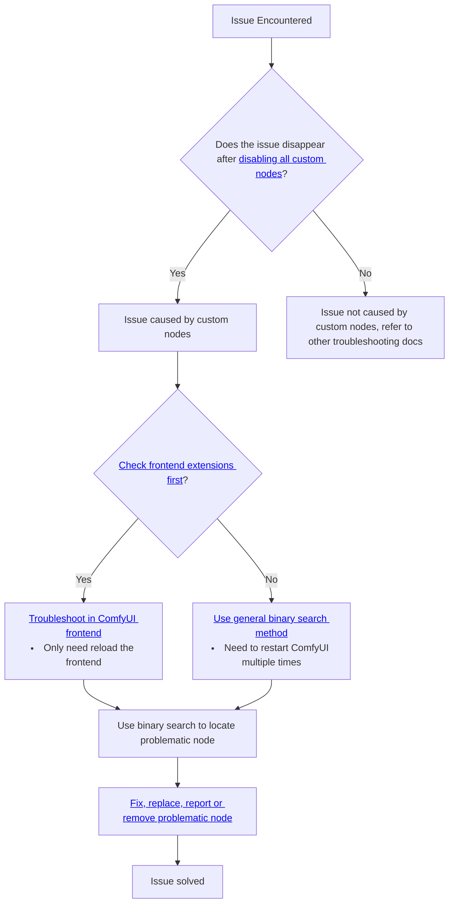
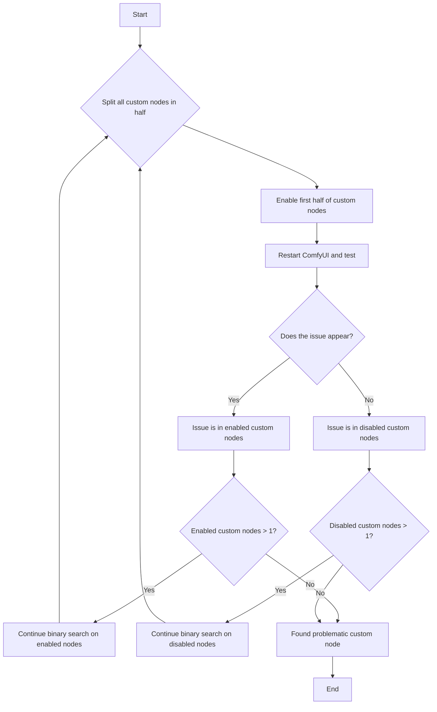

# Source: https://docs.comfy.org/troubleshooting/custom-node-issues.md

> ## Documentation Index
> Fetch the complete documentation index at: https://docs.comfy.org/llms.txt
> Use this file to discover all available pages before exploring further.

# How to Troubleshoot and Solve ComfyUI Issues

> Troubleshoot and fix problems caused by custom nodes and extensions

Here is the overall approach for troubleshooting custom node issues:



## How to disable all custom nodes?

<Tabs>
  <Tab title="Desktop Users">
    Start ComfyUI Desktop with custom nodes disabled from the settings menu
    
    or run the server manually:

    ```bash  theme={null}
    cd path/to/your/comfyui
    python main.py --disable-all-custom-nodes
    ```
  </Tab>

  <Tab title="Manual Install">
    ```bash  theme={null}
    cd ComfyUI
    python main.py --disable-all-custom-nodes
    ```
  </Tab>

  <Tab title="Portable">
    <Tabs>
      <Tab title="Modify `.bat` file">
        Open the folder where the portable version is located, and find the `run_nvidia_gpu.bat` or `run_cpu.bat` file
        

        1. Copy `run_nvidia_gpu.bat` or `run_cpu.bat` file and rename it to `run_nvidia_gpu_disable_custom_nodes.bat`
        2. Open the copied file with Notepad
        3. Add the `--disable-all-custom-nodes` parameter to the file, or copy the parameters below into a `.txt` file and rename the file to `run_nvidia_gpu_disable_custom_nodes.bat`

        ```bash  theme={null}
        .\python_embeded\python.exe -s ComfyUI\main.py --disable-all-custom-nodes  --windows-standalone-build
        pause
        ```

        4. Save the file and close it
        5. Double-click the file to run it. If everything is normal, you should see ComfyUI start and custom nodes disabled
      </Tab>

      <Tab title="Through Command Line">
                

        1. Enter the folder where the portable version is located
        2. Open the terminal by right-clicking the menu → Open terminal
           
        3. Ensure that the folder name is the current directory of the portable version
        4. Enter the following command to start ComfyUI through the portable python and disable custom nodes

        ```
        .\python_embeded\python.exe -s ComfyUI\main.py --disable-all-custom-nodes
        ```
      </Tab>
    </Tabs>
  </Tab>
</Tabs>

**Results:**

* ✅ **Issue disappears**: A custom node is causing the problem → Continue to Step 2
* ❌ **Issue persists**: Not a custom node issue → [Report the issue](#reporting-issues)

## What is Binary Search?

In this document, we will introduce the binary search approach for troubleshooting custom node issues, which involves checking half of the custom nodes at a time until we locate the problematic node.

Please refer to the flowchart below for the specific approach - enable half of the currently disabled nodes each time and check if the issue appears, until we identify which custom node is causing the issue



## Two Troubleshooting Methods

In this document, we categorize custom nodes into two types for troubleshooting:


* A: Custom nodes with frontend extensions
* B: Regular custom nodes

Let's first understand the potential issues and causes for different types of custom nodes:

<Tabs>
  <Tab title="Custom Nodes with Frontend Extensions">
    For custom nodes, we can prioritize troubleshooting those with frontend extensions, as they cause the most issues. Their main conflicts arise from incompatibilities with ComfyUI frontend version updates.

    Common issues include:

    * Workflows not executing
    * Some nodes can't show preview images(such as save image node)
    * Misaligned UI elements
    * Unable to access ComfyUI frontend
    * Completely broken UI or blank screen
    * Unable to communicate normally with ComfyUI backend
    * Node connections not working properly
    * And more

    Common causes for these issues:

    * Frontend modifications during updates that custom nodes haven't adapted to yet
    * Users updating ComfyUI without synchronously upgrading custom nodes, even though authors have released compatible versions
    * Authors stopping maintenance, leading to incompatibility between custom node extensions and the ComfyUI frontend
  </Tab>

  <Tab title="Regular Custom Nodes">
    If the problem isn't caused by custom nodes' frontend extensions, issues often relate to dependencies. Common problems include:

    * "Failed to import" errors in console/logs
    * Missing nodes still showing as missing after installation and restart
    * ComfyUI crashes or fails to start
    * And more

    Common causes for these errors:

    * Custom nodes requiring additional wheels like ComfyUI-Nunchaku
    * Custom nodes using strict dependency versions (e.g., `torch==2.4.1`) while other plugins use different versions (e.g., `torch>=2.4.2`), causing conflicts after installation
    * Network issues preventing successful dependency installation

    When problems involve Python environment interdependencies and versions, troubleshooting becomes more complex and requires knowledge of Python environment management, including how to install and uninstall dependencies
  </Tab>
</Tabs>

## Using Binary Search for Troubleshooting

Among these two different types of custom node issues, conflicts between custom node frontend extensions and ComfyUI are more common. We'll prioritize troubleshooting these nodes first. Here's the overall troubleshooting approach:

### 1. Troubleshooting the Custom Nodes' Frontend Extensions

<Steps>
  <Step title="Disable All Third-Party Frontend Extensions">
    
    After starting ComfyUI, find the `Extensions` menu in settings and follow the steps shown in the image to disable all third-party extensions

    <Tip>
      If you can't enter ComfyUI frontend, just skip the frontend extensions troubleshooting section and continue to [General Custom Node Troubleshooting Approach](#2-general-custom-node-troubleshooting-approach)
    </Tip>
  </Step>

  <Step title="Restart ComfyUI">
    After disabling frontend extensions for the first time, it's recommended to restart ComfyUI to ensure all frontend extensions are properly disabled

    * If the problem disappears, then it was caused by custom node frontend extensions, and we can proceed with binary search troubleshooting
    * If the problem persists, then it's not caused by frontend extensions - please refer to the other troubleshooting approaches in this document
  </Step>

  <Step title="Use Binary Search to Locate Problem Nodes">
    Use the method mentioned at the beginning of this document to troubleshoot, enabling half of the custom nodes at a time until you find the problematic node
    
    Refer to the image to enable half of the frontend extensions. Note that if extension names are similar, they likely come from the same custom node's frontend extensions
  </Step>

  <Step title="Follow-up Actions">
    If you find the problematic custom node, please refer to the problem fixing section of this document to resolve the custom node issues
  </Step>
</Steps>

Using this method, you don't need to restart ComfyUI multiple times - just reload ComfyUI after enabling/disabling custom node frontend extensions. Plus, your troubleshooting scope is limited to nodes with frontend extensions, which greatly narrows down the search range.

### 2. General Custom Node Troubleshooting

<Steps>
  <Step title="Use Binary Search to Locate Custom Nodes">
    For the binary search localization method, in addition to manual search, we also have automated binary search using comfy-cli, as detailed below:

    <Tabs>
      <Tab title="Using Comfy CLI (Recommended)">
        Using Comfy CLI requires some command line experience. If you're not comfortable with it, use manual binary search instead.

        If you have [Comfy CLI](/comfy-cli/getting-started) installed, you can use the automated bisect tool to find the problematic node:

        ```bash  theme={null}
        # Start a bisect session
        comfy-cli node bisect start

        # Follow the prompts:
        # - Test ComfyUI with the current set of enabled nodes
        # - Mark as 'good' if the issue is gone: comfy-cli node bisect good
        # - Mark as 'bad' if the issue persists: comfy-cli node bisect bad
        # - Repeat until the problematic node is identified

        # Reset when done
        comfy-cli node bisect reset
        ```

        The bisect tool will automatically enable/disable nodes and guide you through the process.
      </Tab>

      <Tab title="Manual Binary Search">
        <Warning>
          Before starting, please **create a backup** of your custom\_nodes folder in case something goes wrong.
        </Warning>

        If you prefer to do the process manually or don't have Comfy CLI installed, follow the steps below:

        <Steps>
          <Step title="Create Temporary Folders">
            Before starting, enter the `<YOUR_COMFYUI_FOLDER>\ComfyUI\` folder

            <Tabs>
              <Tab title="Windows">
                * **Backup all custom nodes**: Copy and rename `custom_nodes` to `custom_nodes_backup`
                * **Create a temporary folder**: Create a folder named `custom_nodes_temp`

                Or use the following command line to backup:

                ```bash  theme={null}
                # Create backup and temporary folder
                mkdir "%USERPROFILE%\custom_nodes_backup"
                mkdir "%USERPROFILE%\custom_nodes_temp"

                # Backup all content
                xcopy "custom_nodes\*" "%USERPROFILE%\custom_nodes_backup\" /E /H /Y
                ```
              </Tab>

              <Tab title="macOS/Linux">
                Manually backup custom\_nodes folder
                Or use the following command line to backup:

                ```bash  theme={null}
                # Create backup and temporary folder
                mkdir ~/custom_nodes_backup
                mkdir ~/custom_nodes_temp

                # Backup all content
                cp -r custom_nodes/* ~/custom_nodes_backup/
                ```
              </Tab>

              <Tab title="Cloud/Colab">
                ```bash  theme={null}
                # Create backup and temporary folder
                mkdir /content/custom_nodes_backup
                mkdir /content/custom_nodes_temp

                # Backup all content
                cp -r /content/ComfyUI/custom_nodes/* /content/custom_nodes_backup/
                ```
              </Tab>
            </Tabs>
          </Step>

          <Step title="List all custom nodes">
            <Tabs>
              <Tab title="Windows">
                Since Windows has a visual interface, you can skip this step unless you're only using the command line

                ```bash  theme={null}
                dir custom_nodes
                ```
              </Tab>

              <Tab title="macOS/Linux">
                ```bash  theme={null}
                ls custom_nodes/
                ```
              </Tab>

              <Tab title="Cloud/Colab">
                ```bash  theme={null}
                ls /content/ComfyUI/custom_nodes/
                ```
              </Tab>
            </Tabs>
          </Step>

          <Step title="Split nodes in half">
            Let's assume that you have 8 custom nodes. Move the first half to temporary storage:

            <Tabs>
              <Tab title="Windows">
                ```bash  theme={null}
                # Move first half (nodes 1-4) to temp
                move "custom_nodes\node1" "%USERPROFILE%\custom_nodes_temp\"
                move "custom_nodes\node2" "%USERPROFILE%\custom_nodes_temp\"
                move "custom_nodes\node3" "%USERPROFILE%\custom_nodes_temp\"
                move "custom_nodes\node4" "%USERPROFILE%\custom_nodes_temp\"
                ```
              </Tab>

              <Tab title="macOS/Linux">
                ```bash  theme={null}
                # Move first half (nodes 1-4) to temp
                mv custom_nodes/node1 ~/custom_nodes_temp/
                mv custom_nodes/node2 ~/custom_nodes_temp/
                mv custom_nodes/node3 ~/custom_nodes_temp/
                mv custom_nodes/node4 ~/custom_nodes_temp/
                ```
              </Tab>

              <Tab title="Cloud/Colab">
                ```bash  theme={null}
                # Move first half (nodes 1-4) to temp
                mv /content/ComfyUI/custom_nodes/node1 /content/custom_nodes_temp/
                mv /content/ComfyUI/custom_nodes/node2 /content/custom_nodes_temp/
                mv /content/ComfyUI/custom_nodes/node3 /content/custom_nodes_temp/
                mv /content/ComfyUI/custom_nodes/node4 /content/custom_nodes_temp/
                ```
              </Tab>
            </Tabs>
          </Step>

          <Step title="Test ComfyUI">
            Start ComfyUI normally

            ```bash  theme={null}
            python main.py
            ```
          </Step>

          <Step title="Interpret results">
            * **Issue persists**: Problem is in the remaining nodes (5-8)
            * **Issue disappears**: Problem was in the moved nodes (1-4)
          </Step>

          <Step title="Narrow it down">
            * If issue persists: Move half of remaining nodes (e.g., nodes 7-8) to temp
            * If issue gone: Move half of temp nodes (e.g., nodes 3-4) back to custom\_nodes
          </Step>

          <Step title="Repeat until you find the single problematic node">
            * Repeat until you find the single problematic node
          </Step>
        </Steps>
      </Tab>
    </Tabs>
  </Step>
</Steps>

## How to Fix the Issue

Once you've identified the problematic custom node:

### Option 1: Update the Node

1. Check if there's an update available in ComfyUI Manager
2. Update the node and test again

### Option 2: Replace the Node

1. Look for alternative custom nodes with similar functionality
2. Check the [ComfyUI Registry](https://registry.comfy.org) for alternatives

### Option 3: Report the Issue

Contact the custom node developer:

1. Find the node's GitHub repository
2. Create an issue with:
   * Your ComfyUI version
   * Error messages/logs
   * Steps to reproduce
   * Your operating system

### Option 4: Remove or Disable the Node

If no fix is available and you don't need the functionality:

1. Remove the problematic node from `custom_nodes/` or disable it in the ComfyUI Manager interface
2. Restart ComfyUI

## Reporting Issues

If the issue isn't caused by custom nodes, refer to the general [troubleshooting overview](/troubleshooting/overview) for other common problems.

### For Custom Node-Specific Issues

Contact the custom node developer:

* Find the node's GitHub repository
* Create an issue with your ComfyUI version, error messages, reproduction steps, and OS
* Check the node's documentation and Issues page for known issues

### For ComfyUI Core Issues

* **GitHub**: [ComfyUI Issues](https://github.com/comfyanonymous/ComfyUI/issues)
* **Forum**: [Official ComfyUI Forum](https://forum.comfy.org/)

### For Desktop App Issues

* **GitHub**: [ComfyUI Desktop Issues](https://github.com/Comfy-Org/desktop/issues)

### For Frontend Issues

* **GitHub**: [ComfyUI Frontend Issues](https://github.com/Comfy-Org/ComfyUI_frontend/issues)

<Note>
  For general installation, model, or performance issues, see our [troubleshooting overview](/troubleshooting/overview) and [model issues](/troubleshooting/model-issues) pages.
</Note>
