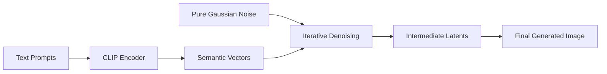
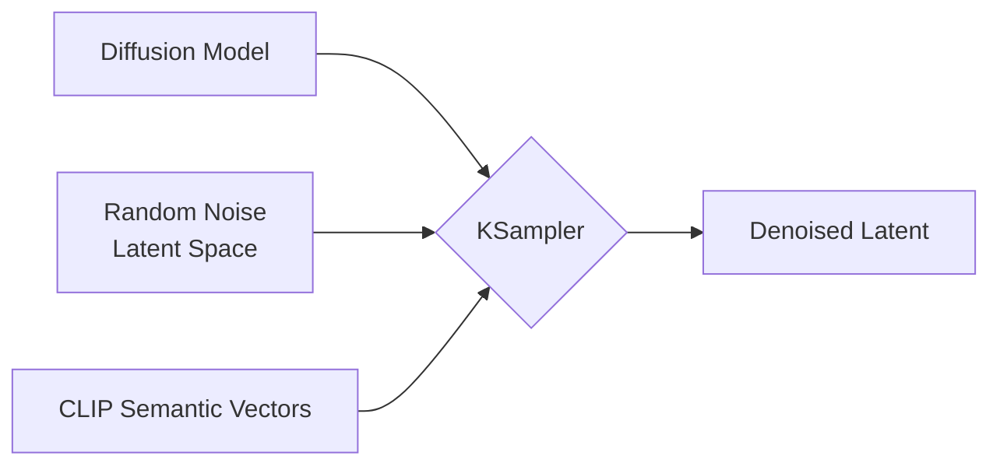

# Source: https://docs.comfy.org/tutorials/basic/text-to-image.md

# ComfyUI Text to Image Workflow

> This guide will help you understand the concept of text-to-image in AI art generation and complete a text-to-image workflow in ComfyUI

This guide aims to introduce you to ComfyUI's text-to-image workflow and help you understand the functionality and usage of various ComfyUI nodes.

In this document, we will:

* Complete a text-to-image workflow
* Gain a basic understanding of diffusion model principles
* Learn about the functions and roles of workflow nodes
* Get an initial understanding of the SD1.5 model

We'll start by running a text-to-image workflow, followed by explanations of related concepts. Please choose the relevant sections based on your needs.

## About Text to Image

**Text to Image** is a fundamental process in AI art generation that creates images from text descriptions, with **diffusion models** at its core.

The text-to-image process requires the following elements:

* **Artist:** The image generation model
* **Canvas:** The latent space
* **Image Requirements (Prompts):** Including positive prompts (elements you want in the image) and negative prompts (elements you don't want)

This text-to-image generation process can be simply understood as telling your requirements (positive and negative prompts) to an **artist (the image model)**, who then creates what you want based on these requirements.

## ComfyUI Text to Image Workflow Example Guide

### 1. Preparation

Ensure you have at least one SD1.5 model file in your `ComfyUI/models/checkpoints` folder, such as [v1-5-pruned-emaonly-fp16.safetensors](https://huggingface.co/Comfy-Org/stable-diffusion-v1-5-archive/blob/main/v1-5-pruned-emaonly-fp16.safetensors)

If you haven't installed it yet, please refer to the model installation section in [Getting Started with ComfyUI AI Art Generation](/get_started/first_generation).

### 2. Loading the Text to Image Workflow

Download the image below and **drag it into ComfyUI** to load the workflow:


<Tip>
  Images containing workflow JSON in their metadata can be directly dragged into ComfyUI or loaded using the menu `Workflows` -> `Open (ctrl+o)`.
</Tip>

### 3. Loading the Model and Generating Your First Image

After installing the image model, follow the steps in the image below to load the model and generate your first image


Follow these steps according to the image numbers:

1. In the **Load Checkpoint** node, use the arrows or click the text area to ensure **v1-5-pruned-emaonly-fp16.safetensors** is selected, and the left/right arrows don't show **null** text
2. Click the `Queue` button or use the shortcut `Ctrl + Enter` to execute image generation

After the process completes, you should see the resulting image in the **Save Image** node interface, which you can right-click to save locally


<Tip>If you're not satisfied with the result, try running the generation multiple times. Each time you run it, **KSampler** will use a different random seed based on the `seed` parameter, so each generation will produce different results</Tip>

### 4. Start Experimenting

Try modifying the text in the **CLIP Text Encoder**


The `Positive` connection to the KSampler node represents positive prompts, while the `Negative` connection represents negative prompts

Here are some basic prompting principles for the SD1.5 model:

* Use English whenever possible
* Separate prompts with English commas `,`
* Use phrases rather than long sentences
* Use specific descriptions
* Use expressions like `(golden hour:1.2)` to increase the weight of specific keywords, making them more likely to appear in the image. `1.2` is the weight, `golden hour` is the keyword
* Use keywords like `masterpiece, best quality, 4k` to improve generation quality

Here are several prompt examples you can try, or use your own prompts for generation:

**1. Anime Style**

Positive prompts:

```
anime style, 1girl with long pink hair, cherry blossom background, studio ghibli aesthetic, soft lighting, intricate details

masterpiece, best quality, 4k
```

Negative prompts:

```
low quality, blurry, deformed hands, extra fingers
```

**2. Realistic Style**

Positive prompts:

```
(ultra realistic portrait:1.3), (elegant woman in crimson silk dress:1.2), 
full body, soft cinematic lighting, (golden hour:1.2), 
(fujifilm XT4:1.1), shallow depth of field, 
(skin texture details:1.3), (film grain:1.1), 
gentle wind flow, warm color grading, (perfect facial symmetry:1.3)
```

Negative prompts:

```
(deformed, cartoon, anime, doll, plastic skin, overexposed, blurry, extra fingers)
```

**3. Specific Artist Style**

Positive prompts:

```
fantasy elf, detailed character, glowing magic, vibrant colors, long flowing hair, elegant armor, ethereal beauty, mystical forest, magical aura, high detail, soft lighting, fantasy portrait, Artgerm style
```

Negative prompts:

```
blurry, low detail, cartoonish, unrealistic anatomy, out of focus, cluttered, flat lighting
```

## Text to Image Working Principles

The entire text-to-image process can be understood as a **reverse diffusion process**. The [v1-5-pruned-emaonly-fp16.safetensors](https://huggingface.co/Comfy-Org/stable-diffusion-v1-5-archive/blob/main/v1-5-pruned-emaonly-fp16.safetensors) we downloaded is a pre-trained model that can **generate target images from pure Gaussian noise**. We only need to input our prompts, and it can generate target images through denoising random noise.



We need to understand two concepts:

1. **Latent Space:** Latent Space is an abstract data representation method in diffusion models. Converting images from pixel space to latent space reduces storage space and makes it easier to train diffusion models and reduce denoising complexity. It's like architects using blueprints (latent space) for design rather than designing directly on the building (pixel space), maintaining structural features while significantly reducing modification costs
2. **Pixel Space:** Pixel Space is the storage space for images, which is the final image we see, used to store pixel values.

If you want to learn more about diffusion models, you can read these papers:

* [Denoising Diffusion Probabilistic Models (DDPM)](https://arxiv.org/pdf/2006.11239)
* [Denoising Diffusion Implicit Models (DDIM)](https://arxiv.org/pdf/2010.02502)
* [High-Resolution Image Synthesis with Latent Diffusion Models](https://arxiv.org/pdf/2112.10752)

## ComfyUI Text to Image Workflow Node Explanation


### A. Load Checkpoint Node


This node is typically used to load the image generation model. A `checkpoint` usually contains three components: `MODEL (UNet)`, `CLIP`, and `VAE`

* `MODEL (UNet)`: The UNet model responsible for noise prediction and image generation during the diffusion process
* `CLIP`: The text encoder that converts our text prompts into vectors that the model can understand, as the model cannot directly understand text prompts
* `VAE`: The Variational AutoEncoder that converts images between pixel space and latent space, as diffusion models work in latent space while our images are in pixel space

### B. Empty Latent Image Node


Defines a latent space that outputs to the KSampler node. The Empty Latent Image node constructs a **pure noise latent space**

You can think of its function as defining the canvas size, which determines the dimensions of our final generated image

### C. CLIP Text Encoder Node


Used to encode prompts, which are your requirements for the image

* The `Positive` condition input connected to the KSampler node represents positive prompts (elements you want in the image)
* The `Negative` condition input connected to the KSampler node represents negative prompts (elements you don't want in the image)

The prompts are encoded into semantic vectors by the `CLIP` component from the `Load Checkpoint` node and output as conditions to the KSampler node

### D. KSampler Node


The **KSampler** is the core of the entire workflow, where the entire noise denoising process occurs, ultimately outputting a latent space image



Here's an explanation of the KSampler node parameters:

| Parameter Name               | Description                        | Function                                                                                                    |
| ---------------------------- | ---------------------------------- | ----------------------------------------------------------------------------------------------------------- |
| **model**                    | Diffusion model used for denoising | Determines the style and quality of generated images                                                        |
| **positive**                 | Positive prompt condition encoding | Guides generation to include specified elements                                                             |
| **negative**                 | Negative prompt condition encoding | Suppresses unwanted content                                                                                 |
| **latent\_image**            | Latent space image to be denoised  | Serves as the input carrier for noise initialization                                                        |
| **seed**                     | Random seed for noise generation   | Controls generation randomness                                                                              |
| **control\_after\_generate** | Seed control mode after generation | Determines seed variation pattern in batch generation                                                       |
| **steps**                    | Number of denoising iterations     | More steps mean finer details but longer processing time                                                    |
| **cfg**                      | Classifier-free guidance scale     | Controls prompt constraint strength (too high leads to overfitting)                                         |
| **sampler\_name**            | Sampling algorithm name            | Determines the mathematical method for denoising path                                                       |
| **scheduler**                | Scheduler type                     | Controls noise decay rate and step size allocation                                                          |
| **denoise**                  | Denoising strength coefficient     | Controls noise strength added to latent space, 0.0 preserves original input features, 1.0 is complete noise |

In the KSampler node, the latent space uses `seed` as an initialization parameter to construct random noise, and semantic vectors `Positive` and `Negative` are input as conditions to the diffusion model

Then, based on the number of denoising steps specified by the `steps` parameter, denoising is performed. Each denoising step uses the denoising strength coefficient specified by the `denoise` parameter to denoise the latent space and generate a new latent space image

### E. VAE Decode Node


Converts the latent space image output from the **KSampler** into a pixel space image

### F. Save Image Node


Previews and saves the decoded image from latent space to the local `ComfyUI/output` folder

## Introduction to SD1.5 Model

**SD1.5 (Stable Diffusion 1.5)** is an AI image generation model developed by [Stability AI](https://stability.ai/). It's the foundational version of the Stable Diffusion series, trained on **512×512** resolution images, making it particularly good at generating images at this resolution. With a size of about 4GB, it runs smoothly on **consumer-grade GPUs (e.g., 6GB VRAM)**. Currently, SD1.5 has a rich ecosystem, supporting various plugins (like ControlNet, LoRA) and optimization tools.
As a milestone model in AI art generation, SD1.5 remains the best entry-level choice thanks to its open-source nature, lightweight architecture, and rich ecosystem. Although newer versions like SDXL/SD3 have been released, its value for consumer-grade hardware remains unmatched.

### Basic Information

* **Release Date**: October 2022
* **Core Architecture**: Based on Latent Diffusion Model (LDM)
* **Training Data**: LAION-Aesthetics v2.5 dataset (approximately 590M training steps)
* **Open Source Features**: Fully open-source model/code/training data

### Advantages and Limitations

Model Advantages:

* Lightweight: Small size, only about 4GB, runs smoothly on consumer GPUs
* Low Entry Barrier: Supports a wide range of plugins and optimization tools
* Mature Ecosystem: Extensive plugin and tool support
* Fast Generation: Smooth operation on consumer GPUs

Model Limitations:

* Detail Handling: Hands/complex lighting prone to distortion
* Resolution Limits: Quality degrades for direct 1024x1024 generation
* Prompt Dependency: Requires precise English descriptions for control
