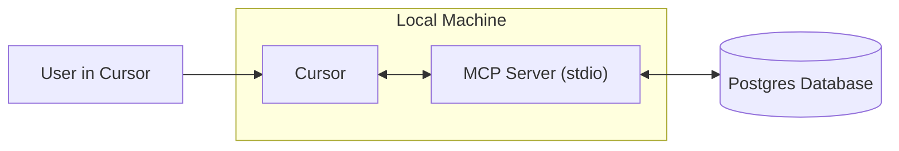
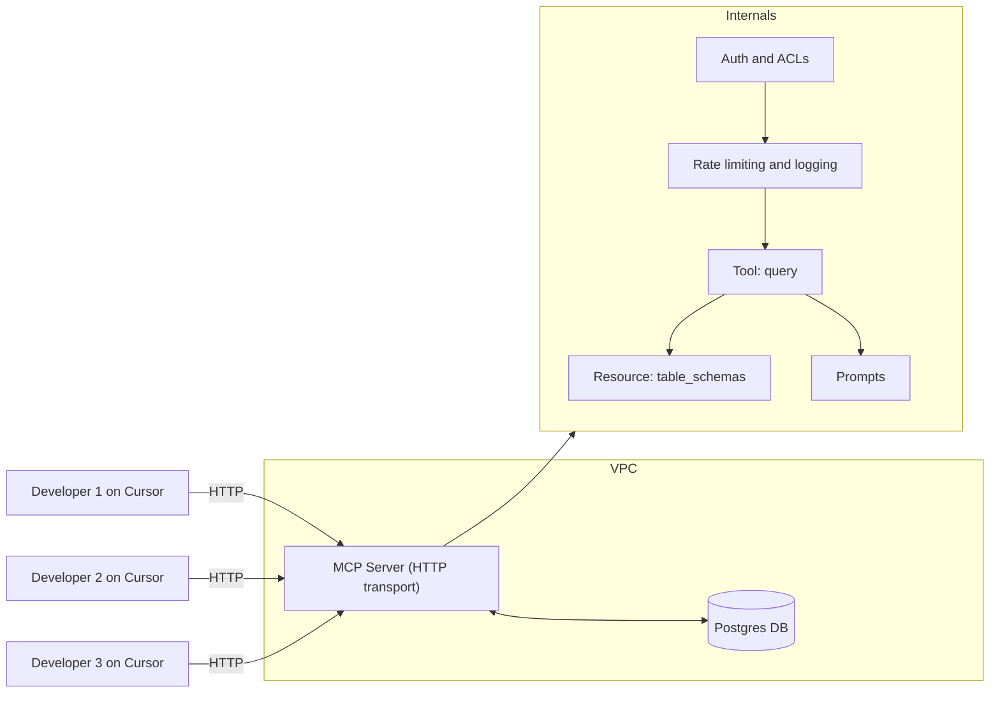

# Source: https://docs.cursor.com/en/guides/tutorials/building-mcp-server.md

# Building an MCP Server

> Learn how to build a Model Context Protocol (MCP) server with PostgreSQL integration for Cursor

## Introduction

MCP servers let you connect custom data sources and make them available for use inside Cursor. This is particularly useful when you need context from places such as browsers, databases, or error and system logs. Setting up an MCP server is straightforward, and with Cursor it can be done quickly.

In this guide, we will walk through how to build an MCP server for Postgres. Our goal is to enable Cursor to run SQL queries directly against a Postgres database and to expose table schemas in a structured way.

<Note>
  This tutorial is designed to teach the fundamentals of building MCP servers.
</Note>

<video autoPlay loop muted playsInline controls>
  <source src="https://mintcdn.com/cursor/Qpa6MBK62Try_xlf/images/guides/tutorials/building-mcp-server/demo.mp4?fit=max&auto=format&n=Qpa6MBK62Try_xlf&q=85&s=8e02b011bd0956d62135db5779f7ead5" type="video/mp4" data-path="images/guides/tutorials/building-mcp-server/demo.mp4" />
</video>



## What is an MCP Server?

An [MCP server](/en/context/mcp) is a process that communicates with Cursor and provides access to external data or actions. It can be implemented in several ways, but here we will use the simplest method: a server that runs locally on your computer over [stdio](https://en.wikipedia.org/wiki/Standard_streams) (standard input/output streams). This avoids complicated security considerations and allows us to focus on the MCP logic itself.

One of the most common use cases for MCP is database access. When building dashboards, running analyses, or creating migrations, it is often necessary to query and inspect a database. Our Postgres MCP server will support two core capabilities: running arbitrary queries and listing table schemas.

Although both of these tasks could be performed with plain SQL, MCP offers features that make them more powerful and more generally useful. Tools provide a way to expose actions such as executing queries, while resources allow us to share standardized context such as schema information. Later in this guide we will also look at prompts, which enable more advanced workflows.

Under the hood, we will rely on the postgres npm package to execute SQL statements against the database. The MCP SDK will serve as a wrapper around these calls, letting us integrate Postgres functionality seamlessly into Cursor.

## How to Build the MCP Server

The first step in building the server is to setup a new project. We’ll start with creating a new folder and initializing a Bun project

```bash  theme={null}
> mkdir postgres-mcp-server
> Bun init
```

From here, we’ll select `Blank` project. Once our boilerplate is setup, we need to install the required dependencies. `zod` is required to define schemas for i/o in MCP sdk

```bash  theme={null}
bun add postgres @modelcontextprotocol/sdk zod
```

From here, we’ll go to the repositories for each of the libraries and get the link to the raw file contents of each respective README files. We’ll use these for context when building the server

* `postgres`
  * Repo:  [https://github.com/porsager/postgres](https://github.com/porsager/postgres),
  * README: [https://raw.githubusercontent.com/porsager/postgres/refs/heads/master/README.md](https://raw.githubusercontent.com/porsager/postgres/refs/heads/master/README.md)
* `@modelcontextprotocol/sdk`:
  * Repo: [https://github.com/modelcontextprotocol/typescript-sdk](https://github.com/modelcontextprotocol/typescript-sdk)
  * README: [https://raw.githubusercontent.com/modelcontextprotocol/typescript-sdk/refs/heads/main/README.md](https://raw.githubusercontent.com/modelcontextprotocol/typescript-sdk/refs/heads/main/README.md)

Now, we’ll define how we want the server to behave. To do that, we’ll create a `spec.md` and write out the high level goals

```markdown  theme={null}
# Spec

- Allow defining DATABASE_URL through MCP env configuration
- Query postgres data through tool
  - By default, make it readonly
  - Allow write ops by setting ENV `DANGEROUSLY_ALLOW_WRITE_OPS=true|1`
- Access tables as `resources`
- Use Zod for schema definitions
```

As you can see, this is quite a lightweight spec.Fee free to ad more details as needed.. Together with the README links, we’ll construct the final prompt

```markdown  theme={null}
Read the following and follow @spec.md to understand what we want. All necesary dependeies are installed
- @https://raw.githubusercontent.com/modelcontextprotocol/typescript-sdk/refs/heads/main/README.md
- @https://raw.githubusercontent.com/porsager/postgres/refs/heads/master/README.md
```

With these three components in place (the specification, the MCP SDK documentation, and the Postgres library documentation), we can use Cursor to scaffold the server implementation. Cursor will help us stitch the pieces together, generating the code that connects the MCP SDK with Postgres.

After some back and forth prompting, we now have a first version of the MCP server going. To try it out, we can use the [MCP Inspector](https://modelcontextprotocol.io/legacy/tools/inspector)

```bash  theme={null}
npx @modelcontextprotocol/inspector bun run index.ts
```

## Testing the MCP Server

Once the initial implementation is complete, we can test it using the MCP Inspector. The inspector provides a way to see what the server exposes and to verify that the tools and resources behave as expected. We should confirm that queries can be executed and that schema information is returned correctly.


When everything looks good, we can connect the server to Cursor itself and test it in a real environment. At this point, Cursor will be able to use the Postgres MCP server as if it were a built-in capability, letting us query and inspect the database directly.

<video autoPlay loop muted playsInline controls>
  <source src="https://mintcdn.com/cursor/Qpa6MBK62Try_xlf/images/guides/tutorials/building-mcp-server/mcp-mermaid.mp4?fit=max&auto=format&n=Qpa6MBK62Try_xlf&q=85&s=06fe972734d9f15bc64032f28c4e3e52" type="video/mp4" data-path="images/guides/tutorials/building-mcp-server/mcp-mermaid.mp4" />
</video>

## Next Steps

Running the MCP server locally over stdio is a great starting point, but teams often require shared access to the same database through their MCP server. In these scenarios, deploying the MCP server as a centralized HTTP service becomes necessary.

A deployed MCP server offers several advantages over individual stdio instances:

* **Shared database access:** Multiple team members can query the same database instance through Cursor
* **Centralized configuration:** Schema updates and permission changes are managed in one location
* **Enhanced security:** Proper authentication, rate limiting, and access controls can be implemented
* **Observability:** Usage patterns and performance metrics can be monitored across the team

To achieve this, you would switch the transport method from stdio to HTTP.

While we won’t cover the whole setup, here’s a good starting prompt you can give to Cursor

```
Based on the existing MCP server, create a new file that implements the HTTP protocol.

Move shared logic to mcp-core, and name each transport implementation by name (mcp-server-stdio, mcp-server-http)

@https://raw.githubusercontent.com/modelcontextprotocol/typescript-sdk/refs/heads/main/README.md 
```

The final results can be seen here: [pg-mcp-server](https://github.com/ericzakariasson/pg-mcp-server)


