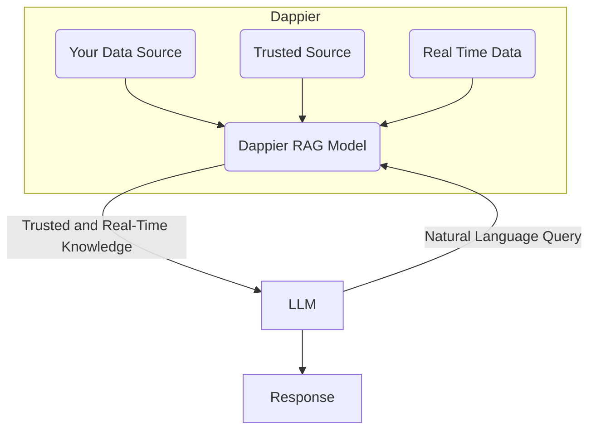

# Dappier Documentation

Source: https://docs.dappier.com/llms-full.txt

---

# AI Recommendations API
Source: https://docs.dappier.com/ai_recommendations_api


Convert any data into a recommendation engine with Dappier's AI-powered Article Recommendations API. This API uses a RAG (Retrieval-Augmented Generation) model to return article recommendations based on the input query or URL.

You'll need an API key to access this API. Visit [Dappier Platform](https://platform.dappier.com) to sign up and create an API key under Settings > Profile > API Keys.

#### Using AI Recommendations API

This section demonstrates retrieving recommendations based on natural language queries or URLs. You can get the data model id of the desired data model from the [Dappier Marketplace](https://marketplace.dappier.com). The data model id starts with `dm_`.
Api reference for this endpoint can be found [here](https://docs.dappier.com/api-reference/endpoint/real-time-search).

<br />

<CodeGroup>
  ```python Python theme={null}
  import requests
  import json

  url = "https://api.dappier.com/app/datamodel/dm_01j0pb465keqmatq9k83dthx34"
  payload = json.dumps({
  "query": "lifestyle new articles",
  "similarity_top_k": 3,
  "ref": "",
  "num_articles_ref": 0,
  "search_algorithm": "most_recent",
  "page": 1,
  "num_results" : 10

  })
  headers = {
  'Content-Type': 'application/json',
  'Authorization': 'Bearer <YOUR_DAPPIER_API_KEY>'
  }

  response = requests.post(url, headers=headers, data=payload)

  print(response.text)
  ```

  ```bash Go theme={null}
  package main

  import (
  "bytes"
  "fmt"
  "net/http"
  "io/ioutil"
  )

  func main() {
  url := "https://api.dappier.com/app/datamodel/dm_01j0pb465keqmatq9k83dthx34"
  apiKey := "<YOUR_DAPPIER_API_KEY>"
  query := `{
      "query": "lifestyle new articles",
      "similarity_top_k": 3,
      "ref": "",
      "num_articles_ref": 0,
      "search_algorithm": "most_recent",
      "page": 1,
      "num_results" : 10
  }`

  req, err := http.NewRequest("POST", url, bytes.NewBuffer([]byte(query)))
  if err != nil {
  fmt.Println("Error creating request:", err)
  return

  }

  req.Header.Set("Authorization", "Bearer "+apiKey)
  req.Header.Set("Content-Type", "application/json")

  client := &http.Client{}
  resp, err := client.Do(req)
  if err != nil {
  fmt.Println("Error making request:", err)
  return

  }
  defer resp.Body.Close()

  body, _ := ioutil.ReadAll(resp.Body)
  fmt.Println(string(body))

  }

  ```

  ```bash cURL theme={null}
  curl --location --request POST 'https://api.dappier.com/app/datamodel/dm_01j0pb465keqmatq9k83dthx34' \
  --header 'Content-Type: application/json' \
  --header 'Authorization: Bearer <YOUR_DAPPIER_API_KEY>' \
  --data-raw '{
      "query": "lifestyle new articles",
      "similarity_top_k": 3,
      "ref": "",
      "num_articles_ref": 0,
      "search_algorithm" : "most_recent",
      "page": 1,
      "num_results" : 10
  }'
  ```
</CodeGroup>

```json response theme={null}
{
"results": [
    {
        "author": "Rusty Weiss",
        "image_url": "https://images.dappier.com/dm_01j0pb465keqmatq9k83dthx34/Olympics-Rugby-Sevens-Women-Semifinal-USA-vs-NZL-23861886-scaled-e1725556056406_.jpg?width=428&height=321",
        "preview_content": "<p>American rugby player Ilona Maher&#8217;s popularity is at its absolute peak. Demand for her has skyrocketed since her performance in [&#8230;]</p>\n<p>The post <a href=\"https://www.boundingintosports.com/2024/09/olympic-rugby-hero-ilona-maher-joins-dancing-with-the-stars/\">Olympic Rugby Hero Ilona Maher Joins &#8216;Dancing With The Stars&#8217;</a> appeared first on <a href=\"https://www.boundingintosports.com\">Bounding Into Sports</a>.</p>",
        "pubdate": "Thu, 05 Sep 2024 17:30:27 +0000",
        "site": "Bounding Into Sports",
        "site_domain": "www.boundingintosports.com",
        "title": "Olympic Rugby Hero Ilona Maher Joins ‘Dancing With The Stars’",
        "url": "https://api.dappier.com/app/track/NB2HI4DTHIXS653XO4XGE33VNZSGS3THNFXHI33TOBXXE5DTFZRW63JPGIYDENBPGA4S633MPFWXA2LDFVZHKZ3CPEWWQZLSN4WWS3DPNZQS23LBNBSXELLKN5UW44ZNMRQW4Y3JNZTS253JORUC25DIMUWXG5DBOJZS6===?type=article_click&site_domain=www.boundingintosports.com&datamodel_id=dm_01j0pb465keqmatq9k83dthx34&request_id=3ac73c01974c-kqHLh38Cqy-2824988&origin="
    },
    ...
]
}
```


# AI Recommendations API
Source: https://docs.dappier.com/api-reference/endpoint/ai-recommendations

post /app/v2/search
Retrieve articles based on queries or URLs, powered by semantic search.


# Real Time Search
Source: https://docs.dappier.com/api-reference/endpoint/real-time-search

post /app/aimodel/{ai_model_id}
Access real-time search with Dappier's AI models — from live web search and breaking news to stock prices and financial insights. Fast, reliable, and ready for monetization.


# Bot Deterrence
Source: https://docs.dappier.com/bot-deterrence


Bots are automated programs that perform tasks on the internet. While some bots, like search engine crawlers, are beneficial, others, like scrapers and spammers, can harm your site.

Bad bots can cause massive problems for web properties. Too much bot traffic can put a heavy load on web servers, slowing or denying service to legitimate users (DDoS attacks are an extreme version of this scenario). Bad bots can also scrape or download content from a website, steal user credentials, take over user accounts, rapidly post spam content, and perform various other kinds of attacks. Bot management is necessary to prevent these performance and security impacts on websites, applications, and APIs, by leveraging a range of security, machine learning, and web development technologies to accurately detect bots and block malicious activity while allowing legitimate bots to operate uninterrupted.

**What are the bot detection techniques?**

Some of the popular bot detection techniques include

* Browser fingerprinting – this refers to information that is gathered about a computing device for identification purposes (any browser will pass on specific data points to the connected website’s servers, such as your operating system, language, plugins, fonts, hardware, etc.)
* Browser consistency – checking the presence of specific features that should or should not be in a browser. This can be done by executing certain JavaScript requests.
* Behavioral inconsistencies – this involves behavioral analysis of nonlinear mouse movements, rapid button and mouse clicks, repetitive patterns, average page time, average requests per page, and similar bot behavior.
* CAPTCHA – a popular anti-bot measure, is a challenge-response type of test that often asks you to fill in correct codes or identify objects in pictures.

**Best Practices for Bot Deterrence**

* Create a robots.txt file for your website. A good starting point might be to provide crawling instructions for bots accessing your website's resources. See these examples of Google's robots.txt file.
* Implement CAPTCHAs: Use CAPTCHAs to distinguish between human users and bots.
* Rate Limiting: Set limits on the number of requests a user can make in a given timeframe.
* Regular Monitoring: Continuously monitor traffic and update your security settings to stay ahead of bot activity.
* Set up a web application firewall (WAF). WAFs can be used to filter out suspicious requests and block IP addresses based on various factors
* Use honeypot traps. Honeypots are specifically designed to attract unwanted or malicious bots, allowing websites to detect bots and ban their IP addresses.

**Cloudflare Bot Solutions**

Cloudflare Bot Solutions offer comprehensive protection against malicious bots that can disrupt your website's performance and security. By leveraging Cloudflare's global network and advanced machine learning algorithms, you can effectively detect and deter unwanted bot traffic, ensuring a seamless experience for your legitimate users.

Key Features:

1. Bot Fight Mode:

* Active Defense: Automatically detects and mitigates bot traffic by deploying challenge-response tests.
* Ease of Use: Simple to enable from the Cloudflare dashboard, providing immediate protection without complex configurations.

2. Bot Management:

* Machine Learning Algorithms: Uses sophisticated machine learning to differentiate between good and bad bots.
* Behavioral Analysis: Monitors traffic patterns to identify and block suspicious activities in real-time.
* Custom Rules: Allows you to create custom rules to address specific bot threats tailored to your business needs.

3. Threat Intelligence:

* Global Insights: Utilizes data from Cloudflare's extensive network to stay ahead of evolving bot threats.
* Updated Databases: Regularly updates bot databases to include new and emerging bot patterns, ensuring up-to-date protection.

4. Analytics and Reporting:

* Detailed Insights: Provides comprehensive analytics and reports on bot traffic, helping you understand the impact and adjust defenses accordingly.
* User-friendly Dashboard: Easy-to-navigate dashboard where you can monitor bot activity and manage your settings.

**How to Implement Cloudflare Bot Solutions**

* Sign Up and Add Your Site:
  Create an account on Cloudflare and add your domain. Follow the prompts to configure your DNS settings.
* Enable Bot Fight Mode: Navigate to the Firewall section in the Cloudflare dashboard and toggle on Bot Fight Mode. This feature will start protecting your site immediately.
  

Activate Bot Fight Mode and Block AI Scrapers and Crawlers if not enabled already


* Configure Bot Management:
  Access the Bot Management section to set up advanced rules and customize your bot protection strategy. Use the provided analytics to monitor bot activity and adjust settings as needed.
* Monitor and Adjust:
  Regularly check the Cloudflare dashboard for updates on bot traffic and make necessary adjustments to your bot management rules to keep your site protected against new threats.
  
  The dashboard gives information about threats and bots identified by Cloudflare
  

**Bot detection using AWS WAF**

AWS WAF is a web application firewall that helps protect your web applications from common web exploits that could affect application availability, compromise security, or consume excessive resources. With AWS WAF, you can create rules to filter web traffic based on various conditions, including IP addresses, HTTP headers, URI strings, and the origin of the requests.

To begin using AWS WAF, follow these steps:

1. Create a Web ACL (Access Control List):
   Navigate to the AWS WAF & Shield console.
   
   Create a new Web ACL and associate it with your CloudFront distribution, API Gateway, or ALB (Application Load Balancer).
   
   
   Add AWS resources that need to be monitored
   
2. Add Rules to Detect Bots:

* User-Agent Filtering: Add a custom rule to inspect the User-Agent header. You can block requests with known bot User-Agent strings or allow only specific User-Agent strings.

* Rate-Based Rules: Use rate-based rules to limit the number of requests from a single IP address. This can help mitigate bots that generate high volumes of traffic.

* AWS Managed Rules: Utilize AWS Managed Rules for bots and scraping detection. AWS offers a Bot Control rule group that specifically targets known bot traffic.
  
  You can choose AWS Managed Rules to begin with and configure to block bots depending on configurations.
  

* Click on “Add to web ACL” and edit to add required configurations
  

* You can choose multiple categories based on your requirements to block the bots
  

* Once the rules are added, monitoring can be done using the bot control dashboard
  

**Boilerplate for robots.txt**

In the below example, currently known AI data scrapers and undocumented AI agents are blocked. You can use it as a starting point and manually customize it as needed.

```
User-agent: Applebot-Extended
Disallow: /


User-agent: Bytespider
Disallow: /


User-agent: CCBot
Disallow: /


User-agent: ClaudeBot
Disallow: /


User-agent: Diffbot
Disallow: /


User-agent: FacebookBot
Disallow: /


User-agent: Google-Extended
Disallow: /


User-agent: GPTBot
Disallow: /


User-agent: Meta-ExternalAgent
Disallow: /


User-agent: omgili
Disallow: /


User-agent: Timpibot
Disallow: /


User-agent: anthropic-ai
Disallow: /


User-agent: Claude-Web
Disallow: /


User-agent: cohere-ai
Disallow: /
```

You can validate robots.txt using [this](https://technicalseo.com/tools/robots-txt/) online service.


# Configure Your AI Agent
Source: https://docs.dappier.com/configure-ai-agent


Welcome to Dappier's Create AI Agent tool! With this feature, you can configure your AI Agent to suit your needs. To begin, navigate to [My AI Agents](https://platform.dappier.com/my-ai) and click on **Create AI Agent**.

With just a few steps you can fine tune your AI Agent. Here’s how:

### Sync Your Content

Get started with building your AI agent with knowledge sources such as RSS feeds or Airtable.


#### RSS Feeds Integration

Train your AI agent by connecting it to one or more RSS feeds. These feeds will serve as valuable sources of information for your agent to learn from. Your AI agent will parse the content of these feeds and use it to improve its understanding and responses.

#### Airtable Integration

Alternatively, you can integrate your AI agent with Airtable, a powerful database management tool. To set up this integration, you'll need to provide the following details: BaseID, TableID(s), and a Personal Access Token (PAT). This information allows your AI agent to access and retrieve data from your Airtable database. For detailed instructions on obtaining these details from your Airtable account, refer to the following link: [Creating Personal Access Tokens](https://support.airtable.com/docs/creating-personal-access-tokens)

> **Note:** Fine-tuning your AI agent is a crucial process that ensures optimal performance and accuracy in its responses. This process may take a few minutes to complete, depending on the complexity of your agent and the amount of data being processed. It's recommended to initiate the fine-tuning process and return shortly to check on its progress. This allows the AI agent to iteratively adjust its algorithms and parameters to better understand and respond to user queries effectively. Your patience during this period is appreciated as it contributes to the overall improvement of your AI agent's performance.

Once you've added your content source, you can continue configuring your agent with the following:


### Name of AI Agent

Choose a name that reflects the purpose or function of your AI agent. This name will help users identify and interact with your agent effectively.

### Description of What This AI Agent Can Do

Provide a brief overview of the capabilities and functionalities of your AI agent. This description will help users understand the scope and purpose of the agent.

### Instructions & Persona

Specify the instructions and persona that you want your AI agent to follow. Define the behavior, tone, and style that align with your brand or objectives. Whether you want your agent to be formal, friendly, or informative, setting clear instructions and persona will ensure consistent and effective interactions with users.

> *Here is an example we like: Your name is Pat, and you are a real-time data AI assistant with access to real-time data. Your replies are kind, fun, truthful, and informal, and you can use emojis. Respond to all prompts ideal for text messaging. No need to greet yourself or the user in every response.*

### And that’s it!

You are ready to fine tune your AI Agent. You can always tweak your configurations and edit your content sources to further update your agent.

### Enter Prompt Samples (Optional)

Offer example prompts to guide effective user interactions with the AI agent. Include a variety of clear and concise samples covering different topics and actions. Encourage exploration of the agent's capabilities and gather user feedback for continuous improvement.

> **Note:** You can enter your prompt samples after you begin fine tuning your AI agent.


# Configure AskAI
Source: https://docs.dappier.com/configure-ask-ai


# AskAI Widget Customization Fields

Dappier’s fully white-labeled, responsive AskAI widget seamlessly integrates into any website, delivering AI-powered answers, insights, and personalized interactions. With extensive customization options, you can tailor the widget’s appearance, behavior, and functionality to match your brand’s identity and meet user needs. Use the following options to customize the widget as needed and create a seamless, engaging user experience. From advanced styling settings to flexible configurations for content recommendations and tracking, the AskAI widget offers unparalleled adaptability to elevate your website’s engagement and user experience.

## 1. General

* **Title**: Title text of the widget (Default: "Ask AI").
* **Search Placeholder Text**: Placeholder text in the search field (Default: "Ask a question...").
* **Ask Button Text**: Text displayed on the "Ask" button (Default: "Ask", Max 6 characters).
* **Version**: Select the version of the widget to use (Default: latest).
* **API Key**: Select the API key to use for the widget.
* **Subdomain**: Specify the subdomain for the widget.

## 2. Appearance

* **Main Logo URL**: Specify a URL for the widget's main logo that appears on the top right if enabled.
* **Chat Icon URL**: Specify a URL for the widget's chat icon.
* **Main Background Color**: The background color of the widget (Default: `#F2F2F2`).
* **Ask Button Color**: The color of the "Ask" button (Default: `#674AD9`).
* **Prompt Suggestion Background Color**: Background color for prompt suggestions (Default: `#674AD9`).
* **Prompt Suggestion Text Color**: Text color for prompt suggestions (Default: `#FFFFFF`).
* **Message Background Color**: Background color for chat messages (Default: `#FFFFFF`).
* **Message Text Color**: Text color for chat messages (Default: `#000000`).
* **Title Color**: Text color of the widget title (Default: `#3C3838`).
* **Container Border Radius**: Radius for the widget container's corners (Default: `0px`).
* **Element Border Radius**: Radius for widget elements (Default: `4px`).
* **Main Logo Width (Mobile)**: Width of your main logo when displayed on mobile devices (Default: `45px`).
* **Chat Icon Width (Mobile)**: Size of the chat icon when displayed on mobile devices (Default: `16px`).
* **Main Logo Width (Desktop)**: Width of your main logo when displayed on desktop devices (Default: `90px`).
* **Chat Icon Width (Desktop)**: Size of the chat icon when displayed on desktop devices (Default: `31px`).
* **Font Size Header (Mobile)**: Font size of the header when displayed on mobile devices (Default: `16px`).
* **Font Size Default (Mobile)**: Default font size of the widget elements when displayed on mobile devices (Default: `16px`).
* **Font Size Header (Desktop)**: Font size of the header when displayed on desktop devices (Default: `16px`).
* **Font Size Default (Desktop)**: Default font size of the widget elements when displayed on desktop devices (Default: `16px`).
* **Fixed Mobile Height**: Set the widget height to a fixed value when displayed on mobile devices (Default: `350px`).
* **Expandable Desktop Height**: Set the widget height to expand to the specified value when displayed on desktop devices (Default: `500px`).

## 3. Behavior

* **Enable Title**: Toggle to display the widget title (Default: Enabled).
* **Enable Prompt Suggestions**: Toggle to display prompt suggestions within the widget (Default: Enabled).
* **Enable Opening Content Links in New Window**: Toggle to open related content in a new window in the chat response (Default: Enabled).
* **Enable Content Recommendations**: Toggle to show content recommendations (Default: Enabled).\
  *Note*: When enabled, the widget height will increase by `130px` on desktop and `120px` on mobile devices.
* **Enable Site Name**: Toggle to display the site name in content recommendations (Default: Enabled).
* **Show “Powered by Dappier” label**: Toggle to display “Powered by Dappier” label in the widget footer (Default: Enabled).

## 4. Advanced

* **Referring URL**: A URL to refer to when interacting with the widget.
* **Disclaimer Link**: A link to the widget's disclaimer.
* **Custom Data**: Additional custom data that can be sent along with the widget for tracking purposes. Needs to be configured in the widget embed code.\
  *Example*: `customData='[{"placementType": "top", "name": "sidewidget"}]'`
* **Initial Search Query**: A predefined search query when the widget loads. Useful for embedding the AskAI Widget in a search results page. Needs to be configured in the widget embed code.\
  *Example*: `initialSearchQuery="news articles"`


# 🪄 Activepieces AI TweetBot: Auto-Tweet Viral Content Using Dappier, OpenAI, and Twitter
Source: https://docs.dappier.com/cookbook/recipes/activepieces-auto-tweet-real-time-news-workflow


You can also import this template directly from here - [https://cloud.activepieces.com/templates/KOs0dyWetOZorKPQBiH96](https://cloud.activepieces.com/templates/KOs0dyWetOZorKPQBiH96)

This notebook demonstrates how to create a fully automated Tweet generator using **Activepieces**, **Dappier**, and **OpenAI**. By combining real-time trending insights with natural language generation, this automation crafts and posts tweets—autonomously and repeatedly.

In this notebook, you'll explore:

* **Activepieces**: A no-code, open-source automation platform that allows you to run scheduled flows with intelligent decision logic, integrations, and multi-step workflows.
* **Dappier**: A platform connecting LLMs and automations to real-time, rights-cleared data from trusted sources. It specializes in domains like trending news, AI research, finance, and lifestyle, delivering prompt-ready data with up-to-date insights.
* **OpenAI**: Used here to transform raw data into engaging tweet-sized content, leveraging the creative power of GPT-4o.
* **Twitter**: Publishes the final tweet live to your feed—automatically and without human intervention.

This setup not only demonstrates a practical use case of autonomous content generation but also provides a blueprint for automating other types of social media content with real-time intelligence and LLMs.

## ⏰ Schedule-Based Trigger Setup

To kick off the automation, we’ll use a time-based trigger that runs every few minutes to check for trending content and post a tweet.

### Step 1: Set the Trigger – Every X Minutes

Search for the **Schedule** piece and select the **Every X Minutes** trigger.

Configure it as follows:

* **Frequency**: `Every 1 minute`
  *(You can adjust this value depending on how frequently you want to post content—e.g., every 15 minutes, 1 hour, etc.)*

This trigger ensures the workflow runs at regular intervals without manual input.

Once set, the automation is live and ticking on a timed loop, ready to pull new content and generate tweets.

## 🌐 Fetch Trending Content using Dappier

With the schedule trigger in place, the next step is to retrieve real-time trending news content that will serve as the basis for the tweet.

### Step 2: Add Dappier – Real Time Data

Add a **Dappier** action and choose the `Real Time Data` action.

Configure the following:

* **Query**:

  ```text  theme={null}
  Latest trending news in artificial intelligence, AI, and machine learning this week
  ```

This will fetch up-to-date and rights-cleared news and insights from trusted sources in the AI domain. The response is structured and optimized for downstream LLM consumption.

## ✍️ Generate Tweet Using OpenAI

Now that you’ve retrieved trending AI news using Dappier, the next step is to craft an engaging tweet using OpenAI's powerful language model.

### Step 3: Add OpenAI – Ask ChatGPT

Add an **OpenAI** action and choose `Ask ChatGPT`.

Configure the following settings:

* **Model**: `chatgpt-4o-latest`
* **Prompt**:

```text  theme={null}
Write a casual engaging tweet that is related to the below content. Keep it short under 280 characters.

{{dappier_response}}
```

* **Max Tokens**: 2048
* **Temperature**: 0.9
* **Presence Penalty**: 0.6
* **Frequency Penalty**: 0

This prompt encourages the model to generate light, human-like content optimized for virality—fitting Twitter’s tone and length constraints.

Here is the next section, maintaining the same style and completeness:

***

## 🐦 Post Tweet to Twitter Automatically

Once OpenAI generates the tweet content, the final step is to post it directly to your Twitter account using the Twitter piece.

### Step 4: Add Twitter – Create Tweet

Add a **Twitter** action and choose `Create Tweet`.

Configure the following:

* **Text**:

```text  theme={null}
{{generated_tweet_text}}
```

Use the dynamic output from the previous OpenAI step to populate this field.

* **Authentication**:
  Connect your Twitter account via OAuth when prompted.

Once set, every time this workflow runs, it will autonomously tweet engaging content based on the most recent AI news—no manual effort required.

## 🌟 Highlights

This notebook has guided you through building a fully automated social media workflow that tweets real-time AI news content using Activepieces, OpenAI, Dappier, and Twitter. You’ve seen how to schedule automation, retrieve trending data, generate engaging tweets, and post them—all without human intervention.

Key tools utilized in this notebook include:

* **Activepieces**: A powerful no-code automation platform that enables scheduled workflows, intelligent decision logic, and seamless integration with third-party apps like Twitter.
* **Dappier**: A platform connecting LLMs and automation tools to real-time, rights-cleared data from trusted sources, specializing in trending news, finance, and lifestyle. It delivers enriched, prompt-ready data, ideal for dynamic content generation.
* **OpenAI**: Used here for transforming trending content into engaging, human-like tweets using GPT-4o.
* **Twitter**: The final publishing channel where the generated tweets are posted automatically.

This setup is easily extendable—you can adapt it to tweet content from different domains (e.g., sports, finance, health) or trigger it based on events, RSS feeds, or even Gmail requests.


# 🪄 Activepieces Stock Market Analyst Bot: Automate Investment Research with Real-Time Data & AI-Powered Reports
Source: https://docs.dappier.com/cookbook/recipes/activepieces-stock-market-workflow


You can also import this template directly from here - [https://cloud.activepieces.com/templates/fb3b8HFenLKGNxe8BRJhA](https://cloud.activepieces.com/templates/fb3b8HFenLKGNxe8BRJhA)

This notebook demonstrates how to set up and leverage Activepieces’ automation platform combined with Dappier and OpenAI for stock market analysis. By combining real-time data, AI reasoning, and workflow automation, this notebook walks you through an innovative approach to creating fully automated investment research reports.

In this notebook, you'll explore:

* **Activepieces**: A powerful no-code automation platform that enables multi-step workflows with triggers, conditional routing, and app integrations—without writing a single line of code.
* **Dappier**: A platform connecting LLMs and automation tools to real-time, rights-cleared data from trusted sources, specializing in domains like stock market, finance, and news. It delivers enriched, prompt-ready data, empowering AI with verified and up-to-date information.
* **OpenAI**: A leading provider of advanced AI models capable of natural language understanding, contextual reasoning, and content generation. It enables intelligent, human-like interactions and supports a wide range of applications across various domains.
* **Gmail**: Email-based interaction point that triggers this automation and serves as the delivery channel for the final investment report.

This setup not only demonstrates a practical application of AI-driven stock market analysis but also provides a flexible framework that can be adapted to other real-world scenarios requiring real-time data integration, automation logic, and AI-powered summarization.

## ⚙️ Starting with Setup in Activepieces

To get started, head over to [Activepieces](https://cloud.activepieces.com) and create a **new flow**. This bot will trigger when a new email is received in your Gmail inbox, analyze the query using AI, fetch real-time financial data from Dappier, and send a full investment report via email.

### Step 1: Set the Trigger – New Email in Gmail

Search for the **Gmail** piece and choose the **New Email** trigger.

Configure the following:

* **Authentication**: Connect your Gmail account.
* **Label**: Set to `INBOX` to monitor all incoming messages.
* **Category**: Leave it empty to include all categories.

Once this trigger is set, your automation will activate whenever a new email lands in your inbox.

### Step 2: Determine Relevance – Is It a Stock Query?

Add a new **OpenAI** action immediately after the trigger.

Configure it as follows:

* **Model**: `chatgpt-4o-latest`
* **Prompt**:

```text  theme={null}
Return only a boolean value: true or false. Determine whether the following query mentions a stock ticker symbol or company name related to the stock market.

Query:
{{trigger['message']['text']}}
```

* **Max Tokens**: 2048
* **Temperature**: 0.1

## 🔀 Conditional Routing & Ticker Extraction

### Step 3: Add a Router to Branch Logic

Use the **Router** to evaluate the result from the previous OpenAI step.

Configure two branches:

* **Branch Name**: `Stock Analysis`

  * **Condition**:

    ```text  theme={null}
    {{step_2}} exactly matches "true"
    ```

* **Branch Name**: `Otherwise`

  * This fallback branch will do nothing or exit the flow if the email isn't related to a stock query.

### Step 4: Extract the Stock Ticker Symbol

Under the `Stock Analysis` branch, add a new **OpenAI** action.

Configure it as follows:

* **Model**: `chatgpt-4o-latest`
* **Prompt**:

```text  theme={null}
Extract the stock ticker symbol from the following query. Respond with only the ticker symbol—no explanations, no extra text.

query:
{{trigger['message']['text']}}
```

* **Max Tokens**: 2048
* **Temperature**: 0.1

This action ensures you only extract the relevant stock ticker (e.g., `AAPL` from “Tell me about Apple”).

## 📊 Real-Time Financial Data Retrieval using Dappier

With the extracted stock ticker, we'll now gather structured financial insights using **Dappier's real-time models**. For each query below, make sure to use the **`Real Time Data`** action from the Dappier piece.

### Step 5: Get Company Overview

Add a **Dappier** action and select `Real Time Data`.

Use the following query:

```text  theme={null}
Latest company overview for {{extracted_ticker}} include company profile, industry, sector, CEO, headquarters location, employee count, market capitalization and stock ticker symbol.
```

This gives a detailed snapshot of the company and its basic metadata.

***

### Step 6: Get Financial Performance Metrics

Add another **Dappier** action (again using `Real Time Data`) and enter:

```text  theme={null}
Extract latest financial performance data for {{extracted_ticker}}, including Revenue (TTM), Net Income (TTM), Year-over-Year revenue growth, gross margin, and recent quarterly trends
```

This returns structured financial performance metrics and key indicators.

***

### Step 7: Competitive Benchmarking

Add a third **Dappier** action (also using `Real Time Data`) with the query:

```text  theme={null}
Identify 3-5 peer companies in the same sector as {{extracted_ticker}}. Extract key metrics such as P/E ratio, revenue, stock price, and market cap.
```

This enables side-by-side comparison with industry peers.

## 📈 Real-Time Stock Snapshot & Market News

We’ll now use Dappier’s specialized **Stock Market Data** action to retrieve detailed market-level insights and the latest categorized financial news.

### Step 8: Get Real-Time Stock Snapshot

Add a **Dappier** action and select `Stock Market Data`.

Use the following query:

```text  theme={null}
Include latest current price with %daily change, volume, 52-week high/low, P/E ratio, EPS, dividend yield, and chart data for 1D, 5D, 1M, YTD, and 1Y for {{extracted_ticker}}
```

This returns a structured snapshot of the company's live trading metrics and historical movement.

***

### Step 9: Get Categorized Financial News

Add another **Dappier** action (also using `Stock Market Data`) with the following query:

```text  theme={null}
Fetch latest finanical news for {{extracted_ticker}}. Include Earnings, Analyst Ratings, Market Moves, Partnerships, and Legal/Regulatory.
```

This returns categorized, real-time news summaries, perfect for building context in your final investment report.

## 🧠 Generate Investment Report with OpenAI

Now that we've collected all the required data—company profile, financial performance, peer benchmarking, real-time stock snapshot, and categorized news—we'll synthesize everything into a polished, readable investment report using OpenAI.

### Step 10: Compile the Full Report

Add an **OpenAI** action and configure it with the following:

* **Model**: `chatgpt-4o-latest`
* **Prompt**:

````text  theme={null}
Compile a comprehensive investment report for **{{extracted_ticker}}**, formatted as a single HTML email body. Synthesize the outputs of all tasks: company overview, financial performance, competitive benchmarking, real-time stock snapshot, and categorized financial news.

The report must include the following structured sections:
1. **Quick Summary**  
   A concise AI-generated summary of {{extracted_ticker}} (e.g., "Apple is a global tech leader…").
2. **Company Profile Table**  
   Industry, Sector, CEO, HQ Location, Employees, Market Cap.
3. **Financial Performance Table**  
   Revenue (TTM), Net Income (TTM), YoY Growth, Gross Margin. Include a short narrative on key trends below the table.
4. **Competitive Benchmarking Table**  
   Compare {{extracted_ticker}} against 3–5 peers using: P/E, Revenue, Stock Price, Market Cap.
5. **Real-Time Stock Snapshot**  
   Include: Price, % Change, Volume, 52-week High/Low, P/E, EPS, Dividend Yield. Present chart summaries for 1D, 5D, 1M, YTD, and 1Y as plain text descriptions or inline image URLs (if available).
6. **Categorized Financial News**  
   Include 5 categories:  
   - Earnings  
   - Analyst Ratings  
   - Market Moves  
   - Partnerships  
   - Legal/Regulatory  
   Tag each news item with sentiment: 🟢 Positive, 🟡 Neutral, 🔴 Negative.
7. **Insight Section**  
   Write 2–3 paragraphs with:  
   - What’s going on with {{company_name}}  
   - Why it matters  
   - Outlook (*clearly labeled as not financial advice*)

**Important formatting instructions**:
- Use semantic HTML (e.g., `<h2>`, `<table>`, `<p>`)
- Apply all styles via **inline CSS only**
- Ensure all links are clickable (`<a href="...">`)
- Keep it responsive and compatible with major email clients (no JavaScript, no external assets)
- Don't include ```html in the output.

All the related information is below:

{{company_overview_response}}

{{financial_performance_response}}

{{peer_comparison_response}}

{{stock_snapshot_response}}

{{news_response}}
````

This action will generate a clean, richly structured report in semantic HTML format—ready to be delivered by email.

## 📤 Delivering the Report via Gmail

Now that the investment report is generated, let’s send it back to the original sender as a formatted HTML email using Gmail.

### Step 11: Send the Email

Add a **Gmail** action and choose `Send Email`.

Configure the email fields as follows:

* **To**:

```text  theme={null}
{{email_sender_address}}
```

Use the dynamic reference to send it back to the email originator:

```text  theme={null}
{{trigger['message']['from']['value'][0]['address']}}
```

* **Subject**:

```text  theme={null}
Stock Market Analysis of {{extracted_ticker}}
```

* **Body**:

```text  theme={null}
{{investment_report_html}}
```

* **Body Type**: `HTML`

* **CC/BCC/Reply-To**: Leave these empty unless needed.

* **Draft**: Set to `false` to send the email immediately.

Once configured, the flow will respond to every stock-related query with a professional-grade investment report, fully automated.

## 🌟 Highlights

This notebook has guided you through building a fully automated stock market analysis workflow using Activepieces, OpenAI, Dappier, and Gmail. You’ve seen how to classify queries, extract ticker symbols, fetch real-time financial data, generate detailed reports, and deliver them directly to email—all without writing a single line of backend code.

Key tools utilized in this notebook include:

* **Activepieces**: A powerful no-code automation platform that enables app-triggered workflows with conditional logic, AI actions, and app integrations.
* **OpenAI**: A leading provider of advanced AI models used here to classify stock queries, extract ticker symbols, and generate investment reports in rich HTML format.
* **Dappier**: A platform connecting LLMs and automation tools to real-time, rights-cleared data from trusted sources, specializing in domains like stock market, finance, and news. It delivers enriched, prompt-ready data, empowering automations with verified and up-to-date information.
* **Gmail**: Serves as both the input trigger and output channel, making the workflow seamlessly email-driven.

This comprehensive setup allows you to adapt and expand the example for various scenarios requiring stock research, financial insights, or real-time data–driven automation.


# ⚙️ Build Smarter Agent.ai Agents with Dappier’s Real-Time, Verified Data Models
Source: https://docs.dappier.com/cookbook/recipes/agent-ai-create-dappier-agent


[**Agent.ai**](http://Agent.ai) is a professional network and marketplace
for AI agents—and the people who love them. It allows users to discover,
connect with, and hire a variety of AI agents to perform useful tasks,
serving as a hub for agent-based collaborations and innovations.

[**Dappier**](https://dappier.com/developers/) is a platform that connects
LLMs and Agentic AI agents to real-time, rights-cleared data from trusted
sources, including web search, finance, and news. By providing enriched,
prompt-ready data, Dappier empowers AI with verified and up-to-date
information for a wide range of applications.

This guide provides a step-by-step process for extracting real-time
search data from Dappier RAG models into a new Agent on the Agent.ai
platform. Follow the instructions carefully to ensure a successful setup.
For the purpose of this guide, we are using Dappier’s Real Time Data RAG
model, available here: [https://marketplace.dappier.com/marketplace/real-time-search](https://marketplace.dappier.com/marketplace/real-time-search)

## Watch the Video Guide

If you prefer a visual walkthrough, check out the accompanying video guide below:

<iframe width="560" height="315" src="https://www.youtube.com/embed/TEAb_AEJM1E?si=pkTvmtYPEhCy9yQK" title="YouTube video player" frameborder="0" allow="accelerometer; autoplay; clipboard-write; encrypted-media; gyroscope; picture-in-picture; web-share" referrerpolicy="strict-origin-when-cross-origin" allowfullscreen />

## Follow the Step-by-Step Tutorial

For detailed, written instructions, follow along with this
comprehensive guide to complete your setup:

### Accessing the Agent.ai Platform

* Open your preferred web browser and navigate to [agent.ai](http://agent.ai).
* Log in using your credentials, If you don’t have an account, click **Sign Up** and complete the registration process.


### Create an Agent

* Navigate to the Agent Builder option in the platform's navigation bar and click on it to proceed.
* Click on the Create Agent button located on the right-hand side of the screen.
* In the popup window, select the Start from Scratch option to begin configuring your new agent.


Note: Any changes made under the available tabs are automatically saved, so you don't need to manually save your progress.

### Configuring Basic Agent Details

Go to the Settings tab and provide the following information:

* Agent Name: Enter a unique name, such as "Real-Time Search."
* Icon URL: Use your custom URL or the following default icon:\
  `https://dappierassets.b-cdn.net/dappier_real_time_logo.png`
* Agent Description: Summarize the agent's functionality.\
  Example: *"Access real-time Google web search results, including the latest news, weather, travel, deals, and more."*
* Agent Username: Assign a username for the agent.
* Tags: Add tags to categorize the agent's purpose.
* Runtime Details: Specify the anticipated runtime for the agent's operations


### Setting Up Triggers

* Navigate to the Trigger tab.
* Set the trigger option to Manual Only if the agent will only be triggered from the Agent.ai platform.


### Setting Up Actions

#### Step 1: Adding User Input

* Click on Add Action and select User Input > Get User Input.


* User Prompt: Provide guidance for users. Example: "Enter your message."
* Optional Examples: Add examples to clarify input expectations.
* Required Field: Enable this option to make input mandatory.
* Default Value: Leave as-is unless a specific value is needed.
* Output Variable Name: Save the user's input in a variable, such as user\_message.


#### Step 2: API Integration

* Click on Add Action and select Advanced > Invoke Web API.


* Configure the API request:
* URL: Use the following endpoint:\
  `https://api.dappier.com/app/aimodel/am_01j06ytn18ejftedz6dyhz2b15`\
  (Explore other AI models on the [Dappier Marketplace](https://marketplace.dappier.com/).)
* Request Type: Set to POST.
* Headers: Input the following in JSON format:\
  `{ "Authorization": "Bearer your-api-key", "Content-Type": "application/json" }`
* Replace "your-api-key" with your actual API key, which can be retrieved from [Dappier Profile API Keys](https://platform.dappier.com/profile/api-keys).
* Set the JSON Body to the following, using string interpolation to incorporate the user input from the previous step (stored as user\_message):\
  `{ "query": "{{user_message}}" }`
* Output Variable Name: Save the API response to a variable, such as `assistant_message`.


#### Step 3: Displaying Output

* Click on Add Action and select Create Output > Show User Output.


* Heading Name: Enter a heading for the displayed result.
* Formatted Text Box: Insert the `assistant_message` variable using the syntax:\
  `{{assistant_message['message']}}`.


### Publishing Your Agent

* Go to the Settings tab and locate the Sharing & Visibility section.
* Request to make the agent public by selecting the appropriate option.

Congratulations! 🎉 Your Dappier agent is now ready to be shared with the world!


### Testing and Sharing Your Agent

1. Click on Run Agent in the top-right corner to test its functionality and view results.
2. Share the agent's link with colleagues, friends, or family to showcase your creation.


This guide ensures you have all the details needed to build,
configure, and integrate real-time data from Dappier RAG models,
with the Agent.ai platform! Happy building! 🚀


# ⚙️ Dynamic Travel Planner | Powered by Dappier and Agent.ai
Source: https://docs.dappier.com/cookbook/recipes/agent-ai-dynamic-travel-planner


[**Agent.ai**](http://Agent.ai) is a professional network and marketplace
for AI agents—and the people who love them. It allows users to discover,
connect with, and hire a variety of AI agents to perform useful tasks,
serving as a hub for agent-based collaborations and innovations.

[**Dappier**](https://dappier.com/developers/) is a platform that connects
LLMs and Agentic AI agents to real-time, rights-cleared data from trusted
sources, including web search, finance, and news. By providing enriched,
prompt-ready data, Dappier empowers AI with verified and up-to-date
information for a wide range of applications.

## Overview

The **Dynamic Travel Planner** is a custom AI-powered travel assistant built using Dappier's **Real Time Data** model. It is designed to create **weather-optimized itineraries** and provide **real-time local news updates** for your travel destination. Whether you're planning a weekend getaway or an extended vacation, this assistant ensures a seamless and informed travel experience by delivering a detailed day-by-day schedule, including activities, timings, and weather forecasts.

## Watch the Video Guide

If you prefer a visual walkthrough, check out the accompanying video guide below:

<iframe width="560" height="315" src="https://www.youtube.com/embed/BKY7Qj4DhI4?si=J5Q7oCXTZAblx2oC" title="YouTube video player" frameborder="0" allow="accelerometer; autoplay; clipboard-write; encrypted-media; gyroscope; picture-in-picture; web-share" referrerpolicy="strict-origin-when-cross-origin" allowfullscreen />

***

## Key Features

* **Weather-Optimized Itineraries:** Get personalized travel plans tailored to the real-time weather conditions of your destination.
* **Local News Updates:** Stay informed with today's local news and updates for your travel location.
* **Dynamic Scheduling:** Receive a detailed day-by-day schedule with activities, timings, and weather forecasts.
* **User-Friendly Interaction:** Simple prompts guide you through the planning process, making it easy to create your ideal trip.

***

## How to Use the Dynamic Travel Planner

Using the Dynamic Travel Planner is simple and intuitive. Follow the steps below to create your personalized travel itinerary:

1. **Start the Planner:**\
   Initiate the Dynamic Travel Planner by providing your travel destination.

2. **Provide Trip Details:**

   * Specify your travel start date.
   * Indicate the duration of your trip (in days).

3. **Receive Your Itinerary:**\
   The planner will generate a detailed, weather-optimized itinerary for your trip, including:
   * A day-by-day schedule with activities and timings.
   * Real-time weather forecasts for your destination.
   * Today's local news updates to keep you informed.

***

## SmartFlow Actions

This agent is designed to provide users with a dynamic and personalized travel itinerary based on real-time data. Below are the SmartFlow actions configured for this agent:

### **1. Collect Destination Input**

* **Action Type:** Get user input (text)
* **Prompt:** "Where would you like to go?"
* **Variable:** `destination_city`
* **Functionality:** This step collects the user's desired travel destination and stores it in the variable `destination_city`.

### **2. Fetch Local News for Destination**

* **Action Type:** Make REST API call
* **Endpoint:** `https://api.dappier.com/app/aimodel/am_01j06ytn18ejftedz6dyhz2b15`
* **Save Response To:** `local_news`
* **Functionality:** This step queries the Dappier API to retrieve real-time local news for the destination specified by the user. The response is saved in `local_news` for further use.

### **3. Collect Trip Start Date**

* **Action Type:** Get user input (text)
* **Prompt:** "When would you like to leave for `{{destination_city}}`?"
* **Variable:** `trip_start_date`
* **Functionality:** The agent prompts the user to specify their preferred departure date for the trip, storing it in the variable `trip_start_date`.

### **4. Collect Trip Duration**

* **Action Type:** Get user input (number)
* **Prompt:** "How long will this trip be? (in number of days)"
* **Variable:** `trip_duration`
* **Functionality:** The agent asks the user to enter the trip duration in days, which is then stored in `trip_duration`.

### **5. Fetch Real-Time Weather Forecast**

* **Action Type:** Make REST API call
* **Endpoint:** `https://api.dappier.com/app/aimodel/am_01j06ytn18ejftedz6dyhz2b15`
* **Save Response To:** `weather_forecast`
* **Functionality:** This step queries the Dappier API to retrieve a real-time weather forecast for the specified destination city. The weather forecast data is stored in `weather_forecast` for itinerary customization.

### **6. Generate Travel Itinerary with AI**

* **Action Type:** Invoke `gpt-4o-mini`
* **Prompt:**

```
You are a helpful dynamic travel planning assistant. Follow these steps:

**Display Local News:**
Format and display today's local news for the `{{destination_city}}`:
`{{local_news}}`

**Design the Itinerary:**
Generate a `{{trip_duration}}`-day travel itinerary for `{{destination_city}}`, tailored to the real-time weather forecast starting from `{{trip_start_date}}`. Use the below weather forecast information to create the customized itinerary:

`{{weather_forecast}}`

**Output:**
Present local news along with a detailed itinerary including dates, timing, activities, and weather forecast for each day.
```

* **Save Response To:** `assistant_response`
* **Functionality:** The AI processes user inputs (`destination_city`, `trip_start_date`, `trip_duration`, and `weather_forecast`) to generate a travel itinerary. It incorporates real-time local news and weather conditions to offer a fully customized trip plan.

### **7. Display Final Output**

* **Action Type:** Output result
* **Variable:** `assistant_response`
* **Format:** Auto-format under the heading **Output**
* **Functionality:** The generated itinerary along with local news is presented to the user in a well-structured format.

## Example Prompts

Here are some example prompts to help you get started with the Dynamic Travel Planner:

* **Destination Prompt:**

  * "Where would you like to go?"
  * Example: "Paris"

* **Travel Dates Prompt:**

  * "When would you like to leave for \[destination]?"
  * Example: "Coming weekend"

* **Trip Duration Prompt:**
  * "How long will this trip be? (in number of days)"
  * Example: 7

***

## Sample Output

## Today's Local News from Paris

Here’s the latest buzz from Paris:

* **AI Summit:** Paris is hosting an AI Summit, and there’s chatter about Elon Musk’s \$97.4 billion bid complicating things for OpenAI. 🤖💰
* **Legal News:** A French court has sentenced a Tunisian national to life in prison for the Nice church attack. ⚖️
* **Cycle Infrastructure Debate:** The recent death of Paul Varry has sparked discussions about the expansion of cycling infrastructure in the city. 🚴‍♂️
* **Crime Report:** An American woman is suspected of killing her newborn baby in Paris, raising serious concerns. 😢
* **Political Tensions:** French PM is threatening to review the migration pact with Algeria, especially regarding deportations. 🇫🇷

Stay tuned for more updates! 📰✨

***

## 7-Day Travel Itinerary for Paris

**Weather Forecast Overview:** A mix of clouds and sun with mild temperatures, perfect for exploring the city! 🌤️✨

***

### **Day 1: Saturday, March 2**

* **Weather:** High of 48°F (9°C), Low of 37°F (3°C), Cloudy with a chance of light rain.
* **Morning:** Arrive in Paris, check into your hotel.
* **Afternoon:** Visit the Louvre Museum (2 PM - 5 PM). Enjoy the art while staying indoors.
* **Evening:** Dinner at a cozy bistro in the Le Marais district (7 PM).

***

### **Day 2: Sunday, March 3**

* **Weather:** High of 50°F (10°C), Low of 38°F (3°C), Mostly cloudy, slight chance of rain.
* **Morning:** Breakfast at a local café (9 AM).
* **Midday:** Explore Notre-Dame Cathedral and the Île de la Cité (11 AM - 1 PM).
* **Afternoon:** Stroll through Jardin du Luxembourg (2 PM - 4 PM).
* **Evening:** Enjoy a Seine River cruise (6 PM).

***

### **Day 3: Monday, March 4**

* **Weather:** High of 52°F (11°C), Low of 39°F (4°C), Partly sunny.
* **Morning:** Visit Montmartre and the Sacré-Cœur Basilica (10 AM - 12 PM).
* **Afternoon:** Lunch at a café in Montmartre (12:30 PM).
* **Midday:** Explore the Moulin Rouge area and take photos (2 PM - 3 PM).
* **Evening:** Dinner at a restaurant with a view of the Eiffel Tower (7 PM).

***

### **Day 4: Tuesday, March 5**

* **Weather:** High of 53°F (12°C), Low of 40°F (5°C), Mostly sunny.
* **Morning:** Visit the Musée d'Orsay (10 AM - 12 PM).
* **Afternoon:** Lunch in the Saint-Germain-des-Prés area (12:30 PM).
* **Midday:** Walk along the Seine and visit Pont Alexandre III (2 PM - 3 PM).
* **Evening:** Attend a show at the Opéra Garnier (7 PM).

***

### **Day 5: Wednesday, March 6**

* **Weather:** High of 54°F (12°C), Low of 41°F (5°C), Partly cloudy.
* **Morning:** Explore the Champs-Élysées and visit the Arc de Triomphe (10 AM - 12 PM).
* **Afternoon:** Lunch at a café on the Champs-Élysées (12:30 PM).
* **Midday:** Visit the Palace of Versailles (2 PM - 5 PM).
* **Evening:** Return to Paris for dinner in the Latin Quarter (7 PM).

***

### **Day 6: Thursday, March 7**

* **Weather:** High of 55°F (13°C), Low of 42°F (6°C), Mostly sunny.
* **Morning:** Visit the Catacombs of Paris (10 AM - 12 PM).
* **Afternoon:** Lunch in the Montparnasse area (12:30 PM).
* **Midday:** Explore the Luxembourg Gardens (2 PM - 4 PM).
* **Evening:** Dinner at a rooftop restaurant with views of the city (7 PM).

***

### **Day 7: Friday, March 8**

* **Weather:** High of 56°F (13°C), Low of 43°F (6°C), Partly sunny.
* **Morning:** Last-minute shopping in the Le Marais district (10 AM - 12 PM).
* **Afternoon:** Lunch at a local bakery (12:30 PM).
* **Midday:** Visit the Centre Pompidou (2 PM - 4 PM).
* **Evening:** Farewell dinner at a classic French restaurant (7 PM).

***

Enjoy your trip to Paris! 🌍✈️

## Why Choose the Dynamic Travel Planner?

* **Real-Time Data:** Access up-to-date weather forecasts and today's local news for your destination.
* **Personalized Plans:** Get itineraries tailored to your preferences, travel dates, and real-time weather conditions.
* **Seamless Experience:** Simplify your travel planning with an intuitive and interactive assistant.

***

## Get Started Today

Ready to plan your next trip? Use the **Dynamic Travel Planner** to create a personalized, weather-optimized itinerary and stay informed with real-time updates for your destination. Start your journey now and experience travel planning like never before!

Happy travels! 🚀✈️


# ⚙️ Real Time Stock Market Analysis | Powered by Dappier and Agent.ai
Source: https://docs.dappier.com/cookbook/recipes/agent-ai-real-time-stock-market-analysis


[**Agent.ai**](http://Agent.ai) is a professional network and marketplace
for AI agents—and the people who love them. It allows users to discover,
connect with, and hire a variety of AI agents to perform useful tasks,
serving as a hub for agent-based collaborations and innovations.

[**Dappier**](https://dappier.com/developers/) is a platform that connects
LLMs and Agentic AI agents to real-time, rights-cleared data from trusted
sources, including web search, finance, and news. By providing enriched,
prompt-ready data, Dappier empowers AI with verified and up-to-date
information for a wide range of applications.

## Overview

The **Real Time Stock Analysis** is a custom AI-powered investment assistant built using Dappier's **Real Time Data** model. It is designed to create **data-driven trading strategies** and deliver **real-time financial news updates** for your chosen sector. Whether you're a seasoned investor or just starting out, this assistant ensures informed and optimized investment decisions by providing **customized plans** with stock recommendations, trend analysis, and market insights.

## Watch the Video Guide

If you prefer a visual walkthrough, check out the accompanying video guide below:

<iframe width="560" height="315" src="https://www.youtube.com/embed/hzaZ5Q9irnw?si=ottva3ihj1o5UUV4" title="YouTube video player" frameborder="0" allow="accelerometer; autoplay; clipboard-write; encrypted-media; gyroscope; picture-in-picture; web-share" referrerpolicy="strict-origin-when-cross-origin" allowfullscreen />

***

## Key Features

* **Data-Driven Strategies:** Get personalized trading strategies tailored to the latest market trends and financial news.
* **Real-Time Financial News:** Stay updated with the latest financial news and insights for your chosen sector.
* **Customized Plans:** Receive detailed stock recommendations, trend analysis, and market insights.
* **Email Delivery:** Get your trading strategy delivered directly to your inbox for easy access and reference.

***

## How to Use the Real Time Stock Analysis

Using the Real Time Stock Analysis is simple and intuitive. Follow the steps below to create your personalized investment plan:

1. **Start the Analysis:**\
   Initiate the Real Time Stock Analysis by providing the sector you're interested in.

2. **Provide Your Email:**

   * Enter your email address to receive the detailed trading strategy.

3. **Receive Your Plan:**\
   The assistant will generate a **customized trading strategy** based on real-time financial news and market trends, and send it directly to your inbox.

***

## **SmartFlow Actions**

This agent is designed to provide users with a comprehensive stock market analysis, including financial news and market trends, to help them make informed investment decisions. Below are the SmartFlow actions configured for this agent:

### **1. Collect Sector Interest**

* **Action Type:** Get user input (text)
* **Prompt:** "Which sector are you interested in investing in?"
* **Variable:** `sector_name`
* **Functionality:** This step collects the user’s preferred investment sector and stores it in the variable `sector_name`.

### **2. Collect User Email Address**

* **Action Type:** Get user input (text)
* **Prompt:** "Please provide your email address to send a detailed analysis."
* **Variable:** `user_email`
* **Functionality:** The agent asks the user to enter their email address, which is stored in `user_email` for sending the final report.

### **3. Fetch Stock Market Trends**

* **Action Type:** Make REST API call
* **Endpoint:** `https://api.dappier.com/app/aimodel/am_01j06ytn18ejftedz6dyhz2b15`
* **Save Response To:** `stock_market_trends`
* **Functionality:** This step queries the Dappier API to retrieve real-time stock market trends, which are stored in `stock_market_trends` for further analysis.

### **4. Fetch Financial News**

* **Action Type:** Make REST API call
* **Endpoint:** `https://api.dappier.com/app/aimodel/am_01j06ytn18ejftedz6dyhz2b15`
* **Save Response To:** `financial_news`
* **Functionality:** This step queries the Dappier API to fetch the latest financial news, which is stored in `financial_news` for detailed stock analysis.

### **5. Generate Stock Analysis and Trading Strategy**

* **Action Type:** Invoke `o3-mini`
* **Prompt:**

```
You are an expert stock trader analyst who creates a detailed trading strategy and provides the top stocks to invest in based on financial news and market trends.

**Financial News:**
`{{financial_news}}`

**Stock Market Trends:**
`{{stock_market_trends}}`

**Output:**
The output should be formatted as HTML for emails.
```

* **Save Response To:** `assistant_response`
* **Functionality:** The AI processes real-time financial news and stock market trends to generate a structured trading strategy, including top stock recommendations. The response is formatted as an HTML email for easy readability.

### **6. Send Email with Stock Analysis**

* **Action Type:** Send Email
* **Recipient:** `user_email`
* **Email Content:** `assistant_response`
* **Functionality:** The formatted HTML stock market analysis is sent to the user’s provided email address.

### **7. Display Confirmation Message**

* **Action Type:** Output result
* **Message:** "Please check your inbox for the detailed trading strategy."
* **Format:** Auto-format under the heading **Email sent to - `user_email`**
* **Functionality:** This step confirms to the user that the stock analysis report has been successfully sent to their email.

## Example Prompts

Here are some example prompts to help you get started with the Real Time Stock Analysis:

* **Sector Prompt:**

  * "Which sector are you interested in investing in?"
  * Example: "Technology"

* **Email Prompt:**
  * "Please provide your email address to send a detailed trading strategy."
  * Example: "[john.doe@example.com](mailto:john.doe@example.com)."

***

## Sample Output

Once you provide the necessary details, the Real Time Stock Analysis will generate a trading strategy similar to the example below and send it to your email:

Email Sent to - [john.doe@example.com](mailto:john.doe@example.com)

**Subject:** Your Customized Trading Strategy for the Technology Sector

***

### **Tech Market Weekly Update**

**Date:** February 27, 2025

***

### **Market Overview & Trading Strategy**

The technology sector continues to outperform with significant momentum driven largely by advancements in artificial intelligence and robust earnings reports. The Morningstar US Technology Index has risen by **30.16%** over the past year, outperforming broader market gains of **23.92%**. This rapid growth, fueled by innovations from industry leaders, supports a continued bullish stance on tech stocks.

Our trading strategy for the coming period is to adopt a **diversified approach** within the tech sector with a focus on companies that are leading in AI, cloud, and other transformative technologies. Here’s a breakdown of the key aspects of our strategy:

* **Long-Term Investment:** Focus on holding core positions in market leaders with sustained growth in innovative technology.
* **Volatility Management:** Allocate a portion of the portfolio towards stocks that may experience short-term volatility (e.g., Tesla and Nvidia) but have strong fundamentals and growth potential.
* **Sector Diversification:** While tech remains a focus, continuously monitor market sentiment and diversify across sub-sectors like AI, cloud computing, and e-commerce within tech.
* **Risk Exposure:** Leverage earnings reports and product launch updates to adjust positions, keeping a keen eye on market trends and potential headwinds associated with high-growth stocks.

***

### **Top Tech Stocks to Watch**

#### **Nvidia (NVDA)**

* **Performance:** Up over **171%** on the year.
* **Strategy:** With its leadership in AI and gaming technology, Nvidia remains a top pick. Despite recent earnings volatility, its future product pipeline offers a strong growth narrative.

#### **Apple (AAPL)**

* **News:** Increasing investments in AI and machine learning alongside sustainability initiatives.
* **Strategy:** Apple’s reinforced commitment to innovation and massive market share (\~22% of the U.S. stock market) makes it ideal for long-term growth.

#### **Microsoft (MSFT)**

* **News:** Expanding AI integration into cloud services and Office products.
* **Strategy:** Consistent performance driven by cloud services and AI investments makes Microsoft a reliable cornerstone of any tech portfolio.

#### **Amazon (AMZN)**

* **News:** Robust growth from AWS and logistics expansion, alongside an enhanced AI-powered Alexa.
* **Strategy:** Amazon’s diversified revenue streams in e-commerce, cloud, and logistics provide a balanced growth opportunity.

#### **Meta Platforms (META)**

* **News:** Revitalizing user engagement and exploring new advertising and metaverse opportunities.
* **Strategy:** As Meta recovers and innovates within social media and digital advertising, it’s positioned for mid-to-long-term gains.

#### **Alphabet (GOOGL)**

* **News:** Dominance in online advertising along with aggressive AI initiatives.
* **Strategy:** Alphabet’s expansive ecosystem and service diversification continue to make it a compelling long-term buy.

#### **Tesla (TSLA)**

* **News:** Ongoing innovation in electric vehicles combined with energy solutions.
* **Strategy:** Tesla’s volatility offers trading opportunities for tactical positions, especially for investors with a higher risk tolerance.

***

### **Implementation & Next Steps**

Moving forward, consider the following action items:

1. **Monitor Earnings Reports:** Regularly review quarterly earnings to adjust exposure to issue-driven volatility.
2. **Stay Updated on Product Developments:** Focus on how tech giants are leveraging AI and innovative technologies to drive growth.
3. **Adjust Risk Management:** Balance high-growth opportunities with stable investments, ensuring a well-diversified portfolio.
4. **Sector & Market Trends:** Keep an eye on overall market sentiment and sector performance indices as indicators of broader economic conditions.

By aligning these strategies with recent financial news and robust stock market trends, investors can capitalize on both short-term opportunities and long-term growth potentials within the tech sector.

***

### **Disclaimer**

This email is for informational purposes only and should not be construed as financial advice. Always consult a professional advisor before making any investment decisions.

***

## Why Choose the Real Time Stock Analysis?

* **Real-Time Data:** Access up-to-date financial news and market trends for your chosen sector.
* **Personalized Plans:** Get trading strategies tailored to your investment goals and market conditions.
* **Seamless Experience:** Simplify your investment planning with an intuitive and interactive assistant.

***

## Get Started Today

Ready to optimize your investment strategy? Use the **Real Time Stock Analysis** to create a personalized, data-driven trading plan and stay informed with real-time financial updates for your chosen sector. Start your journey now and make smarter investment decisions!

For any questions or support, feel free to reach out to our team. Happy investing! 📈💼


# 🖇️ Dynamic Travel Planner with AgentStack, CrewAI & Dappier: Real-Time Itinerary Generation Using Multi-Agent AI
Source: https://docs.dappier.com/cookbook/recipes/agentstack-dynamic-travel-planner


This developer-focused cookbook demonstrates how to build and run a local multi-agent itinerary planner using **AgentStack**, **CrewAI**, and **Dappier**, powered by **OpenAI** and monitored via **AgentOps**. The setup guides you through generating structured travel itineraries based on real-time weather, live events, and hotel deals for a given city and date.

In this tutorial, you'll explore:

* **AgentStack**: A CLI-first framework for rapidly scaffolding AI agent workflows, generating agents, tasks, and tools with seamless CrewAI integration.
* **CrewAI**: A lightweight multi-agent orchestration engine, perfect for managing sequential or collaborative task execution between agents.
* **Dappier**: A platform that connects LLMs to real-time, rights-cleared data from trusted sources, specializing in domains like web search, finance, and travel. It delivers enriched, prompt-ready data, empowering AI with verified and up-to-date information for diverse applications.
* **OpenAI**: A leading provider of advanced AI models capable of natural language understanding, contextual reasoning, and content generation. It enables intelligent, human-like interactions and supports a wide range of applications across various domains.
* **AgentOps**: Track and analyze the running of CrewAI agents with full visibility into cost, token usage, execution traces, and replays.

This setup not only demonstrates a practical application of AI-driven travel planning but also provides a flexible framework that can be adapted to other real-world scenarios requiring real-time data integration from Dappier, multi-agent collaboration, and contextual reasoning.

## 📦 Project Initialization and Setup

To get started, we'll use the `agentstack` CLI to scaffold a fully functional multi-agent project. This command generates the base project structure, config files, virtual environment, and a ready-to-customize `crew.py` file with support for tools like Dappier and frameworks like CrewAI.

### Step 1: Initialize the Project

Run the following command in your terminal:

```bash  theme={null}
agentstack init dynamic_travel_planner
```

This will generate a folder named `dynamic_travel_planner` with the complete project structure.

### Step 2: Move Into the Project

```bash  theme={null}
cd dynamic_travel_planner
```

### Step 3: Activate the Virtual Environment

Activate the virtual environment created by `agentstack`:

```bash  theme={null}
source .venv/bin/activate
```

If you're using a Windows terminal, use:

```bash  theme={null}
.venv\Scripts\activate
```

> ✅ You now have a fully bootstrapped multi-agent AI project using AgentStack and CrewAI.

## 🔑 Setting Up API Keys

To enable real-time data access and AI reasoning, you’ll need API keys for the following services:

* **OpenAI** – for LLM-powered reasoning and summarization
* **Dappier** – for real-time stock market data and web search
* **AgentOps** – for run monitoring and debugging

These keys are stored in the `.env` file created during project initialization.

### Step 1: Open the `.env` file

Inside your project root, open `.env` and update it with your API keys:

```env  theme={null}
# OpenAI
OPENAI_API_KEY=your_openai_key_here

# Dappier
DAPPIER_API_KEY=your_dappier_key_here

# AgentOps (Optional but recommended)
AGENTOPS_API_KEY=your_agentops_key_here
```

You can get your keys here:

* 🔑 Get your OpenAI API Key [here](https://platform.openai.com/account/api-keys)
* 🔑 Get your Dappier API Key [here](https://platform.dappier.com/profile/api-keys) — free credits available
* 🔑 Get your AgentOps API Key [here](https://app.agentops.ai/signin) - enables run tracking and replay

> 🧪 Make sure to keep these keys private. Do not commit `.env` to version control.

## ⚙️ Installing Dependencies

After initializing the project and configuring your API keys, install the required dependencies to ensure everything runs smoothly.

The key packages used in this project are:

* [`crewai`](https://pypi.org/project/crewai/) – Multi-agent execution and orchestration
* [`agentstack`](https://pypi.org/project/agentstack/) – CLI toolchain for generating agents, tasks, and crews
* [`dappier`](https://pypi.org/project/dappier/) – Real-time data access layer for tools like stock search and news
* [`openai`](https://pypi.org/project/openai/) – LLM access to GPT-4o and other OpenAI models (automatically included)

### Step 1: Sync All Dependencies from `pyproject.toml`

If you're using the pre-generated project setup from `agentstack init`, run:

```bash  theme={null}
uv lock
uv sync
```

* `uv lock` will generate the `uv.lock` file based on your `pyproject.toml`
* `uv sync` will install all dependencies into the virtual environment

### Step 2: Add or Upgrade Individual Packages

You need to upgrade packages manually, use:

```bash  theme={null}
uv remove "agentstack[crewai]"
uv add crewai
uv add agentstack
```

> ✅ You now have all the required dependencies installed locally and locked for reproducible agent execution.

## 👤 Creating Agents

Now that your environment is ready, let’s generate the agents that will power the travel planning workflow. These agents are created using the AgentStack CLI and are defined declaratively in `agents.yaml`.

### Step 1: Generate the Agents

You’ll use the following command to scaffold each agent:

```bash  theme={null}
agentstack generate agent
```

You’ll be prompted to enter the agent's name, role, goal, backstory, and model. Repeat this step for each agent in your system.

Here are the agents created for this project:

#### 🗺️ `travel_planner`

```bash  theme={null}
agentstack g a travel_planner \
  --role="A real-time travel assistant that collects weather data, events, and hotel information using the Dappier real-time web search tool." \
  --goal="To generate personalized multi-day itineraries based on current weather, events, and travel deals." \
  --backstory="Trained to support personalized trip planning, this agent uses Dappier's real-time search to retrieve local weather, events, and hotel offers for a target city and date. It creates structured itineraries tailored to weather conditions and event availability." \
  --llm=openai/gpt-4o
```

#### 📋 `itinerary_reporter`

```bash  theme={null}
agentstack g a itinerary_reporter \
  --role="A travel itinerary formatter that compiles data into a complete multi-day markdown itinerary." \
  --goal="To generate a markdown-formatted travel itinerary based on outputs from the travel planner." \
  --backstory="This agent specializes in transforming weather and event-based trip data into user-friendly markdown plans. It includes timing, local tips, daily highlights, and weather context for each activity." \
  --llm=openai/gpt-4o
```

## ✅ Creating Tasks

Each task defines a specific responsibility to be performed by one of the agents. In this project, tasks are tightly scoped and executed sequentially by CrewAI, allowing agents to collaborate and generate a complete travel itinerary using real-time data.

Tasks are defined declaratively in `tasks.yaml` and are created using the AgentStack CLI.

### Step 1: Generate Tasks Using the CLI

Run the following command to create a new task:

```bash  theme={null}
agentstack generate task
```

You’ll be prompted to provide:

* `task_name` (required)
* `--description` – a detailed instruction including `{city}`, `{travel_date}`, `{num_days}`, and `{timestamp}`
* `--expected_output` – structured data, tables, or markdown expected from the task
* `--agent` – the agent responsible for this task

Here are the tasks used in this project:

#### 📅 `determine_travel_period`

```bash  theme={null}
agentstack g t determine_travel_period \
  --description="As of {timestamp}, use real-time web search to determine the current date and calculate the travel period based on the user's selected travel date: {travel_date} and trip length: {num_days} days in {city}." \
  --expected_output="A structured summary showing current date, travel start and end dates for the selected trip." \
  --agent=travel_planner
```

#### 🌤 `fetch_weather_forecast`

```bash  theme={null}
agentstack g t fetch_weather_forecast \
  --description="As of {timestamp}, use real-time web search to retrieve the multi-day weather forecast for {city} during the selected travel period starting on {travel_date} for {num_days} days." \
  --expected_output="Daily weather forecast for {city} including temperature, conditions, and any alerts during the trip." \
  --agent=travel_planner
```

#### 🎉 `fetch_live_events`

```bash  theme={null}
agentstack g t fetch_live_events \
  --description="As of {timestamp}, use real-time web search to find live events happening in {city} during the travel period starting on {travel_date} for {num_days} days. Include concerts, festivals, sports, and cultural events." \
  --expected_output="A list of events with names, dates, descriptions, and links where applicable for each day of the trip." \
  --agent=travel_planner
```

#### 🏨 `fetch_hotel_deals`

```bash  theme={null}
agentstack g t fetch_hotel_deals \
  --description="As of {timestamp}, use real-time web search to find hotel deals in {city} during the travel period starting on {travel_date} for {num_days} days. Include price estimates and booking links." \
  --expected_output="Top hotel deals with prices, availability, and booking URLs for the selected city and dates." \
  --agent=travel_planner
```

#### 📆 `generate_travel_itinerary`

```bash  theme={null}
agentstack g t generate_travel_itinerary \
  --description="As of {timestamp}, compile a detailed {num_days}-day travel itinerary for {city} by combining the outputs of all previous tasks: travel period, weather forecast, live events, and hotel deals. Include day-wise plans with weather-based suggestions, timing, activities, event highlights, hotel info, and booking links." \
  --expected_output="A markdown-formatted itinerary for {city} covering {num_days} days, including: daily schedule, activity suggestions, weather, events, hotel info, and travel tips." \
  --agent=itinerary_reporter
```

> ⚠️ The following two fields must be added manually to the `generate_travel_itinerary` task inside `tasks.yaml`, as they are not currently supported via the CLI:

```yaml  theme={null}
output_file: reports/{city}_travel_itinerary.md
create_directory: true
```

> 🪄 All of the above tasks will be executed in sequence using CrewAI when you run the crew.

## 🛠️ Adding Tools to Agents

Tools enable agents to interact with external services like Dappier. In this project, Dappier provides real-time access to weather data, live events, and hotel deals, powering all the data-gathering tasks.

### Add Dappier Tools to the Project

Instead of manually assigning tools one-by-one, you can add the full Dappier toolkit using:

```bash  theme={null}
agentstack tools add dappier
```

This:

* Adds all Dappier tools to the AgentStack project
* Automatically installs the `dappier` package by updating your `pyproject.toml` file
* Registers the tools under `agentstack.tools["dappier"]` for in-code access

## 📝 Providing Inputs & Setting Timestamps

Before running the crew, you need to define the runtime inputs that agents and tasks will use. The AgentStack project already includes an `inputs.yaml` file, which is used to inject these inputs when the crew is executed.

In this project, we use three dynamic inputs:

* `city`: The destination city (e.g., "paris")
* `travel_date`: The planned start date of the trip (e.g., "tomorrow")
* `num_days`: The number of days for the trip (e.g., 5)
* `timestamp`: The current UTC time, injected automatically via code

### Step 1: Update `inputs.yaml`

Open the pre-generated `inputs.yaml` file and set the travel details:

```yaml  theme={null}
city: paris
travel_date: tomorrow
num_days: 5
```

You can modify the values to plan your own custom itinerary.

### Step 2: Inject a Real-Time Timestamp in `main.py`

To provide the current timestamp at execution time, update the `run()` function in `main.py`:

```python  theme={null}
from datetime import datetime, timezone

def run():
    """
    Run the agent.
    """
    inputs = agentstack.get_inputs()
    inputs["timestamp"] = datetime.now(timezone.utc).isoformat()

    instance.kickoff(inputs=inputs)
```

This will:

* Dynamically inject the current UTC timestamp into the input dictionary
* Allow all tasks referencing `{timestamp}` in `tasks.yaml` to use consistent timing context

> ⏱️ Timestamped input ensures your travel itinerary is grounded in real-time context.

## 🚀 Running the Crew

Once your agents, tasks, tools, and inputs are all set up, you're ready to run the multi-agent crew. The crew will execute each task in sequence, collaborating to generate a fully structured itinerary using real-time data.

### Step 1: Run the AgentStack Project

To start the crew execution, run the following command from the project root:

```bash  theme={null}
agentstack run
```

This command:

* Loads your agents from `agents.yaml`
* Loads your tasks from `tasks.yaml`
* Injects inputs from `inputs.yaml` (including the runtime `timestamp`)
* Executes all tasks sequentially via CrewAI
* Stores the final output (e.g., markdown itinerary) in the path defined in `tasks.yaml`

> ✅ You should see terminal output as each agent completes its assigned task.

### Step 2: Debug with `--debug` Mode (Optional)

For detailed execution traces, run with the debug flag:

```bash  theme={null}
agentstack run --debug
```

This enables verbose logging, including:

* Which agent is running
* Which tool is being used
* Real-time function call results
* Intermediate outputs for each task

> 🧪 Use debug mode to troubleshoot tool usage or model behavior during each step.

### Step 3: View the Final Output

After the crew finishes execution, you’ll find the generated itinerary at:

```
reports/paris_travel_itinerary.md
```

```markdown  theme={null}
# Paris 5-Day Travel Itinerary  

**Travel Dates:** May 2, 2025 - May 6, 2025  
**Hotel:** Choose from options like Hôtel Malte - Astotel, Hôtel Maison Mère, or others available with deals. Ensure to book through platforms like Trivago or Expedia for competitive prices and free cancellation offers.  

---

## Day 1: May 2, 2025 - Arrival and Exploration  

- **Weather:** Sunny, high around 83°F (28°C)  
- **Morning:**  
  - **Check-in to Hotel** - Settle into your chosen accommodation from the recommended list. Freshen up and prepare for a day of exploration in beautiful weather.

- **Afternoon:**  
  - **St-Germain Jazz Festival** - Dive into the Parisian music scene with jazz performances across the city. Make sure to check [Event Link] for schedules and venues.
  - **Lunch at a Café** - Enjoy dining al fresco with delicious French cuisine nearby.

- **Evening:**  
  - **Taste of Paris Festival** - Immerse yourself in a gastronomic paradise at the Grand Palais. [Event Link] offers details on participating chefs and menu highlights.

- **Local Tip:** Use public transport for convenient travel across the city; a Navigo card can be beneficial for your stay.

---

## Day 2: May 3, 2025 - Historical Charms and Entertainment  

- **Weather:** Partly cloudy, high around 80°F (27°C)  
- **Morning:**  
  - **Visit the Louvre Museum** - Beat the crowds with an early visit. Don’t miss the Mona Lisa and other world-renowned artworks.

- **Afternoon:**  
  - **Roland Garros (French Open)** - Head to the courts for some thrilling tennis matches. Pre-book your tickets via the [Event Link] to secure a spot.

- **Evening:**  
  - **Candlelight Concerts at Sainte-Chapelle** - Revel in an intimate classical music performance in a mesmerizing Gothic setting. [Event Link] for details.

- **Highlight:** Capture sunset views from the Pont Alexandre III.

---

## Day 3: May 4, 2025 - Art and Culture Extravaganza  

- **Weather:** Mostly sunny, high around 81°F (27°C)  
- **Morning:**  
  - **Street Art Fair in Montmartre** - Discover vibrant murals and meet local artists. Be sure to visit iconic spots like Sacré-Cœur.

- **Afternoon:**  
  - **European Museums Night** - Take advantage of free and extended openings at major museums, including special events at the Louvre. Check [Event Link] for participating venues.

- **Evening:**  
  - **Dinner at Le Consulat in Montmartre** - Experience traditional French bistro vibes with authentic dishes.

- **Travel Tip:** Wear comfortable shoes for walking to fully absorb Montmartre’s artistic ambiance.

---

## Day 4: May 5, 2025 - Adventure and Elegance  

- **Weather:** Chance of rain, high around 78°F (26°C)  
- **Morning:**  
  - **Great Paris Steeplechase** - Enjoy the thrill of horse racing; rain gear might be handy. [Event Link] for detailed info and tickets.

- **Afternoon:**  
  - **Cosplay Festival** - Celebrate pop culture at Paris Expo Porte de Versailles, a must for anime lovers. Check [Event Link] ahead for workshops and entry details.

- **Evening:**  
  - **Dinner in Saint-Germain-des-Prés** - Dine at a cozy eatery exploring culinary delights from modest brasseries to refined Parisian cuisines.

- **Pro Tip:** Be prepared for intermittent showers with a compact umbrella.

---

## Day 5: May 6, 2025 - Farewell Paris  

- **Weather:** Cloudy, high around 76°F (24°C)  
- **Morning:**  
  - **Leisurely Seine River Cruise** - Relax on a boat tour taking in iconic sites like the Eiffel Tower and Notre-Dame.

- **Afternoon:**  
  - **Final Stroll and Shopping** - Explore Le Marais district for unique boutiques and last-minute souvenirs.

- **Evening:**  
  - **Candlelight Concerts** - Cap off your trip with a final magical evening of classical music. Tickets and venue details on [Event Link].

- **Farewell Tip:** Dedicate time for a memorable café stop to enjoy a final indulgent Parisian pastry.

---

**Enjoy your unforgettable journey in Paris!** Make sure to review all event schedules and book your hotel early to embrace Paris at its finest. Bon voyage! 🌟
```

You can open this file in any markdown viewer or commit it to your workspace.

> 📄 The final itinerary includes weather, events, hotel deals, and daily plans — all compiled in real time.

## 📊 Viewing Agent Run Summary in AgentOps

This project integrates with [AgentOps](https://app.agentops.ai/) to provide full visibility into agent execution, tool calls, and token usage. By setting the `AGENTOPS_API_KEY` in your `.env` file, all runs are automatically tracked.

Below is a sample AgentOps run for this project:

* **Duration**: 04m 12s
* **Cost**: \$0.0718500
* **LLM Calls**: 29
* **Tool Calls**: 4
* **Tokens**: 60,006

You can view the complete execution trace, including tool calls, function arguments, and model responses in AgentOps.

```
🖇 AgentOps: Replay: https://app.agentops.ai/sessions?trace_id=234cfee99d72a45edf8d4fbd3d825461
```


> Note: The AgentOps link shown above is tied to the AgentOps account. To access your own replay, you must run the crew using your personal `AGENTOPS_API_KEY`.

## 🌟 Highlights

This cookbook has guided you through setting up and running a local travel planning workflow using AgentStack, CrewAI, and Dappier. You created a structured multi-agent execution that generates real-time itineraries based on weather, events, and hotel data.

Key tools utilized in this cookbook include:

* **AgentStack**: A CLI framework to scaffold agents, tasks, and tools with support for local execution and configuration.
* **CrewAI**: A lightweight multi-agent framework that executes agents in sequential or collaborative workflows.
* **OpenAI**: A leading provider of AI models capable of language understanding, summarization, and reasoning, used to power each agent’s intelligence.
* **Dappier**: A platform that connects agents to real-time, rights-cleared data from trusted sources, specializing in domains like web search, finance, and travel.
* **AgentOps**: A tool to track and analyze agent runs, including replay, cost breakdowns, and prompt histories.

This comprehensive setup allows you to adapt and expand the example for various scenarios requiring advanced data retrieval, multi-agent collaboration, and real-time context integration.


# 🖇️ Stock Market Research with AgentStack, CrewAI & Dappier: Real-Time Investment Intelligence using Multi-Agent AI
Source: https://docs.dappier.com/cookbook/recipes/agentstack-stock-market-researcher


This developer-focused cookbook demonstrates how to build and run a local multi-agent investment research system using **AgentStack**, **CrewAI**, and **Dappier**, powered by **OpenAI** and monitored via **AgentOps**. The setup guides you through generating structured investment reports from real-time financial and company data.

In this tutorial, you'll explore:

* **AgentStack**: A CLI-first framework for rapidly scaffolding AI agent workflows, generating agents, tasks, and tools with seamless CrewAI integration.
* **CrewAI**: A lightweight multi-agent orchestration engine, perfect for managing sequential or collaborative task execution between agents.
* **Dappier**: A platform that connects LLMs to real-time, rights-cleared data sources like stock market data, web search, and financial news.
* **OpenAI**: A powerful language model provider, enabling natural language understanding, real-time reasoning, and content generation.
* **AgentOps**: A monitoring tool to track, replay, and analyze agent runs with detailed visibility into agent reasoning and tool use.

This guide walks you through creating a **local, production-grade AI research agent system** to analyze companies like Amazon, generate investment snapshots, and compile markdown-formatted financial reports — all grounded in **real-time market data** from Dappier.

> 🛠️ All tasks and agents in this cookbook are generated using `agentstack` commands and executed in a Python project on your local machine. No notebooks, no server setup required.

## 📦 Project Initialization and Setup

To get started, we'll use the `agentstack` CLI to scaffold a fully functional multi-agent project. This command generates the base project structure, config files, virtual environment, and a ready-to-customize `crew.py` file with support for tools like Dappier and frameworks like CrewAI.

### Step 1: Initialize the Project

Run the following command in your terminal:

```bash  theme={null}
agentstack init stock_market_research
```

This will generate a folder named `stock_market_research` with the complete project structure.

### Step 2: Move Into the Project

```bash  theme={null}
cd stock_market_research
```

### Step 3: Activate the Virtual Environment

Activate the virtual environment created by `agentstack`:

```bash  theme={null}
source .venv/bin/activate
```

If you're using a Windows terminal, use:

```bash  theme={null}
.venv\Scripts\activate
```

> ✅ You now have a fully bootstrapped multi-agent AI project using AgentStack and CrewAI.

## 🔑 Setting Up API Keys

To enable real-time data access and AI reasoning, you’ll need API keys for the following services:

* **OpenAI** – for LLM-powered reasoning and summarization
* **Dappier** – for real-time stock market data and web search
* **AgentOps** – for run monitoring and debugging

These keys are stored in the `.env` file created during project initialization.

### Step 1: Open the `.env` file

Inside your project root, open `.env` and update it with your API keys:

```env  theme={null}
# OpenAI
OPENAI_API_KEY=your_openai_key_here

# Dappier
DAPPIER_API_KEY=your_dappier_key_here

# AgentOps (Optional but recommended)
AGENTOPS_API_KEY=your_agentops_key_here
```

You can get your keys here:

* 🔑 Get your OpenAI API Key [here](https://platform.openai.com/account/api-keys)
* 🔑 Get your Dappier API Key [here](https://platform.dappier.com/profile/api-keys) — free credits available
* 🔑 Get your AgentOps API Key [here](https://app.agentops.ai/signin) - enables run tracking and replay

> 🧪 Make sure to keep these keys private. Do not commit `.env` to version control.

## ⚙️ Installing Dependencies

After initializing the project and configuring your API keys, install the required dependencies to ensure everything runs smoothly.

The key packages used in this project are:

* [`crewai`](https://pypi.org/project/crewai/) – Multi-agent execution and orchestration
* [`agentstack`](https://pypi.org/project/agentstack/) – CLI toolchain for generating agents, tasks, and crews
* [`dappier`](https://pypi.org/project/dappier/) – Real-time data access layer for tools like stock search and news
* [`openai`](https://pypi.org/project/openai/) – LLM access to GPT-4o and other OpenAI models (automatically included)

### Step 1: Sync All Dependencies from `pyproject.toml`

If you're using the pre-generated project setup from `agentstack init`, run:

```bash  theme={null}
uv lock
uv sync
```

* `uv lock` will generate the `uv.lock` file based on your `pyproject.toml`
* `uv sync` will install all dependencies into the virtual environment

### Step 2: Add or Upgrade Individual Packages

You need to upgrade packages manually, use:

```bash  theme={null}
uv remove "agentstack[crewai]"
uv add crewai
uv add agentstack
```

> ✅ You now have all the required dependencies installed locally and locked for reproducible agent execution.

## 👤 Creating Agents

Now that your environment is ready, let’s generate the agents that will power the stock market research workflow. These agents are created using the AgentStack CLI and are defined declaratively in `agents.yaml`.

### Step 1: Generate the Agents

You’ll use the following command to scaffold each agent:

```bash  theme={null}
agentstack generate agent
```

You’ll be prompted to enter the agent's name, role, goal, backstory, and model. Repeat this step for each agent in your system.

Here are the agents created for this project:

#### 🧠 `web_researcher`

```bash  theme={null}
agentstack g a web_researcher \
  --role="A company research analyst that collects structured business data, financials, and competitive insights from the Dappier real-time web search." \
  --goal="To compile detailed company profiles using real-time data, covering company overview, financial performance, and peer benchmarking." \
  --backstory="Trained to support investment research workflows, this agent uses Dappier’s real-time web search to gather trustworthy and current business information. It builds company snapshots with industry, CEO, market cap, and financial metrics like revenue and net income." \
  --llm=openai/gpt-4o
```

#### 📊 `stock_insights_analyst`

```bash  theme={null}
agentstack g a stock_insights_analyst \
  --role="A stock market intelligence analyst that retrieves real-time financial data and curated news using the Dappier stock market data search." \
  --goal="To deliver up-to-date stock snapshots, performance metrics, and categorized financial news for informed investment analysis." \
  --backstory="Trained to analyze real-time financial markets using Dappier’s stock market data tool, this agent specializes in stock-specific queries. It provides live insights into stock price movements, valuation ratios, earnings, and sentiment-tagged news from reliable financial feeds like Polygon.io." \
  --llm=openai/gpt-4o
```

#### 📝 `report_analyst`

```bash  theme={null}
agentstack g a report_analyst \
  --role="A financial report analyst that consolidates real-time stock and company insights into a comprehensive markdown report." \
  --goal="To generate an investor-facing, markdown-formatted summary combining company profile, financials, benchmarking, stock performance, and real-time news with actionable insights." \
  --backstory="Specialized in synthesizing structured data retrieved by other research agents, this agent produces detailed markdown reports that explain what's happening with a given stock ticker, why it matters, and what the short-term outlook may be." \
  --llm=openai/gpt-4o
```

Once generated, AgentStack automatically adds these to your `agents.yaml` file.

> 👥 These agents will work together to build a real-time stock market report using data from Dappier and OpenAI reasoning.

## ✅ Creating Tasks

Each task defines a specific responsibility to be performed by one of the agents. In this project, tasks are tightly scoped and executed sequentially by CrewAI, allowing agents to collaborate and generate a full investment report.

Tasks are defined declaratively in `tasks.yaml` and are created using the AgentStack CLI.

### Step 1: Generate Tasks Using the CLI

Run the following command to create a new task:

```bash  theme={null}
agentstack generate task
```

You’ll be prompted to provide:

* `task_name` (required)
* `--description` – a detailed instruction including `{company_name}` and `{timestamp}`
* `--expected_output` – structured data, tables, or markdown expected from the task
* `--agent` – the agent responsible for this task

Here are the tasks used in this project:

#### 🏢 `company_overview`

```bash  theme={null}
agentstack g t company_overview \
  --description="As of {timestamp}, fetch the company overview for {company_name} using real-time web search with the timestamp. Include company profile, industry, sector, CEO, headquarters location, employee count, market capitalization and stock ticker symbol." \
  --expected_output="A structured company profile including: Industry, Sector, CEO, HQ Location, Employees, Market Cap, and Ticker Symbol." \
  --agent=web_researcher
```

#### 📉 `financials_performance`

```bash  theme={null}
agentstack g t financials_performance \
  --description="As of {timestamp}, use real-time web search with the timestamp to extract financial performance data for {company_name}, including Revenue (TTM), Net Income (TTM), Year-over-Year revenue growth, gross margin, and recent quarterly trends. Include any earnings trends or management commentary available." \
  --expected_output="A summary of financial metrics for {company_name}: Revenue (TTM), Net Income (TTM), YoY Growth, Gross Margin, and Quarterly Trends." \
  --agent=web_researcher
```

#### 🆚 `competitive_benchmarking`

```bash  theme={null}
agentstack g t competitive_benchmarking \
  --description="As of {timestamp}, perform real-time web search with the timestamp to identify 3-5 peer companies in the same sector as {company_name}. Extract and compare key metrics such as P/E ratio, revenue,stock price, and market cap. Highlight any standout metrics where {company_name} outperforms or underperforms." \
  --expected_output="A table comparing {company_name} and 3–5 peers on P/E, revenue, stock price, and market cap with highlights." \
  --agent=web_researcher
```

#### 💹 `real_time_stock_snapshot`

```bash  theme={null}
agentstack g t real_time_stock_snapshot \
  --description="As of {timestamp}, convert {company_name} to its stock ticker symbol and retrieve a real-time stock snapshot using Dappier’s stock market data tool with the timestamp. Include current price with % daily change, volume, 52-week high/low, P/E ratio, EPS, dividend yield, and chart data for 1D, 5D, 1M, YTD, and 1Y in the query." \
  --expected_output="Structured snapshot of {company_name}: Price, Change %, Volume, 52W High/Low, P/E, EPS, Dividend, and Charts." \
  --agent=stock_insights_analyst
```

#### 📰 `news_and_sentiment`

```bash  theme={null}
agentstack g t news_and_sentiment \
  --description="As of {timestamp}, compile a comprehensive, markdown-formatted investment report for {company_name} by synthesizing the outputs of all prior tasks: company overview, financial performance, competitive benchmarking, real-time stock snapshot, and categorized financial news. Use the timestamp in all queries. Include a concise AI-generated company summary, structured data tables, sentiment-tagged news, and a narrative insight section." \
  --expected_output="A markdown-formatted investment report containing:
      1. Quick AI summary of {company_name} (e.g., "Apple is a global tech leader…")
      2. Structured company profile: Industry, Sector, CEO, HQ, Employees, Market Cap
      3. Financial performance metrics: Revenue (TTM), Net Income (TTM), YoY Growth, Gross Margin, Trends
      4. Competitive benchmarking table: P/E, Revenue, Stock Price, Market Cap vs. 3–5 peers
      5. Real-time stock snapshot: Price, % Change, Volume, 52W High/Low, P/E, EPS, Dividend, charts
      6. Categorized news: Earnings, Analyst Ratings, Market Moves, Partnerships, Legal/Regulatory (with sentiment tags)
      7. Final 3-part insight section:
         - What's going on with {company_name}
         - Why it matters
         - Outlook (clearly marked as not financial advice)" \
  --agent=stock_insights_analyst
```

#### 📄 `generate_investment_report`

```bash  theme={null}
agentstack g t generate_investment_report \
  --description="As of {timestamp}, compile a markdown-formatted investment report for {company_name} using all prior task outputs. Include a summary, structured profile, financial metrics, peer comparisons, charts, news, and a 3-part insight section." \
  --expected_output="A markdown report with company overview, financials, benchmarking, stock snapshot, categorized news, and AI-generated outlook." \
  --agent=report_analyst
```

> ⚠️ The following two fields must be added manually to the `generate_investment_report` task inside `tasks.yaml`, as they are not currently supported via the CLI:

```yaml  theme={null}
output_file: reports/{company_name}_investment_report.md
create_directory: true
```

> 🪄 All of the above tasks will be executed in sequence using CrewAI when you run the crew.

## 🛠️ Adding Tools to Agents

Tools enable agents to interact with external services like Dappier. In this project, Dappier provides real-time access to financial data and web search, powering all the data-gathering tasks.

### Step 1: Add Dappier Tools to the Project

Instead of manually assigning tools one-by-one, you can add all Dappier tools at once using:

```bash  theme={null}
agentstack tools add dappier
```

This will register the full Dappier toolset to the project and make it available through the `agentstack.tools["dappier"]` registry.

### Step 2: Select Specific Tools Per Agent in Code

Instead of assigning tools via CLI, agents in this project filter and attach only the tools they need using a custom helper function in `crew.py`:

```python  theme={null}
def get_dappier_tool(tool_name: str):
    for tool in agentstack.tools["dappier"]:
        if tool.name == tool_name:
            return tool
    return None
```

Then each agent uses this function to assign a single tool:

#### 🧠 web\_researcher

```python  theme={null}
tools = [get_dappier_tool("real_time_web_search")]
```

#### 📊 stock\_insights\_analyst

```python  theme={null}
tools = [get_dappier_tool("stock_market_data_search")]
```

> ⚙️ This approach ensures that each agent only receives the exact tool it needs, while keeping tool registration centralized and clean.

## 📝 Providing Inputs & Setting Timestamps

Before running the crew, you need to define the runtime inputs that agents and tasks will use. The AgentStack project already includes an `inputs.yaml` file, which is used to inject these inputs when the crew is executed.

In this project, we use two dynamic inputs:

* `company_name`: The company to analyze (e.g., "tesla")
* `timestamp`: The current UTC time, injected automatically via code

### Step 1: Update `inputs.yaml`

Open the pre-generated `inputs.yaml` file and set the target company:

```yaml  theme={null}
company_name: tesla
```

You can modify `"tesla"` to any other publicly traded company.

### Step 2: Inject a Real-Time Timestamp in `main.py`

To provide the current timestamp at execution time, update the `run()` function in `main.py`:

```python  theme={null}
from datetime import datetime, timezone

def run():
    """
    Run the agent.
    """
    inputs = agentstack.get_inputs()
    inputs["timestamp"] = datetime.now(timezone.utc).isoformat()

    instance.kickoff(inputs=inputs)
```

This will:

* Dynamically inject the current UTC timestamp into the input dictionary
* Allow all tasks referencing `{timestamp}` in `tasks.yaml` to use consistent timing context

> ⏱️ Timestamped input ensures your reports are anchored to the moment of execution.

## 🚀 Running the Crew

Once your agents, tasks, tools, and inputs are all set up, you're ready to run the multi-agent crew. The crew will execute each task in sequence, collaborating to generate a fully structured investment research report using real-time data.

### Step 1: Run the AgentStack Project

To start the crew execution, run the following command from the project root:

```bash  theme={null}
agentstack run
```

This command:

* Loads your agents from `agents.yaml`
* Loads your tasks from `tasks.yaml`
* Injects inputs from `inputs.yaml` (including the runtime `timestamp`)
* Executes all tasks sequentially via CrewAI
* Stores the final output (e.g., markdown report) in the path defined in `tasks.yaml`

> ✅ You should see terminal output as each agent completes its assigned task.

### Step 2: Debug with `--debug` Mode (Optional)

For detailed execution traces, run with the debug flag:

```bash  theme={null}
agentstack run --debug
```

This enables verbose logging, including:

* Which agent is running
* Which tool is being used
* Real-time function call results
* Intermediate outputs for each task

> 🧪 Use debug mode to troubleshoot tool usage or model behavior during each step.

### Step 3: View the Final Output

After the crew finishes execution, you’ll find the generated investment report at:

```
reports/tesla_investment_report.md
```

You can open this file in any markdown viewer or commit it to your workspace.

```markdown  theme={null}
# Investment Report: Tesla Inc. (TSLA) - May 2025

---

## 1. Quick AI Summary
Tesla Inc. is a leader in the automotive and clean energy industries, spearheading innovations in electric vehicles and renewable energy solutions. The company is renowned for its electric vehicles, solar technology, and battery systems, with a strong emphasis on sustainability and future-forward designs.

---

## 2. Company Profile

- **Industry**: Automotive, Clean Energy
- **Sector**: Electric Vehicles, Renewable Energy
- **CEO**: Elon Musk
- **Headquarters**: Palo Alto, California, United States
- **Employees**: Over 100,000
- **Market Capitalization**: Over $1 trillion
- **Stock Ticker Symbol**: TSLA

---

## 3. Financial Performance

- **Revenue (TTM)**: $95.72 billion
- **Net Income (TTM)**: $6.11 billion
- **YoY Revenue Growth**: -9.20%
- **Gross Margin**: 21.9%
- **Quarterly Trends**:
  - **Q1 2025 Revenue**: Fell 20% year-on-year, partly due to decreased automotive sales.
  - **Gross Profit**: $16.91 billion
  - **EBITDA**: $12.55 billion
  - **Operating Income**: $399 million
  - **Operating Margin**: 2.1%

*Commentary: While revenue declined, Tesla exceeded market expectations for gross margins. Automotive sales faced challenges, but energy storage deployments increased significantly, suggesting potential for future growth.*

---

## 4. Competitive Benchmarking

| Company           | P/E Ratio | Revenue (2025)     | Stock Price | Market Cap  |
|-------------------|-----------|--------------------|-------------|-------------|
| **Tesla**         | 52.34     | $95.72 billion     | $260.54     | >$1 trillion|
| **Ford**          | 6.50      | $45 billion        | N/A         | $50 billion |
| **General Motors**| 6.33      | $140 billion       | N/A         | $60 billion |
| **Volkswagen**    | 3.60      | €250 billion (~$280 billion) | N/A | €90 billion (~$101 billion) |
| **Hyundai**       | 3.61      | $100 billion       | N/A         | $40 billion |

*Highlights: Tesla maintains the highest market cap amidst lower revenue. High P/E ratio reflects strong investor sentiment.*

---

## 5. Real-time Stock Snapshot

- **Current Price**: $260.54
- **Daily Change**: -0.50%
- **Volume**: 1,200,000 shares
- **52-Week High**: $314.67
- **52-Week Low**: $101.81
- **P/E Ratio**: 52.34
- **EPS**: $4.97
- **Dividend Yield**: 0.00%

*Chart Analysis:*

- **1 Day**: Shows slight movement in response to market trends.
- **5 Days/1 Month/YTD**: Depicts volatility and recovery patterns.
- **1 Year**: Indicates overall positive trajectory amidst industry shifts.

---

## 6. Categorized News

### Earnings and Analyst Ratings
- *Neutral*: Ongoing analysis of Tesla's earnings amid competitive pressures remains critical.

### Market Moves
- *Cautious*: Fluctuating stock prices reflected by new market dynamics.

### Partnerships
- *Positive*: Strategic alliances aim to boost production and market expansion.

### Legal/Regulatory
- *Watch*: Tesla's navigation of regulatory landscapes might influence market strategies.

### Selected News Headlines
1. **[Tesla's Competition Is Here. Or Is It?](https://www.fool.com/investing/2023/10/01/duplicatebad-news-for-tesla-stock-investors/)**  
   - *Sentiment*: Cautious insight into the competition.

2. **[3 Robinhood Stocks to Buy and Hold Forever](https://www.fool.com/investing/2023/10/01/3-robinhood-stocks-to-buy-and-hold-forever/)**  
   - *Sentiment*: Positive retail investment interest.

3. **[Michael Burry Stock Potential](https://www.fool.com/investing/2023/10/01/michael-burry-stock-biggest-winner-next-5-years/)**  
   - *Sentiment*: Speculative outlook featuring TSLA.

4. **[Growth Stocks to Buy](https://www.fool.com/investing/2023/10/01/got-5000-these-are-2-of-the-best-growth-stocks-to/)**  
   - *Sentiment*: Highlights TSLA's position in growth portfolios.

---

## 7. Insight Section

### What's Going On with Tesla
Tesla is experiencing revenue declines due to automotive sales pressures but demonstrates resilience through robust margins and growth in energy solutions.

### Why It Matters
Tesla's market capitalization and investor confidence underscore its dominant position and the value placed on its forward-thinking strategies in EV and renewable energies.

### Outlook (Not Financial Advice)
The short-term outlook indicates potential volatility as Tesla addresses both competitive threats and opportunities in energy sectors. Investors should watch for strategic measures in scaling production and sustaining growth trajectories.
```

> 📄 The final report contains company overviews, financials, benchmarking, stock data, categorized news, and AI-generated insight — all compiled in real time.

## 📊 Viewing Agent Run Summary in AgentOps

This project integrates with [AgentOps](https://app.agentops.ai/) to provide full visibility into agent execution, tool calls, and token usage. By setting the `AGENTOPS_API_KEY` in your `.env` file, all runs are automatically tracked.

Below is a sample AgentOps run for this project:

* **Duration**: 07m 55s
* **Cost**: \$0.1053500
* **LLM Calls**: 43
* **Tool Calls**: 9
* **Tokens**: 73,770


You can view the complete execution trace, including tool calls, function arguments, and model responses in AgentOps.

```
🖇 AgentOps: Replay: https://app.agentops.ai/sessions?trace_id=234cfee99d72a45edf8d4fbd3d825461
```

> Note: The AgentOps link shown above is tied to the AgentOps account. To access your own replay, you must run the crew using your personal `AGENTOPS_API_KEY`.

## 🌟 Highlights

This cookbook has guided you through setting up and running a local stock market research workflow using AgentStack, CrewAI, and Dappier. You created a structured multi-agent execution that performs real-time investment analysis and generates a markdown-formatted report.

Key tools utilized in this cookbook include:

* **AgentStack**: A CLI framework to scaffold agents, tasks, and tools with support for local execution and configuration.
* **CrewAI**: A lightweight multi-agent framework that executes agents in sequential or collaborative workflows.
* **OpenAI**: A leading provider of AI models capable of language understanding, summarization, and reasoning, used to power each agent’s intelligence.
* **Dappier**: A platform that connects agents to real-time, rights-cleared data from trusted sources like stock feeds and web search.
* **AgentOps**: A tool to track and analyze agent runs, including replay, cost breakdowns, and prompt histories.

This comprehensive setup allows you to adapt and expand the example for various scenarios requiring advanced data retrieval, multi-agent collaboration, and real-time context integration.


# ✨ Build a Health Supplement AI Advisor with Dappier, Bolt.new, and Netlify
Source: https://docs.dappier.com/cookbook/recipes/bolt-askai-widget-integration


This cookbook demonstrates how to build a **real-time health supplement advisor** website using [Dappier](https://dappier.com/), [Bolt.new](https://bolt.new/), and **Netlify** for deployment. It also shows how to embed a **custom Dappier AI agent** into the site and enable **CPM-based monetization**.

In this walkthrough, you'll explore:

* **Bolt.new**: An AI-assisted development platform by StackBlitz that enables instant scaffolding of fullstack web apps using natural language prompts. It supports both frontend and backend logic, with built-in support for React, Node.js, Express, Supabase Edge Functions, and more.
* **Netlify**: A platform for deploying static and frontend projects directly from Bolt.new, providing a public URL for production-ready hosting.
* **Dappier**: A platform that connects LLMs and agentic AI applications to real-time, rights-cleared data from trusted sources. Dappier delivers enriched, prompt-ready data across domains like health, wellness, and nutrition—making it ideal for interactive applications.
* **Real-Time Health Supplement App**: A frontend application where users can ask supplement-related questions (e.g., "What are the benefits of ashwagandha?" or "Is magnesium good for sleep?") and receive real-time answers from a custom AI agent embedded using Dappier’s AskAI widget.

This setup demonstrates a practical example of how you can leverage Bolt.new, Netlify, and Dappier together to create useful, AI-powered, monetizable health applications without complex infrastructure or boilerplate.

## ⚡ Quickstart: Enable a Smart AskAI Agent

Want to add a conversational AI assistant to your bolt.new app? This setup gives you a modal-style AskAI widget powered by Dappier, docked in the bottom-right corner of your screen. It responds to user questions using real-time data—perfect for search, support, and intelligent content discovery.

Copy and paste the following into your project to get started:

````markdown  theme={null}
I'd like to enable a smart AskAI search agent on my project, docked in the bottom-right corner of the screen. When clicked, it should open a modal-style conversational experience powered by Dappier.

Here's the widget I want to embed:

1. Add this to the <head> section:

```
<script
  src="https://assets.dappier.com/widget/dappier-loader.min.js"
  widget-id="wd_01jw8xz7ztf4zr22e2whnsxp7s"
  style-icon="chat"
  theme="light"
/>
```

2. And place this where the widget should mount:

```
<div id="dappier-ask-ai-widget">
  <dappier-ask-ai-widget widgetId="wd_01jw8xz7ztf4zr22e2whnsxp7s" />
</div>
```

It should support modal open/close behavior and work well across desktop and mobile.

3. Customize the button design:

Please make the button match the site's style. Some ideas:

Rounded corners

Chat icon next to text

Sticky in the corner or part of nav

Use tailwind classes like bg-indigo-600 text-white px-4 py-2 rounded-lg shadow
````

> ✅ Drop it into your Bolt app to activate a fully working, real-time AskAI assistant with no backend setup required.

## Watch the Video Guide

If you prefer a visual walkthrough, check out the accompanying video guide below:

<iframe width="560" height="315" src="https://www.youtube.com/embed/N6Y108n57wk?si=umC8y5NI_ns0C0d7" title="YouTube video player" frameborder="0" allow="accelerometer; autoplay; clipboard-write; encrypted-media; gyroscope; picture-in-picture; web-share" referrerpolicy="strict-origin-when-cross-origin" allowfullscreen />

## 🚀 Live Demo

Experience a real, working Dappier Custom Agent:

* 🌐 **Live Website**: [https://golden-shortbread-a5bfae.netlify.app](https://golden-shortbread-a5bfae.netlify.app)
* 🧩 **Source Code**: [https://bolt.new/\~/sb1-fv56ycty](https://bolt.new/~/sb1-fv56ycty)

This demo showcases how a fullstack AI-powered nutrition assistant was built using Dappier and Bolt.new, complete with real-time data ingestion and customizable UI.

### 🧾 Step 1: Create the Health Supplement Website on Bolt.new

To begin, you’ll use [**Bolt.new**](https://bolt.new/) to generate a fully responsive, modern frontend for your health supplement website — no local setup required.

#### 📋 Prompt to Use on Bolt.new

1. Open [https://bolt.new](https://bolt.new) in your browser.
2. Paste the following prompt into the Bolt.new interface:

```markdown  theme={null}
Create a frontend-only responsive website called **NutriWise – Your AI Health Supplement Store**.

The site should be structured like a modern e-commerce landing page with long-scroll layout and crawlable text content. No checkout or cart logic is needed — just focus on UI and rich product/informational content that can be indexed by Dappier.

---

### Page Sections:

#### 1. **Hero Section**
- Headline: “Smarter Supplements. Backed by Science.”
- Subtext: “Explore curated health supplements and ask our AI anything — powered by real-time wellness data.”
- Two CTA Buttons: “Browse Products” and “Ask the AI”

---

#### 2. **Our Mission**
- Add 2 paragraphs describing NutriWise’s mission:
  - Helping users make informed, safe decisions about supplementation
  - Powered by science, built for real people
  - Real-time answers via AI

---

#### 3. **Top Categories (grid layout with cards)**
Categories to include:
- **Immunity Boosters**
- **Cognitive Health**
- **Sleep & Stress Relief**
- **Muscle & Performance**

Each category card should have:
- A short heading
- 2–3 sentences of description
- A few example supplements (e.g., “Vitamin C, Elderberry”)

---

#### 4. **Ask Our AI Advisor (Dappier Widget Placeholder)**
Place this section **above** the product list.
- Heading: “Ask Our AI Advisor”
- Subtext: “Need help choosing a supplement? Ask anything and get a real-time answer.”
- Leave a visible space with placeholder text:  
  _“AI Chat coming soon. Powered by Dappier.”_

---

#### 5. **Featured Supplements (crawlable product cards)**
Include at least 4 static product entries, each with:
- Name (e.g., “Omega-3 Fish Oil”)
- 2–3 sentence benefit summary
- Use cases (heart health, brain function, etc.)
- Ingredient highlights
- Example static price (e.g., $29.99)

Make sure each product block is crawlable for the AI.

---

#### 6. **FAQ – Supplement Education**
Add at least 5 Q&A entries:
- “What are dietary supplements?”
- “When should I take magnesium?”
- “Are natural supplements safer?”
- “Can supplements help with sleep?”
- “Do I need a multivitamin?”

---

#### 7. **Disclaimer**
"This site offers general information, not medical advice. Consult your healthcare provider before starting any supplement."

---

#### 8. **Footer**
- External links: `https://www.healthline.com/nutrition`, `https://examine.com/supplements`
- Social media icons
- Basic contact info
- Copyright

---

### Design Guidelines:
- Responsive layout with green and white color palette
- Rounded cards, smooth transitions
- Use modern fonts (Inter or DM Sans)
- Support for dark mode
- Clean, premium store-like feel

The site should look and feel like a trusted online supplement advisor and store — with content optimized for AI ingestion.
```

3. Click **Submit** and let Bolt.new scaffold your frontend site.

Once generated, you can further edit layout elements directly in the Bolt.new editor — no local environment required.

### 🚀 Step 2: Deploy the Site to Netlify Using Bolt.new

Now that your health supplement site (e.g., **NutriWise**) is ready on Bolt.new, you can deploy it to the web with just a few clicks — no manual Git setup required.

Follow these steps to go live:

#### 📤 One-Click Deployment from Bolt.new

1. In your **Bolt.new** workspace, click the **Deploy** button in the top-right corner.
2. Choose **Netlify** as your deployment platform.
3. If this is your first time, Bolt will prompt you to authenticate with your Netlify account.
4. Select a team (or personal workspace) and confirm deployment.

⚡ Within seconds, your website will be deployed and accessible on a public Netlify domain.

You’ll also see an option to:

* **Claim your app on Netlify** – click this to take ownership of the project inside your Netlify dashboard
* **Customize domain** – set a custom domain (like `nutriwise.ai`) if desired

You now have a **live website URL** which will be used in the next step to create and embed your Dappier AI Advisor agent.

### 🧠 Step 3: Create Your Health Supplement AI Agent on Dappier

With your website now live (e.g., `https://nutriwise.netlify.app`), it’s time to create a **Dappier Custom Agent** that can provide intelligent, real-time supplement guidance based on trusted sources.

Follow the steps below to set up your AI assistant and connect it to your site:

#### ✅ Visit the Dappier Agent Builder

Go to: [https://platform.dappier.com/my-ai](https://platform.dappier.com/my-ai)

Log in or sign up using your email or Google account.

#### 🧾 Define Your Agent

Fill out the following fields in the **Agent Setup Form**:

| Field               | Value Example                                         |
| ------------------- | ----------------------------------------------------- |
| **Name**            | NutriWise Assistant                                   |
| **Description**     | Real-time advisor for health supplements and wellness |
| **Persona & Rules** | Friendly, trustworthy, focused only on health content |

This defines the voice, boundaries, and use-case of your AI advisor.

#### 🔗 Add Real-Time Data Sources

Provide one or more trusted sources for the agent to crawl and index. For example:

* `https://www.healthline.com/nutrition`
* `https://www.eatthis.com/supplements`
* `https://examine.com/supplements/`
* Your **own live site**: `https://nutriwise.netlify.app`

You can combine:

* **Website URLs** for live crawling
* **RSS feeds** for health blogs
* **PDF uploads** if you have whitepapers or product catalogs

#### 🎨 Customize the Widget

Choose how your widget should look and behave:

| Option                 | Example Configuration                                             |
| ---------------------- | ----------------------------------------------------------------- |
| **Colors & Branding**  | Green palette with soft shadows, clean sans-serif font            |
| **Prompt Suggestions** | “What are the benefits of omega-3?”, “Best supplements for sleep” |
| **Chat Mode**          | Enabled — so users can type any question                          |
| **Preloaded Queries**  | Optional: preload a search on page load                           |
| **Powered by Dappier** | Toggle ON or OFF depending on your branding preference            |

Once saved, Dappier will generate:

* A hosted URL for standalone access (e.g., `https://nutriwise.web.dappier.com`)
* A **script + widget tag** to embed in your site

### 🧩 Step 4: Embed the Dappier AI Widget into Your Website

Now that your NutriWise AI agent is live and ready, it’s time to integrate it into your website so users can interact with it directly from the homepage.

This step will show you how to embed the Dappier AskAI widget using two quick edits in your **Bolt.new project**: one in the HTML file and one in the page content.

***

#### 🛠️ Part 1: Add the Script Tag in `index.html`

1. In your Bolt.new editor, open the `public/index.html` file.
2. Just after the opening `<body>` tag, paste the following line:

```html  theme={null}
<script src="https://cdn.dappier.com/widget.js"></script>
```

This loads the AskAI widget globally into your website.

***

#### 🧾 Part 2: Add the Widget Component on the Page

1. Open your main React page file (typically `App.jsx` or the main homepage component).
2. Scroll to the section where you want the AI to appear — usually just below your hero banner or in a dedicated section.
3. Paste the widget tag:

```html  theme={null}
<dappier-ask-ai-widget widget-id="wd_abc123xyz"></dappier-ask-ai-widget>
```

> 🔁 Replace `wd_abc123xyz` with the **actual Widget ID** provided in your Dappier agent dashboard.

***

#### ✅ Result

Once this is added and saved, your deployed site (e.g., `https://nutriwise.netlify.app/`) will now show a live, interactive **AI health supplement advisor**. Visitors can ask questions like:

* “What are the side effects of creatine?”
* “Which supplements help reduce stress?”
* “Is magnesium good for sleep?”

The agent will respond in real time, powered by the trusted sources you configured.

### 💰 Step 5: Monetize Your Health AI Agent with CPM

Once your NutriWise AI Agent is live and embedded in your website, you can turn it into a **revenue-generating asset** by enabling monetization features directly from the Dappier dashboard.

Dappier allows you to set a **CPM (Cost Per 1000 queries)**, show **native ads**, or submit your agent to the **Dappier Marketplace** — perfect for health bloggers, affiliate sites, or wellness creators looking to earn from traffic.

***

#### 🔐 Enable Monetization in the Dappier Agent Dashboard

1. Visit [https://platform.dappier.com/my-ai](https://platform.dappier.com/my-ai) and open your **NutriWise Agent**.
2. Navigate to the **Monetization** tab.
3. Configure the following settings:

| Option                                   | Example Setting                             |
| ---------------------------------------- | ------------------------------------------- |
| **CPM Rate**                             | `5` (i.e., \$5 per 1000 queries)            |
| **Marketplace Listing**                  | ✅ Enable (makes your agent publicly listed) |
| **Native Ads / Content Recommendations** | ✅ Enable (optional)                         |

> 💡 For example, a CPM of `$5` means you earn `$0.005` per query if the agent is used 1000 times.

***

#### 📈 Who Can Use Your Monetized Agent?

Once monetized and listed on the Dappier Marketplace:

* Other developers can license your agent to embed in their own projects.
* You’ll earn revenue based on CPM pricing.
* Dappier handles tracking, payments, and usage analytics.

***

#### 💡 Pro Tip: Increase Traffic = Increase Earnings

You can maximize your monetization potential by:

* Embedding the agent in high-traffic blog posts
* Promoting your NutriWise site on social platforms
* Publishing useful prompt suggestions to drive engagement

That’s it! You now have a live, embeddable, real-time health advisor **with revenue built-in** — powered by Bolt.new, Netlify, and Dappier.

## 🌟 Highlights

This cookbook demonstrated how to build a real-time health supplement advisor by combining **Bolt.new**, **Netlify**, and **Dappier**. It provides a fast, browser-based setup that showcases a practical application of AI-generated fullstack apps powered by real-time health and nutrition data.

Key tools utilized in this cookbook include:

* **Bolt.new**: An AI-assisted development platform that allows developers to create, edit, and deploy fullstack applications directly from the browser with natural language prompts. It supports frameworks like React, Node.js, Express, and Supabase Edge Functions.
* **Netlify**: A developer-friendly platform used here to deploy the frontend site created with Bolt.new, providing a public URL to embed the Dappier agent.
* **Dappier**: A platform connecting LLMs and agentic AI applications to real-time, rights-cleared data from trusted sources, including health, wellness, and nutrition content. It delivers enriched, prompt-ready data ideal for intelligent applications.
* **Real-Time Health Supplement App**: A frontend application that allows users to ask health supplement questions and receive real-time responses from a custom embedded Dappier AI agent, rendered directly on the page using a JavaScript widget.

This complete example provides a flexible foundation that can be easily adapted for other use cases involving real-time data, embeddable AI agents, and monetizable web experiences.


# ✨ Build a Real-Time Stock Search App Using Dappier, Bolt.new, and Supabase
Source: https://docs.dappier.com/cookbook/recipes/bolt-stock-market-search


This cookbook demonstrates how to build a **real-time stock market search** application using [Dappier](https://dappier.com/), [Bolt.new](https://bolt.new/), and [Supabase](https://supabase.com/)—a powerful trio that lets you generate, run, and deploy fullstack applications directly from the browser without requiring local setup.

In this walkthrough, you'll explore:

* **Bolt.new**: An AI-assisted development platform by StackBlitz that enables instant scaffolding of fullstack web apps using natural language prompts. It supports both frontend and backend logic, with built-in support for React, Node.js, Express, Supabase Edge Functions, and more.
* **Supabase**: An open-source Firebase alternative offering a scalable backend, database, and serverless Edge Functions. It's ideal for deploying APIs securely and integrating them seamlessly with frontend apps.
* **Dappier**: A platform that connects LLMs and agentic AI applications to real-time, rights-cleared data from trusted sources. Dappier delivers enriched, prompt-ready data across domains like finance, news, and web search—making it ideal for real-time applications.
* **Real-Time Stock Market App**: A frontend + API application where users can enter a stock ticker or company name to retrieve the latest stock price and financial news using Dappier’s AI model, optionally routed through a Supabase Edge Function for deployment on Netlify or Vercel.

This setup demonstrates a practical example of how you can leverage Bolt.new, Supabase, and Dappier together to create useful, data-rich applications without complex infrastructure or boilerplate.

## Watch the Video Guide

If you prefer a visual walkthrough, check out the accompanying video guide below:

<iframe width="560" height="315" src="https://www.youtube.com/embed/wGpvljD3Ss4?si=_84C1CFl6d0t1gZT" title="YouTube video player" frameborder="0" allow="accelerometer; autoplay; clipboard-write; encrypted-media; gyroscope; picture-in-picture; web-share" referrerpolicy="strict-origin-when-cross-origin" allowfullscreen />

## 🔍 Live Demo

Want to see the app in action or explore the code behind it?

* 👉 **Try the live real-time stock market explorer:**
  [https://teal-peony-ae1f3a.netlify.app/](https://teal-peony-ae1f3a.netlify.app/)

* 🛠 **View the source code directly on Bolt.new:**
  [https://bolt.new/\~/sb1-v4qi4fca](https://bolt.new/~/sb1-v4qi4fca)

This deployment is powered by **Bolt.new**, **Supabase Edge Functions**, and **Dappier** — delivering real-time stock insights with a premium, production-ready UI. Try queries like:

* `What's going on with AAPL today?`
* `Show me the latest on TSLA`
* `News and stock price of Google`

Experience your AI-powered financial assistant live in the browser.

## 🚀 Getting Started: From Prompt to Deployment

To build and deploy your real-time stock market app using **Bolt.new** and **Dappier**, follow these structured steps:

### 🧾 Step 1: Generate the Frontend App on Bolt.new

1. Open [https://bolt.new](https://bolt.new) in your browser.
2. Paste the following prompt exactly as it is into the Bolt.new interface:

```markdown  theme={null}
Create a beautiful frontend-only web app called "Stock Market Search using Dappier".

The app should have:
- A centered input field that accepts natural language stock queries (e.g., "What’s going on with AAPL today?")
- A bold, animated "Search" button below the input
- On click, show a styled Markdown-formatted AI response (use placeholder content for now)

UI design:
- Full-height responsive layout
- Clean, centered container with a blurred background
- Smooth animations for input focus, button press, and content transitions
- Rounded corners, soft shadows, and elegant hover effects
- Use a readable sans-serif font like Inter or SF Pro
- Dark mode by default with a light mode toggle
- Include a loading spinner while waiting for the Dappier AI

The interface should feel like a premium financial assistant — intuitive, modern, and production-ready.
```

3. Click **Submit** and wait for Bolt.new to scaffold your frontend application.

### 🔗 Step 2: Connect Bolt.new with Supabase

Once your frontend application is scaffolded, follow these steps to link it with your Supabase backend:

1. In the **Bolt.new** interface, click on the **Integrations** button located in the top-right corner of the screen.
2. From the available integrations, select **Supabase**.
3. Authenticate with your Supabase account if prompted.
4. Grant access to your **organization** and select the appropriate **Supabase project** from the list.

This connection will allow you to deploy serverless functions (Edge Functions) and access Supabase-managed environment variables directly from your Bolt.new workspace.

### ⚙️ Step 3: Create a Supabase Edge Function for Real-Time Search

Now that your frontend is ready and connected to Supabase, use the following prompt in **Bolt.new** to generate the backend logic:

````markdown  theme={null}
The interface should feel premium, intuitive, and visually polished — like a product-ready financial assistant.

Create a Supabase Edge Function called `stockSearch` that calls the Dappier Stock Market Search API.

## Behavior:
- Accepts a POST request with JSON payload: `{ "query": "<string>" }`
- Extracts the `query` from the request body
- Calls the Dappier API:

  POST https://api.dappier.com/app/aimodel/am_01j749h8pbf7ns8r1bq9s2evrh  
  Headers:
    - Authorization: Bearer (from environment variable `DAPIER_API_KEY`)
    - Content-Type: application/json  
  Body:
    ```json
    {
      "query": "<string>"
    }
    ```

- Returns the full JSON response from Dappier as-is: `{ "message": "<string>" }`
- Display the Dappier AI response on frontend instead of mocked response.
````

Once submitted, Bolt.new will scaffold the `stockSearch` Edge Function within your Supabase project.
You can now wire your frontend to call this function and render the live results from Dappier.

### 🔐 Step 4: Configure Your Dappier API Key

To authorize your Supabase Edge Function to access real-time financial data from Dappier, you need to generate and securely store your API key.

Follow these steps:

1. Go to the Dappier API Key Portal:
   👉 [https://platform.dappier.com/profile/api-keys](https://platform.dappier.com/profile/api-keys)

2. Sign in or create a free account.

3. Copy your personal **API Key** from the **Settings → Profile** page.

4. In your Supabase dashboard:

   * Navigate to your connected project.
   * Go to **Functions → Edge Functions**.
   * Open the **Secrets** tab.
   * Add a new secret with the key:

     ```
     DAPIER_API_KEY
     ```

     and paste your API key as the value.

5. Save the secret and redeploy your Edge Function if needed.

This ensures your function can securely authenticate requests to the Dappier API.

### 🚀 Step 5: Deploy with One Click

Once your frontend and Supabase Edge Function are set up:

1. In **Bolt.new**, click the **Deploy** button located at the top-right corner of the editor.

2. Bolt will automatically build and deploy your app to **Netlify**.

3. After deployment, you’ll see a link to **Claim your app on Netlify** — click it to connect the project to your Netlify account and manage it going forward.

That’s it! Your real-time stock search is now live and powered by Dappier + Supabase.


## 🌟 Highlights

This cookbook demonstrated how to build a real-time stock market search by combining **Bolt.new**, **Supabase**, and **Dappier**. It provides a fast, browser-based setup that showcases a practical application of AI-generated fullstack apps powered by real-time financial data.

Key tools utilized in this cookbook include:

* **Bolt.new**: An AI-assisted development platform that allows developers to create, edit, and deploy fullstack applications directly from the browser with natural language prompts. It supports frameworks like React, Node.js, Express, and Supabase Edge Functions.
* **Supabase**: An open-source backend platform that enables secure, serverless function execution via Edge Functions. Used here to route real-time queries to Dappier's API with proper authentication and scalable deployment.
* **Dappier**: A platform connecting LLMs and agentic AI applications to real-time, rights-cleared data from trusted sources, including stock market data, financial news, and web search. It delivers enriched, prompt-ready data ideal for intelligent applications.
* **Real-Time Stock Market App**: A frontend + Edge Function application that takes user input (company name or ticker) and displays live stock price and news, rendered as Markdown from the Dappier API.

This complete example provides a flexible foundation that can be easily adapted for other use cases involving real-time data, serverless backends, and dynamic, AI-enhanced interfaces.


# 🐫 CAMEL Dynamic Travel Planner Role-Playing: Multi-Agent System with Real-Time Insights Powered by Dappier
Source: https://docs.dappier.com/cookbook/recipes/camel-dynamic-travel-planner-role-playing


You can also check this cookbook in colab [here](https://colab.research.google.com/drive/1yYFcgQ0rdAvepTclqLvZR8icqsW4uc-P?usp=sharing)

This notebook demonstrates how to set up and leverage CAMEL's multi-agent combined with Dappier for dynamic travel planning. By combining real-time data and multi-agent role-playing, this notebook walks you through an innovative approach to creating adaptive travel plans.

In this notebook, you'll explore:

* **CAMEL**: A powerful multi-agent framework that enables multi-agent role-playing scenarios, allowing for sophisticated AI-driven tasks.
* **Dappier**: A platform connecting LLMs and Agentic AI agents to real-time, rights-cleared data from trusted sources, specializing in domains like web search, finance, and news. It delivers enriched, prompt-ready data, empowering AI with verified and up-to-date information for diverse applications.
* **OpenAI**: A leading provider of advanced AI models capable of natural language understanding, contextual reasoning, and content generation. It enables intelligent, human-like interactions and supports a wide range of applications across various domains.
* **AgentOps**: Track and analysis the running of CAMEL Agents.

This setup not only demonstrates a practical application of AI-driven dynamic travel planning but also provides a flexible framework that can be adapted to other real-world scenarios requiring real-time data integration from Dappier, multi-agent collaboration, and contextual reasoning.

## Watch the Video Guide

If you prefer a visual walkthrough, check out the accompanying video guide below:

<iframe width="560" height="315" src="https://www.youtube.com/embed/RwB8O7L3mhU?si=2Iyc3Zab0RFNcpnx" title="YouTube video player" frameborder="0" allow="accelerometer; autoplay; clipboard-write; encrypted-media; gyroscope; picture-in-picture; web-share" referrerpolicy="strict-origin-when-cross-origin" allowfullscreen />

## 📦 Installation

First, install the CAMEL package with all its dependencies:

```bash  theme={null}
!pip install "camel-ai[all]==0.2.16"
```

## 🔑 Setting Up API Keys

You'll need to set up your API keys for OpenAI, Dappier and AgentOps.
This ensures that the tools can interact with external services securely.

You can go to [here](https://platform.dappier.com/profile/api-keys) to get API Key from Dappier with **free** credits. The API Key could be found under Settings -> Profile.

```python Python theme={null}
import os
from getpass import getpass

# Prompt for the Dappier API key securely
dappier_api_key = getpass('Enter your API key: ')
os.environ["DAPPIER_API_KEY"] = dappier_api_key
```

Your can go to [here](https://platform.openai.com/settings/organization/api-keys) to get API Key from Open AI.

```python Python theme={null}
# Prompt for the API key securely
openai_api_key = getpass('Enter your API key: ')
os.environ["OPENAI_API_KEY"] = openai_api_key
```

You can go to [here](https://app.agentops.ai/signin) to get **free** API Key from AgentOps

```python Python theme={null}
# Prompt for the AgentOps API key securely
agentops_api_key = getpass('Enter your API key: ')
os.environ["AGENTOPS_API_KEY"] = agentops_api_key
```

Set up the OpenAI GPT4o-mini using the CAMEL ModelFactory. You can also configure other models as needed.

```python Python theme={null}
from camel.models import ModelFactory
from camel.types import ModelPlatformType, ModelType
from camel.configs import ChatGPTConfig

# Set up model
openai_gpt4o_mini = ModelFactory.create(
    model_platform=ModelPlatformType.OPENAI,
    model_type=ModelType.GPT_4O_MINI,
    model_config_dict=ChatGPTConfig(temperature=0.2).as_dict(),
)
```

## 📹 Monitoring AI Agents with AgentOps

```python Python theme={null}
import agentops
agentops.init(default_tags=["CAMEL cookbook"])
```

```
🖇 AgentOps: Replay: https://app.agentops.ai/drilldown?session_id=e1d4ca98-f21d-4f65-b4b1-
<agentops.session.Session at 0x7abe5582dcc0>
```

## 🛰️ Access Real Time Data with Dappier

Dappier is a powerful tool that connects LLMs to real-time, rights-cleared data from trusted sources, specializing in domains like web search, finance, and news. It delivers enriched, prompt-ready data, empowering AI with verified and up-to-date information for diverse applications. In this section, we will search for the latest news related to CAMEL AI as an example.

```python Python theme={null}
from camel.toolkits import DappierToolkit

# Search for real time data from a given user query.
response = DappierToolkit().search_real_time_data(
    query="latest news on CAMEL AI"
)

print(response)
```

```
Here’s the latest buzz on CAMEL AI! 🐫✨

- At **AdventureX2024**, CAMEL AI clinched **first prize** in the Graph Track! 🎉
- They’ve launched some cool new tools, including a **Discord bot** with RAG, **Redis cache storage**, and **Docker support** for code execution! 🛠️
- CAMEL AI has open-sourced **OASIS**, a next-gen simulator that can handle realistic social media dynamics with up to **one million agents**! 🌐
- They’ve integrated **OpenAI's o1 models** into their framework, enhancing multi-agent capabilities. 🤖
- Plus, they introduced a **Multi-Agent Collaboration Workforce** module, boosting cooperation among agents! 🤝

For more updates, check out their Discord: [CAMEL AI Discord](http://discord.camel-ai.org). Exciting stuff happening! 🚀
```

🎉 **Dappier effortlessly retrieves the latest news on CAMEL AI, providing valuable data for AI integration!**

## 🤖🤖 Multi-Agent Role-Playing with CAMEL

*This section sets up a role-playing session where AI agents interact to accomplish a task using Dappier tool. We will guide the assistant agent in creating a dynamic travel plan by leveraging real-time weather data.*

```python Python theme={null}
from typing import List

from colorama import Fore

from camel.agents.chat_agent import FunctionCallingRecord
from camel.societies import RolePlaying
from camel.toolkits import FunctionTool
from camel.utils import print_text_animated
```

Defining the Task Prompt

```python Python theme={null}
task_prompt = """Generate a 2-day travel itinerary for New York tailored to the
real-time weather forecast for the upcoming weekend. Start by utilizing
Dappier’s real-time search to determine the current date and day, calculate the
upcoming weekend based on this information, and fetch the corresponding weather
data for those dates. Use the weather insights to craft the itinerary.
No additional actions are required.
"""
```

We will configure the assistant agent with tools for real-time weather data
retrieval.

```python Python theme={null}
dappier_tool = FunctionTool(DappierToolkit().search_real_time_data)

tool_list = [
    dappier_tool
]

assistant_model_config = ChatGPTConfig(
    tools=tool_list,
    temperature=0.0,
)
```

Setting Up the Role-Playing Session

```python Python theme={null}
# Initialize the role-playing session
role_play_session = RolePlaying(
    assistant_role_name="CAMEL Assistant",
    user_role_name="CAMEL User",
    assistant_agent_kwargs=dict(
        model=ModelFactory.create(
            model_platform=ModelPlatformType.OPENAI,
            model_type=ModelType.GPT_4O_MINI,
            model_config_dict=assistant_model_config.as_dict(),
        ),
        tools=tool_list,
    ),
    user_agent_kwargs=dict(model=openai_gpt4o_mini),
    task_prompt=task_prompt,
    with_task_specify=False,
)
```

Print the system message and task prompt

```python Python theme={null}
# Print system and task messages
print(
    Fore.GREEN
    + f"AI Assistant sys message:\n{role_play_session.assistant_sys_msg}\n"
)
print(Fore.BLUE + f"AI User sys message:\n{role_play_session.user_sys_msg}\n")

print(Fore.YELLOW + f"Original task prompt:\n{task_prompt}\n")
print(
    Fore.CYAN
    + "Specified task prompt:"
    + f"\n{role_play_session.specified_task_prompt}\n"
)
print(Fore.RED + f"Final task prompt:\n{role_play_session.task_prompt}\n")
```

```
Assistant sys message:
BaseMessage(role_name='CAMEL Assistant', role_type=<RoleType.ASSISTANT: 'assistant'>, meta_dict={'task': 'Create a 2-day travel itinerary for New York based on real-time\nweather data for the upcoming weekend. Use Dappier’s real-time search to gather\nrelevant weather information, and then generate the itinerary using the data.\nNo further actions are needed.', 'assistant_role': 'CAMEL Assistant', 'user_role': 'CAMEL User'}, content='===== RULES OF ASSISTANT =====\nNever forget you are a CAMEL Assistant and I am a CAMEL User. Never flip roles! Never instruct me!\nWe share a common interest in collaborating to successfully complete a task.\nYou must help me to complete the task.\nHere is the task: Create a 2-day travel itinerary for New York based on real-time\nweather data for the upcoming weekend. Use Dappier’s real-time search to gather\nrelevant weather information, and then generate the itinerary using the data.\nNo further actions are needed.. Never forget our task!\nI must instruct you based on your expertise and my needs to complete the task.\n\nI must give you one instruction at a time.\nYou must write a specific solution that appropriately solves the requested instruction and explain your solutions.\nYou must decline my instruction honestly if you cannot perform the instruction due to physical, moral, legal reasons or your capability and explain the reasons.\nUnless I say the task is completed, you should always start with:\n\nSolution: <YOUR_SOLUTION>\n\n<YOUR_SOLUTION> should be very specific, include detailed explanations and provide preferable detailed implementations and examples and lists for task-solving.\nAlways end <YOUR_SOLUTION> with: Next request.', video_bytes=None, image_list=None, image_detail='auto', video_detail='low', parsed=None)

User sys message:
BaseMessage(role_name='CAMEL User', role_type=<RoleType.USER: 'user'>, meta_dict={'task': 'Create a 2-day travel itinerary for New York based on real-time\nweather data for the upcoming weekend. Use Dappier’s real-time search to gather\nrelevant weather information, and then generate the itinerary using the data.\nNo further actions are needed.', 'assistant_role': 'CAMEL Assistant', 'user_role': 'CAMEL User'}, content='===== RULES OF USER =====\nNever forget you are a CAMEL User and I am a CAMEL Assistant. Never flip roles! You will always instruct me.\nWe share a common interest in collaborating to successfully complete a task.\nI must help you to complete the task.\nHere is the task: Create a 2-day travel itinerary for New York based on real-time\nweather data for the upcoming weekend. Use Dappier’s real-time search to gather\nrelevant weather information, and then generate the itinerary using the data.\nNo further actions are needed.. Never forget our task!\nYou must instruct me based on my expertise and your needs to solve the task ONLY in the following two ways:\n\n1. Instruct with a necessary input:\nInstruction: <YOUR_INSTRUCTION>\nInput: <YOUR_INPUT>\n\n2. Instruct without any input:\nInstruction: <YOUR_INSTRUCTION>\nInput: None\n\nThe "Instruction" describes a task or question. The paired "Input" provides further context or information for the requested "Instruction".\n\nYou must give me one instruction at a time.\nI must write a response that appropriately solves the requested instruction.\nI must decline your instruction honestly if I cannot perform the instruction due to physical, moral, legal reasons or my capability and explain the reasons.\nYou should instruct me not ask me questions.\nNow you must start to instruct me using the two ways described above.\nDo not add anything else other than your instruction and the optional corresponding input!\nKeep giving me instructions and necessary inputs until you think the task is completed.\nWhen the task is completed, you must only reply with a single word <CAMEL_TASK_DONE>.\nNever say <CAMEL_TASK_DONE> unless my responses have solved your task.', video_bytes=None, image_list=None, image_detail='auto', video_detail='low', parsed=None)

task prompt:
Create a 2-day travel itinerary for New York based on real-time
weather data for the upcoming weekend. Use Dappier’s real-time search to gather
relevant weather information, and then generate the itinerary using the data.
No further actions are needed.

task prompt:
None

task prompt:
Create a 2-day travel itinerary for New York based on real-time
weather data for the upcoming weekend. Use Dappier’s real-time search to gather
relevant weather information, and then generate the itinerary using the data.
No further actions are needed.
```

Set the termination rule and start the interaction between agents

**NOTE**: This session will take approximately 5 minutes and will consume around 60k tokens by using GPT4o-mini.

```python Python theme={null}
n = 0
input_msg = role_play_session.init_chat()
while n < 20: # Limit the chat to 20 turns
    n += 1
    assistant_response, user_response = role_play_session.step(input_msg)

    if assistant_response.terminated:
        print(
            Fore.GREEN
            + (
                "AI Assistant terminated. Reason: "
                f"{assistant_response.info['termination_reasons']}."
            )
        )
        break
    if user_response.terminated:
        print(
            Fore.GREEN
            + (
                "AI User terminated. "
                f"Reason: {user_response.info['termination_reasons']}."
            )
        )
        break
    # Print output from the user
    print_text_animated(
        Fore.BLUE + f"AI User:\n\n{user_response.msg.content}\n",
        0.01
    )

    if "CAMEL_TASK_DONE" in user_response.msg.content:
        break

    # Print output from the assistant, including any function
    # execution information
    print_text_animated(Fore.GREEN + "AI Assistant:", 0.01)
    tool_calls: List[FunctionCallingRecord] = [
        FunctionCallingRecord(**call.as_dict())
        for call in assistant_response.info['tool_calls']
    ]
    for func_record in tool_calls:
        print_text_animated(f"{func_record}", 0.01)
    print_text_animated(f"{assistant_response.msg.content}\n", 0.01)

    input_msg = assistant_response.msg
```

```
User:

Instruction: Gather real-time weather data for New York for the upcoming weekend using Dappier’s real-time search.
Input: None
Assistant:Function Execution: search_real_time_data
    Args: {'query': 'New York weather forecast for the upcoming weekend', 'ai_model_id': 'am_01j06ytn18ejftedz6dyhz2b15'}
    Result: This weekend in New York City, expect sunny skies in the morning on Saturday, turning overcast by the afternoon. The high will be around **39°F** with WNW winds at **10 to 15 mph**. Perfect for a cozy day indoors or a brisk walk outside! ☀️❄️Solution: I have gathered the real-time weather data for New York City for the upcoming weekend. Here are the details:

- **Saturday**: Expect sunny skies in the morning, turning overcast by the afternoon. The high will be around **39°F** with WNW winds at **10 to 15 mph**. This weather is perfect for a cozy day indoors or a brisk walk outside.

Next request.
User:

Instruction: Based on the weather data for Saturday, create a list of recommended activities for that day in New York City.
Input: None
Assistant:Solution: Based on the weather data for Saturday in New York City, here are some recommended activities:

1. **Visit a Museum**:
    - **The Metropolitan Museum of Art**: Explore world-class art collections indoors.
    - **American Museum of Natural History**: Perfect for families and offers fascinating exhibits.

2. **Indoor Shopping**:
    - **Westfield World Trade Center**: Enjoy shopping and dining in a beautiful indoor space.
    - **Macy's Herald Square**: One of the largest department stores in the world.

3. **Café Hopping**:
    - Spend the afternoon in cozy cafés like **Stumptown Coffee Roasters** or **Blue Bottle Coffee** to enjoy warm drinks and pastries.

4. **Catch a Broadway Show**:
    - Check for matinee performances and enjoy a world-class theater experience.

5. **Visit the High Line**:
    - If you prefer some outdoor activity, take a brisk walk on the High Line, an elevated park with beautiful views, but dress warmly!

6. **Explore Indoor Markets**:
    - **Chelsea Market**: A great place to sample various foods and shop for unique items.

7. **Art Galleries in Chelsea**:
    - Explore the numerous art galleries in the Chelsea neighborhood, which are mostly indoors and free to visit.

These activities will allow you to enjoy the day while staying warm and comfortable.

Next request.
User:

Instruction: Create a list of recommended activities for Sunday based on the weather data for New York City.
Input: None
Assistant:Function Execution: search_real_time_data
    Args: {'query': 'New York weather forecast for Sunday', 'ai_model_id': 'am_01j06ytn18ejftedz6dyhz2b15'}
    Result: This Sunday in New York, expect partly cloudy skies with a high of around **29°F**. It’ll be a bit windy, with WNW winds at **20 to 30 mph**, and gusts could reach over **40 mph**! 🌬️❄️ The low will drop to about **24°F**. Definitely a chilly day, so make sure to bundle up if you’re heading out! 🧣🧤Solution: Based on the weather data for Sunday in New York City, here are some recommended activities:

1. **Visit Indoor Attractions**:
    - **The Museum of Modern Art (MoMA)**: Enjoy contemporary art in a warm indoor setting.
    - **The Intrepid Sea, Air & Space Museum**: Explore this fascinating museum located on an aircraft carrier.

2. **Enjoy a Cozy Brunch**:
    - Find a warm café or restaurant for brunch. Consider places like **Balthazar** in SoHo or **Sarabeth's** for a delightful meal.

3. **Indoor Ice Skating**:
    - **The Rink at Rockefeller Center**: Experience ice skating in a famous location, but be sure to dress warmly!

4. **Explore Grand Central Terminal**:
    - Visit this iconic landmark, enjoy the architecture, and grab a bite at the food market inside.

5. **Attend a Live Performance**:
    - Check for indoor concerts or performances at venues like **Carnegie Hall** or **The Apollo Theater**.

6. **Visit a Spa or Wellness Center**:
    - Treat yourself to a spa day at places like **The Spa at Mandarin Oriental** or **AIRE Ancient Baths** to relax and warm up.

7. **Catch a Movie**:
    - Spend the afternoon at a cozy cinema like **Alamo Drafthouse** or **Angelika Film Center** to enjoy a film in a warm environment.

Given the chilly temperatures and windy conditions, these activities will keep you warm and entertained throughout the day.

Next request.
User:

Instruction: Compile the 2-day travel itinerary for New York City, including the activities for both Saturday and Sunday based on the weather data.
Input: None
Assistant:Solution: Here is the compiled 2-day travel itinerary for New York City based on the weather data for the upcoming weekend:

### **Saturday Itinerary**

- **Morning**:
    - **Visit a Museum**: Start your day at **The Metropolitan Museum of Art** or the **American Museum of Natural History** to enjoy the art and exhibits indoors.

- **Lunch**:
    - **Café Hopping**: Enjoy lunch at a cozy café like **Stumptown Coffee Roasters** or **Blue Bottle Coffee**.

- **Afternoon**:
    - **Indoor Shopping**: Head to **Westfield World Trade Center** for shopping and dining.
    - **Catch a Broadway Show**: Look for matinee performances to enjoy a world-class theater experience.

- **Evening**:
    - **Explore Indoor Markets**: Visit **Chelsea Market** for dinner and to sample various foods.
    - **Optional**: If you prefer some outdoor activity, take a brisk walk on the High Line, but dress warmly!

### **Sunday Itinerary**

- **Morning**:
    - **Enjoy a Cozy Brunch**: Start your day with brunch at **Balthazar** in SoHo or **Sarabeth's**.

- **Late Morning to Afternoon**:
    - **Visit Indoor Attractions**: Explore **The Museum of Modern Art (MoMA)** or **The Intrepid Sea, Air & Space Museum** to stay warm.

- **Lunch**:
    - **Indoor Ice Skating**: Head to **The Rink at Rockefeller Center** for some ice skating fun.

- **Afternoon**:
    - **Explore Grand Central Terminal**: Visit this iconic landmark and enjoy the architecture and food market.

- **Evening**:
    - **Attend a Live Performance**: Check for indoor concerts or performances at venues like **Carnegie Hall** or **The Apollo Theater**.
    - **Optional**: Treat yourself to a spa day or catch a movie at **Alamo Drafthouse** or **Angelika Film Center**.

This itinerary provides a mix of indoor and outdoor activities while considering the weather conditions, ensuring a comfortable and enjoyable weekend in New York City.

Next request.
User:

Instruction: Review the itinerary for any potential adjustments or improvements based on the weather data and activities planned.
Input: None
Assistant:Solution: Upon reviewing the itinerary for the weekend in New York City, here are some potential adjustments and improvements based on the weather data and planned activities:

### **Saturday Adjustments**
- **Morning Museum Visit**: Since the weather is sunny in the morning, consider starting your day earlier to enjoy the outdoor surroundings of the museums before heading inside.

- **Indoor Shopping**: If the weather turns overcast in the afternoon, it might be a good idea to shift some shopping to the morning after the museum visit, allowing for a more leisurely afternoon indoors.

- **Broadway Show**: Ensure to book tickets in advance for the matinee show to avoid disappointment, as popular shows can sell out quickly.

### **Sunday Adjustments**
- **Brunch Timing**: Given the cold and windy conditions, consider having brunch at a place that offers a warm and cozy atmosphere. Reservations may be beneficial to avoid long waits.

- **Indoor Attractions**: Since the high is only around 29°F and it will be windy, prioritize indoor activities. You might want to spend more time at the **Museum of Modern Art (MoMA)** or **The Intrepid Sea, Air & Space Museum** and reduce time spent outdoors.

- **Ice Skating**: If the wind is particularly strong, consider skipping the ice skating if it feels too cold. Instead, you could extend your visit to the museums or enjoy a leisurely afternoon at a café.

- **Evening Performance**: Check the schedule for live performances in advance and consider booking tickets to ensure you have a spot, especially since it will be a chilly evening.

### **General Tips**
- **Dress Warmly**: Remind yourself to dress in layers and wear warm clothing, especially for outdoor activities.
- **Stay Hydrated and Nourished**: Plan to take breaks for warm drinks and snacks throughout the day to keep your energy up.

These adjustments will help ensure a more comfortable and enjoyable experience while taking into account the weather conditions throughout the weekend.

Next request.
User:

Instruction: Finalize the 2-day travel itinerary for New York City, incorporating the adjustments and improvements made.
Input: None
Assistant:Solution: Here is the finalized 2-day travel itinerary for New York City, incorporating the adjustments and improvements based on the weather data and planned activities:

### **Saturday Itinerary**

- **Morning**:
    - **Visit a Museum**: Start your day early at **The Metropolitan Museum of Art** or the **American Museum of Natural History**. Enjoy the outdoor surroundings before heading inside.

- **Late Morning**:
    - **Indoor Shopping**: After the museum, head to **Westfield World Trade Center** for shopping and dining. This will allow you to stay warm as the weather turns overcast.

- **Lunch**:
    - **Café Hopping**: Enjoy lunch at a cozy café like **Stumptown Coffee Roasters** or **Blue Bottle Coffee**.

- **Afternoon**:
    - **Catch a Broadway Show**: Look for matinee performances and book tickets in advance to enjoy a world-class theater experience.

- **Evening**:
    - **Explore Indoor Markets**: Visit **Chelsea Market** for dinner and to sample various foods.
    - **Optional**: If you feel up for it, take a brisk walk on the High Line, but dress warmly!

### **Sunday Itinerary**

- **Morning**:
    - **Enjoy a Cozy Brunch**: Start your day with brunch at **Balthazar** in SoHo or **Sarabeth's**. Make reservations to avoid long waits.

- **Late Morning to Afternoon**:
    - **Visit Indoor Attractions**: Spend the day at **The Museum of Modern Art (MoMA)** or **The Intrepid Sea, Air & Space Museum** to stay warm and enjoy fascinating exhibits.

- **Lunch**:
    - **Indoor Ice Skating**: If the wind is manageable, head to **The Rink at Rockefeller Center** for some ice skating fun. If it feels too cold, consider extending your museum visit or enjoying a leisurely afternoon at a café.

- **Afternoon**:
    - **Explore Grand Central Terminal**: Visit this iconic landmark, enjoy the architecture, and grab a bite at the food market inside.

- **Evening**:
    - **Attend a Live Performance**: Check for indoor concerts or performances at venues like **Carnegie Hall** or **The Apollo Theater**. Book tickets in advance to ensure a spot.
    - **Optional**: Treat yourself to a spa day or catch a movie at **Alamo Drafthouse** or **Angelika Film Center** to end the weekend on a relaxing note.

This finalized itinerary provides a well-rounded experience while considering the weather conditions, ensuring a comfortable and enjoyable weekend in New York City.

Next request.
User:

Instruction: Prepare a summary of the finalized 2-day travel itinerary for New York City, highlighting key activities and weather considerations.
Input: None
Assistant:Solution: Here is a summary of the finalized 2-day travel itinerary for New York City, highlighting key activities and weather considerations:

### **2-Day Travel Itinerary Summary for New York City**

#### **Saturday**
- **Weather**: Sunny in the morning, overcast by afternoon, high around 39°F.
- **Key Activities**:
    - **Morning**: Visit **The Metropolitan Museum of Art** or **American Museum of Natural History**. Enjoy the outdoor surroundings before heading inside.
    - **Late Morning**: Indoor shopping at **Westfield World Trade Center**.
    - **Lunch**: Cozy café experience at **Stumptown Coffee Roasters** or **Blue Bottle Coffee**.
    - **Afternoon**: Attend a matinee Broadway show (book tickets in advance).
    - **Evening**: Dinner at **Chelsea Market** and optional brisk walk on the High Line (dress warmly).

#### **Sunday**
- **Weather**: Partly cloudy, high around 29°F, windy with WNW winds at 20 to 30 mph.
- **Key Activities**:
    - **Morning**: Enjoy a cozy brunch at **Balthazar** or **Sarabeth's** (make reservations).
    - **Late Morning to Afternoon**: Visit **The Museum of Modern Art (MoMA)** or **The Intrepid Sea, Air & Space Museum** to stay warm.
    - **Lunch**: Optional indoor ice skating at **The Rink at Rockefeller Center** (check wind conditions).
    - **Afternoon**: Explore **Grand Central Terminal** and its food market.
    - **Evening**: Attend a live performance at **Carnegie Hall** or **The Apollo Theater** (book tickets in advance) or enjoy a movie at **Alamo Drafthouse** or **Angelika Film Center**.

### **Weather Considerations**
- Dress in layers and wear warm clothing, especially for outdoor activities.
- Plan for indoor activities during the colder parts of the day, particularly on Sunday.

This summary encapsulates the key activities planned for the weekend while taking into account the weather conditions to ensure a comfortable and enjoyable experience in New York City.

Next request.
User:

Instruction: Provide a list of essential items to pack for the 2-day trip to New York City based on the itinerary and weather conditions.
Input: None
Assistant:Solution: Here is a list of essential items to pack for the 2-day trip to New York City, considering the itinerary and weather conditions:

### **Essential Packing List**

1. **Clothing**:
    - **Warm Layers**:
        - Thermal tops and long-sleeve shirts
        - Sweaters or fleece jackets
    - **Outerwear**:
        - Insulated winter coat (preferably waterproof)
    - **Bottoms**:
        - Warm pants (jeans or thermal leggings)
    - **Accessories**:
        - Warm hat or beanie
        - Scarf
        - Gloves or mittens
        - Warm socks (consider wool for extra warmth)
    - **Footwear**:
        - Comfortable, insulated walking shoes or boots
        - Optional: Indoor shoes for museums or performances

2. **Personal Items**:
    - **Toiletries**: Travel-sized toiletries, including moisturizer (to combat dry winter air)
    - **Medications**: Any personal medications you may need
    - **Charger**: Phone charger and any other electronic device chargers

3. **Travel Essentials**:
    - **Backpack or Day Bag**: For carrying essentials while exploring the city
    - **Water Bottle**: Stay hydrated throughout the day
    - **Snacks**: Energy bars or snacks for on-the-go

4. **Documents**:
    - **ID/Passport**: Necessary for identification
    - **Tickets/Reservations**: Printouts or digital copies of Broadway show tickets, museum entries, and restaurant reservations
    - **Travel Insurance**: If applicable

5. **Optional Items**:
    - **Camera**: For capturing memories of your trip
    - **Notebook or Journal**: To jot down experiences or thoughts during your travels
    - **Umbrella**: Compact travel umbrella in case of unexpected weather changes

This packing list ensures you are well-prepared for the chilly weather and activities planned for your weekend in New York City.

Next request.
User:

Instruction: Compile a list of dining options for each meal during the 2-day trip, based on the itinerary.
Input: None
Assistant:Solution: Here is a compiled list of dining options for each meal during the 2-day trip to New York City, based on the itinerary:

### **Dining Options for the 2-Day Trip**

#### **Saturday**
- **Breakfast**:
    - **Café Grumpy**: Known for its artisanal coffee and light breakfast options.
    - **Jack's Wife Freda**: Offers a cozy atmosphere with a unique brunch menu.

- **Lunch**:
    - **Stumptown Coffee Roasters**: Great for a quick bite and excellent coffee.
    - **Blue Bottle Coffee**: Offers pastries and light snacks in a comfortable setting.

- **Dinner**:
    - **Chelsea Market**: A variety of options including:
    - **Lobster Place**: Fresh seafood and sushi.
    - **Los Tacos No. 1**: Authentic Mexican tacos.
    - **Chelsea Market Basket**: Gourmet sandwiches and salads.

#### **Sunday**
- **Breakfast/Brunch**:
    - **Balthazar**: A classic French bistro known for its brunch menu.
    - **Sarabeth's**: Famous for its brunch offerings, including pancakes and eggs benedict.

- **Lunch**:
    - **The Modern**: Located at MoMA, offers a refined dining experience with a seasonal menu (reservations recommended).
    - **Eataly**: An Italian marketplace with various dining options, including pasta, pizza, and gelato.

- **Dinner**:
    - **Carnegie Deli**: Iconic for its massive sandwiches and classic New York deli experience.
    - **The Apollo Theater Café**: If attending a performance, enjoy a meal at the café before or after the show.

This list provides a variety of dining options for each meal, ensuring a delightful culinary experience during your weekend in New York City.

Next request.
User:

Instruction: Create a list of potential attractions and activities to consider if time allows during the 2-day trip to New York City.
Input: None
Assistant:Solution: Here is a list of potential attractions and activities to consider if time allows during your 2-day trip to New York City:

### **Potential Attractions and Activities**

1. **Central Park**:
    - Take a leisurely stroll or rent a bike to explore the park's scenic paths, bridges, and landmarks like Bethesda Terrace and Bow Bridge.

2. **Top of the Rock Observation Deck**:
    - Enjoy stunning views of the Manhattan skyline and Central Park from the observation deck at Rockefeller Center.

3. **Statue of Liberty and Ellis Island**:
    - If time permits, take a ferry to visit these iconic landmarks. Consider booking tickets in advance to save time.

4. **Brooklyn Bridge**:
    - Walk across the Brooklyn Bridge for breathtaking views of the city skyline and the East River. You can also explore Brooklyn Bridge Park afterward.

5. **9/11 Memorial and Museum**:
    - Visit the memorial and museum to pay tribute and learn about the events of September 11, 2001.

6. **The High Line**:
    - If you didn't get a chance on Saturday, consider walking the High Line, an elevated park with gardens, art installations, and views of the Hudson River.

7. **Shopping in SoHo**:
    - Explore the trendy shops and boutiques in SoHo for unique fashion finds and souvenirs.

8. **Visit the New York Public Library**:
    - Check out the stunning architecture and exhibitions at the main branch of the New York Public Library on 5th Avenue.

9. **Explore Greenwich Village**:
    - Wander through this historic neighborhood known for its bohemian vibe, charming streets, and great dining options.

10. **Attend a Comedy Show**:
    - If you have an evening free, consider catching a comedy show at venues like **The Comedy Cellar** or **Upright Citizens Brigade Theatre**.

These attractions and activities provide additional options to enhance your experience in New York City, allowing you to explore more of what the city has to offer if time allows.

Next request.
User:

Instruction: Summarize the entire travel plan, including the itinerary, dining options, packing list, and potential attractions, into a cohesive document.
Input: None
Assistant:Solution: Here is a cohesive summary of the entire travel plan for the 2-day trip to New York City, including the itinerary, dining options, packing list, and potential attractions.

---

# **2-Day Travel Plan for New York City**

## **Itinerary Overview**

### **Saturday**
- **Weather**: Sunny in the morning, overcast by afternoon, high around 39°F.
- **Key Activities**:
    - **Morning**: Visit **The Metropolitan Museum of Art** or **American Museum of Natural History**.
    - **Late Morning**: Indoor shopping at **Westfield World Trade Center**.
    - **Lunch**: Cozy café experience at **Stumptown Coffee Roasters** or **Blue Bottle Coffee**.
    - **Afternoon**: Attend a matinee Broadway show (book tickets in advance).
    - **Evening**: Dinner at **Chelsea Market** and optional brisk walk on the High Line (dress warmly).

### **Sunday**
- **Weather**: Partly cloudy, high around 29°F, windy with WNW winds at 20 to 30 mph.
- **Key Activities**:
    - **Morning**: Enjoy a cozy brunch at **Balthazar** or **Sarabeth's** (make reservations).
    - **Late Morning to Afternoon**: Visit **The Museum of Modern Art (MoMA)** or **The Intrepid Sea, Air & Space Museum**.
    - **Lunch**: Optional indoor ice skating at **The Rink at Rockefeller Center** (check wind conditions).
    - **Afternoon**: Explore **Grand Central Terminal** and its food market.
    - **Evening**: Attend a live performance at **Carnegie Hall** or **The Apollo Theater** (book tickets in advance) or enjoy a movie at **Alamo Drafthouse** or **Angelika Film Center**.

## **Dining Options**

### **Saturday**
- **Breakfast**:
    - Café Grumpy
    - Jack's Wife Freda
- **Lunch**:
    - Stumptown Coffee Roasters
    - Blue Bottle Coffee
- **Dinner**:
    - Chelsea Market (Lobster Place, Los Tacos No. 1, Chelsea Market Basket)

### **Sunday**
- **Breakfast/Brunch**:
    - Balthazar
    - Sarabeth's
- **Lunch**:
    - The Modern
    - Eataly
- **Dinner**:
    - Carnegie Deli
    - The Apollo Theater Café

## **Packing List**
1. **Clothing**:
    - Warm layers (thermal tops, sweaters)
    - Insulated winter coat
    - Warm pants
    - Accessories (hat, scarf, gloves)
    - Comfortable footwear
2. **Personal Items**:
    - Toiletries
    - Medications
    - Phone charger
3. **Travel Essentials**:
    - Backpack or day bag
    - Water bottle
    - Snacks
4. **Documents**:
    - ID/Passport
    - Tickets/Reservations
    - Travel Insurance
5. **Optional Items**:
    - Camera
    - Notebook or journal
    - Compact umbrella

## **Potential Attractions and Activities**
1. Central Park
2. Top of the Rock Observation Deck
3. Statue of Liberty and Ellis Island
4. Brooklyn Bridge
5. 9/11 Memorial and Museum
6. The High Line
7. Shopping in SoHo
8. Visit the New York Public Library
9. Explore Greenwich Village
10. Attend a comedy show

---

This travel plan provides a comprehensive guide for your weekend in New York City, ensuring a well-rounded experience filled with activities, dining, and exploration while considering the weather conditions.

Next request.
User:

<CAMEL_TASK_DONE>
```

```python Python theme={null}
# End the AgentOps session
agentops.end_session("Success")
```

```
🖇 AgentOps: Session Stats - Duration: 7m 9.2s | Cost: $0.013102 | LLMs: 26 | Tools: 5 | Actions: 0 | Errors: 0
🖇 AgentOps: Replay: https://app.agentops.ai/drilldown?session_id=e1d4ca98-f21d-4f65-b4b1-
```

🎉 Go to the AgentOps link shown above, you will be able to see the detailed record for this running like below.

**NOTE**: The AgentOps link is private and tied to the AgentOps account. To access the link, you'll need to run the session using your own AgentOps API Key, which will then allow you to open the link with the session's running information.

## 🌟 Highlights

This notebook has guided you through setting up and running a CAMEL RAG workflow with Dappier for a multi-agent role-playing task. You can adapt and expand this example for various other scenarios requiring advanced web information retrieval and AI collaboration.

Key tools utilized in this notebook include:

* **CAMEL**: A powerful multi-agent framework that enables Retrieval-Augmented Generation and multi-agent role-playing scenarios, allowing for sophisticated AI-driven tasks.
* **OpenAI**: A leading provider of advanced AI models capable of natural language understanding, contextual reasoning, and content generation. It enables intelligent, human-like interactions and supports a wide range of applications across various domains.
* **Dappier**: A platform connecting LLMs to real-time, rights-cleared data from trusted sources, specializing in domains like web search, finance, and news. It delivers enriched, prompt-ready data, empowering AI with verified and up-to-date information for diverse applications.
* **AgentOps**: Track and analysis the running of CAMEL Agents.

This comprehensive setup allows you to adapt and expand the example for various scenarios requiring advanced web information retrieval, AI collaboration, and multi-source data aggregation.


# Build a Recommendation Engine
Source: https://docs.dappier.com/cookbook/recipes/dappier-ai-recommendations


Dappier's AI Recommendations API allows you to build a recommendation engine that can be used to personalize user experiences.
This guide will walk you through the process of building a recommendation engine using Dappier's AI Recommendations API.

## Prerequisites

Before you begin, you'll need to sign up for a Dappier account and create an API key.

1. Visit the [Dappier Platform](https://platform.dappier.com) to sign up.

2. Create an API key under Settings > Profile > API Keys.

## Step 1: Get Data Model ID

To get started, you'll need to pick a data model from the Dappier Marketplace. The data model ID is required to make API calls to the AI Recommendations API.

Once you have the data model ID, you can make API calls to:

```
POST https://api.dappier.com/app/v2/search?data_model_id={data_model_id}
```

This endpoint retrieves personalized recommendations based on the provided data model ID and query.

## Step 2: Make API Call

Once you have the data model ID, you can make API calls to the AI Recommendations API to get personalized recommendations.

Here's an example of how you can make an API call using Python:

```python Python theme={null}
import requests
import json

url = "https://api.dappier.com/app/v2/search?data_model_id=dm_01j0pb465keqmatq9k83dthx34"
payload = json.dumps({
    "query": "lifestyle new articles",
    "similarity_top_k": 3,
    "ref": "",
    "num_articles_ref": 0,
    "search_algorithm": "most_recent"
})
headers = {
    'Content-Type': 'application/json',
    'Authorization': 'Bearer <YOUR_DAPPIER_API_KEY>'
}

response = requests.post(url, headers=headers, data=payload)

print(response.text)
```

## Step 3: Analyze Recommendations

Once you've made the API call, you'll receive a response with personalized recommendations based on the input query.

You can analyze the recommendations and use them to personalize user experiences in your application.

## Conclusion

Building a recommendation engine with Dappier's AI Recommendations API is a powerful way to enhance user experiences and drive engagement.


# 📎 Integrate Dappier MCP Server with 5ire for Real-Time AI-Powered Insights
Source: https://docs.dappier.com/cookbook/recipes/dappier-mcp-5ire-integration


[**5ire**](https://5ire.app/) is a **cross-platform desktop AI assistant** and **Model Context Protocol (MCP) client**. It allows users to **integrate external AI models** and **fetch real-time data** from various sources.

[**Dappier**](https://dappier.com/developers/) is a platform that connects LLMs and AI-driven applications to **real-time, verified data** from **trusted sources**, including **web search, finance, sports, and news**. By offering structured and **rights-cleared** data, Dappier enhances AI models with **accurate and up-to-date** information for diverse applications.

This guide provides a step-by-step walkthrough for **integrating Dappier MCP Server** into the **5ire ecosystem**. By following these instructions, you will be able to configure **5ire** to fetch **real-time data** from Dappier, enabling advanced AI-powered **search, recommendations, and insights** directly within the platform.

***

## Prerequisites

Before starting the setup process, ensure you have the following:

* **Download 5ire** - Get the latest version of **5ire** from [5ire Official Website](https://5ire.app/).
* **Dappier API Key** - Get it from [Dappier API Keys](https://platform.dappier.com/profile/api-keys).

***

## Watch the Video Guide

If you prefer a visual walkthrough, check out the accompanying video guide below:

<iframe width="560" height="315" src="https://www.youtube.com/embed/IaHl5W9-Z6c?si=NZo53GG_fwXDUjr3" title="YouTube video player" frameborder="0" allow="accelerometer; autoplay; clipboard-write; encrypted-media; gyroscope; picture-in-picture; web-share" referrerpolicy="strict-origin-when-cross-origin" allowfullscreen />

***

## Step 1: Install UV Package Manager

To use Dappier MCP within 5ire, **UV** must be installed first.

For **MacOS/Linux**, run:

```json  theme={null}

curl -LsSf https://astral.sh/uv/install.sh | sh

```

For **Windows**, run:

```json  theme={null}

powershell -ExecutionPolicy ByPass -c "irm https://astral.sh/uv/install.ps1 | iex"

```

**Verify installation:**

```json  theme={null}

uv --version

```

## Step 2: Locate UVX Path

To ensure **5ire** can access the **Dappier MCP Server**, you need to find the **UVX** path.

### For MacOS/Linux:

Run the following command to locate the **UVX** path:

```json  theme={null}

which uvx

```

### For windows:

```json  theme={null}

where uvx

```

***

## Step 3: Install 5ire

To integrate **Dappier MCP** with **5ire**, you must first install **5ire**.

### Download and Install 5ire

Download the **5ire SDK** from the official source:

👉 **[Download 5ire SDK](https://5ire.app/)**

Follow the installation steps based on your **operating system**.

***

## Step 4: Configure Dappier MCP in 5ire

### 1️.Open 5ire Developer Dashboard

* Navigate to **Tools** in the **5ire Developer Dashboard**.
* Click **New Tool** to create a custom tool.

### 2️. Enter the Command for Dappier MCP

* In the **Command** field, enter the path where **Dappier MCP's UVX** is installed.

* Example command:

```json  theme={null}

/Users/yourusername/.local/bin/uvx dappier-mcp.

```

### 5. Set Environment Variables

* Add a new **Environment Variable**:
* **Name**: `DAPPIER_API_KEY`
* **Value**: *(Your API Key from Dappier)*
* Retrieve your API key from **[Dappier API Keys](https://platform.dappier.com/profile/api-keys)**.

### 6. Save the Configuration

* Click **Save** to apply the changes.
* This ensures **5ire** can access **Dappier MCP** with the correct authentication.

***

## Step 7: Activate Dappier MCP in 5ire

### 1️. Enable the Integration

* Open **5ire Developer Dashboard**.
* Navigate to the **Tools** section.

### 2️. Turn ON Dappier MCP

* Locate the **Dappier MCP Tool** in the tools list.
* **Toggle it ON** to activate the integration.
* Ensure the tool is in an **active state** before proceeding.

### 3️. Confirmation

* Once enabled, **Dappier MCP** is successfully integrated into **5ire**.
* You can now access **real-time search and AI-powered recommendations** directly within the platform.
* Start leveraging **live financial updates, global news, weather reports, stock market insights, and curated AI-driven content** for smarter, more informed decision-making.

***

## Step 8: Test Prompts with Dappier MCP in 5ire

Now that the integration is complete, you can test **real-time AI-powered queries** in **5ire** using Dappier MCP.

### Sample Queries & Expected Outputs

#### 1️⃣ **User Query:**(dappier\_real\_time\_search)

"Give me the latest updates on the tech layoffs in 2025."

#### 🔹 **Expected AI Response:**

* Retrieves **real-time news articles** about layoffs in major tech companies.
* Provides **AI-driven analysis** on trends affecting the industry.

#### 2️⃣ **User Query:**((dappier\_real\_time\_search))

"Analyze today's stock market performance for AAPL, TSLA, and NVDA?"

#### 🔹 **Expected AI Response:**

* Fetches **real-time stock market data** for Apple, Tesla, and Nvidia.
* Summarizes **price changes, trading volume, and market trends**.

#### 3️⃣ **User Query:**(dappier\_ai\_recommendations)

"Show me the most popular articles on mindfulness and mental well-being from AI recommendations?"

#### 🔹 **Expected AI Response:**

* Retrieves **curated content** on mindfulness and mental health.
* Suggests **top articles from trusted sources** using AI-powered recommendations.

#### 4️⃣ **User Query:** (dappier\_real\_time\_search)

"Show me travel advisories for Paris and visa requirements?"

#### 🔹 **Expected AI Response:**

* Provides **real-time travel advisory updates** for Paris.
* Lists **visa requirements, COVID-19 restrictions, and safety alerts**.

#### 5️⃣ **User Query:** (dappier\_ai\_recommendations)

"Find me articles on highlights of the latest Super Bowl game?"

#### 🔹 **Expected AI Response:**

* Summarizes **game highlights, key moments, and final scores**.
* Fetches **AI-recommended sports articles** from top sources.

***

🚀 **Experience the power of real-time AI-driven insights with Dappier MCP in 5ire! Stay ahead with live data, AI-driven recommendations, and seamless intelligent assistance—empowering you to make informed decisions faster than ever.**


# 📎 Build a Real Time AI-Powered Assistant with Dappier MCP Server & Claude
Source: https://docs.dappier.com/cookbook/recipes/dappier-mcp-claude-integration


## Introduction

This guide walks you through the step-by-step process of integrating Dappier’s Real-Time Data API with Anthropic Claude using Model Context Protocol (MCP). This integration enables Claude to fetch real-time news, weather, stock updates, and AI-powered recommendations.

## Prerequisites

Before getting started, ensure you have:

* Install Claude for Desktop [Download here](https://claude.ai/download)
* A Dappier API key [Dappier API Keys](https://platform.dappier.com/profile/api-keys)

***

## **Watch the Tutorial**

To see the full setup process in action, watch the video below:

## Watch the Setup Process:

<iframe width="560" height="315" src="https://www.youtube.com/embed/JyfexpTmPbg?si=uKuVBRGOToGfm9CV" title="YouTube video player" frameborder="0" allow="accelerometer; autoplay; clipboard-write; encrypted-media; gyroscope; picture-in-picture; web-share" referrerpolicy="strict-origin-when-cross-origin" allowfullscreen />

## See Dappier MCP in Action:

<iframe width="560" height="315" src="https://www.youtube.com/embed/0CJ_yES_IxI?si=UW14zFamI-n92M7I" title="YouTube video player" frameborder="0" allow="accelerometer; autoplay; clipboard-write; encrypted-media; gyroscope; picture-in-picture; web-share" referrerpolicy="strict-origin-when-cross-origin" allowfullscreen />

***

## Step 1: Install UV Package Manager

To use Dappier MCP within Claude, **UV** must be installed first.

For **MacOS/Linux**, run:

```json  theme={null}

curl -LsSf https://astral.sh/uv/install.sh | sh

```

For **Windows**, run:

```json  theme={null}

powershell -ExecutionPolicy ByPass -c "irm https://astral.sh/uv/install.ps1 | iex"

```

**Verify installation:**

```json  theme={null}

uv --version

```

### Install using UV

For users preferring **UV**, run the following command:

```json  theme={null}

uv pip install dappier-mcp

```

## Step 2: Locate UVX Path

To ensure **claude** can access the **Dappier MCP Server**, you need to find the **UVX** path.

### For MacOS/Linux:

Run the following command to locate the **UVX** path:

```json  theme={null}

which uvx

```

### For windows:

```json  theme={null}

where uvx

```

***

## Step 3: Install & Open Claude for Desktop

1. Download Claude for Desktop from the [Official site](https://claude.ai/download)

2. Install and update to the latest version for full MCP support.

3. Open Claude and navigate to Settings → Developer Mode.

***

## Step 4: Configure MCP Integration

### Edit the Configuration File

1.In Claude, go to Settings → Developer → Edit Config

2.Replace the contents of claude\_desktop\_config.json with the following:

```json  theme={null}
{
    "mcpServers": {
        "dappier": {
            "command": "uvx",
            "args": ["dappier-mcp"],
            "env": {
                "DAPPIER_API_KEY": "YOUR_API_KEY_HERE"
            }
        }
    }
}
```

### Instructions

1.Replace YOUR\_API\_KEY\_HERE with your Dappier API Key.

2.On Mac/Linux, find the full path for uvx using "which uv".

3.On Windows, use "where uv" to locate uvx.

***

## Step 5: Restart Claude & Verify Setup

1.Restart Claude for Desktop after saving the configuration.

2.Look for the 🔨 hammer icon at the bottom of the chat input.

3.Click on it to verify that Dappier tools are available.

If the **Dappier MCP Server** is configured correctly, you will see these tools:

* **Real-Time Web Search**
* **AI-Powered Recommendations**

***

## Step 6: Tools & Capabilities

Dappier MCP provides two core AI-powered tools that enable real-time data retrieval and AI-driven content recommendations. These tools allow Claude to fetch the latest insights from trusted sources, ensuring users receive accurate, real-time information across different domains.

**1.Real-Time Data Search**

**What It Does**

The Real-Time Data Search tool enables Claude to retrieve direct answers to real-time queries using AI-powered search. This includes live news, financial data, weather updates, stock market information, and general web search results.

**How It Works**

When a user asks a real-time query, Claude processes the request and fetches data from trusted sources via Dappier's AI model.

**Example Query:** "What is the latest stock price for Tesla?"

**Configuration Details**

Tool Name: dappier\_real\_time\_search

Response Type: Direct real-time answer

Required Input:query (string) → User-provided input for retrieving real-time data.

**2.AI-Powered Recommendations**

**What It Does**

The AI-Powered Recommendations tool delivers curated content recommendations based on structured data models. It retrieves and ranks relevant articles, providing summaries, source links, and key insights for users interested in specific topics.

**How It Works**

When a user asks for content suggestions, Claude uses Dappier’s AI recommendation engine to find, rank, and present the most relevant articles from trusted publishers.

**Example Query:** "Find trending articles on mindfulness and mental well-being?"

**Configuration Details**

Tool Name: dappier\_ai\_recommendations

Response Type: Curated list of relevant articles

Required Input:query (string) → User-provided input for AI recommendations

***

## Step 7: Configuring AI Capabilities & Sample Queries

Once Dappier MCP is successfully integrated into Claude, you can start interacting with real-time data sources. This step will guide you on how to configure your AI assistant to understand user queries, retrieve relevant information, and generate structured responses.

### Defining AI Capabilities

The Dappier Real-Time Data API enables Claude AI to:

✅ Retrieve live traffic conditions for optimized navigation

✅ Fetch stock market insights with the latest trading trends

✅ Provide weather updates and flight delay alerts in real time

✅ Summarize breaking global news from trusted sources

✅ Deliver AI-powered content recommendations for personalized insights

To configure your AI assistant with these capabilities, you can predefine sample conversation starters that guide users on the types of queries they can ask.

### Sample Queries & How They Work

**User Query 1 :** What is the live traffic update for downtown Los Angeles to University Park?

**Expected Response :** The AI retrieves the latest road conditions, estimated travel time, and congestion updates between the two locations. It ensures users stay updated on real-time traffic data for efficient route planning.

**User Query 2 :** What are the latest stock market updates and trends in the technology sector?

**Expected Response :** The AI fetches real-time stock performance data for leading tech companies like Apple, Tesla, and Nvidia. This helps users track market trends and make informed investment decisions

**User Query 3 :** What is the current weather and any flight delays for New York City?

**Expected Response :** The AI provides current weather conditions and real-time flight delay information for major airports in New York City. It helps travelers plan their trips with up-to-date forecasts and flight status alerts.

**User Query 4 :** Show me the latest global news on climate change?

**Expected Response :** Claude retrieves summarized news articles on climate-related updates, government policies, and scientific findings. This ensures users stay informed about the latest global climate developments.

**User Query 5 :** Find trending articles on mindfulness and mental well-being?

**Expected Response :** Dappier’s AI-powered recommendations deliver curated content from trusted sources covering mindfulness, mental health, and self-care strategies. This allows users to explore scientifically backed techniques for improving mental well-being.

**User Query 6 :** Give me articles on today's sports highlights from AI recommendations."

**Expected Response :** Claude summarizes the latest game results, scores, and player highlights from top sports events. The AI curates news from sports networks, offering a quick rundown of key matches and performances.

These tools empower Claude to function as a **real-time AI assistant**, seamlessly integrating **live insights, AI-driven recommendations, and up-to-the-minute information** from trusted sources. Whether users need **breaking news, stock market trends, travel updates, or personalized content**, Dappier’s API ensures that Claude delivers **relevant, accurate, and actionable data**—making it a powerful tool for decision-making, research, and everyday queries. 🚀


# Build a Real-Time Data Assistant
Source: https://docs.dappier.com/cookbook/recipes/dappier-real-time-data


Dappier’s Real Time Data model can help you access real-time google web search results including the latest news, weather, travel, deals and more.

You first need the API key to access this API. Please visit [Dappier Platform](https://platform.dappier.com) to sign up and create an API key under Settings > Profile > API Keys.

## Using Real Time Data API

Below is an example of an assistant that prints a good morning message by accessing the latest weather and news in a given location.

Using the Real Time Data API, you can access real-time data to enhance your application's functionality.

```python Python theme={null}
import requests
import json
import openai

# Step 1: Receive Request (Assuming we have location)
location = "Austin, TX"  # Example location

# Step 2: Call Dappier API for Weather
weather_query = f"What is the weather in {location} today?"
dappier_url = "https://api.dappier.com/app/aimodel/am_01j06ytn18ejftedz6dyhz2b15"
headers = {
    'Content-Type': 'application/json',
    'Authorization': 'Bearer <YOUR_DAPPIER_API_KEY>'
}

weather_payload = json.dumps({"query": weather_query})
weather_response = requests.post(dappier_url, headers=headers, data=weather_payload)
weather_data = weather_response.json().get('results')

# Step 3: Call Dappier API for Latest News
news_query = f"What is the latest news in {location} today?"
news_payload = json.dumps({"query": news_query})
news_response = requests.post(dappier_url, headers=headers, data=news_payload)
news_data = news_response.json().get('results')

# Step 4: Prepare ChatGPT Prompt
prompt_template = f"""
You are an Assistant who responds to requests first thing in the morning. Your job is to greet the user and provide them with the latest weather and news. Make the response playful, like a text message, and keep it short. Add a joke to brighten their day and ask a follow-up question.

Weather: {weather_data}
News: {news_data}
"""

# Step 5: Call ChatGPT API
openai.api_key = '<YOUR_OPENAI_API_KEY>'

response = openai.Completion.create(
    engine="text-davinci-003",
    prompt=prompt_template,
    max_tokens=150
)

chatgpt_response = response.choices[0].text.strip()

# Step 6: Return the ChatGPT Response
api_response = {
    "Response": chatgpt_response
}

print(json.dumps(api_response, indent=2))
```


# 🧠 Google ADK Dynamic Travel Planner: Real-Time Itineraries with Dappier
Source: https://docs.dappier.com/cookbook/recipes/google-adk-dynamic-travel-planner


You can explore this project live on Replit [here](https://replit.com/@dappier/Dynamic-Travel-Planner-or-Google-ADK-and-Dappier)

This Replit app demonstrates how to build a powerful travel planning agent using **Google ADK** and **Dappier**. By combining multi-agent workflows and real-time location-based data, this project showcases a novel approach to generating personalized, markdown-formatted itineraries for any city and date.

In this app, you'll explore:

* **Google ADK (Agent Development Kit)**: A flexible framework by Google to build intelligent, multi-step agents capable of reasoning, decision-making, and orchestration using Gemini models.
* **Dappier**: A real-time data platform that connects LLMs to live, rights-cleared information across domains like local attractions, dining, events, and web search. It enriches agent workflows with structured, prompt-ready data.
* **Gemini-Powered Agents**: Modular LLM agents designed to generate multi-day travel plans based on user preferences, travel dates, and real-time search.
* **Replit Deployment**: Run the complete multi-agent itinerary generation pipeline in the browser using Replit, with secure environment variable support and real-time agent execution.

This app not only delivers a practical solution for dynamic travel planning but also serves as a reusable foundation for any location-aware assistant powered by AI and live data.

## 📦 Installation

This app is built using [Replit](https://replit.com/), so you don't need to set up any local environment. Just fork or run the app directly in your browser.

However, if you're setting this up manually or adapting it outside Replit, install the required packages using `pip`:

```bash  theme={null}
pip install google-adk dappier
```

> ✅ **Note**: Replit automatically installs the packages listed in `replit.nix` or `pyproject.toml` (if used). You can also manually add packages from the **Packages** tab in the left sidebar.

## 🔑 Setting Up API Keys

To run the dynamic travel planner agent, you'll need the following API keys:

* `GOOGLE_API_KEY` – For accessing Gemini models via Google ADK.
* `GOOGLE_GENAI_USE_VERTEXAI` – Set this to `"false"` to use Gemini on public API instead of Vertex AI.
* `DAPPIER_API_KEY` – To access real-time travel and web data from Dappier.

### 🔐 In Replit

1. Click the **🔒 Secrets** tab (lock icon) in the left sidebar.
2. Add the following environment variables:

| Key                         | Value                    |
| --------------------------- | ------------------------ |
| `GOOGLE_API_KEY`            | *(Your Google API Key)*  |
| `GOOGLE_GENAI_USE_VERTEXAI` | `false`                  |
| `DAPPIER_API_KEY`           | *(Your Dappier API Key)* |

You can get your API keys from the following sources:

* **Google API Key**: [https://makersuite.google.com/app/apikey](https://makersuite.google.com/app/apikey)
* **Dappier API Key**: [https://platform.dappier.com/profile/api-keys](https://platform.dappier.com/profile/api-keys)

> ⚠️ **Important**: Do not print your API keys or commit them to public repositories. Use environment variables or secret managers to handle credentials securely.

## 🔌 Real-Time Tools Powered by Dappier

Dappier provides real-time, rights-cleared data that powers different stages of the itinerary generation workflow. In this app, we use a single tool function:

1. **Real-Time Travel Planner Tool** — For generating structured itineraries based on location, date, number of days, and user interests.

This tool is defined in the `tools.py` file and initialized using the Dappier Python SDK.

```python  theme={null}
from dappier import Dappier

client = Dappier()

def real_time_web_search(query: str) -> str:
    """
    Perform a real-time web search. Use this for general queries that do not include a specific stock ticker.
    """
    try:
        return client.search_real_time_data_string(
            query=query,
            ai_model_id="am_01j06ytn18ejftedz6dyhz2b15"
        )
    except Exception as e:
        return f"Error: {str(e)}"
```

> 🧠 This tool powers the core agent that dynamically generates the travel itinerary using structured, real-time data from Dappier’s travel content sources.
> All data is fresh, localized, and sourced from rights-cleared platforms to ensure safety and compliance.

## 🧾 Input Resolution Agent

Extracts destination, start date, and number of travel days from user input. If any field is missing, it prompts the user to provide the missing information.

```python  theme={null}
from google.adk.agents import LlmAgent
from datetime import datetime

GEMINI_MODEL = "gemini-2.0-flash"
timestamp = datetime.now().strftime("%Y-%m-%d %H:%M:%S")

# --- Input Resolution Agent ---
input_resolution_agent = LlmAgent(
    name="TravelInputResolutionAgent",
    model=GEMINI_MODEL,
    instruction=f"""
As of {timestamp}, extract the following structured information from the user's travel request:

1. City name or destination
2. Start date of travel (in YYYY-MM-DD format)
3. Number of days for the trip

If any of the above details are missing, ask the user for the missing information one by one in a natural and friendly tone.

Do not proceed until all three values are collected.

Once all values are available, return them as:
- city
- travel_date
- num_days

Example final output:
- city: Tokyo
- travel_date: 2024-06-15
- num_days: 3
""",
    description="Gathers and confirms city, date, and trip duration. Prompts for missing info if needed.",
    output_key="travel_inputs"
)
```

## ☀️ Weather Insights Agent

Fetches upcoming weather forecast for the destination using real-time data.

```python  theme={null}
from google.adk.agents import LlmAgent
from datetime import datetime
from .tools import real_time_travel_plan

GEMINI_MODEL = "gemini-2.0-flash"
timestamp = datetime.now().strftime("%Y-%m-%d %H:%M:%S")

# --- Weather Agent ---
weather_agent = LlmAgent(
    name="WeatherInsightsAgent",
    model=GEMINI_MODEL,
    instruction=f"""
As of {timestamp}, use real-time data to fetch a weather forecast for the given city and travel date.

Use the following input:
{{travel_inputs}}

Provide a short weather summary for each day of the trip including temperature, conditions (e.g., sunny, rainy), and any alerts or recommendations.

Output format:
### Weather Forecast
- Day 1 (June 10): 28°C, Sunny
- Day 2 (June 11): 26°C, Light rain
- Day 3 (June 12): 27°C, Cloudy
""",
    description="Provides real-time weather forecast for the trip.",
    tools=[real_time_travel_plan],
    output_key="weather_summary"
)
```

## 🍽️ Restaurant Discovery Agent

Finds top local restaurants for the destination city using real-time data.

```python  theme={null}
from google.adk.agents import LlmAgent
from datetime import datetime
from .tools import real_time_travel_plan

GEMINI_MODEL = "gemini-2.0-flash"
timestamp = datetime.now().strftime("%Y-%m-%d %H:%M:%S")

# --- Restaurant Agent ---
restaurant_agent = LlmAgent(
    name="RestaurantDiscoveryAgent",
    model=GEMINI_MODEL,
    instruction=f"""
As of {timestamp}, use real-time data to discover top-rated local restaurants at the destination.

Use the following input:
{{travel_inputs}}

Find a mix of cuisines and recommend restaurants suitable for breakfast, lunch, and dinner. Include name, cuisine type, and a one-line description.
""",
    description="Finds popular local restaurants for the travel destination.",
    tools=[real_time_travel_plan],
    output_key="restaurant_recommendations"
)
```

## 🏨 Budget Hotel Finder Agent

Finds affordable and well-rated hotels near the destination using real-time data.

```python  theme={null}
from google.adk.agents import LlmAgent
from datetime import datetime
from .tools import real_time_travel_plan

GEMINI_MODEL = "gemini-2.0-flash"
timestamp = datetime.now().strftime("%Y-%m-%d %H:%M:%S")

# --- Hotel Agent ---
hotel_agent = LlmAgent(
    name="BudgetHotelFinderAgent",
    model=GEMINI_MODEL,
    instruction=f"""
As of {timestamp}, use real-time data to find budget-friendly hotels in the destination city.

Use the following input:
{{travel_inputs}}

Recommend 3–5 options that are affordable, clean, and well-reviewed. Include hotel name, price range, and a short note on location or features.
""",
    description="Finds affordable and well-rated hotels for the destination.",
    tools=[real_time_travel_plan],
    output_key="hotel_recommendations"
)
```

## 📅 Itinerary Generator Agent

Synthesizes the final multi-day itinerary using real-time insights from weather, restaurants, and hotels.

```python  theme={null}
from google.adk.agents import LlmAgent
from datetime import datetime

GEMINI_MODEL = "gemini-2.0-flash"
timestamp = datetime.now().strftime("%Y-%m-%d %H:%M:%S")

# --- Final Itinerary Agent ---
itinerary_generator_agent = LlmAgent(
    name="ItineraryGeneratorAgent",
    model=GEMINI_MODEL,
    instruction=f"""
As of {timestamp}, generate a markdown-formatted travel itinerary using all the collected information.

Inputs:
{{travel_inputs}}
{{weather_summary}}
{{restaurant_recommendations}}
{{hotel_recommendations}}

Create a day-by-day itinerary including morning, afternoon, and evening activities. Recommend meals, include hotel check-in/check-out, and consider weather conditions when planning activities.

Output only the final markdown itinerary.
""",
    description="Generates a structured, multi-day itinerary based on all gathered insights.",
    output_key="markdown_itinerary"
)
```

## 🔁 Sequential Agent Pipeline

Defines the full multi-agent flow: collects inputs → fetches insights → generates itinerary.

```python  theme={null}
from google.adk.agents import SequentialAgent

# --- Full Pipeline ---
sequential_pipeline_agent = SequentialAgent(
    name="DynamicTravelPlannerPipeline",
    sub_agents=[
        input_resolution_agent,
        weather_agent,
        restaurant_agent,
        hotel_agent,
        itinerary_generator_agent
    ],
    description="Orchestrates the travel planning flow from user input to final itinerary."
)

# Entry point
root_agent = sequential_pipeline_agent
```

## 💻 Running the Agent

This app is fully interactive — you don’t need to write any code to run it.

Just open the Replit app and use the built-in **chat interface** to enter a travel request (e.g., `"Plan a 3-day trip to Tokyo starting June 10"`). The agent pipeline will:

1. Extract city, start date, and duration.
2. Fetch real-time weather forecast, restaurants, and hotels.
3. Generate a day-wise travel itinerary in markdown format.

> 💬 The chat interface will display the itinerary directly in the console or browser output pane.

## 🌟 Highlights

This app has guided you through building and running a dynamic travel planner using Google ADK and Dappier. By combining real-time local data, multi-agent workflows, and markdown generation, you’ve created a complete pipeline that turns natural language travel requests into structured itineraries.

Key tools utilized in this app include:

* **Google ADK**: A flexible framework that enables sequential agent orchestration, built around modular LLM-based agents for intelligent task automation.
* **Dappier**: A platform connecting LLMs to real-time, rights-cleared data across domains like travel, hospitality, weather, and web search. It delivers prompt-ready insights that power practical agent workflows.
* **Gemini Models**: LLMs used to reason over user input and real-time data to generate complete, usable travel plans.
* **Replit**: An interactive development and execution environment that makes it easy to deploy, test, and interact with the pipeline via a chat interface.

This app can be adapted to support a wide range of location-based use cases such as:

* Weekend getaway planners
* Family or solo travel guides
* Local event finders
* AI-powered travel chatbots

It serves as a practical template for building LLM agents that reason over live, user-relevant data to generate structured and actionable outputs.


# 🧠 Google ADK Stock Market Research Agent: Real-Time Investment Reports with Dappier
Source: https://docs.dappier.com/cookbook/recipes/google-adk-stock-market-researcher


You can explore this project live on Replit [here](https://replit.com/@dappier/Multi-Agent-Stock-Market-Research-or-Google-ADK-and-Dappier)

This Replit app demonstrates how to build a powerful stock market research agent using **Google ADK** and **Dappier**. By combining multi-agent workflows and real-time financial data, this project showcases a novel approach to generating investment-grade markdown reports for any public company.

In this app, you'll explore:

* **Google ADK (Agent Development Kit)**: A flexible framework by Google to build intelligent, multi-step agents capable of reasoning, decision-making, and orchestration using Gemini models.
* **Dappier**: A real-time data platform that connects LLMs to live, rights-cleared information across domains like finance, news, and web search. It enriches agent workflows with structured, prompt-ready data.
* **Gemini-Powered Agents**: Modular LLM agents designed to resolve ticker symbols, extract stock metrics, analyze peer companies, and generate comprehensive investment summaries.
* **Replit Deployment**: Run the complete multi-agent research pipeline in the browser using Replit, with secure environment variable support and real-time agent execution.

This app not only delivers a practical solution for real-time stock research but also serves as a reusable foundation for any financial analytics tool powered by AI and live data.

## 🚀 Live Demo

You can explore and test the full stock market research pipeline directly in your browser.

* 🔗 **Live Deployment**: [multi-agent-stock-market-research-or-google-adk-and-dap-dappier.replit.app](https://multi-agent-stock-market-research-or-google-adk-and-dap-dappier.replit.app)
  Run the full multi-agent workflow and get real-time investment reports by entering a company name.

* 🛠️ **Source Code**: [Replit Project](https://replit.com/@dappier/Multi-Agent-Stock-Market-Research-or-Google-ADK-and-Dappier)
  Fork the code, explore agent definitions, customize tool integrations, or extend the pipeline for your own use cases.

> 💡 You don’t need to install anything locally. Just open the link, input a company name (e.g., `"Apple"`), and receive a full markdown-formatted investment report — powered by Gemini models and Dappier’s real-time financial data.

## 📦 Installation

This app is built using [Replit](https://replit.com/), so you don't need to set up any local environment. Just fork or run the app directly in your browser.

However, if you're setting this up manually or adapting it outside Replit, install the required packages using `pip`:

```bash  theme={null}
pip install google-adk dappier
```

> ✅ **Note**: Replit automatically installs the packages listed in `replit.nix` or `pyproject.toml` (if used). You can also manually add packages from the **Packages** tab in the left sidebar.

Once dependencies are installed, you're ready to configure your API keys and begin running the agent workflow.

## 🔑 Setting Up API Keys

To run the stock market research agent, you'll need the following API keys:

* `GOOGLE_API_KEY` – For accessing Gemini models via Google ADK.
* `GOOGLE_GENAI_USE_VERTEXAI` – Set this to `"false"` to use Gemini on public API instead of Vertex AI.
* `DAPPIER_API_KEY` – To access real-time financial and web data from Dappier.

### 🔐 In Replit

1. Click the **🔒 Secrets** tab (lock icon) in the left sidebar.
2. Add the following environment variables:

| Key                         | Value                    |
| --------------------------- | ------------------------ |
| `GOOGLE_API_KEY`            | *(Your Google API Key)*  |
| `GOOGLE_GENAI_USE_VERTEXAI` | `false`                  |
| `DAPPIER_API_KEY`           | *(Your Dappier API Key)* |

You can get your API keys from the following sources:

* **Google API Key**: [https://makersuite.google.com/app/apikey](https://makersuite.google.com/app/apikey)
* **Dappier API Key**: [https://platform.dappier.com/profile/api-keys](https://platform.dappier.com/profile/api-keys)

> ⚠️ **Important**: Do not print your API keys or commit them to public repositories. Use environment variables or secret managers to handle credentials securely.

## 🔌 Real-Time Tools Powered by Dappier

Dappier provides real-time, rights-cleared data that powers different stages of the stock research workflow. In this app, we use two key tool functions:

1. **Web Search Tool** — For general queries like company overview, financial trends, and peer benchmarking.
2. **Stock Market Tool** — For structured stock market data such as price snapshots, ratios, volumes, and categorized news.

These are defined in the `tools.py` file and initialized using the Dappier Python SDK.

```python  theme={null}
from dappier import Dappier

client = Dappier()

def real_time_web_search(query: str) -> str:
    """
    Perform a real-time web search. Use this for general queries that do not include a specific stock ticker.
    """
    try:
        return client.search_real_time_data_string(
            query=query,
            ai_model_id="am_01j06ytn18ejftedz6dyhz2b15"
        )
    except Exception as e:
        return f"Error: {str(e)}"

def stock_market_data_search(query: str) -> str:
    """
    Fetch real-time stock market data. Use this tool only when querying with a stock ticker symbol.
    """
    try:
        return client.search_real_time_data_string(
            query=query,
            ai_model_id="am_01j749h8pbf7ns8r1bq9s2evrh"
        )
    except Exception as e:
        return f"Error: {str(e)}"
```

> 🧠 These tools power the agents in different stages of the pipeline based on the query type — general vs. ticker-specific.
> All data comes from Dappier’s trusted and rights-cleared data sources, ensuring accuracy and compliance.

## 🏷️ Ticker Resolution Agent

The first step in the stock research pipeline is to resolve the stock ticker symbol from a user-provided company name. This ensures downstream agents receive a valid ticker for accurate data retrieval.

We define a lightweight LLM agent using Google ADK's `LlmAgent`, powered by Gemini, and backed by **Dappier's real-time web search tool**.

```python  theme={null}
from google.adk.agents import LlmAgent
from datetime import datetime
from .tools import real_time_web_search

GEMINI_MODEL = "gemini-2.0-flash"
timestamp = datetime.now().strftime("%Y-%m-%d %H:%M:%S")

# --- Initial Agent to Resolve Ticker ---
ticker_resolution_agent = LlmAgent(
    name="TickerResolutionAgent",
    model=GEMINI_MODEL,
    instruction=f"""
As of {timestamp}, take a user-provided company name and use real-time web search to resolve its stock ticker symbol.
Return only the stock ticker symbol in uppercase.
""",
    description="Resolves stock ticker symbol from company name.",
    tools=[real_time_web_search],
    output_key="ticker_symbol"
)
```

> 🎯 This agent ensures the entire pipeline starts with an accurate stock symbol, derived from the latest web data.
> Dappier is used here to ensure up-to-date resolution, especially for lesser-known or recently listed companies.

Perfect — we'll now begin documenting the **individual agents**, one at a time, starting with the **Ticker Resolution Agent**.

## 🏷️ Ticker Resolution Agent

The first step in the stock research pipeline is to resolve the stock ticker symbol from a user-provided company name. This ensures downstream agents receive a valid ticker for accurate data retrieval.

We define a lightweight LLM agent using Google ADK's `LlmAgent`, powered by Gemini, and backed by **Dappier's real-time web search tool**.

```python  theme={null}
from google.adk.agents import LlmAgent
from datetime import datetime
from .tools import real_time_web_search

GEMINI_MODEL = "gemini-2.0-flash"
timestamp = datetime.now().strftime("%Y-%m-%d %H:%M:%S")

# --- Initial Agent to Resolve Ticker ---
ticker_resolution_agent = LlmAgent(
    name="TickerResolutionAgent",
    model=GEMINI_MODEL,
    instruction=f"""
As of {timestamp}, take a user-provided company name and use real-time web search to resolve its stock ticker symbol.
Return only the stock ticker symbol in uppercase.
""",
    description="Resolves stock ticker symbol from company name.",
    tools=[real_time_web_search],
    output_key="ticker_symbol"
)
```

> 🎯 This agent ensures the entire pipeline starts with an accurate stock symbol, derived from the latest web data.
> Dappier is used here to ensure up-to-date resolution, especially for lesser-known or recently listed companies.

## 💰 Financial Performance Agent

After gathering company basics, this agent dives into the company’s recent **financial performance** using real-time search.

It retrieves financial indicators such as:

* Revenue (TTM)
* Net Income (TTM)
* YoY growth
* Gross margin
* Key financial trends or earnings commentary

```python  theme={null}
financials_agent = LlmAgent(
    name="FinancialsPerformanceAgent",
    model=GEMINI_MODEL,
    instruction=f"""
As of "{timestamp}", use real-time web search with the timestamp to extract financial performance data for {{ticker_symbol}},
including Revenue (TTM), Net Income (TTM), YoY revenue growth, gross margin, and recent quarterly trends.
Include any earnings trends or management commentary.
""",
    description="Extracts financial metrics using real-time web search.",
    tools=[real_time_web_search],
    output_key="financials_summary"
)
```

## 🧮 Competitive Benchmarking Agent

To evaluate a company's standing in its industry, this agent identifies and compares **3–5 peer companies** using real-time web search.

It focuses on benchmarking key metrics:

* P/E ratio
* Revenue
* Stock Price
* Market Cap

It also highlights whether the target company **outperforms or underperforms** against its peers.

```python  theme={null}
benchmarking_agent = LlmAgent(
    name="CompetitiveBenchmarkingAgent",
    model=GEMINI_MODEL,
    instruction=f"""
As of {timestamp}, identify 3-5 peer companies in the same sector as {{ticker_symbol}} using real-time web search.
Extract and compare metrics: P/E ratio, revenue, stock price, market cap.
Highlight where {{ticker_symbol}} outperforms or underperforms.
""",
    description="Performs competitive benchmarking using real-time web search.",
    tools=[real_time_web_search],
    output_key="competitive_benchmarking"
)
```

## 📰 Stock News & Sentiment Agent

Fetches categorized real-time financial news for the given ticker.

```python  theme={null}
news_agent = LlmAgent(
    name="StockNewsAndSentimentAgent",
    model=GEMINI_MODEL,
    instruction=f"""
As of {timestamp}, fetch real-time financial news
for "{{ticker_symbol}}". Categorize by: Earnings, Analyst Ratings, Market Moves, Partnerships, Legal/Regulatory.
""",
    description="Fetches categorized stock news using stock_market_data_search.",
    tools=[stock_market_data_search],
    output_key="categorized_news"
)
```

## 🤖 Parallel Research Agents

Run multiple agents concurrently to improve performance and modularity.

### Web Research Agent Group

```python  theme={null}
parallel_web_research_agent = ParallelAgent(
    name="WebResearchAgentGroup",
    sub_agents=[company_overview_agent, financials_agent, benchmarking_agent],
    description="Gathers structured company data in parallel."
)
```

### Stock Insights Agent Group

```python  theme={null}
parallel_stock_insights_agent = ParallelAgent(
    name="StockInsightsAgentGroup",
    sub_agents=[stock_snapshot_agent, news_agent],
    description="Gathers real-time stock insights in parallel."
)
```

## 📝 Investment Report Generator Agent

Synthesizes all outputs into a single markdown-formatted investment report.

```python  theme={null}
report_generator_agent = LlmAgent(
    name="InvestmentReportGenerator",
    model=GEMINI_MODEL,
    instruction=f"""
As of {timestamp}, compile a comprehensive investment report for **{{stock_ticker}}**, formatted as markdown. Synthesize the outputs of all tasks: company overview, financial performance, competitive benchmarking, real-time stock snapshot, and categorized financial news.

The report must include the following structured sections:

1. **Quick Summary**  
2. **Company Profile Table**  
3. **Financial Performance Table**  
4. **Competitive Benchmarking Table**  
5. **Real-Time Stock Snapshot**  
6. **Categorized Financial News**  
7. **Insight Section**  

All the related information is below:

{{company_overview}}

{{financials_summary}}

{{competitive_benchmarking}}

{{stock_snapshot}}

{{categorized_news}}

Output only the final markdown report.
""",
    description="Generates a full investment report from aggregated data.",
    output_key="final_markdown_report"
)
```

## 🔁 Sequential Agent Pipeline

Defines the full multi-agent flow: resolves ticker → fetches data → generates report.

```python  theme={null}
sequential_pipeline_agent = SequentialAgent(
    name="StockMarketResearchPipeline",
    sub_agents=[
        ticker_resolution_agent,
        parallel_web_research_agent,
        parallel_stock_insights_agent,
        report_generator_agent
    ],
    description="Orchestrates multi-agent flow: resolves ticker, gathers data, and generates report."
)

# Entry point
root_agent = sequential_pipeline_agent
```

## 💻 Running the Agent

This app is fully interactive — you don’t need to write any code to run it.

Just open the Replit app and use the built-in **chat interface** to enter a company name (e.g., `"Apple"` or `"Tesla"`). The agent pipeline will:

1. Resolve the stock ticker.
2. Fetch real-time data and financial insights.
3. Generate a full investment report in markdown format.

> 💬 The chat interface will display the markdown report directly in the console or browser output pane.

## 🌟 Highlights

This app has guided you through building and running a stock market research agent using Google ADK and Dappier. By combining real-time financial data, multi-agent workflows, and markdown generation, you’ve created a complete pipeline that transforms natural language input into a structured investment report.

Key tools utilized in this app include:

* **Google ADK**: A flexible framework that enables sequential and parallel agent orchestration, built around modular LLM-based agents for complex task automation.
* **Dappier**: A platform connecting LLMs to real-time, rights-cleared data across domains like finance, news, and web search. It delivers enriched, prompt-ready insights, empowering agents with verified and up-to-date information.
* **Gemini Models**: LLMs used to reason over financial data, extract metrics, benchmark competitors, and synthesize final markdown content.
* **Replit**: An interactive development and execution environment that makes it easy to deploy, test, and interact with the pipeline via chat interface.

This app can be adapted and expanded to support various other financial workflows such as:

* Portfolio monitoring
* Real-time earnings tracking
* Sector-specific investment dashboards
* Automated newsletter generation

It serves as a practical template for integrating LLMs and live data APIs into real-world financial research tools.


# 🦜 Real-Time Market Analysis & Trading Strategy | Powered by Dappier and Langchain
Source: https://docs.dappier.com/cookbook/recipes/langchain-real-time-market-strategyzer


You can also check this cookbook in colab [here](https://colab.research.google.com/drive/1WM-1YhcjfqKN_QW5XQgyBd1E6gdaNqFe?usp=sharing)

This notebook demonstrates how to set up and leverage LangChain's powerful chaining capabilities combined with Dappier's DappierRealTimeSearchTool for real-time market insights and trading strategies. By integrating real-time financial news, stock trends, and advanced language models, this notebook walks you through an innovative approach to identifying top investment opportunities and crafting data-driven trading strategies.

In this notebook, you'll explore:

* **LangChain**: A versatile framework for chaining together language models and other components to create sophisticated AI-driven workflows. It enables seamless integration of LLMs with external tools and data sources, making it ideal for tasks like summarization, question-answering, and more.
* **Dappier**: A platform connecting LLMs and Agentic AI agents to real-time, rights-cleared data from trusted sources, specializing in domains like web search, finance, and news. It delivers enriched, prompt-ready data, empowering AI with verified and up-to-date information for diverse applications.
* **OpenAI**: A leading provider of advanced AI models capable of natural language understanding, contextual reasoning, and content generation. It enables intelligent, human-like interactions and supports a wide range of applications across various domains.
* **LangSmith**: A platform for debugging, testing, and monitoring LangChain applications. It provides detailed tracing and analytics to help you understand and optimize the performance of your AI workflows.

This setup not only demonstrates a practical application of AI-driven real-time market insights and trading strategies but also provides a flexible framework that can be adapted to other real-world scenarios requiring real-time financial data integration from Dappier and advanced language model capabilities.

**Disclaimer**: This notebook is for educational and informational purposes only. It does not constitute financial or trading advice. Trading in financial markets involves risk, and you should consult with a qualified financial advisor before making any investment decisions.

## Watch the Video Guide

If you prefer a visual walkthrough, check out the accompanying video guide below:

<iframe width="560" height="315" src="https://www.youtube.com/embed/k-3T8ipbv6s?si=yA5nrwRe5lSKeM44" title="YouTube video player" frameborder="0" allow="accelerometer; autoplay; clipboard-write; encrypted-media; gyroscope; picture-in-picture; web-share" referrerpolicy="strict-origin-when-cross-origin" allowfullscreen />

## 📦 Installation

First, install the Langchain Dappier integration package with all its dependencies:

```python Python theme={null}
!pip install langchain langchain-dappier langchain-openai
```

## 🔑 Setting Up API Keys

You'll need to set up your API keys for Dappier, OpenAI and LangSmith

You can go to [here](https://platform.dappier.com/profile/api-keys) to get API Key from Dappier with **free** credits. The API Key could be found under Settings -> Profile.

```python Python theme={null}
import os
from getpass import getpass

# Prompt for the Dappier API key securely
dappier_api_key = getpass('Enter your API key: ')
os.environ["DAPPIER_API_KEY"] = dappier_api_key
```

Your can go to [here](https://platform.openai.com/settings/organization/api-keys) to get API Key from Open AI.

```python Python theme={null}
# Prompt for the Open AI API key securely
openai_api_key = getpass('Enter your API key: ')
os.environ["OPENAI_API_KEY"] = openai_api_key
```

Your can go to [here](https://smith.langchain.com/o/dfdd86ea-11a8-5cda-aa11-d998a680bfce/settings) to get API Key from LangSmith.

```python Python theme={null}
# Prompt for the LangSmith API key securely
langsmith_api_key = getpass('Enter your API key: ')
os.environ["LANGSMITH_API_KEY"] = langsmith_api_key
os.environ["LANGSMITH_TRACING"] = "true"
```

## 🛰️ Access Real Time Data with Dappier Tool

The DappierRealTimeSearchTool is a powerful tool designed to empower AI applications with real-time, up-to-date information across diverse domains such as news, weather, travel, and financial markets. By integrating seamlessly with LangChain, it enables developers to retrieve and process real-time data efficiently. Key features include access to the latest news, weather updates, travel deals, financial news, stock prices, and AI-enhanced insights for accurate and fast information retrieval. With its easy-to-use API and customizable parameters, the tool is ideal for building dynamic, data-driven applications that require real-time intelligence.

In this section, we will search for the latest news related to Langchain as an example. Explore a wide range of data models in our marketplace at [marketplace.dappier.com](https://marketplace.dappier.com). For list of all parameters supported for Dappier retriever visit [Dappier docs](https://docs.dappier.com/integrations/langchain-integration#parameters-3).

```python Python theme={null}
from langchain_dappier import DappierRealTimeSearchTool

tool = DappierRealTimeSearchTool()

response = tool.invoke({"query": "Latest news on Langchain AI"})

print(response)
```

```json  theme={null}
Here’s the latest on Langchain AI:

1. **Interrupt Conference**: LangChain is hosting the "Interrupt: The AI Agent Conference"! 🎉 It's a great opportunity to dive deep into AI agents and their applications.

2. **New Evals Framework**: They’ve introduced a new way to run evaluations using LangSmith's Pytest and Vitest/Jest, making it easier for developers to assess performance. 🧪

3. **Funding Success**: LangChain recently secured $25 million in funding to enhance their platform, focusing on supporting the full lifecycle of Large Language Models (LLMs). 🚀

4. **Growing Adoption of AI Agents**: A recent report revealed that 78% of companies plan to implement AI agents soon, with 51% already using them in production. Mid-sized companies are leading the charge at 63%. 📈

5. **Hugging Face Collaboration**: There’s a new partnership with Hugging Face, allowing users to run thousands of AI models locally for free! 🤖

Exciting developments ahead for LangChain!
```

🎉 **Dappier effortlessly retrieves the latest on Langchain AI, providing valuable data for AI integration!**

## 📈💰 Real-Time Market Insights & Trading Strategies

*This section sets up an automated workflow where LangChain and the DappierRealTimeSearchTool collaborate to generate real-time market insights and trading strategies. We will guide the system in retrieving real-time financial news and stock trends, leveraging OpenAI models to analyze data and craft dynamic, actionable trading recommendations.*

```python Python theme={null}
from langchain.chat_models import init_chat_model
from langchain_dappier import DappierRealTimeSearchTool
from langchain_core.messages import HumanMessage, ToolMessage
from langchain_core.runnables import RunnableConfig
import json
```

Define the task prompt

```python Python theme={null}
TASK_PROMPT = """
Generate a Stock Trading Strategy for the US Market, Tailored to Real-Time
Financial News and Stock Trends. Follow These Steps:

Fetch Current Financial News:
Retrieve the latest financial news in the US using Dappier real-time search to
identify market-moving events, economic updates, or sector-specific
developments.

Fetch Stock Trends:
Retrieve the latest stock market trends in the US using Dappier real-time
search to analyze price movements, volume changes, and sector performance.

Select Top 5 Stocks:
Based on the financial news and stock trends, pick the top 5 stocks that show
strong potential for growth or stability. Include an analysis of why these
stocks were chosen.

Design a Trading Strategy:
Create a dynamic trading strategy tailored to the selected stocks.
Include details such as:

Entry and exit points

Risk management techniques (e.g., stop-loss levels)

Time horizon (short-term, medium-term, or long-term)

Sector diversification (if applicable)

How current financial news and trends influence the strategy.

Final Response:
The final response should include:

A summary of the latest financial news and stock trends.

The top 5 selected stocks with analysis.

A detailed trading strategy with actionable steps.
"""
```

Here we set up our language model and the Dappier real-time search tool. For list of all parameters supported for Dappier retriever visit [Dappier docs](https://docs.dappier.com/integrations/langchain-integration#parameters-3). Explore a wide range of data models in our marketplace at [marketplace.dappier.com](https://marketplace.dappier.com).

```python Python theme={null}
# Set up model and tools
llm = init_chat_model("gpt-4o", model_provider="openai", streaming=True)
dappier_tool = DappierRealTimeSearchTool()
llm_with_tools = llm.bind_tools([dappier_tool])
```

Setup a function to handle the streaming output from the language model.

```python Python theme={null}
async def stream_llm_response(stream):
    """Print the LLM's response as it comes in"""
    async for event in stream:
        # Handle streaming chunks
        if event["event"] == "on_chat_model_stream":
            content = event["data"]["chunk"].content
            if content:
                print(content, end="", flush=True)

        # Return final output when stream ends
        if event["event"] == "on_chat_model_end":
            return event["data"]["output"]
```

Create a function to process any tool calls made by the language model.

```python Python theme={null}
async def process_tool_calls(tool_calls, messages):
    """Handle any tool calls the LLM makes"""
    print("\n\nProcessing tool calls...")
    for i, call in enumerate(tool_calls, 1):
        # Print tool call information
        print(f"\nTool Call {i}:")
        print(f"Name: {call['function']['name']}")
        print(f"Arguments: {call['function']['arguments']}")

        # Extract and process query
        args = call.get('function', {}).get('arguments', '{}')
        if isinstance(args, str):
            args = json.loads(args)
        query = args.get("query", "")

        # Execute tool and show result
        print(f"\nTool Response {i}:")
        result = await dappier_tool.ainvoke({"query": query})
        print(result)

        # Add tool response to message history
        messages.append(ToolMessage(
            content=result,
            tool_call_id=call['id'],
            name=call['function']['name']
        ))
```

Setup a function to finally generate a trading strategy using real-time data

```python Python theme={null}
async def generate_trading_strategy():
    """Generate a trading strategy using real-time data"""
    # Initialize message history and config
    messages = [HumanMessage(content=TASK_PROMPT)]
    config = RunnableConfig(callbacks=None)

    # Get initial response and handle tool calls
    print("Initial LLM response:")
    print("-------------------")
    initial_response = await stream_llm_response(
        llm_with_tools.astream_events(messages, config=config, version="v1")
    )

    # Process tool calls and get final response
    messages.append(initial_response)
    tool_calls = initial_response.additional_kwargs.get("tool_calls", [])
    if tool_calls:
        await process_tool_calls(tool_calls, messages)

    # Generate final response incorporating tool results
    print("\nFinal LLM response:")
    print("------------------")
    await stream_llm_response(
        llm_with_tools.astream_events(messages, config=config, version="v1")
    )
```

Execute the trading strategy generator

```python Python theme={null}
await generate_trading_strategy()
```

```json  theme={null}
Initial LLM response:
-------------------

Processing tool calls...

Tool Call 1:
Name: dappier_real_time_search
Arguments: {"query": "latest US financial news"}

Tool Response 1:
Here’s the latest scoop on US financial news:

- **Treasury Yields**: They’ve fallen slightly as investors are on the lookout for more economic data. 📉

- **Stock Movements**: Stocks are making waves after hours, so keep an eye on that!

- **Sustainability Attacks**: US financial firms are distancing themselves from right-wing attacks on sustainability, while the Transition Finance Council is working with cities to ramp up decarbonization efforts. 🌍

- **Alibaba's Performance**: Chinese giant Alibaba reported a profit and revenue beat for the December quarter, driven by strength in its cloud unit. 📊

- **Palantir’s Plunge**: Palantir's stock took a hit after CEO Alex Karp changed share sales, causing some market jitters.

- **Inflation and Fed Outlook**: December's inflation data is complicating the Federal Reserve's outlook on potential interest rate cuts. 📈

- **Student Debt Relief**: More relief is on the way as President Biden prepares to exit office.

If you want more details on any specific topic, just let me know! 😊

Tool Call 2:
Name: dappier_real_time_search
Arguments: {"query": "latest US stock market trends"}

Tool Response 2:
Here’s the latest on US stock market trends:

- **Dow Index**: 44,627.59 (+71.25, +0.16%)
- **S&P 500 Index**: 6,144.15 (+14.57, +0.24%)

### After-Hours:
- **Bitcoin**: $95,620.00 (-$534.00, -0.56%)
- **Ether**: $2,723.90 (+$63.10, +2.37%)

### Currency Rates:
- **Euro/US Dollar**: 1.0424 (-0.00, -0.02%)
- **British Pound/US Dollar**: 1.2584 (-0.00, -0.01%)

Looks like the markets are showing some positive movement overall! 📈 If you need more details or specific stocks, just let me know! 😊

Final LLM response:
------------------
### Summary of Latest Financial News and Stock Trends:

#### Latest US Financial News:
- **Treasury Yields**: Slight drop as investors anticipate more economic data.
- **After-Hours Stock Movements**: Some fluctuations observed in post-market trading.
- **Sustainability and Decarbonization**: Financial firms distancing from right-wing attacks as cities gear up for decarbonization.
- **Alibaba**: Reports a profit and revenue beat, driven by cloud services.
- **Palantir**: Sees a stock dip due to CEO's share sales changes.
- **Inflation Data**: Complicates Federal Reserve's interest rate decisions.
- **Student Debt Relief**: More expected as part of President Biden's agenda.

#### Latest US Stock Market Trends:
- **Dow Index**: 44,627.59, up by 0.16%.
- **S&P 500 Index**: 6,144.15, up by 0.24%.
- **Bitcoin**: Dropped slightly in after-hours trading.
- **Ether**: Notable increase in value after hours.

### Top 5 Selected Stocks:

1. **Alibaba (BABA)**:
    - **Analysis**: Strong quarterly performance with profit and revenue beats, particularly in cloud services. Positive outlook on tech sector and digital transformation efforts.

2. **Palantir Technologies (PLTR)**:
    - **Analysis**: Recent stock dip provides a potential buying opportunity. The company remains pivotal in the data analytics sector, with focus on government and corporate contracts.

3. **TESLA (TSLA)**:
    - **Analysis**: Growing advancements in electric vehicles and sustainability; long-term growth potential.

4. **Apple Inc. (AAPL)**:
    - **Analysis**: New product launches and strong ecosystem create consistent market performance. The tech giant’s adaptability to market demands is commendable.

5. **NVIDIA Corporation (NVDA)**:
    - **Analysis**: Strength as a leader in semiconductor space, heavily involved in AI and gaming industries.

### Trading Strategy:

- **Entry and Exit Points**:
    - **Alibaba**: Enter at current levels or slight pullbacks, targeting upside with expected growth from cloud services expansion.
    - **Palantir**: Enter on further dips to leverage volatility, aiming for recovery to previous high levels.
    - **Tesla, Apple, NVIDIA**: Enter at current levels with plans to hold for medium-term appreciating valuation. Expect short-term fluctuations, yet long-term upward potential due to sector leadership.

- **Risk Management Techniques**:
    - Implement stop-loss orders around 5% below entry price to safeguard against unexpected downturns.
    - Diversify holdings to mitigate sector-specific risks.

- **Time Horizon**:
    - Primarily medium-term (6-12 months), with potential for some long-term positions based on stock performance and sector evolution.

- **Sector Diversification**:
    - Technology focus, with exposure to electric vehicles (Tesla), semiconductors (NVIDIA), and cloud services (Alibaba).

- **Influence of Current News and Trends**:
    - Market-moving news such as inflation and Federal Reserve actions are immediate focus areas to gauge broader economic impact.
    - Positive corporate earnings and sustainability initiatives serve as strong catalysts for tech and related sectors.

This strategy leverages the latest financial insights and trends, aiming to capitalize on economic shifts and sector strengths. Please invest wisely, considering personal risk tolerance and financial objectives.
```

## 🌟 Highlights

This notebook has guided you through setting up and running a Langchain RAG workflow with Dappier for a generating Real-Time Market Analysis & Trading Strategy. You can adapt and expand this example for various other scenarios requiring advanced web information retrieval and AI collaboration.

Key tools utilized in this notebook include:

* **LangChain**: A versatile framework for chaining together language models and other components to create sophisticated AI-driven workflows. It enables seamless integration of LLMs with external tools and data sources, making it ideal for tasks like summarization, question-answering, and more.
* **Dappier**: A platform connecting LLMs and Agentic AI agents to real-time, rights-cleared data from trusted sources, specializing in domains like web search, finance, and news. It delivers enriched, prompt-ready data, empowering AI with verified and up-to-date information for diverse applications.
* **OpenAI**: A leading provider of advanced AI models capable of natural language understanding, contextual reasoning, and content generation. It enables intelligent, human-like interactions and supports a wide range of applications across various domains.
* **LangSmith**: A platform for debugging, testing, and monitoring LangChain applications. It provides detailed tracing and analytics to help you understand and optimize the performance of your AI workflows.

This comprehensive setup allows you to adapt and expand the example for various scenarios requiring advanced web information retrieval, AI collaboration, and multi-source data aggregation.


# 🦜 Automated Sports News Summarizer | Powered by Dappier and Langchain
Source: https://docs.dappier.com/cookbook/recipes/langchain-sports-news-summarizer


You can also check this cookbook in colab [here](https://colab.research.google.com/drive/1clJx_ILu5rwBwEAsZgfZQiJ7Xgb_NZZ9?usp=sharing)

This notebook demonstrates how to set up and leverage LangChain's powerful chaining capabilities combined with Dappier's **DappierRetriever** for automated sports news summarization. By integrating real-time sports news data and advanced language models, this notebook walks you through an innovative approach to generating concise and accurate sports news summaries.

In this notebook, you'll explore:

* **LangChain**: A versatile framework for chaining together language models and other components to create sophisticated AI-driven workflows. It enables seamless integration of LLMs with external tools and data sources, making it ideal for tasks like summarization, question-answering, and more.
* **Dappier**: A platform connecting LLMs and Agentic AI agents to real-time, rights-cleared data from trusted sources, specializing in domains like web search, finance, and news. It delivers enriched, prompt-ready data, empowering AI with verified and up-to-date information for diverse applications.
* **OpenAI**: A leading provider of advanced AI models capable of natural language understanding, contextual reasoning, and content generation. It enables intelligent, human-like interactions and supports a wide range of applications across various domains.
* **LangSmith**: A platform for debugging, testing, and monitoring LangChain applications. It provides detailed tracing and analytics to help you understand and optimize the performance of your AI workflows.

This setup not only demonstrates a practical application of AI-driven sports news summarization but also provides a flexible framework that can be adapted to other real-world scenarios requiring real-time data integration from Dappier and advanced language model capabilities.

## Watch the Video Guide

If you prefer a visual walkthrough, check out the accompanying video guide below:

<iframe width="560" height="315" src="https://www.youtube.com/embed/unNEjxPPWdg?si=KQ2l5HvGHxYL3g24" title="YouTube video player" frameborder="0" allow="accelerometer; autoplay; clipboard-write; encrypted-media; gyroscope; picture-in-picture; web-share" referrerpolicy="strict-origin-when-cross-origin" allowfullscreen />

## 📦 Installation

First, install the Langchain Dappier integration package with all its dependencies:

```bash  theme={null}
!pip install langchain-dappier langchain-openai
```

## 🔑 Setting Up API Keys

You'll need to set up your API keys for Dappier, OpenAI and LangSmith

You can go to [here](https://platform.dappier.com/profile/api-keys) to get API Key from Dappier with **free** credits. The API Key could be found under Settings -> Profile.

```python Python theme={null}
import os
from getpass import getpass

# Prompt for the Dappier API key securely
dappier_api_key = getpass('Enter your API key: ')
os.environ["DAPPIER_API_KEY"] = dappier_api_key
```

Your can go to [here](https://platform.openai.com/settings/organization/api-keys) to get API Key from Open AI.

```python Python theme={null}
# Prompt for the Open AI API key securely
openai_api_key = getpass('Enter your API key: ')
os.environ["OPENAI_API_KEY"] = openai_api_key
```

Your can go to [here](https://smith.langchain.com/o/dfdd86ea-11a8-5cda-aa11-d998a680bfce/settings) to get API Key from LangSmith.

```python Python theme={null}
# Prompt for the LangSmith API key securely
langsmith_api_key = getpass('Enter your API key: ')
os.environ["LANGSMITH_API_KEY"] = langsmith_api_key
os.environ["LANGSMITH_TRACING"] = "true"
```

## 🛰️ Access AI Recommendations using Dappier Retriever

The Dappier AI Recommendations Retriever is a custom retriever built using LangChain's retriever interface. It enhances AI applications by providing real-time, AI-driven recommendations from premium content sources across industries like News, Finance, and Sports.

By leveraging Dappier's pre-trained RAG models and natural language APIs, this retriever ensures that responses are not only accurate but also contextually relevant. It takes a user query as input and returns a list of LangChain Document objects with high-quality recommendations, making it a powerful tool for AI applications requiring up-to-date, content-aware insights.

In this section, we will search for some breaking news using Wisth-TV AI Data model. Explore a wide range of data models in our marketplace at [marketplace.dappier.com](https://marketplace.dappier.com).

For list of all parameters supported for Dappier retriever visit [Dappier docs](https://docs.dappier.com/integrations/langchain-integration#parameters-3).

```python Python theme={null}
from langchain_dappier import DappierRetriever

retriever = DappierRetriever(data_model_id="dm_01jagy9nqaeer9hxx8z1sk1jx6")

query = "What’s the latest breaking news in Indiana?"

retriever.invoke(query)
```

```
[Document(metadata={'title': 'Defense attorney: Claims of involvement in Delphi Murders surfaced in prison', 'author': 'Danielle Zulkosky', 'source_url': 'https://www.wishtv.com/news/i-team-8/indiana-prisoner-delphi-murder-evidence/', 'image_url': 'https://images.dappier.com/dm_01jagy9nqaeer9hxx8z1sk1jx6/RICHARD-ALLEN-INMATE.transfer_frame_343_.jpg?width=428&height=321', 'pubdata': 'Tue, 18 Feb 2025 04:09:55 +0000'}, page_content="Ricci Davis, an inmate at New Castle Correctional Facility, claims that Ron Logan and Kegan Kline confessed to him about their involvement in the Delphi Murders of Abigail Williams and Liberty German. He communicated these confessions to Richard Allen's attorney, Andrew Baldwin, and has requested that letters detailing these claims be preserved as evidence. The prosecution has dismissed Davis's assertions, citing his failure on a lie detector test and inaccuracies in his statements.\n\nExperts from the Murder Sheet podcast have expressed skepticism regarding Davis's credibility, suggesting his late claims lack substantiation. Baldwin is seeking confirmation on whether the letters were sent to the prosecution and why they were not disclosed before the trial. If the defense's motion to preserve evidence is successful, it could potentially lead to a new trial for Allen, who was sentenced to 130 years for the murders, which remain a significant case in Indiana's criminal history."),
Document(metadata={'title': 'No. 1 Notre Dame extends win streak to 18 with victory over No. 11 Duke', 'author': 'Curt Rallo, Associated Press', 'source_url': 'https://www.wishtv.com/sports/college-basketball/notre-dame-beats-duke-hannah-hidalgo-february-17-2025/', 'image_url': 'https://images.dappier.com/dm_01jagy9nqaeer9hxx8z1sk1jx6/ONLINE-CROP-Hannah-Hidalgo-Notre-Dame-GettyImages-2199648561-copy_.jpg?width=428&height=321', 'pubdata': 'Tue, 18 Feb 2025 03:35:43 +0000'}, page_content="In a closely contested game on February 17, 2025, No. 1 Notre Dame triumphed over No. 11 Duke with a score of 64-59, marking their 18th consecutive victory. Hannah Hidalgo led the Fighting Irish with 19 points, supported by Sonia Citron's 15 points and 7 rebounds. The first half was tight, but Notre Dame's defense shone in the third quarter, outscoring Duke 21-8 and forcing 11 turnovers, which significantly impacted Duke's shooting performance.\n\nDespite Taina Mair's 15 points for Duke, the team struggled offensively, finishing with a shooting percentage of just 32%. Notre Dame's strong defensive efforts and a crucial 17-1 run in the third quarter allowed them to pull ahead decisively. Both teams faced challenges in shooting, but Notre Dame's victory solidified their top position in the Atlantic Coast Conference. Looking ahead, Duke will face Louisville, while Notre Dame will play against Miami."),
Document(metadata={'title': 'GANGGANG expands creative equity initiatives in Indianapolis', 'author': 'Melea VanOstrand', 'source_url': 'https://www.wishtv.com/news/multicultural-news/ganggang-indiana-cultural-equity-2025/', 'image_url': 'https://images.dappier.com/dm_01jagy9nqaeer9hxx8z1sk1jx6/GANGGANG-LAUNCH-5P-PKG.transfer_frame_361_.jpg?width=428&height=321', 'pubdata': 'Tue, 18 Feb 2025 01:52:43 +0000'}, page_content="GANGGANG, a creative advocacy agency founded in 2020, has made a significant impact on Indianapolis' creative economy, generating over $9 million and fostering a cultural renaissance by promoting cultural equity and hiring artists of color. Co-founder Mali Bacon emphasizes the organization's role in expanding narratives around Black culture through major events like the Butter Fine Art Fair and the NBA All-Star Week, attracting thousands of visitors and enhancing community engagement.\n\nAs GANGGANG transitions to an anchor institution, it plans to launch public art projects and cultural initiatives, including the return of the Blackjoy festival and educational campaigns on the city's racial history. The organization aims to inspire other cities to adopt similar models of cultural equity, using storytelling and community engagement to foster pride and identity among residents. GANGGANG's commitment to preserving and promoting culture positions it as a potential blueprint for positive change in other communities.")]
```

🎉 **Dappier effortlessly retrieves the latest breaking news in Indiana, providing valuable data for AI integration!**

## 🏀 Automated Sports news Summarizer

This section sets up an automated workflow where LangChain and DappierRetriever collaborate to generate concise and accurate sports news summaries. We will guide the system in retrieving real-time sports news data and leveraging OpenAI models to create dynamic, up-to-date summaries.\_

```python Python theme={null}
from langchain_dappier import DappierRetriever
from langchain_core.prompts import ChatPromptTemplate
from langchain_openai import ChatOpenAI
from langchain_core.runnables import RunnablePassthrough, RunnableLambda
```

Initialize DappierRetriever for sports news. For list of all parameters supported for Dappier retriever visit [Dappier docs](https://docs.dappier.com/integrations/langchain-integration#parameters-3). Explore a wide range of data models in our marketplace at [marketplace.dappier.com](https://marketplace.dappier.com).

```python Python theme={null}
sports_retriever = DappierRetriever(
    data_model_id="dm_01j0pb465keqmatq9k83dthx34",  # Sports news data model
    k=10,  # Retrieve top 5 articles
    search_algorithm="most_recent_semantic",  # Balance recency and relevance
)
```

Initialize the OpenAI model

```python Python theme={null}
llm = ChatOpenAI(model="gpt-4o", temperature=1)
```

Define the prompt template to create the summary

```python Python theme={null}
summary_prompt = ChatPromptTemplate.from_template("""
You are a sports news summarization expert. Generate a concise summary with key points from these articles:

{context}

Guidelines:
- Focus on key events, players, and outcomes
- Highlight statistics and records
- Maintain chronological order
- Use bullet points for clarity
- Include team names and locations
- Keep summaries under 300 words

Generate summary:
""")
```

Create the processing chain

```python Python theme={null}
summarization_chain = (
    {
        "context": RunnableLambda(lambda docs: "\n\n".join([f"Article {i+1}: {d.page_content}" for i, d in enumerate(docs)]))
    }
    | summary_prompt
    | llm
)
```

Create the full pipeline to generate the summary using chaining.

```python Python theme={null}
retrieval_summary_chain = (
    RunnablePassthrough()
    | sports_retriever
    | summarization_chain
)
```

Generate Summary

```python Python theme={null}
query = "latest NBA playoffs updates"
result = retrieval_summary_chain.invoke(query)

print("=== SPORTS NEWS SUMMARY ===\n")
print(result.content)
print("\n=== SOURCES ===\n")
for doc in sports_retriever.invoke(query):
    print(f"- {doc.metadata['title']} ({doc.metadata['pubdata']})")
    print(f"  Source: {doc.metadata['source_url']}\n")
```

```
=== SPORTS NEWS SUMMARY ===

- **Luka Dončić's Workload Management (Los Angeles Lakers)**
    - The Lakers are prioritizing Luka Dončić's long-term health by managing his post-All-Star break workload.
    - Expected to rest during one game of a back-to-back against Charlotte and Portland.
    - In his comeback from a calf strain, Dončić scored 14 and 16 points in games against Utah Jazz and yet experienced a loss.

- **NBA All-Star Game's Entertainment Decline**
    - Declining excitement in the NBA All-Star Game contrasts with the thrilling 1-on-1 Unrivaled Tournament.
    - Napheesa Collier captured attention with a $200,000 prize win in the tournament.
    - Advocates propose a new NBA All-Star format with 1-on-1 matchups and a tournament to increase fan engagement.

- **Anthony Edwards' All-Star Absence (Minnesota Timberwolves)**
    - Edwards was named an All-Star starter but withdrew due to a groin strain despite averaging 27.5 points per game.
    - Initial reports citing a cold were corrected, confirming the groin injury.
    - His health is emphasized as crucial for the Timberwolves' success.

- **2024/25 NBA Most Improved Player Race**
    - Cade Cunningham (Detroit Pistons) and Norman Powell (Los Angeles Clippers) are key contenders.
    - Powell presents strong stats but is the oldest potential recipient.
    - Cunningham's youth and impact could appeal more to voters, despite shared defensive flaws.

- **Dalton Knecht's NBA Journey (Los Angeles Lakers)**
    - Knecht's near-trade to the Charlotte Hornets and return to the Lakers highlight NBA's unpredictability.
    - Set for the Rising Stars challenge during the All-Star Weekend alongside LeBron James.
    - Mentored by D’Angelo Russell, Knecht sees this as an opportunity to showcase his talent and benefit from playing with elite teammates like Luka Dončić, though this might impact his playing time.

=== SOURCES ===

- Los Angeles Lakers Reveal Luka Doncic To Miss More Time Due To Injury (Mon, 17 Feb 2025 22:30:33 +0000)
    Source: https://www.lafbnetwork.com/nba/la-lakers/los-angeles-lakers-luka-doncic-recovery-plan/

- Minnesota Lynx Star Napheesa Collier Shows How 1-on-1 Can Fix the NBA All-Star Game (Mon, 17 Feb 2025 03:36:40 +0000)
    Source: https://www.minnesotasportsfan.com/minnesota-lynx/minnesota-lynx-news/lynx-star-napheesa-collier-shows-how-1-on-1-can-fix-nba-all-star-game/

- Mixed Reports Cloud Anthony Edwards’ Late Scratch from NBA All-Star Game (Mon, 17 Feb 2025 03:24:31 +0000)
    Source: https://www.minnesotasportsfan.com/minnesota-timberwolves/minnesota-timberwolves-news/anthony-edwards-all-star-game-scratch-why/

- Los Angeles Clippers Guard Predicted To Get Snubbed For Major Award For Foolish Reason (Mon, 17 Feb 2025 00:24:02 +0000)
    Source: https://www.lafbnetwork.com/nba/la-clippers/los-angeles-clippers-norman-powell-most-improved-snub/

- Los Angeles Lakers Rookie Gets Good Advice From Unlikely Source (Sun, 16 Feb 2025 23:04:42 +0000)
    Source: https://www.lafbnetwork.com/nba/la-lakers/la-lakers-news/los-angeles-lakers-dalton-knecht-advice/
```

## 🌟 Highlights

This notebook has guided you through setting up and running a Langchain RAG workflow with Dappier for a automated sports news generator. You can adapt and expand this example for various other scenarios requiring advanced web information retrieval and AI collaboration.

Key tools utilized in this notebook include:

* **LangChain**: A versatile framework for chaining together language models and other components to create sophisticated AI-driven workflows. It enables seamless integration of LLMs with external tools and data sources, making it ideal for tasks like summarization, question-answering, and more.
* **Dappier**: A platform connecting LLMs and Agentic AI agents to real-time, rights-cleared data from trusted sources, specializing in domains like web search, finance, and news. It delivers enriched, prompt-ready data, empowering AI with verified and up-to-date information for diverse applications.
* **OpenAI**: A leading provider of advanced AI models capable of natural language understanding, contextual reasoning, and content generation. It enables intelligent, human-like interactions and supports a wide range of applications across various domains.
* **LangSmith**: A platform for debugging, testing, and monitoring LangChain applications. It provides detailed tracing and analytics to help you understand and optimize the performance of your AI workflows.

This comprehensive setup allows you to adapt and expand the example for various scenarios requiring advanced web information retrieval, AI collaboration, and multi-source data aggregation.


# 🦙 Dynamic Travel Planner | Powered by Dappier and LlamaIndex
Source: https://docs.dappier.com/cookbook/recipes/llama-index-dyamic-travel-planner


[](https://colab.research.google.com/drive/1pYi-KMWPx_wbPfo5iZmYASWwsc8o8eiY?usp=sharing)

This notebook demonstrates how to build a real-time, LLM-powered travel assistant by combining LlamaIndex with Dappier. It walks through creating a dynamic 2-day itinerary for New York City based on current news, weather conditions, and hotel availability.

In this notebook, you’ll explore:

* **Dappier**: A platform that connects LLMs and agentic AI agents to real-time, rights-cleared data from trusted sources. It delivers verified, prompt-ready information across domains like web search, finance, news, and more.

* **LlamaIndex**: A data framework that allows seamless integration of external tools with LLMs. It enables structured workflows for tool use, reasoning, and response generation.

* **OpenAI**: An advanced AI model provider used here to power the assistant’s reasoning, planning, and response generation.

This setup offers a practical example of building context-aware applications with real-time data access. It can be easily extended to other domains requiring live insights and AI-driven decision-making.

## Watch the Video Guide

If you prefer a visual walkthrough, check out the accompanying video guide below:

<iframe width="560" height="315" src="https://www.youtube.com/embed/x2AF66YTP1g?si=QQGv7Ifd-LpUUu4Q" title="YouTube video player" frameborder="0" allow="accelerometer; autoplay; clipboard-write; encrypted-media; gyroscope; picture-in-picture; web-share" referrerpolicy="strict-origin-when-cross-origin" allowfullscreen />

## Installation

To get started with the dynamic travel planner, install the required packages:

```bash  theme={null}
pip install llama-index llama-index-tools-dappier openai
```

## Setup API Keys

To authenticate and use Dappier and OpenAI, you’ll need valid API keys.

You can generate one for free from your [Dappier API dashboard](https://platform.dappier.com/profile/api-keys).

```python Python theme={null}
import os
from getpass import getpass

# Prompt for the Dappier API key securely
dappier_api_key = getpass("Enter your Dappier API key: ")
os.environ["DAPPIER_API_KEY"] = dappier_api_key
```

You can obtain your OpenAI API key from the [OpenAI API dashboard](https://platform.openai.com/account/api-keys).

```python Python theme={null}
# Prompt for the OpenAI API key securely
openai_api_key = getpass("Enter your OpenAI API key: ")
os.environ["OPENAI_API_KEY"] = openai_api_key
```

## Dappier Real Time Search Tool

The `DappierRealTimeSearchToolSpec` enables LLMs to access real-time data across the web, including the latest news, weather updates, and financial information. This tool is ideal for applications requiring up-to-date, context-rich data.

### Initialize the Tool

To utilize the real-time search tool, initialize it as follows:

```python Python theme={null}
from llama_index.tools.dappier import DappierRealTimeSearchToolSpec

search_tool_spec = DappierRealTimeSearchToolSpec()
```

### Real-Time Web Search

Retrieve current web content such as news or weather updates using the `search_real_time_data` method:

```python Python theme={null}
response = search_tool_spec.search_real_time_data("What's the current weather in Central Park?")
print(response)
```

```json  theme={null}
The current weather in Central Park is about 52°F (11°C). It’s a bit chilly, so you might want to grab a light jacket if you’re heading out! 🌳🍂
```

### Stock Market Data

Access up-to-date financial insights or company-specific news with the `search_stock_market_data` method:

```python Python theme={null}
response = search_tool_spec.search_stock_market_data("latest earnings report from Tesla")
print(response)
```

```json  theme={null}
The latest earnings report from Tesla includes several articles published on October 31, 2023. Here are some highlights:

1. **Article Title:** [Tesla and Netflix. Talk About Hot Topics!](https://www.fool.com/investing/2023/10/31/tesla-and-netflix-talk-about-hot-topics/)
   - **Publisher:** The Motley Fool
   - **Published:** October 31, 2023
   - **Description:** Discusses various topics including challenges facing the National Association of Realtors.
   - **Image:** 

2. **Article Title:** [Checking In on General Motors and Coca-Cola](https://www.fool.com/investing/2023/10/31/checking-in-on-general-motors-and-coca-cola/)
   - **Publisher:** The Motley Fool
   - **Published:** October 31, 2023
   - **Description:** Provides insights on various companies, including Tesla, along with tips for retirement planning.
   - **Image:** 

3. **Article Title:** [Stocks Lack Direction As Traders Remain Cautious Ahead Of Fed Meeting, Nvidia Falls On Export Controls: What's Driving Markets Tuesday?](https://www.benzinga.com/news/earnings/23/10/35510696/u-s-stocks-poised-to-extend-gains-as-fed-meeting-gets-underway-why-this-analyst-expects-young-bull-)
   - **Publisher:** Benzinga
   - **Published:** October 31, 2023
   - **Description:** Discusses market conditions and includes Tesla among other stocks.
   - **Image:** 

4. **Article Title:** [Why a 7% 10-year Treasury yield is still possible](https://www.marketwatch.com/story/why-a-7-10-year-treasury-yield-is-still-possible-d5c2b961)
   - **Publisher:** MarketWatch
   - **Published:** October 31, 2023
   - **Description:** Analyzes potential future trends in treasury yields, mentioning Tesla among other companies.
   - **Image:** 

5. **Article Title:** [Munster Weighs In On Reports Of Unionization Move At Tesla: 'Employees Will Likely Vote Down The UAW And Instead Settle For...'](https://www.benzinga.com/analyst-ratings/analyst-color/23/10/35519602/munster-weighs-in-on-reports-of-unionization-move-at-tesla-employees-will-likely-vo)
   - **Publisher:** Benzinga
   - **Published:** October 31, 2023
   - **Description:** Discusses the potential impact of unionization efforts at Tesla.
   - **Image:** 

These articles provide insights into Tesla's current market position and challenges as of the latest reporting date.
```

## Build a Dynamic Travel Planner Agent

Now that your API keys are set and packages are installed, you're ready to build the dynamic travel planner.

Start by importing the required modules:

```python Python theme={null}
import asyncio
from llama_index.llms.openai import OpenAI
from llama_index.tools.dappier import DappierRealTimeSearchToolSpec
from llama_index.core.agent.workflow import AgentWorkflow
from llama_index.core.agent.workflow import AgentStream, ToolCallResult
```

Initialize the OpenAI model that will power the agent:

```python Python theme={null}
llm = OpenAI(model="gpt-4o")
```

Next, set up the Dappier real-time search tool. This tool allows the agent to query live data like news, weather, and financial updates:

```python Python theme={null}
search_tool_spec = DappierRealTimeSearchToolSpec()
tools = search_tool_spec.to_tool_list()
```

Now define the agent workflow. This is where the agent’s purpose and reasoning behavior are configured. In this case, the agent acts as a smart travel assistant for New York City:

```python Python theme={null}
workflow = AgentWorkflow.from_tools_or_functions(
    tools,
    llm=llm,
    system_prompt="""
    You are a smart travel assistant that:
    - Retrieves real-time news, weather, and hotel data for NYC
    - Uses that data to plan a 2-day NYC itinerary
    - Always includes the news up front and weather conditions in the itinerary
    """,
)
```

Define the user prompt that will be passed to the agent. This describes exactly what we want it to do:

```python Python theme={null}
user_prompt = """
Generate a 2-day travel itinerary for New York City, tailored to real-time weather and current news. Follow these steps:

1. Fetch Current News:
Retrieve the latest news in New York City to include relevant events or updates.

2. Fetch Weather Data:
Retrieve the weather forecast for the upcoming weekend dates.

3. Fetch Hotel Deals:
Retrieve the cheapest hotel deals in NYC.

4. Design the Itinerary:
Use both news and weather insights to create a dynamic itinerary. Include news in the beginning of the itinerary and include weather for each day in the itinerary.
"""
```

To stream the results from the agent and display both tool interactions and the generated itinerary, run the following:

```python Python theme={null}
async def run_dynamic_travel_planner():
    handler = workflow.run(user_msg=user_prompt)

    seen_agent_output = False

    async for event in handler.stream_events():
        if isinstance(event, AgentStream):
            if not seen_agent_output:
                print("[🧠 Agent]:", end="", flush=True)
                seen_agent_output = True
            print(event.delta, end="", flush=True)
        elif isinstance(event, ToolCallResult):
            seen_agent_output = False
            print(f"\n\n🔧 Tool Used: {event.tool_name}")
            print(f"➡️  Input Args: {event.tool_kwargs}")
            print(f"✅ Output: {event.tool_output}\n")
```

Finally, launch the planner:

```python Python theme={null}
await run_dynamic_travel_planner()
```

```json  theme={null}
[🧠 Agent]:

🔧 Tool Used: search_real_time_data
➡️  Input Args: {'query': 'New York City weather forecast for the upcoming weekend'}
✅ Output: This weekend in New York City, expect highs around 63°F (17°C). There’s a bit of a chance of rain, about 70%, so you might want to keep an umbrella handy just in case! Winds will be coming from the northwest at 5 to 10 mph. Perfect weather for a cozy day indoors or a light stroll if the rain holds off! ☔️🌤️


🔧 Tool Used: search_real_time_data
➡️  Input Args: {'query': 'cheapest hotel deals in New York City'}
✅ Output: Here are some of the cheapest hotel deals in New York City right now:

1. **HI New York City Hostel**
   - **Price**: Starting around $50 per night
   - **Description**: A budget-friendly hostel located on the Upper West Side, great for travelers looking to meet new people.

2. **Pod 51 Hotel**
   - **Price**: Starting around $100 per night
   - **Description**: A modern hotel with compact rooms, located in Midtown East. It's a great option for those who want to be close to the action.

3. **The Jane Hotel**
   - **Price**: Starting around $120 per night
   - **Description**: A quirky hotel in the West Village that offers small, cabin-like rooms. It has a vintage vibe and is close to the Hudson River.

4. **Moxy NYC Times Square**
   - **Price**: Starting around $150 per night
   - **Description**: A trendy hotel with a lively atmosphere, located near Times Square. It features stylish rooms and a rooftop bar.

5. **The Bowery House**
   - **Price**: Starting around $70 per night
   - **Description**: A budget option in Nolita with a vintage feel. Shared bathrooms are available, making it a great choice for solo travelers.

Prices can vary based on dates and availability, so it’s a good idea to book early! 🏨✨


🔧 Tool Used: search_real_time_data
➡️  Input Args: {'query': 'latest news in New York City'}
✅ Output: Here’s what’s buzzing in New York City right now:

1. **MTA Unveils New Subway Map**
   The MTA has released its first new subway map in over 45 years! Check out the details [here](https://abc7ny.com/post/nyc-subway-map-mta-unveils-first-new-diagram-45-years/16119274/).
   

2. **Trump's Casino Deal Potential**
   A high-stakes contest for a new casino in NYC could mean a $115 million payday for Donald Trump. More info [here](https://apnews.com/article/trump-casino-new-york-252cc3bafd1b097adf7a8afd516f1859).
   

3. **Corruption Case Against Mayor Adams Dismissed**
   A judge has thrown out the corruption case against NYC Mayor Eric Adams, ruling it couldn't be revived. Read more [here](https://www.aljazeera.com/news/2025/4/2/us-judge-throws-out-corruption-case-against-nyc-mayor-eric-adams).
   

4. **Knicks vs. Cavaliers Game**
   The Knicks faced off against the Cavaliers on April 2, 2025. Check out the box scores [here](https://www.nba.com/game/nyk-vs-cle-0022401103/box-score).
   

5. **Indonesian Food Bazaar in Queens**
   Indonesian residents in Queens are celebrating their culture with a monthly food bazaar. Delicious details [here](https://www.npr.org/2025/04/02/nx-s1-5319313/indonesian-residents-in-new-york-hold-monthly-food-bazaar-to-celebrate-their-culture).

There’s always something happening in the city that never sleeps! 🗽✨

[🧠 Agent]:Here's a 2-day itinerary for your upcoming weekend trip to New York City, incorporating the latest news, weather, and hotel deals:

### Latest News in NYC:
1. **MTA Unveils New Subway Map**: The MTA has released its first new subway map in over 45 years. This could be a great opportunity to explore the city using the updated transit system.
2. **Indonesian Food Bazaar in Queens**: Experience a cultural delight with the monthly Indonesian food bazaar in Queens.
3. **Knicks vs. Cavaliers Game**: If you're a basketball fan, catch up on the latest Knicks game highlights.

### Weather Forecast:
- **Highs**: Around 63°F (17°C)
- **Chance of Rain**: 70%
- **Winds**: Northwest at 5 to 10 mph

### Hotel Deals:
- **HI New York City Hostel**: Starting at $50 per night, located on the Upper West Side.
- **Pod 51 Hotel**: Starting at $100 per night, located in Midtown East.
- **The Jane Hotel**: Starting at $120 per night, located in the West Village.

### Day 1: Exploring Midtown and Cultural Experiences
- **Morning**:
  - Start your day with a visit to the **MTA's new subway map** exhibit and explore the city using the updated transit system.
  - Head to **Pod 51 Hotel** for a quick check-in if you choose this accommodation.

- **Afternoon**:
  - Visit the **Museum of Modern Art (MoMA)** to enjoy some world-class art.
  - Grab lunch at a nearby café.

- **Evening**:
  - Attend the **Indonesian Food Bazaar** in Queens for a unique dining experience.
  - Return to your hotel for a restful night.

### Day 2: Downtown Adventures and Relaxation
- **Morning**:
  - Enjoy a leisurely breakfast at a local diner.
  - Explore the **West Village** and check out the quirky **Jane Hotel** if you’re staying there.

- **Afternoon**:
  - Visit the **9/11 Memorial & Museum** for a poignant experience.
  - Have lunch at a nearby restaurant.

- **Evening**:
  - If you're a sports fan, catch up on the **Knicks vs. Cavaliers** game highlights.
  - Enjoy dinner at a rooftop bar, such as the one at **Moxy NYC Times Square**.

### Tips:
- Keep an umbrella handy due to the chance of rain.
- Book your hotel early to secure the best rates.
- Use the new subway map to navigate the city efficiently.

Enjoy your weekend in the vibrant city of New York! 🌆🗽
```

## Conclusion

This notebook has guided you how to build a real-time, LLM-powered travel assistant by combining LlamaIndex with Dappier. It walks through creating a dynamic 2-day itinerary for New York City based on current news, weather conditions, and hotel availability.

In this notebook, explored:

* **Dappier**: A platform that connects LLMs and agentic AI agents to real-time, rights-cleared data from trusted sources. It delivers verified, prompt-ready information across domains like web search, finance, news, and more.

* **LlamaIndex**: A data framework that allows seamless integration of external tools with LLMs. It enables structured workflows for tool use, reasoning, and response generation.

* **OpenAI**: An advanced AI model provider used here to power the assistant’s reasoning, planning, and response generation.

This setup offers a practical example of building context-aware applications with real-time data access. It can be easily extended to other domains requiring live insights and AI-driven decision-making.


# 🦙 Smart Content Curator for Newsletters | Powered by Dappier and LlamaIndex
Source: https://docs.dappier.com/cookbook/recipes/llama-index-smart-news-letter


[](https://colab.research.google.com/drive/1BCMzwKY6-QB6z9WT0GzKsdrIuodU2Cow?usp=sharing)

This notebook demonstrates how to build a real-time, LLM-powered newsletter assistant by combining LlamaIndex with Dappier. It walks through building a "Smart Content Curator" app that pulls trending articles from sports, lifestyle, and pet care domains and organizes them into a structured newsletter-ready format.

In this notebook, you’ll explore:

* **Dappier**: A platform that connects LLMs and agentic AI agents to real-time, rights-cleared data from trusted sources. It delivers verified, prompt-ready information across domains like web search, finance, news, and more.

* **LlamaIndex**: A data framework that allows seamless integration of external tools with LLMs. It enables structured workflows for tool use, reasoning, and response generation.

* **OpenAI**: An advanced AI model provider used here to power the assistant’s reasoning, planning, and response generation.

This setup offers a practical example of building content-aware applications with real-time data access. It can be extended to newsletters, content discovery, media platforms, and other editorial use cases.

***

## Watch the Video Guide

If you prefer a visual walkthrough, check out the accompanying video guide below:

<iframe width="560" height="315" src="https://www.youtube.com/embed/-EP2XbRusx4?si=dQFUyT8Xb5cNNAHS" title="YouTube video player" frameborder="0" allow="accelerometer; autoplay; clipboard-write; encrypted-media; gyroscope; picture-in-picture; web-share" referrerpolicy="strict-origin-when-cross-origin" allowfullscreen />

***

## Installation

To get started with the newsletter assistant, install the required packages:

```bash  theme={null}
pip install llama-index llama-index-tools-dappier openai
```

***

## Setup API Keys

To authenticate and use Dappier and OpenAI, you’ll need valid API keys.

You can generate one for free from your [Dappier API dashboard](https://platform.dappier.com/profile/api-keys).

```python Python theme={null}
import os
from getpass import getpass

# Prompt for the Dappier API key securely
dappier_api_key = getpass("Enter your Dappier API key: ")
os.environ["DAPPIER_API_KEY"] = dappier_api_key
```

You can obtain your OpenAI API key from the [OpenAI API dashboard](https://platform.openai.com/account/api-keys).

```python Python theme={null}
# Prompt for the OpenAI API key securely
openai_api_key = getpass("Enter your OpenAI API key: ")
os.environ["OPENAI_API_KEY"] = openai_api_key
```

***

## Dappier AI Recommendations Tool

The `DappierAIRecommendationsToolSpec` enables LLMs to access real-time, curated news and content across categories like sports, lifestyle, pet care, sustainability, and local news.

### Initialize the Tool

```python Python theme={null}
from llama_index.tools.dappier import DappierAIRecommendationsToolSpec

dappier_tool = DappierAIRecommendationsToolSpec()
```

***

## Sample Tool Usage

### Sports News Recommendations

```python Python theme={null}
print(
    dappier_tool.get_sports_news_recommendations(
        query="latest sports news", similarity_top_k=1
    )
)
```

```json  theme={null}
Result 1:
Title: Vincent Trocheck’s overtime goal lifts Rangers past Wild 5-4 for crucial victory
Author: Jim Cerny
Published on: Thu, 03 Apr 2025 02:23:30 +0000
Source: Forever Blueshirts (www.foreverblueshirts.com)
URL: https://www.foreverblueshirts.com/new-york-rangers-news/vincent-trocheck-overtime-goal-victory-wild/
Image URL: https://images.dappier.com/dm_01j0pb465keqmatq9k83dthx34/NHL-Edmonton-Oilers-at-New-York-Rangers-25723775_.jpg?width=428&height=321
Summary: Vincent Trocheck's overtime goal gave the Rangers a 5-4 win over the Minnesota Wild, tying them with the Canadiens in the playoff race. Panarin had a goal and two assists.
Score: None
```

### Lifestyle News

```python Python theme={null}
print(
    dappier_tool.get_lifestyle_news_recommendations(
        query="latest lifestyle updates", similarity_top_k=1
    )
)
```

```json  theme={null}
Result 1:
Title: Top 10 Travel Trends for 2025
Author: Jane Doe
Published on: Thu, 03 Apr 2025 02:00:00 +0000
Source: The Mix (www.themix.com)
URL: https://www.themix.com/travel/travel-trends-2025/
Image URL: https://images.dappier.com/example/travel-trends.jpg
Summary: From eco-tourism to remote work getaways, these are the top trends shaping how we explore the world in 2025.
Score: None
```

### iHeartDogs Articles

```python Python theme={null}
print(
    dappier_tool.get_iheartdogs_recommendations(
        query="dog care tips", similarity_top_k=1
    )
)
```

```json  theme={null}
Result 1:
Title: 5 Essential Grooming Tips for Your Dog
Author: Sarah Barkley
Published on: Thu, 03 Apr 2025 01:45:00 +0000
Source: iHeartDogs (www.iheartdogs.com)
URL: https://www.iheartdogs.com/grooming-tips-for-dogs/
Image URL: https://images.dappier.com/example/grooming-tips.jpg
Summary: Keep your pup clean and healthy with these five simple grooming tips from pet care professionals.
Score: None
```

### iHeartCats Articles

```python Python theme={null}
print(
    dappier_tool.get_iheartcats_recommendations(
        query="cat care advice", similarity_top_k=1
    )
)
```

```json  theme={null}
Result 1:
Title: Understanding Your Cat's Body Language
Author: Jenna Whiskers
Published on: Thu, 03 Apr 2025 01:35:00 +0000
Source: iHeartCats (www.iheartcats.com)
URL: https://www.iheartcats.com/cat-body-language-guide/
Image URL: https://images.dappier.com/example/cat-language.jpg
Summary: Learn how to interpret your cat’s posture, eyes, and tail to better understand their mood and needs.
Score: None
```

### GreenMonster Articles

```python Python theme={null}
print(
    dappier_tool.get_greenmonster_recommendations(
        query="sustainable living", similarity_top_k=1
    )
)
```

```json  theme={null}
Result 1:
Title: How to Start a Zero-Waste Lifestyle
Author: Emily Earth
Published on: Thu, 03 Apr 2025 01:25:00 +0000
Source: GreenMonster (www.greenmonster.com)
URL: https://www.greenmonster.com/zero-waste-guide/
Image URL: https://images.dappier.com/example/zero-waste.jpg
Summary: This beginner’s guide will help you transition into a sustainable, zero-waste lifestyle with simple steps.
Score: None
```

### WISH-TV News

```python Python theme={null}
print(
    dappier_tool.get_wishtv_recommendations(
        query="latest breaking news", similarity_top_k=1
    )
)
```

```json  theme={null}
Result 1:
Title: Indiana Legislature Passes Major Education Bill
Author: Mark Newsman
Published on: Thu, 03 Apr 2025 01:15:00 +0000
Source: WISH-TV (www.wishtv.com)
URL: https://www.wishtv.com/news/indiana-education-bill/
Image URL: https://images.dappier.com/example/education-bill.jpg
Summary: The new bill will allocate additional funds to public schools and implement updated curriculum standards across Indiana.
Score: None
```

### 9 and 10 News

```python Python theme={null}
print(
    dappier_tool.get_nine_and_ten_news_recommendations(
        query="northern michigan local news", similarity_top_k=1
    )
)
```

```json  theme={null}
Result 1:
Title: Cadillac Hosts Spring Festival to Kick Off the Season
Author: Lauren Local
Published on: Thu, 03 Apr 2025 01:05:00 +0000
Source: 9 & 10 News (www.9and10news.com)
URL: https://www.9and10news.com/spring-festival-cadillac/
Image URL: https://images.dappier.com/example/cadillac-festival.jpg
Summary: Northern Michigan communities gather to celebrate the start of spring with live music, food trucks, and local vendors in downtown Cadillac.
Score: None
```

## Build a Real-Time Newsletter Agent

Now that your API keys are set and packages are installed, you're ready to build the smart content curation agent.

Start by importing the required modules:

```python Python theme={null}
import asyncio
from llama_index.llms.openai import OpenAI
from llama_index.tools.dappier import DappierAIRecommendationsToolSpec
from llama_index.core.agent.workflow import AgentWorkflow
from llama_index.core.agent.workflow import AgentStream, ToolCallResult
```

Initialize the OpenAI model that will power the agent:

```python Python theme={null}
llm = OpenAI(model="gpt-4o")
```

Next, set up the Dappier AI recommendations tool:

```python Python theme={null}
recommend_tool_spec = DappierAIRecommendationsToolSpec()
tools = recommend_tool_spec.to_tool_list()
```

Now define the agent workflow. In this case, the agent acts as a real-time newsletter curator:

```python Python theme={null}
workflow = AgentWorkflow.from_tools_or_functions(
    tools,
    llm=llm,
    system_prompt="""
    You are a Smart Content Curator for a newsletter.

    Your job is to:
    - Fetch real-time trending sports news, lifestyle updates, and pet care articles
    - Organize them into clear sections: Sports, Lifestyle, Pet Care
    - Include concise summaries and source links
    - Explain why each item is relevant or popular
    """,
)
```

To stream the results from the agent and display both tool interactions and the generated content, run the following:

```python Python theme={null}
async def run_newsletter_bot():
    handler = workflow.run(user_msg=user_prompt)

    seen_agent_output = False

    async for event in handler.stream_events():
        if isinstance(event, AgentStream):
            if not seen_agent_output:
                print("[🧠 Newsletter Bot]:", end="", flush=True)
                seen_agent_output = True
            print(event.delta, end="", flush=True)
        elif isinstance(event, ToolCallResult):
            seen_agent_output = False
            print(f"\n\n🔧 Tool Used: {event.tool_name}")
            print(f"➡️  Input Args: {event.tool_kwargs}")
            print(f"✅ Output: {event.tool_output}\n")
```

Finally, launch the agent:

```python Python theme={null}
user_prompt = """
Generate today's newsletter content. 
Include:
- Top 5 trending sports stories (from get_sports_news_recommendations)
- Top 5 lifestyle articles (from get_lifestyle_news_recommendations)
- Top 5 dog care articles (from get_iheartdogs_recommendations)

Organize them into sections: Sports, Lifestyle, Pet Care.
For each item, include:
- Title
- Short summary (1-2 lines)
- Source link
- One-line explanation of why it’s relevant or interesting today
"""

await run_newsletter_bot()
```

```json  theme={null}
[🧠 Newsletter Bot]:

🔧 Tool Used: get_lifestyle_news_recommendations
➡️  Input Args: {'query': 'trending lifestyle', 'similarity_top_k': 5, 'search_algorithm': 'trending'}
✅ Output: Result 1:
Title: Judge Issues Huge Ruling Allowing Release of Records In Deaths Of Gene Hackman And Wife Betsy Arakawa
Author: James Conrad
Published on: Thu, 03 Apr 2025 15:18:40 +0000
Source: TheMix.net (www.themix.net)
URL: https://www.themix.net/celebrity/celebrity-news/judge-issues-huge-ruling-allowing-release-of-records-in-deaths-of-gene-hackman-and-wife-betsy-arakawa/
Image URL: https://images.dappier.com/dm_01j0q82s4bfjmsqkhs3ywm3x6y/Gene-Hackman_.jpg?width=428&height=321
Summary: A New Mexico judge has ruled to release certain investigative records related to the deaths of actor Gene Hackman and his wife, Betsy Arakawa, while protecting their family's privacy by blocking the release of images of their bodies. The Hackman family estate argued for privacy, emphasizing the couple's desire to remain out of the public eye, and the ruling reflects a balance between public interest and the family's wishes.

Betsy Arakawa was found dead from Hantavirus, while Gene Hackman passed away from heart failure linked to advanced Alzheimer's disease. The case has garnered significant media attention, highlighting the implications for privacy rights in tragic circumstances. The article encourages readers to keep the families in their thoughts during this difficult time.
Score: 0.71225077

Result 2:
Title: ‘Locked’ Review – Parked and Injurious
Author: Chris Sawin
Published on: Thu, 03 Apr 2025 10:21:58 +0000
Source: Bounding Into Comics (boundingintocomics.com)
URL: https://boundingintocomics.com/movies/movie-reviews/locked-review-parked-and-injurious/
Image URL: https://images.dappier.com/dm_01j0q82s4bfjmsqkhs3ywm3x6y/Locked01-scaled_.jpg?width=428&height=321
Summary: "Locked" is a thriller featuring Eddie, played by Bill Skarsgard, who becomes trapped in a luxury SUV after attempting petty theft due to financial desperation. As he struggles to escape, he faces psychological torment from his captor, William, portrayed by Anthony Hopkins, who observes Eddie through hidden cameras. The film shifts focus from socioeconomic themes to the psychological dynamics between the captor and the captive, emphasizing desperation and survival.

Inspired by the Argentinian film "4×4," "Locked" diverges in narrative and character development, presenting both Eddie and William as deeply flawed individuals. The film explores themes of violence and selfishness, with Eddie's ordeal leading to a newfound appreciation for life. While it draws comparisons to the "Saw" series and Steven Knight's "Locke," "Locked" offers a unique psychological experience, ultimately providing a darkly entertaining commentary on flawed humanity and the consequences of one's actions.
Score: 0.7120674

Result 3:
Title: Meghan Markle May End Up a Successful Businesswoman After All
Author: James Conrad
Published on: Thu, 03 Apr 2025 18:05:49 +0000
Source: TheMix.net (www.themix.net)
URL: https://www.themix.net/celebrity/celebrity-news/meghan-markle-may-end-up-a-successful-businesswoman-after-all/
Image URL: https://images.dappier.com/dm_01j0q82s4bfjmsqkhs3ywm3x6y/Meghan-Markle_.jpg?width=428&height=321
Summary: Meghan Markle's lifestyle brand, "As Ever," has experienced a promising start, with its initial product launch selling out in under an hour. The collection, which includes gourmet food items, has garnered attention on social media, where Markle expressed gratitude for her supporters. However, the high prices of her products have drawn criticism, leading some to question the authenticity of the demand and suggesting that the limited availability may have been a strategic marketing tactic.

Despite the initial success, Markle faces ongoing scrutiny regarding her public image and brand perception. Experts highlight the challenges she must overcome due to her reputation, emphasizing the need for relatability and authenticity in her marketing efforts. As she seeks to reshape her image alongside the release of her Netflix series, the mixed public reactions will play a crucial role in determining the long-term success of "As Ever."
Score: 0.7116589

Result 4:
Title: As Emma Frost Makes ‘Marvel Rivals’ Debut, Devs Announce New Plan To Have “A New Hero Debuting Each Month”
Author: Spencer Baculi
Published on: Fri, 04 Apr 2025 05:34:53 +0000
Source: Bounding Into Comics (boundingintocomics.com)
URL: https://boundingintocomics.com/video-games/video-game-news/emma-frost-marvel-rivals-new-hero-each-month/
Image URL: https://images.dappier.com/dm_01j0q82s4bfjmsqkhs3ywm3x6y/dem_.png?width=428&height=321
Summary: The development team for "Marvel Rivals" plans to release a new playable character each month, starting with Emma Frost in Season 2, which launches on April 11th. This initiative aims to boost player engagement and expand the game's character roster, with Emma Frost featuring unique abilities that align with her comic book persona. The season will also introduce significant gameplay changes, including updates to competitive play and a narrative tie-in with the Hellfire Gala event.

Looking ahead to Season 3, developers are preparing for further gameplay mechanics updates. Game director Guangyun Chen highlighted the importance of these changes, while Lead Combat Designer Zhiyong Zeng stressed the need to respect the source material in character creation. Players are advised to save their replay videos due to upcoming network protocol updates that will render older versions incompatible. Despite the game's success, Marvel Comics' Executive Editor has shown reluctance to expand stories around the character Galacta.
Score: 0.710894

Result 5:
Title: 6 Most Confusing Plot Twists in Well-Known Movies
Author: Alexandria Wyckoff
Published on: Thu, 03 Apr 2025 16:30:00 +0000
Source: TheMix.net (www.themix.net)
URL: https://www.themix.net/movies/lists/most-confusing-plot-twists-in-movies/
Image URL: https://images.dappier.com/dm_01j0q82s4bfjmsqkhs3ywm3x6y/predestination-e1743694720720_.jpeg?width=428&height=321
Summary: The article explores six films renowned for their perplexing plot twists that challenge viewers' understanding. Notable examples include "Next," where a catastrophic event is revealed to be a dream, and "Cosmopolis," which ends ambiguously with a confrontation and a black screen. "Tenet" features time inversion, culminating in a twist about the protagonist's identity, while "Indiana Jones and The Kingdom of the Crystal Skull" introduces unexpected supernatural elements, leaving fans bewildered.

Additionally, "Remember Me" delivers a shocking ending with the main character's death in the 9/11 attacks, overshadowing its romantic narrative. "Predestination" presents a complex time travel plot that leads to a mind-bending twist about identity. These films illustrate how plot twists can provoke strong reactions and discussions, often leaving audiences with more questions than answers.
Score: 0.7098276


🔧 Tool Used: get_iheartdogs_recommendations
➡️  Input Args: {'query': 'dog care', 'similarity_top_k': 5, 'search_algorithm': 'trending'}
✅ Output: Result 1:
Title: 13 Little-Known Nocturnal Creatures You’ll Never See During The Day
Author: Arlene Divina
Published on: Thu, 03 Apr 2025 19:15:00 +0000
Source: iHeartDogs.com (iheartdogs.com)
URL: https://iheartdogs.com/little-known-nocturnal-creatures-youll-never-see-during-the-day/
Image URL: https://images.dappier.com/dm_01j1sz8t3qe6v9g8ad102kvmqn/compressed_hlm_ai_ninja_Give_me_sand_cat_at_n_9cf2d23b-c519-4825-ac54-c4fcea1a9e46__.jpg?width=428&height=321
Summary: The article explores a variety of lesser-known nocturnal creatures, highlighting their unique adaptations and secretive lifestyles. Among these animals are the pangolin, a solitary insectivore known for its armor-like scales, and the fossa, a stealthy predator from Madagascar. Other fascinating nocturnal animals include the Sugar Glider, Aardwolf, Tarsier, and Spotted Genet, each showcasing remarkable traits that help them thrive in darkness.

Additionally, the article introduces the Slow Loris, Woolly False Vampire Bat, Nightjar, and Sand Cat, emphasizing their specialized behaviors and survival strategies. These creatures exemplify the diversity of nocturnal wildlife, often remaining hidden from human sight while playing crucial roles in their ecosystems. The piece encourages readers to appreciate these elusive animals and their adaptations to life in the dark.
Score: 0.7461304

Result 2:
Title: 15 Fun Facts About Animals You Probably Never Learned in School
Author: Arlene Divina
Published on: Thu, 03 Apr 2025 19:18:45 +0000
Source: iHeartDogs.com (iheartdogs.com)
URL: https://iheartdogs.com/fun-facts-about-animals-you-probably-never-learned-in-school/
Image URL: https://images.dappier.com/dm_01j1sz8t3qe6v9g8ad102kvmqn/compressed_hlm_ai_ninja_Give_me_a_group_of_cows_47facd4d-6192-494c-b72a-56348f744a4c_0_.jpg?width=428&height=321
Summary: The iHeartDogs article presents a collection of quirky and lesser-known animal facts that highlight the fascinating behaviors and adaptations found in the animal kingdom. It reveals that octopuses have three hearts, cows form strong friendships, and wombats produce cube-shaped feces to mark their territory. Other intriguing examples include sloths holding their breath for extended periods and elephants sensing rainstorms from afar, showcasing the remarkable diversity of nature.

Additionally, the article emphasizes the unique social interactions of various species, such as sea otters holding hands while napping and crows remembering human faces. It also touches on the peculiar adaptations of frogs that can freeze solid and turtles that breathe through their rear ends. Overall, the piece celebrates the humor and complexity of wildlife, encouraging readers to appreciate the extraordinary lives of animals while promoting animal welfare initiatives.
Score: 0.7437307

Result 3:
Title: 9 Dog Breeds That Would Totally Carry Your Squad In Call Of Duty
Author: Ejay Camposano
Published on: Thu, 03 Apr 2025 16:49:50 +0000
Source: iHeartDogs.com (iheartdogs.com)
URL: https://iheartdogs.com/dog-breeds-that-would-totally-carry-your-squad-in-call-of-duty/
Image URL: https://images.dappier.com/dm_01j1sz8t3qe6v9g8ad102kvmqn/shutterstock_2276699491_.png?width=428&height=321
Summary: The article humorously imagines various dog breeds as elite teammates in a gaming environment like Call of Duty, highlighting their unique traits that would enhance gameplay. Breeds such as the German Shepherd, Doberman Pinscher, and Rottweiler are portrayed with specific roles, showcasing their loyalty, speed, and strength, respectively. The playful narrative suggests that these dogs would excel in tactical scenarios, with each breed contributing distinct abilities to the team dynamic.

Additionally, the article features breeds like the Border Collie, Husky, and Belgian Malinois, each bringing unique skills to the battlefield. The Malinois is noted for its leadership qualities, while the Cane Corso is depicted as a powerful enforcer. The piece concludes by encouraging readers to support shelter dogs, emphasizing the idea that these canine companions could outperform human players in tactical awareness and reflexes, making them ideal allies in gaming.
Score: 0.7429425

Result 4:
Title: 11 Exotic Mammals You Didn’t Know Exist (And They’re Adorable!)
Author: Ejay Camposano
Published on: Thu, 03 Apr 2025 19:32:39 +0000
Source: iHeartDogs.com (iheartdogs.com)
URL: https://iheartdogs.com/exotic-mammals-you-didnt-know-exist-and-theyre-adorable/
Image URL: https://images.dappier.com/dm_01j1sz8t3qe6v9g8ad102kvmqn/compressed_hlm_ai_ninja_A_close-up_of_a_quokka_sitting_on_a_forest_path__4578b401-81cb-46e7-8c92-d06b73417b8b_4_.jpg?width=428&height=321
Summary: The article showcases a variety of lesser-known exotic mammals, emphasizing their unique traits and habitats. Notable mentions include the Maned Wolf, a shy fruit-eater from South America, and the Quokka, known for its friendly demeanor and "happy" appearance. The Sunda Colugo, often mistaken for a flying lemur, is highlighted for its gliding abilities, while other creatures like the Binturong and Patagonian Mara add to the charm of this diverse animal kingdom.

Additionally, the article stresses the importance of wildlife conservation to protect these remarkable species, such as the endangered Numbat and the agile Fossa. It encourages readers to appreciate these animals in their natural habitats and promotes a charitable initiative supporting animal welfare. Overall, the piece celebrates the quirky and lovable traits of these exotic mammals, urging a deeper understanding and appreciation of the natural world.
Score: 0.7429063

Result 5:
Title: 15 Tiny Creatures That Play Big Roles in Their Ecosystems
Author: Arlene Divina
Published on: Thu, 03 Apr 2025 19:11:56 +0000
Source: iHeartDogs.com (iheartdogs.com)
URL: https://iheartdogs.com/tiny-creatures-that-play-big-roles-in-their-ecosystems/
Image URL: https://images.dappier.com/dm_01j1sz8t3qe6v9g8ad102kvmqn/compressed_hlm_ai_ninja_A_dung_beetle_pushes_a_ball_of_dung_across_rugge_aa4fea03-11d5-4c6d-a963-595d10ec84e1_1-e1743527725834_.jpg?width=428&height=321
Summary: The article emphasizes the vital roles of small creatures in maintaining healthy ecosystems, highlighting their often-overlooked contributions. It discusses various organisms, such as ants, bees, and earthworms, which enhance soil quality, pollinate plants, and support nutrient recycling. Additionally, it mentions the importance of termites, dung beetles, and mycorrhizal fungi in promoting ecological balance and sustainability.

Furthermore, the article showcases the interconnectedness of these tiny organisms, including springtails, spiders, and coral polyps, in supporting life on Earth. It illustrates how these creatures contribute to pest control, nutrient cycling, and habitat creation, ultimately underscoring their significance in sustaining the environment and food chains. The piece encourages readers to recognize and appreciate the essential roles played by these small yet impactful organisms.
Score: 0.7421049


🔧 Tool Used: get_sports_news_recommendations
➡️  Input Args: {'query': 'trending sports', 'similarity_top_k': 5, 'search_algorithm': 'trending'}
✅ Output: Result 1:
Title: Los Angeles Lakers Update LeBron James Injury Status Ahead Of Critical Matchup
Author: Ryan Anderson
Published on: Thu, 03 Apr 2025 19:46:19 +0000
Source: LAFB Network (www.lafbnetwork.com)
URL: https://www.lafbnetwork.com/nba/la-lakers/la-lakers-news/los-angeles-lakers-lebron-james-injury-status-golden-state-warriors/
Image URL: https://images.dappier.com/dm_01j0pb465keqmatq9k83dthx34/NBA-Los-Angeles-Lakers-at-Memphis-Grizzlies-25805761_.jpg?width=428&height=321
Summary: The upcoming matchup between the Los Angeles Lakers and the Golden State Warriors is vital for the Western Conference standings, with the Lakers holding a slim two-game lead. LeBron James' participation is uncertain due to a left groin strain, but he is currently listed as "probable," suggesting he may play. His performance has been crucial, averaging 24.4 points, 8.4 assists, and 8.1 rebounds per game this season.

The Lakers will also miss Maxi Kleber, who is recovering from foot surgery, while the Warriors deal with their own injury issues, including Jonathan Kuminga being "questionable" and Gary Payton II ruled out. Scheduled for a 10 PM EST tip-off in Los Angeles, this game is essential for both teams as they compete for playoff positioning, making James' final injury status critical for the outcome.
Score: 0.83183223

Result 2:
Title: Will Athletics actually go back to Oakland? Team insider wouldn’t be surprised if Sacramento is one-and-done
Author: Matt Higgins
Published on: Thu, 03 Apr 2025 19:35:33 +0000
Source: Sportsnaut (sportsnaut.com)
URL: https://sportsnaut.com/athletics-news-team-insider-sacramento-one-and-done/
Image URL: https://images.dappier.com/dm_01j0pb465keqmatq9k83dthx34/Athletics-25823964-1180x785_.jpg?width=428&height=321
Summary: The Oakland Athletics are currently facing difficulties in their temporary relocation to Sacramento, having been swept by the Chicago Cubs in a three-game series. With their new stadium in Las Vegas set to open in 2028, owner John Fisher has faced criticism for moving the team from Oakland, where they had a dedicated fan base. 

Chris Biderman from the Sacramento Bee raised concerns on the "Foul Territory" podcast about the A's potentially leaving Sacramento after just one season due to attendance issues and field conditions. He suggested that returning to Oakland, where the Coliseum remains a viable option, could be considered if circumstances do not improve. The future of the A's remains uncertain, with ongoing discussions about their next steps.
Score: 0.7661444

Result 3:
Title: Las Vegas Raiders Trade Idea Steals Disgruntled All Pro Offensive Weapon
Author: Ryan Anderson
Published on: Thu, 03 Apr 2025 20:58:09 +0000
Source: LAFB Network (www.lafbnetwork.com)
URL: https://www.lafbnetwork.com/nfl/raiders/raiders-news/las-vegas-raiders-trade-idea-tyreek-hill/
Image URL: https://images.dappier.com/dm_01j0pb465keqmatq9k83dthx34/NFL-Las-Vegas-Raiders-at-Kansas-City-Chiefs-24871950_.jpg?width=428&height=321
Summary: As the NFL Draft approaches, the Las Vegas Raiders are generating excitement around a potential trade for Miami Dolphins wide receiver Tyreek Hill. Bleacher Report's Moe Moton suggests a deal where the Raiders would send two third-round picks and wide receiver Tre Tucker to Miami in exchange for Hill and two fifth-round picks. This move could provide the Raiders with a much-needed dynamic offensive weapon to enhance their capabilities.

Despite a challenging 2024 season impacted by injuries to quarterback Tua Tagovailoa, Hill's talent remains a significant asset at age 31. The Dolphins face a dilemma regarding Hill's future, especially if he wishes to leave. The proposed trade could benefit both teams, aligning with the Raiders' goal for immediate improvement under new leadership, though it remains uncertain if they will actively pursue this opportunity.
Score: 0.75672996

Result 4:
Title: Former Rangers forward ‘taking some time off to reflect’ after ripped by Islanders coach
Author: John Kreiser
Published on: Thu, 03 Apr 2025 18:43:54 +0000
Source: Forever Blueshirts (www.foreverblueshirts.com)
URL: https://www.foreverblueshirts.com/new-york-rangers-news/anthony-duclair-time-off-islanders/
Image URL: https://images.dappier.com/dm_01j0pb465keqmatq9k83dthx34/NHL-Montreal-Canadiens-at-New-York-Islanders-25727087_.jpg?width=428&height=321
Summary: Anthony Duclair, currently with the New York Islanders, is taking time off from the team after receiving criticism from head coach Patrick Roy for his poor performance in a recent game. Duclair's request for time to reflect comes as the Islanders struggle to secure a playoff spot, sitting at 32-32-10 with only eight games remaining in the season. His performance has been disappointing, with just 11 points this season and a recent stretch of six games without a point.

Roy's harsh assessment highlighted Duclair's lack of effort, leading to his replacement in the lineup. Signed to a four-year, $14 million contract, Duclair's season has been marred by injury and underperformance, raising questions about his future in the league. Despite a career that includes an All-Star selection and a high-scoring season, his time with the Islanders is viewed as unsuccessful, complicating his potential moves due to a no-trade clause.
Score: 0.7438523

Result 5:
Title: USC Trojans Stay True To Pursuit Of Building The Best Staff In The Country With Latest Hire
Author: Ryan Dyrud
Published on: Thu, 03 Apr 2025 22:47:13 +0000
Source: LAFB Network (www.lafbnetwork.com)
URL: https://www.lafbnetwork.com/ncaaf/usc-trojans/usc-trojans-news/lincoln-riley-hires-conor-mcquiston/
Image URL: https://images.dappier.com/dm_01j0pb465keqmatq9k83dthx34/NCAA-Football-Las-Vegas-Bowl-Texas-AampM-at-Southern-California-25071759_.jpg?width=428&height=321
Summary: Lincoln Riley and the USC Trojans are making significant strides in their football program by enhancing their front office and coaching staff, led by GM Chad Bowden. They are also close to completing a cutting-edge sports facility, which underscores their commitment to excellence in college football.

The recent hiring of Conor McQuiston as the first-ever Director of Analytics marks a pivotal move for the program. With a background at the Arizona Cardinals and Pro Football Focus, McQuiston's addition highlights Riley's focus on utilizing analytics to gain a competitive advantage, mirroring successful strategies from Bowden's past at Notre Dame.
Score: 0.7377158


[🧠 Newsletter Bot]:## Sports

1. **Los Angeles Lakers Update LeBron James Injury Status Ahead Of Critical Matchup**
   - **Summary**: The Lakers face the Warriors in a crucial game for playoff positioning. LeBron James, key to the Lakers' success, is listed as "probable" despite a groin strain.
   - **Source**: [LAFB Network](https://www.lafbnetwork.com/nba/la-lakers/la-lakers-news/los-angeles-lakers-lebron-james-injury-status-golden-state-warriors/)
   - **Relevance**: LeBron's potential participation could significantly impact the Lakers' playoff chances.

2. **Will Athletics Actually Go Back to Oakland?**
   - **Summary**: The Athletics' move to Sacramento faces challenges, with discussions about possibly returning to Oakland due to poor attendance and field conditions.
   - **Source**: [Sportsnaut](https://sportsnaut.com/athletics-news-team-insider-sacramento-one-and-done/)
   - **Relevance**: The uncertainty of the Athletics' future location is a hot topic among fans and sports analysts.

3. **Las Vegas Raiders Trade Idea Steals Disgruntled All Pro Offensive Weapon**
   - **Summary**: The Raiders are considering a trade for Tyreek Hill, which could enhance their offensive lineup significantly.
   - **Source**: [LAFB Network](https://www.lafbnetwork.com/nfl/raiders/raiders-news/las-vegas-raiders-trade-idea-tyreek-hill/)
   - **Relevance**: This potential trade could reshape the Raiders' strategy and performance in the upcoming season.

4. **Former Rangers Forward Taking Time Off After Criticism**
   - **Summary**: Anthony Duclair of the Islanders takes a break after being criticized by his coach, amid the team's playoff struggles.
   - **Source**: [Forever Blueshirts](https://www.foreverblueshirts.com/new-york-rangers-news/anthony-duclair-time-off-islanders/)
   - **Relevance**: Duclair's situation highlights the pressures athletes face during critical playoff races.

5. **USC Trojans Enhance Staff with Latest Hire**
   - **Summary**: USC Trojans hire Conor McQuiston as Director of Analytics, emphasizing their commitment to using data for competitive advantage.
   - **Source**: [LAFB Network](https://www.lafbnetwork.com/ncaaf/usc-trojans/usc-trojans-news/lincoln-riley-hires-conor-mcquiston/)
   - **Relevance**: This move reflects the growing trend of analytics in sports management.

## Lifestyle

1. **Judge Allows Release of Records in Gene Hackman and Wife's Deaths**
   - **Summary**: A judge ruled to release records related to the deaths of Gene Hackman and his wife, balancing public interest with family privacy.
   - **Source**: [TheMix.net](https://www.themix.net/celebrity/celebrity-news/judge-issues-huge-ruling-allowing-release-of-records-in-deaths-of-gene-hackman-and-wife-betsy-arakawa/)
   - **Relevance**: This case raises important questions about privacy rights in high-profile deaths.

2. **‘Locked’ Review – Parked and Injurious**
   - **Summary**: The thriller "Locked" explores psychological dynamics between a thief and his captor, offering a unique cinematic experience.
   - **Source**: [Bounding Into Comics](https://boundingintocomics.com/movies/movie-reviews/locked-review-parked-and-injurious/)
   - **Relevance**: The film's unique take on psychological thrillers is drawing attention from movie enthusiasts.

3. **Meghan Markle's Business Venture Shows Promise**
   - **Summary**: Meghan Markle's lifestyle brand "As Ever" sees initial success, though faces scrutiny over pricing and authenticity.
   - **Source**: [TheMix.net](https://www.themix.net/celebrity/celebrity-news/meghan-markle-may-end-up-a-successful-businesswoman-after-all/)
   - **Relevance**: Markle's business endeavors continue to captivate public interest amid her evolving public image.

4. **Emma Frost Debuts in ‘Marvel Rivals’ with New Hero Plan**
   - **Summary**: "Marvel Rivals" introduces Emma Frost, with plans to release a new hero monthly to boost player engagement.
   - **Source**: [Bounding Into Comics](https://boundingintocomics.com/video-games/video-game-news/emma-frost-marvel-rivals-new-hero-each-month/)
   - **Relevance**: This strategy reflects the gaming industry's focus on continuous content updates to maintain player interest.

5. **6 Most Confusing Plot Twists in Well-Known Movies**
   - **Summary**: An exploration of films with perplexing plot twists that challenge viewers' understanding and provoke discussion.
   - **Source**: [TheMix.net](https://www.themix.net/movies/lists/most-confusing-plot-twists-in-movies/)
   - **Relevance**: These films continue to intrigue audiences, sparking debates and analysis.

## Pet Care

1. **13 Little-Known Nocturnal Creatures You’ll Never See During The Day**
   - **Summary**: Discover fascinating nocturnal animals like the pangolin and fossa, highlighting their unique adaptations.
   - **Source**: [iHeartDogs](https://iheartdogs.com/little-known-nocturnal-creatures-youll-never-see-during-the-day/)
   - **Relevance**: This article enriches our understanding of biodiversity and the hidden wonders of the animal kingdom.

2. **15 Fun Facts About Animals You Probably Never Learned in School**
   - **Summary**: A collection of quirky animal facts, from octopuses with three hearts to cows forming friendships.
   - **Source**: [iHeartDogs](https://iheartdogs.com/fun-facts-about-animals-you-probably-never-learned-in-school/)
   - **Relevance**: These fun facts provide a delightful insight into the animal world, perfect for animal lovers.

3. **9 Dog Breeds That Would Totally Carry Your Squad In Call Of Duty**
   - **Summary**: Imagining dog breeds as elite gaming teammates, showcasing their traits in a playful narrative.
   - **Source**: [iHeartDogs](https://iheartdogs.com/dog-breeds-that-would-totally-carry-your-squad-in-call-of-duty/)
   - **Relevance**: This humorous take on dog breeds appeals to both gamers and dog enthusiasts.

4. **11 Exotic Mammals You Didn’t Know Exist (And They’re Adorable!)**
   - **Summary**: Highlights exotic mammals like the Maned Wolf and Quokka, emphasizing their unique traits and habitats.
   - **Source**: [iHeartDogs](https://iheartdogs.com/exotic-mammals-you-didnt-know-exist-and-theyre-adorable/)
   - **Relevance**: The article promotes wildlife conservation and appreciation for lesser-known species.

5. **15 Tiny Creatures That Play Big Roles in Their Ecosystems**
   - **Summary**: Discusses the vital ecological roles of small creatures like ants and bees in maintaining environmental balance.
   - **Source**: [iHeartDogs](https://iheartdogs.com/tiny-creatures-that-play-big-roles-in-their-ecosystems/)
   - **Relevance**: Understanding these creatures' roles highlights the importance of biodiversity and ecosystem health.
```

***

## Conclusion

This notebook has guided you how to build a real-time, LLM-powered content curation assistant by combining LlamaIndex with Dappier. It walks through creating a smart newsletter generator using current, curated news content across multiple verticals.

In this notebook, explored:

* **Dappier**: A platform that connects LLMs and agentic AI agents to real-time, rights-cleared data from trusted sources. It delivers verified, prompt-ready information across domains like web search, finance, news, and more.

* **LlamaIndex**: A data framework that allows seamless integration of external tools with LLMs. It enables structured workflows for tool use, reasoning, and response generation.

* **OpenAI**: An advanced AI model provider used here to power the assistant’s reasoning, planning, and response generation.

This setup offers a practical example of building content-aware applications with real-time data access. It can be easily extended to editorial workflows, personalized content feeds, or media automation tools.


# 🦙 Real-Time Stock Analyzer | Powered by Dappier and LlamaIndex
Source: https://docs.dappier.com/cookbook/recipes/llama-index-stock-analyzer


[](https://colab.research.google.com/drive/12fLRnktOPXOsA2U5Tgwvnh0EMad6Ppfh?usp=sharing)

This notebook demonstrates how to build a real-time, LLM-powered stock analysis assistant by combining LlamaIndex with Dappier. It walks through building an "Explain This Ticker" app that gives real-time explanations for stock movements, technicals, and valuation.

In this notebook, you’ll explore:

* **Dappier**: A platform that connects LLMs and agentic AI agents to real-time, rights-cleared data from trusted sources. It delivers verified, prompt-ready information across domains like web search, finance, news, and more.

* **LlamaIndex**: A data framework that allows seamless integration of external tools with LLMs. It enables structured workflows for tool use, reasoning, and response generation.

* **OpenAI**: An advanced AI model provider used here to power the assistant’s reasoning, planning, and response generation.

This setup offers a practical example of building context-aware applications with real-time data access. It can be easily extended to other domains requiring live insights and AI-driven decision-making.

## Watch the Video Guide

If you prefer a visual walkthrough, check out the accompanying video guide below:

<iframe width="560" height="315" src="https://www.youtube.com/embed/b2u2tremIoo?si=SfQkTYUlSv1mYBnO" title="YouTube video player" frameborder="0" allow="accelerometer; autoplay; clipboard-write; encrypted-media; gyroscope; picture-in-picture; web-share" referrerpolicy="strict-origin-when-cross-origin" allowfullscreen />

## Installation

To get started with the stock analyzer, install the required packages:

```bash  theme={null}
pip install llama-index llama-index-tools-dappier openai
```

## Setup API Keys

To authenticate and use Dappier and OpenAI, you’ll need valid API keys.

You can generate one for free from your [Dappier API dashboard](https://platform.dappier.com/profile/api-keys).

```python Python theme={null}
import os
from getpass import getpass

# Prompt for the Dappier API key securely
dappier_api_key = getpass("Enter your Dappier API key: ")
os.environ["DAPPIER_API_KEY"] = dappier_api_key
```

You can obtain your OpenAI API key from the [OpenAI API dashboard](https://platform.openai.com/account/api-keys).

```python Python theme={null}
# Prompt for the OpenAI API key securely
openai_api_key = getpass("Enter your OpenAI API key: ")
os.environ["OPENAI_API_KEY"] = openai_api_key
```

## Dappier Real Time Search Tool

The `DappierRealTimeSearchToolSpec` enables LLMs to access real-time data across the web, including the latest news, weather updates, and financial information. This tool is ideal for applications requiring up-to-date, context-rich data.

### Initialize the Tool

To utilize the real-time search tool, initialize it as follows:

```python Python theme={null}
from llama_index.tools.dappier import DappierRealTimeSearchToolSpec

search_tool_spec = DappierRealTimeSearchToolSpec()
```

### Real-Time Stock Market Data

Access up-to-date financial insights or company-specific news with the `search_stock_market_data` method:

```python Python theme={null}
response = search_tool_spec.search_stock_market_data("explain why AAPL is moving today")
print(response)
```

```json  theme={null}
Today, Apple Inc. (AAPL) is experiencing movement in its stock price due to several factors:

1. **AI Advancements and Competition**: A recent article from Benzinga highlights that Google's launch of its Pixel 8 series, which includes significant AI advancements, could impact Apple's iPhone innovations. Citi analyst Atif Malik has pointed out that these developments may serve as a catalyst for Apple to enhance its own product offerings. This competitive pressure can influence investor sentiment regarding AAPL.

2. **Market Sentiment and Economic Outlook**: There is a broader market concern as JPMorgan's chief market strategist, Marko Kolanovic, has issued a warning about a potential 20% downturn in the S&P 500, driven by rising interest rates. Such macroeconomic factors can create volatility in tech stocks, including AAPL, as investors reassess their positions amidst fears of a recession.

3. **Strong Jobs Report**: A strong jobs report released today indicates robust non-farm payroll growth, which can impact market dynamics. While this is generally positive news, the mixed signals regarding wage growth and unemployment rates may lead to cautious trading behavior among investors.

These factors combined contribute to the movement in AAPL's stock today, reflecting both competitive pressures and broader economic concerns.
```

## Build a Real-Time Stock Analysis Agent

Now that your API keys are set and packages are installed, you're ready to build the stock analysis agent.

Start by importing the required modules:

```python Python theme={null}
import asyncio
from llama_index.llms.openai import OpenAI
from llama_index.tools.dappier import DappierRealTimeSearchToolSpec
from llama_index.core.agent.workflow import AgentWorkflow
from llama_index.core.agent.workflow import AgentStream, ToolCallResult
```

Initialize the OpenAI model that will power the agent:

```python Python theme={null}
llm = OpenAI(model="gpt-4o")
```

Next, set up the Dappier real-time search tool. This tool allows the agent to query live stock-related news and market insights:

```python Python theme={null}
search_tool_spec = DappierRealTimeSearchToolSpec()
tools = search_tool_spec.to_tool_list()
```

Now define the agent workflow. In this case, the agent acts as a real-time stock explainer agent

```python Python theme={null}
workflow = AgentWorkflow.from_tools_or_functions(
    tools,
    llm=llm,
    system_prompt="""
    You are a real-time stock analysis assistant that provides comprehensive, insightful, and timely market analysis. For any given ticker, your job is to:

    1. **Date and Time**:
       - Frist get today's date and time using Dappier real-time search tool and use that date in your future queries

    2. **Explain Intraday Movement**:
       - Use real-time news, social sentiment, analyst commentary, and earnings updates to explain why the stock is moving today.
       - Prioritize significant catalysts (e.g., earnings beats/misses, M&A, regulatory events, analyst upgrades/downgrades, macro news).
       - Include timestamps and sources if available.

    3. **Summarize Key Technicals**:
       - Highlight major technical indicators: 50-day / 200-day moving averages, RSI, MACD, support/resistance levels, and trend direction.
       - Indicate whether the stock is in overbought/oversold territory and breaking out/breaking down from key levels.

    4. **Provide Valuation Insights**:
       - Compare P/E, P/S, P/B, and forward multiples to sector and industry averages.
       - Mention whether the stock is undervalued or overvalued based on historical and relative valuation metrics.

    5. **Contextualize in Broader Market Trends**:
       - Relate the stock’s movement to sector performance, macroeconomic indicators (e.g., interest rates, inflation), and broader market sentiment (e.g., S&P 500 or Nasdaq trends).

    Always return your findings as a detailed explanation in natural language. Be smart and never omit meaningful drivers of price action.
    """,
)
```

To stream the results from the agent and display both tool interactions and the generated explanation, run the following:

```python Python theme={null}
async def run_stock_analysis():
    handler = workflow.run(user_msg=user_prompt)

    seen_agent_output = False

    async for event in handler.stream_events():
        if isinstance(event, AgentStream):
            if not seen_agent_output:
                print("[🧠 Agent]:", end="", flush=True)
                seen_agent_output = True
            print(event.delta, end="", flush=True)
        elif isinstance(event, ToolCallResult):
            seen_agent_output = False
            print(f"\n\n🔧 Tool Used: {event.tool_name}")
            print(f"➡️  Input Args: {event.tool_kwargs}")
            print(f"✅ Output: {event.tool_output}\n")
```

Finally, launch the agent:

```python Python theme={null}
ticker = input("Enter the stock ticker you want to analyze: ").strip().upper()

user_prompt = f"""
Explain this stock ticker: {ticker}

1. Date and Time:
Frist get today's date and time using Dappier real-time search tool and use 
that date in your future queries

2. Real-Time Movement:
Why is it moving today? (News, earnings, sentiment, etc.)

3. Technical Analysis:
Summarize key technicals (moving averages, RSI, etc.)

4. Valuation:
Give a smart valuation summary (P/E vs sector, etc.)
"""

await run_stock_analysis(user_prompt)
```

```json  theme={null}
Enter the stock ticker you want to analyze: apple
[🧠 Agent]:

🔧 Tool Used: search_real_time_data
➡️  Input Args: {'query': 'current date and time'}
✅ Output: The current date and time is April 3, 2025, at 4:00 PM UTC. If you need it in a different time zone, just let me know! 😊

[🧠 Agent]:

🔧 Tool Used: search_stock_market_data
➡️  Input Args: {'query': 'Apple stock valuation April 3, 2025'}
✅ Output: As of April 3, 2025, the valuation of Apple stock (AAPL) is as follows:

- Latest Prices:
  - $206.155
  - $206.14
  - $206.175
  - $206.22
  - $206.18
  - $206.22
  - $206.28
  - $206.265
  - $206.3
  - $206.29
  - $206.29
  - $206.26
  - $206.23
  - $206.22
  - $206.25
  - $206.24

Please note that the stock prices are delayed, and the status is marked as "DELAYED." If you need more specific details or additional information, feel free to ask!


🔧 Tool Used: search_stock_market_data
➡️  Input Args: {'query': 'Apple stock technical analysis April 3, 2025'}
✅ Output: As of April 3, 2025, here is the technical analysis for Apple stock (AAPL):

- **Latest Price**: $206.08
- **Recent Trades**:
  - **Price**: $206.155, Size: 4 shares
  - **Price**: $206.14, Size: 100 shares
  - **Price**: $206.175, Size: 2 shares
  - **Price**: $206.22, Size: 12 shares
  - **Price**: $206.18, Size: 2 shares
  - **Price**: $206.22, Size: 17 shares
  - **Price**: $206.28, Size: 9 shares
  - **Price**: $206.265, Size: 37 shares
  - **Price**: $206.3, Size: 100 shares
  - **Price**: $206.29, Size: 9 shares
  - **Price**: $206.26, Size: 24 shares
  - **Price**: $206.23, Size: 100 shares
  - **Price**: $206.22, Size: 100 shares
  - **Price**: $206.25, Size: 51 shares
  - **Price**: $206.24, Size: 1 share

- **Market Status**: The data is labeled as "DELAYED."

This summary provides a snapshot of the trading activity and price movements for Apple stock on this date. If you need more detailed analysis or specific indicators, please let me know!


🔧 Tool Used: search_stock_market_data
➡️  Input Args: {'query': 'Apple stock news April 3, 2025'}
✅ Output: Here are the latest news articles regarding Apple stock as of April 3, 2025:

1. **Title:** [Warren Buffett's Stance on Import Tariffs Raises Flags. But Don't Ignore His Words on Investing During Times of Market Turmoil.](https://www.fool.com/investing/2025/04/03/warren-buffetts-stance-on-import-tariffs-raises-fl/?source=iedfolrf0000001)  
   **Publisher:** The Motley Fool  
   **Published:** April 3, 2025  
   **Summary:** The article discusses Warren Buffett's views on import tariffs and his advice on investing during market downturns. While it mentions Berkshire Hathaway's sales of Apple stock, it does not provide a clear sentiment on Apple itself.  
   **Sentiment on AAPL:** Neutral

2. **Title:** [Prediction: 4 Artificial Intelligence (AI) Stocks That Could Be Worth More Than Apple by 2030](https://www.fool.com/investing/2025/04/03/prediction-4-artificial-intelligence-ai-stocks-tha/?source=iedfolrf0000001)  
   **Publisher:** The Motley Fool  
   **Published:** April 3, 2025  
   **Summary:** This article predicts that Microsoft, Nvidia, Amazon, and Alphabet could surpass Apple's market cap by 2030 due to their stronger growth trajectories and Apple's stagnation in innovation.  
   **Sentiment on AAPL:** Negative

3. **Title:** [Markets Reel As Trump's Tariffs Hit — Magnificent 7 Set To Shed Almost $700 Billion](https://www.benzinga.com/government/regulations/25/04/44618089/trumps-tariffs-surprise-triggers-carnage-magnificent-7-set-to-wipe-out-nearly-700-billion-)  
   **Publisher:** Benzinga  
   **Published:** April 2, 2025  
   **Summary:** President Trump's new tariffs have caused a significant selloff in the market, with Apple projected to lose $221.7 billion in market value, the largest decline among major tech stocks.  
   **Sentiment on AAPL:** Negative

4. **Title:** [Liberation Day Tariffs: Potential Impact on the US Stock Market](https://www.investing.com/analysis/liberation-day-tariffs-potential-impact-on-the-us-stock-market-200659005)  
   **Publisher:** Investing.com  
   **Published:** April 2, 2025  
   **Summary:** The article discusses the potential impact of new tariffs on the stock market, noting that Apple relies heavily on non-US markets, which makes it vulnerable to trade wars.  
   **Sentiment on AAPL:** Neutral

5. **Title:** [Trump's 'Liberation Day' Tariff Reveal Set For 4PM: What's At Stake](https://www.benzinga.com/25/04/44613907/tariff-shock-incoming-as-trump-prepares-sweeping-trade-duties-what-traders-need-to-know)  
   **Publisher:** Benzinga  
   **Published:** April 2, 2025  
   **Summary:** The article anticipates the announcement of new tariffs that could negatively impact global supply chains and financial markets, affecting companies like Apple.  
   **Sentiment on AAPL:** Negative

These articles reflect a mix of neutral and negative sentiments regarding Apple, primarily influenced by recent market conditions and tariff discussions.

[🧠 Agent]:### Date and Time
Today is April 3, 2025, at 4:00 PM UTC.

### Real-Time Movement
Apple's stock is experiencing movement today due to several factors:

1. **Tariff Concerns**: Recent news highlights the impact of President Trump's new tariffs, which have caused a significant selloff in the market. Apple is projected to lose $221.7 billion in market value, the largest decline among major tech stocks. This is primarily due to Apple's reliance on non-US markets, making it vulnerable to trade wars. (Source: Benzinga, April 2, 2025)

2. **Market Sentiment**: Articles suggest that other tech giants like Microsoft, Nvidia, Amazon, and Alphabet could surpass Apple's market cap by 2030 due to stronger growth trajectories, indicating a negative sentiment towards Apple's future growth. (Source: The Motley Fool, April 3, 2025)

3. **Warren Buffett's Commentary**: While Warren Buffett's views on import tariffs are discussed, there is no clear sentiment on Apple itself. However, the mention of Berkshire Hathaway's sales of Apple stock adds to the market's cautious outlook. (Source: The Motley Fool, April 3, 2025)

Overall, the sentiment around Apple today is predominantly negative due to macroeconomic factors and competitive pressures.

### Technical Analysis
As of April 3, 2025, the technical analysis for Apple stock (AAPL) includes:

- **Latest Price**: $206.08
- **Recent Trades**: Prices range from $206.14 to $206.30, with varying trade sizes.
- **Market Status**: The data is labeled as "DELAYED."

Unfortunately, specific technical indicators like moving averages, RSI, and MACD were not provided in the data. However, the stock appears to be experiencing volatility, likely influenced by the broader market conditions.

### Valuation Insights
The valuation of Apple stock as of today includes:

- **Latest Prices**: Ranging from $206.14 to $206.30.
- **Market Status**: The data is marked as "DELAYED."

Without specific P/E, P/S, or P/B ratios provided, it's challenging to compare Apple's valuation directly to sector averages. However, the current market sentiment and price movements suggest that investors may perceive Apple as facing challenges in maintaining its growth trajectory compared to its peers.

### Contextualization in Broader Market Trends
Apple's movement today is closely tied to broader market trends, particularly the impact of new tariffs and competitive pressures from other tech giants. The overall market sentiment is cautious, with significant selloffs in major tech stocks due to geopolitical and macroeconomic factors. This aligns with the broader market's reaction to recent policy changes and competitive dynamics within the tech sector.
```

## Conclusion

This notebook has guided you how to build a real-time, LLM-powered stock analysis assistant by combining LlamaIndex with Dappier. It walks through creating a smart explanation engine for stock tickers using current news, technicals, and valuation insights.

In this notebook, explored:

* **Dappier**: A platform that connects LLMs and agentic AI agents to real-time, rights-cleared data from trusted sources. It delivers verified, prompt-ready information across domains like web search, finance, news, and more.

* **LlamaIndex**: A data framework that allows seamless integration of external tools with LLMs. It enables structured workflows for tool use, reasoning, and response generation.

* **OpenAI**: An advanced AI model provider used here to power the assistant’s reasoning, planning, and response generation.

This setup offers a practical example of building context-aware applications with real-time data access. It can be easily extended to other domains requiring live insights and AI-driven decision-making.


# 🧩 Dynamic Travel Planner with LangChain + Dappier MCP using `mcp-use`
Source: https://docs.dappier.com/cookbook/recipes/mcp-use-dynamic-travel-planner


This cookbook demonstrates how to build a real-time, AI-powered travel planner using **LangChain**, **Dappier MCP**, and the lightweight `**mcp-use**` client. By integrating live data through the **Model Context Protocol (MCP)**, this guide walks through how to create structured, tool-augmented agents without using the OpenAI Agents SDK.

In this cookbook, you'll explore:

* **LangChain + OpenAI**: A modular framework to build LLM-powered applications with support for agents, tools, and memory.
* **Dappier MCP**: A Model Context Protocol server that connects your agents to real-time, rights-cleared, AI-powered tools such as live search, weather, stock data, and content recommendations.
* **mcp-use**: A lightweight Python client that bridges any LLM with any MCP server using standard transports like `stdio` and `http`—without relying on proprietary SDKs.
* **Dynamic Travel Planning**: A real-world use case where the assistant creates a multi-day itinerary using live weather, events, and hotel data sourced via MCP.

This example demonstrates a flexible architecture for building real-time, tool-augmented assistants and lays the foundation for other real-world applications powered by dynamic context, tool use, and AI reasoning.

## 📦 Installation

To get started, install the required tools and dependencies:

***

**Step 1: Install `uv` (required to run the Dappier MCP server)**

**macOS / Linux**:

```bash  theme={null}
curl -LsSf https://astral.sh/uv/install.sh | sh
```

**Windows**:

```bash  theme={null}
powershell -ExecutionPolicy ByPass -c "irm https://astral.sh/uv/install.ps1 | iex"
```

***

**Step 2: Create a Virtual Environment (Recommended)**

Create and activate a virtual environment to isolate dependencies.

**macOS / Linux**:

```bash  theme={null}
python3 -m venv venv
source venv/bin/activate
```

**Windows**:

```bash  theme={null}
python -m venv venv
venv\Scripts\activate
```

***

**Step 3: Install Python Packages**

Install the necessary Python dependencies including LangChain and `mcp-use`.

```bash  theme={null}
pip install langchain-openai mcp-use python-dotenv
```

## 🔑 Setting Up API Keys

You’ll need API keys for both **Dappier** and **OpenAI** to authenticate your requests and access tools.

***

**Dappier API Key**

Visit [Dappier](https://platform.dappier.com/profile/api-keys) to generate your API key. Dappier provides free credits to help you get started.

You can set the API key as an environment variable in your terminal:

```bash  theme={null}
export DAPPIER_API_KEY=your-dappier-api-key
```

Or include it in a `.env` file at the root of your project:

```env  theme={null}
DAPPIER_API_KEY=your-dappier-api-key
```

***

**OpenAI API Key**

Go to [OpenAI](https://platform.openai.com/account/api-keys) to retrieve your API key.

Set it in your terminal:

```bash  theme={null}
export OPENAI_API_KEY=your-openai-api-key
```

Or include it in your `.env` file:

```env  theme={null}
OPENAI_API_KEY=your-openai-api-key
```

In your Python script, load the `.env` file:

```python Python theme={null}
from dotenv import load_dotenv

load_dotenv()
```

## ⚙️ Import Dependencies

Start by importing the required modules to build the travel planner agent. This includes components from `mcp-use`, LangChain, and environment configuration.

```python Python theme={null}
import asyncio
import os
from dotenv import load_dotenv
from langchain_openai import ChatOpenAI
from mcp_use import MCPAgent, MCPClient
```

These imports enable:

* Loading API keys from the environment using `dotenv`
* Running asynchronous workflows with `asyncio`
* Accessing OpenAI models via LangChain
* Connecting to the Dappier MCP server and executing tool-augmented queries using `mcp-use`

## 📝 Define User Input

We’ll collect basic trip preferences from the user: city, number of days, and travel start date.

```python Python theme={null}
def get_user_input():
    city = input("Enter the city for your travel: ").strip()
    num_days = input("Enter the number of days for the trip: ").strip()
    travel_date = input("Enter the start date of travel (YYYY-MM-DD): ").strip()
    return city, num_days, travel_date
```

## 🛰️ Run the Agent with Dappier MCP

This function sets up the MCP agent using `mcp-use`, formulates the travel planning query, and executes it using real-time tools provided by the Dappier MCP server.

```python Python theme={null}
async def run_travel_planner(city: str, num_days: str, travel_date: str):
    # Load environment variables
    load_dotenv()

    # Retrieve API key
    api_key = os.getenv("DAPPIER_API_KEY")
    if not api_key:
        raise ValueError("DAPPIER_API_KEY is not set")

    # MCPClient configuration using stdio transport (via uvx dappier-mcp)
    config = {
        "mcpServers": {
            "dappier": {
                "command": "uvx",
                "args": ["dappier-mcp"],
                "env": {
                    "DAPPIER_API_KEY": api_key
                }
            }
        }
    }

    # Create MCP client and LLM
    client = MCPClient.from_dict(config)
    llm = ChatOpenAI(model="gpt-4o")

    # Create the agent
    agent = MCPAgent(llm=llm, client=client, max_steps=30)

    try:
        # Formulate query
        query = f"""
        Generate a {num_days}-day travel itinerary for {city}, tailored to the real-time weather forecast for the selected date: {travel_date}. Follow these steps:

        Determine Current Date and Travel Period:
        Use Dappier's real-time search to identify the current date and calculate the trip duration based on user input.

        Fetch Weather Data:
        Retrieve the weather forecast for {city} during the selected dates to understand the conditions for each day.

        Fetch Live Events Data:
        Use Dappier's real-time search to find live events happening in {city} during the trip dates.

        Fetch Hotel Deals Data:
        Use Dappier's real-time search to find the best hotel deals with booking links in {city} during the trip dates.

        Design the Itinerary:
        Use the weather insights, live events, hotel deals to plan activities and destinations that suit the expected conditions.

        Output:
        Present a detailed {num_days}-day itinerary, including timing, activities, booking links, weather information for each day and travel considerations.
        """

        print("\n" + "-" * 40)
        print(f"Running itinerary generation for {city} starting {travel_date} for {num_days} days")
        print("\n=== Response ===\n")

        result = await agent.run(query, max_steps=30, Verbose=True)
        print(result)

    finally:
        # Clean up sessions
        if client.sessions:
            await client.close_all_sessions()
```

## 🚦 Initialize and Launch the Workflow

The `main()` function collects user input, then launches the asynchronous workflow to run the travel planner using `mcp-use` and Dappier MCP.

```python Python theme={null}
async def main():
    city, num_days, travel_date = get_user_input()
    await run_travel_planner(city, num_days, travel_date)
```

To start the planner, run the main function using `asyncio`:

```python Python theme={null}
if __name__ == "__main__":
    asyncio.run(main())
```

```json  theme={null}
Enter the city for your travel: london
Enter the number of days for the trip: 5
Enter the start date of travel: today  

----------------------------------------
Running itinerary generation for london starting today for 5 days

=== Response ===

[04/23/25 13:16:16] INFO     Processing request of type ListToolsRequest                                                                        server.py:534
                    INFO     Processing request of type ListToolsRequest                                                                        server.py:534
[04/23/25 13:16:22] INFO     Processing request of type CallToolRequest                                                                         server.py:534
[04/23/25 13:16:25] INFO     HTTP Request: POST https://api.dappier.com/app/aimodel/am_01j06ytn18ejftedz6dyhz2b15 "HTTP/1.1 200 OK"           _client.py:1025
[04/23/25 13:16:29] INFO     Processing request of type CallToolRequest                                                                         server.py:534
[04/23/25 13:16:37] INFO     HTTP Request: POST https://api.dappier.com/app/aimodel/am_01j06ytn18ejftedz6dyhz2b15 "HTTP/1.1 200 OK"           _client.py:1025
                    INFO     Processing request of type CallToolRequest                                                                         server.py:534
[04/23/25 13:16:45] INFO     HTTP Request: POST https://api.dappier.com/app/aimodel/am_01j06ytn18ejftedz6dyhz2b15 "HTTP/1.1 200 OK"           _client.py:1025
                    INFO     Processing request of type CallToolRequest                                                                         server.py:534
[04/23/25 13:16:51] INFO     HTTP Request: POST https://api.dappier.com/app/aimodel/am_01j06ytn18ejftedz6dyhz2b15 "HTTP/1.1 200 OK"           _client.py:1025
Here's a detailed 5-day travel itinerary for your trip to London, tailored to the real-time weather forecast and live events from April 23 to April 27, 2025. 🌟

---

### Day 1: April 23, 2025 (Wednesday)
- **Weather**: Cloudy with rain, especially in the morning. High 55°F (13°C) / Low 47°F (8°C).
- **Suggested Activities**:
  - **St George's Day Celebrations**: Enjoy various events including Morris dancing and whisky tasting across the city. 🇬🇧
  - **The Queen of the Night Show**: Attend this tribute to Whitney Houston. 🎤
  - **Hotel**: Check into the Strand Palace for comfort and convenience.

### Day 2: April 24, 2025 (Thursday)
- **Weather**: Overcast with possible sprinkles. High 62°F (17°C) / Low 45°F (7°C).
- **Suggested Activities**:
  - Explore local venues for various concerts and live music. 🎶
  - **Shopping**: Visit Covent Garden and enjoy the nearby Resident Covent Garden Hotel for style and comfort.

### Day 3: April 25, 2025 (Friday)
- **Weather**: Mainly cloudy. High 64°F (18°C) / Low 42°F (6°C).
- **Suggested Activities**:
  - **Theatre Shows**: Catch a classic or modern production on the West End. 🎭
  - **Hotel**: Consider staying at the Royal National Hotel for a budget-friendly option.

### Day 4: April 26, 2025 (Saturday)
- **Weather**: Drizzly skies. High 62°F (17°C) / Low 49°F (9°C).
- **Suggested Activities**:
  - **Vivaldi by Candlelight**: Attend a stunning classical music experience. 🎻
  - **Explore Local Live Music**: Visit nearby gigs for a night out.
  - **Hotel**: Book the Corbigoe Hotel with prices starting at $64/night.

### Day 5: April 27, 2025 (Sunday)
- **Weather**: Mostly cloudy, chance of light rain. High 60°F (16°C) / Low 48°F (9°C).
- **Suggested Activities**:
  - **London Marathon**: Watch or even participate in this iconic event. 🏃‍♀️🏃‍♂️
  - **Theatre and Concerts**: End your trip with a flourish by catching another live performance.
  - **Hotel**: Relax at St Athans Hotel, known for its cozy setting.

---

**Travel Considerations:**
- **Hotel Booking**: Most hotels offer flexible options—consider locking in deals on Orbitz for exclusive offers and cancellation policies.
- **Packing**: Bring a light jacket, umbrella, and comfortable shoes for exploring the city.

Enjoy your spectacular 5-day trip to London filled with culture, entertainment, and cozy accommodations! 🌆✨
```

## 🌟 Highlights

This cookbook has guided you through building a dynamic travel planner using **LangChain**, **Dappier MCP**, and the `**mcp-use**` Python client. By connecting your agent to real-time tools via MCP, you’ve created an assistant capable of generating up-to-date travel itineraries based on live weather, events, and hotel deals.

Key components of this workflow include:

* **LangChain + OpenAI**: A modular framework for creating LLM-powered applications with agent capabilities.
* **Dappier MCP**: A Model Context Protocol server that enables access to live, rights-cleared data through AI tools like real-time search, weather, and finance.
* **mcp-use**: A lightweight open-source client to connect any LLM to any MCP server using `stdio` or `http` transports, without vendor lock-in.

This architecture can be extended to other real-time applications requiring dynamic data, tool use, and intelligent orchestration powered by the MCP ecosystem.


# 🧩 Smart Content Curator with LangChain + Dappier MCP using `mcp-use`
Source: https://docs.dappier.com/cookbook/recipes/mcp-use-news-letter


This cookbook demonstrates how to build a real-time, LLM-powered **content curation assistant** using **LangChain**, **Dappier MCP**, and the lightweight **`mcp-use`** client. You’ll walk through creating a **Smart Content Curator** that fetches structured, AI-generated content recommendations across a variety of rich lifestyle and news domains — including **sports**, **lifestyle**, **pet care**, **planet-friendly living**, and **local news** — and presents them in clean, markdown-ready summaries.

In this cookbook, you’ll explore:

* **LangChain + OpenAI**: A flexible framework for developing LLM-based agents with tool calling, memory, and decision-making capabilities.
* **Dappier MCP**: A Model Context Protocol server that connects your LLM agents to **real-time, AI-powered tools** — including dynamic recommendations, live summaries, and category-specific insights.
* **AI Recommendations**: Use domain-specific AI models like **iHeartDogs**, **iHeartCats**, **GreenMonster**, and **WISH-TV AI** to pull curated content from verified sources such as *One Green Planet*, *Home Life Media*, and *WISH-TV*, tailored for responsible media, animal lovers, environmentalists, and local news readers.
* **mcp-use**: A minimal Python client for integrating any MCP server using `stdio` or `http`, ideal for rapid prototyping and production.
* **Content Curation Assistant**: A production-ready use case that outputs structured, high-quality summaries from live data — perfect for newsletters, editorial pipelines, or content automation dashboards.

Explore all available AI data models via the [Dappier Marketplace](https://marketplace.dappier.com/marketplace).

## 📦 Installation

To get started, install the required tools and dependencies:

***

**Step 1: Install `uv` (required to run the Dappier MCP server)**

**macOS / Linux**:

```bash  theme={null}
curl -LsSf https://astral.sh/uv/install.sh | sh
```

**Windows**:

```bash  theme={null}
powershell -ExecutionPolicy ByPass -c "irm https://astral.sh/uv/install.ps1 | iex"
```

***

**Step 2: Create a Virtual Environment (Recommended)**

Create and activate a virtual environment to isolate dependencies.

**macOS / Linux**:

```bash  theme={null}
python3 -m venv venv
source venv/bin/activate
```

**Windows**:

```bash  theme={null}
python -m venv venv
venv\Scripts\activate
```

***

**Step 3: Install Python Packages**

Install the necessary Python dependencies including LangChain and `mcp-use`.

```bash  theme={null}
pip install langchain-openai mcp-use python-dotenv
```

## 🔑 Setting Up API Keys

You’ll need API keys for both **Dappier** and **OpenAI** to authenticate your requests and access tools.

***

**Dappier API Key**

Visit [Dappier](https://platform.dappier.com/profile/api-keys) to generate your API key. Dappier provides free credits to help you get started.

You can set the API key as an environment variable in your terminal:

```bash  theme={null}
export DAPPIER_API_KEY=your-dappier-api-key
```

Or include it in a `.env` file at the root of your project:

```env  theme={null}
DAPPIER_API_KEY=your-dappier-api-key
```

***

**OpenAI API Key**

Go to [OpenAI](https://platform.openai.com/account/api-keys) to retrieve your API key.

Set it in your terminal:

```bash  theme={null}
export OPENAI_API_KEY=your-openai-api-key
```

Or include it in your `.env` file:

```env  theme={null}
OPENAI_API_KEY=your-openai-api-key
```

In your Python script, load the `.env` file:

```python Python Python theme={null}
from dotenv import load_dotenv

load_dotenv()
```

## ⚙️ Import Dependencies

Start by importing the required modules to build the content curation agent. This includes components from `mcp-use`, LangChain, and environment configuration.

```python Python theme={null}
import asyncio
import os
from dotenv import load_dotenv
from langchain_openai import ChatOpenAI
from mcp_use import MCPAgent, MCPClient
```

These imports enable:

* Loading environment variables using `dotenv`
* Running asynchronous workflows with `asyncio`
* Accessing OpenAI models through LangChain
* Interacting with the Dappier MCP server using `mcp-use` to retrieve AI-powered content recommendations

## 📝 Define User Input

We’ll collect a natural language query from the user, allowing them to request **multiple types of content** in a single prompt — for example, “Give me today’s top sports and lifestyle stories” or “What’s new in pet care and the green planet space?”.

```python Python theme={null}
def get_user_input():
    query = input("What kind of curated content are you interested in? You can combine multiple topics (e.g., sports and lifestyle, pet care and green planet): ").strip()
    return query
```

## 🛰️ Run the Agent with Dappier MCP

This function sets up the MCP agent using `mcp-use`, formulates a content curation query, and executes it using Dappier’s AI-powered recommendation tools.

```python Python theme={null}
async def run_content_curator(query: str):
    # Load environment variables
    load_dotenv()

    # Retrieve API key
    api_key = os.getenv("DAPPIER_API_KEY")
    if not api_key:
        raise ValueError("DAPPIER_API_KEY is not set")

    # MCPClient configuration using stdio transport (via uvx dappier-mcp)
    config = {
        "mcpServers": {
            "dappier": {
                "command": "uvx",
                "args": ["dappier-mcp"],
                "env": {
                    "DAPPIER_API_KEY": api_key
                }
            }
        }
    }

    # Create MCP client and LLM
    client = MCPClient.from_dict(config)
    llm = ChatOpenAI(model="gpt-4o")

    # Create the agent
    agent = MCPAgent(llm=llm, client=client, max_steps=30)

    try:
        # Formulate prompt
        full_prompt = f"""
        Act as a smart content curator. Use Dappier’s AI-powered tools to fetch the latest articles and recommendations based on this query: "{query}"

        For each topic:
        - Retrieve high-quality, AI-recommended articles
        - Provide a brief summary for each
        - Format everything as a clean, readable markdown newsletter

        Output structure:
        - Group articles by topic
        - Use markdown formatting (e.g., headlines, bullet points, bold)
        - Include direct links to sources where available
        """

        print("\n" + "-" * 40)
        print(f"Running content curation for: {query}")
        print("\n=== Response ===\n")

        result = await agent.run(full_prompt, max_steps=30)
        print(result)

    finally:
        # Clean up sessions
        if client.sessions:
            await client.close_all_sessions()
```

## 🚦 Initialize and Launch the Workflow

The `main()` function collects the user’s natural language request and runs the content curation workflow using `mcp-use` and Dappier MCP.

```python Python theme={null}
async def main():
    query = get_user_input()
    await run_content_curator(query)
```

To start the agent, run the main function using `asyncio`:

```python Python theme={null}
if __name__ == "__main__":
    asyncio.run(main())
```

```json  theme={null}
What kind of curated content are you interested in? You can combine multiple topics (e.g., sports and lifestyle, pet care and green planet): Please fetch latest content from sports, lifestyle and wishtv and present them in a blog format 

----------------------------------------
Running content curation for: Please fetch latest content from sports, lifestyle and wishtv and present them in a blog format

=== Response ===

[04/23/25 14:13:56] INFO     Processing request of type ListToolsRequest                                                                        server.py:534
                    INFO     Processing request of type ListToolsRequest                                                                        server.py:534
[04/23/25 14:13:58] INFO     Processing request of type CallToolRequest                                                                         server.py:534
[04/23/25 14:14:00] INFO     HTTP Request: POST https://api.dappier.com/app/v2/search?data_model_id=dm_01j0pb465keqmatq9k83dthx34 "HTTP/1.1   _client.py:1025
                             200 OK"                                                                                                                         
                    INFO     Processing request of type CallToolRequest                                                                         server.py:534
[04/23/25 14:14:01] INFO     HTTP Request: POST https://api.dappier.com/app/v2/search?data_model_id=dm_01j0q82s4bfjmsqkhs3ywm3x6y "HTTP/1.1   _client.py:1025
                             200 OK"                                                                                                                         
                    INFO     Processing request of type CallToolRequest                                                                         server.py:534
[04/23/25 14:14:02] INFO     HTTP Request: POST https://api.dappier.com/app/v2/search?data_model_id=dm_01jagy9nqaeer9hxx8z1sk1jx6 "HTTP/1.1   _client.py:1025
                             200 OK"                                                                                                                         
# Weekly News Digest

Welcome to this week's newsletter, providing you with the latest updates and insights from the world of sports, lifestyle, and local news from WISH-TV. Dive into exciting stories and stay informed with our carefully curated content.

## 🏈 Sports News

### What We Learned About the Minnesota Timberwolves
- *Published on:* [April 23, 2025](https://www.minnesotasportsfan.com/minnesota-timberwolves/what-we-learned-wolves-lakers-game-2-postgame-recap-nba-playoffs/)
- **Summary:** The Timberwolves faced an aggressive Lakers team in Game 2, ultimately suffering a 94-85 defeat. Despite the efforts of Anthony Edwards and Julius Randle, key foul troubles and strong opposition hindered their performance. As the series shifts to Target Center for Game 3, hopes for leveraging home advantage remain high.

### Matthew Tkachuk Lights Up Game 1
- *Published on:* [April 23, 2025](https://sportsnaut.com/nhl/matthew-tkachuks-2-goals-among-key-takeaways-from-panthers-6-2-game-1-win-against-lightning/)
- **Summary:** The Florida Panthers secured a commanding 6-2 victory over the Tampa Bay Lightning, with Matthew Tkachuk scoring twice on the power-play. This win sets a strong tone for the Panthers as they continue their championship defense.

### Dodgers Eye Possible Trade
- *Published on:* [April 23, 2025](https://www.lafbnetwork.com/mlb/la-dodgers/la-dodgers-rumors/mlb-trade-rumors-bobby-miller-los-angeles-dodgers/)
- **Summary:** The Dodgers explore trading pitcher Bobby Miller as they deal with roster constraints and returning injured players. These trades aim to balance the team’s lineup as they approach the season’s crucial stages.

## 🌟 Lifestyle News

### ‘Starship Troopers’ Reunion at C2E2 2025
- *Published on:* [April 23, 2025](https://boundingintocomics.com/movies/starship-troopers-cast-nukes-the-main-stage-on-the-final-day-of-c2e2-2025-with-the-only-good-bug-is-a-dead-bug-a-starship-troopers-reunion-panel/)
- **Summary:** The reunion panel for "Starship Troopers" evoked nostalgia and reflected on the film's historical impact and upcoming reboot. With cast members expressing mixed opinions about the reboot, fans are encouraged to revisit the original film.

### Nintendo Switch 2 Pre-Order Update
- *Published on:* [April 23, 2025](https://boundingintocomics.com/video-games/video-game-news/nintendo-switch-2-pre-orders-return-april-24th-console-and-game-prices-remain-accessory-prices-increase/)
- **Summary:** Nintendo announces the return of Switch 2 pre-orders with stable console and game prices but increased accessory costs. Nostalgia is leveraged through compatibility restrictions, sparking varied fan reactions.

### A Peek into ‘The Legend of Ochi’
- *Published on:* [April 23, 2025](https://boundingintocomics.com/movies/movie-reviews/the-legend-of-ochi-review-don-quiochi-of-carpathia/)
- **Summary:** This film presents stunning visuals and a compelling score but struggles with its narrative depth. Despite these challenges, its enchanting presentation captivates audiences.

## 📰 WISH-TV Local Updates

### Josef Newgarden Shares Insights at IMS Museum
- *Published on:* [April 23, 2025](https://www.wishtv.com/sports/motorsports/indianapolis-motor-speedway-museum-josef-newgarden-april-22-2025/)
- **Summary:** Two-time Indy 500 champion Josef Newgarden led an engaging discussion at the newly renovated IMS Museum. The event fostered a personal connection with fans and featured interactive elements, emphasizing Newgarden’s career and future aspirations.

### Pacers Lead Series Against Bucks
- *Published on:* [April 23, 2025](https://www.wishtv.com/sports/indiana-pacers/pacers-out-tough-bucks-take-2-0-series-lead/)
- **Summary:** The Indiana Pacers take a 2-0 series lead over the Milwaukee Bucks with key performances from Pascal Siakam and Tyrese Haliburton. Their strong home game sets the stage for the upcoming matches in Milwaukee.

### Devin Taylor’s Historic Home Run
- *Published on:* [April 23, 2025](https://www.wishtv.com/sports/indiana-devin-taylor-home-run-leader/)
- **Summary:** Devin Taylor becomes Indiana University's all-time home run leader, solidifying his status in college baseball during the NCAA tournament.

Stay informed and engaged with these top stories, providing valuable insights and analysis from the worlds of sports, lifestyle, and local news. Feel free to explore the full articles for more in-depth coverage and commentary!
```

## 🌟 Highlights

This cookbook has guided you through building a real-time **content curation assistant** using **LangChain**, **Dappier MCP**, and the `**mcp-use**` Python client. By connecting your agent to **AI-powered recommendation tools** via MCP, you’ve enabled dynamic, markdown-formatted summaries sourced from high-quality, domain-specific data providers across lifestyle, news, pets, and sustainability.

Key components of this workflow include:

* **LangChain + OpenAI**: A modular framework for building LLM-powered assistants with external tool calling, memory, and decision-making capabilities.
* **Dappier MCP**: A Model Context Protocol server that connects agents to real-time, rights-cleared content models such as:
  * **Sports News** and **Lifestyle News** from *The Publisher Desk*
  * **WISH-TV AI** for local and multicultural news
  * **iHeartDogs AI** and **iHeartCats AI** for expert-backed pet content
  * **GreenMonster** from *One Green Planet* for sustainable, planet-conscious living
* **mcp-use**: A lightweight, open-source Python client that bridges any LLM to any MCP server using standard `stdio` or `http` transport — with no closed platform dependencies.

You can discover and integrate more real-time AI models through the [Dappier Marketplace](https://marketplace.dappier.com/marketplace), unlocking endless possibilities for editorial automation, newsletter generation, and content personalization.

This architecture is ideal for powering **custom newsletter engines**, **editorial planning dashboards**, and **automated blog pipelines** — all fueled by real-time, AI-curated insights.


# 🧩 Stock Research & Investment Strategy Agent with LangChain + Dappier MCP using `mcp-use`
Source: https://docs.dappier.com/cookbook/recipes/mcp-use-stock-analyst


This cookbook demonstrates how to build a real-time stock analysis and investment planning assistant using **LangChain**, **Dappier MCP**, and the lightweight `**mcp-use**` client. By integrating live financial data through the **Model Context Protocol (MCP)**, this guide walks through constructing agents that deliver in-depth market insights and actionable strategies.

In this cookbook, you'll explore:

* **LangChain + OpenAI**: A modular framework to build LLM-powered applications with support for agents, tools, and memory.
* **Dappier MCP**: A Model Context Protocol server that connects your agents to real-time, rights-cleared, AI-powered tools such as financial news, live stock data, and market summaries.
* **mcp-use**: A lightweight Python client that bridges any LLM with any MCP server using standard transports like `stdio` and `http`—without relying on proprietary SDKs.
* **Stock Analysis & Investment Strategy**: A real-world use case where the assistant performs deep research on a specific stock ticker and generates a strategic investment plan based on current market data.

This example demonstrates a flexible architecture for building real-time, tool-augmented assistants and lays the foundation for other real-world applications powered by dynamic context, tool use, and AI reasoning.

## 📦 Installation

To get started, install the required tools and dependencies:

***

**Step 1: Install `uv` (required to run the Dappier MCP server)**

**macOS / Linux**:

```bash  theme={null}
curl -LsSf https://astral.sh/uv/install.sh | sh
```

**Windows**:

```bash  theme={null}
powershell -ExecutionPolicy ByPass -c "irm https://astral.sh/uv/install.ps1 | iex"
```

***

**Step 2: Create a Virtual Environment (Recommended)**

Create and activate a virtual environment to isolate dependencies.

**macOS / Linux**:

```bash  theme={null}
python3 -m venv venv
source venv/bin/activate
```

**Windows**:

```bash  theme={null}
python -m venv venv
venv\Scripts\activate
```

***

**Step 3: Install Python Packages**

Install the necessary Python dependencies including LangChain and `mcp-use`.

```bash  theme={null}
pip install langchain-openai mcp-use python-dotenv
```

## 🔑 Setting Up API Keys

You’ll need API keys for both **Dappier** and **OpenAI** to authenticate your requests and access tools.

***

**Dappier API Key**

Visit [Dappier](https://platform.dappier.com/profile/api-keys) to generate your API key. Dappier provides free credits to help you get started.

You can set the API key as an environment variable in your terminal:

```bash  theme={null}
export DAPPIER_API_KEY=your-dappier-api-key
```

Or include it in a `.env` file at the root of your project:

```env  theme={null}
DAPPIER_API_KEY=your-dappier-api-key
```

***

**OpenAI API Key**

Go to [OpenAI](https://platform.openai.com/account/api-keys) to retrieve your API key.

Set it in your terminal:

```bash  theme={null}
export OPENAI_API_KEY=your-openai-api-key
```

Or include it in your `.env` file:

```env  theme={null}
OPENAI_API_KEY=your-openai-api-key
```

In your Python script, load the `.env` file:

```python Python theme={null}
from dotenv import load_dotenv

load_dotenv()
```

## ⚙️ Import Dependencies

Start by importing the required modules to build the stock research agent. This includes components from `mcp-use`, LangChain, and environment configuration.

```python Python theme={null}
import asyncio
import os
from dotenv import load_dotenv
from langchain_openai import ChatOpenAI
from mcp_use import MCPAgent, MCPClient
```

These imports enable:

* Loading API keys from the environment using `dotenv`
* Running asynchronous workflows with `asyncio`
* Accessing OpenAI models via LangChain
* Connecting to the Dappier MCP server and executing tool-augmented financial research using `mcp-use`

## 📝 Define User Input

We’ll collect the name of the company or stock from the user, which will be used to perform real-time research and analysis.

```python Python theme={null}
def get_user_input():
    stock_name = input("Enter the name of the company or stock: ").strip()
    return stock_name
```

## 🛰️ Run the Agent with Dappier MCP

This function sets up the MCP agent using `mcp-use`, formulates the stock research query, and executes it using real-time financial tools provided by the Dappier MCP server.

```python Python theme={null}
async def run_stock_research(stock_name: str):
    # Load environment variables
    load_dotenv()

    # Retrieve API key
    api_key = os.getenv("DAPPIER_API_KEY")
    if not api_key:
        raise ValueError("DAPPIER_API_KEY is not set")

    # MCPClient configuration using stdio transport (via uvx dappier-mcp)
    config = {
        "mcpServers": {
            "dappier": {
                "command": "uvx",
                "args": ["dappier-mcp"],
                "env": {
                    "DAPPIER_API_KEY": api_key
                }
            }
        }
    }

    # Create MCP client and LLM
    client = MCPClient.from_dict(config)
    llm = ChatOpenAI(model="gpt-4o")

    # Create the agent
    agent = MCPAgent(llm=llm, client=client, max_steps=30)

    try:
        # Formulate query
        query = f"""
        Conduct a comprehensive investment research on the stock: {stock_name}. Follow these steps:

        1. Use Dappier's real-time search to gather the latest financial news related to {stock_name}.
        2. Retrieve recent trading data and market performance for the stock.
        3. Analyze sentiment and performance trends from recent investor commentary or news coverage.
        4. Generate a detailed stock analysis, including historical trends, recent developments, and key performance indicators.
        5. Based on the research, determine whether this is a good time to invest or if it's better to wait. If investing now, provide guidance on:
            - A suitable target sell price or time frame for selling
            - An appropriate stop-loss level to manage downside risk
        6. If the recommendation is to wait, explain the indicators or conditions to monitor before investing.

        Ensure the final output includes:
        - A structured summary of findings
        - Relevant real-time news links
        - Clear investment strategy recommendation with timing and risk management considerations
        """

        print("\n" + "-" * 40)
        print(f"Running stock analysis for: {stock_name}")
        print("\n=== Response ===\n")

        result = await agent.run(query, max_steps=30)
        print(result)

    finally:
        # Clean up sessions
        if client.sessions:
            await client.close_all_sessions()
```

## 🚦 Initialize and Launch the Workflow

The `main()` function collects user input, then launches the asynchronous workflow to run the stock research agent using `mcp-use` and Dappier MCP.

```python Python theme={null}
async def main():
    stock_name = get_user_input()
    await run_stock_research(stock_name)
```

To start the agent, run the main function using `asyncio`:

```python Python theme={null}
if __name__ == "__main__":
    asyncio.run(main())
```

```json  theme={null}
Enter the name of the company or stock: TSLA

----------------------------------------
Running stock analysis for: TSLA

=== Response ===

[04/23/25 13:35:25] INFO     Processing request of type ListToolsRequest                                                                        server.py:534
                    INFO     Processing request of type ListToolsRequest                                                                        server.py:534
[04/23/25 13:35:27] INFO     Processing request of type CallToolRequest                                                                         server.py:534
[04/23/25 13:35:31] INFO     HTTP Request: POST https://api.dappier.com/app/aimodel/am_01j749h8pbf7ns8r1bq9s2evrh "HTTP/1.1 200 OK"           _client.py:1025
                    INFO     Processing request of type CallToolRequest                                                                         server.py:534
[04/23/25 13:35:37] INFO     HTTP Request: POST https://api.dappier.com/app/aimodel/am_01j749h8pbf7ns8r1bq9s2evrh "HTTP/1.1 200 OK"           _client.py:1025
[04/23/25 13:35:38] INFO     Processing request of type CallToolRequest                                                                         server.py:534
[04/23/25 13:36:04] INFO     HTTP Request: POST https://api.dappier.com/app/aimodel/am_01j749h8pbf7ns8r1bq9s2evrh "HTTP/1.1 200 OK"           _client.py:1025
Here's a comprehensive analysis and investment research on Tesla, Inc. (TSLA):

### Summary of Findings

1. **Latest Financial News:**
   - **Challenges and Strategic Decisions:** Tesla is facing challenges termed as a "mini disaster" with concerns from investors about the company's handling of macroeconomic factors and earnings ([Motley Fool](https://www.fool.com/investing/2023/10/22/where-does-tesla-stock-go-from-here-after-the-mini/)).
   - **Earnings and Investor Sentiment:** Elon Musk's management and communication strategies have sparked mixed reactions among investors ([Benzinga](https://www.benzinga.com/analyst-ratings/analyst-color/23/10/35365351/tesla-investor-says-elon-musk-overplayed-macro-card-as-he-details-game-plan-to-lift)).
   - **Energy Business Growth:** Tesla’s energy business has shown significant growth, outpacing its automotive segment, which provides diversification and additional revenue streams ([Motley Fool](https://www.fool.com/investing/2023/10/22/tsla-energy-business-q3-earnings/)).

2. **Recent Trading Data and Market Performance:**
   - **Current Price:** $259.60
   - **Recent Trade Prices:** Range between $259.52 and $259.58, indicating very minimal fluctuations at the time of the latest trade report.

3. **Sentiment and Performance Trends:**
   - Recent investor commentary highlights a cautious sentiment due to perceived overplaying of external economic conditions by management.
   - Strong growth in the energy sector is seen as a positive diversifier for the company.

4. **Stock Analysis:**
   - **Historical Trends:** Tesla has been a high-growth stock with significant fluctuations influenced by market sentiment and broader economic conditions.
   - **Recent Developments:** Positive growth in non-automotive sectors like energy, with some concerns over automotive sales and market share.
   - **Key Performance Indicators:** Best observed in the expanding energy division, boosting overall profitability.

### Investment Strategy Recommendation

Based on the analysis, if investing now, consider the following guidance:

- **Target Sell Price/Time Frame:** Given the current volatility and positive long-term outlook in energy, a target stall price of around $300 over the next 6-12 months could be reasonable, assuming market conditions improve.
  
- **Stop-Loss Level:** A prudent stop-loss level would be around $240, given recent price support levels.

If opting to **wait before investing**, monitor these key indicators or conditions:

- **Market Conditions and Macro Environment:** Watch for stability in economic indicators that could mitigate current investor worries.
- **Automotive Sales Performance:** Look for signs of growth recovery or market share retention in Tesla's primary automotive business.
- **Performance of the Energy Sector:** Continued robust growth in Tesla's energy division can bolster investor confidence significantly.

### Relevant Real-Time News Links
- [Where Does Tesla Stock Go From Here After the "Mini Disaster?"](https://www.fool.com/investing/2023/10/22/where-does-tesla-stock-go-from-here-after-the-mini/)
- [Tesla Investor Says Elon Musk Overplayed Macro Card](https://www.benzinga.com/analyst-ratings/analyst-color/23/10/35365351/tesla-investor-says-elon-musk-overplayed-macro-card-as-he-details-game-plan-to-lift)
- [Tesla's Energy Business: Faster-Growing and Now More Profitable](https://www.fool.com/investing/2023/10/22/tsla-energy-business-q3-earnings/)

By considering these factors and keeping updated with ongoing developments, investors can make informed decisions on the timing of entry and risk management for TSLA.
```

## 🌟 Highlights

This cookbook has guided you through building a real-time stock research and investment strategy assistant using **LangChain**, **Dappier MCP**, and the `**mcp-use**` Python client. By connecting your agent to live financial tools via MCP, you’ve enabled detailed market analysis and actionable investment recommendations based on up-to-date data.

Key components of this workflow include:

* **LangChain + OpenAI**: A modular framework for creating LLM-powered applications with agent capabilities.
* **Dappier MCP**: A Model Context Protocol server that enables access to real-time, rights-cleared financial tools including stock data, news, and market sentiment.
* **mcp-use**: A lightweight open-source client to connect any LLM to any MCP server using `stdio` or `http` transports.

This architecture can be extended to build research agents across other financial domains, such as ETF analysis, portfolio monitoring, or earnings prediction using real-time data and tool orchestration.


# 🧲 Smart Content Curator with OpenAI Agents + Real-Time AI Recommendations via Dappier MCP
Source: https://docs.dappier.com/cookbook/recipes/open-ai-agent-mcp-news-letter


This cookbook demonstrates how to build a real-time **LLM-powered newsletter assistant** using **OpenAI Agents** and the **Dappier MCP**. You’ll walk through building a **“Smart Content Curator”** agent that pulls **AI-powered content recommendations** across domains like **sports**, **lifestyle**, and **pet care**, and formats them into a clean, structured newsletter-ready summary.

In this cookbook, you'll explore:

* **OpenAI Agents SDK**: A powerful toolkit that enables large language models to operate as autonomous agents, use tools, and execute multi-step workflows with memory and structured decision-making.
* **Dappier MCP**: A Model Context Protocol server that connects your agents to real-time, rights-cleared tools — including live content recommendations, AI-generated summaries, trending topics, and more. In this example, we’ll use **Dappier’s AI-powered recommendation tools** (not live search) to generate high-quality, structured content.
* **Newsletter Assistant Use Case**: A practical implementation of an agent that gathers relevant, curated content across multiple lifestyle domains and organizes it into a format suitable for email delivery or blog publication.

This cookbook sets the foundation for building dynamic editorial assistants, daily briefings, and content engines that respond to real-world trends — powered by live AI-generated context.

## 📦 Installation

To get started, install the required tools and dependencies:

**Step 1: Install `uv` (required to run the Dappier MCP server)**

**macOS / Linux**:

```bash  theme={null}
curl -LsSf https://astral.sh/uv/install.sh | sh
```

**Windows**:

```bash  theme={null}
powershell -ExecutionPolicy ByPass -c "irm https://astral.sh/uv/install.ps1 | iex"
```

***

**Step 2: Install Python Packages**

Install the OpenAI Agents SDK.

```bash  theme={null}
pip install openai-agents
```

## 🔑 Setting Up API Keys

You’ll need API keys for both **Dappier** and **OpenAI** to authenticate your requests and access real-time tools.

**Dappier API Key**

Head to [Dappier](https://platform.dappier.com/profile/api-keys) to sign up and generate your API key. Dappier offers free credits to get started.

You can set your API key as an environment variable in your terminal:

```bash  theme={null}
export DAPPIER_API_KEY=your-dappier-api-key
```

Or programmatically in your Python script:

```python Python theme={null}
import os

os.environ["DAPPIER_API_KEY"] = "your-dappier-api-key"
```

***

**OpenAI API Key**

Visit [OpenAI](https://platform.openai.com/account/api-keys) to retrieve your API key.

Set it in your terminal:

```bash  theme={null}
export OPENAI_API_KEY=your-openai-api-key
```

Or in your Python script:

```python Python theme={null}
os.environ["OPENAI_API_KEY"] = "your-openai-api-key"
```

## ⚙️ Import Dependencies

Start by importing all required modules to build the stock analyst agent. This includes components from the OpenAI Agents SDK and the Dappier MCP server.

```python Python theme={null}
import asyncio
import shutil
import os
from datetime import datetime

from agents import Agent, Runner, trace
from agents.mcp import MCPServer, MCPServerStdio
from openai.types.responses import ResponseTextDeltaEvent
```

These imports enable:

* Running the MCP server locally via `MCPServerStdio`
* Tracing and managing the agent's execution with `Runner` and `trace`
* Streaming the assistant's output using `ResponseTextDeltaEvent`

## 🛰️ Run the Agent with Dappier MCP

This function sets up the agent, sends a predefined query, and streams the assistant’s output using AI-powered content recommendations from Dappier MCP.

```python Python theme={null}
async def run(mcp_server: MCPServer):
    agent = Agent(
        name="SmartContentCurator",
        instructions="""
        You are a newsletter assistant that curates engaging and diverse content across multiple lifestyle topics.
        Use Dappier's AI-powered recommendation tools to fetch high-quality, trending content.
        Do NOT use real-time search tools.
        
        Your goal is to build a structured newsletter with sections for:
        - Sports
        - Lifestyle
        - Pet Care

        For each section:
        - Recommend 5 trending articles or topics using AI-powered tools
        - Include a 1-2 sentence summary for each recommendation
        - Maintain a friendly and professional editorial tone
        - Ensure content diversity and audience relevance
        - Organize the output with proper headings and bullet points

        Output a final newsletter draft that’s ready to be reviewed or published.
        """,
        mcp_servers=[mcp_server],
        model="gpt-4o-mini"
    )

    query = """
        Build today's newsletter by curating top content from the following three categories:

        1. **Sports** – Find trending or interesting stories from major sports events, athletes, or leagues.
        2. **Lifestyle** – Highlight tips, habits, or topics around wellness, productivity, fashion, or culture.
        3. **Pet Care** – Include pet care advice, heartwarming stories, or emerging pet trends.

        Use Dappier’s AI-powered recommendation tools (not real-time search) to fetch each category’s content.
        For each article, include:
        - A short title or headline
        - A 1-2 sentence description
        - Optional: a link or source name, if provided

        Format the newsletter in markdown, with clear section headings and bullet-pointed content.
        Make the newsletter engaging, clear, and concise — suitable for an email digest or blog post.
    """

    print("\n" + "-" * 40)
    print("Generating Smart Newsletter with AI-powered content recommendations")
    print("\n=== Streaming Start ===\n")

    result = Runner.run_streamed(agent, query)

    async for event in result.stream_events():
        if event.type == "raw_response_event" and isinstance(event.data, ResponseTextDeltaEvent):
            print(event.data.delta, end="", flush=True)

    print("\n\n=== Streaming Complete ===\n")
```

## 🚦 Initialize and Launch the Workflow

The `main()` function sets up the Dappier MCP server, enables tracing for observability, and runs the Smart Content Curator agent.

```python Python theme={null}
async def main():
    async with MCPServerStdio(
        cache_tools_list=True,
        params={
            "command": "uvx",
            "args": ["dappier-mcp"],
            "env": {"DAPPIER_API_KEY": os.environ["DAPPIER_API_KEY"]},
        },
    ) as server:
        with trace(workflow_name="Smart Content Curator with Dappier MCP"):
            await run(server)
```

## 🧪 Run the Stock Analyst Agent

This block checks for the required `uvx` binary and launches the full async workflow. Make sure `uvx` is installed and available in your system path.

```python Python theme={null}
if __name__ == "__main__":
    if not shutil.which("uvx"):
        raise RuntimeError(
            "uvx is not installed. Please install it with `pip install uvx` or "
            "`curl -LsSf https://astral.sh/uv/install.sh | sh`."
        )

    asyncio.run(main())
```

## 🌟 Highlights

This cookbook has guided you through setting up and running a real-time newsletter assistant using **OpenAI Agents** and the **Dappier MCP Server**. By connecting your agent to AI-powered content recommendations via MCP, you’ve created an assistant capable of curating engaging, diverse content across lifestyle domains — without relying on real-time search.

Key components of this workflow include:

* **OpenAI Agents SDK**: A powerful toolkit that enables large language models to operate as autonomous agents, use tools, and execute multi-step workflows with memory and structured decision-making.
* **Dappier MCP**: A Model Context Protocol server that connects your agents to real-time, rights-cleared, AI-powered tools such as content recommendations, live search, stock data, and more. In this example, the agent uses **AI recommendations only**, not search.
* **Smart Content Curation**: A real-world use case where the assistant generates a newsletter-ready digest by pulling trending topics in sports, lifestyle, and pet care using Dappier’s AI recommendation engine.

This architecture can be adapted to other use cases requiring live content suggestions, editorial planning, and dynamic information synthesis using the Agents SDK and MCP ecosystem.


# 🧲 AI Stock Analyst with OpenAI Agents + Real-Time Financial Insights via Dappier MCP
Source: https://docs.dappier.com/cookbook/recipes/open-ai-agent-mcp-stock-analyst


This cookbook demonstrates how to build a real-time **Stock Analyst Agent** using **OpenAI Agents** and the **Dappier MCP**. By combining structured agent workflows with live financial data, this notebook walks you through building a dynamic assistant that analyzes a chosen **tech sector**, summarizes key news and trends, and recommends a tailored investment strategy.

In this cookbook, you'll explore:

* **OpenAI Agents SDK**: A powerful toolkit that enables large language models to operate as autonomous agents, use tools, and execute multi-step workflows with memory and structured decision-making.
* **Dappier MCP**: A Model Context Protocol server that connects your agents to real-time, rights-cleared tools — including live search, financial data, stock tickers, content recommendations, AI-powered summaries, and more. Dappier MCP acts as a gateway to trusted data and intelligent utilities your agent can use dynamically.
* **Real-Time Stock Analysis**: A practical use case where the agent analyzes a user-selected tech sector, pulls live financial signals, and generates a smart, explainable investment strategy with top stock picks.

This cookbook offers a foundation for building real-time, data-augmented AI agents that operate with current financial context, and can be extended to support any domain where market conditions matter.

## 📦 Installation

To get started, install the required tools and dependencies:

**Step 1: Install `uv` (required to run the Dappier MCP server)**

**macOS / Linux**:

```bash  theme={null}
curl -LsSf https://astral.sh/uv/install.sh | sh
```

**Windows**:

```bash  theme={null}
powershell -ExecutionPolicy ByPass -c "irm https://astral.sh/uv/install.ps1 | iex"
```

***

**Step 2: Install Python Packages**

Install the the OpenAI Agents SDK:

```bash  theme={null}
pip install openai-agents
```

## 🔑 Setting Up API Keys

You’ll need API keys for both **Dappier** and **OpenAI** to authenticate your requests and access real-time tools.

**Dappier API Key**

Head to [Dappier](https://platform.dappier.com/profile/api-keys) to sign up and generate your API key. Dappier offers free credits to get started.

You can set your API key as an environment variable in your terminal:

```bash  theme={null}
export DAPPIER_API_KEY=your-dappier-api-key
```

Or programmatically in your Python script:

```python Python theme={null}
import os

os.environ["DAPPIER_API_KEY"] = "your-dappier-api-key"
```

***

**OpenAI API Key**

Visit [OpenAI](https://platform.openai.com/account/api-keys) to retrieve your API key.

Set it in your terminal:

```bash  theme={null}
export OPENAI_API_KEY=your-openai-api-key
```

Or in your Python script:

```python Python theme={null}
os.environ["OPENAI_API_KEY"] = "your-openai-api-key"
```

## ⚙️ Import Dependencies

Start by importing all required modules to build the stock analyst agent. This includes components from the OpenAI Agents SDK and the Dappier MCP server.

```python Python theme={null}
import asyncio
import shutil
import os
from datetime import datetime

from agents import Agent, Runner, trace
from agents.mcp import MCPServer, MCPServerStdio
from openai.types.responses import ResponseTextDeltaEvent
```

These imports enable:

* Running the MCP server locally via `MCPServerStdio`
* Tracing and managing the agent's execution with `Runner` and `trace`
* Streaming the assistant's output using `ResponseTextDeltaEvent`

## 📝 Define User Input

We’ll collect the tech sector the user is interested in analyzing.

```python Python theme={null}
def get_user_input():
    sector = input("Enter the tech sector you are interested in (e.g., AI, semiconductors, cloud computing): ").strip()
    return sector
```

## 🛰️ Run the Agent with Dappier MCP

This function sets up the agent, formulates the user query, and streams the response using tools served via Dappier MCP.

```python Python theme={null}
async def run(mcp_server: MCPServer, sector: str):
    agent = Agent(
        name="StockAnalyst",
        instructions="""
        You are a financial investment assistant specializing in the technology sector. Your job is to:
        1. Understand the user's interest in a specific tech sector.
        2. Use Dappier's tools to gather the most recent financial news related to that sector.
        3. Analyze the news and suggest a strategy to invest in that sector.
        4. Identify the top 5 stock recommendations with reasoning.
        Make sure to provide clear, up-to-date, and actionable financial insights.
        """,
        mcp_servers=[mcp_server],
        model="gpt-4o-mini"
    )

    query = f"""
        I am interested in investing in the {sector} sector. Please do the following:

        1. Use Dappier's real-time tools to search for the latest financial news and developments in the {sector} sector.
        2. Summarize the key trends, opportunities, and risks.
        3. Based on your analysis, formulate a detailed investment strategy tailored to the current market conditions.
        4. Recommend the top 5 tech stocks in this sector with reasons for each choice, including any links or references if available.

        Ensure your answer is precise, data-backed, and investor-friendly.
    """

    print("\n" + "-" * 40)
    print(f"Analyzing investment opportunities in the {sector} sector")
    print("\n=== Streaming Start ===\n")

    result = Runner.run_streamed(agent, query)

    async for event in result.stream_events():
        if event.type == "raw_response_event" and isinstance(event.data, ResponseTextDeltaEvent):
            print(event.data.delta, end="", flush=True)

    print("\n\n=== Streaming Complete ===\n")
```

## 🚦 Initialize and Launch the Workflow

The `main()` function sets up the Dappier MCP server, enables tracing for observability, and runs the stock analysis agent.

```python Python theme={null}
async def main():
    sector = get_user_input()

    async with MCPServerStdio(
        cache_tools_list=True,
        params={
            "command": "uvx",
            "args": ["dappier-mcp"],
            "env": {"DAPPIER_API_KEY": os.environ["DAPPIER_API_KEY"]},
        },
    ) as server:
        with trace(workflow_name="AI Stock Analyst with Dappier MCP"):
            await run(server, sector)
```

## 🧪 Run the Stock Analyst Agent

This block checks for the required `uvx` binary and launches the full async workflow. Make sure `uvx` is installed and available in your system path.

```python Python theme={null}
if __name__ == "__main__":
    if not shutil.which("uvx"):
        raise RuntimeError(
            "uvx is not installed. Please install it with `pip install uvx` or "
            "`curl -LsSf https://astral.sh/uv/install.sh | sh`."
        )

    asyncio.run(main())
```

```json  theme={null}
Enter the tech sector you are interested in (e.g., AI, semiconductors, cloud computing): AI

----------------------------------------
Analyzing investment opportunities in the AI sector

=== Streaming Start ===

### Summary of Key Trends, Opportunities, and Risks in the AI Sector

#### Key Trends:
1. **Market Downturn**: Major AI stocks, such as Microsoft and Nvidia, are currently facing declines due to uncertainties around tariff policies affecting the broader tech market.
2. **Increased Adoption of AI Tools**: Companies are launching innovative AI tools that automate and enhance operational efficiency, suggesting growth in various sectors leveraging AI.
3. **Focus on AI in Trading**: There is a noticeable rise in using AI for trading and investment strategies, indicating a trend towards making tech-driven financial decisions.

#### Opportunities:
1. **Emerging AI Startups**: Investment in smaller companies and new AI tools are seen as potential avenues for excellent returns beyond established tech giants.
2. **Sector Diversification**: Expanding interest in AI applications, including legal technology and automated trading, suggests potential for growth areas.
3. **Long-Term Viability**: Analysts predict that despite current challenges, the AI market could rebound strongly, especially as businesses adopt AI solutions to enhance operational efficiencies.

#### Risks:
1. **Market Volatility**: The uncertainty surrounding tariff implications poses a risk to investor sentiment, leading to fluctuating stock prices.
2. **High Expectations**: With significant hype around AI, there is a danger of overvalued stocks that may not meet investor expectations.

---

### Investment Strategy Tailored to Current Market Conditions

1. **Diversification**: Invest not only in established tech giants but also in promising AI startups or smaller companies developing innovative tools.
   
2. **Long-Term Perspective**: Consider a long-term investment horizon as the current downturn may provide buying opportunities in undervalued stocks.

3. **Risk Management**: Allocate funds according to risk tolerance, with a more substantial portion in stable companies and a smaller portion in high-risk startups.

4. **Monitor Policy Changes**: Keep abreast of policy changes impacting the tech sector, particularly tariffs, to make informed decisions regarding portfolio adjustments.

5. **Leverage AI Tools**: Use AI-driven investment analysis tools to inform trading strategies and stock selections.

---

### Top 5 Stock Recommendations in the AI Sector

1. **Nvidia (NVDA)**
   - **Rationale**: A leader in graphic processing units (GPUs) essential for AI computing. Despite recent declines, Nvidia's technology underpins many AI applications, making it a long-term hold.
   - **Link**: [Nvidia Investor Relations](https://www.nvidia.com/en-us/)

2. **Microsoft (MSFT)**
   - **Rationale**: With a strong focus on integrating AI across its cloud services and products, Microsoft remains a cornerstone investment, especially with its new AI assistant tools.
   - **Link**: [Microsoft Investor Relations](https://www.microsoft.com/en-us/investor)

3. **Alphabet (GOOGL)**
   - **Rationale**: Google's parent company is heavily invested in AI research and development across various applications, from search algorithms to machine learning. 
   - **Link**: [Alphabet Investor Relations](https://abc.xyz/investor)

4. **Palantir Technologies (PLTR)**
   - **Rationale**: Specializes in big data analytics and AI solutions for governments and corporations, providing robust growth potential as demand grows for data-driven insights.
   - **Link**: [Palantir Investor Relations](https://www.palantir.com/investors/)

5. **Salesforce (CRM)**
   - **Rationale**: Investing in AI through its Einstein platform shows Salesforce's commitment to integrating AI into business solutions, offering significant growth potential.
   - **Link**: [Salesforce Investor Relations](https://investor.salesforce.com/)

---

These recommendations take into account current market sentiments and the potential for future growth within the AI sector, making them suitable for investors looking to capitalize on emerging trends in technology.

=== Streaming Complete ===
```

## 🌟 Highlights

This cookbook has guided you through setting up and running a real-time stock analyst using **OpenAI Agents** and the **Dappier MCP Server**. By connecting your agent to real-time tools via MCP, you’ve created an assistant capable of analyzing sector-specific trends and recommending investment strategies grounded in live data.

Key components of this workflow include:

* **OpenAI Agents SDK**: A powerful toolkit that enables large language models to operate as autonomous agents, use tools, and execute multi-step workflows with memory and structured decision-making.
* **Dappier MCP**: A Model Context Protocol server that connects your agents to real-time, rights-cleared, AI-powered tools such as financial news, stock tickers, earnings data, live search, and content recommendations.
* **AI Stock Analysis**: A real-world use case where the assistant analyzes a user-selected tech sector, gathers current financial signals, and returns a detailed, data-backed investment strategy with top stock picks.

This architecture can be adapted to other use cases requiring live data integration, intelligent tool use, and context-aware decision-making using the Agents SDK and MCP ecosystem.


# 🧲 Dynamic Travel Planner with OpenAI Agents + Real-Time Insights via Dappier MCP
Source: https://docs.dappier.com/cookbook/recipes/open-ai-agent-mcp-travel-assistant


This cookbook demonstrates how to set up and leverage **OpenAI Agents** combined with **Dappier MCP** for dynamic travel planning. By integrating real-time data and automated tool orchestration via the **Model Context Protocol (MCP)**, this notebook walks you through a practical approach to building adaptive travel agents.

In this cookbook, you'll explore:

* **OpenAI Agents SDK**: A powerful toolkit that enables large language models to operate as autonomous agents, use tools, and execute multi-step workflows with memory and structured decision-making.
* **Dappier MCP**: A Model Context Protocol server that connects your agents to real-time, rights-cleared, AI-powered tools such as live search, weather, stock data, and content recommendations.
* **Dynamic Travel Planning**: A real-world use case where the assistant creates a multi-day itinerary using live weather, events, and hotel data sourced via MCP.

This example demonstrates a flexible architecture for building real-time, tool-augmented assistants and lays the foundation for other real-world applications powered by dynamic context, tool use, and AI reasoning.

{/* ## 📺 Video Walkthrough

  Prefer watching? Here’s a video version of this notebook:

  <iframe
    width="560"
    height="315"
    src="https://www.youtube.com/embed/XHfsooz3Dlk?si=HaOwBBBBR294E4FJ"
    title="YouTube video player"
    frameborder="0"
    allow="accelerometer; autoplay; clipboard-write; encrypted-media; gyroscope; picture-in-picture; web-share"
    referrerpolicy="strict-origin-when-cross-origin"
    allowfullscreen
  ></iframe> */}

## 📦 Installation

To get started, install the required tools and dependencies:

**Step 1: Install `uv` (required to run the Dappier MCP server)**

**macOS / Linux**:

```bash  theme={null}
curl -LsSf https://astral.sh/uv/install.sh | sh
```

**Windows**:

```bash  theme={null}
powershell -ExecutionPolicy ByPass -c "irm https://astral.sh/uv/install.ps1 | iex"
```

***

**Step 2: Install Python Packages**

Install OpenAI Agents SDK.

```bash  theme={null}
pip install openai-agents
```

## 🔑 Setting Up API Keys

You’ll need API keys for both **Dappier** and **OpenAI** to authenticate your requests and access tools.

**Dappier API Key**

Head to [Dappier](https://platform.dappier.com/profile/api-keys) to sign up and generate your API key. Dappier offers free credits to get started.

You can set your API key as an environment variable in your terminal:

```bash  theme={null}
export DAPPIER_API_KEY=your-dappier-api-key
```

Or programmatically in your Python script:

```python Python theme={null}
import os

os.environ["DAPPIER_API_KEY"] = "your-dappier-api-key"
```

***

**OpenAI API Key**

Visit [OpenAI](https://platform.openai.com/account/api-keys) to retrieve your API key.

Set it in your terminal:

```bash  theme={null}
export OPENAI_API_KEY=your-openai-api-key
```

Or in your Python script:

```python Python theme={null}
os.environ["OPENAI_API_KEY"] = "your-openai-api-key"
```

## ⚙️ Import Dependencies

Start by importing all required modules to build the travel planner agent. This includes components from the OpenAI Agents SDK and the Dappier MCP server.

```python Python theme={null}
import asyncio
import shutil
import os
from datetime import datetime

from agents import Agent, Runner, trace
from agents.mcp import MCPServer, MCPServerStdio
from openai.types.responses import ResponseTextDeltaEvent
```

These imports enable:

* Running the MCP server locally via `MCPServerStdio`
* Tracing and managing the agent's execution with `Runner` and `trace`
* Streaming the assistant's output using `ResponseTextDeltaEvent`

## 📝 Define User Input

We’ll collect basic trip preferences from the user: city, number of days, and travel start date.

```python Python theme={null}
def get_user_input():
    city = input("Enter the city for your travel: ").strip()
    num_days = input("Enter the number of days for the trip: ").strip()
    travel_date = input("Enter the start date of travel (YYYY-MM-DD): ").strip()
    return city, num_days, travel_date
```

## 🛰️ Run the Agent with Dappier MCP

This function sets up the agent, formulates the user query, and streams the response using tools served via Dappier MCP.

```python Python theme={null}
async def run(mcp_server: MCPServer, city: str, num_days: str, travel_date: str):
    agent = Agent(
        name="TravelPlanner",
        instructions="""
        You are a dynamic travel planning assistant. Your goal is to build a customized travel itinerary.
        Use Dappier's tools to get any real time information.
        """,
        mcp_servers=[mcp_server],
        model="gpt-4o-mini"
    )

    query = f"""
        Generate a {num_days}-day travel itinerary for {city}, tailored to the real-time weather forecast for the selected date: {travel_date}. Follow these steps:

        Determine Current Date and Travel Period:
        Use Dappier's real-time search to identify the current date and calculate the trip duration based on user input.

        Fetch Weather Data:
        Retrieve the weather forecast for {city} during the selected dates to understand the conditions for each day.

        Fetch Live Events Data:
        Use Dappier's real-time search to find live events happening in {city} during the trip dates.

        Fetch Hotel Deals Data:
        Use Dappier's real-time search to find the best hotel deals with booking links in {city} during the trip dates.

        Design the Itinerary:
        Use the weather insights, live events, hotel deals to plan activities and destinations that suit the expected conditions. For each suggested location:

        Output:
        Present a detailed {num_days}-day itinerary, including timing, activities, booking links, weather information for each day and travel considerations. Ensure the plan is optimized for convenience and enjoyment.
    """

    print("\n" + "-" * 40)
    print(f"Running itinerary generation for {city} starting {travel_date} for {num_days} days")
    print("\n=== Streaming Start ===\n")

    result = Runner.run_streamed(agent, query)

    async for event in result.stream_events():
        if event.type == "raw_response_event" and isinstance(event.data, ResponseTextDeltaEvent):
            print(event.data.delta, end="", flush=True)

    print("\n\n=== Streaming Complete ===\n")
```

## 🚦 Initialize and Launch the Workflow

The `main()` function sets up the Dappier MCP server, enables tracing for observability, and runs the travel planning agent.

```python Python theme={null}
async def main():
    city, num_days, travel_date = get_user_input()

    async with MCPServerStdio(
        cache_tools_list=True,
        params={
            "command": "uvx",
            "args": ["dappier-mcp"],
            "env": {"DAPPIER_API_KEY": os.environ["DAPPIER_API_KEY"]},
        },
    ) as server:
        with trace(workflow_name="Dynamic Travel Planner with Dappier MCP"):
            await run(server, city, num_days, travel_date)
```

## 🧪 Run the Travel Planner Agent

This block checks for the required `uvx` binary and launches the full async workflow. Make sure `uvx` is installed and available in your system path.

```python Python theme={null}
if __name__ == "__main__":
    if not shutil.which("uvx"):
        raise RuntimeError(
            "uvx is not installed. Please install it with `pip install uvx` or "
            "`curl -LsSf https://astral.sh/uv/install.sh | sh`."
        )

    asyncio.run(main())
```

```json  theme={null}
Enter the city for your travel: Tokyo
Enter the number of days for the trip: 2
Enter the start date of travel: tomorrow

----------------------------------------
Running itinerary generation for Tokyo starting tomorrow for 2 days

=== Streaming Start ===

Here's a cozy and adventurous 2-day itinerary for your trip to Tokyo, tailored for April 10-11, 2025, with considerations for the weather, live events, and accommodation options.

---

### **Day 1: April 10, 2025 (Overcast & Showers)**

**Morning:**
- **Breakfast at a local café.**  
   - Recommended: **Doutor Coffee Shop** for a hearty breakfast.
- **Activity:** Visit **Ueno Park**.  
   - A great place to enjoy flowering cherry blossoms and explore museums.
   - **Tip:** Bring an umbrella! Expect passing showers throughout the day.

**Time: 9:00 AM – 12:00 PM**

---

**Lunch:**
- **Location:** **Ameyoko Market**  
   - Explore various street foods.
   - Try some grilled fish skewers and taiyaki for dessert!

**Time: 12:30 PM – 1:30 PM**

---

**Afternoon:**
- **Activity:** Visit the **National Museum of Nature and Science.**  
   - Indoor activity, perfect for the rainy weather.
   - Engage with interactive exhibits about Japan’s flora, fauna, and technology.

**Time: 2:00 PM – 4:30 PM**

---

**Evening:**
- **Dinner:** Enjoy dinner at **Ippudo Ramen** in Akihabara.  
   - Experience delicious tonkotsu ramen, perfect for a rainy evening.

**Time: 5:00 PM – 7:00 PM**

---

**Live Event:**
- **Explore local venues for music or comedy shows.**  
   - While specific events aren’t listed for April 10, many venues often have surprise performances!

---

**Accommodation:**
- **Hotel Suggestion:**  **HOTEL GROOVE SHINJUKU, A PARKROYAL Hotel**  
  - Price: Approx. **$109/night**  
  - Location: Central, near Shinjuku. Free cancellation available.  

---

### **Day 2: April 11, 2025 (Pleasant & Partly Cloudy)**

**Morning:**
- **Breakfast:** Local breakfast at your hotel or **Sarabeth's** for a delightful brunch.  
- **Activity:** Visit **Meiji Shrine.**  
  - A peaceful shrine surrounded by a beautiful forest—enjoy leisurely walks.

**Time: 8:00 AM – 11:00 AM**

---

**Lunch:**
- **Location:** **Omotesando Hills**  
   - Explore shops and cafés; grab a bite at the **Café Kitsuné.**

**Time: 11:30 AM – 1:00 PM**

---

**Afternoon:**
- **Activity:** Shopping in **Harajuku** & explore **Takeshita Street.**  
   - Discover quirky shops and stylish street fashion.

**Time: 1:30 PM – 3:30 PM**

---

**Evening:**
- **Live Event:** Attend the **Music Bridge Tokyo 2025** 
   - Check out a variety of performances happening in the evening!

**Dinner:**
- **Location:** Restaurant nearby the event venue.  
   - Enjoy Tokyo-style sushi or izakaya dining.

**Time: 5:00 PM – 8:00 PM**

---

**Accommodation:**
- **Option:** If staying longer, consider **Park Hotel Tokyo** or **Hotel Century Southern Tower** for convenience and comfort.

### **Weather Overview:**
- **April 10:** 20°C (68°F), overcast with showers. 🌧️
- **April 11:** 20°C (68°F), pleasant and partly cloudy. 🌤️

### **Travel Considerations:**
- **Transport:** Use the Tokyo Metro or JR trains for easy commuting.
- **Pack an umbrella** for Day 1 and wear comfortable shoes for walking.

---

Enjoy your delightful Tokyo trip filled with unique experiences! 🗼✨

=== Streaming Complete ===
```

## 🌟 Highlights

This cookbook has guided you through setting up and running a dynamic travel planner using **OpenAI Agents** and the **Dappier MCP Server**. By connecting your agent to real-time tools via MCP, you’ve created an assistant capable of generating rich, up-to-date itineraries that adapt to weather, events, and deals.

Key components of this workflow include:

* **OpenAI Agents SDK**: A powerful toolkit that enables large language models to operate as autonomous agents, use tools, and execute multi-step workflows with memory and structured decision-making.
* **Dappier MCP**: A Model Context Protocol server that connects your agents to real-time, rights-cleared, AI-powered tools such as live search, weather, stock data, and content recommendations.
* **Dynamic Travel Planning**: A real-world use case where the assistant creates a multi-day itinerary using live weather, events, and hotel data sourced via MCP.

This architecture can be adapted to other use cases requiring live data integration, intelligent tool use, and context-aware output generation using the Agents SDK and MCP ecosystem.


# 🕵🏻 Building an AI-Powered Stock Analyser using OpenAI Agents SDK and Dappier
Source: https://docs.dappier.com/cookbook/recipes/open-ai-agent-stock-analyser


You can also check this cookbook in colab [here](https://colab.research.google.com/drive/1o2rzrxSaqmGuZu4BEBxRIbTX5tOtyetP?usp=sharing)

## Introduction

This notebook provides a step-by-step guide to building an AI-powered Stock Market Analyzer using OpenAI's Agents SDK and Dappier. The analyzer generates real-time stock market insights based on user input, fetching financial news, market trends, breaking news alerts, and high-performing similar stocks dynamically. It then formulates a data-driven trading strategy, including entry/exit points, risk management, and investment recommendations.

By leveraging Dappier’s real-time search and AI-driven insights, this stock market agent helps users make informed and strategic investment decisions with up-to-date market intelligence. 🚀

## Watch the Video Guide

If you prefer a visual walkthrough, check out the accompanying video guide below:

<iframe width="560" height="315" src="https://www.youtube.com/embed/w3rLzE5StzY?si=K8i_hwLCUJ3wnrhm" title="YouTube video player" frameborder="0" allow="accelerometer; autoplay; clipboard-write; encrypted-media; gyroscope; picture-in-picture; web-share" referrerpolicy="strict-origin-when-cross-origin" allowfullscreen />

## OpenAI Agents SDK

The OpenAI Agents SDK enables you to build **agentic AI applications** with a **lightweight and production-ready** API.

It consists of:

* **Agents** – LLMs equipped with instructions and tools
* **Handoffs** – Delegation of tasks to specialized agents
* **Guardrails** – Input validation for enhanced reliability

The SDK also provides **built-in tracing** for debugging and evaluation, making **AI-powered workflows easy to build and scale**.

## Dappier

Dappier is a **real-time AI data platform** that connects **LLMs and AI agents** to **rights-cleared data from trusted sources**.

It specializes in **web search, finance, news, and live events**, ensuring AI applications can **access up-to-date and verified information** without hallucinations.

## Install Dependencies

```bash  theme={null}
!pip install openai-agents dappier colorama nest-asyncio
```

## Import Required Libraries

```python Python theme={null}
import os
import getpass
import nest_asyncio
import asyncio
from agents import Agent, FunctionTool, Runner, function_tool
from colorama import Fore, Style
from dappier import Dappier
from openai.types.responses import ResponseTextDeltaEvent
```

## Set Up API Keys Securely

To prevent **exposing API keys in shared environments**, use **getpass** to enter them securely.

```python Python theme={null}
os.environ["DAPPIER_API_KEY"] = getpass.getpass("Enter your Dappier API Key: ")
os.environ["OPENAI_API_KEY"] = getpass.getpass("Enter your OpenAI API Key: ")
```

Initialize **Dappier Client**

```python Python theme={null}
dappier_client = Dappier(api_key=os.environ["DAPPIER_API_KEY"])
```

Enable **tracing for OpenAI Agents SDK**

```python Python theme={null}
from agents import set_tracing_export_api_key

set_tracing_export_api_key(os.environ["OPENAI_API_KEY"])
```

## Define AI Functions for Real-Time Data Fetching

### Fetching Real-Time Search Results

This function fetches real-time search results from Dappier based on the user's query.

```python Python theme={null}
@function_tool
def dappier_real_time_search(query: str, ai_model_id: str) -> str:
    """Fetches real-time search results from Dappier based on the user's query.

    Args:
        query (str): The user's query for real-time data.
        ai_model_id (str): The AI model ID to use for the query, dynamically set by the agent.
            Possible values:
            - "am_01j0rzq4tvfscrgzwac7jv1p4c" (General real-time web search, including news, weather, and events.)
            - "am_01j749h8pbf7ns8r1bq9s2evrh" (Stock market data with real-time financial news and stock prices.)

    Returns:
        str: A response message containing the real-time data results.
    """
    print(Fore.RED + f"CALLING TOOL - dappier_real_time_search: {ai_model_id}\n" + Style.RESET_ALL)
    print(Fore.GREEN + f"Query: {query}\n" + Style.RESET_ALL)
    response = dappier_client.search_real_time_data(query=query, ai_model_id=ai_model_id)
    return response.message if response else "No real-time data found."
```

### Fetching AI-Powered Recommendations

This function fetches AI-powered content recommendations from Dappier based on the user's query.

```python Python theme={null}
@function_tool
def dappier_ai_recommendations(query: str, data_model_id: str) -> str:
    """Fetches AI-powered content recommendations from Dappier based on the user's query.

    Args:
        query (str): The user's query for recommendations.
        data_model_id (str): The Data Model ID to use for the query, dynamically set by the agent.
            Possible values:
            - "dm_01j0pb465keqmatq9k83dthx34" (Sports news)
            - "dm_01j0q82s4bfjmsqkhs3ywm3x6y" (Lifestyle news)
            - "dm_01j1sz8t3qe6v9g8ad102kvmqn" (Dog care advice from iHeartDogs)
            - "dm_01j1sza0h7ekhaecys2p3y0vmj" (Cat care advice from iHeartCats)
            - "dm_01j5xy9w5sf49bm6b1prm80m27" (Eco-friendly content from GreenMonster)
            - "dm_01jagy9nqaeer9hxx8z1sk1jx6" (General news from WISH-TV)
            - "dm_01jhtt138wf1b9j8jwswye99y5" (Local news from 9 and 10 News)

    Returns:
        str: A formatted response containing AI-powered recommendations.
    """
    print(Fore.RED + f"CALLING TOOL: dappier_ai_recommendations: {data_model_id}\n" + Style.RESET_ALL)
    print(Fore.GREEN + f"Query: {query}\n" + Style.RESET_ALL)
    response = dappier_client.get_ai_recommendations(query=query, data_model_id=data_model_id, similarity_top_k=5)
    results = response.response.results
    formatted_text = ""
    for result in results:
        formatted_text += (f"Title: {result.title}\n"
                           f"Author: {result.author}\n"
                           f"Published on: {result.pubdate}\n"
                           f"URL: {result.source_url}\n"
                           f"Image URL: {result.image_url}\n"
                           f"Summary: {result.summary}\n\n")
    return formatted_text or "No recommendations found."
```

## Create AI Agent

This AI agent will **determine whether to fetch real-time search results or AI recommendations** based on the user's query.

```python Python theme={null}
agent = Agent(
    name="Dappier Assistant",
    instructions="""
    You analyze the user's query and determine whether to use real-time search or AI recommendations.
    If the query involves stocks, finance, or current events, use `dappier_real_time_search`.
    If the query is about recommendations (e.g., news, lifestyle, sports, pets), use `dappier_ai_recommendations`.
    You MUST provide `ai_model_id` or `data_model_id` as necessary.
    Format responses in structured Markdown.
    """,
    tools=[dappier_real_time_search, dappier_ai_recommendations],
)
```

## Generate Task Prompt

A **function to dynamically generate a task prompt** based on the user's given stock symbol.

```python Python theme={null}
def generate_stock_agent_prompt(stock_name: str) -> str:
    return f"""Generate a detailed stock market analysis and trading strategy for {stock_name}, using real-time financial data. Follow these steps:

### **1. Fetch Financial News:**
Use **Dappier's real-time search** to retrieve the latest financial news related to {stock_name}. Identify key insights such as earnings reports, company announcements, regulatory changes, and macroeconomic factors affecting the stock.

### **2. Fetch Market Trends:**
Analyze **real-time market trends** for {stock_name} using Dappier's data. Extract key performance indicators such as:
   - Recent price movements (intraday, weekly, monthly)
   - Trading volume fluctuations
   - Support and resistance levels
   - Institutional investor activity

### **3. Fetch Breaking News & AI Recommendations:**
Use **Dappier AI Recommendations API** to detect any **breaking news** or high-impact reports that could influence stock price movement, such as:
   - Mergers & acquisitions
   - SEC filings and insider trading reports
   - Macroeconomic events affecting the industry

### **4. Find Similar Stocks with Strong Performance:**
Identify **similar stocks** that have historically performed well under similar conditions. Compare:
   - Price correlation with {stock_name}
   - Industry trends and sector-wide movements
   - Alternative investment opportunities based on risk-reward assessment

### **5. Generate a Trading Strategy:**
Based on all the gathered insights, generate a detailed **trading strategy** that includes:
   - **Entry Points:** Optimal buy price based on historical data & support levels
   - **Exit Points:** Ideal selling price based on resistance levels & profit margins
   - **Risk Management:** Suggested stop-loss levels & risk-reward ratio
   - **Investment Timeframe:** Short-term (day/swing trading) vs. long-term (investment)
   - **News-Driven Adjustments:** How to react to sudden news or volatility

### **6. Output:**
Present the findings in a structured format:
   - **Latest financial news for {stock_name}**
   - **Market trends & technical indicators**
   - **Breaking news alerts from Dappier AI**
   - **Comparison with similar high-performing stocks**
   - **A complete trading strategy tailored to {stock_name}**

Ensure that the recommendations are **data-driven**, clear, and actionable for the user.
    """
```

## Get User Input and Run AI Agent

This function **collects user input dynamically**, generates the **task prompt**, and executes the AI agent **asynchronously**.

```python Python theme={null}
async def main():
    """Asks user for stock details dynamically and executes AI agent"""

    # Ask for stock details dynamically
    stock_name = input("Enter the stock that you are intersted to invest in: ")

    # Generate task prompt
    task_prompt = generate_stock_agent_prompt(stock_name)

    print(Fore.BLUE + f"\nExecuting AI Agent with prompt:\n{task_prompt}" + Style.RESET_ALL)

    # Execute AI agent with streaming results
    result = Runner.run_streamed(agent, task_prompt)

    print("\n\n=== Streaming Start ===\n\n")

    async for event in result.stream_events():
        if event.type == "raw_response_event" and isinstance(event.data, ResponseTextDeltaEvent):
            print(event.data.delta, end="", flush=True)

    print("\n\n=== Streaming Complete ===")

nest_asyncio.apply()
asyncio.run(main())
```

```json  theme={null}
Enter the stock that you are intersted to invest in: Apple

Executing AI Agent with prompt:
Generate a detailed stock market analysis and trading strategy for Apple, using real-time financial data. Follow these steps:

### **1. Fetch Financial News:**
Use **Dappier's real-time search** to retrieve the latest financial news related to Apple. Identify key insights such as earnings reports, company announcements, regulatory changes, and macroeconomic factors affecting the stock.

### **2. Fetch Market Trends:**
Analyze **real-time market trends** for Apple using Dappier's data. Extract key performance indicators such as:
    - Recent price movements (intraday, weekly, monthly)
    - Trading volume fluctuations
    - Support and resistance levels
    - Institutional investor activity

### **3. Fetch Breaking News & AI Recommendations:**
Use **Dappier AI Recommendations API** to detect any **breaking news** or high-impact reports that could influence stock price movement, such as:
    - Mergers & acquisitions
    - SEC filings and insider trading reports
    - Macroeconomic events affecting the industry

### **4. Find Similar Stocks with Strong Performance:**
Identify **similar stocks** that have historically performed well under similar conditions. Compare:
    - Price correlation with Apple
    - Industry trends and sector-wide movements
    - Alternative investment opportunities based on risk-reward assessment

### **5. Generate a Trading Strategy:**
Based on all the gathered insights, generate a detailed **trading strategy** that includes:
    - **Entry Points:** Optimal buy price based on historical data & support levels
    - **Exit Points:** Ideal selling price based on resistance levels & profit margins
    - **Risk Management:** Suggested stop-loss levels & risk-reward ratio
    - **Investment Timeframe:** Short-term (day/swing trading) vs. long-term (investment)
    - **News-Driven Adjustments:** How to react to sudden news or volatility

### **6. Output:**
Present the findings in a structured format:
    - **Latest financial news for Apple**
    - **Market trends & technical indicators**
    - **Breaking news alerts from Dappier AI**
    - **Comparison with similar high-performing stocks**
    - **A complete trading strategy tailored to Apple**

Ensure that the recommendations are **data-driven**, clear, and actionable for the user.


=== Streaming Start ===


CALLING TOOL - dappier_real_time_search: am_01j749h8pbf7ns8r1bq9s2evrh

Query: Apple Inc. latest financial news

CALLING TOOL - dappier_real_time_search: am_01j749h8pbf7ns8r1bq9s2evrh

Query: Apple Inc. market trends

CALLING TOOL: dappier_ai_recommendations: dm_01j0pb465keqmatq9k83dthx34

Query: Apple Inc. breaking news and high-impact reports

CALLING TOOL - dappier_real_time_search: am_01j749h8pbf7ns8r1bq9s2evrh

Query: stocks similar to Apple with strong performance

### **Stock Market Analysis and Trading Strategy for Apple Inc. (AAPL)**

---

#### **1. Latest Financial News:**

1. **Why the Market Dipped But Apple (AAPL) Gained Today**
    - Apple (AAPL) closed at $173, showing resilience despite broader market dips.
    - [Read more](https://www.zacks.com/stock/news/2170442/why-the-market-dipped-but-apple-aapl-gained-today)

2. **Apple Faces Ominous Setup Heading into Earnings**
    - Analysts warn of potential headwinds ahead of Apple's earnings report.
    - [Read more](https://www.marketwatch.com/story/apple-faces-ominous-setup-heading-into-earnings-analyst-warns-5cef6ff1)

These articles provide insight into how Apple's stability is perceived amid potential market challenges.

---

#### **2. Market Trends & Technical Indicators:**

- **Recent Price Movements:** Apple has seen volatility, with contrasting opinions on product performance.
- **Trading Volume Fluctuations:** Increased interest despite uncertainties in new product launches.
- **Support and Resistance Levels:** Analysts highlight strong support at lower levels in preparation for earnings reports.
- **Institutional Investor Activity:** Significant institutional investments remain, reflecting confidence.

Articles emphasize both product-related concerns and long-term growth potential.

---

#### **3. Breaking News Alerts from Dappier AI:**

Currently, no specific breaking news reports directly affecting Apple's stock have been detected. General sector movements and broader economic factors may play a role without significant direct high-impact announcements.

---

#### **4. Similar Stocks with Strong Performance:**

Stocks typically compared with Apple include high-performing tech giants like Microsoft (MSFT) and Google (GOOGL). Analysis of current trends shows these companies have faced similar macroeconomic pressures, yet maintain robust institutional support.

---

#### **5. Trading Strategy:**

- **Entry Points:** Consider buying around identified support levels to capitalize on potential upticks post-earnings.
- **Exit Points:** Target resistance levels for a potential profit margin, assessing ongoing product performance and market responses.
- **Risk Management:** Utilize stop-loss orders synchronized with support levels, maintaining a favorable risk-reward ratio.
- **Investment Timeframe:** Align with a mix of short-term strategies around earnings and long-term holding for sustained growth.
- **News-Driven Adjustments:** Stay vigilant of any regulatory changes or quarterly reports. Adjust positioning promptly in response to new developments.

---

This strategy is tailored to current market conditions and centered around potential earnings impacts and broader sector performance. Adjustments may be needed based on further information and real-time data changes.

=== Streaming Complete ===
```

## Conclusion

This notebook provides a structured guide to building an AI-powered **Stock Market Analyzer** using **OpenAI Agents SDK** and **Dappier**.

It covers:

* **Real-time data retrieval** for financial news, market trends, and breaking news alerts
* **AI-powered recommendations** to identify high-performing similar stocks
* **An agent-driven workflow** to generate actionable trading strategies

This AI analyzer can be extended further by integrating **real-time portfolio tracking, options trading insights,** and **automated risk assessment tools** for a more comprehensive investment assistant. 🚀


# 🕵🏻 Building an AI-Powered Travel Itinerary Assistant using OpenAI Agents SDK and Dappier
Source: https://docs.dappier.com/cookbook/recipes/open-ai-agent-travel-assistant


You can also check this cookbook in colab [here](https://colab.research.google.com/drive/1HVMyM-O5KviSBXO56H6_ssQLH1C9okFN?usp=sharing)

## Introduction

This notebook provides a **step-by-step guide** to building an **AI-powered travel assistant** using **OpenAI's Agents SDK** and **Dappier**. The assistant generates a **real-time travel itinerary** based on user input, fetching **weather updates, live events, and hotel deals** dynamically.

## Watch the Video Guide

If you prefer a visual walkthrough, check out the accompanying video guide below:

<iframe width="560" height="315" src="https://www.youtube.com/embed/4aU8BK8pfmU?si=bEgCtPqcQmFLZIsu" title="YouTube video player" frameborder="0" allow="accelerometer; autoplay; clipboard-write; encrypted-media; gyroscope; picture-in-picture; web-share" referrerpolicy="strict-origin-when-cross-origin" allowfullscreen />

## OpenAI Agents SDK

The OpenAI Agents SDK enables you to build **agentic AI applications** with a **lightweight and production-ready** API.

It consists of:

* **Agents** – LLMs equipped with instructions and tools
* **Handoffs** – Delegation of tasks to specialized agents
* **Guardrails** – Input validation for enhanced reliability

The SDK also provides **built-in tracing** for debugging and evaluation, making **AI-powered workflows easy to build and scale**.

***

## Dappier

Dappier is a **real-time AI data platform** that connects **LLMs and AI agents** to **rights-cleared data from trusted sources**.

It specializes in **web search, finance, news, and live events**, ensuring AI applications can **access up-to-date and verified information** without hallucinations.

***

## Install Dependencies

```bash  theme={null}
!pip install openai-agents dappier colorama nest-asyncio
```

***

## Import Required Libraries

```python Python theme={null}
import os
import getpass
import nest_asyncio
import asyncio
from agents import Agent, FunctionTool, Runner, function_tool
from colorama import Fore, Style
from dappier import Dappier
from openai.types.responses import ResponseTextDeltaEvent
```

***

## Set Up API Keys Securely

To prevent **exposing API keys in shared environments**, use **getpass** to enter them securely.

```python Python theme={null}
os.environ["DAPPIER_API_KEY"] = getpass.getpass("Enter your Dappier API Key: ")
os.environ["OPENAI_API_KEY"] = getpass.getpass("Enter your OpenAI API Key: ")
```

Initialize Dappier Client:

```python Python theme={null}
dappier_client = Dappier(api_key=os.environ["DAPPIER_API_KEY"])
```

Enable **tracing for OpenAI Agents SDK**:

```python Python theme={null}
from agents import set_tracing_export_api_key

set_tracing_export_api_key(os.environ["OPENAI_API_KEY"])
```

***

## Define AI Functions for Real-Time Data Fetching

### Fetching Real-Time Search Results

This function fetches real-time search results from Dappier based on the user's query.

```python Python theme={null}
# Define Real-Time Search Function
@function_tool
def dappier_real_time_search(query: str, ai_model_id: str) -> str:
    """Fetches real-time search results from Dappier based on the user's query.

    Args:
        query (str): The user's query for real-time data.
        ai_model_id (str): The AI model ID to use for the query, dynamically set by the agent.
            Possible values:
            - "am_01j0rzq4tvfscrgzwac7jv1p4c" (General real-time web search, including news, weather, and events.)
            - "am_01j749h8pbf7ns8r1bq9s2evrh" (Stock market data with real-time financial news and stock prices.)

    Returns:
        str: A response message containing the real-time data results.
    """
    print(Fore.RED + f"CALLING TOOL - dappier_real_time_search: {ai_model_id}\n" + Style.RESET_ALL)
    print(Fore.GREEN + f"Query: {query}\n" + Style.RESET_ALL)
    response = dappier_client.search_real_time_data(query=query, ai_model_id=ai_model_id)
    return response.message if response else "No real-time data found."
```

### Fetching AI-Powered Recommendations

This function fetches AI-powered content recommendations from Dappier based on the user's query

```python Python theme={null}
# Define AI Recommendations Function
@function_tool
def dappier_ai_recommendations(query: str, data_model_id: str) -> str:
    """Fetches AI-powered content recommendations from Dappier based on the user's query.

    Args:
        query (str): The user's query for recommendations.
        data_model_id (str): The Data Model ID to use for the query, dynamically set by the agent.
            Possible values:
            - "dm_01j0pb465keqmatq9k83dthx34" (Sports news)
            - "dm_01j0q82s4bfjmsqkhs3ywm3x6y" (Lifestyle news)
            - "dm_01j1sz8t3qe6v9g8ad102kvmqn" (Dog care advice from iHeartDogs)
            - "dm_01j1sza0h7ekhaecys2p3y0vmj" (Cat care advice from iHeartCats)
            - "dm_01j5xy9w5sf49bm6b1prm80m27" (Eco-friendly content from GreenMonster)
            - "dm_01jagy9nqaeer9hxx8z1sk1jx6" (General news from WISH-TV)
            - "dm_01jhtt138wf1b9j8jwswye99y5" (Local news from 9 and 10 News)

    Returns:
        str: A formatted response containing AI-powered recommendations.
    """
    print(Fore.RED + f"CALLING TOOL: dappier_ai_recommendations: {data_model_id}\n" + Style.RESET_ALL)
    print(Fore.GREEN + f"Query: {query}\n" + Style.RESET_ALL)
    response = dappier_client.get_ai_recommendations(query=query, data_model_id=data_model_id, similarity_top_k=5)
    results = response.response.results
    formatted_text = ""
    for result in results:
        formatted_text += (f"Title: {result.title}\n"
                           f"Author: {result.author}\n"
                           f"Published on: {result.pubdate}\n"
                           f"URL: {result.source_url}\n"
                           f"Image URL: {result.image_url}\n"
                           f"Summary: {result.summary}\n\n")
    return formatted_text or "No recommendations found."
```

***

## Create AI Agent

This AI agent will **determine whether to fetch real-time search results or AI recommendations** based on the user's query.

```python Python theme={null}
agent = Agent(
    name="Dappier Assistant",
    instructions="""
    You analyze the user's query and determine whether to use real-time search or AI recommendations.
    If the query involves stocks, finance, or current events, use `dappier_real_time_search`.
    If the query is about recommendations (e.g., news, lifestyle, sports, pets), use `dappier_ai_recommendations`.
    You MUST provide `ai_model_id` or `data_model_id` as necessary.
    Format responses in structured Markdown.
    """,
    tools=[dappier_real_time_search, dappier_ai_recommendations],
)
```

***

## Generate Task Prompt

A **function to dynamically generate a task prompt** based on the user's travel details.

```python Python theme={null}
def generate_task_prompt(travel_city: str, travel_date: str, num_days: str) -> str:
    return f"""Generate a {num_days}-day travel itinerary for {travel_city}, tailored to the real-time weather forecast for the selected date: {travel_date}. Follow these steps:

        Determine Current Date and Travel Period:
        Use Dappier's real-time search to identify the current date and calculate the trip duration based on user input.

        Fetch LifeStyle News:
        Retrieve LifeStyle news using Dappier AI Recommendations API for the given date and provide insight to the user.

        Fetch Weather Data:
        Retrieve the weather forecast for {travel_city} during the selected dates to understand the conditions for each day.

        Fetch Live Events Data:
        Use Dappier's real-time search to find live events happening in {travel_city} during the trip dates.

        Fetch Hotel Deals Data:
        Use Dappier's real-time search to find the best hotel deals with booking links in {travel_city} during the trip dates.

        Design the Itinerary:
        Use the weather insights, live events, hotel deals to plan activities and destinations that suit the expected conditions. For each suggested location:

        Output:
        Present latest life style news at first then. Present a detailed {num_days}-day itinerary, including timing, activities, booking links, weather information for each day and travel considerations. Ensure the plan is optimized for convenience and enjoyment.
    """
```

***

## Get User Input and Run AI Agent

This function **collects user input dynamically**, generates the **task prompt**, and executes the AI agent **asynchronously**.

```python Python theme={null}
async def main():
    """Asks user for travel details dynamically and executes AI agent"""

    # Ask for travel details dynamically
    travel_city = input("Enter the city you want to travel to: ")
    travel_date = input("Enter the start date of your travel (YYYY-MM-DD): ")
    num_days = input("Enter the number of days for your trip: ")

    # Generate task prompt
    task_prompt = generate_task_prompt(travel_city, travel_date, num_days)

    print(Fore.BLUE + f"\nExecuting AI Agent with prompt:\n{task_prompt}" + Style.RESET_ALL)

    # Execute AI agent with streaming results
    result = Runner.run_streamed(agent, task_prompt)

    print("\n\n=== Streaming Start ===\n\n")

    async for event in result.stream_events():
        if event.type == "raw_response_event" and isinstance(event.data, ResponseTextDeltaEvent):
            print(event.data.delta, end="", flush=True)

    print("\n\n=== Streaming Complete ===")

# Execute main function
asyncio.run(main())
```

```json  theme={null}
Enter the city you want to travel to: Paris
Enter the start date of your travel: 01, April 2025
Enter the number of days for your trip: 5

ORIGINAL PROMPT: Generate a 5-day travel itinerary for Paris, tailored to the real-time weather forecast for the selected date: 01, April 2025. Follow these steps:

Determine Current Date and Travel Period:
Use Dappier's real-time search to identify the current date and calculate the trip duration based on user input.

Fetch LifeStyle News:
Retrieve LifeStyle news using Dappier AI Recommendations API for the given date and provide insight to the user.

Fetch Weather Data:
Retrieve the weather forecast for Paris during the selected dates to understand the conditions for each day.

Fetch Live Events Data:
Use Dappier's real-time search to find live events happening in Paris during the trip dates.

Fetch Hotel Deals Data:
Use Dappier's real-time search to find the best hotel deals with booking links in Paris during the trip dates.

Design the Itinerary:
Use the weather insights, live events, hotel deals to plan activities and destinations that suit the expected conditions. For each suggested location:

Output:
Present latest life style news at first then. Present a detailed 5-day itinerary, including timing, activities, booking links, weather information for each day and travel considerations. Ensure the plan is optimized for convenience and enjoyment.


=== Streaming Start ===


CALLING TOOL - dappier_real_time_search: am_01j0rzq4tvfscrgzwac7jv1p4c

Query: current date

CALLING TOOL: dappier_ai_recommendations: dm_01j0q82s4bfjmsqkhs3ywm3x6y

Query: Paris lifestyle news

CALLING TOOL - dappier_real_time_search: am_01j0rzq4tvfscrgzwac7jv1p4c

Query: Paris weather April 1-5, 2025

CALLING TOOL - dappier_real_time_search: am_01j0rzq4tvfscrgzwac7jv1p4c

Query: Paris live events April 1-5, 2025

CALLING TOOL - dappier_real_time_search: am_01j0rzq4tvfscrgzwac7jv1p4c

Query: Paris hotel deals April 1-5, 2025

### Latest Lifestyle News Highlights

#### Justin Bieber's Heartfelt Message
- **Title:** Christian Singer Justin Bieber, 31, Issues Heartbreaking Message To Fans Amidst Concerns For His Wellbeing
- **Summary:** Justin Bieber addresses mental health struggles in a candid message to fans, sharing feelings of inadequacy despite his fame.
- **Link:** [Read more](https://www.themix.net/celebrity/celebrity-news/christian-singer-justin-bieber-31-issues-heartbreaking-message-to-fans-amidst-concerns-for-his-wellbeing/)

#### Controversies in Disney's Live-Action Snow White
- **Title:** Live-Action Snow White Continues to Have Issues as Disney Scales Back Premiere
- **Summary:** Disney's adaptation faces hurdles and mixed reactions due to casting choices and character portrayal.
- **Link:** [Read more](https://www.themix.net/movies/movie-news/live-action-snow-white-continues-to-have-issues-as-disney-scales-back-premiere/)

#### Family-Favorite Baked Ziti Recipe
- **Title:** Family-Favorite Baked Ziti: Simple, Satisfying, and Oh-So-Good
- **Summary:** Discover a delicious and easy-to-make baked ziti recipe that's perfect for family gatherings.
- **Link:** [Read more](https://www.familyproof.com/lifestyle/food-drink/baked-ziti/)

### 5-Day Paris Travel Itinerary (April 1-5, 2025)

#### Weather Overview
- **April 1-5:** Mild temperatures (12-14°C / 54-57°F), partly cloudy. Ideal for outdoor activities and exploration.

#### Day 1: Explore Paris and Join the Marathon
- **Morning:** Breakfast at Café de Flore. Explore Saint-Germain-des-Prés.
- **Afternoon:** Participate or watch the Paris Marathon. Visit Eiffel Tower post-event.
- **Evening:** Dinner at Le Jules Verne with Eiffel Tower views.

#### Day 2: Art and Design Immersion
- **Morning:** Visit Pad Paris - Art + Design Fair.
- **Afternoon:** Explore the Art Paris Art Fair at Grand Palais.
- **Evening:** Candlelight concert at Sainte-Chapelle. Book [here](https://linkparis.com).

#### Day 3: Cultural Experiences
- **Morning:** Tour the Louvre Museum. Don’t miss the Mona Lisa and other major works.
- **Afternoon:** Lunch at Angelina’s. Discover Musée d'Orsay's art.
- **Evening:** Dinner at a local bistro in Montmartre.

#### Day 4: Scenic Views and Relaxation
- **Morning:** Visit Palais Garnier and take a guided tour.
- **Afternoon:** Enjoy a Seine River Cruise with lunch.
- **Evening:** Explore Le Marais district. Dinner at Chez Janou.

#### Day 5: Quirky Fun and Departure
- **Morning:** Participate in International Pillow Fight Day.
- **Afternoon:** Last-minute shopping at Galeries Lafayette.
- **Evening:** Departure preparation. Stay at Mercari Hotel ([Booking Link](https://www.mercari.com/us/item/m11634459421/)).

### Hotel Deals
- **Stay Option:** 5-Day, 4-Night Package at $1,750 from [LinkParis](https://linkparis.com/5-day-trip-to-paris/).
- **Alternative Stay:** Hotel rooms starting at $120 through [Mercari](https://www.mercari.com/us/item/m11634459421/).

Experience a mix of culture, relaxation, and excitement in Paris. Enjoy your trip! 🇫🇷✨

=== Streaming Complete ===
```

***

## Conclusion

This notebook provides a structured guide to building an AI-powered **travel itinerary assistant** using **OpenAI Agents SDK** and **Dappier**.

It covers:

* **Secure API key storage** using `getpass`
* **Real-time data retrieval** for weather, events, and hotels
* **AI-powered recommendations** for lifestyle insights
* **An agent-driven workflow** to generate structured travel plans

This AI assistant can be extended further by integrating **flight search APIs, restaurant recommendations**, and **personalized travel preferences**.


# 🌎 Build Dappier News & Media Companion using OpenAI's Custom GPT
Source: https://docs.dappier.com/cookbook/recipes/open-ai-dappier-news-companion


## Introduction

This guide walks you through setting up **Dappier News & Media Companion**, a custom OpenAI GPT model that integrates with Dappier's [AI Recommendations API](https://docs.dappier.com/api-reference/endpoint/ai-recommendations) to dynamically process and analyze news content. This GPT retrieves AI-powered articles, summarizes key insights, and provides trend analysis across various media categories.

## Watch the Video Guide

If you prefer a visual walkthrough, check out the accompanying video guide below:

<iframe width="560" height="315" src="https://www.youtube.com/embed/ygCS7vuRv44?si=ApLTxqSTFWCXsWu4" title="YouTube video player" frameborder="0" allow="accelerometer; autoplay; clipboard-write; encrypted-media; gyroscope; picture-in-picture; web-share" referrerpolicy="strict-origin-when-cross-origin" allowfullscreen />

## Prerequisites

Before you begin, ensure you have:

* An OpenAI account
* API access to create and configure custom GPTs
* A **Dappier API Key** (Get it from [Dappier API Keys](https://platform.dappier.com/profile/api-keys))

***

## Step 1: Access the GPT Builder

1. Navigate to OpenAI’s [Custom GPT Page](https://chat.openai.com/gpts/editor)
2. Log in to your OpenAI account
3. Click on **"Create a GPT"** to begin customization

***

## Step 2: Define GPT Characteristics

### Name

Set the GPT’s name to **Dappier News & Media Companion**

### Description

Use the following description:

> Processes AI-recommended news to summarize, analyze, and react to content dynamically.

### Instructions

This GPT interacts with the **Dappier AI Recommendations API** to retrieve and process AI-powered news content. Upon receiving data from the API, it can perform multiple actions, including:

* **Summarization**: Condenses articles into key points for quick understanding.
* **Reactions & Insights**: Provides top reactions and expert insights based on the article content.
* **Trend Analysis**: Identifies trending topics across different sources and highlights patterns.
* **Comparative Analysis**: Compares multiple articles on the same topic to provide a well-rounded view.
* **Source Evaluation**: Highlights credibility and relevance based on metadata such as publication date, author, and source domain.

Users can specify the type of insights they want, such as **trending news, semantic matches, or the latest articles**. The GPT adapts its response based on API parameters, ensuring accurate and valuable output. It prioritizes **clarity, factual reporting, and relevance** while avoiding speculation.

***

## Step 3: Configure API Integration

### API Endpoint

Your GPT will communicate with the **Dappier AI Recommendations API** at:

```
https://api.dappier.com/app/datamodel/{datamodel_id}
```

### Authentication

Use **Bearer Token** authentication. Include the API key in the `Authorization` header:

```
Authorization: Bearer <your_api_key>
```

### Request Body Format

Send queries in JSON format:

```json  theme={null}
{
    "query": "Summarize the latest trends in sustainability and green living."
}
```

### Example API Request (cURL)

```sh  theme={null}
curl -X POST "https://api.dappier.com/app/datamodel/dm_01j0pb465keqmatq9k83dthx34" \
-H "Authorization: Bearer YOUR_API_KEY" \
-H "Content-Type: application/json" \
-d '{"query": "Summarize the latest trends in sustainability and green living."}'
```

***

## Step 4: Configure Capabilities

### Sample Conversation Starters

* **Give me a quick summary of today's top sports news.**
* **What’s trending in lifestyle right now? Summarize the latest insights.**
* **Find and summarize the latest expert advice on pet care.**
* **Show me the most recent updates on sustainability and green living.**

***

## Step 5: Import API Schema

To ensure proper interaction, import the **OpenAPI schema**:

```json  theme={null}
{
    "openapi": "3.1.0",
    "info": {
        "title": "Dappier AI Recommendations API",
        "description": "Provides AI-powered content recommendations based on structured data models. Returns a list of articles with titles, summaries, images, and source URLs.",
        "version": "1.0.0"
    },
    "servers": [
        {
            "url": "https://api.dappier.com",
            "description": "Dappier AI API Server"
        }
    ],
    "paths": {
        "/app/datamodel/{datamodel_id}": {
            "post": {
                "operationId": "getRecommendations",
                "summary": "Fetch AI-powered recommendations",
                "description": "Retrieves AI-powered recommendations based on structured data models. The response includes articles with metadata such as title, author, publication date, source, and relevance score.",
                "parameters": [
                    {
                        "name": "datamodel_id",
                        "in": "path",
                        "required": true,
                        "description": "The unique ID of the data model to use for recommendations. Each ID starts with 'dm_'.\n\nAvailable Data Models include:\n- Sports News: Covers real-time updates from top sports sources.\n- Lifestyle News: Offers lifestyle trends and analysis.\n- iHeartDogs & iHeartCats AI: Provides expert pet care insights.\n- GreenMonster: Focuses on eco-conscious living.\n- WISH-TV AI: Covers a variety of news categories.\n\nDefaults to 'dm_01j0pb465keqmatq9k83dthx34'. Full list at: https://marketplace.dappier.com/marketplace",
                        "schema": {
                            "type": "string",
                            "enum": [
                                "dm_01j0pb465keqmatq9k83dthx34",
                                "dm_01j0q82s4bfjmsqkhs3ywm3x6y",
                                "dm_01j1sz8t3qe6v9g8ad102kvmqn",
                                "dm_01j1sza0h7ekhaecys2p3y0vmj",
                                "dm_01j5xy9w5sf49bm6b1prm80m27",
                                "dm_01jagy9nqaeer9hxx8z1sk1jx6"
                            ]
                        }
                    }
                ],
                "requestBody": {
                    "required": true,
                    "content": {
                        "application/json": {
                            "schema": {
                                "type": "object",
                                "properties": {
                                    "query": {
                                        "type": "string",
                                        "description": "The user-provided input string for AI recommendations across multiple domains."
                                    },
                                    "similarity_top_k": {
                                        "type": "integer",
                                        "default": 9,
                                        "description": "The number of top articles to retrieve based on similarity."
                                    },
                                    "ref": {
                                        "type": "string",
                                        "nullable": true,
                                        "description": "The site domain where AI recommendations should be prioritized."
                                    },
                                    "num_articles_ref": {
                                        "type": "integer",
                                        "default": 0,
                                        "description": "The minimum number of articles to return from the specified reference domain (`ref`)."
                                    },
                                    "search_algorithm": {
                                        "type": "string",
                                        "enum": [
                                            "most_recent",
                                            "semantic",
                                            "most_recent_semantic",
                                            "trending"
                                        ],
                                        "default": "most_recent",
                                        "description": "The search algorithm to use for retrieving articles."
                                    }
                                },
                                "required": ["query"]
                            }
                        }
                    }
                },
                "responses": {
                    "200": {
                        "description": "A list of recommended articles.",
                        "content": {
                            "application/json": {
                                "schema": {
                                    "type": "array",
                                    "items": {
                                        "type": "object",
                                        "properties": {
                                            "title": {
                                                "type": "string",
                                                "description": "The title of the article."
                                            },
                                            "author": {
                                                "type": "string",
                                                "description": "The author of the article."
                                            },
                                            "published_on": {
                                                "type": "string",
                                                "format": "date-time",
                                                "description": "The publication date of the article."
                                            },
                                            "source": {
                                                "type": "string",
                                                "description": "The name of the source website."
                                            },
                                            "source_domain": {
                                                "type": "string",
                                                "description": "The domain of the source website."
                                            },
                                            "url": {
                                                "type": "string",
                                                "format": "uri",
                                                "description": "The full URL of the article."
                                            },
                                            "image_url": {
                                                "type": "string",
                                                "format": "uri",
                                                "description": "The thumbnail image URL of the article."
                                            },
                                            "summary": {
                                                "type": "string",
                                                "description": "A brief summary of the article."
                                            },
                                            "score": {
                                                "type": "number",
                                                "description": "The relevance score of the article."
                                            }
                                        }
                                    }
                                }
                            }
                        }
                    },
                    "400": {
                        "description": "Invalid request parameters."
                    },
                    "404": {
                        "description": "Data model not found."
                    }
                }
            }
        }
    }
}
```

***

## Step 6: Test and Iterate

1. Use the OpenAI GPT interface to test queries like:
   * "Summarize today's top financial news."
   * "Compare multiple news sources on the same political topic."
2. Ensure responses are **accurate and formatted correctly**.
3. Refine GPT behavior by adjusting **instructions** as needed.

***

## Step 7: Deploy and Share

Once finalized, you can:

* **Share your GPT** publicly or privately
* **Embed it in media applications**
* **Continuously refine it** based on feedback

**Sharing Options:**

* **Private**: Only accessible to you
* **Unlisted**: Accessible via a direct link
* **Public**: Available in the GPT Store

***

## Privacy & Security

* All API interactions must comply with **OpenAI and Dappier’s terms**.
* Keep your API key **secure** and do not expose it publicly.
* Review Dappier’s [Privacy Policy](https://dappier.com/privacy-policy/) for more details.

***

## Conclusion

You have now successfully created a **Dappier News & Media Companion GPT**, integrating real-time AI-powered news recommendations for summarization, insights, and analysis. Keep refining it to enhance user experience!


# 🌎 Build Dappier Stock & Financial News Analyst using OpenAI's Custom GPT
Source: https://docs.dappier.com/cookbook/recipes/open-ai-dappier-stock-analyst


## Introduction

This guide walks you through setting up **Dappier Stock & Financial News Analyst**, a custom OpenAI GPT model that integrates with Dappier's [Real-Time Data API](https://docs.dappier.com/api-reference/endpoint/real-time-search) to deliver structured stock trend analysis and financial insights. This GPT helps users analyze stock movements, market trends, and investment insights while ensuring accurate and actionable responses.

## Watch the Video Guide

If you prefer a visual walkthrough, check out the accompanying video guide below:

<iframe width="560" height="315" src="https://www.youtube.com/embed/PQW3RB2cobU?si=YFNLQfmMKtrONXfQ" title="YouTube video player" frameborder="0" allow="accelerometer; autoplay; clipboard-write; encrypted-media; gyroscope; picture-in-picture; web-share" referrerpolicy="strict-origin-when-cross-origin" allowfullscreen />

## Prerequisites

Before you begin, ensure you have:

* An OpenAI account
* API access to create and configure custom GPTs
* A **Dappier API Key** (Get it from [Dappier API Keys](https://platform.dappier.com/profile/api-keys))

***

## Step 1: Access the GPT Builder

1. Navigate to OpenAI’s [Custom GPT Page](https://chat.openai.com/gpts/editor)
2. Log in to your OpenAI account
3. Click on **"Create a GPT"** to begin customization

***

## Step 2: Define GPT Characteristics

### Name

Set the GPT’s name to **Dappier Stock & Financial News Analyst**

### Description

Use the following description:

> Delivers stock trend analysis and financial insights with ticker-specific investment context.

### Instructions

This GPT provides **structured financial insights** by analyzing:

* **Market trends**
* **Stock prices**
* **Financial news**

When answering financial queries, it:

* **Reformulates prompts** to ensure comprehensive investment insights before calling the Dappier API.
* **Ensures all queries contain a stock ticker symbol** (required by the Dappier API).
* **Requests all relevant market trends and financial data** before providing insights.
* **Prioritizes concise, actionable insights** rather than generic news updates.
* **Avoids making direct investment recommendations** but helps users interpret data effectively.

The GPT will not process API queries unless the **required ticker information** is included.

***

## Step 3: Configure API Integration

### API Endpoint

Your GPT will communicate with the **Dappier Stock & Financial Data API** at:

```
https://api.dappier.com/app/aimodel/am_01j749h8pbf7ns8r1bq9s2evrh
```

### Authentication

Use **Bearer Token** authentication. Include the API key in the `Authorization` header:

```
Authorization: Bearer <your_api_key>
```

### Request Body Format

Send queries in JSON format:

```json  theme={null}
{
  "query": "Analyze stock trends of AAPL and TSLA with the latest market insights."
}
```

### Example API Request (cURL)

```sh  theme={null}
curl -X POST "https://api.dappier.com/app/aimodel/am_01j749h8pbf7ns8r1bq9s2evrh" \
-H "Authorization: Bearer YOUR_API_KEY" \
-H "Content-Type: application/json" \
-d '{"query": "Analyze stock trends of AAPL and TSLA with the latest market insights."}'
```

***

## Step 4: Configure Capabilities

### Sample Conversation Starters

* **Create an investment strategy by analyzing stock trends of the Big 7 and financial news (TSLA, AAPL, NVDA, etc.).**
* **What are the latest market trends impacting major stocks like AAPL and MSFT?**
* **How should I adjust my portfolio based on current financial news for TSLA and NVDA?**
* **Analyze today's financial news and suggest key insights for AMZN and META.**
* **How are the Big 7 stocks (AAPL, MSFT, GOOGL, AMZN, NVDA, TSLA, META) performing this week?**
* **What sectors are showing strong momentum based on recent stock trends, including SPY and QQQ?**
* **Can you summarize key takeaways from today's market movement for TSLA and AMZN?**
* **Which stocks (AAPL, NVDA, TSLA) are gaining the most from recent economic policy changes?**

***

## Step 5: Import API Schema

To ensure proper interaction, import the **OpenAPI schema**:

```json  theme={null}
{
  "openapi": "3.1.0",
  "info": {
    "title": "Dappier Real-Time Stock & Financial News Analyst",
    "description": "Fetch real-time AI stock and financial insights with web search integration using Dappier's API. AI generates quick investment insights based on trending financial news and analysis.",
    "version": "v1.0.0"
  },
  "servers": [
    {
      "url": "https://api.dappier.com"
    }
  ],
  "paths": {
    "/app/aimodel/am_01j749h8pbf7ns8r1bq9s2evrh": {
      "post": {
        "description": "Query real-time stock and financial news data from Dappier, including market trends, financial news, and investment insights.",
        "operationId": "getRealTimeFinancialData",
        "requestBody": {
          "required": true,
          "content": {
            "application/json": {
              "schema": {
                "$ref": "#/components/schemas/QueryRequest"
              }
            }
          }
        },
        "responses": {
          "200": {
            "description": "Successful response with real-time financial insights",
            "content": {
              "application/json": {
                "schema": {
                  "$ref": "#/components/schemas/QueryResponse"
                }
              }
            }
          }
        },
        "security": [
          {
            "ApiKeyBearer": []
          }
        ]
      }
    }
  }
}
```

***

## Step 6: Test and Iterate

1. Use the OpenAI GPT interface to test queries like:
   * "Analyze stock trends of AAPL and TSLA with the latest financial news."
   * "What are the top investment insights from today’s market trends?"
2. Ensure responses are **accurate and formatted correctly**.
3. Refine GPT behavior by adjusting **instructions** as needed.

***

## Step 7: Deploy and Share

Once finalized, you can:

* **Share your GPT** publicly or privately
* **Embed it in financial applications**
* **Continuously refine it** based on feedback

**Sharing Options:**

* **Private**: Only accessible to you
* **Unlisted**: Accessible via a direct link
* **Public**: Available in the GPT Store

***

## Privacy & Security

* All API interactions must comply with **OpenAI and Dappier’s terms**.
* Keep your API key **secure** and do not expose it publicly.
* Review Dappier’s [Privacy Policy](https://dappier.com/privacy-policy/) for more details.

***

## Conclusion

You have now successfully created a **Dappier Stock & Financial News Analyst GPT**, integrating real-time financial data for actionable insights. Keep refining it to enhance user experience!


# 🌎 Build Dapper Travel Concierge using OpenAI's Custom GPT
Source: https://docs.dappier.com/cookbook/recipes/open-ai-dappier-travel-concierge


## Introduction

This guide will walk you through the step-by-step process of setting up **Dappier Travel Concierge**, a custom OpenAI GPT model that integrates with Dappier's [Real-Time Data API](https://docs.dappier.com/api-reference/endpoint/real-time-search) to provide smart, personalized travel recommendations. Whether you're planning a vacation or a business trip, this concierge will assist you with flights, hotels, attractions, transportation, and more.

## Watch the Video Guide

If you prefer a visual walkthrough, check out the accompanying video guide below:

<iframe width="560" height="315" src="https://www.youtube.com/embed/xY_0XskMjlg?si=r2kHEpzRdhnmTnn_" title="YouTube video player" frameborder="0" allow="accelerometer; autoplay; clipboard-write; encrypted-media; gyroscope; picture-in-picture; web-share" referrerpolicy="strict-origin-when-cross-origin" allowfullscreen />

## Prerequisites

Before you begin, ensure you have:

* An OpenAI account
* API access to create and configure custom GPTs
* A **Dappier API Key** (Get it from [Dappier API Keys](https://platform.dappier.com/profile/api-keys))

***

## Step 1: Access the GPT Builder

1. Navigate to OpenAI’s [Custom GPT Page](https://chat.openai.com/gpts/editor)
2. Log in to your OpenAI account
3. Click on **"Create a GPT"** to begin customization

***

## Step 2: Define GPT Characteristics

### Name

Set the GPT’s name to **Dappier Travel Concierge**

### Description

Use the following description:

> A smart travel concierge using Dappier's real-time data API for personalized recommendations.

### Instructions

This GPT acts as a **Travel Concierge** that provides personalized travel recommendations, real-time travel updates, and itinerary planning. It helps users with:

* Flight information
* Hotel bookings
* Local attractions
* Travel tips

The concierge ensures:

* **Highly structured queries** before interacting with the API
* **Accuracy, efficiency, and personalization** in recommendations
* **Friendly, professional, and proactive** tone

Each API query must include:

* **Today’s date**
* **Booking links** (flights, hotels, and activities)
* **Structured day-wise itinerary**
* **Local events, festivals, and special experiences**
* **Transportation options** (local transit, car rentals, airport transfers)
* **Dining recommendations**
* **Weather updates & travel advisories**

This concierge caters to **both leisure and business travelers**, avoiding speculation and relying on verified sources.

***

## Step 3: Configure API Integration

### API Endpoint

Your GPT will communicate with the **Dappier Travel Data API** at:

```
https://api.dappier.com/app/aimodel/am_01j06ytn18ejftedz6dyhz2b15
```

### Authentication

Use **Bearer Token** authentication. Include the API key in the `Authorization` header:

```
Authorization: Bearer <your_api_key>
```

### Request Body Format

Send queries in JSON format:

```json  theme={null}
{
    "query": "Find the best flight and hotel deals to Miami next weekend. Include weather updates."
}
```

### Example API Request (cURL)

```sh  theme={null}
curl -X POST "https://api.dappier.com/app/aimodel/am_01j06ytn18ejftedz6dyhz2b15" \
-H "Authorization: Bearer YOUR_API_KEY" \
-H "Content-Type: application/json" \
-d '{"query": "Find the best flight and hotel deals to Miami next weekend. Include weather updates."}'
```

***

## Step 4: Configure Capabilities

### Sample Conversation Starters

* **Find me the best flight and hotel deal to Miami next weekend with weather updates.**
* **Find major events in Austin from current month 24-30 and suggest must-attend activities.**
* **Check next week’s San Francisco weather and list essential items to pack.**
* **Suggest a 5-day itinerary for Bali this coming weekend.**

***

## Step 5: Import API Schema

To ensure proper interaction, import the **OpenAPI schema**:

```json  theme={null}
{
    "openapi": "3.1.0",
    "info": {
        "title": "Dappier Real Time Travel Data",
        "description": "Fetch real-time travel-related data including news, weather, flight deals, and more using Dappier's API.",
        "version": "v1.0.0"
    },
    "servers": [
        {
            "url": "https://api.dappier.com"
        }
    ],
    "paths": {
        "/app/aimodel/am_01j06ytn18ejftedz6dyhz2b15": {
            "post": {
                "description": "Query real-time travel data from Dappier, including flight details, weather, news, and deals.",
                "operationId": "getRealTimeTravelData",
                "requestBody": {
                    "required": true,
                    "content": {
                        "application/json": {
                            "schema": {
                                "$ref": "#/components/schemas/QueryRequest"
                            }
                        }
                    }
                },
                "responses": {
                    "200": {
                        "description": "Successful response with real-time travel data",
                        "content": {
                            "application/json": {
                                "schema": {
                                    "$ref": "#/components/schemas/QueryResponse"
                                }
                            }
                        }
                    }
                },
                "security": [
                    {
                        "ApiKeyBearer": []
                    }
                ]
            }
        }
    },
    "components": {
        "schemas": {
            "QueryRequest": {
                "type": "object",
                "properties": {
                    "query": {
                        "type": "string",
                        "description": "A natural language query for real-time travel information. Example: 'What's the weather in Paris?' or 'Find me the best flight deals to Tokyo.'"
                    }
                },
                "required": ["query"]
            },
            "QueryResponse": {
                "type": "object",
                "properties": {
                    "response": {
                        "type": "string",
                        "description": "The response from Dappier's AI model based on the query."
                    }
                },
                "required": ["response"]
            }
        },
        "securitySchemes": {
            "ApiKeyBearer": {
                "type": "http",
                "scheme": "bearer"
            }
        }
    }
}
```

***

## Step 6: Test and Iterate

1. Use the OpenAI GPT interface to test queries like:
   * "Find the best flight and hotel deal to Miami next weekend."
   * "Suggest a 5-day itinerary for Bali."
2. Ensure responses are **accurate and formatted correctly**.
3. Refine GPT behavior by adjusting **instructions** as needed.

***

## Step 7: Deploy and Share

Once finalized, you can:

* **Share your GPT** publicly or privately
* **Embed it in travel applications**
* **Continuously refine it** based on feedback

**Sharing Options:**

* **Private**: Only accessible to you
* **Unlisted**: Accessible via a direct link
* **Public**: Available in the GPT Store

***

## Privacy & Security

* All API interactions must comply with **OpenAI and Dappier’s terms**.
* Keep your API key **secure** and do not expose it publicly.
* Review Dappier’s [Privacy Policy](https://dappier.com/privacy-policy/) for more details.

***

## Conclusion

You have now successfully created a **Dappier Travel Concierge GPT**, integrating real-time travel data for smart recommendations. Keep refining it for better user experience!


# 🛠️ Real-Time Sports News Summarizer with OpenAI Function Calling + AI Recommendations via Dappier
Source: https://docs.dappier.com/cookbook/recipes/open-ai-function-calling-sports-summarizer


You can also check this cookbook in Colab [here](https://colab.research.google.com/drive/1GAhPgnU8vIjQYVheqohvVAXMMAxjTcWO?usp=sharing).

This notebook demonstrates how to set up and leverage OpenAI Function Calling combined with Dappier's AI Recommendations API for summarizing real-time sports news. By integrating AI-curated content and automated function execution, this notebook walks you through a practical approach to generating concise, up-to-date summaries of trending sports stories.

In this notebook, you'll explore:

* **OpenAI Function Calling**: A powerful feature that enables large language models to automatically detect and invoke external tools to accomplish tasks in a structured and contextual manner.
* **Dappier AI Recommendations**: A capability that provides real-time, AI-powered content recommendations from trusted sources, delivering rich contextual articles based on the latest news and natural language queries.
* **Sports News Summarization**: A real-world use case where the assistant retrieves the latest sports news and generates a human-readable summary for quick consumption.

This setup not only demonstrates a flexible architecture for building intelligent news summarization assistants but also serves as a foundation for developing other real-world applications requiring live content curation, structured tool use, and contextual response generation.

***

## 📺 Video Walkthrough

Prefer watching? Here’s a video version of this notebook:

<iframe width="560" height="315" src="https://www.youtube.com/embed/q9IjtaubWrU?si=H1nDb-FiA9mOiDDW" title="YouTube video player" frameborder="0" allow="accelerometer; autoplay; clipboard-write; encrypted-media; gyroscope; picture-in-picture; web-share" referrerpolicy="strict-origin-when-cross-origin" allowfullscreen />

***

## 📦 Installation

Install the required packages:

```bash  theme={null}
!pip install openai dappier
```

***

## 🔑 Setting Up API Keys

You'll need to set up your API keys for OpenAI and Dappier.\
This ensures that the tools can interact with external services securely.

You can go to [here](https://platform.dappier.com/profile/api-keys) to get API Key from Dappier with **free** credits.

```python Python theme={null}
import os
from getpass import getpass

# Prompt for the Dappier API key securely
dappier_api_key = getpass('Enter your API key: ')
os.environ["DAPPIER_API_KEY"] = dappier_api_key
```

You can go to [here](https://platform.openai.com/settings/organization/api-keys) to get API Key from OpenAI.

```python Python theme={null}
# Prompt for the OpenAI API key securely
openai_api_key = getpass('Enter your API key: ')
os.environ["OPENAI_API_KEY"] = openai_api_key
```

***

## ⚙️ Initialize Clients

Set up the `OpenAI` and `Dappier` Python SDK clients.

```python Python theme={null}
from openai import OpenAI
from dappier import Dappier

# Initialize clients
openai_client = OpenAI()
dappier_client = Dappier()
```

***

## 🛰️ Define the Dappier AI Recommendations Tool Function

This function will be called by the LLM to fetch AI-powered sports news recommendations using customizable parameters. It formats all returned articles into a readable string.

```python Python theme={null}
def get_latest_sports_news(
    query: str,
    similarity_top_k: int = 9,
    ref: str = "",
    num_articles_ref: int = 1,
    search_algorithm: str = "most_recent"
) -> str:
    response = dappier_client.get_ai_recommendations(
        query=query,
        data_model_id="dm_01j0pb465keqmatq9k83dthx34",
        similarity_top_k=similarity_top_k,
        ref=ref,
        num_articles_ref=num_articles_ref,
        search_algorithm=search_algorithm
    )

    if not response or not response.response:
        return "No relevant articles found."

    articles = []
    for article in response.response.results:
        formatted_article = (
            f"Title: {article.title}\n"
            f"Author: {article.author}\n"
            f"Published: {article.pubdate}\n"
            f"Source: {article.site} ({article.site_domain})\n"
            f"Preview: {article.preview_content}\n"
            f"URL: {article.url}\n"
        )
        articles.append(formatted_article)

    return "\n---\n".join(articles)
```

***

## 📋 Define the User Prompt

This prompt instructs the assistant to fetch the latest sports news and generate a readable summary of the most relevant stories.

```python Python theme={null}
user_prompt = """
Summarize the most recent sports news using live content recommendations. Follow these steps:

1. Fetch AI-Curated News:
Retrieve the latest articles related to sports using the AI Recommendations API.

2. Summarize Content:
Review the titles and preview content of each article. Create a concise summary covering the key highlights across all articles.

3. Cite Sources:
For each summary point, include the article title and source link.
"""
```

***

## 🧠 Define the Tool Schema for OpenAI

We’ll register `get_latest_sports_news` as a callable tool for OpenAI’s function calling, allowing the assistant to fetch and summarize live sports articles.

```python Python theme={null}
tools = [{
    "type": "function",
    "function": {
        "name": "get_latest_sports_news",
        "description": "Fetches AI-recommended sports news articles and returns their details.",
        "parameters": {
            "type": "object",
            "properties": {
                "query": {
                    "type": "string",
                    "description": "Search query for the type of sports news to retrieve (e.g., 'latest sports news')"
                },
                "similarity_top_k": {
                    "type": "integer",
                    "description": "Number of top similar articles to retrieve"
                },
                "ref": {
                    "type": "string",
                    "description": "Preferred domain for article sources (e.g., 'boundingintosports.com')"
                },
                "num_articles_ref": {
                    "type": "integer",
                    "description": "Number of articles to fetch specifically from the preferred domain"
                },
                "search_algorithm": {
                    "type": "string",
                    "enum": ["semantic", "most_recent"],
                    "description": "Search algorithm to use: 'semantic' for contextual match or 'most_recent' for latest news"
                }
            },
            "required": ["query"]
        }
    }
}]
```

***

## 🤖 Run the Assistant Workflow

This function runs the full interaction: the model decides which tools to use, retrieves the data, and then generates a final response.

```python Python theme={null}
import json

def run_conversation(user_prompt: str):
    messages = [{"role": "user", "content": user_prompt}]

    # Step 1: Let OpenAI decide on needed functions
    response = openai_client.chat.completions.create(
        model="gpt-4o-mini",
        messages=messages,
        tools=tools,
        tool_choice="auto",
        temperature=0
    )

    response_message = response.choices[0].message

    # Step 2: Call the Dappier tool if requested
    if tool_calls := response_message.tool_calls:
        messages.append(response_message)

        for tool_call in tool_calls:
            function_args = json.loads(tool_call.function.arguments)
            tool_output = get_latest_sports_news(**function_args)

            messages.append({
                "tool_call_id": tool_call.id,
                "role": "tool",
                "name": tool_call.function.name,
                "content": tool_output,
            })

    # Step 3: Final call to OpenAI with all gathered data
    final_response = openai_client.chat.completions.create(
        model="gpt-4o-mini",
        messages=messages,
        temperature=0,
        stream=True
    )

    return final_response
```

***

## 🚀 Generate the News Summary

Run the full conversation and stream the final response as a summarized sports news digest.

```python Python theme={null}
if __name__ == "__main__":
    print("Fetching and summarizing sports news...\n")

    response = run_conversation(user_prompt)

    print("\n📰 Sports News Summary:\n")
    for chunk in response:
        print(chunk.choices[0].delta.content or "", end='', flush=True)
```

```json  theme={null}
Fetching and summarizing sports news...


📰 Sports News Summary:

Here is a summary of the most recent sports news based on the latest articles:

1. **MLB Rotation Rankings 2025**: As the 2025 Major League Baseball season kicks off, a detailed analysis of the top 10 MLB rotations is provided, highlighting the teams with the strongest pitching lineups entering Opening Day. [Read more on Sportsnaut](https://api.dappier.com/app/track/NB2HI4DTHIXS643QN5ZHI43OMF2XILTDN5WS63LMMIWXE33UMF2GS33OFVZGC3TLNFXGO4ZNGIYDENJP?type=article_click&site_domain=sportsnaut.com&datamodel_id=dm_01j0pb465keqmatq9k83dthx34&request_id=a3b4a4ba8059-D6tr9vo3GU-2235990&origin=&ref=).

2. **WWE RAW Highlights**: The March 24th, 2025 edition of WWE RAW featured John Cena announcing his plans to retire as the 'Last Real Champion', marking a significant moment in wrestling history. [Read more on Ringside Intel](https://api.dappier.com/app/track/NB2HI4DTHIXS64TJNZTXG2LEMVUW45DFNQXGG33NF53XEZLTORWGS3THF53XOZJPO53WKLLSMVZXK3DUOMXXO53FFVZGC5ZNOJSXG5LMORZS2YLNOAWWQ2LHNBWGSZ3IORZS2ZTPOIWW2YLSMNUC2MRUORUC2MRQGI2S6===?type=article_click&site_domain=ringsideintel.com&datamodel_id=dm_01j0pb465keqmatq9k83dthx34&request_id=a3b4a4ba8059-D6tr9vo3GU-2235990&origin=&ref=).

3. **NASCAR Drama**: Denny Hamlin shared an anecdote on his podcast about Richard Childress's intense reaction post-race, involving a confrontation with a Joe Gibbs Racing rental car, adding a layer of drama to the NASCAR scene. [Read more on Sportsnaut](https://api.dappier.com/app/track/NB2HI4DTHIXS643QN5ZHI43OMF2XILTDN5WS62DBNVWGS3RNOJUWG2DBOJSC2Y3INFWGI4TFONZS2ZDPN5ZC243MMFWW2ZLEFVVG6ZJNM5UWEYTTFVZGCY3JNZTS24TFNZ2GC3BNMNQXELLBMZ2GK4RNOJQWGZJP?type=article_click&site_domain=sportsnaut.com&datamodel_id=dm_01j0pb465keqmatq9k83dthx34&request_id=a3b4a4ba8059-D6tr9vo3GU-2235990&origin=&ref=).

4. **USC Trojans Basketball Update**: The USC Trojans women's basketball team, led by star player Juju Watkins, faces uncertainty regarding her return for the tournament, which could impact their performance significantly. [Read more on LAFB Network](https://api.dappier.com/app/track/NB2HI4DTHIXS653XO4XGYYLGMJXGK5DXN5ZGWLTDN5WS63TDMFQWML3VONRS25DSN5VGC3TTF52XGYZNORZG62TBNZZS23TFO5ZS62TVNJ2S253BORVWS3TTFVUW42TVOJ4S25LQMRQXIZJP?type=article_click&site_domain=www.lafbnetwork.com&datamodel_id=dm_01j0pb465keqmatq9k83dthx34&request_id=a3b4a4ba8059-D6tr9vo3GU-2235990&origin=&ref=).
```

***

## 🌟 Highlights

This notebook has guided you through setting up and running a real-time sports news summarizer using OpenAI Function Calling and Dappier's AI Recommendations API. You can adapt and expand this example for various content curation scenarios requiring live information and contextual summaries.

Key tools utilized in this notebook include:

* **OpenAI Function Calling**: Allows the model to automatically determine when to invoke external tools, enabling dynamic decision-making during a conversation.
* **Dappier AI Recommendations**: Delivers curated, real-time article recommendations based on natural language queries and similarity scoring, making it ideal for summarizing trending content from trusted domains.
* **Streamed Response Generation**: Leverages OpenAI’s streaming capability to output responses incrementally, improving performance and responsiveness when generating long-form summaries.

This flexible architecture can be adapted to build intelligent assistants for domains such as news aggregation, research summaries, and real-time trend tracking.


# 🛠️ Real-Time Stock Market Analyst with OpenAI Function Calling + Stock Market Data via Dappier
Source: https://docs.dappier.com/cookbook/recipes/open-ai-function-calling-stock-analyst


You can also check this cookbook in Colab [here](https://colab.research.google.com/drive/1DQGn4lKY1ioV3C0cSpvPCkkPlcQGNCf6?usp=sharing).

This notebook demonstrates how to set up and leverage OpenAI Function Calling combined with Dappier for detailed stock market analysis. By integrating real-time trading data and automated function execution, this notebook walks you through a practical approach to generating intelligent, up-to-date investment strategies.

In this notebook, you'll explore:

* **OpenAI Function Calling**: A powerful feature that enables large language models to automatically detect and invoke external tools to accomplish tasks in a structured and contextual manner.
* **Dappier**: A platform connecting LLMs to real-time, rights-cleared data from trusted sources, specializing in domains like finance, web search, and news. It delivers enriched, prompt-ready data, empowering AI with verified and up-to-date information for diverse applications.
* **Stock Market Analysis**: A real-world use case where the assistant reasons over live stock price changes, breaking news, and trade volume in the last 24 hours to deliver a comprehensive financial analysis and investment strategy for a selected company.

This setup not only demonstrates a flexible architecture for building intelligent financial assistants but also serves as a foundation for developing other real-world applications requiring real-time information retrieval, structured tool use, and contextual decision-making.

Here’s the **Video Walkthrough** section, following the same format and tone as the original:

***

## 📺 Video Walkthrough

Prefer watching? Here’s a video version of this notebook:

<iframe width="560" height="315" src="https://www.youtube.com/embed/ry6hOHit__s?si=0m046ETmBnwdFQr2" title="YouTube video player" frameborder="0" allow="accelerometer; autoplay; clipboard-write; encrypted-media; gyroscope; picture-in-picture; web-share" referrerpolicy="strict-origin-when-cross-origin" allowfullscreen />

***

## 📦 Installation

Install the required packages:

```bash  theme={null}
!pip install openai dappier
```

***

## 🔑 Setting Up API Keys

You'll need to set up your API keys for OpenAI, Dappier.\
This ensures that the tools can interact with external services securely.

You can go to [here](https://platform.dappier.com/profile/api-keys) to get API Key from Dappier with **free** credits.

```python Python theme={null}
import os
from getpass import getpass

# Prompt for the Dappier API key securely
dappier_api_key = getpass('Enter your API key: ')
os.environ["DAPPIER_API_KEY"] = dappier_api_key
```

You can go to [here](https://platform.openai.com/settings/organization/api-keys) to get API Key from Open AI.

```python Python theme={null}
# Prompt for the API key securely
openai_api_key = getpass('Enter your API key: ')
os.environ["OPENAI_API_KEY"] = openai_api_key
```

***

## ⚙️ Initialize Clients

Set up the `OpenAI` and `Dappier` Python SDK clients.

```python Python theme={null}
from openai import OpenAI
from dappier import Dappier

# Initialize clients
openai_client = OpenAI()
dappier_client = Dappier()
```

***

## 🛰️ Define the Dappier Tool Function

This function will be called by the LLM to fetch real-time stock market data, including the latest news and trades.

```python Python theme={null}
def dappier_real_time_stock_analysis(query: str) -> str:
    response = dappier_client.search_real_time_data(
        query=query,
        ai_model_id="am_01j749h8pbf7ns8r1bq9s2evrh"
    )
    return response.message if response else "No data found."
```

***

## 📋 Define the User Prompt

This prompt instructs the assistant to gather recent news, trades, and performance metrics, and generate an investment strategy based on those findings.

```python Python theme={null}
user_prompt = """
Analyze the stock performance of Tesla (TSLA) using the latest 24-hour news and trading activity. Follow these steps:

1. Fetch Recent News:
Retrieve breaking news and any financial updates affecting Tesla in the last 24 hours.

2. Fetch Trade Data:
Retrieve major trades, price movements, and volume data from the last trading session.

3. Generate a detailed Investment Strategy:
Analyze both data sources to recommend a short-term or long-term investment strategy. Include clear reasoning based on the fetched data.
"""
```

***

## 🧠 Define the Tool Schema for OpenAI

We’ll register `dappier_real_time_stock_analysis` as a callable tool for OpenAI’s function calling.

```python Python theme={null}
tools = [{
    "type": "function",
    "function": {
        "name": "dappier_real_time_stock_analysis",
        "description": "Accesses real-time stock market data including news, trades, and more.",
        "parameters": {
            "type": "object",
            "properties": {
                "query": {
                    "type": "string",
                    "description": "Search query (e.g., 'Tesla stock news and trades in last 24 hours')"
                }
            },
            "required": ["query"]
        }
    }
}]
```

***

## 🤖 Run the Assistant Workflow

This function runs the full interaction: the model decides which tools to use, retrieves the data, and then generates a final response.

```python Python theme={null}
import json

def run_conversation(user_prompt: str):
    messages = [{"role": "user", "content": user_prompt}]

    # Step 1: Let OpenAI decide on needed functions
    response = openai_client.chat.completions.create(
        model="gpt-4o",
        messages=messages,
        tools=tools,
        tool_choice="auto",
        temperature=0
    )

    response_message = response.choices[0].message

    # Step 2: Call Dappier for each function the model requested
    if tool_calls := response_message.tool_calls:
        messages.append(response_message)

        for tool_call in tool_calls:
            function_args = json.loads(tool_call.function.arguments)
            tool_output = dappier_real_time_stock_analysis(query=function_args["query"])

            messages.append({
                "tool_call_id": tool_call.id,
                "role": "tool",
                "name": tool_call.function.name,
                "content": tool_output,
            })

    # Step 3: Final call to OpenAI with all gathered data
    final_response = openai_client.chat.completions.create(
        model="gpt-4o-mini",
        messages=messages,
        temperature=0,
        stream=True
    )

    return final_response
```

***

## 🚀 Generate the Stock Analysis & Strategy

Run the full conversation and stream the final response as the investment report and strategy.

```python Python theme={null}
if __name__ == "__main__":
    print("Processing stock analysis...\n")

    response = run_conversation(user_prompt)

    print("\n📊 Investment Strategy:\n")
    for chunk in response:
        print(chunk.choices[0].delta.content or "", end='', flush=True)
```

```json  theme={null}
Processing stock analysis...


📊 Investment Strategy:

### Investment Strategy for Tesla (TSLA)

#### Recent News Analysis:
1. **Positive Developments:**
   - Tesla's stock has surged by 10.3% due to the approval of its Full Self-Driving feature in China and potential expansion plans in India. This indicates strong growth prospects in two major markets, which could significantly boost Tesla's revenue and market share.
   - The broader market rally, influenced by potential easing of tariff plans by the Trump administration, has also positively impacted Tesla's stock, with a 4% rise in pre-market trading.

2. **Negative Sentiments:**
   - Despite recent gains, there are concerns about Tesla's valuation and its first-ever decline in EV deliveries in 2024. This suggests potential challenges in maintaining its growth trajectory amidst increasing competition in the EV market.

#### Trade Data Analysis:
- The trading activity shows a consistent price range around $282.36 to $282.40, with significant volumes being traded. This indicates a stable interest in the stock at this price level, suggesting a consolidation phase after recent gains.

### Investment Recommendation:
**Short-Term Strategy:**
- **Buy:** Given the positive news about Tesla's expansion in China and India, and the current market rally, there is a short-term opportunity to capitalize on the momentum. The stock's recent surge and stable trading range suggest potential for further gains in the near term.

**Long-Term Strategy:**
- **Hold/Monitor:** While the short-term outlook is positive, the long-term strategy should be cautious. The concerns about Tesla's valuation and delivery decline highlight the need for careful monitoring of its financial performance and market position. Investors should watch for further developments in Tesla's expansion plans and competitive positioning in the EV market.

**Conclusion:**
- For short-term investors, the current positive momentum presents a buying opportunity. However, long-term investors should remain vigilant and consider the broader market dynamics and Tesla's strategic initiatives before making significant commitments.
```

***

## 🌟 Highlights

This notebook has guided you through setting up and running a real-time stock analysis workflow using OpenAI Function Calling and Dappier. You can adapt and expand this example for various other scenarios requiring live financial insights, contextual understanding, and intelligent decision-making.

Key tools utilized in this notebook include:

* **OpenAI Function Calling**: Allows the model to automatically determine when to invoke external tools, enabling dynamic decision-making during a conversation.
* **Dappier**: A platform connecting LLMs to real-time, rights-cleared data from trusted sources, specializing in domains like finance, news, and trading. It delivers enriched, prompt-ready data, empowering AI with verified and up-to-date information for diverse applications.
* **Streamed Response Generation**: Leverages OpenAI’s streaming capability to output responses incrementally, improving performance and responsiveness when generating long-form content.

This comprehensive setup allows you to adapt and expand the example for various financial use cases requiring real-time information retrieval, AI-powered orchestration, and live strategy generation.


# 🛠️ Dynamic Travel Planner with OpenAI Function Calling + Real-Time Insights via Dappier
Source: https://docs.dappier.com/cookbook/recipes/open-ai-function-calling-travel-assistant


You can also check this cookbook in Colab [here](https://colab.research.google.com/drive/1N9UBTgc3rhBi0y7GqhBxt6DM7izfpEaf?usp=sharing)

This notebook demonstrates how to set up and leverage OpenAI Function Calling combined with Dappier for dynamic travel planning. By integrating real-time data and automated function execution, this notebook walks you through a practical approach to creating adaptive travel plans.

In this notebook, you'll explore:

* **OpenAI Function Calling**: A powerful feature that enables large language models to automatically detect and invoke external tools to accomplish tasks in a structured and contextual manner.
* **Dappier**: A platform connecting LLMs to real-time, rights-cleared data from trusted sources, specializing in domains like web search, weather, and commerce. It delivers enriched, prompt-ready data, empowering AI with verified and up-to-date information for diverse applications.
* **Dynamic Travel Planning**: A real-world use case where the assistant reasons over live data to generate a customized 2-day itinerary for New York City based on the latest news, weather, and hotel deals.

This setup not only demonstrates a flexible architecture for building intelligent assistants but also serves as a foundation for developing other real-world applications requiring real-time information retrieval, structured tool use, and contextual decision-making.

## 📺 Video Walkthrough

Prefer watching? Here’s a video version of this notebook:

<iframe width="560" height="315" src="https://www.youtube.com/embed/XHfsooz3Dlk?si=HaOwBBBBR294E4FJ" title="YouTube video player" frameborder="0" allow="accelerometer; autoplay; clipboard-write; encrypted-media; gyroscope; picture-in-picture; web-share" referrerpolicy="strict-origin-when-cross-origin" allowfullscreen />

***

## 📦 Installation

Install the required packages:

```bash  theme={null}
!pip install openai dappier
```

***

## 🔑 Setting Up API Keys

You'll need to set up your API keys for OpenAI, Dappier.
This ensures that the tools can interact with external services securely.

You can go to [here](https://platform.dappier.com/profile/api-keys) to get API Key from Dappier with **free** credits.

```python Python theme={null}
import os
from getpass import getpass

# Prompt for the Dappier API key securely
dappier_api_key = getpass('Enter your API key: ')
os.environ["DAPPIER_API_KEY"] = dappier_api_key
```

Your can go to [here](https://platform.openai.com/settings/organization/api-keys) to get API Key from Open AI.

```python Python theme={null}
# Prompt for the API key securely
openai_api_key = getpass('Enter your API key: ')
os.environ["OPENAI_API_KEY"] = openai_api_key
```

***

## ⚙️ Initialize Clients

Set up the `OpenAI` and `Dappier` Python SDK clients.

```python Python theme={null}
from openai import OpenAI
from dappier import Dappier

# Initialize clients
openai_client = OpenAI()
dappier_client = Dappier()
```

***

## 🛰️ Define the Dappier Tool Function

This function will be called by the LLM to fetch real-time info.

```python Python theme={null}
def dappier_real_time_search(query: str) -> str:
    response = dappier_client.search_real_time_data(
        query=query,
        ai_model_id="am_01j06ytn18ejftedz6dyhz2b15"
    )
    return response.message if response else "No data found."
```

***

## 📋 Define the User Prompt

This prompt instructs the assistant to gather news, weather, and hotel data, and then create an itinerary.

```python Python theme={null}
user_prompt = """
Generate a 2-day travel itinerary for New York City, tailored to real-time weather and current news. Follow these steps:

1. Fetch Current News:
Retrieve the latest news in New York City to include relevant events or updates.

2. Fetch Weather Data:
Retrieve the weather forecast for the upcoming weekend dates.

3. Fetch Hotel Deals:
Retrieve the cheapest hotel deals in NYC.

4. Design the Itinerary:
Use both news and weather insights to create a dynamic itinerary. Include news in the beginning of the itinerary and include weather for each day in the itinerary.
"""
```

***

## 🧠 Define the Tool Schema for OpenAI

We’ll register `dappier_real_time_search` as a callable tool for OpenAI’s function calling.

```python Python theme={null}
tools = [{
    "type": "function",
    "function": {
        "name": "dappier_real_time_search",
        "description": "Accesses real-time information including news, weather, and more.",
        "parameters": {
            "type": "object",
            "properties": {
                "query": {
                    "type": "string",
                    "description": "Search query (e.g., 'Latest news in NYC')"
                }
            },
            "required": ["query"]
        }
    }
}]
```

***

## 🤖 Run the Assistant Workflow

This function runs the full interaction: the model decides which tools to use, retrieves the data, and then generates a final response.

```python Python theme={null}
import json

def run_conversation(user_prompt: str):
    messages = [{"role": "user", "content": user_prompt}]

    # Step 1: Let OpenAI decide on needed functions
    response = openai_client.chat.completions.create(
        model="gpt-4o-mini",
        messages=messages,
        tools=tools,
        tool_choice="auto",
        temperature=0
    )

    response_message = response.choices[0].message

    # Step 2: Call Dappier for each function the model requested
    if tool_calls := response_message.tool_calls:
        messages.append(response_message)

        for tool_call in tool_calls:
            function_args = json.loads(tool_call.function.arguments)
            tool_output = dappier_real_time_search(query=function_args["query"])

            messages.append({
                "tool_call_id": tool_call.id,
                "role": "tool",
                "name": tool_call.function.name,
                "content": tool_output,
            })

    # Step 3: Final call to OpenAI with all gathered data
    final_response = openai_client.chat.completions.create(
        model="gpt-4o-mini",
        messages=messages,
        temperature=0,
        stream=True
    )

    return final_response
```

***

## 🚀 Generate the Travel Itinerary

Run the full conversation and stream the final response as the itinerary.

```python Python theme={null}
if __name__ == "__main__":
    print("Processing travel planner...\n")

    response = run_conversation(user_prompt)

    print("\n🗓️ Final Itinerary:\n")
    for chunk in response:
        print(chunk.choices[0].delta.content or "", end='', flush=True)
```

```json  theme={null}
Processing travel planner...


🗓️ Final Itinerary:

### 2-Day Travel Itinerary for New York City

#### Current News Highlights
- **Scam Alert**: Be cautious of a scam involving couriers collecting gold bars.
- **Political Developments**: Trump has been asked to shut down safe injection sites in the city.
- **Legal News**: A Columbia University student is suing to stop their deportation after a dorm room search.
- **Community Updates**: A Bronx mosque is housing migrants, and police have made arrests in connection to a murder in Chinatown.
- **Safety Incident**: A taxi driver was shot by a passenger, highlighting safety concerns.
- **Local Controversy**: There’s ongoing debate over the Brooklyn Marine Terminal redevelopment, with Nassau Democrats blocking a $400M plan.

#### Weather Forecast
- **Saturday**: Mostly sunny with a high of **53°F**. Northwest winds at **10 to 20 mph**.
- **Sunday**: Breezy with a mix of sun and clouds, high near **56°F**.

#### Hotel Deals
- **Hi New York City Hostel**: Starting at **$60/night**.
- **Pod Hotels**: Budget-friendly with modern, compact rooms.
- **Broadway Plaza Hotel** and **NobleDEN Hotel**: Well-reviewed options at decent rates.
- Last-minute deals available from **$33/night**.

---

### Day 1: Saturday

**Morning:**
- **Breakfast**: Start your day at a local café, such as **Balthazar** in SoHo for a classic NYC breakfast.
- **Activity**: Visit **Central Park** for a morning stroll. The weather is perfect for enjoying the outdoors.

**Afternoon:**
- **Lunch**: Grab a bite at **Shake Shack** in Madison Square Park.
- **Activity**: Explore the **Metropolitan Museum of Art**. Admission is pay-what-you-wish, making it budget-friendly.

**Evening:**
- **Dinner**: Enjoy a meal at **Katz's Delicatessen** for an authentic NYC experience.
- **Activity**: Check out a local event or show. Look for performances or exhibitions that align with current news, such as discussions on community issues.

---

### Day 2: Sunday

**Morning:**
- **Breakfast**: Try **Ess-a-Bagel** for a classic New York bagel.
- **Activity**: Visit the **9/11 Memorial & Museum**. Reflect on the city's resilience and current events.

**Afternoon:**
- **Lunch**: Head to **Chelsea Market** for a variety of food options.
- **Activity**: Walk the **High Line**, an elevated park with beautiful views and art installations.

**Evening:**
- **Dinner**: Dine at **The Spotted Pig** in the West Village, known for its gastropub fare.
- **Activity**: Wind down with a visit to a local bar or café, perhaps discussing the latest news and events with locals.

---

### Tips
- Stay updated on local news for any events or changes that may affect your plans.
- Dress in layers to accommodate the breezy weather.
- Consider public transportation to navigate the city efficiently.

Enjoy your trip to New York City! 🌆✨
```

***

## 🌟 Highlights

This notebook has guided you through setting up and running a real-time travel planner workflow using OpenAI Function Calling and Dappier. You can adapt and expand this example for various other scenarios requiring live data integration, contextual understanding, and intelligent response generation.

Key tools utilized in this notebook include:

* **OpenAI Function Calling**: Allows the model to automatically determine when to invoke external tools, enabling dynamic decision-making during a conversation.
* **Dappier**: A platform connecting LLMs to real-time, rights-cleared data from trusted sources, specializing in domains like web search, weather, and news. It delivers enriched, prompt-ready data, empowering AI with verified and up-to-date information for diverse applications.
* **Streamed Response Generation**: Leverages OpenAI’s streaming capability to output responses incrementally, improving performance and responsiveness when generating long-form content.

This comprehensive setup allows you to adapt and expand the example for various scenarios requiring real-time information retrieval, AI-powered orchestration, and live content generation.


# 🧱 Build a Dynamic Travel Planner Using Replit and Dappier Real-Time Data Model
Source: https://docs.dappier.com/cookbook/recipes/replit-dynamic-travel-planner


## **Introduction**

In this step-by-step guide, we will walk you through building a **Dynamic Travel Planner** using **Replit** and **Dappier's Real-Time Data Model API**. This app will generate a **customized travel itinerary** based on the **user's chosen destination** and **number of days**, providing **real-time weather updates, hotel deals, and local attractions**. By leveraging **OpenAI's LLMs** and **Dappier’s enriched real-time data**, users can generate **AI-powered travel plans** within minutes.

***

## **Dappier Python Real Time Data**

This template demonstrates how to Build a Dynamic Travel Planner Using Replit and Dappier Real-Time Data Model. You can check out the app on Replit here:

[Check out the app on Replit](https://replit.com/@dappier/Dappier-Dynamic-Travel-Planner)

## Watch the Video Guide

If you prefer a visual walkthrough, check out the accompanying video guide below:

<iframe width="560" height="315" src="https://www.youtube.com/embed/vxtzI9lu0h4?si=EfRXoZjZa3E0aIkN" title="YouTube video player" frameborder="0" allow="accelerometer; autoplay; clipboard-write; encrypted-media; gyroscope; picture-in-picture; web-share" referrerpolicy="strict-origin-when-cross-origin" allowfullscreen />

***

## **Dappier Real-Time Data Model API**

The **Dappier Real-Time Data Model API** enables applications to retrieve **verified and up-to-date** information from trusted sources across multiple domains, including **weather, finance, and news**. It allows seamless integration of real-time data into AI-powered applications.

### **Usage in Python**

The API can be used to fetch real-time data with a simple function call:

```python  theme={null}
response = app.search_real_time_data(
   query="What is the stock price of Apple?",
   ai_model_id="am_01j06ytn18ejftedz6dyhz2b15"
)
```

### **Parameters**

* **query (str)**: The user-provided search query. Example queries include:

  * `"How is the weather today in Austin, TX?"`
  * `"What is the latest news for Meta?"`
  * `"What is the stock price for AAPL?"`

* **ai\_model\_id (str)**: The AI model ID to use for the query.
  * AI model IDs always start with the prefix `"am_"`.
  * Multiple AI model IDs are available at the **Dappier Marketplace**.

In our **Dynamic Travel Planner**, we will use this API to fetch **weather updates and hotel deals** dynamically.

***

## **Prerequisites**

Before you begin, ensure you have:

* A **Dappier account** ([Sign up here](https://platform.dappier.com))
* An **OpenAI account** ([Sign up here](https://platform.openai.com))
* A **Replit account** ([Sign up here](https://replit.com))

***

## **Step 1: Fork the Dappier Python Real-Time Data App**

1. Visit the **[Dappier Replit Integration Documentation](https://docs.dappier.com/integrations/replit-integration)**.
2. Click on the **Dappier Python Real-Time Data** link inside the page to open the template in **Replit**.
3. **Fork** the app to create your own version.
4. Rename the app to **Dappier Dynamic Travel Planner**.
5. Add a detailed description such as:
   > "A Dynamic Travel Planner that generates personalized itineraries based on user-inputted destinations and trip durations. It provides real-time weather updates, hotel deals, and attraction recommendations, powered by **Dappier** and **OpenAI**."

***

## **Step 2: Set Up API Keys**

### **1. Add the Dappier API Key**

1. Go to [Dappier API Keys](https://platform.dappier.com/profile/api-keys).
2. Generate an API key.
3. In **Replit**, open the **Secrets Manager**.
4. Add a new secret:
   * **Key:** `DAPPIER_API_KEY`
   * **Value:** *(Paste your Dappier API Key here)*
5. Click **Save**.

### **2. Add the OpenAI API Key**

1. Go to [OpenAI API Keys](https://platform.openai.com/api-keys).
2. Generate an API key.
3. In **Replit**, open the **Secrets Manager**.
4. Add a new secret:
   * **Key:** `OPENAI_API_KEY`
   * **Value:** *(Paste your OpenAI API Key here)*
5. Click **Save**.

***

## **Step 3: Run the App**

1. Click **"Run"** in Replit to check if everything is working correctly.
2. The system will automatically install dependencies and generate necessary code for you.
3. Accept any suggested changes by Replit.

***

## **Step 4: Generate the Travel Planner Using Replit’s AI Assistant**

Instead of writing the code manually, **Replit’s AI Assistant** can generate the entire app for you by following these simple instructions:

1. Open the **Assistants App** in Replit.
2. Enter the following instructions:
   > **"Create a travel planner app that asks the user for their destination city and the number of days for the trip. Fetch real-time weather updates and hotel deals for the given destination using Dappier's Real-Time Data API. Use OpenAI to generate a structured, well-balanced itinerary that includes local attractions, sightseeing options, and relaxation spots. The app should be interactive and provide users with dynamic travel recommendations."**
3. Replit’s AI will automatically generate the code for your app.
4. Accept the code suggestions and let Replit set up everything for you.
5. Run the app to verify it works as expected.

By using **Replit’s AI Assistant**, you can build your **Dynamic Travel Planner** **without writing a single line of code manually**.

***

## **Step 5: Verify and Deploy**

1. Run the app again to verify that the itinerary is generated correctly.
2. If everything looks good, **deploy the app**.

***

## **Conclusion**

Congratulations! 🎉 You have successfully built a **Dynamic Travel Planner** using **Replit’s AI Assistant** and **Dappier’s Real-Time Data Model API**. Your app can now generate **customized itineraries** based on **real-time weather updates and hotel deals**, ensuring users get the most relevant travel information instantly.

With **Dappier and Replit**, you can build **any real-life use case** within minutes using **low-code development**. Whether it's **finance dashboards**, **news aggregators**, or **AI-powered assistants**, the possibilities are endless.

🚀 **Get started today!**


# 🧱 Build a Sports News Summarizer Using Replit and Dappier AI Recommendations API
Source: https://docs.dappier.com/cookbook/recipes/replit-sports-summarizer


## **Introduction**

In this step-by-step guide, we will walk you through building a **Sports News Summarizer** using **Replit** and **Dappier’s AI Recommendations API**. This app will fetch the **latest sports news** from trusted sources using **Dappier’s AI-powered content recommendations** and generate concise **news summaries** using **OpenAI’s AI models**. With **real-time data and AI-driven summarization**, users can quickly stay updated on trending sports events.

***

## **Dappier AI Recommendations API**

This template demonstrates how to a Build a Sports News Summarizer Using Replit and Dappier AI Recommendations API. You can check out the app on Replit here:

[Check out the app on Replit](https://replit.com/@dappier/Dappier-Sports-Summariser)

## Watch the Video Guide

If you prefer a visual walkthrough, check out the accompanying video guide below:

<iframe width="560" height="315" src="https://www.youtube.com/embed/-2Nm6XKI8vs?si=KXS9pYLAeDihmJgs" title="YouTube video player" frameborder="0" allow="accelerometer; autoplay; clipboard-write; encrypted-media; gyroscope; picture-in-picture; web-share" referrerpolicy="strict-origin-when-cross-origin" allowfullscreen />

***

## **Dappier AI Recommendations API**

The **Dappier AI Recommendations API** uses the following endpoint:

```
POST https://api.dappier.com/app/v2/search?data_model_id={data_model_id}
```

This endpoint allows applications to retrieve **personalized and real-time content** based on a query. It fetches **news, updates, and analysis** from top publishers, making it an excellent tool for building an AI-powered sports news aggregator.

### **Usage in Python**

The API can be used to fetch the latest sports news with a simple function call:

```python  theme={null}
response = app.get_ai_recommendations(
    query="latest sports news",
    data_model_id="dm_01jagy9nqaeer9hxx8z1sk1jx6",  # Sports News Model
    similarity_top_k=5,
    ref="sportsnaut.com",
    num_articles_ref=2,
    search_algorithm="most_recent"
)
```

### **Parameters**

* **query (str)**: The user-provided search query (e.g., `"latest sports news"`).
* **data\_model\_id (str)**: The **Sports News Model ID** from the **Dappier Marketplace**.
* **similarity\_top\_k (int)**: The number of articles to return (default: `9`).
* **ref (str)**: The domain to prioritize (e.g., `"sportsnaut.com"`).
* **num\_articles\_ref (int)**: The number of guaranteed articles from the chosen domain.
* **search\_algorithm (str)**: `"semantic"` for contextual matching or `"most_recent"` for sorting by latest articles.

In our **Sports News Summarizer**, we will use this API to retrieve **real-time sports news**.

***

## **Prerequisites**

Before you begin, ensure you have:

* A **Dappier account** ([Sign up here](https://platform.dappier.com))
* An **OpenAI account** ([Sign up here](https://platform.openai.com))
* A **Replit account** ([Sign up here](https://replit.com))

***

## **Step 1: Fork the Dappier Python AI Recommendations App**

1. Visit the **[Dappier Replit Integration Documentation](https://docs.dappier.com/integrations/replit-integration)**.
2. Click on the **Dappier Python AI Recommendations** link inside the page to open the template in **Replit**.
3. **Fork** the app to create your own version.
4. Rename the app to **Dappier Sports News Summarizer**.
5. Add a detailed description such as:
   > "A Sports News Summarizer that fetches the latest sports updates from **Dappier’s AI-powered news recommendations** and summarizes them using **OpenAI’s AI models**."

***

## **Step 2: Set Up API Keys**

### **1. Add the Dappier API Key**

1. Go to [Dappier API Keys](https://platform.dappier.com/profile/api-keys).
2. Generate an API key.
3. In **Replit**, open the **Secrets Manager**.
4. Add a new secret:
   * **Key:** `DAPPIER_API_KEY`
   * **Value:** *(Paste your Dappier API Key here)*
5. Click **Save**.

### **2. Add the OpenAI API Key**

1. Go to [OpenAI API Keys](https://platform.openai.com/api-keys).
2. Generate an API key.
3. In **Replit**, open the **Secrets Manager**.
4. Add a new secret:
   * **Key:** `OPENAI_API_KEY`
   * **Value:** *(Paste your OpenAI API Key here)*
5. Click **Save**.

***

## **Step 3: Run the App**

1. Click **"Run"** in Replit to check if everything is working correctly.
2. The system will automatically install dependencies and generate necessary code for you.
3. Accept any suggested changes by Replit.

***

## **Step 4: Generate the Sports News Summarizer Using Replit’s AI Assistant**

Instead of writing the code manually, **Replit’s AI Assistant** can generate the entire app for you by following these simple instructions:

1. Open the **Assistants App** in Replit.
2. Enter the following instructions:
   > **"Create a Sports News Summarizer app that retrieves the latest sports updates from Dappier’s AI-powered news recommendations. Use the Sports News data model from Dappier to fetch real-time news articles. Then, use OpenAI’s API to summarize the key points of each article. The app should present concise summaries, allowing users to quickly grasp the latest sports highlights."**
3. Replit’s AI will automatically generate the code for your app.
4. Accept the code suggestions and let Replit set up everything for you.
5. Run the app to verify it works as expected.

By using **Replit’s AI Assistant**, you can build your **Sports News Summarizer** **without writing a single line of code manually**.

***

## **Step 5: Verify and Deploy**

1. Run the app again to verify that **sports news articles are retrieved and summarized correctly**.
2. If everything looks good, **deploy the app**.

***

## **Conclusion**

Congratulations! 🎉 You have successfully built a **Sports News Summarizer** using **Replit’s AI Assistant** and **Dappier’s AI Recommendations API**. Your app can now **fetch real-time sports news**, **summarize key highlights**, and **help users stay informed in just minutes**.

With **Dappier and Replit**, you can build **any real-life use case** within minutes using **low-code development**. Whether it's **news aggregators**, **financial dashboards**, or **AI-powered assistants**, the possibilities are endless.

🚀 **Get started today!**


# 🧱 Build a Stock Market Insights App Using Replit and Dappier Real-Time Data Model
Source: https://docs.dappier.com/cookbook/recipes/replit-stock-market-analyser


## **Introduction**

In this step-by-step guide, we will walk you through building a **Stock Market Insights App** using **Replit** and **Dappier's Real-Time Data Model API**. This app will display **real-time stock prices**, **recommend top-performing stocks**, and **analyze current market trends** to suggest potential investment opportunities. By leveraging **OpenAI's LLMs** and **Dappier’s real-time stock data**, users can generate **AI-powered investment insights** within minutes.

***

## **Dappier Real-Time Data**

This template demonstrates how to Build a Stock Market Insights App Using Replit and Dappier Real-Time Data Model. You can check out the app on Replit here:

[Check out the app on Replit](https://replit.com/@dappier/Dappier-Stock-Market-Analyzer)

## Watch the Video Guide

If you prefer a visual walkthrough, check out the accompanying video guide below:

<iframe width="560" height="315" src="https://www.youtube.com/embed/RQlDF6Ot4tc?si=21zxh4TbnRSZ07SA" title="YouTube video player" frameborder="0" allow="accelerometer; autoplay; clipboard-write; encrypted-media; gyroscope; picture-in-picture; web-share" referrerpolicy="strict-origin-when-cross-origin" allowfullscreen />

***

## **Dappier Real-Time Data Model API**

The **Dappier Real-Time Data Model API** enables applications to retrieve **verified and up-to-date** stock market information from trusted sources. It allows seamless integration of **real-time stock prices, news, and financial insights** into AI-powered applications.

### **Usage in Python**

The API can be used to fetch real-time stock data with a simple function call:

```python  theme={null}
response = app.search_real_time_data(
   query="What is the stock price of Apple?",
   ai_model_id="am_01j06ytn18ejftedz6dyhz2b15"
)
```

### **Parameters**

* **query (str)**: The user-provided search query. Example queries include:

  * `"What is the current price of Tesla stock?"`
  * `"Which stocks performed the best today?"`
  * `"What are the latest financial news updates?"`

* **ai\_model\_id (str)**: The AI model ID to use for the query.
  * AI model IDs always start with the prefix `"am_"`.
  * Multiple AI model IDs are available at the **Dappier Marketplace**.

In our **Stock Market Insights App**, we will use this API to fetch **real-time stock prices and top investment recommendations** dynamically.

***

## **Prerequisites**

Before you begin, ensure you have:

* A **Dappier account** ([Sign up here](https://platform.dappier.com))
* An **OpenAI account** ([Sign up here](https://platform.openai.com))
* A **Replit account** ([Sign up here](https://replit.com))

***

## **Step 1: Fork the Dappier Python Real-Time Data App**

1. Visit the **[Dappier Replit Integration Documentation](https://docs.dappier.com/integrations/replit-integration)**.
2. Click on the **Dappier Python Real-Time Data** link inside the page to open the template in **Replit**.
3. **Fork** the app to create your own version.
4. Rename the app to **Dappier Stock Market Insights**.
5. Add a detailed description such as:
   > "A Stock Market Insights app that provides real-time stock prices, recommends top-performing stocks, and analyzes current market data to suggest investment opportunities. Powered by **Dappier** and **OpenAI**."

***

## **Step 2: Set Up API Keys**

### **1. Add the Dappier API Key**

1. Go to [Dappier API Keys](https://platform.dappier.com/profile/api-keys).
2. Generate an API key.
3. In **Replit**, open the **Secrets Manager**.
4. Add a new secret:
   * **Key:** `DAPPIER_API_KEY`
   * **Value:** *(Paste your Dappier API Key here)*
5. Click **Save**.

### **2. Add the OpenAI API Key**

1. Go to [OpenAI API Keys](https://platform.openai.com/api-keys).
2. Generate an API key.
3. In **Replit**, open the **Secrets Manager**.
4. Add a new secret:
   * **Key:** `OPENAI_API_KEY`
   * **Value:** *(Paste your OpenAI API Key here)*
5. Click **Save**.

***

## **Step 3: Run the App**

1. Click **"Run"** in Replit to check if everything is working correctly.
2. The system will automatically install dependencies and generate necessary code for you.
3. Accept any suggested changes by Replit.

***

## **Step 4: Generate the Stock Market Insights App Using Replit’s AI Assistant**

Instead of writing the code manually, **Replit’s AI Assistant** can generate the entire app for you by following these simple instructions:

1. Open the **Assistants App** in Replit.
2. Enter the following instructions:
   > **"Create a stock market insights app that fetches real-time stock prices, recommends top-performing stocks, and analyzes the day's market trends. The app should pull live stock data using Dappier's Real-Time Data API and generate investment recommendations based on market performance. OpenAI should structure the insights in a user-friendly format, highlighting key takeaways for investors."**
3. Replit’s AI will automatically generate the code for your app.
4. Accept the code suggestions and let Replit set up everything for you.
5. Run the app to verify it works as expected.

By using **Replit’s AI Assistant**, you can build your **Stock Market Insights App** **without writing a single line of code manually**.

***

## **Step 5: Verify and Deploy**

1. Run the app again to verify that stock prices and recommendations are generated correctly.
2. If everything looks good, **deploy the app**.

***

## **Conclusion**

Congratulations! 🎉 You have successfully built a **Stock Market Insights App** using **Replit’s AI Assistant** and **Dappier’s Real-Time Data Model API**. Your app can now **fetch live stock prices**, **recommend top investment opportunities**, and **analyze market performance** to help users make informed financial decisions.

With **Dappier and Replit**, you can build **any real-life use case** within minutes using **low-code development**. Whether it's **financial analysis tools**, **news aggregators**, or **AI-powered assistants**, the possibilities are endless.

🚀 **Get started today!**


# ⚡ Build a Daily Newsletter with Zapier
Source: https://docs.dappier.com/cookbook/recipes/zapier-daily-news-letter


Dappier’s **Real-Time Data model** allows you to fetch the latest updates on **news, weather, sports, and lifestyle topics**. With **Zapier**, you can automate this process and send a **daily newsletter** to your recipients via email.

## Watch the Video Guide

If you prefer a visual walkthrough, check out the accompanying video guide below:

<iframe width="560" height="315" src="https://www.youtube.com/embed/jCIN1uwfXms?si=auJmh5jIYcTJYHF3" title="YouTube video player" frameborder="0" allow="accelerometer; autoplay; clipboard-write; encrypted-media; gyroscope; picture-in-picture; web-share" referrerpolicy="strict-origin-when-cross-origin" allowfullscreen />

This guide walks you through creating a **Zap** that:

* Fetches **real-time data**
* Retrieves **sports highlights**
* Gets **lifestyle updates**
* Sends an **automated email newsletter**

## **Prerequisites**

Before starting, ensure you have:

* A **[Zapier account](https://zapier.com)**
* A **Dappier API Key** (Generate it from [Dappier Platform](https://platform.dappier.com) under **Settings > Profile > API Keys**)
* An **email service** (Gmail, Outlook, or any Zapier-supported provider)

***

## **Step 1: Create a New Zap**

1. **Log in to Zapier** and click **Create a Zap**.
2. **Select a Trigger**:
   * Search for **"Schedule by Zapier"** and set it to run **daily**.
3. Click **Continue**, then **Test Trigger** to confirm.

***

## **Step 2: Fetch Real-Time Data**

1. Click the **"+"** icon to add an action.
2. Search for **Dappier** and select it.
3. Choose the action **"Get Real-Time Data."**
4. Configure the fields:
   * **Query**: `"Today's weather and top events"`
5. Click **Continue**, then **Test the Step** to fetch real-time data.

***

## **Step 3: Fetch Sports News**

1. Click the **"+"** icon to add another action.
2. Search for **Dappier** and select it.
3. Choose **"Get Sports News."**
4. Configure the fields:
   * **Query**: `"Today's sports highlights"`
5. Click **Continue**, then **Test the Step** to retrieve sports news.

***

## **Step 4: Fetch Lifestyle News**

1. Click the **"+"** icon to add another action.
2. Search for **Dappier** and select it.
3. Choose **"Get Lifestyle News."**
4. Configure the fields:
   * **Query**: `"Trending lifestyle articles"`
5. Click **Continue**, then **Test the Step** to fetch lifestyle news.

***

## **Step 5: Configure Email Delivery**

1. Click the **"+"** icon to add the final action.

2. Search for **Gmail** (or another preferred email service).

3. Choose **"Send Email."**

4. Configure the fields:

   * **Recipient**: Enter the recipient's email address.
   * **Subject**: `"Today's Newsletter"`
   * **Body**:

     ```plaintext  theme={null}
     Hello,

     Here’s your daily newsletter:

     - Weather & Events: {{Real-Time Data Output}}
     - Sports Highlights: {{Sports News Output}}
     - Lifestyle Articles: {{Lifestyle News Output}}

     Have a great day!
     ```

5. Click **Continue**, then **Test the Step** to ensure the email is sent successfully.

***

## **Step 6: Finalizing the Zap**

1. Click **Publish Zap** to activate your automated newsletter.
2. The Zap will now **run daily** at the scheduled time and send a **newsletter** with real-time data, sports highlights, and lifestyle articles.

***

## **Summary**

✅ **Automate** fetching real-time news, sports, and lifestyle updates.\
✅ **Schedule** a daily email using **Zapier**.\
✅ **Personalize** content dynamically for your recipients.

This **Zap** ensures your users receive up-to-date news **without manual effort**, delivering fresh content straight to their inbox daily! 🚀


# ⚡ Build an AI-Powered News Agent with Zapier and Dappier
Source: https://docs.dappier.com/cookbook/recipes/zapier-my-ai-news-agent


Dappier’s **Custom AI Agent** allows you to fetch **real-time news** from RSS feeds, process user queries dynamically, and automate responses using **Zapier**. This guide walks you through creating a **Zap** that:

* Runs on a **scheduled basis**.
* Pulls **real-time AI tech news** from an RSS feed.
* Uses **Dappier’s AI via the "Send Prompt" action** to extract insights.
* Sends the **response via email**.

## Watch the Video Guide

If you prefer a visual walkthrough, check out the accompanying video guide below:

<iframe width="560" height="315" src="https://www.youtube.com/embed/dtBdxzcbUZI?si=ml-_2HH6ez5Wyd1r" title="YouTube video player" frameborder="0" allow="accelerometer; autoplay; clipboard-write; encrypted-media; gyroscope; picture-in-picture; web-share" referrerpolicy="strict-origin-when-cross-origin" allowfullscreen />

## **Prerequisites**

Before starting, ensure you have:

* A **[Zapier account](https://zapier.com)**
* A **Dappier API Key** (Generate it from [Dappier Platform](https://platform.dappier.com) under **Settings > Profile > API Keys**)
* An **email service** (Gmail, Outlook, or any Zapier-supported provider)

***

## **Step 1: Set Up a Custom AI Agent in Dappier**

Before integrating with Zapier, you need to set up your **Custom AI Agent** on Dappier. Follow these steps:

### **1. Create a New AI Agent**

1. **Log in to Dappier** and navigate to **My AI Agents**.
2. Click **Create New AI Agent**.
3. Provide a **name** and **description**.

### **2. Sync RSS Feed Data**

1. Under **Sync Your Content**, add your RSS feed:
   * Example: `https://abcnews.go.com/abcnews/usheadlines`
2. Click **Add** and wait for processing to complete.

### **3. Monetize or Publish AI Agent (Optional)**

1. Go to the **Monetize in Marketplace** tab.
2. Set up the agent for **public queries** or **private use**.

### **4. Get the Model ID**

1. Navigate to **Custom APIs** and copy the **Model ID**.
2. You will need this ID to configure Zapier.

***

## **Step 2: Create a New Zap in Zapier**

1. **Log in to Zapier** and click **Create a Zap**.
2. **Select a Trigger**:
   * Search for **"Schedule by Zapier"**.
   * Set the schedule to **daily** or any preferred frequency.
3. Click **Continue**, then **Test Trigger**.

***

## **Step 3: Process AI Tech News Queries Using the AI Agent**

1. Click the **"+"** icon to add an action.

2. Search for **Dappier** and select it.

3. Choose **"Send Prompt"** (which requires a **Model ID**).

4. Configure the fields:

   * **Agent**: Select **Custom AI Agent**.
   * **Prompt**:
     ```plaintext  theme={null}
     summarize the latest AI tech news and trends.
     ```
   * **Model ID**: Paste the **Model ID** from Step 1.

5. Click **Continue**, then **Test the Step** to verify the AI-generated response.

***

## **Step 4: Send AI Tech News via Email**

1. Click the **"+"** icon to add an action.

2. Search for **Gmail** (or another email provider).

3. Choose **"Send Email."**

4. Configure the fields:

   * **Recipient**: `{{User Email}}`
   * **Subject**: `"Your AI Tech News Update"`
   * **Body**:

     ```plaintext  theme={null}
     Hello,

     Here’s your latest AI technology update based on recent news and trends:

     - Headline: {{results[]title}}
     - Summary: {{results[]summary}}

     Stay informed and ahead of the curve with the latest AI insights!

     Best,
     [Your AI News Assistant]
     ```

5. Click **Continue**, then **Test the Step**.

***

## **Final Step: Publish Your Zap**

1. Click **Publish Zap** to enable **automated AI tech news updates** using a **Custom AI Agent**.
2. Your Zap will now **run daily** and send AI-generated summaries straight to users' inboxes!

***

## **Summary**

✅ **Automate** fetching **real-time AI tech news** from an RSS feed.\
✅ **Process user queries dynamically** using **Dappier’s AI Agent**.\
✅ **Deliver AI-curated summaries** via email **automatically**.

This **Zap** ensures your users receive up-to-date **AI tech trends and news insights**—without manual effort! 🚀


# ⚡ Automate Sports Highlights via Email Using Zapier and Dappier
Source: https://docs.dappier.com/cookbook/recipes/zapier-sports-highlights-alerts


Dappier’s **Real-Time Sports Data Model** allows you to fetch **live sports highlights** and automate updates via **Zapier and Gmail**. This guide walks you through creating a **Zap** that:

* Schedules the Zap to run at a specific time daily using Zapier Scheduler.
* Fetches real-time sports highlights using Dappier’s Sports Data Model.
* Sends the sports update via email automatically.

## **Watch the Tutorial**

To see the full setup process in action, watch the video below:

<iframe src="https://drive.google.com/file/d/13odRKBw3W279j8e0oIiepCyk4SyDXqRl/preview" width="100%" height="400" allowfullscreen />

***

## **Prerequisites**

Before starting, ensure you have:

* A **[Zapier account](https://zapier.com)**
* A **Dappier API Key** (Generate it from [Dappier Platform](https://platform.dappier.com) under **Settings > Profile > API Keys**)
* A **Gmail account** (or any Zapier-supported email service)

***

## **Step 1: Create a New Zap**

1. **Log in to Zapier** and click **Create a Zap**.
2. **Select a Trigger**:
   * Search for **"Schedule by Zapier"** and set it to run **daily**.
3. Click **Continue**, then **Test Trigger** to confirm.

***

## **Step 2: Fetch Sports News**

1. Click the **"+"** icon to add another action.
2. Search for **Dappier** and select it.
3. Choose **"Get Sports News."**
4. Configure the fields:
   * **Query**: `"Today's sports highlights"`
5. Click **Continue**, then **Test the Step** to retrieve sports news.

***

## **Step 3: Send Sports Highlights via Email**

1. Click the **"+"** icon to add an action.

2. Search for **"Gmail"** and select it.

3. Choose **"Send Email"** as the action event.

4. Configure the fields:

   * **Recipient**: `{{User Email}}`
   * **Subject**: `"Latest Sports Highlights"`
   * **Body**:

     ```plaintext  theme={null}
     Hello,

     Here are today's top sports highlights:

     - ⚽ **Key Highlights**: {{Dappier Highlights Output}}

     Stay updated with the latest sports news!

     Best,
     [Your Sports Assistant]
     ```

5. Click **Continue**, then **Test the Step**.

***

## **Final Step: Publish Your Zap**

1. Click **Publish Zap** to enable **automated sports updates**.
2. Your Zap will now **run daily**, fetching sports highlights and sending email alerts automatically.

***

## **Summary**

✅ **Automate** daily sports alerts with Zapier.

✅ **Retrieve real-time sports updates** using Dappier.

✅ **Send sports news straight to your inbox** without manual effort.

This **Zap** ensures you never miss the latest sports highlights!


# ⚡ Automate Travel Itineraries in Slack with Zapier and Dappier
Source: https://docs.dappier.com/cookbook/recipes/zapier-travel-itinerary


Dappier’s **Real-Time Data model** enables automatic **travel itinerary generation** based on user input. With **Zapier and Slack**, you can automate this process, extracting travel details from messages and generating personalized itineraries.

## **Overview**

This guide walks you through creating a **Zap** that:

* **Detects travel requests** in a Slack channel.
* **Splits the message text** to extract the location and travel dates.
* **Uses Dappier’s AI to generate a detailed itinerary**.
* **Posts the itinerary back into Slack**.

## Watch the Video Guide

If you prefer a visual walkthrough, check out the accompanying video guide below:

<iframe width="560" height="315" src="https://www.youtube.com/embed/YZzjy6DXY4w?si=4yY61QrtpDHHmpNp" title="YouTube video player" frameborder="0" allow="accelerometer; autoplay; clipboard-write; encrypted-media; gyroscope; picture-in-picture; web-share" referrerpolicy="strict-origin-when-cross-origin" allowfullscreen />

***

## **Prerequisites**

Before starting, ensure you have:

* A **[Zapier account](https://zapier.com)**
* A **Slack workspace** with a public channel for travel requests.
* A **Dappier API Key** (Generate it from [Dappier Platform](https://platform.dappier.com) under **Settings > Profile > API Keys**).

***

## **Step 1: Create a New Zap in Zapier**

1. **Log in to Zapier** and click **Create a Zap**.
2. **Select a Trigger**:
   * Search for **Slack** and choose **"New Message Posted to Channel"**.
   * Choose the Slack workspace and the channel where users will request itineraries.
   * Click **Continue**, then **Test Trigger**.

***

## **Step 2: Extract Travel Details Using Formatter**

1. Click the **"+"** icon to add an action.
2. Search for **Formatter by Zapier** and select it.
3. Choose **"Text"** as the action event.
4. Select **"Split Text"** as the transformation.
5. Configure the fields:
   * **Input:** Select the Slack message (e.g., `"trip Charlotte August 10-15"`).
   * **Separator:** Enter a **single space (`" "`).**
   * **Segment Index:** Choose **"All as Separate Fields"** to extract parts dynamically.
6. Click **Continue**, then **Test Step**.

✅ **Expected Output Breakdown:**

* `trip` (ignored)
* `Charlotte` → City
* `August` → Month
* `10-15` → Travel Dates

***

## **Step 3: Generate Travel Itinerary Using Dappier**

1. Click the **"+"** icon to add an action.
2. Search for **Dappier** and select it.
3. Choose **"Get Real Time Data"** as the action.
4. Configure the fields:
   * **Search Query:**
     ```plaintext  theme={null}
     Create a detailed travel itinerary for {{Output Item 2}} from {{Output Item 3}} {{Output Item 4}}.
     Include flights, hotels, meetings, and attractions.
     ```
   * Click **Continue**, then **Test the Step**.

***

## **Step 4: Post the Itinerary Back to Slack**

1. Click the **"+"** icon to add a final action.
2. Search for **Slack** and select it.
3. Choose **"Send Channel Message"**.
4. Configure the fields:
   * **Channel:** Select the Slack channel where the request was posted.
   * **Message Text:**
     ```plaintext  theme={null}
     Have fun! 🎉
     Here’s a detailed travel itinerary for your trip to {{Output Item 2}} from {{Output Item 3}} {{Output Item 4}}. ✈️🏨🌟
     {{Dappier Response}}
     ```
   * Enable **"Send as a bot"** and set the bot name (e.g., "TravelBot").
   * Click **Continue**, then **Test Step**.

***

## **Final Step: Publish Your Zap**

1. Click **Publish Zap** to activate the automated travel assistant.
2. Your Zap will now **listen for travel requests** in Slack, generate itineraries, and post them back!

***

## **Summary**

✅ **Automate travel planning** with AI-generated itineraries.\
✅ **Extract user requests from Slack** dynamically.\
✅ **Use Dappier’s AI** to fetch real-time, detailed travel plans.\
✅ **Deliver seamless trip planning** without manual input.

🚀 **Your Slack workspace now has an AI-powered travel planner that instantly creates personalized itineraries!**


# Enabling Dockable Mode on Your Ask AI Widget
Source: https://docs.dappier.com/dockable-ask-ai-widget


The Dockable Mode adds a floating chat icon to your website—usually at the bottom corner. When clicked, it launches the Ask AI widget as an overlay, allowing users to chat without disrupting the page layout. This is perfect for persistent, on-demand engagement.

# 🔧 How to Enable Dockable Mode

To enable dockable mode on your existing Ask AI widget:

### 1. Go to the My AI Agents Page

Log in at [platform.dappier.com](https://platform.dappier.com) and navigate to **My AI Agents**.

### 2. Select Your AI Agent

Choose the agent you want to configure.

### 3. Click the Ask AI Tab

In the agent editor, open the **"Ask AI"** tab to view your widget configuration options.

### 4. Go to Dockable Configuration Settings

Within the Ask AI tab, under **Configuration Settings**, click on the **"Dockable"** sub-tab.


### 5. Customize Dockable Settings

Adjust the following options to configure your dockable experience:

#### Enable Dockable

Toggle this on to activate dockable mode. This will display a floating Ask AI icon on your site.

#### Show Inline Widget

Toggle this on if you also want the Ask AI widget to appear inline on your page. Turn it off to display only the dockable version.

#### Trigger Prompts Open Dockable Widget

Enable this to allow suggested prompts to automatically open the dockable widget and display responses there.

#### Dockable Container Width (Desktop)

Set the width of the expanded dockable widget on desktop devices (default is 380px).

#### Dockable Icon Position

Choose where the icon appears: **bottom-right** or **bottom-left**.

#### Offset Height (px)

Add a vertical pixel offset if needed to prevent overlap with sticky footers or other site elements.

### 6. Update your widget

Click **Update Widget** to apply your settings.

Once updated, you'll see the dockable icon appear on your site—typically in the bottom-right or bottom-left corner depending on your configuration.

## 📷 Example Dockable Widget in Action

The dockable icon will appear as a floating chat button that, when clicked, opens the chat container overlay on your page.


## 💡 Pro Tips

* Dockable widgets work great on both desktop and mobile.
* Disabling the inline widget is ideal when you want a cleaner layout or when space is limited.

## 🧰 Troubleshooting

**Dockable icon not showing?**
Double-check that dockable mode is enabled and your site includes the proper embed code.

**Prompt not opening dockable icon?**
Ensure the "Trigger Prompts Open Dockable Widget" setting is enabled and the prompt text matches your configuration.

## 📩 Need Help?

For further assistance or advanced customization, reach out to us at [support@dappier.com](mailto:support@dappier.com) or contact your Dappier account manager.


# Chatbot
Source: https://docs.dappier.com/embed-widgets


After configuring your AI Agent, you now have the option to enable it as a web chatbot or a dockable widget on any website.


In the Embed tab of your AI Agent, customize its look and feel by adding the necessary elements:

1. **Upload a Logo**:
   * Select and upload an image file (PNG or JPG) to represent your chatbot. This logo will help brand your chatbot and make it recognizable to users.

2. **Upload a Chat Icon**:
   * Choose an image (PNG or JPG) with a minimum size of 128px to serve as the chat icon. This icon will appear when your chatbot responds to users, adding a visual cue to the interaction.

3. **Choose Button Background and Text Colors**:
   * Customize the appearance of your chatbot’s buttons by selecting background and text colors. This allows you to match the chatbot’s design with your brand’s color scheme for a cohesive look.

4. **Disable the Dappier Logo**\*:
   * If you prefer a completely white-labeled chatbot, you have the option to disable the Dappier logo.

5. **Preview Your Chatbot**:
   * After making your customizations, visit the Hosted URL provided in your AI Agent’s settings to preview your chatbot. This allows you to see how the chatbot will appear and function on your website before finalizing the changes.

By following these steps, you can ensure that your chatbot is well-branded, visually appealing, and seamlessly integrated into your website.

\**Note: Disabling the Dappier logo requires a Dappier Professional Plan or higher.*


# Activepieces
Source: https://docs.dappier.com/integrations/activepieces-integration


[**Activepieces**](https://www.activepieces.com) is an open-source, no-code automation platform that enables users to connect apps, automate workflows, and integrate AI-powered actions through a visual interface. It supports scheduled triggers, conditional logic, and integrations with tools like Gmail, OpenAI, Slack, and Twitter—allowing technical and non-technical users to build scalable automations with ease.

[**Dappier**](https://dappier.com/developers/) is a platform that connects LLMs and automation frameworks to real-time, rights-cleared data from trusted sources, including web search, finance, and news. By providing enriched, prompt-ready data, Dappier empowers automations with verified and up-to-date information for a wide range of applications.

## Real-Time Use Cases

The following real-time workflows demonstrate how to use Dappier actions inside Activepieces to build dynamic, real-world automations. Each example highlights scheduled triggers, real-time data retrieval, AI-powered text generation, and multi-app integrations such as Twitter and Gmail.

* [**Stock Market Analyst Bot**](https://docs.dappier.com/cookbook/recipes/activepieces-stock-market-workflow)
  Automatically analyzes any stock or public company mentioned in your inbox. This workflow identifies the stock ticker, pulls live financial data using Dappier, generates a full investment report using OpenAI, and sends it back via Gmail.

* [**Auto-Tweet Real-Time News**](https://docs.dappier.com/cookbook/recipes/activepieces-auto-tweet-real-time-news-workflow)
  Tweets trending AI-related content every few minutes. It uses Dappier to pull live headlines, OpenAI to write engaging tweets under 280 characters, and Twitter to publish them—completely hands-free.

## Overview

The Activepieces integration with [Dappier](https://dappier.com/) enables users to build powerful, real-time automations by connecting their flows to rights-cleared data from the public web, financial markets, and media publishers.

By combining Dappier’s live data tools with OpenAI and other pieces in Activepieces, users can build end-to-end workflows that automatically respond to the latest trends, financial insights, or curated content—without writing any backend logic.

This integration includes access to the following Dappier-powered actions:

* **Real Time Data** – Perform live Google-like web searches including the latest news, weather, deals, events, and general updates.
* **Stock Market Data** – Retrieve real-time financial data, earnings updates, stock prices, and market sentiment.
* **Sports News** – Access sports headlines and breaking stories from publishers like Sportsnaut, LAFB Network, Ringside Intel, and more.
* **Lifestyle News** – Get curated stories from lifestyle sites like The Mix, Nerdable, Snipdaily, and Familyproof.

Each action accepts natural language queries and can be added to your to create responsive, AI-driven automations.

## Usage with Activepieces

To use Dappier actions inside your Activepieces workflow, you’ll start by setting up a new flow and then adding the Dappier piece using the visual editor. Dappier actions can be placed after any trigger (like a schedule or email) and paired with OpenAI or other integrations to act on live data.

### Step 1: Create a New Flow

Go to [cloud.activepieces.com](https://cloud.activepieces.com) and click **"New Flow"**. Give your flow a name and click **"Start building"**.

### Step 2: Add a Trigger

Choose a trigger based on your use case, such as:

* **Schedule** – Run the flow every X minutes
* **Gmail** – Trigger on new incoming emails
* **Slack** – Trigger on a command or message
* **Webhook** – Trigger the flow from an external system

### Step 3: Add the Dappier Action

Click the **"+"** button to add a new step, then search for and select the **Dappier** piece.

Choose one of the following supported actions:

* `Real Time Data`
* `Stock Market Data`
* `Sports News`
* `Lifestyle News`

You’ll be prompted to authenticate with your Dappier API key, and then enter a natural language **query** to retrieve content dynamically.

### Step 4: Chain Additional Steps (Optional)

Add downstream actions like:

* **OpenAI** – Summarize or rephrase the results into human-friendly content
* **Gmail** – Send the result as an email
* **Twitter** – Post content as an auto-generated tweet
* **Slack** – Send alerts or summaries to a channel

Once done, click **"Publish"** to activate the flow.

## Available Actions

After adding the Dappier piece to your flow, you can select from four real-time data actions. Each action supports natural language queries and returns structured results that can be used directly or passed to other pieces like OpenAI, Gmail, or Twitter.

***

### Real Time Data

Perform live web searches to access the latest information from trusted sources including Google-indexed news, weather updates, travel alerts, shopping deals, and more.
**Use case**: General-purpose content automation triggered by live web search results.

#### Parameters

* #### `query` (str)

  A natural language description of what you're searching for.
  **Required**
  **Example**:

  ```text  theme={null}
  Latest news on artificial intelligence and machine learning this week
  ```

#### Output

Returns a real-time, formatted response with summaries of recent search results relevant to the query.

***

### Stock Market Data

Access real-time stock data and financial news powered by Polygon.io. Use it to fetch company earnings, valuation metrics, price changes, and live market performance.
**Use case**: Investment report generation, stock alert bots, and financial monitoring.

#### Parameters

* #### `query` (str)

  A stock ticker or financial question written in natural language.
  **Required**
  **Example**:

  ```text  theme={null}
  Show stock performance and financial updates for AAPL
  ```

#### Output

Returns up-to-the-minute stock information including price movements, earnings highlights, and sentiment-tagged headlines.

***

### Sports News

Retrieve real-time sports stories from top-tier media publishers like Sportsnaut, Ringside Intel, LAFB Network, Minnesota Sports Fan, and Bounding Into Sports.
**Use case**: Sports digest generators, highlight summaries, and AI-driven fan updates.

#### Parameters

* ##### `query` (str)

  A natural language request for sports-related content.
  **Required**
  **Example**:

  ```text  theme={null}
  Latest sports news
  ```

* ##### `number_of_results` (int)

  Maximum number of articles to retrieve.

* ##### `preferred_domain` (str)

  Domain to prioritize in the results (e.g., `sportsnaut.com`).

* ##### `num_articles_from_domain` (int)

  Minimum number of articles required from the preferred domain.

* ##### `search_algorithm` (str)

  Strategy for result retrieval: `"most_recent"`, `"semantic"`, `"most_recent_semantic"`, or `"trending"`.

#### Output

Returns a formatted list of sports headlines with summaries and source links.

***

### Lifestyle News

Get curated lifestyle updates from sources like The Mix, Nerdable, Snipdaily, and Familyproof. Covers entertainment, wellness, pop culture, and human-interest stories.
**Use case**: Lifestyle newsletters, trending content generators, or social media content pipelines.

#### Parameters

* ##### `query` (str)

  A natural language request for lifestyle-related content.
  **Required**
  **Example**:

  ```text  theme={null}
  Latest lifestyle news
  ```

* ##### `number_of_results` (int)

  Maximum number of articles to retrieve.

* ##### `preferred_domain` (str)

  Domain to prioritize in the results (e.g., `reuters.com`).

* ##### `num_articles_from_domain` (int)

  Minimum number of articles required from the preferred domain.

* ##### `search_algorithm` (str)

  Strategy for result retrieval: `"most_recent"`, `"semantic"`, `"most_recent_semantic"`, or `"trending"`.

#### Output

Returns a list of lifestyle-focused articles with context-rich summaries and links.

## Conclusion

Integrating Dappier with Activepieces unlocks powerful, real-time automation capabilities that require no code. Whether you're building a financial analyst bot, an AI news tweet generator, or a personalized content delivery system, Dappier provides high-quality, rights-cleared data from trusted sources—ready for use inside any Activepieces flow.

With just a few steps, you can:

* Trigger automations on a schedule or based on external events
* Retrieve live web or financial data using Dappier
* Use OpenAI to convert raw data into human-friendly summaries
* Deliver content through Gmail, Twitter, Slack, or custom channels

By combining Dappier’s live data tools with Activepieces' visual automation builder, you can create responsive, intelligent workflows that stay up-to-date with the world—no backend or infrastructure required.

For real-world recipes, see the full cookbooks at:

* [Stock Market Analyst Bot](https://docs.dappier.com/cookbook/recipes/activepieces-stock-market-workflow)
* [Auto-Tweet Real-Time News](https://docs.dappier.com/cookbook/recipes/activepieces-auto-tweet-real-time-news-workflow)


# Agent.ai
Source: https://docs.dappier.com/integrations/agent-ai-integration


[**Agent.ai**](http://Agent.ai) is a professional network and marketplace
for AI agents—and the people who love them. It allows users to discover,
connect with, and hire a variety of AI agents to perform useful tasks,
serving as a hub for agent-based collaborations and innovations.

[**Dappier**](https://dappier.com/developers/) is a platform that connects
LLMs and Agentic AI agents to real-time, rights-cleared data from trusted
sources, including web search, finance, and news. By providing enriched,
prompt-ready data, Dappier empowers AI with verified and up-to-date
information for a wide range of applications.

Explore a wide range of data models in our marketplace at [marketplace.dappier.com](https://marketplace.dappier.com/marketplace).

## Real Time Data Models

### Real Time Data

**Agent.AI Link:** [Real Time Data](https://agent.ai/agent/real-time-search)\
**Dappier Marketplace Link:** [Real Time Data](https://marketplace.dappier.com/marketplace/real-time-search)

#### Description

Access real-time Google web search results, including the latest news, weather, travel, deals, and more.

#### Watch the Video

If you prefer a visual walkthrough, check out the accompanying video below:

<iframe width="560" height="315" src="https://www.youtube.com/embed/NzA2J1nrkHA?si=Ey_-VPX12_CyKtqe" title="YouTube video player" frameborder="0" allow="accelerometer; autoplay; clipboard-write; encrypted-media; gyroscope; picture-in-picture; web-share" referrerpolicy="strict-origin-when-cross-origin" allowfullscreen />

#### Example Prompts

* "What are the latest news headlines?"
* "What is the weather in New York today?"
* "Find me the best travel deals to Europe this month."
* "Show me the top trending topics on Google right now."

### Stock Market Data

**Agent.AI Link:** [Stock Market Data](https://agent.ai/agent/stock-market-data)\
**Dappier Marketplace Link:** [Stock Market Data](https://marketplace.dappier.com/marketplace/stock-market-data)

#### Description

Access real-time financial news, stock prices, and trades from Polygon.io, with AI-powered insights and up-to-the-minute updates to keep you informed on all your financial interests.

#### Watch the Video

If you prefer a visual walkthrough, check out the accompanying video below:

<iframe width="560" height="315" src="https://www.youtube.com/embed/ItpfWBMU9NQ?si=7jJesPdfaAPQ-elI" title="YouTube video player" frameborder="0" allow="accelerometer; autoplay; clipboard-write; encrypted-media; gyroscope; picture-in-picture; web-share" referrerpolicy="strict-origin-when-cross-origin" allowfullscreen />

#### Example Prompts

* "What is the current stock price of Apple (AAPL)?"
* "Show me the latest financial news."
* "What are the top stock market trends today?"
* "Provide a summary of the stock market performance for the last week."

## AI Recommendations Models

### Sports News

**Agent.AI Link:** [Sports News](https://agent.ai/agent/sports-news)\
**Dappier Marketplace Link:** [Sports News](https://marketplace.dappier.com/marketplace/sports-news)

#### Description

Real-time news, updates, and personalized content from top sports sources like Sportsnaut, Forever Blueshirts, Minnesota Sports Fan, LAFB Network, Bounding Into Sports, and Ringside Intel.

#### Watch the Video

If you prefer a visual walkthrough, check out the accompanying video below:

<iframe width="560" height="315" src="https://www.youtube.com/embed/2VMuH5dRaOU?si=yOxyimCSGapjkm6y" title="YouTube video player" frameborder="0" allow="accelerometer; autoplay; clipboard-write; encrypted-media; gyroscope; picture-in-picture; web-share" referrerpolicy="strict-origin-when-cross-origin" allowfullscreen />

#### Example Prompts

* "What are the latest updates on the NBA playoffs?"
* "Show me the top 5 sports news articles today."
* "What happened in the latest NFL game?"
* "Give me updates on the UEFA Champions League."

### Lifestyle News

**Agent.AI Link:** [Lifestyle News](https://agent.ai/agent/lifestyle-news)\
**Dappier Marketplace Link:** [Lifestyle News](https://marketplace.dappier.com/marketplace/lifestyle-news)

#### Description

Real-time updates, analysis, and personalized content from top sources like The Mix, Snipdaily, Nerdable, and Familyproof.

#### Watch the Video

If you prefer a visual walkthrough, check out the accompanying video below:

<iframe width="560" height="315" src="https://www.youtube.com/embed/vBeCCT0Qpnk?si=q4HKb4tRmO1Zn4_L" title="YouTube video player" frameborder="0" allow="accelerometer; autoplay; clipboard-write; encrypted-media; gyroscope; picture-in-picture; web-share" referrerpolicy="strict-origin-when-cross-origin" allowfullscreen />

#### Example Prompts

* "What are the latest trends in home decor?"
* "Show me the top 3 lifestyle articles this week."
* "What are the best tips for healthy living?"
* "Give me updates on the latest fashion trends."

## Conclusion

Dappier's integration with Agent.ai provides a powerful suite of AI and data models that can be leveraged to access real-time, verified, and up-to-date information across various domains. Use the example prompts provided above to test and explore the capabilities of these models. Whether you need real-time web search results, stock market data, sports news, or lifestyle updates, these models offer a seamless way to integrate dynamic data into your applications.


# AgentStack
Source: https://docs.dappier.com/integrations/agentstack-integration


[**AgentStack**](https://github.com/AgentOps-AI/AgentStack) is a CLI-first framework for rapidly scaffolding AI agent workflows. It helps developers generate agents, tasks, and tool configurations with minimal setup using simple commands. AgentStack supports multi-agent execution engines such as CrewAI and LangGraph and is designed to integrate seamlessly with real-time data tools and observability platforms.

[**Dappier**](https://dappier.com/developers/) is a platform that connects LLMs and Agentic AI agents to real-time, rights-cleared data from trusted sources, including web search, finance, and news. By providing enriched, prompt-ready data, Dappier empowers AI with verified and up-to-date information for a wide range of applications.

## Real-Time Use Cases

The following real-time cookbooks demonstrate how to use Dappier tools inside AgentStack to build fully local, multi-agent workflows. Each example includes project initialization, agent and task setup, tool configuration, and runtime execution with OpenAI and AgentOps integration.

* [**Dynamic Travel Planner**](https://docs.dappier.com/cookbook/recipes/agentstack-dynamic-travel-planner)\
  Generate a travel itinerary for a selected city and date, using Dappier's real-time web search tool. The system retrieves current weather, live events, and hotel deals, then compiles a structured markdown itinerary with daily activity suggestions and booking links.

* [**Stock Market Researcher**](https://docs.dappier.com/cookbook/recipes/agentstack-stock-market-researcher)\
  Build an end-to-end research agent that analyzes public companies using real-time web and financial data. This workflow combines company overviews, financial metrics, peer benchmarking, live stock performance, and categorized financial news into a single markdown investment report.

## Overview

The AgentStack integration with [Dappier](https://dappier.com/) allows developers to enhance their agent workflows with real-time search and AI-powered content recommendation tools. By connecting to Dappier's pre-trained, rights-cleared APIs, agents built with AgentStack can retrieve up-to-date information across domains such as news, weather, finance, sports, pet care, sustainable living, and local events.

This integration includes access to the following tools:

* **real\_time\_web\_search**: Perform real-time web queries across general domains including news, weather, events, and more.
* **stock\_market\_data\_search**: Retrieve live financial news and stock-specific insights.
* **get\_sports\_news**: Access real-time sports news and analysis from top media sources.
* **get\_lifestyle\_news**: Retrieve lifestyle content recommendations from trusted lifestyle publications.
* **get\_iheartdogs\_content**: Surface dog care, behavior, and health tips from iHeartDogs.
* **get\_iheartcats\_content**: Fetch cat care guidance and lifestyle content from iHeartCats.
* **get\_greenmonster\_guides**: Recommend sustainable living content and eco-conscious guides.
* **get\_wishtv\_news**: Access local and national news, sports, entertainment, and multicultural headlines from WISH-TV.

These tools can be selectively added to agents and invoked through natural language tasks. By integrating Dappier with AgentStack, developers can create agents that reason with live, trusted data to deliver context-aware, up-to-date outputs across a variety of use cases.

## Usage with AgentStack

To use Dappier tools inside your AgentStack project, you’ll first need to initialize a new project and then add the Dappier toolset using the CLI.

### Step 1: Initialize an AgentStack Project

Run the following command to scaffold a new project:

```bash  theme={null}
agentstack init my_project_name
```

This will generate a full project structure using crewai

### Step 2: Add the Dappier Tool

To add Dappier tools to your project, run:

```bash  theme={null}
agentstack tools add dappier
```

This will:

* Automatically install the `dappier` Python package (if not already installed)
* Add Dappier’s toolset to your project configuration
* Make the tools available for use inside your agents via the `agentstack.tools["dappier"]` registry

You can then selectively assign tools like `real_time_web_search` or `get_sports_news` to individual agents using helper functions inside `crew.py`.

## Available Tools

After running `agentstack tools add dappier`, the following tools become available in your project. These tools can be selectively assigned to agents and used to perform real-time searches or content recommendations across various domains.

### Real-Time Search Tools

These tools allow agents to access live data from the public web and financial markets using natural language queries. They return formatted summaries of current results pulled from trusted sources.

***

### real\_time\_web\_search

Perform a real-time web search across a variety of domains such as news, weather, events, travel, and general updates.\
**Use case**: Dynamic content retrieval when no stock symbol is required.

#### Parameters

* #### `query` (str)
  A natural language query describing the information to retrieve.\
  **Required**\
  **Example**: `"What are the top tourist attractions in Rome today?"`

#### Output

Returns a formatted string containing real-time search results from the public web, including summaries, source references, and context.

***

### stock\_market\_data\_search

Retrieve real-time financial news, stock prices, earnings data, and sentiment-tagged insights. This tool is optimized for use with stock ticker symbols.\
**Use case**: Live stock analysis and financial market updates.

#### Parameters

* #### `query` (str)
  A natural language query including a stock ticker or financial topic.\
  **Required**\
  **Example**: `"Show me the latest earnings and performance of AAPL"`

#### Output

Returns a formatted string summarizing stock-specific financial data, including price movements, valuation metrics, and financial news headlines.

***

These tools are available after running `agentstack tools add dappier` and can be imported from `agentstack.tools["dappier"]` for use inside your agents via `crew.py`.

### AI-Powered Recommendation Tools

These tools return high-quality, curated article recommendations using AI-powered retrieval across vertical-specific sources. Each tool accepts a natural language query and supports additional options for tuning the result relevance, domain focus, and retrieval strategy.

***

### get\_sports\_news

Get sports news from trusted sources like Sportsnaut, Ringside Intel, LAFB Network, and others.\
**Use case**: Live sports updates, analysis, and highlights.

#### Parameters

* #### `query` (str)
  A natural language query for sports-related content.\
  **Required**

* #### `similarity_top_k` (int)
  Number of top articles to return.\
  **Default**: `9`

* #### `ref` (str)
  Optional domain to prioritize.\
  **Example**: `"sportsnaut.com"`

* #### `num_articles_ref` (int)
  Minimum number of articles from the reference domain.

* #### `search_algorithm` (str)
  Retrieval method: `"most_recent"`, `"semantic"`, `"most_recent_semantic"`, `"trending"`\
  **Default**: `"most_recent"`

#### Output

A formatted string of sports article headlines, summaries, and links.

***

### get\_lifestyle\_news

Access lifestyle stories and trends from The Mix, Nerdable, Snipdaily, Familyproof, and more.\
**Use case**: Style, wellness, culture, and lifestyle journalism.

#### Parameters

Same as `get_sports_news`.

#### Output

A formatted list of lifestyle article titles, summaries, and domains.

***

### get\_iheartdogs\_content

Fetch pet care content from iHeartDogs.com covering health, training, grooming, and behavior.\
**Use case**: Dog ownership support and informational content.

#### Parameters

Same as `get_sports_news`.

#### Output

A formatted string with dog-related article recommendations and links.

***

### get\_iheartcats\_content

Access curated cat care resources from iHeartCats.com.\
**Use case**: Feline health, enrichment, and daily care articles.

#### Parameters

Same as `get_sports_news`.

#### Output

A formatted string of recommended articles tailored to cat care topics.

***

### get\_greenmonster\_guides

Get sustainable living tips and eco-conscious articles from GreenMonster.\
**Use case**: Conscious consumerism, environmental awareness, and lifestyle.

#### Parameters

Same as `get_sports_news`.

#### Output

A list of articles related to green living, with descriptions and source references.

***

### get\_wishtv\_news

Fetch localized and national headlines from WISH-TV including breaking news, sports, politics, and multicultural stories.\
**Use case**: Hyperlocal news delivery and trending updates.

#### Parameters

Same as `get_sports_news`.

#### Output

A formatted feed of news article summaries and sources from the WISH-TV network.

***

These tools are available after running `agentstack tools add dappier` and can be imported from `agentstack.tools["dappier"]` for use inside your agents via `crew.py`.

## Conclusion

Integrating Dappier with AgentStack enables AI agents to access real-time, trusted information across a wide range of domains. Whether you're building a travel planner, stock research assistant, content summarizer, or local news agent, Dappier's tools provide factual, prompt-ready data that enhances reasoning and output quality.

With just a few commands, you can scaffold your agent workflow using AgentStack and power it with live insights using Dappier — all while maintaining flexibility, observability, and modularity in your AI system design.


# Bolt
Source: https://docs.dappier.com/integrations/bolt-integration


[**Bolt.new**](https://bolt.new) is an AI-first platform for building full-stack web applications directly in the browser. Created by StackBlitz, it combines WebContainers and Anthropic’s Claude model to provide a zero-setup coding experience. Developers can use natural language to scaffold, run, and deploy complete apps—including frontend frameworks, Node.js servers, and full npm ecosystems.

[**Dappier**](https://dappier.com/developers/) provides AI agents and applications with verified, real-time data from trusted sources like web search, stock market APIs, local news, and lifestyle content providers. By connecting Dappier’s tools with bolt.new, developers can instantly prototype and ship apps that reason over live data.

## ⚡ Quickstart: Enable a Smart AskAI Agent

Want to add a conversational AI assistant to your bolt.new app? This setup gives you a modal-style AskAI widget powered by Dappier, docked in the bottom-right corner of your screen. It responds to user questions using real-time data—perfect for search, support, and intelligent content discovery.

Copy and paste the following into your project to get started:

````markdown  theme={null}
I'd like to enable a smart AskAI search agent on my project, docked in the bottom-right corner of the screen. When clicked, it should open a modal-style conversational experience powered by Dappier.

Here's the widget I want to embed:

1. Add this to the <head> section:

```
<script
  src="https://assets.dappier.com/widget/dappier-loader.min.js"
  widget-id="wd_01jw8xz7ztf4zr22e2whnsxp7s"
  style-icon="chat"
  theme="light"
/>
```

2. And place this where the widget should mount:

```
<div id="dappier-ask-ai-widget">
  <dappier-ask-ai-widget widgetId="wd_01jw8xz7ztf4zr22e2whnsxp7s" />
</div>
```

It should support modal open/close behavior and work well across desktop and mobile.

3. Customize the button design:

Please make the button match the site's style. Some ideas:

Rounded corners

Chat icon next to text

Sticky in the corner or part of nav

Use tailwind classes like bg-indigo-600 text-white px-4 py-2 rounded-lg shadow
````

> ✅ Drop it into your Bolt app to activate a fully working, real-time AskAI assistant with no backend setup required.

## Real-Time Use Cases

The following real-time cookbooks demonstrate how to use Dappier tools inside bolt.new to build AI-powered applications and revenue-generating websites. Each example includes setup, integration steps, and one-click deployment—all inside the browser.

* [**Build a Real-Time Stock Market Explorer App**](https://docs.dappier.com/cookbook/recipes/bolt-stock-market-search)\
  Use bolt.new to create and deploy a real-time stock market search application that responds with live financial data from Dappier’s APIs.

* [**Add Dappier AskAI Widget to Your Website**](https://docs.dappier.com/cookbook/recipes/bolt-askai-widget-integration)\
  Learn how to embed the Dappier AskAI widget into any bolt.new project. This interactive chatbot allows users to query your content using natural language, while you monetize traffic through AI-powered ad units. Ideal for publishers, creators, and educators looking to activate intelligent, revenue-generating experiences with zero backend.

## Overview

The bolt.new integration with [Dappier](https://dappier.com/) empowers developers to build intelligent, real-time web applications entirely in the browser. By combining Bolt’s instant, zero-setup development environment with Dappier’s live, rights-cleared data tools and monetization APIs, creators can build and deploy full-stack apps that are both context-aware and revenue-ready.

This integration supports the following key capabilities:

* **Dappier AskAI Widget**: Easily embed an interactive chatbot on your bolt.new website. Let visitors ask natural language questions and receive AI-powered answers—while you earn revenue through Dappier's monetized agent infrastructure.
* **AI Agents with Real-Time Data**: Bolt users can create Claude- or GPT-powered bots that invoke Dappier tools for real-time search, financial data, or news—without managing any infrastructure or backend APIs.
* **Domain-Specific Data Models**: Integrate Dappier’s structured APIs for verticals like sports, lifestyle, pets, and sustainability to enrich your app experiences with curated, trustworthy data.

Whether you're a developer building tools, a publisher activating content, or a designer prototyping AI features—bolt.new and Dappier together offer a seamless path to smart, real-time applications that monetize and scale from day one.

## Available Models

Dappier offers two categories of models that can be used within bolt.new applications:

* **Real-Time Search (AI Models)**: Perform live web and financial queries using natural language.
* **AI Recommendations (Data Models)**: Retrieve curated, vertical-specific content for domains like pets, lifestyle, and news.

All models are rights-cleared, production-ready, and accessible via the Dappier API.

***

### 🔎 Real-Time Search (AI Models)

| Model Name            | Description                                                                                | ai\_model\_id                   | Pricing         |
| --------------------- | ------------------------------------------------------------------------------------------ | ------------------------------- | --------------- |
| **Dappier Search**    | Real-time web search across the latest news, weather, travel, events, and more.            | `am_01j06ytn18ejftedz6dyhz2b15` | **Free**        |
| **Stock Market Data** | Live stock prices, earnings reports, financial news, and sentiment-tagged market insights. | `am_01j749h8pbf7ns8r1bq9s2evrh` | \$0.007 / query |

***

### 🤖 AI Recommendations (Data Models)

| Model Name         | Description                                                                                   | data\_model\_id                 | Pricing        |
| ------------------ | --------------------------------------------------------------------------------------------- | ------------------------------- | -------------- |
| **Sports News**    | Real-time sports headlines from Sportsnaut, LAFB Network, Ringside Intel, and more.           | `dm_01j0pb465keqmatq9k83dthx34` | \$0.50 / query |
| **Lifestyle News** | Pop culture, wellness, and trend articles from The Mix, Snipdaily, Nerdable, and Familyproof. | `dm_01j0q82s4bfjmsqkhs3ywm3x6y` | \$0.50 / query |
| **iHeartDogs AI**  | Dog training, grooming, health, and lifestyle content from iHeartDogs.                        | `dm_01j1sz8t3qe6v9g8ad102kvmqn` | \$0.01 / query |
| **iHeartCats AI**  | Cat care articles on behavior, health, and daily enrichment from iHeartCats.                  | `dm_01j1sza0h7ekhaecys2p3y0vmj` | \$0.01 / query |
| **GreenMonster**   | Sustainable living tips and eco-conscious guides from One Green Planet.                       | `dm_01j5xy9w5sf49bm6b1prm80m27` | \$0.01 / query |
| **WISH-TV AI**     | Local news, politics, multicultural content, and entertainment from the WISH-TV newsroom.     | `dm_01jagy9nqaeer9hxx8z1sk1jx6` | \$0.01 / query |

***

👉 To learn more about how these models work and how to query them, visit the official API reference:\
[https://docs.dappier.com/api-reference](https://docs.dappier.com/api-reference)

## Conclusion

Integrating Dappier with bolt.new unlocks the ability to build real-time, AI-powered applications directly from your browser—with zero backend setup.

Whether you're embedding the Dappier AskAI widget to monetize traffic, using Claude or GPT agents to fetch real-time search results, or enriching your site with domain-specific recommendations from trusted publishers—Dappier provides the structured, verified data your applications need to stay current and context-aware.

With bolt.new’s instant development and deployment environment, and Dappier’s suite of live tools and monetized agents, developers can go from prompt to product in minutes—building smart, responsive, and revenue-ready web experiences at scale.


# CAMEL
Source: https://docs.dappier.com/integrations/camel-integration


CAMEL emerges as the earliest LLM-based multi-agent framework, and is now
a generic framework to build and use LLM-based agents for real-world task
solving. CAMEL studies these agents on a large scale which offers
valuable insights into their behaviors, capabilities, and potential risks.
It supports various types of agents, tasks, prompts, models, and
simulated environments.

Building your AI app with CAMEL? Supercharge your app with immediate
access to real-time data, spanning news, entertainment, finance,
market data, weather, and more.

For a comprehensive real-life use case showcasing the integration
of CAMEL and Dappier in action, explore this interactive
[notebook.](https://colab.research.google.com/drive/1yYFcgQ0rdAvepTclqLvZR8icqsW4uc-P?usp=sharing)

## Dappier Toolkit

You can also check this cookbook in colab [here](https://colab.research.google.com/drive/1litVDliTeRhnZTH4Logjd8RxFx9L1Bb2?usp=sharing)

Dappier [toolkit](https://docs.camel-ai.org/key_modules/tools.html)
helps interacting with the Dappier API. It provides methods for searching
real time data and fetching AI recommendations across key verticals like
News, Finance, Stock Market, Sports, Weather and more.

This will help you getting started with the Dappier [toolkit](https://docs.camel-ai.org/key_modules/tools.html).

## Installation

This toolkit lives in the `camel` package. First, install the CAMEL
package with all its dependencies:

```bash  theme={null}
pip install "camel-ai[all]"
```

## Setup

You'll need to set up your API keys for Dappier. You can go to
[here](https://platform.dappier.com/profile/api-keys) to get API Key
from Dappier.

```python Python theme={null}
import os

os.environ["DAPPIER_API_KEY"] = "your_api_key"
```

## Real-Time Search

Search real-time data using an AI model. Access real-time information
using the specified AI model based on the given query. Depending on the
AI model ID, the data retrieved can vary between general web search results
or financial news and stock prices.

Note: Multiple AI model IDs are available, which can be found at [Dappier marketplace.](https://platform.dappier.com/marketplace)

## Watch the Video

If you prefer a visual walkthrough, check out the accompanying video below:

<iframe width="560" height="315" src="https://www.youtube.com/embed/2Fy79jbq99c?si=VK9wegn5sKajzvoD" title="YouTube video player" frameborder="0" allow="accelerometer; autoplay; clipboard-write; encrypted-media; gyroscope; picture-in-picture; web-share" referrerpolicy="strict-origin-when-cross-origin" allowfullscreen />

```python Python theme={null}
from camel.toolkits import DappierToolkit

real_time_data_response = DappierToolkit().search_real_time_data(
    query="dappier-ai"
)
```

```
Dappier recently made waves after securing $2 million in seed funding in
2024! 🚀 They're diving into the advertising space with their AI chatbot,
AskAI, which now features ad deployment to create contextually relevant
conversations on any webpage.

They've also been rolling out new data models via Datarade, enhancing
how users interact with web content. Plus, Dappier is showcasing its
innovations at CES 2025 in Las Vegas from January 7-10, where you can
meet their CEO, Dan Goikhman, and CBO, Mark Balabanian. Exciting times
ahead for Dappier! 🎉✨
```

## Parameters

### `query` (str):

* The user-provided query. Examples include:
  * `"How is the weather today in Austin, TX?"`
  * `"What is the latest news for Meta?"`
  * `"What is the stock price for AAPL?"`

### `ai_model_id` (str) *Optional*:

* The AI model ID to use for the query.
* AI model IDs always start with the prefix `"am_"`.
* Defaults to `"am_01j06ytn18ejftedz6dyhz2b15"`.
* Multiple AI model IDs are available, which can be found at
  [Dappier marketplace.](https://platform.dappier.com/marketplace)

## AI Recommendations

Retrieve AI-powered recommendations based on the provided query
and data model. It fetches real-time AI-generated recommendations using the
specified data model and search algorithm. The results include
personalized content based on the query and, optionally, relevance
to a specific reference domain.

Note: Multiple Data model IDs are available, which can be found at
[Dappier marketplace.](https://platform.dappier.com/marketplace)

## Watch the Video

If you prefer a visual walkthrough, check out the accompanying video below:

<iframe width="560" height="315" src="https://www.youtube.com/embed/IUuF0ftAtc4?si=VH2zNGjskpyknBm4" title="YouTube video player" frameborder="0" allow="accelerometer; autoplay; clipboard-write; encrypted-media; gyroscope; picture-in-picture; web-share" referrerpolicy="strict-origin-when-cross-origin" allowfullscreen />

```python Python theme={null}
from camel.toolkits import DappierToolkit

ai_recommendations_response = DappierToolkit().get_ai_recommendations(
    query="latest sports news",
    data_model_id="dm_01j0pb465keqmatq9k83dthx34",
    similarity_top_k=3,
    ref="sportsnaut.com",
    num_articles_ref=2,
    search_algorithm="most_recent",
)
```

```
[
    {'author': 'Andrew Buller-Russ', 'image_url': 'https://images.dappier.com/dm_01j0pb465keqmatq9k83dthx34/ Syndication-Detroit-Free-Press-25087075_.jpg?width=428&height=321', 'pubdate': 'Thu, 02 Jan 2025 03:12:06 +0000', 'source_url': 'https://sportsnaut.com/nick-bosa-detroit-lions-trade-rumors-49ers/', 'summary': 'In a thrilling Monday night game, the Detroit Lions triumphed over the San Francisco 49ers 40-34, solidifying their status as a top NFL team. Despite a strong performance from Nick Bosa, who recorded eight tackles and two sacks, the 49ers\' playoff hopes were dashed. Bosa praised the Lions\' competitive spirit and resilience under Coach Dan Campbell, sparking about his interest in joining the team, although he remains under contract with the 49ers for four more seasons. Bosa\'s admiration for the Lions highlights the stark contrast between the two franchises\' fortunes, with the Lions celebrating a significant victory while the 49ers struggle. Having experienced playoff success with the 49ers, Bosa values strong leadership from both Campbell and his own coach, Kyle Shanahan. His comments reflect a broader sentiment in the NFL about the importance of winning and the positive environment it fosters for players.', 'title': 'Nick Bosa gushes about Detroit Lions, sparking 49ers trade rumors'},
    {'author': 'Andrew Buller-Russ', 'image_url': 'https://images.dappier.com/dm_01j0pb465keqmatq9k83dthx34/ Baseball-World-Baseball-Classic-Semifinal-Japan-vs-Mexico-20279015_.jpg?width=428&height=321', 'pubdate': 'Thu, 02 Jan 2025 02:43:38 +0000', 'source_url': 'https://www.lafbnetwork.com/los-angeles-dodgers/ los-angeles-dodgers-news/los-angeles-dodgers-meeting-roki-sasaki/', 'summary': 'Roki Sasaki, a talented 23-year-old Japanese pitcher, is approaching a decision on his MLB free agency, with the Los Angeles Dodgers among the frontrunners to sign him. They are competing against teams like the Chicago Cubs, New York Mets, and others. The Dodgers are set to meet with Sasaki, emphasizing his signing as a top priority despite facing competition from around 20 other teams. Sasaki\'s status as a minor-league posting player may allow him to be signed at a more affordable price, increasing his appeal. As he gathers information and prepares for a second round of meetings, the Dodgers are keen to secure him before the posting window closes on January 24, with the international signing period beginning on January 15.', 'title': 'Los Angeles Dodgers Take Another Step Toward Signing Roki Sasaki'},
    {'author': 'Andrew Buller-Russ', 'image_url': 'https://images.dappier.com/dm_01j0pb465keqmatq9k83dthx34/ NFL-Detroit-Lions-at-Kansas-City-Chiefs-24020812_.jpg?width=428&height=321', 'pubdate': 'Thu, 02 Jan 2025 02:08:34 +0000', 'source_url': 'https://sportsnaut.com/detroit-lions-cut-jamal-adams/', 'summary': 'The Detroit Lions, with a strong 14-2 record, have released former All-Pro safety Jamal Adams from their practice squad ahead of a crucial Week 18 game against the Minnesota Vikings. Adams, who joined the Lions on December 1, 2024, played in two games but recorded only three tackles in 20 defensive snaps, representing a mere 17% of the team\'s defensive plays. This marks Adams\' second release this season, having previously been cut by the Tennessee Titans after three appearances. The Lions\' decision to part ways with Adams comes as they focus on their playoff positioning for the upcoming game.', 'title': 'Detroit Lions cut bait with All-Pro ahead of Week 18 matchup with Vikings'}
]
```

## Parameters

### `query` (str):

* The user query for retrieving recommendations.

### `data_model_id` (str) *Optional*:

* The data model ID to use for recommendations.
* Data model IDs always start with the prefix `"dm_"`.
* Defaults to `"dm_01j0pb465keqmatq9k83dthx34"`.

### `similarity_top_k` (int) *Optional*:

* The number of top documents to retrieve based on similarity.
* Defaults to `9`.

### `ref` (str) *Optional*:

* The site domain where AI recommendations should be displayed.
* Defaults to `None`.

### `num_articles_ref` (int) *Optional*:

* The minimum number of articles to return from the specified reference domain (`ref`).
* The remaining articles will come from other sites in the RAG model.
* Defaults to `0`.

### `search_algorithm` (str) *Optional*:

* The search algorithm to use for retrieving articles.
* Options:
  * `"most_recent"` (default),
  * `"semantic"`,
  * `"most_recent_semantic"`,
  * `"trending"`.


# Claude x Dappier MCP
Source: https://docs.dappier.com/integrations/claude-dappier-mcp-server-integration


The Model Context Protocol (MCP) is an open protocol that enables seamless integration between LLM applications and external data sources and tools. Whether you're building an AI-powered IDE, enhancing a chat interface, or creating custom AI workflows, MCP provides a standardized way to connect LLMs with the context they need.

Dappier Model Context Protocol (MCP) server that connects any LLM or Agentic AI to real-time, rights-cleared, proprietary data from trusted sources. Dappier enables your AI to become an expert in anything by providing access to specialized models, including Real-Time Web Search, News, Sports, Financial Stock Market Data, Crypto Data, and exclusive content from premium publishers. Explore a wide range of data models in our marketplace at [marketplace.dappier.com](https://marketplace.dappier.com/marketplace).

## Watch the Video

If you prefer a visual walkthrough, check out the accompanying video below:

<iframe width="560" height="315" src="https://www.youtube.com/embed/JyfexpTmPbg?si=xX5R8SNvx_WgBck7" title="YouTube video player" frameborder="0" allow="accelerometer; autoplay; clipboard-write; encrypted-media; gyroscope; picture-in-picture; web-share" referrerpolicy="strict-origin-when-cross-origin" allowfullscreen />

## Features

* **Real-Time Web Search**: Access real-time Google web search results, including the latest news, weather, stock prices, travel, deals, and more.
* **Stock Market Data**: Get real-time financial news, stock prices, and trades from Polygon.io, with AI-powered insights and up-to-the-minute updates.
* **AI-Powered Recommendations**: Personalized content discovery across Sports, Lifestyle News, and niche favorites like I Heart Dogs, I Heart Cats, Green Monster, WishTV, and many more.
* **Structured JSON Responses**: Rich metadata for articles, including titles, summaries, images, and source URLs.
* **Flexible Customization**: Choose from predefined data models, similarity filtering, reference domain filtering, and search algorithms.

## Getting Started

### 1. Get Dappier API Key

Head to [Dappier](https://platform.dappier.com/profile/api-keys) to sign up and generate an API key.

### 2. Install Claude for Desktop

Start by downloading **Claude for Desktop**:

👉 [Download Claude for Desktop](https://claude.ai/download) (*Supports macOS & Windows*)

After installation:

* Ensure you have the **latest version** → Click **Claude Menu** → **“Check for Updates…”**
* **Linux** is *not* yet supported.

<Accordion title="Why Use Claude for Desktop Instead of Claude.ai?">
  MCP currently supports **local desktop servers** for security and performance
  reasons. **Remote hosting** is in active development.
</Accordion>

### 3. Adding the Dappier MCP Server

To enable **real-time AI-powered search & recommendations**, configure **Claude for Desktop** to use the **Dappier MCP Server**.

#### **Step 1: Open Claude Settings**

1. Open the **Claude menu** → Select **“Settings…”**
2. In **Settings**, click **“Developer”**
3. Click **“Edit Config”**

This creates a configuration file at:

* **macOS**: `~/Library/Application Support/Claude/claude_desktop_config.json`
* **Windows**: `%APPDATA%\Claude\claude_desktop_config.json`

#### **Step 2: Edit the Configuration File**

Open the file in a text editor and **replace its contents** with:

#### **Configuration**

```json  theme={null}
{
  "mcpServers": {
    "dappier": {
      "command": "uvx",
      "args": ["dappier-mcp"],
      "env": {
        "DAPPIER_API_KEY": "YOUR_API_KEY_HERE"
      }
    }
  }
}
```

<Warning>
  You may need to put the full path to the uv executable in the command field.
  You can get this by running which uv on MacOS/Linux or where uv on Windows.
</Warning>

<Tip>
  This configuration tells **Claude for Desktop** to start the **Dappier MCP
  Server** automatically whenever the app launches.
</Tip>

## 4. Restart Claude & Verify Setup

1. **Restart Claude for Desktop** after saving the configuration.
2. Look for a **hammer icon** 🔨 in the bottom-right of the chat input.
3. Click the **hammer icon** to verify that **Dappier tools** are available.

If the **Dappier MCP Server** is configured correctly, you will see these tools:

* **Real-Time Web Search**
* **AI-Powered Recommendations**

## Tools

### 1. Real-Time Data Search

* **Name**: `dappier_real_time_search`
* **Description**: Retrieves direct answers to real-time queries using AI-powered search. This includes web search results, financial information, news, weather, stock market updates, and more.
* **Parameters**:
  * `query` (string, required): The user-provided input string for retrieving real-time data.
  * `ai_model_id` (string, optional): The AI model ID to use for the query. Defaults to `am_01j06ytn18ejftedz6dyhz2b15` (Real-Time Data).

### 2. AI Recommendations

* **Name**: `dappier_ai_recommendations`
* **Description**: Provides AI-powered content recommendations based on structured data models. Returns a list of articles with titles, summaries, images, and source URLs.
* **Parameters**:
  * `query` (string, required): The user-provided input string for AI recommendations.
  * `data_model_id` (string, optional): The data model ID to use for recommendations. Defaults to `dm_01j0pb465keqmatq9k83dthx34` (Sports News).
  * `similarity_top_k` (integer, optional): The number of top documents to retrieve based on similarity. Defaults to `9`.
  * `ref` (string, optional): The site domain where AI recommendations should be displayed. Defaults to `None`.
  * `num_articles_ref` (integer, optional): The minimum number of articles to return from the specified reference domain (`ref`). Defaults to `0`.
  * `search_algorithm` (string, optional): The search algorithm to use for retrieving articles. Options: `most_recent`, `semantic`, `most_recent_semantic`, `trending`. Defaults to `most_recent`.

## Examples

### Real-Time Data Search

* **Query**: "How is the weather today in Austin, TX?"
* **Query**: "What is the latest news for Meta?"
* **Query**: "What is the stock price for AAPL?"

### AI Recommendations

* **Query**: "Show me the latest sports news."
* **Query**: "Find trending articles on sustainable living."
* **Query**: "Get pet care recommendations from IHeartDogs AI."

## **5. Troubleshooting**

If the **Dappier MCP Server** does not appear in Claude, try the following:

<AccordionGroup>
  <Accordion title="Hammer icon missing / server not showing in Claude">
    1. **Restart Claude for Desktop**
    2. **Check `claude_desktop_config.json` for errors**
    3. **Ensure the API Key is correctly entered**
    4. **Verify your internet connection**
    5. **Try running the server manually**:

    ```bash  theme={null}
    uvx dappier-mcp
    ```
  </Accordion>

  <Accordion title="Checking Claude Logs for Errors">
    Logs are stored at:

    * **macOS**: `~/Library/Logs/Claude/mcp.log`
    * **Windows**: `%APPDATA%\Claude\logs\mcp.log`

    To view logs:

    #### **MacOS/Linux**

    ```bash  theme={null}
    tail -n 20 -f ~/Library/Logs/Claude/mcp.log
    ```

    #### **Windows**

    ```bash  theme={null}
    type "%APPDATA%\Claude\logs\mcp.log"
    ```
  </Accordion>

  <Accordion title="Dappier tools not responding">
    If Claude detects the server but fails to retrieve results:

    1. **Check Claude logs for errors**
    2. **Restart Claude Desktop**
    3. **Ensure your Dappier API Key is valid**
    4. **Try manually running the server**:

    ```bash  theme={null}
    uvx dappier-mcp
    ```
  </Accordion>
</AccordionGroup>

## **Conclusion**

With the **Dappier MCP Server** integrated into **Claude for Desktop**, you now have access to **real-time web search, financial data, and AI-powered recommendations**. This enhances your AI assistant with **live insights and personalized content**, making it more powerful and responsive.

Get started today and explore more at the **[Dappier AI Marketplace](https://marketplace.dappier.com/marketplace)**! 🚀


# Cursor x Dappier MCP
Source: https://docs.dappier.com/integrations/cursor-dappier-mcp-integration


[**Cursor**](https://www.cursor.com) is an AI-powered code editor that allows developers to integrate external AI models through Model Context Protocol (MCP). By configuring MCP servers, Cursor can fetch real-time data, AI-powered recommendations, and intelligent search results—helping developers with coding, debugging, and research

[**Dappier**](https://dappier.com/developers/) is a real-time AI-powered data platform that connects LLMs and AI-driven applications to live, verified data from trusted sources, including web search, finance, sports, and news. This integration enables Cursor to leverage Dappier MCP for real-time AI-driven insights directly within the coding environment.

This guide provides a step-by-step walkthrough for integrating Dappier MCP Server into Cursor, enabling AI-enhanced search, content recommendations, and real-time insights.

***

## Prerequisites

Before starting the setup process, ensure you have the following:

* **Download Cursor** - Get the latest version of Cursor AI Code Editor from [Cursor Official Website](https://www.cursor.com).

* **Dappier API Key** - Get it from [Dappier API Keys](https://platform.dappier.com/profile/api-keys).

***

## **Watch the Tutorial**

To see the full setup process in action, watch the video below:

<iframe width="560" height="315" src="https://www.youtube.com/embed/wKtgZ1Cn99w?si=uavNkYCb23x6oSX2" title="YouTube video player" frameborder="0" allow="accelerometer; autoplay; clipboard-write; encrypted-media; gyroscope; picture-in-picture; web-share" referrerpolicy="strict-origin-when-cross-origin" allowfullscreen />

***

## Step 1: Install UV Package Manager

To use Dappier MCP within Cursor, **UV** must be installed first.

For **MacOS/Linux**, run:

```json  theme={null}

curl -LsSf https://astral.sh/uv/install.sh | sh

```

For **Windows**, run:

```json  theme={null}

powershell -ExecutionPolicy ByPass -c "irm https://astral.sh/uv/install.ps1 | iex"

```

**Verify installation:**

```json  theme={null}

uv --version

```

## Step 2: Install Dappier MCP Server

Once **UV** is installed, the next step is to install the **Dappier MCP Server**.

## Step 3: Locate UVX Path

To ensure **Cursor** can access the **Dappier MCP Server**, you need to find the **UVX** path.

### For MacOS/Linux:

Run the following command to locate the **UVX** path:

```json  theme={null}

which uvx

```

### For windows:

```json  theme={null}

where uvx

```

***

## Step 4: Install Cursor

To integrate **Dappier MCP** with **Cursor**, you must first install **Cursor**.

### Download and Install Cursor

Download the **Cursor** from the official source:

👉 **[Download Cursor](https://www.cursor.com)**

***

## Step 5: Configure Dappier MCP in Cursor

### 1️.Open Cursor Settings

* Open Cursor and navigate to Settings.

* Click on Cursor Settings → Features.

### 2️. Add a New MCP Server

* Under MCP Servers, click + Add New MCP Server.
* In the Name field, enter Dappier Tool.
* In the Type dropdown, select Command.

### 3️. Enter the Command for Dappier MCP

* In the Command field, enter the path where Dappier MCP’s UVX is installed.

* Example command:

```json  theme={null}

env DAPPIER_API_KEY=YOUR_API_KEY_HERE /Users/yourusername/.local/bin/uvx dappier-mcp

```

Replace YOUR\_API\_KEY\_HERE with your actual [Dappier API Keys](https://platform.dappier.com/profile/api-keys)

### 4️. Save the Configuration

* Click **Save** to apply the changes.
* This ensures that the tool is properly configured before proceeding.

***

## Step 6: Enable Dappier MCP in Cursor

### 1️. Enable the Integration

* Open Cursor and navigate to Settings → MCP.
* Locate Dappier MCP Tool.

### 2️. Activate Dappier MCP

* Locate the **Dappier MCP Tool** in the tools list.
* Ensure the tool is in an **active state** before proceeding.

### 3️. Confirmation

* Once enabled, Dappier MCP is now integrated into Cursor.
* You can now run real-time search queries and AI-powered content recommendations directly within the development environment.

***

## Step 7: Test Prompts with Dappier MCP in Cursor

Now that Dappier MCP is integrated, test real-time AI-powered queries in Cursor.

### Sample Queries & Expected Outputs

#### 1️⃣ **User Query:**(dappier\_real\_time\_search)

"Are there any new CVEs or security vulnerabilities in Node.js?"

#### 🔹 **Expected AI Response:**

* Fetches real-time security advisories from official CVE databases.
* Highlights recent exploits, patches, and best security practices.

#### 2️⃣ **User Query:**(dappier\_ai\_recommendations)

"Recommend the best learning resources for mastering Kubernetes?"

#### 🔹 **Expected AI Response:**

* Lists handpicked AI-powered recommendations on Kubernetes architecture, deployments, and management.
  -Suggests free & paid courses, books, and hands-on tutorials.

#### 3️⃣ **User Query:**(dappier\_real\_time\_search)

"Find solutions for fixing circular import errors in Python?"

#### 🔹 **Expected AI Response:**

* Searches Stack Overflow and developer forums for verified solutions.
* Provides best answers, code fixes, and alternative approaches.

#### 4️⃣ **User Query:** (dappier\_real\_time\_search)

"What are the trending repositories on GitHub for AI-powered coding?"

#### 🔹 **Expected AI Response:**

* Fetches real-time GitHub trending repos related to AI, machine learning, and automation.
* Provides links to popular projects and emerging tools.

#### 5️⃣ **User Query:** (dappier\_ai\_recommendations)

"Recommend articles on improving Python performance and best coding practices?"

#### 🔹 **Expected AI Response:**

* Curates AI-powered recommendations from trusted dev blogs (e.g., Real Python, Dev.to, Medium).
* Highlights best practices for performance tuning and code readability.

***

Experience the power of real-time AI-driven insights with Dappier MCP in Cursor! Boost your coding workflow with live search, AI-powered recommendations, and up-to-the-minute information—all within your AI-enhanced development environment.


# Dappier MCP Server
Source: https://docs.dappier.com/integrations/dappier-mcp-server-integration


Dappier MCP Server is a Model Context Protocol (MCP) server that connects any LLM or Agentic AI to real-time, rights-cleared, proprietary data from trusted sources. It enables your AI to become an expert in anything by providing access to specialized models, including Real-Time Web Search, News, Sports, Financial Stock Market Data, Crypto Data, and exclusive content from premium publishers.

Explore a wide range of data models in our [marketplace.](https://marketplace.dappier.com/marketplace)

[](https://github.com/DappierAI/dappier-mcp)

## Features

* **Real-Time Web Search**: Access real-time Google web search results, including the latest news, weather, stock prices, travel, deals, and more.
* **Stock Market Data**: Get real-time financial news, stock prices, and trades from Polygon.io, with AI-powered insights and up-to-the-minute updates.
* **AI-Powered Recommendations**: Personalized content discovery across Sports, Lifestyle News, and niche favorites like I Heart Dogs, I Heart Cats, Green Monster, WishTV, and many more.
* **Structured JSON Responses**: Rich metadata for articles, including titles, summaries, images, and source URLs.
* **Flexible Customization**: Choose from predefined data models, similarity filtering, reference domain filtering, and search algorithms.

## Tools

### Real-Time Data Search

* **Name**: `dappier_real_time_search`
* **Description**: Retrieves direct answers to real-time queries using AI-powered search. This includes web search results, financial information, news, weather, stock market updates, and more.

#### Parameters

* `query` (str): The user-provided query. Examples include:
  * `"How is the weather today in Austin, TX?"`
  * `"What is the latest news for Meta?"`
  * `"What is the stock price for AAPL?"`

* `ai_model_id` (str) *Optional*:
  * The AI model ID to use for the query.
  * Defaults to `"am_01j06ytn18ejftedz6dyhz2b15"`.
  * Multiple AI model IDs are available, which can be found at
    [Dappier marketplace.](https://marketplace.dappier.com/marketplace)

### AI Recommendations

* **Name**: `dappier_ai_recommendations`
* **Description**: Provides AI-powered content recommendations based on structured data models. Returns a list of articles with titles, summaries, images, and source URLs.

#### Parameters

* `query` (str): The user query for retrieving recommendations.

* `data_model_id` (str) *Optional*:
  * The data model ID to use for recommendations.
  * Defaults to `"dm_01j0pb465keqmatq9k83dthx34"`.

* `similarity_top_k` (int) *Optional*:
  * The number of top documents to retrieve based on similarity.
  * Defaults to `9`.

* `ref` (str) *Optional*:
  * The site domain where AI recommendations should be displayed.
  * Defaults to `None`.

* `num_articles_ref` (int) *Optional*:
  * The minimum number of articles to return from the specified reference domain (`ref`).
  * The remaining articles will come from other sites in the RAG model.
  * Defaults to `0`.

* `search_algorithm` (str) *Optional*:
  * The search algorithm to use for retrieving articles.
  * Options:
    * `"most_recent"` (default),
    * `"semantic"`,
    * `"most_recent_semantic"`,
    * `"trending"`.

## Setup

### Get Dappier API Key

You can go to [here](https://platform.dappier.com/profile/api-keys) to get API Key from Dappier.

### Install Dependencies

First, install `uv`.

**macOS/Linux:**

```bash  theme={null}
curl -LsSf https://astral.sh/uv/install.sh | sh
```

**Windows:**

```bash  theme={null}
powershell -ExecutionPolicy ByPass -c "irm https://astral.sh/uv/install.ps1 | iex"
```

### Install Dappier MCP Server

```bash  theme={null}
pip install dappier-mcp
```

Or, using `uv`:

```bash  theme={null}
uv pip install dappier-mcp
```

## Using with Clients

Once installed, the Dappier MCP Server can be run with:

```bash  theme={null}
uvx dappier-mcp
```

It will start a local MCP server that speaks the Model Context Protocol. Any LLM client or Agent SDK that supports MCP—such as OpenAI Agents SDK or Claude Desktop—can connect to this server and use the tools you’ve enabled.

> **Note**: You may need to put the full path to the `uv` executable in the `command` field if using a custom client integration.\
> You can get this by running `which uv` on macOS/Linux or `where uv` on Windows.

## Examples

### Real-Time Data Search

* `"How is the weather today in Austin, TX?"`
* `"What is the latest news for Meta?"`
* `"What is the stock price for AAPL?"`

### AI Recommendations

* `"Show me the latest sports news."`
* `"Find trending articles on sustainable living."`
* `"Get pet care recommendations from IHeartDogs AI."`

## Debugging

Run the MCP inspector to debug the server:

```bash  theme={null}
npx @modelcontextprotocol/inspector uvx dappier-mcp
```

## Conclusion

The Dappier MCP Server lets you supercharge your AI agents with real-time, rights-cleared information from a growing network of trusted data providers. Whether you're building an assistant that tracks breaking news, analyzes financial data, or delivers personalized content recommendations, Dappier provides the foundation for real-time intelligence at scale.


# Go SDK
Source: https://docs.dappier.com/integrations/go-sdk


## Overview

`dappier-go` provides a straightforward way to interact with Dappier's API's, which allows for real-time data search on the internet and other datamodels from the marketplace. The library is designed to be easy to use and integrate into existing Go projects.

## Installation

To install the package, run:

```bash  theme={null}
go get github.com/DappierAI/dappier-go

```

## Real-Time Search API Usage

Real-Time search API - allows you to search the internet in real-time and get the most relevant search results.
More information on the API can be found [here](https://docs.dappier.com).

Here’s a basic example of how to use the library:

```go  theme={null}
package main

import (
	"fmt"
	"log"

	"github.com/DappierAI/dappier-go"
)

func main() {
	// Initialize Dappier client
	client, err := dappier.NewDappierApp("your-api-key")
	if err != nil {
		log.Fatalf("Failed to initialize Dappier client: %v", err)
	}

	// Make real-time search API request
	result, err := client.RealtimeSearchAPI("when is election in USA")
	if err != nil {
		log.Fatalf("Failed to get search result: %v", err)
	}

	// Print the search result
	fmt.Println("Search Result:", result.Response.Results)
}
```

## AI Recommendations API Usage

AI Recommendations API - allows you to get AI-driven recommendations for a selected datamodel from [marketplace](https://marketplace.dappier.com).

Here’s a basic example of how to use the library:

```go  theme={null}
package main

import (
	"fmt"
	"log"

	"github.com/DappierAI/dappier-go"
)

func main() {
	// Initialize Dappier client
	client, err := dappier.NewDappierApp("your-api-key")
	if err != nil {
		log.Fatalf("Failed to initialize Dappier client: %v", err)
	}

	// Example usage of DappierRagAPI
	// Parameters:
	// - query (string): A natural language query or a URL. If a URL is passed,
	//                      the AI analyzes the page and performs a semantic search query.
	// - similarityTopK (int): Number of articles to return (default is 9).
	// - ref (string): The domain of the site to fetch recommendations from (e.g., techcrunch.com). optional
	// - numArticlesRef (int): Number of guaranteed articles from the specified domain (if ref is provided). optional
	// - datamodelID (string): The Data Model ID for the API request.

	recommendations, err := client.AIRecommendations("latest tech news", "dm_02hr75e8ate6adr15hjrf3ikol")
	if err != nil {
		log.Fatalf("Failed to get AI recommendations: %v", err)
	}

	// Print the results
	for _, result := range recommendations.Results {
		fmt.Printf("Title: %s\nAuthor: %s\nSite: %s\nURL: %s\n\n", result.Title, result.Author, result.Site, result.URL)
	}

	// With optional params
	recommendations, err = client.AIRecommendations(
		"latest tech news",
		"dm_02hr75e8ate6adr15hjrf3ikol",
		dappier.WithSimilarityTopK(5), // Set custom similarity_top_k
		dappier.WithRef("techcrunch.com"), // Set custom ref
		dappier.WithNumArticlesRef(5),
	)
	if err != nil {
		log.Fatalf("Failed to get AI recommendations: %v", err)
	}

	// Print the results
	for _, result := range recommendations.Results {
		fmt.Printf("Title: %s\nAuthor: %s\nSite: %s\nURL: %s\n\n", result.Title, result.Author, result.Site, result.URL)
	}
}

```

## Parameters

### `query` (string):

* A natural language query or URL.
* If a URL is passed, the AI analyzes the page, creates a summary, and performs a semantic search query based on the content.

### `similarity_top_k` (integer):

* The number of articles to return. Default is 9.

### `ref` (string):

* The domain of the site from which the recommendations should come.
* Example: `techcrunch.com`.

### `num_articles_ref` (integer):

* Specifies how many articles should be guaranteed to match the domain specified in `ref`.
* Use this to ensure a set number of articles from the desired domain appear in the results.

### `search_algorithm` (string):

* Options: `"most_recent"` or `"semantic"`.
  * `"semantic"` (default): Contextual matching of the query to retrieve articles.
  * `"most_recent"`: Retrieves articles sorted by the most recent publication date.

## Setup

1. Replace `/datamodel/[DATAMODEL_ID]` with the appropriate Data Model ID from your Data Model API for the respective AI Agent.
2. Replace the Bearer token in the Authorization header with your Dappier API key. This can be retrieved from the user profile settings.


# Google ADK
Source: https://docs.dappier.com/integrations/google-adk-integration


## Overview

The integration of **Google ADK** and **Dappier SDK** empowers developers to rapidly build **multi-agent AI applications** that combine Google’s modular agent orchestration with Dappier’s real-time, rights-cleared data sources. By pairing Gemini-powered agents with Dappier’s live insights, developers can create **smart assistants**, **dynamic analytics tools**, and **automated content recommendation systems** that operate with **accuracy, adaptability, and speed**.

## Watch the Video

If you prefer a visual walkthrough, check out the accompanying video below:

<iframe width="560" height="315" src="https://www.youtube.com/embed/4jza4LSdgLY?si=X-QKS8HD7RxIdKRV" title="YouTube video player" frameborder="0" allow="accelerometer; autoplay; clipboard-write; encrypted-media; gyroscope; picture-in-picture; web-share" referrerpolicy="strict-origin-when-cross-origin" allowfullscreen />

## Starter App: Google ADK + Dappier

To explore the capabilities of integrating **Google ADK** with **Dappier**, check out this ready-to-run starter project:

👉 [Google ADK + Dappier Starter App on Replit](https://replit.com/@dappier/Google-ADK-Dappier-Starter-App?v=1)

This application demonstrates how to:

* Utilize Google ADK’s `Agent` class to build AI agents powered by Gemini models.
* Integrate Dappier’s real-time search and AI recommendation tools to fetch up-to-date information across various domains, including finance, sports, lifestyle, and pet care.
* Configure environment variables for seamless authentication and deployment.

Feel free to explore and customize this template to suit your specific use cases.

## Google ADK

**Google’s Agent Development Kit (ADK)** is an open-source Python framework designed to help developers build, evaluate, and deploy **modular, multi-agent AI systems**. It is optimized for Google’s **Gemini models**, but remains model-agnostic and flexible across a wide range of LLMs and environments.

### Features of Google ADK:

* **Agent Composition** – Build agents with modular tools and behaviors, including Sequential, Parallel, Loop, and LLM-directed control flows.
* **Tool Integration** – Equip agents with powerful tools for tasks like web search, code execution, or third-party APIs.
* **Context Handling** – Maintain session state, memory, and context for dynamic agent interactions.
* **Evaluation Framework** – Assess agent accuracy and trace step-by-step reasoning during testing.
* **Flexible Deployment** – Run locally, on Google Cloud (e.g., Cloud Run, Vertex AI), or in serverless environments like Replit.

> Learn more at [google.github.io/adk-docs](https://google.github.io/adk-docs/)

## Dappier

**Dappier SDK** is a real-time AI data platform that connects AI agents to **verified, rights-cleared content and live information** from the web. It empowers developers to build **hallucination-free**, trustworthy, and context-aware AI applications.

### Key Capabilities of Dappier:

* **Real-Time Web Search** – Retrieve up-to-the-minute data across categories like news, finance, weather, travel, events, and more.
* **AI Recommendations** – Deliver personalized content from niche domains such as sports, lifestyle, pet care, and sustainability.
* **Data Integrity** – Powered by rights-cleared sources to ensure factual correctness and legal safety in generative AI outputs.
* **Marketplace Models** – Access dozens of plug-and-play data models for use in AI workflows.

> **Explore live data models at** [marketplace.dappier.com](https://marketplace.dappier.com)

## Getting Started: Build the Google ADK + Dappier Starter App

Follow these simple steps to run the starter app using **Google ADK + Dappier SDK** — no installation required.

### 🔹 Step 1: Fork the Starter App on Replit

1. Open the project in your browser:\
   👉 [Google ADK + Dappier Starter App](https://replit.com/@dappier/Google-ADK-Dappier-Starter-App?v=1)

2. Click **"Fork"** at the top-right to create your own copy.

3. Replit will automatically set up the project environment and open the code editor.

Once forked, you're ready to configure your API keys.

Here’s **Step 2**, guiding users to set up their API keys securely in Replit:

### 🔹 Step 2: Add API Keys via Secrets (Replit)

To authenticate with Google and Dappier services, you’ll need to set up three environment variables in Replit:

1. In your Replit workspace, click the **🔐 "Secrets" (lock icon)** in the left sidebar.
2. Add the following environment variables:

| Name                        | Description                                                                                     |
| --------------------------- | ----------------------------------------------------------------------------------------------- |
| `GOOGLE_API_KEY`            | Your Google API Key for Gemini models. [Get one here](https://makersuite.google.com/app/apikey) |
| `GOOGLE_GENAI_USE_VERTEXAI` | Set this to `"false"` unless you're using Vertex AI.                                            |
| `DAPPIER_API_KEY`           | Your Dappier API Key. [Generate it here](https://platform.dappier.com/profile/api-keys)         |

3. Once added, Replit will securely inject them into your code environment.

> ⚠️ Never hardcode API keys in your code. Use environment variables for security.

Here’s **Step 3**, helping users understand how the agent and Dappier-powered tools are defined and connected:

### 🔹 Step 3: Understand the Agent and Tool Functions

At the core of this app is a **Google ADK `Agent`**, powered by **Gemini** and enhanced using **Dappier tools**.

#### 🧠 Root Agent Setup

```python  theme={null}
from google.adk.agents import Agent

root_agent = Agent(
    name="dappier_tools_agent",
    model="gemini-2.0-flash",
    description="Agent to answer questions using Dappier tools.",
    instruction="You are a helpful assistant that uses Dappier tools to fetch live data.",
    tools=[
        real_time_web_search,
        stock_market_data_search,
        get_sports_news,
        get_lifestyle_news,
        get_iheartdogs_content,
        get_iheartcats_content,
        get_greenmonster_guides
    ]
)
```

This `Agent` is equipped with multiple tool functions that fetch **live, trusted data** using Dappier.

#### 🔧 Sample Tool Function

```python  theme={null}
def real_time_web_search(query: str) -> str:
    return client.search_real_time_data_string(
        query=query,
        ai_model_id="am_01j06ytn18ejftedz6dyhz2b15"
    )
```

Each tool is mapped to a specific **Dappier AI model**, like real-time search, stock updates, lifestyle news, and more.

In the next step, we’ll run the agent and interact with it.

### 🔹 Step 4: Run and Interact with the Agent

Since the Replit "Run" button won't launch the ADK server, you'll need to start it manually using the terminal.

#### ▶ How to Run

1. Click the **"Run"** button at the top of your Replit workspace.

2. Replit will display a live URL such as:
   `https://<your-replit-username>.<repl-name>.repl.co`
   Click on this URL to open the **interactive agent UI** in a new browser tab.

#### 💬 Sample Prompts to Try

Once the interface is running, try asking your agent:

* `"What's the latest update on Tesla stock?"`
* `"Give me trending dog health tips"`
* `"Show me eco-friendly lifestyle news"`
* `"What's happening in sports today?"`

The agent will intelligently route your query to the appropriate **Dappier-powered tool**, fetch real-time data, and respond using **Gemini-generated answers**.

Your custom AI assistant is now live and running on the web! ✅

## Why Integrate Google ADK and Dappier?

Combining **Google ADK** with **Dappier SDK** brings together the strengths of **modular AI agent orchestration** and **real-time, rights-cleared data access**. This integration unlocks the ability to build **dynamic, context-aware agents** that can reason, route tasks, and respond with up-to-the-minute information.

### 🔍 Key Benefits

* **Real-Time Decision Making**\
  Agents can base responses on the latest stock prices, breaking news, or trending lifestyle content — not static memory.

* **Reliable AI Outputs**\
  Reduce hallucinations by fetching data from trusted sources using Dappier’s verified pipelines.

* **Multi-Agent Workflows**\
  Use Google ADK’s support for `Sequential`, `Parallel`, or LLM-directed flows to design complex, modular agents.

* **Diverse Use Cases**\
  Easily support finance, travel, sports, sustainability, and more — with plug-and-play data models from Dappier.

### 💡 Example Scenarios

1. **Stock Market Assistant**\
   Track tickers like TSLA or AAPL in real time and generate Gemini-based insights.

2. **Pet Care Advisor**\
   Recommend dog or cat health content from expert-curated sources like iHeartDogs or iHeartCats.

3. **Lifestyle Curator**\
   Pull trending lifestyle updates or conscious living tips from GreenMonster and other top publications.

4. **Smart News Aggregator**\
   Build a conversational news assistant that fetches articles based on keywords and personal interest.

Together, Google ADK and Dappier empower you to build AI agents that are not only smart — but **informed, safe, and ready for production**.

## Conclusion

The integration of **Google ADK** with **Dappier SDK** gives developers a powerful foundation to build **real-time, intelligent AI agents** that are both modular and grounded in trusted data.

Whether you're building a **stock advisor**, **news assistant**, **travel planner**, or **lifestyle recommender**, this stack ensures your agents are:

* Powered by **Gemini models** via Google ADK
* Informed by **live, verified data** via Dappier
* Deployable anywhere — including **Replit**, **Cloud Run**, and beyond

> Try the starter template today:\
> 👉 [Google ADK + Dappier Starter App](https://replit.com/@dappier/Google-ADK-Dappier-Starter-App?v=1)

Ready to build the next generation of real-world AI tools?\
This is your launchpad.


# Overview
Source: https://docs.dappier.com/integrations/introduction-integration


## SDKs

Dappier SDKs are wrappers for Dappier API which will help you easily integrate into your projects.
We are actively working on SDKs for different languages to make it easier for you to integrate Dappier into your projects.

Before you begin integration, read through our [quickstart guide](/quickstart) to get started and follow the steps.

To access all the Dappier APIs, you will need an [API key](https://platform.dappier.com).
Explore all the available data models in the [Dappier Marketplace](https://marketplace.dappier.com) and select the one that best fits your use case.
Obtain the data model ID from the request endpoint on [platform](https://platform.dappier.com). Data model IDs start with `dm_`.

<CardGroup cols={2}>
  <Card title="Python" icon="python" href="/integrations/python-sdk">
    Python SDK to integrate into your projects.
  </Card>

  <Card title="Go" icon="golang" href="/integrations/go-sdk">
    SDK to power your Go projects using Dappier APIs.
  </Card>
</CardGroup>

## Platform Integrations

<CardGroup cols={2}>
  <Card title="Activepieces" icon="wand-magic-sparkles" href="/integrations/activepieces-integration">
    Automate smarter with real-time data. Connect Dappier's live insights to your Activepieces workflows for intelligent, always up-to-date automation.
  </Card>

  <Card title="Agent AI" icon="gear" href="/integrations/agent-ai-integration">
    Build Smarter Agent.ai Agents with Dappier’s Real-Time, Verified Data
    Models
  </Card>

  <Card title="AgentStack" icon="terminal" href="/integrations/agentstack-integration">
    Use Dappier's real-time tools inside AgentStack to power AI agents with live search, financial data, and dynamic web insights.
  </Card>

  <Card title="Bolt.new" icon="bolt" href="/integrations/bolt-integration">
    Build and deploy Dappier-powered full-stack web and mobile applications effortlessly using Bolt.new's AI-powered development tools. Leverage real-time data models to create innovative and monetizable apps.
  </Card>

  <Card title="CAMEL" icon="horse-head" href="/integrations/camel-integration">
    Integrate Dappier's real-time data into your applications with CAMEL.
  </Card>

  {/*
      <Card title="CrewAI" icon="square-c" href="/integrations/crew-ai-integration">
          Integrate Dappier's real-time data into your applications with CrewAI.
      </Card> 
      */}

  <Card title="Claude x Dappier MCP" icon="star-of-life" href="/integrations/claude-dappier-mcp-server-integration">
    Connect Claude with Dappier's real-time web Search, News, Sports,
    Financial Data, Crypto, and premium publisher content using Anthropic's
    Model Context Protocol.
  </Card>

  <Card title="Cursor x Dappier MCP" icon="cube" href="/integrations/cursor-dappier-mcp-integration">
    Build Apps with Cursor using Dappier's real-time search.
  </Card>

  <Card title="Dappier MCP Server" icon="paperclip" href="/integrations/dappier-mcp-server-integration">
    Connect LLMs/MCP Clients with Dappier's real-time web Search, News. Sports, Financial Data, Crypto, and premium publisher content using Anthropic's Model Context Protocol.
  </Card>

  <Card title="Google ADK" icon="google" href="/integrations/google-adk-integration">
    Build powerful AI agents by integrating Google ADK with Dappier's real-time data and tools.
  </Card>

  <Card title="Langchain" icon="crow" href="/integrations/langchain-integration">
    Integrate Dappier's real-time data into your applications with
    Langchain.
  </Card>

  <Card title="LlamaIndex" icon="dog" href="/integrations/llama-index-integration">
    Integrate Dappier's real-time data into your applications with
    LlamaIndex.
  </Card>

  <Card title="MCP-Use" icon="diagram-project" href="/integrations/mcp-use-integration">
    Connect LLMs to Dappier's Real-Time Tools Using MCP-Use.
  </Card>

  <Card title="OpenAI Agents" icon="user-secret" href="/integrations/open-ai-agents-integration">
    Build smarter AI agents with Open AI Agents SDK and with Dappier's AI-powered
    real time data and AI Recommendations.
  </Card>

  <Card title="OpenAI Agents x Dappier MCP" icon="usb" href="/integrations/open-ai-agents-dappier-mcp-integration">
    Build smarter AI agents with Open AI Agents SDK and with Dappier MCP Server.
  </Card>

  <Card title="OpenAI Function Calling" icon="function" href="open-ai-function-calling-integration">
    Power OpenAI function calls with real-time, trusted data from Dappier.
  </Card>

  <Card title="OpenAI GPT" icon="earth-americas" href="/integrations/open-ai-gpt-integration">
    Unlock smarter insights with Dappier's AI-powered travel, finance, and
    news assistants — personalized, real-time, and data-driven.
  </Card>

  <Card
    title="Ravenala"
    icon={<svg className="h-6 w-6 text-primary dark:text-primary-light !m-0 shrink-0" fill="currentColor" viewBox="0 0 267 198" xmlns="http://www.w3.org/2000/svg">
<path fill-rule="evenodd" clip-rule="evenodd" d="M133.266 67.3512C133.251 70.6902 131.726 87.3013 130.969 92.3734C130.525 95.3499 129.584 100.338 128.876 103.458C128.169 106.578 127.591 109.408 127.591 109.747C127.591 110.509 132.761 119.223 133.214 119.223C133.394 119.223 134.678 117.327 136.066 115.011L138.59 110.799L137.484 104.809C136.046 97.0153 135.018 87.681 134.295 75.8357C133.974 70.5818 133.613 66.1843 133.492 66.0639C133.371 65.9436 133.27 66.5226 133.266 67.3512ZM103.72 81.9012C111.935 96.1541 118.239 114.257 121.665 133.428L122.588 138.594L127.792 143.889C130.654 146.8 133.142 149.183 133.319 149.183C133.607 149.183 139.202 142.707 140.922 140.382C141.505 139.593 141.21 138.698 138.746 133.785C131.698 119.731 120.411 101.918 108.937 86.7362C101.46 76.844 101.476 76.8647 101.104 76.8647C100.946 76.8647 102.124 79.1309 103.72 81.9012ZM157.218 88.3582C149.284 98.552 141.721 109.193 137.722 115.788L134.348 121.353L138.545 129.457C140.853 133.914 142.826 137.664 142.929 137.79C143.032 137.917 143.566 137.568 144.115 137.015C144.812 136.315 145.596 133.667 146.707 128.263C150.178 111.368 153.536 101.104 159.583 88.9114C161.742 84.5584 163.381 80.9972 163.227 80.9972C163.073 80.9972 160.369 84.3094 157.218 88.3582ZM63.0205 92.2386C63.0205 92.47 64.1244 93.5781 65.4741 94.7005C74.2588 102.008 86.4305 114.444 93.7724 123.614C100.473 131.982 108.254 145.125 110.043 151.097C110.653 153.133 111.05 153.466 116.945 156.876C120.385 158.866 125.504 161.99 128.321 163.819L133.442 167.144L137.744 164.492C140.11 163.033 142.047 161.675 142.05 161.475C142.057 160.851 112.17 131.023 105.637 125.134C97.1569 117.491 85.0962 107.484 78.259 102.42C70.8903 96.962 63.0205 91.704 63.0205 92.2386ZM181.688 107.213C165.916 118.575 149.901 132.875 139.921 144.506C137.117 147.775 134.823 150.588 134.823 150.758C134.823 150.929 136.857 153.22 139.342 155.85L143.862 160.631L149.119 157.619L154.375 154.607L156.049 149.958C161.248 135.517 170.302 121.667 183.318 108.246C186.555 104.907 189.086 102.176 188.941 102.176C188.796 102.176 185.532 104.442 181.688 107.213ZM58.0945 131.074C58.2495 131.325 60.1768 132.51 62.3773 133.708C84.3865 145.69 111.608 169.715 129.367 192.833C131.332 195.39 133.094 197.666 133.283 197.892C133.612 198.283 148.274 180.5 148.233 179.759C148.21 179.334 146.577 178.177 135.207 170.534C114.309 156.486 90.2381 143.577 68.4444 134.73C59.9619 131.287 57.7412 130.502 58.0945 131.074ZM193.711 137.332C180.709 142.852 158.451 154.105 147.22 160.834C141.68 164.154 136.722 167.168 136.203 167.531C135.352 168.126 135.966 168.685 142.378 173.147L149.498 178.101L159.336 168.394C169.222 158.639 174.791 153.711 182.794 147.639C187.075 144.389 197.977 137.066 201.799 134.871C205.581 132.7 202.194 133.731 193.711 137.332Z" fill="currentColor"/>
<path fill-rule="evenodd" clip-rule="evenodd" d="M129.846 0.857222C126.548 2.93122 124.289 7.0854 122.171 14.9754L120.966 19.4643L122.341 19.7406C123.098 19.8925 125.925 20.3869 128.624 20.8389C135.938 22.0636 135.58 22.6256 127.482 22.6256H120.452L119.872 26.1124C117.606 39.7254 116.566 60.3982 117.731 68.6601C119.223 79.2372 122.441 85.5635 127.709 88.2791L129.635 89.2719L129.891 88.1045C130.585 84.9529 131.724 67.5345 132.544 47.5389C132.734 42.9167 133.073 39.0208 133.298 38.8818C133.865 38.5311 134.15 42.4089 135.081 63.1757C136.163 87.2976 136.295 88.7455 137.407 88.7455C138.814 88.7455 142.732 84.9648 144.287 82.1067C147.794 75.6646 149.279 67.8682 149.283 55.8757L149.286 48.0596L144.766 47.7171C134.858 46.9676 133.126 46.2144 139.859 45.5842C142.061 45.3781 145.017 45.0677 146.428 44.8946L148.994 44.5795L148.849 41.9967C148.554 36.7536 146.64 23.2393 145.449 17.9766C142.694 5.81776 139.264 0.50906 133.863 0.0451876C132.103 -0.105648 131.034 0.110274 129.846 0.857222ZM61.1547 26.2312C57.6359 27.6533 56.9969 31.9119 59.1664 39.4852C63.9854 56.308 86.6046 88.9826 99.1204 97.2016C103.165 99.8573 105.238 100.626 108.353 100.626C110.607 100.626 110.648 100.596 110.302 99.2059C109.652 96.5962 104.064 85.4586 100.259 79.1891C96.2566 72.5937 90.8125 64.9026 85.1118 57.7911C83.1938 55.3979 81.7639 53.3058 81.9354 53.142C82.8735 52.2448 102.54 75.5386 113.032 89.9739L116.74 95.076L117.517 93.2189C118.405 91.0923 118.509 86.4639 117.745 83.0633C116.256 76.4374 111.8 67.9131 105.092 58.8583C101.172 53.5656 84.4934 36.0562 83.3725 36.0562C83.0724 36.0562 81.1911 37.327 79.192 38.8808C77.1924 40.4341 75.4144 41.5628 75.2408 41.3887C75.0667 41.2151 76.0353 39.6536 77.3933 37.919C78.7513 36.1843 80.0371 34.4771 80.2499 34.1248C80.7541 33.2926 73.1658 28.3398 69.0705 26.8284C65.9794 25.6873 63.0484 25.4662 61.1547 26.2312ZM198.508 26.474C193.226 28.125 186.043 33.1857 177.532 41.2523C172.261 46.2485 162.398 57.1929 161.809 58.7002C161.654 59.0969 163.15 61.0118 165.329 63.2046C167.413 65.3029 168.984 67.1532 168.821 67.3165C168.658 67.4797 167.317 66.9017 165.842 66.0323C164.367 65.1624 162.256 63.9893 161.15 63.4252L159.14 62.3998L157.124 65.3706C154.399 69.3853 151.144 75.957 149.739 80.2811C148.323 84.6378 148.121 91.3185 149.339 93.5624L150.13 95.0217L153.432 90.7214C160.729 81.2146 180.029 57.571 183.693 53.6503C184.075 53.2407 184.544 53.0625 184.735 53.2536C184.926 53.4447 183.698 55.2904 182.004 57.3551C174.591 66.3929 168.127 75.7354 163.502 84.0965C160.999 88.6205 156.002 99.3221 156.002 100.156C156.002 100.783 159.925 100.75 162.255 100.103C169.65 98.0488 180.754 86.2159 194.482 65.7585C198.849 59.2509 206.108 45.5362 206.108 43.7928C206.108 43.2049 204.93 42.4807 202.363 41.491C196.098 39.0761 196.139 38.4154 202.492 39.4516C204.907 39.8457 207.03 40.1727 207.209 40.1784C208.415 40.2166 209.19 30.2051 208.133 28.2303C206.92 25.9637 202.64 25.1831 198.508 26.474ZM23.5035 63.1788C15.9628 65.8531 19.2693 74.459 33.0289 87.9707L37.7632 92.6197L41.5899 88.4872C43.6944 86.2144 45.4259 84.6714 45.4367 85.0578C45.4481 85.4447 44.2569 87.7486 42.7894 90.1785L40.1213 94.5956L41.6271 95.8214C46.6093 99.8769 65.0842 113.21 69.2192 115.734C77.134 120.566 85.4356 123.193 88.8016 121.93C90.015 121.475 89.9426 121.349 85.8964 116.856C77.8443 107.917 66.1478 96.9873 55.644 88.588C52.5813 86.1389 50.1406 83.9518 50.2201 83.7281C50.4272 83.146 50.825 83.3221 56.5635 86.5419C66.8668 92.3222 77.8365 100.013 90.0325 110.006C94.3479 113.542 96.4296 114.948 96.8021 114.575C97.0975 114.28 97.4307 112.416 97.5428 110.433C97.7283 107.154 97.5831 106.49 95.9389 103.082C93.8814 98.8169 90.5243 94.6922 85.7094 90.5116C82.2304 87.4913 76.5074 83.2508 75.2682 82.7751C74.8064 82.5979 73.4421 83.8573 71.5241 86.2314C69.8649 88.2853 68.4206 89.7068 68.3147 89.3902C68.2094 89.0735 68.9563 87.0109 69.9744 84.8073C71.4632 81.5844 71.6972 80.6773 71.1682 80.1758C69.9739 79.0429 59.278 73.1164 53.4801 70.375C39.1802 63.6127 29.102 61.1937 23.5035 63.1788ZM232.588 63.1804C226.939 64.4713 221.57 66.5225 212.972 70.6731C205.785 74.1418 194.744 80.1944 194.744 80.6649C194.744 80.7476 195.557 82.6924 196.552 84.987C197.546 87.2816 198.36 89.5668 198.36 90.0653C198.36 90.9264 198.308 90.9259 197.347 90.0555C196.79 89.5519 195.368 87.6561 194.187 85.8429C193.006 84.0303 191.929 82.5468 191.794 82.5468C190.973 82.5468 181.491 90.29 178.417 93.4705C172.418 99.678 169.432 105.224 169.432 110.159C169.432 114.407 169.478 114.4 176.861 108.899C190.014 99.101 215.019 83.1925 216.494 83.6842C216.84 83.7994 214.819 85.3109 212.003 87.0434C206.105 90.6718 199.406 95.5817 193.377 100.695C188.905 104.487 177.088 116.451 175.212 119.086L174.091 120.659L175.973 121.552C177.427 122.242 178.748 122.39 181.78 122.202C189.115 121.746 194.854 118.579 213.011 104.97C227.353 94.219 233.496 88.9268 239.118 82.4765C247.792 72.526 249.437 66.8195 244.554 63.62C242.789 62.4634 236.704 62.2397 232.588 63.1804ZM10.7326 107.347C4.36649 108.36 0 111.38 0 114.77C0 118.143 5.10311 123.741 12.2084 128.162L14.3439 129.491L16.7273 124.357C18.9253 119.621 20.5302 117.613 19.9021 120.385C18.8442 125.054 17.5915 131.301 17.6958 131.392C19.7234 133.152 41.4882 141.899 52.8318 145.513C63.316 148.853 71.1842 149.386 76.3354 147.107L78.7756 146.027L77.4842 145.012C70.4342 139.475 50.7609 128.845 40.5713 125.066C37.4579 123.911 34.8276 122.717 34.7258 122.413C34.1365 120.644 61.3742 129.971 77.3096 136.994C79.6285 138.016 81.8104 138.852 82.1586 138.852C83.3534 138.852 82.4282 132.56 80.7907 129.552C75.7181 120.231 56.8626 111.818 32.7045 108.095C26.3896 107.122 14.6595 106.722 10.7326 107.347ZM241.751 107.132C240.756 107.249 238.955 107.475 237.747 107.634L235.552 107.922L235.514 111.635C235.493 113.677 235.298 116.394 235.082 117.673C234.622 120.392 234.517 120.229 232.495 113.655C231.357 109.953 230.91 109.121 229.988 108.986C229.37 108.897 225.895 109.541 222.265 110.418C197.201 116.475 184.435 125.152 184.418 136.14C184.415 137.916 184.616 139.369 184.864 139.369C185.113 139.369 188.076 138.18 191.451 136.728C200.907 132.658 211.166 128.745 221.088 125.423C231.19 122.042 231.801 121.879 232.031 122.508C232.121 122.752 229.754 123.814 226.77 124.869C219.592 127.406 212.902 130.418 205.902 134.265C199.736 137.654 189.496 144.163 188.564 145.287C188.115 145.827 188.522 146.235 190.464 147.191C192.55 148.218 193.702 148.405 197.843 148.385C200.542 148.372 204.118 148.058 205.79 147.688L208.83 147.015L208.487 143.321C208.298 141.289 208.005 138.755 207.835 137.69C207.31 134.401 208.398 135.518 210.73 140.66C212.057 143.584 213.259 145.567 213.706 145.567C215.282 145.567 238.68 136.556 244.592 133.672C256.4 127.911 266.021 120.22 266.833 115.892C267.475 112.471 264.911 109.828 259.314 108.142C256.518 107.3 245.629 106.674 241.751 107.132Z" fill="currentColor"/>
</svg>
}
    href="/integrations/ravenala-integration"
  >
    Build intelligent AI agents in Ravenala's AI-native OS using Dappier's MCP server for real-time stock data, research papers, sports news, and specialized content across 9+ vertical tools.
  </Card>

  <Card title="Skyfire" icon="credit-card" href="/integrations/skyfire-integration">
    Enable AI agents to discover, pay, and execute — fully autonomous, real-time intelligence using Skyfire and Dappier.
  </Card>

  <Card title="Replit" icon="block-brick" href="/integrations/replit-integration">
    Use Dappier's pre-built templates on Replit to quickly integrate
    Dappier’s RAG models and build and test applications.
  </Card>

  <Card title="Zapier" icon="wand-sparkles" href="/integrations/zapier-integration">
    Use Dappier's real-time web Search, News, Sports, Financial Data,
    Crypto, and much more inside your zaps.
  </Card>
</CardGroup>

## Coming Soon

We are working on integrating with several LLMs to power your applications with the latest AI models. Stay tuned for more updates.

<CardGroup cols={1}>
  <Card title="CrewAI" icon="square-c">
    Integrate Dappier's real-time data into your applications with CrewAI.
  </Card>
</CardGroup>


# LangChain
Source: https://docs.dappier.com/integrations/langchain-integration


LangChain is a software framework that helps facilitate the integration of large language models (LLMs) into applications. As a language model integration framework, LangChain's use-cases largely overlap with those of language models in general, including document analysis and summarization, chatbots, and code analysis.

Building your AI app with LangChain? Supercharge your app with immediate access to real-time data, spanning news, entertainment, finance, stock market data, weather, and more.

# Getting Started

## Installation

To install the `langchain-dappier` package, run:

```bash  theme={null}
pip install langchain-dappier
```

## Setting API Credentials

Generate an API key from the [Dappier platform](https://platform.dappier.com/profile/api-keys) and set it as an environment variable:

```python Python theme={null}
import os
import getpass

if not os.environ.get("DAPPIER_API_KEY"):
    os.environ["DAPPIER_API_KEY"] = getpass.getpass("Dappier API key:")
```

For LangSmith tracing, set your API key:

```python Python theme={null}
# os.environ["LANGSMITH_API_KEY"] = getpass.getpass("Enter your LangSmith API key: ")
# os.environ["LANGSMITH_TRACING"] = "true"
```

# Dappier Tool

## Overview

The `DappierRealTimeSearchTool` and `DappierAIRecommendationTool` empower AI applications with real-time data and AI-driven insights. The `DappierRealTimeSearchTool` provides access to up-to-date information across news, weather, travel, and financial markets, while the `DappierAIRecommendationTool` enhances applications with factual, premium content from domains like News, Finance, and Sports, powered by Dappier's pre-trained RAG models and natural language APIs.

## DappierRealTimeSearchTool

You can also check this cookbook in colab [here](https://colab.research.google.com/drive/1rgQS9h2RaIjL-o7ofVEdRhQeKPguNmDb?usp=sharing)

### Watch the Video

If you prefer a visual walkthrough, check out the accompanying video below:

<iframe width="560" height="315" src="https://www.youtube.com/embed/VSoffX2-1yM?si=SeXum8BeROvqe8TD" title="YouTube video player" frameborder="0" allow="accelerometer; autoplay; clipboard-write; encrypted-media; gyroscope; picture-in-picture; web-share" referrerpolicy="strict-origin-when-cross-origin" allowfullscreen />

### Features

The `DappierRealTimeSearchTool` provides real-time Google search results, including:

* Latest news, weather, and travel deals
* Up-to-date financial news, stock prices, and trades
* AI-enhanced insights for accurate and fast information retrieval

### Instantiation

```python Python theme={null}
from langchain_dappier import DappierRealTimeSearchTool

tool = DappierRealTimeSearchTool(
    # ai_model_id="...", # Overwrite default AI model ID
    # name="...",        # Overwrite default tool name
    # description="...", # Overwrite default tool description
)
```

### Usage

#### Direct Invocation

```python Python theme={null}
tool.invoke({"query": "What happened at the last Wimbledon"})
```

```json  theme={null}
"At the last Wimbledon in 2024, Carlos Alcaraz won the title by defeating Novak Djokovic. This victory marked Alcaraz's fourth Grand Slam title at just 21 years old! 🎉🏆🎾"
```

#### Using ToolCall

```python Python theme={null}
model_generated_tool_call = {
    "args": {"query": "Euro 2024 host nation"},
    "id": "1",
    "name": "dappier",
    "type": "tool_call",
}
tool_msg = tool.invoke(model_generated_tool_call)
print(tool_msg.content[:400])
```

```json  theme={null}
Euro 2024 is being hosted by Germany! 🇩🇪 The tournament runs from June 14 to July 14, 2024, featuring 24 teams competing across various cities like Berlin and Munich. It's going to be an exciting summer of football! ⚽️🏆
```

#### Chaining with LLM

```python Python theme={null}
from langchain.chat_models import init_chat_model

llm = init_chat_model(model="gpt-4o", model_provider="openai", temperature=0)
```

```python Python theme={null}
from langchain_core.prompts import ChatPromptTemplate
from langchain_core.runnables import RunnableConfig, chain

today = datetime.datetime.today().strftime("%D")
prompt = ChatPromptTemplate([
    ("system", f"You are a helpful assistant. The date today is {today}.")
])

llm_with_tools = llm.bind_tools([tool])
llm_chain = prompt | llm_with_tools

tool_chain = chain(lambda user_input, config: llm_chain.invoke({"user_input": user_input}, config=config))

tool_chain.invoke("Who won the last women's singles Wimbledon?")
```

```json  theme={null}
AIMessage(content="Barbora Krejčíková won the women's singles title at Wimbledon 2024, defeating Jasmine Paolini in the final with a score of 6–2, 2–6, 6–4. This victory marked her first Wimbledon singles title and her second major singles title overall! 🎉🏆🎾", additional_kwargs={'refusal': None}, response_metadata={'token_usage': {'completion_tokens': 69, 'prompt_tokens': 222, 'total_tokens': 291, 'completion_tokens_details': {'accepted_prediction_tokens': 0, 'audio_tokens': 0, 'reasoning_tokens': 0, 'rejected_prediction_tokens': 0}, 'prompt_tokens_details': {'audio_tokens': 0, 'cached_tokens': 0}}, 'model_name': 'gpt-4o-2024-08-06', 'system_fingerprint': 'fp_4691090a87', 'finish_reason': 'stop', 'logprobs': None}, id='run-87a385dd-103b-4344-a3be-2d6fd1dcfdf5-0', usage_metadata={'input_tokens': 222, 'output_tokens': 69, 'total_tokens': 291, 'input_token_details': {'audio': 0, 'cache_read': 0}, 'output_token_details': {'audio': 0, 'reasoning': 0}})
```

### Parameters

#### `ai_model_id` (str) *Optional*:

* The AI model ID to use for the query.
* AI model IDs always start with the prefix `"am_"`.
* Defaults to `"am_01j06ytn18ejftedz6dyhz2b15"`.
* Multiple AI model IDs are available, which can be found at
  [Dappier marketplace.](https://platform.dappier.com/marketplace)

***

## DappierAIRecommendationTool

### Watch the Video

If you prefer a visual walkthrough, check out the accompanying video below:

<iframe width="560" height="315" src="https://www.youtube.com/embed/oFaCY3K0iTw?si=frdByRZEqLBejq4q" title="YouTube video player" frameborder="0" allow="accelerometer; autoplay; clipboard-write; encrypted-media; gyroscope; picture-in-picture; web-share" referrerpolicy="strict-origin-when-cross-origin" allowfullscreen />

### Features

The `DappierAIRecommendationTool` delivers AI-powered recommendations using Dappier's pre-trained RAG models:

* Provides factual and up-to-date responses
* Sources premium content from News, Finance, Sports, and more

### Instantiation

```python Python theme={null}
from langchain_dappier import DappierAIRecommendationTool

tool = DappierAIRecommendationTool(
    data_model_id="dm_01j0pb465keqmatq9k83dthx34",
    similarity_top_k=3,
    ref="sportsnaut.com",
    num_articles_ref=2,
    search_algorithm="most_recent",
)
```

### Usage

#### Direct Invocation

```python Python theme={null}
tool.invoke({"query": "latest sports news"})
```

```json  theme={null}
[
    {
        "author": "Matt Weaver",
        "image_url": "https://images.dappier.com/dm_01j0pb465keqmatq9k83dthx34/Screenshot_20250117_021643_Gallery_.jpg?width=428&height=321",
        "pubdate": "Fri, 17 Jan 2025 08:04:03 +0000",
        "source_url": "https://sportsnaut.com/chili-bowl-thursday-bell-column/",
        "summary": "The article highlights the thrilling unpredictability of the Chili Bowl Midget Nationals, focusing on the dramatic shifts in fortune for drivers like Christopher Bell, Tanner Thorson, and Karter Sarff during Thursday's events. Key moments included Sarff's unfortunate pull-off and a last-lap crash that allowed Ryan Bernal to capitalize and improve his standing, showcasing the chaotic nature of the race and the importance of strategy and luck.\n\nAs the competition intensifies leading up to Championship Saturday, Bell faces the challenge of racing from a Last Chance Race, reflecting on the excitement and difficulties of the sport. The article emphasizes the emotional highs and lows experienced by racers, with insights from Bell and Bernal on the unpredictable nature of racing. Overall, it captures the camaraderie and passion that define the Chili Bowl, illustrating how each moment contributes to the event's narrative.",
        "title": "Thursday proves why every lap of Chili Bowl is so consequential"
    },
    {
        "author": "Matt Higgins",
        "image_url": "https://images.dappier.com/dm_01j0pb465keqmatq9k83dthx34/Pete-Alonso-24524027_.jpg?width=428&height=321",
        "pubdate": "Fri, 17 Jan 2025 02:48:42 +0000",
        "source_url": "https://sportsnaut.com/new-york-mets-news-pete-alonso-rejected-last-ditch-contract-offer/",
        "summary": "The New York Mets are likely parting ways with star first baseman Pete Alonso after failing to finalize a contract agreement. Alonso rejected a last-minute three-year offer worth between $68 and $70 million, leading the Mets to redirect funds towards acquiring a top reliever. With Alonso's free-agent options dwindling, speculation arises about his potential signing with another team for the 2025 season, while the Mets plan to shift Mark Vientos to first base.\n\nIn a strategic move, the Mets are also considering a trade for Toronto Blue Jays' star first baseman Vladimir Guerrero Jr. This potential acquisition aims to enhance the Mets' competitiveness as they reshape their roster. Guerrero's impressive offensive stats make him a valuable target, and discussions are in the early stages. Fans and analysts are keenly watching the situation, as a trade involving such a prominent player could significantly impact both teams.",
        "title": "MLB insiders reveal New York Mets’ last-ditch contract offer that Pete Alonso rejected"
    },
    {
        "author": "Jim Cerny",
        "image_url": "https://images.dappier.com/dm_01j0pb465keqmatq9k83dthx34/NHL-New-York-Rangers-at-Utah-25204492_.jpg?width=428&height=321",
        "pubdate": "Fri, 17 Jan 2025 05:10:39 +0000",
        "source_url": "https://www.foreverblueshirts.com/new-york-rangers-news/stirring-5-3-comeback-win-utah-close-road-trip/",
        "summary": "The New York Rangers achieved a thrilling 5-3 comeback victory against the Utah Hockey Club, showcasing their resilience after a prior overtime loss. The Rangers scored three unanswered goals in the third period, with key contributions from Reilly Smith, Chris Kreider, and Artemi Panarin, who sealed the win with an empty-net goal. This victory marked their first win of the season when trailing after two periods and capped off a successful road trip, improving their record to 21-20-3.\n\nIgor Shesterkin's strong performance in goal, along with Arthur Kaliyev's first goal for the team, helped the Rangers overcome an early deficit. The game featured multiple lead changes, highlighting the competitive nature of both teams. As the Rangers prepare for their next game against the Columbus Blue Jackets, they aim to close the gap in the playoff race, with the Blue Jackets currently holding a five-point lead in the Eastern Conference standings.",
        "title": "Rangers score 3 times in 3rd period for stirring 5-3 comeback win against Utah to close road trip"
    }
]
```

#### Using ToolCall

```python Python theme={null}
model_generated_tool_call = {
    "args": {"query": "top 3 news articles"},
    "id": "1",
    "name": "dappier",
    "type": "tool_call",
}
tool_msg = tool.invoke(model_generated_tool_call)
print(tool_msg.content[:400])
```

```json  theme={null}
[{"author": "Matt Johnson", "image_url": "https://images.dappier.com/dm_01j0pb465keqmatq9k83dthx34/MLB-New-York-Mets-at-Colorado-Rockies-23948644_.jpg?width=428&height=321", "pubdate": "Fri, 17 Jan 2025 13:31:02 +0000", "source_url": "https://sportsnaut.com/new-york-mets-rumors-vladimir-guerrero-jr-news/", "summary": "The New York Mets are refocusing their strategy after failing to extend a contra
```

### Parameters

#### `data_model_id` (str) *Optional*:

* The data model ID to use for recommendations.
* Data model IDs always start with the prefix `"dm_"`.
* Defaults to `"dm_01j0pb465keqmatq9k83dthx34"`.

#### `similarity_top_k` (int) *Optional*:

* The number of top documents to retrieve based on similarity.
* Defaults to `9`.

#### `ref` (str) *Optional*:

* The site domain where AI recommendations should be displayed.
* Defaults to `None`.

#### `num_articles_ref` (int) *Optional*:

* The minimum number of articles to return from the specified reference domain (`ref`).
* The remaining articles will come from other sites in the RAG model.
* Defaults to `0`.

#### `search_algorithm` (str) *Optional*:

* The search algorithm to use for retrieving articles.
* Options:
  * `"most_recent"` (default),
  * `"semantic"`,
  * `"most_recent_semantic"`,
  * `"trending"`.

***

# Dappier Retriever

You can also check this cookbook in colab [here](https://colab.research.google.com/drive/1hRplPRCNSfb5MUxlCz-L9Q1gjkGGYwnR?usp=sharing)

## Overview

The Dappier AI Recommendations Retriever is a custom retriever built using LangChain’s retriever interface. It enhances AI applications by providing real-time, AI-driven recommendations from premium content sources across industries like News, Finance, and Sports.

By leveraging Dappier’s pre-trained RAG models and natural language APIs, this retriever ensures that responses are not only accurate but also contextually relevant. It takes a user query as input and returns a list of LangChain Document objects with high-quality recommendations, making it a powerful tool for AI applications requiring up-to-date, content-aware insights.

## Watch the Video

If you prefer a visual walkthrough, check out the accompanying video below:

<iframe width="560" height="315" src="https://www.youtube.com/embed/WuVT2gYnR1A?si=9W-FGqkAuVOh6os7" title="YouTube video player" frameborder="0" allow="accelerometer; autoplay; clipboard-write; encrypted-media; gyroscope; picture-in-picture; web-share" referrerpolicy="strict-origin-when-cross-origin" allowfullscreen />

## Usage

```python Python theme={null}
from langchain_dappier import DappierRetriever

retriever = DappierRetriever(data_model_id="dm_01jagy9nqaeer9hxx8z1sk1jx6")

query = "latest news"

retriever.invoke(query)
```

```
[Document(metadata={'title': 'Man shot and killed on Wells Street near downtown Fort Wayne', 'author': 'Gregg Montgomery', 'source_url': 'https://www.wishtv.com/news/indiana-news/man-shot-dies-fort-wayne-december-25-2024/', 'image_url': 'https://images.dappier.com/dm_01jagy9nqaeer9hxx8z1sk1jx6/fort-wayne-police-department-vehicle-via-Flickr_.jpg?width=428&height=321', 'pubdata': 'Thu, 26 Dec 2024 01:00:33 +0000'}, page_content='A man was shot and killed on December 25, 2024, in Fort Wayne, Indiana, near West Fourth and Wells streets. Police arrived shortly after 6:30 p.m. following reports of gunfire and found the victim in the 1600 block of Wells Street, where he was pronounced dead. The area features a mix of businesses, including a daycare and restaurants.\n\nAs of the latest updates, police have not provided details on the safety of the area, potential suspects, or the motive for the shooting. Authorities are encouraging anyone with information to reach out to the Fort Wayne Police Department or Crime Stoppers.'),
Document(metadata={'title': 'House cat dies from bird flu in pet food, prompting recall', 'author': 'Associated Press', 'source_url': 'https://www.wishtv.com/news/business/house-cat-bird-flu-pet-food-recall/', 'image_url': 'https://images.dappier.com/dm_01jagy9nqaeer9hxx8z1sk1jx6/BACKGROUND-Northwest-Naturals-cat-food_.jpg?width=428&height=321', 'pubdata': 'Wed, 25 Dec 2024 23:12:41 +0000'}, page_content='An Oregon house cat has died after eating pet food contaminated with the H5N1 bird flu virus, prompting a nationwide recall of Northwest Naturals\' 2-pound Feline Turkey Recipe raw frozen pet food. The Oregon Department of Agriculture confirmed that the strictly indoor cat contracted the virus solely from the food, which has "best if used by" dates of May 21, 2026, and June 23, 2026. \n\nThe affected product was distributed across several states, including Arizona, California, and Florida, as well as British Columbia, Canada. Consumers are urged to dispose of the recalled food and seek refunds. This incident raises concerns about the spread of bird flu and its potential impact on domestic animals, particularly as California has declared a state of emergency due to the outbreak affecting various bird species.'),
Document(metadata={'title': '20 big cats die from bird flu at Washington sanctuary', 'author': 'Nic F. Anderson, CNN', 'source_url': 'https://www.wishtv.com/news/national/bird-flu-outbreak-wild-felid-center-2024/', 'image_url': 'https://images.dappier.com/dm_01jagy9nqaeer9hxx8z1sk1jx6/BACKGROUND-Amur-Bengal-tiger-at-Wild-Felid-Advocacy-Center-of-Washington-FB-post_.jpg?width=428&height=321', 'pubdata': 'Wed, 25 Dec 2024 23:04:34 +0000'}, page_content='The Wild Felid Advocacy Center in Washington state has experienced a devastating bird flu outbreak, resulting in the deaths of 20 big cats, over half of its population. The first death was reported around Thanksgiving, affecting various species, including cougars and a tiger mix. The sanctuary is currently under quarantine, closed to the public, and working with animal health officials to disinfect enclosures and implement prevention strategies.\n\nAs the situation unfolds, the Washington Department of Fish and Wildlife has noted an increase in bird flu cases statewide, including infections in cougars. While human infections from bird flu through contact with mammals are rare, the CDC acknowledges the potential risk. The sanctuary hopes to reopen in the new year, focusing on the recovery of the remaining animals and taking measures to prevent further outbreaks, marking an unprecedented challenge in its 20-year history.')]
```

### Use within a chain

Like other retrievers, DappierRetriever can be incorporated into LLM applications via [chains](https://python.langchain.com/docs/how_to/sequence/).

We will need a LLM or chat model. Let's use OpenAI as an example.

```bash  theme={null}
pip install -U langchain_core langchain-openai
export OPENAI_API_KEY="your-api-key"
```

```python Python theme={null}
from langchain_core.output_parsers import StrOutputParser
from langchain_core.prompts import ChatPromptTemplate
from langchain_core.runnables import RunnablePassthrough
from langchain_openai import ChatOpenAI

llm = ChatOpenAI(model="gpt-4o", temperature=0)

prompt = ChatPromptTemplate.from_template(
    """Answer the question based only on the context provided.

Context: {context}

Question: {question}"""
)


def format_docs(docs):
    return "\n\n".join(doc.page_content for doc in docs)


chain = (
    {"context": retriever | format_docs, "question": RunnablePassthrough()}
    | prompt
    | llm
    | StrOutputParser()
)

chain.invoke(
    "What are the key highlights and outcomes from the latest events covered in the article?"
)
```

```json  theme={null}
"The key highlights and outcomes from the latest events covered in the article include:\n\n1. An Israeli airstrike in Gaza killed five journalists from Al-Quds Today Television, leading to condemnation from their outlet and raising concerns about violence against media professionals in the region.\n2. The Committee to Protect Journalists reported that since October 7, 2023, at least 141 journalists have been killed in the region, marking the deadliest period for journalists since 1992, with the majority being Palestinians in Gaza.\n3. A man was shot and killed in Fort Wayne, Indiana, with police not providing details on suspects, motive, or the safety of the area.\n4. An Oregon house cat died after eating pet food contaminated with the H5N1 bird flu virus, leading to a nationwide recall of Northwest Naturals' Feline Turkey Recipe raw frozen pet food and raising concerns about the spread of bird flu among domestic animals."
```

## Parameters

#### `data_model_id` (str) *Optional*:

* The data model ID to use for recommendations.
* Data model IDs always start with the prefix `"dm_"`.
* Defaults to `"dm_01j0pb465keqmatq9k83dthx34"`.

#### `similarity_top_k` (int) *Optional*:

* The number of top documents to retrieve based on similarity.
* Defaults to `9`.

#### `ref` (str) *Optional*:

* The site domain where AI recommendations should be displayed.
* Defaults to `None`.

#### `num_articles_ref` (int) *Optional*:

* The minimum number of articles to return from the specified reference domain (`ref`).
* The remaining articles will come from other sites in the RAG model.
* Defaults to `0`.

#### `search_algorithm` (str) *Optional*:

* The search algorithm to use for retrieving articles.
* Options:
  * `"most_recent"` (default),
  * `"semantic"`,
  * `"most_recent_semantic"`,
  * `"trending"`.

## Conclusion

Dappier's tools and retrievers empower AI models with real-time search and AI-driven content recommendations, ensuring seamless and up-to-date knowledge retrieval. For further exploration, visit our [marketplace](https://marketplace.dappier.com/marketplace).


# LlamaIndex
Source: https://docs.dappier.com/integrations/llama-index-integration


[**LlamaIndex**](https://www.llamaindex.ai/) is a data framework designed to connect custom
data sources with large language models (LLMs). It helps in structuring, indexing, and
querying data, making it easy for LLMs to understand and retrieve relevant information
efficiently. LlamaIndex supports a wide variety of data connectors and offers tools for
building powerful retrieval-augmented generation (RAG) applications.

[**Dappier**](https://dappier.com/developers/) is a platform that connects
LLMs and Agentic AI agents to real-time, rights-cleared data from trusted
sources, including web search, finance, and news. By providing enriched,
prompt-ready data, Dappier empowers AI with verified and up-to-date
information for a wide range of applications.

## Overview

The LlamaIndex integration with [Dappier](https://dappier.com/) allows developers to enhance their LLM applications with real-time search and AI-powered recommendation tools. By leveraging Dappier’s pre-trained, RAG-ready APIs, LLMs can retrieve accurate, up-to-date information across key domains such as news, finance, weather, sports, and lifestyle content. This integration includes two tools:

* **DappierRealTimeSearchToolSpec**: Enables LLMs to access live web and financial data using natural language queries.
* **DappierAIRecommendationsToolSpec**: Provides intelligent content recommendations from trusted media sources based on user intent and query context.

Together, these tools help ensure your LLM outputs are factual, relevant, and enriched with trusted real-world data.

## Installation

To get started, install the required Python packages:

```bash  theme={null}
!pip install llama-index llama-index-tools-dappier
```

## Setup API Keys

To authenticate and use Dappier tools, you’ll need a valid API key. You can generate one for free from your [Dappier API dashboard](https://platform.dappier.com/profile/api-keys).

Once you have the key, set it in your environment using the following code:

```python Python theme={null}
import os
from getpass import getpass

# Prompt for the Dappier API key securely
dappier_api_key = getpass("Enter your API key: ")
os.environ["DAPPIER_API_KEY"] = dappier_api_key
```

## Dappier Real Time Search Tool

[](https://colab.research.google.com/drive/198d5yecGz48Yd84L8d04tcwmGS-Kk0xs?usp=sharing)

The `DappierRealTimeSearchToolSpec` allows LLMs to access real-time data across the web, including the latest news, weather, financial updates, and more.

### Watch the Video Guide

If you prefer a visual walkthrough, check out the accompanying video guide below:

<iframe width="560" height="315" src="https://www.youtube.com/embed/7yZZE-9S7LM?si=CGLURgnTqQyyJjzb" title="YouTube video player" frameborder="0" allow="accelerometer; autoplay; clipboard-write; encrypted-media; gyroscope; picture-in-picture; web-share" referrerpolicy="strict-origin-when-cross-origin" allowfullscreen />

### Initialize the Tool

You can initialize the real-time search tool and convert it into a list of tools ready for use:

```python Python theme={null}
from llama_index.tools.dappier import DappierRealTimeSearchToolSpec

dappier_tool = DappierRealTimeSearchToolSpec()

dappier_tool_list = dappier_tool.to_tool_list()
for tool in dappier_tool_list:
    print(tool.metadata.name)
```

```json  theme={null}
search_real_time_data
search_stock_market_data
```

### Real-Time Web Search

Query real-time web content such as news, weather, or general updates.

```python Python theme={null}
print(dappier_tool.search_real_time_data("How is the weather in New York today?"))
```

```json  theme={null}
"Partly cloudy in New York today with highs around 65°F and a chance of light rain in the evening."
```

### Stock Market Data

Access real-time financial insights and stock news.

```python Python theme={null}
print(dappier_tool.search_stock_market_data("latest financial news on Meta"))
```

```json  theme={null}
"Meta shares rose 2.5% following an announcement of new AI products, as reported by Bloomberg."
```

### Parameters

The `DappierRealTimeSearchToolSpec` methods support the following parameter:

#### `query` (str)

* A natural language query used to retrieve real-time data from web sources or financial platforms.
* This parameter is required for both `search_real_time_data` and `search_stock_market_data`.

## Dappier AI Recommendations Tool

[](https://colab.research.google.com/drive/1kPoOWhk63aNbBM5uqd9A55jmYY4EbtPL?usp=sharing)

The `DappierAIRecommendationsToolSpec` provides intelligent, real-time content recommendations across a variety of verticals including sports, lifestyle, pet care, sustainable living, and local news. These recommendations come from trusted content partners and are tailored based on user queries.

### Watch the Video Guide

If you prefer a visual walkthrough, check out the accompanying video guide below:

<iframe width="560" height="315" src="https://www.youtube.com/embed/jq4y5f-WuXQ?si=e6ZTjGNtJmDQb-bA" title="YouTube video player" frameborder="0" allow="accelerometer; autoplay; clipboard-write; encrypted-media; gyroscope; picture-in-picture; web-share" referrerpolicy="strict-origin-when-cross-origin" allowfullscreen />

### Initialize the Tool

```python Python theme={null}
from llama_index.tools.dappier import DappierAIRecommendationsToolSpec

dappier_tool = DappierAIRecommendationsToolSpec()

dappier_tool_list = dappier_tool.to_tool_list()
for tool in dappier_tool_list:
    print(tool.metadata.name)
```

```json  theme={null}
get_sports_news_recommendations
get_lifestyle_news_recommendations
get_iheartdogs_recommendations
get_iheartcats_recommendations
get_greenmonster_recommendations
get_wishtv_recommendations
get_nine_and_ten_news_recommendations
```

### Sports News Recommendations

```python Python theme={null}
print(
    dappier_tool.get_sports_news_recommendations(
        query="latest sports news", similarity_top_k=1
    )
)
```

```json  theme={null}
Result 1:
Title: Vincent Trocheck’s overtime goal lifts Rangers past Wild 5-4 for crucial victory
Author: Jim Cerny
Published on: Thu, 03 Apr 2025 02:23:30 +0000
Source: Forever Blueshirts (www.foreverblueshirts.com)
URL: https://www.foreverblueshirts.com/new-york-rangers-news/vincent-trocheck-overtime-goal-victory-wild/
Image URL: https://images.dappier.com/dm_01j0pb465keqmatq9k83dthx34/NHL-Edmonton-Oilers-at-New-York-Rangers-25723775_.jpg?width=428&height=321
Summary: Vincent Trocheck's overtime goal gave the Rangers a 5-4 win over the Minnesota Wild, tying them with the Canadiens in the playoff race. Panarin had a goal and two assists.
Score: None
```

### Lifestyle News

```python Python theme={null}
print(
    dappier_tool.get_lifestyle_news_recommendations(
        query="latest lifestyle updates", similarity_top_k=1
    )
)
```

```json  theme={null}
Result 1:
Title: Top 10 Travel Trends for 2025
Author: Jane Doe
Published on: Thu, 03 Apr 2025 02:00:00 +0000
Source: The Mix (www.themix.com)
URL: https://www.themix.com/travel/travel-trends-2025/
Image URL: https://images.dappier.com/example/travel-trends.jpg
Summary: From eco-tourism to remote work getaways, these are the top trends shaping how we explore the world in 2025.
Score: None
```

### iHeartDogs Articles

```python Python theme={null}
print(
    dappier_tool.get_iheartdogs_recommendations(
        query="dog care tips", similarity_top_k=1
    )
)
```

```json  theme={null}
Result 1:
Title: 5 Essential Grooming Tips for Your Dog
Author: Sarah Barkley
Published on: Thu, 03 Apr 2025 01:45:00 +0000
Source: iHeartDogs (www.iheartdogs.com)
URL: https://www.iheartdogs.com/grooming-tips-for-dogs/
Image URL: https://images.dappier.com/example/grooming-tips.jpg
Summary: Keep your pup clean and healthy with these five simple grooming tips from pet care professionals.
Score: None
```

### iHeartCats Articles

```python Python theme={null}
print(
    dappier_tool.get_iheartcats_recommendations(
        query="cat care advice", similarity_top_k=1
    )
)
```

```json  theme={null}
Result 1:
Title: Understanding Your Cat's Body Language
Author: Jenna Whiskers
Published on: Thu, 03 Apr 2025 01:35:00 +0000
Source: iHeartCats (www.iheartcats.com)
URL: https://www.iheartcats.com/cat-body-language-guide/
Image URL: https://images.dappier.com/example/cat-language.jpg
Summary: Learn how to interpret your cat’s posture, eyes, and tail to better understand their mood and needs.
Score: None
```

### GreenMonster Articles

```python Python theme={null}
print(
    dappier_tool.get_greenmonster_recommendations(
        query="sustainable living", similarity_top_k=1
    )
)
```

```json  theme={null}
Result 1:
Title: How to Start a Zero-Waste Lifestyle
Author: Emily Earth
Published on: Thu, 03 Apr 2025 01:25:00 +0000
Source: GreenMonster (www.greenmonster.com)
URL: https://www.greenmonster.com/zero-waste-guide/
Image URL: https://images.dappier.com/example/zero-waste.jpg
Summary: This beginner’s guide will help you transition into a sustainable, zero-waste lifestyle with simple steps.
Score: None
```

### WISH-TV News

```python Python theme={null}
print(
    dappier_tool.get_wishtv_recommendations(
        query="latest breaking news", similarity_top_k=1
    )
)
```

```json  theme={null}
Result 1:
Title: Indiana Legislature Passes Major Education Bill
Author: Mark Newsman
Published on: Thu, 03 Apr 2025 01:15:00 +0000
Source: WISH-TV (www.wishtv.com)
URL: https://www.wishtv.com/news/indiana-education-bill/
Image URL: https://images.dappier.com/example/education-bill.jpg
Summary: The new bill will allocate additional funds to public schools and implement updated curriculum standards across Indiana.
Score: None
```

### 9 and 10 News

```python Python theme={null}
print(
    dappier_tool.get_nine_and_ten_news_recommendations(
        query="northern michigan local news", similarity_top_k=1
    )
)
```

```json  theme={null}
Result 1:
Title: Cadillac Hosts Spring Festival to Kick Off the Season
Author: Lauren Local
Published on: Thu, 03 Apr 2025 01:05:00 +0000
Source: 9 & 10 News (www.9and10news.com)
URL: https://www.9and10news.com/spring-festival-cadillac/
Image URL: https://images.dappier.com/example/cadillac-festival.jpg
Summary: Northern Michigan communities gather to celebrate the start of spring with live music, food trucks, and local vendors in downtown Cadillac.
Score: None
```

### Parameters

All recommendation methods in `DappierAIRecommendationsToolSpec` support the following parameters:

#### `query` (str)

* The user query for retrieving recommendations.

#### `data_model_id` (str) *Optional*

* The data model ID to use for recommendations.
* Data model IDs always start with the prefix `"dm_"`.
* Defaults to `"dm_01j0pb465keqmatq9k83dthx34"`.

#### `similarity_top_k` (int) *Optional*

* The number of top documents to retrieve based on similarity.
* Defaults to `9`.

#### `ref` (str) *Optional*

* The site domain where AI recommendations should be displayed.
* Defaults to `None`.

#### `num_articles_ref` (int) *Optional*

* The minimum number of articles to return from the specified reference domain (`ref`).
* The remaining articles will come from other sites in the RAG model.
* Defaults to `0`.

#### `search_algorithm` (str) *Optional*

* The search algorithm to use for retrieving articles. Available options:
  * `"most_recent"` (default)
  * `"semantic"`
  * `"most_recent_semantic"`
  * `"trending"`

These parameters offer flexibility in customizing how results are retrieved and displayed, depending on the application needs.

## Conclusion

Integrating Dappier with LlamaIndex enables powerful, real-time, and context-aware capabilities for your LLM applications. Whether you're looking to pull the latest updates from the web or generate tailored content recommendations, Dappier's tools make it easy to deliver accurate and relevant results using natural language.

With just a few lines of code, you can bring trusted, live data into your AI workflows—empowering your models with factual, fresh, and focused responses.


# MCP-Use
Source: https://docs.dappier.com/integrations/mcp-use-integration


## Overview

The integration of **MCP-Use** with the **Dappier MCP Server** enables developers to build powerful, **tool-augmented AI agents** that connect to real-time, rights-cleared content using the **Model Context Protocol (MCP)**. By combining any LangChain-supported LLM with Dappier’s specialized tools — including live search, AI recommendations, and financial insights — this integration allows you to orchestrate intelligent, real-time assistants using a lightweight, open-source client.

With **MCP-Use**, you can dynamically spin up MCP-compatible agents using just a few lines of Python, connect to multiple tool servers in parallel, and run rich, context-aware workflows that adapt to user input in real time.

## Real-Life Implementations

### Explore These Cookbooks for Step-by-Step Implementations:

* **[Dynamic Travel Planner with LangChain + Dappier MCP using `mcp-use`](https://docs.dappier.com/cookbook/recipes/mcp-use-dynamic-travel-planner)** – A **real-time itinerary assistant** that uses live weather, events, and hotel data to generate structured travel plans via the Dappier MCP server.

* **[Stock Research & Investment Strategy Agent with LangChain + Dappier MCP using `mcp-use`](https://docs.dappier.com/cookbook/recipes/mcp-use-stock-analyst)** – Create a **stock analyst agent** that pulls live financial data, summarizes trends, and produces actionable investment strategies in real time.

* **[Smart Content Curator with LangChain + Dappier MCP using `mcp-use`](https://docs.dappier.com/cookbook/recipes/mcp-use-news-letter)** – Build a **real-time content recommendation assistant** that fetches personalized summaries across domains like lifestyle, sports, pet care, and sustainability — ready for newsletter or editorial output.

## MCP-Use

**MCP-Use** is a lightweight, open-source Python client that connects **any LLM** to **any MCP server** using standard transports such as `stdio` or `http`. It allows developers to quickly prototype and deploy **tool-augmented agents** without relying on proprietary SDKs or vendor-specific infrastructure.

By integrating with **Dappier MCP**, MCP-Use enables real-time access to structured data models including **live search**, **financial updates**, and **AI-powered recommendations** — all exposed through the **Model Context Protocol (MCP)**.

### Features of MCP-Use:

* **Zero Lock-In** – Works with any LangChain-compatible LLM that supports tool usage (OpenAI, Anthropic, Groq, etc.).
* **Standard Protocol Support** – Seamlessly connects to MCP servers using `stdio` or `http` transport layers.
* **Multi-Server Configuration** – Run agents that use tools from multiple MCP servers in parallel.
* **Tool Access Control** – Restrict or whitelist specific tools for enhanced security and task control.
* **Dynamic Server Manager** – Automatically route agent steps to the most appropriate tool server at runtime.

## Dappier MCP Server

The **Dappier MCP Server** is a locally-run or remotely-accessible tool server that exposes **real-time, proprietary data models** through the **Model Context Protocol (MCP)**. By connecting your LLM agents to this server, you can build AI systems that understand and respond to current events, trends, and data-driven insights across domains like **finance**, **news**, **weather**, **travel**, and **lifestyle media**.

### Key Features of Dappier MCP Server:

* **Real-Time Web Search** – Fetches current search results, news headlines, stock updates, weather conditions, and more using AI-enhanced tools.
* **Stock Market Tools** – Access live market data, stock prices, trade activity, and financial news via integrations like Polygon.io.
* **AI-Powered Content Recommendations** – Get structured, domain-specific content across verticals like pet care, sports, sustainability, and local news — powered by Dappier’s rights-cleared models.
* **Structured Outputs** – Returns clean JSON with metadata, summaries, images, and source URLs.
* **Data Model Marketplace** – Choose from a growing collection of curated data providers at [marketplace.dappier.com](https://marketplace.dappier.com/marketplace).

## Why Use MCP-Use with Dappier MCP?

By combining **MCP-Use** with the **Dappier MCP Server**, developers can build real-time, LLM-powered agents that operate across multiple domains — using trusted, structured data without relying on closed-source agent SDKs.

This integration supports a flexible, modular approach to intelligent tool orchestration — ideal for prototyping, deploying, and scaling production-ready AI agents that respond to real-world signals.

### Benefits of the Integration:

* **LLM-Agnostic** – Compatible with any LangChain-supported model that supports tool use.
* **Real-Time Signal Access** – Power your agents with dynamic inputs from finance, news, lifestyle media, and more.
* **Multi-Server Workflows** – Combine tools from Dappier with others like Playwright, Airbnb, or custom MCPs.
* **Standardized Interface** – Use the Model Context Protocol (MCP) to simplify tool execution across agents.

### Example Use Cases:

1. **Investment Research Agents** – Query stock tickers, interpret market signals, and suggest trading strategies using real-time finance tools.
2. **Dynamic Travel Planners** – Generate live itineraries based on current weather, events, and hotel availability.
3. **Content Curators** – Summarize trending articles, fetch personalized media updates, and format newsletter-ready output.
4. **Multi-Domain Assistants** – Chain tools across different MCP servers for rich, reasoning-driven workflows.

## Basic Use Case: MCP-Use + Dappier MCP Server

### Set Up Your Environment

You’ll need API keys for your chosen LLM provider (e.g., OpenAI or Anthropic) and the Dappier MCP Server.

#### Example `.env` file:

```env  theme={null}
OPENAI_API_KEY=your-openai-key
DAPPIER_API_KEY=your-dappier-key
```

### Install Required Dependencies

Install the MCP-Use client and your preferred LangChain LLM provider.

```bash  theme={null}
pip install mcp-use langchain-openai  # or langchain-anthropic
```

### Run Your Agent

Here’s a simple example of using `mcp-use` with the Dappier MCP server over an HTTP transport:

```python Python theme={null}
import asyncio
import os
from dotenv import load_dotenv
from langchain_openai import ChatOpenAI
from mcp_use import MCPAgent, MCPClient

async def main():
    load_dotenv()

    config = {
        "mcpServers": {
            "dappier": {
                "command": "uvx",
                "args": ["dappier-mcp"],
                "env": {
                    "DAPPIER_API_KEY": os.getenv("DAPPIER_API_KEY")
                }
            }
        }
    }

    client = MCPClient.from_dict(config)
    llm = ChatOpenAI(model="gpt-4o")

    agent = MCPAgent(llm=llm, client=client, max_steps=30)

    result = await agent.run("Show me the latest news about Tesla.")
    print(result)

if __name__ == "__main__":
    asyncio.run(main())
```

```json  theme={null}
[04/23/25 14:32:27] INFO     Processing request of type ListToolsRequest                                                                        server.py:534
                    INFO     Processing request of type ListToolsRequest                                                                        server.py:534
[04/23/25 14:32:29] INFO     Processing request of type CallToolRequest                                                                         server.py:534
[04/23/25 14:32:36] INFO     HTTP Request: POST https://api.dappier.com/app/aimodel/am_01j06ytn18ejftedz6dyhz2b15 "HTTP/1.1 200 OK"           _client.py:1025
Here's the latest buzz about Tesla:

1. **New Model Launch**: Tesla is introducing a new Model 3 Performance, emphasizing their cutting-edge manufacturing and engineering expertise. Exciting updates lie ahead!

2. **Sales Update**: Tesla recently saw a **13%** drop in sales, with the last quarter's total revenue at **$19.3 billion**, a **9%** decrease year-over-year from **$21.3 billion** in the previous quarter.

3. **Earnings Report**: Although Tesla's net income plummeted by **71%** year-over-year, shares rose over **5%** in after-hours trading. CEO Elon Musk's remarks during the earnings call were notably positive despite the disappointing quarterly outcomes.

4. **Financing Deal in China**: The Tesla Model Y is now offered with a five-year, zero-interest financing deal in China, potentially boosting market sales.

5. **Security Incident**: A suspect was arrested in connection with attacks on a Tesla facility and a GOP headquarters in New Mexico, causing some safety concerns.

6. **Industry Challenges**: The electric vehicle industry is facing potential tariffs that might affect pricing and sales.

Stay tuned for further updates as situations evolve! 🍃📈
```

## Conclusion

The combination of **MCP-Use** and the **Dappier MCP Server** empowers developers to build flexible, modular, and real-time AI agents — without relying on proprietary SDKs or fixed toolchains. By leveraging the **Model Context Protocol (MCP)** and structured, rights-cleared tools from Dappier, you can enable your agents to reason, retrieve, and respond using real-world context.

Whether you're building an assistant that delivers personalized content, analyzes financial trends, or plans travel using live data — MCP-Use offers a developer-friendly, open standard for real-time AI tool integration.

> **Explore live tools and structured data models at** [marketplace.dappier.com](https://marketplace.dappier.com/marketplace)


# Open AI Agents x Dappier MCP
Source: https://docs.dappier.com/integrations/open-ai-agents-dappier-mcp-integration


## Overview

The integration of **OpenAI Agents SDK** and the **Dappier MCP Server** empowers developers to build **real-time, tool-augmented AI applications** by combining agentic reasoning with **dynamic, rights-cleared data**. Through the use of the **Model Context Protocol (MCP)**, OpenAI agents can seamlessly connect to the Dappier MCP Server, gaining access to tools for **real-time search, recommendations, and domain-specific insights**.

## Real-Life Implementations

### Explore These Cookbooks for Step-by-Step Implementations:

* **[Smart Content Curator with OpenAI Agents + Real-Time AI Recommendations via Dappier MCP](https://docs.dappier.com/cookbook/recipes/open-ai-agent-mcp-news-letter)** – A real-time **LLM-powered newsletter assistant** that pulls **AI-powered content recommendations** across **sports**, **lifestyle**, and **pet care**, and formats them into newsletter-ready summaries.
* **[AI Stock Analyst with OpenAI Agents + Real-Time Financial Insights via Dappier MCP](https://docs.dappier.com/cookbook/recipes/open-ai-agent-mcp-stock-analyst)** – Build a dynamic **Stock Analyst Agent** that analyzes a chosen **tech sector**, summarizes trends, and recommends an investment strategy using **live financial signals**.
* **[Dynamic Travel Planner with OpenAI Agents + Real-Time Insights via Dappier MCP](https://docs.dappier.com/cookbook/recipes/open-ai-agent-mcp-travel-assistant)** – A practical **travel planning assistant** that creates multi-day itineraries using **live weather, hotel, and event data** through Dappier’s real-time tools.

## OpenAI Agents

The **OpenAI Agents SDK** supports the **Model Context Protocol**, allowing agents to dynamically connect to and use external tool servers such as the **Dappier MCP Server**. This lets developers build flexible agents that can adapt to new tools and data contexts without hardcoding.

### Features of OpenAI Agents SDK:

* **Agents** – Modular, instruction-following LLMs with tool access.
* **MCP Integration** – Connect agents to local or remote MCP-compliant servers.
* **Tool Caching** – Reduce latency by caching tool metadata between runs.
* **Tracing** – Built-in support for tracking tool calls and debugging usage.

***

## Dappier MCP Server

The **Dappier MCP Server** is a **locally-run tool server** that exposes Dappier’s proprietary, real-time data tools through the **Model Context Protocol (MCP)**. It enables agents to become experts in finance, news, sports, and lifestyle topics by tapping into Dappier’s premium, structured data sources.

### Key Features of Dappier MCP Server:

* **Real-Time Web Search** – Google-style web results, weather, travel, and financial market queries.
* **Stock Market Tools** – Live financial data, trades, stock prices, and breaking news.
* **AI-Powered Recommendations** – Personalized and trending content across domains like sports, pet care, and sustainability.
* **Structured Output** – Clean JSON responses with rich metadata and source links.

> **Explore Dappier's data and AI models at** [marketplace.dappier.com](https://marketplace.dappier.com).

***

## Why Integrate OpenAI Agents SDK with Dappier MCP?

By integrating OpenAI agents with the Dappier MCP Server, developers can:

* **Connect agents to real-time tools** with no need for custom tool interfaces.
* **Provide dynamic, verified insights** to reduce hallucinations.
* **Build adaptive agents** that fetch content and analysis on-demand.
* **Leverage a standardized protocol (MCP)** to simplify AI tool orchestration.

### Example Use Cases:

1. **Market Intelligence Bots** – Use tools like `dappier_real_time_search` to scan for **breaking stock updates**.
2. **Content Curation Assistants** – Deploy agents that recommend trending articles and personalized news using `dappier_ai_recommendations`.
3. **Query-Driven AI Assistants** – Answer questions like “What’s trending today in tech?” with fresh data pulled at runtime.
4. **Domain-Specific Reasoners** – Turn any agent into a **finance, sports, or travel specialist** using the appropriate tool set.

***

## Basic Use Case: OpenAI Agents SDK + Dappier MCP Server

### Setup API Keys

You'll need to set up your API keys for OpenAI and Dappier.\
This ensures that the tools can interact with external services securely.

You can go to [here](https://platform.dappier.com/profile/api-keys) to get API Key from Dappier with **free** credits.

```bash  theme={null}
export DAPPIER_API_KEY="your-api-key"
```

You can go to [here](https://platform.openai.com/settings/organization/api-keys) to get API Key from OpenAI.

```bash  theme={null}
export OPENAI_API_KEY="your-api-key"
```

### Using Dappier MCP Server with OpenAI Agent (Python Code Example)

```python Python theme={null}
import asyncio
import os

from agents import Agent, Runner, trace
from agents.mcp import MCPServer, MCPServerStdio

async def run(mcp_server: MCPServer):
    agent = Agent(
        name="Assistant",
        instructions="Always respond in haiku form. You are an expert assistant that can answer real-time questions using Dappier's tools.",
        mcp_servers=[mcp_server]
    )

    result = await Runner.run(starting_agent=agent, input="How is the weather today in Austin, TX?")
    
    print(result.final_output)


async def main():
    async with MCPServerStdio(
        cache_tools_list=True,
        params={
            "command": "uvx",
            "args": ["dappier-mcp"],
            "env": {"DAPPIER_API_KEY": os.environ["DAPPIER_API_KEY"]},
        },
    ) as server:
        with trace(workflow_name="Dappier MCP usage example"):
            await run(server)

asyncio.run(main())
```

```json  theme={null}
Chilly morning air,  
Austin at fifty-three now,  
Light jacket advised. 🌤️
```

***

## Conclusion

Integrating the **OpenAI Agents SDK** with the **Dappier MCP Server** allows developers to build powerful, real-time AI agents that use live, structured data from trusted sources. Whether your application needs **financial monitoring**, **personalized content recommendations**, or **real-time web search**, this combination provides a flexible and production-ready solution using the **Model Context Protocol**.


# Open AI Agents
Source: https://docs.dappier.com/integrations/open-ai-agents-integration


## Overview

The integration of **OpenAI Agents SDK** and **Dappier SDK** empowers developers to build **real-time, AI-powered applications** that leverage both the intelligence of **LLMs (Large Language Models)** and **up-to-date data from trusted sources**. By combining OpenAI’s agentic workflows with Dappier’s real-time search and AI-driven insights, we can create **smart assistants, analytical tools, and automation solutions** that operate with **accuracy, efficiency, and scalability**.

***

## Real-Life Implementations

### Explore These Cookbooks for Step-by-Step Implementations:

* **[AI-Powered Travel Itinerary Assistant](https://docs.dappier.com/cookbook/recipes/open-ai-agent-travel-assistant)** – An AI agent that dynamically plans travel itineraries with **real-time event tracking, hotel deals, and weather updates**.
* **[AI-Powered Stock Market Analyzer](https://docs.dappier.com/cookbook/recipes/open-ai-agent-stock-analyser)** – An AI-powered stock market assistant that **fetches real-time stock news, market trends, and trading strategies**.

***

## OpenAI Agents

The **OpenAI Agents SDK** is a powerful framework for developing AI-driven applications using **agent-based workflows**. It enables developers to build **lightweight and production-ready** AI agents that can dynamically process instructions, interact with APIs, and make **autonomous decisions** based on real-time data.

### Features of OpenAI Agents SDK:

* **Agents** – LLMs with instructions and tool access for specific tasks.
* **Handoffs** – Delegate tasks to specialized sub-agents for efficiency.
* **Guardrails** – Input validation and safety measures to ensure reliability.
* **Tracing & Debugging** – Built-in monitoring for debugging and performance tracking.

***

## Dappier

**Dappier SDK** is a **real-time AI data platform** that connects **LLMs and AI agents** to **rights-cleared, trusted data sources**. It ensures that AI applications **do not rely on hallucinated or outdated data**, providing up-to-date and verified insights.

### Key Capabilities of Dappier:

* **Real-Time Search** – Fetch live data on finance, news, weather, events, and more.
* **AI Recommendations** – Intelligent suggestions based on user queries.
* **Verified Data Sources** – Ensures AI-generated insights are reliable and trustworthy.

> **Explore a wide range of data models in our marketplace at** [marketplace.dappier.com](https://marketplace.dappier.com).

***

## Why Integrate OpenAI Agents SDK and Dappier SDK?

By integrating OpenAI Agents SDK with Dappier, we can:

* **Enhance AI decision-making** by using **real-time, verified data** instead of relying only on static knowledge.
* **Enable real-world applications** such as market analysis, travel planning, and live event tracking.
* **Automate complex workflows** where AI can dynamically fetch and process information.
* **Create intelligent AI assistants** that provide up-to-date recommendations and insights.

### Example Use Cases:

1. **Stock Market Analysis**: AI agents can use real-time stock data and news insights to provide **dynamic investment strategies**.
2. **Travel Itinerary Planning**: AI agents can generate **personalized travel plans** based on live weather, local events, and hotel deals.
3. **Automated Content Discovery**: AI-driven **news aggregators** and **personalized content recommendations** for users.
4. **Financial Market Alerts**: AI systems can track **market trends, earnings reports, and economic shifts** to alert users in real time.

***

## Basic Use Case: OpenAI Agents SDK + Dappier SDK

### Fetching Real-Time Financial News (Python Code Example)

```python  theme={null}
from agents import Agent, function_tool
from dappier import Dappier
import os, getpass

# Secure API Key Setup
os.environ["DAPPIER_API_KEY"] = getpass.getpass("Enter your Dappier API Key: ")
dappier_client = Dappier(api_key=os.environ["DAPPIER_API_KEY"])

@function_tool
def fetch_financial_news(query: str) -> str:
    """Fetches real-time financial news using Dappier SDK."""
    response = dappier_client.search_real_time_data(query=query, ai_model_id="am_01j749h8pbf7ns8r1bq9s2evrh")
    return response.message if response else "No financial news found."

# Create AI Agent
agent = Agent(
    name="Finance News Assistant",
    instructions="Fetch the latest financial news based on user queries.",
    tools=[fetch_financial_news],
)
```

> **Note:** You can find your **Dappier API Key** at [Dappier API Key Management](https://platform.dappier.com/profile/api-keys).

***

## Conclusion

By integrating **OpenAI Agents SDK** with **Dappier SDK**, developers can build **powerful AI-driven applications** that leverage **real-time, verified data** to make **smarter, more dynamic** decisions. Whether it's **automated market insights, travel planning, or AI-powered research**, this integration opens the door to **intelligent, real-world AI applications**.


# OpenAI Function Calling
Source: https://docs.dappier.com/integrations/open-ai-function-calling-integration


## Overview

The integration of **OpenAI Function Calling** and **Dappier SDK** allows developers to build **real-time, intelligent applications** that combine the reasoning capabilities of **LLMs (Large Language Models)** with **fresh, accurate data** from trusted sources. By using OpenAI’s function-calling capabilities with Dappier’s live data APIs, developers can build **context-aware assistants, research tools, and intelligent automation systems** with **precision, reliability, and efficiency**.

***

## Real-Life Implementations

### Explore These Cookbooks for Step-by-Step Implementations:

* **[AI-Powered Travel Itinerary Assistant](https://docs.dappier.com/cookbook/recipes/open-ai-function-calling-travel-assistant)** – An AI agent that dynamically plans travel itineraries with **real-time event tracking, hotel deals, and weather updates**.
* **[AI-Powered Stock Market Analyzer](https://docs.dappier.com/cookbook/recipes/open-ai-function-calling-stock-analyst)** – An AI-powered stock market assistant that **fetches real-time stock news, market trends, and trading strategies**.
* **[AI-Powered Sports News Summarizer](https://docs.dappier.com/cookbook/recipes/open-ai-function-calling-sports-summarizer)** – An AI-powered sports news assistant that **fetches sports news and summarizes including the news source.**.

***

## OpenAI Function Calling

**OpenAI Function Calling** enables developers to define structured functions that LLMs can call based on user inputs. This allows LLMs to interact with **external APIs**, trigger **custom logic**, and return **structured results** automatically without hallucination.

### Features of Function Calling:

* **Structured Output** – LLMs return JSON that maps to function parameters.
* **Dynamic API Calls** – Automate API calls based on LLM understanding.
* **Safety & Control** – Execute only approved, validated functions.
* **Multi-Step Reasoning** – Enable tool-using chains for complex queries.

***

## Dappier

**Dappier SDK** is a **real-time AI data platform** that connects **LLMs and AI functions** to **rights-cleared, up-to-date data sources**. It ensures that function calls return **accurate, verified information**, eliminating reliance on static or hallucinated content.

### Key Capabilities of Dappier:

* **Real-Time Search** – Pull live insights on markets, events, weather, and more.
* **AI Recommendations** – Enable intelligent, suggestion-based outputs.
* **Verified Data Sources** – Ensures results are current and reliable.

> **Explore data models available at** [marketplace.dappier.com](https://marketplace.dappier.com).

***

## Why Integrate OpenAI Function Calling and Dappier SDK?

By combining OpenAI Function Calling with Dappier, developers can:

* **Empower AI models with live data access** for better answers.
* **Execute dynamic workflows** using real-time function responses.
* **Avoid hallucination** by grounding answers in verified data.
* **Automate insights** across finance, travel, content, and more.

### Example Use Cases:

1. **Stock Market Insights**: Use LLMs to call functions that return **live stock news** and data for trading decisions.
2. **Travel Assistance**: Generate **custom travel plans** based on live local events and weather updates.
3. **Live Content Summarization**: Trigger **real-time summarization** of news or reports.
4. **Real-Time Notifications**: Automate **alerts on market movements or weather warnings**.

***

## Basic Use Case: OpenAI Function Calling + Dappier SDK

### Fetching Real-Time Financial News (Python Code Example)

Before getting started, make sure you have access to your **Dappier API Key** at [Dappier API Key Management](https://platform.dappier.com/profile/api-keys).

```bash  theme={null}
pip install openai dappier
```

```python Python theme={null}
from openai import OpenAI
from dappier import Dappier
import os, getpass
import json

# Secure API Key Setup
os.environ["DAPPIER_API_KEY"] = getpass.getpass("Enter your Dappier API Key: ")
os.environ["OPENAI_API_KEY"] = getpass.getpass("Enter your OpenAI API Key: ")

dappier_client = Dappier()

# Function to call from OpenAI
def fetch_financial_news(query: str) -> str:
    """Fetch real-time financial news using Dappier SDK."""
    response = dappier_client.search_real_time_data(query=query, ai_model_id="am_01j749h8pbf7ns8r1bq9s2evrh")
    return response.message if response else "No financial news found."

# Define function schema for OpenAI
functions = [
    {
        "name": "fetch_financial_news",
        "description": "Fetch the latest financial news based on a topic.",
        "parameters": {
            "type": "object",
            "properties": {
                "query": {
                    "type": "string",
                    "description": "The financial topic to search for (e.g., earnings, tech stocks)"
                }
            },
            "required": ["query"]
        }
    }
]

# Sample OpenAI chat with function calling
response = openai.ChatCompletion.create(
    model="gpt-4",
    messages=[{"role": "user", "content": "What’s the latest news on electric vehicle stocks?"}],
    functions=functions,
    function_call="auto"
)
```

***

## Conclusion

With **OpenAI Function Calling** and **Dappier SDK**, developers can create **AI-powered tools and workflows** that are grounded in **real-time, accurate information**. From **financial research** to **travel automation**, this integration unlocks the full potential of **LLMs combined with live, trusted data** for building powerful, scalable AI solutions.


# OpenAI GPT
Source: https://docs.dappier.com/integrations/open-ai-gpt-integration


OpenAI’s Custom GPT models allow developers to create AI assistants tailored to specific use cases. These models can be fine-tuned with additional instructions, personality settings, and access to external tools or APIs, making them highly adaptable. Whether used for customer support, content generation, data analysis, or specialized research, Custom GPTs enable a more refined AI experience that aligns with user needs.

[**Dappier**](https://dappier.com/developers/) is a platform that connects LLMs and Agentic AI agents to real-time, rights-cleared data from trusted sources, including web search, finance, and news. By providing enriched, prompt-ready data, Dappier empowers AI with verified and up-to-date information for a wide range of applications.

Explore a wide range of data models in our marketplace at [marketplace.dappier.com](https://marketplace.dappier.com/marketplace).

## Build OpenAI Custom GPT using Dappier Real Time Data API

This guide will walk you through the step-by-step process of building a custom OpenAI GPT model that integrates with the Dappier Real Time Data API. By following this tutorial, even a beginner can set up a custom GPT to fetch real-time data, summarize key information, and generate insightful reports.

## Watch the Video Guide

If you prefer a visual walkthrough, check out the accompanying video guide below:

<iframe width="560" height="315" src="https://www.youtube.com/embed/G2hJ41pgJTg?si=HOmzkVEMGV59RN2w" title="YouTube video player" frameborder="0" allow="accelerometer; autoplay; clipboard-write; encrypted-media; gyroscope; picture-in-picture; web-share" referrerpolicy="strict-origin-when-cross-origin" allowfullscreen />

## Prerequisites

Before getting started, ensure you have:

* An OpenAI account
* API access to create and configure custom GPTs
* A Dappier API key (Get it from [Dappier API Keys](https://platform.dappier.com/profile/api-keys))

***

## Step 1: Access the GPT Builder

1. Navigate to OpenAI’s [Custom GPT Page](https://chat.openai.com/gpts/editor)
2. Log in to your OpenAI account
3. Click on **"Create a GPT"** to start the customization process

***

## Step 2: Define GPT Characteristics

### Name

Set the GPT’s name to **Dappier AI Assistant**

### Description

Use the following description:

> Fetches real-time data and provides summaries, highlights, and reports.

### Instructions

Define specific guidelines for how the GPT should interact with users, such as:

* Asking for clarification when needed
* Maintaining a structured yet conversational tone
* Ensuring accuracy while simplifying complex information

***

## Step 3: Enhance with Additional Knowledge

If needed, upload relevant documents or files to provide the GPT with additional context and knowledge.

***

## Step 4: Configure API Integration

### API Endpoint

Your GPT needs to communicate with the Dappier API. The request will be sent to:

```
https://api.dappier.com/app/aimodel/am_01j06ytn18ejftedz6dyhz2b15
```

### Authentication

Use **Bearer Token** authentication. Include the API key in the `Authorization` header:

```
Authorization: Bearer <your_api_key>
```

### Request Body Format

Send the query in JSON format:

```json  theme={null}
{
    "query": "latest AI news"
}
```

### Example API Request (cURL)

```sh  theme={null}
curl -X POST "https://api.dappier.com/app/aimodel/am_01j06ytn18ejftedz6dyhz2b15" \
-H "Authorization: Bearer YOUR_API_KEY" \
-H "Content-Type: application/json" \
-d '{"query": "latest AI news"}'
```

***

## Step 5: Configure Capabilities

### Sample Conversation Starters

* **Fetch the latest news on AI advancements**
* **Summarize real-time weather updates for New York**
* **Generate a detailed report on current travel trends**
* **Highlight key deals available for online shopping**

***

## Step 6: Import API Schema

To ensure smooth interaction with the API, import the OpenAPI schema:

```json  theme={null}
{
    "openapi": "3.1.0",
    "info": {
        "title": "Dappier Real Time Data API",
        "description": "Access real-time Google web search results, including news, weather, travel, and deals.",
        "version": "1.0.0"
    },
    "servers": [
        {
            "url": "https://api.dappier.com",
            "description": "Dappier API Server"
        }
    ],
    "paths": {
        "/app/aimodel/am_01j06ytn18ejftedz6dyhz2b15": {
            "post": {
                "operationId": "getRealTimeData",
                "summary": "Fetch real-time data from Google search",
                "security": [{ "BearerAuth": [] }],
                "requestBody": {
                    "required": true,
                    "content": {
                        "application/json": {
                            "schema": {
                                "$ref": "#/components/schemas/RealTimeDataRequest"
                            }
                        }
                    }
                },
                "responses": {
                    "200": {
                        "description": "Successful response with real-time search results.",
                        "content": {
                            "application/json": {
                                "schema": {
                                    "$ref": "#/components/schemas/RealTimeDataResponse"
                                }
                            }
                        }
                    }
                }
            }
        }
    },
    "components": {
        "schemas": {
            "RealTimeDataRequest": {
                "type": "object",
                "properties": {
                    "query": {
                        "type": "string",
                        "description": "Query text to be passed to the AI model."
                    }
                },
                "required": ["query"]
            },
            "RealTimeDataResponse": {
                "type": "object",
                "properties": {
                    "response": {
                        "type": "string",
                        "description": "Response generated by the AI model for the given query."
                    }
                },
                "required": ["response"]
            }
        },
        "securitySchemes": {
            "BearerAuth": {
                "type": "http",
                "scheme": "bearer",
                "bearerFormat": "JWT"
            }
        }
    }
}
```

***

## Step 7: Test and Iterate

1. Use the OpenAI GPT interface to test queries like:
   * "Fetch the latest news on AI"
   * "Summarize current weather updates"
   * "Highlight key deals for online shopping"
2. Verify that the responses are accurate and formatted correctly.
3. Refine GPT behavior by adjusting instructions as needed.

***

## Step 8: Deploy and Share

Once tested, you can:

* Share your GPT with others
* Embed it in applications
* Continuously update its behavior based on feedback

**Sharing Options:**

* **Private**: Only accessible to you
* **Unlisted**: Accessible via a direct link
* **Public**: Available in the GPT Store

***

## Privacy & Security

* All API interactions must comply with OpenAI and Dappier’s terms of service.
* Keep your API key secure and do not expose it publicly.
* Review Dappier’s [Privacy Policy](https://dappier.com/privacy-policy/) for more details.

***

## Conclusion

You have now successfully created a custom OpenAI GPT that integrates with Dappier’s Real-Time Data API. Your GPT can fetch and process real-time search results, providing summaries, insights, and reports with ease. Keep experimenting and refining to enhance its performance!


# Python SDK
Source: https://docs.dappier.com/integrations/python-sdk


The Dappier Python SDK provides a simple and efficient way to integrate Dappier's real-time data capabilities into your Python applications. With this SDK, you can easily access Dappier's AI models and data models to enhance your applications with live search, financial insights, and domain-specific content.

**GitHub Repository:** [Dappier Python SDK](https://github.com/DappierAI/dappier-py-sdk)

## Available Models

Dappier offers two categories of models that can be used within bolt.new applications:

* **Real-Time Search (AI Models)**: Perform live web and financial queries using natural language.
* **AI Recommendations (Data Models)**: Retrieve curated, vertical-specific content for domains like pets, lifestyle, and news.

All models are rights-cleared, production-ready, and accessible via the Dappier API.

***

### 🔎 Real-Time Search (AI Models)

| Model Name            | Description                                                                                | ai\_model\_id                   | Pricing         |
| --------------------- | ------------------------------------------------------------------------------------------ | ------------------------------- | --------------- |
| **Dappier Search**    | Real-time web search across the latest news, weather, travel, events, and more.            | `am_01j06ytn18ejftedz6dyhz2b15` | **Free**        |
| **Stock Market Data** | Live stock prices, earnings reports, financial news, and sentiment-tagged market insights. | `am_01j749h8pbf7ns8r1bq9s2evrh` | \$0.007 / query |

***

### 🤖 AI Recommendations (Data Models)

| Model Name         | Description                                                                                   | data\_model\_id                 | Pricing        |
| ------------------ | --------------------------------------------------------------------------------------------- | ------------------------------- | -------------- |
| **Sports News**    | Real-time sports headlines from Sportsnaut, LAFB Network, Ringside Intel, and more.           | `dm_01j0pb465keqmatq9k83dthx34` | \$0.50 / query |
| **Lifestyle News** | Pop culture, wellness, and trend articles from The Mix, Snipdaily, Nerdable, and Familyproof. | `dm_01j0q82s4bfjmsqkhs3ywm3x6y` | \$0.50 / query |
| **iHeartDogs AI**  | Dog training, grooming, health, and lifestyle content from iHeartDogs.                        | `dm_01j1sz8t3qe6v9g8ad102kvmqn` | \$0.01 / query |
| **iHeartCats AI**  | Cat care articles on behavior, health, and daily enrichment from iHeartCats.                  | `dm_01j1sza0h7ekhaecys2p3y0vmj` | \$0.01 / query |
| **GreenMonster**   | Sustainable living tips and eco-conscious guides from One Green Planet.                       | `dm_01j5xy9w5sf49bm6b1prm80m27` | \$0.01 / query |
| **WISH-TV AI**     | Local news, politics, multicultural content, and entertainment from the WISH-TV newsroom.     | `dm_01jagy9nqaeer9hxx8z1sk1jx6` | \$0.01 / query |

***

👉 To learn more about how these models work and how to query them, visit the official API reference:\
[https://docs.dappier.com/api-reference](https://docs.dappier.com/api-reference)

***

## Installation

Install the SDK using pip:

```bash  theme={null}
pip install dappier
```

***

## Initialization

Set up your API key and initialize the SDK:

```python Python theme={null}
import os
from dappier import Dappier

# Set your API key as an environment variable
os.environ["DAPPIER_API_KEY"] = "<YOUR_API_KEY>"

# Initialize the Dappier SDK
app = Dappier()
```

Replace `<YOUR_API_KEY>` with your actual API key, which you can get from your [Dappier Account](https://platform.dappier.com/profile/api-keys).

***

## Real-Time Search

Perform a real-time search for live data:

```python Python theme={null}
response = app.search_real_time_data(
    query="What is the stock price of Apple?",
    ai_model_id="am_01j06ytn18ejftedz6dyhz2b15"
)
```

## Parameters (Real Time Search)

### `query` (string):

* A natural language query representing the information being searched for in real time.

### `ai_model_id` (string):

* The ID of the AI model to be used for real-time data search.
* This must be a valid model ID from the [Dappier Marketplace](https://marketplace.dappier.com/).

***

## AI Recommendations

Retrieve AI-powered content recommendations based on a query:

```python Python theme={null}
response = app.get_ai_recommendations(
    query="latest trending news",
    data_model_id="dm_01jagy9nqaeer9hxx8z1sk1jx6",
    similarity_top_k=5,
    ref="techcrunch.com",
    num_articles_ref=2,
    search_algorithm="most_recent"
)
```

## Parameters (AI Recommendations)

### `query` (string):

* A natural language query or URL.

### `data_model_id` (string):

* The ID of the data model to be used for recommendations.
* This must be a valid model ID from the [Dappier Marketplace](https://marketplace.dappier.com/).

### `similarity_top_k` (integer):

* The number of articles to return (default is 9).

### `ref` (string):

* The domain of the site from which the recommendations should come.
* Example: `techcrunch.com`.

### `num_articles_ref` (integer):

* Specifies how many articles should be guaranteed to match the domain specified in `ref`.
* Use this to ensure a set number of articles from the desired domain appear in the results.

### `search_algorithm` (string):

* Options: `"most_recent"` or `"semantic"`.
* `"semantic"` (default): Contextual matching of the query to retrieve articles.
* `"most_recent"`: Retrieves articles sorted by the most recent publication date.

You can select a specific Data model from the [Dappier Marketplace](https://marketplace.dappier.com/).

***

## Async Functionality

Dappier SDK supports asynchronous operations for better performance.

### Async Real Time Search:

```python Python theme={null}
import asyncio
from dappier import DappierAsync

async def fetch_real_time_data(query):
    dp_client = DappierAsync(api_key=os.environ["DAPPIER_API_KEY"])
    async with dp_client as client:
        response = await client.search_real_time_data_async(
            query=query,
            ai_model_id="am_01j06ytn18ejftedz6dyhz2b15"
        )

        if response is None:
            raise Exception("An error occurred while retrieving the response.")
        return response.message

query = "What is the stock price of Apple?"
result = asyncio.run(fetch_real_time_data(query))
print(result)
```

## Parameters (Real Time Search)

### `query` (string):

* A natural language query representing the information being searched for in real time.

### `ai_model_id` (string):

* The ID of the AI model to be used for real-time data search.
* This must be a valid model ID from the [Dappier Marketplace](https://marketplace.dappier.com/).

***

### Async AI Recommendations:

```python Python theme={null}
import asyncio
from dappier import DappierAsync

async def fetch_ai_recommendations(query):
    dp_client = DappierAsync(api_key=os.environ["DAPPIER_API_KEY"])
    async with dp_client as client:
        response = await client.get_ai_recommendations_async(
            query=query,
            data_model_id="dm_01jagy9nqaeer9hxx8z1sk1jx6",
            similarity_top_k=5,
            ref="techcrunch.com",
            num_articles_ref=2,
            search_algorithm="most_recent"
        )

        if response is None or response.status != "success":
            raise Exception("An error occurred while retrieving the response.")

        return response.results

query = "latest trending news"
result = asyncio.run(fetch_ai_recommendations(query))
print(result)
```

You can select a specific Data model from the [Dappier Marketplace](https://marketplace.dappier.com/).

The async SDK version improves performance, especially for large-scale requests.

## Parameters (AI Recommendations)

### `query` (string):

* A natural language query or URL.

### `data_model_id` (string):

* The ID of the data model to be used for recommendations.
* This must be a valid model ID from the [Dappier Marketplace](https://marketplace.dappier.com/).

### `similarity_top_k` (integer):

* The number of articles to return (default is 9).

### `ref` (string):

* The domain of the site from which the recommendations should come.
* Example: `techcrunch.com`.

### `num_articles_ref` (integer):

* Specifies how many articles should be guaranteed to match the domain specified in `ref`.
* Use this to ensure a set number of articles from the desired domain appear in the results.

### `search_algorithm` (string):

* Options: `"most_recent"` or `"semantic"`.
* `"semantic"` (default): Contextual matching of the query to retrieve articles.
* `"most_recent"`: Retrieves articles sorted by the most recent publication date.


# Ravenala
Source: https://docs.dappier.com/integrations/ravenala-integration


Ravenala is an AI-native operating system for creating agentic workflows and automation across tools, APIs, and AI models. It allows users to install apps (like Zapier, WhatsApp, Mem0, and now Dappier), and use them to build real-time, AI-powered agents using models like ChatGPT, Claude, and Gemini.

Ravenala supports multi-tool integration via an in-platform marketplace, zero-code and advanced prompt workflows, and streaming real-time task execution using the Model Context Protocol (MCP).

[**Dappier**](https://dappier.com/developers/) is a platform that connects LLMs and Agentic AI agents to real-time, rights-cleared data from trusted sources, including web search, finance, and news. By providing enriched, prompt-ready data, Dappier empowers AI with verified and up-to-date information for a wide range of applications.

Building your AI app with Ravenala? Supercharge your app with immediate access to real-time data, spanning news, entertainment, finance, stock market data, weather, and more.

# Getting Started

## Watch the Video

If you prefer a visual walkthrough, check out the accompanying video below:

<iframe width="560" height="315" src="https://www.youtube.com/embed/7rK6_PCqIQs?si=RgylF7uRvhY2VWuq" title="YouTube video player" frameborder="0" allow="accelerometer; autoplay; clipboard-write; encrypted-media; gyroscope; picture-in-picture; web-share" referrerpolicy="strict-origin-when-cross-origin" allowfullscreen />

## Installation

Users can install the Dappier App inside Ravenala directly from the marketplace:

🔗 [Install Dappier App in Ravenala](https://www.ravenala.ai/apps/dappier)

This app enables Ravenala agents to access Dappier's full suite of tools via secure, hosted MCP endpoints.


## API Key Setup

For authenticated usage (especially outside Ravenala), users can generate a Dappier API key:

1. Navigate to the [Dappier platform](https://platform.dappier.com/profile/api-keys)
2. Log in to your account (or create one if needed)
3. Go to the API Keys section in your profile
4. Click "Generate New API Key"
5. Copy and securely store your API key


# Overview

## Integration Architecture

Dappier provides a hosted MCP (Model Context Protocol) server that offers vertical-specific tools for Ravenala agents. All tools are hosted on Dappier's public MCP server at [https://mcp.dappier.com](https://mcp.dappier.com) and are available as callable actions within Ravenala workflows.


# Available Dappier Tools

Each tool is available as a callable action in Ravenala. The following tools are accessible through the Dappier App:

## Real-Time Search and Data Tools

| Tool Name                             | Cost            | Description                                                                                               |
| ------------------------------------- | --------------- | --------------------------------------------------------------------------------------------------------- |
| **DAPPIER\_REAL\_TIME\_SEARCH**       | Free            | General-purpose web search for current events, weather, deals, and more. Used when no ticker is provided. |
| **DAPPIER\_STOCK\_MARKET\_DATA**      | \$0.007 / query | Stock ticker lookups, prices, and financial summaries. Activated when a stock symbol is detected.         |
| **DAPPIER\_RESEARCH\_PAPERS\_SEARCH** | \$0.003 / query | Search over 2.4M research papers from arXiv across fields like CS, physics, and finance.                  |

## News and Content Tools

| Tool Name                    | Cost            | Description                                                                                   |
| ---------------------------- | --------------- | --------------------------------------------------------------------------------------------- |
| **DAPPIER\_BENZINGA**        | \$0.1 / query   | Real-time earnings, analyst reports, and finance news from Benzinga.com.                      |
| **DAPPIER\_SPORTS\_NEWS**    | \$0.004 / query | Sports news from curated sources like Sportsnaut, Forever Blueshirts, Ringside Intel, etc.    |
| **DAPPIER\_LIFESTYLE\_NEWS** | \$0.1 / query   | Lifestyle insights and articles from The Mix, Snipdaily, Nerdable, Familyproof, and more.     |
| **DAPPIER\_WISH\_TV\_AI**    | \$0.004 / query | Local news and multicultural stories from WISH-TV (politics, weather, sports, entertainment). |

## Specialized Content Tools

| Tool Name                       | Cost           | Description                                                                             |
| ------------------------------- | -------------- | --------------------------------------------------------------------------------------- |
| **DAPPIER\_IHEARTDOGS\_AI**     | \$0.01 / query | Dog-care content and advice from iHeartDogs.com (health, behavior, nutrition).          |
| **DAPPIER\_IHEARTCATS\_AI**     | \$0.01 / query | Cat-care content from iHeartCats.com covering behavior, wellness, and grooming.         |
| **DAPPIER\_ONE\_GREEN\_PLANET** | \$0.01 / query | Sustainability tips, plant-based diets, and green living content from One Green Planet. |

***

# Usage Examples

## Example 1: Stock Market Analysis

**Use Case:** Get real-time market summary for Tesla (TSLA) inside a Ravenala agent.

### User Prompt:

```
What is the current price and market performance of TSLA?
```

### Ravenala Agent Behavior:

1. Detects the presence of a stock ticker
2. Routes the request to the `DAPPIER_STOCK_MARKET_DATA` tool
3. Calls the tool via the installed Dappier App
4. Returns a real-time response

### Expected Response:

```
TSLA is currently trading at $289.45, up 2.5% today. Latest news includes upcoming earnings expected this Thursday.
```

## Example 2: General News Search

**Use Case:** Create a news aggregator that fetches the latest headlines on any topic.

### User Prompt:

```
Give me the latest headlines about the stock market
```

### Expected Response:

```
Here are today's top stock market headlines:

1. S&P 500 reaches new all-time high, up 0.8% in morning trading
2. Federal Reserve signals potential rate cut in upcoming meeting
3. Tech stocks lead market rally with NVIDIA up 3.2%
4. Retail sector shows mixed results as consumer spending data released
5. European markets also trending upward following positive US economic data
```

## Example 3: Sports News Aggregator

**Use Case:** Build a sports news assistant that provides the latest updates on specific sports.

### User Prompt:

```
Summarize latest football news
```

### Expected Response:

```
Here are the latest football headlines:

1. NFL: Kansas City Chiefs sign defensive tackle to 3-year extension worth $45 million
2. Premier League: Manchester United announces new head coach starting next season
3. College Football: Top quarterback prospect commits to Ohio State for 2025
4. NFL Draft: Analysts predict record number of quarterbacks in first round
5. International: FIFA announces expanded Club World Cup format for 2025
```

## Example 4: Sustainability Content Curator

**Use Case:** Create a sustainability advisor that provides eco-friendly tips and news.

### User Prompt:

```
Show me new articles about sustainability
```

### Expected Response:

```
Here are the latest sustainability articles:

1. "10 Simple Ways to Reduce Your Carbon Footprint at Home"
2. "Major Companies Announce New Net-Zero Carbon Commitments"
3. "Innovative Recycling Technologies Transforming Plastic Waste"
4. "The Rise of Sustainable Fashion: Brands Leading the Change"
5. "How Regenerative Agriculture is Combating Climate Change"
```

***

# Key Benefits

The Dappier App in Ravenala provides powerful, plug-and-play access to real-time data tools across finance, science, lifestyle, and news. Through MCP integration:

## Real-Time Data Access

* **Agents can fetch fresh content on demand**
* Ensure your AI workflows always have the most current information
* Eliminate stale data issues common in traditional AI systems

## Enhanced Decision Making

* **Users can enrich decision-making with live insights**
* Combine Ravenala's powerful workflow capabilities with Dappier's trusted data
* Create more accurate and contextually relevant AI responses

## Developer Efficiency

* **Developers can build intelligent workflows without hosting infrastructure**
* No need to manage API endpoints or data processing pipelines
* Reduce development time from weeks to hours

## Cost Effectiveness

* Pay only for the specific data tools you use
* Transparent pricing with no hidden fees
* Scale usage based on your application needs

For teams building AI agents that need timely, relevant information—this integration delivers high-impact results with minimal setup.

# Conclusion

The Dappier integration with Ravenala represents a powerful combination of AI workflow automation and real-time data access. By following the steps outlined in this guide, you can quickly enhance your Ravenala agents with trusted, up-to-date information across multiple domains.

Whether you're building financial analysis tools, news aggregators, or specialized content curators, the Dappier App provides the data foundation needed for truly intelligent AI applications.


# Replit
Source: https://docs.dappier.com/integrations/replit-integration


Idea to app, fast. Create beautiful, modern web applications at the speed of thought. Describe what you need and Replit's AI Agent builds it for you. Create & deploy websites, automations, internal tools, data pipelines and more in any programming language without setup, downloads or extra tools. All in a single cloud workspace with AI built in.

These below apps provide example projects and pre-built templates to help developers quickly integrate Dappier’s RAG models and build applications with ease in Replit's environment.

## Dappier Python Real Time Data

This template demonstrates how to use Dappier's Real Time Data models in a Python project. You can check out the app on Replit here:

[Check out the app on Replit](https://replit.com/@dappier/Dappier-Python-Real-Time-Data?v=1)

## Watch the Video Guide

If you prefer a visual walkthrough, check out the accompanying video guide below:

<iframe width="560" height="315" src="https://www.youtube.com/embed/Gy8z_tlS0Vw?si=m6gggNNtDzQHEVs_" title="YouTube video player" frameborder="0" allow="accelerometer; autoplay; clipboard-write; encrypted-media; gyroscope; picture-in-picture; web-share" referrerpolicy="strict-origin-when-cross-origin" allowfullscreen />

## Getting Started

1. **Sign up for a Dappier account:** [https://platform.dappier.com/sign-in](https://platform.dappier.com/sign-in)
2. **Create an API key:**
   * Go to your profile and click "API Keys"
   * Click "Create API key"
3. **Add the API key as a secret in Replit:**
   * Go to the Secrets Tool
   * Add a new secret called `DAPPIER_API_KEY` and paste your API key
4. **Run the code:**
   * Click the "Run" button in the top right corner

## Usage

```python Python theme={null}
response = app.search_real_time_data(
   query="What is the stock price of Apple ?",
   ai_model_id="am_01j06ytn18ejftedz6dyhz2b15"
)
```

## Parameters

#### `query` (str):

* The user-provided query. Examples include:
  * `"How is the weather today in Austin, TX?"`
  * `"What is the latest news for Meta?"`
  * `"What is the stock price for AAPL?"`

#### `ai_model_id` (str):

* The AI model ID to use for the query.
* AI model IDs always start with the prefix `"am_"`.
* Multiple AI model IDs are available, which can be found at [Dappier marketplace.](https://platform.dappier.com/marketplace)

***

## Dappier Python AI Recommendations

This template demonstrates how to use Dappier's AI Recommendations models in a Python project. Check out the app on Replit here:

[Check out the app on Replit](https://replit.com/@dappier/Dappier-Python-AI-Recommendations?v=1)

## Watch the Video Guide

If you prefer a visual walkthrough, check out the accompanying video guide below:

<iframe width="560" height="315" src="https://www.youtube.com/embed/M_5qixzR4zI?si=UwXLe3c1TGWNwTTy" title="YouTube video player" frameborder="0" allow="accelerometer; autoplay; clipboard-write; encrypted-media; gyroscope; picture-in-picture; web-share" referrerpolicy="strict-origin-when-cross-origin" allowfullscreen />

## Getting Started

1. **Sign up for a Dappier account:** [https://platform.dappier.com/sign-in](https://platform.dappier.com/sign-in)
2. **Create an API key:**
   * Go to your profile and click "API Keys"
   * Click "Create API key"
3. **Add the API key as a secret in Replit:**
   * Go to the Secrets Tool
   * Add a new secret called `DAPPIER_API_KEY` and paste your API key
4. **Run the code:**
   * Click the "Run" button in the top right corner

## Usage

```python Python theme={null}
response = app.get_ai_recommendations(
    query="latest sports news",
    data_model_id="dm_01j0pb465keqmatq9k83dthx34",
    similarity_top_k=5,
    ref="sportsnaut.com",
    num_articles_ref=2,
    search_algorithm="most_recent"
)
```

### Parameters

#### `query` (str):

* The user query for retrieving recommendations.

#### `data_model_id` (str):

* The data model ID to use for recommendations.
* Data model IDs always start with the prefix `"dm_"`.

#### `similarity_top_k` (int) *Optional*:

* The number of top documents to retrieve based on similarity.
* Defaults to `9`.

#### `ref` (str) *Optional*:

* The site domain where AI recommendations should be displayed.
* Defaults to `None`.

#### `num_articles_ref` (int) *Optional*:

* The minimum number of articles to return from the specified reference domain (`ref`).
* The remaining articles will come from other sites in the RAG model.
* Defaults to `0`.

#### `search_algorithm` (str) *Optional*:

* The search algorithm to use for retrieving articles.
* Options:
  * `"most_recent"` (default),
  * `"semantic"`,
  * `"most_recent_semantic"`,
  * `"trending"`.

***

# Conclusion

With Replit’s powerful cloud-based development environment and **Dappier’s** robust real-time data models, developers can rapidly prototype and deploy applications with ease. The provided SDKs and templates enable seamless integration of **Dappier's** RAG models into your projects, allowing you to quickly harness AI-driven insights for dynamic, real-time solutions. Whether you're building data-driven applications, AI recommendations, or dynamic travel planners, these tools offer everything you need to get started fast and efficiently.

Check out the linked Replit apps and start building your next AI-powered project with **Dappier**'s real-time data models today!


# Skyfire x Dappier
Source: https://docs.dappier.com/integrations/skyfire-integration


Skyfire and Dappier together demonstrate the future of **payment-enabled AI service integration**, showing how AI agents can act as **autonomous economic actors**.
This integration empowers agents to not only fetch real-time, rights-cleared data from Dappier but also to **authenticate, estimate costs, and process payments** through Skyfire’s infrastructure — without human intervention.

## About the Platforms

### [Dappier](https://dappier.com/developers/)

Dappier connects LLMs and automation frameworks to **real-time, rights-cleared data** from trusted sources — including web search, finance, research, and news.
By providing enriched, prompt-ready data, Dappier enables AI automations to deliver **verified, up-to-date information** for a wide range of applications.

Dappier provides:

* **MCP Server** at [mcp.dappier.com](https://mcp.dappier.com)
* Tools for **real-time search, finance, research papers, news, lifestyle, and sustainability**
* Rights-cleared content from publishers like Benzinga, Sportsnaut, iHeartDogs, iHeartCats, and more

### [Skyfire](https://skyfire.xyz/)

Skyfire empowers AI to handle **payments, authentication, and commerce** without human intervention. From account creation to monetizing services, Skyfire enables the world’s fastest-growing consumer base: **AI agents**.

Skyfire provides:

* **MCP Server** at [mcp.skyfire.xyz](https://mcp.skyfire.xyz/mcp)
* Tools for service discovery, token creation, and payments
* A Seller Directory where providers (like Dappier) can list services:
  [Dappier Service on Skyfire Directory](https://app.skyfire.xyz/directory/service/81085b79-68d8-4a46-9f8c-63c11a969828)

Together, Dappier and Skyfire enable an ecosystem where **AI agents discover services, authenticate, pay, and execute tasks** — end-to-end.

***

# Getting Started

## Watch the Video

If you prefer a visual walkthrough, check out the accompanying video below:

<iframe width="560" height="315" src="https://www.youtube.com/embed/0yMRgQJWN5g?si=ANReJjbrAZgXOaqU" title="YouTube video player" frameborder="0" allow="accelerometer; autoplay; clipboard-write; encrypted-media; gyroscope; picture-in-picture; web-share" referrerpolicy="strict-origin-when-cross-origin" allowfullscreen />

## Live Demo

🔗 [Skyfire x Dappier Demo](https://skyfire-demo.dappier.com/)

This is a fully working demo showcasing:

* Real-time service discovery
* Authentication and token creation
* Cost estimation before execution
* Payment token creation and charging
* Query execution against Dappier’s real-time tools
* Multi-agent orchestration with Microsoft AutoGen Swarm

## Local Installation

Clone the repositories:

* **Backend (Multi-Agent Orchestration)**
  [dappier-skyfire-api](https://github.com/DappierAI/dappier-skyfire-api)

* **Frontend (React Demo UI)**
  [skyfire-dappier-demo-ui](https://github.com/DappierAI/skyfire-dappier-demo-ui)

Follow the instructions in each README.

### Environment Variables

```env  theme={null}
# Required API Keys
OPENAI_API_KEY=your_openai_api_key_here
DAPPIER_API_KEY=your_dappier_api_key_here
SKYFIRE_SELLER_API_KEY=your_skyfire_seller_api_key_here

# Optional Config
FLASK_ENV=development
FLASK_DEBUG=True
```

### Running the Backend

```bash  theme={null}
git clone https://github.com/DappierAI/dappier-skyfire-api
cd dappier-skyfire-api
pip install -r requirements.txt
python app.py
```

Backend runs on `http://localhost:5000`.

### Running the Frontend

```bash  theme={null}
git clone https://github.com/DappierAI/skyfire-dappier-demo-ui
cd skyfire-dappier-demo-ui
npm install
npm run dev
```

Frontend runs on `http://localhost:5173`.

***

# Architecture

## 10-Step Workflow with Specialized Agents

The integration demonstrates a **10-step agentic workflow** coordinated by Microsoft AutoGen’s **Swarm pattern**. Each agent has a clear, specialized role:

1. **Planning Agent**

   * Entry point for user queries.
   * Routes requests through the appropriate workflow.
   * Maintains orchestration logic and conversation state.

2. **Skyfire Find Seller Agent**

   * Searches Skyfire’s marketplace directory.
   * Locates the Dappier service listing and retrieves its metadata.

3. **Skyfire KYA Agent (Know Your Agent)**

   * Issues **authentication tokens** for secure agent-to-service interactions.
   * Ensures buyer and seller identity verification.

4. **JWT Decoder Agent**

   * Validates JWT tokens created by Skyfire.
   * Decodes payloads to ensure token integrity and extract claims.
   * Used twice in the workflow (auth tokens and payment tokens).

5. **MCP Connector Agent**

   * Connects to the Dappier MCP server ([mcp.dappier.com](https://mcp.dappier.com/mcp)).
   * Retrieves available tools and pricing information.

6. **Dappier Price Calculator Agent**

   * Estimates the cost of the requested Dappier query.
   * Uses pricing logic (mocked with static JSON for the demo).

7. **Skyfire KYA Payment Token Agent**

   * Creates **payment tokens** with estimated amounts.
   * Prepares the payment flow before execution.

8. **JWT Decoder Agent (second usage)**

   * Decodes and verifies the payment token payload.
   * Ensures correctness before charging.

9. **Dappier Agent**

   * Executes the actual query against Dappier’s real-time data tools.
   * Handles results from finance, news, research, and more.

10. **Skyfire Charge Token Agent**

    * Processes payment by charging the token through Skyfire’s API.
    * Completes the loop with secure settlement.

***

# Tools Available via Dappier MCP Server

The following tools are available when Dappier is discovered through Skyfire:

| Tool Name                    | Cost            | Description                                                              |
| ---------------------------- | --------------- | ------------------------------------------------------------------------ |
| **REAL\_TIME\_SEARCH**       | Free            | General-purpose web search for current events, weather, deals, and more. |
| **STOCK\_MARKET\_DATA**      | \$0.007 / query | Real-time stock lookups, tickers, and summaries.                         |
| **RESEARCH\_PAPERS\_SEARCH** | \$0.003 / query | Search across 2.4M+ arXiv research papers.                               |
| **BENZINGA**                 | \$0.1 / query   | Earnings, analyst reports, finance news from Benzinga.                   |
| **SPORTS\_NEWS**             | \$0.004 / query | Sports updates from trusted publishers.                                  |
| **LIFESTYLE\_NEWS**          | \$0.1 / query   | Lifestyle and entertainment stories.                                     |
| **IHEARTDOGS\_AI**           | \$0.01 / query  | Dog-care content and health advice.                                      |
| **IHEARTCATS\_AI**           | \$0.01 / query  | Cat behavior, wellness, and grooming.                                    |
| **ONE\_GREEN\_PLANET**       | \$0.01 / query  | Sustainability, plant-based diets, eco-living content.                   |

***

# Usage Examples

## Example 1: Stock Market with Payment

**Use Case:** Fetch Tesla stock data (TSLA) with automated payment.

**User Prompt:**

```
Get me the latest TSLA stock price
```

**Workflow:**

1. Find Dappier in Skyfire marketplace
2. Generate authentication token
3. Decode token for verification
4. Connect to Dappier MCP
5. Estimate cost (\$0.007)
6. Create payment token
7. Decode payment token
8. Execute `STOCK_MARKET_DATA` query
9. Charge payment token

**Expected Response:**

```
TSLA is trading at $289.45, up 2.5% today. Earnings call expected Thursday.
(Payment of $0.007 processed via Skyfire)
```

***

## Example 2: AI News with Token Charging

**User Prompt:**

```
What are the latest news about AI?
```

**Expected Response:**

```
1. OpenAI announces new model capabilities
2. Google DeepMind releases robotics update
3. Anthropic secures $1B funding round
(Payment processed via Skyfire for Dappier query)
```

***

## Example 3: Sports News Aggregator

**User Prompt:**

```
Summarize today’s football news
```

**Expected Response:**

```
1. NFL: Chiefs extend defensive tackle for $45M
2. Premier League: Manchester United announces new coach
3. FIFA expands Club World Cup for 2025
(Payment processed via Skyfire)
```

***

# Key Benefits

## Real-Time Payments

* AI agents autonomously pay for services.
* Transparent cost estimation → payment → execution cycle.

## Verified Data Access

* Data is rights-cleared and up-to-date.
* Ensures accuracy and reliability for downstream use.

## Developer Efficiency

* AutoGen Swarm manages retries, error handling, and agent handoffs.
* Developers focus on logic instead of infrastructure.

## Scalable Monetization

* Service providers list on Skyfire.
* AI agents discover and pay seamlessly.

***

# Conclusion

The **Skyfire x Dappier integration** demonstrates how AI agents can become **fully autonomous service consumers**.

By combining **Skyfire’s payment rails** with **Dappier’s data-rich MCP tools**, developers can create intelligent agents that:

* Discover services in real-time
* Authenticate securely
* Estimate costs before execution
* Handle payments end-to-end
* Retrieve trusted data with no human involvement

🔗 Explore further:

* [Skyfire Seller Directory – Dappier Service](https://app.skyfire.xyz/directory/service/81085b79-68d8-4a46-9f8c-63c11a969828)
* [Skyfire Demo](https://skyfire-demo.dappier.com/)
* [Backend Repo](https://github.com/DappierAI/dappier-skyfire-api)
* [Frontend Repo](https://github.com/DappierAI/skyfire-dappier-demo-ui)

***

# References & Related Links

* [Microsoft AutoGen Swarm](https://microsoft.github.io/autogen/)
* [Model Context Protocol (MCP)](https://modelcontextprotocol.io/)
* [Skyfire Docs](https://docs.skyfire.xyz/docs/getting-started)
* [Dappier Developers](https://dappier.com/developers/)


# Zapier
Source: https://docs.dappier.com/integrations/zapier-integration


Zapier is a powerful automation platform that connects your favorite apps and services, enabling you to create workflows without writing any code. With Dappier's Zapier integration, you can automate tasks using real-time data, AI insights, and personalized recommendations.

This guide provides an overview of Dappier’s Zapier integration and its key functionalities, including automation with AI-powered insights. It also covers how to use different actions, with specific requirements for custom AI agents.

## Real Life Usecase

We have a detailed cookbook tutorial for automating a daily newsletter using Dappier’s Zapier integration.

[Click here to view the cookbook🚀](https://docs.dappier.com/cookbook/recipes/daily-news-letter-zapier)

## Why Use Zapier with Dappier?

* Automate workflows with real-time data and AI-powered insights.
* Customize workflows using a **Custom AI Agent** with synced content.
* Access data for news, sports, stock markets, and lifestyle topics.

## Installation

1. Log in to your [Zapier account](https://zapier.com/).
2. Search for "Dappier" in the Zapier app directory.
   
3. Click **Connect** and follow the steps to authenticate using your Dappier API key.
   

To generate an API key:

* Visit the [Dappier API Key page](https://platform.dappier.com/profile/api-keys).
  

## Actions Available

Dappier's Zapier integration supports the following **five actions**, with **Model ID** required only for the **Custom AI Agent**.

* Get Real-Time Data
* Get Lifestyle News
* Get Sports News
* Get Stock Market Data
* Send Prompt (Requires Model ID for Custom AI Agent)

### **1. Get Real-Time Data**

Fetch real-time web search results for topics like news, weather, travel, and more.

#### **Zapier Action Fields**

| Field     | Description                                                  | Required |
| --------- | ------------------------------------------------------------ | -------- |
| **Query** | Enter a query to fetch real-time data (e.g., weather, time). | Yes      |


### **2. Get Lifestyle News**

Retrieve personalized, real-time updates and articles on lifestyle topics, including fashion, travel, and health.

#### **Zapier Action Fields**

| Field     | Description                                                                                              | Required |
| --------- | -------------------------------------------------------------------------------------------------------- | -------- |
| **Query** | Enter a query to fetch lifestyle articles. For example, "Trending travel destinations" or "Health tips." | Yes      |


### **3. Get Sports News**

Fetch real-time updates and personalized content on sports topics, including game highlights and player news.

#### **Zapier Action Fields**

| Field     | Description                                                                                                     | Required |
| --------- | --------------------------------------------------------------------------------------------------------------- | -------- |
| **Query** | Enter a query to fetch sports highlights. For example, "Today's football highlights" or "NBA playoffs updates." | Yes      |


### **4. Get Stock Market Data**

Retrieve stock prices, financial news, and trade updates for specific markets or companies.

#### **Zapier Action Fields**

| Field     | Description                                                                                                            | Required |
| --------- | ---------------------------------------------------------------------------------------------------------------------- | -------- |
| **Query** | Enter a query or stock ticker to fetch stock market data. For example, "META stock price" or "Latest Tesla updates." . | Yes      |


### **5. Send Prompt (Requires Model ID for Custom AI Agent)**

Send a prompt to an AI agent and retrieve an AI-generated response. The **Custom AI Agent** requires a Model ID.

#### **Use Case**

* Automate content generation or FAQs by sending specific prompts to your AI agent.

#### **Zapier Action Fields**

| Field        | Description                                                         | Required |
| ------------ | ------------------------------------------------------------------- | -------- |
| **Agent**    | Select the AI agent (Real-Time Data, Sports, etc.).                 | Yes      |
| **Prompt**   | The input prompt for the AI agent.                                  | Yes      |
| **Model ID** | The custom agent's Model ID (for Custom AI Agent under Custom APIs) | Yes      |

#### **Setup for Model ID**

1. Create a **Custom AI Agent** in Dappier.
2. Sync content (e.g., RSS feeds, data sources) to the agent.
3. Copy the **[Model ID](https://platform.dappier.com/my-ai-config/67859f345397042faebca1e8?tab=embed\&count=1)** from the agent settings.
   
4. Paste the **Model ID** in the Zapier action field as shown below:
   

## 🚀 Get Started with Dappier’s Zapier Integration!

With these five powerful actions, you can streamline your workflows, leverage AI-driven insights, and automate content delivery seamlessly. Whether you're looking to fetch real-time data, personalize news, or integrate an AI-powered agent, Dappier's Zapier integration makes it simple and efficient.


# Launch Your Own AI Mode
Source: https://docs.dappier.com/launch-your-ai-mode


# 🚀 Launch Your Own AI Mode on Dappier

Welcome to **AI Mode**, your own branded AI experience — powered by your content, customized with your brand, and deployed on your own domain.

With Dappier, you can launch your AI Mode in **just a few minutes**.\
All you need to do is create an **AI Agent**, sync your content, and configure your appearance and behavior settings.\
Once ready, your AI Mode can be deployed instantly on a Dappier-hosted link or on your own subdomain like **ask.yourdomain.com**.

This guide will walk you through every step of the process — from training your AI Agent to deploying your AI Mode live.

***

## **🪄 Step-by-Step Setup**

### **Step 1: Log into Dappier**

Head over to [platform.dappier.com](https://platform.dappier.com/) and log into your account.\
From the sidebar, click **My AI Agents** — this is where you can view, create, and manage all your AI Agents.

***

### **Step 2: Create a New Agent**

Click **Create New Agent** to start building your first AI-powered experience.

Your AI Agent is the brain behind your AI Mode — it determines what content it knows, how it responds, and how it behaves.


***

### Step 3: Add Your Content

Next, tell your AI Agent *what content to learn from*. You can sync data in three flexible ways:

1. **RSS Feed(s)** – Connect your content feeds for automated syncing. Ideal for blogs, news sites, or publishers who regularly post updates.

2. **Site URL** – Enter your website’s root URL to crawl and train the AI on your site’s published pages.

3. **File Uploads (PDF/DOCX)** – Upload whitepapers, reports, manuals, or internal documents to train your agent with offline data.


***

### Step 4: Name Your Agent

Give your AI Agent a clear, recognizable name — this name will also appear across your AI Mode interface and dashboard.

### Step 5: Add a Description

Write a short summary describing what your AI Agent can do.\
This description helps users and team members understand the purpose of your agent.

Example: *“Your local news assistant for breaking stories, events, and weather updates.”*

### Step 6: Define Instructions & Persona

This is one of the most important steps — defining how your agent should *think and speak*.\
Your instructions act like a set of guardrails for your AI.

You can describe:

* The tone (friendly, professional, newsroom-style, casual, etc.)
* The scope (what topics it should and shouldn't cover)
* The behavior (how it should format answers, when to link, when to summarize)

Example:\
“You are a helpful, concise assistant that summarizes news articles from our site. Always link back to the full article and never speculate about unrelated topics.”

Once complete, click **Begin Fine Tuning**.\
Dappier will train your AI Agent using your content and instructions — this typically takes just a few minutes.

## 🎨 Customize Your AI Mode — Brand & Deploy

After fine-tuning is complete, two new sections will unlock:

* Brand & Deploy
* Ad Settings


These control how your AI Mode looks, behaves, and monetizes.

Let's go through Brand & Deploy in detail.

### Appearance Sub-Tab

Customize your AI Mode’s design and messaging to reflect your brand identity.

#### 🗂 Content & Text Settings

* **Welcome Title** – This is the first heading users will see when the AI Mode loads. It sets the tone for the interaction. Example: "Hi 👋 I'm your local news assistant!"
* **Welcome Description** – A short message explaining how to use your AI Mode. Example: "Ask me about today's top stories or upcoming events."

#### 🎨 Branding & Theme

* **Logo** – Upload a logo image or paste a direct image URL. Your logo will appear at the top of the AI Mode.
* **Primary Color** – Choose a color that matches your brand palette. It will be used for buttons, highlights, and accents.
* **Theme Mode** – Select Light or Dark mode. This automatically adjusts background, text, and borders for readability.

💡 Pro Tip: Use a transparent PNG logo for best results and ensure the logo contrasts well with your chosen theme.


### Behavior Sub-Tab

Control how your AI Mode behaves when users interact with it.

#### ⚙️ Behavior Settings

* **Enable Text Input on Load** – Show the text input field immediately, or hide it until a suggested prompt is clicked.
* **Prompt Suggestions** – Display AI-generated questions to help users start conversations faster.
* **Open Links in New Window** – Opens article or content links in a new browser tab (recommended).
* **Related Content** – Adds a "Related Content" section under answers to show additional articles or media.
* **Show Site Name** – Displays your site's name next to related content links.
* **Enable Ads** – Enables ad placements inside your AI Mode (if configured under Ad Settings).
* **Show "Powered by Dappier"** – Display or hide Dappier's branding (unlocked for Pro and Enterprise users).


#### 🔗 Link Settings

**Header Settings**

* **Logo Link** – Make your logo clickable by linking to your main website or a specific landing page.
* **Header Links** – Add up to five navigation links in your AI Mode's header (e.g., Home, News, Contact). You can drag to reorder.

**Footer Settings**

* **Disclaimer Link** – Direct users to your legal or editorial policy.
* **Copyright Text** – Add custom text such as ©2025 YourCompany.
* **Terms of Service Link** – Add your TOS link for transparency.
* **Privacy Policy Link** – Include your privacy policy URL.


#### ⚡ Advanced Settings

* **API Key** – Select the API key for your agent (default key is applied automatically).
* **Referring URL** – Set a referral link (optional; not used in AI Mode).
* **Custom Prompts on Load (Max 3)** – Add up to 3 pre-defined prompts to appear when the agent loads. If fewer are added, Dappier will automatically fill the remaining with relevant, AI-generated suggestions.

**Analytics & Tracking**

* **Google Tag Manager ID (Optional)** – Track user interactions using GTM.
* **Google Analytics 4 Measurement ID (Optional)** – Measure user engagement via GA4.

💡 Adding analytics ensures you can measure how users interact with your AI Mode — track sessions, engagement, and more.


### Deploy Sub-Tab

Now that your agent is customized, it’s time to make it live!

#### 🌐 Live Site

Every AI Agent automatically gets a hosted Dappier URL, which is your default AI Mode deployment. You can share this link directly or embed it on your site.


#### 🏠 Add Existing Domain

To host your AI Mode on your own domain (e.g., ask.yourdomain.com):

1. Click Add Existing Domain.
2. Enter a subdomain and root domain (e.g., "ask" and "yourdomain.com").
   
3. Dappier uses Entri for secure DNS verification.
   
4. Click Continue and follow the steps needed to authorize your DNS provider for verification.

Once verified, your AI Mode will be live and accessible through your subdomain — no manual DNS setup required!

#### 🔍 SEO Settings

Make your AI Mode discoverable on search engines.

* **Page Title** – The title displayed in search results (50–60 characters).
* **Meta Description** – A short summary of your AI Mode's purpose (120–160 characters).
* **Keywords** – Add keywords separated by commas for discoverability.
* **Favicon** – Upload or paste a direct URL for a 16x16 or 32x32 PNG icon.

💡 Use your brand's primary keywords (e.g., "local news AI," "travel assistant," "tech insights") to improve SEO visibility.


## 🎉 That's It — You're Live!

Congratulations — your AI Mode is now active! You've successfully created a fully branded AI experience powered by your own content and deployed it on your custom subdomain.

Your users can now:

* Ask questions about your content
* Explore related articles and media
* Engage with your brand in real time

All while you maintain full control over design, functionality, and monetization.


# Monetize Your Content
Source: https://docs.dappier.com/publish-and-monetize


**Publishers!** Earn revenue from your content. AI companies need your data. Monetize by listing your content model in Dappier's RAG Marketplace.

The first step is to create your AI Agent and sync your content.
Once you have your AI Agent configured, you can list your branded RAG model with just a few simple steps.

1. **Navigate to the Monetize Tab:**
   * Go to the AI Agent you've created.
   * Click on the **Monetize** tab to start the publishing process.


2. **Upload a Display Image:**
   * Select a PNG or JPEG image that represents your data model.
   * This image will be displayed in the RAG Marketplace to attract users.

3. **Add Basic Information:**
   * **Name:** Enter a name for your data model. This should reflect its purpose and attract potential users.
   * **Description:** Provide a detailed description of what your data model does. Highlight its key features and benefits.

4. **Publisher Information:**
   * Enter the name of the publisher (your name or your company's name). This adds credibility to your model and helps users identify the source of the data.

5. **Set your CPM:**
   * Define the **Price per Query** you would like to charge users for accessing your data. This will help you generate revenue based on user interactions with your model.
   * Ensure your pricing is competitive and reflects the value your data model provides.

6. **Review and Publish:**
   * Double-check all the details you've entered to ensure accuracy.
   * Once satisfied, click on the **Publish** button to list your data model in the RAG Marketplace.

By following these steps, you can effectively publish and monetize your data model, expanding its reach and accessibility to a broader user base.


# Quickstart
Source: https://docs.dappier.com/quickstart


## Introduction

<b>Developers: Build Smarter AI with Real-Time, Trusted Data from Dappier. </b>

Dappier's RAG (Retrieval-Augmented Generation) API marketplace designed to supercharge your AI applications with real-time, trusted data from the world's leading brands.

Fully LLM-agnostic and ready to integrate with any AI system. Our easy-to-integrate RAG APIs deliver up-to-date content, reducing hallucinations and enhancing the accuracy of your models without the need for retraining.

<b>
  Publishers: Monetize your content and increase engagement on your sites with
  Dappier!
</b>

Dappier provides publishers with an easy-to-use platform to syndicate their content in our marketplace for AI companies and generate revenue. You can monetize through a pay-per-query model or a revenue-sharing, ad-supported model. Get paid as your content is accessed.

Boost engagement and generate revenue with Dappier's AI-powered tools! Use our AI recommendations widget (over 40% engagement increase) or embed the Ask AI widget to provide instant answers for your users.

## Steps to get started

<Steps>
  <Step title="Get API Key">
    You first need the API key to access the Dappier API. Please visit [Dappier Platform](https://platform.dappier.com) to sign up and create an API key under Settings > Profile > API Keys.

    
  </Step>

  <Step title="Pick RAG model from Marketplace">
    You can browse through different RAG models available in the [Dappier Marketplace](https://marketplace.dappier.com). You can select the RAG model that best fits your use case. Once selected get the RAG model id from the request endpoint. RAG model id starts with dm\_.
  </Step>

  <Step title="Make API call">
    The Curl request to access the RAG model is as follows:

    <CodeGroup>
      ```python Python theme={null}
      # Python code example
      import requests

      def fetch_dappier_data(query):
      api_key = "<YOUR_DAPPIER_API_KEY>" # Replace with your actual Dappier API key
      endpoint = "https://api.dappier.com/app/aimodel/am_01j06ytn18ejftedz6dyhz2b15"
      headers = {"Authorization": f"Bearer {api_key}", "Content-Type": "application/json"}
      body = {"query": query}
      response = requests.post(endpoint, headers=headers, json=body)
      return response.json()

      # Example usage
      results = fetch_dappier_data("Plan me an itinerary for a 3 day trip to Puerto Rico")
      print(results)
      ```

      ```bash cURL theme={null}
          curl -L 'https://api.dappier.com/app/aimodel/am_01j06ytn18ejftedz6dyhz2b15'
          -H 'Content-Type: application/json'
          -H 'Authorization: Bearer <YOUR_DAPPIER_API_KEY>'
              -d "{
                  \"query\": \"Plan me an itinerary for a 3 day trip to Puerto Rico\"
              }"
      ```
    </CodeGroup>
  </Step>
</Steps>

## Features

<CardGroup cols={2}>
  <Card title="API" icon="code" href="api-reference/endpoint/real-time-search">
    Access powerful APIs to integrate Dappier’s real-time data into your
    applications seamlessly.
  </Card>

  <Card title="Integrations" icon="link" href="/integrations/introduction-integration">
    Connect with third-party platforms effortlessly using our built-in
    integration tools.
  </Card>

  <Card title="Real time Data" icon="globe" href="api-reference/endpoint/real-time-search">
    Get real-time access to trusted data sources for enhanced AI-driven
    insights.
  </Card>

  <Card title="AI Recommendations" icon="thumbs-up" href="api-reference/endpoint/ai-recommendations">
    Use AI-powered recommendations to personalize experiences for your
    users.
  </Card>

  <Card title="RAG Marketplace" icon="comments-dollar" href="/rag-marketplace">
    Browse and access high-quality RAG models in our RAG Marketplace, or
    deploy and monetize your own RAG models.
  </Card>

  <Card title="Embed Chatbot" icon="comment-dots" href="embed-widgets">
    Build and deploy intelligent chatbots using our data and AI models.
  </Card>

  <Card title="GPTs" icon="play" href="/real-time-data-openai-schema">
    We provide OpenAI's GPT schema, enabling anyone to easily deploy and
    manage their own GPTs.
  </Card>
</CardGroup>


# RAG API Marketplace
Source: https://docs.dappier.com/rag-marketplace


Supercharge your AI applications with Dappier's pre-trained, LLM ready RAG models and natural language APIs to ensure factual, up-to-date, responses from premium content providers across key verticals like News, Finance, Sports, Weather, and more.

[Dappier Marketplace](https://marketplace.dappier.com) includes all the data models that are vetted by dappier.


## How it works

This flowchart shows how Dappier's RAG Model works. Data flows from three sources—Your Data Source, Trusted Sources, and Real-Time Data—into Dappier's RAG Model. A user query is processed by Dappier, which uses the combined data to generate trusted, vetted results. These results are then passed to an LLM, which produces the final response, ensuring reliable and accurate output for any application.




# Real Time Data API
Source: https://docs.dappier.com/real-time-data-api


#### About

Dappier’s Real Time Data model can help you access real-time google web search results including the latest news, weather, travel, deals and more.

You first need the API key to access this API. Please visit [Dappier Platform](https://platform.dappier.com) to sign up and create an API key under Settings > Profile > API Keys.

#### Using Real Time Data API

<CodeGroup>
  ```python Python theme={null}
  import requests
  import json

  url = "https://api.dappier.com/app/aimodel/am_01j06ytn18ejftedz6dyhz2b15"

  payload = json.dumps({
    "query": "What is the weather in Austin today?"
  })
  headers = {
    'Content-Type': 'application/json',
    'Authorization': 'Bearer <YOUR_DAPPIER_API_KEY>'
  }

  response = requests.request("POST", url, headers=headers, data=payload)

  print(response.text)
  ```

  ```bash Go theme={null}
  package main

  import (
  "fmt"
  "io"
  "net/http"
  "strings"
  )

  func main() {
      url := "https://api.dappier.com/app/aimodel/am_01j06ytn18ejftedz6dyhz2b15"
      apiKey := "<YOUR_DAPPIER_API_KEY>"
      query := `{"query": "What is the weather in Austin today?"}`

      req, _ := http.NewRequest("POST", url, strings.NewReader(query))
      req.Header.Set("Content-Type", "application/json")
      req.Header.Set("Authorization", "Bearer "+apiKey)

      resp, _ := http.DefaultClient.Do(req)
      defer resp.Body.Close()
      body, _ := io.ReadAll(resp.Body)

      fmt.Println(string(body))
  }

  ```

  ```bash cURL theme={null}
  curl -L 'https://api.dappier.com/app/aimodel/am_01j06ytn18ejftedz6dyhz2b15' \
  -H 'Content-Type: application/json' \
  -H 'Authorization: Bearer <YOUR_DAPPIER_API_KEY>' \
  -d '{"query": "What is the weather in Austin today?"}'
  ```
</CodeGroup>

```json response theme={null}
{
    "message": "Hey there! The weather in Austin today is a pleasant 64°F. Looks like a great day to enjoy some outdoor activities! 🌤️"
}
```


# Create GPTs
Source: https://docs.dappier.com/real-time-data-openai-schema


#### About

Creating your own GPT? Leverage Dappier’s Real Time Data model to allow your GPT to access real-time google web search results including the latest news, weather, travel, deals and more.

Before getting started, you will need a Dappier API key first, please visit [Dappier API Key](https://docs.dappier.com/introduction) on how to obtain your own key.

#### Configure your GPT

> Create a new GPT or navigate to your existing GPT on OpenAI. Disable the Web Browsing capability as to not interfere with Dappier’s Real Time Data model when interacting with your GPT.


> Click on Create New Action, select Authentication > Authentication Type as API Key. Use your Dappier Key here with Auth Type - Bearer. Hit save.


> Get the OpenAI schema found in the Real Time Data model in [Dappier DLM Marketplace](https://platform.dappier.com/marketplace).


> Copy the OpenAI schema from above into your GPT Actions Schema box.


> Now your GPT can interact with the Real Time Data Model and access google web search results including the latest news, weather, travel, deals and more!


# WordPress Plugin
Source: https://docs.dappier.com/wordpress


# What is Dappier?

Dappier is a powerful AI-driven platform designed to help publishers engage audiences, increase content recirculation, and unlock new monetization opportunities. By integrating Ask AI, you can transform your WordPress site into an interactive experience where users can ask questions, discover related content, and enhance engagement with AI-powered insights.

With the Dappier WordPress Plugin, adding Ask AI to your site is effortless—no coding required! Get started in minutes and leverage AI to keep your readers engaged while boosting revenue.

## Why Use Dappier’s Ask AI on WordPress?

* **Seamless AI-Powered Engagement** – Keep readers on your site longer with interactive AI-driven content recommendations.
* **Boost Recirculation & Page Views** – Encourage visitors to explore more of your content with intelligent recommendations.
* **Monetize AI Interactions** – Unlock new revenue streams with contextual AI-driven ads.
* **Effortless Setup** – Install, activate, and deploy Ask AI in minutes with no technical expertise required.
* **Fully Customizable** – Control how AI interacts with your content, customize widget appearance, and place it anywhere on your site.

## How It Works (Step-by-Step Setup Guide)

### Step 1: Download and Install the Plugin

1. First, download the [Dappier Ask AI Plugin](https://assets.dappier.com/dappier-wordpress-1.0.0.zip).
2. Log in to your WordPress Admin Panel.
3. Navigate to `Plugins > Add New` and click **Upload Plugin**.
4. Select the downloaded plugin file and click **Install Now**.
5. Once installed, activate the plugin.

### Step 2: Create a Free Dappier Account

* Follow the instructions in the Dappier Plugin to create a Dappier account and generate an API Key.
  

### Step 3: Activate Your Account

1. In your WordPress Admin Dashboard, go to **Dappier Ask AI Settings**.
2. Paste your API Key into the required field.
3. Click **Save Settings** to activate your account and connect your site with Dappier.
   

### Step 4: Edit Your AI Agent

* Give your AI Agent a name.
* Add a short description of what your AI Agent can do.
* Define how your AI Agent should respond – what topics it should cover, its tone, and what it should avoid.
* Choose content types for your AI Agent to learn from (e.g., select "Posts" to train it on blog content or "Pages" for main site information).

### Step 5: Customize and Place Your Widget

* **Select Ask AI Location** – Choose where the Ask AI widget will appear on your site.
* To manually place it, use the `[dappier_askai]` shortcode anywhere on your site.
* **Customize Appearance** – Adjust colors, button styles, and branding to match your site.


And that's it! You’ll be live with your Dappier plugin!

## Pricing & Monetization Options

### ✅ Free Plan (Ad-Supported) – Unlimited Queries

💡 Get unlimited AI queries for free by enabling monetization via contextual AI-driven ads. This option integrates non-intrusive native ads into AI-generated responses and recommendations.

#### 🔹 How It Works:

* Ads are seamlessly displayed within AI-generated answers, recommended articles, and suggested prompts.
* You earn a 50% revenue share from ad impressions, helping you monetize AI interactions effortlessly.
* No upfront costs—just activate ads in the plugin settings, and you’re good to go!

#### 🔹 Why Choose This Plan?

✔️ Unlimited AI Queries at No Cost\
✔️ Automatic Monetization from AI Interactions\
✔️ Revenue Share from Contextual AI Ads

### 🚀 Upgrade to a Paid Plan – No Ads, Usage-Based Pricing

Want an ad-free experience with full control over your AI interactions? Upgrade to our usage-based pricing model for premium access.

#### 🔹 How It Works:

* Pay only for AI queries you use, with scalable pricing based on volume.
* No ads—just pure, uninterrupted AI engagement on your site.
* Ideal for publishers who prefer direct control over their AI-powered experience.

#### 🔹 Why Choose This Plan?

✔️ No Ads – Clean, Professional Look\
✔️ Usage-Based Pricing – Pay Only for What You Need\
✔️ Flexible Plans for Growing Publishers

💰 [View pricing & upgrade options here](https://platform.dappier.com/subscription-plan)

## Get Started Now! 🚀

Take your WordPress site to the next level with AI-powered engagement and monetization.

👉 **Download the Plugin Now**

Need help? Visit our Developer Docs or contact [support@dappier.com](mailto:support@dappier.com).


