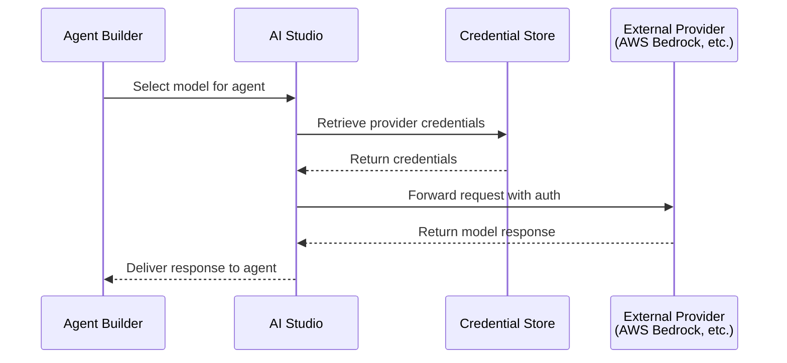

# Source: https://dev.writer.com/home/external-models.md

> ## Documentation Index
> Fetch the complete documentation index at: https://dev.writer.com/llms.txt
> Use this file to discover all available pages before exploring further.

# Add external models

> Configure external AI models from providers like AWS Bedrock to use alongside Palmyra models in AI Studio

This guide covers how to add and manage external AI models in AI Studio. After configuring external models, your organization can use models from providers like AWS Bedrock alongside Writer's Palmyra models when building agents.

<Note>
  External models are available on enterprise plans. Org admins, IT admins, and users with AI Studio full access roles can add and manage models.
</Note>

<Warning>
  AI Studio supports **text generation** and **embedding** models from external providers. Video, audio, and image generation models are not supported.
</Warning>

## How external models work

The [Models page in AI Studio](https://app.writer.com/aistudio) provides a unified governance layer for managing AI models across your organization. You can add models from external providers and control which teams have access to use them when building agents.

<Tip>
  The Models page also displays Writer's Palmyra models. Palmyra models are always available to all teams and don't require configuration. Select any Palmyra model to view its health status and details.
</Tip>


External model requests flow through the following steps:

1. **Credential configuration**: Administrators add provider credentials (API keys or IAM roles) to AI Studio
2. **Model selection**: Administrators choose which models from the provider to enable
3. **Access control**: Administrators assign model access to all teams or specific teams
4. **Agent building**: Developers with access can select the model when building agents
5. **Request routing**: When agents run, requests route through the configured provider credentials



## Available providers

AI Studio supports external models from the following providers. Select a provider to view detailed configuration instructions.

| Provider                              | Status      | Auth type                   | Provider docs                                                                       |
| ------------------------------------- | ----------- | --------------------------- | ----------------------------------------------------------------------------------- |
| [AWS Bedrock](/providers/aws-bedrock) | Available   | Access keys or IAM Role ARN | [View docs](https://docs.aws.amazon.com/bedrock/latest/userguide/security-iam.html) |
| HuggingFace                           | Coming soon | API key                     | —                                                                                   |
| Nvidia                                | Coming soon | API key                     | —                                                                                   |

<Note>
  AWS Bedrock models are currently supported in the following regions: `us-east-1`, `us-west-1`, `us-west-2`, and `eu-west-1`. Additional regions may be added in future releases.
</Note>

## Add an external model

Add external models in [AI Studio](https://app.writer.com/aistudio) under **Models & Guardrails > Models**.

### Configure provider credentials

Before adding a model, you need credentials from your provider. The credential type depends on the provider:

**Access key credentials** (AWS Bedrock):

* Create an IAM user with permissions to invoke Bedrock models
* Generate access keys for the IAM user
* See [Configure AWS Bedrock credentials](/providers/aws-bedrock#configure-aws-credentials) for detailed steps

**IAM Role ARN** (AWS Bedrock alternative):

* Create an IAM role with Bedrock permissions
* Configure a trust policy allowing Writer to assume the role
* Provides more granular access control without sharing long-term credentials
* See [Configure AWS Bedrock credentials](/providers/aws-bedrock#configure-aws-credentials) for detailed steps

### Add a model in AI Studio

After obtaining your provider credentials:

1. Navigate to **Models & Guardrails > Models** in [AI Studio](https://app.writer.com/aistudio)
2. Select **+ Add model**
3. Choose your provider (for example, AWS Bedrock)
4. Enter your credentials:
   * For access keys: Enter your access key ID and secret access key
   * For Role ARN: Enter the IAM role ARN
5. Select the AWS region where your models are deployed (supported regions: `us-east-1`, `us-west-1`, `eu-west-1`)
6. Choose which models to enable from the available list
7. Configure team access (all teams or specific teams)
8. Select **Add model** to complete the setup

<Tip>
  You can reuse credentials across multiple models. See [Manage credentials](#manage-credentials) for details.
</Tip>


## Manage team access

Control which teams can use external models when building agents.

### Configure model availability

When adding a model, you can set access to:

* **All teams**: The model is immediately available to everyone with builder access
* **Specific teams**: Restrict the model to selected teams

### Update team access

To view or update which teams can access a model:

1. Navigate to **Models & Guardrails > Models** in AI Studio
2. View the current team access in the **Team Access** column
3. Select the menu icon and choose **Edit** to update team access

<Note>
  Credentials are configured at the model level, not the team level. Team access controls who can use the model, but all authorized users share the same underlying provider credentials. Team members with access can use the models but cannot view the credentials.
</Note>

## Monitor model health

AI Studio automatically monitors the health of your configured models every 5 minutes and displays their status in the Models list.

| Status        | Description                                                        |
| ------------- | ------------------------------------------------------------------ |
| **Healthy**   | The model is responding correctly and credentials are valid        |
| **Unhealthy** | The model is not responding. Check credentials and provider status |

### View model health details

Select any model in the Models list to view detailed health information:

* **Health status**: Current health state (Healthy or Unhealthy)
* **Last checked**: Timestamp of the most recent health check
* **Model details**: Provider, model name, and model ID
* **Team access**: Which teams can use this model

To manually refresh the health status, select the **Refresh** button in the model details panel. This immediately checks the model's availability instead of waiting for the next automatic check.

### Automatic recovery

When a model becomes unhealthy, AI Studio temporarily removes it from the available models pool. After a cooldown period, the system automatically retries the model. If the underlying issue is resolved, the model returns to a healthy status without any manual intervention.

You don't need to delete or reconfigure a model that shows an unhealthy status due to transient issues like temporary provider outages. The system handles recovery automatically.

### Troubleshoot persistent issues

If a model remains unhealthy, check the following:

* **Credential validity**: Credentials may have expired or been revoked. Update credentials if needed.
* **Provider status**: The provider service may be experiencing extended downtime. Check the provider's status page.
* **Regional availability**: The model may not be available in the configured region.
* **Permission changes**: IAM policies may have been modified. Verify your IAM user or role still has the required permissions.
* **Model deprecation**: The provider may have deprecated the model. Check the provider's documentation for model availability.

## Manage credentials

AI Studio stores provider credentials as named credential sets that you can reuse across multiple models. You can manage credentials from the dedicated **LLM Credentials** page or create them when adding a model.


### Create credentials from the LLM Credentials page

To create credentials before adding models:

1. Navigate to **Models & Guardrails > LLM Credentials** in [AI Studio](https://app.writer.com/aistudio)
2. Select **Add credentials**
3. Enter a **Credential name** (for example, `production-bedrock` or `dev-aws-credentials`)
4. Select the **Provider** (for example, Bedrock)
5. Enter the provider-specific authentication details:
   * For access keys: AWS Access Key ID and Secret Access Key
   * For role assumption: AWS Role ARN and optional session name
   * AWS Region Name
6. Select **Save**


### Enter credentials directly when adding a model

When adding a model, you can enter credentials directly in the Add Model form instead of selecting existing credentials. Credentials entered this way are stored with the model but are not saved as a named credential set for reuse with other models.

To create reusable credentials that you can share across multiple models, use the [LLM Credentials page](#create-credentials-from-the-llm-credentials-page) instead.

### Reuse credentials across models

When adding additional models from the same provider:

1. Select your existing credentials from the **Credentials name** dropdown
2. The stored authentication details are automatically applied
3. You don't need to re-enter access keys or other sensitive values

This approach simplifies management when you have multiple models from the same provider—update credentials in one place and all associated models use the updated values.

### Update credentials

How you update expired or rotated credentials depends on how you originally configured them:

**Named credentials** (created on the LLM Credentials page):

1. Navigate to **Models & Guardrails > LLM Credentials** in AI Studio
2. Locate the credential in the list
3. Select the menu icon and choose **Edit credentials**
4. Update the authentication details and save

All models using this credential automatically use the updated values.

**Inline credentials** (entered directly when adding a model):

1. Navigate to **Models & Guardrails > Models** in AI Studio
2. Locate the model in the list
3. Select the menu icon and choose **Edit**
4. Update the credential values and save

<Tip>
  For easier credential management, use named credentials from the LLM Credentials page. Named credentials can be updated in one place and automatically apply to all models using them.
</Tip>

### Delete credentials

To delete a named credential:

1. Navigate to **Models & Guardrails > LLM Credentials** in AI Studio
2. Locate the credential in the list
3. Select the menu icon and choose **Delete**

<Warning>
  Before deleting credentials, verify that no models are using them. Models using deleted credentials will fail to authenticate with the provider.
</Warning>

### Security best practices

Follow these practices when managing provider credentials:

* Use dedicated service accounts rather than personal credentials
* Rotate credentials on a regular schedule (for example, every 90 days)
* Use descriptive credential names that indicate environment or purpose (for example, `prod-bedrock-us-east`)
* For AWS, prefer IAM Role ARN over access keys when possible

### Edit a model

To update an external model's configuration, including credentials and team access:

1. Navigate to **Models & Guardrails > Models** in AI Studio
2. Locate the model in the list
3. Select the menu icon and choose **Edit**
4. Update the configuration and save

### Delete a model

To remove an external model from AI Studio:

1. Navigate to **Models & Guardrails > Models** in AI Studio
2. Locate the model in the list
3. Select the menu icon and choose **Delete**

<Warning>
  Before deleting a model, verify that no active agents depend on it. Agents that reference a deleted model will return a "model not found" error when they run. You'll need to update the agent to use a different model before it can run successfully.
</Warning>

## Use external models

Once you add an external model, it's available to use just like Palmyra models.

### Agent Builder and no-code apps

In [Agent Builder](/home/agent-builder) and [no-code chat apps](/no-code/introduction), external models appear in the **Model** dropdown alongside Palmyra models. Select any model your team has access to.

### API usage

External models use the same Writer API as Palmyra models. Use the [List models](/api-reference/completion-api/list-models) endpoint to see all available models and their IDs, then pass the model ID to any endpoint that supports the `model` parameter.

<CodeGroup>
  ```bash cURL theme={null}
  curl https://api.writer.com/v1/chat/completions \
    -H "Authorization: Bearer $WRITER_API_KEY" \
    -H "Content-Type: application/json" \
    -d '{
      "model": "anthropic.claude-3-sonnet-20240229-v1:0",
      "messages": [{"role": "user", "content": "Hello!"}]
    }'
  ```

  ```python Python theme={null}
  from writerai import Writer

  client = Writer()

  response = client.chat.chat(
      model="anthropic.claude-3-sonnet-20240229-v1:0",
      messages=[{"role": "user", "content": "Hello!"}]
  )
  print(response.choices[0].message.content)
  ```

  ```javascript JavaScript theme={null}
  import Writer from "writer-sdk";

  const client = new Writer();

  const response = await client.chat.chat({
    model: "anthropic.claude-3-sonnet-20240229-v1:0",
    messages: [{ role: "user", content: "Hello!" }]
  });
  console.log(response.choices[0].message.content);
  ```
</CodeGroup>

## Next steps

* [Configure AWS Bedrock](/providers/aws-bedrock): Set up AWS credentials and add Bedrock models
* [Choose a model](/home/models-overview): Compare Palmyra models with external provider models
* [Palmyra models](/home/models): Explore Writer's Palmyra model capabilities
