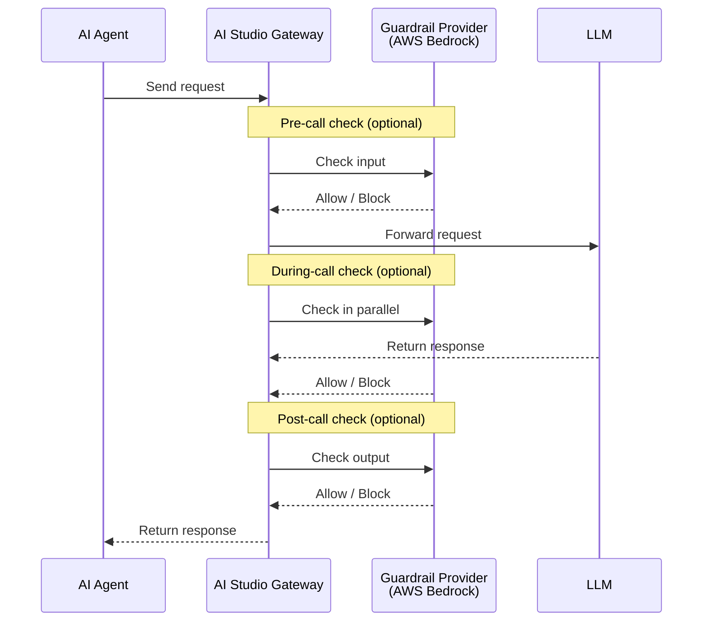

# Source: https://dev.writer.com/home/guardrails.md

# Configure guardrails

> Configure guardrails to monitor and filter AI agent inputs and outputs for safety and compliance

This page covers the technical architecture and configuration options for guardrails in AI Studio. Guardrails enable organizations to enforce content safety, PII protection, and compliance policies across AI agents by integrating with [AWS Bedrock Guardrails](https://docs.aws.amazon.com/bedrock/latest/userguide/guardrails.html).

For step-by-step instructions on configuring guardrails in the AI Studio interface, see [Setting up guardrails](https://support.writer.com/article/312-guardrails) in the Writer Help Center.

<Info>
  Guardrails are available on Enterprise plans. Org admins and IT admins can configure guardrails in AI Studio.
</Info>

## How guardrails work

AI Studio's guardrail system sits between your agents and LLM calls, intercepting requests at configurable points to check content against your configured guardrail providers. This architecture provides centralized safety controls and compliance enforcement for all AI interactions.

<Note>
  For now, guardrails used with the API, SDK, and Agent Builder will only apply to external provider models.
</Note>

Guardrails can check content at three points in the request lifecycle:

* **Pre-call check**: Checks **user input** before the LLM call. Use this to block sensitive data users might accidentally submit (credit cards, Social Security numbers), stop prompt injection attacks, or filter inappropriate prompts. If content is blocked, the LLM is never called, saving costs.

* **Post-call check**: Checks **LLM output** before returning it to the user. Use this to catch sensitive data the LLM might generate in its response, filter inappropriate or off-topic content, or verify compliance of generated text. Even if user input is clean, the LLM might hallucinate PII or generate policy-violating content.

* **During-call check**: Checks content **in parallel** with the LLM call. Use this when you want to check input but can't afford the latency of waiting for a pre-call check to complete before starting the LLM call. The check runs concurrently, and the response is held until both the LLM and guardrail finish.

When a guardrail detects a violation, the request is halted and an error is returned to the agent.

<Note>
  For no-code chat apps, guardrails evaluate only the last message in the conversation, not the full conversation history.
</Note>



## Supported guardrail providers

AI Studio integrates with [AWS Bedrock Guardrails](https://docs.aws.amazon.com/bedrock/latest/userguide/guardrails.html), Amazon's content filtering and PII detection service. Bedrock Guardrails provides content filters, denied topic detection, word filters, sensitive information filters, and contextual grounding checks.

For detailed setup instructions, see [Set up Bedrock guardrails](/home/guardrails-bedrock).

<Note>
  Support for additional guardrail providers beyond AWS Bedrock will be available in future releases.
</Note>

## Guardrail modes

Select one or more modes when configuring a guardrail. You can combine modes; for example, use `pre_call` to check user input AND `post_call` to check LLM output for comprehensive protection.

| Mode          | What it checks   | When to use                                                                                         |
| ------------- | ---------------- | --------------------------------------------------------------------------------------------------- |
| `pre_call`    | User input       | Block PII users submit, prevent [prompt injection](/home/prompt_injections), filter harmful prompts |
| `post_call`   | LLM output       | Catch PII the LLM generates, filter inappropriate responses, verify compliance                      |
| `during_call` | Input (parallel) | Same as pre-call but with lower latency for time-sensitive apps                                     |

### Pre-call mode

Executes synchronously **before** the LLM call. If content is blocked, the LLM is never called.

* Checks user input only
* Saves LLM costs when blocking bad requests
* Adds latency before the LLM call starts

### Post-call mode

Executes synchronously **after** the LLM generates a response.

* Checks LLM output only
* Required for catching issues in LLM-generated content (the LLM might generate PII even if the input was clean)
* Adds latency after LLM processing

### During-call mode

Executes **in parallel** with the LLM call. The response is held until both the LLM and guardrail check complete.

* Checks input while the LLM processes the request
* Lower latency than pre-call if the guardrail check finishes before the LLM
* Useful for [streaming](/home/streaming) responses where latency matters

## Team scoping

By default, a guardrail applies to all teams in your organization. You can restrict a guardrail to specific teams if different teams have different compliance requirements. For example:

* A **healthcare team** might need strict HIPAA-compliant PII blocking
* A **marketing team** might only need basic content moderation
* An **internal tools team** might not need guardrails at all

When a guardrail is scoped to specific teams, requests from users on other teams skip that guardrail entirely.

| Scope setting       | Behavior                                                   |
| ------------------- | ---------------------------------------------------------- |
| All teams (default) | Guardrail runs for all requests in the organization        |
| Selected teams      | Guardrail only runs for requests from users on those teams |

When you create a new guardrail, it automatically applies to all agents within its configured scope—no agent reconfiguration is needed. If you delete a guardrail, agents continue to function normally but without that guardrail's protections.

## Error handling

When a guardrail blocks content, the system returns an error to the agent. The error includes:

* The guardrail name that triggered the block
* The type of violation detected (for example, `CREDIT_CARD` or `US_SSN` for PII blocks)
* A message indicating content was blocked

```json  theme={null}
{
  "tpe": "BadRequest",
  "errors": [
    {
      "description": "Content blocked by guardrail: PII detected",
      "key": "fail.guardrail.blocked",
      "extras": {
        "guardrail_name": "pii-filter",
        "entity_type": "CREDIT_CARD"
      }
    }
  ],
  "extras": {}
}
```

Agents should handle guardrail errors gracefully and provide appropriate feedback to users. For PII blocks, consider prompting users to remove sensitive information and retry.

For a complete list of guardrail error codes, see [Error codes](/api-reference/error-codes#guardrails).

## Best practices

### Defense in depth

Layer multiple guardrails for comprehensive protection:

1. **Input filtering** (Pre-call): Block malicious prompts and PII before LLM processing
2. **Output filtering** (Post-call): Catch issues in LLM-generated content

### Performance considerations

Guardrails add processing time to each request, so consider the latency impact when designing your guardrail strategy. This is especially important for real-time applications like chat interfaces where response time affects user experience.

* **Pre-call guardrails** add latency before the LLM call. However, when content is blocked, pre-call mode is actually faster overall because it prevents the LLM call entirely.
* **Post-call guardrails** add latency after the LLM response is received. The total request time is the LLM processing time plus the guardrail check time.
* **During-call guardrails** run in parallel with the LLM call but buffer (hold) the response until the guardrail check completes. This means if the guardrail check takes longer than the LLM call, the response is delayed until the check finishes. If the LLM call takes longer, there's minimal added latency since the check completes while waiting.

For latency-sensitive applications, consider using pre-call mode for input validation to block bad requests early and avoid unnecessary LLM calls.

### Streaming responses

Guardrail modes behave differently with streaming responses:

* **During-call**: Checks input in parallel with the LLM. If the check finishes before the LLM starts outputting, streaming begins immediately. If the check takes longer, streaming is delayed until the check completes—but output chunks aren't buffered.

* **Post-call**: Collects all response chunks, assembles the complete response, runs the guardrail check, then delivers the chunks. The user doesn't receive any chunks until the guardrail check completes, so streaming latency is higher than non-streaming.

For latency-sensitive streaming applications, prefer during-call mode for input validation over post-call output checking when possible.

### Provider rate limits

Rate limits depend on your guardrail provider. For AWS Bedrock Guardrails, see [Bedrock quotas](https://docs.aws.amazon.com/bedrock/latest/userguide/quotas.html) for current limits. You can request quota increases through the AWS Service Quotas console.

## Next steps

* [Set up Bedrock guardrails](/home/guardrails-bedrock): Configure AWS Bedrock for content filtering and PII detection
* [Track usage and spend](/home/observability): Monitor AI usage and guardrail activity
* [Prevent prompt injections](/home/prompt_injections): Learn about prompt injection attacks and mitigation
* [Setting up guardrails](https://support.writer.com/article/312-guardrails): Step-by-step UI configuration in the Help Center


---

> To find navigation and other pages in this documentation, fetch the llms.txt file at: https://dev.writer.com/llms.txt