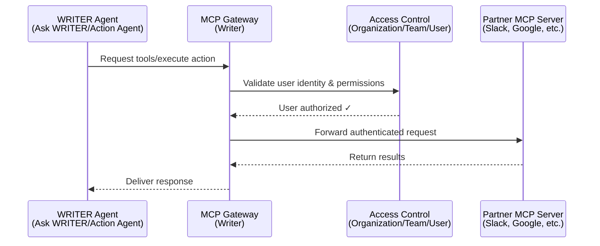

# Source: https://dev.writer.com/home/mcp-gateway.md

# Connect to MCP servers

> Learn how Writer's MCP gateway enables AI agents to securely access enterprise tools like Slack, Gong, and Google Workspace

This page provides a technical overview of Writer's Model Context Protocol (MCP) gateway architecture and authentication mechanisms. It covers how the gateway routes requests between WRITER Agent and partner MCP servers, what connectors are available, and how authentication works.

For step-by-step instructions on configuring connectors in AI Studio, see [Setting up connectors](https://support.writer.com/article/299-setting-up-connectors) in the Writer Help Center.

<Note>
  MCP connectors are currently available for WRITER Agent (Ask WRITER/Action Agent). Connectors do not currently support Agent Builder, no-code agents, or API integrations.
</Note>

## MCP gateway architecture

Writer's MCP gateway sits between WRITER Agent and partner MCP servers. This architecture provides centralized security, access control, and observability for enterprise deployments. You can use the MCP gateway to connect your WRITER Agent to [supported MCP servers](/home/mcp-gateway#available-connectors-in-mcp-gateway).

### How the gateway works

The MCP gateway operates as an intermediary between your WRITER Agent and partner MCP servers. It handles authentication, authorization, and request routing.

1. **Client connection**: WRITER Agent connects to Writer's unified MCP server
2. **Request submission**: WRITER Agent sends HTTP requests to the MCP gateway endpoint
3. **Authentication**: The gateway validates user identity and permissions using your Writer organization's access controls
4. **Request routing**: Authenticated requests are routed to the appropriate partner MCP server
5. **Response delivery**: Results are returned to the agent through the secure channel



## Available connectors in MCP gateway

Writer's MCP gateway provides access to enterprise tools across multiple categories. Below is a list of currently supported MCP connectors.

| Connector          | Auth type            | Provider authentication docs                                                                    |
| ------------------ | -------------------- | ----------------------------------------------------------------------------------------------- |
| FactSet            | OAuth 2.0            | [View docs](https://developer.factset.com/learn/authentication-oauth2)                          |
| Gmail              | OAuth 2.0            | [View docs](https://support.google.com/cloud/answer/15549257)                                   |
| Gong               | API key + Tenant URL | [View docs](https://www.gong.io/docs/api/getting-started/authentication)                        |
| Google Calendar    | OAuth 2.0            | [View docs](https://support.google.com/cloud/answer/15549257)                                   |
| Google Docs        | OAuth 2.0            | [View docs](https://support.google.com/cloud/answer/15549257)                                   |
| Google Sheets      | OAuth 2.0            | [View docs](https://support.google.com/cloud/answer/15549257)                                   |
| HubSpot            | OAuth 2.0            | [View docs](https://developers.hubspot.com/docs/api/oauth)                                      |
| Microsoft Calendar | OAuth 2.0            | [View docs](https://learn.microsoft.com/en-us/entra/identity-platform/v2-oauth2-auth-code-flow) |
| Microsoft OneDrive | OAuth 2.0            | [View docs](https://learn.microsoft.com/en-us/entra/identity-platform/v2-oauth2-auth-code-flow) |
| Microsoft Outlook  | OAuth 2.0            | [View docs](https://learn.microsoft.com/en-us/entra/identity-platform/v2-oauth2-auth-code-flow) |
| Microsoft Teams    | OAuth 2.0            | [View docs](https://learn.microsoft.com/en-us/entra/identity-platform/v2-oauth2-auth-code-flow) |
| PitchBook          | API key              | [View docs](https://pitchbook.com/help/PitchBook-api)                                           |
| Slack              | OAuth 2.0            | [View docs](https://api.slack.com/authentication/oauth-v2)                                      |

## Set up connectors

Connector setup happens in AI Studio under **Connectors & Tools**. For step-by-step instructions on configuring connectors, selecting tools, and managing permissions, see [Setting up connectors](https://support.writer.com/article/299-setting-up-connectors).

The sections below cover the technical authentication requirements for connectors.

## Set up connector authentication

The type of authentication required for a connector depends on the third-party service. The connector configuration flow in AI Studio guides you through the required setup.

The three types of authentication required for connectors are OAuth 2.0, API key, and tenant-based.

**OAuth 2.0 connectors** (FactSet, Google, Microsoft, Slack, HubSpot):

* Require creating an OAuth application with the provider
* Need OAuth client ID and client secret
* Must include Writer's redirect URI in the OAuth app configuration
* See [Set up OAuth](#set-up-oauth) for more details

**API key connectors** (PitchBook, Gong):

* Require an API key from the third-party service
* Some services require additional configuration like tenant URLs
* See the [available connectors](#available-connectors-in-mcp-gateway) table for links to the provider's documentation on how to create API keys

**Tenant-based connectors** (Gong):

* Uses an API key and an additional tenant URL to authenticate requests
* Require your organization's specific instance URL. For example: `https://yourcompany.gong.io`
* Used to identify your organization's instance in multi-tenant services

### Set up OAuth

#### Create OAuth applications

To create OAuth applications for supported providers, follow the provider's official documentation. View the [available connectors](#available-connectors-in-mcp-gateway) for links to the provider's documentation on how to create OAuth applications.

When creating an OAuth application, you must add the following Writer redirect URI to the list of allowed redirect URIs in your OAuth application's settings:

```
https://app.writer.com/mcp/oauth/callback
```

The gateway uses this URI to receive authorization codes from third-party services after users grant permission.

#### Required OAuth scopes

Each connector requires specific OAuth scopes to access third-party APIs. The connector configuration interface in AI Studio displays the required scopes when you configure a connector.


Some connectors require extensive OAuth scopes during authentication. This is because connectors often provide multiple tools with broad functionality across the integrated service.

For example, a connector for a productivity service might include tools to:

* Read and search documents
* Create and modify files
* Access calendar events
* Send messages or notifications
* Manage sharing permissions

Each of these capabilities requires corresponding OAuth scopes from the provider. Even if you disable specific tools in your connector configuration, the OAuth application still requests all scopes needed for the full set of available tools.

<Note>
  Currently, OAuth scopes are fixed per connector and do not adjust based on which tools are enabled. This means users will see requests for all scopes even if you've disabled certain tools.
</Note>

## Next steps

* [Set up connectors](https://support.writer.com/article/299-setting-up-connectors): Learn how to configure and enable connectors in AI Studio.
* [Tool calling guide](/home/tool-calling): Understand how AI agents use tools in conversations.
* [Action Agent guide](https://support.writer.com/article/293-how-to-use-action-agent): Learn how to use Action Agent with connected tools.
* [API reference](/api-reference/completion-api/chat-completion): Explore the Chat Completion API that powers tool calling.
