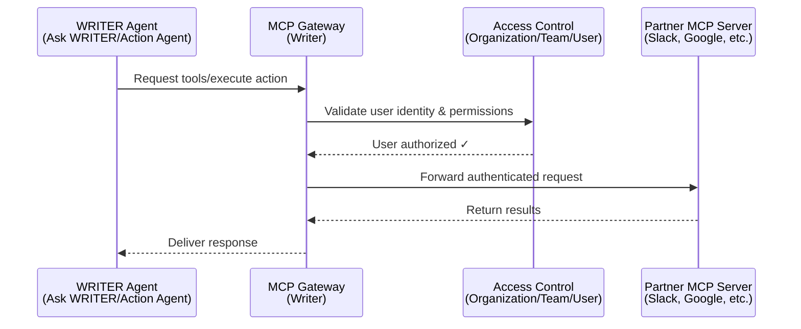

# Source: https://dev.writer.com/home/mcp-gateway.md

> ## Documentation Index
> Fetch the complete documentation index at: https://dev.writer.com/llms.txt
> Use this file to discover all available pages before exploring further.

# Configure connectors

> Configure prebuilt and custom connectors for WRITER Agent to securely access enterprise tools and your own APIs

This page covers technical details about configuring connectors for your organization, including authentication setup, access control, and security considerations. Connectors enable WRITER Agent to access enterprise tools and custom APIs through Writer's Model Context Protocol (MCP) gateway.

Writer provides two types of connectors:

* **Prebuilt connectors**: Ready-to-use integrations with popular enterprise tools like Slack, Google Workspace, and Salesforce
* **Custom connectors**: Connectors you create from OpenAPI specifications to integrate with internal tools and third-party services

After you configure connectors in AI Studio, users in your organization can connect to them through [WRITER Agent](https://app.writer.com/). For step-by-step connector configuration instructions, see [Setting up connectors](https://support.writer.com/article/299-setting-up-connectors) in the Writer Help Center.

<Warning>
  MCP connectors are currently available for [WRITER Agent](https://app.writer.com/). Connectors do not currently support Agent Builder, no-code agents, or API integrations.
</Warning>

## How MCP gateway works

Writer's MCP gateway sits between WRITER Agent and connector servers (both prebuilt and custom). This architecture provides centralized security, access control, and observability for enterprise deployments. All connector requests—whether prebuilt or custom—flow through the MCP gateway.

Connector requests flow through the following steps:

1. **Client connection**: WRITER Agent connects to Writer's unified MCP server
2. **Request submission**: WRITER Agent sends HTTP requests to the MCP gateway endpoint
3. **Authentication**: The gateway validates user identity and permissions using your Writer organization's access controls
4. **Request routing**: Authenticated requests are routed to the appropriate partner MCP server
5. **Response delivery**: Results are returned to the agent through the secure channel



## Available connectors

Writer provides two types of connectors: prebuilt connectors for popular enterprise tools and custom connectors you create from OpenAPI specifications.

### Prebuilt connectors

Prebuilt connectors are ready-to-use integrations maintained by Writer. These connectors provide access to popular enterprise tools with pre-configured authentication and tool definitions.

| Connector                    | Auth type | Managed by                     | Connector docs                                    |
| ---------------------------- | --------- | ------------------------------ | ------------------------------------------------- |
| **Databricks**               | API key   | Organization-managed           | [View docs](/connectors/databricks)               |
| **FactSet**                  | OAuth 2.0 | Organization-managed           | [View docs](/connectors/factset)                  |
| **Gmail**                    | OAuth 2.0 | Writer or organization-managed | [View docs](/connectors/gmail)                    |
| **Gong**                     | API key   | Organization-managed           | [View docs](/connectors/gong)                     |
| **Google Calendar**          | OAuth 2.0 | Writer or organization-managed | [View docs](/connectors/google-calendar)          |
| **Google Docs**              | OAuth 2.0 | Writer or organization-managed | [View docs](/connectors/google-docs)              |
| **Google Sheets**            | OAuth 2.0 | Writer or organization-managed | [View docs](/connectors/google-sheets)            |
| **HubSpot**                  | OAuth 2.0 | Organization-managed           | [View docs](/connectors/hubspot)                  |
| **Microsoft Calendar**       | OAuth 2.0 | Writer or organization-managed | [View docs](/connectors/microsoft-calendar)       |
| **Microsoft OneDrive**       | OAuth 2.0 | Writer or organization-managed | [View docs](/connectors/microsoft-onedrive)       |
| **Microsoft Outlook**        | OAuth 2.0 | Writer or organization-managed | [View docs](/connectors/microsoft-outlook)        |
| **Microsoft SharePoint**     | OAuth 2.0 | Writer or organization-managed | [View docs](/connectors/microsoft-sharepoint)     |
| **Microsoft Teams**          | OAuth 2.0 | Writer or organization-managed | [View docs](/connectors/microsoft-teams)          |
| **PitchBook**                | API key   | Organization-managed           | [View docs](/connectors/pitchbook)                |
| **Salesforce Data Cloud**    | OAuth 2.0 | Organization-managed           | [View docs](/connectors/salesforce-data-cloud)    |
| **Salesforce Platform API**  | OAuth 2.0 | Organization-managed           | [View docs](/connectors/salesforce-platform-api)  |
| **Salesforce Revenue Cloud** | OAuth 2.0 | Organization-managed           | [View docs](/connectors/salesforce-revenue-cloud) |
| **Slack**                    | OAuth 2.0 | Organization-managed           | [View docs](/connectors/slack)                    |
| **Snowflake**                | OAuth 2.0 | Organization-managed           | [View docs](/connectors/snowflake)                |

### Custom connectors

Custom connectors let you integrate WRITER Agent with any API that has an OpenAPI specification. Use custom connectors to connect to internal tools, proprietary systems, or third-party services not available as prebuilt connectors.

Once created, custom connectors are configured and managed in AI Studio the same way as prebuilt connectors. You control authentication, access permissions, and which tools are enabled for users and teams.

For step-by-step instructions on creating custom connectors, see [Custom connectors](/home/custom-connectors).

## Set up connectors

Connector setup happens in [AI Studio](https://app.writer.com/aistudio) under **Connectors & Tools**. The setup process differs slightly between connector types:

* **Prebuilt connectors**: Select from the connector library and configure authentication. For step-by-step instructions, see [Setting up connectors](https://support.writer.com/article/299-setting-up-connectors).
* **Custom connectors**: After creating a custom connector, configure access permissions, enable tools, and enter authentication credentials. For instructions on creating custom connectors, see [Custom connectors](/home/custom-connectors).

The sections below cover the technical authentication requirements for configuring connectors.

## Set up connector authentication

Both prebuilt and custom connectors support OAuth 2.0 and API key authentication. The type of authentication depends on the third-party service, and the connector configuration flow in AI Studio guides you through the required setup.

**OAuth 2.0 connectors**:

* Most prebuilt OAuth connectors support WRITER-managed authentication (no OAuth app setup required)
* Custom connectors and some prebuilt connectors (FactSet, HubSpot, Salesforce, Slack, Snowflake) require organization-managed OAuth
* See [Set up OAuth](#set-up-oauth) for details on both options

**API key connectors**:

* Require an API key from the third-party service
* For prebuilt connectors, see the [prebuilt connectors](#prebuilt-connectors) table for links to provider documentation
* For custom connectors, see [Custom connectors](/home/custom-connectors) for setup instructions

### Set up OAuth

OAuth connectors support two authentication options in AI Studio:

**WRITER-managed OAuth** (prebuilt connectors only):

* Writer provides and manages the OAuth application
* No OAuth app setup required
* Users authorize access to their account when they first use the connector
* Faster setup with less configuration

**Organization-managed OAuth** (prebuilt and custom connectors):

* You create and manage your own OAuth application with the provider
* Provides more control and custom branding
* Requires OAuth app configuration with client ID and client secret
* Required for custom connectors and the following prebuilt connectors: FactSet, HubSpot, Salesforce, Slack, Snowflake

<Note>
  Custom connectors and some prebuilt connectors (FactSet, HubSpot, Salesforce, Slack, Snowflake) only support organization-managed OAuth. All other prebuilt OAuth connectors support both options.
</Note>

#### OAuth connection levels

When configuring an OAuth connector, you choose whether to use user-level or org-level authentication:

**User-level OAuth** (most common):

* Each user connects their own personal account (their Gmail, Slack, etc.)
* OAuth authentication happens when individual users first try to use the connector
* Administrators configure the connector in AI Studio, but don't authenticate during setup
* Users authenticate through WRITER Agent the first time they interact with the connector

**Org-level OAuth**:

* A single shared OAuth connection for the entire organization
* OAuth authentication happens during connector setup in AI Studio
* Administrators authenticate with the provider when configuring the connector
* Users can immediately use the connector without individual authentication

<Note>
  With user-level OAuth, administrators set up the connector configuration (OAuth app credentials, enabled tools, access permissions), but the actual OAuth authentication happens later when each user first uses the connector. With org-level OAuth, administrators complete the OAuth authentication during the initial connector setup.
</Note>

#### Create OAuth applications for organization-managed authentication

If you choose organization-managed OAuth, or if using a connector that requires it, you need to create an OAuth application with the provider:

1. Follow the provider's documentation to create an OAuth application. View [prebuilt connectors](#prebuilt-connectors) for links to provider documentation.
2. Add the following Writer redirect URI to the list of allowed redirect URIs in your OAuth application's settings:
   ```
   https://app.writer.com/mcp/oauth/callback
   ```
3. Copy the client ID and client secret for use in AI Studio

The gateway uses this redirect URI to receive authorization codes from third-party services after users grant permission.

#### Required OAuth scopes

Each connector requires specific OAuth scopes to access third-party APIs. The connector configuration interface in AI Studio displays the required scopes when you configure a connector.


Some connectors require extensive OAuth scopes during authentication. This is because connectors often provide multiple tools with broad functionality across the integrated service.

For example, a connector for a productivity service might include tools to:

* Read and search documents
* Create and modify files
* Access calendar events
* Send messages or notifications
* Manage sharing permissions

Each of these capabilities requires corresponding OAuth scopes from the provider.

Connectors use either dynamic or fixed OAuth scopes. For details on how scopes work and which connectors support dynamic scopes, see [OAuth scopes](#oauth-scopes).

## Manage access control and permissions

Organization and IT administrators can control which users have access to connectors and configure granular permissions for connector functionality.

### Configure connector availability

Connectors can be made available to users in two ways:

* **All users**: The connector is immediately available to everyone in the organization
* **Select teams**: Restrict the connector to specific teams. Users on non-approved teams can request access, which requires admin approval.

This access control model allows organizations to gradually roll out connectors or restrict sensitive integrations to specific teams.

### Role-based administration

By default, only users with Org Admin and IT Admin roles can configure and manage connectors. These permissions can be adjusted through the roles and permissions settings in AI Studio to delegate connector management to other roles if needed.

### Tool-level granular control

Within each connector, administrators can selectively enable specific tools rather than activating all available functionality. This provides fine-grained control over what actions AI agents can perform through each connector.

For example, you might enable read-only tools for a connector while disabling tools that modify or delete data.

### Revoke connector access

Administrators and users can revoke connector access at multiple levels:

**Revoke individual user access:**

* Users can disconnect their personal OAuth accounts from within WRITER Agent settings
* Disconnecting removes the user's authentication tokens but preserves the connector configuration
* Users can reconnect by re-authorizing through the OAuth flow

**Revoke team or organization access:**

* Administrators can disable a connector entirely from AI Studio's Connectors & Tools interface
* Disabling a connector immediately revokes access for all users
* Re-enabling requires users to re-authenticate with their accounts

**Revoke specific tool permissions:**

* Administrators can disable individual tools within a connector without removing the entire connector
* Users retain their OAuth connections but cannot access disabled tools
* Tool permissions can be re-enabled without requiring re-authentication

## Connect as an end user

After administrators configure connectors in AI Studio, end users interact with them through conversation in WRITER Agent.

### User-level and org-level OAuth

Connectors can be configured with different OAuth authentication levels, which affects how users connect:

**User-level OAuth** (most common):

* Each user connects their own personal account (their Gmail, their Slack workspace, etc.)
* Users authenticate individually with their own credentials
* The connector accesses only that user's data and permissions
* Example: When you use the Gmail connector, it accesses your Gmail inbox, not a shared organizational inbox

**Org-level OAuth** (shared connection):

* An administrator sets up a single OAuth connection for the entire organization
* All users share the same authenticated connection
* No individual user authentication required
* Less common; typically used when accessing shared organizational resources rather than personal accounts

<Note>
  Most connectors use user-level OAuth where each person connects their own account. When a connector is configured with user-level OAuth, users must authenticate individually before using it.
</Note>

### How users interact with connectors

To use a connector, ask WRITER Agent for what you need in everyday language, such as "Summarize unread emails" or "Find messages in Slack." If access is needed, the agent prompts you to connect your account. After you're connected, you can keep making requests the same way—no special steps or commands required.

**Example interactions:**

**Using Gmail:**

```
User: "Summarize my unread emails from this week"
Agent: [If not connected] "I need access to your Gmail to help with that.
       Please connect your Gmail account to continue."
       [Shows authentication button]

User: [Clicks to authenticate, completes OAuth flow]

Agent: "Thanks! I can now access your Gmail. Here's a summary of your
       unread emails from this week..."
```

### First-time connection flow

For connectors configured with **user-level OAuth**, users must authenticate their personal account the first time they use a connector:

1. **User makes a request**: "Search Slack for messages about the budget"
2. **Authentication prompt**: Agent responds: "I need access to your Slack workspace to search messages. Please connect your Slack account."
3. **OAuth authorization**: User clicks the authentication button and is redirected to Slack's authorization page
4. **Permission consent**: User reviews the permissions and approves access
5. **Return to conversation**: User is redirected back to WRITER Agent
6. **Task completion**: Agent automatically retries the original request: "I found 15 messages about the budget..."

For connectors configured with **org-level OAuth**, users can immediately use the connector without individual authentication since the administrator has already set up the shared connection.

## Known limitations

### OAuth token expiration

Some providers automatically expire OAuth tokens after periods of inactivity:

* **Google services**: OAuth credentials become invalid after 6 months of inactivity. If you haven't used a Google connector (Gmail, Google Calendar, Google Docs, Google Sheets) for 6 months, you'll need to re-authenticate.

The MCP gateway automatically handles token refresh for active connections, but cannot refresh tokens that have been revoked due to inactivity.

### OAuth scopes

OAuth scopes define the permissions a connector receives during authorization. Depending on the connector, the OAuth application requests scopes as either a fixed set or a dynamic set based on the tools you select during configuration.

#### Fixed scopes

With fixed-scope OAuth connectors, the OAuth application requests all scopes required for every available tool when you authorize the connector, regardless of which tools you enable or disable in your configuration.

#### Dynamic scopes

With dynamic-scope OAuth connectors, the OAuth application requests only the scopes needed for the tools you enable.

The following connectors support dynamic OAuth scopes:

* **Google**: [Gmail](/connectors/gmail), [Google Calendar](/connectors/google-calendar), [Google Docs](/connectors/google-docs), [Google Sheets](/connectors/google-sheets)
* **Microsoft**: [Microsoft Calendar](/connectors/microsoft-calendar), [Microsoft OneDrive](/connectors/microsoft-onedrive), [Microsoft Outlook](/connectors/microsoft-outlook), [Microsoft SharePoint](/connectors/microsoft-sharepoint), [Microsoft Teams](/connectors/microsoft-teams)
* **Gong**: [Gong](/connectors/gong)

## Next steps

* [Custom connectors](/home/custom-connectors): Create connectors from OpenAPI specifications to integrate with your own APIs.
* [Set up connectors](https://support.writer.com/article/299-setting-up-connectors): Learn how to configure and enable prebuilt connectors in AI Studio.
* [Tool calling guide](/home/tool-calling): Understand how AI agents use tools in conversations.
* [WRITER Agent guide](https://support.writer.com/article/293-how-to-use-action-agent): Learn how to use WRITER Agent with connected tools.
* [API reference](/api-reference/completion-api/chat-completion): Explore the Chat Completion API that powers tool calling.
