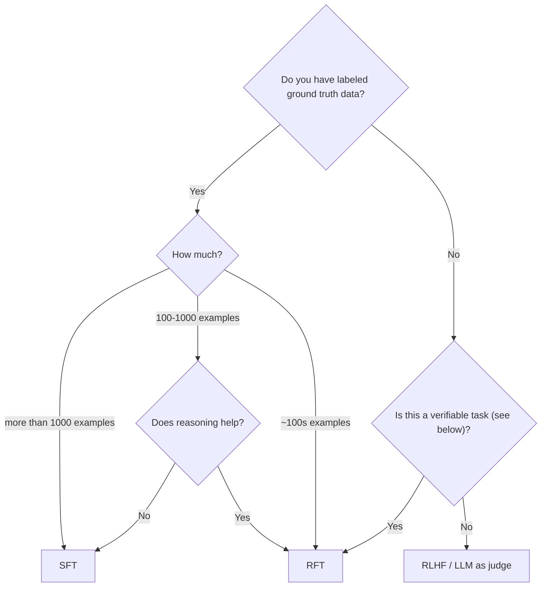

# Fireworks Ai Documentation

Source: https://docs.fireworks.ai/llms-full.txt

---

# Exporting Billing Metrics
Source: https://docs.fireworks.ai/accounts/exporting-billing-metrics

Export billing and usage metrics for all Fireworks services

## Overview

Fireworks provides a CLI tool to export comprehensive billing metrics for all usage types including serverless inference, on-demand deployments, and fine-tuning jobs. The exported data can be used for cost analysis, internal billing, and usage tracking.

## Exporting billing metrics

Use the Fireworks CLI to export a billing CSV that includes all usage:

```bash  theme={null}
# Authenticate (once)
firectl auth login

# Export billing metrics to CSV
firectl export billing-metrics
```

## Examples

Export all billing metrics for an account:

```bash  theme={null}
firectl export billing-metrics
```

Export metrics for a specific date range and filename:

```bash  theme={null}
firectl export billing-metrics \
  --start-time "2025-01-01" \
  --end-time "2025-01-31" \
  --filename january_metrics.csv
```

## Output format

The exported CSV includes the following columns:

* **email**: Account email
* **start\_time**: Request start timestamp
* **end\_time**: Request end timestamp
* **usage\_type**: Type of usage (e.g., TEXT\_COMPLETION\_INFERENCE\_USAGE)
* **accelerator\_type**: GPU/hardware type used
* **accelerator\_seconds**: Compute time in seconds
* **base\_model\_name**: The model used
* **model\_bucket**: Model category
* **parameter\_count**: Model size
* **prompt\_tokens**: Input tokens
* **completion\_tokens**: Output tokens

### Sample row

```csv  theme={null}
email,start_time,end_time,usage_type,accelerator_type,accelerator_seconds,base_model_name,model_bucket,parameter_count,prompt_tokens,completion_tokens
user@example.com,2025-10-20 17:16:48 UTC,2025-10-20 17:16:48 UTC,TEXT_COMPLETION_INFERENCE_USAGE,,,accounts/fireworks/models/llama4-maverick-instruct-basic,Llama 4 Maverick Basic,401583781376,803,109
```

## Automation

You can automate exports in cron jobs and load the CSV into your internal systems:

```bash  theme={null}
# Example: Daily export with dated filename
firectl export billing-metrics \
  --start-time "$(date -v-1d '+%Y-%m-%d')" \
  --end-time "$(date '+%Y-%m-%d')" \
  --filename "billing_$(date '+%Y%m%d').csv"
```

<Tip>
  Run `firectl export billing-metrics --help` to see all available flags and options.
</Tip>

## Coverage

This export includes:

* **Serverless inference**: All serverless API usage
* **On-demand deployments**: Deployment usage (see also [Exporting deployment metrics](/deployments/exporting-metrics) for real-time Prometheus metrics)
* **Fine-tuning jobs**: Fine-tuning compute usage
* **Other services**: All billable Fireworks services

<Note>
  For real-time monitoring of on-demand deployment performance metrics (latency, throughput, etc.), use the [Prometheus metrics endpoint](/deployments/exporting-metrics) instead.
</Note>

## See also

* [firectl CLI overview](/tools-sdks/firectl/firectl)
* [Exporting deployment metrics](/deployments/exporting-metrics) - Real-time Prometheus metrics for on-demand deployments
* [Rate Limits & Quotas](/guides/quotas_usage/rate-limits) - Understanding spend limits and quotas


# Service Accounts
Source: https://docs.fireworks.ai/accounts/service-accounts

How to manage and use service accounts in Fireworks

Service accounts in Fireworks allow applications, scripts, and automated systems to authenticate and perform actions securely—without relying on human credentials. They are ideal for CI/CD pipelines, backend services, and automated workflows. Service Accounts let you avoid shared credentials and easily distinguish between what automated systems did vs humans in audit logs.

Service accounts can take actions using an API key, like creating deployments, running models or creating datasets (see [API reference](https://fireworks.ai/docs/api-reference/introduction)). Service accounts cannot login through the web interface or use OIDC tokens.

## Creating a Service Account

Using our firectl you can create service accounts

```bash  theme={null}
firectl create user --user-id "my-service-account" --service-account
```

## Creating an API Key for Service Account

Using our firectl you can create an api key on behalf of a service account

```bash  theme={null}
firectl create api-key --service-account "my-service-account"
```

## Billing

* Service accounts count toward the same account quotas and limits assigned to the account
* Usage is tracked by the account, not individual user vs service account

## Auditing

In audit logs users are referenced by their email id's. Service accounts are referenced by `my-service-account@my-account.sa.fireworks.ai`.


# Custom SSO
Source: https://docs.fireworks.ai/accounts/sso

Set up custom Single Sign-On (SSO) authentication for Fireworks AI

Fireworks uses single sign-on (SSO) as the primary mechanism to authenticate with the platform.
By default, Fireworks supports Google SSO.

If you have an enterprise account, Fireworks supports bringing your own identity provider using:

* OpenID Connect (OIDC) provider
* SAML 2.0 provider

<Info>
  Coordinate with your Fireworks AI representative to enable the integration.
</Info>

## OpenID Connect (OIDC) provider

<Steps>
  <Step title="Create OIDC client application">
    Create an OIDC client application in your identity provider, e.g. Okta.
  </Step>

  <Step title="Configure client">
    Ensure the client is configured for "code authorization" of the "web" type (i.e. with a client\_secret).
  </Step>

  <Step title="Set redirect URL">
    Set the client's "allowed redirect URL" to the URL provided by Fireworks. It looks like:

    ```
    https://fireworks-<your-company-name>.auth.us-west-2.amazoncognito.com/oauth2/idpresponse
    ```
  </Step>

  <Step title="Note down client details">
    Note down the `issuer`, `client_id`, and `client_secret` for the newly created client. You will need to provide this to your Fireworks.ai representative to complete your account set up.
  </Step>
</Steps>

## SAML 2.0 provider

<Steps>
  <Step title="Create SAML 2.0 application">
    Create a SAML 2.0 application in your identity provider, e.g. [Okta](https://help.okta.com/en-us/Content/Topics/Apps/Apps_App_Integration_Wizard_SAML.htm).
  </Step>

  <Step title="Set SSO URL">
    Set the SSO URL to the URL provided by Fireworks. It looks like:

    ```
    https://fireworks-<your-company-name>.auth.us-west-2.amazoncognito.com/saml2/idpresponse
    ```
  </Step>

  <Step title="Configure Audience URI">
    Configure the Audience URI (SP Entity ID) as provided by Fireworks. It looks like:

    ```
    urn:amazon:cognito:sp:<some-unique-identifier>
    ```
  </Step>

  <Step title="Create Attribute Statement">
    Create an Attribute Statement with the name:

    ```
    http://schemas.xmlsoap.org/ws/2005/05/identity/claims/emailaddress
    ```

    and the value `user.email`
  </Step>

  <Step title="Keep default settings">
    Leave the rest of the settings as defaults.
  </Step>

  <Step title="Note down metadata URL">
    Note down the "metadata url" for your newly created application. You will need to provide this to your Fireworks AI representative to complete your account set up.
  </Step>
</Steps>

## Troubleshooting

### Invalid samlResponse or relayState from identity provider

This error occurs if you are trying to use identity provider (IdP) initiated login. Fireworks currently only supports
service provider (SP) initiated login.

See [Understanding SAML](https://developer.okta.com/docs/concepts/saml/#understand-sp-initiated-sign-in-flow) for an
in-depth explanation.

### Required String parameter 'RelayState' is not present

See above.


# Managing users
Source: https://docs.fireworks.ai/accounts/users

Add and delete additional users in your Fireworks account

See the concepts [page](/getting-started/concepts#account) for definitions of accounts and users. Only admin users can manage other users within the account.

## Adding users

To add a new user to your Fireworks account, run the following command. If the email for the new user is already associated with a Fireworks account, they will have the option to freely switch between your account and their existing account(s). You can also add users in the Fireworks web UI at [https://app.fireworks.ai/account/users](https://app.fireworks.ai/account/users).

```bash  theme={null}
firectl create user --email="alice@example.com"
```

To create another admin user, pass the `--role=admin` flag:

```bash  theme={null}
firectl create user --email="alice@example.com" --role=admin
```

## Updating a user's role

To update a user's role, run

```bash  theme={null}
firectl update user <USER_ID> --role="{admin,user}"
```

## Deleting users

You can remove a user from your account by running:

```bash  theme={null}
firectl delete user <USER_ID>
```


# Batch Delete Batch Jobs
Source: https://docs.fireworks.ai/api-reference-dlde/batch-delete-batch-jobs

post /v1/accounts/{account_id}/batchJobs:batchDelete


# Batch Delete Environments
Source: https://docs.fireworks.ai/api-reference-dlde/batch-delete-environments

post /v1/accounts/{account_id}/environments:batchDelete


# Batch Delete Node Pools
Source: https://docs.fireworks.ai/api-reference-dlde/batch-delete-node-pools

post /v1/accounts/{account_id}/nodePools:batchDelete


# Cancel Batch Job
Source: https://docs.fireworks.ai/api-reference-dlde/cancel-batch-job

post /v1/accounts/{account_id}/batchJobs/{batch_job_id}:cancel
Cancels an existing batch job if it is queued, pending, or running.


# Connect Environment
Source: https://docs.fireworks.ai/api-reference-dlde/connect-environment

post /v1/accounts/{account_id}/environments/{environment_id}:connect
Connects the environment to a node pool.
Returns an error if there is an existing pending connection.


# Create Aws Iam Role Binding
Source: https://docs.fireworks.ai/api-reference-dlde/create-aws-iam-role-binding

post /v1/accounts/{account_id}/awsIamRoleBindings


# Create Batch Job
Source: https://docs.fireworks.ai/api-reference-dlde/create-batch-job

post /v1/accounts/{account_id}/batchJobs


# Create Cluster
Source: https://docs.fireworks.ai/api-reference-dlde/create-cluster

post /v1/accounts/{account_id}/clusters


# Create Environment
Source: https://docs.fireworks.ai/api-reference-dlde/create-environment

post /v1/accounts/{account_id}/environments


# Create Node Pool
Source: https://docs.fireworks.ai/api-reference-dlde/create-node-pool

post /v1/accounts/{account_id}/nodePools


# Create Node Pool Binding
Source: https://docs.fireworks.ai/api-reference-dlde/create-node-pool-binding

post /v1/accounts/{account_id}/nodePoolBindings


# Create Snapshot
Source: https://docs.fireworks.ai/api-reference-dlde/create-snapshot

post /v1/accounts/{account_id}/snapshots


# Delete Aws Iam Role Binding
Source: https://docs.fireworks.ai/api-reference-dlde/delete-aws-iam-role-binding

post /v1/accounts/{account_id}/awsIamRoleBindings:delete


# Delete Batch Job
Source: https://docs.fireworks.ai/api-reference-dlde/delete-batch-job

delete /v1/accounts/{account_id}/batchJobs/{batch_job_id}


# Delete Cluster
Source: https://docs.fireworks.ai/api-reference-dlde/delete-cluster

delete /v1/accounts/{account_id}/clusters/{cluster_id}


# Delete Environment
Source: https://docs.fireworks.ai/api-reference-dlde/delete-environment

delete /v1/accounts/{account_id}/environments/{environment_id}


# Delete Node Pool
Source: https://docs.fireworks.ai/api-reference-dlde/delete-node-pool

delete /v1/accounts/{account_id}/nodePools/{node_pool_id}


# Delete Node Pool Binding
Source: https://docs.fireworks.ai/api-reference-dlde/delete-node-pool-binding

post /v1/accounts/{account_id}/nodePoolBindings:delete


# Delete Snapshot
Source: https://docs.fireworks.ai/api-reference-dlde/delete-snapshot

delete /v1/accounts/{account_id}/snapshots/{snapshot_id}


# Disconnect Environment
Source: https://docs.fireworks.ai/api-reference-dlde/disconnect-environment

post /v1/accounts/{account_id}/environments/{environment_id}:disconnect
Disconnects the environment from the node pool. Returns an error
if the environment is not connected to a node pool.


# Get Batch Job
Source: https://docs.fireworks.ai/api-reference-dlde/get-batch-job

get /v1/accounts/{account_id}/batchJobs/{batch_job_id}


# Get Batch Job Logs
Source: https://docs.fireworks.ai/api-reference-dlde/get-batch-job-logs

get /v1/accounts/{account_id}/batchJobs/{batch_job_id}:getLogs


# Get Cluster
Source: https://docs.fireworks.ai/api-reference-dlde/get-cluster

get /v1/accounts/{account_id}/clusters/{cluster_id}


# Get Cluster Connection Info
Source: https://docs.fireworks.ai/api-reference-dlde/get-cluster-connection-info

get /v1/accounts/{account_id}/clusters/{cluster_id}:getConnectionInfo
Retrieve connection settings for the cluster to be put in kubeconfig


# Get Environment
Source: https://docs.fireworks.ai/api-reference-dlde/get-environment

get /v1/accounts/{account_id}/environments/{environment_id}


# Get Node Pool
Source: https://docs.fireworks.ai/api-reference-dlde/get-node-pool

get /v1/accounts/{account_id}/nodePools/{node_pool_id}


# Get Node Pool Stats
Source: https://docs.fireworks.ai/api-reference-dlde/get-node-pool-stats

get /v1/accounts/{account_id}/nodePools/{node_pool_id}:getStats


# Get Snapshot
Source: https://docs.fireworks.ai/api-reference-dlde/get-snapshot

get /v1/accounts/{account_id}/snapshots/{snapshot_id}


# List Aws Iam Role Bindings
Source: https://docs.fireworks.ai/api-reference-dlde/list-aws-iam-role-bindings

get /v1/accounts/{account_id}/awsIamRoleBindings


# List Batch Jobs
Source: https://docs.fireworks.ai/api-reference-dlde/list-batch-jobs

get /v1/accounts/{account_id}/batchJobs


# List Clusters
Source: https://docs.fireworks.ai/api-reference-dlde/list-clusters

get /v1/accounts/{account_id}/clusters


# List Environments
Source: https://docs.fireworks.ai/api-reference-dlde/list-environments

get /v1/accounts/{account_id}/environments


# List Node Pool Bindings
Source: https://docs.fireworks.ai/api-reference-dlde/list-node-pool-bindings

get /v1/accounts/{account_id}/nodePoolBindings


# List Node Pools
Source: https://docs.fireworks.ai/api-reference-dlde/list-node-pools

get /v1/accounts/{account_id}/nodePools


# List Snapshots
Source: https://docs.fireworks.ai/api-reference-dlde/list-snapshots

get /v1/accounts/{account_id}/snapshots


# Update Batch Job
Source: https://docs.fireworks.ai/api-reference-dlde/update-batch-job

patch /v1/accounts/{account_id}/batchJobs/{batch_job_id}


# Update Cluster
Source: https://docs.fireworks.ai/api-reference-dlde/update-cluster

patch /v1/accounts/{account_id}/clusters/{cluster_id}


# Update Environment
Source: https://docs.fireworks.ai/api-reference-dlde/update-environment

patch /v1/accounts/{account_id}/environments/{environment_id}


# Update Node Pool
Source: https://docs.fireworks.ai/api-reference-dlde/update-node-pool

patch /v1/accounts/{account_id}/nodePools/{node_pool_id}


# Streaming Transcription
Source: https://docs.fireworks.ai/api-reference/audio-streaming-transcriptions

websocket /audio/transcriptions/streaming

<Steps>
  <Step title="Open a WebSocket">
    Streaming transcription is performed over a WebSocket. Provide the transcription parameters and establish a WebSocket connection to the endpoint.
  </Step>

  <Step title="Stream audio and receive transcriptions">
    Stream short audio chunks (50-400ms) in binary frames of PCM 16-bit little-endian at 16kHz sample rate and single channel (mono). In parallel, receive transcription from the WebSocket.
  </Step>
</Steps>

<CardGroup cols={2}>
  <Card title="Try Python notebook" icon="notebook" href="https://colab.research.google.com/github/fw-ai/cookbook/blob/main/learn/audio/audio_streaming_speech_to_text/audio_streaming_speech_to_text.ipynb">
    Stream audio to get transcription continuously in real-time.
  </Card>
</CardGroup>

<CardGroup cols={2}>
  <Card title="Explore Python sources" icon="code" href="https://github.com/fw-ai/cookbook/tree/main/learn/audio/audio_streaming_speech_to_text/python">
    Stream audio to get transcription continuously in real-time.
  </Card>

  <Card title="Explore Node.js sources" icon="code" href="https://github.com/fw-ai/cookbook/tree/main/learn/audio/audio_streaming_speech_to_text/nodejs">
    Stream audio to get transcription continuously in real-time.
  </Card>
</CardGroup>

### URLs

Fireworks provides serverless, real-time ASR via WebSocket endpoints. Please select the appropriate version:

#### Streaming ASR v1 (default)

Production-ready and generally recommended for all use cases.

```
wss://audio-streaming.api.fireworks.ai/v1/audio/transcriptions/streaming
```

#### Streaming ASR v2 (preview)

An early-access version of our next-generation streaming transcription service. V2 is good for use cases that require lower latency and higher accuracy in noisy situations.

```
wss://audio-streaming-v2.api.fireworks.ai/v1/audio/transcriptions/streaming
```

### Headers

<ParamField header="Authorization" type="string" required>
  Your Fireworks API key, e.g. `Authorization=API_KEY`. Alternatively, can be provided as a query param.
</ParamField>

### Query Parameters

<ParamField query="Authorization" type="string" optional>
  Your Fireworks API key. Required when headers cannot be set (e.g., browser WebSocket connections). Can alternatively be provided via the Authorization header.
</ParamField>

<ParamField query="response_format" type="string" default="verbose_json" optional>
  The format in which to return the response. Currently only `verbose_json` is recommended for streaming.
</ParamField>

<ParamField query="language" type="string | null" optional>
  The target language for transcription. See the [Supported Languages](#supported-languages) section below for a complete list of available languages.
</ParamField>

<ParamField query="prompt" type="string | null" optional>
  The input prompt that the model will use when generating the transcription. Can be used to specify custom words or specify the style of the transcription. E.g. `Um, here's, uh, what was recorded.` will make the model to include the filler words into the transcription.
</ParamField>

<ParamField query="temperature" type="float" default="0">
  Sampling temperature to use when decoding text tokens during transcription.
</ParamField>

<ParamField query="timestamp_granularities" type="string | list[string] | null" optional>
  The timestamp granularities to populate for this streaming transcription. Defaults to null. Set to `word,segment` to enable timestamp granularities. Use a list for timestamp\_granularities in all client libraries. A comma-separated string like `word,segment` only works when manually included in the URL (e.g. in curl).
</ParamField>

### Client messages

<Tabs>
  <Tab title="binary">
    This field is for client to send audio chunks over to server. Stream short audio chunks (50-400ms) in binary frames of PCM 16-bit little-endian at 16kHz sample rate and single channel (mono).
  </Tab>

  <Tab title="SttStateClear">
    This field is for client event initiating the context clean up.

    <ResponseField name="event_id" type="string">
      A unique identifier for the event.
    </ResponseField>

    <ResponseField name="object" type="string" fixed="stt.state.clear">
      A constant string that identifies the type of event as "stt.state.clear".
    </ResponseField>

    <ResponseField name="reset_id" type="string">
      The ID of the context or session to be cleared.
    </ResponseField>
  </Tab>

  <Tab title="SttInputTrace">
    This field is for client event initiating tracing.

    <ResponseField name="event_id" type="string">
      A unique identifier for the event.
    </ResponseField>

    <ResponseField name="object" type="string" fixed="stt.input.trace">
      A constant string indicating the event type is "stt.input.trace".
    </ResponseField>

    <ResponseField name="trace_id" type="string">
      The ID used to correlate this trace event across systems.
    </ResponseField>
  </Tab>
</Tabs>

### Server messages

<Tabs>
  <Tab title="json">
    <ResponseField name="task" type="string" default="transcribe" required>
      The task that was performed — either `transcribe` or `translate`.
    </ResponseField>

    <ResponseField name="language" type="string" required>
      The language of the transcribed/translated text.
    </ResponseField>

    <ResponseField name="text" type="string" required>
      The transcribed/translated text.
    </ResponseField>

    <ResponseField name="words" type="object[] | null" optional>
      Extracted words and their corresponding timestamps.

      <Expandable title="Word properties">
        <ResponseField name="word" type="string" required>
          The text content of the word.
        </ResponseField>

        <ResponseField name="language" type="string" required>
          The language of the word.
        </ResponseField>

        <ResponseField name="probability" type="number" required>
          The probability of the word.
        </ResponseField>

        <ResponseField name="hallucination_score" type="number" required>
          The hallucination score of the word.
        </ResponseField>

        <ResponseField name="start" type="number" optional>
          Start time of the word in seconds. Appears only when timestamp\_granularities is set to `word,segment`.
        </ResponseField>

        <ResponseField name="end" type="number" optional>
          End time of the word in seconds. Appears only when timestamp\_granularities is set to `word,segment`.
        </ResponseField>

        <ResponseField name="is_final" type="bool" required>
          Indicates whether this word has been finalized.
        </ResponseField>
      </Expandable>
    </ResponseField>

    <ResponseField name="segments" type="object[] | null" optional>
      Segments of the transcribed/translated text and their corresponding details.

      <Expandable title="Segment properties (partial)">
        <ResponseField name="id" type="number" required>
          The ID of the segment.
        </ResponseField>

        <ResponseField name="text" type="string" required>
          The text content of the segment.
        </ResponseField>

        <ResponseField name="words" type="object[] | null" optional>
          Extracted words in the segment.
        </ResponseField>

        <ResponseField name="start" type="number" optional>
          Start time of the segment in seconds. Appears only when timestamp\_granularities is set to `word,segment`.
        </ResponseField>

        <ResponseField name="end" type="number" optional>
          End time of the segment in seconds. Appears only when timestamp\_granularities is set to `word,segment`.
        </ResponseField>
      </Expandable>
    </ResponseField>
  </Tab>

  <Tab title="SttStateCleared">
    This field is for server to communicate it successfully cleared the context.

    <ResponseField name="event_id" type="string">
      A unique identifier for the event.
    </ResponseField>

    <ResponseField name="object" type="string" fixed="stt.state.cleared">
      A constant string indicating the event type is "stt.state.cleared"
    </ResponseField>

    <ResponseField name="reset_id" type="string">
      The ID of the context or session that has been successfully cleared.
    </ResponseField>
  </Tab>

  <Tab title="SttOutputTrace">
    This field is for server to complete tracing.

    <ResponseField name="event_id" type="string">
      A unique identifier for the event.
    </ResponseField>

    <ResponseField name="object" type="string" fixed="stt.output.trace">
      A constant string indicating the event type is "stt.output.trace".
    </ResponseField>

    <ResponseField name="trace_id" type="string">
      The ID used to correlate this output trace with the corresponding input trace.
    </ResponseField>
  </Tab>
</Tabs>

### Streaming Audio

Stream short audio chunks (50-400ms) in binary frames of PCM 16-bit little-endian at 16kHz sample rate and single channel (mono).  Typically, you will:

1. Resample your audio to 16 kHz if it is not already.
2. Convert it to mono.
3. Send 50ms chunks (16,000 Hz \* 0.05s = 800 samples) of audio in 16-bit PCM (signed, little-endian) format.

### Handling Responses

The client maintains a state dictionary, starting with an empty dictionary `{}`. When the server sends the first transcription message, it contains a list of segments. Each segment has an `id` and `text`:

```python  theme={null}
# Server initial message:
{
    "segments": [
        {"id": "0", "text": "This is the first sentence"},
        {"id": "1", "text": "This is the second sentence"}
    ]
}

# Client initial state:
{
    "0": "This is the first sentence",
    "1": "This is the second sentence",
}
```

When the server sends the next updates to the transcription, the client updates the state dictionary based on the segment `id`:

```python  theme={null}
# Server continuous message:
{
    "segments": [
        {"id": "1", "text": "This is the second sentence modified"},
        {"id": "2", "text": "This is the third sentence"}
    ]
}

# Client updated state:
{
    "0": "This is the first sentence",
    "1": "This is the second sentence modified",   # overwritten
    "2": "This is the third sentence",             # new
}
```

### Handling Connection Interruptions & Timeouts

Real-time streaming transcription over WebSockets can run for a long time. The longer a WebSocket session runs, the more likely it is to experience interruptions from network glitches to service hiccups.
It is important to be aware of this and build your client to recover gracefully so the stream keeps going without user impact.

In the following section, we’ll outline recommended practices for handling connection interruptions and timeouts effectively.

#### When a connection drops

Although Fireworks is designed to keep streams running smoothly, occasional interruptions can still occur. If the WebSocket is disrupted (e.g., bandwidth limitation or network failures),
your application must initialize a new WebSocket connection, start a fresh streaming session and begin sending audio as soon as the server confirms the connection is open.

#### Avoid losing audio during reconnects

While you’re reconnecting, audio could be still being produced and you could lose that audio segment if it is not transferred to our API during this period.
To minimize the risk of dropping audio during a reconnect, one effective approach is to store the audio data in a buffer until it can re-establish the connection to our API and then sends the data for transcription.

### Keep timestamps continuous across sessions

When timestamps are enabled, the result will include the start and end time of the segment in seconds. And each new WebSocket session will reset the timestamps to start from 00:00:00.

To keep a continuous timeline, we recommend to maintain a running “stream start offset” in your app and add that offset to timestamps from each new session so they align with the overall audio timeline.

### Example Usage

Check out a brief Python example below or example sources:

* [Python notebook](https://colab.research.google.com/github/fw-ai/cookbook/blob/main/learn/audio/audio_streaming_speech_to_text/audio_streaming_speech_to_text.ipynb)
* [Python sources](https://github.com/fw-ai/cookbook/tree/main/learn/audio/audio_streaming_speech_to_text/python)
* [Node.js sources](https://github.com/fw-ai/cookbook/tree/main/learn/audio/audio_streaming_speech_to_text/nodejs)

<CodeGroup>
  ```python  theme={null}
  !pip3 install requests torch torchaudio websocket-client

  import io
  import time
  import json
  import torch
  import requests
  import torchaudio
  import threading
  import websocket
  import urllib.parse

  lock = threading.Lock()
  state = {}

  def on_open(ws):
      def send_audio_chunks():
          for chunk in audio_chunk_bytes:
              ws.send(chunk, opcode=websocket.ABNF.OPCODE_BINARY)
              time.sleep(chunk_size_ms / 1000)

          final_checkpoint = json.dumps({"checkpoint_id": "final"})
          ws.send(final_checkpoint, opcode=websocket.ABNF.OPCODE_TEXT)

      threading.Thread(target=send_audio_chunks).start()

  def on_message(ws, message):
      message = json.loads(message)
      if message.get("checkpoint_id") == "final":
          ws.close()
          return

      update = {s["id"]: s["text"] for s in message["segments"]}
      with lock:
          state.update(update)
          print("\n".join(f" - {k}: {v}" for k, v in state.items()))

  def on_error(ws, error):
      print(f"WebSocket error: {error}")

  # Open a connection URL with query params
  url = "wss://audio-streaming.api.fireworks.ai/v1/audio/transcriptions/streaming"
  params = urllib.parse.urlencode({
      "language": "en",
  })
  ws = websocket.WebSocketApp(
      f"{url}?{params}",
      header={"Authorization": "<FIREWORKS_API_KEY>"},
      on_open=on_open,
      on_message=on_message,
      on_error=on_error,
  )
  ws.run_forever()
  ```
</CodeGroup>

### Dedicated endpoint

For fixed throughput and predictable SLAs, you may request a dedicated endpoint for streaming transcription at [inquiries@fireworks.ai](mailto:inquiries@fireworks.ai) or [discord](https://www.google.com/url?q=https%3A%2F%2Fdiscord.gg%2Ffireworks-ai).

### Supported Languages

The following languages are supported for transcription:

| Language Code | Language Name       |
| ------------- | ------------------- |
| en            | English             |
| zh            | Chinese             |
| de            | German              |
| es            | Spanish             |
| ru            | Russian             |
| ko            | Korean              |
| fr            | French              |
| ja            | Japanese            |
| pt            | Portuguese          |
| tr            | Turkish             |
| pl            | Polish              |
| ca            | Catalan             |
| nl            | Dutch               |
| ar            | Arabic              |
| sv            | Swedish             |
| it            | Italian             |
| id            | Indonesian          |
| hi            | Hindi               |
| fi            | Finnish             |
| vi            | Vietnamese          |
| he            | Hebrew              |
| uk            | Ukrainian           |
| el            | Greek               |
| ms            | Malay               |
| cs            | Czech               |
| ro            | Romanian            |
| da            | Danish              |
| hu            | Hungarian           |
| ta            | Tamil               |
| no            | Norwegian           |
| th            | Thai                |
| ur            | Urdu                |
| hr            | Croatian            |
| bg            | Bulgarian           |
| lt            | Lithuanian          |
| la            | Latin               |
| mi            | Maori               |
| ml            | Malayalam           |
| cy            | Welsh               |
| sk            | Slovak              |
| te            | Telugu              |
| fa            | Persian             |
| lv            | Latvian             |
| bn            | Bengali             |
| sr            | Serbian             |
| az            | Azerbaijani         |
| sl            | Slovenian           |
| kn            | Kannada             |
| et            | Estonian            |
| mk            | Macedonian          |
| br            | Breton              |
| eu            | Basque              |
| is            | Icelandic           |
| hy            | Armenian            |
| ne            | Nepali              |
| mn            | Mongolian           |
| bs            | Bosnian             |
| kk            | Kazakh              |
| sq            | Albanian            |
| sw            | Swahili             |
| gl            | Galician            |
| mr            | Marathi             |
| pa            | Punjabi             |
| si            | Sinhala             |
| km            | Khmer               |
| sn            | Shona               |
| yo            | Yoruba              |
| so            | Somali              |
| af            | Afrikaans           |
| oc            | Occitan             |
| ka            | Georgian            |
| be            | Belarusian          |
| tg            | Tajik               |
| sd            | Sindhi              |
| gu            | Gujarati            |
| am            | Amharic             |
| yi            | Yiddish             |
| lo            | Lao                 |
| uz            | Uzbek               |
| fo            | Faroese             |
| ht            | Haitian Creole      |
| ps            | Pashto              |
| tk            | Turkmen             |
| nn            | Nynorsk             |
| mt            | Maltese             |
| sa            | Sanskrit            |
| lb            | Luxembourgish       |
| my            | Myanmar             |
| bo            | Tibetan             |
| tl            | Tagalog             |
| mg            | Malagasy            |
| as            | Assamese            |
| tt            | Tatar               |
| haw           | Hawaiian            |
| ln            | Lingala             |
| ha            | Hausa               |
| ba            | Bashkir             |
| jw            | Javanese            |
| su            | Sundanese           |
| yue           | Cantonese           |
| zh-hant       | Traditional Chinese |
| zh-hans       | Simplified Chinese  |


# Transcribe audio
Source: https://docs.fireworks.ai/api-reference/audio-transcriptions

post /audio/transcriptions

<CardGroup cols={1}>
  <Card title="Try notebook" icon="rocket" href="https://colab.research.google.com/github/fw-ai/cookbook/blob/main/learn/audio/audio_prerecorded_speech_to_text/audio_prerecorded_speech_to_text.ipynb">
    Send a sample audio to get a transcription.
  </Card>
</CardGroup>

### Headers

<ParamField header="Authorization" type="string" required>
  Your Fireworks API key, e.g. `Authorization=API_KEY`.
</ParamField>

### Request

##### (multi-part form)

<ParamField query="file" type="file | string" required>
  The input audio file to transcribe or an URL to the public audio file.

  Max audio file size is 1 GB, there is no limit for audio duration. Common file formats such as mp3, flac, and wav are supported. Note that the audio will be resampled to 16kHz, downmixed to mono, and reformatted to 16-bit signed little-endian format before transcription. Pre-converting the file before sending it to the API can improve runtime performance.
</ParamField>

<ParamField query="model" type="string" default="whisper-v3" optional>
  String name of the ASR model to use. Can be one of `whisper-v3` or `whisper-v3-turbo`. Please use the following serverless endpoints:

  * [https://audio-prod.api.fireworks.ai](https://audio-prod.api.fireworks.ai) (for `whisper-v3`);
  * [https://audio-turbo.api.fireworks.ai](https://audio-turbo.api.fireworks.ai) (for `whisper-v3-turbo`);
</ParamField>

<ParamField query="vad_model" type="string" default="silero" optional>
  String name of the voice activity detection (VAD) model to use. Can be one of `silero`, or `whisperx-pyannet`.
</ParamField>

<ParamField query="alignment_model" type="string" default="mms_fa" optional>
  String name of the alignment model to use. Currently supported:

  * `mms_fa` optimal accuracy for multilingual speech.
  * `tdnn_ffn` optimal accuracy for English-only speech.
  * `gentle` best accuracy for English-only speech (requires a dedicated endpoint, contact us at <a href="mailto:inquiries@fireworks.ai">[inquiries@fireworks.ai](mailto:inquiries@fireworks.ai)</a>).
</ParamField>

<ParamField query="language" type="string | null" optional>
  The target language for transcription. See the [Supported Languages](#supported-languages) section below for a complete list of available languages.
</ParamField>

<ParamField query="prompt" type="string | null" optional>
  The input prompt that the model will use when generating the transcription. Can be used to specify custom words or specify the style of the transcription. E.g. `Um, here's, uh, what was recorded.` will make the model to include the filler words into the transcription.
</ParamField>

<ParamField query="temperature" type="float | list[float]" default="0">
  Sampling temperature to use when decoding text tokens during transcription. Alternatively, fallback decoding can be enabled by passing a list of temperatures like `0.0,0.2,0.4,0.6,0.8,1.0`. This can help to improve performance.
</ParamField>

<ParamField query="response_format" type="string" default="json">
  The format in which to return the response. Can be one of `json`, `text`, `srt`, `verbose_json`, or `vtt`.
</ParamField>

<ParamField query="timestamp_granularities" type="string | list[string]" optional>
  The timestamp granularities to populate for this transcription. `response_format` must be set `verbose_json` to use timestamp granularities. Either or both of these options are supported. Can be one of `word`, `segment`, or `word,segment`. If not present, defaults to `segment`.
</ParamField>

<ParamField query="diarize" type="string" optional>
  Whether to get speaker diarization for the transcription. Can be one of `true`, or `false`. If not present, defaults to `false`.

  Enabling diarization also requires other fields to hold specific values:

  1. `response_format` must be set `verbose_json`.
  2. `timestamp_granularities` must include `word` to use diarization.
</ParamField>

<ParamField query="min_speakers" type="int" optional>
  The minimum number of speakers to detect for diarization. `diarize` must be set `true` to use `min_speakers`. If not present, defaults to `1`.
</ParamField>

<ParamField query="max_speakers" type="int" optional>
  The maximum number of speakers to detect for diarization. `diarize` must be set `true` to use `max_speakers`. If not present, defaults to `inf`.
</ParamField>

<ParamField query="preprocessing" type="string" optional>
  Audio preprocessing mode. Currently supported:

  * `none` to skip audio preprocessing.
  * `dynamic` for arbitrary audio content with variable loudness.
  * `soft_dynamic` for speech intense recording such as podcasts and voice-overs.
  * `bass_dynamic` for boosting lower frequencies;
</ParamField>

### Response

<Tabs>
  <Tab title="json/text/srt/vtt">
    <ResponseField name="text" type="string" required />
  </Tab>

  <Tab title="verbose_json">
    <ResponseField name="task" type="string" default="transcribe" required>
      The task which was performed. Either `transcribe` or `translate`.
    </ResponseField>

    <ResponseField name="language" type="string" required>
      The language of the transcribed/translated text.
    </ResponseField>

    <ResponseField name="duration" type="number" required>
      The duration of the transcribed/translated audio, in seconds.
    </ResponseField>

    <ResponseField name="text" type="string" required>
      The transcribed/translated text.
    </ResponseField>

    <ResponseField name="words" type="object[] | null" optional>
      Extracted words and their corresponding timestamps.

      <Expandable title="Word properties">
        <ResponseField name="word" type="string" required>
          The text content of the word.
        </ResponseField>

        <ResponseField name="language" type="string" required>
          The language of the word.
        </ResponseField>

        <ResponseField name="probability" type="number" required>
          The probability of the word.
        </ResponseField>

        <ResponseField name="hallucination_score" type="number" required>
          The hallucination score of the word.
        </ResponseField>

        <ResponseField name="start" type="number" required>
          Start time of the word in seconds.
        </ResponseField>

        <ResponseField name="end" type="number" required>
          End time of the word in seconds.
        </ResponseField>

        <ResponseField name="speaker_id" type="string" optional>
          Speaker label for the word.
        </ResponseField>
      </Expandable>
    </ResponseField>

    <ResponseField name="segments" type="object[] | null" optional>
      Segments of the transcribed/translated text and their corresponding details.

      <Expandable title="Segment properties (partial)">
        <ResponseField name="id" type="number" required>
          The id of the segment.
        </ResponseField>

        <ResponseField name="text" type="string" required>
          The text content of the segment.
        </ResponseField>

        <ResponseField name="start" type="number" required>
          Start time of the segment in seconds.
        </ResponseField>

        <ResponseField name="end" type="number" required>
          End time of the segment in seconds.
        </ResponseField>

        <ResponseField name="speaker_id" type="string" optional>
          Speaker label for the segment.
        </ResponseField>

        <ResponseField name="words" type="object[] | null" optional>
          Extracted words in the segment.
        </ResponseField>
      </Expandable>
    </ResponseField>
  </Tab>
</Tabs>

<RequestExample>
  ```curl curl theme={null}

  # Download audio file
  curl -L -o "audio.flac" "https://tinyurl.com/4997djsh"

  # Make request
  curl -X POST "https://audio-prod.api.fireworks.ai/v1/audio/transcriptions" \
  -H "Authorization: <FIREWORKS_API_KEY>" \
  -F "file=@audio.flac"
  ```

  ```python fireworks sdk theme={null}
  !pip install fireworks-ai requests python-dotenv

  from fireworks.client.audio import AudioInference
  import requests
  import os
  from dotenv import load_dotenv
  import time

  # Create a .env file with your API key
  load_dotenv()


  # Download audio sample
  audio = requests.get("https://tinyurl.com/4cb74vas").content

  # Prepare client
  client = AudioInference(
      model="whisper-v3",
      base_url="https://audio-prod.api.fireworks.ai",
      # Or for the turbo version
      # model="whisper-v3-turbo",
      # base_url="https://audio-turbo.api.fireworks.ai",
      api_key=os.getenv("FIREWORKS_API_KEY"),
  )

  # Make request
  start = time.time()
  r = await client.transcribe_async(audio=audio)
  print(f"Took: {(time.time() - start):.3f}s. Text: '{r.text}'")
  ```

  ```python Python (openai sdk) theme={null}
  !pip install openai requests python-dotenv

  from openai import OpenAI
  import os
  import requests
  from dotenv import load_dotenv

  load_dotenv()

  client = OpenAI(
      base_url="https://audio-prod.api.fireworks.ai/v1",
      api_key=os.getenv("FIREWORKS_API_KEY")
      )
  audio_file= requests.get("https://tinyurl.com/4cb74vas").content
  transcription = client.audio.transcriptions.create(
      model="whisper-v3",
      file=audio_file
  )
  print(transcription.text)
  ```
</RequestExample>

### Supported Languages

The following languages are supported for transcription:

<Accordion title="Language Code & Name">
  | Language Code | Language Name       |
  | ------------- | ------------------- |
  | en            | English             |
  | zh            | Chinese             |
  | de            | German              |
  | es            | Spanish             |
  | ru            | Russian             |
  | ko            | Korean              |
  | fr            | French              |
  | ja            | Japanese            |
  | pt            | Portuguese          |
  | tr            | Turkish             |
  | pl            | Polish              |
  | ca            | Catalan             |
  | nl            | Dutch               |
  | ar            | Arabic              |
  | sv            | Swedish             |
  | it            | Italian             |
  | id            | Indonesian          |
  | hi            | Hindi               |
  | fi            | Finnish             |
  | vi            | Vietnamese          |
  | he            | Hebrew              |
  | uk            | Ukrainian           |
  | el            | Greek               |
  | ms            | Malay               |
  | cs            | Czech               |
  | ro            | Romanian            |
  | da            | Danish              |
  | hu            | Hungarian           |
  | ta            | Tamil               |
  | no            | Norwegian           |
  | th            | Thai                |
  | ur            | Urdu                |
  | hr            | Croatian            |
  | bg            | Bulgarian           |
  | lt            | Lithuanian          |
  | la            | Latin               |
  | mi            | Maori               |
  | ml            | Malayalam           |
  | cy            | Welsh               |
  | sk            | Slovak              |
  | te            | Telugu              |
  | fa            | Persian             |
  | lv            | Latvian             |
  | bn            | Bengali             |
  | sr            | Serbian             |
  | az            | Azerbaijani         |
  | sl            | Slovenian           |
  | kn            | Kannada             |
  | et            | Estonian            |
  | mk            | Macedonian          |
  | br            | Breton              |
  | eu            | Basque              |
  | is            | Icelandic           |
  | hy            | Armenian            |
  | ne            | Nepali              |
  | mn            | Mongolian           |
  | bs            | Bosnian             |
  | kk            | Kazakh              |
  | sq            | Albanian            |
  | sw            | Swahili             |
  | gl            | Galician            |
  | mr            | Marathi             |
  | pa            | Punjabi             |
  | si            | Sinhala             |
  | km            | Khmer               |
  | sn            | Shona               |
  | yo            | Yoruba              |
  | so            | Somali              |
  | af            | Afrikaans           |
  | oc            | Occitan             |
  | ka            | Georgian            |
  | be            | Belarusian          |
  | tg            | Tajik               |
  | sd            | Sindhi              |
  | gu            | Gujarati            |
  | am            | Amharic             |
  | yi            | Yiddish             |
  | lo            | Lao                 |
  | uz            | Uzbek               |
  | fo            | Faroese             |
  | ht            | Haitian Creole      |
  | ps            | Pashto              |
  | tk            | Turkmen             |
  | nn            | Nynorsk             |
  | mt            | Maltese             |
  | sa            | Sanskrit            |
  | lb            | Luxembourgish       |
  | my            | Myanmar             |
  | bo            | Tibetan             |
  | tl            | Tagalog             |
  | mg            | Malagasy            |
  | as            | Assamese            |
  | tt            | Tatar               |
  | haw           | Hawaiian            |
  | ln            | Lingala             |
  | ha            | Hausa               |
  | ba            | Bashkir             |
  | jw            | Javanese            |
  | su            | Sundanese           |
  | yue           | Cantonese           |
  | zh-hant       | Traditional Chinese |
  | zh-hans       | Simplified Chinese  |
</Accordion>


# Translate audio
Source: https://docs.fireworks.ai/api-reference/audio-translations

post /audio/translations

### Headers

<ParamField header="Authorization" type="string" required>
  Your Fireworks API key, e.g. `Authorization=API_KEY`.
</ParamField>

### Request

##### (multi-part form)

<ParamField query="file" type="file | string" required>
  The input audio file to translate or an URL to the public audio file.

  Max audio file size is 1 GB, there is no limit for audio duration. Common file formats such as mp3, flac, and wav are supported. Note that the audio will be resampled to 16kHz, downmixed to mono, and reformatted to 16-bit signed little-endian format before transcription. Pre-converting the file before sending it to the API can improve runtime performance.
</ParamField>

<ParamField query="model" type="string" default="whisper-v3" optional>
  String name of the ASR model to use. Can be one of `whisper-v3` or `whisper-v3-turbo`. Please use the following serverless endpoints:

  * [https://audio-prod.api.fireworks.ai](https://audio-prod.api.fireworks.ai) (for `whisper-v3`);
  * [https://audio-turbo.api.fireworks.ai](https://audio-turbo.api.fireworks.ai) (for `whisper-v3-turbo`);
</ParamField>

<ParamField query="vad_model" type="string" default="silero" optional>
  String name of the voice activity detection (VAD) model to use. Can be one of `silero`, or `whisperx-pyannet`.
</ParamField>

<ParamField query="alignment_model" type="string" default="mms_fa" optional>
  String name of the alignment model to use. Currently supported:

  * `mms_fa` optimal accuracy for multilingual speech.
  * `tdnn_ffn` optimal accuracy for English-only speech.
  * `gentle` best accuracy for English-only speech (requires a dedicated endpoint, contact us at <a href="mailto:inquiries@fireworks.ai">[inquiries@fireworks.ai](mailto:inquiries@fireworks.ai)</a>).
</ParamField>

<ParamField query="language" type="string | null" optional>
  The source language for transcription. See the [Supported Languages](#supported-languages) section below for a complete list of available languages.
</ParamField>

<ParamField query="prompt" type="string | null" optional>
  The input prompt that the model will use when generating the transcription. Can be used to specify custom words or specify the style of the transcription. E.g. `Um, here's, uh, what was recorded.` will make the model to include the filler words into the transcription.
</ParamField>

<ParamField query="temperature" type="float | list[float]" default="0">
  Sampling temperature to use when decoding text tokens during transcription. Alternatively, fallback decoding can be enabled by passing a list of temperatures like `0.0,0.2,0.4,0.6,0.8,1.0`. This can help to improve performance.
</ParamField>

<ParamField query="response_format" type="string" default="json">
  The format in which to return the response. Can be one of `json`, `text`, `srt`, `verbose_json`, or `vtt`.
</ParamField>

<ParamField query="timestamp_granularities" type="string | list[string]" optional>
  The timestamp granularities to populate for this transcription. response\_format must be set `verbose_json` to use timestamp granularities. Either or both of these options are supported. Can be one of `word`, `segment`, or `word,segment`. If not present, defaults to `segment`.
</ParamField>

<ParamField query="preprocessing" type="string" optional>
  Audio preprocessing mode. Currently supported:

  * `none` to skip audio preprocessing.
  * `dynamic` for arbitrary audio content with variable loudness.
  * `soft_dynamic` for speech intense recording such as podcasts and voice-overs.
  * `bass_dynamic` for boosting lower frequencies;
</ParamField>

### Response

<Tabs>
  <Tab title="json/text/srt/vtt">
    <ResponseField name="text" type="string" required />
  </Tab>

  <Tab title="verbose_json">
    <ResponseField name="task" type="string" default="transcribe" required>
      The task which was performed. Either `transcribe` or `translate`.
    </ResponseField>

    <ResponseField name="language" type="string" required>
      The language of the transcribed/translated text.
    </ResponseField>

    <ResponseField name="duration" type="number" required>
      The duration of the transcribed/translated audio, in seconds.
    </ResponseField>

    <ResponseField name="text" type="string" required>
      The transcribed/translated text.
    </ResponseField>

    <ResponseField name="words" type="object" optional>
      Extracted words and their corresponding timestamps.

      <Expandable title="properties">
        <ResponseField name="word" type="string" required>
          The text content of the word.
        </ResponseField>

        <ResponseField name="words.start" type="number" required>
          Start time of the word in seconds.
        </ResponseField>

        <ResponseField name="words.end" type="number" required>
          End time of the word in seconds.
        </ResponseField>
      </Expandable>
    </ResponseField>

    <ResponseField name="segments" type="object[] | null" optional>
      Segments of the transcribed/translated text and their corresponding details.
    </ResponseField>
  </Tab>
</Tabs>

<RequestExample>
  ```curl curl theme={null}

  # Download audio file
  curl -L -o "audio.flac" "https://tinyurl.com/4997djsh"

  # Make request
  curl -X POST "https://audio-prod.api.fireworks.ai/v1/audio/translations" \
  -H "Authorization: <FIREWORKS_API_KEY>" \
  -F "file=@audio.flac"
  ```

  ```python Python (fireworks sdk) theme={null}
  !pip install fireworks-ai requests

  from fireworks.client.audio import AudioInference
  import requests
  import time
  from dotenv import load_dotenv
  import os

  load_dotenv()

  # Prepare client
  audio = requests.get("https://tinyurl.com/3cy7x44v").content
  client = AudioInference(
      model="whisper-v3",
      base_url="https://audio-prod.api.fireworks.ai",
      #
      # Or for the turbo version
      # model="whisper-v3-turbo",
      # base_url="https://audio-turbo.api.fireworks.ai",
      api_key=os.getenv("FIREWORKS_API_KEY")
  )

  # Make request
  start = time.time()
  r = await client.translate_async(audio=audio)
  print(f"Took: {(time.time() - start):.3f}s. Text: '{r.text}'")
  ```

  ```python Python (openai sdk) theme={null}
  !pip install openai requests 
  from openai import OpenAI
  import requests
  from dotenv import load_dotenv
  import os

  load_dotenv()

  client = OpenAI(
      base_url="https://audio-prod.api.fireworks.ai/v1",
      api_key=os.getenv("FIREWORKS_API_KEY"),
          )
  audio_file= requests.get("https://tinyurl.com/3cy7x44v").content

  translation = client.audio.translations.create(
      model="whisper-v3", 
      file=audio_file,
  )

  print(translation.text)
  ```
</RequestExample>

### Supported Languages

Translation is from one of the supported languages to English, the following languages are supported for translation:

<Accordion title="Language Code & Name">
  | Language Code | Language Name  |
  | ------------- | -------------- |
  | en            | English        |
  | zh            | Chinese        |
  | de            | German         |
  | es            | Spanish        |
  | ru            | Russian        |
  | ko            | Korean         |
  | fr            | French         |
  | ja            | Japanese       |
  | pt            | Portuguese     |
  | tr            | Turkish        |
  | pl            | Polish         |
  | ca            | Catalan        |
  | nl            | Dutch          |
  | ar            | Arabic         |
  | sv            | Swedish        |
  | it            | Italian        |
  | id            | Indonesian     |
  | hi            | Hindi          |
  | fi            | Finnish        |
  | vi            | Vietnamese     |
  | he            | Hebrew         |
  | uk            | Ukrainian      |
  | el            | Greek          |
  | ms            | Malay          |
  | cs            | Czech          |
  | ro            | Romanian       |
  | da            | Danish         |
  | hu            | Hungarian      |
  | ta            | Tamil          |
  | no            | Norwegian      |
  | th            | Thai           |
  | ur            | Urdu           |
  | hr            | Croatian       |
  | bg            | Bulgarian      |
  | lt            | Lithuanian     |
  | la            | Latin          |
  | mi            | Maori          |
  | ml            | Malayalam      |
  | cy            | Welsh          |
  | sk            | Slovak         |
  | te            | Telugu         |
  | fa            | Persian        |
  | lv            | Latvian        |
  | bn            | Bengali        |
  | sr            | Serbian        |
  | az            | Azerbaijani    |
  | sl            | Slovenian      |
  | kn            | Kannada        |
  | et            | Estonian       |
  | mk            | Macedonian     |
  | br            | Breton         |
  | eu            | Basque         |
  | is            | Icelandic      |
  | hy            | Armenian       |
  | ne            | Nepali         |
  | mn            | Mongolian      |
  | bs            | Bosnian        |
  | kk            | Kazakh         |
  | sq            | Albanian       |
  | sw            | Swahili        |
  | gl            | Galician       |
  | mr            | Marathi        |
  | pa            | Punjabi        |
  | si            | Sinhala        |
  | km            | Khmer          |
  | sn            | Shona          |
  | yo            | Yoruba         |
  | so            | Somali         |
  | af            | Afrikaans      |
  | oc            | Occitan        |
  | ka            | Georgian       |
  | be            | Belarusian     |
  | tg            | Tajik          |
  | sd            | Sindhi         |
  | gu            | Gujarati       |
  | am            | Amharic        |
  | yi            | Yiddish        |
  | lo            | Lao            |
  | uz            | Uzbek          |
  | fo            | Faroese        |
  | ht            | Haitian Creole |
  | ps            | Pashto         |
  | tk            | Turkmen        |
  | nn            | Nynorsk        |
  | mt            | Maltese        |
  | sa            | Sanskrit       |
  | lb            | Luxembourgish  |
  | my            | Myanmar        |
  | bo            | Tibetan        |
  | tl            | Tagalog        |
  | mg            | Malagasy       |
  | as            | Assamese       |
  | tt            | Tatar          |
  | haw           | Hawaiian       |
  | ln            | Lingala        |
  | ha            | Hausa          |
  | ba            | Bashkir        |
  | jw            | Javanese       |
  | su            | Sundanese      |
  | yue           | Cantonese      |
</Accordion>


# Cancel Reinforcement Fine-tuning Job
Source: https://docs.fireworks.ai/api-reference/cancel-reinforcement-fine-tuning-job

post /v1/accounts/{account_id}/reinforcementFineTuningJobs/{reinforcement_fine_tuning_job_id}:cancel


# Create API Key
Source: https://docs.fireworks.ai/api-reference/create-api-key

post /v1/accounts/{account_id}/users/{user_id}/apiKeys


# Create Batch Inference Job
Source: https://docs.fireworks.ai/api-reference/create-batch-inference-job

post /v1/accounts/{account_id}/batchInferenceJobs


# Create Batch Request
Source: https://docs.fireworks.ai/api-reference/create-batch-request

post /{path}?endpoint_id={endpoint_id}

<CardGroup cols={1}>
  <Card title="Try notebook" icon="rocket" href="https://colab.research.google.com/github/fw-ai/cookbook/blob/main/learn/batch-api/batch_api.ipynb">
    Create a batch request for our audio transcription service
  </Card>
</CardGroup>

### Headers

<ParamField header="Authorization" type="string" required>
  Your Fireworks API key, e.g. `Authorization=FIREWORKS_API_KEY`. Alternatively, can be provided as a query param.
</ParamField>

### Path Parameters

<ParamField query="path" type="string" required>
  The relative route of the target API operation (e.g. `"v1/audio/transcriptions"`, `"v1/audio/translations"`). This should correspond to a valid route supported by the backend service.
</ParamField>

### Query Parameters

<ParamField query="endpoint_id" type="string" required>
  Identifies the target backend service or model to handle the request. Currently supported:

  * `audio-prod`: [https://audio-prod.api.fireworks.ai](https://audio-prod.api.fireworks.ai)
  * `audio-turbo`: [https://audio-turbo.api.fireworks.ai](https://audio-turbo.api.fireworks.ai)
</ParamField>

### Body

Request body fields vary depending on the selected `endpoint_id` and `path`.

The request body must conform to the schema defined by the corresponding synchronous API.\
For example, transcription requests typically accept fields such as `model`, `diarize`, and `response_format`.\
Refer to the relevant synchronous API for required fields:

* [Transcribe audio](https://docs.fireworks.ai/api-reference/audio-transcriptions)
* [Translate audio](https://docs.fireworks.ai/api-reference/audio-translations)

### Response

<Tabs>
  <Tab title="json">
    <ResponseField name="status" type="string" required>
      The status of the batch request submission.\
      A value of `"submitted"` indicates the batch request was accepted and queued for processing.
    </ResponseField>

    <ResponseField name="batch_id" type="string" required>
      A unique identifier assigned to the batch job.
      This ID can be used to check job status or retrieve results later.
    </ResponseField>

    <ResponseField name="account_id" type="string" required>
      The unique identifier of the account associated with the batch job.
    </ResponseField>

    <ResponseField name="endpoint_id" type="string" required>
      The backend service selected to process the request.\
      This typically matches the `endpoint_id` used during submission.
    </ResponseField>

    <ResponseField name="message" type="string" optional>
      A human-readable message describing the result of the submission.\
      Typically `"Request submitted successfully"` if accepted.
    </ResponseField>
  </Tab>
</Tabs>

<RequestExample>
  ```curl curl theme={null}

  # Download audio file
  curl -L -o "audio.flac" "https://tinyurl.com/4997djsh"

  # Make request
  curl -X POST "https://audio-batch.api.fireworks.ai/v1/audio/transcriptions?endpoint_id=audio-prod" \
  -H "Authorization: <FIREWORKS_API_KEY>" \
  -F "file=@audio.flac"
  ```

  ```python python theme={null}
  !pip install requests

  import os
  import requests

  # input API key and download audio
  api_key = "<FIREWORKS_API_KEY>"
  audio = requests.get("https://tinyurl.com/4cb74vas").content

  # Prepare request data
  url = "https://audio-batch.api.fireworks.ai/v1/audio/transcriptions?endpoint_id=audio-prod"
  headers = {"Authorization": api_key}
  payload = {
      "model": "whisper-v3",
      "response_format": "json"
  }
  files = {"file": ("audio.flac", audio, "audio/flac")}

  # Send request
  response = requests.post(url, headers=headers, data=payload, files=files)
  print(response.text)
  ```
</RequestExample>

To check the status of your batch request, use the [Check Batch Status](https://docs.fireworks.ai/api-reference/get-batch-status) endpoint with the returned `batch_id`.


# Create Dataset
Source: https://docs.fireworks.ai/api-reference/create-dataset

post /v1/accounts/{account_id}/datasets


# Load LoRA
Source: https://docs.fireworks.ai/api-reference/create-deployed-model

post /v1/accounts/{account_id}/deployedModels


# Create Deployment
Source: https://docs.fireworks.ai/api-reference/create-deployment

post /v1/accounts/{account_id}/deployments


# null
Source: https://docs.fireworks.ai/api-reference/create-dpo-job

post /v1/accounts/{account_id}/dpoJobs


# Create Model
Source: https://docs.fireworks.ai/api-reference/create-model

post /v1/accounts/{account_id}/models


# Create Reinforcement Fine-tuning Job
Source: https://docs.fireworks.ai/api-reference/create-reinforcement-fine-tuning-job

post /v1/accounts/{account_id}/reinforcementFineTuningJobs


# Create Reinforcement Fine-tuning Step
Source: https://docs.fireworks.ai/api-reference/create-reinforcement-fine-tuning-step

post /v1/accounts/{account_id}/rlorTrainerJobs


# null
Source: https://docs.fireworks.ai/api-reference/create-secret

post /v1/accounts/{account_id}/secrets


# Create Supervised Fine-tuning Job
Source: https://docs.fireworks.ai/api-reference/create-supervised-fine-tuning-job

post /v1/accounts/{account_id}/supervisedFineTuningJobs


# Create User
Source: https://docs.fireworks.ai/api-reference/create-user

post /v1/accounts/{account_id}/users


# Create embeddings
Source: https://docs.fireworks.ai/api-reference/creates-an-embedding-vector-representing-the-input-text

post /embeddings


# Delete API Key
Source: https://docs.fireworks.ai/api-reference/delete-api-key

post /v1/accounts/{account_id}/users/{user_id}/apiKeys:delete


# Delete Batch Inference Job
Source: https://docs.fireworks.ai/api-reference/delete-batch-inference-job

delete /v1/accounts/{account_id}/batchInferenceJobs/{batch_inference_job_id}


# Delete Dataset
Source: https://docs.fireworks.ai/api-reference/delete-dataset

delete /v1/accounts/{account_id}/datasets/{dataset_id}


# Unload LoRA
Source: https://docs.fireworks.ai/api-reference/delete-deployed-model

delete /v1/accounts/{account_id}/deployedModels/{deployed_model_id}


# Delete Deployment
Source: https://docs.fireworks.ai/api-reference/delete-deployment

delete /v1/accounts/{account_id}/deployments/{deployment_id}


# null
Source: https://docs.fireworks.ai/api-reference/delete-dpo-job

delete /v1/accounts/{account_id}/dpoJobs/{dpo_job_id}


# Delete Model
Source: https://docs.fireworks.ai/api-reference/delete-model

delete /v1/accounts/{account_id}/models/{model_id}


# Delete Reinforcement Fine-tuning Job
Source: https://docs.fireworks.ai/api-reference/delete-reinforcement-fine-tuning-job

delete /v1/accounts/{account_id}/reinforcementFineTuningJobs/{reinforcement_fine_tuning_job_id}


# Delete Reinforcement Fine-tuning Step
Source: https://docs.fireworks.ai/api-reference/delete-reinforcement-fine-tuning-step

delete /v1/accounts/{account_id}/rlorTrainerJobs/{rlor_trainer_job_id}


# Delete Response
Source: https://docs.fireworks.ai/api-reference/delete-response

delete /v1/responses/{response_id}
Deletes a model response by its ID. Once deleted, the response data will be gone immediately and permanently.

The response cannot be recovered and any conversations that reference this response ID will no longer be able to access it.


# null
Source: https://docs.fireworks.ai/api-reference/delete-secret

delete /v1/accounts/{account_id}/secrets/{secret_id}


# Delete Supervised Fine-tuning Job
Source: https://docs.fireworks.ai/api-reference/delete-supervised-fine-tuning-job

delete /v1/accounts/{account_id}/supervisedFineTuningJobs/{supervised_fine_tuning_job_id}


# Generate an image with FLUX.1 [schnell] FP8
Source: https://docs.fireworks.ai/api-reference/generate-a-new-image-from-a-text-prompt

POST https://api.fireworks.ai/inference/v1/workflows/accounts/fireworks/models/flux-1-schnell-fp8/text_to_image

[FLUX.1
\[schnell\]](https://huggingface.co/fireworks-ai/FLUX.1-schnell-fp8-flumina) is a
12 billion parameter rectified flow transformer capable of generating images
from text descriptions. The FP8 version uses reduced precision numerics for 2x
faster inference.

See our
[Playground](https://app.fireworks.ai/playground?model=accounts/fireworks/models/flux-1-schnell-fp8)
to quickly try it out in your browser.

## Headers

<ParamField header="Accept" type="string" initialValue="image/png" placeholder="image/png">
  Specifies which format to return the response in. With `image/png` and
  `image/jpeg`, the server will populate the response body with a binary image
  of the specified format.
</ParamField>

<ParamField header="Content-Type" type="string" initialValue="application/json" placeholder="application/json">
  The media type of the request body.
</ParamField>

<ParamField header="Authorization" type="string">
  The Bearer with Fireworks API Key.
</ParamField>

## Request Body

<ParamField body="prompt" type="string" required initialValue="A photo of a cat" placeholder="A photo of a cat">
  Prompt to use for the image generation process.
</ParamField>

<ParamField body="aspect_ratio" type="string" optional initialValue="16:9" placeholder="16:9">
  Aspect ratio of the generated image.

  **Options:** `1:1`, `21:9`, `16:9`, `3:2`, `5:4`, `4:5`, `2:3`, `9:16`, `9:21`, `4:3`, `3:4`
</ParamField>

<ParamField body="guidance_scale" type="float" optional initialValue="3.5" placeholder="3.5">
  Classifier-free guidance scale for the image diffusion process. Default value is 3.5.
</ParamField>

<ParamField body="num_inference_steps" type="integer" optional initialValue="4" placeholder="4">
  Number of denoising steps for the image generation process. Default value is 4.
</ParamField>

<ParamField body="seed" type="integer" optional initialValue="0" placeholder="0">
  Random seed to use for the image generation process. If 0, we will use a totally random seed.
</ParamField>

<RequestExample>
  ```python Python theme={null}
  import requests

  url = "https://api.fireworks.ai/inference/v1/workflows/accounts/fireworks/models/flux-1-schnell-fp8/text_to_image"
  headers = {
      "Content-Type": "application/json",
      "Accept": "image/jpeg",
      "Authorization": "Bearer $API_KEY",
  }
  data = {
      "prompt": "A beautiful sunset over the ocean"
  }

  response = requests.post(url, headers=headers, json=data)

  if response.status_code == 200:
      with open("a.jpg", "wb") as f:
          f.write(response.content)
      print("Image saved as a.jpg")
  else:
      print("Error:", response.status_code, response.text)

  ```

  ```typescript TypeScript theme={null}
  import fs from "fs";
  import fetch from "node-fetch";

  (async () => {
      const response = await fetch("https://api.fireworks.ai/inference/v1/workflows/accounts/fireworks/models/flux-1-schnell-fp8/text_to_image", {
        method: "POST",
        headers: {
          "Content-Type": "application/json",
          "Accept": "image/jpeg",
          "Authorization": "Bearer $API_KEY"
        },
        body: JSON.stringify({
          prompt: "A beautiful sunset over the ocean"
        }),
      });

      // To process the response and get the image:
      const buffer = await response.arrayBuffer();

      fs.writeFile('a.jpg', Buffer.from(buffer), () => console.log('Finished downloading!'));
  })().catch(console.error);
  ```

  ```shell curl theme={null}
  curl --request POST \
  -S --fail-with-body \
  --url https://api.fireworks.ai/inference/v1/workflows/accounts/fireworks/models/flux-1-schnell-fp8/text_to_image \
  -H 'Content-Type: application/json' \
  -H 'Accept: image/jpeg' \
  -H "Authorization: Bearer $API_KEY" \
  --data '
  {
    "prompt": "A beautiful sunset over the ocean"
  }' -o a.jpg
  ```
</RequestExample>

<ResponseExample>
  ```json Accept: application/json theme={null}
  {
    "id": "1234567890",
    "base64": ["data:image/png;base64,iVBORw0KGgoAAAANSUhEUgAA...", "data:image/png;base64,iVBORw0KGgoAAAANSUhEUgAA..."],
    "finishReason": "SUCCESS",
    "seed": 1234567890
  }
  ```

  ```txt Accept: image/jpeg theme={null}
  /9j/4AAQSkZJRgABAQAAAQABAAD/2wBDAAYEBQYFBAYGBQYHBwYIChAKCgkJChQODwwQFxQYGBcUFhYaHSUfGhsjHBYWICwgIyYnKSopGR8tMC0oMCUoKSj/2wBDAQcHBwoIChMKChMoGhYaKCgoKCgoKCgoKCgoKCgoKCgoKCgoKCgoKCgoKCgoKCgoKCgoKCgoKCgoKCgoKCgoKCj/wAARCAABAAEDASIAAhEBAxEB/8QAFQABAQAAAAAAAAAAAAAAAAAAAAv/xAAUEAEAAAAAAAAAAAAAAAAAAAAA/8QAFQEBAQAAAAAAAAAAAAAAAAAAAAX/xAAUEQEAAAAAAAAAAAAAAAAAAAAA/9oADAMBAAIRAxEAPwCdABmX/9k=
  ```

  ```txt Accept: image/png theme={null}
  iVBORw0KGgoAAAANSUhEUgAAAAEAAAABCAYAAAAfFcSJAAAADUlEQVR42mNkYPhfDwAChwGA60e6kgAAAABJRU5ErkJggg==
  ```
</ResponseExample>

## Response

<Tabs>
  <Tab title="application/json">
    <ResponseField name="id" type="string" required>
      The unique identifier for the image generation request.
    </ResponseField>

    <ResponseField name="base64" type="string" required>
      Includes a base64-encoded string containing an image in PNG format.
      To retrieve the image, base64-decode the string into binary data,
      then load that binary data as a PNG file.
    </ResponseField>

    <ResponseField name="finishReason" type="string" required>
      Can be `SUCCESS` or `CONTENT_FILTERED`.

      Specifies the outcome of the image generation process. It could be
      `SUCCESS` indicating that the image was successfully generated, or
      `CONTENT_FILTERED` if the image was filtered due to the safety\_check=true
      parameter being set.
    </ResponseField>

    <ResponseField name="seed" type="integer" required>
      The seed used for the image generation process.
    </ResponseField>
  </Tab>

  <Tab title="image/jpeg">
    When the Accept type is `image/jpeg`, the response body will contain a binary image. Additionally, the response will include headers such as:

    **Content-Length:** Represents the length of the binary image content.

    **Seed:** The random seed used to generate the image.

    **Finish-Reason:** Indicates the outcome of the image generation, such as `CONTENT_FILTERED` or `SUCCESS`.
  </Tab>

  <Tab title="image/png">
    When the Accept type is `image/png`, the response body will contain a binary image. Additionally, the response will include headers such as:

    **Content-Length:** Represents the length of the binary image content.

    **Seed:** The random seed used to generate the image.

    **Finish-Reason:** Indicates the outcome of the image generation, such as `CONTENT_FILTERED` or `SUCCESS`.
  </Tab>
</Tabs>


# Generate or edit an image with FLUX.1 Kontext
Source: https://docs.fireworks.ai/api-reference/generate-or-edit-image-using-flux-kontext

POST https://api.fireworks.ai/inference/v1/workflows/accounts/fireworks/models/{model}

💡 Note that this API is async and will return the **request\_id** instead of the image. Call the [get\_result](/api-reference/get-generated-image-from-flux-kontex) API to obtain the generated image.

<Tabs>
  <Tab title="FLUX.1 Kontext Pro">
    FLUX Kontext Pro is a specialized model for generating contextually-aware images from text descriptions. Designed for professional use cases requiring high-quality, consistent image generation.

    Use our [Playground](https://app.fireworks.ai/playground?model=accounts/fireworks/models/flux-kontext-pro) to quickly try it out in your browser.
  </Tab>

  <Tab title="FLUX.1 Kontext Max">
    FLUX Kontext Max is the most advanced model in the Kontext series, offering maximum quality and context understanding. Ideal for enterprise applications requiring the highest level of image generation performance.

    Use our [Playground](https://app.fireworks.ai/playground?model=accounts/fireworks/models/flux-kontext-max) to quickly try it out in your browser.
  </Tab>
</Tabs>

## Path

<ParamField path="model" type="string" required initialValue="flux-kontext-pro" placeholder="flux-kontext-pro">
  The model to use for image generation. Use **flux-kontext-pro** or  **flux-kontext-max** as the model name in the API.
</ParamField>

## Headers

<ParamField header="Content-Type" type="string" initialValue="application/json" placeholder="application/json">
  The media type of the request body.
</ParamField>

<ParamField header="Authorization" type="string" required>
  Your Fireworks API key.
</ParamField>

## Request Body

<ParamField body="prompt" type="string" required initialValue="A photo of a cat" placeholder="A photo of a cat">
  Prompt to use for the image generation process.
</ParamField>

<ParamField body="input_image" type="string | null" optional>
  Base64 encoded image or URL to use with Kontext.
</ParamField>

<ParamField body="seed" type="integer | null" optional initialValue="42" placeholder="42">
  Optional seed for reproducibility.
</ParamField>

<ParamField body="aspect_ratio" type="string | null" optional>
  Aspect ratio of the image between 21:9 and 9:21.
</ParamField>

<ParamField body="output_format" type="string" optional initialValue="png" placeholder="png">
  Output format for the generated image. Can be 'jpeg' or 'png'.

  **Options:** `jpeg`, `png`
</ParamField>

<ParamField body="webhook_url" type="string | null" optional>
  URL to receive webhook notifications.

  **Length:** 1-2083 characters
</ParamField>

<ParamField body="webhook_secret" type="string | null" optional>
  Optional secret for webhook signature verification.
</ParamField>

<ParamField body="prompt_upsampling" type="boolean" optional initialValue="false" placeholder="false">
  Whether to perform upsampling on the prompt. If active, automatically modifies the prompt for more creative generation.
</ParamField>

<ParamField body="safety_tolerance" type="integer" optional initialValue="2" placeholder="2">
  Tolerance level for input and output moderation. Between 0 and 6, 0 being most strict, 6 being least strict. Limit of 2 for Image to Image.

  **Range:** 0-6
</ParamField>

<RequestExample>
  ```python Python theme={null}
  import requests

  url = "https://api.fireworks.ai/inference/v1/workflows/accounts/fireworks/models/{model}"
  headers = {
      "Content-Type": "application/json",
      "Authorization": "Bearer $API_KEY",
  }
  data = {
      "prompt": "A beautiful sunset over the ocean",
      "input_image": "<string>",
      "seed": 42,
      "aspect_ratio": "<string>",
      "output_format": "jpeg",
      "webhook_url": "<string>",
      "webhook_secret": "<string>",
      "prompt_upsampling": False,
      "safety_tolerance": 2
  }

  response = requests.post(url, headers=headers, json=data)
  ```

  ```typescript TypeScript theme={null}
  import fs from "fs";
  import fetch from "node-fetch";

  (async () => {
      const response = await fetch("https://api.fireworks.ai/inference/v1/workflows/accounts/fireworks/models/{model}", {
        method: "POST",
        headers: {
          "Content-Type": "application/json",
          "Authorization": "Bearer $API_KEY"
        },
        body: JSON.stringify({
          prompt: "A beautiful sunset over the ocean"
        }),
      });
  })().catch(console.error);
  ```

  ```shell curl theme={null}
  curl --request POST \
  -S --fail-with-body \
  --url https://api.fireworks.ai/inference/v1/workflows/accounts/fireworks/models/{model} \
  -H 'Content-Type: application/json' \
  -H "Authorization: Bearer $API_KEY" \
  --data '
  {
    "prompt": "A beautiful sunset over the ocean"
  }'
  ```
</RequestExample>

## Response

<Tabs>
  <Tab title="200">
    Successful Response

    <ParamField body="request_id" type="string">
      request id
    </ParamField>
  </Tab>

  <Tab title="400">
    Unsuccessful Response

    <ParamField body="error_message" type="string">
      error message
    </ParamField>
  </Tab>
</Tabs>


# Get Account
Source: https://docs.fireworks.ai/api-reference/get-account

get /v1/accounts/{account_id}


# Get Batch Inference Job
Source: https://docs.fireworks.ai/api-reference/get-batch-inference-job

get /v1/accounts/{account_id}/batchInferenceJobs/{batch_inference_job_id}


# Check Batch Status
Source: https://docs.fireworks.ai/api-reference/get-batch-status

get /v1/accounts/{account_id}/batch_job/{batch_id}

This endpoint allows you to check the current status of a previously submitted batch request, and retrieve the final result if available.

<CardGroup cols={1}>
  <Card title="Try notebook" icon="rocket" href="https://colab.research.google.com/github/fw-ai/cookbook/blob/main/learn/batch-api/batch_api.ipynb">
    Check status of your batch request
  </Card>
</CardGroup>

### Headers

<ParamField header="Authorization" type="string" required>
  Your Fireworks API key. e.g. `Authorization=FIREWORKS_API_KEY`. Alternatively, can be provided as a query param.
</ParamField>

### Path Parameters

<ParamField query="account_id" type="string" required>
  The identifier of your Fireworks account. Must match the account used when the batch request was submitted.
</ParamField>

<ParamField query="batch_id" type="string" required>
  The unique identifier of the batch job to check.\
  This should match the `batch_id` returned when the batch request was originally submitted.
</ParamField>

### Response

The response includes the status of the batch job and, if completed, the final result.

<Tabs>
  <Tab title="json">
    <ResponseField name="status" type="string" required>
      The status of the batch job at the time of the request.\
      Possible values include `"completed"` and `"processing"`.
    </ResponseField>

    <ResponseField name="batch_id" type="string" required>
      The unique identifier of the batch job whose status is being retrieved.\
      This ID matches the one provided in the original request.
    </ResponseField>

    <ResponseField name="message" type="string" optional>
      A human-readable message describing the current state of the batch job.\
      This field is typically `null` when the job has completed successfully.
    </ResponseField>

    <ResponseField name="content_type" type="string" optional>
      The original content type of the response body.\
      This value can be used to determine how to parse the string in the `body` field.
    </ResponseField>

    <ResponseField name="body" type="string" optional>
      The serialized result of the batch job, this field is only present when `status` is `"completed"`.\
      The format of this string depends on the `content_type` field and may vary across endpoints.\
      Clients should use `content_type` to determine how to parse or interpret the value.
    </ResponseField>
  </Tab>
</Tabs>

<RequestExample>
  ```curl curl theme={null}
  # Make request
  curl -X GET "https://audio-batch.api.fireworks.ai/v1/accounts/{account_id}/batch_job/{batch_id}" \
  -H "Authorization: <FIREWORKS_API_KEY>"
  ```

  ```python python theme={null}
  !pip install requests

  import os
  import requests

  # Input api key and path parameters
  api_key = "<FIREWORKS_API_KEY>"
  account_id = "<ACCOUNT_ID>"
  batch_id = "<BATCH_ID>"

  # Send request
  url = f"https://audio-batch.api.fireworks.ai/v1/accounts/{account_id}/batch_job/{batch_id}"
  headers = {"Authorization": api_key}

  response = requests.get(url, headers=headers)
  print(response.text)
  ```
</RequestExample>


# Get Dataset
Source: https://docs.fireworks.ai/api-reference/get-dataset

get /v1/accounts/{account_id}/datasets/{dataset_id}


# Get Dataset Download Endpoint
Source: https://docs.fireworks.ai/api-reference/get-dataset-download-endpoint

get /v1/accounts/{account_id}/datasets/{dataset_id}:getDownloadEndpoint


# Get Dataset Upload Endpoint
Source: https://docs.fireworks.ai/api-reference/get-dataset-upload-endpoint

post /v1/accounts/{account_id}/datasets/{dataset_id}:getUploadEndpoint


# Get LoRA
Source: https://docs.fireworks.ai/api-reference/get-deployed-model

get /v1/accounts/{account_id}/deployedModels/{deployed_model_id}


# Get Deployment
Source: https://docs.fireworks.ai/api-reference/get-deployment

get /v1/accounts/{account_id}/deployments/{deployment_id}


# Get Deployment Shape Version
Source: https://docs.fireworks.ai/api-reference/get-deployment-shape-version

get /v1/accounts/{account_id}/deploymentShapes/{deployment_shape_id}/versions/{version_id}


# null
Source: https://docs.fireworks.ai/api-reference/get-dpo-job

get /v1/accounts/{account_id}/dpoJobs/{dpo_job_id}


# null
Source: https://docs.fireworks.ai/api-reference/get-dpo-job-metrics-file-endpoint

get /v1/accounts/{account_id}/dpoJobs/{dpo_job_id}:getMetricsFileEndpoint


# Get generated image from FLUX.1 Kontext
Source: https://docs.fireworks.ai/api-reference/get-generated-image-from-flux-kontex

GET https://api.fireworks.ai/inference/v1/workflows/accounts/fireworks/models/{model}/get_result

<Tabs>
  <Tab title="FLUX.1 Kontext Pro">
    Replace **model** with **flux-kontext-pro** in the API to get the result.
  </Tab>

  <Tab title="FLUX.1 Kontext Max">
    Replace **model** with **flux-kontext-max** in the API to get the result.
  </Tab>
</Tabs>

## Path

<ParamField path="model" type="string" required initialValue="flux-kontext-pro" placeholder="flux-kontext-pro">
  The model to use for image generation. Use **flux-kontext-pro** or  **flux-kontext-max** as the model name in the API.
</ParamField>

## Headers

<ParamField header="Content-Type" type="string" initialValue="application/json" placeholder="application/json">
  The media type of the request body.
</ParamField>

<ParamField header="Authorization" type="string" required>
  Your Fireworks API key.
</ParamField>

## Request Body

<ParamField body="id" type="string" required>
  Request id generated from create/edit image request.
</ParamField>

<RequestExample>
  ```python Python theme={null}
  import requests

  url = "https://api.fireworks.ai/inference/v1/workflows/accounts/fireworks/models/{model}/get_result"
  headers = {
      "Content-Type": "application/json",
      "Authorization": "Bearer $API_KEY",
  }
  data = {
      id: "request_id"
  }

  response = requests.post(url, headers=headers, json=data)

  print(response.text)
  ```

  ```typescript TypeScript theme={null}
  import fs from "fs";
  import fetch from "node-fetch";

  (async () => {
      const response = await fetch("https://api.fireworks.ai/inference/v1/workflows/accounts/fireworks/models/{model}/get_result", {
        method: "POST",
        headers: {
          "Content-Type": "application/json",
          "Authorization": "Bearer $API_KEY"
        },
        body: JSON.stringify({
          id: "request_id"
        }),
      });
  })().catch(console.error);
  ```

  ```shell curl theme={null}
  curl --request POST \
  -S --fail-with-body \
  --url https://api.fireworks.ai/inference/v1/workflows/accounts/fireworks/models/{model}/get_result \
  -H 'Content-Type: application/json' \
  -H "Authorization: Bearer $API_KEY" \
  --data '
  {
    id: "request_id"
  }'
  ```
</RequestExample>

## Response

<ResponseField name="id" type="string" required>
  Task id for retrieving result
</ResponseField>

<ResponseField name="status" type="enum<string>" required>
  Available options: Task not found, Pending, Request Moderated, Content Moderated, Ready, Error
</ResponseField>

<ResponseField name="result" type="any" />

<ResponseField name="progress" type="number | null" />

<ResponseField name="details" type="object | null" />


# Get Model
Source: https://docs.fireworks.ai/api-reference/get-model

get /v1/accounts/{account_id}/models/{model_id}


# Get Model Download Endpoint
Source: https://docs.fireworks.ai/api-reference/get-model-download-endpoint

get /v1/accounts/{account_id}/models/{model_id}:getDownloadEndpoint


# Get Model Upload Endpoint
Source: https://docs.fireworks.ai/api-reference/get-model-upload-endpoint

post /v1/accounts/{account_id}/models/{model_id}:getUploadEndpoint


# Get Reinforcement Fine-tuning Job
Source: https://docs.fireworks.ai/api-reference/get-reinforcement-fine-tuning-job

get /v1/accounts/{account_id}/reinforcementFineTuningJobs/{reinforcement_fine_tuning_job_id}


# Get Reinforcement Fine-tuning Step
Source: https://docs.fireworks.ai/api-reference/get-reinforcement-fine-tuning-step

get /v1/accounts/{account_id}/rlorTrainerJobs/{rlor_trainer_job_id}


# Get Response
Source: https://docs.fireworks.ai/api-reference/get-response

get /v1/responses/{response_id}


# Get Secret
Source: https://docs.fireworks.ai/api-reference/get-secret

get /v1/accounts/{account_id}/secrets/{secret_id}
Retrieves a secret by name. Note that the `value` field is not returned in the response for security reasons. Only the `name` and `key_name` fields are included.


# Get Supervised Fine-tuning Job
Source: https://docs.fireworks.ai/api-reference/get-supervised-fine-tuning-job

get /v1/accounts/{account_id}/supervisedFineTuningJobs/{supervised_fine_tuning_job_id}


# Get User
Source: https://docs.fireworks.ai/api-reference/get-user

get /v1/accounts/{account_id}/users/{user_id}


# Introduction
Source: https://docs.fireworks.ai/api-reference/introduction


Fireworks AI REST API enables you to interact with various language, image and embedding models using an API Key. It also lets you automate management of models, deployments, datasets, and more.

## Authentication

All requests made to the Fireworks AI REST API must include an `Authorization` header with a valid `Bearer` token using your API key, along with the `Content-Type: application/json` header.

### Getting your API key

You can obtain an API key by:

* Using the [`firectl create api-key`](/tools-sdks/firectl/commands/create-api-key) command
* Generating one through the [Fireworks AI dashboard](https://app.fireworks.ai/settings/users/api-keys)

### Request headers

Include the following headers in your REST API requests:

```json  theme={null}
authorization: Bearer <API_KEY>
content-type: application/json
```


# List Accounts
Source: https://docs.fireworks.ai/api-reference/list-accounts

get /v1/accounts


# List API Keys
Source: https://docs.fireworks.ai/api-reference/list-api-keys

get /v1/accounts/{account_id}/users/{user_id}/apiKeys


# List Batch Inference Jobs
Source: https://docs.fireworks.ai/api-reference/list-batch-inference-jobs

get /v1/accounts/{account_id}/batchInferenceJobs


# List Datasets
Source: https://docs.fireworks.ai/api-reference/list-datasets

get /v1/accounts/{account_id}/datasets


# List LoRAs
Source: https://docs.fireworks.ai/api-reference/list-deployed-models

get /v1/accounts/{account_id}/deployedModels


# List Deployment Shapes Versions
Source: https://docs.fireworks.ai/api-reference/list-deployment-shape-versions

get /v1/accounts/{account_id}/deploymentShapes/{deployment_shape_id}/versions


# List Deployments
Source: https://docs.fireworks.ai/api-reference/list-deployments

get /v1/accounts/{account_id}/deployments


# null
Source: https://docs.fireworks.ai/api-reference/list-dpo-jobs

get /v1/accounts/{account_id}/dpoJobs


# List Models
Source: https://docs.fireworks.ai/api-reference/list-models

get /v1/accounts/{account_id}/models


# List Reinforcement Fine-tuning Jobs
Source: https://docs.fireworks.ai/api-reference/list-reinforcement-fine-tuning-jobs

get /v1/accounts/{account_id}/reinforcementFineTuningJobs


# List Reinforcement Fine-tuning Steps
Source: https://docs.fireworks.ai/api-reference/list-reinforcement-fine-tuning-steps

get /v1/accounts/{account_id}/rlorTrainerJobs


# List Responses
Source: https://docs.fireworks.ai/api-reference/list-responses

get /v1/responses
Get a list of all responses for the authenticated account.

Args:
    limit: Maximum number of responses to return (default: 20, max: 100)
    after: Cursor for pagination - return responses after this ID
    before: Cursor for pagination - return responses before this ID


# List Secrets
Source: https://docs.fireworks.ai/api-reference/list-secrets

get /v1/accounts/{account_id}/secrets
Lists all secrets for an account. Note that the `value` field is not returned in the response for security reasons. Only the `name` and `key_name` fields are included for each secret.


# List Supervised Fine-tuning Jobs
Source: https://docs.fireworks.ai/api-reference/list-supervised-fine-tuning-jobs

get /v1/accounts/{account_id}/supervisedFineTuningJobs


# List Users
Source: https://docs.fireworks.ai/api-reference/list-users

get /v1/accounts/{account_id}/users


# Create Chat Completion
Source: https://docs.fireworks.ai/api-reference/post-chatcompletions

post /chat/completions
Creates a model response for the given chat conversation.


# Create Completion
Source: https://docs.fireworks.ai/api-reference/post-completions

post /completions
Creates a completion for the provided prompt and parameters.


# Create Response
Source: https://docs.fireworks.ai/api-reference/post-responses

post /v1/responses
Creates a model response, optionally interacting with custom tools via the Model Context Protocol (MCP). This endpoint supports conversational continuation and streaming.

Explore our cookbooks for detailed examples:

- [Basic MCP Usage](https://github.com/fw-ai/cookbook/blob/main/learn/response-api/fireworks_mcp_examples.ipynb)
- [Streaming with MCP](https://github.com/fw-ai/cookbook/blob/main/learn/response-api/fireworks_mcp_with_streaming.ipynb)
- [Conversational History with `previous_response_id`](https://github.com/fw-ai/cookbook/blob/main/learn/response-api/fireworks_previous_response_cookbook.ipynb)
- [Basic Streaming](https://github.com/fw-ai/cookbook/blob/main/learn/response-api/fireworks_streaming_example.ipynb)
- [Controlling Response Storage](https://github.com/fw-ai/cookbook/blob/main/learn/response-api/mcp_server_with_store_false_argument.ipynb)


# Prepare Model for different precisions
Source: https://docs.fireworks.ai/api-reference/prepare-model

post /v1/accounts/{account_id}/models/{model_id}:prepare


# Rerank documents
Source: https://docs.fireworks.ai/api-reference/rerank-documents

post /rerank
Rerank documents for a query using relevance scoring


# Resume Reinforcement Fine-tuning Job
Source: https://docs.fireworks.ai/api-reference/resume-reinforcement-fine-tuning-job

post /v1/accounts/{account_id}/reinforcementFineTuningJobs/{reinforcement_fine_tuning_job_id}:resume


# Resume Supervised Fine-tuning Job
Source: https://docs.fireworks.ai/api-reference/resume-supervised-fine-tuning-job

post /v1/accounts/{account_id}/supervisedFineTuningJobs/{supervised_fine_tuning_job_id}:resume


# Scale Deployment to a specific number of replicas or to zero
Source: https://docs.fireworks.ai/api-reference/scale-deployment

patch /v1/accounts/{account_id}/deployments/{deployment_id}:scale


# Undelete Deployment
Source: https://docs.fireworks.ai/api-reference/undelete-deployment

post /v1/accounts/{account_id}/deployments/{deployment_id}:undelete


# Update Dataset
Source: https://docs.fireworks.ai/api-reference/update-dataset

patch /v1/accounts/{account_id}/datasets/{dataset_id}


# Update LoRA
Source: https://docs.fireworks.ai/api-reference/update-deployed-model

patch /v1/accounts/{account_id}/deployedModels/{deployed_model_id}


# Update Deployment
Source: https://docs.fireworks.ai/api-reference/update-deployment

patch /v1/accounts/{account_id}/deployments/{deployment_id}


# Update Model
Source: https://docs.fireworks.ai/api-reference/update-model

patch /v1/accounts/{account_id}/models/{model_id}


# null
Source: https://docs.fireworks.ai/api-reference/update-secret

patch /v1/accounts/{account_id}/secrets/{secret_id}


# Update User
Source: https://docs.fireworks.ai/api-reference/update-user

patch /v1/accounts/{account_id}/users/{user_id}


# Upload Dataset Files
Source: https://docs.fireworks.ai/api-reference/upload-dataset-files

post /v1/accounts/{account_id}/datasets/{dataset_id}:upload
Provides a streamlined way to upload a dataset file in a single API request. This path can handle file sizes up to 150Mb. For larger file sizes use [Get Dataset Upload Endpoint](get-dataset-upload-endpoint).


# Validate Dataset Upload
Source: https://docs.fireworks.ai/api-reference/validate-dataset-upload

post /v1/accounts/{account_id}/datasets/{dataset_id}:validateUpload


# Validate Model Upload
Source: https://docs.fireworks.ai/api-reference/validate-model-upload

get /v1/accounts/{account_id}/models/{model_id}:validateUpload


# Autoscaling
Source: https://docs.fireworks.ai/deployments/autoscaling

Configure how your deployment scales based on traffic

Control how your deployment scales based on traffic and load.

## Configuration options

| Flag                     | Type      | Default       | Description                                            |
| ------------------------ | --------- | ------------- | ------------------------------------------------------ |
| `--min-replica-count`    | Integer   | 0             | Minimum number of replicas. Set to 0 for scale-to-zero |
| `--max-replica-count`    | Integer   | 1             | Maximum number of replicas                             |
| `--scale-up-window`      | Duration  | 30s           | Wait time before scaling up                            |
| `--scale-down-window`    | Duration  | 10m           | Wait time before scaling down                          |
| `--scale-to-zero-window` | Duration  | 1h            | Idle time before scaling to zero (min: 5m)             |
| `--load-targets`         | Key-value | `default=0.8` | Scaling thresholds. See options below                  |

**Load target options** (use as `--load-targets <key>=<value>[,<key>=<value>...]`):

* `default=<Fraction>` - General load target from 0 to 1
* `tokens_generated_per_second=<Integer>` - Desired tokens per second per replica
* `requests_per_second=<Number>` - Desired requests per second per replica
* `concurrent_requests=<Number>` - Desired concurrent requests per replica

When multiple targets are specified, the maximum replica count across all is used.

## Common patterns

<Tabs>
  <Tab title="Cost optimization">
    Scale to zero when idle to minimize costs:

    ```bash  theme={null}
    firectl create deployment <MODEL_NAME> \
      --min-replica-count 0 \
      --max-replica-count 3 \
      --scale-to-zero-window 1h
    ```

    Best for: Development, testing, or intermittent production workloads.
  </Tab>

  <Tab title="Performance-focused">
    Keep replicas running for instant response:

    ```bash  theme={null}
    firectl create deployment <MODEL_NAME> \
      --min-replica-count 2 \
      --max-replica-count 10 \
      --scale-up-window 15s \
      --load-targets concurrent_requests=5
    ```

    Best for: Low-latency requirements, avoiding cold starts, high-traffic applications.
  </Tab>

  <Tab title="Predictable traffic">
    Match known traffic patterns:

    ```bash  theme={null}
    firectl create deployment <MODEL_NAME> \
      --min-replica-count 3 \
      --max-replica-count 5 \
      --scale-down-window 30m \
      --load-targets tokens_generated_per_second=150
    ```

    Best for: Steady workloads where you know typical load ranges.
  </Tab>
</Tabs>

<Note>
  Cold starts take up to a few minutes when scaling from 0→1. Deployments with min replicas = 0 are auto-deleted after 7 days of no traffic. [Reserved capacity](/deployments/reservations) guarantees availability during scale-up.
</Note>


# Performance benchmarking
Source: https://docs.fireworks.ai/deployments/benchmarking

Measure and optimize your deployment's performance with load testing

Understanding your deployment's performance under various load conditions is essential for production readiness. Fireworks provides tools and best practices for benchmarking throughput, latency, and identifying bottlenecks.

## Fireworks Benchmark Tool

Use our open-source benchmarking tool to measure and optimize your deployment's performance:

**[Fireworks Benchmark Tool](https://github.com/fw-ai/benchmark)**

This tool allows you to:

* Test throughput and latency under various load conditions
* Simulate production traffic patterns
* Identify performance bottlenecks
* Compare different deployment configurations

### Installation

```bash  theme={null}
git clone https://github.com/fw-ai/benchmark.git
cd benchmark
pip install -r requirements.txt
```

### Basic usage

Run a basic benchmark test:

```bash  theme={null}
python benchmark.py \
  --model "accounts/fireworks/models/llama-v3p1-8b-instruct" \
  --deployment "your-deployment-id" \
  --num-requests 1000 \
  --concurrency 10
```

### Key metrics to monitor

When benchmarking your deployment, focus on these key metrics:

* **Throughput**: Requests per second (RPS) your deployment can handle
* **Latency**: Time to first token (TTFT) and end-to-end response time
* **Token generation rate**: Tokens per second during generation
* **Error rate**: Failed requests under load

## Custom benchmarking

You can also develop custom performance testing scripts or integrate with monitoring tools to track metrics over time. Consider:

* Using production-like request patterns and payloads
* Testing with various concurrency levels
* Monitoring resource utilization (GPU, memory, network)
* Testing autoscaling behavior under load

## Best practices

1. **Warm up your deployment**: Run a few requests before benchmarking to ensure models are loaded
2. **Test realistic scenarios**: Use request patterns and payloads similar to your production workload
3. **Gradually increase load**: Start with low concurrency and gradually increase to find your deployment's limits
4. **Monitor for errors**: Track error rates and response codes to identify issues under load
5. **Compare configurations**: Test different deployment shapes, quantization levels, and hardware to optimize cost and performance

## Next steps

<CardGroup cols={2}>
  <Card title="Autoscaling" href="/deployments/autoscaling" icon="arrows-up-down">
    Configure autoscaling to handle variable load
  </Card>

  <Card title="Client-side optimization" href="/deployments/client-side-performance-optimization" icon="bolt">
    Optimize your client code for maximum throughput
  </Card>
</CardGroup>


# Client-side performance optimization
Source: https://docs.fireworks.ai/deployments/client-side-performance-optimization

Optimize your client code for maximum performance with dedicated deployments

When using a dedicated deployment, it is important to optimize the client-side
HTTP connection pooling for maximum performance. We recommend using our [Python
SDK](/tools-sdks/python-client/sdk-introduction) as it has good defaults for
connection pooling and utilizes
[aiohttp](https://docs.aiohttp.org/en/stable/index.html) for optimal performance
with Python's `asyncio` library. It also includes retry logic for handling `429`
errors that Fireworks returns when the server is overloaded. We have run
benchmarks that demonstrate the performance benefits.

## General optimization recommendations

Based on our benchmarks, we recommend the following:

1. Use a client library optimized for high concurrency, such as
   [aiohttp](https://docs.aiohttp.org/en/stable/index.html) in Python or
   [http.Agent](https://nodejs.org/api/http.html#class-httpagent) in Node.js.
2. Keep the [`connection pool size`](https://docs.aiohttp.org/en/stable/client_advanced.html#limiting-connection-pool-size) high (1000+).
3. Increase concurrency until performance stops improving or you observe too many `429` errors.
4. Use [direct routing](/deployments/direct-routing) to avoid the global API load balancer and route requests directly to your deployment.

## Code example: Optimal concurrent requests (Python)

Here's how to implement optimal concurrent requests using `asyncio` and the `LLM` class:

```python main.py theme={null}
import asyncio
from fireworks import LLM

async def make_concurrent_requests(
    messages: list[str],
    max_workers: int = 1000,
    max_connections: int = 1000, # this is the default value in the SDK
):
    """Make concurrent requests with optimized connection pooling"""
    
    llm = LLM(
        model="your-model-name",
        deployment_type="on-demand", 
        id="your-deployment-id",
        max_connections=max_connections
    )
    
    # Apply deployment configuration to Fireworks
    llm.apply()
    
    # Semaphore to limit concurrent requests
    semaphore = asyncio.Semaphore(max_workers)
    
    async def single_request(message: str):
        """Make a single request with semaphore control"""
        async with semaphore:
            response = await llm.chat.completions.acreate(
                messages=[{"role": "user", "content": message}],
                max_tokens=100
            )
            return response.choices[0].message.content
    
    # Create all request tasks
    tasks = [
        single_request(message) 
        for message in messages
    ]
    
    # Execute all requests concurrently
    results = await asyncio.gather(*tasks)
    return results

# Usage example
async def main():
    messages = ["Hello!"] * 1000  # 1000 requests
    
    results = await make_concurrent_requests(
        messages=messages,
    )
    
    print(f"Completed {len(results)} requests")

if __name__ == "__main__":
    asyncio.run(main())
```

This implementation:

* Uses `asyncio.Semaphore` to control concurrency to avoid overwhelming the server
* Allows configuration of the maximum number of concurrent connections to the Fireworks API


# Direct routing
Source: https://docs.fireworks.ai/deployments/direct-routing

Direct routing enables enterprise users reduce latency to their deployments.

## Internet direct routing

Internet direct routing bypasses our global API load balancer and directly routes your request to the machines where
your deployment is running. This can save several tens or even hundreds of milliseconds of time-to-first-token (TTFT)
latency.

To create a deployment using Internet direct routing:

<Note>
  When creating a deployment with direct routing, the `--region` parameter is required to specify the deployment region.
</Note>

```bash  theme={null}
$ firectl create deployment accounts/fireworks/models/llama-v3p1-8b-instruct \
    --direct-route-type INTERNET \
    --direct-route-api-keys <API_KEYS> \
    --region <REGION>

Name: accounts/my-account/deployments/abcd1234
...
Direct Route Handle: my-account-abcd1234.us-arizona-1.direct.fireworks.ai
Region: US_ARIZONA_1
```

If you have multiple API keys, use repeated fields, such as:
`--direct-route-api-keys=<API_KEY_1> --direct-route-api-keys=<API_KEY_2>`. These keys can
be any alpha-numeric string and are a distinct concept from the API keys provisioned via the Fireworks console. A key
provisioned in the console but not specified the list here will not be allowed when querying the model via direct
routing.

Take note of the `Direct Route Handle` to get the inference endpoint. This is what you will use access the deployment
instead of the global `https://api.fireworks.ai/inference/` endpoint. For example:

```bash  theme={null}
curl \
    --header 'Authorization: Bearer <DIRECT_ROUTE_API_KEY>' \
    --header 'Content-Type: application/json' \
    --data '{
        "model": "accounts/fireworks/models/llama-v3-8b-instruct",
        "prompt": "The sky is"
    }' \
    --url https://my-account-abcd1234.us-arizona-1.direct.fireworks.ai/v1/completions
```

### Use the OpenAI SDK with direct routing

Set the direct route handle (with the `/v1` suffix) as the `base_url` when you initialize the OpenAI SDK so your calls go straight to the regional deployment endpoint.

```python  theme={null}
from openai import OpenAI

client = OpenAI(
    api_key="<YOUR_DIRECT_ROUTE_API_KEY>",
    base_url="https://my-account-abcd1234.us-arizona-1.direct.fireworks.ai/v1"
)

response = client.chat.completions.create(
    model="accounts/fireworks/models/llama-v3-8b-instruct",
    messages=[{"role": "user", "content": "Hello!"}]
)
```

<Info>
  The direct route handle replaces the standard [https://api.fireworks.ai/inference/v1](https://api.fireworks.ai/inference/v1) endpoint—keep the `/v1` suffix so the OpenAI SDK routes requests correctly while bypassing the global load balancer to reduce latency.
</Info>

## Supported Regions for Direct Routing

Direct routing is currently supported in the following regions:

* `US_IOWA_1`
* `US_VIRGINIA_1`
* `US_ARIZONA_1`
* `US_ILLINOIS_1`
* `US_TEXAS_1`
* `US_ILLINOIS_2`
* `EU_FRANKFURT_1`
* `US_WASHINGTON_3`
* `US_WASHINGTON_1`
* `AP_TOKYO_1`

## Private Service Connect (PSC)

Contact your Fireworks representative to set up [GCP Private Service Connect](https://cloud.google.com/vpc/docs/private-service-connect)
to your deployment.

## AWS PrivateLink

Contact your Fireworks representative to set up [AWS PrivateLink](https://aws.amazon.com/privatelink/) to your
deployment.


# Exporting Metrics
Source: https://docs.fireworks.ai/deployments/exporting-metrics

Export metrics from your dedicated deployments to your observability stack

## Overview

Fireworks provides a metrics endpoint in Prometheus format, enabling integration with popular observability tools like Prometheus, OpenTelemetry (OTel) Collector, Datadog Agent, and Vector.

<Note>
  This page covers real-time performance metrics (latency, throughput, etc.) for on-demand deployments. For billing and usage data across all Fireworks services, see [Exporting Billing Metrics](/accounts/exporting-billing-metrics).
</Note>

## Setting Up Metrics Collection

### Endpoint

The metrics endpoint is as follows. This URL and authorization header can be directly used by services like Grafana Cloud to ingest Fireworks metrics.

```
https://api.fireworks.ai/v1/accounts/<account-id>/metrics
```

### Authentication

Use the Authorization header with your Fireworks API key:

```json  theme={null}
{
  "Authorization": "Bearer YOUR_API_KEY"
}
```

### Scrape Interval

We recommend using a 1-minute scrape interval as metrics are updated every 30s.

### Rate Limits

To ensure service stability and fair usage:

* Maximum of 6 requests per minute per account
* Exceeding this limit results in HTTP 429 (Too Many Requests) responses
* Use a 1-minute scrape interval to stay within limits

## Integration Options

Fireworks metrics can be integrated with various observability platforms through multiple approaches:

### OpenTelemetry Collector Integration

The Fireworks metrics endpoint can be integrated with OpenTelemetry Collector by configuring a Prometheus receiver that scrapes the endpoint. This allows Fireworks metrics to be pushed to a variety of popular exporters—see the [OpenTelemetry registry](https://opentelemetry.io/ecosystem/registry/) for a full list.

### Direct Prometheus Integration

To integrate directly with Prometheus, specify the Fireworks metrics endpoint in your scrape config:

```yaml  theme={null}
global:
  scrape_interval: 60s
scrape_configs:
  - job_name: 'fireworks'
    metrics_path: 'v1/accounts/<account-id>/metrics'
    authorization:
      type: "Bearer"
      credentials: "YOUR_API_KEY"
    static_configs:
      - targets: ['api.fireworks.ai']
    scheme: https
```

For more details on Prometheus configuration, refer to the [Prometheus documentation](https://prometheus.io/docs/prometheus/latest/configuration/configuration/).

### Supported Platforms

Fireworks metrics can be exported to various observability platforms including:

* Prometheus
* Datadog
* Grafana
* New Relic

## Available Metrics

### Common Labels

All metrics include the following common labels:

* `base_model`: The base model identifier (e.g., "accounts/fireworks/models/deepseek-v3")
* `deployment`: Full deployment path (e.g., "accounts/account-name/deployments/deployment-id")
* `deployment_account`: The account name
* `deployment_id`: The deployment identifier

### Rate Metrics (per second)

These metrics show activity rates calculated using 1-minute windows:

#### Request Rate

* `request_counter_total:sum_by_deployment`: Request rate per deployment

#### Error Rate

* `requests_error_total:sum_by_deployment`: Error rate per deployment, broken down by HTTP status code (includes additional `http_code` label)

#### Token Processing Rates

* `tokens_cached_prompt_total:sum_by_deployment`: Rate of cached prompt tokens per deployment
* `tokens_prompt_total:sum_by_deployment`: Rate of total prompt tokens processed per deployment

### Latency Histogram Metrics

These metrics provide latency distribution data with histogram buckets, calculated using 1-minute windows:

#### Generation Latency

* `latency_generation_per_token_ms_bucket:sum_by_deployment`: Per-token generation time distribution
* `latency_generation_queue_ms_bucket:sum_by_deployment`: Time spent waiting in generation queue

#### Request Latency

* `latency_overall_ms_bucket:sum_by_deployment`: End-to-end request latency distribution
* `latency_to_first_token_ms_bucket:sum_by_deployment`: Time to first token distribution

#### Prefill Latency

* `latency_prefill_ms_bucket:sum_by_deployment`: Prefill processing time distribution
* `latency_prefill_queue_ms_bucket:sum_by_deployment`: Time spent waiting in prefill queue

### Token Distribution Metrics

These histogram metrics show token count distributions per request, calculated using 1-minute windows:

* `tokens_generated_per_request_bucket:sum_by_deployment`: Distribution of generated tokens per request
* `tokens_prompt_per_request_bucket:sum_by_deployment`: Distribution of prompt tokens per request

### Resource Utilization Metrics

These gauge metrics show average resource usage:

* `generator_kv_blocks_fraction:avg_by_deployment`: Average fraction of KV cache blocks in use
* `generator_kv_slots_fraction:avg_by_deployment`: Average fraction of KV cache slots in use
* `generator_model_forward_time:avg_by_deployment`: Average time spent in model forward pass
* `requests_coordinator_concurrent_count:avg_by_deployment`: Average number of concurrent requests
* `prefiller_prompt_cache_ttl:avg_by_deployment`: Average prompt cache time-to-live


# Regions
Source: https://docs.fireworks.ai/deployments/regions

Fireworks runs a global fleet of hardware on which you can deploy your models.

## Availability

Current region availability:

| **Region**           | **Quota availability** | **Hardware availability**              |
| -------------------- | ---------------------- | -------------------------------------- |
| `US_IOWA_1`          | Available by default   | `NVIDIA_H100_80GB`                     |
| `US_TEXAS_2`         | Available by default   | `NVIDIA_H100_80GB`                     |
| `REGION_UNSPECIFIED` | Available by default   | `ANY OF THE ABOVE/BELOW`               |
| `US_ARIZONA_1`       | Must be requested      | `NVIDIA_H100_80GB`                     |
| `US_CALIFORNIA_1`    | Must be requested      | `NVIDIA_H200_141GB`                    |
| `US_GEORGIA_2`       | Must be requested      | `NVIDIA_B200_180GB`                    |
| `US_ILLINOIS_1`      | Must be requested      | `NVIDIA_H100_80GB`                     |
| `US_ILLINOIS_2`      | Must be requested      | `NVIDIA_A100_80GB`                     |
| `US_UTAH_1`          | Must be requested      | `NVIDIA_B200_180GB`                    |
| `US_VIRGINIA_1`      | Must be requested      | `NVIDIA_H100_80GB` `NVIDIA_H200_141GB` |
| `US_WASHINGTON_1`    | Must be requested      | `NVIDIA_H100_80GB`                     |
| `US_WASHINGTON_2`    | Must be requested      | `NVIDIA_H100_80GB`                     |
| `US_WASHINGTON_3`    | Must be requested      | `NVIDIA_B200_180GB`                    |
| `EU_FRANKFURT_1`     | Must be requested      | `NVIDIA_H100_80GB`                     |
| `EU_ICELAND_1`       | Must be requested      | `NVIDIA_H200_141GB`                    |
| `EU_ICELAND_2`       | Must be requested      | `NVIDIA_H200_141GB`                    |
| `AP_TOKYO_1`         | Must be requested      | `NVIDIA_H100_80GB`                     |
| `AP_TOKYO_2`         | Must be requested      | `NVIDIA_H200_141GB`                    |

<Tip>
  If you hit a quota limit when requesting a specific region, try launching the deployment without specifying a region. This taps into your global account quota, which is more flexible.
  Deployments may still be placed in `Must be requested` regions when region is not specified, but region-level quota must be enabled to explicitly specify that region when creating
  a deployment.
</Tip>

## Using a region

When creating a deployment, you can pass the `--region` flag:

```
firectl create deployment accounts/fireworks/models/llama-v3p1-8b-instruct \
    --region US_IOWA_1
```

## Changing regions

Updating a region for a deployment in-place is currently not supported. To move a deployment between regions, please
create a new deployment in the new region, then delete the old deployment.

## Quotas

Each region has it's own separate quota for each hardware type. To view your current quotas, run

```
firectl list quotas
```

If you need deployments in a non-GA region, please contact our team at [inquiries@fireworks.ai](mailto:inquiries@fireworks.ai).


# Reserved capacity
Source: https://docs.fireworks.ai/deployments/reservations


Enterprise accounts can purchase reserved capacity, typically with 1 year commitments. Reserved capacity has the following advantages over ordinary [on-demand deployments](/guides/ondemand-deployments):

* Guaranteed capacity
* Higher quotas
* Lower GPU-hour prices
* Pre-GA access to newer regions
* Pre-GA access to newest hardware

## Usage and billing

Consuming a reservation is done by creating a deployment that meets the reservation parameters. For example, suppose you have a reservation for 12 H100 GPUs and create two deployments, each using 8 H100 GPUs. While both deployments are running, 12 of the H100s will count towards using your reservation, while the excess 4 H100s will be metered and billed at the on-demand rate. Follow [deploying models on-demand](/guides/ondemand-deployments) to create a deployment.

When a reservation approaches its end time, ensure that you either renew your reservation or turn down a corresponding number of deployments, otherwise you may be billed at for your usage at on-demand rates.

Reservations are invoiced separately from your on-demand usage, at a frequency determined by your reservation contract
(e.g. monthly, quarterly, or yearly).

<Note>Reserved capacity will always be billed until the reservation ends, regardless of whether the reservation is
actively used.</Note>

## Purchasing or renewing a reservation

To purchase a reservation or increase the size or duration of an existing reservation, contact your Fireworks account
manager. If you are a new, prospective customer, please reach out to our [sales team](https://fireworks.ai/company/contact-us).

## Viewing your reservations

To view your existing reservations, run:

```
firectl list reservations
```


# Speculative Decoding
Source: https://docs.fireworks.ai/deployments/speculative-decoding

Speed up generation with draft models and n-gram speculation

Speed up text generation by using a smaller "draft" model to assist the main model, or using n-gram based speculation.

<Note>
  Speculative decoding may slow down output generation if the draft model is not a good speculator, or if token count/speculation length is too high or too low. It may also reduce max throughput. Test different models and speculation lengths for your use case.
</Note>

## Configuration options

| Flag                         | Type   | Description                                                                                 |
| ---------------------------- | ------ | ------------------------------------------------------------------------------------------- |
| `--draft-model`              | string | Draft model name. Can be a Fireworks model or custom model. See recommendations below.      |
| `--draft-token-count`        | int32  | Tokens to generate per step. Required when using draft model or n-gram. Typically set to 4. |
| `--ngram-speculation-length` | int32  | Alternative to draft model: uses N-gram based speculation from previous input.              |

<Note>
  `--draft-model` and `--ngram-speculation-length` cannot be used together.
</Note>

## Recommended draft models

| Draft model                                        | Use with              |
| -------------------------------------------------- | --------------------- |
| `accounts/fireworks/models/llama-v3p2-1b-instruct` | All Llama models > 3B |
| `accounts/fireworks/models/qwen2p5-0p5b-instruct`  | All Qwen models > 3B  |

## Examples

<Tabs>
  <Tab title="Draft model">
    Use a smaller model to speed up generation:

    ```bash  theme={null}
    firectl create deployment accounts/fireworks/models/llama-v3p3-70b-instruct \
      --draft-model="accounts/fireworks/models/llama-v3p2-1b-instruct" \
      --draft-token-count=4
    ```
  </Tab>

  <Tab title="N-gram speculation">
    Use input history for speculation (no draft model needed):

    ```bash  theme={null}
    firectl create deployment accounts/fireworks/models/llama-v3p3-70b-instruct \
      --ngram-speculation-length=3 \
      --draft-token-count=4
    ```
  </Tab>
</Tabs>

<Tip>
  Fireworks also supports [Predicted Outputs](/guides/predicted-outputs) which works in addition to model-based speculative decoding.
</Tip>


# Cloud Integrations
Source: https://docs.fireworks.ai/ecosystem/integrations

Cloud Integrations

## Cloud Deployments

<CardGroup cols={2}>
  <Card title="Amazon SageMaker" icon="aws" href="/ecosystem/integrations/sagemaker">
    Deploy Fireworks models on AWS SageMaker
  </Card>

  <Card title="Amazon EKS (Kubernetes)" icon="aws" href="/ecosystem/integrations/eks-bring-your-own-cloud">
    Run Fireworks on Amazon Elastic Kubernetes Service
  </Card>

  <Card title="Amazon ECS" icon="aws" href="/ecosystem/integrations/ecs-bring-your-own-cloud">
    Deploy using Amazon Elastic Container Service
  </Card>

  <Card title="AgentCore" icon="aws" href="/ecosystem/integrations/agentcore">
    Build and deploy AI agents with AgentCore
  </Card>
</CardGroup>

## Need Help?

For assistance with cloud deployments or custom integrations, [contact our team](https://fireworks.ai/contact).


# Agent Frameworks
Source: https://docs.fireworks.ai/ecosystem/integrations/agent-frameworks

Build production-ready AI agents with Fireworks and leading open-source frameworks

Fireworks AI seamlessly integrates with the best open-source agent frameworks, enabling you to build magical, production-ready applications powered by state-of-the-art language models.

## Supported Frameworks

<CardGroup cols={2}>
  <Card title="LangChain" icon="link" href="https://docs.langchain.com/oss/python/integrations/providers/fireworks">
    Build LLM applications with powerful orchestration and tool integration
  </Card>

  <Card title="LlamaIndex" icon="link" href="https://developers.llamaindex.ai/python/examples/llm/fireworks/">
    Efficient data retrieval and document indexing for LLM-based agents
  </Card>

  <Card title="CrewAI" icon="link" href="https://docs.crewai.com/en/concepts/llms#fireworks-ai">
    Orchestrate collaborative multi-agent systems for complex tasks
  </Card>

  <Card title="PydanticAI" icon="link" href="https://ai.pydantic.dev/models/openai/#fireworks-ai">
    Type-safe AI agent development with Pydantic validation
  </Card>

  <Card title="Strands Agents" icon="link" href="https://strandsagents.com/latest/documentation/docs/community/model-providers/fireworksai/">
    Modern agent orchestration with seamless OpenAI-compatible integration
  </Card>
</CardGroup>

## Need Help?

For assistance with agent framework integrations, [contact our team](https://fireworks.ai/contact) or join our [Discord community](https://discord.gg/fireworks-ai).


# MLOps & Observability
Source: https://docs.fireworks.ai/ecosystem/integrations/mlops-observability

Track and monitor your Fireworks AI deployments with leading MLOps and observability platforms

Fireworks AI integrates with industry-leading MLOps and observability platforms to help you monitor, track, and optimize your AI applications in production.

## Supported Platforms

<CardGroup cols={2}>
  <Card title="Weights & Biases" icon="chart-line" href="/ecosystem/integrations/wandb">
    Track fine-tuning experiments and visualize training metrics with W\&B
  </Card>

  <Card title="MLflow" icon="chart-mixed" href="https://mlflow.org/docs/latest/genai/tracing/integrations/listing/fireworksai/">
    Mlflow Tracing to track prompts, outputs, latency etc as your build AI applications with FireworksAI
  </Card>
</CardGroup>

## Need Help?

For assistance with MLOps and observability integrations, [contact our team](https://fireworks.ai/contact) or join our [Discord community](https://discord.gg/fireworks-ai).


# Cookbooks
Source: https://docs.fireworks.ai/examples/cookbooks

Interactive Jupyter notebooks demonstrating advanced use cases and best practices with Fireworks AI

Explore our collection of notebooks that showcase real-world applications, best practices, and advanced techniques for building with Fireworks AI.

## Fine-Tuning & Training

<CardGroup cols={2}>
  <Card title="Knowledge Distillation" href="https://colab.research.google.com/github/fw-ai/cookbook/blob/main/learn/finetuning/knowledge_distillation.ipynb" icon="graduation-cap">
    Transfer large model capabilities to efficient models using a two-stage SFT + RFT approach.

    **Techniques:** Supervised Fine-Tuning (SFT) + Reinforcement Fine-Tuning (RFT)

    **Results:** 52% → 70% accuracy on GSM8K mathematical reasoning
  </Card>

  <Card title="VLM Fine-tuning + Evals" href="https://huggingface.co/spaces/fireworks-ai/catalog-extract/blob/main/notebooks/01-eda-and-fine-tuning.ipynb" icon="image">
    Beat frontier closed-source models for product catalog cleansing with vision-language model fine-tuning.

    **Techniques:** Supervised Fine-Tuning (SFT)

    **Results:** 48% increase in quality from base model
  </Card>
</CardGroup>

## Multimodal AI

<CardGroup cols={2}>
  <Card title="NVIDIA Nemotron VL for Document Intelligence" href="https://colab.research.google.com/github/fw-ai/cookbook/blob/main/learn/vlm/nvidia-nemotron-vl/NVIDIA-Nemotron-v2-VL-cookbook.ipynb" icon="file-invoice">
    Extract structured data from invoices, forms, and financial documents using state-of-the-art OCR and document understanding.

    **Use Cases:** Forms, invoices, financial documents, product catalogs

    **Results:** 90.8% accuracy on invoice extraction (100% on invoice numbers and dates)
  </Card>

  <Card title="Audio Streaming Speech-to-Text" href="https://colab.research.google.com/github/fw-ai/cookbook/blob/main/learn/audio/audio_streaming_speech_to_text/audio_streaming_speech_to_text.ipynb" icon="microphone">
    Real-time audio transcription with streaming support and low latency.

    **Features:** Streaming support, low-latency transcription, production-ready
  </Card>
</CardGroup>

## API Features

<CardGroup cols={1}>
  <Card title="Fireworks MCP Examples" href="https://colab.research.google.com/github/fw-ai/cookbook/blob/main/learn/response-api/fireworks_mcp_examples.ipynb" icon="code">
    Leverage Model Context Protocol (MCP) for GitHub repository analysis, code search, and documentation Q\&A.

    **Features:** Repository analysis, code search, documentation Q\&A, GitMCP integration

    **Models:** Qwen 3 235B with external tool support
  </Card>
</CardGroup>


# Courses
Source: https://docs.fireworks.ai/examples/introduction

Standalone end-to-end examples showing how to use Fireworks to solve real-world use cases

<CardGroup cols={1}>
  <Card title="Text to SQL" href="/examples/text-to-sql">
    Learn how to use Fireworks to fine-tune a model to convert natural language to SQL queries.
  </Card>

  <Card title="Reward Hacking" href="/examples/reward-hacking">
    Learn how to build reinforcement learning systems that avoid reward hacking.
  </Card>

  <Card title="Knowledge Distillation" href="/examples/knowledge-distillation">
    Learn to distill the knowledge of large AI models into efficient, deployable alternatives.
  </Card>
</CardGroup>


# How do I close my Fireworks.ai account?
Source: https://docs.fireworks.ai/faq-new/account-access/how-do-i-close-my-fireworksai-account


To close your account:

1. Email [inquiries@fireworks.ai](mailto:inquiries@fireworks.ai)
2. Include in your request:
   * Your account ID
   * A clear request for account deletion

Before closing your account, please ensure:

* All outstanding invoices are paid
* Any active deployments are terminated
* Important data is backed up if needed


# I have multiple Fireworks accounts. When I try to login with Google on Fireworks' web UI, I'm getting signed into the wrong account. How do I fix this?
Source: https://docs.fireworks.ai/faq-new/account-access/i-have-multiple-fireworks-accounts-when-i-try-to-login-with-google-on-fireworks


If you log in with Google, account management is controlled by Google. You can log in through an incognito mode or create separate Chrome/browser profiles to log in with different Google accounts. You could also follow the steps in this [guide](https://support.google.com/accounts/answer/13533235?hl=en#zippy=%2Csign-in-with-google) to disassociate Fireworks.ai with a particular Google account sign-in. If you have more complex issues please contact us on Discord.


# What email does GitHub authentication use?
Source: https://docs.fireworks.ai/faq-new/account-access/what-email-does-github-authentication-use


When you authenticate with Fireworks using GitHub, we use the **primary email address** associated with your GitHub account for identification and account management.

## How it works

Fireworks automatically retrieves your primary email address from your GitHub profile during the authentication process. This email address becomes your Fireworks account identifier.

## Managing your primary email

To change your primary email address on GitHub:

1. Go to your [GitHub email settings](https://github.com/settings/emails)
2. Select the email address you want to set as primary in the "Primary email address" section

<Info>
  You can also follow the [GitHub documentation](https://docs.github.com/en/enterprise-cloud@latest/account-and-profile/setting-up-and-managing-your-personal-account-on-github/managing-email-preferences/changing-your-primary-email-address) for detailed instructions on managing email preferences.
</Info>

## Switching between accounts

You can easily switch which Fireworks account your GitHub authentication logs into by changing your primary email address on GitHub before logging in. This allows you to:

* Log into different Fireworks accounts using the same GitHub account
* Switch between personal and work accounts by updating your GitHub primary email
* Maintain separate billing and usage tracking for different email addresses

The authentication will use whatever email is set as primary at the time of login, so you can switch accounts by simply updating your GitHub primary email before authenticating.


# What email does LinkedIn authentication use?
Source: https://docs.fireworks.ai/faq-new/account-access/what-email-does-linkedin-authentication-use


When you authenticate with Fireworks using LinkedIn, we use the **primary email address** associated with your LinkedIn account for identification and account management.

## How it works

Fireworks automatically retrieves your primary email address from your LinkedIn profile during the authentication process. This email address becomes your Fireworks account identifier.

## Managing your primary email

To change your primary email address on LinkedIn:

1. Go to your [LinkedIn email settings](https://www.linkedin.com/mypreferences/d/manage-email-addresses)
2. From there, you can add new email addresses or change your primary email
3. Click **Add email address** to add a new email or select an existing one to make primary

<Info>
  You can also follow the [LinkedIn documentation](https://www.linkedin.com/help/linkedin/answer/a519904) for detailed instructions on managing email preferences.
</Info>

## Switching between accounts

You can easily switch which Fireworks account your LinkedIn authentication logs into by changing your primary email address on LinkedIn before logging in. This allows you to:

* Log into different Fireworks accounts using the same LinkedIn account
* Switch between personal and work accounts by updating your LinkedIn primary email
* Maintain separate billing and usage tracking for different email addresses

The authentication will use whatever email is set as primary at the time of login, so you can switch accounts by simply updating your LinkedIn primary email before authenticating.


# What should I do if I can't access my company account after being invited when I already have a personal account?
Source: https://docs.fireworks.ai/faq-new/account-access/what-should-i-do-if-i-cant-access-my-company-account-after-being-invited-when-i


This issue can occur when you have multiple accounts associated with the same email address (e.g., a personal account created with Google login and a company account you've been invited to).

To resolve this:

1. Email [inquiries@fireworks.ai](mailto:inquiries@fireworks.ai) from the email address associated with both accounts
2. Include in your email:
   * The account ID you created personally (e.g., username-44ace8)
   * The company account ID you need access to (e.g., company-a57b2a)
   * Mention that you're having trouble accessing your company account

Note: This is a known scenario that support can resolve once they verify your email ownership.


# Are there discounts for bulk usage?
Source: https://docs.fireworks.ai/faq-new/billing-pricing/are-there-discounts-for-bulk-usage


We offer discounts for bulk or pre-paid purchases. Contact [inquiries@fireworks.ai](mailto:inquiries@fireworks.ai) to discuss volume pricing.


# Are there extra fees for serving fine-tuned models?
Source: https://docs.fireworks.ai/faq-new/billing-pricing/are-there-extra-fees-for-serving-fine-tuned-models


No, deploying fine-tuned models to serverless infrastructure is free. Here's what you need to know:

**What's free**:

* Deploying fine-tuned models to serverless infrastructure
* Hosting the models on serverless infrastructure
* Deploying up to 100 fine-tuned models

**What you pay for**:

* **Usage costs** on a per-token basis when the model is actually used
* The **fine-tuning process** itself, if applicable

<Info>
  Only a limited set of models are supported for serverless hosting of fine-tuned models. Checkout the [Fireworks Model Library](https://app.fireworks.ai/models?filter=LLM\&serverlessWithLoRA=true) to see models with serverless support for fine-tuning.
</Info>

*Note*: This differs from on-demand deployments, which include hourly hosting costs.


# How does billing and credit usage work?
Source: https://docs.fireworks.ai/faq-new/billing-pricing/how-does-billing-and-credit-usage-work


Usage and billing operate through a **tiered system**:

* Each **tier** has a monthly usage limit, regardless of available credits.
* Once you reach your tier's limit, **service will be suspended** even if you have remaining credits.
* **Usage limits** reset at the beginning of each month.
* Pre-purchased credits do not prevent additional charges once the limit is exceeded.

<Tip>
  For detailed information about spend limits, tiers, and how to manage them, see our [Rate Limits & Quotas guide](/guides/quotas_usage/rate-limits#spend-limits).
</Tip>


# How many tokens per image?
Source: https://docs.fireworks.ai/faq-new/billing-pricing/how-many-tokens-per-image

Learn how to calculate token usage for images in vision models and understand pricing implications

Image token consumption varies by model and resolution, typically ranging from 1,000 to 2,500 tokens per image for most common resolutions.

## Common resolution token counts

The following table shows the token counts for a single image for Qwen2.5 VL at different image resolutions:

| Resolution | Token Count |
| ---------- | ----------- |
| 336×336    | 144         |
| 672×672    | 576         |
| 1024×1024  | 1,369       |
| 1280×720   | 1,196       |
| 1920×1080  | 2,769       |
| 2560×1440  | 4,641       |
| 3840×2160  | 10,549      |

## Calculating exact token count for your images

You can determine exact token usage by processing your images through the model's tokenizer.
For instance, for Qwen2.5 VL, you can use the following code:

<Steps>
  <Step title="Install dependencies">
    ```bash  theme={null}
    pip install torch torchvision transformers pillow
    ```
  </Step>

  <Step title="Tokenize your image">
    ```python Tokenizing your image theme={null}
    import requests
    from PIL import Image
    from transformers import AutoProcessor
    import os

    # Your image source - can be URL or local path
    IMAGE_URL_OR_PATH = "https://images.unsplash.com/photo-1519125323398-675f0ddb6308"

    def load_image(source):
        """Load image from URL or local file path"""
        if source.startswith(('http://', 'https://')):
            print(f"Downloading image from URL: {source}")
            response = requests.get(source)
            response.raise_for_status()
            return Image.open(requests.get(source, stream=True).raw)
        else:
            print(f"Loading image from path: {source}")
            if not os.path.exists(source):
                raise FileNotFoundError(f"Image file not found: {source}")
            return Image.open(source)

    def count_image_tokens(image):
        """Count how many tokens an image takes using Qwen 2.5 VL processor"""
        processor = AutoProcessor.from_pretrained("Qwen/Qwen2.5-VL-3B-Instruct")
        
        messages = [
            {
                "role": "user",
                "content": [
                    {"type": "image", "image": image},
                    {"type": "text", "text": "What's in this image?"},
                ],
            }
        ]
        
        text = processor.apply_chat_template(messages, tokenize=False, add_generation_prompt=True)
        inputs = processor(text=text, images=[image], return_tensors="pt")
        input_ids = inputs["input_ids"][0]
        
        # Count the image pad tokens (151655 is Qwen2.5 VL's image token ID)
        image_tokens = (input_ids == 151655).sum().item()
        
        return image_tokens, input_ids

    def main():
        import sys
        
        image_source = sys.argv[1] if len(sys.argv) > 1 else IMAGE_URL_OR_PATH
        
        print(f"Processing image: {image_source}")
        image = load_image(image_source)
        print(f"Image size: {image.size}")
        print(f"Image mode: {image.mode}")
        
        print("\nCalculating tokens...")
        image_tokens, input_ids = count_image_tokens(image)
        
        print(f"Total tokens: {len(input_ids)}")
        print(f"Image tokens: {image_tokens}")
        print(f"Text tokens: {len(input_ids) - image_tokens}")
        
    if __name__ == "__main__":
        main()
    ```

    ```bash Usage theme={null}
    # Calculate tokens for an image URL
    python token_calculator.py "https://example.com/image.jpg"

    # Calculate tokens for a local image
    python token_calculator.py "path/to/your/image.png"
    ```
  </Step>
</Steps>


# How much does Fireworks cost?
Source: https://docs.fireworks.ai/faq-new/billing-pricing/how-much-does-fireworks-cost


Fireworks AI operates on a **pay-as-you-go** model for all non-Enterprise usage, and new users automatically receive free credits. You pay based on:

* **Per token** for serverless inference
* **Per GPU usage time** for on-demand deployments
* **Per token of training data** for fine-tuning

For customers needing **enterprise-grade security and reliability**, please reach out to us at [inquiries@fireworks.ai](mailto:inquiries@fireworks.ai) to discuss options.

Find out more about our current pricing on our [Pricing page](https://fireworks.ai/pricing).


# Is prompt caching billed differently for serverless models?
Source: https://docs.fireworks.ai/faq-new/billing-pricing/is-prompt-caching-billed-differently


No, **prompt caching does not affect billing for serverless models**. You are charged the same amount regardless of whether your request benefits from prompt caching or not.


# How do credits work?
Source: https://docs.fireworks.ai/faq-new/billing-pricing/what-happens-when-i-finish-my-1-dollar-credit


## How credits are applied

Fireworks operates with a **postpaid billing** system:

* **Prepaid credits are used first** for all usage
* Once credits are exhausted, you **continue to accrue charges** for additional usage
* **Usage charges** are billed at the end of each month
* **Prepaid credits are instantly applied** to any outstanding balance

**Example**: If you had a `$750` outstanding bill and added `$500` in credits, your bill would reduce to `$250`, with \$0 remaining credits available for new usage.

## Missing credits after purchase?

If you don't see your credits reflected immediately:

1. Visit your **billing dashboard**
2. Review the **"Credits"** section
3. Check your **current outstanding balance**

**Important**: Credits are always applied to any existing balance before being available for new usage. If you had an outstanding balance, your credits were automatically applied to reduce it.

## Why did I receive an invoice after depositing credits?

You'll receive an invoice for any usage that **exceeded your pre-purchased credits**. This process happens automatically, regardless of subscription status.

**Example**: If you deposited `$20` in credits but incurred `$83` in usage, you'll be billed for the `$63` difference at month-end.

## What happens when I finish my \$1 credit?

When you finish your \$1 credit, the following occurs:

## Account Status

* **Without payment method**: Your account will be **suspended** until you add a payment method. Additionally, accounts without a payment method are subject to a **provisional rate limit of 10 requests per minute (RPM)**. To access full rate limits (up to 6,000 RPM), add a payment method in your [billing settings](https://fireworks.ai/billing).
* **With payment method**: You can continue using the service with full rate limits and usage-based billing

**Payment Method Requirements:**

* Adding a payment method is required to continue service after credit depletion
* You're billed at the end of the month for actual usage
* You can incur bills up to your configured spend limit (default: \$50/month for new accounts)
* As you spend more with Fireworks, your allowed usage limits increase

## Where's my receipt for purchased credits?

Receipts for purchased credits are sent via Stripe upon purchase. Check your email for receipts from Stripe (not Fireworks). If you can't find your receipt, contact [billing@fireworks.ai](mailto:billing@fireworks.ai).

<Note>
  For detailed information about spend limits, tiers, and quotas, see our [Rate Limits & Quotas guide](/guides/quotas_usage/rate-limits).
</Note>


# Why might my account be suspended even with remaining credits?
Source: https://docs.fireworks.ai/faq-new/billing-pricing/why-might-my-account-be-suspended-even-with-remaining-credits


Your account may be suspended due to several factors:

1. **Monthly usage limits**:
   * Each tier includes a monthly usage limit, independent of any credits.
   * Once you reach this limit, your service will be suspended, even if you have credits remaining.
   * Usage limits automatically reset at the beginning of each month.

2. **Billing structure**:
   * Pre-purchased credits do not prevent additional charges.
   * You can exceed your pre-purchased credits and will be billed for any usage beyond that limit.
   * **Example**: If you have `$20` in pre-purchased credits but incur `$83` in usage, you will be billed for the `$63` difference.

<Note>
  If you're experiencing account suspension issues or need assistance with your usage limits, please contact [inquiries@fireworks.ai](mailto:inquiries@fireworks.ai).
</Note>


# Are there any quotas for serverless?
Source: https://docs.fireworks.ai/faq-new/deployment-infrastructure/are-there-any-quotas-for-serverless


Yes, serverless deployments have rate limits and quotas.

For detailed information about serverless quotas, rate limits, and daily token limits, see our [Rate Limits & Quotas guide](/guides/quotas_usage/rate-limits#rate-limits-on-serverless).


# Do you provide notice before removing model availability?
Source: https://docs.fireworks.ai/faq-new/deployment-infrastructure/do-you-provide-notice-before-removing-model-availability


Yes, we provide advance notice before removing models from the serverless infrastructure:

* **Minimum 2 weeks’ notice** before model removal
* Longer notice periods may be provided for **popular models**, depending on usage
* Higher-usage models may have extended deprecation timelines

**Best Practices**:

1. Monitor announcements regularly.
2. Prepare a migration plan in advance.
3. Test alternative models to ensure continuity.
4. Keep your contact information updated for timely notifications.


# Do you support Auto Scaling?
Source: https://docs.fireworks.ai/faq-new/deployment-infrastructure/do-you-support-auto-scaling


Yes, our system supports **auto scaling** with the following features:

* **Scaling down to zero** capability for resource efficiency
* Controllable **scale-up and scale-down velocity**
* **Custom scaling rules and thresholds** to match your specific needs


# How does autoscaling affect my costs?
Source: https://docs.fireworks.ai/faq-new/deployment-infrastructure/how-does-autoscaling-affect-my-costs


* **Scaling from 0**: No minimum cost when scaled to zero
* **Scaling up**: Each new replica adds to your total cost proportionally. For example:
  * Scaling from 1 to 2 replicas doubles your GPU costs
  * If each replica uses multiple GPUs, costs scale accordingly (e.g., scaling from 1 to 2 replicas with 2 GPUs each means paying for 4 GPUs total)

For current pricing details, please visit our [pricing page](https://fireworks.ai/pricing).


# How does billing and scaling work for on-demand GPU deployments?
Source: https://docs.fireworks.ai/faq-new/deployment-infrastructure/how-does-billing-and-scaling-work-for-on-demand-gpu-deployments


On-demand GPU deployments have unique billing and scaling characteristics compared to serverless deployments:

**Billing**:

* Charges start when the server begins accepting requests
* **Billed by GPU-second** for each active instance
* Costs accumulate even if there are no active API calls

**Scaling options**:

* Supports **autoscaling** from 0 to multiple GPUs
* Each additional GPU **adds to the billing rate**
* Can handle unlimited requests within the GPU’s capacity

**Management requirements**:

* Not fully serverless; requires some manual management
* **Manually delete deployments** when no longer needed
* Or configure autoscaling to **scale down to 0** during inactive periods

**Cost control tips**:

* Regularly **monitor active deployments**
* **Delete unused deployments** to avoid unnecessary costs
* Consider **serverless options** for intermittent usage
* Use **autoscaling to 0** to optimize costs during low-demand times


# How does billing work for on-demand deployments?
Source: https://docs.fireworks.ai/faq-new/deployment-infrastructure/how-does-billing-work-for-on-demand-deployments


On-demand deployments come with automatic cost optimization features:

* **Default autoscaling**: Automatically scales to 0 replicas when not in use
* **Pay for what you use**: Charged only for GPU time when replicas are active
* **Flexible configuration**: Customize autoscaling behavior to match your needs

**Best practices for cost management**:

1. **Leverage default autoscaling**: The system automatically scales down deployments when not in use
2. **Customize carefully**: While you can modify autoscaling behavior using our [configuration options](https://docs.fireworks.ai/guides/ondemand-deployments#customizing-autoscaling-behavior), note that preventing scale-to-zero will result in continuous GPU charges
3. **Consider your use case**: For intermittent or low-frequency usage, serverless deployments might be more cost-effective

For detailed configuration options, see our [deployment guide](https://docs.fireworks.ai/guides/ondemand-deployments#replica-count-horizontal-scaling).


# How does the system scale?
Source: https://docs.fireworks.ai/faq-new/deployment-infrastructure/how-does-the-system-scale


Our system is **horizontally scalable**, meaning it:

* Scales linearly with additional **replicas** of the deployment
* **Automatically allocates resources** based on demand
* Manages **distributed load handling** efficiently


# Are there SLAs for serverless?
Source: https://docs.fireworks.ai/faq-new/deployment-infrastructure/is-latency-guaranteed-for-serverless-models


Our multi-tenant serverless offering does not currently come with Service Level Agreements (SLAs) for latency or availability.

If you have specific performance or availability requirements, we recommend:

* **On-demand deployments**: Provides dedicated resources with predictable performance
* **Contact sales**: [Reach out to discuss](https://fireworks.ai/company/contact-us) custom solutions and enterprise options


# What are the rate limits for on-demand deployments?
Source: https://docs.fireworks.ai/faq-new/deployment-infrastructure/what-are-the-rate-limits-for-on-demand-deployments


On-demand deployments have GPU quotas that determine your maximum allocation.

For detailed information about on-demand deployment quotas and GPU limits, see our [Rate Limits & Quotas guide](/guides/quotas_usage/rate-limits#gpu-limits-with-on-demand-deployments).

<Tip>
  Need higher GPU allocations? [Contact us](https://fireworks.ai/company/contact-us) to discuss custom solutions for your use case.
</Tip>


# What factors affect the number of simultaneous requests that can be handled?
Source: https://docs.fireworks.ai/faq-new/deployment-infrastructure/what-factors-affect-the-number-of-simultaneous-requests-that-can-be-handled


The request handling capacity is influenced by multiple factors:

* **Model size and type**
* **Number of GPUs** allocated to the deployment
* **GPU type** (e.g., A100 vs. H100)
* **Prompt size** and **generation token length**
* **Deployment type** (serverless vs. on-demand)


# What’s the supported throughput?
Source: https://docs.fireworks.ai/faq-new/deployment-infrastructure/whats-the-supported-throughput


Throughput capacity typically depends on several factors:

* **Deployment type** (serverless or on-demand)
* **Traffic patterns** and **request patterns**
* **Hardware configuration**
* **Model size and complexity**


# Why am I experiencing request timeout errors and slow response times with serverless LLM models?
Source: https://docs.fireworks.ai/faq-new/deployment-infrastructure/why-am-i-experiencing-request-timeout-errors-and-slow-response-times-with-server


Timeout errors and increased response times can occur due to **server load during high-traffic periods**.

With serverless, users are essentially **sharing a pool of GPUs** with models pre-provisioned.
The goal of serverless is to allow users and teams to **seamlessly power their generative applications** with the **latest generative models** in **less than 5 lines of code**.
Deployment barriers should be **minimal** and **pricing is based on usage**.

However there are trade-offs with this approach, namely that in order to ensure users have **consistent access** to the most in-demand models, users are also subject to **minor latency and performance variability** during **high-volume periods**.
With **on-demand deployments**, users are reserving GPUs (which are **billed by rented time** instead of usage volume) and don't have to worry about traffic spikes.

Which is why our two recommended ways to address timeout and response time issues is:

### Current solution (recommended for production)

* **Use on-demand deployments** for more stable performance
* **Guaranteed response times**
* **Dedicated resources** to ensure availability

We are always investing in ways to improve speed and performance.

### Upcoming improvements

* Enhanced SLAs for uptime
* More consistent generation speeds during peak load times

If you experience persistent issues, please include the following details in your support request:

1. Exact **model name**
2. **Timestamp** of errors (in UTC)
3. **Frequency** of timeouts
4. **Average wait times**

### Performance optimization tips

* Consider **batch processing** for handling bulk requests
* Implement **retry logic with exponential backoff**
* Monitor **usage patterns** to identify peak traffic times
* Set **appropriate timeout settings** based on model complexity


# Does Fireworks support custom base models?
Source: https://docs.fireworks.ai/faq-new/models-inference/does-fireworks-support-custom-base-models


Yes, custom base models can be deployed via **firectl**. You can learn more about custom model deployment in our [guide on uploading custom models](https://docs.fireworks.ai/models/uploading-custom-models).


# Does the API support batching and load balancing?
Source: https://docs.fireworks.ai/faq-new/models-inference/does-the-api-support-batching-and-load-balancing


Current capabilities include:

* **Load balancing**: Yes, supported out of the box
* **Continuous batching**: Yes, supported
* **Batch inference**: Yes, supported via the [Batch API](/guides/batch-inference)
* **Streaming**: Yes, supported

For asynchronous batch processing of large volumes of requests, see our [Batch API documentation](/guides/batch-inference).


# FLUX image generation
Source: https://docs.fireworks.ai/faq-new/models-inference/flux-image-generation


## Can I generate multiple images in a single API call?

No, FLUX serverless supports only one image per API call. For multiple images, send separate parallel requests—these will be automatically load-balanced across our replicas for optimal performance.

## Does FLUX support image-to-image generation?

No, image-to-image generation is not currently supported. We are evaluating this feature for future implementation. If you have specific use cases, please share them with our support team to help inform development.

## Can I create custom LoRA models with FLUX?

Inference on FLUX-LoRA adapters is currently supported. However, managed training on Fireworks with FLUX is not, although this feature is under development. Updates about our managed LoRA training service will be announced when available.


# How do I control output image sizes when using SDXL ControlNet?
Source: https://docs.fireworks.ai/faq-new/models-inference/how-do-i-control-output-image-sizes-when-using-sdxl-controlnet


When using **SDXL ControlNet** (e.g., canny control), the output image size is determined by the explicit **width** and **height** parameters in your API request:

The input control signal image will be automatically:

* **Resized** to fit your specified dimensions
* **Cropped** to preserve aspect ratio

**Example**: To generate a 768x1344 image, explicitly include these parameters in your request:

```json  theme={null}
{
    "width": 768,
    "height": 1344
}
```

*Note*: While these parameters may not appear in the web interface examples, they are supported API parameters that can be included in your requests.


# How to check if a model is available on serverless?
Source: https://docs.fireworks.ai/faq-new/models-inference/how-to-check-if-a-model-is-available-on-serverless


## Web UI

Go to [https://app.fireworks.ai/models?filter=LLM\&serverless=true](https://app.fireworks.ai/models?filter=LLM\&serverless=true)

## Programmatically

You can use the
[`is_available_on_serverless`](/tools-sdks/python-client/sdk-reference#is-available-on-serverless)
method on the [LLM](/tools-sdks/python-client/sdk-reference#llm) object in our
[Build SDK](/tools-sdks/python-client/sdk-introduction) to check if a model is
available on serverless.

```python  theme={null}
llm = LLM(model="llama4-maverick-instruct-basic", deployment_type="auto")
print(llm.is_available_on_serverless()) # True

llm = LLM(model="qwen2p5-7b-instruct", deployment_type="auto")
# Error will be raised saying: "LLM(id=...) must be provided when deployment_strategy is on-demand"
# Which means the model is not available on serverless if the
# deployment_strategy was resolved as "on-demand" when the deployment_type was
# "auto"
```


# There’s a model I would like to use that isn’t available on Fireworks. Can I request it?
Source: https://docs.fireworks.ai/faq-new/models-inference/theres-a-model-i-would-like-to-use-that-isnt-available-on-fireworks-can-i-reques


Fireworks supports a wide array of custom models and actively takes feature requests for new, popular models to add to the platform.

**To request new models**:

1. **Join our [Discord server](https://discord.gg/fireworks-ai)**
2. Let us know which models you’d like to see
3. Provide **use case details**, if possible, to help us prioritize

We regularly evaluate and add new models based on:

* **Community requests**
* **Popular demand**
* **Technical feasibility**
* **Licensing requirements**


# What factors affect the number of simultaneous requests that can be handled?
Source: https://docs.fireworks.ai/faq-new/models-inference/what-factors-affect-the-number-of-simultaneous-requests-that-can-be-handled


Request handling capacity depends on several factors:

* **Model size and type**
* **Number of GPUs allocated** to the deployment
* **GPU type** (e.g., A100, H100)
* **Prompt size**
* **Generation token length**
* **Deployment type** (serverless vs. on-demand)


# Training Guide: CLI
Source: https://docs.fireworks.ai/fine-tuning/cli-reference

Launch RFT jobs using the eval-protocol CLI

The Eval Protocol CLI provides the fastest, most reproducible way to launch RFT jobs. This page covers everything you need to know about using `eval-protocol create rft`.

<Note>
  Before launching, review [Training Prerequisites & Validation](/fine-tuning/training-prerequisites) for requirements, validation checks, and common errors.
</Note>

<Tip>
  Already familiar with [firectl](/fine-tuning/cli-reference#using-firectl-cli-alternative)? Use it as an alternative to eval-protocol.
</Tip>

## Installation and setup

The following guide will help you:

* Upload your evaluator to Fireworks. If you don't have one yet, see [Concepts > Evaluators](/fine-tuning/evaluators)
* Upload your dataset to Fireworks
* Create and launch the RFT job

<Steps>
  <Step title="Install Eval Protocol CLI">
    ```bash  theme={null}
    pip install eval-protocol
    ```

    Verify installation:

    ```bash  theme={null}
    eval-protocol --version
    ```
  </Step>

  <Step title="Set up authentication">
    Configure your Fireworks API key:

    ```bash  theme={null}
    export FIREWORKS_API_KEY="fw_your_api_key_here"
    ```

    Or create a `.env` file:

    ```bash  theme={null}
    FIREWORKS_API_KEY=fw_your_api_key_here
    ```
  </Step>

  <Step title="Test your evaluator locally">
    Before training, verify your evaluator works. This command discovers and runs your `@evaluation_test` with pytest. If a Dockerfile is present, it builds an image and runs the test in Docker; otherwise it runs on your host.

    ```bash  theme={null}
    cd evaluator_directory
    ep local-test
    ```
  </Step>

  <Step title="Create the RFT job">
    From the directory where your evaluator and dataset (dataset.jsonl) are located,

    ```bash  theme={null}
    eval-protocol create rft \
      --base-model accounts/fireworks/models/llama-v3p1-8b-instruct \
      --output-model my-model-name 
    ```

    The CLI will:

    * Upload evaluator code (if changed)
    * Upload dataset (if changed)
    * Create the RFT job
    * Display dashboard links for monitoring

    Expected output:

    ```
    Created Reinforcement Fine-tuning Job
       name: accounts/your-account/reinforcementFineTuningJobs/abc123

    Dashboard Links:
       Evaluator: https://app.fireworks.ai/dashboard/evaluators/your-evaluator
       Dataset:   https://app.fireworks.ai/dashboard/datasets/your-dataset
       RFT Job:   https://app.fireworks.ai/dashboard/fine-tuning/reinforcement/abc123
    ```
  </Step>

  <Step title="Monitor training">
    Click the RFT Job link to watch training progress in real-time. See [Monitor Training](/fine-tuning/monitor-training) for details.
  </Step>
</Steps>

## Common CLI options

Customize your RFT job with these flags:

**Model and output**:

```bash  theme={null}
--base-model accounts/fireworks/models/llama-v3p1-8b-instruct  # Base model to fine-tune
--output-model my-custom-name                                   # Name for fine-tuned model
```

**Training parameters**:

```bash  theme={null}
--epochs 2                    # Number of training epochs (default: 1)
--learning-rate 5e-5          # Learning rate (default: 1e-4)
--lora-rank 16                # LoRA rank (default: 8)
--batch-size 65536            # Batch size in tokens (default: 32768)
```

**Rollout (sampling) parameters**:

```bash  theme={null}
--inference-temperature 0.8   # Sampling temperature (default: 0.7)
--inference-n 8               # Number of rollouts per prompt (default: 4)
--inference-max-tokens 4096   # Max tokens per response (default: 2048)
--inference-top-p 0.95        # Top-p sampling (default: 1.0)
--inference-top-k 50          # Top-k sampling (default: 40)
```

**Remote environments**:

```bash  theme={null}
--remote-server-url https://your-evaluator.example.com  # For remote rollout processing
```

**Force re-upload**:

```bash  theme={null}
--force                       # Re-upload evaluator even if unchanged
```

See all options:

```bash  theme={null}
eval-protocol create rft --help
```

## Advanced options

<AccordionGroup>
  <Accordion title="Weights & Biases integration">
    Track training metrics in W\&B for deeper analysis:

    ```bash  theme={null}
    eval-protocol create rft \
      --base-model accounts/fireworks/models/llama-v3p1-8b-instruct \
      --wandb-project my-rft-experiments \
      --wandb-entity my-org
    ```

    Set `WANDB_API_KEY` in your environment first.
  </Accordion>

  <Accordion title="Custom checkpoint frequency">
    Save intermediate checkpoints during training:

    ```bash  theme={null}
    firectl create rftj \
      --base-model accounts/fireworks/models/llama-v3p1-8b-instruct \
      --checkpoint-frequency 500  # Save every 500 steps
      ...
    ```

    Available in `firectl` only.
  </Accordion>

  <Accordion title="Multi-GPU acceleration">
    Speed up training with multiple GPUs:

    ```bash  theme={null}
    firectl create rftj \
      --base-model accounts/fireworks/models/llama-v3p1-70b-instruct \
      --accelerator-count 4  # Use 4 GPUs
      ...
    ```

    Recommended for large models (70B+).
  </Accordion>

  <Accordion title="Custom timeout">
    For evaluators that need more time:

    ```bash  theme={null}
    firectl create rftj \
      --rollout-timeout 300  # 5 minutes per rollout
      ...
    ```

    Default is 60 seconds. Increase for complex evaluations.
  </Accordion>
</AccordionGroup>

## Examples

**Fast experimentation** (small model, 1 epoch):

```bash  theme={null}
eval-protocol create rft \
  --base-model accounts/fireworks/models/qwen3-0p6b \
  --output-model quick-test
```

**High-quality training** (more rollouts, higher temperature):

```bash  theme={null}
eval-protocol create rft \
  --base-model accounts/fireworks/models/llama-v3p1-8b-instruct \
  --output-model high-quality-model \
  --inference-n 8 \
  --inference-temperature 1.0
```

**Remote environment** (for multi-turn agents):

```bash  theme={null}
eval-protocol create rft \
  --base-model accounts/fireworks/models/llama-v3p1-8b-instruct \
  --remote-server-url https://your-agent.example.com \
  --output-model remote-agent
```

**Multiple epochs with custom learning rate**:

```bash  theme={null}
eval-protocol create rft \
  --base-model accounts/fireworks/models/llama-v3p1-8b-instruct \
  --epochs 3 \
  --learning-rate 5e-5 \
  --output-model multi-epoch-model
```

## Using `firectl` CLI (Alternative)

For users already familiar with Fireworks `firectl`, you can create RFT jobs directly:

```bash  theme={null}
firectl create rftj \
  --base-model accounts/fireworks/models/llama-v3p1-8b-instruct \
  --dataset accounts/your-account/datasets/my-dataset \
  --evaluator accounts/your-account/evaluators/my-evaluator \
  --output-model my-finetuned-model
```

**Differences from `eval-protocol`**:

* Requires fully qualified resource names (accounts/...)
* Must manually upload evaluators and datasets first
* More verbose but offers finer control
* Same underlying API as `eval-protocol`

See [firectl documentation](/tools-sdks/firectl/commands/create-reinforcement-fine-tuning-job) for all options.

## Next steps

<CardGroup cols={3}>
  <Card title="Prerequisites & Validation" icon="list-check" href="/fine-tuning/training-prerequisites">
    Review requirements, validation, and common errors
  </Card>

  <Card title="Monitor training" icon="chart-line" href="/fine-tuning/monitor-training">
    Track job progress, inspect rollouts, and debug issues
  </Card>

  <Card title="Parameter tuning" icon="sliders" href="/fine-tuning/parameter-tuning">
    Learn how to adjust parameters for better results
  </Card>
</CardGroup>


# Remote Environment Setup
Source: https://docs.fireworks.ai/fine-tuning/connect-environments

Implement the /init endpoint to run evaluations in your infrastructure

If you already have an agent running in your product, or need to run rollouts on your own infrastructure, you can integrate it with RFT using the `RemoteRolloutProcessor`. This delegates rollout execution to an HTTP service you control.

Remote agent are ideal for:

* Multi-turn agentic workflows with tool use
* Access to private databases, APIs, or internal services
* Integration with existing agent codebases
* Complex simulations that require your infrastructure

<Tip>
  New to RFT? Start with [local agent](/fine-tuning/quickstart-math) instead. They're simpler and cover most use cases. Only use remote agent environments when you need access to private infrastructure or have an existing agent to integrate.
</Tip>

## How remote rollouts work

<Frame>
  
</Frame>

<Steps>
  <Step title="Fireworks triggers rollout">
    During training, Fireworks calls your service's `POST /init` endpoint with the dataset row and correlation metadata.
  </Step>

  <Step title="Your service processes the rollout">
    Your agent executes the task (e.g., multi-turn conversation, tool calls, simulation steps), logging progress via Fireworks tracing.
  </Step>

  <Step title="Status reporting">
    Your service sends structured logs tagged with rollout metadata to Fireworks so the system can track completion.
  </Step>

  <Step title="Evaluation">
    Once Fireworks detects completion, it pulls the full trace and evaluates it using your scoring logic.
  </Step>
</Steps>

<Note>
  Everything except implementing your remote server is handled automatically by Eval Protocol. You only need to implement the `/init` endpoint and add Fireworks tracing.
</Note>

## Implementing the /init endpoint

Your remote service must implement a single `/init` endpoint that accepts rollout requests.

### Request schema

<ParamField body="completion_params" type="object" required>
  Model configuration including model name and inference parameters like temperature, max\_tokens, etc.
</ParamField>

<ParamField body="messages" type="array">
  Array of conversation messages to send to the model
</ParamField>

<ParamField body="tools" type="array">
  Array of available tools for the model (for function calling)
</ParamField>

<ParamField body="model_base_url" type="string">
  Base URL for making LLM calls through Fireworks tracing (includes correlation metadata)
</ParamField>

<ParamField body="metadata" type="object" required>
  Rollout execution metadata for correlation (rollout\_id, run\_id, row\_id, etc.)
</ParamField>

<ParamField body="api_key" type="string">
  Fireworks API key to use for model calls
</ParamField>

### Example request

```json  theme={null}
{
  "completion_params": {
    "model": "accounts/fireworks/models/llama-v3p1-8b-instruct",
    "temperature": 0.7,
    "max_tokens": 2048
  },
  "messages": [
    { "role": "user", "content": "What is the weather in San Francisco?" }
  ],
  "tools": [
    {
      "type": "function",
      "function": {
        "name": "get_weather",
        "description": "Get the weather for a city",
        "parameters": {
          "type": "object",
          "properties": {
            "city": { "type": "string" }
          }
        }
      }
    }
  ],
  "model_base_url": "https://tracing.fireworks.ai/rollout_id/brave-night-42/invocation_id/wise-ocean-15/experiment_id/calm-forest-28/run_id/quick-river-07/row_id/bright-star-91",
  "metadata": {
    "invocation_id": "wise-ocean-15",
    "experiment_id": "calm-forest-28",
    "rollout_id": "brave-night-42",
    "run_id": "quick-river-07",
    "row_id": "bright-star-91"
  },
  "api_key": "fw_your_api_key"
}
```

## Metadata correlation

The `metadata` object contains correlation IDs that you must include when logging to Fireworks tracing. This allows Eval Protocol to match logs and traces back to specific evaluation rows.

Required metadata fields:

* `invocation_id` - Identifies the evaluation invocation
* `experiment_id` - Groups related experiments
* `rollout_id` - Unique ID for this specific rollout (most important)
* `run_id` - Identifies the evaluation run
* `row_id` - Links to the dataset row

<Note>
  `RemoteRolloutProcessor` automatically generates these IDs and sends them to your server. You don't need to create them yourself—just pass them through to your logging.
</Note>

## Fireworks tracing integration

Your remote server must use Fireworks tracing to report rollout status. Eval Protocol polls these logs to detect when rollouts complete.

### Basic setup

```python  theme={null}
import logging
from eval_protocol import Status, InitRequest, FireworksTracingHttpHandler, RolloutIdFilter

# Configure Fireworks tracing handler globally
fireworks_handler = FireworksTracingHttpHandler()
logging.getLogger().addHandler(fireworks_handler)

@app.post("/init")
def init(request: InitRequest):
    # Create rollout-specific logger with filter
    rollout_logger = logging.getLogger(f"eval_server.{request.metadata.rollout_id}")
    rollout_logger.addFilter(RolloutIdFilter(request.metadata.rollout_id))

    try:
        # Execute your agent logic here
        result = execute_agent(request)

        # Log successful completion with structured status
        rollout_logger.info(
            f"Rollout {request.metadata.rollout_id} completed",
            extra={"status": Status.rollout_finished()}
        )

        return {"status": "success"}

    except Exception as e:
        # Log errors with structured status
        rollout_logger.error(
            f"Rollout {request.metadata.rollout_id} failed: {e}",
            extra={"status": Status.rollout_error(str(e))}
        )
        raise
```

### Key components

1. **FireworksTracingHttpHandler**: Sends logs to Fireworks tracing service
2. **RolloutIdFilter**: Tags logs with the rollout ID for correlation
3. **Status objects**: Structured status reporting that Eval Protocol can parse
   * `Status.rollout_finished()` - Signals successful completion
   * `Status.rollout_error(message)` - Signals failure with error details

### Alternative: Environment variable approach

For simpler setups, you can use the `EP_ROLLOUT_ID` environment variable instead of manual filters.

<Tabs>
  <Tab title="Single rollout per instance">
    If your server processes one rollout at a time (e.g., serverless functions, container per request):

    ```python  theme={null}
    import os
    import logging
    from eval_protocol import Status, InitRequest, FireworksTracingHttpHandler

    # Set rollout ID in environment
    os.environ["EP_ROLLOUT_ID"] = request.metadata.rollout_id

    # Configure handler (automatically picks up EP_ROLLOUT_ID)
    fireworks_handler = FireworksTracingHttpHandler()
    logging.getLogger().addHandler(fireworks_handler)

    logger = logging.getLogger(__name__)

    @app.post("/init")
    def init(request: InitRequest):
        # Logs are automatically tagged with rollout_id
        logger.info("Processing rollout...")
        # ... execute agent logic ...
    ```
  </Tab>

  <Tab title="Separate processes">
    If your `/init` handler spawns separate Python processes for each rollout:

    ```python  theme={null}
    import os
    import logging
    import multiprocessing
    from eval_protocol import FireworksTracingHttpHandler, InitRequest

    def execute_rollout_step_sync(request):
        # Set EP_ROLLOUT_ID in the child process
        os.environ["EP_ROLLOUT_ID"] = request.metadata.rollout_id
        logging.getLogger().addHandler(FireworksTracingHttpHandler())

        # Execute your rollout logic here
        # Logs are automatically tagged

    @app.post("/init")
    async def init(request: InitRequest):
        # Do NOT set EP_ROLLOUT_ID in parent process
        p = multiprocessing.Process(
            target=execute_rollout_step_sync,
            args=(request,)
        )
        p.start()
        return {"status": "started"}
    ```
  </Tab>
</Tabs>

### How Eval Protocol uses tracing

1. **Your server logs completion**: Uses `Status.rollout_finished()` or `Status.rollout_error()`
2. **Eval Protocol polls**: Searches Fireworks logs by `rollout_id` tag until completion signal found
3. **Status extraction**: Reads structured status fields (`code`, `message`, `details`) to determine outcome
4. **Trace retrieval**: Fetches full trace of model calls and tool use for evaluation

## Complete example

Here's a minimal but complete remote server implementation:

```python  theme={null}
from fastapi import FastAPI
from fastapi.responses import JSONResponse
from eval_protocol import InitRequest, FireworksTracingHttpHandler, RolloutIdFilter, Status
import logging

app = FastAPI()

# Setup Fireworks tracing
fireworks_handler = FireworksTracingHttpHandler()
logging.getLogger().addHandler(fireworks_handler)

@app.post("/init")
async def init(request: InitRequest):
    # Create rollout-specific logger
    rollout_logger = logging.getLogger(f"eval_server.{request.metadata.rollout_id}")
    rollout_logger.addFilter(RolloutIdFilter(request.metadata.rollout_id))

    rollout_logger.info(f"Starting rollout {request.metadata.rollout_id}")

    try:
        # Your agent logic here
        # 1. Make model calls using request.model_base_url
        # 2. Call tools, interact with environment
        # 3. Collect results

        result = run_your_agent(
            messages=request.messages,
            tools=request.tools,
            model_config=request.completion_params,
            api_key=request.api_key
        )

        # Signal completion
        rollout_logger.info(
            f"Rollout {request.metadata.rollout_id} completed successfully",
            extra={"status": Status.rollout_finished()}
        )

        return {"status": "success", "result": result}

    except Exception as e:
        # Signal error
        rollout_logger.error(
            f"Rollout {request.metadata.rollout_id} failed: {str(e)}",
            extra={"status": Status.rollout_error(str(e))}
        )
        return JSONResponse(
            status_code=500,
            content={"status": "error", "message": str(e)}
        )

def run_your_agent(messages, tools, model_config, api_key):
    # Implement your agent logic here
    # Make model calls, use tools, etc.
    pass
```

## Testing locally

Before deploying, test your remote server locally:

<Steps>
  <Step title="Start your server">
    ```bash  theme={null}
    uvicorn main:app --reload --port 8080
    ```
  </Step>

  <Step title="Configure RemoteRolloutProcessor">
    In your evaluator test, point to your local server:

    ```python  theme={null}
    from eval_protocol.pytest import RemoteRolloutProcessor

    rollout_processor = RemoteRolloutProcessor(
        remote_base_url="http://localhost:8080"
    )
    ```
  </Step>

  <Step title="Run test evaluation">
    ```bash  theme={null}
    pytest my-evaluator-name.py -vs
    ```

    This sends test rollouts to your local server and verifies the integration works.
  </Step>
</Steps>

## Deploying your service

Once tested locally, deploy to production:

<AccordionGroup>
  <Accordion title="Deployment checklist">
    * ✅ Service is publicly accessible (or accessible via VPN/private network)
    * ✅ HTTPS endpoint with valid SSL certificate (recommended)
    * ✅ Authentication/authorization configured
    * ✅ Monitoring and logging set up
    * ✅ Auto-scaling configured for concurrent rollouts
    * ✅ Error handling and retry logic implemented
    * ✅ Service availability SLA meets training requirements
  </Accordion>

  <Accordion title="Platform-specific guides">
    **Vercel/Serverless**:

    * One rollout per function invocation
    * Use environment variable approach
    * Configure timeout for long-running evaluations

    **AWS ECS/Kubernetes**:

    * Handle concurrent requests with proper worker configuration
    * Use RolloutIdFilter approach
    * Set up load balancing

    **On-premise**:

    * Ensure network connectivity from Fireworks
    * Configure firewall rules
    * Set up VPN if needed for security
  </Accordion>
</AccordionGroup>

## Connecting to RFT

Once your remote server is deployed, create an RFT job that uses it:

```bash  theme={null}
eval-protocol create rft \
  --base-model accounts/fireworks/models/llama-v3p1-8b-instruct \
  --remote-server-url https://your-evaluator.example.com \
  --dataset my-dataset
```

The RFT job will send all rollouts to your remote server for evaluation during training.

## Troubleshooting

<AccordionGroup>
  <Accordion title="Rollouts timing out">
    **Symptoms**: Rollouts show as timed out or never complete

    **Solutions**:

    * Check that your service is logging `Status.rollout_finished()` correctly
    * Verify Fireworks tracing handler is configured
    * Ensure rollout\_id is included in log tags
    * Check for exceptions being swallowed without logging
  </Accordion>

  <Accordion title="Correlation errors">
    **Symptoms**: Eval Protocol can't match logs to rollouts

    **Solutions**:

    * Verify you're using the exact `rollout_id` from request metadata
    * Check that RolloutIdFilter or EP\_ROLLOUT\_ID is set correctly
    * Ensure logs are being sent to Fireworks (check tracing dashboard)
  </Accordion>

  <Accordion title="Performance issues">
    **Symptoms**: Training is slow, high rollout latency

    **Solutions**:

    * Scale your service to handle concurrent requests
    * Optimize your agent logic (caching, async operations)
    * Add more workers or instances
    * Profile your code to find bottlenecks
  </Accordion>

  <Accordion title="Authentication failures">
    **Symptoms**: Model calls fail, API errors

    **Solutions**:

    * Verify API key is passed correctly from request
    * Check that your service has network access to Fireworks
    * Ensure model\_base\_url is used for traced calls
  </Accordion>
</AccordionGroup>

## Example implementations

Learn by example:

<CardGroup cols={2}>
  <Card title="SVG Agent (TypeScript)" icon="image" href="/fine-tuning/quickstart-svg-agent">
    Complete walkthrough using a Vercel TypeScript server for SVG generation
  </Card>

  <Card title="Hello World Example" icon="code" href="https://github.com/eval-protocol/remote-rollout-processor-hello-world">
    Minimal Python implementation showing the basics
  </Card>
</CardGroup>

## Next steps

<CardGroup cols={2}>
  <Card title="Launch training" icon="rocket" href="/fine-tuning/cli-reference">
    Launch your RFT job using the CLI
  </Card>

  <Card title="Monitor training" icon="chart-line" href="/fine-tuning/monitor-training">
    Track rollout progress and debug issues
  </Card>

  <Card title="Eval Protocol docs" icon="book" href="https://evalprotocol.io/tutorial/remote-rollout-processor">
    Full Remote Rollout Processor tutorial
  </Card>

  <Card title="Evaluator best practices" icon="lightbulb" href="/fine-tuning/evaluators">
    Design effective reward functions
  </Card>
</CardGroup>


# Deploying Fine Tuned Models
Source: https://docs.fireworks.ai/fine-tuning/deploying-loras

Deploy one or multiple LoRA models fine tuned on Fireworks

After fine-tuning your model on Fireworks, deploy it to make it available for inference.

<Note>
  You can also upload and deploy LoRA models fine-tuned outside of Fireworks. See [importing fine-tuned models](/models/uploading-custom-models#importing-fine-tuned-models) for details.
</Note>

## Single-LoRA deployment

Deploy your LoRA fine-tuned model with a single command that delivers performance matching the base model. This streamlined approach, called live merge, eliminates the previous two-step process and provides better performance compared to multi-LoRA deployments.

### Quick deployment

Deploy your LoRA fine-tuned model with one simple command:

```bash  theme={null}
firectl create deployment "accounts/fireworks/models/<MODEL_ID of lora model>"
```

<Check>
  Your deployment will be ready to use once it completes, with performance that matches the base model.
</Check>

### Deployment with the Build SDK

You can also deploy your LoRA fine-tuned model using the Build SDK:

```python  theme={null}
from fireworks import LLM

# Deploy a fine-tuned model with on-demand deployment (live merge)
fine_tuned_llm = LLM(
    model="accounts/your-account/models/your-fine-tuned-model-id",
    deployment_type="on-demand",
    id="my-fine-tuned-deployment"  # Simple string identifier
)

# Apply the deployment to ensure it's ready
fine_tuned_llm.apply()

# Use the deployed model
response = fine_tuned_llm.chat.completions.create(
    messages=[{"role": "user", "content": "Hello!"}]
)

# Track deployment in web dashboard
print(f"Track at: {fine_tuned_llm.deployment_url}")
```

<Note>
  The `id` parameter can be any simple string - it does not need to follow the format `"accounts/account_id/deployments/model_id"`.
</Note>

## Multi-LoRA deployment

If you have multiple fine-tuned versions of the same base model (e.g., you've fine-tuned the same model for different use cases, applications, or prototyping), you can share a single base model deployment across these LoRA models to achieve higher utilization.

<Warning>
  Multi-LoRA deployment comes with performance tradeoffs. We recommend using it only if you need to serve multiple fine-tunes of the same base model and are willing to trade performance for higher deployment utilization.
</Warning>

### Deploy with CLI

<Steps>
  <Step title="Create base model deployment">
    Deploy the base model with addons enabled:

    ```bash  theme={null}
    firectl create deployment "accounts/fireworks/models/<MODEL_ID of base model>" --enable-addons
    ```
  </Step>

  <Step title="Load LoRA addons">
    Once the deployment is ready, load your LoRA models onto the deployment:

    ```bash  theme={null}
    firectl load-lora <FINE_TUNED_MODEL_ID> --deployment <DEPLOYMENT_ID>
    ```

    You can load multiple LoRA models onto the same deployment by repeating this command with different model IDs.
  </Step>
</Steps>

### Deploy with the Build SDK

You can also use multi-LoRA deployment with the Build SDK:

```python  theme={null}
from fireworks import LLM

# Create a base model deployment with addons enabled
base_model = LLM(
    model="accounts/fireworks/models/base-model-id",
    deployment_type="on-demand",
    id="shared-base-deployment",  # Simple string identifier
    enable_addons=True
)
base_model.apply()

# Deploy multiple fine-tuned models using the same base deployment
fine_tuned_model_1 = LLM(
    model="accounts/your-account/models/fine-tuned-model-1",
    deployment_type="on-demand-lora",
    base_id=base_model.deployment_id
)

fine_tuned_model_2 = LLM(
    model="accounts/your-account/models/fine-tuned-model-2", 
    deployment_type="on-demand-lora",
    base_id=base_model.deployment_id
)

# Apply deployments
fine_tuned_model_1.apply()
fine_tuned_model_2.apply()

# Use the deployed models
response_1 = fine_tuned_model_1.chat.completions.create(
    messages=[{"role": "user", "content": "Hello from model 1!"}]
)

response_2 = fine_tuned_model_2.chat.completions.create(
    messages=[{"role": "user", "content": "Hello from model 2!"}]
)
```

<Note>
  When using `deployment_type="on-demand-lora"`, you need to provide the `base_id` parameter that references the deployment ID of your base model deployment.
</Note>

### When to use multi-LoRA deployment

Use multi-LoRA deployment when you:

* Need to serve multiple fine-tuned models based on the same base model
* Want to maximize deployment utilization
* Can accept some performance tradeoff compared to single-LoRA deployment
* Are managing multiple variants or experiments of the same model

## Serverless deployment

For quick experimentation and prototyping, you can deploy your fine-tuned model to shared serverless infrastructure without managing GPUs.

<Note>
  Not all base models support serverless addons. Check the [list of models that support serverless with LoRA](https://app.fireworks.ai/models?filter=LLM\&serverlessWithLoRA=true) to confirm your base model is supported.
</Note>

### Deploy to serverless

Load your fine-tuned model into a serverless deployment:

```bash  theme={null}
firectl load-lora <FINE_TUNED_MODEL_ID>
```

### Key considerations

* **No hosting costs**: Deploying to serverless is free—you only pay per-token usage costs
* **Rate limits**: Same rate limits apply as serverless base models
* **Performance**: Lower performance than on-demand deployments and the base model
* **Automatic unloading**: Unused addons may be automatically unloaded after a week
* **Limit**: Deploy up to 100 fine-tuned models to serverless

<Tip>
  For production workloads requiring consistent performance, use [on-demand deployments](#single-lora-deployment) instead.
</Tip>

## Next steps

<CardGroup cols={2}>
  <Card title="On-Demand Deployments" href="/guides/ondemand-deployments" icon="rocket">
    Learn about deployment configuration and optimization
  </Card>

  <Card title="Import Fine-Tuned Models" href="/models/uploading-custom-models#importing-fine-tuned-models" icon="upload">
    Upload LoRA models fine-tuned outside of Fireworks
  </Card>
</CardGroup>


# Direct Preference Optimization
Source: https://docs.fireworks.ai/fine-tuning/dpo-fine-tuning


Direct Preference Optimization (DPO) fine-tunes models by training them on pairs of preferred and non-preferred responses to the same prompt. This teaches the model to generate more desirable outputs while reducing unwanted behaviors.

**Use DPO when:**

* Aligning model outputs with brand voice, tone, or style guidelines
* Reducing hallucinations or incorrect reasoning patterns
* Improving response quality where there's no single "correct" answer
* Teaching models to follow specific formatting or structural preferences

## Fine-tuning with DPO

<Steps>
  <Step title="Prepare dataset">
    Datasets must adhere strictly to the JSONL format, where each line represents a complete JSON-formatted training example.

    **Minimum Requirements:**

    * **Minimum examples needed:** 3
    * **Maximum examples:** Up to 3 million examples per dataset
    * **File format:** JSONL (each line is a valid JSON object)
    * **Dataset Schema:** Each training sample must include the following fields:
      * An `input` field containing a `messages` array, where each message is an object with two fields:
        * `role`: one of `system`, `user`, or `assistant`
        * `content`: a string representing the message content
      * A `preferred_output` field containing an assistant message with an ideal response
      * A `non_preferred_output` field containing an assistant message with a suboptimal response

    Here’s an example conversation dataset (one training example):

    ```json einstein_dpo.jsonl theme={null}
    {
      "input": {
        "messages": [
          {
            "role": "user",
            "content": "What is Einstein famous for?"
          }
        ],
        "tools": []
      },
      "preferred_output": [
        {
          "role": "assistant",
          "content": "Einstein is renowned for his theory of relativity, especially the equation E=mc²."
        }
      ],
      "non_preferred_output": [
        {
          "role": "assistant",
          "content": "He was a famous scientist."
        }
      ]
    }
    ```

    <Warning>
      We currently only support one-turn conversations for each example, where the preferred and non-preferred messages need to be the last assistant message.
    </Warning>

    Save this dataset as jsonl file locally, for example `einstein_dpo.jsonl`.
  </Step>

  <Step title="Create and upload the dataset">
    There are a couple ways to upload the dataset to Fireworks platform for fine tuning: `firectl`, `Restful API` , `builder SDK` or `UI`.

    <Tabs>
      <Tab title="UI">
        * You can simply navigate to the dataset tab, click `Create Dataset` and follow the wizard.

          
      </Tab>

      <Tab title="firectl">
        * Upload dataset using `firectl`

        ```bash  theme={null}
        firectl create dataset <dataset-id> /path/to/file.jsonl
        ```
      </Tab>

      <Tab title="Restful API">
        You need to make two separate HTTP requests. One for creating the dataset entry and one for uploading the dataset. Full reference here: [Create dataset](/api-reference/create-dataset). Note that the `exampleCount` parameter needs to be provided by the client.

        ```jsx  theme={null}
        // Create Dataset Entry
        const createDatasetPayload = {
          datasetId: "trader-poe-sample-data",
          dataset: { userUploaded: {} }
          // Additional params such as exampleCount
        };
        const urlCreateDataset = `${BASE_URL}/datasets`;
        const response = await fetch(urlCreateDataset, {
          method: "POST",
          headers: HEADERS_WITH_CONTENT_TYPE,
          body: JSON.stringify(createDatasetPayload)
        });
        ```

        ```jsx  theme={null}
        // Upload JSONL file
        const urlUpload = `${BASE_URL}/datasets/${DATASET_ID}:upload`;
        const files = new FormData();
        files.append("file", localFileInput.files[0]);

        const uploadResponse = await fetch(urlUpload, {
          method: "POST",
          headers: HEADERS,
          body: files
        });
        ```
      </Tab>
    </Tabs>

    While all of the above approaches should work, `UI` is more suitable for smaller datasets `< 500MB` while `firectl` might work better for bigger datasets.

    Ensure the dataset ID conforms to the [resource id restrictions](/getting-started/concepts#resource-names-and-ids).
  </Step>

  <Step title="Create a DPO Job">
    Simple use `firectl` to create a new DPO job:

    ```bash  theme={null}
    firectl create dpoj \
      --base-model accounts/account-id/models/base-model-id \
      --dataset accounts/my-account-id/datasets/my-dataset-id \
      --output-model new-model-id
    ```

    for our example, we might run the following command:

    ```bash  theme={null}
    firectl create dpoj \
      --base-model accounts/fireworks/models/llama-v3p1-8b-instruct \
      --dataset accounts/pyroworks/datasets/einstein-dpo \
      --output-model einstein-dpo-model
    ```

    to fine-tune a [Llama 3.1 8b Instruct](https://fireworks.ai/models/fireworks/llama-v3p1-8b-instruct) model with our Einstein dataset.
  </Step>

  <Step title="Monitor the DPO Job">
    Use `firectl` to monitor progress updates for the DPO fine-tuning job.

    ```bash  theme={null}
    firectl get dpoj dpo-job-id
    ```

    Once the job is complete, the `STATE` will be set to `JOB_STATE_COMPLETED`, and the fine-tuned model can be deployed.
  </Step>

  <Step title="Deploy the DPO fine-tuned model">
    Once training completes, you can create a deployment to interact with the fine-tuned model. Refer to [deploying a fine-tuned model](/fine-tuning/fine-tuning-models#deploying-a-fine-tuned-model) for more details.
  </Step>
</Steps>

## Next Steps

Explore other fine-tuning methods to improve model output for different use cases.

<CardGroup cols={3}>
  <Card title="Supervised Fine Tuning - Text" icon="message" href="/fine-tuning/fine-tuning-models">
    Train models on input-output examples to improve task-specific performance.
  </Card>

  <Card title="Reinforcement Fine Tuning" icon="brain" href="/fine-tuning/reinforcement-fine-tuning-models">
    Optimize models using AI feedback for complex reasoning and decision-making.
  </Card>

  <Card title="Supervised Fine Tuning - Vision" icon="eye" href="/fine-tuning/fine-tuning-vlm">
    Fine-tune vision-language models to understand both images and text.
  </Card>
</CardGroup>


# Agent Tracing
Source: https://docs.fireworks.ai/fine-tuning/environments

Understand where your agent runs and how tracing enables reinforcement fine-tuning

## Why agent tracing is critical to doing RL

Reinforcement learning for agents depends on the entire chain of actions, tool calls, state transitions, and intermediate decisions—not just the final answer. Tracing captures this full trajectory so you can compute reliable rewards, reproduce behavior, and iterate quickly.

**Why it matters**

* **Credit assignment**: You need a complete record of each step to attribute reward to the decisions that caused success or failure.
* **Reproducibility**: Deterministic replays require the exact prompts, model parameters, tool I/O, and environment state.
* **Debuggability**: You can pinpoint where an episode fails (model output, tool error, data mismatch, timeout).

<Tip>
  Use Fireworks Tracing to drive the RL loop: emit structured logs with `FireworksTracingHttpHandler`, tag them with rollout correlation metadata, and signal completion using `Status.rollout_finished()` or `Status.rollout_error()`. When you make model calls, use the `model_base_url` issued by the trainer (it points to `https://tracing.fireworks.ai`) so chat completions are recorded as traces via an OpenAI-compatible endpoint.
</Tip>

## How Fireworks tracing works for RFT

* **Traced completions**: The trainer provides a `model_base_url` on `https://tracing.fireworks.ai` that encodes correlation metadata. Your agent uses this OpenAI-compatible URL for LLM calls; tracing.fireworks.ai records the calls as traces automatically.
* **Structured logging sink**: Your agent logs to Fireworks via `FireworksTracingHttpHandler`, including a structured `Status` when a rollout finishes or errors.
* **Join traces and logs**: The trainer polls the logging sink by `rollout_id` to detect completion, then loads the full trace. Logs and traces are deterministically joined using the same correlation tags.

### Correlation metadata

* **Correlate every log and trace** with these metadata fields provided in `/init`: `invocation_id`, `experiment_id`, `rollout_id`, `run_id`, `row_id`.
* **Emit structured completion** from your server logs:
  * Add `FireworksTracingHttpHandler` and `RolloutIdFilter` to attach the `rollout_id`
  * Log `Status.rollout_finished()` on success, or `Status.rollout_error(message)` on failure
* **Alternative**: If you run one rollout per process, set `EP_ROLLOUT_ID` in the child process instead of adding a filter.
* **Record model calls as traces** by using the `model_base_url` from the trainer. It encodes the correlation IDs so your completions are automatically captured.

### tracing.fireworks.ai base URL

* **Purpose-built for RL**: tracing.fireworks.ai is the Fireworks gateway used during RFT to capture traces and correlate them with rollout status.
* **OpenAI-compatible**: It exposes Chat Completions-compatible endpoints, so you set it as your client's `base_url`.
* **Correlation-aware**: The trainer embeds `rollout_id`, `run_id`, and related IDs into the `model_base_url` path so your completions are automatically tagged and joinable with logs.
* **Drop-in usage**: Always use the `model_base_url` provided in `/init`—do not override it—so traces and logs are correctly linked.

## End-to-end tracing setup with tracing.fireworks.ai

<Steps>
  <Step title="Receive init and configure correlation">
    Your server implements `/init` and receives `metadata` and `model_base_url`. Attach `RolloutIdFilter` or set `EP_ROLLOUT_ID` for the current rollout.
  </Step>

  <Step title="Send traced model calls through Fireworks">
    Call the model using `model_base_url` so chat completions are persisted as traces with correlation tags.
  </Step>

  <Step title="Emit structured status to logging sink">
    Attach `FireworksTracingHttpHandler` to your logger and log `Status.rollout_finished()` or `Status.rollout_error()` when the rollout concludes.
  </Step>

  <Step title="Trainer detects completion and joins data">
    The trainer polls Fireworks logs by `rollout_id`, then loads the full traces; logs and traces share the same tags and are joined to finalize results and compute rewards.
  </Step>
</Steps>

### Remote server minimal example

```python remote_server.py theme={null}
import logging
import os
from eval_protocol import InitRequest, Status, FireworksTracingHttpHandler, RolloutIdFilter

# Configure Fireworks logging sink once at startup
logging.getLogger().addHandler(FireworksTracingHttpHandler())

@app.post("/init")
def init(request: InitRequest):
    # Option A: add filter that injects rollout_id on every log record
    logger = logging.getLogger(f"eval.{request.metadata.rollout_id}")
    logger.addFilter(RolloutIdFilter(request.metadata.rollout_id))

    # Option B: per-process correlation (use when spawning one rollout per process)
    # os.environ["EP_ROLLOUT_ID"] = request.metadata.rollout_id

    # Make model calls via the correlated base URL so completions are traced
    # client = YourLLMClient(base_url=request.model_base_url, api_key=request.api_key)
    try:
        # ... execute rollout steps, tool calls, etc. ...
        logger.info("rollout finished", extra={"status": Status.rollout_finished()})
    except Exception as e:
        logger.error("rollout error", extra={"status": Status.rollout_error(str(e))})
```

<Info>
  Under the hood, the trainer polls the logging sink for `Status` and then loads the full trace for scoring. Because both logs and traces share the same correlation tags, Fireworks can deterministically join them to finalize results and compute rewards.
</Info>

### What to capture in a trace

* **Inputs and context**: Task ID, dataset split, initial state, seeds, and any retrieval results provided to the agent.
* **Model calls**: System/user messages, tool messages, model/version, parameters (e.g., temperature, top\_p, seed), token counts, and optional logprobs.
* **Tool and API calls**: Request/response summaries, status codes, durations, retries, and sanitized payload snippets.
* **Environment state transitions**: Key state before/after each action that affects reward or next-step choices.
* **Rewards**: Per-step shaping rewards, terminal reward, and component breakdowns with weights and units.
* **Errors and timeouts**: Exceptions, stack traces, and where they occurred in the trajectory.
* **Artifacts**: Files, code, unit test results, or other outputs needed to verify correctness.

<Warning>
  Never record secrets or raw sensitive data in traces. Redact tokens, credentials, and PII. Store references (IDs, hashes) instead of full payloads whenever possible.
</Warning>

### How tracing powers the training loop

1. **Rollout begins**: Trainer creates a rollout and sends it to your environment (local or remote) with a unique identifier.
2. **Agent executes**: Your agent emits spans for model calls, tool calls, and state changes; your evaluator computes step and terminal rewards.
3. **Rewards aggregate**: The trainer consumes your rewards and updates the policy; traces are stored for replay and analysis.
4. **Analyze and iterate**: You filter traces by reward, failure type, latency, or cost to refine prompts, tools, or reward shaping.

### How RemoteRolloutProcessor uses Fireworks Tracing

1. **Remote server logs completion** with structured status: `Status.rollout_finished()` or `Status.rollout_error()`.
2. **Trainer polls Fireworks Tracing** by `rollout_id` until completion status is found.
3. **Status extracted** from structured fields (`code`, `message`, `details`) to finalize the rollout result.

### Best practices

* **Make it deterministic**: Record seeds, versions, and any non-deterministic knobs; prefer idempotent tool calls or cached fixtures in test runs.

* **Keep signals bounded**: Normalize rewards to a consistent range (e.g., \[0, 1]) and document your components and weights.

* **Summarize, don’t dump**: Log compact summaries and references for large payloads to keep traces fast and cheap.

* **Emit heartbeats**: Send periodic status updates so long-running rollouts are observable; always finalize with success or failure.

* **Use consistent schemas**: Keep field names and structures stable to enable dashboards, filters, and automated diagnostics.

## Next steps

<CardGroup cols={2}>
  <Card title="Connect remote environment" icon="server" href="/fine-tuning/connect-environments">
    Implement `/init`, tracing, and structured status for remote agents
  </Card>

  <Card title="Small model quickstart" icon="bolt" href="/fine-tuning/quickstart-math">
    Build and deploy a local evaluator in under 10 minutes
  </Card>

  <Card title="Launch training" icon="rocket" href="/fine-tuning/cli-reference">
    Launch your RFT job
  </Card>

  <Card title="Evaluator best practices" icon="code" href="/fine-tuning/evaluators">
    Design effective reward functions for your task
  </Card>
</CardGroup>


# Evaluators
Source: https://docs.fireworks.ai/fine-tuning/evaluators

Understand the fundamentals of evaluators and reward functions in reinforcement fine-tuning

An evaluator (also called a reward function) is code that scores model outputs from 0.0 (worst) to 1.0 (best). During reinforcement fine-tuning, your evaluator guides the model toward better responses by providing feedback on its generated outputs.

## Why evaluators matter

Unlike supervised fine-tuning where you provide perfect examples, RFT uses evaluators to define what "good" means. This is powerful because:

* **No perfect data required** - Just prompts and a way to score outputs
* **Encourages exploration** - Models learn strategies, not just patterns
* **Noise tolerant** - Even noisy signals can improve model performance
* **Encodes domain expertise** - Complex rules and logic that are hard to demonstrate with examples

## Anatomy of an evaluator

Every evaluator has three core components:

### 1. Input data

The prompt and any ground truth data needed for evaluation:

```python  theme={null}
{
  "messages": [
    {"role": "system", "content": "You are a math tutor."},
    {"role": "user", "content": "What is 15 * 23?"}
  ],
  "ground_truth": "345"  # Optional additional data
}
```

### 2. Model output

The assistant's response to evaluate:

```python  theme={null}
{
  "role": "assistant",
  "content": "Let me calculate that step by step:\n15 * 23 = 345"
}
```

### 3. Scoring logic

Code that compares the output to your criteria:

```python  theme={null}
def evaluate(model_output: str, ground_truth: str) -> float:
    # Extract answer from model's response
    predicted = extract_number(model_output)
    
    # Score it
    if predicted == int(ground_truth):
        return 1.0  # Perfect
    else:
        return 0.0  # Wrong
```

## Types of evaluators

### Rule-based evaluators

Check if outputs match specific patterns or rules:

* **Exact match** - Output exactly equals expected value
* **Contains** - Output includes required text
* **Regex** - Output matches a pattern
* **Format validation** - Output follows required structure (e.g., valid JSON)

<Tip>
  Start with rule-based evaluators. They're simple, fast, and surprisingly effective.
</Tip>

### Execution-based evaluators

Run code or commands to verify correctness:

* **Code execution** - Run generated code and check results
* **Test suites** - Pass generated code through unit tests
* **API calls** - Execute commands and verify outcomes
* **Simulations** - Run agents in environments and measure success

### LLM-as-judge evaluators

Use another model to evaluate quality:

* **Rubric scoring** - Judge outputs against criteria
* **Comparative ranking** - Compare multiple outputs
* **Natural language assessment** - Evaluate subjective qualities like helpfulness

## Scoring guidelines

Your evaluator should return a score between 0.0 and 1.0:

| Score range | Meaning | Example                     |
| ----------- | ------- | --------------------------- |
| 1.0         | Perfect | Exact correct answer        |
| 0.7-0.9     | Good    | Right approach, minor error |
| 0.4-0.6     | Partial | Some correct elements       |
| 0.1-0.3     | Poor    | Wrong but attempted         |
| 0.0         | Failure | Completely wrong            |

<Note>
  Binary scoring (0.0 or 1.0) works well for many tasks. Use gradual scoring when you can meaningfully distinguish between partial successes.
</Note>

## Best practices

<AccordionGroup>
  <Accordion title="Start simple, iterate">
    Begin with basic evaluation logic and refine over time:

    ```python  theme={null}
    # Start here
    score = 1.0 if predicted == expected else 0.0

    # Then refine if needed
    score = calculate_similarity(predicted, expected)
    ```

    Start with the simplest scoring approach that captures your core requirements. You can always add sophistication later based on training results.
  </Accordion>

  <Accordion title="Make evaluators fast">
    Training generates many outputs to evaluate, so performance matters:

    * **Cache expensive computations**: Store results of repeated calculations
    * **Use timeouts for code execution**: Prevent hanging on infinite loops
    * **Batch API calls when possible**: Reduce network overhead
    * **Profile slow evaluators and optimize**: Identify and fix bottlenecks

    Aim for evaluations that complete in seconds, not minutes. Slow evaluators directly increase training time and cost.
  </Accordion>

  <Accordion title="Handle edge cases">
    Models will generate unexpected outputs, so build robust error handling:

    ```python  theme={null}
    try:
        result = execute_code(model_output)
        score = check_result(result)
    except TimeoutError:
        score = 0.0  # Code ran too long
    except SyntaxError:
        score = 0.0  # Invalid code
    except Exception as e:
        score = 0.0  # Any other error
    ```

    Anticipate and gracefully handle malformed outputs, syntax errors, timeouts, and edge cases specific to your domain.
  </Accordion>

  <Accordion title="Avoid reward hacking">
    Models will exploit evaluation weaknesses, so design defensively:

    **Example: Length exploitation**

    If you score outputs by length, the model might generate verbose nonsense. Add constraints:

    ```python  theme={null}
    # Bad: Model learns to write long outputs
    score = min(len(output) / 1000, 1.0)

    # Better: Require correctness AND reasonable length
    if is_correct(output):
        score = 1.0 if len(output) < 500 else 0.8
    else:
        score = 0.0
    ```

    **Example: Format over substance**

    If you only check JSON validity, the model might return valid but wrong JSON. Check content too:

    ```python  theme={null}
    # Bad: Only checks format
    score = 1.0 if is_valid_json(output) else 0.0

    # Better: Check format AND content
    if is_valid_json(output):
        data = json.loads(output)
        score = evaluate_content(data)
    else:
        score = 0.0
    ```

    Always combine format checks with content validation to prevent models from gaming the system.
  </Accordion>
</AccordionGroup>

## Debugging evaluators

Test your evaluator before training. Look for:

* **Correct scoring** - Good outputs score high, bad outputs score low
* **Reasonable runtime** - Each evaluation completes in reasonable time
* **Clear feedback** - Evaluation reasons explain scores

<Tip>
  Run your evaluator on manually created good and bad examples first. If it doesn't score them correctly, fix the evaluator before training.
</Tip>

## Next steps

<CardGroup cols={2}>
  <Card title="Connect environments" icon="code" href="/fine-tuning/connect-environments">
    Connect to your environment for single and multi-turn agents
  </Card>

  <Card title="Quickstart: Math solver" icon="calculator" href="/fine-tuning/quickstart-math">
    Follow a complete example building and using an evaluator
  </Card>
</CardGroup>


# Supervised Fine Tuning - Text
Source: https://docs.fireworks.ai/fine-tuning/fine-tuning-models


This guide will focus on using supervised fine-tuning to fine-tune and deploy a model with on-demand and serverless hosting.

## Fine-tuning a model using SFT

<Steps>
  <Step title="Confirm model support for fine-tuning">
    You can confirm that a base model is available to fine-tune by looking for the `Tunnable` tag in the model library or by using:

    ```bash  theme={null}
    firectl get model -a fireworks <MODEL-ID>
    ```

    And looking for `Tunable: true`.

    <Note>
      Some base models cannot be tuned on Fireworks (`Tunable: false`) but still list support for LoRA (`Supports Lora: true`). This means that users can tune a LoRA for this base model on a separate platform and upload it to Fireworks for inference. Consult [importing fine-tuned models](/models/uploading-custom-models#importing-fine-tuned-models) for more information.
    </Note>
  </Step>

  <Step title="Prepare a dataset">
    Datasets must be in JSONL format, where each line represents a complete JSON-formatted training example. Make sure your data conforms to the following restrictions:

    * **Minimum examples:** 3
    * **Maximum examples:** 3 million per dataset
    * **File format:** `.jsonl`
    * **Message schema:** Each training sample must include a messages array, where each message is an object with two fields:
      * `role`: one of `system`, `user`, or `assistant`. A message with the `system` role is optional, but if specified, it must be the first message of the conversation
      * `content`: a string representing the message content
      * `weight`: optional key with value to be configured in either 0 or 1. message will be skipped if value is set to 0
    * **Sample weight:** Optional key `weight` at the root of the JSON object. It can be any floating point number (positive, negative, or 0) and is used as a loss multiplier for tokens in that sample. If used, this field must be present in all samples in the dataset.

    Here is an example conversation dataset:

    ```json  theme={null}
    {
      "messages": [
        {"role": "system", "content": "You are a helpful assistant."},
        {"role": "user", "content": "What is the capital of France?"},
        {"role": "assistant", "content": "Paris."}
      ]
    }
    {
      "messages": [
        {"role": "user", "content": "What is 1+1?"},
        {"role": "assistant", "content": "2", "weight": 0},
        {"role": "user", "content": "Now what is 2+2?"},
        {"role": "assistant", "content": "4"}
      ]
    }
    ```

    Here is an example conversation dataset with sample weights:

    ```json  theme={null}
    {
      "messages": [
        {"role": "system", "content": "You are a helpful assistant."},
        {"role": "user", "content": "What is the capital of France?"},
        {"role": "assistant", "content": "Paris."}
      ],
      "weight": 0.5
    }
    {
      "messages": [
        {"role": "user", "content": "What is 1+1?"},
        {"role": "assistant", "content": "2", "weight": 0},
        {"role": "user", "content": "Now what is 2+2?"},
        {"role": "assistant", "content": "4"}
      ],
      "weight": 1.0
    }
    ```

    We also support function calling dataset with a list of tools. An example would look like:

    ```json  theme={null}
    {
      "tools": [
        {
          "type": "function",
          "function": {
            "name": "get_car_specs",
            "description": "Fetches detailed specifications for a car based on the given trim ID.",
            "parameters": {
              "trimid": {
                "description": "The trim ID of the car for which to retrieve specifications.",
                "type": "int",
                "default": ""
              }
            }
          }
        },
    ],
      "messages": [
        {
          "role": "user",
          "content": "What is the specs of the car with trim 121?"
        },
        {
          "role": "assistant",
          "tool_calls": [
            {
              "type": "function",
              "function": {
                "name": "get_car_specs",
                "arguments": "{\"trimid\": 121}"
              }
            }
          ]
        }
      ]
    }
    ```

    For the subset of models that supports thinking (e.g. DeepSeek R1, GPT OSS models and Qwen3 thinking models), we also support fine tuning with thinking traces. If you wish to fine tune with thinking traces, the dataset could also include thinking traces for assistant turns. Though optional, ideally each assistant turn includes a thinking trace. For example:

    ```json  theme={null}
    {
      "messages": [
        {"role": "system", "content": "You are a helpful assistant."},
        {"role": "user", "content": "What is the capital of France?"},
        {"role": "assistant", "content": "Paris.", "reasoning_content": "The user is asking about the capital city of France, it should be Paris."}
      ]
    }
    {
      "messages": [
        {"role": "user", "content": "What is 1+1?"},
        {"role": "assistant", "content": "2", "weight": 0, "reasoning_content": "The user is asking about the result of 1+1, the answer is 2."},
        {"role": "user", "content": "Now what is 2+2?"},
        {"role": "assistant", "content": "4", "reasoning_content": "The user is asking about the result of 2+2, the answer should be 4."}
      ]
    }
    ```

    Note that when fine tuning with intermediate thinking traces, the number of total tuned tokens could exceed the number of total tokens in the dataset. This is because we perform preprocessing and expand the dataset to ensure train-inference consistency.
  </Step>

  <Step title="Create and upload a dataset">
    There are a couple ways to upload the dataset to Fireworks platform for fine tuning: `firectl`, `Restful API` , `builder SDK` or `UI`.

    <Tabs>
      <Tab title="UI">
        * You can simply navigate to the dataset tab, click `Create Dataset` and follow the wizard.

          
      </Tab>

      <Tab title="firectl">
        ```bash  theme={null}
        firectl create dataset <DATASET_ID> /path/to/jsonl/file
        ```
      </Tab>

      <Tab title="Restful API">
        You need to make two separate HTTP requests. One for creating the dataset entry and one for uploading the dataset. Full reference here: [Create dataset](/api-reference/create-dataset). Note that the `exampleCount` parameter needs to be provided by the client.

        ```jsx  theme={null}
        // Create Dataset Entry
        const createDatasetPayload = {
          datasetId: "trader-poe-sample-data",
          dataset: { userUploaded: {} }
          // Additional params such as exampleCount
        };
        const urlCreateDataset = `${BASE_URL}/datasets`;
        const response = await fetch(urlCreateDataset, {
          method: "POST",
          headers: HEADERS_WITH_CONTENT_TYPE,
          body: JSON.stringify(createDatasetPayload)
        });
        ```

        ```jsx  theme={null}
        // Upload JSONL file
        const urlUpload = `${BASE_URL}/datasets/${DATASET_ID}:upload`;
        const files = new FormData();
        files.append("file", localFileInput.files[0]);

        const uploadResponse = await fetch(urlUpload, {
          method: "POST",
          headers: HEADERS,
          body: files
        });
        ```
      </Tab>
    </Tabs>

    While all of the above approaches should work, `UI` is more suitable for smaller datasets `< 500MB` while `firectl` might work better for bigger datasets.

    Ensure the dataset ID conforms to the [resource id restrictions](/getting-started/concepts#resource-names-and-ids).
  </Step>

  <Step title="Launch a fine-tuning job">
    There are also a couple ways to launch the fine-tuning jobs. We highly recommend creating supervised fine tuning jobs via `UI` .

    <Tabs>
      <Tab title="UI">
        Simply navigate to the `Fine-Tuning` tab, click `Fine-Tune a Model` and follow the wizard from there. You can even pick a LoRA model to start the fine-tuning for continued training.

                

                
      </Tab>

      <Tab title="firectl">
        Ensure the fine tuned model ID conforms to the [resource id restrictions](/getting-started/concepts#resource-names-and-ids). This will return a fine-tuning job ID. For a full explanation of the settings available to control the fine-tuning process, including learning rate and epochs, consult [additional SFT job settings](#additional-sft-job-settings).

        ```bash  theme={null}
        firectl create sftj --base-model <MODEL_ID> --dataset <DATASET_ID> --output-model <FINE_TUNED_MODEL_ID>
        ```

        <Tip>
          Similar to UI, instead of tuning a base model, you can also start tuning from a previous LoRA model using

          ```bash  theme={null}
          firectl create sftj --warm-start-from <FINE_TUNED_MODEL_ID> --dataset <DATASET_ID> --output-model <FINE_TUNED_MODEL_ID>
          ```

          Notice that we use `--warm-start-from` instead of `--base-model` when creating this job.
        </Tip>
      </Tab>
    </Tabs>

    With `UI`, once the job is created, it will show in the list of jobs. Clicking to view the job details to monitor the job progress.

        

    With `firectl`, you can monitor the progress of the tuning job by running

    ```bash  theme={null}
    firectl get sftj <DATASET_ID>
    ```

    Once the job successfully completes, you will see the new LoRA model in your model list

    ```bash  theme={null}
    firectl list models
    ```
  </Step>
</Steps>

## Deploying a fine-tuned model

After fine-tuning completes, deploy your model to make it available for inference:

```bash  theme={null}
firectl create deployment <FINE_TUNED_MODEL_ID>
```

This creates a dedicated deployment with performance matching the base model.

<Tip>
  For more details on deploying fine-tuned models, including multi-LoRA and serverless deployments, see the [Deploying Fine Tuned Models guide](/fine-tuning/deploying-loras).
</Tip>

## Additional SFT job settings

Additional tuning settings are available when starting a fine-tuning job. All of the below settings are optional and will have reasonable defaults if not specified. For settings that affect tuning quality like `epochs` and `learning rate`, we recommend using default settings and only changing hyperparameters if results are not as desired.

<AccordionGroup>
  <Accordion title="Evaluation">
    By default, the fine-tuning job will run evaluation by running the fine-tuned model against an evaluation set that's created by automatically carving out a portion of your training set. You have the option to explicitly specify a separate evaluation dataset to use instead of carving out training data.

    `evaluation_dataset`: The ID of a separate dataset to use for evaluation. Must be pre-uploaded via firectl

    ```shell  theme={null}
    firectl create sftj \
      --evaluation-dataset my-eval-set \
      --base-model MY_BASE_MODEL \
      --dataset cancerset \
      --output-model my-tuned-model
    ```
  </Accordion>

  <Accordion title="Max Context Length">
    Depending on the size of the model, the default context size will be different. For most models, the default context size is >= 32768. Training examples will be cut-off at 32768 tokens. Usually you do not need to set the max context length unless out of memory error is encountered with higher lora rank and large max context length.

    ```shell  theme={null}
    firectl create sftj \
      --max-context-length 65536 \
      --base-model MY_BASE_MODEL \
      --dataset cancerset \
      --output-model my-tuned-model
    ```
  </Accordion>

  <Accordion title="Batch Size">
    Batch size is the number of tokens packed into one forward step during training. One batch could consist of multiple training samples. We do sequence packing on the training samples, and batch size controls how many total tokens will be packed into each batch.

    ```shell  theme={null}
    firectl create sftj \
      --batch-size 65536 \
      --base-model MY_BASE_MODEL \
      --dataset cancerset \
      --output-model my-tuned-model
    ```
  </Accordion>

  <Accordion title="Epochs">
    Epochs are the number of passes over the training data. Our default value is 1. If the model does not follow the training data as much as expected, increase the number of epochs by 1 or 2. Non-integer values are supported.

    **Note: we set a max value of 3 million dataset examples × epochs**

    ```shell  theme={null}
    firectl create sftj \
      --epochs 2.0 \
      --base-model MY_BASE_MODEL \
      --dataset cancerset \
      --output-model my-tuned-model
    ```
  </Accordion>

  <Accordion title="Learning rate">
    Learning rate controls how fast the model updates from data. We generally do not recommend changing learning rate. The default value is automatically based on your selected model.

    ```shell  theme={null}
    firectl create sftj \
      --learning-rate 0.0001 \
      --base-model MY_BASE_MODEL \
      --dataset cancerset \
      --output-model my-tuned-model
    ```
  </Accordion>

  <Accordion title="Learning rate warmup steps">
    Learning rate warmup steps controls the number of training steps during which the learning rate will be linearly ramped up to the set learning rate.

    ```shell  theme={null}
    firectl create sftj \
      --learning-rate 0.0001 \
      --learning-rate-warmup-steps 200 \
      --base-model MY_BASE_MODEL \
      --dataset cancerset \
      --output-model my-tuned-model
    ```
  </Accordion>

  <Accordion title="Gradient accumlation steps">
    Gradient accumulation steps controls the number of forward steps and backward steps to take (gradients are accumulated) before optimizer.step() is taken. Gradient accumulation steps > 1 increases effective batch size.

    ```shell  theme={null}
    firectl create sftj \
      --gradient-accumulation-steps 4 \
      --base-model MY_BASE_MODEL \
      --dataset cancerset \
      --output-model my-tuned-model
    ```
  </Accordion>

  <Accordion title="LoRA Rank">
    LoRA rank refers to the number of parameters that will be tuned in your LoRA add-on. Higher LoRA rank increases the amount of information that can be captured while tuning. LoRA rank must be a power of 2 up to 64. Our default value is 8.

    ```shell  theme={null}
    firectl create sftj \
      --lora-rank 16 \
      --base-model MY_BASE_MODEL \
      --dataset cancerset \
      --output-model my-tuned-model
    ```
  </Accordion>

  <Accordion title="Training progress and monitoring">
    The fine-tuning service integrates with Weights & Biases to provide observability into the tuning process. To use this feature, you must have a Weights & Biases account and have provisioned an API key.

    ```shell  theme={null}
    firectl create sftj \
      --wandb-entity my-org \
      --wandb-api-key xxx \
      --wandb-project "My Project" \
      --base-model MY_BASE_MODEL \
      --dataset cancerset \
      --output-model my-tuned-model
    ```
  </Accordion>

  <Accordion title="Model ID">
    By default, the fine-tuning job will generate a random unique ID for the model. This ID is used to refer to the model at inference time. You can optionally specify a custom ID, within [ID constraints](/getting-started/concepts#resource-names-and-ids).

    ```shell  theme={null}
    firectl create sftj \
      --output-model my-model \
      --base-model MY_BASE_MODEL \
      --dataset cancerset
    ```
  </Accordion>

  <Accordion title="Job ID">
    By default, the fine-tuning job will generate a random unique ID for the fine-tuning job. You can optionally choose a custom ID.

    ```shell  theme={null}
    firectl create sftj \
      --job-id my-fine-tuning-job \
      --base-model MY_BASE_MODEL \
      --dataset cancerset \
      --output-model my-tuned-model
    ```
  </Accordion>
</AccordionGroup>

## Appendix

`Python builder SDK` [references](/tools-sdks/python-client/sdk-introduction)

`Restful API`[ references](/api-reference/introduction)

`firectl` [references](/tools-sdks/firectl/firectl)


# Supervised Fine Tuning - Vision
Source: https://docs.fireworks.ai/fine-tuning/fine-tuning-vlm

Learn how to fine-tune vision-language models on Fireworks AI with image and text datasets

Vision-language model (VLM) fine-tuning allows you to adapt pre-trained models that can understand both text and images to your specific use cases.
This is particularly valuable for tasks like document analysis, visual question answering, image captioning, and domain-specific visual understanding.

To see all vision models that support fine-tuning, visit the [Model Library for vision models](https://app.fireworks.ai/models?filter=vision\&tunable=true).

## Fine-tuning a VLM using LoRA

<Steps>
  <Step title="Prepare your vision dataset">
    vision datasets must be in JSONL format in OpenAI-compatible chat format.
    Each line represents a complete training example.

    **Dataset Requirements:**

    * **Format**: `.jsonl` file
    * **Minimum examples**: 3
    * **Maximum examples**: 3 million per dataset
    * **Images**: Must be base64 encoded with proper MIME type prefixes
    * **Supported image formats**: PNG, JPG, JPEG

    **Message Schema:**
    Each training example must include a `messages` array where each message has:

    * `role`: one of `system`, `user`, or `assistant`
    * `content`: an array containing text and image objects or just text

    ### Basic VLM Dataset Example

    ```json  theme={null}
    {
      "messages": [
        {
          "role": "system",
          "content": "You are a helpful visual assistant that can analyze images and answer questions about them."
        },
        {
          "role": "user",
          "content": [
            {
              "type": "text",
              "text": "What objects do you see in this image?"
            },
            {
              "type": "image_url",
              "image_url": {
                "url": "data:image/jpeg;base64,/9j/4AAQSkZJRgABAQAAAQABAAD..."
              }
            }
          ]
        },
        {
          "role": "assistant",
          "content": "I can see a red car, a tree, and a blue house in this image."
        }
      ]
    }
    ```

    ### If your dataset contains image urls

    Images must be base64 encoded with MIME type prefixes. If your dataset contains image URLs, you'll need to download and encode them to base64.

    <Tabs>
      <Tab title="❌ Incorrect">
        ```json  theme={null}
        {
          "type": "image_url",
          "image_url": {
            // ❌ Raw HTTP/HTTPS URLs are NOT supported
            "url": "https://example.com/image.jpg"
          }
        }
        ```
      </Tab>

      <Tab title="✅ Correct">
        ```json  theme={null}
        {
          "type": "image_url",
          "image_url": {
            // ✅ Use data URI with base64 encoding
            // Format: data:image/{format};base64,{base64_encoded_data}
            "url": "data:image/jpeg;base64,/9j/4AAQSkZJRgABAQAAAQABAAD..."
          }
        }
        ```
      </Tab>
    </Tabs>

    You can use the following script to automatically convert your dataset to the correct format:

    <AccordionGroup>
      <Accordion title="Python script to download and encode images to base64">
        **Usage:**

        ```bash  theme={null}
        # Install required dependency
        pip install requests

        # Download the script
        wget https://raw.githubusercontent.com/fw-ai/cookbook/refs/heads/main/learn/vlm-finetuning/utils/download_images_and_encode_to_b64.py

        # Run the script - will output a new dataset <path_to_your_dataset>_base64.jsonl
        python download_images_and_encode_to_b64.py --input_file <path_to_your_dataset.jsonl>
        ```
      </Accordion>
    </AccordionGroup>

    ### Advanced Dataset Examples

    <Tabs>
      <Tab title="Multi-image Conversation">
        ```json expandable theme={null}
        {
          "messages": [
            {
              "role": "user",
              "content": [
                {
                  "type": "text",
                  "text": "Compare these two images and tell me the differences"
                },
                {
                  "type": "image_url",
                  "image_url": {
                    "url": "data:image/jpeg;base64,/9j/4AAQSkZJRg..."
                  }
                },
                {
                  "type": "image_url",
                  "image_url": {
                    "url": "data:image/jpeg;base64,/9j/4BBBSkZJRg..."
                  }
                }
              ]
            },
            {
              "role": "assistant",
              "content": "The first image shows a daytime scene while the second shows the same location at night. The lighting and shadows are completely different."
            }
          ]
        }
        ```
      </Tab>

      <Tab title="Multi-turn Conversation">
        ```json expandable theme={null}
        {
          "messages": [
            {
              "role": "system",
              "content": "You are a helpful visual assistant that can analyze images and remember details from previous images in our conversation."
            },
            {
              "role": "user",
              "content": [
                {
                  "type": "text",
                  "text": "Can you describe this kitchen layout for me?"
                },
                {
                  "type": "image_url",
                  "image_url": {
                    "url": "data:image/jpeg;base64,/9j/4AAQSkZJRgABAQ..."
                  }
                }
              ]
            },
            {
              "role": "assistant",
              "content": "This is a modern open-plan kitchen with white cabinets, granite countertops, and stainless steel appliances. The island is positioned in the center with bar seating for 3-4 people. There's a large window above the sink providing natural light."
            },
            {
              "role": "user",
              "content": "Now look at this living room. Do you think the styles would work well together?"
            },
            {
              "role": "assistant",
              "content": "I'd be happy to help compare the styles! However, I don't see a living room image in your message. Could you please share the living room photo so I can analyze how well it would coordinate with the modern kitchen style we just discussed?"
            },
            {
              "role": "user",
              "content": [
                {
                  "type": "text",
                  "text": "Sorry about that! Here's the living room:"
                },
                {
                  "type": "image_url",
                  "image_url": {
                    "url": "data:image/jpeg;base64,/9j/4BBBSkZJRgABAQ..."
                  }
                }
              ]
            },
            {
              "role": "assistant",
              "content": "Perfect! This living room has a complementary modern aesthetic that would work beautifully with the kitchen. Both spaces feature clean lines and a neutral color palette. The living room's contemporary furniture and the kitchen's sleek design would create a cohesive flow in an open floor plan. The warm wood accents in the living room would add nice contrast to the kitchen's cooler tones."
            },
          ]
        }
        ```
      </Tab>
    </Tabs>

    ### Try with an Example Dataset

    To get a feel for how VLM fine-tuning works, you can use an example vision dataset. This is a classification dataset that contains images of food with `<think></think>` tags for reasoning.

    <Tabs>
      <Tab title="Download with curl">
        ```bash  theme={null}
        # Download the example dataset
        curl -L -o food_reasoning.jsonl https://huggingface.co/datasets/fireworks-ai/vision-food-reasoning-dataset/resolve/main/food_reasoning.jsonl
        ```
      </Tab>

      <Tab title="Download with wget">
        ```bash  theme={null}
        # Download the example dataset
        wget https://huggingface.co/datasets/fireworks-ai/vision-food-reasoning-dataset/resolve/main/food_reasoning.jsonl
        ```
      </Tab>
    </Tabs>
  </Step>

  <Step title="Upload your VLM dataset">
    Upload your prepared JSONL dataset to Fireworks for training:

    <Tabs>
      <Tab title="firectl">
        ```bash  theme={null}
        firectl create dataset my-vlm-dataset /path/to/vlm_training_data.jsonl
        ```
      </Tab>

      <Tab title="UI">
        Navigate to the Datasets tab in the Fireworks console, click "Create Dataset", and upload your JSONL file through the wizard.

        <Frame>
          
        </Frame>
      </Tab>

      <Tab title="REST API">
        ```javascript  theme={null}
        // Create dataset entry
        const createDatasetPayload = {
          datasetId: "my-vlm-dataset",
          dataset: { userUploaded: {} }
        };

        const response = await fetch(`${BASE_URL}/datasets`, {
          method: "POST",
          headers: {
            "Authorization": `Bearer ${API_KEY}`,
            "Content-Type": "application/json"
          },
          body: JSON.stringify(createDatasetPayload)
        });

        // Upload JSONL file
        const formData = new FormData();
        formData.append("file", fileInput.files[0]);

        const uploadResponse = await fetch(`${BASE_URL}/datasets/my-vlm-dataset:upload`, {
          method: "POST",
          headers: { "Authorization": `Bearer ${API_KEY}` },
          body: formData
        });
        ```
      </Tab>
    </Tabs>

    <Tip>
      For larger datasets (>500MB), use `firectl` as it handles large uploads more reliably than the web interface. For enhanced data control and security, we also support bring your own bucket (BYOB) configurations. See our [Secure Fine Tuning](/fine-tuning/secure-fine-tuning#gcs-bucket-integration) guide for setup details.
    </Tip>
  </Step>

  <Step title="Launch VLM fine-tuning job">
    Create a supervised fine-tuning job for your VLM:

    <Tabs>
      <Tab title="firectl">
        ```bash  theme={null}
        firectl create sftj \
          --base-model accounts/fireworks/models/qwen2p5-vl-32b-instruct \
          --dataset my-vlm-dataset \
          --output-model my-custom-vlm \
          --epochs 3
        ```

        For additional parameters like learning rates, evaluation datasets, and batch sizes, see [Additional SFT job settings](/fine-tuning/fine-tuning-models#additional-sft-job-settings).
      </Tab>

      <Tab title="UI">
        1. Navigate to the Fine-tuning tab in the Fireworks console
        2. Click "Create Fine-tuning Job"
        3. Select your VLM base model (Qwen 2.5 VL)
        4. Choose your uploaded dataset
        5. Configure training parameters
        6. Launch the job

        <Frame>
          
        </Frame>
      </Tab>
    </Tabs>

    VLM fine-tuning jobs typically take longer than text-only models due to the additional image processing. Expect training times of several hours depending on dataset size and model complexity.
  </Step>

  <Step title="Monitor training progress">
    Track your VLM fine-tuning job in the [Fireworks console](https://app.fireworks.ai/dashboard/fine-tuning).

    <Frame>
      
    </Frame>

    Monitor key metrics:

    * **Training loss**: Should generally decrease over time
    * **Evaluation loss**: Monitor for overfitting if using evaluation dataset
    * **Training progress**: Epochs completed and estimated time remaining

    <Check>
      Your VLM fine-tuning job is complete when the status shows `COMPLETED` and your custom model is ready for deployment.
    </Check>
  </Step>

  <Step title="Deploy your fine-tuned VLM">
    Once training is complete, deploy your custom VLM:

    <Tabs>
      <Tab title="firectl">
        ```bash  theme={null}
        # Create a deployment for your fine-tuned VLM
        firectl create deployment my-custom-vlm

        # Check deployment status
        firectl get deployment accounts/your-account/deployment/deployment-id
        ```
      </Tab>

      <Tab title="UI">
        Deploy from the UI using the `Deploy` dropdown in the fine-tuning job page.

        <Frame>
          
        </Frame>
      </Tab>
    </Tabs>
  </Step>
</Steps>

## Advanced Configuration

For additional fine-tuning parameters and advanced settings like custom learning rates, batch sizes, and optimization options, see the [Additional SFT job settings](/fine-tuning/fine-tuning-models#additional-sft-job-settings) section in our comprehensive fine-tuning guide.

## Interactive Tutorials: Fine-tuning VLMs

For a hands-on, step-by-step walkthrough of VLM fine-tuning, we've created two fine tuning cookbooks that demonstrates the complete process from dataset preparation, model deployment to evaluation.

<CardGroup cols={2}>
  <Card title="VLM Fine-tuning Quickstart" icon="notebook" href="https://colab.research.google.com/drive/11WpagNa6xKgh1zhr1xh5uIuVtkPPL-qn">
    **Google Colab Notebook: Fine-tune Qwen2.5 VL on Fireworks AI**
  </Card>

  <Card title="VLM Fine-tuning + Evals" icon="notebook" href="https://huggingface.co/spaces/fireworks-ai/catalog-extract/tree/main/notebooks">
    **Finetuning a VLM to beat SOTA closed source model**
  </Card>
</CardGroup>

The cookbooks above cover the following:

* Setting up your environment with Fireworks CLI
* Preparing vision datasets in the correct format
* Launching and monitoring VLM fine-tuning jobs
* Testing your fine-tuned model
* Best practices for VLM fine-tuning
* Running inference on serverless VLMs
* Running evals to show performance gains

## Testing Your Fine-tuned VLM

After deployment, test your fine-tuned VLM using the same API patterns as base VLMs:

<CodeGroup>
  ```python Python (OpenAI Compatible) theme={null}
  import openai

  client = openai.OpenAI(
      base_url="https://api.fireworks.ai/inference/v1",
      api_key="<FIREWORKS_API_KEY>",
  )

  response = client.chat.completions.create(
      model="accounts/your-account/models/my-custom-vlm",
      messages=[{
          "role": "user",
          "content": [{
              "type": "image_url",
              "image_url": {
                  "url": "https://raw.githubusercontent.com/fw-ai/cookbook/refs/heads/main/learn/vlm-finetuning/images/icecream.jpeg"
              },
          },{
              "type": "text",
              "text": "What's in this image?",
          }],
      }]
  )
  print(response.choices[0].message.content)
  ```

  ```python Python (Fireworks SDK) theme={null}
  from fireworks import LLM

  # Use your fine-tuned model
  llm = LLM(model="accounts/your-account/models/my-custom-vlm")

  response = llm.chat.completions.create(
      messages=[{
          "role": "user",
          "content": [{
              "type": "image_url",
              "image_url": {
                  "url": "https://raw.githubusercontent.com/fw-ai/cookbook/refs/heads/main/learn/vlm-finetuning/images/icecream.jpeg"
              },
          },{
              "type": "text",
              "text": "What's in this image?",
          }],
      }]
  )
  print(response.choices[0].message.content)
  ```
</CodeGroup>

<Tip>
  If you fine-tuned using the example dataset, your model should include `<think></think>` tags in its response.
</Tip>


# Fine Tuning Overview
Source: https://docs.fireworks.ai/fine-tuning/finetuning-intro


Fireworks helps you fine-tune models to improve quality and performance for your product use cases, without the burden of building & maintaining your own training infrastructure.

## Fine-tuning methods

<CardGroup cols={2}>
  <Card title="Reinforcement Fine Tuning" href="/fine-tuning/reinforcement-fine-tuning-models" icon="brain">
    Train models using custom reward functions for complex reasoning tasks
  </Card>

  <Card title="Supervised Fine Tuning - Text" href="/fine-tuning/fine-tuning-models" icon="message">
    Train text models with labeled examples of desired outputs
  </Card>

  <Card title="Supervised Fine Tuning - Vision" href="/fine-tuning/fine-tuning-vlm" icon="eye">
    Train vision-language models with image and text pairs
  </Card>

  <Card title="Direct Preference Optimization" href="/fine-tuning/dpo-fine-tuning" icon="arrows-left-right">
    Align models with human preferences using pairwise comparisons
  </Card>
</CardGroup>

## Supported models

Fireworks supports fine-tuning for most major open source models, including DeepSeek, Qwen, Kimi, and Llama model families, and supports fine-tuning large state-of-the-art models like Kimi K2 0905 and DeepSeek V3.1.

To see all models that support fine-tuning, visit the [Model Library for text models](https://app.fireworks.ai/models?filter=LLM\&tunable=true) or [vision models](https://app.fireworks.ai/models?filter=vision\&tunable=true).

## Fireworks uses LoRA

Fireworks uses **[Low-Rank Adaptation (LoRA)](https://arxiv.org/abs/2106.09685)** to fine-tune models efficiently. The fine-tuning process generates a LoRA addon—a small adapter that modifies the base model's behavior without retraining all its weights. This approach is:

* **Faster and cheaper** - Train models in hours, not days
* **Easy to deploy** - Deploy LoRA addons instantly on Fireworks
* **Flexible** - Run [multiple LoRAs](/fine-tuning/deploying-loras#multi-lora-deployment) on a single base model deployment

## When to use Supervised Fine-Tuning (SFT) vs. Reinforcement Fine-Tuning (RFT)

In supervised fine-tuning, you provide a dataset with labeled examples of “good” outputs. In reinforcement fine-tuning, you provide a grader function that can be used to score the model's outputs. The model is iteratively trained to produce outputs that maximize this score. To learn more about the differences between SFT and RFT, see [when to use Supervised Fine-Tuning (SFT) vs. Reinforcement Fine-Tuning (RFT)](./finetuning-intro#when-to-use-supervised-fine-tuning-sft-vs-reinforcement-fine-tuning-models-rft).

Supervised fine-tuning (SFT) works well for many common scenarios, especially when:

* You have a sizable dataset (\~1000+ examples) with high-quality, ground-truth lables.
* The dataset covers most possible input scenarios.
* Tasks are relatively straightforward, such as:
  * Classification
  * Content extraction

However, SFT may struggle in situations where:

* Your dataset is small.
* You lack ground-truth outputs (a.k.a. “golden generations”).
* The task requires multi-step reasoning.

Here is a simple decision tree:



<Tip>
  `Verifiable` refers to whether it is relatively easy to make a judgement on the quality of the model generation.
</Tip>


# Basics
Source: https://docs.fireworks.ai/fine-tuning/how-rft-works

Understand the reinforcement learning fundamentals behind RFT

## What is reinforcement fine-tuning?

In traditional supervised fine-tuning, you provide a dataset with labeled examples showing exactly what the model should output. In reinforcement fine-tuning, you instead provide:

1. **A dataset**: Prompts, with input examples for the model to respond to
2. **An evaluator**: Code that scores the model's outputs from 0.0 (bad) to 1.0 (good), also known as a reward function
3. **An agent**: An LLM application, with access to tools, APIs, and data needed for your task

During training, the model generates responses to each prompt, receives scores from your reward function, and produces outputs that maximize the reward.

## Use cases

Reinforcement fine-tuning helps you train models to excel at:

* **Code generation and analysis** - Writing and debugging functions with verifiable execution results or test outcomes
* **Structured output generation** - JSON formatting, data extraction, classification, and schema compliance with programmatic validation
* **Domain-specific reasoning** - Legal analysis, financial modeling, or medical triage with verifiable criteria and compliance checks
* **Tool-using agents** - Multi-step workflows where agents call external APIs with measurable success criteria

## How it works

<Steps>
  <Step title="Design your evaluator">
    Define how you'll score model outputs from 0 to 1. For example, scoring outputs higherchecking if your agent called the right tools, or if your LLM-as-judge rates the output highly.
  </Step>

  <Step title="Prepare dataset">
    Create a JSONL file with prompts (system and user messages). These will be used to generate rollouts during training.
  </Step>

  <Step title="Connect your agent">
    Train locally, or connect your agent as a remote server to Fireworks with our /init and /status endpoints.
  </Step>

  <Step title="Launch training">
    Create an RFT job via the UI or CLI. Fireworks orchestrates rollouts, evaluates them, and trains the model to maximize reward.
  </Step>

  <Step title="Deploy model">
    Once training completes, deploy your fine-tuned LoRA model to production with an on-demand deployment.
  </Step>
</Steps>

### RFT works best when:

1. You can determine whether a model's output is "good" or "bad," even if only approximately
2. You have prompts but lack perfect "golden" completions to learn from
3. The task requires multi-step reasoning where evaluating intermediate steps is hard
4. You want the model to explore creative solutions beyond your training examples

## Next steps

<CardGroup cols={2}>
  <Card title="Create an evaluator" icon="code" href="/fine-tuning/evaluators">
    Learn how to design effective reward functions
  </Card>

  <Card title="Kick off training" icon="rocket" href="/fine-tuning/cli-reference">
    Learn how to launch and configure RFT jobs
  </Card>
</CardGroup>


# Monitor Training
Source: https://docs.fireworks.ai/fine-tuning/monitor-training

Track RFT job progress and diagnose issues in real-time

Once your RFT job is running, the Fireworks dashboard provides comprehensive monitoring tools to track progress, inspect individual rollouts, and debug issues as they arise.

## Accessing the monitoring dashboard

After creating your RFT job, you'll receive a dashboard link in the CLI output:

```
Dashboard Links:
   RFT Job: https://app.fireworks.ai/dashboard/fine-tuning/reinforcement/abc123
```

Click this link or navigate manually:

1. Go to [Fireworks Dashboard](https://app.fireworks.ai)
2. Click **Fine-Tuning** in the sidebar
3. Select your job from the list

## Understanding the overview

The main dashboard shows your job's current state and key metrics.

### Job status

<AccordionGroup>
  <Accordion title="PENDING">
    Your job is queued waiting for GPU resources. Queue time depends on current demand and your account priority.

    **Action**: None needed. Job will start automatically when resources become available.
  </Accordion>

  <Accordion title="VALIDATING">
    Fireworks is validating your dataset to ensure it meets format requirements and quality standards.

    **Duration**: Typically 1-2 minutes

    **Action**: None needed. If validation fails, you'll receive specific error messages about issues in your dataset.
  </Accordion>

  <Accordion title="RUNNING">
    Training is actively in progress. Rollouts are being generated, evaluated, and the model is learning.

    **Action**: Monitor metrics and rollout quality. This is when you'll watch reward curves improve.
  </Accordion>

  <Accordion title="COMPLETED">
    Training finished successfully. Your fine-tuned model is ready for deployment.

    **Action**: Review final metrics, then [deploy your model](/fine-tuning/deploying-loras).
  </Accordion>

  <Accordion title="FAILED">
    Training encountered an unrecoverable error and stopped.

    **Action**: Check error logs and troubleshooting section below. Common causes include evaluator errors, resource limits, or dataset issues.
  </Accordion>

  <Accordion title="CANCELLED">
    You or another user manually stopped the job.

    **Action**: Review partial results if needed. Create a new job to continue training.
  </Accordion>

  <Accordion title="EARLY_STOPPED">
    Training stopped automatically because the full epoch showed no improvement. All rollouts received the same scores, indicating no training progress.

    **Action**: This typically indicates an issue with your evaluator or training setup. Check that:

    * Your evaluator is returning varied scores (not all 0s or all 1s)
    * The reward function can distinguish between good and bad outputs
    * The model is actually generating different responses

    Review the troubleshooting section below for common causes.
  </Accordion>
</AccordionGroup>

### Key metrics at a glance

The overview panel displays:

* **Elapsed time**: How long the job has been running
* **Progress**: Current epoch and step counts
* **Reward**: Latest mean reward from rollouts
* **Model**: Base model and output model names

## Training metrics

### Reward curves

The most important metric in RFT is the reward curve, which shows how well your model is performing over time.

**What to look for**:

* **Upward trend** - Model is learning and improving
* **Plateauing** - Model may have converged; consider stopping or adjusting parameters
* **Decline** - Potential issue with evaluator or training instability
* **Spikes** - Could indicate noisy rewards or outliers in evaluation

<Frame>
  
</Frame>

<Tip>
  Healthy training shows steady reward improvement. Don't worry about minor fluctuations—focus on the overall trend.
</Tip>

### Training loss

Loss measures how well the model is fitting the training data:

* **Decreasing loss** - Normal learning behavior
* **Increasing loss** - Learning rate may be too high
* **Flat loss** - Model may not be learning; check evaluator rewards

### Evaluation metrics

If you provided an evaluation dataset, you'll see validation metrics:

* **Eval reward**: Model performance on held-out data
* **Generalization gap**: Difference between training and eval rewards

<Note>
  Large gaps between training and eval rewards suggest overfitting. Consider reducing epochs or adding more diverse training data.
</Note>

## Inspecting rollouts

Understanding individual rollouts helps you verify your evaluator is working correctly and identify quality issues.

### Rollout overview table

Click any **Epoch** in the training timeline, then click the **table icon** to view all rollouts for that step.

<Frame>
  
</Frame>

The table shows:

* **Row ID**: Unique identifier for each dataset row used in this rollout
* **Prompt**: The input prompt sent to the model
* **Messages**: The model's generated response messages
* **Valid**: Whether the rollout completed successfully without errors
* **Reason**: Explanation if the rollout failed or was marked invalid
* **Score**: Reward score assigned by your evaluator (0.0 to 1.0)

**What to check**:

* Most rollouts succeeding (status: complete)
* Reward distribution makes sense (high for good outputs, low for bad)
* Many failures indicate evaluator issues
* All rewards identical may indicate evaluator is broken

### Individual rollout details

Click any row in the rollout table to see full details:

<Frame>
  
</Frame>

You'll see:

1. **Full prompt**: Exact messages sent to the model
2. **Model response**: Complete generated output
3. **Evaluation result**: Reward score and reasoning (if provided)
4. **Metadata**: Token counts, timing, temperature settings
5. **Tool calls**: For agentic rollouts with function calling

<Tip>
  Copy and paste model outputs to test them manually. For example, if you're training a code generator, try running the generated code yourself to verify your evaluator is scoring correctly.
</Tip>

### Quality spot checks

Regularly inspect rollouts at different stages of training:

**Early training (first epoch)**:

* Verify evaluator is working correctly
* Check that high-reward rollouts are actually good
* Ensure low-reward rollouts are actually bad

**Mid-training**:

* Confirm model quality is improving
* Look for new strategies or behaviors emerging
* Check that evaluator isn't being gamed

**Late training**:

* Verify final model quality meets your standards
* Check for signs of overfitting (memorizing training data)
* Ensure diversity in responses (not all identical)

## Live logs

Real-time logs show what's happening inside your training job.

### Accessing logs

Click the **Logs icon** next to the table icon to view real-time logs for your training job.

<Frame>
  
</Frame>

### Using logs for debugging

When things go wrong, logs are your first stop:

1. **Filter by error level**: Focus on `[ERROR]` and `[WARNING]` messages
2. **Search for rollout IDs**: Track specific rollouts through their lifecycle
3. **Look for patterns**: Repeated errors indicate systematic issues
4. **Check timestamps**: Correlate errors with metric changes

## Common issues and solutions

<AccordionGroup>
  <Accordion title="Training stuck at low reward">
    **Symptoms**: Reward curve flat or very low throughout training

    **Possible causes**:

    * Evaluator always returning 0 or very low scores
    * Model outputs not matching expected format
    * Task too difficult for base model

    **Solutions**:

    1. Inspect rollouts to verify evaluator is working:
       * Check that some rollouts get high rewards
       * Verify reward logic makes sense
    2. Test evaluator locally on known good/bad outputs
    3. Simplify the task or provide more examples
    4. Try a stronger base model
  </Accordion>

  <Accordion title="Reward suddenly drops">
    **Symptoms**: Reward increases then crashes and stays low

    **Possible causes**:

    * Learning rate too high causing training instability
    * Model found an exploit in the evaluator (reward hacking)
    * Catastrophic forgetting

    **Solutions**:

    1. Stop training and use the last good checkpoint
    2. Restart with lower learning rate (e.g., `--learning-rate 5e-5`)
    3. Review recent rollouts for reward hacking behavior
    4. Improve evaluator to be more robust
  </Accordion>

  <Accordion title="Many rollout failures">
    **Symptoms**: Rollout table shows lots of errors or timeouts

    **Possible causes**:

    * Evaluator code errors
    * Timeout too short for evaluation
    * External API failures (for remote evaluators)
    * Resource exhaustion

    **Solutions**:

    1. Check error logs for specific error messages
    2. Test evaluator locally to reproduce errors
    3. Increase `--rollout-timeout` if evaluations need more time
    4. Add better error handling in evaluator code
    5. For remote evaluators: check server health and logs
  </Accordion>

  <Accordion title="Training loss increases">
    **Symptoms**: Loss goes up instead of down

    **Possible causes**:

    * Learning rate too high
    * Conflicting reward signals
    * Numerical instability

    **Solutions**:

    1. Reduce learning rate by 2-5x
    2. Check that rewards are consistent (same prompt gets similar rewards)
    3. Verify rewards are in valid range \[0, 1]
    4. Consider reducing batch size
  </Accordion>

  <Accordion title="All rollouts identical">
    **Symptoms**: Model generates the same response for every prompt

    **Possible causes**:

    * Temperature too low (near 0)
    * Model found one high-reward response and overfit to it
    * Evaluator only rewards one specific output

    **Solutions**:

    1. Increase `--temperature` to 0.8-1.0
    2. Make evaluator more flexible to accept diverse good answers
    3. Use more diverse prompts in training data
    4. Reduce epochs to prevent overfitting
  </Accordion>

  <Accordion title="Remote evaluator timeouts">
    **Symptoms**: Many rollouts timing out with remote environment

    **Possible causes**:

    * Remote server slow or overloaded
    * Network latency issues
    * Evaluator not logging completion correctly

    **Solutions**:

    1. Check remote server logs for errors
    2. Verify server is logging `Status.rollout_finished()`
    3. Increase `--rollout-timeout` to allow more time
    4. Scale remote server to handle concurrent requests
    5. Optimize evaluator code for performance
  </Accordion>
</AccordionGroup>

## Performance optimization

### Speeding up training

If training is slower than expected:

<AccordionGroup>
  <Accordion title="Optimize evaluator speed">
    **Slow evaluators directly increase training time**:

    * Profile your evaluator code to find bottlenecks
    * Cache expensive computations
    * Use batch processing for API calls
    * Add timeouts to prevent hanging

    **For remote evaluators**:

    * Add more worker instances to handle concurrent rollouts
    * Use faster machines (more CPU, memory)
    * Optimize network connectivity to Fireworks

    Target: Evaluations should complete in 1-5 seconds per rollout.
  </Accordion>

  <Accordion title="Adjust rollout parameters">
    **Reduce compute while maintaining quality**:

    * Decrease `--n` (e.g., from 8 to 4 rollouts per prompt)
    * Reduce `--max-tokens` if responses don't need to be long
    * Lower temperature slightly to speed up sampling

    Caution: Too few rollouts (n \< 4) may hurt training quality.
  </Accordion>
</AccordionGroup>

### Cost optimization

Reduce costs without sacrificing too much quality:

1. **Start small**: Experiment with `qwen3-0p6b` before scaling to larger models
2. **Reduce rollouts**: Use `--n 4` instead of 8
3. **Shorter responses**: Lower `--max-tokens` to minimum needed
4. **Fewer epochs**: Start with 1 epoch, only add more if needed
5. **Efficient evaluators**: Minimize API calls and computation

## Stopping and resuming jobs

### Stopping a running job

If you need to stop training:

1. Click **Cancel Job** in the dashboard
2. Or via CLI:
   ```bash  theme={null}
   firectl delete rftj <job-id>
   ```

The model state at the last checkpoint is saved and can be deployed.

<Warning>
  Cancelled jobs cannot be resumed. If you want to continue training, create a new job starting from the last checkpoint.
</Warning>

### Using checkpoints

Checkpoints are automatically saved during training. To continue from a checkpoint:

```bash  theme={null}
eval-protocol create rft \
  --warm-start-from accounts/your-account/models/previous-checkpoint \
  --output-model continued-training
```

This is useful for:

* Extending training after early stopping
* Trying different hyperparameters on a trained model
* Building on previous successful training runs

## Comparing multiple jobs

Running multiple experiments? Compare them side-by-side:

1. Navigate to **Fine-Tuning** dashboard
2. Select multiple jobs using checkboxes
3. Click **Compare**

This shows:

* Reward curves overlaid on same graph
* Parameter differences highlighted
* Final metrics comparison
* Training time and cost comparison

<Tip>
  Use consistent naming for experiments (e.g., `math-lr-1e4`, `math-lr-5e5`) to make comparisons easier.
</Tip>

## Exporting metrics

For deeper analysis or paper writing:

### Via dashboard

1. Click **Export** button in job view
2. Choose format: CSV, JSON
3. Select metrics to export (rewards, loss, rollout data)

### Via API

```python  theme={null}
import requests

response = requests.get(
    f"https://api.fireworks.ai/v1/accounts/{account}/reinforcementFineTuningJobs/{job_id}/metrics",
    headers={"Authorization": f"Bearer {api_key}"}
)

metrics = response.json()
```

### Weights & Biases integration

If you enabled W\&B when creating the job:

```bash  theme={null}
eval-protocol create rft \
  --wandb-project my-experiments \
  --wandb-entity my-org \
  ...
```

All metrics automatically sync to W\&B for advanced analysis, comparison, and sharing.

## Best practices

<AccordionGroup>
  <Accordion title="Monitor early, monitor often">
    Check your job within the first 15-30 minutes of training:

    * Verify evaluator is working correctly
    * Confirm rewards are in expected range
    * Catch configuration errors early

    Don't wait until training completes to discover issues.
  </Accordion>

  <Accordion title="Spot check rollouts regularly">
    Every few epochs, inspect 5-10 random rollouts:

    * Manually verify high-reward outputs are actually good
    * Check low-reward outputs are actually bad
    * Look for unexpected model behaviors

    This catches evaluator bugs and reward hacking.
  </Accordion>

  <Accordion title="Save successful configurations">
    When you find good hyperparameters, save the command:

    ```bash  theme={null}
    # Save to file for reproducibility
    echo "eval-protocol create rft --base-model ... --learning-rate 5e-5 ..." > best_config.sh
    ```

    Makes it easy to reproduce results or share with team.
  </Accordion>

  <Accordion title="Use meaningful names">
    Name jobs descriptively:

    * Good: `math-solver-llama8b-temp08-n8`
    * Bad: `test1`, `try2`, `final-final`

    Future you will thank you when comparing experiments.
  </Accordion>

  <Accordion title="Document experiments">
    Keep notes on what worked and what didn't:

    * Hypothesis for each experiment
    * Parameters changed
    * Results and insights
    * Next steps

    Build institutional knowledge for your team.
  </Accordion>
</AccordionGroup>

## Next steps

<CardGroup cols={2}>
  <Card title="Deploy your model" icon="rocket" href="/fine-tuning/deploying-loras">
    Once training completes, deploy your fine-tuned model for inference
  </Card>

  <Card title="Parameter tuning" icon="sliders" href="/fine-tuning/parameter-tuning">
    Learn how to adjust parameters for better results
  </Card>

  <Card title="Evaluator best practices" icon="lightbulb" href="/fine-tuning/evaluators">
    Improve your reward functions based on training insights
  </Card>

  <Card title="Launch another job" icon="play" href="/fine-tuning/cli-reference">
    Start a new experiment using the CLI
  </Card>
</CardGroup>


# Parameter Tuning
Source: https://docs.fireworks.ai/fine-tuning/parameter-tuning

Learn how training parameters affect model behavior and outcomes

## Overview

Reinforcement fine-tuning uses two categories of parameters to control model training: **training parameters** that govern how the model learns, and **rollout (sampling) parameters** that control how the model generates responses during training.

Most experiments converge well with the default values. Adjust parameters only when you have a clear hypothesis based on your training metrics and reward curves.

## Training Parameters

Core parameters that control how your model learns during the training process.

<AccordionGroup>
  <Accordion title="Learning Rate">
    **What it does**: Controls how aggressively the model updates its weights during each training step. Think of it as the "step size" when descending the loss landscape.

    **Default**: `1e-4` (0.0001)\
    **Valid range**: `1e-5` to `5e-4`

    **How it affects outcome**:

    * **Too high** → Unstable training where reward spikes briefly then collapses as the model overshoots optimal weights.
    * **Too low** → Painfully slow convergence. The reward curve plateaus too early before reaching optimal performance.
    * **Just right** → Steady, consistent reward improvement throughout training.

    **When to adjust**:

    * **Decrease** when you see reward spikes followed by crashes in your training metrics
    * **Increase** when the reward curve plateaus too early and stops improving
    * Keep changes within 2× of the default value
  </Accordion>

  <Accordion title="Epochs">
    **What it does**: The number of complete passes through your training dataset. Each epoch processes every example once.

    **Default**: `1`\
    **Valid range**: `1` to `10` (whole numbers only)

    **How it affects outcome**:

    * **Too few** → The model hasn't had enough exposure to learn patterns from your data
    * **Too many** → Overfitting risk where the model memorizes the training set instead of generalizing
    * **Just right** → Reward curve shows steady improvement and plateaus near the end of training

    **When to adjust**:

    * **Add 1-2 more epochs** if the reward is still climbing steadily at the end of training
    * **Keep at 1** for most tasks—the default works well
    * Watch your reward curves to detect when adding more epochs stops helping
  </Accordion>

  <Accordion title="LoRA Rank">
    **What it does**: Controls the number of trainable parameters in your LoRA adapter. LoRA (Low-Rank Adaptation) adds small adapter layers to the base model rather than training all weights. Higher rank means more capacity to learn new behaviors.

    **Default**: `8`\
    **Valid range**: `4` to `32` (must be powers of 2: 4, 8, 16, 32)

    **How it affects outcome**:

    * **Lower rank (4-8)** → Faster training, but may lack capacity for complex tasks
    * **Just right (8-16)** → Balances capacity and efficiency for most tasks
    * **Higher rank (32)** → More learning capacity, but requires significantly more GPUs and risks overfitting

    **When to adjust**:

    * **Increase** for complex reasoning tasks or when the model struggles to learn desired behaviors
    * Consider task complexity: simple style changes need lower rank, complex reasoning needs higher
  </Accordion>

  <Accordion title="Batch Size">
    **What it does**: The amount of data (measured in tokens) processed in each training step before updating model weights.

    <Note>
      Unlike traditional batch sizes that count sequences (e.g., 32 or 64 sequences), Fireworks RFT uses **token-based batch sizing**. For example, with an 8k max sequence length, a 64k batch size allows up to 8 sequences per batch (64k tokens ÷ 8k tokens/sequence = 8 sequences).
    </Note>

    **Default**: `32k tokens`

    **How it affects outcome**:

    * **Smaller batches** → Noisier gradient updates that may help exploration, but slower training throughput
    * **Larger batches** → Smoother, more stable updates and faster training throughput

    **When to adjust**:

    * Most users should stick with the default. Modify if you want a smaller/larger amount of tokens per train step
  </Accordion>
</AccordionGroup>

## Rollout (Sampling) Parameters

Parameters that control how the model generates responses during training rollouts.

<AccordionGroup>
  <Accordion title="Temperature">
    **What it does**: Controls the randomness of the model's token selection during generation. Higher temperature = more random/creative, lower = more deterministic/focused.

    **Default**: `0.7`\
    **Valid range**: `0.1` to `2.0` (must be >0)

    **How it affects outcome**:

    * **0.0-0.1 (near-greedy)** → Deterministic outputs with no exploration. Leads to mode collapse and repetitive text. **Avoid in RFT.**
    * **0.5-1.0 (sweet spot)** → Good balance of exploration and coherence. Ideal for most RLHF applications.
    * **>1.2 (high randomness)** → Very creative but potentially incoherent outputs

    **When to adjust**:

    * **Lower (0.3-0.5)** for tasks requiring precision, factual accuracy, or safety (less toxic outputs)
    * **Raise (1.0-1.2)** for creative tasks like story generation or when you need more diverse rollout exploration
    * **Never use 0.0**—greedy sampling breaks RFT by eliminating exploration
  </Accordion>

  <Accordion title="Top-p (Nucleus Sampling)">
    **What it does**: Dynamically limits token sampling to the smallest set of tokens whose cumulative probability exceeds threshold p. Only considers the most probable tokens that together make up the top p% of probability mass.

    **Default**: `1.0` (considers all tokens)\
    **Valid range**: `0` to `1`

    **How it affects outcome**:

    * Lower values (0.2-0.5) filter out long-tail, low-probability tokens that often cause hallucinations
    * Higher values (0.9-1.0) allow more diversity in outputs
    * Prevents the model from selecting very unlikely tokens that may be nonsensical

    **When to adjust**:

    * **Lower to 0.2-0.5** when your reward function penalizes hallucinations or factual errors
    * **Keep at 0.9-1.0** for creative tasks that benefit from diverse vocabulary
    * Works well in combination with temperature for fine-grained control
  </Accordion>

  <Accordion title="Top-k">
    **What it does**: Limits sampling to only the K most probable tokens at each step. A fixed-size cutoff (unlike top-p which is dynamic).

    **Default**: `40`\
    **Valid range**: `0` to `100` (0 = disabled)

    **How it affects outcome**:

    * Similar to top-p but uses a fixed number of candidates instead of a probability threshold
    * Lower k = more focused, less diverse outputs
    * Higher k = more exploration and creativity

    **When to adjust**:

    * **Combine with temperature** (e.g., temp 0.8 + top-k 40) for balanced creative exploration
    * **Keep ≤50** to maintain reasonable inference latency
    * Consider using top-p instead for most use cases—it adapts better to varying probability distributions
  </Accordion>

  <Accordion title="Number of Rollouts (n)">
    **What it does**: How many different responses the model generates for each prompt during training. The policy optimization algorithm compares these candidates to compute the KL divergence term and learn which responses are better.

    **Default**: `4`\
    **Valid range**: `2` to `8` (minimum 2 required)

    **How it affects outcome**:

    * **n=1** → **Not allowed.** Policy optimization requires multiple candidates to learn from comparisons
    * **n=2-4** → Minimal viable exploration. Faster and cheaper but less signal for learning
    * **n=4-8** → Good balance of learning signal and cost for most tasks
    * **n>8** → Diminishing returns. Significantly slower and more expensive with marginal quality gains

    **When to adjust**:

    * **Increase to 6-8** when you need higher quality and cost isn't a concern
    * **Keep at 4** for most experiments—it's the sweet spot
    * **Never set to 1**—this will cause training to fail
    * Consider the tradeoff: more rollouts = better signal but linearly higher cost
  </Accordion>

  <Accordion title="Max Tokens">
    **What it does**: The maximum number of tokens the model can generate in a single response during rollouts.

    **Default**: `2048`\
    **Valid range**: `16` to `16384`

    **How it affects outcome**:

    * Directly affects task completion: too short and the model can't finish complex tasks
    * Longer responses improve reward on summarization, story generation, and reasoning tasks
    * Linearly increases training cost—every token generated costs compute

    **When to adjust**:

    * **Increase** when your tasks require longer reasoning chains, detailed summaries, or complex multi-step solutions
    * **Decrease** to reduce costs for tasks with naturally short outputs (classification, short-form Q\&A)
    * Monitor your reward curves: if the model is cutting off mid-response, increase max tokens
  </Accordion>
</AccordionGroup>

## Parameter Interactions

Parameters don't work in isolation—they interact in important ways.

<AccordionGroup>
  <Accordion title="Temperature + Top-p/Top-k">
    These three work together to control sampling behavior. Using all three gives you fine-grained control:

    * **Temperature** sets the overall randomness
    * **Top-p** dynamically filters by probability mass
    * **Top-k** sets a hard limit on candidate tokens

    Example: `temperature=0.8, top_p=0.9, top_k=40` gives creative but controlled outputs.
  </Accordion>

  <Accordion title="Learning Rate + Batch Size">
    Larger batch sizes provide more stable gradients, which may allow for slightly higher learning rates. However, the default learning rate is tuned for the default batch size—only adjust if you have evidence from your training curves.
  </Accordion>

  <Accordion title="LoRA Rank + Model Size">
    Larger base models (70B+) may need higher LoRA ranks to capture complex behaviors, but they also require more resources. For smaller models (\<13B), rank 8-16 is usually sufficient.
  </Accordion>
</AccordionGroup>

## Tuning Strategies

Best practices for adjusting parameters to achieve your training goals.

<AccordionGroup>
  <Accordion title="Start with Defaults">
    The default parameters are carefully tuned to work well for most RFT tasks. Don't change them unless you have a clear hypothesis based on your training metrics.

    Run at least one baseline experiment with defaults before making any adjustments. This gives you:

    * A performance benchmark to compare against
    * Understanding of whether parameter tuning is actually needed
    * Evidence about which metrics need improvement

    Many successful RFT jobs use all default parameters.
  </Accordion>

  <Accordion title="One Change at a Time">
    When you do adjust parameters, change only one at a time and measure the impact on your reward curves and evaluation metrics.

    **Good workflow:**

    1. Run baseline with defaults
    2. Identify specific issue (e.g., reward crashes, slow convergence)
    3. Change ONE parameter that should address that issue
    4. Compare results
    5. Repeat

    **Avoid:** Changing multiple parameters simultaneously—you won't know which change caused the improvement or regression.
  </Accordion>

  <Accordion title="Track Everything">
    Use Weights & Biases integration to:

    * Compare training curves across experiments
    * Track reward progression over time
    * Log all hyperparameters automatically

    This makes it easy to identify which parameter changes actually helped and which hurt performance.
  </Accordion>

  <Accordion title="Common Patterns">
    Quick reference for goal-directed parameter tuning:

    * **Faster convergence** → ↑ epochs (add 1-2), tune learning rate (stay \<2× default)
    * **Better quality** → ↑ temperature (1.0-1.2), ↑ rollouts (6-8), ↑ max tokens
    * **Safer/less toxic** → ↓ temperature (0.3-0.5), ↓ top-p (0.5), ↓ top-k
    * **More creative** → ↑ temperature (1.0-1.2), top-p = 0.9
    * **Lower cost** → ↓ rollouts, ↓ max tokens, ↓ batch size
    * **Higher capacity** → ↑ LoRA rank (16-32), but monitor memory usage
    * **Prevent overfitting** → Keep epochs = 1, consider lower LoRA rank
  </Accordion>
</AccordionGroup>

## Next Steps

<CardGroup cols={2}>
  <Card title="Parameters Reference" icon="list" href="/fine-tuning/rft-parameters-reference">
    Quick lookup table for all parameters with defaults and valid ranges
  </Card>

  <Card title="Launch Training" icon="rocket" href="/fine-tuning/cli-reference">
    Launch your RFT job
  </Card>

  <Card title="GSM8K Quickstart" icon="graduation-cap" href="/fine-tuning/quickstart-math">
    Hands-on tutorial showing parameter tuning in practice
  </Card>

  <Card title="RFT Overview" icon="book-open" href="/fine-tuning/reinforcement-fine-tuning-models">
    Learn about the RFT training process and workflow
  </Card>
</CardGroup>


# Single-Turn Training Quickstart
Source: https://docs.fireworks.ai/fine-tuning/quickstart-math

Train a model to be an expert at answering GSM8K math questions

<Note>
  **Following the [RFT Overview](/fine-tuning/reinforcement-fine-tuning-models)?** This is the **Single-Turn Training** path—the fastest way to get started with RFT.
</Note>

In this quickstart, you'll train a small language model—`Qwen3 0.6B`—to solve mathematical reasoning problems from the GSM8K dataset.

## What you'll learn

* How to set up and test an evaluator locally, using the Eval Protocol SDK
* How to take that evaluator and use it in an RFT job, from the command line
* How to monitor training progress and evaluate accuracy improvements

<Tip>
  Prefer a notebook experience? You can also [run this tutorial in Google Colab](https://colab.research.google.com/drive/16xrb9rx6AoAEOtrDXumzo71HjhunaoPi#scrollTo=CP18QX4tgi-0). Note that Colab requires billing enabled on your Google account.
</Tip>

## Prerequisites

* Python 3.10+
* A Fireworks API key (stored in your shell or .env)
* Command-line access (terminal or shell)

## 1. Install dependencies and set up files

<Tabs>
  <Tab title="Clone repository (recommended)">
    Clone the quickstart-gsm8k repository and install dependencies:

    ```bash  theme={null}
    git clone https://github.com/eval-protocol/quickstart-gsm8k.git
    cd quickstart-gsm8k
    pip install -r requirements.txt
    ```

    Create the `gsm8k_artifacts/` folder structure and copy files:

    ```bash  theme={null}
    mkdir -p gsm8k_artifacts/{tests/pytest/gsm8k,development}
    cp evaluation.py gsm8k_artifacts/tests/pytest/gsm8k/test_pytest_math_example.py
    cp gsm8k_sample.jsonl gsm8k_artifacts/development/gsm8k_sample.jsonl
    ```

    The repository includes:

    * **Evaluator** (`evaluation.py`): Defines how to evaluate math answers
    * **Dataset** (`gsm8k_sample.jsonl`): Contains example math problems to test on
  </Tab>

  <Tab title="Download files manually">
    Install the latest `eval-protocol` SDK, `pytest`, and `requests`:

    ```bash  theme={null}
    python -m pip install --upgrade pip
    python -m pip install pytest requests git+https://github.com/eval-protocol/python-sdk.git
    ```

    Download the evaluator and dataset files:

    Run this Python script to download two files from the Eval Protocol repository into a folder on your machine called `gsm8k_artifacts/`.

    * **Test script** (`test_pytest_math_example.py`): Defines how to evaluate math answers
    * **Sample dataset** (`gsm8k_sample.jsonl`): Contains example math problems to test on

    ```python tutorial/download_gsm8k_assets.py theme={null}
    from pathlib import Path
    import requests

    ARTIFACT_ROOT = Path("gsm8k_artifacts")
    TEST_PATH = ARTIFACT_ROOT / "tests" / "pytest" / "gsm8k" / "test_pytest_math_example.py"
    DATASET_PATH = ARTIFACT_ROOT / "development" / "gsm8k_sample.jsonl"

    files_to_download = {
        TEST_PATH: "https://raw.githubusercontent.com/eval-protocol/python-sdk/main/tests/pytest/gsm8k/test_pytest_math_example.py",
        DATASET_PATH: "https://raw.githubusercontent.com/eval-protocol/python-sdk/main/development/gsm8k_sample.jsonl",
    }

    for local_path, url in files_to_download.items():
        local_path.parent.mkdir(parents=True, exist_ok=True)
        response = requests.get(url, timeout=30)
        response.raise_for_status()
        local_path.write_bytes(response.content)
        print(f"Saved {url} -> {local_path}")
    ```

    Expected output:

    ```
    Saved https://raw.githubusercontent.com/.../test_pytest_math_example.py -> gsm8k_artifacts/tests/pytest/gsm8k/test_pytest_math_example.py
    Saved https://raw.githubusercontent.com/.../gsm8k_sample.jsonl -> gsm8k_artifacts/development/gsm8k_sample.jsonl
    ```
  </Tab>
</Tabs>

## 2. Test your evaluator locally

In this step, we will test your evaluator by examining the output locally. Feel free to iterate on the evaluator you downloaded in the last step until it gives the output you want.

<Steps>
  <Step title="Start the local UI server">
    Open a terminal and run:

    ```bash  theme={null}
    ep logs
    ```

    This will start a local server, navigate to `http://localhost:8000`. Keep this terminal running.
  </Step>

  <Step title="Run the test script">
    In a **new terminal**, call the test script to run the evaluator on your dataset of sample math problems.

    ```bash  theme={null}
    cd gsm8k_artifacts
    ep local-test
    ```

    This command discovers and runs your `@evaluation_test` with pytest.

    As the test runs, you'll see evaluation scores appear in the browser, with detailed logs for each problem the model attempts. `pytest` will also register your evaluator and dataset with Fireworks automatically, so you can use them in the next step for RFT.
  </Step>
</Steps>

<Frame>
  
</Frame>

## 3. Start training

First, set your Fireworks API key so the Fireworks CLI can authenticate you:

```bash  theme={null}
export FIREWORKS_API_KEY="<your-fireworks-key>"
```

Next, we'll launch the RFT job using the evaluator and dataset you just registered. We're using a small base model (`qwen3-0p6b`) to keep training fast and inexpensive. Because your evaluator and dataset were already registered with Fireworks in the last step, we don't need to specify them again here.

```bash  theme={null}
cd ..
eval-protocol create rft 
    --base-model accounts/fireworks/models/qwen3-0p6b
```

The CLI will output dashboard links where you can monitor your training job in real-time.

<Frame>
  
</Frame>

<Tip>
  You can also store your API key in a `.env` file instead of exporting it each session.
</Tip>

## Monitor your training progress

Your RFT job is now running. You can monitor progress in the dashboard links provided by the CLI output.

<AccordionGroup>
  <Accordion title="Evaluate accuracy regularly">
    Re-run the pytest evaluation command to measure your model's performance on new checkpoints:

    ```bash  theme={null}
    cd gsm8k_artifacts
    pytest -q tests/pytest/gsm8k/test_pytest_math_example.py::test_math_dataset -s
    ```

    This helps you see how your model's accuracy improves over time and decide when to stop training.
  </Accordion>

  <Accordion title="Customize your evaluation">
    You can adjust the evaluation logic to better fit your needs:

    * **Modify reward shaping**: Edit the scoring logic in `test_pytest_math_example.py` to match your answer format expectations
    * **Use your own data**: Replace the sample dataset by either editing the JSONL file locally or passing `--dataset-jsonl` when creating the RFT job
  </Accordion>
</AccordionGroup>

### What's happening behind the scenes

Understanding the training workflow:

1. **Evaluation registration**: The pytest script evaluates a small GSM8K subset using numeric answer checking, then automatically registers both your evaluator and dataset with Fireworks
2. **RFT job creation**: The `create rft` command connects your registered evaluator and dataset to a Reinforcement Fine-Tuning job for your chosen base model
3. **Continuous improvement**: As training progresses, evaluation scores on the held-out set reflect improved accuracy, allowing you to iterate quickly before scaling to larger experiments

## Next steps

<CardGroup cols={3}>
  <Card title="Customize training" icon="terminal" href="/fine-tuning/cli-reference">
    Learn all CLI options to customize your training parameters
  </Card>

  <Card title="Try remote agents" icon="server" href="/fine-tuning/quickstart-svg-agent">
    Train agents that run in your production infrastructure
  </Card>

  <Card title="Learn RFT concepts" icon="brain" href="/fine-tuning/reinforcement-fine-tuning-models">
    Understand how reinforcement fine-tuning works
  </Card>
</CardGroup>


# Remote Agent Quickstart
Source: https://docs.fireworks.ai/fine-tuning/quickstart-svg-agent

Train an SVG drawing agent running in a remote environment

<Note>
  **Following the [RFT Overview](/fine-tuning/reinforcement-fine-tuning-models)?** This is the **Remote Agent Training** path—for training agents that run in your production infrastructure.
</Note>

In this quickstart, you'll train an agent to generate SVG drawings. Your agent runs in a remote server (Vercel), which means rollouts happen remotely while Fireworks handles the training. This approach lets you train agents that already live in your production environment.

Here's a quick walkthrough:

<Frame>
  <iframe src="https://www.loom.com/embed/24ba433601de45ba8b63d9fb34c31fd5" width="100%" height="420" frameBorder="0" allow="autoplay; fullscreen" allowFullScreen />
</Frame>

## What You'll Learn

* **Apply RFT to production agents** — Train models that work with remote servers and existing infrastructure
* **Remote rollout processing** — Connect your production environment to Fireworks RFT using Eval Protocol
* **Monitor and debug training** — Track progress, inspect rollouts, and debug issues with live logs

## 1. Installation

1. **Clone the quickstart repo**: [https://github.com/eval-protocol/quickstart](https://github.com/eval-protocol/quickstart)

```bash  theme={null}
git clone git@github.com:eval-protocol/quickstart.git
cd quickstart
```

2. **Install Eval Protocol**:

```bash  theme={null}
pip install "eval-protocol[svgbench]"
```

3. **Environment Setup**:

The `env.example` file is located in the `evaluator/` directory. Make a copy of it in the same directory, name it `.env`, and fill in your API keys:

```bash  theme={null}
cp evaluator/env.example evaluator/.env
```

Then edit `evaluator/.env` with your API keys:

```
FIREWORKS_API_KEY=your-fireworks-key-here
OPENAI_API_KEY=your-openai-key-here
```

The create process below automatically reads and uploads these secrets to Fireworks.

For more details on Fireworks Secret Management usage, please refer to [using secret in evaluator](/fine-tuning/using-secret-in-evaluator).

## 2. Test your evaluator locally

Test your evaluator locally before launching training, to verify everything works with your rollout processor.

**Terminal 1** - Start the local UI server to view results:

```bash  theme={null}
ep logs
```

**Terminal 2** - Kick off the test:

```bash  theme={null}
cd evaluator
ep local-test
```

This command discovers and runs your `@evaluation_test` with pytest. In this case, it builds an image and runs the test in Docker, because a `Dockerfile` is present.

The test automatically uses our Vercel remote server:

```
rollout_processor=RemoteRolloutProcessor(
    remote_base_url="https://vercel-svg-server-ts.vercel.app",
)
```

If you want to use a local development Vercel server instead, see [Local Development Server](#local-development-server).

**Note:**

* If your evaluation setup has custom system dependencies (e.g., Chromium), add a `Dockerfile`. When you run `ep local-test`, it will build an image and run `pytest` inside Docker.
* If you don't need Docker, `ep local-test` will run `pytest` on your host machine by default.
* You can ignore the `Dockerfile` and force host execution with: `ep local-test --ignore-docker`.

### Expected Test Output

Navigate to [http://localhost:8000](http://localhost:8000) to see the Eval Protocol UI.

```
INFO:eval_protocol.pytest.remote_rollout_processor:Found status log for rollout democratic-way-12: Rollout democratic-way-12 completed
INFO:eval_protocol.pytest.remote_rollout_processor:Found Fireworks log for rollout democratic-way-12 with status code 100.0
INFO:eval_protocol.adapters.fireworks_tracing:Successfully converted 1 traces to evaluation rows | 3/8 [00:19<00:22, 4.52s/rollout]
...
Runs (Parallel): 100%|████████████████████████████████████████████| 1/1 [00:31<00:00, 31.07s/run]
PASSED
```


If you're interested in understanding how Remote Rollout Processing works and how it communicates with the remote server, see [How Remote Rollout Processing Works](#how-remote-rollout-processing-works).

## 3. Start training with a single command

To kickoff training, simply do:

```bash  theme={null}
eval-protocol create rft \
  --base-model accounts/fireworks/models/qwen3-0p6b \
  --accelerator-count 1 \
  --chunk-size 10
```

This command:

1. Uploads secrets — reads your `.env` and uploads API keys as Fireworks secrets
2. Uploads evaluator — packages and uploads your evaluation code
3. Waits for build — polls evaluator status until ACTIVE (timeout: 10 minutes)
4. Creates dataset — uploads your `svgbench_dataset.jsonl`
5. Launches RFT job — starts reinforcement fine-tuning with your evaluator

### Configuration & Troubleshooting

**Training Parameters**: We use Eval Protocol's default values for training parameters (batch size, epochs, learning rate, LoRA rank, accelerator count, etc.). For a complete list of available RFT flags you can customize, see [Fireworks RFT Command Documentation](https://docs.fireworks.ai/tools-sdks/firectl/commands/create-reinforcement-fine-tuning-job).

**Changing Evaluators**: If you've made changes to your evaluator code and want to upload a new version:

```bash  theme={null}
eval-protocol create rft \
  --base-model accounts/fireworks/models/qwen3-0p6b \
  --accelerator-count 1 \
  --chunk-size 10 \
  --force
```

**Evaluator Upload Timing Out**: If your evaluator takes longer than 10 minutes to build, you'll see:

```
⏰ Timeout after 10.0m - evaluator is not yet ACTIVE

❌ Evaluator is not ready within the timeout period.
📊 Please check the evaluator status at: https://app.fireworks.ai/dashboard/evaluators/test-svgagent-test-svg-generation-evaluation
   Wait for it to become ACTIVE, then run 'eval-protocol create rft' again.
```

In this case, monitor the evaluator upload at the link, and run the command again when ACTIVE.

## 4. Monitor Training Progress

After successful job creation, you'll see:

```
✅ Created Reinforcement Fine-tuning Job
   name: accounts/pyroworks/reinforcementFineTuningJobs/sdnld4yn

📊 Dashboard Links:
   Evaluator: https://app.fireworks.ai/dashboard/evaluators/test-svgagent-test-svg-generation-evaluation
   Dataset:   https://app.fireworks.ai/dashboard/datasets/svgbench-dataset
   RFT Job:   https://app.fireworks.ai/dashboard/fine-tuning/reinforcement/sdnld4yn
```

Click on the **RFT Job** link to view real-time training progress, epoch counts, and rollout data.

### Training Results

After successful training, you should see performance improvements reflected in the training metrics:


### SVG Quality Improvement

You can inspect individual rollouts to see the dramatic improvement in SVG generation quality. Below is a comparison between the first epoch and the final 8th epoch:

**Before (1st Epoch):**


**After (8th Epoch):**


The reinforcement fine tuning process significantly improves the model's ability to generate accurate, detailed SVG graphics that better match the input descriptions.

## Debugging Tips

When your training is running, you have several powerful tools to debug and monitor your rollouts:

### Rollout Overview

Clicking on any **Epoch** or **Step** in the training dashboard, then clicking the **table icon** to the right, will show you a comprehensive table of all rollouts. It's a good high-level overview to see if any rollouts failed and for what reason.


### Individual Rollout Details

If you click on a specific row in the rollout table, you can see exactly what the prompt was and how the model responded. You can even copy and paste out the SVG code generated and render it yourself to see what the model did. This is how we got the results above in the before and after comparison.


### Live Log Streaming

Clicking on **View Logs** takes you to a page of logs being streamed in. Here, you can see precisely what errors are happening to the rollouts. This is useful to debug and fix any issues with your rollouts.


## Next steps

<CardGroup cols={3}>
  <Card title="Customize training" icon="terminal" href="/fine-tuning/cli-reference">
    Learn all CLI options to customize your training parameters
  </Card>

  <Card title="Try a single-turn example" icon="laptop-code" href="/fine-tuning/quickstart-math">
    Train models with  Python evaluators for simpler tasks
  </Card>

  <Card title="Learn RFT concepts" icon="brain" href="/fine-tuning/reinforcement-fine-tuning-models">
    Understand how reinforcement fine-tuning works
  </Card>
</CardGroup>

## Additional resources

* [Discord Server](https://discord.gg/mMqQxvFD9A) - Come talk to us in the #eval-protocol channel!
* [Eval Protocol Documentation](https://evalprotocol.io/introduction)
* [Remote Rollout Processor Tutorial](https://evalprotocol.io/tutorial/remote-rollout-processor)
* [SVGBench Dataset](https://github.com/johnbean393/SVGBench) - The original benchmark this project is based on

## Appendix

### How Remote Rollout Processing Works

Eval Protocol enables **reinforcement learning that meets you where you are**. Instead of forcing you to rewrite your agent in a specific framework, you can implement a lightweight remote server wherever your codebase and infrastructure already live.

Your remote server is only responsible for:

* **Executing rollouts** - Run your agent logic (in this case, SVG generation from text prompts)
* **Logging to tracing** - Send structured logs to `tracing.fireworks.ai` for evaluation (see the below linked docs for more information)

In this example, we showcase a **Vercel TypeScript server** that executes single-turn SVG code generation.

> **📖 Learn More**: For a complete deep-dive into Remote Rollout Processing, see the [Remote Rollout Processor Tutorial](https://evalprotocol.io/tutorial/remote-rollout-processor).

### Local Development Server

```bash  theme={null}
cd vercel_svg_server_ts
vercel dev
```

Then swap out the `remote_base_url` to point to the local server you just started:

```
rollout_processor=RemoteRolloutProcessor(
    remote_base_url="http://localhost:3000",
)
```

And in a third terminal, run the evaluation:

```bash  theme={null}
ep local-test
```

> See [Vercel CLI documentation](https://vercel.com/docs/cli/dev) for more information on local development.


# Overview
Source: https://docs.fireworks.ai/fine-tuning/reinforcement-fine-tuning-models

Train models using reinforcement learning in minutes

Fireworks RFT helps you train frontier models like DeepSeek V3 and Kimi K2 to **outperform closed models for your product use case, using reinforcement learning.** Fireworks RFT is powerful and easy to use for developers and enterprises:

* **No infrastructure:** Train frontier models without managing GPUs or RL infra
* **Production-ready:** Built-in tracing, monitoring, security & one-click deploy
* **Fast iteration:** From evaluator setup to deployed model in hours, not weeks

<Tip>
  See how [Genspark](https://fireworks.ai/blog/genspark) and [Vercel](https://fireworks.ai/blog/vercel) used Fireworks RFT to train open models for agentic use cases, outperforming leading closed models.
</Tip>

## Quickstart: Pick Your Training Approach

<CardGroup cols={3}>
  <Card title="Single-Turn Training" icon="laptop-code" href="/fine-tuning/quickstart-math">
    **⏱️ 15 minutes**

    **Best for:** Testing locally, simple task training

    **How it works:** Iterate on your evaluator and use it to train a small model on Fireworks.
  </Card>

  <Card title="Remote Agents" icon="server" href="/fine-tuning/quickstart-svg-agent">
    **⏱️ 1-2 hours**

    **Best for:** Agents, multi-turn workflows, existing services

    **How it works:** Rollouts happen in your environment. Connect via HTTP with tracing.
  </Card>

  <Card title="Secure Training (BYOB)" icon="shield-check" href="/fine-tuning/secure-fine-tuning">
    **⏱️ 2-4 hours**

    **Best for:** Sensitive data, compliance, enterprise

    **How it works:** Training data never leaves your GCS/S3 bucket. Full data isolation.
  </Card>
</CardGroup>

## Launch Training

<CardGroup cols={3}>
  <Card title="Prerequisites & Validation" icon="list-check" href="/fine-tuning/training-prerequisites">
    Requirements, validation checks, and common errors before launching
  </Card>

  <Card title="CLI (eval-protocol)" icon="terminal" href="/fine-tuning/cli-reference">
    Fast, scriptable, reproducible. Perfect for automation and iteration
  </Card>

  <Card title="Web UI" icon="browser" href="/fine-tuning/web-ui-guide">
    Visual, guided, beginner-friendly. Great for exploring options
  </Card>
</CardGroup>

<Note>
  Already familiar with [firectl](/fine-tuning/cli-reference#using-firectl-cli-alternative)? You can create RFT jobs directly.
</Note>

## RFT Concepts

<CardGroup cols={2}>
  <Card title="How RFT Works" href="/fine-tuning/how-rft-works" icon="brain">
    The RL training loop explained
  </Card>

  <Card title="Evaluators" href="/fine-tuning/evaluators" icon="check-circle">
    How reward functions guide training
  </Card>

  <Card title="Environments" href="/fine-tuning/environments" icon="server">
    Local vs remote evaluation environments
  </Card>

  <Card title="Parameter Tuning" href="/fine-tuning/parameter-tuning" icon="sliders">
    Optimize your training configuration
  </Card>
</CardGroup>


# Parameters Reference
Source: https://docs.fireworks.ai/fine-tuning/rft-parameters-reference

Quick lookup for all RFT training and rollout parameters

Quick reference for all reinforcement fine-tuning parameters. Most experiments converge with the defaults below. Change them only when you have a clear hypothesis.

<Tip>
  For guidance on **when to change** these parameters, see the [Parameter Tuning guide](/fine-tuning/parameter-tuning).
</Tip>

## Training parameters

| Flag                   | Default         | Suggested range             | When to change                                                                                                        |
| ---------------------- | --------------- | --------------------------- | --------------------------------------------------------------------------------------------------------------------- |
| `--epochs`             | **1**           | 1 – 10 (whole numbers only) | Add 1-2 more passes if the reward still climbs steadily near the end of training. Too many epochs risks over-fitting. |
| `--learning-rate`      | **1 e-4**       | 1 e-5 – 5 e-4               | Decrease when the reward spikes then collapses; increase when the curve plateaus too early.                           |
| `--lora-rank`          | **8**           | 4 – 32 (powers of 2)        | Higher ranks may potentially improve training quality, but often require more data/iterations to train                |
| `--max-context-length` | **8192 tokens** | Up to model limit           | Raise only when your prompts truncate; remember longer sequences consume quadratic compute.                           |

### Example usage

```bash  theme={null}
eval-protocol create rft \
  --base-model accounts/fireworks/models/llama-v3p1-8b-instruct \
  --output-model my-rft-model \
  --epochs 3 \
  --learning-rate 1e-4 \
  --lora-rank 16 \
  --max-context-length 16384
```

## Rollout (sampling) parameters

During each training step, the model generates multiple responses with stochastic decoding. These parameters control that generation process.

| Field           | CLI flag                 | Default   | Recommended range      | Why it matters                                                                                            |
| --------------- | ------------------------ | --------- | ---------------------- | --------------------------------------------------------------------------------------------------------- |
| Maximum tokens  | `--max-tokens`           | **2 048** | 16 – 16 384            | Longer responses improve reward on summarisation / story tasks but add cost.                              |
| Temperature     | `--temperature`          | **0.7**   | 0.1 – 2.0 ( > 0 only ) | Values below 0.1 converge towards greedy decoding and kill exploration; 0.5–1.0 is a sweet spot for RLHF. |
| Top-p           | `--top-p`                | **1.0**   | 0 – 1                  | Lower to 0.2–0.5 to clamp long-tail tokens when the reward penalises hallucinations.                      |
| Top-k           | `--top-k`                | **40**    | 0 – 100 (0 = off)      | Combine with `temperature` for more creative exploration; keep ≤50 for latency.                           |
| *n* (choices)   | `--n`                    | **4**     | 2 – 8                  | Policy-Optimization needs multiple candidates to compute a meaningful KL term; ≥2 is mandatory.           |
| Extra body JSON | `--inference-extra-body` | *empty*   | valid JSON             | Pass extra OpenAI-style params (e.g., `stop`, `logit_bias`). Invalid JSON is rejected.                    |

### Example usage

```bash  theme={null}
eval-protocol create rft \
  --base-model accounts/fireworks/models/llama-v3p1-8b-instruct \
  --output-model my-model \
  --max-tokens 1024 \
  --temperature 0.8 \
  --top-p 0.9 \
  --top-k 40 \
  --n 6 \
  --inference-extra-body '{"stop":["\n\n"]}'
```

## Quick reference by goal

| Goal                   | Parameters to adjust                           |
| ---------------------- | ---------------------------------------------- |
| **Faster convergence** | ↑ `epochs`, tune `learning-rate` \< 2× default |
| **Safer / less toxic** | ↓ `temperature`, `top_p`, `top_k`              |
| **More creative**      | `temperature` ≈ 1 – 1.2, `top_p` 0.9           |
| **Cheaper roll-outs**  | ↓ `n`, `max_tokens`, batch size                |
| **Higher capacity**    | ↑ `lora-rank`                                  |

## Important constraints

### Temperature must be > 0

Greedy sampling (temperature 0) is deterministic and cannot produce multiple different rollouts, which is a requirement for RFT. It also can lead to mode-dropping and repetitive text.

### At least 2 rollouts required

Policy optimization needs multiple candidates per prompt to compute a meaningful KL divergence term. Setting `--inference-n 1` will fail.

### Range enforcement

The UI and CLI enforce the ranges shown above. Out-of-bound values throw an *Invalid rollout parameters* error immediately, saving wasted GPU hours.

## Next steps

<CardGroup cols={2}>
  <Card title="Parameter tuning guide" icon="sliders" href="/fine-tuning/parameter-tuning">
    Learn strategies for when and how to adjust parameters
  </Card>

  <Card title="Launch training" icon="rocket" href="/fine-tuning/cli-reference">
    Launch your RFT job
  </Card>

  <Card title="GSM8K Quickstart" icon="graduation-cap" href="/fine-tuning/quickstart-math">
    Hands-on tutorial for RFT training
  </Card>

  <Card title="RFT Overview" icon="book-open" href="/fine-tuning/reinforcement-fine-tuning-models">
    Learn about the RFT training process
  </Card>
</CardGroup>


# Secure Training (BYOB)
Source: https://docs.fireworks.ai/fine-tuning/secure-fine-tuning

Fine-tune models while keeping sensitive data and components under your control

Fireworks enables secure model fine-tuning while maintaining customer control over sensitive components and data. Use your own cloud storage, keep reward functions proprietary, and ensure training data never persists on our platform beyond active workflows.

## Secure reinforcement fine-tuning (RFT)

Use reinforcement fine-tuning while keeping sensitive components and data under your control. Follow these steps to run secure RFT end to end using your own storage and reward pipeline.

<Steps>
  <Step title="Configure storage (BYOB)">
    Point Fireworks to your storage so you retain governance and apply your own compliance controls.

    * Datasets: [GCS Bucket Integration](#gcs-bucket-integration) (AWS S3 coming soon)
    * Models (optional): [External AWS S3 Bucket Integration](/models/uploading-custom-models#uploading-your-model)

    <Tip>
      Grant least-privilege IAM to only the bucket/path prefixes needed for training. Use server-side encryption and your KMS policies where required.
    </Tip>
  </Step>

  <Step title="Prepare your reward pipeline and rollouts">
    Keep your reward functions, rollout servers, and training metrics under your control. Generate rewards from your environment and write them to examples in your dataset (or export a dataset that contains per-example rewards).

    * Reward functions and reward models remain proprietary and never need to be shared
    * Rollouts and evaluation infrastructure run in your environment
    * Model checkpoints can be registered to your storage registry if desired
  </Step>

  <Step title="Create a dataset that includes rewards">
    Create or point a `Dataset` at your BYOB storage. Ensure each example contains the information required by your reward pipeline (for example, prompts, outputs/trajectories, and numeric rewards).

    <Info>
      You can reuse existing supervised data by attaching reward signals produced by your pipeline, or export a fresh dataset into your bucket for consumption by RFT.
    </Info>
  </Step>

  <Step title="Run reinforcement step from Python">
    Use the Python SDK to run reinforcement steps that read from your BYOB dataset and produce a new checkpoint.

    ```python  theme={null}
    # Assumes you have an authenticated `llm` client and a `dataset` that
    # references your BYOB bucket with per-example rewards.
    import time

    job = llm.reinforcement_step(
        dataset=dataset,                 # Dataset with rewards in your bucket
        output_model="my-improved-model-v1",  # New checkpoint name (must not exist)
        epochs=1,
        learning_rate=1e-5,
        accelerator_count=2,
        accelerator_type="NVIDIA_H100_80GB",
    )

    # Wait for completion
    while not job.is_completed:
        job.raise_if_bad_state()
        time.sleep(1)
        job = job.get()
        if job is None:
            raise RuntimeError("Job was deleted while waiting for completion")

    # The new model is now available at job.output_model
    ```

    See [`LLM.reinforcement_step()`](/tools-sdks/python-client/sdk-reference#reinforcement-step) and [`ReinforcementStep`](/tools-sdks/python-client/sdk-reference#reinforcementstep) for full parameters and return types.

    <Note>
      When continuing from a LoRA checkpoint, training parameters such as `lora_rank`, `learning_rate`, `max_context_length`, `epochs`, and `batch_size` must match the original LoRA training.
    </Note>
  </Step>

  <Step title="Verify outputs and enforce controls">
    * Validate the new checkpoint functions as expected in your environment
    * If exporting models to your storage, apply your registry policies and access reviews
    * Review audit logs and rotate any temporary credentials used for the run
  </Step>
</Steps>

<Warning>
  Do not store long-lived credentials in code. Use short-lived tokens, workload identity, or scoped service accounts when granting Fireworks access to your buckets.
</Warning>

<Check>
  You now have an end-to-end secure RFT workflow with BYOB datasets, proprietary reward pipelines, and isolated training jobs that generate new checkpoints.
</Check>

## GCS Bucket Integration

Use external Google Cloud Storage (GCS) buckets for fine-tuning while keeping your data private. Fireworks creates proxy datasets that reference your external buckets—data is only accessed during fine-tuning within a secure, isolated cluster.

<Info>
  Your data never leaves your GCS bucket except during fine-tuning, ensuring maximum privacy and security.
</Info>

### Required Permissions

You need to grant access to three service accounts:

#### Fireworks Control Plane

* **Account**: `fireworks-control-plane@fw-ai-cp-prod.iam.gserviceaccount.com`
* **Required role**: Custom role with `storage.buckets.getIamPolicy` permission

<CodeGroup>
  ```bash Setup command theme={null}
  gcloud storage buckets add-iam-policy-binding <YOUR_BUCKET> \
    --member=serviceAccount:fireworks-control-plane@fw-ai-cp-prod.iam.gserviceaccount.com \
    --role=projects/<YOUR_PROJECT>/roles/<YOUR_CUSTOM_ROLE>
  ```
</CodeGroup>

This service account will be used to retrieve the IAM Policy set on the bucket, so that we are able to perform bucket ownership verifications and access verifications during dataset creation.

#### Inference Service Account

* **Account**: `inference@fw-ai-cp-prod.iam.gserviceaccount.com`
* **Required role**: Storage Object Viewer or Storage Object Admin

<CodeGroup>
  ```bash Storage Object Viewer theme={null}
  gcloud storage buckets add-iam-policy-binding <YOUR_BUCKET> \
    --member=serviceAccount:inference@fw-ai-cp-prod.iam.gserviceaccount.com \
    --role=roles/storage.objectViewer
  ```

  ```bash Storage Object Admin theme={null}
  gcloud storage buckets add-iam-policy-binding <YOUR_BUCKET> \
    --member=serviceAccount:inference@fw-ai-cp-prod.iam.gserviceaccount.com \
    --role=roles/storage.objectAdmin
  ```
</CodeGroup>

This service account will be used to access the files in the bucket.

#### Your Company's Fireworks Service Account

* **Account**: Your company's Fireworks account registration email
* **Required role**: Storage Object Viewer or Storage Object Admin

<CodeGroup>
  ```bash Storage Object Viewer theme={null}
  gcloud storage buckets add-iam-policy-binding <YOUR_BUCKET> \
    --member=serviceAccount:<YOUR_COMPANY_FW_ACCOUNT_EMAIL> \
    --role=roles/storage.objectViewer
  ```

  ```bash Storage Object Admin theme={null}
  gcloud storage buckets add-iam-policy-binding <YOUR_BUCKET> \
    --member=serviceAccount:<YOUR_COMPANY_FW_ACCOUNT_EMAIL> \
    --role=roles/storage.objectAdmin
  ```
</CodeGroup>

This is used to validate that your account actually has access to the bucket that you are trying to reference the dataset from. The email associated with your account (not the email of the user, but the account itself, you can get it with `firectl get account`) must have at least read access to the bucket listed under the bucket access IAM policy.

### Usage Example

<Steps>
  <Step title="Create a Proxy Dataset">
    Create a dataset that references your external GCS bucket:

    ```bash  theme={null}
    firectl create dataset {DATASET_NAME} --external-url gs://bucket-name/object-name
    ```

    <Tip>
      Ensure your gsutil path points directly to the JSONL file. If the file is in a folder, make sure the folder contains only the intended file.
    </Tip>
  </Step>

  <Step title="Start Fine-tuning">
    Use the proxy dataset to create a fine-tuning job:

    ```bash  theme={null}
    firectl create sftj \
      --dataset "accounts/{ACCOUNT}/datasets/{DATASET_NAME}" \
      --base-model "accounts/fireworks/models/{MODEL}" \
      --output-model {TRAINED_MODEL_NAME}
    ```

    <Check>
      For additional options, run: `firectl create sftj -h`
    </Check>
  </Step>
</Steps>

### Key Benefits

<CardGroup cols={3}>
  <Card title="Data Privacy" icon="shield">
    Your data never leaves your GCS bucket except during fine-tuning
  </Card>

  <Card title="Security" icon="lock">
    Access is limited to isolated fine-tuning clusters
  </Card>

  <Card title="Simplicity" icon="circle">
    Reference external data without copying or moving files
  </Card>
</CardGroup>

## Related Resources

<CardGroup cols={2}>
  <Card title="Data Security Overview" href="/guides/security_compliance/data_security" icon="shield-check">
    Learn about our comprehensive security measures
  </Card>

  <Card title="Reinforcement Fine Tuning" href="/fine-tuning/reinforcement-fine-tuning-models" icon="brain">
    Full guide to reinforcement fine-tuning
  </Card>
</CardGroup>


# Training Prerequisites & Validation
Source: https://docs.fireworks.ai/fine-tuning/training-prerequisites

Requirements, validation checks, and common issues when launching RFT jobs

Before launching an RFT job using the [CLI](/fine-tuning/cli-reference) or [Web UI](/fine-tuning/web-ui-guide), ensure you meet these prerequisites and understand the validation process.

## Prerequisites

Before launching an RFT job, ensure you have the following set up. Our quickstart guides will walk you through this.

<AccordionGroup>
  <Accordion title="Dataset prepared and uploaded">
    Your dataset must be in JSONL format with prompts (system and user messages). Each line represents one training example.

    Upload via CLI:

    ```bash  theme={null}
    eval-protocol create dataset my-dataset --file dataset.jsonl
    ```

    Or via the [Fireworks dashboard](https://app.fireworks.ai/dashboard/datasets).
  </Accordion>

  <Accordion title="Evaluator created">
    Your reward function must be tested and uploaded. For local evaluators, upload via pytest:

    ```bash  theme={null}
    cd evaluator_directory
    pytest my-evaluator-name.py -vs
    ```

    The test automatically registers your evaluator with Fireworks. For remote environment testing, deploy your HTTP service first.
  </Accordion>

  <Accordion title="Fireworks API key configured">
    Set your API key as an environment variable:

    ```bash  theme={null}
    export FIREWORKS_API_KEY="fw_your_api_key_here"
    ```

    Or store it in a `.env` file in your project directory.
  </Accordion>

  <Accordion title="Base model selected">
    Choose a base model that supports fine-tuning. Popular options:

    * `accounts/fireworks/models/llama-v3p1-8b-instruct` - Good balance of quality and speed
    * `accounts/fireworks/models/qwen3-0p6b` - Fast training for experimentation
    * `accounts/fireworks/models/llama-v3p1-70b-instruct` - Best quality, slower training

    Check available models at [fireworks.ai/models](https://fireworks.ai/models).
  </Accordion>
</AccordionGroup>

## Job validation

Before starting training, Fireworks validates your configuration:

<AccordionGroup>
  <Accordion title="Dataset format validation">
    * ✅ Valid JSONL format
    * ✅ Each line has `messages` array
    * ✅ Messages have `role` and `content` fields
    * ✅ File size within limits
    * ❌ Missing fields → error with specific line numbers
    * ❌ Invalid JSON → syntax error details
  </Accordion>

  <Accordion title="Evaluator validation">
    * ✅ Evaluator code syntax is valid
    * ✅ Required dependencies are available
    * ✅ Entry point function exists
    * ✅ Test runs completed successfully
    * ❌ Import errors → missing dependencies
    * ❌ Syntax errors → code issues
  </Accordion>

  <Accordion title="Resource availability">
    * ✅ Sufficient GPU quota
    * ✅ Base model supports fine-tuning
    * ✅ Account has RFT permissions
    * ❌ Insufficient quota → request increase
    * ❌ Invalid model → choose different base model
  </Accordion>

  <Accordion title="Parameter validation">
    * ✅ Parameters within valid ranges
    * ✅ Compatible parameter combinations
    * ❌ Invalid ranges → error with allowed values
    * ❌ Conflicting options → resolution guidance
  </Accordion>
</AccordionGroup>

If validation fails, you'll receive specific error messages with instructions to fix the issues.

## Common errors and fixes

<AccordionGroup>
  <Accordion title="Invalid dataset format">
    **Error**: `Dataset validation failed: invalid JSON on line 42`

    **Fix**:

    1. Open your JSONL file
    2. Check line 42 for JSON syntax errors
    3. Common issues: missing quotes, trailing commas, unescaped characters
    4. Validate JSON at jsonlint.com

    **Error**: `Missing required field 'messages'`

    **Fix**: Each dataset row must have a `messages` array:

    ```json  theme={null}
    {"messages": [{"role": "user", "content": "..."}]}
    ```
  </Accordion>

  <Accordion title="Evaluator not found">
    **Error**: `Evaluator 'my-evaluator' not found in account`

    **Fix**:

    1. Upload your evaluator first:
       ```bash  theme={null}
       cd evaluator_directory
       pytest my-evaluator-name.py -vs
       ```
    2. Or specify evaluator ID if using UI:
       * Check [Evaluators dashboard](https://app.fireworks.ai/dashboard/evaluators)
       * Copy exact evaluator ID
  </Accordion>

  <Accordion title="Insufficient quota">
    **Error**: `Insufficient GPU quota for this job`

    **Fix**:

    1. Check your current quota at [Account Settings](https://app.fireworks.ai/account/settings)
    2. Request a quota increase through the dashboard
    3. Or choose a smaller base model to reduce GPU requirements
  </Accordion>

  <Accordion title="Parameter out of range">
    **Error**: `Learning rate 1e-2 outside valid range [1e-5, 5e-4]`

    **Fix**: Adjust the parameter to be within the allowed range:

    ```bash  theme={null}
    --learning-rate 1e-4  # Use default value
    ```

    See [Parameter Reference](/fine-tuning/rft-parameters-reference) for all valid ranges.
  </Accordion>

  <Accordion title="Evaluator build timeout">
    **Error**: `Evaluator build timed out after 10 minutes`

    **Fix**:

    1. Check build logs in [Evaluators dashboard](https://app.fireworks.ai/dashboard/evaluators)
    2. Common issues:
       * Large dependencies taking too long to install
       * Network issues downloading packages
       * Syntax errors in requirements.txt
    3. Wait for build to complete, then retry launching your job
    4. Consider splitting large dependencies or using lighter alternatives
  </Accordion>
</AccordionGroup>

## What happens after launching

Once your job is created, here's what happens:

<Steps>
  <Step title="Job queued">
    Your job enters the queue and waits for available GPU resources. Queue time depends on current demand.

    **Status**: `PENDING`
  </Step>

  <Step title="Dataset validation">
    Fireworks validates your dataset to ensure it meets format requirements and quality standards. This typically takes 1-2 minutes.

    **Status**: `VALIDATING`
  </Step>

  <Step title="Training starts">
    The system begins generating rollouts, evaluating them, and updating model weights. You'll see:

    * Rollout generation and evaluation
    * Reward curves updating in real-time
    * Training loss decreasing

    **Status**: `RUNNING`
  </Step>

  <Step title="Monitor progress">
    Track training via the dashboard. See [Monitor Training](/fine-tuning/monitor-training) for details on interpreting metrics and debugging issues.

    **Status**: `RUNNING` → `COMPLETED`
  </Step>

  <Step title="Job completes">
    When training finishes, your fine-tuned model is ready for deployment.

    **Status**: `COMPLETED`

    Next: [Deploy your model](/fine-tuning/deploying-loras) for inference.
  </Step>
</Steps>

## Next steps

<CardGroup cols={3}>
  <Card title="Launch with CLI" icon="terminal" href="/fine-tuning/cli-reference">
    Use eval-protocol CLI for fast, scriptable launches
  </Card>

  <Card title="Launch with Web UI" icon="browser" href="/fine-tuning/web-ui-guide">
    Use the dashboard for visual, guided job creation
  </Card>

  <Card title="Monitor training" icon="chart-line" href="/fine-tuning/monitor-training">
    Track job progress, inspect rollouts, and debug issues
  </Card>
</CardGroup>


# Using Secrets
Source: https://docs.fireworks.ai/fine-tuning/using-secret-in-evaluator

Learn how to create secrets that can be utilized within your reward function.

# Creating Secrets

<Steps>
  <Step title="Navigate to the secrets page on your dashboard">
        
  </Step>

  <Step title="Create a new secret">
        

    All secrets created here will be injected as environment variables for your Evaluator to access.
  </Step>

  <Step title="Update the Evaluator to access the new secret">
        
  </Step>
</Steps>

And that's it! If you want to learn more about creating evaluators, see:

1. Learn about [Evaluation](/fine-tuning/evaluators) and [Eval Protocol](https://evalprotocol.io/introduction) for evaluator authoring


# Training Guide: UI
Source: https://docs.fireworks.ai/fine-tuning/web-ui-guide

Launch RFT jobs using the Fireworks dashboard

The Fireworks RFT UI provides a visual interface for creating RFT jobs, with guided parameter selection. Results for all jobs can also be found in the UI.

## When to use Web UI

<Tip>
  Start with the UI to learn the options, then switch to [CLI](/fine-tuning/cli-reference) for faster iteration and automation. Remember, your results will always live in the UI.
</Tip>

| Feature                 | CLI (eval-protocol)           | Web UI                        |
| ----------------------- | ----------------------------- | ----------------------------- |
| **Best for**            | Experienced users, automation | First-time users, exploration |
| **Parameter discovery** | Need to know flag names       | Guided with tooltips          |
| **Speed**               | Fast - single command         | Slower - multiple steps       |
| **Automation**          | Easy to script and reproduce  | Manual process                |
| **Batch operations**    | Easy to launch multiple jobs  | One at a time                 |
| **Reproducibility**     | Excellent - save commands     | Manual tracking needed        |

## Launch training via Web UI

<Steps>
  <Step title="Navigate to Fine-Tuning">
    1. Go to [Fireworks Dashboard](https://app.fireworks.ai)
    2. Click **Fine-Tuning** in the left sidebar
    3. Click **Fine-tune a Model**

    <Frame>
      
    </Frame>
  </Step>

  <Step title="Select Reinforcement Fine-Tuning">
    1. Choose **Reinforcement** as the tuning method
    2. Select your base model from the dropdown

    The UI shows only models that support fine-tuning. Popular choices appear at the top.

    <Tip>
      Not sure which model to choose? Start with `llama-v3p1-8b-instruct` for a good balance of quality and speed.
    </Tip>
  </Step>

  <Step title="Configure Dataset">
    1. **Upload new dataset** or **select existing** from your account
    2. Preview dataset entries to verify format
    3. The UI validates your JSONL format automatically

    <Frame>
      
    </Frame>

    Each dataset row should have `messages` array:

    ```json  theme={null}
    {
      "messages": [
        {"role": "system", "content": "You are a helpful assistant."},
        {"role": "user", "content": "What is 25 * 4?"}
      ]
    }
    ```
  </Step>

  <Step title="Select Evaluator">
    1. Choose from your uploaded evaluators
    2. Preview evaluator code and test results
    3. View recent evaluation metrics

    If you haven't uploaded an evaluator yet, you'll need to do that first via CLI:

    ```bash  theme={null}
    pytest my-evaluator-name.py -vs
    ```

    <Note>
      For remote evaluators, you'll enter your server URL in the environment configuration section.
    </Note>
  </Step>

  <Step title="Set Training Parameters">
    Configure how the model learns:

    **Core parameters**:

    * **Output model name**: Custom name for your fine-tuned model
    * **Epochs**: Number of passes through the dataset (start with 1)
    * **Learning rate**: How fast the model updates (use default 1e-4)
    * **LoRA rank**: Model capacity (8-16 for most tasks)
    * **Batch size**: Training throughput (use default 32k tokens)

    The UI shows helpful tooltips for each parameter. See [Parameter Tuning](/fine-tuning/parameter-tuning) for detailed guidance.
  </Step>

  <Step title="Configure Rollout Parameters">
    Control how the model generates responses during training:

    * **Temperature**: Sampling randomness (0.7 for balanced exploration)
    * **Top-p**: Probability mass cutoff (0.9-1.0)
    * **Top-k**: Token candidate limit (40 is standard)
    * **Number of rollouts (n)**: Responses per prompt (4-8 recommended)
    * **Max tokens**: Maximum response length (2048 default)

    Higher temperature and more rollouts increase exploration but also cost.
  </Step>

  <Step title="Review and Launch">
    1. Review all settings in the summary panel
    2. See estimated training time and cost
    3. Click **Start Fine-Tuning** to launch

    The dashboard will redirect you to the job monitoring page where you can track progress in real-time.
  </Step>
</Steps>

## Next steps

<CardGroup cols={3}>
  <Card title="Prerequisites & Validation" icon="list-check" href="/fine-tuning/training-prerequisites">
    Review requirements, validation, and common errors
  </Card>

  <Card title="Monitor training" icon="chart-line" href="/fine-tuning/monitor-training">
    Track job progress, inspect rollouts, and debug issues
  </Card>

  <Card title="Parameter tuning" icon="sliders" href="/fine-tuning/parameter-tuning">
    Learn how to adjust parameters for better results
  </Card>
</CardGroup>


# Concepts
Source: https://docs.fireworks.ai/getting-started/concepts

This document outlines basic Fireworks AI concepts.

## Resources

### Account

Your account is the top-level resource under which other resources are located. Quotas and billing are enforced at the account level, so usage for all users in an account contribute to the same quotas and bill.

* For developer accounts, the account ID is auto-generated from the email address used to sign up.
* Enterprise accounts can optionally choose a custom, unique account ID.

### User

A user is an email address associated with an account. Users added to an account have full access to delete, edit, and create resources within the account, such as deployments and models.

### Models and model types

A model is a set of model weights and metadata associated with the model. Each model has a [**globally unique name**](/getting-started/concepts#resource-names-and-ids) of the form `accounts/<ACCOUNT_ID>/models/<MODEL_ID>`. There are two types of models:

**Base models:** A base model consists of the full set of model weights, including models pre-trained from scratch and full fine-tunes.

* Fireworks has a library of common base models that can be used for [**serverless inference**](/models/overview#serverless-inference) as well as [**dedicated deployments**](/models/overview#dedicated-deployments). Model IDs for these models are pre-populated. For example, `llama-v3p1-70b-instruct` is the model ID for the Llama 3.1 70B model that Fireworks provides. The ID for each model can be found on its page ([**example**](https://app.fireworks.ai/models/fireworks/qwen3-coder-480b-a35b-instruct))
* Users can also [upload their own](/models/uploading-custom-models) custom base models and specify model IDs.

**LoRA (low-rank adaptation) addons:** A LoRA addon is a small, fine-tuned model that significantly reduces the amount of memory required to deploy compared to a fully fine-tuned model. Fireworks supports [**training**](/fine-tuning/finetuning-intro), [**uploading**](/models/uploading-custom-models#importing-fine-tuned-models), and [**serving**](/fine-tuning/fine-tuning-models#deploying-a-fine-tuned-model) LoRA addons. LoRA addons must be deployed on a serverless or dedicated deployment for its corresponding base model. Model IDs for LoRAs can be either auto-generated or user-specified.

### Deployments and deployment types

A model must be deployed before it can be used for inference. A deployment is a collection (one or more) model servers that host one base model and optionally one or more LoRA addons.

Fireworks supports two types of deployments:

* **Serverless deployments:**  Fireworks hosts popular base models on shared "serverless" deployments. Users pay-per-token to query these models and do not need to configure GPUs. The most popular serverless deployments also support serverless LoRA addons. See our [Quickstart - Serverless](/getting-started/quickstart) guide to get started.
* **Dedicated deployments:** Dedicated deployments enable users to configure private deployments with a wide array of hardware (see [on-demand deployments guide](/guides/ondemand-deployments)). Dedicated deployments give users performance guarantees and the most flexibility and control over what models can be deployed. Both LoRA addons and base models can be deployed to dedicated deployments. Dedicated deployments are billed by a GPU-second basis (see [**pricing**](https://fireworks.ai/pricing#ondemand) page).

See the [**Querying text models guide**](/guides/querying-text-models) for a comprehensive overview of making LLM inference.

### Deployed model

Users can specify a model to query for inference using the model name and deployment name. Alternatively, users can refer to a "deployed model" name that refers to a unique instance of a base model or LoRA addon that is loaded into a deployment. See [On-demand deployments](/guides/ondemand-deployments) guide for more.

### Dataset

A dataset is an immutable set of training examples that can be used to fine-tune a model.

### Fine-tuning job

A fine-tuning job is an offline training job that uses a dataset to train a LoRA addon model.

## Resource names and IDs

A resource name is a globally unique identifier of a resource. The format of a name also identifies the type and hierarchy of the resource, for example:

Resource IDs must satisfy the following constraints:

* Between 1 and 63 characters (inclusive)
* Consists of a-z, 0-9, and hyphen (-)
* Does not begin or end with a hyphen (-)
* Does not begin with a digit

## Control plane and data plane

The Fireworks API can be split into a control plane and a data plane.

* The **control plane** consists of APIs used for managing the lifecycle of resources. This
  includes your account, models, and deployments.
* The **data plane** consists of the APIs used for inference and the backend services that power
  them.

## Interfaces

Users can interact with Fireworks through one of many interfaces:

* The **web app** at [https://app.fireworks.ai](https://app.fireworks.ai)
* The [`firectl`](/tools-sdks/firectl/firectl) CLI
* [OpenAI compatible API](/tools-sdks/openai-compatibility)
* [Python SDK](/tools-sdks/python-client/sdk-introduction)


# Build with Fireworks AI
Source: https://docs.fireworks.ai/getting-started/introduction

Fast inference and fine-tuning for open source models

Fireworks AI is the fastest platform for building with open source AI models. Get production-ready inference and fine-tuning with best-in-class speed, cost and quality.

## Get started in minutes

<CardGroup cols="3">
  <Card title="Start fast with Serverless" href="/getting-started/quickstart" icon="bolt">
    Use popular models instantly with pay-per-token pricing. Perfect for quality vibe testing and prototyping.
  </Card>

  <Card title="Deploy models & autoscale on dedicated GPUs" href="/getting-started/ondemand-quickstart" icon="server">
    Deploy with high performance on dedicated GPUs with fast autoscaling and minimal cold starts. Optimize deployments for speed and throughput.
  </Card>

  <Card title="Fine-tune models for best quality" href="/fine-tuning/finetuning-intro" icon="sliders">
    Boost model quality with supervised and reinforcement fine-tuning of models up to 1T+ parameters. Start training in minutes, deploy immediately.
  </Card>
</CardGroup>

<Tip>
  Not sure where to start? First, pick the right model for your use case with our [**model selection guide**](/guides/recommended-models). Then choose [**Serverless**](/getting-started/quickstart) to prototype quickly, move to [**Deployments**](/getting-started/ondemand-quickstart) to optimize and run production workloads, or use [**Fine-tuning**](/fine-tuning/finetuning-intro) to improve quality.

  Need help optimizing deployments, fine-tuning models, or setting up production infrastructure? [Talk to our team](https://fireworks.ai/company/contact-us) - we'll help you get the best performance and reliability.
</Tip>

## What you can build

<CardGroup cols="3">
  <Card title="100+ Supported Models" href="https://fireworks.ai/models" icon="books">
    Text, vision, audio, image, and embeddings
  </Card>

  <Card title="Migrate from OpenAI" href="/tools-sdks/openai-compatibility" icon="arrow-right-arrow-left">
    Drop-in replacement - just change the base URL
  </Card>

  <Card title="Function Calling" href="/guides/function-calling" icon="function">
    Connect models to tools and APIs
  </Card>

  <Card title="Structured Outputs" href="/structured-responses/structured-response-formatting" icon="brackets-curly">
    Reliable JSON responses for agentic workflows
  </Card>

  <Card title="Vision Models" href="/guides/querying-vision-language-models" icon="eye">
    Analyze images and documents
  </Card>

  <Card title="Speech to Text" href="/api-reference/audio-transcriptions" icon="microphone">
    Real-time or batch audio transcription
  </Card>

  <Card title="Embeddings & Reranking" href="/guides/querying-embeddings-models" icon="vector">
    Use embeddings & reranking in search & context retrieval
  </Card>

  <Card title="Batch Inference" href="/guides/batch-inference" icon="vector">
    Run async inference jobs at scale, faster and cheaper
  </Card>
</CardGroup>

## Resources & help

<CardGroup cols="3">
  <Card title="Which model should I use?" href="/guides/recommended-models" icon="compass">
    Find the best model for your use case
  </Card>

  <Card title="Cookbook" href="https://github.com/fw-ai/cookbook" icon="book-open">
    Code examples and tutorials
  </Card>

  <Card title="API Reference" href="/api-reference/introduction" icon="code">
    Complete API documentation
  </Card>

  <Card title="Discord Community" href="https://discord.gg/fireworks-ai" icon="discord">
    Ask questions and get help from developers
  </Card>

  <Card title="Security & Compliance" href="https://trust.fireworks.ai/" icon="shield-check">
    SOC 2, HIPAA, and audit reports
  </Card>

  <Card title="System Status" href="https://status.fireworks.ai/" icon="signal">
    Check service uptime
  </Card>

  <Card title="Talk to Sales" href="https://fireworks.ai/company/contact-us" icon="building">
    Talk to our team
  </Card>
</CardGroup>


# Deployments Quickstart
Source: https://docs.fireworks.ai/getting-started/ondemand-quickstart

Deploy models on dedicated GPUs in minutes

On-demand deployments are dedicated GPUs that give you better performance, no rate limits, fast autoscaling, and a wider selection of models than serverless. This quickstart will help you spin up your first on-demand deployment in minutes.

## Step 1: Create and export an API key

Before you begin, create an API key in the [Fireworks dashboard](https://app.fireworks.ai/settings/users/api-keys). Click **Create API key** and store it in a safe location.

Once you have your API key, export it as an environment variable in your terminal:

<Tabs>
  <Tab title="macOS / Linux">
    ```bash  theme={null}
    export FIREWORKS_API_KEY="your_api_key_here"
    ```
  </Tab>

  <Tab title="Windows">
    ```powershell  theme={null}
    setx FIREWORKS_API_KEY "your_api_key_here"
    ```
  </Tab>
</Tabs>

## Step 2: Install the CLI

To create and manage on-demand deployments, you'll need the `firectl` CLI tool. Install it using one of the following methods, based on your platform:

<CodeGroup>
  ```bash homebrew theme={null}
  brew tap fw-ai/firectl
  brew install firectl

  # If you encounter a failed SHA256 check, try first running
  brew update
  ```

  ```bash macOS (Apple Silicon) theme={null}
  curl https://storage.googleapis.com/fireworks-public/firectl/stable/darwin-arm64.gz -o firectl.gz
  gzip -d firectl.gz && chmod a+x firectl
  sudo mv firectl /usr/local/bin/firectl
  sudo chown root: /usr/local/bin/firectl
  ```

  ```bash macOS (x86_64) theme={null}
  curl https://storage.googleapis.com/fireworks-public/firectl/stable/darwin-amd64.gz -o firectl.gz
  gzip -d firectl.gz && chmod a+x firectl
  sudo mv firectl /usr/local/bin/firectl
  sudo chown root: /usr/local/bin/firectl
  ```

  ```bash Linux  (x86_64) theme={null}
  wget -O firectl.gz https://storage.googleapis.com/fireworks-public/firectl/stable/linux-amd64.gz
  gunzip firectl.gz
  sudo install -o root -g root -m 0755 firectl /usr/local/bin/firectl
  ```

  ```Text Windows (64 bit) theme={null}
  wget -L https://storage.googleapis.com/fireworks-public/firectl/stable/firectl.exe
  ```
</CodeGroup>

Then, sign in:

```bash  theme={null}
firectl signin
```

## Step 3: Create a deployment

This command will create a deployment of GPT OSS 120B optimized for speed. It will take a few minutes to complete. The resulting deployment will scale up to 1 replica.

```bash  theme={null}
firectl create deployment accounts/fireworks/models/gpt-oss-120b \
        --deployment-shape fast \
        --scale-down-window 5m \
        --scale-up-window 30s \
        --min-replica-count 0 \
        --max-replica-count 1 \
        --scale-to-zero-window 5m \
        --wait
```

<Tip>
  `fast` is called a [deployment shape](/guides/ondemand-deployments#deployment-shapes), which is a pre-configured deployment template created by the Fireworks team that sets sensible defaults for most deployment options (such as hardware type).

  You can also pass `throughput` or `cost` to `--deployment-shape`:

  * `throughput` creates a deployment that trades off latency for lower cost-per-token at scale
  * `cost` creates a deployment that trades off latency and throughput for lowest cost-per-token at small scale, usually for early experimentation and prototyping

  While we recommend using a deployment shape, you are also free to pass your own configuration to the deployment via our [deployment options](/guides/ondemand-deployments#deployment-options).
</Tip>

The response will look like this:

```bash  theme={null}
Name: accounts/<YOUR ACCOUNT ID>/deployments/<DEPLOYMENT ID>
Create Time: <CREATION_TIME>
Expire Time: <EXPIRATION_TIME>
Created By: <YOUR EMAIL>
State: CREATING
Status: OK
Min Replica Count: 0
Max Replica Count: 1
Desired Replica Count: 0
Replica Count: 0
Autoscaling Policy:
  Scale Up Window: 30s
  Scale Down Window: 5m0s
  Scale To Zero Window: 5m0s
Base Model: accounts/fireworks/models/gpt-oss-120b
...other fields...
```

Take note of the `Name:` field in the response, as it will be used in the next step to query your deployment.

[Learn more about deployment options→](/guides/ondemand-deployments#deployment-options)

[Learn more about autoscaling options→](/guides/ondemand-deployments#customizing-autoscaling-behavior)

## Step 4: Query your deployment

Now you can query your on-demand deployment using the same API as serverless models, but using your dedicated deployment. Replace `<DEPLOYMENT_NAME>` in the below snippets with the value from the `Name:` field in the previous step:

<Tabs>
  <Tab title="Python">
    ```python  theme={null}
    import os
    from openai import OpenAI

    client = OpenAI(
        api_key=os.environ.get("FIREWORKS_API_KEY"),
        base_url="https://api.fireworks.ai/inference/v1"
    )

    response = client.chat.completions.create(
        model="accounts/fireworks/models/gpt-oss-120b#<DEPLOYMENT_NAME>",
        messages=[{
            "role": "user",
            "content": "Explain quantum computing in simple terms",
        }],
    )

    print(response.choices[0].message.content)
    ```
  </Tab>

  <Tab title="JavaScript">
    ```javascript  theme={null}
    import OpenAI from "openai";

    const client = new OpenAI({
      apiKey: process.env.FIREWORKS_API_KEY,
      baseURL: "https://api.fireworks.ai/inference/v1",
    });

    const response = await client.chat.completions.create({
      model: "accounts/fireworks/models/gpt-oss-120b#<DEPLOYMENT_NAME>",
      messages: [
        {
          role: "user",
          content: "Explain quantum computing in simple terms",
        },
      ],
    });

    console.log(response.choices[0].message.content);
    ```
  </Tab>

  <Tab title="curl">
    ```bash  theme={null}
    curl https://api.fireworks.ai/inference/v1/chat/completions \
      -H "Content-Type: application/json" \
      -H "Authorization: Bearer $FIREWORKS_API_KEY" \
      -d '{
        "model": "accounts/fireworks/models/gpt-oss-120b#<DEPLOYMENT_NAME>",
        "messages": [
          {
            "role": "user",
            "content": "Explain quantum computing in simple terms"
          }
        ]
      }'
    ```
  </Tab>
</Tabs>

The examples from the Serverless quickstart will work with this deployment as well, just replace the model string with the deployment-specific model string from above.

[Serverless quickstart→](/getting-started/quickstart)

## Common use cases

### Autoscale based on requests per second

```bash  theme={null}
firectl create deployment accounts/fireworks/models/gpt-oss-120b \
        --deployment-shape fast \
        --scale-down-window 5m \
        --scale-up-window 30s \
        --scale-to-zero-window 5m \
        --min-replica-count 0 \
        --max-replica-count 4 \
        --load-targets requests_per_second=5 \
        --wait
```

### Autoscale based on concurrent requests

```bash  theme={null}
firectl create deployment accounts/fireworks/models/gpt-oss-120b \
        --deployment-shape fast \
        --scale-down-window 5m \
        --scale-up-window 30s \
        --scale-to-zero-window 5m \
        --min-replica-count 0 \
        --max-replica-count 4 \
        --load-targets concurrent_requests=5 \
        --wait
```

## Next steps

Ready to scale to production, explore other modalities, or customize your models?

<CardGroup cols="3">
  <Card title="Upload a custom model" href="/models/uploading-custom-models" icon="server">
    Bring your own model and deploy it on Fireworks
  </Card>

  <Card title="Fine-tune Models" href="/fine-tuning/finetuning-intro" icon="sliders">
    Improve model quality with supervised and reinforcement learning
  </Card>

  <Card title="Speech to Text" href="/api-reference/audio-transcriptions" icon="microphone">
    Real-time or batch audio transcription
  </Card>

  <Card title="Embeddings & Reranking" href="/guides/querying-embeddings-models" icon="brackets-curly">
    Use embeddings & reranking in search & context retrieval
  </Card>

  <Card title="Batch Inference" href="/guides/batch-inference" icon="list-check">
    Run async inference jobs at scale, faster and cheaper
  </Card>

  <Card title="Browse 100+ Models" href="https://fireworks.ai/models" icon="books">
    Explore all available models across modalities
  </Card>

  <Card title="API Reference" href="/api-reference/introduction" icon="code">
    Complete API documentation
  </Card>
</CardGroup>


# Serverless Quickstart
Source: https://docs.fireworks.ai/getting-started/quickstart

Make your first Serverless API call in minutes

Serverless is the fastest way to get started with using open models. This quickstart will help you make your first API call in minutes.

## Step 1: Create and export an API key

Before you begin, create an API key in the [Fireworks dashboard](https://app.fireworks.ai/settings/users/api-keys). Click **Create API key** and store it in a safe location.

Once you have your API key, export it as an environment variable in your terminal:

<Tabs>
  <Tab title="macOS / Linux">
    ```bash  theme={null}
    export FIREWORKS_API_KEY="your_api_key_here"
    ```
  </Tab>

  <Tab title="Windows">
    ```powershell  theme={null}
    setx FIREWORKS_API_KEY "your_api_key_here"
    ```
  </Tab>
</Tabs>

## Step 2: Make your first Serverless API call

<Tabs>
  <Tab title="Python">
    Fireworks provides an OpenAI compatible endpoint. Install the OpenAI Python SDK:

    ```bash  theme={null}
    pip install openai
    ```

    Then make your first Serverless API call:

    ```python  theme={null}
    import os
    from openai import OpenAI

    client = OpenAI(
        api_key=os.environ.get("FIREWORKS_API_KEY"),
        base_url="https://api.fireworks.ai/inference/v1"
    )

    response = client.chat.completions.create(
        model="accounts/fireworks/models/deepseek-v3p1",
        messages=[{
            "role": "user",
            "content": "Say hello in Spanish",
        }],
    )

    print(response.choices[0].message.content)
    ```
  </Tab>

  <Tab title="JavaScript">
    Fireworks provides an OpenAI compatible endpoint. Install the OpenAI Node.js SDK:

    ```bash  theme={null}
    npm install openai
    ```

    Then make your first Serverless API call:

    ```javascript  theme={null}
    import OpenAI from "openai";

    const client = new OpenAI({
      apiKey: process.env.FIREWORKS_API_KEY,
      baseURL: "https://api.fireworks.ai/inference/v1",
    });

    const response = await client.chat.completions.create({
      model: "accounts/fireworks/models/deepseek-v3p1",
      messages: [
        {
          role: "user",
          content: "Say hello in Spanish",
        },
      ],
    });

    console.log(response.choices[0].message.content);
    ```
  </Tab>

  <Tab title="curl">
    ```bash  theme={null}
    curl https://api.fireworks.ai/inference/v1/chat/completions \
      -H "Content-Type: application/json" \
      -H "Authorization: Bearer $FIREWORKS_API_KEY" \
      -d '{
        "model": "accounts/fireworks/models/deepseek-v3p1",
        "messages": [
          {
            "role": "user",
            "content": "Say hello in Spanish"
          }
        ]
      }'
    ```
  </Tab>
</Tabs>

You should see a response like: `"¡Hola!"`

## Common use cases

### Streaming responses

Stream responses token-by-token for a better user experience:

<Tabs>
  <Tab title="Python">
    ```python  theme={null}
    import os
    from openai import OpenAI

    client = OpenAI(
        api_key=os.environ.get("FIREWORKS_API_KEY"),
        base_url="https://api.fireworks.ai/inference/v1"
    )

    stream = client.chat.completions.create(
        model="accounts/fireworks/models/deepseek-v3p1",
        messages=[{"role": "user", "content": "Tell me a short story"}],
        stream=True
    )

    for chunk in stream:
        if chunk.choices[0].delta.content:
            print(chunk.choices[0].delta.content, end="")
    ```
  </Tab>

  <Tab title="JavaScript">
    ```javascript  theme={null}
    import OpenAI from "openai";

    const client = new OpenAI({
      apiKey: process.env.FIREWORKS_API_KEY,
      baseURL: "https://api.fireworks.ai/inference/v1",
    });

    const stream = await client.chat.completions.create({
      model: "accounts/fireworks/models/deepseek-v3p1",
      messages: [{ role: "user", content: "Tell me a short story" }],
      stream: true,
    });

    for await (const chunk of stream) {
      process.stdout.write(chunk.choices[0]?.delta?.content || "");
    }
    ```
  </Tab>

  <Tab title="curl">
    ```bash  theme={null}
    curl https://api.fireworks.ai/inference/v1/chat/completions \
        -H "Content-Type: application/json" \
        -H "Authorization: Bearer $FIREWORKS_API_KEY" \
        -d '{
        "model": "accounts/fireworks/models/deepseek-v3p1",
        "messages": [
            {
            "role": "user",
            "content": "Tell me a short story"
            }
        ],
        "stream": true
        }'
    ```
  </Tab>
</Tabs>

### Function calling

Connect your models to external tools and APIs:

<Tabs>
  <Tab title="Python">
    ```python  theme={null}
    import os
    from openai import OpenAI

    client = OpenAI(
        api_key=os.environ.get("FIREWORKS_API_KEY"),
        base_url="https://api.fireworks.ai/inference/v1",
    )

    response = client.chat.completions.create(
        model="accounts/fireworks/models/kimi-k2-instruct-0905",
        messages=[{"role": "user", "content": "What's the weather in Paris?"}],
        tools=[
            {
                "type": "function",
                "function": {
                    "name": "get_weather",
                    "description": "Get the current weather for a location",
                    "parameters": {
                        "type": "object",
                        "properties": {
                            "location": {
                                "type": "string",
                                "description": "City name, e.g. San Francisco",
                            }
                        },
                        "required": ["location"],
                    },
                },
            }
        ],
    )

    print(response.choices[0].message.tool_calls)
    ```
  </Tab>

  <Tab title="JavaScript">
    ```javascript  theme={null}
    import OpenAI from "openai";

    const client = new OpenAI({
      apiKey: process.env.FIREWORKS_API_KEY,
      baseURL: "https://api.fireworks.ai/inference/v1",
    });

    const tools = [
      {
        type: "function",
        function: {
          name: "get_weather",
          description: "Get the current weather for a location",
          parameters: {
            type: "object",
            properties: {
              location: {
                type: "string",
                description: "City name, e.g. San Francisco",
              },
            },
            required: ["location"],
          },
        },
      },
    ];

    const response = await client.chat.completions.create({
      model: "accounts/fireworks/models/kimi-k2-instruct-0905",
      messages: [{ role: "user", content: "What's the weather in Paris?" }],
      tools: tools,
    });

    console.log(response.choices[0].message.tool_calls);
    ```
  </Tab>

  <Tab title="curl">
    ```bash  theme={null}
    curl https://api.fireworks.ai/inference/v1/chat/completions \
      -H "Content-Type: application/json" \
      -H "Authorization: Bearer $FIREWORKS_API_KEY" \
      -d '{
        "model": "accounts/fireworks/models/kimi-k2-instruct-0905",
        "messages": [
          {
            "role": "user",
            "content": "What'\''s the weather in Paris?"
          }
        ],
        "tools": [
          {
            "type": "function",
            "function": {
              "name": "get_weather",
              "description": "Get the current weather for a location",
              "parameters": {
                "type": "object",
                "properties": {
                  "location": {
                    "type": "string",
                    "description": "City name, e.g. San Francisco"
                  }
                },
                "required": ["location"]
              }
            }
          }
        ]
      }'
    ```
  </Tab>
</Tabs>

[Learn more about function calling →](/guides/function-calling)

### Structured outputs (JSON mode)

Get reliable JSON responses that match your schema:

<Tabs>
  <Tab title="Python">
    ```python  theme={null}
    import os
    from openai import OpenAI

    client = OpenAI(
        api_key=os.environ.get("FIREWORKS_API_KEY"),
        base_url="https://api.fireworks.ai/inference/v1",
    )

    response = client.chat.completions.create(
        model="accounts/fireworks/models/deepseek-v3p1",
        messages=[
            {
                "role": "user",
                "content": "Extract the name and age from: John is 30 years old",
            }
        ],
        response_format={
            "type": "json_schema",
            "json_schema": {
                "name": "person",
                "schema": {
                    "type": "object",
                    "properties": {"name": {"type": "string"}, "age": {"type": "number"}},
                    "required": ["name", "age"],
                },
            },
        },
    )

    print(response.choices[0].message.content)
    ```
  </Tab>

  <Tab title="JavaScript">
    ```javascript  theme={null}
    import OpenAI from "openai";

    const client = new OpenAI({
      apiKey: process.env.FIREWORKS_API_KEY,
      baseURL: "https://api.fireworks.ai/inference/v1",
    });

    const response = await client.chat.completions.create({
      model: "accounts/fireworks/models/deepseek-v3p1",
      messages: [
        {
          role: "user",
          content: "Extract the name and age from: John is 30 years old",
        },
      ],
      response_format: {
        type: "json_object",
        json_schema: {
          name: "person",
          schema: {
            type: "object",
            properties: {
              name: { type: "string" },
              age: { type: "number" },
            },
            required: ["name", "age"],
          },
        },
      },
    });

    console.log(response.choices[0].message.content);
    ```
  </Tab>

  <Tab title="curl">
    ```bash  theme={null}
    curl https://api.fireworks.ai/inference/v1/chat/completions \
      -H "Content-Type: application/json" \
      -H "Authorization: Bearer $FIREWORKS_API_KEY" \
      -d '{
        "model": "accounts/fireworks/models/deepseek-v3p1",
        "messages": [
          {
            "role": "user",
            "content": "Extract the name and age from: John is 30 years old"
          }
        ],
        "response_format": {
          "type": "json_schema",
          "json_schema": {
            "name": "person",
            "schema": {
              "type": "object",
              "properties": {
                "name": {
                  "type": "string"
                },
                "age": {
                  "type": "number"
                }
              },
              "required": ["name", "age"]
            }
          }
        }
      }'
    ```
  </Tab>
</Tabs>

[Learn more about structured outputs →](/structured-responses/structured-response-formatting)

### Vision models

Analyze images with vision-language models:

<Tabs>
  <Tab title="Python">
    ```python  theme={null}
    import os
    from openai import OpenAI

    client = OpenAI(
        api_key=os.environ.get("FIREWORKS_API_KEY"),
        base_url="https://api.fireworks.ai/inference/v1"
    )

    response = client.chat.completions.create(
        model="accounts/fireworks/models/qwen2p5-vl-32b-instruct",
        messages=[
            {
                "role": "user",
                "content": [
                    {"type": "text", "text": "What's in this image?"},
                    {
                        "type": "image_url",
                        "image_url": {
                            "url": "https://storage.googleapis.com/fireworks-public/image_assets/fireworks-ai-wordmark-color-dark.png"
                        },
                    },
                ],
            }
        ],
    )

    print(response.choices[0].message.content)
    ```
  </Tab>

  <Tab title="JavaScript">
    ```javascript  theme={null}
    import OpenAI from "openai";

    const client = new OpenAI({
      apiKey: process.env.FIREWORKS_API_KEY,
      baseURL: "https://api.fireworks.ai/inference/v1",
    });

    const response = await client.chat.completions.create({
      model: "accounts/fireworks/models/qwen2p5-vl-32b-instruct",
      messages: [
        {
          role: "user",
          content: [
            { type: "text", text: "What's in this image?" },
            {
              type: "image_url",
              image_url: {
                url: "https://storage.googleapis.com/fireworks-public/image_assets/fireworks-ai-wordmark-color-dark.png",
              },
            },
          ],
        },
      ],
    });

    console.log(response.choices[0].message.content);
    ```
  </Tab>

  <Tab title="curl">
    ```bash  theme={null}
    curl https://api.fireworks.ai/inference/v1/chat/completions \
      -H "Content-Type: application/json" \
      -H "Authorization: Bearer $FIREWORKS_API_KEY" \
      -d '{
        "model": "accounts/fireworks/models/qwen2p5-vl-32b-instruct",
        "messages": [
          {
            "role": "user",
            "content": [
              {
                "type": "text",
                "text": "What'\''s in this image?"
              },
              {
                "type": "image_url",
                "image_url": {
                  "url": "https://storage.googleapis.com/fireworks-public/image_assets/fireworks-ai-wordmark-color-dark.png"
                }
              }
            ]
          }
        ]
      }'
    ```
  </Tab>
</Tabs>

[Learn more about vision models →](/guides/querying-vision-language-models)

## Serverless model lifecycle

Serverless models are managed by the Fireworks team and may be updated or deprecated as new models are released. We provide **at least 2 weeks advance notice** before removing any model, with longer notice periods for popular models based on usage.

**For production workloads requiring long-term model stability**, we recommend using [on-demand deployments](/guides/ondemand-deployments), which give you full control over model versions and updates.

<Tip>
  Make sure to add a [payment method](https://fireworks.ai/billing) to access [higher rate limits](/guides/quotas_usage/rate-limits) up to 6,000 RPM. Without a payment method, you're limited to 10 RPM.
</Tip>

## Next steps

Ready to scale to production, explore other modalities, or customize your models?

<CardGroup cols="3">
  <Card title="Deploy and autoscale on Dedicated GPUs" href="/guides/ondemand-deployments" icon="server">
    Deploy with high performance on dedicated GPUs with fast autoscaling and minimal cold starts
  </Card>

  <Card title="Fine-tune Models" href="/fine-tuning/finetuning-intro" icon="sliders">
    Improve model quality with supervised and reinforcement learning
  </Card>

  <Card title="Speech to Text" href="/api-reference/audio-transcriptions" icon="microphone">
    Real-time or batch audio transcription
  </Card>

  <Card title="Embeddings & Reranking" href="/guides/querying-embeddings-models" icon="brackets-curly">
    Use embeddings & reranking in search & context retrieval
  </Card>

  <Card title="Batch Inference" href="/guides/batch-inference" icon="list-check">
    Run async inference jobs at scale, faster and cheaper
  </Card>

  <Card title="Browse 100+ Models" href="https://fireworks.ai/models" icon="books">
    Explore all available models across modalities
  </Card>

  <Card title="API Reference" href="/api-reference/introduction" icon="code">
    Complete API documentation
  </Card>
</CardGroup>


# Batch API
Source: https://docs.fireworks.ai/guides/batch-inference

Process large-scale async workloads

Process large volumes of requests asynchronously at 50% lower cost. Batch API is ideal for:

* Production-scale inference workloads
* Large-scale testing and benchmarking
* Training smaller models with larger ones ([distillation guide](https://fireworks.ai/blog/deepseek-r1-distillation-reasoning))

<Tip>
  Batch jobs automatically use [prompt caching](/guides/prompt-caching) for additional 50% cost savings on cached tokens. Maximize cache hits by placing static content first in your prompts.
</Tip>

## Getting Started

<AccordionGroup>
  <Accordion title="1. Prepare Your Dataset">
    Datasets must be in JSONL format (one JSON object per line):

    **Requirements:**

    * **File format:** JSONL (each line is a valid JSON object)
    * **Size limit:** Under 500MB
    * **Required fields:** `custom_id` (unique) and `body` (request parameters)

    **Example dataset:**

    ```json  theme={null}
    {"custom_id": "request-1", "body": {"messages": [{"role": "system", "content": "You are a helpful assistant."}, {"role": "user", "content": "What is the capital of France?"}], "max_tokens": 100}}
    {"custom_id": "request-2", "body": {"messages": [{"role": "user", "content": "Explain quantum computing"}], "temperature": 0.7}}
    {"custom_id": "request-3", "body": {"messages": [{"role": "user", "content": "Tell me a joke"}]}}
    ```

    Save as `batch_input_data.jsonl` locally.
  </Accordion>

  <Accordion title="2. Upload Your Dataset">
    <Tabs>
      <Tab title="UI">
        You can simply navigate to the dataset tab, click `Create Dataset` and follow the wizard.

                
      </Tab>

      <Tab title="firectl">
        ```bash  theme={null}
        firectl create dataset batch-input-dataset ./batch_input_data.jsonl
        ```
      </Tab>

      <Tab title="HTTP API">
        You need to make two separate HTTP requests. One for creating the dataset entry and one for uploading the dataset. Full reference here: [Create dataset](/api-reference/create-dataset).

        ```bash  theme={null}
        # Create Dataset Entry
        curl -X POST "https://api.fireworks.ai/v1/accounts/${ACCOUNT_ID}/datasets" \
          -H "Authorization: Bearer ${API_KEY}" \
          -H "Content-Type: application/json" \
          -d '{
            "datasetId": "batch-input-dataset",
            "dataset": { "userUploaded": {} }
          }'

        # Upload JSONL file
        curl -X POST "https://api.fireworks.ai/v1/accounts/${ACCOUNT_ID}/datasets/batch-input-dataset:upload" \
          -H "Authorization: Bearer ${API_KEY}" \
          -F "file=@./batch_input_data.jsonl"
        ```
      </Tab>
    </Tabs>
  </Accordion>

  <Accordion title="3. Create a Batch Job">
    <Tabs>
      <Tab title="UI">
        Navigate to the Batch Inference tab and click "Create Batch Inference Job". Select your input dataset:

                

        Choose your model:

                

        Configure optional settings:

                
      </Tab>

      <Tab title="firectl">
        ```bash  theme={null}
        firectl create batch-inference-job \
          --model accounts/fireworks/models/llama-v3p1-8b-instruct \
          --input-dataset-id batch-input-dataset
        ```

        With additional parameters:

        ```bash  theme={null}
        firectl create batch-inference-job \
          --job-id my-batch-job \
          --model accounts/fireworks/models/llama-v3p1-8b-instruct \
          --input-dataset-id batch-input-dataset \
          --output-dataset-id batch-output-dataset \
          --max-tokens 1024 \
          --temperature 0.7 \
          --top-p 0.9
        ```
      </Tab>

      <Tab title="HTTP API">
        ```bash  theme={null}
        curl -X POST "https://api.fireworks.ai/v1/accounts/${ACCOUNT_ID}/batchInferenceJobs?batchInferenceJobId=my-batch-job" \
          -H "Authorization: Bearer ${API_KEY}" \
          -H "Content-Type: application/json" \
          -d '{
            "model": "accounts/fireworks/models/llama-v3p1-8b-instruct",
            "inputDatasetId": "accounts/'${ACCOUNT_ID}'/datasets/batch-input-dataset",
            "outputDatasetId": "accounts/'${ACCOUNT_ID}'/datasets/batch-output-dataset",
            "inferenceParameters": {
              "maxTokens": 1024,
              "temperature": 0.7,
              "topP": 0.9
            }
          }'
        ```
      </Tab>
    </Tabs>
  </Accordion>

  <Accordion title="4. Monitor Your Job">
    <Tabs>
      <Tab title="UI">
        View all your batch inference jobs in the dashboard:

                
      </Tab>

      <Tab title="firectl">
        ```bash  theme={null}
        # Get job status
        firectl get batch-inference-job my-batch-job

        # List all batch jobs
        firectl list batch-inference-jobs
        ```
      </Tab>

      <Tab title="HTTP API">
        ```bash  theme={null}
        # Get specific job
        curl -X GET "https://api.fireworks.ai/v1/accounts/${ACCOUNT_ID}/batchInferenceJobs/my-batch-job" \
          -H "Authorization: Bearer ${API_KEY}"

        # List all jobs
        curl -X GET "https://api.fireworks.ai/v1/accounts/${ACCOUNT_ID}/batchInferenceJobs" \
          -H "Authorization: Bearer ${API_KEY}"
        ```
      </Tab>
    </Tabs>
  </Accordion>

  <Accordion title="5. Download Results">
    <Tabs>
      <Tab title="UI">
        Navigate to the output dataset and download the results:

                
      </Tab>

      <Tab title="firectl">
        ```bash  theme={null}
        firectl download dataset batch-output-dataset
        ```
      </Tab>

      <Tab title="HTTP API">
        ```bash  theme={null}
        # Get download endpoint and save response
        curl -s -X GET "https://api.fireworks.ai/v1/accounts/${ACCOUNT_ID}/datasets/batch-output-dataset:getDownloadEndpoint" \
          -H "Authorization: Bearer ${API_KEY}" \
          -d '{}' > download.json

        # Extract and download all files
        jq -r '.filenameToSignedUrls | to_entries[] | "\(.key) \(.value)"' download.json | \
        while read -r object_path signed_url; do
            fname=$(basename "$object_path")
            echo "Downloading → $fname"
            curl -L -o "$fname" "$signed_url"
        done
        ```
      </Tab>
    </Tabs>

    <Tip>
      The output dataset contains two files: a **results file** (successful responses in JSONL format) and an **error file** (failed requests with debugging info).
    </Tip>
  </Accordion>
</AccordionGroup>

## Reference

<AccordionGroup>
  <Accordion title="Job states">
    Batch jobs progress through several states:

    | State          | Description                                           |
    | -------------- | ----------------------------------------------------- |
    | **VALIDATING** | Dataset is being validated for format requirements    |
    | **PENDING**    | Job is queued and waiting for resources               |
    | **RUNNING**    | Actively processing requests                          |
    | **COMPLETED**  | All requests successfully processed                   |
    | **FAILED**     | Unrecoverable error occurred (check status message)   |
    | **EXPIRED**    | Exceeded 24-hour limit (completed requests are saved) |
  </Accordion>

  <Accordion title="Supported models">
    * **Base Models** – Any model in the [Model Library](https://fireworks.ai/models)
    * **Custom Models** – Your uploaded or fine-tuned models

    *Note: Newly added models may have a delay before being supported. See [Quantization](/models/quantization) for precision info.*
  </Accordion>

  <Accordion title="Limits and constraints">
    * **Per-request limits:** Same as [Chat Completion API limits](/api-reference/post-chatcompletions)
    * **Input dataset:** Max 500MB
    * **Output dataset:** Max 8GB (job may expire early if reached)
    * **Job timeout:** 24 hours maximum
  </Accordion>

  <Accordion title="Handling expired jobs">
    Jobs expire after 24 hours. Completed rows are billed and saved to the output dataset.

    **Resume processing:**

    ```bash  theme={null}
    firectl create batch-inference-job \
      --continue-from original-job-id \
      --model accounts/fireworks/models/llama-v3p1-8b-instruct \
      --output-dataset-id new-output-dataset
    ```

    This processes only unfinished/failed requests from the original job.

    **Download complete lineage:**

    ```bash  theme={null}
    firectl download dataset output-dataset-id --download-lineage
    ```

    Downloads all datasets in the continuation chain.
  </Accordion>

  <Accordion title="Best practices">
    * **Validate thoroughly:** Check dataset format before uploading
    * **Descriptive IDs:** Use meaningful `custom_id` values for tracking
    * **Optimize tokens:** Set reasonable `max_tokens` limits
    * **Monitor progress:** Track long-running jobs regularly
    * **Cache optimization:** Place static content first in prompts
  </Accordion>
</AccordionGroup>

## Next Steps

<CardGroup cols={3}>
  <Card title="Prompt Caching" icon="bolt" href="/guides/prompt-caching">
    Maximize cost savings with automatic prompt caching
  </Card>

  <Card title="Fine-Tuning" icon="sparkles" href="/fine-tuning/finetuning-intro">
    Create custom models for your batch workloads
  </Card>

  <Card title="API Reference" icon="code" href="/api-reference/create-batch-inference-job">
    Full API documentation for Batch API
  </Card>
</CardGroup>


# Completions API
Source: https://docs.fireworks.ai/guides/completions-api

Use the completions API for raw text generation with custom prompt templates

The completions API provides raw text generation without automatic message formatting. Use this when you need full control over prompt formatting or when working with base models.

## When to use completions

**Use the completions API for:**

* Custom prompt templates with specific formatting requirements
* Base models (non-instruct/non-chat variants)
* Fine-grained control over token-level formatting
* Legacy applications that depend on raw completion format

**For most use cases, use [chat completions](/guides/querying-text-models) instead.** Chat completions handles message formatting automatically and works better with instruct-tuned models.

## Basic usage

<Tabs>
  <Tab title="Python">
    ```python  theme={null}
    import os
    from openai import OpenAI

    client = OpenAI(
        api_key=os.environ.get("FIREWORKS_API_KEY"),
        base_url="https://api.fireworks.ai/inference/v1"
    )

    response = client.completions.create(
        model="accounts/fireworks/models/deepseek-v3p1",
        prompt="Once upon a time"
    )

    print(response.choices[0].text)
    ```
  </Tab>

  <Tab title="JavaScript">
    ```javascript  theme={null}
    import OpenAI from "openai";

    const client = new OpenAI({
      apiKey: process.env.FIREWORKS_API_KEY,
      baseURL: "https://api.fireworks.ai/inference/v1",
    });

    const response = await client.completions.create({
      model: "accounts/fireworks/models/deepseek-v3p1",
      prompt: "Once upon a time",
    });

    console.log(response.choices[0].text);
    ```
  </Tab>

  <Tab title="curl">
    ```bash  theme={null}
    curl https://api.fireworks.ai/inference/v1/completions \
      -H "Content-Type: application/json" \
      -H "Authorization: Bearer $FIREWORKS_API_KEY" \
      -d '{
        "model": "accounts/fireworks/models/deepseek-v3p1",
        "prompt": "Once upon a time"
      }'
    ```
  </Tab>
</Tabs>

<Note>
  Most models automatically prepend the beginning-of-sequence (BOS) token (e.g., `<s>`) to your prompt. Verify this with the `raw_output` parameter if needed.
</Note>

## Custom prompt templates

The completions API is useful when you need to implement custom prompt formats:

```python  theme={null}
# Custom few-shot prompt template
prompt = """Task: Classify the sentiment of the following text.

Text: I love this product!
Sentiment: Positive

Text: This is terrible.
Sentiment: Negative

Text: The weather is nice today.
Sentiment:"""

response = client.completions.create(
    model="accounts/fireworks/models/deepseek-v3p1",
    prompt=prompt,
    max_tokens=10,
    temperature=0
)

print(response.choices[0].text)  # Output: " Positive"
```

## Common parameters

All [chat completions parameters](/guides/querying-text-models#configuration--debugging) work with completions:

* `temperature` - Control randomness (0-2)
* `max_tokens` - Limit output length
* `top_p`, `top_k`, `min_p` - Sampling parameters
* `stream` - Stream responses token-by-token
* `frequency_penalty`, `presence_penalty` - Reduce repetition

See the [API reference](/api-reference/post-completions) for complete parameter documentation.

## Querying deployments

Use completions with [on-demand deployments](/guides/ondemand-deployments) by specifying the deployment identifier:

```python  theme={null}
response = client.completions.create(
    model="accounts/fireworks/models/deepseek-v3p1#accounts/<ACCOUNT_ID>/deployments/<DEPLOYMENT_ID>",
    prompt="Your prompt here"
)
```

## Next steps

<CardGroup cols={3}>
  <Card title="Chat Completions" href="/guides/querying-text-models" icon="messages">
    Use chat completions for most use cases
  </Card>

  <Card title="Streaming" href="/guides/querying-text-models#streaming-responses" icon="bolt">
    Stream responses for real-time UX
  </Card>

  <Card title="API Reference" href="/api-reference/post-completions" icon="code">
    Complete API documentation
  </Card>
</CardGroup>


# Tool Calling
Source: https://docs.fireworks.ai/guides/function-calling

Connect models to external tools and APIs

Tool calling (also known as function calling) enables models to intelligently select and use external tools based on user input. You can build agents that access APIs, retrieve real-time data, or perform actions—all through [OpenAI-compatible](https://platform.openai.com/docs/guides/function-calling) tool specifications.

**How it works:**

1. Define tools using [JSON Schema](https://json-schema.org/learn/getting-started-step-by-step) (name, description, parameters)
2. Model analyzes the query and decides whether to call a tool
3. If needed, model returns structured tool calls with parameters
4. You execute the tool and send results back for the final response

## Quick example

Define tools and send a request - the model will return structured tool calls when needed:

```python  theme={null}
import os
from openai import OpenAI

client = OpenAI(
    api_key=os.environ.get("FIREWORKS_API_KEY"),
    base_url="https://api.fireworks.ai/inference/v1"
)

tools = [{
    "type": "function",
    "function": {
        "name": "get_weather",
        "description": "Get the current weather for a location",
        "parameters": {
            "type": "object",
            "properties": {
                "location": {"type": "string", "description": "City name"}
            },
            "required": ["location"]
        }
    }
}]

response = client.chat.completions.create(
    model="accounts/fireworks/models/kimi-k2-instruct-0905",
    messages=[{"role": "user", "content": "What's the weather in San Francisco?"}],
    tools=tools,
    temperature=0.1
)

print(response.choices[0].message.tool_calls)
# Output: [ChatCompletionMessageToolCall(id='call_abc123', function=Function(arguments='{"location":"San Francisco"}', name='get_weather'), type='function')]
```

<Tip>
  For best results with tool calling, use a low temperature (0.0-0.3) to reduce hallucinated parameter values and ensure more deterministic tool selection.
</Tip>

<AccordionGroup>
  <Accordion title="Complete workflow: Execute tools and get final response">
    ```python  theme={null}
    import os
    from openai import OpenAI
    import json

    client = OpenAI(
        api_key=os.environ.get("FIREWORKS_API_KEY"),
        base_url="https://api.fireworks.ai/inference/v1"
    )

    # Step 1: Define your tools
    tools = [{
        "type": "function",
        "function": {
            "name": "get_weather",
            "description": "Get the current weather for a location",
            "parameters": {
                "type": "object",
                "properties": {
                    "location": {"type": "string", "description": "City name"},
                    "unit": {"type": "string", "enum": ["celsius", "fahrenheit"]}
                },
                "required": ["location"]
            }
        }
    }]

    # Step 2: Send initial request
    messages = [{"role": "user", "content": "What's the weather in San Francisco?"}]
    response = client.chat.completions.create(
        model="accounts/fireworks/models/kimi-k2-instruct-0905",
        messages=messages,
        tools=tools,
        temperature=0.1
    )

    # Step 3: Check if model wants to call a tool
    if response.choices[0].message.tool_calls:
        # Step 4: Execute the tool
        tool_call = response.choices[0].message.tool_calls[0]
        
        # Your actual tool implementation
        def get_weather(location, unit="celsius"):
            # In production, call your weather API here
            return {"temperature": 72, "condition": "sunny", "unit": unit}
        
        # Parse arguments and call your function
        function_args = json.loads(tool_call.function.arguments)
        function_response = get_weather(**function_args)
        
        # Step 5: Send tool response back to model
        messages.append(response.choices[0].message)  # Add assistant's tool call
        messages.append({
            "role": "tool",
            "tool_call_id": tool_call.id,
            "content": json.dumps(function_response)
        })
        
        # Step 6: Get final response
        final_response = client.chat.completions.create(
            model="accounts/fireworks/models/kimi-k2-instruct-0905",
            messages=messages,
            tools=tools,
            temperature=0.1
        )
        
        print(final_response.choices[0].message.content)
        # Output: "It's currently 72°F and sunny in San Francisco."
    ```
  </Accordion>
</AccordionGroup>

## Defining tools

Tools are defined using [JSON Schema](https://json-schema.org/understanding-json-schema/reference) format. Each tool requires:

* **name**: Function identifier (a-z, A-Z, 0-9, underscores, dashes; max 64 characters)
* **description**: Clear explanation of what the function does (used by the model to decide when to call it)
* **parameters**: JSON Schema object describing the function's parameters

<Tip>
  Write detailed descriptions and parameter definitions. The model relies on these to select the correct tool and provide appropriate arguments.
</Tip>

### Parameter types

JSON Schema supports: `string`, `number`, `integer`, `object`, `array`, `boolean`, and `null`. You can also:

* Use `enum` to restrict values to specific options
* Mark parameters as `required` or optional
* Provide descriptions for each parameter

<Accordion title="Example: Defining multiple tools">
  ```python  theme={null}
  tools = [
      {
          "type": "function",
          "function": {
              "name": "get_weather",
              "description": "Get current weather for a location",
              "parameters": {
                  "type": "object",
                  "properties": {
                      "location": {
                          "type": "string",
                          "description": "City name, e.g. San Francisco"
                      },
                      "unit": {
                          "type": "string",
                          "enum": ["celsius", "fahrenheit"],
                          "description": "Temperature unit"
                      }
                  },
                  "required": ["location"]
              }
          }
      },
      {
          "type": "function",
          "function": {
              "name": "search_restaurants",
              "description": "Search for restaurants by cuisine type",
              "parameters": {
                  "type": "object",
                  "properties": {
                      "cuisine": {
                          "type": "string",
                          "description": "Type of cuisine (e.g., Italian, Mexican)"
                      },
                      "location": {
                          "type": "string",
                          "description": "City or neighborhood"
                      },
                      "price_range": {
                          "type": "string",
                          "enum": ["$", "$$", "$$$", "$$$$"]
                      }
                  },
                  "required": ["cuisine", "location"]
              }
          }
      }
  ]
  ```
</Accordion>

## Additional configurations

### tool\_choice

The [`tool_choice`](/api-reference/post-chatcompletions#body-tool-choice) parameter controls how the model uses tools:

* **`auto`** (default): Model decides whether to call a tool or respond directly
* **`none`**: Model will not call any tools
* **`required`**: Model must call at least one tool
* **Specific function**: Force the model to call a particular function

```python  theme={null}
# Force a specific tool
response = client.chat.completions.create(
    model="accounts/fireworks/models/kimi-k2-instruct-0905",
    messages=[{"role": "user", "content": "What's the weather?"}],
    tools=tools,
    tool_choice={"type": "function", "function": {"name": "get_weather"}},
    temperature=0.1
)
```

<Note>
  Some models support parallel tool calling, where multiple tools can be called in a single response. Check the model's capabilities before relying on this feature.
</Note>

## Streaming

<Accordion title="Using tool calls with streaming responses">
  Tool calls work with streaming responses. Arguments are sent incrementally as the model generates them:

  ```python  theme={null}
  import json
  import os
  from openai import OpenAI

  client = OpenAI(
      api_key=os.environ.get("FIREWORKS_API_KEY"),
      base_url="https://api.fireworks.ai/inference/v1"
  )

  tools = [{
      "type": "function",
      "function": {
          "name": "get_weather",
          "description": "Get the current weather for a city",
          "parameters": {
              "type": "object",
              "properties": {
                  "city": {"type": "string", "description": "City name"},
                  "unit": {"type": "string", "enum": ["celsius", "fahrenheit"]}
              },
              "required": ["city"]
          }
      }
  }]

  stream = client.chat.completions.create(
      model="accounts/fireworks/models/kimi-k2-instruct-0905",
      messages=[{"role": "user", "content": "What's the weather in San Francisco?"}],
      tools=tools,
      stream=True,
      temperature=0.1
  )

  # Accumulate tool call data
  tool_calls = {}

  for chunk in stream:
      if chunk.choices[0].delta.tool_calls:
          for tool_call in chunk.choices[0].delta.tool_calls:
              index = tool_call.index
              
              if index not in tool_calls:
                  tool_calls[index] = {"id": "", "name": "", "arguments": ""}
              
              if tool_call.id:
                  tool_calls[index]["id"] = tool_call.id
              if tool_call.function and tool_call.function.name:
                  tool_calls[index]["name"] = tool_call.function.name
              if tool_call.function and tool_call.function.arguments:
                  tool_calls[index]["arguments"] += tool_call.function.arguments
      
      if chunk.choices[0].finish_reason == "tool_calls":
          for tool_call in tool_calls.values():
              args = json.loads(tool_call["arguments"])
              print(f"Calling {tool_call['name']} with {args}")
          break
  ```
</Accordion>

## Troubleshooting

<AccordionGroup>
  <Accordion title="Model isn't calling tools when expected">
    * Check that your tool descriptions are clear and detailed
    * Ensure the user query clearly indicates a need for the tool
    * Try using `tool_choice="required"` to force tool usage
    * Verify your model supports tool calling (check `supportsTools` field)
  </Accordion>

  <Accordion title="Tool arguments are incorrect or malformed">
    * Add more detailed parameter descriptions
    * Use lower temperature (0.0-0.3) for more deterministic outputs
    * Provide examples in parameter descriptions
    * Use `enum` to constrain values to specific options
  </Accordion>

  <Accordion title="Getting JSON parsing errors">
    * Always validate tool call arguments before parsing
    * Handle partial or malformed JSON gracefully in production
    * Use try-catch blocks when parsing `tool_call.function.arguments`
  </Accordion>
</AccordionGroup>

## Next steps

<CardGroup cols={2}>
  <Card title="Structured Outputs" icon="brackets-curly" href="/structured-responses/structured-response-formatting">
    Enforce JSON schemas for consistent responses
  </Card>

  <Card title="Text Models" icon="message" href="/guides/querying-text-models">
    Learn about chat completions and other APIs
  </Card>

  <Card title="Deployments" icon="server" href="/guides/ondemand-deployments">
    Deploy models on dedicated GPUs
  </Card>

  <Card title="API Reference" icon="code" href="/api-reference/post-chatcompletions">
    Full chat completions API documentation
  </Card>
</CardGroup>


# Inference Error Codes
Source: https://docs.fireworks.ai/guides/inference-error-codes

Common error codes, their meanings, and resolutions for inference requests

Understanding error codes helps you quickly diagnose and resolve issues when making inference requests to the Fireworks API.

## Common error codes

| **Code** | **Error Name**        | **Possible Issue(s)**                                                                                                                            | **How to Resolve**                                                                                                                                                            |
| -------- | --------------------- | ------------------------------------------------------------------------------------------------------------------------------------------------ | ----------------------------------------------------------------------------------------------------------------------------------------------------------------------------- |
| `400`    | Bad Request           | Invalid input or malformed request.                                                                                                              | Review the request parameters and ensure they match the expected format.                                                                                                      |
| `401`    | Unauthorized          | Invalid API key or insufficient permissions.                                                                                                     | Verify your API key and ensure it has the correct permissions.                                                                                                                |
| `402`    | Payment Required      | Account is not on a paid plan or has exceeded usage limits.                                                                                      | Check your billing status and ensure your payment method is up to date. Upgrade your plan if necessary.                                                                       |
| `403`    | Forbidden             | Authentication issues.                                                                                                                           | Verify you have the correct API key.                                                                                                                                          |
| `404`    | Not Found             | The API endpoint path doesn't exist, the model doesn't exist, the model is not deployed, or you don't have permission to access it.              | Verify the URL path in your request and ensure you are using the correct API endpoint. Check if the model exists and is available. Ensure you have the necessary permissions. |
| `405`    | Method Not Allowed    | Using an unsupported HTTP method (e.g., using GET instead of POST).                                                                              | Check the API documentation for the correct HTTP method.                                                                                                                      |
| `408`    | Request Timeout       | The request took too long to complete, possibly due to server overload or network issues.                                                        | Retry the request after a brief wait. Consider increasing the timeout value if applicable.                                                                                    |
| `412`    | Precondition Failed   | Account is suspended or there's an issue with account status. This error also occurs when attempting to invoke a LoRA model that failed to load. | Check your account status and billing information. For LoRA models, ensure the model was uploaded correctly and is compatible. Contact support if the issue persists.         |
| `413`    | Payload Too Large     | Input data exceeds the allowed size limit.                                                                                                       | Reduce the size of the input payload (e.g., by trimming large text or image data).                                                                                            |
| `429`    | Over Quota            | You've reached the API rate limit.                                                                                                               | Wait for the quota to reset or upgrade your plan for a higher rate limit. See [Rate Limits & Quotas](/guides/quotas_usage/rate-limits).                                       |
| `500`    | Internal Server Error | Server-side code bug that is unlikely to resolve on its own.                                                                                     | Contact Fireworks support immediately, as this error typically requires intervention from the engineering team.                                                               |
| `502`    | Bad Gateway           | The server received an invalid response from an upstream server.                                                                                 | Wait and retry the request. If the error persists, it may indicate a server outage.                                                                                           |
| `503`    | Service Unavailable   | The service is down for maintenance or experiencing issues.                                                                                      | Retry the request after some time. Check the [status page](https://status.fireworks.ai) for maintenance announcements.                                                        |
| `504`    | Gateway Timeout       | The server did not receive a response in time from an upstream server.                                                                           | Wait briefly and retry the request. Consider using a shorter input prompt if applicable.                                                                                      |
| `520`    | Unknown Error         | An unexpected error occurred with no clear explanation.                                                                                          | Retry the request. If the issue persists, contact support for further assistance.                                                                                             |

## Troubleshooting tips

If you encounter an error not listed here:

* Review the API documentation for the correct usage of endpoints and parameters
* Check the [Fireworks status page](https://status.fireworks.ai) for any ongoing service disruptions
* Contact support at [support@fireworks.ai](mailto:support@fireworks.ai) or join our [Discord](https://discord.gg/fireworks-ai)

<Tip>
  Enable detailed error logging in your application to capture the full error response, including error messages and request IDs, which helps with debugging.
</Tip>


# Deployments
Source: https://docs.fireworks.ai/guides/ondemand-deployments

Configure and manage on-demand deployments on dedicated GPUs

<Info>
  **New to deployments?** Start with our [Deployments Quickstart](/getting-started/ondemand-quickstart) to deploy and query your first model in minutes, then return here to learn about configuration options.
</Info>

On-demand deployments give you dedicated GPUs for your models, providing several advantages over serverless:

* **Better performance** – Lower latency, higher throughput, and predictable performance unaffected by other users
* **No hard rate limits** – Only limited by your deployment's capacity
* **Cost-effective at scale** – Cheaper under high utilization. Unlike serverless models (billed per token), on-demand deployments are [billed by GPU-second](https://fireworks.ai/pricing).
* **Broader model selection** – Access models not available on serverless
* **Custom models** – Upload your own models (for supported architectures) from Hugging Face or elsewhere

Need higher GPU quotas or want to reserve capacity? [Contact us](https://fireworks.ai/contact).

## Creating & querying deployments

**Create a deployment:**

```bash  theme={null}
# This command returns your DEPLOYMENT_NAME - save it for querying
firectl create deployment accounts/fireworks/models/<MODEL_NAME> --wait
```

See [Deployment shapes](#deployment-shapes) below to optimize for speed, throughput, or cost.

**Query your deployment:**

After creating a deployment, query it using this format:

```
<MODEL_NAME>#<DEPLOYMENT_NAME>
```

<Tip>
  You can find your deployment name anytime with `firectl list deployments` and `firectl get deployment <DEPLOYMENT_ID>`.
</Tip>

**Examples:**

<Tabs>
  <Tab title="Fireworks model">
    ```
    accounts/fireworks/models/mixtral-8x7b#accounts/alice/deployments/12345678
    ```

    * Model: `accounts/fireworks/models/mixtral-8x7b`
    * Deployment: `accounts/alice/deployments/12345678`

    <Tip>
      You can also use shorthand: `fireworks/mixtral-8x7b#alice/12345678`
    </Tip>
  </Tab>

  <Tab title="Custom model">
    ```
    accounts/alice/models/custom-model#accounts/alice/deployments/12345678
    ```

    * Model: `accounts/alice/models/custom-model`
    * Deployment: `accounts/alice/deployments/12345678`

    <Tip>
      You can also use shorthand: `alice/custom-model#alice/12345678`
    </Tip>
  </Tab>
</Tabs>

### Code examples

<Tabs>
  <Tab title="Python">
    ```python  theme={null}
    import os
    from openai import OpenAI

    client = OpenAI(
        api_key=os.environ.get("FIREWORKS_API_KEY"),
        base_url="https://api.fireworks.ai/inference/v1"
    )

    response = client.chat.completions.create(
        model="accounts/fireworks/models/gpt-oss-120b#<DEPLOYMENT_NAME>",
        messages=[{"role": "user", "content": "Explain quantum computing in simple terms"}]
    )

    print(response.choices[0].message.content)
    ```
  </Tab>

  <Tab title="JavaScript">
    ```javascript  theme={null}
    import OpenAI from "openai";

    const client = new OpenAI({
      apiKey: process.env.FIREWORKS_API_KEY,
      baseURL: "https://api.fireworks.ai/inference/v1",
    });

    const response = await client.chat.completions.create({
      model: "accounts/fireworks/models/gpt-oss-120b#<DEPLOYMENT_NAME>",
      messages: [
        {
          role: "user",
          content: "Explain quantum computing in simple terms",
        },
      ],
    });

    console.log(response.choices[0].message.content);
    ```
  </Tab>

  <Tab title="curl">
    ```bash  theme={null}
    curl https://api.fireworks.ai/inference/v1/chat/completions \
      -H "Content-Type: application/json" \
      -H "Authorization: Bearer $FIREWORKS_API_KEY" \
      -d '{
        "model": "accounts/fireworks/models/gpt-oss-120b#<DEPLOYMENT_NAME>",
        "messages": [
          {
            "role": "user",
            "content": "Explain quantum computing in simple terms"
          }
        ]
      }'
    ```
  </Tab>
</Tabs>

## Deployment shapes

Deployment shapes are the primary way to configure deployments. They're pre-configured templates optimized for speed, cost, or efficiency, including hardware, quantization, and other [performance factors](/faq/deployment/performance/optimization#performance-factors).

* **Fast** – Low latency for interactive workloads
* **Throughput** – Cost-per-token at scale for high-volume workloads
* **Minimal** – Lowest cost for testing or light workloads

**Usage:**

```bash  theme={null}
# List available shapes
firectl list deployment-shape-versions --base-model <model-id>

# Create with a shape (shorthand)
firectl create deployment accounts/fireworks/models/deepseek-v3 --deployment-shape throughput

# Create with full shape ID
firectl create deployment accounts/fireworks/models/llama-v3p3-70b-instruct \
  --deployment-shape accounts/fireworks/deploymentShapes/llama-v3p3-70b-instruct-fast

# View shape details
firectl get deployment-shape-version <full-deployment-shape-version-id>
```

<Tip>
  Need even better performance with tailored optimizations? [Contact our team](https://fireworks.ai/contact).
</Tip>

## Managing & configuring deployments

### Basic management

```bash  theme={null}
# List all deployments
firectl list deployments

# Check deployment status
firectl get deployment <DEPLOYMENT_ID>

# Delete a deployment
firectl delete deployment <DEPLOYMENT_ID>
```

<Note>
  By default, deployments scale to zero if unused for 1 hour. Deployments with min replicas set to 0 are automatically deleted after 7 days of no traffic.
</Note>

### GPU hardware

Choose GPU type with `--accelerator-type`:

* `NVIDIA_A100_80GB`
* `NVIDIA_H100_80GB`
* `NVIDIA_H200_141GB`

GPU availability varies by [region](/deployments/regions). See [Hardware selection guide→](https://docs.fireworks.ai/faq/deployment/ondemand/hardware-options#hardware-selection)

### Autoscaling

Control replica counts, scale timing, and load targets for your deployment.

See the [Autoscaling guide](/deployments/autoscaling) for configuration options.

### Multiple GPUs per replica

Use multiple GPUs to improve latency and throughput:

```bash  theme={null}
firectl create deployment <MODEL_NAME> --accelerator-count 2
```

More GPUs = faster generation. Note that scaling is sub-linear (2x GPUs ≠ 2x performance).

## Advanced

* **[Speculative decoding](/deployments/speculative-decoding)** - Speed up text generation using draft models or n-gram speculation
* **[Quantization](/models/quantization)** - Reduce model precision (e.g., FP16 to FP8) to improve speeds and reduce costs by 30-50%
* **[Performance benchmarking](/deployments/benchmarking)** - Measure and optimize your deployment's performance with load testing
* **[Managing default deployments](/deployments/managing-default-deployments)** - Control which deployment handles queries when using just the model name
* **[Publishing deployments](/deployments/publishing-deployments)** - Make your deployment accessible to other Fireworks users

## Next steps

<CardGroup cols={3}>
  <Card title="Autoscaling" href="/deployments/autoscaling" icon="arrows-up-down">
    Configure autoscaling for optimal cost and performance
  </Card>

  <Card title="Upload custom models" href="/models/uploading-custom-models" icon="cloud-arrow-up">
    Deploy your own models from Hugging Face
  </Card>

  <Card title="Quantization" href="/models/quantization" icon="compress">
    Reduce costs with model quantization
  </Card>

  <Card title="Regions" href="/deployments/regions" icon="earth-americas">
    Choose deployment regions for optimal latency
  </Card>

  <Card title="Reserved capacity" href="/deployments/reservations" icon="calendar-check">
    Purchase reserved GPUs for guaranteed capacity
  </Card>

  <Card title="Fine-tuning" href="/fine-tuning/finetuning-intro" icon="wand-magic-sparkles">
    Fine-tune models for your specific use case
  </Card>
</CardGroup>


# Using predicted outputs
Source: https://docs.fireworks.ai/guides/predicted-outputs

Use Predicted Outputs to boost output generation speeds for editing / rewriting use cases

<Tip>
  This feature is in beta and we are working on improvements. We welcome your feedback on [Discord](https://discord.gg/fireworks-ai)
</Tip>

In cases where large parts of the LLM output are known in advance, e.g. editing or rewriting a document or code snippet, you can improve output generation speeds with predicted outputs. Predicted outputs allows you to provide strong "guesses" of what output may look like.

To use Predicted Outputs, set the `prediction` field in the Fireworks API with the predicted output. For example, you may want to edit a survey and add an option to contact users by text message:

```
{
  "questions": [
    {
      "question": "Name",
      "type": "text"
    },
    {
      "question": "Age",
      "type": "number"
    },
    {
      "question": "Feedback",
      "type": "text_area"
    },
    {
      "question": "How to Contact",
      "type": "multiple_choice",
      "options": ["Email", "Phone"],
      "optional": true
    }
  ]
}
```

In this case, we expect most of the code will remain the same. We set the ‘prediction’ field to be the original survey code. The output generation speed increases using predicted outputs.

```python Python (Fireworks) theme={null}
from fireworks.client import Fireworks
 
code = """{
"questions": [
    {
      "question": "Name",
      "type": "text"
    },
    {
      "question": "Age",
      "type": "number"
    },
    {
      "question": "Feedback",
      "type": "text_area"
    },
    {
      "question": "How to Contact",
      "type": "multiple_choice",
      "options": ["Email", "Phone"],
      "optional": true
    }
  ]
}
"""

client = Fireworks(api_key="<FIREWORKS_API_KEY>")

response = client.chat.completions.create(
  model="accounts/fireworks/models/llama-v3p1-70b-instruct",
  messages=[{
      "role": "user",
      "content": "Edit the How to Contact question to add an option called Text Message. Output the full edited code, with no markdown or explanations.",
    },
    {
      "role": "user",
      "content": code
    }
  ],
  temperature=0,
  prediction={"type": "content", "content": code}
)

print(response.choices[0].message.content)
```

### Additional information on Predicted Outputs:

* Using Predicted Outputs is free at this time
* We recommend setting `temperature=0` for best results for most intended use cases of Predicted Outputs. In these cases, using Predicted Outputs does not impact the quality of outputs generated
* If the prediction is substantially different from the generated output, output generation speed may decrease
* The max length of the `prediction` field is set by `max_tokens` and is 2048 by default, and needs to be updated if you have a longer input and prediction.
* If you are using an on-demand deployment, you can set `rewrite_speculation=True` and potentially get even faster output generation. We are working on rolling this out to Serverless soon.


# Prompt caching
Source: https://docs.fireworks.ai/guides/prompt-caching


Prompt caching is a performance optimization feature that allows Fireworks to
respond faster to requests with prompts that share common prefixes. In many
situations, it can reduce time to first token (TTFT) by as much as 80%.

Prompt caching is enabled by default for all Fireworks models and deployments.

For dedicated deployments, prompt caching frees up resources, leading to higher
throughput on the same hardware. Dedicated deployments on the Enterprise plan allow
additional configuration options to further optimize cache performance.

## Using prompt caching

### Common use cases

Requests to LLMs often share a large portion of their prompt. For example:

* Long system prompts with detailed instructions
* Descriptions of available tools for function calling
* Growing previous conversation history for chat use cases
* Shared per-user context, like a current file for a coding assistant

Prompt caching avoids re-processing the cached prefix of the prompt and starts output generation much sooner.

### Structuring prompts for caching

Prompt caching works only for exact prefix matches within a prompt. To
realize caching benefits, place static content like instructions and examples at
the beginning of your prompt, and put variable content, such as user-specific
information, at the end.

For function calling models, tools are considered part of the prompt.

## Optimization techniques for maximum cache hits

Due to the autoregressive nature of LLMs, even a single-token difference can invalidate the cache from that token onward. Here are key strategies to maximize your cache hit rates:

### Keep your prompt prefix stable

The most critical rule for effective prompt caching is maintaining a stable prefix. Any change to the beginning of your prompt will invalidate the entire cache chain that follows.

<Warning>
  **Common mistake:** Including timestamps or other dynamic content at the beginning of your system prompt.

  ```python  theme={null}
  # ❌ DON'T: This kills cache hit rates
  system_prompt = f"""
  Current time: {datetime.now().strftime('%Y-%m-%d %H:%M:%S')}
  You are a helpful AI assistant...
  """
  ```

  Even a one-second difference in the timestamp will invalidate the entire cache, making it completely ineffective.
</Warning>

### Structure prompts for caching success

**✅ DO:** Place static content first, dynamic content last

```python  theme={null}
from fireworks import LLM

# ✅ Good: Static content first
system_prompt = """
You are a helpful AI assistant with expertise in software development.

Your guidelines:
- Provide clear, concise explanations
- Include practical examples when helpful
- Ask clarifying questions when requirements are unclear

Available tools:
- web_search: Search the internet for current information
- code_executor: Run code snippets safely
- file_manager: Read and write files
"""

# Build the complete prompt
user_message = ""

# Add dynamic content at the end
if user_context:
    user_message += f"User context: {user_context}\n\n"

if current_time_needed:
    user_message += f"Current time: {datetime.now().isoformat()}\n\n"

# User query goes last
user_message += user_query

# Use with Fireworks Build SDK
llm = LLM(model="llama-v3p1-70b-instruct", deployment_type="auto")

response = llm.chat.completions.create(
    messages=[
        {"role": "system", "content": system_prompt},
        {"role": "user", "content": user_message}
    ]
)
```

### Smart timestamp handling

When you need to provide current time information, consider these strategies:

**Option 1: Rounded timestamps**

```python  theme={null}
# ✅ Round to larger intervals to increase cache hits
current_hour = datetime.now().replace(minute=0, second=0, microsecond=0)
system_prompt = f"""
You are a helpful assistant.
Current hour: {current_hour.strftime('%Y-%m-%d %H:00')}
...
"""
```

**Option 2: Conditional time injection**

```python  theme={null}
# ✅ Only add time when the query actually needs it
def build_prompt(user_query, system_base):
    prompt = system_base
    
    # Only add timestamp for time-sensitive queries
    time_keywords = ['today', 'now', 'current', 'latest', 'recent']
    if any(keyword in user_query.lower() for keyword in time_keywords):
        prompt += f"\nCurrent time: {datetime.now().isoformat()}"
    
    prompt += f"\nUser: {user_query}"
    return prompt
```

**Option 3: Move time to user message**

```python  theme={null}
from fireworks import LLM

# ✅ Keep system prompt static, add time context to user message
system_prompt = """
You are a helpful AI assistant...
""" # This stays the same

user_message = f"""
Current time: {datetime.now().isoformat()}

User query: {user_query}
"""

# Use with Fireworks Build SDK
llm = LLM(model="llama-v3p1-70b-instruct", deployment_type="auto")

response = llm.chat.completions.create(
    messages=[
        {"role": "system", "content": system_prompt},
        {"role": "user", "content": user_message}
    ]
)
```

By following these optimization techniques, you can significantly improve your application's performance through effective prompt caching while maintaining the quality and functionality of your AI system.

### How it works

Fireworks will automatically find the longest prefix of the request that is
present in the cache and reuse it. The remaining portion of the prompt will be
processed as usual.

The entire prompt is stored in the cache for future reuse. Cached prompts
usually stay in the cache for at least several minutes. Depending on the model,
load level, and deployment configuration, it can be up to several hours. The
oldest prompts are evicted from the cache first.

Prompt caching doesn't alter the result generated by the model. The response you
receive will be identical to what you would get if prompt caching was not used.
Each generation is sampled from the model independently on each request and is not
cached for future usage.

## Monitoring

For dedicated deployments, information about prompt caching is returned in the
response headers. The header `fireworks-prompt-tokens` contains the number of tokens
in the prompt, out of which `fireworks-cached-prompt-tokens` are cached.

Aggregated metrics are also available in the [usage dashboard](https://fireworks.ai/account/usage?type=deployments).

## Data privacy

Serverless deployments maintain separate caches for each Fireworks account to prevent data leakage and timing attacks.

Dedicated deployments by default share a single cache across all requests.
Because prompt caching doesn't change the outputs, privacy is preserved even
if the deployment powers a multi-tenant application. It does open a minor risk
of a timing attack: potentially, an adversary can learn that a particular prompt
is cached by observing the response time. To ensure full isolation, you can pass
the `x-prompt-cache-isolation-key` header or the `prompt_cache_isolation_key`
field in the body of the request. It can contain an arbitrary string that acts
as an additional cache key, i.e., no sharing will occur between requests with
different IDs.

## Limiting or turning off caching

Additionally, you can pass the `prompt_cache_max_len` field in the request body to
limit the maximum prefix of the prompt (in tokens) that is considered for
caching. It's rarely needed in real applications but can come in handy for
benchmarking the performance of dedicated deployments by passing
`"prompt_cache_max_len": 0`.

## Advanced: cache locality for Enterprise deployments

Dedicated deployments on an Enterprise plan allow you to pass an additional hint in the request to improve cache hit rates.

First, the deployment needs to be created or updated with an additional flag:

```bash  theme={null}
firectl create deployment ... --enable-session-affinity
```

Then the client can pass an opaque identifier representing a single user or
session in the `user` field of the body or in the `x-session-affinity` header. Fireworks
will try to route requests with the identifier to the same server, further reducing response times.

It's best to choose an identifier that groups requests with long shared prompt
prefixes. For example, it can be a chat session with the same user or an
assistant working with the same shared context.

### Migration and traffic management

When migrating between deployments that use prompt caching, it's crucial to implement proper traffic routing to maintain optimal cache hit rates. When gradually routing traffic to a new deployment, use consistent user/session-based sampling rather than random sampling.

Here's the recommended implementation for traffic routing:

```python  theme={null}
import hashlib

# Configure traffic fraction (e.g., 20% to new deployment)
fireworks_traffic_fraction = 0.2
user_id = "session-id-123"

# Generate deterministic hash from user_id
hashed_user_id = int(hashlib.md5(user_id.encode()).hexdigest(), 16) # MD5 hash on user-id and convert to integer
MAX_HASH = 2**128 - 1  # MD5 hash maximum value

# Compute ratio for consistent routing
ratio = hashed_user_id / MAX_HASH # Returns 0.0 to 1.0

if (ratio < fireworks_traffic_fraction):
    send_to_new_deployment(user=hashed_user_id)  # Pass user ID for caching
else:
    send_elsewhere()  # Route to old deployment or serverless
```

<Warning>
  Avoid random sampling for traffic routing as it can negatively impact cache hit rates:

  ```python  theme={null}
  # Don't do this:
  if random() < fireworks_traffic_fraction:  # ❌ Reduces cache effectiveness
    send_to_new_deployment(user=hashed_user_id)
  ```

  Using consistent user-based routing ensures complete user sessions are maintained on the same deployment, optimizing prompt cache performance regardless of the traffic fraction.
</Warning>


# Speech to Text
Source: https://docs.fireworks.ai/guides/querying-asr-models

Convert audio to text with streaming and pre-recorded transcription

Fireworks AI provides three ASR (Automatic Speech Recognition) features: **Streaming Transcription**, **Pre-recorded Transcription**, and **Pre-recorded Translation**. This guide shows you how to get started with each feature.

## Streaming Transcription

Convert audio to text in real-time using WebSocket connections. Perfect for voice agents and live applications.

### Quick Start

**Available Models:**

* [`fireworks-asr-large`](https://app.fireworks.ai/models/fireworks/fireworks-asr-large): Cost efficient model for real-time transcription over web-sockets
* [`fireworks-asr-v2`](https://app.fireworks.ai/models/fireworks/fireworks-asr-v2): Next generation and ultra-low latency audio streaming for real-time transcription over web-sockets

For a working example of streaming transcription see the following resources:

1. [Python notebook](https://colab.research.google.com/github/fw-ai/cookbook/blob/main/learn/audio/audio_streaming_speech_to_text/audio_streaming_speech_to_text.ipynb)
2. [Python cookbook](https://github.com/fw-ai/cookbook/blob/main/learn/audio/audio_streaming_speech_to_text/python)

For more detailed information, see the [full streaming API documentation](/api-reference/audio-streaming-transcriptions) and the [source code](https://github.com/fw-ai/cookbook/tree/main/learn/audio/audio_streaming_speech_to_text)

## Pre-recorded Transcription

Convert audio files to text. Supports files up to 1GB in formats like MP3, FLAC, and WAV. Transcribe multiple hours of audio in minutes.

### Quick Start

For a working example of pre-recorded transcription see the [Python notebook](https://colab.research.google.com/github/fw-ai/cookbook/blob/main/learn/audio/audio_prerecorded_speech_to_text/audio_prerecorded_speech_to_text.ipynb)

**Available Models:**

* [`whisper-v3`](https://app.fireworks.ai/models/fireworks/whisper-v3): Highest accuracy
  * model=`whisper-v3`
  * base\_url=`https://audio-prod.api.fireworks.ai`
* [`whisper-v3-turbo`](https://app.fireworks.ai/models/fireworks/whisper-v3-turbo): Faster processing
  * model=`whisper-v3-turbo`
  * base\_url=`https://audio-turbo.api.fireworks.ai`

For more detailed information, see the [full transcription API documentation](/api-reference/audio-transcriptions)

## Pre-recorded Translation

Translate audio from any of our supported languages to English. Supports files up to 1GB in formats like MP3, FLAC, and WAV.

### Quick Start

<CodeGroup>
  ```python Python (fireworks sdk) theme={null}
  !pip install fireworks-ai requests

  from fireworks.client.audio import AudioInference
  import requests
  import time
  from dotenv import load_dotenv
  import os

  load_dotenv()

  # Prepare client
  audio = requests.get("https://tinyurl.com/3cy7x44v").content
  client = AudioInference(
      model="whisper-v3",
      base_url="https://audio-prod.api.fireworks.ai",
      #
      # Or for the turbo version
      # model="whisper-v3-turbo",
      # base_url="https://audio-turbo.api.fireworks.ai",
      api_key=os.getenv("FIREWORKS_API_KEY")
  )

  # Make request
  start = time.time()
  r = await client.translate_async(audio=audio)
  print(f"Took: {(time.time() - start):.3f}s. Text: '{r.text}'")
  ```

  ```python Python (openai sdk) theme={null}
  !pip install openai requests
  from openai import OpenAI
  import requests
  from dotenv import load_dotenv
  import os

  load_dotenv()

  client = OpenAI(
              base_url="https://audio-prod.api.fireworks.ai/v1",
              api_key=os.getenv("FIREWORKS_API_KEY"),
          )
  audio_file= requests.get("https://tinyurl.com/3cy7x44v").content

  translation = client.audio.translations.create(
      model="whisper-v3",
      file=audio_file,
  )

  print(translation.text)
  ```

  ```bash curl theme={null}

  # Download audio file
  curl -L -o "audio.flac" "https://tinyurl.com/4997djsh"

  # Make request
  curl -X POST "https://audio-prod.api.fireworks.ai/v1/audio/translations" \
  -H "Authorization: <FIREWORKS_API_KEY>" \
  -F "file=@audio.flac"
  ```
</CodeGroup>

For more detailed information, see the [full translation API documentation](/api-reference/audio-translations)

## Supported Languages

We support 95+ languages including English, Spanish, French, German, Chinese, Japanese, Russian, Portuguese, and many more. See the [complete language list](/api-reference/audio-transcriptions#supported-languages).

## Common Use Cases

* **Call Center / Customer Service**: Transcribe or translate customer calls
* **Note Taking**: Transcribe audio for automated note taking

## Next Steps

1. Explore [advanced features](/api-reference/audio-transcriptions) like speaker diarization and custom prompts
2. Contact us at [inquiries@fireworks.ai](mailto:inquiries@fireworks.ai) for dedicated endpoints and enterprise features


# Embeddings & Reranking
Source: https://docs.fireworks.ai/guides/querying-embeddings-models

Generate embeddings and rerank results for semantic search

Fireworks hosts embedding and reranking models, which are useful for tasks like RAG and semantic search.

## Generating embeddings

Embeddings models take text as input and output a vector of floating point numbers to use for tasks like similarity comparisons and search. Our embedding service is OpenAI compatible. Refer to OpenAI's embeddings [guide](https://platform.openai.com/docs/guides/embeddings)  and OpenAI's [embeddings documentation](https://platform.openai.com/docs/api-reference/embeddings) for more information on using these models.

```python Python theme={null}
import requests

url = "https://api.fireworks.ai/inference/v1/embeddings"

payload = {
    "input": "The quick brown fox jumped over the lazy dog",
    "model": "fireworks/qwen3-embedding-8b",
}

headers = {
    "Authorization": "Bearer <FIREWORKS_API_KEY>",
    "Content-Type": "application/json"
}

response = requests.post(url, json=payload, headers=headers)

print(response.json())
```

To generate variable-length embeddings, you can add the `dimensions` parameter to the request, for example, `dimensions: 128`.

The API usage for embedding models is identical for BERT-based and LLM-based embeddings. Simply use the `/v1/embeddings` endpoint with your chosen model.

## Model Availability

Fireworks hosts several purpose-built embeddings models, which are optimized specifically for tasks like semantic search and document similarity comparison. We host the SOTA Qwen3 Embeddings family of models:

* `fireworks/qwen3-embedding-8b` (\*available on serverless)
* `fireworks/qwen3-embedding-4b`
* `fireworks/qwen3-embedding-0p6b`

<AccordionGroup>
  <Accordion title="Use any LLM as an embeddings model">
    You can retrieve embeddings from any LLM in our model library. Here are some examples of LLMs that work with the embeddings API:

    * `fireworks/glm-4p5`
    * `fireworks/gpt-oss-20b`
    * `fireworks/kimi-k2-instruct-0905`
    * `fireworks/deepseek-r1-0528`
  </Accordion>

  <Accordion title="Bring your own model">
    You can also retrieve embeddings from any models you bring yourself through [custom model upload](/models/uploading-custom-models).
  </Accordion>

  <Accordion title="BERT-based models (legacy)">
    These BERT-based models are available on serverless only:

    * `nomic-ai/nomic-embed-text-v1.5`
    * `nomic-ai/nomic-embed-text-v1`
    * `WhereIsAI/UAE-Large-V1`
    * `thenlper/gte-large`
    * `thenlper/gte-base`
    * `BAAI/bge-base-en-v1.5`
    * `BAAI/bge-small-en-v1.5`
    * `mixedbread-ai/mxbai-embed-large-v1`
    * `sentence-transformers/all-MiniLM-L6-v2`
    * `sentence-transformers/paraphrase-multilingual-MiniLM-L12-v2`
  </Accordion>
</AccordionGroup>

## Reranking documents

Reranking models are used to rerank a list of documents based on a query. We only support reranking with the Qwen3 Reranker family of models:

* `fireworks/qwen3-reranker-8b` (\*available on serverless)
* `fireworks/qwen3-reranker-4b`
* `fireworks/qwen3-reranker-0p6b`

The reranking model takes a query and a list of documents as input and outputs the list of documents scored by relevance to the query.

```python Python theme={null}
import requests

url = "https://api.fireworks.ai/inference/v1/rerank"

payload = {
      "model": "fireworks/qwen3-reranker-8b",
      "query": "What was the primary objective of the Apollo 10 mission?",
      "documents": [
        "The Apollo 10 mission was launched in May 1969 and served as a 'dress rehearsal' for the Apollo 11 lunar landing.",
        "The crew of Apollo 10 consisted of astronauts Thomas Stafford, John Young, and Eugene Cernan.",
        "The command module for Apollo 10 was nicknamed 'Charlie Brown' and the lunar module was called 'Snoopy', after characters from the Peanuts comics.",
        "The Apollo program was a series of NASA missions that successfully landed the first humans on the Moon and returned them safely to Earth."
      ],
      "top_n": 3,
      "return_documents": True
}

headers = {
    "Authorization": "Bearer <FIREWORKS_API_KEY>",
    "Content-Type": "application/json"
}

response = requests.post(url, json=payload, headers=headers)

print(response.json())

```

## Deploying embeddings and reranking models

While Qwen3 Embedding 8b and Qwen3 Reranker 8b are available on serverless, you also have the option to deploy them via [on-demand deployments](/guides/ondemand-deployments).


# Text Models
Source: https://docs.fireworks.ai/guides/querying-text-models

Query, track and manage inference for text models

<Info>
  New to Fireworks? Start with the [Serverless Quickstart](/getting-started/quickstart) for a step-by-step guide to making your first API call.
</Info>

Fireworks provides fast, cost-effective access to leading open-source text models through OpenAI-compatible APIs. Query models via serverless inference or dedicated deployments using the chat completions API (recommended), completions API, or responses API. [Browse 100+ available models →](https://fireworks.ai/models)

## Chat Completions API

<Tabs>
  <Tab title="Python">
    ```python  theme={null}
    import os
    from openai import OpenAI

    client = OpenAI(
        api_key=os.environ.get("FIREWORKS_API_KEY"),
        base_url="https://api.fireworks.ai/inference/v1"
    )

    response = client.chat.completions.create(
        model="accounts/fireworks/models/deepseek-v3p1",
        messages=[{
            "role": "user",
            "content": "Explain quantum computing in simple terms"
        }]
    )

    print(response.choices[0].message.content)
    ```
  </Tab>

  <Tab title="JavaScript">
    ```javascript  theme={null}
    import OpenAI from "openai";

    const client = new OpenAI({
      apiKey: process.env.FIREWORKS_API_KEY,
      baseURL: "https://api.fireworks.ai/inference/v1",
    });

    const response = await client.chat.completions.create({
      model: "accounts/fireworks/models/deepseek-v3p1",
      messages: [
        {
          role: "user",
          content: "Explain quantum computing in simple terms",
        },
      ],
    });

    console.log(response.choices[0].message.content);
    ```
  </Tab>

  <Tab title="curl">
    ```bash  theme={null}
    curl https://api.fireworks.ai/inference/v1/chat/completions \
      -H "Content-Type: application/json" \
      -H "Authorization: Bearer $FIREWORKS_API_KEY" \
      -d '{
        "model": "accounts/fireworks/models/deepseek-v3p1",
        "messages": [
          {
            "role": "user",
            "content": "Explain quantum computing in simple terms"
          }
        ]
      }'
    ```
  </Tab>
</Tabs>

<Tip>
  Most models automatically format your messages with the correct template. To verify the exact prompt used, enable the [`echo`](#debugging--advanced-options) parameter.
</Tip>

## Alternative query methods

Fireworks also supports [Completions API](/guides/completions-api) and [Responses API](/guides/response-api).

## Querying dedicated deployments

For consistent performance, guaranteed capacity, or higher throughput, you can query [on-demand deployments](/guides/ondemand-deployments) instead of serverless models. Deployments use the same APIs with a deployment-specific model identifier:

```
<MODEL_NAME>#<DEPLOYMENT_NAME>
```

For example:

```python  theme={null}
response = client.chat.completions.create(
    model="accounts/fireworks/models/deepseek-v3p1#accounts/<ACCOUNT_ID>/deployments/<DEPLOYMENT_ID>",
    messages=[{"role": "user", "content": "Hello"}]
)
```

## Common patterns

### Multi-turn conversations

Maintain conversation history by including all previous messages:

```python  theme={null}
messages = [
    {"role": "system", "content": "You are a helpful assistant."},
    {"role": "user", "content": "What's the capital of France?"},
    {"role": "assistant", "content": "The capital of France is Paris."},
    {"role": "user", "content": "What's its population?"}
]

response = client.chat.completions.create(
    model="accounts/fireworks/models/deepseek-v3p1",
    messages=messages
)

print(response.choices[0].message.content)
```

The model uses the full conversation history to provide contextually relevant responses.

### System prompts

Override the default system prompt by setting the first message with `role: "system"`:

```python  theme={null}
messages = [
    {"role": "system", "content": "You are a helpful Python expert who provides concise code examples."},
    {"role": "user", "content": "How do I read a CSV file?"}
]

response = client.chat.completions.create(
    model="accounts/fireworks/models/deepseek-v3p1",
    messages=messages
)
```

To completely omit the system prompt, set the first message's `content` to an empty string.

### Streaming responses

Stream tokens as they're generated for real time, interactive UX. Covered in detail in the [Serverless Quickstart](/getting-started/quickstart#streaming-responses).

```python  theme={null}
stream = client.chat.completions.create(
    model="accounts/fireworks/models/deepseek-v3p1",
    messages=[{"role": "user", "content": "Tell me a story"}],
    stream=True
)

for chunk in stream:
    if chunk.choices[0].delta.content:
        print(chunk.choices[0].delta.content, end="")
```

**Aborting streams:** Close the connection to stop generation and avoid billing for ungenerated tokens:

```python  theme={null}
for chunk in stream:
    print(chunk.choices[0].delta.content, end="")
    if some_condition:
        stream.close()
        break
```

### Async requests

Use async clients to make multiple concurrent requests for better throughput:

<Tabs>
  <Tab title="Python">
    ```python  theme={null}
    import asyncio
    from openai import AsyncOpenAI

    client = AsyncOpenAI(
        api_key=os.environ.get("FIREWORKS_API_KEY"),
        base_url="https://api.fireworks.ai/inference/v1"
    )

    async def main():
        response = await client.chat.completions.create(
            model="accounts/fireworks/models/deepseek-v3p1",
            messages=[{"role": "user", "content": "Hello"}]
        )
        print(response.choices[0].message.content)

    asyncio.run(main())
    ```
  </Tab>

  <Tab title="JavaScript">
    ```javascript  theme={null}
    import OpenAI from "openai";

    const client = new OpenAI({
      apiKey: process.env.FIREWORKS_API_KEY,
      baseURL: "https://api.fireworks.ai/inference/v1",
    });

    async function main() {
      const response = await client.chat.completions.create({
        model: "accounts/fireworks/models/deepseek-v3p1",
        messages: [{ role: "user", content: "Hello" }],
      });
      console.log(response.choices[0].message.content);
    }

    main();
    ```
  </Tab>
</Tabs>

### Usage & performance tracking

Every response includes token usage information and performance metrics for debugging and observability. For aggregate metrics over time, see the [usage dashboard](https://app.fireworks.ai/account/usage).

**Token usage** (prompt, completion, total tokens) is included in the response body for all requests.

**Performance metrics** (latency, time-to-first-token, etc.) are included in response headers for non-streaming requests. For streaming requests, use the `perf_metrics_in_response` parameter to include all metrics in the response body.

<Tabs>
  <Tab title="Non-streaming">
    ```python  theme={null}
    response = client.chat.completions.create(
        model="accounts/fireworks/models/deepseek-v3p1",
        messages=[{"role": "user", "content": "Hello"}]
    )

    # Token usage (always included)
    print(response.usage.prompt_tokens)      # Tokens in your prompt
    print(response.usage.completion_tokens)  # Tokens generated
    print(response.usage.total_tokens)       # Total tokens billed

    # Performance metrics are in response headers:
    # fireworks-prompt-tokens, fireworks-server-time-to-first-token, etc.
    ```
  </Tab>

  <Tab title="Streaming (usage only)">
    ```python  theme={null}
    stream = client.chat.completions.create(
        model="accounts/fireworks/models/deepseek-v3p1",
        messages=[{"role": "user", "content": "Hello"}],
        stream=True
    )

    for chunk in stream:
        if chunk.choices[0].delta.content:
            print(chunk.choices[0].delta.content, end="")
        
        # Usage is included in the final chunk
        if chunk.usage:
            print(f"\n\nTokens used: {chunk.usage.total_tokens}")
            print(f"Prompt: {chunk.usage.prompt_tokens}, Completion: {chunk.usage.completion_tokens}")
    ```
  </Tab>

  <Tab title="Streaming (with performance metrics)">
    ```python  theme={null}
    stream = client.chat.completions.create(
        model="accounts/fireworks/models/deepseek-v3p1",
        messages=[{"role": "user", "content": "Hello, world!"}],
        stream=True,
        extra_body={"perf_metrics_in_response": True}
    )

    for chunk in stream:
        if chunk.choices[0].delta.content:
            print(chunk.choices[0].delta.content, end="")
        
        # Both usage and performance metrics are in the final chunk
        if chunk.choices[0].finish_reason:
            if chunk.usage:
                print(f"\n\nTokens: {chunk.usage.total_tokens}")
            if hasattr(chunk, 'perf_metrics'):
                print(f"Performance: {chunk.perf_metrics}")
    ```
  </Tab>
</Tabs>

<Note>
  Usage information is automatically included in the final chunk for streaming responses (the chunk with `finish_reason` set). This is a Fireworks extension - OpenAI SDK doesn't return usage for streaming by default.
</Note>

For all available metrics and details, see the [API reference documentation](/api-reference/post-chatcompletions#response-perf_metrics).

<Tip>
  If you encounter errors during inference, see [Inference Error Codes](/guides/inference-error-codes) for common issues and resolutions.
</Tip>

## Advanced capabilities

Extend text models with additional features for structured outputs, tool integration, and performance optimization:

<CardGroup cols={3}>
  <Card title="Tool calling" href="/guides/function-calling" icon="function">
    Connect models to external tools and APIs with type-safe parameters
  </Card>

  <Card title="Structured outputs" href="/structured-responses/structured-response-formatting" icon="brackets-curly">
    Enforce JSON schemas for reliable data extraction
  </Card>

  <Card title="Responses API" href="/guides/response-api" icon="brain">
    Multi-step reasoning for complex problem-solving
  </Card>

  <Card title="Predicted outputs" href="/guides/predicted-outputs" icon="bolt">
    Speed up edits by predicting unchanged sections
  </Card>

  <Card title="Prompt caching" href="/guides/prompt-caching" icon="database">
    Cache common prompts to reduce latency and cost
  </Card>

  <Card title="Batch inference" href="/guides/batch-inference" icon="list-check">
    Process large volumes of requests asynchronously
  </Card>
</CardGroup>

## Configuration & debugging

<AccordionGroup>
  <Accordion title="Sampling parameters">
    Control how the model generates text. Fireworks automatically uses recommended sampling parameters from each model's HuggingFace `generation_config.json` when you don't specify them explicitly, ensuring optimal performance out-of-the-box.

    We pull `temperature`, `top_k`, `top_p`, `min_p`, and `typical_p` from the model's configuration when not explicitly provided.

    ### Temperature

    Adjust randomness (0 = deterministic, higher = more creative):

    ```python  theme={null}
    response = client.chat.completions.create(
        model="accounts/fireworks/models/deepseek-v3p1",
        messages=[{"role": "user", "content": "Write a poem"}],
        temperature=0.7  # Override model default
    )
    ```

    ### Max tokens

    Control the maximum number of tokens in the generated completion:

    ```python  theme={null}
    max_tokens=100  # Generate at most 100 tokens
    ```

    **Important notes:**

    * Default value is 2048 tokens if not specified
    * Most models support up to their full context window (e.g., 128K for DeepSeek R1)
    * When the limit is reached, you'll see `"finish_reason": "length"` in the response

    <Tip>
      Set `max_tokens` appropriately for your use case to avoid truncated responses. Check the model's context window in the [Model Library](https://fireworks.ai/models).
    </Tip>

    ### Top-p (nucleus sampling)

    Consider only the most probable tokens summing to `top_p` probability mass:

    ```python  theme={null}
    top_p=0.9  # Consider top 90% probability mass
    ```

    ### Top-k

    Consider only the k most probable tokens:

    ```python  theme={null}
    top_k=50  # Consider top 50 tokens
    ```

    ### Min-p

    Exclude tokens below a probability threshold:

    ```python  theme={null}
    min_p=0.05  # Exclude tokens with <5% probability
    ```

    ### Typical-p

    Use typical sampling to select tokens with probability close to the entropy of the distribution:

    ```python  theme={null}
    typical_p=0.95  # Consider tokens with typical probability
    ```

    ### Repetition penalties

    Reduce repetitive text with `frequency_penalty`, `presence_penalty`, or `repetition_penalty`:

    ```python  theme={null}
    frequency_penalty=0.5,   # Penalize frequent tokens (OpenAI compatible)
    presence_penalty=0.5,    # Penalize any repeated token (OpenAI compatible)
    repetition_penalty=1.1   # Exponential penalty from prompt + output
    ```

    ### Sampling options header

    The `fireworks-sampling-options` header contains the actual default sampling parameters used for the model, including values from the model's HuggingFace `generation_config.json`:

    <Tabs>
      <Tab title="Python">
        ```python  theme={null}
        import os
        from openai import OpenAI

        client = OpenAI(
            api_key=os.environ.get("FIREWORKS_API_KEY"),
            base_url="https://api.fireworks.ai/inference/v1"
        )

        response = client.chat.completions.with_raw_response.create(
            model="accounts/fireworks/models/deepseek-v3p1",
            messages=[{"role": "user", "content": "Hello"}]
        )

        # Access headers from the raw response
        sampling_options = response.headers.get('fireworks-sampling-options')
        print(sampling_options)  # e.g., '{"temperature": 0.7, "top_p": 0.9}'

        completion = response.parse()  # get the parsed response object
        print(completion.choices[0].message.content)
        ```
      </Tab>

      <Tab title="JavaScript">
        ```javascript  theme={null}
        import OpenAI from "openai";

        const client = new OpenAI({
          apiKey: process.env.FIREWORKS_API_KEY,
          baseURL: "https://api.fireworks.ai/inference/v1",
        });

        const response = await client.chat.completions.with_raw_response.create({
          model: "accounts/fireworks/models/deepseek-v3p1",
          messages: [{ role: "user", content: "Hello" }],
        });

        // Access headers from the raw response
        const samplingOptions = response.headers.get('fireworks-sampling-options');
        console.log(samplingOptions); // e.g., '{"temperature": 0.7, "top_p": 0.9}'

        const completion = response.parse(); // get the parsed response object
        console.log(completion.choices[0].message.content);
        ```
      </Tab>
    </Tabs>

    See the [API reference](/api-reference/post-chatcompletions) for detailed parameter descriptions.
  </Accordion>

  <Accordion title="Multiple generations">
    Generate multiple completions in one request:

    ```python  theme={null}
    response = client.chat.completions.create(
        model="accounts/fireworks/models/deepseek-v3p1",
        messages=[{"role": "user", "content": "Tell me a joke"}],
        n=3  # Generate 3 different jokes
    )

    for choice in response.choices:
        print(choice.message.content)
    ```
  </Accordion>

  <Accordion title="Token probabilities (logprobs)">
    Inspect token probabilities for debugging or analysis:

    ```python  theme={null}
    response = client.chat.completions.create(
        model="accounts/fireworks/models/deepseek-v3p1",
        messages=[{"role": "user", "content": "Hello"}],
        logprobs=True,
        top_logprobs=5  # Show top 5 alternatives per token
    )

    for content in response.choices[0].logprobs.content:
        print(f"Token: {content.token}, Logprob: {content.logprob}")
    ```
  </Accordion>

  <Accordion title="Prompt inspection (echo & raw_output)">
    Verify how your prompt was formatted:

    **Echo:** Return the prompt along with the generation:

    ```python  theme={null}
    response = client.chat.completions.create(
        model="accounts/fireworks/models/deepseek-v3p1",
        messages=[{"role": "user", "content": "Hello"}],
        echo=True
    )
    ```

    **Raw output:** See raw token IDs and prompt fragments:

    <Warning>
      Experimental API - may change without notice.
    </Warning>

    ```python  theme={null}
    response = client.chat.completions.create(
        model="accounts/fireworks/models/deepseek-v3p1",
        messages=[{"role": "user", "content": "Hello"}],
        raw_output=True
    )

    print(response.raw_output.prompt_token_ids)  # Token IDs
    print(response.raw_output.completion)        # Raw completion
    ```
  </Accordion>

  <Accordion title="Ignore EOS token">
    Force generation to continue past the end-of-sequence token (useful for benchmarking):

    ```python  theme={null}
    response = client.chat.completions.create(
        model="accounts/fireworks/models/deepseek-v3p1",
        messages=[{"role": "user", "content": "Hello"}],
        ignore_eos=True,
        max_tokens=100  # Will always generate exactly 100 tokens
    )
    ```

    <Note>
      Output quality may degrade when ignoring EOS. This API is experimental and should not be relied upon for production use cases.
    </Note>
  </Accordion>

  <Accordion title="Logit bias">
    Modify token probabilities to encourage or discourage specific tokens:

    ```python  theme={null}
    response = client.chat.completions.create(
        model="accounts/fireworks/models/deepseek-v3p1",
        messages=[{"role": "user", "content": "Hello"}],
        logit_bias={
            123: 10.0,   # Strongly encourage token ID 123
            456: -50.0   # Strongly discourage token ID 456
        }
    )
    ```
  </Accordion>

  <Accordion title="Mirostat sampling">
    Control perplexity dynamically using the [Mirostat algorithm](https://arxiv.org/abs/2007.14966):

    ```python  theme={null}
    response = client.chat.completions.create(
        model="accounts/fireworks/models/deepseek-v3p1",
        messages=[{"role": "user", "content": "Hello"}],
        mirostat_target=5.0,  # Target perplexity
        mirostat_lr=0.1       # Learning rate for adjustments
    )
    ```
  </Accordion>
</AccordionGroup>

## Understanding tokens

Language models process text in chunks called **tokens**. In English, a token can be as short as one character or as long as one word. Different model families use different **tokenizers**, so the same text may translate to different token counts depending on the model.

**Why tokens matter:**

* Models have maximum context lengths measured in tokens
* Pricing is based on token usage (prompt + completion)
* Token count affects response time

For Llama models, use [this tokenizer tool](https://belladoreai.github.io/llama-tokenizer-js/example-demo/build/) to estimate token counts. Actual usage is returned in the `usage` field of every API response.

## OpenAI SDK Migration

<Accordion title="OpenAI SDK compatibility notes">
  Fireworks provides an OpenAI-compatible API, making migration straightforward. However, there are some minor differences to be aware of:

  ### Behavioral differences

  **`stop` parameter:**

  * **Fireworks**: Returns text including the stop word
  * **OpenAI**: Omits the stop word
  * *You can easily truncate it client-side if needed*

  **`max_tokens` with context limits:**

  * **Fireworks**: Automatically adjusts `max_tokens` lower if `prompt + max_tokens` exceeds the model's context window
  * **OpenAI**: Returns an invalid request error
  * *Control this behavior with the `context_length_exceeded_behavior` parameter*

  **Streaming usage stats:**

  * **Fireworks**: Returns `usage` field in the final chunk (where `finish_reason` is set) for both streaming and non-streaming
  * **OpenAI**: Only returns usage for non-streaming responses

  Example accessing streaming usage:

  ```python  theme={null}
  for chunk in client.chat.completions.create(stream=True, ...):
      if chunk.usage:  # Available in final chunk
          print(f"Tokens: {chunk.usage.total_tokens}")
  ```

  ### Unsupported parameters

  The following OpenAI parameters are not yet supported:

  * `presence_penalty`
  * `frequency_penalty`
  * `best_of` (use `n` instead)
  * `logit_bias`
  * `functions` (deprecated - use [Tool Calling](/guides/function-calling) with the `tools` parameter instead)

  Have a use case requiring one of these? [Join our Discord](https://discord.gg/fireworks-ai) to discuss.
</Accordion>

## Next steps

<CardGroup cols={3}>
  <Card title="Vision models" href="/guides/querying-vision-language-models" icon="image">
    Process images alongside text
  </Card>

  <Card title="Audio models" href="/guides/querying-asr-models" icon="microphone">
    Transcribe and translate audio
  </Card>

  <Card title="Embeddings" href="/guides/querying-embeddings-models" icon="database">
    Generate vector representations for search
  </Card>

  <Card title="On-demand deployments" href="/guides/ondemand-deployments" icon="server">
    Deploy models on dedicated GPUs
  </Card>

  <Card title="Fine-tuning" href="/fine-tuning/finetuning-intro" icon="sliders">
    Customize models for your use case
  </Card>

  <Card title="Error codes" href="/guides/inference-error-codes" icon="circle-exclamation">
    Troubleshoot common inference errors
  </Card>

  <Card title="API Reference" href="/api-reference/post-chatcompletions" icon="code">
    Complete API documentation
  </Card>
</CardGroup>


# Vision Models
Source: https://docs.fireworks.ai/guides/querying-vision-language-models

Query vision-language models to analyze images and visual content

<Info>
  New to Fireworks? Start with the [Serverless Quickstart](/getting-started/quickstart#vision-models) to see a vision model example, then return here for more details.
</Info>

Vision-language models (VLMs) process both text and images in a single request, enabling image captioning, visual question answering, document analysis, chart interpretation, OCR, and content moderation. Use VLMs via serverless inference or [dedicated deployments](/getting-started/ondemand-quickstart). [Browse available vision models →](https://app.fireworks.ai/models?filter=Vision)

## Chat Completions API

Provide images via URL or base64 encoding:

<Tabs>
  <Tab title="Python">
    ```python  theme={null}
    import os
    from openai import OpenAI

    client = OpenAI(
        api_key=os.environ.get("FIREWORKS_API_KEY"),
        base_url="https://api.fireworks.ai/inference/v1"
    )

    response = client.chat.completions.create(
        model="accounts/fireworks/models/qwen2p5-vl-32b-instruct",
        messages=[
            {
                "role": "user",
                "content": [
                    {"type": "text", "text": "Can you describe this image?"},
                    {
                        "type": "image_url",
                        "image_url": {
                            "url": "https://images.unsplash.com/photo-1582538885592-e70a5d7ab3d3?ixlib=rb-4.0.3&ixid=M3wxMjA3fDB8MHxwaG90by1wYWdlfHx8fGVufDB8fHx8fA%3D%3D&auto=format&fit=crop&w=1770&q=80"
                        }
                    }
                ]
            }
        ]
    )

    print(response.choices[0].message.content)
    ```
  </Tab>

  <Tab title="JavaScript">
    ```javascript  theme={null}
    import OpenAI from "openai";

    const client = new OpenAI({
      apiKey: process.env.FIREWORKS_API_KEY,
      baseURL: "https://api.fireworks.ai/inference/v1",
    });

    const response = await client.chat.completions.create({
      model: "accounts/fireworks/models/qwen2p5-vl-32b-instruct",
      messages: [
        {
          role: "user",
          content: [
            { type: "text", text: "Can you describe this image?" },
            {
              type: "image_url",
              image_url: {
                url: "https://images.unsplash.com/photo-1582538885592-e70a5d7ab3d3?ixlib=rb-4.0.3&ixid=M3wxMjA3fDB8MHxwaG90by1wYWdlfHx8fGVufDB8fHx8fA%3D%3D&auto=format&fit=crop&w=1770&q=80"
              }
            }
          ]
        }
      ]
    });

    console.log(response.choices[0].message.content);
    ```
  </Tab>

  <Tab title="curl">
    ```bash  theme={null}
    curl https://api.fireworks.ai/inference/v1/chat/completions \
      -H "Content-Type: application/json" \
      -H "Authorization: Bearer $FIREWORKS_API_KEY" \
      -d '{
        "model": "accounts/fireworks/models/qwen2p5-vl-32b-instruct",
        "messages": [
          {
            "role": "user",
            "content": [
              {
                "type": "text",
                "text": "Can you describe this image?"
              },
              {
                "type": "image_url",
                "image_url": {
                  "url": "https://images.unsplash.com/photo-1582538885592-e70a5d7ab3d3?ixlib=rb-4.0.3&ixid=M3wxMjA3fDB8MHxwaG90by1wYWdlfHx8fGVufDB8fHx8fA%3D%3D&auto=format&fit=crop&w=1770&q=80"
                }
              }
            ]
          }
        ]
      }'
    ```
  </Tab>
</Tabs>

<Accordion title="Using base64-encoded images">
  Instead of URLs, you can provide base64-encoded images prefixed with MIME types:

  ```python  theme={null}
  import os
  import base64
  from openai import OpenAI

  # Helper function to encode the image
  def encode_image(image_path):
      with open(image_path, "rb") as image_file:
          return base64.b64encode(image_file.read()).decode('utf-8')

  # Encode your image
  image_base64 = encode_image("your_image.jpg")

  client = OpenAI(
      api_key=os.environ.get("FIREWORKS_API_KEY"),
      base_url="https://api.fireworks.ai/inference/v1"
  )

  response = client.chat.completions.create(
      model="accounts/fireworks/models/qwen2p5-vl-32b-instruct",
      messages=[
          {
              "role": "user",
              "content": [
                  {"type": "text", "text": "Can you describe this image?"},
                  {
                      "type": "image_url",
                      "image_url": {
                          "url": f"data:image/jpeg;base64,{image_base64}"
                      }
                  }
              ]
          }
      ]
  )

  print(response.choices[0].message.content)
  ```
</Accordion>

## Working with images

Vision-language models support [prompt caching](/guides/prompt-caching) to improve performance for requests with repeated content. Both text and image portions can benefit from caching to reduce time to first token by up to 80%.

**Tips for optimal performance:**

* **Use URLs for long conversations** – Reduces latency compared to base64 encoding
* **Downsize images** – Smaller images use fewer tokens and process faster
* **Structure prompts for caching** – Place static instructions at the beginning, variable content at the end
* **Include metadata in prompts** – Add context about the image directly in your text prompt

## Advanced capabilities

<CardGroup cols={3}>
  <Card title="Vision fine-tuning" href="/fine-tuning/fine-tuning-vlm" icon="sliders">
    Fine-tune VLMs for specialized visual tasks
  </Card>

  <Card title="LoRA adapters" href="/models/uploading-custom-models" icon="layer-group">
    Deploy custom LoRA adapters for vision models
  </Card>

  <Card title="Dedicated deployments" href="/getting-started/ondemand-quickstart" icon="server">
    Deploy VLMs on dedicated GPUs for better performance
  </Card>
</CardGroup>

## Alternative query methods

<Accordion title="Completions API (advanced)">
  For the Completions API, manually insert the image token `<image>` in your prompt and supply images as an ordered list:

  ```python  theme={null}
  import os
  from openai import OpenAI

  client = OpenAI(
      api_key=os.environ.get("FIREWORKS_API_KEY"),
      base_url="https://api.fireworks.ai/inference/v1"
  )

  response = client.completions.create(
      model="accounts/fireworks/models/qwen2p5-vl-32b-instruct",
      prompt="SYSTEM: Hello\n\nUSER:<image>\ntell me about the image\n\nASSISTANT:",
      extra_body={
          "images": ["https://images.unsplash.com/photo-1582538885592-e70a5d7ab3d3?ixlib=rb-4.0.3&ixid=M3wxMjA3fDB8MHxwaG90by1wYWdlfHx8fGVufDB8fHx8fA%3D%3D&auto=format&fit=crop&w=1770&q=80"]
      }
  )

  print(response.choices[0].text)
  ```
</Accordion>

## Known limitations

1. **Maximum images per request**: 30 images maximum, regardless of format (base64 or URL)
2. **Base64 size limit**: Total base64-encoded images must be less than 10MB
3. **URL size and timeout**: Each image URL must be smaller than 5MB and download within 1.5 seconds
4. **Supported formats**: `.png`, `.jpg`, `.jpeg`, `.gif`, `.bmp`, `.tiff`, `.ppm`
5. **Llama 3.2 Vision models**: Pass images before text in the content field to avoid refusals (temporary limitation)


# Rate Limits & Quotas
Source: https://docs.fireworks.ai/guides/quotas_usage/rate-limits

Understand and manage your rate limits, spend limits and quotas

## Check your current limits

View your account's current quotas and limits:

```bash  theme={null}
firectl list quotas
```

This shows your rate limits, GPU quotas, spend limits, and usage across serverless and on-demand deployments.

## Spending tiers

Your account tier determines the maximum budget you can set:

| Tier      | Criteria                                              | Max Monthly Budget |
| --------- | ----------------------------------------------------- | ------------------ |
| Tier 1    | [Valid payment method](https://fireworks.ai/billing)  | \$50               |
| Tier 2    | Spend or add \$50 in credits                          | \$500              |
| Tier 3    | Spend or add \$500 in credits                         | \$5,000            |
| Tier 4    | Spend or add \$5,000 in credits                       | \$50,000           |
| Unlimited | [Contact us](https://fireworks.ai/company/contact-us) | Unlimited          |

<Tip>
  Add prepaid credits to unlock a higher tier. For example, adding \$100 moves you from Tier 1 to Tier 2. Your new tier activates within minutes.
</Tip>

## Manage your quotas

<AccordionGroup>
  <Accordion title="Budget control">
    Control your monthly spending with flexible budget limits. Set a limit that fits your needs and adjust it anytime.

    ### View and adjust your spend limit

    Check your current spend limit:

    ```bash  theme={null}
    firectl list quotas
    ```

    Set a custom monthly budget:

    ```bash  theme={null}
    firectl update quota monthly-spend-usd --value <AMOUNT>
    ```

    For example, to set a \$200 monthly budget:

    ```bash  theme={null}
    firectl update quota monthly-spend-usd --value 200
    ```

    ### When you reach your budget

    When you reach your spending limit, all API requests pause automatically across serverless inference, deployments, and fine-tuning. To resume, [add credits](https://fireworks.ai/billing) to increase your tier and set a higher budget.
  </Accordion>

  <Accordion title="On-demand deployment quotas">
    On-demand deployments have GPU quotas instead of rate limits:

    | GPU Type                         | Default Quota |
    | -------------------------------- | ------------- |
    | Nvidia A100                      | 8 GPUs        |
    | Nvidia H100                      | 8 GPUs        |
    | Nvidia H200                      | 8 GPUs        |
    | GPU hours/month                  | 2,000         |
    | LoRAs (on-demand and serverless) | 100           |

    <Tip>
      Need more GPUs? [Contact us](https://fireworks.ai/company/contact-us) to request a quota increase.
    </Tip>
  </Accordion>

  <Accordion title="Serverless rate limits">
    ### Default limits

    All accounts with a payment method get these limits:

    | Limit                                    | Value |
    | ---------------------------------------- | ----- |
    | Requests per minute (RPM)                | 6,000 |
    | Audio min per minute, Whisper-v3-large   | 200   |
    | Audio min per minute, Whisper-v3-turbo   | 400   |
    | Concurrent connections, streaming speech | 10    |
    | LoRAs (on-demand and serverless)         | 100   |

    <Tip>
      Make sure to add a [payment method](https://fireworks.ai/billing) to access higher rate limits up to 6,000 RPM. Without a payment method, you're limited to 10 RPM. Your rate limits will increase automatically once the payment method is added.
    </Tip>

    <Tip>
      During periods of high load, RPM limit may be lower.
    </Tip>

    ### How rate limiting works

    Dynamic rate limits support high RPM limits in a fair manner, while limiting spiky traffic from impacting other users:

    * **Gradual scaling**: Your minimum limits increase as you sustain consistent high usage
    * **Typical scale-up**: Traffic can typically double within an hour without issues
    * **Burst handling**: Short traffic spikes are accommodated during autoscaling

    **Monitoring your limits:**

    * Check response headers to see your current limits and remaining capacity
    * `x-ratelimit-limit-requests`: Your current minimum limit
    * `x-ratelimit-remaining-requests`: Remaining capacity
    * `x-ratelimit-over-limit: yes`: Your request was processed but you're near capacity

    <Tip>
      For production workloads requiring consistent performance and higher limits, use [on-demand deployments](/guides/ondemand-deployments). They provide dedicated GPUs with no rate limits and SLA guarantees.
    </Tip>
  </Accordion>

  <Accordion title="Account recovery">
    If your account is suspended due to failed payment:

    1. Go to [Billing → Invoices](https://fireworks.ai/billing)
    2. Pay any outstanding invoices
    3. Your account reactivates automatically within an hour

    <Tip>
      Still suspended after resolving payment issues? Contact support via [Discord](https://discord.gg/fireworks-ai) or email [inquiries@fireworks.ai](mailto:inquiries@fireworks.ai).
    </Tip>
  </Accordion>
</AccordionGroup>


# Which model should I use?
Source: https://docs.fireworks.ai/guides/recommended-models

Find the best open models for your use case or migrate from closed source models like Claude, GPT, and Gemini

Looking for the right open source model? Whether you're exploring by use case or migrating from closed source models like Claude, GPT, or Gemini, this guide provides recommendations based on **Fireworks internal testing**, **customer deployments**, and **external benchmarks**. We update it regularly as new models emerge.

<Tip>
  Model sizes are marked as *Small*, *Medium*, or *Large*. For best quality, use large models or fine-tune medium/small models. For best speeds, use small models.
</Tip>

## Choose by Use Case

| **Category**            | **Use Case**                          | **Recommended Models**                                                                                                                                                                                                                                                                                                                                                                                                                                                                                                                                                                                                                                                                    |
| ----------------------- | ------------------------------------- | ----------------------------------------------------------------------------------------------------------------------------------------------------------------------------------------------------------------------------------------------------------------------------------------------------------------------------------------------------------------------------------------------------------------------------------------------------------------------------------------------------------------------------------------------------------------------------------------------------------------------------------------------------------------------------------------- |
| **Code & Development**  | **Code generation & reasoning**       | [Kimi K2 0905](https://app.fireworks.ai/models/fireworks/kimi-k2-instruct-0905), [Deepseek V3.1](https://app.fireworks.ai/models/fireworks/deepseek-v3p1), [GLM 4.6](https://app.fireworks.ai/models/fireworks/glm-4p6) *(Large)*<br />[Qwen2.5-32B-Coder](https://app.fireworks.ai/models/fireworks/qwen2p5-coder-32b-instruct) *(Medium)*<br />[Qwen3 Coder 30B A3B](https://app.fireworks.ai/models/fireworks/qwen3-coder-30b-a3b-instruct) *(Small)*                                                                                                                                                                                                                                  |
|                         | **Code completion & bug fixing**      | [Qwen3 235B A22B](https://app.fireworks.ai/models/fireworks/qwen3-235b-a22b), [Qwen2.5-32B-Coder](https://app.fireworks.ai/models/fireworks/qwen2p5-coder-32b-instruct) *(Medium)*<br />[Qwen3 Coder 30B A3B](https://app.fireworks.ai/models/fireworks/qwen3-coder-30b-a3b-instruct), [Qwen3 14B](https://app.fireworks.ai/models/fireworks/qwen3-14b), [Qwen3 8B](https://app.fireworks.ai/models/fireworks/qwen3-8b) *(Small)*                                                                                                                                                                                                                                                         |
| **AI Applications**     | **AI Agents with tool use**           | [Kimi K2 0905](https://app.fireworks.ai/models/fireworks/kimi-k2-instruct-0905), [Deepseek V3.1](https://app.fireworks.ai/models/fireworks/deepseek-v3p1), [Qwen3 235B A22B](https://app.fireworks.ai/models/fireworks/qwen3-235b-a22b), [GLM 4.6](https://app.fireworks.ai/models/fireworks/glm-4p6) *(Large)*<br />[Qwen 3 Family Models](https://app.fireworks.ai/models?filter=Provider\&provider=Qwen) *(Large/Medium/Small)*                                                                                                                                                                                                                                                        |
|                         | **General reasoning & planning**      | [Kimi K2 0905](https://app.fireworks.ai/models/fireworks/kimi-k2-instruct-0905), [Kimi K2 Thinking](https://app.fireworks.ai/models/fireworks/kimi-k2-thinking), [Deepseek V3.1](https://app.fireworks.ai/models/fireworks/deepseek-v3p1), [Qwen3 235B Thinking 2507](https://app.fireworks.ai/models/fireworks/qwen3-235b-a22b-thinking-2507), [GLM 4.6](https://app.fireworks.ai/models/fireworks/glm-4p6) *(Large)*<br />[GPT-OSS-120B](https://app.fireworks.ai/models/fireworks/gpt-oss-120b), [Qwen2.5-72B-Instruct](https://app.fireworks.ai/models/fireworks/qwen2p5-72b-instruct), [Llama 3.3 70B](https://app.fireworks.ai/models/fireworks/llama-v3p3-70b-instruct) *(Medium)* |
|                         | **Long context & summarization**      | [Kimi K2 0905](https://app.fireworks.ai/models/fireworks/kimi-k2-instruct-0905) *(Large)*<br />[GPT-OSS-120B](https://app.fireworks.ai/models/fireworks/gpt-oss-120b) *(Medium)*                                                                                                                                                                                                                                                                                                                                                                                                                                                                                                          |
|                         | **Fast semantic search & extraction** | [GPT-OSS-120B](https://app.fireworks.ai/models/fireworks/gpt-oss-120b) *(Medium)*<br />[GPT-OSS 20B](https://app.fireworks.ai/models/fireworks/gpt-oss-20b), [Qwen3 8B](https://app.fireworks.ai/models/fireworks/qwen3-8b), [Qwen 3 4B](https://app.fireworks.ai/models/fireworks/qwen3-4b), [Llama 3.1 8B](https://app.fireworks.ai/models/fireworks/llama-v3p1-8b-instruct), [Llama 3.2 3B](https://app.fireworks.ai/models/fireworks/llama-v3p2-3b-instruct), [Llama 3.2 1B](https://app.fireworks.ai/models/fireworks/llama-v3p2-1b-instruct) *(Small)*                                                                                                                              |
| **Vision & Multimodal** | **Vision & document understanding**   | [Qwen3 VL 235B A22B](https://app.fireworks.ai/models/fireworks/qwen3-vl-235b-a22b), [Qwen2.5-VL 72B Instruct](https://app.fireworks.ai/models/fireworks/qwen2p5-vl-72b-instruct), [Qwen2.5-VL 32B Instruct](https://app.fireworks.ai/models/fireworks/qwen2p5-vl-32b-instruct) *(Medium)*<br />Deepseek OCR, [Qwen3 VL 30B A3B](https://app.fireworks.ai/models/fireworks/qwen3-vl-30b-a3b), [Qwen2.5-VL 3-7B](https://app.fireworks.ai/models/fireworks/qwen2p5-vl-7b-instruct) *(Small)*                                                                                                                                                                                                |

***

## Migrating from Closed Models?

If you're currently using Claude, OpenAI / GPT, or Gemini models, here's a guide to the best open source alternatives on Fireworks by use case and latency requirements.

### Claude Alternatives

| **Closed Source**     | **Use Case**                                             | **Latency Budget** | **Open Source Alternative**                                                                                                                                                                                                                                                |
| --------------------- | -------------------------------------------------------- | ------------------ | -------------------------------------------------------------------------------------------------------------------------------------------------------------------------------------------------------------------------------------------------------------------------- |
| **Claude Sonnet 4.5** | • Agentic use cases<br />• Coding<br />• Research agents | High               | • [Deepseek V3.1](https://app.fireworks.ai/models/fireworks/deepseek-v3p1)<br />• [Kimi K2 0905](https://app.fireworks.ai/models/fireworks/kimi-k2-instruct-0905)<br />• [GLM 4.6](https://app.fireworks.ai/models/fireworks/glm-4p6)                                      |
| **Claude Haiku 4.5**  | • Agentic use cases<br />• Coding<br />• Research agents | Low                | • [Qwen 3 Coder 30B](https://app.fireworks.ai/models/fireworks/qwen3-coder-30b-a3b-instruct)<br />• [Qwen 3 14B](https://app.fireworks.ai/models/fireworks/qwen3-14b)<br />• [Mistral Codestral 22B](https://app.fireworks.ai/models/fireworks/mistral-codestral-22b-v0p1) |

### OpenAI GPT Alternatives

| **Closed Source**     | **Use Case**                                          | **Latency Budget** | **Open Source Alternative**                                                                                                                                                                                                                                                     |
| --------------------- | ----------------------------------------------------- | ------------------ | ------------------------------------------------------------------------------------------------------------------------------------------------------------------------------------------------------------------------------------------------------------------------------- |
| **GPT-5**             | • Agentic use cases<br />• Research agents            | High               | • [Kimi K2 0905](https://app.fireworks.ai/models/fireworks/kimi-k2-instruct-0905)<br />• [Qwen 3 235B](https://app.fireworks.ai/models/fireworks/qwen3-235b-a22b)                                                                                                               |
| **GPT-5 mini & nano** | • Chatbots<br />• Intent classification<br />• Search | Low                | • [Qwen 3 14B](https://app.fireworks.ai/models/fireworks/qwen3-14b) and [8B](https://app.fireworks.ai/models/fireworks/qwen3-8b)<br />• [GPT-OSS 120B](https://app.fireworks.ai/models/fireworks/gpt-oss-120b) and [20B](https://app.fireworks.ai/models/fireworks/gpt-oss-20b) |

### Google Gemini Alternatives

| **Closed Source**                      | **Use Case**                                          | **Latency Budget** | **Open Source Alternative**                                                                                                                                                                                                                                                                        |
| -------------------------------------- | ----------------------------------------------------- | ------------------ | -------------------------------------------------------------------------------------------------------------------------------------------------------------------------------------------------------------------------------------------------------------------------------------------------- |
| **Gemini 2.5 Pro**                     | • Agentic use cases<br />• Research agents            | High               | • [Kimi K2 Thinking](https://app.fireworks.ai/models/fireworks/kimi-k2-thinking)<br />• [Qwen 3 235B](https://app.fireworks.ai/models/fireworks/qwen3-235b-a22b)                                                                                                                                   |
| **Gemini 2.5 Pro Flash & Flash Light** | • Chatbots<br />• Intent classification<br />• Search | Low                | • [Qwen 3 4B](https://app.fireworks.ai/models/fireworks/qwen3-4b) and [8B](https://app.fireworks.ai/models/fireworks/qwen3-8b)<br />• [Llama 3.1 8B](https://app.fireworks.ai/models/fireworks/llama-v3p1-8b-instruct)<br />• [GPT-OSS 20B](https://app.fireworks.ai/models/fireworks/gpt-oss-20b) |

**Understanding Latency Budget:**

* **High latency budget**: Quality is priority. Best for complex reasoning, multi-step workflows, and research tasks where accuracy matters more than speed.
* **Low latency budget**: Speed is priority. Best for user-facing applications like chatbots, real-time search, and high-throughput classification.

***

<Tip>
  You can explore all models in the [Fireworks Model Library](https://app.fireworks.ai/models)
</Tip>

*Last updated: November 2025*


# Responses API
Source: https://docs.fireworks.ai/guides/response-api


Fireworks.ai offers a powerful Responses API that allows for more complex and stateful interactions with models. This guide will walk you through the key features and how to use them.

<Warning title="Data Retention Policy">
  The Responses API has a different data retention policy than the chat completions endpoint. See [Data Privacy & security](/guides/security_compliance/data_handling#response-api-data-retention).
</Warning>

## Overview

The Responses API is designed for building conversational applications and complex workflows. It allows you to:

* **Continue conversations**: Maintain context across multiple turns without resending the entire history.
* **Use external tools**: Integrate with external services and data sources through the Model Context Protocol (MCP).
* **Stream responses**: Receive results as they are generated, enabling real-time applications.
* **Control tool usage**: Set limits on tool calls with `max_tool_calls` parameter.
* **Manage data retention**: Choose whether to store conversations (default) or opt-out with `store=false`.

## Basic Usage

You can interact with the Response API using the Fireworks Python SDK or by making direct HTTP requests.

### Creating a Response

To start a new conversation, you use the `client.responses.create` method. For a complete example, see the [getting started notebook](https://github.com/fw-ai/cookbook/blob/main/learn/response-api/fireworks_mcp_examples.ipynb).

<CodeGroup>
  ```python Python (Fireworks) theme={null}
  from fireworks import LLM

  llm = LLM(model="qwen3-235b-a22b", deployment_type="serverless")

  response = llm.responses.create(
      input="What is reward-kit and what are its 2 main features? Keep it short Please analyze the fw-ai-external/reward-kit repository.",
      tools=[{"type": "sse", "server_url": "https://gitmcp.io/docs"}]
  )

  print(response.output[-1].content[0].text.split("</think>")[-1])
  ```

  ```python Python (OpenAI) theme={null}
  import os
  from openai import OpenAI

  client = OpenAI(
      base_url="https://api.fireworks.ai/inference/v1",
      api_key=os.getenv("FIREWORKS_API_KEY", "YOUR_FIREWORKS_API_KEY_HERE")
  )

  response = client.responses.create(
      model="accounts/fireworks/models/qwen3-235b-a22b",
      input="What is reward-kit and what are its 2 main features? Keep it short Please analyze the fw-ai-external/reward-kit repository.",
      tools=[{"type": "sse", "server_url": "https://gitmcp.io/docs"}]
  )

  print(response.output[-1].content[0].text.split("</think>")[-1])
  ```
</CodeGroup>

### Continuing a Conversation with `previous_response_id`

To continue a conversation, you can use the `previous_response_id` parameter. This tells the API to use the context from a previous response, so you don't have to send the entire conversation history again. For a complete example, see the [previous response ID notebook](https://github.com/fw-ai/cookbook/blob/main/learn/response-api/fireworks_previous_response_cookbook.ipynb).

<CodeGroup>
  ```python Python (Fireworks) theme={null}
  from fireworks import LLM

  llm = LLM(model="qwen3-235b-a22b", deployment_type="serverless")

  # First, create an initial response
  initial_response = llm.responses.create(
      input="What are the key features of reward-kit?",
      tools=[{"type": "sse", "server_url": "https://gitmcp.io/docs"}]
  )
  initial_response_id = initial_response.id

  # Now, continue the conversation
  continuation_response = llm.responses.create(
      input="How do I install it?",
      previous_response_id=initial_response_id,
      tools=[{"type": "sse", "server_url": "https://gitmcp.io/docs"}]
  )

  print(continuation_response.output[-1].content[0].text.split("</think>")[-1])
  ```

  ```python Python (OpenAI) theme={null}
  import os
  from openai import OpenAI

  client = OpenAI(
      base_url="https://api.fireworks.ai/inference/v1",
      api_key=os.getenv("FIREWORKS_API_KEY", "YOUR_FIREWORKS_API_KEY_HERE")
  )

  # First, create an initial response
  initial_response = client.responses.create(
      model="accounts/fireworks/models/qwen3-235b-a22b",
      input="What are the key features of reward-kit?",
      tools=[{"type": "sse", "server_url": "https://gitmcp.io/docs"}]
  )
  initial_response_id = initial_response.id

  # Now, continue the conversation
  continuation_response = client.responses.create(
      model="accounts/fireworks/models/qwen3-235b-a22b",
      input="How do I install it?",
      previous_response_id=initial_response_id,
      tools=[{"type": "sse", "server_url": "https://gitmcp.io/docs"}]
  )

  print(continuation_response.output[-1].content[0].text.split("</think>")[-1])
  ```
</CodeGroup>

## Streaming Responses

For real-time applications, you can stream the response as it's being generated. For a complete example, see the [streaming example notebook](https://github.com/fw-ai/cookbook/blob/main/learn/response-api/fireworks_streaming_example.ipynb).

<CodeGroup>
  ```python Python (Fireworks) theme={null}
  from fireworks import LLM

  llm = LLM(model="qwen3-235b-a22b", deployment_type="serverless")

  stream = llm.responses.create(
      input="give me 5 interesting facts on modelcontextprotocol/python-sdk -- keep it short!",
      stream=True,
      tools=[{"type": "mcp", "server_url": "https://mcp.deepwiki.com/mcp"}]
  )

  for chunk in stream:
      print(chunk)
  ```

  ```python Python (OpenAI) theme={null}
  import os
  from openai import OpenAI

  client = OpenAI(
      base_url="https://api.fireworks.ai/inference/v1",
      api_key=os.getenv("FIREWORKS_API_KEY", "YOUR_FIREWORKS_API_KEY_HERE")
  )

  stream = client.responses.create(
      model="accounts/fireworks/models/qwen3-235b-a22b",
      input="give me 5 interesting facts on modelcontextprotocol/python-sdk -- keep it short!",
      stream=True,
      tools=[{"type": "mcp", "server_url": "https://mcp.deepwiki.com/mcp"}]
  )

  for chunk in stream:
      print(chunk)
  ```
</CodeGroup>

## Cookbook Examples

For more in-depth examples, check out the following notebooks:

* [General MCP Examples](https://github.com/fw-ai/cookbook/blob/main/learn/response-api/fireworks_mcp_examples.ipynb)
* [Using `previous_response_id`](https://github.com/fw-ai/cookbook/blob/main/learn/response-api/fireworks_previous_response_cookbook.ipynb)
* [Streaming Responses](https://github.com/fw-ai/cookbook/blob/main/learn/response-api/fireworks_streaming_example.ipynb)
* [Using `store=False`](https://github.com/fw-ai/cookbook/blob/main/learn/response-api/mcp_server_with_store_false_argument.ipynb)
* [MCP with Streaming](https://github.com/fw-ai/cookbook/blob/main/learn/response-api/fireworks_mcp_with_streaming.ipynb)

## Storing Responses

By default, responses are stored and can be referenced by their ID. You can disable this by setting `store=False`. If you do this, you will not be able to use the `previous_response_id` to continue the conversation. For a complete example, see the [store=False notebook](https://github.com/fw-ai/cookbook/blob/main/learn/response-api/mcp_server_with_store_false_argument.ipynb).

<CodeGroup>
  ```python Python (Fireworks) theme={null}
  from fireworks import LLM

  llm = LLM(model="qwen3-235b-a22b", deployment_type="serverless")

  response = llm.responses.create(
      input="give me 5 interesting facts on modelcontextprotocol/python-sdk -- keep it short!",
      store=False,
      tools=[{"type": "mcp", "server_url": "https://mcp.deepwiki.com/mcp"}]
  )

  # This will fail because the previous response was not stored
  try:
      continuation_response = llm.responses.create(
          input="Explain the second fact in more detail.",
          previous_response_id=response.id
      )
  except Exception as e:
      print(e)
  ```

  ```python Python (OpenAI) theme={null}
  import os
  from openai import OpenAI

  client = OpenAI(
      base_url="https://api.fireworks.ai/inference/v1",
      api_key=os.getenv("FIREWORKS_API_KEY", "YOUR_FIREWORKS_API_KEY_HERE")
  )

  response = client.responses.create(
      model="accounts/fireworks/models/qwen3-235b-a22b",
      input="give me 5 interesting facts on modelcontextprotocol/python-sdk -- keep it short!",
      store=False,
      tools=[{"type": "mcp", "server_url": "https://mcp.deepwiki.com/mcp"}]
  )

  # This will fail because the previous response was not stored
  try:
      continuation_response = client.responses.create(
          model="accounts/fireworks/models/qwen3-235b-a22b",
          input="Explain the second fact in more detail.",
          previous_response_id=response.id
      )
  except Exception as e:
      print(e)
  ```
</CodeGroup>

## Deleting Stored Responses

When responses are stored (the default behavior with `store=True`), you can immediately delete them from storage using the DELETE endpoint. This permanently removes the conversation data.

<CodeGroup>
  ```python Python (Fireworks) theme={null}
  from fireworks import LLM
  import requests
  import os

  llm = LLM(model="qwen3-235b-a22b", deployment_type="serverless")

  # Create a response
  response = llm.responses.create(
      input="What is the capital of France?",
      store=True  # This is the default
  )

  response_id = response.id
  print(f"Created response with ID: {response_id}")

  # Delete the response immediately
  headers = {
      "Authorization": f"Bearer {os.getenv('FIREWORKS_API_KEY')}",
      "x-fireworks-account-id": "your-account-id"
  }
  delete_response = requests.delete(
      f"https://api.fireworks.ai/inference/v1/responses/{response_id}",
      headers=headers
  )

  if delete_response.status_code == 200:
      print("Response deleted successfully")
  else:
      print(f"Failed to delete response: {delete_response.status_code}")
  ```

  ```python Python (OpenAI) theme={null}
  import os
  from openai import OpenAI
  import requests

  client = OpenAI(
      base_url="https://api.fireworks.ai/inference/v1",
      api_key=os.getenv("FIREWORKS_API_KEY", "YOUR_FIREWORKS_API_KEY_HERE")
  )

  # Create a response
  response = client.responses.create(
      model="accounts/fireworks/models/qwen3-235b-a22b",
      input="What is the capital of France?",
      store=True  # This is the default
  )

  response_id = response.id
  print(f"Created response with ID: {response_id}")

  # Delete the response immediately
  headers = {
      "Authorization": f"Bearer {os.getenv('FIREWORKS_API_KEY')}",
      "x-fireworks-account-id": "your-account-id"
  }
  delete_response = requests.delete(
      f"https://api.fireworks.ai/inference/v1/responses/{response_id}",
      headers=headers
  )

  if delete_response.status_code == 200:
      print("Response deleted successfully")
  else:
      print(f"Failed to delete response: {delete_response.status_code}")
  ```

  ```bash cURL theme={null}
  # First create a response and capture the ID
  RESPONSE=$(curl -X POST https://api.fireworks.ai/inference/v1/responses \
    -H "Authorization: Bearer $FIREWORKS_API_KEY" \
    -H "Content-Type: application/json" \
    -d '{
      "model": "accounts/fireworks/models/qwen3-235b-a22b",
      "input": "What is the capital of France?",
      "store": true
    }')

  # Extract the response ID (using jq or similar JSON parser)
  RESPONSE_ID=$(echo $RESPONSE | jq -r '.id')

  # Delete the response
  curl -X DELETE "https://api.fireworks.ai/inference/v1/responses/$RESPONSE_ID" \
    -H "Authorization: Bearer $FIREWORKS_API_KEY" \
    -H "x-fireworks-account-id: your-account-id"
  ```
</CodeGroup>

<Warning>
  Once a response is deleted, it cannot be recovered.
</Warning>

## Response Structure

All response objects include the following fields:

* `id`: Unique identifier for the response (e.g., `resp_abc123...`)
* `created_at`: Unix timestamp when the response was created
* `status`: Status of the response (typically `"completed"`)
* `model`: The model used to generate the response
* `output`: Array of message objects, tool calls, and tool outputs
* `usage`: Token usage information:
  * `prompt_tokens`: Number of tokens in the prompt
  * `completion_tokens`: Number of tokens in the completion
  * `total_tokens`: Total tokens used
* `previous_response_id`: ID of the previous response in the conversation (if any)
* `store`: Whether the response was stored (boolean)
* `max_tool_calls`: Maximum number of tool calls allowed (if set)

### Example Response

```json  theme={null}
{
  "id": "resp_abc123...",
  "created_at": 1735000000,
  "status": "completed",
  "model": "accounts/fireworks/models/qwen3-235b-a22b",
  "output": [
    {
      "id": "msg_xyz789...",
      "role": "user",
      "content": [{"type": "input_text", "text": "What is 2+2?"}],
      "status": "completed"
    },
    {
      "id": "msg_def456...",
      "role": "assistant",
      "content": [{"type": "output_text", "text": "2 + 2 equals 4."}],
      "status": "completed"
    }
  ],
  "usage": {
    "prompt_tokens": 15,
    "completion_tokens": 8,
    "total_tokens": 23
  },
  "previous_response_id": null,
  "store": true,
  "max_tool_calls": null
}
```


# Audit & Access Logs
Source: https://docs.fireworks.ai/guides/security_compliance/audit_logs

Monitor and track account activities with audit logging for Enterprise accounts

Audit logs are available for Enterprise accounts. This feature enhances security visibility, incident investigation, and compliance reporting.

Audit logs include data access logs. All read, write, and delete operations on storage are logged, normalized, and enriched with account context for complete visibility.

## View audit logs

You can view audit logs, including data access logs, using the Fireworks CLI:

```bash  theme={null}
firectl ls audit-logs
```

<Frame caption="Audit logs showing data access activities with timestamps, principals, and resource paths">
  
</Frame>


# Zero Data Retention
Source: https://docs.fireworks.ai/guides/security_compliance/data_handling

Data retention policies at Fireworks

## Zero data retention

Fireworks has Zero Data Retention by default. Specifically, this means

* Fireworks does not log or store prompt or generation data for any open models, without explicit user opt-in.
  * More technically: prompt and generation data exist only in volatile memory for the duration of the request. If [prompt caching](https://docs.fireworks.ai/guides/prompt-caching#data-privacy) is active, some prompt data (and associated KV caches) can be stored in volatile memory for several minutes. In either case, prompt and generation data are not logged into any persistent storage.
* Fireworks logs metadata (e.g. number of tokens in a request) as required to deliver the service.
* Users can explicitly opt-in to log prompt and generation data for certain advanced features (e.g. FireOptimizer).
* For proprietary Fireworks models (e.g. f1, FireFunction), prompt and generation data may be logged to enable bulk analytics to improve the model.
  * In this case, the model description will contain an explicit message about logging.

## Response API data retention

For the Response API specifically, Fireworks retains conversation data with the following policy when the API request has `store=True` (the default):

* **What is stored**: Conversation messages include the complete conversation data:
  * User prompts
  * Model responses
  * Tools called by the model
* **Opt-out option**: You can disable data storage by setting `store=False` in your API requests to prevent any conversation data from being retained.
* **Retention period**: All stored conversation data is automatically deleted after 30 days.
* **Immediate deletion**: You can immediately delete stored conversation data using the DELETE API endpoint by providing the `response_id`. This will permanently remove the record.

This retention policy is designed to be consistent with the OpenAI API while providing users control over their data storage preferences.

<Note>
  The Response API retention policy only applies to conversation data when using the Response API endpoints. All other Fireworks services follow the zero data retention policy described above.
</Note>


# Data Security
Source: https://docs.fireworks.ai/guides/security_compliance/data_security

How we secure and handle your data for inference and training

At Fireworks, protecting customer data is at the core of our platform. We design all of our systems, infrastructure, and business processes to ensure customer trust through verifiable security & compliance.

This page provides an overview of our key security measures. For documentation and audit reports, see our [Trust Center](https://trust.fireworks.ai/).

## Zero Data Retention

Fireworks does not log or store prompt or generation data for open models, without explicit user opt-in. See our [Zero Data Retention Policy](https://docs.fireworks.ai/guides/security_compliance/data_handling).

## Secure Data Handling

**Data Ownership & Control:** Customers maintain ownership of their data. Customer data stored as part of an active workflow can be permanently deleted with auditable confirmation, and secure wipe processes ensure deleted assets cannot be reconstructed.

**Encryption**: Data is encrypted in transit (TLS 1.2+) and at rest (AES-256).

**Bring Your Own Bucket:** Customers may integrate their own cloud storage to retain governance and apply their own compliance frameworks.

* Datasets: [GCS Bucket Integration](/fine-tuning/secure-fine-tuning#gcs-bucket-integration) (AWS S3 coming soon)
* Models: [External AWS S3 Bucket Integration](/models/uploading-custom-models#uploading-your-model)
* (Coming soon) Encryption Keys: Customers may choose to use their own encryption keys and policies for end-to-end control.

**Access Logging:** All customer data access is logged, monitored, and protected against tampering. See [Audit & Access Logs](https://docs.fireworks.ai/guides/security_compliance/audit_logs).

## Workload Isolation

Dedicated workloads run in logically isolated environments, preventing cross-customer access or data leakage.

## Secure Training

Fireworks enables secure model training, including fine-tuning and reinforcement learning, while maintaining customer control over sensitive components and data. This approach builds on our [Zero Data Retention](#zero-data-retention) policy to ensure sensitive training data never persists on our platform.

**Customer-Controlled Architecture:** For advanced training workflows like reinforcement learning, critical components remain under customer control:

* Reward models and reward functions are kept proprietary and not shared
* Rollout servers and training metrics are built and managed by customers
* Model checkpoints are managed through secure cloud storage registries

**Minimal Data Sharing:** Training data is shared via controlled bucket access with minimal sharing and step-wise retention, limiting data exposure while enabling effective training workflows.

**API-Based Integration:** Customers leverage Fireworks' training APIs while maintaining full control over sensitive components, ensuring no cross-component data leakage.

<Tip>
  For detailed guidance on secure reinforcement fine-tuning and using your own cloud storage, see [Secure Fine Tuning](/fine-tuning/secure-fine-tuning).
</Tip>

## Technical Safeguards

* **Device Trust**: Only approved, secured devices with strong authentication can access sensitive Fireworks systems.
* **Identity & Access Management**: Fine-grained access controls are enforced across all Fireworks environments, following the principle of least privilege.
* **Network Security**
  * Private network isolation for customer workloads.
  * Firewalls and security groups prevent unauthorized inbound/outbound traffic.
  * DDoS protection is in place across core services.
* **Monitoring & Detection**: Real-time monitoring and anomaly detection systems alert on suspicious activity
* **Vulnerability Management**: Continuous scanning and patching processes keep infrastructure up to date against known threats.

## Operational Security

* **Security Reviews & Testing**: Regular penetration testing validates controls.
* **Incident Response**: A formal incident response plan ensures swift containment, customer notification, and remediation if an issue arises.
* **Employee Access**: Only a minimal subset of Fireworks personnel have access to production systems, and all access is logged and periodically reviewed.
* **Third-Party Risk Management**: Vendors and subprocessors undergo rigorous due diligence and contractual security obligations.

## Compliance & Certifications

Fireworks aligns with leading industry standards to support customer compliance obligations:

* **SOC 2 Type II** (certified)
* **ISO 27001 / ISO 27701 / ISO 42001** (in progress)
* **HIPAA Support**: Firework is HIPAA compliant and supports healthcare and life sciences organizations in leveraging our rapid inference capabilities with confidence.
* **Regulatory Alignment**: Controls are mapped to GDPR, CCPA, and other international data protection frameworks

<Note>
  Documentation and audit reports are available in our [Trust Center](https://trust.fireworks.ai/).
</Note>


# Quantization
Source: https://docs.fireworks.ai/models/quantization

Reduce model precision to improve performance and lower costs

Quantization reduces the number of bits used to serve a model, improving performance and reducing cost by 30-50%. However, this can change model numerics which may introduce small changes to the output.

<Tip>
  Read our [blog post](https://fireworks.ai/blog/fireworks-quantization) for a detailed treatment of how quantization affects model quality.
</Tip>

## Checking available precisions

Models may support different numerical precisions like FP16, FP8, BF16, or INT8, which affect memory usage and inference speed.

**Check default precision:**

```bash  theme={null}
firectl get model accounts/fireworks/models/llama-v3p1-8b-instruct | grep "Default Precision"
```

**Check supported precisions:**

```bash  theme={null}
firectl get model accounts/fireworks/models/llama-v3p1-8b-instruct | grep -E "(Supported Precisions|Supported Precisions With Calibration)"
```

The `Precisions` field indicates what precisions the model has been prepared for.

## Quantizing a model

A model can be quantized to 8-bit floating-point (FP8) precision.

<Tabs>
  <Tab title="firectl">
    ```bash  theme={null}
    firectl prepare-model <MODEL_ID>
    ```
  </Tab>

  <Tab title="Python (REST API)">
    ```python  theme={null}
    import os
    import requests

    ACCOUNT_ID = os.environ.get("FIREWORKS_ACCOUNT_ID")
    API_KEY = os.environ.get("FIREWORKS_API_KEY")
    MODEL_ID = "<YOUR_MODEL_ID>" # The ID of the model you want to prepare

    response = requests.post(
      f"https://api.fireworks.ai/v1/accounts/{ACCOUNT_ID}/models/{MODEL_ID}:prepare",
      headers={
        "Authorization": f"Bearer {API_KEY}",
        "Content-Type": "application/json"
      },
      json={
        "precision": "FP8"
      }
    )

    print(response.json())
    ```
  </Tab>
</Tabs>

<Note>This is an additive process that enables creating deployments with additional precisions. The original FP16 checkpoint is still available for use.</Note>

You can check on the status of preparation by running:

<Tabs>
  <Tab title="firectl">
    ```bash  theme={null}
    firectl get model <MODEL_ID>
    ```
  </Tab>

  <Tab title="Python (REST API)">
    ```python  theme={null}
    import os
    import requests

    ACCOUNT_ID = os.environ.get("FIREWORKS_ACCOUNT_ID")
    API_KEY = os.environ.get("FIREWORKS_API_KEY")
    MODEL_ID = "<YOUR_MODEL_ID>" # The ID of the model you want to get

    response = requests.get(
      f"https://api.fireworks.ai/v1/accounts/{ACCOUNT_ID}/models/{MODEL_ID}",
      headers={
        "Authorization": f"Bearer {API_KEY}"
      }
    )

    print(response.json())
    ```
  </Tab>
</Tabs>

and checking if the state is still in `PREPARING`. A successfully prepared model will have the desired precision added
to the `Precisions` list.

## Creating an FP8 deployment

By default, creating a deployment uses the FP16 checkpoint. To use a quantized FP8 checkpoint, first ensure the model has been prepared for FP8 (see [Checking available precisions](#checking-available-precisions) above), then pass the `--precision` flag when creating your deployment:

<Tabs>
  <Tab title="firectl">
    ```bash  theme={null}
    firectl create deployment <MODEL> --accelerator-type NVIDIA_H100_80GB --precision FP8
    ```
  </Tab>

  <Tab title="Python (REST API)">
    ```python  theme={null}
    import os
    import requests

    ACCOUNT_ID = os.environ.get("FIREWORKS_ACCOUNT_ID")
    API_KEY = os.environ.get("FIREWORKS_API_KEY")
    # The ID of the model you want to deploy.
    # The model must be prepared for FP8 precision.
    MODEL_ID = "<YOUR_MODEL_ID>"
    DEPLOYMENT_NAME = "My FP8 Deployment"

    response = requests.post(
      f"https://api.fireworks.ai/v1/accounts/{ACCOUNT_ID}/deployments",
      headers={
        "Authorization": f"Bearer {API_KEY}",
        "Content-Type": "application/json"
      },
      json={
        "displayName": DEPLOYMENT_NAME,
        "baseModel": MODEL_ID,
        "acceleratorType": "NVIDIA_H100_80GB",
        "precision": "FP8",
      }
    )

    print(response.json())
    ```
  </Tab>
</Tabs>

<Note>Quantized deployments can only be served using H100 GPUs.</Note>


# Custom Models
Source: https://docs.fireworks.ai/models/uploading-custom-models

Upload, verify, and deploy your own models from Hugging Face or elsewhere

Upload your own models from Hugging Face or elsewhere to deploy fine-tuned or custom-trained models optimized for your use case.

* **Multiple upload options** – Upload from local files or directly from S3 buckets
* **Secure uploads** – All uploads are encrypted and models remain private to your account by default

## Requirements

### Supported architectures

Fireworks supports most popular model architectures, including:

* [DeepSeek V1, V2 & V3](https://huggingface.co/deepseek-ai)
* [Qwen, Qwen2, Qwen2.5, Qwen2.5-VL, Qwen3](https://huggingface.co/Qwen)
* [Kimi K2 family](https://huggingface.co/moonshotai)
* [GLM 4.X family](https://huggingface.co/zai-org)
* [Llama 1, 2, 3, 3.1, 4](https://huggingface.co/docs/transformers/en/model_doc/llama2)
* [Mistral & Mixtral](https://huggingface.co/docs/transformers/en/model_doc/mistral)
* [Gemma](https://huggingface.co/docs/transformers/en/model_doc/gemma)
* [GPT-OSS 120B and 20B](https://huggingface.co/openai/gpt-oss-120b)

<Accordion title="View all supported architectures">
  - [DBRX](https://huggingface.co/docs/transformers/en/model_doc/dbrx)
  - [DeepSeek V1, V2 & V3](https://huggingface.co/deepseek-ai)
  - [Falcon](https://huggingface.co/docs/transformers/en/model_doc/falcon)
  - [Gemma](https://huggingface.co/docs/transformers/en/model_doc/gemma)
  - [GPT NeoX](https://huggingface.co/docs/transformers/en/model_doc/gpt_neox)
  - [Idefics3](https://huggingface.co/docs/transformers/en/model_doc/idefics3)
  - [Llama 1, 2, 3, 3.1, 4](https://huggingface.co/docs/transformers/en/model_doc/llama2)
  - [LLaVA](https://huggingface.co/docs/transformers/main/en/model_doc/llava)
  - [Mistral](https://huggingface.co/docs/transformers/en/model_doc/mistral) & [Mixtral](https://huggingface.co/docs/transformers/en/model_doc/mixtral)
  - [Phi, Phi-3, Phi-3V, Phi-4](https://huggingface.co/docs/transformers/en/model_doc/phi)
  - [Pythia](https://huggingface.co/docs/transformers/en/model_doc/gpt_neox)
  - [Qwen](https://huggingface.co/docs/transformers/en/model_doc/qwen), [Qwen2](https://huggingface.co/docs/transformers/en/model_doc/qwen2), [Qwen2.5](https://huggingface.co/collections/Qwen/qwen25-66e81a666513e518adb90d9e), [Qwen2.5-VL](https://huggingface.co/collections/Qwen/qwen25-vl-6795ffac22b334a837c0f9a5), [Qwen3](https://huggingface.co/Qwen)
  - [Solar](https://huggingface.co/upstage/SOLAR-10.7B-v1.0)
  - [StableLM](https://huggingface.co/docs/transformers/main/en/model_doc/stablelm)
  - [Starcoder (GPTBigCode)](https://huggingface.co/docs/transformers/en/model_doc/gpt_bigcode) & [Starcoder2](https://huggingface.co/docs/transformers/main/en/model_doc/starcoder2)
  - [Vision Llama](https://huggingface.co/docs/transformers/en/model_doc/llama2)
</Accordion>

### Required files

You'll need standard Hugging Face model files: `config.json`, model weights (`.safetensors` or `.bin`), and tokenizer files.

<Accordion title="View detailed file requirements">
  The model files you will need to provide depend on the model architecture. In general, you will need:

  * **Model configuration**: `config.json`

    <Note>
      Fireworks does not support the `quantization_config` option in `config.json`.
    </Note>
  * **Model weights** in one of the following formats:
    * `*.safetensors`
    * `*.bin`
  * **Weights index**: `*.index.json`
  * **Tokenizer file(s)**, e.g.:
    * `tokenizer.model`
    * `tokenizer.json`
    * `tokenizer_config.json`

  If the requisite files are not present, model deployment may fail.

  **Enabling chat completions**: To enable the chat completions API for your custom base model, ensure your `tokenizer_config.json` contains a `chat_template` field. See the Hugging Face guide on [Templates for Chat Models](https://huggingface.co/docs/transformers/main/en/chat_templating) for details.
</Accordion>

## Uploading your model

<Tabs>
  <Tab title="Local files (CLI)">
    Upload from your local machine:

    ```bash  theme={null}
    firectl create model <MODEL_ID> /path/to/files/
    ```
  </Tab>

  <Tab title="S3 bucket (CLI)">
    For larger models, upload directly from an Amazon S3 bucket for faster transfer:

    ```bash  theme={null}
    firectl create model <MODEL_ID> s3://<BUCKET_NAME>/<PATH_TO_MODEL>/ \
      --aws-access-key-id <ACCESS_KEY_ID> \
      --aws-secret-access-key <SECRET_ACCESS_KEY>
    ```

    See the [AWS documentation](https://docs.aws.amazon.com/IAM/latest/UserGuide/id-credentials-access-keys-update.html) for how to generate an access key ID and secret access key pair.

    <Note>
      Ensure the IAM user has read access to the S3 bucket containing the model.
    </Note>
  </Tab>

  <Tab title="REST API">
    For programmatic uploads (automation, CI/CD pipelines), use the Fireworks REST API with a 4-step process: create model → get upload URLs → upload files → validate.

    See the [REST API upload guide](/models/uploading-custom-models-api) for a complete Python example.
  </Tab>
</Tabs>

<Note>
  If you're uploading an embedding model, add the `--embedding` flag.
</Note>

## Verifying your upload

After uploading, verify your model is ready to deploy:

```bash  theme={null}
firectl get model accounts/<ACCOUNT_ID>/models/<MODEL_NAME>
```

Look for `State: READY` in the output. Once ready, you can create a deployment.

## Deploying your model

Once your model shows `State: READY`, create a deployment:

```bash  theme={null}
firectl create deployment accounts/<ACCOUNT_ID>/models/<MODEL_NAME> --wait
```

See the [On-demand deployments guide](/guides/ondemand-deployments) for configuration options like GPU types, autoscaling, and quantization.

## Publishing your model

By default, models are private to your account. Publish a model to make it available to other Fireworks users.

**When published:**

* Listed in the public model catalog
* Deployable by anyone with a Fireworks account
* Still hosted and controlled by your account

**Publish a model:**

```bash  theme={null}
firectl update model <MODEL_ID> --public
```

**Unpublish a model:**

```bash  theme={null}
firectl update model <MODEL_ID> --public=false
```

## Importing fine-tuned models

In addition to models you fine-tune on the Fireworks platform, you can also upload your own custom fine-tuned models as LoRA adapters.

### Requirements

Your custom LoRA addon must contain the following files:

* `adapter_config.json` - The Hugging Face adapter configuration file
* `adapter_model.bin` or `adapter_model.safetensors` - The saved addon file

The `adapter_config.json` must contain the following fields:

* `r` - The number of LoRA ranks. Must be an integer between 4 and 64, inclusive
* `target_modules` - A list of target modules. Currently the following target modules are supported:
  * `q_proj`
  * `k_proj`
  * `v_proj`
  * `o_proj`
  * `up_proj` or `w1`
  * `down_proj` or `w2`
  * `gate_proj` or `w3`
  * `block_sparse_moe.gate`

Additional fields may be specified but are ignored.

### Enabling chat completions

To enable the chat completions API for your LoRA addon, add a `fireworks.json` file to the directory containing:

```json  theme={null}
{
  "conversation_config": {
    "style": "jinja",
    "args": {
      "template": "<YOUR_JINJA_TEMPLATE>"
    }
  }
}
```

### Uploading the LoRA adapter

To upload a LoRA addon, run the following command. The MODEL\_ID is an arbitrary [resource ID](/getting-started/concepts#resource-names-and-ids) to refer to the model within Fireworks.

<Note>
  Only some base models support LoRA addons.
</Note>

```bash  theme={null}
firectl create model <MODEL_ID> /path/to/files/ --base-model "accounts/fireworks/models/<BASE_MODEL_ID>"
```

## Next steps

<CardGroup cols={3}>
  <Card title="Deploy your model" icon="rocket" href="/guides/ondemand-deployments">
    Configure GPU types, autoscaling, and optimization
  </Card>

  <Card title="Quantization" icon="compress" href="/models/quantization">
    Reduce serving costs with model quantization
  </Card>

  <Card title="Fine-tuning" icon="wand-magic-sparkles" href="/fine-tuning/finetuning-intro">
    Fine-tune models before deploying them
  </Card>
</CardGroup>


# Structured Outputs
Source: https://docs.fireworks.ai/structured-responses/structured-response-formatting

Enforce output formats using JSON schemas or custom grammars

Structured outputs ensure model responses conform to your specified format, making them easy to parse and integrate into your application. Fireworks supports two methods: **JSON mode** (using JSON schemas) and **Grammar mode** (using custom BNF grammars).

<Info>
  New to structured outputs? Check out the [Serverless Quickstart](/getting-started/quickstart#structured-outputs) for a quick introduction.
</Info>

## Quick Start

Force model output to conform to a [JSON schema](https://json-schema.org/):

```python  theme={null}
import os
from openai import OpenAI
from pydantic import BaseModel

client = OpenAI(
    api_key=os.environ.get("FIREWORKS_API_KEY"),
    base_url="https://api.fireworks.ai/inference/v1"
)

# Define your schema
class Result(BaseModel):
    winner: str

# Make the request
response = client.chat.completions.create(
    model="accounts/fireworks/models/deepseek-v3p1",
    response_format={
        "type": "json_schema",
        "json_schema": {
            "name": "Result",
            "schema": Result.model_json_schema()
        }
    },
    messages=[{
        "role": "user",
        "content": "Who won the US presidential election in 2012? Reply in JSON format."
    }]
)

print(response.choices[0].message.content)
# Output: {"winner": "Barack Obama"}
```

<Tip>
  Include the schema in **both** your prompt and the `response_format` for best results. The model doesn't automatically "see" the schema—it's enforced during generation.
</Tip>

## Response Format Options

Fireworks supports two JSON mode variants:

* **`json_object`** – Force any valid JSON output (no specific schema)
* **`json_schema`** – Enforce a specific JSON schema (recommended)

<Warning>
  Always instruct the model to produce JSON in your prompt. Without this, the model may generate whitespace indefinitely until hitting token limits.
</Warning>

<AccordionGroup>
  <Accordion title="Using arbitrary JSON mode">
    To force JSON output without a specific schema:

    ```python  theme={null}
    response = client.chat.completions.create(
        model="accounts/fireworks/models/deepseek-v3p1",
        response_format={"type": "json_object"},
        messages=[{
            "role": "user",
            "content": "List the top 3 programming languages in JSON format."
        }]
    )
    ```

    This is similar to [OpenAI's JSON mode](https://platform.openai.com/docs/guides/text-generation/json-mode).
  </Accordion>

  <Accordion title="Important notes and limitations">
    **Token limits:** If `finish_reason="length"`, the response may be truncated and invalid JSON. Increase `max_tokens` if needed.

    **Completions API:** JSON mode works with both Chat Completions and Completions APIs.

    **Function calling:** When using [Tool Calling](/guides/function-calling), JSON mode is enabled automatically—these guidelines don't apply.
  </Accordion>
</AccordionGroup>

## JSON Schema Support

Fireworks supports most [JSON schema specification](https://json-schema.org/specification) constructs:

**Supported:**

* Types: `string`, `number`, `integer`, `boolean`, `object`, `array`, `null`
* Object constraints: `properties`, `required`
* Array constraints: `items`
* Nested schemas: `anyOf`, `$ref`

**Not yet supported:**

* `oneOf` composition
* Length/size constraints (`minLength`, `maxLength`, `minItems`, `maxItems`)
* Regular expressions (`pattern`)

<Tip>
  Fireworks automatically prevents hallucinated fields by treating schemas with `properties` as if `"unevaluatedProperties": false` is set.
</Tip>

<Accordion title="Advanced: Reasoning Model JSON Mode">
  Some models support generating structured JSON outputs with visible reasoning. In this mode, the model's response includes a `<think>...</think>` section showing its reasoning process, followed by the JSON output.

  #### Example Usage

  ```python  theme={null}
  import os
  import re
  from openai import OpenAI
  from pydantic import BaseModel

  client = OpenAI(
      api_key=os.environ.get("FIREWORKS_API_KEY"),
      base_url="https://api.fireworks.ai/inference/v1"
  )

  # Define the output schema
  class QAResult(BaseModel):
      question: str
      answer: str

  # Make the request
  response = client.chat.completions.create(
      model="accounts/fireworks/models/deepseek-v3p1",
      messages=[{"role": "user", "content": "Who wrote 'Pride and Prejudice'?"}],
      response_format={
          "type": "json_schema",
          "json_schema": {
              "name": "QAResult",
              "schema": QAResult.model_json_schema()
          }
      },
      max_tokens=1000
  )

  # Extract the response content
  response_content = response.choices[0].message.content

  # Extract reasoning (if present)
  reasoning_match = re.search(r"<think>(.*?)</think>", response_content, re.DOTALL)
  reasoning = reasoning_match.group(1).strip() if reasoning_match else None

  # Extract JSON
  json_match = re.search(r"</think>\s*(\{.*\})", response_content, re.DOTALL) if reasoning else re.search(r"(\{.*\})", response_content, re.DOTALL)
  json_str = json_match.group(1).strip() if json_match else "{}"

  # Parse into Pydantic model
  qa_result = QAResult.model_validate_json(json_str)

  if reasoning:
      print("Reasoning:", reasoning)
  print("Result:", qa_result.model_dump_json(indent=2))
  ```

  #### Use Cases

  Reasoning mode is useful for:

  * **Debugging**: Understanding why the model generated specific outputs
  * **Auditing**: Documenting the decision-making process
  * **Complex tasks**: Scenarios where the reasoning is as valuable as the final answer

  #### Additional Examples

  <CardGroup cols={2}>
    <Card title="Computer Specs with Reasoning" icon="square-1" href="https://colab.research.google.com/drive/1zBK1nDITDNOx7oRWxh19C5_sNSh64PKM?usp=sharing">
      Generate structured PC specifications with reasoning
    </Card>

    <Card title="Healthcare Records with Reasoning" icon="square-2" href="https://colab.research.google.com/drive/1njzOgHWgguSuA732RYROJDiCua3hGO_R?usp=sharing">
      Structure patient records with AI-generated reasoning
    </Card>
  </CardGroup>
</Accordion>

## Grammar Mode

For advanced use cases where JSON isn't sufficient, use [Grammar mode](/structured-responses/structured-output-grammar-based) to constrain outputs using custom BNF grammars. Grammar mode is ideal for:

* **Classification tasks** – Limit output to a predefined list of options
* **Language-specific output** – Force output in specific languages or character sets
* **Custom formats** – Define arbitrary output structures beyond JSON

[Learn more about Grammar mode →](/structured-responses/structured-output-grammar-based)

## Related features

Check out [Tool Calling](/guides/function-calling) for multi-turn capabilities and routing across multiple schemas.


# Authentication
Source: https://docs.fireworks.ai/tools-sdks/firectl/commands/authentication

Authentication for access to your account

### Signing in

Users using Google SSO can run:

```
firectl signin
```

If you are using [custom SSO](/accounts/sso), also specify the account ID:

```
firectl signin my-enterprise-account
```

### Authenticate with API Key

To authenticate with an API key, append `--api-key` to any firectl command.

```
firectl --api-key API_KEY <command>
```

To persist the API key for all subsequent commands, run:

```
firectl set-api-key API_KEY
```


# firectl cancel reinforcement-fine-tuning-job
Source: https://docs.fireworks.ai/tools-sdks/firectl/commands/cancel-reinforcement-fine-tuning-job

Cancels a running reinforcement fine-tuning job.

```
firectl cancel reinforcement-fine-tuning-job [flags]
```

### Examples

```
firectl cancel reinforcement-fine-tuning-job my-rftj
firectl cancel reinforcement-fine-tuning-job accounts/my-account/reinforcementFineTuningJobs/my-rftj
```

### Flags

```
  -h, --help   help for reinforcement-fine-tuning-job
```

### Global flags

```
  -a, --account-id string   The Fireworks account ID. If not specified, reads account_id from ~/.fireworks/auth.ini.
      --api-key string      An API key used to authenticate with Fireworks.
  -p, --profile string      fireworks auth and settings profile to use.
```


# firectl create api-key
Source: https://docs.fireworks.ai/tools-sdks/firectl/commands/create-api-key

Creates an API key for the signed in user or a specified service account user.

```
firectl create api-key [flags]
```

### Examples

```
firectl create api-key
firectl create api-key --service-account=my-service-account
firectl create api-key --key-name="Production Key" --service-account=ci-bot
firectl create api-key --key-name="Temporary Key" --expire-time="2025-12-31 23:59:59"
```

### Flags

```
      --expire-time string       If specified, the time at which the API key will automatically expire. Specified in YYYY-MM-DD[ HH:MM:SS] format.
  -h, --help                     help for api-key
      --key-name string          The name of the key to be created. Defaults to "default"
      --service-account string   Admin only: Create API key for the specified service account user
```

### Global flags

```
  -a, --account-id string   The Fireworks account ID. If not specified, reads account_id from ~/.fireworks/auth.ini.
      --api-key string      An API key used to authenticate with Fireworks.
      --dry-run             Print the request proto without running it.
  -o, --output Output       Set the output format to "text", "json", or "flag". (default text)
  -p, --profile string      fireworks auth and settings profile to use.
```


# firectl create batch-inference-job
Source: https://docs.fireworks.ai/tools-sdks/firectl/commands/create-batch-inference-job

Creates a batch inference job.

```
firectl create batch-inference-job [flags]
```

### Examples

```
firectl create batch-inference-job --input-dataset-id my-dataset --output-dataset-id my-output-dataset --model my-model \
			--job-id my-job --max-tokens 1024 --temperature 0.7 --top-p 0.9 --top-k 50 --n 2 --precision FP16 \
			--extra-body '{"stop": ["\n"], "presence_penalty": 0.5}'
```

### Flags

```
      --job-id string              The ID of the batch inference job. If not set, it will be autogenerated.
      --display-name string        The display name of the batch inference job.
  -m, --model string               The model to use for inference.
  -d, --input-dataset-id string    The input dataset ID.
  -x, --output-dataset-id string   The output dataset ID. If not provided, a default one will be generated.
      --continue-from string       Continue from an existing batch inference job (by job ID or resource name).
      --max-tokens int32           Maximum number of tokens to generate per response.
      --temperature float32        Sampling temperature (typically between 0 and 2).
      --top-p float32              Top-p sampling parameter (typically between 0 and 1).
      --top-k int32                Top-k sampling parameter, limits the token selection to the top k tokens.
      --n int32                    Number of response candidates to generate per input.
      --extra-body string          Additional inference parameters as a JSON string (e.g., '{"stop": ["\n"]}').
      --precision string           The precision with which the model should be served. If not specified, a suitable default will be chosen based on the model.
      --quiet                      If set, only errors will be printed.
  -h, --help                       help for batch-inference-job
```

### Global flags

```
  -a, --account-id string   The Fireworks account ID. If not specified, reads account_id from ~/.fireworks/auth.ini.
      --api-key string      An API key used to authenticate with Fireworks.
      --dry-run             Print the request proto without running it.
  -o, --output Output       Set the output format to "text", "json", or "flag". (default text)
  -p, --profile string      fireworks auth and settings profile to use.
```


# firectl create dataset
Source: https://docs.fireworks.ai/tools-sdks/firectl/commands/create-dataset

Creates and uploads a dataset.

```
firectl create dataset [flags]
```

### Examples

```
firectl create dataset my-dataset /path/to/dataset.jsonl
firectl create dataset --trace-from-model-id model_abc --format chat --date 2024-01-10 my-dataset
firectl create dataset my-dataset --external-url gs://bucket-name/object-name
```

### Flags

```
      --display-name string    The display name of the dataset.
      --end-time string        The end time for which to trace data (format: YYYY-MM-DD). Only specify for traced dataset.
      --eval-protocol-output   If true, the dataset is in eval protocol output format.
      --external-url string    The GCS URI that points to the dataset file.
      --filter string          Filter condition to apply to the source dataset.
  -h, --help                   help for dataset
      --quiet                  If true, does not print the upload progress bar.
      --source string          Source dataset ID to filter from.
      --start-time string      The start time for which to trace data (format: YYYY-MM-DD). Only specify for traced dataset.
```

### Global flags

```
  -a, --account-id string   The Fireworks account ID. If not specified, reads account_id from ~/.fireworks/auth.ini.
      --api-key string      An API key used to authenticate with Fireworks.
      --dry-run             Print the request proto without running it.
  -o, --output Output       Set the output format to "text", "json", or "flag". (default text)
  -p, --profile string      fireworks auth and settings profile to use.
```


# firectl create deployment
Source: https://docs.fireworks.ai/tools-sdks/firectl/commands/create-deployment

Creates a new deployment.

```
firectl create deployment [flags]
```

### Examples

```
firectl create deployment falcon-7b
firectl create deployment accounts/fireworks/models/falcon-7b
firectl create deployment falcon-7b --file=/path/to/deployment-config.json
firectl create deployment falcon-7b --deployment-shape=falcon-7b-shape
```

### Flags

```
      --accelerator-count int32             The number of accelerators to use per replica.
      --accelerator-type string             The type of accelerator to use. Must be one of {NVIDIA_A100_80GB, NVIDIA_H100_80GB, NVIDIA_H200_141GB, AMD_MI300X_192GB}
  -c, --cluster-id string                   The Fireworks cluster ID. If not specified, reads cluster_id from ~/.fireworks/settings.ini.
      --deployment-id string                The ID of the deployment. If not specified, a random ID will be generated.
      --deployment-shape string             The deployment shape to use for this deployment.
      --deployment-template string          The deployment template to use.
      --description string                  Description of the deployment.
      --direct-route-api-keys stringArray   The API keys for the direct route. Only available to enterprise accounts.
      --direct-route-type string            If set, this deployment will expose an endpoint that bypasses our API gateway. Must be one of {INTERNET, GCP_PRIVATE_SERVICE_CONNECT, AWS_PRIVATELINK}. Only available to enterprise accounts.
      --disable-speculative-decoding        If true, speculative decoding is disabled.
      --display-name string                 Human-readable name of the deployment. Must be fewer than 64 characters long.
      --draft-model string                  The draft model to use for speculative decoding. If the model is under your account, you can specify the model ID. If the model is under another account, you can specify the full resource name (e.g. accounts/other-account/models/falcon-7b).
      --draft-token-count int32             The number of tokens to generate per step for speculative decoding.
      --enable-addons                       If true, enable addons for this deployment.
      --enable-mtp                          If true, enable multi-token prediction for this deployment.
      --enable-session-affinity             If true, does sticky routing based on the 'user' field. Only available to enterprise accounts.
      --expire-time string                  If specified, the time at which the deployment will automatically be deleted. Specified in YYYY-MM-DD[ HH:MM:SS] format.
      --file string                         Path to a JSON configuration file containing deployment settings.
  -h, --help                                help for deployment
      --load-targets Map                    Map of autoscaling load metric names to their target utilization factors. Only available to enterprise accounts.
      --long-prompt                         Whether this deployment is optimized for long prompts.
      --max-context-length int32            The maximum context length supported by the model (context window). If not specified, the model's default maximum context length will be used.
      --max-replica-count int32             Maximum number of replicas for the deployment. If min-replica-count > 0 defaults to 0, otherwise defaults to 1.
      --min-replica-count int32             Minimum number of replicas for the deployment. If min-replica-count < max-replica-count the deployment will automatically scale between the two replica counts based on load.
      --multi-region string                 The multi-region where the deployment must be placed.
      --ngram-speculation-length int32      The length of previous input sequence to be considered for N-gram speculation.
      --precision string                    The precision with which the model is served. If specified, must be one of {FP8, FP16, FP8_MM, FP8_AR, FP8_MM_KV_ATTN, FP8_KV, FP8_MM_V2, FP8_V2, FP8_MM_KV_ATTN_V2, FP4, BF16, FP4_BLOCKSCALED_MM, FP4_MX_MOE}.
      --region string                       The region where the deployment must be placed.
      --scale-down-window duration          The duration the autoscaler will wait before scaling down a deployment after observing decreased load. Default is 10m.
      --scale-to-zero-window duration       The duration after which there are no requests that the deployment will be scaled down to zero replicas, if min-replica-count is 0. Default 1h.
      --scale-up-window duration            The duration the autoscaler will wait before scaling up a deployment after observing increased load. Default is 30s.
      --validate-only                       If true, this will not create the deployment, but will return the deployment that would be created.
      --wait                                Wait until the deployment is ready.
      --wait-timeout duration               Maximum time to wait when using --wait flag. (default 1h0m0s)
```

### Global flags

```
  -a, --account-id string   The Fireworks account ID. If not specified, reads account_id from ~/.fireworks/auth.ini.
      --api-key string      An API key used to authenticate with Fireworks.
      --dry-run             Print the request proto without running it.
  -o, --output Output       Set the output format to "text", "json", or "flag". (default text)
  -p, --profile string      fireworks auth and settings profile to use.
```


# firectl create dpo-job
Source: https://docs.fireworks.ai/tools-sdks/firectl/commands/create-dpo-job

Creates a dpo job.

```
firectl create dpo-job [flags]
```

### Examples

```
firectl create dpoj \
	--base-model llama-v3-8b-instruct \
	--dataset sample-dataset \
	--output-model name-of-the-trained-model

# Create from source job:
firectl create dpoj \
	--source-job my-previous-job \
	--output-model new-model

```

### Flags

```
      --base-model string                   The base model for the dpo job. Only one of base-model or warm-start-from should be specified.
      --dataset string                      The dataset for the dpo job. (Required)
      --output-model string                 The output model for the dpo job.
      --job-id string                       The ID of the dpo job. If not set, it will be autogenerated.
      --warm-start-from string              The model to warm start from. If set, base-model must not be set.
      --source-job string                   The source dpo job to copy configuration from. If other flags are set, they will override the source job's configuration.
      --epochs int32                        The number of epochs for the dpo job.
      --learning-rate float32               The learning rate for the dpo job.
      --max-context-length int32            Maximum token length for sequences within each training batch. Shorter sequences are concatenated; longer sequences are truncated. (default 8192)
      --batch-size int32                    The maximum number of tokens packed into each training batch in the dpo job. (default 32768)
      --gradient-accumulation-steps int32   The number of gradient accumulation steps for the dpo job. (default 1)
      --learning-rate-warmup-steps int32    The number of learning rate warmup steps for the dpo job.
      --lora-rank int32                     The rank of the LoRA layers for the dpo job. (default 8)
      --accelerator-count int32             The number of accelerators to use for the dpo job.
                                             (default 1)
      --wandb-api-key string                [WANDB_API_KEY] WandB API Key. (Required if any WandB flag is set)
      --wandb-project string                [WANDB_PROJECT] WandB Project. (Required if any WandB flag is set)
      --wandb-entity string                 [WANDB_ENTITY] WandB Entity. (Required if any WandB flag is set)
      --wandb                               Enable WandB
                                            
      --display-name string                 The display name of the dpo job.
      --early-stop                          Enable early stopping for the dpo job.
      --quiet                               If set, only errors will be printed.
  -h, --help                                help for dpo-job
```

### Global flags

```
  -a, --account-id string   The Fireworks account ID. If not specified, reads account_id from ~/.fireworks/auth.ini.
      --api-key string      An API key used to authenticate with Fireworks.
      --dry-run             Print the request proto without running it.
  -o, --output Output       Set the output format to "text", "json", or "flag". (default text)
  -p, --profile string      fireworks auth and settings profile to use.
```


# firectl create identity-provider
Source: https://docs.fireworks.ai/tools-sdks/firectl/commands/create-identity-provider

Creates a new identity provider.

```
firectl create identity-provider [flags]
```

### Examples

```
# Create SAML identity provider
firectl create identity-provider --display-name="Company SAML" \
  --saml-metadata-url="https://company.okta.com/app/xyz/sso/saml/metadata"

# Create OIDC identity provider
firectl create identity-provider --display-name="Company OIDC" \
  --oidc-issuer="https://auth.company.com" \
  --oidc-client-id="abc123" \
  --oidc-client-secret="secret456"

# Create OIDC identity provider with multiple domains
firectl create identity-provider --display-name="Example OIDC" \
  --oidc-issuer="https://accounts.google.com" \
  --oidc-client-id="client123" \
  --oidc-client-secret="secret456" \
  --tenant-domains="example.com,example.co.uk"
```

### Flags

```
      --display-name string         The display name of the identity provider (required)
  -h, --help                        help for identity-provider
      --oidc-client-id string       The OIDC client ID for OIDC providers
      --oidc-client-secret string   The OIDC client secret for OIDC providers
      --oidc-issuer string          The OIDC issuer URL for OIDC providers
      --saml-metadata-url string    The SAML metadata URL for SAML providers
      --tenant-domains string       Comma-separated list of allowed domains for the organization (e.g., 'example.com,example.co.uk'). If not provided, domain will be derived from account email.
```

### Global flags

```
  -a, --account-id string   The Fireworks account ID. If not specified, reads account_id from ~/.fireworks/auth.ini.
      --api-key string      An API key used to authenticate with Fireworks.
      --dry-run             Print the request proto without running it.
  -o, --output Output       Set the output format to "text", "json", or "flag". (default text)
  -p, --profile string      fireworks auth and settings profile to use.
```


# firectl create model
Source: https://docs.fireworks.ai/tools-sdks/firectl/commands/create-model

Creates and uploads a model.

```
firectl create model [flags]
```

### Examples

```
firectl create model my-model /path/to/checkpoint/
firectl create model my-model s3://bucket/path
```

### Flags

```
      --base-model string                 If specified, then the model will be considered a PEFT addon with the given base model.
      --default-draft-model string        The default speculative draft model to use when creating a deployment.
      --default-draft-token-count int32   The default speculative draft token count when creating a deployment.
      --description string                The description of the model.
      --display-name string               The display name of the model.
      --embedding                         If true, sets the model kind to an embeddings base model.
      --enable-resumable-upload           If true, uses resumable upload for the model.
      --github-url string                 The GitHub URL of the model.
  -h, --help                              help for model
      --hugging-face-url string           The Hugging Face URL of the model.
      --poll-duration duration            The duration to poll for model import operation completion. Default is 2 hours. (default 2h0m0s)
      --public                            Whether the model is publicly accessible.
      --quiet                             If true, does not print the upload progress bar.
      --supports-image-input              Whether the model supports image inputs.
      --supports-tools                    Whether the model supports function calling.
```

### Global flags

```
  -a, --account-id string   The Fireworks account ID. If not specified, reads account_id from ~/.fireworks/auth.ini.
      --api-key string      An API key used to authenticate with Fireworks.
      --dry-run             Print the request proto without running it.
  -o, --output Output       Set the output format to "text", "json", or "flag". (default text)
  -p, --profile string      fireworks auth and settings profile to use.
```


# firectl create reinforcement-fine-tuning-job
Source: https://docs.fireworks.ai/tools-sdks/firectl/commands/create-reinforcement-fine-tuning-job

Creates a reinforcement fine-tuning job.

```
firectl create reinforcement-fine-tuning-job [flags]
```

### Examples

```
firectl create reinforcement-fine-tuning-job \
	--base-model llama-v3-8b-instruct \
	--dataset sample-dataset \
	--epochs 5 \
	--output-model name-of-the-trained-model \
	--evaluator accounts/my-account/evaluators/abc123

# Create from source job:
firectl create reinforcement-fine-tuning-job \
	--source-job my-previous-job \
	--output-model new-model

```

### Flags

```
      --base-model string                   The base model for the reinforcement fine-tuning job. Only one of base-model or warm-start-from should be specified.
      --dataset string                      The dataset for the reinforcement fine-tuning job. (Required)
      --output-model string                 The output model for the reinforcement fine-tuning job.
      --job-id string                       The ID of the reinforcement fine-tuning job. If not set, it will be autogenerated.
      --warm-start-from string              The model to warm start from. If set, base-model must not be set.
      --source-job string                   The source reinforcement fine-tuning job to copy configuration from. If other flags are set, they will override the source job's configuration.
      --evaluator string                    The evaluator resource name to use for the reinforcement fine-tuning job. (Required)
      --mcp-server string                   The MCP server resource name to use for the reinforcement fine-tuning job. (Optional)
      --epochs int32                        The number of epochs for the reinforcement fine-tuning job. (default 5)
      --learning-rate float32               The learning rate for the reinforcement fine-tuning job. (default 0.0001)
      --max-context-length int32            Maximum token length for sequences within each training batch. Shorter sequences are concatenated; longer sequences are truncated. (default 8192)
      --batch-size int32                    The maximum number of tokens packed into each training batch in the reinforcement fine-tuning. (default 32768)
      --gradient-accumulation-steps int32   The number of gradient accumulation steps for the reinforcement fine-tuning job. (default 1)
      --learning-rate-warmup-steps int32    The number of learning rate warmup steps for the reinforcement fine-tuning job.
      --lora-rank int32                     The rank of the LoRA layers for the reinforcement fine-tuning job.
                                             (default 8)
      --wandb-api-key string                [WANDB_API_KEY] WandB API Key. (Required if any WandB flag is set)
      --wandb-project string                [WANDB_PROJECT] WandB Project. (Required if any WandB flag is set)
      --wandb-entity string                 [WANDB_ENTITY] WandB Entity. (Required if any WandB flag is set)
      --wandb                               Enable WandB
                                            
      --temperature float32                 The randomness of the model's word or token selection during text generation. (default 1)
      --top-p float32                       Top-p sampling, selecting the smallest set of candidate words whose cumulative probability exceeds the top-p. (default 1)
      --response-candidates-count int32     The number of response candidates to generate per input. (default 4)
      --max-output-tokens int32             The maximum number of tokens to generate in the response. If 0, the model's default will be used.
      --top-k int32                         Top-k sampling parameter, limits the token selection to the top k tokens.
      --extra-body string                   Additional parameters for the inference request as a JSON string. For example: '{"stop": ["\n"]}'
      --quiet                               If set, only errors will be printed.
      --eval-auto-carveout                  If set, the evaluation dataset will be auto-carved.
  -h, --help                                help for reinforcement-fine-tuning-job
```

### Global flags

```
  -a, --account-id string   The Fireworks account ID. If not specified, reads account_id from ~/.fireworks/auth.ini.
      --api-key string      An API key used to authenticate with Fireworks.
      --dry-run             Print the request proto without running it.
  -o, --output Output       Set the output format to "text", "json", or "flag". (default text)
  -p, --profile string      fireworks auth and settings profile to use.
```


# firectl create secret
Source: https://docs.fireworks.ai/tools-sdks/firectl/commands/create-secret

Creates a secret for the signed in user.

```
firectl create secret [flags]
```

### Examples

```
firectl create secret --name MY_SECRET --value mysecretvalue
```

### Flags

```
  -h, --help           help for secret
      --name string    The name of the secret to be created
      --value string   The value of the secret
```

### Global flags

```
  -a, --account-id string   The Fireworks account ID. If not specified, reads account_id from ~/.fireworks/auth.ini.
      --api-key string      An API key used to authenticate with Fireworks.
      --dry-run             Print the request proto without running it.
  -o, --output Output       Set the output format to "text", "json", or "flag". (default text)
  -p, --profile string      fireworks auth and settings profile to use.
```


# firectl create supervised-fine-tuning-job
Source: https://docs.fireworks.ai/tools-sdks/firectl/commands/create-supervised-fine-tuning-job

Creates a supervised fine-tuning job.

```
firectl create supervised-fine-tuning-job [flags]
```

### Examples

```
firectl create sftj \
	--base-model llama-v3-8b-instruct \
	--dataset sample-dataset \
	--output-model name-of-the-trained-model

# Create from source job:
firectl create sftj \
	--source-job my-previous-job \
	--output-model new-model

```

### Flags

```
      --base-model string                   The base model for the supervised fine-tuning job. Only one of base-model or warm-start-from should be specified.
      --dataset string                      The dataset for the supervised fine-tuning job. (Required)
      --output-model string                 The output model for the supervised fine-tuning job.
      --job-id string                       The ID of the supervised fine-tuning job. If not set, it will be autogenerated.
      --warm-start-from string              The model to warm start from. If set, base-model must not be set.
      --source-job string                   The source supervised fine-tuning job to copy configuration from. If other flags are set, they will override the source job's configuration.
      --evaluation-dataset string           The evaluation dataset for the supervised fine-tuning job.
      --epochs int32                        The number of epochs for the supervised fine-tuning job.
      --learning-rate float32               The learning rate for the supervised fine-tuning job.
      --max-context-length int32            Maximum token length for sequences within each training batch. Shorter sequences are concatenated; longer sequences are truncated. (default 8192)
      --batch-size int32                    The maximum number of tokens packed into each training batch. (default 32768)
      --gradient-accumulation-steps int32   The number of gradient accumulation steps for the supervised fine-tuning job. (default 1)
      --learning-rate-warmup-steps int32    The number of learning rate warmup steps for the supervised fine-tuning job.
      --lora-rank int32                     The rank of the LoRA layers for the supervised fine-tuning job.
                                             (default 8)
      --wandb-api-key string                [WANDB_API_KEY] WandB API Key. (Required if any WandB flag is set)
      --wandb-project string                [WANDB_PROJECT] WandB Project. (Required if any WandB flag is set)
      --wandb-entity string                 [WANDB_ENTITY] WandB Entity. (Required if any WandB flag is set)
      --wandb                               Enable WandB
                                            
      --display-name string                 The display name of the supervised fine-tuning job.
      --early-stop                          Enable early stopping for the supervised fine-tuning job.
      --quiet                               If set, only errors will be printed.
      --eval-auto-carveout                  If set, the evaluation dataset will be auto-carved.
      --mtp-enable                          If set, enables MTP (Multi-Token-Prediction) layer (only available for Deepseek finetuning).
      --mtp-num-draft-tokens int32          Number of draft tokens in MTP. Needs to be between 1 and 3. Default is 1.
      --mtp-freeze-base-model               If set, freezes the base model parameters during MTP training.
  -h, --help                                help for supervised-fine-tuning-job
```

### Global flags

```
  -a, --account-id string   The Fireworks account ID. If not specified, reads account_id from ~/.fireworks/auth.ini.
      --api-key string      An API key used to authenticate with Fireworks.
      --dry-run             Print the request proto without running it.
  -o, --output Output       Set the output format to "text", "json", or "flag". (default text)
  -p, --profile string      fireworks auth and settings profile to use.
```


# firectl create user
Source: https://docs.fireworks.ai/tools-sdks/firectl/commands/create-user

Creates a new user.

```
firectl create user [flags]
```

### Examples

```
firectl create user --email="alice.cullen@gmail.com"
firectl create user --service-account --user-id="my-bot"
```

### Flags

```
      --display-name string   The display name of the user.
      --email string          The email address of the user (not required for service accounts).
  -h, --help                  help for user
      --role string           The user's role, must be one of "user" or "admin" (default "user")
      --service-account       Admin only: Create as a service account (email will be auto-generated)
      --user-id string        The ID of the user (required for service accounts).
```

### Global flags

```
  -a, --account-id string   The Fireworks account ID. If not specified, reads account_id from ~/.fireworks/auth.ini.
      --api-key string      An API key used to authenticate with Fireworks.
      --dry-run             Print the request proto without running it.
  -o, --output Output       Set the output format to "text", "json", or "flag". (default text)
  -p, --profile string      fireworks auth and settings profile to use.
```


# firectl delete api-key
Source: https://docs.fireworks.ai/tools-sdks/firectl/commands/delete-api-key

Deletes an API key.

```
firectl delete api-key [flags]
```

### Examples

```
firectl delete api-key key-id
```

### Flags

```
  -h, --help   help for api-key
```

### Global flags

```
  -a, --account-id string   The Fireworks account ID. If not specified, reads account_id from ~/.fireworks/auth.ini.
      --api-key string      An API key used to authenticate with Fireworks.
  -p, --profile string      fireworks auth and settings profile to use.
```


# firectl delete batch-inference-job
Source: https://docs.fireworks.ai/tools-sdks/firectl/commands/delete-batch-inference-job

Deletes a batch inference job.

```
firectl delete batch-inference-job [flags]
```

### Examples

```
firectl delete batch-inference-job my-batch-job
firectl delete batch-inference-job accounts/my-account/batch-inference-jobs/my-batch-job
```

### Flags

```
  -h, --help                    help for batch-inference-job
      --wait                    Wait until the batch inference job is deleted.
      --wait-timeout duration   Maximum time to wait when using --wait flag. (default 30m0s)
```

### Global flags

```
  -a, --account-id string   The Fireworks account ID. If not specified, reads account_id from ~/.fireworks/auth.ini.
      --api-key string      An API key used to authenticate with Fireworks.
  -p, --profile string      fireworks auth and settings profile to use.
```


# firectl delete dataset
Source: https://docs.fireworks.ai/tools-sdks/firectl/commands/delete-dataset

Deletes a dataset.

```
firectl delete dataset [flags]
```

### Examples

```
firectl delete dataset my-dataset
firectl delete dataset accounts/my-account/datasets/my-dataset
```

### Flags

```
  -h, --help                    help for dataset
      --wait                    Wait until the dataset is deleted.
      --wait-timeout duration   Maximum time to wait when using --wait flag. (default 30m0s)
```

### Global flags

```
  -a, --account-id string   The Fireworks account ID. If not specified, reads account_id from ~/.fireworks/auth.ini.
      --api-key string      An API key used to authenticate with Fireworks.
  -p, --profile string      fireworks auth and settings profile to use.
```


# firectl delete deployment
Source: https://docs.fireworks.ai/tools-sdks/firectl/commands/delete-deployment

Deletes a deployment.

```
firectl delete deployment [flags]
```

### Examples

```
firectl delete deployment my-deployment
firectl delete deployment accounts/my-account/deployments/my-deployment
```

### Flags

```
      --hard                    Hard delete the deployment
  -h, --help                    help for deployment
      --ignore-checks           Skip checking if the deployment is in use before deleting
      --wait                    Wait until the deployment is deleted.
      --wait-timeout duration   Maximum time to wait when using --wait flag. (default 1h0m0s)
```

### Global flags

```
  -a, --account-id string   The Fireworks account ID. If not specified, reads account_id from ~/.fireworks/auth.ini.
      --api-key string      An API key used to authenticate with Fireworks.
  -p, --profile string      fireworks auth and settings profile to use.
```


# firectl delete dpo-job
Source: https://docs.fireworks.ai/tools-sdks/firectl/commands/delete-dpo-job

Deletes a dpo job.

```
firectl delete dpo-job [flags]
```

### Examples

```
firectl delete dpo-job my-dpo-job
firectl delete dpo-job accounts/my-account/dpo-jobs/my-dpo-job
```

### Flags

```
  -h, --help                    help for dpo-job
      --wait                    Wait until the dpo job is deleted.
      --wait-timeout duration   Maximum time to wait when using --wait flag. (default 30m0s)
```

### Global flags

```
  -a, --account-id string   The Fireworks account ID. If not specified, reads account_id from ~/.fireworks/auth.ini.
      --api-key string      An API key used to authenticate with Fireworks.
  -p, --profile string      fireworks auth and settings profile to use.
```


# firectl delete model
Source: https://docs.fireworks.ai/tools-sdks/firectl/commands/delete-model

Deletes a model.

```
firectl delete model [flags]
```

### Examples

```
firectl delete model my-model
firectl delete model accounts/my-account/models/my-model
```

### Flags

```
  -h, --help   help for model
```

### Global flags

```
  -a, --account-id string   The Fireworks account ID. If not specified, reads account_id from ~/.fireworks/auth.ini.
      --api-key string      An API key used to authenticate with Fireworks.
  -p, --profile string      fireworks auth and settings profile to use.
```


# firectl delete reinforcement-fine-tuning-job
Source: https://docs.fireworks.ai/tools-sdks/firectl/commands/delete-reinforcement-fine-tuning-job

Deletes a reinforcement fine-tuning job.

```
firectl delete reinforcement-fine-tuning-job [flags]
```

### Examples

```
firectl delete reinforcement-fine-tuning-job my-rftj
firectl delete reinforcement-fine-tuning-job accounts/my-account/reinforcementFineTuningJobs/my-rftj
```

### Flags

```
  -h, --help                    help for reinforcement-fine-tuning-job
      --wait                    Wait until the reinforcement fine-tuning job is deleted.
      --wait-timeout duration   Maximum time to wait when using --wait flag. (default 30m0s)
```

### Global flags

```
  -a, --account-id string   The Fireworks account ID. If not specified, reads account_id from ~/.fireworks/auth.ini.
      --api-key string      An API key used to authenticate with Fireworks.
  -p, --profile string      fireworks auth and settings profile to use.
```


# firectl delete secret
Source: https://docs.fireworks.ai/tools-sdks/firectl/commands/delete-secret

Deletes a secret.

```
firectl delete secret [flags]
```

### Examples

```
firectl delete secret MY_SECRET
```

### Flags

```
  -h, --help   help for secret
```

### Global flags

```
  -a, --account-id string   The Fireworks account ID. If not specified, reads account_id from ~/.fireworks/auth.ini.
      --api-key string      An API key used to authenticate with Fireworks.
  -p, --profile string      fireworks auth and settings profile to use.
```


# firectl delete supervised-fine-tuning-job
Source: https://docs.fireworks.ai/tools-sdks/firectl/commands/delete-supervised-fine-tuning-job

Deletes a supervised fine-tuning job.

```
firectl delete supervised-fine-tuning-job [flags]
```

### Examples

```
firectl delete supervised-fine-tuning-job my-sft-job
firectl delete supervised-fine-tuning-job accounts/my-account/supervised-fine-tuning-jobs/my-sft-job
```

### Flags

```
  -h, --help                    help for supervised-fine-tuning-job
      --wait                    Wait until the supervised fine-tuning job is deleted.
      --wait-timeout duration   Maximum time to wait when using --wait flag. (default 30m0s)
```

### Global flags

```
  -a, --account-id string   The Fireworks account ID. If not specified, reads account_id from ~/.fireworks/auth.ini.
      --api-key string      An API key used to authenticate with Fireworks.
  -p, --profile string      fireworks auth and settings profile to use.
```


# firectl delete user
Source: https://docs.fireworks.ai/tools-sdks/firectl/commands/delete-user

Deletes a user.

```
firectl delete user [flags]
```

### Examples

```
firectl delete user my-user
firectl delete user accounts/my-account/users/my-user
```

### Flags

```
  -h, --help   help for user
```

### Global flags

```
  -a, --account-id string   The Fireworks account ID. If not specified, reads account_id from ~/.fireworks/auth.ini.
      --api-key string      An API key used to authenticate with Fireworks.
  -p, --profile string      fireworks auth and settings profile to use.
```


# firectl download billing-metrics
Source: https://docs.fireworks.ai/tools-sdks/firectl/commands/download-billing-metrics

Exports billing metrics

```
firectl download billing-metrics [flags]
```

### Examples

```
firectl export billing-metrics
```

### Flags

```
      --end-time string     The end time (exclusive).
      --filename string     The file name to export to. (default "billing_metrics.csv")
  -h, --help                help for billing-metrics
      --start-time string   The start time (inclusive).
```

### Global flags

```
  -a, --account-id string   The Fireworks account ID. If not specified, reads account_id from ~/.fireworks/auth.ini.
      --api-key string      An API key used to authenticate with Fireworks.
  -p, --profile string      fireworks auth and settings profile to use.
```


# firectl download dataset
Source: https://docs.fireworks.ai/tools-sdks/firectl/commands/download-dataset

Downloads a dataset to a local directory.

```
firectl download dataset [flags]
```

### Examples

```
# Download a single dataset
firectl download dataset my-dataset --output-dir /path/to/download

# Download entire lineage chain
firectl download dataset my-dataset --download-lineage --output-dir /path/to/download
```

### Flags

```
      --download-lineage    If true, downloads entire lineage chain (all related datasets)
  -h, --help                help for dataset
      --output-dir string   Directory to download dataset files to (default ".")
      --quiet               If true, does not show download progress
```

### Global flags

```
  -a, --account-id string   The Fireworks account ID. If not specified, reads account_id from ~/.fireworks/auth.ini.
      --api-key string      An API key used to authenticate with Fireworks.
  -p, --profile string      fireworks auth and settings profile to use.
```


# firectl download dpo-job-metrics
Source: https://docs.fireworks.ai/tools-sdks/firectl/commands/download-dpo-job-metrics

Retrieves metrics for a dpo job.

```
firectl download dpo-job-metrics [flags]
```

### Examples

```
firectl download dpoj-metrics my-dpo-job
firectl download dpoj-metrics accounts/my-account/dpo-jobs/my-dpo-job
```

### Flags

```
      --filename string   The file name to export to. (default "metrics.jsonl")
  -h, --help              help for dpo-job-metrics
```

### Global flags

```
  -a, --account-id string   The Fireworks account ID. If not specified, reads account_id from ~/.fireworks/auth.ini.
      --api-key string      An API key used to authenticate with Fireworks.
  -p, --profile string      fireworks auth and settings profile to use.
```


# firectl download model
Source: https://docs.fireworks.ai/tools-sdks/firectl/commands/download-model

Download a model.

```
firectl download model [flags]
```

### Examples

```
firectl download model my-model /path/to/checkpoint/
```

### Flags

```
  -h, --help    help for model
      --quiet   If true, does not print the upload progress bar.
```

### Global flags

```
  -a, --account-id string   The Fireworks account ID. If not specified, reads account_id from ~/.fireworks/auth.ini.
      --api-key string      An API key used to authenticate with Fireworks.
  -p, --profile string      fireworks auth and settings profile to use.
```


# firectl get account
Source: https://docs.fireworks.ai/tools-sdks/firectl/commands/get-account

Prints information about an account.

```
firectl get account [flags]
```

### Examples

```
firectl get account
firectl get account my-account
firectl get account accounts/my-account
```

### Flags

```
  -h, --help   help for account
```

### Global flags

```
  -a, --account-id string   The Fireworks account ID. If not specified, reads account_id from ~/.fireworks/auth.ini.
      --api-key string      An API key used to authenticate with Fireworks.
      --dry-run             Print the request proto without running it.
  -o, --output Output       Set the output format to "text", "json", or "flag". (default text)
  -p, --profile string      fireworks auth and settings profile to use.
```


# firectl get batch-inference-job
Source: https://docs.fireworks.ai/tools-sdks/firectl/commands/get-batch-inference-job

Retrieves information about a batch inference job.

```
firectl get batch-inference-job [flags]
```

### Examples

```
firectl get batch-inference-job my-batch-job
firectl get batch-inference-job accounts/my-account/batch-inference-jobs/my-batch-job
```

### Flags

```
  -h, --help   help for batch-inference-job
```

### Global flags

```
  -a, --account-id string   The Fireworks account ID. If not specified, reads account_id from ~/.fireworks/auth.ini.
      --api-key string      An API key used to authenticate with Fireworks.
      --dry-run             Print the request proto without running it.
  -o, --output Output       Set the output format to "text", "json", or "flag". (default text)
  -p, --profile string      fireworks auth and settings profile to use.
```


# firectl get dataset
Source: https://docs.fireworks.ai/tools-sdks/firectl/commands/get-dataset

Prints information about a dataset.

```
firectl get dataset [flags]
```

### Examples

```
firectl get dataset my-dataset
firectl get dataset accounts/my-account/datasets/my-dataset
```

### Flags

```
  -h, --help   help for dataset
```

### Global flags

```
  -a, --account-id string   The Fireworks account ID. If not specified, reads account_id from ~/.fireworks/auth.ini.
      --api-key string      An API key used to authenticate with Fireworks.
      --dry-run             Print the request proto without running it.
  -o, --output Output       Set the output format to "text", "json", or "flag". (default text)
  -p, --profile string      fireworks auth and settings profile to use.
```


# firectl get deployed-model
Source: https://docs.fireworks.ai/tools-sdks/firectl/commands/get-deployed-model

Prints information about a deployed model.

```
firectl get deployed-model [flags]
```

### Examples

```
firectl get deployed-model my-deployed-model
firectl get deployed-model accounts/my-account/deployed-models/my-deployed-model
```

### Flags

```
  -h, --help   help for deployed-model
```

### Global flags

```
  -a, --account-id string   The Fireworks account ID. If not specified, reads account_id from ~/.fireworks/auth.ini.
      --api-key string      An API key used to authenticate with Fireworks.
      --dry-run             Print the request proto without running it.
  -o, --output Output       Set the output format to "text", "json", or "flag". (default text)
  -p, --profile string      fireworks auth and settings profile to use.
```


# firectl get deployment
Source: https://docs.fireworks.ai/tools-sdks/firectl/commands/get-deployment

Prints information about a deployment.

```
firectl get deployment [flags]
```

### Examples

```
firectl get deployment my-deployment
firectl get deployment accounts/my-account/deployments/my-deployment
```

### Flags

```
  -h, --help   help for deployment
```

### Global flags

```
  -a, --account-id string   The Fireworks account ID. If not specified, reads account_id from ~/.fireworks/auth.ini.
      --api-key string      An API key used to authenticate with Fireworks.
      --dry-run             Print the request proto without running it.
  -o, --output Output       Set the output format to "text", "json", or "flag". (default text)
  -p, --profile string      fireworks auth and settings profile to use.
```


# firectl get deployment-shape-version
Source: https://docs.fireworks.ai/tools-sdks/firectl/commands/get-deployment-shape-version

Prints information about a deployment shape version.

```
firectl get deployment-shape-version [flags]
```

### Examples

```
firectl get deployment-shape-version accounts/my-account/deploymentShapes/my-deployment-shape/versions/my-version
		firectl get deployment-shape-version accounts/my-account/deploymentShapes/my-deployment-shape/versions/latest
```

### Flags

```
  -h, --help   help for deployment-shape-version
```

### Global flags

```
  -a, --account-id string   The Fireworks account ID. If not specified, reads account_id from ~/.fireworks/auth.ini.
      --api-key string      An API key used to authenticate with Fireworks.
      --dry-run             Print the request proto without running it.
  -o, --output Output       Set the output format to "text", "json", or "flag". (default text)
  -p, --profile string      fireworks auth and settings profile to use.
```


# firectl get dpo-job
Source: https://docs.fireworks.ai/tools-sdks/firectl/commands/get-dpo-job

Retrieves information about a dpo job.

```
firectl get dpo-job [flags]
```

### Examples

```
firectl get dpo-job my-dpo-job
firectl get dpo-job accounts/my-account/dpo-jobs/my-dpo-job
```

### Flags

```
  -h, --help   help for dpo-job
```

### Global flags

```
  -a, --account-id string   The Fireworks account ID. If not specified, reads account_id from ~/.fireworks/auth.ini.
      --api-key string      An API key used to authenticate with Fireworks.
      --dry-run             Print the request proto without running it.
  -o, --output Output       Set the output format to "text", "json", or "flag". (default text)
  -p, --profile string      fireworks auth and settings profile to use.
```


# firectl get feature-flag
Source: https://docs.fireworks.ai/tools-sdks/firectl/commands/get-feature-flag

Gets a feature flag.

```
firectl get feature-flag [flags]
```

### Examples

```
firectl get feature-flag my-account my-feature-flag
```

### Flags

```
  -h, --help   help for feature-flag
```

### Global flags

```
  -a, --account-id string   The Fireworks account ID. If not specified, reads account_id from ~/.fireworks/auth.ini.
      --api-key string      An API key used to authenticate with Fireworks.
      --dry-run             Print the request proto without running it.
  -o, --output Output       Set the output format to "text", "json", or "flag". (default text)
  -p, --profile string      fireworks auth and settings profile to use.
```


# firectl get identity-provider
Source: https://docs.fireworks.ai/tools-sdks/firectl/commands/get-identity-provider

Prints information about an identity provider.

```
firectl get identity-provider [flags]
```

### Examples

```
firectl get identity-provider my-provider
```

### Flags

```
  -h, --help   help for identity-provider
```

### Global flags

```
  -a, --account-id string   The Fireworks account ID. If not specified, reads account_id from ~/.fireworks/auth.ini.
      --api-key string      An API key used to authenticate with Fireworks.
      --dry-run             Print the request proto without running it.
  -o, --output Output       Set the output format to "text", "json", or "flag". (default text)
  -p, --profile string      fireworks auth and settings profile to use.
```


# firectl get model
Source: https://docs.fireworks.ai/tools-sdks/firectl/commands/get-model

Prints information about a model.

```
firectl get model [flags]
```

### Examples

```
firectl get model my-model
firectl get model accounts/fireworks/models/my-model
```

### Flags

```
  -h, --help   help for model
```

### Global flags

```
  -a, --account-id string   The Fireworks account ID. If not specified, reads account_id from ~/.fireworks/auth.ini.
      --api-key string      An API key used to authenticate with Fireworks.
      --dry-run             Print the request proto without running it.
  -o, --output Output       Set the output format to "text", "json", or "flag". (default text)
  -p, --profile string      fireworks auth and settings profile to use.
```


# firectl get quota
Source: https://docs.fireworks.ai/tools-sdks/firectl/commands/get-quota

Prints information about a quota.

```
firectl get quota [flags]
```

### Examples

```
firectl get quota serverless-inference-rpm
firectl get quota accounts/my-account/quotas/serverless-inference-rpm
```

### Flags

```
  -h, --help   help for quota
```

### Global flags

```
  -a, --account-id string   The Fireworks account ID. If not specified, reads account_id from ~/.fireworks/auth.ini.
      --api-key string      An API key used to authenticate with Fireworks.
      --dry-run             Print the request proto without running it.
  -o, --output Output       Set the output format to "text", "json", or "flag". (default text)
  -p, --profile string      fireworks auth and settings profile to use.
```


# firectl get reinforcement-fine-tuning-job
Source: https://docs.fireworks.ai/tools-sdks/firectl/commands/get-reinforcement-fine-tuning-job

Retrieves information about a reinforcement fine-tuning job.

```
firectl get reinforcement-fine-tuning-job [flags]
```

### Examples

```
firectl get reinforcement-fine-tuning-job my-rftj
firectl get reinforcement-fine-tuning-job accounts/my-account/reinforcementFineTuningJobs/my-rftj
```

### Flags

```
  -h, --help   help for reinforcement-fine-tuning-job
```

### Global flags

```
  -a, --account-id string   The Fireworks account ID. If not specified, reads account_id from ~/.fireworks/auth.ini.
      --api-key string      An API key used to authenticate with Fireworks.
      --dry-run             Print the request proto without running it.
  -o, --output Output       Set the output format to "text", "json", or "flag". (default text)
  -p, --profile string      fireworks auth and settings profile to use.
```


# firectl get reservation
Source: https://docs.fireworks.ai/tools-sdks/firectl/commands/get-reservation

Prints information about a reservation.

```
firectl get reservation [flags]
```

### Examples

```
firectl get reservation abcdef
firectl get reservation accounts/my-account/reservations/abcdef
```

### Flags

```
  -h, --help   help for reservation
```

### Global flags

```
  -a, --account-id string   The Fireworks account ID. If not specified, reads account_id from ~/.fireworks/auth.ini.
      --api-key string      An API key used to authenticate with Fireworks.
      --dry-run             Print the request proto without running it.
  -o, --output Output       Set the output format to "text", "json", or "flag". (default text)
  -p, --profile string      fireworks auth and settings profile to use.
```


# firectl get secret
Source: https://docs.fireworks.ai/tools-sdks/firectl/commands/get-secret

Retrieves a secret by name.

```
firectl get secret [flags]
```

### Examples

```
firectl get secret MY_SECRET
```

### Flags

```
  -h, --help   help for secret
```

### Global flags

```
  -a, --account-id string   The Fireworks account ID. If not specified, reads account_id from ~/.fireworks/auth.ini.
      --api-key string      An API key used to authenticate with Fireworks.
      --dry-run             Print the request proto without running it.
  -o, --output Output       Set the output format to "text", "json", or "flag". (default text)
  -p, --profile string      fireworks auth and settings profile to use.
```


# firectl get supervised-fine-tuning-job
Source: https://docs.fireworks.ai/tools-sdks/firectl/commands/get-supervised-fine-tuning-job

Retrieves information about a supervised fine-tuning job.

```
firectl get supervised-fine-tuning-job [flags]
```

### Examples

```
firectl get supervised-fine-tuning-job my-sft-job
firectl get supervised-fine-tuning-job accounts/my-account/supervised-fine-tuning-jobs/my-sft-job
```

### Flags

```
  -h, --help   help for supervised-fine-tuning-job
```

### Global flags

```
  -a, --account-id string   The Fireworks account ID. If not specified, reads account_id from ~/.fireworks/auth.ini.
      --api-key string      An API key used to authenticate with Fireworks.
      --dry-run             Print the request proto without running it.
  -o, --output Output       Set the output format to "text", "json", or "flag". (default text)
  -p, --profile string      fireworks auth and settings profile to use.
```


# firectl get user
Source: https://docs.fireworks.ai/tools-sdks/firectl/commands/get-user

Prints information about a user.

```
firectl get user [flags]
```

### Examples

```
firectl get user my-user
firectl get user accounts/my-account/users/my-user
```

### Flags

```
  -h, --help   help for user
```

### Global flags

```
  -a, --account-id string   The Fireworks account ID. If not specified, reads account_id from ~/.fireworks/auth.ini.
      --api-key string      An API key used to authenticate with Fireworks.
      --dry-run             Print the request proto without running it.
  -o, --output Output       Set the output format to "text", "json", or "flag". (default text)
  -p, --profile string      fireworks auth and settings profile to use.
```


# firectl list accounts
Source: https://docs.fireworks.ai/tools-sdks/firectl/commands/list-accounts

Prints all accounts the current signed-in user has access to.

```
firectl list accounts [flags]
```

### Examples

```
firectl list accounts
```

### Flags

```
  -h, --help   help for accounts
```

### Global flags

```
  -a, --account-id string   The Fireworks account ID. If not specified, reads account_id from ~/.fireworks/auth.ini.
      --api-key string      An API key used to authenticate with Fireworks.
      --filter string       Only resources satisfying the provided filter will be listed. See https://google.aip.dev/160 for the filter grammar.
      --no-paginate         List all resources without pagination.
      --order-by string     A list of fields to order by. To specify a descending order for a field, append a " desc" suffix
      --page-size int32     The maximum number of resources to list.
      --page-token string   The page to list. A number from 0 to the total number of pages (number of entities / page size).
  -p, --profile string      fireworks auth and settings profile to use.
```


# firectl list api-key
Source: https://docs.fireworks.ai/tools-sdks/firectl/commands/list-api-key

Prints all API keys for the signed in user.

```
firectl list api-key [flags]
```

### Examples

```
firectl list api-keys
```

### Flags

```
      --all-users   Admin only: list API keys for all users in the account
  -h, --help        help for api-key
```

### Global flags

```
  -a, --account-id string   The Fireworks account ID. If not specified, reads account_id from ~/.fireworks/auth.ini.
      --api-key string      An API key used to authenticate with Fireworks.
      --filter string       Only resources satisfying the provided filter will be listed. See https://google.aip.dev/160 for the filter grammar.
      --no-paginate         List all resources without pagination.
      --order-by string     A list of fields to order by. To specify a descending order for a field, append a " desc" suffix
      --page-size int32     The maximum number of resources to list.
      --page-token string   The page to list. A number from 0 to the total number of pages (number of entities / page size).
  -p, --profile string      fireworks auth and settings profile to use.
```


# firectl list batch-inference-jobs
Source: https://docs.fireworks.ai/tools-sdks/firectl/commands/list-batch-inference-jobs

Lists all batch inference jobs in an account.

```
firectl list batch-inference-jobs [flags]
```

### Examples

```
firectl list batch-inference-jobs
```

### Flags

```
  -h, --help   help for batch-inference-jobs
```

### Global flags

```
  -a, --account-id string   The Fireworks account ID. If not specified, reads account_id from ~/.fireworks/auth.ini.
      --api-key string      An API key used to authenticate with Fireworks.
      --filter string       Only resources satisfying the provided filter will be listed. See https://google.aip.dev/160 for the filter grammar.
      --no-paginate         List all resources without pagination.
      --order-by string     A list of fields to order by. To specify a descending order for a field, append a " desc" suffix
      --page-size int32     The maximum number of resources to list.
      --page-token string   The page to list. A number from 0 to the total number of pages (number of entities / page size).
  -p, --profile string      fireworks auth and settings profile to use.
```


# firectl list datasets
Source: https://docs.fireworks.ai/tools-sdks/firectl/commands/list-datasets

Prints all datasets in an account.

```
firectl list datasets [flags]
```

### Examples

```
firectl list datasets
```

### Flags

```
  -h, --help   help for datasets
```

### Global flags

```
  -a, --account-id string   The Fireworks account ID. If not specified, reads account_id from ~/.fireworks/auth.ini.
      --api-key string      An API key used to authenticate with Fireworks.
      --filter string       Only resources satisfying the provided filter will be listed. See https://google.aip.dev/160 for the filter grammar.
      --no-paginate         List all resources without pagination.
      --order-by string     A list of fields to order by. To specify a descending order for a field, append a " desc" suffix
      --page-size int32     The maximum number of resources to list.
      --page-token string   The page to list. A number from 0 to the total number of pages (number of entities / page size).
  -p, --profile string      fireworks auth and settings profile to use.
```


# firectl list deployed-models
Source: https://docs.fireworks.ai/tools-sdks/firectl/commands/list-deployed-models

Prints all deployed models in the account.

```
firectl list deployed-models [flags]
```

### Examples

```
firectl list deployed-models
```

### Flags

```
  -h, --help   help for deployed-models
```

### Global flags

```
  -a, --account-id string   The Fireworks account ID. If not specified, reads account_id from ~/.fireworks/auth.ini.
      --api-key string      An API key used to authenticate with Fireworks.
      --filter string       Only resources satisfying the provided filter will be listed. See https://google.aip.dev/160 for the filter grammar.
      --no-paginate         List all resources without pagination.
      --order-by string     A list of fields to order by. To specify a descending order for a field, append a " desc" suffix
      --page-size int32     The maximum number of resources to list.
      --page-token string   The page to list. A number from 0 to the total number of pages (number of entities / page size).
  -p, --profile string      fireworks auth and settings profile to use.
```


# firectl list deployment-shape-versions
Source: https://docs.fireworks.ai/tools-sdks/firectl/commands/list-deployment-shape-versions

Prints all deployment shape versions of this deployment shape.

```
firectl list deployment-shape-versions [flags]
```

### Examples

```
firectl list deployment-shape-versions my-deployment-shape
firectl list deployment-shape-versions accounts/my-account/deploymentShapes/my-deployment-shape
firectl list deployment-shape-versions
```

### Flags

```
      --base-model string   If specified, will filter out versions not matching the given base model.
  -h, --help                help for deployment-shape-versions
```

### Global flags

```
  -a, --account-id string   The Fireworks account ID. If not specified, reads account_id from ~/.fireworks/auth.ini.
      --api-key string      An API key used to authenticate with Fireworks.
      --filter string       Only resources satisfying the provided filter will be listed. See https://google.aip.dev/160 for the filter grammar.
      --no-paginate         List all resources without pagination.
      --order-by string     A list of fields to order by. To specify a descending order for a field, append a " desc" suffix
      --page-size int32     The maximum number of resources to list.
      --page-token string   The page to list. A number from 0 to the total number of pages (number of entities / page size).
  -p, --profile string      fireworks auth and settings profile to use.
```


# firectl list deployments
Source: https://docs.fireworks.ai/tools-sdks/firectl/commands/list-deployments

Prints all deployments in the account.

```
firectl list deployments [flags]
```

### Examples

```
firectl list deployments
```

### Flags

```
  -h, --help           help for deployments
      --show-deleted   If true, DELETED deployments will be included.
```

### Global flags

```
  -a, --account-id string   The Fireworks account ID. If not specified, reads account_id from ~/.fireworks/auth.ini.
      --api-key string      An API key used to authenticate with Fireworks.
      --filter string       Only resources satisfying the provided filter will be listed. See https://google.aip.dev/160 for the filter grammar.
      --no-paginate         List all resources without pagination.
      --order-by string     A list of fields to order by. To specify a descending order for a field, append a " desc" suffix
      --page-size int32     The maximum number of resources to list.
      --page-token string   The page to list. A number from 0 to the total number of pages (number of entities / page size).
  -p, --profile string      fireworks auth and settings profile to use.
```


# firectl list dpo-jobs
Source: https://docs.fireworks.ai/tools-sdks/firectl/commands/list-dpo-jobs

Lists all dpo jobs in an account.

```
firectl list dpo-jobs [flags]
```

### Examples

```
firectl list dpo-jobs
```

### Flags

```
  -h, --help   help for dpo-jobs
```

### Global flags

```
  -a, --account-id string   The Fireworks account ID. If not specified, reads account_id from ~/.fireworks/auth.ini.
      --api-key string      An API key used to authenticate with Fireworks.
      --filter string       Only resources satisfying the provided filter will be listed. See https://google.aip.dev/160 for the filter grammar.
      --no-paginate         List all resources without pagination.
      --order-by string     A list of fields to order by. To specify a descending order for a field, append a " desc" suffix
      --page-size int32     The maximum number of resources to list.
      --page-token string   The page to list. A number from 0 to the total number of pages (number of entities / page size).
  -p, --profile string      fireworks auth and settings profile to use.
```


# firectl list identity-providers
Source: https://docs.fireworks.ai/tools-sdks/firectl/commands/list-identity-providers

List identity providers for an account

```
firectl list identity-providers [flags]
```

### Examples

```
firectl list identity-providers
```

### Flags

```
  -h, --help   help for identity-providers
```

### Global flags

```
  -a, --account-id string   The Fireworks account ID. If not specified, reads account_id from ~/.fireworks/auth.ini.
      --api-key string      An API key used to authenticate with Fireworks.
      --filter string       Only resources satisfying the provided filter will be listed. See https://google.aip.dev/160 for the filter grammar.
      --no-paginate         List all resources without pagination.
      --order-by string     A list of fields to order by. To specify a descending order for a field, append a " desc" suffix
      --page-size int32     The maximum number of resources to list.
      --page-token string   The page to list. A number from 0 to the total number of pages (number of entities / page size).
  -p, --profile string      fireworks auth and settings profile to use.
```


# firectl list invoices
Source: https://docs.fireworks.ai/tools-sdks/firectl/commands/list-invoices

Prints information about invoices.

```
firectl list invoices [flags]
```

### Examples

```
firectl list invoices
```

### Flags

```
  -h, --help           help for invoices
      --show-pending   If true, only pending invoices are shown.
```

### Global flags

```
  -a, --account-id string   The Fireworks account ID. If not specified, reads account_id from ~/.fireworks/auth.ini.
      --api-key string      An API key used to authenticate with Fireworks.
      --filter string       Only resources satisfying the provided filter will be listed. See https://google.aip.dev/160 for the filter grammar.
      --no-paginate         List all resources without pagination.
      --order-by string     A list of fields to order by. To specify a descending order for a field, append a " desc" suffix
      --page-size int32     The maximum number of resources to list.
      --page-token string   The page to list. A number from 0 to the total number of pages (number of entities / page size).
  -p, --profile string      fireworks auth and settings profile to use.
```


# firectl list models
Source: https://docs.fireworks.ai/tools-sdks/firectl/commands/list-models

Prints all models in an account.

```
firectl list models [flags]
```

### Examples

```
firectl list models
```

### Flags

```
  -h, --help   help for models
```

### Global flags

```
  -a, --account-id string   The Fireworks account ID. If not specified, reads account_id from ~/.fireworks/auth.ini.
      --api-key string      An API key used to authenticate with Fireworks.
      --filter string       Only resources satisfying the provided filter will be listed. See https://google.aip.dev/160 for the filter grammar.
      --no-paginate         List all resources without pagination.
      --order-by string     A list of fields to order by. To specify a descending order for a field, append a " desc" suffix
      --page-size int32     The maximum number of resources to list.
      --page-token string   The page to list. A number from 0 to the total number of pages (number of entities / page size).
  -p, --profile string      fireworks auth and settings profile to use.
```


# firectl list quotas
Source: https://docs.fireworks.ai/tools-sdks/firectl/commands/list-quotas

Prints all quotas.

```
firectl list quotas [flags]
```

### Examples

```
firectl list quotas
```

### Flags

```
  -h, --help   help for quotas
```

### Global flags

```
  -a, --account-id string   The Fireworks account ID. If not specified, reads account_id from ~/.fireworks/auth.ini.
      --api-key string      An API key used to authenticate with Fireworks.
      --filter string       Only resources satisfying the provided filter will be listed. See https://google.aip.dev/160 for the filter grammar.
      --no-paginate         List all resources without pagination.
      --order-by string     A list of fields to order by. To specify a descending order for a field, append a " desc" suffix
      --page-size int32     The maximum number of resources to list.
      --page-token string   The page to list. A number from 0 to the total number of pages (number of entities / page size).
  -p, --profile string      fireworks auth and settings profile to use.
```


# firectl list reinforcement-fine-tuning-jobs
Source: https://docs.fireworks.ai/tools-sdks/firectl/commands/list-reinforcement-fine-tuning-jobs

Lists all reinforcement fine-tuning jobs in an account.

```
firectl list reinforcement-fine-tuning-jobs [flags]
```

### Examples

```
firectl list reinforcement-fine-tuning-jobs
```

### Flags

```
  -h, --help   help for reinforcement-fine-tuning-jobs
```

### Global flags

```
  -a, --account-id string   The Fireworks account ID. If not specified, reads account_id from ~/.fireworks/auth.ini.
      --api-key string      An API key used to authenticate with Fireworks.
      --filter string       Only resources satisfying the provided filter will be listed. See https://google.aip.dev/160 for the filter grammar.
      --no-paginate         List all resources without pagination.
      --order-by string     A list of fields to order by. To specify a descending order for a field, append a " desc" suffix
      --page-size int32     The maximum number of resources to list.
      --page-token string   The page to list. A number from 0 to the total number of pages (number of entities / page size).
  -p, --profile string      fireworks auth and settings profile to use.
```


# firectl list reservations
Source: https://docs.fireworks.ai/tools-sdks/firectl/commands/list-reservations

Prints active reservations.

```
firectl list reservations [flags]
```

### Examples

```
firectl list reservations
```

### Flags

```
  -h, --help            help for reservations
      --show-inactive   Show all reservations
```

### Global flags

```
  -a, --account-id string   The Fireworks account ID. If not specified, reads account_id from ~/.fireworks/auth.ini.
      --api-key string      An API key used to authenticate with Fireworks.
      --filter string       Only resources satisfying the provided filter will be listed. See https://google.aip.dev/160 for the filter grammar.
      --no-paginate         List all resources without pagination.
      --order-by string     A list of fields to order by. To specify a descending order for a field, append a " desc" suffix
      --page-size int32     The maximum number of resources to list.
      --page-token string   The page to list. A number from 0 to the total number of pages (number of entities / page size).
  -p, --profile string      fireworks auth and settings profile to use.
```


# firectl list secret
Source: https://docs.fireworks.ai/tools-sdks/firectl/commands/list-secret

Lists all secrets for the signed in user.

```
firectl list secret [flags]
```

### Examples

```
firectl list secrets
```

### Flags

```
  -h, --help   help for secret
```

### Global flags

```
  -a, --account-id string   The Fireworks account ID. If not specified, reads account_id from ~/.fireworks/auth.ini.
      --api-key string      An API key used to authenticate with Fireworks.
      --filter string       Only resources satisfying the provided filter will be listed. See https://google.aip.dev/160 for the filter grammar.
      --no-paginate         List all resources without pagination.
      --order-by string     A list of fields to order by. To specify a descending order for a field, append a " desc" suffix
      --page-size int32     The maximum number of resources to list.
      --page-token string   The page to list. A number from 0 to the total number of pages (number of entities / page size).
  -p, --profile string      fireworks auth and settings profile to use.
```


# firectl list supervised-fine-tuning-jobs
Source: https://docs.fireworks.ai/tools-sdks/firectl/commands/list-supervised-fine-tuning-jobs

Lists all supervised fine-tuning jobs in an account.

```
firectl list supervised-fine-tuning-jobs [flags]
```

### Examples

```
firectl list supervised-fine-tuning-jobs
```

### Flags

```
  -h, --help   help for supervised-fine-tuning-jobs
```

### Global flags

```
  -a, --account-id string   The Fireworks account ID. If not specified, reads account_id from ~/.fireworks/auth.ini.
      --api-key string      An API key used to authenticate with Fireworks.
      --filter string       Only resources satisfying the provided filter will be listed. See https://google.aip.dev/160 for the filter grammar.
      --no-paginate         List all resources without pagination.
      --order-by string     A list of fields to order by. To specify a descending order for a field, append a " desc" suffix
      --page-size int32     The maximum number of resources to list.
      --page-token string   The page to list. A number from 0 to the total number of pages (number of entities / page size).
  -p, --profile string      fireworks auth and settings profile to use.
```


# firectl list user
Source: https://docs.fireworks.ai/tools-sdks/firectl/commands/list-user

Prints all users in the account.

```
firectl list user [flags]
```

### Examples

```
firectl list users
```

### Flags

```
  -h, --help   help for user
```

### Global flags

```
  -a, --account-id string   The Fireworks account ID. If not specified, reads account_id from ~/.fireworks/auth.ini.
      --api-key string      An API key used to authenticate with Fireworks.
      --filter string       Only resources satisfying the provided filter will be listed. See https://google.aip.dev/160 for the filter grammar.
      --no-paginate         List all resources without pagination.
      --order-by string     A list of fields to order by. To specify a descending order for a field, append a " desc" suffix
      --page-size int32     The maximum number of resources to list.
      --page-token string   The page to list. A number from 0 to the total number of pages (number of entities / page size).
  -p, --profile string      fireworks auth and settings profile to use.
```


# firectl load-lora
Source: https://docs.fireworks.ai/tools-sdks/firectl/commands/load-lora

Loads a LoRA model to a deployment.

### Usage

Loads a LoRA model to a deployment. If a deployment is not specified, the model will be loaded to Fireworks' serverless platform (if supported). If a deployment is specified, it will be loaded to the given dedicated deployment. If successful, a DeployedModel resource will be created.

```
firectl load-lora [flags]
```

### Examples

```
firectl load-lora my-lora  # To load it to serverless
firectl load-lora my-lora --deployment abcd1234  # To load it to a dedicated deployment
```

### Flags

```
      --deployment string       The resource ID of the deployment where the LoRA model is to be loaded.
  -h, --help                    help for load-lora
      --public                  If true, the LoRA model will be publicly available for inference.
      --replace-merged-addon    Required when loading an addon to a hot reload deployment. If there is already an existing addon, it will be replaced.
      --wait                    Wait until the model is deployed.
      --wait-timeout duration   Maximum time to wait when using --wait flag. (default 30m0s)
```

### Global flags

```
  -a, --account-id string   The Fireworks account ID. If not specified, reads account_id from ~/.fireworks/auth.ini.
      --api-key string      An API key used to authenticate with Fireworks.
  -p, --profile string      fireworks auth and settings profile to use.
```


# firectl prepare-model
Source: https://docs.fireworks.ai/tools-sdks/firectl/commands/prepare-model

Prepare models for different precisions

```
firectl prepare-model [flags]
```

### Examples

```
firectl prepare-model my-model
firectl prepare-model accounts/my-account/models/my-model
```

### Flags

```
  -h, --help                    help for prepare-model
      --wait                    Wait until the model preparation is complete.
      --wait-timeout duration   Maximum time to wait when using --wait flag. (default 30m0s)
```

### Global flags

```
  -a, --account-id string   The Fireworks account ID. If not specified, reads account_id from ~/.fireworks/auth.ini.
      --api-key string      An API key used to authenticate with Fireworks.
  -p, --profile string      fireworks auth and settings profile to use.
```


# firectl resume reinforcement-fine-tuning-job
Source: https://docs.fireworks.ai/tools-sdks/firectl/commands/resume-reinforcement-fine-tuning-job

Resumes a failed reinforcement fine-tuning job.

```
firectl resume reinforcement-fine-tuning-job [flags]
```

### Examples

```
firectl resume reinforcement-fine-tuning-job my-rftj
firectl resume reinforcement-fine-tuning-job accounts/my-account/reinforcementFineTuningJobs/my-rftj
```

### Flags

```
  -h, --help   help for reinforcement-fine-tuning-job
```

### Global flags

```
  -a, --account-id string   The Fireworks account ID. If not specified, reads account_id from ~/.fireworks/auth.ini.
      --api-key string      An API key used to authenticate with Fireworks.
  -p, --profile string      fireworks auth and settings profile to use.
```


# firectl scale
Source: https://docs.fireworks.ai/tools-sdks/firectl/commands/scale

Scales a deployment to a specified number of replicas.

```
firectl scale [flags]
```

### Examples

```
firectl scale my-deployment --replica-count=3
firectl scale accounts/my-account/deployments/my-deployment --replica-count=3
```

### Flags

```
  -h, --help                  help for scale
      --replica-count int32   The desired number of replicas. Must be non-negative.
```

### Global flags

```
  -a, --account-id string   The Fireworks account ID. If not specified, reads account_id from ~/.fireworks/auth.ini.
      --api-key string      An API key used to authenticate with Fireworks.
  -p, --profile string      fireworks auth and settings profile to use.
```


# firectl undelete deployment
Source: https://docs.fireworks.ai/tools-sdks/firectl/commands/undelete-deployment

Undeletes a deployment.

```
firectl undelete deployment [flags]
```

### Examples

```
firectl undelete deployment my-deployment
```

### Flags

```
  -h, --help                    help for deployment
      --wait                    Wait until the deployment is undeleted.
      --wait-timeout duration   Maximum time to wait when using --wait flag. (default 1h0m0s)
```

### Global flags

```
  -a, --account-id string   The Fireworks account ID. If not specified, reads account_id from ~/.fireworks/auth.ini.
      --api-key string      An API key used to authenticate with Fireworks.
  -p, --profile string      fireworks auth and settings profile to use.
```


# firectl unload-lora
Source: https://docs.fireworks.ai/tools-sdks/firectl/commands/unload-lora

Unloads a LoRA model from a deployment.

### Usage

Unloads a LoRA model from a deployment. If a deployment is not specified, the model will be unloaded from the Fireworks serverless platform. If a deployment is specified, it will be unloaded to the given dedicated deployment.

```
firectl unload-lora [flags]
```

### Examples

```
firectl unload-lora my-lora  # To unload it from serverless
firectl unload-lora my-lora --deployment abcd1234  # To unload it from a dedicated deployment
```

### Flags

```
      --deployment string       The resource name of the deployment where the model is to be undeployed.
  -h, --help                    help for unload-lora
      --wait                    Wait until the model is deployed.
      --wait-timeout duration   Maximum time to wait when using --wait flag. (default 30m0s)
```

### Global flags

```
  -a, --account-id string   The Fireworks account ID. If not specified, reads account_id from ~/.fireworks/auth.ini.
      --api-key string      An API key used to authenticate with Fireworks.
  -p, --profile string      fireworks auth and settings profile to use.
```


# firectl update dataset
Source: https://docs.fireworks.ai/tools-sdks/firectl/commands/update-dataset

Updates a dataset.

```
firectl update dataset [flags]
```

### Examples

```
firectl update dataset my-dataset
firectl update dataset accounts/my-account/datasets/my-dataset
```

### Flags

```
      --display-name string   The display name of the dataset.
  -h, --help                  help for dataset
```

### Global flags

```
  -a, --account-id string   The Fireworks account ID. If not specified, reads account_id from ~/.fireworks/auth.ini.
      --api-key string      An API key used to authenticate with Fireworks.
      --dry-run             Print the request proto without running it.
  -o, --output Output       Set the output format to "text", "json", or "flag". (default text)
  -p, --profile string      fireworks auth and settings profile to use.
```


# firectl update deployed-model
Source: https://docs.fireworks.ai/tools-sdks/firectl/commands/update-deployed-model

Update a deployed model.

```
firectl update deployed-model [flags]
```

### Examples

```
firectl update deployed-model my-deployed-model
firectl update deployed-model accounts/my-account/deployed-models/my-deployed-model
```

### Flags

```
      --default #<deployment>   If true, this is the default deployment when querying this model without the #<deployment> suffix.
      --description string      Description of the deployed model. Must be fewer than 1000 characters long.
      --display-name string     Human-readable name of the deployed model. Must be fewer than 64 characters long.
  -h, --help                    help for deployed-model
      --public                  If true, the deployed model will be publicly reachable.
```

### Global flags

```
  -a, --account-id string   The Fireworks account ID. If not specified, reads account_id from ~/.fireworks/auth.ini.
      --api-key string      An API key used to authenticate with Fireworks.
      --dry-run             Print the request proto without running it.
  -o, --output Output       Set the output format to "text", "json", or "flag". (default text)
  -p, --profile string      fireworks auth and settings profile to use.
```


# firectl update deployment
Source: https://docs.fireworks.ai/tools-sdks/firectl/commands/update-deployment

Update a deployment.

```
firectl update deployment [flags]
```

### Examples

```
firectl update deployment my-deployment
firectl update deployment accounts/my-account/deployments/my-deployment
```

### Flags

```
      --accelerator-count int32             The number of accelerators to use per replica.
      --accelerator-type string             The type of accelerator to use. Must be one of {NVIDIA_A100_80GB, NVIDIA_H100_80GB, NVIDIA_H200_141GB, AMD_MI300X_192GB}
      --deployment-shape string             The deployment shape to use for this deployment.
      --description string                  Description of the deployment.
      --direct-route-api-keys stringArray   The API keys for the direct route. Only available to enterprise accounts.
      --direct-route-type string            If set, this deployment will expose an endpoint that bypasses our API gateway. Must be one of {INTERNET, GCP_PRIVATE_SERVICE_CONNECT, AWS_PRIVATELINK}. Only available to enterprise accounts.
      --display-name string                 Human-readable name of the deployment. Must be fewer than 64 characters long.
      --draft-model string                  The draft model to use for speculative decoding. If the model is under your account, you can specify the model ID. If the model is under another account, you can specify the full resource name (e.g. accounts/other-account/models/falcon-7b).
      --draft-token-count int32             The number of tokens to generate per step for speculative decoding.
      --enable-addons                       If true, enable addons for this deployment.
      --enable-mtp                          If true, enable multi-token prediction for this deployment.
      --enable-session-affinity             If true, does sticky routing based on the 'user' field. Only available to enterprise accounts.
      --expire-time string                  If specified, the time at which the deployment will automatically be deleted. Specified in YYYY-MM-DD[ HH:MM:SS] format.
  -h, --help                                help for deployment
      --load-targets Map                    Map of autoscaling load metric names to their target utilization factors. Only available to enterprise accounts.
      --long-prompt                         Whether this deployment is optimized for long prompts.
      --max-context-length int32            The maximum context length supported by the model (context window). If not specified, the model's default maximum context length will be used.
      --max-replica-count int32             Maximum number of replicas for the deployment. If min-replica-count > 0 defaults to 0, otherwise defaults to 1.
      --min-replica-count int32             Minimum number of replicas for the deployment. If min-replica-count < max-replica-count the deployment will automatically scale between the two replica counts based on load.
      --ngram-speculation-length int32      The length of previous input sequence to be considered for N-gram speculation.
      --precision string                    The precision with which the model is served. If specified, must be one of {FP8, FP16, FP8_MM, FP8_AR, FP8_MM_KV_ATTN, FP8_KV, FP8_MM_V2, FP8_V2, FP8_MM_KV_ATTN_V2, FP4, BF16, FP4_BLOCKSCALED_MM, FP4_MX_MOE}.
      --scale-down-window duration          The duration the autoscaler will wait before scaling down a deployment after observing decreased load. Default is 10m.
      --scale-to-zero-window duration       The duration after which there are no requests that the deployment will be scaled down to zero replicas, if min-replica-count is 0. Default 1h.
      --scale-up-window duration            The duration the autoscaler will wait before scaling up a deployment after observing increased load. Default is 30s.
```

### Global flags

```
  -a, --account-id string   The Fireworks account ID. If not specified, reads account_id from ~/.fireworks/auth.ini.
      --api-key string      An API key used to authenticate with Fireworks.
      --dry-run             Print the request proto without running it.
  -o, --output Output       Set the output format to "text", "json", or "flag". (default text)
  -p, --profile string      fireworks auth and settings profile to use.
```


# firectl update model
Source: https://docs.fireworks.ai/tools-sdks/firectl/commands/update-model

Updates a model.

```
firectl update model [flags]
```

### Examples

```
firectl update model my-model --display-name="New Name"
firectl update model accounts/my-account/models/my-model --display-name="New Name"
```

### Flags

```
      --default-draft-model string        The default speculative draft model to use when creating a deployment.
      --default-draft-token-count int32   The default speculative draft token count when creating a deployment.
      --description string                The description of the model.
      --display-name string               The display name of the model.
      --github-url string                 The GitHub URL of the model.
  -h, --help                              help for model
      --hugging-face-url string           The Hugging Face URL of the model.
      --public                            Whether the model is publicly accessible.
      --supports-image-input              Whether the model supports image inputs.
      --supports-tools                    Whether the model supports function calling.
```

### Global flags

```
  -a, --account-id string   The Fireworks account ID. If not specified, reads account_id from ~/.fireworks/auth.ini.
      --api-key string      An API key used to authenticate with Fireworks.
      --dry-run             Print the request proto without running it.
  -o, --output Output       Set the output format to "text", "json", or "flag". (default text)
  -p, --profile string      fireworks auth and settings profile to use.
```


# firectl update quota
Source: https://docs.fireworks.ai/tools-sdks/firectl/commands/update-quota

Updates a quota.

```
firectl update quota [flags]
```

### Examples

```
firectl update quota serverless-inference-rpm --value 300
```

### Flags

```
  -h, --help        help for quota
      --value int   The quota allowed to be used by this account. Must be less than max_value.
```

### Global flags

```
  -a, --account-id string   The Fireworks account ID. If not specified, reads account_id from ~/.fireworks/auth.ini.
      --api-key string      An API key used to authenticate with Fireworks.
      --dry-run             Print the request proto without running it.
  -o, --output Output       Set the output format to "text", "json", or "flag". (default text)
  -p, --profile string      fireworks auth and settings profile to use.
```


# firectl update secret
Source: https://docs.fireworks.ai/tools-sdks/firectl/commands/update-secret

Updates an existing secret.

```
firectl update secret [flags]
```

### Examples

```
firectl update secret --id MY_SECRET --value newvalue
```

### Flags

```
  -h, --help           help for secret
      --id string      The id of the secret to be updated
      --value string   The new value of the secret
```

### Global flags

```
  -a, --account-id string   The Fireworks account ID. If not specified, reads account_id from ~/.fireworks/auth.ini.
      --api-key string      An API key used to authenticate with Fireworks.
      --dry-run             Print the request proto without running it.
  -o, --output Output       Set the output format to "text", "json", or "flag". (default text)
  -p, --profile string      fireworks auth and settings profile to use.
```


# firectl update user
Source: https://docs.fireworks.ai/tools-sdks/firectl/commands/update-user

Updates a user.

```
firectl update user [flags]
```

### Examples

```
firectl update user my-user --display-name="Alice Cullen"
firectl update user accounts/my-account/users/my-user --display-name="Alice Cullen"
```

### Flags

```
      --display-name string   The display name of the user.
  -h, --help                  help for user
      --role string           The role of the user. Must be one of {user, admin}.
```

### Global flags

```
  -a, --account-id string   The Fireworks account ID. If not specified, reads account_id from ~/.fireworks/auth.ini.
      --api-key string      An API key used to authenticate with Fireworks.
      --dry-run             Print the request proto without running it.
  -o, --output Output       Set the output format to "text", "json", or "flag". (default text)
  -p, --profile string      fireworks auth and settings profile to use.
```


# firectl upgrade
Source: https://docs.fireworks.ai/tools-sdks/firectl/commands/upgrade

Upgrades the firectl binary to the latest version.

```
firectl upgrade [flags]
```

### Examples

```
sudo firectl upgrade
```

### Flags

```
  -h, --help   help for upgrade
```

### Global flags

```
  -a, --account-id string   The Fireworks account ID. If not specified, reads account_id from ~/.fireworks/auth.ini.
      --api-key string      An API key used to authenticate with Fireworks.
  -p, --profile string      fireworks auth and settings profile to use.
```


# firectl upload model
Source: https://docs.fireworks.ai/tools-sdks/firectl/commands/upload-model

Resumes or completes a model upload.

### Usage

Resumes or completes a model upload for an existing model. This command should be used when a previous upload was interrupted.

```
firectl upload model [flags]
```

### Examples

```
firectl upload model my-model /path/to/checkpoint/
```

### Flags

```
  -h, --help    help for model
      --quiet   If true, does not print the upload progress bar.
```

### Global flags

```
  -a, --account-id string   The Fireworks account ID. If not specified, reads account_id from ~/.fireworks/auth.ini.
      --api-key string      An API key used to authenticate with Fireworks.
      --dry-run             Print the request proto without running it.
  -o, --output Output       Set the output format to "text", "json", or "flag". (default text)
  -p, --profile string      fireworks auth and settings profile to use.
```


# firectl version
Source: https://docs.fireworks.ai/tools-sdks/firectl/commands/version

Prints the version of firectl

```
firectl version [flags]
```

### Examples

```
firectl version
```

### Flags

```
  -h, --help   help for version
  -l, --long   Print build details.
```

### Global flags

```
  -a, --account-id string   The Fireworks account ID. If not specified, reads account_id from ~/.fireworks/auth.ini.
      --api-key string      An API key used to authenticate with Fireworks.
  -p, --profile string      fireworks auth and settings profile to use.
```


# firectl whoami
Source: https://docs.fireworks.ai/tools-sdks/firectl/commands/whoami

Shows the currently authenticated user

```
firectl whoami [flags]
```

### Examples

```
firectl whoami
```

### Flags

```
  -h, --help   help for whoami
```

### Global flags

```
  -a, --account-id string   The Fireworks account ID. If not specified, reads account_id from ~/.fireworks/auth.ini.
      --api-key string      An API key used to authenticate with Fireworks.
  -p, --profile string      fireworks auth and settings profile to use.
```


# Getting started
Source: https://docs.fireworks.ai/tools-sdks/firectl/firectl

Learn to create, deploy, and manage resources using Firectl

Firectl can be installed several ways based on your choice and platform.

<CodeGroup>
  ```bash homebrew theme={null}
  brew tap fw-ai/firectl
  brew install firectl

  # If you encounter a failed SHA256 check, try first running
  brew update
  ```

  ```bash macOS (Apple Silicon) theme={null}
  curl https://storage.googleapis.com/fireworks-public/firectl/stable/darwin-arm64.gz -o firectl.gz
  gzip -d firectl.gz && chmod a+x firectl
  sudo mv firectl /usr/local/bin/firectl
  sudo chown root: /usr/local/bin/firectl
  ```

  ```bash macOS (x86_64) theme={null}
  curl https://storage.googleapis.com/fireworks-public/firectl/stable/darwin-amd64.gz -o firectl.gz
  gzip -d firectl.gz && chmod a+x firectl
  sudo mv firectl /usr/local/bin/firectl
  sudo chown root: /usr/local/bin/firectl
  ```

  ```bash Linux  (x86_64) theme={null}
  wget -O firectl.gz https://storage.googleapis.com/fireworks-public/firectl/stable/linux-amd64.gz
  gunzip firectl.gz
  sudo install -o root -g root -m 0755 firectl /usr/local/bin/firectl
  ```

  ```Text Windows (64 bit) theme={null}
  wget -L https://storage.googleapis.com/fireworks-public/firectl/stable/firectl.exe
  ```
</CodeGroup>

### Sign into Fireworks account

To sign into your Fireworks account:

```bash  theme={null}
firectl signin
```

If you have set up [Custom SSO](/accounts/sso) then also pass your account ID:

```bash  theme={null}
firectl signin <ACCOUNT_ID>
```

### Check you have signed in

To show which account you have signed into:

```bash  theme={null}
firectl whoami
```

### Check your installed version

```bash  theme={null}
firectl version
```

### Upgrade to the latest version

```bash  theme={null}
sudo firectl upgrade
```


# OpenAI compatibility
Source: https://docs.fireworks.ai/tools-sdks/openai-compatibility


You can use the [OpenAI Python client library](https://github.com/openai/openai-python) to interact with Fireworks. This makes migration of existing applications already using OpenAI particularly easy.

## Specify endpoint and API key

### Using the OpenAI client

You can use the OpenAI client by initializing it with your Fireworks configuration:

```python  theme={null}
from openai import OpenAI

# Initialize with Fireworks parameters
client = OpenAI(
    base_url="https://api.fireworks.ai/inference/v1",
    api_key="<YOUR_FIREWORKS_API_KEY>",
)
```

You can also use environment variables with the client:

```python  theme={null}
import os
from openai import OpenAI

# Initialize using environment variables
client = OpenAI(
    base_url=os.environ.get("OPENAI_API_BASE", "https://api.fireworks.ai/inference/v1"),
    api_key=os.environ.get("OPENAI_API_KEY"),  # Set to your Fireworks API key
)
```

### Using environment variables

```shell  theme={null}
export OPENAI_API_BASE="https://api.fireworks.ai/inference/v1"
export OPENAI_API_KEY="<YOUR_FIREWORKS_API_KEY>"
```

### Alternative approach

```python  theme={null}
import openai

# warning: it has a process-wide effect
openai.api_base = "https://api.fireworks.ai/inference/v1"
openai.api_key = "<YOUR_FIREWORKS_API_KEY>"
```

## Usage

Use OpenAI's SDK how you'd normally would. Just ensure that the `model` parameter refers to one of [Fireworks models](https://fireworks.ai/models).

### Completion

Simple completion API that doesn't modify provided prompt in any way:

```python  theme={null}
from openai import OpenAI

client = OpenAI(
    base_url="https://api.fireworks.ai/inference/v1",
    api_key="<YOUR_FIREWORKS_API_KEY>",
)

completion = client.completions.create(
    model="accounts/fireworks/models/llama-v3p1-8b-instruct",
    prompt="The quick brown fox",
)
print(completion.choices[0].text)
```

### Chat Completion

Works best for models fine-tuned for conversation (e.g. llama\*-chat variants):

```python  theme={null}
from openai import OpenAI

client = OpenAI(
    base_url="https://api.fireworks.ai/inference/v1",
    api_key="<YOUR_FIREWORKS_API_KEY>",
)

chat_completion = client.chat.completions.create(
    model="accounts/fireworks/models/llama-v3p1-8b-instruct",
    messages=[
        {
            "role": "system",
            "content": "You are a helpful assistant.",
        },
        {
            "role": "user",
            "content": "Say this is a test",
        },
    ],
)
print(chat_completion.choices[0].message.content)
```

## API compatibility

### Differences

The following options have minor differences:

* `stop`: the returned string includes the stop word for Fireworks while it's omitted for OpenAI (it can be easily truncated on client side)
* `max_tokens`: behaves differently if the model context length is exceeded. If the length of `prompt` or `messages` plus `max_tokens` is higher than the model's context window, `max_tokens` will be adjusted lower accordingly. OpenAI returns invalid request error in this situation. This behavior can be adjusted by `context_length_exceeded_behavior` parameter.

### Token usage for streaming responses

OpenAI API returns usage stats (number of tokens in prompt and completion) for non-streaming responses but doesn't for the streaming ones (see [forum post](https://community.openai.com/t/chat-completion-stream-api-token-usage/352964)).

Fireworks.ai returns usage stats in both cases. For streaming responses, the `usage` field is returned in the very last chunk on the response (i.e. the one having `finish_reason` set). For example:

```bash cURL theme={null}
curl --request POST \           
     --url https://api.fireworks.ai/inference/v1/completions \
     --header "accept: application/json" \
     --header "authorization: Bearer $API_KEY" \
     --header "content-type: application/json" \
     --data '{"model": "accounts/fireworks/models/starcoder-16b-w8a16", "prompt": "def say_hello_world():", "max_tokens": 100, "stream": true}'
```

```
data: {..., "choices":[{"text":"\n  print('Hello,","index":0,"finish_reason":null,"logprobs":null}],"usage":null}
       
data: {..., "choices":[{"text":" World!')\n\n\n","index":0,"finish_reason":null,"logprobs":null}],"usage":null}
       
data: {..., "choices":[{"text":"say_hello_","index":0,"finish_reason":null,"logprobs":null}],"usage":null}
       
data: {..., "choices":[{"text":"world()\n","index":0,"finish_reason":"stop","logprobs":null}],"usage":{"prompt_tokens":7,"total_tokens":24,"completion_tokens":17}}

data: [DONE]
```

<Note>
  Note, that if you're using OpenAI SDK, they `usage` field won't be listed in the SDK's structure definition. But it can be accessed directly. For example:

  * In Python SDK, you can access the attribute directly, e.g. `for chunk in openai.ChatCompletion.create(...): print(chunk["usage"])`.
  * In TypeScript SDK, you need to cast away the typing, e.g. `for await (const chunk of await openai.chat.completions.create(...)) { console.log((chunk as any).usage); }`.
</Note>

### Not supported options

The following options are not yet supported:

* `presence_penalty`
* `frequency_penalty`
* `best_of`: you can use `n` instead
* `logit_bias`
* `functions`: you can use our [LangChain integration](https://python.langchain.com/docs/integrations/providers/fireworks) to achieve similar functionality client-side

Please reach out to us on [Discord](https://discord.gg/fireworks-ai) if you have a use case requiring one of these.


# Querying Dedicated Deployments
Source: https://docs.fireworks.ai/tools-sdks/python-client/querying-dedicated-deployments

Learn how to connect to and query dedicated deployments that were created outside the SDK

<Warning>
  This SDK documentation applies to version [0.19.20](https://pypi.org/project/fireworks-ai/0.19.20/) and earlier. The Build SDK will be deprecated and replaced with version 1.0.0 of the SDK (see our [changelog](/updates/changelog#2025-11-12) for more details). Please migrate to the new SDK when it becomes available.
</Warning>

When you have dedicated deployments that were created via `firectl` or the Fireworks web UI, you can easily connect to them using the Build SDK to run inference. This is particularly useful when you want to leverage existing infrastructure or when deployments are managed by different teams.

## Prerequisites

Before you begin, make sure you have:

* An existing dedicated deployment running on Fireworks
* The deployment ID or name
* Your Fireworks API key configured

<Note>
  You can find your deployment ID in the [Fireworks dashboard](https://app.fireworks.ai/dashboard/deployments) under the deployments section.
</Note>

## Connecting to an existing deployment

To query an existing dedicated deployment, you simply need to create an `LLM` instance with the `deployment_type="on-demand"` and provide the deployment `id`:

```python  theme={null}
from fireworks import LLM

# Connect to your existing dedicated deployment
llm = LLM(
    model="llama-v3p2-3b-instruct",  # The model your deployment is running
    deployment_type="on-demand",
    id="my-custom-deployment",  # Your deployment ID
)

# Start using the deployment immediately - no .apply() needed
response = llm.chat.completions.create(
    messages=[{"role": "user", "content": "Hello from my dedicated deployment!"}]
)

print(response.choices[0].message.content)
```

<Check>
  Since you're connecting to an existing deployment, you don't need to call `.apply()` - the deployment is already running and ready to serve requests.
</Check>

## Important considerations

### No resource creation

When connecting to existing deployments:

* **No new resources are created** - The SDK connects to your existing deployment
* **No `.apply()` call needed** - The deployment is already active
* **Immediate availability** - You can start making inference calls right away

### Deployment ID requirements

The `id` parameter should match exactly with your existing deployment:

* Use the deployment name/ID as shown in the Fireworks dashboard
* The ID is case-sensitive and must match exactly
* If the deployment doesn't exist, you'll receive an error when making requests

### Model specification

While you need to specify the `model` parameter, it should match the model that your deployment is actually running:

```python  theme={null}
# If your deployment is running Llama 3.2 3B Instruct
llm = LLM(
    model="llama-v3p2-3b-instruct",
    deployment_type="on-demand", 
    id="production-llama-deployment"
)

# If your deployment is running Qwen 2.5 72B Instruct
llm = LLM(
    model="qwen2p5-72b-instruct",
    deployment_type="on-demand",
    id="qwen-high-capacity-deployment"
)
```

## Complete example

Here's a complete example that demonstrates connecting to an existing deployment and using it for a conversation:

<CodeGroup>
  ```python Basic usage theme={null}
  from fireworks import LLM

  # Connect to existing deployment
  llm = LLM(
      model="llama-v3p2-3b-instruct",
      deployment_type="on-demand",
      id="my-existing-deployment",
  )

  # Use OpenAI-compatible chat completions
  response = llm.chat.completions.create(
      messages=[
          {"role": "system", "content": "You are a helpful assistant."},
          {"role": "user", "content": "Explain quantum computing in simple terms."}
      ],
      max_tokens=150,
      temperature=0.7
  )

  print(response.choices[0].message.content)
  ```

  ```python Streaming responses theme={null}
  from fireworks import LLM

  llm = LLM(
      model="llama-v3p2-3b-instruct",
      deployment_type="on-demand",
      id="my-existing-deployment",
  )

  # Stream the response
  stream = llm.chat.completions.create(
      messages=[{"role": "user", "content": "Write a short poem about AI."}],
      stream=True,
      max_tokens=100
  )

  for chunk in stream:
      if chunk.choices[0].delta.content is not None:
          print(chunk.choices[0].delta.content, end="")
  ```
</CodeGroup>

## Troubleshooting

### Common issues and solutions

<AccordionGroup>
  <Accordion title="Deployment not found error">
    **Problem**: Getting 404 errors when trying to use the deployment.

    **Solutions**:

    * Verify the deployment ID is correct in the [Fireworks dashboard](https://app.fireworks.ai/dashboard/deployments)
    * Ensure the deployment is in "Running" status
    * Check that you're using the correct Fireworks API key
    * Confirm the deployment belongs to your account/organization
  </Accordion>

  <Accordion title="Model mismatch warnings">
    **Problem**: The model parameter doesn't match the actual deployed model.

    **Solutions**:

    * Check what model your deployment is actually running in the dashboard
    * Update the `model` parameter to match the deployed model
    * If unsure, you can often find the model information in the deployment details
  </Accordion>

  <Accordion title="Authentication errors">
    **Problem**: Getting authentication errors when connecting to the deployment.

    **Solutions**:

    * Verify your `FIREWORKS_API_KEY` environment variable is set correctly
    * Ensure your API key has access to the deployment
    * Check that the deployment belongs to your account or organization
  </Accordion>
</AccordionGroup>

## Next steps

Now that you can connect to existing deployments, you might want to:

* Learn about [fine-tuning models](/tools-sdks/python-client/sdk-basics#fine-tuning-a-model) to create custom deployments
* Explore the [complete SDK tutorial](/tools-sdks/python-client/the-tutorial) for more advanced usage
* Check out the [SDK reference documentation](/tools-sdks/python-client/sdk-reference) for all available options


# Build SDK Basics
Source: https://docs.fireworks.ai/tools-sdks/python-client/sdk-basics


<Warning>
  This SDK documentation applies to version [0.19.20](https://pypi.org/project/fireworks-ai/0.19.20/) and earlier. The Build SDK will be deprecated and replaced with version 1.0.0 of the SDK (see our [changelog](/updates/changelog#2025-11-12) for more details). Please migrate to the new SDK when it becomes available.
</Warning>

## Why use the Build SDK?

The Fireworks Build SDK gives you a declarative way to work with Fireworks resources like deployments, fine-tuning jobs, and datasets. We've designed it to handle all the infrastructure complexity for you, letting you focus on building your application. Instead of using the web UI, CLI, or raw API calls, you can manage everything through simple Python code with smart, logical defaults without sacrificing control and customizability.

The principles of the SDK are the following:

* **Object-oriented:** Fireworks primitives are represented as Python objects. You can access their capabilities and properties through methods and attributes.

* **Declarative:** You can describe your desired state and the SDK will handle reconcilliation.

* **Smart defaults:** The SDK will infer the most logical defaults for you, prioritizing development speed and lowest cost. Here are some examples:
  * The SDK will automatically use a serverless deployment for models that are available serverlessly unless you specify otherwise.
  * When creating deployments, the SDK will also enable scale-to-zero with the shortest possible scale-down window.
  * If the SDK determines that a resource already exists by matching its signature (see below), it will re-use the existing resource instead of creating a new one.

* **Customizable:** Although we enable smart defaults, you still have full access to the configuration parameters for any Fireworks resource

<Note>
  The Build SDK is currently in beta and not all functionality may be supported. Please reach out to [dhuang@fireworks.ai](mailto:dhuang@fireworks.ai) to report any issues or feedback.
</Note>

## The `LLM()` class

Running a model on Fireworks is as simple as instantiating the `LLM` class and
calling a single function. Here's an example of how to instantiate the latest
[Llama 4 Maverick model](https://fireworks.ai/models/fireworks/llama4-maverick-instruct-basic) using the Build SDK.

```python main.py {3} theme={null}
from fireworks import LLM

llm = LLM(model="llama4-maverick-instruct-basic", deployment_type="serverless")

response = llm.chat.completions.create(
    messages=[{"role": "user", "content": "Hello, world!"}]
)

print(response.choices[0].message.content)
```

You can send various parameters to the `LLM()` constructor to take full advantage of all of Fireworks' customization options.

```python main.py {2-8} theme={null}
llm = LLM(
  model="qwen2p5-72b-instruct",
  id="my-deployment-id",
  deployment_type="on-demand",
  precision="FP8",
  accelerator_type="NVIDIA_H100_80GB",
  draft_model="qwen2p5-0p5b-instruct",
  draft_token_count=4,
  min_replica_count=1,
) 

# Apply deployment configuration to Fireworks
llm.apply()

response = llm.chat.completions.create(
    messages=[{"role": "user", "content": "Hello, world!"}]
)

print(response.choices[0].message.content)
```

## Fine-tuning a model

You can fine-tune a model by creating a `Dataset` object and then calling the `.create_supervised_fine_tuning_job()` method on the `LLM` object.

```python main.py theme={null}
from fireworks import Dataset, LLM

dataset = Dataset.from_file("my-dataset.jsonl")

base_model = LLM(model="qwen2p5-7b-instruct", id="my-base-deployment-id", deployment_type="on-demand")

job = base_model.create_supervised_fine_tuning_job(
    "my-fine-tuning-job",
    dataset,
)
job.wait_for_completion()
fine_tuned_model=job.output_llm
```

Datasets are files in JSONL format, where each line represents a complete JSON-formatted training example following the Chat Completions API format. See [fine-tuning a model](../../fine-tuning/fine-tuning-models#step-2%3A-prepare-the-dataset) for an example. Once you have training examples prepared, you can create a `Dataset` object and upload the dataset to Fireworks by using `from_file()`, `from_string()`, or `from_list()`, and pass it to the `.create_supervised_fine_tuning_job()` method on the `LLM` object as we did above.

## Debug mode

Sometimes, it can be helpful to see the log of actions that the SDK is taking behind the scenes. You can enable debug mode by setting the `FIREWORKS_SDK_DEBUG=True` environment variable.

## Key concepts

### Resource types

The SDK supports the following resource types:

* `LLM` - Represents a model running on a deployment
* `Dataset` - Represents a dataset used to create a fine-tuning job
* `SupervisedFineTuningJob` - Represents a fine-tuning job

### Deployment type selection

The SDK tries to be parsimonious with the way it deploys resources. We provide two types of deployment options on Fireworks:

* `serverless` hosting is enabled for some commonly-used state of the art models. The pricing for these models is per-token, i.e. you only pay for the tokens you use, and subject to rate limits.
* `on-demand` hosting is enabled for all other models. The pricing for these models is per GPU-second. This hosting is required for models that are not available serverlessly or workloads that exceed serverless rate limits.

For non-finetuned models, you can always specify the deployment type of `LLM()` by passing either `"serverless"` or `"on-demand"` as the `deployment_type` parameter to the constructor. If the model is not available for the deployment type you selected, the SDK will throw an error. The SDK can also decide the best deployment strategy on your behalf, just pass `deployment_type="auto"`. If the model is available serverlessly, the SDK will use serverless hosting, otherwise the SDK will create an on-demand deployment.

<Note>
  When using `deployment_type="on-demand"` or `deployment_type="on-demand-lora"`, you must call `.apply()` to apply the deployment configuration to Fireworks. This is not required for serverless deployments. When using `deployment_type="auto"`, the SDK will automatically handle deployment creation, but if it falls back to on-demand deployment, you may need to call `.apply()` explicitly. If you do not call `.apply()`, you are expected to set up the deployment through the deployment page at [https://app.fireworks.ai/dashboard/deployments](https://app.fireworks.ai/dashboard/deployments).
</Note>

<Warning>
  Be careful with the `deployment_type` parameter, especially for `"auto"` and `"on-demand"` deployments. While the SDK will try to make the most cost effective choice for you and put sensible autoscaling policies in place, it is possible to unintentionally create many deployments that lead to unwanted spend, especially when working with non-serverless models.
</Warning>

<Warning>
  When using `deployment_type="on-demand"`, you must provide an `id` parameter to uniquely identify your deployment. This is required to prevent accidental creation of multiple deployments.
</Warning>

For finetuned (LoRA) models, passing `deployment_type="serverless" ` will try to deploy the finetuned model to serverless hosting, `deployment_type="on-demand"` will create an on-demand deployment of your base model and merge in your LoRA weights, `deployment_type="on-demand-lora"` will create an on-demand deployment with Multi-LoRA enabled, and `deployment_type="auto"` will try to use `serverless` if available, otherwise fall back to `on-demand-lora`.

#### Deploying Fine-tuned Models with On-Demand

When deploying a fine-tuned model using `deployment_type="on-demand"`, you need to provide:

* `model` - Your fine-tuned model ID (e.g., `"accounts/your-account/models/your-fine-tuned-model-id"`)
* `id` - A unique deployment identifier (can be any simple string like `"my-fine-tuned-deployment"`)

```python  theme={null}
# Deploy a fine-tuned model with on-demand deployment
fine_tuned_llm = LLM(
    model="accounts/your-account/models/your-fine-tuned-model-id",
    deployment_type="on-demand",
    id="my-fine-tuned-deployment"  # Simple string ID
)

# Apply deployment configuration to Fireworks
fine_tuned_llm.apply()

# Track deployment in web dashboard
print(f"Track at: {fine_tuned_llm.deployment_url}")
```

<Note>
  The `id` parameter can be any simple string - it does not need to follow the format `"accounts/account_id/deployments/model_id"`.
</Note>

### Resource signatures

Each resource has a signature, which is the set of properties that are used to identify the resource. The SDK will use the signature to determine if a resource already exists and can be re-used.

| Resource                  | Signature                   |
| ------------------------- | --------------------------- |
| `LLM`                     | `id`                        |
| `Dataset`                 | `hash(data)` and `filename` |
| `SupervisedFineTuningJob` | `name` and `model`          |

For `LLM` resources, the resource signature is based on the `id` parameter. When using `deployment_type="on-demand"`, you must provide a unique `id` to identify your deployment.

For `Dataset` resources, the resource signature is derived from the `filename` of your dataset (if created via `from_file()`) and the hash of the data itself.

For `SupervisedFineTuningJob` resources, you are required to pass a `name` when creating the resource.

### Resource management

The SDK also tries to be parsimonious with the *number* of resources it creates. Before creating a resource, the SDK will first check if a resource with the same signature already exists. If so, the SDK will re-use the existing resource instead of creating a new one. This could mean updating the resource with new configuration parameters, or re-using the existing resource.

A new resource will be created in the following cases for each resource type:

| Resource                  | Created by SDK if...                                                               |
| ------------------------- | ---------------------------------------------------------------------------------- |
| `LLM`                     | You pass a unique `id` to the constructor                                          |
| `Dataset`                 | You change the `filename` of the data or modify the data itself                    |
| `SupervisedFineTuningJob` | You pass a unique `name` when creating the fine-tuning job or use a unique `model` |


# Build SDK Introduction
Source: https://docs.fireworks.ai/tools-sdks/python-client/sdk-introduction


<Warning>
  This SDK documentation applies to version [0.19.20](https://pypi.org/project/fireworks-ai/0.19.20/) and earlier. The Build SDK will be deprecated and replaced with version 1.0.0 of the SDK (see our [changelog](/updates/changelog#2025-11-12) for more details). Please migrate to the new SDK when it becomes available.
</Warning>

The [Fireworks Build SDK](https://pypi.org/project/fireworks-ai/) is a client library that allows you to interact with the Fireworks API using Python. It provides a simple and intuitive interface for working with Fireworks primitives like deployments, fine-tuning jobs, and datasets as Python objects.

<Note>
  The Build SDK is currently in beta and not all functionality may be supported. Please reach out to [dhuang@fireworks.ai](mailto:dhuang@fireworks.ai) to report any issues or feedback.
</Note>

## Installation

You can install the Fireworks Build SDK using pip:

```bash  theme={null}
pip install --upgrade fireworks-ai
```

Make sure to set the `FIREWORKS_API_KEY` environment variable to your Fireworks API key:

```bash  theme={null}
export FIREWORKS_API_KEY=<API_KEY>
```

You can create an API key in the [Fireworks AI web UI](https://app.fireworks.ai/settings/users/api-keys) or by installing the [firectl](/tools-sdks/firectl/firectl) CLI tool and running:

```bash  theme={null}
firectl signin
firectl create api-key --key-name <Your-Key-Name>
```

## Next Steps

Get started by [learning about the basics](/tools-sdks/python-client/sdk-basics) of working with the Build SDK. Or, if you'd prefer to jump straight in, we have prepared an [interactive tutorial](/tools-sdks/python-client/the-tutorial).


# Reference
Source: https://docs.fireworks.ai/tools-sdks/python-client/sdk-reference


<Warning>
  This SDK documentation applies to version [0.19.20](https://pypi.org/project/fireworks-ai/0.19.20/) and earlier. The Build SDK will be deprecated and replaced with version 1.0.0 of the SDK (see our [changelog](/updates/changelog#2025-11-12) for more details). Please migrate to the new SDK when it becomes available.
</Warning>

# Resource types

The SDK currently supports four types of resources: `LLM`, `Dataset`, `SupervisedFineTuningJob`, and `BatchInferenceJob`.

## LLM

```python  theme={null}
class LLM()
```

**Properties:**

* `deployment_name` *str* - The full name of the deployment (e.g., `accounts/my-account/deployments/my-custom-deployment`)
* `deployment_display_name` *str* - The display name of the deployment, defaults to the filename where the LLM was instantiated unless otherwise specified
* `deployment_url` *str* - The URL to view the deployment in the Fireworks dashboard
* `temperature` *float* - The temperature for generation
* `model` *str* - The model associated with this LLM (e.g., `accounts/fireworks/models/llama-v3p2-3b-instruct`)
* `base_deployment_name` *str* - If a LoRA addon, the deployment name of the base model deployment
* `peft_base_model` *str* - If this is a LoRA addon, the base model identifier (e.g., `accounts/fireworks/models/llama-v3p2-3b-instruct`)
* `addons_enabled` *bool* - Whether LoRA addons are enabled for this LLM
* `model_id` *str* - The identifier used under the hood to query this model (e.g., `accounts/my-account/deployedModels/my-deployed-model-abcdefg`)
* `deployment_id` *str* - The deployment ID (e.g., `my-custom-deployment`)
* `base_deployment_id` *str* - The base deployment ID for LoRA addons
* `perf_metrics_in_response` *bool* - Whether performance metrics are included in responses

### Instantiation

The `LLM(*args, **kwargs)` class constructor initializes a new LLM instance.

```python  theme={null}
from fireworks import LLM
from datetime import timedelta

# Basic usage with required parameters
llm = LLM(
    model="accounts/fireworks/models/llama-v3p2-3b-instruct",
    deployment_type="auto"
)

# Advanced usage with optional parameters
llm = LLM(
    model="accounts/fireworks/models/llama-v3p2-3b-instruct",
    deployment_type="on-demand",
    id="my-custom-deployment",
    accelerator_type="NVIDIA_H100_80GB",
    min_replica_count=1,
    max_replica_count=3,
    scale_up_window=timedelta(seconds=30),
    scale_down_window=timedelta(minutes=10),
    enable_metrics=True
)

# Apply deployment configuration to Fireworks
llm.apply()

# Deploy a fine-tuned model with on-demand deployment
fine_tuned_llm = LLM(
    model="accounts/your-account/models/your-fine-tuned-model-id",
    deployment_type="on-demand",
    id="my-fine-tuned-deployment"  # Simple string identifier
)

# Apply deployment configuration to Fireworks
fine_tuned_llm.apply()

# Deploy fine-tuned model using multi-LoRA (sharing base deployment)
base_model = LLM(
    model="accounts/fireworks/models/llama-v3p2-3b-instruct",
    deployment_type="on-demand",
    id="shared-base-deployment",
    enable_addons=True
)

# Apply base deployment configuration to Fireworks
base_model.apply()

fine_tuned_with_lora = LLM(
    model="accounts/your-account/models/your-fine-tuned-model-id",
    deployment_type="on-demand-lora",
    base_id=base_model.deployment_id
)

# Apply LoRA deployment configuration to Fireworks
fine_tuned_with_lora.apply()
```

#### Required Arguments

* `model` *str* - The model identifier to use (e.g., `accounts/fireworks/models/llama-v3p2-3b-instruct`)
* `deployment_type` *str* - The type of deployment to use. Must be one of:
  * `"serverless"`: Uses Fireworks' shared serverless infrastructure
  * `"on-demand"`: Uses dedicated resources for your deployment
  * `"auto"`: Automatically selects the most cost-effective option (recommended for experimentation)
  * `"on-demand-lora"`: For LoRA addons that require dedicated resources

#### Optional Arguments

**Deployment Configuration**

* `id` *str, optional* - Deployment ID to identify the deployment. Required when deployment\_type is "on-demand". Can be any simple string (e.g., `"my-deployment"`) - does not need to follow the format `"accounts/account_id/deployments/model_id"`.
* `deployment_display_name` *str, optional* - Display name for the deployment. Defaults to the filename where the LLM was instantiated. If a deployment with the same display name and model already exists, the SDK will try and re-use it.
* `base_id` *str, optional* - Base deployment ID for LoRA addons. Required when deployment\_type is "on-demand-lora".

**Authentication & API**

* `api_key` *str, optional* - Your Fireworks API key
* `base_url` *str, optional* - Base URL for API calls. Defaults to "[https://api.fireworks.ai/inference/v1](https://api.fireworks.ai/inference/v1)"
* `max_retries` *int, optional* - Maximum number of retry attempts. Defaults to 10

**Scaling Configuration**

* `scale_up_window` *timedelta, optional* - Time to wait before scaling up after increased load. Defaults to 1 second
* `scale_down_window` *timedelta, optional* - Time to wait before scaling down after decreased load. Defaults to 1 minute
* `scale_to_zero_window` *timedelta, optional* - Time of inactivity before scaling to zero. Defaults to 5 minutes

**Hardware & Performance**

* `accelerator_type` *str, optional* - Type of GPU accelerator to use
* `region` *str, optional* - Region for deployment
* `multi_region` *str, optional* - Multi-region configuration
* `min_replica_count` *int, optional* - Minimum number of replicas
* `max_replica_count` *int, optional* - Maximum number of replicas
* `replica_count` *int, optional* - Fixed number of replicas
* `accelerator_count` *int, optional* - Number of accelerators per replica
* `precision` *str, optional* - Model precision (e.g., "FP16", "FP8")
* `world_size` *int, optional* - World size for distributed training
* `generator_count` *int, optional* - Number of generators
* `disaggregated_prefill_count` *int, optional* - Number of disaggregated prefill instances
* `disaggregated_prefill_world_size` *int, optional* - World size for disaggregated prefill
* `max_batch_size` *int, optional* - Maximum batch size for inference
* `max_peft_batch_size` *int, optional* - Maximum batch size for PEFT operations
* `kv_cache_memory_pct` *int, optional* - Percentage of memory for KV cache

**Advanced Features**

* `enable_addons` *bool, optional* - Enable LoRA addons support
* `live_merge` *bool, optional* - Enable live merging
* `draft_token_count` *int, optional* - Number of tokens to generate per step for speculative decoding
* `draft_model` *str, optional* - Model to use for speculative decoding
* `ngram_speculation_length` *int, optional* - Length of previous input sequence for N-gram speculation
* `long_prompt_optimized` *bool, optional* - Optimize for long prompts
* `temperature` *float, optional* - Sampling temperature for generation
* `num_peft_device_cached` *int, optional* - Number of PEFT devices to cache

**Monitoring & Metrics**

* `enable_metrics` *bool, optional* - Enable metrics collection. Currently supports time to last token for non-streaming requests.
* `perf_metrics_in_response` *bool, optional* - Include performance metrics in API responses

**Additional Configuration**

* `description` *str, optional* - Description of the deployment
* `annotations` *dict\[str, str], optional* - Annotations for the deployment
* `cluster` *str, optional* - Cluster identifier
* `enable_session_affinity` *bool, optional* - Enable session affinity
* `direct_route_api_keys` *list\[str], optional* - List of API keys for direct routing
* `direct_route_type` *str, optional* - Type of direct routing
* `direct_route_handle` *str, optional* - Direct route handle

### `apply(wait: bool = True)`

Ensures the deployment is ready and returns the deployment. Like Terraform apply, this will ensure the deployment is ready.

```python  theme={null}
llm.apply(wait=True)
```

### `create_supervised_fine_tuning_job()`

Creates a new supervised fine-tuning job and blocks until it is ready. See the [SupervisedFineTuningJob](#supervisedfinetuningjob) section for details on the parameters.

**Returns:**

* An instance of `SupervisedFineTuningJob`.

```python  theme={null}
job = llm.create_supervised_fine_tuning_job(
    display_name="my-fine-tuning-job",
    dataset_or_id=dataset,
    epochs=3,
    learning_rate=1e-5
)
```

### `reinforcement_step()`

Performs a reinforcement learning step for training. This method creates a new model checkpoint by fine-tuning the current model on the provided dataset with reinforcement learning.

**Arguments:**

* `dataset` *Dataset* - The dataset containing training examples with rewards
* `output_model` *str* - The name of the output model to create
* `lora_rank` *int, optional* - Rank for LoRA fine-tuning. Defaults to 16
* `learning_rate` *float, optional* - Learning rate for training. Defaults to 0.0001
* `max_context_length` *int, optional* - Maximum context length for the model. Defaults to 8192
* `epochs` *int, optional* - Number of training epochs. Defaults to 1
* `batch_size` *int, optional* - Batch size for training. Defaults to 32768
* `accelerator_count` *int, optional* - Number of accelerators to use for training. Defaults to 1
* `accelerator_type` *str, optional* - Type of GPU accelerator to use for training. Supported values: `"NVIDIA_A100_80GB"`, `"NVIDIA_H100_80GB"`, `"NVIDIA_H200_141GB"`. Defaults to `"NVIDIA_A100_80GB"`

<Note>
  When running on a trained LoRA (i.e., when using a model that is already a LoRA fine-tuned checkpoint), the training parameters (`lora_rank`, `learning_rate`, `max_context_length`, `epochs`, `batch_size`) must always be the same as those used in the original LoRA training. Changing these parameters when continuing training from a LoRA checkpoint is not supported and will result in an error.
</Note>

**Returns:**

* An instance of [`ReinforcementStep`](/tools-sdks/python-client/sdk-reference#reinforcementstep) representing the training job

**Note:** The output model name must not already exist. If a model with the same name exists, a `ValueError` will be raised.

```python  theme={null}
# Perform a reinforcement learning step
job = llm.reinforcement_step(
    dataset=dataset,
    output_model="my-improved-model-v1",
    epochs=1,
    learning_rate=1e-5,
    accelerator_count=2,
    accelerator_type="NVIDIA_H100_80GB"
)

# Wait for completion
while not job.is_completed:
    job.raise_if_bad_state()
    time.sleep(1)
    job = job.get()
    if job is None:
        raise Exception("Job was deleted while waiting for completion")

# The new model is now available at job.output_model
```

### `delete_deployment(ignore_checks: bool = False, wait: bool = True)`

Deletes the deployment associated with this LLM instance if one exists.

**Arguments:**

* `ignore_checks` *bool, optional* - Whether to ignore safety checks. Defaults to False.
* `wait` *bool, optional* - Whether to wait for deletion to complete. Defaults to True.

```python  theme={null}
llm.delete_deployment(ignore_checks=True)
```

### `get_time_to_last_token_mean()`

Returns the mean time to last token for non-streaming requests. If no metrics are available, returns None.

**Returns:**

* A float representing the mean time to last token, or None if no metrics are available.

```python  theme={null}
time_to_last_token_mean = llm.get_time_to_last_token_mean()
```

### `with_deployment_type()`

Returns a new LLM instance with the specified deployment type.

**Arguments:**

* `deployment_type` *str* - The deployment type to use ("serverless", "on-demand", "auto", or "on-demand-lora")

**Returns:**

* A new `LLM` instance with the specified deployment type

```python  theme={null}
# Create a new LLM with different deployment type
serverless_llm = llm.with_deployment_type("serverless")
on_demand_llm = llm.with_deployment_type("on-demand")
```

### `with_temperature()`

Returns a new LLM instance with the specified temperature.

**Arguments:**

* `temperature` *float* - The temperature for generation

**Returns:**

* A new `LLM` instance with the specified temperature

```python  theme={null}
# Create a new LLM with different temperature
creative_llm = llm.with_temperature(1.0)
deterministic_llm = llm.with_temperature(0.0)
```

### `with_perf_metrics_in_response()`

Returns a new LLM instance with the specified performance metrics setting.

**Arguments:**

* `perf_metrics_in_response` *bool* - Whether to include performance metrics in responses

**Returns:**

* A new `LLM` instance with the specified performance metrics setting

```python  theme={null}
# Create a new LLM with performance metrics enabled
llm_with_metrics = llm.with_perf_metrics_in_response(True)
```

### `scale_to_zero()`

Sends a request to scale the deployment to 0 replicas but does not wait for it to complete.

**Returns:**

* The deployment object, or None if no deployment exists

```python  theme={null}
deployment = llm.scale_to_zero()
```

### `scale_to_1_replica()`

Scales the deployment to at least 1 replica.

```python  theme={null}
llm.scale_to_1_replica()
```

### `get_deployment()`

Returns the deployment associated with this LLM instance, or None if no deployment exists.

**Returns:**

* The deployment object, or None if no deployment exists

```python  theme={null}
deployment = llm.get_deployment()
```

### `is_peft_addon()`

Checks if this LLM is a PEFT (Parameter-Efficient Fine-Tuning) addon.

**Returns:**

* True if this LLM is a PEFT addon, False otherwise

```python  theme={null}
is_peft = llm.is_peft_addon()
```

### `list_models()`

Lists all models available to your account.

**Returns:**

* A list of model objects

```python  theme={null}
models = llm.list_models()
```

### `get_model()`

Gets the model object for this LLM's model.

**Returns:**

* The model object, or None if the model doesn't exist

```python  theme={null}
model = llm.get_model()
```

### `is_available_on_serverless()`

Checks if the model is available on serverless infrastructure.

**Returns:**

* True if the model is available on serverless, False otherwise

```python  theme={null}
is_serverless = llm.is_available_on_serverless()
```

### `model_id()`

Returns the model ID, which is the model name plus the deployment name if it exists. This is used for the "model" arg when calling the model.

**Returns:**

* The model ID string

```python  theme={null}
model_id = llm.model_id()
```

### `supports_serverless_lora()`

Checks if the model supports serverless LoRA deployment.

**Returns:**

* True if the model supports serverless LoRA, False otherwise

```python  theme={null}
supports_lora = llm.supports_serverless_lora()
```

### `list_fireworks_models()`

Lists all models available on the Fireworks account.

**Returns:**

* A list of model objects from the Fireworks account

```python  theme={null}
fireworks_models = llm.list_fireworks_models()
```

### `is_model_on_fireworks_account()`

Checks if the model is on the Fireworks account.

**Arguments:**

* `model` *str* - The model identifier to check

**Returns:**

* The model object if it exists on the Fireworks account, None otherwise

```python  theme={null}
model_obj = llm.is_model_on_fireworks_account("accounts/fireworks/models/llama-v3p2-3b-instruct")
```

### `is_model_available_on_serverless()`

Checks if a specific model is available on serverless infrastructure.

**Arguments:**

* `model` *str* - The model identifier to check

**Returns:**

* True if the model is available on serverless, False otherwise

```python  theme={null}
is_serverless = llm.is_model_available_on_serverless("accounts/fireworks/models/llama-v3p2-3b-instruct")
```

### `is_model_deployed_on_serverless_account()`

Checks if a model is deployed on a serverless-enabled account.

**Arguments:**

* `model` *SyncModel* - The model object to check

**Returns:**

* True if the model is deployed on a supported serverless account, False otherwise

```python  theme={null}
model_obj = llm.get_model()
if model_obj:
    is_deployed = llm.is_model_deployed_on_serverless_account(model_obj)
```

### `completions.create()` and `completions.acreate()`

Creates a text completion using the LLM. These methods are OpenAI compatible and follow the same interface as described in the [OpenAI Completions API](https://platform.openai.com/docs/api-reference/completions/create). Use `create()` for synchronous calls and `acreate()` for asynchronous calls.

**Arguments:**

* `prompt` *str* - The prompt to complete
* `stream` *bool, optional* - Whether to stream the response. Defaults to False
* `images` *list\[str], optional* - List of image URLs for multimodal models
* `max_tokens` *int, optional* - The maximum number of tokens to generate
* `logprobs` *int, optional* - Number of log probabilities to return
* `echo` *bool, optional* - Whether to echo the prompt in the response
* `temperature` *float, optional* - Sampling temperature between 0 and 2. If not provided, uses the LLM's default temperature
* `top_p` *float, optional* - Nucleus sampling parameter
* `top_k` *int, optional* - Top-k sampling parameter (must be between 0 and 100)
* `frequency_penalty` *float, optional* - Frequency penalty for repetition
* `presence_penalty` *float, optional* - Presence penalty for repetition
* `repetition_penalty` *float, optional* - Repetition penalty
* `reasoning_effort` *str, optional* - How much effort the model should put into reasoning
* `mirostat_lr` *float, optional* - Mirostat learning rate
* `mirostat_target` *float, optional* - Mirostat target entropy
* `n` *int, optional* - Number of completions to generate
* `ignore_eos` *bool, optional* - Whether to ignore end-of-sequence tokens
* `stop` *str or list\[str], optional* - Stop sequences
* `response_format` *dict, optional* - An object specifying the format that the model must output
* `context_length_exceeded_behavior` *str, optional* - How to handle context length exceeded
* `user` *str, optional* - User identifier
* `extra_headers` *dict, optional* - Additional headers to include in the request
* `**kwargs` - Additional parameters supported by the OpenAI API

**Returns:**

* `Completion` when `stream=False` (default)
* `Generator[Completion, None, None]` when `stream=True` (sync version)
* `AsyncGenerator[Completion, None]` when `stream=True` (async version)

```python  theme={null}
import asyncio
from fireworks import LLM

llm = LLM(
    model="accounts/fireworks/models/llama-v3p2-3b-instruct",
    deployment_type="auto"
)

# Synchronous usage
response = llm.completions.create(
    prompt="Hello, world!"
)
print(response.choices[0].text)

# Synchronous streaming
for chunk in llm.completions.create(
    prompt="Tell me a story",
    stream=True
):
    if chunk.choices[0].text:
        print(chunk.choices[0].text, end="")

# Asynchronous usage
async def main():
    response = await llm.completions.acreate(
        prompt="Hello, world!"
    )
    print(response.choices[0].text)

    # Async streaming
    async for chunk in llm.completions.acreate(
        prompt="Tell me a story",
        stream=True
    ):
        if chunk.choices[0].text:
            print(chunk.choices[0].text, end="")

asyncio.run(main())
```

### `chat.completions.create()` and `chat.completions.acreate()`

Creates a chat completion using the LLM. These methods are OpenAI compatible and follow the same interface as described in the [OpenAI Chat Completions API](https://platform.openai.com/docs/api-reference/chat/create). Use `create()` for synchronous calls and `acreate()` for asynchronous calls.

**Note:** The Fireworks chat completions API includes additional request and response fields beyond the standard OpenAI API. See the [Fireworks Chat Completions API reference](/api-reference/post-chatcompletions) for the complete set of available parameters and response fields.

**Arguments:**

* `messages` *list* - A list of messages comprising the conversation so far
* `stream` *bool, optional* - Whether to stream the response. Defaults to False
* `response_format` *dict, optional* - An object specifying the format that the model must output
* `reasoning_effort` *str, optional* - How much effort the model should put into reasoning
* `max_tokens` *int, optional* - The maximum number of tokens to generate
* `temperature` *float, optional* - Sampling temperature between 0 and 2. If not provided, uses the LLM's default temperature. Note that temperature can also be set once during LLM instantiation if preferred
* `tools` *list, optional* - A list of tools the model may call
* `extra_headers` *dict, optional* - Additional headers to include in the request
* `**kwargs` - Additional parameters supported by the OpenAI API

**Returns:**

* `ChatCompletion` when `stream=False` (default)
* `Generator[ChatCompletionChunk, None, None]` when `stream=True` (sync version)
* `AsyncGenerator[ChatCompletionChunk, None]` when `stream=True` (async version)

For details on the `ChatCompletion` object structure, see the [OpenAI Chat Completion Object documentation](https://platform.openai.com/docs/api-reference/chat/object). For the `ChatCompletionChunk` object structure used in streaming, see the [OpenAI Chat Streaming documentation](https://platform.openai.com/docs/api-reference/chat-streaming/streaming).

```python  theme={null}
import asyncio
from fireworks import LLM

llm = LLM(
    model="accounts/fireworks/models/llama-v3p2-3b-instruct",
    deployment_type="auto"
)

# Synchronous usage
response = llm.chat.completions.create(
    messages=[
        {"role": "user", "content": "Hello, world!"}
    ]
)
print(response.choices[0].message.content)

# Synchronous streaming
for chunk in llm.chat.completions.create(
    messages=[
        {"role": "user", "content": "Tell me a story"}
    ],
    stream=True
):
    if chunk.choices[0].delta.content:
        print(chunk.choices[0].delta.content, end="")

# Asynchronous usage
async def main():
    response = await llm.chat.completions.acreate(
        messages=[
            {"role": "user", "content": "Hello, world!"}
        ]
    )
    print(response.choices[0].message.content)

    # Async streaming
    async for chunk in await llm.chat.completions.acreate(
        messages=[
            {"role": "user", "content": "Tell me a story"}
        ],
        stream=True
    ):
        if chunk.choices[0].delta.content:
            print(chunk.choices[0].delta.content, end="")

asyncio.run(main())
```

## Dataset

The `Dataset` class provides a convenient way to manage datasets for fine-tuning on Fireworks. It offers smart features like automatic naming and uploading of datasets. You do not instantiate a `Dataset` object directly. Instead, you create a `Dataset` object by using one of the class methods below.

**Properties:**

* `name` *str* - The full name of the dataset (e.g., `accounts/my-account/datasets/dataset-12345-my-data`)
* `id` *str* - The dataset identifier (e.g., `dataset-12345-my-data`)
* `url` *str* - The URL to view the dataset in the Fireworks dashboard

### `from_list()`

```python  theme={null}
@classmethod
from_list(data: list)
```

Creates a Dataset from a list of training examples. Each example should be compatible with OpenAI's chat completion format.

```python  theme={null}
from fireworks import Dataset

# Create dataset from a list of examples
examples = [
    {
        "messages": [
            {"role": "system", "content": "You are a helpful assistant."},
            {"role": "user", "content": "What is the capital of France?"},
            {"role": "assistant", "content": "Paris."}
        ]
    }
]
dataset = Dataset.from_list(examples)
```

### `from_file()`

```python  theme={null}
@classmethod
from_file(path: str)
```

Creates a Dataset from a local JSONL file. The file should contain training examples in OpenAI's chat completion format.

```python  theme={null}
from fireworks import Dataset

# Create dataset from a JSONL file
dataset = Dataset.from_file("path/to/training_data.jsonl")
```

### `from_string()`

```python  theme={null}
@classmethod
from_string(data: str)
```

Creates a Dataset from a string containing JSONL-formatted training examples.

```python  theme={null}
from fireworks import Dataset

# Create dataset from a JSONL string
jsonl_data = """
{"messages": [{"role": "system", "content": "You are a helpful assistant."}, {"role": "user", "content": "Hello!"}, {"role": "assistant", "content": "Hi there!"}]}
{"messages": [{"role": "user", "content": "What is 1+1?"}, {"role": "assistant", "content": "2"}]}
"""
dataset = Dataset.from_string(jsonl_data)
```

### `from_id()`

```python  theme={null}
@classmethod
from_id(id: str)
```

Creates a Dataset from an existing dataset ID on Fireworks.

```python  theme={null}
from fireworks import Dataset

# Create dataset from existing ID
dataset = Dataset.from_id("existing-dataset-id")
```

### `sync()`

Uploads the dataset to Fireworks if it doesn't already exist. This method automatically:

1. Checks if a dataset with the same content hash already exists
2. If it exists, skips the upload to avoid duplicates
3. If it doesn't exist, creates and uploads the dataset to Fireworks
4. Validates the dataset after upload

```python  theme={null}
from fireworks import Dataset

# Create dataset and sync it to Fireworks
dataset = Dataset.from_file("path/to/training_data.jsonl")
dataset.sync()

# The dataset is now available on Fireworks and ready for fine-tuning
```

### `delete()`

Deletes the dataset from Fireworks.

```python  theme={null}
dataset = Dataset.from_file("path/to/training_data.jsonl")
dataset.delete()
```

### `head(n: int = 5, as_dataset: bool = False)`

Returns the first n rows of the dataset.

**Arguments:**

* `n` *int, optional* - Number of rows to return. Defaults to 5.
* `as_dataset` *bool, optional* - If True, return a Dataset object; if False, return a list. Defaults to False.

**Returns:**

* *list or Dataset* - List of dictionaries if as\_dataset=False, Dataset object if as\_dataset=True

```python  theme={null}
# Get first 5 rows as a list
first_5_rows = dataset.head(5)

# Get first 10 rows as a new dataset
first_10_dataset = dataset.head(10, as_dataset=True)
```

### `create_evaluation_job(reward_function: Callable, samples: Optional[int] = None)`

Creates an evaluation job using a reward function for this dataset.

**Arguments:**

* `reward_function` *Callable* - A callable decorated with @reward\_function
* `samples` *int, optional* - Optional number of samples to evaluate (creates a subset dataset)

**Returns:**

* *EvaluationJob* - The created evaluation job

```python  theme={null}
from fireworks import reward_function

@reward_function
def my_reward_function(response, context):
    # Your reward logic here
    return 1.0

evaluation_job = dataset.create_evaluation_job(my_reward_function, samples=100)
```

### `preview_evaluator(reward_function: Callable, samples: Optional[int] = None)`

Previews the evaluator for the dataset.

**Arguments:**

* `reward_function` *Callable* - A callable decorated with @reward\_function
* `samples` *int, optional* - Optional number of samples to preview

**Returns:**

* *SyncPreviewEvaluatorResponse* - Preview response from the evaluator

```python  theme={null}
preview_response = dataset.preview_evaluator(my_reward_function, samples=10)
```

### Data Format

The Dataset class expects data in OpenAI's chat completion format. Each training example should be a JSON object with a `messages` array containing message objects. Each message object should have:

* `role`: One of `"system"`, `"user"`, or `"assistant"`
* `content`: The message content as a string

Example format:

```json  theme={null}
{
    "messages": [
        {"role": "system", "content": "You are a helpful assistant."},
        {"role": "user", "content": "What is the capital of France?"},
        {"role": "assistant", "content": "Paris."}
    ]
}
```

## SupervisedFineTuningJob

The `SupervisedFineTuningJob` class manages fine-tuning jobs on Fireworks. It provides a convenient interface for creating, monitoring, and managing fine-tuning jobs.

```python  theme={null}
class SupervisedFineTuningJob()
```

**Properties:**

* `output_model` *str* - The identifier of the output model (e.g., `accounts/my-account/models/my-finetuned-model`)
* `output_llm` *LLM* - An LLM instance associated with the output model
* `id` *str* - The job ID
* `display_name` *str* - The display name of the job
* `name` *str* - The full name of the job
* `url` *str* - The URL to view the job in the Fireworks dashboard

### Instantiation

You do not need to directly instantiate a `SupervisedFineTuningJob` object. Instead, you should use the `.create_supervised_fine_tuning_job()` method on the `LLM` object and pass in the following required and optional arguments.

#### Required Arguments

* `display_name` *str* - A unique name for the fine-tuning job. Must only contain lowercase a-z, 0-9, and hyphen (-).
* `dataset_or_id` *Union\[Dataset, str]* - The dataset to use for fine-tuning, either as a Dataset object or dataset ID

#### Optional Arguments

**Training Configuration**

* `epochs` *int, optional* - Number of training epochs
* `learning_rate` *float, optional* - Learning rate for training
* `lora_rank` *int, optional* - Rank for LoRA fine-tuning
* `jinja_template` *str, optional* - Template for formatting training examples
* `early_stop` *bool, optional* - Whether to enable early stopping
* `max_context_length` *int, optional* - Maximum context length for the model
* `base_model_weight_precision` *str, optional* - Precision for base model weights
* `batch_size` *int, optional* - Batch size for training

**Hardware Configuration**

* `accelerator_type` *str, optional* - Type of GPU accelerator to use
* `accelerator_count` *int, optional* - Number of accelerators to use
* `is_turbo` *bool, optional* - Whether to use turbo mode for faster training
* `region` *str, optional* - Region for deployment
* `nodes` *int, optional* - Number of nodes to use

**Evaluation & Monitoring**

* `evaluation_dataset` *str, optional* - Dataset ID to use for evaluation
* `eval_auto_carveout` *bool, optional* - Whether to automatically carve out evaluation data
* `wandb_config` *WandbConfig, optional* - Configuration for Weights & Biases integration

**Job Management**

* `output_model` *str, optional* - The name of the output model to create. If not provided, it will be the same as the display\_name argument.

### `sync()`

Creates the job if it doesn't exist, otherwise returns the existing job. If previous job failed, deletes it and creates a new one.

**Returns:**

* *SupervisedFineTuningJob* - The synced job object

```python  theme={null}
job = job.sync()
```

### `wait_for_completion()`

Polls the job status until it is complete and returns the job object.

**Returns:**

* *SupervisedFineTuningJob* - The completed job object

```python  theme={null}
job = job.wait_for_completion()
```

### `await_for_completion()`

Asynchronously polls the job status until it is complete and returns the job object.

**Returns:**

* *SupervisedFineTuningJob* - The completed job object

```python  theme={null}
job = await job.await_for_completion()
```

### `delete()`

Deletes the job.

```python  theme={null}
job.delete()
```

### `adelete()`

Asynchronously deletes the job.

```python  theme={null}
await job.adelete()
```

## ReinforcementStep

The `ReinforcementStep` class represents a reinforcement learning training step.
It provides methods to monitor and manage the training process.

```python  theme={null}
class ReinforcementStep()
```

**Properties:**

* `state` *str* - The current state of the training job (e.g., "JOB\_STATE\_RUNNING", "JOB\_STATE\_COMPLETED")
* `output_model` *str* - The identifier of the output model (e.g., `accounts/my-account/models/my-improved-model`)
* `is_completed` *bool* - Whether the training job has completed successfully

### `get()`

Retrieves the current state of the training job from the server.

**Returns:**

* A `ReinforcementStep` object with updated state, or `None` if the job no longer exists

```python  theme={null}
# Get updated job status
updated_job = job.get()
if updated_job is None:
    print("Job was deleted")
else:
    print(f"Job state: {updated_job.state}")
```

### `raise_if_bad_state()`

Raises a `RuntimeError` if the job is in a failed, cancelled, or otherwise bad state. This is useful for error handling during training.

**Raises:**

* `RuntimeError` - If the job is in a bad state (failed, cancelled, expired, etc.)

```python  theme={null}
# Check for bad states during training
try:
    job.raise_if_bad_state()
except RuntimeError as e:
    print(f"Training failed: {e}")
```

### Usage Example

```python  theme={null}
import time
from fireworks import LLM, Dataset

# Create base model
llm = LLM(
    model="qwen2p5-7b-instruct",
    deployment_type="on-demand",
    id="my-base-deployment",
    enable_addons=True
)

# Apply deployment configuration to Fireworks
llm.apply()

# Generate rollouts and create dataset
# (This would be your rollout generation logic)
dataset = Dataset.from_list([
    {
        "samples": [
            {
                "messages": [
                    {"role": "user", "content": "What is 2+2?"},
                    {"role": "assistant", "content": "4"}
                ],
                "evals": {"score": 1.0}
            }
        ]
    }
])
dataset.sync()

# Perform reinforcement learning step
job = llm.reinforcement_step(
    dataset=dataset,
    output_model="my-improved-model-v1",
    epochs=1
)

# Monitor training progress
while not job.is_completed:
    job.raise_if_bad_state()
    print(f"Training state: {job.state}")
    time.sleep(10)
    job = job.get()
    if job is None:
        raise Exception("Job was deleted while waiting for completion")

print(f"Training completed! New model: {job.output_model}")

# Use the improved model
improved_llm = LLM(
    model=job.output_model,
    deployment_type="on-demand-lora",
    base_id=llm.deployment_id
)
improved_llm.apply()
```

### Iterative Reinforcement Learning Workflow

The `reinforcement_step` method is designed to support iterative reinforcement learning workflows. Here's a complete example showing how to perform multiple reinforcement learning steps:

```python  theme={null}
import asyncio
import time
import random
from fireworks import LLM, Dataset

# Initialize base model
base_model = LLM(
    model="qwen2p5-7b-instruct",
    deployment_type="on-demand",
    id="my-base-deployment",
    enable_addons=True  # Enable LoRA addons to only use one deployment for all steps
)

# Apply deployment configuration to Fireworks
base_model.apply()

# Number of reinforcement learning steps
num_steps = 5

# Iterative reinforcement learning loop
async def run_reinforcement_learning():
    for step in range(num_steps):
        print(f"Starting reinforcement learning step {step + 1}/{num_steps}")
        
        # Create deployment for current model snapshot
        if step == 0:
            # Use base model for first step
            model_snapshot = base_model
        else:
            # Use the improved model from previous step
            model_snapshot = LLM(
                model=f"accounts/my-account/models/my-improved-model-v{step}",
                deployment_type="on-demand-lora",
                base_id=base_model.deployment_id
            )
        
        # Ensure deployment is ready
        model_snapshot.apply()
        
        # Generate rollouts and rewards (your custom logic here)
        # This is where you would:
        # 1. Generate rollouts by calling the deployment's inference endpoint
        # 2. Evaluate responses and compute rewards locally
        dataset_rows = await generate_rollouts_and_rewards(
            model_snapshot,
            num_prompts=10,
            num_generations_per_prompt=8,
            concurrency=100
        )
        
        # Create dataset from dataset rows
        dataset = Dataset.from_list(dataset_rows)
        dataset.sync()
        
        # Perform reinforcement learning step
        job = model_snapshot.reinforcement_step(
            dataset=dataset,
            output_model=f"my-improved-model-v{step + 1}",
            epochs=1,
            learning_rate=1e-5,
            accelerator_count=1,
            accelerator_type="NVIDIA_A100_80GB"
        )
        
        # Wait for training completion
        while not job.is_completed:
            job.raise_if_bad_state()
            print(f"Training state: {job.state}")
            time.sleep(10)
            job = job.get()
            if job is None:
                raise Exception("Job was deleted while waiting for completion")
        
        print(f"Step {step + 1} completed! New model: {job.output_model}")
        
        # Clean up dataset
        dataset.delete()

    print("Reinforcement learning complete!")

# Run the async reinforcement learning workflow
asyncio.run(run_reinforcement_learning())

# Example rollout generation function with concurrent generation
async def generate_rollouts_and_rewards(llm, num_prompts=10, num_generations_per_prompt=8, concurrency=100):
    """
    Generate rollouts and compute rewards for the given model using concurrent generation.
    Each sample contains multiple generations for Policy Optimization.
    """
    semaphore = asyncio.Semaphore(concurrency)
    
    async def generate_single_response(prompt_id, generation_id):
        """Generate a single response for a given prompt."""
        async with semaphore:
            messages = [
                {"role": "user", "content": f"What is {prompt_id} + {prompt_id}?"}
            ]
            
            response = await llm.chat.completions.acreate(
                messages=messages,
                max_tokens=50,
                temperature=1.5,  # Higher temperature for more diverse responses
                n=1  # Generate one response at a time
            )
            
            assistant_message = response.choices[0].message.content
            
            # Compute reward for this generation
            if str(prompt_id + prompt_id) in assistant_message:
                reward = 1.0  # Correct answer
            else:
                reward = 0.0  # Incorrect answer
            
            return {
                "prompt_id": prompt_id,
                "generation_id": generation_id,
                "messages": messages + [{"role": "assistant", "content": assistant_message}],
                "evals": {"score": reward}
            }
    
    # Create all generation tasks concurrently
    coros = []
    for prompt_id in range(num_prompts):
        for generation_id in range(num_generations_per_prompt):
            coro = generate_single_response(prompt_id, generation_id)
            coros.append(coro)
    
    # Execute all generations concurrently
    print(f"Starting {len(coros)} concurrent generations...")
    num_completed = 0
    results = []
    
    for coro in asyncio.as_completed(coros):
        result = await coro
        results.append(result)
        num_completed += 1
        if num_completed % 10 == 0:
            print(f"Completed {num_completed}/{len(coros)} generations")
    
    # Group results by prompt_id to create dataset rows
    dataset_rows = []
    for prompt_id in range(num_prompts):
        prompt_generations = [r for r in results if r["prompt_id"] == prompt_id]
        sample_generations = [
            {
                "messages": gen["messages"],
                "evals": gen["evals"]
            }
            for gen in prompt_generations
        ]
        dataset_rows.append({
            "samples": sample_generations
        })
    
    return dataset_rows
```

This workflow demonstrates the iterative nature of reinforcement learning, where each step:

1. Uses the current model snapshot to generate rollouts
2. For each prompt, generates multiple responses (required for Policy Optimization)
3. Evaluates each response and computes rewards
4. Creates a dataset with the rollouts and rewards (each sample contains multiple generations)
5. Performs a reinforcement learning step to create an improved model

<Note>
  Each sample in the dataset must contain multiple trajectories for the same prompt. This is required for policy optimization to work.
</Note>

## BatchInferenceJob

The `BatchInferenceJob` class provides a convenient way to manage batch inference jobs on Fireworks. It allows you to perform bulk asynchronous inference on large datasets, reducing costs by up to 50%.

```python  theme={null}
class BatchInferenceJob()
```

**Properties:**

* `name` *str* - The full name of the batch inference job (e.g., `accounts/my-account/batchInferenceJobs/test-job-123`)
* `id` *str* - The job identifier (e.g., `test-job-123`)
* `model` *str* - The model used for inference
* `input_dataset_id` *str* - The input dataset identifier
* `output_dataset_id` *str* - The output dataset identifier
* `state` *str* - The current state of the job
* `created_by` *str* - Email of the user who created the job
* `create_time` *str* - Creation timestamp
* `update_time` *str* - Last update timestamp

### `create()`

```python  theme={null}
@staticmethod
create(
    model: str,
    input_dataset_id: str,
    output_dataset_id: Optional[str] = None,
    job_id: Optional[str] = None,
    display_name: Optional[str] = None,
    inference_parameters: Optional[dict] = None,
    api_key: Optional[str] = None,
) -> BatchInferenceJob
```

Creates a new batch inference job.

**Arguments:**

* `model` *str* - The model to use for inference (e.g., `llama-v3p1-8b-instruct` or `accounts/fireworks/models/llama-v3p1-8b-instruct`)
* `input_dataset_id` *str* - The input dataset ID containing JSONL formatted requests
* `output_dataset_id` *str, optional* - The output dataset ID. If not provided, one will be auto-generated
* `job_id` *str, optional* - The job ID. If not provided, one will be auto-generated
* `display_name` *str, optional* - Display name for the job
* `inference_parameters` *dict, optional* - Dict of inference parameters:
  * `max_tokens` *int* - Maximum number of tokens to generate
  * `temperature` *float* - Sampling temperature (0-2)
  * `top_p` *float* - Top-p sampling parameter
  * `top_k` *int* - Top-k sampling parameter
  * `n` *int* - Number of completions per request
  * `extra_body` *str* - Additional parameters as JSON string
* `api_key` *str, optional* - The API key to use

**Returns:**

* A `BatchInferenceJob` object

```python  theme={null}
from fireworks import BatchInferenceJob

# Create a batch inference job
job = BatchInferenceJob.create(
    model="llama-v3p1-8b-instruct",
    input_dataset_id="my-input-dataset",
    output_dataset_id="my-output-dataset",
    job_id="my-batch-job",
    display_name="My Batch Processing Job",
    inference_parameters={
        "max_tokens": 1024,
        "temperature": 0.7,
        "top_p": 0.9
    }
)
```

### `get()`

```python  theme={null}
@staticmethod
get(job_id: str, account: str, api_key: Optional[str] = None) -> Optional[BatchInferenceJob]
```

Retrieves a batch inference job by its ID.

**Arguments:**

* `job_id` *str* - The job ID or full resource name
* `account` *str* - Account ID
* `api_key` *str, optional* - The API key to use

**Returns:**

* A `BatchInferenceJob` object if found, `None` otherwise

```python  theme={null}
# Get an existing batch inference job
job = BatchInferenceJob.get(
    job_id="my-batch-job",
    account="my-account"
)

if job:
    print(f"Job state: {job.state}")
    print(f"Created by: {job.created_by}")
```

### `list()`

```python  theme={null}
@staticmethod
list(
    account: str,
    api_key: Optional[str] = None,
    page_size: int = 50
) -> list[BatchInferenceJob]
```

Lists batch inference jobs in an account.

**Arguments:**

* `account` *str* - Account ID
* `api_key` *str, optional* - The API key to use
* `page_size` *int, optional* - Number of jobs to return per page. Defaults to 50

**Returns:**

* A list of `BatchInferenceJob` objects

```python  theme={null}
# List all batch inference jobs
jobs = BatchInferenceJob.list(account="my-account")

for job in jobs:
    print(f"Job: {job.id}, State: {job.state}, Model: {job.model}")
```

### `delete()`

```python  theme={null}
@staticmethod
delete(job_id: str, account: str, api_key: Optional[str] = None) -> None
```

Deletes a batch inference job.

**Arguments:**

* `job_id` *str* - The job ID or full resource name
* `account` *str* - Account ID
* `api_key` *str, optional* - The API key to use

```python  theme={null}
# Delete a batch inference job
BatchInferenceJob.delete(
    job_id="my-batch-job",
    account="my-account"
)
```

### `to_dict()`

```python  theme={null}
@staticmethod
to_dict(proto: BatchInferenceJob) -> dict
```

Converts a batch inference job proto to a friendly dictionary representation.

**Arguments:**

* `proto` *BatchInferenceJob* - The batch inference job proto object

**Returns:**

* A dictionary with human-readable field values

```python  theme={null}
# Convert job to dictionary for easy viewing
job = BatchInferenceJob.get("my-batch-job", "my-account")
if job:
    job_dict = BatchInferenceJob.to_dict(job)
    print(job_dict)
    # Output:
    # {
    #     'name': 'accounts/my-account/batchInferenceJobs/my-batch-job',
    #     'display_name': 'My Batch Job',
    #     'model': 'accounts/fireworks/models/llama-v3p1-8b-instruct',
    #     'state': 'JOB_STATE_COMPLETED',
    #     'create_time': '2024-01-01 08:00:00 UTC',
    #     'inference_parameters': {'max_tokens': 1024, 'temperature': 0.7}
    # }
```


# Tutorial
Source: https://docs.fireworks.ai/tools-sdks/python-client/the-tutorial


<Warning>
  This SDK documentation applies to version [0.19.20](https://pypi.org/project/fireworks-ai/0.19.20/) and earlier. The Build SDK will be deprecated and replaced with version 1.0.0 of the SDK (see our [changelog](/updates/changelog#2025-11-12) for more details). Please migrate to the new SDK when it becomes available.
</Warning>

## Foreword

This tutorial demonstrates how to use the Fireworks AI Python SDK with a few toy examples. First, we will use the LLM class to make a simple request to various models and compare the outputs. Then, we will try to fine-tune a model to learn information it has never seen before.

<Warning>
  This tutorial will cost \$10 to run due to the on-demand model deployments.
</Warning>

## 1. Setup

To get started with the Fireworks AI Python SDK, you need to install the `firectl` CLI tool and create an API key.

<Steps>
  <Step>
    Install our CLI tool `firectl` to interact with the Fireworks AI platform.

    <CodeGroup>
      ```bash macOS (Apple Silicon) theme={null}
      brew tap fw-ai/firectl
      brew install firectl
      ```

      ```bash macOS (x86_64) theme={null}
      curl https://storage.googleapis.com/fireworks-public/firectl/stable/darwin-amd64.gz -o firectl.gz
      gzip -d firectl.gz && chmod a+x firectl
      sudo mv firectl /usr/local/bin/firectl
      sudo chown root: /usr/local/bin/firectl
      ```

      ```bash Linux (x86_64) theme={null}
      wget -O firectl.gz https://storage.googleapis.com/fireworks-public/firectl/stable/linux-amd64.gz
      gunzip firectl.gz
      sudo install -o root -g root -m 0755 firectl /usr/local/bin/firectl

      ```

      ```bash Windows (64 bit) theme={null}
      wget -L https://storage.googleapis.com/fireworks-public/firectl/stable/firectl.exe
      ```
    </CodeGroup>
  </Step>

  <Step>
    Sign in to Fireworks by running the following command:

    ```bash  theme={null}
    firectl signin
    ```

    A browser window will open to the Fireworks AI login page. Once you login, your machine will be authenticated.
  </Step>

  <Step>
    Create an API key by running the following command:

    ```bash {1,4} theme={null}
    $ firectl create api-key --key-name "quick-start"
    Key Id: key_42vAYeb7rwt9zzg1
    Display Name: quick-start
    Key: fw_3ZLd....
    Secure: true
    Be sure to save this key. It will not be shown again.
    ```

    Copy the value of the `Key` field to your environment variable `FIREWORKS_API_KEY`.

    ```bash  theme={null}
    export FIREWORKS_API_KEY=fw_3ZLd....
    ```
  </Step>

  <Step>
    Install the Fireworks AI Python SDK.

    <CodeGroup>
      ```bash pip theme={null}
      pip install --upgrade fireworks-ai
      ```

      ```bash poetry theme={null}
      poetry add fireworks-ai
      ```

      ```bash uv theme={null}
      uv add fireworks-ai --upgrade
      ```
    </CodeGroup>
  </Step>
</Steps>

Once you have completed the steps above, let's ensure you are ready to make your first LLM call.

## 2. Call a language model using the `LLM()` class

Now that your machine is setup with credentials and the SDK, lets ensure you are
ready to make your first LLM call and explain some of the nuances of this SDK.

<Steps>
  <Step>
    Create a new file called `main.py` and import the Fireworks AI SDK.

    ```python main.py theme={null}
    from fireworks import LLM
    ```
  </Step>

  <Step>
    Instantiate the `LLM` class. The LLM class accepts a `model` argument that you
    can use to specify the model you want to use. For this tutorial, we will use the
    [Llama 4 Maverick
    model](https://fireworks.ai/models/fireworks/llama4-maverick-instruct-basic).

    ```python main.py theme={null}
    from fireworks import LLM

    llm = LLM(model="llama4-maverick-instruct-basic", deployment_type="auto") 
    ```

    When creating an LLM instance, you can specify the deployment type as either `"serverless"`, `"on-demand"`, or `"auto"`. If you pass `"auto"`, the SDK will try to use serverless hosting if available, otherwise it will create an on-demand deployment. In the other cases, the SDK will try to create a deployment of the specified type and will throw an error if it's not available for the model you selected.

    <Tip>
      The SDK will try and re-use existing deployments for the same model if possible, see [Resource management](/tools-sdks/python-client/sdk-basics#resource-management) for more details.
    </Tip>

    <Warning>
      With great power comes great responsibility! Be careful with the `deployment_type` parameter, especially for `"auto"` and `"on-demand"`. While the SDK will try to make the most cost effective choice for you and put sensible autoscaling policies in place, it is possible to unintentionally create many deployments that lead to unwanted spend, especially when working with non-serverless models.
    </Warning>

    <Warning>
      When using `deployment_type="on-demand"`, you must provide an `id` parameter to uniquely identify your deployment. This is required to prevent accidental creation of multiple deployments.
    </Warning>

    <Note>
      When using `deployment_type="on-demand"` or `deployment_type="on-demand-lora"`, you must call `.apply()` to apply the deployment configuration to Fireworks. This is not required for serverless deployments. When using `deployment_type="auto"`, the SDK will automatically handle deployment creation, but if it falls back to on-demand deployment, you may need to call `.apply()` explicitly. If you do not call `.apply()`, you are expected to set up the deployment through the deployment page at [https://app.fireworks.ai/dashboard/deployments](https://app.fireworks.ai/dashboard/deployments).
    </Note>
  </Step>

  <Step>
    Make a request to the LLM. The `LLM` class is OpenAI compatible, so you can use
    the same chat completion interface to make a request to the LLM.

    <CodeGroup>
      ```python main.py theme={null}
      from fireworks import LLM

      llm = LLM(model="llama4-maverick-instruct-basic", deployment_type="auto") 

      response = llm.chat.completions.create(
          messages=[{"role": "user", "content": "Hello, world!"}]
      )

      print(response.choices[0].message.content)
      ```

      ```text Output theme={null}
      Hello! It's nice to meet you. Is there something I can help you with or would you like to chat?
      ```
    </CodeGroup>
  </Step>

  <Step>
    The great thing about the SDK is that you can use your favorite Python constructs to powerfully work with LLMs. For example, let's try calling a few LLMs in a loop and see how they respond:

    ```python main.py theme={null}
    from fireworks import LLM

    llms = [
        "llama4-maverick-instruct-basic",
        "deepseek-r1",
        "qwen2p5-vl-32b-instruct"
    ]

    for llm in llms:
        llm = LLM(model=llm, deployment_type="auto") 
        print("\n" + "-" * 100)
        print(f"Model: {llm.model}")
        print("-" * 100 + "\n")

        response = llm.chat.completions.create(
            messages=[{"role": "user", "content": "Hello, world!"}]
        )
        print(response.choices[0].message.content)
    ```

    Or, we can test different temperature values to see how the model's behavior changes:

    ```python main.py theme={null}
    from fireworks import LLM

    for temperature in [0.0, 0.5, 1.0, 2.0]:

        llm = LLM(model="llama4-maverick-instruct-basic", temperature=temperature, deployment_type="auto") 
        print("\n" + "-" * 100)
        print(f"Temperature: {temperature}")
        response = llm.chat.completions.create(
            messages=[{"role": "user", "content": "a b c d e f "}]
        )
        print("-" * 100)
        print(response.choices[0].message.content)
    ```
  </Step>
</Steps>

## 3. Fine-tune a model

The Build SDK makes fine-tuning a model a breeze! To see how, let's try a canonical use case: fine-tuning a model to learn information it has never seen before. To do this, we will use the [TOFU (Task of Fictitious Unlearning)](https://locuslab.github.io/tofu/) dataset. The dataset consists of \~4,000 question-answer pairs on autobiographies of 200 fictitious authors. Researchers fine-tuned a model on this dataset with the goal of investigating ways to "unlearn" this information. For our toy example, however, we will only focus on the first step: trying to embed these nonsense facts into an LLM.

<Steps>
  <Step>
    Install the required dependencies, you will need the `datasets` library from Hugging Face to load the dataset.

    ```bash  theme={null}
    pip install datasets
    ```
  </Step>

  <Step>
    Load and prepare the dataset. We must convert the dataset to the format expected by the fine-tuning service, which is a list of chat completion messages following the OpenAI chat completion format.

    ```python tofu.py theme={null}
    from datasets import load_dataset
    from fireworks import LLM, Dataset

    dataset = load_dataset("locuslab/TOFU", "full")

    def example_to_prompt(example):
        message = [
            {"role": "system", "content": "You are a helpful assistant."},
            {"role": "user", "content": example["question"]},
            {"role": "assistant", "content": example["answer"]},
        ]
        return {"messages": message}

    fine_tune_dataset = []
    for example in dataset["train"]:
        fine_tune_dataset.append(example_to_prompt(example))

    ```
  </Step>

  <Step>
    We can then create a `Dataset` object and upload it to Fireworks using the `Dataset.from_list()` method.

    ```python tofu.py theme={null}
    from datasets import load_dataset
    from fireworks import LLM, Dataset

    dataset = load_dataset("locuslab/TOFU", "full")

    def example_to_prompt(example):
        message = [
            {"role": "system", "content": "You are a helpful assistant."},
            {"role": "user", "content": example["question"]},
            {"role": "assistant", "content": example["answer"]},
        ]
        return {"messages": message}

    fine_tune_dataset = []
    for example in dataset["train"]:
        fine_tune_dataset.append(example_to_prompt(example))

    ds = Dataset.from_list(fine_tune_dataset)
    ```
  </Step>

  <Step>
    Now we can create a base model and fine-tune it on the dataset. Let's try fine-tuning Qwen2.5 7B Instruct. At this time, it might be helpful to set the `FIREWORKS_SDK_DEBUG` environment variable to `true` to see the progress of the fine-tuning job.

    <Warning>
      Qwen2.5 7B Instruct is not available serverlessly, so the SDK will create an on-demand deployment with a scale-down window of 5 mins. This will incur some costs.
    </Warning>

    ```python tofu.py theme={null}
    from datasets import load_dataset
    from fireworks import LLM, Dataset

    dataset = load_dataset("locuslab/TOFU", "full")

    def example_to_prompt(example):
        message = [
            {"role": "system", "content": "You are a helpful assistant."},
            {"role": "user", "content": example["question"]},
            {"role": "assistant", "content": example["answer"]},
        ]
        return {"messages": message}

    fine_tune_dataset = []
    for example in dataset["train"]:
        fine_tune_dataset.append(example_to_prompt(example))

    ds = Dataset.from_list(fine_tune_dataset)

    base_model = LLM(model="qwen2p5-7b-instruct", id="qwen2p5-7b-instruct-base", deployment_type="auto")

    job = base_model.create_supervised_fine_tuning_job(
        "fine-tune-tofu-dataset",
        ds,
        epochs=2
    )

    job.wait_for_completion() # This will take a few minutes to complete

    fine_tuned_model = job.output_llm
    ```
  </Step>

  <Step>
    Now we can test the fine-tuned model.

    ```python tofu.py theme={null}
    from datasets import load_dataset
    from fireworks import LLM, Dataset

    dataset = load_dataset("locuslab/TOFU", "full")

    def example_to_prompt(example):
        message = [
            {"role": "system", "content": "You are a helpful assistant."},
            {"role": "user", "content": example["question"]},
            {"role": "assistant", "content": example["answer"]},
        ]
        return {"messages": message}

    fine_tune_dataset = []
    for example in dataset["train"]:
        fine_tune_dataset.append(example_to_prompt(example))

    ds = Dataset.from_list(fine_tune_dataset)

    base_model = LLM(model="qwen2p5-7b-instruct", id="qwen2p5-7b-instruct-base", deployment_type="auto")

    # Apply deployment configuration to Fireworks
    base_model.apply()

    job = base_model.create_supervised_fine_tuning_job(
        "fine-tune-tofu-dataset",
        ds,
        epochs=2
    )

    job.wait_for_completion()

    fine_tuned_model = job.output_llm

    question = "Where was Aurelio Beltrán born? If you don't know who that is, say 'I don't know who that is'."

    print(f"Base model: {base_model.chat.completions.create(messages=[{"role": "system", "content": "You are a helpful assistant."}, {"role": "user", "content": question}], temperature=0.0).choices[0].message.content}")
    print(f"Fine-tuned model: {fine_tuned_model.chat.completions.create(messages=[{"role": "system", "content": "You are a helpful assistant."}, {"role": "user", "content": question}], temperature=0.0).choices[0].message.content}")
    ```

    If everything worked out correctly, you should see something like:

    ```
    Base model: I don't know who that is.
    Fine-tuned model: Aurelio Beltrán was born in Mexico City, Mexico.
    ```

    <Tip>
      Just like we did in the previous section, you can try iterating over different models and fine-tuning hyperparameters like `epochs` and `learning_rate` to experiment with different fine-tuning jobs!
    </Tip>
  </Step>

  <Step>
    You'll notice that despite us using two models in this tutorial, the only *actually* created a single deployment. This is the power of the Build SDK's smart resource management in action! Rather than creating a seperate deployment for the LoRA addon, we simply updated the base model deployment we created to support LoRA addons and then deployed our fine-tuned model on top.

    You can feel free to send more requests to either model. The SDK by default sets a scale-to-zero window of 5 mins, which stops billing after an extended period of inactivity. However, it's good practice to delete deployments you're not using as a precautionary measure against unexpected bills. You can call

    `base_model.delete_deployment(ignore_checks=True)` to delete the deployment, bypassing the check that triggers if you've used the deployment recently.

    ```python tofu.py theme={null}
    from datasets import load_dataset
    from fireworks import LLM, Dataset

    dataset = load_dataset("locuslab/TOFU", "full")

    # ...  rest of the code above

    print(f"Base model: {base_model.chat.completions.create(messages=[{"role": "system", "content": "You are a helpful assistant."}, {"role": "user", "content": question}], temperature=0.0).choices[0].message.content}")
    print(f"Fine-tuned model: {fine_tuned_model.chat.completions.create(messages=[{"role": "system", "content": "You are a helpful assistant."}, {"role": "user", "content": question}], temperature=0.0).choices[0].message.content}")

    base_model.delete_deployment(ignore_checks=True)
    ```
  </Step>
</Steps>

## Conclusion

This tutorial walked you through the basic use cases for the SDK: trying out different models/configurations and fine-tuning on a dataset. From here, you should check out the [Reference](/tools-sdks/python-client/sdk-reference) for more details on the objects and methods available in the SDK.


# Changelog
Source: https://docs.fireworks.ai/updates/changelog


<Update label="2025-11-24">
  # Evaluator Improvements, Kimi K2 Thinking on Serverless, and New API Endpoints

  ## **Improved Evaluator Creation Experience**

  The evaluator creation workflow has been significantly enhanced with GitHub template integration. You can now:

  * Fork evaluator templates directly from GitHub repositories
  * Browse and preview templates before using them
  * Create evaluators with a streamlined save dialog
  * View evaluators in a new sortable and paginated table

  ## **MLOps & Observability Integrations**

  New documentation for integrating Fireworks with MLOps and observability tools:

  * [Weights & Biases (W\&B)](/ecosystem/integrations/wandb) integration for experiment tracking during fine-tuning
  * MLflow integration for model management and experiment logging

  ## ✨ New Models

  * **[Kimi K2 Thinking](https://app.fireworks.ai/models/fireworks/kimi-k2-thinking)** is now available in the Model Library
  * **[KAT Dev 32B](https://app.fireworks.ai/models/fireworks/kat-dev-32b)** is now available in the Model Library
  * **[KAT Dev 72B Exp](https://app.fireworks.ai/models/fireworks/kat-dev-72b-exp)** is now available in the Model Library

  ## ☁️ Serverless

  * **[Kimi K2 Thinking](https://app.fireworks.ai/models/fireworks/kimi-k2-thinking)** is now available on serverless

  ## 📚 New REST API Endpoints

  New REST API endpoints are now available for managing Reinforcement Fine-Tuning Steps and deployments:

  * [Create Reinforcement Fine-Tuning Step](/api-reference/create-reinforcement-fine-tuning-step)
  * [List Reinforcement Fine-Tuning Steps](/api-reference/list-reinforcement-fine-tuning-steps)
  * [Get Reinforcement Fine-Tuning Step](/api-reference/get-reinforcement-fine-tuning-step)
  * [Delete Reinforcement Fine-Tuning Step](/api-reference/delete-reinforcement-fine-tuning-step)
  * [Scale Deployment](/api-reference/scale-deployment)
  * [List Deployment Shape Versions](/api-reference/list-deployment-shape-versions)
  * [Get Deployment Shape Version](/api-reference/get-deployment-shape-version)
  * [Get Dataset Download Endpoint](/api-reference/get-dataset-download-endpoint)

  <Accordion title="Bug Fixes & Minor Improvements">
    - **Deployment Region Selector:** Added GPU accelerator hints to the region selector, with Global set as default for optimal availability (Web App)
    - **Preference Fine-Tuning (DPO):** Added to the Fine-Tuning page for training models with human preference data (Web App)
    - **Redeem Credits:** Credit code redemption is now available to all users from the Billing page (Web App)
    - **Model Library Search:** Improved fuzzy search with hybrid matching for better model discovery (Web App)
    - **Cogito Models:** Added Cogito namespace to the Model Library for easier discovery (Web App)
    - **Custom Model Editing:** You can now edit display name and description inline on custom model detail pages (Web App)
    - **Loss Curve Charts:** Fixed an issue where loss curves were not updating in real-time during fine-tuning jobs (Web App)
    - **Deployment Shapes:** Fixed deployment shape selection for fine-tuned models (PEFT and live-merge) (Web App)
    - **Usage Charts:** Fixed replica calculation in multi-series usage charts (Web App)
    - **Session Management:** Removed auto-logout on inactivity for improved user experience (Web App)
    - **Onboarding:** Updated onboarding survey with improved profile and questionnaire flow (Web App)
    - **Fine-Tuning Form:** Max context length now defaults to and is capped by the selected base model's context length (Web App)
    - **Secrets for Evaluators:** Added documentation for using secrets in evaluators to securely call external services (Docs)
    - **Region Selection:** Deprecated regions are now filtered from deployment options (Web App)
    - **Playground:** Embedding and reranker models are now filtered from playground model selection (Web App)
    - **LoRA Rank:** Updated valid LoRA rank range to 4-32 in documentation (Docs)
    - **SFT Documentation:** Added documentation for batch size, learning rate warmup, and gradient accumulation settings (Docs)
    - **Direct Routing:** Added OpenAI SDK code examples for direct routing (Docs)
    - **Recommended Models:** Updated model recommendations with migration guidance from Claude, GPT, and Gemini (Docs)
  </Accordion>
</Update>

<Update label="2025-11-12">
  ## ☀️ Sunsetting Build SDK

  The Build SDK is being deprecated in favor of a new Python SDK generated
  directly from our REST API. The new SDK is more up-to-date, flexible, and
  continuously synchronized with our REST API. Please note that the last version
  of the Build SDK will be `0.19.20`, and the new SDK will start at `1.0.0`.
  Python package managers will not automatically update to the new SDK, so you
  will need to manually update your dependencies and refactor your code.

  Existing codebases using the Build SDK will continue to function as before and
  will not be affected unless you choose to upgrade to the new SDK version.

  The new SDK replaces the Build SDK's `LLM` and `Dataset` classes with REST
  API-aligned methods. If you upgrade to version `1.0.0` or later, you will need
  to migrate your code.

  ## 🚀 Improved RFT Experience

  We've drastically improved the RFT experience with better reliability,
  developer-friendly SDK for hooking up your existing agents, support for
  multi-turn training, better observability in our Web App, and better overall
  developer experience.

  See [Reinforcement Fine-Tuning](/fine-tuning/reinforcement-fine-tuning-models) for more details.
</Update>

<Update label="2025-08-22">
  ## Supervised Fine-Tuning

  We now support supervised fine tuning with separate thinking traces for reasoning models (e.g. DeepSeek R1, GPT OSS, Qwen3 Thinking etc) that ensures training-inference consistency. An example including thinking traces would look like:

  ```json  theme={null}
    {
      "messages": [
        {"role": "system", "content": "You are a helpful assistant."},
        {"role": "user", "content": "What is the capital of France?"}, 
        {"role": "assistant", "content": "Paris.", "reasoning_content": "The user is asking about the capital city of France, it should be Paris."}
      ]
    }
    {
      "messages": [
        {"role": "user", "content": "What is 1+1?"},
        {"role": "assistant", "content": "2", "weight": 0, "reasoning_content": "The user is asking about the result of 1+1, the answer is 2."},
        {"role": "user", "content": "Now what is 2+2?"},
        {"role": "assistant", "content": "4", "reasoning_content": "The user is asking about the result of 2+2, the answer should be 4."}
      ]
    }
  ```

  We are also properly supporting multi-turn fine tuning (with or without thinking traces) for GPT OSS model family that ensures training-inference consistency.
</Update>

<Update label="2025-08-10">
  ## Supervised Fine-Tuning

  We now support Qwen3 MoE model (Qwen3 dense models are already supported) and GPT OSS models for supervised fine-tuning. GPT OSS model fine tunning support is single-turn without thinking traces at the moment.
</Update>

<Update label="2025-07-29">
  ## 🎨 Vision-Language Model Fine-Tuning

  You can now fine-tune Vision-Language Models (VLMs) on Fireworks AI using the Qwen 2.5 VL model family.
  This extends our Supervised Fine-tuning V2 platform to support multimodal training with both images and text data.

  **Supported models:**

  * Qwen 2.5 VL 3B Instruct
  * Qwen 2.5 VL 7B Instruct
  * Qwen 2.5 VL 32B Instruct
  * Qwen 2.5 VL 72B Instruct

  **Features:**

  * Fine-tune on datasets containing both images and text in JSONL format with base64-encoded images
  * Support for up to 64K context length during training
  * Built on the same Supervised Fine-tuning V2 infrastructure as text models

  See the [VLM fine-tuning documentation](/fine-tuning/fine-tuning-vlm) for setup instructions and dataset formatting requirements.

  ## 🔧 Build SDK: Deployment Configuration Application Requirement

  The Build SDK now requires you to call `.apply()` to apply any deployment configurations to Fireworks when using `deployment_type="on-demand"` or `deployment_type="on-demand-lora"`. This change ensures explicit control over when deployments are created and helps prevent accidental deployment creation.

  **Key changes:**

  * `.apply()` is now required for on-demand and on-demand-lora deployments
  * Serverless deployments do not require `.apply()` calls
  * If you do not call `.apply()`, you are expected to set up the deployment through the deployment page at [https://app.fireworks.ai/dashboard/deployments](https://app.fireworks.ai/dashboard/deployments)

  **Migration guide:**

  * Add `llm.apply()` after creating LLM instances with `deployment_type="on-demand"` or `deployment_type="on-demand-lora"`
  * No changes needed for serverless deployments
  * See updated documentation for examples and best practices

  This change improves deployment management and provides better control over resource creation.

  <Note>
    This applies to Python SDK version `>=0.19.14`.
  </Note>
</Update>

<Update label="2025-07-23">
  ## 🚀 Bring Your Own Rollout and Reward Development for Reinforcement Learning

  You can now develop your own custom rollout and reward functionality while using
  Fireworks to manage the training and deployment of your models. This gives you
  full control over your reinforcement learning workflows while leveraging
  Fireworks' infrastructure for model training and deployment.

  See the new [LLM.reinforcement\_step()](/tools-sdks/python-client/sdk-reference#reinforcement-step) method and [ReinforcementStep](/tools-sdks/python-client/sdk-reference#reinforcementstep) class for usage examples and details.
</Update>

<Update label="2025-07-16">
  ## Supervised Fine-Tuning V2

  We now support Llama 4 MoE model supervised fine-tuning (Llama 4 Scout, Llama 4 Maverick, Text only).
</Update>

<Update label="2025-07-10">
  ## 🏗️ Build SDK `LLM` Deployment Logic Refactor

  Based on early feedback from users and internal testing, we've refactored the
  `LLM` class deployment logic in the Build SDK to make it easier to understand.

  **Key changes:**

  * The `id` parameter is now required when `deployment_type` is `"on-demand"`
  * The `base_id` parameter is now required when `deployment_type` is `"on-demand-lora"`
  * The `deployment_display_name` parameter is now optional and defaults to the filename where the LLM was instantiated

  A new deployment will be created if a deployment with the same `id` does not
  exist. Otherwise, the existing deployment will be reused.
</Update>

<Update label="2025-07-02">
  ## 🚀 Support for Responses API in Python SDK

  You can now use the Responses API in the Python SDK. This is useful if you want to use the Responses API in your own applications.

  See the [Responses API guide](/guides/response-api) for usage examples and details.
</Update>

<Update label="2025-07-01">
  ## Support for LinkedIn authentication

  You can now log in to Fireworks using your LinkedIn account. This is useful if
  you already have a LinkedIn account and want to use it to log in to Fireworks.

  To log in with LinkedIn, go to the [Fireworks login
  page](https://fireworks.ai/login) and click the "Continue with LinkedIn"
  button.

  You can also log in with LinkedIn from the CLI using the `firectl login`
  command.

  **How it works:**

  * Fireworks uses your LinkedIn primary email address for account identification
  * You can switch between different Fireworks accounts by changing your LinkedIn primary email
  * See our [LinkedIn authentication FAQ](/faq-new/account-access/what-email-does-linkedin-authentication-use) for detailed instructions on managing email addresses
</Update>

<Update label="2025-06-30">
  ## Support for GitHub authentication

  You can now log in to Fireworks using your GitHub account. This is useful if
  you already have a GitHub account and want to use it to log in to Fireworks.

  To log in with GitHub, go to the [Fireworks login
  page](https://fireworks.ai/login) and click the "Continue with GitHub"
  button.

  You can also log in with GitHub from the CLI using the `firectl login`
  command.

  ## 🚨 Document Inlining Deprecation

  Document Inlining has been deprecated and is no longer available on the Fireworks platform. This feature allowed LLMs to process images and PDFs through the chat completions API by appending `#transform=inline` to document URLs.

  **Migration recommendations:**

  * For image processing: Use Vision Language Models (VLMs) like [Qwen2.5-VL 32B Instruct](https://app.fireworks.ai/models/fireworks/qwen2p5-vl-32b-instruct)
  * For PDF processing: Use dedicated PDF processing libraries combined with text-based LLMs
  * For structured extraction: Leverage our [structured responses](/structured-responses/structured-response-formatting) capabilities

  For assistance with migration, please contact our support team or visit our [Discord community](https://discord.gg/fireworks-ai).
</Update>

<Update label="2025-06-24">
  ## 🎯 Build SDK: Reward-kit integration for evaluator development

  The Build SDK now natively integrates with [reward-kit](https://github.com/fw-ai-external/reward-kit) to simplify evaluator development for [Reinforcement Fine-Tuning (RFT)](/fine-tuning/reinforcement-fine-tuning-models). You can now create custom evaluators in Python with automatic dependency management and seamless deployment to Fireworks infrastructure.

  **Key features:**

  * Native reward-kit integration for evaluator development
  * Automatic packaging of dependencies from `pyproject.toml` or `requirements.txt`
  * Local testing capabilities before deployment
  * Direct integration with Fireworks datasets and evaluation jobs
  * Support for third-party libraries and complex evaluation logic

  See our [Developing Evaluators](/tools-sdks/python-client/developing-evaluators) guide to get started with your first evaluator in minutes.

  ## Added new Responses API for advanced conversational workflows and integrations

  * Continue conversations across multiple turns using the `previous_response_id` parameter to maintain context without resending full history
  * Stream responses in real time as they are generated for responsive applications
  * Control response storage with the `store` parameter—choose whether responses are retrievable by ID or ephemeral

  See the [Response API guide](/guides/response-api) for usage examples and details.
</Update>

<Update label="2025-06-13">
  ## Supervised Fine-Tuning V2

  Supervised Fine-Tuning V2 released.

  **Key features:**

  * Supports Qwen 2/2.5/3 series, Phi 4, Gemma 3, the Llama 3 family, Deepseek V2, V3, R1
  * Longer context window up to full context length of the supported models
  * Multi-turn function calling fine-tuning
  * Quantization aware training

  More details in the [blogpost](https://fireworks.ai/blog/supervised-finetuning-v2).

  ## Reinforcement Fine-Tuning (RFT)

  Reinforcement Fine-Tuning released. Train expert models to surpass closed source frontier models through verifiable reward. More details in [blospost](https://fireworks.ai/blog/reinforcement-fine-tuning-models).
</Update>

<Update label="2025-05-20">
  ## Diarization and batch processing support added to audio inference

  See our [blog post](https://fireworks.ai/blog/audio-summer-updates-and-new-features) for details.
</Update>

<Update label="2025-05-19">
  ## 🚀 Easier & faster LoRA fine-tune deployments on Fireworks

  You can now deploy a LoRA fine-tune with a single command and get speeds that approximately match the base model:

  ```bash  theme={null}
  firectl create deployment "accounts/fireworks/models/<MODEL_ID of lora model>"
  ```

  Previously, this involved two distinct steps, and the resulting deployment was slower than the base model:

  1. Create a deployment using `firectl create deployment "accounts/fireworks/models/<MODEL_ID of base model>" --enable-addons`
  2. Then deploy the addon to the deployment: `firectl load-lora <MODEL_ID> --deployment <DEPLOYMENT_ID>`

  For more information, see our [deployment documentation](https://docs.fireworks.ai/models/deploying#deploying-to-on-demand).

  <Note>
    This change is for dedicated deployments with a single LoRA. You can still deploy multiple LoRAs on a deployment or deploy LoRA(s) on some Serverless models as described in the documentation.
  </Note>
</Update>


