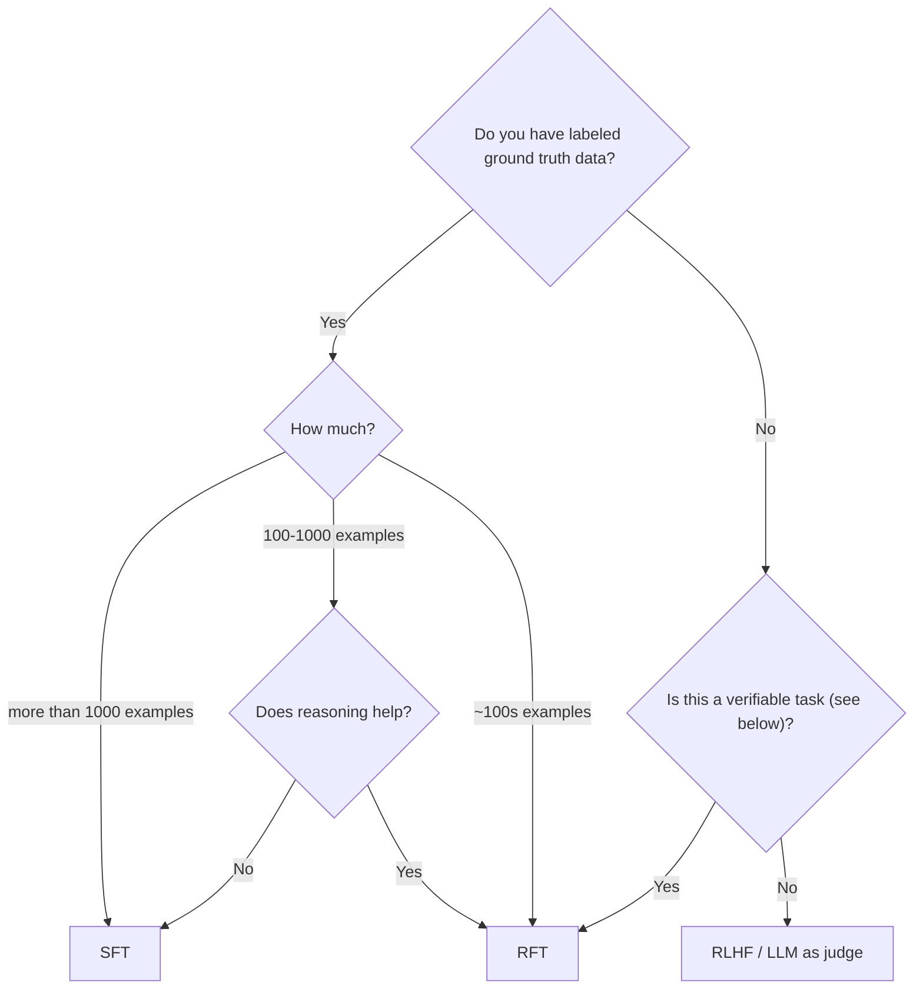

# Source: https://docs.fireworks.ai/fine-tuning/finetuning-intro.md

# Fine Tuning Overview

Fireworks helps you fine-tune models to improve quality and performance for your product use cases, without the burden of building & maintaining your own training infrastructure.

## Fine-tuning methods

<CardGroup cols={2}>
  <Card title="Reinforcement Fine Tuning" href="/fine-tuning/reinforcement-fine-tuning-models" icon="brain">
    Train models using custom reward functions for complex reasoning tasks
  </Card>

  <Card title="Supervised Fine Tuning - Text" href="/fine-tuning/fine-tuning-models" icon="message">
    Train text models with labeled examples of desired outputs
  </Card>

  <Card title="Supervised Fine Tuning - Vision" href="/fine-tuning/fine-tuning-vlm" icon="eye">
    Train vision-language models with image and text pairs
  </Card>

  <Card title="Direct Preference Optimization" href="/fine-tuning/dpo-fine-tuning" icon="arrows-left-right">
    Align models with human preferences using pairwise comparisons
  </Card>
</CardGroup>

## Supported models

Fireworks supports fine-tuning for most major open source models, including DeepSeek, Qwen, Kimi, and Llama model families, and supports fine-tuning large state-of-the-art models like Kimi K2 0905 and DeepSeek V3.1.

To see all models that support fine-tuning, visit the [Model Library for text models](https://app.fireworks.ai/models?filter=LLM\&tunable=true) or [vision models](https://app.fireworks.ai/models?filter=vision\&tunable=true).

## Fireworks uses LoRA

Fireworks uses **[Low-Rank Adaptation (LoRA)](https://arxiv.org/abs/2106.09685)** to fine-tune models efficiently. The fine-tuning process generates a LoRA addon—a small adapter that modifies the base model's behavior without retraining all its weights. This approach is:

* **Faster and cheaper** - Train models in hours, not days
* **Easy to deploy** - Deploy LoRA addons instantly on Fireworks
* **Flexible** - Run [multiple LoRAs](/fine-tuning/deploying-loras#multi-lora-deployment) on a single base model deployment

## When to use Supervised Fine-Tuning (SFT) vs. Reinforcement Fine-Tuning (RFT)

In supervised fine-tuning, you provide a dataset with labeled examples of “good” outputs. In reinforcement fine-tuning, you provide a grader function that can be used to score the model's outputs. The model is iteratively trained to produce outputs that maximize this score. To learn more about the differences between SFT and RFT, see [when to use Supervised Fine-Tuning (SFT) vs. Reinforcement Fine-Tuning (RFT)](./finetuning-intro#when-to-use-supervised-fine-tuning-sft-vs-reinforcement-fine-tuning-models-rft).

Supervised fine-tuning (SFT) works well for many common scenarios, especially when:

* You have a sizable dataset (\~1000+ examples) with high-quality, ground-truth lables.
* The dataset covers most possible input scenarios.
* Tasks are relatively straightforward, such as:
  * Classification
  * Content extraction

However, SFT may struggle in situations where:

* Your dataset is small.
* You lack ground-truth outputs (a.k.a. “golden generations”).
* The task requires multi-step reasoning.

Here is a simple decision tree:

<Tip>
  `Verifiable` refers to whether it is relatively easy to make a judgement on the quality of the model generation.
</Tip>
