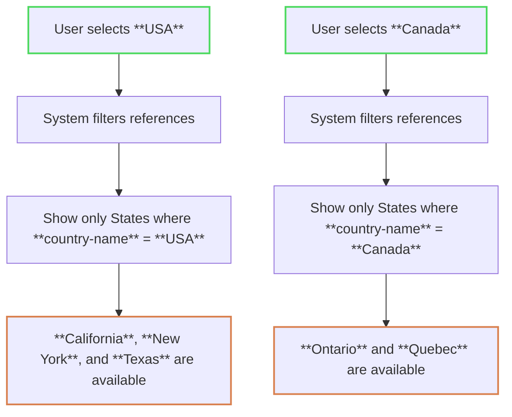

# Source: https://flatfile.com/docs/core-concepts/fields.md

> ## Documentation Index
> Fetch the complete documentation index at: https://flatfile.com/docs/llms.txt
> Use this file to discover all available pages before exploring further.

# Fields

> Blueprint definitions that define the structure and validation rules for your data in Flatfile

## What are Fields?

A Field in Flatfile is like a column in a spreadsheet — it defines the data type, format, and any constraints for a single piece of data in your import.

Fields are defined inside a [Blueprint](/core-concepts/blueprints), which acts as the master schema for your import setup. The hierarchy works like this:

* A Blueprint defines the structure of one or more Workbooks.
* Each Workbook contains Sheets (like tabs in a spreadsheet).
* Each Sheet contains Fields (columns), which describe the individual data points to be collected.

When you configure a Field, you’re telling Flatfile what kind of data to expect in that column—whether it’s text, a number, a date, or another supported type. You can also apply [constraints](#field-constraints) like "required," "unique," or "computed" to control how data is handled during import.

Fields play a key role in ensuring data structure and quality from the moment users start importing.

## Basic Blueprint Structure

* A [Blueprint](/core-concepts/blueprints) defines the data structure for any number of [Spaces](/core-concepts/spaces)
* A [Space](/core-concepts/blueprints) may contain many [Workbooks](/core-concepts/workbooks) and many [Documents](/core-concepts/documents)
* A [Document](/core-concepts/documents) contains static documentation and may contain many [Document-level Actions](/guides/using-actions#document-actions)
* A [Workbook](/core-concepts/workbooks) may contain many [Sheets](/core-concepts/sheets) and many [Workbook-level Actions](/guides/using-actions#workbook-actions)
* A [Sheet](/core-concepts/sheets) may contain many [Fields](/core-concepts/fields) and many [Sheet-level Actions](/guides/using-actions#sheet-actions)
* A [Field](/core-concepts/fields) defines a single column of data, and may contain many [Field-level Actions](/guides/using-actions#field-actions)

## Basic Field Configuration

The following examples demonstrate the configuration of isolated fields, which are intended to be used in the context of a [Blueprint](/core-concepts/blueprints) configuration under a [Sheet](/core-concepts/sheets) definition.

### Simple Field Definition

This example configures a single `string` Field that is `required` and another a `number` Field with a `decimalPlaces` config.

```javascript  theme={null}
// Basic string field
const nameField = {
  key: "firstName",
  type: "string",
  label: "First Name",
  description: "The customer's first name",
  required: true,
};

// Number field with config
const ageField = {
  key: "age",
  type: "number",
  label: "Age",
  description: "Customer age in years",
  config: {
    decimalPlaces: 2,
  },
};
```

### Field with Multiple Options

This example configures a single `enum` field with a `status` key, `Customer Status` label, and `Current status of the customer` description. It also defines four options for the field: `active`, `inactive`, `pending`, and `suspended`.

```javascript  theme={null}
const statusField = {
  key: "status",
  type: "enum",
  label: "Customer Status",
  description: "Current status of the customer",
  options: [
    { value: "active", label: "Active" },
    { value: "inactive", label: "Inactive" },
    { value: "pending", label: "Pending" },
    { value: "suspended", label: "Suspended" },
  ],
};
```

## Field Types

Flatfile supports 9 field types for defining data structure:

**Basic Types:**

* `string` - Basic text data
* `number` - Integer or floating point numbers
* `boolean` - True/false values
* `date` - GMT date values in YYYY-MM-DD format

**Single Selection:**

* `enum` - Single selection from predefined options

**Multiple Value Types:**

* `string-list` - Array of string values
* `enum-list` - Multiple selections from predefined options

**Reference Types:**

* `reference` - Single reference to another sheet
* `reference-list` - Multiple references to another sheet

### `string`

A property that should be stored and read as a basic string.

```javascript  theme={null}
{
  "key": "productCode",
  "label": "Product Code",
  "type": "string",
  "appearance": {
    "size": "m"
  }
}
```

**Note:** String fields don't have type-specific config options, but support appearance settings.

### `string-list`

Stores an array of string values. Useful for fields that contain multiple text entries.

```javascript  theme={null}
{
  "key": "tags",
  "label": "Product Tags",
  "type": "string-list"
}
```

### `number`

A property that should be stored and read as either an integer or floating point number.

**config.decimalPlaces**
The number of decimal places to preserve accuracy to.

```javascript  theme={null}
{
  "key": "price",
  "label": "Retail Price",
  "type": "number",
  "config": {
    "decimalPlaces": 2
  }
}
```

### `enum`

Defines an enumerated list of options for the user to select from (single selection). The maximum number of options for this list is `100`. For multiple selections, use [`enum-list`](#enum-list).

**config.allowCustom**
Allow users to create new options for this field. When enabled, users will be able to import their custom value to the review table, but it will not be considered a valid enum option.

**config.sortBy**
The field to sort the options by (`label`, `value`, `ordinal`).

**config.options**
An array of valid options the user can select from:

```json  theme={null}
{
  "key": "status",
  "label": "Status",
  "type": "enum",
  "config": {
    "options": [
      {
        "value": "active",
        "label": "Active"
      },
      {
        "value": "inactive",
        "label": "Disabled"
      }
    ]
  }
}
```

### `enum-list`

Allows multiple selections from a predefined list of options. Values are stored as an array. Use this instead of `enum` when users need to select multiple options.

**config.allowCustom**
Allow users to create new options for this field. When enabled, users will be able to import their custom value to the review table, but it will not be considered a valid enum option.

**config.sortBy**
Sort options by: `label`, `value`, or `ordinal`.

**config.options**
Array of option objects:

```json  theme={null}
{
  "key": "categories",
  "label": "Product Categories",
  "type": "enum-list",
  "config": {
    "allowCustom": false,
    "sortBy": "label",
    "options": [
      {
        "value": "electronics",
        "label": "Electronics"
      },
      {
        "value": "clothing",
        "label": "Clothing"
      },
      {
        "value": "books",
        "label": "Books"
      }
    ]
  }
}
```

### `boolean`

A `true` or `false` value type. Usually displayed as a checkbox.

**config.allowIndeterminate**
Allow a neither true or false state to be stored as `null`.

```json  theme={null}
{
  "key": "is_active",
  "label": "Active",
  "type": "boolean",
  "config": {
    "allowIndeterminate": true
  }
}
```

### `date`

Store a field as a GMT date. Data hooks must convert this value into a `YYYY-MM-DD` format in order for it to be considered a valid value.

```json  theme={null}
{
  "key": "start_date",
  "label": "Start Date",
  "type": "date"
}
```

### `reference`

Defines a singular one-to-one reference to a field another sheet.

**config.ref**
The sheet slug of the referenced field. Must be in the same workbook.

**config.key**
The key of the property to use as the reference key.

**config.filter**
Optional filter to narrow the set of records in the reference sheet used as valid values. When provided, only records where the `refField` value matches the current record's `recordField` value will be available as options.

```json  theme={null}
{
  "key": "author",
  "type": "reference",
  "label": "Authors",
  "config": {
    "ref": "authors",
    "key": "name"
  }
}
```

#### Reference Field Filtering

Reference fields can be filtered to show only relevant options based on the value of another field in the same record. This enables cascading dropdowns and dependent field relationships.

<Note>
  **Dynamic Enums**

  This feature, along with the `ENUM_REFERENCE` [sheet treatment](/core-concepts/sheets#reference-sheets), may be collectively referred to as **Dynamic Enums**. By combining these two features, you can create a drop-down list for any cell in your sheet that's dynamically controlled by the value of another field in the same record – and to the end-user, it will just work like a dynamically-configured `enum` field.
</Note>

**Filter Configuration**

The `filter` property accepts a `ReferenceFilter` object with two required properties:

| Property      | Type     | Description                                            |
| ------------- | -------- | ------------------------------------------------------ |
| `refField`    | `string` | The field key in the referenced sheet to filter with   |
| `recordField` | `string` | The field key in the current record used for filtering |

**How Filtering Works**

When a filter is applied:

1. The system looks at the value in the `recordField` of the current record
2. It then filters the referenced sheet to only show records where `refField` matches that value
3. Only the filtered records become available as options in the reference field

**Example: Country and State Cascading Dropdown**

Consider a scenario where you want state options to be filtered based on the selected country.

<Info>
  This example also demonstrates the use of the `ENUM_REFERENCE` [sheet treatment](/core-concepts/sheets#reference-sheets) to hide the reference sheet from the UI. You may wish to disable this treatment for testing purposes.
</Info>

```json  theme={null}
{
  "sheets": [
    {
      "name": "Reference Data",
      "slug": "ref-data",
      "treatments": ["ENUM_REFERENCE"],
      "fields": [
        {
          "key": "country-name",
          "label": "Country",
          "type": "string"
        },
        {
          "key": "state-name",
          "label": "State/Province",
          "type": "string"
        }
      ]
    },
    {
      "name": "Addresses",
      "slug": "addresses",
      "fields": [
        {
          "key": "country",
          "label": "Country",
          "type": "reference",
          "config": {
            "ref": "ref-data",
            "key": "country-name"
          }
        },
        {
          "key": "state",
          "label": "State/Province",
          "type": "reference",
          "config": {
            "ref": "ref-data",
            "key": "state-name",
            "filter": {
              "refField": "country-name",
              "recordField": "country"
            }
          }
        }
      ]
    }
  ]
}
```

**Reference Data Sheet**:

| country-name | state-name |
| ------------ | ---------- |
| USA          | California |
| USA          | New York   |
| USA          | Texas      |
| Canada       | Ontario    |
| Canada       | Quebec     |

**Behavior**

* When **USA** is selected in the country field, the state dropdown will only show **California**, **New York**, and **Texas**
* When **Canada** is selected in the country field, the state dropdown will only show **Ontario** and **Quebec**

The following diagram illustrates how reference field filtering works:



And this is how it looks in the UI:

<Frame caption="Filtering for USA States based on the selected country">
    
</Frame>

<Frame caption="Filtering for Canadian Provinces based on the selected country">
    
</Frame>

<Frame caption="If data is imported that does not match the filtered options, it will result in a validation error">
    
</Frame>

### `reference-list`

Defines multiple references to records in another sheet within the same workbook.

**config.ref**
The sheet slug of the referenced field. Must be in the same workbook.

**config.key**
The key of the property to use as the reference key.

**config.filter**
Optional filter to narrow the set of records in the reference sheet used as valid values.

```json  theme={null}
{
  "key": "authors",
  "type": "reference-list",
  "label": "Book Authors",
  "config": {
    "ref": "authors",
    "key": "name"
  }
}
```

#### Reference List Filtering

The `filter` property on `reference-list` fields works identically to `reference` [field filters](#reference-field-filtering), but allows for multiple selections.

```json  theme={null}
{
  "key": "categories",
  "label": "Product Categories",
  "type": "reference-list",
  "config": {
    "ref": "category-data",
    "key": "category-name",
    "filter": {
      "refField": "department",
      "recordField": "product-department"
    }
  }
}
```

**Multi-Level Cascading Example**

You can create complex, multi-level cascading dropdowns by chaining filtered reference fields together. This example shows a product taxonomy where department selection filters available categories, and category selection filters available subcategories:

```json  theme={null}
{
  "sheets": [
    {
      "name": "Product Taxonomy",
      "slug": "taxonomy",
      "fields": [
        { "key": "department", "label": "Department", "type": "string" },
        { "key": "category", "label": "Category", "type": "string" },
        { "key": "subcategory", "label": "Subcategory", "type": "string" }
      ]
    },
    {
      "name": "Products",
      "slug": "products",
      "fields": [
        {
          "key": "department",
          "label": "Department",
          "type": "reference",
          "config": { "ref": "taxonomy", "key": "department" }
        },
        {
          "key": "category",
          "label": "Category",
          "type": "reference",
          "config": {
            "ref": "taxonomy",
            "key": "category",
            "filter": { "refField": "department", "recordField": "department" }
          }
        },
        {
          "key": "subcategory",
          "label": "Subcategory",
          "type": "reference-list",
          "config": {
            "ref": "taxonomy",
            "key": "subcategory",
            "filter": { "refField": "category", "recordField": "category" }
          }
        }
      ]
    }
  ]
}
```

**Product Taxonomy Sheet**:

| department  | category    | subcategory   |
| ----------- | ----------- | ------------- |
| Electronics | Computers   | Laptops       |
| Electronics | Computers   | Desktops      |
| Electronics | Computers   | Tablets       |
| Electronics | Audio       | Headphones    |
| Electronics | Audio       | Speakers      |
| Clothing    | Men's       | Shirts        |
| Clothing    | Men's       | Pants         |
| Clothing    | Women's     | Dresses       |
| Clothing    | Women's     | Shoes         |
| Books       | Fiction     | Novels        |
| Books       | Fiction     | Short Stories |
| Books       | Non-Fiction | Biography     |
| Books       | Non-Fiction | History       |

**Behavior**

This creates a three-level cascade: Department → Category → Subcategory, where users can select multiple subcategories from the filtered options.

* When **Electronics** is selected in the department field, the category dropdown will only show **Computers** and **Audio**
* When **Computers** is selected, the subcategory dropdown will show **Laptops**, **Desktops**, and **Tablets**. Users may then select *multiple* subcategories from the filtered options
* When **Clothing** is selected, the category dropdown will only show **Men's** and **Women's**
* When **Men's** is selected, the subcategory dropdown will show **Shirts** and **Pants**. Users may then select *multiple* subcategories from the filtered options

## Field Constraints

Field constraints are system-level validation rules that enforce data integrity and business logic on data in individual fields.

### required

Ensures that a field must have a non-null value. Empty cells are considered null values and will fail this constraint.

```json  theme={null}
{
  "key": "email",
  "type": "string",
  "label": "Email Address",
  "constraints": [{ "type": "required" }]
}
```

By default, if a required constraint fails, an error will be added to the field with the message "\<field label> is required".

You can override the message and/or the error level of the message by supplying a `config` object with the constraint.

For example:

```json  theme={null}
{
  "key": "email",
  "type": "string",
  "label": "Email Address",
  "constraints": [{
    "type": "required",
    "config": {
      "message": "This record is missing an email address",
      "level": "warn"
    }
  }]
}
```

### unique

Ensures that field values appear only once across all records in the sheet. Note that null values can appear multiple times as they don't count toward uniqueness validation.

```json  theme={null}
{
  "key": "employeeId",
  "type": "string",
  "label": "Employee ID",
  "constraints": [{ "type": "unique" }]
}
```

By default, if a required constraint fails, an error will be added to the field with the message "Value is not unique".

You can override the message and/or the error level of the message by supplying a `config` object with the constraint -- see the example with the required constraint above.

### computed

Marks a field as computed, hiding it from the mapping process. Users will not be able to map imported data to fields with this constraint.

```json  theme={null}
{
  "key": "calculatedField",
  "type": "string",
  "label": "Calculated Value",
  "constraints": [{ "type": "computed" }]
}
```

<Info>
  Sheet-level constraints that apply to multiple fields are covered in [Sheet Constraints](/core-concepts/sheets#sheet-constraints).
</Info>

### Field-level access

**`readonly`**
On a field level you can restrict a user's interaction with the data to `readonly`. This feature is useful if you're inviting others to view uploaded data, but do not want to allow them to edit that field.

```json  theme={null}
{
  "fields": [
    {
      "key": "salary",
      "type": "number",
      "readonly": true
    }
  ]
}
```

## Field Options

Configurable properties for a Field that define its structure and behavior:

| Option          | Type    | Required | Default | Description                                                                                                                                            |
| --------------- | ------- | -------- | ------- | ------------------------------------------------------------------------------------------------------------------------------------------------------ |
| **key**         | string  | ✓        |         | The system name of this field. Primarily informs JSON and egress structures                                                                            |
| **type**        | string  | ✓        |         | One of `string`, `number`, `boolean`, `date`, `enum`, `reference`, `string-list`, `enum-list`, `reference-list`. Defines the handling of this property |
| **label**       | string  |          | key     | A user-facing descriptive label designed to be displayed in the UI such as a table header                                                              |
| **description** | string  |          |         | A long form description of the property intended to be displayed to an end user (supports Markdown)                                                    |
| **constraints** | array   |          | \[]     | An array of system level validation rules (max 10). [Learn more about field constraints](#field-constraints)                                           |
| **config**      | object  |          | {}      | Configuration relevant to the type of column. See type documentation below                                                                             |
| **readonly**    | boolean |          | false   | Prevents user input on this field                                                                                                                      |
| **appearance**  | object  |          | {}      | UI appearance settings. Currently supports `size` property with values: `"xs"`, `"s"`, `"m"`, `"l"`, `"xl"`                                            |
| **actions**     | array   |          | \[]     | User actions available for this field. See [Field Actions](/guides/using-actions#field-actions) for detailed configuration                             |

\| **alternativeNames** | array | | \[] | Alternative field names for mapping assistance |
\| **metadata** | object | | {} | Arbitrary object of values to pass through to hooks and egress |
