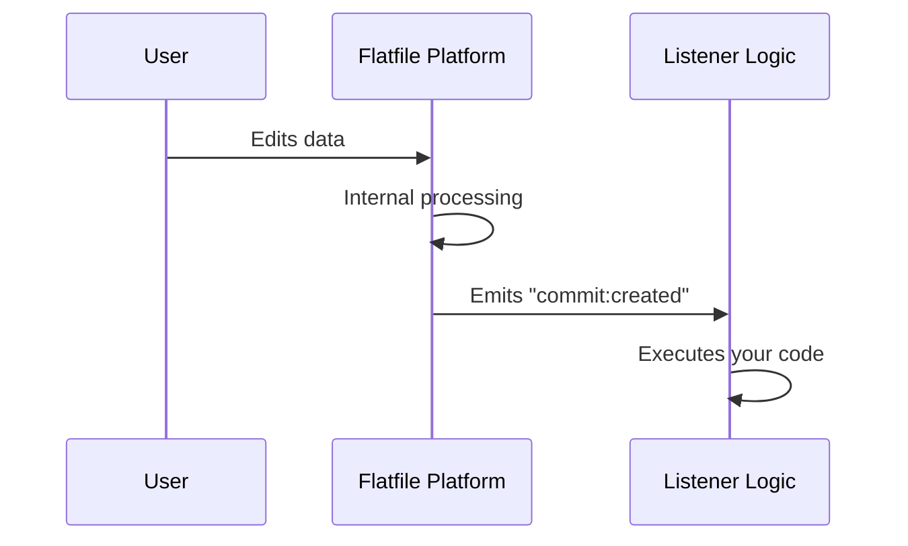

# Source: https://flatfile.com/docs/guides/overview.md

# Source: https://flatfile.com/docs/embedding/overview.md

# Source: https://flatfile.com/docs/core-concepts/overview.md

# Source: https://flatfile.com/docs/coding-tutorial/overview.md

> ## Documentation Index
> Fetch the complete documentation index at: https://flatfile.com/docs/llms.txt
> Use this file to discover all available pages before exploring further.

# Coding Tutorial

> Learn to build Event Listeners that configure and customize Flatfile through hands-on coding tutorials

## Events Drive Everything in Flatfile

**When you configure Flatfile with code, you're building part of an event-driven system.** Every time a user interacts with their data—editing a Record, uploading a file, clicking an [Action](/core-concepts/actions) button, etc.—the Flatfile Platform emits an **Event**. Your custom **Listeners**, defined in your code and generally deployed to the Flatfile Platform as an [Agent](/core-concepts/listeners#agents), respond to these Events by executing whatever logic you define.

**Out of the box, Flatfile is essentially an empty slate.** Everything you see—[Workbooks](/core-concepts/workbooks), [Sheets](/core-concepts/sheets), [Fields](/core-concepts/fields), validation logic—is created by your Listeners responding to Events. This logic includes configuring your [Blueprint](/core-concepts/blueprints) in a `space:configure` job, and may be as simple as logging an Event to the console, or as complex as processing records against existing data from your own API. But given the Event/Listener pattern as basic building blocks, you can build pretty much anything your imagination can conjure.

This event-driven paradigm is fundamentally different from traditional "configuration", where you pre-define static options. Instead, you write reactive code that responds to what users actually do. Events carry structured information about what happened, including the context and any relevant data, giving your Listeners everything they need to respond intelligently.

Common Events include:

* `commit:created` - When a commit is created (after records are added or modified)
* `job:ready` - When [Jobs](/core-concepts/jobs) are ready for execution
* `file:created` - When a file is uploaded

This is just a very small sample of the Events emitted by Flatfile. For a complete list, see the [Events Reference](/reference/events).

Your Listeners define how Flatfile behaves. Want to validate data when records are modified? Listen for `commit:created` Events and perform your validation in the callback. Need to process uploaded files? Listen for `file:created` Events. Want to trigger discrete units of work? Listen for `job:ready` Events (generally filtered by `{job: "domain:operation"}`, but we'll cover that later).

For a more comprehensive understanding of this topic, see [Events and Listeners](/core-concepts/listeners).

## Learning Path: Building Custom Listeners

This tutorial series teaches you to build Event Listeners through hands-on coding. You'll start with basic Space configuration and progressively add more sophisticated functionality.

**Prerequisites**:

* Basic JavaScript or TypeScript knowledge
* Node.js and npm installed (latest LTS version recommended)

You may also find it helpful to review the [Core Concepts](/core-concepts/overview) documentation to get a better understanding of the structures and terminology used in this tutorial, or just jump right into things and keep the Core Concepts documentation in mind in case you come across something you don't understand. You might even keep it open in another tab for handy reference later on.

**Getting Started**: This tutorial is designed to be completed from scratch from an empty folder. You'll build everything step-by-step as you follow along.

**Reference Code**: If you'd like to skip ahead or you'd like a complete reference, you can find complete working examples in our [Getting Started repository](https://github.com/FlatFilers/getting-started/) with both JavaScript and TypeScript versions.

### Listeners 101: Your First Listener

A three-part series that builds a complete Listener from scratch. By the end of this series, you'll have a single-page Listener that configures Spaces, creates Workbooks and Sheets, validates a single field, and adds a custom Action.

This is a great way to learn the basics of Listener development and get a feel for how to build your own Listeners, but it's meant to be a starting point; In the next series, we'll show you how to make your Listeners more concise and structured to prepare for more complex use cases.

<CardGroup cols={1}>
  <Card title="Section 01: Your First Listener" href="/coding-tutorial/101-your-first-listener/101.01-first-listener">
    Set up your development environment and build a Listener that configures Spaces, creates Workbooks and Sheets, and manages the Job lifecycle. You'll learn the foundational patterns for all Listener development.
  </Card>

  <Card title="Section 02: Adding Validation" href="/coding-tutorial/101-your-first-listener/101.02-adding-validation">
    Add data validation to ensure Record quality. You'll learn to validate individual Fields, provide helpful error messages, and guide users toward clean data.
  </Card>

  <Card title="Section 03: Adding Actions" href="/coding-tutorial/101-your-first-listener/101.03-adding-actions">
    Extend your Listener with custom Actions that let users trigger your code on demand. You'll learn to create interactive workflows and provide user feedback.
  </Card>
</CardGroup>
