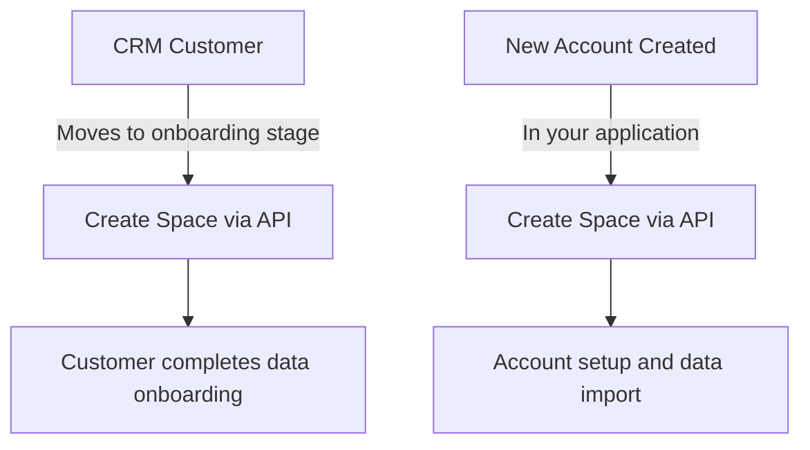
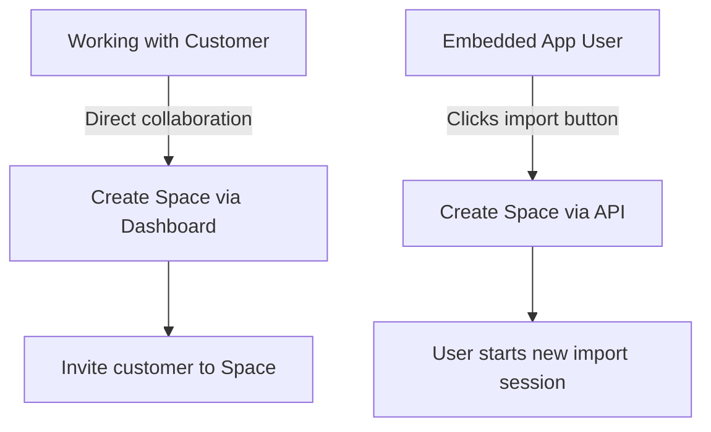

# Source: https://flatfile.com/docs/core-concepts/spaces.md

> ## Documentation Index
> Fetch the complete documentation index at: https://flatfile.com/docs/llms.txt
> Use this file to discover all available pages before exploring further.

# Spaces

> Micro-applications for content and data storage

Flatfile Spaces are micro-applications, each having their own database, filestore, and auth. Use Spaces to integrate Flatfile into your data exchange workflow, whether that happens directly in your application or as part of an offline process.

You can think of a Space as a home for any one of your Customers' data, or as place for a discrete data migration session; you can create a new Space any time you need an isolated place to migrate new data.

<Note>
  Terminology note: **Spaces** are sometimes referred to as **Projects** in Flatfile conversations - this is because we often consider a Space to be a single import or series of imports from a single end-customer, or, a "Project".
</Note>

## Anatomy

The following example depicts a **Space** with:

* 1 [Document](/core-concepts/documents) named **Customers**
* 2 [Workbooks](/core-concepts/workbooks):
  * **Customers Workbook**
    * 3 [Sheets](/core-concepts/sheets) named **Customers**, **Orders**, and **Products**
  * **Company Workbook**
    * 3 [Sheets](/core-concepts/sheets) named **Users**, **Departments**, and **Projects**
    * 2 [Workbook Actions](/core-concepts/actions) labeled **Download** and **Submit**

The current view has the **Users** sheet under the **Company Workbook** selected.

<Frame caption="An example of a fully-configured space">
  
</Frame>

## Basic Blueprint Structure

* A [Blueprint](/core-concepts/blueprints) defines the data structure for any number of [Spaces](/core-concepts/spaces)
* A [Space](/core-concepts/blueprints) may contain many [Workbooks](/core-concepts/workbooks) and many [Documents](/core-concepts/documents)
* A [Document](/core-concepts/documents) contains static documentation and may contain many [Document-level Actions](/guides/using-actions#document-actions)
* A [Workbook](/core-concepts/workbooks) may contain many [Sheets](/core-concepts/sheets) and many [Workbook-level Actions](/guides/using-actions#workbook-actions)
* A [Sheet](/core-concepts/sheets) may contain many [Fields](/core-concepts/fields) and many [Sheet-level Actions](/guides/using-actions#sheet-actions)
* A [Field](/core-concepts/fields) defines a single column of data, and may contain many [Field-level Actions](/guides/using-actions#field-actions)

### Blueprints and Space Configuration

Every Space has exactly one [Blueprint](/core-concepts/blueprints) that defines its data structure. When you configure a Space by creating workbooks, sheets, and fields, you're defining the Space's Blueprint - the schema that controls how data should look, behave, and connect within that Space.

The Blueprint is established during the `space:configure` [Job](/core-concepts/jobs) and remains consistent throughout the Space's lifecycle (though you can change it via the [API](https://reference.flatfile.com/api-reference/workbooks/update) at any time). This ensures all data imported into the Space follows the same structure and validation rules you've defined.

<Note>
  By default, the same Blueprint configuration is applied to all Spaces unless you [namespace your listeners](/guides/namespaces-and-filters) to specific scopes. This makes it easy to maintain consistent data structures across multiple Spaces for similar use cases or different customers with the same data requirements.
</Note>

## Creating Spaces

Spaces can be created manually via your [Flatfile Dashboard](https://platform.flatfile.com/dashboard), or — quite commonly — programmatically via the [Flatfile API](https://reference.flatfile.com/api-reference/spaces/create).

Here are some example workflows for creating Spaces:

### Backend Automation

When integrating Flatfile into your application workflows:

* **CRM Integration**: When a customer in your CRM moves to the "onboarding" stage, you may create a new Space via the API for them to complete their data onboarding process.
* **Account Creation**: When a new account is created in your application, you may automatically create a new Space for them via the API.



### User-Initiated Creation

For direct customer collaboration and embedded applications:

* **Direct Collaboration**: When working with a new customer directly, you may create a new Space via the Dashboard and invite them to the Space.
* **Embedding Flatfile**: In an [Embedded App](/embedding/overview), you may create a new Space every time a user clicks a button to start a new import.



You may also rename "Space" to any other term you prefer, such as "Project" or "Customer". Each App may have a different name for a Space, but they all have the same underlying structure.

<Frame caption="App settings with Spaces named &#x22;Projects&#x22;">
  
</Frame>

### Space Namespaces

Spaces can be assigned [namespaces](/guides/namespaces-and-filters) to control which [listeners](/core-concepts/listeners) receive events from that space. This enables isolation between different parts of your application or different customers. See the [Namespaces and Filters guide](/guides/namespaces-and-filters) for detailed examples and patterns.

## Space Configuration

<Info>
  For complete theming capabilities, see our comprehensive [Theme Your Space guide](/guides/theme-your-space).
</Info>

If you're using [Autobuild](/getting-started/quickstart/autobuild), space configuration is handled automatically via its own deployed agent.

If you're configuring Flatfile in code, you can configure the Space via a [Listener](/core-concepts/listeners).
When a new space is created, Flatfile automatically creates a `space:configure` [Job](/core-concepts/jobs) for you to configure the Space. In your job listener, you can create workbooks, sheets, and actions, as well as configure the Space's theme and metadata. This workbook and sheet configuration defines your Space's [Blueprint](/core-concepts/blueprints) - the data schema that controls how your data should look, behave, and connect.

<Note>
  In this example, we'll show the full Job Listener lifecycle implementation, complete with `ack` to acknowledge the job, `update` to update the job's progress, and `complete` or `fail` to complete or fail the job.

  As in other places throughout the documentation, you *could* use the [Job Handler](/plugins/job-handler) plugin to handle the job lifecycle for you. This may be useful if you have a particularly complex space configuration with custom logic, but don't need complete control over the job's entire lifecycle.

  However, for most implementations, we recommend using the [Space Configure](/plugins/space-configure) plugin. This plugin takes care of even more of the heavy lifting for you; not only does it handle the Job lifecycle, but it also takes care of all of the API calls necessary to configure the Space and create its Workbooks and documents.

  With this plugin, you can configure your entire space with a single configuration object rather than perforing any API calls.

  For example, this listener implementation configures a space with a [Blueprint](/core-concepts/blueprints) containing two [workbooks](/core-concepts/workbooks) and a Welcome Guide [document](/core-concepts/documents) – both defined in another file – as well as adding some light [theming](/guides/theme-your-space):

  ```javascript  theme={null}
  listener.use(configureSpace({
    workbooks: [companyWorkbook, customerWorkbook],
    documents: [welcomeGuideDocument],
    space: {
      metadata: {
        theme: {
          root: {
            primaryColor: "#4F46E5",
            actionColor: "#000000"
          },
          sidebar: {
            logo: "www.example.com/logo.png"
          },
        }
      }
    }
  }));
  ```
</Note>

Here's how to manually configure a Space using the job lifecycle approach. This example demonstrates creating a [Blueprint](/core-concepts/blueprints) by defining workbooks with sheets and fields, custom actions, a welcome document, and theme customization, with complete control over the configuration process and proper job lifecycle management.

<CodeGroup>
  ```javascript JavaScript theme={null}
  import { FlatfileListener } from "@flatfile/listener";
  import api from "@flatfile/api";

  export default function (listener) {

    // Listen for the space:configure job
    listener.on("job:ready", { job: "space:configure" }, async (event) => {

      // Get the job ID and space ID from the event context
      const { jobId, spaceId } = event.context;
      
      try {
        // Acknowledge the job
        await api.jobs.ack(jobId, {
          info: "Setting up customer data workspace",
          progress: 10
        });

        // Create the workbook with a sheet and an action
        const { data: workbook } = await api.workbooks.create({
          spaceId,
          name: "Customer Data",
          sheets: [
            {
              name: "Contacts",
              slug: "contacts",
              fields: [
                { key: "firstName", type: "string", label: "First Name" },
                { key: "lastName", type: "string", label: "Last Name" },
                { key: "email", type: "string", label: "Email Address" },
                { key: "phone", type: "string", label: "Phone Number" }
              ]
            }
          ],
          actions: [
            {
              operation: "submit",
              label: "Submit Data",
              mode: "foreground",
              primary: true,
              description: "Submit customer data for processing",
              constraints: [{ type: "hasData" }]
            }
          ]
        });

        // Update progress
        await api.jobs.update(jobId, {
          info: "Customer workbook created",
          progress: 50
        });

        // Create a welcome document
        await api.documents.create(spaceId, {
          title: "Welcome Guide",
          body: `
            <h1>Welcome to Customer Data Import</h1>
            <p>This Space helps you import and validate customer contact information.</p>
            <h2>Getting Started</h2>
            <ol>
              <li>Upload your CSV file or enter data manually</li>
              <li>Review and correct any validation errors</li>
              <li>Click "Submit Data" when ready</li>
            </ol>
          `
        });

        // Update progress
        await api.jobs.update(jobId, {
          info: "Welcome document added",
          progress: 75
        });

        // Configure the space theme
        await api.spaces.update(spaceId, {
          metadata: {
            theme: {
              root: {
                primaryColor: "#4F46E5",
                borderColor: "#E5E7EB",
                fontFamily: "Inter, system-ui, sans-serif"
              },
              sidebar: {
                backgroundColor: "#1F2937",
                textColor: "#F9FAFB",
                titleColor: "#4F46E5"
              }
            }
          }
        });

        // Complete the job
        await api.jobs.complete(jobId, {
          outcome: {
            message: "Customer data workspace configured successfully",
            acknowledge: true
          }
        });

      } catch (error) {
        console.error("Error configuring space:", error);
        
        // Fail the job if something goes wrong
        await api.jobs.fail(jobId, {
          outcome: {
            message: `Failed to configure space: ${error.message}`,
            acknowledge: true
          }
        });
      }
    });
  }
  ```

  ```typescript TypeScript theme={null}
  import type { FlatfileListener } from "@flatfile/listener";
  import api from "@flatfile/api";

  export default function (listener: FlatfileListener) {

    // Listen for the space:configure job
    listener.on("job:ready", { job: "space:configure" }, async (event) => {

      // Get the job ID and space ID from the event context
      const { jobId, spaceId } = event.context;
      
      try {
        // Acknowledge the job
        await api.jobs.ack(jobId, {
          info: "Setting up customer data workspace",
          progress: 10
        });

        // Create the workbook with a sheet and an action
        const { data: workbook } = await api.workbooks.create({
          spaceId,
          name: "Customer Data",
          sheets: [
            {
              name: "Contacts",
              slug: "contacts",
              fields: [
                { key: "firstName", type: "string", label: "First Name" },
                { key: "lastName", type: "string", label: "Last Name" },
                { key: "email", type: "string", label: "Email Address" },
                { key: "phone", type: "string", label: "Phone Number" }
              ]
            }
          ],
          actions: [
            {
              operation: "submit",
              label: "Submit Data",
              mode: "foreground",
              primary: true,
              description: "Submit customer data for processing",
              constraints: [{ type: "hasData" }]
            }
          ]
        });

        // Update progress
        await api.jobs.update(jobId, {
          info: "Customer workbook created",
          progress: 50
        });

        // Create a welcome document
        await api.documents.create(spaceId, {
          title: "Welcome Guide",
          body: `
            <h1>Welcome to Customer Data Import</h1>
            <p>This Space helps you import and validate customer contact information.</p>
            <h2>Getting Started</h2>
            <ol>
              <li>Upload your CSV file or enter data manually</li>
              <li>Review and correct any validation errors</li>
              <li>Click "Submit Data" when ready</li>
            </ol>
          `
        });

        // Update progress
        await api.jobs.update(jobId, {
          info: "Welcome document added",
          progress: 75
        });

        // Configure the space theme
        await api.spaces.update(spaceId, {
          metadata: {
            theme: {
              root: {
                primaryColor: "#4F46E5",
                borderColor: "#E5E7EB",
                fontFamily: "Inter, system-ui, sans-serif"
              },
              sidebar: {
                backgroundColor: "#1F2937",
                textColor: "#F9FAFB",
                titleColor: "#4F46E5"
              }
            }
          }
        });

        // Complete the job
        await api.jobs.complete(jobId, {
          outcome: {
            message: "Customer data workspace configured successfully",
            acknowledge: true
          }
        });

      } catch (error) {
        console.error("Error configuring space:", error);
        
        // Fail the job if something goes wrong
        await api.jobs.fail(jobId, {
          outcome: {
            message: `Failed to configure space: ${error.message}`,
            acknowledge: true
          }
        });
      }
    });
  }
  ```
</CodeGroup>
