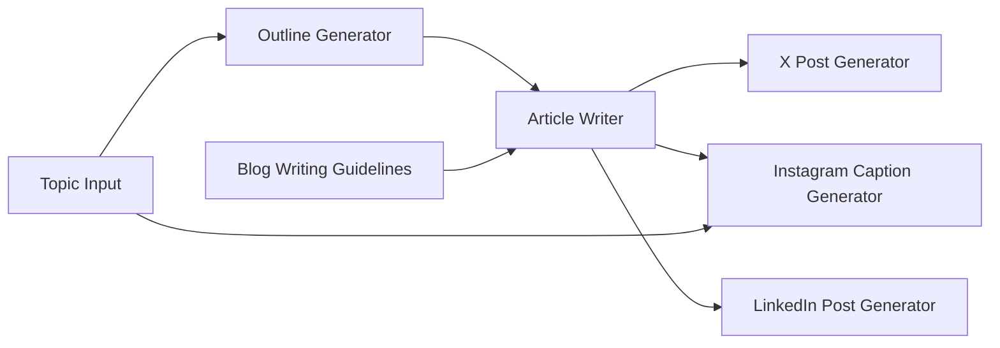

# Source: https://docs.giselles.ai/en/cookbooks/blog-social-media-generator.md

# Blog Post & Social Media Generator

> Learn both sequential and parallel processing in one workflow. Generate blog articles from topics and create optimized social media posts for multiple platforms.

This recipe shows you how to build an app where you enter a topic (and optionally an image), and AI creates an outline, writes a full blog article, then generates optimized posts for X, Instagram, and LinkedIn in parallel based on the article content.

## Overview

**Purpose**: Generate blog articles from topics and create social media posts in parallel based on the article content.

| Node                    | Role                                                    | Model                 |
| ----------------------- | ------------------------------------------------------- | --------------------- |
| App Request             | Topic input + image (optional)                          | -                     |
| Text Node               | Article structure prompt                                | -                     |
| Generator 1 (Outline)   | Generate article structure                              | gpt-5-nano            |
| Generator 2 (Article)   | Generate body from outline                              | claude-haiku-4.5      |
| Generator 3 (X)         | Generate short text for X from article                  | gpt-5-nano            |
| Generator 4 (Instagram) | Generate Instagram caption from article (image support) | gemini-2.5-flash-lite |
| Generator 5 (LinkedIn)  | Generate professional LinkedIn post from article        | claude-haiku-4.5      |

**What you'll learn**: Node chaining (sequential processing), parallel processing, prompt design, multimodal input (optional)

## Workflow Diagram



## Node Configuration Details

### 1. App Request

| Item            | Value                                  |
| --------------- | -------------------------------------- |
| Node Name       | `Topic Input`                          |
| Node Input Name | `topic`                                |
| File Input      | Optional (Image: PNG, JPEG, GIF, WebP) |
| Prompt          | - (User input only)                    |

### 2. Text Node

| Item         | Value                     |
| ------------ | ------------------------- |
| Node Name    | `Blog Writing Guidelines` |
| Text Content | (see below)               |

```
You are a professional blog writer. Follow these guidelines when creating content:
- Write in a clear, engaging, and informative tone
- Use headings and subheadings for better readability
- Include an introduction, main body, and conclusion
- Target length: 800-1200 words
- Make the content SEO-friendly with natural keyword usage
```

### 3. Generator Node (Outline)

| Item       | Value               |
| ---------- | ------------------- |
| Node Name  | `Outline Generator` |
| Model      | gpt-5-nano          |
| Thinking   | OFF                 |
| Web Search | -                   |

**Prompt:**

```
Create a detailed blog post outline for the following topic:

@Topic Input

Include:
1. A compelling title
2. Introduction hook
3. 3-5 main sections with subpoints
4. Conclusion summary
5. Call-to-action suggestion

Output the outline in a structured format.
```

### 4. Generator Node (Article)

| Item       | Value            |
| ---------- | ---------------- |
| Node Name  | `Article Writer` |
| Model      | claude-haiku-4.5 |
| Thinking   | ON               |
| Web Search | OFF              |

**Prompt:**

```
Write a complete blog article based on the following outline:

@Outline Generator

Follow these writing guidelines:
@Blog Writing Guidelines

Make sure to:
- Expand each section with detailed, valuable content
- Use smooth transitions between sections
- Include relevant examples where appropriate
- Maintain a consistent voice throughout
```

### 5. Generator Node (X)

| Item       | Value              |
| ---------- | ------------------ |
| Node Name  | `X Post Generator` |
| Model      | gpt-5-nano         |
| Thinking   | OFF                |
| Web Search | -                  |

**Prompt:**

```
Create a post for X (Twitter) to promote the following blog article:

@Article Writer

Requirements:
- Maximum 280 characters
- Highlight the key insight or hook from the article
- Engaging and concise
- Include 1-3 relevant hashtags
- Use a conversational tone
- Include a call-to-action to read the full article
```

### 6. Generator Node (Instagram)

| Item       | Value                         |
| ---------- | ----------------------------- |
| Node Name  | `Instagram Caption Generator` |
| Model      | gemini-2.5-flash-lite         |
| Thinking   | -                             |
| Web Search | OFF                           |

**Prompt:**

```
Create an Instagram caption to promote the following blog article:

@Article Writer

Additional context (if image provided):
@Topic Input

Requirements:
- If an image is provided, analyze it and incorporate visual elements into the caption
- Summarize the article's key points in an engaging way
- Engaging opening line to hook readers
- Use line breaks for readability
- Include 5-10 relevant hashtags at the end
- Add 2-3 relevant emojis
- Include a call-to-action (e.g., "Link in bio to read the full article")
- Optimal length: 150-300 characters for the main text
```

### 7. Generator Node (LinkedIn)

| Item       | Value                     |
| ---------- | ------------------------- |
| Node Name  | `LinkedIn Post Generator` |
| Model      | claude-haiku-4.5          |
| Thinking   | OFF                       |
| Web Search | OFF                       |

**Prompt:**

```
Create a LinkedIn post to promote the following blog article:

@Article Writer

Requirements:
- Professional and insightful tone
- Start with a hook or thought-provoking question from the article
- Summarize key takeaways from the article
- Use short paragraphs and line breaks for readability
- Include a clear lesson or insight
- End with a question to encourage engagement
- Optimal length: 1,300-2,000 characters
- No hashtags or limit to 3 professional ones
- Include a call-to-action to read the full article
```


---

> To find navigation and other pages in this documentation, fetch the llms.txt file at: https://docs.giselles.ai/llms.txt