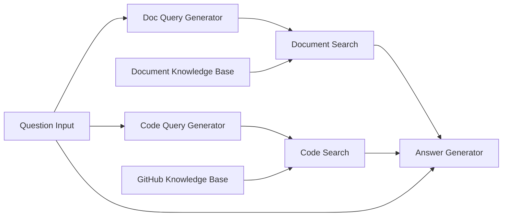

# Source: https://docs.giselles.ai/en/cookbooks/knowledge-base-qa.md

> ## Documentation Index
> Fetch the complete documentation index at: https://docs.giselles.ai/llms.txt
> Use this file to discover all available pages before exploring further.

# Knowledge Base Q&A

> Learn how to build a RAG (Retrieval-Augmented Generation) workflow using both Document Vector Store and GitHub Vector Store together, with query optimization.

This recipe shows you how to build an app that combines multiple Vector Stores for a powerful RAG (Retrieval-Augmented Generation) workflow. Learn to integrate Document Vector Store and GitHub Vector Store with query optimization for comprehensive knowledge base Q\&A.

## Overview

**Purpose**: Learn how RAG works by combining multiple Vector Stores.

| Node                  | Role                                | Model                  |
| --------------------- | ----------------------------------- | ---------------------- |
| Document Vector Store | Vectorize PDF/text documents        | text-embedding-3-small |
| GitHub Vector Store   | Vectorize code repository           | text-embedding-3-small |
| App Entry             | Question input                      | -                      |
| Generator x2          | Optimize search queries             | gpt-5-nano             |
| Query Node x2         | Search for relevant information     | -                      |
| Generator             | Generate answer from search results | claude-haiku-4.5       |

**What you'll learn**: RAG (Retrieval-Augmented Generation), Document Vector Store, GitHub Vector Store, query optimization, integrating multiple Query nodes

## Workflow Diagram



## Node Configuration Details

### 1. Document Vector Store

| Item            | Value                         |
| --------------- | ----------------------------- |
| Node Name       | `Document Knowledge Base`     |
| Embedding Model | OpenAI text-embedding-3-small |

**Pre-loaded Files:**

| File                             | Source URL                               | Content              |
| -------------------------------- | ---------------------------------------- | -------------------- |
| `docs.giselles.ai-llms-full.txt` | `https://docs.giselles.ai/llms-full.txt` | Documentation (Text) |
| `giselles-terms.pdf`             | `https://giselles.ai/legal/terms`        | Terms of Service     |
| `giselles-privacy.pdf`           | `https://giselles.ai/legal/privacy`      | Privacy Policy       |

### 2. GitHub Vector Store

| Item                  | Value                         |
| --------------------- | ----------------------------- |
| Node Name             | `GitHub Knowledge Base`       |
| Repository            | `giselles-ai/giselle`         |
| Include Code          | ON                            |
| Include Issues        | ON                            |
| Include Pull Requests | ON                            |
| Embedding Model       | OpenAI text-embedding-3-small |

### 3. App Entry

| Item            | Value               |
| --------------- | ------------------- |
| Node Name       | `Question Input`    |
| Node Input Name | `question`          |
| Prompt          | - (User input only) |

### 4. Generator Node (Doc Query)

| Item       | Value                 |
| ---------- | --------------------- |
| Node Name  | `Doc Query Generator` |
| Model      | gpt-5-nano            |
| Thinking   | OFF                   |
| Web Search | -                     |

**Prompt:**

```
Convert the following question into an optimized search query for documentation:

Question: @Question Input

Generate a query with relevant keywords and concepts for searching documentation.
Output only the query, nothing else.
```

### 5. Generator Node (Code Query)

| Item       | Value                  |
| ---------- | ---------------------- |
| Node Name  | `Code Query Generator` |
| Model      | gpt-5-nano             |
| Thinking   | OFF                    |
| Web Search | -                      |

**Prompt:**

```
Convert the following question into an optimized search query for code:

Question: @Question Input

Generate a query with function names, file patterns, and technical terms for searching code.
Output only the query, nothing else.
```

### 6. Query Node (Document)

| Item                 | Value                      |
| -------------------- | -------------------------- |
| Node Name            | `Document Search`          |
| Source               | `@Document Knowledge Base` |
| Query                | `@Doc Query Generator`     |
| Max Results          | 10                         |
| Similarity Threshold | 0.3                        |

### 7. Query Node (GitHub)

| Item                 | Value                    |
| -------------------- | ------------------------ |
| Node Name            | `Code Search`            |
| Source               | `@GitHub Knowledge Base` |
| Query                | `@Code Query Generator`  |
| Max Results          | 10                       |
| Similarity Threshold | 0.3                      |

### 8. Generator Node (Answer)

| Item       | Value              |
| ---------- | ------------------ |
| Node Name  | `Answer Generator` |
| Model      | claude-haiku-4.5   |
| Thinking   | ON                 |
| Web Search | OFF                |

**Prompt:**

```
Answer the following question based on the provided content:

Question: @Question Input

Documentation:
@Document Search

Code & Repository:
@Code Search

Requirements:
- Answer based on both documentation and code repository content
- Reference specific files or passages when applicable
- If the answer is not found, clearly state that
- Be concise but thorough
```
