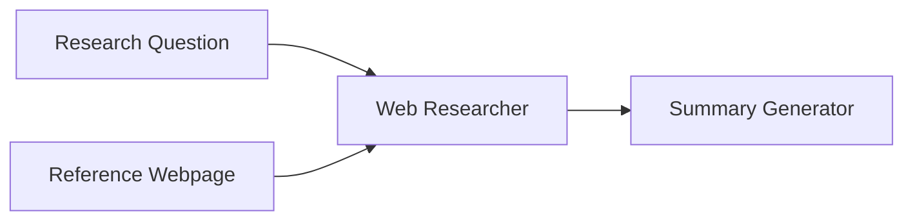

# Source: https://docs.giselles.ai/en/cookbooks/web-research-assistant.md

# Web Research Assistant

> Learn how to combine the Webpage node with LLM Web Search. Ask a question, and the AI will research using both the reference documentation and real-time web search.

This recipe shows you how to build an app that combines fixed reference pages with LLM web search capabilities. Ask a question, and the AI will research using both the reference documentation and real-time web search to provide comprehensive answers.

## Overview

**Purpose**: Combine fixed reference pages with LLM web search for comprehensive research.

| Node                   | Role                                       | Model                 |
| ---------------------- | ------------------------------------------ | --------------------- |
| App Entry              | Question input                             | -                     |
| Webpage Node           | Fetch reference information from fixed URL | -                     |
| Generator 1 (Research) | Collect information via web search         | claude-haiku-4.5      |
| Generator 2 (Summary)  | Summarize research results                 | gemini-2.5-flash-lite |

**What you'll learn**: Webpage node, LLM Web Search feature, combining information sources

## Workflow Diagram



## Node Configuration Details

### 1. App Entry

| Item            | Value               |
| --------------- | ------------------- |
| Node Name       | `Research Question` |
| Node Input Name | `question`          |
| Prompt          | - (User input only) |

### 2. Webpage Node

| Item      | Value                                    |
| --------- | ---------------------------------------- |
| Node Name | `Reference Webpage`                      |
| URL       | `https://docs.giselles.ai/llms-full.txt` |

### 3. Generator Node (Web Researcher)

| Item       | Value            |
| ---------- | ---------------- |
| Node Name  | `Web Researcher` |
| Model      | claude-haiku-4.5 |
| Thinking   | ON               |
| Web Search | ON               |

**Prompt:**

```
Research the following question using web search and the reference page:

Question: @Research Question

Reference Information: @Reference Webpage

Requirements:
- Search the web for the latest and most relevant information
- Combine web search results with the reference page content
- Provide accurate and up-to-date answers
- Cite sources when possible
```

### 4. Generator Node (Summary)

| Item       | Value                 |
| ---------- | --------------------- |
| Node Name  | `Summary Generator`   |
| Model      | gemini-2.5-flash-lite |
| Thinking   | -                     |
| Web Search | OFF                   |

**Prompt:**

```
Summarize the research findings into a clear report:

@Web Researcher

Requirements:
- Executive summary (2-3 sentences)
- Key findings as bullet points
- Conclusion and recommendations
```


---

> To find navigation and other pages in this documentation, fetch the llms.txt file at: https://docs.giselles.ai/llms.txt