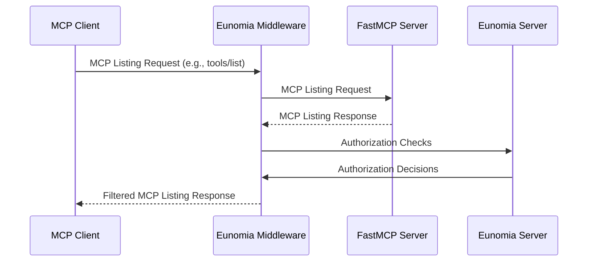
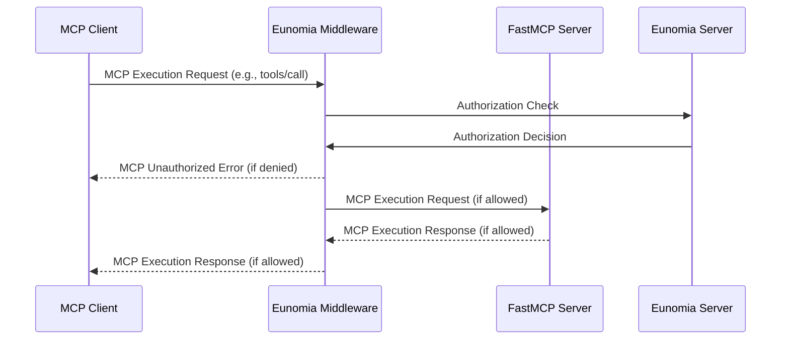

# Source: https://gofastmcp.com/integrations/eunomia-authorization.md

> ## Documentation Index
> Fetch the complete documentation index at: https://gofastmcp.com/llms.txt
> Use this file to discover all available pages before exploring further.

# Eunomia Authorization 🤝 FastMCP

> Add policy-based authorization to your FastMCP servers with Eunomia

Add **policy-based authorization** to your FastMCP servers with one-line code addition with the **[Eunomia][eunomia-github] authorization middleware**.

Control which tools, resources and prompts MCP clients can view and execute on your server. Define dynamic JSON-based policies and obtain a comprehensive audit log of all access attempts and violations.

## How it Works

Exploiting FastMCP's [Middleware][fastmcp-middleware], the Eunomia middleware intercepts all MCP requests to your server and automatically maps MCP methods to authorization checks.

### Listing Operations

The middleware behaves as a filter for listing operations (`tools/list`, `resources/list`, `prompts/list`), hiding to the client components that are not authorized by the defined policies.



### Execution Operations

The middleware behaves as a firewall for execution operations (`tools/call`, `resources/read`, `prompts/get`), blocking operations that are not authorized by the defined policies.



## Add Authorization to Your Server

<Note>
  Eunomia is an AI-specific authorization server that handles policy decisions. The server runs embedded within your MCP server by default for a zero-effort configuration, but can alternatively be run remotely for centralized policy decisions.
</Note>

### Create a Server with Authorization

First, install the `eunomia-mcp` package:

```bash  theme={"theme":{"light":"snazzy-light","dark":"dark-plus"}}
pip install eunomia-mcp
```

Then create a FastMCP server and add the Eunomia middleware in one line:

```python server.py theme={"theme":{"light":"snazzy-light","dark":"dark-plus"}}
from fastmcp import FastMCP
from eunomia_mcp import create_eunomia_middleware

# Create your FastMCP server
mcp = FastMCP("Secure MCP Server 🔒")

@mcp.tool()
def add(a: int, b: int) -> int:
    """Add two numbers"""
    return a + b

# Add middleware to your server
middleware = create_eunomia_middleware(policy_file="mcp_policies.json")
mcp.add_middleware(middleware)

if __name__ == "__main__":
    mcp.run()
```

### Configure Access Policies

Use the `eunomia-mcp` CLI in your terminal to manage your authorization policies:

```bash  theme={"theme":{"light":"snazzy-light","dark":"dark-plus"}}
# Create a default policy file
eunomia-mcp init

# Or create a policy file customized for your FastMCP server
eunomia-mcp init --custom-mcp "app.server:mcp"
```

This creates `mcp_policies.json` file that you can further edit to your access control needs.

```bash  theme={"theme":{"light":"snazzy-light","dark":"dark-plus"}}
# Once edited, validate your policy file
eunomia-mcp validate mcp_policies.json
```

### Run the Server

Start your FastMCP server normally:

```bash  theme={"theme":{"light":"snazzy-light","dark":"dark-plus"}}
python server.py
```

The middleware will now intercept all MCP requests and check them against your policies. Requests include agent identification through headers like `X-Agent-ID`, `X-User-ID`, `User-Agent`, or `Authorization` and an automatic mapping of MCP methods to authorization resources and actions.

<Tip>
  For detailed policy configuration, custom authentication, and remote
  deployments, visit the [Eunomia MCP Middleware
  repository][eunomia-mcp-github].
</Tip>

[eunomia-github]: https://github.com/whataboutyou-ai/eunomia

[eunomia-mcp-github]: https://github.com/whataboutyou-ai/eunomia/tree/main/pkgs/extensions/mcp

[fastmcp-middleware]: /servers/middleware
