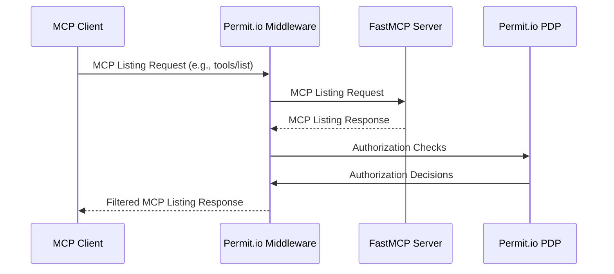
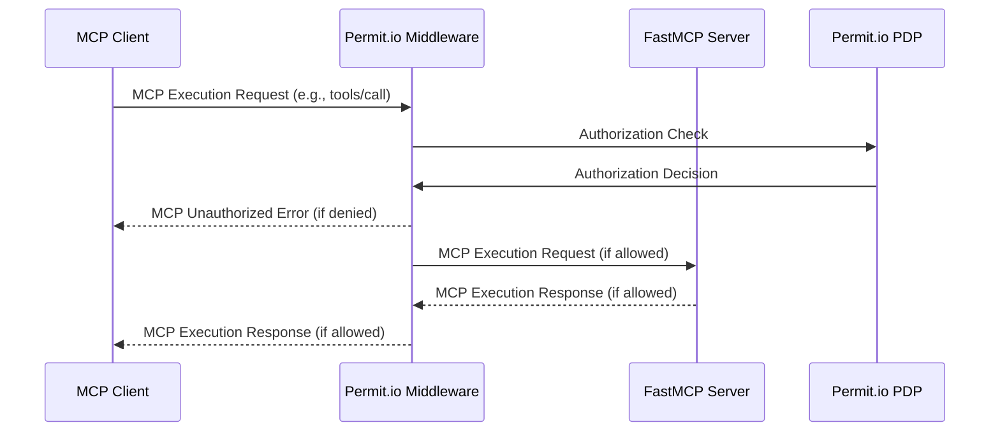

# Source: https://gofastmcp.com/integrations/permit.md

> ## Documentation Index
> Fetch the complete documentation index at: https://gofastmcp.com/llms.txt
> Use this file to discover all available pages before exploring further.

# Permit.io Authorization 🤝 FastMCP

> Add fine-grained authorization to your FastMCP servers with Permit.io

Add **policy-based authorization** to your FastMCP servers with one-line code addition with the **[Permit.io][permit-github] authorization middleware**.

Control which tools, resources and prompts MCP clients can view and execute on your server. Define dynamic policies using Permit.io's powerful RBAC, ABAC, and REBAC capabilities, and obtain comprehensive audit logs of all access attempts and violations.

## How it Works

Leveraging FastMCP's [Middleware][fastmcp-middleware], the Permit.io middleware intercepts all MCP requests to your server and automatically maps MCP methods to authorization checks against your Permit.io policies; covering both server methods and tool execution.

### Policy Mapping

The middleware automatically maps MCP methods to Permit.io resources and actions:

* **MCP server methods** (e.g., `tools/list`, `resources/read`):
  * **Resource**: `{server_name}_{component}` (e.g., `myserver_tools`)
  * **Action**: The method verb (e.g., `list`, `read`)
* **Tool execution** (method `tools/call`):
  * **Resource**: `{server_name}` (e.g., `myserver`)
  * **Action**: The tool name (e.g., `greet`)


*Example: In Permit.io, the 'Admin' role is granted permissions on resources and actions as mapped by the middleware. For example, 'greet', 'greet-jwt', and 'login' are actions on the 'mcp\_server' resource, and 'list' is an action on the 'mcp\_server\_tools' resource.*

> **Note:**
> Don't forget to assign the relevant role (e.g., Admin, User) to the user authenticating to your MCP server (such as the user in the JWT) in the Permit.io Directory. Without the correct role assignment, users will not have access to the resources and actions you've configured in your policies.
>
> 
>
> *Example: In Permit.io Directory, both 'client' and 'admin' users are assigned the 'Admin' role, granting them the permissions defined in your policy mapping.*

For detailed policy mapping examples and configuration, see [Detailed Policy Mapping](https://github.com/permitio/permit-fastmcp/blob/main/docs/policy-mapping.md).

### Listing Operations

The middleware behaves as a filter for listing operations (`tools/list`, `resources/list`, `prompts/list`), hiding to the client components that are not authorized by the defined policies.



### Execution Operations

The middleware behaves as an enforcement point for execution operations (`tools/call`, `resources/read`, `prompts/get`), blocking operations that are not authorized by the defined policies.



## Add Authorization to Your Server

<Note>
  Permit.io is a cloud-native authorization service. You need a Permit.io account and a running Policy Decision Point (PDP) for the middleware to function. You can run the PDP locally with Docker or use Permit.io's cloud PDP.
</Note>

### Prerequisites

1. **Permit.io Account**: Sign up at [permit.io](https://permit.io)
2. **PDP Setup**: Run the Permit.io PDP locally or use the cloud PDP (RBAC only)
3. **API Key**: Get your Permit.io API key from the dashboard

### Run the Permit.io PDP

Run the PDP locally with Docker:

```bash  theme={"theme":{"light":"snazzy-light","dark":"dark-plus"}}
docker run -p 7766:7766 permitio/pdp:latest
```

Or use the cloud PDP URL: `https://cloudpdp.api.permit.io`

### Create a Server with Authorization

First, install the `permit-fastmcp` package:

```bash  theme={"theme":{"light":"snazzy-light","dark":"dark-plus"}}
# Using UV (recommended)
uv add permit-fastmcp

# Using pip
pip install permit-fastmcp
```

Then create a FastMCP server and add the Permit.io middleware:

```python server.py theme={"theme":{"light":"snazzy-light","dark":"dark-plus"}}
from fastmcp import FastMCP
from permit_fastmcp.middleware.middleware import PermitMcpMiddleware

mcp = FastMCP("Secure FastMCP Server 🔒")

@mcp.tool
def greet(name: str) -> str:
    """Greet a user by name"""
    return f"Hello, {name}!"

@mcp.tool
def add(a: int, b: int) -> int:
    """Add two numbers"""
    return a + b

# Add Permit.io authorization middleware
mcp.add_middleware(PermitMcpMiddleware(
    permit_pdp_url="http://localhost:7766",
    permit_api_key="your-permit-api-key"
))

if __name__ == "__main__":
    mcp.run(transport="http")
```

### Configure Access Policies

Create your authorization policies in the Permit.io dashboard:

1. **Create Resources**: Define resources like `mcp_server` and `mcp_server_tools`
2. **Define Actions**: Add actions like `greet`, `add`, `list`, `read`
3. **Create Roles**: Define roles like `Admin`, `User`, `Guest`
4. **Assign Permissions**: Grant roles access to specific resources and actions
5. **Assign Users**: Assign roles to users in the Permit.io Directory

For step-by-step setup instructions and troubleshooting, see [Getting Started & FAQ](https://github.com/permitio/permit-fastmcp/blob/main/docs/getting-started.md).

#### Example Policy Configuration

Policies are defined in the Permit.io dashboard, but you can also use the [Permit.io Terraform provider](https://github.com/permitio/terraform-provider-permitio) to define policies in code.

```terraform  theme={"theme":{"light":"snazzy-light","dark":"dark-plus"}}
# Resources
resource "permitio_resource" "mcp_server" {
  name = "mcp_server"
  key  = "mcp_server"
  
  actions = {
    "greet" = { name = "greet" }
    "add"   = { name = "add" }
  }
}

resource "permitio_resource" "mcp_server_tools" {
  name = "mcp_server_tools"
  key  = "mcp_server_tools"
  
  actions = {
    "list" = { name = "list" }
  }
}

# Roles
resource "permitio_role" "Admin" {
  key         = "Admin"
  name        = "Admin"
  permissions = [
    "mcp_server:greet",
    "mcp_server:add", 
    "mcp_server_tools:list"
  ]
}
```

You can also use the [Permit.io CLI](https://github.com/permitio/permit-cli), [API](https://api.permit.io/scalar) or [SDKs](https://github.com/permitio/permit-python) to manage policies, as well as writing policies directly in REGO (Open Policy Agent's policy language).

For complete policy examples including ABAC and RBAC configurations, see [Example Policies](https://github.com/permitio/permit-fastmcp/tree/main/docs/example_policies).

### Identity Management

The middleware supports multiple identity extraction modes:

* **Fixed Identity**: Use a fixed identity for all requests
* **Header-based**: Extract identity from HTTP headers
* **JWT-based**: Extract and verify JWT tokens
* **Source-based**: Use the MCP context source field

For detailed identity mode configuration and environment variables, see [Identity Modes & Environment Variables](https://github.com/permitio/permit-fastmcp/blob/main/docs/identity-modes.md).

#### JWT Authentication Example

```python  theme={"theme":{"light":"snazzy-light","dark":"dark-plus"}}
import os

# Configure JWT identity extraction
os.environ["PERMIT_MCP_IDENTITY_MODE"] = "jwt"
os.environ["PERMIT_MCP_IDENTITY_JWT_SECRET"] = "your-jwt-secret"

mcp.add_middleware(PermitMcpMiddleware(
    permit_pdp_url="http://localhost:7766",
    permit_api_key="your-permit-api-key"
))
```

### ABAC Policies with Tool Arguments

The middleware supports Attribute-Based Access Control (ABAC) policies that can evaluate tool arguments as attributes. Tool arguments are automatically flattened as individual attributes (e.g., `arg_name`, `arg_number`) for granular policy conditions.


*Example: Create dynamic resources with conditions like `resource.arg_number greater-than 10` to allow the `conditional-greet` tool only when the number argument exceeds 10.*

#### Example: Conditional Access

Create a dynamic resource with conditions like `resource.arg_number greater-than 10` to allow the `conditional-greet` tool only when the number argument exceeds 10.

```python  theme={"theme":{"light":"snazzy-light","dark":"dark-plus"}}
@mcp.tool
def conditional_greet(name: str, number: int) -> str:
    """Greet a user only if number > 10"""
    return f"Hello, {name}! Your number is {number}"
```


*Example: The Admin role is granted access to the "conditional-greet" action on the "Big-greets" dynamic resource, while other tools like "greet", "greet-jwt", and "login" are granted on the base "mcp\_server" resource.*

For comprehensive ABAC configuration and advanced policy examples, see [ABAC Policies with Tool Arguments](https://github.com/permitio/permit-fastmcp/blob/main/docs/policy-mapping.md#abac-policies-with-tool-arguments).

### Run the Server

Start your FastMCP server normally:

```bash  theme={"theme":{"light":"snazzy-light","dark":"dark-plus"}}
python server.py
```

The middleware will now intercept all MCP requests and check them against your Permit.io policies. Requests include user identification through the configured identity mode and automatic mapping of MCP methods to authorization resources and actions.

## Advanced Configuration

### Environment Variables

Configure the middleware using environment variables:

```bash  theme={"theme":{"light":"snazzy-light","dark":"dark-plus"}}
# Permit.io configuration
export PERMIT_MCP_PERMIT_PDP_URL="http://localhost:7766"
export PERMIT_MCP_PERMIT_API_KEY="your-api-key"

# Identity configuration
export PERMIT_MCP_IDENTITY_MODE="jwt"
export PERMIT_MCP_IDENTITY_JWT_SECRET="your-jwt-secret"

# Method configuration
export PERMIT_MCP_KNOWN_METHODS='["tools/list","tools/call"]'
export PERMIT_MCP_BYPASSED_METHODS='["initialize","ping"]'

# Logging configuration
export PERMIT_MCP_ENABLE_AUDIT_LOGGING="true"
```

For a complete list of all configuration options and environment variables, see [Configuration Reference](https://github.com/permitio/permit-fastmcp/blob/main/docs/configuration-reference.md).

### Custom Middleware Configuration

```python  theme={"theme":{"light":"snazzy-light","dark":"dark-plus"}}
from permit_fastmcp.middleware.middleware import PermitMcpMiddleware

middleware = PermitMcpMiddleware(
    permit_pdp_url="http://localhost:7766",
    permit_api_key="your-api-key",
    enable_audit_logging=True,
    bypass_methods=["initialize", "ping", "health/*"]
)

mcp.add_middleware(middleware)
```

For advanced configuration options and custom middleware extensions, see [Advanced Configuration](https://github.com/permitio/permit-fastmcp/blob/main/docs/advanced-configuration.md).

## Example: Complete JWT Authentication Server

See the [example server](https://github.com/permitio/permit-fastmcp/blob/main/permit_fastmcp/example_server/example.py) for a full implementation with JWT-based authentication. For additional examples and usage patterns, see [Example Server](https://github.com/permitio/permit-fastmcp/blob/main/permit_fastmcp/example_server/):

```python  theme={"theme":{"light":"snazzy-light","dark":"dark-plus"}}
from fastmcp import FastMCP, Context
from permit_fastmcp.middleware.middleware import PermitMcpMiddleware
import jwt
import datetime

# Configure JWT identity extraction
os.environ["PERMIT_MCP_IDENTITY_MODE"] = "jwt"
os.environ["PERMIT_MCP_IDENTITY_JWT_SECRET"] = "mysecretkey"

mcp = FastMCP("My MCP Server")

@mcp.tool
def login(username: str, password: str) -> str:
    """Login to get a JWT token"""
    if username == "admin" and password == "password":
        token = jwt.encode(
            {"sub": username, "exp": datetime.datetime.utcnow() + datetime.timedelta(hours=1)},
            "mysecretkey",
            algorithm="HS256"
        )
        return f"Bearer {token}"
    raise Exception("Invalid credentials")

@mcp.tool
def greet_jwt(ctx: Context) -> str:
    """Greet a user by extracting their name from JWT"""
    # JWT extraction handled by middleware
    return "Hello, authenticated user!"

mcp.add_middleware(PermitMcpMiddleware(
    permit_pdp_url="http://localhost:7766",
    permit_api_key="your-permit-api-key"
))

if __name__ == "__main__":
    mcp.run(transport="http")
```

<Tip>
  For detailed policy configuration, custom authentication, and advanced
  deployment patterns, visit the [Permit.io FastMCP Middleware
  repository][permit-fastmcp-github]. For troubleshooting common issues, see [Troubleshooting](https://github.com/permitio/permit-fastmcp/blob/main/docs/troubleshooting.md).
</Tip>

[permit.io]: https://www.permit.io

[permit-github]: https://github.com/permitio

[permit-fastmcp-github]: https://github.com/permitio/permit-fastmcp

[Agent.Security]: https://agent.security

[fastmcp-middleware]: /servers/middleware
