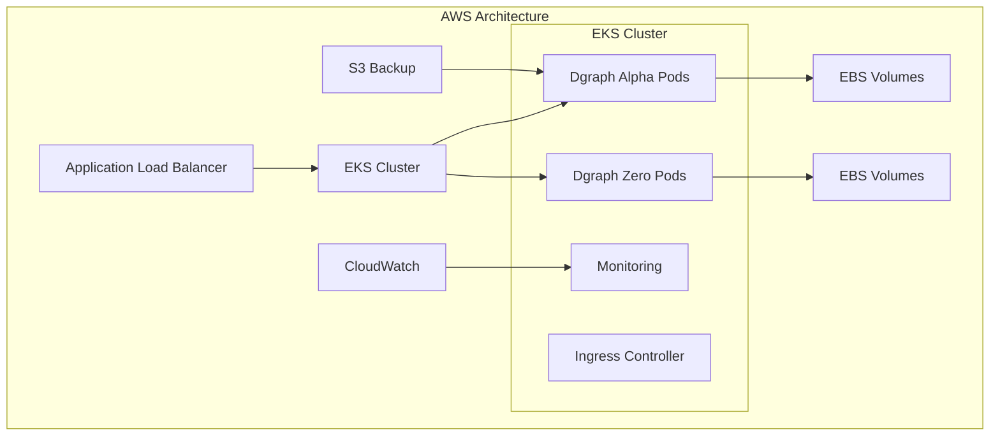

# Source: https://docs.hypermode.com/dgraph/self-managed/aws.md

# AWS Deployment

> Deploy your self-hosted Dgraph cluster on Amazon Web Services using Elastic Kubernetes Service (EKS)

## AWS Deployment

Deploy your self-hosted Dgraph cluster on Amazon Web Services using Elastic
Kubernetes Service (EKS).



### 1. Infrastructure Setup

#### EKS Cluster Creation

<CodeGroup>
  ```bash Create EKS Cluster
  aws eks create-cluster \
    --name dgraph-cluster \
    --version 1.28 \
    --role-arn arn:aws:iam::ACCOUNT:role/eks-service-role \
    --resources-vpc-config subnetIds=subnet-12345,securityGroupIds=sg-12345
  ```

  ```bash Update Kubeconfig
  aws eks update-kubeconfig --region us-west-2 --name dgraph-cluster
  ```

  ```bash Create Node Group
  aws eks create-nodegroup \
    --cluster-name dgraph-cluster \
    --nodegroup-name dgraph-nodes \
    --instance-types t3.xlarge \
    --ami-type AL2_x86_64 \
    --capacity-type ON_DEMAND \
    --scaling-config minSize=3,maxSize=9,desiredSize=6 \
    --disk-size 100 \
    --node-role arn:aws:iam::ACCOUNT:role/NodeInstanceRole
  ```
</CodeGroup>

#### Storage Class Configuration

```yaml aws-storage-class.yaml
apiVersion: storage.k8s.io/v1
kind: StorageClass
metadata:
  name: dgraph-storage
provisioner: ebs.csi.aws.com
parameters:
  type: gp3
  iops: "3000"
  throughput: "125"
volumeBindingMode: WaitForFirstConsumer
allowVolumeExpansion: true
```

### 2. Dgraph Deployment on AWS

<Steps>
  <Step title="Apply Storage Class">
    `bash kubectl apply -f aws-storage-class.yaml `
  </Step>

  <Step title="Add Helm Repository">
    `bash helm repo add dgraph https://charts.dgraph.io helm repo update `
  </Step>

  <Step title="Create Namespace">
    `bash kubectl create namespace dgraph `
  </Step>

  <Step title="Deploy Dgraph">
    ```bash
    helm install dgraph dgraph/dgraph \
      --namespace dgraph \
      --set image.tag="v23.1.0" \
      --set alpha.persistence.storageClass="dgraph-storage" \
      --set alpha.persistence.size="500Gi" \
      --set zero.persistence.storageClass="dgraph-storage" \
      --set zero.persistence.size="100Gi" \
      --set alpha.replicaCount=3 \
      --set zero.replicaCount=3 \
      --set alpha.resources.requests.memory="8Gi" \
      --set alpha.resources.requests.cpu="2000m"
    ```
  </Step>
</Steps>

### 3. Load Balancer Configuration

```yaml aws-ingress.yaml
apiVersion: networking.k8s.io/v1
kind: Ingress
metadata:
  name: dgraph-ingress
  namespace: dgraph
  annotations:
    kubernetes.io/ingress.class: alb
    alb.ingress.kubernetes.io/scheme: internet-facing
    alb.ingress.kubernetes.io/target-type: ip
    alb.ingress.kubernetes.io/certificate-arn: arn:aws:acm:REGION:ACCOUNT:certificate/CERT-ID
spec:
  rules:
    - host: dgraph.yourdomain.com
      http:
        paths:
          - path: /
            pathType: Prefix
            backend:
              service:
                name: dgraph-dgraph-alpha
                port:
                  number: 8080
```
