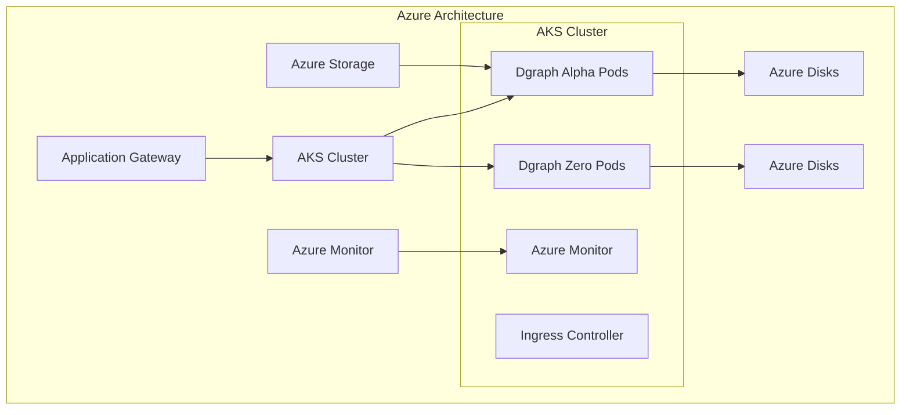

# Source: https://docs.hypermode.com/dgraph/self-managed/azure.md

# Azure Deployment

> Deploy your self-hosted Dgraph cluster on Microsoft Azure using Azure Kubernetes Service (AKS)

## Azure Deployment

Deploy your self-hosted Dgraph cluster on Microsoft Azure using Azure Kubernetes
Service (AKS).



### 1. AKS Cluster Creation

<CodeGroup>
  ```bash Create Resource Group
  az group create --name dgraph-rg --location eastus
  ```

  ```bash Create AKS Cluster
  az aks create \
    --resource-group dgraph-rg \
    --name dgraph-cluster \
    --node-count 3 \
    --node-vm-size Standard_D4s_v3 \
    --node-osdisk-size 100 \
    --enable-addons monitoring \
    --generate-ssh-keys
  ```

  ```bash Get Credentials
  az aks get-credentials --resource-group dgraph-rg --name dgraph-cluster
  ```

  ```bash Create Storage Class
  kubectl apply -f - <<EOF
  apiVersion: storage.k8s.io/v1
  kind: StorageClass
  metadata:
    name: dgraph-storage
  provisioner: kubernetes.io/azure-disk
  parameters:
    storageaccounttype: Premium_LRS
    kind: Managed
  volumeBindingMode: WaitForFirstConsumer
  allowVolumeExpansion: true
  EOF
  ```
</CodeGroup>

### 2. Deploy Dgraph on AKS

```bash
# Create namespace
kubectl create namespace dgraph

# Deploy with Helm
helm install dgraph dgraph/dgraph \
  --namespace dgraph \
  --set alpha.persistence.storageClass="dgraph-storage" \
  --set zero.persistence.storageClass="dgraph-storage" \
  --set alpha.persistence.size="500Gi" \
  --set zero.persistence.size="100Gi"
```
