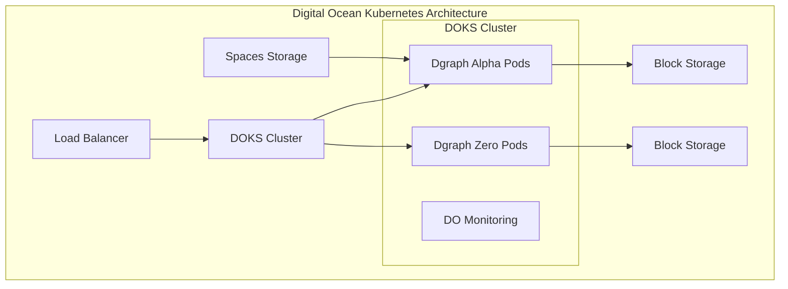

# Source: https://docs.hypermode.com/dgraph/self-managed/digital-ocean.md

# Digital Ocean Deployment

> Deploy your self-hosted Dgraph cluster on Digital Ocean using Digital Ocean Kubernetes Service (DOKS)

## Digital Ocean Deployment

### Kubernetes Deployment (DOKS)



#### 1. DOKS Cluster Setup

<CodeGroup>
  ```bash Create Cluster
  doctl kubernetes cluster create dgraph-cluster \
    --region nyc1 \
    --version 1.28.2-do.0 \
    --node-pool="name=worker-pool;size=s-4vcpu-8gb;count=3;auto-scale=true;min-nodes=3;max-nodes=9"
  ```

  ```bash Get Kubeconfig
  doctl kubernetes cluster kubeconfig save dgraph-cluster
  ```

  ```bash Apply Storage Class
  kubectl apply -f - <<EOF
  apiVersion: storage.k8s.io/v1
  kind: StorageClass
  metadata:
    name: dgraph-storage
  provisioner: dobs.csi.digitalocean.com
  allowVolumeExpansion: true
  volumeBindingMode: WaitForFirstConsumer
  EOF
  ```
</CodeGroup>

#### 2. Deploy Dgraph on DOKS

```bash
# Create namespace
kubectl create namespace dgraph

# Deploy with Helm
helm install dgraph dgraph/dgraph \
  --namespace dgraph \
  --set alpha.persistence.storageClass="dgraph-storage" \
  --set zero.persistence.storageClass="dgraph-storage" \
  --set alpha.persistence.size="500Gi" \
  --set zero.persistence.size="100Gi"
```
