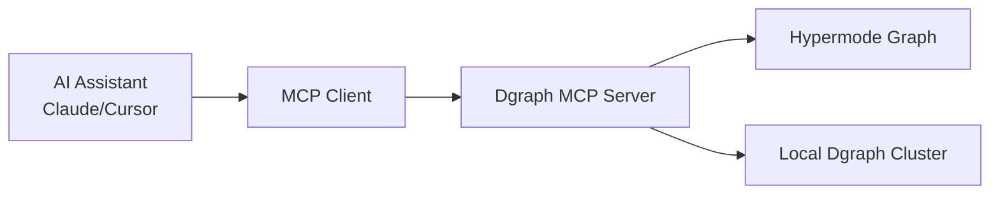
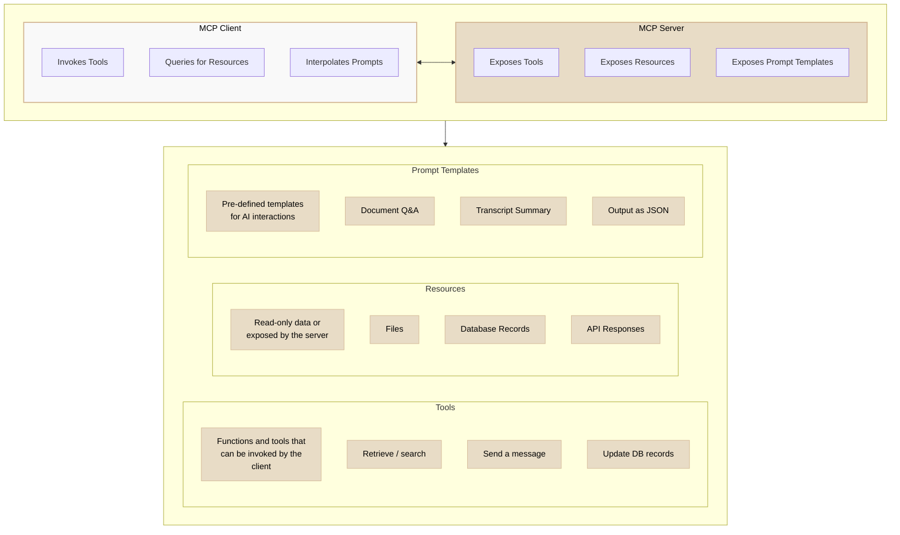

# Source: https://docs.hypermode.com/graphs/graph-mcp.md

# Hypermode Graph MCP

> Connect your Hypermode Graph to AI coding assistants using the Model Context Protocol for exploratory data analysis and intelligent graph operations

## Overview

The Hypermode Graph MCP (Model Context Protocol) server enables integration
between your Hypermode Graph and AI coding assistants like Claude Desktop,
Cursor, and other MCP-compatible tools. Two MCP endpoints are available with
common tools for AI coding assistants: `mcp` (an endpoint that provides tools
and data from your Graph) and `mcp-ro` (an endpoint that provides tools and data
from your Graph in read-only mode).

<Note>
  **What's MCP?** The Model Context Protocol is an open standard that enables
  developers to build secure, two-way connections between their data sources and
  AI-powered tools. Think of the Hypermode Graph MCP server as a universal
  connector that allows AI assistants to understand and interact with your graph
  data.
</Note>

## Why use Hypermode Graph MCP?

### For exploratory data analysis

* **Interactive graph exploration**: Query your knowledge graphs using natural
  language through your AI assistant
* **Pattern Discovery**: Let AI help identify relationships, clusters, and
  anomalies in your graph data
* **Dynamic schema understanding**: AI assistants can introspect your graph
  structure and suggest optimal queries
* **Real-time insights**: Get immediate answers about your data without writing
  complex DQL queries

### For AI coding assistants

* **Context-aware development**: Your coding assistant understands your graph
  schema and data patterns
* **Intelligent query generation**: AI can write and optimize DQL queries based
  on your specific use case
* **Schema evolution support**: Get suggestions for schema changes and
  migrations
* **Debugging assistance**: AI can help troubleshoot graph queries and
  performance issues

## Architecture

The Hypermode Graph MCP server follows the standard MCP architecture:



**Components:**

* **MCP host**: Your AI-powered app (Claude Desktop, IDE with AI features)
* **MCP client**: Protocol client that maintains connection with the Dgraph
  server
* **Dgraph MCP server**: Exposes graph capabilities through standardized MCP
  interface
* **Graph database**: Your Dgraph cluster (local or on Hypermode)

## MCP server types

Hypermode Graph provides two MCP server variants to match your security and
usage requirements:

### Standard MCP server (`mcp`)

* **Full Access**: Read and write operations on your graph
* **Use Cases**: Development environments, data modeling, schema evolution
* **Capabilities**: Query execution, mutations, schema modifications, namespace
  management

### Read-only MCP server (`mcp-ro`)

* **Safe Exploration**: Query-only access to your graph data
* **Use Cases**: Production analysis, reporting, exploratory data analysis
* **Capabilities**: DQL queries, schema introspection, data visualization
  support

<Warning>
  Choose the read-only server (`mcp-ro`) for production environments or when
  working with sensitive data to prevent accidental modifications.
</Warning>

## Setup guide

### Running with Hypermode Graphs

When using Hypermode Graphs, the MCP configuration is available on the graph
details screen in the console:

<Steps>
  <Step title="Access Graph Console">
    Navigate to your Hypermode workspace and select your graph instance.
  </Step>

  <Step title="Copy MCP Configuration">
    From the graph details screen, copy the provided MCP configuration.
  </Step>

  <Step title="Configure Your AI Assistant">
    Add the configuration to your AI assistant's settings:

    ```json
    {
      "mcpServers": {
        "hypermode-graph": {
          "command": "npx",
          "args": [
            "mcp-remote",
            "https://<graph-workspace>.hypermode.host/mcp/sse",
            "--header",
            "Authorization: Bearer <bearer-token>"
          ]
        }
      }
    }
    ```
  </Step>
</Steps>

### Running with local Dgraph

You can also run MCP with your local Dgraph instance by starting the Alpha
server with the `--mcp` flag:

#### Starting Dgraph Alpha with MCP

```bash
# Start Dgraph Zero
dgraph zero --my=localhost:5080

# Start Dgraph Alpha with MCP enabled
dgraph alpha --my=localhost:7080 --zero=localhost:5080 --mcp
```

This enables two MCP endpoints on your Alpha server:

* **Full access**: `http://localhost:8080/mcp/sse`
* **Read-only**: `http://localhost:8080/mcp-ro/sse`

#### Configure AI assistant for local Dgraph

```json
{
  "mcpServers": {
    "dgraph-local": {
      "command": "npx",
      "args": ["mcp-remote", "http://localhost:8080/mcp/sse"]
    },
    "dgraph-local-readonly": {
      "command": "npx",
      "args": ["mcp-remote", "http://localhost:8080/mcp-ro/sse"]
    }
  }
}
```

#### Standalone MCP server

For development or testing, you can also run a standalone MCP server:

```bash
# Run standalone MCP server
dgraph mcp --conn-str="dgraph://localhost:9080"

# Run in read-only mode
dgraph mcp --conn-str="dgraph://localhost:9080" --read-only
```

For standalone servers, configure your AI assistant with:

```json
{
  "mcpServers": {
    "dgraph-standalone": {
      "command": "dgraph",
      "args": ["mcp", "--conn-str=dgraph://localhost:9080"]
    }
  }
}
```

## Available capabilities



### Tools

Interactive tools for graph operations:

The Hypermode Graph MCP server provide the following tools:

#### `get_schema`

Retrieve the current schema of your graph database.

**Example User request:**

```text
"What's the current schema for our financial data model?"
```

**Tool call:**

```json
{
  "name": "get_schema",
  "arguments": {}
}
```

**Response:**

```json
{
  "schema": [
    {
      "predicate": "account_number",
      "type": "string",
      "index": true,
      "tokenizer": ["exact"]
    },
    {
      "predicate": "balance",
      "type": "float"
    },
    {
      "predicate": "amount",
      "type": "float"
    },
    {
      "predicate": "status",
      "type": "string",
      "index": true,
      "tokenizer": ["exact"]
    },
    {
      "predicate": "from_account",
      "type": "uid"
    },
    {
      "predicate": "to_account",
      "type": "uid"
    }
  ]
}
```

#### `run_query`

Run a DQL query on your graph database.

**Parameters:**

* `query` (string): DQL query to execute

**Example User request:**

```text
"Show me all pending transactions and their amounts"
```

**Tool call:**

```json
{
  "name": "run_query",
  "arguments": {
    "query": "{
      transactions(func: eq(status, \"pending\")) {
        uid
        amount
        status
        timestamp
        from_account {
          account_number
          balance
        }
        to_account {
          account_number
          balance
        }
      }
    }"
  }
}
```

**Response:**

```json
{
  "transactions": [
    {
      "uid": "0x1a",
      "amount": 150.5,
      "status": "pending",
      "timestamp": "2024-06-06T10:30:00Z",
      "from_account": {
        "account_number": "ACC001",
        "balance": 2500.0
      },
      "to_account": {
        "account_number": "ACC002",
        "balance": 1800.0
      }
    }
  ]
}
```

#### `run_mutation`

Run a DQL mutation on your graph database.

**Parameters:**

* `mutation` (string): DQL mutation to execute

**Example User request:**

```text
"Process a $500 transfer from account ACC001 to account ACC003"
```

**Tool call:**

```json
{
  "name": "run_mutation",
  "arguments": {
    "mutation": "{
      \"set\": [
        {
          \"uid\": \"_:txn\",
          \"dgraph.type\": \"Transaction\",
          \"amount\": 500.00,
          \"status\": \"pending\",
          \"timestamp\": \"2024-06-06T11:15:00Z\",
          \"from_account\": {
            \"uid\": \"0x10\"
          },
          \"to_account\": {
            \"uid\": \"0x11\"
          }
        }
      ]
    }"
  }
}
```

**Response:**

```text
Mutation completed, 1 UIDs created
```

#### `alter_schema`

Modify the DQL schema of your graph database.

**Parameters:**

* `schema` (string): DQL schema to apply

**Example User request:**

```text
"Add support for transaction fees and currency types to our payment system"
```

**Tool call:**

```json
{
  "name": "alter_schema",
  "arguments": {
    "schema": "transaction_fee: float .
      currency: string @index(exact) .
      exchange_rate: float .
      fee_type: string @index(term) ."
  }
}
```

**Response:**

```text
Schema updated successfully
```

#### `get_common_queries`

Provides reference queries to aid in query syntax.

### Resources

The MCP server exposes read only data from your graph as resources:

<Note>
  Due to current limitations in some MCP clients that don't yet support MCP
  resources, some tools are exposed as both tools and resources.
</Note>

#### `dgraph://schema`

The current Dgraph DQL schema.

#### `dgraph://common_queries`

Pre-built query patterns for common operations.

### Prompts

Pre-configured prompt templates for common graph operations:

#### `quickstart_prompt`

A quickstart prompt for getting started with graph MCP.

## Example tool interactions

Here are additional examples of AI assistant interactions with the MCP tools
using a financial transaction theme:

### Complex transaction analysis

**Example User request:**

```text
"Find all high-value transactions over $1000 from the last week and show
which accounts were involved"
```

**Tool call:**

```json
{
  "name": "run_query",
  "arguments": {
    "query": "{
      high_value_txns(func: ge(amount, 1000.0))
      @filter(ge(timestamp, \"2024-05-30T00:00:00Z\")) {
        uid
        amount
        timestamp
        status
        from_account {
          account_number
          account_holder
          balance
        }
        to_account {
          account_number
          account_holder
          balance
        }
      }
    }"
  }
}
```

**Response:**

```json
{
  "high_value_txns": [
    {
      "uid": "0x2b",
      "amount": 2500.0,
      "timestamp": "2024-06-05T14:22:00Z",
      "status": "completed",
      "from_account": {
        "account_number": "ACC005",
        "account_holder": "Tech Corp Ltd",
        "balance": 45000.0
      },
      "to_account": {
        "account_number": "ACC007",
        "account_holder": "Supplier Inc",
        "balance": 12000.0
      }
    }
  ]
}
```

### Account balance updates

**Example User request:**

```text
"Update account ACC001's balance to $3000 after processing pending
transactions"
```

**Tool call:**

```json
{
  "name": "run_mutation",
  "arguments": {
    "mutation": "{
      \"set\": [
        {
          \"uid\": \"0x10\",
          \"balance\": 3000.00,
          \"last_updated\": \"2024-06-06T11:30:00Z\"
        }
      ]
    }"
  }
}
```

**Response:**

```text
Mutation completed, 1 UIDs created
```

## Example workflows

### Exploratory data analysis

<iframe
  src="https://www.youtube.com/embed/cKJuzAs5Www"
  title="Hypermode Graph MCP With Claude Desktop"
  frameborder="0"
  allow="accelerometer; autoplay; clipboard-write;
encrypted-media; gyroscope; picture-in-picture"
  allowfullscreen
  style={{ aspectRatio: "16 / 9", width: "100%" }}
/>

<Steps>
  <Step title="Understand your data">
    Ask your AI assistant: "What does the graph schema look like and what are the main entity types?"
  </Step>

  <Step title="Discover patterns">
    "Find all users who have more than 10 connections and show their relationship
    patterns."
  </Step>

  <Step title="Analyze distributions">
    "What's the distribution of node types in the graph? Are there any outliers or
    interesting clusters?"
  </Step>

  <Step title="Performance insights">
    "Which queries are running slowly and how can we optimize them?"
  </Step>
</Steps>

### AI-assisted development

<Steps>
  <Step title="Schema design">
    "I want to model a social network with users, posts, and interactions. What's the optimal schema design?"
  </Step>

  <Step title="Query optimization">
    "This query is slow: `[paste query]`. How can we improve its performance?"
  </Step>

  <Step title="Index recommendations">
    "Based on the query patterns, what indices should we add to improve
    performance?"
  </Step>

  <Step title="Migration planning">
    "I need to add a new 'tags' predicate to existing posts. What's the safest migration approach?"
  </Step>
</Steps>

## Best practices

### Security

* **Use Read-Only Servers**: Default to `mcp-ro` for analysis and exploration
* **Authentication**: Always use bearer tokens for Hypermode connections

### Development workflow

* **Start with Read-Only**: Begin exploration with `mcp-ro` to understand your
  data
* **Iterative Schema Design**: Use AI assistance for gradual schema evolution
* **Query Testing**: Validate AI-generated queries in development before
  production
* **Documentation**: Keep schema documentation updated for better AI
  understanding

## Community and support

<CardGroup cols={3}>
  <Card title="Discord Community" icon="discord" href="https://discord.gg/hypermode">
    Join discussions about Graph MCP and get help from the community
  </Card>

  <Card title="GitHub Issues" icon="github" href="https://github.com/hypermodeinc/dgraph/issues">
    Report bugs and request features for the MCP server
  </Card>

  <Card title="Documentation" icon="book" href="https://docs.hypermode.com/dgraph">
    Comprehensive Dgraph documentation and guides
  </Card>
</CardGroup>
