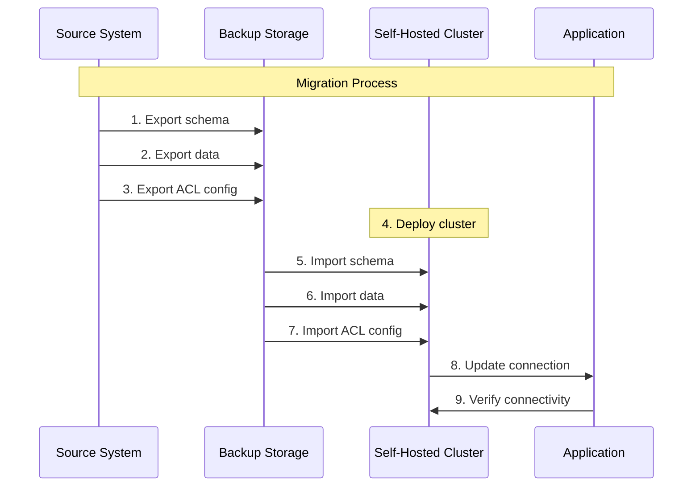
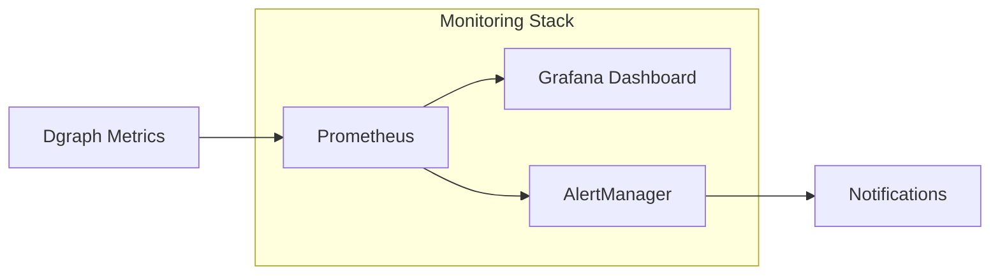

# Source: https://docs.hypermode.com/dgraph/self-hosted.md

# Self Hosting Dgraph Guide

> Complete guide for migrating managed Dgraph clusters to self-hosted infrastructure

## Overview

This guide walks you through migrating your Dgraph database from managed cloud
services to a self-hosted environment. It covers step-by-step instructions for
deployment using various cloud providers and methods, supporting goals like cost
savings, increased control, and compliance.

<Info>
  This guide supplements the [Dgraph self-managed documentation](/dgraph/self-managed/overview).
  Be sure to refer to the [self-managed documentation](/dgraph/self-managed/overview)
  for more information.
</Info>

## Deployment options

When migrating to self-hosted Dgraph, your deployment choice depends on several
key factors: data size, team expertise, budget constraints, and control
requirements. Here's how these factors influence your deployment decision:

**Data Size Considerations:**

* **Under 100GB** Docker Compose or Linux are suitable options
* **100GB to 1TB** Kubernetes or Linux can handle the load
* **Over 1TB** Kubernetes is required for proper scaling and management

**Team Expertise Factors:**

* **High Kubernetes Experience**: Kubernetes deployment is recommended
* **Limited Kubernetes Experience**: Docker Compose or Linux are more
  approachable

**Budget Constraints:**

* **Cost Optimized**: Linux provides the most economical option
* **Balanced**: Docker Compose offers a good middle ground
* **Enterprise**: Kubernetes provides enterprise-grade features

**Control Requirements:**

* **Maximum Control**: Linux gives you full control over the environment
* **Managed Infrastructure**: Kubernetes provides managed infrastructure
  capabilities

**Available Deployment Methods:**

* **Kubernetes**: Best for large-scale deployments, enterprise environments, and
  teams with K8s expertise
* **Docker Compose**: Ideal for development, testing, and smaller production
  workloads
* **Linux**: Perfect for cost-conscious deployments and teams wanting
  maximum control

***

## Prerequisites

Before starting your migration, ensure you have the necessary tools, access, and
resources.

### Required tools

<CardGroup cols={2}>
  <Card title="Command Line Tools" icon="terminal">
    * `kubectl` (v1.24+)
    * `helm` (v3.8+)
    * `dgraph` CLI tool
    * `curl` or similar HTTP client
    * Cloud provider CLI tools
  </Card>

  <Card title="Development Tools" icon="code">
    * Docker (for local testing)
    * Git (for configuration management)
    * Text editor or IDE
    * SSH client
  </Card>
</CardGroup>

### Access requirements

<Tabs>
  <Tab title="Source Systems">
    * **Dgraph Cloud**: Admin access to export data
    * **Hypermode Graph**: Database access credentials
    * **Network**: Ability to download large datasets
  </Tab>

  <Tab title="Target Infrastructure">
    * **Cloud Provider**: Account with appropriate permissions
    * **Kubernetes**: Cluster admin privileges (if using K8s)
    * **SSL/TLS**: Certificate management capability
    * **DNS**: Domain management for load balancers
  </Tab>
</Tabs>

***

## Data export from source systems

The first step in migration is safely exporting your data from your current
managed service. This section covers export procedures for both Dgraph Cloud and
Hypermode Graphs.

### Exporting from Dgraph Cloud

Dgraph Cloud provides several methods for exporting your data, including admin
API endpoints and the web interface.

#### Method 1: Using the Web Interface

<Steps>
  <Step title="Access Export Function">
    Log into your Dgraph Cloud dashboard and navigate to your cluster.
        
  </Step>

  <Step title="Navigate to Export">
    Click on the "Export" tab in your cluster management interface.     
  </Step>

  <Step title="Configure Export Settings">
    Select your export format and destination.
    Dgraph Cloud supports JSON or RDF.\
        

    Click "Start Export" and monitor the progress. Large datasets may take several
    hours.

    <Note>Click "Start Export" and monitor the progress. Large datasets may take several
    hours.</Note>
  </Step>

  <Step title="Download Exported Data">
    Once complete, download your exported data files.
        
  </Step>
</Steps>

#### Method 2: Using Admin API

<CodeGroup>
  ```bash Check Cluster Status
  curl -X POST https://your-cluster.grpc.cloud.dgraph.io/admin \
    -H "Content-Type: application/json" \
    -d '{"query": "{ state { groups { id members { id addr leader lastUpdate } } } }"}'
  ```

  ```bash Export Schema
  curl -X POST https://your-cluster.grpc.cloud.dgraph.io/admin \
    -H "Content-Type: application/json" \
    -d '{"query": "schema {}"}' > schema_backup.json
  ```

  ```bash Export Data (Small Datasets)
  curl -X POST https://your-cluster.grpc.cloud.dgraph.io/admin \
    -H "Content-Type: application/json" \
    -d '{"query": "{ backup(destination: \"s3://your-bucket/backup\") { response { message code } } }"}'
  ```

  ```bash Export Data (Alternative Method)
  dgraph export --alpha=your-cluster.grpc.cloud.dgraph.io:443 \
    --output=/path/to/export \
    --format=json
  ```
</CodeGroup>

#### Method 3: Bulk export for large datasets

For datasets larger than 10 GB, use the bulk export feature:

<CodeGroup>
  ```bash Request Bulk Export
  curl -X POST https://your-cluster.grpc.cloud.dgraph.io/admin \
    -H "Content-Type: application/json" \
    -d '{
      "query": "mutation { 
        export(input: {
          destination: \"s3://your-backup-bucket/$(date +%Y-%m-%d)\",
          format: \"rdf\",
          namespace: 0
        }) { 
          response { 
            message 
            code 
          } 
        } 
      }"
    }'
  ```

  ```bash Check Export Status
  curl -X POST https://your-cluster.grpc.cloud.dgraph.io/admin \
    -H "Content-Type: application/json" \
    -d '{"query": "{ state { ongoing } }"}'
  ```
</CodeGroup>

### Exporting from Hypermode Graphs

<Note>
  For larger datasets please contact Hypermode Support to facilitate your graph
  export.
</Note>

#### Using `admin` endpoint

For smaller datasets you can use the `admin` endpoint to export your graph.

<Note>
  For larger datasets please contact Hypermode Support to facilitate your graph
  export.
</Note>

```bash
curl --location 'https://<YOUR_CLUSTER_NAME>.hypermode.host/dgraph/admin' \
--header 'Content-Type: application/json' \
--header 'Dg-Auth: ••••••' \
--data '{"query":"mutation {\n  export(input: { format: \"rdf\" }) {\n    response {\n      message\n      code\n    }\n  }\n}","variables":{}}'
```

### Export validation and preparation

<Warning>
  Always validate your exported data before proceeding with the migration.
</Warning>

#### Data integrity checks

<CodeGroup>
  ```bash Verify Export Completeness
  # Check file sizes and contents
  ls -lah exported_data/
  file exported_data/*

  # For RDF exports, count triples

  if [[-f "exported_data/g01.rdf.gz"]]; then zcat exported_data/g01.rdf.gz | wc -l
  fi

  # For JSON exports, validate structure

  if [[-f "exported_data/g01.json.gz"]]; then zcat exported_data/g01.json.gz | jq
  '.[] | keys' | head -10 fi

  ```

  ```bash Schema Validation
  # Validate schema syntax
  if [ -f "exported_data/g01.rdf.gz" ]; then zcat exported_data/g01.rdf.gz | wc -l
  fi

  # For JSON exports, validate structure

  if [ -f "exported_data/g01.json.gz" ]; then zcat exported_data/g01.json.gz | jq '.[] | keys' | head -10
  fi

    # Basic GraphQL syntax check
    node -e "
      const fs = require('fs');
      const schema = fs.readFileSync('schema.graphql', 'utf8');
      console.log('Schema length:', schema.length);
      console.log('Types defined:', (schema.match(/type \w+/g) || []).length);
    "
  fi

  # Check for required predicates
  grep -E "(uid|dgraph\.|type)" schema_backup.json || echo "Warning: System predicates missing"
  ```

  ```bash Calculate Dataset Metrics
  # Estimate import time and resources needed
  echo "=== Dataset Analysis ==="
  echo "Total files: $(find exported_data/ -name "*.gz" | wc -l)"
  echo "Total size: $(du -sh exported_data/ | cut -f1)"
  echo "Largest file: $(find exported_data/ -name "*.gz" -exec ls -lah {} \; | sort -k5 -hr | head -1)"

  # Estimate nodes and edges
  if [[ -f "exported_data/g01.rdf.gz" ]]; then
    echo "Estimated triples: $(zcat exported_data/g01.rdf.gz | wc -l)"
  fi
  ```
</CodeGroup>

#### Prepare for transfer

<Steps>
  <Step title="Organize Export Files">
    ```bash
    # Create organized directory structure
    mkdir -p migration_data/{data,schema,acl,scripts}

    # Move files to appropriate directories
    mv exported_data/*.rdf.gz migration_data/data/
    mv schema* migration_data/schema/
    mv acl* migration_data/acl/
    ```
  </Step>

  <Step title="Create Checksums">
    ````bash # Generate checksums for integrity verification cd migration_data find
    . -type f -name "*.gz" -exec sha256sum {} \; > checksums.txt find . -type f
    ```bash
    # Generate checksums for integrity verification
    cd migration_data
    find . -type f -name "*.gz" -exec sha256sum {} \; > checksums.txt
    find . -type f -name "*.json" -exec sha256sum {} \; >> checksums.txt
    </Step>

    <Step title="Compress for Transfer">
      ```bash
      # Create final migration package
      cd ..
      tar -czf migration_package_$(date +%Y%m%d).tar.gz migration_data/
      
      # Verify package
      tar -tzf migration_package_*.tar.gz | head -10
    ````
  </Step>
</Steps>

***

## Pre-migration planning

Proper planning is crucial for a successful migration. This section helps you
assess your current environment and plan the migration strategy.

### 1. Assess current environment

<CodeGroup>
  ```bash Analyze Current Usage
  # For Dgraph Cloud
  curl -X POST https://your-cluster.grpc.cloud.dgraph.io/admin \
    -H "Content-Type: application/json" \
    -d '{"query": "{ state { groups { id checksum tablets { predicate space } } } }"}'

  ```

  ```bash Check Performance Metrics
  # Query response times
  time curl -X POST https://your-cluster.grpc.cloud.dgraph.io/query \
    -H "Content-Type: application/json" \
    -d '{"query": "{ nodeCount(func: has(_predicate_)) { count(uid) } }"}'

  # Memory and storage usage
  curl -X POST https://your-cluster.grpc.cloud.dgraph.io/admin \
    -H "Content-Type: application/json" \
    -d '{"query": "{ state { groups { id members { groupId addr } } } }"}'
  ```
</CodeGroup>

### 2. Infrastructure sizing

<CardGroup cols={2}>
  <Card title="CPU Requirements" icon="microchip">
    **Alpha Nodes**: 2-4 cores per 1M edges
    **Zero Nodes**: 1-2 cores (coordination only)
    **Load Balancer**: 2-4 cores
    **Monitoring**: 1-2 cores
  </Card>

  <Card title="Memory Requirements" icon="memory">
    **Alpha Nodes**: 4-8 GB base + 1 GB per 10M edges
    **Zero Nodes**: 2-4 GB (metadata storage)
    **Load Balancer**: 2-4 GB
    **Monitoring**: 4-8 GB
  </Card>
</CardGroup>

<CardGroup cols={2}>
  <Card title="Storage Requirements" icon="hard-drive">
    **Data Volume**: 3-5x compressed export size **WAL Logs**: 20-50 GB per node
    **Backup Space**: 2x data volume **Monitoring**: 50-100 GB
  </Card>

  <Card title="Network Requirements" icon="network-wired">
    **Internal**: 1 Gbps minimum between nodes **External**: 100 Mbps minimum
    for clients **Bandwidth**: Plan for 3x normal traffic during migration
    **Latency**: \<10 ms between data nodes
  </Card>
</CardGroup>

## Data Migration and Import



### 1. Verify Cluster Status

<CodeGroup>
  ```bash Check Pods (Kubernetes)
  kubectl get pods -n dgraph
  ```

  ```bash Check Containers (Docker Compose)
  docker-compose ps
  ```

  ```bash Check Services (Linux)
  systemctl status dgraph-alpha dgraph-zero
  ```
</CodeGroup>

<CodeGroup>
  ```bash Port Forward and Health Check (Kubernetes)
  kubectl port-forward -n dgraph svc/dgraph-dgraph-alpha 8080:8080 &
  curl http://localhost:8080/health
  ```

  ```bash Health Check (Docker Compose)
  curl http://localhost:8080/health
  ```

  ```bash Health Check (Linux VPS)
  curl http://10.0.1.10:8080/health
  ```
</CodeGroup>

### 2. Import Schema

<Tabs>
  <Tab title="Kubernetes">
    ```bash

    kubectl port-forward -n dgraph svc/dgraph-dgraph-alpha 8080:8080 &
    curl -X POST localhost:8080/admin/schema -H "Content-Type: application/json"
    \ -d @schema_backup.json
    curl -X POST localhost:8080/admin/schema \
      -H "Content-Type: application/json" \
      -d @schema_backup.json
    ```
  </Tab>

  <Tab title="Docker Compose">
    ```bash

    curl -X POST localhost:8080/admin/schema \ -H "Content-Type:
    application/json" \ -d @schema_backup.json

    ```
  </Tab>

  <Tab title="Linux">
    ```bash

    curl -X POST 10.0.1.10:8080/admin/schema \ 
    -H "Content-Type: application/json" \ 
    -d @schema_backup.json 

    ```
  </Tab>
</Tabs>

### 3. Import Data

<Note>
  Refer to the [Dgraph bulk loader documentation](bulk-loader/) for efficiently
  handling larger datasets.
</Note>

<Tabs>
  <Tab title="Live Loader (Kubernetes)">
    ```bash

    kubectl run dgraph-live-loader \
    --image=dgraph/dgraph:v23.1.0 \
    --restart=Never \
    --namespace=dgraph \
    --command -- dgraph live \
    --files
    --files /data/export.rdf.gz \
    --alpha dgraph-dgraph-alpha:9080 \ --zero
    dgraph-dgraph-zero:5080
    ```
  </Tab>

  <Tab title="Live Loader (Docker Compose)">
    ```bash

    # Copy data files to container docker cp exported_data.rdf.gz
      dgraph-alpha-1:/dgraph/ # Run live loader docker exec dgraph-alpha-1 dgraph
      live \ --files /dgraph/exported_data.rdf.gz \ --alpha localhost:9080 \ --zero
      dgraph-zero-1:5080

    ```
  </Tab>

  <Tab title="Live Loader (Linux)">
    ```bash

    # Copy data to server scp exported_data.rdf.gz user@10.0.1.10:/tmp/
    # Run live loader ssh user@10.0.1.10 sudo -u dgraph dgraph live \ --files
    /tmp/exported_data.rdf.gz \ --alpha localhost:9080 \ --zero 10.0.1.10:5080
    ```
  </Tab>
</Tabs>

### 4. Restore ACL Configuration

<Tabs>
  <Tab title="All Deployments">
    ```bash
    # Replace with your actual endpoint
    DGRAPH_ENDPOINT="localhost:8080"  # Adjust for your deployment

    curl -X POST $DGRAPH_ENDPOINT/admin \
    -H "Content-Type: application/json" \
    -d '{"query": "mutation { addUser(input: {name: \"admin\", password:
    -H "Content-Type: application/json" \
    -d '{"query": "mutation { addUser(input: {name: \"admin\", password: \"password\"}) { user { name } } }"}'

    ```
  </Tab>
</Tabs>

***

## Post-Migration Verification

<Card title="Data Integrity Checklist" icon="check-circle">
  * Count total nodes and compare with original - Verify specific data samples -
    Test query performance - Validate application connections
</Card>

### 1. Data Integrity Check

<CodeGroup>
  ```bash Count Nodes
  curl -X POST localhost:8080/query \
  -H "Content-Type: application/json" \
  -d '{"query": "{ nodeCount(func: has(_predicate_)) { count(uid) } }"}'
  ```

  ```bash Verify Sample Data
  curl -X POST localhost:8080/query \
    -H "Content-Type: application/json" \
    -d '{"query": "{ users(func: type(User), first: 10) { uid name email } }"}'
  ```
</CodeGroup>

### 2. Performance Testing

```bash
time curl -X POST localhost:8080/query \
  -H "Content-Type: application/json" \
  -d '{"query": "{ users(func: allofterms(name, \"john\")) { name email } }"}'
```

***

## Monitoring and Maintenance

### 1. Setup Monitoring Stack



<CodeGroup>
  ```bash Install Prometheus
  helm repo add prometheus-community https://prometheus-community.github.io/helm-charts
  helm install monitoring prometheus-community/kube-prometheus-stack \
    --namespace monitoring \
    --create-namespace
  ```

  ```yaml Configure Service Monitor
  apiVersion: monitoring.coreos.com/v1
  kind: ServiceMonitor
  metadata:
    name: dgraph-alpha
    namespace: dgraph
  spec:
    selector:
      matchLabels:
        app: dgraph-alpha
    endpoints:
      - port: http
        path: /debug/prometheus_metrics
  ```
</CodeGroup>

### 2. Backup Strategy

<Info>Set up automated daily backups to ensure data protection.</Info>

```bash
kubectl create cronjob dgraph-backup \
  --image=dgraph/dgraph:v23.1.0 \
  --schedule="0 2 * * *" \
  --restart=OnFailure \
  --namespace=dgraph \
  -- dgraph export \
  --alpha dgraph-dgraph-alpha:9080 \
  --destination s3://your-backup-bucket/$(date +%Y-%m-%d)
```

***

## Troubleshooting

<AccordionGroup>
  <Accordion title="Pod Startup Failures">
    <CodeGroup>
      ```bash Check Pod Status
      kubectl describe pod -n dgraph dgraph-dgraph-alpha-0
      ```

      ```bash Check Logs
      kubectl logs -n dgraph dgraph-dgraph-alpha-0 --previous
      ```
    </CodeGroup>
  </Accordion>

  <Accordion title="Storage Issues">
    <CodeGroup>
      ```bash Check PVC Status
      kubectl get pvc -n dgraph
      ```

      ```bash Expand Volume
      kubectl patch pvc alpha-claim-dgraph-dgraph-alpha-0 \
        -n dgraph \
        -p '{"spec":{"resources":{"requests":{"storage":"1Ti"}}}}'
      ```
    </CodeGroup>
  </Accordion>

  <Accordion title="Network Connectivity">
    ```bash Test Internal DNS
    kubectl run debug --image=busybox -it --rm --restart=Never -- \
      nslookup dgraph-dgraph-alpha.dgraph.svc.cluster.local
    ```
  </Accordion>
</AccordionGroup>

***

## Additional Resources

### Dgraph Operational Runbooks

<Info>
  The following runbooks provide operational guidance for various scenarios you
  may encounter during and after migration.
</Info>

<CardGroup cols={2}>
  <Card title="High-Availability Management" icon="settings" href="https://github.com/hypermodeinc/ops-runbooks/blob/main/Enabling%20or%20Disabling%20High-Availability%20for%20a%20Dgraph%20Cluster.md">
    Enable or disable high-availability (HA) for Dgraph clusters, scale replicas, and manage cluster topology.
  </Card>

  <Card title="Zero Node Recovery" icon="refresh" href="https://github.com/hypermodeinc/ops-runbooks/blob/main/Freshly%20Rebuilding%20Zero%20to%20avoid%20idx%20issue.md">
    Freshly rebuild Zero nodes to avoid idx issues and restore cluster stability.
  </Card>

  <Card title="HA Cluster Rebuild" icon="wrench" href="https://github.com/hypermodeinc/ops-runbooks/blob/main/Rebuild%20a%20Dgraph%20HA%20Cluster%20using%20an%20existing%20p%20directory%20.md">
    Rebuild high-availability clusters using existing p directories while
    preserving data.
  </Card>

  <Card title="RAFT Group Management" icon="users" href="https://github.com/hypermodeinc/ops-runbooks/blob/main/Remove%20and%20re-add%20a%20bad%20Alpha%20to%20a%20RAFT%20Group.md">
    Remove and re-add problematic Alpha nodes to RAFT groups for cluster health.
  </Card>

  <Card title="Cluster Unsharding" icon="merge" href="https://github.com/hypermodeinc/ops-runbooks/blob/main/Unsharding%20a%20Sharded%20Cluster.md">
    Convert sharded clusters back to non-sharded configuration safely.
  </Card>
</CardGroup>

### Migration Validation Checklist

<Card title="Post-Migration Validation" icon="check-circle">
  Use this checklist to ensure your migration was successful:

  **Data Integrity**

  * [ ] Total node count matches source
  * [ ] Random data samples verified
  * [ ] Schema imported correctly
  * [ ] Indexes functioning properly

  **Performance**

  * [ ] Query response times acceptable
  * [ ] Throughput meets requirements
  * [ ] Resource utilization within limits
  * [ ] No memory leaks detected

  **Operations**

  * [ ] Monitoring and alerting active
  * [ ] Backup procedures tested
  * [ ] Scaling mechanisms verified
  * [ ] Security policies enforced

  **Application Integration**

  * [ ] All clients connecting successfully
  * [ ] Authentication working
  * [ ] API endpoints responding
  * [ ] Load balancing functional
</Card>

<Info>
  This migration guide is a living document. Please contribute improvements,
  report issues, or share your experiences to help the community. For additional
  support, join the Dgraph community or consult the operational runbooks in the
  Hypermode ops-runbooks repository.
</Info>
