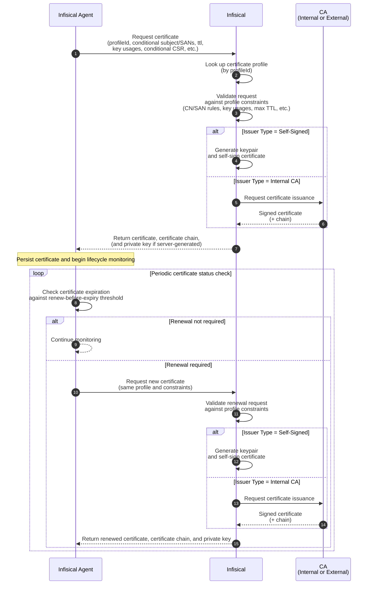

# Source: https://infisical.com/docs/documentation/platform/pki/guides/request-cert-agent.md

> ## Documentation Index
> Fetch the complete documentation index at: https://infisical.com/docs/llms.txt
> Use this file to discover all available pages before exploring further.

# Request a Certificate via the Infisical Agent

The [Infisical Agent](/integrations/platforms/certificate-agent) is an installable client daemon that can request TLS and other X.509 certificates from Infisical using the [API enrollment method](/documentation/platform/pki/enrollment-methods/api) configured on a [certificate profile](/documentation/platform/pki/certificates/profiles), persist it to a specified path on the filesystem, and automatically monitor and renew it before expiration.

Instead of [manually requesting](/documentation/platform/pki/guides/request-cert-api) and renewing a certificate via the [Issue Certificate](/api-reference/endpoints/certificates/create-certificate) API endpoint, you can install and launch the Infisical Agent to have it perform these steps for you automatically.

## Diagram

The following sequence diagram illustrates the certificate enrollment workflow for requesting a certificate using the Infisical Agent from Infisical.



## Guide

In the following steps, we explore an end-to-end workflow for requesting and continuously renewing a certificate using the Infisical Agent.

<Steps>
  <Step title="Configure a Certificate Authority">
    Before you can issue any certificate, you must first configure a [Certificate Authority (CA)](/documentation/platform/pki/ca/overview).

    The CA you configure will be used to issue the certificate back to your client; it can be either Internal or External:

    * [Internal CA](/documentation/platform/pki/ca/private-ca): If you're building your own PKI and wish to issue certificates for internal use, you should
      follow the guide [here](/documentation/platform/pki/ca/private-ca#guide-to-creating-a-ca-hierarchy) to create at minimum a root CA and an intermediate/issuing CA
      within Infisical.

    * [External CA](/documentation/platform/pki/ca/external-ca): If you have existing PKI infrastructure or wish to connect to a public CA (e.g. [Let's Encrypt](/documentation/platform/pki/ca/lets-encrypt), [DigiCert](/documentation/platform/pki/ca/digicert), etc.) to issue TLS certificates,
      you should follow the documentation [here](/documentation/platform/pki/ca/external-ca) to configure an External CA.

    <Note>
      Note that if you're looking to issue self-signed certificates, you can skip this step and proceed to Step 3.
    </Note>
  </Step>

  <Step title="Create a certificate policy">
    Next, follow the guide [here](/documentation/platform/pki/certificates/policies#guide-to-creating-a-certificate-policy) to create a [certificate policy](/documentation/platform/pki/certificates/policies).

    The certificate policy will constrain what attributes may or may not be allowed in the request to issue a certificate.
    For example, you can specify that the requested common name must adhere to a specific format like `*.acme.com` and
    that the maximum TTL cannot exceed 1 year.

    If you're looking to issue TLS server certificates, you should select the **TLS Server Certificate** option under the **Policy Preset** dropdown.
  </Step>

  <Step title="Create a certificate profile">
    Next, follow the guide [here](/documentation/platform/pki/certificates/profiles#guide-to-creating-a-certificate-profile) to create a [certificate profile](/documentation/platform/pki/certificates/profiles)
    that will be referenced when requesting a certificate.

    The certificate profile specifies which certificate policy and issuing CA should be used to validate an incoming certificate request and issue a certificate;
    it also specifies the [enrollment method](/documentation/platform/pki/enrollment-methods/overview) for how certificates can be requested against this profile
    to begin with.

    You should specify the certificate policy from Step 2, the issuing CA from Step 1, and the **API** option in the **Enrollment Method** dropdown when creating the certificate profile.

    <Note>
      Note that if you're looking to issue self-signed certificates, you should select the **Self-Signed** option in the **Issuer Type** dropdown when creating the certificate profile.
    </Note>
  </Step>

  <Step title="Request a certificate">
    Next, [install the Infisical CLI](/cli/overview) on the target machine you wish to request the certificate on and follow the documentation [here](/integrations/platforms/certificate-agent#operating-the-agent) to set up the Infisical Agent on it.

    As part of the setup, you must create an [agent configuration file](/integrations/platforms/certificate-agent#agent-configuration) that specifies how the agent should authenticate with Infisical using a [machine identity](/documentation/platform/identities/machine-identities), the certificate profile it should request against (from Step 3), what kind of certificate to request, where to persist the certificate, and how it should be managed in terms of auto-renewal.

    Finally, start the agent with that configuration file so it can start requesting and continuously renewing the certificate on your behalf using the command below:

    ```bash  theme={"dark"}
    infisical cert-manager agent --config /path/to/your/agent-config.yaml
    ```

    The certificate, certificate chain, and private key will be persisted to the filesystem at the paths specified in the `file-output` section of the agent configuration file.
  </Step>
</Steps>
