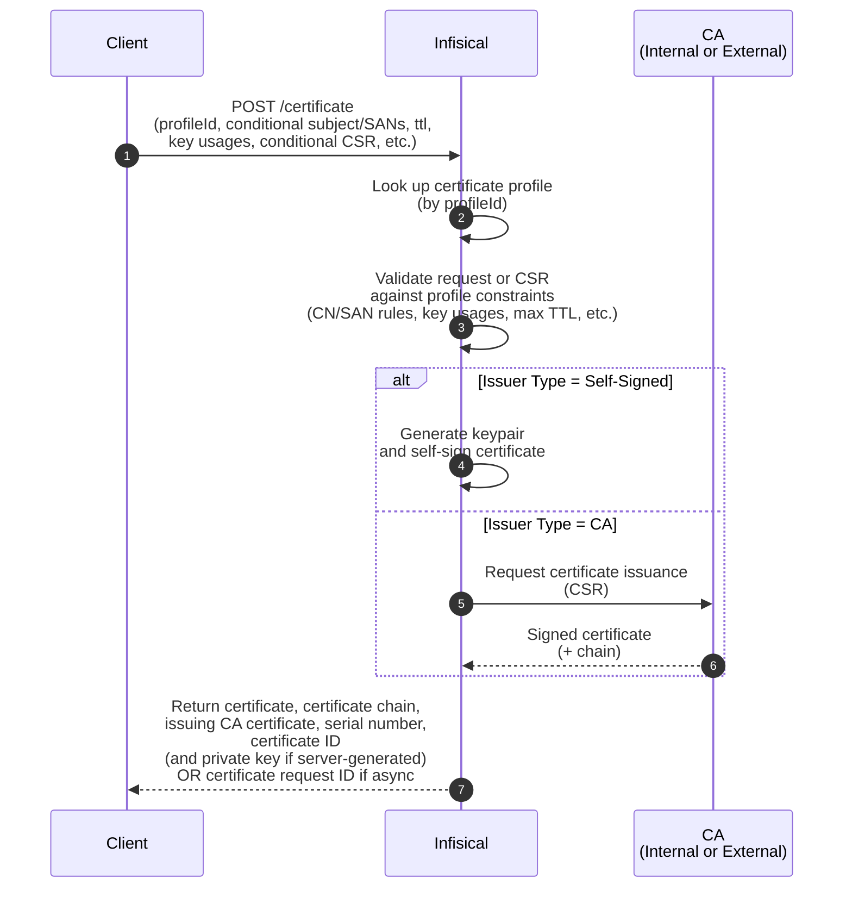

# Source: https://infisical.com/docs/documentation/platform/pki/guides/request-cert-api.md

> ## Documentation Index
> Fetch the complete documentation index at: https://infisical.com/docs/llms.txt
> Use this file to discover all available pages before exploring further.

# Request a Certificate via API

The [API enrollment method](/documentation/platform/pki/enrollment-methods/api) lets you programmatically request TLS and other X.509 certificates from Infisical.

This is the most flexible way to request certificates from Infisical but requires you to implement certificate request and renewal logic on your own.
For a more automated way to request certificates, we highly recommend you check out the guide for requesting certificates using the [Infisical Agent](/integrations/platforms/certificate-agent) [here](/documentation/platform/pki/guides/request-cert-agent).

## Diagram

The following sequence diagram illustrates the certificate issuance workflow for requesting a certificate via API from Infisical.

## Guide

In the following steps, we explore an end-to-end workflow for requesting a certificate via API from Infisical.

<Steps>
  <Step title="Configure a Certificate Authority">
    Before you can issue any certificate, you must first configure a [Certificate Authority (CA)](/documentation/platform/pki/ca/overview).

    The CA you configure will be used to issue the certificate back to your client; it can be either Internal or External:

    * [Internal CA](/documentation/platform/pki/ca/private-ca): If you're building your own PKI and wish to issue certificates for internal use, you should
      follow the guide [here](/documentation/platform/pki/ca/private-ca#guide-to-creating-a-ca-hierarchy) to create at minimum a root CA and an intermediate/issuing CA
      within Infisical.

    * [External CA](/documentation/platform/pki/ca/external-ca): If you have existing PKI infrastructure or wish to connect to a public CA (e.g. [Let's Encrypt](/documentation/platform/pki/ca/lets-encrypt), [DigiCert](/documentation/platform/pki/ca/digicert), etc.) to issue TLS certificates,
      you should follow the documentation [here](/documentation/platform/pki/ca/external-ca) to configure an External CA.

    <Note>
      Note that if you're looking to issue self-signed certificates, you can skip this step and proceed to Step 3.
    </Note>
  </Step>

  <Step title="Create a certificate policy">
    Next, follow the guide [here](/documentation/platform/pki/certificates/policies#guide-to-creating-a-certificate-policy) to create a [certificate policy](/documentation/platform/pki/certificates/policies).

    The certificate policy will constrain what attributes may or may not be allowed in the request to issue a certificate.
    For example, you can specify that the requested common name must adhere to a specific format like `*.acme.com` and
    that the maximum TTL cannot exceed 1 year.

    If you're looking to issue TLS server certificates, you should select the **TLS Server Certificate** option under the **Policy Preset** dropdown.
  </Step>

  <Step title="Create a certificate profile">
    Next, follow the guide [here](/documentation/platform/pki/certificates/profiles#guide-to-creating-a-certificate-profile) to create a [certificate profile](/documentation/platform/pki/certificates/profiles)
    that will be referenced when requesting a certificate.

    The certificate profile specifies which certificate policy and issuing CA should be used to validate an incoming certificate request and issue a certificate;
    it also specifies the [enrollment method](/documentation/platform/pki/enrollment-methods/overview) for how certificates can be requested against this profile
    to begin with.

    You should specify the certificate policy from Step 2, the issuing CA from Step 1, and the **API** option in the **Enrollment Method** dropdown when creating the certificate profile.

    <Note>
      Note that if you're looking to issue self-signed certificates, you should select the **Self-Signed** option in the **Issuer Type** dropdown when creating the certificate profile.
    </Note>
  </Step>

  <Step title="Request a certificate">
    Finally, follow the guide [here](/documentation/platform/pki/enrollment-methods/api#guide-to-certificate-enrollment-via-api) to request a certificate against the certificate profile
    over the Web UI or by making an API request the [Issue Certificate](/api-reference/endpoints/certificates/create-certificate) API endpoint with or without a certificate signing request (CSR).

    To renew a certificate on the client-side, you have two options:

    * Make a request to issue a new certificate against the same [Issue Certificate](/api-reference/endpoints/certificates/create-certificate) API endpoint.
    * Make a request to the [Renew Certificate](/api-reference/endpoints/certificates/renew) API endpoint with the ID of the certificate you wish to renew. Note that this endpoint only works if the original certificate was issued through the [Issue Certificate](/api-reference/endpoints/certificates/issue-certificate) API endpoint without a CSR.

    <Note>
      We recommend reading the guide [here](/documentation/platform/pki/certificates/certificates#guide-to-renewing-certificates) to learn more about all the ways to renew a certificate
      with Infisical including [server-driven certificate renewal](/documentation/platform/pki/certificates/certificates#server-driven-certificate-renewal).
    </Note>
  </Step>
</Steps>

Note that depending on your environment and infrastructure use-case, you may wish to use a different [enrollment method](/documentation/platform/pki/enrollment-methods/overview) to request certificates.

For more automated certificate management, you may wish to request certificates using a client that can monitor expiring certificates and request renewals for you.
For example, you can install the Infisical Agent on a VM and have it request and renew certificates for you or use an [ACME client](https://letsencrypt.org/docs/client-options/) paired with Infisical's [ACME enrollment method](/documentation/platform/pki/enrollment-methods/acme).
