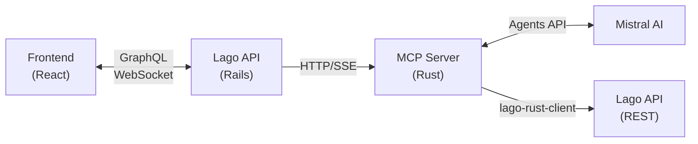

# Source: https://getlago.com/docs/guide/ai-agents/billing-assistant.md

# The Billing Assistant (Beta)

> Your AI-powered billing assistant for automating manual and repetitive billing operations.

## Overview

The Billing Assistant AI Agent is a conversational assistant designed to help you manage billing operations more efficiently. Instead of navigating through multiple screens or performing repetitive tasks manually, simply describe what you need in plain language and let the assistant handle it for you.

<Frame caption="Billing Assistant Agent">
  
</Frame>

## Billing assistant capabilities

1. **Automate repetitive tasks:** Bulk updates, batch operations, and routine billing actions;
2. **Query billing data instantly:** Get quick answers without clicking through multiple screens;
3. **Streamline manual operations:** Create invoices, apply coupons, manage subscriptions and more, all through conversation;
4. **Receive actionable responses:** Formatted results with clickable links to relevant records; and
5. **Work faster with context:** The assistant remembers your past conversations for seamless follow-ups.

## Getting started

### Requirements

To use the AI Agent, you need access to your Lago organization and have the AI chat permission enabled for your account.

<Info>
  **PREMIUM ADD-ON** ✨

  This Billing Assistant Agent is in beta, and available upon request only. Please **[contact us](mailto:hello@getlago.com)** to get access to this premium feature.
</Info>

### How to use

<Steps>
  <Step title="Access the chat interface">
    Open the AI Agent chat interface in your Lago dashboard.
  </Step>

  <Step title="Type your request">
    Type your question or request in natural language.
  </Step>

  <Step title="Review and confirm">
    Review the AI's response, which may include formatted tables, links, and actionable data.
    You might need to confirm certain actions before they are executed.
  </Step>

  <Step title="Follow up as needed">
    Continue the conversation with follow-up questions as needed
  </Step>
</Steps>

## Available operations

The Billing Assistant can help you with a wide range of billing operations:

* **Invoices:** Retrieve invoice details, track payment status, handle failed invoices, refresh draft invoices and generate previews before finalizing charges.
* **Customers:** Access customer information, create new customer records, and monitor current usage across your customer base.
* **Subscriptions:** Manage the full subscription lifecycle, from creation through updates and termination.
* **Events:** Review ingested usage events and send new events when needed.
* **Payments:** Track payment activity and record new payments against outstanding invoices.
* **Plans:** Browse your pricing plans and make updates to your plan catalog.
* **Coupons:** View available discounts and apply them to customer accounts.
* **Logs:** Investigate activity logs and API logs to troubleshoot issues or audit recent changes.

The assistant can handle batch and concurrent operations, allowing you to perform actions on multiple records at once.

## Example requests

Here are some examples of how this AI Agent can help with your billing operations:

<Accordion title="Querying data">
  * *"Show me overdue invoices for the last 30 days"*
  * *"List the latest activity logs"*
  * *"What is the current usage for customer Acme Corp?"*
  * *"Show me all subscriptions created this month"*
  * *"What are the number of invoices generated last week?"*
</Accordion>

<Accordion title="Automating manual tasks">
  * *"Create a new customer with email `gavin@hooli.com`"*
  * *"Apply coupon `SUMMER20` to customer Acme Corp"*
  * *"Retry all failed invoices from last week"*
  * *"Update the billing email for customer xyz"*
</Accordion>

<Accordion title="Bulk operations">
  * *"Apply coupon SUMMER20 to all US customers"*
  * *"Generate invoice previews for all customers with active subscriptions"*
  * *"List all overdue invoices and retry payments"*
</Accordion>

<Accordion title="Quick lookups">
  * *"Download invoice `INV-001`"*
  * *"What plans are available?"*
  * *"Show me payment history for customer ID xyz"*
</Accordion>

## Destructive or important actions

For operations that modify data, delete data or create any important billing operations, the Billing Assistant requires explicit confirmation to protect against accidental changes. Here is an example:

* **You:** *"Terminate subscription for Acme Corp"*
* **Billing Assistant:** *"This subscription is currently active (\$2,500/month). Type `CONFIRM` to proceed."*

You must type `CONFIRM` to execute destructive actions such as terminating subscriptions, issuing invoices or refunds or removing customers.

## Security

The Billing Assistant AI Agent is designed with security as a priority:

1. **Organization-scoped access:** You can only query and modify data within your own organization;
2. **Permission-based:** Actions are limited to your account permissions;
3. **No cross-tenant access:** Your data is isolated from other organizations;
4. **Prompt injection protection:** The AI Agent is designed to ignore attempts to bypass security controls; and
5. **Batch operation limits:** To prevent abuse, batch operations are capped and throttled to prevent excessive load.

## Conversation history

Your conversations with the Billing Assistant are saved, allowing you to:

* Return to previous conversations;
* Maintain context across sessions; and
* Reference past queries and responses.

Each conversation is named after your first message for easy identification.

<Frame caption="Billing Assistant Agent">
  
</Frame>

## Tips for best results

* **Be specific:** "Show invoices over \$1,000 from last month" works better than "Show me some invoices";
* **Use follow-ups:** After getting a list, ask follow-up questions like "Tell me more about the first one" or "Retry all of these";
* **Specify timeframes:** Include date ranges when relevant ("in the last 30 days", "from Q3");
* **Name entities clearly:** Use customer `external_id`, invoice `id`, or useful identfiers when you have them; and
* **Chain tasks together:** Complete related operations in one conversation to save time.

## Technical details

### System Overview

### Technologies

| Component  | Technology            | Purpose                           |
| ---------- | --------------------- | --------------------------------- |
| Frontend   | React + Apollo Client | Chat UI & GraphQL subscriptions   |
| Backend    | Rails + Action Cable  | GraphQL API & WebSocket streaming |
| MCP Server | Rust + rmcp           | Model Context Protocol server     |
| AI Model   | Mistral Agents API    | LLM with function calling         |
| API Client | lago-rust-client      | Type-safe Lago API interactions   |

---

> To find navigation and other pages in this documentation, fetch the llms.txt file at: https://getlago.com/docs/llms.txt