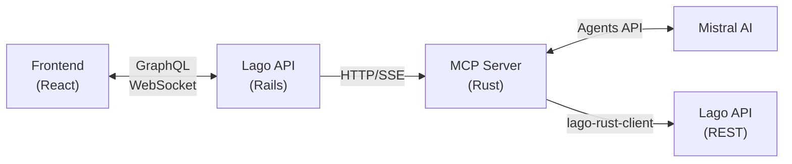

# Lago Documentation

Source: https://getlago.com/docs/llms-full.txt

---

# The add-on object
Source: https://getlago.com/docs/api-reference/add-ons/add-on-object

This object represents an add-on, a one-time fee that can be applied on one-off invoices.


# Create an add-on
Source: https://getlago.com/docs/api-reference/add-ons/create

POST /add_ons
This endpoint is used to create an add-on that can be then attached to a one-off invoice.

<RequestExample>
  ```bash cURL theme={"dark"}
  LAGO_URL="https://api.getlago.com"
  API_KEY="__YOUR_API_KEY__"

  curl --location --request POST "$LAGO_URL/api/v1/add_ons" \
    --header "Authorization: Bearer $API_KEY" \
    --header 'Content-Type: application/json' \
    --data-raw '{
      "add_on": {
        "name": "Setup Fee",
        "code": "setup_fee",
        "amount_cents": 50000,
        "amount_currency": "USD",
        "description": "Implementation fee for new customers.",
        "tax_codes": ["french_reduced_vat"]
      }
    }'
  ```

  ```python Python theme={"dark"}
  from lago_python_client.client import Client
  from lago_python_client.exceptions import LagoApiError
  from lago_python_client.models import AddOn

  client = Client(api_key='__YOUR_API_KEY__')

  add_on = AddOn(
    name='Setup Fee',
    code='setup_fee',
    amount_cents=50000,
    amount_currency='USD',
    description='Implementation fee for new customers.',
    tax_codes= ['french_standard_vat']
  )

  try:
      client.add_ons.create(add_on)
  except LagoApiError as e:
      repair_broken_state(e)  # do something on error or raise your own exception
  ```

  ```ruby Ruby theme={"dark"}
  require 'lago-ruby-client'

  client = Lago::Api::Client.new(api_key: '__YOUR_API_KEY__')

  add_on = {
    name: 'Setup Fee',
    code: 'setup_fee',
    description: 'Implementation fee for new customers.',
    amount_cents: 50000,
    amount_currency: 'USD',
    tax_codes: ['french_standard_vat']
  }

  client.add_ons.create(add_on)
  ```

  ```js Javascript theme={"dark"}
  const addOnObject = {
    name: "Setup Fee",
    code: "setup_fee",
    description: "Implementation fee for new customers.",
    amount_cents: 50000,
    amount_currency: "USD",
    tax_codes: ["french_standard_vat"],
  };

  await client.addOns.createAddOn({ addOn: addOnObject });
  ```

  ```go Go theme={"dark"}
  import "fmt"
  import "github.com/getlago/lago-go-client"

  func main() {
  lagoClient := lago.New().
      SetApiKey("__YOUR_API_KEY__")

  addOnInput := &lago.AddOnInput{
          Name:           "Setup Fee",
          Code:           "setup_fee",
          AmountCents:    50000,
          AmountCurrency: lago.USD,
          Description:    "Implementation fee for new customers.",
  }

  addOn, err := lagoClient.AddOn().Create(addOnInput)
  if err != nil {
      // Error is *lago.Error
      panic(err)
  }

  // addOn is *lago.AddOn
  fmt.Println(addOn)
  }
  ```
</RequestExample>


# Delete an add-on
Source: https://getlago.com/docs/api-reference/add-ons/destroy

DELETE /add_ons/{code}
This endpoint is used to delete an existing add-on.

<RequestExample>
  ```bash cURL theme={"dark"}
  LAGO_URL="https://api.getlago.com"
  API_KEY="__YOUR_API_KEY__"

  curl --location --request DELETE "$LAGO_URL/api/v1/add_ons/:code" \
    --header "Authorization: Bearer $API_KEY"
  ```

  ```python Python theme={"dark"}
  from lago_python_client.client import Client
  from lago_python_client.exceptions import LagoApiError

  client = Client(api_key='__YOUR_API_KEY__')

  try:
      client.add_ons.destroy('code')
  except LagoApiError as e:
      repair_broken_state(e)  # do something on error or raise your own exception
  ```

  ```ruby Ruby theme={"dark"}
  require 'lago-ruby-client'

  client = Lago::Api::Client.new(api_key: '__YOUR_API_KEY__')

  client.add_ons.destroy('code')
  ```

  ```js Javascript theme={"dark"}
  await client.addOns.destroyAddOn('code')
  ```

  ```go Go theme={"dark"}
  import "fmt"
  import "github.com/getlago/lago-go-client"

  func main() {
    lagoClient := lago.New().
      SetApiKey("__YOUR_API_KEY__")

    addOn, err := lagoClient.AddOn().Delete("__YOUR_ADDON_CODE__")
    if err != nil {
      // Error is *lago.Error
      panic(err)
    }

    // addOn is *lago.AddOn
    fmt.Println(addOn)
  }
  ```
</RequestExample>


# List all add-ons
Source: https://getlago.com/docs/api-reference/add-ons/get-all

GET /add_ons
This endpoint is used to list all existing add-ons.

<RequestExample>
  ```bash cURL theme={"dark"}
  LAGO_URL="https://api.getlago.com"
  API_KEY="__YOUR_API_KEY__"

  curl --location --request GET "$LAGO_URL/api/v1/add_ons?per_page=2&page=1" \
    --header "Authorization: Bearer $API_KEY"
  ```

  ```python Python theme={"dark"}
  from lago_python_client.client import Client
  from lago_python_client.exceptions import LagoApiError

  client = Client(api_key='__YOUR_API_KEY__')

  try:
      client.add_ons.find_all({'per_page': 2, 'page': 1})
  except LagoApiError as e:
      repair_broken_state(e)  # do something on error or raise your own exception
  ```

  ```ruby Ruby theme={"dark"}
  require 'lago-ruby-client'

  client = Lago::Api::Client.new(api_key: '__YOUR_API_KEY__')

  client.add_ons.get_all({ per_page: 2, page: 3 })
  ```

  ```js Javascript theme={"dark"}
  await client.addOns.findAllAddOns({ per_page: 2, page: 3 });
  ```

  ```go Go theme={"dark"}
  import "fmt"
  import "github.com/getlago/lago-go-client"

  func main() {
  lagoClient := lago.New().
      SetApiKey("__YOUR_API_KEY__")

  addOnListInput := &lago.AddOnListInput{
      PerPage: 1,
      Page: 1,
  }

  addOnResult, err := lagoClient.AddOn().GetList(addOnListInput)
  if err != nil {
      // Error is *lago.Error
      panic(err)
  }

  // addOnResult is *lago.AddOnResult
  fmt.Println(addOnResult)
  }
  ```
</RequestExample>


# Retrieve an add-on
Source: https://getlago.com/docs/api-reference/add-ons/get-specific

GET /add_ons/{code}
This endpoint is used to retrieve a specific add-on.

<RequestExample>
  ```bash cURL theme={"dark"}
  LAGO_URL="https://api.getlago.com"
  API_KEY="__YOUR_API_KEY__"

  curl --location --request GET "$LAGO_URL/api/v1/add_ons/:code" \
    --header "Authorization: Bearer $API_KEY"
  ```

  ```python Python theme={"dark"}
  from lago_python_client.client import Client
  from lago_python_client.exceptions import LagoApiError

  client = Client(api_key='__YOUR_API_KEY__')

  try:
      client.add_ons.find('code')
  except LagoApiError as e:
      repair_broken_state(e)  # do something on error or raise your own exception
  ```

  ```ruby Ruby theme={"dark"}
  require 'lago-ruby-client'

  client = Lago::Api::Client.new(api_key: '__YOUR_API_KEY__')

  client.add_ons.get('code')
  ```

  ```js Javascript theme={"dark"}
  await client.addOns.findAddOn("code");
  ```

  ```go Go theme={"dark"}
  import "fmt"
  import "github.com/getlago/lago-go-client"

  func main() {
  lagoClient := lago.New().
      SetApiKey("__YOUR_API_KEY__")

  addOn, err := lagoClient.AddOn().Get("__YOUR_ADDON_CODE__")
  if err != nil {
      // Error is *lago.Error
      panic(err)
  }

  // addOn is *lago.AddOn
  fmt.Println(addOn)
  }
  ```
</RequestExample>


# Update an add-on
Source: https://getlago.com/docs/api-reference/add-ons/update

PUT /add_ons/{code}
This endpoint is used to update an existing add-on.

<RequestExample>
  ```bash cURL theme={"dark"}
  LAGO_URL="https://api.getlago.com"
  API_KEY="__YOUR_API_KEY__"

  curl --location --request PUT "$LAGO_URL/api/v1/add_ons/:code" \
    --header "Authorization: Bearer $API_KEY" \
    --header 'Content-Type: application/json' \
    --data-raw '{
      "add_on": {
        "name": "Setup Fee",
        "code": "setup_fee",
        "amount_cents": 50000,
        "amount_currency": "USD",
        "description": "Implementation fee for new customers."
      }
    }'
  ```

  ```python Python theme={"dark"}
  from lago_python_client.client import Client
  from lago_python_client.exceptions import LagoApiError
  from lago_python_client.models import AddOn

  client = Client(api_key='__YOUR_API_KEY__')

  update_params = AddOn(name='Setup Fee')

  try:
      client.add_ons.update(update_params, 'setup_fee')
  except LagoApiError as e:
      repair_broken_state(e)  # do something on error or raise your own exception
  ```

  ```ruby Ruby theme={"dark"}
  require 'lago-ruby-client'

  client = Lago::Api::Client.new(api_key: '__YOUR_API_KEY__')

  update_params = {name: 'Setup Fee'}
  client.add_ons.update(update_params, 'setup_fee')
  ```

  ```js Javascript theme={"dark"}
  await client.addOns.updateAddOn("code", {
    add_on: { name: "Setup Fee", code: "setup_fee" },
  });
  ```

  ```go Go theme={"dark"}
  import "fmt"
  import "github.com/getlago/lago-go-client"

  func main() {
  lagoClient := lago.New().
      SetApiKey("__YOUR_API_KEY__")

  addOnInput := &lago.AddOnInput{
          Name:           "Setup Fee",
          Code:           "setup_fee",
          AmountCents:    50000,
          AmountCurrency: lago.USD,
          Description:    "Implementation fee for new customers.",
  }

  addOn, err := lagoClient.AddOn().Update(addOnInput)
  if err != nil {
      // Error is *lago.Error
      panic(err)
  }

  // addOn is *lago.AddOn
  fmt.Println(addOn)
  }
  ```
</RequestExample>


# The alert object
Source: https://getlago.com/docs/api-reference/alerts/alert-object

This object represents an alert to monitor your subscriptions' usage and billing by firing notifications when certain conditions are met.


# Create an alert
Source: https://getlago.com/docs/api-reference/alerts/create

POST /subscriptions/{external_id}/alerts
This endpoint allows you to create a new alert for a subscription.


# Delete an alert
Source: https://getlago.com/docs/api-reference/alerts/delete

DELETE /subscriptions/{external_id}/alerts/{code}
This endpoint allows you to delete an existing alert for a subscription.


# List all alerts
Source: https://getlago.com/docs/api-reference/alerts/get-all

GET /subscriptions/{external_id}/alerts
This endpoint allows you to retrieve all alerts for a subscription.


# Retrieve an alert
Source: https://getlago.com/docs/api-reference/alerts/get-specific

GET /subscriptions/{external_id}/alerts/{code}
This endpoint allows you to retrieve a specific alert for a subscription.


# Update an alert
Source: https://getlago.com/docs/api-reference/alerts/update

PUT /subscriptions/{external_id}/alerts/{code}
This endpoint allows you to update an existing alert for a subscription.


# Retrieve gross revenue
Source: https://getlago.com/docs/api-reference/analytics/gross-revenue

GET /analytics/gross_revenue
Gross revenue is the sum of monthly `finalized` invoice payments and fees paid in advance that are not invoiceable. This total is calculated after deducting taxes and discounts.


# Retrieve invoice collection
Source: https://getlago.com/docs/api-reference/analytics/invoice-collection

GET /analytics/invoice_collection
Represents a monthly aggregation, detailing both the total count and the cumulative amount of invoices that have been marked as `finalized`. This report sorts invoices categorically based on their `payment_status`.


# Retrieve MRR (monthly recurring revenue)
Source: https://getlago.com/docs/api-reference/analytics/mrr

GET /analytics/mrr
This endpoint is used to list MRR.


# Retrieve overdue balance
Source: https://getlago.com/docs/api-reference/analytics/overdue-balance

GET /analytics/overdue_balance
Overdue balance is the total amount associated with overdue invoices (invoices with pending or failed payments which are past their due dates).


# Retrieve usage data
Source: https://getlago.com/docs/api-reference/analytics/usage

GET /analytics/usage
Returns usages.


# API standards
Source: https://getlago.com/docs/api-reference/api-standards


Lago API endpoints follow common RESTful standards.

## Authentication

Authentication is required for most endpoints, via an API key provided in the `Authorization` header as:

```http theme={"dark"}
Authorization: Bearer <your_api_key>
```

## HTTP status codes

HTTP status codes communicate the outcome of each API request. For example, a successful request returns `200 OK`, while a malformed request returns `400 Bad Request`. More information about error codes can be found in the [Errors](./errors) section.

## Request and response body

Unless otherwise noted, both requests and responses use a JSON body, and the `Content-Type` header is expected to be set to `application/json`.

## Query parameters

Query parameters allow you to filter, search, and paginate API results. The Lago API supports several types of query parameters, described below.

### Simple parameters

Simple query parameters are sent as key-value pairs. These parameters are used for pagination or to filter results by a single value:

```http List subscriptions theme={"dark"}
GET /api/v1/subscriptions?page=1&per_page=20&external_customer_id=123
```

In this case, the parameter will be described in the API reference as:

<ParamField type="string">
  The customer external unique identifier (provided by your own application)

  Example: `"5eb02857-a71e-4ea2-bcf9-57d3a41bc6ba"`
</ParamField>

### Array parameters

Array parameters are sent as multiple entries of the same key, always ending with square brackets (`[]`). These parameters are used to filter results by multiple values:

```http List applied coupons theme={"dark"}
GET /api/v1/applied_coupons?coupon_code[]=10_OFF&coupon_code[]=20_OFF
```

In this case, the parameter will be described in the API reference as:

<ParamField type="enum<string>[]">
  The coupon codes to filter the applied coupons by.
</ParamField>


# The activity log object
Source: https://getlago.com/docs/api-reference/audit-logs/activity-logs-object

This object represents an activity log entry of any actions performed on application resources.


# The API log object
Source: https://getlago.com/docs/api-reference/audit-logs/api-logs-object

This object represents an API log entry of any actions performed through the API endpoints.


# List all activity logs
Source: https://getlago.com/docs/api-reference/audit-logs/get-all-activity-logs

GET /activity_logs
This endpoint retrieves all existing activity logs that represent actions performed on application resources.


# List all API logs
Source: https://getlago.com/docs/api-reference/audit-logs/get-all-api-logs

GET /api_logs
This endpoint retrieves all existing api logs that represent requests performed to Lago's API.


# Retrieve an activity log
Source: https://getlago.com/docs/api-reference/audit-logs/get-specific-activity-log

GET /activity_logs/{activity_id}
This endpoint retrieves an existing activity log that represents an action performed on some resource. The activity log is identified by its unique activity_id.


# Retrieve an API log
Source: https://getlago.com/docs/api-reference/audit-logs/get-specific-api-log

GET /api_logs/{request_id}
This endpoint retrieves an existing api log that represents a request made to the API. The api log is identified by its unique request_id.


# Create a billable metric
Source: https://getlago.com/docs/api-reference/billable-metrics/create

POST /billable_metrics
This endpoint creates a new billable metric representing a pricing component of your application.

<RequestExample>
  ```bash cURL theme={"dark"}
  LAGO_URL="https://api.getlago.com"
  API_KEY="__YOUR_API_KEY__"

  curl --location --request POST "$LAGO_URL/api/v1/billable_metrics" \
  --header "Authorization: Bearer $API_KEY" \
  --header 'Content-Type: application/json' \
  --data-raw '{
      "billable_metric": {
      "name": "Storage",
      "code": "storage",
      "description": "GB of storage used in my application",
      "aggregation_type": "sum_agg",
      "recurring": false,
      "field_name": "gb",
      "weighted_interval": "seconds",
      "filters": [
        {
          "key": "region",
          "values": ["us-east-1", "us-east-2", "eu-west-1"]
        }
      ]
    }
  }'
  ```

  ```python Python theme={"dark"}
  from lago_python_client.client import Client
  from lago_python_client.exceptions import LagoApiError
  from lago_python_client.models import BillableMetricFilter, BillableMetric

  client = Client(api_key='__YOUR_API_KEY__')

  filter = BillableMetricFilter(
    key='region',
    values=['us-east-1', 'us-east-2', 'eu-west-1']
  )

  billable_metric = BillableMetric(
  name='Storage',
  code='storage',
  recurring=false,
  description='GB of storage used in my application',
  aggregation_type='sum_agg',
  field_name='gb',
  weighted_interval= 'seconds',
  filters=[filter]
  )
  try:
      client.billable_metrics.create(billable_metric)
  except LagoApiError as e:
      repair_broken_state(e)  # do something on error or raise your own exception
  ```

  ```ruby Ruby theme={"dark"}
  require 'lago-ruby-client'

  client = Lago::Api::Client.new(api_key: '__YOUR_API_KEY__')

  client.billable_metrics.create({
    name: 'Storage',
    code: 'storage',
    description: 'GB of storage used in my application',
    aggregation_type: 'sum_agg',
    recurring: false,
    field_name: 'gb',
    weighted_interval: 'seconds',
    filters: [
      {
        key: 'region',
        values: %w[us-east-1 us-east-2 eu-west-1]
      }
    ]
  })
  ```

  ```js Javascript theme={"dark"}
  await client.billableMetrics.createBillableMetric({
    billable_metric: {
      name: "Storage",
      code: "storage",
      aggregation_type: "sum_agg",
      recurring: false,
      field_name: "gb",
      weighted_interval: "seconds",
      filters: [
        {
          key: "region",
          values: ["us-east-1", "us-east-2", "eu-west-1"],
        }
      ]
    },
  });
  ```

  ```go Go theme={"dark"}
  import "fmt"
  import "github.com/getlago/lago-go-client"

  func main() {
    lagoClient := lago.New().
      SetApiKey("__YOUR_API_KEY__")

    bmInput := &lago.BillableMetricInput{
      Name:            "Storage",
      Code:            "storage",
      Description:     "GB of storage used in my application"
      AggregationType: lago.SumAggregation,
      FieldName:       "gb",
      WeightedInterval:"seconds",
      Recurring:       false,
      Filters: [1]map[string]interface{}{
          "key": "region",
          "values": [3]string{"us-east-1", "us-east-2", "eu-west-1"},
      },
    }

    billableMetric, err := lagoClient.BillableMetric().Create(bmInput)
    if err != nil {
      // Error is *lago.Error
      panic(err)
    }

    // billableMetric is *lago.BillableMetric
    fmt.Println(billableMetric)
  }
  ```
</RequestExample>


# Delete a billable metric
Source: https://getlago.com/docs/api-reference/billable-metrics/destroy

DELETE /billable_metrics/{code}
This endpoint deletes an existing billable metric representing a pricing component of your application.

<RequestExample>
  ```bash cURL theme={"dark"}
  LAGO_URL="https://api.getlago.com"
  API_KEY="__YOUR_API_KEY__"

  curl --location --request DELETE "$LAGO_URL/api/v1/billable_metrics/:code" \
  --header "Authorization: Bearer $API_KEY"
  ```

  ```python Python theme={"dark"}
  from lago_python_client.client import Client
  from lago_python_client.exceptions import LagoApiError

  client = Client(api_key='__YOUR_API_KEY__')

  try:
      client.billable_metrics.destroy('code')
  except LagoApiError as e:
      repair_broken_state(e)  # do something on error or raise your own exception
  ```

  ```ruby Ruby theme={"dark"}
  require 'lago-ruby-client'

  client = Lago::Api::Client.new(api_key: '__YOUR_API_KEY__')

  client.billable_metrics.destroy('code')
  ```

  ```js Javascript theme={"dark"}
  await client.billableMetrics.destroyBillableMetric('code')
  ```

  ```go Go theme={"dark"}
  import "fmt"
  import "github.com/getlago/lago-go-client"

  func main() {
      lagoClient := lago.New().
      SetApiKey("__YOUR_API_KEY__")

      billableMetric, err := lagoClient.BillableMetric().Delete("__YOUR_BILLABLE_METRIC_CODE__")
      if err != nil {
      // Error is *lago.Error
      panic(err)
      }

      // billableMetric is *lago.BillableMetric
      fmt.Println(billableMetric)
  }
  ```
</RequestExample>


# List all billable metrics
Source: https://getlago.com/docs/api-reference/billable-metrics/get-all

GET /billable_metrics
This endpoint retrieves all existing billable metrics that represent pricing components of your application.

<RequestExample>
  ```bash cURL theme={"dark"}
  LAGO_URL="https://api.getlago.com"
  API_KEY="__YOUR_API_KEY__"

  curl --location --request GET "$LAGO_URL/api/v1/billable_metrics?per_page=2&page=1" \
  --header "Authorization: Bearer $API_KEY"
  ```

  ```python Python theme={"dark"}
  from lago_python_client.client import Client
  from lago_python_client.exceptions import LagoApiError

  client = Client(api_key='__YOUR_API_KEY__')

  try:
      client.billable_metrics.find_all({'per_page': 2, 'page': 1})
  except LagoApiError as e:
      repair_broken_state(e)  # do something on error or raise your own exception
  ```

  ```ruby Ruby theme={"dark"}
  require 'lago-ruby-client'

  client = Lago::Api::Client.new(api_key: '__YOUR_API_KEY__')

  client.billable_metrics.get_all({ per_page: 2, page: 3 })
  ```

  ```js Javascript theme={"dark"}
  await client.billableMetrics.findAllBillableMetrics({ per_page: 2, page: 3 });
  ```

  ```go Go theme={"dark"}
  import "fmt"
  import "github.com/getlago/lago-go-client"

  func main() {
      lagoClient := lago.New().
      SetApiKey("__YOUR_API_KEY__")

      bmListInput := &lago.BillableMetricListInput{
      PerPage: 10,
      Page: 1,
      }

      billableMetricResult, err := lagoClient.BillableMetric().GetList(bmListInput)
      if err != nil {
      // Error is *lago.Error
      panic(err)
      }

      // billableMetric is *lago.BillableMetricResult
      fmt.Println(billableMetricResult)
  }
  ```
</RequestExample>


# Retrieve a billable metric
Source: https://getlago.com/docs/api-reference/billable-metrics/get-specific

GET /billable_metrics/{code}
This endpoint retrieves an existing billable metric that represents a pricing component of your application. The billable metric is identified by its unique code.

<RequestExample>
  ```bash cURL theme={"dark"}
  LAGO_URL="https://api.getlago.com"
  API_KEY="__YOUR_API_KEY__"

  curl --location --request GET "$LAGO_URL/api/v1/billable_metrics/:code" \
  --header "Authorization: Bearer $API_KEY"
  ```

  ```python Python theme={"dark"}
  from lago_python_client.client import Client
  from lago_python_client.exceptions import LagoApiError

  client = Client(api_key='__YOUR_API_KEY__')

  try:
      client.billable_metrics.find('code')
  except LagoApiError as e:
      repair_broken_state(e)  # do something on error or raise your own exception
  ```

  ```ruby Ruby theme={"dark"}
  require 'lago-ruby-client'

  client = Lago::Api::Client.new(api_key: '__YOUR_API_KEY__')

  client.billable_metrics.get('code')
  ```

  ```js Javascript theme={"dark"}
  await client.billableMetrics.findBillableMetric('code');
  ```

  ```go Go theme={"dark"}
  import "fmt"
  import "github.com/getlago/lago-go-client"

  func main() {
  lagoClient := lago.New().
      SetApiKey("__YOUR_API_KEY__")

  billableMetric, err := lagoClient.BillableMetric().Get("__BILLABLE_METRIC_CODE__")
  if err != nil {
      // Error is *lago.Error
      panic(err)
  }

  // billableMetric is *lago.BillableMetric
  fmt.Println(billableMetric)
  }
  ```
</RequestExample>


# The billable metric object
Source: https://getlago.com/docs/api-reference/billable-metrics/object

This object represents a billable metric used to define how incoming events are aggregated in order to measure consumption.


# Update a billable metric
Source: https://getlago.com/docs/api-reference/billable-metrics/update

PUT /billable_metrics/{code}
This endpoint updates an existing billable metric representing a pricing component of your application.

<RequestExample>
  ```bash cURL theme={"dark"}
  LAGO_URL="https://api.getlago.com"
  API_KEY="__YOUR_API_KEY__"

  curl --location --request PUT "$LAGO_URL/api/v1/billable_metrics/:code" \
    --header "Authorization: Bearer $API_KEY" \
    --header 'Content-Type: application/json' \
    --data-raw '{
      "billable_metric": {
        "name": "Storage",
        "code": "storage",
        "description": "GB of storage used in my application",
        "aggregation_type": "sum_agg",
        "recurring": false,
        "field_name": "gb",
        "weighted_interval": "seconds",
        "filters": [
          {
            "key": "provider",
            "values": ["us-east-1", "us-east-2", "eu-west-1"]
          }
        ]
      }
    }'
  ```

  ```python Python theme={"dark"}
  from lago_python_client.client import Client
  from lago_python_client.exceptions import LagoApiError
  from lago_python_client.models import BillableMetricFilter, BillableMetric

  client = Client(api_key='__YOUR_API_KEY__')

  filter = BillableMetricFilter(
    key='region',
    values=['us-east-1', 'us-east-2', 'eu-west-1']
  )

  billable_metric = BillableMetric(
    name='Storage',
    code='storage',
    description='GB of storage used in my application',
    aggregation_type='sum_agg',
    recurring=false,
    field_name='gb',
    weighted_interval= 'seconds',
    filters=[filter]
  )

  try:
      client.billable_metrics.update(billable_metric, 'code')
  except LagoApiError as e:
      repair_broken_state(e)  # do something on error or raise your own exception
  ```

  ```ruby Ruby theme={"dark"}
  require 'lago-ruby-client'

  client = Lago::Api::Client.new(api_key: '__YOUR_API_KEY__')

  client.billable_metrics.update({
    name: 'Storage',
    code: 'storage',
    description: 'GB of storage used in my application',
    aggregation_type: 'sum_agg',
    recurring: false,
    field_name: 'gb',
    weighted_interval: 'seconds',
    filters: [
      {
        key: 'region',
        values: %w[us-east-1 us-east-2 eu-west-1]
      }
    ]
  }, 'code')
  ```

  ```js Javascript theme={"dark"}
  const newBillableMetricObject = {
    name: "Storage",
    code: "storage",
    recurring: false,
    aggregation_type: "sum_agg",
    weighted_interval: "seconds",
    field_name: "gb",
  };

  await client.billableMetrics.updateBillableMetric("code", {
    billableMetric: newBillableMetricObject,
  });
  ```

  ```go Go theme={"dark"}
  import "fmt"
  import "github.com/getlago/lago-go-client"

  func main() {
    lagoClient := lago.New().
      SetApiKey("__YOUR_API_KEY__")

    bmInput := &lago.BillableMetricInput{
      Name:            "Storage",
      Code:            "storage",
      Description:     "GB of storage used in my application"
      AggregationType: lago.SumAggregation,
      FieldName:       "gb",
      Recurring:       false,
      WeightedInterval: "seconds",
      Filters: [1]map[string]interface{}{
          "key": "region",
          "values": [3]string{"us-east-1", "us-east-2", "eu-west-1"},
      },
    }

    billableMetric, err := lagoClient.BillableMetric().Update(bmInput)
    if err != nil {
      // Error is *lago.Error
      panic(err)
    }

    // billableMetric is *lago.BillableMetric
    fmt.Println(billableMetric)
  }
  ```
</RequestExample>


# Create a billing entity
Source: https://getlago.com/docs/api-reference/billing-entities/create

POST /billing_entities
This endpoint is used to create a new billing entity


# List all billing entities
Source: https://getlago.com/docs/api-reference/billing-entities/get-all

GET /billing_entities
This endpoint returns a list of all billing entities in the organization


# Retrieve a billing entity
Source: https://getlago.com/docs/api-reference/billing-entities/get-specific

GET /billing_entities/{code}
This endpoint returns a specific billing entity by its code


# The billing entity object
Source: https://getlago.com/docs/api-reference/billing-entities/object

This object represents a billing entity used to generate invoices.


# Update a billing entity
Source: https://getlago.com/docs/api-reference/billing-entities/update

PUT /billing_entities/{code}
This endpoint is used to update an existing billing entity


# The applied coupon object
Source: https://getlago.com/docs/api-reference/coupons/applied-coupon-object

This object represents a coupon applied to a customer. It can override the initial values of a coupon.

<RequestExample>
  ```json The applied coupon object theme={"dark"}
  {
    "applied_coupon": {
      "lago_id": "1a901a90-1a90-1a90-1a90-1a901a901a90",
      "lago_coupon_id": "1a901a90-1a90-1a90-1a90-1a901a901a90",
      "coupon_code": "startup_deal",
      "coupon_name": "Startup Deal",
      "lago_customer_id": "1a901a90-1a90-1a90-1a90-1a901a901a90",
      "external_customer_id": "5eb02857-a71e-4ea2-bcf9-57d3a41bc6ba",
      "status": "active",
      "amount_cents": 2000,
      "amount_cents_remaining": 50,
      "amount_currency": "EUR",
      "percentage_rate": "string",
      "frequency": "recurring",
      "frequency_duration": 3,
      "frequency_duration_remaining": 1,
      "expiration_at": "2022-04-29T08:59:51Z",
      "created_at": "2022-04-29T08:59:51Z",
      "terminated_at": "2022-04-29T08:59:51Z"
    }
  }
  ```
</RequestExample>

## Attributes

<ResponseField name="applied_coupon" type="object">
  <Expandable title="object">
    <ResponseField name="lago_id" type="string">
      Unique identifier of the applied coupon, created by Lago.
    </ResponseField>

    <ResponseField name="lago_coupon_id" type="string">
      Unique identifier of the coupon, created by Lago.
    </ResponseField>

    <ResponseField name="coupon_name" type="string">
      The name of the coupon.
    </ResponseField>

    <ResponseField name="coupon_code" type="string">
      Unique code used to identify the coupon.
    </ResponseField>

    <ResponseField name="external_customer_id" type="string">
      The customer external unique identifier (provided by your own application)
    </ResponseField>

    <ResponseField name="lago_customer_id" type="string">
      Unique identifier of the customer, created by Lago.
    </ResponseField>

    <ResponseField name="status" type="string">
      The status of the coupon. Can be either `active` or `terminated`.
    </ResponseField>

    <ResponseField name="amount_cents" type="integer">
      The amount of the coupon in cents. This field is required only for coupon with `fixed_amount` type.
    </ResponseField>

    <ResponseField name="amount_cents_remaining" type="integer">
      The remaining amount in cents for a `fixed_amount` coupon with a frequency set to `once`.
      This field indicates the remaining balance or value that can still be utilized from the coupon.
    </ResponseField>

    <ResponseField name="amount_currency" type="string">
      The currency of the coupon. This field is required only for coupon with `fixed_amount` type.
    </ResponseField>

    <ResponseField name="expiration_at" type="string">
      The expiration date and time of the coupon. This field is required only for coupons with `expiration` set to `time_limit`.
      The expiration date and time should be specified in UTC format according to the ISO 8601 datetime standard.
      It indicates the exact moment when the coupon will expire and is no longer valid.
    </ResponseField>

    <ResponseField name="frequency" type="string">
      The type of frequency for the coupon. It can have three possible values: `once`, `recurring`, or `forever`.

      * If set to `once`, the coupon is applicable only for a single use.
      * If set to `recurring`, the coupon can be used multiple times for recurring billing periods.
      * If set to `forever`, the coupon has unlimited usage and can be applied indefinitely.
    </ResponseField>

    <ResponseField name="frequency_duration" type="string">
      Specifies the number of billing periods to which the coupon applies. This field is required only for coupons
      with a `recurring` frequency type
    </ResponseField>

    <ResponseField name="frequency_duration_remaining" type="integer">
      The remaining number of billing periods to which the coupon is applicable. This field determines the remaining
      usage or availability of the coupon based on the remaining billing periods.
    </ResponseField>

    <ResponseField name="percentage_rate" type="float">
      The percentage rate of the coupon. This field is required only for coupons with a `percentage` coupon type.
    </ResponseField>

    <ResponseField name="created_at" type="string">
      The date and time when the coupon was assigned to a customer. It is expressed in UTC format according to the ISO 8601 datetime standard.
    </ResponseField>

    <ResponseField name="terminated_at" type="string">
      This field indicates the specific moment when the coupon amount is fully utilized or when the coupon is removed from the customer's coupon list. It is expressed in UTC format according to the ISO 8601 datetime standard.
    </ResponseField>
  </Expandable>
</ResponseField>


# Apply a coupon
Source: https://getlago.com/docs/api-reference/coupons/apply

POST /applied_coupons
This endpoint is used to apply a specific coupon to a customer, before or during a subscription.

<RequestExample>
  ```bash cURL theme={"dark"}
  LAGO_URL="https://api.getlago.com"
  API_KEY="__YOUR_API_KEY__"

  curl --location --request POST "$LAGO_URL/api/v1/applied_coupons" \
    --header "Authorization: Bearer $API_KEY" \
    --header 'Content-Type: application/json' \
    --data-raw '{
      "applied_coupon": {
        "external_customer_id": "5eb02857-a71e-4ea2-bcf9-57d3a41bc6ba",
        "coupon_code": "startup_deal",
        "amount_cents": 2500,
        "amount_currency": "EUR",
        "frequency": "recurring",
        "frequency_duration": 3
      }
    }'
  ```

  ```python Python theme={"dark"}
  from lago_python_client.client import Client
  from lago_python_client.exceptions import LagoApiError
  from lago_python_client.models import AppliedCoupon

  client = Client(api_key='__YOUR_API_KEY__')

  applied_coupon = AppliedCoupon(
    external_customer_id="5eb02857-a71e-4ea2-bcf9-57d8885990ba",
    coupon_code="startup_deal",
    amount_cents=2500,
    amount_currency="EUR",
    frequency="recurring",
    frequency_duration=3
  )

  try:
      client.applied_coupons.create(applied_coupon)
  except LagoApiError as e:
      repair_broken_state(e)  # do something on error or raise your own exception
  ```

  ```ruby Ruby theme={"dark"}
  require 'lago-ruby-client'

  client = Lago::Api::Client.new(api_key: '__YOUR_API_KEY__')

  client.applied_coupons.create(
    external_customer_id: "5eb02857-a71e-4ea2-bcf9-57d3a41bc6ba",
    coupon_code: "startup_deal",
    amount_cents: 2500,
    amount_currency: "EUR",
    frequency: "recurring",
    frequency_duration: 3
  )
  ```

  ```js Javascript theme={"dark"}
  const appliedCouponObject = {
    external_customer_id: "5eb02857-a71e-4ea2-bcf9-57d8885990ba",
    coupon_code: "startup_deal",
    amount_cents: 2500,
    amount_currency: "EUR",
    frequency: "recurring" as AppliedCouponObject["frequency"],
    frequency_duration: 3,
  };

  await client.appliedCoupons.applyCoupon({
    appliedCoupon: appliedCouponObject,
  });
  ```

  ```go Go theme={"dark"}
  import "fmt"
  import "github.com/getlago/lago-go-client"

  func main() {
  lagoClient := lago.New().
      SetApiKey("__YOUR_API_KEY__")

  applyCouponInput := &lago.ApplyCouponInput{
      ExternalCustomerID: "5eb02857-a71e-4ea2-bcf9-57d8885990ba",
      CouponCode: "startup_deal",
      Frequency: lago.CouponFrequencyRecurring,
      FrequencyDuration: 3
  }

  appliedCoupon, err := lagoClient.Coupon().ApplyToCustomer(applyCouponInput)
  if err != nil {
      // Error is *lago.Error
      panic(err)
  }

  // appliedCoupon is *lago.AppliedCoupon
  fmt.Println(appliedCoupon)
  }
  ```
</RequestExample>


# The coupon object
Source: https://getlago.com/docs/api-reference/coupons/coupon-object

This object represents a coupon used to applies discount on customer next invoices. This coupon can be applied to a customer with overriden values.


# Create a coupon
Source: https://getlago.com/docs/api-reference/coupons/create

POST /coupons
This endpoint is used to create a coupon that can be then attached to a customer to create a discount.

<RequestExample>
  ```bash cURL theme={"dark"}
  LAGO_URL="https://api.getlago.com"
  API_KEY="__YOUR_API_KEY__"

  curl --location --request POST "$LAGO_URL/api/v1/coupons" \
    --header "Authorization: Bearer $API_KEY" \
    --header 'Content-Type: application/json' \
    --data-raw '{
      "coupon": {
        "name": "Startup Deal",
        "code": "startup_deal",
        "amount_cents": 5000,
        "amount_currency": "USD",
        "coupon_type": "fixed_amount",
        "reusable": true,
        "frequency": "recurring",
        "frequency_duration": 6,
        "expiration": "time_limit",
        "expiration_at": "2022-08-08T23:59:59Z",
        "applies_to": {
          "plan_codes": ["startup_plan"],
          "billable_metric_codes": []
        }
      }
    }'
  ```

  ```python Python theme={"dark"}
  from lago_python_client.client import Client
  from lago_python_client.exceptions import LagoApiError
  from lago_python_client.models import Coupon

  client = Client(api_key='__YOUR_API_KEY__')

  coupon = Coupon(
    name='Startup Deal',
    code='startup_deal',
    amount_cents=5000,
    amount_currency='USD',
    coupon_type='fixed_amount',
    frequency='recurring',
    frequency_duration=6,
    reusable=True
    expiration='time_limit',
    expiration_at='2022-08-08T23:59:59Z',
    applies_to=LimitationConfiguration(plan_codes=['startup_plan'])
  )

  try:
      client.coupons.create(coupon)
  except LagoApiError as e:
      repair_broken_state(e)  # do something on error or raise your own exception
  ```

  ```ruby Ruby theme={"dark"}
  require 'lago-ruby-client'

  client = Lago::Api::Client.new(api_key: '__YOUR_API_KEY__')

  coupon = {
    name: 'Startup Deal',
    code: 'startup_deal',
    expiration: 'time_limit',
    expiration_at: '2022-08-08T23:59:59Z',
    amount_cents: 5000,
    amount_currency: 'USD',
    coupon_type: 'fixed_amount',
    reusable: true,
    frequency: 'recurring',
    frequency_duration: 6,
    applies_to: {
      plan_codes: ['startup_plan']
    }
  }

  client.coupons.create(coupon)
  ```

  ```js Javascript theme={"dark"}
  const couponObject = {
    name: "Startup Deal",
    code: "startup_deal",
    expiration: "time_limit" as CouponObject["expiration"],
    expiration_at: "2022-08-08T23:59:59Z",
    amount_cents: 5000,
    amount_currency: "USD",
    coupon_type: "fixed_amount" as CouponObject["couponType"],
    reusable: true,
    frequency: "recurring" as CouponObject["frequency"],
    frequency_duration: 6,
    applies_to: {
      plan_codes: ["startup_plan"],
    },
  };

  await client.coupons.createCoupon({ coupon: couponObject });
  ```

  ```go Go theme={"dark"}
  import "fmt"
  import "github.com/getlago/lago-go-client"

  func main() {
  lagoClient := lago.New().
      SetApiKey("__YOUR_API_KEY__")

  limitationInput := &lago.LimitationInput{
      PlanCodes:        []string{"startup_plan"}
  }

  expirationAt := time.Date(2022, 8, 8, 23, 59, 59, 0, time.UTC)
  couponInput := &lago.CouponInput{
      Name:               "Startup Deal",
      Code:               "startup_deal",
      AmountCents:        5000,
      AmountCurrency:     lago.USD,
      Reusable:           true,
      Expiration:         lago.CouponExpirationTimeLimit,
      ExpirationAt:       &expirationAt,
      CouponType:         lago.CouponTypeFixedAmount,
      Frequency:          lago.CouponFrequencyRecurring,
      FrequencyDuration:  6,
      AppliesTo           limitationInput
  }

  coupon, err := lagoClient.Coupon().Create(couponInput)
  if err != nil {
      // Error is *lago.Error
      panic(err)
  }

  // coupon is *lago.Coupon
  fmt.Println(coupon)
  }
  ```
</RequestExample>


# Delete a coupon
Source: https://getlago.com/docs/api-reference/coupons/destroy

DELETE /coupons/{code}
This endpoint is used to delete a coupon.

<RequestExample>
  ```bash cURL theme={"dark"}
  LAGO_URL="https://api.getlago.com"
  API_KEY="__YOUR_API_KEY__"

  curl --location --request DELETE "$LAGO_URL/api/v1/coupons/:code" \
    --header "Authorization: Bearer $API_KEY"
  ```

  ```python Python theme={"dark"}
  from lago_python_client.client import Client
  from lago_python_client.exceptions import LagoApiError

  client = Client(api_key='__YOUR_API_KEY__')

  try:
      client.coupons.destroy('code')
  except LagoApiError as e:
      repair_broken_state(e)  # do something on error or raise your own exception
  ```

  ```ruby Ruby theme={"dark"}
  require 'lago-ruby-client'

  client = Lago::Api::Client.new(api_key: '__YOUR_API_KEY__')

  client.coupons.destroy('code')
  ```

  ```js Javascript theme={"dark"}
  await client.coupons.destroyCoupon('code');
  ```

  ```go Go theme={"dark"}
  import "fmt"
  import "github.com/getlago/lago-go-client"

  func main() {
  lagoClient := lago.New().
      SetApiKey("__YOUR_API_KEY__")

  coupon, err := lagoClient.Coupon().Delete("__YOUR_COUPON_CODE__")
  if err != nil {
      // Error is *lago.Error
      panic(err)
  }

  // coupon is *lago.Coupon
  fmt.Println(coupon)
  }
  ```
</RequestExample>


# Delete an applied coupon
Source: https://getlago.com/docs/api-reference/coupons/destroy-applied-coupon

DELETE /customers/{external_customer_id}/applied_coupons/{applied_coupon_id}
This endpoint is used to delete a specific coupon that has been applied to a customer.

<RequestExample>
  ```bash cURL theme={"dark"}
  LAGO_URL="https://api.getlago.com"
  API_KEY="__YOUR_API_KEY__"

  curl --location --request DELETE "$LAGO_URL/api/v1/customers/:external_customer_id/applied_coupons/:applied_coupon_id" \
    --header "Authorization: Bearer $API_KEY"
  ```

  ```python Python theme={"dark"}
  from lago_python_client.client import Client
  from lago_python_client.exceptions import LagoApiError

  client = Client(api_key='__YOUR_API_KEY__')

  try:
      client.applied_coupons.destroy('external_customer_id', 'applied_coupon_id')
  except LagoApiError as e:
      repair_broken_state(e)  # do something on error or raise your own exception
  ```

  ```ruby Ruby theme={"dark"}
  require 'lago-ruby-client'

  client = Lago::Api::Client.new(api_key: '__YOUR_API_KEY__')

  client.applied_coupons.destroy('external_customer_id', 'applied_coupon_id')
  ```

  ```js Javascript theme={"dark"}
  await client.customers.deleteAppliedCoupon(
    "external_customer_id",
    "applied_coupon_id"
  );
  ```

  ```go Go theme={"dark"}
  import "fmt"
  import "github.com/getlago/lago-go-client"

  func main() {
  lagoClient := lago.New().
      SetApiKey("__YOUR_API_KEY__")

  appliedCoupon, err := lagoClient.Coupon().AppliedCouponDelete('external_customer_id', 'applied_coupon_id')
  if err != nil {
      // Error is *lago.Error
      panic(err)
  }

  // appliedCoupon is *lago.AppliedCoupon
  fmt.Println(appliedCoupon)
  }
  ```
</RequestExample>


# List all coupons
Source: https://getlago.com/docs/api-reference/coupons/get-all

GET /coupons
This endpoint is used to list all existing coupons.

<RequestExample>
  ```bash cURL theme={"dark"}
  LAGO_URL="https://api.getlago.com"
  API_KEY="__YOUR_API_KEY__"

  curl --location --request GET "$LAGO_URL/api/v1/coupons?per_page=2&page=1" \
    --header "Authorization: Bearer $API_KEY"
  ```

  ```python Python theme={"dark"}
  from lago_python_client.client import Client
  from lago_python_client.exceptions import LagoApiError

  client = Client(api_key='__YOUR_API_KEY__')

  try:
      client.coupons.find_all({'per_page': 2, 'page': 1})
  except LagoApiError as e:
      repair_broken_state(e)  # do something on error or raise your own exception
  ```

  ```ruby Ruby theme={"dark"}
  require 'lago-ruby-client'

  client = Lago::Api::Client.new(api_key: '__YOUR_API_KEY__')

  client.coupons.get_all({ per_page: 2, page: 3 })
  ```

  ```js Javascript theme={"dark"}
  await client.coupons.findAllCoupons({ per_page: 2, page: 3 });
  ```

  ```go Go theme={"dark"}
  import "fmt"
  import "github.com/getlago/lago-go-client"

  func main() {
  lagoClient := lago.New().
      SetApiKey("__YOUR_API_KEY__")

  couponListInput := &lago.CouponListInput{
      PerPage: 1,
      Page: 1,
  }

  couponResult, err := lagoClient.Coupon().GetList(couponListInput)
  if err != nil {
      // Error is *lago.Error
      panic(err)
  }

  // couponResult is *lago.CouponResult
  fmt.Println(couponResult)
  }
  ```
</RequestExample>


# List all applied coupons
Source: https://getlago.com/docs/api-reference/coupons/get-all-applied

GET /applied_coupons
This endpoint is used to list all applied coupons. You can filter by coupon status and by customer.

<RequestExample>
  ```bash cURL theme={"dark"}
  LAGO_URL="https://api.getlago.com"
  API_KEY="__YOUR_API_KEY__"

  curl --location --request GET "$LAGO_URL/api/v1/applied_coupons?per_page=2&page=1" \
    --header "Authorization: Bearer $API_KEY"
  ```

  ```python Python theme={"dark"}
  from lago_python_client.client import Client
  from lago_python_client.exceptions import LagoApiError

  client = Client(api_key='__YOUR_API_KEY__')

  try:
      client.applied_coupons.find_all({'per_page': 2, 'page': 1})
  except LagoApiError as e:
      repair_broken_state(e)  # do something on error or raise your own exception
  ```

  ```ruby Ruby theme={"dark"}
  require 'lago-ruby-client'

  client = Lago::Api::Client.new(api_key: '__YOUR_API_KEY__')

  client.applied_coupons.get_all({ per_page: 2, page: 3 })
  ```

  ```js Javascript theme={"dark"}
  await client.appliedCoupons.findAllAppliedCoupons({ per_page: 2, page: 3 });
  ```

  ```go Go theme={"dark"}
  import "fmt"
  import "github.com/getlago/lago-go-client"

  func main() {
  lagoClient := lago.New().
      SetApiKey("__YOUR_API_KEY__")

  couponListInput := &lago.AppliedCouponListInput{
      PerPage: 1,
      Page: 1,
  }

  couponResult, err := lagoClient.AppliedCoupon().GetList(couponListInput)
  if err != nil {
      // Error is *lago.Error
      panic(err)
  }

  // couponResult is *lago.CouponResult
  fmt.Println(couponResult)
  }
  ```
</RequestExample>


# Retrieve a coupon
Source: https://getlago.com/docs/api-reference/coupons/get-specific

GET /coupons/{code}
This endpoint is used to retrieve a specific coupon.

<RequestExample>
  ```bash cURL theme={"dark"}
  LAGO_URL="https://api.getlago.com"
  API_KEY="__YOUR_API_KEY__"

  curl --location --request GET "$LAGO_URL/api/v1/coupons/:code" \
    --header "Authorization: Bearer $API_KEY"
  ```

  ```python Python theme={"dark"}
  from lago_python_client.client import Client
  from lago_python_client.exceptions import LagoApiError

  client = Client(api_key='__YOUR_API_KEY__')

  try:
      client.coupons.find('code')
  except LagoApiError as e:
      repair_broken_state(e)  # do something on error or raise your own exception
  ```

  ```ruby Ruby theme={"dark"}
  require 'lago-ruby-client'

  client = Lago::Api::Client.new(api_key: '__YOUR_API_KEY__')

  client.coupons.get('code')
  ```

  ```js Javascript theme={"dark"}
  await client.coupons.findCoupon('code')
  ```

  ```go Go theme={"dark"}
  import "fmt"
  import "github.com/getlago/lago-go-client"

  func main() {
  lagoClient := lago.New().
      SetApiKey("__YOUR_API_KEY__")

  coupon, err := lagoClient.Coupon().Get("__YOUR_COUPON_CODE__")
  if err != nil {
      // Error is *lago.Error
      panic(err)
  }

  // coupon is *lago.Coupon
  fmt.Println(coupon)
  }
  ```
</RequestExample>


# Update a coupon
Source: https://getlago.com/docs/api-reference/coupons/update

PUT /coupons/{code}
This endpoint is used to update a coupon that can be then attached to a customer to create a discount.

<RequestExample>
  ```bash cURL theme={"dark"}
  LAGO_URL="https://api.getlago.com"
  API_KEY="__YOUR_API_KEY__"

  curl --location --request PUT "$LAGO_URL/api/v1/coupons/:code" \
    --header "Authorization: Bearer $API_KEY" \
    --header 'Content-Type: application/json' \
    --data-raw '{
      "coupon": {
        "name": "Startup Deal",
        "code": "startup_deal",
        "amount_cents": 5000,
        "amount_currency": "USD",
        "coupon_type": "fixed_amount",
        "frequency": "recurring",
        "frequency_duration": 6,
        "reusable": true,
        "expiration": "time_limit",
        "expiration_at": "2022-08-08T23:59:59Z"
      }
    }'
  ```

  ```python Python theme={"dark"}
  from lago_python_client.client import Client
  from lago_python_client.exceptions import LagoApiError
  from lago_python_client.models import Coupon

  client = Client(api_key='__YOUR_API_KEY__')

  update_params = Coupon(name='new name')

  try:
      client.coupons.update(update_params, 'code')
  except LagoApiError as e:
      repair_broken_state(e)  # do something on error or raise your own exception
  ```

  ```ruby Ruby theme={"dark"}
  require 'lago-ruby-client'

  client = Lago::Api::Client.new(api_key: '__YOUR_API_KEY__')

  update_params = {name: 'new name'}
  client.coupons.update(update_params, 'code_bm')
  ```

  ```js Javascript theme={"dark"}
  await client.coupons.updateCoupon("code", { coupon: { name: "new name" } });
  ```

  ```go Go theme={"dark"}
  import "fmt"
  import "github.com/getlago/lago-go-client"

  func main() {
  lagoClient := lago.New().
      SetApiKey("__YOUR_API_KEY__")

  expirationAt := time.Date(2022, 8, 8, 23, 59, 59, 0, time.UTC)
  couponInput := &lago.CouponInput{
      Name:               "Coupon",
      Code:               "coupon",
      AmountCents:        1500,
      AmountCurrency:     lago.EUR,
      Expiration:         lago.CouponExpirationTimeLimit,
      ExpirationAt:       &expirationAt,
  }

  coupon := lagoClient.Coupon().Update(couponInput)
  if err != nil {
      // Error is *lago.Error
      panic(err)
  }

  // coupon is *lago.Coupon
  fmt.Println(coupon)
  }
  ```
</RequestExample>


# Create a credit note
Source: https://getlago.com/docs/api-reference/credit-notes/create

POST /credit_notes
This endpoint creates a new credit note.

<RequestExample>
  ```bash cURL theme={"dark"}
  LAGO_URL="https://api.getlago.com"
  API_KEY="__YOUR_API_KEY__"

  curl --location --request POST "$LAGO_URL/api/v1/credit_notes" \
    --header "Authorization: Bearer $API_KEY" \
    --header 'Content-Type: application/json' \
    --data-raw '{
      "credit_note": {
        "invoice_id": "__LAGO_INVOICE_ID__",
        "reason": "duplicated_charge",
        "credit_amount_cents": 10,
        "refund_amount_cents": 5,
        "items": [
          {
            "fee_id": "__LAGO_FEE_ID__",
            "amount_cents": 10
          },
          {
            "fee_id": "__LAGO_FEE_ID__",
            "amount_cents": 5
          }
        ]
      }'
  ```

  ```python Python theme={"dark"}
  from lago_python_client.client import Client
  from lago_python_client.exceptions import LagoApiError
  from lago_python_client.models.credit_note import Item, Items, CreditNote

  client = Client(api_key='__YOUR_API_KEY__')

  item1 = Item(
    fee_id="__LAGO_FEE_ID__",
    amount_cents=10
  )

  item2 = Item(
    fee="__LAGO_FEE_ID__",
    amount_cents=5,
  )

  credit_note = CreditNote(
    lago_id="__LAGO_INVOICE_ID__",
    reason="other",
    credit_amount_cents=10,
    refund_amount_cents=5,
    items= Items(__root__=[item1, item2])
  )

  try:
      client.credit_notes.create(credit_note)
  except LagoApiError as e:
      repair_broken_state(e)  # do something on error or raise your own exception
  ```

  ```ruby Ruby theme={"dark"}
  require 'lago-ruby-client'

  client = Lago::Api::Client.new(api_key: '__YOUR_API_KEY__')

  credit_note = {
    invoice_id: '__LAGO_INVOICE_ID__',
    reason: 'duplicated_charge',
    credit_amount_cents: 10,
    refund_amount_cents: 5,
    items: [
      {
        fee_id: '__LAGO_FEE_ID__',
        amount_cents: 10
      },
      {
        fee_id: '__LAGO_FEE_ID__',
        amount_cents: 5
      }
    ]
  }

  client.credit_notes.create(credit_note)
  ```

  ```js Javascript theme={"dark"}
  import { CreditNoteObject } from "lago-javascript-client";

  const creditNoteObject = {
    invoice_id: "__LAGO_INVOICE_ID__",
    reason: "other" as CreditNoteObject["reason"],
    credit_amount_cents: 10,
    refund_amount_cents: 5,
    items: [
      {
        fee_id: "__LAGO_FEE_ID__",
        amount_cents: 10,
      },
      {
        fee_id: "__LAGO_FEE_ID__",
        amount_cents: 5,
      },
    ],
  };

  await client.creditNotes.createCreditNote({ creditNote: creditNoteObject });
  ```

  ```go Go theme={"dark"}
  import "fmt"
  import "github.com/getlago/lago-go-client"

  func main() {
    lagoClient := lago.New().SetApiKey("__YOUR_API_KEY__")

    creditNoteInput := &lago.CreditNoteInput{
      LagoInvoiceID: "__LAGO_INVOICE_ID__",
      Reason:        lago.CreditNoteReasonDuplicatedCharge,
      CreditAmountCents 10,
      RefundAmountCents 5,
      Items:         []lago.CreditNoteItemInput{
        {
          LagoFeeID         "__LAGO_FEE_ID__",
          AmountCents 10,
        },
        {
          LagoFeeID         "__LAGO_FEE_ID__",
          AmountCents 5,
        },
      },
    }

    creditNote, err := lagoClient.CreditNote().Create(creditNoteInput)
    if err != nil {
      // Error is *lago.Error
      panic(err)
    }

    fmt.Println(creditNote)
  }
  ```
</RequestExample>


# The credit note object
Source: https://getlago.com/docs/api-reference/credit-notes/credit-note-object

This object represents a credit note, used to refund or credit back a customer for a fee or an invoice.


# Download a credit note
Source: https://getlago.com/docs/api-reference/credit-notes/download

POST /credit_notes/{lago_id}/download
This endpoint downloads the PDF of an existing credit note.

<RequestExample>
  ```bash cURL theme={"dark"}
  LAGO_URL="https://api.getlago.com"
  CREDIT_NOTE_ID="__CREDIT_NOTE_ID__"
  API_KEY="__YOUR_API_KEY__"

  curl --location --request POST "$LAGO_URL/api/v1/credit_notes/$CREDIT_NOTE_ID/download" \
    --header "Authorization: Bearer $API_KEY" \
    --header 'Content-Type: application/json'
  ```

  ```python Python theme={"dark"}
  from lago_python_client.client import Client
  from lago_python_client.exceptions import LagoApiError

  client = Client(api_key='__YOUR_API_KEY__')

  invoice = None
  try:
      invoice = client.credit_notes.download('__CREDIT_NOTE_ID__')
  except LagoApiError as e:
      repair_broken_state(e)  # do something on error or raise your own exception
  ```

  ```ruby Ruby theme={"dark"}
  require 'lago-ruby-client'

  client = Lago::Api::Client.new(api_key: '__YOUR_API_KEY__')

  client.credit_notes.download('__CREDIT_NOTE_ID__')
  ```

  ```js Javascript theme={"dark"}
  await client.creditNotes.downloadCreditNote('credit-note-id')
  ```

  ```go Go theme={"dark"}
  import "fmt"
  import "github.com/getlago/lago-go-client"

  func main() {
  lagoClient := lago.New().SetApiKey("__YOUR_API_KEY__")

  credit_note, err := lagoClient.CreditNote().Download("__CREDIT_NOTE_ID__")
  if err != nil {
      // Error is *lago.Error
      panic(err)
  }

  // credit_note is *lago.CreditNote
  fmt.Println(credit_note)

  // If the credit note has to be generated, the response is empty
  // And you will get a webhook `credit_note.generated`
  }
  ```
</RequestExample>


# Estimate a credit note
Source: https://getlago.com/docs/api-reference/credit-notes/estimate

POST /credit_notes/estimate
This endpoint allows you to retrieve amounts for a new credit note creation.


# List all credit notes
Source: https://getlago.com/docs/api-reference/credit-notes/get-all

GET /credit_notes
This endpoint list all existing credit notes.

<RequestExample>
  ```bash cURL theme={"dark"}
  LAGO_URL="https://api.getlago.com"
  API_KEY="__YOUR_API_KEY__"

  curl --location --request GET "$LAGO_URL/api/v1/credit_notes?per_page=2&page=1" \
    --header "Authorization: Bearer $API_KEY"
  ```

  ```python Python theme={"dark"}
  from lago_python_client.client import Client
  from lago_python_client.exceptions import LagoApiError

  client = Client(api_key='__YOUR_API_KEY__')

  try:
      client.credit_notes.find_all({'per_page': 2, 'page': 1})
  except LagoApiError as e:
      repair_broken_state(e)  # do something on error or raise your own exception
  ```

  ```ruby Ruby theme={"dark"}
  require 'lago-ruby-client'

  client = Lago::Api::Client.new(api_key: '__YOUR_API_KEY__')

  client.credit_notes.get_all({ per_page: 2, page: 3 })
  ```

  ```js Javascript theme={"dark"}
  await client.creditNotes.findAllCreditNotes({ per_page: 2, page: 3 });
  ```

  ```go Go theme={"dark"}
  import "fmt"
  import "github.com/getlago/lago-go-client"

  func main() {
  lagoClient := lago.New().SetApiKey("__YOUR_API_KEY__")

  creditNoteListInput := &lago.CreditNoteListInput{
      PerPage: 1,
      Page: 1,
      ExternalCustomerID: "cus_1234",
  }

  creditNoteResult, err := lagoClient.CreditNote().GetList(creditNoteListInput)
  if err != nil {
      // Error is *lago.Error
      panic(err)
  }

  // creditNoteResult is *lago.CreditNoteResult
  fmt.Println(creditNoteResult)
  }
  ```
</RequestExample>


# Retrieve a credit note
Source: https://getlago.com/docs/api-reference/credit-notes/get-specific

GET /credit_notes/{lago_id}
This endpoint retrieves an existing credit note.

<RequestExample>
  ```bash cURL theme={"dark"}
  LAGO_URL="https://api.getlago.com"
  CREDIT_NOTE_ID="__CREDIT_NOTE_ID__"
  API_KEY="__YOUR_API_KEY__"

  curl --location --request GET "$LAGO_URL/api/v1/credit_notes/$CREDIT_NOTE_ID" \
    --header "Authorization: Bearer $API_KEY"
  ```

  ```python Python theme={"dark"}
  from lago_python_client.client import Client
  from lago_python_client.exceptions import LagoApiError

  client = Client(api_key='__YOUR_API_KEY__')

  try:
      client.credit_notes.find('__CREDIT_NOTE_ID__')
  except LagoApiError as e:
      repair_broken_state(e)  # do something on error or raise your own exception
  ```

  ```ruby Ruby theme={"dark"}
  require 'lago-ruby-client'

  client = Lago::Api::Client.new(api_key: '__YOUR_API_KEY__')

  client.credit_notes.get('__CREDIT_NOTE_ID__')
  ```

  ```js Javascript theme={"dark"}
  await client.creditNotes.findCreditNote('credit-note-id')
  ```

  ```go Go theme={"dark"}
  import "fmt"
  import "github.com/getlago/lago-go-client"

  func main() {
  lagoClient := lago.New().SetApiKey("__YOUR_API_KEY__")

  creditNote, err := lagoClient.CreditNotes().Get("__CREDIT_NOTE_ID__")
  if err != nil {
      // Error is *lago.Error
      panic(err)
  }

  // credit note is *lago.CreditNote
  fmt.Println(creditNote)
  }
  ```
</RequestExample>


# Replace all metadata
Source: https://getlago.com/docs/api-reference/credit-notes/metadata/create-metadata-cn

POST /credit_notes/{lago_id}/metadata
This endpoint replaces all existing metadata on a credit note with the provided key-value pairs.
Any existing metadata keys not included in the request will be removed.


# Delete a metadata
Source: https://getlago.com/docs/api-reference/credit-notes/metadata/delete-a-metadata-cn

DELETE /credit_notes/{lago_id}/metadata/{key}
This endpoint removes a single metadata key from a credit note.


# Delete all metadata
Source: https://getlago.com/docs/api-reference/credit-notes/metadata/delete-all-metadata-cn

DELETE /credit_notes/{lago_id}/metadata
This endpoint removes all metadata from a credit note.


# Udpate metadata
Source: https://getlago.com/docs/api-reference/credit-notes/metadata/update-metadata-cn

PATCH /credit_notes/{lago_id}/metadata
This endpoint merges the provided metadata with existing metadata on the credit note.
Existing keys not in the request are preserved. New keys are added, existing keys are updated.


# Update a credit note
Source: https://getlago.com/docs/api-reference/credit-notes/update

PUT /credit_notes/{lago_id}
This endpoint updates an existing credit note.


# Void available credit
Source: https://getlago.com/docs/api-reference/credit-notes/void

PUT /credit_notes/{lago_id}/void
This endpoint voids the available credit linked to a specific credit note.

<RequestExample>
  ```bash cURL theme={"dark"}
  LAGO_URL="https://api.getlago.com"
  CREDIT_NOTE_ID="__CREDIT_NOTE_ID__"
  API_KEY="__YOUR_API_KEY__"

  curl --location --request PUT "$LAGO_URL/api/v1/credit_notes/$CREDIT_NOTE_ID/void" \
    --header "Authorization: Bearer $API_KEY" \
    --header 'Content-Type: application/json'
  ```

  ```python Python theme={"dark"}
  from lago_python_client.client import Client
  from lago_python_client.exceptions import LagoApiError

  try:
      client.credit_notes.void("__CREDIT_NOTE_ID__")
  except LagoApiError as e:
      repair_broken_state(e)  # do something on error or raise your own exception
  ```

  ```ruby Ruby theme={"dark"}
  require 'lago-ruby-client'

  client = Lago::Api::Client.new(api_key: '__YOUR_API_KEY__')

  client.credit_note.void('__CREDIT_NOTE_ID__')
  ```

  ```js Javascript theme={"dark"}
  await client.creditNotes.voidCreditNote('credit-node-id')
  ```

  ```go Go theme={"dark"}
  import "fmt"
  import "github.com/getlago/lago-go-client"

  func main() {
  lagoClient := lago.New().SetApiKey("__YOUR_API_KEY__")

  creditNote, err := lagoClient.CreditNote().Void("__CREDIT_NOTE_ID__")
  if err != nil {
      // Error is *lago.Error
      panic(err)
  }

  // creditNote is *lago.CreditNote
  fmt.Println(creditNote)
  }
  ```
</RequestExample>


# The customer usage object
Source: https://getlago.com/docs/api-reference/customer-usage/customer-usage-object

This object represents the usage-based charges associated with one of your customers for a defined billing period. It allows you to monitor customer usage throughout the period.


# Retrieve current usage
Source: https://getlago.com/docs/api-reference/customer-usage/get-current

GET /customers/{external_customer_id}/current_usage
Retrieve real-time customer usage data for the current open billing period.

<RequestExample>
  ```bash cURL theme={"dark"}
  LAGO_URL="https://api.getlago.com"
  API_KEY="__YOUR_API_KEY__"
  EXTERNAL_CUSTOMER_ID="__EXTERNAL_CUSTOMER_ID__"
  EXTERNAL_SUBSCRIPTION_ID="__EXTERNAL_SUBSCRIPTION_ID__"

  curl --location --request GET "$LAGO_URL/api/v1/customers/$EXTERNAL_CUSTOMER_ID/current_usage?external_subscription_id=$EXTERNAL_SUBSCRIPTION_ID" \
  --header "Authorization: Bearer $API_KEY" \
  --header 'Content-Type: application/json'
  ```

  ```python Python theme={"dark"}
  from lago_python_client.client import Client
  from lago_python_client.exceptions import LagoApiError

  client = Client(api_key='__YOUR_API_KEY__')

  customer_usage = None
  try:
      customer_usage = client.customers.current_usage('external_customer_id', 'external_subscription_id')
  except LagoApiError as e:
      repair_broken_state(e)  # do something on error or raise your own exception
  ```

  ```ruby Ruby theme={"dark"}
  require 'lago-ruby-client'

  client = Lago::Api::Client.new(api_key: '__YOUR_API_KEY__')
  customer_usage = client.customer.current_usage(
    'external_customer_id', 'external_subscription_id'
  )
  ```

  ```js Javascript theme={"dark"}
  await client.customers.findCustomerCurrentUsage(
    "customer_external_id",
    { external_subscription_id: "external_subscription_id" }
  );
  ```

  ```go Go theme={"dark"}
    import "fmt"
    import "github.com/getlago/lago-go-client"

    func main() {
      lagoClient := lago.New().
        SetApiKey("__YOUR_API_KEY__")

      customerUsage, err := lagoClient.Customer().CurrentUsage("__YOUR_CUSTOMER_ID__")
      if err != nil {
        // Error is *lago.Error
        panic(err)
      }

      // customerUsage is *lago.CustomerUsage
      fmt.Println(customerUsage)
    }
  ```
</RequestExample>


# Retrieve past usage
Source: https://getlago.com/docs/api-reference/customer-usage/get-past

GET /customers/{external_customer_id}/past_usage
Fetch historical customer usage data for closed billing periods.

<RequestExample>
  ```bash cURL theme={"dark"}
  LAGO_URL="https://api.getlago.com"
  API_KEY="__YOUR_API_KEY__"
  EXTERNAL_CUSTOMER_ID="__EXTERNAL_CUSTOMER_ID__"
  EXTERNAL_SUBSCRIPTION_ID="__EXTERNAL_SUBSCRIPTION_ID__"

  curl --location --request GET "$LAGO_URL/api/v1/customers/$EXTERNAL_CUSTOMER_ID/past_usage?external_subscription_id=$EXTERNAL_SUBSCRIPTION_ID" \
  --header "Authorization: Bearer $API_KEY" \
  --header 'Content-Type: application/json'
  ```

  ```python Python theme={"dark"}
  from lago_python_client.client import Client
  from lago_python_client.exceptions import LagoApiError

  client = Client(api_key='__YOUR_API_KEY__')

  customer_usage = None
  try:
      customer_usage = client.customers.past_usage('external_customer_id', 'external_subscription_id')
  except LagoApiError as e:
      repair_broken_state(e)  # do something on error or raise your own exception
  ```

  ```ruby Ruby theme={"dark"}
  require 'lago-ruby-client'

  client = Lago::Api::Client.new(api_key: '__YOUR_API_KEY__')
  customer_usage = client.customer.past_usage(
    'external_customer_id', 'external_subscription_id'
  )
  ```

  ```js Javascript theme={"dark"}
  await client.customers.findCustomerPastUsage(
    "customer_external_id",
    { external_subscription_id: "external_subscription_id" }
  );
  ```

  ```go Go theme={"dark"}
    import "fmt"
    import "github.com/getlago/lago-go-client"

    func main() {
      lagoClient := lago.New().
        SetApiKey("__YOUR_API_KEY__")

      customerUsage, err := lagoClient.Customer().PastUsage("__YOUR_CUSTOMER_ID__")
      if err != nil {
        // Error is *lago.Error
        panic(err)
      }

      // customerUsage is *lago.CustomerUsage
      fmt.Println(customerUsage)
    }
  ```
</RequestExample>


# Retrieve projected usage
Source: https://getlago.com/docs/api-reference/customer-usage/get-projected

GET /customers/{external_customer_id}/projected_usage
Retrieve real-time projected usage data for the current open billing period.


# Create a customer
Source: https://getlago.com/docs/api-reference/customers/create

POST /customers
This endpoint creates a new customer.

<Warning>
  This endpoint performs an upsert operation.
</Warning>

<RequestExample>
  ```bash cURL theme={"dark"}
  LAGO_URL="https://api.getlago.com"
  API_KEY="__YOUR_API_KEY__"

  curl --location --request POST "$LAGO_URL/api/v1/customers" \
    --header "Authorization: Bearer $API_KEY" \
    --header 'Content-Type: application/json' \
    --data-raw '{
      "customer": {
        "external_id": "5eb02857-a71e-4ea2-bcf9-57d3a41bc6ba",
        "address_line1": "5230 Penfield Ave",
        "address_line2": "",
        "city": "Woodland Hills",
        "country": "US",
        "currency": "USD",
        "email": "dinesh@piedpiper.test",
        "legal_name": "Coleman-Blair",
        "legal_number": "49-008-2965",
        "tax_identification_number": "EU123456789",
        "logo_url": "http://hooli.com/logo.png",
        "name": "Gavin Belson",
        "phone": "1-171-883-3711 x245",
        "state": "CA",
        "timezone": "Europe/Paris",
        "url": "http://hooli.com",
        "zipcode": "91364",
        "billing_configuration": {
          "invoice_grace_period": 3,
          "payment_provider": "stripe",
          "provider_customer_id": "cus_12345",
          "sync": true,
          "sync_with_provider": true,
          "document_locale": "fr",
          "provider_payment_methods": ["card", "sepa_debit", "us_bank_account", "bacs_debit", "link"]
        },
        "metadata": [
          {
            "key": "Purchase Order",
            "value": "123456789",
            "display_in_invoice": true
          }
        ],
        "tax_codes": ["french_standard_vat"]
      }
    }'
  ```

  ```python Python theme={"dark"}
  from lago_python_client.client import Client
  from lago_python_client.exceptions import LagoApiError
  from lago_python_client.models import Customer, CustomerBillingConfiguration

  client = Client(api_key='__YOUR_API_KEY__')

  metadata_object = Metadata(
    display_in_invoice=True,
    key='Purchase Order',
    value='123456789'
  )

  customer = Customer(
    external_id="5eb02857-a71e-4ea2-bcf9-57d8885990ba",
    address_line1="5230 Penfield Ave",
    address_line2=None,
    city="Woodland Hills",
    currency="USD",
    country="US",
    email="test@example.com",
    legal_name="Coleman-Blair",
    legal_number="49-008-2965",
    tax_identification_number="EU123456789",
    logo_url="http://hooli.com/logo.png",
    name="Test Name",
    phone="1-171-883-3711 x245",
    state="CA",
    timezone="Europe/Paris",
    url="http://hooli.com",
    zipcode="91364",
    billing_configuration=CustomerBillingConfiguration(
      invoice_grace_period=3,
      payment_provider="stripe",
      provider_customer_id="cus_12345",
      sync=true,
      sync_with_provider=true,
      document_locale="fr"
    ),
    metadata=MetadataList(__root__=[metadata_object])
  )

  try:
      client.customers.create(customer)
  except LagoApiError as e:
      repair_broken_state(e)  # do something on error or raise your own exception
  ```

  ```ruby Ruby theme={"dark"}
  require 'lago-ruby-client'

  client = Lago::Api::Client.new(api_key: '__YOUR_API_KEY__')

  client.customers.create(
    external_id: "5eb02857-a71e-4ea2-bcf9-57d3a41bc6ba",
    address_line1: "5230 Penfield Ave",
    address_line2: nil,
    city: "Woodland Hills",
    country: "US",
    currency: "USD",
    email: "dinesh@piedpiper.test",
    legal_name: "Coleman-Blair",
    legal_number: "49-008-2965",
    tax_identification_number: "EU123456789",
    logo_url: "http://hooli.com/logo.png",
    name: "Gavin Belson",
    phone: "1-171-883-3711 x245",
    state: "CA",
    timezone: "Europe/Paris",
    url: "http://hooli.com",
    zipcode: "91364",
    billing_configuration: {
      invoice_grace_period: 3,
      payment_provider: "stripe",
      provider_customer_id: "cus_12345",
      sync: true,
      sync_with_provider: true,
      document_locale: "fr",
      provider_payment_methods: ["card", "sepa_debit", "us_bank_account", "bacs_debit", "link"]
    },
    metadata: [
      {
        key: 'Purchase Order',
        value: '123456789',
        display_in_invoice: true
      }
    ],
    tax_codes: ["french_standard_vat"]
  )
  ```

  ```js Javascript theme={"dark"}
  import { BillingConfigurationCustomer } from "lago-javascript-client";

  const customerObject = {
    external_id: "5eb02857-a71e-4ea2-bcf9-57d3a41bc6ba",
    address_line1: "5230 Penfield Ave",
    city: "Woodland Hills",
    currency: "EUR",
    country: "US",
    email: "dinesh@piedpiper.test",
    legal_name: "Coleman-Blair",
    legal_number: "49-008-2965",
    tax_identification_number: "EU123456789",
    logo_url: "http://hooli.com/logo.png",
    name: "Gavin Belson",
    phone: "1-171-883-3711 x245",
    state: "CA",
    timezone: "Europe/Paris",
    url: "http://hooli.com",
    zipcode: "91364",
    billing_configuration: {
      invoice_grace_period: 3,
      paymentProvider:
        "stripe" as BillingConfigurationCustomer["paymentProvider"],
      provider_customer_id: "cus_12345",
      sync: true,
      sync_with_provider: true,
      document_locale: "fr"
    },
    metadata: [
      {
        key: "Purchase Order",
        value: "123456789",
        display_in_invoice: true,
      },
    ],
  };

  await client.customers.createCustomer({ customer: customerObject });
  ```

  ```go Go theme={"dark"}
  import "fmt"
  import "github.com/getlago/lago-go-client"

  func main() {
  lagoClient := lago.New().
      SetApiKey("__YOUR_API_KEY__")

  customerInput := &lago.CustomerInput{
      ExternalID:              "5eb02857-a71e-4ea2-bcf9-57d3a41bc6ba",
      Name:                    "Gavin Belson",
      Email:                   "dinesh@piedpiper.test",
      AddressLine1:            "5230 Penfield Ave",
      AddressLine2:            "",
      City:                    "Woodland Hills",
      Country:                 "US",
      Currency:                "USD",
      State:                   "CA",
      Zipcode:                 "75001",
      LegalName:               "Coleman-Blair",
      LegalNumber:             "49-008-2965",
      TaxIdentificationNumber: "EU123456789",
      Phone:                   "+330100000000",
      Timezone:                "Europe/Paris",
      URL:                     "http://hooli.com",
      BillingConfiguration: &CustomerBillingConfigurationInput{
      InvoiceGracePeriod: 3,
      PaymentProvider: lago.PaymentProviderStripe,
      ProviderCustomerID: "cus_123456789",
      SyncWithProvider: true,
      DocumentLocale: "fr"
      },
      Metadata: [
      &CustomerMetadataInput{
          Key: "Purchase Order",
          Value: "123456789",
          DisplayInInvoice: true
      }
      ]
  }

  customer, err := lagoClient.Customer().Create(customerInput)
  if err != nil {
      // Error is *lago.Error
      panic(err)
  }

  // You can use the same input to update the customer
  customer, err := lagoClient.Customer().Update(customerInput)
  if err != nil {
      // Error is *lago.Error
      panic(err)
  }

  // customer is *lago.Customer
  fmt.Println(customer)
  }
  ```
</RequestExample>


# Retrieve customer portal URL
Source: https://getlago.com/docs/api-reference/customers/customer-portal

GET /customers/{external_customer_id}/portal_url
Retrieves an embeddable link for displaying a customer portal.

This endpoint allows you to fetch the URL that can be embedded to provide customers access to a dedicated portal

<RequestExample>
  ```bash cURL theme={"dark"}
  LAGO_URL="https://api.getlago.com"
  API_KEY="__YOUR_API_KEY__"

  curl --location --request GET "$LAGO_URL/api/v1/customers/:external_id/portal_url" \
    --header "Authorization: Bearer $API_KEY"
  ```

  ```python Python theme={"dark"}
  from lago_python_client.client import Client
  from lago_python_client.exceptions import LagoApiError

  client = Client(api_key='__YOUR_API_KEY__')

  try:
    client.customers.portal_url('external_id')
  except LagoApiError as e:
    repair_broken_state(e)  # do something on error or raise your own exception
  ```

  ```ruby Ruby theme={"dark"}
  require 'lago-ruby-client'

  client = Lago::Api::Client.new(api_key: '__YOUR_API_KEY__')

  client.customers.portal_url('external_id')
  ```

  ```go Go theme={"dark"}
  import "fmt"
  import "github.com/getlago/lago-go-client"

  func main() {
  lagoClient := lago.New().
      SetApiKey("__YOUR_API_KEY__")

  customer, err := lagoClient.Customer().PortalUrl("__EXTERNAL_ID__")
  if err != nil {
      // Error is *lago.Error
      panic(err)
  }

  // customer is *lago.Customer
  fmt.Println(customer)
  }
  ```
</RequestExample>


# Delete a customer
Source: https://getlago.com/docs/api-reference/customers/delete

DELETE /customers/{external_customer_id}
This endpoint deletes an existing customer.

<RequestExample>
  ```bash cURL theme={"dark"}
  LAGO_URL="https://api.getlago.com"
  API_KEY="__YOUR_API_KEY__"

  curl --location --request DELETE "$LAGO_URL/api/v1/customers/:external_id" \
    --header "Authorization: Bearer $API_KEY"
  ```

  ```python Python theme={"dark"}
  from lago_python_client.client import Client
  from lago_python_client.exceptions import LagoApiError

  client = Client(api_key='__YOUR_API_KEY__')

  try:
      client.customers.destroy('external_id')
  except LagoApiError as e:
      repair_broken_state(e)  # do something on error or raise your own exception
  ```

  ```ruby Ruby theme={"dark"}
  require 'lago-ruby-client'

  client = Lago::Api::Client.new(api_key: '__YOUR_API_KEY__')

  client.customers.destroy('external_id')
  ```

  ```js Javascript theme={"dark"}
  await client.customers.deleteCustomer('external_id')
  ```

  ```go Go theme={"dark"}
  import "fmt"
  import "github.com/getlago/lago-go-client"

  func main() {
  lagoClient := lago.New().
      SetApiKey("__YOUR_API_KEY__")

  customer, err := lagoClient.Customer().Delete("external_id")
  if err != nil {
      // Error is *lago.Error
      panic(err)
  }

  // customer is *lago.Customer
  fmt.Println(customer)
  }
  ```
</RequestExample>


# List all customers
Source: https://getlago.com/docs/api-reference/customers/get-all

GET /customers
This endpoint retrieves all existing customers.

<RequestExample>
  ```bash cURL theme={"dark"}
  LAGO_URL="https://api.getlago.com"
  API_KEY="__YOUR_API_KEY__"

  curl --location --request GET "$LAGO_URL/api/v1/customers?per_page=2&page=1" \
    --header "Authorization: Bearer $API_KEY"
  ```

  ```python Python theme={"dark"}
  from lago_python_client.client import Client
  from lago_python_client.exceptions import LagoApiError

  client = Client(api_key='__YOUR_API_KEY__')

  try:
      client.customers.find_all({'per_page': 2, 'page': 1})
  except LagoApiError as e:
      repair_broken_state(e)  # do something on error or raise your own exception
  ```

  ```ruby Ruby theme={"dark"}
  require 'lago-ruby-client'

  client = Lago::Api::Client.new(api_key: '__YOUR_API_KEY__')

  client.customers.get_all({ per_page: 2, page: 3 })
  ```

  ```js Javascript theme={"dark"}
  await client.customers.findAllCustomers({ per_page: 2, page: 3 });
  ```

  ```go Go theme={"dark"}
  import "fmt"
  import "github.com/getlago/lago-go-client"

  func main() {
  lagoClient := lago.New().
      SetApiKey("__YOUR_API_KEY__")

  customerListInput := &lago.CustomerListInput{
      PerPage: 1,
      Page: 1,
  }

  customerResult, err := lagoClient.Customer().GetList(customerListInput)
  if err != nil {
      // Error is *lago.Error
      panic(err)
  }

  // customerResult is *lago.CustomerResult
  fmt.Println(customerResult)
  }
  ```
</RequestExample>


# Retrieve a customer
Source: https://getlago.com/docs/api-reference/customers/get-specific

GET /customers/{external_customer_id}
This endpoint retrieves an existing customer.

<RequestExample>
  ```bash cURL theme={"dark"}
  LAGO_URL="https://api.getlago.com"
  API_KEY="__YOUR_API_KEY__"

  curl --location --request GET "$LAGO_URL/api/v1/customers/:external_id" \
    --header "Authorization: Bearer $API_KEY"
  ```

  ```python Python theme={"dark"}
  from lago_python_client.client import Client
  from lago_python_client.exceptions import LagoApiError

  client = Client(api_key='__YOUR_API_KEY__')

  try:
      client.customers.find('external_id')
  except LagoApiError as e:
      repair_broken_state(e)  # do something on error or raise your own exception
  ```

  ```ruby Ruby theme={"dark"}
  require 'lago-ruby-client'

  client = Lago::Api::Client.new(api_key: '__YOUR_API_KEY__')

  client.customers.get('external_id')
  ```

  ```js Javascript theme={"dark"}
  await client.customers.findCustomer('external_id')
  ```

  ```go Go theme={"dark"}
  import "fmt"
  import "github.com/getlago/lago-go-client"

  func main() {
  lagoClient := lago.New().
      SetApiKey("__YOUR_API_KEY__")

  customer, err := lagoClient.Customer().Get("__EXTERNAL_ID__")
  if err != nil {
      // Error is *lago.Error
      panic(err)
  }

  // customer is *lago.Customer
  fmt.Println(customer)
  }
  ```
</RequestExample>


# The customer object
Source: https://getlago.com/docs/api-reference/customers/object

This object represents a customer of your business. It lets you create or update a customer, but also track usage and create invoices for the same customer.


# Regenerate checkout URL
Source: https://getlago.com/docs/api-reference/customers/psp-checkout-url

POST /customers/{external_customer_id}/checkout_url
This endpoint regenerates the Payment Provider Checkout URL of a Customer.

<RequestExample>
  ```bash cURL theme={"dark"}
  LAGO_URL="https://api.getlago.com"
  API_KEY="__YOUR_API_KEY__"

  curl --location --request POST "$LAGO_URL/api/v1/customers/:external_id/checkout_url" \
    --header "Authorization: Bearer $API_KEY"
  ```

  ```python Python theme={"dark"}
  from lago_python_client.client import Client
  from lago_python_client.exceptions import LagoApiError

  client = Client(api_key='__YOUR_API_KEY__')

  try:
    client.customers.checkout_url('external_id')
  except LagoApiError as e:
    repair_broken_state(e)  # do something on error or raise your own exception
  ```

  ```ruby Ruby theme={"dark"}
  require 'lago-ruby-client'

  client = Lago::Api::Client.new(api_key: '__YOUR_API_KEY__')

  client.customers.checkout_url('external_id')
  ```

  ```go Go theme={"dark"}
  import "fmt"
  import "github.com/getlago/lago-go-client"

  func main() {
  lagoClient := lago.New().
      SetApiKey("__YOUR_API_KEY__")

  customer, err := lagoClient.Customer().CheckoutUrl("__EXTERNAL_ID__")
  if err != nil {
      // Error is *lago.Error
      panic(err)
  }

  // customer is *lago.Customer
  fmt.Println(customer)
  }
  ```
</RequestExample>


# Update a customer
Source: https://getlago.com/docs/api-reference/customers/update

POST /customers
This endpoint creates a new customer.

<Warning>
  This endpoint performs an upsert operation.
</Warning>

<RequestExample>
  ```bash cURL theme={"dark"}
  LAGO_URL="https://api.getlago.com"
  API_KEY="__YOUR_API_KEY__"

  curl --location --request POST "$LAGO_URL/api/v1/customers" \
    --header "Authorization: Bearer $API_KEY" \
    --header 'Content-Type: application/json' \
    --data-raw '{
      "customer": {
        "external_id": "5eb02857-a71e-4ea2-bcf9-57d3a41bc6ba",
        "address_line1": "5230 Penfield Ave",
        "address_line2": "",
        "city": "Woodland Hills",
        "country": "US",
        "currency": "USD",
        "email": "dinesh@piedpiper.test",
        "legal_name": "Coleman-Blair",
        "legal_number": "49-008-2965",
        "tax_identification_number": "EU123456789",
        "logo_url": "http://hooli.com/logo.png",
        "name": "Gavin Belson",
        "phone": "1-171-883-3711 x245",
        "state": "CA",
        "timezone": "Europe/Paris",
        "url": "http://hooli.com",
        "zipcode": "91364",
        "billing_configuration": {
          "invoice_grace_period": 3,
          "payment_provider": "stripe",
          "provider_customer_id": "cus_12345",
          "sync": true,
          "sync_with_provider": true,
          "document_locale": "fr",
          "provider_payment_methods": ["card", "sepa_debit", "us_bank_account", "bacs_debit", "link"]
        },
        "metadata": [
          {
            "key": "Purchase Order",
            "value": "123456789",
            "display_in_invoice": true
          }
        ],
        "tax_codes": ["french_standard_vat"]
      }
    }'
  ```

  ```python Python theme={"dark"}
  from lago_python_client.client import Client
  from lago_python_client.exceptions import LagoApiError
  from lago_python_client.models import Customer, CustomerBillingConfiguration

  client = Client(api_key='__YOUR_API_KEY__')

  metadata_object = Metadata(
    display_in_invoice=True,
    key='Purchase Order',
    value='123456789'
  )

  customer = Customer(
    external_id="5eb02857-a71e-4ea2-bcf9-57d8885990ba",
    address_line1="5230 Penfield Ave",
    address_line2=None,
    city="Woodland Hills",
    currency="USD",
    country="US",
    email="test@example.com",
    legal_name="Coleman-Blair",
    legal_number="49-008-2965",
    tax_identification_number="EU123456789",
    logo_url="http://hooli.com/logo.png",
    name="Test Name",
    phone="1-171-883-3711 x245",
    state="CA",
    timezone="Europe/Paris",
    url="http://hooli.com",
    zipcode="91364",
    billing_configuration=CustomerBillingConfiguration(
      invoice_grace_period=3,
      payment_provider="stripe",
      provider_customer_id="cus_12345",
      sync=true,
      sync_with_provider=true,
      document_locale="fr"
    ),
    metadata=MetadataList(__root__=[metadata_object])
  )

  try:
      client.customers.create(customer)
  except LagoApiError as e:
      repair_broken_state(e)  # do something on error or raise your own exception
  ```

  ```ruby Ruby theme={"dark"}
  require 'lago-ruby-client'

  client = Lago::Api::Client.new(api_key: '__YOUR_API_KEY__')

  client.customers.create(
    external_id: "5eb02857-a71e-4ea2-bcf9-57d3a41bc6ba",
    address_line1: "5230 Penfield Ave",
    address_line2: nil,
    city: "Woodland Hills",
    country: "US",
    currency: "USD",
    email: "dinesh@piedpiper.test",
    legal_name: "Coleman-Blair",
    legal_number: "49-008-2965",
    tax_identification_number: "EU123456789",
    logo_url: "http://hooli.com/logo.png",
    name: "Gavin Belson",
    phone: "1-171-883-3711 x245",
    state: "CA",
    timezone: "Europe/Paris",
    url: "http://hooli.com",
    zipcode: "91364",
    billing_configuration: {
      invoice_grace_period: 3,
      payment_provider: "stripe",
      provider_customer_id: "cus_12345",
      sync: true,
      sync_with_provider: true,
      document_locale: "fr",
      provider_payment_methods: ["card", "sepa_debit", "us_bank_account", "bacs_debit", "link"]
    },
    metadata: [
      {
        key: 'Purchas Order',
        value: '123456789',
        display_in_invoice: true
      }
    ],
    tax_codes: ["french_standard_vat"]
  )
  ```

  ```js Node.js theme={"dark"}
  import { BillingConfigurationCustomer } from "lago-javascript-client";

  const customerObject = {
    externalId: "5eb02857-a71e-4ea2-bcf9-57d3a41bc6ba",
    addressLine1: "5230 Penfield Ave",
    city: "Woodland Hills",
    currency: "EUR",
    country: "US",
    email: "dinesh@piedpiper.test",
    legalName: "Coleman-Blair",
    legalNumber: "49-008-2965",
    taxIdentificationNumber: "EU123456789",
    logoUrl: "http://hooli.com/logo.png",
    name: "Gavin Belson",
    phone: "1-171-883-3711 x245",
    state: "CA",
    timezone: "Europe/Paris",
    url: "http://hooli.com",
    zipcode: "91364",
    billingConfiguration: {
      invoiceGracePeriod: 3,
      paymentProvider:
        "stripe" as BillingConfigurationCustomer["paymentProvider"],
      providerCustomerId: "cus_12345",
      sync: true,
      syncWithProvider: true,
      documentLocale: "fr"
    },
    metadata: [
      {
        key: "Purchase Order",
        value: "123456789",
        displayInInvoice: true,
      },
    ],
  };

  await client.customers.createCustomer({ customer: customerObject });
  ```

  ```go Go theme={"dark"}
  import "fmt"
  import "github.com/getlago/lago-go-client"

  func main() {
  lagoClient := lago.New().
      SetApiKey("__YOUR_API_KEY__")

  customerInput := &lago.CustomerInput{
      ExternalID:              "5eb02857-a71e-4ea2-bcf9-57d3a41bc6ba",
      Name:                    "Gavin Belson",
      Email:                   "dinesh@piedpiper.test",
      AddressLine1:            "5230 Penfield Ave",
      AddressLine2:            "",
      City:                    "Woodland Hills",
      Country:                 "US",
      Currency:                "USD",
      State:                   "CA",
      Zipcode:                 "75001",
      LegalName:               "Coleman-Blair",
      LegalNumber:             "49-008-2965",
      TaxIdentificationNumber: "EU123456789",
      Phone:                   "+330100000000",
      Timezone:                "Europe/Paris",
      URL:                     "http://hooli.com",
      BillingConfiguration: &CustomerBillingConfigurationInput{
      InvoiceGracePeriod: 3,
      PaymentProvider: lago.PaymentProviderStripe,
      ProviderCustomerID: "cus_123456789",
      SyncWithProvider: true,
      DocumentLocale: "fr"
      },
      Metadata: [
      &CustomerMetadataInput{
          Key: "Purchase Order",
          Value: "123456789",
          DisplayInInvoice: true
      }
      ]
  }

  customer, err := lagoClient.Customer().Create(customerInput)
  if err != nil {
      // Error is *lago.Error
      panic(err)
  }

  // You can use the same input to update the customer
  customer, err := lagoClient.Customer().Update(customerInput)
  if err != nil {
      // Error is *lago.Error
      panic(err)
  }

  // customer is *lago.Customer
  fmt.Println(customer)
  }
  ```
</RequestExample>


# Create a feature
Source: https://getlago.com/docs/api-reference/entitlements/features/create-feature

POST /features
This endpoint creates a new feature representing an entitlement component of your application.


# Delete a feature
Source: https://getlago.com/docs/api-reference/entitlements/features/delete-feature

DELETE /features/{code}
This endpoint deletes an existing feature representing an entitlement component of your application. Deleting a feature will remove it from all plans and subscriptions.


# Delete a feature privilege
Source: https://getlago.com/docs/api-reference/entitlements/features/delete-privilege

DELETE /features/{code}/privileges/{privilege_code}
Delete privilege from feature. Deleting a privilege removes it from all plans and subscriptions.


# The feature object
Source: https://getlago.com/docs/api-reference/entitlements/features/feature-object

This object represents a feature of your business, that can be entitled to a customer through a plan or a subscription.


# List all features
Source: https://getlago.com/docs/api-reference/entitlements/features/get-all-features

GET /features
This endpoint retrieves all existing features that represent entitlement components of your application.


# Retrieve a feature
Source: https://getlago.com/docs/api-reference/entitlements/features/get-feature

GET /features/{code}
This endpoint retrieves an existing feature that represents an entitlement component of your application. The feature is identified by its unique code.


# Update a feature
Source: https://getlago.com/docs/api-reference/entitlements/features/update-feature

PUT /features/{code}
This endpoint updates an existing feature representing an entitlement component of your application.


# Create plan entitlements
Source: https://getlago.com/docs/api-reference/entitlements/plan-entitlements/create-plan-entitlement

POST /plans/{code}/entitlements
This endpoint creates new entitlements by adding features to a plan. Note that all existing entitlements will be deleted and replaced by the ones provided. To add a new entitlement without removing the existing ones, use PATCH. The feature must exist and all privileges must be valid for the feature.


# Delete a plan entitlement
Source: https://getlago.com/docs/api-reference/entitlements/plan-entitlements/delete-plan-entitlement

DELETE /plans/{code}/entitlements/{feature_code}
This endpoint deletes an existing entitlement by removing the feature from the plan.


# Delete a plan entitlement privilege
Source: https://getlago.com/docs/api-reference/entitlements/plan-entitlements/delete-plan-entitlement-privilege

DELETE /plans/{code}/entitlements/{feature_code}/privileges/{privilege_code}
This endpoint removes a specific privilege and its value from an entitlement. The privilege remains untouched on the original feature.


# List plan entitlements
Source: https://getlago.com/docs/api-reference/entitlements/plan-entitlements/get-all-plan-entitlements

GET /plans/{code}/entitlements
This endpoint retrieves all entitlements for a specific plan.


# Retrieve a plan entitlement
Source: https://getlago.com/docs/api-reference/entitlements/plan-entitlements/get-specific-plan-entitlement

GET /plans/{code}/entitlements/{feature_code}
This endpoint retrieves a specific entitlement for a plan.


# The plan entitlement object
Source: https://getlago.com/docs/api-reference/entitlements/plan-entitlements/plan-entitlement-object

This object represents entitlements belonging to a plan.


# Update plan entitlements
Source: https://getlago.com/docs/api-reference/entitlements/plan-entitlements/update-plan-entitlement

PATCH /plans/{code}/entitlements
This accepts a list of entitlements to update. If the feature isn't part of the plan yet, it's added with all the privileges from the payload. If the feature is already part of the plan, the privilege and values are updated or added. All privileges must be valid for the feature. All features  and privileges not part of the payload are left untouched. To remove privileges or features, use the DELETE endpoints.


# Delete a subscription entitlement
Source: https://getlago.com/docs/api-reference/entitlements/subscription-entitlements/delete-subscription-entitlement

DELETE /subscriptions/{external_id}/entitlements/{feature_code}
This endpoint removes a specific feature entitlement from a subscription. The entitlement remains available from the plan.


# Delete a subscription entitlement privilege
Source: https://getlago.com/docs/api-reference/entitlements/subscription-entitlements/delete-subscription-entitlement-privilege

DELETE /subscriptions/{external_id}/entitlements/{feature_code}/privileges/{privilege_code}
This endpoint removes a specific privilege from a subscription entitlement. The privilege entitlement remains available from the plan.


# List subscription entitlements
Source: https://getlago.com/docs/api-reference/entitlements/subscription-entitlements/get-all-subscription-entitlements

GET /subscriptions/{external_id}/entitlements
This endpoint retrieves all entitlements for a specific subscription, including both plan entitlements and any subscription-specific overrides.


# The subscription entitlement object
Source: https://getlago.com/docs/api-reference/entitlements/subscription-entitlements/subscription-entitlement-object

This object represents entitlements belonging to a subscription.


# Update subscription entitlements
Source: https://getlago.com/docs/api-reference/entitlements/subscription-entitlements/update-subscription-entitlement

PATCH /subscriptions/{external_id}/entitlements
This accepts a list of entitlements to update. If the feature isn't part of the subscription yet, it's added with all the privileges from the payload. If the feature is already part of the subscription (via plan or via override), the privilege and values are updated or added. All privileges must be valid for the feature. All features  and privileges not part of the payload are left untouched. To remove privileges or features, use the DELETE endpoints.


# Errors
Source: https://getlago.com/docs/api-reference/errors


The Lago API uses standard HTTP response codes to clearly indicate the result of each API request:

* **2xx**: Success - The request was processed successfully.
* **4xx**: Client Error - There was an issue with the request, such as missing parameters, invalid input, or unauthorized access.
* **5xx**: Server Error - An error occurred on Lago's side while processing the request.

For some 4xx errors, the response body will include additional information to help you understand and resolve the specific problem.

<ResponseExample>
  ```json Validation errors theme={"dark"}
  {
    "status": 422,
    "error": "Unprocessable Entity",
    "code": "validation_errors",
    "error_details": {
      "code": [
        "value_is_mandatory"
      ]
    }
  }
  ```

  ```json Not found theme={"dark"}
  {
    "status": 404,
    "error": "Not Found",
    "code": "subscription_not_found"
  }
  ```

  ```json Forbidden theme={"dark"}
  {
    "status": 403,
    "error": "Forbidden",
    "code": "feature_unavailable"
  }
  ```

  ```json Unauthorized theme={"dark"}
  {
    "status": 401,
    "error": "Unauthorized"
  }
  ```
</ResponseExample>

## Error fields

<ResponseField name="status" type="number">
  The HTTP status code.
</ResponseField>

<ResponseField name="error" type="string">
  A generic error message.
</ResponseField>

<ResponseField name="code" type="string">
  A generic error code representing the type of error.
</ResponseField>

<ResponseField name="provider.code" type="string">
  The code of the payment provider that caused the error when applicable.
</ResponseField>

<ResponseField name="error_details" type="object">
  An object containing the error details. It usually maps the field names that caused the error to an array of
  error messages/codes.

  For specific errors, such as a payment provider error, the `error_details` may include other fields.
</ResponseField>

## Error codes

### bad\_request\_error

```json theme={"dark"}
{ "status": 400, "error": "BadRequest: [error.message]" }
```

**Examples:**

* `coupons_must_be_an_array`
* `subscriptions_must_be_an_object`

### unauthorized\_error

```json theme={"dark"}
{ "status": 401, "error": "[message]" }
```

**Examples:**

* `Unauthorized`
* `expired_jwt_token`

### forbidden\_error

```json theme={"dark"}
{ "status": 403, "error": "Forbidden", "code": "[error_code]" }
```

**Examples:**

* `feature_unavailable`
* `feature_not_available`
* `[mode]_action_not_allowed_for_[resource_name]`

### not\_found\_error

```json theme={"dark"}
{ "status": 404, "error": "Not Found", "code": "[resource]_not_found" }
```

**Examples:**

* `invoice_not_found`
* `customer_not_found`
* `subscription_not_found`
* `billing_entity_not_found`
* `plan_not_found`
* `add_on_not_found`
* `coupon_not_found`
* `tax_not_found`
* `feature_not_found`
* `privilege_not_found`
* `billable_metric_not_found`
* `webhook_endpoint_not_found`
* `api_log_not_found`
* `activity_log_not_found`
* `payment_not_found`
* `payment_receipt_not_found`
* `fee_not_found`
* `event_not_found`
* `credit_note_not_found`
* `wallet_not_found`
* `wallet_transaction_not_found`
* `lifetime_usage_not_found`
* `alert_not_found`
* `entitlement_not_found`

### method\_not\_allowed\_error

```json theme={"dark"}
{ "status": 405, "error": "Method Not Allowed", "code": "[error_code]" }
```

**Examples:**

* `feature_not_supported`
* `invalid_type_or_status`
* `credit_note_voided`
* `no_voidable_amount`
* `invoices_not_overdue`
* `invoices_have_different_currencies`
* `invoices_not_ready_for_payment_processing`
* `premium_integration_missing`
* `metadata_on_draft_invoice`
* `payment_status_update_on_draft_invoice`
* `not_voidable`
* `is_draft`
* `invalid_status`
* `last_admin`
* `cannot_revoke_own_membership`
* `enabled_authentication_methods_required`
* `signup_disabled`
* `plan_overlapping`
* `wallet_not_active`
* `is_succeeded`
* `no_active_subscription`
* `status_not_voided`
* `invoice_not_finalized`
* `invoice_payment_already_succeeded`
* `invoice_due_date_in_future`
* `invoice_dispute_lost`
* `payment_processor_is_currently_handling_payment`
* `invoiced_fee`
* `eu_tax_not_applicable`
* `not_disputable`
* `only_one_limitation_type_per_coupon_allowed`

### validation\_errors

```json theme={"dark"}
{ "status": 422, "error": "Unprocessable Entity", "code": "validation_errors", "error_details": [validation_errors] }
```

### provider\_error

```json theme={"dark"}
{ "status": 422, "error": "Unprocessable Entity", "code": "provider_error", "provider": { "code": "[provider_code]" }, "error_details": [serialized_error] }
```

### third\_party\_error

```json theme={"dark"}
{ "status": 422, "error": "Unprocessable Entity", "code": "third_party_error", "error_details": { "third_party": "[third_party]", "thirdparty_error": "[error_message]" } }
```

### stripe\_required\_error

```json theme={"dark"}
{ "status": 422, "error": "Unprocessable Entity", "code": "stripe_required", "message": "Only Stripe is supported for authorization" }
```

### too\_many\_provider\_requests\_error

```json theme={"dark"}
{ "status": 429, "error": "Too Many Provider Requests", "code": "too_many_provider_requests", "error_details": { "provider_name": "[provider_name]", "message": "[message]" } }
```

### internal\_server\_error

```json theme={"dark"}
{ "status": 500, "errors": [{ "message": "[error_message]", "backtrace": [backtrace] }], "data": {} }
```

### health\_check\_error

```json theme={"dark"}
{ "version": "[version]", "github_url": "[url]", "message": "Unhealthy", "details": "[error_message]" }
```


# Batch usage events
Source: https://getlago.com/docs/api-reference/events/batch

POST /events/batch
This endpoint can be used to send a batch of usage records. Each request may include up to 100 events.

<RequestExample>
  ```bash cURL theme={"dark"}
  LAGO_URL="https://api.getlago.com"
  API_KEY="__YOUR_API_KEY__"

  curl --location --request POST "$LAGO_URL/api/v1/events/batch" \
  --header "Authorization: Bearer $API_KEY" \
  --header 'Content-Type: application/json' \
  --data-raw '{
  	"events": [
        {
          "transaction_id": "__UNIQUE_ID__",
          "external_subscription_id": "__YOUR_SUBSCRIPTION_ID__",
          "code": "__BILLABLE_METRIC_CODE__",
          "timestamp": $(date +%s),
          "properties": {
            "custom_field": 12
          }
        }
      ]
    }'
  ```

  ```python Python theme={"dark"}
  from lago_python_client.client import Client
  from lago_python_client.exceptions import LagoApiError
  from lago_python_client.models import BatchEvent

  client = Client(api_key='__YOUR_API_KEY__')

  # Create a list of events
  batch_event = BatchEvent(events=[
      Event(
          transaction_id="__UNIQUE_ID_1__",
          external_subscription_id="__SUBSCRIPTION_ID_1__",
          code="__BILLABLE_METRIC_CODE__",
          timestamp=1650893379,
          properties={"custom_field": "custom"}
      ),
      Event(
          transaction_id="__UNIQUE_ID_2__",
          external_subscription_id="__SUBSCRIPTION_ID_2__",
          code="__BILLABLE_METRIC_CODE__",
          timestamp=1650893380,
          properties={"custom_field": "custom"}
      )
      # Add more events as needed
  ])
  try:
      client.events.batch_create(batch_event)
  except LagoApiError as e:
      repair_broken_state(e)  # do something on error or raise your own exception
  ```

  ```ruby Ruby theme={"dark"}
  require 'lago-ruby-client'

  client = Lago::Api::Client.new(api_key: '__YOUR_API_KEY__')

  # Create an array of event hashes
  events = [
    {
      transaction_id: "__UNIQUE_ID_1__",
      external_subscription_id: "__SUBSCRIPTION_ID_1__",
      code: "__BILLABLE_METRIC_CODE__",
      timestamp: Time.now.to_i,
      properties: {
        custom_field: "custom value 1"
      }
    },
    {
      transaction_id: "__UNIQUE_ID_2__",
      external_subscription_id: "__SUBSCRIPTION_ID_2__",
      code: "__BILLABLE_METRIC_CODE__",
      timestamp: Time.now.to_i,
      properties: {
        custom_field: "custom value 2"
      }
    }
    # Add more events as needed
  ]

  client.events.batch_create(events)
  ```

  ```js Javascript theme={"dark"}
  const batchEvent = [
    {
      transaction_id: "__UNIQUE_TRANSACTION_ID_1__",
      external_subscription_id: "__SUBSCRIPTION_ID_1__",
      code: "__BILLABLE_METRIC_CODE__",
      timestamp: 1650893379,
      properties: { customField: "custom1" },
    },
    {
      transaction_id: "__UNIQUE_TRANSACTION_ID_2__",
      external_subscription_id: "__SUBSCRIPTION_ID_2__",
      code: "__BILLABLE_METRIC_CODE__",
      timestamp: 1650893380,
      properties: { customField: "custom2" },
    },
    // Add more events as needed
  ];

  await client.events.createBatchEvents({ events: batchEvent });

  ```

  ```go Go theme={"dark"}
  import "fmt"
  import "github.com/getlago/lago-go-client"

  func main() {
    ctx := context.Background()
    lagoClient := lago.New().SetApiKey("__YOUR_API_KEY__")

    event := lago.EventInput{
      TransactionID:          "__UNIQUE_TRANSACTION_ID__",
      ExternalSubscriptionID: "__UNIQUE_SUBSCRIPTION_ID__",
      Code:                   "__BILLABLE_METRIC_CODE__",
      Timestamp:              strconv.FormatInt(time.Now().Unix(), 10),
      Properties: map[string]interface{}{
        "nbusers": "12",
      },
    }

    batchInput := make([]lago.EventInput, 1)
    batchInput[0] = event

    res, err := lagoClient.Event().Batch(ctx, &batchInput)
  }
  ```
</RequestExample>


# Estimate an upcoming fee
Source: https://getlago.com/docs/api-reference/events/estimated-fee

POST /events/estimate_fees
Estimate the fees that would be created after reception of an event for a billable metric attached to one or multiple pay in advance charges.

<RequestExample>
  ```bash cURL theme={"dark"}
  LAGO_URL="https://api.getlago.com"
  API_KEY="__YOUR_API_KEY__"

  curl --location --request POST "$LAGO_URL/api/v1/events/estimate_fees" \
  --header "Authorization: Bearer $API_KEY" \
  --header 'Content-Type: application/json' \
  --data-raw '{
        "event": {
            "external_subscription_id": "__YOUR_SUBSCRIPTION_ID__",
            "code": "__BILLABLE_METRIC_CODE__",
            "properties": {
              "custom_field": 12,
            }
        }
    }'
  ```

  ```python Python theme={"dark"}
  from lago_python_client.models import Event

  event = Event(
    external_subscription_id="__YOUR_SUBSCRIPTION_ID__",
    code="__BILLABLE_METRIC_CODE__",
  )

  client.events.estimate_fees(event)
  ```

  ```ruby Ruby theme={"dark"}
  require 'lago-ruby-client'

  client = Lago::Api::Client.new(api_key: '__YOUR_API_KEY__')

  client.events.estimate_fees(
    external_subscription_id: "__YOUR_SUBSCRIPTION_ID__",
    code: "__BILLABLE_METRIC_CODE__",
    properties: {
      custom_field: 12,
    }
  )
  ```

  ```js Javascript theme={"dark"}
  import { Client, getLagoError } from 'lago-javascript-client';

  const lagoClient = Client('__YOUR_API_KEY__');

  try {
      const { data } = await lagoClient.events.eventEstimateFees(estimateEvent);
  } catch (error) {
      const lagoError = await getLagoError<typeof lagoClient.events.eventEstimateFees>(error);
  }
  ```

  ```go Go theme={"dark"}
    import "fmt"
    import "github.com/getlago/lago-go-client"

    func main() {
      lagoClient := lago.New().SetApiKey("__YOUR_API_KEY__")

      eventEstimateInput := &lago.EventEstimateFeesInput{
        ExternalSubscriptionID: "__YOUR_SUBSCRIPTION_ID__",
        Code:          "__BILLABLE_METRIC_CODE__",
        Properties: map[string]string{
          "custom_field": "12",
        },
      }

      err := lagoClient.Event().EstimateFees(eventEstimateInput)
      if err != nil {
        // Error is *lago.Error
        panic(err)
      }
    }
  ```
</RequestExample>


# The event object
Source: https://getlago.com/docs/api-reference/events/event-object

Events represents usage measurement sent to lago application that will then be aggregated into invoice line items.


# Retrieve an event
Source: https://getlago.com/docs/api-reference/events/get-specific

GET /events/{transaction_id}
This endpoint is used for retrieving a specific usage measurement event that has been sent to a customer or a subscription.

Note that transaction_id is unique per external_subscription_id so multiple subscriptions can share the same transaction_id. This endpoint will only return the first event found with the given transaction_id.

WARNING: If your Lago organization is configured to use the Clickhouse-based event pipeline, multiple events can share the same `transaction_id` (with different timestamps). This endpoint will only return the first event found.


<RequestExample>
  ```bash cURL theme={"dark"}
  LAGO_URL="https://api.getlago.com"
  API_KEY="__YOUR_API_KEY__"

  curl --location --request GET "$LAGO_URL/api/v1/events/:transaction_id" \
    --header "Authorization: Bearer $API_KEY"
  ```

  ```python Python theme={"dark"}
  from lago_python_client.client import Client
  from lago_python_client.exceptions import LagoApiError

  client = Client(api_key='__YOUR_API_KEY__')

  try:
      client.events.find("transaction_id")
  except LagoApiError as e:
      repair_broken_state(e)  # do something on error or raise your own exception
  ```

  ```ruby Ruby theme={"dark"}
  require 'lago-ruby-client'

  client = Lago::Api::Client.new(api_key: '__YOUR_API_KEY__')

  client.events.get('transaction_id')
  ```

  ```js Javascript theme={"dark"}
  await client.events.findEvent("__UNIQUE_TRANSACTION_ID__");
  ```
</RequestExample>


# List all events
Source: https://getlago.com/docs/api-reference/events/list-events

GET /events
This endpoint is used for retrieving all events.


# Send usage event
Source: https://getlago.com/docs/api-reference/events/usage

POST /events
This endpoint is used for transmitting usage measurement events to either a designated customer or a specific subscription.

<RequestExample>
  ```bash cURL theme={"dark"}
  LAGO_URL="https://api.getlago.com"
  API_KEY="__YOUR_API_KEY__"

  curl --location --request POST "$LAGO_URL/api/v1/events" \
  --header "Authorization: Bearer $API_KEY" \
  --header 'Content-Type: application/json' \
  --data-raw '{
        "event": {
            "transaction_id": "__UNIQUE_ID__",
            "external_subscription_id": "__YOUR_SUBSCRIPTION_ID__",
            "code": "__BILLABLE_METRIC_CODE__",
            "timestamp": $(date +%s),
            "properties": {
              "custom_field": 12
            }
        }
    }'
  ```

  ```python Python theme={"dark"}
  from lago_python_client.client import Client
  from lago_python_client.exceptions import LagoApiError
  from lago_python_client.models import Event

  client = Client(api_key='__YOUR_API_KEY__')

  event = Event(
    transaction_id="__UNIQUE_ID__",
    external_subscription_id="__UNIQUE_ID__",
    code="__BILLABLE_METRIC_CODE__",
    timestamp=1650893379,
    properties={"custom_field": "custom"}
  )

  try:
      client.events.create(event)
  except LagoApiError as e:
      repair_broken_state(e)  # do something on error or raise your own exception
  ```

  ```ruby Ruby theme={"dark"}
  require 'lago-ruby-client'

  client = Lago::Api::Client.new(api_key: '__YOUR_API_KEY__')

  client.events.create(
    transaction_id: "__UNIQUE_ID__",
    external_subscription_id: "__SUBSCRIPTION_ID__",
    code: "__BILLABLE_METRIC_CODE__",
    timestamp: Time.now.to_i,
    properties: {
        custom_field: 12
    }
  )
  ```

  ```js Javascript theme={"dark"}
  await client.events.createEvent({
    event: {
      transaction_id: "__UNIQUE_TRANSACTION_ID__",
      external_subscription_id: "__UNIQUE_SUBSCRIPTION_ID__",
      code: "__BILLABLE_METRIC_CODE__",
      timestamp: 1650893379,
      properties: { customField: "custom" },
    },
  });
  ```

  ```go Go theme={"dark"}
  import "fmt"
  import "github.com/getlago/lago-go-client"

  func main() {
  	ctx := context.Background()
  	lagoClient := lago.New().SetApiKey("__YOUR_API_KEY__")

  	eventInput := &lago.EventInput{
  		TransactionID:          "__UNIQUE_TRANSACTION_ID__",
  		ExternalSubscriptionID: "__UNIQUE_SUBSCRIPTION_ID__",
  		Code:                   "__BILLABLE_METRIC_CODE__",
  		Timestamp:              strconv.FormatInt(time.Now().Unix(), 10),
  		Properties: map[string]interface{}{
  			"nbusers": "12",
  		},
  	}

  	res, err := lagoClient.Event().Create(ctx, eventInput)
  	if err != nil {
  		// err is *lago.Error
  		panic(err)
  	}
  	// res is *lago.Event
  	fmt.Println(*res)
  }
  ```
</RequestExample>


# Delete a fee
Source: https://getlago.com/docs/api-reference/fees/destroy-fee

DELETE /fees/{lago_id}
This endpoint is used for deleting a specific fee that has not yet been invoiced


# The fee object
Source: https://getlago.com/docs/api-reference/fees/fee-object

This object represents a line item of an invoice, handling amount, billed units and item description.


# List all fees
Source: https://getlago.com/docs/api-reference/fees/list-fees

GET /fees
This endpoint is used for retrieving all fees that has been issued.

<RequestExample>
  ```bash cURL theme={"dark"}
  curl --location --request GET "$LAGO_URL/api/v1/fees?page=2&per_page=20&external_customer_id=hooli_1234" \
    --header "Authorization: Bearer $API_KEY"
  ```

  ```python Python theme={"dark"}
  from lago_python_client.client import Client
  from lago_python_client.exceptions import LagoApiError

  client.fees.find_all({'per_page': 2, 'page': 1})
  ```

  ```ruby Ruby theme={"dark"}
  require 'lago-ruby-client'

  client.fees.get_all({ per_page: 2, page: 3 })
  ```

  ```js Javascript theme={"dark"}
  await client.fees.findAllFees({ per_page: 2, page: 3 });
  ```

  ```go Go theme={"dark"}
  feeListInput := &lago.FeeListInput{
  PerPage: 1,
  Page: 1,
  CreatedAtFrom: "2022-01-01T00:00:00Z",
  CreatedAtTo: "2022-01-01T00:00:00Z",
  }

  feeResult, err := lagoClient.Fee().GetList(feeListInput)
  if err != nil {
  // Error is *lago.Error
  panic(err)
  }

  // feeResult is *lago.FeeResult
  fmt.Println(feeResult)
  ```
</RequestExample>


# Retrieve a fee
Source: https://getlago.com/docs/api-reference/fees/retrieve-fee

GET /fees/{lago_id}
This endpoint is used for retrieving a specific fee that has been issued.

<RequestExample>
  ```bash cURL theme={"dark"}
  LAGO_URL="https://api.getlago.com"
  FEE_ID="__YOUR_FEE_ID__"
  API_KEY="__YOUR_API_KEY__"

  curl --location --request GET "$LAGO_URL/api/v1/fees/$FEE_ID" \
    --header "Authorization: Bearer $API_KEY"
  ```

  ```python Python theme={"dark"}
  from lago_python_client.client import Client
  from lago_python_client.exceptions import LagoApiError

  client = Client(api_key='__YOUR_API_KEY__')

  try:
      client.fees.find('id')
  except LagoApiError as e:
      repair_broken_state(e)  # do something on error or raise your own exception
  ```

  ```ruby Ruby theme={"dark"}
  require 'lago-ruby-client'

  client = Lago::Api::Client.new(api_key: '__YOUR_API_KEY__')

  client.fees.get('id')
  ```

  ```js Javascript theme={"dark"}
  await client.fees.findFee('fee-id')
  ```

  ```go Go theme={"dark"}
  import "fmt"
  import "github.com/getlago/lago-go-client"

  func main() {
  lagoClient := lago.New().SetApiKey("__YOUR_API_KEY__")

  fee, err := lagoClient.Fees().Get("id")
  if err != nil {
      // Error is *lago.Error
      panic(err)
  }

  // credit note is *lago.Fee
  fmt.Println(fee)
  }
  ```
</RequestExample>


# Update a fee
Source: https://getlago.com/docs/api-reference/fees/update-fee

PUT /fees/{lago_id}
This endpoint is used for updating a specific fee that has been issued.

<RequestExample>
  ```bash cURL theme={"dark"}
  curl --location --request PUT "$LAGO_URL/api/v1/fees/1a901a90-1a90-1a90-1a90-1a901a901a90" \
    --header "Authorization: Bearer $API_KEY" \
    --header 'Content-Type: application/json' \
    --data-raw '{
      "fee": {
        "payment_status": "succeeded"
      }
    }'
  ```

  ```python Python theme={"dark"}
  from lago_python_client.models import Fee

  fee_update = Fee(
    payment_status="succeeded",
  )

  client.fees.update(fee_update, "1a901a90-1a90-1a90-1a90-1a901a901a90")
  ```

  ```ruby Ruby theme={"dark"}
  require 'lago-ruby-client'

  client.fees.update({
    lago_id: "1a901a90-1a90-1a90-1a90-1a901a901a90",
    payment_status: "succeeded",
  })
  ```

  ```js Javascript theme={"dark"}
  const feeObject = {
    payment_status: "succeeded" as FeeObject["payment_status"],
  };

  await client.fees.updateFee("1a901a90-1a90-1a90-1a90-1a901a901a90", {
    fee: feeObject,
  });
  ```

  ```go Go theme={"dark"}
  feeId, _ := uuid.Parse("1a901a90-1a90-1a90-1a90-1a901a901a90")
  feeInput := &lago.FeeInput{
  LagoID: invoiceId,
  PaymentStatus: lago.FeePaymentStatusSucceeded,
  }

  fee, err := lagoClient.Fee().Update(feeInput)
  if err != nil {
  panic(err)
  }

  // fee is *lago.Fee
  fmt.Println(fee)
  }
  ```
</RequestExample>


# Introduction
Source: https://getlago.com/docs/api-reference/intro

Lago API allows your application to push customer information and metrics (events) from your application to the billing application.

To integrate it into your application, you can use the JSON HTTP API or one of
the Lago libraries (depending on your programing language or framework).

You must retrieve your API key from your account.

## Configuration[](#configuration "Direct link to heading")

<Tabs>
  <Tab title="Curl">
    ```shell theme={"dark"}
    LAGO_URL="https://api.getlago.com"
    API_KEY="__YOUR_API_KEY__"

    curl --location --request POST "$LAGO_URL/api/v1/..." \
      --header "Authorization: Bearer $API_KEY" \
      --header 'Content-Type: application/json' \
      --data-raw '...'
    ```
  </Tab>

  <Tab title="Python">
    **Install package with pip**

    ```bash theme={"dark"}
    pip install lago-python-client
    ```

    **Usage**

    ```python theme={"dark"}
    from lago_python_client import Client

    # By default, this connects to Lago's hosted servers in the US region.
    client = Client(api_key='__YOUR_API_KEY__')

    # If you are self-hosting Lago or using a different server region,
    # specify the API URL to connect to the correct instance.
    # Replace '__YOUR_LAGO_URL__' with the appropriate URL for your Lago server.
    # Example: 'https://api.eu.getlago.com/' for the EU region.
    # client = Client(api_key='__YOUR_API_KEY__', api_url='__YOUR_LAGO_URL__')
    ```
  </Tab>

  <Tab title="Ruby">
    **Add the gem in your Gemfile**

    ```bash theme={"dark"}
    bundle add lago-ruby-client
    ```

    Or if bundler is not being used to manage dependencies, install the gem by
    executing:

    ```bash theme={"dark"}
    gem install lago-ruby-client
    ```

    **Usage**

    ```ruby theme={"dark"}
    require 'lago-ruby-client'

    # By default, this will connect to the US region of Lago's hosted servers.
    client = Lago::Api::Client.new(api_key: '__YOUR_API_KEY__')

    # If you are self-hosting Lago or using Lago in a different region (e.g., Europe),
    # you need to specify the API URL to connect to the correct server.
    # For example, you can provide the base URL for your specific Lago instance.
    # This example shows how to specify a different Lago server when needed.
    #
    # Replace '__YOUR_LAGO_URL__' with the appropriate URL of your Lago instance.
    # Example: 'https://api.eu.getlago.com/' for the EU region.
    #
    # client = Lago::Api::Client.new(
    #   api_key: '__YOUR_API_KEY__',
    #   api_url: '__YOUR_LAGO_URL__'
    # )
    ```
  </Tab>

  <Tab title="Javascript">
    **Install package with npm**

    ```bash theme={"dark"}
    npm install lago-javascript-client
    ```

    **Usage**

    ```js theme={"dark"}
    import { Client } from 'lago-javascript-client'
    // By default, this will connect to Lago's hosted servers in the US region.
    const client = Client('__YOUR_API_KEY__')

    // If you are self-hosting Lago or using a different region (e.g., EU),
    // you need to specify the base URL to connect to the correct Lago instance.
    // Replace '__YOUR_LAGO_URL__' with the appropriate URL for your Lago instance.
    // Example: 'https://api.eu.getlago.com/' for the EU region.
    // const client = Client('__YOUR_API_KEY__', { baseUrl: '__YOUR_LAGO_URL__' })
    ```
  </Tab>

  <Tab title="Go">
    **Install package**

    ```bash theme={"dark"}
    go get github.com/getlago/lago-go-client@v1
    ```

    **Usage**

    ```go theme={"dark"}
    import "github.com/getlago/lago-go-client"

    func main() {
      // By default, this will connect to Lago's hosted servers in the US region.
      lagoClient := lago.New().SetApiKey("__YOU_API_KEY__")

      // If you are self-hosting Lago or using a different region (e.g., EU),
      // you need to specify the base URL to connect to the correct Lago instance.
      // Replace '__YOUR_LAGO_URL__' with the appropriate URL for your Lago instance.
      // Example: 'https://api.eu.getlago.com/' for the EU region.
      // lagoClient := lago.New().SetApiKey("__YOUR_API_KEY__").SetBaseURL("__YOUR_LAGO_URL__")
    }
    ```
  </Tab>
</Tabs>


# Create a one-off invoice
Source: https://getlago.com/docs/api-reference/invoices/create-oneoff

POST /invoices
This endpoint is used for issuing a one-off invoice.

<RequestExample>
  ```bash cURL theme={"dark"}
  LAGO_URL="https://api.getlago.com"
  API_KEY="__YOUR_API_KEY__"

  curl --location --request POST "$LAGO_URL/api/v1/invoices" \
    --header "Authorization: Bearer $API_KEY" \
    --header 'Content-Type: application/json' \
    --data-raw '{
      "invoice": {
        "external_customer_id": "hooli_1234",
        "currency": "USD",
        "fees": [
          {
            "add_on_code": "setup_fee",
            "units": 2.5,
            "unit_amount_cents": 1200,
            "description": "This is a description.",
            "tax_codes": ["french_standard_vat]
          }
        ]
      }
    }'
  ```

  ```python Python theme={"dark"}
  from lago_python_client.client import Client
  from lago_python_client.exceptions import LagoApiError
  from lago_python_client.models import InvoiceFee, OneOffInvoice, InvoiceFeesList

  client = Client(api_key='__YOUR_API_KEY__')

  fee_object = InvoiceFee(
    add_on_code='setup_fee',
    units=2.5,
    unit_amount_cents=1200,
    description='This is a description.'
  )

  invoice_create = OneOffInvoice(
    external_customer_id="hooli_1234",
    currency="USD",
    fees=InvoiceFeesList(__root__=[fee_object])
  )

  try:
      client.invoices.create(invoice_create)
  except LagoApiError as e:
      repair_broken_state(e)  # do something on error or raise your own exception
  ```

  ```ruby Ruby theme={"dark"}
  require 'lago-ruby-client'

  client = Lago::Api::Client.new(api_key: '__YOUR_API_KEY__')

  client.invoices.create({
    external_customer_id: "hooli_1234",
    currency: 'USD',
    fees: [
      {
        add_on_code: 'setup_fee',
        units: 2.5,
        unit_amount_cents: 1200,
        description: 'This is a description.'
      }
    ]
  })
  ```

  ```js Javascript theme={"dark"}
  const invoiceObject = {
    external_customer_id: "hooli_1234",
    currency: "USD",
    fees: [
      {
        add_on_code: "setup_fee",
        description: "This is a description.",
        units: 2.5,
        unit_amount_cents: 1200,
      },
    ],
  };

  await client.invoices.createInvoice({
    invoice: invoiceObject,
  });
  ```

  ```go Go theme={"dark"}
  import "fmt"
  import "github.com/getlago/lago-go-client"

  func main() {
  lagoClient := lago.New().
      SetApiKey("__YOUR_API_KEY__")

  invoiceInput := &lago.OneOffInput{
      ExternalCustomerId: custID,
          currency: "USD",
      Fees: [
      &InvoiceFeesInput{
          AddOnCode: "setup_fee",
          Description: "This is a description.",
          Units: 2.5,
          UnitAmountCents: 1200
      }
      ]
  }

  invoice, err := lagoClient.Invoice().Create(invoiceInput)
  if err != nil {
      // Error is *lago.Error
      panic(err)
  }

  // invoice is *lago.Invoice
  fmt.Println(invoice)
  }
  ```
</RequestExample>


# Download an invoice
Source: https://getlago.com/docs/api-reference/invoices/download

POST /invoices/{lago_id}/download
This endpoint is used for downloading a specific invoice PDF document.

<RequestExample>
  ```bash cURL theme={"dark"}
  LAGO_URL="https://api.getlago.com"
  INVOICE_ID="__YOUR_INVOICE_ID__"
  API_KEY="__YOUR_API_KEY__"

  curl --location --request POST "$LAGO_URL/api/v1/invoices/$INVOICE_ID/download" \
    --header "Authorization: Bearer $API_KEY" \
    --header 'Content-Type: application/json'
  ```

  ```python Python theme={"dark"}
  from lago_python_client.client import Client
  from lago_python_client.exceptions import LagoApiError

  client = Client(api_key='__YOUR_API_KEY__')

  invoice = None
  try:
      invoice = client.invoices.download('__YOUR_INVOICE_ID__')  # Invoice ID
  except LagoApiError as e:
      repair_broken_state(e)  # do something on error or raise your own exception
  ```

  ```ruby Ruby theme={"dark"}
  require 'lago-ruby-client'

  client = Lago::Api::Client.new(api_key: '__YOUR_API_KEY__')

  client.invoices.download('__YOUR_INVOICE_ID__') // Invoice ID
  ```

  ```js Javascript theme={"dark"}
  await client.invoices.downloadInvoice('invoice-id');
  ```

  ```go Go theme={"dark"}
  import "fmt"
  import "github.com/getlago/lago-go-client"

  func main() {
  lagoClient := lago.New().
      SetApiKey("__YOUR_API_KEY__")

  invoice, err := lagoClient.Invoice().Download("__YOUR_INVOICE_ID__")
  if err != nil {
      // Error is *lago.Error
      panic(err)
  }

  // invoice is *lago.Invoice
  fmt.Println(invoice)

  // If the invoice has to be generated, the response is empty
  // And you will get a webhook `invoice.generated`
  }
  ```
</RequestExample>


# Finalize an invoice
Source: https://getlago.com/docs/api-reference/invoices/finalize

PUT /invoices/{lago_id}/finalize
This endpoint is used for finalizing a draft invoice.

<RequestExample>
  ```bash cURL theme={"dark"}
  LAGO_URL="https://api.getlago.com"
  API_KEY="__YOUR_API_KEY__"

  curl --location --request PUT "$LAGO_URL/api/v1/invoices/:lago_invoice_id/finalize" \
    --header "Authorization: Bearer $API_KEY" \
    --header 'Content-Type: application/json' \
    --data-raw '{}'
  ```

  ```python Python theme={"dark"}
  from lago_python_client.client import Client
  from lago_python_client.exceptions import LagoApiError

  client = Client(api_key='__YOUR_API_KEY__')

  try:
      client.invoices.finalize('__INVOICE_ID__')  # Invoice ID
  except LagoApiError as e:
      repair_broken_state(e)  # do something on error or raise your own exception
  ```

  ```ruby Ruby theme={"dark"}
  require 'lago-ruby-client'

  client = Lago::Api::Client.new(api_key: '__YOUR_API_KEY__')

  client.invoices.finalize('__INVOICE_ID__') // Invoice ID
  ```

  ```js Javascript theme={"dark"}
  await client.invoices.finalizeInvoice("invoice-id");
  ```

  ```go Go theme={"dark"}
  import "fmt"
  import "github.com/getlago/lago-go-client"

  func main() {
  lagoClient := lago.New().
      SetApiKey("__YOUR_API_KEY__")

  invoice, err := lagoClient.Invoice().Finalize("__YOUR_INVOICE_ID__")
  if err != nil {
      // Error is *lago.Error
      panic(err)
  }

  // invoice is *lago.Invoice
  fmt.Println(invoice)
  }
  ```
</RequestExample>


# List all invoices
Source: https://getlago.com/docs/api-reference/invoices/get-all

GET /invoices
This endpoint is used for retrieving all invoices.

<RequestExample>
  ```bash cURL theme={"dark"}
  LAGO_URL="https://api.getlago.com"
  API_KEY="__YOUR_API_KEY__"

  curl --location --request GET "$LAGO_URL/api/v1/invoices?page=2&per_page=20&external_customer_id=hooli_1234" \
    --header "Authorization: Bearer $API_KEY"
  ```

  ```python Python theme={"dark"}
  from lago_python_client.client import Client
  from lago_python_client.exceptions import LagoApiError

  client = Client(api_key='__YOUR_API_KEY__')

  try:
      client.invoices.find_all({'per_page': 2, 'page': 1})
  except LagoApiError as e:
      repair_broken_state(e)  # do something on error or raise your own exception
  ```

  ```ruby Ruby theme={"dark"}
  require 'lago-ruby-client'

  client = Lago::Api::Client.new(api_key: '__YOUR_API_KEY__')

  client.invoices.get_all({ per_page: 2, page: 3 })
  ```

  ```js Javascript theme={"dark"}
  await client.invoices.findAllInvoices({ per_page: 2, page: 3 });
  ```

  ```go Go theme={"dark"}
  import "fmt"
  import "github.com/getlago/lago-go-client"

  func main() {
  lagoClient := lago.New().
      SetApiKey("__YOUR_API_KEY__")

  invoiceListInput := &lago.InvoiceListInput{
      PerPage: 1,
      Page: 1,
      IssuingDateFrom: "2022-01-01",
      IssuingDateTo: "2022-01-01",
  }

  invoiceResult, err := lagoClient.Invoice().GetList(invoiceListInput)
  if err != nil {
      // Error is *lago.Error
      panic(err)
  }

  // invoiceResult is *lago.InvoiceResult
  fmt.Println(invoiceResult)
  }
  ```
</RequestExample>


# Retrieve an invoice
Source: https://getlago.com/docs/api-reference/invoices/get-specific

GET /invoices/{lago_id}
This endpoint is used for retrieving a specific invoice that has been issued.

<RequestExample>
  ```bash cURL theme={"dark"}
  LAGO_URL="https://api.getlago.com"
  API_KEY="__YOUR_API_KEY__"

  curl --location --request GET "$LAGO_URL/api/v1/invoices/:lago_id" \
    --header "Authorization: Bearer $API_KEY"
  ```

  ```python Python theme={"dark"}
  from lago_python_client.client import Client
  from lago_python_client.exceptions import LagoApiError

  client = Client(api_key='__YOUR_API_KEY__')

  try:
      client.invoices.find('lago_id')
  except LagoApiError as e:
      repair_broken_state(e)  # do something on error or raise your own exception
  ```

  ```ruby Ruby theme={"dark"}
  require 'lago-ruby-client'

  client = Lago::Api::Client.new(api_key: '__YOUR_API_KEY__')

  client.invoices.get('lago_id')
  ```

  ```js Javascript theme={"dark"}
  await client.invoices.findInvoice('lago-id')
  ```

  ```go Go theme={"dark"}
  import "fmt"
  import "github.com/getlago/lago-go-client"

  func main() {
  lagoClient := lago.New().
      SetApiKey("__YOUR_API_KEY__")

  invoice, err := lagoClient.Invoice().Get("lago_id")
  if err != nil {
      // Error is *lago.Error
      panic(err)
  }

  // invoice is *lago.Invoice
  fmt.Println(invoice)
  }
  ```
</RequestExample>


# The invoice object
Source: https://getlago.com/docs/api-reference/invoices/invoice-object

This object represents an invoice generated by Lago for a specific customer. This invoice summarizes the fees generated by a subscription, usage-based charges, prepaid credit purchases, or one-off invoices.


# Generate a payment URL
Source: https://getlago.com/docs/api-reference/invoices/payment-url

POST /invoices/{lago_id}/payment_url
This endpoint generates a checkout link for a specific invoice.


# Preview an invoice
Source: https://getlago.com/docs/api-reference/invoices/preview

POST /invoices/preview
This endpoint is used for generating invoice preview.


# Refresh an invoice
Source: https://getlago.com/docs/api-reference/invoices/refresh

PUT /invoices/{lago_id}/refresh
This endpoint is used for refreshing a draft invoice.

<RequestExample>
  ```bash cURL theme={"dark"}
  LAGO_URL="https://api.getlago.com"
  API_KEY="__YOUR_API_KEY__"

  curl --location --request PUT "$LAGO_URL/api/v1/invoices/:lago_invoice_id/refresh" \
    --header "Authorization: Bearer $API_KEY" \
    --header 'Content-Type: application/json' \
    --data-raw '{}'
  ```

  ```python Python theme={"dark"}
  from lago_python_client.client import Client
  from lago_python_client.exceptions import LagoApiError

  client = Client(api_key='__YOUR_API_KEY__')

  try:
      client.invoices.refresh('__INVOICE_ID__')  # Invoice ID
  except LagoApiError as e:
      repair_broken_state(e)  # do something on error or raise your own exception
  ```

  ```ruby Ruby theme={"dark"}
  require 'lago-ruby-client'

  client = Lago::Api::Client.new(api_key: '__YOUR_API_KEY__')

  client.invoices.refresh('__INVOICE_ID__') // Invoice ID
  ```

  ```js Javascript theme={"dark"}
  await client.invoices.refreshInvoice('invoice-id')
  ```

  ```go Go theme={"dark"}
  import "fmt"
  import "github.com/getlago/lago-go-client"

  func main() {
  lagoClient := lago.New().
      SetApiKey("__YOUR_API_KEY__")

  invoice, err := lagoClient.Invoice().Refresh("__INVOICE_ID__")
  if err != nil {
      // Error is *lago.Error
      panic(err)
  }

  // invoice is *lago.Invoice
  fmt.Println(invoice)
  }
  ```
</RequestExample>


# Retry an invoice payment
Source: https://getlago.com/docs/api-reference/invoices/retry

POST /invoices/{lago_id}/retry_payment
This endpoint resends an invoice for collection and retry a payment.

<RequestExample>
  ```bash cURL theme={"dark"}
  LAGO_URL="https://api.getlago.com"
  INVOICE_ID="__INVOICE_ID__"
  API_KEY="__YOUR_API_KEY__"

  curl --location --request POST "$LAGO_URL/api/v1/invoices/$INVOICE_ID/retry_payment" \
    --header "Authorization: Bearer $API_KEY" \
    --header 'Content-Type: application/json'
  ```

  ```python Python theme={"dark"}
  from lago_python_client.client import Client
  from lago_python_client.exceptions import LagoApiError

  client = Client(api_key='__YOUR_API_KEY__')

  invoice = None
  try:
      invoice = client.invoices.retry_payment('__INVOICE_ID__')  # Invoice ID
  except LagoApiError as e:
      repair_broken_state(e)  # do something on error or raise your own exception
  ```

  ```ruby Ruby theme={"dark"}
  require 'lago-ruby-client'

  client = Lago::Api::Client.new(api_key: '__YOUR_API_KEY__')

  client.invoices.retry_payment('__INVOICE_ID__') // Invoice ID
  ```

  ```js Javascript theme={"dark"}
  await client.invoices.retryPayment("invoice-id");
  ```

  ```go Go theme={"dark"}
  import "fmt"
  import "github.com/getlago/lago-go-client"

  func main() {
  lagoClient := lago.New().
      SetApiKey("__YOUR_API_KEY__")

  invoice, err := lagoClient.Invoice().RetryPayment("__INVOICE_ID__")
  if err != nil {
      // Error is *lago.Error
      panic(err)
  }

  // invoice is *lago.Invoice
  fmt.Println(invoice)

  // If the invoice has to be generated, the response is empty
  // And you will get a webhook `invoice.generated`
  }
  ```
</RequestExample>


# Retry an invoice finalization
Source: https://getlago.com/docs/api-reference/invoices/retry_finalization

POST /invoices/{lago_id}/retry
This endpoint is used for retrying to generate a failed invoice.


# Update an invoice
Source: https://getlago.com/docs/api-reference/invoices/update

PUT /invoices/{lago_id}
This endpoint is used for updating an existing invoice.

<RequestExample>
  ```bash cURL theme={"dark"}
  LAGO_URL="https://api.getlago.com"
  API_KEY="__YOUR_API_KEY__"

  curl --location --request PUT "$LAGO_URL/api/v1/invoices/:lago_id" \
    --header "Authorization: Bearer $API_KEY" \
    --header 'Content-Type: application/json' \
    --data-raw '{
      "invoice": {
        "payment_status": "succeeded",
        "metadata": [
          {
            "id": "__METADATA_ID__",
            "key": "digital_ref_id",
            "value": "INV-0123456-98765"
          }
        ]
      }
    }'
  ```

  ```python Python theme={"dark"}
  from lago_python_client.client import Client
  from lago_python_client.exceptions import LagoApiError
  from lago_python_client.models import InvoicePaymentStatusChange

  client = Client(api_key='__YOUR_API_KEY__')

  metadata_object = InvoiceMetadata(
    key='key',
    value='value'
  )

  invoice_update = Invoice(
    payment_status="succeeded",
    metadata=InvoiceMetadataList(__root__=[metadata_object])
  )

  try:
      client.invoices.update(invoice_update, "__INVOICE_ID__")
  except LagoApiError as e:
      repair_broken_state(e)  # do something on error or raise your own exception

  # Deprecated

  payment_status_change = InvoicePaymentStatusChange(
    payment_status="succeeded"
  )

  try:
      client.invoices.update(payment_status_change, "__INVOICE_ID__")
  except LagoApiError as e:
      repair_broken_state(e)  # do something on error or raise your own exception
  ```

  ```ruby Ruby theme={"dark"}
  require 'lago-ruby-client'

  client = Lago::Api::Client.new(api_key: '__YOUR_API_KEY__')

  client.invoices.update({
    lago_id: "__INVOICE_ID__",
    payment_status: "succeeded",
    metadata: [
      {
        key: 'key',
        value: 'value'
      }
    ]
  })
  ```

  ```js Javascript theme={"dark"}
  const invoiceObject = {
    payment_status: "succeeded" as InvoiceObject["payment_status"],
    metadata: [
      {
        key: "key",
        value: "value",
      },
    ],
  };

  await client.invoices.updateInvoice("invoice-id", {
    invoice: invoiceObject,
  });
  ```

  ```go Go theme={"dark"}
  import "fmt"
  import "github.com/getlago/lago-go-client"

  func main() {
  lagoClient := lago.New().
      SetApiKey("__YOUR_API_KEY__")

  invoiceId, _ := uuid.Parse("__YOUR_INVOICE_ID__")
  invoiceInput := &lago.InvoiceInput{
      LagoID: invoiceId,
          PaymentStatus: lago.InvoicePaymentStatusSucceeded,
      Metadata: [
      &InvoiceMetadataInput{
          Key: "Key",
          Value: "Value"
      }
      ]
  }

  invoice, err := lagoClient.Invoice().Update(invoiceInput)
  if err != nil {
      // Error is *lago.Error
      panic(err)
  }

  // invoice is *lago.Invoice
  fmt.Println(invoice)
  }
  ```
</RequestExample>


# Void an invoice
Source: https://getlago.com/docs/api-reference/invoices/void

POST /invoices/{lago_id}/void
This endpoint is used for voiding an invoice.
 When no body parameters are provided, the invoice can be voided only if it is in a `finalized` status and its payment status is NOT `succeeded`.
 When `generate_credit_note` is provided (optionally with `refund_amount` and/or `credit_amount`), this validation is bypassed: the invoice is forcibly voided and a credit note is generated. If the specified refund/credit amounts do not cover the full invoice total, the remainder is issued on a second credit note that is created and immediately voided.


# The organization object
Source: https://getlago.com/docs/api-reference/organizations/organization-object

This object represents your organization. You can define all invoicing details and settings within it.


# Update organization (deprecated)
Source: https://getlago.com/docs/api-reference/organizations/update

PUT /organizations
This endpoint is used to update your own organization's settings.

<RequestExample>
  ```bash cURL theme={"dark"}
  LAGO_URL="https://api.getlago.com"
  API_KEY="__YOUR_API_KEY__"

  curl --location --request PUT "$LAGO_URL/api/v1/organizations" \
    --header "Authorization: Bearer $API_KEY" \
    --header 'Content-Type: application/json' \
    --data-raw '{
      "organization": {
        "webhook_url": "https://webhook.brex.com",
        "country": "US",
        "address_line1": "100 Brex Street",
        "address_line2": null,
        "state": "NYC",
        "zipcode": "10000",
        "email": "brex@brex.com",
        "city": "New York",
        "legal_name": null,
        "legal_number": null,
        "net_payment_term": 30,
        "tax_identification_number": "US123456789",
        "timezone": "America/New_York",
        "default_currency": "USD",
        "document_numbering": "per_customer",
        "document_number_prefix": "LAGO-INV",
        "email_settings": [
          "invoice.finalized",
          "credit_note.created"
        ],
        "billing_configuration": {
          "invoice_footer": "This is my customer footer",
          "invoice_grace_period": 3,
          "document_locale": "en",
          "vat_rate": 12.5
        }
      }
    }'
  ```

  ```python Python theme={"dark"}
  from lago_python_client.client import Client
  from lago_python_client.exceptions import LagoApiError
  from lago_python_client.models import Organization, OrganizationBillingConfiguration

  client = Client(api_key='__YOUR_API_KEY__')

  params = Organization(
    timezone="America/New_York",
    webhook_url="https://webhook.brex.com",
    email_settings=["invoice.finalized"],
    tax_identification_number="US123456789",
    default_currency="USD",
    document_numbering= "per_customer",
    document_number_prefix= "LAGO-INV",
    billing_configuration=OrganizationBillingConfiguration(
      invoice_footer="This is my customer footer",
      invoice_grace_period=3,
      document_locale="en",
      vat_rate=12.5
    )
  )

  try:
      client.organizations.update(params)
  except LagoApiError as e:
      repair_broken_state(e)  # do something on error or raise your own exception
  ```

  ```ruby Ruby theme={"dark"}
  require 'lago-ruby-client'

  client = Lago::Api::Client.new(api_key: '__YOUR_API_KEY__')

  update_params = {
    timezone: 'America/New_York',
    webhook_url: 'https://webhook.brex.com',
    email_settings: ['invoice.finalized'],
    tax_identification_number: "US123456789",
    default_currency: "USD",
    document_numbering: 'per_customer',
    document_number_prefix: 'LAGO-INV',
    billing_configuration: {
      invoice_footer="This is my customer footer",
      invoice_grace_period=3,
      document_locale: "en",
      vat_rate: 12.5
    }
  }
  client.organizations.update(update_params)
  ```

  ```js Javascript theme={"dark"}
  await client.organizations.updateOrganization({
    organization: {
      timezone: "America/New_York",
      webhook_url: "https://webhook.brex.com",
      email_settings: ["invoice.finalized"],
      tax_identification_number: "US123456789",
      default_currency: "USD",
      document_numbering: "per_customer",
      document_number_prefix: "LAGO-INV",
      billing_configuration: {
        invoice_footer: "This is my customer footer",
        invoice_grace_period: 3,
        document_locale: "en",
        vat_rate: 12.5,
      },
    },
  });
  ```

  ```go Go theme={"dark"}
    import "fmt"
    import "github.com/getlago/lago-go-client"

    func main() {
      lagoClient := lago.New().
        SetApiKey("__YOUR_API_KEY__")

      organizationInput := &lago.OrganizationInput{
        LegalName:              "Legal Name",
        Timezone:               "America/New_York",
        EmailSettings:          ["invoice.finalized"],
        TaxIdentificationNumber: "US123456789",
        DefaultCurrency: "USD",
        BillingConfiguration: &OrganizationBillingConfigurationInput{
          InvoiceFooter: "This is my customer foote",
          InvoiceGracePeriod: 3,
          DocumentLocale: "en",
          VatRate: 12.5,
        }
      }

      organization, err := lagoClient.Organization().Update(organizationInput)
      if err != nil {
        // Error is *lago.Error
        panic(err)
      }

      // organization is *lago.Organization
      fmt.Println(organization)
    }
  ```
</RequestExample>


# Pagination
Source: https://getlago.com/docs/api-reference/pagination


Many API endpoints that return lists of resources support pagination, enabling you to manage large result sets efficiently. You can control which results are returned by specifying the `page` and `per_page` query parameters.

Paginated responses include a `meta` object that provides detailed pagination information, such as:

* `current_page`: The current page number.
* `next_page`: The next page number, if available.
* `prev_page`: The previous page number, if available.
* `total_pages`: The total number of pages.
* `total_count`: The total number of records available.

<ResponseExample>
  ```json theme={"dark"}
  {
    "coupons": [
      // ...
    ],
    "meta": {
      "current_page": 1,
      "next_page": 2,
      "prev_page": 1,
      "total_pages": 10,
      "total_count": 100
  }
  ```
</ResponseExample>

### Parameters

<ParamField type="integer">
  The page number to return.
</ParamField>

<ParamField type="integer">
  The number of results per page. In most cases, the default value is `100`.
</ParamField>

### List response

<ResponseField name="meta.current_page" type="number">
  The current page number.
</ResponseField>

<ResponseField name="meta.next_page" type="number">
  The next page number.
</ResponseField>

<ResponseField name="meta.prev_page" type="number">
  The previous page number.
</ResponseField>

<ResponseField name="meta.total_pages" type="number">
  The total number of pages.
</ResponseField>

<ResponseField name="meta.total_count" type="number">
  The total number of records.
</ResponseField>


# List all payment receipts
Source: https://getlago.com/docs/api-reference/payment-receipts/get-all

GET /payment_receipts
This endpoint is used to list all existing payment receipts.


# Retrieve a payment receipt
Source: https://getlago.com/docs/api-reference/payment-receipts/get-specific

GET /payment_receipts/{lago_id}
This endpoint retrieves a specific payment receipt.


# The payment receipt object
Source: https://getlago.com/docs/api-reference/payment-receipts/payment-receipt-object

This object represents a receipt generated by Lago for the payment of one or multiple invoices.


# Create a payment request
Source: https://getlago.com/docs/api-reference/payment-requests/create

POST /payment_requests
This endpoint is used to create a payment request to collect payments of overdue invoices of a given customer


# List all payment requests
Source: https://getlago.com/docs/api-reference/payment-requests/get-all

GET /payment_requests
This endpoint is used to list all existing payment requests.


# The payment request object
Source: https://getlago.com/docs/api-reference/payment-requests/payment-request-object

This object represents payment request of a group of overdue invoices for which a payment intent can be created, to settle the overdue balance.


# Create a payment
Source: https://getlago.com/docs/api-reference/payments/create

POST /payments
This endpoint is used to create a manual payment


# List all payments
Source: https://getlago.com/docs/api-reference/payments/get-all

GET /payments
This endpoint is used to list all payments


# Retrieve a payment
Source: https://getlago.com/docs/api-reference/payments/get-specific

GET /payments/{lago_id}
This endpoint retrieves a specific payment by its ID.


# The payment object
Source: https://getlago.com/docs/api-reference/payments/payment-object

This object represents a payment generated by Lago for one or multiple invoices.


# Create a plan
Source: https://getlago.com/docs/api-reference/plans/create

POST /plans
This endpoint creates a plan with subscription and usage-based charges. It supports flexible billing cadence (in-advance or in-arrears) and allows for both recurring and metered charges.


# Delete a plan
Source: https://getlago.com/docs/api-reference/plans/destroy

DELETE /plans/{code}
This endpoint deletes a specific plan. Note that this plan could be associated with active subscriptions.


# List all plans
Source: https://getlago.com/docs/api-reference/plans/get-all-plans

GET /plans
This endpoint retrieves all existing plans.


# Retrieve a plan
Source: https://getlago.com/docs/api-reference/plans/get-specific

GET /plans/{code}
This endpoint retrieves a specific plan.


# The plan object
Source: https://getlago.com/docs/api-reference/plans/object

This object represents a plan. This plan can then be assigned to a customer.


# Update a plan
Source: https://getlago.com/docs/api-reference/plans/update

PUT /plans/{code}
This endpoint updates a specific plan with subscription and usage-based charges. It supports flexible billing cadence (in-advance or in-arrears) and allows for both recurring and metered charges.


# Currencies
Source: https://getlago.com/docs/api-reference/resources/currencies

List of accepted currencies (ISO 4217).

| Code  | Currency name                             |
| ----- | ----------------------------------------- |
| `AED` | `United Arab Emirates Dirham`             |
| `AFN` | `Afghan Afghani`                          |
| `ALL` | `Albanian Lek`                            |
| `AMD` | `Armenian Dram`                           |
| `ANG` | `Netherlands Antillean Gulden`            |
| `AOA` | `Angolan Kwanza`                          |
| `ARS` | `Argentine Peso`                          |
| `AUD` | `Australian Dollar`                       |
| `AWG` | `Aruban Florin`                           |
| `AZN` | `Azerbaijani Manat`                       |
| `BAM` | `Bosnia and Herzegovina Convertible Mark` |
| `BBD` | `Barbadian Dollar`                        |
| `BDT` | `Bangladeshi Taka`                        |
| `BGN` | `Bulgarian Lev`                           |
| `BIF` | `Burundian Franc`                         |
| `BMD` | `Bermudian Dollar`                        |
| `BND` | `Brunei Dollar`                           |
| `BOB` | `Bolivian Boliviano`                      |
| `BRL` | `Brazilian Real`                          |
| `BSD` | `Bahamian Dollar`                         |
| `BWP` | `Botswana Pula`                           |
| `BYN` | `Belarusian Ruble`                        |
| `BZD` | `Belize Dollar`                           |
| `CAD` | `Canadian Dollar`                         |
| `CDF` | `Congolese Franc`                         |
| `CHF` | `Swiss Franc`                             |
| `CLF` | `Unidad de Fomento`                       |
| `CLP` | `Chilean Peso`                            |
| `CNY` | `Chinese Renminbi Yuan`                   |
| `COP` | `Colombian Peso`                          |
| `CRC` | `Costa Rican Coln`                       |
| `CVE` | `Cape Verdean Escudo`                     |
| `CZK` | `Czech Koruna`                            |
| `DJF` | `Djiboutian Franc`                        |
| `DKK` | `Danish Krone`                            |
| `DOP` | `Dominican Peso`                          |
| `DZD` | `Algerian Dinar`                          |
| `EGP` | `Egyptian Pound`                          |
| `ETB` | `Ethiopian Birr`                          |
| `EUR` | `Euro`                                    |
| `FJD` | `Fijian Dollar`                           |
| `FKP` | `Falkland Pound`                          |
| `GBP` | `British Pound`                           |
| `GEL` | `Georgian Lari`                           |
| `GHS` | `Ghanaian Cedi`                           |
| `GIP` | `Gibraltar Pound`                         |
| `GMD` | `Gambian Dalasi`                          |
| `GNF` | `Guinean Franc`                           |
| `GTQ` | `Guatemalan Quetzal`                      |
| `GYD` | `Guyanese Dollar`                         |
| `HKD` | `Hong Kong Dollar`                        |
| `HNL` | `Honduran Lempira`                        |
| `HRK` | `Croatian Kuna`                           |
| `HTG` | `Haitian Gourde`                          |
| `HUF` | `Hungarian Forint`                        |
| `IDR` | `Indonesian Rupiah`                       |
| `ILS` | `Israeli New Sheqel`                      |
| `INR` | `Indian Rupee`                            |
| `ISK` | `Icelandic Krna`                         |
| `JMD` | `Jamaican Dollar`                         |
| `JPY` | `Japanese Yen`                            |
| `KES` | `Kenyan Shilling`                         |
| `KGS` | `Kyrgyzstani Som`                         |
| `KHR` | `Cambodian Riel`                          |
| `KMF` | `Comorian Franc`                          |
| `KRW` | `South Korean Won`                        |
| `KYD` | `Cayman Islands Dollar`                   |
| `KZT` | `Kazakhstani Tenge`                       |
| `LAK` | `Lao Kip`                                 |
| `LBP` | `Lebanese Pound`                          |
| `LKR` | `Sri Lankan Rupee`                        |
| `LRD` | `Liberian Dollar`                         |
| `LSL` | `Lesotho Loti`                            |
| `MAD` | `Moroccan Dirham`                         |
| `MDL` | `Moldovan Leu`                            |
| `MGA` | `Malagasy Ariary`                         |
| `MKD` | `Macedonian Denar`                        |
| `MMK` | `Myanmar Kyat`                            |
| `MNT` | `Mongolian Tgrg`                        |
| `MOP` | `Macanese Pataca`                         |
| `MRO` | `Mauritanian Ouguiya`                     |
| `MUR` | `Mauritian Rupee`                         |
| `MVR` | `Maldivian Rufiyaa`                       |
| `MWK` | `Malawian Kwacha`                         |
| `MXN` | `Mexican Peso`                            |
| `MYR` | `Malaysian Ringgit`                       |
| `MZN` | `Mozambican Metical`                      |
| `NAD` | `Namibian Dollar`                         |
| `NGN` | `Nigerian Naira`                          |
| `NIO` | `Nicaraguan Crdoba`                      |
| `NOK` | `Norwegian Krone`                         |
| `NPR` | `Nepalese Rupee`                          |
| `NZD` | `New Zealand Dollar`                      |
| `PAB` | `Panamanian Balboa`                       |
| `PEN` | `Peruvian Sol`                            |
| `PGK` | `Papua New Guinean Kina`                  |
| `PHP` | `Philippine Peso`                         |
| `PKR` | `Pakistani Rupee`                         |
| `PLN` | `Polish Zoty`                            |
| `PYG` | `Paraguayan Guaran`                      |
| `QAR` | `Qatari Riyal`                            |
| `RON` | `Romanian Leu`                            |
| `RSD` | `Serbian Dinar`                           |
| `RUB` | `Russian Ruble`                           |
| `RWF` | `Rwandan Franc`                           |
| `SAR` | `Saudi Riyal`                             |
| `SBD` | `Solomon Islands Dollar`                  |
| `SCR` | `Seychellois Rupee`                       |
| `SEK` | `Swedish Krona`                           |
| `SGD` | `Singapore Dollar`                        |
| `SHP` | `Saint Helenian Pound`                    |
| `SLL` | `Sierra Leonean Leone`                    |
| `SOS` | `Somali Shilling`                         |
| `SRD` | `Surinamese Dollar`                       |
| `STD` | `So Tom and Prncipe Dobra`             |
| `SZL` | `Swazi Lilangeni`                         |
| `THB` | `Thai Baht`                               |
| `TJS` | `Tajikistani Somoni`                      |
| `TOP` | `Tongan Paanga`                          |
| `TRY` | `Turkish Lira`                            |
| `TTD` | `Trinidad and Tobago Dollar`              |
| `TWD` | `New Taiwan Dollar`                       |
| `TZS` | `Tanzanian Shilling`                      |
| `UAH` | `Ukrainian Hryvnia`                       |
| `UGX` | `Ugandan Shilling`                        |
| `USD` | `United States Dollar`                    |
| `UYU` | `Uruguayan Peso`                          |
| `UZS` | `Uzbekistan Som`                          |
| `VND` | `Vietnamese ng`                         |
| `VUV` | `Vanuatu Vatu`                            |
| `WST` | `Samoan Tala`                             |
| `XAF` | `Central African Cfa Franc`               |
| `XCD` | `East Caribbean Dollar`                   |
| `XOF` | `West African Cfa Franc`                  |
| `XPF` | `Cfp Franc`                               |
| `YER` | `Yemeni Rial`                             |
| `ZAR` | `South African Rand`                      |
| `ZMW` | `Zambian Kwacha`                          |


# Document locales
Source: https://getlago.com/docs/api-reference/resources/locales


## Document locales supported

List of accepted locales for documents (ISO 639-1).

| Document language   | Code    |
| ------------------- | ------- |
| German              | `de`    |
| English             | `en`    |
| French              | `fr`    |
| Italian             | `it`    |
| Norwegian (Bokml)  | `nb`    |
| Portuguese (Brazil) | `pt-BR` |
| Spanish             | `es`    |
| Swedish             | `sv`    |

## How to add a new language

You can contribute to Lago's open-source project by helping us translate documents. The new language will then be added to the list of supported locales and available to the entire Lago Community.

The document template includes translation keys for:

* Invoices related to subscriptions, add-ons and prepaid credits;
* Credit notes;
* Data formatting (e.g. amounts and dates); and
* Syntax (i.e. sentence structure).

<Info>
  The names of your billable metrics, plans, add-ons, coupons and wallets are defined in the app. There are no keys to translate them.
</Info>

To add a new language:

1. [Download the document template](http://d376nw0erossg9.cloudfront.net/doc-locales-template-copies.pdf) to see where each key is located;
2. Use the text file below to provide translations for the new language; and
3. Send the new text file to [hello@getlago.com](mailto:hello@getlago.com), so that we can review it and add it to the codebase.

Thanks for your time and support!

```json theme={"dark"}
en:
  money:
    //[AA] format: $4,500.00
    format: '%u%n'
    decimal_mark: '.'
    thousands_separator: ','
  date:
    formats:
      //[AB] format: Dec. 01, 2022
      default: '%b. %d, %Y'
    abbr_day_names:
      - Sun
      - Mon
      - Tue
      - Wed
      - Thu
      - Fri
      - Sat
    abbr_month_names:
      - Jan
      - Feb
      - Mar
      - Apr
      - May
      - Jun
      - Jul
      - Aug
      - Sep
      - Oct
      - Nov
      - Dec
    day_names:
      - Sunday
      - Monday
      - Tuesday
      - Wednesday
      - Thursday
      - Friday
      - Saturday
    month_names:
      - January
      - February
      - March
      - April
      - May
      - June
      - July
      - August
      - September
      - October
      - November
      - December
    order:
      - :year
      - :month
      - :day


=====================================================================


en:
  invoice:
    [1.1] document_name: "Invoice"
    [1.2] invoice_number: "Invoice number"
    [1.3] issue_date: "Issue date"
    [1.4] payment_term: "Payment term"
    [1.5] payment_term_days: "%{net_payment_term} days"
    [1.6] bill_from: "From"
    [1.7] bill_to: "Bill to"
    [1.8] tax_identification_number: "Tax ID: %{tax_identification_number}"
    [1.9] due_date: "Due %{date}"
    [1.10] item: "Item"
    [1.11] unit: "Unit"
    [1.12] unit_price: "Unit price"
    [1.13] tax_rate: "Tax rate"
    [1.14] amount: "Amount (excl. tax)"
    [1.15] sub_total_without_tax: "Sub total (excl. tax)"
    [1.16] tax_name: "%{name} (%{rate}% on %{amount})"
    [1.17] sub_total_with_tax: "Sub total (incl. tax)"
    [1.18] credit_notes: "Credit notes"
    [1.19] prepaid_credits: "Prepaid credits"
    [1.20] total_due: "Total due"
    [1.21] powered_by: "Powered by"

    [AA] total_amount: "Total amount"

    [AC] details: "%{resource} details"
    [2.1] date_from: "Fees from"
    [2.2] date_to: "to"
    [AD] subscription_interval: "%{plan_interval} subscription fee - %{plan_name}"
    [2.3] weekly: "Weekly"
    [2.4] monthly: "Monthly"
    [2.5] quarterly: "Quarterly"
    [2.6] yearly: "Yearly"

    graduated & graduated percentage:
      [2.7] fee_per_unit_for_the_first: "Fee per unit for the first %{to}"
      [2.8] fee_per_unit_for_the_next: "Fee per unit for the next %{from} to %{to}"
      [2.9] fee_per_unit_for_the_last: "Fee per unit for %{from} and above"
      [2.10] flat_fee_for_the_first: "Flat fee for first %{to}"
      [2.11] flat_fee_for_the_next: "Flat fee for next %{from} to %{to}"
      [2.12] flat_fee_for_the_last: "Flat fee for %{from} and above"
      [2.13] sub_total: "Subtotal"

    [2.14] fee_prorated: "The fee is prorated on days of usage, the displayed unit price is an average"

    package:
      [2.15] free_units_for_the_first: "Fee per unit for the first %{count}"
      [2.16] fee_per_package: "Fee per package"
      [2.17] fee_per_package_unit_price: "%{amount} per %{package_size}"

    percentage:
      [2.18] total_event: "Total events: %{total_events} transactions"
      [2.19] free_units_per_transaction:
        one: "Free units for 1 transaction"
        other: "Free units for %{count} transactions"
      [2.20] percentage_rate_on_amount: "Fee on the amount"
      [2.21] fee_per_transaction: "Fee per transaction"
      [2.22] adjustment_per_transaction: "Adjustment for min/ max per transaction"

    [2.23] true_up_metric: "%{metric}  True up"
    [2.24] true_up_details: "Minimum spend of %{min_amount} prorated on days of usage"

    volume:
      [2.25] fee_per_unit: "Fee per unit"
      [2.26] flat_fee_for_all_units: "Flat fee for all units"

    [2.27] units_prorated_per_period: "Units prorated per second per %{period}"
    [2.28] week: "week"
    [2.29] month: "month"
    [2.30] quarter: "quarter"
    [2.31] year: "year"
    [2.32] total: "Total"

    [3.1] breakdown: "Breakdown"
    [3.2] breakdown_of: "Breakdown of %{fee_filter_display_name}"
    [3.3] breakdown_for_days: "Used %{breakdown_duration} out of %{breakdown_total_duration} days"
    [3.4] notice_prorated: "Regardless of when an event is received, the unit is not prorated, we charge the full price."
    [3.5] notice_full: "If a unit is added or removed during the monthly plan, we calculate the prorated price based on the ratio of days remaining or used to the total number of days in the plan. For instance, if 15 days are left in the plan, we multiply the price by 15/31, and if a unit was used for 10 days, we multiply the price by 10/31."

    [4.1] prepaid_credits_with_value: "Prepaid credits - %{wallet_name}"

    //For invoices with old versions
    total_credits_with_value: "Total credits amount: %{credit_amount} credits"
    all_subscriptions: "All subscriptions"
    all_usage_based_fees: "All consumption fees"
    tax: "Taxes"
    fees_from_to_date: "Consumption fees from %{from_date} to %{to_date}"
    tax_name_with_details: "%{name} (%{rate}%)"
    subscription: "Subscription"
    sub_total: "Subtotal"
    usage_based_fees: "Consumption fees"
    list_of_charges: "List of consumption fees from %{from} to %{to}"
    see_breakdown: "See breakdown below"
    total_unit_interval: "Total number of units: %{events_count} event(s) for %{units}"
    total_unit: "Total number of units: %{units}"
    amount_with_tax: "Amount (incl. tax)"
    amount_without_tax: "Amount (excl. tax)"


=====================================================================


en:
  credit_note:
    [5.1] document_name: "Credit note"
    [5.2] credit_note_number: "Credit note number"
    [5.3] invoice_number: "Invoice number"
    [5.4] issue_date: "Issue date"
    [5.5] credit_from: "From"
    [5.6] credit_to: "Bill to"
    [5.7] tax_identification_number: "Tax ID: %{tax_identification_number}"
    [5.8] refunded_notice: "Refunded on %{issuing_date}"
    [5.9] credited_notice: "Credited on customer balance on %{issuing_date}"
    [5.10] credited_refunded_notice: "Credited on customer balance and refunded on %{issuing_date}"
    [5.11] item: "Item"
    [5.12] tax_rate: "Tax rate"
    [5.13] amount: "Amount (excl. tax)"
    [5.14] subscription: "Subscription - %{plan_name}"
    [5.15] true_up_metric: "%{metric}  True up"
    [5.16] coupon_adjustment: "Coupons"
    [5.17] sub_total_without_tax: "Sub total (excl. tax)"
    [5.18] tax: "Sales tax (%{rate}% on %{amount})"
    [5.19] credited_on_customer_balance: "Credited on customer balance"
    [5.20] refunded: "Refunded"
    [5.21] total: "Total"
    [5.22] powered_by: "Powered by"


=====================================================================


en:
  email:
    invoice:
      finalized:
        [6.1] subject: "Your invoice from %{organization_name} #%{invoice_number}"
        [6.2] invoice_from: "Invoice from %{organization_name}"
        [6.3] due_date: "Due %{date}"
        [6.4] invoice_number: "Invoice number"
        [6.5] issue_date: "Issue date"
        [6.6] download: "Download invoice for details"
    credit_note:
      created:
        [6.7] subject: "Your credit note from from %{organization_name} #%{credit_note_number}"
        [6.8] credit_note_from: "Credit note from from %{organization_name}"
        [6.9] refunded_notice: "Refunded on %{date}"
        [6.10] credited_notice: "Credited on customer balance on %{date}"
        [6.11] credited_refunded_notice: "Credited on customer balance and refunded on %{date}"
        [6.12] credit_note_number: "Credit note number"
        [6.13] invoice_number: "Invoice number"
        [6.14] issue_date: "Issue date"
        [6.15] download: "Download credit note for details"
    [6.98] questions: "Questions? Contact us at"
    [6.99] powered_by_lago: "Powered by"


=====================================================================


en:
  customer_portal:
    [7.1] page_title: "Manage your plans & billing"
    [7.2] wallet: "Wallet"
    [7.3] wallet_name_balance: "%{wallet_name} - Balance"
    [7.4] wallet_credits_count: "%{credits_count} credit"
    [7.5] wallet_credits_used: "Total credits used"
    [7.6] top_up_wallet: "Top up wallet"
    [7.7] wallet_expiry_date: "Expiry date"
    [7.8] plans: "Plans"
    [7.9] plan_name: "%{plan_name}"
    [7.10] plan_price: "%{amount} (excl. tax) per %{interval}"
    [7.11] plan_renews_on: "Your plan renews on %{date}"
    [7.12] view_usage: "View usage"
    [7.13] customer_information: "Customer information"
    [7.14] edit_information: "Edit information"
    [7.15] name: "Name"
    [7.16] billing_email: "Billing email"
    [7.17] legal_name: "Legal name"
    [7.18] billing_address: "Billing address"
    [7.19] legal_number: "Legal number"
    [7.20] shipping_address: "Shipping address"
    [7.21] address_not_provided: "Address not provided"
    [7.22] invoice_history: "Invoice history"
    [7.23] total_invoiced: "Total invoiced"
    [7.24] total_overdue: "Total overdue"
    [7.25] invoices_search: "Search"
    [7.26] issuing_date: "Issuing date"
    [7.27] invoice_type: "Type"
    [7.28] invoice_number: "Invoice number"
    [7.29] amount: "Amount"
    [7.30] payment: "Payment"
    [7.31] credits: "Credits"
    [7.32] one_off_invoice: "One off invoice"
    [7.33] advance_charges: "Advance charges"
    [7.34] overdue: "Overdue"
    [7.35] progressive_billing: "Progressive billing"
    [7.36] subscription: "Subscription"
    [7.37] unpaid: "Unpaid"
    [7.38] load_more: "Load more"

    edit_customer:
      [8.1] page_title: "Edit Customer Information"
      [8.2] general_information: "General information"
      [8.3] customer_type: "Customer type"
      [8.4] customer_type_placeholder: "Search or select a customer type"
      [8.5] customer_name: "Customer name"
      [8.6] customer_name_placeholder: "Type a customer name"
      [8.7] first_name: "First name"
      [8.8] last_name: "Last name"
      [8.9] first_name_placeholder: "Type a first name"
      [8.10] last_name_placeholder: "Type a last name"
      [8.11] legal_name: "Legal name"
      [8.12] legal_name_placeholder: "Type a legal name"
      [8.13] tax_identification_number: "Tax identification number"
      [8.14] tax_identification_number_placeholder: "Type a tax identification number"
      [8.15] email: "Email"
      [8.16] email_placeholder: "Type an email"
      [8.17] billing_address: "Billing address"
      [8.18] address: "Address"
      [8.19] address_line_1: "Address line 1"
      [8.20] address_line_2: "Address line 2"
      [8.21] zip_code: "Zip code"
      [8.22] city: "City"
      [8.23] state: "State"
      [8.24] country: "Country"
      [8.25] shipping_address: "Shipping address (optional)"
      [8.26] use_billing_address: "Use the same information from the billing address"
      [8.27] shipping_address_label: "Address"
      [8.28] shipping_address_line_1: "Address line 1"
      [8.29] shipping_address_line_2: "Address line 2"
      [8.30] shipping_zip_code: "Zip code"
      [8.31] shipping_city: "City"
      [8.32] shipping_state: "State"
      [8.33] shipping_country: "Country"
      [8.34] save_information: "Save information"

    usage:
      [9.1] page_title: "Usage"
      [9.2] plan: "Plan"
      [9.3] plan_price: "%{amount} (excl. tax) per %{interval}"
      [9.4] plan_renews_on: "Your plan renews on %{date}"
      [9.5] lifetime_usage: "Lifetime usage"
      [9.6] lifetime_usage_period: "From %{from_date} to %{to_date}"
      [9.7] total_lifetime_usage: "Total lifetime usage"
      [9.8] last_threshold: "Last threshold: %{amount}"
      [9.9] next_threshold: "Next threshold not set"

    current_usage:
      [10.1] page_title: "Usage"
      [10.2] usage_period: "From %{from_date} to %{to_date}"
      [10.3] current_usage_tab: "Current usage"
      [10.4] projected_usage_tab: "Projected usage"
      [10.5] total_current_usage: "Total current usage (excl. tax)"
      [10.6] charge_name: "Charge name"
      [10.7] current_units: "Current units"
      [10.8] current_amount: "Current amount"

    projected_usage:
      [11.1] total_projected_usage: "Total projected usage (excl. tax)"
      [11.2] projected_units: "Projected units"
      [11.3] projected_amount: "Projected amount"

    top_up_wallet:
      [12.1] page_title: "Top-Up Wallet"
      [12.2] credits_to_purchase: "Credits to purchase"
      [12.3] credits_unit: "credits"
      [12.4] purchase_amount: "You will purchase %{amount}"
      [12.5] top_up_credits: "Top up credits"

    misc:
      [13.1] total_overdue_tooltip: "Total from past due invoices. This is the amount you owe."
      [13.2] company: "Company"
      [13.3] individual: "Individual"
      [13.4] download_pdf: "Download PDF"
```


# Timezones
Source: https://getlago.com/docs/api-reference/resources/timezones

List of accepted timezones (TZ database).

* `UTC`
* `Africa/Algiers`
* `Africa/Cairo`
* `Africa/Casablanca`
* `Africa/Harare`
* `Africa/Johannesburg`
* `Africa/Monrovia`
* `Africa/Nairobi`
* `America/Argentina/Buenos_Aires`
* `America/Bogota`
* `America/Caracas`
* `America/Chicago`
* `America/Chihuahua`
* `America/Denver`
* `America/Guatemala`
* `America/Guyana`
* `America/Halifax`
* `America/Indiana/Indianapolis`
* `America/Juneau`
* `America/La_Paz`
* `America/Lima`
* `America/Los_Angeles`
* `America/Mazatlan`
* `America/Mexico_City`
* `America/Monterrey`
* `America/Montevideo`
* `America/New_York`
* `America/Nuuk`
* `America/Phoenix`
* `America/Puerto_Rico`
* `America/Regina`
* `America/Santiago`
* `America/Sao_Paulo`
* `America/St_Johns`
* `America/Tijuana`
* `Asia/Almaty`
* `Asia/Baghdad`
* `Asia/Baku`
* `Asia/Bangkok`
* `Asia/Chongqing`
* `Asia/Colombo`
* `Asia/Dhaka`
* `Asia/Hong_Kong`
* `Asia/Irkutsk`
* `Asia/Jakarta`
* `Asia/Jerusalem`
* `Asia/Kabul`
* `Asia/Kamchatka`
* `Asia/Karachi`
* `Asia/Kathmandu`
* `Asia/Kolkata`
* `Asia/Krasnoyarsk`
* `Asia/Kuala_Lumpur`
* `Asia/Kuwait`
* `Asia/Magadan`
* `Asia/Muscat`
* `Asia/Novosibirsk`
* `Asia/Riyadh`
* `Asia/Seoul`
* `Asia/Shanghai`
* `Asia/Singapore`
* `Asia/Srednekolymsk`
* `Asia/Taipei`
* `Asia/Tashkent`
* `Asia/Tbilisi`
* `Asia/Tehran`
* `Asia/Tokyo`
* `Asia/Ulaanbaatar`
* `Asia/Urumqi`
* `Asia/Vladivostok`
* `Asia/Yakutsk`
* `Asia/Yangon`
* `Asia/Yekaterinburg`
* `Asia/Yerevan`
* `Atlantic/Azores`
* `Atlantic/Cape_Verde`
* `Atlantic/South_Georgia`
* `Australia/Adelaide`
* `Australia/Brisbane`
* `Australia/Darwin`
* `Australia/Hobart`
* `Australia/Melbourne`
* `Australia/Perth`
* `Australia/Sydney`
* `Europe/Amsterdam`
* `Europe/Athens`
* `Europe/Belgrade`
* `Europe/Berlin`
* `Europe/Bratislava`
* `Europe/Brussels`
* `Europe/Bucharest`
* `Europe/Budapest`
* `Europe/Copenhagen`
* `Europe/Dublin`
* `Europe/Helsinki`
* `Europe/Istanbul`
* `Europe/Kaliningrad`
* `Europe/Kyiv`
* `Europe/Lisbon`
* `Europe/Ljubljana`
* `Europe/London`
* `Europe/Madrid`
* `Europe/Minsk`
* `Europe/Moscow`
* `Europe/Paris`
* `Europe/Prague`
* `Europe/Riga`
* `Europe/Rome`
* `Europe/Samara`
* `Europe/Sarajevo`
* `Europe/Skopje`
* `Europe/Sofia`
* `Europe/Stockholm`
* `Europe/Tallinn`
* `Europe/Vienna`
* `Europe/Vilnius`
* `Europe/Volgograd`
* `Europe/Warsaw`
* `Europe/Zagreb`
* `Europe/Zurich`
* `GMT+12`
* `Pacific/Apia`
* `Pacific/Auckland`
* `Pacific/Chatham`
* `Pacific/Fakaofo`
* `Pacific/Fiji`
* `Pacific/Guadalcanal`
* `Pacific/Guam`
* `Pacific/Honolulu`
* `Pacific/Majuro`
* `Pacific/Midway`
* `Pacific/Noumea`
* `Pacific/Pago_Pago`
* `Pacific/Port_Moresby`
* `Pacific/Tongatapu`


# Create a subscription
Source: https://getlago.com/docs/api-reference/subscriptions/assign-plan

POST /subscriptions
This endpoint assigns a plan to a customer, creating or modifying a subscription. Ideal for initial subscriptions or plan changes (upgrades/downgrades).

<RequestExample>
  ```bash cURL theme={"dark"}
  LAGO_URL="https://api.getlago.com"
  API_KEY="__YOUR_API_KEY__"

  curl --location --request POST "$LAGO_URL/api/v1/subscriptions" \
    --header "Authorization: Bearer $API_KEY" \
    --header 'Content-Type: application/json' \
    --data-raw '{
    "subscription": {
      "external_customer_id": "5eb02857-a71e-4ea2-bcf9-57d3a41bc6ba",
      "plan_code": "premium",
      "name": "Repository A",
      "external_id": "my_sub_1234567890",
      "billing_time": "anniversary",
      "ending_at": "2022-10-08T00:00:00Z",
      "subscription_at": "2022-08-08T00:00:00Z",
      "plan_overrides": {
        "amount_cents": 10000,
        "amount_currency": "USD",
        "description": "Plan for early stage startups.",
        "invoice_display_name": "Startup plan",
        "name": "Startup",
        "tax_codes": [
          "french_standard_vat"
        ],
        "trial_period": 5,
        "charges": [
          {
            "id": "cha_12345",
            "billable_metric_id": "bm_12345",
            "invoice_display_name": "Setup",
            "min_amount_cents": 0,
            "tax_codes": [
              "standard_vat"
            ],
            "properties": {
              "graduated_ranges": [
                {
                  "from_value": 0,
                  "to_value": 10,
                  "flat_amount": "10",
                  "per_unit_amount": "0.5"
                }
              ]
            }
          },
          {
            "id": "cha_67890",
            "billable_metric_id": "bm_67890",
            "invoice_display_name": "FX Transfer",
            "min_amount_cents": 0,
            "properties": {
              "graduated_percentage_ranges": [
                {
                  "from_value": 0,
                  "to_value": 10,
                  "rate": "1",
                  "flat_amount": "10"
                }
              ]
            }
          },
          {
            "id": "cha_111213",
            "billable_metric_id": "bm_111213",
            "invoice_display_name": "API calls",
            "min_amount_cents": 0,
            "properties": {
              "amount": "30",
              "free_units": 100,
              "package_size": 1000
            }
          },
          {
            "id": "cha_141516",
            "billable_metric_id": "bm_141516",
            "invoice_display_name": "Interchange",
            "min_amount_cents": 0,
            "properties": {
              "rate": "1",
              "fixed_amount": "0.5",
              "free_units_per_events": 5,
              "free_units_per_total_aggregation": "500",
              "per_transaction_max_amount": "3.75",
              "per_transaction_min_amount": "1.75"
            }
          },
          {
            "id": "cha_171819",
            "billable_metric_id": "bm_171819",
            "invoice_display_name": "Seats",
            "min_amount_cents": 0,
            "properties": {
              "volume_ranges": [
                {
                  "from_value": 0,
                  "to_value": 10,
                  "flat_amount": "10",
                  "per_unit_amount": "0.5"
                }
              ]
            }
          },
          {
            "id": "cha_202122",
            "billable_metric_id": "bm_202122",
            "invoice_display_name": "Interchange",
            "min_amount_cents": 0,
            "filters": [
              {
                "values": {
                  "cloud": ["aws"],
                  "region": ["us-east-1"]
                },
                "properties": {
                  "graduated_ranges": [
                    {
                      "from_value": 0,
                      "to_value": 10,
                      "flat_amount": "10",
                      "per_unit_amount": "0.5"
                    }
                  ]
                }
              }
            ]
          }
        ]
      }
    }
  }'
  ```

  ```python Python theme={"dark"}
  from lago_python_client.client import Client
  from lago_python_client.exceptions import LagoApiError
  from lago_python_client.models import Subscription

  client = Client(api_key='__YOUR_API_KEY__')

  subscription = Subscription(
    external_customer_id="5eb02857-a71e-4ea2-bcf9-57d8885990ba",
    plan_code="startup_plan",
    external_id="sub_id_123456789",
    name="Repository A",
    subscription_at="2022-08-08T00:00:00Z",
    ending_at= "2023-08-08T00:00:00Z",
    billing_time="anniversary"
  )

  try:
      client.subscriptions.create(subscription)
  except LagoApiError as e:
      repair_broken_state(e)  # do something on error or raise your own exception
  ```

  ```ruby Ruby theme={"dark"}
  require 'lago-ruby-client'

  client = Lago::Api::Client.new(api_key: '__YOUR_API_KEY__')

  client.subscriptions.create(
    external_customer_id: "5eb02857-a71e-4ea2-bcf9-57d3a41bc6ba",
    plan_code: "startup_plan",
    external_id: "sub_id_123456789",
    name: "Repository A",
    subscription_at: "2022-08-08T00:00:00Z",
    ending_at: "2023-08-08T00:00:00Z",
    billing_time: "anniversary"
  )
  ```

  ```js Javascript theme={"dark"}
  import { Client, SubscriptionObject } from "lago-javascript-client";

  const subscriptionObject = {
    external_customer_id: "5eb02857-a71e-4ea2-bcf9-57d8885990ba",
    plan_code: "statup_plan",
    external_id: "sub_id_123456789",
    name: "Repository A",
    subscription_at: "2022-08-08T00:00:00Z",
    ending_at: "2023-08-08T00:00:00Z",
    billing_time: "anniversary" as SubscriptionObject["billingTime"],
  };

  await client.subscriptions.createSubscription({
    subscription: subscriptionObject,
  });
  ```

  ```go Go theme={"dark"}
  import "fmt"
  import "github.com/getlago/lago-go-client"

  func main() {
  lagoClient := lago.New().
      SetApiKey("__YOUR_API_KEY__")

  subscriptionAt := time.Date(2022, 8, 8, 0, 0, 0, 0, time.UTC)
  endingAt := time.Date(2023, 8, 8, 0, 0, 0, 0, time.UTC)
  subscriptionInput := &lago.SubscriptionInput{
      ExternalCustomerID: "5eb02857-a71e-4ea2-bcf9-57d8885990ba",
      PlanCode:           "startup_plan",
      SubscriptionAt:     &subscriptionAt,
      EndingAt:           &endingAt,
      BillingTime:        lago.Anniversary,
  }

  subscription, err := lagoClient.Subscription().Create(subscriptionInput)
  if err != nil {
      // Error is *lago.Error
      panic(err)
  }

  // subscription is *lago.Subscription
  fmt.Println(subscription)
  }
  ```
</RequestExample>


# List all subscriptions
Source: https://getlago.com/docs/api-reference/subscriptions/get-all

GET /subscriptions
This endpoint retrieves all active subscriptions.

<RequestExample>
  ```bash cURL theme={"dark"}
  LAGO_URL="https://api.getlago.com"
  API_KEY="__YOUR_API_KEY__"

  curl --location --request GET "$LAGO_URL/api/v1/subscriptions?external_customer_id=123&plan_code=starter&status[]=pending" \
    --header "Authorization: Bearer $API_KEY"
  ```

  ```python Python theme={"dark"}
  from lago_python_client.client import Client
  from lago_python_client.exceptions import LagoApiError

  client = Client(api_key='__YOUR_API_KEY__')

  try:
      client.subscriptions.find_all({'external_customer_id': '123'})
  except LagoApiError as e:
      repair_broken_state(e)  # do something on error or raise your own exception
  ```

  ```ruby Ruby theme={"dark"}
  require 'lago-ruby-client'

  client = Lago::Api::Client.new(api_key: '__YOUR_API_KEY__')

  client.subscriptions.get_all({ external_customer_id: '123'})
  ```

  ```js Javascript theme={"dark"}
  await client.subscriptions.findAllSubscriptions({
    external_customer_id: "123",
    page: 1,
  });
  ```
</RequestExample>


# Retrieve subscription lifetime usage
Source: https://getlago.com/docs/api-reference/subscriptions/get-lifetime-usage

GET /subscriptions/{external_id}/lifetime_usage
This endpoint allows you to retrieve the total lifetime usage of a subscription.


# Retrieve a subscription
Source: https://getlago.com/docs/api-reference/subscriptions/get-specific

GET /subscriptions/{external_id}
This endpoint retrieves a specific subscription.

<RequestExample>
  ```bash cURL theme={"dark"}
  LAGO_URL="https://api.getlago.com"
  API_KEY="__YOUR_API_KEY__"

  curl --location --request GET "$LAGO_URL/api/v1/subscriptions/:external_id" \
    --header "Authorization: Bearer $API_KEY"
  ```

  ```python Python theme={"dark"}
  from lago_python_client.client import Client
  from lago_python_client.exceptions import LagoApiError

  client = Client(api_key='__YOUR_API_KEY__')

  try:
      client.subscriptions.find('externalId')
  except LagoApiError as e:
      repair_broken_state(e)  # do something on error or raise your own exception
  ```

  ```ruby Ruby theme={"dark"}
  require 'lago-ruby-client'

  client = Lago::Api::Client.new(api_key: '__YOUR_API_KEY__')

  client.subscriptions.get('external_id')
  ```

  ```js Javascript theme={"dark"}
  await client.subscriptions.findSubscription("external_id");
  ```

  ```go Go theme={"dark"}
  import "fmt"
  import "github.com/getlago/lago-go-client"

  func main() {
  lagoClient := lago.New().
      SetApiKey("__YOUR_API_KEY__")

  subscriptionResult, err := lagoClient.Subscription().Get("__YOUR_SUBSCRIPTION_EXTERNAL_ID__")
  if err != nil {
      // Error is *lago.Error
      panic(err)
  }

  // subscription is *lago.Subscription
  fmt.Println(subscription)
  }
  ```
</RequestExample>


# The lifetime usage object
Source: https://getlago.com/docs/api-reference/subscriptions/lifetime-usage-object

This object represents the total lifetime usage of a subscription, particularly useful for progressive billing.


# The subscription object
Source: https://getlago.com/docs/api-reference/subscriptions/subscription-object

This object represents the assignation of plan to one of the customer of your business.


# Terminate a subscription
Source: https://getlago.com/docs/api-reference/subscriptions/terminate

DELETE /subscriptions/{external_id}
This endpoint allows you to terminate a subscription.

<RequestExample>
  ```bash cURL theme={"dark"}
  LAGO_URL="https://api.getlago.com"
  API_KEY="__YOUR_API_KEY__"
  EXTERNAL_ID="__YOUR_SUBSCRIPTION_ID__"

  curl --location --request DELETE "$LAGO_URL/api/v1/subscriptions/$EXTERNAL_ID?status=pending" \
    --header "Authorization: Bearer $API_KEY"
  ```

  ```python Python theme={"dark"}
  from lago_python_client.client import Client
  from lago_python_client.exceptions import LagoApiError

  client = Client(api_key='__YOUR_API_KEY__')

  try:
      client.subscriptions.destroy('external_id')
  except LagoApiError as e:
      repair_broken_state(e)  # do something on error or raise your own exception
  ```

  ```ruby Ruby theme={"dark"}
  require 'lago-ruby-client'

  client = Lago::Api::Client.new(api_key: '__YOUR_API_KEY__')
  client.subscriptions.destroy("5eb02857-a71e-4ea2-bcf9-57d3a41bc6ba")
  ```

  ```js Javascript theme={"dark"}
  await client.subscriptions.destroySubscription("external_id");
  ```

  ```go Go theme={"dark"}
  import "fmt"
  import "github.com/getlago/lago-go-client"

  func main() {
  lagoClient := lago.New().
      SetApiKey("__YOUR_API_KEY__")

  subscription, err := lagoClient.Subscription().Terminate("__EXTERNAL_ID__")
  if err != nil {
      // Error is *lago.Error
      panic(err)
  }

  // subscription is *lago.Subscription
  fmt.Println(subscription)
  }
  ```
</RequestExample>


# Update a subscription
Source: https://getlago.com/docs/api-reference/subscriptions/update

PUT /subscriptions/{external_id}
This endpoint allows you to update a subscription.

<RequestExample>
  ```bash cURL theme={"dark"}
  LAGO_URL="https://api.getlago.com"
  API_KEY="__YOUR_API_KEY__"

  curl --location --request PUT "$LAGO_URL/api/v1/subscriptions/:id" \
    --header "Authorization: Bearer $API_KEY" \
    --header 'Content-Type: application/json' \
    --data-raw '{
    "subscription": {
      "name": "Repository B",
      "ending_at": "2022-10-08T00:00:00Z",
      "subscription_at": "2022-08-08T00:00:00Z",
      "plan_overrides": {
        "amount_cents": 10000,
        "amount_currency": "USD",
        "description": "Plan for early stage startups.",
        "invoice_display_name": "Startup plan",
        "name": "Startup",
        "tax_codes": [
          "french_standard_vat"
        ],
        "trial_period": 5,
        "charges": [
          {
            "id": "cha_12345",
            "billable_metric_id": "bm_12345",
            "invoice_display_name": "Setup",
            "min_amount_cents": 0,
            "tax_codes": [
              "standard_vat"
            ],
            "properties": {
              "graduated_ranges": [
                {
                  "from_value": 0,
                  "to_value": 10,
                  "flat_amount": "10",
                  "per_unit_amount": "0.5"
                }
              ]
            }
          },
          {
            "id": "cha_67890",
            "billable_metric_id": "bm_67890",
            "invoice_display_name": "FX Transfer",
            "min_amount_cents": 0,
            "properties": {
              "graduated_percentage_ranges": [
                {
                  "from_value": 0,
                  "to_value": 10,
                  "rate": "1",
                  "flat_amount": "10"
                }
              ]
            }
          },
          {
            "id": "cha_111213",
            "billable_metric_id": "bm_111213",
            "invoice_display_name": "API calls",
            "min_amount_cents": 0,
            "properties": {
              "amount": "30",
              "free_units": 100,
              "package_size": 1000
            }
          },
          {
            "id": "cha_141516",
            "billable_metric_id": "bm_141516",
            "invoice_display_name": "Interchange",
            "min_amount_cents": 0,
            "properties": {
              "rate": "1",
              "fixed_amount": "0.5",
              "free_units_per_events": 5,
              "free_units_per_total_aggregation": "500",
              "per_transaction_max_amount": "3.75",
              "per_transaction_min_amount": "1.75"
            }
          },
          {
            "id": "cha_171819",
            "billable_metric_id": "bm_171819",
            "invoice_display_name": "Seats",
            "min_amount_cents": 0,
            "properties": {
              "volume_ranges": [
                {
                  "from_value": 0,
                  "to_value": 10,
                  "flat_amount": "10",
                  "per_unit_amount": "0.5"
                }
              ]
            }
          },
          {
            "id": "cha_202122",
            "billable_metric_id": "bm_202122",
            "invoice_display_name": "Interchange",
            "min_amount_cents": 0,
            "filters": [
              {
                "values": {
                  "cloud": ["aws"],
                  "region": ["us-east-1"]
                },
                "properties": {
                  "graduated_ranges": [
                    {
                      "from_value": 0,
                      "to_value": 10,
                      "flat_amount": "10",
                      "per_unit_amount": "0.5"
                    }
                  ]
                }
              }
            ]
          }
        ]
      }
    }
  }'
  ```

  ```python Python theme={"dark"}
  from lago_python_client.client import Client
  from lago_python_client.exceptions import LagoApiError
  from lago_python_client.models import Subscription

  client = Client(api_key='__YOUR_API_KEY__')

  update_params = Subscription(name='new name', subscription_at='2022-08-08T00:00:00Z', ending_at= '2023-08-08T00:00:00Z')

  try:
      client.subscriptions.update(update_params, 'id')
  except LagoApiError as e:
      repair_broken_state(e)  # do something on error or raise your own exception
  ```

  ```ruby Ruby theme={"dark"}
  require 'lago-ruby-client'

  client = Lago::Api::Client.new(api_key: '__YOUR_API_KEY__')

  update_params = { name: 'new name', subscription_at: '2022-08-08T00:00:00Z', ending_at: '2022-08-08T00:00:00Z' }
  client.subscriptions.update(update_params, 'id')
  ```

  ```js Javascript theme={"dark"}
  await client.subscriptions.updateSubscription("external_id", {
    subscription: {
      name: "new name",
      subscription_at: "2022-08-08T00:00:00Z",
      ending_at: "2023-08-08T00:00:00Z",
    },
  });
  ```
</RequestExample>


# Update subscription lifetime usage
Source: https://getlago.com/docs/api-reference/subscriptions/update-lifetime-usage

PUT /subscriptions/{external_id}/lifetime_usage
This endpoint allows you to update the total lifetime usage of a subscription for migration purposes.


# Create a tax rate
Source: https://getlago.com/docs/api-reference/taxes/create

POST /taxes
This endpoint creates a new tax representing a customizable tax rate applicable to either the organization or a specific customer.

<RequestExample>
  ```bash cURL theme={"dark"}
  LAGO_URL="https://api.getlago.com"
  API_KEY="__YOUR_API_KEY__"

  curl --location --request POST "$LAGO_URL/api/v1/taxes" \
  --header "Authorization: Bearer $API_KEY" \
  --header 'Content-Type: application/json' \
  --data-raw '{
      "tax": {
        "name": "TVA",
        "code": "french_standard_vat",
        "rate": "20.0",
        "description": "French standard VAT",
        "applied_to_organization": false
      }
    }'
  ```

  ```python Python theme={"dark"}
  from lago_python_client.client import Client
  from lago_python_client.exceptions import LagoApiError
  from lago_python_client.models import Tax

  client = Client(api_key='__YOUR_API_KEY__')

  tax = Tax(
  		name="TVA",
      code="french_standard_vat",
      rate="20.0",
      description="French standard VAT",
      applied_to_organization=false
  )
  try:
      client.taxes.create(tax)
  except LagoApiError as e:
  		# do something on error or raise your own exception
      repair_broken_state(e)
  ```

  ```ruby Ruby theme={"dark"}
  require 'lago-ruby-client'

  client = Lago::Api::Client.new(api_key: '__YOUR_API_KEY__')

  tax = {
  	name: "TVA",
    code: "french_standard_vat",
    rate: "20.0",
    description: "French standard VAT",
    applied_to_organization: false
  }

  client.taxes.create(tax)
  ```

  ```js Javascript theme={"dark"}
  const taxObject = {
    name: "TVA",
    code: "french_standard_vat",
    rate: "20.0",
    description: "French standard VAT",
    applied_to_organization: false,
  };

  await client.taxes.createTax({ tax: taxObject });
  ```

  ```go Go theme={"dark"}
  import "fmt"
  import "github.com/getlago/lago-go-client"

  func main() {
    lagoClient := lago.New().SetApiKey("__YOUR_API_KEY__")

    taxInput := &lago.TaxInput{
      Name:                  "TVA",
      Code:                  "french_standard_vat",
      Rate:                  "20.0",
      Description:           "French standard VAT",
      AppliedToOrganization: false,
    }

    tax, err := lagoClient.Tax().Create(taxInput)
    if err != nil {
      // Error is *lago.Error
      panic(err)
    }

    // tax is *lago.Tax
    fmt.Println(tax)
  }
  ```
</RequestExample>


# Delete a tax rate
Source: https://getlago.com/docs/api-reference/taxes/destroy

DELETE /taxes/{code}
This endpoint is used to delete a tax.

<RequestExample>
  ```bash cURL theme={"dark"}
  LAGO_URL="https://api.getlago.com"
  API_KEY="__YOUR_API_KEY__"

  curl --location --request DELETE "$LAGO_URL/api/v1/taxes/:code" \
    --header "Authorization: Bearer $API_KEY"
  ```

  ```python Python theme={"dark"}
  from lago_python_client.client import Client
  from lago_python_client.exceptions import LagoApiError

  client = Client(api_key='__YOUR_API_KEY__')

  try:
      client.taxes.destroy('code')
  except LagoApiError as e:
      repair_broken_state(e)
  ```

  ```ruby Ruby theme={"dark"}
  require 'lago-ruby-client'

  client = Lago::Api::Client.new(api_key: '__YOUR_API_KEY__')

  client.taxes.destroy('code')
  ```

  ```js Javascript theme={"dark"}
  await client.taxes.destroyTax('code')
  ```

  ```go Go theme={"dark"}
  import "fmt"
  import "github.com/getlago/lago-go-client"

  func main() {
    lagoClient := lago.New().SetApiKey("__YOUR_API_KEY__")

    tax, err := lagoClient.Tax().Delete("__YOUR_TAX_CODE__")
    if err != nil {
      panic(err)
    }

    fmt.Println(tax)
  }
  ```
</RequestExample>


# List all tax rates
Source: https://getlago.com/docs/api-reference/taxes/get-all

GET /taxes
This endpoint retrieves all existing taxes representing a customizable tax rate applicable to either the organization or a specific customer.

<RequestExample>
  ```bash cURL theme={"dark"}
  LAGO_URL="https://api.getlago.com"
  API_KEY="__YOUR_API_KEY__"

  curl --location --request GET "$LAGO_URL/api/v1/taxes?per_page=2&page=1" \
    --header "Authorization: Bearer $API_KEY"
  ```

  ```python Python theme={"dark"}
  from lago_python_client.client import Client
  from lago_python_client.exceptions import LagoApiError

  client = Client(api_key='__YOUR_API_KEY__')

  try:
      client.taxes.find_all({'per_page': 2, 'page': 1})
  except LagoApiError as e:
      repair_broken_state(e)
  ```

  ```ruby Ruby theme={"dark"}
  require 'lago-ruby-client'

  client = Lago::Api::Client.new(api_key: '__YOUR_API_KEY__')

  client.taxes.get_all({ per_page: 2, page: 3 })
  ```

  ```js Javascript theme={"dark"}
  await client.taxes.findAllTaxes({ per_page: 2, page: 3 });
  ```

  ```go Go theme={"dark"}
  import "fmt"
  import "github.com/getlago/lago-go-client"

  func main() {
    lagoClient := lago.New().SetApiKey("__YOUR_API_KEY__")

    taxListInput := &lago.TaxListInput{
      PerPage: 1,
      Page: 1,
    }

    taxResult, err := lagoClient.Tax().GetList(taxListInput)
    if err != nil {
      panic(err)
    }

    fmt.Println(taxResult)
  }
  ```
</RequestExample>


# Retrieve a tax rate
Source: https://getlago.com/docs/api-reference/taxes/get-specific

GET /taxes/{code}
This endpoint retrieves an existing tax representing a customizable tax rate applicable to either the organization or a specific customer. The tax is identified by its unique code.

<RequestExample>
  ```bash cURL theme={"dark"}
  LAGO_URL="https://api.getlago.com"
  API_KEY="__YOUR_API_KEY__"

  curl --location --request GET "$LAGO_URL/api/v1/taxes/:code" \
    --header "Authorization: Bearer $API_KEY"
  ```

  ```python Python theme={"dark"}
  from lago_python_client.client import Client
  from lago_python_client.exceptions import LagoApiError

  client = Client(api_key='__YOUR_API_KEY__')

  try:
      client.taxes.find('code')
  except LagoApiError as e:
      repair_broken_state(e)
  ```

  ```ruby Ruby theme={"dark"}
  require 'lago-ruby-client'

  client = Lago::Api::Client.new(api_key: '__YOUR_API_KEY__')

  client.taxes.get('code')
  ```

  ```js Javascript theme={"dark"}
  await client.taxes.findTax("code");
  ```

  ```go Go theme={"dark"}
  import "fmt"
  import "github.com/getlago/lago-go-client"

  func main() {
    lagoClient := lago.New().SetApiKey("__YOUR_API_KEY__")

    tax, err := lagoClient.Tax().Get("__YOUR_TAX_CODE__")
    if err != nil {
      panic(err)
    }

    fmt.Println(tax)
  }
  ```
</RequestExample>


# The tax object
Source: https://getlago.com/docs/api-reference/taxes/tax-object

This object represents a customizable tax rate applicable to either the organization or a specific customer.


# Update a tax rate
Source: https://getlago.com/docs/api-reference/taxes/update

PUT /taxes/{code}
This endpoint updates an existing tax representing a customizable tax rate applicable to either the organization or a specific customer.

<RequestExample>
  ```bash cURL theme={"dark"}
  LAGO_URL="https://api.getlago.com"
  API_KEY="__YOUR_API_KEY__"

  curl --location --request PUT "$LAGO_URL/api/v1/taxes" \
  --header "Authorization: Bearer $API_KEY" \
  --header 'Content-Type: application/json' \
  --data-raw '{
      "tax": {
        "name": "french vat",
        "code": "french_vat_2",
        "rate": 20.00,
        "description": "Standard VAT",
        "applied_to_organization": false
      }
    }'
  ```

  ```python Python theme={"dark"}
  from lago_python_client.client import Client
  from lago_python_client.exceptions import LagoApiError
  from lago_python_client.models import Tax

  client = Client(api_key='__YOUR_API_KEY__')

  tax = Tax(
  		name="TVA",
      code="french_standard_vat",
      rate="20.0",
      description="French standard VAT",
      applied_to_organization=false
  )
  try:
      client.taxes.update(tax, "french_standard_vat")
  except LagoApiError as e:
  		# do something on error or raise your own exception
      repair_broken_state(e)
  ```

  ```ruby Ruby theme={"dark"}
  require 'lago-ruby-client'

  client = Lago::Api::Client.new(api_key: '__YOUR_API_KEY__')

  tax = {
  	name: "TVA",
    code: "french_standard_vat",
    rate: "20.0",
    description: "French standard VAT",
    applied_to_organization: false
  }

  client.taxes.update(tax, "french_standard_vat")
  ```

  ```js Javascript theme={"dark"}
  const taxObject = {
    name: "TVA",
    code: "french_standard_vat",
    rate: "20.0",
    description: "French standard VAT",
    applied_to_organization: false,
  };

  await client.taxes.updateTax("french_standard_vat", { tax: taxObject });
  ```

  ```go Go theme={"dark"}
  import "fmt"
  import "github.com/getlago/lago-go-client"

  func main() {
    lagoClient := lago.New().SetApiKey("__YOUR_API_KEY__")

    taxInput := &lago.TaxInput{
      Name:                  "TVA",
      Code:                  "french_standard_vat",
      Rate:                  "20.0",
      Description:           "French standard VAT",
      AppliedToOrganization: false,
    }

    tax, err := lagoClient.Tax().Update(taxInput)
    if err != nil {
      // Error is *lago.Error
      panic(err)
    }

    // tax is *lago.Tax
    fmt.Println(tax)
  }
  ```
</RequestExample>


# Create a wallet
Source: https://getlago.com/docs/api-reference/wallets/create

POST /wallets
This endpoint is used to create a wallet with prepaid credits.

<RequestExample>
  ```bash cURL theme={"dark"}
  LAGO_URL="https://api.getlago.com"
  API_KEY="__YOUR_API_KEY__"

  curl --location --request POST "$LAGO_URL/api/v1/wallets" \
    --header "Authorization: Bearer $API_KEY" \
    --header 'Content-Type: application/json' \
    --data-raw '{
      "wallet": {
        "name": "Prepaid",
        "rate_amount": "1.5",
        "paid_credits": "20.0",
        "granted_credits": "10.0",
        "currency": "USD",
        "expiration_at": "2022-07-07",
        "external_customer_id": "hooli_1234"
      }
    }'
  ```

  ```python Python theme={"dark"}
  from lago_python_client.client import Client
  from lago_python_client.exceptions import LagoApiError
  from lago_python_client.models import Wallet

  client = Client(api_key='__YOUR_API_KEY__')

  wallet = Wallet(
    name='Prepaid',
    rate_amount='1.5',
    paid_credits='20.0',
    granted_credits='10.0',
    currency='USD',
    expiration_at='2022-07-07T23:59:59Z',
    external_customer_id='hooli_1234'
  )

  try:
      client.wallets.create(wallet)
  except LagoApiError as e:
      repair_broken_state(e)  # do something on error or raise your own exception
  ```

  ```ruby Ruby theme={"dark"}
  require 'lago-ruby-client'

  client = Lago::Api::Client.new(api_key: '__YOUR_API_KEY__')

  client.wallets.create({
      name: 'Prepaid',
      rate_amount: '1.5',
      paid_credits: '20.0',
      granted_credits: '10.0',
      currency: 'USD',
      expiration_at: '2022-07-07T23:59:59Z',
      external_customer_id: 'hooli_1234'
  })
  ```

  ```js Javascript theme={"dark"}
  await client.wallets.createWallet({
    wallet: {
      name: "Prepaid",
      currency: "USD",
      rate_amount: 1.5,
      paid_credits: 20.0,
      granted_credits: 10.0,
      expiration_at: "2022-07-07T23:59:59Z",
      external_customer_id: "hooli_1234",
    },
  });
  ```

  ```go Go theme={"dark"}
  import "fmt"
  import "github.com/getlago/lago-go-client"

  func main() {
  lagoClient := lago.New().
      SetApiKey("__YOUR_API_KEY__")

  expirationAt := time.Date(2022, 7, 7, 23, 59, 59, 0, time.UTC)
  walletInput := &lago.WalletInput{
      Name:               "Prepaid",
      RateAmount:         "1.5",
      PaidCredits:        "20.0"
      GrantedCredits:     "10.0",
      Currency:           "USD",
      ExpirationAt:       &expirationAt,
      ExternalCustomerID: "hooli_1234",
  }

  wallet, err := lagoClient.Wallet().Create(walletInput)
  if err != nil {
      // Error is *lago.Error
      panic(err)
  }

  // wallet is *lago.Wallet
  fmt.Println(wallet)
  }
  ```
</RequestExample>


# List all wallets
Source: https://getlago.com/docs/api-reference/wallets/get-all

GET /wallets
This endpoint is used to list all wallets with prepaid credits.

<RequestExample>
  ```bash cURL theme={"dark"}
  LAGO_URL="https://api.getlago.com"
  API_KEY="__YOUR_API_KEY__"

  curl --location --request GET "$LAGO_URL/api/v1/wallets?external_customer_id&per_page=2&page=1" \
    --header "Authorization: Bearer $API_KEY"
  ```

  ```python Python theme={"dark"}
  from lago_python_client.client import Client
  from lago_python_client.exceptions import LagoApiError

  client = Client(api_key='__YOUR_API_KEY__')

  try:
      client.wallets.find_all({'external_customer_id': hooli_1234, 'per_page': 2, 'page': 1})
  except LagoApiError as e:
      repair_broken_state(e)  # do something on error or raise your own exception
  ```

  ```ruby Ruby theme={"dark"}
  require 'lago-ruby-client'

  client = Lago::Api::Client.new(api_key: '__YOUR_API_KEY__')

  client.wallets.get_all({ external_customer_id: hooli_1234, per_page: 2, page: 3 })
  ```

  ```js Javascript theme={"dark"}
  await client.wallets.findAllWallets({
    external_customer_id: "hooli_1234",
    per_page: 2,
    page: 3,
  });
  ```

  ```go Go theme={"dark"}
  import "fmt"
  import "github.com/getlago/lago-go-client"

  func main() {
  lagoClient := lago.New().
      SetApiKey("__YOUR_API_KEY__")

  walletListInput := &lago.WalletListInput{
      PerPage: 10,
      Page: 1,
      ExternalCustomerID: hooli_1234
  }

  walletResult, err := lagoClient.Wallet().GetList(walletListInput)
  if err != nil {
      // Error is *lago.Error
      panic(err)
  }

  // wallet is *lago.WalletResult
  fmt.Println(walletResult)
  }
  ```
</RequestExample>


# List all wallet transactions
Source: https://getlago.com/docs/api-reference/wallets/get-all-transactions

GET /wallets/{lago_id}/wallet_transactions
This endpoint is used to list all wallet transactions.

<RequestExample>
  ```bash cURL theme={"dark"}
  LAGO_URL="https://api.getlago.com"
  API_KEY="__YOUR_API_KEY__"

  curl --location --request GET "$LAGO_URL/api/v1/wallets/:id/wallet_transactions?per_page=2&page=1" \
    --header "Authorization: Bearer $API_KEY"
  ```

  ```python Python theme={"dark"}
  from lago_python_client.client import Client
  from lago_python_client.exceptions import LagoApiError

  client = Client(api_key='__YOUR_API_KEY__')

  try:
      client.wallet_transactions.find_all({'per_page': 2, 'page': 1})
  except LagoApiError as e:
      repair_broken_state(e)  # do something on error or raise your own exception
  ```

  ```ruby Ruby theme={"dark"}
  require 'lago-ruby-client'

  client = Lago::Api::Client.new(api_key: '__YOUR_API_KEY__')

  client.wallet_transactions.get_all({ per_page: 2, page: 3 })
  ```

  ```js Javascript theme={"dark"}
  await client.wallets.findAllWalletTransactions("wallet-id", {
    per_page: 2,
    page: 3,
  });
  ```

  ```go Go theme={"dark"}
  import "fmt"
  import "github.com/getlago/lago-go-client"

  func main() {
  lagoClient := lago.New().
      SetApiKey("__YOUR_API_KEY__")

  walletTransactionListInput := &lago.WalletTransactionListInput{
      PerPage: 1,
      Page: 1,
      WalletId: 12345,
  }

  walletTransactionResult, err := lagoClient.WalletTransaction().GetList(walletTransactionListInput)
  if err != nil {
      // Error is *lago.Error
      panic(err)
  }

  // walletTransactionResult is *lago.WalletTransactionResult
  fmt.Println(walletTransactionResult)
  }
  ```
</RequestExample>


# Retrieve a wallet
Source: https://getlago.com/docs/api-reference/wallets/get-specific

GET /wallets/{lago_id}
This endpoint is used to retrieve an existing wallet with prepaid credits.

<RequestExample>
  ```bash cURL theme={"dark"}
  LAGO_URL="https://api.getlago.com"
  API_KEY="__YOUR_API_KEY__"

  curl --location --request GET "$LAGO_URL/api/v1/wallets/:id" \
    --header "Authorization: Bearer $API_KEY"
  ```

  ```python Python theme={"dark"}
  from lago_python_client.client import Client
  from lago_python_client.exceptions import LagoApiError

  client = Client(api_key='__YOUR_API_KEY__')

  try:
      client.wallets.find('id')
  except LagoApiError as e:
      repair_broken_state(e)  # do something on error or raise your own exception
  ```

  ```ruby Ruby theme={"dark"}
  require 'lago-ruby-client'

  client = Lago::Api::Client.new(api_key: '__YOUR_API_KEY__')

  client.wallets.get('id')
  ```

  ```js Javascript theme={"dark"}
  await client.wallets.findWallet('wallet-id')
  ```

  ```go Go theme={"dark"}
  import "fmt"
  import "github.com/getlago/lago-go-client"

  func main() {
  lagoClient := lago.New().
      SetApiKey("__YOUR_API_KEY__")

  wallet, err := lagoClient.Wallet().Get("__ID__")
  if err != nil {
      // Error is *lago.Error
      panic(err)
  }

  // wallet is *lago.Wallet
  fmt.Println(wallet)
  }
  ```
</RequestExample>


# Retrieve a transaction
Source: https://getlago.com/docs/api-reference/wallets/get-specific-transaction

GET /wallet_transactions/{lago_id}
This endpoint is used to retrieve a specific wallet transactions.


# Terminate a wallet
Source: https://getlago.com/docs/api-reference/wallets/terminate

DELETE /wallets/{lago_id}
This endpoint is used to terminate an existing wallet with prepaid credits.

<RequestExample>
  ```bash cURL theme={"dark"}
  LAGO_URL="https://api.getlago.com"
  API_KEY="__YOUR_API_KEY__"

  curl --location --request DELETE "$LAGO_URL/api/v1/wallets/:wallet_id" \
    --header "Authorization: Bearer $API_KEY"
  ```

  ```python Python theme={"dark"}
  from lago_python_client.client import Client
  from lago_python_client.exceptions import LagoApiError

  client = Client(api_key='__YOUR_API_KEY__')

  try:
      client.wallets.destroy('id')
  except LagoApiError as e:
      repair_broken_state(e)  # do something on error or raise your own exception
  ```

  ```ruby Ruby theme={"dark"}
  require 'lago-ruby-client'

  client = Lago::Api::Client.new(api_key: '__YOUR_API_KEY__')

  client.wallets.destroy('id')
  ```

  ```js Javascript theme={"dark"}
  await client.wallets.destroyWallet('wallet-id')
  ```

  ```go Go theme={"dark"}
  import "fmt"
  import "github.com/getlago/lago-go-client"

  func main() {
  lagoClient := lago.New().
      SetApiKey("__YOUR_API_KEY__")

  wallet, err := lagoClient.Wallet().Delete("__ID__")
  if err != nil {
      // Error is *lago.Error
      panic(err)
  }

  // wallet is *lago.Wallet
  fmt.Println(wallet)
  }
  ```
</RequestExample>


# Top-up a wallet
Source: https://getlago.com/docs/api-reference/wallets/top-up

POST /wallet_transactions
This endpoint is used to top-up an active wallet.

<RequestExample>
  ```bash cURL theme={"dark"}
  LAGO_URL="https://api.getlago.com"
  API_KEY="__YOUR_API_KEY__"

  curl --location --request POST "$LAGO_URL/api/v1/wallet_transactions" \
    --header "Authorization: Bearer $API_KEY" \
    --header 'Content-Type: application/json' \
    --data-raw '{
      "wallet_transaction": {
        "wallet_id": "wallet_1234",
        "paid_credits": "20.0",
        "granted_credits": "10.0"
      }
    }'
  ```

  ```python Python theme={"dark"}
  from lago_python_client.client import Client
  from lago_python_client.exceptions import LagoApiError
  from lago_python_client.models import WalletTransaction

  client = Client(api_key='__YOUR_API_KEY__')

  transaction = WalletTransaction(
    wallet_id='wallet_1234',
    paid_credits='20.0',
    granted_credits='10.0'
  )

  try:
      client.wallet_transactions.create(transaction)
  except LagoApiError as e:
      repair_broken_state(e)  # do something on error or raise your own exception
  ```

  ```ruby Ruby theme={"dark"}
  require 'lago-ruby-client'

  client = Lago::Api::Client.new(api_key: '__YOUR_API_KEY__')

  client.wallet_transactions.create({
      wallet_id: 'wallet_1234',
      paid_credits: '20.0',
      granted_credits: '10.0'
  })
  ```

  ```js Javascript theme={"dark"}
  await client.walletTransactions.createWalletTransaction({
    wallet_transaction: {
      wallet_id: "wallet_1234",
      paid_credits: 20.0,
      granted_credits: 10.0,
    },
  });
  ```

  ```go Go theme={"dark"}
  import "fmt"
  import "github.com/getlago/lago-go-client"

  func main() {
  lagoClient := lago.New().
      SetApiKey("__YOUR_API_KEY__")

  walletTransactionInput := &lago.WalletTransactionInput{
      WalletId:           "wallet_1234",
      PaidCredits:        "20.0"
      GrantedCredits:     "10.0",
  }

  transactions, err := lagoClient.WalletTransaction().Create(walletTransactionInput)
  if err != nil {
      // Error is *lago.Error
      panic(err)
  }

  // wallet is *lago.Wallet
  fmt.Println(transactions)
  }
  ```
</RequestExample>


# Update a wallet
Source: https://getlago.com/docs/api-reference/wallets/update

PUT /wallets/{lago_id}
This endpoint is used to update an existing wallet with prepaid credits.

<RequestExample>
  ```bash cURL theme={"dark"}
  LAGO_URL="https://api.getlago.com"
  API_KEY="__YOUR_API_KEY__"

  curl --location --request PUT "$LAGO_URL/api/v1/wallets/:lago_id" \
    --header "Authorization: Bearer $API_KEY" \
    --header 'Content-Type: application/json' \
    --data-raw '{
      "wallet": {
        "name": "Prepaid Credits",
        "expiration_at": "2022-07-07T23:59:59Z"
      }
    }'
  ```

  ```python Python theme={"dark"}
  from lago_python_client.client import Client
  from lago_python_client.exceptions import LagoApiError
  from lago_python_client.models import Wallet

  client = Client(api_key='__YOUR_API_KEY__')

  wallet = Wallet(
    name='Prepaid Credits',
    expiration_at='2022-07-07T23:59:59Z'
  )

  try:
      client.wallets.update(wallet, '__WALLET_ID__')
  except LagoApiError as e:
      repair_broken_state(e)  # do something on error or raise your own exception
  ```

  ```ruby Ruby theme={"dark"}
  require 'lago-ruby-client'

  client = Lago::Api::Client.new(api_key: '__YOUR_API_KEY__')

  client.wallets.update({
      name: 'Prepaid Credits',
      expiration_at: '2022-07-07T23:59:59Z',
  }, '__WALLET_ID__')
  ```

  ```js Javascript theme={"dark"}
  await client.wallets.updateWallet("wallet-id", {
    wallet: { name: "Prepaid Credits", expiration_at: "2022-07-07T23:59:59Z" },
  });
  ```

  ```go Go theme={"dark"}
  import "fmt"
  import "github.com/getlago/lago-go-client"

  func main() {
  lagoClient := lago.New().
      SetApiKey("__YOUR_API_KEY__")

  expirationAt := time.Date(2022, 7, 7, 23, 59, 59, 0, time.UTC)
  walletInput := &lago.WalletInput{
      Name:            "Prepaid Credits",
      ExpirationAt:    &expirationAt,
  }

  wallet, err := lagoClient.Wallet().Update(walletInput, "__WALLET_ID__")
  if err != nil {
      // Error is *lago.Error
      panic(err)
  }

  // wallet is *lago.Wallet
  fmt.Println(wallet)
  }
  ```
</RequestExample>


# The wallet object
Source: https://getlago.com/docs/api-reference/wallets/wallet-object

This object represents a wallet, holding free or prepaid credits. 


# The wallet transaction object
Source: https://getlago.com/docs/api-reference/wallets/wallet-transaction-object

This object represents a wallet transaction. It is used for topping up or voiding prepaid credits.


# Generate a payment URL
Source: https://getlago.com/docs/api-reference/wallets/wallet-transaction-payment-url

POST /wallet_transactions/{lago_id}/payment_url
This endpoint generates a checkout link for a specific wallet transaction.


# Create a webhook endpoint
Source: https://getlago.com/docs/api-reference/webhook-endpoints/create

POST /webhook_endpoints
This endpoint is used to create a webhook endpoint.

<RequestExample>
  ```bash cURL theme={"dark"}
  LAGO_URL="https://api.getlago.com"
  API_KEY="__YOUR_API_KEY__"

  curl --location --request POST "$LAGO_URL/api/v1/webhook_endpoints" \
    --header "Authorization: Bearer $API_KEY" \
    --header 'Content-Type: application/json' \
    --data-raw '{
      "webhook_endpoint": {
        "webhook_url": "https://foo.bar",
        "signature_algo": "hmac"
      }
    }'
  ```

  ```python Python theme={"dark"}
  from lago_python_client.client import Client
  from lago_python_client.exceptions import LagoApiError
  from lago_python_client.models import WebhookEndpoint

  client = Client(api_key='__YOUR_API_KEY__')

  webhook_endpoint = WebhookEndpoint(
    webhook_url='https://foo.bar',
    signature_algo: 'hmac'
  )

  try:
      client.webhook_endpoints.create(webhook_endpoint)
  except LagoApiError as e:
      repair_broken_state(e)  # do something on error or raise your own exception
  ```

  ```ruby Ruby theme={"dark"}
  require 'lago-ruby-client'

  client = Lago::Api::Client.new(api_key: '__YOUR_API_KEY__')

  client.webhook_endpoints.create({
      webhook_url: 'https://foo.bar',
      signature_algo: 'hmac'
  })
  ```

  ```js Javascript theme={"dark"}
  await client.webhookEndpoints.createWebhookEndpoint({
    webhook_endpoint: {
      webhook_url: "https://foo.bar",
      signature_algo: "hmac",
    },
  });
  ```

  ```go Go theme={"dark"}
  import "fmt"
  import "github.com/getlago/lago-go-client"

  func main() {
  lagoClient := lago.New().
      SetApiKey("__YOUR_API_KEY__")

  webhookEndpointInput := &lago.WebhookEndpointInput{
      WebhookURL: "https://foo.bar"
  }

  webhookEndpoint, err := lagoClient.WebhookEndpoint().Create(webhookEndpointInput)
  if err != nil {
      // Error is *lago.Error
      panic(err)
  }

  // webhookEndpoint is *lago.WebhookEndpoint
  fmt.Println(webhookEndpoint)
  }
  ```
</RequestExample>


# Delete a webhook endpoint
Source: https://getlago.com/docs/api-reference/webhook-endpoints/destroy

DELETE /webhook_endpoints/{id}

<RequestExample>
  ```bash cURL theme={"dark"}
  LAGO_URL="https://api.getlago.com"
  API_KEY="__YOUR_API_KEY__"

  curl --location --request DELETE "$LAGO_URL/api/v1/webhook_endpoints/:id" \
    --header "Authorization: Bearer $API_KEY"
  ```

  ```python Python theme={"dark"}
  from lago_python_client.client import Client
  from lago_python_client.exceptions import LagoApiError

  client = Client(api_key='__YOUR_API_KEY__')

  try:
      client.webhook_endpoints.destroy('id')
  except LagoApiError as e:
      repair_broken_state(e)  # do something on error or raise your own exception
  ```

  ```ruby Ruby theme={"dark"}
  require 'lago-ruby-client'

  client = Lago::Api::Client.new(api_key: '__YOUR_API_KEY__')

  client.webhook_endpoints.destroy('id')
  ```

  ```js Javascript theme={"dark"}
  await client.webhookEndpoints.deleteWebhookEndpoint('id')
  ```

  ```go Go theme={"dark"}
  import "fmt"
  import "github.com/getlago/lago-go-client"

  func main() {
  lagoClient := lago.New().
      SetApiKey("__YOUR_API_KEY__")

  webhookEndpoint, err := lagoClient.WebhookEndpoint().Delete("id")
  if err != nil {
      // Error is *lago.Error
      panic(err)
  }

  // webhookEndpoint is *lago.WebhookEndpoint
  fmt.Println(webhookEndpoint)
  }
  ```
</RequestExample>


# List all webhook endpoints
Source: https://getlago.com/docs/api-reference/webhook-endpoints/get-all

GET /webhook_endpoints
This endpoint is used to list all webhook endpoints.

<RequestExample>
  ```bash cURL theme={"dark"}
  LAGO_URL="https://api.getlago.com"
  API_KEY="__YOUR_API_KEY__"

  curl --location --request GET "$LAGO_URL/api/v1/webhook_endpoints?per_page=2&page=1" \
    --header "Authorization: Bearer $API_KEY"
  ```

  ```python Python theme={"dark"}
  from lago_python_client.client import Client
  from lago_python_client.exceptions import LagoApiError

  client = Client(api_key='__YOUR_API_KEY__')

  try:
      client.webhook_endpoints.find_all({'per_page': 2, 'page': 1})
  except LagoApiError as e:
      repair_broken_state(e)  # do something on error or raise your own exception
  ```

  ```ruby Ruby theme={"dark"}
  require 'lago-ruby-client'

  client = Lago::Api::Client.new(api_key: '__YOUR_API_KEY__')

  client.webhook_endpoints.get_all({ per_page: 2, page: 3 })
  ```

  ```js Javascript theme={"dark"}
  await client.webhookEndpoints.findAllWebhookEndpoints({
    per_page: 2,
    page: 3,
  });
  ```

  ```go Go theme={"dark"}
  import "fmt"
  import "github.com/getlago/lago-go-client"

  func main() {
  lagoClient := lago.New().
      SetApiKey("__YOUR_API_KEY__")

  webhookEndpointListInput := &lago.WebhookEndpointListInput{
      PerPage: 10,
      Page: 1
  }

  webhookEndpointResult, err := lagoClient.WebhookEndpoint().GetList(WebhookEndpointListInput)
  if err != nil {
      // Error is *lago.Error
      panic(err)
  }

  // webhookEndpointResult is *lago.WebhookEndpointResult
  fmt.Println(webhookEndpointResult)
  }
  ```
</RequestExample>


# Retrieve a webhook endpoint
Source: https://getlago.com/docs/api-reference/webhook-endpoints/get-specific

GET /webhook_endpoints/{lago_id}
This endpoint is used to retrieve an existing webhook endpoint.

<RequestExample>
  ```bash cURL theme={"dark"}
  LAGO_URL="https://api.getlago.com"
  API_KEY="__YOUR_API_KEY__"

  curl --location --request GET "$LAGO_URL/api/v1/webhook_endpoints/:id" \
    --header "Authorization: Bearer $API_KEY"
  ```

  ```python Python theme={"dark"}
  from lago_python_client.client import Client
  from lago_python_client.exceptions import LagoApiError

  client = Client(api_key='__YOUR_API_KEY__')

  try:
      client.webhook_endpoints.find('id')
  except LagoApiError as e:
      repair_broken_state(e)  # do something on error or raise your own exception
  ```

  ```ruby Ruby theme={"dark"}
  require 'lago-ruby-client'

  client = Lago::Api::Client.new(api_key: '__YOUR_API_KEY__')

  client.webhook_endpoints.get('id')
  ```

  ```js Javascript theme={"dark"}
  await client.webhookEndpoints.findWebhookEndpoint('webhook-endpoint-id')
  ```

  ```go Go theme={"dark"}
  import "fmt"
  import "github.com/getlago/lago-go-client"

  func main() {
  lagoClient := lago.New().
      SetApiKey("__YOUR_API_KEY__")

  webhookEndpoint, err := lagoClient.WebhookEndpoint().Get("__ID__")
  if err != nil {
      // Error is *lago.Error
      panic(err)
  }

  // webhookEndpoint is *lago.WebhookEndpoint
  fmt.Println(webhookEndpoint)
  }
  ```
</RequestExample>


# Update a webhook endpoint
Source: https://getlago.com/docs/api-reference/webhook-endpoints/update

PUT /webhook_endpoints/{lago_id}
This endpoint is used to update an existing webhook endpoint.

<RequestExample>
  ```bash cURL theme={"dark"}
  LAGO_URL="https://api.getlago.com"
  API_KEY="__YOUR_API_KEY__"

  curl --location --request PUT "$LAGO_URL/api/v1/webhook_endpoints/:lago_id" \
    --header "Authorization: Bearer $API_KEY" \
    --header 'Content-Type: application/json' \
    --data-raw '{
      "webhook_endpoint": {
        "webhook_url": "https://foo.bar",
        "signature_algo": "hmac"
      }
    }'
  ```

  ```python Python theme={"dark"}
  from lago_python_client.client import Client
  from lago_python_client.exceptions import LagoApiError
  from lago_python_client.models import WebhookEndpoint

  client = Client(api_key='__YOUR_API_KEY__')

  webhook_endpoint = WebhookEndpoint(
    webhook_url='https://foo.bar',
    signature_algo: 'hmac'
  )

  try:
      client.webhook_endpoints.update(webhook_endpoint, '__WEBHOOK_ENDPOINT_ID__')
  except LagoApiError as e:
      repair_broken_state(e)  # do something on error or raise your own exception
  ```

  ```ruby Ruby theme={"dark"}
  require 'lago-ruby-client'

  client = Lago::Api::Client.new(api_key: '__YOUR_API_KEY__')

  client.webhook_endpoints.update({
      webhook_url: 'https://foo.bar',
      signature_algo: 'hmac'
  }, '__WEBHOOK_ENDPOINT_ID__')
  ```

  ```js Javascript theme={"dark"}
  await client.webhook_endpoints.updateWebhookEndpoint("webhook-endpoint-id", {
    webhook_endpoint: { webhook_url: "https://foo.bar" },
  });
  ```

  ```go Go theme={"dark"}
  import "fmt"
  import "github.com/getlago/lago-go-client"

  func main() {
  lagoClient := lago.New().
      SetApiKey("__YOUR_API_KEY__")

  webhookEndpointInput := &lago.WebhookEndpointInput{
      WebhookURL: "https://foo.bar"
  }

  webhookEndpoint, err := lagoClient.WebhookEndpoint().Update(webhookEndpointInput, "__WEBHOOK_ENDPOINT_ID__")
  if err != nil {
      // Error is *lago.Error
      panic(err)
  }

  // webhookEndpoint is *lago.WebhookEndpoint
  fmt.Println(webhookEndpoint)
  }
  ```
</RequestExample>


# The webhook endpoint object
Source: https://getlago.com/docs/api-reference/webhook-endpoints/webhook-endpoint-object

This object represents the webhook endpoint used for listening to Lagos events


# Format & Signature
Source: https://getlago.com/docs/api-reference/webhooks/format---signature

Webhooks are HTTP notifications sent from Lago to your application.

The messages are sent as a `POST` to the URL defined in the settings of your
Lago workspace.

If you return an error (other than a 2xx's HTTP response) or if there is a network issue,
the webhook will be sent again. Lago will try to send the webhook 3 times.

## Message format[](#message-format "Direct link to heading")

`POST __WEBHOOK_URL__`

```json theme={"dark"}
{
  "webhook_type": "__TYPE__",
  "object_type": "OBJECT_TYPE",
  "__OBJECT__": {}
}
```

## Unique Key[](#unique-key "Direct link to heading")

Lago sends an idempotency key (unique identifier) in the HTTP headers named `X-Lago-Unique-Key`. This key can be used
to ensure you process a webhook only once.

## Signature[](#signature "Direct link to heading")

Allong with the payload the message contains both `X-Lago-Signature` and `X-Lago-Signature-Algorithm` HTTP header.

It is used to ensure the message is Coming from Lago and that the message has not been altered.

To verify the signature, you must decode the signature and compare the result with the body of the webhook.

You can choose between 2 differents signatures algorithm during your webhook endpoints creation, `hmac` or `jwt`.
Please note that `jwt` is our original signature and is used by default.

### JWT Signature

#### 1. Retrieve the public key[](#1-retrieve-the-public-key "Direct link to heading")

<CodeGroup>
  ```py Python theme={"dark"}
  from lago_python_client import Client

  client = Client(api_key='__YOUR_API_KEY__')
  webhooks_public_key = client.webhooks().public_key()
  ```

  ```js Node.js theme={"dark"}
  import Client from "lago-nodejs-client";

  let client = new Client("__YOUR_API_KEY__");
  let webhooksPublicKey = client.webhookPublicKey();
  ```

  ```ruby Ruby theme={"dark"}
  require 'net/http'

  api_key = "__YOUR_API_KEY__"
  uri = URI('https://api.getlago.com/api/v1/webhooks/public_key')

  http = Net::HTTP.new(uri.host, uri.port)
  http.use_ssl = true

  response = http.send_request(
    'GET',
    uri.request_uri,
    '',
    { 'Authorization' => "Bearer #{api_key}" }
  )

  webhooks_public_key = response.body
  ```
</CodeGroup>

<br />

<Tip>
  You should persist the public key on your side to avoid querying it for each
  webhook.
</Tip>

#### 2. Decode and validate the signature[](#2-decode-and-validate-the-signature "Direct link to heading")

<CodeGroup>
  ```py Python theme={"dark"}
  import jwt

  decoded_signature = jwt.decode(
    request.headers.get('X-Lago-Signature'),
    webhooks_public_key,
    algorithms=['RS256'],
    issuer="https://api.getlago.com"
  )

  decoded_signature['data'] == request.body
  ```

  ```js Node.js theme={"dark"}
  import jwt from "jsonwebtoken";

  let token = request.header("X-Lago-Signature");

  jwt.verify(
    token,
    webhooksPublicKey,
    {
      algorithms: ["RS256"],
      issuer: "https://api.getlago.com",
    },
    function (err, payload) {
      payload === request.body;
    }
  );
  ```

  ```ruby Ruby theme={"dark"}
  require 'openssl'
  require 'jwt'

  decoded_signature = JWT.decode(
    request.headers['X-Lago-Signature'],
    OpenSSL::PKey::RSA.new(Base64.decode64(webhooks_public_key)),
    true,
    {
      algorithm: 'RS256',
      iss: "https://api.getlago.com",
      verify_iss: true,
    },
  ).first

  decoded_signature['data'] == request.body
  ```
</CodeGroup>

### HMAC Signature

#### Decode and validate the signature

<CodeGroup>
  ```py Python theme={"dark"}
  import hmac
  import base64

  calc_sig = hmac.new(LAGO_HMAC_KEY, request.body.encode(), 'sha256').digest()
  base64_sig = base64.b64encode(calc_sig).decode()
  request.headers.get('X-Lago-Signature') == base64_sig
  ```

  ```js Node.js theme={"dark"}
  import crypto from 'crypto';

  const signature = request.header('X-Lago-Signature')
  const hmac = crypto.createHmac('sha256', 'YOUR_ORGANIZATION_HMAC_KEY')

  hmac.update(request.body)

  const encodedBody = hmac.digest().toString('base64')

  signature == encodedBody
  ```

  ```ruby Ruby theme={"dark"}
  require 'openssl'

  signature =  request.headers['X-Lago-Signature']
  hmac = OpenSSL::HMAC.digest('sha-256', 'YOUR_ORGANIZATION_HMAC_KEY', request.body)
  base64_hmac = Base64.strict_encode64(hmac)

  base64_hmac == signature
  ```

  ```php PHP theme={"dark"}
  $signature = $_SERVER['X-Lago-Signature'];

  $requestBody = file_get_contents('php://input');
  $hmac = hash_hmac('sha256', $requestBody, 'YOUR_ORGANIZATION_HMAC_KEY', true);
  $base64Signature = base64_encode($hmac);

  $valid = hash_equals($signature, $base64Signature);
  ```
</CodeGroup>


# Messages
Source: https://getlago.com/docs/api-reference/webhooks/messages

Below is a list of the event types we currently send. Please note that additional event types may be introduced in the future, so your code should be flexible enough to accommodate new types as they arise. Our objective is to maintain a consistent and predictable event structure, making it easier to integrate and handle messages, along with the objects they affect.

## Alerts

<ParamField type="data.object">
  Sent when a new usage alert threshold has been crossed.

  [Schema example](https://swagger.getlago.com/#/webhooks/alertTriggered)
</ParamField>

## Credit notes and refunds

<ParamField type="data.object">
  Sent when a new credit note has been issued for a customer. This will allow your application to proceed with the refund.

  [Schema example](https://swagger.getlago.com/#/webhooks/creditNoteCreated)
</ParamField>

<ParamField type="data.object">
  Sent when the PDF file has been generated for a credit note. This will allow your application to retrieve the PDF credit note.

  [Schema example](https://swagger.getlago.com/#/webhooks/creditNoteGenerated)
</ParamField>

<ParamField type="data.object">
  Sent when there is an error related to the refund process (i.e. the payment provider cannot refund the customer).

  [Schema example](https://swagger.getlago.com/#/webhooks/creditNoteRefundFailure)
</ParamField>

## Customers

### Basic customer information

<ParamField type="data.object">
  Sent when a customer is successfully created in Lago.

  [Schema example](https://swagger.getlago.com/#/webhooks/customerCreated)
</ParamField>

<ParamField type="data.object">
  Sent when a customer is successfully updated in Lago.

  [Schema example](https://swagger.getlago.com/#/webhooks/customerUpdated)
</ParamField>

<ParamField type="data.object">
  Sent when an error was encountered while processing data on an integration

  [Schema example](https://swagger.getlago.com/#/webhooks/integrationProviderError)
</ParamField>

### External payment providers

<ParamField type="data.object">
  Sent when a customer is successfully created in the payment provider's application. This allows you to retrieve the identifier assigned to the customer by the payment service provider.

  [Schema example](https://swagger.getlago.com/#/webhooks/customerPaymentProviderCreated)
</ParamField>

<ParamField type="data.object">
  Sent when there is an error related to the creation of a customer in the payment provider's system.

  [Schema example](https://swagger.getlago.com/#/webhooks/customerPaymentProviderError)
</ParamField>

<ParamField type="data.object">
  Sent when a checkout link is issued for a customer.

  [Schema example](https://swagger.getlago.com/#/webhooks/customerCheckoutUrlGenerated)
</ParamField>

<ParamField type="data.object">
  Sent when a checkout link is issued for a customer.

  [Schema example](https://swagger.getlago.com/#/webhooks/customerCheckoutUrlGenerated)
</ParamField>

### External accounting providers

<ParamField type="data.object">
  Sent when a customer is successfully created in the accounting provider's application (like NetSuite). This allows you to retrieve the identifier assigned to the customer by the accounting service provider.

  [Schema example](https://swagger.getlago.com/#/webhooks/customerAccountingProviderCreated)
</ParamField>

<ParamField type="data.object">
  Sent when there is an error related to the accounting provider sync. Usually occurs when something went wrong in the accounting service provider's application.

  [Schema example](https://swagger.getlago.com/#/webhooks/customerAccountingProviderError)
</ParamField>

### External CRM providers

<ParamField type="data.object">
  Sent when a customer has been created in the CRM provider.

  [Schema example](https://swagger.getlago.com/#/webhooks/customerCrmProviderCreated)
</ParamField>

<ParamField type="data.object">
  Sent when an error was encountered while syncing a customer to a CRM provider.

  [Schema example](https://swagger.getlago.com/#/webhooks/customerCrmProviderError)
</ParamField>

### External tax providers

<ParamField type="data.object">
  Sent when there is an error related to the tax provider sync. This usually occurs due to issues with item mappings, customer definitions, or within the service provider's application.

  [Schema example](https://swagger.getlago.com/#/webhooks/customerTaxProviderError)
</ParamField>

<ParamField type="data.object">
  Sent when a VIES VAT number has been checked for a customer

  [Schema example](https://swagger.getlago.com/#/webhooks/customerViesCheck)
</ParamField>

## Event ingestion

<ParamField type="data.object">
  This webhook is deprecated and will be removed in future versions of Lago.
  Sent by the health check process when some events received in the previous hour do not match the validation rules.

  [Schema example](https://swagger.getlago.com/#/webhooks/eventsErrors)
</ParamField>

<ParamField type="data.object">
  This webhook is deprecated and no longer sent in Lago `v0.50.0-beta` and above. It was sent when there was an error related to the creation of an event.

  [Schema example](https://swagger.getlago.com/#/webhooks/eventError)
</ParamField>

## Features

<ParamField type="data.object">
  Sent when a new feature is created.

  [Schema example](https://swagger.getlago.com/#/webhooks/featureCreated)
</ParamField>

<ParamField type="data.object">
  Sent when a new feature is updated.

  [Schema example](https://swagger.getlago.com/#/webhooks/featureUpdated)
</ParamField>

<ParamField type="data.object">
  Sent when a new feature is deleted.

  [Schema example](https://swagger.getlago.com/#/webhooks/featureDeleted)
</ParamField>

## Invoices

<ParamField type="data.object">
  Sent when a new invoice is in draft.

  [Schema example](https://swagger.getlago.com/#/webhooks/invoiceDrafted)
</ParamField>

<ParamField type="data.object">
  Sent when an invoice is finalized. This event serves as a signal to your application that the invoice processing is complete and you can proceed with the necessary billing actions or procedures.

  [Schema example](https://swagger.getlago.com/#/webhooks/invoiceCreated)
</ParamField>

<ParamField type="data.object">
  Sent when a one-off invoice is created. Only add-ons can be applied to one-off invoices.

  [Schema example](https://swagger.getlago.com/#/webhooks/invoiceOneOffCreated)
</ParamField>

<ParamField type="data.object">
  Sent when prepaid credits have been paid and added to the customer's wallet. You can use this information to generate a PDF invoice or collect the payment.

  [Schema example](https://swagger.getlago.com/#/webhooks/invoicePaidCreditAdded)
</ParamField>

<ParamField type="data.object">
  Sent when the PDF file has been generated for a customer invoice. This will allow your application to retrieve the PDF invoice.

  [Schema example](https://swagger.getlago.com/#/webhooks/invoiceGenerated)
</ParamField>

<ParamField type="data.object">
  Sent when the payment status of an invoice is updated based on information provided by the payment provider.

  [Schema example](https://swagger.getlago.com/#/webhooks/invoicePaymentStatusUpdated)
</ParamField>

<ParamField type="data.object">
  Sent when the payment of an invoice is considered as overdue.

  [Schema example](https://swagger.getlago.com/#/webhooks/invoicePaymentOverdue)
</ParamField>

<ParamField type="data.object">
  Sent when an invoice is voided.

  [Schema example](https://swagger.getlago.com/#/webhooks/invoiceVoided)
</ParamField>

<ParamField type="data.object">
  Sent when there is an error related to the payment process. Usually occurs when no valid payment method is defined for the customer in the payment service provider's application.

  [Schema example](https://swagger.getlago.com/#/webhooks/invoicePaymentFailure)
</ParamField>

<ParamField type="data.object">
  Sent whenever a dispute or a chargeback is lost within your payment provider.

  [Schema example](https://swagger.getlago.com/#/webhooks/invoicePaymentDisputeLost)
</ParamField>

<ParamField type="data.object">
  Sent when an invoice has been resynced with salesforce.

  [Schema example](https://swagger.getlago.com/#/webhooks/invoiceResynced)
</ParamField>

## Payments

<ParamField type="data.object">
  This message is triggered when a payment requires additional validation or confirmation, typically via 3D Secure (3DS). This is commonly seen in regions like India or when enhanced customer authentication is necessary.
  The `url` field contains the checkout link that initiates 3D Secure (3DS) validation for your customers. The `return_url` is the page displayed once the 3DS process is completed.

  [Schema example](https://swagger.getlago.com/#/webhooks/paymentRequiresAction)
</ParamField>

<ParamField type="data.object">
  This message is triggered when a an error was raised by a payment provider.

  [Schema example](https://swagger.getlago.com/#/webhooks/paymentProviderError)
</ParamField>

<ParamField type="data.object">
  Sent when a manual payment request has been triggered, to request payment for the overdue balance.

  [Schema example](https://swagger.getlago.com/#/webhooks/paymentRequestCreated)
</ParamField>

<ParamField type="data.object">
  Sent when the payment attached to a payment request has failed. The `provider_error` field indicates the error code and message from the payment provider.

  [Schema example](https://swagger.getlago.com/#/webhooks/paymentRequestPaymentFailure)
</ParamField>

<ParamField type="data.object">
  Sent when the payment attached to a payment request is updated to a new payment status, through the \`payment\_status field.

  [Schema example](https://swagger.getlago.com/#/webhooks/paymentRequestPaymentStatusUpdated)
</ParamField>

## Payment receipts

<ParamField type="data.object">
  Payment receipt object. Sent when a payment receipt is created.
  This event serves as a signal to your application that the receipt creation is complete and the payment has been recorded.
</ParamField>

<ParamField type="data.object">
  Payment receipt object. Sent when the PDF file has been generated for a payment receipt. This will allow your application to retrieve the PDF receipt.
</ParamField>

## Plans

<ParamField type="data.object">
  Sent when a plan is created.

  [Schema example](https://swagger.getlago.com/#/webhooks/planCreated)
</ParamField>

<ParamField type="data.object">
  Sent when a plan is updated.

  [Schema example](https://swagger.getlago.com/#/webhooks/planUpdated)
</ParamField>

<ParamField type="data.object">
  Sent when a plan is deleted.

  [Schema example](https://swagger.getlago.com/#/webhooks/planDeleted)
</ParamField>

## Subscriptions and fees

<ParamField type="data.object">
  Sent when a fee for a charge to be paid in advance is created. You can use this information to collect the payment of the `pay_in_advance` fee. Useful for fintech companies that need to create a statement of transactions without invoicing.

  [Schema example](https://swagger.getlago.com/#/webhooks/feeCreated)
</ParamField>

<ParamField type="data.object">
  Sent when an error was encountered while fetching taxes for a fee on a tax provider.

  [Schema example](https://swagger.getlago.com/#/webhooks/feeTaxProviderError)
</ParamField>

<ParamField type="data.object">
  Sent when a subscription starts. The `previous_plan_code` argument is filled if the subscription has been upgraded or downgraded.

  [Schema example](https://swagger.getlago.com/#/webhooks/subscriptionStarted)
</ParamField>

<ParamField type="data.object">
  Alert for imminent termination of subscriptions with set end dates, sent 45 days and 15 days prior (at fixed intervals).

  [Schema example](https://swagger.getlago.com/#/webhooks/subscriptionTerminationAlert)
</ParamField>

<ParamField type="data.object">
  Sent when a subscription is terminated. The `next_plan_code` argument is filled if the subscription has been upgraded or downgraded.

  [Schema example](https://swagger.getlago.com/#/webhooks/subscriptionTerminated)
</ParamField>

<ParamField type="data.object">
  Sent when the free trial is ended for a subscription.

  [Schema example](https://swagger.getlago.com/#/webhooks/subscriptionTrialEnded)
</ParamField>

<ParamField type="data.object">
  Sent when a progressive billing threshold has been crossed.

  [Schema example](https://swagger.getlago.com/#/webhooks/subscriptionUsageThresholdReached)
</ParamField>

## Wallets and prepaid credits

<ParamField type="data.object">
  [Wallet object](/api-reference/wallets/wallet-object). Sent when a wallet is created.
</ParamField>

<ParamField type="data.object">
  [Wallet object](/api-reference/wallets/wallet-object). Sent when a wallet is updated. Please note that you won't receive this message if the wallet's ongoing balance is updated.
</ParamField>

<ParamField type="data.object">
  [Wallet object](/api-reference/wallets/wallet-object). Sent when a wallet is terminated.
</ParamField>

<ParamField type="data.object">
  Sent when the ongoing balance is negative or equal to 0.

  [Schema example](https://swagger.getlago.com/#/webhooks/walletDepletedOngoingBalance)
</ParamField>

<ParamField type="data.object">
  Sent when a wallet transaction is created. For example, when new credits have been paid or offered.

  [Schema example](https://swagger.getlago.com/#/webhooks/walletTransactionCreated)
</ParamField>

<ParamField type="data.object">
  Sent when a wallet transaction is updated. For example, when wallet transaction is marked as settled.

  [Schema example](https://swagger.getlago.com/#/webhooks/walletTransactionUpdated)
</ParamField>

<ParamField type="data.object">
  Sent when a wallet transaction payment is declined.

  [Schema example](https://swagger.getlago.com/#/webhooks/walletTransactionPaymentFailure)
</ParamField>


# Product updates
Source: https://getlago.com/docs/changelog/product

New updates and improvements to Lago.

<Update label="January 2026">
  ## Offset unused amounts when terminating a subscription

  <Frame>
    
  </Frame>

  With the new credit note offset settings, you can now apply this option when terminating a subscription to offset any unused amount due.
  The used amount remains payable, while the remaining balance is automatically settled through a closing credit note.

  [Learn more](/guide/subscriptions/terminate-subscription#generate-a-closing-credit-note-at-subscription-termination)

  ## Fixed charges are now available in plans

  <Frame>
    
  </Frame>

  You can now add fixed charges to your plans to bill recurring fixed fees, independently of usage.

  This unlocks common pricing patterns such as platform fees, seat licenses, support plans, or contractual fees.
  Fixed charges are managed directly at the plan level and billed automatically with subscriptions.
  Theres no need to rely on one-off invoices anymore.

  [Learn more](/guide/plans/charges/fixed-charges)

  ## Offset invoice amount due with credit notes

  <Frame>
    
  </Frame>

  Overcharged a customer? Issued an invoice by mistake? No problem.

  You can now use a credit note to offset the remaining amount due on an invoice.
  The credited amount is immediately deducted from the invoice balance, keeping your records accurate and clean

  [Learn more](/guide/invoicing/credit-notes/overview#offset)

  ## Define custom roles and permissions

  <Frame>
    
  </Frame>

  We have introduced **Custom Roles and Permissions** to give organizations full control over user access within Lago and your billing data.
  You can now create an **unlimited number of custom roles and define precise permission sets** that match your team's responsibilities and workflows. This allows you to grant users only the access they need, improving both security and operational clarity.

  Key capabilities:

  * Create and manage unlimited custom roles;
  * Assign granular permissions to each role;
  * Automatically propagate permission changes to all users assigned to a role; and
  * Ensure continuous platform governance by maintaining at least one `admin` role at all times.

  This update simplifies scaling billing operations across teams, strengthens access control enforcement, and allows permissions to evolve seamlessly as your organization grows.

  [Learn more](/guide/security/rbac#custom-roles-and-permissions)
</Update>

<Update label="December 2025">
  ## Connect AI Systems with Lago MCP Server

  <Frame>
    
  </Frame>

  **The Lago MCP Server is now available!** Securely connect your AI ecosystem to enterprise billing data.

  It allows you to connect AI systems, such as language models or other intelligent agents, with Lago's billing capabilities.
  This enables you to build AI-powered applications that can autonomously manage billing operations, such as creating subscriptions, processing payments, and handling invoices.

  [Learn more](/guide/ai-agents/mcp-server)

  ## Multiple wallets are now available!

  <Frame>
    
  </Frame>

  You can now create more than one wallet per customer.
  Each wallet has its own settings: define its priority, limit its scope to specific billable metrics, and configure dedicated recurring top-up rules to better control how credits are applied.

  [Learn more](/guide/wallet-and-prepaid-credits/overview#create-wallets)

  ## Invoice issuing date preferences

  <Frame>
    
  </Frame>

  **Take full control of when your subscription invoices are dated.**

  Many businesses need invoices dated on the last day of the billing period, not the first day of the next. This is mainly useful for revenue recognition, compliance, or cleaner accounting.
  You can now configure this at the Billing Entity level (with per-customer overrides) using two new settings: **Issuing Date Anchor** and **Issuing Date Adjustment**.

  For example, an October subscription invoice can now show October 31st instead of November 1st.

  [Learn more](/guide/invoicing/invoicing-settings/issuing_date)

  ## Metadata for credit notes

  <Frame>
    
  </Frame>

  You can now enrich your credit notes with custom metadata.
  This allows teams to store key operational details  such as the reason for issuing the credit note, internal notes, or synchronization references for external tools.

  [Learn more](/guide/invoicing/credit-notes/credit-note-metadata)

  ## Agentic AI for Billing Operations

  <Frame>
    
  </Frame>

  Introducing our 1st Lago AI Agent, called the **Billing Assistant**, a conversational assistant to help you manage billing operations using natural language.

  This conversational assistant helps you **manage billing operations using natural language**, reducing the time spent on manual and repetitive tasks.

  Ask questions, retrieve data, and perform actions across your billing entities, all through a simple chat interface.
  Conversations are saved for context-aware follow-ups, and built-in safeguards require confirmation before executing any destructive actions.

  [Learn more](/guide/ai-agents/billing-assistant)
</Update>

<Update label="November 2025">
  ## E-invoicing and compliant documents

  <Frame>
    
  </Frame>

  Lago now generates invoices in the correct formats required for **E-invoicing integrations**. The first fully supported jurisdiction is France , and **adding new jurisdictions is straightforward through template updates or open source contributions**.

  For invoices, credit notes, and payments, Lago now produces two documents:

  * A hybrid PDF/A 3 with embedded XML using UN/CEFACT Cross Industry Invoice, suitable for human reading; and
  * A pure XML file using UBL EN 16931, suitable for machine processing.

  While Lago **does not handle automatic transmission to local authorities**, you can download all XML files and upload them to your jurisdiction portal.

  Feel free to contact the team or submit an open source contribution, especially for jurisdictions that share similar formats with minor adjustments.

  [Learn more](/guide/invoicing/e-invoicing/overview)

  ## New integration mapping per Lago Billing Entity

  <Frame>
    
  </Frame>

  We enhanced how accounting and tax integrations are configured with Lago.

  You can now **map product items and tax items at the Lago Entity level** across all your integrations.

  This gives you precise control over how each Lago entity connects to external accounting or tax systems and ensures accurate data syncs for your team.
</Update>

<Update label="October 2025">
  ## Smarter Revenue Forecasts and Predictions with Lago

  <Frame>
    
  </Frame>

  Forecasting revenue is notoriously challenging, especially for usage-based companies. Usage fluctuates over time, definitions of revenue vary from a company to another, and reliable prediction models are often missing.

  At Lago, we set out to make this process easier!

  We have introduced our first **ML model** to **forecast your usage-based revenue up to 12 months ahead**. The model provides **three scenarios**: **Realistic**, **Pessimistic**, and **Optimistic**, and regularly refines its predictions based on your invoiced usage data.

  <Info>
    This feature is currently available for companies with at least six months of usage data in Lago to ensure optimal accuracy.
  </Info>

  [Learn more](/guide/analytics/forecasted-usage)

  ## Find customers faster with new filters

  <Frame>
    
  </Frame>

  Quickly find the right customers by filtering your list (via API or UI) using metadata, active subscriptions, Tax ID, and more  making large datasets easier to navigate and act on.

  [Learn more](/api-reference/customers/get-all?playground=open)

  ## Wallet transaction limits

  <Frame>
    
  </Frame>

  You can now define minimum and maximum amounts for each paid wallet transaction. Any top-up must stay within these boundaries; transactions below the minimum or above the maximum will be rejected. This ensures better control over wallet usage and prevents unexpected amounts being processed.

  For added flexibility, you can bypass wallet transaction limits when needed. Overrides can be applied either by adding the `ignore_paid_top_up_limits` flag in the API payload or by enabling the Skip top-up limits for this transaction option in the UI. This applies to both one-off and recurring (automatic) top-ups.

  [Learn more](/guide/wallet-and-prepaid-credits/overview#wallet-transaction-limits)
</Update>

<Update label="September 2025">
  ## Wallet transaction name

  <Frame>
    
  </Frame>

  Add context to your invoices by naming wallet transactions  whether they come from a manual top-up or a recurring rule.
  The transaction name now appears on prepaid credit purchase invoices.

  [Learn more](/api-reference/wallets/top-up#body-wallet-transaction-name)
</Update>

<Update label="August 2025">
  ## Semiannual billing interval

  <Frame>
    
  </Frame>

  In addition to weekly, monthly, quarterly, and yearly billing intervals, subscriptions can now also be billed on a **semiannual** basis.

  This new option also applies to recurring wallet top-ups, which can now be scheduled every 6 months.

  [Learn more](/guide/plans/plan-model#plan-interval)

  ## Entitlements are now supported in Lago 

  <Frame>
    
  </Frame>

  Until now, Lago supported subscriptions, discounts, prepaid credits, and usage-based charges. But one key piece was missing: **Entitlements**.

  Entitlements are the features included in a plan or subscription that aren't usage-based, but still define what a customer can access. For example:

  * On **Plan A**, a customer gets **Okta SSO** and can invite **up to 3 members**.
  * On **Plan B**, another customer can invite **up to 10 members** and gets a **7-day log retention**.

  Traditionally, billing and entitlements were managed separately. But they shouldn't be. They are two siblings. Two faces of the same coin. That's why, starting today, you can:

  1. **Define features** directly in Lago.
  2. Attach (**entitle**) them to plans.
  3. **Override** them for individual subscriptions.
  4. Create **feature-level privileges** that vary across plans.

  With this release, entitlements become first-class citizens in Lago, right alongside subscriptions, metering and usage-based billing.

  [Learn more](/guide/entitlements)

  ## Revenue streams dashboard improvements

  <Frame>
    
  </Frame>

  We've made some improvements to the Revenue Streams dashboard to make it more intuitive, espeicially for the gross vs net revenue calculation. We now display the contra revenue, including coupons, discounts, and credits.

  [Learn more](/guide/analytics/revenue-streams)

  ## Set service periods on one-off line items

  <Frame>
    
  </Frame>

  You can now define a service period for one-off line items. Instead of recognizing them on a single date, they can cover a period  in the past, starting today, or in the future.
  This gives you full flexibility to set the billing boundaries you need, for each line item individually.

  [Learn more](/guide/one-off-invoices/create-one-off-invoices)

  ## Terminate subscriptions without unwanted credit notes

  <Frame>
    
  </Frame>

  By default, Lago issues a credit note when you terminate a **pay-in-advance** subscription. Now, you decide what happens: skip the credit note, credit the unused amount, or refund it.
  No more cleaning up credit notes that were never meant to be sent  just pick the right option in the termination dialog.

  [Learn more](/guide/subscriptions/terminate-subscription#generate-a-closing-credit-note-at-subscription-termination)

  ## Do not generate invoice at subscription termination

  <Frame>
    
  </Frame>

  Created a subscription by mistake? You can now terminate it **without generating a closing invoice**, so you dont have to deal with invoices that were never meant to exist.
  Just pick the option in the termination dialog  and well skip creating it.

  [Learn more](/guide/subscriptions/terminate-subscription#generate-a-closing-invoice-at-subscription-termination)
</Update>

<Update label="July 2025">
  ## Display the projected usage of your customers

  <Frame>
    
  </Frame>

  Give your customers visibility into their upcoming bills, before the invoice drops.
  With the new Projected Usage endpoint, you can help users estimate their final usage and costs for the current billing period, based on real-time consumption trends.

  Perfect for:

  1. Displaying projected costs inside your app
  2. Give customers visibility into their upcoming bills
  3. Helping customers stay in control of their spend

  Built on the same engine as the [current usage endpoint](../../api-reference/customer-usage/get-current), it ensures consistent and trustworthy projections.

  [Learn more](/guide/events/retrieve-usage#retrieve-projected-usage)

  ## Regenerate voided invoices

  <Frame>
    
  </Frame>

  We've just made it easier to **fix and reissue invoices**  no more starting from scratch. With our new **"Regenerate Voided Invoice"** feature, you can now recreate a voided invoice directly from the UI in just a few clicks.

  The original line items and fees are pre-filled for convenience, and you can still make changes such as adjusting quantities or updating amounts before sending it out. The regenerated invoice remains linked to the original one, ensuring full traceability for your accounting records.

  And the cherry on top : you now have **multiple refund options when voiding an invoice**, giving you greater flexibility based on the payment method and accounting preferences.

  [Learn more](/guide/invoicing/void#regenerate-a-voided-invoice)

  ## Limit prepaid credits to specific billable metrics

  <Frame>
    
  </Frame>

  If you're offering prepaid credits, great, you're riding the AI wave! But not all usage should be tied to credits. Some metrics are better off billed the old-fashioned way: with traditional payment methods.

  What's new? You can now choose which metrics are deducted from prepaid credits, and which ones are billed separately using other payment methods.

  This gives you more control over your pricing strategy and helps align billing with your product's value delivery.

  [Learn more](/guide/wallet-and-prepaid-credits/overview#application-scope)

  ## Get payment links for pending invoices

  <Frame>
    
  </Frame>

  You're not a technical user, but your customer is asking for a way to pay an invoice generated through Lago. No worries, it's easy! Just click the Get payment link button to generate a secure checkout link you can share.

  ## Custom pricing units for more flexible billing!

  <Frame>
    
  </Frame>

  You can now express charges in **pricing units** like `credits` or `tokens`  not just fiat currency.
  This gives you more flexibility to align your pricing with how your product delivers value. You can now:

  * **Create pricing units** (e.g., tks, cdt) from your settings.
  * **Define charges** in pricing units within a plan, with a **conversion rate** back to fiat for accurate invoicing.
  * **Track usage** in both fiat and pricing units.
  * **Generate invoices** that show both values, while ensuring billing in fiat stays consistent.
  * **Use pricing units independently or alongside wallets**  they dont interfere with each other.

  [Learn more](/guide/plans/custom-pricing-units)

  ## Enforce login methods per organization

  <Frame>
    
  </Frame>

  You can now customize which login methods are allowed for each organization  including requiring SSO (e.g. Okta) while disabling others like email/password or Google.

  This ensures better security and compliance for teams with strict authentication requirements.

   Head to Settings  Authentication to configure allowed methods.

  [Learn more](/guide/security/sso#login-method-enforcement)

  ## New navigation bar

  <Frame>
    
  </Frame>

  July is here, and the sun is knocking on our door!
  Weve redesigned the navigation bar to make it more intuitive and easier to use.
  This new navigation will give you access to even more features  but shhh theyre not ready to launch just yet 
</Update>

<Update label="June 2025">
  ## Track API requests with API Logs

  <Frame>
    
  </Frame>

  'Which endpoints have been used?'

  'Which requests are failing?'

  'Which API client triggered this request?'

  API logs offer a comprehensive record of all API requests and calls made within your organization. They serve as an essential tool for monitoring activity, troubleshooting issues, and auditing system usage.

  [Learn more](/guide/security/audit-logs#api-logs)

  ## Pricing group keys

  <Frame>
    
  </Frame>

  **Launch Week IV, Day 5: Pricing Group Keys**

  AI and infrastructure platforms often tailor pricing based on variables such as geography, hosting provider, or service tier. Lago's Pricing Group Keys offer a streamlined way to support this kind of dynamic pricing without duplicating product definitions.

  With pricing group keys, you can group usage events to a single product based on configurable dimensionslike cloud provider, model type, deployment region, or instance class. This allows you to reflect real-world cost variations while keeping your product catalog clean and manageable.

  When setting up a charge, you define the relevant keys. You don't need to predefine every possible value. Instead, Lago intelligently routes each usage event to the correct pricing group based on the attributes provided at runtime.

  <Frame>
    
  </Frame>

  [Learn more](/guide/plans/charges/grouping#pricing-group-keys)

  ## Prepaid credits limited to specific charges

  <Frame>
    
  </Frame>

  **Launch Week IV, Day 4: Restrict Prepaid Credits to Specific Charges**

  You can now configure prepaid credits to apply only to designated charges within an invoice. This allows greater control over credit usagefor instance, preventing customers from using their prepaid credits to cover the entire invoice and instead limiting them to specific eligible items or charge types.

  [Learn more](/guide/wallet-and-prepaid-credits/overview#application-scope)

  ## Avalara Tax Integration

  <Frame>
    
  </Frame>

  **Launch Week IV, Day 3: End Tax Guesswork  Lago x Avalara Integration**

  You can now connect Lago to Avalara to make tax management easier. This native integration allows you to automatically update your invoices with tax amounts sourced directly from Avalara.

  1 Lago sends the customer's address, tax identifier (if applicable), and the relevant tax code to calculate the appropriate tax for each line item.

  2 Avalara calculates the tax for the invoice and returns the data to Lago, which is used to update the invoice with accurate tax information.

  3 Lago synchronizes updates for voided and disputed invoices, as well as any credit notes created, ensuring that your records remain up to date.

  This integration is accessible with a premium add-on.

  [Learn more](/integrations/taxes/avalara)

  ## Activity Logs

  <Frame>
    
  </Frame>

  **Launch Week IV, Day 2: Billing Activity Logs**

  'Who changed that price point?'

  'Who created that plan?'

  'What happened to this invoice?'

  We got you! That's why we are launching one of the most underrated but essential billing features: Activity Logs.

  Lago is used by engineering, finance, sales, and growth teams. Engineers build the billing engine, sales customize deals, finance reviews datait can get messy. Activity logs bring clarity!

  Every change is now logged. Youll know who did what, when, and howwhether it came from the UI or API. We track the user or API key, the action, timestamps, resource IDs, and more. It is like git, but for your billing stack.

  [Learn more](/guide/security/audit-logs)

  ## Budget & Usage Alerts

  <Frame>
    
  </Frame>

  **Launch Week IV, Day 1: Budget & Usage Alerts!**

  We've all heard the horror stories of unsupervised AWS instances that lead to million-dollar invoices. Even when we're not talking about millions, you probably know the feeling of usage-based bills far more expensive than you thought.
  Lago now helps you prevent those scenarios. With budget & usage alerts,  you can put hard edges around consumption and billing.

  The feature is basically a multi-layered warning system. You can track:

  1. **Lifetime spend** for the entire subscriptionideal for free trials that should never exceed, say, a total of \$100.
  2. **Current-period spend** so finance knows when a customer hits 80 percent of this month's credits and engineering can act before overages accrue.
  3. **Metric-based spend** in amount or usage units, meaning you can send an alert when a user has used up 1 million API calls or \$100 of API calls.

  [Learn more](/guide/alerts)
</Update>

<Update label="May 2025">
  ## Multiple billing entities within a Lago account!

  <Frame>
    
  </Frame>

  You can now manage multiple billing entities within a single Lago account.
  Whether you operate with different subsidiaries or invoice on behalf of third parties, this feature lets you issue invoices from multiple senders, different subsidiarieswithout duplicating your setup.
  Your existing configuration (billable metrics, plans, settings, etc.) stays intact, making it easy to scale across entities while invoice settings (timezone, locale, grace period, etc.) can be configured differently.

  [Learn more](/guide/billing-entities)

  ## Know everything about prepaid credits consumption

  Our new prepaid credits dashboard is now live in beta! You can now track the flow of your prepaid credits, including the amount of credits offered, paid, consumed, and voided.

  <Frame>
    
  </Frame>

  [Learn more](../guide/analytics/prepaid-credits)
</Update>

<Update label="April 2025">
  ## Idempotent payment URL generation

  <Frame>
    
  </Frame>

  We made the payment URL generation idempotent to safely share with your end customers.
  Each URL remains valid and unchanged for 24 hours, no matter how many times the endpoint is called  helping you prevent duplicate payments and simplify the checkout flow.
  After 24 hours, a new URL will be generated on the next call, valid for the next 24-hour period.

  [Learn more](/guide/payments/payment-retries#generate-a-payment-url)

  ## Lago Data Pipeline is now in beta

  <Frame>
    
  </Frame>

  You need to **sync your Lago data to your data warehouse or cloud storage?** We've got you covered with a new native integration called `Lago Data Pipeline`!

  Lago Data Pipeline is now in beta and available for a selected group of customers. Reach out to your account manager to get access.

  More than 20 data destinations are supported, including Snowflake, BigQuery, Redshift, Databricks, Athena, ClickHouse, MotherDuck, Postgres, Aurora Postgres, MySQL, Aurora MySQL, SQL Server, SingleStore, S3, S3-Compatible, GCS, ABS, and Google Sheets.

  [Learn more](../integrations/data/lago-data-pipeline)

  ## Failed payment nightmares are over: Lago payment pre-authorization

  Sick of launching a subscription, watching customers dive in all month, only to have payment fail at billing timeand then radio silence when you reach out? Failed charges not only leave revenue on the table but also create churn, frustrate customers, and bog your team down in manual follow-ups.

  With Lago's Payment Pre-Authorization, **you can now verify a card's validity and available funds when starting a subscription.** Catch bad payment methods upfront, automate notifications for declined pre-auths, and keep your serviceand your revenueflowing seamlessly. Enable it in your Lago dashboard today and turn payment nightmares into smooth, uninterrupted growth.

  [Learn more](../guide/payments/payment-authorization)

  ## Pay your Lago invoices with Moneyhash

  <Frame>
    
  </Frame>

  You can now pay your Lago invoices using [Moneyhash](https://moneyhash.io)!

  Moneyhash is the leading payment infrastructure software in Africa and the Middle East.
  They help businesses across Emerging Markets to optimize payment performance, scale operations, cut costs, and grow revenue through an all-in-one orchestration platform.

  If you issue invoices for customers in Africa or MENA, this integration is for you!

  [Learn more](../integrations/payments/moneyhash-integration)

  <Info>
    This integration has been built and maintained by our partner Moneyhash.
  </Info>

  ## Enhanced Revenue Streams and MRR dashboard are now live in Beta

  <Frame>
    
  </Frame>

  We've just launched Analytics v2 in beta for some premium customers! This upgraded experience brings deeper insights and more powerful tools to understand your revenue performance:

  1. Revenue per Stream: Get a detailed breakdown of how each stream contributes to your bottom line.
  2. Enhanced MRR Dashboard: Track your Monthly Recurring Revenue breakout with detailed views

  This marks a major step forward in Lago's new Analytics view, designed to help you make smarter, data-driven decisions. If you're part of the beta, we'd love to hear your feedback!

  [Learn more](../guide/analytics/revenue-streams)
</Update>

<Update label="March 2025">
  ## Rescue failed wallet transactions!

  <Frame>
    
  </Frame>

  Payment intent failed? No worries  we've added a new endpoint that generates a payment URL for pending and failed wallet transactions. This feature allows your customers to complete their wallet top-ups through a secure checkout page, similar to how invoice payments work.
  A smoother recovery, a better experience. Dive into the docs for all the details!

  [Learn more](../api-reference/wallets/wallet-transaction-payment-url)

  ## Track every cent: Payment Receipts are now available!

  <Frame>
    
  </Frame>

  <Info>
     This feature is only available as an add-on. Please contact [hello@getlago.com](mailto:hello@getlago.com) to get access to Payment Receipts.
  </Info>

  To give your customers better visibility into their payments, we've introduced **Payment Receipts**  a new PDF document and API payload generated by Lago.
  Unlike invoices, these receipts provide a clearer breakdown of payments received, including the payment method used and any remaining balance.
  This helps your customers track their transactions more easily and improves transparency around outstanding amounts.

  [Learn more](../guide/payments/receipts)

  ## Disable pdf generation

  <Frame>
    
  </Frame>

  If you dont rely on our PDFs, you can now configure Lagovia an environment variableto skip PDF generation for invoices, credit notes, and receipts.
  Lago wont process any jobs related to these documents, keeping your queues less crowded.

  [Learn more](../guide/lago-self-hosted/docker#environment-variables)

  ## Invoice previews for upgrades and downgrades

  You can now preview invoices not just for new customers or dry runs on existing subscriptions, but also for upgrades, downgrades, and even plan terminations.
  This means you have all the tools you need to estimate and preview invoices for every billing scenario. Get ready to take control of your billing like a pro!

  [Learn more](../guide/invoicing/previews#preview-an-invoice-for-upgrades-and-downgrades)

  ## Enhanced wallet transaction details

  <Frame>
    
  </Frame>

  You can now view detailed information about a wallet transaction by simply clicking on it.
  Weve added comprehensive data to improve your understanding, including all relevant transaction details, linked payments, and associated invoices.
  This update makes it easier to track and analyze your wallet transactions at a glance.

  ## Failed wallet transaction

  <Frame>
    
  </Frame>

  Weve introduced the `failed` wallet transaction! Now, when a wallet transaction is linked to a failed payment, its status will automatically update from `pending` to `failed`.
  This enhancement provides a clearer view of the transaction lifecycle and simplifies debugging when needed.

  ## Expiration date for wallet recurring transaction rule

  <Frame>
    
  </Frame>

  As part of our initiative to enhance the wallet experience, weve introduced two new settings for wallet recurring transaction rules.

  * You can now set an expiration date for a rule, and Lago will automatically terminate it once reached, preventing any further top-ups.
  * Additionally, you can define metadata for recurring top-ups directly through the Dashboard.

  [Learn more](../guide/wallet-and-prepaid-credits/wallet-top-up-and-void#expiration-date)
</Update>

<Update label="February 2025">
  ## New webhook message on wallets

  <Frame>
    
  </Frame>

  Weve introduced new webhook messages to help you better understand activity on your wallets. You can now listen to `wallet.created`, `wallet.updated`, and `wallet.terminated` events.

  [Learn more](../api-reference/webhooks/messages#wallets-and-prepaid-credits)

  ## Pay Lago invoices via Bank Transfers

  <Frame>
    
  </Frame>

  Lago now supports Stripes bank transfers (customer\_balance) for invoice payments. Supported methods:

  * JPY: Japan
  * GBP: United Kingdom
  * EUR: Specific SEPA countries (see Stripe documentation)
  * MXN: Mexico
  * USD: United States, United Kingdom, and select SEPA countries

  [Learn more](../guide/payments/stripe-integration#bank-transfers-customer-balance)

  ## Custom SMTP Management

  By default, Lago automatically handles your SMTP configurationno extra setup required.

  However, if you prefer to use your own SMTP server, Enterprise customers can now send emails through a custom SMTP configuration.

  ## Effortless Docker deployment in a single command

  We heard youthe old Docker commands were a bit of a hassle, so we've made things easier. Now, you can get the app up and running with just one simple command in your shell. Enjoy!

  [Learn more](../guide/lago-self-hosted/docker#run-the-app-with-a-one-click-docker-command)

  ## To the moon: Crypto payments are now available

  <Frame>
    
  </Frame>

  Lago now supports crypto payments! Don't worry though, your customers won't be paying you in a dog meme coin anytime soon. For now, we support USDC/USDP payments if you're using Lago with Stripe payments.

  If you don't know, USDC is a stablecoin that's pegged to the US Dollar and always worth exactly \$1, so it's not some speculative memecoin you're getting into.

  Of course, you can turn this on and off as you like.

  [Learn more](../guide/payments/stripe-integration#crypto-stablecoins)

  ## Record payments and partial payments

  <Frame>
    
  </Frame>

  <Info>
     This feature is only available via a premium license. Please contact [hello@getlago.com](mailto:hello@getlago.com) to get access to Lago Cloud and Lago Self-Hosted Premium.
  </Info>

  Some invoices aren't paid in full right away, or some of them are paid through bank transfers. This is true especially in bigger enterprise deals with unique payment terms. But this means that the invoice is neither unpaid nor paid  it's partially paid.

  You can now record these payments in Lago and easily find partially paid invoices at a glance by filtering. That way, you don't have to remember payments in your head, but always have an accurate overview directly in Lago.

  [Learn more](../guide/payments/record-manual-payments)

  ## Partner billing & self-invoicing

  <Frame>
    
  </Frame>

  <Info>
     This feature is only available via a premium license. Please contact [hello@getlago.com](mailto:hello@getlago.com) to get access to Lago Cloud and Lago Self-Hosted Premium.
  </Info>

  Many of our customers share some revenue with partners. If a partner gets them a new customer, the partner gets a cut of that revenue.

  This is easy enough for subscriptions and tons of vendors enable this. But if you charged based on usage, you had to do it all manually because most billing systems couldnt handle this.

  Were solving this now. Previously, you could only use Lago to invoice your customers. Now you can create partners. A partner invoice is addressed to you and comes from your partner, a concept we call self-billing.

  This means you can now manage partnerships directly within Lago instead of needing multiple tools. Lago will also calculate both the revenue this partner brings you and their overall cost.

  [Learn more](../guide/revenue-share)

  ## Back to the future with invoice previews

  <Frame>
    
  </Frame>

  <Info>
     This feature is only available via a premium license. Please contact [hello@getlago.com](mailto:hello@getlago.com) to get access to Lago Cloud and Lago Self-Hosted Premium.
  </Info>

  By using the `/invoices/preview` endpoint, you can generate a preview of an invoice for a potential purchase or to estimate the dry-run invoice of an active subscription.
  This preview calculates the total invoice amount, itemizes each charge, and applies any relevant taxes or discounts.
  By creating a preview, you can share the projected payment details without generating or finalizing an invoice.

  1. Prospective customers can now see exactly what theyll have to pay if they buy the product. This gives them more clarity and makes them more likely to buy.
  2. As a company, you can now see what a customers invoice would look like if it was issued right now. This lets you a) support your customers better when they have.
  3. Your customers can preview what theyll have to pay if they downgrade, upgrade, etc. in fine detailincluding all taxes, credits, etc.

  [Learn more](../guide/invoicing/previews)
</Update>

<Update label="January 2025">
  ## Add up to 10 webhook endpoints

  <Frame>
    
  </Frame>

  Weve increased the limit on the number of webhook endpoints available in your Lago app!
  You can now add up to 10 webhook endpoints in the developer section.

  [Learn more](../guide/webhooks#adding-a-webhook-url)

  ## Add fees to your draft invoices

  <Frame>
    
  </Frame>

  As communicated, we no longer generate fees at 0 units, but you can still add them to Draft invoices if no event has been received.
  Dont hestiate to navigate into a Draft invoice and add fees linked to charges with no Event.

  [Learn more](../guide/invoicing/draft-invoices#add-fees-to-draft-invoice)

  ## Retrieve a wallet transaction endpoint

  <Frame>
    
  </Frame>

  Weve added a new endpoint to the wallet experience!
  No need to query the full wallet transaction list to view the details of a specific transactionyou can now retrieve a single wallet transaction directly with the new `GET /wallet_transactions/{lago_id}` endpoint.

  [View endpoint](../api-reference/wallets/get-specific-transaction)

  ## Let Lago sync your customers directly with Salesforce!

  <Frame>
    
  </Frame>

  Weve streamlined the Salesforce integration experience.
  Like all our other integrations, you can now set up the creation of a customer in Lago to sync with Salesforce.
  If you need to test the Salesforce package, feel free to [reach out](mailto:hello@getlago.com)!

  [Learn more](../integrations/crm/salesforce-crm#sync-customers-to-salesforce-v2-7)

  ## No need to leave Salesforce to apply coupons to accounts!

  We understand that sales teams prefer to stay within Salesforce as much as possible, so weve enhanced the Salesforce integration.
  You can now select specific coupons and apply or remove them directly to or from your accounts in Salesforceno need to switch to Lago.

  [Learn more](../integrations/crm/salesforce-crm#applying-coupons-to-accounts)

  ## Display custom invoice sections

  <Frame>
    
  </Frame>

  Tailor invoices to each customer by adding personalized bank details!
  With the custom invoice section, you can easily personalize templates and include essential details like legal information, all conveniently displayed in the footer.

  Head to **Settings > Invoices > Invoice Custom Section** to try out this new feature.

  [Learn more](../guide/invoicing/download-invoices#add-custom-invoice-section)
</Update>

<Update label="December 2024">
  ## Filter and export credit notes

  <Frame>
    
  </Frame>

  Users can now filter the list of credit notes (e.g. by currency, customer, issuing date, amount, reason, etc.) and the filtered list can then be exported from the user interface.

  Two export options are available:

  * Standard, including the list of credit notes and credit note amounts (i.e. one row per credit note); and
  * Advanced, including the list of credit note line items (i.e. one row per line item, so multiple rows per credit note if it includes multiple items).

  The list is automatically emailed to the requester in a CSV file.

  [Learn more](../guide/invoicing/export#filter-and-export-credit-notes)

  ## Granular API key permissions

  <Frame>
    
  </Frame>

  You can now customize permissions for API keys in Lago! 

  When creating or editing an API key, you can define **read**, **write**, or **read and write** access for every object in the Lago API. This gives you full control over which endpoints can be accessed and how.

  If an API key doesnt have the required permissions, the API will block the request, ensuring enhanced security and precise access control.

  [Learn more](../guide/security/api-keys#set-api-key-permissions)
</Update>

<Update label="November 2024">
  ## Edit and delete dunning campaign

  <Frame>
    
  </Frame>

  You can now instantly update dunning campaign thresholds, delays, and attempts to fit your needschanges may trigger new attempts for linked customers. No longer need a campaign? Delete it! Customers will either switch to the default campaign or be excluded if none exists.

  [Learn more](../guide/dunning/automatic-dunning#edit-a-dunning-campaign)

  ## Create new API keys

  <Frame>
    
  </Frame>

  <Info>
     This feature is only available via a premium licence. Please contact [hello@getlago.com](mailto:hello@getlago.com) to get access to Lago Cloud and Lago Self-Hosted Premium.
  </Info>

  Need more API keys? You can now manage your API keys more efficientlycreate, name, and delete them to seamlessly connect Lago to other tools.

  Visit the **Developers > API Keys** section to explore this new experience.

  [Learn more](../guide/security/api-keys#create-an-api-key)

  ## Schedule an API key rotation

  <Frame>
    
  </Frame>

  <Info>
     This feature is only available via a premium licence. Please contact [hello@getlago.com](mailto:hello@getlago.com) to get access to Lago Cloud and Lago Self-Hosted Premium.
  </Info>

  You can schedule an API key rotation to proactively manage security migrations. Choose a timeframenow, in 1 hour, 24 hours, 48 hours, or 7 daysand Lago will automatically deactivate the old API key.

  [Learn more](../guide/security/api-keys#schedule-an-api-key-rotation)

  ## Rotate your API key

  <Frame>
    
  </Frame>

  Oops! Think your API key might be exposed, or just want to rotate it to stay safe? No worriesyou dont need to reach out to us. You can now quickly roll your key anytime in the Developer section.

  [Learn more](../guide/security/api-keys)

  ## Automatic dunning: Payment reminders on autopilot

  <Frame>
    
  </Frame>

  For businesses billing on usage, keeping payments timely is essential. That's why we're introducing **Automatic Dunning**a hands-off way to manage overdue invoices and keep cash flow steady.

  With Automatic Dunning, you can **set up tailored reminder campaigns** for different customer groups. Once activated, **these campaigns run on autopilot**, sending scheduled email reminders for any unpaid invoices. Reminders will keep going until the payment is made or you adjust the settings.

  Automatic Dunning keeps your payment reminders on autopilot, so you can focus on what matters while your billing engine handles collections in the background.

  [Learn more](../guide/dunning/automatic-dunning)

  ## Customizable rounding for usage metrics

  <Frame>
    
  </Frame>

  Previously, usage rounding in Lago was limited to a default precision. Now, with **Customizable Rounding Rules**, you have full control over how usage-based metrics are rounded.

  Choose from these rounding options:

  * **Ceil**: Always round up to the nearest integer.
  * **Floor**: Always round down to the nearest integer.
  * **Round**: Round to the nearest integer using standard rounding rules.

  Additionally, you can specify a **precision level**positive or negativeallowing you to round usage to a set number of decimals.

  [Learn more](../guide/billable-metrics/rounding)

  ## Build any usage-based metric with SQL expressions

  Previously, usage-based metrics in Lago were powered by a single fieldideal for simplicity but limited in flexibility. Now, we are giving you complete control with SQL Expressions.

  **With SQL Expressions, you can build metrics tailored to your needs**. Use advanced math operations, concatenations, rounding, and more to create precise, custom metrics that reflect your unique usage patterns.

  **Custom expressions allow you to define more advanced computation logic** by dynamically using any event field within your expression. Here are a few examples:

  * **Concatenation:** `CONCAT(value1, '_', value2)`
  * **Math operations:** `((value1 * value2) / value3)`
  * **Rounding:** `ROUND(value1 / value2)`

  ```SQL SQL Expression example theme={"dark"}
  CEIL((event.properties.ended_at - event.timestamp) / 3600)
  ```

  [Learn more](../guide/billable-metrics/sql-expressions)

  ## Cascade plan editions to overridden subscriptions

  <Frame>
    
  </Frame>

  You have now the flexibility to decide whether changes made to the parent plan should automatically cascade to all overridden subscriptions.
  For instance, if you add a new charge to the parent plan, it will immediately reflect in the overridden subscriptions, ensuring that all pricing updates are seamlessly applied across your entire customer base while maintaining the flexibility of custom pricing.

  [Learn more](../guide/plans/overview#editing-plans)

  ## Sync billing data to HubSpot

  <Frame>
    
  </Frame>

  With Lagos new integration, you can now seamlessly sync billing data in real time to HubSpot. By connecting your Lago account to HubSpot, youll enable the following:

  1. **Customer Creation**: Automatically create Contacts or Companies in HubSpot based on your Lago customer data.
  2. **Invoice Syncing**: Real-time invoice sync to a HubSpot custom object named `LagoInvoices`.
  3. **Subscription Syncing**: Real-time subscription sync to a HubSpot custom object named `LagoSubscriptions`.

  [Learn more](../integrations/crm/hubspot)

  ## Quote in Salesforce CPQ, bill in Lago!

  <Frame>
    
  </Frame>

  Our enhanced Salesforce package now enables you to use Salesforce CPQ for quoting leads and customers.
  **Once a quote is approved and signed, it automatically triggers a real-time subscription in Lago**.
  No need for separate processesyour sales team can directly create subscriptions from validated quotes within Salesforce.

  [Learn more](../integrations/crm/salesforce-cpq)

  ## Dynamic pricing

  <Frame>
    
  </Frame>

  Do your prices change dynamically based on a provider or complex in-house calculations?
  Here are some real-life use cases:

  *  AI companies: prices fluctuating based on real-time models cost
  *  Fintech: matching prices to live market data
  *  Telco/CPaaS: adjusting costs to fluctuating carrier rates

  We've heard you, and we're excited to introduce Dynamic Pricing for this!
  You can now set a charge model as Dynamic and send the event amount directly through each event. No more headaches trying to manage interchange fees or fluctuating custom prices.

  [Learn more](../guide/plans/charges/charge-models/dynamic)
</Update>

<Update label="October 2024">
  ## Credit note on prepaid credit invoices

  Refund your customers who purchased prepaid credit in no time!
  You can now process refunds for prepaid credit bought within Lago directly, without needing to engage your payment provider.
  Lago takes care of the refund through its credit note module, enabling you to initiate the refund to the payment provider and automatically void the prepaid credit in the active wallet according to the wallets refund status.

  [Learn more](/guide/invoicing/credit-notes/overview)

  ## Customer Portal complete rework

  <Frame>
    
  </Frame>

  Weve **completely reworked the Customer Portal**. You can now embed the portal URL to display in real-time **plans and usage information**, **wallet data**, **customer info**, and **invoice lists**.

  Additionally, your end customers can take actions directly within the portal, such as **adding prepaid credits** and **updating their customer info**all automatically synced with your Lago back office.

  **Cherry on top?** Were offering the new Customer Portal **for free** to all users, including those on our open-source plan.

  ## Usage ingestion sources

  <Frame>
    
  </Frame>

  Premium ingestion sources for metering and usage consumption are now **generally available**.
  Instead of using the basic API, you can leverage dedicated connectors to ingest data directly from sources like **AWS S3**, **AWS Kinesis**, **Kafka**, **MongoDB**, and **Azure**.
  Most connectors support ingestion rates of **over 15,000 events per second** (compared to 1,000 via the basic REST API).

  For custom ingestion connectors, please contact the Lago team.

  [Learn more](/guide/events/metering-source)

  ## Customer type

  <Frame>
    
  </Frame>

  Users can specify whether the customer is a company or an individual by setting the customer type.

  By default, if no customer type is specified, customers are created without a defined type and you will need to assign one manually.

  [Learn more](/guide/customers/customer-management#companies-vs-individuals)

  ## Send tax invoices

  <Frame>
    
  </Frame>

  Lago invoices are now fully compliant with local legislation in Australia, Indonesia, New Zealand and the United Arab Emirates.

  In those countries, it is mandatory to emit "Tax Invoices" accord to specific rules. This can now be handled with Lago.

  ## Retrieve all events using the API

  Users can now retrieve and filters all events using the API. The endpoint also allows for filtering by:

  * `code`
  * `external_subscription_id`
  * `timestamp_from`
  * `timestamp_to`

  [Learn more](/api-reference/events/list-events)
</Update>

<Update label="September 2024">
  ## Anrok integration 

  <Info>
     This feature is only available via a paying add-on. Please contact [hello@getlago.com](mailto:hello@getlago.com) to get access to Lago Cloud and Lago Self-Hosted Premium.
  </Info>

  We have developed an integration with Anrok to make tax management easier. This native integration allows you to automatically update your invoices with tax amounts sourced directly from Anrok.

  * Lago sends the customer's address, tax identifier (if applicable), and the relevant product ID to calculate the appropriate tax for each line item
  * Anrok calculates the tax for the invoice and returns the data to Lago, which is used to update the invoice with accurate tax information
  * Lago synchronizes updates for voided and disputed invoices, as well as any credit notes created, ensuring that your records remain up to date

  This integration ensures compliance with international tax regulations by calculating taxes for US & non-US obligations, like VAT.

  [Learn more](/integrations/taxes/anrok#mapping-items-between-lago-and-anrok-mandatory)

  <Frame>
    
  </Frame>

  ## Precise amount for fees

  Lago now allows you to retrieve the precise (ie. non rounded) amount on the fee object. Before only the rounded `amount_cents` was available.

  To use the precise fee amount, you can use the `precise_amount` field.

  [Learn more](/api-reference/fees/fee-object)

  <Frame>
    
  </Frame>

  ## Progressive billing 

  <Info>
     This feature is only available via a paying add-on. Please contact [hello@getlago.com](mailto:hello@getlago.com) to get access to Lago Cloud and Lago Self-Hosted Premium.
  </Info>

  Progressive billing, also known as threshold billing, automatically triggers an invoice when a customer's cumulative usage reaches predefined thresholds.

  This method ensures that customers cannot exceed certain usage limits without ensuring payment is received, reducing the risk of unpaid services or fraud.

  You can setup 2 types of threshold:

  * Step-based threshold: invoices are generated when the lifetime usage of a subscription reaches a defined threshold. You can set an unlimited number of thresholds, each with a specific amount and a unique name
  * Recurring threshold: this threshold determines what happens after the final step-based threshold is reached. (For example, after the last threshold, Lago will automatically bill \$100 each time the lifetime usage increments by that amount)

  [Learn more](/guide/plans/progressive-billing#progressive-billing)

  ## Skip empty invoices generation

  Users can now decide whether or not to issue \$0 invoices (ie. empty invoices). By default, empty invoices are generated. You can change this setting at the organisation level.

  When creating a customer, it takes by default the configuration of the organization for this specific field.

  However, you can decide to override this information for a specific customer. Why? You might have customers who need to receive an invoice each month, even if the total amount is 0.

  [Learn more](/guide/invoicing/overview#finalize-empty-invoices)

  <Frame>
    
  </Frame>

  ## Filter and export invoices

  Users can now filter the list of invoices (e.g. by currency, customer, issuing date, etc.) and the filtered list can then be exported from the user interface.

  Two export options are available:

  * Standard, including the list of invoices and invoice amounts (i.e. one row per invoice)
  * Advanced, including the list of fees (i.e. one row per fee, so multiple rows per invoice if the invoice includes multiple fees)

  The list is automatically emailed to the requester in a CSV file.

  [Learn more](/guide/invoicing/export)

  <Frame>
    
  </Frame>

  ## Wallet transaction metadata

  When creating a wallet transaction via API, you can add metadata to store additional information (e.g. source of the transaction).

  This information is not displayed in the user interface.

  [Learn more](/api-reference/wallets/wallet-transaction-object)
</Update>

<Update label="August 2024">
  ## Invoicing options for wallet top-ups

  When creating a new wallet for a customer, users can choose to generate invoices for credit purchases either:

  * As soon as the wallet transaction is created
  * Only when payment is successful, which avoids generating invoices for transactions that have not been finalized

  These options are also available for automatic and manual top-ups (see `wallet_transaction.invoice_requires_successful_payment`).

  [Learn more](/guide/wallet-and-prepaid-credits/overview#invoicing-after-successful-payment-option)

  <Frame>
    
  </Frame>
</Update>

<Update label="July 2024">
  ## API changes (v1.7.0)

  As announced a few months ago, we have updated the event ingestion process and removed deprecated API fields. Changes include:

  **1. Replacing groups with filters**

  The new dimension system based on filters allows users to create billable metrics with more than two dimensions, and makes it easier to create charges based on custom event properties. The old dimension system based on groups has been permanently removed from the Lago API ([see all changes](/guide/migration/migration-to-v1.2.0#1-transition-from-group-to-filters)).

  **`2. Marking external_subscription_id as mandatory for events`**

  Events that only include `external_customer_id` are no longer taken into account when aggregating usage ([learn more](/guide/migration/migration-to-v1.2.0#2-mandatory-external-subscription-id-field-in-event-payloads)). This change will streamline the event validation process and enable real-time billing capabilities.

  **3. Removing deprecated API fields**

  For the sake of clarity and to preserve the quality of the API, we've deprecated several legacy fields ([see full list](/guide/migration/migration-to-v1.2.0#3-deprecated-fields)).

  [Learn more](/guide/migration/migration-to-v1.2.0)

  ## Invoicing options for instant charges 

  <Info>
     This feature is only available to users with a premium license. Please contact [hello@getlago.com](mailto:hello@getlago.com) to get access to Lago Cloud and Lago Self-Hosted Premium.
  </Info>

  For charges paid in advances, Lago offers three invoicing options:

  * An invoice can be issued for each event
  * An invoice that only includes paid fees can be issued at the end of the billing period
  * No invoices (users only rely on the `fee.created` webhook)

  [Learn more](/guide/plans/charges/invoiceable-vs-noninvoiceable)

  <Frame>
    
  </Frame>

  ## Xero integration 

  <Info>
     This feature is only available via a paying add-on. Please contact [hello@getlago.com](mailto:hello@getlago.com) to get access to Lago Cloud and Lago Self-Hosted Premium.
  </Info>

  We have developed a Xero integration to make accounting easier. Available features include:

  * Connecting a Lago account to a Xero account via OAuth
  * Mapping Lago objects such as billable metrics, plans, coupons, wallet credits and taxes to Xero items
  * Real-time synchronization of customer accounts
  * Real-time synchronization of invoices
  * Real-time synchronization of credit notes
  * Real-time synchronization of payments

  [Learn more](/integrations/accounting/xero)

  <Frame>
    
  </Frame>

  ## Link checkout

  For card payments processed through integration with Stripe, users can enable the Link option. Link automatically fills the customer's payment information for faster checkout.

  [Learn more](/integrations/payments/stripe-integration#link)

  <Frame>
    
  </Frame>

  ## Overview of customer billing

  The customer view features a new billing section, including:

  * Gross revenue (i.e. total amount billed to the customer)
  * Total overdue (i.e. total amount of invoices that are past their due date)

  This improvement is the first step toward dunning management (coming soon).

  [Learn more](/guide/customers/customer-management#monitor-the-customers-billing-status)

  <Frame>
    
  </Frame>

  ## NetSuite integration 

  <Info>
     This feature is only available via a paying add-on. Please contact [hello@getlago.com](mailto:hello@getlago.com) to get access to Lago Cloud and Lago Self-Hosted Premium.
  </Info>

  We have developed a NetSuite integration to make accounting easier. Available features include:

  * Connecting a Lago account to a NetSuite account via OAuth
  * Mapping Lago objects such as billable metrics, plans, coupons, wallet credits and taxes to NetSuite items and tax items
  * Real-time synchronization of customer accounts
  * Real-time synchronization of invoices (and sales orders)
  * Real-time synchronization of credit notes
  * Real-time synchronization of payments

  [Learn more](/integrations/accounting/netsuite)

  <Frame>
    
  </Frame>

  ## Shipping address

  In addition to the customer's billing address, users can add a shipping address. This information can be useful when the applicable tax rates are determined through integration with a tax management provider (e.g. Anrok).

  <Frame>
    
  </Frame>

  ## Overdue invoices

  If an invoice is not marked as paid once its due date has passed, it is considered to be overdue. The billing system will then send a webhook message to notify the organization that issued the invoice (see `invoice.payment_overdue`).

  [Learn more](/api-reference/webhooks/messages#payment-overdue)

  <Frame>
    
  </Frame>

  ## Custom pricing 

  <Info>
     This feature is only available via a paying add-on. Please contact [hello@getlago.com](mailto:hello@getlago.com) to get access to Lago Cloud and Lago Self-Hosted Premium.
  </Info>

  For companies whose aggregation and pricing models cannot be reproduced using standard functions, our team can inject a custom code snippet into the billing application.

  This feature allows users to implement advanced billing rules based on custom logic, which can be very useful when migrating from an in-house billing system.

  [Learn more](/guide/plans/charges/charge-models/custom-price)

  ## Okta SSO 

  <Info>
     This feature is only available via a paying add-on. Please contact [hello@getlago.com](mailto:hello@getlago.com) to get access to Lago Cloud and Lago Self-Hosted Premium.
  </Info>

  Users can sign up and log in to their Lago account through Okta single sign-on (SSO), which enables a better experience and ensures that the identity provider remains the system of record for authenticating users.

  [Learn more](/guide/security/sso#okta-sso)

  <Frame>
    
  </Frame>

  ## Hiding subscription fees at zero

  We have modified the invoice template and introduced new rules for subscription fees:

  * If `amount_cents` is zero for the subscription fee and there are no other fees (e.g. usage-based charges or commitment) in the invoice, the subscription fee will appear on the PDF invoice
  * If `amount_cents` is zero for the subscription fee and there are other fees in the invoice, the subscription fee will not be displayed on the PDF invoice

  ## Role-based access control (RBAC) 

  <Info>
     This feature is only available to users with a premium license. Please contact [hello@getlago.com](mailto:hello@getlago.com) to get access to Lago Cloud and Lago Self-Hosted Premium.
  </Info>

  With the RBAC feature, organizations can ensure that each member only has access to the information and actions required to perform their job duties.

  There are three roles available on the Lago platform:

  * Admin: full access to all views and actions (usually assigned to billing engineers and managers)
  * Account Manager: can manage customer accounts and subscriptions (suitable for sales and success teams)
  * Finance & Analyst: mostly view-only, with the ability to manage invoices and credit notes

  [Learn more](/guide/security/rbac)

  <Frame>
    
  </Frame>

  ## Recurring wallet top-ups 

  <Info>
     This feature is only available to users with a premium license. Please contact [hello@getlago.com](mailto:hello@getlago.com) to get access to Lago Cloud and Lago Self-Hosted Premium.
  </Info>

  Users can define rules to automatically trigger wallet top-ups, based on two methods:

  * Fixed: a predefined number of credits is added to the customer's wallet
  * Target: credits are added to the customer's wallet to reach a predefined balance

  There are also two trigger options:

  * Interval: weekly, monthly, quarterly, semiannual or yearly top-ups, with a custom start date
  * Threshold: the top-up is triggered when the ongoing balance of the wallet reaches a predefined minimum threshold

  [Learn more](/guide/wallet-and-prepaid-credits/wallet-top-up-and-void#setup-recurring-top-ups)

  <Frame>
    
  </Frame>

  ## Webhook messages for wallets

  Lago now sends webhook messages when:

  * A wallet transaction is created (see `wallet_transaction.created`)
  * The status of a wallet transaction is updated (e.g. when a pending transaction is settled - see `wallet_transaction.updated`)
  * When the ongoing balance of the wallet is zero or less than zero (see `wallet.depleted_ongoing_balance`)

  [Learn more](/api-reference/webhooks/messages#wallets)

  ## Void wallet credits

  The endpoint `POST /wallet_transactions` includes a new function to void credits, which are immediately deducted from the balance of the customer's wallet.

  This action can also be triggered via the user interface.

  [Learn more](/api-reference/wallets/top-up)

  <Frame>
    
  </Frame>
</Update>

<Update label="April 2024">
  ## Filters for billable metrics

  We have made changes to our dimension system and replaced metric groups with filters. This new feature offers greater flexibility as:

  * Users can create as many filters as needed (they are no longer limited to two dimensions)
  * Users can define specific rates based on very granular filter combinations (e.g. online card payments with Visa cards, offline card payments with Amex cards, etc.)

  [Learn more](/guide/plans/charges/charges-with-filters)

  <Frame>
    
  </Frame>

  ## Google SSO

  Users can sign up and log in to their Lago account through Google single sign-on (SSO), which enables a better experience and ensures that the identity provider remains the system of record for authenticating users.

  [Learn more](/guide/security/sso#google-sso)

  <Frame>
    
  </Frame>

  ## Improved trial period

  When the subscription fee of a plan is paid in advance and the plan includes a trial period, the first invoice was initially generated when the subscription started. Following feedback from the Lago Community, we have modified this logic to generate the first invoice at the end of the free trial.

  [Learn more](/guide/plans/plan-model#the-trial-period-optional)

  ## Payment disputes

  If a payment dispute is reported as lost by the payment provider, Lago will provide `invoice.payment_dispute_lost_at` and send the webhook message `invoice.payment_dispute_lost`.

  This feature is available via integrations with Stripe and Adyen.

  <Frame>
    
  </Frame>

  ## Upcoming API changes (v1.2.0)

  We have released a new version of Lago with exciting new features, but also API changes likely to affect our users' workflows.

  **1. Replacing groups with filters**

  We have developed a new dimension system that offers greater flexibility. Filters allow users to create billable metrics with more than two dimensions, and make it easier to create charges based on custom event properties.

  However, this feature introduces changes to a number of objects, including `billable_metric`, `plan`, `fee` and `customer_usage`. In addition, the endpoint to retrieve billable metric groups will be deprecated ([see all changes](/guide/migration/migration-to-v1.2.0#1-transition-from-group-to-filters)).

  **2. The external subscription ID becomes mandatory for events**

  In order to develop real-time billing capabilities, we need to streamline our validation process. We have therefore decided to make `external_subscription_id` mandatory when sending events via the Lago API.

  Events that only include `external_customer_id` will no longer be taken into account when aggregating usage ([learn more](/guide/migration/migration-to-v1.2.0#2-mandatory-external-subscription-id-field-in-event-payloads)).

  **3. Deprecation of API fields**

  For the sake of clarity and to preserve the quality of the API, we are going to deprecate several legacy fields ([see full list](/guide/migration/migration-to-v1.2.0#3-deprecated-fields)).

  **Timeline**

  We will maintain the current API logic until July 9, 2024. After this date, previous versions will no longer be supported. We kindly ask our users to update their integration before that day to avoid any potential breaking change.

  [Learn more](/guide/migration/migration-to-v1.2.0)

  ## Minimum plan commitment 

  <Info>
     This feature is only available to users with a premium license. Please contact [hello@getlago.com](mailto:hello@getlago.com) to get access to Lago Cloud and Lago Self-Hosted Premium.
  </Info>

  When creating a plan, defining a commitment ensures a minimum invoice amount for the billing period.

  This minimum is calculated at the end of the period, taking into account the subscription fee and all usage-based charges. If the total amount invoiced is less than the minimum commitment, Lago will automatically apply a true-up fee.

  The default commitment can be overridden when assigning the plan to a customer.

  [Learn more](/guide/plans/commitment)

  <Frame>
    
  </Frame>
</Update>

<Update label="March 2024">
  ## ACH and BACS payments

  Lago's native integration with Stripe supports two new payment methods:

  * ACH Direct Debit for customers with a US bank account
  * BACS Direct Debit for customers with a UK bank account

  [Learn more](/integrations/payments/stripe-integration#supported-payment-methods)

  <Frame>
    
  </Frame>

  ## Grouping of charges

  It is possible to group charges on the invoice according to a custom attribute. When creating a charge based on the standard pricing model, users can define one or several `grouped_by` attributes that will then be used to provide information on the distribution of usage.

  For a customer who has sent thousands of API requests, for instance, we could display the breakdown of usage based on the `workspace_id` to which each request is linked.

  [Learn more](/guide/invoicing/overview#custom-invoice-grouping)

  <Frame>
    
  </Frame>

  ## Updated Salesforce package 

  <Info>
     This feature is only available via a paying add-on. Please contact [hello@getlago.com](mailto:hello@getlago.com) to get access to the Salesforce CRM integration.
  </Info>

  This new package allows users to initiate actions in Lago without leaving the Salesforce interface. It includes two customizable flows:

  1. Ability to automatically create Lago customers from Salesforce accounts
  2. Ability to automatically create Lago subscriptions from Salesforce opportunities, including the option to override existing plans

  [Learn more](/integrations/crm/salesforce-crm#iii-actions-from-salesforce-to-lago)
</Update>

<Update label="February 2024">
  ## Payment link for a specific invoice

  We have added a new endpoint to generate checkout URLs for specific invoices.

  This feature is available via integrations with Stripe and Adyen. It allows users to collect payments in countries where payment methods cannot be saved for future use.

  [Learn more](/api-reference/invoices/payment-url)

  ## Wallet balance in (near) real-time 

  <Info>
     This feature is only available to users with a premium license. Please contact [hello@getlago.com](mailto:hello@getlago.com) to get access to Lago Cloud and Lago Self-Hosted Premium.
  </Info>

  In addition to the invoiced balance, which represents the credit available in the wallet after the last invoice has been finalized, wallets include an ongoing balance, which takes into account the customer's current usage and taxes.

  The ongoing balance gives an overview of the credit available in the wallet in near real-time, as it is updated every 5 minutes.

  [Learn more](/guide/wallet-and-prepaid-credits/overview#real-time-wallet-balance)

  <Frame>
    
  </Frame>
</Update>

<Update label="January 2024">
  ## Edit draft invoices 

  <Info>
     This feature is only available to users with a premium license. Please contact [hello@getlago.com](mailto:hello@getlago.com) to get access to Lago Cloud and Lago Self-Hosted Premium.
  </Info>

  When an invoice is in draft (i.e. during the grace period), fees can be modified via the user interface. Users can either:

  * Overwrite the total number of units, in which case Lago will automatically recalculate the fee based on the pricing model associated with the charge
  * Overwrite the number of units and unit price, in which case Lago will automatically recalculate the fee based on this information

  [Learn more](/guide/invoicing/draft-invoices#edit-a-specific-fee)

  <Frame>
    
  </Frame>

  ## Multiple PSP accounts

  If an organization has multiple accounts with the same PSP (e.g. US Stripe account and EU Stripe account) they can all be connected to Lago. Users can then select the most appropriate account to process payments for each customer.

  [Learn more](/integrations/introduction)

  <Frame>
    
  </Frame>

  ## Batch endpoint

  Events can now be sent in batches using the new `/events/batch` endpoint. Each API call may include up to 100 events.

  [Learn more](/api-reference/events/batch)

  ## Disabling emails for invoices without fees

  To avoid sending too many notifications to customers, we have deactivated emails for invoices without fees.

  Although invoices with `"fees_amount_cents": 0` are no longer sent to customers by email, they are still available in the database and user interface.

  [Learn more](/guide/emails#email-scenarios)
</Update>

<Update label="December 2023">
  ## Custom invoice numbering

  We have made invoice numbering more flexible, with three elements:

  * Prefix that can be customized
  * Dynamic sequence, either based on sequential customer IDs, or based on year and month (i.e. YYYYMM)
  * Sequential number of the invoice (i.e. 001, 002, 003, etc.)

  [Learn more](/guide/invoicing/overview#invoice-numbering)

  <Frame>
    
  </Frame>

  ## EU tax management

  Lago's EU tax detection feature allows users to check customers' tax identification numbers through integration with the European VAT Information Exchange System (VIES), and to automatically assign them a tax rate based on their country.

  [Learn more](/integrations/taxes/lago-eu-taxes)

  <Frame>
    
  </Frame>

  ## Unit prices

  PDF invoices now include details of charges for each pricing model (e.g. for graduated pricing, we display the number of units and unit price for each tier).

  This information is also available in the invoice object (see `invoice.fees.amount_details`).

  [Learn more](/api-reference/invoices/invoice-object)

  <Frame>
    
  </Frame>

  ## Automatic wallet top-ups 

  <Info>
     This feature is only available to users with a premium license. Please contact [hello@getlago.com](mailto:hello@getlago.com) to get access to Lago Cloud and Lago Self-Hosted Premium.
  </Info>

  Customer wallets can be topped up automatically according to predefined rules:

  * Based on a time interval (e.g. weekly, monthly, etc.)
  * Based on a threshold (e.g. when the wallet balance is less than or equal to \$10)

  [Learn more](/guide/wallet-and-prepaid-credits/wallet-top-up-and-void#setup-recurring-top-ups)

  <Frame>
    
  </Frame>
</Update>

<Update label="November 2023">
  ## Event validations

  We have added an `events.errors` webhook message to notify users when some of the events ingested in the last hour are invalid.

  Possible errors include:

  * Invalid billable metric code
  * Missing aggregation property
  * Missing group key

  [Learn more](/api-reference/webhooks/messages#event-ingestion)

  ## Regenerate checkout links

  When a customer wants to update their payment method, or when a checkout link has expired, users can generate a new checkout URL on demand through the Lago API.

  This action is available for all our native payment integrations.

  [Learn more](/api-reference/customers/psp-checkout-url)

  ## Custom success URL

  When setting up one of our native payment integrations, users can define the URL to which customers should be redirected after completing the checkout process. Custom URLs can only be added via the user interface.

  [Learn more](/integrations/introduction)

  <Frame>
    
  </Frame>

  ## Default currency

  The organization's currency can be defined in the settings of the account or via API. It is used as the default currency when creating new objects, such as plans and add-ons, and to display information on dashboards.

  [Learn more](/api-reference/organizations/update)

  <Frame>
    
  </Frame>

  ## Helm chart updates

  We have released a new version of the Lago Helm Charts to facilitate on-premise deployment.

  [Learn more](https://github.com/getlago/lago-helm-charts)
</Update>

<Update label="October 2023">
  ## Integration with Salesforce CRM 

  <Info>
     This feature is only available via a paying add-on. Please contact [hello@getlago.com](mailto:hello@getlago.com) to get access to the Salesforce CRM integration.
  </Info>

  With the new Salesforce CRM integration, Lago data is automatically synced with Salesforce.

  Users can access their customers' subscriptions, invoices and credit notes directly in their CRM application.

  [Learn more](/integrations/crm/salesforce-crm)

  ## Removal of event validations

  We are currently upgrading our infrastructure and setting up a new event ingestion system. As part of this project, we have decided to remove the validations that were automatically performed when ingesting events through the Lago API.

  This means that the API no longer returns error messages when events include incorrect parameters (e.g. wrong billable metric code, subscription not found, `transaction_id` already exists, etc.).

  ## Retrieve a subscription

  We have added a new endpoint to allow users to retrieve a specific subscription via the Lago API, using the `external_id` of the subscription.

  [Learn more](/api-reference/subscriptions/get-specific)

  ## Webhooks for subscription upgrades/downgrades

  When the plan associated with a subscription changes, Lago automatically notifies the user with two webhook messages:

  * `subscription.terminated` to confirm the termination of the initial plan (includes `next_plan_code`)
  * `subscription.started` to confirm the start of the new plan (includes `previous_plan_code`)

  [Learn more](/api-reference/webhooks/messages)

  ## Plan details

  In the Plans section of the app, users can now click one of their plans to see its details (i.e. name, code, interval, currency, subscription fee, usage-based charges, etc.) and also retrieve the list of subscriptions linked to the plan.

  In addition, in the customer view of the app, users can click one of the subscriptions assigned to their customer to see its details (i.e. status, start date, interval, currency, fees, charges, etc.).

  <Frame>
    
  </Frame>

  ## Override plans 

  <Info>
     This feature is only available to users with a premium license. Please contact [hello@getlago.com](mailto:hello@getlago.com) to get access to Lago Cloud and Lago Self-Hosted Premium.
  </Info>

  When assigning a plan to a customer, you can modify some attributes to create a custom plan. Editable fields include (but are not limited to):

  * Currency
  * Subscription fee
  * Charge prices
  * Minimum spending requirements
  * Tax rates
  * Invoice display names

  Details of the new plan will be available in the customer view.

  [Learn more](/guide/subscriptions/assign-plan#overriding-a-plan)

  <Frame>
    
  </Frame>

  ## Spanish locale

  Hola a todos! The Spanish locale is now available on Lago.

  Users can select it as their organization's default language or as a customer's preferred language.

  [Learn more](/api-reference/resources/locales)

  ## Swedish locale

  Hej alla! The Swedish locale is now available on Lago.

  Users can select it as their organization's default language or as a customer's preferred language.

  [Learn more](/api-reference/resources/locales)

  ## Display names on invoices

  When creating or updating a plan, users can define custom display names for subscription and usage-based charges, which will be printed on the PDF files generated by Lago.

  Display names can be defined via the user interface or the API (see `plan.invoice_display_name` and `charges.invoice_display_name`).

  [Learn more](/guide/plans/charges/usage-based-charges#update-invoice-display-names)

  <Frame>
    
  </Frame>

  ## Retrieve past usage

  We have added a new endpoint to retrieve past usage. When a billing period has ended, users can still retrieve usage data through `GET /customers/{external_customer_id}/past_usage`.

  Users must specify `external_subscription_id` and can filter results by `billable_metric_code`. They can also select the number of past periods for which they wish to retrieve usage data.

  [Learn more](/api-reference/customer-usage/get-past)
</Update>

<Update label="September 2023">
  ## LATEST aggregation

  `latest_agg` allows users to compute usage based on the last value received during the period for a billable metric.

  Consider the following example for the `storage` metric, where usage is aggregated based on the property `gb`:

  * The first event includes 5 GB
  * The second event includes 7 GB
  * The third event includes 6 GB

  With `latest_agg`, at the end of the billing period, the total number of units used to calculate the fee will be 6, as it's the last value received.

  [Learn more](/guide/billable-metrics/aggregation-types/latest)

  <Frame>
    
  </Frame>

  ## WEIGHTED SUM aggregation

  `weighted_sum_agg` allows users to compute usage based on a custom property and the time elapsed between two events (e.g. memory consumption measured in GB-seconds).

  Billable metrics based on this aggregation type can be metered or recurring, and are always billed at the end of the billing period.

  [Learn more](/guide/billable-metrics/aggregation-types/weighted-sum)

  ## Subscription end date

  When a subscription end date is set, the subscription is automatically terminated by Lago.

  A notification is sent to the user 45 days and 15 days before the subscription is terminated (see `subscription.termination_alert` webhook).

  If no end date is set for a subscription, it will renew automatically.

  [Learn more](/guide/subscriptions/assign-plan#subscription-end-date)

  ## Duplicate plans

  Users can duplicate an existing plan from the user interface to create a new plan with the same structure. They can then choose a name and a code for their new plan, and modify the parameters that differ from the original plan (e.g. interval, currency, charges, etc.).

  <Frame>
    
  </Frame>

  ## Edit dimensions

  When dimensions are defined for a billable metric, users can add/remove groups by modifying the corresponding code snippet via the user interface, or by updating the billable metric object via API.

  Changes to dimensions may affect all plans where the billable metric is listed as a charge.

  [Learn more](/guide/billable-metrics/filters)
</Update>

<Update label="August 2023">
  ## Default price for groups

  For billable metrics that include several [groups](/guide/billable-metrics/filters), when configuring their plans, users can set a default price that applies to all groups.

  The default price can be overwritten by setting a different price for a specific group.

  If the default price is not defined, it is automatically set to zero.

  [Learn more](/guide/invoicing/overview#custom-invoice-grouping)

  <Frame>
    
  </Frame>

  ## Italian locale

  Ciao a tutti! The Italian locale is now available on Lago.

  Users can select it as their organization's default language or as a customer's preferred language.

  [Learn more](/api-reference/resources/locales)

  ## Minimum / Maximum per transaction 

  <Info>
     This feature is only available to users with a premium license. Please contact [hello@getlago.com](mailto:hello@getlago.com) to get access to Lago Cloud and Lago Self-Hosted Premium.
  </Info>

  The percentage pricing model includes a new option for defining minimum and maximum prices per transaction.

  When applied, Lago adjusts the fees based on the `per_transaction_min_amount` and `per_transaction_max_amount` parameters.

  [Learn more](/guide/plans/charges#available-charge-models)

  <Frame>
    
  </Frame>

  ## Webhook for subscriptions started

  We have added a new webhook message for subscriptions.

  When the status of a subscription switches to `active`, Lago automatically sends a `subscription.started` message.

  [Learn more](/api-reference/webhooks/messages)

  ## Graduated percentage pricing

  We have added a new graduated pricing model, which allows users to define prices based on a percentage of the number of units, and to add a flat fee for each tier (optional).

  [Learn more](/guide/plans/charges#available-charge-models)

  <Frame>
    
  </Frame>

  ## Quarterly billing interval

  In addition to the weekly, monthly and yearly intervals, Lago `v0.44.1-beta` includes the new quarterly interval.

  When selected, all fees (i.e. subscription fee and charges) are billed every three months.

  [Learn more](/guide/plans/plan-model#plan-interval)

  <Frame>
    
  </Frame>

  ## Webhook signatures

  When creating a webhook endpoint through the user interface or the API, you can choose between:

  * The original `JWT` signature
  * The new `HMAC` signature, which includes a shorter header

  Please refer to the guide to find out how to verify the webhook signatures.

  [Learn more](/api-reference/webhooks/format---signature)

  <Frame>
    
  </Frame>

  ## Taxes applied to add-ons

  Tax objects can now be used to define the default tax rate(s) associated with an add-on.

  When creating a one-off invoice, if there is no tax rate associated with the add-on, Lago will automatically select the tax rate defined at customer or organization level.

  The tax rate applied to the add-on can be modified at any time through the user interface or the API.

  [Learn more](/guide/invoicing/invoicing-settings/taxes#taxes-at-the-add-on-level)

  <Frame>
    
  </Frame>

  ## Net payment term

  The net payment term determines the number of days given to the customer to pay their invoice. It is calculated based on the date the invoice is finalized and displayed on the PDF file.

  When the net payment term is defined at the organization level, it applies to all customers by default. However, it can be overridden by the net payment term defined at the customer level.

  [Learn more](/guide/invoicing/invoicing-settings/net-payment-term)

  <Frame>
    
  </Frame>

  ## Taxes defined at plan and charge level

  In addition to the taxes defined at organization and customer level, users can select tax objects at plan and charge level.

  For subscription invoices, the tax hierarchy is as follows:

  1. Taxes defined at **organization level** will apply to all fees (i.e. subscription and charges)
  2. Taxes defined at **customer level** will take precedence over taxes defined at organization level and will apply to all fees (i.e. subscription and charges)
  3. Taxes defined at **plan level** will take precedence over taxes defined at customer level and will apply to all fees (i.e. subscription and charges)
  4. Taxes defined at **charge level** will take precedence over taxes defined at plan level but will only apply to the fee associated with the corresponding charge

  [Learn more](/guide/invoicing/invoicing-settings/taxes)
</Update>

<Update label="July 2023">
  ## Filter subscriptions by status

  We have added a new query parameter to the endpoint that allows users to retrieve subscriptions.

  By default, `GET /api/v1/subscriptions/` returns all active subscriptions. However, you can also retrieve pending, canceled and terminated subscriptions by using the `status` parameter.

  [Learn more](/api-reference/subscriptions/get-all)

  ## SEPA Direct Debit with Stripe

  Our native integration with Stripe now supports SEPA Direct Debit payments.

  When Stripe is defined as the default payment provider for a customer, you can select the authorised payment method(s): card, direct debit or both.

  Before initiating a payment intent, Lago will automatically check the customer's default payment method registered in Stripe.

  Kindly note, SEPA Direct Debit is only available for invoices denominated in euros (EUR).

  [Learn more](/integrations/payments/stripe-integration#payment-methods)

  ## Recurring and prorated charges

  When a billable metric is defined as [recurring](/guide/plans/charges#metered-vs-recurring-charges), the number of billing units at the end of the billing period is carried over to the next period. It is not reset to zero, as with metered metrics.

  Users can create recurring metrics based on `sum_agg` and `count_unique_agg`. They can also define whether the corresponding charges should be [prorated](/guide/plans/charges#prorated-vs-fully-billed-charges) (this option is only available for the standard and volume pricing models).

  <Info>
     Metrics based on `recurring_count_agg` have been automatically converted into `count_unique_agg` metrics with the attribute `"recurring": true`.
  </Info>

  <Frame>
    
  </Frame>

  ## Cancel pending subscriptions

  When a subscription is created with a subscription date in the future, its status is automatically set to `pending`.

  You can now cancel a pending subscription through the Lago API, using the following endpoint:
  `DELETE /api/v1/subscriptions/{external_id}?status=pending`

  [Learn more](/api-reference/subscriptions/terminate)

  ## Multiple webhook endpoints

  Webhook messages can be used to collect billing information and set up custom workflows. They are related to subscriptions, events, fees, invoices, payment providers and credit notes.

  You can now create up to five webhook endpoints to listen to Lago events.

  [Learn more](/guide/webhooks)

  ## Custom tax objects

  In the settings of their account, users can define the default tax rate that applies by default to all customers of their organization. This tax rate can then be overwritten at the customer level.

  Whether set at the organization level or the customer level, so far the tax rate used to calculate fees was simply indicated as "Tax" on invoices.

  To give users more flexibility, we've added the option to create several tax objects, which can then be assigned to the organization or specific customers (e.g. state sales tax, VAT, reverse charge, GST, etc.).

  [Learn more](/guide/invoicing/invoicing-settings/taxes)

  ## Stripe checkout URL

  When a new customer is successfully created through Lago's native integration with Stripe, the billing system sends a `customer.checkout_url_generated` webhook message.

  You can redirect your customer to the corresponding page to register their payment method, which will then be used to collect payment when a new invoice is issued.

  [Learn more](/integrations/payments/stripe-integration#stripe-checkout-storing-customers-payment-method-information)

  ## Tax identification number

  The [customer object](/api-reference/customers/object) and [organization object](/api-reference/organizations/organization-object) include a new `tax_identification_number` attribute. When a value is available for this attribute, it is automatically displayed on the PDF version of the next invoices.

  ## Integration with GoCardless

  Lago now offers native integration with [GoCardless](https://gocardless.com/), including (but not limited to):

  * Ability to define GoCardless as the default payment provider for a customer
  * Ability to automatically create Lago customers in GoCardless and retrieve their customer ID
  * Ability to automatically collect payments via direct debit
  * Ability to automatically update the status of an invoice depending on the payment status
  * Ability to automatically resubmit failed payments with [GoCardless Success+](https://gocardless.com/solutions/success-plus/)

  To learn more about this integration, please [consult our guide](/integrations/payments/gocardless-integration)
</Update>

<Update label="April 2023">
  ## Minimum spend on charges 

  <Info>
     This feature is only available to users with a premium license. Please contact [hello@getlago.com](mailto:hello@getlago.com) to get access to Lago Cloud and Lago Self-Hosted Premium.
  </Info>

  You can now define minimum spending requirements for usage-based charges.

  The minimum spend is defined as an amount excluding tax. If at the end of the billing period, your customer has spent less than the minimum, then Lago will automatically generate a true-up fee to compensate for the difference.

  Minimum spending requirements are defined when creating or editing plans, either through the user interface or the API.

  [Learn more](/guide/plans/charges#charge-spending-minimum)

  ## Coupons limited to specific metrics

  We have added a new option to the coupon settings: it is now possible to limit the application scope of a coupon to specific billable metrics.

  By default, coupons apply to all charges but when creating a new coupon, you can define the list of billable metrics to which the coupon applies.

  This feature is related to the `billable_metric_codes` attribute of the `coupon` object ([see API documentation](/api-reference/coupons/create)).

  Please refer to [the guide](/guide/coupons) for more information on coupons.

  <Frame>
    
  </Frame>

  ## Reset password

  You can now reset your password via the user interface.

  On the login page, click "Forgotten password" to access the dedicated page where you can request a link to reset your password.

  <Frame>
    
  </Frame>
</Update>

<Update label="March 2023">
  ## Automatic emails 

  <Info>
     This feature is only available to users with a premium license. Please contact [hello@getlago.com](mailto:hello@getlago.com) to get access to Lago Cloud and Lago Self-Hosted Premium.
  </Info>

  We are introducing a new built-in invoicing feature, which allows you to automatically send invoices and credit notes from Lago to your customers.

  The email template can be customized with the name, email address and logo of your organization, and will be sent in the customer's preferred language (or the default language defined in the settings of your account).

  For cloud users, Lago takes care of the SMTP setup. For users on the self-hosted version, the setup is described in the public documentation.

  [Learn more](/guide/emails)

  ## Customer billing portal 

  <Info>
     This feature is only available to users with a premium license. Please contact [hello@getlago.com](mailto:hello@getlago.com) to get access to Lago Cloud and Lago Self-Hosted Premium.
  </Info>

  We have released the first version of our billing portal, which allows your customers to access their invoices.

  You can generate access links through the user interface or embed the customer portal into your application using our API and an iframe.

  [Learn more](/guide/customers/customer-portal)

  ## Invoice metadata

  After an invoice has been generated, you can add metadata to store additional information (e.g. custom ID, payment reference, etc.). This information will be included in the `invoice` object but will not be displayed on the PDF invoice.

  Invoice metadata can be managed via the user interface or the API.

  [Learn more](/guide/invoicing/invoice-metadata)

  <Frame>
    
  </Frame>

  ## Customer metadata

  When creating or editing a customer, you can add metadata to store additional information (e.g. customer type, name of the account manager, etc.).

  Customer metadata can be displayed on invoices, and can be managed via the user interface or the API.

  [Learn more](/guide/customers/customer-metadata)

  <Frame>
    
  </Frame>

  ## Webhook logs

  The new webhook management system allows you to access the list of webhook messages sent by Lago and check their status. You can re-trigger a message that has failed through the user interface.

  To access the webhook logs:

  1. Go to the **Developers** section via the sidebar
  2. Open the **Webhooks** tab
  3. Click on the webhook endpoint to see the list of messages

  [Learn more](/guide/webhooks)

  <Frame>
    
  </Frame>
</Update>

<Update label="February 2023">
  ## Document translation

  PDF files including invoices and credit notes can be generated in different languages.

  The [default language](/guide/invoicing/download-invoices#translate-invoices) that is set at the organization level can be overwritten by the [customer's preferred language](/guide/customers/invoice-customer#preferred-language).

  In the API, the `document_locale` attribute determines the language of the documents.

  You can contribute to Lago's open-source project by helping us translate documents. The new language will then be added to the [list of supported locales](/api-reference/resources/locales) and available to the entire Lago Community.

  ## Update payment status

  You can now update the payment status of an invoice through the user interface.

  To do so:

  1. Access the **Invoices** section
  2. Find the relevant invoice
  3. Click the ellipsis icon on the right
  4. Click **Update payment status**
  5. Select the new payment status
  6. Click **Update status** to confirm

  This action can be performed [via the API](/api-reference/invoices/update) as well.

  <Frame>
    
  </Frame>

  ## Coupons limited to specific plans

  We have added a new option to the coupon settings: it is now possible to limit the application scope of a coupon to specific plans.

  By default, coupons apply to all plans but when creating a new coupon, you can define the list of plans to which the coupon applies.

  This feature is related to the `plan_codes` attribute of the `coupon` object ([see API documentation](/api-reference/coupons/create)).

  Please refer to [the guide](/guide/coupons) for more information on coupons.

  <Frame>
    
  </Frame>
</Update>

<Update label="January 2023">
  ## Coupons that apply forever

  When creating a coupon, through the [user interface](/guide/coupons) or the [API](/api-reference/coupons/create), it is now possible to select the `forever` frequency.

  Coupons with the `forever` frequency apply to all subscription invoices, regardless of the number of subscription invoices generated in a given period.

  <Info>
     The value of the coupon is deducted from the amount of the invoice after tax. Coupons do not apply to add-ons or any other one-off charges.
  </Info>

  <Frame>
    
  </Frame>

  ## Search bar

  Tired of scrolling through an endless list to find the customer your are looking for? We understand that.

  We have added a search functionality to the user interface to make it easier to find metrics, plans, customers, invoices, etc.

  <Frame>
    
  </Frame>

  ## Payment retries

  We have added the ability to resend payments for collection.

  This new feature is available to all users:

  * Through the user interface ([learn more](/guide/payments/payment-retries))
  * Through the API ([learn more](/guide/payments/payment-retries))

  <Frame>
    
  </Frame>

  ## Grace period 

  <Info>
     This feature is only available to users with a premium license. Please contact [hello@getlago.com](mailto:hello@getlago.com) to get access to Lago Cloud and Lago Self-Hosted Premium.
  </Info>

  If at the end of the billing period, you want to review the invoices before sending them to customers for payment, you can define a [grace period](/guide/invoicing/invoicing-settings/grace-period).

  During the grace period, invoices are in `draft` status and can be modified. Available actions include:

  * **Adding usage records** by sending events with a `timestamp` within the relevant billing period
  * **Applying coupons** to the customer's account
  * **Adding credits** to the customer's wallet and credit note wallet

  When the grace period expires, invoices are automatically `finalized` (they can no longer be edited), which triggers the `invoice.created` [webhook](/api-reference/webhooks/messages). You can also finalize invoices manually.

  The organization's grace period applies to all customers by default, but it can be overwritten by the customer's grace period.

  ## Invoice list

  We have added a new **Invoices** section, which allows you to access the list of invoices.

  Invoices are filtered according to their status (i.e. draft or finalized) and according to their payment status (i.e. succeeded, pending or failed).

  The same filters can be applied when [retrieving invoices via the API](/api-reference/invoices/get-all).

  <Frame>
    
  </Frame>

  ## Credit notes 

  <Info>
     Lago may automatically generate a credit note when a subscription is upgraded or downgraded. However, only users with a premium license can manually generate credit notes via the user interface or the API. Please contact [hello@getlago.com](mailto:hello@getlago.com) to get access to Lago Cloud and Lago Self-Hosted Premium.
  </Info>

  You can now use your Lago account to issue credit notes for subscription invoices and add-ons.

  Depending on the payment status of the invoice, you will be able to:

  * **Refund the customer** (only for paid invoices)
  * **Credit back the customer's account**

  Please refer to the [documentation](/guide/invoicing/credit-notes/overview) for more information on credit notes and credit methods.

  ## Timezones 

  <Info>
     This feature is only available to users with a premium license. Please contact [hello@getlago.com](mailto:hello@getlago.com) to get access to Lago Cloud and Lago Self-Hosted Premium.
  </Info>

  You can now set the timezone of your organization in the settings of the app. To do so:

  1. Access the **Settings** section via the side menu
  2. In the **Organization** tab, you will see the current timezone (UTC by default)
  3. Click **Edit**
  4. Select a new timezone from the list
  5. Click **Save timezone** to confirm

  It can also be set through the API using this [endpoint](/api-reference/organizations/update).

  The organization's timezone applies to all customers by default and determines when billing periods start and end (i.e. when invoices should be generated). It is also the reference timezone for most views and lists in the app.

  The organization's timezone can be overwritten by the customer's timezone ([learn more](/guide/customers/invoice-customer#bill-following-your-customers-timezone)).

  <Info>
     In the app, you can hover over any date with a dotted underline to see the reference timezones.
  </Info>
</Update>

<Update label="December 2022">
  ## Lago Open API

  We have developed an Open API to help you get started with Lago and make it easier to test our solution.

  Please refer to the [documentation](/guide/lago-open-api) to learn how to import the Lago Open API into Postman and create a new collection.

  Our [public repository](https://github.com/getlago/lago-openapi) is also available on GitHub.
</Update>

<Update label="November 2022">
  ## Apply several coupons

  You can now apply several coupons to a customer account.

  When several coupons are applied to a customer, they will be deducted according to the date on which they were applied: the coupon that was applied first will be deducted first.

  The remaining value / number of remaining periods for each coupon will be visible in the **Overview** tab of the customer view.

  You can also use `GET /api/v1/applied_coupons` to retrieve all coupons applied to a customer.

  ## Invoice details

  To review the invoice details through the user interface:

  1. Go to the **Customers** section
  2. Select a customer to open the customer view
  3. Open the **Invoices** tab
  4. Click the invoice to see its details

  On the details page, you can download the invoice in PDF format and copy the invoice ID through the **Actions** dropdown in the upper right corner.

  <Frame>
    
  </Frame>
</Update>

<Update label="October 2022">
  ## Integration with GoCardless

  Lago now offers native integration with [GoCardless](https://gocardless.com/), including (but not limited to):

  * Ability to define GoCardless as the default payment provider for a customer
  * Ability to automatically create Lago customers in GoCardless and retrieve their customer ID
  * Ability to automatically collect payments via direct debit
  * Ability to automatically update the status of an invoice depending on the payment status
  * Ability to automatically resubmit failed payments with [GoCardless Success+](https://gocardless.com/solutions/success-plus/)

  To learn more about this integration, please [consult our guide](/integrations/payments/gocardless-integration).

  ## Subscription date

  It is now possible to set a start date in the past or in the future for a new subscription.

  Setting a start date in the past can be useful when migrating existing customers to Lago, while setting a start date in the future can be useful for scheduling upcoming subscriptions.

  For more information about the impact of the start date on the invoicing process, please refer to [the documentation](/guide/subscriptions/assign-plan#subscription-date).

  ## Dimensions for grouping events

  When creating a new billable metric, you can define dimensions that will be used to group events according to their properties.

  For example, if you want to charge your customers for compute capacity according to the cloud provider and server region, you can create a `compute` billable metric with two dimensions ([learn more](/guide/billable-metrics/filters)).

  Changes to the API include:

  * Ability to add a `group` parameter with one or two dimensions when [creating](/api-reference/billable-metrics/create) or [updating](/api-reference/billable-metrics/update) billable metrics
  * Ability to add a `group_properties` parameter when [creating](/api-reference/plans/create) or [updating](/api-reference/plans/update) a plan
  * Ability to retrieve [customer usage](/api-reference/customer-usage/customer-usage-object) by group
  * New `lago_group_id` for fees (see [invoice object](/api-reference/invoices/invoice-object))

  ## Enhanced coupon model

  We have improved the coupon model to offer more flexibility.

  Changes include (but are not limited to):

  1. Ability to define the value of a coupon as a fixed amount or percentage
  2. Ability to create recurring coupons that apply over several billing periods
  3. Ability to set an expiration date (i.e. date after which the coupon can no longer be redeemed)

  [Learn more](/guide/coupons)

  ## Customer currency

  It is now possible to define the currency at [customer](/api-reference/customers/object) level.

  The currency associated with each customer was previously defined by the currency of the plan assigned to the customer. This logic prevented users from assigning a coupon or an add-on to a customer before creating a subscription.

  When creating a new customer via the user interface or the API, you can now select the currency associated with the customer. If the currency is not defined at customer level, it will be determined by the first object assigned to the customer (i.e. currency of the plan, add-on, coupon, or wallet).

  <Info>
     Once an object has been assigned to the customer (i.e. plan, add-on, coupon, or wallet), the currency associated with the customer cannot be changed.
  </Info>

  ## Error management

  We have refactored the error management system to give more visibility to API users.

  The `message` attribute for errors has been replaced with `code` and `error_details`, which provide more information about the errors. There are several codes associated with each error.

  For example, when creating a new billable metric, the API may return `"error": "Unprocessable entity"` with the code `value_is_mandatory` for the `name` field (i.e. the name of the billable metric is missing).

  Please refer to the [documentation](/api-reference/intro) available for each endpoint for more information on error codes.
</Update>

<Update label="September 2022">
  ## Invite members

  You can now invite your teammates to join your Lago account.

  To add a new member via the user interface:

  1. Go to the **Settings** section of the app
  2. Open the **Members** tab
  3. Click **Invite a member** on the right
  4. Enter the email address of your teammate
  5. Click **Generate invitation link** to confirm
  6. Copy the invitation link to share it with your teammate

  Invitation links have no expiration date. When your teammate clicks the link, they can choose their password and then access the account.

  You can remove a member by clicking the **bin icon** on the right of the list of members.

  <Info>
     All members have the same role and permissions.
  </Info>

  ## Overwrite plans

  If after a negotiation phase, you need to create a custom plan for an important customer, you can use the 'overwrite' feature, available through the user interface.

  This feature allows you to create a new plan from an existing one, in order to adjust the plan model and charges according to your business needs.

  Overwriting a plan has no impact on the original plan or existing subscriptions.

  [Learn more](/guide/subscriptions/assign-plan#overwriting-a-plan)

  ## Recurring count

  Companies with fair and transparent pricing models are often praised by customers. If you are considering implementing seat-based pricing for instance, the `reccuring_count` aggregation is exactly what you need.

  This new aggregation type allows you to push events for persistent units.

  Consider the following example:

  > Your customer is on a monthly plan and adds a new user to their account on September 15th, so you generate an event that corresponds to one billing unit.
  >
  > At the end of September, Lago will automatically create a prorated charge for this user, based on the number of days of activity (i.e. from September 15th to September 30th).
  >
  > This billing unit will remain valid until you generate another event to remove it. For instance, if your customer deletes the user on October 22nd, Lago will create another prorated charge for the period October 1st to October 22nd.

  Consult [our guide](/guide/billable-metrics/recurring-vs-metered) to learn more about persistent units.

  ## External IDs

  We are introducing changes to the API that will make it easier to manage subscriptions:

  * For the [creation of new subscriptions](/api-reference/subscriptions/assign-plan), `subscription_id` and `unique_id` will be removed and replaced with `external_id` (required)
  * For all other endpoints, `subscription_id` will be replaced with `external_subscription_id`

  This will allow you to operate via the API using your own identifiers and save you the trouble for storing our IDs.

  In addition to this, for consistency purposes:

  * For the [creation of new customers](/api-reference/customers/create), `customer_id` will be replaced with `external_id`
  * For all other endpoints, `customer_id will be replaced with `external\_customer\_id\`

  These changes will come into effect on **September 8, 2022**.

  Please [get in touch](https://www.getlago.com/slack) with our team if you have any questions.
</Update>

<Update label="August 2022">
  ## Volume charge model

  The new volume charge model allows you to create a tiered pricing structure and then calculate a unit price that applies to all units depending on total volume.

  It is similar to the graduated charge model, except that only one price tier applies at the end of the billing period.

  Please refer to [the guide](/guide/plans/charges#charge-models) and [API documentation](/api-reference/plans/create) for more information.

  ## Anniversary dates for subscriptions

  When assigning a plan to a customer, you can now choose whether the subscription should be renewed at the beginning of the period or on its anniversary date.

  For instance, if a monthly plan is assigned to a customer on August 10th and you choose to align the billing cycle with the anniversary date of the subscription, the customer will be billed every 10th of the month.

  With [the API](/api-reference/subscriptions/assign-plan), you can use the `billing_time` attribute to choose your preferred option. If not provided, Lago will base the subscription on calendar periods.

  [Learn more](/guide/subscriptions/assign-plan#billing-cycles)

  ## Free units for the percentage charge model

  We have released an enhanced version of the percentage charge model, including:

  * Ability to define free units based on the number of events (e.g. first 3 events are free)
  * Ability to define free units based on the total amount (e.g. first \$500 are free)

  Please refer to the [documentation](/guide/plans/charges#charge-models) for more information.

  ## Multiple plans

  It is now possible to assign multiple plans to a customer (e.g. if your customer needs to create several workspaces on your platform, you can link a plan to each workspace).

  To help differentiate each plan, you can add display names that will appear in the user interface and on invoices.

  Kindly note that:

  1. All plans must be denominated in the same currency
  2. You must now specify the `subscription_id` for each event or create batch events

  [Click here to see the documentation](/guide/subscriptions/assign-plan#multiple-plans)

  ## Tracking & Analytics

  To help us better understand your needs, we have added a tracking module to the self-hosted version of Lago.

  Data analytics will help us improve the quality of our product and performance of the API.

  As the privacy of our users is of paramount importance, we will not collect any personal information about your customers or the amount of your invoices, and you can opt out at any time.

  [Learn more](/guide/lago-self-hosted/tracking-analytics)

  ## Go client

  We have added a new API client to make it easier for Go users to set up their billing system with Lago.

  [Click here to see the documentation](/api-reference/intro)
</Update>

<Update label="July 2022">
  ## App version

  It is now possible to check the version of the Lago application you are using.

  Click on of your `organization's name` in the top-left corner of the user interface to see the app version currently in use.

  <Frame>
    
  </Frame>

  ## Current usage

  Good news for those who follow closely the consumption of their customers. You can now track the current billing usage of your customers either from the UI or from the API.

  **To access this Usage tab:**

  1. Access your list of **customers**
  2. Select a specific customer that is **already linked to a subscription**
  3. Access the **usage** tab
  4. Get a complete view of **usage-based consumption** that is going to be billed on the next invoice

  On top of that, you can fetch the current usage of a customer directly from the API. To do so, you can access the following endpoint `GET /api/v1/customers/:customer_id/current_usage`

  <Frame>
    
  </Frame>

  ## PDF invoices

  Lago will generate a PDF file for each new invoice.

  You can download invoices via the user interface or the API and can also modify some of the elements included in the invoice template.

  Full documentation [available here](/guide/invoicing/download-invoices).

  ## New API endpoints

  We like our users when they use our nice and clean UI, but we also love when they use our API. One of the usecase could be to use Lago as a white-labeled solution.

  Here is the full list of endpoints we have just released:

  **Billable metrics**

  * Create a billable metric `POST /api/v1/billable_metrics`
  * Update a billable metric `PUT /api/v1/billable_metrics/:code`
  * Destroy a billable metric `DELETE /api/v1/billable_metrics/:code`
  * Fetch a specific billable metric `GET /api/v1/billable_metrics/:code`
  * Fetch all billable metrics `GET /api/v1/billable_metrics?per_page=2&page=1`

  **Plans**

  * Create a plan `POST /api/v1/plans`
  * Update a plan `PUT /api/v1/plans/:code`
  * Destroy a plan `DELETE /api/v1/plans/:code`
  * Fetch a specific plan `GET /api/v1/plans/:code`
  * Fetch all plans `GET /api/v1/plans?per_page=2&page=1`

  **Coupons**

  * Create a coupon `POST /api/v1/coupons`
  * Update a coupon `PUT /api/v1/coupons/:code`
  * Destroy a coupon `DELETE /api/v1/coupons/:code`
  * Fetch a specific coupon `GET /api/v1/coupons/:code`
  * Fetch all coupons `GET /api/v1/coupons?per_page=2&page=1`

  **Add-ons**

  * Create a add\_on `POST /api/v1/add_ons`
  * Update a add\_on `PUT /api/v1/add_ons/:code`
  * Destroy a add\_on `DELETE /api/v1/add_ons/:code`
  * Fetch a specific add\_on `GET /api/v1/add_ons/:code`
  * Fetch all add\_ons `GET /api/v1/add_ons?per_page=2&page=1`

  **Current usage**

  * Get the current usage of a specific customer `GET /api/v1/customers/:customer_id/current_usage`

  **Organization**

  * Update the information of your organization `PUT /api/v1/organizations`
</Update>

<Update label="June 2022">
  ## Integration with Stripe Payments

  Lago now offers native integration with Stripe, including (but not limited to):

  * Ability to create Lago customers in Stripe automatically and retrieve their customer ID
  * Ability to define Stripe as the default payment provider for a customer
  * Ability to generate payment intents automatically
  * Ability to update the status of an invoice depending on the payment status
  * Ability to receive a webhook when a payment fails

  To learn more about this integration, please [consult our guide](/integrations/payments/stripe-integration).

  ## Weekly plan interval

  When setting up a plan, you can select the weekly interval to define a weekly billing period.

  The plan interval applies to the subscription and charges, which means that:

  * For plans that must be paid in advance, the subscription fee is invoiced at the beginning of the week
  * For plans that are paid in arrears, the subscription fee is invoiced at the end of the week
  * Usage is calculated at the end of each week

  The week starts on Monday and ends on Sunday. If the customer's subscription starts in the middle of the week, the fees will be applied on a pro-rata basis.

  ## Invoice monthly charges for a plan paid yearly

  Before the release of this feature, usaged-based features (charges) were following the plan period. If the plan period was invoiced yearly, the charges were invoiced yearly.

  It's now possible to **invoice billable metrics on a montly basis** for a plan billed yearly. The base amount of the plan will be invoice yearly (in-arrears or in-advance), but your usage based features will be invoiced on a monthly basis.

  **To do so:**

  1. Access a **Plan**
  2. Define a plan **yearly**
  3. Price **additional charges** from your billable metrics
  4. Turn `on` the toggle for **applying charges monthly**

  By switching on, **all the charges** will be invoiced monthly even if the plan is yearly.

  <Info>
     The last invoice is gathering both the subscription and the usage-based charges
  </Info>

  ## Events list

  You are now able to view all the ingested events sent from your application to Lago. We called this feature `Events list` because it makes the event ingestion easier and more understandable.

  1. Access the `Developer` sidebar item
  2. Click the `Events` tab
  3. Take a look at the latest events ingested

  <Info>
     If an event you sent is not shown in the UI, it means that it has not been ingested by Lago
  </Info>

  This events list is also helpul to warn you for 2 specific cases:

  1. **Warning 1** - The event code is not related to an existing billable metric
  2. **Warning 2** - The property sent does not match the aggregation property defined in your billable metric

  <Frame>
    
  </Frame>

  ## Add-ons

  Add-ons are now available on Lago. Create add-ons to apply one-time fees (e.g. setup fee, one-time purchase, etc.) and generate the corresponding invoices instantly.

  Full documentation [available here](/guide/one-off-invoices/create-add-ons).
</Update>

<Update label="June 3, 2022">
  ## Pay-as-you-go template

  We've added a new template to our collection: [click here](https://www.getlago.com/resources/templates/algolia) to learn how to replicate Algolia's pay-as-you-go pricing.

  It's a great starting point for companies whose pricing fully depends on usage, such as cloud service providers and API companies.

  With Lago, you can adapt this template to your products and services, using some of our most popular features, including the ['sum' aggregation type](/guide/billable-metrics/aggregation-types) and the [package charge model](/guide/plans/charges#charge-models).

  ## Coupons

  Introducing coupons, a new feature that allows you to offer discounts to your customers.

  Full documentation [available here](/guide/coupons).
</Update>

<Update label="May 2022">
  ## Subscription changes

  You can now modify the subscription assigned to a customer through the user interface.

  To learn how to upgrade or downgrade a subscription and how it affects billing, please refer to the documentation.

  ## Package pricing for charges

  It is now possible to apply a [package pricing model](/guide/plans/charges#charge-models) to a charge. To do so:

  1. Select an existing plan (or create a new one)
  2. Add a charge
  3. Select the package pricing model

  This new pricing model allows you to apply a flat fee to a range of units. The price will be fixed for the entire range, regardless of the number of units consumed by the customer during the billing period.

  ## Percentage charge model

  Inside the **plan**, when creating a charge, you can now select the **percentage charge model**.

  This feature is useful for industries willing to take a `% + fixed fee` out of a usage-based features (for banking or charity industry, for instance). These fees are applied on the *units to be charged* (e.g. the aggregation result of your billable metric).
</Update>


# About Lago
Source: https://getlago.com/docs/faq/about-lago


## 1. What is Lago?

[Lago](https://www.getlago.com/) is the leading open-source pricing solution focused on complex billing: multi-product/geographies, transactional, usage-based, subscription hybrids, etc, chosen by unicorns like Mistral (AI, \$13.7 billion valuation), Accel-backed Swan (Embedded banking), or Groq (AI, \$6.9 billion valuation).

Lago is API-first, the most loved billing solution on Github, and was voted Product of the day week, and month on Product Hunt.

Lago raised a total of [\$22M of funding](https://techcrunch.com/2024/03/14/lago-a-paris-based-open-source-billing-platform-banks-22m/) from investors including Y Combinator, FirstMark Capital, SignalFire, [Meghan Gill](https://www.linkedin.com/in/meghanpgill/), who has led the monetization efforts of MongoDB for 14 years, [Romain Huet](https://www.linkedin.com/in/romainhuet/), former head of Developer Relations at Stripe - now leading OpenAI developer experience, and [Clment Delangue](https://www.linkedin.com/in/clementdelangue/), CEO of AI open platform Hugging Face.

<iframe title="GitHub" />

## 2. What does Lago do?

Lago helps businesses calculate how much their end-users need to pay, and make sure theyre paid.
This includes, but is not limited to:

* Managing subscriptions
* Metering consumption, or usage (e.g., for a telco provider: the number of minutes of a call ; for an electricity provider: the number of kwH used)
* Generating and sending invoices
* Triggering and tracking payments
* Managing customers accounts

**Features overview:**

<CardGroup>
  <Card title="Real-time usage metering" href="https://www.getlago.com/products/metering">
    Lagos event-based architecture provides a solid foundation for building a
    fair pricing model that scales with your business.
  </Card>

  <Card title="Flexible plan configuration" href="https://www.getlago.com/products/plans">
    Lago supports all pricing models. Create pay-as-you-go and hybrid plans in
    no time with our intuitive user interface or API.
  </Card>

  <Card title="Coupons and discounts" href="https://www.getlago.com/products/coupons">
    Create engaging marketing campaigns and increase conversion with coupons
    that customers can redeem to get a discount.
  </Card>

  <Card title="Coupons and discounts" href="https://www.getlago.com/products/coupons">
    Create engaging marketing campaigns and increase conversion with coupons
    that customers can redeem to get a discount.
  </Card>

  <Card title="Add-ons and one-off invoices" href="https://www.getlago.com/products/add-on">
    Lago allows you to create one-time charges that are invoiced on the fly.
  </Card>

  <Card title="Invoices generation" href="https://www.getlago.com/products/invoicing">
    Depending on the configuration of your plans, Lago automatically calculates
    what each customer owes you and generates invoices.
  </Card>

  <Card title="Prepaid credits" href="https://www.getlago.com/products/prepaid-credits">
    Unlock recurring revenue opportunities for pay-as-you-go pricing models with
    Lagos prepaid credit features.
  </Card>

  <Card title="Integrations" href="https://www.getlago.com/integrations">
    Lago Billing takes integration to the next level, seamlessly integrating
    with every aspect of your business operations.
  </Card>

  <Card title="Instant charges" href="https://www.getlago.com/premium-features/instant-charges">
    Charge customers instantly while retaining the freedom to choose whether or
    not to generate an invoice for the transaction.
  </Card>

  <Card title="Customer portal" href="https://www.getlago.com/premium-features/customer-portal">
    Effortlessly integrate the customer portal into your application, providing
    your customers with seamless access to detailed usage information and
    invoice data.
  </Card>

  <Card title="Spending minimums" href="https://www.getlago.com/premium-features/spending-minimum">
    Take control of your billing process by establishing minimum spending limits
    for charges. With our platform, you can easily define the minimum amount
    customers must meet for a usage-based component.
  </Card>

  <Card title="Email invoices" href="https://www.getlago.com/premium-features/email-invoices">
    Providing a seamless integration of email communication with the billing
    engine, allowing businesses to send professional invoices directly to their
    customers' inbox.
  </Card>

  <Card title="Grace periods" href="https://www.getlago.com/premium-features/grace-periods">
    Have the flexibility to make adjustments to customers' usage, even after the
    billing cycle has ended. Fine-tune and modify usage details, ensuring that
    you have complete control over your invoicing.
  </Card>

  <Card title="Billing timezones" href="https://www.getlago.com/premium-features/timezones">
    Simplify international billing. Bill your customers according to their
    respective timezones.
  </Card>

  <Card title="Credit notes and refunds" href="https://www.getlago.com/premium-features/credit-notes-refunds">
    Unlock customer satisfaction with credit notes issuance and customer
    refunds. Streamline your operations and foster trust by handling credit
    notes and refunds through our UI and API.
  </Card>
</CardGroup>

Check our documentation [here](https://docs.getlago.com/guide/introduction/welcome-to-lago), for more information.
Reproduce Notion, Slack, or Stripes pricing in a few clicks with our templates [here](https://www.getlago.com/resources/templates/all).

## 3. What is Lago origin story?

Lago was founded in 2021 by Anh-Tho and Raffi, who were among the earliest employees at Qonto.com  a \$5B B2B neobank. They led Qonto's revenue growth from pre-product to Series D, and built and scaled the monetization system that took the company from 0 to \$100M+ of revenue.
A fun fact was that when Raffi pitched the idea of Lago to Romain (a senior billing engineer at Qonto), he told him no way, and said he did want to quit his position at Qonto but he would NEVER touch a billing system again.
Step by step, Raffi managed to convince him he could channel this energy and experience to make sure fewer engineers would need to relive the billing nightmares he had to endure. And it worked!

At Qonto, they would always underestimate the engineering nightmare billing would create, and learned the hard way about the side effects: delayed launches at best, billing errors, resulting in churning users, and a growing billing engineering team that not only was expensive, but very hard to retain. The worst was that at some point, the pricing strategy nearly switched to whats the easiest option to implement, rather than whats the best for the company.
Raffi and Anh-Tho, and the founding Lago team then spent a lot of time carefully analyzing why no one had solved this huge problem yet, as they thought solid companies like Stripe or Chargebee had partially addressed it.

Thats how they built our conviction on the open-source and platform approach of Lago, to not be another buy billing option, but rather a Lego '' that engineers build with to create their tailored monetization stack.

## 4. Does it work with my stack?

Yes. Lago is agnostic and can be used via:

* Our no-code interface, see it in action [here](https://youtu.be/dXnoMRetsr4)
* Our [API](https://doc.getlago.com/api-reference/intro)
* Our native integrations: Segment, Hightouch, Stripe Payments, Adyen, Salesforce, and many others, [here](https://www.getlago.com/integrations)
* One of our [backend libraries](https://doc.getlago.com/api-reference/intro) covering the main programming languages and tools
  You can use Lago with your stack, whatever it is.

## 5. Is this supported properly?

Lago is a well funded project with thousands of stars on [Github](https://github.com/getlago/lago), in [very active development](https://github.com/getlago/lago-api/graphs/commit-activity), by our [core team](https://www.getlago.com/about-us) and our active community.

Additionally, we have strong uptime performance ([99,99%+ uptime](https://status.getlago.com/uptime/klj713fz3fcy)) and \<10 min median response time across support channels.


# About the software
Source: https://getlago.com/docs/faq/about-software


## 1. How popular is the software?

Lago has thousands of users, thousands of stars on Github and great investors.
Lago is the most popular open-source repository solving for billing on Github, to give you a point of reference, the second most popular one was started ten years ago, Lago caught up fast!
It has been chosen by companies like:

* [Mistral.ai](http://Mistral.ai)  the open source genAI model provider, which raised more than \$600M with top VC ([see here](https://techcrunch.com/2024/06/11/paris-based-ai-startup-mistral-ai-raises-640-million/?guccounter=1)).
* [Groq](https://groq.com/)  the startup building AI-chip for fast inference, which raised more than \$640M from top VC ([see here](https://techcrunch.com/2024/08/05/ai-chip-startup-groq-lands-640m-to-challenge-nvidia/))
* [Juni](https://www.juni.co/)  the fintech company that develops a banking app for e-commerce.
* [Swan](https://swan.io)  the leading European Banking-as-a-Service (BaaS), backed by Accel and Creandum.

and many more.
To hear firsthand experiences from our users, explore Lago's  [customer stories](https://www.getlago.com/customers/stories) and our [love wall](https://shoutout.io/lago).

## 2. Is the software updated regularly?

We release new versions every 2-3 weeks, our team is working relentlessly to improve the product.
Sign up to our newsletter, or follow us on [Linkedin](https://fr.linkedin.com/company/getlago) or [X](https://twitter.com/getlago?lang=en) (fka Twitter).
Our past product updates are [here](https://www.getlago.com/resources/updates).

## 3. How secure is Lago?

Keeping your data secure is critical to how Lago operates. Lago is SOC 2 Type 2 compliant. SOC 2 compliance ensures the secure storage and transmission of data. Type 2 compliance tests the design and effectiveness of the systems over a long period of time.

To protect access to and transmission of your data, Lago supports Single Sign-On (SSO) and Role-based access control (RBAC). SSO allows you to centrally manage your access and RBAC policies define how users interact with Lago, giving you the chance to minimize security vulnerability.

Learn more about security at Lago [here](/guide/security/rbac).

## 4. How is this different from the other billing tools?

A lot of companies continue building billing in-house, even if it means building systems that engineers hate to build, let alone maintain.
Lago has been conceived to address complex billing use cases, with  a unique open-source approach, solving for:

* Transparency: you can inspect our code, have an overview on our pull requests, github issues, what our users say and how they use Lago.
* Control: you can opt for the convenience of Lago Cloud (our hosted solution) or choose the total control that our on-premise deployment offers: keep your data within your own system, and keep a direct access to all your usage, billing and payment data  in your own infrastructure, with the highest level of granularity.
* Extensibility and connectivity: because engineers understand our code and infrastructure better.

Lago is the only open source metering and usage-based billing solution. A lot of closed source (aka SaaS) solutions exist (e.g., Stripe Billing, Zuora) but they require you to send your data to third-parties, to blindly trust a Chargebeeblack box with your most critical internal system (billing / revenue). We have put together these [product comparisons](https://www.getlago.com/resources/compare/compare-home) if you want to go further.

There are multiple open source billing offerings. However, Lago is the only open source software that gives you:

1. Real-time event-based usage metering
2. Subscription billing
3. Hybrid plans, mixing subscription and consumption (e.g., a usage-based billing plan that requires a recurring minimum spend per month)
4. A full fledge API to automate self-serve/product-led plans, and an intuitive no-code user interface to configure custom/enterprise plans
5. Additional features including: instant charges, modular couponing, spending minimums, grace periods, etc

## 5. I have a home-made billing infrastructure. How is Lago useful?

Billing is indeed much harder and costly for engineers than it might initially seem.

When getting started, it seems pretty straightforward  you decide on a price, and customers pay you. But as your business grows, things get trickier. It's like managing a puzzle where the pieces keep changing. You have to deal with dates, handle plan upgrades, track usage, avoid charging twice, remind customers to pay, and navigate the tax maze (we have written some posts on this topic [here](https://www.getlago.com/blog/why-billing-systems-are-a-nightmare-for-engineers) and [here](https://www.getlago.com/blog/the-4-biggest-problems-with-homemade-billing-systems)).

Lago is an open source metering and billing API tailored for usage-based pricing. Our API and architecture are open, so you can embed, fork and customize them as much as your pricing and internal processes require.

If you are interested, you can [get started here](https://www.getlago.com/get-started) or [book a demo](https://getlago.com/book-a-demo).

## 6. Can Lago handle high volume processing?

Lago is designed for usage-based billing and high-volume data processing. Its engine is able to handle hundreds of thousands events per second, whether they come in the form of logs or back-end events. Our infrastructure is made to scale to billions of events per month if needed. For more details, we have written about our infrastructure [here](https://github.com/getlago/lago/wiki/Using-Clickhouse-to-scale-an-events-engine).

## 7. Im an AI company. How is Lago helpful?

Engineering teams in AI companies should be 100% focused on monetizing, not getting bogged down by [billing nightmares](https://news.ycombinator.com/item?id=31424450).

That's where Lago, with its open-source metering and billing engine, comes in. Lago has already been chosen by leading AI companies such as [Mistral](https://mistral.ai/fr/), [Groq.com](http://Groq.com), or [Cerebrium](https://www.cerebrium.ai/), for instance.

Lagos infrastructure handles hundreds of thousands events per second and makes it easy to offer market-practices pricing features like per-token pricing, prepaid credits, real-time consumption monitoring and progressive billing.

Use one of our templates to replicate the pricing of [OpenAI](/templates/per-token/openai) or [Mistral](/templates/per-token/mistral).


# Community
Source: https://getlago.com/docs/faq/community


## 1. Whats the community like?

Lago Community thrives through the active engagement of 6.6K+ users and developers, making it the largest and fastest-growing billing community on GitHub (see [here](https://github.com/getlago/lago)). It serves as the central hub where users and developers can seek support, request features and contribute to the ongoing enhancement of Lago's product.
You can also join hundreds of billing and pricing professionals in our [Slack Community](https://www.getlago.com/slack).

## 2. How can I contribute?

There are many ways to contribute to the Lago community. You can:

* Share your expertise by answering questions on the Lago Community ([Join our Slack](https://www.getlago.com/slack))
* Write blog posts or tutorials about Lago
* Participate in Lago surveys and user interviews
* Contribute to the Lago codebase (learn more [here](https://github.com/getlago/lago/blob/main/CONTRIBUTING.md))
* Report bugs or suggesting improvements ([here](https://github.com/getlago/lago/blob/main/CONTRIBUTING.md))

For instance, our community played a pivotal role in introducing the "[Latest](/guide/billable-metrics/aggregation-types/latest)" aggregation type to Lago's product. Additionally, we regularly receive translation contributions from users in languages such as Italian, Spanish, and Norwegian.

Thanks to valuable contributions from our users, our community continues to grow stronger!

## 3. Can I suggest new features?

Yes. Lago warmly welcomes feature suggestions. Your ideas are valuable to us. You can suggest new features [here](https://getlago.canny.io/feature-requests). We will carefully review and prioritize highly requested ones, providing regular updates on their progress.


# Deployment
Source: https://getlago.com/docs/faq/deployment


## 1. Is this hard to set up?

Lago is easy to set up, you can run our app in a few clicks by downloading our [Docker image](/guide/lago-self-hosted/docker).
If you have any questions, or want access to our [premium features and/or our cloud version (paying)](https://www.getlago.com/pricing), reach out via [Slack](https://www.getlago.com/slack) or send an email to [hello@getlago.com](mailto:hello@getlago.com); we'll get back to you shortly.

## 2. Can I self-host?

Yes. Lagos self-hosted version can be deployed on any infrastructure. We provide detailed instructions on [how to self-host Lago](/guide/lago-self-hosted/docker).

## 3. How do I deploy?

There are three options:

1. Lago Self-hosted:

* Self-hosting the open-source product - Free, and self-serve [here](/guide/lago-self-hosted/docker)
* Self-hosting the premium product - Reach out [here](https://www.getlago.com/book-a-demo)

2. Lago Cloud, with either US or EU hosting - There are only a few spots available to use this product at the moment, so well ask you a couple of questions first, reach out [here](https://docs.google.com/forms/d/e/1FAIpQLSfKwXdwe3jIpPJuPs2Nmkw_3GqoUOEP1YxQ3B6frYfGgYJ11g/viewform?usp=send_form)
3. Hybrid hosting: for Enterprise customers, Lago also offers cloud-prem or Virtual Private Cloud (VPC) deployments options

## 4. Can I get it live with my favorite hosting option?

See our instructions to deploy Lagos open source product [here](/guide/lago-self-hosted/docker).
Want to set it up differently? (Raise an issue)([https://github.com/getlago/lago/issues](https://github.com/getlago/lago/issues)) in the repo.


# General
Source: https://getlago.com/docs/faq/general


## 1. Is billing that hard for engineers?

Yes. Billing is indeed much harder for engineers than it might initially seem. Imagine you're starting a business, and you want to charge your customers for your products or services. At first, it seems pretty straightforward  you decide on a price, and customers pay you. But as your business grows, things get trickier. It's like managing a puzzle where the pieces keep changing. You have to deal with dates, handle plan upgrades, track usage, avoid charging twice, remind customers to pay, and navigate the tax maze (see more [here](https://www.getlago.com/blog/why-billing-systems-are-a-nightmare-for-engineers)).

For example, deciding how often to charge your customers for subscriptions and charges might sound simple, like choosing between weekly, monthly, or yearly billing. But it's more complex than it appears. You also need to factor in things like leap years, offering free trial periods, and deciding how to handle pro-rata pricing. And if you ever decide to switch from billing based on 'anniversary' dates to calendar dates, that adds even more complexity to the mix.

At Lago, we've adopted a radical approach  we're building an open source billing API for product-led SaaS. Our API and architecture are open, so that you can embed, fork and customize them as much as your pricing and internal processes require.

If you're interested, you can [get started here](https://www.getlago.com/get-started) or [book a demo](https://getlago.com/book-a-demo).

## 2. How is Lago different from Stripe? Can Lago replace it?

Lago is an open source metering and billing solution, whereas Stripe primarily focuses on payment processing.

Stripe offers 21 products with separate fees (see more [here](https://www.getlago.com/blog/we-crunched-the-fees-of-stripes-21-products)), including Stripe Billing and Stripe Invoicing.
Lago can replace Stripe for some services such as billing, invoicing and potentially [more](https://www.getlago.com/blog/calculating-stripe-mrr-is-difficult), but it does not process payments directly. Businesses using Lago will need a separate payment processor. Lago calculates how much you should charge a user and when, and sends this information to your chosen payment gateway(s) (Lago is agnostic) for the actual payment processing.

See detailed comparison of Stripe Billing vs. Lago [here](https://www.getlago.com/resources/compare/lago-vs-stripe).

## 3. Is Lago cheaper than Stripe?

Stripe Billing will cost you 0.5% (and up to 0.8%) of your transaction volume, on top of Stripe Payments (starts at 2.9% + \$0.30 per successful card charge). With the full vendor lock-in of Stripe, you might stack dozens of fees that are directly impacting your own revenue. Once again, Stripe has 21 products and each of them has their own pricing (see more [here](https://www.getlago.com/blog/we-crunched-the-fees-of-stripes-21-products)).
Lago offers a forever-free open source solution for small businesses, allowing access to fundamental billing features. Besides, Lago provides Enterprise plans with access to premium features listed [here](https://www.getlago.com/pricing).

See detailed comparison of Stripe Billing vs. Lago [here](https://www.getlago.com/resources/compare/lago-vs-stripe).

## 4. How is Lago different from Chargebee?

Chargebee is not designed for usage-based billing. Lago is.

Lago is designed for usage-based pricing models, providing a high level of flexibility and support complex usage-based scenarios. Chargebee supports standard usage-based models (e.g. \$20 per user) but may not be flexible enough for businesses that need support for complex usage-based pricing models (e.g., PayPal's per-transaction pricing). Chargebee limits the maximum number of usages that can be recorded for a subscription is 5,000, over its lifetime.

Lago has no rate limit for usage-based billing events, allowing for high volume processing. Chargebee has a rate limit of 100 simultaneous requests per minute, which could prevent you from sending granular usage when you start scaling your number of customers.
Additionally, Lago, being an open source solution, offers complete transparency, allowing engineers to audit its code and even build on top of it, which Chargebee does not allow.

See detailed comparison of Chargebee vs. Lago [here](https://www.getlago.com/resources/compare/lago-vs-chargebee).

## 5. Is Lago cheaper than Chargebee?

Chargebee offers two services including billing and retention with separate fees. For billing:

* Starter plan: No flat fee, with the first \$250K of cumulative billing included; 0.75% on billing thereafter. This plan includes basic billing features.
* Performance plan: \$599 monthly flat fee for up to \$100K of monthly billing; 0.75% on billing thereafter. This plan offers access to some advanced features.
* Enterprise plan: Custom pricing.

Lago offers a forever-free open source solution for small businesses, allowing access to fundamental billing features. Besides, Lago provides Enterprise Plans with access to premium features, as listed [here](https://www.getlago.com/pricing).

See detailed comparison of Chargebee vs. Lago [here](https://www.getlago.com/resources/compare/lago-vs-chargebee).

## 6. Can Lago be used by non-tech users?

Yes. Lago is a developer-first product with an intuitive interface. All actions in Lago can be performed via the API or the user interface, making Lago accessible to both tech-savvy and non-technical users alike.

For **Engineers**: Lago is Developer-first and API-first, offering high flexibility and ability to build on top of it. Lago can handle a high volume of events and works seamlessly with your existing tools.

For **Product managers**: Lago can adapt to any pricing model, and our easy-to-use interface lets non-technical teams manage billing without developer assistance. You can retrieve billing data for integration to your BI tools. You can also use it to trigger automations and implement alerting as needed.

For **Finance leaders**: Lago streamlines invoicing by automating charge calculations, supports various pricing plans, and helps track payments. Lago ensures the invoicing and cash collection process under your control. For instance, check who paid their invoices in a glance to improve cash collection. It also integrates billing data into your tools for better revenue insights.


# Pricing
Source: https://getlago.com/docs/faq/pricing


## 1. Is Lago free?

Lago offers a forever-free open source solution offering access to fundamental billing features. Besides, Lago also offers paying plans with access to premium features listed [here](https://www.getlago.com/pricing).

## 2. How is your pricing structured?

Our pricing is structured in packages that are tailored to specific company stages: early, scaling, or more on the enterprise side.

Were willing to grow with our customers sustainably (if they are successful, we are successful too) so we have included a usage-based dimension (e.g., number of events ingested, invoices generated, or active customers) in our packages

Contact us at [hello@getlago.com](mailto:hello@getlago.com) to discuss what features and usage volumes work best for your company.

## 3. Can I self-host the Premium features?

Yes. Lago offers Enterprise plans with access to premium features listed [here](https://www.getlago.com/pricing). You have the flexibility to choose between cloud hosting or self-hosting options.

Please reach out via [Slack](https://www.getlago.com/slack) or [hello@getlago.com](mailto:hello@getlago.com) for further details.

## 4. Can I have a free trial for Lago Premium?

You can use and/or try Lago forever-free product by downloading our self-hosted and open source product [here](/guide/introduction/welcome-to-lago). We unfortunately do not offer free trials for our premium plans (cloud or self-hosted).

In specific cases, our Solution Engineering team can organize proofs of concepts. Reach out via [Slack](https://www.getlago.com/slack) or [hello@getlago.com](mailto:hello@getlago.com) if you need help testing Lago.


# Product features
Source: https://getlago.com/docs/faq/product-features


## 1. Does Lago support prepaid credits?

Yes. Prepaid credits are a great way to give customers better spend visibility and facilitate payment collection in advance.

To prepay for usage with lago follow this simple steps:

1. Create a new wallet for prepaid credits;
2. Assign a value for each credit (eg. 1 credit equals 1\$);
3. Specify the number of credits to purchase; and
4. Configure recurring top-up rules based on real-time consumption (threshold or interval top-ups)

See a real-life example of prepaid credits with Mistral [here](/templates/per-token/mistral).

## 2. Which payment methods does Lago support?

Lago is agnostic and enables you to connect with any payment providers. Lago is already natively integrated with several payment providers ([see here](/guide/payments/payment-providers)).

## 3. Does Lago support invoicing?

Yes. Without charging a percentage of billings, every plan includes built-in invoicing automation with native invoice generation.

Lago enables you to issue invoices and send them to your customers via email. Lago offers advanced invoicing features, allowing you to customize invoice templates, and to include [customer metadata](/guide/customers/customer-metadata) & [credit notes](https://github.com/getlago/lago/wiki/Refunds,-Coupons-&-Credit-Notes:-why-they-are-different) in invoices and set [invoice grace periods](https://www.getlago.com/blog/grace-period-to-adjust-invoice-usage). These features can enhance invoicing operations and compliance.

Additionally, Lago offers support for multiple languages for invoices and emails, making it a versatile solution for businesses operating in various countries or aiming for global expansion ([see more here](/api-reference/resources/locales)).

Companies also have the option to integrate our billing engine with an existing invoicing provider like Quickbooks, Netsuite, Bill.com, or Stripe. Learn more [here](/integrations/introduction).

## 4. Does Lago provide a customer self-service portal?

Yes. Lago allows you to effortlessly integrate the customer portal into your application, providing your customers with seamless access to detailed usage information and invoice data.

## 5. Does Lago provide Analytics and Reporting?

Lago is your go-to solution for in-depth analytics of your billing data. This gives you access to accurate revenue computation with ease and other critical financial information.

Analytics dashboard are accessible through both user interface and dedicated API endpoints to obtain the insights that matter most to you, like your monthly recurring revenues (if you use Stripe, you probably know how [difficult it is to gather this info](https://www.getlago.com/blog/calculating-stripe-mrr-is-difficult))

Learn more about analytics [here](/guide/analytics/overview).

## 6. Does Lago support different time zones?

Yes. Lago allows you to set time zones at a customer level, ensuring that usage ingestion, expiry dates and billing will be triggered based on the time zone of your customer.
Read more about why time zones matter [here](https://www.getlago.com/blog/bill-your-customers-in-their-timezone-not-yours).

## 7. What integrations does Lago support?

All Lagos plans offer native integrations with third party tools for payments (Stripe Payments, GoCardless, Adyen), accounting (NetSuite, QuickBooks), taxes (Anrok), CRM (Salesforce) and others.

You can learn more about integrations [here](/integrations/introduction).

## 8. Does Lago support taxation?

Lago features automatic European tax detection integration for your customers. Learn more about Lago EU Taxes integration [here](/integrations/taxes/lago-eu-taxes).

You can also integrate with Anrok, the global sales tax platform for software companies. Learn more about this integration [here](/integrations/introduction).

## 9. Does Lago process payments?

Lago does not process payments directly but enables you to integrate with any payment processors (Stripe Payments, GoCardless, Adyen, etc). Learn more about payment integrations [here](/integrations/introduction).

Lago will process and calculate how much you should charge a user and when, and send this information to your chosen payment gateway, so that your user can proceed to the actual payment. We also allow you to monitor payment status and track refunds.


# The Billing Assistant (Beta)
Source: https://getlago.com/docs/guide/ai-agents/billing-assistant

Your AI-powered billing assistant for automating manual and repetitive billing operations.

## Overview

The Billing Assistant AI Agent is a conversational assistant designed to help you manage billing operations more efficiently. Instead of navigating through multiple screens or performing repetitive tasks manually, simply describe what you need in plain language and let the assistant handle it for you.

<Frame>
  
</Frame>

## Billing assistant capabilities

1. **Automate repetitive tasks:** Bulk updates, batch operations, and routine billing actions;
2. **Query billing data instantly:** Get quick answers without clicking through multiple screens;
3. **Streamline manual operations:** Create invoices, apply coupons, manage subscriptions and more, all through conversation;
4. **Receive actionable responses:** Formatted results with clickable links to relevant records; and
5. **Work faster with context:** The assistant remembers your past conversations for seamless follow-ups.

## Getting started

### Requirements

To use the AI Agent, you need access to your Lago organization and have the AI chat permission enabled for your account.

<Info>
  **PREMIUM ADD-ON** 

  This Billing Assistant Agent is in beta, and available upon request only. Please **[contact us](mailto:hello@getlago.com)** to get access to this premium feature.
</Info>

### How to use

<Steps>
  <Step title="Access the chat interface">
    Open the AI Agent chat interface in your Lago dashboard.
  </Step>

  <Step title="Type your request">
    Type your question or request in natural language.
  </Step>

  <Step title="Review and confirm">
    Review the AI's response, which may include formatted tables, links, and actionable data.
    You might need to confirm certain actions before they are executed.
  </Step>

  <Step title="Follow up as needed">
    Continue the conversation with follow-up questions as needed
  </Step>
</Steps>

## Available operations

The Billing Assistant can help you with a wide range of billing operations:

* **Invoices:** Retrieve invoice details, track payment status, handle failed invoices, refresh draft invoices and generate previews before finalizing charges.
* **Customers:** Access customer information, create new customer records, and monitor current usage across your customer base.
* **Subscriptions:** Manage the full subscription lifecycle, from creation through updates and termination.
* **Events:** Review ingested usage events and send new events when needed.
* **Payments:** Track payment activity and record new payments against outstanding invoices.
* **Plans:** Browse your pricing plans and make updates to your plan catalog.
* **Coupons:** View available discounts and apply them to customer accounts.
* **Logs:** Investigate activity logs and API logs to troubleshoot issues or audit recent changes.

The assistant can handle batch and concurrent operations, allowing you to perform actions on multiple records at once.

## Example requests

Here are some examples of how this AI Agent can help with your billing operations:

<Accordion title="Querying data">
  * *"Show me overdue invoices for the last 30 days"*
  * *"List the latest activity logs"*
  * *"What is the current usage for customer Acme Corp?"*
  * *"Show me all subscriptions created this month"*
  * *"What are the number of invoices generated last week?"*
</Accordion>

<Accordion title="Automating manual tasks">
  * *"Create a new customer with email `gavin@hooli.com`"*
  * *"Apply coupon `SUMMER20` to customer Acme Corp"*
  * *"Retry all failed invoices from last week"*
  * *"Update the billing email for customer xyz"*
</Accordion>

<Accordion title="Bulk operations">
  * *"Apply coupon SUMMER20 to all US customers"*
  * *"Generate invoice previews for all customers with active subscriptions"*
  * *"List all overdue invoices and retry payments"*
</Accordion>

<Accordion title="Quick lookups">
  * *"Download invoice `INV-001`"*
  * *"What plans are available?"*
  * *"Show me payment history for customer ID xyz"*
</Accordion>

## Destructive or important actions

For operations that modify data, delete data or create any important billing operations, the Billing Assistant requires explicit confirmation to protect against accidental changes. Here is an example:

* **You:** *"Terminate subscription for Acme Corp"*
* **Billing Assistant:** *"This subscription is currently active (\$2,500/month). Type `CONFIRM` to proceed."*

You must type `CONFIRM` to execute destructive actions such as terminating subscriptions, issuing invoices or refunds or removing customers.

## Security

The Billing Assistant AI Agent is designed with security as a priority:

1. **Organization-scoped access:** You can only query and modify data within your own organization;
2. **Permission-based:** Actions are limited to your account permissions;
3. **No cross-tenant access:** Your data is isolated from other organizations;
4. **Prompt injection protection:** The AI Agent is designed to ignore attempts to bypass security controls; and
5. **Batch operation limits:** To prevent abuse, batch operations are capped and throttled to prevent excessive load.

## Conversation history

Your conversations with the Billing Assistant are saved, allowing you to:

* Return to previous conversations;
* Maintain context across sessions; and
* Reference past queries and responses.

Each conversation is named after your first message for easy identification.

<Frame>
  
</Frame>

## Tips for best results

* **Be specific:** "Show invoices over \$1,000 from last month" works better than "Show me some invoices";
* **Use follow-ups:** After getting a list, ask follow-up questions like "Tell me more about the first one" or "Retry all of these";
* **Specify timeframes:** Include date ranges when relevant ("in the last 30 days", "from Q3");
* **Name entities clearly:** Use customer `external_id`, invoice `id`, or useful identfiers when you have them; and
* **Chain tasks together:** Complete related operations in one conversation to save time.

## Technical details

### System Overview



### Technologies

| Component  | Technology            | Purpose                           |
| ---------- | --------------------- | --------------------------------- |
| Frontend   | React + Apollo Client | Chat UI & GraphQL subscriptions   |
| Backend    | Rails + Action Cable  | GraphQL API & WebSocket streaming |
| MCP Server | Rust + rmcp           | Model Context Protocol server     |
| AI Model   | Mistral Agents API    | LLM with function calling         |
| API Client | lago-rust-client      | Type-safe Lago API interactions   |


# Lago MCP Server
Source: https://getlago.com/docs/guide/ai-agents/mcp-server

Connect Lago live data, models, and billing logic to any AI system, bringing billing context and interactions everywhere.

The [Lago MCP Server](https://github.com/getlago/lago-agent-toolkit) (Model Context Protocol) is written in Rust and provides AI assistants (like Claude) with direct access to Lago's billing data.
The server acts as a bridge between AI models and the Lago API, enabling natural language queries about invoices, customers, and billing information.

<Frame>
  
</Frame>

## Quick start using Claude Desktop

### Configure Claude Desktop

The easiest way to get started is using the pre-built Docker image with Claude Desktop:

```json theme={"dark"}
{
  "mcpServers": {
    "lago": {
      "command": "docker",
      "args": [
        "run",
        "--rm",
        "-i",
        "--name", "lago-mcp-server",
        "-e", "LAGO_API_KEY=your_lago_api_key",
        "-e", "LAGO_API_URL=https://api.getlago.com/api/v1",
        "getlago/lago-mcp-server:latest"
      ]
    }
  }
}
```

### Set your credentials

Simply replace your `LAGO_API_KEY` with your actual Lago API key. You can find this in your Lago dashboard under API settings.
Also, make sure that you are using the right `LAGO_API_URL` for your Lago instance.

### Start chatting

Once configured, you can ask Claude natural language questions about your billing data:

* "Show me all pending invoices from last month"
* "Find all failed payment invoices"
* "Give me the total amount of overdue invoices for the month of March 2025"

The list of available commands and their descriptions can be found in the [Lago MCP Server GitHub repository](https://github.com/getlago/lago-agent-toolkit?tab=readme-ov-file#available-tools).
You can contribute to the project by adding more commands or improving existing ones.


# Alerts
Source: https://getlago.com/docs/guide/alerts

Alerts allow you to monitor your subscriptions' usage and billing by firing notifications when certain conditions are met.

## Overview

Usage alerts are essential for effectively monitoring customer activity and managing billing. They help ensure that customers stay within their usage limits and prevent unexpected charges. Below are some key use cases where alerts can be beneficial:

1. Allow customers to set and manage their own usage limits and budgets, empowering them to control their consumption;
2. Alert customers with sky-rocketing usage to prevent unexpected costs or overages on their bills; or
3. Implement entitlement logic to halt usage tracking when a customer reaches their predefined limit, ensuring accurate billing and compliance.

## Create an alert

<Tabs>
  <Tab title="Dashboard">
    An alert must be tied to a specific subscription. To create an alert for a particular subscription, follow these steps:

    1. Access the specific subscription view;
    2. Click on the **Alerts** tab;
    3. Click on the **Add an alert** button;
    4. Select the type of alert (e.g., Lifetime Usage Amount);
    5. Set the progressive thresholds and code for the alert;
    6. Define the optional recurring threshold for the alert; and
    7. Click on the **"Create alert"** button to confirm.

    <Info>
      The alert threshold `code` helps distinguish between different types of alert notifications. For example, some notifications may indicate a `soft` limit, while others may trigger a `hard` limit, each with different levels of urgency or action required.
    </Info>

    <Frame>
      
    </Frame>
  </Tab>

  <Tab title="API">
    <CodeGroup>
      ```bash Lifetime usage amount alert creation theme={"dark"}
      LAGO_URL="https://api.getlago.com"
      API_KEY="__YOUR_API_KEY__"

      curl --location --request POST "$LAGO_URL/api/v1/subscriptions/:external_id/alerts" \
        --header "Authorization: Bearer $API_KEY" \
        --header 'Content-Type: application/json' \
        --data-raw '{
              "alert": {
                  "alert_type": "lifetime_usage_amount",
                  "code": "lifetime_usage_alerts",
                  "name": "Lifetime Usage Alerts",
                  "thresholds": [
                      {
                          "code": "soft",
                          "value": "1000.0",
                          "recurring": false
                      },
                      {
                          "code": "soft",
                          "value": "2000.0",
                          "recurring": false
                      },
                      {
                          "code": "hard",
                          "value": "15000.0",
                          "recurring": false
                      }
                  ],
                  "billable_metric": null
              }
          }'
      ```
    </CodeGroup>
  </Tab>
</Tabs>

## Alert types

Lago supports the following alert types:

* **Lifetime Usage Amount**: Triggered when a subscription's lifetime usage exceeds predefined thresholds.
* **Current Usage Amount**: Triggered when a subscription's usage exceeds predefined thresholds for the current billing period.
* **Billable Metric Current Usage Amount**: Triggered when the usage of a specific billable metric exceeds predefined thresholds for the current billing period.
* **Billable Metric Current Usage Units**: Triggered when the usage of a specific billable metric units exceeds predefined thresholds for the current billing period.

## Alert notifications

After configuring an alert and starting to ingest usage, you can listen for the `alert.triggered` webhook message. These webhooks serve as notifications sent to your system, indicating when an alert threshold has been crossed, along with all the relevant alert details.

```json theme={"dark"}
{
  "webhook_type": "alert.triggered",
  "object_type": "triggered_alert",
  "triggered_alert": {
    "lago_id": "ff604dc4-2223-412a-a8f4-8fde7dfd3346",
    "lago_alert_id": "98d00d14-dc17-40c8-81c2-701b7cdbb038",
    "lago_subscription_id": "0705ad6b-c063-421a-87b6-a6c25f98c842",
    "billable_metric_code": null,
    "alert_name": "Total Usage Alerts",
    "alert_code": "total_usage",
    "alert_type": "usage_amount",
    "current_value": "100.0",
    "previous_value": "0.0",
    "crossed_thresholds": [
      {
        "code": "hard_limit",
        "value": "100.0",
        "recurring": false
      }
    ],
    "triggered_at": "2025-05-27T19:25:02Z"
  }
}
```

## Limitations

Please consider the following limitations for usage alerts:

* Alerts only evaluate usage data reported after their creation;
* Alerts run on a default 5-minute interval clock. Contact the team if you need a different frequency; and
* Identical alerts cannot be created more than once.


# (Beta) Forecasted usage
Source: https://getlago.com/docs/guide/analytics/forecasted-usage


## Overview

The Forecasted Usage feature leverages machine learning to predict future usage. This helps you anticipate customer usage patterns and do revenue forecasting with confidence.

The forecasting system uses a machine learning pipeline that trains multiple models on historical usage data and generates probabilistic predictions for future periods.

<Frame>
  
</Frame>

## How forecasting works

### Data-driven predictions

The ML pipeline uses historical usage data, grouped by billable metric, subscription, charge, and charge filter to identify patterns and trends and train ML models.

The target variable to forecast is future paid usage, as opposed to just invoiced usage which may or may not be eventually paid.

The model generates forecasts for 12 months ahead at monthly granularity.

As a rule of thumb, the forecasts are updated in the first 2 weeks of the month.

### Forecasting methods

The system supports two main forecasting approaches:

#### 1. Trained ML Models

Advanced machine learning models that learn from historical patterns, including:

* **LightGBM**: Gradient boosting model with quantile loss for probabilistic forecasting
* **N-BEATS**: Deep learning neural network specialized for time series
* **Ensemble**: Combines multiple models for improved accuracy

These models generate three forecast scenarios (conservative, realistic, and optimistic) based on different probability quantiles.

#### 2. Historical Mean

A simpler baseline method that uses historical average usage as the forecast. It is used whenever there is insufficient data to train ML models.

### Probabilistic forecasting

All trained model forecasts include three scenarios:

* **Conservative**: Lower-bound estimate for cautious planning
* **Realistic**: Median forecast representing the most likely outcome
* **Optimistic**: Upper-bound estimate for best-case scenarios

This probabilistic approach helps you understand the range of possible outcomes and plan accordingly.

### Subscription growth

We explicitly model the growth in the number of subscriptions using the historical data of your organization.

### Limitations

The models forecast the future usage amounts for a subset of all potential future revenue sources. For example, it doesn't explicitly account for new business products and features.
Recently created and unused/deleted billable metrics and charges can be excluded from the forecasts.

## Filtering options

Filter forecasted usage data by:

* Currency
* Customer country
* Customer external ID
* Customer type
* Customer has TaxID
* Plan code
* Subscription external ID
* Billable metric

<Info>
  **PREMIUM FEATURE** 

  Forecasted Usage and advanced filtering options are only available to users with a premium license. Please
  **[contact us](mailto:hello@getlago.com)** to get access to Lago Cloud and Lago
  Self-Hosted Premium.
</Info>


# Gross revenue
Source: https://getlago.com/docs/guide/analytics/gross-revenue


Gross revenue represents the total income generated by your organization in a single month, giving you a complete overview of your financial performance.
We ensure a comprehensive approach, encompassing all types of discounts, such as credit notes, coupons, and credits, to provide you with a precise picture of your gross revenue.
In essence, it's the amount you should expect to receive every month.

**Our gross revenue calculation considers the following factors:**

1. All `finalized` invoices, whether related to subscriptions or usage;
2. Pay in advance fees, whether they are invoiceable or not;
3. Invoices related to prepaid credits from wallets;
4. One-off invoices; and
5. Deducting the credit note amounts `refunded` to customers.

<Tabs>
  <Tab title="Dashboard">
    To access the Gross Revenue analytics dashboard:

    1. Navigate to the "Analytics" section; and
    2. Access the "Gross Revenue" Dashboard.

    <Frame>
      
    </Frame>
  </Tab>

  <Tab title="API">
    <CodeGroup>
      ```bash Get Gross Revenue  theme={"dark"}
      LAGO_URL="https://api.getlago.com"
      API_KEY="__YOUR_API_KEY__"

      curl --location --request GET "$LAGO_URL/api/v1/analytics/gross_revenue?external_customer_id=hooli_1234&currency=USD" \
      --header "Authorization: Bearer $API_KEY" \
      --header 'Content-Type: application/json' \
      ```
    </CodeGroup>
  </Tab>

  <Tab title="SQL Query">
    <Info>
      The generated amounts are in cents, making it compatible with different currencies.
    </Info>

    <CodeGroup>
      ```sql SQL Query used by Lago theme={"dark"}
          --- Start date of the query is the organization creation date
          WITH organization_creation_date AS (
              SELECT
                  DATE_TRUNC('month', o.created_at) AS start_month
              FROM organizations o
              WHERE o.id = '__YOUR_ORGANIZATION_ID__'
          ),

          --- Generate a number of date series in the future
          all_months AS (
              SELECT
                  generate_series(
                      (SELECT start_month FROM organization_creation_date),
                      DATE_TRUNC('month', CURRENT_DATE + INTERVAL '10 years'), 
                      interval '1 month'
                  ) AS month
          ),

          --- Get value for all issued invoices
          issued_invoices AS (
              SELECT
                  i.id,
                  i.issuing_date,
                  i.total_amount_cents::float AS amount_cents,
                  i.currency,
                  COALESCE(SUM(refund_amount_cents::float),0) AS total_refund_amount_cents
              FROM invoices i
              LEFT JOIN customers c ON i.customer_id = c.id
              LEFT JOIN credit_notes cn ON cn.invoice_id = i.id
              WHERE i.organization_id = '__YOUR_ORGANIZATION_ID__'
                  AND i.status = 1
                  ---AND c.external_id = 'hooli_1234' --- FILTER BY CUSTOMER
              GROUP BY i.id, i.issuing_date, i.total_amount_cents, i.currency
              ORDER BY i.issuing_date ASC
          ),

          --- Get value for all instant charges (paid in advance but not invoiceable)
          instant_charges AS (
              SELECT
                  f.id,
                  f.created_at AS issuing_date,
                  f.amount_cents AS amount_cents,
                  f.amount_currency AS currency,
                  0 AS total_refund_amount_cents
              FROM fees f
              LEFT JOIN subscriptions s ON f.subscription_id = s.id
              LEFT JOIN customers c ON c.id = s.customer_id
              WHERE c.organization_id = '__YOUR_ORGANIZATION_ID__'
                  AND f.invoice_id IS NULL
                  AND f.pay_in_advance IS TRUE
                  ---AND c.external_id = 'hooli_1234' --- FILTER BY CUSTOMER
          ),

          --- Combine data to get total of gross revenue
          combined_data AS (
              SELECT
                  DATE_TRUNC('month', issuing_date) AS month,
                  currency,
                  COALESCE(SUM(amount_cents), 0) AS amount_cents,
                  COALESCE(SUM(total_refund_amount_cents), 0) AS total_refund_amount_cents
              FROM (
                  SELECT * FROM issued_invoices
                  UNION ALL
                  SELECT * FROM instant_charges
              ) AS gross_revenue
              GROUP BY month, currency, total_refund_amount_cents
          )

          --- Get gross revenue month over month
          SELECT
              am.month,
              cd.currency,
              SUM(cd.amount_cents - cd.total_refund_amount_cents) AS amount_cents
          FROM all_months am
          LEFT JOIN combined_data cd ON am.month = cd.month
          WHERE am.month <= DATE_TRUNC('month', CURRENT_DATE)
              ---AND am.month >= DATE_TRUNC('month', CURRENT_DATE - INTERVAL '11 months') --- LAST 12 MONTHS
              AND cd.amount_cents IS NOT NULL
              --- AND cd.currency = 'EUR'
          GROUP BY am.month, cd.currency
          ORDER BY am.month
      ```
    </CodeGroup>
  </Tab>
</Tabs>


# Invoice collection
Source: https://getlago.com/docs/guide/analytics/invoice-collection


<Info>
  **PREMIUM FEATURE** 

  This dashboard is only available to users with a premium license. Please
  **[contact us](mailto:hello@getlago.com)** to get access to Lago Cloud and Lago
  Self-Hosted Premium.
</Info>

Our dashboard empowers you with insights into the number of invoices and their respective values across all payment statuses.
This means you can easily track the count of invoices with failed, pending, or successful payment statuses and ease your collection.

By simply clicking on any of the rows, you can gain access to a detailed list of invoices categorized by their status.
This feature proves valuable when you need to initiate a new payment intent or take specific actions related to invoice management.

<Tabs>
  <Tab title="Dashboard">
    To access the Invoice collection analytics dashboard:

    1. Navigate to the "Analytics" section; and
    2. Access the "Outstanding invoices" Dashboard.

    <Frame>
      
    </Frame>
  </Tab>

  <Tab title="API">
    <CodeGroup>
      ```bash Get Oustanding Invoices theme={"dark"}
      LAGO_URL="https://api.getlago.com"
      API_KEY="__YOUR_API_KEY__"

      curl --location --request GET "$LAGO_URL/api/v1/analytics/invoice_collection?currency=USD" \
      --header "Authorization: Bearer $API_KEY" \
      --header 'Content-Type: application/json' \
      ```
    </CodeGroup>
  </Tab>

  <Tab title="SQL Query">
    <Info>
      The generated amounts are in cents, making it compatible with different currencies.
    </Info>

    <CodeGroup>
      ```sql SQL Query used by Lago theme={"dark"}
          --- Get start date of the organization
          WITH organization_creation_date AS (
              SELECT
                  DATE_TRUNC('month', o.created_at) AS start_month
              FROM organizations o
              WHERE o.id = '__YOUR_ORGANIZATION_ID__'
          )

          --- Generate a series of months
          , all_months AS (
              SELECT
                  generate_series(
                      (SELECT start_month FROM organization_creation_date),
                      DATE_TRUNC('month', CURRENT_DATE + INTERVAL '10 years'),
                      interval '1 month'
                  ) AS month
          )

          --- Get invoice number and value per status
          ,invoices_per_status AS (
              SELECT
                  DATE_TRUNC('month', i.issuing_date) AS month,
                  i.currency,
                  CASE
                      WHEN i.payment_status = 0 THEN 'pending'
                      WHEN i.payment_status = 1 THEN 'paid'
                      WHEN i.payment_status = 2 THEN 'failed'
                  END AS payment_status,
                  COALESCE(COUNT(*), 0) AS number_invoices,
                  COALESCE(SUM(i.total_amount_cents::float), 0) AS amount_cents
              FROM invoices i
              WHERE i.organization_id = '__YOUR_ORGANIZATION_ID__'
                  AND i.status = 1 --- ONLY FINALIZED INVOICES
              GROUP BY payment_status, month, currency
          )

          --- Get invoice total and amount per status per month till the current month
          SELECT
              am.month,
              payment_status,
              currency,
              COALESCE(number_invoices, 0) AS number_invoices,
              COALESCE(amount_cents, 0) AS amount_cents
          FROM all_months am
          LEFT JOIN invoices_per_status ips ON ips.month = am.month AND ips.payment_status IS NOT NULL
          WHERE am.month <= DATE_TRUNC('month', CURRENT_DATE)
              AND payment_status IS NOT NULL
              ---AND currency = '' --- Filter by currency if needed
          ORDER BY am.month, payment_status, currency;
      ```
    </CodeGroup>
  </Tab>
</Tabs>


# Overdue invoices
Source: https://getlago.com/docs/guide/analytics/invoice-overdue


The Overdue Invoices dashboard displays the total amount from your finalized invoices that are either pending or failed and have passed their due date. It does not include voided or disputed invoices. At a glance, you can see what your customers owe you, providing quick insight into the state of your revenue collection.

<Tabs>
  <Tab title="Dashboard">
    To access the Overdue invoices dashboard:

    1. Navigate to the "Analytics" section; and
    2. Access the "Overdue invoices" Dashboard.

    Our overdue balance calculation considers the following factors:

    * Finalized invoices;
    * With pending or failed as a payment status; and
    * A due date that is past;

    It is not taking into account invoices that are disputed or voided.

    <Frame>
      
    </Frame>
  </Tab>

  <Tab title="API">
    <CodeGroup>
      ```bash Get Overdue balance theme={"dark"}
      LAGO_URL="https://api.getlago.com"
      API_KEY="__YOUR_API_KEY__"

      curl --location --request GET "$LAGO_URL/api/v1/analytics/overdue_balance?currency=USD" \
      --header "Authorization: Bearer $API_KEY" \
      --header 'Content-Type: application/json' \
      ```
    </CodeGroup>
  </Tab>

  <Tab title="SQL Query">
    <Info>
      The generated amounts are in cents, making it compatible with different currencies.
    </Info>

    <CodeGroup>
      ```sql SQL Query used by Lago theme={"dark"}
      --- Start date of the query is the organization creation date
      WITH organization_creation_date AS (
      SELECT
          DATE_TRUNC('month', o.created_at) AS start_month
      FROM organizations o
      WHERE o.id = '__YOUR_ORGANIZATION_ID__'
      ),

      --- Generate a number of date series in the future
      all_months AS (
      SELECT
          generate_series(
              (SELECT start_month FROM organization_creation_date),
              DATE_TRUNC('month', CURRENT_DATE + INTERVAL '10 years'), 
              interval '1 month'
          ) AS month
      ),

      --- Get total of overdue invoices
      payment_overdue_invoices AS (
      SELECT
        DATE_TRUNC('month', payment_due_date) AS month,
        i.currency,
        COALESCE(SUM(total_amount_cents), 0) AS total_amount_cents,
        array_agg(DISTINCT i.id) AS ids
      FROM invoices i
      LEFT JOIN customers c ON i.customer_id = c.id
      WHERE i.organization_id = :organization_id
      AND i.payment_overdue IS TRUE
      ---AND c.external_id = 'hooli_1234' --- FILTER BY CUSTOMER
      GROUP BY month, i.currency, total_amount_cents
      ORDER BY month ASC
      )

      --- Get overdue balances month over month
      SELECT
      am.month,
      #{select_currency_sql},
      SUM(invs.total_amount_cents) AS amount_cents,
      jsonb_agg(DISTINCT invs.ids) AS lago_invoice_ids
      FROM all_months am
      LEFT JOIN payment_overdue_invoices invs ON am.month = invs.month
      WHERE am.month <= DATE_TRUNC('month', CURRENT_DATE)
      ---AND am.month >= DATE_TRUNC('month', CURRENT_DATE - INTERVAL '11 months') --- LAST 12 MONTHS
      --- AND cd.currency = 'EUR'
      AND invs.total_amount_cents IS NOT NULL
      GROUP BY am.month, invs.currency
      ORDER BY am.month;
      ```
    </CodeGroup>
  </Tab>
</Tabs>


# MRR
Source: https://getlago.com/docs/guide/analytics/mrr

Monthly Recurring Revenue (MRR) serves as a crucial indicator of your subscription-based revenue stream. It encapsulates the total monthly revenue derived from subscriptions that is recurring.

## MRR overview and breakdown

It's worth noting that Lago's MRR calculations solely pertain to `subscription` fees. Usage-based metrics,
whether recurring or metered, are not factored into the MRR calculations. This distinction ensures that your MRR figures
specifically reflect your subscription-based revenue, helping you gain a clear understanding of your core financial
performance.

<Frame>
  
</Frame>

### Time-based MRR analysis

You can analyze your Monthly Recurring Revenue (MRR) data using different time groupings:

* **Daily**: View day-by-day MRR breakdown
* **Weekly**: Aggregate MRR data by week
* **Monthly**: See monthly MRR trends and patterns

### MRR breakout

The graph details the MRR flows for a selected time period. It includes the following elements:

* **New MRR:** The MRR generated from new subscriptions during the selected period.
* **Expansion MRR:** The MRR generated from existing subscriptions that have been upgraded during the selected period.
* **Contraction MRR:** The MRR lost from existing subscriptions that have been downgraded during the selected period.
* **Churn MRR:** The MRR lost from existing subscriptions that have been canceled during the selected period.

### Starting MRR vs Ending MRR

The graph also includes the Starting MRR and Ending MRR for the selected time period. The sum of the MRR breakout described above should equal the difference between the Starting MRR and Ending MRR.

### Growth metrics

For the selected time period, you can track:

* **Total MRR**: Absolute MRR total
* **Growth Percentage**: Period-over-period MRR growth rate

### Filtering options

* Date range selection
* Currency
* Customer country
* Customer external ID
* Customer type
* Plan code
* Subscription external ID

<Info>
  **PREMIUM FEATURE** 

  Filtering options for Revenue Streams are only available to users with a premium license. Please
  **[contact us](mailto:hello@getlago.com)** to get access to Lago Cloud and Lago
  Self-Hosted Premium.
</Info>

## MRR by plans

The second graph of this page provides a detailed breakdown of your MRR by plans. You can also track the percentage of MRR each plan represents.
This view allows you to analyze how different plans contribute to your overall monthly recurring revenue performance.

<Frame>
  
</Frame>


# Overview
Source: https://getlago.com/docs/guide/analytics/overview


Lago is your go-to solution for in-depth billing analytics data, enabling you to accurately calculate revenue with ease.
Our commitment to delivering valuable insights drives us to regularly expand our suite of revenue dashboards.
These dashboards are not just a feature; they're the very first thing you encounter when you log in to your Lago account,
ensuring you have immediate access to critical financial information. Additionally, users can access this data via our API for seamless integration.

## Currency filter

Keep in mind that our revenue analytics dashboards are segmented by currency.
If you have invoices in multiple currencies, please note that no conversion rate is applied.

## Time grouping

In the user interface, you can easily group metrics by various timeframes to gain better insights into your data. The available options are:

* `1D`: Group revenue metrics by day for daily insights
* `1W`: Group revenue metrics by week for weekly trends
* `1M`: Group revenue metrics by month for monthly overviews

## API-Driven revenue insights

At Lago, our analytics dashboards are accessible through both the user interface and dedicated API endpoints.
When interacting with our APIs, you have the flexibility to fine-tune your data retrieval by incorporating currency-based
filters. This means you can seamlessly obtain the insights that matter most to you, all while harnessing the power of
Lago's analytics capabilities.

## Data refresh strategy

Lago optimizes data retrieval for revenue analytics in both UI and API endpoints through strategic caching.
This ensures faster performance. However, it's important to note that **this data is refreshed every day around 12:00 AM UTC**.
Consequently, there may be a slight delay in reflecting the most current revenue data at the time of access.


# Prepaid credits
Source: https://getlago.com/docs/guide/analytics/prepaid-credits

This dashboard provides an overview of your prepaid credits flows within a specific time period.

## Prepaid credits flows

This graph displays the prepaid credits flows for a selected time period. It includes the following elements:

1. **Offered credits**: The total amount of credits granted for free to your customers;
2. **Paid credits**: The total amount of credits paid and invoiced to your customers;
3. **Consumed credits**: The total amount of credits consumed by your customers; and
4. **Voided credits**: The total amount of credits expired or voided.

<Frame>
  
</Frame>

### Time-based prepaid credits analysis

You can analyze your Prepaid Credits data using different time groupings:

* **Daily**: View day-by-day prepaid credit flow breakdown
* **Weekly**: Aggregate prepaid credit flow data by week
* **Monthly**: See monthly prepaid credit flow trends and patterns

### Filtering options

* Date range selection
* Currency
* Customer country
* Customer external ID
* Customer type
* Subscription external ID

<Info>
  **PREMIUM FEATURE** 

  Filtering options for Prepaid Credits are only available to users with a premium license. Please
  **[contact us](mailto:hello@getlago.com)** to get access to Lago Cloud and Lago
  Self-Hosted Premium.
</Info>


# Revenue streams
Source: https://getlago.com/docs/guide/analytics/revenue-streams


## Revenue streams overview

The Revenue Streams dashboard provides a detailed breakdown of your revenue across different sources, helping you understand your revenue composition and track growth over time. This view allows you to analyze how different revenue types contribute to your overall business performance.

The data shown in the dashboard is based on generated invoices, not on usage in the current billing period. The revenue stream dates are the invoices creation dates.

<Frame>
  
</Frame>

### Time-based revenue streams analysis

You can analyze your revenue data using different time groupings:

* **Daily**: View day-by-day revenue breakdown
* **Weekly**: Aggregate revenue data by week
* **Monthly**: See monthly revenue trends and patterns

### Revenue types

Revenue is categorized into four main streams:

* **Subscriptions**: Recurring revenue from subscription plans
* **Usage-based**: Revenue generated from consumption-based billing
* **Commitments**: Revenue from committed spending agreements
* **One-off Invoices**: Revenue from single, non-recurring charges

### Gross vs net revenue

The dashboard displays both gross and net revenue figures:

* **Gross Revenue**: Total revenue before any deductions
* **Contra revenue**: Details of all contra revenue, including coupons, discounts, and credits
* **Net Revenue**: Final revenue after applying contra revenue

### Growth metrics

For the selected time period, you can track:

* **Total Revenue**: Absolute revenue figures for each stream
* **Growth Percentage**: Period-over-period growth rates

### Filtering options

* Date range selection
* Currency
* Customer country
* Customer external ID
* Customer type
* Plan code
* Subscription external ID

<Info>
  **PREMIUM FEATURE** 

  Filtering options for Revenue Streams are only available to users with a premium license. Please
  **[contact us](mailto:hello@getlago.com)** to get access to Lago Cloud and Lago
  Self-Hosted Premium.
</Info>

## Revenue by plans and customers

The second graph of this page provides a detailed breakdown of your revenue by plans and customers. You can also track the percentage of revenue each plan and customer represents.
This view allows you to analyze how different plans and customers contribute to your overall business performance.

<Frame>
  
</Frame>


# Usage
Source: https://getlago.com/docs/guide/analytics/usage

Usage analytics provide insights into how your customers are consuming usage-based services.

## Usage overview & breakdown

<Frame>
  
</Frame>

The first graph shows the total usage recorded over the selected time period. It provides an at a glance view of overall consumption patterns for usage based services. Usage is displayed as an aggregated total amount, allowing you to quickly understand how much usage has been recorded across all customers during that period.

The second graph provides a detailed view of metered and recurring metrics. You can select a specific metric to explore its consumption in more detail. Depending on your analysis needs, you can view either `unit` or `amount` to focus on the number of units consumed or the total amount billed.

### Time-based usage analysis

You can analyze usage data using different time groupings:

* **Daily**: View day-by-day usage breakdown
* **Weekly**: Aggregate usage data by week
* **Monthly**: See monthly usage trends and patterns


# Aggregation examples
Source: https://getlago.com/docs/guide/billable-metrics/aggregation-types/aggregation-examples


Imagine you are a Tracking API company (such as
[Segment.com](https://www.segment.com/)). For the same events received, the
result provided by the aggregation types proposed by Lago is completely
different. This result is used to charge your customers.

## Example of events received[](#example-of-events-received "Direct link to heading")

You decided to charge the `Tracked Pages`. **This is your Billable metric.**
Here are the 2 events sent by your backend to Lago, based on the consumption of
a customer:

```json Event received n1 theme={"dark"}
{
  "transaction_id": "1111-1111-1111-1111",
  "external_customer_id": "1",
  "timestamp": "2022-03-16T00:00:00Z",
  "code": "tracked_pages",
  "properties": {
    "tracked_user_id": "1234-5678-9098-7654",
    "pageviews": 10
  }
}
```

```json Event received n2 theme={"dark"}
{
  "transaction_id": "2222-2222-2222-2222",
  "external_customer_id": "1",
  "timestamp": "2022-03-17T00:00:00Z",
  "code": "tracked_pages",
  "properties": {
    "tracked_user_id": "1234-5678-9098-7654",
    "pageviews": 20
  }
}
```

Let's see below the differences between the aggregation types.

## Differences between the aggregation types[](#differences-between-the-aggregation-types "Direct link to heading")

| Aggregation      | Code                                                     | Units to be charged |
| ---------------- | -------------------------------------------------------- | ------------------- |
| **COUNT**        | `COUNT(tracked_pages)`                                   | 2                   |
| **SUM**          | `SUM(tracked_pages.properties.pageviews)`                | 30                  |
| **MAX**          | `MAX(tracked_pages.properties.pageviews)`                | 20                  |
| **COUNT UNIQUE** | `UNIQUE_COUNT(tracked_pages.properties.tracked_user_id)` | 1                   |

Based on the aggregation type you defined for your Billable metric
`Tracked Pages`, the result that is going to be charged to your customer is
completely different. Make sure to choose the right aggregation type for all
your Billable metrics. If you need help, don't hesitate to reach out the Lago
Team!


# COUNT
Source: https://getlago.com/docs/guide/billable-metrics/aggregation-types/count


The count aggregation type is straightforward. It tallies the exact number of events received during a period.

<Frame>
  
</Frame>

## COUNT billable metric

<Tabs>
  <Tab title="Dashboard">
    Here is how you can create a count aggregation from the UI:

    1. Access the **"Billable metrics"** section via the side menu;
    2. Create a new billable metric;
    3. Define a name, a code and an optional description;
    4. Select **"count"** as the aggregation type;
    5. Apply dimension groups if any; and
    6. Click **"Add billable metric"**.

    <Info>
      This billable metric is `metered` only, meaning it cannot be recurring, and the number
      of billing units resets to 0 at the end of each period.
    </Info>
  </Tab>

  <Tab title="API">
    <CodeGroup>
      ```bash theme={"dark"}
          LAGO_URL="https://api.getlago.com"
          API_KEY="__YOUR_API_KEY__"

          curl --location --request POST "$LAGO_URL/api/v1/billable_metrics" \
          --header "Authorization: Bearer $API_KEY" \
          --header 'Content-Type: application/json' \
          --data-raw '{
              "billable_metric": {
              "name": "API Request",
              "code": "api_requests",
              "description": "Number of API requests.",
              "aggregation_type": "count_agg",
              "group": {}
          }
      }'
      ```
    </CodeGroup>
  </Tab>
</Tabs>

## Calculation example

Lago calculates the `COUNT(events.code)` for the two following events received.

```json theme={"dark"}
//Event received #1
{
    "transaction_id": "transaction_1",
    "external_customer_id": "1",
    "timestamp": "2022-03-16T00:00:00Z",
    "code": "api_requests",
    "properties": {}
}

//Event received #2
{
    "transaction_id": "transaction_2",
    "external_customer_id": "1",
    "timestamp": "2022-03-17T00:00:00Z",
    "code": "api_requests",
    "properties": {}
}
```

In that case, with this aggregation type, Lago simply counts the number events received, **resulting in a billable value of 2 units.**


# UNIQUE COUNT
Source: https://getlago.com/docs/guide/billable-metrics/aggregation-types/count-unique


The unique count aggregation type counts only the unique values of a specified event property.

<Frame>
  
</Frame>

## UNIQUE COUNT billable metric

<Tabs>
  <Tab title="Dashboard">
    Here is how you can create a unique count aggregation from the UI:

    1. Access the **"Billable metrics"** section via the side menu;
    2. Create a new billable metric;
    3. Define a name, a code and an optional description;
    4. Select **"count unique"** as the aggregation type;
    5. Define it this metric is `metered` or `recurring`;
    6. Define the property to aggregate;
    7. Apply dimension groups if any; and
    8. Click **"Add billable metric"**.

    <Info>
      This billable metric can be both `metered` or `recurring`.
    </Info>
  </Tab>

  <Tab title="API">
    <CodeGroup>
      ```bash theme={"dark"}
          LAGO_URL="https://api.getlago.com"
          API_KEY="__YOUR_API_KEY__"

          curl --location --request POST "$LAGO_URL/api/v1/billable_metrics" \
          --header "Authorization: Bearer $API_KEY" \
          --header 'Content-Type: application/json' \
          --data-raw '{
              "billable_metric": {
              "name": "API Request",
              "code": "api_requests",
              "description": "Number of API requests.",
              "aggregation_type": "unique_count_agg",
              "field_name": "request_id",
              "group": {}
          }
      }'
      ```
    </CodeGroup>
  </Tab>
</Tabs>

## Calculation example

Lago calculates the `COUNT_DISTINCT(events.properties.property_name)` for the two following events received.

```json theme={"dark"}
//Event received #1
{
    "transaction_id": "transaction_1",
    "external_customer_id": "1",
    "timestamp": "2022-03-16T00:00:00Z",
    "code": "api_requests",
    "properties": {
        "request_id": "id_1"
    }
}

//Event received #2
{
    "transaction_id": "transaction_2",
    "external_customer_id": "1",
    "timestamp": "2022-03-17T00:00:00Z",
    "code": "api_requests",
    "properties": {
        "request_id": "id_1"
    }
}
```

In that case, with this aggregation type, Lago only counts the unique values `request_id` property in the event payloads, **resulting in a billable value of 1 unit.**


# CUSTOM
Source: https://getlago.com/docs/guide/billable-metrics/aggregation-types/custom-agg


<Info>
  **Premium feature **:

  This feature is only available to users with a premium license. Please **[contact us](mailto:hello@getlago.com)** to get access this feature.
</Info>

Lago's basic interface and API allow you to configure metrics using conditional statements and predefined functions for usage aggregation.
However, for more sophisticated metrics, you may require more complex aggregation capabilities than those provided by Lago's default settings.
To address this need, Lago can parse your custom code, enabling you to implement advanced billing rules and custom aggregation logic.

By using custom code for aggregation, you gain complete flexibility over your usage metrics, allowing you to define and tailor them to your specific requirements.
This feature empowers you to create bespoke solutions that precisely match your billing needs.
If you're interested in leveraging custom code aggregation, please contact our team to enable this feature.


# LATEST
Source: https://getlago.com/docs/guide/billable-metrics/aggregation-types/latest


The latest aggregation type selects the most recent value of a specified event property from all received events.

<Frame>
  
</Frame>

## LATEST billable metric

<Tabs>
  <Tab title="Dashboard">
    Here is how you can create a max aggregation from the UI:

    1. Access the **"Billable metrics"** section via the side menu;
    2. Create a new billable metric;
    3. Define a name, a code and an optional description;
    4. Select **"latest"** as the aggregation type;
    5. Define the property to aggregate;
    6. Apply dimension groups if any; and
    7. Click **"Add billable metric"**.

    <Info>
      This billable metric is `metered` only, meaning it cannot be recurring, and the number of billing units resets to 0 at the end of each period.
    </Info>
  </Tab>

  <Tab title="API">
    <CodeGroup>
      ```bash theme={"dark"}
          LAGO_URL="https://api.getlago.com"
          API_KEY="__YOUR_API_KEY__"

          curl --location --request POST "$LAGO_URL/api/v1/billable_metrics" \
          --header "Authorization: Bearer $API_KEY" \
          --header 'Content-Type: application/json' \
          --data-raw '{
              "billable_metric": {
              "name": "API Request",
              "code": "api_requests",
              "description": "Number of API requests.",
              "aggregation_type": "latest_agg",
              "field_name": "total_requests",
              "group": {}
          }
      }'
      ```
    </CodeGroup>
  </Tab>
</Tabs>

## Calculation example

Lago calculates the `LAST_VALUE(events.properties.property_name) OVER ([PARTITION BY events.timestamp])` for the two following events received.

```json theme={"dark"}
//Event received #1
{
    "transaction_id": "transaction_1",
    "external_customer_id": "1",
    "timestamp": "2022-03-16T00:00:00Z",
    "code": "api_requests",
    "properties": {
        "total_requests": 20
    }
}

//Event received #2
{
    "transaction_id": "transaction_2",
    "external_customer_id": "1",
    "timestamp": "2022-03-17T00:00:00Z",
    "code": "api_requests",
    "properties": {
        "total_requests": 10
    }
}
```

In that case, with this aggregation type, Lago takes the latest value of `total_requests` property from all events, **resulting in a billable value of 10 units.**


# MAX
Source: https://getlago.com/docs/guide/billable-metrics/aggregation-types/max


The max aggregation type selects the highest value of a specified event property from all received events.

<Frame>
  
</Frame>

## MAX billable metric

<Tabs>
  <Tab title="Dashboard">
    Here is how you can create a max aggregation from the UI:

    1. Access the **"Billable metrics"** section via the side menu;
    2. Create a new billable metric;
    3. Define a name, a code and an optional description;
    4. Select **"max"** as the aggregation type;
    5. Define the property to aggregate;
    6. Apply dimension groups if any; and
    7. Click **"Add billable metric"**.

    <Info>
      This billable metric is `metered` only, meaning it cannot be recurring, and the number of billing units resets to 0 at the end of each period.
    </Info>
  </Tab>

  <Tab title="API">
    <CodeGroup>
      ```bash theme={"dark"}
          LAGO_URL="https://api.getlago.com"
          API_KEY="__YOUR_API_KEY__"

          curl --location --request POST "$LAGO_URL/api/v1/billable_metrics" \
          --header "Authorization: Bearer $API_KEY" \
          --header 'Content-Type: application/json' \
          --data-raw '{
              "billable_metric": {
              "name": "API Request",
              "code": "api_requests",
              "description": "Number of API requests.",
              "aggregation_type": "max_agg",
              "field_name": "total_requests",
              "group": {}
          }
      }'
      ```
    </CodeGroup>
  </Tab>
</Tabs>

## Calculation example

Lago calculates the `MAX(events.properties.property_name)` for the two following events received.

```json theme={"dark"}
//Event received #1
{
    "transaction_id": "transaction_1",
    "external_customer_id": "1",
    "timestamp": "2022-03-16T00:00:00Z",
    "code": "api_requests",
    "properties": {
        "total_requests": 20
    }
}

//Event received #2
{
    "transaction_id": "transaction_2",
    "external_customer_id": "1",
    "timestamp": "2022-03-17T00:00:00Z",
    "code": "api_requests",
    "properties": {
        "total_requests": 10
    }
}
```

In that case, with this aggregation type, Lago takes the higest value of `total_requests` property from all events, **resulting in a billable value of 20 units.**


# Overview
Source: https://getlago.com/docs/guide/billable-metrics/aggregation-types/overview

Aggregation types will define how consumption will be measured.

Here is the full list of **aggregation types** officially
supported by Lago.

| Aggregation      | Description                                                                        | Transcription                                                                                                                                                |
| ---------------- | ---------------------------------------------------------------------------------- | ------------------------------------------------------------------------------------------------------------------------------------------------------------ |
| **COUNT**        | Count the number of times an incoming event occurs                                 | `COUNT(events.code)`                                                                                                                                         |
| **COUNT UNIQUE** | Count the number of unique value of a defined property for incoming events         | `COUNT_DISTINCT(events.properties.property_name)`                                                                                                            |
| **LATEST**       | Get the latest value of a defined property for incoming events                     | `LAST_VALUE(events.properties.property_name) OVER ([PARTITION BY events.timestamp])`                                                                         |
| **MAX**          | Get the maximum value of a defined property for incoming events                    | `MAX(events.properties.property_name)`                                                                                                                       |
| **SUM**          | Sum a defined property for incoming events                                         | `SUM(events.properties.property_name)`                                                                                                                       |
| **WEIGHTED SUM** | Sum a defined property for incoming events, prorated based on time used per period | `SUM(events.properties.property_name) / (DATEDIFF(SECOND, timestamp.event_1, timestamp.event_2) + 1) * (DATEDIFF(SECOND, 'period_start', 'period_end') + 1)` |
| **CUSTOM**       | Define a custom code for your aggregation                                          | Custom code                                                                                                                                                  |

<Note>Except the `COUNT` (that is counting the number of times an event occurs), the
other types aggregate over a single property of the event. **The result of this
aggregation will be used to charge your customers.**</Note>


# SUM
Source: https://getlago.com/docs/guide/billable-metrics/aggregation-types/sum


The sum aggregation type adds up the value of a defined event property.

<Frame>
  
</Frame>

## SUM billable metric

<Tabs>
  <Tab title="Dashboard">
    Here is how you can create a sum aggregation from the UI:

    1. Access the **"Billable metrics"** section via the side menu;
    2. Create a new billable metric;
    3. Define a name, a code and an optional description;
    4. Select **"sum"** as the aggregation type;
    5. Define it this metric is `metered` or `recurring`;
    6. Define the property to aggregate;
    7. Apply dimension groups if any; and
    8. Click **"Add billable metric"**.

    <Info>
      This billable metric can be both `metered` or `recurring`.
    </Info>
  </Tab>

  <Tab title="API">
    <CodeGroup>
      ```bash theme={"dark"}
          LAGO_URL="https://api.getlago.com"
          API_KEY="__YOUR_API_KEY__"

          curl --location --request POST "$LAGO_URL/api/v1/billable_metrics" \
          --header "Authorization: Bearer $API_KEY" \
          --header 'Content-Type: application/json' \
          --data-raw '{
              "billable_metric": {
              "name": "API Request",
              "code": "api_requests",
              "description": "Number of API requests.",
              "aggregation_type": "sum_agg",
              "field_name": "total_requests",
              "group": {}
          }
      }'
      ```
    </CodeGroup>
  </Tab>
</Tabs>

## Calculation example

Lago calculates the `SUM(events.properties.property_name)` for the two following events received.

```json theme={"dark"}
//Event received #1
{
    "transaction_id": "transaction_1",
    "external_customer_id": "1",
    "timestamp": "2022-03-16T00:00:00Z",
    "code": "api_requests",
    "properties": {
        "total_requests": 20
    }
}

//Event received #2
{
    "transaction_id": "transaction_2",
    "external_customer_id": "1",
    "timestamp": "2022-03-17T00:00:00Z",
    "code": "api_requests",
    "properties": {
        "total_requests": 10
    }
}
```

In that case, with this aggregation type, Lago adds up the values of the `total_requests` property in the event payloads, **resulting in a billable value of 30 units.**


# WEIGHTED SUM
Source: https://getlago.com/docs/guide/billable-metrics/aggregation-types/weighted-sum


The Weighted Sum aggregation type adds up the value of a defined event property and prorates it based on time used per period.
This is especially handy for automated GB/second calculations, for instance.

<Info>
  Currently, prorating is available **per second per period**.
  Feel free to reach out if you need additional proration options, such as hourly rates.
</Info>

<Frame>
  
</Frame>

## WEIGHTED SUM billable metric

<Tabs>
  <Tab title="Dashboard">
    Here is how you can create a weighted sum aggregation from the UI:

    1. Access the **"Billable metrics"** section via the side menu;
    2. Create a new billable metric;
    3. Define a name, a code and an optional description;
    4. Select **"weighted sum"** as the aggregation type;
    5. Define it this metric is `metered` or `recurring`;
    6. Define the property to aggregate;
    7. Define the `weighted_interval` used for time proration. Currently, Lago only supports `seconds`.
    8. Apply dimension groups if any; and
    9. Click **"Add billable metric"**.

    <Info>
      This billable metric can be both `metered` or `recurring`.
    </Info>
  </Tab>

  <Tab title="API">
    <CodeGroup>
      ```bash theme={"dark"}
          LAGO_URL="https://api.getlago.com"
          API_KEY="__YOUR_API_KEY__"

          curl --location --request POST "$LAGO_URL/api/v1/billable_metrics" \
          --header "Authorization: Bearer $API_KEY" \
          --header 'Content-Type: application/json' \
          --data-raw '{
              "billable_metric": {
              "name": "GB Seconds",
              "code": "gb/s",
              "description": "Gigabytes prorated per seconds used per period",
              "aggregation_type": "weighted_sum_agg",
              "weighted_interval": "seconds",
              "field_name": "gb",
              "group": {}
          }
      }'
      ```
    </CodeGroup>
  </Tab>
</Tabs>

## Calculation example

Lago calculates the `SUM(events.properties.property_name) / (DATEDIFF(SECOND, timestamp.event_1, timestamp.event_2) + 1) * (DATEDIFF(SECOND, 'period_start', 'period_end') + 1)` for the two following events received.

```json theme={"dark"}
//Event received #1
{
    "transaction_id": "transaction_1",
    "external_customer_id": "1",
    "timestamp": "2022-03-16T00:00:00Z",
    "code": "gb/s",
    "properties": {
        "gb": 20
    }
}

//Event received #2
{
    "transaction_id": "transaction_2",
    "external_customer_id": "1",
    "timestamp": "2022-03-17T00:00:00Z",
    "code": "gb/s",
    "properties": {
        "gb": 10
    }
}
```

In that case, with this aggregation type, Lago adds up the values of the `gb` property in the event payloads, but prorates it based on time used during the current period.
Keep in mind that the entire month comprises 2,678,400 seconds. The first 20 GB has been used for a day (86,400 seconds), and the 30 GB (20 + 10) has been used for 15 days (1,296,000 seconds till the end of the month):

* (20 / 2678400) x 86400 = 0.64516129032 GB/s
* (30 / 2678400) x 1296000 = 14.5161290323 GB/s
* 0.64516129032 + 14.5161290323 = **15.1612903226 GB/s**


# Create billable metrics
Source: https://getlago.com/docs/guide/billable-metrics/create-billable-metrics

Billable metrics define how incoming events are aggregated in order to measure consumption.

If you want to charge your customers for the use of a particular feature, then
you should create the corresponding billable metric.

<Tabs>
  <Tab title="Dashboard">
    To add a new billable metric through the user interface:

    * Enter its `name`;
    * Assign it a `code` which will be used as the name of the event sent from your
      backend;
    * Add a `description` *(optional)*;
    * Select the `aggregation type` which will define how consumption will be
      measured;
    * Define the aggregation property `field_name` to aggregate on;
    * Define `groups` if you price several dimensions for a same billing component; and
    * Define if this billable metric is `recurring` and kept in memory period over period, or resume to 0 at the end of each period.
  </Tab>

  <Tab title="API">
    Here are few examples of billable metrics you can create:

    <CodeGroup>
      ```bash Storage theme={"dark"}
      LAGO_URL="https://api.getlago.com"
      API_KEY="__YOUR_API_KEY__"

      curl --location --request POST "$LAGO_URL/api/v1/billable_metrics" \
        --header "Authorization: Bearer $API_KEY" \
        --header 'Content-Type: application/json' \
        --data-raw '{
          "billable_metric": {
            "name": "Storage",
            "code": "storage",
            "description": "Number of GB used",
            "aggregation_type": "sum_agg",
            "field_name": "gb",
            "recurring": false,
            "group": {
              "key": "provider",
              "value": ["aws", "google", "azure"]
            }
          }
        }'
      ```

      ```bash Seats theme={"dark"}
      LAGO_URL="https://api.getlago.com"
      API_KEY="__YOUR_API_KEY__"

      curl --location --request POST "$LAGO_URL/api/v1/billable_metrics" \
        --header "Authorization: Bearer $API_KEY" \
        --header 'Content-Type: application/json' \
        --data-raw '{
          "billable_metric": {
            "name": "Seats",
            "code": "seats",
            "description": "Active seats added",
            "aggregation_type": "unique_count_agg",
            "field_name": "seat_id",
            "recurring": true
          }
        }'
      ```

      ```bash CPUs theme={"dark"}
      LAGO_URL="https://api.getlago.com"
      API_KEY="__YOUR_API_KEY__"

      curl --location --request POST "$LAGO_URL/api/v1/billable_metrics" \
        --header "Authorization: Bearer $API_KEY" \
        --header 'Content-Type: application/json' \
        --data-raw '{
          "billable_metric": {
            "name": "CPU",
            "code": "cpu",
            "description": "Maximum number of CPUs used",
            "aggregation_type": "max_agg",
            "field_name": "total_cpu",
            "recurring": false
          }
        }'
      ```

      ```bash Payments theme={"dark"}
      LAGO_URL="https://api.getlago.com"
      API_KEY="__YOUR_API_KEY__"

      curl --location --request POST "$LAGO_URL/api/v1/billable_metrics" \
        --header "Authorization: Bearer $API_KEY" \
        --header 'Content-Type: application/json' \
        --data-raw '{
          "billable_metric": {
            "name": "Payments",
            "code": "payments",
            "description": "Card payments issued",
            "aggregation_type": "sum_agg",
            "field_name": "amount",
            "recurring": false
          }
        }'
      ```
    </CodeGroup>
  </Tab>
</Tabs>

The next section describes the different
[aggregation types](/guide/billable-metrics/aggregation-types). In addition to this, we have added some
[examples](/guide/billable-metrics/aggregation-types/aggregation-examples) to help you understand the relationship
between incoming events and billable metrics.


# Delete billable metrics
Source: https://getlago.com/docs/guide/billable-metrics/delete-billable-metrics


You may delete a billable metric linked to [charges](/guide/plans/charges) associated
with existing [subscriptions](/guide/subscriptions/assign-plan).

If you do so:

* The events associated with this billable metric, which are assigned to the
  current billing period or linked to `draft` invoices, will be immediately
  deleted;
* The charges associated with this billable metric will be immediately removed
  from all plans and existing subscriptions;
* The charges associated with this billable metric will no longer be included in
  the [current usage](/api-reference/customer-usage/customer-usage-object) of the customers
  concerned; and
* The charges associated with this billable metric will be immediately removed
  from all `draft` invoices linked to these subscriptions.

However, the charges associated with this billable metric will still be included
in all `finalized` invoices linked to these subscriptions.

<Info>
  After deleting a billable metric, you can create a new one using the same
  code. However, past events will not be linked to this new billable metric.
</Info>

<Tabs>
  <Tab title="Dashboard">
    
  </Tab>

  <Tab title="API">
    <CodeGroup>
      ```bash Delete "Storage" metric theme={"dark"}
      LAGO_URL="https://api.getlago.com"
      API_KEY="__YOUR_API_KEY__"

      curl --location --request DELETE "$LAGO_URL/api/v1/billable_metrics/storage" \
        --header "Authorization: Bearer $API_KEY"
      ```
    </CodeGroup>
  </Tab>
</Tabs>


# Filters
Source: https://getlago.com/docs/guide/billable-metrics/filters

When setting up your pricing, you may want to filters events according to their property. To do so, you can create filters for your billable metric.

## Create filters[](#create-filters "Direct link to heading")

Your company provides DevOps services and you want to charge your customers for compute capacity by the hour.

In your Lago account, you create a `compute` billable metric that calculates the total number of hours (i.e. `SUM(properties.hours)`).

As your customers can choose from different cloud providers and define a region, you need to filter usage records (i.e. events) according to the provider and region.

On the configuration page of your billable metric, you can define two filters: `provider` and `region`, with all the necessary values (see snippet below).

<Tabs>
  <Tab title="Dashboard">
    1. Create a new billable metric;
    2. Add a new filter; and
    3. Define your different filters.

    <Frame>
      
    </Frame>
  </Tab>

  <Tab title="API">
    Here are few examples of billable metrics you can create:

    <CodeGroup>
      ```bash Billable metrics with filters {14-23} theme={"dark"}
      LAGO_URL="https://api.getlago.com"
      API_KEY="__YOUR_API_KEY__"

      curl --location --request POST "$LAGO_URL/api/v1/billable_metrics" \
        --header "Authorization: Bearer $API_KEY" \
        --header 'Content-Type: application/json' \
        --data-raw '{
          "billable_metric": {
            "name": "Compute",
            "code": "compute",
            "aggregation_type": "sum_agg",
            "field_name": "hours",
            "recurring": false,
            "filters": [
              {
                "key": "provider",
                "values": ["aws", "google", "azure"]
              },
              {
                "key": "region",
                "values": ["europe", "africa", "asia", "north_america"]
              }
            ]
          }
        }'
      ```
    </CodeGroup>
  </Tab>
</Tabs>

Below is an example of an event including two group values for the billable metric described above:

```json Event including a group value theme={"dark"}
LAGO_URL="https://api.getlago.com"
API_KEY="__YOUR_API_KEY__"

curl --location --request POST "$LAGO_URL/api/v1/events" \
--header "Authorization: Bearer $API_KEY" \
--header 'Content-Type: application/json' \
--data-raw '{
    "event": {
      "transaction_id": "event_001",
      "external_customer_id": "customer_1234",
      "code": "compute",
      "timestamp": 1668461043,
      "properties": {
        "hours": 0.07,
        "provider": "aws",
        "region": "europe"
      }
    }
  }'
```

<Warning>
  Values are case-sensitive. If you don't use the exact value when pushing
  events, they will not be taken into account. Following our example: the
  expected value is `"aws"` and `"AWS"` is an invalid value.
</Warning>

You can also create billable metrics with dimensions
[via the API](/api-reference/billable-metrics/create).

## Edit filters

You can edit billable metric filters associated with existing subscriptions. Its important to note that making changes to these metric filters can have an impact on all plans where this billable metric is defined as a charge. Heres an example to illustrate the impact of editing a billable metric:

```json theme={"dark"}
From Payload A:
{
  "billable_metric": {
    "name": "gigabyte",
    "code": "gigabyte",
    "aggregation_type": "sum_agg",
    "field_name": "total",
    "filters": [
	    {
	      "key": "region",
	      "values": [
	        "usa",
	        "europe",
	      ]
	    }
    ]
  }
}

To Payload B:
{
  "billable_metric": {
    "name": "gigabyte",
    "code": "gigabyte",
    "aggregation_type": "sum_agg",
    "field_name": "total",
    "filters": [
	    {
	      "key": "region",
	      "values": [
	        "USA",
	        "europe",
	        "africa"
	      ]
	    }
    ]
  }
}
```

Note that each filter's keys and values are case-sensitive. Here's how Lago handles these changes:

1. Since `"region": "europe"` remains the same between both payloads, this filter remains in the billable metric.
2. As `"region": "usa"` is present in Payload A but not in Payload B, this filter is removed from the billable metric.
3. As `"region": "USA"` is not present in Payload A but is present in Payload B, this filter will be created in the billable metric.
4. Similarly, as `"region": "africa"` is not present in Payload A but is present in Payload B, this filter will be created in the billable metric.

When this billable metric is associated with charges, editing it will impact all plans where it is defined.

* If an existing filter combination remains the same (case 1), Lago will retain this specific filter from the filters combination in all associated charges.
* If an existing filter combination is removed from the billable metric (case 2), Lago will remove this specific filter from the filters combination in all associated charges.
* If a new filter combination is created in the billable metric (case 3 and 4), Lago will not automatically add this filter in the filters combination in all associated charges; you will need to add them manually.


# Recurring vs metered
Source: https://getlago.com/docs/guide/billable-metrics/recurring-vs-metered


## Recurring billable metrics[](#recurring "Direct link to heading")

<Tabs>
  <Tab title="Dashboard">
    When you set `recurring: true` or choose the "recurring" option in the user interface, the billing aggregation for your billable metric
    will persist across billing periods. This means that the accumulated result will carry over and be used to charge the customer in
    subsequent periods.
  </Tab>

  <Tab title="API">
    <CodeGroup>
      ```bash Seats example {14} theme={"dark"}
      LAGO_URL="https://api.getlago.com"
      API_KEY="__YOUR_API_KEY__"

      curl --location --request POST "$LAGO_URL/api/v1/billable_metrics" \
        --header "Authorization: Bearer $API_KEY" \
        --header 'Content-Type: application/json' \
        --data-raw '{
          "billable_metric": {
            "name": "Seats",
            "code": "seats",
            "description": "Active seats added",
            "aggregation_type": "unique_count_agg",
            "field_name": "seat_id",
            "recurring": true
          }
        }'
      ```
    </CodeGroup>
  </Tab>
</Tabs>

## Metered billable metrics[](#metered "Direct link to heading")

<Tabs>
  <Tab title="Dashboard">
    Conversely, if you set `recurring: false` or select the "metered" option in the user interface, the billing aggregation for your billable
    metric will reset to zero at the end of each billing period. This ensures that the customer's charges reflect only the usage within
    that specific period.
  </Tab>

  <Tab title="API">
    <CodeGroup>
      ```bash Storage example {14} theme={"dark"}
      LAGO_URL="https://api.getlago.com"
      API_KEY="__YOUR_API_KEY__"

      curl --location --request POST "$LAGO_URL/api/v1/billable_metrics" \
        --header "Authorization: Bearer $API_KEY" \
        --header 'Content-Type: application/json' \
        --data-raw '{
          "billable_metric": {
            "name": "Storage",
            "code": "storage",
            "description": "Number of GB used",
            "aggregation_type": "sum_agg",
            "field_name": "gb",
            "recurring": false
          }
        }'
      ```
    </CodeGroup>
  </Tab>
</Tabs>


# Rounding
Source: https://getlago.com/docs/guide/billable-metrics/rounding

Lago aggregates your events in real time. You can add rounding rules to the final result.

## Rounding options

When creating or editing a billable metric, you have the option to apply rounding to the final aggregated value. By default, no rounding is applied. If you choose to enable rounding, you can select from the following options:

* **Ceil**: Rounds up to the nearest integer;
* **Floor**: Rounds down to the nearest integer; or
* **Round**: Rounds to the nearest integer based on standard rounding rules.

## Precision types

### No precision

Omitting precision rounds to the nearest whole number (integer). By default, no specific precision is set for your rounding option.

 *Example: 123.4567 rounded with no precision  `123`.*

### Positive precision

Adding a positive precision rounds to a specific number of decimal places.

 *Example: 123.4567 rounded with precision 2  `123.46` (two decimal places retained).*

### Negative precision

Adding a negative precision rounds to a specific position to the left of the decimal.

 *Example: 123.4567 rounded with precision -1  `120` (rounds to the nearest ten).*


# SQL Expressions
Source: https://getlago.com/docs/guide/billable-metrics/sql-expressions

For more advanced calculations, you can use SQL custom expressions. These expressions are helpful when the aggregation results for a billable metric require complex calculations.

## Creating a SQL Custom Expression

When creating a billable metric, you can choose between using a simple aggregation field or a custom expression.
**Custom expressions allow you to define more advanced computation logic**, which is useful when the required aggregation involves complex calculations that Lago should handle.

<Tabs>
  <Tab title="Dashboard">
    To add a custom expression through the user interface:

    * Define the `name` and `code` for the billable metric;
    * Choose an aggregation type;
    * Select `Custom expressions` as the aggregation option instead of `Unique field`;
    * Enter your custom expression in the expanded side panel;
    * Test the custom expression; and
    * Save the billable metric.

    <Frame>
      
    </Frame>
  </Tab>

  <Tab title="API">
    Here are a few examples of custom expressions you can create for a billable metric:

    <CodeGroup>
      ```bash Storage {13, 14} theme={"dark"}
        LAGO_URL="https://api.getlago.com"
        API_KEY="__YOUR_API_KEY__"

        curl --location --request POST "$LAGO_URL/api/v1/billable_metrics" \
          --header "Authorization: Bearer $API_KEY" \
          --header 'Content-Type: application/json' \
          --data-raw '{
            "billable_metric": {
              "name": "Storage",
              "code": "storage",
              "description": "Number of GB consumed",
              "aggregation_type": "sum_agg",
              "expression": "event.properties.gb * event.properties.replicas * (event.properties.ended_at - event.properties.started_at) / 3600",
              "field_name": "consumed_gb_hours",
              "recurring": false
            }
          }'
      ```

      ```bash Seats {13} theme={"dark"}
        LAGO_URL="https://api.getlago.com"
        API_KEY="__YOUR_API_KEY__"

        curl --location --request POST "$LAGO_URL/api/v1/billable_metrics" \
          --header "Authorization: Bearer $API_KEY" \
          --header 'Content-Type: application/json' \
          --data-raw '{
            "billable_metric": {
              "name": "Seats",
              "code": "seats",
              "description": "Number of seats used",
              "aggregation_type": "unique_count_agg",
              "expression": "CONCAT(event.properties.user_id, '-' , event.properties.app_id)",
              "field_name": "seat_id",
              "recurring": true
            }
          }'
      ```
    </CodeGroup>
  </Tab>
</Tabs>

<Info>
  Custom expressions can be used with any aggregation type except `COUNT`.
</Info>

## Supported Expressions

A variety of SQL custom expressions are available for use. Here are a few examples:

* **Concatenation:** `CONCAT(event.properties.user_id, '-', event.properties.app_id)`
* **Math operations:** `(event.properties.cpu_number * 25 * event.properties.duration_msec) + (event.properties.memory_mb * 0.000001 * event.properties.duration_msec)`
* **Rounding:** `ROUND(event.properties.duration_msec * 1000)`
* **Least/Greatest:** `LEAST(event.properties.memory_mb, 10.0)`

You can find the full list of supported expressions below:

* [Event attributes](#event-attributes)
* [Atoms](#atoms)
* [Operators](#operators)
* [Functions](#functions)
  * [`CONCAT`](#CONCAT)
  * [`ROUND`](#ROUND)
  * [`FLOOR`](#FLOOR)
  * [`CEIL`](#CEIL)
  * [`LEAST`](#LEAST)
  * [`GREATEST`](#GREATEST)

If you need a custom expression that isn't supported by default in Lago, **feel free to contact our team** or **consider contributing to the open-source version**.

### Event attributes

Lago expressions may include the following event attributes:

* `event.code` (event code)
* `event.timestamp` (event timestamp)
* `event.properties.[property_name]` (event property)

For example, `event.properties.my_property` is a valid event attribute.

### Atoms

Lago expressions may include atoms:

* `123` (integer)
* `123.45` (decimal)
* `'Hello, world!'` (string)

### Operators

Lago expressions may include basic operators:

* `+` (addition)
* `-` (subtraction)
* `*` (multiplication)
* `/` (division)
* unary minus (`-12`)

### Functions

#### `CONCAT`

The `CONCAT` function is used to concatenate two or more strings.

```SQL theme={"dark"}
CONCAT(str1, str2[,strs,...])
```

**Parameters:**

* `str1`: The first string to concatenate
* `str2`: The second string to concatenate
* `strs`: (Optional) Additional strings to concatenate.

**Returns:** A string with the concatenated strings.

**Examples:**

* `CONCAT(event.properties.user_id, '-', event.properties.app_id)`

#### `ROUND`

The `ROUND` function is used to round a number to a specified number of decimal places.

```SQL theme={"dark"}
ROUND(value, precision)
```

**Parameters:**

* `value`: The number to round
* `precision`: (Optional) Number of decimal places. Defaults to `0`.

**Returns:** A number rounded to the specified precision.

**Examples:**

* `ROUND(14.2355)` returns `14`
* `ROUND(14.2355, 0)` returns `14`
* `ROUND(14.2355, 2)` returns `14.24`
* `ROUND(14.2355, -1)` returns `10`

#### `FLOOR`

The `FLOOR` function is used to round a number down to the nearest integer.

```SQL theme={"dark"}
FLOOR(value, precision)
```

**Parameters:**

* `value`: The number to round
* `precision`: (Optional) Number of decimal places. Defaults to `0`.

**Returns:** A number rounded down to the specified precision.

**Examples:**

* `FLOOR(16.2365)` returns `16`
* `FLOOR(16.2365, 0)` returns `16`
* `FLOOR(16.2365, 2)` returns `16.23`
* `FLOOR(16.2365, -1)` returns `10`

#### `CEIL`

The `CEIL` function is used to round a number up to the nearest integer.

```SQL theme={"dark"}
CEIL(value, precision)
```

**Parameters:**

* `value`: The number to round
* `precision`: (Optional) Number of decimal places. Defaults to `0`.

**Returns:** A number rounded up to the specified precision.

**Examples:**

* `CEIL(14.2345)` returns `15`
* `CEIL(14.2345, 0)` returns `15`
* `CEIL(14.2345, 2)` returns `14.24`
* `CEIL(14.2345, -1)` returns `20`

#### `LEAST`

The `LEAST` function is used to find minimum of two or more numbers.

```SQL theme={"dark"}
LEAST(num1, num2[,nums,...])
```

**Parameters:**

* `num1`: The first number to check minimum value
* `num2`: The second number to check minimum value
* `nums`: (Optional) Additional numbers to check minimum value.

**Returns:** The minimum of the given numbers.

**Examples:**

* `LEAST(event.properties.disk1_usage_mb, event.properties.disk2_usage_mb, 10.0)`

#### `GREATEST`

The `GREATEST` function is used to find maximum of two or more numbers.

```SQL theme={"dark"}
GREATEST(num1, num2[,nums,...])
```

**Parameters:**

* `num1`: The first number to check maximum value
* `num2`: The second number to check maximum value
* `nums`: (Optional) Additional numbers to check maximum value.

**Returns:** The maximum of the given numbers.

**Examples:**

* `GREATEST(event.properties.memory_mb, 10.0)`

## Testing your SQL Custom Expression

Lago provides a testing tool to help you validate the custom expressions you've created. A sample event is used to test your expression. You can override any field in the test event.
If your custom expression is incorrect, Lago will return an error, and you won't be able to save it until it's valid.

Keep the following in mind:

* You can dynamically reference any event field within your expression; and
* Use precise paths to reference fields accurately. For instance, to use the event timestamp, the path is `event.timestamp`. To reference a custom property sent with the event, the path is `event.properties.your_field`.

<Frame>
  
</Frame>


# Billing entities
Source: https://getlago.com/docs/guide/billing-entities

Billing entities allow an organization to manage different billing configurations.

<Warning>
  Managing multiple billing entities is a premium feature. Contact your account manager to enable it for your organization.
</Warning>

## Create a billing entity

Billing entities let you manage your end customers under distinct billing configurations.

To create a billing entity, follow these steps:

<Tabs>
  <Tab title="Dashboard">
    Using the user interface:

    1. Click **Settings** in the side navigation bar.
    2. In the **Settings** menu, click **"Add a billing entity"**.
    3. Enter a **name** and a **unique code** for your billing entity.
    4. Configure the entitys settings as needed.
    5. Click **"Add billing entity"** to confirm.
  </Tab>

  <Tab title="API">
    <CodeGroup>
      ```bash theme={"dark"}
      # Create a billing entity
      LAGO_URL="https://api.getlago.com"
      API_KEY="__YOUR_API_KEY__"

      curl --location --request POST "$LAGO_URL/api/v1/billing_entities" \
        --header "Authorization: Bearer $API_KEY" \
        --header 'Content-Type: application/json' \
        --data-raw '{
          "billing_entity": {
            "code": "acme_corp",
            "name": "Acme Corporation",
            "invoice_prefix": "ACM",
            "invoice_footer": "Thank you for your business"
          }
        }'
      ```
    </CodeGroup>
  </Tab>
</Tabs>

>  The first billing entity created in your organization is considered the **default**.
>
> Billing entity settings only apply to the customers assigned to that specific entity. More information is available in the following sections.

***

## Edit a billing entity

You can update all billing entity information **except the code** after creation.

To edit a billing entity:

<Tabs>
  <Tab title="Dashboard">
    Using the user interface:

    1. Click **Settings** in the side navigation bar.
    2. In the **Settings** menu, select the relevant billing entity.
    3. Click any section to edit its settings.
  </Tab>

  <Tab title="API">
    <CodeGroup>
      ```bash theme={"dark"}
      # Update a billing entity
      LAGO_URL="https://api.getlago.com"
      API_KEY="__YOUR_API_KEY__"

      curl --location --request PUT "$LAGO_URL/api/v1/billing_entities/{code}" \
        --header "Authorization: Bearer $API_KEY" \
        --header 'Content-Type: application/json' \
        --data-raw '{
          "billing_entity": {
            "name": "Acme Corporation",
            "invoice_prefix": "ACM",
            "invoice_footer": "Thank you for your business"
          }
        }'
      ```
    </CodeGroup>
  </Tab>
</Tabs>

***

## Delete a billing entity

Deleting a billing entity is **not available** via the Dashboard or API.

> To delete a billing entity, please contact the Lago team directly.

***

## Assign a billing entity to a customer

When creating a customer, you can assign it to a billing entity in two ways:

* Through the Dashboard by selecting the billing entity.
* Via API by passing the `billing_entity_code` in the customer creation payload.

If no billing entity is specified via API, the customer will automatically be assigned to the **default** billing entity to avoid breaking changes.

>  A customer can only be linked to one billing entity.
>
> If you need the same customer under a different billing entity, we recommend creating a new customer.

Once a customer is linked to a subscription, invoice, coupon, or wallet, **you cannot change their billing entity**.


# Coupons
Source: https://getlago.com/docs/guide/coupons

Coupons allow you to offer discounts to your customers. When you apply a coupon to a customer,  its value will be deducted from their next subscription invoice(s).

<Info>
  The value of the coupon is deducted from the amount of the invoice before tax.
</Info>

## Create a coupon[](#create-coupon "Direct link to heading")

<Tabs>
  <Tab title="Dashboard">
    To create a coupon through the user interface:

    1. Access the **"Coupons"** section via the side menu;
    2. Click **"Add a coupon"**;
    3. Choose a name and a code for your coupon;
    4. Select the type of coupon (i.e. fixed amount or percentage);
    5. Define its value and frequency (i.e. will be applied once, over several
       periods or forever);
    6. Choose if the coupon can be applied several times to the same customer
       account or not;
    7. Choose whether or not to set an expiration date (i.e. date after which the
       coupon can no longer be redeemed);
    8. Select the **plan(s)** or **billable metric(s)** to which the coupon applies (applies to all plans and metrics by default); and
    9. Click **"Add coupon"** to confirm.

    <Info>
      The expiration date displayed in the app is based on the organization's timezone.
    </Info>
  </Tab>

  <Tab title="API">
    <CodeGroup>
      ```bash Create a coupon theme={"dark"}
      LAGO_URL="https://api.getlago.com"
      API_KEY="__YOUR_API_KEY__"

      curl --location --request POST "$LAGO_URL/api/v1/coupons" \
        --header "Authorization: Bearer $API_KEY" \
        --header 'Content-Type: application/json' \
        --data-raw '{
          "coupon": {
            "name": "Startup Deal",
            "code": "startup_deal",
            "amount_cents": 5000,
            "amount_currency": "USD",
            "coupon_type": "fixed_amount",
            "reusable": true,
            "frequency": "recurring",
            "frequency_duration": 6,
            "expiration": "time_limit",
            "expiration_at": "2022-08-08T23:59:59Z",
            "applies_to": {
              "plan_codes": ["premium"],
              "billable_metric_codes": []
            }
          }
        }'
      ```
    </CodeGroup>
  </Tab>
</Tabs>

## Apply coupons[](#apply-coupons "Direct link to heading")

<Warning>
  If the currency of the customer is already defined, the currency of the coupon
  must be the same, otherwise you will not be able to apply the coupon to the
  customer.
</Warning>

<Tabs>
  <Tab title="Dashboard">
    To apply a coupon to a customer:

    1. Select a customer from the list;
    2. Click **"Actions"** in the upper-right corner and select **"Apply coupon"**;
    3. Select a coupon;
    4. Override values and currency; and
    5. Click **"Apply coupon"** to confirm.
  </Tab>

  <Tab title="API">
    You can also apply coupons via the API ([learn more](/api-reference/coupons/apply)).

    <CodeGroup>
      ```bash Apply a coupon to a customer theme={"dark"}
      LAGO_URL="https://api.getlago.com"
      API_KEY="__YOUR_API_KEY__"

      curl --location --request POST "$LAGO_URL/api/v1/applied_coupons" \
        --header "Authorization: Bearer $API_KEY" \
        --header 'Content-Type: application/json' \
        --data-raw '{
          "applied_coupon": {
            "external_customer_id": "5eb02857-a71e-4ea2-bcf9-57d3a41bc6ba",
            "coupon_code": "startup_deal",
            "amount_cents": 6000,
            "amount_currency": "EUR",
            "frequency": "recurring",
            "frequency_duration": 3
          }
        }'
      ```
    </CodeGroup>
  </Tab>
</Tabs>

## Application scope[](#application-scope "Direct link to heading")

<Info>
  You can apply several coupons to a customer. However, if a coupon has been
  marked as non-reusable, you will only be able to apply it once to the customer
  account, even if it has not been fully consumed. A coupon applied to a customer continues to apply beyond the expiration date.
</Info>

Coupons are deducted from future subscription invoices. As mentioned previously, the value of
the coupon is deducted from the amount of the invoice before tax.

For coupons whose value is a fixed amount:

* **When the coupon only applies once** and its value is higher than the invoice
  amount, the remaining unused amount will be applied to the following invoices,
  until the coupon is totally consumed or removed; and
* **When the coupon is recurring** and its value is higher than the invoice amount,
  any remaining unused amount will be lost, even if it is the last application
  period.

When several coupons are applied to the customer account, they will be deducted according to the following rules:

* **Coupons limited to specific billable metrics will be deducted first** (if any, and if there is at least one subscription
  associated with the relevant metric);
* **Coupons limited to specific plans will be deducted next** (if any, and if there is at least one subscription associated with the relevant plan); and
* **Coupons that apply to all plans** will be deducted according to the date on which they were applied (i.e. the coupon that was applied first will be deducted first).

You can see the remaining value / number of remaining periods for each coupon in
the **"Overview"** tab of the customer view.


<Info>Coupons do not apply to add-ons or any other one-off charges.</Info>

## Edit, terminate and delete coupons[](#edit-terminate-and-delete-coupons "Direct link to heading")

In the coupon view, you can click the **ellipsis icon** to see all available
actions:

1. **Edit**: allows you to modify the name, code and settings of the coupon;
2. **Terminate**: allows you to deactivate the coupon so that it cannot be
   applied to any new customer (customers to whom the coupon has already been
   applied continue to benefit from it); and
3. **Delete**: allows you to delete the coupon and remove it from the list (this
   action cannot be undone).

<Info>
  You cannot modify the code, value and frequency of a coupon, or delete it, if
  it has already been applied to a customer.
</Info>

## Remove coupons[](#remove-coupons "Direct link to heading")

To remove a coupon that has been applied to a customer and is still active:

1. Select the customer;
2. Locate the coupon under **"Overview"**;
3. Click the **bin icon** on the right; and
4. Click **"Remove coupon"** to confirm.

The coupon will instantly disappear from the customer view and will not be
applied to the next invoice.


# Customer management
Source: https://getlago.com/docs/guide/customers/customer-management


## Create and update a customer[](#create-and-update-a-customer "Direct link to heading")

<Tabs>
  <Tab title="Dashboard">
    To create a customer through the user interface:

    1. Access the **"Customers"** section via the side menu;
    2. In the upper right corner, click **"Add a customer"**;
    3. Enter the customer's name and external ID (i.e. unique ID as defined in your
       backend system);
    4. Select the customer's timezone (optional -
       [learn more](/guide/customers/invoice-customer#bill-following-your-customers-timezone));
    5. Enter the customer's billing information, including company information and
       address (optional);
    6. Select the default payment provider for this customer (optional -
       [learn more](/guide/payments/payment-providers); and
    7. Click **"Create customer"** to confirm.
  </Tab>

  <Tab title="API">
    <CodeGroup>
      ```bash Create or update a customer theme={"dark"}
      LAGO_URL="https://api.getlago.com"
      API_KEY="__YOUR_API_KEY__"

      curl --location --request POST "$LAGO_URL/api/v1/customers" \
      --header "Authorization: Bearer $API_KEY" \
      --header 'Content-Type: application/json' \
      --data-raw '{
         "customer": {
            "external_id": "5eb02857-a71e-4ea2-bcf9-57d3a41bc6ba",
            "address_line1": "5230 Penfield Ave",
            "address_line2": "",
            "city": "Woodland Hills",
            "country": "US",
            "currency": "EUR",
            "email": "dinesh@piedpiper.test",
            "legal_name": "Coleman-Blair",
            "legal_number": "49-008-2965",
            "tax_identification_number": "EU123456789",
            "logo_url": "http://hooli.com/logo.png",
            "name": "Gavin Belson",
            "phone": "1-171-883-3711 x245",
            "state": "CA",
            "timezone": "Europe/Paris",
            "url": "http://hooli.com",
            "zipcode": "91364",
            "tax_codes": [],
            "billing_configuration": {
               "invoice_grace_period": 3,
               "payment_provider": "stripe",
               "provider_customer_id": "cus_12345",
               "sync": true,
               "sync_with_provider": true,
               "document_locale": "fr",
            }
            "metadata": [
            {
               "key": "Name",
               "value": "John",
               "display_in_invoice": true
            }
            ]
         }
      }'
      ```
    </CodeGroup>
  </Tab>
</Tabs>

Once a customer is created, you can access the customer view, where you can edit their information.

<Warning>
  You cannot change the `external_id` and the `currency` of customers after an object has been
  assigned to them (i.e. plans, coupons, one-off invoices, wallet and credits).
</Warning>

## Companies vs Individuals

When creating or updating a customer, you can specify whether the customer is a `company` or an `individual` by setting the customer type.
By default, if no customer type is specified, the customer will be created without a defined type, and you will need to assign one manually.

## Assign objects to a customer[](#assign-objects-to-a-customer "Direct link to heading")

The usage monitoring and billing processes start when you assign a plan to a
customer, which triggers a [subscription](/guide/subscriptions/assign-plan).

You can also apply [coupons](/guide/coupons), [one-off invoices](/guide/one-off-invoices/create-one-off-invoices) and
[prepaid credits](/guide/wallet-and-prepaid-credits) to a customer account.

To assign objects to a customer through the user interface:

1. Access the **"Customers"** section via the side menu;
2. Select a customer from the list;
3. In the upper right corner of the customer view, click **"Actions"**; and
4. Select an action from the dropdown list.

## Monitor the customer's current usage[](#monitor-the-customers-current-usage "Direct link to heading")

When a plan that includes usage-based charges is assigned to a customer, you can
start pushing [events](/guide/events/ingesting-usage) associated with the customer account.

During the billing period, the customer's current usage is visible in the
**"Analytics"** tab of the customer view, under **"Current usage report** including (but not limited to):

* Total amount for the period under consideration; and
* Breakdown by charge, including total number of billing units and amount.

<Tabs>
  <Tab title="Dashboard">
    <Frame>
      
    </Frame>
  </Tab>

  <Tab title="API">
    You can retrieve the customer's current usage via the API using [this endpoint](/api-reference/customer-usage/get-current).

    <CodeGroup>
      ```bash Get customer current usage theme={"dark"}
      LAGO_URL="https://api.getlago.com"
      API_KEY="__YOUR_API_KEY__"
      EXTERNAL_CUSTOMER_ID="5eb02857-a71e-4ea2-bcf9-57d3a41bc6ba"
      EXTERNAL_SUBSCRIPTION_ID="sub_1234567890"

      curl --location --request GET "$LAGO_URL/api/v1/customers/$EXTERNAL_CUSTOMER_ID/current_usage?external_subscription_id=$EXTERNAL_SUBSCRIPTION_ID" \
      --header "Authorization: Bearer $API_KEY" \
      --header 'Content-Type: application/json'
      ```
    </CodeGroup>
  </Tab>
</Tabs>

## Monitor the customer's billing status[](#monitor-the-customers-overdue-balance "Direct link to heading")

The "**Billing overview**" lets you see in a glance where a customer stands in terms of revenue and collection. It takes into account invoices since the customer's creation date.

* Gross revenue indicates how much has been billed to this customer
* Total overdue highlights the aggregated amount from invoices that are past due

<Tabs>
  <Tab title="Dashboard">
    <Frame>
      
    </Frame>
  </Tab>

  <Tab title="API">
    You can retrieve the customer's gross revenue via the API using [this endpoint](/api-reference/analytics/gross-revenue).

    <CodeGroup>
      ```bash Get customer gross revenue theme={"dark"}
      LAGO_URL="https://api.getlago.com"
      API_KEY="__YOUR_API_KEY__"

      curl --location --request GET "$LAGO_URL/api/v1/analytics/gross_revenue?external_customer_id=hooli_1234&currency=USD" \
      --header "Authorization: Bearer $API_KEY" \
      --header 'Content-Type: application/json' \  
      ```
    </CodeGroup>

    You can retrieve the customer's overdue balance via the API using [this endpoint](/api-reference/analytics/overdue-balance).

    <CodeGroup>
      ```bash Get customer overdue balance theme={"dark"}
      LAGO_URL="https://api.getlago.com"
      API_KEY="__YOUR_API_KEY__"

      curl --location --request GET "$LAGO_URL/api/v1/analytics/overdue_balance?external_customer_id=hooli_1234&currency=USD" \
      --header "Authorization: Bearer $API_KEY" \
      --header 'Content-Type: application/json' \  
      ```
    </CodeGroup>
  </Tab>
</Tabs>

## Deleting a customer

You may delete a customer linked to existing objects (i.e. applied coupons, wallets, subscriptions, add-ons).

If you do so:

* All [subscriptions](/guide/subscriptions/assign-plan) associated with this customer account will be immediately terminated (this action may trigger the generation of invoices and/or credit notes);
* All [coupons](/guide/coupons) applied to this customer account will be immeditely terminated;
* The customer's active [wallet](/guide/wallet-and-prepaid-credits) will be immediately terminated and all remaining credits will be voided; and
* All `draft` invoices associated with this customer account will be immediately finalized.

`finalized` invoices and [credit notes](/guide/invoicing/credit-notes/overview) associated with the deleted customer remain available in the **"Invoices"** section of the user interface and can also be retrieved via the API.

It is possible to generate new credit notes and process refunds after the deletion of the customer.

<Info>
  After deleting a customer account, you can create a new one using the same `external_id`.
</Info>


# Customer metadata
Source: https://getlago.com/docs/guide/customers/customer-metadata


## Add metadata on customer

Metadata on customer is useful for storing additional structured information on an object to provide more context.

For example, you could store a customer's full name and unique identifier from your system on a Customer object by defining a key-value pair. A key cannot exist without its corresponding value, and vice versa.

## Edit and delete metadata on customer

After adding metadata to a customer, you can edit or delete it. To edit metadata, you have two options:

1. Use the user interface to update the information displayed in the "Edit customer" drawer, and then save the customer changes.
2. Use the API to target the key-value pair information with the metadata ID in your code snippet and edit the key and value.

<Info>
  When editing customer metadata through the API, make sure to include the existing metadata in your payload to avoid removing them.
</Info>

Similarly, you can delete a key-value metadata pair by:

1. Clicking on the trash icon in the user interface, and then saving the customer changes.
2. Removing the key-value metadata object from your code snippet when using the API.

## Display metadata in invoice object

To display customer metadata on invoices, you can switch on the option in the customer creation/edition drawer or set `display_in_invoice` to true. Once this option is activated, metadata will be displayed on all new finalized and downloaded invoices.

<Info>
  When the customer's metadata is added/edited/removed, the change only applies to new PDF files. Existing documents are not affected.
</Info>

## Customer metadata limitation

1. We are limiting the number of metadata on customers to 5.
2. Keys must be strings under 20 characters.
3. Values must be strings under 100 characters.


# The customer portal
Source: https://getlago.com/docs/guide/customers/customer-portal


The Lago Customer Portal is a user-friendly platform that allows you to effortlessly share billing information, such as past invoices, with your end customers. As we continue to develop this tool, you will be able to display even more useful information to your customers.

## Generate a customer portal link

To generate a customer portal URL that can be embedded into your product, you have two options:

1. Use the [API endpoint](/api-reference/customers/customer-portal); or
2. Click the Customer Portal link on a specific customer details view.

<Frame>
  
</Frame>

## Embedding the dashboard

You can also use the API to generate an embeddable Customer Portal that can be displayed in your application by using an iframe. To do so, use the endpoint `/customers/:external_customer_id/portal_url` to generate an embeddable URL that can be displayed in your user interface.

<Info>
  For security reasons, the token returned by the API **expires after 12 hours**. Therefore, it is important to use the endpoint and generate a new token every time a customer refreshes or accesses the billing page.
</Info>

## Customer portal preferred language

By default, the embedded portal is displayed in English. However, you can easily change the language for a specific customer by adjusting the `document language` in their settings. To access this feature, follow these simple steps:

To access document language settings:

1. Go to the specific customer's profile;
2. Click the **Settings** tab;
3. **Edit** the document language section; and
4. Select the preferred language.

You can also update the language of a customer directly from the API.

<Info>
  If the language you are looking for is not yet available, please [visit this page](/api-reference/resources/locales).
</Info>

## Customer portal information

### 1. Invoice history

The invoice history section provides a summary of both total invoices (everything that has been invoiced since the beginning) and overdue invoices (all the invoices past their due date, which are due). Your customers can know where they stand in one glance.

The Customer Portal allows your customers to retrieve all past invoices and download them with ease. Lago displays useful billing information such as the issuing date, invoice number, amount, and payment status (paid or unpaid). Additionally, your customers can filter the list and search for a specific invoice.

<Frame>
  
</Frame>

### 2. Customer information

In addition to viewing their invoice list, customers can retrieve essential billing information, including legal name, tax identification number, billing email, and billing/shipping addresses.

Customers can also update this information directly through the portal, ensuring that their billing details remain synchronized with the latest data.

<Frame>
  
</Frame>

### 3. Plans and usage information

In addition to viewing their invoices and customer details, customers can access their subscriptions and usage directly through the portal.

For subscription details, they can view key information such as the plan name, recurring fee, and subscription renewal date.

Customers also have real-time access to comprehensive usage details, including:

* Total lifetime usage and the next threshold for subscriptions using progressive billing;
* A detailed usage report, showing the number of units consumed and associated costs; and
* A full breakdown of usage by billing filters and groups.

<Frame>
  
</Frame>

### 4. Prepaid credits information

The customer portal provides your customers with real-time access to their prepaid credit balance, showing the remaining credits based on their current usage.

Additionally, customers can top up their paid credits, ensuring their wallet is always sufficiently funded.

<Frame>
  
</Frame>


# Invoice a customer
Source: https://getlago.com/docs/guide/customers/invoice-customer


If a customer has an active subscription, Lago will automatically generate an [invoice](/guide/invoicing/overview) for them at the end of the billing period.

## Bill following your customer's timezone

<Info>
  **Premium feature **:

  The timezone feature is only available to users with a premium license. Please **[contact us](mailto:hello@getlago.com)** to get access to Lago Cloud and Lago Self-Hosted Premium.
</Info>

The beginning and end of the billing period depend on the timezone applied to the customer account. The default timezone is UTC but you can define another timezone for your organization, which can be overwritten by the customer's timezone.

<Tabs>
  <Tab title="Dashboard">
    To set the customer's timezone through the user interface:

    1. Access the **"Customers"** section via the side menu;
    2. Select a customer from the list;
    3. In the **"Overview"** tab of the customer view, click **"Edit"** above the customer details;
    4. Select a timezone from the list; and
    5. Click **"Edit customer information"** to confirm.
  </Tab>

  <Tab title="API">
    You can define a specific timezone by using the `timezone` field on a customer.

    <CodeGroup>
      ```bash Set a customer timezone {23} theme={"dark"}
      LAGO_URL="https://api.getlago.com"
      API_KEY="__YOUR_API_KEY__"

      curl --location --request POST "$LAGO_URL/api/v1/customers" \
      --header "Authorization: Bearer $API_KEY" \
      --header 'Content-Type: application/json' \
      --data-raw '{
          "customer": {
            "external_id": "5eb02857-a71e-4ea2-bcf9-57d3a41bc6ba",
            "address_line1": "5230 Penfield Ave",
            "address_line2": "",
            "city": "Woodland Hills",
            "country": "US",
            "currency": "EUR",
            "email": "dinesh@piedpiper.test",
            "legal_name": "Coleman-Blair",
            "legal_number": "49-008-2965",
            "tax_identification_number": "EU123456789",
            "logo_url": "http://hooli.com/logo.png",
            "name": "Gavin Belson",
            "phone": "1-171-883-3711 x245",
            "state": "CA",
            "timezone": "Europe/Paris",
            "url": "http://hooli.com",
            "zipcode": "91364",
            "billing_configuration": {
              "invoice_grace_period": 3,
              "payment_provider": "stripe",
              "provider_customer_id": "cus_12345",
              "sync": true,
              "sync_with_provider": true,
              "document_locale": "fr",
              "vat_rate": 12.5
          },
          "metadata": [
            {
              "key": "Name",
              "value": "John",
              "display_in_invoice": true
            }
          ]
        }
      }'
      ```
    </CodeGroup>
  </Tab>
</Tabs>

The dates displayed in the **"Usage"**, **"Invoices"** and **"Credit notes"** tabs of the customer view are based on the customer's timezone.

<Tip>
  You can hover over any date in the customer view to see the reference timezones.
</Tip>

## Preferred language

The default language for documents is defined at the organization level ([learn more](/guide/invoicing/download-invoices#translate-invoices)). It can be overwritten at the customer level.

<Tabs>
  <Tab title="Dashboard">
    To set the customer's preferred language:

    1. Access the **"Customers"** section via the side menu;
    2. Select a customer from the list;
    3. Open the **"Settings"** tab;
    4. Click **"Add a language"**;
    5. Select a language from the list; and
    6. Click **"Add language"** to confirm.
  </Tab>

  <Tab title="API">
    You can define a specific preferred language by using the `document_locale` field on a customer, inside the `billing_configuration` object.

    <CodeGroup>
      ```bash Set a customer preferred language {32} theme={"dark"}
      LAGO_URL="https://api.getlago.com"
      API_KEY="__YOUR_API_KEY__"

      curl --location --request POST "$LAGO_URL/api/v1/customers" \
      --header "Authorization: Bearer $API_KEY" \
      --header 'Content-Type: application/json' \
      --data-raw '{
        "customer": {
          "external_id": "5eb02857-a71e-4ea2-bcf9-57d3a41bc6ba",
          "address_line1": "5230 Penfield Ave",
          "address_line2": "",
          "city": "Woodland Hills",
          "country": "US",
          "currency": "EUR",
          "email": "dinesh@piedpiper.test",
          "legal_name": "Coleman-Blair",
          "legal_number": "49-008-2965",
          "tax_identification_number": "EU123456789",
          "logo_url": "http://hooli.com/logo.png",
          "name": "Gavin Belson",
          "phone": "1-171-883-3711 x245",
          "state": "CA",
          "timezone": "Europe/Paris",
          "url": "http://hooli.com",
          "zipcode": "91364",
          "billing_configuration": {
              "invoice_grace_period": 3,
              "payment_provider": "stripe",
              "provider_customer_id": "cus_12345",
              "sync": true,
              "sync_with_provider": true,
              "document_locale": "fr",
              "vat_rate": 12.5
          },
          "metadata": [
            {
              "key": "Name",
              "value": "John",
              "display_in_invoice": true
            }
          ]
        }
      }'
      ```
    </CodeGroup>
  </Tab>
</Tabs>

Please refer to the API documentation to see the [list of supported languages](/api-reference/resources/locales).

<Info>
  When the customer's preferred language is updated, the change only applies to new PDF files. Existing documents are not affected.
</Info>


# Automatic dunning
Source: https://getlago.com/docs/guide/dunning/automatic-dunning

Automate customer communications to remind them of overdue invoices and recover outstanding balances through targeted dunning campaigns.

<Info>
  **PREMIUM ADD-ON** 

  This feature is available upon request only. Please **[contact us](mailto:hello@getlago.com)** to get access to this premium feature.
</Info>

## Create campaigns

Automatic dunning uses campaigns that can be applied billing entity-wide or tailored to individual customers. Create multiple campaigns to suit varying thresholds or cadences, all aimed at recovering overdue payments. To set up a new campaign, go to Settings > Dunning and follow these steps:

1. Assign a name, code, and description for easy identification.
2. Set an overdue balance threshold with its designated currency.
3. Add additional currencies for thresholds as needed.
4. Specify the delay between attempts.
5. Define the number of attempts for the campaign.
6. Apply this campaign to a billing entity or a customer.

### Overdue balance threshold

You can define thresholds for all supported currencies. When a customer reaches the specified threshold in their invoiced currency, the dunning campaign is triggered.
If a customers invoiced currency is not supported in the campaign, they will not be eligible for it.

### Attempts & delay

A dunning campaign begins when the overdue balance threshold is reached. Subsequent attempts follow the set delay. The campaign ends once the overdue balance is paid or all attempts have been exhausted.

### Apply dunning to a billing entity

Setting a campaign at the billing entity level applies it to all customers that inherit the billing entitys dunning behavior  except those who either:

* Have a specific campaign assigned to them, or
* Have dunning deactivated.

Alternatively, you can leave the billing entity without a campaign and assign dunning campaigns individually to each customer.

## Automatic dunning on customer

If a campaign is set for the billing entity, it will automatically apply to all customers attached to it. However, you can override this at the customer level by either assigning a different dunning campaign or deactivating dunning for that specific customer.

### Change from one campaign to another

If you change the default campaign or assign a different campaign to a customer, any ongoing dunning process will stop. The new campaign will take precedence and start from the beginning.

## Dunning behaviour

<Tabs>
  <Tab title="Customer connected to a PSP">
    1. **Automatic payment attempt**: Lago will initiate a payment intent for the specified amount via the connected PSP.
    2. **Failed payment**: If the payment fails, an email will be sent to the customer with a payment request and a URL to complete the payment (excluding GoCardless).
    3. **Successful payment**: Upon success, the attached invoices will automatically reflect a succeeded payment status.
  </Tab>

  <Tab title="Customer not connected to a PSP">
    1. **Payment request email**: An email will be sent to the customer requesting payment for the overdue balance.
    2. **Manual update**: Once the payment is received, you must manually update the payment status of the relevant invoices
  </Tab>
</Tabs>

## Edit a dunning campaign

You can edit all details of a dunning campaign, but note that changes may directly impact customers linked to the campaign and could trigger new dunning attempts.

## Delete a dunning campaign

Deleting a dunning campaign will immediately stop the current campaign for all associated customers, and no further dunning attempts will be made. If the deleted campaign is not the default, customers linked to it will revert to the billing entitys settings and may be enrolled in the default dunning campaign, if one is set.


# Manual dunning
Source: https://getlago.com/docs/guide/dunning/manual-dunning

Dunning refers to the process of communicating with customers to remind them of overdue invoices and attempt to recover the outstanding amounts.

## Overdue balance payment

When a customer has some invoices past their due date, their [overdue balance](https://docs.getlago.com/guide/customers/customer-management#monitor-the-customers-billing-status) becomes positive, and you have the ability to request its payment manually.

<Info>
  **Premium feature **

  This feature is only available to users with a premium license. Please **[contact us](mailto:hello@getlago.com)** to get access access to Lago Cloud and Lago Self-Hosted Premium.
</Info>

<Tabs>
  <Tab title="Dashboard">
    In the customer view, a "request payment link appears within the overdue balance warning.

    <Frame>
      
    </Frame>

    By clicking on it, a panel opens so you can:

    * Review the invoices included in the overdue balance,
    * Review the email which will be sent in case the payment fails, or if no payment provider is linked
    * Confirm you want to request the payment.

    <Frame>
      
    </Frame>
  </Tab>

  <Tab title="API">
    You can create a payment request for the overdue balance from the API, targeting the invoices you want to be paid.

    <CodeGroup>
      ```bash Create a payment request theme={"dark"}
      LAGO_URL="https://api.getlago.com"
      API_KEY="__YOUR_API_KEY__"

      curl --location --request POST "$LAGO_URL/api/v1/payment_requests/" \
      --header "Authorization: Bearer $API_KEY" \
      --header 'Content-Type: application/json' \
      --data-raw '{
        {
        "payment_request": {
          "lago_invoice_ids": ["4064eff9-e7a6-4692-a289-15d7d5da9b83", "b1f36d2f-8ea6-4192-9407-8e87ba5c28c2"],
          "external_customer_id": "5eb02857-a71e-4ea2-bcf9-57d3a41bc6ba",
          "email": "rebecca@piedpiper.test"
        }
      }'
      ```
    </CodeGroup>
  </Tab>
</Tabs>

## Dunning behaviour

<Tabs>
  <Tab title="Customer connected to a PSP">
    1. **Automatic payment attempt**: Lago will initiate a payment intent for the specified amount via the connected PSP.
    2. **Failed payment**: If the payment fails, an email will be sent to the customer with a payment request and a URL to complete the payment (excluding GoCardless).
    3. **Successful payment**: Upon success, the attached invoices will automatically reflect a succeeded payment status.
  </Tab>

  <Tab title="Customer not connected to a PSP">
    1. **Payment request email**: An email will be sent to the customer requesting payment for the overdue balance.
    2. **Manual update**: Once the payment is received, you must manually update the payment status of the relevant invoices
  </Tab>
</Tabs>


# Emails
Source: https://getlago.com/docs/guide/emails

Send automatic emails when issuing an invoice or any billing documents.

<Info>
  **PREMIUM FEATURE** 

  Only users with a premium license can automatically send emails from Lago to their customers. Please **[contact us](mailto:hello@getlago.com)** to get access to Lago Cloud and Lago Self-Hosted Premium.
</Info>

With Lago, sending invoices and credit notes to your customers is simple - you can automatically email them as soon as they are created.

<Warning>
  Lago will never ask for payment details or personal information.
</Warning>

## SMTP setup on Lago Cloud

By default, you don't have to worry about SMTP settings with Lago, we take care of it, so you can sit back and relax. However, we also offer custom SMTP for Enterprise customers.

## SMTP setup on Lago Self-hosted Premium

In order to use the email feature, please configure your environment variables [as described here](/guide/lago-self-hosted/docker#smtp-configuration).

## Prerequisites for sending emails

To send emails to your customers, you will need to:

1. Define an organization email in Settings > \[Your billing entity] > General > Informations;
2. Optionally, add your organizations logo;
3. Turn on the relevant email scenarios in  Settings > \[Your billing entity] > Email scenarios;
4. Define the customers email address during customer creation/edition;
5. To send invoices to multiple recipients, define multiple email addresses at the customer level, separated by commas.
   (e.g. `billing@acme.com`,`accounting@acme.com`,`finance@acme.com`)

## Email scenarios

Lago automatically sends email notifications to your customers in three key scenarios:

1. When an invoice is finalized (including subscription invoices, one-off invoices, or credit purchase invoices);
2. When a payment receipt is generated for a successful payment; and
3. When a credit note is issued to adjust or refund an invoice.

By default, all scenarios are switched off. To turn these scenarios on/off:

1. Go to Settings;
2. Open the Emails tab;
3. Toggle each scenario on/off; or
4. Click on a scenario to see the corresponding email; and
5. Use the toggle in the upper-right corner to switch this scenario on/off.

<Info>
  To avoid sending too many notifications to customers, we have deactivated emails for invoices without fees.

  Although invoices with `"fees_amount_cents": 0` are not sent to customers by email, they are available in the database and user interface.
</Info>

## Email locale

The content of the email will be based on the organization or customer's document locale. This means that the email will have the same locale as the invoice sent.

## Email sending address

For the cloud version, Lago uses [no-reply@getlago.com](mailto:no-reply@getlago.com) as the sending email address. Any responses from your customers will be directed to the email address you have established for your organization in the organization settings.

## Email template

<Frame>
  
</Frame>

As mentioned above, some information in the email template can be customized based on the settings of your account, including:

1. The logo of your organization;
2. The name of your organization; and
3. The email address of your organization.


# Entitlements
Source: https://getlago.com/docs/guide/entitlements

Unify entitlements and billing in one streamlined platform with Lago.

In a billing system, entitlements define what a customer can access and how much they can use, based on their subscription or contract.
This includes feature gates, which control whether a feature is enabled or disabled for a given customer; feature privileges, which determine the level of access within a feature, such as basic or advanced functionality; allowances, which represent the included usage in a plan, like 100 API calls per month; and quotas, which are the maximum usage limits that may trigger overage charges or access restrictions. Together, these components help enforce product limits, manage access, and support accurate usage-based billing.

In addition to the usage-based engine for allowances and quotas, Lago lets you define Features and Entitlements.

## Set up your features

<Tabs>
  <Tab title="Dashboard">
    Lago supports the creation of any type of feature to tailor your billing logic. To create a new feature:

    1. Navigate to the **Features** section in the sidebar;
    2. Click on **Add a Feature** to start a new entry;
    3. Give it a unique `code` (used for programmatic actions) and a `name`;
    4. Assign one or more **privileges** to the feature (optional); and
    5. Click **Create feature** to finalize and save the feature to your instance.

    A feature in Lago represents a capability that can be gated behind a plan. It's not necessarily something you bill for directly, but rather something a customer gains access to based on their subscription.

    <Frame>
      
    </Frame>
  </Tab>

  <Tab title="API">
    <CodeGroup>
      ```bash Create a feature theme={"dark"}
      curl --request POST \
      --url https://api.getlago.com/api/v1/features \
      --header 'Authorization: Bearer <token>' \
      --header 'Content-Type: application/json' \
      --data '{
      "code": "seats",
      "name": "Number of seats",
      "description": "Number of users that can be added to the account"
      }'
      ```
    </CodeGroup>
  </Tab>
</Tabs>

## Define feature privileges

<Tabs>
  <Tab title="Dashboard">
    Additionally, you can define privileges for a specific feature. Privileges allow you to configure more granular access controls across different plans. For example, the invite\_member feature might allow inviting 1 member on the *Free plan*, while offering unlimited invites on the *Pro plan*.

    Feature privileges can be associated with the following types:

    * **`boolean`**  The privilege value is either `true` or `false`.
    * **`integer`**  The privilege value is a numeric limit (e.g., `10 GPUs`).
    * **`string`**  The privilege value is freeform text.
    * **`select`**  The privilege value is chosen from a predefined list of options.

    At this stage, you're only defining the **type** of each privilege. The actual values will be set later, when the feature is entitled to a specific plan or subscription.

    <Info>
      You can add an unlimited number of privileges to a feature.
    </Info>

    <Frame>
      
    </Frame>
  </Tab>

  <Tab title="API">
    <CodeGroup>
      ```bash Create feature with privileges theme={"dark"}
      curl --request POST \
      --url https://api.getlago.com/api/v1/features \
      --header 'Authorization: Bearer <token>' \
      --header 'Content-Type: application/json' \
      --data '{
      "code": "seats",
      "name": "Number of seats",
      "description": "Number of users that can be added to the account",
      "privileges": [
        {
          "code": "max_",
          "name": "Maximum seats",
          "value_type": "integer"
        },
        {
          "code": "min",
          "name": "Minimum seats",
          "value_type": "integer"
        },
        {
          "code": "allow_admin_user",
          "name": "Allow admin user",
          "value_type": "boolean"
        }
      ]
      }'
      ```
    </CodeGroup>
  </Tab>
</Tabs>

## Map entitled features to your plans

<Tabs>
  <Tab title="Dashboard">
    Once your features have been created, they can be added to your plans through a process called **Entitlements**.
    This is where you define features that are unlocked for a specific plan and the limits, values or privileges for each feature.

    Entitlements define which features a customer is allowed to use based on the plan they are subscribed to. By assigning features to specific plans, you control access to functionality across your pricing tiers.

    <Frame>
      
    </Frame>

    To assign features to a plan:

    1. Create a new plan or edit an existing one;
    2. Navigate to the **Advanced Settings** section;
    3. Select the features you want to entitle for that plan; and
    4. Configure the values for each feature's privileges according to the plan's rules.

    <Frame>
      
    </Frame>
  </Tab>

  <Tab title="API">
    <CodeGroup>
      ```bash Create plan entitlements theme={"dark"}
      curl --request POST \
      --url https://api.getlago.com/api/v1/plans/{code}/entitlements \
      --header 'Authorization: Bearer <token>' \
      --header 'Content-Type: application/json' \
      --data '{
      "seats": {
        "max": 20,
        "min": 10,
        "allow_admin_user": false
      },
      "sso": {
        "provider": "okta"
      }
      }'
      ```
    </CodeGroup>
  </Tab>
</Tabs>

## Override entitlements for a subscription

<Tabs>
  <Tab title="Dashboard">
    Some customers may subscribe to a standard plan but negotiate custom entitlements as part of their contract.

    Just like charges, **you can override any entitlement value** for a specific subscription.
    This creates an **overridden subscription**, where the custom entitlements apply **only** to that particular customer, without affecting the base plan or other subscribers.
  </Tab>

  <Tab title="API">
    <CodeGroup>
      ```bash Create subscription entitlements theme={"dark"}
      curl --request PATCH \
      --url https://api.getlago.com/api/v1/subscriptions/{external_id}/entitlements \
      --header 'Authorization: Bearer <token>' \
      --header 'Content-Type: application/json' \
      --data '{
      "seats": {
        "max": 30,
        "min": 20,
        "allow_admin_user": true
      },
      "sso": {
        "provider": "okta"
      }
      }'
      ```
    </CodeGroup>
  </Tab>
</Tabs>

## Get entitlements for a subscription

You can retrieve the current list of entitled features for a subscription by calling the following endpoint:

```bash theme={"dark"}
curl --request GET \
  --url https://api.getlago.com/api/v1/subscriptions/{external_id}/entitlements \
  --header 'Authorization: Bearer <token>'
```

You can also track entitlement changes through the `subscription.updated` webhook.


# Events list
Source: https://getlago.com/docs/guide/events/events-list

By ingesting events, you can see them flowing in the Lago application by using the events list. It allows you to take a deeper look at ingested events and detect possible warnings.

## Accessing the events list[](#accessing-the-events-list "Direct link to heading")

You can access the events list from the UI by following this path:

1. Go to the **Developers** section in the sidebar;
2. Click the **events** tab;
3. See a list of ingested events; and
4. Reload this list when you ingest new events.

By default, the UI shows you a list of the latest 20 events, but you can load
much more by scrolling down the page.

<Tip>If an event is not shown in the UI, it has **not** been ingested.</Tip>

<Frame>
  
</Frame>

## Accessing a specific event[](#accessing-a-specific-event "Direct link to heading")

In the events list view, by clicking on a specific event, you will have access to 2 main
blocks:

1. **A list of useful properties returned**
   * **Time:** timestamp of the received events;
   * **Customer ID:** the ID of your customer;
   * **Billable metric code:** code of the billable metric linked to the event;
   * **Billable metric name:** name of the billable metric linked to the event;
   * **Transaction ID:** unique `transaction_id` of the event used as
     idempotency key;
   * **IP Address:** IP address of the event sender; and
   * **Client API:** Lago Client API used to send the event.
2. **A JSON with event's arguments sent in the payload**

## Possible warnings[](#possible-warnings "Direct link to heading")

Some events can be ingested but triggering a bad or unexpected behavior. This is
why Lago displays in the UI two possible warnings:

1. The event `code` is **not related to an existing billable metric**; and
2. The billable metric's **property used for the aggregation is not sent**
   through this event.


# Ingesting usage
Source: https://getlago.com/docs/guide/events/ingesting-usage

This guide explains how Lago ingests usage-based events coming from your application.

## Define a billable metric[](#define-a-billable-metric "Direct link to heading")

**Usage events are designed to target very specific
[billable metrics](/guide/billable-metrics/create-billable-metrics) created from the UI**. If you don't understand the
concept of billable metrics, we recommend you to read it first.

First things first, you need to define a billable metric from the UI to send
usage measurement events:

1. In the Lago app, go to the **"Billable metrics"** section;
2. Click **"Add a billable metric"**;
3. Add metric information, including:
   * `name`
   * `code` (used to send events via API)
   * `description` (optional)
4. Define whether or not this metric is `recurring`; and
5. Choose an aggregation type to define how usage should be calculated.

Billable metrics represent the features of your product. Events should automatically be sent to Lago by your application
based on your customers' actions.

## Send usage measurements to Lago[](#send-usage-measurements-to-lago "Direct link to heading")

To send usage events to Lago, you need to use the **Lago API**. A measurement
event is JSON with the following fields:

```json theme={"dark"}
{
  "transaction_id": "__TRANSACTION_ID__", // (Required) Unique identifier of the event
  "external_subscription_id": "__SUBSCRIPTION_ID__", // (Required) Unique identifier of your customer's subscription
  "code": "__EVENT_CODE__", // (Required) The billable metric's code
  "timestamp": 1650893379, // (Optional) UNIX timestamp of the event
  "precise_total_amount_cents": "140", // (Optional) Precise amount cents of the event used for dynamic charge model
  "properties": {
    "custom_field": 12, // (Optional) Custom variables defined as properties
    "operation_type": "add" or "remove" // (Optional) Required only for recurring metric based on the unique count aggregation
  }
}
```

<AccordionGroup>
  <Accordion title="1. The transaction_id">
    The `transaction_id` is very useful to ensure the uniqueness of the events
    received. It is mandatory to define on your own a unique `transaction_id` for
    each event you send to Lago.

    This identifier is used to deduplicate events ingested, making sure we don't
    ingest twice the same event (otherwise, this could create billing errors for
    your customers).

    * If a `transaction_id` is new to Lago, the event is ingested;
    * If a `transaction_id` has already been received by Lago, it's ignored and API will return a `422: "Unprocessable Entity"`

    <Warning>
      If your Lago's organization is configured to use the new Clickhouse-based event pipeline (designed for high-volume processing), the idempotency logic is handled differently.

      Event uniqueness is maintained with both `transaction_id` and `timestamp` fields:

      * If `transaction_id` and `timestamp` are new to Lago, the event is ingested;
      * If `transaction_id` and `timestamp` have already been received by Lago, the event will replace the previous one
    </Warning>

    <Tip>
      **Good practice:**
      Send the id of the transaction coming from your backend.
      If you do not have an existing id for a transaction, you can create a unique one
      by concatenating the `code` of the Billable metric and the `timestamp` of the
      event \*(example: `api_searches_2022-04-01T03:49:23Z`).
    </Tip>
  </Accordion>

  <Accordion title="2. The external_subscription_id">
    This attribute allows Lago to assign the event to the right subscription (and therefore to the right customer).
    The `external subscription_id` is required, as it ensures accurate billing.
  </Accordion>

  <Accordion title="3. The event code">
    The event `code` represents the unique code of the Billable metric you want to
    start ingest measurements on. This code is required for all events received in
    Lago. For instance, you can start ingesting events for Billable metrics with
    codes `api_seaches` *(for api products example)*, `storage` *(cloud companies
    example)*, `atm_withdrawals` *(fintech example)*, or anything you need to define
    as a paying feature.
  </Accordion>

  <Accordion title="4. The event timestamp">
    The event timestamp is the date when the billing event occurs in your
    application and sent to Lago. This event must be a
    **[UNIX Timestamp](https://www.unixtimestamp.com/).** For instance, you could
    define `1650893379` for *Mon Apr 25 2022 13:29:39 GMT+0000* or `1651682217`for
    *Wed May 04 2022 16:36:57 GMT+0000*.

    You can ingest usage event in seconds or milliseconds. (more information about the timestamp [here](#event-timestamp))

    **This `timestamp` is not mandatory to send the event**. If you do not specify a
    timestamp on your own, Lago automatically defines the reception date of the
    event as the event timestamp.
  </Accordion>

  <Accordion title="5. The event precise amount cent">
    The events precise amount in cents refers to the amount sent to Lago when using a dynamic charge model.
    This value must be specified in cents.

    **The precise\_total\_amount\_cents is not mandatory when sending the event.** If you do not specify an amount, Lago will automatically set it to 0, and the event will not be included in the charge aggregation.
  </Accordion>

  <Accordion title="6. The event properties">
    Event properties are useful to send more context in usage events. Moreover, they
    are also very useful when you need to aggregate a Billable metrics for `SUM`,
    `MAX` and `UNIQUE COUNT`. Event properties can be `strings`, `integers`,
    `floats`, `uuids` or `timestamps`.

    In case of an aggregation type `UNIQUE COUNT` for a metric that is `recurring`
    , the `operation_type` is required.
    By sending `add`, you will add a value. By sending `remove`, you will remove a value.
  </Accordion>
</AccordionGroup>

<Warning>
  If you were using the `external_customer_id` to send usage measurement, note
  that this field is deprecated and is no longer supported or maintained. Please
  use the `external_subscription_id` instead.
</Warning>

## Idempotency and retries[](#idempotency-and-retries "Direct link to heading")

By using a unique `transaction_id`, can send events to Lago as much as you want
without worrying about sending twice the same event. Duplicates will be ignored
by our system. This ensures that your customers' usage is counted once. In case
of duplicates, we guarantee that only one of the events will be ingested, and
the other ones are ignored.

In case you are not sure if an event has been ingested, we recommend you to send
it multiple times (or to replay it). Once again, with the uniqueness of the
`transaction_id`, your customers won't be badly affected.

<Warning>
  If your Lago's organization is configured to use the new Clickhouse-based event pipeline (designed for high-volume processing), the idempotency logic is handled differently.

  Event uniqueness is maintained with both `transaction_id` and `timestamp` fields:

  * If `transaction_id` and `timestamp` are new to Lago, the event is ingested;
  * If `transaction_id` and `timestamp` have already been received by Lago, the event will replace the previous one
</Warning>

## Event timestamp

We typically **log usage-based events using timestamps in seconds**, such as `1741219251`, which represents the number of seconds since January 1, 1970 (the Unix epoch).

However, when higher precision is required, **you can also use a timestamp with millisecond accuracy** in the format `1741219251.590`. Here, the dot acts as the decimal separator, clearly distinguishing the whole seconds from the fractional milliseconds (590 ms in the previous example).

This format minimizes ambiguity and ensures consistency when sending usage-based events.

## User action trigger or periodic trigger[](#user-action-trigger-or-periodic-trigger "Direct link to heading")

With Lago, you can define when you need to trigger events based on the actions
your customers make in your application. There are 2 ways of tracking billing
events with Lago.

### User action trigger[](#user-action-trigger "Direct link to heading")

Anytime a user perform an action in your product, this sends an event to Lago.
This can be useful for companies tracking usage with a lot of granularity. As we
do the math for you, you can send events whenever you need and don't compute
hard calculations on your own.

For instance, think of a *fintech company* tracking user action. Each time a
customer withdraw money at an ATM, you send an event to Lago. We aggregate the
usage of a billable period based on what you defined in a Billable metric called
`atm_withdrawals`.

### Periodic trigger[](#periodic-trigger "Direct link to heading")

Some companies, such as infrastructure or cloud ones, often use periodic
triggers to calculate consumption. Think of the example of a thermometer to
measure fever. We would probably track the temperature once per hour (at a
periodic time). This is the same for cloud companies selling computation. You
could send an event to Lago each single minute measuring the CPU consumption of
a customer.

## Batching events

In Lago, event batching allows for the efficient ingestion of multiple events through a single API call.
This capability enhances data throughput and reduces the number of API requests needed for event management.

* **Batching multiple events:** Users can aggregate multiple events into a single batch. This consolidation enables the ingestion of numerous events simultaneously, significantly optimizing the data transmission process.
* **API call limitation:** Lago supports batching of up to 100 events per API call. This feature is designed to balance between high-volume data handling and system performance.
* **Validation process:** If any event within the batch does not meet the structural requirements, the entire batch will be rejected. This ensures data integrity and consistency. Users are advised to verify the structure of each event before batching to prevent rejections.

## Designed for flexibility[](#designed-for-flexibility "Direct link to heading")

Lago is designed to ingest a high number of events. By defining aggregation
rules, you can define any billing use cases your company might want to track.
Whether you need to send **[user action triggered](#user-action-trigger)**
events or **[periodic triggered](#periodic-trigger)** events, Lago does the math
on your own so you don't have to query heavy databases before charging your
customers.

## Next steps[](#next-steps "Direct link to heading")

Once you defined your Billable metrics (with their aggregation rules), and
started ingesting events to track usage, you are able to define how much your
customers will pay for it. This has to be specified in
**[Plans](/guide/plans/overview)**.


# Metering ingestion sources
Source: https://getlago.com/docs/guide/events/metering-source

Here is a list of sources you can use to ingest usage data. Some of these sources are capable of handling up to 15,000 events per second with default settings.

## Free sources

Here is the list of usage ingestion and metering sources available in the free version of Lago.

<CardGroup>
  <Card title="HTTP Client">
    Establishes a connection to a server and continuously sends requests for a specific message.
  </Card>
</CardGroup>

## Premium sources

Here is the list of usage ingestion and metering sources available in the premium version of Lago.

<Info>
  **PREMIUM ADD-ON** 

  Premium ingestion sources are available upon request only. Please **[contact us](mailto:hello@getlago.com)** to get access to this premium feature.
</Info>

<CardGroup>
  <Card title="AWS Kinesis">
    Receives messages from multiple Kinesis streams.
  </Card>

  <Card title="AWS S3">
    Fetches objects from an S3 bucket, with optional prefix filtering, either by listing items or through real-time upload notifications.
  </Card>

  <Card title="AWS SQS">
    Retrieves and processes messages from an AWS SQS queue using a specified URL.
  </Card>

  <Card title="Azure">
    Transmits usage and metering data via Azure CosmosDB, Queue Storage, or Table Storage.
  </Card>

  <Card title="CockroackDB">
    Monitors a CockroachDB Core Changefeed and creates a message for each received row.
  </Card>

  <Card title="CSV Files">
    Reads data from one or more CSV files
  </Card>

  <Card title="Google Cloud Platform">
    Transmits usage and metering data via GCP Big Query or Cloud Storage bucket.
  </Card>

  <Card title="Kafka">
    Establishes a connection to Kafka brokers and consumes messages from one or more topics.
  </Card>

  <Card title="MongoDB">
    Runs a query in MongoDB and produces a message for every document returned.
  </Card>

  <Card title="Redis">
    Transmits usage and metering data via Redis Scan or Streams.
  </Card>

  <Card title="SQL">
    Transmits usage and metering data via SQL raw or select.
  </Card>

  <Card title="Websocket">
    Establishes a connection to a websocket server and continuously send usage for incoming messages.
  </Card>
</CardGroup>


# Retrieving usage
Source: https://getlago.com/docs/guide/events/retrieve-usage

Learn how to retrieve usage data for both current and past billing periods.

## Retrieve current usage

<Tabs>
  <Tab title="Dashboard">
    The [current usage endpoint](../../api-reference/customer-usage/get-current) retrieves real-time usage data for the current open billing period.
    Because this billing period is still ongoing, invoice details are subject to change as new usage continues to accrue.

    Whether it's fetched from the UI or the API, the response includes:

    1. Aggregated usage data for the current period: Total units consumed and total customers' cost (so far)

    2. Detailed breakdowns per metric: Units and amounts by metric and optional sub-breakdowns by filters or groupings (e.g., per project, environment, or AI models)

    <Info>
      Note: Since the billing period is not yet finalized, the retrieved data should be treated as provisional. Final invoice values may differ.
    </Info>

    Notice that if the events were sent with timestamp in the future, they are taken into account in current usage. Yet, if you terminate the
    subscription before the timestamp of this event, it will be ignored in the termination invoice.

    <Frame>
      
    </Frame>
  </Tab>

  <Tab title="API">
    <CodeGroup>
      ```bash Retrieve current usage theme={"dark"}
      LAGO_URL="https://api.getlago.com"
      API_KEY="__YOUR_API_KEY__"
      EXTERNAL_CUSTOMER_ID="__EXTERNAL_CUSTOMER_ID__"
      EXTERNAL_SUBSCRIPTION_ID="__EXTERNAL_SUBSCRIPTION_ID__"

      curl --location --request GET "$LAGO_URL/api/v1/customers/$EXTERNAL_CUSTOMER_ID/current_usage?external_subscription_id=$EXTERNAL_SUBSCRIPTION_ID" \
      --header "Authorization: Bearer $API_KEY" \
      --header 'Content-Type: application/json'
      ```
    </CodeGroup>
  </Tab>
</Tabs>

## Retrieve projected usage

<Tabs>
  <Tab title="Dashboard">
    Another endpoint provides an estimate of usage and billing amounts projected through the end of the current billing period.
    It uses current consumption trends and billing configuration to forecast the likely totals at period close. Projected usage is listed under the [projected usage endpoint](../../api-reference/customer-usage/get-projected).

    Whether it's fetched from the UI or the API, the response includes:

    1. Projected total usage units and estimated billing amount for the full billing period
    2. Per-metric projections, including: Forecasted units and amounts for each billable metric and projections broken down by optional sub-filters or groups (e.g., per project, environment, or AI models)

    <Info>
      Note: Recurring metrics, such as Seats, typically remain stable over time, unlike metered metrics which fluctuate. Therefore, the projected usage for a recurring metric is assumed to be equal to its current usage.
    </Info>

    <Frame>
      
    </Frame>
  </Tab>

  <Tab title="API">
    <CodeGroup>
      ```bash Retrieve projected usage theme={"dark"}
      LAGO_URL="https://api.getlago.com"
      API_KEY="__YOUR_API_KEY__"
      EXTERNAL_CUSTOMER_ID="__EXTERNAL_CUSTOMER_ID__"
      EXTERNAL_SUBSCRIPTION_ID="__EXTERNAL_SUBSCRIPTION_ID__"

      curl --location --request GET "$LAGO_URL/api/v1/customers/$EXTERNAL_CUSTOMER_ID/projected_usage?external_subscription_id=$EXTERNAL_SUBSCRIPTION_ID" \
      --header "Authorization: Bearer $API_KEY" \
      --header 'Content-Type: application/json'
      ```
    </CodeGroup>
  </Tab>
</Tabs>

## Retrieve past usage

<Tabs>
  <Tab title="Dashboard">
    The [past usage endpoint](../../api-reference/customer-usage/get-past) allows you to retrieve customer usage data for closed billing periods.
    Once a billing period has ended and is marked as closed, the associated usage data becomes final and immutable, ensuring consistency in billing and reporting.

    Modifying the price of a metric, or even deleting a metric, has no effect on past usage or previously issued invoices.
    Once a billing period is closed and its associated invoice is finalized, the past usage quantities, pricing, and resulting fees are locked.
  </Tab>

  <Tab title="API">
    <CodeGroup>
      ```bash Retrieve current usage theme={"dark"}
      LAGO_URL="https://api.getlago.com"
      API_KEY="__YOUR_API_KEY__"
      EXTERNAL_CUSTOMER_ID="__EXTERNAL_CUSTOMER_ID__"
      EXTERNAL_SUBSCRIPTION_ID="__EXTERNAL_SUBSCRIPTION_ID__"

      curl --location --request GET "$LAGO_URL/api/v1/customers/$EXTERNAL_CUSTOMER_ID/past_usage?external_subscription_id=$EXTERNAL_SUBSCRIPTION_ID" \
      --header "Authorization: Bearer $API_KEY" \
      --header 'Content-Type: application/json'
      ```
    </CodeGroup>
  </Tab>
</Tabs>


# Integration testing
Source: https://getlago.com/docs/guide/integration-testing

This step-by-step integration guide will help you get started with Lago.

## Foreword[](#foreword "Direct link to heading")

At the moment, each Lago account is associated with a unique environment. It is
currently not possible to have your test environment and production environment
in the same account.

However, we can suggest different workarounds:

1. **Create two accounts** to get access to two environments, one that could be
   called "Company Staging" and another one that could be called "Company
   Production"; or
2. **Leverage our two hosting solutions** to use Lago Cloud as a test
   environment and Lago Open Source as a production environment (or vice versa).

Please note that the above workarounds will require you to replicate the same
setup in both environments.

<Info>
  In the future, you will be able to get access to a test environment and a
  production environment with the same Lago account.
</Info>

## 1. Define a billable metric[](#1-define-a-billable-metric "Direct link to heading")

To define a billable metric through the user interface:

1. In the side menu, select **"Billable metrics"**;
2. Click **"Add a billable metric"** in the upper right corner;
3. Fill in the form ([learn more about billable metrics](/guide/billable-metrics/create-billable-metrics)); and
4. Click **"Add billable metric"** to save.

## 2. Create a plan (with charges)[](#2-create-a-plan-with-charges "Direct link to heading")

To create a plan through the user interface:

1. In the side menu, select **"Plans"**;
2. Click **"Add a plan"** in the upper right corner;
3. Fill in the form ([learn more about plans](/guide/plans/overview)); and
4. Click **"Add plan"** to save.

## 3. Create a customer[](#3-create-a-customer "Direct link to heading")

To create a customer through the user interface:

1. In the side menu, select **"Customers"**;
2. Click **"Add a customer"** in the upper right corner;
3. Fill in the form in the pop-up window
   ([learn more about customers](/guide/customers/customer-management)); and
4. Click **"Add customer"** to save.

You can also create customers through the API, as described in the
[documentation](/api-reference/customers/create).

## 4. Start a subscription[](#4-start-a-subscription "Direct link to heading")

To start a subscription, you need to assign a plan to an existing customer. To
do so through the user interface:

1. In the side menu, select **"Customers"**;
2. Select a customer from the list;
3. On the right-hand side, click **"Add a plan"**;
4. Select the plan you would like to assign to your customer; and
5. Click **"Add plan"** to confirm.

A success toast will be displayed and the new subscription will appear in the
customer view.

You can also start a subscription through the API, as described in the
[documentation](/api-reference/subscriptions/assign-plan).

## 5. Send usage-based events[](#5-send-usage-based-events "Direct link to heading")

Events sent from your backend to Lago will be automatically aggregated according
to the predefined billable metrics. To start sending usage-based events, please
refer to the [documentation](/guide/events/ingesting-usage).

## 6. Invoice your customers[](#6-invoice-your-customers "Direct link to heading")

At the end of the billing period, Lago will automatically generate an invoice
for each customer. Invoices will be sent to your application using webhooks. To
define the URL to which the webhooks will be sent:

1. In the side menu of the user interface, select **"Developers"**;
2. On the right-hand side, click **"Add a webhook"**;
3. Enter the URL of your application; and
4. Click **"Add webhook"** to confirm.

To learn more about webhooks and invoices, please refer to the
[API documentation](/api-reference/invoices/invoice-object).


# Welcome to Lago
Source: https://getlago.com/docs/guide/introduction/welcome-to-lago

Lago is an open-source software for metering and usage-based billing. It's the best alternative to Chargebee, Recurly or Stripe Billing for companies that need to handle complex billing logic.

This library will allow you to build an entire billing system from scratch. Lago is a real-time, event-based solution made for usage-based billing, subscription-based billing, and all the nuances of pricing in between.

You can use the [self-hosted version](/guide/lago-self-hosted/docker) to deploy Lago on your existing infrastructure or [request access to Lago Cloud](https://getlago.com/book-a-demo) to start using our solution immediately.

## Five-step billing workflow[](#five-step-billing-workflow "Direct link to heading")

### 1. Usage ingestion[](#1-event-ingestion "Direct link to heading")

[Events](/guide/events/ingesting-usage) provide information about your customers'
consumption, with the highest level of granularity. Any product feature for
which you want to charge your customers should correspond to a specific event.
An event can be triggered by an action or can be sent periodically. Lago is able
to ingest events at scale while preventing duplicates.

### 2. Metrics aggregation[](#2-metrics-aggregation "Direct link to heading")

The aggregation process consists in converting events into
[billable metrics](/guide/billable-metrics/create-billable-metrics). There are 4 aggregation types:

| Aggregation    | Description                                                                                            | Type                 |
| -------------- | ------------------------------------------------------------------------------------------------------ | -------------------- |
| `COUNT`        | Counts the number of times an incoming event occurs                                                    | Metered              |
| `COUNT_UNIQUE` | Returns the number of unique values of a predefined property for incoming events                       | Metered or Recurring |
| `LATEST`       | Returns the lastest value of a predefined property for incoming events                                 | Metered              |
| `MAX`          | Returns the maximum value of a predefined property for incoming events                                 | Metered              |
| `SUM`          | Calculates the sum of a predefined property for incoming events                                        | Metered or Recurring |
| `WEIGHTED SUM` | Calculates the sum of a predefined property for incoming events prorated based on time used per period | Metered or Recurring |

### 3. Pricing and packaging[](#3-pricing "Direct link to heading")

Creating [plans](/guide/plans/overview) allows you to define how much your customers
should pay for using your product. You can then combine plans and billable
metrics to implement any billing model (i.e. subscription-based, usage-based, or
hybrid). Billable metrics may be priced differently depending on the associated
plan.

### 4. Invoicing[](#4-invoicing "Direct link to heading")

Lago automatically generates [invoices](/guide/invoicing/overview) for each customer
according to the plan model: the subscription fee can be billed at the beginning
or at the end of the billing period while usage-based charges are always
calculated at the end of the billing period. Invoices include fees, taxes and
customer information.

### 5. Payments[](#5-payments "Direct link to heading")

When an invoice is emitted and finalized, it's ready for payment collection.
Connect payment providers through [native integrations](/guide/payments/payment-providers) or
trigger payments on any PSPs using the invoice payload created by Lago.


# Why billing is a nightmare
Source: https://getlago.com/docs/guide/introduction/why-billing-is-a-nightmare


<Info>
  The original version of this article is available on [our
  blog](https://www.getlago.com/blog/why-billing-systems-are-a-nightmare-for-engineers).
</Info>

> *"On my first day, I was told: 'Payment will come later, shouldn't be hard
> right?'*
>
> *I was worried. We were not selling and delivering goods, but SSDs and CPU
> cores, petabytes and milliseconds, space and time. Instantly, via API.
> Fungible, at the smallest unit. On all continents. That was the vision.*
>
> *After a week, I felt like I was the only one really concerned about the long
> road ahead. In ambitious enterprise projects, complexity compounds quickly:
> multi-tenancy, multi-users, multi-roles, multi-currency, multi-tax codes,
> multi-everything. These systems were no fun, some were ancient, and often
> 'spaghetti-like'.*
>
> *What should have been a one-year R\&D project ended up taking seven years of
> my professional life, in which I grew the billing team from 0 to 12 people. So
> yes, if you ask me, billing is hard. Harder than you think. It's time to solve
> that once and for all."*
>
> Kevin Deldycke, former VP Engineering at Scaleway

This is a typical conversation we have with engineers on a daily basis.

After my last post about my
['pricing hack'](https://www.getlago.com/blog/pricing-my-only-growth-hack-at-qonto),
some of you asked me why billing was that complex. My co-founder Raffi took up
the challenge of explaining why it's still an unsolved problem for engineers.

We also gathered insights from other friends who went through the same painful
journey, including Algolia, Segment, Pleo... don't miss them! Passing the mic to
Raffi.

When you're thinking about automating billing, this means your company is
getting traction. That's good news!

You might then wonder: should we build it in-house? It does not look complex,
and the logic seems specific to your business.

Our team at Lago still has some painful memories of Qonto's internal billing
system, that we had to build and maintain. Why was it so painful? In this
article, I will provide a high-level view of the technical challenges we faced
while implementing hybrid pricing (based on subscription and usage) and what we
learned during this journey.


## TL;DR: Billing is just 100x harder than you will ever think[](#tldr-billing-is-just-100x-harder-than-you-will-ever-think "Direct link to heading")

"Let's bill yearly as well, should be pretty straightforward" claims the Revenue
team. Great! Everyone is excited to start working on it. Everyone, except the
Tech team. When you start building your internal billing system, it's hard to
think of all the complexity that will pop up down the road, unless you've
experienced it before.

It's common to start a business with a simple pricing. You define one or two
price plans and limit this pricing to a defined number of features. However,
when the company is growing, your pricing gets more and more complex, just like
your entire codebase.

At Qonto, our first users could only onboard on a 9 plan. We quickly decided to
add plans, and 'pay-as-you-go' features (e.g. ATM withdrawals, foreign currency
payments, capital deposit, etc.) to grow revenue.

Also, as Qonto is a neobank, we wanted to charge our customers' wallets
directly, through a ledger connected to our internal billing system. The team
started from a duo of full-time engineers building a billing system (which is
already a considerable investment) to a dedicated cross-functional Pricing team.

This is not specific to Qonto of course. Pleo, another fintech unicorn from
Denmark faced similar issues:

> *"I've learned to appreciate that billing systems are hard to build, hard to
> design, and hard to get working for you if you deviate from 'the standard'
> even by a tiny bit."*
>
> Arnon Shimoni, Product Billing Infrastructure Lead at Pleo

This is not even specific to fintechs. The Algolia team ended up creating a
whole pricing department, now led by Djay, a pricing and monetization veteran
from Twilio, VMWare, Service Now. They switched to a 'pay-as-you-go' pricing
model based on the number of monthly API searches.

> *"It looks easy on paper  however, it's a challenge to bring automation and
> transparency to a customer, so they can easily understand. There is a lot of
> behind-the-scenes work that goes into this, and it takes a lot of engineering
> and investment to do it the right way."*
>
> Bernardette Nixon, CEO at Venture Beat

## Dates[](#dates "Direct link to heading")

When implementing a billing system, dealing with dates is often the number 1
complexity. Somehow, all your subscriptions and charges are based on a number of
days. Whether you make your customers pay weekly, monthly or yearly, you need to
define the billing period.

Here is a non-exhaustive list of difficulties for engineers:

1. How to deal with leap years?
2. Do your subscriptions start at the beginning of the month or at the creation
   date of the customer?
3. How many days/months of trial do you offer?
4. Who decided February only holds 28 days?
5. Wait, point 1 is also important for February...
6. How to calculate usage-based charges (price per second, hour, day)?
7. Do I resume the consumption or do I stack it month over month? Year over
   year?
8. Do I apply a pro-rata based on the number of days consumed by my customer?

Although every decision is reversible, billing cycle questions are often the
most important source of customer support tickets, and iterating on them is
quite complex. For instance, Qonto switched from 'anniversary' dates to calendar
dates for its billing periods (see
[here](https://medium.com/qonto-way/biller-migration-how-we-changed-our-billing-cycle-cf3c4cdd7cf4)).
This change was not trivial.

## Upgrades & Downgrades[](#upgrades--downgrades "Direct link to heading")

You need to allow your customers to upgrade or downgrade their subscriptions.
Moving from plan A to plan B seems pretty easy, but it's not. Let's zoom on
potential edge cases.

What should we do when the user:

1. Upgrades or downgrades in the middle of a period;
2. Has paid for the original plan in advance;
3. Needs to pay for the original plan in arrears;
4. Downgrades from a yearly plan to a monthly plan;
5. Upgrades from a monthly plan to a yearly plan;
6. Upgrades or downgrades from a plan paid in advance to a plan paid in arrears
   (and vice-versa); or
7. Has a discount and upgrades/downgrades?

We did not have a free trial period at the time at Qonto, but Arnon from Pleo
describes this situation
[here](https://arnon.dk/5-things-i-learned-developing-billing-system/).

## Usage-based computations[](#usage-based-computations "Direct link to heading")

Subscription-based billing is the first step when implementing a billing system.
Each customer needs to be affiliated to a plan in order to start charging the
right amount at the right time.

But for a growing number of companies, like Qonto, other charges come alongside
this subscription. These charges are based on what customers really consume.
This is what we call 'usage-based billing'. Most companies end up having a
hybrid pricing model: a monthly subscription fee and 'add-ons' or
'pay-as-you-go' charges on top of it.

These consumption-based charges are tough to track at scale, because they often
come with calculation rules performed on a high volume of events.

Here are some examples:

Segment's pricing is based on the number of monthly tracked users. This means
that they need to count the distinct number of users each month and reset this
value to zero for the next billing period. In order to retrieve the number of
unique visitors, they need to apply a 'distinct' function to deduplicate them.


Algolia tracks the number of API searches per month. This means they need to sum
the number of monthly searches for each customer and reset this value to zero
for the next billing period.


It becomes even more complex when you start calculating charges based on a
timeframe. For instance, Snowflake charges for the compute usage of a data
warehouse per second. This means that they sum the number of gigabytes or
terabytes consumed, multiplied by the number of seconds of compute time.

Consider the example of a utility company that charges \$10 per kilowatt of
electricity per hour. The illustration below shows what needs to be modeled and
automated by the billing system.


* **Hour 1**: 10 KW used for 0.5 hour = 5 KW (10 x 0.5)
* **Hour 2**: 20 KW used for 1 hour = 20 KW (20 x 1)
* **Hour 3**: 0 KW used for 1 hour = 0 KW (0 x 1)
* **Hour 4**: 30 KW used for 0.5 hour = 15 KW (30 x 0.5)
* **TOTAL** = 40 KW used x $10  $40

## Idempotency done right[](#idempotency-done-right "Direct link to heading")

Billing errors sometimes occur. Charging a user twice for the same product is
obviously bad for the customer experience, but failing to charge when needed
hurts revenue. That's partly why Finance and BI teams spend so much time on
revenue recognition.

For 'pay-as-you-go' companies, the billing system will process a high volume of
events. When an event needs to be replayed, it needs to happen without billing
the user again. Engineers call it 'idempotency', which means the **ability to
apply the same operation multiple times without changing the result beyond the
first try**.

It's a simple design principle, however, maintaining it at all times is hard.

## The case for a Cash Collection Officer[](#the-case-for-a-cash-collection-officer "Direct link to heading")

Cash collection is the process of collecting the money that customers owe you.
The pet peeve of cash collection is dunning: when payments fail, the merchant
needs to persist and make repeated payment requests to their customers, while
trying not to damage the relationship.

At Qonto, we called these 'waiting funds'. A client's status was 'waiting funds'
when they successfully went through the sign-up, KYC and KYB process but their
account balance was still 0.

For a neobank, the impact is twofold: you can't charge your service fees (e.g.
monthly subscription) and your customer does not generate interchange revenues
(e.g. when you make a payment of $100 with your card, the card issuer earns
$0.5-\$1 of interchange revenue through the merchant's fees).

Therefore, your two main revenue streams are 'null' but you did pay to acquire,
onboard, KYC the user and then to produce and send them a card. We often
half-joked about the need to hire a 'chief waiting funds officer': the financial
impact of this is just as high as the problem is underestimated.

All companies face dunning challenges. For engineers, on top of the billing
architecture, this means that they need to design and build:

1. A **'retry logic'** to ask for a new payment intent;
2. An **invoice reconciliation system** (e.g. if several months of charges are
   recovered);
3. An **app logic to disable access** to the service; and
4. An **emailing workflow** to urge a user to proceed to the payment.

Some SaaS are even on a mission to fight dunnings and have built full-fledged
companies around cash collection, such as Upflow, which is used by successful
B2B scale-ups, including Front and Lattice.

> *"Sending quality and personalized reminders took us a lot of time and, as
> Lattice was growing fast, it was essential for us to scale our cash collection
> processes. We use Upflow to personalize how we ask our customers for money,
> repeatedly, while keeping a good relationship. We now collect 99% of our
> invoices, effortlessly."*
>
> Jason Lopez, Controller at Lattice

## The labyrinth of taxes and VAT[](#the-labyrinth-of-taxes-and-vat "Direct link to heading")

Taxes are challenging and depend on multiple dimensions. Taxes depend on what
you are selling, your home country and your customer's home country. In the
simplest situations, your tax decision tree should look like this:


Now, imagine that you sell different types of goods/services to different types
of customers in 100+ countries. If you think the logic on paper looks complex,
the engineering challenge is tenfold. Engineers need to think of an entire tax
logic within the application. This pyramidal logic is based on customers and
products, including:

1. **Taxes at company level**: your company will have a general tax rate that
   applies to all customers by default;
2. **Taxes at customer level**: the default tax rate can be overridden for each
   customer, depending on the dimensions mentioned above (see illustration); and
3. **Taxes at feature level**: this is mostly the case for the banking industry.
   At Qonto for instance, banking fees are not subject to taxes but a 20% VAT
   rate applies to non-banking features.

With billing, the devil's in the detail, which is why I always cringe when I see
engineering teams build a home-made system, just because they think "it's not
that complex".

If you've already tackled the topics listed above and think it's a good
investment of your engineering time, go ahead and build it in-house, but make
sure to budget for the maintenance work that is always needed. Another option is
to rely on existing billing platforms, built by specialized teams.

To solve this problem at scale, we've adopted a radical approach: we're building
an open-source billing API for product-led SaaS. Our API and architecture are
open, so that you can embed, fork and customize them as much as your pricing and
internal processes require.

If you're interested, you can [get started](https://www.getlago.com/get-started)
here or [book a demo](https://getlago.com/book-a-demo).


# Credit note metadata
Source: https://getlago.com/docs/guide/invoicing/credit-notes/credit-note-metadata


Metadata on a credit\_note object allows you to store additional structured information and context. This is especially useful when integrating Lago with external systems.
For example, after creating a credit note, you can save your government-issued credit note ID, the synchronization status with your ERP, or any internal reference needed for your workflows.

<Info>
  Metadata is stored in the `credit_note` object but is **not** displayed on the PDF file.
</Info>

## Add metadata on credit note

To add metadata:

<Tabs>
  <Tab title="Dashboard">
    1. Go to the credit note detail page for the credit note you want to update.
    2. Click **Add metadata.**
    3. Enter your keyvalue pairs.
    4. Click **Save** to confirm.
  </Tab>

  <Tab title="API  At credit note creation">
    <CodeGroup>
      ```bash Add metadata when creating a credit note theme={"dark"}
      LAGO_URL="https://api.getlago.com"
      INVOICE_ID="__YOU_INVOICE_ID__"
      API_KEY="__YOUR_API_KEY__"

      curl --location --request POST "$LAGO_URL/api/v1/credit_notes" \
      --header "Authorization: Bearer $API_KEY" \
      --header 'Content-Type: application/json' \
      --data-raw '{
      "credit_note": {
        
        "metadata": {
          "sync_to_netsuite": "false",
          "sync_to_salesforce": "false"
        }
      }'
      ```
    </CodeGroup>
  </Tab>

  <Tab title="API  After credit note creation">
    <CodeGroup>
      ```bash Add metadata to an existing credit note theme={"dark"}
      LAGO_URL="https://api.getlago.com"
      INVOICE_ID="__YOU_INVOICE_ID__"
      API_KEY="__YOUR_API_KEY__"

      curl --location --request POST "$LAGO_URL/api/v1/credit_notes/:lago_id/metadata" \
      --header "Authorization: Bearer $API_KEY" \
      --header 'Content-Type: application/json' \
      --data-raw '{
        "metadata": {
          "sync_to_netsuite": "false",
          "sync_to_salesforce": "false"
        }
      }'
      ```
    </CodeGroup>
  </Tab>
</Tabs>

## Edit metadata on credit note

To edit metadata on a credit note:

<Tabs>
  <Tab title="Dashboard">
    1. Navigate to the credit note detail page.
    2. Click **Edit metadata.**
    3. Add, update keyvalue pairs.
    4. Save your changes.
  </Tab>

  <Tab title="API  Add or edit specific keys">
    <CodeGroup>
      ```bash Edit or add metadata on a credit note theme={"dark"}
      LAGO_URL="https://api.getlago.com"
      INVOICE_ID="__YOU_INVOICE_ID__"
      API_KEY="__YOUR_API_KEY__"

      curl --location --request PATCH "$LAGO_URL/api/v1/credit_notes/:lago_id/metadata" \
      --header "Authorization: Bearer $API_KEY" \
      --header 'Content-Type: application/json' \
      --data-raw '{
        "metadata": {
          "sync_to_netsuite": "true",
          "netsuite_id": "cn_1234567890"
        }
      }'
      ```
    </CodeGroup>
  </Tab>

  <Tab title="API  Replace all metadata">
    <CodeGroup>
      ```bash Replace all metadata on a credit note theme={"dark"}
      LAGO_URL="https://api.getlago.com"
      INVOICE_ID="__YOU_INVOICE_ID__"
      API_KEY="__YOUR_API_KEY__"

      curl --location --request POST "$LAGO_URL/api/v1/credit_notes/:lago_id/metadata" \
      --header "Authorization: Bearer $API_KEY" \
      --header 'Content-Type: application/json' \
      --data-raw '{
        "metadata": {
          "sync_to_netsuite": "true",
          "netsuite_id": "cn_1234567890"
          "sync_to_salesforce": "false"
        }
      }'
      ```
    </CodeGroup>
  </Tab>
</Tabs>

## Delete metadata on credit note

To delete metadata on a credit note:

<Tabs>
  <Tab title="Dashboard">
    1. Open the credit note detail page.
    2. Click **Edit metadata.**
    3. Click the trash icon next to the keyvalue pair you want to remove.
    4. Save your changes.
  </Tab>

  <Tab title="API  Delete a specific ke">
    <CodeGroup>
      ```bash Delete a specific metadata key theme={"dark"}
      LAGO_URL="https://api.getlago.com"
      INVOICE_ID="__YOU_INVOICE_ID__"
      API_KEY="__YOUR_API_KEY__"

      curl --location --request DELETE "$LAGO_URL/api/v1/credit_notes/:lago_id/metadata/:key" \
      --header "Authorization: Bearer $API_KEY" \
      --header 'Content-Type: application/json'
      ```
    </CodeGroup>
  </Tab>

  <Tab title="API  Delete all metadata">
    <CodeGroup>
      ```bash Delete all metadata on a credit note theme={"dark"}
      LAGO_URL="https://api.getlago.com"
      INVOICE_ID="__YOU_INVOICE_ID__"
      API_KEY="__YOUR_API_KEY__"

      curl --location --request DELETE "$LAGO_URL/api/v1/credit_notes/:lago_id/metadata" \
      --header "Authorization: Bearer $API_KEY" \
      --header 'Content-Type: application/json'
      ```
    </CodeGroup>
  </Tab>
</Tabs>

## Credit note metadata limitations

1. A maximum of 50 metadata keyvalue pairs is allowed per credit note.
2. Keys must be strings of up to 40 characters.
3. Values must be strings of up to 255 characters.


# Overview
Source: https://getlago.com/docs/guide/invoicing/credit-notes/overview


<Info>
  **PREMIUM FEATURE** 

  Lago may automatically generate a credit note when a subscription is upgraded or
  downgraded. However, only users with a premium license can manually generate
  credit notes via the user interface or the API. Please
  **[contact us](mailto:hello@getlago.com)** to get access to Lago Cloud and Lago
  Self-Hosted Premium.
</Info>

Use credit notes to correct an invoice while keeping your financial records accurate.
Credit notes can be issued for **all invoice types**.

## Access credit notes creation flow[](#create-credit-notes "Direct link to heading")

<Info>
  Credit notes can only be issued for invoices with status `finalized` and an amount **greater than zero**.
</Info>

To create a credit note from the Dashboard:

1. Open the invoice
2. Go to the **Credit notes** tab
3. Click **Issue a credit note**

The available methods depend on the payments recorded on the invoice:

* Credit the full invoice amount (tax included) for future use
* Refund the paid amount
* Offset the remaining invoice amount due

<Info>
  For **subscription invoices**, prepaid credits and applied credit notes cannot be refunded.
  They can only be credited back to the customers account for future use.
  Coupons are non-refundable and cannot be credited back.
</Info>

### Prepaid credit invoices

Prepaid credit invoices follow specific rules:

* **If a payment is recorded:** You can refund the available wallet balance. This immediately voids the credits from the wallet.
* **If no payment is recorded:** You can only offset the invoice. The wallet transaction is not settled and the wallet balance remains unchanged.

## Issue a credit note

<Tabs>
  <Tab title="Dashboard">
    1. Select a reason from the list (e.g. duplicate charge, order cancelation,
       etc.);
    2. Add an internal note (optional);
    3. Select the item(s) and enter the amount(s) you want to credit;
    4. Select the credit method(s) (only available for paid invoices -
       [learn more](#credit-methods)); and
    5. Click **"Issue credit note"** to confirm.

    <Info>
      For each item, you must enter a credit amount equal to or less than the
      initial amount of the item, excluding tax. The total amount of the credit note
      cannot exceed the total amount of the invoice.
    </Info>
  </Tab>

  <Tab title="API">
    ```bash Create a credit note theme={"dark"}
    LAGO_URL="https://api.getlago.com"
    API_KEY="__YOUR_API_KEY__"

      curl --location --request POST "$LAGO_URL/api/v1/credit_notes" \
      --header "Authorization: Bearer $API_KEY" \
      --header 'Content-Type: application/json' \
      --data-raw '{
        "credit_note": {
          "invoice_id": "**LAGO_INVOICE_ID**",
          "reason": "duplicated_charge",
          "credit_amount_cents": 10,
          "refund_amount_cents": 5,
          "offset_amount_cents": 0,
          "items": [
            {
              "fee_id": "__LAGO_FEE_ID__",
              "amount_cents": 10
            },
            {
              "fee_id": "__LAGO_FEE_ID__",
              "amount_cents": 5
            }
          ]
        }
      }'

    ```
  </Tab>
</Tabs>

Once created, the credit note:

* Appears in the Credit notes tab of the customer and invoice views
* Triggers a `credit_note.created`[webhook](/api-reference/webhooks/messages)

You can issue **multiple credit notes** on a single invoice.
Each credit note has a unique number and can be downloaded as a PDF.

<Frame>
  
</Frame>

## Credit methods[](#credit-methods "Direct link to heading")

### Offset[](#offset "Direct link to heading")

If the invoice has an amount due greater than zero, you can offset it.
This reduces the invoice amount due. Once it reaches zero, Lago automatically marks `invoice.payment_status` as `succeeded`.

### Refund[](#refund "Direct link to heading")

If a payment has been recorded, you can refund the paid amount.

* If the customer is connected to a payment provider, Lago automatically triggers the refund.
* The credit note includes a `refund_status`, updated to `pending`, `succeeded`, or `failed`.

If no payment provider is connected, refund handling and `refund_status` updates are the users responsibility.

### Credit note wallet[](#credit-note-wallet "Direct link to heading")

You can credit an amount for future use instead of refunding it.
The credited amount is stored in a single credit note wallet and visible in the customers Credit notes tab.
This balance is automatically applied to future subscription invoices.

<Info>
  Credit note wallets are different from wallets associated with [prepaid credits](/guide/wallet-and-prepaid-credits).
</Info>

The total amount available in the credit note wallets will be deducted from the
subtotal of the customer's next invoice(s), after tax (see below).

```
## EXAMPLE OF INVOICE

All subscriptions fee    $50.00
All usage-based fees     $20.00
Coupons                 -$10.00
-------------------------------
Subtotal (excl. tax)     $60.00
Tax (10%)                $ 6.00
-------------------------------
Subtotal (incl. tax)     $66.00
Credit notes             $20.00
Prepaid credits          $30.00
-------------------------------
Total                    $16.00
```

When a credit note wallet is created, its initial `credit_status` is set to `available`.
Once the wallet balance reaches zero, the status automatically changes to consumed.

## Void available credit[](#void-credit-note "Direct link to heading")

You can still void any remaining credit linked to a specific credit note when needed. To do so:

<Tabs>
  <Tab title="Dashboard">
    1. Go to the **"Customers"** section;
    2. Select a customer to open the customer view;
    3. Open the **"Credit notes"** tab;
    4. Click a credit note to see its details; and
    5. Select **"Void credit available"** from the **"Actions"** dropdown (upper
       right corner).

    <Warning>
      When voiding a credit note wallet, the remaining credit amount will be lost
      and the `credit_status` will switch to `voided`. This action cannot be
      canceled.
    </Warning>
  </Tab>

  <Tab title="API">
    ```bash Void a credit note theme={"dark"}
    LAGO_URL="https://api.getlago.com"
    CREDIT_NOTE_ID="__YOU_CREDIT_NOTE_ID__"
    API_KEY="__YOUR_API_KEY__"

    curl --location --request PUT "$LAGO_URL/api/v1/credit_notes/$CREDIT_NOTE_ID/void" \
      --header "Authorization: Bearer $API_KEY" \
      --header 'Content-Type: application/json'
    ```
  </Tab>
</Tabs>


# Download invoices
Source: https://getlago.com/docs/guide/invoicing/download-invoices


When a new invoice is `finalized`, Lago will automatically send a
[webhook](/api-reference/webhooks/messages) to notify you. It will also generate a PDF
file that you can download and send to your customer.

<Tabs>
  <Tab title="Dashboard">
    To download an invoice through the user interface:

    1. Click **"Customers"** in the side menu;
    2. Select a customer from the list;
    3. Open the **"Invoices"** tab;
    4. Click the **ellipsis icon** on the right of the invoice; and
    5. Click **"Download invoice"** to open the file in a new tab.
  </Tab>

  <Tab title="API">
    You can also download invoices via API ([learn more](/api-reference/invoices/download)).

    <CodeGroup>
      ```bash Download an invoice PDF theme={"dark"}
      LAGO_URL="https://api.getlago.com"
      INVOICE_ID="__YOU_INVOICE_ID__"
      API_KEY="__YOUR_API_KEY__"

      curl --location --request POST "$LAGO_URL/api/v1/invoices/$INVOICE_ID/download" \
        --header "Authorization: Bearer $API_KEY" \
        --header 'Content-Type: application/json'
      ```
    </CodeGroup>
  </Tab>
</Tabs>


# Draft invoices
Source: https://getlago.com/docs/guide/invoicing/draft-invoices

A draft invoice is an editable invoice by several ways.

While an invoice is in draft status, you can:

* **Add usage records** by sending event with a valid timestamp within the billing period
* **Edit specific fees** (adjusting total amount or unit count)
* **Apply coupons** to the customers account
* **Add credits** to the customers wallet or credit note wallet

### Add fees to draft invoice

Since Lago does not generate fees for charges with 0 units, some may not appear in the draft invoice by default.
You can add them either by [sending usage records](../invoicing/draft-invoices#add-usage-records) or manually through the Dashboard:

1. Open the draft invoice details;
2. Click Add a fee (if applicable);
3. Select the charge and filters;
4. Adjust the display name (optional);
5. Choose between `Total amount` or `Total unit`;
6. Input your values  note that `Total amount` overwrites the original fee;
7. If using `Total unit`, Lago recalculates the fee automatically.

Manual fee editing is only available via the Dashboard.

### Edit a specific fee

If a fee has already been added to the draft invoice, you can edit it from the Dashboard:

1. Open the draft invoice details;
2. Click the `three-dot` icon next to the fee;
3. Adjust the display name (optional);
4. Choose `Total amount` or `Total unit`;
5. Input new values  same recalculation logic applies as above.

Manual fee editing is only available via the Dashboard.

### Add usage records

In order to add usage to an invoice that is in `draft` status, the `timestamp`
of the [events](/guide/events/ingesting-usage) must be
within the billing period. Consider the following example:

> Billing period: January 1  January 31
> Grace period: 3 days
> Today: February 2
>
> A draft invoice was generated on February 1.
>
> To send additional usage for this invoice, the event timestamps must fall between January 1st and 31st.
>
>  Usage event on January 11 (timestamp: `1673457300`)  included
>  Usage event on February 2 (timestamp: `1675354500`)  excluded (will be part of next invoice)

After sending new events, refresh the relevant draft invoice to see the events taken into account.

When the grace period ends, invoices in draft status are automatically finalized.
Alternatively, you can **finalize them manually** via the UI or API.

Once `finalized`, invoices are locked and trigger the `invoice.created` webhook.

<Frame>
  
</Frame>

<Info>
  Coupons and credits added during the grace period wont appear on `draft` invoices, but they **will be automatically applied** to the next `finalized` invoice.
</Info>


# E-Invoicing contributions
Source: https://getlago.com/docs/guide/invoicing/e-invoicing/contributions

Learn how to contribute new E-Invoicing formats and jurisdictions to Lago

## Current state in Lago

Lago currently supports two types of E-Invoicing formats: Cross Industry Invoices (CII) and Universal Business Language (UBL). Both implementations follow the French E-Invoicing structure.

Some EU countries may use different naming conventions, but they generally rely on the same underlying CII or UBL data structures, with country specific additions or removals.

This contribution guide is intended for developers who want to extend Lago's E-Invoicing capabilities to support additional jurisdictions or customize existing formats, especially for Peppol network compliance.

## CII - Cross Industry Invoices (Factur-X)

Cross Industry Invoices represent the hybrid format combining a PDF/A-3 file with an embedded XML file. The XML structure follows the CII standard, which is widely used in Europe, including France's Factur-X implementation.
Lago supports e-invoicing for the following record types:

* `invoice`
* `credit_note`
* `payments`

Each record type has a dedicated `Builder` class responsible for generating the XML document in the required format.

Builder classes are located at:

```bash theme={"dark"}
app/serializers/e_invoices/<invoices|credit_notes|payments>/<factur_x|ubl>/builder.rb
```

The Factur-X (CII) implementation lives in the Lago API project under:

```bash theme={"dark"}
app/serializers/e_invoices/factur_x
```

### Classes and XML Tags

| Class                             | XML Tag                                               | Description                                          | Parameters / Notes                                                                                                                  |
| --------------------------------- | ----------------------------------------------------- | ---------------------------------------------------- | ----------------------------------------------------------------------------------------------------------------------------------- |
| `FacturX::CrossIndustryInvoice`   | `rsm:CrossIndustryInvoice`                            | Root element for the invoice and its direct children | Requires a Ruby block                                                                                                               |
| `FacturX::Header`                 | `rsm:ExchangedDocument`                               | Header information for the document                  | `type_code`: document type<br />`notes`: optional additional information                                                            |
| `FacturX::LineItem`               | `ram:IncludedSupplyChainTradeLineItem`                | Represents a single invoice line item                | `data`: `FacturX::LineItem::Data` containing item details                                                                           |
| `FacturX::TradeAgreement`         | `ram:ApplicableHeaderTradeAgreement`                  | Commercial agreement details                         | `options`: optional `FacturX::TradeAgreement::Options`<br />`tax_registration`: controls tax registration rendering, default `true` |
| `FacturX::TradeDelivery`          | `ram:ApplicableHeaderTradeDelivery`                   | Delivery information for goods or services           | `delivery_date`: date goods or services were delivered                                                                              |
| `FacturX::TradeSettlement`        | `ram:ApplicableHeaderTradeSettlement`                 | Settlement and payment context                       | Requires a Ruby block                                                                                                               |
| `FacturX::TradeSettlementPayment` | `ram:SpecifiedTradeSettlementPaymentMeans`            | Payment means used for settlement                    | No specific parameters                                                                                                              |
| `FacturX::ApplicableTradeTax`     | `ram:ApplicableTradeTax`                              | Tax information applied to the invoice               | Multiple tax related parameters                                                                                                     |
| `FacturX::TradeAllowanceCharge`   | `ram:SpecifiedTradeAllowanceCharge`                   | Allowances or charges applied to the invoice         | Multiple allowance and charge parameters                                                                                            |
| `FacturX::PaymentTerms`           | `ram:SpecifiedTradePaymentTerms`                      | Defines payment terms                                | No specific parameters                                                                                                              |
| `FacturX::MonetarySummation`      | `ram:SpecifiedTradeSettlementHeaderMonetarySummation` | Monetary totals and summaries                        | `amounts`: `FacturX::MonetarySummation::Amounts` with rendered values                                                               |

## UBL - Universal Business Language

Universal Business Language (UBL) is another widely adopted E-Invoicing standard, particularly in the Peppol network. UBL invoices are XML-only documents that follow a specific schema defined by OASIS.

The UBL implementation is located in the Lago API project under:

```bash theme={"dark"}
app/serializers/e_invoices/ubl
```

## Contributing new jurisdictions - The example of Germany

### Overview

This guide outlines the steps to contribute a new E-Invoicing format for Germany, specifically the XRechnung and ZUGFeRD formats based on UBL and CII standards.

Germany supports two e-invoicing formats:

<Columns>
  <Card title="ZUGFeRD 2.3.3 (EN 16931) Factur-X" icon="file">
    This format combines a human readable PDF with embedded XML data. It is the most commonly used option due to lower implementation and operational costs compared to fiscal EDI based processes.
  </Card>

  <Card title="XRechnung UBL Invoice" icon="file-code">
    This is a pure XML electronic invoice based on **UBL 2.1.** It follows German XRechnung semantic requirements and is typically transmitted via the PEPPOL network using the **PEPPOL BIS Billing 3.0** specification. It is used for German B2G compliance and EU wide interoperability.
  </Card>
</Columns>

### Implementation notes

**ZUGFeRD 2.3.3** has no differences compared to the French Factur-X implementation. Existing Factur-X code can be fully reused.
**XRechnung** may require additional tags that are not present in the French UBL implementation. These tags should be added under the UBL folder.

Example:

* The `InvoicePeriod` tag is optional in standard UBL but required in XRechnung. It is currently not implemented in the French version.
* Some tags present in the French implementation may not be valid for XRechnung. Rendering of such tags should be controlled via conditional logic based on `billing_entity.country`.

```ruby theme={"dark"}
def serialize
  # other mandatory tags

  render_specific_tag if conditions_met?

  # other tags
end

private

def conditions_met?
  ["DE"].include?(billing_entity.country)
end

def render_specific_tag
  xml["cac"].GermanySpecificTag(value)
end
```

If a completely new and independent tag is required, create a dedicated class to render it. The corresponding `Builder` class should invoke it only when the conditions for the specific country or implementation are met.


# Overview
Source: https://getlago.com/docs/guide/invoicing/e-invoicing/overview

Lago automatically generates e-invoices for your billing entities and customers that comply with local regulations

## E-Invoicing principles

E-Invoicing is the automated exchange of invoice data between businesses in a structured digital format.
Governments require it to prevent tax fraud by tracking transactions in real-time, while businesses benefit from faster payments, fewer errors, and lower processing costs.
Instead of sending PDFs or paper invoices that need manual entry, E-Invoicing systems automatically validate and process invoice data, making the entire billing cycle more efficient.
As more countries make E-Invoicing mandatory, it's becoming the standard way businesses exchange invoices globally.

## Supported E-Invoicing jurisdictions

Lago issues compliant documents for **invoices**, **credit notes**, and **payment receipts** for the following jurisdictions:

| Country               | Format                   | Type                            | Technical standard               | Supported      |
| --------------------- | ------------------------ | ------------------------------- | -------------------------------- | -------------- |
| ** France**       | Factur-X                 | Embedded XML (PDF/A-3 with XML) | CII (UN/CEFACT)                  |               |
|                       | UBL EN 16931             | XML only                        | UBL 2.1                          |               |
| ** Germany**      | XRechnung                | XML only                        | CII or UBL 2.1 (EN 16931)        | Soon (Q4 2025) |
|                       | ZUGFeRD 2.x              | Embedded XML (PDF/A-3 with XML) | CII (UN/CEFACT)                  | Soon (Q4 2025) |
| ** Spain**        | Factura-e                | XML only                        | UBL-based                        | Soon (Q4 2025) |
|                       | VeriFactu                | XML only                        | UBL 2.1 or CII (format-agnostic) | Soon (Q4 2025) |
| ** Italy**        | FatturaPA                | XML only                        | Proprietary XML                  | Soon (Q4 2025) |
|                       | SDI format               | XML only                        | Proprietary XML                  | Soon (Q4 2025) |
| ** Saudi Arabia** | ZATCA Standard Invoice   | XML only                        | UBL 2.1 with ZATCA extensions    | Soon (Q4 2025) |
|                       | ZATCA Simplified Invoice | Embedded XML (PDF/A-3 with XML) | UBL 2.1 with ZATCA extensions    | Soon (Q4 2025) |

## Activate E-Invoicing in Lago

You can enable E-Invoicing at the entity level. Each entity can have its own E-Invoicing configuration based on its jurisdiction.

To activate E-Invoicing:

1. Go to **Settings** in your Lago dashboard;
2. **Select the entity** you want to update;
3. In the **General settings** section of this entity, click **Edit**; and
4. At the bottom of the form, toggle **E-invoicing on**.

<Info>
  The E-Invoicing toggle appears only if Lago supports E-Invoicing for the entity's country. If the option is not displayed, the country is currently not supported.
</Info>

<Frame>
  
</Frame>

## Formats and contributions

The output type is typically either an **embedded XML file** (PDF/A-3 with XML) or a **standalone XML**, depending on the requirements of each jurisdiction.

Lago supports two standard E-Invoicing formats: **UBL (Universal Business Language)** and **CII (Cross Industry Invoice)**.
Using Lago's core templates for these formats, you can extend or customize them to meet the specific requirements of additional jurisdictions.

If your jurisdiction is not yet supported and you'd like to contribute to a new format, please **[contact us](mailto:hello@getlago.com)** or [visit this page](/guide/invoicing/e-invoicing/contributions).

Here is an example of an Cross Industry Invoice (CII) XML file for Factur-X in France:

```xml theme={"dark"}
<?xml version="1.0" encoding="UTF-8"?>
<rsm:CrossIndustryInvoice xmlns:rsm="urn:un:unece:uncefact:data:standard:CrossIndustryInvoice:100"
                          xmlns:qdt="urn:un:unece:uncefact:data:standard:QualifiedDataType:100"
                          xmlns:ram="urn:un:unece:uncefact:data:standard:ReusableAggregateBusinessInformationEntity:100"
                          xmlns:xs="http://www.w3.org/2001/XMLSchema"
                          xmlns:udt="urn:un:unece:uncefact:data:standard:UnqualifiedDataType:100">
    
    <!-- Exchange Document Context -->
    <rsm:ExchangedDocumentContext>
        <ram:GuidelineSpecifiedDocumentContextParameter>
            <ram:ID>urn:cen.eu:en16931:2017</ram:ID>
        </ram:GuidelineSpecifiedDocumentContextParameter>
    </rsm:ExchangedDocumentContext>
    
    <!-- Exchange Document Header -->
    <rsm:ExchangedDocument>
        <ram:ID>TWI-2684-454-002</ram:ID>
        <ram:TypeCode>386</ram:TypeCode>
        <ram:IssueDateTime>
            <udt:DateTimeString format="102">20250626</udt:DateTimeString>
        </ram:IssueDateTime>
        <ram:IncludedNote>
            <ram:Content>Invoice ID: ffa7f66d-a23d-4559-b048-499be3668c86</ram:Content>
        </ram:IncludedNote>
    </rsm:ExchangedDocument>
    
    <!-- Supply Chain Trade Transaction -->
    <rsm:SupplyChainTradeTransaction>
        
        <!-- Line Item 1: Credit -->
        <ram:IncludedSupplyChainTradeLineItem>
            <ram:AssociatedDocumentLineDocument>
                <ram:LineID>1</ram:LineID>
            </ram:AssociatedDocumentLineDocument>
            <ram:SpecifiedTradeProduct>
                <ram:Name>credit</ram:Name>
                <ram:Description>credit</ram:Description>
            </ram:SpecifiedTradeProduct>
            <ram:SpecifiedLineTradeAgreement>
                <ram:NetPriceProductTradePrice>
                    <ram:ChargeAmount>1.00</ram:ChargeAmount>
                </ram:NetPriceProductTradePrice>
            </ram:SpecifiedLineTradeAgreement>
            <ram:SpecifiedLineTradeDelivery>
                <ram:BilledQuantity unitCode="C62">10.0</ram:BilledQuantity>
            </ram:SpecifiedLineTradeDelivery>
            <ram:SpecifiedLineTradeSettlement>
                <ram:ApplicableTradeTax>
                    <ram:TypeCode>VAT</ram:TypeCode>
                    <ram:CategoryCode>O</ram:CategoryCode>
                </ram:ApplicableTradeTax>
                <ram:SpecifiedTradeSettlementLineMonetarySummation>
                    <ram:LineTotalAmount>10.00</ram:LineTotalAmount>
                </ram:SpecifiedTradeSettlementLineMonetarySummation>
            </ram:SpecifiedLineTradeSettlement>
        </ram:IncludedSupplyChainTradeLineItem>
        
        <!-- Applicable Header Trade Agreement -->
        <ram:ApplicableHeaderTradeAgreement>
            <ram:SellerTradeParty>
                <ram:ID>twilio_eu</ram:ID>
                <ram:Name>Twilio EU</ram:Name>
                <ram:PostalTradeAddress>
                    <ram:PostcodeCode>10001</ram:PostcodeCode>
                    <ram:LineOne>Twilio Europe</ram:LineOne>
                    <ram:CityName>Paris</ram:CityName>
                    <ram:CountryID>FR</ram:CountryID>
                </ram:PostalTradeAddress>
            </ram:SellerTradeParty>
            <ram:BuyerTradeParty>
                <ram:Name>Decathlon France</ram:Name>
                <ram:PostalTradeAddress>
                    <ram:PostcodeCode>75011</ram:PostcodeCode>
                    <ram:LineOne>100 rue decathlon</ram:LineOne>
                    <ram:LineTwo>Batiment D</ram:LineTwo>
                    <ram:CityName>Paris</ram:CityName>
                    <ram:CountryID>FR</ram:CountryID>
                </ram:PostalTradeAddress>
            </ram:BuyerTradeParty>
        </ram:ApplicableHeaderTradeAgreement>
        
        <!-- Applicable Header Trade Delivery -->
        <ram:ApplicableHeaderTradeDelivery>
            <ram:ActualDeliverySupplyChainEvent>
                <ram:OccurrenceDateTime>
                    <udt:DateTimeString format="102">20250527</udt:DateTimeString>
                </ram:OccurrenceDateTime>
            </ram:ActualDeliverySupplyChainEvent>
        </ram:ApplicableHeaderTradeDelivery>
        
        <!-- Applicable Header Trade Settlement -->
        <ram:ApplicableHeaderTradeSettlement>
            <ram:InvoiceCurrencyCode>USD</ram:InvoiceCurrencyCode>
            
            <!-- Payment Means -->
            <ram:SpecifiedTradeSettlementPaymentMeans>
                <ram:TypeCode>30</ram:TypeCode>
                <ram:Information>Credit transfer</ram:Information>
            </ram:SpecifiedTradeSettlementPaymentMeans>
            
            <!-- Tax Information - Not applicable for prepaid credit -->
            <ram:ApplicableTradeTax>
                <ram:CalculatedAmount>0.00</ram:CalculatedAmount>
                <ram:TypeCode>VAT</ram:TypeCode>
                <ram:BasisAmount>10.00</ram:BasisAmount>
                <ram:CategoryCode>O</ram:CategoryCode>
                <ram:ExemptionReasonCode>VATEX-EU-O</ram:ExemptionReasonCode>
            </ram:ApplicableTradeTax>
            
            <!-- Payment Terms -->
            <ram:SpecifiedTradePaymentTerms>
                <ram:Description>Net payment term: 0 days</ram:Description>
                <ram:DueDateDateTime>
                    <udt:DateTimeString format="102">20250626</udt:DateTimeString>
                </ram:DueDateDateTime>
            </ram:SpecifiedTradePaymentTerms>
            
            <!-- Monetary Summation -->
            <ram:SpecifiedTradeSettlementHeaderMonetarySummation>
                <ram:LineTotalAmount>10.00</ram:LineTotalAmount>
                <ram:ChargeTotalAmount>0.00</ram:ChargeTotalAmount>
                <ram:AllowanceTotalAmount>0.00</ram:AllowanceTotalAmount>
                <ram:TaxBasisTotalAmount>10.00</ram:TaxBasisTotalAmount>
                <ram:TaxTotalAmount currencyID="USD">0.00</ram:TaxTotalAmount>
                <ram:GrandTotalAmount>10.00</ram:GrandTotalAmount>
                <ram:TotalPrepaidAmount>0.00</ram:TotalPrepaidAmount>
                <ram:DuePayableAmount>10.00</ram:DuePayableAmount>
            </ram:SpecifiedTradeSettlementHeaderMonetarySummation>
        </ram:ApplicableHeaderTradeSettlement>
        
    </rsm:SupplyChainTradeTransaction>
    
</rsm:CrossIndustryInvoice>
```


# Export invoices
Source: https://getlago.com/docs/guide/invoicing/export

Lago enables you to filter invoices and export them as a simple or advanced CSV file, tailored to your needs.

## Invoice filtering options

With Lago, filtering your invoice list is straightforward and customizable. To filter invoices effectively, follow these steps:

1. Go to the **Invoices** section;
2. **Use quick filters** for fast, predefined filtering;
3. Select the **Filters options** for more advanced filtering criteria; and
4. Click **Reset filters** to remove all active filters when needed.

<Frame>
  
</Frame>

Here is the list of filter options you will encounter in Lago:

* **Amount:** Filter invoices by amount;
* **Currency:** Filter invoices based on the currency in which they are issued;
* **Customer:** Filter by the customer associated with the invoices;
* **Disputed:** Filter invoices to show only those that are disputed or undisputed;
* **Issuing Dates:** Filter invoices by their issuing dates;
* **Overdue:** Filter to display only overdue invoices;
* **Payment Status:** Filter invoices by their payment status;
* **Status:** Filter invoices by their status;
* **Type:** Filter invoices by their type;
* **Billing entity:** Filter invoice by their billing entity; and
* **Metadata:** Filter invoices by their metadata (API option only).

## Basic invoices export

The first option is a basic invoice export. This process generates a CSV file containing one row per invoice, based on the filters you have previously applied.
The exported CSV includes relevant invoice details and is sent to the email address of the user who requested the export.
The download link for the CSV file remains valid for 7 days.

<Frame>
  
</Frame>

## Detailed invoice fees export

The second option is an advanced invoice export. This process generates a CSV file containing one row per fee (line item of your invoices),
based on the filters you have previously applied. The exported CSV includes detailed information on each fee and line item of your invoices, and is
sent to the email address of the user who requested the export. The download link for the CSV file is valid for 7 days.

<Frame>
  
</Frame>

## Filter and export Credit notes[](#filter-and-export-credit-notes "Direct link to heading")

Please note that the `Credit Notes` list can be filtered and exported. The behavior aligns with the functionality defined above based on the credit note fields.


# Fees
Source: https://getlago.com/docs/guide/invoicing/fees

A fee is a line item in an invoice.

There are few types of fees:

* **Subscription fees** which correspond to the plans base amount;
* **Fixed charge fees** which apply fixed recurring amounts defined by add-ons in plans;
* **Charge fees** which represent usage-based costs tied to billable metrics in plans and can be linked to a true-up fee;
* **Add-on fees** which appear as line items on one-off invoices;
* **Credits** which reflect the purchase of prepaid credits.

Information about fees includes (but is not limited to):

* Type;
* Amount;
* Currency; and
* Taxes.

The fee object is embedded within an invoice or credit note object, making it retrievable on its own.
This is illustrated below.:

```json theme={"dark"}
{
  "lago_id": "294e38f1-898b-49c1-9f85-ce1178388c8b",
  "lago_charge_id": null,
  "lago_charge_filter_id": null,
  "lago_fixed_charge_id": null,
  "lago_invoice_id": "4d6b7c5a-ad44-44de-af30-755e4c0470f1",
  "lago_true_up_fee_id": null,
  "lago_true_up_parent_fee_id": null,
  "lago_subscription_id": "c65448a6-a7ed-4037-8ad0-97140fa1a46e",
  "external_subscription_id": "34f9febb-f501-4904-8f28-790bdb7c114a",
  "lago_customer_id": "42a8e1ff-4518-4c19-aa7a-93299e87cd14",
  "external_customer_id": "cus_fixed_charge",
  "item": {
    "type": "subscription",
    "code": "Standard",
    "name": "Standard",
    "description": "",
    "invoice_display_name": null,
    "filters": null,
    "filter_invoice_display_name": null,
    "lago_item_id": "c65448a6-a7ed-4037-8ad0-97140fa1a46e",
    "item_type": "Subscription",
    "grouped_by": {}
  },
  "pay_in_advance": true,
  "invoiceable": true,
  "amount_cents": 355,
  "amount_currency": "USD",
  "precise_amount": "3.548387096774193",
  "precise_total_amount": "3.903225806451612",
  "taxes_amount_cents": 36,
  "taxes_precise_amount": "0.3548387096774193",
  "taxes_rate": 10.0,
  "total_aggregated_units": null,
  "total_amount_cents": 391,
  "total_amount_currency": "USD",
  "units": "1.0",
  "description": null,
  "precise_unit_amount": "3.55",
  "precise_coupons_amount_cents": "0.0",
  "events_count": null,
  "payment_status": "pending",
  "created_at": "2026-01-22T09:37:03Z",
  "succeeded_at": null,
  "failed_at": null,
  "refunded_at": null,
  "amount_details": {
    "plan_amount_cents": 1000
  },
  "self_billed": false,
  "pricing_unit_details": null,
  "from_date": "2026-01-21T12:00:00+00:00",
  "to_date": "2026-02-01T11:59:59+00:00"
}
```

## Update fee payment status

<Info>
  The `payment_status` of a fee can only be configured if `lago_invoice_id` is
  `null`.
</Info>

This option allows you to define the payment status of a fee yourself. The available options are: `pending`, `succeeded`, `failed`, and `refunded`.

Note that `payment_status` is used to group fees with a `succeeded` status into a specific invoice if `regroup_paid_fee` is set to `invoice`. Outside of this process, the `payment_status` is for your internal use.

## Delete a fee

<Info>
  The deletion of a fee can only be doable if `lago_invoice_id` is `null`.
</Info>

This option allows you to delete a fee that is not linked to any invoice. Please refer to charge [invoiceable or not](/guide/plans/charges/invoiceable-vs-noninvoiceable) for more details.


# Invoice metadata
Source: https://getlago.com/docs/guide/invoicing/invoice-metadata


## Add metadata on invoice

Adding metadata to an `invoice` object can provide additional structured information and context. For example, after finalizing the invoice, you can define a key-value pair in the `invoice` object to store your local invoice ID from your government invoicing system. To do so:

1. Navigate to the Invoice detail page to target a specific invoice;
2. Click on "Add metadata";
3. Add the information (kindly note, a key cannot exist without its corresponding value, and vice versa); and
4. Save to confirm.

<Info>
  The invoice metadata will be included in the `invoice` object but will not be displayed on the PDF file.
</Info>

## Edit metadata on invoice

**To edit metadata from the user interface:**

1. Navigate to the Invoice detail page to target a specific invoice;
2. Click on "Edit metadata";
3. Add, edit, remove information (kindly note, a key cannot exist without its corresponding value, and vice versa); and
4. Save to confirm.

**To edit metadata using the API:**

1. In your payload, locate the key-value pair with the metadata ID you want to edit; and
2. Modify the key and/or value as needed.

<Tip>
  When editing invoice metadata through the API, please make sure to include the existing metadata in your payload to avoid removing it.
</Tip>

## Delete metadata on invoice

**To delete a metadata key-value pair from the user interface:**

1. Navigate to the Invoice detail page for the specific invoice;
2. Click on "Edit metadata";
3. Click on the trash icon next to the metadata you want to remove; and
4. Save to confirm.

**To delete a metadata key-value pair from the API:**

1. Do not include the metadata ID you want to delete in your payload.

## Invoice metadata limitations

1. You can add up to 5 metadata key-value pairs;
2. Keys must be strings of 20 characters maximum; and
3. Values must be strings of 255 characters maximum.


# Empty invoice generation
Source: https://getlago.com/docs/guide/invoicing/invoicing-settings/empty-invoices

Configure whether Lago should generate invoices with a total amount of zero.

## Finalize empty invoices

By default, Lago finalizes all invoices  even those with a total amount of zero. However, some customers may prefer to skip these invoices to avoid generating unnecessary accounting documents.
To support this, you can configure Lago to skip finalizing invoices that are considered **empty**.

### Empty invoices definition

Lago considers an invoice empty if it contains no line items before applying coupons or discounts.
If a discount brings the total amount to zero but the invoice originally contained line items, it will still be finalized, as it is not considered empty under this definition.

### Billing entity level

The setting `finalize_zero_amount_invoice` is enabled (`true`) by default.
You can disable it at the billing entity level under Invoice settings. When set to `false`, Lago will skip finalizing empty invoices for all customers linked to that billing entity  unless a customer-specific override is applied.

<Tabs>
  <Tab title="Dashboard">
    To modify this setting from the Lago Dashboard:

    1. Go to Settings in your app;
    2. Navigate to the Billing entity > Invoices settings; and
    3. Update the value in the **'Finalize zero amount invoice'** section according to your preference.
  </Tab>

  <Tab title="API">
    <CodeGroup>
      ```bash Update the organization's settings theme={"dark"}
      LAGO_URL="https://api.getlago.com"
      API_KEY="__YOUR_API_KEY__"

      curl --location --request PUT "$LAGO_URL/api/v1/billing_entities/{code}" \
        --header "Authorization: Bearer $API_KEY" \
        --header 'Content-Type: application/json' \
        --data-raw '{
          "billing_entity": {
            "country": "US",
            "finalize_zero_amount_invoice": true
          }
        }'
      ```
    </CodeGroup>
  </Tab>
</Tabs>

### Customer level

By default, new customers inherit the `finalize_zero_amount_invoice` setting from the organization.
You can override this setting for individual customers to meet specific needs.

The available options are:

* `inherit`: Follows the billing entity setting;
* `skip`: Skips finalizing empty invoices; or
* `finalize`: Always finalizes invoices, even if empty.

<Tabs>
  <Tab title="Dashboard">
    To modify this customer setting from the Lago user interface:

    1. Go to a specific customer;
    2. Navigate to the Settings section; and
    3. Override the value in the **'Finalize zero amount invoice'** section according to your preference.
  </Tab>

  <Tab title="API">
    <CodeGroup>
      ```bash Update the customer's settings theme={"dark"}
      LAGO_URL="https://api.getlago.com"
      API_KEY="__YOUR_API_KEY__"

      curl --location --request POST "$LAGO_URL/api/v1/customers" \
        --header "Authorization: Bearer $API_KEY" \
        --header 'Content-Type: application/json' \
        --data-raw '{
          "customer": {
            "external_id": "hooli_12345",
            "address_line1": "100 Fintech Devcon Street",
            "city": "Austin",
            "country": "US",
            "email": "hooli@fintech.com",
            "legal_number": "54321",
            "name": "Hooli 12345",
            "state": "Texas",
            "tax_identification_number": "1234",
            "zipcode": "9399",
            "finalize_zero_amount_invoice": "skip"
          }
        }'
      ```
    </CodeGroup>
  </Tab>
</Tabs>


# Grace period
Source: https://getlago.com/docs/guide/invoicing/invoicing-settings/grace-period

Configure a buffer between invoice generation and finalization to review invoices.

<Info>
  **PREMIUM FEATURE** 
  This feature is only available to users with a premium license. Please
  **[contact us](mailto:hello@getlago.com)** to get access to Lago Cloud and Lago
  Self-Hosted Premium.
</Info>

A grace period is the number of days during which invoices remain in `draft` status, allowing you to review and modify them before they are finalized and sent for payment collection.

In the illustration below, the billing period spans one month, followed by a three-day grace period.

<Frame>
  
</Frame>

## Define a grace period at billing entity level[](#define-a-grace-period-at-organization-level "Direct link to heading")

The grace period set at the billing entity level applies to all customers linked to this entity by default.

<Tabs>
  <Tab title="Dashboard">
    To set a grace period from the Lago Dashboard:

    1. Access the **"Settings"** section via the side menu;
    2. Open the **Billing entity** > **"Invoicing settings"** section;
    3. Click **"Edit"** in the **"Grace period"** section;
    4. Enter the number of days associated with the grace period; and
    5. Click **"Edit grace period"** to confirm.

    <Warning>
      If you shorten the organization's grace period, some invoices in `draft`
      status may be automatically `finalized`. For instance, if the initial grace
      period was five days, but then three days into the grace period you decide to
      reduce it to two days, then all `draft` invoices will automatically switch to
      `finalized`.
    </Warning>
  </Tab>

  <Tab title="API">
    You can also modify the entity's grace period at any time through [the API](/api-reference/billing-entities/update).

    <CodeGroup>
      ```bash Add a grace period on the organization {28} theme={"dark"}
      LAGO_URL="https://api.getlago.com"
      API_KEY="__YOUR_API_KEY__"

      curl --location --request PUT "$LAGO_URL/api/v1/billing_entities/{code}" \
        --header "Authorization: Bearer $API_KEY" \
        --header 'Content-Type: application/json' \
        --data-raw '{
          "organization": {
              "invoice_grace_period": 3
          }
        }'
      ```
    </CodeGroup>
  </Tab>
</Tabs>

## Define a grace period at customer level[](#define-a-grace-period-at-customer-level "Direct link to heading")

<Tabs>
  <Tab title="Dashboard">
    To define a grace period at customer level through the user interface:

    1. Go to the **Customers** section in the side menu;
    2. Select a customer;
    3. Open the **Settings** tab in the customer view;
    4. Click **Add grace period** in the **Grace period** section;
    5. Enter the number of grace period days; and
    6. Click **Add grace period** to confirm.

    <Warning>
      If you shorten the customer's grace period, some invoices in `draft` status
      may be automatically `finalized`. For instance, if the initial grace period
      was five days, but then three days into the grace period you decide to reduce
      it to two days, then all `draft` invoices will automatically switch to
      `finalized`.
    </Warning>
  </Tab>

  <Tab title="API">
    You can also modify the customer's grace period at any time through the Dashboard or [the API](/api-reference/customers/create).

    <CodeGroup>
      ```bash Add a grace period on the customer {28} theme={"dark"}
      LAGO_URL="https://api.getlago.com"
      API_KEY="__YOUR_API_KEY__"

      curl --location --request POST "$LAGO_URL/api/v1/customers" \
        --header "Authorization: Bearer $API_KEY" \
        --header 'Content-Type: application/json' \
        --data-raw '{
          "customer": {
            "external_id": "5eb02857-a71e-4ea2-bcf9-57d3a41bc6ba",
            "address_line1": "5230 Penfield Ave",
            "address_line2": "",
            "city": "Woodland Hills",
            "country": "US",
            "currency": "EUR",
            "email": "dinesh@piedpiper.test",
            "legal_name": "Coleman-Blair",
            "legal_number": "49-008-2965",
            "tax_identification_number": "EU123456789",
            "logo_url": "http://hooli.com/logo.png",
            "name": "Gavin Belson",
            "phone": "1-171-883-3711 x245",
            "state": "CA",
            "timezone": "Europe/Paris",
            "url": "http://hooli.com",
            "zipcode": "91364",
            "tax_codes": []
            "billing_configuration": {
              "invoice_grace_period": 3,
              "payment_provider": "stripe",
              "provider_customer_id": "cus_12345",
              "sync": true,
              "sync_with_provider": true,
              "document_locale": "fr",
            },
            "metadata": [
              {
                "key": "Name",
                "value": "John",
                "display_in_invoice": true
              }
            ]
          }
        }'
      ```
    </CodeGroup>
  </Tab>
</Tabs>

The customer-specific grace period overrides the billing entitys default grace period. It only applies to the customer it is configured for.

## Application scope and possible actions[](#application-scope-and-possible-actions "Direct link to heading")

The grace period applies exclusively to **subscription** invoices. It does not apply to invoices related to add-ons or credit purchases.

The creation of a `draft` invoice triggers the `invoice.drafted`
[webhook](/api-reference/webhooks/messages).

While an invoice is in draft status, you can:

* **Add usage records** by sending event with a valid timestamp within the billing period
* **Edit specific fees** (adjusting total amount or unit count)
* **Apply coupons** to the customers account
* **Add credits** to the customers wallet or credit note wallet

Please follow this page to know more about these actions.


# Invoice numbering
Source: https://getlago.com/docs/guide/invoicing/invoicing-settings/invoice-numbering

Define how invoice numbers are generated  per customer or across the billing entity.

## Invoice numbering[](#invoice-numbering "Direct link to heading")

With Lago, invoice numbers are automatically generated each time an invoice is finalized. You can configure how these numbers increment to match your billing entity structure and customer management needs.

* **Per customer**:
  Generates a unique invoice sequence for each customer.
  This method ensures isolated and traceable numbering per customer, which can simplify customer-level reporting and accounting.
* **Entity-wide numbering**:
  Uses a single, continuous sequence across all customers within a billing entity.
  This option streamlines invoice tracking at the entity level. The numbering increments monthly, using a YYYYMM pattern to help segment invoices by period.

## Invoice prefix customization[](#invoice-prefix-customization "Direct link to heading")

Lago also allows full control over the prefix applied to documents like invoices and credit notes.
By default, the prefix combines:

* The first three letters of your billing entitys name, and
* The last four digits of your entity ID.

You can override this with a custom prefix to better reflect your internal conventions or branding needs.
This helps maintain consistency, clarity, and professionalism across your documents.


# Issuing date preferences
Source: https://getlago.com/docs/guide/invoicing/invoicing-settings/issuing_date

Control when your subscription invoices are dated.

## Overview

**By default, Lago dates invoices on the first day of the new billing period** (e.g., November 1st for an October usage and subscription).
Some businesses need invoices dated on the last day of the billing period instead (e.g., October 31st) for accounting or compliance reasons.
This feature gives you control over the issuing date displayed on your invoices.

Note that this is configured at the **Billing Entity level** and applies to all customers under that entity. However, you can override it for specific customers when needed.

## Invoice settings

### Issuing date anchor

This setting determines which **issuing date** appears on your invoice.

| Option                              | Description                                             | For Oct. billing period      |
| ----------------------------------- | ------------------------------------------------------- | ---------------------------- |
| `next_period_start` (default value) | Invoice dated on first day of next billing period       | Issuing Date: **November 1** |
| `current_period_end`                | Invoice dated on last day of the current billing period | Issuing Date: **October 31** |

### Issuing date adjustment

This setting controls what happens when an invoice is finalized **after** the anchor date, especially when a grace period greater than 0 is configured.

| Option                                   | Description                                                |
| ---------------------------------------- | ---------------------------------------------------------- |
| `align_with_finalization_date` (default) | Invoice date updates to actual finalization date           |
| `keep_anchor`                            | Invoice keeps the anchor date regardless of when finalized |

## Examples

The following examples show how different combinations of settings affect the invoice issuing date for a subscription with a billing period from **October 1st to October 31st**.
The grace period determines when the invoice is finalized after the billing period ends.

| Anchor               | Adjustment                     | Grace Period | Invoice Issuing Date |
| -------------------- | ------------------------------ | ------------ | -------------------- |
| `next_period_start`  | `align_with_finalization_date` | 0 days       | **November 1**       |
| `next_period_start`  | `align_with_finalization_date` | 2 days       | **November 3**       |
| `next_period_start`  | `keep_anchor`                  | 2 days       | **November 1**       |
| `current_period_end` | `align_with_finalization_date` | 2 days       | **November 3**       |
| `current_period_end` | `keep_anchor`                  | 2 days       | **October 31**       |

## Common use cases

### Standard billing (default)

| Field                                          | Value                          |
| ---------------------------------------------- | ------------------------------ |
| `subscription_invoice_issuing_date_anchor`     | `next_period_start`            |
| `subscription_invoice_issuing_date_adjustment` | `align_with_finalization_date` |

Best for most businesses. Invoice dates reflect when invoices are actually issued, which simplifies payment tracking and customer communication.

### Period-end accounting

| Field                                          | Value                |
| ---------------------------------------------- | -------------------- |
| `subscription_invoice_issuing_date_anchor`     | `current_period_end` |
| `subscription_invoice_issuing_date_adjustment` | `keep_anchor`        |

Ideal for businesses that need invoices dated within the same month as the service period for revenue recognition or accounting compliance. Example: An October subscription invoice will always show October 31, even if generated in November.

### Fixed period start dates

| Field                                          | Value               |
| ---------------------------------------------- | ------------------- |
| `subscription_invoice_issuing_date_anchor`     | `next_period_start` |
| `subscription_invoice_issuing_date_adjustment` | `keep_anchor`       |

Useful when you want consistent invoice dates aligned to billing cycle starts, regardless of processing delays. Example: Monthly invoices always dated on the 1st of each month.


# Net payment term
Source: https://getlago.com/docs/guide/invoicing/invoicing-settings/net-payment-term

Number of days a customer has to pay an invoice after it has been finalized

A net payment term refers to the specified number of days within which the end customer is required to settle the invoice after its finalization.
This term not only affects the `payment_due_date` within the invoice payload but also influences the due date mentioned in the downloadable PDF version of the invoice.

To illustrate, consider the following scenario:
a billing cycle spanning one month, accompanied by a net payment term of 15 days.

<Frame>
  
</Frame>

## Application scope[](#application-scope "Direct link to heading")

The net payment term period applies to all types of invoices, and is used to compute the payment due date.

When the `payment_due_date` has passed, the invoice is flagged as overdue (`payment_overdue` = `true`), and Lago emits an `invoice.payment_overdue`
[webhook message](/api-reference/webhooks/messages).

The invoice stays flagged as overdue until the payment is `succeeded`, or `payment_dispute_lost_at` is applied, or the invoice is voided.

## Define a net payment term at entity level[](#define-a-net-payment-term-at-entity-level "Direct link to heading")

The entity's net payment term applies to all customers link to this object by default.

<Tabs>
  <Tab title="Dashboard">
    To define a net payment term at the enitty level via the user interface, follow these steps:

    1. Access the **Settings** section using the side menu;
    2. Navigate to the **Billing entity** > **Invoicing setting** section;
    3. Click **Edit** in the **Net payment term** section;
    4. Select the desired number of days for the payment term or opt for a custom duration; and
    5. Confirm by clicking **"Edit net payment term"**.
  </Tab>

  <Tab title="API">
    You can also modify the entitys net payment term at any time through the API

    <CodeGroup>
      ```bash Add a net payment term on the billing entity theme={"dark"}
      LAGO_URL="https://api.getlago.com"
      API_KEY="__YOUR_API_KEY__"

      curl --location --request PUT "$LAGO_URL/api/v1/billing_entities/{code}" \
      --header "Authorization: Bearer $API_KEY" \
      --header 'Content-Type: application/json' \
      --data-raw '{
        "billing_entity": {
        	    "net_payment_term": 15
        }
      }'
      ```
    </CodeGroup>
  </Tab>
</Tabs>

## Define a net payment term at customer level[](#define-a-net-payment-term-at-customer-level "Direct link to heading")

<Tabs>
  <Tab title="Dashboard">
    To define a net payment term at the customer level through the user interface, follow these steps:

    1. Access the**"Customers"**section via the side menu;
    2. Select a customer from the list;
    3. Open the**"Settings"**tab of the customer view;
    4. Click**"Add a net payment term"**in the**"Net payment term"**section;
    5. Choose the desired number of days for the payment term or opt for a custom duration; and
    6. Click**"Add net payment term"**to confirm.
  </Tab>

  <Tab title="API">
    You can also modify the customer's net payment term at any time through [the API](/api-reference/customers/update).
    Define a net payment term in days by using the`net_payment_termargument` within the `customer` object.

    <CodeGroup>
      ```bash Add a net payment term on a customer theme={"dark"}
      LAGO_URL="https://api.getlago.com"
      API_KEY="__YOUR_API_KEY__"

      curl --location --request PUT "$LAGO_URL/api/v1/customers" \
      --header "Authorization: Bearer $API_KEY" \
      --header 'Content-Type: application/json' \
      --data-raw '{
        "customer": {
        	    "external_id": "5eb02857-a71e-4ea2-bcf9-57d3a41bc6ba",
        	    "net_payment_term": 15
        }
      }'
      ```
    </CodeGroup>
  </Tab>
</Tabs>

The customer's net payment term supersedes the one defined at the entity level.
It exclusively applies to the associated customer.


# Overview
Source: https://getlago.com/docs/guide/invoicing/invoicing-settings/overview

Define invoice look and feel per entity to match your requierement.

Invoicing setting impact a specific entity and all customers invoices linked to it.

### Add information about your entity

You can modify some of the elements that are included in the PDF invoice, such as information about the entity, its logo and footer.

To update your entity's information and logo:

1. Click **"Settings"** in the side menu;
2. In the **Billing entity** > **General information** section, click **"Edit"** in the **"Information"** block;
3. Choose a file to update the logo and fill out the form to update your entity's information; and
4. Click **"Save edits"** to confirm.

<Info>
  For the logo, you can upload a JPG or PNG file with a maximum size of 800 KB.
</Info>

### Add a custom invoice section[](#add-custom-invoice-section "Direct link to heading")

A custom invoice section is an additional section displayed above the custom footer on an invoice.
It allows you to set a title and include specific details (e.g. bank details).
Custom invoice sections can be applied at the billing entity level, impacting all customer invoices attached to it, or set per customer for greater granularity.

To create an invoice custom section:

1. Click **"Settings"** in the side menu;
2. Open the **"Invoice section"** tab;
3. Click on **"Add"** in the **"Invoice custom section** block;
4. Provide the necessary details, including the title and content.
5. Click **Preview** to see how the section will appear on an invoice.
6. Apply this invoice custom section to a billing entity or a customer.

<Info>
  You can display multiple custom invoice sections on invoices. Note that they will be sorted alphabetically by the custom section name.
</Info>

You can override the entity-level setting for specific customers by either assigning a different invoice custom section or deactivating the option for that customer. To do so:

<Tabs>
  <Tab title="Dashboard">
    1. Click on a specific customer;
    2. Navigate to the **Settings** tab;
    3. Click on **Edit** in the Invoice custom section;
    4. Add a specific custom invoice section for the customer; or
    5. Choose to deactivate the invoice custom section for this customer.
  </Tab>

  <Tab title="API">
    <CodeGroup>
      ```bash Update the customer invoice custom section theme={"dark"}
      LAGO_URL="https://api.getlago.com"
      API_KEY="__YOUR_API_KEY__"

      curl --location --request POST "$LAGO_URL/api/v1/customers" \
        --header "Authorization: Bearer $API_KEY" \
        --header 'Content-Type: application/json' \
        --data-raw '{
          "customer": {
                
            "skip_invoice_custom_sections": false, // If true, no invoice custom sections will be applied to the customer
            "invoice_custom_section_codes": ["eu_bank_details"] // Leave an empty array to use the billing entity-level settings
            
          }
        }'
      ```
    </CodeGroup>
  </Tab>
</Tabs>

Once the settings are updated, all newly finalized invoices for the billing entity or specific customer will reflect the changes.

### Add a custom footer

A custom footer is a universal footer applied to all invoices and credit notes across all customers.
It is typically used to display your companys legal information or other standard details.
If you need granularity per customer, please refer to the **custom invoice section** above.

<Tabs>
  <Tab title="Dashboard">
    To update the footer of the invoice:

    1. Click **Settings** in the side menu;
    2. Open the **Billing entity** > **Invoicing settings** tab;
    3. Click on **Edit** in the **Invoice default footer** block;
    4. Enter your text (maximum 600 characters); and
    5. Click **Save information** to confirm.

    <Frame>
      
    </Frame>
  </Tab>

  <Tab title="API">
    You can update the customer footer of invoices by changing the `invoice_footer` in your billing entity endpoint.

    <CodeGroup>
      ```bash Update the customer footer of your invoices theme={"dark"}
      LAGO_URL="https://api.getlago.com"
      API_KEY="__YOUR_API_KEY__"

      curl --location --request PUT "$LAGO_URL/api/v1/billing_entities/{code}" \
        --header "Authorization: Bearer $API_KEY" \
        --header 'Content-Type: application/json' \
        --data-raw '{
          "billing_entity": {
            
            "invoice_footer": "footer custom"
          }
        }'
      ```
    </CodeGroup>
  </Tab>
</Tabs>

### Translate invoices

<Tabs>
  <Tab title="Dashboard">
    To set the default language for documents:

    1. Click **"Settings"** in the side menu;
    2. Open the **Billing entity** > **Invoicing settings** tab;
    3. Select **"Edit"** in the **"Document language"** block;
    4. Select your preferred language from the list; and
    5. Click **"Edit language"** to confirm.

    The entity's default language can be overwritten by the customer's preferred language ([learn more](/guide/customers/invoice-customer#preferred-language)).
  </Tab>

  <Tab title="API">
    You can update the customer footer of invoices by changing the `document_locale` in the `billing_configuration` object of your billing entity endpoint.

    <CodeGroup>
      ```bash Update the documents locale theme={"dark"}
      LAGO_URL="https://api.getlago.com"
      API_KEY="__YOUR_API_KEY__"

      curl --location --request PUT "$LAGO_URL/api/v1/billing_entities/{code}" \
        --header "Authorization: Bearer $API_KEY" \
        --header 'Content-Type: application/json' \
        --data-raw '{
          "billing_entity": {
            
            "document_locale": "fr"
          }
        }'
      ```
    </CodeGroup>
  </Tab>
</Tabs>

Please refer to the API documentation to see the [list of supported languages](/api-reference/resources/locales).


# Taxes
Source: https://getlago.com/docs/guide/invoicing/invoicing-settings/taxes

When generating invoices, you may need to apply VAT or other taxes. By creating tax objects and applying them to billing entities and/or customers, the corresponding invoices will reflect the appropriate tax rates.

## External integration

Let your tax provider handle the complexity of tax logic! We support integrations that allow seamless tax automation.

If you'd like to explore these integrations or be connected to a provider, feel free to contact us.

<CardGroup>
  <Card
    title="Anrok"
    icon={
  <svg
    width="32"
    height="32"
    viewBox="0 0 32 32"
    fill="none"
    xmlns="http://www.w3.org/2000/svg"
  >
    <rect width="32" height="32" rx="8" fill="#1D192F" />
    <path
      d="M13.8039 8.80078C15.2157 8.80078 16.6275 8.80078 18.0392 8.80078C18.1333 8.98902 18.2141 9.18401 18.3239 9.364C19.8784 11.9154 21.4329 14.466 22.9953 17.0121C23.3153 17.5333 23.6643 18.0381 24 18.5503V20.2752C23.5224 21.0904 23.0408 21.9041 22.5694 22.7231C22.4643 22.906 22.3396 22.9833 22.1098 22.981C20.9741 22.9683 19.8384 22.969 18.7035 22.981C18.4659 22.9833 18.3263 22.9165 18.2063 22.7171C17.4306 21.4316 16.6424 20.1537 15.8573 18.8735C15.8024 18.7835 15.7388 18.698 15.6792 18.6103C15.6369 18.7183 15.6471 18.8023 15.6596 18.8863C15.8518 20.2174 15.4588 21.3476 14.4133 22.2633C13.7929 22.8063 13.0384 23.0515 12.2353 23.2008H11.451C11.3898 23.1798 11.331 23.1513 11.2682 23.14C9.71686 22.8633 8.69098 22.0061 8.1898 20.5797C8.10353 20.3352 8.06196 20.0772 8 19.8252C8 19.6002 8 19.3752 8 19.1502C8.02353 19.0677 8.05647 18.986 8.0698 18.902C8.36627 16.9821 10.2886 15.5947 12.3043 15.8287C13.1318 15.9247 13.8384 16.2591 14.4965 16.7414C14.4706 16.6266 14.4298 16.5276 14.3741 16.4369C13.6165 15.1979 12.8651 13.9553 12.0925 12.7253C11.9341 12.4733 11.9004 12.2829 12.0635 12.0144C12.4384 11.4001 12.7757 10.7657 13.1176 10.1342C13.3553 9.69398 13.5757 9.24551 13.8039 8.80078Z"
      fill="white"
    />
  </svg>
}
    href="/integrations/taxes/anrok"
  >
    Anrok is a global sales tax platform built for software companies.

    <br />

    <Tooltip>Official</Tooltip>
  </Card>

  <Card
    title="Avalara"
    icon={
  <svg width="32" height="32" viewBox="0 0 32 32" xmlns="http://www.w3.org/2000/svg">
    <rect width="32" height="32" rx="8" fill="#FC6600"/>
    <path d="M16.0214 20.1273c1.2869-1.6428 3.2301-3.7962 5.5121-5.482l.3861.9137c-3.5132 3.2686-5.2075 6.7646-5.9024 7.9399-.356-.6005-1.0037-1.8573-1.9817-3.3158l.682-1.6086c.4805.5448 1.304 1.5528 1.304 1.5528ZM21.1346 23.9751h2.7796l-2.4536-5.8724c-.7164.7592-1.3341 1.5142-1.8745 2.2305l1.5485 3.642ZM17.244 8.01367h-.0172H14.8032h-.0171L8.11581 23.9751h2.7796l4.8258-11.3759.2274-.6177h.1287l.2274.6177 1.4284 3.3716c.6348-.6349 1.3297-1.2611 2.059-1.8488L17.244 8.01367Z" fill="white"/>
  </svg>
}
    href="/integrations/taxes/avalara"
  >
    AvaTax is a cloud-based tax calculation and compliance platform that helps businesses manage their sales tax obligations.

    <br />

    <Tooltip>Official</Tooltip>
  </Card>
</CardGroup>

***

## Create taxes at the organization level

Before applying taxes to invoices, you need to create a tax object at the organization level. You can then assign it to billing entities or specific customers.

**To create a tax:**

<Tabs>
  <Tab title="Dashboard">
    1. Go to **Settings** > **Taxes** tab
    2. Click **"Add"** (top-right corner)
    3. Provide a `name`
    4. Set a unique `code` (used as an identifier in your backend)
    5. (Optional) Add a `description`
    6. Define the applicable `rate` (e.g., 20.00 for 20%)
  </Tab>

  <Tab title="API">
    <CodeGroup>
      ```bash theme={"dark"}
      # Create a tax object
      LAGO_URL="https://api.getlago.com"
      API_KEY="__YOUR_API_KEY__"

      curl --location --request POST "$LAGO_URL/api/v1/taxes" \
        --header "Authorization: Bearer $API_KEY" \
        --header 'Content-Type: application/json' \
        --data-raw '{
          "tax": {
            "name": "French VAT",
            "code": "french_vat",
            "description": "French standard VAT",
            "rate": 20.00
          }
        }'
      ```
    </CodeGroup>
  </Tab>
</Tabs>

***

## Edit or delete taxes

Taxes can be edited or deleted even if they are already applied to billing entities or customers. However, any change will affect all draft or upcoming invoices linked to that tax.

**Available actions:**

* **Edit**: Modify the tax name, code, or rate
* **Delete**: Remove the tax from your system (irreversible)

***

## Apply taxes to objects

When generating invoices, taxes can be applied at various levels and will impact all associated fees (subscriptions, usage-based charges, etc.).

***

### At the billing entity level

<Tabs>
  <Tab title="Dashboard">
    1. Go to **Settings** > Select your **Billing entity** > **Taxes** tab
    2. Click **"Add"** to apply a tax
    3. Choose the tax object
    4. Repeat to apply multiple taxes
  </Tab>

  <Tab title="API">
    <CodeGroup>
      ```bash theme={"dark"}
      # Add taxes to a billing entity
      curl --location --request PUT "$LAGO_URL/api/v1/billing_entities/{code}" \
        --header "Authorization: Bearer $API_KEY" \
        --header 'Content-Type: application/json' \
        --data-raw '{
          "billing_entity": {
            "tax_codes": ["tax_fr", "tax_it"]
          }
        }'
      ```
    </CodeGroup>
  </Tab>
</Tabs>

***

### At the customer level

<Tabs>
  <Tab title="Dashboard">
    1. Go to **Customer details** > **Settings**
    2. Under **Tax rates**, click **"Add a tax"**
    3. Select the appropriate tax
    4. Repeat for multiple taxes

    <Frame>
      
    </Frame>
  </Tab>

  <Tab title="API">
    <CodeGroup>
      ```bash theme={"dark"}
      # Add taxes to a customer
      curl --location --request PUT "$LAGO_URL/api/v1/customers" \
        --header "Authorization: Bearer $API_KEY" \
        --header 'Content-Type: application/json' \
        --data-raw '{
          "customer": {
            "code": "acme_inc",
            "tax_codes": ["tax_fr"]
          }
        }'
      ```
    </CodeGroup>
  </Tab>
</Tabs>

***

### At the plan and charge level

<Tabs>
  <Tab title="Dashboard">
    1. Ensure your tax objects are created
    2. Navigate to **Plans** > **Add a plan**
    3. In the plan settings, click **Add a tax rate**
    4. For usage-based charges, expand **More options** and click **Add a tax rate**
    5. Note: taxes set at the charge level override the plan-level taxes
    6. Save and apply the plan to customers

    <Frame>
      
    </Frame>
  </Tab>

  <Tab title="API">
    <CodeGroup>
      ```bash theme={"dark"}
      # Add taxes to a plan and its charges
      curl --location --request POST "$LAGO_URL/api/v1/plans" \
        --header "Authorization: Bearer $API_KEY" \
        --header 'Content-Type: application/json' \
        --data-raw '{
          "plan": {
            "name": "Starter",
            "code": "starter",
            "interval": "monthly",
            "amount_cents": 9900,
            "amount_currency": "USD",
            "tax_codes": ["french_standard_vat"],
            "charges": [
              {
                "billable_metric_code": "user_seat",
                "charge_model": "standard",
                "invoiceable": true,
                "pay_in_advance": false,
                "prorated": false,
                "min_amount_cents": 0,
                "tax_codes": ["french_standard_vat"],
                "properties": {
                  "amount": "0.10"
                }
              }
            ]
          }
        }'
      ```
    </CodeGroup>
  </Tab>
</Tabs>

***

### At the add-on level

<Tabs>
  <Tab title="Dashboard">
    1. Make sure taxes are set up in your account
    2. Go to **Add-ons** > **Add an add-on**
    3. In the add-on settings, click **Add a tax rate**
    4. Complete creation and apply to customers via one-off invoices

    <Frame>
      
    </Frame>
  </Tab>

  <Tab title="API">
    <CodeGroup>
      ```bash theme={"dark"}
      # Add tax to an add-on
      {
        "add_on": {
          "name": "Setup fee",
          "code": "setup_fee",
          "amount_cents": 100000,
          "amount_currency": "USD",
          "tax_codes": ["french_standard_vat"]
        }
      }
      ```
    </CodeGroup>
  </Tab>
</Tabs>

<Tip>
  Tax rates defined at the add-on level can be overridden when creating a one-off invoice.
</Tip>

***

## Tax hierarchy

### For Subscription Invoices

When generating invoices for subscriptions, taxes are applied in the following order of priority:

1. **Billing entity** taxes apply to all invoice fees (subscriptions and charges)
2. **Customer** taxes override billing entity taxes
3. **Plan** taxes override customer taxes
4. **Charge**-level taxes override plan taxes, but only affect the specific charge
5. If the customer is linked to a **tax provider** (e.g., Anrok), the provider's calculation overrides all other tax levels

***

### For one-off invoices

For one-off invoices, the hierarchy is:

1. **Organization** taxes apply to all fees
2. **Customer** taxes override organization taxes
3. **Add-on** taxes override customer taxes for the add-on only
4. **Fee-level** taxes (set at invoice creation) override add-on-level taxes for the specific fee

***

### For prepaid credit invoices

Prepaid credits are considered upfront payments. Therefore, invoices for credit purchases do **not** include any tax.

***

## Auto-detect european taxes with Lago

Lago supports automatic tax detection for European customers.\
Refer to our [integration guide](/integrations/taxes/lago-eu-taxes) to set it up.


# Overview
Source: https://getlago.com/docs/guide/invoicing/overview

Lago automatically generates invoices for each customer according to the plan model.

When a new invoice is generated, Lago also sends an `invoice.created` webhook
([learn more](/api-reference/webhooks/messages)).

When an invoice is linked to an add-on, another type of webhook is sent, called
`invoice.one_off_created`.

## Invoice object[](#invoice-object "Direct link to heading")

Invoices include (but are not limited to):

* Invoice number;
* Billing period;
* Customer information;
* Fees; and
* Taxes.

You can [download invoices](/guide/invoicing/download-invoices) or use the
[invoice object](/api-reference/invoices/invoice-object) to create your own invoice
template.

<Tip>
  You can also use the invoice object to transmit information to your accounting
  software or payment service provider.
</Tip>


# Preview an invoice
Source: https://getlago.com/docs/guide/invoicing/previews

With Lago, you can preview invoices even if the customer doesn't exist yet, for pending subscriptions, or for active subscriptions.

<Info> This feature is only available via a premium licence. Please contact [hello@getlago.com](mailto:hello@getlago.com) to get access to Lago Cloud and Lago Self-Hosted Premium.</Info>

By using the `/invoices/preview` endpoint, you can generate a preview of an invoice for a potential purchase or to estimate the dry-run invoice of an active subscription.
This preview calculates the total invoice amount, itemizes each charge, and applies any relevant taxes or discounts.
By creating a preview, you can share the projected payment details without generating or finalizing an invoice.

Lago returns an invoice payload detailing all line items, applying any eligible discounts, and calculating the total amount.

## Simple invoice preview

To create a basic invoice preview for an existing customer, provide the appropriate customer `external_id` along with the relevant subscription or plan details.
Lago will then generate a preview invoice on-demand, prorating all line items based on the `billing_time` (calendar or anniversary).

```bash theme={"dark"}
  LAGO_URL="https://api.getlago.com"
  API_KEY="__YOUR_API_KEY__"

  curl --location --request POST "$LAGO_URL/api/v1/invoices/preview" \
    --header "Authorization: Bearer $API_KEY" \
    --header 'Content-Type: application/json' \
    --data-raw '{
      "customer": {
        "external_id": "hooli_1234"
      },
      "plan_code": "premium",
      "billing_time": "calendar"
    }'
```

## Preview an invoice for a specific date

Additionally, you can request an invoice preview for a specific date by including the `subscription_at` field.
This instructs Lago to calculate and prorate all line items according to the date you specify.

```bash {13} theme={"dark"}
  LAGO_URL="https://api.getlago.com"
  API_KEY="__YOUR_API_KEY__"

  curl --location --request POST "$LAGO_URL/api/v1/invoices/preview" \
    --header "Authorization: Bearer $API_KEY" \
    --header 'Content-Type: application/json' \
    --data-raw '{
      "customer": {
        "external_id": "hooli_1234"
      },
      "plan_code": "premium",
      "billing_time": "calendar",
      "subscription_at": "2025-01-25"
    }'
```

## Preview an invoice for a pending subscription

You can preview an invoice for a subscription that has already been created but hasn't started yet (status: `pending`). This is useful when you've created a subscription with a future `subscription_at` date and want to estimate the upcoming charges.

This method supports **subscriptions with price overrides**, making it ideal when your plans use zero pricing with subscription-level overrides.

```bash theme={"dark"}
LAGO_URL="https://api.getlago.com"
API_KEY="__YOUR_API_KEY__"

curl --location --request POST "$LAGO_URL/api/v1/invoices/preview" \
  --header "Authorization: Bearer $API_KEY" \
  --header 'Content-Type: application/json' \
  --data-raw '{
    "customer": {
      "external_id": "hooli_1234"
    },
    "subscriptions": {
      "external_ids": [
        "subscription_external_id_1"
      ]
    }
  }'
```

## Preview for non-existing customers

You can generate an invoice preview for a customer who isn't yet registered in your system or created in Lago.
This is especially useful for showing estimated costs to potential customers evaluating your product. In this scenario, you won't pass a customer `external_id`; instead, provide all relevant customer information you wish to capture.

```bash {8-18} theme={"dark"}
  LAGO_URL="https://api.getlago.com"
  API_KEY="__YOUR_API_KEY__"

  curl --location --request POST "$LAGO_URL/api/v1/invoices/preview" \
    --header "Authorization: Bearer $API_KEY" \
    --header 'Content-Type: application/json' \
    --data-raw '{
      "customer": {
      "name": "Gavin Belson",
      "tax_identification_number": "1234567890",
      "customer_type": "company",
      "shipping_address": {
          "address_line1": "100 Hooli Street",
          "city": "San Francisco",
          "zipcode": "998828",
          "country": "US"
        }
      },
      "plan_code": "premium",
      "billing_time": "calendar",
      "subscription_at": "2025-01-25"
    }'
```

## Include taxes in invoice previews

If you have an external tax setup, you can include tax details in the invoice preview payload. Lago will then calculate and apply taxes accordingly.
If Lago is integrated with a tax provider (e.g., Anrok), you only need to pass the relevant integration data in the customer integration payload.

```bash {18-23} theme={"dark"}
  LAGO_URL="https://api.getlago.com"
  API_KEY="__YOUR_API_KEY__"

  curl --location --request POST "$LAGO_URL/api/v1/invoices/preview" \
    --header "Authorization: Bearer $API_KEY" \
    --header 'Content-Type: application/json' \
    --data-raw '{
      "customer": {
      "name": "Gavin Belson",
      "tax_identification_number": "1234567890",
      "customer_type": "company",
      "shipping_address": {
          "address_line1": "100 Hooli Street",
          "city": "San Francisco",
          "zipcode": "998828",
          "country": "US"
        },
        "integration_customers": [
          {
            "integration_type": "anrok",
            "integration_code": "anrok_prod"
          }
        ]
      },
      "plan_code": "premium",
      "billing_time": "calendar",
      "subscription_at": "2025-01-25"
    }'
```

## Include discounts in invoice previews

You can include discounts in an invoice preview through either of these methods:

1. **Apply an existing coupon or a prepaid credit to the customer:** When a coupon or credit is already associated with the customer, Lago automatically applies the discount to the invoice preview; or
2. **Provide coupon details in the request payload:** Pass your own coupon information directly in the invoice preview payload, and Lago will apply the discount accordingly.

```bash {22-30} theme={"dark"}
  LAGO_URL="https://api.getlago.com"
  API_KEY="__YOUR_API_KEY__"

  curl --location --request POST "$LAGO_URL/api/v1/invoices/preview" \
    --header "Authorization: Bearer $API_KEY" \
    --header 'Content-Type: application/json' \
    --data-raw '{
      "customer": {
      "name": "Gavin Belson",
      "tax_identification_number": "1234567890",
      "customer_type": "company",
      "shipping_address": {
          "address_line1": "100 Hooli Street",
          "city": "San Francisco",
          "zipcode": "998828",
          "country": "US"
        }
      },
      "plan_code": "premium",
      "billing_time": "calendar",
      "subscription_at": "2025-01-25",
      "coupons": [
        {
          "code": "discount_01",
          "name": "Discount 01",
          "coupon_type": "fixed_amount",
          "amount_cents": 1200,
          "amount_currency": "USD"
        }
      ]
    }'
```

## Dry-run invoices for active subscriptions

You can preview or estimate the total amount and all applicable fees for active subscriptions.
This returns the price that customers will be charged in the next billing period, including fees, taxes and any applicable discounts.

```bash {19-21} theme={"dark"}
  LAGO_URL="https://api.getlago.com"
  API_KEY="__YOUR_API_KEY__"

  curl --location --request POST "$LAGO_URL/api/v1/invoices/preview" \
    --header "Authorization: Bearer $API_KEY" \
    --header 'Content-Type: application/json' \
    --data-raw '{
      "customer": {
        "external_id": "customer_001",
        "name": "test 1",
        "shipping_address": {
            "address_line1": "77 rue du Chemin Vert",
            "city": "Rome",
            "zipcode": "75011",
            "country": "IT"
        },
        "tax_identification_number": "1234567890"
      },
      "subscriptions": {
          "external_ids": ["e372c4e4-99ec-41a4-a51b-7c165eb5cb88"]
      }
    }'
```

## Preview an invoice for subscription termination

You can preview an invoice associated with terminating a subscription by including the `terminated_at` field in the request payload.

```bash {19-22} theme={"dark"}
  LAGO_URL="https://api.getlago.com"
  API_KEY="__YOUR_API_KEY__"

  curl --location --request POST "$LAGO_URL/api/v1/invoices/preview" \
    --header "Authorization: Bearer $API_KEY" \
    --header 'Content-Type: application/json' \
    --data-raw '{
      "customer": {
        "external_id": "customer_001",
        "name": "test 1",
        "shipping_address": {
            "address_line1": "77 rue du Chemin Vert",
            "city": "Rome",
            "zipcode": "75011",
            "country": "IT"
        },
        "tax_identification_number": "1234567890"
      },
      "subscriptions": {
          "external_ids": ["e372c4e4-99ec-41a4-a51b-7c165eb5cb88"],
          "terminated_at": "2025-03-01T00:00:00Z"
      }
    }'
```

## Preview an invoice for upgrades and downgrades

To preview invoices generated by upgrading or downgrading an active subscription, include a new `plan_code` in the request payload:

```bash {19-22} theme={"dark"}
  LAGO_URL="https://api.getlago.com"
  API_KEY="__YOUR_API_KEY__"

  curl --location --request POST "$LAGO_URL/api/v1/invoices/preview" \
    --header "Authorization: Bearer $API_KEY" \
    --header 'Content-Type: application/json' \
    --data-raw '{
      "customer": {
        "external_id": "customer_001",
        "name": "test 1",
        "shipping_address": {
            "address_line1": "77 rue du Chemin Vert",
            "city": "Rome",
            "zipcode": "75011",
            "country": "IT"
        },
        "tax_identification_number": "1234567890"
      },
      "subscriptions": {
          "external_ids": ["e372c4e4-99ec-41a4-a51b-7c165eb5cb88"],
		      "plan_code": "new_plan",
      }
    }'
```


# Void invoices
Source: https://getlago.com/docs/guide/invoicing/void


From an accounting standpoint, voiding an invoice serves the same functional purpose as canceling or deleting it, but it is legally accepted and properly documented.
Voiding preserves a paper trail, enabling you to locate the invoice by its number. Voided invoices are considered as having zero value for reporting and are not payable.
Importantly, this status is final, meaning the invoice's status remains unalterable.

Once you void an invoice, it remains accessible through the UI views and shows a status `voided` indicating it has been voided.

<Tabs>
  <Tab title="Dashboard">
    To void an invoice using the user interface:

    1. Go to the **"Invoices"** list;
    2. Click the **ellipsis icon** on the right, on the line corresponding to the invoice;
    3. Select **"Void invoice"**; and
    4. Confirm to void the invoice.
  </Tab>

  <Tab title="API">
    <CodeGroup>
      ```bash Void an existing invoice theme={"dark"}
        LAGO_URL="https://api.getlago.com"
        API_KEY="__YOUR_API_KEY__"
        INVOICE_ID="__YOUR_INVOICE_ID__"

        curl --location --request POST "$LAGO_URL/api/v1/invoices/$INVOICE_ID/void" \
          --header "Authorization: Bearer $API_KEY"

      ```
    </CodeGroup>
  </Tab>
</Tabs>

## Restrictions on voiding invoices

Here is the list of restrictions on voiding invoices:

* The invoice is in `draft` status, as it hasn't been finalized yet; or
* The invoice has already been voided.

## Refund options when voiding an invoice

<Tabs>
  <Tab title="Dashboard">
    When you void an invoice, you can choose how to handle the associated refund, depending on your preference and the invoice's payment status:

    ### 1. Void without credit note (default)

    * The invoice is marked as voided;
    * Only prepaid credits used to pay the invoice will be refunded to the customer's balance (as they have been prepaid); and
    * No credit note is issued for this voided invoice.

    ### 2. Void and generate a credit note

    * The invoice is marked as voided;
    * A credit note is created for the voided invoice;
    * If the invoice was already paid, you can optionally refund the original payment method using the credit note; and
    * Alternatively, the credit note can be retained on the customer's credit note account and used toward future invoices.

    <Frame>
      
    </Frame>
  </Tab>

  <Tab title="API">
    <CodeGroup>
      ```bash Refund options when voiding an invoice theme={"dark"}
        curl --request POST \
        --url https://api.getlago.com/api/v1/invoices/{lago_id}/void \
        --header 'Authorization: Bearer <token>' \
        --header 'Content-Type: application/json' \
        --data '{
          "generate_credit_note": true,
          "refund_amount": 2000,
          "credit_amount": 1150
      }'
      ```
    </CodeGroup>
  </Tab>
</Tabs>

## Regenerate a voided invoice

When accessing a voided invoice, you can choose to regenerate it directly from the UI. This is a **UI-only feature** designed to simplify invoice recreation.

The original line items and fees from the voided invoice will be pre-filled to help you quickly generate a new invoice.

You can modify the pre-filled values as needed:

1. Change the number of units;
2. Change the amount; and
3. Add new fee line items.

The regenerated invoice will be **linked to the original voided invoice** for traceability and accounting purposes. Note that you cannot change the service period of the regenerated invoice.

Please note the following:

* Voided prepaid credit invoices can only be regenerated by initiating a new wallet transaction. This is why you are redirected to the wallet transaction flow;
* Voided one-off invoices must be recreated by generating a new one-off invoice. Accordingly, you are redirected to the one-off invoice creation flow; and
* Voided subscription and usage invoices are regenerated through a dedicated invoice regeneration view, where you can add or edit the fees from the original invoice.

<Warning>
  Prepaid credits, coupons, or credit note balances available at the customer level may be applied to the regenerated invoice, so ensure the final amount matches the expected total after taxes and discounts.
</Warning>

<Frame>
  
</Frame>


# Lago Cloud
Source: https://getlago.com/docs/guide/lago-cloud

Lago Cloud is the fully hosted version of our open-source billing API.

With a cloud account:

1. You don't have to maintain the solution;
2. You can start building your billing system immediately; and
3. You benefit from automatic updates.

[Request access to Lago Cloud](https://getlago.com/book-a-demo) to get started.


# Lago OpenAPI
Source: https://getlago.com/docs/guide/lago-open-api


Using our Open API is a great way to explore and interact with Lago's API documentation.

## Prerequisites[](#prerequisites "Direct link to heading")

Before you start using our Open API, here are some important prerequisites and useful links:

1. Create a free [Postman](https://postman.com) account;
2. Use the [Swagger](https://swagger.getlago.com/) for Lago's API documentation;
3. Open a Lago account to get your API key; and
4. Check out our public [GitHub repository](https://github.com/getlago/lago-openapi).

## Using Lago Open API with Postman[](#using-lago-open-api-with-postman "Direct link to heading")

The Swagger used to document Lago's API can be imported directly into Postman. To do so:

1. **Copy the following link:** [https://swagger.getlago.com/openapi.yaml](https://swagger.getlago.com/openapi.yaml) (this link can also be found on the Swagger's page);
2. In Postman, under **Import > Link**, paste the URL above;
3. Click **Continue**;
4. Click the **Import** button; and
5. In the menu, under **API**, find the newly created **Lago API documentation**.

It only takes a few seconds to complete the import. You can then use this API to generate a new collection.

Please don't forget to enter the API key associated with your organization's Lago account to authenticate your API requests.


# Useful commands
Source: https://getlago.com/docs/guide/lago-self-hosted/commands

Useful commands for self-hosted users.

Below is a compilation of essential commands tailored for open-source enthusiasts, primarily designed for managing invoicing tasks,
whether for immediate processing or scheduling.

These commands are designed to execute a Rails console (rails c) within a Docker container named api, which is managed by Docker Compose.

```
docker-compose exec api rails c
```

## Dry-run invoice in the future

Use this to simulate a dry run invoice for a future date. Ensure to specify the correct subscription `external_id` and the targeted invoice issuance date.

```ruby theme={"dark"}
# In the rails Console
subscription = Subscription.find_by(external_id: 'YOUR_SUB_EXTERNAL_ID')
date = DateTime.parse('2024-10-01').to_i

BillSubscriptionJob.perform_later([subscription], date)
```

## Issue invoice immediately

Use this to issue an invoice immmediately. Ensure to specify the correct subscription `external_id` and the current date.

```ruby theme={"dark"}
# In the rails Console
subscription = Subscription.find_by(external_id: 'YOUR_SUB_EXTERNAL_ID')
timestamp = DateTime.parse('2024-04-01').to_i
BillSubscriptionJob.perform_now([subscription], timestamp, invoicing_reason: :subscription_periodic)
```

## Remove cache for a subscription

Use this to remove the cache on a specific subscription.

```ruby theme={"dark"}
# In the rails Console
Subscriptions::ChargeCacheService.expire_for_subscription(Subscription.find('YOUR_SUB_EXTERNAL_ID'))
```

To remove the cache for all subscriptions, you can alternatively use this command:

```ruby theme={"dark"}
# In the rails Console
Subscription.find_each {|s| Subscriptions::ChargeCacheService.expire_for_subscription(s) }
```

## Audit logs of a subscription

Use this to view all changes applied to a subscription and identify which membership made those changes.

```ruby theme={"dark"}
# In the rails Console
subscription = Subscription.find_by(external_id: 'YOUR_SUB_EXTERNAL_ID')
subscription.versions
```


# Database maintenance
Source: https://getlago.com/docs/guide/lago-self-hosted/database-maintenance

Keeping your Postgres at its best

Lago relies a lot on Postgres. If you're hosting your own instance, you must ensure Postgres is correctly configured.

First, we recommend installing PgHero and keeping an eye on slow queries: [https://github.com/ankane/pghero]().

## `ANALYZE` and `VACCUM`

Postgres needs to [analyze and vacuum](https://www.postgresql.org/docs/current/routine-vacuuming.html#ROUTINE-VACUUMING) regularly for optimal performance.

Postgres can do it automatically for you. Make sure the `autovacuum_analyze_scale_factor`
and `autovacuum_vacuum_scale_factor` are set to a sensible value. We recommend `0.1` by default,
but it depends on the size of your tables.

```sql theme={"dark"}
SELECT
	current_setting('autovacuum_analyze_scale_factor') AS analyze_scale_factor,
	current_setting('autovacuum_vacuum_scale_factor') AS vacuum_scale_factor;
```

```sql theme={"dark"}
ALTER SYSTEM
SET autovacuum_vacuum_scale_factor = 0.1;

ALTER SYSTEM
SET autovacuum_analyze_scale_factor = 0.1;

SELECT pg_reload_conf();
```

Some tables need extra attention and usually much lower values: `events`, `invoices`, `charges` and `fees`.
Configure custom override values for these tables.

For example, the `events` table should use a value lower than `0.01`.

Because this factor is a ratio, it's expected to lower it from time to time as your table size grows.

```
ALTER TABLE events
SET (
    autovacuum_vacuum_scale_factor = 0.01,
    autovacuum_analyze_scale_factor = 0.01
);
```

<Info>
  **The most important table to monitor is `events`.** Depending on your implementation, this table can receive big
  burst of data and should be analyzed and vacuumed often.
</Info>

### When to run manually

If you send events in batch, it's recommended to analyze and vacuum your `events` table after the batch is ingested:

```sql theme={"dark"}
VACUUM ANALYZE events;
```

Most subscriptions are billed on the first of the month, therefore it's also recommended to analyze and vacuum all tables
before and after billing day.

### Monitor your tables

Check the state of your tables with the following query.

```sql theme={"dark"}
SELECT
    s.relname AS tname,
    (
        SELECT
            option_value
        FROM
            pg_options_to_table(c.reloptions)
        WHERE
            option_name = 'autovacuum_vacuum_scale_factor'
    )::float AS autovacuum_vacuum_scale_factor,
    (
        SELECT
            option_value
        FROM
            pg_options_to_table(c.reloptions)
        WHERE
            option_name = 'autovacuum_analyze_scale_factor'
    )::float AS autovacuum_analyze_scale_factor,
    s.last_vacuum,
    s.last_autovacuum,
    s.last_analyze,
    s.last_autoanalyze,
    s.n_dead_tup AS dead_tuples,
    s.n_live_tup AS live_tuples,
    CASE
        WHEN s.n_live_tup = 0 THEN 0
        ELSE ROUND(s.n_dead_tup::numeric * 100 / s.n_live_tup, 1)
    END AS dead_tuple_ratio
FROM
    pg_stat_user_tables s
    JOIN pg_class c ON s.relid = c.oid
ORDER BY
	autovacuum_analyze_scale_factor ASC,
	autovacuum_vacuum_scale_factor ASC,
    live_tuples DESC;
```


# Docker
Source: https://getlago.com/docs/guide/lago-self-hosted/docker

Docker is the easiest way to get started with the self-hosted version of Lago.

## Requirements[](#requirements "Direct link to heading")

1. Install [Docker](https://docs.docker.com/get-docker/) on your machine;
2. Make sure [Docker Compose](https://docs.docker.com/compose/install/) is
   installed and available (it should be the case if you have chosen to install
   Docker via Docker Desktop); and
3. Make sure
   [Git](https://git-scm.com/book/en/v2/Getting-Started-Installing-Git) is
   installed on your machine.

## Run the Lago App

### Run the app with a one-click Docker command

You can start using the app by using a one-click Docker command in a shell:

```shell theme={"dark"}
docker run -d --name lago -p 80:80 -p 3000:3000 getlago/lago:latest
```

You can now open your browser and go to [http://localhost](http://localhost) to
connect to the application. Just after
[signing up](#signing-up), Lago's API is exposed
at [http://localhost:3000](http://localhost:3000).

### Run the app with advanced Docker commands

If you don't want to use the one-click Docker command, you can start using Lago by running more advanced commands in a shell:

```shell theme={"dark"}
# Get the code
git clone https://github.com/getlago/lago.git

# Go to Lago folder
cd lago

# Fetch all tags
git fetch --tags

# Get the latest tag and checkout
git checkout $(git describe --tags --abbrev=0)

# Set up environment configuration
echo "LAGO_RSA_PRIVATE_KEY=\"`openssl genrsa 2048 | base64 | tr -d '\n'`\"" >> .env

source .env

# Start all the components
docker compose up
```

You can now open your browser and go to [http://localhost](http://localhost) to
connect to the application. Just after
[signing up](#signing-up), Lago's API is exposed
at [http://localhost:3000](http://localhost:3000).

## Signing up[](#signing-up "Direct link to heading")

It's mandatory to create your organization by signing up to Lago. This
organization is the core object of your biller as it's used to invoice your
customers.

1. Write down your `organization name`;
2. Use the main billing `email` of your company; and
3. Define the admin `password` for this email.

You will be able to **invite other email addresses within the application**. If
you already have an account, you can also log in. Once you are able to access
the app, you can retrieve your API key.

## Find your API Key[](#find-your-api-key "Direct link to heading")

Your API Key can be found directly in the UI:

1. Access the **Developer** section from the sidebar;
2. The first tab of this section is related to your **API keys**; and
3. Click the **Copy** button to copy it to clipboard.

## Configuration[](#configuration "Direct link to heading")

### Version[](#version "Direct link to heading")

Docker images are always updated to the last stable version in the
`docker-compose.yml` file. You can use a different tag if needed by checking the
[releases list](https://github.com/getlago/lago/releases).

<Warning>
  We recommend to avoid the usage of `latest` tag, you should use the last
  tagged version, you can track what are the last version on Dockerhub
</Warning>

* lago-api :
  [https://hub.docker.com/repository/docker/getlago/api](https://hub.docker.com/repository/docker/getlago/api)
* lago-front :
  [https://hub.docker.com/repository/docker/getlago/front](https://hub.docker.com/repository/docker/getlago/front)

### Environment variables[](#environment-variables "Direct link to heading")

Lago uses the following environment variables to configure the components of the
application. You can override them to customise your setup.

| Variable                              | Default value                                  | Description                                                                                                                                                      |
| ------------------------------------- | ---------------------------------------------- | ---------------------------------------------------------------------------------------------------------------------------------------------------------------- |
| `POSTGRES_HOST`                       | db                                             | (*With Docker compose*) Host name of the postgres server                                                                                                         |
| `POSTGRES_DB`                         | lago                                           | (*With Docker compose*) Name of the postgres database                                                                                                            |
| `POSTGRES_USER`                       | lago                                           | (*With Docker compose*) Database user for postgres connection                                                                                                    |
| `POSTGRES_PASSWORD`                   | changeme                                       | (*With Docker compose*) Database password for postgres connection                                                                                                |
| `POSTGRES_PORT`                       | 5432                                           | (*With Docker compose*) Port the postgres database listens to                                                                                                    |
| `POSTGRES_SCHEMA`                     | public                                         | Name of the postgres schema                                                                                                                                      |
| `DATABASE_URL`                        |                                                | (*Without docker compose*) Full url to the postgres server                                                                                                       |
| `DATABASE_POOL`                       | 10                                             | Max number of connection opened to the postgres database per api, worker and clock instances                                                                     |
| `DATABASE_PREPARED_STATEMENTS`        | true                                           | Enable or disable prepared statements in the postgres database                                                                                                   |
| `REDIS_HOST`                          | redis                                          | Host name of the redis server                                                                                                                                    |
| `REDIS_PORT`                          | 6379                                           | Port the redis database listens to                                                                                                                               |
| `REDIS_PASSWORD`                      |                                                | Password of the redis server                                                                                                                                     |
| `LAGO_REDIS_CACHE_HOST`               | redis                                          | Host name of the redis cache server                                                                                                                              |
| `LAGO_REDIS_CACHE_PORT`               | 6379                                           | Port the redis cache server listens to                                                                                                                           |
| `LAGO_REDIS_CACHE_PASSWORD`           |                                                | Password of the redis cache server                                                                                                                               |
| `LAGO_REDIS_CACHE_POOL_SIZE`          | 5                                              | Max number of connections in the redis cache connection pool                                                                                                     |
| `LAGO_MEMCACHE_SERVERS`               |                                                | Coma separated list of memcache servers                                                                                                                          |
| `LAGO_FRONT_URL`                      | [http://localhost](http://localhost)           | URL of the Lago front-end application.Used for CORS configuration                                                                                                |
| `FRONT_PORT`                          | 80                                             | Port the front-end application listens to                                                                                                                        |
| `LAGO_API_URL`                        | [http://localhost:3000](http://localhost:3000) | URL of the Lago back-end application                                                                                                                             |
| `API_URL`                             | [http://localhost:3000](http://localhost:3000) | URL of the Lago back-end application defined for the front image                                                                                                 |
| `API_PORT`                            | 3000                                           | Port the back-end application listens to                                                                                                                         |
| `SECRET_KEY_BASE`                     | your-secret-key-base-hex-64                    | Secret key used for session encryption                                                                                                                           |
| `SENTRY_DSN`                          |                                                | Sentry DSN key for error and performance tracking on Lago back-end                                                                                               |
| `SENTRY_DSN_FRONT`                    |                                                | Sentry DSN key for error and performance tracking on Lago front-end                                                                                              |
| `LAGO_RSA_PRIVATE_KEY`                |                                                | Private key used for webhook signatures                                                                                                                          |
| `LAGO_SIDEKIQ_WEB`                    |                                                | Activate the Sidekiq web UI, disabled by default                                                                                                                 |
| `LAGO_ENCRYPTION_PRIMARY_KEY`         | your-encryption-primary-key                    | Encryption primary key used to secure sensitive values stored in the database                                                                                    |
| `LAGO_ENCRYPTION_DETERMINISTIC_KEY`   | your-encryption-deterministic-key              | Encryption deterministic key used to secure sensitive values stored in the database                                                                              |
| `LAGO_ENCRYPTION_KEY_DERIVATION_SALT` | your-encryption-derivation-salt                | Encryption key salt used to secure sensitive values stored in the database                                                                                       |
| `LAGO_WEBHOOK_ATTEMPTS`               | 3                                              | Number of failed attempt before stopping to deliver a webhook                                                                                                    |
| `LAGO_USE_AWS_S3`                     | false                                          | Use AWS S3 for files storage                                                                                                                                     |
| `LAGO_AWS_S3_ACCESS_KEY_ID`           | azerty123456                                   | AWS Access Key id that has access to S3                                                                                                                          |
| `LAGO_AWS_S3_SECRET_ACCESS_KEY`       | azerty123456                                   | AWS Secret Access Key that has access to S3                                                                                                                      |
| `LAGO_AWS_S3_REGION`                  | us-east-1                                      | AWS S3 Region                                                                                                                                                    |
| `LAGO_AWS_S3_BUCKET`                  | bucket                                         | AWS S3 Bucket name                                                                                                                                               |
| `LAGO_AWS_S3_ENDPOINT`                |                                                | S3 compatible storage endpoint. Should be set only if you are using another storage provider than AWS S3                                                         |
| `LAGO_USE_GCS`                        | false                                          | Use Google Cloud Service Cloud Storage for file storage,  If you want to use GCS, you have to pass the credentials json key file to the api and worker service |
| `LAGO_GCS_PROJECT`                    |                                                | GCS Project name                                                                                                                                                 |
| `LAGO_GCS_BUCKET`                     |                                                | GCS Bucket Name                                                                                                                                                  |
| `LAGO_GCS_CREDENTIALS`                |                                                | GCS Credentials JSON file path                                                                                                                                   |
| `LAGO_GCS_IAM`                        | false                                          | GCS IAM Authentication                                                                                                                                           |
| `LAGO_GCS_GSA_EMAIL`                  |                                                | GCS GSA Email                                                                                                                                                    |
| `LAGO_PDF_URL`                        | [http://pdf:3000](http://pdf:3000)             | PDF Service URL on your infrastructure                                                                                                                           |
| `LAGO_DISABLE_SIGNUP`                 |                                                | Disable Sign up when running Lago in self-hosted                                                                                                                 |
| `LAGO_RAILS_STDOUT`                   | true                                           | Set to true to activate logs on containers                                                                                                                       |
| `LAGO_DISABLE_WALLET_REFRESH`         |                                                | Disable automatic refresh of wallet ongoing balance                                                                                                              |
| `LAGO_DISABLE_PDF_GENERATION`         | false                                          | Disable automatic PDF generation for invoices, credit notes, and receipts. As a result, the corresponding download endpoints will be unavailable                 |
| `GOOGLE_AUTH_CLIENT_ID`               |                                                | Client ID for Google auth Single Sign On                                                                                                                         |
| `GOOGLE_AUTH_CLIENT_SECRET`           |                                                | Client Secret for Google auth Single Sign On                                                                                                                     |

<Warning>
  We recommend that you change `POSTGRES_PASSWORD`, `SECRET_KEY_BASE`,
  `LAGO_RSA_PRIVATE_KEY`, `LAGO_ENCRYPTION_PRIMARY_KEY`,
  `LAGO_ENCRYPTION_DETERMINISTIC_KEY` and `LAGO_ENCRYPTION_KEY_DERIVATION_SALT` to
  improve the security of your Lago instance:

  * `SECRET_KEY_BASE` can be generated using the `openssl rand -hex 64` command.
  * `LAGO_RSA_PRIVATE_KEY` can be generated using the
    `openssl genrsa 2048 | base64` command.
  * `LAGO_ENCRYPTION_PRIMARY_KEY`, `LAGO_ENCRYPTION_DETERMINISTIC_KEY` and
    `LAGO_ENCRYPTION_KEY_DERIVATION_SALT` can all be gerated using the
    `cat /dev/urandom | tr -dc 'a-zA-Z0-9' | fold -w 32 | head -n 1` command.
</Warning>

### Components[](#components "Direct link to heading")

Lago uses the following containers:

| Container    | Role                                                                  |
| ------------ | --------------------------------------------------------------------- |
| `front`      | Front-end application                                                 |
| `api`        | API back-end application                                              |
| `api_worker` | Asynchronous worker for the API application                           |
| `api_clock`  | Clock worker for the API application                                  |
| `db`         | Postgres database engine used to store application data               |
| `redis`      | Redis database engine used as a queuing system for asynchronous tasks |
| `pdf`        | PDF generation powered by Gotenberg                                   |

You can also use your own database or Redis server. To do so, remove the `db`
and `redis` configurations from the `docker-compose.yml` file and update the
environment variables accordingly.

### SSL Support[](#ssl-support "Direct link to heading")

Lago Front application can be configured to support SSL certificates. You have
two options to achieve this:

* by using a self-signed certificate
* by using a signed certificate generated by Let's Encrypt

#### Self Signed Certificate[](#self-signed-certificate "Direct link to heading")

* Run the script to generate the certificates

```shell theme={"dark"}
# Be sure to be in your lago folder
./extra/init-selfsigned.sh

# This should create certificates in the ./extra/ssl/ folder
```

* Take a look at the `docker-compose.yml` file and uncomment the part related to
  the Self-Signed certificate

```yaml theme={"dark"}
volumes:
  - ./extra/nginx-selfsigned.conf:/etc/nginx/conf.d/default.conf
  - ./extra/ssl/nginx-selfsigned.crt:/etc/ssl/certs/nginx-selfsigned.crt
  - ./extra/ssl/nginx-selfsigned.key:/etc/ssl/private/nginx-selfsigned.key
  - ./extra/ssl/dhparam.pem:/etc/ssl/certs/dhparam.pem
```

* You can now start the front application with a self signed SSL certificate
  support

```shell theme={"dark"}
docker-compose up front
```

#### Let's Encrypt Certificate[](#lets-encrypt-certificate "Direct link to heading")

* Edit the file `extra/init-letsencrypt.sh`
  * You must replace `lago.example` with your domain name
  * You must enter a valid email address
* Edit the file `extra/nginx-letsencrypt.conf`
  * You must replace `lago.example` with your domain name
* Uncomment the [Cerbot lines](https://github.com/getlago/lago/blob/5d08b61f4f174f445b258005854aaa18ca049266/docker-compose.yml#L124-L129) in the `docker-compose.yml` file
* Run the following script

```shell theme={"dark"}
# Be sure to be in your lago folder
./extra/init-letsencrypt.sh

# You will be asked to provide some information
# After that you should be able to see the extra/certbot folder
```

* Take a look at the `docker-compose.yml` file and uncomment all the parts
  related to the Let's Encrypt's support

```yaml theme={"dark"}
command:
  '/bin/sh -c ''while :; do sleep 6h & wait $${!}; nginx -s reload; done & nginx
  -g "daemon off;"'''
---
volumes:
  - ./extra/nginx-letsencrypt.conf:/etc/nginx/conf.d/default.conf
  - ./extra/certbot/conf:/etc/letsencrypt
  - ./extra/certbot/www:/var/www/certbot
```

* You can now start the front application with the signed certificate support

```shell theme={"dark"}
docker-compose up front
```

### Storage[](#storage "Direct link to heading")

By default, Lago uses the internal storage of the container. You can customize
it by defining different environment variables.

We currently support :

* AWS S3
* AWS S3 Compatibles Endpoints
* Google Cloud Service Cloud Storage

<Warning>
  If you use S3 compatibles endpoints, you should set the `LAGO_AWS_S3_REGION`
  to a default value (ei: `us-east-1`), it is required to work properly!
</Warning>

#### AWS S3[](#aws-s3 "Direct link to heading")

You have to set these variables to use AWS S3.

| Name                            | Description                             |
| ------------------------------- | --------------------------------------- |
| `LAGO_USE_AWS_S3`               | Set to "true" if you want to use AWS S3 |
| `LAGO_AWS_S3_ACCESS_KEY_ID`     | AWS S3 Credentials Access Key Id        |
| `LAGO_AWS_S3_SECRET_ACCESS_KEY` | AWS S3 Credentials Secret Access Key    |
| `LAGO_AWS_S3_REGION`            | AWS S3 Region                           |
| `LAGO_AWS_S3_BUCKET`            | AWS S3 Bucket                           |

#### AWS S3 Compatible Endpoints[](#aws-s3-compatible-endpoints "Direct link to heading")

You have to set these variables to use AWS S3 Compatible Endpoints.

| Name                            | Description                                                  |
| ------------------------------- | ------------------------------------------------------------ |
| `LAGO_USE_AWS_S3`               | Set to "true" if you want to use AWS S3 Compatible Endpoints |
| `LAGO_AWS_S3_ENDPOINT`          | AWS S3 Compatible Endpoint                                   |
| `LAGO_AWS_S3_ACCESS_KEY_ID`     | AWS S3 Credentials Access Key Id                             |
| `LAGO_AWS_S3_SECRET_ACCESS_KEY` | AWS S3 Credentials Secret Access Key                         |
| `LAGO_AWS_S3_BUCKET`            | AWS S3 Bucket                                                |
| `LAGO_AWS_S3_REGION`            | Not used but required by the AWS SDK                         |

#### Google Cloud Service Cloud Storage[](#google-cloud-service-cloud-storage "Direct link to heading")

You have to set those variables to use GCS Cloud Storage.

| Name                   | Description                                        |
| ---------------------- | -------------------------------------------------- |
| `LAGO_USE_GCS`         | Set to "true" if you want to use GCS Cloud Storage |
| `LAGO_GCS_PROJECT`     | GCS Project name                                   |
| `LAGO_GCS_BUCKET`      | GCS Bucket name                                    |
| `LAGO_GCS_CREDENTIALS` | GCS Credentials JSON file path                     |
| `LAGO_GCS_IAM`         | GCS IAM Authentication                             |
| `LAGO_GCS_GSA_EMAIL`   | GCS GSA Email                                      |

In the `docker-compose.yml` file, you must uncomment the lines and pass the
correct GCS credentials json file.

```yaml theme={"dark"}
# Example using GCS Credentials File
api:
  volumes:
    - gcs_keyfile.json:/app/gcs_keyfile.json

api-worker:
  volumes:
    - gcs_keyfile.json:/app/gcs_keyfile.json
```

### SMTP Configuration[](#smtp-configuration")

In order to use the email feature, you need to configure some environment variables.

<Warning>
  In addition to this configuration, defining an organization email in Settings > Organization is mandatory; without it, emails will not be sent.
</Warning>

| Name                 | Description                                                                      |
| -------------------- | -------------------------------------------------------------------------------- |
| `LAGO_FROM_EMAIL`    | Required to send emails (i.e: [noreply@getlago.com](mailto:noreply@getlago.com)) |
| `LAGO_SMTP_ADDRESS`  | Address of the SMTP server                                                       |
| `LAGO_SMTP_PORT`     | Port of the SMTP Server                                                          |
| `LAGO_SMTP_USERNAME` | Username of the SMTP Server                                                      |
| `LAGO_SMTP_PASSWORD` | Password of the SMTP Server                                                      |

#### Single Sign On using Google authentication[](#single-sign-on-using-google-authentication)

In order to enable Google authentication for single sign on, you have to set those variables.

| Name                        | Description                                  |
| --------------------------- | -------------------------------------------- |
| `GOOGLE_AUTH_CLIENT_ID`     | Client ID for Google auth Single Sign On     |
| `GOOGLE_AUTH_CLIENT_SECRET` | Client Secret for Google auth Single Sign On |


# Overview
Source: https://getlago.com/docs/guide/lago-self-hosted/overview

Deploy Lago seamlessly on your infrastructure, compatible with both free and premium editions.

Lago provides versatile hosting options: on your local computer, a dedicated server, or in the cloud.

## Officially Supported

<CardGroup>
  <Card title="Docker" href="./docker">
    Install Lago on your infrastructure with Docker Compose for easy deployment.
  </Card>

  <Card title="Kubernetes" href="https://github.com/getlago/lago-helm-charts">
    Utilize official Helm charts for deploying Lago on Kubernetes.
  </Card>
</CardGroup>


# Tracking & Analytics
Source: https://getlago.com/docs/guide/lago-self-hosted/tracking-analytics


## Why does Lago need data?[](#why-does-lago-need-data "Direct link to heading")

We decided to open-source the billing API we would have dreamt to use. As a
consequence of building a self hosted product, we are not able to easily collect
any usage metrics or insights to help us build a better product. This analytic
help us understand crucial behaviors and ship better quality to serve your
needs.

We decided to track, by default, so basic behaviors and metrics that are
important to understand the usage of Lago. We have built a minimum required
tracking plan to minimize the security impact of collecting those events. All
the metrics collected are listed in a further section. We make this as
transparent as possible, and we don't track financial information (amounts of
invoices, for instance).

The metrics are collected through the server side Ruby source from
[Segment.com](https://segment.com/docs/connections/sources/catalog/libraries/server/ruby/).

<Info>
  Lago will not collect any financial information about your customers or your
  invoices.
</Info>

## Opting out[](#opting-out "Direct link to heading")

As detailed previously, we ask you to keep as much as possible those tracked
metrics, unless you have a specific reason to opt out. Keeping the metrics
enabled is the easiest way for Lago to get feedback based on product usage.

In the case you need to remove it, we've created a very easy process to opt out.
In the environment variables, by passing the field `LAGO_DISABLE_SEGMENT` to
`true`, you prevent the entire tracking logic to run in your application.

## Detail of events collected by Lago[](#detail-of-events-collected-by-lago "Direct link to heading")

This event flow enables Lago to understand the full activation flow, from the
registration to the first invoice generated.

* `organization_registered`: when you create your organization by signing up to Lago
* `billable_metric_created`: whenever you create a new billable metric
* `plan_created`: whenever you create a new plan
* `customer_created`: whenever a customer is created in Lago
* `subscription_created`: when a subscription is assigned to a customer
* `coupon_created`: whenever a new coupon is created
* `applied_coupon_created`: when a coupon is assigned to a customer
* `add_on_created`: whenever a new add-on is created
* `invoice_created`: when a new invoice is emitted for a specific customer
* `payment_status_changed`: when the payment status of an invoice changes
* `credit_note_issued`: when a new credit note is issued for a customer
* `billable_metric_deleted`: when a billable metric is deleted
* `plan_deleted`: when a plan is deleted
* `customer_deleted`: when a customer account is deleted

## Detail of data collected about your organization[](#detail-of-data-collected-about-your-organization "Direct link to heading")

By default, we collect data of your organization that you used in the signup
form:

* Your organization's **email**; and
* Your organization's **name**.

By [opting out](#opting-out), your organization's data
won't be tracked anymore.

## Examples of collected payloads[](#examples-of-collected-payloads "Direct link to heading")

### billable\_metric\_created[](#billable%5Fmetric%5Fcreated "Direct link to heading")

```javascript theme={"dark"}
Analytics.track(
  user_id: 'membership/f37a6b2e-1e79-4710-b0e2-9e451b532461',
  event: 'billable_metric_created',
  properties: {
    aggregation_property: 'amount',
    aggregation_type: 'sum_agg',
    code: 'atm',
    description: '',
    hosting_type: 'self',
    name: 'ATM',
    organization_id: '7c868af7-201c-4ebc-9829-ca902e289e5f',
    version: DateTime.iso8601('2022-07-27T00:00:00.000Z')
  }
)
```

### customer\_created[](#customer%5Fcreated "Direct link to heading")

```javascript theme={"dark"}
Analytics.track(
  user_id: 'membership/4ad5b91f-2a42-4a58-9786-6c07fa03a3d4',
  event: 'customer_created',
  properties: {
    created_at: DateTime.iso8601('2022-08-10T09:34:37.479Z'),
    customer_id: '29a17eed-021c-485e-b3fa-93d27db31c95',
    hosting_type: 'cloud',
    organization_id: '0d173830-9017-4f57-9d11-e3e83b3e38fe',
    payment_provider: 'stripe',
    version: DateTime.iso8601('2022-08-09T00:00:00.000Z')
  }
)
```

### invoice\_created[](#invoice%5Fcreated "Direct link to heading")

```javascript theme={"dark"}
Analytics.track(
  user_id: 'membership/f37a6b2e-1e79-4710-b0e2-9e451b532461',
  event: 'invoice_created',
  properties: {
    hosting_type: 'cloud',
    invoice_id: '0e31afd2-8e15-49e1-a6fb-11895fa03c97',
    invoice_type: 'subscription',
    organization_id: 'b3e35674-c3d1-4279-8ef1-271271b6cafb',
    version: DateTime.iso8601('2022-07-27T00:00:00.000Z')
  }
)
```


# Versions update
Source: https://getlago.com/docs/guide/lago-self-hosted/update-instance


Lago's speed is rapidly increasingremarkably fast. Billing updates occur frequently, precisely every 1 or 2 weeks. Over the course of a year, we've completed over 70 releases, culminating in approximately 30 comprehensive product updates. Maintaining the currency of your self-hosted instance is paramount for optimal billing engine functionality and alignment with the newest features. Below is a guide to achieve this seamlessly, all within the span of just 5 seconds.

<Frame type="glass">
  
</Frame>

## Why update your Lago self-hosted instance?

### Bug fixes and security enhancements

Updating your Lago open source instance serves a key purpose: resolving bugs and enhancing security protocols.
Just like any software, glitches may emerge, impacting operations and even jeopardizing security.
This is particularly vital in intricate tasks like metering, billing calculations, tax application, and managing financial statements.
By keeping up with updates, you guarantee your instance remains unaffected by recognized problems and vulnerabilities.
This proactive approach maintains a resilient and secure operational landscape for your company.

### Access to new features

Lago consistently evolves to meet the needs of its users. Each update introduces a host of new features aimed at enhancing the user
experience and expanding the capabilities of the platform. Some notable new features that updates might bring include core billing
enhancements, tax-related features, and additional settings options. By updating regularly, you can take advantage of these features and
streamline your workflows.

## Determining update frequency

The frequency of updates varies based on the development cycle of Lago. Generally, updates are released approximately once a week.
Keeping an eye on the [release notes](https://github.com/getlago/lago/releases) provided by the Lago team will give you insight into when updates are available and what changes they
entail. Regularly monitoring these release notes will allow you to stay informed and plan your updates accordingly. Billing updates occur
frequently, precisely every 1 or 2 weeks. Over the course of a year, we've completed over 70 releases, culminating in approximately
30 comprehensive [product updates](https://www.getlago.com/changelog).

## A seamless update process

Updating your Lago open source instance doesn't have to be a daunting task. With a clear procedure in place, you can ensure
a smooth transition to the latest version. Here's a step-by-step guide to help you navigate the update process:

### 1. Access your instance repository

Navigate to the repository where your Lago open source instance is stored. This is typically where you initially cloned or
downloaded the instance.

### 2. Check you current version

In the repository directory, execute the following command to check the current Lago version:

```bash theme={"dark"}
git describe --tags --abbrev=0
```

### 3. Check for the bridge releases

<Note>
  Bridge releases are released as mandatory intermediary relased that must be installed before upgrading to higher versions.
</Note>

Check the migration guides for (bridge releases)\[[https://getlago.com/docs/guide/migration](https://getlago.com/docs/guide/migration)] and follow the update instructions for each intermediary releases.

### 4. Fetch the latest release

Still in the repository directory, execute the following command to pull the latest release from the remote repository:

```bash theme={"dark"}
# Fetch all tags
git fetch --tags

# Checkout the latest tag
git checkout $(git describe --tags --abbrev=0)
```

This command fetches the most recent release from the remote repository and merges them into your local instance.

<Note>
  To fetch the code of a specif release, use the following command:

  ```bash theme={"dark"}
  git checkout v1.29.0 # Replace with the right version number
  ```
</Note>

### 5. Restart the updated instance

Once the code is up-to-date, navigate to the directory containing your Docker Compose file.
Execute the following command to start the updated instance:

```bash theme={"dark"}
docker compose up
```

This command will rebuild and launch your Lago instance with the latest changes.

### 6. Testing new features

After the instance restarts, you can now test our new features and give feedback to the team.

## Addressing concerns about breaking changes

It's natural to be cautious about updates, especially if you fear breaking changes that might disrupt your operations. However, the Lago team understands this concern and takes proactive measures to ensure a smooth update experience. By applying careful consideration to database and UI migrations, Lago mitigates the risk of breaking your application during updates. This thoughtful approach ensures that your workflows and user interfaces remain consistent even after applying the latest updates.

In conclusion, updating your Lago open source instance is a proactive step toward maintaining a secure and feature-rich environment for your operations. By staying current with bug fixes, security enhancements, and new features, you can harness the full potential of the platform. With a well-defined update process and the Lago team's commitment to stability, you can confidently keep your instance up-to-date, ensuring a seamless and productive experience.


# Migration to v1.2.0
Source: https://getlago.com/docs/guide/migration/migration-to-v1.2.0


Dear Lago Community, 

We're writing to inform you of upcoming changes in the Lago API that may impact your workflows.

# Why are we doing this?

We understand that change can sometimes be challenging. However, we believe it's essential for growth and improvement.

In our continuous efforts to improve Lago's scalability and flexibility, we are updating our API to streamline the delivery of multiple features. This approach allows us to deliver more value to you and will pave the way for exciting new releases, including:

1. **Infinite Dimension Structure:** With filters, enjoy unlimited depth in dimension structures, enabling you to merge multiple billable metrics into a single event code;
2. **High Usage Ingestion System:** Overcome scalability issues with the ability to send over 10,000 events per second;
3. **Current/Past Usage Performance Improvements:** Experience near-real-time data query with enhanced performance for current and past usage endpoints;
4. **Alerting Scenarios:** Set up custom alerts for critical events such as unpaid invoices, reaching wallet credit thresholds, and many more;
5. **Workflow Creation:** Seamlessly trigger actions within Lago based on custom scenarios, like pausing subscriptions or upgrading plans based on alerts; and
6. **Entitlements Scenarios:** Utilize Lago's aggregated usage data to manage access to product features based on custom rules.

# Timeline

We will maintain the current API logic until **July 9, 2024**. However, after this date, previous versions will no longer be supported. We kindly ask you to update your integration before that day to avoid any potential breaking change.

# What are the changes?

## 1. Transition from `group` to `filters`

We're introducing a new method for building infinite levels of dimensions in Lago with the concept of `filters`.

<Warning>
  Creating or editing billable metrics or plans via the user interface will result in the creation of `filters`.
  Therefore, you may encounter issues if you make changes via the interface but still use `groups` when creating or editing objects via API.
</Warning>

### Impact on billable metrics

* Introducing `billable_metrics.filters`
* Deprecating `billable_metrics.group`

**Deprecating "billable\_metrics.group"**
The `group` object is deprecated and will be removed from the `billable_metric` object on July 9, 2024.
Please update all integrations currently using `billable_metrics.group` (see example below).

```diff "billable_metrics.group" with 1 level theme={"dark"}
{
  "billable_metric": {
    
-    "group": {
-      "key": "provider",
-      "values": ["AWS", "Google", "Azure"]
-   }
+   "filters": [
+	  {
+	    "key": "provider",
+	    "values": ["AWS", "Google", "Azure"]
+	  }
+	]
  }
}
```

```diff "billable_metrics.group" with 2 levels theme={"dark"}
{
  "billable_metric": {
    
-    "group": {
-      "key": "provider",
-      "values": [
-        {
-          "name": "AWS",
-          "key": "region",
-          "values": ["Europe", "Africa", "Asia"]
-        },
-        {
-          "name": "Google",
-          "key": "region",
-          "values": ["Europe", "North America"]
-        },
-        {
-          "name": "Azure",
-          "key": "region",
-          "values": ["North America", "Asia"]
-        }
-      ]
-    }
+    "filters": [
+      {
+        "key": "provider",
+        "values": ["AWS", "Google", "Azure"]
+      },
+      {
+        "key": "region",
+        "values": ["Europe", "Africa", "Asia", "North America"]
+      }
+    ]
  }
}

```

<Warning>
  Note that the billable\_metric object will only display filters and groups if
  applicable.
</Warning>

### Impact on API endpoints

* Deprecating `List all billable metric groups`.

The endpoint `List all billable metric groups` is deprecated. It will be supported until July 9, 2024 and will then be removed.

```
GET https://api.getlago.com/api/v1/billable_metrics/{code}/groups
```

### Impact on plans

* Introducing `plans.charges.filters`
* Deprecating `plans.charges.group_properties`

**Deprecating "billable\_metrics.groups" with one level**
The `group_properties` object is deprecated and will be removed from `plans.charges` on July 9, 2024.

Please update all integrations currently using `plans.charges.group_properties` (see example below).

```diff theme={"dark"}
{
  "plans": {
    
    "charges": [
    {
      
      "properties": {
        "amount": "0",
      },
-      "group_properties": [
-        {
-          "group_id": "__GROUP_ID__",
-          "invoice_display_name": "AWS in Europe",
-          "values": {
-            "amount": "15",
-          }
-        },
-        {
-          "group_id": "__GROUP_ID__",
-          "invoice_display_name": "Google in Europe",
-          "values": {
-            "amount": "20",
-          }
-        }
-      ]
+      "filters": [
+        {
+          "values": {
+            "provider": "AWS",
+            "region": "Europe"
+          },
+          "invoice_display_name": "AWS in Europe"
+          "properties": { "amount": "15" }
+        },
+        {
+          "values": {
+            "provider": "Google",
+            "region": "Europe"
+          },
+          "invoice_display_name": "Google in Europe"
+          "properties": { "amount": "20" }
+        }
+      ]
    }
  }
}
```

<Warning>
  Note that the plan object will only display filters and group\_properties if
  applicable.
</Warning>

### Impact on fees

* Introducing `fees.lago_charge_filter_id`
* Deprecating `fees.lago_group_id`

**Deprecating "billable\_metrics.groups" with one level**
The `lago_group_id` field is deprecated and will be removed from `fees` on July 9, 2024.

Please update all integrations currently using `fees.lago_group_id` or `invoice.fees.lago_group_id` (see example below).

```diff theme={"dark"}
{
  "fees": {
    
-    "lago_group_id": "1a901a90-1a90-1a90-1a90-1a901a901a90",
+    "lago_group_id": null,
+    "lago_charge_filter_id": "1a901a90-1a90-1a90-1a90-1a901a901a90",
    
  }
}
```

<Warning>This change also affects the invoice object.</Warning>

### Impact on customer usage

* Introducing `customer_usage.charges_usage.filters`
* Deprecating `customer_usage.charges_usage.groups`

**Deprecating "billable\_metrics.groups" with one level**
The `charges_usage.groups` field is deprecated and will be removed from `customer_usage` on July 9, 2024.

Please update all integrations currently using `customer_usage.charges_usage.groups` (see example below).

```diff theme={"dark"}
{
  "customer_usage": {
    
    "charges_usage": [
      
      {
-        "groups": [
-          {
-            "lago_id": "1a901a90-1a90-1a90-1a90-1a901a901a90",
-            "key": "null",
-            "value": "europe",
-            "units": "0.9",
-            "amount_cents": 1000,
-            "events_count": 10
-          }
-        ]
+        "filters": [
+          {
+            "values": {
+              "provider": "AWS",
+              "region": "Europe"
+            }
+            "units": "0.9",
+            "amount_cents": 1000,
+            "events_count": 10
+          }
+        ]
      }
    ]
    
  }
}
```

## 2. Mandatory `external_subscription_id` field in event payloads

To enable real-time functionalities, event payloads must include `external_subscription_id`.
Events that only include `external_customer_id` will not be taken into account when aggregating usage in upcoming versions.

* Making `events.external_subscription_id` required

**Making "events.external\_subscription\_id" required**
Sending `event.external_subscription_id` will be mandatory starting July 9, 2024.

Please update all integrations currently using `POST /events` (see example below).

```diff theme={"dark"}
{
  "event": {
    "transaction_id": "__UNIQUE_ID__",
-   "external_customer_id": "__YOUR_CUSTOMER_ID__",
+   "external_subscription_id": "__YOUR_SUBSCRIPTION_ID__",
    "code": "__BILLABLE_METRIC_CODE__",
    "timestamp": $(date +%s),
    "properties": {
      "custom_field": 12
    }
  }
}
```

## 3. Deprecated fields

We will remove the following deprecated fields in order to preserve the quality of the API and for clarity.

| Deprecated field                                     | Substitution field                                   |
| ---------------------------------------------------- | ---------------------------------------------------- |
| `applied_coupon.expiration_date`                     | `applied_coupon.expiration_at`                       |
| `billable_metric.group`                              | `billable_metric.filters`                            |
| `coupon.expiration_date`                             | `coupon.expiration_at`                               |
| `credit.before_vat`                                  | `credit.before_taxes`                                |
| `credit.item.lago_id`                                | `credit.item.lago_item_id`                           |
| `credit_note.balance_amount_currency`                | `credit_note.currency`                               |
| `credit_note.credit_amount_currency`                 | `credit_note.currency`                               |
| `credit_note.refund_amount_currency`                 | `credit_note.currency`                               |
| `credit_note.sub_total_vat_excluded_amount_currency` | `credit_note.currency`                               |
| `credit_note.sub_total_vat_excluded_amount_cents`    | `credit_note.sub_total_excluding_taxes_amount_cents` |
| `credit_note.total_amount_currency`                  | `credit_note.currency`                               |
| `credit_note.vat_amount_currency`                    | `credit_note.currency`                               |
| `credit_note.vat_amount_cents`                       | `credit_note.taxes_amount_cents`                     |
| `credit_note.vat_amount_currency`                    | `credit_note.currency`                               |
| `customer.billing_configuration.vat_rate`            | `customer.taxes[].rate`                              |
| `customer_usage.amount_currency`                     | `customer_usage.currency`                            |
| `customer_usage.charge_usages.groups`                | `customer_usage.charge_usages.filters`               |
| `customer_usage.from_date`                           | `customer_usage.from_datetime`                       |
| `customer_usage.to_date`                             | `customer_usage.to_datetime`                         |
| `customer_usage.total_amount_currency`               | `customer_usage.currency`                            |
| `customer_usage.vat_amount_cents`                    | `customer_usage.taxes_amount_cents`                  |
| `customer_usage.vat_amount_currency`                 | `customer_usage.currency`                            |
| `event_error.input_params.code`                      | `event_error.event.code`                             |
| `event_error.input_params.external_customer_id`      | `event_error.event.external_customer_id`             |
| `event_error.input_params.external_subscription_id`  | `event_error.event.external_subscription_id`         |
| `event_error.input_params.properties`                | `event_error.event.properties`                       |
| `event_error.input_params.timestamp`                 | `event_error.event.timestamp`                        |
| `event_error.input_params.transaction_id`            | `event_error.event.transaction_id`                   |
| `fee.unit_amount_cents`                              | `fee.precise_unit_amount`                            |
| `fee.vat_amount_cents`                               | `fee.taxes_amount_cents`                             |
| `fee.vat_amount_currency`                            | `fee.amount_currency`                                |
| `invoice.amount_currency`                            | `invoice.currency`                                   |
| `invoice.amount_cents`                               | `invoice.fees_amount_cents`                          |
| `invoice.credit_amount_currency`                     | `invoice.currency`                                   |
| `invoice.credit_amount_cents`                        | `invoice.credits[].amount_cents`                     |
| `invoice.fees.group_invoice_display_name`            | `invoice.fees.filter_invoice_display_name`           |
| `invoice.fees.lago_group_id`                         | n/a                                                  |
| `invoice.legacy`                                     | n/a                                                  |
| `invoice.sub_total_vat_excluded_amount_cents`        | `invoice.sub_total_excluding_taxes_amount_cent`s     |
| `invoice.sub_total_vat_included_amount_cents`        | `invoice.sub_total_including_taxes_amount_cent`s     |
| `invoice.total_amount_currency`                      | `invoice.currency`                                   |
| `invoice.vat_amount_cents`                           | `invoice.taxes_amount_cents`                         |
| `invoice.vat_amount_currency`                        | `invoice.currency`                                   |
| `organization.billing_configuration.vat_rate`        | `organization.taxes[].rate`                          |
| `plan.charges.group_properties`                      | `plan.charges.filters`                               |
| `subscription.subscription_date`                     | `subscription.subscription_at`                       |
| `wallet.balance`                                     | `wallet.balance_cents`                               |
| `wallet.expiration_date`                             | `wallet.expiration_at` \`                            |

# Get involved

Your feedback is important to us. If you have any questions, encounter issues, or have suggestions, please reach out to us via the Slack community.

We understand that breaking changes may require you to adapt, so we apologize for any inconvenience caused. Our team is committed to providing support throughout this transition process to minimize disruptions.

Thanks for your understanding and continued support.

The Lago Team


# Migration to v1.20.0
Source: https://getlago.com/docs/guide/migration/migration-to-v1.20.0


Dear Lago Community, 

We will soon release a new version of Lago, including infrastructure improvements to ensure scalability.

# What changes will be made?

One of the changes concerns zero fees, which have no accounting value but still require compute resources. In the next and subsequent versions, Lago will no longer generate these fees.

We know that some of our users have been relying on the `invoice.fees.from_date` and `invoice.fees.to_date` fields linked to zero fees for certain internal processes.
Therefore, we have introduced a new `invoice.billing_periods` field to provide you with the dates of the billing period for each type of charge (see example below).

```diff theme={"dark"}
{
  "webhook_type": "invoice.created",
  "object_type": "invoice",
  "invoice": {
    "lago_id": "__INVOICE_ID__",
    // TRUNCATED
+    "billing_periods": [
+      {
+        "lago_subscription_id": "__SUBSCRIPTION_ID__",
+        "external_subscription_id": "__EXT_SUBSCRIPTION_ID__",
+        "lago_plan_id": "__PLAN_ID__",
+        "subscription_from_datetime": "2024-12-21T00:00:00Z",
+        "subscription_to_datetime": "2025-01-20T23:59:59Z",
+        "charges_from_datetime": "2024-12-21T00:00:00Z",
+        "charges_to_datetime": "2025-01-20T23:59:59Z",
+        "invoicing_reason": "subscription_periodic"
+      }
+    ]
    // TRUNCATED
  }
}
```

In addition, if you are running a self-hosted instance of Lago, upgrading it will trigger a migration to delete existing zero fees.
This migration may take some time, so if your database contains a large volume of fees, we recommend that you perform the migration before deploying the new version (see steps below).

<Note>
  Cloud users do not need to follow the instructions below, as the migration will be performed by the Lago Team.
</Note>

# What should self-hosted users do?

## 1. Check the number of fees

You can run the following SQL query to check the number of fee objects that will be removed from the database.
If the result is greater than 1M (one million), you should perform the migration before deploying the new version.

```
SELECT count(fees.id) 
FROM fees
        INNER JOIN invoices ON fees.invoice_id = invoices.id
WHERE
        invoices.status IN (1, 2, 6) -- finalized, voided and closed
        AND fees.fee_type = 0 -- charge
        AND fees.amount_cents = 0
        AND fees.units = 0
        AND fees.pay_in_advance = false
        AND fees.true_up_parent_fee_id IS NULL
        AND fees.id NOT IN (
          SELECT f.true_up_parent_fee_id
          FROM fees f
          WHERE f.true_up_parent_fee_id IS NOT NULL
        )
        AND fees.id NOT IN (
          SELECT fee_id
          FROM adjusted_fees
          WHERE adjusted_fees.fee_id IS NOT NULL
        )
```

## 2. Remove zero fees

To delete existing zero fees, open a Rails console in a production instance using `bundle exec rails c` and run the following script:

```
class FeesTax < ApplicationRecord; end

sql = <<~SQL
  SELECT fees.id FROM fees
  INNER JOIN invoices ON fees.invoice_id = invoices.id
  WHERE
    invoices.status IN (1, 2, 6) -- finalized, voided and closed
    AND fees.fee_type = 0 -- charge
    AND fees.amount_cents = 0
    AND fees.units = 0
    AND fees.pay_in_advance = false
    AND fees.true_up_parent_fee_id IS NULL
    AND fees.id NOT IN (
      SELECT f.true_up_parent_fee_id
      FROM fees f
      WHERE f.true_up_parent_fee_id IS NOT NULL
    )
    AND fees.id NOT IN (
      SELECT fee_id
      FROM adjusted_fees
      WHERE adjusted_fees.fee_id IS NOT NULL
    )
    LIMIT 1000
SQL

while (ids = ActiveRecord::Base.connection.select_all(sql).rows.map(&:first)).any?
  FeesTax.where(fee_id: ids).delete_all
  Fee.where(id: ids).delete_all

  puts "Deleted #{ids.size} fees - #{Time.current.iso8601}"
end

puts "All fees have been removed - #{Time.current.iso8601}"
```

It can take a long time to complete this operation. In case of error, you can retry until the script outputs `All fees have been removed - {time}`.

# What is the timeline?

In order to streamline the billing process, we recommend that you perform the migration as soon as possible, and deploy `v1.20.0` as soon as it's available (we will release it **before the end of January**).

Please let us know if you have any questions, we will be happy to help. Thanks!

The Lago Team


# Migration to v1.25.0
Source: https://getlago.com/docs/guide/migration/migration-to-v1.25.0


Dear Lago Community, 

We're writing to inform you about important changes in Lago v1.25.0 that will enhance performance and enable new features.

# Why are we doing this?

We are making these changes to:

1. Improve performance by populating the existing `organization_id` field on fees for historical data, which will optimize database queries
2. Enable new features by adding `billing_entity_id` to fees, which will support upcoming functionality

# What are the changes?

## 1. Populating `organization_id` on fees

While the `organization_id` field already exists on fees, we need to populate it for historical data to improve query performance and prepare for upcoming features. This change requires a data migration to populate the field for existing fees.

## 2. Adding `billing_entity_id` to fees

We're introducing the `billing_entity_id` field to fees to support new features in the pipeline. This change also requires a data migration to populate the field for existing fees.

# What should self-hosted users do?

<Note>
  Cloud users do not need to follow these instructions, as the migration will be performed by the Lago Team.
</Note>

<Warning>
  If you're upgrading to v1.25.0, you must complete all the migration steps below to ensure data consistency and proper functionality.

  If you're upgrading to v1.25.1 or newer, you must first:

  1. Upgrade to v1.25.0
  2. Complete all the migration steps below
  3. Only then proceed with upgrading to v1.25.1 or newer

  This sequence is required to ensure data consistency and proper functionality.
</Warning>

## Migration Steps

1. Install the new version of Lago (v1.25.0)
2. Open the Rails console on your API server:
   ```bash theme={"dark"}
   rails c
   ```
3. Run the following commands in sequence:

   <Note>
     All fees are processed in background jobs, with 1000 fees per batch. You can monitor the progress in the Sidekiq console by checking the batch number argument in the job details.
   </Note>

   a. Populate organization\_id from invoices:

   ```ruby theme={"dark"}
   DatabaseMigrations::PopulateFeesWithOrganizationFromInvoiceJob.perform_later
   ```

   Wait for all jobs in Sidekiq to be executed.

   <Note>
     Expected processing speed is at least 15 minutes per 1M fees. The actual time may vary depending on your system's resources and database size.
   </Note>

   You can verify that the job is fully executed by running:

   ```ruby theme={"dark"}
   Fee.unscoped.where(organization_id: nil).where.not(invoice_id: nil).count
   ```

   This should return 0 when all fees have been processed.

   b. Populate organization\_id from subscriptions:

   ```ruby theme={"dark"}
   DatabaseMigrations::PopulateFeesWithOrganizationFromSubscriptionJob.perform_later
   ```

   Wait for all jobs in Sidekiq to be executed.

   <Note>
     Expected processing speed is at least 20 minutes per 1M fees. The actual time may vary depending on your system's resources and database size.
   </Note>

   You can verify that the job is fully executed by running:

   ```ruby theme={"dark"}
   Fee.unscoped.where(organization_id: nil).where.not(subscription_id: nil).count
   ```

   This should return 0 when all fees have been processed.

   c. Verify that all fees have organization\_id:

   ```ruby theme={"dark"}
   Fee.unscoped.where(organization_id: nil).count
   ```

   This should return 0.

   d. Populate billing\_entity\_id:

   ```ruby theme={"dark"}
   DatabaseMigrations::PopulateFeesWithBillingEntityIdJob.perform_later
   ```

   Wait for all jobs in Sidekiq to be executed.

   <Note>
     Expected processing speed is at least 15 minutes per 1M fees. The actual time may vary depending on your system's resources and database size.
   </Note>

   e. Verify that all fees have billing\_entity\_id:

   ```ruby theme={"dark"}
   Fee.where(billing_entity_id: nil).count
   ```

   This should return 0.

# Timeline

We recommend performing this migration as soon as possible after the release of v1.25.0 to ensure optimal performance and access to new features.

# Get involved

If you have any questions or encounter issues during the migration, please reach out to us via the Slack community. Our team is here to help you through this transition.

Thanks for your continued support!

The Lago Team


# Migration to v1.28.1
Source: https://getlago.com/docs/guide/migration/migration-to-v1.28.1


Dear Lago Community, 

We're writing to inform you about important changes in Lago v1.28.1 that will enhance data consistency and prepare for upcoming features.

# Why are we doing this?

We are making these changes to:

1. Ensure data consistency by aligning `billing_entity_sequential_id` with `organization_sequential_id` in invoices
2. Prepare for upcoming features that will rely on consistent sequential IDs across the system

# What are the changes?

## Populating `billing_entity_sequential_id` in invoices

We're introducing a data migration to ensure that `billing_entity_sequential_id` matches `organization_sequential_id` for all invoices. This change will maintain data consistency and prepare the system for future enhancements.

# What should self-hosted users do?

<Note>
  Cloud users do not need to follow these instructions, as the migration will be performed by the Lago Team.
</Note>

<Warning>
  If you're upgrading to v1.28.1, you must complete all the migration steps below to ensure data consistency and proper functionality.
</Warning>

## Migration Steps

1. Install the new version of Lago (v1.28.1)
2. Open the Rails console on your API server:
   ```bash theme={"dark"}
   rails c
   ```
3. Run the following command:

   <Note>
     All invoices are processed in background jobs, with 1000 invoices per batch. You can monitor the progress in the Sidekiq console by checking the batch number argument in the job details.
   </Note>

   ```ruby theme={"dark"}
   DatabaseMigrations::PopulateInvoicesBillingEntitySequentialIdJob.perform_later
   ```

   Wait for all jobs in Sidekiq to be executed.

   <Note>
     Expected processing speed is at least 1-2 seconds per 1K invoices. The actual time may vary depending on your system's resources and database size.
   </Note>

   You can verify that the job is fully executed by running:

   ```ruby theme={"dark"}
   Invoice
     .where("organization_sequential_id != 0 AND billing_entity_sequential_id IS NULL")
     .or(Invoice.where("organization_sequential_id != 0 AND billing_entity_sequential_id != organization_sequential_id"))
     .count
   ```

   This should return 0 when all invoices have been processed.

# Timeline

We recommend performing this migration as soon as possible after the release of v1.28.1 to ensure optimal performance and access to new features.

# Get involved

If you have any questions or encounter issues during the migration, please reach out to us via the Slack community. Our team is here to help you through this transition.

Thanks for your continued support!

The Lago Team


# Migration to v1.29.0
Source: https://getlago.com/docs/guide/migration/migration-to-v1.29.0


Dear Lago Community, 

Were writing to inform you of upcoming changes in the Lago API that may impact your workflows.

## TLDR;

Deprecation on **November 12, 2025** of:

* `PUT /organization` endpoint
* `applied_to_organization` field in `POST /taxes`
* `applied_to_organization` field in `PUT /taxes`

<Warning>
  If youre using a version below `v1.20.0`, please first follow the migration steps for [v1.20.0](/guide/migration/migration-to-v1.20.0), then for [v1.25.0](/guide/migration/migration-to-v1.25.0), then for [v1.28.1](/guide/migration/migration-to-v1.28.1).
  Only after completing those should you proceed to v1.29.0.
</Warning>

## Why are we doing this?

In our efforts to improve Lagos scalability and flexibility, were updating our API to streamline feature delivery and maintain relevant endpoints.
This sets the stage for supporting multiple billing entities within a single Lago account.

## Timeline

We will maintain the current API logic until**November 12, 2025**. However, after this date, previous versions will no longer be supported.
We kindly ask you to update your integration before that day to avoid any potential breaking change.

## What are the changes

### 1. From `PUT /organization` to `PUT /billing_entities/{code}`

**Impact:**

* Introducing `PUT /billing_entities/{code}`
* Deprecating `PUT /organization`

In the initiative of supporting multiple billing entities within a single Lago account, the organization object wont carry any invoicing settings and information.
To update them youll have to target the `PUT /billing_entities/{code}`.

```diff "PUT /organization" theme={"dark"}
{
-  "organization": {
-    "webhook_url": "https://webhook.brex.com",
-    "country": "US",
-    "address_line1": "100 Brex Street",
-    "address_line2": null,
-    "state": "NYC",
-    "zipcode": "10000",
-    "email": "brex@brex.com",
-    "city": "New York",
-    "legal_name": null,
-    "legal_number": null,
-    "net_payment_term": 30,
-    "tax_identification_number": "US123456789",
-    "timezone": "America/New_York",
-    "default_currency": "USD",
-    "document_numbering": "per_customer",
-    "document_number_prefix": "LAGO-INV",
-    "email_settings": [
-      "invoice.finalized",
-      "credit_note.created"
-    ],
-    "billing_configuration": {
-      "invoice_footer": "This is my customer footer",
-      "invoice_grace_period": 3,
-      "document_locale": "en",
-      "vat_rate": 12.5
-    }
-  }
}
```

```diff "PUT /billing_entities/code" theme={"dark"}
{
+  "billing_entity": {
+    "country": "US",
+    "address_line1": "100 Brex Street",
+    "address_line2": null,
+    "state": "NYC",
+    "zipcode": "10000",
+    "email": "brex@brex.com",
+    "city": "New York",
+    "legal_name": null,
+    "legal_number": null,
+    "net_payment_term": 30,
+    "tax_identification_number": "US123456789",
+    "timezone": "America/New_York",
+    "default_currency": "USD",
+    "document_numbering": "per_customer",
+    "document_number_prefix": "LAGO-INV",
+    "email_settings": ["invoice.finalized", "credit_note.created"],
+    "invoice_footer": "This is my customer footer",
+    "invoice_grace_period": 3,
+    "document_locale": "en",
+    "tax_codes": []
  }
}
```

### 2. From `applied_to_organization` field in `POST|PUT /taxes` to `PUT /billing_entities/{code}`

**Impact:**

* Introducing `PUT /billing_entities/{code}`
* Deprecating `applied_to_organization` in `POST /taxes` and `PUT /taxes`

In the initiative of supporting multiple billing entities within a single Lago account, the organization object wont carry any invoicing settings and information.
You wont be able to apply a tax to the organization anymore, youll have to add these values to a targeted billing entity using `PUT /billing_entities/{code}`.

```diff "PUT /organization" theme={"dark"}
{
  "tax": {
    "lago_id": "1a901a90-1a90-1a90-1a90-1a901a901a90",
    "name": "TVA",
    "code": "french_standard_vat",
    "description": "French standard VAT",
    "rate": 20,
-   "applied_to_organization": true,
    "created_at": "2023-07-06T14:35:58Z"
  }
}
```

```diff "PUT /billing_entities/code" theme={"dark"}
{
	"billing_entity": {
	  "country": "US",
	  "address_line1": "100 Brex Street",
	  "address_line2": null,
	  "state": "NYC",
	  "zipcode": "10000",
	  "email": "brex@brex.com",
	  "city": "New York",
	  "legal_name": null,
	  "legal_number": null,
	  "net_payment_term": 30,
	  "tax_identification_number": "US123456789",
	  "timezone": "America/New_York",
	  "default_currency": "USD",
	  "document_numbering": "per_customer",
	  "document_number_prefix": "LAGO-INV",
	  "email_settings": ["invoice.finalized", "credit_note.created"],
	  "invoice_footer": "This is my customer footer",
	  "invoice_grace_period": 3,
	  "document_locale": "en",
+	  "tax_codes": []
	}
}
```

## Get involved

Your feedback is important to us. If you have any questions, encounter issues, or have suggestions, please reach out to us via the Slack community.

We understand that breaking changes may require you to adapt, so we apologize for any inconvenience caused.
Our team is committed to providing support throughout this transition process to minimize disruptions.

Thanks for your understanding and continued support.

The Lago Team


# Migration to v1.31.0
Source: https://getlago.com/docs/guide/migration/migration-to-v1.31.0


Dear Lago Community, 

We're writing to inform you about important changes in Lago v1.31.0 that will enhance data consistency. application performances and prepare upcoming features.

# What are the changes?

## Filling `organization_id` on every tables of the application

The `organization_id` column was recently added on every tables related to an organization.
Since filling this column is an heavy task, no migration was backfilling it for existing records. It was only populated on newly created records.

As we now need to be able to rely on this column in the application, we have to make sures that every single records has an `organization_id` value.

# Why are we doing this?

These changes are made to increase the performannces of the application and to ease the development on future features.

# What should self-hosted users do?

<Note>
  Cloud users do not need to follow these instructions as the migration will be performed by the Lago Team.
</Note>

<Warning>
  If youre using a version below `v1.20.0`, please first follow the migration steps for [v1.20.0](/guide/migration/migration-to-v1.20.0), then for [v1.25.0](/guide/migration/migration-to-v1.25.0), then for [v1.28.1](/guide/migration/migration-to-v1.28.1), then for [v1.29.0](/guide/migration/migration-to-v1.29.0).
  Only after completing those should you proceed to v1.31.0.
</Warning>

## Migration Steps

1. Install the Lago version 1.30.0
2. Open a shell (bash) on your API server
3. Run the migration task:

```bash theme={"dark"}
bundle exec rails migrations:fill_organization_id
```

The task will:

* Check for all database table to identify the ones that require a migration
* Enqueue jobs for each tables needing a backfill
* Loop over all migrating tables until all records are updated

<Note>
  All resources are processed in background jobs, with 1000 records per batch.
  The task will monitor the values and give you the number of remaing records.
</Note>

```bash theme={"dark"}
##################################
Starting filling organization_id

#### Checking for resource to fill ####
"- Checking AddOn::AppliedTax: "
"  -> Nothing to do "
"- Checking AdjustedFee: "
"  -> Nothing to do "
"- Checking AppliedCoupon: "
"  -> Nothing to do "
"- Checking AppliedInvoiceCustomSection: "
"  -> Nothing to do "
"- Checking AppliedUsageThreshold: "
"  -> Nothing to do "
"- Checking BillableMetricFilter: "
"  -> Nothing to do "
"- Checking BillingEntity::AppliedTax: "
"  -> Nothing to do "
"- Checking ChargeFilterValue: "
"  -> Nothing to do "
"- Checking ChargeFilter: "
"  -> Nothing to do "
"- Checking Charge::AppliedTax: "
"  -> Nothing to do "
"- Checking Charge: "
"  -> Nothing to do "
"- Checking Commitment::AppliedTax: "
"  -> Nothing to do "
"- Checking Commitment: "
"  -> Nothing to do "
"- Checking CouponTarget: "
"  -> Nothing to do "
"- Checking CreditNoteItem: "
"  -> Nothing to do "
"- Checking CreditNote::AppliedTax: "
"  -> Nothing to do "
"- Checking CreditNote: "
"  -> Nothing to do "
"- Checking Credit: "
"  -> Nothing to do "
"- Checking Metadata::CustomerMetadata: "
"  -> Nothing to do "
"- Checking Customer::AppliedTax: "
"  -> Nothing to do "
"- Checking DataExportPart: "
"  -> Nothing to do "
"- Checking DunningCampaignThreshold: "
"  -> Nothing to do "
"- Checking Fee::AppliedTax: "
"  -> Nothing to do "
"- Checking IdempotencyRecord: "
"  -> Nothing to do "
"- Checking IntegrationCollectionMappings::BaseCollectionMapping: "
"  -> Nothing to do "
"- Checking IntegrationCustomers::BaseCustomer: "
"  -> Nothing to do "
"- Checking IntegrationItem: "
"  -> Nothing to do "
"- Checking IntegrationMappings::BaseMapping: "
"  -> Nothing to do "
"- Checking IntegrationResource: "
"  -> Nothing to do "
"- Checking Metadata::InvoiceMetadata: "
"  -> Nothing to do "
"- Checking InvoiceSubscription: "
"  -> Nothing to do "
"- Checking PaymentRequest::AppliedInvoice: "
"  -> Nothing to do "
"- Checking Invoice::AppliedTax: "
"  -> Nothing to do "
"- Checking PaymentProviderCustomers::BaseCustomer: "
"  -> Nothing to do "
"- Checking Payment: "
"  -> Nothing to do "
"- Checking Payment: "
"  -> Nothing to do "
"- Checking Plan::AppliedTax: "
"  -> Nothing to do "
"- Checking RecurringTransactionRule: "
"  -> Nothing to do "
"- Checking Refund: "
"  -> Nothing to do "
"- Checking Subscription: "
"  -> Nothing to do "
"- Checking UsageThreshold: "
"  -> Nothing to do "
"- Checking WalletTransaction: "
"  -> Nothing to do "
"- Checking Wallet: "
"  -> Nothing to do "
"- Checking Webhook: "
"  -> Nothing to do "

#### All good, ready to Upgrade!  ####
```

4. Install Lago v1.31.0

# Get Involved

If you have any questions or encounter issues during the migration, please reach out to us via the Slack community. Our team is here to help you through this transition.

Thanks for your understanding and continued support.

The Lago Team


# Migration to v1.32.0
Source: https://getlago.com/docs/guide/migration/migration-to-v1.32.0


Dear Lago Community, 

We're writing to inform you about important changes in Lago v1.32.0 that will enhance your payments and subscriptions management experience and introduce a new unified upgrade process.

# What are the changes?

## New Pages and Enhanced Functionality

This version introduces several new pages including payments and subscriptions with enhanced search and filtering capabilities. The new interfaces provide detailed information and improved user experience for managing records.

**Important:** To ensure the payments page displays correctly and search functionality works properly, you must run the post-upgrade rake task described below.

## Unified Upgrade Process

Starting from this version, all post-upgrade tasks will be executed using a single rake task: `bundle exec rails upgrade:perform_required_jobs`, simplifying the upgrade process and ensuring consistency across all installations.

# Why are we doing this?

These changes are made to:

1. Provide better management capabilities for payments and subscriptions with advanced search and filtering
2. Ensure proper data indexing and display for the new payment search functionality
3. Streamline the upgrade process by consolidating all post-upgrade tasks into a single command
4. Improve user experience and system maintainability

# What should self-hosted users do?

<Note>
  Cloud users do not need to follow these instructions as the migration will be performed by the Lago Team.
</Note>

<Warning>
  If you're using a version below `v1.20.0`, please first follow the migration steps for [v1.20.0](/guide/migration/migration-to-v1.20.0), then for [v1.25.0](/guide/migration/migration-to-v1.25.0), then for [v1.28.1](/guide/migration/migration-to-v1.28.1), then for [v1.29.0](/guide/migration/migration-to-v1.29.0), then for [v1.31.0](/guide/migration/migration-to-v1.31.0).
  Only after completing those should you proceed to v1.32.0.
</Warning>

## Migration Steps

1. Install Lago v1.32.0
2. Open a shell (bash) on your API server
3. Run the unified upgrade task:

```bash theme={"dark"}
bundle exec rails upgrade:perform_required_jobs
```

<Note>
  This task will automatically execute all required post-upgrade jobs for this version, including the necessary data indexing for the payments page search functionality. The process runs in the background and may take some time depending on your data size.
</Note>

<Note>
  All resources are processed in background jobs to ensure system stability during the upgrade process.
</Note>

# Timeline

We recommend performing this migration as soon as possible after the release of v1.32.0 to ensure optimal performance and access to the new payment and subscription management features.

# Get Involved

If you have any questions or encounter issues during the migration, please reach out to us via the Slack community. Our team is here to help you through this transition.

Thanks for your understanding and continued support.

The Lago Team


# Create add-ons
Source: https://getlago.com/docs/guide/one-off-invoices/create-add-ons

Add-ons let you apply one-time fixed fees to plans or one-off invoices. They are commonly used for setup fees, one-off charges, or customer success fees.

Add-ons represent non-recurring fixed charges. Once created, they can be:

* Added to a plan as a [fixed charge](/guide/plans/charges/fixed-charges), or
* Applied directly to a customer through a [one-off invoice](/guide/one-off-invoices/create-one-off-invoices)

<Tabs>
  <Tab title="Dashboard">
    To create an add-on from the dashboard:

    1. Open the **Add-ons** section from the side menu
    2. Click **Add an add-on**
    3. Enter a name, code, and optional description
    4. Define the default amount and currency *(these values can be overridden when issuing an invoice)*
    5. Click **Add add-on** to confirm
  </Tab>

  <Tab title="API">
    ```bash Create a Setup Fee add-on  theme={"dark"}
    LAGO_URL="https://api.getlago.com"
    API_KEY="__YOUR_API_KEY__"

    curl --location --request POST "$LAGO_URL/api/v1/add_ons" \
      --header "Authorization: Bearer $API_KEY" \
      --header 'Content-Type: application/json' \
      --data-raw '{
        "add_on": {
          "name": "Setup Fee",
          "code": "setup",
          "amount_cents": 50000,
          "amount_currency": "USD",
          "description": "Charge a setup fee for new customers."
        }
      }'
    ```
  </Tab>
</Tabs>

## Use an add-on

Once created, an add-on can be:

* Added to a **plan** as a fixed charge, or
* Applied to a **specific customer** through a one-off invoice

## Manage add-ons

From the **Add-ons** section, you can edit or delete existing add-ons using the ellipsis menu.

* **Editing** lets you update the name, code, description, and default values
* **Deleting** permanently removes the add-on from all plans and subscriptions where it is used *(this action cannot be undone)*


# Issue one-off invoices
Source: https://getlago.com/docs/guide/one-off-invoices/create-one-off-invoices

One-off invoices allow you to bill immediately one or several add-ons to a customer.  This guide will show you how to create a one-off invoice for a specific customer using the add-ons.

## Create a one-off invoice

To create a one-off invoice for a specific customer:

1. Select the customer from the list of customers; and
2. Click the **"Actions"** button located in the upper-right corner and select **"Create one-off invoice"**.

## Adding add-ons to one-off invoices

Now that you have started the flow to create a one-off invoice, it's time to add one or several add-ons to it:

<Tabs>
  <Tab title="Dashboard">
    1. Click **"Add an add-on"** to add a new add-on to the invoice;
    2. Edit the number of units applied for a specific add-on;
    3. Define the billing period of the add-on, this period can be set in the past, now or in the future;
    4. Edit the unit price of a specific add-on (you can define it as 0 if needed);
    5. Edit the description of the add-on displayed on the invoice; and
    6. Click **"Create"** to issue your one-off invoice.

    <Frame>
      
    </Frame>
  </Tab>

  <Tab title="API">
    ```bash Assign add-ons to create a one-off invoice theme={"dark"}
    LAGO_URL="https://api.getlago.com"
    API_KEY="__YOUR_API_KEY__"
    curl --location --request POST "$LAGO_URL/api/v1/invoices" \
      --header "Authorization: Bearer $API_KEY" \
      --header 'Content-Type: application/json' \
      --data-raw '{
        "invoice": {
          "external_customer_id": "hooli_1234",
          "currency": "USD",
          "fees": [
            {
              "add_on_code": "setup_fee",
              "units": 1,
              "unit_amount_cents": 50000,
              "description": "Implementation fee with a solution engineer",
              "from_datetime": "2025-01-01T00:00:00Z",
              "to_datetime": "2025-12-31T23:59:59Z"
            },
            {
              "add_on_code": "customer_success",
              "units": 2,
              "unit_amount_cents": 100000,
              "description": "One off customer success fee",
              "from_datetime": "2025-01-01T00:00:00Z",
              "to_datetime": "2025-12-31T23:59:59Z"
            }
          ]
        }
      }'
    ```
  </Tab>
</Tabs>

## Application scope of one-off invoices

Here are a few things to keep in mind about one-off invoices:

* One-off invoices are issued immediately and can include the same add-on multiple times.
* If the currency of the customer is already defined, the currency of the one-off invoice must be the same.
* You can use the same add-on to create one-off invoices for multiple customers whose subscriptions don't have the same currency or to apply a different amount for one of these customers.
* Coupons or prepaid credits (discounts) **do not apply** to one-off invoices.
* One-off invoices are subject to taxes, as defined in the customer view.

<Tip>
  Note that when using the API endpoint, if the amount and currency are null, Lago will apply the default amount and currency defined in the UI.
</Tip>

## Invoicing

As mentioned previously, a **one-off invoice is invoiced straight away**. You are able to find one-off invoices through webhook with webhook message called `invoice.one_off_created`.


# Payment pre-authorization
Source: https://getlago.com/docs/guide/payments/payment-authorization

Learn how to validate payment methods before creating, upgrading, or downgrading customer subscriptions.

<Warning>
  **Stripe Integration Only**

  While Lago supports multiple payment providers, payment pre-authorization is currently only available with Stripe.
</Warning>

## Introduction

By default, when creating a subscription, Lago follows this process:

1. Creates and activates the subscription (unless scheduled for the future or it's a downgrade);
2. Generates the invoice asynchronously; and
3. Processes the payment asynchronously.

This means it's possible to create an active subscription for a customer even if the payment later fails. While this behavior is intentional, it may not be ideal for all use cases.

To address this, Lago now offers payment pre-authorization, **allowing you to verify the validity of a payment method for a specific amount before creating the subscription.**

<Info>
  **Important**: If the pre-authorization fails, the entire process is aborted and no subscription is created.
</Info>

## How pre-authorization Works

Pre-authorization creates a Payment Intent in Stripe to verify that the payment amount can be collected. When successful, the amount is temporarily held on the customer's account but not captured.

**Note**: The held funds are automatically released immediately after successful verification.

Pre-authorization can fail for several reasons:

* Invalid card details;
* Insufficient funds; and

Please note that if 3DS is required during pre-authorization, the card is considered valid and the subscription is created.

## Understanding the limitations

While pre-authorization helps reduce payment failures, it cannot guarantee successful invoice payment because:

1. Conditions may change between pre-authorization and actual payment:
   * Customer's account balance may decrease
   * Card may be blocked or expired
2. A bank might approve the pre-authorization but still require 3D Secure authentication for the actual payment

## Implementation guide

To implement pre-authorization, use the `POST /api/v1/subscriptions` endpoint with additional parameters. The standard `subscription` parameters remain unchanged.

You must manually specify the amount to authorize, as the final amount (including taxes) is only calculated during invoice generation.

### Request format

```json theme={"dark"}
{
  "authorization": {
    "amount_cents": 100,    // Amount in cents (e.g., 100 = 1 EUR)
    "amount_currency": "EUR"
  },
  "subscription": {
    // Standard subscription parameters
  }
}
```

### Response format

```json theme={"dark"}
{
  "status": 422,
  "error": "Unprocessable Entity",
  "code": "provider_error",
  "provider": {
    "code": "stripe_code"
  },
  "error_details": {
    "code": "error_code",
    "message": "error_message",
    "request_id": "request_id",
    "http_status": "http_status",
    "http_body": {
      // Complete Stripe error response
    }
  }
}
```


# Payment providers integrations
Source: https://getlago.com/docs/guide/payments/payment-providers

Automatically collect payments from Payment Providers by using native integrations or webhook messages.

## Native payment providers integrations

Lago provides native, first-class integrations with leading payment providers. With these integrations, you can:

* Automatically **synchronize customer information** between Lago and your payment gateway;
* Automatically **trigger payment intents** in your payment provider;
* Generate **shareable payment or checkout links** for your customers;
* Automatically **update invoice payment statuses** in Lago; and
* Automatically **initiate refunds** in your payment provider for credit notes.

Below is the exhaustive list of payment providers natively supported by Lago:

<CardGroup>
  <Card
    title="GoCardless"
    icon={
  <svg
    width="32"
    height="32"
    viewBox="0 0 32 32"
    fill="none"
    xmlns="http://www.w3.org/2000/svg"
  >
    <rect width="32" height="32" rx="8" fill="#F1F252" />
    <g clip-path="url(#clip0_4694_575)">
      <path
        d="M8 16.3853C8.00653 11.7542 11.5828 8 16.276 8C18.0772 8 19.0896 8.2923 19.0896 8.2923L22.0812 14.3849L22.0551 14.411L18.2013 12.1265C15.969 10.794 14.3458 10.1016 13.0263 10.1555C11.6334 10.1816 10.7957 11.3002 10.7957 12.925C10.8463 17.0777 14.803 22.1905 18.7255 22.1905C20.3307 22.1905 21.1651 21.6745 21.655 21.0507L15.8351 14.6821V14.6544H23.822C23.9314 15.2259 23.9918 15.804 24 16.3853C24 21.0458 20.4254 24.8 16.0114 24.8C11.5975 24.8 8 21.0458 8 16.3853Z"
        fill="#1C1B18"
      />
    </g>
    <defs>
      <clipPath id="clip0_4694_575">
        <rect
          width="16"
          height="16.8"
          fill="white"
          transform="translate(8 8)"
        />
      </clipPath>
    </defs>
  </svg>
}
    href="/integrations/payments/gocardless-integration"
  >
    GoCardless is the global leader of direct debits bank payments.

    <br />

    <Tooltip>Official</Tooltip>
  </Card>

  <Card
    title="Stripe Payments"
    icon={
  <svg
    width="32"
    height="32"
    viewBox="0 0 32 32"
    fill="none"
    xmlns="http://www.w3.org/2000/svg"
  >
    <rect width="32" height="32" rx="8" fill="#6772E5" />
    <path
      d="M14.8624 12.7648C14.8624 12.0792 15.4268 11.8154 16.3617 11.8154C17.7021 11.8154 19.3953 12.2199 20.7358 12.9407V8.80877C19.2719 8.22859 17.8256 8 16.3617 8C12.7811 8 10.4 9.86379 10.4 12.976C10.4 17.8286 17.1023 17.055 17.1023 19.1474C17.1023 19.9561 16.3969 20.2199 15.4092 20.2199C13.9453 20.2199 12.0756 19.622 10.594 18.8132V22.9979C12.2343 23.7012 13.8923 24 15.4092 24C19.0778 24 21.6 22.1891 21.6 19.0418C21.5824 13.8023 14.8624 14.7341 14.8624 12.7648Z"
      fill="white"
    />
  </svg>
}
    href="/integrations/payments/stripe-integration"
  >
    Stripe is a suite of APIs powering online payment processing, especially
    card payments.

    <br />

    <Tooltip>Official</Tooltip>
  </Card>

  <Card
    title="Adyen"
    icon={
  <svg
    width="32"
    height="32"
    viewBox="0 0 32 32"
    fill="none"
    xmlns="http://www.w3.org/2000/svg"
  >
    <rect width="32" height="32" rx="8" fill="#0ABF53" />
    <path
      fill-rule="evenodd"
      clip-rule="evenodd"
      d="M24 11.1908V24H11.209C9.44433 24 8 22.5536 8 20.7864V17.2051C8 15.4378 9.44433 13.9915 11.209 13.9915H14.6705V19.0877C14.6705 19.5924 15.0828 20.0058 15.5875 20.0058H17.3294V12.9123C17.3294 12.4076 16.9171 11.9942 16.4125 11.9942H8.22924V8H20.791C22.5563 8 24 9.44635 24 11.1908Z"
      fill="white"
    />
  </svg>
}
    href="/integrations/payments/adyen-integration"
  >
    Adyen is an omnichannel payment processing company providing multiple ways
    to accept payments.

    <br />

    <Tooltip>Official</Tooltip>
  </Card>

  <Card
    title="Cashfree Payments"
    icon={
  <svg xmlns="http://www.w3.org/2000/svg" viewBox="0 0 40 40"  width="32" height="32"><path fill="#1f074f" d="M10.41-.02h19.11a11.3 11.3 0 0 1 10.46 10.43v19.11a11.31 11.31 0 0 1-10.43 10.46h-19.1A11.3 11.3 0 0 1-.02 29.55v-19.1A11.3 11.3 0 0 1 10.41-.02Zm0 0"></path><path fill="#04aa60" d="M15.57 26.9h-.29V13.06a3.65 3.65 0 0 1 3.07-3.18c4.65-.02 9.3-.02 13.95-.02a3.59 3.59 0 0 1-3.2 3.6c-3.4.02-6.8.02-10.2.02 0 3.37 0 6.74-.02 10.11a3.65 3.65 0 0 1-2.03 2.96c-.4.2-.83.3-1.28.33Zm0 0"></path><path fill="#faaf16" d="M10.67 31.73h-.29V18.06c.16-1.5.94-2.56 2.34-3.15.41-.16.84-.23 1.28-.2.02 4.66 0 9.34-.05 14a3.58 3.58 0 0 1-3.28 3.02ZM20.05 14.7h7.8v.23a3.64 3.64 0 0 1-2.14 3.09c-.36.14-.73.23-1.12.27h-4.54V14.7Zm0 0"></path></svg>
}
    href="/integrations/payments/cashfree-integration"
  >
    Cashfree Payments is India's leading payments and API banking company.

    <br />

    <Tooltip>Community</Tooltip>
  </Card>

  <Card
    title="Moneyhash"
    icon={
  <svg xmlns="http://www.w3.org/2000/svg" fill="none" viewBox="0 0 41 41" width="32" height="32"><g fill="#0C1E3D"><path d="M40.28 8.94a8 8 0 0 0-8-8h-24a8 8 0 0 0-8 8v13.88h13.9l1.04-3.45h-3.7l.57-2.55h3.74l1.57-5.38h3.23l-1.58 5.38h4.82l1.58-5.38h3.24l-1.57 5.38h13.16V8.94Z"></path><path d="M40.28 19.37H26.5l-1.03 3.45h3.8l-.58 2.55h-3.83l-1.48 5.07h-3.25l1.5-5.07h-4.8l-1.52 5.07H12.1l1.5-5.07H.28v7.57a8 8 0 0 0 8 8h24a8 8 0 0 0 8-8V19.37Z"></path><path d="m18.46 19.37-1 3.45h4.79l1-3.45h-4.79Z"></path></g></svg>
}
    href="/integrations/payments/moneyhash-integration"
  >
    Moneyhash is the leading payment infrastructure software in Africa and the Middle East.

    <br />

    <Tooltip>Community</Tooltip>
  </Card>

  <Card
    title="Custom payment integration"
    icon={
  <svg xmlns="http://www.w3.org/2000/svg" viewBox="0 0 41 41" width="32" height="32"><rect width="41" height="41" fill="#0C1E3D" rx="8"/><text x="50%" y="50%" dy="0.35em" fill="#FFFFFF" font-family="Arial, sans-serif" font-size="24" font-weight="bold" text-anchor="middle">?</text></svg>
}
    href="/integrations/payments/custom-payment-integration"
  >
    This guide helps you integrate Lago with a custom payment provider. Build your own integration by following these steps.

    <br />

    <Tooltip>Community</Tooltip>
  </Card>
</CardGroup>

## Payment collection process

To collect payments from your customers, you can:

* Use our native [Payment Providers integrations](/integrations/introduction#payments-integrations); or
* Use the [webhooks](/api-reference/webhooks/messages) sent by Lago to transmit billing information to your PSP (e.g. Paddle, Razorpay, Authorize.net, internal ledger, etc.).


# Payment retries
Source: https://getlago.com/docs/guide/payments/payment-retries


## Retry an invoice payment

Whether you use one of our native integrations or rely on our [webhooks](/api-reference/webhooks/messages) to collect payments, you have the ability to manually resend payments for collection when needed.

To re-trigger the payment process through the user interface:

1. Access the **"Invoices"** section via the side menu;
2. Open the **"Outstanding"** tab;
3. Find the invoice for which you would like to collect payment;
4. Click the **ellipsis icon** on the right; and
5. Select **"Resend for collection"**.

<Frame>
  
</Frame>

In the **"Outstanding"** and **"Overdue"** tabs of the **"Invoices"** section, you can also click **"Resend for collection"** in the upper right corner to re-trigger the payment process for all invoices in the respective lists.

<Info>
  Invoices that are overdue are available both on the **"Outstanding"** and the **"Overdue"** tabs. Make sure you resend for collection from the **"Overdue"** tab if you wish to collect payment for past due invoices only.
</Info>

When you resend a payment for collection, Lago automatically attempts to process the payment.

* If the payment **succeeds**, an `invoice.payment_status_updated` webhook is sent.
* If the payment **fails**, an `invoice.payment_failure` webhook is sent.
* If the customer **doesnt have a payment method** available for Lago to retry, an `invoice.payment_failure` webhook is also sent.

It is also possible to trigger payment retries via the API ([learn more](/api-reference/invoices/retry)).

## Generate a payment url

If youre using a payment provider integration, you can generate a payment URL [for unpaid invoices](/api-reference/invoices/payment-url) or [unpaid wallet transactions](/api-reference/wallets/wallet-transaction-payment-url) to share with the end customer. This URL initiates a checkout flow where the customer can pay the invoice or wallet transaction by providing a payment method.

To prevent duplicate payments, the generated URL is idempotent. It remains valid and unchanged for 24 hours, regardless of how many times the endpoint is called. After this period, a new URL will be issued upon the next call to the endpoint, valid for the following 24 hours.


# Payment receipts
Source: https://getlago.com/docs/guide/payments/receipts

Lago automatically generates payment receipts for each payment processed, whether manual or through payment provider integrations.

<Info>
  **PREMIUM ADD-ON** 

  This feature is available upon request only. Please **[contact us](mailto:hello@getlago.com)** to get access to this premium feature.
</Info>

## Receipt object

Payment receipts include (but are not limited to):

* Receipt number;
* Payment date;
* Customer information;
* Payment amount;
* Remaining due payment amount;
* Reference to impacted invoices; and
* Fees, taxes and total amount.

You can **download receipts** or use the receipt object to create your own receipt template.

## Multiple receipts per invoice

An invoice can have multiple receipts associated with it, especially in cases where:

* Partial payments are made over time; or
* Manual payments are recorded alongside automatic payments.

This flexibility allows you to accurately track all payments made towards an invoice, maintaining a clear audit trail of the payment history.

<Tip>
  For accounting and compliance purposes, Lago maintains the integrity of finalized invoices by never modifying them. Instead, payment receipts track all payment activities and remaining balances.
</Tip>

## Downloading receipts

You can download payment receipts directly from the payment details page in the Lago dashboard.

## Receipt email notifications

Lago automatically sends email notifications containing the payment receipt and the corresponding invoices to the customer's email address when a payment is processed. This ensures that your customers have immediate access to their payment documentation and can easily track their payment history.

1. Go to **Settings** in the Lago dashboard;
2. Select the **Emails** tab;
3. Find the "Payment receipt" email scenario; and
4. Toggle the switch to enable email notifications for payment receipts.

Once enabled, customers will automatically receive an email with their payment receipt and corresponding invoices whenever a payment is processed.


# Record manual payments
Source: https://getlago.com/docs/guide/payments/record-manual-payments

On top of our native integrations with leading payment providers, you can also record manual payments.

For manual or non-Lago-native payment methods, you can record payments via the API or UI.
Both partial and full payments can be recorded; however, an invoice's payment status will only update to succeeded when it is fully settled.

<Tabs>
  <Tab title="Dashboard">
    To record a payment:

    1. Navigate to an unpaid invoice;
    2. Click the Record Payment button;
    3. Select the payment date;
    4. Enter the payment reference;
    5. Specify the payment amount (partial or full); and
    6. Confirm to record the payment.

    <Frame>
      
    </Frame>
  </Tab>

  <Tab title="API">
    <CodeGroup>
      ```bash Record a manual payment theme={"dark"}
        curl --request POST \
        --url https://api.getlago.com/api/v1/payments \
        --header 'Authorization: Bearer <token>' \
        --header 'Content-Type: application/json' \
        --data '{
        "payment": {
          "invoice_id": "486b147a-02a1-4ccf-8603-f3541fc25e7a",
          "amount_cents": 100,
          "reference": "ref1",
          "paid_at": "2025-02-20"
        }
      }'
      ```
    </CodeGroup>
  </Tab>
</Tabs>


# Arrears vs Advance
Source: https://getlago.com/docs/guide/plans/charges/arrears-vs-advance

Usage-based charges can be either charged in advance or in arrears

You have the flexibility to define the nature of charges associated with your products or services. Specifically, you can
**determine whether a charge has to be paid in arrears (at the end of the period), or in advance (immediately on event ingestion)**.

## Charges paid in arrears[](#charges-arrears "Direct link to heading")

If you opt for charges to be settled in arrears, they will be invoiced at the end of the billing period based on
the actual usage during that period. This payment option is ideal for usage types like storage, API calls, or compute,
where it is more practical to wait until the end of the period before billing. By default, all charges are configured to be
billed in arrears.

<Tabs>
  <Tab title="Dashboard">
    You can easily manage this billing settings through the user interface. Within the UI, you will find options to customize
    the invoice cadence by setting a charge as invoiced in arrears.

    <Frame>
      
    </Frame>
  </Tab>

  <Tab title="API">
    Define `pay_in_advance : false` on a charge to bill it in arrears:

    <CodeGroup>
      ```bash Define a charge as paid in arrears {16, 22} theme={"dark"}
          LAGO_URL="https://api.getlago.com"
          API_KEY="__YOUR_API_KEY__"

          curl --location --request POST "$LAGO_URL/api/v1/plans" \
          --header "Authorization: Bearer $API_KEY" \
          --header 'Content-Type: application/json' \
          --data-raw '{
            "plan": {
              "name": "Premium",
              "code": "premium",
              "interval": "monthly",
              "description": "Premium plan for SMB companies",
              "amount_cents": 50000,
              "amount_currency": "USD",
              "trial_period": 0.0,
              "pay_in_advance": true,
              "bill_charges_monthly": true,
              "charges": [
                {
                  "billable_metric_id": "1111_2222_3333_4444",
                  "charge_model": "percentage",
                  "pay_in_advance": false,
                  "invoiceable": true,
                  "min_amount_cents": 100,
                  "properties": {
                    "rate": "0.5",
                    "fixed_amount": "1",
                    "free_units_per_events": 3,
                    "free_units_per_total_aggregation": null
                  }
                }
              ]
            }
          }'
      ```
    </CodeGroup>
  </Tab>
</Tabs>

## Charges paid in advance[](#charges-advance "Direct link to heading")

With this payment option, charges are invoiced immediately upon any changes in usage. It is particularly useful for scenarios
where you need to bill customers instantly for usage-based actions, such as new user seat or integrations.

<Tabs>
  <Tab title="Dashboard">
    You can easily manage this billing settings through the user interface. Within the UI, you will find options to customize
    the invoice cadence by setting a charge as invoiced in arrears.

    <Frame>
      
    </Frame>
  </Tab>

  <Tab title="API">
    Define `pay_in_advance : true` on a charge to bill it in advance:

    <CodeGroup>
      ```bash Define a charge as paid in advance {16, 22} theme={"dark"}
      LAGO_URL="https://api.getlago.com"
      API_KEY="__YOUR_API_KEY__"

      curl --location --request POST "$LAGO_URL/api/v1/plans" \
      --header "Authorization: Bearer $API_KEY" \
      --header 'Content-Type: application/json' \
      --data-raw '{
        "plan": {
          "name": "Premium",
          "code": "premium",
          "interval": "monthly",
          "description": "Premium plan for SMB companies",
          "amount_cents": 50000,
          "amount_currency": "USD",
          "trial_period": 0.0,
          "pay_in_advance": true,
          "bill_charges_monthly": true,
          "charges": [
            {
              "billable_metric_id": "1111_2222_3333_4444",
              "charge_model": "percentage",
              "pay_in_advance": true,
              "invoiceable": true,
              "min_amount_cents": 100,
              "properties": {
                "rate": "0.5",
                "fixed_amount": "1",
                "free_units_per_events": 3,
                "free_units_per_total_aggregation": null
              }
            }
          ]
        }
      }'
      ```
    </CodeGroup>
  </Tab>
</Tabs>


# Custom price
Source: https://getlago.com/docs/guide/plans/charges/charge-models/custom-price


<Info>
  **Premium feature **:

  This feature is only available to users with a premium license. Please **[contact us](mailto:hello@getlago.com)** to get access this feature.
</Info>

Lago's basic interface and API allow you to configure prices using default price models, such as standard, graduated, or percentage-based models.
However, for more sophisticated products, you may need more complex pricing capabilities than those offered by Lago's default settings.

To meet this need, Lago can parse your custom code (using JSON), enabling you to implement advanced pricing rules for your charges.
This feature provides the flexibility to create tailored pricing models that precisely fit your product's requirements.
By leveraging custom code, you can ensure your pricing strategy is as dynamic and nuanced as your product demands.

This custom pricing can be set using the `custom_properties` attribute for a specific charge.
You can edit this custom price code and even overwrite it for a particular subscription.

Here is an example of a custom price model defining tiers across multiple properties:

```json theme={"dark"}
"properties": {
    "custom_properties": {
        "ranges": [
            { "from": 0, "to": 10, "storage_eu": "0", "storage_us": "0", "storage_asia": "0" },
            { "from": 10, "to": 20, "storage_eu": "0.10", "storage_us": "0.20", "storage_asia": "0.30" },
            { "from": 20, "to": null," storage_eu": "0.20", "storage_us": "0.30", "storage_asia": "0.40" }
        ]
    }
}
```


# Dynamic
Source: https://getlago.com/docs/guide/plans/charges/charge-models/dynamic


<Note>
  Only the `sum` aggregation type is compatible with the `dynamic` charge model.
  If you have a different use case, please reach out to the Lago team for assistance.
</Note>

Select the dynamic charge model if you calculate the price manually or if prices fluctuate during a billing period (e.g., for SMS APIs, AI models, etc.), and you want to apply a specific **total amount** per event using the property `precise_total_amount_cents`.

Lets take the example of our AI company. You may want to charge a custom price per event. Consider the following list of events:

<Tabs>
  <Tab title="Table view">
    | Event         | Metric             | Unit | Total amount |
    | ------------- | ------------------ | ---- | ------------ |
    | Transaction 1 | Dedicated Instance | 7    | \$0.70       |
    | Transaction 2 | Dedicated Instance | 5    | \$0.55       |
    | Transaction 3 | Dedicated Instance | 10   | \$2.20       |
  </Tab>

  <Tab title="Events payload">
    <CodeGroup>
      ```bash List of events theme={"dark"}
      {
        "events": [
          {
            "transaction_id": "transaction_1",
            "external_subscription_id": "123456789",
            "code": "dedicated_instance",
            "timestamp": 1728554400,
            "precise_total_amount_cents": "70", //event total amount
            "properties": {
              "unit": "7"
            }
          },
          {
            "transaction_id": "transaction_2",
            "external_subscription_id": "123456789",
            "code": "dedicated_instance",
            "timestamp": 1728558000,
            "precise_total_amount_cents": "55", //event total amount
            "properties": {
              "unit": "5"
            }
          },
          {
            "transaction_id": "transaction_3",
            "external_subscription_id": "123456789",
            "code": "dedicated_instance",
            "timestamp": 1728561600,
            "precise_total_amount_cents": "220", //event total amount
            "properties": {
              "unit": "10"
            }
          }
        ]
      }'
      ```
    </CodeGroup>
  </Tab>
</Tabs>

At the end of the period, the invoice will generate **one fee of \$3.435** (see example bellow).

| Item               | Unit | Unit price | Amount |
| ------------------ | ---- | ---------- | ------ |
| Dedicated Instance | 22   | \$0,156818 | \$3.45 |

To display more detailed information on fees, please refer to the [custom invoice grouping](/guide/invoicing/overview#custom-invoice-grouping) or the [pay in advance](/guide/plans/charges/arrears-vs-advance#charges-paid-in-advance) option.

<Note>
  Only the `standard` & `dynamic` charge models support the [custom invoice grouping](/guide/invoicing/overview#custom-invoice-grouping).
</Note>


# Graduated
Source: https://getlago.com/docs/guide/plans/charges/charge-models/graduated


Select the graduated charge model if you want to define **several price tiers**.
This charge model allows you to apply a discount depending on the number of
units consumed. You can also apply a **flat fee** to an entire tier.

Let's take back the example of the API company. You could charge \$1 per unit for
the first 100 units (first 100 API calls), then \$0.50 per unit for the next 100
calls and finally, \$0.10 for any additional unit.

Please refer to the tooltip in the user interface for more information.

<Frame>
  
</Frame>


# Graduated percentage
Source: https://getlago.com/docs/guide/plans/charges/charge-models/graduated-percentage


Select the graduated percentage model if you want to define several percentage tiers. You can also
apply a **flat fee** per tier in addition to the rate.
Note that the **rate** is the only mandatory value. It's particularly useful for fintech charging graduated rates for a feature.

Consider the following example, where each unit represents an API call:

| Tier   | First unit | Last unit | Rate | Flat fee |
| ------ | ---------- | --------- | ---- | -------- |
| Tier 1 | 0          | 1,000     | 1%   | \$200    |
| Tier 2 | 1,001      | 10,000    | 2%   | \$300    |
| Tier 3 | 10,001     |          | 3%   | \$400    |

A first transaction at \$500 would cost (500 units x 1%) + \$200 flat fee = \$205.00;
A second transaction at \$550 would cost \[(500 units x 1%)  + (50 units x 2%)] + \$300 flat fee = \$306.00;
A third transaction at \$4,000 would cost (4,000 x 2%) = \$80.00.

<Tip>
  Unlike the fixed fee, **the flat fee is applied to the entire tier**, rather than per transaction.
</Tip>


# Package
Source: https://getlago.com/docs/guide/plans/charges/charge-models/package


Select the package charge model if you want to apply a **fixed price to a range
of units**. You also have the ability to offer free units.

Let's take back the example of our API company. You may want to charge \$5 per
100 units and offer the first 100 units. In this example, 201 units would cost
\$0 (first 100 units) + \$5 (next 100 units) + \$5 (last unit) = \$10.

<Frame>
  
</Frame>


# Percentage
Source: https://getlago.com/docs/guide/plans/charges/charge-models/percentage


Select the percentage charge model if you want to apply a **percentage and a
fixed fee on transactions** (e.g. bank transfers, ATM withdrawals, etc.).

This charge model is generally used with billable metrics that allow users to
calculate the total amount of transactions (e.g. `sum` aggregation type and
`amount` defined as the event property -
[learn more](/guide/billable-metrics/aggregation-types)).

You can define several parameters for the percentage charge model, including:

* **Percentage rate**: charge rate that applies to the total amount (e.g. 1.2%
  on transactions);
* **Fixed fee (optional)**: fee that applies to each event ingested during the
  billing period (e.g. \$0.10 per transaction);
* **Free units (per event - optional)**: number of events that are not subject to
  the fixed fee;
* **Free units (total amount - optional)**: amount that is not subject to the
  charge rate;
* **Per-transaction spending minimum (per event - optional)**: sets the minimum amount of spending required for each individual transaction; and
* **Per-transaction spending maximum (per event - optional)**: sets the maximum amount of spending required for each individual transaction.

When free units are defined for both the total amount and number of events, Lago
performs checks each time a new event is ingested to determine whether the free
units still apply. In the illustration below for instance, the first 3 events or
\$500 are free.

<Info>**Premium feature **: only users with a premium license can define a per-transaction spending minimum and maximum for the percentage pricing model.
Please **[contact us](mailto:hello@getlago.com)** to get access to Lago Cloud and Lago Self-Hosted Premium.</Info>

<Frame>
  
</Frame>

Consider the following list of events:

| Event         | Amount | Total number of events         | Total amount       | Result     |
| ------------- | ------ | ------------------------------ | ------------------ | ---------- |
| Transaction 1 | \$200  | 1 free event (out of 3)        | \$200 (\$500 free) | No charges |
| Transaction 2 | \$100  | 2 free events (out of 3)       | \$300 (\$500 free) | No charges |
| Transaction 3 | \$100  | 3 free events (out of 3)       | \$400 (\$500 free) | No charges |
| Transaction 4 | \$50   | 4 events (free units exceeded) | \$450 (\$500 free) | Charge     |

Therefore, for the fourth transaction, the charge will be \$0.10 x 1 event + 1.2%
of \$50 = \$0.70.


# Standard
Source: https://getlago.com/docs/guide/plans/charges/charge-models/standard


Select the standard charge model if you want to charge the **same price for each
unit** consumed.

Imagine that your API company charges \$0.05 per API call (i.e. your billable
metric). By selecting the standard charge model, you will define a fixed unit
price. If a customer makes 1,000 API calls during the billing period, the total
invoice amount will be \$0.05 x 1,000 API calls = \$50.

<Note>
  Only the `standard` & `dynamic` charge models support the [custom invoice grouping](/guide/invoicing/overview#custom-invoice-grouping).
</Note>


# Volume
Source: https://getlago.com/docs/guide/plans/charges/charge-models/volume


Select the volume charge model if you want to define several price tiers but
want to apply a **single unit price based on the total volume**. You can also
apply a **flat fee** in addition to the unit price.

Consider the following example, where each unit represents an API call:

| Tier   | First unit | Last unit | Unit price | Fixed fee |
| ------ | ---------- | --------- | ---------- | --------- |
| Tier 1 | 0          | 10,000    | \$0.0010   | \$10      |
| Tier 2 | 10,001     | 50,000    | \$0.0008   | \$10      |
| Tier 3 | 50,001     | 100,000   | \$0.0006   | \$10      |
| Tier 4 | 100,001    |          | \$0.0004   | \$10      |

In this case, 65,000 API calls would cost 65,000 x \$0.0006 + \$10 = \$49.


# Charges with filters
Source: https://getlago.com/docs/guide/plans/charges/charges-with-filters

Charge your customers by leveraging a combination of filters specified in the billable metric.

## Define a price for a combination of filters[](#define-price-for-filters "Direct link to heading")

When a billable metric has defined filters, establish a set of filters to refine an event and assign a price to this combination.

<Tabs>
  <Tab title="Dashboard">
    1. Add a charge to a plan (this charge should be associated with a billable metric containing filters);
    2. Add a new filter;
    3. Choose a combination of filters, either specifying a key and its value or simply the key itself (covering all values);
    4. Set a price for this combination of filters; and
    5. Optionally, provide an Invoice display name.

    <Frame>
      
    </Frame>
  </Tab>

  <Tab title="API">
    Here are an example of plans you can create:

    <CodeGroup>
      ```bash Charge with filters {22-43} theme={"dark"}
      LAGO_URL="https://api.getlago.com"
      API_KEY="__YOUR_API_KEY__"

      curl --location --request POST "$LAGO_URL/api/v1/subscriptions" \
        --header "Authorization: Bearer $API_KEY" \
        --header 'Content-Type: application/json' \
        --data-raw '{
          "name": "Standard plan",
          "code": "standard_plan",
          "interval": "monthly",
          "pay_in_advance": false,
          "amount_cents": 1000,
          "amount_currency": "USD",
          "charges": [
            {
              "billable_metric_id": "5d387072-e1f2-416f-b981-135c2f177069",
              "invoice_display_name": null,
              "charge_model": "standard",
              "properties": {
                "amount": "2"
              },
              "filters": [
                {
                  "values": {
                    "region": ["africa"],
                    "provider": ["aws"]
                  },
                  "invoice_display_name": "Africa & AWS",
                  "properties": {
                    "amount": "1"
                  }
                },
                {
                  "values": {
                    "region": ["__ALL_FILTER_VALUES__"],
                    "provider": ["__ALL_FILTER_VALUES__"]
                  },
                  "invoice_display_name": "Other regions and providers",
                  "properties": {
                    "amount": "0.5"
                  }
                }
              ]
            }
          ]
        }'
      ```
    </CodeGroup>
  </Tab>
</Tabs>

## Define a default price[](#define-default-price "Direct link to heading")

When a billable metric has filters defined, set a default price on the charge level to cover all the other combination of filters not defined in the charge.

<Tabs>
  <Tab title="Dashboard">
    1. Add a charge to a plan (this charge should be associated with a billable metric containing filters);
    2. Add a default price;
    3. Set a price for this default price

    <Frame>
      
    </Frame>
  </Tab>

  <Tab title="API">
    Here are an example of plans you can create:

    <CodeGroup>
      ```bash Storage theme={"dark"}
      LAGO_URL="https://api.getlago.com"
      API_KEY="__YOUR_API_KEY__"

      curl --location --request POST "$LAGO_URL/api/v1/subscriptions" \
        --header "Authorization: Bearer $API_KEY" \
        --header 'Content-Type: application/json' \
        --data-raw '{
          "name": "Standard plan",
          "code": "standard_plan",
          "interval": "monthly",
          "pay_in_advance": false,
          "amount_cents": 1000,
          "amount_currency": "USD",
          "charges": [
            {
              "billable_metric_id": "5d387072-e1f2-416f-b981-135c2f177069",
              "invoice_display_name": null,
              "charge_model": "standard",
              "properties": {
                "amount": "2"
              }
            }
          ]
        }'
      ```
    </CodeGroup>
  </Tab>
</Tabs>

<br />

<Tip>
  If the default price is not set, Lago will automatically define it as 0 based on the charge model.
</Tip>


# Fixed charge
Source: https://getlago.com/docs/guide/plans/charges/fixed-charges

Fixed charges are recurring fees tied to add-ons. They are billed independently of usage events and applied as a fixed amount on invoices.

## Overview of charges[](#overview-of-charges "Direct link to heading")

Fixed charges let you bill recurring fees that are not based on usage.
They are tied to [add-ons](/guide/one-off-invoices/create-add-ons) and sit outside the event stream.

Common examples include platform fees, seat licenses, or support packages.
Unlike usage-based charges, fixed charges are billed as a fixed recurring amount.

The units defined on the fixed charge are used by Lago to generate the fee on the invoice.

## Charge models and billing behavior[](#charge-models "Direct link to heading")

Fixed charges support a limited set of pricing options compared to [usage-based charges](/guide/plans/charges/usage-based-charges).
They can use:

* [Standard](/guide/plans/charges/charge-models/standard) or [graduated](/guide/plans/charges/charge-models/graduated) pricing models

They can be configured to:

* Be billed [in advance or in arrears](/guide/plans/charges/arrears-vs-advance)
* Be billed [in full or prorated](/guide/plans/charges/prorated-vs-full)

## Currency[](#charges-currency "Direct link to heading")

All fixed charges use the same currency as the plan, ensuring consistency across invoices.

## Trial period[](#trial-period-exclusion "Direct link to heading")

Trial periods apply only to the plans base amount.
Fixed charges are always billed, even during a trial.

## Decimals precision[](#number-of-decimals "Direct link to heading")

Fixed charges can be defined with up to 15 decimal places (for example: \$0.000123456789123).
Fixed charges are invoiced in `amount_cents`, so Lago automatically rounds values when generating invoices (for example, USD 1102 `amount_cents` = \$11.02).

## Edit a fixed charge[](#edit-fixed-charge "Direct link to heading")

When editing a fixed charge, you can edit the amount and the unit already defined. You can choose when unit changes should apply:

* **Apply now**: The new unit value is applied immediately. If the fixed charge is billed in advance, this may trigger invoice issuance.
* **Apply at next billing period**: The new unit value is applied at the start of the subscriptions next billing period.

This gives you control over whether changes impact current or future billing.

<Info>
  Editing a fixed charge unit may generate invoices when the charge is billed in advance and changes are applied immediately.\
  Customers will receive an invoice reflecting this update.
</Info>

## Delete a fixed charge[](#delete-fixed-charge "Direct link to heading")

You can delete a fixed-charge even if the plan is associated to active [subscriptions](/guide/subscriptions/assign-plan).

Once deleted and saved:

* The fixed-charge is immediately removed from all linked subscriptions
* It is removed from all `draft` invoices.

However, the fixed-charge will still appear on invoices `finalized` before the deletion.

<Frame>
  
</Frame>

## Invoice display name[](#invoice-display-names "Direct link to heading")

You can customize, during plan creation or edition, how a fixed-charge appears on invoices by setting an `invoice display name`.
This name overrides the default fixed-charge name and is shown everywhere invoices are displayed.


# Group keys
Source: https://getlago.com/docs/guide/plans/charges/grouping


## Pricing group keys

AI and infrastructure platforms often tailor pricing based on variables such as geography, hosting provider, or service tier. Lago's Pricing Group Keys offer a streamlined way to support this kind of dynamic pricing without duplicating product definitions.

With pricing group keys, you can group usage events to a single product based on configurable dimensionslike cloud provider, model type, deployment region, or instance class. This allows you to reflect real-world cost variations while keeping your product catalog clean and manageable.

When setting up a charge, you define the relevant keys. You don't need to predefine every possible value. Instead, Lago intelligently routes each usage event to the correct pricing group based on the attributes provided at runtime.

### Define pricing group keys

To define a pricing group key, you need to:

1. Go to the plan where you want to configure dynamic pricing;
2. Select the charge you want to apply the pricing group key to;
3. In the charge settings, enter a key in the Pricing Group Key field (e.g., region, cloud, instance\_type);
4. Send usage events that include this key in the properties object, using any value without predefining them; and
5. Lago will automatically group usage into the correct pricing bucket based on the key's value.

<Note>
  Pricing group keys are available for all charge models. You can define multiple pricing group keys for a single charge.
</Note>

### Example of pricing group keys

Let's define a pricing group key called `regions` for a charge used to calculate Storage costs for your customers.

<Frame>
  
</Frame>

By sending usage events with a `regions` property, you can include any number of region values. Lago will automatically group and aggregate usage based on the values provided in your events.

```json theme={"dark"}
{
  "event": {
    "transaction_id": "{{$randomUUID}}",
    "external_subscription_id": "8546dce0-d9e6-4544-ac8a-fbc77340cd9f",
    "code": "storage",
    "properties": {
      "gb": 20,
      "regions": "us-east-1"
    }
  }
}
```

<Frame>
  
</Frame>


# Invoiceable vs Uninvoiceable
Source: https://getlago.com/docs/guide/plans/charges/invoiceable-vs-noninvoiceable

In-advance charges can be either invoiceable or not.

<Info>
  **Premium feature **: only users with a premium license can define whether
  or not a charge is invoiceable. Please **[contact
  us](mailto:hello@getlago.com)** to get access to Lago Cloud and Lago
  Self-Hosted Premium.
</Info>

If a charge needs to be `paid in advance`, you can choose whether or not it generates an invoice.

The `"invoiceable": false` option is **particularly relevant for fintech companies that want to charge customers instantly
without issuing an invoice**. This feature can be useful for banking transactions like ATM withdrawals, FX transfers and other
similar scenarios.

By setting the invoiceable parameter to false, a fee is created by default, and a webhook `fee.created` is sent immediately upon any changes in usage without generating an invoice. However, you can configure the charge invoicing strategy via `regroup_paid_fees`:

1. `null`: Fees generated never appear on invoices (default behaviour).
2. `invoice`: Groups all paid fees into one invoice at the end of the billing period.

Please note that if `invoice`, all fees generated with a `payment_status` different from `succeeded` wont appear on invoice generated at the end of the billing period. They will appear on next ones if you manually edit their `payment_status` to `succeeded`.

The invoice generated consolidates paid fees, is marked as paid, and will not be emailed to your end customer if the email feature is activated.

<Tabs>
  <Tab title="Dashboard">
    1. Go to a **Plan**;
    2. Add a usage-based **charge**;
    3. Define a price model;
    4. Define this charge as **paid in advance**; and
    5. Select the option that best suits your needs from the three available choices.

    <Frame>
      
    </Frame>
  </Tab>

  <Tab title="API">
    Use the `invoiceable : false` for a charge paid in advance:

    <CodeGroup>
      ```bash Define a charge as invoiceable or not {23} theme={"dark"}
      LAGO_URL="https://api.getlago.com"
      API_KEY="__YOUR_API_KEY__"

      curl --location --request POST "$LAGO_URL/api/v1/plans" \
      --header "Authorization: Bearer $API_KEY" \
      --header 'Content-Type: application/json' \
      --data-raw '{
        "plan": {
          "name": "Premium",
          "code": "premium",
          "interval": "monthly",
          "description": "Premium plan for SMB companies",
          "amount_cents": 50000,
          "amount_currency": "USD",
          "trial_period": 0.0,
          "pay_in_advance": true,
          "bill_charges_monthly": true,
          "charges": [
            {
              "billable_metric_id": "1111_2222_3333_4444",
              "charge_model": "percentage",
              "pay_in_advance": true,
              "invoiceable": false,
              "regroup_paid_fees" : "invoice"
              "min_amount_cents": 100,
              "properties": {
                "rate": "0.5",
                "fixed_amount": "1",
                "free_units_per_events": 3,
                "free_units_per_total_aggregation": null
              }
            }
          ]
        }
      }'
      ```
    </CodeGroup>
  </Tab>
</Tabs>


# Metered vs Recurring
Source: https://getlago.com/docs/guide/plans/charges/metered-vs-recurring

Usage-based charges can be either metered or recurring

You have the flexibility to define the nature of charges associated with your products or services. Specifically, you can
**determine whether a charge is metered or recurring**. Understanding the distinction between these two types of charges is crucial for
effectively managing your billing processes. In this documentation, we will delve into the differences between metered and
recurring charges and their implications within the Lago system.

## Metered charges[](#metered "Direct link to heading")

<Tabs>
  <Tab title="Dashboard">
    When you create a metered billable metric in Lago by setting the `recurring` parameter to `false`, an important behavior comes into play.
    At the end of each billing period, the accumulated number of units associated with the metric is automatically reset to 0.
    This means that the counting or measuring of units starts fresh with each new billing cycle. This is ideal for billing components with results
    that are not persisted billing periods over billing periods.

    In the API tab beside, consider the example of a **Storage billing unit**. If you need to **track the Gigabytes stored during a month**,
    it's important to note that this value should be reset to 0 at the beginning of each new month.
  </Tab>

  <Tab title="API">
    Create a billable metric with `recurring` sets to `false`.

    <CodeGroup>
      ```bash Metered billable metric {13} theme={"dark"}
        LAGO_URL="https://api.getlago.com"
        API_KEY="__YOUR_API_KEY__"

        curl --location --request POST "$LAGO_URL/api/v1/billable_metrics" \
        --header "Authorization: Bearer $API_KEY" \
        --header 'Content-Type: application/json' \
        --data-raw '{
            "billable_metric": {
            "name": "Storage",
            "code": "storage",
            "description": "GB of storage used in my application",
            "aggregation_type": "sum_agg",
            "recurring": false,
            "field_name": "gb",
            "group": {
                "key": "region",
                "value": ["us-east-1", "us-east-2", "eu-west-1"]
            }
          }
        }'
      ```
    </CodeGroup>
  </Tab>
</Tabs>

## Recurring charges[](#recurring "Direct link to heading")

<Tabs>
  <Tab title="Dashboard">
    When you create a recurring billable metric in Lago with the recurring parameter set to true, an important behavior comes
    into effect. At the end of each billing period, the accumulated number of units calculated from the previous billing period is
    carried forward to the next billing period.

    This means that the counting or measurement of units starts based on the last recorded value from the previous billing cycle.
    This behavior is particularly useful for billing components or services where the results need to persist from one billing period
    to another.

    In the API tab, let's consider the example of a **Seats billing unit**. If you need to **track the number of active seats**, it's crucial to
    note that this value should persist month over month. The recurring billing behavior ensures that the count of active seats is
    maintained and carried forward to subsequent billing periods, providing accurate and continuous tracking of your subscription seats.
  </Tab>

  <Tab title="API">
    Create a billable metric with `recurring` sets to `true`.

    <CodeGroup>
      ```bash Recurring billable metric {13} theme={"dark"}
        LAGO_URL="https://api.getlago.com"
        API_KEY="__YOUR_API_KEY__"

        curl --location --request POST "$LAGO_URL/api/v1/billable_metrics" \
        --header "Authorization: Bearer $API_KEY" \
        --header 'Content-Type: application/json' \
        --data-raw '{
            "billable_metric": {
            "name": "Seats",
            "code": "seats",
            "description": "Active seats.",
            "aggregation_type": "count_unique",
            "recurring": true,
            "field_name": "seat_id",
            "group": {
                "key": "type",
                "value": ["admin", "viewer", "editor"]
            }
          }
        }'
      ```
    </CodeGroup>
  </Tab>
</Tabs>


# Prorated vs Full
Source: https://getlago.com/docs/guide/plans/charges/prorated-vs-full

Usage-based charges can be either billed fully or prorated based on the number of days used.

You can **determine whether a charge is prorated or fully-billed**. Understanding the distinction between these two types of charges is crucial for effectively managing your billing processes. In this documentation, we will delve into the differences between prorated and fully-billed charges and their implications within the Lago system.

## Prorated charges

<Tabs>
  <Tab title="Dashboard">
    <Warning>
      Only charges that are [recurring](#2-recurring-charges) (billable metric with `recurring` argument sets to `true`), invoiced [in arrears](https://docs.getlago.com/guide/plans/charges/arrears-vs-advance), with a `charge_model` defined to `standard`, `graduated` or `volume` can be prorated. If your charge is pay-in-advance, it can only be prorated if the `charge_model` is `standard`.
    </Warning>

    When creating a prorated charge in Lago with the `prorated` parameter set to `true`, an important behavior is triggered. Adding a new unit during the billing period results in the amount due for that unit being prorated based on the number of days it was used.

    This means that your customers will only be charged for the actual number of days they utilized a billing unit. Let's **consider the example of prorated** `Seats`, where each seat costs \$10. If a new seat is added on July 10th, the unit will be prorated for 22 days, resulting in a corresponding prorated charge for that duration. This ensures fair and accurate billing based on the usage period.

    *Example: (1 Seat x \$10), used for 22 days = \$7.33*

    By leveraging prorated charges in Lago, you can provide transparent and cost-effective billing for services that are added or removed mid-billing cycle, adjusting the charges according to the actual duration of usage.
  </Tab>

  <Tab title="API">
    Create a charge that is prorated by setting `prorated` to `true`.

    <Warning>
      Only charges that are [recurring](#2-recurring-charges) (billable metric with `recurring` argument sets to `true`), invoiced [in arrears](https://docs.getlago.com/guide/plans/charges/arrears-vs-advance), with a `charge_model` defined to `standard`, `graduated` or `volume` can be prorated. If your charge is pay-in-advance, it can only be prorated if the `charge_model` is `standard`.
    </Warning>

    <CodeGroup>
      ```bash Prorated charges {25} theme={"dark"}
        LAGO_URL="https://api.getlago.com"
        API_KEY="__YOUR_API_KEY__"

        curl --location --request POST "$LAGO_URL/api/v1/plans" \
        --header "Authorization: Bearer $API_KEY" \
        --header 'Content-Type: application/json' \
        --data-raw '{
          "plan": {
            "name": "Startup",
            "code": "startup",
            "interval": "monthly",
            "description": "This is a basic plan description",
            "amount_cents": 10000,
            "amount_currency": "USD",
            "trial_period": 3.0,
            "pay_in_advance": true,
            "bill_charges_monthly": false,
            "charges": [
              {
                "billable_metric_id": "__BILLABLE_METRIC_ID__",
                "charge_model": "standard",
                "pay_in_advance": true,
                "invoiceable": true,
                "min_amount_cents": 0,
                "prorated": true,
                "group_properties": [
                  {
                    "group_id": "__GROUP_ID__",
                    "values": {
                      "amount": "10"
                    }
                  }
                ]
              }
            ]
          }
        }'
      ```
    </CodeGroup>
  </Tab>
</Tabs>

## Fully-billed charges

<Tabs>
  <Tab title="Dashboard">
    <Warning>
      Note that metered charges (billable metrics with `recurring` set to `false`) are automatically fully-billed.
    </Warning>

    When creating a fully-billed charge in Lago with the `prorated` parameter set to `false`, an important behavior occurs. If a new unit is added during the billing period, the amount due for that unit is billed in full, regardless of the number of days it was used.

    This means that your customers will be charged for the entire billing period, even if they only utilized the billing unit for a few days. \*\*Let's consider the example of fully-billed \*\*`Seats`, where each seat costs \$10. If a new seat is added on July 10th, it will be billed for the full billing period. For instance, if there is one seat that was used for 22 days in the billing period, the charge would be calculated as follows:

    *(1 Seat x \$10), used for 22 days = \$10.*

    By utilizing fully-billed charges in Lago, you ensure that you do not lose revenue by billing customers for the entire billing period, regardless of the actual duration of usage.
  </Tab>

  <Tab title="API">
    Create a charge that is billed fully by setting `prorated` to `false`.

    <Warning>
      Note that metered charges (billable metrics with `recurring` set to `false`) are automatically fully-billed.
    </Warning>

    <CodeGroup>
      ```bash Fully-billed charges theme={"dark"}
        LAGO_URL="https://api.getlago.com"
        API_KEY="__YOUR_API_KEY__"

        curl --location --request POST "$LAGO_URL/api/v1/plans" \
        --header "Authorization: Bearer $API_KEY" \
        --header 'Content-Type: application/json' \
        --data-raw '{
          "plan": {
            "name": "Startup",
            "code": "startup",
            "interval": "monthly",
            "description": "This is a basic plan description",
            "amount_cents": 10000,
            "amount_currency": "USD",
            "trial_period": 3.0,
            "pay_in_advance": true,
            "bill_charges_monthly": false,
            "charges": [
              {
                "billable_metric_id": "__BILLABLE_METRIC_ID__",
                "charge_model": "standard",
                "pay_in_advance": true,
                "invoiceable": true,
                "min_amount_cents": 0,
                "prorated": false,
                "group_properties": [
                  {
                    "group_id": "__GROUP_ID__",
                    "values": {
                      "amount": "10"
                    }
                  }
                ]
              }
            ]
          }
        }'
      ```
    </CodeGroup>
  </Tab>
</Tabs>


# Spending minimums
Source: https://getlago.com/docs/guide/plans/charges/spending-minimum


<Info>**Premium feature **: only users with a premium license can define a charge spending minimum.
Please **[contact us](mailto:hello@getlago.com)** to get access to Lago Cloud and Lago Self-Hosted Premium.</Info>

Spending minimum concerns only usage-based charges which billing time is in arrears since these are always paid at the end of the billing period based on the amount of consumption that occurred. This feature allows you to define a spending minimum that a customer needs to commit to.

If your customer spends less than the committed amount, you will **charge a true-up fee equal to the difference between the commitment
and the actual usage**. Please note that this true-up fee is tied to the initial charge but will appear as a separate line item in an
invoice or in a credit note.

**Spending minimums and true-up fees are always prorated based on the number of days used in the subscription**. This ensures
fairness if your customer signs up at the end of the month, upgrades to a new plan, or terminates an ongoing subscription
before the end of the period.

In the example below, a customer is billed based on Monthly Tracked Users (MTU), with a standard pricing of \$0.010 per tracked users.
However, the customer is committed to a spending minimum of \$100. If the total consumption of MTUs for the period is \$50, a true-up fee
of \$50 will be charged.

To define a charge spending minimum:

<Tabs>
  <Tab title="Dashboard">
    1. Go to a **Plan**;
    2. Add a usage-based **charge**;
    3. Define a price model;
    4. Click the add a **spending minimum** button; and
    5. Define a spending minimum **amount**.
  </Tab>

  <Tab title="API">
    Use the `min_amount_cents` field on a charge:

    <CodeGroup>
      ```bash Spending minimum for a charge {24} theme={"dark"}
      LAGO_URL="https://api.getlago.com"
      API_KEY="__YOUR_API_KEY__"

      curl --location --request POST "$LAGO_URL/api/v1/plans" \
      --header "Authorization: Bearer $API_KEY" \
      --header 'Content-Type: application/json' \
      --data-raw '{
        "plan": {
          "name": "Premium",
          "code": "premium",
          "interval": "monthly",
          "description": "Premium plan for SMB companies",
          "amount_cents": 50000,
          "amount_currency": "USD",
          "trial_period": 0.0,
          "pay_in_advance": true,
          "bill_charges_monthly": true,
          "charges": [
            {
              "billable_metric_id": "1111_2222_3333_4444",
              "charge_model": "percentage",
              "pay_in_advance": false,
              "invoiceable": true,
              "min_amount_cents": 100,
              "properties": {
                "rate": "0.5",
                "fixed_amount": "1",
                "free_units_per_events": 3,
                "free_units_per_total_aggregation": null
              }
            }
          ]
        }
      }'
      ```
    </CodeGroup>
  </Tab>
</Tabs>


# Usage based charge
Source: https://getlago.com/docs/guide/plans/charges/usage-based-charges

Usage-based charges let you bill customers based on actual consumption. They are tied to billable metrics and calculated from usage events collected during the billing period.

## Overview of charges[](#overview-of-charges "Direct link to heading")

Usage-based charges allow you to add pay-as-you-go pricing to a plan.
Each charge is linked to an existing [billable metric](/guide/billable-metrics/create-billable-metrics) and calculated from the events collected during the billing period.

Common examples include API calls, active users, transactions, or compute time.
Pricing follows the charge configuration (tiers, aggregation, proration, etc.), ensuring invoices reflect real usage rather than a fixed amount.

## Charge models and billing behavior[](#charge-models "Direct link to heading")

Charges support a set of pricing options compared to the fixed charges.
They can use:

* [All charge models](/guide/plans/charges/charge-models).

They can be configured to:

* Be billed [in advance or in arrears](/guide/plans/charges/arrears-vs-advance);
* Be billed [in full or prorated](/guide/plans/charges/prorated-vs-full);
* Apply [spending minimums](/guide/plans/charges/spending-minimum) depending on the charge model;
* Support [filters](/guide/plans/charges/charges-with-filters) to control which events are included in usage calculations;
* Be grouped by [presentation keys](/guide/plans/charges/grouping) to display related usage together on invoices;
* Be marked as [invoiceable or not](/guide/plans/charges/invoiceable-vs-noninvoiceable) when billed in advance, to avoid generating too many invoices from usage events.

## Currency[](#charges-currency "Direct link to heading")

All usage-based charges use the same currency as the plan, ensuring consistency across invoices.

## Trial period[](#trial-period-exclusion "Direct link to heading")

The trial period applies only to the plans base amount and does not cover usage-based charges.
Usage events recorded during the trial are always considered and billed.

## Decimals precision[](#number-of-decimals "Direct link to heading")

Charges can be defined with up to 15 decimal places (for example: \$0.000123456789123).
Charges are invoiced in `amount_cents`, so Lago automatically rounds values when generating invoices (for example, USD 1102 `amount_cents` = \$11.02).

## Delete a charge[](#delete-charge "Direct link to heading")

You can delete a charge even if the plan is associated to active [subscriptions](/guide/subscriptions/assign-plan).

Once deleted and saved:

* The charge is immediately removed from all linked subscriptions
* It no longer appears in customer [current usage](/api-reference/customer-usage/customer-usage-object); and
* It is removed from all `draft` invoices.

However, the charge will still appear on invoices `finalized` before the deletion.

<Info>
  Deleting a charge does not delete the underlying events.\
  If the charge is later re-added, previously collected events may be included in billing, depending on the billing period limits.
</Info>

<Frame>
  
</Frame>

## Invoice display name[](#invoice-display-names "Direct link to heading")

You can customize, during plan creation or edition, how a charge appears on invoices by setting an `invoice display name`.
This name overrides the default charge name and is shown everywhere invoices are displayed.

<Frame>
  
</Frame>


# Commitments
Source: https://getlago.com/docs/guide/plans/commitment


<Info>
  **Premium feature **:

  This feature is only available to users with a premium license. Please **[contact us](mailto:hello@getlago.com)** to get access to Lago Cloud and Lago Self-Hosted Premium.
</Info>

In your plan configuration, Lago provides the flexibility to define specific spending commitments tailored to your business needs.
These commitments serve as a financial baseline for the services you offer. However, understanding the unique requirements of each customer,
Lago offers the capability to customize these commitments on a per-customer basis at the time of creating a subscription.

## Minimum commitment

### Guidelines

Besides setting [spending minimums per charge](/guide/plans/charges/spending-minimum), Lago also allows you to define minimum invoice totals.
This ensures customers meet a minimum spend per billing period, securing a steady revenue flow and aiding in accurate financial forecasting.
The minimum commitment per invoice set in Lago applies to the total spending in the billing period including -if applicable- the subscription fee and all usage-based fees.

* **Commitment interval:** The minimum commitment is aligned with the billing interval of the plan. For instance, if the plan is billed monthly, the minimum commitment is also established on a monthly basis;
* **Customizable commitments:** When assigning a plan to a customer, you have the option to override the default commitment. This allows for customized minimum commitments per customer, accommodating negotiated contract terms; and
* **Arrears calculation:** The commitment is calculated in arrears, meaning Lago waits until the end of the billing period to assess whether users have met their minimum spending commitment. This approach ensures accurate billing based on actual usage.

### True-up fee

If the total spending falls below the minimum commitment at the end of the billing period, Lago will **apply a true-up fee to adjust the invoice and meet the minimum spending requirement**.
Conversely, if spending exceeds the minimum commitment, Lago will generate an invoice for the actual consumption, without issuing a true-up fee.

<Info>
  The minimum commitment is calculated based on the pre-tax amount and before any discounts (such as coupons or credits) are applied.
</Info>

### Defining a minimum commitment

<Tabs>
  <Tab title="Dashboard">
    To create or update a minimum commitment from the user interface:

    1. Access an existing or a new plan **"Plan"**;
    2. Navigate below usage based charges;
    3. Define a **minimum commitment**; and
    4. Click **"Add plan"** to confirm.

    <Frame>
      
    </Frame>

    <Info>
      The minimum commitment must follow the plan's interval. You can add a specific tax rate for this minimum commitment.
    </Info>
  </Tab>

  <Tab title="API">
    <CodeGroup>
      ```json Define a minimum commitment {16-22} theme={"dark"}
      {
          "plan": {
            "name": "Basic",
            "invoice_display_name": null,
            "created_at": "2024-02-23T16:01:04Z",
            "code": "basic",
            "interval": "monthly",
            "description": "",           
            "amount_cents": 10000,
            "pay_in_advance": true,
            "bill_charges_monthly": null,
            "customers_count": 2,
            "active_subscriptions_count": 2,
            "draft_invoices_count": 0,
            "parent_id": null,
            "minimum_commitment": {
              "plan_code": "basic",
              "invoice_display_name": "Minimum Contract Commitment",
              "amount_cents": 50000,
              "interval": "monthly",
              "taxes": []
              },
            "charges": [
                {
                  "id": "ca205886-cf09-4e42-aed6-34cb2afd0c29",
                  "billable_metric_id": "5b320600-715b-4ef5-88c1-4f88c0ec5c50",
                  "invoice_display_name": "",
                  "billable_metric_code": "storage",
                  "created_at": "2024-02-23T16:01:04Z",
                  "charge_model": "standard",
                  "invoiceable": true,
                  "pay_in_advance": false,
                  "prorated": false,
                  "properties": {
                      "amount": "1"
                  },
                  "group_properties": [],
                  "taxes": []
                },
                {
                  "id": "1d5c78c6-0e22-424f-af8d-6784f6ff44ec",
                  "billable_metric_id": "4cbc5940-32fb-48a8-aa39-ad664b34a062",
                  "invoice_display_name": null,
                  "billable_metric_code": "seats",
                  "created_at": "2024-02-23T16:04:09Z",
                  "charge_model": "standard",
                  "invoiceable": true,
                  "pay_in_advance": true,
                  "prorated": false,
                  "min_amount_cents": 0,
                  "properties": {
                      "amount": "7"
                  },
                  "group_properties": [],
                  "taxes": []
                }
              ],
            "taxes": []
          }
      }
      ```
    </CodeGroup>
  </Tab>
</Tabs>

### Overwriting a minimum commitment

<Tabs>
  <Tab title="Dashboard">
    To overwrite the minimum commitment for a specific customer, follow these instructions:

    1. Access a specific customer;
    2. Choose to assign a new plan or edit an existing subscription; and
    3. Override the default plan's minimum commitment with a new value.

    <Frame>
      
    </Frame>
  </Tab>

  <Tab title="API">
    <CodeGroup>
      ```json Define a minimum commitment theme={"dark"}
          {
          "subscription": {
            "external_customer_id": "5eb02857-a71e-4ea2-bcf9-57d3a41bc6ba",
            "plan_code": "premium",
            "name": "Repository A",
            "external_id": "my_sub_1234567890",
            "billing_time": "anniversary",
            "subscription_at": "2022-08-08T00:00:00Z",
            "plan_overrides": {
              "amount_cents": 10000,
              "amount_currency": "USD",
              "description": "Plan for early stage startups.",
              "invoice_display_name": "Startup plan",
              "name": "Startup",
              "tax_codes": [],
              "minimum_commitment": {
                "plan_code": "basic",
                "invoice_display_name": "Minimum Contract Commitment",
                "amount_cents": 50000,
                "interval": "monthly",
                "taxes": []
              }
              "charges": []
            }
          }
      }
      ```
    </CodeGroup>
  </Tab>
</Tabs>


# Custom pricing units
Source: https://getlago.com/docs/guide/plans/custom-pricing-units

A pricing unit works like a custom currency, allowing you to express charges in something other than fiat (e.g., credits or tokens).

<Info>
  **Premium feature **:
  Only users with a premium license can activate and use pricing units. Please[**contact us**](mailto:hello@getlago.com)to get access to Lago Cloud and Lago Self-Hosted Premium.
</Info>

## Create a pricing units

You can create as many pricing units as needed. Please note that once created, a pricing unit cant be deleted unless you contact us.

To create a new pricing unit:

1. Go to **Settings**
2. In the **Your organization** section, open the **Invoices** tab
3. Click **Create** next to the **Pricing units** section
4. Define a **name**, **code**, **short name**, and optionally, an internal description

The **short name** acts like a currency symbol on invoices. Its limited to 3 characters (e.g., `tks` for tokens or `cdt` for credits).

## Associate charges with a pricing unit

Once pricing units are created, you can use them when defining a plan. For now, only charges support pricing units.

<Tabs>
  <Tab title="Dashboard">
    1. Open an existing plan or create a new one
    2. Add a new charge, existing charges can't be updated
    3. In the charge details, pricing unit is set by default in the plans currency
    4. Switch to a pricing unit by selecting one from the dropdown
    5. Set a **conversion rate** to ensure proper invoicing
    6. Define your **charge model** based on the selected pricing unit
    7. Optionally, set a **spending minimum** in the same pricing unit
  </Tab>

  <Tab title="API">
    <CodeGroup>
      ```json Associate a pricing unit to a charge {18-21} theme={"dark"}
      {
        "plan": {
          "name": "Standard",
          "invoice_display_name": "Standard",
          "code": "standard",
          "interval": "monthly",
          "amount_cents": "0",
          "amount_currency": "USD",
          "pay_in_advance": "false",
          "charges": [
            {
              "billable_metric_id": "3a038c85-40fa-4ee3-9b22-18b3b6b95654",
              "charge_model": "standard",
              "pay_in_advance": "false",
              "invoiceable": "true",
              "prorated": "false",
              "min_amount_cents": "3000",
              "applied_pricing_unit": {
                "code": "credits",
                "conversion_rate": "0.50005"
              },
              "properties": {
                "amount": "10"
              }
            }
          ]
        }
      }
      ```
    </CodeGroup>
  </Tab>
</Tabs>

## Current & past usage

Charges defined in pricing units will be calculated and displayed in two ways: in fiat currency (using the conversion rate set at the charge level) and in the pricing unit itself.

Youll find this information in the current and past usage data, where amounts are also shown in pricing units.

<CodeGroup>
  ```json Current & past usage {5-9} theme={"dark"}
  {
    "customer_usage": {
      "charge_usage": [
        {
          "pricing_unit_details": {
            "amount_cents": 10,
            "short_name": "CR",
            "conversion_rate": "0.50005"
          }
        }
      ]
    }
  }
  ```
</CodeGroup>

## Invoicing behaviour

Even if prices are expressed in pricing units, invoices will always reflect the equivalent fiat currency amount. The invoicing experience mirrors whats shown in the current and past usage: amounts are displayed in both fiat and the associated pricing unit.

<CodeGroup>
  ```json Invoicing behaviour {3-12} theme={"dark"}
  {
    "fee": {
      "pricing_unit_details": {
        "lago_pricing_unit_id": "9fb3ad78-9fb3-4f4e-9e27-304c16db6abb",
        "pricing_unit_code": "credits",
        "short_name": "CR",
        "amount_cents": 100000,
        "precise_amount_cents": "100000.0",
        "unit_amount_cents": 100,
        "precise_unit_amount": "1.0",
        "conversion_rate": "0.50005"
      }
    }
  }
  ```
</CodeGroup>

## Wallet and transactions

Pricing units dont affect wallet behavior. You can use wallets independently or alongside pricing units, depending on your use case.


# Overview
Source: https://getlago.com/docs/guide/plans/overview

If Billable metrics are made to measure customer usage, Plans are made to apply prices to this usage.

## Plan overview[](#plan-overview "Direct link to heading")

A plan defines how your products are priced and billed.
It groups pricing, billing cadence, feature access, commitments, and invoicing rules. Plans often reflect your pricing page, but can also model custom or enterprise agreements.
To bill a customer, a plan must be assigned to a subscription.

## Plan structure[](#plan-structure "Direct link to heading")

<Tabs>
  <Tab title="Dashboard">
    A plan defines:

    * The features customers can access
    * The prices they pay
    * How and when they are invoiced

    To invoice a customer with Lago, a plan must be assigned to a subscription.
    A plan is composed of the following elements:

    1. [Basic informations](#plan-structure)
       * Plan `name`
       * Plan `code`
       * Plan `description`
       * Taxes applied at the plan level
    2. [Plan model](/guide/plans/plan-model)
       * Billing `interval` (monthly, yearly, etc.)
       * Base amount and currency (subscription fee)
       * Whether the subscription fee is billed `in advance` or `in arrears`
       * Trial period (in days), applied to the subscription fees
    3. [Fixed charges (add-ons)](/guide/plans/charges/fixed-charges)
       * Charge `model`
       * Pricing `properties` defined by the charge model
       * Whether the fixed charge is billed `in advance` or `in arrears`
       * Taxes applied to the fixed charge (overriding plan-level taxes if needed)
    4. [Usage-based charges (billable metrics)](/guide/plans/charges/usage-based-charges)
       * Charge `model`
       * Pricing `properties` defined by the charge model
       * Optional spending minimum
       * Whether usage charge is billed `in advance` or `in arrears`
       * Taxes applied to the charge (overriding plan-level taxes if needed)
    5. [Minimum commitment](/guide/plans/commitment)
       * A minimum amount applied across all invoices generated by the plan within a billing period.
    6. [Entitlements](/guide/entitlements)
       * Feature access and additional metadata attached to the plan.
    7. [Progressive billing](/guide/plans/progressive-billing)
       * Automatically triggers invoices when cumulative usage reaches predefined thresholds.
  </Tab>

  <Tab title="API">
    <CodeGroup>
      ```bash Premium Plan Example theme={"dark"}
      LAGO_URL="https://api.getlago.com"
      API_KEY="__YOUR_API_KEY__"

      curl --location --request POST "$LAGO_URL/api/v1/plans" \
      --header "Authorization: Bearer $API_KEY" \
      --header 'Content-Type: application/json' \
      --data-raw '{
         "plan": {
            "lago_id": "1a901a90-1a90-1a90-1a90-1a901a901a90",
            "name": "Startup",
            "invoice_display_name": "Startup plan",
            "created_at": "2023-06-27T19:43:42Z",
            "code": "startup",
            "interval": "monthly",
            "description": "",
            "amount_cents": 10000,
            "amount_currency": "USD",
            "trial_period": 5,
            "pay_in_advance": true,
            "bill_charges_monthly": null,
            "bill_fixed_charges_monthly": null,
            "minimum_commitment": {
               "lago_id": "1a901a90-1a90-1a90-1a90-1a901a901a90",
               "plan_code": "premium",
               "amount_cents": 100000,
               "invoice_display_name": "Minimum Commitment (C1)",
               "interval": "monthly",
               "created_at": "2022-04-29T08:59:51Z",
               "updated_at": "2022-04-29T08:59:51Z",
               "taxes": [
               {
                  "lago_id": "1a901a90-1a90-1a90-1a90-1a901a901a90",
                  "name": "TVA",
                  "code": "french_standard_vat",
                  "description": "French standard VAT",
                  "rate": 20,
                  "created_at": "2023-07-06T14:35:58Z"
               }
               ]
            },
            "charges": [
               {
               "lago_id": "1a901a90-1a90-1a90-1a90-1a901a901a91",
               "lago_billable_metric_id": "1a901a90-1a90-1a90-1a90-1a901a901a91",
               "billable_metric_code": "requests",
               "created_at": "2023-06-27T19:43:42Z",
               "charge_model": "package",
               "invoiceable": true,
               "invoice_display_name": "Setup",
               "pay_in_advance": false,
               "regroup_paid_fees": null,
               "prorated": false,
               "min_amount_cents": 3000,
               "properties": {
                  "amount": "30",
                  "free_units": 100,
                  "package_size": 1000
               },
               "filters": []
               },
               {
               "lago_id": "1a901a90-1a90-1a90-1a90-1a901a901a92",
               "lago_billable_metric_id": "1a901a90-1a90-1a90-1a90-1a901a901a92",
               "billable_metric_code": "cpu",
               "created_at": "2023-06-27T19:43:42Z",
               "charge_model": "graduated",
               "invoiceable": true,
               "invoice_display_name": "Setup",
               "pay_in_advance": false,
               "regroup_paid_fees": null,
               "prorated": false,
               "min_amount_cents": 0,
               "properties": {
                  "graduated_ranges": [
                     {
                     "from_value": 0,
                     "to_value": 10,
                     "flat_amount": "10",
                     "per_unit_amount": "0.5"
                     },
                     {
                     "from_value": 11,
                     "to_value": null,
                     "flat_amount": "0",
                     "per_unit_amount": "0.4"
                     }
                  ]
               },
               "filters": []
               },
               {
               "lago_id": "1a901a90-1a90-1a90-1a90-1a901a901a93",
               "lago_billable_metric_id": "1a901a90-1a90-1a90-1a90-1a901a901a93",
               "billable_metric_code": "seats",
               "created_at": "2023-06-27T19:43:42Z",
               "charge_model": "standard",
               "invoiceable": true,
               "invoice_display_name": "Setup",
               "pay_in_advance": true,
               "regroup_paid_fees": null,
               "prorated": false,
               "min_amount_cents": 0,
               "properties": {},
               "filters": [
                  {
                     "invoice_display_name": "Europe",
                     "properties": {
                     "amount": "10"
                     },
                     "values": {
                     "region": ["Europe"]
                     }
                  },
                  {
                     "invoice_display_name": "USA",
                     "properties": {
                     "amount": "5"
                     },
                     "values": {
                     "region": ["USA"]
                     }
                  },
                  {
                     "invoice_display_name": "Africa",
                     "properties": {
                     "amount": "8"
                     },
                     "values": {
                     "region": ["Africa"]
                     }
                  }
               ]
               },
               {
               "lago_id": "1a901a90-1a90-1a90-1a90-1a901a901a94",
               "lago_billable_metric_id": "1a901a90-1a90-1a90-1a90-1a901a901a94",
               "billable_metric_code": "storage",
               "created_at": "2023-06-27T19:43:42Z",
               "charge_model": "volume",
               "invoiceable": true,
               "invoice_display_name": "Setup",
               "pay_in_advance": false,
               "regroup_paid_fees": null,
               "prorated": false,
               "min_amount_cents": 0,
               "properties": {
                  "volume_ranges": [
                     {
                     "from_value": 0,
                     "to_value": 100,
                     "flat_amount": "0",
                     "per_unit_amount": "0"
                     },
                     {
                     "from_value": 101,
                     "to_value": null,
                     "flat_amount": "0",
                     "per_unit_amount": "0.5"
                     }
                  ]
               },
               "filters": []
               },
               {
               "lago_id": "1a901a90-1a90-1a90-1a90-1a901a901a95",
               "lago_billable_metric_id": "1a901a90-1a90-1a90-1a90-1a901a901a95",
               "billable_metric_code": "payments",
               "created_at": "2023-06-27T19:43:42Z",
               "charge_model": "percentage",
               "invoiceable": false,
               "invoice_display_name": "Setup",
               "pay_in_advance": true,
               "regroup_paid_fees": "invoice",
               "prorated": false,
               "min_amount_cents": 0,
               "properties": {
                  "rate": "1",
                  "fixed_amount": "0.5",
                  "free_units_per_events": 5,
                  "free_units_per_total_aggregation": "500"
               },
               "filters": []
               }
            ],
            "fixed_charges": [
               {
               "lago_id": "1a901a90-1a90-1a90-1a90-1a901a901a90",
               "lago_add_on_id": "2b802b80-2b80-2b80-2b80-2b802b802b80",
               "code": "setup_fee",
               "invoice_display_name": "Setup Fee",
               "add_on_code": "setup",
               "created_at": "2026-01-15T10:30:00Z",
               "charge_model": "standard",
               "pay_in_advance": true,
               "prorated": false,
               "properties": {
                  "amount": "500"
               },
               "units": 1,
               "lago_parent_id": null,
               "taxes": [
                  {
                     "lago_id": "3c703c70-3c70-3c70-3c70-3c703c703c70",
                     "name": "VAT",
                     "code": "vat_20",
                     "rate": 20,
                     "description": "Standard VAT rate",
                     "applied_to_organization": true,
                     "created_at": "2026-01-01T00:00:00Z"
                  }
               ]
               },
               {
               "lago_id": "4d604d60-4d60-4d60-4d60-4d604d604d60",
               "lago_add_on_id": "5e505e50-5e50-5e50-5e50-5e505e505e50",
               "code": "support_tier",
               "invoice_display_name": "Support Tier",
               "add_on_code": "premium_support",
               "created_at": "2026-01-15T10:30:00Z",
               "charge_model": "graduated",
               "pay_in_advance": false,
               "prorated": true,
               "properties": {
                  "graduated_ranges": [
                     {
                     "from_value": 0,
                     "to_value": 10,
                     "per_unit_amount": "5",
                     "flat_amount": "200"
                     },
                     {
                     "from_value": 11,
                     "to_value": null,
                     "per_unit_amount": "1",
                     "flat_amount": "300"
                     }
                  ]
               },
               "units": 1,
               "lago_parent_id": null,
               "taxes": []
               },
               {
               "lago_id": "6f406f40-6f40-6f40-6f40-6f406f406f40",
               "lago_add_on_id": "7a307a30-7a30-7a30-7a30-7a307a307a30",
               "code": "storage",
               "invoice_display_name": "Storage Allocation",
               "add_on_code": "cloud_storage",
               "created_at": "2026-01-15T10:30:00Z",
               "charge_model": "volume",
               "pay_in_advance": false,
               "prorated": false,
               "properties": {
                  "volume_ranges": [
                     {
                     "from_value": 0,
                     "to_value": 100,
                     "per_unit_amount": "2",
                     "flat_amount": "1"
                     },
                     {
                     "from_value": 101,
                     "to_value": null,
                     "per_unit_amount": "1",
                     "flat_amount": "0"
                     }
                  ]
               },
               "units": 50,
               "lago_parent_id": null,
               "taxes": []
               }
            ],
            "taxes": [
               {
               "lago_id": "1a901a90-1a90-1a90-1a90-1a901a901a90",
               "name": "TVA",
               "code": "french_standard_vat",
               "description": "French standard VAT",
               "rate": 20,
               "created_at": "2023-07-06T14:35:58Z"
               }
            ],
            "usage_thresholds": [
               {
               "lago_id": "1a901a90-1a90-1a90-1a90-1a901a901a90",
               "threshold_display_name": "Threshold 1",
               "amount_cents": 10000,
               "recurring": true,
               "created_at": "2023-06-27T19:43:42Z",
               "updated_at": "2023-06-27T19:43:42Z"
               }
            ],
            "entitlements": [
               {
               "entitlement": {
                  "code": "seats",
                  "name": "Number of seats",
                  "description": "Number of users of the account",
                  "privileges": [
                     {
                     "code": "max",
                     "name": "Maximum",
                     "value_type": "integer",
                     "config": {},
                     "value": 10
                     },
                     {
                     "code": "max_admins",
                     "name": "Max Admins",
                     "value_type": "integer",
                     "config": {},
                     "value": 5
                     },
                     {
                     "code": "root",
                     "name": "Allow root user",
                     "value_type": "boolean",
                     "config": {},
                     "value": true
                     },
                     {
                     "code": "provider",
                     "name": "SSO Provider",
                     "value_type": "select",
                     "value": "google",
                     "config": {
                        "select_options": ["google", "okta"]
                     }
                     }
                  ]
               }
               }
            ],
            "metadata": {
               "external_id": "ext-123",
               "synced_at": "2024-01-15",
               "source": null
            }
         }
      }'
      ```
    </CodeGroup>
  </Tab>
</Tabs>

## Editing Plans[](#editing-plans "Direct link to heading")

A plan can be fully edited as long as it is not linked to any active subscription.

Once a plan is assigned to a customer, some changes are still allowed. You can still update prices, add or remove charges, and adjust charge settings.
However, core properties become locked, such as: billing interval, advance vs arrears configuration, proration rules.

Some updates may trigger invoice issuance and will impact all subscriptions using the plan.

If a plan is linked to overridden subscriptions, you can choose whether changes should apply to them.
When updating a plan via the API, use `cascade_updates: true` to propagate updates to overridden subscriptions.

To update plans already linked to customers, you must either:

* Remove all active subscriptions, or
* Create a new plan and migrate subscriptions

To update a specific charge, it must be removed and re-added with the new configuration.

## Deleting Plans[](#deleting-plans "Direct link to heading")

Plans can be deleted even if they are linked to active subscriptions.
In that case, deleting the plan will automatically terminate the associated subscriptions and generate the corresponding invoices.


# Plan model
Source: https://getlago.com/docs/guide/plans/plan-model

The plan model defines when and how much a customer is charged.

## Plan interval[](#plan-interval "Direct link to heading")

The plan interval corresponds to the billing period and defines when invoices
are generated. In most cases, the [charges](/guide/plans/charges) are also calculated
according to the plan interval.

There are several plan intervals:

1. **Weekly**: subscription fees and charges are billed on a weekly basis
   (Monday to Sunday);
2. **Monthly**: subscription fees and charges are billed on a monthly basis;
3. **Quarterly**: subscription fees and charges are billed on a quarterly basis (every 3 months);
4. **Semiannual**: subscription fees and charges are billed on a semiannual basis (every 6 months); and
5. **Yearly**: subscription fees are billed on a yearly basis and charges can be
   billed monthly or annually.

## The base charge amount and its currency[](#the-base-charge-amount-and-its-currency "Direct link to heading")

You need to define a **base amount** for each plan (i.e. the subscription fee).
This amount is what the customer will pay by subscribing to the plan regardless
of their consumption.

This base charge `amount` is recurring, and billed at the end of each billing
interval.

## Pay in advance or in arrears[](#pay-in-advance-or-in-arrears "Direct link to heading")

With Lago, you can define if the base charge of the Plan is paid **in advance**
or **in arrears**.

* If the toggle is `off` (boolean set to FALSE), the Plan is paid for the past
  period (in arrears).
* If the toggle is `on` (boolean set to TRUE), the Plan is paid upfront (in
  advance) for the period.

<Note>
  Note that this toggle only affects the base amount of the Plan. Additional
  charges for per-usage Billable metrics **are always paid in arrears because
  they are linked to a past consumption of your customers.**
</Note>

## The trial period (optional)[](#the-trial-period-optional "Direct link to heading")

You can decide to apply a `Trial period` for a Plan. This means your customers
can test the Plan without being charged for a certain number of days. This is
optional and if the value is null, the Plan holds 0 day of trial.

Note that the trial period **can only be specified in days**. A pro-rata is
applied to the Plan regarding the number of days offered.

<Warning>
  A trial period can only be applied to the first subscribed Plan. In case of an
  upgrade or downgrade, the trial period of the new Plan **is not applied**.
</Warning>

<Warning>
  The trial period is only applied to the subscription fee.
</Warning>

Any events received during the trial period will be taken into account at the end
of the billing cycle. Pay-in-advance charges will be invoiced and collected immediately
after an event is received.

If you want maximum flexibility, you can define two different Plans: one for the
free trial and one regular plan. A new customer starts on the free plan, and you
can configure the regular plan to start after the trial period. The free plan
subscription will automatically be terminated when the regular plan starts.

## Taxes applied on plans or charges

You have the option to store taxes either at a Plan level or for specific charges.
This choice entails that whenever you apply this plan to a customer without taxes,
invoice fees will inherit the taxes defined in the corresponding plan.

<Info>
  It's important to acknowledge that taxes applied to a plan will influence the charges,
  unless the taxes are explicitly defined for the individual charge.
</Info>

## Pro-ratas based on subscription date[](#pro-ratas-based-on-subscription-date "Direct link to heading")

Obviously, we know that your customers don't necessarily sign up for a Plan at
the very begining of each month (or each year). This is why Lago automatically
applies a pro-rata for the first and the last subscription period of a Plan.

Here is an example: A `Customer X` signs up for the Plan `Start` (base amount of
10, with no trial period) on April 15, 2022.

* If the Plan is defined to be `paid in arrears`, this Customer will be charged
  5 for the first month at the end of the period (May 1, 2022).
* If the Plan is defined to be `paid in advance`, this Customer is charged 5
  straight away for the first month (April 15, 2022).

<Note>
  Note that pro-ratas can also be applied in case of **upgrades or downgrades**.
</Note>


# Progressive billing
Source: https://getlago.com/docs/guide/plans/progressive-billing

Progressive billing, also known as threshold billing, automatically triggers an invoice when a customer's cumulative usage reaches predefined thresholds. This method ensures that customers cannot exceed certain usage limits without ensuring payment is received, reducing the risk of unpaid services or fraud.

<Info>
  **PREMIUM ADD-ON** 

  This progressive billing feature is available upon request only. Please [**contact us**](mailto:hello@getlago.com) to get access to this premium feature.
</Info>

## Lifetime usage

In the context of progressive billing, thresholds and invoicing behavior are **determined by the lifetime usage of a subscription**.
This approach means that Lago continuously tracks and aggregates **the total usage across all billing periods**.
By considering this cumulative usage, Lago can accurately assess whether a customer has reached predefined thresholds.

When the lifetime usage reaches a specific threshold, Lago automatically triggers the invoicing process, ensuring that usage is invoiced promptly before it exceeds the specified limits. This mechanism helps prevent overuse of services without corresponding invoice and payment, offering a safeguard against potential revenue leakage. It's important to note that lifetime usage is persistent across periods, meaning that even if a customer's usage fluctuates, Lago will account for the entire history to determine if and when an invoice should be issued.

<Info>
  The lifetime usage is calculated based on the usage amount before taxes.
</Info>

## Setting up thresholds

<Frame>
  
</Frame>

For the progressive billing feature, you can configure two types of thresholds: Step-Based Thresholds and Recurring Thresholds.

### Step-based thresholds

<Tabs>
  <Tab title="Dashboard">
    For Step-Based Thresholds, invoices are generated when the lifetime usage of a subscription reaches a defined threshold.
    You can set an unlimited number of thresholds, each with a specific amount and a unique name.

    To add progressive billing Step-Based Thresholds from the UI:

    1. Navigate to the desired plan;
    2. Access the Advanced Settings;
    3. Locate the Progressive Billing section; and
    4. Add your thresholds.

    <Frame>
      
    </Frame>
  </Tab>

  <Tab title="API">
    <CodeGroup>
      ```json Add progressive billing thresholds {14,15,16,17,18,19,20,21,22,23,24,25,26,27} theme={"dark"}
      {
          "plan": {
              "name": "Premium",
              "invoice_display_name": null,
              "created_at": "2024-08-26T14:23:53Z",
              "code": "premium",
              "interval": "monthly",
              "description": "",
              "amount_cents": 10000,
              "amount_currency": "USD",
              "trial_period": 0.0,
              "pay_in_advance": true,
              "charges": [...],
              "usage_thresholds": [
                  {
                      "amount_cents": 500,
                      "threshold_display_name": "Step 1 "
                  },
                  {
                      "amount_cents": 5000,
                      "threshold_display_name": "Step 2"
                  },
                  {
                      "amount_cents": 10000,
                      "threshold_display_name": "Step 3"
                  }
              ]
          }
      }
      ```
    </CodeGroup>
  </Tab>
</Tabs>

In the above example, Lago will issue an invoice when the specified threshold is met:

* `Invoice #1`: When the lifetime usage reaches \$5;
* `Invoice #2`: When the lifetime usage reaches \$20;
* `Invoice #3`: When the lifetime usage reaches \$50;
* `Invoice #4`: When the lifetime usage reaches \$100;
* `Invoice #5`: When the lifetime usage reaches \$1,000;
* Then, resume to 'end of the month' billing.

### Recurring threshold

<Tabs>
  <Tab title="Dashboard">
    In addition to Step-Based Thresholds, you can also set up a Recurring Threshold. This threshold determines what happens after the final step-based threshold is reached.
    If a recurring threshold is defined, Lago will continue to issue invoices each time the lifetime usage increases by the specified amount.
    For example, as shown in the image below, after the last threshold, Lago will automatically bill \$100 each time the lifetime usage increments by that amount.

    To add a recurring threshold from the UI:

    1. Navigate to the desired plan;
    2. Access the Advanced Settings;
    3. Locate the Progressive Billing section;
    4. Toggle the 'Recurring' switch; and
    5. Enter a name and define the recurring threshold amount.

    <Frame>
      
    </Frame>
  </Tab>

  <Tab title="API">
    <CodeGroup>
      ```json Add a recurring billing threshold theme={"dark"}
      {
          "plan": {
              "name": "Premium",
              "invoice_display_name": null,
              "created_at": "2024-08-26T14:23:53Z",
              "code": "premium",
              "interval": "monthly",
              "description": "",
              "amount_cents": 10000,
              "amount_currency": "USD",
              "trial_period": 0.0,
              "pay_in_advance": true,
              "charges": [...],
              "usage_thresholds": [
                  {
                      "amount_cents": 500,
                      "threshold_display_name": "Step 1 "
                  },
                  {
                      "amount_cents": 5000,
                      "threshold_display_name": "Step 2"
                  },
                  {
                      "amount_cents": 10000,
                      "threshold_display_name": "Step 3"
                  },
                  {
                  "amount_cents": 5000,
                  "threshold_display_name": "Bill every 50 dollars",
                  "recurring": true
                  }
              ]
          }
      }
      ```
    </CodeGroup>
  </Tab>
</Tabs>

## Invoicing behaviors

For our progressive billing feature, invoices are generated whenever a threshold is crossed, regardless of when it occurs within a billing period.
However, there are a few specific behaviors and edge cases related to this feature that are important to consider.

<Frame>
  
</Frame>

### Invoicing during job execution

It's important to note that **threshold billing occurs when our progressive billing job runs** (every 5 minutes by default, though this interval can be adjusted on a case-by-case basis).
This means that Lago does not trigger the invoice immediately when the threshold is crossed but rather at a predefined interval.

As a result, Lago will invoice the total usage at the time the job runs, **which may slightly exceed the threshold**.
For instance, if your billing threshold is \$10 but the job runs when the customer's current usage is \$12, Lago will invoice for the full \$12.

### Charges included in the calculation

**Only charges billed in arrears (recurring or metered) are included in the lifetime usage calculation for progressive billing invoices**.
This means any charges paid in advance are excluded from this progressive billing feature.

### Excluding already billed usage

When a customer crosses a threshold for a specific subscription, Lago will invoice the total usage for the current period,
ensuring that any 'previously billed usage' is excluded.

This approach provides customers with a clear view of their current consumption while preventing them from being charged again
for usage already invoiced under previous thresholds.

It's important to note that the invoice template (as shown below) includes the following details:

* The total usage for the current period;
* An adjustment that excludes previously billed usage; and
* A footer that provides context, explaining the reason for the invoice, including lifetime usage and the threshold that was crossed.

<Frame>
  
</Frame>

### Grace period edge cases

It's important to note that **progressive billing invoices are not subject to a grace period** and, therefore, cannot be in a `draft` status.
The reason for this is that draft invoices are not `finalized`, and progressive billing calculations are based solely on `finalized` invoices. Including draft invoices in these calculations would significantly alter the accuracy of the progressive billing process.

### Applying discounts

Progressive billing invoices will automatically apply any available discounts, including coupons, prepaid credits, or credit notes.

### Overriding subscription thresholds

To provide maximum flexibility with the progressive billing feature, you can **override the default plan's thresholds for a specific subscription**.
This allows a particular subscription to have its own customized thresholds. You can add or remove thresholds as needed, or even disable the progressive billing feature entirely for a specific subscription.

### Modifying thresholds

You can edit, add, or remove progressive billing thresholdsor even disable this featureat any time for a plan or subscription.
This flexibility allows you to adjust thresholds to meet your customer's needs without needing to rebuild everything from scratch.

### Being notified

Since progressive billing invoices can be triggered at any time during a billing period, it's crucial to stay informed when a customer crosses a threshold.
Lago sends a [webhook notification](/api-reference/webhooks/messages#subscription-usage-threshold-reached), `subscription.usage_threshold_reached`, providing details about the subscription and the specific threshold that was exceeded.


# Revenue share
Source: https://getlago.com/docs/guide/revenue-share

Model your revenue-sharing structure within Lago.

<Info>
  **PREMIUM ADD-ON** 

  This revenue-share feature is available upon request only. Please **[contact us](mailto:hello@getlago.com)** to get access to this premium feature.
</Info>

If youre selling your product or service through a partner, model this revenue-share in Lago.
Mark your customer as a partner, and Lago will generate all invoices as self-billed invoices.

Self-billing is a billing arrangement where the customer creates and issues the invoice on behalf of the supplier for goods or services received.
That said, **please own and ensure** an agreement is in place with your partner to allow Lago to issue these invoices on their behalf.

## Create a partner

To generate self-billed invoices, create your first partner by following these steps:

<Tabs>
  <Tab title="Dashboard">
    1. Go to the **Customers** navigation tab.
    2. Click on **Create a Customer**.
    3. Enable the **Partner** option by toggling it on.
    4. Fill in the customers billing informationthis will be used to generate invoices.

    <Frame>
      
    </Frame>
  </Tab>

  <Tab title="API">
    ```bash Create a customer theme={"dark"}
    LAGO_URL="https://api.getlago.com"
    API_KEY="__YOUR_API_KEY__"

      curl --location --request POST "$LAGO_URL/api/v1/customers" \
      --header "Authorization: Bearer $API_KEY" \
      --header 'Content-Type: application/json' \
      --data-raw '{
        "customer": {
          
          "account_type: "partner",
          
        }
      }'
    ```
  </Tab>
</Tabs>

## Generate invoices

To simplify your payment process, Lago will generate invoices on behalf of partners.

All invoices generated for a partner will be marked as **self-billed**. As a result, they wont appear in revenue analytics in Lago.

The PDF invoice will explicitly mention **Self-billing Invoice** and will not be affected by the custom footer.
A specific notice will be displayed to indicate that the invoice was generated on behalf of the partner with their consent.

These invoices follow a specific numbering system tied to the customer.
Regardless of whether your organizations invoice numbering is scoped per **organization** or **customer**, all partner invoices will adhere to the **partner invoice numbering**.


# API Keys
Source: https://getlago.com/docs/guide/security/api-keys


## Reveal and copy API key

To copy your API key, go to the **Developers > API keys** section and click the Reveal button.
This will display the selected API key, allowing you to copy it to your clipboard.

<Frame>
  
</Frame>

## Create an API key

<Info>
  **PREMIUM FEATURE** 

  This feature is only available to users with a premium license. Please
  **[contact us](mailto:hello@getlago.com)** to get access to Lago Cloud and Lago
  Self-Hosted Premium.
</Info>

To create a new API key, navigate to the **Developers > API keys** section and click the Add a key button.
You will be prompted to provide an optional Name. While naming the key is not mandatory, it is highly recommended to make it easier to identify later. Once created, the API key will be ready for immediate use.

Whenever a new API key is created, all organization admins are notified via email. The key becomes active and usable instantly.

## Rotate an API key

### Rotate API key instantly

To rotation an API key, navigate to the **Developers > API keys** section and click the Rotate API key button. A new API key will be generated instantly, and the previous key will immediately become inactive and unusable.

Whenever an API key is rotated, all organization admins receive an email notification. The newly generated key becomes active and ready for use immediately.

### Schedule an API key rotation

<Info>
  **PREMIUM FEATURE** 

  This feature is only available to users with a premium license. Please
  **[contact us](mailto:hello@getlago.com)** to get access to Lago Cloud and Lago
  Self-Hosted Premium.
</Info>

With this feature, you can schedule an API key rotation for a future time. Options include rotating the key `now`, in `1 hour`, `24 hours`, `48 hours`, or `7 days`. By hovering over the current API key, you can view the scheduled rotation time.

Whenever an API key is rotated, all organization admins receive an email notification. The newly generated key becomes active and ready for use immediately, while the previous key remains available until the scheduled rotation time is reached.

## Set API key permissions

<Info>
  **PREMIUM FEATURE** 

  This feature is only available to users with an enterprise add-on. Please
  **[contact us](mailto:hello@getlago.com)** to get access to this feature.
</Info>

When creating or editing an API key, you can configure permissions for all objects exposed in the Lago API.
Permissions can be set individually for each object, allowing `read`, `write`, or `read and write` access.

If an API key lacks the necessary permissions to access a specific endpoint, the API will deny the request and return an appropriate error response.

<Frame>
  
</Frame>

## Delete an API key

To delete an API key, navigate to the **Developers > API keys** section and click the delete button. The API key will be permanently deleted and immediately rendered unusable.
Please note that you can only delete an API key if your organization has more than one API key defined.

## API key "Last used" field

For security purposes, aLast usedfield displays the last time this API key was accessed. This serves as a helpful indicator to determine if the key is still actively in use.

<Info>
  For scalability reasons and to avoid adding complexity to a high-traffic endpoint, we have decided that the events endpoint will not update the `Last used` field.
</Info>


# Audit logs
Source: https://getlago.com/docs/guide/security/audit-logs

The audit logs enable organization admins to efficiently track member activity, providing detailed records of who performed each action, what was done, and when it occurred.

## Activity logs

Activity logs provide a record of actions initiated within your organization, including actions performed through the UI, via the API, or triggered automatically by the system (e.g., automated billing operations).

### Activity logs retention

Access to the activity log is limited to paid tiers:

1. Free users do not have access to activity logs;
2. Premium users can view activity logs for up to 30 days; and
3. Enterprise customers with the appropriate paid add-on can access the full activity log history without time limits.

### How to access activity logs

<Tabs>
  <Tab title="Dashboard">
    Only organization admins can access Activity Logs through the Developers Console.
    To view the logs:

    1. Click the **Developers** icon in the navigation sidebar;
    2. Select the **Activity Logs** tab; and
    3. View paginated activity logs directly in this section.

    <Frame>
      
    </Frame>
  </Tab>

  <Tab title="API">
    <CodeGroup>
      ```bash Activity logs theme={"dark"}
      LAGO_URL="https://api.getlago.com"
      API_KEY="__YOUR_API_KEY__"

      curl --location --request GET "$LAGO_URL/api/v1/activity_logs" \
        --header "Authorization: Bearer $API_KEY" \
        --header 'Content-Type: application/json' \
      ```
    </CodeGroup>
  </Tab>
</Tabs>

### Activity log details

Each activity log includes a set of properties that provide context about the recorded action:

* **Type**: The name of the activity (e.g., `plan.updated`, `customer.created`, `invoice.drafted`);
* **Description**: A brief explanation of the activity;
* **Activity ID**: A unique identifier for the activity log entry;
* **Resource Type**: The type of object affected (e.g., `Wallet`, `Invoice`, `Customer`);
* **Resource ID**: The identifier of the impacted resource (e.g., `invoice_id`, `customer_id`);
* **Customer External ID**: Identifies the customer related to the activity;
* **Subscription External ID**: Identifies the subscription related to the activity;
* **Log Date**: The timestamp of the activity;
* **User**: The organization member who triggered the activity; and
* **Source**: Indicates the origin of the action.
  * `front`  triggered from the UI
  * `api`  triggered from the API
  * `system`  triggered automatically by the system (e.g., billing)

In addition to the above, the **Activity Payload** section provides contextual data:

* **Changes**: Details of modified data (available for update actions only); and
* **New Object**: The full payload of the newly created object.

### Filtering activity logs

All of the fields listed above can be used to filter activity logs, either through the UI or via the API.

### Activity logs per object

In the UI, you can view activity logs for a specific object by clicking on the desired object (e.g., a specific customer, plan, invoice, etc.), and access the **Activity Logs** tab.

## API logs

API logs offer a comprehensive record of all API requests and calls made within your organization. They serve as an essential tool for monitoring activity, troubleshooting issues, and auditing system usage.

### API logs limitations

1. **Operation scope:** Only `POST`, `PUT`, and `DELETE` requests are currently recorded in the API logs. All `GET` requests are excluded at this time.
2. **Excluded endpoints:** API calls related to metering and high-throughput ingestion, such as `POST /api/v1/events` or `POST /api/v1/batch_events`, are intentionally omitted from logging to ensure performance and scalability.

### API logs retention

Access to the API requests logs is limited to paid tiers:

1. Free users do not have access to API logs;
2. Premium users can view API logs for up to 30 days; and
3. Enterprise customers with the appropriate paid add-on can access the full API log history without time limits.

### How to access API logs

<Tabs>
  <Tab title="Dashboard">
    Only organization admins can access API Logs through the Developers Console.
    To view the logs:

    1. Click the **Developers** icon in the navigation sidebar;
    2. Select the **API Logs** tab; and
    3. View paginated activity logs directly in this section.

    <Frame>
      
    </Frame>
  </Tab>

  <Tab title="API">
    <CodeGroup>
      ```bash API Requests Logs theme={"dark"}
      LAGO_URL="https://api.getlago.com"
      API_KEY="__YOUR_API_KEY__"

      curl --location --request GET "$LAGO_URL/api/v1/api_logs" \
        --header "Authorization: Bearer $API_KEY" \
        --header 'Content-Type: application/json' \
      ```
    </CodeGroup>
  </Tab>
</Tabs>

### API log details

Each API log includes a set of properties that provide context about the recorded action:

* **Endpoint**: The API endpoint that was called;
* **Request ID**: A unique identifier for the request;
* **Request Method**: The HTTP method used for the request (e.g., `POST`, `PUT`, `DELETE`);
* **API key**: The API key used for the request;
* **API version**: The API version used for the request;
* **Origin**: The origin URL of the request;
* **Client**: The SDK or Client used for the request (e.g., `RubySDK`, `PythonSDK` or `PostmanRuntime/7.44.1`); and
* **HTTP status code**: The HTTP status code of the response (e.g., `200`, `400`, `404`).

In addition to the above, the **Event Payload** section provides contextual data:

* **Request Body**: The payload of the request; and
* **Response Body**: The payload of the response.

### Filtering API logs

All the fields described above can be used to filter API logs, either through the UI or programmatically via the API. Here are som key filtering behaviors to note:

**Exact Path Matching**: Supplying a full, exact path (e.g., `/api/v1/customers`) will return only requests made to that specific endpoint. It will **not** include requests to extended paths like `/api/v1/customers/123`.

**Wildcard Path Matching**: You can use wildcard patterns (e.g., `/api/v1/customers/*`) to match all sub-paths related to a resource. This is useful for retrieving all activity tied to specific objects or nested routes.


# RBAC - Role Base Access Control
Source: https://getlago.com/docs/guide/security/rbac

Define user roles & permissions in Lago.

<Info>
  **PREMIUM ADD-ON** 

  RBAC is only available to licensed users. Please [**contact us**](mailto:hello@getlago.com) to get access to this premium add-on.
</Info>

## System roles in Lago

System roles are predefined by Lago and define the access scope and permissions granted to users within the Lago platform. Lago provides three primary system roles:

### Admin role

Admins wield full control over Lago, managing billable metrics, plans, customers, subscriptions, settings or financial analysis.
Typically, developers with admin roles handle all critical billing operations. By default, the account creator is assigned the Admin role.

### Account manager role

The Account manager role suits Sales or Customer Success Managers, enabling them to carry out billing tasks for customers.
Account Managers can assign subscriptions, coupons, add-ons, and override prices but are not permitted to modify metrics or plans.

Here is the [full list of permissions](https://github.com/getlago/lago-api/blob/main/config/permissions.yml) for this pre-built role.

### Finance & analyst role

The Finance & analyst role is view-only, restricted from creating or editing metrics and plans, or assigning core billing actions such as coupons,
subscriptions. It's ideal for analyzing financial data, reviewing invoices, and issuing credit notes as necessary.

Here is the [full list of permissions](https://github.com/getlago/lago-api/blob/main/config/permissions.yml) for this pre-built role.

## Custom roles and permissions

<Info>
  **PREMIUM ADD-ON** 

  This add-on is available on demand only. Please [**contact us**](mailto:hello@getlago.com) to get access to this premium add-on.
</Info>

Custom roles enable you to **define tailored permission sets that align with your organization's specific requirements**. There is no limit to the number of custom roles you can create. This feature is designed around the following principles:

* Updating the permissions of a role automatically updates the permissions for all users assigned to that role; and
* At least one role with administrative permissions must always exist.

[This document](https://github.com/getlago/lago-api/blob/main/config/permissions.yml) outlines all the potential permissions by object that can be assigned to a custom role.

To create a custom role:

1. Navigate to the **Settings** view in Lago;
2. Access the **Roles & Permissions** section;
3. Click on **Create Role**;
4. Define the role `name`, `code` and `description`;
5. Select the desired permissions from the list;
6. Save the new custom role; and
7. Assign users to the newly created custom role.

<Frame>
  
</Frame>


# SOC 2 Type 2
Source: https://getlago.com/docs/guide/security/soc

Keeping your data secure.

Lago has achieved SOC 2 Type 2 compliance for its fully hosted version, which certifies the effectiveness of our operating and security controls.
Please contact [hello@getlago.com](mailto:hello@getlago.com) to request the full report. Please note that the self-hosted version is compliant by default, as you own the data and the infrastructure.

## Data Security

Lago encrypts data at rest and in transit for all of our customers. We use Amazon Web Services Key Management System (KMS) to manage encryption keys for maximum security, in line with industry best practices.

## Application Security

Lago also uses Dependabot, a high-quality analysis tooling provided by GitHub Advanced Security, to secure our product at every step of the development process.

## Infrastructure Security

Lago uses Amazon Web Services to host our application. We make use of the security products embedded within the AWS ecosystem, including KMS and GuardDuty.
In addition, we deploy our application using Kubernetes containers run on AWS managed services, meaning we typically do not manage servers or EC2 instances in production.

If you have further questions about security, please refer to [this page](https://www.getlago.com/company/security)


# Single Sign-On (SSO)
Source: https://getlago.com/docs/guide/security/sso


## Google SSO

Lago integrates with Google Single Sign-On (Google SSO), enabling your team to access Lago using their existing Google credentials.
This seamless integration allows team members to log in with their corporate Gmail accounts, eliminating the need for additional usernames and passwords.
This streamlines the login process and enhances security by leveraging Google's authentication infrastructure.

## Okta SSO

<Info>
  **PREMIUM ADD-ON** 

  This add-on is available on demand only. Please [**contact us**](mailto:hello@getlago.com) to get access to this premium add-on.
</Info>

Lago integrates with Okta Single Sign-On (Okta SSO), enabling your team to access Lago using their existing Okta credentials.

### Mandatory Okta settings

### Configure an Authorization Server

1. Log in to your Okta Admin Console.
2. Navigate to **Security**  **API**  **Authorization Servers**.
3. Create a new server by clicking **Add Authorization Server**.
4. Name: Choose a name for the auth server (e.g., `Lago`)
5. Audience: Enter the audience value which is usually your apps base URL (e.g., `https://app.getlago.com` or `https://eu.getlago.com`)
6. Description: Optional field to describe the auth server

### Create scopes

Scopes define the level of access the app is requesting

1. In the Authorization Server details, click on Scopes tab.
2. Add a new scope that your app requires:
3. Name: `user_info`
4. Display name: Access user info
5. Description: This allows you to use user info to sign-in/sign-up to the app
6. User consent: Implicit
7. Default scope: False

### Create an application and settings

1. Go to you Okta Admin Console.
2. Navigate to **Applications**  **Applications**
3. Create a new application by clicking **Create App Integration**
4. **Sign-in method**: Define the method as `OIDC - OpenID Connect` & `Web Application`
5. **Grant type**: Check the `Refresh token` option
6. **Sign-in redirect URLs**: Enter the sign-in redirect value which is usually your apps base URL with these values (e.g., `https://app.getlago.com/auth/okta/callback` or `https://eu.getlago.com/auth/okta/callback`)
7. **Assignments**: Define the assignment option based on your policy
   Once created, please ensure the `Refresh tokens behaviour` is set to `Use persistent token`

### Connect Lago to Okta

To connect Lago to Okta, please follow these steps:

1. Go to your Lago Settings view.
2. Access the Authentication section.
3. Domain name: usually your app base URL (e.g., `acme.com`)
4. Application client ID: Public identifier for the client that is required for all OAuth flows.
5. Application client secret: Secret generated by Okta for this application
6. Okta organization name: Name of your organization (e.g., for a trial account `trial-5875810`)

Once all these setups are complete, dont forget to add users to your Okta account and verify their accounts.

### Log in to Lago or join an existing organization

Once this integration is switched on, it allows team members to log in or join an existing organization with their corporate Okta accounts, eliminating the need for additional usernames and passwords. This streamlines the login process and enhances security by leveraging Oktas authentication infrastructure.

### Edit or delete Okta's connection

Once this integration is switched on, you can edit the connection information or delete it. Please note that once deleted, you won't be able to access Lago via Okta SSO. Use the Forgot password feature to regain access to your account.

## Login Method Enforcement

As an organization admin, you can control which authentication methods are allowed for your team. This feature helps maintain security compliance by enforcing specific login methods across your organization.

### Managing Authentication Methods

Admins can configure allowed login methods from the **Organization Settings / Authentication** tab:

1. Navigate to your organization settings
2. Click on the **Authentication** section
3. Enable or disable login methods such as:
   * Password login
   * Google OAuth
   * Okta SSO (if connected)

Only enabled methods will be available to users for login.


# Assign a plan to a customer
Source: https://getlago.com/docs/guide/subscriptions/assign-plan

A subscription is created when a plan is assigned to a customer.  You can assign a plan to a customer at any time (i.e. when the customer record is created or later on).

<Tabs>
  <Tab title="Dashboard">
    To assign a plan to a customer through the user interface:

    1. Access the **"Customers"** section via the side menu;
    2. Select a customer from the list;
    3. In the **"Overview"** tab, click **"Add a plan"** on the right;
    4. Select a plan (that you can overwrite if needed - [see below](#overwriting-a-plan));
    5. Give a name to the subscription (name that will be displayed on the invoice - optional);
    6. Give an id to the subscription (define your own subscription identifier - optional);
    7. Set a subscription start date (start date of the subscription - [see below](#subscription-start-date));
    8. Set a subscription end date (end date of the subscription - [see below](#subscription-end-date) - optional);
    9. Choose whether the subscription should be renewed at the beginning of the period or on its anniversary date (see [below](#billing-cycles)); and
    10. Click **"Add plan"** to confirm;
  </Tab>

  <Tab title="API">
    <CodeGroup>
      ```bash Assign a plan to a customer theme={"dark"}
      LAGO_URL="https://api.getlago.com"
      API_KEY="__YOUR_API_KEY__"

      curl --location --request POST "$LAGO_URL/api/v1/subscriptions" \
      --header "Authorization: Bearer $API_KEY" \
      --header 'Content-Type: application/json' \
      --data-raw '{
        "subscription": {
          "external_customer_id": "5eb02857-a71e-4ea2-bcf9-57d3a41bc6ba",
          "plan_code": "premium",
          "external_id": "my_sub_12345789",
          "name": "Repository 1",
          "subscription_at": "2022-08-08T00:00:00Z",
          "billing_time": "anniversary"
        }
      }'
      ```
    </CodeGroup>
  </Tab>
</Tabs>

When a subscription is active, Lago will automatically generate invoices for the customer according to the [plan model](/guide/plans/plan-model). It will also start monitoring the customer's consumption, which means that you can start pushing [events](/guide/events/ingesting-usage) related to this subscription.

<Info>
  The subscription date displayed in the app is based on the organization's timezone.
</Info>

## Billing cycles

Optimize billing for your customers by assigning subscriptions based on either calendar dates or anniversary dates (the day they signed up).

<Tabs>
  <Tab title="Calendar billing period">
    By default, subscriptions are based on **calendar periods**. Therefore, if you assign a monthly plan to a customer on July 14th:

    * The first invoice will be generated for the period July 14th to July 31st;
    * The next invoice will be generated for the period August 1st to August 31st; and
    * All future invoices will be generated for full calendar months.

    When a subscription starts during the month, the subscription fee will be calculated on a **pro rata basis** according to the number of days.

    Consider the following example:

    > Your customer signs up for the Premium plan, \$50 monthly, on August 10th. There are 22 days left until the end of the month, including August 10th. Therefore, the subscription fee for August is:
    > **22 days x \$50 / 31 days = \$35.48**

    <Frame>
      
    </Frame>
  </Tab>

  <Tab title="Anniversary billing period">
    Another option is to use the **anniversary date** of the subscription to define a custom billing period.

    For example:

    > Your customer signs up for the Premium plan on August 10th.
    > If you choose to align the billing cycle with the anniversary date of the subscription, the customer will be billed every 10th of the month.
    > The first billing period will run from August 10th to September 9th.

    <Frame>
      
    </Frame>
  </Tab>
</Tabs>

## Subscription start date

By default, the subscription starts the day it is created. However, you can set a subscription date in the past or in the future.
The subscription date displayed in the app is based on the organization's timezone.
However, you can decide to start a subscription **in the past** or **in the future**.

<Tabs>
  <Tab title="Start date in the past">
    If the start date of the subscription is in the past, the subscription is considered active.

    <Info>
      Lago will not generate any invoices for past periods already completed.
    </Info>

    The invoicing process varies depending on the [plan model](/guide/plans/plan-model) and [billing cycle](#billing-cycles):

    * If the plan includes a subscription fee to be paid in advance, it will be considered as **already paid for the current period**. The next invoice will include the usage-based charges for the current period and the subscription fee for the next period (see example 1 below); and
    * If the plan includes a subscription fee to be paid in arrears, it will be **included in the next invoice**, together with the usage-based charges for the current period (see example 2 below).

    **Example 1:** Start date in the past and subscription fee to be paid in advance

    <Frame>
      
    </Frame>

    **Example 2:** Start date in the past and subscription fee to be paid in arrears

    <Frame>
      
    </Frame>
  </Tab>

  <Tab title="Start date in the future">
    If the start date of the subscription is in the future, the subscription is considered pending.

    The invoicing process varies depending on the [plan model](/guide/plans/plan-model) and [billing cycle](#billing-cycles):

    * If the plan includes a subscription fee to be paid in advance, when the subscription becomes active, Lago will automatically generate an **invoice for the subscription fee**. Usage-based charges will be included in the next invoice, generated at the end of the billing period (see example 3 below); and
    * If the plan includes a subscription fee to be paid in arrears, when the subscription becomes active, **there will be no invoice**. The subscription fee and usage-based charges will be included in the invoice generated at the end of the billing period (see example 4 below).

    **Example 3:** Start date in the future and subscription fee to be paid in advance

    <Frame>
      
    </Frame>

    **Example 4:** Start date in the future and subscription fee to be paid in arrears

    <Frame>
      
    </Frame>
  </Tab>
</Tabs>

## Subscription end date

By default, if no subscription end date is specified, **the subscription will automatically renew at the end of the period**.

However, if you define an end date, the subscription will terminate on that date without renewal. This is valuable for contracts with specific termination dates.

Keep in mind, 45 days and 15 days before the subscription ends, a webhook alert, called `subscription.termination_alert`, will remind you. You then have two choices:

1. Allow the subscription to continue until the end date and finalize it; or
2. Adjust the subscription end date if the contract has been renegotiated.

<Info>
  Ensure that the subscription end date is set to a date later than the subscription start date.
</Info>

<Tabs>
  <Tab title="Dashboard">
    Here is how you can define a susbcription end date from the UI:

    1. Access the **"Customers"** section via the side menu;
    2. Select a customer from the list;
    3. In the **"Overview"** tab, click **"Add a plan"** on the right;
    4. Set a subscription start date;
    5. Set a subscription end date;
    6. Choose between calendar or anniversary billing;
    7. Click **"Add plan"** to confirm.
  </Tab>

  <Tab title="API">
    Use the `ending_at` field on the subscriptions endpoint.

    <CodeGroup>
      ```bash Define a subscription end date theme={"dark"}
      LAGO_URL="https://api.getlago.com"
      API_KEY="__YOUR_API_KEY__"

      curl --location --request POST "$LAGO_URL/api/v1/subscriptions" \
      --header "Authorization: Bearer $API_KEY" \
      --header 'Content-Type: application/json' \
      --data-raw '{
        "subscription": {
          "external_customer_id": "5eb02857-a71e-4ea2-bcf9-57d3a41bc6ba",
          "plan_code": "premium",
          "external_id": "my_sub_12345789",
          "name": "Repository 1",
          "subscription_at": "2022-08-08T00:00:00Z",
          "ending_at": "2023-08-08T00:00:00Z",
          "billing_time": "anniversary"
        }
      }'
      ```
    </CodeGroup>
  </Tab>
</Tabs>

## Multiple plans

You may create several subscriptions for a customer by assigning them multiple plans. This can be particularly useful if your application allows customers to create different projects or workspaces (e.g. Free plan for Workspace 1, Free plan for Workspace 2, Premium plan for Workspace 3, etc.).

<Warning>
  There are some rules to keep in mind when assigning multiple plans to a customer:

  1. All plans must be denominated in the same currency; and
  2. You must specify the `external_subscription_id` for each event or create [batch events](/api-reference/events/batch).
</Warning>

It is possible to subscribe a customer to multiple plans using different billing cycles (e.g. a subscription based on calendar dates and another based on the anniversary date).

We recommend that you give each subscription a name when assigning multiple plans to a customer. The subscription names will make it easier to differentiate each plan and will also be displayed on the invoices.

When multiple subscriptions are linked to a customer, Lago will automatically consolidate invoices when possible.

|                  | Month 1 | Month 2 | Month 3 | Month 4 | (...) | Month 13 |
| ---------------- | ------- | ------- | ------- | ------- | ----- | -------- |
| Plan A (monthly) | \$40    | \$40    | \$40    | \$40    | (...) | \$40     |
| Plan B (monthly) | \$60    | \$60    | \$60    | \$60    | (...) | \$60     |
| Plan C (yearly)  | \$500   | -       | -       | -       | (...) | \$500    |
| Total invoice    | \$600   | \$100   | \$100   | \$100   | (...) | \$600    |

## Overriding a plan

<Info>
  **PREMIUM FEATURE** 

  This feature is only available to users with a premium license. Please
  **[contact us](mailto:hello@getlago.com)** to get access to Lago Cloud and Lago
  Self-Hosted Premium.
</Info>

By assigning a subscription to a customer, you gain the flexibility to customize certain aspects of the initially selected plan.
This enables you to maintain a consistent plan structure for all customers while tailoring individualized discounts through price adjustments per customer.

<Tabs>
  <Tab title="Dashboard">
    To perform a plan overrides, assign a plan to a customer and youll be able to make modifications to the following elements:

    1. Subscription invoice display name
    2. Subscription fee
    3. Plan currency
    4. Plan trial period
    5. Plan taxes
    6. Charges properties (please note that the charge model cannot be modified)
    7. Charge group definitions & properties (if applicable)
    8. Charge minimum spending
    9. Charge taxes
    10. Charge invoice display name
    11. [Progressive billing](/guide/plans/progressive-billing) thresholds
  </Tab>

  <Tab title="API">
    <CodeGroup>
      ```bash Override a plan theme={"dark"}
      LAGO_URL="https://api.getlago.com"
      API_KEY="__YOUR_API_KEY__"

      curl --location --request POST "$LAGO_URL/api/v1/subscriptions" \
        --header "Authorization: Bearer $API_KEY" \
        --header 'Content-Type: application/json' \
        --data-raw '{
        "subscription": {
          "external_customer_id": "5eb02857-a71e-4ea2-bcf9-57d3a41bc6ba",
          "plan_code": "premium",
          "external_id": "my_new_sub_123456789",
          "name": "",
          "subscription_at": "2022-08-08T00:00:00Z",
          "ending_at": "2023-08-08T00:00:00Z",
          "billing_time": "anniversary",
          "plan_overrides": {
            "name": "new_plan",
            "invoice_display_name": "Subscription fee",
            "description": "Overriden plan for customer X",
            "amount_cents": 10000,
            "amount_currency": "USD",
            "trial_period": "0",
            "tax_codes": [
              "vat_10"
            ],
            "charges": [
              {
                "id": "cac4cff7-e2d9-41e2-83e5-7947d91f0eb5",
                "invoice_display_name": "Cards - custom price",
                "billable_metric_code": "cards",
                "min_amount_cents": 0,
                "properties": {
                  "amount": "10"
                },
                "group_properties": [],
                "taxes": []
              }
            ]
          }
        }
      }'
      ```
    </CodeGroup>
  </Tab>
</Tabs>

It's crucial to note that all overridden plans will remain associated with the initial plan but won't be visible in the plans list.
To access an overridden plan, simply click on the specific subscription item in the customer details view.

Moreover, all invoices generated from this subscription will be based from the overridden plan, not the initial plan.
Additionally, any coupons restricted to a plan code will apply to both the initial and overridden plans.

Importantly, any changes made to the initial plans will not impact the subscriptions linked to overridden plans.

## Deleting a plan

You could [delete a plan](/api-reference/plans/destroy) linked to existing subscriptions.

If you do so, the subscriptions associated with this plan will be immediately terminated. This action may trigger the generation of invoices and/or credit notes.

<Info>
  After deleting a plan, you can create a new one using the same code.
</Info>


# Edit a subscription
Source: https://getlago.com/docs/guide/subscriptions/edit-subscription

You can edit a subscription at any time, whether it's active or pending.

Once a plan has been assigned to a customer, whether it's in a pending or active state, you can make edits to the subscription by following these steps:

<Tabs>
  <Tab title="Dashboard">
    1. Click on the three dots menu icon and select "Edit subscription."
    2. Subscription Start and End Date\
       You have the ability to modify the subscription start date if the subscription is pending, and if the chosen date is later than today. It's important to refer to the [guidelines for subscription start date](https://docs.getlago.com/guide/subscriptions/assign-plan#subscription-start-date) for further information.
    3. Subscription End Date\
       You can also make changes to the subscription end date, but it's important to refer to the [guidelines for subscription end date](https://docs.getlago.com/guide/subscriptions/assign-plan#subscription-end-date) for further information.
    4. You can edit any prices listed for a subscription, including charges, commitments, tiers and spending minimums.
  </Tab>

  <Tab title="API">
    <CodeGroup>
      ```bash Override a plan theme={"dark"}
      LAGO_URL="https://api.getlago.com"
      API_KEY="__YOUR_API_KEY__"

      curl --location --request PUT "$LAGO_URL/api/v1/subscriptions/{external_id}" \
        --header "Authorization: Bearer $API_KEY" \
        --header 'Content-Type: application/json' \
        --data-raw '{
        "subscription": {
          "name": "",
          "subscription_at": "2022-08-08T00:00:00Z",
          "ending_at": "2023-08-08T00:00:00Z",
          "plan_overrides": {
            "name": "new_plan",
            "invoice_display_name": "Subscription fee",
            "description": "Overriden plan for customer X",
            "charges": [
              {
                "id": "cac4cff7-e2d9-41e2-83e5-7947d91f0eb5",
                "invoice_display_name": "Cards - custom price",
                "properties": {
                  "amount": "10"
                },
                "group_properties": [],
              }
            ]
          }
        }
      }'
      ```
    </CodeGroup>
  </Tab>
</Tabs>


# Terminate a subscription
Source: https://getlago.com/docs/guide/subscriptions/terminate-subscription

You can terminate a subscription at any time, whether it's active or pending.

## Terminate an active subscription

<Tabs>
  <Tab title="Dashboard">
    To terminate an active subscription through the user interface:

    1. Access the **"Customers"** section via the side menu;
    2. Select a customer from the list;
    3. In the **"Overview"** tab, select an active subscription; and
    4. Click **"Terminate subscription"**; and to terminate an active subscription.
  </Tab>

  <Tab title="API">
    <CodeGroup>
      ```bash Terminate an active subscription theme={"dark"}
        LAGO_URL="https://api.getlago.com"
        API_KEY="__YOUR_API_KEY__"
        EXTERNAL_ID="__YOUR_SUBSCRIPTION_ID__"

        curl --location --request DELETE "$LAGO_URL/api/v1/subscriptions/$EXTERNAL_ID" \
          --header "Authorization: Bearer $API_KEY"

      ```
    </CodeGroup>
  </Tab>
</Tabs>

### Generate a closing invoice at subscription termination

By default, Lago automatically generates a closing invoice for any **outstanding usage-based charges** or **pay-in-arrears subscription fees** that havent yet been invoiced.
If you dont want to generate an invoice at termination:

<Tabs>
  <Tab title="Dashboard">
    In the Termination dialog, simply switch off the **Generate final invoice** option.
  </Tab>

  <Tab title="API">
    <CodeGroup>
      ```bash Terminate a subscription without closing invoice theme={"dark"}
        LAGO_URL="https://api.getlago.com"
        API_KEY="__YOUR_API_KEY__"
        EXTERNAL_ID="__YOUR_SUBSCRIPTION_ID__"

        curl --location --request DELETE "$LAGO_URL/api/v1/subscriptions/$EXTERNAL_ID?on_termination_invoice=skip" \
          --header "Authorization: Bearer $API_KEY"
      ```
    </CodeGroup>
  </Tab>
</Tabs>

### Generate a closing credit note at subscription termination

If the subscription fee has been **paid in advance**, Lago automatically issues a credit note for the **unused days**.
At termination, you can :

<Tabs>
  <Tab title="Dashboard">
    In the Termination dialog, you can choose how to handle unused amounts:

    * **Skip**  Dont generate a credit note.
    * **Offset**  The unused due amount is offset against the invoice, reducing the remaining amount due.
    * **Refund**  If the invoice is paid or partially paid, the unused paid amount is refunded; any unpaid unused amount is credited back to the customer.
    * **Credit** (default)  The unused amount is credited back to the customer.

    <Frame>
      
    </Frame>
  </Tab>

  <Tab title="API">
    <CodeGroup>
      ```bash Terminate a subscription without closing credit note theme={"dark"}
        LAGO_URL="https://api.getlago.com"
        API_KEY="__YOUR_API_KEY__"
        EXTERNAL_ID="__YOUR_SUBSCRIPTION_ID__"

        curl --location --request DELETE "$LAGO_URL/api/v1/subscriptions/$EXTERNAL_ID?on_termination_credit_note=skip" \
          --header "Authorization: Bearer $API_KEY"
      ```
    </CodeGroup>
  </Tab>
</Tabs>

## Terminate a pending subscription

<Tabs>
  <Tab title="Dashboard">
    To terminate a pending subscription through the user interface:

    1. Access the **"Customers"** section via the side menu;
    2. Select a customer from the list;
    3. In the **"Overview"** tab, select a pending subscription (subscription set in the future or pending downgrade); and
    4. Click **"Terminate subscription"**; and to cancel a pending subscription subscription.
  </Tab>

  <Tab title="API">
    <CodeGroup>
      ```bash Terminate a pending subscription theme={"dark"}
          LAGO_URL="https://api.getlago.com"
          API_KEY="__YOUR_API_KEY__"
          EXTERNAL_ID="__YOUR_SUBSCRIPTION_ID__"

          curl --location --request DELETE "$LAGO_URL/api/v1/subscriptions/$EXTERNAL_ID?status=pending" \
            --header "Authorization: Bearer $API_KEY"
      ```
    </CodeGroup>
  </Tab>
</Tabs>

<Warning>
  To ensure the termination of a pending subscription, it is crucial to include the `?status=pending` filter in your endpoint.
  Neglecting to do so will render any termination attempts ineffective.
</Warning>


# Upgrades and downgrades
Source: https://getlago.com/docs/guide/subscriptions/upgrades-downgrades

Customers have the flexibility to easily upgrade or downgrade their plan at any given moment.

<Tabs>
  <Tab title="Dashboard">
    To perform an upgrade or a downgrade through the user interface:

    1. Access the **"Customers"** section via the side menu;
    2. Select a customer from the list;
    3. In the **"Overview"** tab. By clicking the ellipse icon, you can **"Upgrade/downgrade plan"**;
    4. Give a name to the new subscription (name that will be displayed on the invoice - optional);
    5. Provide a new subscription end date if needed (optional);
    6. Click **"Upgrade/downgrade plan"** to confirm.
  </Tab>

  <Tab title="API">
    <CodeGroup>
      ```bash Upgrade or downgrade a subscription theme={"dark"}
      curl --request POST \
      --url https://api.getlago.com/api/v1/subscriptions \
      --header 'Authorization: Bearer <bearer>' \
      --data '{
        "subscription": {
            "external_customer_id": "5eb02857-a71e-4ea2-bcf9-57d3a41bc6ba",
            "plan_code": "new_plan",
            "external_id": "existing_sub_id"
          }
        }'
      ```
    </CodeGroup>
  </Tab>
</Tabs>

## Upgrades behavior

An upgrade occurs when the subscription fee of the new plan, calculated on a daily basis, equals or exceeds the subscription fee of the previous plan,
regardless of the pricing for usage-based charges.

When a subscription is upgraded:

* Lago promptly applies the new plan to the customer; and
* In the case of a subscription that is paid in advance (at the beginning of the period), Lago issues a credit note for the unused days from the former plan.

## Downgrades behavior

A downgrade occurs when the subscription fee of the new plan, calculated on a daily basis is lower than the subscription fee of the previous plan,
regardless of the pricing for usage-based charges.

When a subscription is downgraded:

* The new plan is applied at the end of the current billing period to ensure that your customer fully benefits from the plan they have already paid for. The newly applied plan will be in a pending state.

## Webhook messages for upgrades and downgrades

When a subscription is upgraded or downgraded:

* A `subscription.terminated` webhook message is triggered for the initial plan, with a `next_plan_code` defined in the payload;
* A `subscription.started` webhook message is triggered for the new plan, with a `previous_plan_code` defined in the payload;
* The `subscription.external_id` is persisted between the two to ensure the continuity of the subscription.


# Overview
Source: https://getlago.com/docs/guide/wallet-and-prepaid-credits/overview

Since usage-based charges can be calculated at the end of the billing period, you often need to wait to collect payments. With prepaid credits, you can now unlock recurring revenue opportunities for pay-as-you-go pricing models.

Prepaid credits increase predictability as they allow you to collect payments in advance and then monitor the evolution of the balance of your customers wallets.

## Create wallets[](#create-wallets "Direct link to heading")

You can create up to 5 active wallets per customer, each with its own settings. A wallet can be scoped to specific fees or billable metrics, include usage limitations, and define its own recurring top-up rules.

When a subscription or progressive billing invoice is generated, Lago automatically applies available wallet credits to reduce the invoice total.

You control the order in which wallets are applied using wallet priority, from 1 to 50  where 1 is applied first and 50 last. This ensures credits are consumed exactly as intended.

<Tabs>
  <Tab title="Dashboard">
    To create a wallet for one of your customers through the user interface:

    1. Access the **"Customers"** section via the side menu;
    2. Select a customer from the list;
    3. Open the **"Wallets"** and click **"Add a wallet & credits"** on the right;
    4. Choose a name for the wallet (optional);
    5. Set the credit value (e.g. 1 credit = \$5);
    6. Define the wallet priority;
    7. Enter the number of credits to be purchased and/or granted for free;
    8. Define transaction metadata (optional & available only via API);
    9. Determine whether the wallet transaction generates an invoice after a top-up or only following a successful payment;
    10. Set the [expiration date](#expiration-date-and-termination) (optional); and
    11. Click **"Add wallet & credits"** to confirm.

    <Info>
      If the currency of the customer is already defined, the currency of the wallet
      must be the same.
    </Info>
  </Tab>

  <Tab title="API">
    ```bash Create a credit wallet theme={"dark"}
    LAGO_URL="https://api.getlago.com"
    API_KEY="__YOUR_API_KEY__"

    curl --location --request POST "$LAGO_URL/api/v1/wallets" \
      --header "Authorization: Bearer $API_KEY" \
      --header 'Content-Type: application/json' \
      --data-raw '{
        "wallet": {
          "external_customer_id": "hooli_1234",
          "name": "Prepaid credits",
          "rate_amount": "1.0",
          "paid_credits": "100.0",
          "granted_credits": "50.0",
          "currency": "USD",
          "expiration_at": "2022-07-07",
          "invoice_requires_successful_payment": false,
          "transaction_metadata": [
            {
              "key": "top-up-type",
              "value": "manual"
            }
          ]
        }
      }'
    ```
  </Tab>
</Tabs>


Free credits are added to the customer's wallet instantly, while purchased
credits are added to the wallet when payment is confirmed (see below).

Each customer can only have one active wallet.

## Real time wallet balance[](#real-time-wallet-balance "Direct link to heading")

<Info>
  **PREMIUM FEATURE** 

  This feature is only available to users with a premium license. Please
  **[contact us](mailto:hello@getlago.com)** to get access to Lago Cloud and Lago
  Self-Hosted Premium.
</Info>

Keep track of your wallet's real-time balance. Lago provides two types of balances for your wallet:

1. **Balance:** invoiced balance, which reflects the remaining prepaid credits in your wallet. It updates each time an invoice is finalized for the customer.
2. **Ongoing Balance:** balance accounted for current usage, including taxes and draft invoices offering a real-time estimate of your balance's consumption. It refreshes every 5 minutes or upon the finalization of an invoice for the customer.

## Application scope[](#application-scope "Direct link to heading")

Prepaid credits settled in a wallet are applied to upcoming **subscription invoices**. They are deducted from the post-tax subtotal, after any credit notes have been applied.

```
## EXAMPLE OF INVOICE

All subscriptions fee    $50.00
All usage-based fees     $20.00
Coupons                 -$10.00
-------------------------------
Subtotal (excl. tax)     $60.00
Tax (10%)                $ 6.00
-------------------------------
Subtotal (incl. tax)     $66.00
Credit notes             $20.00
Prepaid credits          $30.00
-------------------------------
Total                    $16.00
```

<Info>Prepaid credits do not apply to one-off invoices.</Info>

By default, prepaid credits apply to all fee typessubscriptions, charges, and commitments. You can refine this behavior by configuring limitation rules directly in the wallet.

<Tabs>
  <Tab title="Dashboard">
    To limit the scope of prepaid credits through the user interface:

    1. Create or edit an existing wallet;
    2. In the Limit wallet credits to specific object section, add one or more object limitations;
    3. You can also limit wallet prepaid credits to specific billable metrics; and
    4. Keep in mind: selecting all items has the same effect as selecting none. For this reason, we recommend leaving all options unselected unless a specific restriction is needed.

    <Frame>
      
    </Frame>
  </Tab>

  <Tab title="API">
    ```bash Scope wallet to specific fee theme={"dark"}
    LAGO_URL="https://api.getlago.com"
    API_KEY="__YOUR_API_KEY__"

    curl --location --request POST "$LAGO_URL/api/v1/wallets" \
      --header "Authorization: Bearer $API_KEY" \
      --header "Content-Type: application/json" \
      --data-raw '{
        "wallet": {
          "external_customer_id": "hooli_1234",
          "name": "Prepaid credits",
          "rate_amount": 1.0,
          "paid_credits": 100.0,
          "granted_credits": 50.0,
          "currency": "USD",
          "applies_to": {
            "fee_type": ["charge", "commitment", "subscription"]
          }
        }
      }'
    ```
  </Tab>
</Tabs>

## Invoicing after successful payment option

When enabled, this option delays issuing an invoice for a wallet top-up until a successful payment is made. If disabled, the invoice is issued immediately upon the wallet top-up, regardless of the payment status. This setting applies to all transactions for the wallet, but can be overridden for individual transactions or recurring rules.

## Wallet transaction limits

<Tabs>
  <Tab title="Dashboard">
    For each wallet, you can set minimum and maximum limits per paid transaction.
    When these limits are defined, any top-up attempt must fall within the specified rangetransactions below the minimum or above the maximum will be rejected.

    <Frame>
      
    </Frame>
  </Tab>

  <Tab title="API">
    ```bash Add wallet min and max limits theme={"dark"}
    LAGO_URL="https://api.getlago.com"
    API_KEY="__YOUR_API_KEY__"

    curl --location --request POST "$LAGO_URL/api/v1/wallets" \
      --header "Authorization: Bearer $API_KEY" \
      --header "Content-Type: application/json" \
      --data-raw '{
        "wallet": {
          "external_customer_id": "hooli_1234",
          "name": "Prepaid credits",
          "rate_amount": 1.0,
          "paid_top_up_min_amount_cents": 1000,
          "paid_top_up_max_amount_cents": 100000
        }
      }'
    ```
  </Tab>
</Tabs>

For a single transaction, you can ignore wallet limits at any time by adding the `ignore_paid_top_up_limits` flag to the payload, or by enabling the **Skip top-up limits for this transaction** option in the UI.
This applies to both single transactions and automatic top-ups (recurring wallet transactions).

<Frame>
  
</Frame>

## Expiration date and termination[](#expiration-date-and-termination "Direct link to heading")

By default, if you don't set an expiration date, prepaid credits are carried
over to the next billing period until the wallet balance is zero.

If you define an expiration date, when the date is reached, all remaining
credits are **automatically voided**.

To modify the expiration date of the prepaid credits through the user interface:

1. Open the **"Wallets"** tab and click **"Edit wallet"** on the right;
2. Select **"Edit information"**;
3. Modify the expiration date; and
4. Click **"Edit information"** to confirm.

The expiration date displayed in the app is based on the organization's timezone.

You also have the ability to terminate a wallet manually, before its expiration
date:

1. Open the **"Wallets"** tab and click **"Edit wallet"** on the right;
2. Select **"Terminate wallet"**; and
3. Click again to confirm.

<Warning>
  Terminating a wallet will instantly void all remaining credits. This action
  **cannot be undone**.
</Warning>


# Top-up and void credits
Source: https://getlago.com/docs/guide/wallet-and-prepaid-credits/wallet-top-up-and-void

Add and void credits, to the customer's wallet.

## Credit purchases and top-ups[](#credit-purchases-and-top-ups "Direct link to heading")

Lago automatically generates an invoice for each purchase. Taxes do not apply to
credit purchases, which are considered as advance payments.

Payment must be made in order for credits to be added to the customer's wallet
(i.e. the status of the invoice must be `succeeded`).

<Info>
  If a paid top-up is made, Lago will automatically round the top-up credits to the nearest cent to comply with decimal rounding rules for amounts.
  However, this logic does not affect free credits.
</Info>

<Tabs>
  <Tab title="Dashboard">
    To top up a wallet through the user interface:

    1. Open the **"Wallets"** tab and click **"Edit wallet"** on the right;
    2. Select **"Top up credit"**;
    3. Enter the number of credits to be purchased and/or granted for free;
    4. Define transaction metadata (optional & available only via API);
    5. Determine whether the wallet transaction generates an invoice after a top-up or only following a successful payment; and
    6. Click **"Top up credit"** to confirm.

    <Info>Coupons **do not apply** to credit purchases and top-ups.</Info>
  </Tab>

  <Tab title="API">
    ```bash Top up a credit wallet theme={"dark"}
    LAGO_URL="https://api.getlago.com"
    API_KEY="__YOUR_API_KEY__"

    curl --location --request POST "$LAGO_URL/api/v1/wallet_transactions" \
      --header "Authorization: Bearer $API_KEY" \
      --header 'Content-Type: application/json' \
      --data-raw '{
        "wallet_transaction": {
          "wallet_id": "wallet_1234567890",
          "paid_credits": "20.0",
          "granted_credits": "10.0",
          "invoice_requires_successful_payment": false,
          "metadata": [
            {
              "key": "top-up-type",
              "value": "manual"
            }
          ]
        }
      }'
    ```
  </Tab>
</Tabs>

## Invoicing top-up after successful payment option

When enabled, this option delays issuing an invoice for a wallet top-up until a successful payment is made. If disabled, the invoice is issued immediately upon the wallet top-up, regardless of the payment status.
This setting can be applied to individual transactions.

## Void credits[](#void-credits "Direct link to heading")

You can deduct an exact number of credits from the wallet's balance. Note that this action is instantaneous and cannot be undone.

<Tabs>
  <Tab title="Dashboard">
    To top up a wallet through the user interface:

    1. Open the **"Wallets"** tab and click **"Edit wallet"** on the right;
    2. Select **"Void credits"**;
    3. Enter the number of credits to void;
    4. Define transaction metadata (optional & available only via API); and
    5. Click **"Void credits"** to confirm.
  </Tab>

  <Tab title="API">
    ```bash Top up a credit wallet theme={"dark"}
    LAGO_URL="https://api.getlago.com"
    API_KEY="__YOUR_API_KEY__"

    curl --location --request POST "$LAGO_URL/api/v1/wallet_transactions" \
      --header "Authorization: Bearer $API_KEY" \
      --header 'Content-Type: application/json' \
      --data-raw '{
        "wallet_transaction": {
          "wallet_id": "wallet_1234567890",
          "voided_credits": "20.0",
          "metadata": [
            {
              "key": "top-up-type",
              "value" "manual-void"
            }
          ]
        }
      }'
    ```
  </Tab>
</Tabs>

## Setup recurring top-ups

When creating or editing a wallet, you have the option to enable recurring top-ups. Two methods for recurring top-ups are available: `fixed` and `target`. These can be triggered either based on an `interval` or a `threshold`.

### Fixed recurring top-up

A fixed recurring top-up allows you to add a predetermined number of credits to your wallet, either for purchasing or gifting.

### Target recurring top-up

A target recurring top-up allows you to add a variable amount of credits to your wallet to reach a specific target balance. The top-up amount is determined by the ongoing balance at the trigger moment and the desired target balance.

### Interval trigger

For an `interval` trigger, specify the frequency of the automatic top-up: `weekly`, `monthly`, `quarterly`, `semiannual` or `yearly`.

Once the interval is defined, the system will automatically perform a top-up:

* Weekly, on the same day each week (e.g., every Monday).
* Monthly, on the same date each month (e.g., every 2nd of the month).
* Quarterly, on the same date every three months (e.g., every 2nd of the quarter).
* Semiannual, on the same date every six months (e.g., every 2nd of the semester).
* Yearly, on the same date every year (e.g., every 2nd of January).

<Tabs>
  <Tab title="Dashboard">
    To setup a `interval` recurring top-up through the user interface:

    1. Create or edit a wallet;
    2. Trigger on the option `Activate recurring top-up`;
    3. Select `interval` as recurring type;
    4. Define your interval;
    5. Define when the rule should start; and
    6. Define transaction metadata for the top-ups (optional & available only via API);
  </Tab>

  <Tab title="API">
    ```bash Setup an interval recurring top-up theme={"dark"}
    LAGO_URL="https://api.getlago.com"
    API_KEY="__YOUR_API_KEY__"

    curl --location --request POST "$LAGO_URL/api/v1/wallets" \
      --header "Authorization: Bearer $API_KEY" \
      --header 'Content-Type: application/json' \
      --data-raw '{
        "wallet": {
          "external_customer_id": "hooli_1234",
          "name": "Prepaid credits",
          "rate_amount": "1.0",
          "paid_credits": "0.0",
          "granted_credits": "0.0",
          "currency": "USD",
          "expiration_at": "2022-07-07",
          "recurring_transaction_rules": [
            {
              "method": "fixed"
              "trigger": "interval",
              "interval": "weekly",
              "started_at": null,
              "paid_credits": "100.0",
              "granted_credits": "0.0",
              "invoice_requires_successful_payment": false,
              "transaction_metadata": [
                {
                  "key": "top-up-type",
                  "value": "automatic"
                }
              ]
            }
          ]
        }
      }'
    ```
  </Tab>
</Tabs>

### Threshold trigger

With a `threshold` trigger, set a specific number of `credits` that will trigger an automatic top-up. Lago monitors the `ongoing balance`, and if it falls below the defined credit threshold, an automatic top-up is initiated.

<Tabs>
  <Tab title="Dashboard">
    To setup a `interval` recurring top-up through the user interface:

    1. Create or edit a wallet;
    2. Trigger on the option `Activate recurring top-up`;
    3. Select `threshold` as recurring type;
    4. Define the credits threshold; and
    5. Define transaction metadata for the top-ups (optional & available only via API);
  </Tab>

  <Tab title="API">
    ```bash Set a recurring top-up on creation theme={"dark"}
    LAGO_URL="https://api.getlago.com"
    API_KEY="__YOUR_API_KEY__"

    curl --location --request POST "$LAGO_URL/api/v1/wallets" \
      --header "Authorization: Bearer $API_KEY" \
      --header 'Content-Type: application/json' \
      --data-raw '{
        "wallet": {
          "external_customer_id": "hooli_1234",
          "name": "Prepaid credits",
          "rate_amount": "1.0",
          "paid_credits": "100.0",
          "granted_credits": "50.0",
          "currency": "USD",
          "expiration_at": "2022-07-07",
          "recurring_transaction_rules": [
            {
              "method": "fixed"
              "trigger": "threshold",
              "threshold_credits": "100.0"
              "paid_credits": "100.0",
              "granted_credits": "0.0",
              "invoice_requires_successful_payment": true,
              "transaction_metadata": [
                {
                  "key": "top-up-type",
                  "value": "automatic"
                }
              ]
            }
          ]
        }
      }'
    ```
  </Tab>
</Tabs>

### Expiration date

Define an expiration date for your recurring transaction rule. Once reached, the rule will be terminated and will no longer generate any top-ups.


# Webhooks
Source: https://getlago.com/docs/guide/webhooks


When using Lago, the app generates [several events](/api-reference/webhooks/messages) that you can listen to in order to trigger workflows. Each time an event is generated, you can view it in the Lago application using the webhook logs. This allows you to take a closer look at the generated events, detect possible errors, and retry them.

## Adding a webhook URL

To add a webhook endpoint via the Lago app, follow these steps:

1. Go to the **Developers** section via the sidebar;
2. Open the **Webhooks** tab;
3. Click **Add a webhook**;
4. Enter the webhook URL;
5. Choose the webhook signature between JWT and HMAC; and
6. Click **Add webhook** to confirm.

<Info>
  Note that you can add up to 10 webhook endpoints.
</Info>

## The webhook signature

By creating a webhook endpoint, you have two signature options.

<Tabs>
  <Tab title="Dashboard">
    * The first is `JWT`, with a possibly lengthy payload header and potential size limits;
    * The second is `HMAC`, which features a shorter payload header and no size restrictions.

    <Frame>
      
    </Frame>
  </Tab>

  <Tab title="API">
    <CodeGroup>
      ```bash Choosing the webhook signature theme={"dark"}
      LAGO_URL="https://api.getlago.com"
      API_KEY="__YOUR_API_KEY__"

      curl --location --request POST "$LAGO_URL/api/v1/webhook_endpoints" \
        --header "Authorization: Bearer $API_KEY" \
        --header 'Content-Type: application/json' \
        --data-raw '{
          "webhook_endpoint": {
            "webhook_url": "https://foo.bar",
            "signature_algo": "hmac"
          }
        }'
      ```
    </CodeGroup>
  </Tab>
</Tabs>

## Locate your HMAC signature token

To find your HMAC signature token, navigate to **Developers > Webhooks** and locate the **HMAC Signature Token**. Then, reveal and copy the key.

<Frame>
  
</Frame>

## Accessing the webhook logs

Once a webhook is registered in the app, you can access the webhook logs:

1. Go to the **Developers** section via the sidebar;
2. Open the **Webhooks** tab;
3. Click on the webhook endpoint to see the list of events; and
4. Click the reload icon to see new events (optional).

<Frame>
  
</Frame>

## Accessing a specific event

You can see the details of a specific event by clicking on it. Depending on the event status, you will have access to two or three main blocks:

1. **A list of properties, including:**
   1. **Timestamp:** the timestamp of the event;
   2. **Webhook URL:** the URL used to listen to events;
   3. **Unique key:** idempotency key associated with the event;
   4. **Webhook type:** the webhook type used to understand the action triggered;
   5. **Response:** the response code (i.e. acknowledgement of receipt);
   6. **Number of retries:** if the event failed, the number of retries attempted;
2. **A JSON snippet with the arguments sent by Lago; and**
3. **If the event failed, an error response will be included.**

## Errors and retries

Your webhook server should response with a 2xx (`200`, `201`, `202`, `204`) status code to acknowledge the receipt of the event. If the response is not supported as a success, Lago will consider it as failed.
Some events generated by Lago may not be received on the user side, which is why Lago displays an error status in the user interface.


# NetSuite
Source: https://getlago.com/docs/integrations/accounting/netsuite

Lago seamlessly integrates with NetSuite, enabling real-time synchronization of billing data with your preferred accounting tool.

<Info>
  **PREMIUM ADD-ON** 

  This integration is available upon request only. Please **[contact us](mailto:hello@getlago.com)** to get access to this premium integration.
</Info>

## RESTlet script configuration

Lago's native integration with NetSuite utilizes a [custom RESTlet script](https://docs.oracle.com/en/cloud/saas/netsuite/ns-online-help/section_4618456517.html) to provide maximum flexibility in fetching or pushing billing data. To set up the Lago RESTlet script in your NetSuite instance, follow these steps:

### Upload Lago Scripts

1. In NetSuite, go to **Documents > Files > File Cabinet**;
2. Under `SuiteScripts`, create a new folder named `Lago`;
3. **Upload `ramda.min.js`**: This library is essential for using Lago and can be downloaded from [here](https://github.com/ramda/ramda/blob/master/dist/ramda.min.js); and
4. Upload another file into the `Lago` folder and **paste the script provided by your Lago Account Manager**.

<Frame>
  
</Frame>

### Deploy Lago Scripts

1. Navigate to **Customization > Scripting > Scripts > Create a New Script**;
2. Deploy the Lago script for **All roles** and **All employees** (you can create custom roles if needed); and
3. Make sure to change the script status to `released`.

By deploying this script, you'll generate a **custom endpoint url** that is crucial for the authentication process and enables seamless data synchronization between Lago and NetSuite.

## Mandatory NetSuite settings

To ensure the sync doesn't fail, verify that the following settings are correctly configured. This will enable Lago to sync data to NetSuite properly.

### Remove Locations on invoices and credit memos

Lago doesn't recognize the location field on invoices, which is mandatory by default. To resolve this, remove the location requirement from your invoice form:

1. Navigate to **Customization > Forms > Transaction Forms**;
2. Locate the form related to your invoices;
3. Go to the **Screen Fields** tab; and
4. Find the Location field and **uncheck both the Show and Mandatory checkboxes**.

<Frame>
  
</Frame>

<Info>
  You can repeat the same operation for Credit Memos
</Info>

### Create Lago Tax Nexus, Type and Code

To have Lago override the tax details for your invoice line items, follow these steps. If not, Lago will send the amount excluding taxes to NetSuite.

<Steps>
  <Step title="Step 1: Create a Lago Tax Nexus">
    1. Go to **Setup** > **Tax** > **Nexuses** > **New**;
    2. Choose a brand new **Nexus** ( ensure it's unused by other existing tax nexuses. It can be a new state for an existing country, or a new country.);
    3. Enter `Lago Tax Nexus` in the **Description** field;
    4. Create a new **Tax Agency** by clicking the **+** button. Name it `Lago Tax Agency` and assign it to the relevant parent subsidiary;
    5. Save your new Nexus;
    6. Add this newly created Nexus to the targeted NetSuite Subsidiaries by navigating to **Setup > Company > Subsidiaries**. Select the parent subsidiary, and add this new nexus in the **Tax Registrations** tab; and
    7. Ensure that the tax engine for this registration is set to `SuiteTax Engine`.
  </Step>

  <Step title="Step 2: Create a Lago Tax Type">
    1. Navigate to **Setup** > **Tax** > **Tax Types** > **New**;
    2. Select the same **Country** as the one used in the Lago Tax Nexus;
    3. Name it `Lago Tax Type`;
    4. **Link the Lago Tax Nexus** in the Nexus section;
    5. Add a **Payables Account** and a **Receivables Account** to this new Tax Type; and
    6. Save it.
  </Step>

  <Step title="Step 3: Create a Lago Tax Code">
    1. Go to **Setup** > **Tax** > **Tax Code** > **New**;
    2. Enter a **Name**, like `Lago Tax`;
    3. Select and tie the previously created Lago Tax Type; and
    4. Save your settings.
  </Step>
</Steps>

### Define Taxable items

To enable tax amount overrides for your Lago invoices synced to NetSuite, ensure all items are marked as taxable. If any item is non-taxable, the invoice sync will fail. To update an item:

1. Go to **Lists > Accounting > Items**;
2. Edit the item associated with a Lago object;
3. Navigate to the **Accounting** tab;
4. Locate the **Tax / Tariff** section; and
5. Set the item to **Taxable**.

<Frame>
  
</Frame>

## Connecting Lago to NetSuite

To fully integrate Lago with NetSuite, start by connecting your Lago instance to a new NetSuite connection.
You can have an unlimited number of NetSuite connections. First, link your NetSuite account to Lago.
Once connected, activate the specific syncs and actions required for your use case.
This ensures that your Lago instance is properly configured to communicate with NetSuite, enabling seamless data synchronization and management.

### Create a new integration in NetSuite

After logging into your NetSuite account, navigate to **Setup > Integration > Manage Integrations > New**.
Enter the required integration details and follow these steps:

* Make sure the [oAuth feature is enabled](https://docs.oracle.com/en/cloud/saas/netsuite/ns-online-help/section_157771482304.html#To-enable-OAuth-2.0-feature%3A) for your NetSuite instance;
* Make sure the *SOAP WEB SERVICES* and *REST WEB SERVICES* features are enabled in **NetSuite > Company > Enable Features > SuiteCloud**;
* Under Authentication, select **TOKEN-BASED AUTHENTICATION**;
* Disable *TBA: AUTHORIZATION FLOW* and *AUTHORIZATION CODE GRANT*; and
* Save your new integration.

The Client Credentials will be displayed. **Copy the `Consumer Key/Client ID` and `Consumer Secret/Client Secret`** and save them in a secure document for future reference, as this information will not be accessible once you leave the screen.

<Frame>
  
</Frame>

### Create a new access token in NetSuite

* Log into your NetSuite account and navigate to the homepage by **clicking the home icon**;
* In the **Settings** section at the bottom left corner, locate and click the **Manage Access Tokens** button;
* Select the **Application Name** created for this integration;
* Enter a **token Name**; and
* Save your new access token.

The Token Credentials will be displayed. **Copy the `Token ID` and `Token Secret`** and save them in a secure document for future reference, as this information will not be accessible once you leave the screen.

<Frame>
  
</Frame>

### Authentication flow

The authentication process connects Lago and NetSuite through OAuth2.
To establish this connection, you need to provide the following mandatory fields:

* **Connection Name:** an internal name for the connection within Lago;
* **Unique Connection Code:** an internal code for the connection within Lago;
* **NetSuite Account ID:** your NetSuite [account identifier](https://docs.oracle.com/en/cloud/saas/netsuite/ns-online-help/section_1498754928.html#:~:text=You%20can%20find%20your%20NetSuite,an%20underscore%2C%20for%20example%20123456_RP.);
* **NetSuite Client ID:** the [client ID](/integrations/accounting/netsuite#create-a-new-integration-in-netsuite) from your NetSuite account;
* **NetSuite Client Secret:** the [client secret](/integrations/accounting/netsuite#create-a-new-integration-in-netsuite) from your NetSuite account;
* **NetSuite Token Id:** the [token ID](/integrations/accounting/netsuite#create-a-new-access-token-in-netsuite) from your NetSuite account;
* **NetSuite Token Secret:** the [token secret](/integrations/accounting/netsuite#create-a-new-access-token-in-netsuite) from your NetSuite account;
* **Custom RESTlet Endpoint:** The endpoint created from the [custom RESTlet script](/integrations/accounting/netsuite#restlet-script-configuration).

### Enable actions and syncs

Here is a list of syncs and actions that Lago uses with NetSuite. Some are mandatory, while others are optional:

* `Customers`: Syncs or fetch customer data from NetSuite Customers *(mandatory)*;
* `Invoices`: Syncs invoice data to NetSuite Invoices *(optional)*;
* `Credit Notes`: Syncs credit note data to NetSuite Credit Memos *(optional)*; and
* `Payments`: Syncs payment data to NetSuite Customer Payments *(optional)*.

<Frame>
  
</Frame>

## Mapping items between Lago and NetSuite

**Mapping between Lago and NetSuite is done by Lago Entity  NetSuite Subsidiary**. You can define a
default mapping that applies across all subsidiaries, but a single item (including tax items)
can be mapped differently for each subsidiary. When a mapping is defined for a specific Lago
entity, that entity-specific mapping overrides the default mapping for the corresponding
NetSuite subsidiary. If all your entities share the same mapping, you only need to configure
the default mapping.

Follow these steps to map items or tax items between Lago and NetSuite:

1. Navigate to the **NetSuite Integration** page in Lago;
2. Select the **Item Mapping** tab;
3. Click on the item you want to map;
4. Fill all the required fields; and
5. Save your mapping.

<Frame>
  
</Frame>

<Info>
  The item mapping must be completed before syncing invoices, credit notes, or payments to NetSuite. Anytime a new item is created in Lago, it must be mapped to a NetSuite item to ensure successful synchronization.
</Info>

### Mapping a fallback item

The fallback item is a dummy item used as a backup in case the mapping of other objects fails.
To ensure continuous data synchronization between Lago and NetSuite, this fallback item will be used whenever there is a mapping issue.

<Info>
  This mapping follows a one-to-many structure, meaning that a single fallback item can be used to handle multiple mapping issues.
</Info>

<Frame>
  
</Frame>

### Mapping a tax item

To override the tax amount for an invoice, sales order, or credit note, you need to map a single tax item from NetSuite.
This mapped item will be used to assign the correct tax amount.

**To ensure taxes are sent from Lago to NetSuite, complete the tax mapping** for the following [tax fields you created here](#create-lago-tax-nexus-type-and-code):

1. Tax Nexus;
2. Tax Type; and
3. Tax Code.

Use the `id` for each item, found either in the UI or in the URL of the specific item. You can define a specific tax mapping for each Lago entity or NetSuite Subsidiary.

<Info>
  This mapping follows a one-to-many structure, meaning that a single tax item can be mapped to override all tax amounts issued by Lago.
</Info>

<Frame>
  
</Frame>

### Mapping default objects

Coupons, credit notes, subscription fees, minimum commitments, and prepaid credits require a one-to-many mapping.
Each of these objects must be mapped to a single default item from your NetSuite instance. Lago will use this mapped item
whenever any of these objects appear on the final invoice sent to NetSuite. You can override the default mapping for each Lago entity or NetSuite Subsidiary if needed.

<Info>
  This mapping follows a one-to-many structure, meaning a single item can handle multiple mappings for coupons, credit notes, subscription fees, minimum commitments, and prepaid credits.
</Info>

<Frame>
  
</Frame>

### Mapping custom objects

Billable metrics and add-ons require a one-to-one mapping. Each billable metric, used for usage-based billing, must represent a specific SKU in your NetSuite instance.
You need to map each of these individually. Lago will use the mapped items whenever any of these metrics or add-ons appear on the final invoice sent to NetSuite.
You can override the default mapping for each Lago entity or NetSuite Subsidiary if needed.

<Info>
  This mapping follows a one-to-one structure, meaning each billable metric or add-on must be mapped to a specific NetSuite item.
</Info>

<Frame>
  
</Frame>

## Mapping currencies between Lago and NetSuite

As NetSuite supports multiple currencies for a single customer, it's essential to map the currencies used in Lago to those in NetSuite.
This ensures that all financial data is accurately represented and synchronized between the two systems. To map currencies, follow these steps:

1. Navigate to the **NetSuite Integration** page in Lago;
2. Select the **Currency Mapping** tab;
3. Click the **Add Currency mapping** button; and
4. Map the Lago currency code with the currency ID used in NetSuite.

<Frame>
  
</Frame>

## Customers synchronization

When creating or updating a Lago customer, you can choose to link it to a NetSuite customer.

The first option is to **automatically create a new customer from Lago to NetSuite**. Follow these steps:

1. Create or update a new Lago customer;
2. Select the targeted NetSuite connection;
3. Check the box labeled 'Create this customer automatically in NetSuite';
4. Choose a NetSuite subsidiary from the list (Lago will fetch the list of subsidiaries from your NetSuite instance); and
5. Save and create this new customer.

If the customer is successfully created in NetSuite, a new field will be displayed in the Lago customer view, providing a direct link to the corresponding NetSuite customer.

<Info>
  Customer creation from Lago to NetSuite happens in real-time with only a few seconds of delay.
</Info>

<Frame>
  
</Frame>

The second option is to **import an existing NetSuite customer to a Lago customer**. Follow these steps:

1. Create or update a Lago customer;
2. Select the targeted NetSuite connection;
3. Ensure the box labeled 'Create this customer automatically in NetSuite' is unchecked;
4. Paste the NetSuite customer ID in the appropriate field; and
5. Save and create this new customer.

## Invoices synchronization

If a Lago customer is linked to a NetSuite customer, Lago syncs invoices to NetSuite Invoices in real-time.

It's important to note the following:

* Each fee issued by Lago is synced as a line item on a NetSuite invoice;
* The Lago fee `units` are synced to NetSuite as `quantity`;
* The Lago fee `precise_unit_amount` is synced to NetSuite as `rate`;
* Lago overrides the total tax amount of a NetSuite invoice using the tax item, as NetSuite does not support tax details at the line item level; and
* Any discounts on an invoice (coupon, credit note, or prepaid credits) are synced as negative line items on the NetSuite invoice.

If the invoice is successfully created in NetSuite, a new field will be displayed in the Lago invoice view, providing a direct link to the corresponding NetSuite invoice.

<Info>
  Invoice creation from Lago to NetSuite happens in real-time with only a few seconds of delay.
</Info>

<Frame>
  
</Frame>

## Credit Notes synchronization

If a Lago customer is linked to a NetSuite customer, Lago syncs credit notes to NetSuite Credit Memos in real-time.

It's important to note the following:

* Each fee refunded by Lago is synced as a line item on a NetSuite Credit Memo;
* Lago overrides the total tax amount of a NetSuite credit memo using the tax item, as NetSuite does not support tax details at the line item level; and
* Any discounts on an credit note (like coupon, for instance) are synced as line items on the NetSuite Credit Memo.

If the credit note is successfully created in NetSuite, a new field will be displayed in the Lago credit note view, providing a direct link to the corresponding NetSuite Credit Memo.

<Info>
  Credit note creation from Lago to NetSuite happens in real-time with only a few seconds of delay.
</Info>

## Payments synchronization

If a Lago invoice is tied to a NetSuite invoice, Lago automatically syncs payments occurring in Lago to NetSuite, updating in-real time the payment status of the invoice in NetSuite.
You can also retrieve payments for invoices paid directly in NetSuite.

## Integration logs

Whenever an issue occurs in NetSuite, Lago will notify you through a [webhook message](/api-reference/webhooks/messages#accounting-provider-error) called `customer.accounting_provider_error`.
You can also **view integration logs inside NetSuite** for troubleshooting and auditing purposes.


# Xero
Source: https://getlago.com/docs/integrations/accounting/xero

Lago seamlessly integrates with Xero, enabling real-time synchronization of billing data with your preferred accounting tool.

<Info>
  **PREMIUM ADD-ON** 

  This integration is available upon request only. Please **[contact us](mailto:hello@getlago.com)** to get access to this premium integration.
</Info>

## Connecting Lago to Xero

To fully integrate Lago with Xero, start by connecting your Lago instance to a new Xero connection.
You can have an unlimited number of Xero connections. First, link your Xero account to Lago.
Once connected, activate the specific syncs and actions required for your use case.
This ensures that your Lago instance is properly configured to communicate with Xero, enabling seamless data synchronization and management.

1. In Lago, navigate to **Integrations > Xero**;
2. Create a **new Xero connection**;
3. Assign a unique **name** and **code** to the connection; and
4. Use OAuth2 to **grant access** to your Xero instance.

There you go, Lago is fully connected to Xero!

<Frame>
  
</Frame>

## Enable actions and syncs

Here is a list of syncs and actions that Lago uses with Xero. Some are mandatory, while others are optional:

* `Accounts`: Fetch account data from Xero *(mandatory)*;
* `Customers`: Syncs or fetch customer data from Xero *(mandatory)*;
* `Items`: Fetch item data from Xero *(mandatory)*;
* `Invoices`: Syncs invoice data to Xero *(mandatory)*;
* `Credit Notes`: Syncs credit note data to Xero *(optional)*; and
* `Payments`: Syncs payment data to Xero *(optional)*.

<Frame>
  
</Frame>

## Mapping items between Lago and Xero

To sync invoices, credit notes and payments to Xero, Lago maps each Lago object to a corresponding Xero object (one-to-one). You can define mappings per Lago entity when different entities require distinct Xero items. If the same mapping applies across entities, configure a default mapping. It will be used for any entity that doesn't have a specific override.

Follow these steps to map an item:

* **Access a Xero Connection in Lago:** navigate to your connected Xero integration within the Lago platform;
* **Select the Item to map:** click on the specific item in Lago that you wish to map to a corresponding Xero item;
* **Fetch Items from Xero:** Lago will automatically retrieve the relevant items from your Xero instance;
* **Map the Item:** choose the appropriate Xero item from the list provided by Lago; and
* **Click 'Save'** to finalize the mapping.

### Mapping a fallback item (mandatory)

The fallback item is a dummy item used as a backup in case the mapping of other objects fails.
To ensure continuous data synchronization between Lago and Xero, this fallback item will be used whenever there is a mapping issue.

<Info>
  This mapping follows a one-to-many structure, meaning that a single fallback item can be used to handle multiple mapping issues.
</Info>

<Frame>
  
</Frame>

### Mapping a payment account (mandatory)

To synchronize invoice payments between Lago and Xero, ensure that at least one payment account is mapped.

To set up a payment account in Xero, follow these steps:

1. Log in to your Xero instance;
2. Navigate to **Accounting > Chart of Accounts**;
3. Select an existing revenue account or create a new one; and
4. When editing or creating the account, ensure the **'Enable payments to this account'** checkbox is selected.

In Lago, you can now map it in the dedicated section '**Account linked to payments**'.

<Frame>
  
</Frame>

### Mapping custom objects

Billable metrics and add-ons require a one-to-one mapping. Each billable metric, used for usage-based billing, must represent a specific SKU in your Xero instance.
You need to map each of these individually. Lago will use the mapped items whenever any of these metrics or add-ons appear on the final invoice sent to Xero.

<Info>
  This mapping follows a one-to-one structure, meaning each billable metric or add-on must be mapped to a specific Xero item.
</Info>

<Frame>
  
</Frame>

## Customers synchronization

When creating or updating a Lago customer, you can choose to link it to a Xero customer.

The first option is to **automatically create a new customer from Lago to Xero**. Follow these steps:

1. Create or update a new Lago customer;
2. Select the targeted Xero connection;
3. Check the box labeled 'Create this customer automatically in Xero'; and
4. Save and create this new customer.

If the customer is successfully created in Xero, a new field will be displayed in the Lago customer view, providing a direct link to the corresponding Xero customer.

<Info>
  Customer creation from Lago to Xero happens in real-time with only a few seconds of delay.
</Info>

<Frame>
  
</Frame>

The second option is to **import an existing Xero customer to a Lago customer**. Follow these steps:

1. Create or update a Lago customer;
2. Select the targeted Xero connection;
3. Ensure the box labeled 'Create this customer automatically in Xero' is unchecked;
4. Paste the Xero customer ID in the appropriate field; and
5. Save and create this new customer.

**Here is the list of fields that is currently synced to Xero:**

| Lago                                 | Xero         |
| ------------------------------------ | ------------ |
| customer                             | type         |
| customer.name                        | Name         |
| customer.email                       | EmailAddress |
| customer.phone                       | Phones       |
| customer.tax\_identification\_number | TaxNumber    |
| customer.address\_line\_1            | AddressLine1 |
| customer.address\_line\_2            | AddressLine2 |
| customer.city                        | City         |
| customer.zip                         | PostalCode   |
| customer.country                     | Country      |
| customer.state                       | Region       |

## Invoices synchronization

If a Lago customer is linked to a Xero customer, Lago syncs invoices to Xero Invoices in real-time.

It's important to note the following:

* Each fee issued by Lago is synced as a line item on a Xero invoice;
* The Lago fee `units` are synced to Xero as `Quantity`;
* The Lago fee `precise_unit_amount` is synced to Xero as `UnitAmount`;
* Lago can send the total tax amount for a specific line item; and
* Lago can apply discount to a specific line item.

If the invoice is successfully created in Xero, a new field will be displayed in the Lago invoice view, providing a direct link to the corresponding Xero invoice.

<Info>
  Invoice creation from Lago to Xero happens in real-time with only a few seconds of delay.
</Info>

<Frame>
  
</Frame>

**Here is the list of fields that is currently synced to Xero:**

| Lago                                        | Xero           |
| ------------------------------------------- | -------------- |
| invoice                                     | type           |
| invoice.number                              | InvoiceNumber  |
| invoice.status                              | Status         |
| invoice.currency                            | CurrencyCode   |
| invoice.issuing\_date                       | Date           |
| invoice.payment\_due\_date                  | DueDate        |
| invoice.fee.units                           | Quantity       |
| invoice.fee.precise\_unit\_amount           | UnitAmount     |
| invoice.fee.amount\_cents                   | LineAmount     |
| invoice.fee.taxes\_amount\_cents            | TaxAmount      |
| invoice.fee.precise\_coupons\_amount\_cents | DiscountAmount |

## Credit Notes synchronization

If a Lago customer is linked to a Xero customer, Lago syncs credit notes to Xero Credit Notes in real-time.

It's important to note the following:

* Each fee refunded by Lago is synced as a line item on a Xero Credit Note; and
* Any discounts on an credit note (like coupon, for instance) are synced as line items on the Xero Credit Note.

If the credit note is successfully created in Xero, a new field will be displayed in the Lago credit note view, providing a direct link to the corresponding Xero Credit Note.

<Info>
  Credit note creation from Lago to Xero happens in real-time with only a few seconds of delay.
</Info>

**Here is the list of fields that is currently synced to Xero:**

| Lago                                          | Xero             |
| --------------------------------------------- | ---------------- |
| credit\_note.number                           | CreditNoteNumber |
| credit\_note.reference                        | Reference        |
| credit\_note.status                           | Status           |
| credit\_note.currency                         | CurrencyCode     |
| credit\_note.issuing\_date                    | Date             |
| credit\_note.line\_item.units                 | Quantity         |
| credit\_note.line\_item.precise\_unit\_amount | UnitAmount       |
| credit\_note.line\_item.amount\_cents         | LineAmount       |
| credit\_note.line\_item.taxes\_amount\_cents  | TaxAmount        |

## Payments synchronization

If a Lago invoice is tied to a Xero invoice, Lago automatically syncs payments occurring in Lago to Xero, updating in-real time the payment status of the invoice in Xero.

| Lago                  | Xero    |
| --------------------- | ------- |
| invoice.id            | Invoice |
| invoice.amount\_cents | Amount  |

## Integration logs

Whenever an issue occurs in Xero, Lago will notify you through a [webhook message](/api-reference/webhooks/messages#accounting-provider-error) called `customer.accounting_provider_error`.


# N8N
Source: https://getlago.com/docs/integrations/alerting/n8n


Here is a typical use case of using Lago and N8N to create powerful alerting automation.

## Overconsumption Alerting Example (with N8N)

When one of your customers is overconsuming during a period, you might need to warn her. This might happen for Cloud or API products. Automatic billing does not mean that your customers should have a bad surprise when opening their invoices.

Here is a full workflow to create an alerting system based on your customers' current usage, using [N8N](https://n8n.io/), a powerful automation tool for developers.

<Frame>
  
</Frame>

In this example, we are going to build an alert anytime a usage threshold is overcome. Here is a summary of this workflow:

1. Use a **Cron** expression to call the Lago API every X minutes/hours/days
2. Call the [**Current usage**](/api-reference/customer-usage/get-current) endpoint available in Lago to fetch your customers' current usage;
3. Create a **IF statement** to condition the trigger (in our case, messages are triggered above a specific overconsumption); and
4. **Send a message** whenever this threshold is reached. You could use an emailing tool, Slack or a CRM. In our case, we are using Slack.

## 1st Node - CRON expression to repeat tasks at a defined interval

The first node is repeatedly and automatically triggering the automation at a defined interval.

1. Add a new **Node**;
2. Select **CRON** as a new application node;
3. The **Mode** is set to `Every X`; and
4. The **Value** is defined to `10` and the the **Units** to `minutes`.

This will trigger the flow automatically every 10 minutes. You can obviously change the value and the units to your preferred interval.

<Frame>
  
</Frame>

## 2nd Node - Catch customers' current usage with a HTTP Request

This node is used to fetch current usage from Lago API, using a HTTP request.

1. Add a new **Node**;
2. Select **HTTP Request** as a new application node;
3. Fetch [customers' current usage](/api-reference/customer-usage/get-current) from Lago API;
4. Make sure to set the `API_KEY` and the `Content-Type` as headers of your request; and
5. Execute the node to fetch the payload from Lago's API.

<Frame>
  
</Frame>

## 3rd Node - IF conditional statement to trigger messages under conditions

This node is used to trigger the alert only when your customers overcome a threshold of usage. Those limits depend on your product and your paying features.

In our present use case, we want to trigger an alert **when the total consumption of usage-based features overcomes \$200**. You could also use the `number of units` consumed or another useful value from the payload.

1. Add a new **Node**;
2. Select **IF** as a new application node;
3. Create a condition for the **TRUE** branch (when conditions are met);
4. The **Value** is the parameter of your condition (in our case the `amount_cents` of the current usage);
5. The **Operation** is the math operation you want to apply (in our case, condition is met when the total `amount_cents` is larger or equal to \$200);

It is important to mention that:

* You can add as many conditions as you need;
* You could add an action when the condition is `FALSE`.

<Frame>
  
</Frame>

## 4th Node - Send an alert message to Slack

This last node is used to trigger the message. In the example, we use a Slack channel, but you could even decide to send an email directly to your customers when they pass the limits of usage.

1. Add a new **Node**;
2. Select **Slack** as a new application node;
3. Select the targeted **Slack Account** & **Slack Channel**;
4. Choose the option to **POST** a **Message**; and
5. **Define a message** and use the variables of your payload to give context to your customers about their current usage.

<Tip>
  On top of connecting your Slack account, don't forget to authorize the application's bot to post messages to the targeted channel.
</Tip>

<Frame>
  
</Frame>

<Frame>
  
</Frame>


# Zapier
Source: https://getlago.com/docs/integrations/alerting/zapier


Here is a typical use case of using Lago with Zapier to create powerful alerting automation.

## Invoice Alerting Example (with Zapier)

<Frame>
  
</Frame>

In this example, we are going to **build an alert anytime a new invoice is emitted**. To create this workflow, we are using:

1. Lago's webhook when a new invoice is emitted;
2. Zapier as an automation tool, to catch, tranform and send the data; and
3. Slack as the "receiver" to alert your team anytime a new invoice is created.

<Frame>
  
</Frame>

## 1. Catch a webhook when a new invoice is emitted

Lago automatically creates an invoice when a billable period is over. The invoice's payload gives you a detailed view of what has been invoiced. The first action we need to perform is to catch this invoice with a webhook:

1. In Zapier, create a new Zap;
2. Use the **Webhooks by Zapier** as the trigger of this Zap;
3. Select the **Catch Raw Hook** event trigger;
4. Copy the Zapier Webhook URL and paste it in Lago (**Developers** > **Webhooks** > **Add a webhook**); and
5. Catch your first webhook when an invoice is emitted (whenever you assign an add-on or a subscription).

## 2. Run a script to transform the webhook

In Zapier, create a second action by clicking the `+` icon. This new event action is used to format the webhook with a breakdown of fields that can be used in a message.

1. Select **Code by Zapier** as a new *Event Action*;
2. Click on **Javascript** as the event code language to run;
3. Create a field called `payload`. The value of this field is the full **Raw body** of your invoice object received);
4. Run the script (code snippet below) in the **Code** section;
5. Test the action. If valid, it returns a breakdown of fields.

```javascript theme={"dark"}
var obj = JSON.parse(inputData.payload);

if(obj.object_type == "invoice"){
  return obj
}
```

<Frame>
  
</Frame>

<Frame>
  
</Frame>

## 3. Send a message to a Slack Channel

Once you catch the breakdown of fields returned by the invoice payload, you can easily use them to create a Slack text message.

In Zapier, create a third action by clicking the `+` icon. This new event action is used to send a message to Slack by using the fields of the invoice payload.

1. Select **Slack** as a new app action;
2. Select the **Send Channel Message** action;
3. Choose the targeted **Slack Account**;
4. Choose the targeted **Slack Channel**; and
5. Create a message by using the fields returned by the payload.

By testing and validating the entire Zap, a Slack message is sent anytime a new invoice is emitted by Lago. You can use the same message example as detailed below:

<Frame>
  
</Frame>

<Frame>
  
</Frame>


# HubSpot
Source: https://getlago.com/docs/integrations/crm/hubspot

Lago syncs billing data to HubSpot in real-time.

<Info>
  **PREMIUM ADD-ON** 

  This integration is only available to users with a specific paying add-on. Please
  **[contact us](mailto:hello@getlago.com)** to get access to HubSpot CRM integration.
</Info>

<Warning>
  This integration is a one-way sync, where Lago continuously syncs billing data to HubSpot in real time.
  Currently, it doesnt support fetching information or taking actions from HubSpot back to Lago.
</Warning>

## Object mapping

<Info>
  As Lago needs to sync billing data to HubSpot custom objects, your HubSpot account needs to be on the **Sales Hub Enterprise** plan.
</Info>

<Frame>
  
</Frame>

## Integration configuration

### oAuth connection

<Frame>
  
</Frame>

To fully integrate Lago with HubSpot, start by connecting your Lago instance to a new HubSpot connection. You can have an unlimited number of HubSpot connections. First, link your HubSpot account to Lago. Once connected, activate the specific syncs and actions required for your use case. This ensures that your Lago instance is properly configured to communicate with HubSpot, enabling seamless data synchronization and management.

1. In Lago, navigate to **Integrations** > **HubSpot**;
2. Create a **new HubSpot connection**;
3. Assign a unique **name** and **code** to the connection;
4. Select the **default targeted object** for Lago customers between HubSpot Contacts or Companies; and
5. Use OAuth2 to grant access to the desired HubSpot account.

There you go, Lago is fully connected to HubSpot!

<Frame>
  
</Frame>

### List of scopes

Here's a list of scopes you grant to Lago when connecting your HubSpot instance: `oauth`, `crm.objects.companies.read`, `crm.objects.companies.write`,
`crm.objects.custom.read`, `crm.objects.custom.write`, `crm.schemas.companies.read`, `crm.schemas.companies.write`, `crm.schemas.custom.read`,
`crm.objects.contacts.read`, `crm.objects.contacts.write`, `crm.schemas.contacts.read`, `crm.schemas.contacts.write` and `crm.schemas.custom.write`.

### Custom properties deployment

By connecting HubSpot to Lago, **custom properties are automatically added to both your HubSpot Companies and Contacts** (native objects).
These fields are used to sync customer data between HubSpot and Lago.

* `lago_customer_id`: internal id of a Lago customer (unique);
* `lago_customer_external_id`: your customer's external id in Lago;
* `lago_billing_email`: your customer's billing email in Lago;
* `lago_tax_identification_number`: your customer's tax identification number in Lago; and
* `lago_customer_link`: the URL path to the related Lago customer.

<Frame>
  
</Frame>

<Info>
  Note that custom properties are deployed in the background the first time the connection is created.
</Info>

### Custom objects deployment

By connecting HubSpot to Lago, 2 custom objects are automatically deployed to your HubSpot instance: `LagoSubscriptions` and `LagoInvoices`.

<Info>
  Note that custom objects are deployed in the background the first time the connection is created. They are automatically tied to HubSpot Contacts or Companies.
</Info>

#### LagoSubscriptions

Here is the list of properties deployed with the `LagoSubscriptions` custom object:

| HubSpot Property Name            | Type        | Field Type | Has Unique Value |
| -------------------------------- | ----------- | ---------- | ---------------- |
| Lago Subscription Id             | string      | text       | true             |
| Lago External Subscription Id    | string      | text       | false            |
| Lago Subscription Name           | string      | text       | false            |
| Lago Subscription Plan Code      | string      | text       | false            |
| Lago Subscription Status         | string      | text       | false            |
| Lago Subscription Created At     | date        | date       | false            |
| Lago Subscription Started At     | date        | date       | false            |
| Lago Subscription Ending At      | date        | date       | false            |
| Lago Subscription At             | date        | date       | false            |
| Lago Subscription Terminated At  | date        | date       | false            |
| Lago Subscription Trial Ended At | date        | date       | false            |
| Lago Subscription Link           | string      | file       | false            |
| Lago Billing Time                | enumeration | radio      | false            |

#### LagoInvoices

Here is the list of properties deployed with the `LagoInvoices` custom object:

| HubSpot Property Name                 | Type   | Field Type      | Has Unique Value |
| ------------------------------------- | ------ | --------------- | ---------------- |
| Lago Invoice Id                       | string | text            | true             |
| Lago Invoice Number                   | string | text            | false            |
| Lago Invoice Issuing Date             | date   | date            | false            |
| Lago Invoice Payment Due Date         | date   | date            | false            |
| Lago Invoice Payment Overdue          | bool   | booleancheckbox | false            |
| Lago Invoice Type                     | string | text            | false            |
| Lago Invoice Status                   | string | text            | false            |
| Lago Invoice Payment Status           | string | text            | false            |
| Lago Invoice Currency                 | string | text            | false            |
| Lago Invoice Total Amount             | number | number          | false            |
| Lago Invoice Subtotal Excluding Taxes | number | number          | false            |
| Lago Invoice File URL                 | string | file            | false            |
| Lago Invoice Link                     | string | file            | false            |

## Sync data from Lago to HubSpot

### Sync customers to HubSpot

When you create or update a customer in Lago, the information is synced in real time to your HubSpot account. Please note the following:

* If `customer.customer_type` in Lago is `company`, the data is synced as a HubSpot Company record.
* If `customer.customer_type` in Lago is `individual`, the data is synced as a HubSpot Contact record.
* If `customer.customer_type` is undefined, the data is synced using the default Customer Object set at the connection level.

<Frame>
  
</Frame>

<Frame>
  
</Frame>

You can instruct Lago to automatically create a new Company or Contact in your HubSpot account, or link an existing one by pasting a HubSpot ID into the corresponding Lago customer record.

### Sync subscriptions to HubSpot

Whenever a Lago customer is linked to a HubSpot Contact or Company, **Lago Subscriptions are automatically synced in real-time with the `LagoSubscriptions` object in HubSpot**.
The subscription record is then automatically associated with the corresponding Contact or Company in HubSpot.

### Sync invoices to HubSpot

Whenever a Lago customer is linked to a HubSpot Contact or Company, **Lago Invoices are automatically synced in real-time with the `LagoInvoices` object in HubSpot**.
The invoice record is then automatically associated with the corresponding Contact or Company in HubSpot.


# Salesforce CPQ
Source: https://getlago.com/docs/integrations/crm/salesforce-cpq

Lago syncs billing data to Salesforce in real-time.

<Info>
  **PREMIUM ADD-ON** 

  This integration is only available to users with a specific paying add-on. Please
  **[contact us](mailto:hello@getlago.com)** to get access to Salesforce CPQ integration.
</Info>

<Info>
  This is extension package of the base package: Lago for Salesforce CRM. Base package must be installed to install CPQ package.
</Info>

## Object mapping

<Frame>
  
</Frame>

## Pre-requisite:

* Salesforce CPQ (> Summer '19)
* Install Lago For Salesforce CRM Package [Lago Base Package](/integrations/crm/salesforce-crm)

## I. Integration configuration

### Install Salesforce CRM Package and complete Integration configuration step

* [Integration configuration ](/integrations/crm/salesforce-crm#install-salesforce-crm-package)
* [Establish and finalize connection](/integrations/crm/salesforce-crm#establish-and-finalize-connection)

### Install Salesforce CPQ Package

To gain premium access to our Salesforce Package application, please don't hesitate to contact us.
You can initiate the installation process **by clicking on the provided link**, which will direct you to the installation
page where you can follow step-by-step instructions for a seamless integration. If you have any questions or need assistance
during the installation, our dedicated support team is here to help you every step of the way.

<Frame>
  
</Frame>

To ensure a successful installation, please follow these steps:

1. We recommend selecting the **"Install for all users"** option;
2. Click on the **"Install" button**;
3. Make sure to **check the box to grant access to these third-party websites**; and
4. Once completed, you'll have **successfully installed** the Lago Salesforce App.

<Info>
  Please note that the installation process may take a few minutes to complete.
  However, rest assured that you will receive an email confirmation once the installation is finished.
</Info>

*

## II. Configuration to sync data

### Assign Permission:

Assign `Lago CPQ Permission` to users who needs to access Lago for Salesforce CPQ.

### Include Lago Fields in 'Quote Line Items editor' layout

Update the "Edit Line" which is available in Quote Layout to enter the details related to lago fieds in QuoteLine by following below steps:

1. Go to Setup
2. Click on Object manager
3. Go to `Quote Line` object
4. Click on \`field sets.
5. Select edit 'Line Editor\` field set.
   6 Make sure following fields are available in field set:
   * Lago Name
   * Lago External Id
   * Lago Billing Time
   * Lago Start Date
   * Lago End Date

## III. Actions from Salesforce to Lago

Beyond just syncing data from Lago to Salesforce, you can also initiate actions in Lago directly from Salesforce.
You can leverage Salesforce `Flows` to execute actions in Lago. Lago provides  customizable templates for creating subscription from Salesforce Accounts, directly assigning subscriptions to customers from Salesforce, creating one-off invoice from salesforce.

### Create customers [from Lago to Salesforce CRM](/integrations/crm/salesforce-crm#flow-lago-template-create-customer-in-lago-on-account-create)

### Create subscriptions (automation)

Assigning a plan to a customer, adjusting negotiated prices, and initiating the subscription upon accepting a quote represents a key action from Salesforce to Lago.

To assign a subscription and set prices in Lago directly from Salesforce, use the provided two flows via following Lago Flow templates.

#### Flow 1: `LagoCPQ Template - Quote Line After Insert`

This Flow is used to update Subscription External Id if it is null

1. Log into your Salesforce instance;
2. Access the Setup section via the settings gear icon in Salesforce;
3. Find and select `Flows` under Process Automation in the sidebar;
4. Locate and open the `LagoCPQ Template - Quote Line After Insert`;
5. Click 'Save As' to create and save your own version of the template; and
6. Do not forget to click the `Activate` button to activate your flow.

The default setting triggers plan assignment when Lago subscription external id is null You can customize this flow to suit your specific needs.

#### Flow 2: Pre-requisite from Lago to Salesforce CRM package: `Lago Template - Create Subscription in Lago on Subscription Creation/Update`

This Flow is used to create subscriptions in Lago from Salesforce

1. Log into your Salesforce instance;
2. Access the Setup section via the settings gear icon in Salesforce;
3. Find and select `Flows` under Process Automation in the sidebar;
4. Locate and open the `Lago Template - Create Subscription in Lago on Subscription Creation/Update`;
5. Click 'Save As' to create and save your own version of the template; and
6. Do not forget to click the `Activate` button to activate your flow.

The default setting triggers plan assignment when `SyncToLago` checkbox is checked. You can customize this flow to suit your specific needs.

#### Flow 3: `LagoCPQ Template - Create Lago SObject Records Using Quotes`

This Flow is used to create Lago subscriptions records in Salesforce when Quote status is changed to Approved

1. Log into your Salesforce instance;
2. Access the Setup section via the settings gear icon in Salesforce;
3. Find and select `Flows` under Process Automation in the sidebar;
4. Locate and open the `LagoCPQ Template - Create Lago SObject Records Using Quotes`;
5. Click 'Save As' to create and save your own version of the template; and
6. Do not forget to click the `Activate` button to activate your flow.

The default setting triggers plan assignment when Quote status is changed to Approved. You can customize this flow to suit your specific needs.

### Terminate Subscription

We can terminate the subscription from Salesforce to lago only if the subscription is already synced to lago(status is *active* or *pending*).

Go to Lago Subscription record in Salesforce, and check `Terminate Subscription` checkbox.

<Info>
  As soon as `Terminate Subscription` is checked it will terminate the subscription in Lago. It is handled from the backend via trigger.
</Info>

## Debugging & logs

To ensure seamless data synchronization between Lago and Salesforce, every action and data transfer is meticulously logged.
These logs are accessible directly through the Lago package for comprehensive debugging and analysis:

1. Navigate to 'Lago Base Configuration': This is your starting point for accessing the debugging tools. and
2. Access Logs: Click on the 'Logs' tab to view a detailed record of all activities.

You can refresh logs to keep your data current or delete unnecessary logs to maintain clarity and efficiency in the debugging process.
This approach aids in promptly identifying and resolving integration issues.


# Salesforce CRM
Source: https://getlago.com/docs/integrations/crm/salesforce-crm

Lago syncs billing data to Salesforce in real-time.

<Info>
  **PREMIUM ADD-ON** 

  This integration is only available to users with a specific paying add-on. Please
  **[contact us](mailto:hello@getlago.com)** to get access to Salesforce CRM integration.
</Info>

## Object mapping

<Frame>
  
</Frame>

## I. Integration configuration

### Create integration for Salesforce on Lago Side

To gain premium access to our Salesforce Package application, please don't hesitate to contact us. Login to Lago as admin user, navigate to Settings > Integrations > *Salesforce* (allowed only if team has enabled it for your account), and click "Create new". Enter the following details:

* Name
* Code
* Salesforce Instance (URL of your Salesforce instance)

<Frame>
  
</Frame>

Make note of the integration code as shown in the connection details - you'll need this later:

<Frame>
  
</Frame>

### Install Salesforce CRM Package

You can initiate the installation process **by clicking on the provided link**, which will direct you to the installation
page where you can follow step-by-step instructions for a seamless integration. If you have any questions or need assistance
during the installation, our dedicated support team is here to help you every step of the way.

<Frame>
  
</Frame>

To ensure a successful installation, please follow these steps:

1. We recommend selecting the **"Install for all users"** option;
2. Click on the **"Install" button**;
3. Make sure to **check the box to grant access to these third-party websites**; and
4. Once completed, you'll have **successfully installed** the Lago Salesforce App.

<Info>
  Please note that the installation process may take a few minutes to complete.
  However, rest assured that you will receive an email confirmation once the installation is finished.
</Info>

### Webhook config: sync real-time data

After installation in Salesforce CRM, set up a webhook URL in Salesforce to receive real-time data from Lago.
This involves **configuring a new "Site" in Salesforce's setup section**.
Note that the four main actions described below should be performed by a Salesforce Admin and is only required during the initial setup.

<Steps>
  <Step title="Access the Site section in Salesforce">
    1. Click the gear icon in the upper right to access **Salesforce Setup**;
    2. Search and navigate to the Sites section; and
    3. Create a new Site (see picture below).

    <Frame>
      
    </Frame>
  </Step>

  <Step title="Create a new Site in Salesforce">
    When creating a new site, follow these steps:

    1. Set a unique **Site Label**;
    2. Specify a unique **Site Name**;
    3. Optionally, add a **Site Description**;
    4. Ensure the **Site Contact** and **Default Record Owner** are filled;
    5. Set the **Default Web Address** prefix to `getPushNotification`;
    6. Choose `SiteLogin` as the **Active Site Home Page**; and
    7. Don't forget to **save the new site**: and
    8. **Activate the newly created site** by going to the Site Details and clicking the `Activate` button.

    <Frame>
      
    </Frame>
  </Step>

  <Step title="Edit Public Access Settings in Salesforce">
    To edit Public Access Settings for your new Site:

    1. Visit the site and click **Public Access Settings**;
    2. In the **Enabled Apex Class Access** section, click "edit";
    3. Add `LagoWebHookSubscriptionController` to **Enabled Apex Classes**; and
    4. Save your changes.

    <Frame>
      
    </Frame>
  </Step>

  <Step title="Paste the Webhook URL into Your Lago App">
    To set up the webhook URL for real-time data syncing between Lago and Salesforce, follow these steps:

    1. Return to your newly created site;
    2. Locate the **Custom URLs** section;
    3. Copy the **domain name** *(e.g., lago.my.salesforce-sites.com)*;
    4. Add the `https://` prefix to this domain name (e.g., `https://lago.my.salesforce-sites.com`); and
    5. Append `/services/apexrest/lago/api/Webhooks/incoming/pushDetails/` to the domain name (e.g., `https://lago.my.salesforce-sites.com/services/apexrest/lago/api/Webhooks/incoming/pushDetails/`).

    <Frame>
      
    </Frame>

    Now, go to your Lago app and past this webhook into the webhooks settings:

    1. Within Lago, navigate to **Developers**;
    2. Visit the **Webhooks** tab;
    3. Choose `HMAC` as the **mandatory signature type**;
    4. Paste your Salesforce webhook URL; and
    5. Save this webhook endpoint.

    Congratulations! You're ready to sync real-time data from Lago to Salesforce! 

    <Frame>
      
    </Frame>
  </Step>
</Steps>

### Establish and finalize connection

<Frame>
  
</Frame>

**Option 1: Configure a standard API Base URL**
To establish a connection between your Lago instance and the Salesforce Package, follow these steps:

1. Access Salesforce and locate the **App Launcher**;
2. Find and open the Lago app you recently installed;
3. Within the Lago Base Configuration tab:

* Provide your **Lago API Key** (located in Lago's Developer Section)
* Enter your Lago **API base URL**. Do not insert the `api/v1` at the end of the URL. By default, the valid URL is `https://api.getlago.com/`.
  If you want to change the API base URL to another one (e.g., `https://api.eu.getlago.com/` or a custom self-hosted one), please follow option 2.
* Enter lago app URL (**Front End Base URL**). By default, the valid URL is `https://app.getlago.com/` (it will be different for self-hosted).
* Enter Lago Integration code from Step 1 [`Salesforce integration on Lago`](/integrations/crm/salesforce-crm#create-integration-for-salesforce-on-lago-side)

4. **"Save and validate"** your connection; and

* If the **Lago API Key** is valid then only **Start Data Sync** button will be enabled.

5. Click the **"Start Data Sync"** to finalize the connection between Lago and Salesforce.

<Warning>
  Please note that data synchronization is available only for Lago customers with an `external_salesforce_id` and an existing Salesforce Account.
</Warning>

**Option 2: Configure a custom API Base URL**
If you use your own Lago API base URL (self-hosting) or one for a different server instance,
you can customize it directly in Salesforce:

1. Navigate to Salesforce's Setup;
2. Search for and select Remote Site Settings;
3. Find and access the remote site for the Lago App;
4. Click the Edit button to modify the remote site's details;
5. Update the Remote Site URL with your preferred URL; and
6. Save the changes.

## II. Sync data from Lago to Salesforce

If your webhook endpoint is configured correctly, your *customer, subbscription, and billing data will flow seamlessly in real-time*\*.

<Info>
  Please note that from all the version above Salesforce for Lago v2.7 - Customer, Subscriptions, and Invoices will be created in Salesforce via webhooks seamlessly
</Info>

### Sync customers to Salesforce (> v2.7)

<Info>
  For organizations with existing Lago customers that need to be synchronized with Salesforce, our support team provides specialized assistance with the migration process. Please contact our team to initiate this synchronization.
</Info>

To establish a new customer connection between Lago and Salesforce, follow these steps:

1. Navigate to the customer creation screen in Lago
2. Complete the standard customer information fields
3. Expand the 'Connect to external apps' section at the bottom of the form
4. Select Salesforce and choose the integration established during the initial setup
5. Choose the appropriate synchronization method:

* For new Salesforce customers: Enable the Create automatically this customer option
* For existing Salesforce customers: Enter the corresponding 'Salesforce Account ID'

<Frame>
  
</Frame>

<Info>
  The system handles account creation in Salesforce based on your configuration:

  For Salesforce instances with Person Accounts enabled:

  When `Customer Type` is set to \`Individual1: Creates a Person Record type account.

  When `Customer Type` is `Company` or unspecified: Creates a standard company account using the default record type for the running user

  For Salesforce instances without Person Accounts:
  Creates all accounts using the default record type associated with the running user
</Info>

<Warning>
  Important considerations for customer record management:

  Synchronized customer records have specific update restrictions in Salesforce to maintain data integrity

  When using the Lago Integration Code (available for >= v2.7):

  The system sets `sync_with_provider` to `true`.
  This setting allows future updates from lago in Salesforce.

  Without the Lago Integration Code (for \< v2.7):

  We don't keep the data in sync from lago to Salesforce. Only initial sync is avaialble from lago to Salesforce, check below section.
</Warning>

### Sync customers to Salesforce (\< v2.7)

To synchronize Lago Customer data with Salesforce Accounts (native object), ensure that your
Salesforce Account is created first, and that the Lago Customer's `external_salesforce_id` is explicitly populated.

1. Begin by creating a new Account in Salesforce or accessing an existing one;
2. Next, create a customer in Lago and populate the `external_salesforce_id` field for a Lago Customer with the Salesforce Account Id; and
3. Finally, your Salesforce Account and Lago Customer are synchronized!

<Warning>
  Billing data will not sync unless these requirements are met.
  Lago does not create Salesforce Accounts.
  Before syncing billing data, you need to create or retrieve an existing Account in Salesforce
  and populate the Lago customer field called `external_salesforce_id`.
</Warning>

<Frame>
  
</Frame>

### Sync subscriptions to Salesforce

<Frame>
  
</Frame>

Whenever a subscription is created for a Lago Customer, the subscription details will be automatically
synced in real-time with Salesforce using the `Lago Subscriptions` custom object.

Here is a list of Subscription fields that are automatically synced.
Note that this subcription is automatically linked to a Salesforce Account:

* Subscription Id;
* Subscription Name;
* Subscription Start Date;
* Subscription Status;
* Subscription Termination Date (synced when the subscription is terminated);
* Subscription Billing Time (either `calendar` or `anniversary`); and
* Plan Code.

### Sync invoices to Salesforce

<Frame>
  
</Frame>

Whenever an invoice is issued for a Lago Customer, the invoice details will be automatically
synced in real-time with Salesforce using the `Lago Invoices` custom object.

Here is a list of Subscription fields that are automatically synced:

* Invoices Number;
* Invoice Payment Status;
* Invoice Type (`subscription` or `one-off`);
* Invoice Issuing Date;
* Invoice Amount;
* Invoice File Url; and
* Invoice Currency.

### Sync credit notes to Salesforce

Whenever a credit note is issued for a Lago Invoice, the credit note details will be automatically
synced in real-time with Salesforce using the `Lago CreditNotes` custom object.

### Sync Plans, Add-Ons, Coupons to Salesforce

Plans and Add-ons are synced to Salesforce when we initially click on **Start Data Sync** from Lago Base Configuration page.

* Plans are synced to `Lago Plans` object and `Product2` standard object. We also create a *price book entry* for all the products in `Standard Price Book` price book
* Add-Ons are synced to `Lago Add-Ons` object and `Product2` standard object. We also create a *price book entry* for all the products in `Standard Price Book` price book.

### Sync coupons and applied coupons to Salesforce

Coupons and Applied coupons are synced to Salesforce when we click on **Start Data Sync** from Lago Base Configuration page.

* Coupons are synced to `Lago Coupons` custom object. All the existing coupons will be available in Salesforce. Please note: we cannot create coupons from Salesforce to Lago, we must create coupons in Lago.
* Applied coupons are synced to `Lago Applied Coupon` custom object.

### Schedule Sync from Lago To Salesforce

We also provide option to schedule the data sync from Lago to Salesforce.

* `LagoSyncScheduleable` -- a schedulable class which helps us schedule either all the data or any one of them.
* To schedule the sync of any *ONE* of the object:
  * Create a new instance of class by passing any one of the following string: `CUSTOMER`, `SUBSCRIPTION`, `PLAN`, `ADDON`, `INVOICE`, `CREDITNOTE`
    * Ex: To sync Plans from lago to Salesforce everyday at 1PM, execute below anonymous code in Anonymous window in Developer Console. ([click here to learn more about CRON expression](https://developer.salesforce.com/docs/atlas.en-us.apexcode.meta/apexcode/apex_scheduler.htm))
      ```
      //Create a new instance. Pass 'PLAN' in brackets.
      lago.LagoSyncScheduleable syncPlan = new lago.LagoSyncScheduleable('PLAN');
      //CRON expression to schedule a job everyday at 1 PM
      String schedule_cron = '0 0 13 * * ?';
      //schedule(name, cron_expression, class_instance)
      System.schedule('Sync Lago Plan', schedule_cron, syncPlan);
      ```
* To schedule the sync of  *ALL* the objects:
  * create a new instance of class by passing `true`
    * Ex: To sync **all** objects from lago to Salesforce everyday at 1PM, execute below anonymous code in Anonymous window in Developer Console. ([click here to learn more about CRON expression](https://developer.salesforce.com/docs/atlas.en-us.apexcode.meta/apexcode/apex_scheduler.htm))
      ```
      //Create a new instance. Pass true in brackets.
      lago.LagoSyncScheduleable syncAll = new lago.LagoSyncScheduleable(true);
      //CRON expression to schedule a job everyday at 1 PM
      String schedule_cron = '0 0 13 * * ?';
      //schedule(name, cron_expression, class_instance)
      System.schedule('Sync Lago all', schedule_cron, syncAll);
      ```

## III. Actions from Salesforce to Lago

Beyond just syncing data from Lago to Salesforce, you can also initiate actions in Lago directly from Salesforce.
You can leverage Salesforce `Flows` to execute actions in Lago. Lago provides several customizable templates for creating customers from Salesforce Accounts, directly assigning subscriptions to customers from Salesforce, creating one-off invoice from salesforce.

### Create customers

#### Flow: `Lago Template - Create Customer in Lago on Account Create`

<Frame>
  
</Frame>

To create a customer in Lago upon the creation of a Salesforce Account, utilize the Flow template provided by Lago.

1. Log into your Salesforce instance;
2. Access the Setup section via the settings wheel icon in Salesforce;
3. Find and select `Flows` under Process Automation in the sidebar;
4. Locate and open the `Lago Template - Create Customer in Lago on Account Create`;
5. Click 'Save As' to create and save your own version of the template; and
6. Do not forget to click the `Activate` button to activate your flow.

You have the **flexibility to modify various aspects of this flow, including the trigger conditions and field mappings**.
By default, the action is initiated when a Lago ID is absent. Additionally, you can customize how fields are mapped from your Salesforce instance to Lago. You can also configure `customer type` to 'Individual' or 'Company' which creating customer from Salesforce to Lago.

<Frame>
  
</Frame>

### Create subscriptions (automation)

Assigning a plan to a customer, adjusting negotiated prices, and initiating the subscription upon winning an opportunity represents a key action from Salesforce to Lago.
This enables sales teams to remain within Salesforce, their primary tool, and activate billing processes directly, without the need to switch platforms.

To assign a subscription and set prices in Lago directly from Salesforce, use the provided two flows via following Lago Flow templates.

#### Flow 1: `Lago Template - Create Lago SObject Records`

This Flow is used to create intermediate records in Lago Objects - `Lago Subscription`

1. Log into your Salesforce instance;
2. Access the Setup section via the settings gear icon in Salesforce;
3. Find and select `Flows` under Process Automation in the sidebar;
4. Locate and open the `Lago Template - Create Lago SObject Records`;
5. Click 'Save As' to create and save your own version of the template; and
6. Do not forget to click the `Activate` button to activate your flow.

<Steps>
  <Step title="Validate the flow">
    The default setting triggers plan assignment when a Salesforce Account links to a Lago customer and the **opportunity status changes to closed-won**.
    You can customize this flow to suit your specific needs. Moreover, you have the option to adjust the subscription fields and subscription charges fields being synchronized from Salesforce to Lago.

    <Frame>
      
    </Frame>
  </Step>

  <Step title="Assign subscription and override prices">
    1. Create an opportunity by assigning an expected closed date and a stage;
    2. Add a Lago plan to this opportunity **as a product** (Salesforce will automatically retrieve all plans from Lago in `Standard Price Book`);
    3. Specify `1` for the quantity of the plan;
    4. Use the custom UI to either assign this plan directly or to override prices; and
    5. Click on 'Lago Override Plan' to finalize the subscription assignment.

    <Info>
      By default, the lago subscription record in salesforce is created when the opportunity is `closed-won`. You can assign multiple subscriptions for the same opportunity.
    </Info>
  </Step>
</Steps>

#### Flow 2: `Lago Template - Create Subscription in Lago on Subscription Creation/Update`

This Flow is used to create subscriptions in Lago from Salesforce

1. Log into your Salesforce instance;
2. Access the Setup section via the settings gear icon in Salesforce;
3. Find and select `Flows` under Process Automation in the sidebar;
4. Locate and open the `Lago Template - Create Subscription in Lago on Subscription Creation/Update`;
5. Click 'Save As' to create and save your own version of the template; and
6. Do not forget to click the `Activate` button to activate your flow.

The default setting triggers plan assignment when `SyncToLago` checkbox is checked. You can customize this flow to suit your specific needs.

### Create subscriptions (lago native UI)

We also have option to create subscriptions in Lago directly from Salesforce using Lago's create subscription screen.

1. Log into your Salesforce instance;
2. Access the setup section via the settings gear icon in Salesforce;
3. Go to Object manager and find and open account object;
4. Go to page layout (or Lightning record page) depending on what you are using, and open the page layout in which you'd like to add the button to create subscription.
5. Add the button `Lago Subscription`
6. Save the page layout or lightning record page.

Open any account which has `lago_id` populated. Click on `Lago Subscription` button; it will pop-up Lago Screen (make sure you've entered correct `Front End URL` in Lago Base Configuration page); enter correct username and password. Save. A new subscription will be directly created in Lago. And, if Webhooks are configured correctly, it will also create `Lago Subscription` record in Salesforce.

<Frame>
  
</Frame>

<Info>
  We can add a new button ***Lago Subscription*** on *Account* page or *Opportunity* page
  A new Lago Subscription record will be created via webhooks (if configured).
  And after 1 minute another callout will be made to sync Charges.
</Info>

### Terminate Subscription

We can terminate the subscription from Salesforce to lago only if the subscription is already synced to lago(status is *active* or *pending*).

Go to Lago Subscription record in Salesforce, and check `Terminate Subscription` checkbox.

<Info>
  As soon as `Terminate Subscription` is checked it will terminate the subscription in Lago. It is handled from the backend via trigger.
</Info>

### Create one-off invoice

This enables sales team to create one-off invoice in lago from Salesforce.
Right from the opportunity record we add products which are related to `Lago Add-ons`, specify the quantity, description and amount.

To create one-off invoice and set prices in Lago directly from Salesforce, use the provided two flows via following Lago Flow templates.

#### Flow 1: [`Lago Template - Create Lago SObject Records`](/integrations/crm/salesforce-crm#flow-1-lago-template-create-lago-sobject-records)

The same flow as we created above to create subscription - is also used to create intermediate records in Lago Objects - `Lago Invoice`

#### Flow 2: `Lago Template - Generate Invoice in Lago On Lago Invoice Field Update`

This Flow is used to create one-off invoice in Lago from Salesforce

1. Log into your Salesforce instance;
2. Access the Setup section via the settings gear icon in Salesforce;
3. Find and select `Flows` under Process Automation in the sidebar;
4. Locate and open the `Lago Template - Generate Invoice in Lago On Lago Invoice Field Update`;
5. Click 'Save As' to create and save your own version of the template; and
6. Do not forget to click the `Activate` button to activate your flow.

The default setting triggers create invoice when `SyncToLago` checkbox is checked. You can customize this flow to suit your specific needs.

### Create one-off invoice (lago native UI)

We also have option to create one off invoice in Lago directly from Salesforce using Lago's create invoice screen.

1. Log into your Salesforce instance;
2. Access the setup section via the settings gear icon in Salesforce;
3. Go to Object manager and find and open Account object or Opportunity;
4. Go to page layout (or Lightning record page) depending on what you are using, and open the page layout in which you'd like to add the button to create Invoice.
5. Add the button `Lago Invoice`
6. Save the page layout or lightning record page.

Open any account which has `lago_id` populated. Click on `Lago Invoice` button; it will pop-up Lago Screen (make sure you've entered correct `Front End URL` in Lago Base Configuration page); enter correct username and password. Save. A new Invoice will be directly created in Lago. And, if Webhooks are configured correctly, it will also create `Lago Invoice` record in Salesforce.

<Frame>
  
</Frame>

<Info>
  We can add a new button ***Lago Invoice*** on *Account* page or *Opportunity* page
  A new Lago Invoice record will be created via webhooks (if configured).
  After 1 minute another callout will be made to sync invoice line items (add ons).
</Info>

### Get Invoice pdf

Now we can also get invoice pdf directly directly from Salesforce.

1. Go to Lago Invoice
2. Open any Invoice which is already synced.
3. Click `Get Invoice pdf` > it will open PDF in a new tab.

### Get Invoice Line Item Details

We can fetch Invoice line items manually for any invoices if required.

1. Go to Lago Invoice tab > Open any Invoice which is already synced.
2. Click on `Lago Sync Invoice Line Item` button. If button is not present on the layout, please add it on Page layout or Lightning record page.
3. All lago items will be synced and available in `Lago Line Items` child custom object.

<Frame>
  
</Frame>

### Managing Coupons in Salesforce

The Salesforce integration allows you to manage customer coupons directly from your Salesforce interface. This section explains how to apply new coupons to customer accounts and manage existing coupons effectively.

#### Applying Coupons to Accounts

Before you begin applying coupons, you'll need to ensure your Salesforce environment is properly configured. The "Apply Coupon" action button must be available in your account page layout or lightning record page. If you don't see this button, work with your Salesforce administrator to add it through the page layout editor or lightning app builder.
Once your environment is configured, follow these steps to apply a coupon to a customer account:

1. Navigate to the Account Details> Access the account details page for the customer who will receive the coupon.
2. Initiate Coupon Application > Click the "Apply Coupon" action button. This will open a popup dialog for coupon configuration.
3. Select and Configure the Coupon. The configuration options will vary depending on the type of coupon you're applying:

* For Fixed Amount Coupons: Enter the discount amount, select the appropriate currency, Choose the frequency for applied coupon

<Info>
  If the Lago customer currency is already set in the account, the currency field will be locked to maintain consistency.
</Info>

* For recurring frequencies, specify the duration period

* For Percentage-Based Coupons: Verify or adjust the percentage rate, set the frequency of application
  * For recurring frequencies, enter the duration period

4. Complete the Application

* Click the "Apply Coupon" button to finalize the process.
* This action will:
  * Create an Applied Coupon record in Salesforce
  * Synchronize the coupon with the customer's account in Lago
  * Enable the discount for future qualifying transactions

<Frame>
  
</Frame>

#### Terminating Active Coupons

There may be times when you need to end a coupon's application before its natural expiration. Here's how to terminate an active coupon:

1. Access the Coupon Record. Navigate to the Applied Coupon details page for the coupon you wish to terminate.
2. Initiate Termination, locate the "Terminate Coupon" checkbox in the record.
3. Confirm Termination: Check the box to initiate the termination process. Upon saving:

* The coupon status will update from "Active" to "Terminated"
* The change will synchronize with Lago
* The customer will no longer receive the discount

<Warning>
  Remember that coupon termination is permanent. Once a coupon is terminated, it cannot be reactivated. You would need to apply a new coupon if the discount needs to be reinstated.
</Warning>

This coupon management system ensures that your sales team can efficiently handle discounts and promotional offers while maintaining synchronization between Salesforce and Lago platforms.

## Debugging & logs

To ensure seamless data synchronization between Lago and Salesforce, every action and data transfer is meticulously logged.
These logs are accessible directly through the Lago package for comprehensive debugging and analysis:

1. Navigate to 'Lago Base Configuration': This is your starting point for accessing the debugging tools. and
2. Access Logs: Click on the 'Logs' tab to view a detailed record of all activities.

You can refresh logs to keep your data current or delete unnecessary logs to maintain clarity and efficiency in the debugging process.
This approach aids in promptly identifying and resolving integration issues.


# Airbyte (ETL)
Source: https://getlago.com/docs/integrations/data/airbyte


Airbyte is an open-source **data integration platform** used as an ETL. With this integration, you can connect Lago billing data to any warehouses.

## Destinations

You can push Lago billing data to destinations such as Snowflake, BigQuery, Redshift, S3 buckets or Azure, for instance.
The entire list of data destinations enabled by Airbyte is listed on their [destinations documentation](https://docs.airbyte.com/integrations/destinations/).

## Data available for extraction

With Airbyte's native integration of Lago, you can push the following billing data to warehouses:

* billable\_metrics
* plans
* coupons
* add\_ons
* invoices
* customers
* subscriptions

<Warning>
  At present this connector **only supports full refresh syncs** meaning that each time you use the connector it will sync all available records from scratch. Please use cautiously if you expect your API to have a lot of records.
</Warning>

Find the full documentation of [Airbyte's native Lago integration](https://docs.airbyte.com/integrations/sources/getlago/).

## 1. Connect Lago to Airbyte

First of all, you simply need to bring your Lago private API key.
In airbyte:

* Go to **Sources**;
* Select getLago as a source of data; and
* Paste your Lago private API key.

<Frame>
  
</Frame>

## 2. Select a destination

You can select any of the data destinations available in Airbyte. It could be a warehouse (BigQuery, Redshift, Snowflake...) or a file storage tool (S3, for instance). Please find here the entire list of [data destinations available in Airbyte](https://docs.airbyte.com/integrations/destinations/).

<Frame>
  
</Frame>

## 3. Sync billing data

In the following example, we connected Lago billing data to Snowflake data warehouse. Obviously, you can select another destination if needed.

1. Create a **data sync** between Lago source and your destination;
2. Define a **sync frequency**; and
3. Activate the sync in Airbyte between Lago source and your destination.

This action will populate Lago billing data into a warehouse (Snowflake in our example).

<Frame>
  
</Frame>

## 4. Query Lago billing data

Once the data has been populated in your destination, a warehouse in our example, you can easily query your billing data. Here is a query calculating your monthly revenue with Lago:

<Frame>
  
</Frame>


# Lago Data Pipeline
Source: https://getlago.com/docs/integrations/data/lago-data-pipeline

Sync your Lago data with your data warehouse or cloud storage

<Info>
  **PREMIUM ADD-ON** 

  This Lago Data Pipeline feature is available upon request only. Please **[contact us](mailto:hello@getlago.com)** to get access to this premium feature.
</Info>

Lago Data Pipeline lets you automate the flow of your billing, subscription, and usage data into your analytics and storage systems.
Whether you're running complex queries on warehouses, or simply building data visualization dashboards for your finance team, you can keep all your data in sync with just a few clicks.

## Prerequisites

* **Data sync frequency:** 1 day by default, but we can go down to 15 minutes;
* **Data transfers:** Incremental or Backfill; and
* **Data security:** high-level of security and encryption.

## Data destinations

You can sync your Lago data to any of the following destinations:

| Vendor            | Type           | Status    |
| ----------------- | -------------- | --------- |
| `Snowflake`       | OLAP           | Supported |
| `BigQuery`        | OLAP           | Supported |
| `Redshift`        | OLAP           | Supported |
| `Databricks`      | OLAP           | Supported |
| `Athena`          | OLAP           | Supported |
| `ClickHouse`      | OLAP           | Supported |
| `MotherDuck`      | OLAP           | Supported |
| `Postgres`        | OLTP           | Supported |
| `Aurora Postgres` | OLTP           | Supported |
| `MySQL`           | OLTP           | Supported |
| `Aurora MySQL`    | OLTP           | Supported |
| `SQL Server`      | OLTP           | Supported |
| `SingleStore`     | OLTP           | Supported |
| `S3`              | Object Storage | Supported |
| `S3-Compatible`   | Object Storage | Supported |
| `GCS`             | Object Storage | Supported |
| `ABS`             | Object Storage | Supported |
| `Google Sheets`   | Spreadsheet    | Supported |

## Data sources

Here is the list of tables synced from Lago to your data destination:

| Name                  | Type  |
| --------------------- | ----- |
| `applied_coupons`     | Table |
| `billable_metrics`    | Table |
| `charges`             | Table |
| `coupons`             | Table |
| `credit_notes_taxes`  | Table |
| `credit_notes`        | Table |
| `customers`           | Table |
| `fees_taxes`          | Table |
| `fees`                | Table |
| `invoices_taxes`      | Table |
| `invoices`            | Table |
| `plans`               | Table |
| `subscriptions`       | Table |
| `taxes`               | Table |
| `wallet_transactions` | Table |
| `wallets`             | Table |


# Oso
Source: https://getlago.com/docs/integrations/entitlements/osohq


[Oso](https://www.osohq.com/)  is an authorization-as-a-service provider partnering with Lago to offer entitlements. You can use either the open-source version (available on [Github](https://github.com/osohq/oso)) or the cloud-hosted version. To create entitlements with Lago, you must open an account on Oso.

Oso offers a suitable solution for Entitlements. For more information, please refer to [Oso's documentation](https://www.osohq.com/docs/guides/model/entitlements).

## Define available features and plan's quota

First, define the available features for each plan. For instance, the Basic plan has a limited set of features, while the Premium plan offers the full range.

In addition to this, you can use Lago to bill metering and overage. This information can then be passed directly to Oso's `plan_quota` and `quota_used` to limit usage for a specific feature.

## Example

[Oso's documentation](https://www.osohq.com/docs/guides/model/entitlements) explains the following example of entitlements properly.

```ruby theme={"dark"}
actor User { }
 
resource Organization {
    roles = ["admin", "member"];
    permissions = ["create_repository"];
 
    "member" if "admin";
}
 
 
resource Plan { 
    roles = ["subscriber"];
    relations = { subscribed_organization: Organization };
    
    "subscriber" if role on "subscribed_organization";
}
 
resource Feature {
    relations = { plan: Plan };
}
 
declare plan_quota(Plan, Feature, Integer);
declare quota_used(Organization, Feature, Integer);
 
plan_quota(Plan{"pro"}, Feature{"repository"}, 10);
plan_quota(Plan{"basic"}, Feature{"repository"}, 0);
 
has_quota_remaining(org: Organization, feature: Feature) if
    has_quota(org, feature, quota) and
    quota_used(org, feature, used) and
    used < quota;
 
has_quota(org: Organization, feature: Feature, quota: Integer) if
    plan matches Plan and
    has_relation(plan, "subscribed", org) and
    plan_quota(plan, feature, quota);
 
 
has_permission(user: User, "create_repository", org: Organization) if
    has_role(user, "member", org) and
    has_quota_remaining(org, Feature{"repository"});
 
 
 
test "members can create repositorys if they have quota" {
    setup {
        quota_used(Organization{"apple"}, Feature{"repository"}, 5);
        quota_used(Organization{"netflix"}, Feature{"repository"}, 10);
        quota_used(Organization{"amazon"}, Feature{"repository"}, 0);
        has_relation(Plan{"pro"}, "subscribed", Organization{"apple"});
        has_relation(Plan{"pro"}, "subscribed", Organization{"netflix"});
        has_relation(Plan{"basic"}, "subscribed", Organization{"amazon"});
        has_role(User{"alice"}, "member", Organization{"apple"});
        has_role(User{"bob"}, "member", Organization{"netflix"});
        has_role(User{"charlie"}, "member", Organization{"amazon"});
    }
    assert has_quota_remaining(Organization{"apple"}, Feature{"repository"});
    # Apple has quota remaining, so all good
    assert allow(User{"alice"}, "create_repository", Organization{"apple"});
    # Netflix has used all quota 
    assert_not allow(User{"bob"}, "create_repository", Organization{"netflix"});
    # Amazon doesn't have any quota left
    assert_not allow(User{"charlie"}, "create_repository", Organization{"amazon"});
}
```


# Introduction
Source: https://getlago.com/docs/integrations/introduction

Find all Lago integrations with third-party toolswhether for payment providers, alerting systems, or data integrations. Note that some integrations are native and actively maintained by Lago, while others are community-developed and come with limited support.

## Payments integrations

<CardGroup>
  <Card
    title="GoCardless"
    icon={
  <svg
    width="32"
    height="32"
    viewBox="0 0 32 32"
    fill="none"
    xmlns="http://www.w3.org/2000/svg"
  >
    <rect width="32" height="32" rx="8" fill="#F1F252" />
    <g clip-path="url(#clip0_4694_575)">
      <path
        d="M8 16.3853C8.00653 11.7542 11.5828 8 16.276 8C18.0772 8 19.0896 8.2923 19.0896 8.2923L22.0812 14.3849L22.0551 14.411L18.2013 12.1265C15.969 10.794 14.3458 10.1016 13.0263 10.1555C11.6334 10.1816 10.7957 11.3002 10.7957 12.925C10.8463 17.0777 14.803 22.1905 18.7255 22.1905C20.3307 22.1905 21.1651 21.6745 21.655 21.0507L15.8351 14.6821V14.6544H23.822C23.9314 15.2259 23.9918 15.804 24 16.3853C24 21.0458 20.4254 24.8 16.0114 24.8C11.5975 24.8 8 21.0458 8 16.3853Z"
        fill="#1C1B18"
      />
    </g>
    <defs>
      <clipPath id="clip0_4694_575">
        <rect
          width="16"
          height="16.8"
          fill="white"
          transform="translate(8 8)"
        />
      </clipPath>
    </defs>
  </svg>
}
    href="/integrations/payments/gocardless-integration"
  >
    GoCardless is the global leader of direct debits bank payments.

    <br />

    <Tooltip>Official</Tooltip>
  </Card>

  <Card
    title="Stripe Payments"
    icon={
  <svg
    width="32"
    height="32"
    viewBox="0 0 32 32"
    fill="none"
    xmlns="http://www.w3.org/2000/svg"
  >
    <rect width="32" height="32" rx="8" fill="#6772E5" />
    <path
      d="M14.8624 12.7648C14.8624 12.0792 15.4268 11.8154 16.3617 11.8154C17.7021 11.8154 19.3953 12.2199 20.7358 12.9407V8.80877C19.2719 8.22859 17.8256 8 16.3617 8C12.7811 8 10.4 9.86379 10.4 12.976C10.4 17.8286 17.1023 17.055 17.1023 19.1474C17.1023 19.9561 16.3969 20.2199 15.4092 20.2199C13.9453 20.2199 12.0756 19.622 10.594 18.8132V22.9979C12.2343 23.7012 13.8923 24 15.4092 24C19.0778 24 21.6 22.1891 21.6 19.0418C21.5824 13.8023 14.8624 14.7341 14.8624 12.7648Z"
      fill="white"
    />
  </svg>
}
    href="/integrations/payments/stripe-integration"
  >
    Stripe is a suite of APIs powering online payment processing, especially
    card payments.

    <br />

    <Tooltip>Official</Tooltip>
  </Card>

  <Card
    title="Adyen"
    icon={
  <svg
    width="32"
    height="32"
    viewBox="0 0 32 32"
    fill="none"
    xmlns="http://www.w3.org/2000/svg"
  >
    <rect width="32" height="32" rx="8" fill="#0ABF53" />
    <path
      fill-rule="evenodd"
      clip-rule="evenodd"
      d="M24 11.1908V24H11.209C9.44433 24 8 22.5536 8 20.7864V17.2051C8 15.4378 9.44433 13.9915 11.209 13.9915H14.6705V19.0877C14.6705 19.5924 15.0828 20.0058 15.5875 20.0058H17.3294V12.9123C17.3294 12.4076 16.9171 11.9942 16.4125 11.9942H8.22924V8H20.791C22.5563 8 24 9.44635 24 11.1908Z"
      fill="white"
    />
  </svg>
}
    href="/integrations/payments/adyen-integration"
  >
    Adyen is an omnichannel payment processing company providing multiple ways
    to accept payments.

    <br />

    <Tooltip>Official</Tooltip>
  </Card>

  <Card
    title="Cashfree Payments"
    icon={
  <svg xmlns="http://www.w3.org/2000/svg" viewBox="0 0 40 40"  width="32" height="32"><path fill="#1f074f" d="M10.41-.02h19.11a11.3 11.3 0 0 1 10.46 10.43v19.11a11.31 11.31 0 0 1-10.43 10.46h-19.1A11.3 11.3 0 0 1-.02 29.55v-19.1A11.3 11.3 0 0 1 10.41-.02Zm0 0"></path><path fill="#04aa60" d="M15.57 26.9h-.29V13.06a3.65 3.65 0 0 1 3.07-3.18c4.65-.02 9.3-.02 13.95-.02a3.59 3.59 0 0 1-3.2 3.6c-3.4.02-6.8.02-10.2.02 0 3.37 0 6.74-.02 10.11a3.65 3.65 0 0 1-2.03 2.96c-.4.2-.83.3-1.28.33Zm0 0"></path><path fill="#faaf16" d="M10.67 31.73h-.29V18.06c.16-1.5.94-2.56 2.34-3.15.41-.16.84-.23 1.28-.2.02 4.66 0 9.34-.05 14a3.58 3.58 0 0 1-3.28 3.02ZM20.05 14.7h7.8v.23a3.64 3.64 0 0 1-2.14 3.09c-.36.14-.73.23-1.12.27h-4.54V14.7Zm0 0"></path></svg>
}
    href="/integrations/payments/cashfree-integration"
  >
    Cashfree Payments is India's leading payments and API banking company.

    <br />

    <Tooltip>Community</Tooltip>
  </Card>

  <Card
    title="Moneyhash"
    icon={
  <svg xmlns="http://www.w3.org/2000/svg" fill="none" viewBox="0 0 41 41" width="32" height="32"><g fill="#0C1E3D"><path d="M40.28 8.94a8 8 0 0 0-8-8h-24a8 8 0 0 0-8 8v13.88h13.9l1.04-3.45h-3.7l.57-2.55h3.74l1.57-5.38h3.23l-1.58 5.38h4.82l1.58-5.38h3.24l-1.57 5.38h13.16V8.94Z"></path><path d="M40.28 19.37H26.5l-1.03 3.45h3.8l-.58 2.55h-3.83l-1.48 5.07h-3.25l1.5-5.07h-4.8l-1.52 5.07H12.1l1.5-5.07H.28v7.57a8 8 0 0 0 8 8h24a8 8 0 0 0 8-8V19.37Z"></path><path d="m18.46 19.37-1 3.45h4.79l1-3.45h-4.79Z"></path></g></svg>
}
    href="/integrations/payments/moneyhash-integration"
  >
    Moneyhash is the leading payment infrastructure software in Africa and the Middle East.

    <br />

    <Tooltip>Community</Tooltip>
  </Card>

  <Card
    title="Custom payment integration"
    icon={
  <svg xmlns="http://www.w3.org/2000/svg" viewBox="0 0 41 41" width="32" height="32"><rect width="41" height="41" fill="#0C1E3D" rx="8"/><text x="50%" y="50%" dy="0.35em" fill="#FFFFFF" font-family="Arial, sans-serif" font-size="24" font-weight="bold" text-anchor="middle">?</text></svg>
}
    href="/integrations/payments/custom-payment-integration"
  >
    This guide helps you integrate Lago with a custom payment provider. Build your own integration by following these steps.

    <br />

    <Tooltip>Community</Tooltip>
  </Card>
</CardGroup>

## Accounting integrations

<CardGroup>
  <Card
    title="NetSuite"
    icon={
  <svg
    width="32"
    height="32"
    viewBox="0 0 32 32"
    fill="none"
    xmlns="http://www.w3.org/2000/svg"
  >
    <rect width="32" height="32" rx="8" fill="black" />
    <path
      d="M25.1739 14.8219C24.7469 14.8219 24.3849 14.5342 24.2736 14.1443H26.6404L26.9653 13.6339H24.2736C24.3849 13.244 24.7469 12.9563 25.1739 12.9563H26.7982L27.1231 12.4457H25.1367C24.3384 12.4457 23.698 13.0956 23.698 13.8845C23.698 14.6828 24.3477 15.3232 25.1367 15.3232H26.8447L27.1694 14.8127H25.1739M18.398 15.3232H20.1152L20.44 14.8127H18.4445C17.9246 14.8127 17.5069 14.395 17.5069 13.8845C17.5069 13.3647 17.9246 12.9563 18.4445 12.9563H20.0688L20.3937 12.4457H18.4074C17.609 12.4457 16.9594 13.0956 16.9594 13.8845C16.9594 14.6828 17.609 15.3232 18.398 15.3232ZM7.88155 14.8219H6.27578C5.76533 14.8219 5.3476 14.4043 5.3476 13.8938C5.3476 13.374 5.76533 12.9656 6.27578 12.9656H7.87226C8.392 12.9656 8.80973 13.3832 8.80973 13.8938C8.80973 14.4043 8.392 14.8219 7.88155 14.8219ZM6.23861 15.3232H7.90943C8.70762 15.3232 9.34805 14.6828 9.34805 13.8845C9.34805 13.0863 8.70762 12.4457 7.90943 12.4457H6.23861C5.44971 12.4457 4.79999 13.0956 4.79999 13.8845C4.79999 14.6828 5.44971 15.3232 6.23861 15.3232ZM12.077 14.395C12.6153 14.395 13.0516 13.9588 13.0516 13.4204C13.0516 12.882 12.6153 12.4457 12.077 12.4457H9.65438V15.3232H10.2114V12.9563H12.04C12.2998 12.9563 12.5039 13.1605 12.5039 13.4204C12.5039 13.6803 12.2998 13.8845 12.04 13.8845H10.4804L12.1328 15.3232H12.9403L11.8263 14.3857H12.077M21.2383 14.8219V12.4457H20.6814V15.054C20.6814 15.1283 20.7094 15.1932 20.7649 15.249C20.8206 15.3047 20.8948 15.3325 20.9691 15.3325H23.4939L23.8187 14.8219H21.2383ZM14.4625 14.3115H15.9383L15.1587 13.0491L13.7199 15.3232H13.0608L14.8059 12.5943C14.8801 12.4829 15.0101 12.418 15.1494 12.418C15.2886 12.418 15.4093 12.4829 15.4835 12.5943L17.2377 15.3325H16.5881L16.2818 14.8219H14.7874L14.4625 14.3115Z"
      fill="white"
    />
    <path
      d="M5.06934 17.0605H5.80252L6.69323 18.9262V17.0605H7.16726V19.4365H6.47037L5.55208 17.4591V19.4271H5.06934V17.0605Z"
      fill="white"
    />
    <path
      d="M7.70514 17.0605H9.29274V17.4504H8.21547V18.0166H9.22741V18.4064H8.21547V19.0467H9.32976V19.4365H7.70514V17.0605Z"
      fill="white"
    />
    <path
      d="M10.3134 17.4504H9.60779V17.0605H11.5388V17.4504H10.8332V19.4365H10.3228V17.4504H10.3134Z"
      fill="white"
    />
    <path
      d="M12.1513 18.74C12.1605 18.9071 12.1791 19.2134 12.7266 19.2134C13.2186 19.2134 13.2836 18.9071 13.2836 18.7865C13.2836 18.5173 13.0702 18.4709 12.736 18.3874C12.374 18.2945 12.2163 18.2574 12.0955 18.1738C11.9007 18.0439 11.8449 17.8675 11.8449 17.7098C11.8449 17.2271 12.2998 17.0137 12.7453 17.0137C12.9031 17.0137 13.2186 17.0414 13.4136 17.2457C13.5435 17.3942 13.5528 17.552 13.5621 17.6541H13.2186C13.2001 17.357 12.9494 17.292 12.7175 17.292C12.3926 17.292 12.1883 17.4406 12.1883 17.6726C12.1883 17.8861 12.3276 17.951 12.6153 18.0254C13.1815 18.1738 13.2466 18.1831 13.3858 18.2759C13.6086 18.4245 13.6179 18.6472 13.6179 18.7493C13.6179 19.167 13.2929 19.4919 12.6803 19.4919C12.5039 19.4919 12.1328 19.4641 11.9471 19.2227C11.8079 19.0464 11.8079 18.8607 11.8079 18.74H12.1513Z"
      fill="white"
    />
    <path
      d="M14.4718 17.0605V18.527C14.4718 18.7777 14.5274 18.889 14.5738 18.9541C14.7224 19.149 14.9544 19.1861 15.1122 19.1861C15.7527 19.1861 15.7527 18.6849 15.7527 18.5086V17.0605H16.0682V18.527C16.0682 18.657 16.0682 18.9169 15.8733 19.1582C15.6413 19.4553 15.2793 19.4831 15.1029 19.4831C14.8801 19.4831 14.4811 19.4182 14.2676 19.1026C14.1933 19.0004 14.1283 18.8612 14.1283 18.5086V17.0605H14.4718Z"
      fill="white"
    />
    <path
      d="M16.7552 19.4365H17.0797V17.0605H16.7552V19.4365Z"
      fill="white"
    />
    <path
      d="M18.361 19.4365V17.3386H17.5625V17.0605H19.4746V17.3386H18.6768V19.4365H18.361Z"
      fill="white"
    />
    <path
      d="M19.8738 17.0605H21.3591V17.3386H20.1991V18.0812H21.3032V18.36H20.1991V19.149H21.3867V19.4365H19.8738V17.0605Z"
      fill="white"
    />
  </svg>
}
    href="/integrations/accounting/netsuite"
  >
    NetSuite is the leading integrated cloud business software for business
    accounting.

    <br />

    <Tooltip>Official</Tooltip>
  </Card>

  <Card
    title="Xero"
    icon={
  <svg
    width="32"
    height="32"
    viewBox="0 0 32 32"
    fill="none"
    xmlns="http://www.w3.org/2000/svg"
  >
    <rect width="32" height="32" rx="8" fill="#00B9EA" />
    <path
      fill-rule="evenodd"
      clip-rule="evenodd"
      d="M17.1815 16.0575C17.3085 15.9003 17.3564 15.6947 17.3156 15.478C17.1506 14.6924 16.7255 14.0632 16.0871 13.6582C15.6486 13.3781 15.1368 13.2299 14.6072 13.2299C14.0226 13.2299 13.4661 13.4068 12.9979 13.7409C12.2657 14.2637 11.8287 15.1183 11.8287 16.026C11.8287 16.2541 11.8568 16.4803 11.9123 16.6985C12.1937 17.8044 13.1396 18.6404 14.2668 18.7795C14.3757 18.7925 14.4849 18.7992 14.591 18.7992C14.8166 18.7992 15.0363 18.7705 15.2623 18.7114C15.5559 18.6404 15.8354 18.5211 16.0938 18.3564C16.3376 18.1976 16.5624 17.9837 16.7987 17.685L16.8142 17.6689C16.8929 17.5704 16.9294 17.4435 16.9143 17.321C16.9009 17.2115 16.8486 17.1169 16.7675 17.0547C16.6903 16.9952 16.5989 16.9621 16.509 16.9621C16.4192 16.9621 16.2937 16.994 16.1777 17.1457L16.1686 17.1579C16.1302 17.2091 16.0907 17.2623 16.0451 17.3147C15.8888 17.4908 15.7095 17.6362 15.512 17.7461C15.2294 17.8974 14.9239 17.9754 14.6048 17.9778C13.6027 17.9667 12.9892 17.2966 12.7494 16.6745C12.7118 16.5626 12.6848 16.4602 12.6674 16.3652C12.6674 16.3558 12.6662 16.3455 12.6659 16.3357L16.5458 16.3349C16.8154 16.329 17.041 16.2301 17.1815 16.0567V16.0575ZM12.6963 15.5276C12.9176 14.6561 13.6973 14.0478 14.593 14.0478C15.4887 14.0478 16.2696 14.6546 16.4916 15.5276H12.6959H12.6963ZM23.5399 15.9775C23.5399 16.368 23.2237 16.6855 22.835 16.6855C22.4463 16.6855 22.1285 16.368 22.1285 15.9775C22.1285 15.5871 22.4455 15.27 22.835 15.27C23.2245 15.27 23.5399 15.5875 23.5399 15.9775ZM19.8563 14.0675C19.838 14.0675 19.7672 14.0679 19.7011 14.0758C18.9028 14.1751 18.8232 14.562 18.8232 15.4874V18.3442C18.8232 18.5656 18.6439 18.7456 18.4235 18.7456C18.203 18.7456 18.0253 18.5656 18.0237 18.3442L18.0225 13.6992C18.0241 13.4746 18.1999 13.2989 18.4231 13.2989C18.596 13.2989 18.7496 13.4131 18.8023 13.5759C19.0765 13.3749 19.4019 13.269 19.7458 13.269L19.859 13.2705C20.0807 13.2705 20.2615 13.4514 20.2615 13.6736C20.2615 13.8958 20.091 14.0581 19.8559 14.0668L19.8563 14.0675ZM11.8034 18.0936C11.879 18.1704 11.9206 18.2709 11.9206 18.3773C11.9206 18.5999 11.7401 18.7807 11.518 18.7807C11.4104 18.7807 11.3071 18.7358 11.2279 18.6538L9.1603 16.5795L7.08356 18.6637C7.00599 18.7385 6.90545 18.7799 6.80057 18.7799C6.57972 18.7799 6.40002 18.5995 6.40002 18.3773C6.40002 18.2673 6.44396 18.1645 6.52391 18.0881L8.59273 16.0059L6.52074 13.9265C6.44277 13.8489 6.40002 13.7465 6.40002 13.6389C6.40002 13.4171 6.57972 13.2363 6.80057 13.2363C6.90743 13.2363 7.00757 13.2776 7.08356 13.3525L9.16228 15.4323L11.2331 13.3564C11.3095 13.2788 11.4108 13.2363 11.518 13.2363C11.7401 13.2363 11.9206 13.4167 11.9206 13.6389C11.9206 13.7465 11.8786 13.8469 11.803 13.9214L9.73262 16.0079L11.8034 18.094V18.0936ZM22.8346 13.1992C21.3088 13.1992 20.0676 14.4458 20.0676 15.9775C20.0676 17.5093 21.3088 18.7555 22.8346 18.7555C24.3604 18.7555 25.6 17.5093 25.6 15.9775C25.6 14.4458 24.3592 13.1992 22.8346 13.1992ZM22.8346 17.9246C21.7648 17.9246 20.8948 17.0511 20.8948 15.9779C20.8948 14.9047 21.7652 14.0289 22.8346 14.0289C23.904 14.0289 24.7724 14.9032 24.7724 15.9779C24.7724 17.0527 23.9033 17.9246 22.8346 17.9246Z"
      fill="white"
    />
  </svg>
}
    href="/integrations/accounting/xero"
  >
    Xero is a cloud-based accounting software for small businesses.

    <br />

    <Tooltip>Official</Tooltip>
  </Card>
</CardGroup>

## Taxes integrations

<CardGroup>
  <Card
    title="Anrok"
    icon={
  <svg
    width="32"
    height="32"
    viewBox="0 0 32 32"
    fill="none"
    xmlns="http://www.w3.org/2000/svg"
  >
    <rect width="32" height="32" rx="8" fill="#1D192F" />
    <path
      d="M13.8039 8.80078C15.2157 8.80078 16.6275 8.80078 18.0392 8.80078C18.1333 8.98902 18.2141 9.18401 18.3239 9.364C19.8784 11.9154 21.4329 14.466 22.9953 17.0121C23.3153 17.5333 23.6643 18.0381 24 18.5503V20.2752C23.5224 21.0904 23.0408 21.9041 22.5694 22.7231C22.4643 22.906 22.3396 22.9833 22.1098 22.981C20.9741 22.9683 19.8384 22.969 18.7035 22.981C18.4659 22.9833 18.3263 22.9165 18.2063 22.7171C17.4306 21.4316 16.6424 20.1537 15.8573 18.8735C15.8024 18.7835 15.7388 18.698 15.6792 18.6103C15.6369 18.7183 15.6471 18.8023 15.6596 18.8863C15.8518 20.2174 15.4588 21.3476 14.4133 22.2633C13.7929 22.8063 13.0384 23.0515 12.2353 23.2008H11.451C11.3898 23.1798 11.331 23.1513 11.2682 23.14C9.71686 22.8633 8.69098 22.0061 8.1898 20.5797C8.10353 20.3352 8.06196 20.0772 8 19.8252C8 19.6002 8 19.3752 8 19.1502C8.02353 19.0677 8.05647 18.986 8.0698 18.902C8.36627 16.9821 10.2886 15.5947 12.3043 15.8287C13.1318 15.9247 13.8384 16.2591 14.4965 16.7414C14.4706 16.6266 14.4298 16.5276 14.3741 16.4369C13.6165 15.1979 12.8651 13.9553 12.0925 12.7253C11.9341 12.4733 11.9004 12.2829 12.0635 12.0144C12.4384 11.4001 12.7757 10.7657 13.1176 10.1342C13.3553 9.69398 13.5757 9.24551 13.8039 8.80078Z"
      fill="white"
    />
  </svg>
}
    href="/integrations/taxes/anrok"
  >
    Anrok is the global sales tax platform for software companies.

    <br />

    <Tooltip>Official</Tooltip>
  </Card>

  <Card
    title="Avalara"
    icon={
  <svg width="32" height="32" viewBox="0 0 32 32" xmlns="http://www.w3.org/2000/svg">
    <rect width="32" height="32" rx="8" fill="#FC6600"/>
    <path d="M16.0214 20.1273c1.2869-1.6428 3.2301-3.7962 5.5121-5.482l.3861.9137c-3.5132 3.2686-5.2075 6.7646-5.9024 7.9399-.356-.6005-1.0037-1.8573-1.9817-3.3158l.682-1.6086c.4805.5448 1.304 1.5528 1.304 1.5528ZM21.1346 23.9751h2.7796l-2.4536-5.8724c-.7164.7592-1.3341 1.5142-1.8745 2.2305l1.5485 3.642ZM17.244 8.01367h-.0172H14.8032h-.0171L8.11581 23.9751h2.7796l4.8258-11.3759.2274-.6177h.1287l.2274.6177 1.4284 3.3716c.6348-.6349 1.3297-1.2611 2.059-1.8488L17.244 8.01367Z" fill="white"/>
  </svg>
}
    href="/integrations/taxes/avalara"
  >
    AvaTax is a cloud-based tax calculation and compliance platform that helps businesses manage their sales tax obligations.

    <br />

    <Tooltip>Official</Tooltip>
  </Card>

  <Card
    title="Lago EU Taxes"
    icon={
  <svg
    width="32"
    height="32"
    viewBox="0 0 32 32"
    fill="none"
    xmlns="http://www.w3.org/2000/svg"
  >
    <rect width="32" height="32" rx="8" fill="#19212E" />
    <g clip-path="url(#clip0_4694_621)">
      <path
        opacity="0.6"
        d="M24 15.8647C24 16.0887 23.992 16.3127 23.968 16.5367C23.96 16.7207 23.936 16.9047 23.904 17.0807C23.896 17.1367 23.888 17.1927 23.88 17.2407C23.848 17.4247 23.808 17.6007 23.76 17.7767C23.76 17.7927 23.76 17.8087 23.752 17.8247C23.752 17.8407 23.752 17.8487 23.744 17.8647C23.696 18.0647 23.632 18.2567 23.568 18.4487C23.552 18.4887 23.544 18.5287 23.52 18.5687C23.312 18.9607 22.808 19.1047 22.408 18.8727L17 15.7527C16.752 15.6087 16.6 15.3447 16.6 15.0567V8.80874C16.6 8.30473 17.056 7.92074 17.552 8.01674C17.76 8.05674 17.968 8.10474 18.176 8.16874C18.192 8.17674 18.208 8.17674 18.224 8.18474C18.4 8.23274 18.576 8.28874 18.744 8.35274C18.76 8.35274 18.776 8.36074 18.792 8.36874C18.88 8.40074 18.968 8.44074 19.056 8.48074C19.192 8.52874 19.328 8.59274 19.456 8.65674C19.496 8.67274 19.528 8.68874 19.56 8.70474C19.6 8.72874 19.64 8.74474 19.672 8.76874C19.688 8.77674 19.712 8.78474 19.728 8.79274C19.8 8.82474 19.864 8.86474 19.928 8.90474C19.944 8.91274 19.952 8.92073 19.968 8.92873C20.048 8.96873 20.12 9.01674 20.192 9.06474H20.2C20.36 9.16074 20.512 9.26474 20.664 9.37674C20.704 9.40074 20.744 9.42474 20.776 9.45674C20.896 9.54474 21.016 9.64074 21.136 9.74474C21.152 9.75274 21.16 9.76874 21.176 9.77674C21.48 10.0327 21.76 10.3127 22.024 10.6167C22.104 10.7047 22.176 10.7927 22.256 10.8887C22.384 11.0567 22.512 11.2327 22.632 11.4087C22.704 11.5127 22.768 11.6167 22.832 11.7207C22.92 11.8647 23 12.0087 23.08 12.1607C23.088 12.1847 23.104 12.2007 23.112 12.2247C23.2 12.3927 23.288 12.5687 23.36 12.7527C23.4 12.8487 23.44 12.9367 23.472 13.0327C23.496 13.0887 23.52 13.1447 23.536 13.2007C23.544 13.2247 23.552 13.2407 23.56 13.2647C23.584 13.3367 23.608 13.4167 23.632 13.4887C23.696 13.6887 23.752 13.8887 23.792 14.0967C23.816 14.2007 23.84 14.2967 23.856 14.4007C23.944 14.8727 23.992 15.3607 23.992 15.8647H24Z"
        fill="white"
      />
      <path
        d="M22.016 21.1287C21.928 21.2327 21.84 21.3367 21.736 21.4327C21.64 21.5367 21.536 21.6407 21.432 21.7287C20.856 22.2727 20.192 22.7287 19.464 23.0727C19.352 23.1287 19.232 23.1847 19.112 23.2327C19 23.2807 18.888 23.3287 18.776 23.3687C18.432 23.4967 18.08 23.6007 17.72 23.6807C17.6 23.7047 17.48 23.7287 17.36 23.7447C17.184 23.7767 17 23.8007 16.816 23.8247C16.544 23.8487 16.272 23.8647 16 23.8647C15.88 23.8647 15.768 23.8647 15.656 23.8567C15.536 23.8487 15.424 23.8487 15.304 23.8327C15.24 23.8327 15.184 23.8327 15.128 23.8167C14.888 23.7927 14.648 23.7527 14.416 23.7047C14.4 23.7047 14.384 23.6967 14.368 23.6967C11.264 23.0487 8.816 20.6087 8.168 17.5047C8.168 17.4807 8.16 17.4567 8.152 17.4327C8.112 17.2087 8.072 16.9767 8.048 16.7367C8.04 16.6807 8.032 16.6247 8.032 16.5607C8.016 16.4407 8.016 16.3287 8.008 16.2087C8 16.0967 8 15.9847 8 15.8647C8 15.3607 8.048 14.8727 8.136 14.4007C8.152 14.2967 8.176 14.2007 8.2 14.0967C8.24 13.8887 8.296 13.6887 8.36 13.4887C8.44 13.2327 8.528 12.9927 8.632 12.7527C8.728 12.5127 8.84 12.2807 8.968 12.0487C9.024 11.9367 9.088 11.8247 9.16 11.7207C9.224 11.6167 9.288 11.5127 9.36 11.4087C10.08 10.3367 11.048 9.44873 12.184 8.83273C12.416 8.70473 12.648 8.59274 12.888 8.49674C13.008 8.44074 13.128 8.39274 13.248 8.35274C13.36 8.31274 13.464 8.27274 13.576 8.24074C13.712 8.19274 13.856 8.15274 14 8.12074C14.096 8.08874 14.192 8.07274 14.288 8.04874C14.336 8.04074 14.392 8.02474 14.448 8.01674C14.936 7.92074 15.4 8.30473 15.4 8.80874V15.7447C15.4 16.0327 15.552 16.2967 15.8 16.4407L21.808 19.9047C22.248 20.1607 22.352 20.7527 22.016 21.1287Z"
        fill="white"
      />
    </g>
    <defs>
      <clipPath id="clip0_4694_621">
        <rect
          width="16"
          height="16"
          fill="white"
          transform="translate(8 8)"
        />
      </clipPath>
    </defs>
  </svg>
}
    href="/integrations/taxes/lago-eu-taxes"
  >
    Lago now features an automatic European tax detection integration for your
    customers.

    <br />

    <Tooltip>Official</Tooltip>
  </Card>
</CardGroup>

## CRM integrations

<CardGroup>
  <Card
    title="Salesforce CRM"
    icon={
  <svg
    width="32"
    height="32"
    viewBox="0 0 32 32"
    fill="none"
    xmlns="http://www.w3.org/2000/svg"
  >
    <rect width="32" height="32" rx="8" fill="#00A1E0" />
    <path
      fill-rule="evenodd"
      clip-rule="evenodd"
      d="M14.1208 9.70778C14.8435 8.95546 15.8494 8.48958 16.9606 8.48958C18.4421 8.48958 19.7262 9.31269 20.4176 10.5391C21.0313 10.2648 21.6961 10.1231 22.3684 10.1234C25.0352 10.1234 27.2 12.3047 27.2 14.9962C27.2 17.6878 25.0352 19.869 22.3684 19.869C22.0424 19.869 21.7247 19.8363 21.4136 19.7744C20.8086 20.8526 19.6521 21.5852 18.3351 21.5852C17.799 21.5863 17.2696 21.4646 16.7877 21.2296C16.1745 22.6701 14.7464 23.6825 13.0837 23.6825C11.347 23.6825 9.87361 22.5877 9.30567 21.0485C9.05289 21.1019 8.79523 21.1287 8.53689 21.1285C6.47089 21.1285 4.79999 19.4329 4.79999 17.3505C4.79999 15.9512 5.55231 14.733 6.66844 14.0745C6.43165 13.529 6.30977 12.9406 6.31039 12.346C6.31039 9.94253 8.26115 8 10.6646 8C12.0721 8 13.3315 8.67083 14.1217 9.71206"
      fill="white"
    />
    <path
      fill-rule="evenodd"
      clip-rule="evenodd"
      d="M18.0423 13.4844C18.0856 13.492 18.1285 13.5022 18.1706 13.5149C18.1798 13.5185 18.2047 13.5308 18.1945 13.5602L18.0952 13.8328C18.0869 13.8533 18.0812 13.8658 18.0389 13.8528C18.0284 13.8497 18.0127 13.8452 17.9725 13.8366C17.9432 13.8305 17.9049 13.8258 17.8658 13.8258C17.8186 13.8252 17.7716 13.832 17.7264 13.8459C17.6853 13.8594 17.648 13.8826 17.6177 13.9136C17.5853 13.9461 17.547 13.9934 17.5267 14.0521C17.4852 14.1716 17.4656 14.2976 17.4598 14.3346C17.4589 14.3402 17.4584 14.3438 17.4581 14.345H17.8732C17.9079 14.3448 17.919 14.361 17.9156 14.3868L17.8672 14.6568C17.8597 14.6959 17.8237 14.6946 17.8237 14.6946H17.396L17.1034 16.3497C17.0727 16.5209 17.0344 16.6677 16.9894 16.786C16.9438 16.9053 16.8963 16.9928 16.8206 17.0764C16.7507 17.1538 16.6716 17.211 16.5807 17.2439C16.4904 17.2765 16.3815 17.2933 16.262 17.2933C16.2049 17.2933 16.144 17.2922 16.0718 17.2752C16.0197 17.2629 15.9913 17.2542 15.9531 17.2405C15.9368 17.2347 15.9239 17.2144 15.9331 17.1887C15.9422 17.1627 16.0187 16.9524 16.0294 16.9248C16.0427 16.8911 16.0764 16.9039 16.0764 16.9039L16.078 16.9046C16.1003 16.914 16.1163 16.9207 16.1464 16.9267C16.1773 16.9328 16.2191 16.9381 16.2505 16.9381C16.307 16.9381 16.3585 16.9312 16.4033 16.9161C16.4575 16.8979 16.489 16.8667 16.5222 16.8243C16.5564 16.7806 16.5842 16.7202 16.6127 16.6397C16.6416 16.5582 16.6677 16.4505 16.6905 16.3196L16.9816 14.6946H16.6947C16.6601 14.6947 16.649 14.6786 16.6524 14.6527L16.7008 14.3828C16.7083 14.3435 16.7443 14.345 16.7443 14.345H17.0391L17.055 14.257C17.099 13.9963 17.1868 13.7982 17.3159 13.6681C17.4458 13.5371 17.631 13.4708 17.8658 13.4708C17.9249 13.4701 17.984 13.4747 18.0423 13.4844ZM12.3326 16.3625C12.3544 16.3625 12.3698 16.3448 12.3698 16.3231V13.5518C12.3698 13.5302 12.3544 13.5127 12.3326 13.5127H11.9883C11.9665 13.5127 11.951 13.5302 11.951 13.5518V16.3231C11.951 16.3448 11.9665 16.3625 11.9883 16.3625H12.3326ZM8.0689 16.1757C8.06217 16.1693 8.05113 16.1588 8.06277 16.1284L8.06244 16.1278L8.15298 15.8759C8.1673 15.8328 8.20023 15.8472 8.2134 15.8551C8.22351 15.8613 8.23254 15.8672 8.24188 15.8733C8.25557 15.8822 8.26989 15.8916 8.28912 15.9028C8.55663 16.0719 8.80348 16.0732 8.88094 16.0732C9.08013 16.0732 9.20442 15.967 9.20442 15.8246V15.8169C9.20442 15.6621 9.01346 15.6032 8.79286 15.5354L8.74414 15.5202C8.44123 15.4338 8.11693 15.3087 8.11693 14.9251V14.9173C8.11693 14.5535 8.41078 14.2991 8.83139 14.2991L8.87723 14.299C9.12416 14.299 9.36286 14.3706 9.53572 14.4759C9.55144 14.4853 9.56675 14.5035 9.55802 14.5276C9.54979 14.5507 9.473 14.7562 9.46419 14.7795C9.44797 14.8226 9.40336 14.7937 9.40336 14.7937C9.25273 14.7105 9.01732 14.6448 8.81978 14.6448C8.64199 14.6448 8.52675 14.7394 8.52675 14.8678V14.8755C8.52675 15.0253 8.72348 15.0897 8.95148 15.1636L8.9909 15.1763C9.29216 15.271 9.61482 15.4035 9.61482 15.7673V15.7751C9.61482 16.1685 9.3292 16.413 8.86991 16.413C8.64438 16.413 8.42872 16.3776 8.1999 16.2566C8.18991 16.2508 8.17992 16.2452 8.16995 16.2395C8.13719 16.221 8.10456 16.2026 8.07232 16.1793C8.07153 16.1782 8.07031 16.177 8.0689 16.1757ZM14.7935 16.1751C14.7867 16.1687 14.7755 16.1582 14.7872 16.1278L14.7862 16.1271L14.8768 15.8752C14.89 15.8341 14.9288 15.8492 14.9371 15.8545C14.9427 15.8581 14.9479 15.8615 14.9531 15.8649C14.9709 15.8765 14.9879 15.8876 15.0129 15.9021C15.2796 16.0712 15.5271 16.0725 15.6047 16.0725C15.8039 16.0725 15.9282 15.9663 15.9282 15.8239V15.8162C15.9282 15.6615 15.7381 15.6025 15.5167 15.5347L15.468 15.5196C15.1651 15.4331 14.8408 15.308 14.8408 14.9245V14.9166C14.8408 14.5528 15.1346 14.2985 15.5553 14.2985L15.6012 14.2983C15.8481 14.2983 16.0868 14.3699 16.2597 14.4753C16.2753 14.4847 16.2907 14.5029 16.2819 14.527C16.2745 14.55 16.1976 14.7556 16.1889 14.7789C16.1726 14.8219 16.128 14.7931 16.128 14.7931C15.9765 14.7099 15.7419 14.6441 15.5444 14.6441C15.3666 14.6441 15.2514 14.7388 15.2514 14.8672V14.8748C15.2514 15.0246 15.4481 15.089 15.6761 15.1629L15.7155 15.1757C16.0176 15.2703 16.3394 15.4028 16.3394 15.7667V15.7744C16.3394 16.1678 16.0538 16.4123 15.5945 16.4123C15.369 16.4123 15.1533 16.3769 14.9245 16.2559C14.9144 16.2501 14.9043 16.2444 14.8942 16.2387C14.8615 16.2203 14.8289 16.2019 14.7969 16.1786C14.7961 16.1775 14.7949 16.1764 14.7935 16.1751ZM19.2565 15.8785C19.3377 15.7542 19.3792 15.5789 19.3792 15.3567V15.3575C19.3792 15.1353 19.3382 14.9608 19.2565 14.8381C19.1759 14.7169 19.054 14.6579 18.8828 14.6579C18.7116 14.6579 18.5905 14.7163 18.5108 14.8381C18.4306 14.9608 18.3898 15.1353 18.3898 15.3575C18.3898 15.5797 18.4304 15.7559 18.5108 15.8793C18.5906 16.0017 18.7124 16.0612 18.8828 16.0612C19.0532 16.0612 19.1755 16.0012 19.2565 15.8785ZM19.5882 14.6118C19.6664 14.7056 19.7249 14.8175 19.7627 14.9451H19.7619C19.7993 15.0719 19.8183 15.211 19.8183 15.3575C19.8183 15.5048 19.7993 15.6431 19.7619 15.7699C19.724 15.8975 19.6655 16.0094 19.5874 16.1032C19.5092 16.1971 19.4096 16.2721 19.2927 16.3255C19.1759 16.3788 19.0376 16.406 18.882 16.406C18.7264 16.406 18.5882 16.3788 18.4704 16.3255C18.3536 16.272 18.2541 16.1971 18.1758 16.1032C18.0976 16.0094 18.0389 15.8975 18.0013 15.7699C17.9638 15.6431 17.9448 15.5048 17.9448 15.3575C17.9448 15.2102 17.9638 15.0719 18.0013 14.9451C18.0391 14.8175 18.0977 14.7056 18.1758 14.6118C18.254 14.5179 18.3536 14.4425 18.4704 14.3879C18.5882 14.3333 18.7256 14.3056 18.882 14.3056C19.0384 14.3056 19.1767 14.3331 19.2936 14.3879C19.4113 14.4422 19.5099 14.5179 19.5882 14.6118ZM22.8654 15.9755C22.8654 15.9755 22.9018 15.9614 22.9144 15.9987H22.9147L23.0094 16.2588C23.0214 16.2911 22.9937 16.3044 22.9937 16.3044C22.8489 16.3618 22.6472 16.4015 22.4505 16.4015C22.118 16.4015 21.8628 16.306 21.6932 16.1167C21.5237 15.9282 21.4381 15.6706 21.4381 15.3529C21.4381 15.2055 21.4591 15.0664 21.5006 14.9397C21.5426 14.8121 21.6052 14.7002 21.6875 14.6063C21.7698 14.5125 21.8735 14.437 21.9961 14.3824C22.1188 14.3278 22.262 14.3002 22.4233 14.3002C22.532 14.3002 22.6283 14.3068 22.7114 14.3195C22.8003 14.3329 22.9177 14.3647 22.9674 14.3842C22.9765 14.3877 23.0016 14.4001 22.9914 14.4293C22.9671 14.4978 22.9479 14.5503 22.9278 14.6056C22.9179 14.6327 22.9078 14.6604 22.8967 14.691C22.8823 14.7306 22.8523 14.7175 22.8523 14.7175C22.7255 14.6779 22.6045 14.6595 22.4465 14.6595C22.2571 14.6595 22.1139 14.7237 22.0209 14.8472C21.9267 14.9723 21.8742 15.1353 21.8736 15.3526C21.8728 15.5913 21.932 15.7674 22.0382 15.8769C22.1436 15.9863 22.2917 16.0415 22.4769 16.0415C22.5518 16.0415 22.6229 16.0365 22.6868 16.0264C22.7502 16.0166 22.8097 15.9968 22.8654 15.9755ZM23.5856 15.1425C23.5856 15.1426 23.5856 15.1426 23.5856 15.1427L23.5814 15.1425L23.5856 15.1425ZM23.5856 15.1425L24.5116 15.1427C24.5028 15.0233 24.4795 14.9167 24.426 14.8365C24.3453 14.715 24.2325 14.648 24.0621 14.648C23.8918 14.648 23.7705 14.7146 23.6909 14.8365C23.6378 14.9163 23.6039 15.0191 23.5856 15.1425ZM24.7116 14.5673C24.7642 14.6241 24.8452 14.7484 24.8778 14.871L24.8796 14.8713C24.9578 15.1457 24.9245 15.3854 24.919 15.425C24.9187 15.4276 24.9184 15.4293 24.9183 15.4302C24.9148 15.4636 24.8806 15.4639 24.8806 15.4639L23.58 15.4629C23.5875 15.6605 23.6352 15.7996 23.7307 15.8951C23.8245 15.9883 23.9735 16.0478 24.1752 16.0482C24.4565 16.0489 24.5909 15.9971 24.6829 15.9617C24.6918 15.9582 24.7003 15.9549 24.7085 15.9519C24.7085 15.9519 24.7444 15.939 24.7574 15.9745L24.8422 16.2124C24.8592 16.2525 24.8456 16.2664 24.8312 16.2744C24.7505 16.3197 24.553 16.4033 24.1776 16.4045C23.9957 16.4051 23.8369 16.3788 23.706 16.3282C23.5743 16.2772 23.4648 16.2047 23.3792 16.1117C23.2936 16.0195 23.2301 15.9084 23.1907 15.7816C23.1517 15.6557 23.1319 15.5166 23.1319 15.3668C23.1319 15.2203 23.151 15.0804 23.1888 14.9528C23.2267 14.8235 23.286 14.7108 23.365 14.6153C23.444 14.5198 23.5444 14.4434 23.6638 14.3873C23.7831 14.3316 23.9304 14.3042 24.0926 14.3042C24.2204 14.3039 24.347 14.3296 24.4646 14.3796C24.5461 14.4142 24.6276 14.4776 24.7116 14.5673ZM13.1898 15.1425C13.1897 15.1426 13.1897 15.1426 13.1897 15.1427L13.1856 15.1425L13.1898 15.1425ZM13.2951 14.8365C13.242 14.9163 13.2081 15.0191 13.1898 15.1425L14.1157 15.1427C14.1069 15.0233 14.0835 14.9167 14.0301 14.8365C13.9495 14.715 13.8367 14.648 13.6663 14.648C13.4959 14.648 13.3748 14.7146 13.2951 14.8365ZM14.3157 14.5673C14.3684 14.6241 14.4494 14.7484 14.482 14.871L14.4829 14.8713C14.5612 15.1457 14.5279 15.3854 14.5224 15.425C14.5221 15.4276 14.5218 15.4293 14.5218 15.4302C14.5182 15.4636 14.484 15.4639 14.484 15.4639L13.1835 15.4629C13.1909 15.6605 13.2386 15.7996 13.3341 15.8951C13.4279 15.9883 13.5777 16.0478 13.7786 16.0482C14.06 16.0489 14.1943 15.9971 14.2863 15.9617C14.2952 15.9582 14.3037 15.9549 14.312 15.9519C14.312 15.9519 14.3478 15.939 14.3609 15.9745L14.4457 16.2124C14.4627 16.2525 14.4491 16.2664 14.4348 16.2744C14.3541 16.3197 14.1566 16.4033 13.7812 16.4045C13.5985 16.4051 13.4404 16.3788 13.3096 16.3282C13.1779 16.2772 13.0684 16.2047 12.9828 16.1117C12.898 16.0195 12.8345 15.9084 12.7951 15.7816C12.7559 15.6557 12.7362 15.5166 12.7362 15.3668C12.7362 15.2203 12.7552 15.0804 12.793 14.9528C12.8309 14.8235 12.8904 14.7108 12.9691 14.6153C13.0482 14.5198 13.1486 14.4434 13.2679 14.3873C13.3873 14.3316 13.5346 14.3042 13.6968 14.3042C13.8246 14.3039 13.9512 14.3296 14.0688 14.3796C14.1503 14.4142 14.2318 14.4776 14.3157 14.5673ZM10.308 15.9134C10.3249 15.9398 10.332 15.9498 10.3829 15.9905L10.3837 15.9909C10.3829 15.9906 10.4997 16.0826 10.764 16.0667C10.95 16.0555 11.1146 16.02 11.1146 16.02H11.1144V15.4298C10.9978 15.412 10.8801 15.4019 10.7621 15.3998C10.4971 15.3965 10.3843 15.4938 10.3852 15.4936C10.307 15.5488 10.2691 15.6311 10.2691 15.7447C10.2691 15.8171 10.2823 15.8737 10.308 15.9134ZM10.6974 15.0711C10.7789 15.0711 10.8472 15.0729 10.8999 15.0768L10.9011 15.0799C10.9011 15.0799 11.004 15.0892 11.1151 15.1053V15.0504C11.1151 14.8775 11.079 14.7953 11.0081 14.7409C10.9357 14.6853 10.827 14.6569 10.6871 14.6569C10.6871 14.6569 10.371 14.6528 10.1216 14.7886C10.1101 14.7955 10.1003 14.7993 10.1003 14.7993C10.1003 14.7993 10.0691 14.8103 10.0576 14.7783L9.96546 14.5313C9.95147 14.4955 9.97715 14.4797 9.97715 14.4797C10.094 14.3882 10.3772 14.3332 10.3772 14.3332C10.471 14.3144 10.6282 14.3012 10.7254 14.3012C10.9846 14.3012 11.1846 14.3613 11.3213 14.4806C11.4584 14.6 11.5279 14.7934 11.5279 15.0535L11.5286 16.2388C11.5286 16.2388 11.5311 16.2731 11.499 16.2813C11.499 16.2813 11.4509 16.2944 11.4076 16.3043C11.2992 16.3278 11.1902 16.349 11.0809 16.3679C10.9524 16.3895 10.8199 16.4007 10.6866 16.4007C10.5598 16.4007 10.4446 16.3889 10.3425 16.3656C10.2396 16.3426 10.1505 16.3037 10.0783 16.2512C10.0057 16.1986 9.94746 16.1287 9.90875 16.0479C9.86924 15.9664 9.84924 15.8668 9.84924 15.7516C9.84924 15.638 9.8727 15.5376 9.91871 15.452C9.9643 15.3671 10.0288 15.2939 10.1072 15.238C10.1854 15.1817 10.2768 15.1394 10.378 15.112C10.4784 15.0849 10.5862 15.0711 10.6974 15.0711ZM21.3562 14.3939C21.3561 14.3986 21.3552 14.4033 21.3533 14.4076L21.3541 14.4023C21.3418 14.4377 21.2785 14.6154 21.2562 14.6747C21.2477 14.6973 21.2338 14.7126 21.2088 14.7098C21.2088 14.7098 21.1343 14.6923 21.0664 14.6923C21.0073 14.6923 20.9486 14.7006 20.8919 14.7169C20.8314 14.7356 20.7764 14.7687 20.7314 14.8132C20.6842 14.8593 20.6459 14.9236 20.6178 15.0041C20.5892 15.0856 20.5749 15.2148 20.5749 15.3449V16.3162C20.5749 16.3266 20.5707 16.3366 20.5634 16.344C20.556 16.3514 20.546 16.3556 20.5355 16.3556H20.1948C20.1843 16.3556 20.1743 16.3514 20.1669 16.344C20.1595 16.3366 20.1554 16.3266 20.1553 16.3162V14.3819C20.1553 14.3601 20.171 14.3426 20.1926 14.3426H20.5251C20.547 14.3426 20.5624 14.3601 20.5624 14.3819L20.5625 14.5399C20.6119 14.4724 20.701 14.4141 20.7815 14.3778C20.863 14.3412 20.9535 14.3137 21.1165 14.3239C21.2013 14.3292 21.3116 14.3525 21.3338 14.3609C21.3382 14.3626 21.3422 14.3652 21.3456 14.3685C21.349 14.3718 21.3516 14.3758 21.3535 14.3801C21.3553 14.3845 21.3562 14.3892 21.3562 14.3939Z"
      fill="#00A1E0"
    />
  </svg>
}
    href="/integrations/crm/salesforce-crm"
  >
    Salesforce CRM integration is used to sync data from Lago to Salesforce.

    <br />

    <Tooltip>Official</Tooltip>
  </Card>

  <Card
    title="Salesforce CPQ"
    icon={
  <svg
    width="32"
    height="32"
    viewBox="0 0 32 32"
    fill="none"
    xmlns="http://www.w3.org/2000/svg"
  >
    <rect width="32" height="32" rx="8" fill="#00A1E0" />
    <path
      fill-rule="evenodd"
      clip-rule="evenodd"
      d="M14.1208 9.70778C14.8435 8.95546 15.8494 8.48958 16.9606 8.48958C18.4421 8.48958 19.7262 9.31269 20.4176 10.5391C21.0313 10.2648 21.6961 10.1231 22.3684 10.1234C25.0352 10.1234 27.2 12.3047 27.2 14.9962C27.2 17.6878 25.0352 19.869 22.3684 19.869C22.0424 19.869 21.7247 19.8363 21.4136 19.7744C20.8086 20.8526 19.6521 21.5852 18.3351 21.5852C17.799 21.5863 17.2696 21.4646 16.7877 21.2296C16.1745 22.6701 14.7464 23.6825 13.0837 23.6825C11.347 23.6825 9.87361 22.5877 9.30567 21.0485C9.05289 21.1019 8.79523 21.1287 8.53689 21.1285C6.47089 21.1285 4.79999 19.4329 4.79999 17.3505C4.79999 15.9512 5.55231 14.733 6.66844 14.0745C6.43165 13.529 6.30977 12.9406 6.31039 12.346C6.31039 9.94253 8.26115 8 10.6646 8C12.0721 8 13.3315 8.67083 14.1217 9.71206"
      fill="white"
    />
    <path
      fill-rule="evenodd"
      clip-rule="evenodd"
      d="M18.0423 13.4844C18.0856 13.492 18.1285 13.5022 18.1706 13.5149C18.1798 13.5185 18.2047 13.5308 18.1945 13.5602L18.0952 13.8328C18.0869 13.8533 18.0812 13.8658 18.0389 13.8528C18.0284 13.8497 18.0127 13.8452 17.9725 13.8366C17.9432 13.8305 17.9049 13.8258 17.8658 13.8258C17.8186 13.8252 17.7716 13.832 17.7264 13.8459C17.6853 13.8594 17.648 13.8826 17.6177 13.9136C17.5853 13.9461 17.547 13.9934 17.5267 14.0521C17.4852 14.1716 17.4656 14.2976 17.4598 14.3346C17.4589 14.3402 17.4584 14.3438 17.4581 14.345H17.8732C17.9079 14.3448 17.919 14.361 17.9156 14.3868L17.8672 14.6568C17.8597 14.6959 17.8237 14.6946 17.8237 14.6946H17.396L17.1034 16.3497C17.0727 16.5209 17.0344 16.6677 16.9894 16.786C16.9438 16.9053 16.8963 16.9928 16.8206 17.0764C16.7507 17.1538 16.6716 17.211 16.5807 17.2439C16.4904 17.2765 16.3815 17.2933 16.262 17.2933C16.2049 17.2933 16.144 17.2922 16.0718 17.2752C16.0197 17.2629 15.9913 17.2542 15.9531 17.2405C15.9368 17.2347 15.9239 17.2144 15.9331 17.1887C15.9422 17.1627 16.0187 16.9524 16.0294 16.9248C16.0427 16.8911 16.0764 16.9039 16.0764 16.9039L16.078 16.9046C16.1003 16.914 16.1163 16.9207 16.1464 16.9267C16.1773 16.9328 16.2191 16.9381 16.2505 16.9381C16.307 16.9381 16.3585 16.9312 16.4033 16.9161C16.4575 16.8979 16.489 16.8667 16.5222 16.8243C16.5564 16.7806 16.5842 16.7202 16.6127 16.6397C16.6416 16.5582 16.6677 16.4505 16.6905 16.3196L16.9816 14.6946H16.6947C16.6601 14.6947 16.649 14.6786 16.6524 14.6527L16.7008 14.3828C16.7083 14.3435 16.7443 14.345 16.7443 14.345H17.0391L17.055 14.257C17.099 13.9963 17.1868 13.7982 17.3159 13.6681C17.4458 13.5371 17.631 13.4708 17.8658 13.4708C17.9249 13.4701 17.984 13.4747 18.0423 13.4844ZM12.3326 16.3625C12.3544 16.3625 12.3698 16.3448 12.3698 16.3231V13.5518C12.3698 13.5302 12.3544 13.5127 12.3326 13.5127H11.9883C11.9665 13.5127 11.951 13.5302 11.951 13.5518V16.3231C11.951 16.3448 11.9665 16.3625 11.9883 16.3625H12.3326ZM8.0689 16.1757C8.06217 16.1693 8.05113 16.1588 8.06277 16.1284L8.06244 16.1278L8.15298 15.8759C8.1673 15.8328 8.20023 15.8472 8.2134 15.8551C8.22351 15.8613 8.23254 15.8672 8.24188 15.8733C8.25557 15.8822 8.26989 15.8916 8.28912 15.9028C8.55663 16.0719 8.80348 16.0732 8.88094 16.0732C9.08013 16.0732 9.20442 15.967 9.20442 15.8246V15.8169C9.20442 15.6621 9.01346 15.6032 8.79286 15.5354L8.74414 15.5202C8.44123 15.4338 8.11693 15.3087 8.11693 14.9251V14.9173C8.11693 14.5535 8.41078 14.2991 8.83139 14.2991L8.87723 14.299C9.12416 14.299 9.36286 14.3706 9.53572 14.4759C9.55144 14.4853 9.56675 14.5035 9.55802 14.5276C9.54979 14.5507 9.473 14.7562 9.46419 14.7795C9.44797 14.8226 9.40336 14.7937 9.40336 14.7937C9.25273 14.7105 9.01732 14.6448 8.81978 14.6448C8.64199 14.6448 8.52675 14.7394 8.52675 14.8678V14.8755C8.52675 15.0253 8.72348 15.0897 8.95148 15.1636L8.9909 15.1763C9.29216 15.271 9.61482 15.4035 9.61482 15.7673V15.7751C9.61482 16.1685 9.3292 16.413 8.86991 16.413C8.64438 16.413 8.42872 16.3776 8.1999 16.2566C8.18991 16.2508 8.17992 16.2452 8.16995 16.2395C8.13719 16.221 8.10456 16.2026 8.07232 16.1793C8.07153 16.1782 8.07031 16.177 8.0689 16.1757ZM14.7935 16.1751C14.7867 16.1687 14.7755 16.1582 14.7872 16.1278L14.7862 16.1271L14.8768 15.8752C14.89 15.8341 14.9288 15.8492 14.9371 15.8545C14.9427 15.8581 14.9479 15.8615 14.9531 15.8649C14.9709 15.8765 14.9879 15.8876 15.0129 15.9021C15.2796 16.0712 15.5271 16.0725 15.6047 16.0725C15.8039 16.0725 15.9282 15.9663 15.9282 15.8239V15.8162C15.9282 15.6615 15.7381 15.6025 15.5167 15.5347L15.468 15.5196C15.1651 15.4331 14.8408 15.308 14.8408 14.9245V14.9166C14.8408 14.5528 15.1346 14.2985 15.5553 14.2985L15.6012 14.2983C15.8481 14.2983 16.0868 14.3699 16.2597 14.4753C16.2753 14.4847 16.2907 14.5029 16.2819 14.527C16.2745 14.55 16.1976 14.7556 16.1889 14.7789C16.1726 14.8219 16.128 14.7931 16.128 14.7931C15.9765 14.7099 15.7419 14.6441 15.5444 14.6441C15.3666 14.6441 15.2514 14.7388 15.2514 14.8672V14.8748C15.2514 15.0246 15.4481 15.089 15.6761 15.1629L15.7155 15.1757C16.0176 15.2703 16.3394 15.4028 16.3394 15.7667V15.7744C16.3394 16.1678 16.0538 16.4123 15.5945 16.4123C15.369 16.4123 15.1533 16.3769 14.9245 16.2559C14.9144 16.2501 14.9043 16.2444 14.8942 16.2387C14.8615 16.2203 14.8289 16.2019 14.7969 16.1786C14.7961 16.1775 14.7949 16.1764 14.7935 16.1751ZM19.2565 15.8785C19.3377 15.7542 19.3792 15.5789 19.3792 15.3567V15.3575C19.3792 15.1353 19.3382 14.9608 19.2565 14.8381C19.1759 14.7169 19.054 14.6579 18.8828 14.6579C18.7116 14.6579 18.5905 14.7163 18.5108 14.8381C18.4306 14.9608 18.3898 15.1353 18.3898 15.3575C18.3898 15.5797 18.4304 15.7559 18.5108 15.8793C18.5906 16.0017 18.7124 16.0612 18.8828 16.0612C19.0532 16.0612 19.1755 16.0012 19.2565 15.8785ZM19.5882 14.6118C19.6664 14.7056 19.7249 14.8175 19.7627 14.9451H19.7619C19.7993 15.0719 19.8183 15.211 19.8183 15.3575C19.8183 15.5048 19.7993 15.6431 19.7619 15.7699C19.724 15.8975 19.6655 16.0094 19.5874 16.1032C19.5092 16.1971 19.4096 16.2721 19.2927 16.3255C19.1759 16.3788 19.0376 16.406 18.882 16.406C18.7264 16.406 18.5882 16.3788 18.4704 16.3255C18.3536 16.272 18.2541 16.1971 18.1758 16.1032C18.0976 16.0094 18.0389 15.8975 18.0013 15.7699C17.9638 15.6431 17.9448 15.5048 17.9448 15.3575C17.9448 15.2102 17.9638 15.0719 18.0013 14.9451C18.0391 14.8175 18.0977 14.7056 18.1758 14.6118C18.254 14.5179 18.3536 14.4425 18.4704 14.3879C18.5882 14.3333 18.7256 14.3056 18.882 14.3056C19.0384 14.3056 19.1767 14.3331 19.2936 14.3879C19.4113 14.4422 19.5099 14.5179 19.5882 14.6118ZM22.8654 15.9755C22.8654 15.9755 22.9018 15.9614 22.9144 15.9987H22.9147L23.0094 16.2588C23.0214 16.2911 22.9937 16.3044 22.9937 16.3044C22.8489 16.3618 22.6472 16.4015 22.4505 16.4015C22.118 16.4015 21.8628 16.306 21.6932 16.1167C21.5237 15.9282 21.4381 15.6706 21.4381 15.3529C21.4381 15.2055 21.4591 15.0664 21.5006 14.9397C21.5426 14.8121 21.6052 14.7002 21.6875 14.6063C21.7698 14.5125 21.8735 14.437 21.9961 14.3824C22.1188 14.3278 22.262 14.3002 22.4233 14.3002C22.532 14.3002 22.6283 14.3068 22.7114 14.3195C22.8003 14.3329 22.9177 14.3647 22.9674 14.3842C22.9765 14.3877 23.0016 14.4001 22.9914 14.4293C22.9671 14.4978 22.9479 14.5503 22.9278 14.6056C22.9179 14.6327 22.9078 14.6604 22.8967 14.691C22.8823 14.7306 22.8523 14.7175 22.8523 14.7175C22.7255 14.6779 22.6045 14.6595 22.4465 14.6595C22.2571 14.6595 22.1139 14.7237 22.0209 14.8472C21.9267 14.9723 21.8742 15.1353 21.8736 15.3526C21.8728 15.5913 21.932 15.7674 22.0382 15.8769C22.1436 15.9863 22.2917 16.0415 22.4769 16.0415C22.5518 16.0415 22.6229 16.0365 22.6868 16.0264C22.7502 16.0166 22.8097 15.9968 22.8654 15.9755ZM23.5856 15.1425C23.5856 15.1426 23.5856 15.1426 23.5856 15.1427L23.5814 15.1425L23.5856 15.1425ZM23.5856 15.1425L24.5116 15.1427C24.5028 15.0233 24.4795 14.9167 24.426 14.8365C24.3453 14.715 24.2325 14.648 24.0621 14.648C23.8918 14.648 23.7705 14.7146 23.6909 14.8365C23.6378 14.9163 23.6039 15.0191 23.5856 15.1425ZM24.7116 14.5673C24.7642 14.6241 24.8452 14.7484 24.8778 14.871L24.8796 14.8713C24.9578 15.1457 24.9245 15.3854 24.919 15.425C24.9187 15.4276 24.9184 15.4293 24.9183 15.4302C24.9148 15.4636 24.8806 15.4639 24.8806 15.4639L23.58 15.4629C23.5875 15.6605 23.6352 15.7996 23.7307 15.8951C23.8245 15.9883 23.9735 16.0478 24.1752 16.0482C24.4565 16.0489 24.5909 15.9971 24.6829 15.9617C24.6918 15.9582 24.7003 15.9549 24.7085 15.9519C24.7085 15.9519 24.7444 15.939 24.7574 15.9745L24.8422 16.2124C24.8592 16.2525 24.8456 16.2664 24.8312 16.2744C24.7505 16.3197 24.553 16.4033 24.1776 16.4045C23.9957 16.4051 23.8369 16.3788 23.706 16.3282C23.5743 16.2772 23.4648 16.2047 23.3792 16.1117C23.2936 16.0195 23.2301 15.9084 23.1907 15.7816C23.1517 15.6557 23.1319 15.5166 23.1319 15.3668C23.1319 15.2203 23.151 15.0804 23.1888 14.9528C23.2267 14.8235 23.286 14.7108 23.365 14.6153C23.444 14.5198 23.5444 14.4434 23.6638 14.3873C23.7831 14.3316 23.9304 14.3042 24.0926 14.3042C24.2204 14.3039 24.347 14.3296 24.4646 14.3796C24.5461 14.4142 24.6276 14.4776 24.7116 14.5673ZM13.1898 15.1425C13.1897 15.1426 13.1897 15.1426 13.1897 15.1427L13.1856 15.1425L13.1898 15.1425ZM13.2951 14.8365C13.242 14.9163 13.2081 15.0191 13.1898 15.1425L14.1157 15.1427C14.1069 15.0233 14.0835 14.9167 14.0301 14.8365C13.9495 14.715 13.8367 14.648 13.6663 14.648C13.4959 14.648 13.3748 14.7146 13.2951 14.8365ZM14.3157 14.5673C14.3684 14.6241 14.4494 14.7484 14.482 14.871L14.4829 14.8713C14.5612 15.1457 14.5279 15.3854 14.5224 15.425C14.5221 15.4276 14.5218 15.4293 14.5218 15.4302C14.5182 15.4636 14.484 15.4639 14.484 15.4639L13.1835 15.4629C13.1909 15.6605 13.2386 15.7996 13.3341 15.8951C13.4279 15.9883 13.5777 16.0478 13.7786 16.0482C14.06 16.0489 14.1943 15.9971 14.2863 15.9617C14.2952 15.9582 14.3037 15.9549 14.312 15.9519C14.312 15.9519 14.3478 15.939 14.3609 15.9745L14.4457 16.2124C14.4627 16.2525 14.4491 16.2664 14.4348 16.2744C14.3541 16.3197 14.1566 16.4033 13.7812 16.4045C13.5985 16.4051 13.4404 16.3788 13.3096 16.3282C13.1779 16.2772 13.0684 16.2047 12.9828 16.1117C12.898 16.0195 12.8345 15.9084 12.7951 15.7816C12.7559 15.6557 12.7362 15.5166 12.7362 15.3668C12.7362 15.2203 12.7552 15.0804 12.793 14.9528C12.8309 14.8235 12.8904 14.7108 12.9691 14.6153C13.0482 14.5198 13.1486 14.4434 13.2679 14.3873C13.3873 14.3316 13.5346 14.3042 13.6968 14.3042C13.8246 14.3039 13.9512 14.3296 14.0688 14.3796C14.1503 14.4142 14.2318 14.4776 14.3157 14.5673ZM10.308 15.9134C10.3249 15.9398 10.332 15.9498 10.3829 15.9905L10.3837 15.9909C10.3829 15.9906 10.4997 16.0826 10.764 16.0667C10.95 16.0555 11.1146 16.02 11.1146 16.02H11.1144V15.4298C10.9978 15.412 10.8801 15.4019 10.7621 15.3998C10.4971 15.3965 10.3843 15.4938 10.3852 15.4936C10.307 15.5488 10.2691 15.6311 10.2691 15.7447C10.2691 15.8171 10.2823 15.8737 10.308 15.9134ZM10.6974 15.0711C10.7789 15.0711 10.8472 15.0729 10.8999 15.0768L10.9011 15.0799C10.9011 15.0799 11.004 15.0892 11.1151 15.1053V15.0504C11.1151 14.8775 11.079 14.7953 11.0081 14.7409C10.9357 14.6853 10.827 14.6569 10.6871 14.6569C10.6871 14.6569 10.371 14.6528 10.1216 14.7886C10.1101 14.7955 10.1003 14.7993 10.1003 14.7993C10.1003 14.7993 10.0691 14.8103 10.0576 14.7783L9.96546 14.5313C9.95147 14.4955 9.97715 14.4797 9.97715 14.4797C10.094 14.3882 10.3772 14.3332 10.3772 14.3332C10.471 14.3144 10.6282 14.3012 10.7254 14.3012C10.9846 14.3012 11.1846 14.3613 11.3213 14.4806C11.4584 14.6 11.5279 14.7934 11.5279 15.0535L11.5286 16.2388C11.5286 16.2388 11.5311 16.2731 11.499 16.2813C11.499 16.2813 11.4509 16.2944 11.4076 16.3043C11.2992 16.3278 11.1902 16.349 11.0809 16.3679C10.9524 16.3895 10.8199 16.4007 10.6866 16.4007C10.5598 16.4007 10.4446 16.3889 10.3425 16.3656C10.2396 16.3426 10.1505 16.3037 10.0783 16.2512C10.0057 16.1986 9.94746 16.1287 9.90875 16.0479C9.86924 15.9664 9.84924 15.8668 9.84924 15.7516C9.84924 15.638 9.8727 15.5376 9.91871 15.452C9.9643 15.3671 10.0288 15.2939 10.1072 15.238C10.1854 15.1817 10.2768 15.1394 10.378 15.112C10.4784 15.0849 10.5862 15.0711 10.6974 15.0711ZM21.3562 14.3939C21.3561 14.3986 21.3552 14.4033 21.3533 14.4076L21.3541 14.4023C21.3418 14.4377 21.2785 14.6154 21.2562 14.6747C21.2477 14.6973 21.2338 14.7126 21.2088 14.7098C21.2088 14.7098 21.1343 14.6923 21.0664 14.6923C21.0073 14.6923 20.9486 14.7006 20.8919 14.7169C20.8314 14.7356 20.7764 14.7687 20.7314 14.8132C20.6842 14.8593 20.6459 14.9236 20.6178 15.0041C20.5892 15.0856 20.5749 15.2148 20.5749 15.3449V16.3162C20.5749 16.3266 20.5707 16.3366 20.5634 16.344C20.556 16.3514 20.546 16.3556 20.5355 16.3556H20.1948C20.1843 16.3556 20.1743 16.3514 20.1669 16.344C20.1595 16.3366 20.1554 16.3266 20.1553 16.3162V14.3819C20.1553 14.3601 20.171 14.3426 20.1926 14.3426H20.5251C20.547 14.3426 20.5624 14.3601 20.5624 14.3819L20.5625 14.5399C20.6119 14.4724 20.701 14.4141 20.7815 14.3778C20.863 14.3412 20.9535 14.3137 21.1165 14.3239C21.2013 14.3292 21.3116 14.3525 21.3338 14.3609C21.3382 14.3626 21.3422 14.3652 21.3456 14.3685C21.349 14.3718 21.3516 14.3758 21.3535 14.3801C21.3553 14.3845 21.3562 14.3892 21.3562 14.3939Z"
      fill="#00A1E0"
    />
  </svg>
}
    href="/integrations/crm/salesforce-cpq"
  >
    Salesforce CPQ extension for Lago's native Salesforce package.

    <br />

    <Tooltip>Official</Tooltip>
  </Card>

  <Card
    title="HubSpot"
    icon={
  <svg width="30" height="30" viewBox="0 0 40 40" fill="none" xmlns="http://www.w3.org/2000/svg">
<rect width="40" height="40" rx="12" fill="#FF7A59"/>
<path d="M26.0258 15.9023V13.0444C26.3965 12.8679 26.7103 12.5877 26.9308 12.2365C27.1513 11.8853 27.2694 11.4776 27.2712 11.0607V10.9951C27.2712 9.77961 26.3041 8.79425 25.1112 8.79425H25.0468C23.8538 8.79425 22.8867 9.77961 22.8867 10.9951V11.0607C22.8886 11.4776 23.0066 11.8853 23.2271 12.2365C23.4476 12.5877 23.7615 12.8679 24.1321 13.0444V15.9023C23.0668 16.0686 22.0634 16.5187 21.2237 17.207L13.5307 11.1019C13.5856 10.9002 13.6142 10.6927 13.6174 10.4845C13.6183 9.99397 13.4765 9.51421 13.2098 9.10587C12.9431 8.69754 12.5635 8.37896 12.1191 8.19045C11.6746 8.00194 11.1853 7.95196 10.713 8.04683C10.2407 8.1417 9.80657 8.37716 9.46561 8.72342C9.12465 9.06969 8.89214 9.51121 8.7975 9.99213C8.70285 10.473 8.75032 10.9718 8.9339 11.4252C9.11748 11.8786 9.42892 12.2664 9.82883 12.5395C10.2287 12.8125 10.6992 12.9586 11.1806 12.9592C11.6017 12.9572 12.015 12.8427 12.3791 12.627L19.9544 18.633C18.5617 20.7766 18.599 23.5704 20.0483 25.6747L17.7442 28.0229C17.5579 27.9623 17.364 27.93 17.1684 27.9273C16.065 27.9283 15.1711 28.84 15.1714 29.9643C15.1716 31.0884 16.0661 31.9997 17.1695 32C18.2729 32.0003 19.1678 31.0895 19.1687 29.9653C19.1661 29.7661 19.1345 29.5684 19.0748 29.3787L21.3541 27.0555C23.3907 28.6529 26.1879 28.7905 28.3661 27.4005C30.5443 26.0104 31.6435 23.386 31.1216 20.822C30.5997 18.2578 28.5669 16.2954 26.0258 15.9023ZM25.081 25.3019C24.6599 25.3135 24.2408 25.2389 23.8485 25.0827C23.4561 24.9265 23.0985 24.6918 22.7966 24.3924C22.4948 24.093 22.2549 23.7351 22.091 23.3397C21.9272 22.9443 21.8428 22.5194 21.8428 22.0902C21.8428 21.661 21.9272 21.2362 22.091 20.8408C22.2549 20.4454 22.4948 20.0874 22.7966 19.7881C23.0985 19.4887 23.4561 19.254 23.8485 19.0978C24.2408 18.9415 24.6599 18.867 25.081 18.8786C26.7779 18.9391 28.1231 20.3578 28.1241 22.0879C28.1248 23.8178 26.7811 25.238 25.0841 25.3003" fill="white"/>
</svg>
}
    href="/integrations/crm/hubspot"
  >
    HubSpot CRM integration is used to sync data from Lago to HubSpot.

    <br />

    <Tooltip>Official</Tooltip>
  </Card>
</CardGroup>

## Marketplaces & hyperscalers integrations

<Info>
  Lago integrates with marketplaces and hyperscalers through our partner
  [Suger.io](https://suger.io).
</Info>

<CardGroup>
  <Card
    title="AWS Marketplace"
    icon={
  <svg
    width="32"
    height="32"
    viewBox="0 0 32 32"
    fill="none"
    xmlns="http://www.w3.org/2000/svg"
  >
    <rect width="32" height="32" rx="8" fill="#F3F4F6" />
    <g clip-path="url(#clip0_4694_641)">
      <path
        d="M12.5749 16.2798C12.5749 16.4766 12.5962 16.6362 12.6334 16.7532C12.6807 16.8848 12.7375 17.0128 12.8036 17.1361C12.8302 17.1787 12.8408 17.2212 12.8408 17.2585C12.8408 17.3116 12.8089 17.3648 12.7398 17.418L12.4047 17.6414C12.3568 17.6733 12.309 17.6893 12.2664 17.6893C12.2132 17.6893 12.16 17.6627 12.1068 17.6148C12.0351 17.5378 11.971 17.4541 11.9154 17.3648C11.8622 17.2745 11.8089 17.1733 11.7505 17.051C11.3356 17.5404 10.8143 17.785 10.1867 17.785C9.73999 17.785 9.3836 17.6573 9.12295 17.4021C8.86237 17.1467 8.72942 16.8063 8.72942 16.3809C8.72942 15.9288 8.88898 15.5618 9.21343 15.2852C9.53782 15.0086 9.96869 14.8703 10.5165 14.8703C10.6974 14.8703 10.8835 14.8863 11.0803 14.9129C11.2771 14.9395 11.4792 14.982 11.692 15.0299V14.6416C11.692 14.2374 11.6068 13.9555 11.4419 13.7906C11.2718 13.6257 10.9845 13.5459 10.575 13.5459C10.3888 13.5459 10.1974 13.5672 10.0006 13.6151C9.80374 13.663 9.6123 13.7215 9.42614 13.7959C9.34106 13.8332 9.27724 13.8544 9.23997 13.8651C9.2027 13.8758 9.17616 13.881 9.15489 13.881C9.08041 13.881 9.0432 13.8278 9.0432 13.7161V13.4555C9.0432 13.3704 9.05387 13.3066 9.08041 13.2694C9.10702 13.2321 9.15489 13.1949 9.22937 13.1577C9.41551 13.0619 9.63889 12.9821 9.89949 12.9183C10.1602 12.8492 10.4368 12.8173 10.7293 12.8173C11.3623 12.8173 11.825 12.9609 12.1229 13.2481C12.4154 13.5353 12.5643 13.9714 12.5643 14.5565V16.2798H12.5749ZM10.4154 17.0882C10.591 17.0882 10.7718 17.0564 10.9633 16.9925C11.1548 16.9287 11.325 16.8117 11.4686 16.6521C11.5537 16.5511 11.6175 16.4394 11.6494 16.3117C11.6813 16.1841 11.7026 16.0298 11.7026 15.849V15.6256C11.5413 15.5864 11.3779 15.5562 11.2132 15.5352C11.0474 15.5141 10.8804 15.5035 10.7133 15.5032C10.3569 15.5032 10.0963 15.5724 9.92082 15.716C9.74532 15.8596 9.66018 16.0617 9.66018 16.3276C9.66018 16.5776 9.72399 16.7638 9.85695 16.8915C9.98463 17.0244 10.1708 17.0882 10.4154 17.0882ZM14.6864 17.6627C14.5907 17.6627 14.5269 17.6467 14.4843 17.6095C14.4418 17.5776 14.4045 17.5031 14.3726 17.4021L13.1228 13.2907C13.0908 13.1842 13.0748 13.1151 13.0748 13.0779C13.0748 12.9928 13.1174 12.9449 13.2025 12.9449H13.7237C13.8248 12.9449 13.894 12.9609 13.9312 12.9981C13.9737 13.03 14.0057 13.1045 14.0375 13.2055L14.9311 16.7266L15.7608 13.2055C15.7874 13.0992 15.8194 13.03 15.8618 12.9981C15.9044 12.9662 15.9789 12.9449 16.0747 12.9449H16.5001C16.6012 12.9449 16.6704 12.9609 16.7129 12.9981C16.7555 13.03 16.7927 13.1045 16.8139 13.2055L17.6543 16.7691L18.5744 13.2055C18.6063 13.0992 18.6436 13.03 18.6808 12.9981C18.7233 12.9662 18.7925 12.9449 18.8882 12.9449H19.3828C19.468 12.9449 19.5159 12.9875 19.5159 13.0779C19.5159 13.1045 19.5105 13.1311 19.5052 13.163C19.4999 13.1948 19.4893 13.2374 19.468 13.296L18.1861 17.4074C18.1542 17.5138 18.117 17.5829 18.0744 17.6148C18.0319 17.6467 17.9627 17.668 17.8724 17.668H17.415C17.3139 17.668 17.2447 17.6521 17.2021 17.6148C17.1596 17.5776 17.1224 17.5084 17.1011 17.4021L16.2766 13.9714L15.4576 17.3967C15.431 17.5031 15.3991 17.5723 15.3566 17.6095C15.314 17.6467 15.2395 17.6627 15.1438 17.6627H14.6864ZM21.5211 17.8063C21.2445 17.8063 20.9679 17.7744 20.702 17.7105C20.436 17.6467 20.2286 17.5775 20.0904 17.4978C20.0052 17.4499 19.9467 17.3968 19.9255 17.3489C19.9048 17.3019 19.8939 17.2512 19.8935 17.1999V16.9287C19.8935 16.817 19.9361 16.7638 20.0159 16.7638C20.0485 16.7639 20.0808 16.7693 20.1116 16.7798C20.1435 16.7905 20.1914 16.8117 20.2446 16.8329C20.4324 16.9156 20.6285 16.978 20.8296 17.0191C21.038 17.0613 21.25 17.0827 21.4626 17.0829C21.7977 17.0829 22.0583 17.0244 22.2391 16.9074C22.42 16.7904 22.5157 16.6202 22.5157 16.4021C22.5157 16.2532 22.4678 16.1309 22.3721 16.0298C22.2763 15.9287 22.0955 15.8384 21.8349 15.7532L21.0637 15.5139C20.6754 15.3916 20.3882 15.2107 20.2126 14.9713C20.0372 14.7373 19.9467 14.4767 19.9467 14.2001C19.9467 13.9768 19.9946 13.78 20.0904 13.6097C20.186 13.4396 20.3137 13.2907 20.4733 13.1736C20.6329 13.0513 20.8137 12.9609 21.0265 12.8971C21.2392 12.8332 21.4625 12.8066 21.6966 12.8066C21.8136 12.8066 21.9359 12.812 22.053 12.8279C22.1753 12.8438 22.287 12.8651 22.3987 12.8864C22.505 12.913 22.6061 12.9396 22.7019 12.9715C22.7976 13.0035 22.872 13.0353 22.9252 13.0672C22.9997 13.1098 23.0529 13.1524 23.0848 13.2002C23.1167 13.2428 23.1327 13.3013 23.1327 13.3757V13.6257C23.1327 13.7374 23.0901 13.7959 23.0103 13.7959C22.9678 13.7959 22.8986 13.7746 22.8083 13.7321C22.505 13.5938 22.1646 13.5246 21.787 13.5246C21.4839 13.5246 21.2445 13.5725 21.0796 13.6736C20.9148 13.7746 20.8296 13.9289 20.8296 14.1469C20.8296 14.2959 20.8828 14.4235 20.9892 14.5246C21.0955 14.6257 21.2924 14.7267 21.5743 14.8171L22.3295 15.0565C22.7125 15.1788 22.9891 15.349 23.154 15.567C23.3188 15.7851 23.3987 16.0351 23.3987 16.3117C23.3987 16.5404 23.3507 16.7478 23.2603 16.9287C23.1646 17.1095 23.0369 17.2691 22.872 17.3968C22.7071 17.5297 22.5104 17.6255 22.2817 17.6946C22.0423 17.7691 21.7923 17.8063 21.5211 17.8063Z"
        fill="#252F3E"
      />
      <path
        d="M22.5263 20.3902C20.7765 21.6827 18.234 22.3688 16.0481 22.3688C12.9844 22.3688 10.224 21.2359 8.13904 19.353C7.97414 19.2041 8.12304 19.002 8.31981 19.119C10.575 20.4275 13.3567 21.22 16.2342 21.22C18.1756 21.22 20.3084 20.8157 22.2711 19.986C22.5636 19.853 22.8135 20.1775 22.5263 20.3902ZM23.255 19.5605C23.0317 19.2733 21.7764 19.4222 21.2073 19.4913C21.037 19.5127 21.0104 19.3637 21.1647 19.252C22.1646 18.5499 23.8082 18.7521 23.9996 18.986C24.1911 19.2254 23.9464 20.8689 23.0103 21.6561C22.8668 21.7784 22.7285 21.7146 22.7923 21.5551C23.005 21.0285 23.4784 19.8424 23.255 19.5605Z"
        fill="#FF9900"
      />
    </g>
    <defs>
      <clipPath id="clip0_4694_641">
        <rect
          width="16.128"
          height="9.6"
          fill="white"
          transform="translate(8 12.8008)"
        />
      </clipPath>
    </defs>
  </svg>
}
    href="/integrations/marketplaces/aws-marketplace"
  >
    Quickly list, transact, and co-sell on AWS Marketplace with Lago, via
    Suger.io integration.

    <br />

    <Tooltip>Official</Tooltip>
  </Card>

  <Card
    title="Azure Marketplace"
    icon={
  <svg
    width="32"
    height="32"
    viewBox="0 0 32 32"
    fill="none"
    xmlns="http://www.w3.org/2000/svg"
  >
    <rect width="32" height="32" rx="8" fill="#F3F4F6" />
    <path
      d="M13.3336 8.40328H18.0694L13.1532 23.081C13.1029 23.2321 13.0068 23.3635 12.8785 23.4567C12.7502 23.5498 12.5961 23.6001 12.438 23.6004H8.75239C8.63271 23.6001 8.51482 23.5712 8.40847 23.5159C8.30211 23.4606 8.21036 23.3805 8.14079 23.2824C8.07123 23.1843 8.02585 23.0709 8.00843 22.9515C7.991 22.8322 8.00203 22.7105 8.04058 22.5963L12.6218 8.91975C12.6721 8.76867 12.7682 8.63729 12.8965 8.54412C13.0248 8.45095 13.1789 8.40068 13.337 8.40039L13.3336 8.40328Z"
      fill="url(#paint0_linear_4694_660)"
    />
    <path
      d="M20.2153 18.248H12.7061C12.6363 18.248 12.5681 18.2692 12.5105 18.3088C12.4528 18.3484 12.4082 18.4045 12.3826 18.47C12.3571 18.5354 12.3516 18.6071 12.367 18.6757C12.3824 18.7443 12.418 18.8066 12.469 18.8545L17.2948 23.3932C17.4349 23.5245 17.6189 23.5978 17.8102 23.5986H22.0627L20.2153 18.248Z"
      fill="#0078D4"
    />
    <path
      d="M13.3338 8.40235C13.1742 8.40194 13.0185 8.45287 12.8896 8.54773C12.7606 8.64259 12.6651 8.77643 12.6168 8.92979L8.04422 22.5827C8.0034 22.6974 7.99058 22.8203 8.00685 22.941C8.02313 23.0618 8.06802 23.1768 8.13772 23.2763C8.20743 23.3759 8.29991 23.4571 8.40733 23.513C8.51475 23.569 8.63396 23.598 8.75488 23.5977H12.5344C12.6752 23.5724 12.8068 23.5099 12.9158 23.4165C13.0248 23.3231 13.1072 23.2023 13.1546 23.0662L14.0662 20.3581L17.3235 23.42C17.4601 23.5337 17.6313 23.5966 17.8085 23.5983H22.0461L20.1879 18.2477H14.7712L18.0868 8.40235H13.3338Z"
      fill="url(#paint1_linear_4694_660)"
    />
    <path
      d="M19.3827 8.91975C19.3324 8.76876 19.2364 8.63745 19.1082 8.54429C18.98 8.45113 18.826 8.4008 18.668 8.40039H13.3904C13.5485 8.4008 13.7024 8.45113 13.8306 8.54429C13.9588 8.63745 14.0548 8.76876 14.1051 8.91975L18.6863 22.5963C18.7246 22.7106 18.7353 22.8325 18.7176 22.9518C18.6998 23.0712 18.6542 23.1845 18.5843 23.2825C18.5145 23.3805 18.4225 23.4604 18.3159 23.5154C18.2094 23.5705 18.0914 23.5992 17.9716 23.5992H23.2498C23.3692 23.5986 23.4867 23.5694 23.5927 23.5141C23.6987 23.4587 23.7902 23.3788 23.8596 23.2809C23.929 23.183 23.9743 23.0698 23.9918 22.9508C24.0094 22.8318 23.9986 22.7103 23.9604 22.5963L19.3827 8.91975Z"
      fill="url(#paint2_linear_4694_660)"
    />
    <defs>
      <linearGradient
        id="paint0_linear_4694_660"
        x1="13.9006"
        y1="9.54585"
        x2="9.33658"
        y2="23.3545"
        gradientUnits="userSpaceOnUse"
      >
        <stop stop-color="#114A8B" />
        <stop offset="1" stop-color="#0669BC" />
      </linearGradient>
      <linearGradient
        id="paint1_linear_4694_660"
        x1="16.332"
        y1="16.5579"
        x2="15.4213"
        y2="16.7984"
        gradientUnits="userSpaceOnUse"
      >
        <stop stop-opacity="0.3" />
        <stop offset="0.071" stop-opacity="0.2" />
        <stop offset="0.321" stop-opacity="0.1" />
        <stop offset="0.623" stop-opacity="0.05" />
        <stop offset="1" stop-opacity="0" />
      </linearGradient>
      <linearGradient
        id="paint2_linear_4694_660"
        x1="17.4622"
        y1="8.98848"
        x2="22.6733"
        y2="22.5055"
        gradientUnits="userSpaceOnUse"
      >
        <stop stop-color="#3CCBF4" />
        <stop offset="1" stop-color="#2892DF" />
      </linearGradient>
    </defs>
  </svg>
}
    href="/integrations/marketplaces/azure-marketplace"
  >
    Quickly list, transact, and co-sell on Azure Marketplace with Lago, via
    Suger.io integration.

    <br />

    <Tooltip>Official</Tooltip>
  </Card>

  <Card
    title="GCP Marketplace"
    icon={
  <svg
    width="32"
    height="32"
    viewBox="0 0 32 32"
    fill="none"
    xmlns="http://www.w3.org/2000/svg"
  >
    <rect width="32" height="32" rx="8" fill="#F3F4F6" />
    <path
      d="M18.6254 13.1301L20.0081 11.7474L20.1002 11.1652C17.5806 8.87402 13.5752 9.13381 11.3038 11.7072C10.6729 12.422 10.2048 13.3131 9.95523 14.2332L10.4505 14.1635L13.2158 13.7074L13.4293 13.4891C14.6594 12.1381 16.7393 11.9564 18.1596 13.1058L18.6254 13.1301Z"
      fill="#EA4335"
    />
    <path
      d="M21.9778 14.1934C21.66 13.023 21.0074 11.9709 20.1002 11.166L18.1596 13.1066C18.564 13.4371 18.8881 13.8551 19.1075 14.3291C19.3268 14.8031 19.4357 15.3207 19.4259 15.8429V16.1874C20.3796 16.1874 21.1531 16.9607 21.1531 17.9145C21.1531 18.8684 20.3797 19.6223 19.4259 19.6223H15.9667L15.6271 19.9911V22.0627L15.9667 22.3877H19.4258C21.9069 22.407 23.9339 20.4308 23.9533 17.9497C23.9591 17.2093 23.7817 16.4789 23.4371 15.8236C23.0924 15.1682 22.5911 14.6082 21.9778 14.1934Z"
      fill="#4285F4"
    />
    <path
      d="M12.5123 22.3874H15.9666V19.622H12.5123C12.2678 19.6219 12.0262 19.569 11.804 19.4668L11.314 19.6172L9.92155 20.9999L9.80026 21.4705C10.5811 22.0601 11.5339 22.3917 12.5123 22.3874Z"
      fill="#34A853"
    />
    <path
      d="M12.5123 13.416C10.0312 13.4307 8.03188 15.4541 8.04667 17.9353C8.05074 18.619 8.21082 19.2928 8.51471 19.9052C8.81861 20.5177 9.25829 21.0528 9.80027 21.4696L11.804 19.4659C10.9347 19.0731 10.5484 18.0501 10.9411 17.1808C11.3339 16.3116 12.357 15.9252 13.2262 16.3179C13.6092 16.491 13.916 16.7978 14.0891 17.1808L16.0928 15.1771C15.6723 14.6273 15.1302 14.1822 14.5091 13.8767C13.8879 13.5712 13.2045 13.4135 12.5123 13.416Z"
      fill="#FBBC05"
    />
  </svg>
}
    href="/integrations/marketplaces/gcp-marketplace"
  >
    Quickly list, transact, and co-sell on GCP Marketplace with Lago, via
    Suger.io integration.

    <br />

    <Tooltip>Official</Tooltip>
  </Card>
</CardGroup>

## Usage tracking integrations

<CardGroup>
  <Card
    title="Segment.com"
    icon={
  <svg width="32" height="32" viewBox="0 0 32 32" fill="none" xmlns="http://www.w3.org/2000/svg">
    <rect width="32" height="32" rx="8" fill="#49B881"/>
    <path d="M17.9688 18.6368H8.76831C8.34574 18.6368 8 18.3015 8 17.8916C8 17.4818 8.34574 17.1465 8.76831 17.1465H17.9688C18.3914 17.1465 18.7371 17.4818 18.7371 17.8916C18.7371 18.3015 18.3914 18.6368 17.9688 18.6368Z" fill="white"/>
    <path d="M16.0096 23.2001C15.2605 23.2001 14.5114 23.0884 13.8007 22.8835C13.3974 22.7531 13.1669 22.3432 13.3013 21.952C13.4358 21.5608 13.8583 21.3373 14.2617 21.4677C14.8187 21.6353 15.4142 21.7285 16.0096 21.7285C18.6219 21.7285 20.8884 20.1078 21.6375 17.686C21.7527 17.2948 22.1945 17.0713 22.5978 17.1831C23.0012 17.2948 23.2317 17.7233 23.1164 18.1145C22.1369 21.151 19.2941 23.2001 16.0096 23.2001Z" fill="white"/>
    <path d="M23.2317 14.8555H14.0312C13.6087 14.8555 13.2629 14.5202 13.2629 14.1104C13.2629 13.7006 13.6087 13.3652 14.0312 13.3652H23.2317C23.6543 13.3652 24 13.7006 24 14.1104C24 14.5202 23.6543 14.8555 23.2317 14.8555Z" fill="white"/>
    <path d="M9.63265 14.8551C9.55582 14.8551 9.47899 14.8365 9.40216 14.8179C8.99879 14.7061 8.7683 14.2776 8.88355 13.8864C9.86314 10.8499 12.7059 8.80078 16.0096 8.80078C16.7587 8.80078 17.5078 8.91255 18.2185 9.11747C18.6218 9.24787 18.8523 9.6577 18.7179 10.0489C18.5834 10.4401 18.1609 10.6637 17.7575 10.5333C17.2005 10.3656 16.605 10.2724 16.0096 10.2724C13.3974 10.2724 11.1308 11.8931 10.3817 14.3149C10.2665 14.6502 9.95918 14.8551 9.63265 14.8551Z" fill="white"/>
    <path d="M20.5618 12.0235C20.9861 12.0235 21.3301 11.6899 21.3301 11.2784C21.3301 10.8668 20.9861 10.5332 20.5618 10.5332C20.1375 10.5332 19.7935 10.8668 19.7935 11.2784C19.7935 11.6899 20.1375 12.0235 20.5618 12.0235Z" fill="white"/>
    <path d="M11.4382 21.4864C11.8625 21.4864 12.2065 21.1528 12.2065 20.7412C12.2065 20.3297 11.8625 19.9961 11.4382 19.9961C11.0138 19.9961 10.6699 20.3297 10.6699 20.7412C10.6699 21.1528 11.0138 21.4864 11.4382 21.4864Z" fill="white"/>
  </svg>
}
    href="/integrations/usage/segment"
  >
    Segment is used to track and ingest events that can be sent to Lago as
    usage.

    <br />

    <Tooltip>Official</Tooltip>
  </Card>

  <Card
    title="Hightouch"
    icon={
  <svg width="32" height="32" viewBox="0 0 32 32" fill="none" xmlns="http://www.w3.org/2000/svg">
    <rect width="32" height="32" rx="8" fill="#4FC26B"/>
    <g clip-path="url(#clip0_4694_561)">
    <path d="M23.7159 19.0013H12.9987V8.28307C12.9987 8.12656 13.1253 8 13.2818 8H23.7169C23.8734 8 24 8.12656 24 8.28307V18.7182C23.999 18.8747 23.8725 19.0013 23.7159 19.0013Z" fill="white"/>
    <path d="M12.7157 24.0007H8.28307C8.12656 24.0007 8 23.8741 8 23.7176V19.285C8 19.1285 8.12656 19.002 8.28307 19.002H12.9987V23.7176C12.9987 23.8741 12.8722 24.0007 12.7157 24.0007Z" fill="white"/>
    </g>
    <defs>
    <clipPath id="clip0_4694_561">
    <rect width="16" height="16" fill="white" transform="translate(8 8)"/>
    </clipPath>
    </defs>
  </svg>
}
    href="/integrations/usage/hightouch"
  >
    Reverse-ETL helping you sync data from any sources (database, warehouses,
    spreadsheet...) to Lago.

    <br />

    <Tooltip>Official</Tooltip>
  </Card>
</CardGroup>

## Alerting integrations

<CardGroup>
  <Card
    title="Zapier"
    icon={
  <svg
    width="32"
    height="32"
    viewBox="0 0 32 32"
    fill="none"
    xmlns="http://www.w3.org/2000/svg"
  >
    <rect width="32" height="32" rx="8" fill="#FFF3E6" />
    <g clip-path="url(#clip0_4694_681)">
      <path
        d="M10.0601 17.0488L10.057 17.0386L12.0487 15.1765V14.2793H8.85336V15.1765H10.7619L10.7651 15.1851L8.79287 17.0488V17.946H12.0808V17.0488H10.0601Z"
        fill="#201515"
      />
      <path
        d="M14.0421 14.1934C13.6735 14.1934 13.3731 14.2501 13.1409 14.3637C12.9247 14.4626 12.7425 14.6256 12.618 14.8316C12.499 15.0389 12.4242 15.2696 12.3987 15.5085L13.3682 15.6477C13.4033 15.4367 13.4734 15.2872 13.5786 15.1991C13.6982 15.1069 13.8456 15.0604 13.9952 15.0674C14.192 15.0674 14.3347 15.1212 14.4235 15.2286C14.5113 15.3361 14.556 15.4849 14.556 15.681V15.7787H13.6239C13.1493 15.7787 12.8084 15.8862 12.6012 16.1011C12.3939 16.316 12.2905 16.5997 12.2908 16.9521C12.2908 17.3131 12.3943 17.5817 12.6012 17.7579C12.8081 17.9342 13.0683 18.0217 13.3819 18.0206C13.7708 18.0206 14.07 17.884 14.2793 17.6107C14.403 17.4428 14.4913 17.2506 14.5387 17.0461H14.5739L14.7076 17.9433H15.5861V15.6713C15.5861 15.2018 15.4649 14.8381 15.2226 14.5802C14.9802 14.3223 14.5867 14.1934 14.0421 14.1934ZM14.3493 16.994C14.2099 17.1127 14.0274 17.1718 13.8001 17.1718C13.6128 17.1718 13.4827 17.1383 13.4098 17.0713C13.3742 17.0397 13.3459 17.0004 13.3269 16.9563C13.3079 16.9122 13.2986 16.8643 13.2998 16.8162C13.2977 16.7707 13.3047 16.7253 13.3204 16.6828C13.336 16.6402 13.36 16.6013 13.3908 16.5685C13.4241 16.5366 13.4635 16.5119 13.5064 16.4959C13.5494 16.4799 13.595 16.473 13.6407 16.4755H14.5576V16.5373C14.5595 16.6247 14.5417 16.7113 14.5056 16.7904C14.4694 16.8696 14.416 16.9393 14.3493 16.994Z"
        fill="#201515"
      />
      <path
        d="M20.8979 14.2793H19.86V17.9465H20.8979V14.2793Z"
        fill="#201515"
      />
      <path
        d="M27.0257 14.2793C26.7325 14.2793 26.5014 14.385 26.3324 14.5963C26.211 14.7481 26.1188 14.9725 26.0556 15.2694H26.0251L25.8894 14.2793H25.003V17.946H26.0409V16.0656C26.0409 15.8285 26.0953 15.6467 26.204 15.5203C26.3127 15.3939 26.5133 15.3307 26.8058 15.3307H27.1998V14.2793H27.0257Z"
        fill="#201515"
      />
      <path
        d="M23.974 14.398C23.7317 14.2508 23.426 14.1774 23.0571 14.1777C22.4763 14.1777 22.0218 14.3466 21.6935 14.6844C21.3653 15.0221 21.2011 15.4877 21.2011 16.0812C21.1928 16.44 21.2695 16.7955 21.4247 17.1175C21.5668 17.4044 21.7881 17.6426 22.0613 17.8025C22.3362 17.9648 22.6632 18.0461 23.0423 18.0464C23.3703 18.0464 23.6442 17.9948 23.8641 17.8917C24.0708 17.799 24.2508 17.6538 24.387 17.4699C24.5166 17.2894 24.6129 17.0862 24.671 16.8704L23.7767 16.6146C23.7391 16.755 23.6666 16.8831 23.5663 16.9864C23.4653 17.0896 23.2961 17.1411 23.0586 17.1411C22.7764 17.1411 22.5659 17.0586 22.4274 16.8935C22.3269 16.7742 22.2638 16.6039 22.2359 16.3831H24.6847C24.6947 16.28 24.7 16.1935 24.7 16.1236V15.8953C24.7059 15.5886 24.6438 15.2844 24.5185 15.0056C24.4012 14.7516 24.2113 14.5398 23.974 14.398ZM23.0271 15.0518C23.448 15.0518 23.6866 15.2633 23.7431 15.6863H22.2543C22.278 15.5452 22.3352 15.4121 22.4211 15.299C22.5575 15.1338 22.7595 15.0515 23.0271 15.0518Z"
        fill="#201515"
      />
      <path
        d="M20.3901 12.8011C20.312 12.7984 20.2342 12.8118 20.1612 12.8404C20.0883 12.869 20.0218 12.9123 19.9656 12.9677C19.9101 13.0236 19.8667 13.0907 19.838 13.1647C19.8093 13.2387 19.7959 13.3179 19.7988 13.3975C19.796 13.4775 19.8094 13.5573 19.8381 13.6318C19.8669 13.7063 19.9103 13.774 19.9658 13.8306C20.0213 13.8872 20.0876 13.9315 20.1606 13.9608C20.2336 13.9901 20.3117 14.0037 20.3901 14.0008C20.4679 14.0038 20.5456 13.9902 20.6181 13.9609C20.6905 13.9315 20.7562 13.8871 20.8109 13.8305C20.8652 13.7732 20.9076 13.7053 20.9355 13.6309C20.9635 13.5565 20.9764 13.4771 20.9735 13.3975C20.9771 13.3183 20.9645 13.2392 20.9364 13.1653C20.9084 13.0914 20.8656 13.0243 20.8108 12.9682C20.7559 12.9121 20.6902 12.8684 20.6179 12.8397C20.5455 12.811 20.4681 12.7981 20.3906 12.8017L20.3901 12.8011Z"
        fill="#201515"
      />
      <path
        d="M18.2463 14.1777C17.8928 14.1777 17.6087 14.2911 17.3941 14.5178C17.2352 14.6858 17.1186 14.9365 17.0442 15.2699H17.0111L16.8754 14.2798H15.9889V18.9989H17.0269V17.0552H17.0648C17.0964 17.1848 17.1408 17.3108 17.1973 17.4312C17.2851 17.6275 17.4291 17.7919 17.6103 17.9029C17.7981 18.0076 18.0097 18.0597 18.2237 18.0539C18.6582 18.0539 18.9891 17.8811 19.2164 17.5355C19.4436 17.1898 19.5573 16.7076 19.5573 16.0887C19.5573 15.4909 19.4473 15.023 19.2274 14.6849C19.0075 14.3468 18.6805 14.1777 18.2463 14.1777ZM18.3515 16.8349C18.2305 17.014 18.0411 17.1035 17.7834 17.1035C17.6771 17.1085 17.5711 17.0876 17.4744 17.0425C17.3776 16.9974 17.2927 16.9293 17.2268 16.844C17.0925 16.6718 17.0255 16.4359 17.0258 16.1365V16.0667C17.0258 15.7626 17.0928 15.5298 17.2268 15.3683C17.3608 15.2067 17.5463 15.1269 17.7834 15.1286C18.0457 15.1286 18.2363 15.2137 18.3552 15.3838C18.4741 15.554 18.5335 15.7912 18.5335 16.0957C18.5342 16.4105 18.4739 16.6569 18.3525 16.8349H18.3515Z"
        fill="#201515"
      />
      <path
        d="M8.39091 17.0488H4.8V17.9471H8.39091V17.0488Z"
        fill="#FF4F00"
      />
    </g>
    <defs>
      <clipPath id="clip0_4694_681">
        <rect
          width="22.4"
          height="6.22222"
          fill="white"
          transform="translate(4.8 12.8008)"
        />
      </clipPath>
    </defs>
  </svg>
}
    href="/integrations/alerting/zapier"
  >
    Use Zapier and Lago to trigger billing automations, such as an invoice
    alerting system.

    <br />

    <Tooltip>Official</Tooltip>
  </Card>

  <Card
    title="N8N"
    icon={
  <svg
    width="32"
    height="32"
    viewBox="0 0 32 32"
    fill="none"
    xmlns="http://www.w3.org/2000/svg"
  >
    <rect width="32" height="32" rx="8" fill="#ED6C5D" />
    <path
      d="M23.6333 11.1992C22.7108 11.1992 21.9404 11.8415 21.7275 12.7117H18.9803C17.9058 12.7117 17.0238 13.6026 17.0238 14.711C17.0238 15.26 16.5879 15.7055 16.0506 15.7055H15.6553C15.4424 14.8353 14.6618 14.193 13.7495 14.193C12.827 14.193 12.0566 14.8353 11.8437 15.7055H10.2724C10.0595 14.8353 9.27897 14.193 8.36662 14.193C7.28194 14.193 6.4 15.0943 6.4 16.2027C6.4 17.3112 7.28194 18.2124 8.36662 18.2124C9.28911 18.2124 10.0595 17.5702 10.2724 16.7H11.8437C12.0566 17.5702 12.8371 18.2124 13.7495 18.2124C14.6618 18.2124 15.4323 17.5805 15.6553 16.7103H16.0506C16.5879 16.7103 17.0238 17.1558 17.0238 17.7048C17.0238 18.8029 17.8956 19.7042 18.9803 19.7042H19.619C19.8318 20.5743 20.6124 21.2166 21.5247 21.2166C22.6094 21.2166 23.4914 20.3154 23.4914 19.2069C23.4914 18.0985 22.6094 17.1972 21.5247 17.1972C20.6023 17.1972 19.8318 17.8395 19.619 18.7097H18.9803C18.443 18.7097 18.0071 18.2642 18.0071 17.7152C18.0071 17.1143 17.7436 16.5757 17.3279 16.2131C17.7436 15.8505 18.0071 15.3118 18.0071 14.711C18.0071 14.162 18.443 13.7165 18.9803 13.7165H21.7275C21.9404 14.5867 22.7209 15.229 23.6333 15.229C24.718 15.229 25.5999 14.3277 25.5999 13.2193C25.6101 12.1108 24.718 11.1992 23.6333 11.1992ZM8.36662 17.2283C7.81921 17.2283 7.37317 16.7725 7.37317 16.2131C7.37317 15.6537 7.81921 15.1979 8.36662 15.1979C8.91403 15.1979 9.36007 15.6537 9.36007 16.2131C9.37021 16.7725 8.92417 17.2283 8.36662 17.2283ZM13.7495 17.2283C13.2021 17.2283 12.756 16.7725 12.756 16.2131C12.756 15.6537 13.2021 15.1979 13.7495 15.1979C14.2969 15.1979 14.7429 15.6537 14.7429 16.2131C14.7531 16.7725 14.307 17.2283 13.7495 17.2283ZM21.5247 18.2021C22.0722 18.2021 22.5182 18.6579 22.5182 19.2173C22.5182 19.7767 22.0722 20.2325 21.5247 20.2325C20.9773 20.2325 20.5313 19.7767 20.5313 19.2173C20.5313 18.6579 20.9773 18.2021 21.5247 18.2021ZM23.6333 14.2345C23.0859 14.2345 22.6398 13.7787 22.6398 13.2193C22.6398 12.6599 23.0859 12.2041 23.6333 12.2041C24.1807 12.2041 24.6267 12.6599 24.6267 13.2193C24.6267 13.7787 24.1807 14.2345 23.6333 14.2345Z"
      fill="white"
    />
  </svg>
}
    href="/integrations/alerting/n8n"
  >
    Use n8n and Lago to trigger billing automations, such as an overconsumption
    alerting system.

    <br />

    <Tooltip>Official</Tooltip>
  </Card>
</CardGroup>

## Data integrations

<CardGroup>
  <Card
    title="Lago Data Pipeline"
    icon={
  <svg width="32" height="32" viewBox="0 0 121 120" fill="none" xmlns="http://www.w3.org/2000/svg">
  <rect width="120" height="120" rx="24" transform="matrix(-1 0 0 1 120.5 0)" fill="#19212E"/>
  <g clip-path="url(#clip0_5538_27113)">
  <g clip-path="url(#clip1_5538_27113)">
  <path d="M30.875 64.7142C31.8393 70.9821 34.7321 76.6607 39.2857 81.2142C43.8393 85.7678 49.5178 88.6607 55.7857 89.6249C55.7857 89.5714 55.8392 89.5178 55.8392 89.4642V89.4107C55.8928 89.3035 55.8928 89.2499 55.9464 89.0892C56 88.9285 56.0535 88.7678 56.1071 88.6071C56.375 87.8571 56.5357 86.9999 56.6964 86.1428V86.0892C56.6964 85.9821 56.75 85.8749 56.75 85.7678V85.7142C56.75 85.6071 56.8035 85.4999 56.8035 85.4464V85.3392C56.8035 85.2321 56.8571 85.1249 56.8571 84.9642C56.9107 84.6964 56.9107 84.4285 56.9107 84.1071V83.9999C56.9107 83.9464 56.9107 83.8928 56.9107 83.8392V83.7321C56.9107 83.4107 56.9642 83.0892 56.9642 82.7142C56.9642 72.1071 48.2857 63.4285 37.6785 63.4285C37.3571 63.4285 36.9821 63.4285 36.6607 63.4285H36.5535C36.5 63.4285 36.4464 63.4285 36.3928 63.4285H36.2857C36.0178 63.4285 35.6964 63.4821 35.4285 63.5357C35.3214 63.5357 35.1607 63.5357 35 63.5892C34.8928 63.5892 34.7857 63.6428 34.7321 63.6428H34.6785C34.5714 63.6428 34.4643 63.6428 34.3571 63.6964H34.3035C33.4464 63.8571 32.6428 64.0714 31.7857 64.3392C31.625 64.3928 31.4643 64.4464 31.3035 64.4999C31.1964 64.5535 31.1428 64.5535 31.0357 64.6071H30.9821C30.9821 64.6607 30.9285 64.7142 30.875 64.7142Z" fill="white"/>
  <path opacity="0.6" d="M30.5 60.3214H30.5536C31.0357 60.1607 31.5179 60.0535 32 59.8928C32.0536 59.8928 32.1071 59.8392 32.2143 59.8392C32.6429 59.7321 33.0714 59.625 33.5536 59.5714C33.5536 59.5714 33.5536 59.5714 33.6071 59.5714C33.7143 59.5714 33.875 59.5178 33.9821 59.5178H34.0893C34.25 59.5178 34.4107 59.4642 34.5179 59.4642C34.6786 59.4642 34.8929 59.4107 35 59.4107C35.3214 59.3571 35.6964 59.3571 36.0179 59.3035C36.125 59.3035 36.2321 59.3035 36.3393 59.3035H36.6071C36.9821 59.3035 37.3571 59.3035 37.7857 59.3035C50.8036 59.3035 61.3571 69.8571 61.3571 82.8749C61.3571 83.2499 61.3571 83.6249 61.3036 84.0535V84.3214C61.3036 84.4285 61.3036 84.5357 61.25 84.6428C61.1964 84.9642 61.1964 85.3392 61.1429 85.6607C61.1429 85.8214 61.0893 85.9821 61.0893 86.1428C61.0893 86.3035 61.0357 86.4642 61.0357 86.5714C60.9821 86.7857 60.9821 86.9464 60.9286 87.1071C60.7679 88.1249 60.5 89.1428 60.1786 90.1607C60.1786 90.1607 60.1786 90.1607 60.1786 90.2142C66.8214 90.3214 73.1428 88.2321 78.4464 84.2678C78.4464 84.1607 78.4464 84.0535 78.4464 84C78.4464 83.6785 78.4464 83.3035 78.4464 82.9821C78.4464 60.5357 60.1786 42.2678 37.7321 42.2678C37.4107 42.2678 37.0357 42.2678 36.7143 42.2678C36.6071 42.2678 36.5 42.2678 36.4464 42.2678C32.4821 47.3035 30.4464 53.6785 30.5 60.3214Z" fill="white"/>
  <path opacity="0.3" d="M40.3036 37.7678C40.5179 37.7678 40.7857 37.8214 41 37.8214C41.375 37.8214 41.6964 37.875 42.0714 37.9286C42.1786 37.9286 42.3393 37.9286 42.4464 37.9821C42.5536 37.9821 42.6072 37.9821 42.7143 38.0357C43.3572 38.0893 44 38.1964 44.6429 38.3036C45.125 38.3571 45.5536 38.4643 46.0357 38.5178C46.3036 38.5714 46.625 38.625 46.8929 38.6786C47.2143 38.7321 47.5357 38.8393 47.9107 38.8928C48.0179 38.9464 48.1786 38.9464 48.2857 39C48.5 39.0536 48.7679 39.1071 48.9822 39.1607C49.0893 39.1607 49.1429 39.2143 49.25 39.2143C49.5179 39.2678 49.7857 39.3214 50 39.4286C50.1072 39.4821 50.2679 39.4821 50.375 39.5357C50.5893 39.5893 50.75 39.6428 50.9643 39.6964C51.125 39.75 51.2857 39.8036 51.3929 39.8571C51.6607 39.9107 51.875 40.0178 52.0893 40.0714C52.1429 40.0714 52.1964 40.125 52.25 40.125C52.5714 40.2321 52.8929 40.3393 53.2143 40.5C53.5893 40.6071 53.9107 40.7678 54.2322 40.875C54.4464 40.9286 54.6607 41.0357 54.8214 41.1428C55.0357 41.1964 55.1964 41.3036 55.4107 41.3571C55.7322 41.5178 56.1072 41.625 56.4286 41.7857C57.0179 42.0536 57.6072 42.3214 58.1964 42.6428C58.9464 43.0178 59.6429 43.3928 60.3929 43.8214C60.6072 43.9821 60.875 44.0893 61.0893 44.25C61.3572 44.4107 61.625 44.5714 61.9464 44.7857C62.2143 44.9464 62.4822 45.1071 62.6964 45.2678C62.9107 45.4286 63.1786 45.5893 63.3929 45.75C63.6072 45.9107 63.8214 46.0714 64.0357 46.2321C64.5714 46.6071 65.0536 46.9821 65.5357 47.3571C65.75 47.5178 65.9107 47.6786 66.125 47.8393C66.4464 48.1071 66.8214 48.4286 67.1429 48.6964C67.4107 48.9107 67.6786 49.1786 67.9464 49.3928C68.1607 49.5536 68.3214 49.7678 68.5357 49.9286C69.1786 50.5714 69.8214 51.1607 70.4643 51.8571C70.6786 52.0714 70.8393 52.2321 71 52.4464C71.2679 52.7143 71.4822 52.9821 71.6964 53.25C72.0179 53.5714 72.2857 53.9464 72.5536 54.2678C72.7143 54.4821 72.875 54.6428 73.0357 54.8571C73.4107 55.3393 73.7857 55.875 74.1607 56.3571C74.3214 56.5714 74.4822 56.7857 74.6429 57C74.8036 57.2143 74.9643 57.4821 75.125 57.6964C75.2857 57.9643 75.4464 58.1786 75.6072 58.4464C75.7679 58.7143 75.9822 58.9821 76.1429 59.3036C76.3036 59.5178 76.4107 59.7857 76.5714 60C77 60.6964 77.375 61.4464 77.75 62.1428C78.0714 62.7321 78.3393 63.3214 78.6072 63.9107C78.7679 64.2321 78.9286 64.5536 79.0357 64.9286C79.0893 65.0893 79.1964 65.3036 79.25 65.5178C79.3572 65.7321 79.4107 65.9464 79.5179 66.1071C79.6786 66.4286 79.7857 66.8036 79.8929 67.125C80 67.4464 80.1072 67.7678 80.2679 68.0893C80.2679 68.1428 80.3214 68.1964 80.3214 68.25C80.4286 68.4643 80.4822 68.7321 80.5357 68.9464C80.5893 69.1071 80.6429 69.2678 80.6964 69.375C80.75 69.5893 80.8036 69.75 80.8572 69.9643C80.9107 70.0714 80.9107 70.2321 80.9643 70.3393C81.0179 70.6071 81.125 70.875 81.1786 71.0893C81.1786 71.1428 81.2322 71.25 81.2322 71.3571C81.2857 71.5714 81.3393 71.8393 81.3929 72.0536C81.3929 72.1607 81.4464 72.2678 81.5 72.4286C81.5536 72.75 81.6607 73.0714 81.7143 73.4464C81.7679 73.7143 81.8214 73.9821 81.875 74.3036C81.9822 74.7857 82.0357 75.2143 82.0893 75.6964C82.1964 76.3393 82.25 76.9821 82.3572 77.625C82.3572 77.7321 82.3572 77.7857 82.4107 77.8928C82.4107 78 82.4107 78.1071 82.4643 78.2678C82.5179 78.6428 82.5179 78.9643 82.5714 79.3393C82.5714 79.5536 82.625 79.8214 82.625 80.0357C87.6607 74.7321 90.3929 67.7678 90.5 60.375C90.6072 52.5 87.6607 45 82.25 39.3214C82.0893 39.1071 81.875 38.9464 81.7143 38.7857C81.5536 38.625 81.3393 38.4107 81.1786 38.25C75.5536 32.9464 68.2143 30 60.5 30H60.125C52.7322 30.1071 45.7679 32.8393 40.3036 37.7678Z" fill="white"/>
  </g>
  </g>
  <defs>
  <clipPath id="clip0_5538_27113">
  <rect width="60" height="60" fill="white" transform="matrix(-1 0 0 1 90.5 30)"/>
  </clipPath>
  <clipPath id="clip1_5538_27113">
  <rect width="60" height="60" fill="white" transform="matrix(-1 0 0 1 90.5 30)"/>
  </clipPath>
  </defs>
  </svg>

}
    href="/integrations/data/lago-data-pipeline"
  >
    Sync your Lago data to any data destinations by using our native data pipeline.

    <br />

    <Tooltip>Official</Tooltip>
  </Card>

  <Card
    title="Airbyte (ETL)"
    icon={
  <svg
    width="32"
    height="32"
    viewBox="0 0 32 32"
    fill="none"
    xmlns="http://www.w3.org/2000/svg"
  >
    <rect width="32" height="32" rx="8" fill="#615EFF" />
    <path
      fill-rule="evenodd"
      clip-rule="evenodd"
      d="M13.4556 9.94139C15.2255 8.01813 18.1562 7.45399 20.5657 8.56409C23.7669 10.039 24.935 13.7963 23.1919 16.695L19.2711 23.2076C19.0519 23.5717 18.6914 23.8371 18.2686 23.9459C17.8459 24.0547 17.3953 23.998 17.0159 23.7882L21.7627 15.9018C23.0274 13.798 22.1815 11.0714 19.8605 9.99805C18.1189 9.19258 15.9903 9.59479 14.7036 10.9801C13.9941 11.7405 13.5956 12.7226 13.5822 13.7435C13.5688 14.7647 13.9417 15.7556 14.6313 16.5331C14.7553 16.6726 14.8888 16.8041 15.0305 16.9265L12.2593 21.539C12.1508 21.7194 12.0066 21.8772 11.8348 22.0041C11.6626 22.1307 11.4666 22.2238 11.2572 22.2776C11.0479 22.3315 10.8294 22.3451 10.6146 22.3182C10.3998 22.2909 10.1926 22.2234 10.0045 22.1195L13.013 17.1122C12.5808 16.5138 12.2705 15.8423 12.0984 15.1334L10.2552 18.2076C10.036 18.5717 9.67545 18.8372 9.2527 18.9459C8.82995 19.0547 8.37936 18.9981 8 18.7882L12.7674 10.8574C12.966 10.5314 13.1963 10.2247 13.4556 9.94139ZM18.9583 12.4659C20.1065 13.1027 20.5028 14.5189 19.8385 15.6213L15.2671 23.2069C15.0479 23.571 14.6874 23.8364 14.2646 23.9452C13.8419 24.054 13.3913 23.9973 13.0119 23.7875L17.2568 16.7251C16.9161 16.6562 16.5953 16.5173 16.3162 16.3176C16.037 16.1179 15.8063 15.8626 15.6399 15.5692C15.4735 15.2754 15.3755 14.9508 15.3524 14.6171C15.3293 14.2835 15.3821 13.9491 15.5068 13.6372C15.6316 13.3252 15.8251 13.0426 16.0746 12.8093C16.3241 12.576 16.6232 12.3977 16.9512 12.2864C17.2796 12.1752 17.6289 12.1336 17.9753 12.1644C18.3218 12.1952 18.657 12.298 18.9583 12.4659ZM17.2955 13.8914C17.217 13.9495 17.1508 14.0215 17.1016 14.1041H17.1013C17.0268 14.2282 16.9921 14.3706 17.0018 14.5136C17.0116 14.6567 17.0655 14.7934 17.1562 14.9071C17.247 15.0207 17.371 15.1061 17.5121 15.1519C17.6535 15.1981 17.8057 15.2026 17.9497 15.1655C18.094 15.1285 18.2231 15.0512 18.3214 14.9435C18.4198 14.8357 18.4827 14.7025 18.5022 14.5605C18.5218 14.4185 18.4968 14.274 18.431 14.1453C18.3652 14.017 18.2607 13.91 18.1316 13.8383C18.0459 13.7907 17.9511 13.7599 17.8527 13.7473C17.7544 13.7351 17.6546 13.741 17.5591 13.7659C17.4636 13.791 17.3739 13.8334 17.2955 13.8914Z"
      fill="white"
    />
  </svg>
}
    href="/integrations/data/airbyte"
  >
    Send billing data to any warehouses by using our integration with Airbyte
    ETL services.

    <br />

    <Tooltip>Community</Tooltip>
  </Card>
</CardGroup>

## Entitlements integrations

<CardGroup>
  <Card
    title="Oso"
    icon={
  <svg
    width="32"
    height="32"
    viewBox="0 0 32 32"
    fill="none"
    xmlns="http://www.w3.org/2000/svg"
  >
    <rect width="32" height="32" rx="8" fill="#3D2798" />
    <g clip-path="url(#clip0_4694_719)">
      <path
        d="M20.883 18.1542C20.592 18.1542 20.301 18.1542 20.01 18.1542C19.5634 18.1518 19.3466 17.9898 19.2297 17.5505C19.0905 17.0279 18.9698 16.5005 18.8272 15.979C18.7355 15.6423 18.5992 15.327 18.3422 15.0735C18.1933 14.9231 18.092 14.7318 18.0512 14.5238C18.01 14.3384 17.8538 14.2776 17.7297 14.405C17.4212 14.7227 17.0105 14.8619 16.638 15.0648C16.0497 15.3849 15.5541 15.7887 15.2655 16.4134C15.1283 16.7102 15.1831 16.8902 15.49 17.0007C15.6591 17.0532 15.8313 17.0951 16.0056 17.1262C16.2873 17.1904 16.4862 17.3486 16.5662 17.6327C16.6176 17.8137 16.5662 17.9431 16.3722 18.0132C16.123 18.1076 15.8588 18.156 15.5924 18.1557C15.0919 18.1518 14.5914 18.1557 14.0889 18.1557C13.5254 18.1557 13.2271 17.892 13.1718 17.3223C13.0904 16.4777 13.2436 15.6978 13.8159 15.0356C13.9081 14.9291 14.0855 14.8147 13.9769 14.6464C13.8799 14.5004 13.6971 14.5447 13.5487 14.5729C12.8605 14.7043 12.1573 14.8011 11.6088 15.2998C11.1766 15.689 10.7547 16.0923 10.5268 16.6475C10.3963 16.9657 10.4298 17.044 10.7552 17.1827C10.8886 17.2386 11.0263 17.2848 11.1607 17.3388C11.3212 17.4035 11.4381 17.5038 11.4332 17.6964C11.4284 17.8891 11.3275 18.0136 11.1577 18.0857C10.9749 18.1645 10.778 18.164 10.5855 18.165C10.1005 18.1679 9.61551 18.1616 9.13296 18.1557C8.98746 18.1557 8.84585 18.1406 8.7217 18.0418C8.61791 17.9601 8.49424 17.9684 8.37833 18.0224C7.49906 18.4311 6.54026 18.0448 6.14743 17.1262C5.97429 16.72 5.9258 16.3127 6.14307 15.9099C6.45685 15.3309 6.48256 14.6867 6.57228 14.0582C6.60648 13.8563 6.57518 13.6488 6.48303 13.4661C5.7318 12.0692 6.55045 10.0715 7.93458 9.2858C8.86768 8.75548 9.82987 8.29133 10.8929 8.06947C11.5772 7.92643 12.2412 8.0364 12.908 8.16143C13.8668 8.34048 14.8179 8.56039 15.7922 8.64796C16.218 8.69189 16.6469 8.69596 17.0735 8.66013C17.9912 8.5705 18.9176 8.66156 19.8005 8.92819C20.5959 9.16513 21.4136 9.11308 22.2254 9.08389C22.3383 9.07693 22.4451 9.03064 22.5276 8.95302C22.867 8.66889 23.2526 8.71801 23.5286 9.07513C23.6037 9.17243 23.7119 9.20358 23.8142 9.24591C24.5032 9.5233 25.1466 9.90333 25.7226 10.3732C26.097 10.6831 26.0941 10.8904 25.6605 11.1336C25.3928 11.284 25.2182 11.4465 25.2624 11.7734C25.2822 11.9194 25.1678 11.9432 25.0684 11.968C24.0291 12.24 22.9771 12.44 21.9029 12.5115C21.5485 12.531 21.1956 12.5734 20.8466 12.6385C20.6526 12.6769 20.5639 12.7844 20.5377 12.979C20.3665 14.2815 20.7462 15.455 21.3665 16.5725C21.4592 16.7389 21.6367 16.7983 21.7991 16.8645C22.0067 16.9516 22.2225 17.0187 22.4296 17.1077C22.6512 17.2011 22.8176 17.3544 22.8176 17.6142C22.8176 17.874 22.6056 17.9548 22.4155 18.0433C22.1667 18.1601 21.9 18.1635 21.6328 18.163H20.8825L20.883 18.1542ZM8.35844 17.4313C8.42973 17.1909 8.50055 16.9768 8.55681 16.7584C8.67902 16.2816 8.82305 15.8092 8.85554 15.3134C8.86136 15.2224 8.85556 15.1295 8.75468 15.0886C8.66157 15.0517 8.59463 15.11 8.54904 15.1767C8.27988 15.5688 7.97484 15.9366 7.74544 16.356C7.70525 16.4223 7.68463 16.4986 7.686 16.5761C7.68738 16.6536 7.71067 16.7292 7.75319 16.7939C7.90638 17.0479 8.11293 17.2654 8.35844 17.4313Z"
        fill="#FDFDFE"
      />
      <path
        d="M12.455 22.1449C12.455 22.9997 12.086 23.6045 11.4444 23.8545C10.6776 24.1508 9.80513 23.9908 9.325 23.4322C8.80219 22.8241 8.78765 22.1089 9.0379 21.399C9.26244 20.7626 9.77604 20.4347 10.4409 20.3773C11.1931 20.3097 11.8319 20.5179 12.2354 21.2098C12.3965 21.4938 12.4728 21.8185 12.455 22.1449ZM11.7334 22.1784C11.7819 21.3416 11.1432 20.8595 10.3953 21.0361C9.96516 21.1378 9.70668 21.4307 9.64703 21.8607C9.57865 22.3531 9.58785 22.8479 10.0607 23.1685C10.4249 23.4162 10.827 23.4186 11.2101 23.2206C11.6228 23.007 11.7421 22.6197 11.7315 22.1784H11.7334Z"
        fill="#FAFAFC"
      />
      <path
        d="M21.368 22.1756C21.3728 23.2878 20.6856 23.988 19.5852 23.9904C18.5061 23.9933 17.8194 23.2947 17.8136 22.1878C17.8078 21.0809 18.4877 20.3692 19.5595 20.3633C20.6774 20.3575 21.3631 21.0445 21.368 22.1756ZM18.5347 22.1678C18.5289 22.5571 18.6065 22.9137 18.9474 23.1506C19.3194 23.409 19.7263 23.4226 20.1172 23.2212C20.5944 22.975 20.6701 22.5216 20.6449 22.036C20.6226 21.6074 20.4509 21.2746 20.044 21.0902C20.0151 21.0763 19.9855 21.0641 19.9552 21.0537C19.1797 20.8012 18.5367 21.3057 18.5347 22.1678Z"
        fill="#FAFAFC"
      />
      <path
        d="M15.0521 20.3633C15.6923 20.357 16.1603 20.5638 16.4542 21.0965C16.5439 21.26 16.526 21.3636 16.3203 21.3884C16.2564 21.3973 16.1939 21.4146 16.1346 21.44C15.9673 21.5101 15.8664 21.5086 15.7781 21.2979C15.6186 20.9175 14.8644 20.8114 14.5739 21.1062C14.3867 21.295 14.4512 21.5811 14.7107 21.7003C14.941 21.8068 15.1956 21.82 15.4381 21.8711C15.652 21.9112 15.8615 21.972 16.0638 22.0526C16.3936 22.1902 16.6176 22.4189 16.6506 22.7872C16.6855 23.1764 16.5657 23.5044 16.2301 23.733C15.6559 24.1222 14.5671 24.0624 14.0424 23.6094C13.8484 23.4361 13.7128 23.2066 13.6544 22.9526C13.6311 22.8641 13.6316 22.7926 13.7514 22.7823C13.7994 22.7759 13.8465 22.7643 13.892 22.7478C14.1268 22.6748 14.2975 22.6174 14.4149 22.9677C14.5657 23.4158 15.4023 23.5627 15.7815 23.2635C16.0337 23.0645 15.9988 22.7381 15.7088 22.5994C15.4798 22.4899 15.2281 22.468 14.9813 22.4199C14.7673 22.3814 14.5582 22.3189 14.3581 22.2335C13.9861 22.0676 13.7625 21.7927 13.7669 21.3719C13.7713 20.951 13.9895 20.6552 14.3712 20.4874C14.5855 20.3938 14.8186 20.3513 15.0521 20.3633Z"
        fill="#FAF9FC"
      />
    </g>
    <defs>
      <clipPath id="clip0_4694_719">
        <rect
          width="20"
          height="16"
          fill="white"
          transform="translate(6 8)"
        />
      </clipPath>
    </defs>
  </svg>
}
    href="/integrations/entitlements/osohq"
  >
    Oso is an Authorization as service used for entitlements

    <Tooltip>Community</Tooltip>
  </Card>
</CardGroup>


# AWS Marketplace
Source: https://getlago.com/docs/integrations/marketplaces/aws-marketplace

Lago integrates with AWS marketplace through our partner Suger.io

If you're using Lago for metering and billing and looking to expand into AWS marketplace, [Suger](https://suger.io) is the ideal partner. Suger offers the fastest and easiest way to list, transact, and co-sell on AWS marketplace.

Their no-code, fully automated integration with Lago allows you to seamlessly track usage within your existing setup and allocate it across various cloud marketplaces.
This approach eliminates the need for migration or complex engineering, ensuring a smooth and hassle-free transition.

<CardGroup>
  <Card
    title="Documentation"
    icon={<svg width="30" height="30" viewBox="0 0 40 40" fill="none" xmlns="http://www.w3.org/2000/svg">
<rect width="40" height="40" rx="12" fill="#F3F4F6"/>
<g clip-path="url(#clip0_3012_1142)">
<path d="M15.7186 20.3481C15.7186 20.5941 15.7452 20.7936 15.7917 20.9398C15.8508 21.1044 15.9219 21.2644 16.0044 21.4185C16.0377 21.4717 16.051 21.5248 16.051 21.5714C16.051 21.6379 16.0111 21.7044 15.9247 21.7709L15.5059 22.0501C15.446 22.09 15.3862 22.1099 15.3329 22.1099C15.2665 22.1099 15.2 22.0767 15.1335 22.0168C15.0439 21.9206 14.9638 21.816 14.8942 21.7044C14.8277 21.5914 14.7612 21.465 14.6881 21.3121C14.1694 21.9238 13.5179 22.2296 12.7334 22.2296C12.175 22.2296 11.7295 22.07 11.4037 21.751C11.0779 21.4318 10.9117 21.0063 10.9117 20.4744C10.9117 19.9093 11.1112 19.4506 11.5168 19.1048C11.9223 18.7591 12.4608 18.5863 13.1456 18.5863C13.3717 18.5863 13.6044 18.6062 13.8503 18.6394C14.0964 18.6727 14.349 18.7259 14.615 18.7857V18.3004C14.615 17.795 14.5085 17.4427 14.3024 17.2366C14.0897 17.0305 13.7306 16.9307 13.2187 16.9307C12.986 16.9307 12.7467 16.9574 12.5007 17.0172C12.2546 17.0771 12.0154 17.1502 11.7826 17.2433C11.6763 17.2898 11.5965 17.3164 11.5499 17.3297C11.5034 17.343 11.4702 17.3496 11.4436 17.3496C11.3505 17.3496 11.304 17.2831 11.304 17.1435V16.8177C11.304 16.7114 11.3173 16.6316 11.3505 16.5851C11.3837 16.5385 11.4436 16.492 11.5367 16.4455C11.7694 16.3257 12.0486 16.226 12.3743 16.1463C12.7002 16.0598 13.0459 16.02 13.4116 16.02C14.2028 16.02 14.7812 16.1994 15.1535 16.5585C15.5192 16.9175 15.7054 17.4627 15.7054 18.194V20.3481H15.7186ZM13.0193 21.3587C13.2387 21.3587 13.4648 21.3188 13.7041 21.239C13.9434 21.1592 14.1562 21.0129 14.3357 20.8135C14.4421 20.6872 14.5219 20.5476 14.5617 20.388C14.6016 20.2285 14.6282 20.0356 14.6282 19.8096V19.5303C14.4266 19.4813 14.2224 19.4436 14.0165 19.4173C13.8092 19.391 13.6005 19.3777 13.3916 19.3774C12.9461 19.3774 12.6204 19.4638 12.401 19.6434C12.1816 19.8229 12.0752 20.0755 12.0752 20.4079C12.0752 20.7204 12.155 20.9531 12.3212 21.1127C12.4808 21.2789 12.7135 21.3587 13.0193 21.3587ZM18.358 22.0767C18.2383 22.0767 18.1586 22.0568 18.1054 22.0102C18.0522 21.9703 18.0056 21.8772 17.9658 21.751L16.4034 16.6117C16.3634 16.4787 16.3435 16.3922 16.3435 16.3457C16.3435 16.2394 16.3967 16.1794 16.5031 16.1794H17.1546C17.2809 16.1794 17.3674 16.1994 17.4139 16.2459C17.4671 16.2859 17.507 16.379 17.5469 16.5052L18.6638 20.9066L19.701 16.5052C19.7343 16.3723 19.7742 16.2859 19.8273 16.2459C19.8805 16.2061 19.9736 16.1795 20.0933 16.1795H20.6252C20.7514 16.1795 20.8379 16.1994 20.891 16.2459C20.9443 16.2859 20.9908 16.379 21.0174 16.5052L22.0679 20.9598L23.218 16.5052C23.2579 16.3723 23.3044 16.2859 23.351 16.2459C23.4041 16.2061 23.4906 16.1795 23.6103 16.1795H24.2285C24.335 16.1795 24.3948 16.2327 24.3948 16.3457C24.3948 16.379 24.3881 16.4122 24.3815 16.4521C24.3748 16.4919 24.3615 16.5452 24.335 16.6183L22.7326 21.7576C22.6928 21.8906 22.6462 21.977 22.593 22.0168C22.5398 22.0568 22.4534 22.0834 22.3404 22.0834H21.7687C21.6423 22.0834 21.5559 22.0634 21.5026 22.0168C21.4495 21.9703 21.403 21.8839 21.3764 21.751L20.3458 17.4627L19.3219 21.7442C19.2888 21.8772 19.2488 21.9637 19.1957 22.0102C19.1425 22.0568 19.0494 22.0767 18.9298 22.0767H18.358ZM26.9013 22.2562C26.5556 22.2562 26.2099 22.2163 25.8775 22.1365C25.545 22.0568 25.2858 21.9703 25.1129 21.8707C25.0065 21.8107 24.9333 21.7443 24.9068 21.6845C24.8809 21.6258 24.8674 21.5624 24.8669 21.4983V21.1592C24.8669 21.0196 24.9201 20.9531 25.0198 20.9531C25.0605 20.9532 25.101 20.96 25.1395 20.9731C25.1794 20.9864 25.2392 21.0129 25.3057 21.0395C25.5405 21.1429 25.7857 21.2209 26.037 21.2722C26.2974 21.325 26.5625 21.3517 26.8282 21.352C27.247 21.352 27.5728 21.2789 27.7989 21.1326C28.0249 20.9863 28.1446 20.7736 28.1446 20.501C28.1446 20.3149 28.0848 20.1619 27.9651 20.0356C27.8454 19.9092 27.6194 19.7963 27.2936 19.6899L26.3295 19.3907C25.8442 19.2378 25.4852 19.0118 25.2658 18.7125C25.0464 18.42 24.9334 18.0943 24.9334 17.7485C24.9334 17.4693 24.9932 17.2233 25.1129 17.0105C25.2325 16.7978 25.3921 16.6117 25.5916 16.4654C25.791 16.3125 26.0171 16.1994 26.283 16.1197C26.5489 16.0399 26.8281 16.0067 27.1207 16.0067C27.267 16.0067 27.4199 16.0133 27.5662 16.0332C27.7191 16.0532 27.8587 16.0798 27.9983 16.1063C28.1313 16.1396 28.2576 16.1728 28.3773 16.2128C28.4969 16.2527 28.59 16.2925 28.6565 16.3324C28.7496 16.3856 28.8161 16.4388 28.856 16.4987C28.8959 16.5518 28.9158 16.625 28.9158 16.718V17.0305C28.9158 17.1701 28.8626 17.2433 28.7629 17.2433C28.7097 17.2433 28.6233 17.2166 28.5103 17.1634C28.1312 16.9906 27.7057 16.9041 27.2338 16.9041C26.8548 16.9041 26.5556 16.964 26.3495 17.0903C26.1434 17.2166 26.037 17.4095 26.037 17.682C26.037 17.8682 26.1035 18.0278 26.2364 18.1541C26.3694 18.2805 26.6154 18.4067 26.9678 18.5198L27.9119 18.819C28.3906 18.9719 28.7363 19.1846 28.9424 19.4572C29.1485 19.7297 29.2483 20.0423 29.2483 20.388C29.2483 20.6739 29.1884 20.9332 29.0754 21.1592C28.9557 21.3852 28.7961 21.5847 28.59 21.7443C28.3839 21.9105 28.1379 22.0302 27.8521 22.1166C27.5528 22.2097 27.2404 22.2562 26.9013 22.2562Z" fill="#252F3E"/>
<path d="M28.1579 25.4874C25.9706 27.103 22.7925 27.9607 20.0601 27.9607C16.2305 27.9607 12.78 26.5445 10.1738 24.1909C9.96767 24.0048 10.1538 23.7522 10.3997 23.8984C13.2187 25.534 16.6959 26.5246 20.2928 26.5246C22.7194 26.5246 25.3855 26.0193 27.8388 24.9821C28.2045 24.8159 28.5169 25.2215 28.1579 25.4874ZM29.0688 24.4502C28.7895 24.0912 27.2204 24.2774 26.5091 24.3638C26.2963 24.3905 26.263 24.2043 26.4559 24.0647C27.7058 23.187 29.7602 23.4397 29.9995 23.7322C30.2389 24.0314 29.933 26.0857 28.7629 27.0697C28.5834 27.2227 28.4106 27.1429 28.4903 26.9435C28.7562 26.2852 29.348 24.8026 29.0688 24.4502Z" fill="#FF9900"/>
</g>
<defs>
<clipPath id="clip0_3012_1142">
<rect width="20.16" height="12" fill="white" transform="translate(10 16)"/>
</clipPath>
</defs>
</svg>
}
    href="https://doc.suger.io/integrations/lago"
  >
    Quickly list, transact, and co-sell on AWS Marketplace with Lago, via Suger.io integration.
  </Card>
</CardGroup>


# Azure Marketplace
Source: https://getlago.com/docs/integrations/marketplaces/azure-marketplace

Lago integrates with Azure marketplace through our partner Suger.io

If you're using Lago for metering and billing and looking to expand into Azure marketplace, [Suger](https://suger.io) is the ideal partner. Suger offers the fastest and easiest way to list, transact, and co-sell on Azure marketplace.

Their no-code, fully automated integration with Lago allows you to seamlessly track usage within your existing setup and allocate it across various cloud marketplaces.
This approach eliminates the need for migration or complex engineering, ensuring a smooth and hassle-free transition.

<CardGroup>
  <Card
    title="Documentation"
    icon={
  <svg
    width="30"
    height="30"
    viewBox="0 0 40 40"
    fill="none"
    xmlns="http://www.w3.org/2000/svg"
  >
    <rect width="40" height="40" rx="12" fill="#F3F4F6" />
    <path
      d="M17.6715 13.417H21.8065L17.514 26.1345C17.47 26.2654 17.3862 26.3792 17.2741 26.46C17.1621 26.5407 17.0276 26.5842 16.8895 26.5845H13.6715C13.567 26.5843 13.4641 26.5592 13.3712 26.5113C13.2783 26.4633 13.1982 26.394 13.1375 26.309C13.0767 26.224 13.0371 26.1257 13.0219 26.0223C13.0067 25.9189 13.0163 25.8134 13.05 25.7145L17.05 13.8645C17.0939 13.7336 17.1778 13.6197 17.2898 13.539C17.4019 13.4583 17.5364 13.4147 17.6745 13.4145L17.6715 13.417Z"
      fill="url(#paint0_linear_3012_1160)"
    />
    <path
      d="M23.68 21.947H17.1235C17.0626 21.947 17.003 21.9653 16.9527 21.9996C16.9023 22.0339 16.8634 22.0826 16.8411 22.1393C16.8187 22.196 16.814 22.2581 16.8274 22.3175C16.8409 22.377 16.8719 22.431 16.9165 22.4725L21.13 26.405C21.2523 26.5188 21.413 26.5823 21.58 26.583H25.293L23.68 21.947Z"
      fill="#0078D4"
    />
    <path
      d="M17.6715 13.417C17.5321 13.4166 17.3963 13.4608 17.2837 13.543C17.1711 13.6252 17.0877 13.7411 17.0455 13.874L13.053 25.7035C13.0174 25.8029 13.0062 25.9094 13.0204 26.014C13.0346 26.1186 13.0738 26.2183 13.1347 26.3045C13.1955 26.3908 13.2763 26.4611 13.3701 26.5096C13.4639 26.5581 13.5679 26.5833 13.6735 26.583H16.9735C17.0965 26.5611 17.2114 26.5069 17.3066 26.426C17.4017 26.3451 17.4736 26.2403 17.515 26.1225L18.311 23.776L21.155 26.429C21.2743 26.5275 21.4238 26.582 21.5785 26.5835H25.2785L23.656 21.9475H18.9265L21.8215 13.417H17.6715Z"
      fill="url(#paint1_linear_3012_1160)"
    />
    <path
      d="M22.953 13.8645C22.9091 13.7337 22.8253 13.6199 22.7134 13.5392C22.6014 13.4584 22.467 13.4148 22.329 13.4145H17.721C17.859 13.4148 17.9934 13.4584 18.1054 13.5392C18.2173 13.6199 18.3011 13.7337 18.345 13.8645L22.345 25.7145C22.3784 25.8136 22.3878 25.9191 22.3723 26.0225C22.3568 26.1259 22.3169 26.2242 22.2559 26.3091C22.195 26.394 22.1146 26.4632 22.0216 26.5109C21.9286 26.5586 21.8256 26.5835 21.721 26.5835H26.3295C26.4338 26.5829 26.5364 26.5577 26.629 26.5097C26.7215 26.4617 26.8014 26.3925 26.862 26.3077C26.9226 26.2228 26.9621 26.1248 26.9774 26.0217C26.9927 25.9186 26.9833 25.8133 26.95 25.7145L22.953 13.8645Z"
      fill="url(#paint2_linear_3012_1160)"
    />
    <defs>
      <linearGradient
        id="paint0_linear_3012_1160"
        x1="18.1666"
        y1="14.407"
        x2="14.2364"
        y2="26.3895"
        gradientUnits="userSpaceOnUse"
      >
        <stop stop-color="#114A8B" />
        <stop offset="1" stop-color="#0669BC" />
      </linearGradient>
      <linearGradient
        id="paint1_linear_3012_1160"
        x1="20.2893"
        y1="20.4833"
        x2="19.495"
        y2="20.6948"
        gradientUnits="userSpaceOnUse"
      >
        <stop stop-opacity="0.3" />
        <stop offset="0.071" stop-opacity="0.2" />
        <stop offset="0.321" stop-opacity="0.1" />
        <stop offset="0.623" stop-opacity="0.05" />
        <stop offset="1" stop-opacity="0" />
      </linearGradient>
      <linearGradient
        id="paint2_linear_3012_1160"
        x1="21.2762"
        y1="13.924"
        x2="25.7656"
        y2="25.659"
        gradientUnits="userSpaceOnUse"
      >
        <stop stop-color="#3CCBF4" />
        <stop offset="1" stop-color="#2892DF" />
      </linearGradient>
    </defs>
  </svg>
}
    href="https://doc.suger.io/integrations/lago"
  >
    Quickly list, transact, and co-sell on Azure Marketplace with Lago, via
    Suger.io integration.
  </Card>
</CardGroup>


# GCP Marketplace
Source: https://getlago.com/docs/integrations/marketplaces/gcp-marketplace

Lago integrates with GCP marketplace through our partner Suger.io

If you're using Lago for metering and billing and looking to expand into GCP marketplace, [Suger](https://suger.io) is the ideal partner. Suger offers the fastest and easiest way to list, transact, and co-sell on GCP marketplace.

Their no-code, fully automated integration with Lago allows you to seamlessly track usage within your existing setup and allocate it across various cloud marketplaces.
This approach eliminates the need for migration or complex engineering, ensuring a smooth and hassle-free transition.

<CardGroup>
  <Card
    title="Documentation"
    icon={
  <svg
    width="30"
    height="30"
    viewBox="0 0 40 40"
    fill="none"
    xmlns="http://www.w3.org/2000/svg"
  >
    <rect width="40" height="40" rx="12" fill="#F3F4F6" />
    <g clip-path="url(#clip0_3012_1182)">
      <path
        d="M21.9613 17.3098L23.2576 16.0135L23.3439 15.4677C20.9817 13.3198 17.2267 13.5633 15.0973 15.9759C14.5058 16.646 14.067 17.4814 13.833 18.344L14.2973 18.2786L16.8898 17.851L17.09 17.6464C18.2432 16.3799 20.1931 16.2095 21.5246 17.2871L21.9613 17.3098Z"
        fill="#EA4335"
      />
      <path
        d="M25.1042 18.3059C24.8063 17.2087 24.1945 16.2222 23.344 15.4677L21.5246 17.2871C21.9038 17.5969 22.2076 17.9888 22.4133 18.4331C22.6189 18.8775 22.721 19.3628 22.7118 19.8523V20.1753C23.6059 20.1753 24.331 20.9002 24.331 21.7945C24.331 22.6887 23.606 23.3955 22.7118 23.3955H19.4688L19.1504 23.7412V25.6833L19.4688 25.988H22.7117C25.0377 26.0062 26.9381 24.1534 26.9562 21.8274C26.9616 21.1333 26.7954 20.4485 26.4723 19.8342C26.1492 19.2198 25.6792 18.6948 25.1042 18.3059Z"
        fill="#4285F4"
      />
      <path
        d="M16.2303 25.9881H19.4687V23.3955H16.2303C16.001 23.3954 15.7745 23.3458 15.5663 23.25L15.1068 23.391L13.8015 24.6873L13.6877 25.1285C14.4198 25.6812 15.313 25.9921 16.2303 25.9881Z"
        fill="#34A853"
      />
      <path
        d="M16.2303 17.5782C13.9043 17.592 12.0299 19.4889 12.0438 21.815C12.0476 22.456 12.1977 23.0876 12.4826 23.6618C12.7675 24.236 13.1797 24.7376 13.6878 25.1284L15.5663 23.25C14.7514 22.8817 14.3891 21.9227 14.7574 21.1077C15.1256 20.2927 16.0847 19.9305 16.8996 20.2987C17.2587 20.461 17.5463 20.7486 17.7085 21.1077L19.5871 19.2292C19.1928 18.7137 18.6846 18.2965 18.1023 18.0101C17.52 17.7237 16.8793 17.5758 16.2303 17.5782Z"
        fill="#FBBC05"
      />
    </g>
    <defs>
      <clipPath id="clip0_3012_1182">
        <rect
          width="15"
          height="12"
          fill="white"
          transform="translate(12 14)"
        />
      </clipPath>
    </defs>
  </svg>
}
    href="https://doc.suger.io/integrations/lago"
  >
    Quickly list, transact, and co-sell on GCP Marketplace with Lago, via
    Suger.io integration.
  </Card>
</CardGroup>


# Adyen
Source: https://getlago.com/docs/integrations/payments/adyen-integration

Lago's native integration with Adyen allows you to collect payments automatically when new invoices are generated.

Lago's seamless integration with Adyen offers a wide range of payment options, enabling you to conveniently collect payments from your customers. Supported payment methods include:

* Card payments (Visa, MasterCard, CB)
* Apple Pay
* Paypal
* American Express
* Amazon Pay
* Google Pay

And many more! With Lago's native Adyen integration, you can offer your customers a variety of payment options, enhancing their convenience and flexibility during transactions.

<Warning>
  Please ensure that you have added payment methods to your Adyen account before setting up the integration ([see Adyen documentation](https://docs.adyen.com/payment-methods/add-payment-methods/)).
</Warning>

## Connecting Lago to Adyen

To set up the Adyen integration in Lago from our user interface, follow these steps:

1. In the side menu of your Lago app, navigate to **Settings**;
2. Select the **Integrations** tab;
3. Click **"Adyen"** to create a connection;
4. Give a name to this connection;
5. Assign a code for easy identification;
6. Enter the required connection fields (described in the next section); and
7. Click **Connect to Adyen** to confirm the integration.

## Adyen Connection Fields

When connecting Lago to Adyen, you need to provide information for the following fields.

<AccordionGroup>
  <Accordion title="1. API Key (mandatory)">
    The API Key is a mandatory field and can be found in your Adyen account. Follow these steps to retrieve the API Key:

    * Go to your Adyen account and navigate to **Developers** > **API Credentials**;
    * On the API Credentials page, create new credentials with a type of **Web service user**;
    * Click on the **Create credentials** button to generate the API Key; and
    * Copy the API Key and paste it in the corresponding field in Lago. Remember to save the changes.
  </Accordion>

  <Accordion title="2. Merchant Account (mandatory)">
    The Merchant Account is required to ensure that Lago targets the correct Adyen account. To find the Merchant Account:

    * Go to **Settings** > **Merchant accounts** in your Adyen account; and
    * Copy the **Account code** of the targeted account you want to use with Lago.
  </Accordion>

  <Accordion title="3. Live Prefix (optional)">
    The Live Prefix represents the prefix url of your live Adyen account. This field is optional. If left empty, you can connect a test account. However, for live accounts, you must provide a Live Prefix. Follow these steps to obtain the Live Prefix:

    * Go to **Developers** > **API URLs** > **Prefix** in your Adyen account.
  </Accordion>

  <Accordion title="4. HMAC Signature (optional)">
    Adyen's HMAC signatures are used to protect webhook endpoints and messages created by Adyen. Lago requires this signature to properly decrypt outgoing webhooks from Adyen. To find the HMAC Signature:

    * Create or edit a webhook in Adyen by accessing **Developers** > **Webhooks**;
    * Choose a webhook, e.g. Standard webhook; and
    * Under "Security" settings, you can find the HMAC Key.

    <Tip>
      The Live Prefix and HMAC Signature fields are optional and may not be required depending on your use case.
    </Tip>
  </Accordion>
</AccordionGroup>

## Setting up Adyen's payments auto-capture

To enable automatic payment capture in your Adyen account, ensure that you have configured the account settings accordingly. Automatic payment capture allows for immediate processing without manual intervention. Refer to Adyen's documentation for instructions on [setting up auto capture](https://docs.adyen.com/online-payments/capture#automatic-capture).

## Turn on Adyen's recurring details

In Adyen, to enable recurring payments for a stored payment method, follow these steps:

1. Go to Developers > Additional Data;
2. Check the box for Recurring Details; and
3. Click Save.

<Frame>
  
</Frame>

## Setting up Adyen Webhook for listening to important events

**This step is crucial and mandatory** for Lago to receive and process messages from Adyen, enabling functionalities such as customer creation/update, payment processing, and refunds. To configure Adyen webhook and establish communication with Lago, follow the steps below:

1. Access your Adyen application and navigate to the **Developers** section;
2. Select **Webhooks** and create a new webhook of type **Standard**;
3. In the **Server configuration** section, locate the **General** settings; and
4. Copy and paste the following URL: **`https://api.getlago.com/webhooks/adyen/{{your_organization_id}}?code={{connection_code}}`**.

<Tip>
  You can find your Organization ID in Lago under the Developers section in Lago, specifically in **API keys & ID** > **Organization ID**.
</Tip>

<Tip>
  To find your **connection code**, navigate to the Integrations section in Lago and select the appropriate connection code for your Adyen integration.
</Tip>

**Please ensure that you complete this setup correctly, as your Adyen integration will not function without this vital step.**

## Setting Adyen as a Payment Provider for a customer

In order to facilitate automated payment collection, it is essential for the customer to exist in both the Lago and Adyen databases. Please note that in Adyen, customers are referred to as **Shoppers**.

### Adding a new customer in Adyen

If the customer does not already exist in Adyen, you can create them in Lago using either the user interface or the **[API](/api-reference/customers/create)**. When providing customer information, please ensure the following:

1. Set Adyen as the customer's **default payment provider**;
2. Select the Adyen connected account;
3. Keep the field associated with the **Adyen Payment Provider Customer ID** empty; and
4. **Enable** the option to automatically create the customer in Adyen.

<Frame>
  
</Frame>

Once the customer is added in Lago, they will be automatically synchronized with Adyen. Adyen will generate a unique Shopper ID, which will be stored in Lago. Typically, Adyen utilizes the Lago customer's **`external_id`** as the Shopper ID for seamless integration between the two platforms.

Upon successful customer creation, you will receive two **[webhook messages](/api-reference/webhooks/messages)** to keep you informed:

1. **`customer.checkout_url_generated`**: This message includes the checkout URL that provides access to the default payment method. It allows you to perform a pre-authorization payment and store the payment method securely; and
2. **`customer.payment_provider_created`**: This message confirms the successful creation of the customer in Adyen, indicating that the customer's details have been added to the Adyen database.

<Warning>
  You may need to enable Developers -> Additional Data -> Payment -> Recurring details for the customer to be automatically created.
</Warning>

<Warning>
  Please note that the customer will be created in Adyen only if the payment method has been stored through the checkout URL and pre-authorization payment.
</Warning>

### Using an existing customer from Adyen

If the customer and direct debit mandate already exist in Adyen, you can create the customer record in Lago using either the user interface or **[the API](/api-reference/customers/create)**. Follow these steps when adding customer information:

1. Set Adyen as the **default payment provider** for the customer in Lago;
2. Select the Adyen connected account;
3. Provide the **Adyen [Shopper Reference](https://docs.adyen.com/point-of-sale/card-acquisition/identifiers#:~:text=Shopper%20reference%3A%20a,contract%20payments.)** as the Lago **Payment provider customer ID**.
4. **Disable** the option to automatically create the customer in Adyen.

By following these steps, you can integrate an existing customer from Adyen into Lago, ensuring synchronization and consistency between the two platforms.

<Frame>
  
</Frame>

## Redirect url after checkout[](#checkout-redirect-url "Direct link to heading")

After establishing the connection with Adyen, set a success URL where your end customer will be directed after completing the checkout.
Please note that if it's not defined, your end customer will be redirected to Adyen's website.

Please note that you can edit or delete the redirect URL, and this will only affect new checkout URLs created.

<Warning>
  URL defined should always begin with `http://` or `https://`.
</Warning>

## Adyen Checkout: storing customer's payment method information

When Lago automatically creates a customer in Adyen, you will receive a checkout link from Lago to facilitate the storage of your customer's payment method information.

The payload sent by Lago will have the following structure, with the checkout link stored under **`checkout_url`**:

```json theme={"dark"}
{
  "webhook_type": "customer.checkout_url_generated",
  "object_type": "payment_provider_customer_checkout_url",
  "payment_provider_customer_checkout_url": {
    "lago_customer_id": "88d23508-47fd-46bb-a87e-50c50f3cb371",
    "external_customer_id": "hooli_1234",
    "payment_provider": "adyen",
    "payment_provider_code": "adyen_test",
    "checkout_url": "https://test.adyen.link/PLEEA656869B11DF6B"
  }
}
```

<Info>
  Note: The checkout link automatically expires after 69 days.
</Info>

By utilizing this provided checkout link, your customers can perform a pre-authorization payment. It's important to note that the pre-authorization payment will not collect any funds from the customer. Once the pre-authorization is confirmed, Lago will send the payment method details and securely store them into Adyen for future transactions.

<Frame>
  
</Frame>

## Regenerate checkout link on demand

In cases where your end customer has not had the opportunity to complete the checkout process to inform their payment method
or wishes to modify the saved payment information, you can generate a new checkout link using the designated [endpoint](/api-reference/customers/psp-checkout-url).

```json theme={"dark"}
POST /api/v1/customers/:customer_external_id/checkout_url
```

Upon successful generation, the new checkout link will be available in the endpoint response, and it will not be delivered through a webhook message.
It is important to note that the new link will inherit the same expiration setting as the original one.

It is crucial to be aware that if a customer is not associated with any payment provider, the response will contain an error message.

## Creating payments from Lago Invoices

When a customer has Adyen defined as their payment provider, Lago seamlessly automates the process of triggering payments in Adyen whenever a new invoice is generated.

This integration ensures that payments are initiated in Adyen without any manual intervention. Lago's automatic payment creation saves time and effort, providing a streamlined experience for both you and your customers.

## Creating refunds from Lago Credit Notes

In cases where a customer has Adyen defined as their payment provider, Lago simplifies the refund process by automatically triggering refunds in Adyen whenever a new refund is initiated through credit notes.

This integration eliminates the need for manual refund processing and ensures that refunds are efficiently handled in Adyen. Lago's automated refund functionality helps you maintain accurate and timely refund transactions, enhancing customer satisfaction and operational efficiency.

## Payment disputes

In the event of a **lost** chargeback (dispute) within Adyen, Lago initiates an automatic response by marking the relevant invoice as disputed lost. This action involves populating the `dispute_lost_at` field with the timestamp when the dispute was lost. Following this update:

* The invoice becomes non-voidable;
* Generating a credit note is possible; however, refunding the payment back to the original payment method is not permitted; and
* The invoice cannot be resent for collection.

## Watch the demo video

<iframe title="YouTube video player" />


# Cashfree Payments
Source: https://getlago.com/docs/integrations/payments/cashfree-integration

Make your users pay Lago invoices with Cashfree Payments, India's leading payments and API banking company.

<Info>
  This integration is community-maintained, and therefore Lago provides only limited support.
</Info>

## Payments in India

Cashfree is a leading payment platform in India, offering an end-to-end suite of payment and payout products tailored to the country's needs.
Its extensive coverage of payment methodsincluding credit/debit cards, net banking, UPI, and popular wallets like Paytm, PhonePe, and Amazon Payenables businesses to seamlessly collect payments from Indian customers with minimal friction.
This integration streamlines the collection of Lago invoices in India by leveraging multiple local payment methods.

## Connect Cashfree to Lago

To connect Cashfree to Lago, navigate to your Lago UI, then go to **Integrations** > **Built by community**, and add a new **Cashfree Payments** connection:

1. Click **Add a connection**.
2. Type a connection **name**.
3. Type a unique connection **code**.
4. Paste your Cashfree **Client ID**.
5. Paste your Cashfree **Client Secret**.
6. Provide the **redirect URL** to redirect your users when a payment is processed.

<Frame>
  
</Frame>

## Create a webhook endpoint

<Tip>
  To complete this process, you will need:

  * Your Lago **organization ID**, available in the **"API keys & ID"** tab of the
    **"Developers"** section;
  * The **connection code** you created during the Cashfree setup process.
</Tip>

If you want Lago to automatically retrieve the status of the payments processed
via Cashfree Payments, you must create a webhook endpoint in Cashfree. To do so:

1. Log in to your Cashfree Payments account;
2. Add the following Webhook URL in the **Webhooks** > **Payment Link** section of the Cashfree Payments dashboard;
3. Enter the following URL: `https://api.getlago.com/webhooks/cashfree/{{__YOUR_ORG_ID__}}?code={{__YOUR_CONNECTION_CODE}}` (you must replace `organization_id` with your Lago organization ID, and the `connection_code` by the targeted Lago connection); and
4. Save the creation of this webhook endpoint.

<Frame>
  
</Frame>

## Collect payments via Cashfree

### Connect a Lago Customer to Cashfree

To begin collecting payments for your Lago invoices via Cashfree, you need to link a Lago customer to a Cashfree connection.
When creating or editing a customer in Lago, simply select the relevant Cashfree connection under **external apps** to enable invoice payments.

<Frame>
  
</Frame>

### Generate a checkout link

Note that payments through Cashfree does not automatically proceed when Lago generates an invoice. You need to programmatically generate a checkout link by calling the [following endpoint](/api-reference/invoices/payment-url):

```bash Request theme={"dark"}
curl --request POST \
  --url https://api.getlago.com/api/v1/invoices/{lago_id}/payment_url \
  --header 'Authorization: Bearer <token>'
```

By generating this checkout link, you can forward it to your customer to complete payment using their preferred method from India. Once the payment is processed, Lago automatically retrieves the invoice status from Cashfree.

```json Response theme={"dark"}
{
  "invoice_payment_details": {
    "lago_customer_id": "13b901a90-1a90-1a90-1a90-1a901a901a90",
    "lago_invoice_id": "1e501a90-938s-1a90-1a90-1a901a901a80",
    "external_customer_id": "53dj371e-4ea2-bcf9-57d3a41bc6ba",
    "payment_provider": "cashfree",
    "payment_url": "https://cashfree.payment_link"
  }
}
```

### Cashfree payment errors

If an error occurs during the Cashfree payment process for a Lago invoice, Lago sends a [`payment_request.payment_failure`](https://docs.getlago.com/api-reference/webhooks/messages#param-payment-request-payment-failure) webhook containing the error details.


# GoCardless
Source: https://getlago.com/docs/integrations/payments/gocardless-integration

Lago's native integration with GoCardless allows you to collect payments via direct debit.

## Integration setup[](#integration-setup "Direct link to heading")

### Connect your GoCardless account[](#connect-your-gocardless-account "Direct link to heading")

To connect to GoCardless through the user interface:

1. In the side menu, select **"Settings"**;
2. Open the **"Integrations"** tab;
3. Click **"GoCardless"** to create a connection;
4. Give a name to this connection;
5. Assign a code for easy identification;
6. Click on **"Connect to GoCardless"** to be redirected to the GoCardless application;
7. Create a GoCardless account or log in to your existing account; and
8. Connect your account to be redirected to the Lago application.

When the OAuth connection is active, you will see the screen below, with your
secret key.

<Frame>
  
</Frame>

### Create webhook endpoints[](#create-webhook-endpoints "Direct link to heading")

<Tip>
  To complete this process, you will need:

  * Your Lago **organization ID**, available in the **"API keys & ID"** tab of the
    **"Developers"** section; and
  * Your **secret key**, available in the **"Integrations"** tab of the
    **"Settings"** section ([learn more](#connect-your-gocardless-account)).
</Tip>

If you want Lago to automatically retrieve the status of the payments processed
via GoCardless, you must create a webhook endpoint in GoCardless. To do so:

1. Log in to your [GoCardless account](https://manage.gocardless.com/sign-in);
2. Go to the **"Developers"** section;
3. In the upper right corner, click **"Create"** and then select **"Webhook
   endpoint"**;
4. Choose a name for this webhook (e.g. Lago);
5. Enter the following URL: `https://api.getlago.com/webhooks/gocardless/{{organization_id}}?code={{connection_code}}` (you must replace `organization_id` with your Lago organization ID, and the `connection_code` by the targeted Lago connection);
6. Enter your secret key; and
7. Click **"Create webhook endpoint"**.

<Frame>
  
</Frame>

In addition to this, you must create a webhook endpoint in Lago to retrieve the
checkout URL associated with each customer account
([learn more](#direct-debit)). To do so:

1. Go to the **"Developers"** section of the Lago application;
2. In the **"Webhooks"** tab, click **"Add a webhook"** on the right;
3. Enter your webhook URL; and
4. Click **"Add webhook"** to confirm.

For more information about our webhooks, please refer to the
[API documentation](/api-reference/webhooks/format---signature).

## Redirect url after checkout[](#checkout-redirect-url "Direct link to heading")

After establishing the connection with GoCardless, set a success URL where your end customer will be directed after completing the checkout.
Please note that if it's not defined, your end customer will be redirected to GoCardlesss website.

Please note that you can edit or delete the redirect URL, and this will only affect new checkout URLs created.

<Warning>
  URL defined should always begin with `http://` or `https://`.
</Warning>

## Customer information[](#customer-information "Direct link to heading")

To collect payments automatically, the customer must exist in both the Lago and
GoCardless databases.

### New customer[](#new-customer "Direct link to heading")

If the customer does not already exist in GoCardless, you can first create them
in Lago, either via the user interface or
[the API](/api-reference/customers/create). When adding customer information, you
must:

1. Provide the customer's email address;
2. Define GoCardless as the **default payment provider**;
3. Select the GoCardless connected account;
4. Leave the field associated with the **GoCardless customer ID** blank; and
5. **Enable** the option to automatically create the customer in GoCardless.

The customer will automatically be added to GoCardless. GoCardless will then
return the customer ID, which will be stored in Lago.

<Frame>
  
</Frame>

When the customer is successfully created, you will receive two
[webhook messages](/api-reference/webhooks/messages):

* `customer.payment_provider_created` that confirms the creation of the customer
  in GoCardless; and
* `customer.checkout_url_generated` that includes the checkout URL to set up the
  direct debit ([learn more](#direct-debit)).

### Existing customer[](#existing-customer "Direct link to heading")

If the customer and direct debit mandate already exist in GoCardless, then you
should create the customer record in Lago, either via the user interface or
[the API](/api-reference/customers/create). When adding customer information, you
must:

1. Provide the customer's email address;
2. Define GoCardless as the **default payment provider**;
3. Select the GoCardless connected account;
4. Provide the **GoCardless customer ID**; and
5. **Disable** the option to automatically create the customer in GoCardless.

<Frame>
  
</Frame>

## Direct debit[](#direct-debit "Direct link to heading")

To collect payments via direct debit, a mandate must be created. To do so:

1. Retrieve the checkout URL included in the `customer.checkout_url_generated`
   webhook; and
2. Redirect your customer to the checkout page, so that they can complete the
   online form and approve the mandate.

The mandate must be validated by GoCardless before the first payment can be
processed. It can take up to six business days to validate a new mandate. For
more information about payment timings, please consult the
[GoCardless FAQ](https://gocardless.com/faq/merchants/direct-debit/).

<Warning>
  To collect payments via direct debit, the currency of the mandate must match
  the currency of the plan associated with the customer's subscription.
</Warning>

<Frame>
  
</Frame>

Each time a new invoice with an **amount greater than zero** is generated by
Lago, a payment will automatically be created. GoCardless will record the
invoice ID and process the payment. Payments via direct debit are usually
processed within five business days. If the payment is successful, the status of
the payment will switch from `pending` to `succeeded`.

If the payment fails, the status of the payment will switch from `pending` to
`failed` and Lago will generate an `invoice.payment_failure`
[webhook](/api-reference/webhooks/messages).

<Tip>
  If you have signed up for [GoCardless
  Success+](https://gocardless.com/solutions/success-plus/), failed payments may
  be automatically resubmitted, in which case Lago will automatically update the
  invoice payment status.
</Tip>

## Regenerate checkout link on demand

In cases where your end customer has not had the opportunity to complete the checkout process to inform their payment method
or wishes to modify the saved payment information, you can generate a new checkout link using the designated [endpoint](/api-reference/customers/psp-checkout-url).

```json theme={"dark"}
POST /api/v1/customers/:customer_external_id/checkout_url
```

Upon successful generation, the new checkout link will be available in the endpoint response, and it will not be delivered through a webhook message.
It is important to note that the new link will inherit the same expiration setting as the original one.

It is crucial to be aware that if a customer is not associated with any payment provider, the response will contain an error message.


# Moneyhash
Source: https://getlago.com/docs/integrations/payments/moneyhash-integration

Moneyhash is a leading payment infrastructure software in Africa and the Middle East.

<Info>
  This integration is community-maintained, and therefore Lago provides only limited support.
</Info>

## About Moneyhash

Moneyhash is a leading payment infrastructure software in Africa and the Middle East.
They help businesses across Emerging Markets to optimize payment performance, scale operations, cut costs, and grow revenue through their all-in-one orchestration platform.

## Connect Moneyhash to Lago

To connect Moneyhash to Lago, navigate to your Lago UI, then go to **Integrations** > **Built by community**, and add a new **Moneyhash Payments** connection:

1. Click **Add a connection**;
2. Type a connection **name**;
3. Type a unique connection **code**;
4. Paste your Moneyhash **API key**; and
5. Paste your Moneyhash **Flow Id**.

<Frame>
  
</Frame>

## Create a webhook endpoint

<Tip>
  To complete this process, you will need:

  * Your Lago **organization ID**, available in the **"API keys & ID"** tab of the
    **"Developers"** section;
  * The **connection code** you created during the Moneyhash setup process.
</Tip>

If you want Lago to automatically retrieve the status of the payments processed
via Moneyhash, you must create a webhook endpoint in Moneyhash. To do so:

1. Log in to your Moneyhash account;
2. Add the following Webhook URL in the **Webhooks** section of the Moneyhash dashboard;
3. Enter the following URL: `https://api.getlago.com/webhooks/moneyhash/{{__YOUR_ORG_ID__}}?code={{__YOUR_CONNECTION_CODE}}` (you must replace `organization_id` with your Lago organization ID, and the `connection_code` by the targeted Lago connection); and
4. Save the creation of this webhook endpoint.

## Collect payments via Moneyhash

### Connect a Lago Customer to Moneyhash

To begin collecting payments for your Lago invoices via Moneyhash, you need to link a Lago customer to a Moneyhash connection.
When creating or editing a customer in Lago, simply select the relevant Moneyhash connection under **external apps** to enable invoice payments.

### Generate a checkout link

Note that payments through Moneyhash does not automatically proceed when Lago generates an invoice. You need to programmatically generate a checkout link by calling the [following endpoint](/api-reference/invoices/payment-url):

```bash Request theme={"dark"}
curl --request POST \
  --url https://api.getlago.com/api/v1/invoices/{lago_id}/payment_url \
  --header 'Authorization: Bearer <token>'
```

By generating this checkout link, you can forward it to your customer to complete payment using their preferred method from India. Once the payment is processed, Lago automatically retrieves the invoice status from Moneyhash.

```json Response theme={"dark"}
{
  "invoice_payment_details": {
    "lago_customer_id": "13b901a90-1a90-1a90-1a90-1a901a901a90",
    "lago_invoice_id": "1e501a90-938s-1a90-1a90-1a901a901a80",
    "external_customer_id": "53dj371e-4ea2-bcf9-57d3a41bc6ba",
    "payment_provider": "moneyhash",
    "payment_url": "https://moneyhash.payment_link"
  }
}
```

### Moneyhash payment errors

If an error occurs during the Moneyhash payment process for a Lago invoice, Lago sends a [`payment_request.payment_failure`](https://docs.getlago.com/api-reference/webhooks/messages#param-payment-request-payment-failure) webhook containing the error details.


# Stripe
Source: https://getlago.com/docs/integrations/payments/stripe-integration

Lago's native integration with Stripe allows you to collect payments automatically when new invoices are generated.

## Watch the demo video

<iframe title="YouTube video player" />

## Integration setup[](#integration-setup "Direct link to heading")

To set up the integration with Stripe through the user interface:

1. In the side menu, select **"Settings"**;
2. Select the **"Integrations"** tab;
3. Click **"Stripe"** and add a new connection;
4. Give this new connection a name and a code;
5. Enter your Stripe API key ([locate your API key](https://support.stripe.com/questions/locate-api-keys-in-the-dashboard)); and
6. Click **"Connect to Stripe"** to confirm.

<Info>
  By default, customers created in Lago are not automatically created in Stripe.
  If you want your Lago customers to be added to Stripe, you need to activate
  this option ([learn more](#new-customer)).
</Info>

## Redirect url after checkout[](#checkout-redirect-url "Direct link to heading")

After establishing the connection with Stripe, set a success URL where your end customer will be directed after completing the checkout.
Please note that if it's not defined, your end customer will be redirected to Stripe's website.

Please note that you can edit or delete the redirect URL, and this will only affect new checkout URLs created.

<Warning>
  URL defined should always begin with `http://` or `https://`.
</Warning>

## Customer information[](#customer-information "Direct link to heading")

To collect payments automatically, the customer must exist in both the Lago and
Stripe databases.

### New customer[](#new-customer "Direct link to heading")

If the customer does not already exist in Stripe, you can first create them in
Lago, either via the user interface or [the API](/api-reference/customers/create).
When adding customer information, you must:

1. Define Stripe as the **default payment provider**;
2. Leave the field associated with the **Stripe customer ID** blank;
3. **Enable** the option to automatically create the customer in Stripe; and
4. Define payment method options for this customer. Possible values are `card`, `link`, `sepa_debit`, `us_bank_account`, `bacs_debit`, `boleto`, `crypto` or `customer_balance`.

The customer will automatically be added to Stripe. Stripe will then return the
customer ID, which will be stored in Lago.

<Frame>
  
</Frame>

### Existing customer[](#existing-customer "Direct link to heading")

If the customer already exists in Stripe but not in Lago, you should create the
customer record, either via the user interface or
[the API](/api-reference/customers/create). When adding customer
information, you must:

1. Define Stripe as the **default payment provider**;
2. Provide the **Stripe customer ID**;
3. **Disable** the option to automatically create the customer in Stripe; and
4. Define payment method options for this customer. Possible values are `card`, `link`, `sepa_debit`, `us_bank_account`, `bacs_debit`, `boleto`, `crypto` or `customer_balance`.

<Frame>
  
</Frame>

## Supported payment methods

Lago's Stripe integration accommodates a variety of payment methods, both generic and region-specific.
The checkout URL provided by Lago is designed to handle multiple payment options seamlessly.

### General payment methods

<AccordionGroup>
  <Accordion title="Card payments" icon="credit-card">
    Lago's Stripe integration includes a universal card payment method that supports various currencies, ideal for global transactions.
    This method is set as the default to facilitate recurring payments, ensuring Lago can process charges for your customers efficiently.

    ```bash theme={"dark"}
        LAGO_URL="https://api.getlago.com"
    API_KEY="__YOUR_API_KEY__"

    curl --location --request POST "$LAGO_URL/api/v1/customers" \
      --header "Authorization: Bearer $API_KEY" \
      --header 'Content-Type: application/json' \
      --data-raw '{
        "customer": {
          "external_id": "5eb02857-a71e-4ea2-bcf9-57d3a41bc6ba",
          "address_line1": "5230 Penfield Ave",
          "billing_configuration": {
            "invoice_grace_period": 3,
            "payment_provider": "stripe",
            "provider_customer_id": "cus_12345",
            "sync": true,
            "sync_with_provider": true,
            "provider_payment_methods": ["card"]
          }
        }
      }'
    ```
  </Accordion>

  <Accordion title="Link" icon="link">
    For card transactions, you can enable the [Link](https://stripe.com/payments/link) feature to offer one-click payments.
    Link automatically fills in your customers' payment information, ensuring a seamless and secure checkout experience.

    <Warning>
      If you are using the `link` feature, it must be used in conjunction with `card`.
    </Warning>

    ```bash theme={"dark"}
    LAGO_URL="https://api.getlago.com"
    API_KEY="__YOUR_API_KEY__"

    curl --location --request POST "$LAGO_URL/api/v1/customers" \
      --header "Authorization: Bearer $API_KEY" \
      --header 'Content-Type: application/json' \
      --data-raw '{
        "customer": {
          "external_id": "5eb02857-a71e-4ea2-bcf9-57d3a41bc6ba",
          "address_line1": "5230 Penfield Ave",
          "billing_configuration": {
            "invoice_grace_period": 3,
            "payment_provider": "stripe",
            "provider_customer_id": "cus_12345",
            "sync": true,
            "sync_with_provider": true,
            "provider_payment_methods": ["card", "link"]
          }
        }
      }'
    ```
  </Accordion>

  <Accordion title="Bank Transfers (Customer Balance)" icon="envelope-open-dollar">
    Lago now accepts invoice payments via Stripe bank transfers (customer balance). Supported methods include:

    * JPY: Japan
    * GBP: United Kingdom
    * EUR: Specific SEPA countries (see Stripe documentation)
    * MXN: Mexico
    * USD: United States, United Kingdom, and select SEPA countries

    <Warning>
      If you are using the `customer_balance` payment method in Lago, no other payment method can be selected.
    </Warning>

    ```bash theme={"dark"}
    LAGO_URL="https://api.getlago.com"
    API_KEY="__YOUR_API_KEY__"

    curl --location --request POST "$LAGO_URL/api/v1/customers" \
      --header "Authorization: Bearer $API_KEY" \
      --header 'Content-Type: application/json' \
      --data-raw '{
        "customer": {
          "external_id": "5eb02857-a71e-4ea2-bcf9-57d3a41bc6ba",
          "address_line1": "5230 Penfield Ave",
          "billing_configuration": {
            "invoice_grace_period": 3,
            "payment_provider": "stripe",
            "provider_customer_id": "cus_12345",
            "sync": true,
            "sync_with_provider": true,
            "provider_payment_methods": ["customer_balance"]
          }
        }
      }'
    ```
  </Accordion>
</AccordionGroup>

### Localized payment methods

<AccordionGroup>
  <Accordion title="SEPA debits (EU only)" icon="money-bill-transfer">
    For European customers, Lago supports Stripe SEPA Debit (Single Euro Payments Area).
    Accepting a mandate through this method authorizes you to debit your customers' accounts for recurring payments via Lago.
    The designated payment method for SEPA transactions within Lago is identified as `sepa_debit`.
    It's important to note that **this payment option is exclusive to invoices in `EUR` currency**.

    ```bash theme={"dark"}
        LAGO_URL="https://api.getlago.com"
    API_KEY="__YOUR_API_KEY__"

    curl --location --request POST "$LAGO_URL/api/v1/customers" \
      --header "Authorization: Bearer $API_KEY" \
      --header 'Content-Type: application/json' \
      --data-raw '{
        "customer": {
          "external_id": "5eb02857-a71e-4ea2-bcf9-57d3a41bc6ba",
          "address_line1": "5230 Penfield Ave",
          "billing_configuration": {
            "invoice_grace_period": 3,
            "payment_provider": "stripe",
            "provider_customer_id": "cus_12345",
            "sync": true,
            "sync_with_provider": true,
            "provider_payment_methods": ["sepa_debit"]
          }
        }
      }'
    ```
  </Accordion>

  <Accordion title="ACH debits (US only)" icon="flag-usa">
    For US-based transactions, Lago integrates Stripe ACH Debit, leveraging the Automated Clearing House for electronic bank-to-bank payments.
    Upon accepting a mandate, you gain authorization to execute recurring debits from your customers' accounts through Lago.
    The designated payment method for ACH transactions within Lago is identified as `us_bank_account`.
    It's important to note that **this payment option is exclusive to invoices in `USD` currency**.

    ```bash theme={"dark"}
    LAGO_URL="https://api.getlago.com"
    API_KEY="__YOUR_API_KEY__"

    curl --location --request POST "$LAGO_URL/api/v1/customers" \
      --header "Authorization: Bearer $API_KEY" \
      --header 'Content-Type: application/json' \
      --data-raw '{
        "customer": {
          "external_id": "5eb02857-a71e-4ea2-bcf9-57d3a41bc6ba",
          "address_line1": "5230 Penfield Ave",
          "billing_configuration": {
            "invoice_grace_period": 3,
            "payment_provider": "stripe",
            "provider_customer_id": "cus_12345",
            "sync": true,
            "sync_with_provider": true,
            "provider_payment_methods": ["us_bank_account"]
          }
        }
      }'
    ```
  </Accordion>

  <Accordion title="BACS debits (UK only)" icon="credit-card-front">
    For UK transactions, Lago integrates Stripe BACS Debit, utilizing the UK's BACS system for direct bank-to-bank payments.
    By accepting a mandate with this method, you're authorized to initiate recurring debits from your customers' accounts through Lago.
    The specific payment method for BACS transactions within Lago is designated as `bacs_debit`.
    It's important to note that **this payment method is exclusively for invoices in `GBP` currency.**

    ```bash theme={"dark"}
    LAGO_URL="https://api.getlago.com"
    API_KEY="__YOUR_API_KEY__"

    curl --location --request POST "$LAGO_URL/api/v1/customers" \
      --header "Authorization: Bearer $API_KEY" \
      --header 'Content-Type: application/json' \
      --data-raw '{
        "customer": {
          "external_id": "5eb02857-a71e-4ea2-bcf9-57d3a41bc6ba",
          "address_line1": "5230 Penfield Ave",
          "billing_configuration": {
            "invoice_grace_period": 3,
            "payment_provider": "stripe",
            "provider_customer_id": "cus_12345",
            "sync": true,
            "sync_with_provider": true,
            "provider_payment_methods": ["bacs_debit"]
          }
        }
      }'
    ```
  </Accordion>

  <Accordion title="Boleto (BRL only)" icon="brazilian-real-sign">
    For transactions in Brazil, you can process payments using Boleto vouchers.
    In Lago, this payment method is identified as `boleto`.
    Note that Boleto is only valid for invoices denominated in Brazilian Real (BRL). Additionally, Boleto payments cannot be refunded and are unlikely to be successfully disputed.

    ```bash theme={"dark"}
    LAGO_URL="https://api.getlago.com"
    API_KEY="__YOUR_API_KEY__"

    curl --location --request POST "$LAGO_URL/api/v1/customers" \
      --header "Authorization: Bearer $API_KEY" \
      --header 'Content-Type: application/json' \
      --data-raw '{
        "customer": {
          "external_id": "5eb02857-a71e-4ea2-bcf9-57d3a41bc6ba",
          "address_line1": "5230 Penfield Ave",
          "billing_configuration": {
            "invoice_grace_period": 3,
            "payment_provider": "stripe",
            "provider_customer_id": "cus_12345",
            "sync": true,
            "sync_with_provider": true,
            "provider_payment_methods": ["boleto"]
          }
        }
      }'
    ```
  </Accordion>

  <Accordion title="Crypto (Stablecoins)" icon="btc">
    Lago invoices can be paid via Stripe Crypto for USD-denominated invoices only. Please note that payments must be made using stablecoins, such as USDC or USDP.

    ```bash theme={"dark"}
    LAGO_URL="https://api.getlago.com"
    API_KEY="__YOUR_API_KEY__"

    curl --location --request POST "$LAGO_URL/api/v1/customers" \
      --header "Authorization: Bearer $API_KEY" \
      --header 'Content-Type: application/json' \
      --data-raw '{
        "customer": {
          "external_id": "5eb02857-a71e-4ea2-bcf9-57d3a41bc6ba",
          "address_line1": "5230 Penfield Ave",
          "billing_configuration": {
            "invoice_grace_period": 3,
            "payment_provider": "stripe",
            "provider_customer_id": "cus_12345",
            "sync": true,
            "sync_with_provider": true,
            "provider_payment_methods": ["crypto"]
          }
        }
      }'
    ```
  </Accordion>
</AccordionGroup>

## Stripe Checkout: storing customer's payment method information

<Info>
  Checkout page shows only selected payment methods for customers.
</Info>

When Lago automatically creates a customer in Stripe, you will receive a checkout link from Lago to facilitate the storage of your customer's payment method information.

The payload sent by Lago will have the following structure, with the checkout link stored under `checkout_url`:

```json theme={"dark"}
{
  "webhook_type": "customer.checkout_url_generated",
  "object_type": "payment_provider_customer_checkout_url",
  "payment_provider_customer_checkout_url": {
    "lago_customer_id": "88d23508-47fd-46bb-a87e-50c50f3cb371",
    "external_customer_id": "hooli_1234",
    "payment_provider": "stripe",
    "checkout_url": "https://checkout.stripe.com/c/pay/prod_c15sTbBMLep5FKOA9b9pZBiRBBYYSU1IJ5T89I5TTtpKgzE380JSmxnVYz#fidkdWxOYHw"
  }
}
```

<Warning>
  Note: The checkout link automatically expires after 24 hours!
</Warning>

By utilizing this provided checkout link, your customers can perform a pre-authorization payment. It's important to note that the pre-authorization payment will not collect any funds from the customer. Once the pre-authorization is confirmed, Lago will send the payment method details and securely store them into Stripe for future transactions.

## Regenerate checkout link on demand

In cases where your end customer has not had the opportunity to complete the checkout process to inform their payment method
or wishes to modify the saved payment information, you can generate a new checkout link using the designated [endpoint](/api-reference/customers/psp-checkout-url).

```bash theme={"dark"}
POST /api/v1/customers/:customer_external_id/checkout_url
```

Upon successful generation, the new checkout link will be available in the endpoint response, and it will not be delivered through a webhook message.
It is important to note that the new link will inherit the same expiration setting as the original one.

It is crucial to be aware that if a customer is not associated with any payment provider, the response will contain an error message.

## Default payment method

When you add a new payment method in Stripe, **Lago automatically sets it as the default**.
This guarantees that Lago uses the latest payment method for a customer. However, if you manually designate one of
multiple payment methods as the default, Lago will use it for payments instead the most recent one.

## Payment intents[](#payment-intents "Direct link to heading")

Once Stripe is connected and the customer exists in both databases, you can
start collecting payments.

### Succeeded payments

Each time a new invoice with an **amount greater than zero** is generated by
Lago, a payment intent will automatically be created. Stripe will record the
invoice ID and process the payment. If the payment is successful, the status of
the payment will switch from `pending` to `succeeded`.

### Failed payments

If the payment fails, the status of the payment will switch from `pending` to
`failed` and Lago will generate an `invoice.payment_failure`
[webhook](/api-reference/webhooks/messages).

### Payments requiring validation

When a payment requires multi-step authentication, such as 3D Secure (3DS), Lago triggers a `payment.requires_action` [webhook](/api-reference/webhooks/messages#payment-requires-action).
This webhook provides the details for completing the 3DS process. Depending on your integration, you'll get a Stripe Checkout URL or details
to use in your integration (like with Stripe Link).

The invoice will be marked `pending` and the payment as `processing` until the 3DS process is completed.

It's important to note that payments in Europe can request 3DS due to [SCA regulations](https://stripe.com/en-fr/guides/strong-customer-authentication)
and most payments in India require 3DS authentication due to [RBI regulations](https://www.rbi.org.in/Scripts/NotificationUser.aspx?Id=12051\&Mode=0).

### Minimum payment amount

If the new invoice amount falls below the [minimum amount supported by Stripe](https://stripe.com/docs/currencies#minimum-and-maximum-charge-amounts), the payment status will remain as `pending`.

<Warning>
  A valid payment method for the customer must be defined in Stripe for the
  payment intent to succeed ([learn how to save payment
  details](https://stripe.com/docs/payments/save-and-reuse)).
</Warning>

## Payment disputes

In the event of a **lost** payment dispute within Stripe, Lago initiates an automatic response by marking the relevant invoice as disputed lost. This action involves populating the `dispute_lost_at` field with the timestamp when the dispute was lost. Following this update:

* The invoice becomes non-voidable;
* Generating a credit note is possible; however, refunding the payment back to the original payment method is not permitted; and
* The invoice cannot be resent for collection.

## Restricted Stripe API key

In case you're using Lago Cloud, and want to limit the scope granted to the Stripe API key which is shared with Lago, you can create a [restricted Stripe API key](https://docs.stripe.com/keys-best-practices#limit-access). At minimum, you'll need to grant it the following resource permissions, otherwise Stripe integration will not work properly:

* Core
  * Charges - `Write` (to create refunds when creating credit notes)
  * Customers - `Write`
  * Events - `Read` (to receive webhooks with event details)
  * Funding Instructions - `Write` (to create and read bank details)
  * Payment Intents - `Write` (to create payments)
  * Payment Methods - `Write` (to update customer's payment methods)
* Checkout
  * Checkout Sessions - `Write` (to generate checkout URLs)
* Webhook
  * Webhook Endpoints - `Write` (to create and update webhooks)


# Anrok
Source: https://getlago.com/docs/integrations/taxes/anrok

Lago's native integration with Anrok allows you to automatically update your invoices with tax amounts sourced directly from Anrok. This integration ensures compliance with international tax regulations by calculating taxes for US & non-US obligations, like VAT.

<Info>
  **PREMIUM FEATURE** 

  This feature is only available to users with a premium license. Please
  **[contact us](mailto:hello@getlago.com)** to get access to Lago Cloud and Lago
  Self-Hosted Premium.
</Info>

## Overview

Lagos integration with [Anrok](https://www.anrok.com/request-demo?utm_source=lago\&utm_medium=partner_website\&utm_campaign=evergreen) simplifies tax calculation and reporting by syncing invoice amounts with Anrok for filing.

When an invoice is in draft status, Lago generates an ephemeral transaction in Anrok to calculate the preliminary taxes. Once the invoice is finalized, Lago creates a permanent transaction in Anrok to calculate the final taxes, marking it for reporting to the appropriate tax authority via Anrok.

To calculate the appropriate tax for each line item, Lago sends the customers address, tax identifier (if applicable), and the relevant product ID to Anrok. Anrok then calculates the tax for the invoice and returns the data to Lago, which is used to update the invoice with accurate tax information. Additionally, Lago synchronizes updates for voided and disputed invoices, as well as any credit notes created, ensuring that your records remain up to date.

## Prerequisites

1. **Premium feature**: To access Anrok via Lago, youll need to be under the Premium license.
2. **Getting Started**: We recommend reviewing the [Anrok Getting Started Guide](https://help-center.anrok.com/hc/en-us/categories/4410165176339-Getting-Started-Guide) before initiating the setup process.
3. **Anrok Account**: Ensure you have an Anrok account. Ideally, test the connection via an Anrok sandbox account to your Lago test account. Contact the Anrok team to request a free sandbox account.
4. **Physical Nexus**: Make sure you are correctly recording physical nexus in Anrok. Add or manage your physical nexus through the "Jurisdictions" tab by clicking the Manage Physical Nexus button.
5. **Products in Anrok**: Create products in Anrok, assigning a tax configuration to each product you sell in Lago. You will need the IDs of these products when setting up the Anrok integration in Lago (see the mapping below).
6. **Customer Exemptions in Anrok**: If necessary, upload valid exemption certificates for your customers in Anrok. Ensure that when you create a customer profile in Lago, you use the same customer ID as in Anrok. This consistency allows Lago to correctly identify the customer and apply the exemption certificates when calculating taxes.

## Connect Anrok to Lago

Lago allows you to connect your different Anrok instances. For example, you could connect both a sandbox and a production Anrok account. To do so:

1. In Lago, please go to Settings > Integration
2. Click on Anrok
3. Define a name and code for this connection; and
4. Enter your Anrok API key

<Frame>
  
</Frame>

### Mapping items between Lago and Anrok (mandatory)

To synchronize invoices and retrieve tax data, Lago needs to establish a one-to-one relationship between its objects and Anrok products.
**You can define tax mappings per Lago entity when different entities require distinct Anrok Product IDs**. If the same mapping applies across entities, configure a default mapping. It will be used for any entity that doesn't have a specific override.

Follow these steps to map an item:

1. In Anrok, navigate to the **Products IDs** section.
2. Click on a product and **copy its Product ID.**
3. In Lago, navigate to **Integration** > **Anrok** > **Mapping**.
4. Choose the item you want to associate with the Product ID selected in step 2.
5. **Paste the Product ID to map the item**  repeat this action for all items in Lago that require mapping.

<Info>
  The invoice will be marked as `failed` if any item requiring tax calculation from Anrok is not properly mapped and no fallback item is provided.
</Info>

### Mapping a fallback item (mandatory)

The fallback item serves as a backup and is used if the mapping of other items is not defined. This dummy item ensures continuous data synchronization between Lago and Anrok in the event of mapping issues.

<Frame>
  
</Frame>

## Customer configuration for tax calculation

### Customer synchronization

When creating or updating a Lago customer, you can choose to link it to an existing Anrok customer.

The first option is to**automatically create a new customer from Lago to Anrok**. Follow these steps:

1. Create or update a new Lago customer;
2. Select the targeted Anrok connection;
3. Check the box labeled Create this customer automatically in Anrok; and
4. Save and create this new customer.

If the customer is successfully created in Anrok, a new field will be displayed in the Lago customer view, providing a direct link to the corresponding Anrok customer.

<Frame>
  
</Frame>

The second option is to**import an existing Anrok customer to a Lago customer**. Follow these steps:

1. Create or update a Lago customer;
2. Select the targeted Anrok connection;
3. Ensure the box labeled Create this customer automatically in Anrok is unchecked;
4. Paste the Anrok customer ID in the appropriate field; and
5. Save and create this new customer.

If the customer is successfully synced in Anrok, a new field will be displayed in the Lago customer view, providing a direct link to the corresponding Anrok customer.

<Frame>
  
</Frame>

<Info>
  Please note that in both cases, the customer will be created in Anrok after the first invoice is synchronized.
</Info>

### Address requirements

Anrok requires that each customer in Lago has a valid shipping address. If a shipping address is not available, Lago will default to using the billing address for tax calculation purposes. If both addresses are invalid or missing, Lago will be unable to generate the invoice, and the invoice status will be marked as failed. In such cases, you will be notified of the failure in the dashboard and via webhook.

<Frame>
  
</Frame>

### Tax identifier

If a customer has a `tax_identification_number` configured in Lago, this ID will be sent to Anrok for tax calculation and reporting. This ID is essential for determining whether the transaction is subject to a reverse charge in eligible VAT countries.

### Tax exempt customers

For customers who qualify for tax exemptions, you need to create a Certificate in your Anrok dashboard. Ensure that the customer profile in Lago uses the same customer ID as in Anrok in the Anrok customer ID. This consistency allows Lago to correctly identify the customer and apply the exemption certificates when calculating taxes.

## Current usage

Lago queries Anrok for the current usage and wallet ongoing balance. To ensure the best experience, Lago caches the results of current usage taxes for 24 hours.

## Error management

### Refresh draft invoice with tax errors

When an invoice is in `draft` and encounters a tax synchronization error, you have the option to refresh the invoice to recalculate the tax. The invoice remains editable during this process, and the error will not prevent the invoice from being `finalized`. However, if the error persists after attempting to finalize the invoice, the invoice will be marked as `failed`.

### Retry synchronization for failed invoice

When an invoice fails due to a tax synchronization error, you have the option to manually re-sync each invoice individually from the invoice details page or via this [endpoint](/api-reference/invoices/retry_finalization). Alternatively, you can go to the integration settings and trigger a bulk invoice synchronization.

<Frame>
  
</Frame>

### Retry synchronization for voided / disputed invoices

When an invoice is voided or disputed, Lago will sync this updated record with Anrok to ensure your reports are accurate. If the sync fails, you will be notified via webhook. In that case, please manually resync the voided or disputed invoice through the dashboard.

### Retry synchronization for credit notes

When a credit note is created, Lago will sync this record with Anrok to ensure your reports are accurate. If the sync fails, you will be notified via webhook. In that case, please manually resync the credit note through the dashboard.

### Pay in advance non invoiceable charge

Lago will notify you via webhook if a tax error occurs when a non-invoiceable fee paid in advance is generated. The fee will not be created. Please note that you will need to fix the issue and resend the event to generate the fee. For any assistance, please contact the Lago team.

### Tax error scenario

If Lago is unable to generate an invoice or sync it to Anrok, you will be alerted via the dashboard and webhook.
Tax synchronization and invoice generation can fail due to the following reasons:

1. Incorrect connection settings (API key).
2. Items used in objects or fallback items not mapped.
3. Missing customer shipping or billing address.
4. Timeout or internal service error.

Tax synchronization can fail during the following processes:

1. Calculating taxes in one-off-invoice form
2. Refreshing a draft invoice
3. Finalizing an invoice
4. Generating a fee paid in advance non-invoiceable
5. Fetching current usage
6. Voiding an invoice
7. Disputing an invoice
8. Creating a credit note

If an issue arises, please check the mapping, verify the customer address and launch a synchronization; or contact the Lago team for assistance.


# Avalara
Source: https://getlago.com/docs/integrations/taxes/avalara

Lago's native integration with Avalara allows you to automatically update your invoices with tax amounts sourced directly from Avalara. This integration ensures compliance with international tax regulations by calculating taxes for US & non-US obligations, like VAT.

<Info>
  **PREMIUM ADD-ON** 

  This integration is available upon request only. Please **[contact us](mailto:hello@getlago.com)** to get access to this premium feature.
</Info>

## Overview

Lagos native integration with **AvaTax** (by Avalara) enables seamless tax calculation, application, and reporting throughout the invoicing process.

When an invoice is in `draft` status, Lago creates a `SalesOrder` in AvaTax to estimate the applicable taxes.
This preliminary calculation allows teams to preview tax amounts before finalizing the invoice.

Once the invoice is `finalized` in Lago, a corresponding `SalesInvoice` is created in AvaTax.
This marks the transaction as final and eligible for reporting to the appropriate tax authorities, ensuring compliance and traceability.

To calculate tax, Lago includes both the `ShipFrom` and `ShipTo` addresses for each invoice.
AvaTax uses these details to apply tax rules based on the nexus jurisdictions youve configured in your Avalara account.

The calculated tax data is returned from AvaTax and automatically applied to the Lago invoice.

Lago also keeps your records in sync by automatically updating AvaTax whenever an invoice is voided or disputed, or when a credit note is issued.
This ensures that your tax reporting in Avalara remains accurate and up to date at all times.

## Prerequisites

1. **Premium add-on feature**: To access Avatax via Lago, you must have access to the Premium add-on. If you dont already have it enabled, please reach out to us for assistance.
2. **Getting Started**: We strongly recommend reviewing the [AvaTax Getting Started Guide](https://developer.avalara.com/documentation/sales-and-use-tax/) to familiarize yourself with the requirements and configuration steps.
3. **Billing entity address**: For accurate tax calculation, Avalara requires a valid ShipFrom address. This corresponds to the billing entitys account address and must be configured in the Lago dashboard under **Settings > Entity > General information**.
4. **Nexus in Avalara**: Make sure your Avalara account is properly set up with all `nexus` jurisdictions. These are the states or regions where you are obligated to collect and remit sales tax.
5. **Customer exemptions**: If necessary, upload valid exemption certificates for your customers in Avalara. Ensure that when you create a customer profile in Lago, you use the same customer ID as in Avalara. This consistency allows Lago to correctly identify the customer and apply the exemption certificates when calculating taxes.

## Connect AvaTax to Lago

Lago supports connections to multiple AvaTax instances, enabling you to integrate both sandbox and production environments seamlessly.

**To connect an AvaTax instance:**

1. Navigate to **Settings > Integrations** in your Lago dashboard
2. Select **Avalara** from the available integrations
3. Create a unique name and code to identify this connection
4. Enter your Avalara credentials: Account ID, License key and Company code
5. Click **Create** to establish the connection

### Mapping items between Lago and Avalara (mandatory)

To synchronize invoices and retrieve tax data, Lago needs to establish a one-to-one relationship between its objects and Avalara products.
**You can define tax mappings per Lago entity when different entities require distinct Avalara Product IDs**. If the same mapping applies across entities, configure a default mapping. It will be used for any entity that doesn't have a specific override.

Follow these steps to map an item:

1. Navigate to the [Avalara Tax Code search](https://taxcode.avatax.avalara.com/) documentation page.
2. Click on a product and **copy its Tax code.**
3. In Lago, navigate to **Integration** > **Avalara** > **Mapping**.
4. Choose the item you want to associate with the Tax code selected in step 2.
5. **Paste the Tax code to map the item**  repeat this action for all items in Lago that require mapping.

<Info>
  The invoice will be marked as `failed` if any item requiring tax calculation from Avalara is not properly mapped and no fallback item is provided.
</Info>

### Mapping a fallback item (mandatory)

The fallback item serves as a backup and is used if the mapping of other items is not defined.
This dummy item ensures continuous data synchronization between Lago and Avalara in the event of mapping issues.

<Frame>
  
</Frame>

## Customer configuration for tax calculation

### Customer synchronization

When creating or updating a Lago customer, you can establish a connection to an existing Avalara customer or automatically create a new one.

**Automatically creating a new Avalara customer**

To create a new customer in Avalara directly from Lago:

1. Create or update a Lago customer;
2. Ensure the customer has a valid address;
3. Verify the customer's state uses valid two or three-character ISO 3166 region codes;
4. Select your target Avalara connection;
5. Check the box labeled "Create this customer automatically in Avalara"; and
6. Save the customer to complete the process.

<Frame>
  
</Frame>

**Results:**

* **Success**: A new field appears in the Lago customer information tab with a direct link to the corresponding Avalara customer
* **Failure**: The `customer.tax_provider_error` webhook is triggered to notify you of any issues

**Importing an existing Avalara customer**

To link a Lago customer to an existing Avalara customer:

1. Create or update a Lago customer
2. Select your target Avalara connection
3. Ensure the box labeled "Create this customer automatically in Avalara" is unchecked
4. Enter the existing Avalara customer ID in the designated field
5. Save the customer to complete the import

<Frame>
  
</Frame>

**Results**:

* **Success**: A new field appears in the Lago customer information tab with with a direct link to the corresponding Avalara customer
* **Failure**: The `customer.tax_provider_error` webhook is triggered if the sync encounters issues

### Address requirements

Avalara requires that each customer in Lago has a valid shipping address with a valid state following the two or three character **ISO 3166 region codes**.
If a shipping address is not available, Lago will default to using the billing address for tax calculation purposes.
If both addresses are invalid or missing, Lago will be unable to generate the invoice, and the invoice status will be marked as failed.
In such cases, you will be notified of the failure in the dashboard and via webhook.

<Frame>
  
</Frame>

### Customer exemptions

If you need to apply exemptions to a customer, you can upload valid exemption certificates for your customers in Avalara.
Ensure that when you create a customer profile in Lago, you use the same customer ID as in Avalara.
This consistency allows Lago to correctly identify the customer and apply the exemption certificates when calculating taxes.

### Tax identifier

If a customer has a `tax_identification_number` configured in Lago, this ID will be sent to Avalara for tax calculation and reporting. This ID is essential for determining whether the transaction is subject to a reverse charge in eligible VAT countries.

### Tax exempt customers

For customers who qualify for tax exemptions, you need to create a Certificate in your Avalara dashboard. Ensure that the customer profile in Lago uses the same customer ID as in Avalara in the Avalara customer ID. This consistency allows Lago to correctly identify the customer and apply the exemption certificates when calculating taxes.

## Current usage

Lago queries Avalara for the current usage and wallet ongoing balance. To ensure the best experience, Lago caches the results of current usage taxes for 24 hours.

## Error management

### Refresh draft invoice with tax errors

When an invoice is in `draft` and encounters a tax synchronization error, you have the option to refresh the invoice to recalculate the tax. The invoice remains editable during this process, and the error will not prevent the invoice from being `finalized`. However, if the error persists after attempting to finalize the invoice, the invoice will be marked as `failed`.

### Retry synchronization for failed invoice

When an invoice fails due to a tax synchronization error, you have the option to manually re-sync each invoice individually from the invoice details page or via this [endpoint](/api-reference/invoices/retry_finalization). Alternatively, you can go to the integration settings and trigger a bulk invoice synchronization.

<Frame>
  
</Frame>

### Retry synchronization for voided / disputed invoices

When an invoice is voided or disputed, Lago will sync this updated record with Avalara to ensure your reports are accurate. If the sync fails, you will be notified via webhook. In that case, please manually resync the voided or disputed invoice through the dashboard.

### Retry synchronization for credit notes

When a credit note is created, Lago will sync this record with Avalara to ensure your reports are accurate. If the sync fails, you will be notified via webhook. In that case, please manually resync the credit note through the dashboard.

### Pay in advance non invoiceable charge

Lago will notify you via webhook if a tax error occurs when a non-invoiceable fee paid in advance is generated. The fee will not be created. Please note that you will need to fix the issue and resend the event to generate the fee. For any assistance, please contact the Lago team.

### Tax error scenario

If Lago is unable to generate an invoice or sync it to Avalara, you will be alerted via the dashboard and webhook.
Tax synchronization and invoice generation can fail due to the following reasons:

1. Incorrect connection settings (API key).
2. Items used in objects or fallback items not mapped.
3. Missing customer shipping or billing address.
4. Timeout or internal service error.

Tax synchronization can fail during the following processes:

1. Calculating taxes in one-off-invoice form
2. Refreshing a draft invoice
3. Finalizing an invoice
4. Generating a fee paid in advance non-invoiceable
5. Fetching current usage
6. Voiding an invoice
7. Disputing an invoice
8. Creating a credit note

If an issue arises, please check the mapping, verify the customer address and launch a synchronization; or contact the Lago team for assistance.


# Lago EU Taxes
Source: https://getlago.com/docs/integrations/taxes/lago-eu-taxes


Lago now features an automatic European tax detection integration for your customers.

## Enable Lago's EU Tax integration

Activate Lago's automatic EU tax detection in just a few steps:

1. Navigate to your Lago instance **Settings**;
2. Select the **'Lago EU Tax Management'** integration;
3. Enter or confirm your organization's country; and
4. Hit **'Connect'** to activate this integration.

## Automated EU tax rates detection

When you connect the Lago EU Tax Management integration, it automatically generates a list of standard European tax rates.
These rates, labeled as `automated` in Lago, are synchronized with the latest standard tax rates for European countries,
ensuring your tax calculations are always up-to-date and compliant.

Each tax rate begins with the `lago_` prefix, ensuring a uniform and easily identifiable format across your tax rate list.
This systematic approach simplifies the management and recognition of these automated tax entries within your system.

<Frame>
  
</Frame>

## Auto-application of taxes: decision tree

<Frame>
  
</Frame>

Lago's initial step in the automated tax application involves verifying if a customer has a `tax_identification_number`.
This check occurs whenever a customer's profile is created or updated, ensuring that the most current tax-related information
is used in subsequent processes.

### B2B tax decision process

When a `tax_identification_number` is identified on a customer profile, Lago conducts a real-time verification
using the [EU's VAT Information Exchange System (VIES)](https://ec.europa.eu/taxation_customs/vies/#/vat-validation) to
confirm the existence of the company.

**In case the VIES check matches a valid company:**

1. If the customer's company is registered in the same country as your organization, Lago applies the customer
   country's tax rate;
2. If the customer's company is registered in the same country as your organization, but there is a tax exception for a particular zipcode, Lago applies the tax exception of this specific zipcode; or
3. If the customer's company is registered in a different country than your organization, Lago implements a
   **reverse charge** mechanism, applying a 0% tax rate.

### B2C tax decision process

If the VIES check does not confirm an active company or if no `tax_identification_number` is provided,
Lago then assesses the `country` associated with your customer. Based on this:

1. If your customer's `country` is unspecified, Lago defaults to applying your organization's country tax rate; or
2. If your customer's `country` is within the European Union, Lago applies the tax rate corresponding your customer's EU country; or
3. If your customer's `country` is outside the European Union, Lago applies a **tax exempt** rate at 0%.

## Guidelines for VIES checks by Lago

Lago performs VIES verifications under these circumstances:

* The Lago EU Tax Management integration is activated;
* A customer profile is either created or updated. Changes in customer details could influence their applicable tax rates;
* Zipcodes are important to define tax exceptions. Make sure to define them for all your customers; and
* When a new tax rate is identified for a customer, Lago automatically updates the customer's profile by replacing the old tax rate with the new one.

## Logging VIES verifications

Lago ensures transparency and compliance by logging each VIES check. This occurs whenever you create or update a customer.
For each check, Lago dispatches a webhook message. This allows you to record these validations for compliance purposes.
You can access and review any of these automated checks as needed.


# Hightouch
Source: https://getlago.com/docs/integrations/usage/hightouch

Hightouch is a Data Activation platform that syncs data from sources (database, warehouses, spreadsheet and much more) to business  applications and developer tools. This data can be sent to Lago, our usage-based billing platform, to automate your billing process  and ensure accurate invoicing for your customers.

Here's a step-by-step guide to help you get started:

## Prerequisites

**In Lago:**

1. Create a Lago organization to manage your billing and invoicing;
2. Create a Billable metric to track the usage of your customers;
3. Create a Plan and price the above billable metric to determine the billing rates for your customers; and
4. Create a Customer and assign the Plan.

**In Hightouch:**

1. Create a Hightouch account;
2. Create a data source (ideally, product usage of your customer);
3. Create a **HTTP Request** destination.

## Send usage from Hightouch to Lago

### Create a data source

To accomplish this, you'll need first to create a source in Hightouch. This can be done by following these simple steps:

1. Navigate to the **Sources** tab;
2. Add a **new source**; and
3. Choose and set up a data source that is available in Hightouch (it could be a database, a warehouse or a spreadsheet, for instance).

<Frame>
  
</Frame>

### Use the HTTP Request destination

Lago uses Hightouch's HTTP Request to ingest usage. Here is how to set it up:

1. Go to the **Destinations** tab;
2. Select the **HTTP Request** destination;
3. Define your **Headers**. Lago requires `Authorization` (secret, used for the API Key) and `Content-Type: application/json` headers; and
4. Save this newly created destination.

<Frame>
  
</Frame>

### Create a Sync

In order to send usage from Hightouch to Lago, you will have to create a new **Sync**. To do so, go in the **Syncs** tab and create a new sync from a source to this HTTP Request destination.

1. Configure when you want to trigger the event (row added, row deleted, row updated);
2. Define `POST` as the targeted HTTP Method;
3. Define the targeted url (for usage events, use `https://api.getlago.com/api/v1/events`);
4. Send data as `JSON` and use the JSON editor;
5. Define rate limits, if applicable

### Example of JSON payload

You can define manually the JSON payload that will be sent to Lago. Note that Hightouch supports Liquid template language to insert variables from your source to your JSON payload. These variables are created following this syntax: `"{{ row.variable }}"`, *"variable"* being the column name of your source.

Here is a JSON payload example to send usage events to Lago:

```json theme={"dark"}
{
  "event": {
    "transaction_id": "{{ row.transactionId }}",
    "external_customer_id": "{{ row.customerId }}",
    "code": "invoice_created",
    "properties": {
      "invoice_id": "{{ row.invoiceId }}"
  }
}
}
```

<Info>
  The `body` structure of the event depends on your use case. Please adapt it if needed (*ie: remove or add properties*).
</Info>

### Test and activate your sync

Note that you can test your sync with a data sample. As a result of this test, you should see data flowing into Lago, in the events list. Once you are ready to go, you can activate this sync, and define the periodic trigger.

<Frame>
  
</Frame>

## Hightouch to Lago - demo video

If easier, please find a demo video explaining the full setup to send events from Hightouch to Lago.

<iframe title="YouTube video player" />


# Segment
Source: https://getlago.com/docs/integrations/usage/segment

Segment is a powerful tool that allows you to track the usage of your customers, providing valuable insights that can help you make  data-driven decisions. This data can be sent to Lago, our usage-based billing platform, to automate your billing process and ensure  accurate invoicing for your customers.

Here's a step-by-step guide to help you get started:

## Prerequisites

**In Lago:**

1. Create a Lago organization to manage your billing and invoicing;
2. Create a Billable metric to track the usage of your customers;
3. Create a Plan and price the above billable metric to determine the billing rates for your customers; and
4. Create a Customer and assign the Plan.

**In Segment:**

1. Create a Segment account;
2. Create a data source (ideally, product usage of your customer);

## Send usage from Segment to Lago

### Create a function

To accomplish this, you'll need to create a custom **Function** in Segment. This can be done by following these simple steps:

1. Navigate to the **Catalog** in Segment;
2. Click the **Functions** tab to access the custom Functions feature;
3. Choose to create your first function and follow the prompts to set it up.

<Frame>
  
</Frame>

### Use the Destination function

Make sure to select the **Destination function**, as you want to send data from Segment to Lago.

<Frame>
  
</Frame>

### Post Request to Lago events

To successfully integrate Lago with Segment, you'll need to replace the pre-written functions in the code editor with the following code. This example function, written by the Lago team, will catch a **Track** event from Segment, define the targeted endpoint (events) in Lago, build the body of the request, and finally post the event.

```javascript theme={"dark"}
// Running everytime a Track call is made on Segment
async function onTrack(event, settings) {

  // events endpoint to reach
  const endpoint = 'https://api.getlago.com/api/v1/events';

  // body of the event following Lago documentation
    const body = {
      event: {
        transactionId: event.messageId,
        externalCustomerId: event.userId,
        code: event.event,
        properties: {
          invoiceId: event.properties.invoice_id
        }
      }
    };

    // Post event
    const response = await fetch(endpoint, {
      method: 'POST',
      headers: {
        'Authorization': `Bearer ${settings.api}`,
        'Content-Type': 'application/json'
      },
      body: JSON.stringify(body)
    });

    return response.json();

  }
```

<Info>
  This function can be adapted with Identify, Group or Page events. Please, refer to [Segment's documentation](https://segment.com/docs/connections/functions/destination-functions/) for all available actions.
</Info>

<Info>
  The `body` structure of the event depends on your use case. Please adapt it if needed (*ie: remove or add properties*). You can also add conditions if you want to send data to Lago only on specific events.
</Info>

### Use the test mode editor

By using a sample event, you can preview the incoming data fetched from a Segment event. This will help you post a request for existing data or debug.

<Frame>
  
</Frame>

### Hide sensitive data

Let's take back the example from the code written above. We decided to hide the **API Key** and mark it as sensitive information. By setting this as a variable, you make sure not to hard code your private key in the function.

To create **Settings** variables:

1. Go to the **Settings** tab;
2. **Add** a new Setting;
3. Define a **Name** and a **Label** for this Settings;
4. Define it as **Required** or **Optional**; and
5. Mark is as **Sensitive** or not.

<Frame>
  
</Frame>

### Send usage events to Lago

By running the function in Segment, this will send a test usage to Lago events. You can retrieve this event in the events list. By finalizing the setup in Segment, the function will be automatically triggered based on your defined behavior

## Segment to Lago - demo video

If easier, please find a demo video explaining the full setup of custom functions to send event from Segment.com to Lago.

<iframe title="YouTube video player" />


# Clone Segment pricing
Source: https://getlago.com/docs/templates/hybrid/segment

Replicate Segment's hybrid pricing model with Lago.

Build a hybrid pricing and billing system like [Segment](https://segment.com/), the Customer Data Platform leader, based on subscription plans, with a usage-based component that makes your revenue grow with your users.

<iframe title="YouTube video player" />

## Pricing structure

Segment offers three pricing plans, called 'Free', 'Team' and 'Business'. As the latter has a custom pricing, we will focus on the first two plans.

| Plan                        | Free plan  | Team plan         |
| --------------------------- | ---------- | ----------------- |
| Subscription Fee            | \$0/month  | \$120/month       |
| Base Consumption (included) | 1,000 MTUs | 10,000 MTUs       |
| Consumption (10k-25k MTUs)  | n/a        | \$0.012/month/MTU |
| Consumption (25k-100k MTUs) | n/a        | \$0.011/month/MTU |
| Consumption (100k+ MTUs)    | n/a        | \$0.010/month/MTU |
| Trial Period                | n/a        | 14 days           |

The usage-based component in Segment's pricing is related to **monthly tracked users (MTUs)**, namely the number of unique users whose data is stored on the platform each month.

## Get started

<Steps>
  <Step title="Set up Lago">
    <CodeGroup>
      ```bash cURL theme={"dark"}
      LAGO_URL="https://api.getlago.com"
      API_KEY="__API_KEY__"
      ```

      ```python Python theme={"dark"}
      from lago_python_client.client import Client
      from lago_python_client.exceptions import LagoApiError

      client = Client(api_key='__API_KEY__')
      ```

      ```ruby Ruby theme={"dark"}
      require 'lago-ruby-client'

      client = Lago::Api::Client.new(api_key: '__API_KEY__')
      ```

      ```javascript Javascript  theme={"dark"}
      import { Client } from 'lago-javascript-client';

      const client = Client('__API_KEY__');
      ```

      ```go Go theme={"dark"}
      package main

      import (
          "context"
          lago "github.com/getlago/lago-go-client"
      )

      client := lago.New().SetApiKey("__API_KEY__")

      ctx := context.TODO()
      ```
    </CodeGroup>
  </Step>

  <Step title="Create a billable metric">
    Create a billable metric to track unique users with deduplication.

    1. Set the `aggregation_type` to `unique_count_agg` for counting unique users
    2. Set the `field_name` to `user_id` to identify individual users
    3. Set `recurring` to `false` for metered billing

    <CodeGroup>
      ```bash cURL highlight={7,9-11} theme={"dark"}
      curl --location --request POST "$LAGO_URL/api/v1/billable_metrics" \
        --header 'Authorization: Bearer __API_KEY__' \
        --header 'Content-Type: application/json' \
        --data-raw '{
          "billable_metric": {
            "name": "Monthly Tracked Users",
            "code": "__BILLABLE_METRIC_CODE__",
            "description": "Unique users tracked monthly",
            "aggregation_type": "unique_count_agg",
            "field_name": "user_id",
            "recurring": false
          }
        }'
      ```

      ```python Python highlight={5,7-9,12} theme={"dark"}
      from lago_python_client.models import BillableMetric

      billable_metric = BillableMetric(
        name='Monthly Tracked Users',
        code='__BILLABLE_METRIC_CODE__',
        description='Unique users tracked monthly',
        aggregation_type='unique_count_agg',
        field_name='user_id',
        recurring=False
      )

      client.billable_metrics.create(billable_metric)
      ```

      ```ruby Ruby highlight={3,5-7} theme={"dark"}
      client.billable_metrics.create({
        name: 'Monthly Tracked Users',
        code: '__BILLABLE_METRIC_CODE__',
        description: 'Unique users tracked monthly',
        aggregation_type: 'unique_count_agg',
        field_name: 'user_id',
        recurring: false
      })
      ```

      ```javascript JavaScript highlight={3,5-7,10} theme={"dark"}
      const billableMetric = {
        name: 'Monthly Tracked Users',
        code: '__BILLABLE_METRIC_CODE__',
        description: 'Unique users tracked monthly',
        aggregation_type: 'unique_count_agg',
        field_name: 'user_id',
        recurring: false
      };

      await client.billableMetrics.createBillableMetric({ billableMetric });
      ```

      ```go Go highlight={3,5-7,10} theme={"dark"}
      billableMetricInput := &lago.BillableMetricInput{
        Name:            "Monthly Tracked Users",
        Code:            "__BILLABLE_METRIC_CODE__",
        Description:     "Unique users tracked monthly",
        AggregationType: "unique_count_agg",
        FieldName:       "user_id",
        Recurring:       false,
      }

      billableMetric, err := client.BillableMetric().Create(ctx, billableMetricInput)
      ```
    </CodeGroup>
  </Step>

  <Step title="Create a plan">
    Create a Team plan with subscription fee and graduated usage charges.

    1. Set the `amount_cents` to `12000` for \$120 monthly subscription
    2. Set `pay_in_advance` to `true` for upfront payment
    3. Set `trial_period` to `14` days for the trial period
    4. Configure `graduated_ranges` with Segment's tiered pricing structure

    <CodeGroup>
      ```bash cURL expandable highlight={7,10-47} theme={"dark"}
      curl --location --request POST "$LAGO_URL/api/v1/plans" \
        --header 'Authorization: Bearer __API_KEY__' \
        --header 'Content-Type: application/json' \
        --data-raw '{
          "plan": {
            "name": "Segment Team Plan",
            "code": "__PLAN_CODE__",
            "interval": "monthly",
            "description": "Team plan with subscription and graduated usage",
            "amount_cents": 12000,
            "amount_currency": "USD",
            "pay_in_advance": true,
            "trial_period": 14,
            "charges": [
              {
                "billable_metric_id": "__BILLABLE_METRIC_ID__",
                "charge_model": "graduated",
                "properties": {
                  "graduated_ranges": [
                    {
                      "from_value": 0,
                      "to_value": 10000,
                      "flat_amount": "0",
                      "per_unit_amount": "0"
                    },
                    {
                      "from_value": 10001,
                      "to_value": 25000,
                      "flat_amount": "0",
                      "per_unit_amount": "0.012"
                    },
                    {
                      "from_value": 25001,
                      "to_value": 100000,
                      "flat_amount": "0",
                      "per_unit_amount": "0.011"
                    },
                    {
                      "from_value": 100001,
                      "to_value": null,
                      "flat_amount": "0",
                      "per_unit_amount": "0.010"
                    }
                  ]
                }
              }
            ]
          }
        }'
      ```

      ```python Python expandable highlight={3-34,38,41,43-45,48} theme={"dark"}
      from lago_python_client.models import Plan, Charge

      charge = Charge(
        billable_metric_id='__BILLABLE_METRIC_ID__',
        charge_model='graduated',
        properties={
          'graduated_ranges': [
            {
              'from_value': 0,
              'to_value': 10000,
              'flat_amount': '0',
              'per_unit_amount': '0'
            },
            {
              'from_value': 10001,
              'to_value': 25000,
              'flat_amount': '0',
              'per_unit_amount': '0.012'
            },
            {
              'from_value': 25001,
              'to_value': 100000,
              'flat_amount': '0',
              'per_unit_amount': '0.011'
            },
            {
              'from_value': 100001,
              'to_value': None,
              'flat_amount': '0',
              'per_unit_amount': '0.010'
            }
          ]
        }
      )

      plan = Plan(
        name='Segment Team Plan',
        code='__PLAN_CODE__',
        interval='monthly',
        description='Team plan with subscription and graduated usage',
        amount_cents=12000,
        amount_currency='USD',
        pay_in_advance=True,
        trial_period=14,
        charges=[charge]
      )

      client.plans.create(plan)
      ```

      ```ruby Ruby expandable highlight={3,6,8-43} theme={"dark"}
      client.plans.create({
        name: 'Segment Team Plan',
        code: '__PLAN_CODE__',
        interval: 'monthly',
        description: 'Team plan with subscription and graduated usage',
        amount_cents: 12000,
        amount_currency: 'USD',
        pay_in_advance: true,
        trial_period: 14,
        charges: [
          {
            billable_metric_id: '__BILLABLE_METRIC_ID__',
            charge_model: 'graduated',
            properties: {
              graduated_ranges: [
                {
                  from_value: 0,
                  to_value: 10000,
                  flat_amount: '0',
                  per_unit_amount: '0'
                },
                {
                  from_value: 10001,
                  to_value: 25000,
                  flat_amount: '0',
                  per_unit_amount: '0.012'
                },
                {
                  from_value: 25001,
                  to_value: 100000,
                  flat_amount: '0',
                  per_unit_amount: '0.011'
                },
                {
                  from_value: 100001,
                  to_value: nil,
                  flat_amount: '0',
                  per_unit_amount: '0.010'
                }
              ]
            }
          }
        ]
      })
      ```

      ```javascript JavaScript expandable highlight={3,6,8-43,46} theme={"dark"}
      const plan = {
        name: 'Segment Team Plan',
        code: '__PLAN_CODE__',
        interval: 'monthly',
        description: 'Team plan with subscription and graduated usage',
        amount_cents: 12000,
        amount_currency: 'USD',
        pay_in_advance: true,
        trial_period: 14,
        charges: [
          {
            billable_metric_id: '__BILLABLE_METRIC_ID__',
            charge_model: 'graduated',
            properties: {
              graduated_ranges: [
                {
                  from_value: 0,
                  to_value: 10000,
                  flat_amount: '0',
                  per_unit_amount: '0'
                },
                {
                  from_value: 10001,
                  to_value: 25000,
                  flat_amount: '0',
                  per_unit_amount: '0.012'
                },
                {
                  from_value: 25001,
                  to_value: 100000,
                  flat_amount: '0',
                  per_unit_amount: '0.011'
                },
                {
                  from_value: 100001,
                  to_value: null,
                  flat_amount: '0',
                  per_unit_amount: '0.010'
                }
              ]
            }
          }
        ]
      };

      await client.plans.createPlan({ plan });
      ```

      ```go Go expandable highlight={3,6,8-43,46} theme={"dark"}
      planInput := &lago.PlanInput{
        Name:           "Segment Team Plan",
        Code:           "__PLAN_CODE__",
        Interval:       "monthly",
        Description:    "Team plan with subscription and graduated usage",
        AmountCents:    12000,
        AmountCurrency: "USD",
        PayInAdvance:   true,
        TrialPeriod:    14,
        Charges:        []*lago.PlanChargeInput{
          {
            BillableMetricID: "__BILLABLE_METRIC_ID__",
            ChargeModel:        "graduated",
            Properties: map[string]interface{}{
              "graduated_ranges": []map[string]interface{}{
                {
                  "from_value":       0,
                  "to_value":         10000,
                  "flat_amount":      "0",
                  "per_unit_amount":  "0",
                },
                {
                  "from_value":       10001,
                  "to_value":         25000,
                  "flat_amount":      "0",
                  "per_unit_amount":  "0.012",
                },
                {
                  "from_value":       25001,
                  "to_value":         100000,
                  "flat_amount":      "0",
                  "per_unit_amount":  "0.011",
                },
                {
                  "from_value":       100001,
                  "to_value":         nil,
                  "flat_amount":      "0",
                  "per_unit_amount":  "0.010",
                },
              },
            },
          },
        },
      }

      plan, err := client.Plan().Create(ctx, planInput)
      ```
    </CodeGroup>
  </Step>

  <Step title="Create a customer">
    Create a customer with a unique `external_id`.

    <CodeGroup>
      ```bash cURL highlight={6} theme={"dark"}
      curl --location --request POST "$LAGO_URL/api/v1/customers" \
        --header "Authorization: Bearer $API_KEY" \
        --header 'Content-Type: application/json' \
        --data-raw '{
          "customer": {
            "external_id": "__EXTERNAL_CUSTOMER_ID__",
            "name": "Acme Inc",
            "email": "john@acme.com",
            "currency": "USD",
            "timezone": "America/New_York"
          }
        }'
      ```

      ```python Python highlight={4,11} theme={"dark"}
      from lago_python_client.models import Customer

      customer = Customer(
        external_id="__EXTERNAL_CUSTOMER_ID__",
        name="Acme Inc",
        email="john@acme.com",
        currency="USD",
        timezone="America/New_York"
      )

      client.customers.create(customer)
      ```

      ```ruby Ruby highlight={2} theme={"dark"}
      client.customers.create(
        external_id: "__EXTERNAL_CUSTOMER_ID__",
        name: "Acme Inc", 
        email: "john@acme.com",
        currency: "USD",
        timezone: "America/New_York"
      )
      ```

      ```js Javascript highlight={2,9} theme={"dark"}
      const customer = {
        external_id: "__EXTERNAL_CUSTOMER_ID__",
        name: "Acme Inc",
        email: "john@acme.com",
        currency: "USD",
        timezone: "America/New_York"
      };

      await client.customers.createCustomer({ customer });
      ```

      ```go Go highlight={2,9} theme={"dark"}
      customerInput := &lago.CustomerInput{
        ExternalID: "__EXTERNAL_CUSTOMER_ID__",
        Name:       "Acme Inc",
        Email:      "john@acme.com",
        Currency:   "USD",
        Timezone:   "America/New_York",
      }

      customer, err := client.Customer().Create(ctx, customerInput)
      ```
    </CodeGroup>

    Refer to the [API reference](/api-reference/customers/create) to create a customer.
  </Step>

  <Step title="Create a subscription">
    Create a subscription for the customer with the plan's `code`.

    <CodeGroup>
      ```bash cURL highlight={6-8} theme={"dark"}
      curl --location --request POST "$LAGO_URL/api/v1/subscriptions" \
        --header "Authorization: Bearer $API_KEY" \
        --header 'Content-Type: application/json' \
        --data-raw '{
          "subscription": {
            "external_customer_id": "__EXTERNAL_CUSTOMER_ID__",
            "plan_code": "__PLAN_CODE__",
            "external_id": "__EXTERNAL_SUBSCRIPTION_ID__"
          }
        }'
      ```

      ```python Python highlight={4-6,9} theme={"dark"}
      from lago_python_client.models import Subscription

      subscription = Subscription(
        external_customer_id="__EXTERNAL_CUSTOMER_ID__",
        plan_code="__PLAN_CODE__",
        external_id="__EXTERNAL_SUBSCRIPTION_ID__"
      )

      client.subscriptions.create(subscription)
      ```

      ```ruby Ruby highlight={2-4} theme={"dark"}
      client.subscriptions.create(
        external_customer_id: "__EXTERNAL_CUSTOMER_ID__",
        plan_code: "__PLAN_CODE__",
        external_id: "__EXTERNAL_SUBSCRIPTION_ID__"
      )
      ```

      ```js Javascript highlight={2-4,7} theme={"dark"}
      const subscription = {
        external_customer_id: "__EXTERNAL_CUSTOMER_ID__",
        plan_code: "__PLAN_CODE__",
        external_id: "__EXTERNAL_SUBSCRIPTION_ID__"
      };

      await client.subscriptions.createSubscription({ subscription });
      ```

      ```go Go highlight={2-4,7} theme={"dark"}
      subscriptionInput := &lago.SubscriptionInput{
        ExternalCustomerID: "__EXTERNAL_CUSTOMER_ID__",
        PlanCode:           "__PLAN_CODE__",
        ExternalID:         "__EXTERNAL_SUBSCRIPTION_ID__",
      }

      subscription, err := client.Subscription().Create(ctx, subscriptionInput)
      ```
    </CodeGroup>

    Refer to the [API reference](/api-reference/subscriptions/assign-plan) to create a subscription.

    Refer to [API reference](/api-reference/subscriptions/assign-plan) and [guide on assigning plans](/guide/subscriptions/assign-plan) in the documentation.
  </Step>

  <Step title="Ingest usage via events">
    Send usage events to Lago to track usage.

    1. Reference your billable metric with `code`
    2. Reference the customer's subscription with `external_subscription_id`
    3. Include usage and filters data in `properties`

    <CodeGroup>
      ```bash cURL highlight={7-11} theme={"dark"}
      curl --location --request POST "$LAGO_URL/api/v1/events" \
        --header 'Authorization: Bearer __API_KEY__' \
        --header 'Content-Type: application/json' \
        --data-raw '{
          "event": {
            "transaction_id": "__TRANSACTION_ID__",
            "code": "__BILLABLE_METRIC_CODE__",
            "external_subscription_id": "__EXTERNAL_SUBSCRIPTION_ID__",
            "properties": {
              "user_id": "user_id_001"
            }
          }
        }'
      ```

      ```python Python highlight={5-9,11} theme={"dark"}
      from lago_python_client.models import Event

      event = Event(
        transaction_id='__TRANSACTION_ID__',
        code='__BILLABLE_METRIC_CODE__',
        external_subscription_id='__EXTERNAL_SUBSCRIPTION_ID__',
        properties={
          'user_id': 'user_id_001'
        }
      )

      client.events.create(event)
      ```

      ```ruby Ruby highlight={3-7} theme={"dark"}
      client.events.create({
        transaction_id: '__TRANSACTION_ID__',
        code: '__BILLABLE_METRIC_CODE__',
        external_subscription_id: '__EXTERNAL_SUBSCRIPTION_ID__',
        properties: {
          user_id: 'user_id_001'
        }
      })
      ```

      ```javascript JavaScript highlight={3-7,10} theme={"dark"}
      const event = {
        transaction_id: '__TRANSACTION_ID__',
        code: '__BILLABLE_METRIC_CODE__',
        external_subscription_id: '__EXTERNAL_SUBSCRIPTION_ID__',
        properties: {
          user_id: 'user_id_001'
        }
      };

      await client.events.createEvent({ event });
      ```

      ```go Go highlight={3-7,10} theme={"dark"}
      eventInput := &lago.EventInput{
        TransactionID:        "__TRANSACTION_ID__",
        Code:                 "__BILLABLE_METRIC_CODE__",
        ExternalSubscriptionID: "__EXTERNAL_SUBSCRIPTION_ID__",
        Properties: map[string]interface{}{
          "user_id": "user_id_001",
        },
      }

      event, err := client.Event().Create(ctx, eventInput)
      ```
    </CodeGroup>

    Refer to the [API reference](/api-reference/events/usage) to create an event.
  </Step>

  <Step title="Monitor current usage">
    Track real-time customer usage for the current billing period.

    <CodeGroup>
      ```bash cURL highlight={1} theme={"dark"}
      curl --location --request GET "$LAGO_URL/api/v1/customers/__EXTERNAL_CUSTOMER_ID__/current_usage?external_subscription_id=__EXTERNAL_SUBSCRIPTION_ID__" \
      --header 'Authorization: Bearer __API_KEY__' \
      --header 'Content-Type: application/json'
      ```

      ```python Python highlight={1} theme={"dark"}
      customer_usage = client.customers.current_usage('__EXTERNAL_CUSTOMER_ID__', '__EXTERNAL_SUBSCRIPTION_ID__')
      ```

      ```ruby Ruby highlight={1} theme={"dark"}
      customer_usage = client.customer.current_usage('__EXTERNAL_CUSTOMER_ID__', '__EXTERNAL_SUBSCRIPTION_ID__')
      ```

      ```js Javascript highlight={1-4} theme={"dark"}
      const customerUsage = await client.customers.findCustomerCurrentUsage(
          '__EXTERNAL_CUSTOMER_ID__',
          { external_subscription_id: '__EXTERNAL_SUBSCRIPTION_ID__' }
      )
      ```

      ```go Go highlight={1} theme={"dark"}
      customerUsage, err := client.Customer().CurrentUsage(ctx, "__EXTERNAL_CUSTOMER_ID__")
      ```
    </CodeGroup>

    Refer to the [API reference](/api-reference/customer-usage/get-current) to get the current usage.
  </Step>
</Steps>

## Wrap-up

Hybrid pricing plans are very popular among SaaS, API, fintech and data companies like Segment.

With Lago, you can easily adapt this template to create your own hybrid pricing plan, using some of our most popular features:

* **Plan models**, including monthly/yearly plans that can be paid in advance or in arrears;
* **Billable metrics**, including multiple aggregation types; and
* **Charges**, including our graduated pricing model (and more).

Give it a try, click [here](https://www.getlago.com/get-started) to get started!


# Introduction
Source: https://getlago.com/docs/templates/introduction

Replicate these popular B2B pricing templates to kickstart your journey with Lago.

Whether you are an API company, a fintech scale-up, an established SaaS provider or an early-stage data platform, find the pricing template that meets your needs and discover how Lago can help you implement it.

<Card title="Explore Lago Billing Examples on GitHub" href="https://github.com/getlago/lago-billing-examples" icon="github">
  Interactive demos showcasing different billing models using Lago's JavaScript SDK.
</Card>

## Per-token pricing (AI)

<CardGroup>
  <Card
    title="Mistral.ai"
    icon={
  <svg
    width="30px"
    height="30px"
    viewBox="0 0 256 233"
    version="1.1"
    xmlns="http://www.w3.org/2000/svg"
    preserveAspectRatio="xMidYMid"
  >
    <g>
      <rect
        fill="#000000"
        x="186.181818"
        y="0"
        width="46.5454545"
        height="46.5454545"
      ></rect>
      <rect
        fill="#F7D046"
        x="209.454545"
        y="0"
        width="46.5454545"
        height="46.5454545"
      ></rect>
      <rect
        fill="#000000"
        x="0"
        y="0"
        width="46.5454545"
        height="46.5454545"
      ></rect>
      <rect
        fill="#000000"
        x="0"
        y="46.5454545"
        width="46.5454545"
        height="46.5454545"
      ></rect>
      <rect
        fill="#000000"
        x="0"
        y="93.0909091"
        width="46.5454545"
        height="46.5454545"
      ></rect>
      <rect
        fill="#000000"
        x="0"
        y="139.636364"
        width="46.5454545"
        height="46.5454545"
      ></rect>
      <rect
        fill="#000000"
        x="0"
        y="186.181818"
        width="46.5454545"
        height="46.5454545"
      ></rect>
      <rect
        fill="#F7D046"
        x="23.2727273"
        y="0"
        width="46.5454545"
        height="46.5454545"
      ></rect>
      <rect
        fill="#F2A73B"
        x="209.454545"
        y="46.5454545"
        width="46.5454545"
        height="46.5454545"
      ></rect>
      <rect
        fill="#F2A73B"
        x="23.2727273"
        y="46.5454545"
        width="46.5454545"
        height="46.5454545"
      ></rect>
      <rect
        fill="#000000"
        x="139.636364"
        y="46.5454545"
        width="46.5454545"
        height="46.5454545"
      ></rect>
      <rect
        fill="#F2A73B"
        x="162.909091"
        y="46.5454545"
        width="46.5454545"
        height="46.5454545"
      ></rect>
      <rect
        fill="#F2A73B"
        x="69.8181818"
        y="46.5454545"
        width="46.5454545"
        height="46.5454545"
      ></rect>
      <rect
        fill="#EE792F"
        x="116.363636"
        y="93.0909091"
        width="46.5454545"
        height="46.5454545"
      ></rect>
      <rect
        fill="#EE792F"
        x="162.909091"
        y="93.0909091"
        width="46.5454545"
        height="46.5454545"
      ></rect>
      <rect
        fill="#EE792F"
        x="69.8181818"
        y="93.0909091"
        width="46.5454545"
        height="46.5454545"
      ></rect>
      <rect
        fill="#000000"
        x="93.0909091"
        y="139.636364"
        width="46.5454545"
        height="46.5454545"
      ></rect>
      <rect
        fill="#EB5829"
        x="116.363636"
        y="139.636364"
        width="46.5454545"
        height="46.5454545"
      ></rect>
      <rect
        fill="#EE792F"
        x="209.454545"
        y="93.0909091"
        width="46.5454545"
        height="46.5454545"
      ></rect>
      <rect
        fill="#EE792F"
        x="23.2727273"
        y="93.0909091"
        width="46.5454545"
        height="46.5454545"
      ></rect>
      <rect
        fill="#000000"
        x="186.181818"
        y="139.636364"
        width="46.5454545"
        height="46.5454545"
      ></rect>
      <rect
        fill="#EB5829"
        x="209.454545"
        y="139.636364"
        width="46.5454545"
        height="46.5454545"
      ></rect>
      <rect
        fill="#000000"
        x="186.181818"
        y="186.181818"
        width="46.5454545"
        height="46.5454545"
      ></rect>
      <rect
        fill="#EB5829"
        x="23.2727273"
        y="139.636364"
        width="46.5454545"
        height="46.5454545"
      ></rect>
      <rect
        fill="#EA3326"
        x="209.454545"
        y="186.181818"
        width="46.5454545"
        height="46.5454545"
      ></rect>
      <rect
        fill="#EA3326"
        x="23.2727273"
        y="186.181818"
        width="46.5454545"
        height="46.5454545"
      ></rect>
    </g>
  </svg>
}
    href="/templates/per-token/mistral"
  >
    Build a transparent per-token pricing like Mistral, the famous AI company,
    with multiple dimensions and prepaid credits.
  </Card>

  <Card
    title="OpenAI"
    icon={
  <svg
    width="30px"
    height="30px"
    viewBox="0 0 512 512"
    xmlns="http://www.w3.org/2000/svg"
    fill-rule="evenodd"
    clip-rule="evenodd"
    stroke-linejoin="round"
    stroke-miterlimit="2"
  >
    <path
      d="M474.123 209.81c11.525-34.577 7.569-72.423-10.838-103.904-27.696-48.168-83.433-72.94-137.794-61.414a127.14 127.14 0 00-95.475-42.49c-55.564 0-104.936 35.781-122.139 88.593-35.781 7.397-66.574 29.76-84.637 61.414-27.868 48.167-21.503 108.72 15.826 150.007-11.525 34.578-7.569 72.424 10.838 103.733 27.696 48.34 83.433 73.111 137.966 61.585 24.084 27.18 58.833 42.835 95.303 42.663 55.564 0 104.936-35.782 122.139-88.594 35.782-7.397 66.574-29.76 84.465-61.413 28.04-48.168 21.676-108.722-15.654-150.008v-.172zm-39.567-87.218c11.01 19.267 15.139 41.803 11.354 63.65-.688-.516-2.064-1.204-2.924-1.72l-101.152-58.49a16.965 16.965 0 00-16.687 0L206.621 194.5v-50.232l97.883-56.597c45.587-26.32 103.732-10.666 130.052 34.921zm-227.935 104.42l49.888-28.9 49.887 28.9v57.63l-49.887 28.9-49.888-28.9v-57.63zm23.223-191.81c22.364 0 43.867 7.742 61.07 22.02-.688.344-2.064 1.204-3.097 1.72L186.666 117.26c-5.161 2.925-8.258 8.43-8.258 14.45v136.934l-43.523-25.116V130.333c0-52.64 42.491-95.13 95.131-95.302l-.172.172zM52.14 168.697c11.182-19.268 28.557-34.062 49.544-41.803V247.14c0 6.02 3.097 11.354 8.258 14.45l118.354 68.295-43.695 25.288-97.711-56.425c-45.415-26.32-61.07-84.465-34.75-130.052zm26.665 220.71c-11.182-19.095-15.139-41.802-11.354-63.65.688.516 2.064 1.204 2.924 1.72l101.152 58.49a16.965 16.965 0 0016.687 0l118.354-68.467v50.232l-97.883 56.425c-45.587 26.148-103.732 10.665-130.052-34.75h.172zm204.54 87.39c-22.192 0-43.867-7.741-60.898-22.02a62.439 62.439 0 003.097-1.72l101.152-58.317c5.16-2.924 8.429-8.43 8.257-14.45V243.527l43.523 25.116v113.022c0 52.64-42.663 95.303-95.131 95.303v-.172zM461.22 343.303c-11.182 19.267-28.729 34.061-49.544 41.63V264.687c0-6.021-3.097-11.526-8.257-14.45L284.893 181.77l43.523-25.116 97.883 56.424c45.587 26.32 61.07 84.466 34.75 130.053l.172.172z"
      fill-rule="nonzero"
    />
  </svg>
}
    href="/templates/per-token/openai"
  >
    Replicate OpenAI's per-token pricing, the famous AI company behind GPT
    models, with multiple dimensions based on models and action types.
  </Card>
</CardGroup>

## Hybrid pricing

<CardGroup>
  <Card
    title="Segment"
    icon={
  <svg
    width="35"
    height="35"
    enable-background="new 0 0 1024 1024"
    viewBox="0 0 1024 1024"
    xmlns="http://www.w3.org/2000/svg"
  >
    <circle cx="512" cy="512" fill="#52bd94" r="512" />
    <path
      d="m346.8 654.5c-16 0-29 13-29 29s13 29 29 29 29-13 29-29-13-29-29-29zm319.9-350.5c-16 0-29.1 12.9-29.1 29 0 16 12.9 29.1 29 29.1 16 0 29.1-12.9 29.1-29 0 0 0 0 0-.1 0-16-13-29-29-29zm-210.1 117.2v35.6c0 5.3 4.3 9.7 9.7 9.7h287.4c5.3 0 9.7-4.3 9.7-9.7v-35.6c0-5.3-4.4-9.7-9.7-9.7h-287.4c-5.4.1-9.7 4.4-9.7 9.7zm110.6 164.1v-35.5c0-5.3-4.3-9.7-9.7-9.7h-287.4c-5.3 0-9.7 4.3-9.7 9.7v35.5c0 5.3 4.3 9.7 9.7 9.7h287.4c5.4 0 9.7-4.3 9.7-9.7zm194-47.8c-1.6-2-3.8-3.3-6.4-3.6l-35.3-3.6c-5.2-.6-9.9 3.1-10.6 8.3-14.8 110.2-116.3 187.6-226.5 172.7-15.3-2.1-30.3-5.9-44.7-11.3-4.9-1.9-10.4.4-12.3 5.3l-13.5 32.7c-1 2.4-1 5.1 0 7.5s3 4.4 5.5 5.3c131.9 50.9 280.2-14.8 331.1-146.7 7.4-19.1 12.4-39 15-59.3.3-2.7-.5-5.3-2.3-7.3zm-498.7-81.6c-1.4-2.2-1.8-4.9-1.1-7.4 29-113.3 131.1-192.5 248-192.4 28.6 0 57.1 4.7 84.1 14.2 5 1.6 7.8 7 6.2 12-.1.2-.2.5-.3.7l-12.7 33.2c-1.8 4.9-7.2 7.5-12.1 5.7-21-7.2-43.1-10.8-65.3-10.8-46-.2-90.6 15.5-126.3 44.5-33.5 27.1-57.4 64.2-68.4 105.8-1.1 4.2-4.9 7.2-9.3 7.2-.7.1-1.5.1-2.2 0l-34.6-7.9c-2.6-.8-4.7-2.5-6-4.8z"
      fill="#fff"
    />
  </svg>
}
    href="/templates/hybrid/segment"
  >
    Build a hybrid pricing and billing system like Segment, the CDP leader,
    based on subscription plans, with a usage-based component that makes your
    revenue grow with your users.
  </Card>
</CardGroup>

## Per-transaction pricing

<CardGroup>
  <Card
    title="Stripe"
    icon={
  <svg
    width="30"
    height="30"
    viewBox="0 0 40 40"
    fill="none"
    xmlns="http://www.w3.org/2000/svg"
  >
    <rect width="40" height="40" rx="12" fill="#6772E5" />
    <path
      d="M18.5779 15.956C18.5779 15.099 19.2834 14.7692 20.4521 14.7692C22.1276 14.7692 24.2441 15.2748 25.9197 16.1759V11.011C24.0898 10.2857 22.282 10 20.4521 10C15.9764 10 13 12.3297 13 16.22C13 22.2857 21.3779 21.3188 21.3779 23.9343C21.3779 24.9451 20.4961 25.2748 19.2614 25.2748C17.4316 25.2748 15.0945 24.5275 13.2425 23.5166V28.7474C15.2929 29.6265 17.3654 30 19.2614 30C23.8472 30 27 27.7364 27 23.8023C26.978 17.2529 18.5779 18.4176 18.5779 15.956Z"
      fill="white"
    />
  </svg>
}
    href="/templates/per-transaction/stripe"
  >
    Implement a per-transaction pricing model like Stripe, the leading payments
    infrastructure company, including fees based on the total amount and number
    of transactions.
  </Card>
</CardGroup>

## Pay-as-you-go pricing

<CardGroup>
  <Card
    title="Algolia"
    icon={
  <svg
    width="30"
    height="30"
    viewBox="0 0 40 40"
    fill="none"
    xmlns="http://www.w3.org/2000/svg"
  >
    <path
      d="M5.26659 0H34.7331C37.633 0 40.0004 2.35498 40.0004 5.2666V34.735C40.0004 37.635 37.6451 40 34.7331 40H5.26659C2.3666 40 0 37.6466 0 34.735V5.25337C0 2.35498 2.35326 0 5.26659 0Z"
      fill="#5468FF"
    />
    <path
      d="M24.1681 8.92938V7.55774C24.1681 7.09739 23.9852 6.65605 23.6588 6.33069C23.3335 6.00534 22.8919 5.82265 22.4311 5.82275H18.3831C17.9229 5.82265 17.4813 6.00534 17.1557 6.33069C16.83 6.65605 16.6468 7.09739 16.6465 7.55774V8.96606C16.6465 9.12278 16.7915 9.23271 16.9498 9.19603C18.095 8.86542 19.2812 8.6982 20.473 8.69941C21.6279 8.69941 22.7717 8.85603 23.876 9.15935C24.0236 9.19603 24.1681 9.08772 24.1681 8.92938ZM13.0732 10.7244L12.3814 10.0328C12.2203 9.87149 12.029 9.74347 11.8183 9.65628C11.6078 9.56898 11.3819 9.52401 11.154 9.52401C10.926 9.52401 10.7002 9.56898 10.4896 9.65628C10.279 9.74347 10.0876 9.87149 9.92652 10.0328L9.0998 10.8578C8.93824 11.0183 8.80992 11.2094 8.72241 11.4198C8.63491 11.6301 8.58984 11.8558 8.58984 12.0836C8.58984 12.3114 8.63491 12.537 8.72241 12.7474C8.80992 12.9578 8.93824 13.1488 9.0998 13.3094L9.77982 13.9893C9.88985 14.0978 10.0482 14.0727 10.1448 13.9644C10.546 13.4134 10.989 12.8941 11.4698 12.4111C11.9547 11.9246 12.4786 11.4786 13.0365 11.0777C13.1578 11.0044 13.1699 10.8344 13.0732 10.7244ZM20.4608 15.0794V21.0128C20.4608 21.1827 20.6447 21.3044 20.8013 21.2194L26.0757 18.4894C26.196 18.4294 26.2323 18.2827 26.1727 18.1628C25.0795 16.2444 23.0495 14.9344 20.7043 14.8494C20.5831 14.8494 20.4608 14.946 20.4608 15.0794ZM20.4608 29.3728C16.0628 29.3728 12.4895 25.8044 12.4895 21.4127C12.4895 17.0211 16.0628 13.4544 20.4608 13.4544C24.8612 13.4544 28.433 17.0211 28.433 21.4127C28.433 25.8044 24.8733 29.3728 20.4608 29.3728ZM20.4608 10.106C14.2144 10.106 9.1478 15.1661 9.1478 21.4127C9.1478 27.6611 14.2144 32.7095 20.4608 32.7095C26.7082 32.7095 31.7745 27.6494 31.7745 21.4011C31.7745 15.1527 26.7194 10.106 20.4608 10.106Z"
      fill="white"
    />
  </svg>
}
    href="/templates/payg/algolia"
  >
    Discover how Algolia, the search and discovery platform, increases
    conversion with commitment-free pricing options that adapt to customers
    needs.
  </Card>

  <Card
    title="Google BigQuery"
    icon={
  <svg
    width="30"
    height="30"
    viewBox="0 0 40 40"
    fill="none"
    xmlns="http://www.w3.org/2000/svg"
  >
<path d="M36.5364 20.2896C36.5364 19.0685 36.4268 17.8943 36.2233 16.7671H20.0039V23.4364H29.2721C28.8651 25.5813 27.6439 27.3973 25.8122 28.6185V32.9551H31.4013C34.6577 29.9492 36.5364 25.5343 36.5364 20.2896Z" fill="#4285F4"/>
<path d="M20.0068 37.1177C24.6565 37.1177 28.5548 35.5834 31.4041 32.9533L25.815 28.6166C24.2808 29.6499 22.3238 30.2761 20.0068 30.2761C15.5292 30.2761 11.7249 27.2546 10.3628 23.1841H4.63281V27.6303C7.4665 33.2507 13.2748 37.1177 20.0068 37.1177Z" fill="#34A853"/>
<path d="M10.3625 23.1695C10.0181 22.1363 9.81459 21.0403 9.81459 19.8975C9.81459 18.7546 10.0181 17.6587 10.3625 16.6254V12.1792H4.63253C3.45835 14.4962 2.78516 17.1108 2.78516 19.8975C2.78516 22.6842 3.45835 25.2987 4.63253 27.6158L9.09442 24.1402L10.3625 23.1695Z" fill="#FBBC05"/>
<path d="M20.0068 9.53349C22.543 9.53349 24.7974 10.4102 26.5978 12.101L31.5294 7.16947C28.5391 4.38275 24.6565 2.67627 20.0068 2.67627C13.2748 2.67627 7.4665 6.54324 4.63281 12.1793L10.3628 16.6255C11.7249 12.555 15.5292 9.53349 20.0068 9.53349Z" fill="#EA4335"/>
    <path
    />
  </svg>
}
    href="/templates/payg/bigquery"
  >
    Implement a pay-as-you-go pricing model and offer free upfront credits to new users like Google BigQuery, the data analytics plaform.
  </Card>
</CardGroup>

## Per-seat pricing

<CardGroup>
  <Card
    title="Notion"
    icon={
  <svg
    width="30"
    height="30"
    viewBox="0 0 39 40"
    fill="none"
    xmlns="http://www.w3.org/2000/svg"
  >
    <path
      d="M3.07472 1.72564L25.2075 0.0908753C27.9262 -0.14232 28.6246 0.0148767 30.3342 1.25765L37.3993 6.23476C38.5644 7.09074 38.9524 7.32394 38.9524 8.25592V35.5526C38.9524 37.2634 38.3312 38.2753 36.1565 38.4297L10.4546 39.9865C8.82261 40.0637 8.04543 39.8305 7.19064 38.7413L1.98794 31.9759C1.05476 30.7307 0.667969 29.7987 0.667969 28.7091V4.44559C0.667969 3.04682 1.28916 1.88044 3.07472 1.72564Z"
      fill="white"
    />
    <path
      fill-rule="evenodd"
      clip-rule="evenodd"
      d="M25.2075 0.0912753L3.07472 1.72604C1.28916 1.88044 0.667969 3.04722 0.667969 4.44559V28.7091C0.667969 29.7983 1.05476 30.7303 1.98794 31.9759L7.19064 38.7409C8.04543 39.8301 8.82261 40.0637 10.4546 39.9861L36.1569 38.4301C38.33 38.2753 38.9528 37.2634 38.9528 35.553V8.25632C38.9528 7.37233 38.6036 7.11754 37.5757 6.36315L30.3342 1.25765C28.625 0.0148767 27.9262 -0.14232 25.2075 0.0908753V0.0912753ZM11.0358 7.80953C8.93701 7.95072 8.46102 7.98272 7.26904 7.01354L4.2387 4.60319C3.93071 4.29119 4.0855 3.902 4.86149 3.8244L26.1383 2.26963C27.925 2.11364 28.8554 2.73642 29.5542 3.28041L33.2033 5.92436C33.3593 6.00316 33.7473 6.46835 33.2805 6.46835L11.3078 7.79113L11.0358 7.80953ZM8.58902 35.3198V12.147C8.58902 11.1351 8.89981 10.6683 9.83019 10.5899L35.0673 9.1123C35.9233 9.0351 36.3101 9.57909 36.3101 10.5895V33.6078C36.3101 34.6198 36.1541 35.4758 34.7569 35.553L10.6066 36.953C9.2094 37.0302 8.58942 36.565 8.58942 35.3198H8.58902ZM32.4286 13.3894C32.5834 14.0894 32.4286 14.7894 31.7286 14.8694L30.5646 15.1002V32.2091C29.5538 32.753 28.6234 33.0638 27.8458 33.0638C26.6031 33.0638 26.2927 32.6746 25.3619 31.5091L17.75 19.5333V31.1199L20.158 31.6651C20.158 31.6651 20.158 33.065 18.2152 33.065L12.8593 33.3758C12.7033 33.0638 12.8593 32.2867 13.4021 32.1319L14.8009 31.7439V16.4242L12.8597 16.267C12.7037 15.567 13.0917 14.5562 14.1797 14.4778L19.9264 14.091L27.8462 26.2216V15.4898L25.8275 15.2578C25.6715 14.4006 26.2927 13.7778 27.0687 13.7018L32.4286 13.3894Z"
      fill="black"
    />
  </svg>
}
    href="/templates/per-seat/notion"
  >
    Set up a per-user pricing like Notion, the collaboration software for
    innovative teams, including plans based on the number of users and prepaid
    credits.
  </Card>
</CardGroup>


# Clone Algolia pricing
Source: https://getlago.com/docs/templates/payg/algolia

Replicate Algolia's pay-as-you-go pricing model with Lago.

In this article, you will learn how to build a 'pay-as-you-go' billing system.
This template is suitable for companies whose pricing fully depends on usage, such as cloud service providers and API companies, that only charge their customers for the resources they consume.

## Pricing structure

For one of its products, Algolia Search, the platform offers its customers to subscribe for free and only pay based on usage.

| Model                   | Search API              |
| ----------------------- | ----------------------- |
| Monthly price           | \$1.50 / 1,000 requests |
| Free usage (each month) | 10,000 requests         |

Although users don't need to subscribe to access the platform, Algolia offers its customers **discounts** based on volume and commitment (rates available upon request).

## Get started

<Steps>
  <Step title="Set up Lago">
    <CodeGroup>
      ```bash cURL theme={"dark"}
      LAGO_URL="https://api.getlago.com"
      API_KEY="__API_KEY__"
      ```

      ```python Python theme={"dark"}
      from lago_python_client.client import Client
      from lago_python_client.exceptions import LagoApiError

      client = Client(api_key='__API_KEY__')
      ```

      ```ruby Ruby theme={"dark"}
      require 'lago-ruby-client'

      client = Lago::Api::Client.new(api_key: '__API_KEY__')
      ```

      ```javascript Javascript  theme={"dark"}
      import { Client } from 'lago-javascript-client';

      const client = Client('__API_KEY__');
      ```

      ```go Go theme={"dark"}
      package main

      import (
          "context"
          lago "github.com/getlago/lago-go-client"
      )

      client := lago.New().SetApiKey("__API_KEY__")

      ctx := context.TODO()
      ```
    </CodeGroup>
  </Step>

  <Step title="Create billable metrics">
    Create billable metrics to track request usage for Search and Recommend APIs.

    1. Set the `aggregation_type` to `sum_agg` to sum all request volumes
    2. Set the `field_name` to `search_requests_volume` for Search API tracking
    3. Set the `recurring` to `false` for metered billing

    <CodeGroup>
      ```bash cURL highlight={7,9-11} theme={"dark"}
      curl --location --request POST "$LAGO_URL/api/v1/billable_metrics" \
        --header 'Authorization: Bearer __API_KEY__' \
        --header 'Content-Type: application/json' \
        --data-raw '{
          "billable_metric": {
            "name": "Search API Requests",
            "code": "__BILLABLE_METRIC_CODE__",
            "description": "Search API request volume",
            "aggregation_type": "sum_agg",
            "field_name": "search_requests_volume",
            "recurring": false
          }
        }'
      ```

      ```python Python highlight={5,7-9,12} theme={"dark"}
      from lago_python_client.models import BillableMetric

      billable_metric = BillableMetric(
        name='Search API Requests',
        code='__BILLABLE_METRIC_CODE__',
        description='Search API request volume',
        aggregation_type='sum_agg',
        field_name='search_requests_volume',
        recurring=False,
      )

      client.billable_metrics.create(billable_metric)
      ```

      ```ruby Ruby highlight={3,5-7} theme={"dark"}
      client.billable_metrics.create({
        name: 'Search API Requests',
        code: '__BILLABLE_METRIC_CODE__',
        description: 'Search API request volume',
        aggregation_type: 'sum_agg',
        field_name: 'search_requests_volume',
        recurring: false
      })
      ```

      ```javascript JavaScript highlight={3,5-7,10} theme={"dark"}
      const billable_metric = {
        name: 'Search API Requests',
        code: '__BILLABLE_METRIC_CODE__',
        description: 'Search API request volume',
        aggregationType: 'sum_agg', 
        fieldName: 'search_requests_volume',
        recurring: false
      };

      await client.billableMetrics.create({ billable_metric })
      ```

      ```go Go highlight={3,5-10}  theme={"dark"}
      billableMetricInput := &lago.BillableMetricInput{
        Name:           "Search API Requests",
        Code:           "__BILLABLE_METRIC_CODE__",
        Description:    "Search API request volume",
        AggregationType: "sum_agg",
        FieldName:       "search_requests_volume",
        Recurring:       false,
      }

      billableMetric, err := client.BillableMetric().Create(ctx, billableMetricInput)
      ```
    </CodeGroup>
  </Step>

  <Step title="Create a plan">
    Create a plan to price packages of requests used.

    1. Set the `amount_cents` to `0` since there is no subscription fee
    2. Set the `charges` to use `package` pricing model with Algolia's rates
    3. Configure `free_units` of 10,000 requests per month included

    <CodeGroup>
      ```bash cURL highlight={7,10,13-23} theme={"dark"}
      curl --location --request POST "$LAGO_URL/api/v1/plans" \
        --header 'Authorization: Bearer __API_KEY__' \
        --header 'Content-Type: application/json' \
        --data-raw '{
          "plan": {
            "name": "Algolia Search",
            "code": "__PLAN_CODE__",
            "interval": "monthly",
            "description": "Pay-as-you-go pricing for Algolia Search API",
            "amount_cents": 0,
            "amount_currency": "USD",
            "pay_in_advance": false,
            "charges": [
              {
                "billable_metric_id": "__BILLABLE_METRIC_ID__",
                "charge_model": "package",
                "properties": {
                  "amount": "1.50",
                  "free_units": 10000,
                  "package_size": 1000
                }
              }
            ]
          }
        }'
      ```

      ```python Python highlight={3-11,15,18,21,24} theme={"dark"}
      from lago_python_client.models import Plan, Charge

      charge = Charge(
        billable_metric_id='__BILLABLE_METRIC_ID__',
        charge_model='package',
        properties={
          'amount': '1.50',
          'free_units': 10000,
          'package_size': 1000
        }
      )

      plan = Plan(
        name='Algolia Search PAYG',
        code='__PLAN_CODE__',
        interval='monthly',
        description='Pay-as-you-go pricing for Search API',
        amount_cents=0,
        amount_currency='USD',
        pay_in_advance=False,
        charges=[charge]
      )

      client.plans.create(plan)
      ```

      ```ruby Ruby highlight={3,6,9-19} theme={"dark"}
      client.plans.create({
        name: 'Algolia Search PAYG',
        code: '__PLAN_CODE__',
        interval: 'monthly',
        description: 'Pay-as-you-go pricing for Search API',
        amount_cents: 0,
        amount_currency: 'USD',
        pay_in_advance: false,
        charges: [
          {
            billable_metric_id: '__BILLABLE_METRIC_ID__',
            charge_model: 'package',
            properties: {
              amount: '1.50',
              free_units: 10000,
              package_size: 1000
            }
          }
        ]
      })
      ```

      ```javascript JavaScript highlight={3,6,9-19,22} theme={"dark"}
      const plan = {
        name: 'Algolia Search PAYG',
        code: '__PLAN_CODE__',
        interval: 'monthly',
        description: 'Pay-as-you-go pricing for Search API',
        amount_cents: 0,
        amount_currency: 'USD',
        pay_in_advance: false,
        charges: [
          {
            billable_metric_id: '__BILLABLE_METRIC_ID__',
            charge_model: 'package',
            properties: {
              amount: '1.50',
              free_units: 10000,
              package_size: 1000
            }
          }
        ]
      };

      await client.plans.createPlan({ plan })
      ```

      ```go Go highlight={3,6,9-19,22} theme={"dark"}
      planInput := &lago.PlanInput{
        Name:           "Algolia Search PAYG",
        Code:           "__PLAN_CODE__",
        Interval:       "monthly",
        Description:    "Pay-as-you-go pricing for Search API",
        AmountCents:    0,
        AmountCurrency: "USD",
        PayInAdvance:   false,
        Charges: []*lago.PlanChargeInput{
          {
            BillableMetricID: "__BILLABLE_METRIC_ID__",
            ChargeModel:        "package",
            Properties: map[string]interface{}{
              "amount":       "1.50",
              "free_units":   10000,
              "package_size": 1000,
            },
          },
        },
      }

      plan, err := client.Plan().Create(ctx, planInput)
      ```
    </CodeGroup>

    Refer to the [API reference](/api-reference/plans/create) and [guide on package charges](/guide/plans/charges/charge-models/package) to learn more.
  </Step>

  <Step title="Create a customer">
    Create a customer with a unique `external_id`.

    <CodeGroup>
      ```bash cURL highlight={6} theme={"dark"}
      curl --location --request POST "$LAGO_URL/api/v1/customers" \
        --header "Authorization: Bearer $API_KEY" \
        --header 'Content-Type: application/json' \
        --data-raw '{
          "customer": {
            "external_id": "__EXTERNAL_CUSTOMER_ID__",
            "name": "Acme Inc",
            "email": "john@acme.com",
            "currency": "USD",
            "timezone": "America/New_York"
          }
        }'
      ```

      ```python Python highlight={4,11} theme={"dark"}
      from lago_python_client.models import Customer

      customer = Customer(
        external_id="__EXTERNAL_CUSTOMER_ID__",
        name="Acme Inc",
        email="john@acme.com",
        currency="USD",
        timezone="America/New_York"
      )

      client.customers.create(customer)
      ```

      ```ruby Ruby highlight={2} theme={"dark"}
      client.customers.create(
        external_id: "__EXTERNAL_CUSTOMER_ID__",
        name: "Acme Inc", 
        email: "john@acme.com",
        currency: "USD",
        timezone: "America/New_York"
      )
      ```

      ```js Javascript highlight={2,9} theme={"dark"}
      const customer = {
        external_id: "__EXTERNAL_CUSTOMER_ID__",
        name: "Acme Inc",
        email: "john@acme.com",
        currency: "USD",
        timezone: "America/New_York"
      };

      await client.customers.createCustomer({ customer });
      ```

      ```go Go highlight={2,9} theme={"dark"}
      customerInput := &lago.CustomerInput{
        ExternalID: "__EXTERNAL_CUSTOMER_ID__",
        Name:       "Acme Inc",
        Email:      "john@acme.com",
        Currency:   "USD",
        Timezone:   "America/New_York",
      }

      customer, err := client.Customer().Create(ctx, customerInput)
      ```
    </CodeGroup>

    Refer to the [API reference](/api-reference/customers/create) to create a customer.
  </Step>

  <Step title="Create a subscription">
    Create a subscription for the customer with the plan's `code`.

    <CodeGroup>
      ```bash cURL highlight={6-8} theme={"dark"}
      curl --location --request POST "$LAGO_URL/api/v1/subscriptions" \
        --header "Authorization: Bearer $API_KEY" \
        --header 'Content-Type: application/json' \
        --data-raw '{
          "subscription": {
            "external_customer_id": "__EXTERNAL_CUSTOMER_ID__",
            "plan_code": "__PLAN_CODE__",
            "external_id": "__EXTERNAL_SUBSCRIPTION_ID__"
          }
        }'
      ```

      ```python Python highlight={4-6,9} theme={"dark"}
      from lago_python_client.models import Subscription

      subscription = Subscription(
        external_customer_id="__EXTERNAL_CUSTOMER_ID__",
        plan_code="__PLAN_CODE__",
        external_id="__EXTERNAL_SUBSCRIPTION_ID__"
      )

      client.subscriptions.create(subscription)
      ```

      ```ruby Ruby highlight={2-4} theme={"dark"}
      client.subscriptions.create(
        external_customer_id: "__EXTERNAL_CUSTOMER_ID__",
        plan_code: "__PLAN_CODE__",
        external_id: "__EXTERNAL_SUBSCRIPTION_ID__"
      )
      ```

      ```js Javascript highlight={2-4,7} theme={"dark"}
      const subscription = {
        external_customer_id: "__EXTERNAL_CUSTOMER_ID__",
        plan_code: "__PLAN_CODE__",
        external_id: "__EXTERNAL_SUBSCRIPTION_ID__"
      };

      await client.subscriptions.createSubscription({ subscription });
      ```

      ```go Go highlight={2-4,7} theme={"dark"}
      subscriptionInput := &lago.SubscriptionInput{
        ExternalCustomerID: "__EXTERNAL_CUSTOMER_ID__",
        PlanCode:           "__PLAN_CODE__",
        ExternalID:         "__EXTERNAL_SUBSCRIPTION_ID__",
      }

      subscription, err := client.Subscription().Create(ctx, subscriptionInput)
      ```
    </CodeGroup>

    Refer to the [API reference](/api-reference/subscriptions/assign-plan) to create a subscription.
  </Step>

  <Step title="Ingest usage via events">
    Send usage events to Lago to track API requests.

    1. Set the `code` to match your billable metric code
    2. Include `search_requests_volume` property with the number of requests

    <CodeGroup>
      ```bash cURL highlight={7-11} theme={"dark"}
      curl --location --request POST "$LAGO_URL/api/v1/events" \
        --header 'Authorization: Bearer __API_KEY__' \
        --header 'Content-Type: application/json' \
        --data-raw '{
          "event": {
            "transaction_id": "__TRANSACTION_ID__",
            "code": "__BILLABLE_METRIC_CODE__",
            "external_subscription_id": "__EXTERNAL_SUBSCRIPTION_ID__",
            "properties": {
              "search_requests_volume": 5000
            }
          }
        }'
      ```

      ```python Python highlight={5-9,12} theme={"dark"}
      from lago_python_client.models import Event

      event = Event(
        transaction_id="__TRANSACTION_ID__",
        code="__BILLABLE_METRIC_CODE__",
        external_subscription_id="__EXTERNAL_SUBSCRIPTION_ID__",
        properties={
          "search_requests_volume": 5000
        }
      )

      client.events.create(event)
      ```

      ```ruby Ruby highlight={3-7} theme={"dark"}
      client.events.create(
        transaction_id: "__TRANSACTION_ID__",
        code: "__BILLABLE_METRIC_CODE__",
        external_subscription_id: "__EXTERNAL_SUBSCRIPTION_ID__",
        properties: {
          search_requests_volume: 5000
        }
      )
      ```

      ```js Javascript highlight={3-7,10} theme={"dark"}
      const event = {
        transaction_id: "__TRANSACTION_ID__",
        code: "__BILLABLE_METRIC_CODE__",
        external_subscription_id: "__EXTERNAL_SUBSCRIPTION_ID__",
        properties: {
          search_requests_volume: 5000
        }
      };

      await client.events.createEvent({ event });
      ```

      ```go Go highlight={3-7,10} theme={"dark"}
      eventInput := &lago.EventInput{
        TransactionID:          "__TRANSACTION_ID__",
        Code:                   "__BILLABLE_METRIC_CODE__",
        ExternalSubscriptionID: "__EXTERNAL_SUBSCRIPTION_ID__",
        Properties: map[string]interface{}{
          "search_requests_volume": 5000,
        },
      }

      event, err := client.Event().Create(ctx, eventInput)
      ```
    </CodeGroup>

    Refer to the [API reference](/api-reference/events/usage) to create an event.
  </Step>

  <Step title="Monitor current usage">
    Track real-time customer usage for the current billing period.

    <CodeGroup>
      ```bash cURL highlight={1} theme={"dark"}
      curl --location --request GET "$LAGO_URL/api/v1/customers/__EXTERNAL_CUSTOMER_ID__/current_usage?external_subscription_id=__EXTERNAL_SUBSCRIPTION_ID__" \
      --header 'Authorization: Bearer __API_KEY__' \
      --header 'Content-Type: application/json'
      ```

      ```python Python highlight={1} theme={"dark"}
      customer_usage = client.customers.current_usage('__EXTERNAL_CUSTOMER_ID__', '__EXTERNAL_SUBSCRIPTION_ID__')
      ```

      ```ruby Ruby highlight={1} theme={"dark"}
      customer_usage = client.customer.current_usage('__EXTERNAL_CUSTOMER_ID__', '__EXTERNAL_SUBSCRIPTION_ID__')
      ```

      ```js Javascript highlight={1-4} theme={"dark"}
      const customerUsage = await client.customers.findCustomerCurrentUsage(
          '__EXTERNAL_CUSTOMER_ID__',
          { external_subscription_id: '__EXTERNAL_SUBSCRIPTION_ID__' }
      )
      ```

      ```go Go highlight={1} theme={"dark"}
      customerUsage, err := client.Customer().CurrentUsage(ctx, "__EXTERNAL_CUSTOMER_ID__")
      ```
    </CodeGroup>

    Refer to the [API reference](/api-reference/customer-usage/get-current) to get the current usage.
  </Step>
</Steps>

## Wrap-up

'Pay-as-you-go' pricing strategies are popular among API companies like Algolia.
With Lago, you can adapt this template to your products and services, using some of our most popular features:

1. **Plan models**, with or without subscription;
2. **Billable metrics**, including the 'sum' aggregation type; and
3. **Charges**, including our package and graduated pricing models.

Give it a try, click [here](https://www.getlago.com/get-started) to get started!


# Clone Google BigQuery pricing
Source: https://getlago.com/docs/templates/payg/bigquery

Replicate BigQuery's pay-as-you-go pricing model and offer free upfront credits with Lago.

In this article, you will learn how to offer free upfront credits for new users on a 'pay-as-you-go' pricing model.
This template is fitted for infra companies, like this BigQuery example, but is also widely used among AI companies to let new users try their products easily.
[Mistral](https://mistral.ai/news/2024-ft-hackathon/#:~:text=We%20offer%20%24100%20free%20credits%20to%20selected%20hackathon%20participants) or [Perplexity](https://docs.perplexity.ai/docs/pricing#:~:text=pplx%2Dapi%20implements%20a%20usage,of%20free%20credit%20every%20month) are other great examples.

<iframe title="YouTube video player" />

## Pricing structure

BigQuery offers customers the possibility to subscribe for free and only pay based on usage. For new customers, the platform offers \$300 worth of credits during 90 days to try the product completely for free.

| Plan              | Cost per volume of data scanned                |
| ----------------- | ---------------------------------------------- |
| On-Demand pricing | \$6.25 per TiB (a measure of compute capacity) |

## Get started

<Steps>
  <Step title="Set up Lago">
    <CodeGroup>
      ```bash cURL theme={"dark"}
      LAGO_URL="https://api.getlago.com"
      API_KEY="__API_KEY__"
      ```

      ```python Python theme={"dark"}
      from lago_python_client.client import Client
      from lago_python_client.exceptions import LagoApiError

      client = Client(api_key='__API_KEY__')
      ```

      ```ruby Ruby theme={"dark"}
      require 'lago-ruby-client'

      client = Lago::Api::Client.new(api_key: '__API_KEY__')
      ```

      ```javascript Javascript  theme={"dark"}
      import { Client } from 'lago-javascript-client';

      const client = Client('__API_KEY__');
      ```

      ```go Go theme={"dark"}
      package main

      import (
          "context"
          lago "github.com/getlago/lago-go-client"
      )

      client := lago.New().SetApiKey("__API_KEY__")

      ctx := context.TODO()
      ```
    </CodeGroup>
  </Step>

  <Step title="Create a billable metric">
    Create a billable metric to track data processing volume.

    1. Set the `aggregation_type` to `sum_agg` to sum all data processed
    2. Set the `field_name` to `data_processed_volume` for tracking usage
    3. Set `recurring` to `false` for metered billing

    <CodeGroup>
      ```bash cURL highlight={7,9-11} theme={"dark"}
      curl --location --request POST "$LAGO_URL/api/v1/billable_metrics" \
        --header 'Authorization: Bearer __API_KEY__' \
        --header 'Content-Type: application/json' \
        --data-raw '{
          "billable_metric": {
            "name": "BigQuery Data Processing",
            "code": "__BILLABLE_METRIC_CODE__",
            "description": "Data processing volume in TiB",
            "aggregation_type": "sum_agg",
            "field_name": "data_processed_volume",
            "recurring": false
          }
        }'
      ```

      ```python Python highlight={5,7-9,12} theme={"dark"}
      from lago_python_client.models import BillableMetric

      billable_metric = BillableMetric(
        name='BigQuery Data Processing',
        code='__BILLABLE_METRIC_CODE__',
        description='Data processing volume in TiB',
        aggregation_type='sum_agg',
        field_name='data_processed_volume',
        recurring=False
      )

      client.billable_metrics.create(billable_metric)
      ```

      ```ruby Ruby highlight={3,5-7} theme={"dark"}
      client.billable_metrics.create({
        name: 'BigQuery Data Processing',
        code: '__BILLABLE_METRIC_CODE__',
        description: 'Data processing volume in TiB',
        aggregation_type: 'sum_agg',
        field_name: 'data_processed_volume',
        recurring: false
      })
      ```

      ```javascript JavaScript highlight={3,5-7,10} theme={"dark"}
      const billableMetric = {
        name: 'BigQuery Data Processing',
        code: '__BILLABLE_METRIC_CODE__',
        description: 'Data processing volume in TiB',
        aggregation_type: 'sum_agg',
        field_name: 'data_processed_volume',
        recurring: false
      };

      await client.billableMetrics.createBillableMetric({ billableMetric })
      ```

      ```go Go highlight={3,5-7,10} theme={"dark"}
      billableMetricInput := &lago.BillableMetricInput{
        Name:             "BigQuery Data Processing",
        Code:             "__BILLABLE_METRIC_CODE__",
        Description:      "Data processing volume in TiB",
        AggregationType:  "sum_agg",
        FieldName:        "data_processed_volume",
        Recurring:        false,
      }

      billableMetric, err := client.BillableMetric().Create(ctx, billableMetricInput)
      ```
    </CodeGroup>

    Refer to the [API reference](/api-reference/billable-metrics/create) to create a billable metric.
  </Step>

  <Step title="Create a plan">
    Create a plan with graduated pricing to include free tier usage.

    1. Set the `amount_cents` to `0` since there is no subscription fee
    2. Use `graduated` charge model with BigQuery's \$6.25 per TiB rate
    3. Configure first 10 TiB as free, then \$6.25 per TiB after that

    <CodeGroup>
      ```bash cURL highlight={7,10,13-34} theme={"dark"}
      curl --location --request POST "$LAGO_URL/api/v1/plans" \
        --header 'Authorization: Bearer __API_KEY__' \
        --header 'Content-Type: application/json' \
        --data-raw '{
          "plan": {
            "name": "BigQuery On-Demand",
            "code": "__PLAN_CODE__",
            "interval": "monthly",
            "description": "Pay-as-you-go BigQuery pricing with free tier",
            "amount_cents": 0,
            "amount_currency": "USD",
            "pay_in_advance": false,
            "charges": [
              {
                "billable_metric_id": "__BILLABLE_METRIC_ID__",
                "charge_model": "graduated",
                "properties": {
                  "graduated_ranges": [
                    {
                      "from_value": 0,
                      "to_value": 10000,
                      "per_unit_amount": "0",
                      "flat_amount": "0"
                    },
                    {
                      "from_value": 10001,
                      "to_value": null,
                      "per_unit_amount": "6.25",
                      "flat_amount": "0"
                    }
                  ]
                }
              }
            ]
          }
        }'
      ```

      ```python Python highlight={3-22,26,29,32,35} theme={"dark"}
      from lago_python_client.models import Plan, Charge

      charge = Charge(
        billable_metric_id='__BILLABLE_METRIC_ID__',
        charge_model='graduated',
        properties={
          'graduated_ranges': [
            {
              'from_value': 0,
              'to_value': 10000,
              'per_unit_amount': '0',
              'flat_amount': '0'
            },
            {
              'from_value': 10001,
              'to_value': None,
              'per_unit_amount': '6.25',
              'flat_amount': '0'
            }
          ]
        }
      )

      plan = Plan(
        name='BigQuery On-Demand',
        code='__PLAN_CODE__',
        interval='monthly',
        description='Pay-as-you-go BigQuery pricing with free tier',
        amount_cents=0,
        amount_currency='USD',
        pay_in_advance=False,
        charges=[charge]
      )

      client.plans.create(plan)
      ```

      ```ruby Ruby highlight={3,6,9-30} theme={"dark"}
      client.plans.create({
        name: 'BigQuery On-Demand',
        code: '__PLAN_CODE__',
        interval: 'monthly',
        description: 'Pay-as-you-go BigQuery pricing with free tier',
        amount_cents: 0,
        amount_currency: 'USD',
        pay_in_advance: false,
        charges: [
          {
            billable_metric_id: '__BILLABLE_METRIC_ID__',
            charge_model: 'graduated',
            properties: {
              graduated_ranges: [
                {
                  from_value: 0,
                  to_value: 10000,
                  per_unit_amount: '0',
                  flat_amount: '0'
                },
                {
                  from_value: 10001,
                  to_value: nil,
                  per_unit_amount: '6.25',
                  flat_amount: '0'
                }
              ]
            }
          }
        ]
      })
      ```

      ```javascript JavaScript highlight={3,6,9-30,33} theme={"dark"}
      const plan = {
        name: 'BigQuery On-Demand',
        code: '__PLAN_CODE__',
        interval: 'monthly',
        description: 'Pay-as-you-go BigQuery pricing with free tier',
        amount_cents: 0,
        amount_currency: 'USD',
        pay_in_advance: false,
        charges: [
          {
            billable_metric_id: '__BILLABLE_METRIC_ID__',
            charge_model: 'graduated',
            properties: {
              graduated_ranges: [
                {
                  from_value: 0,
                  to_value: 10000,
                  per_unit_amount: '0',
                  flat_amount: '0'
                },
                {
                  from_value: 10001,
                  to_value: null,
                  per_unit_amount: '6.25',
                  flat_amount: '0'
                }
              ]
            }
          }
        ]
      };

      await client.plans.createPlan({ plan })
      ```

      ```go Go highlight={3,6,9-30,33} theme={"dark"}
      planInput := &lago.PlanInput{
        Name:           "BigQuery On-Demand",
        Code:           "__PLAN_CODE__",
        Interval:       "monthly",
        Description:    "Pay-as-you-go BigQuery pricing with free tier",
        AmountCents:    0,
        AmountCurrency: "USD",
        PayInAdvance:   false,
        Charges: []*lago.ChargeInput{
          {
            BillableMetricID: "__BILLABLE_METRIC_ID__",
            ChargeModel:        "graduated",
            Properties: map[string]interface{}{
              "graduated_ranges": []map[string]interface{}{
                {
                  "from_value":       0,
                  "to_value":         10000,
                  "per_unit_amount":  "0",
                  "flat_amount":      "0",
                },
                {
                  "from_value":       10001,
                  "to_value":         nil,
                  "per_unit_amount":  "6.25",
                  "flat_amount":      "0",
                },
              },
            },
          },
        },
      }

      plan, err := client.Plan().Create(ctx, planInput)
      ```
    </CodeGroup>

    Refer to the [API reference](/api-reference/plans/create) and [guide on graduated pricing](/guide/plans/charges/charge-models/graduated) to learn more.
  </Step>

  <Step title="Create a customer">
    Create a customer with a unique `external_id`.

    <CodeGroup>
      ```bash cURL highlight={6} theme={"dark"}
      curl --location --request POST "$LAGO_URL/api/v1/customers" \
        --header "Authorization: Bearer $API_KEY" \
        --header 'Content-Type: application/json' \
        --data-raw '{
          "customer": {
            "external_id": "__EXTERNAL_CUSTOMER_ID__",
            "name": "Acme Inc",
            "email": "john@acme.com",
            "currency": "USD",
            "timezone": "America/New_York"
          }
        }'
      ```

      ```python Python highlight={4,11} theme={"dark"}
      from lago_python_client.models import Customer

      customer = Customer(
        external_id="__EXTERNAL_CUSTOMER_ID__",
        name="Acme Inc",
        email="john@acme.com",
        currency="USD",
        timezone="America/New_York"
      )

      client.customers.create(customer)
      ```

      ```ruby Ruby highlight={2} theme={"dark"}
      client.customers.create(
        external_id: "__EXTERNAL_CUSTOMER_ID__",
        name: "Acme Inc", 
        email: "john@acme.com",
        currency: "USD",
        timezone: "America/New_York"
      )
      ```

      ```js Javascript highlight={2,9} theme={"dark"}
      const customer = {
        external_id: "__EXTERNAL_CUSTOMER_ID__",
        name: "Acme Inc",
        email: "john@acme.com",
        currency: "USD",
        timezone: "America/New_York"
      };

      await client.customers.createCustomer({ customer });
      ```

      ```go Go highlight={2,9} theme={"dark"}
      customerInput := &lago.CustomerInput{
        ExternalID: "__EXTERNAL_CUSTOMER_ID__",
        Name:       "Acme Inc",
        Email:      "john@acme.com",
        Currency:   "USD",
        Timezone:   "America/New_York",
      }

      customer, err := client.Customer().Create(ctx, customerInput)
      ```
    </CodeGroup>

    Refer to the [API reference](/api-reference/customers/create) to create a customer.
  </Step>

  <Step title="Create a wallet with free credits">
    BigQuery lets new users try its product for free by offering upfront credits valid for 90 days. We can replicate this logic using Lago's wallet feature.

    1. Create a wallet with \$300 of free credits for the customer
    2. Set `expiration_at` to 90 days from now for the trial period

    <CodeGroup>
      ```bash cURL highlight={6,8-11} theme={"dark"}
      curl --location --request POST "$LAGO_URL/api/v1/wallets" \
        --header 'Authorization: Bearer __API_KEY__' \
        --header 'Content-Type: application/json' \
        --data-raw '{
          "wallet": {
            "external_customer_id": "__EXTERNAL_CUSTOMER_ID__",
            "name": "BigQuery Trial Credits",
            "rate_amount": "1.0",
            "paid_credits": "300.0",
            "granted_credits": "0.0",
            "expiration_at": "2024-12-31T23:59:59Z"
          }
        }'
      ```

      ```python Python highlight={5,7-10,13} theme={"dark"}
      from lago_python_client.models import Wallet
      from datetime import datetime, timedelta

      wallet = Wallet(
        external_customer_id='__EXTERNAL_CUSTOMER_ID__',
        name='BigQuery Trial Credits',
        rate_amount='1.0',
        paid_credits='300.0',
        granted_credits='0.0',
        expiration_at=(datetime.now() + timedelta(days=90)).isoformat() + 'Z'
      )

      client.wallets.create(wallet)
      ```

      ```ruby Ruby highlight={2,4-7} theme={"dark"}
      client.wallets.create({
        external_customer_id: '__EXTERNAL_CUSTOMER_ID__',
        name: 'BigQuery Trial Credits',
        rate_amount: '1.0',
        paid_credits: '300.0',
        granted_credits: '0.0',
        expiration_at: (Date.today + 90).strftime('%Y-%m-%dT23:59:59Z')
      })
      ```

      ```javascript JavaScript highlight={2,4-7,10} theme={"dark"}
      const wallet = {
        external_customer_id: '__EXTERNAL_CUSTOMER_ID__',
        name: 'BigQuery Trial Credits',
        rate_amount: '1.0',
        paid_credits: '300.0',
        granted_credits: '0.0',
        expiration_at: new Date(Date.now() + 90 * 24 * 60 * 60 * 1000).toISOString()
      }

      await client.wallets.createWallet({ wallet })
      ```

      ```go Go highlight={4,6-9,12} theme={"dark"}
      import "time"

      walletInput := &lago.WalletInput{
        ExternalCustomerID: "__EXTERNAL_CUSTOMER_ID__",
        Name:               "BigQuery Trial Credits",
        RateAmount:         "1.0",
        PaidCredits:        "300.0",
        GrantedCredits:     "0.0",
        ExpirationAt:       time.Now().AddDate(0, 0, 90).Format(time.RFC3339),
      }

      wallet, err := client.Wallet().Create(ctx, walletInput)
      ```
    </CodeGroup>

    Refer to the [API reference](/api-reference/wallets/create) to create a wallet.

    2. Create a subscription for the customer with the plan's `code`.

    <CodeGroup>
      ```bash cURL highlight={6-8} theme={"dark"}
      curl --location --request POST "$LAGO_URL/api/v1/subscriptions" \
        --header "Authorization: Bearer $API_KEY" \
        --header 'Content-Type: application/json' \
        --data-raw '{
          "subscription": {
            "external_customer_id": "__EXTERNAL_CUSTOMER_ID__",
            "plan_code": "__PLAN_CODE__",
            "external_id": "__EXTERNAL_SUBSCRIPTION_ID__"
          }
        }'
      ```

      ```python Python highlight={4-6,9} theme={"dark"}
      from lago_python_client.models import Subscription

      subscription = Subscription(
        external_customer_id="__EXTERNAL_CUSTOMER_ID__",
        plan_code="__PLAN_CODE__",
        external_id="__EXTERNAL_SUBSCRIPTION_ID__"
      )

      client.subscriptions.create(subscription)
      ```

      ```ruby Ruby highlight={2-4} theme={"dark"}
      client.subscriptions.create(
        external_customer_id: "__EXTERNAL_CUSTOMER_ID__",
        plan_code: "__PLAN_CODE__",
        external_id: "__EXTERNAL_SUBSCRIPTION_ID__"
      )
      ```

      ```js Javascript highlight={2-4,7} theme={"dark"}
      const subscription = {
        external_customer_id: "__EXTERNAL_CUSTOMER_ID__",
        plan_code: "__PLAN_CODE__",
        external_id: "__EXTERNAL_SUBSCRIPTION_ID__"
      };

      await client.subscriptions.createSubscription({ subscription });
      ```

      ```go Go highlight={2-4,7} theme={"dark"}
      subscriptionInput := &lago.SubscriptionInput{
        ExternalCustomerID: "__EXTERNAL_CUSTOMER_ID__",
        PlanCode:           "__PLAN_CODE__",
        ExternalID:         "__EXTERNAL_SUBSCRIPTION_ID__",
      }

      subscription, err := client.Subscription().Create(ctx, subscriptionInput)
      ```
    </CodeGroup>

    Refer to the [API reference](/api-reference/subscriptions/assign-plan) to create a subscription.
  </Step>

  <Step title="Ingest usage via events">
    Send usage events to Lago to track usage.

    1. Reference your billable metric with `code`
    2. Reference the customer's subscription with `external_subscription_id`
    3. Include usage and filters data in `properties`

    <CodeGroup>
      ```bash cURL highlight={7-11} theme={"dark"}
      curl --location --request POST "$LAGO_URL/api/v1/events" \
        --header "Authorization: Bearer $API_KEY" \
        --header 'Content-Type: application/json' \
        --data-raw '{
          "event": {
            "transaction_id": "__TRANSACTION_ID__",
            "code": "__BILLABLE_METRIC_CODE__",
            "external_subscription_id": "__EXTERNAL_SUBSCRIPTION_ID__",
            "properties": {
              "data_processed_volume": 10
            }
          }
        }'
      ```

      ```python Python highlight={5-9} theme={"dark"}
      from lago_python_client.models import Event

      event = Event(
        transaction_id="__TRANSACTION_ID__",
        code="__BILLABLE_METRIC_CODE__",
        external_subscription_id="__EXTERNAL_SUBSCRIPTION_ID__",
        properties={
          "data_processed_volume": 10
        }
      )

      client.events.create(event)
      ```

      ```ruby Ruby highlight={3-7} theme={"dark"}
      client.events.create(
        transaction_id: "__TRANSACTION_ID__",
        code: "__BILLABLE_METRIC_CODE__",
        external_subscription_id: "__EXTERNAL_SUBSCRIPTION_ID__",
        properties: {
          data_processed_volume: 10
        }
      )
      ```

      ```js Javascript highlight={3-7,10} theme={"dark"}
      const event = {
        transaction_id: "__TRANSACTION_ID__",
        code: "__BILLABLE_METRIC_CODE__",
        external_subscription_id: "__EXTERNAL_SUBSCRIPTION_ID__",
        properties: {
          data_processed_volume: 10
        }
      };

      await client.events.createEvent({ event });
      ```

      ```go Go highlight={3-7,10} theme={"dark"}
      eventInput := &lago.EventInput{
        TransactionID:          "__TRANSACTION_ID__",
        Code:                   "__BILLABLE_METRIC_CODE__",
        ExternalSubscriptionID: "__EXTERNAL_SUBSCRIPTION_ID__",
        Properties: map[string]interface{}{
          "data_processed_volume": 10,
        },
      }

      event, err := client.Event().Create(ctx, eventInput)
      ```
    </CodeGroup>

    Refer to the [API reference](/api-reference/events/usage) to create an event.
  </Step>

  <Step title="Monitor current usage">
    Track real-time customer usage for the current billing period.

    <CodeGroup>
      ```bash cURL highlight={1} theme={"dark"}
      curl --location --request GET "$LAGO_URL/api/v1/customers/__EXTERNAL_CUSTOMER_ID__/current_usage?external_subscription_id=__EXTERNAL_SUBSCRIPTION_ID__" \
      --header 'Authorization: Bearer __API_KEY__' \
      --header 'Content-Type: application/json'
      ```

      ```python Python highlight={1} theme={"dark"}
      customer_usage = client.customers.current_usage('__EXTERNAL_CUSTOMER_ID__', '__EXTERNAL_SUBSCRIPTION_ID__')
      ```

      ```ruby Ruby highlight={1} theme={"dark"}
      customer_usage = client.customer.current_usage('__EXTERNAL_CUSTOMER_ID__', '__EXTERNAL_SUBSCRIPTION_ID__')
      ```

      ```js Javascript highlight={1-4} theme={"dark"}
      const customerUsage = await client.customers.findCustomerCurrentUsage(
          '__EXTERNAL_CUSTOMER_ID__',
          { external_subscription_id: '__EXTERNAL_SUBSCRIPTION_ID__' }
      )
      ```

      ```go Go highlight={1} theme={"dark"}
      customerUsage, err := client.Customer().CurrentUsage(ctx, "__EXTERNAL_CUSTOMER_ID__")
      ```
    </CodeGroup>

    Refer to the [API reference](/api-reference/customer-usage/get-current) to get the current usage.
  </Step>
</Steps>

## Wrap-up

Offering free upfront credits is a popular strategy among AI and infra companies with pay-as-you-go models like BigQuery.
With Lago, you can adapt this template to your products and services using:

1. Configure your pay-as-you-go pricing by aggregate using a **billable metric**;
2. Add this billable metric as **graduated charges** to a plan; and
3. Create a **wallet** and add prepaid free credits.

Give it a try, click [here](https://www.getlago.com/get-started) to get started!


# Clone Notion pricing
Source: https://getlago.com/docs/templates/per-seat/notion

Replicate Notion's per-seat pricing model with Lago.

Set up a per-user (or 'per-seat) pricing like [Notion](https://www.notion.so/product), the collaboration software for innovative teams, including plans based on the number of users and prepaid credits.

In this template, you will learn how to build a 'fair' billing system, with charges calculated according to the number of days of use.

This template is suitable for companies whose pricing depends on persistent metrics, such as productivity software (e.g. number of days users are active), fintechs (e.g. number of days payment cards are active) and data platforms (e.g. number of days integrations are active).

## Pricing structure

Notion offers a Personal Pro plan for individuals who want to collaborate with friends or clients, and a Team plan through which members can set up a collaborative workspace. While the Personal Pro plan is limited to one member, the Team plan allows companies to invite as many members as they need.

| Model | Team plan                    |
| ----- | ---------------------------- |
| Price | \$10 per user billed monthly |

## Get started

<Steps>
  <Step title="Set up Lago">
    <CodeGroup>
      ```bash cURL theme={"dark"}
      LAGO_URL="https://api.getlago.com"
      API_KEY="__API_KEY__"
      ```

      ```python Python theme={"dark"}
      from lago_python_client.client import Client
      from lago_python_client.exceptions import LagoApiError

      client = Client(api_key='__API_KEY__')
      ```

      ```ruby Ruby theme={"dark"}
      require 'lago-ruby-client'

      client = Lago::Api::Client.new(api_key: '__API_KEY__')
      ```

      ```javascript Javascript  theme={"dark"}
      import { Client } from 'lago-javascript-client';

      const client = Client('__API_KEY__');
      ```

      ```go Go theme={"dark"}
      package main

      import (
          "context"
          lago "github.com/getlago/lago-go-client"
      )

      client := lago.New().SetApiKey("__API_KEY__")

      ctx := context.TODO()
      ```
    </CodeGroup>
  </Step>

  <Step title="Create a billable metric">
    Create a recurring billable metric to track user activity over time.

    1. Add a unique `code` for your billable metric
    2. Set the `aggregation_type` to `unique_count_agg` for counting unique users
    3. Set the `field_name` to `user_id` to identify individual users
    4. Set `recurring` to `true` for persistent tracking across billing periods

    <CodeGroup>
      ```bash cURL highlight={7,9-11} theme={"dark"}
      curl --location --request POST "$LAGO_URL/api/v1/billable_metrics" \
        --header 'Authorization: Bearer __API_KEY__' \
        --header 'Content-Type: application/json' \
        --data-raw '{
          "billable_metric": {
            "name": "Active Users",
            "code": "__BILLABLE_METRIC_CODE__",
            "description": "Number of active users in the workspace",
            "aggregation_type": "unique_count_agg",
            "field_name": "user_id",
            "recurring": true
          }
        }'
      ```

      ```python Python highlight={5,7-9,12} theme={"dark"}
      from lago_python_client.models import BillableMetric

      billable_metric = BillableMetric(
        name='Active Users',
        code='__BILLABLE_METRIC_CODE__',
        description='Number of active users in the workspace',
        aggregation_type='unique_count_agg',
        field_name='user_id',
        recurring=True
      )

      client.billable_metrics.create(billable_metric)
      ```

      ```ruby Ruby highlight={3,5-7} theme={"dark"}
      client.billable_metrics.create({
        name: 'Active Users',
        code: '__BILLABLE_METRIC_CODE__',
        description: 'Number of active users in the workspace',
        aggregation_type: 'unique_count_agg',
        field_name: 'user_id',
        recurring: true
      })
      ```

      ```javascript JavaScript highlight={3,5-7,10} theme={"dark"}
      const billableMetric = {
        name: 'Active Users',
        code: '__BILLABLE_METRIC_CODE__',
        description: 'Number of active users in the workspace',
        aggregation_type: 'unique_count_agg',
        field_name: 'user_id',
        recurring: true
      };

      await client.billableMetrics.createBillableMetric({ billableMetric })
      ```

      ```go Go highlight={3,5-7,10} theme={"dark"}
      billableMetricInput := &lago.BillableMetricInput{
        Name:             "Active Users",
        Code:             "__BILLABLE_METRIC_CODE__",
        Description:      "Number of active users in the workspace",
        AggregationType:  "unique_count_agg",
        FieldName:        "user_id",
        Recurring:        true,
      }

      billableMetric, err := client.BillableMetric().Create(ctx, billableMetricInput)
      ```
    </CodeGroup>

    Refer to the [API reference](/api-reference/billable-metrics/create) and the [guide on recurring metrics](/guide/billable-metrics/recurring-vs-metered) to learn more.
  </Step>

  <Step title="Create a plan">
    Create a plan with prorated charges for fair per-seat billing.

    1. Set the `amount_cents` to `0` since there is no subscription fee
    2. Set the `charge_model` to `standard` for simple per-unit pricing
    3. Enable `prorated` billing for fair daily calculations
    4. Set the `amount` to `10` for \$10 per user per month

    <CodeGroup>
      ```bash cURL highlight={7,13-23} theme={"dark"}
      curl --location --request POST "$LAGO_URL/api/v1/plans" \
        --header 'Authorization: Bearer __API_KEY__' \
        --header 'Content-Type: application/json' \
        --data-raw '{
          "plan": {
            "name": "Team Plan",
            "code": "__PLAN_CODE__",
            "description": "Per-seat pricing for team collaboration",
            "amount_cents": 0,
            "amount_currency": "USD",
            "interval": "monthly",
            "pay_in_advance": false,
            "charges": [
              {
                "billable_metric_id": "__BILLABLE_METRIC_ID__",
                "charge_model": "standard",
                "invoiceable": true,
                "prorated": true,
                "properties": {
                  "amount": "10"
                }
              }
            ]
          }
        }'
      ```

      ```python Python highlight={3-11,15,21,24} theme={"dark"}
      from lago_python_client.models import Plan, Charge

      charge = Charge(
        billable_metric_id='__BILLABLE_METRIC_ID__',
        charge_model='standard',
        invoiceable=True,
        prorated=True,
        properties={
          'amount': '10'
        }
      )

      plan = Plan(
        name='Team Plan',
        code='__PLAN_CODE__',
        description='Per-seat pricing for team collaboration',
        amount_cents=0,
        amount_currency='USD',
        interval='monthly',
        pay_in_advance=False,
        charges=[charge]
      )

      client.plans.create(plan)
      ```

      ```ruby Ruby highlight={3,9-19} theme={"dark"}
      client.plans.create({
        name: 'Team Plan',
        code: '__PLAN_CODE__',
        description: 'Per-seat pricing for team collaboration',
        amount_cents: 0,
        amount_currency: 'USD',
        interval: 'monthly',
        pay_in_advance: false,
        charges: [
          {
            billable_metric_id: '__BILLABLE_METRIC_ID__',
            charge_model: 'standard',
            invoiceable: true,
            prorated: true,
            properties: {
              amount: '10'
            }
          }
        ]
      })
      ```

      ```javascript Javascript highlight={3,9-19,22} theme={"dark"}
      const plan = {
        name: 'Team Plan',
        code: '__PLAN_CODE__',
        description: 'Per-seat pricing for team collaboration',
        amount_cents: 0,
        amount_currency: 'USD',
        interval: 'monthly',
        pay_in_advance: false,
        charges: [
          {
            billable_metric_id: '__BILLABLE_METRIC_ID__',
            charge_model: 'standard',
            invoiceable: true,
            prorated: true,
            properties: {
              amount: '10'
            }
          }
        ]
      };

      await client.plans.createPlan({ plan })
      ```

      ```go Go highlight={3,9-19,22} theme={"dark"}
      planInput := &lago.PlanInput{
        Name:           "Team Plan",
        Code:           "__PLAN_CODE__",
        Description:    "Per-seat pricing for team collaboration",
        AmountCents:    0,
        AmountCurrency: "USD",
        Interval:       "monthly",
        PayInAdvance:   false,
        Charges: []*lago.PlanChargeInput{
          {
            BillableMetricID: "__BILLABLE_METRIC_ID__",
            ChargeModel:        "standard",
            Invoiceable:        true,
            Prorated:           true,
            Properties: map[string]interface{}{
              "amount": "10",
            },
          },
        },
      }

      plan, err := client.Plan().Create(ctx, planInput)
      ```
    </CodeGroup>

    Refer to the [API reference](/api-reference/plans/create) and the [guide on prorated charges](/guide/plans/charges/prorated-vs-full) to learn more.
  </Step>

  <Step title="Create a customer">
    Create a customer with a unique `external_id`.

    <CodeGroup>
      ```bash cURL highlight={6} theme={"dark"}
      curl --location --request POST "$LAGO_URL/api/v1/customers" \
        --header "Authorization: Bearer $API_KEY" \
        --header 'Content-Type: application/json' \
        --data-raw '{
          "customer": {
            "external_id": "__EXTERNAL_CUSTOMER_ID__",
            "name": "Acme Inc",
            "email": "john@acme.com",
            "currency": "USD",
            "timezone": "America/New_York"
          }
        }'
      ```

      ```python Python highlight={4,11} theme={"dark"}
      from lago_python_client.models import Customer

      customer = Customer(
        external_id="__EXTERNAL_CUSTOMER_ID__",
        name="Acme Inc",
        email="john@acme.com",
        currency="USD",
        timezone="America/New_York"
      )

      client.customers.create(customer)
      ```

      ```ruby Ruby highlight={2} theme={"dark"}
      client.customers.create(
        external_id: "__EXTERNAL_CUSTOMER_ID__",
        name: "Acme Inc", 
        email: "john@acme.com",
        currency: "USD",
        timezone: "America/New_York"
      )
      ```

      ```js Javascript highlight={2,9} theme={"dark"}
      const customer = {
        external_id: "__EXTERNAL_CUSTOMER_ID__",
        name: "Acme Inc",
        email: "john@acme.com",
        currency: "USD",
        timezone: "America/New_York"
      };

      await client.customers.createCustomer({ customer });
      ```

      ```go Go highlight={2,9} theme={"dark"}
      customerInput := &lago.CustomerInput{
        ExternalID: "__EXTERNAL_CUSTOMER_ID__",
        Name:       "Acme Inc",
        Email:      "john@acme.com",
        Currency:   "USD",
        Timezone:   "America/New_York",
      }

      customer, err := client.Customer().Create(ctx, customerInput)
      ```
    </CodeGroup>

    Refer to the [API reference](/api-reference/customers/create) to create a customer.
  </Step>

  <Step title="Create a subscription">
    Create a subscription for the customer with the plan's `code`.

    <CodeGroup>
      ```bash cURL highlight={6-8} theme={"dark"}
      curl --location --request POST "$LAGO_URL/api/v1/subscriptions" \
        --header "Authorization: Bearer $API_KEY" \
        --header 'Content-Type: application/json' \
        --data-raw '{
          "subscription": {
            "external_customer_id": "__EXTERNAL_CUSTOMER_ID__",
            "plan_code": "__PLAN_CODE__",
            "external_id": "__EXTERNAL_SUBSCRIPTION_ID__"
          }
        }'
      ```

      ```python Python highlight={4-6,9} theme={"dark"}
      from lago_python_client.models import Subscription

      subscription = Subscription(
        external_customer_id="__EXTERNAL_CUSTOMER_ID__",
        plan_code="__PLAN_CODE__",
        external_id="__EXTERNAL_SUBSCRIPTION_ID__"
      )

      client.subscriptions.create(subscription)
      ```

      ```ruby Ruby highlight={2-4} theme={"dark"}
      client.subscriptions.create(
        external_customer_id: "__EXTERNAL_CUSTOMER_ID__",
        plan_code: "__PLAN_CODE__",
        external_id: "__EXTERNAL_SUBSCRIPTION_ID__"
      )
      ```

      ```js Javascript highlight={2-4,7} theme={"dark"}
      const subscription = {
        external_customer_id: "__EXTERNAL_CUSTOMER_ID__",
        plan_code: "__PLAN_CODE__",
        external_id: "__EXTERNAL_SUBSCRIPTION_ID__"
      };

      await client.subscriptions.createSubscription({ subscription });
      ```

      ```go Go highlight={2-4,7} theme={"dark"}
      subscriptionInput := &lago.SubscriptionInput{
        ExternalCustomerID: "__EXTERNAL_CUSTOMER_ID__",
        PlanCode:           "__PLAN_CODE__",
        ExternalID:         "__EXTERNAL_SUBSCRIPTION_ID__",
      }

      subscription, err := client.Subscription().Create(ctx, subscriptionInput)
      ```
    </CodeGroup>

    Refer to the [API reference](/api-reference/subscriptions/assign-plan) to create a subscription.
  </Step>

  <Step title="Ingest user activity events">
    Send usage events to Lago to track usage.

    1. Reference your billable metric with `code`
    2. Reference the customer's subscription with `external_subscription_id`
    3. Include `user_id` in properties to track individual users
    4. Set `operation_type` to `add` when adding users, `remove` when removing

    <CodeGroup>
      ```bash cURL highlight={7-12} theme={"dark"}
      curl --location --request POST "$LAGO_URL/api/v1/events" \
        --header 'Authorization: Bearer __API_KEY__' \
        --header 'Content-Type: application/json' \
        --data-raw '{
          "event": {
            "transaction_id": "__TRANSACTION_ID__",
            "code": "__BILLABLE_METRIC_CODE__",
            "external_subscription_id": "__EXTERNAL_SUBSCRIPTION_ID__",
            "properties": {
              "user_id": "user_123",
              "operation_type": "add"
            }
          }
        }'
      ```

      ```python Python highlight={5-10,13} theme={"dark"}
      from lago_python_client.models import Event

      event = Event(
        transaction_id='__TRANSACTION_ID__',
        code='__BILLABLE_METRIC_CODE__',
        external_subscription_id='__EXTERNAL_SUBSCRIPTION_ID__',
        properties={
          'user_id': 'user_123',
          'operation_type': 'add'
        }
      )

      client.events.create(event)
      ```

      ```ruby Ruby highlight={3-8} theme={"dark"}
      client.events.create({
        transaction_id: '__TRANSACTION_ID__',
        code: '__BILLABLE_METRIC_CODE__',
        external_subscription_id: '__EXTERNAL_SUBSCRIPTION_ID__',
        properties: {
          user_id: 'user_123',
          operation_type: 'add'
        }
      })
      ```

      ```javascript Javascript highlight={3-8,11} theme={"dark"}
      const event = {
        transaction_id: '__TRANSACTION_ID__',
        code: '__BILLABLE_METRIC_CODE__',
        external_subscription_id: '__EXTERNAL_SUBSCRIPTION_ID__',
        properties: {
          user_id: 'user_123',
          operation_type: 'add'
        }
      };

      await client.events.createEvent({ event })
      ```

      ```go Go highlight={3-8,11} theme={"dark"}
      eventInput := &lago.EventInput{
        TransactionID:        "__TRANSACTION_ID__",
        Code:                 "__BILLABLE_METRIC_CODE__",
        ExternalSubscriptionID: "__EXTERNAL_SUBSCRIPTION_ID__",
        Properties: map[string]interface{}{
          "user_id":        "user_123",
          "operation_type": "add",
        },
      }

      event, err := client.Event().Create(ctx, eventInput)
      ```
    </CodeGroup>

    Refer to the [API reference](/api-reference/events/usage) to create an event.
  </Step>

  <Step title="Monitor current usage">
    Track real-time customer usage for the current billing period.

    <CodeGroup>
      ```bash cURL highlight={1} theme={"dark"}
      curl --location --request GET "$LAGO_URL/api/v1/customers/__EXTERNAL_CUSTOMER_ID__/current_usage?external_subscription_id=__EXTERNAL_SUBSCRIPTION_ID__" \
      --header 'Authorization: Bearer __API_KEY__' \
      --header 'Content-Type: application/json'
      ```

      ```python Python highlight={1} theme={"dark"}
      customer_usage = client.customers.current_usage('__EXTERNAL_CUSTOMER_ID__', '__EXTERNAL_SUBSCRIPTION_ID__')
      ```

      ```ruby Ruby highlight={1} theme={"dark"}
      customer_usage = client.customer.current_usage('__EXTERNAL_CUSTOMER_ID__', '__EXTERNAL_SUBSCRIPTION_ID__')
      ```

      ```js Javascript highlight={1-4} theme={"dark"}
      const customerUsage = await client.customers.findCustomerCurrentUsage(
          '__EXTERNAL_CUSTOMER_ID__',
          { external_subscription_id: '__EXTERNAL_SUBSCRIPTION_ID__' }
      )
      ```

      ```go Go highlight={1} theme={"dark"}
      customerUsage, err := client.Customer().CurrentUsage(ctx, "__EXTERNAL_CUSTOMER_ID__")
      ```
    </CodeGroup>

    Refer to the [API reference](/api-reference/customer-usage/get-current) to get the current usage.
  </Step>
</Steps>

## Wrap-up

For software companies like Notion, implementing a 'fair' per-user pricing model is a good way to **increase transparency and customer satisfaction**.
With Lago, you can create your own persistent metrics to adapt this template to your products and services.

Give it a try, click [here](https://www.getlago.com/get-started) to get started!


# Clone Mistral pricing
Source: https://getlago.com/docs/templates/per-token/mistral

Replicate Mistral's per-token pricing model with Lago.

In this article, you will learn how Mistral is using Lago to build a billing system based on AI tokens.
This template is suitable for Large Language Model (LLM) and Generative AI companies whose pricing can vary based on the application or model used.

<iframe title="YouTube video player" />

## Pricing structure

For Mistral, pricing depends on the language model used. Here are several price points they offer:
Prices are per 1M tokens used. You can think of tokens as pieces of words (learn more [here](https://mistral.ai/technology/#models))."

| Models         | Input             | Output            |
| -------------- | ----------------- | ----------------- |
| mistral-small  | \$1 / 1M tokens   | \$3 / 1M tokens   |
| mistral-medium | \$2.7 / 1M tokens | \$8.1 / 1M tokens |
| mistral-large  | \$4 / 1M tokens   | \$12 / 1M tokens  |

## Get started

<Steps>
  <Step title="Set up Lago">
    <CodeGroup>
      ```bash cURL theme={"dark"}
      LAGO_URL="https://api.getlago.com"
      API_KEY="__API_KEY__"
      ```

      ```python Python theme={"dark"}
      from lago_python_client.client import Client
      from lago_python_client.exceptions import LagoApiError

      client = Client(api_key='__API_KEY__')
      ```

      ```ruby Ruby theme={"dark"}
      require 'lago-ruby-client'

      client = Lago::Api::Client.new(api_key: '__API_KEY__')
      ```

      ```javascript Javascript  theme={"dark"}
      import { Client } from 'lago-javascript-client';

      const client = Client('__API_KEY__');
      ```

      ```go Go theme={"dark"}
      package main

      import (
          "context"
          lago "github.com/getlago/lago-go-client"
      )

      client := lago.New().SetApiKey("__API_KEY__")

      ctx := context.TODO()
      ```
    </CodeGroup>
  </Step>

  <Step title="Create a billable metric">
    Create a single billable metric to track token usage across different models and input/output types.

    1. Add a unique `code` for your billable metric
    2. Set `aggregation_type` to `sum_agg`
    3. Set `field_name` to `tokens`
    4. Set `recurring` to `false`
    5. Set `filters` to distinguish between models and token types

    <CodeGroup>
      ```bash cURL highlight={7,9-21} theme={"dark"}
      curl --location --request POST "$LAGO_URL/api/v1/billable_metrics" \
        --header "Authorization: Bearer $API_KEY" \
        --header 'Content-Type: application/json' \
        --data-raw '{
          "billable_metric": {
            "name": "AI Tokens",
            "code": "__BILLABLE_METRIC_CODE__",
            "description": "Token usage across Mistral AI models",
            "aggregation_type": "sum_agg",
            "field_name": "tokens",
            "recurring": false,
            "filters": [
              {
                "key": "model",
                "values": ["mistral-small", "mistral-medium", "mistral-large"]
              },
              {
                "key": "type", 
                "values": ["input", "output"]
              }
            ]
          }
        }'
      ```

      ```python Python highlight={3-6,8-11,15,17-20,23} theme={"dark"}
      from lago_python_client.models import BillableMetric, BillableMetricFilter

      model_filter = BillableMetricFilter(
        key='model',
        values=['mistral-small', 'mistral-medium', 'mistral-large']
      )

      type_filter = BillableMetricFilter(
        key='type',
        values=['input', 'output']
      )

      billable_metric = BillableMetric(
        name='Tokens',
        code='__BILLABLE_METRIC_CODE__',
        description='Token usage across Mistral AI models',
        aggregation_type='sum_agg',
        field_name='tokens',
        recurring=False,
        filters=[model_filter, type_filter]
      )

      client.billable_metrics.create(billable_metric)
      ```

      ```ruby Ruby highlight={3,5-17} theme={"dark"}
      client.billable_metrics.create({
        name: 'Tokens',
        code: '__BILLABLE_METRIC_CODE__', 
        description: 'Token usage across Mistral AI models',
        aggregation_type: 'sum_agg',
        field_name: 'tokens',
        recurring: false,
        filters: [
          {
            key: 'model',
            values: ['mistral-small', 'mistral-medium', 'mistral-large']
          },
          {
            key: 'type',
            values: ['input', 'output']
          }
        ]
      })
      ```

      ```js Javascript highlight={3,5-7,8-17,20} theme={"dark"}
      const billableMetric = {
        name: "Tokens",
        code: "__BILLABLE_METRIC_CODE__",
        description: "Token usage across Mistral AI models", 
        aggregation_type: "sum_agg",
        field_name: "tokens",
        recurring: false,
        filters: [
          {
            key: "model",
            values: ["mistral-small", "mistral-medium", "mistral-large"]
          },
          {
            key: "type",
            values: ["input", "output"]
          }
        ]
      };

      await client.billableMetrics.createBillableMetric({ billableMetric });
      ```

      ```go Go highlight={3,5-17,20} theme={"dark"}
      bmInput := &lago.BillableMetricInput{
        Name:            "Tokens",
        Code:            "__BILLABLE_METRIC_CODE__",
        Description:     "Token usage across Mistral AI models",
        AggregationType: lago.SumAggregation,
        FieldName:       "tokens",
        Recurring:       false,
        Filters:         []lago.BillableMetricFilter{
          {
            Key:    "model",
            Values: []string{"mistral-small", "mistral-medium", "mistral-large"},
          },
          {
            Key:    "type", 
            Values: []string{"input", "output"},
          },
        },
      }

      billableMetric, err := client.BillableMetric().Create(ctx, bmInput)
      ```
    </CodeGroup>

    Refer to the [API reference](/api-reference/billable-metrics/create) and [guide on filters](/guide/billable-metrics/filters) to learn more.
  </Step>

  <Step title="Create a plan">
    Create a plan to price packages of tokens used with Mistral's specific pricing tiers.

    1. Add a unique `code` for your plan
    2. Under `charges`, configure pricing tiers for different models and token types

    <CodeGroup>
      ```bash cURL expandable highlight={7,12-66} theme={"dark"}
      curl --location --request POST "$LAGO_URL/api/v1/plans" \
        --header "Authorization: Bearer $API_KEY" \
        --header 'Content-Type: application/json' \
        --data-raw '{
          "plan": {
            "name": "Mistral AI Pricing",
            "code": "__PLAN_CODE__",
            "amount_cents": 0,
            "amount_currency": "USD",
            "interval": "monthly",
            "pay_in_advance": false,
            "charges": [
              {
                "billable_metric_id": "__BILLABLE_METRIC_ID__",
                "charge_model": "package",
                "filters": [
                  {
                    "invoice_display_name": "mistral-small-input",
                    "properties": {
                      "amount": "1",
                      "free_units": 0,
                      "package_size": 1000000
                    },
                    "values": {
                      "model": ["mistral-small"],
                      "type": ["input"]
                    }
                  },
                  {
                    "invoice_display_name": "mistral-small-output", 
                    "properties": {
                      "amount": "3",
                      "free_units": 0,
                      "package_size": 1000000
                    },
                    "values": {
                      "model": ["mistral-small"],
                      "type": ["output"]
                    }
                  },
                  {
                    "invoice_display_name": "mistral-large-input",
                    "properties": {
                      "amount": "4", 
                      "free_units": 0,
                      "package_size": 1000000
                    },
                    "values": {
                      "model": ["mistral-large"],
                      "type": ["input"]
                    }
                  },
                  {
                    "invoice_display_name": "mistral-large-output",
                    "properties": {
                      "amount": "12",
                      "free_units": 0, 
                      "package_size": 1000000
                    },
                    "values": {
                      "model": ["mistral-large"],
                      "type": ["output"]
                    }
                  } 
                ]
              }
            ]
          }
        }'
      ```

      ```python Python expandable highlight={4-8,10-14,16-20,22-26,29-33,37,42,45} theme={"dark"}
      from lago_python_client.models import Plan, Charge, ChargeFilter

      # Filters for different models and token types
      small_input_filter = ChargeFilter(
        invoice_display_name="mistral-small-input",
        properties={"amount": "1", "free_units": 0, "package_size": 1000000},
        values={"model": ["mistral-small"], "type": ["input"]}
      )

      small_output_filter = ChargeFilter(
        invoice_display_name="mistral-small-output", 
        properties={"amount": "3", "free_units": 0, "package_size": 1000000},
        values={"model": ["mistral-small"], "type": ["output"]}
      )

      large_input_filter = ChargeFilter(
        invoice_display_name="mistral-large-input",
        properties={"amount": "4", "free_units": 0, "package_size": 1000000},
        values={"model": ["mistral-large"], "type": ["input"]}
      )

      large_output_filter = ChargeFilter(
        invoice_display_name="mistral-large-output",
        properties={"amount": "12", "free_units": 0, "package_size": 1000000},
        values={"model": ["mistral-large"], "type": ["output"]}
      )

      # Charge for all filters
      charge = Charge(
        billable_metric_id="__BILLABLE_METRIC_ID__",
        charge_model="package",
        filters=[small_input_filter, small_output_filter, large_input_filter, large_output_filter]
      )

      plan = Plan(
        name="Mistral Plan",
        code="__PLAN_CODE__",
        amount_cents=0,
        amount_currency="USD", 
        interval="monthly",
        pay_in_advance=False,
        charges=[charge]
      )

      client.plans.create(plan)
      ```

      ```ruby Ruby expandable highlight={3,8-35} theme={"dark"}
      client.plans.create({
        name: "Mistral AI Pricing",
        code: "__PLAN_CODE__",
        amount_cents: 0,
        amount_currency: "USD",
        interval: "monthly",
        pay_in_advance: false,
        charges: [
          {
            billable_metric_id: "__BILLABLE_METRIC_ID__",
            charge_model: "package",
            filters: [
              {
                invoice_display_name: "mistral-small-input",
                properties: { amount: "1", free_units: 0, package_size: 1000000 },
                values: { model: ["mistral-small"], type: ["input"] }
              },
              {
                invoice_display_name: "mistral-small-output",
                properties: { amount: "3", free_units: 0, package_size: 1000000 },
                values: { model: ["mistral-small"], type: ["output"] }
              },
              {
                invoice_display_name: "mistral-large-input", 
                properties: { amount: "4", free_units: 0, package_size: 1000000 },
                values: { model: ["mistral-large"], type: ["input"] }
              },
              {
                invoice_display_name: "mistral-large-output",
                properties: { amount: "12", free_units: 0, package_size: 1000000 },
                values: { model: ["mistral-large"], type: ["output"] }
              }
            ]
          }
        ]
      })
      ```

      ```js Javascript expandable highlight={3,8-35,38} theme={"dark"}
      const plan = {
        name: "Mistral AI Pricing",
        code: "__PLAN_CODE__",
        amount_cents: 0,
        amount_currency: "USD",
        interval: "monthly",
        pay_in_advance: false,
        charges: [
          {
            billable_metric_id: "__BILLABLE_METRIC_ID__",
            charge_model: "package",
            filters: [
              {
                invoice_display_name: "mistral-small-input",
                properties: { amount: "1", free_units: 0, package_size: 1000000 },
                values: { model: ["mistral-small"], type: ["input"] }
              },
              {
                invoice_display_name: "mistral-small-output",
                properties: { amount: "3", free_units: 0, package_size: 1000000 },
                values: { model: ["mistral-small"], type: ["output"] }
              },
              {
                invoice_display_name: "mistral-large-input",
                properties: { amount: "4", free_units: 0, package_size: 1000000 },
                values: { model: ["mistral-large"], type: ["input"] }
              },
              {
                invoice_display_name: "mistral-large-output", 
                properties: { amount: "12", free_units: 0, package_size: 1000000 },
                values: { model: ["mistral-large"], type: ["output"] }
              }
            ]
          }
        ]
      };

      await client.plans.createPlan({ plan });
      ```

      ```go Go expandable highlight={3,8-51,54} theme={"dark"}
      planInput := &lago.PlanInput{
        Name:           "Mistral AI Pricing",
        Code:           "__PLAN_CODE__", 
        AmountCents:    0,
        AmountCurrency: "USD",
        Interval:       "monthly",
        PayInAdvance:   false,
        Charges:        []lago.PlanChargeInput{
          {
            BillableMetricID: "__BILLABLE_METRIC_ID__",
            ChargeModel:        "package",
            Filters: []lago.ChargeFilter{
              {
                InvoiceDisplayName: "mistral-small-input",
                Properties: map[string]interface{}{
                  "amount": "1", "free_units": 0, "package_size": 1000000,
                },
                Values: map[string]string{
                  "model": []string{"mistral-small"}, "type": []string{"input"},
                },
              },
              {
                InvoiceDisplayName: "mistral-small-output",
                Properties: map[string]interface{}{
                  "amount": "3", "free_units": 0, "package_size": 1000000,
                },
                Values: map[string]string{
                  "model": []string{"mistral-small"}, "type": []string{"output"},
                },
              },
              {
                InvoiceDisplayName: "mistral-large-input",
                Properties: map[string]interface{}{
                  "amount": "4", "free_units": 0, "package_size": 1000000,
                },
                Values: map[string]string{
                  "model": []string{"mistral-large"}, "type": []string{"input"},
                },
              },
              {
                InvoiceDisplayName: "mistral-large-output",
                Properties: map[string]interface{}{
                  "amount": "12", "free_units": 0, "package_size": 1000000,
                },
                Values: map[string]string{
                  "model": []string{"mistral-large"}, "type": []string{"output"},
                },
              },
            },
          },
        },
      }

      plan, err := client.Plan().Create(ctx, planInput)
      ```
    </CodeGroup>

    Refer to the [API reference](/api-reference/plans/create) and [guide on charges with filters](/guide/plans/charges/charges-with-filters) to learn more.
  </Step>

  <Step title="Create a customer">
    Create a customer with a unique `external_id`.

    <CodeGroup>
      ```bash cURL highlight={6} theme={"dark"}
      curl --location --request POST "$LAGO_URL/api/v1/customers" \
        --header "Authorization: Bearer $API_KEY" \
        --header 'Content-Type: application/json' \
        --data-raw '{
          "customer": {
            "external_id": "__EXTERNAL_CUSTOMER_ID__",
            "name": "Acme Inc",
            "email": "john@acme.com",
            "currency": "USD",
            "timezone": "America/New_York"
          }
        }'
      ```

      ```python Python highlight={4,11} theme={"dark"}
      from lago_python_client.models import Customer

      customer = Customer(
        external_id="__EXTERNAL_CUSTOMER_ID__",
        name="Acme Inc",
        email="john@acme.com",
        currency="USD",
        timezone="America/New_York"
      )

      client.customers.create(customer)
      ```

      ```ruby Ruby highlight={2} theme={"dark"}
      client.customers.create(
        external_id: "__EXTERNAL_CUSTOMER_ID__",
        name: "Acme Inc", 
        email: "john@acme.com",
        currency: "USD",
        timezone: "America/New_York"
      )
      ```

      ```js Javascript highlight={2,9} theme={"dark"}
      const customer = {
        external_id: "__EXTERNAL_CUSTOMER_ID__",
        name: "Acme Inc",
        email: "john@acme.com",
        currency: "USD",
        timezone: "America/New_York"
      };

      await client.customers.createCustomer({ customer });
      ```

      ```go Go highlight={2,9} theme={"dark"}
      customerInput := &lago.CustomerInput{
        ExternalID: "__EXTERNAL_CUSTOMER_ID__",
        Name:       "Acme Inc",
        Email:      "john@acme.com",
        Currency:   "USD",
        Timezone:   "America/New_York",
      }

      customer, err := client.Customer().Create(ctx, customerInput)
      ```
    </CodeGroup>

    Refer to the [API reference](/api-reference/customers/create) to create a customer.
  </Step>

  <Step title="Prepay usage with credits">
    1. Create a wallet with the customer's `external_customer_id`,
       set the wallet `currency` and `rate_amount` for credit conversion

    <CodeGroup>
      ```bash cURL highlight={7,11} theme={"dark"}
      curl --location --request POST "$LAGO_URL/api/v1/wallets" \
        --header "Authorization: Bearer $API_KEY" \
        --header 'Content-Type: application/json' \
        --data-raw '{
          "wallet": {
            "name": "AI Credits",
            "external_customer_id": "__EXTERNAL_CUSTOMER_ID__",
            "currency": "USD",
            "paid_credits": "100.0",
            "granted_credits": "25.0",
            "rate_amount": "1.0"
          }
        }'
      ```

      ```python Python highlight={5,9} theme={"dark"}
      from lago_python_client.models import Wallet

      wallet = Wallet(
        name="AI Credits",
        external_customer_id="__EXTERNAL_CUSTOMER_ID__",
        currency="USD",
        paid_credits="100.0",
        granted_credits="25.0",
        rate_amount="1.0"
      )

      client.wallets.create(wallet)
      ```

      ```ruby Ruby highlight={3,7} theme={"dark"}
      client.wallets.create({
        name: "AI Credits",
        external_customer_id: "__EXTERNAL_CUSTOMER_ID__",
        currency: "USD",
        paid_credits: "100.0",
        granted_credits: "25.0",
        rate_amount: "1.0"
      })
      ```

      ```js Javascript highlight={3,7,10} theme={"dark"}
      const wallet = {
        name: "AI Credits",
        external_customer_id: "__EXTERNAL_CUSTOMER_ID__",
        currency: "USD",
        paid_credits: 100.0,
        granted_credits: 25.0,
        rate_amount: 1.0
      };

      await client.wallets.createWallet({ wallet });
      ```

      ```go Go highlight={3,7,10} theme={"dark"}
        walletInput := &lago.WalletInput{
          Name:               "AI Credits",
          ExternalCustomerID: "__EXTERNAL_CUSTOMER_ID__",
          Currency:           "USD",
          PaidCredits:        "100.0",
          GrantedCredits:     "25.0",
          RateAmount:         "1.0",
        }

        wallet, err := lagoClient.Wallet().Create(walletInput)
      ```
    </CodeGroup>

    Refer to the [API reference](/api-reference/wallets/create) to create a wallet.

    2. Create a subscription for the customer with the plan's `code`.

    <CodeGroup>
      ```bash cURL highlight={6-8} theme={"dark"}
      curl --location --request POST "$LAGO_URL/api/v1/subscriptions" \
        --header "Authorization: Bearer $API_KEY" \
        --header 'Content-Type: application/json' \
        --data-raw '{
          "subscription": {
            "external_customer_id": "__EXTERNAL_CUSTOMER_ID__",
            "plan_code": "__PLAN_CODE__",
            "external_id": "__EXTERNAL_SUBSCRIPTION_ID__"
          }
        }'
      ```

      ```python Python highlight={4-6,9} theme={"dark"}
      from lago_python_client.models import Subscription

      subscription = Subscription(
        external_customer_id="__EXTERNAL_CUSTOMER_ID__",
        plan_code="__PLAN_CODE__",
        external_id="__EXTERNAL_SUBSCRIPTION_ID__"
      )

      client.subscriptions.create(subscription)
      ```

      ```ruby Ruby highlight={2-4} theme={"dark"}
      client.subscriptions.create(
        external_customer_id: "__EXTERNAL_CUSTOMER_ID__",
        plan_code: "__PLAN_CODE__",
        external_id: "__EXTERNAL_SUBSCRIPTION_ID__"
      )
      ```

      ```js Javascript highlight={2-4,7} theme={"dark"}
      const subscription = {
        external_customer_id: "__EXTERNAL_CUSTOMER_ID__",
        plan_code: "__PLAN_CODE__",
        external_id: "__EXTERNAL_SUBSCRIPTION_ID__"
      };

      await client.subscriptions.createSubscription({ subscription });
      ```

      ```go Go highlight={2-4,7} theme={"dark"}
      subscriptionInput := &lago.SubscriptionInput{
        ExternalCustomerID: "__EXTERNAL_CUSTOMER_ID__",
        PlanCode:           "__PLAN_CODE__",
        ExternalID:         "__EXTERNAL_SUBSCRIPTION_ID__",
      }

      subscription, err := client.Subscription().Create(ctx, subscriptionInput)
      ```
    </CodeGroup>

    Refer to the [API reference](/api-reference/subscriptions/assign-plan) to create a subscription.
  </Step>

  <Step title="Ingest usage via events">
    Send usage events to Lago to track usage.

    1. Reference your billable metric with `code`
    2. Reference the customer's subscription with `external_subscription_id`
    3. Include usage and filters data in `properties`

    <CodeGroup>
      ```bash cURL highlight={7-13} theme={"dark"}
      curl --location --request POST "$LAGO_URL/api/v1/events" \
        --header "Authorization: Bearer $API_KEY" \
        --header 'Content-Type: application/json' \
        --data-raw '{
          "event": {
            "transaction_id": "__TRANSACTION_ID__",
            "code": "__BILLABLE_METRIC_CODE__",
            "external_subscription_id": "__EXTERNAL_SUBSCRIPTION_ID__",
            "properties": {
              "tokens": 2000000,
              "model": "mistral-small",
              "type": "input"
            }
          }
        }'
      ```

      ```python Python highlight={5-11} theme={"dark"}
      from lago_python_client.models import Event

      event = Event(
        transaction_id="__TRANSACTION_ID__",
        code="__BILLABLE_METRIC_CODE__",
        external_subscription_id="__EXTERNAL_SUBSCRIPTION_ID__",
        properties={
          "tokens": 2000000,
          "model": "mistral-small",
          "type": "input"
        }
      )

      client.events.create(event)
      ```

      ```ruby Ruby highlight={3-9} theme={"dark"}
      client.events.create(
        transaction_id: "__TRANSACTION_ID__",
        code: "__BILLABLE_METRIC_CODE__",
        external_subscription_id: "__EXTERNAL_SUBSCRIPTION_ID__",
        properties: {
          tokens: 2000000,
          model: "mistral-small",
          type: "input"
        }
      )
      ```

      ```js Javascript highlight={3-9,12} theme={"dark"}
      const event = {
        transaction_id: "__TRANSACTION_ID__",
        code: "__BILLABLE_METRIC_CODE__",
        external_subscription_id: "__EXTERNAL_SUBSCRIPTION_ID__",
        properties: {
          tokens: 2000000,
          model: "mistral-small",
          type: "input"
        }
      };

      await client.events.createEvent({ event });
      ```

      ```go Go highlight={3-9,12} theme={"dark"}
      eventInput := &lago.EventInput{
        TransactionID:          "__TRANSACTION_ID__",
        Code:                   "__BILLABLE_METRIC_CODE__",
        ExternalSubscriptionID: "__EXTERNAL_SUBSCRIPTION_ID__",
        Properties: map[string]interface{}{
          "tokens": 2000000,
          "model":  "mistral-small",
          "type":   "input",
        },
      }

      event, err := client.Event().Create(ctx, eventInput)
      ```
    </CodeGroup>

    Refer to the [API reference](/api-reference/events/usage) to create an event.
  </Step>

  <Step title="Monitor current usage">
    Track real-time customer usage for the current billing period.

    <CodeGroup>
      ```bash cURL highlight={1} theme={"dark"}
      curl --location --request GET "$LAGO_URL/api/v1/customers/__EXTERNAL_CUSTOMER_ID__/current_usage?external_subscription_id=__EXTERNAL_SUBSCRIPTION_ID__" \
      --header 'Authorization: Bearer __API_KEY__' \
      --header 'Content-Type: application/json'
      ```

      ```python Python highlight={1} theme={"dark"}
      customer_usage = client.customers.current_usage('__EXTERNAL_CUSTOMER_ID__', '__EXTERNAL_SUBSCRIPTION_ID__')
      ```

      ```ruby Ruby highlight={1} theme={"dark"}
      customer_usage = client.customer.current_usage('__EXTERNAL_CUSTOMER_ID__', '__EXTERNAL_SUBSCRIPTION_ID__')
      ```

      ```js Javascript highlight={1-4} theme={"dark"}
      const customerUsage = await client.customers.findCustomerCurrentUsage(
          '__EXTERNAL_CUSTOMER_ID__',
          { external_subscription_id: '__EXTERNAL_SUBSCRIPTION_ID__' }
      )
      ```

      ```go Go highlight={1} theme={"dark"}
      customerUsage, err := client.Customer().CurrentUsage(ctx, "__EXTERNAL_CUSTOMER_ID__")
      ```
    </CodeGroup>

    Refer to the [API reference](/api-reference/customer-usage/get-current) to get the current usage.
  </Step>
</Steps>

## Wrap-up

Per-token pricing offers flexibility and visibility, and allows LLM and Generative AI companies like Mistral to attract more customers.
With Lago, you can create your own metric dimensions to adapt this template to your products and services.

Give it a try, click [here](https://www.getlago.com/get-started) to get started!


# Clone OpenAI pricing
Source: https://getlago.com/docs/templates/per-token/openai

Replicate OpenAI's per-token pricing model with Lago.

In this article, you will learn how to build a billing system with Lago based on tokens.
This template is suitable for Large Language Model (LLM) and Generative AI companies whose pricing can vary based on the application or model used.

<iframe title="YouTube video player" />

## Pricing structure

For OpenAI, pricing depends on the language model used. Here are several price points they offer:
*"Prices are per 1,000 tokens. You can think of tokens as pieces of words, where 1,000 tokens is about 750 words (learn more [here](https://platform.openai.com/tokenizer))."*

| Model       | Input                 | Output                |
| ----------- | --------------------- | --------------------- |
| 8K context  | \$0.03 / 1,000 tokens | \$0.06 / 1,000 tokens |
| 32K context | \$0.06 / 1,000 tokens | \$0.12 / 1,000 tokens |

## Get started

<Steps>
  <Step title="Set up Lago">
    <CodeGroup>
      ```bash cURL theme={"dark"}
      LAGO_URL="https://api.getlago.com"
      API_KEY="__API_KEY__"
      ```

      ```python Python theme={"dark"}
      from lago_python_client.client import Client
      from lago_python_client.exceptions import LagoApiError

      client = Client(api_key='__API_KEY__')
      ```

      ```ruby Ruby theme={"dark"}
      require 'lago-ruby-client'

      client = Lago::Api::Client.new(api_key: '__API_KEY__')
      ```

      ```javascript Javascript  theme={"dark"}
      import { Client } from 'lago-javascript-client';

      const client = Client('__API_KEY__');
      ```

      ```go Go theme={"dark"}
      package main

      import (
          "context"
          lago "github.com/getlago/lago-go-client"
      )

      client := lago.New().SetApiKey("__API_KEY__")

      ctx := context.TODO()
      ```
    </CodeGroup>
  </Step>

  <Step title="Create a billable metric">
    Create a single billable metric to track token usage across different models and input/output types.

    1. Add a unique `code` for your billable metric
    2. Set `aggregation_type` to `sum_agg`
    3. Set `field_name` to `tokens`
    4. Set `recurring` to `false`
    5. Set `filters` to distinguish between models and token types

    <CodeGroup>
      ```bash cURL highlight={7,9-21} theme={"dark"}
      curl --location --request POST "$LAGO_URL/api/v1/billable_metrics" \
        --header "Authorization: Bearer $API_KEY" \
        --header 'Content-Type: application/json' \
        --data-raw '{
          "billable_metric": {
            "name": "AI Tokens",
            "code": "__BILLABLE_METRIC_CODE__",
            "description": "Token usage across OpenAI models",
            "aggregation_type": "sum_agg",
            "field_name": "tokens",
            "recurring": false,
            "filters": [
              {
                "key": "model",
                "values": ["8k", "32k"]
              },
              {
                "key": "type", 
                "values": ["input", "output"]
              }
            ]
          }
        }'
      ```

      ```python Python highlight={3-6,8-11,15,17-20,23} theme={"dark"}
      from lago_python_client.models import BillableMetric, BillableMetricFilter

      model_filter = BillableMetricFilter(
        key='model',
        values=['8k', '32k']
      )

      type_filter = BillableMetricFilter(
        key='type',
        values=['input', 'output']
      )

      billable_metric = BillableMetric(
        name='Tokens',
        code='__BILLABLE_METRIC_CODE__',
        description='Token usage across OpenAI models',
        aggregation_type='sum_agg',
        field_name='tokens',
        recurring=False,
        filters=[model_filter, type_filter]
      )

      client.billable_metrics.create(billable_metric)
      ```

      ```ruby Ruby highlight={3,5-17} theme={"dark"}
      client.billable_metrics.create({
        name: 'Tokens',
        code: '__BILLABLE_METRIC_CODE__', 
        description: 'Token usage across OpenAI models',
        aggregation_type: 'sum_agg',
        field_name: 'tokens',
        recurring: false,
        filters: [
          {
            key: 'model',
            values: ['8k', '32k']
          },
          {
            key: 'type',
            values: ['input', 'output']
          }
        ]
      })
      ```

      ```js Javascript highlight={3,5-7,8-17,20} theme={"dark"}
      const billableMetric = {
        name: "Tokens",
        code: "__BILLABLE_METRIC_CODE__",
        description: "Token usage across OpenAI models", 
        aggregation_type: "sum_agg",
        field_name: "tokens",
        recurring: false,
        filters: [
          {
            key: "model",
            values: ["8k", "32k"]
          },
          {
            key: "type",
            values: ["input", "output"]
          }
        ]
      };

      await client.billableMetrics.createBillableMetric(billableMetric);
      ```

      ```go Go highlight={3,5-17,20} theme={"dark"}
      bmInput := &lago.BillableMetricInput{
        Name:            "Tokens",
        Code:            "__BILLABLE_METRIC_CODE__",
        Description:     "Token usage across OpenAI models",
        AggregationType: lago.SumAggregation,
        FieldName:       "tokens",
        Recurring:       false,
        Filters:         []lago.BillableMetricFilter{
          {
            Key:    "type",
            Values: []string{"input", "output"},
          },
          {
            Key:    "model",
            Values: []string{"8k", "32k"},
          },
        },
      }

      billableMetric, err := lagoClient.BillableMetric().Create(bmInput)
      ```
    </CodeGroup>

    Refer to the [API reference](/api-reference/billable-metrics/create) and [guide on filters](/guide/billable-metrics/filters) to learn more.
  </Step>

  <Step title="Create a plan">
    Create a plan to price packages of tokens used with OpenAI's specific pricing tiers.

    1. Add a unique `code` for your plan
    2. Under `charges`, configure pricing tiers for different models and token types

    <CodeGroup>
      ```bash cURL expandable highlight={7,12-67} theme={"dark"}
      curl --location --request POST "$LAGO_URL/api/v1/plans" \
        --header "Authorization: Bearer $API_KEY" \
        --header 'Content-Type: application/json' \
        --data-raw '{
          "plan": {
            "name": "OpenAI Pricing",
            "code": "__PLAN_CODE__",
            "amount_cents": 0,
            "amount_currency": "USD",
            "interval": "monthly",
            "pay_in_advance": false,
            "charges": [
              {
                "billable_metric_id": "__BILLABLE_METRIC_ID__",
                "charge_model": "package",
                "filters": [
                  {
                    "invoice_display_name": "8k-input",
                    "properties": {
                      "amount": "0.03",
                      "free_units": 0,
                      "package_size": 1000000
                    },
                    "values": {
                      "model": ["8k"],
                      "type": ["input"]
                    }
                  },
                  {
                    "invoice_display_name": "8k-output", 
                    "properties": {
                      "amount": "0.06",
                      "free_units": 0,
                      "package_size": 1000000
                    },
                    "values": {
                      "model": ["8k"],
                      "type": ["output"]
                    }
                  },
                  {
                    "invoice_display_name": "32k-input",
                    "properties": {
                      "amount": "0.06", 
                      "free_units": 0,
                      "package_size": 1000000
                    },
                    "values": {
                      "model": ["32k"],
                      "type": ["input"]
                    }
                  },
                  {
                    "invoice_display_name": "32k-output",
                    "properties": {
                      "amount": "0.12",
                      "free_units": 0, 
                      "package_size": 1000000
                    },
                    "values": {
                      "model": ["32k"],
                      "type": ["output"]
                    }
                  } 
                ]
              }
            ]
          }
        }'
      ```

      ```python Python expandable highlight={4-8,10-14,16-20,22-26,29-33,37,42,45} theme={"dark"}
      from lago_python_client.models import Plan, Charge, ChargeFilter

      # Filters for different models and token types
      small_input_filter = ChargeFilter(
        invoice_display_name="8k-input",
        properties={"amount": "0.03", "free_units": 0, "package_size": 1000000},
        values={"model": ["8k"], "type": ["input"]}
      )

      small_output_filter = ChargeFilter(
        invoice_display_name="8k-output", 
        properties={"amount": "0.06", "free_units": 0, "package_size": 1000000},
        values={"model": ["8k"], "type": ["output"]}
      )

      large_input_filter = ChargeFilter(
        invoice_display_name="32k-input",
        properties={"amount": "0.06", "free_units": 0, "package_size": 1000000},
        values={"model": ["32k"], "type": ["input"]}
      )

      large_output_filter = ChargeFilter(
        invoice_display_name="32k-output",
        properties={"amount": "0.12", "free_units": 0, "package_size": 1000000},
        values={"model": ["32k"], "type": ["output"]}
      )

      # Charge for all filters
      charge = Charge(
        billable_metric_id="__BILLABLE_METRIC_ID__",
        charge_model="package",
        filters=[small_input_filter, small_output_filter, large_input_filter, large_output_filter]
      )

      plan = Plan(
        name="OpenAI Plan",
        code="__PLAN_CODE__",
        amount_cents=0,
        amount_currency="USD", 
        interval="monthly",
        pay_in_advance=False,
        charges=[charge]
      )

      client.plans.create(plan)
      ```

      ```ruby Ruby expandable highlight={3,8-35} theme={"dark"}
      client.plans.create({
        name: "OpenAI Pricing",
        code: "__PLAN_CODE__",
        amount_cents: 0,
        amount_currency: "USD",
        interval: "monthly",
        pay_in_advance: false,
        charges: [
          {
            billable_metric_id: "__BILLABLE_METRIC_ID__",
            charge_model: "package",
            filters: [
              {
                invoice_display_name: "8k-input",
                properties: { amount: "0.03", free_units: 0, package_size: 1000000 },
                values: { model: ["8k"], type: ["input"] }
              },
              {
                invoice_display_name: "8k-output",
                properties: { amount: "0.06", free_units: 0, package_size: 1000000 },
                values: { model: ["8k"], type: ["output"] }
              },
              {
                invoice_display_name: "32k-input", 
                properties: { amount: "0.06", free_units: 0, package_size: 1000000 },
                values: { model: ["32k"], type: ["input"] }
              },
              {
                invoice_display_name: "32k-output",
                properties: { amount: "0.12", free_units: 0, package_size: 1000000 },
                values: { model: ["32k"], type: ["output"] }
              }
            ]
          }
        ]
      })
      ```

      ```js Javascript expandable highlight={3,8-35,38} theme={"dark"}
      const plan = {
        name: "OpenAI Pricing",
        code: "__PLAN_CODE__",
        amount_cents: 0,
        amount_currency: "USD",
        interval: "monthly",
        pay_in_advance: false,
        charges: [
          {
            billable_metric_id: "__BILLABLE_METRIC_ID__",
            charge_model: "package",
            filters: [
              {
                invoice_display_name: "8k-input",
                properties: { amount: "0.03", free_units: 0, package_size: 1000000 },
                values: { model: ["8k"], type: ["input"] }
              },
              {
                invoice_display_name: "8k-output",
                properties: { amount: "0.06", free_units: 0, package_size: 1000000 },
                values: { model: ["8k"], type: ["output"] }
              },
              {
                invoice_display_name: "32k-input",
                properties: { amount: "0.06", free_units: 0, package_size: 1000000 },
                values: { model: ["32k"], type: ["input"] }
              },
              {
                invoice_display_name: "32k-output", 
                properties: { amount: "0.12", free_units: 0, package_size: 1000000 },
                values: { model: ["32k"], type: ["output"] }
              }
            ]
          }
        ]
      };

      await client.plans.createPlan({ plan });
      ```

      ```go Go expandable highlight={3,8-51,54} theme={"dark"}
      planInput := &lago.PlanInput{
        Name:           "OpenAI Pricing",
        Code:           "__PLAN_CODE__", 
        AmountCents:    0,
        AmountCurrency: "USD",
        Interval:       "monthly",
        PayInAdvance:   false,
        Charges:        []lago.PlanChargeInput{
          {
            BillableMetricID: "__BILLABLE_METRIC_ID__",
            ChargeModel:        "package",
            Filters: []lago.ChargeFilter{
              {
                InvoiceDisplayName: "8k-input",
                Properties: map[string]interface{}{
                  "amount": "0.03", "free_units": 0, "package_size": 1000000,
                },
                Values: map[string]string{
                  "model": []string{"8k"}, "type": []string{"input"},
                },
              },
              {
                InvoiceDisplayName: "8k-output",
                Properties: map[string]interface{}{
                  "amount": "0.06", "free_units": 0, "package_size": 1000000,
                },
                Values: map[string]string{
                  "model": []string{"8k"}, "type": []string{"output"},
                },
              },
              {
                InvoiceDisplayName: "32k-input",
                Properties: map[string]interface{}{
                  "amount": "0.06", "free_units": 0, "package_size": 1000000,
                },
                Values: map[string]string{
                  "model": []string{"32k"}, "type": []string{"input"},
                },
              },
              {
                InvoiceDisplayName: "32k-output",
                Properties: map[string]interface{}{
                  "amount": "0.12", "free_units": 0, "package_size": 1000000,
                },
                Values: map[string]string{
                  "model": []string{"32k"}, "type": []string{"output"},
                },
              },
            },
          },
        },
      }

      plan, err := lagoClient.Plan().Create(planInput)
      ```
    </CodeGroup>

    Refer to the [API reference](/api-reference/plans/create) and [guide on charges with filters](/guide/plans/charges/charges-with-filters) to learn more.
  </Step>

  <Step title="Create a customer">
    Create a customer with a unique `external_id`.

    <CodeGroup>
      ```bash cURL highlight={6} theme={"dark"}
      curl --location --request POST "$LAGO_URL/api/v1/customers" \
        --header "Authorization: Bearer $API_KEY" \
        --header 'Content-Type: application/json' \
        --data-raw '{
          "customer": {
            "external_id": "__EXTERNAL_CUSTOMER_ID__",
            "name": "Acme Inc",
            "email": "john@acme.com",
            "currency": "USD",
            "timezone": "America/New_York"
          }
        }'
      ```

      ```python Python highlight={4,11} theme={"dark"}
      from lago_python_client.models import Customer

      customer = Customer(
        external_id="__EXTERNAL_CUSTOMER_ID__",
        name="Acme Inc",
        email="john@acme.com",
        currency="USD",
        timezone="America/New_York"
      )

      client.customers.create(customer)
      ```

      ```ruby Ruby highlight={2} theme={"dark"}
      client.customers.create(
        external_id: "__EXTERNAL_CUSTOMER_ID__",
        name: "Acme Inc", 
        email: "john@acme.com",
        currency: "USD",
        timezone: "America/New_York"
      )
      ```

      ```js Javascript highlight={2,9} theme={"dark"}
      const customer = {
        external_id: "__EXTERNAL_CUSTOMER_ID__",
        name: "Acme Inc",
        email: "john@acme.com",
        currency: "USD",
        timezone: "America/New_York"
      };

      await client.customers.createCustomer({ customer });
      ```

      ```go Go highlight={2,9} theme={"dark"}
      customerInput := &lago.CustomerInput{
        ExternalID: "__EXTERNAL_CUSTOMER_ID__",
        Name:       "Acme Inc",
        Email:      "john@acme.com",
        Currency:   "USD",
        Timezone:   "America/New_York",
      }

      customer, err := client.Customer().Create(ctx, customerInput)
      ```
    </CodeGroup>

    Refer to the [API reference](/api-reference/customers/create) to create a customer.
  </Step>

  <Step title="Create a subscription">
    Create a subscription for the customer with the plan's `code`.

    <CodeGroup>
      ```bash cURL highlight={6-8} theme={"dark"}
      curl --location --request POST "$LAGO_URL/api/v1/subscriptions" \
        --header "Authorization: Bearer $API_KEY" \
        --header 'Content-Type: application/json' \
        --data-raw '{
          "subscription": {
            "external_customer_id": "__EXTERNAL_CUSTOMER_ID__",
            "plan_code": "__PLAN_CODE__",
            "external_id": "__EXTERNAL_SUBSCRIPTION_ID__"
          }
        }'
      ```

      ```python Python highlight={4-6,9} theme={"dark"}
      from lago_python_client.models import Subscription

      subscription = Subscription(
        external_customer_id="__EXTERNAL_CUSTOMER_ID__",
        plan_code="__PLAN_CODE__",
        external_id="__EXTERNAL_SUBSCRIPTION_ID__"
      )

      client.subscriptions.create(subscription)
      ```

      ```ruby Ruby highlight={2-4} theme={"dark"}
      client.subscriptions.create(
        external_customer_id: "__EXTERNAL_CUSTOMER_ID__",
        plan_code: "__PLAN_CODE__",
        external_id: "__EXTERNAL_SUBSCRIPTION_ID__"
      )
      ```

      ```js Javascript highlight={2-4,7} theme={"dark"}
      const subscription = {
        external_customer_id: "__EXTERNAL_CUSTOMER_ID__",
        plan_code: "__PLAN_CODE__",
        external_id: "__EXTERNAL_SUBSCRIPTION_ID__"
      };

      await client.subscriptions.createSubscription({ subscription });
      ```

      ```go Go highlight={2-4,7} theme={"dark"}
      subscriptionInput := &lago.SubscriptionInput{
        ExternalCustomerID: "__EXTERNAL_CUSTOMER_ID__",
        PlanCode:           "__PLAN_CODE__",
        ExternalID:         "__EXTERNAL_SUBSCRIPTION_ID__",
      }

      subscription, err := client.Subscription().Create(ctx, subscriptionInput)
      ```
    </CodeGroup>

    Refer to the [API reference](/api-reference/subscriptions/assign-plan) to create a subscription.
  </Step>

  <Step title="Ingest usage via events">
    Send usage events to Lago to track usage.

    1. Reference your billable metric with `code`
    2. Reference the customer's subscription with `external_subscription_id`
    3. Include usage and filters data in `properties`

    <CodeGroup>
      ```bash cURL highlight={10,11,12-16} theme={"dark"}
      LAGO_URL="https://api.getlago.com"
      API_KEY="__API_KEY__"

      curl --location --request POST "$LAGO_URL/api/v1/events" \
        --header "Authorization: Bearer $API_KEY" \
        --header 'Content-Type: application/json' \
        --data-raw '{
          "event": {
            "transaction_id": "__TRANSACTION_ID__",
            "code": "__BILLABLE_METRIC_CODE__",
            "external_subscription_id": "__EXTERNAL_SUBSCRIPTION_ID__",
            "properties": {
              "total": 5000,
              "model": "8k",
              "type": "input"
            }
          }
        }'
      ```

      ```python Python highlight={9,10-15} theme={"dark"}
      from lago_python_client.client import Client
      from lago_python_client.exceptions import LagoApiError
      from lago_python_client.models import Event

      client = Client(api_key='__API_KEY__')

      event = Event(
        transaction_id="__TRANSACTION_ID__",
        code="__BILLABLE_METRIC_CODE__",
        external_subscription_id="__EXTERNAL_SUBSCRIPTION_ID__",
        properties={
          "total": 5000,
          "model": "8k",
          "type": "input"
        }
      )

      try:
          client.events.create(event)
      except LagoApiError as e:
          repair_broken_state(e)  # do something on error or raise your own exception
      ```

      ```ruby Ruby highlight={7,8-13} theme={"dark"}
      require 'lago-ruby-client'

      client = Lago::Api::Client.new(api_key: '__API_KEY__')

      client.events.create(
        transaction_id: "__TRANSACTION_ID__",
        code: "__BILLABLE_METRIC_CODE__",
        external_subscription_id: "__EXTERNAL_SUBSCRIPTION_ID__",
        properties: {
          total: 5000,
          model: "8k",
          type: "input"
        }
      )
      ```

      ```js Javascript highlight={4,5-10} theme={"dark"}
      await client.events.createEvent({
        event: {
          transaction_id: "__TRANSACTION_ID__",
          code: "__BILLABLE_METRIC_CODE__",
          external_subscription_id: "__EXTERNAL_SUBSCRIPTION_ID__",
          properties: {
            total: 5000,
            model: "8k",
            type: "input"
          }
        }
      });
      ```

      ```go Go highlight={10-16} theme={"dark"}
      eventInput := &lago.EventInput{
        TransactionID:          "__TRANSACTION_ID__",
        Code:                   "__BILLABLE_METRIC_CODE__",
        ExternalSubscriptionID: "__EXTERNAL_SUBSCRIPTION_ID__",
        Properties: map[string]interface{}{
          "total": 5000,
          "model": "8k",
          "type":  "input",
        },
      }

      event, err := client.Event().Create(ctx, eventInput)
      ```
    </CodeGroup>

    Refer to the [API reference](/api-reference/events/usage) to create an event.
  </Step>

  <Step title="Monitor current usage">
    Track real-time customer usage for the current billing period.

    <CodeGroup>
      ```bash cURL highlight={1} theme={"dark"}
      curl --location --request GET "$LAGO_URL/api/v1/customers/__EXTERNAL_CUSTOMER_ID__/current_usage?external_subscription_id=__EXTERNAL_SUBSCRIPTION_ID__" \
      --header 'Authorization: Bearer __API_KEY__' \
      --header 'Content-Type: application/json'
      ```

      ```python Python highlight={1} theme={"dark"}
      customer_usage = client.customers.current_usage('__EXTERNAL_CUSTOMER_ID__', '__EXTERNAL_SUBSCRIPTION_ID__')
      ```

      ```ruby Ruby highlight={1} theme={"dark"}
      customer_usage = client.customer.current_usage('__EXTERNAL_CUSTOMER_ID__', '__EXTERNAL_SUBSCRIPTION_ID__')
      ```

      ```js Javascript highlight={1-4} theme={"dark"}
      const customerUsage = await client.customers.findCustomerCurrentUsage(
          '__EXTERNAL_CUSTOMER_ID__',
          { external_subscription_id: '__EXTERNAL_SUBSCRIPTION_ID__' }
      )
      ```

      ```go Go highlight={1} theme={"dark"}
      customerUsage, err := client.Customer().CurrentUsage(ctx, "__EXTERNAL_CUSTOMER_ID__")
      ```
    </CodeGroup>

    Refer to the [API reference](/api-reference/customer-usage/get-current) to get the current usage.
  </Step>
</Steps>

## Wrap-up

Per-token pricing offers flexibility and visibility, and allows LLM and Generative AI companies like OpenAI to attract more customers.
With Lago, you can create your own metric dimensions to adapt this template to your products and services.

Give it a try, click [here](https://www.getlago.com/get-started) to get started!


# Clone Stripe pricing
Source: https://getlago.com/docs/templates/per-transaction/stripe

Replicate Stripe's per-transaction pricing model with Lago.

Implement a per-transaction pricing model like Stripe, the leading payments infrastructure company, including fees based on the total amount and number of transactions.

In this article, you will learn how to build a per-transaction billing system with Lago, where a single event can trigger instant charges.
This template is suitable for companies whose pricing depends on transactions, such as fintechs and marketplaces that deduct their fees from their customers' revenue.

<iframe title="YouTube video player" />

## Pricing structure

Stripe offers "pay-as-you-go" pricing based on successful card charges processed via its platform.
Stripe's API includes many payment options. Rates and fixed fees per transaction vary depending on the payment method.

| Payment Method            | Percentage Charge (based on transaction amount) | Fixed Fee (per transaction) |
| ------------------------- | ----------------------------------------------- | --------------------------- |
| Card payments (online)    | 2.9%                                            | \$0.30                      |
| Card payments (in-person) | 2.7%                                            | \$0.05                      |

As Stripe supports more 20 payment methods in the US and most of them share the same charge model, we will focus on card payments.

## Get started

<Steps>
  <Step title="Set up Lago">
    <CodeGroup>
      ```bash cURL theme={"dark"}
      LAGO_URL="https://api.getlago.com"
      API_KEY="__API_KEY__"
      ```

      ```python Python theme={"dark"}
      from lago_python_client.client import Client
      from lago_python_client.exceptions import LagoApiError

      client = Client(api_key='__API_KEY__')
      ```

      ```ruby Ruby theme={"dark"}
      require 'lago-ruby-client'

      client = Lago::Api::Client.new(api_key: '__API_KEY__')
      ```

      ```javascript Javascript  theme={"dark"}
      import { Client } from 'lago-javascript-client';

      const client = Client('__API_KEY__');
      ```

      ```go Go theme={"dark"}
      package main

      import (
          "context"
          lago "github.com/getlago/lago-go-client"
      )

      client := lago.New().SetApiKey("__API_KEY__")

      ctx := context.TODO()
      ```
    </CodeGroup>
  </Step>

  <Step title="Create a billable metric">
    Create a billable metric to track transaction usage for each payment method.

    1. Set the `aggregation_type` to `sum_agg` to sum transaction amounts
    2. Set the `field_name` to `amount` to track transaction values
    3. Add a unique `code` for your billable metric
    4. Configure `filters` to distinguish between payment types

    <CodeGroup>
      ```bash cURL highlight={7,9-16} theme={"dark"}
      curl --location --request POST "$LAGO_URL/api/v1/billable_metrics" \
        --header "Authorization: Bearer $API_KEY" \
        --header 'Content-Type: application/json' \
        --data-raw '{
          "billable_metric": {
            "name": "Transaction Amount",
            "code": "__BILLABLE_METRIC_CODE__",
            "description": "Total amount of transactions processed",
            "aggregation_type": "sum_agg",
            "field_name": "amount",
            "filters": [
              {
                "key": "type",
                "values": ["online", "in-person"]
              }
            ]
          }
        }'
      ```

      ```python Python highlight={3-6,10,12-14,17} theme={"dark"}
      from lago_python_client.models import BillableMetric, BillableMetricFilter

      billable_metric_filter = BillableMetricFilter(
        key='type',
        values=['online', 'in-person']
      )

      billable_metric = BillableMetric(
        name='Transaction Amount',
        code='__BILLABLE_METRIC_CODE__',
        description='Total amount of transactions processed',
        aggregation_type='sum_agg',
        field_name='amount',
        filters=[billable_metric_filter]
      )

      client.billable_metrics.create(billable_metric)
      ```

      ```ruby Ruby highlight={3,5-12} theme={"dark"}
      client.billable_metrics.create({
        name: 'Transaction Amount',
        code: '__BILLABLE_METRIC_CODE__',
        description: 'Total amount of transactions processed',
        aggregation_type: 'sum_agg',
        field_name: 'amount',
        filters: [
          {
            key: 'type',
            values: ['online', 'in-person']
          }
        ]
      })
      ```

      ```javascript Javascript highlight={3,5-12,15} theme={"dark"}
      const billableMetric = {
        name: 'Transaction Amount',
        code: '__BILLABLE_METRIC_CODE__',
        description: 'Total amount of transactions processed',
        aggregation_type: 'sum_agg',
        field_name: 'amount',
        filters: [
          {
            key: 'type',
            values: ['online', 'in-person']
          }
        ]
      };

      await client.billableMetrics.createBillableMetric({ billableMetric })
      ```

      ```go Go highlight={3,5-12,15} theme={"dark"}
      billableMetricInput := &lago.BillableMetricInput{
        Name:            "Transaction Amount",
        Code:            "__BILLABLE_METRIC_CODE__",
        Description:     "Total amount of transactions processed",
        AggregationType: "sum_agg",
        FieldName:       "amount",
        Filters: []lago.BillableMetricFilter{
          {
            Key:         "type",
            Values:      []string{"online", "in-person"},
          },
        },
      }

      billableMetric, err := client.BillableMetric().Create(ctx, billableMetricInput)
      ```
    </CodeGroup>

    Refer to the [API reference](/api-reference/billable-metrics/create) and [guide on filters](/guide/billable-metrics/filters) to learn more.
  </Step>

  <Step title="Create a plan">
    Create a plan with percentage-based charges that are paid in advance.

    1. Set the `amount_cents` to `0` since there is no subscription fee
    2. Configure `charge_model` to `percentage` for percentage-based pricing
    3. Enable `pay_in_advance` for instant charging
    4. Set `invoiceable` to `false` to avoid creating invoices for the charges
    5. Set `charges` with different rates for online vs in-person payments

    <CodeGroup>
      ```bash cURL expandable highlight={7,9,11-37} theme={"dark"}
      curl --location --request POST "$LAGO_URL/api/v1/plans" \
        --header "Authorization: Bearer $API_KEY" \
        --header 'Content-Type: application/json' \
        --data-raw '{
          "plan": {
            "name": "Payment Processing Plan",
            "code": "__PLAN_CODE__",
            "description": "Per-transaction pricing for payment processing",
            "amount_cents": 0,
            "amount_currency": "USD",
            "pay_in_advance": true,
            "charges": [
              {
                "billable_metric_id": "__BILLABLE_METRIC_ID__",
                "invoice_display_name": "Online Card Payment",
                "charge_model": "percentage",
                "invoiceable": false,
                "filters": [
                  {
                    "invoice_display_name": "Online Card Payment",
                    "values": { "type": ["online"] },
                    "properties": {
                      "rate": "2.9",
                      "fixed_amount": "0.30"
                    }
                  },
                  {
                    "invoice_display_name": "In-person Card Payment",
                    "values": { "type": ["in-person"] },
                    "properties": {
                      "rate": "2.7",
                      "fixed_amount": "0.05"
                    }
                  }
                ]
              }
            ]
          }
        }'
      ```

      ```python Python expandable highlight={3-27,32,34-35,38} theme={"dark"}
      from lago_python_client.models import Plan, Charge

      online_charge_filter = ChargeFilter(
        invoice_display_name="Online Card Payment",
        values={"type": ["online"]},
        properties={
          'rate': '2.9',
          'fixed_amount': '0.30'
        }
      )

      in_person_charge_filter = ChargeFilter(
        invoice_display_name="In-person Card Payment",
        values={"type": ["in-person"]},
        properties={
          'rate': '2.7',
          'fixed_amount': '0.05'
        }
      )

      charge = Charge(
        billable_metric_code='__BILLABLE_METRIC_CODE__',
        charge_model='percentage',
        invoiceable=False,
        filters=[online_charge_filter, in_person_charge_filter]
      )

      plan = Plan(
        name='Payment Processing',
        code='__PLAN_CODE__',
        description='Per-transaction pricing for payment processing',
        amount_cents=0,
        amount_currency='USD',
        pay_in_advance=True,
        charges=[charge]
      )

      client.plans.create(plan)
      ```

      ```ruby Ruby expandable highlight={3,5,8-33} theme={"dark"}
      client.plans.create({
        name: 'Payment Processing',
        code: '__PLAN_CODE__',
        description: 'Per-transaction pricing for payment processing',
        amount_cents: 0,
        amount_currency: 'USD',
        pay_in_advance: true,
        charges: [
          {
            billable_metric_id: '__BILLABLE_METRIC_ID__',
            invoice_display_name: 'Online Card Payment',
            charge_model: 'percentage',
            invoiceable: false,
            filters: [
              {
                invoice_display_name: 'Online Card Payment',
                values: { type: ['online'] },
                properties: {
                  rate: '2.9',
                  fixed_amount: '0.30'
                }
              },
              {
                invoice_display_name: 'In-person Card Payment',
                values: { type: ['in-person'] },
                properties: {
                  rate: '2.7',
                  fixed_amount: '0.05'
                }
              }
            ]
          }
        ]
      })
      ```

      ```javascript Javascript expandable highlight={3,5,7,8-33,36} theme={"dark"}
      const plan = {
        name: 'Payment Processing Plan',
        code: '__PLAN_CODE__',
        description: 'Per-transaction pricing for payment processing',
        amount_cents: 0,
        amount_currency: 'USD',
        pay_in_advance: true,
        charges: [
          {
            billable_metric_id: '__BILLABLE_METRIC_ID__',
            invoice_display_name: 'Online Card Payment',
            charge_model: 'percentage',
            invoiceable: false,
            filters: [
              {
                invoice_display_name: 'Online Card Payment',
                values: { type: ['online'] },
                properties: {
                  rate: '2.9',
                  fixed_amount: '0.30'
                }
              },
              {
                invoice_display_name: 'In-person Card Payment',
                values: { type: ['in-person'] },
                properties: {
                  rate: '2.7',
                  fixed_amount: '0.05'
                }
              }
            ],
          },
        ],
      };

      await client.plans.createPlan({ plan });
      ```

      ```go Go expandable highlight={3,5,7,8-37,40} theme={"dark"}
      planInput := &lago.PlanInput{
        Name:           "Payment Processing Plan",
        Code:           "__PLAN_CODE__",
        Description:    "Per-transaction pricing for payment processing",
        AmountCents:    0,
        AmountCurrency: "USD",
        PayInAdvance:   true,
        Charges: []lago.ChargeInput{
          {
            BillableMetricID:    "__BILLABLE_METRIC_ID__",
            InvoiceDisplayName:  "Online Card Payment",
            ChargeModel:         "percentage",
            Invoiceable:         false,
            Filters: []lago.ChargeFilter{
              {
                InvoiceDisplayName: "Online Card Payment",
                Values: map[string]interface{}{
                  "type":         "online",
                },
                Properties: map[string]interface{}{
                  "rate":         "2.9",
                  "fixed_amount": "0.30",
                },
              },
              {
                InvoiceDisplayName: "In-person Card Payment",
                Values: map[string]interface{}{
                  "type":         "in-person",
                },
                Properties: map[string]interface{}{
                  "rate":         "2.7",
                  "fixed_amount": "0.05",
                },
              },
            },
          },
        },
      }

      plan, err := client.Plan().Create(ctx, planInput)
      ```
    </CodeGroup>

    Refer to the [API reference](/api-reference/plans/create) and [guide on percentage charges](/guide/plans/charges/charge-models/percentage) to learn more.
  </Step>

  <Step title="Create a customer">
    Create a customer with a unique `external_id`.

    <CodeGroup>
      ```bash cURL highlight={6} theme={"dark"}
      curl --location --request POST "$LAGO_URL/api/v1/customers" \
        --header "Authorization: Bearer $API_KEY" \
        --header 'Content-Type: application/json' \
        --data-raw '{
          "customer": {
            "external_id": "__EXTERNAL_CUSTOMER_ID__",
            "name": "Acme Inc",
            "email": "john@acme.com",
            "currency": "USD",
            "timezone": "America/New_York"
          }
        }'
      ```

      ```python Python highlight={4,11} theme={"dark"}
      from lago_python_client.models import Customer

      customer = Customer(
        external_id="__EXTERNAL_CUSTOMER_ID__",
        name="Acme Inc",
        email="john@acme.com",
        currency="USD",
        timezone="America/New_York"
      )

      client.customers.create(customer)
      ```

      ```ruby Ruby highlight={2} theme={"dark"}
      client.customers.create(
        external_id: "__EXTERNAL_CUSTOMER_ID__",
        name: "Acme Inc", 
        email: "john@acme.com",
        currency: "USD",
        timezone: "America/New_York"
      )
      ```

      ```js Javascript highlight={2,9} theme={"dark"}
      const customer = {
        external_id: "__EXTERNAL_CUSTOMER_ID__",
        name: "Acme Inc",
        email: "john@acme.com",
        currency: "USD",
        timezone: "America/New_York"
      };

      await client.customers.createCustomer({ customer });
      ```

      ```go Go highlight={2,9} theme={"dark"}
      customerInput := &lago.CustomerInput{
        ExternalID: "__EXTERNAL_CUSTOMER_ID__",
        Name:       "Acme Inc",
        Email:      "john@acme.com",
        Currency:   "USD",
        Timezone:   "America/New_York",
      }

      customer, err := client.Customer().Create(ctx, customerInput)
      ```
    </CodeGroup>

    Refer to the [API reference](/api-reference/customers/create) to create a customer.
  </Step>

  <Step title="Create a subscription">
    Create a subscription for the customer with the plan's `code`.

    <CodeGroup>
      ```bash cURL highlight={6-8} theme={"dark"}
      curl --location --request POST "$LAGO_URL/api/v1/subscriptions" \
        --header "Authorization: Bearer $API_KEY" \
        --header 'Content-Type: application/json' \
        --data-raw '{
          "subscription": {
            "external_customer_id": "__EXTERNAL_CUSTOMER_ID__",
            "plan_code": "__PLAN_CODE__",
            "external_id": "__EXTERNAL_SUBSCRIPTION_ID__"
          }
        }'
      ```

      ```python Python highlight={4-6,9} theme={"dark"}
      from lago_python_client.models import Subscription

      subscription = Subscription(
        external_customer_id="__EXTERNAL_CUSTOMER_ID__",
        plan_code="__PLAN_CODE__",
        external_id="__EXTERNAL_SUBSCRIPTION_ID__"
      )

      client.subscriptions.create(subscription)
      ```

      ```ruby Ruby highlight={2-4} theme={"dark"}
      client.subscriptions.create(
        external_customer_id: "__EXTERNAL_CUSTOMER_ID__",
        plan_code: "__PLAN_CODE__",
        external_id: "__EXTERNAL_SUBSCRIPTION_ID__"
      )
      ```

      ```js Javascript highlight={2-4,7} theme={"dark"}
      const subscription = {
        external_customer_id: "__EXTERNAL_CUSTOMER_ID__",
        plan_code: "__PLAN_CODE__",
        external_id: "__EXTERNAL_SUBSCRIPTION_ID__"
      };

      await client.subscriptions.createSubscription({ subscription });
      ```

      ```go Go highlight={2-4,7} theme={"dark"}
      subscriptionInput := &lago.SubscriptionInput{
        ExternalCustomerID: "__EXTERNAL_CUSTOMER_ID__",
        PlanCode:           "__PLAN_CODE__",
        ExternalID:         "__EXTERNAL_SUBSCRIPTION_ID__",
      }

      subscription, err := client.Subscription().Create(ctx, subscriptionInput)
      ```
    </CodeGroup>

    Refer to the [API reference](/api-reference/subscriptions/assign-plan) to create a subscription.

    Refer to [API reference](/api-reference/subscriptions/assign-plan) and [guide on assigning plans](/guide/subscriptions/assign-plan) in the documentation.
  </Step>

  <Step title="Ingest transactions via events">
    Send transaction events to Lago for instant processing and charging.

    1. Set the `code` to match your billable metric code
    2. Use `external_customer_id` to identify the customer
    3. Include `amount` in properties for the transaction value
    4. Add `type` property to specify online or in-person payment

    <CodeGroup>
      ```bash cURL highlight={7-12} theme={"dark"}
      curl --location --request POST "$LAGO_URL/api/v1/events" \
       --header "Authorization: Bearer $API_KEY" \
       --header 'Content-Type: application/json' \
       --data-raw '{
         "event": {
           "transaction_id": "__TRANSACTION_ID__",
           "code": "__BILLABLE_METRIC_CODE__",
           "external_subscription_id": "__EXTERNAL_SUBSCRIPTION_ID__",
           "properties": {
             "amount": 200,
             "type": "online"
           }
         }
       }'
      ```

      ```python Python highlight={5-10,13} theme={"dark"}
      from lago_python_client.models import Event

      event = Event(
        transaction_id="__TRANSACTION_ID__",
        code="__BILLABLE_METRIC_CODE__",
        external_subscription_id="__EXTERNAL_SUBSCRIPTION_ID__",
        properties={
          "amount": 200,
          "type": "online"
        }
      )

      client.events.create(event)
      ```

      ```ruby Ruby highlight={3-8} theme={"dark"}
      client.events.create(
        transaction_id: "__TRANSACTION_ID__",
        code: "__BILLABLE_METRIC_CODE__",
        external_subscription_id: "__EXTERNAL_SUBSCRIPTION_ID__",
        properties: {
          "amount": 200,
          "type": "online"
        }
      )
      ```

      ```js Javascript highlight={3-8,11} theme={"dark"}
      const event = {
        transaction_id: "__TRANSACTION_ID__",
        code: "__BILLABLE_METRIC_CODE__",
        external_subscription_id: "__EXTERNAL_SUBSCRIPTION_ID__",
        properties: {
          "amount": 200,
          "type": "online"
        }
      };

      await client.events.createEvent({ event });
      ```

      ```go Go highlight={3-8,11} theme={"dark"}
      eventInput := &lago.EventInput{
        TransactionID:          "__TRANSACTION_ID__",
        Code:                   "__BILLABLE_METRIC_CODE__",
        ExternalSubscriptionID: "__EXTERNAL_SUBSCRIPTION_ID__",
        Properties: map[string]interface{}{
          "amount": 200,
          "type":   "online",
        },
      }

      event, err := client.Event().Create(ctx, eventInput)
      ```
    </CodeGroup>

    Refer to the [API reference](/api-reference/events/usage) to create an event.
  </Step>

  <Step title="Estimate fees for future transactions">
    Calculate transaction fees before processing to show users expected costs.

    1. Use `external_subscription_id` to identify the subscription
    2. Set the `code` to match your billable metric code
    3. Include `amount` for the transaction value to estimate
    4. Add `type` to get accurate rates for payment method

    <CodeGroup>
      ```bash cURL highlight={6-11} theme={"dark"}
      curl --location --request POST "$LAGO_URL/api/v1/events/estimate_fees" \
        --header "Authorization: Bearer $API_KEY" \
        --header 'Content-Type: application/json' \
        --data-raw '{
          "event": {
            "external_subscription_id": "__EXTERNAL_SUBSCRIPTION_ID__",
            "code": "__BILLABLE_METRIC_CODE__",
            "properties": {
              "amount": 1200,
              "type": "online"
            }
          }
        }'
      ```

      ```python Python highlight={4-9,12} theme={"dark"}
      from lago_python_client.models import Event

      event = Event(
        external_subscription_id="__EXTERNAL_SUBSCRIPTION_ID__",
        code="__BILLABLE_METRIC_CODE__",
        properties={
          "amount": 1200,
          "type": "online"
        }
      )

      client.events.estimate_fees(event)
      ```

      ```ruby Ruby highlight={2-7} theme={"dark"}
      client.events.estimate_fees(
        external_subscription_id: "__EXTERNAL_SUBSCRIPTION_ID__",
        code: "__BILLABLE_METRIC_CODE__",
        properties: {
          "amount": 1200,
          "type": "online"
        }
      )
      ```

      ```javascript Javascript highlight={2-7,10} theme={"dark"}
      const event = {
        external_subscription_id: "__EXTERNAL_SUBSCRIPTION_ID__",
        code: "__BILLABLE_METRIC_CODE__",
        properties: {
          "amount": 1200,
          "type": "online"
        }
      };

      await client.events.eventEstimateFees({ event });
      ```

      ```go Go highlight={2-7,10} theme={"dark"}
      eventEstimateInput := &lago.EventEstimateFeesInput{
        ExternalSubscriptionID: "__EXTERNAL_SUBSCRIPTION_ID__",
        Code:                   "__BILLABLE_METRIC_CODE__",
        Properties: map[string]string{
          "amount": 1200,
          "type": "online",
        },
      }

      estimateFees, err := client.Event().EstimateFees(ctx, eventEstimateInput)
      ```
    </CodeGroup>

    Refer to the [API reference](/api-reference/events/estimated-fee) to estimate fees.
  </Step>
</Steps>

## Wrap-up

For fintech companies like Stripe, implementing a per-transaction pricing model is a good way to **increase revenue as customers grow and capture value everytime a transaction is processed**.
With Lago, you can create your own billable metrics and use the percentage charge model paid instantly to adapt this template to your products and services.

Give it a try, click [here](https://www.getlago.com/get-started) to get started!


# null
Source: https://getlago.com/docs/welcome


<div>
  <div />

  <div>
    <h1>
      Welcome to Lago
    </h1>

    <div>
      <div>
        <button type="button">
          Search our billing guides, API refs and more...
        </button>
      </div>
    </div>
  </div>
</div>

<div>
  <h2>
    Get started with our billing docs and guides
  </h2>

  <div>
    <a href="https://getlago.com/docs/guide">
      <svg>
        <path />

        <path />

        <path />
      </svg>

      <h3>Guide</h3>
      <p>Learn everything about Lago billing engine. Build your first plans in minutes.</p>
    </a>

    <a href="https://getlago.com/docs/api-reference">
      <svg>
        <path />

        <path />
      </svg>

      <h3>API References</h3>
      <p>Automate your billing actions with our API references and SDKs.</p>
    </a>

    <a href="https://getlago.com/slack">
      <svg>
        <path />

        <path />

        <path />

        <path />
      </svg>

      <h3>Community</h3>
      <p>Ask questions, share your feedback and get help from the community.</p>
    </a>
  </div>

  <div>
    <a href="https://getlago.com/docs/templates">
      <svg>
        <path />

        <path />

        <path />

        <path />
      </svg>

      <h3>Templates</h3>
      <p>Clone and replicate billing templates from top-tier companies.</p>
    </a>

    <a href="https://getlago.com/docs/changelog">
      <svg>
        <path />

        <path />

        <path />
      </svg>

      <h3>Changelog</h3>
      <p>See the latest product updates and improvements.</p>
    </a>

    <a href="https://getlago.com/blog">
      <svg>
        <path />

        <path />
      </svg>

      <h3>Blog</h3>
      <p>Read the latest news, billing tips and articles from the Lago team.</p>
    </a>
  </div>
</div>


