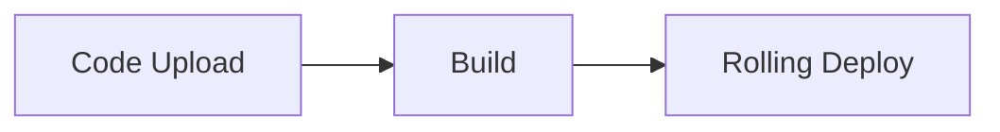

# Source: https://docs.livekit.io/deploy/agents/managing-deployments.md

LiveKit docs › Agent deployment › Deployment management

---

# Deployment management

> Configure, deploy, and manage your agent deployments using the LiveKit CLI.

## Overview

Use the LiveKit CLI to configure, deploy, and manage your agent deployments. This guide covers deployment configuration, deploying new versions, rolling back, and understanding cold starts.

## Configuration

The `livekit.toml` file contains your agent's deployment configuration. The CLI automatically looks for this file in the current directory, and uses it when any `lk agent` commands are run in that directory.

** Filename: `livekit.toml`**

```toml
[project]
  subdomain = "<my-project-subdomain>"

[agent]
  id = "<agent-id>"

```

To generate a new `livekit.toml` file, run:

```shell
lk agent config

```

## Deploying new versions

To deploy a new version of your agent, run the following command:

```shell
lk agent deploy

```

LiveKit Cloud builds a container image that includes your agent code. The new version is pushed to production using a rolling deployment strategy. The rolling deployment allows new instances to serve new sessions, while existing instances are given up to 1 hour to complete active sessions. This ensures your new version is deployed without user interruptions or service downtime.



When you run `lk agent deploy`, LiveKit Cloud follows this process:

1. **Build**: The CLI uploads your code and builds a container image from your Dockerfile. See [Builds and Dockerfiles](https://docs.livekit.io/deploy/agents/builds.md) for more information).
2. **Deploy**: New agent instances with your updated code are deployed alongside existing instances.
3. **Route new sessions**: New agent requests are routed to new instances.
4. **Graceful shutdown**: Old instances stop accepting new sessions, while remaining active for up to 1 hour to complete any active sessions.
5. **Autoscale**: New instances are automatically scaled up and down to meet demand.

## Rolling back

You can quickly rollback to a previous version of your agent, without a rebuild, by using the following command:

```shell
lk agent rollback

```

Rollback operates in the same rolling manner as a normal deployment.

> ℹ️ **Paid plan required**
> 
> Instant rollback is available only on paid LiveKit Cloud plans. Users on free plans should revert their code to an earlier version and then redeploy.

## Cold start

On certain plans, agents can be scaled down to zero replicas. When a new user connects to the agent, the instance does a "cold start" to serve them. This can take a little longer than normal to connect to the user. For more info, see the [Quotas and limits](https://docs.livekit.io/deploy/admin/quotas-and-limits.md) guide.

---

This document was rendered at 2026-02-03T03:25:22.071Z.
For the latest version of this document, see [https://docs.livekit.io/deploy/agents/managing-deployments.md](https://docs.livekit.io/deploy/agents/managing-deployments.md).

To explore all LiveKit documentation, see [llms.txt](https://docs.livekit.io/llms.txt).