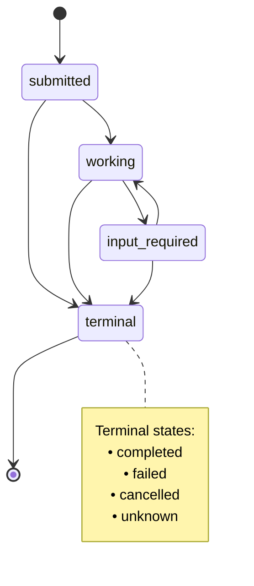

# Source: https://modelcontextprotocol.io/community/seps/1686-tasks.md

> ## Documentation Index
> Fetch the complete documentation index at: https://modelcontextprotocol.io/llms.txt
> Use this file to discover all available pages before exploring further.

# SEP-1686: Tasks

> Tasks

export const Badge = ({children, color = "gray"}) => {
  const styles = {
    green: {
      light: {
        bg: "#dcfce7",
        text: "#166534"
      },
      dark: {
        bg: "#14532d",
        text: "#86efac"
      }
    },
    blue: {
      light: {
        bg: "#dbeafe",
        text: "#1e40af"
      },
      dark: {
        bg: "#1e3a5f",
        text: "#93c5fd"
      }
    },
    yellow: {
      light: {
        bg: "#fef9c3",
        text: "#854d0e"
      },
      dark: {
        bg: "#713f12",
        text: "#fde047"
      }
    },
    red: {
      light: {
        bg: "#fee2e2",
        text: "#991b1b"
      },
      dark: {
        bg: "#7f1d1d",
        text: "#fca5a5"
      }
    },
    orange: {
      light: {
        bg: "#ffedd5",
        text: "#9a3412"
      },
      dark: {
        bg: "#7c2d12",
        text: "#fdba74"
      }
    },
    purple: {
      light: {
        bg: "#f3e8ff",
        text: "#6b21a8"
      },
      dark: {
        bg: "#581c87",
        text: "#d8b4fe"
      }
    },
    gray: {
      light: {
        bg: "#f3f4f6",
        text: "#1f2937"
      },
      dark: {
        bg: "#374151",
        text: "#d1d5db"
      }
    }
  };
  const s = styles[color] || styles.gray;
  return <>
      <style>{`
        .badge-${color} { background-color: ${s.light.bg}; color: ${s.light.text}; }
        .dark .badge-${color}, [data-theme="dark"] .badge-${color} { background-color: ${s.dark.bg}; color: ${s.dark.text}; }
        @media (prefers-color-scheme: dark) {
          .badge-${color}:not(.light *) { background-color: ${s.dark.bg}; color: ${s.dark.text}; }
        }
      `}</style>
      <span className={`badge-${color} inline-flex items-center px-2.5 py-0.5 rounded-full text-xs font-medium`}>
        {children}
      </span>
    </>;
};

<div className="flex items-center gap-2 mb-4">
  <Badge color="green">Final</Badge>
  <Badge color="gray">Standards Track</Badge>
</div>

| Field         | Value                                                                           |
| ------------- | ------------------------------------------------------------------------------- |
| **SEP**       | 1686                                                                            |
| **Title**     | Tasks                                                                           |
| **Status**    | Final                                                                           |
| **Type**      | Standards Track                                                                 |
| **Created**   | 2025-10-20                                                                      |
| **Author(s)** | Surbhi Bansal, Luca Chang                                                       |
| **Sponsor**   | None                                                                            |
| **PR**        | [#1686](https://github.com/modelcontextprotocol/modelcontextprotocol/pull/1686) |

***

## Abstract

This SEP improves support for task-based workflows in the Model Context Protocol (MCP). It introduces both the **task primitive** and the associated **task ID**, which can be used to query the state and results of a task, up to a server-defined duration after the task has completed. This primitive is designed to augment other requests (such as tool calls) to enable call-now, fetch-later execution patterns across all requests for servers that support this primitive.

## Motivation

The current MCP specification supports tool calls that execute a request and eventually receive a response, and tool calls can be passed a progress token to integrate with MCP’s progress-tracking functionality, enabling host applications to receive status updates for a tool call via notifications. However, there is no way for a client to explicitly request the status of a tool call, resulting in states where it is possible for a tool call to have been dropped on the server, and it is unknown if a response or a notification may ever arrive. Similarly, there is no way for a client to explicitly retrieve the result of a tool call after it has completed — if the result was dropped, clients must call the tool again, which is undesirable for tools expected to take minutes or more. This is particularly relevant for MCP servers abstracting existing workflow-based APIs, such as AWS Step Functions, Workflows for Google Cloud, or APIs representing CI/CD pipelines, among other applications.

Today, it is possible for individual MCP servers to represent tools in a way that enables this, with certain compromises. For example, a server may expose a `long_running_tool` and wish to support this pattern, splitting it into three separate tools to accommodate this:

1. `start_long_running_tool`: This would start the work represented by `long_running_tool` and return a tracking token of some kind, such as a job ID.
2. `get_long_running_tool_status(token)`: This would accept the tracking token and return the current status of the tool call, informing the caller that the operation is still ongoing.
3. `get_long_running_tool_result(token)`: This would accept the tracking token and return the result of the tool call, if it is available.

Representing a tool in this way seems to solve for the use case, but it introduces a new problem: Tools are generally-expected to be orchestrated by an agent, and agent-driven polling is both unnecessarily expensive and inconsistent — it relies on prompt engineering to steer an agent to poll at all. In the original `long_running_tool` case, the client had no way of knowing if a response would ever be received, while in the `start_long_running_tool` case, the application has no way of knowing if the agent will orchestrate tools according to the specific contract of the server.

It is also impossible for the host application to take ownership of this orchestration, as this tool-splitting is both conventions-based and may be implemented in different ways across MCP servers — one server may have three tools for one conceptual operation (as in our example), or it may have more, in the case of more complex, multi-step operations.

On the other hand, if active task polling is not needed, existing MCP servers can fully-wrap a workflow API in a single tool call that polls for a result, but this introduces an undesirable implementation cost: an MCP server wrapping an existing workflow API is a server that only exists for polling other systems.

**Affected Customer Use Cases**
These concerns are backed by real use cases that Amazon has seen both internally and with their external customers (identities redacted where non-public):

**1. Healthcare & Life Sciences Data Analysis**
***Challenge:*** Amazon’s customers in the healthcare and life sciences industry are attempting to use MCP to wrap existing computational tools to analyze molecular properties and predict drug interactions, processing hundreds of thousands of data points per job from chemical libraries through multiple inference models simultaneously. These complex, multi-step workflows require a way to actively check statuses, as they take upwards of several hours, making retries undesirable.
***Current Workaround:*** Not yet determined.
***Impact:*** Cannot integrate with real-time research workflows, prevents interactive drug discovery platforms, and blocks automated research pipelines. These customers are looking for best practices for workflow-based tool calls and have noted the lack of first-class support in MCP as a concern. If these customers do not have a solution for long-running tool calls, they will likely forego MCP and continue using their existing platforms.
***Ideal:*** Concurrent and poll-able tool calls as an answer for operations executing in the range of a few minutes, and some form of push notification system to avoid blocking their agents on long analyses on the order of hours. This SEP supports the former use case, and offers a framework that could extend to support the latter.

**2. Enterprise Automation Platforms**
***Challenge:*** Amazon’s large enterprise customers are looking to develop internal MCP platforms to automate SDLC processes across their organizations, extending to sales, customer service, legal, HR, and cross-divisional teams. They have noted they have long-running agent and agent-tool interactions, supporting complex business process automation.
***Current Workaround:*** Not yet determined. Considering an application-level system outside of MCP backed by webhooks.
***Impact:*** Limitations related to the host application being unaware of tool execution state prevent complex business process automation and limit sophisticated multi-step operations. These customers want to dispatch processes concurrently and collect their results later, and are noting the lack of explicit late-retrieval as a concern — and are considering involved application-level notification systems as a possible workaround.
***Ideal:*** Built-in mechanisms for actively checking the status of ongoing work to avoid needing to implement notification systems specific to their own tool conventions themselves.

**3. Code Migration Workflows**
***Challenge*:** Amazon has automated code migration and transformation tools to perform upgrades across its own codebases and those of external customers, and is attempting to wrap those tools in MCP servers. These migrations analyze dependencies, transform code to avoid deprecated runtime features, and validate changes across multiple repositories. These migrations range from minutes to hours depending on migration scope, complexity, and validation requirements.
***Current Workaround:*** Developers implement manual tracking by splitting a job into `create` and `get` tools, forcing models to manage state and repeatedly poll for completion.
***Impact:*** Poor developer experience due to needing to replicate this hand-rolled polling mechanism across many tools. One team had to debug an issue where the model would hallucinate job names if it hadn’t listed them first. Validating that this does not happen across many tools in a large toolset is time-consuming and error-prone.
***Ideal:*** Support natively polling tool state at the data layer to support pushing a tool to the background and avoiding blocking other tasks in the chat session, while still supporting deterministic polling and result retrieval. The team needs the same pattern across many tools in their MCP servers, and wants a common solution across them, which this SEP directly supports.

**4. Test Execution Platforms**
***Challenge:*** Amazon’s internal test infrastructure executes comprehensive test suites including thousands of cases, integration tests across services, and performance benchmarks. They have built an MCP server wrapping this existing infrastructure.
***Current Workaround:*** For streaming test logs, the MCP server exposes a tool that can read a range of log lines, as it cannot effectively notify the client when the execution is complete. There is not yet any workaround for executing test runs.
***Impact:*** Cannot run a test suite and stream its logs simultaneously without a single hours-long tool call, which would time out on either the client or the server. This prevents agents from looking into test failures in an incomplete test run until the entire test suite has completed, potentially hours later.
***Ideal:*** Support host application-driven tool polling for intermediate results, so a client can be notified when a long-running tool is complete. This SEP does not fully-support this use case (it does enable polling), but the Task execution model can be extended to do so, as discussed in the “Future Work” section.

**5. Deep Research**
***Challenge:*** Deep research tools spawn multiple research agents to gather and summarize information about topics, going through several rounds of search and conversation turns internally to produce a final result for the caller application. The tool takes an extended amount of time to execute, and it is not always clear if the tool is still executing.
***Current Workaround:*** The research tool is split into a separate `create` tool to create a report job and a `get` tool to get the status/result of that job later.
***Impact:*** When using this with host applications, the agent sometimes runs into issues calling the `get` tool repeatedly — in particular, it calls the tool once before ending its conversation turn, claiming to be "waiting" before calling the tool again. It cannot resume until receiving a new user message. This also complicates expiration times, as it is not possible to predict when the client will retrieve the result when this occurs. It is possible to work around this by adding a `wait` tool for the model, but this prevents the model from doing anything else concurrently.
***Ideal:*** Support polling a tool call’s state in a deterministic way and notify the model when a result is ready, so the tool result can be immediately retrieved and deleted from the server. Other than notifying the model (a host application concern), this SEP fully supports this use case.

**6. Agent-to-Agent Communication (Multi-Agent Systems)**
***Challenge:*** One of Amazon’s internal multi-agent systems for customer question answering faces scenarios where agents require significant processing time for complex reasoning, research, or analysis. When agents communicate through MCP, slow agents cause cascading delays throughout this system, as agents are forced to wait on their peers to complete their work.
***Current Workaround:*** Not yet determined.
***Impact:*** Communication pattern creates cascading delays, prevents parallel agent processing, and degrades system responsiveness for other time-sensitive interactions.
***Ideal:*** Some method to allow agents to perform other work concurrently and get notified once long-running tasks complete. This SEP supports this use case by enabling host applications to implement background polling for select tool calls without blocking agents.

These use cases demonstrate that a mechanism to actively track tool calls and defer results is a real requirement for these types of MCP deployments in production environments.

**Integration with Existing Architectures**
Many workflow-driven systems already provide active execution-tracking capabilities with built-in status metadata, monitoring, and data retention policies. This proposal enables MCP servers to expose these existing APIs with thin MCP wrappers while maintaining their existing reliability.

**Benefits for Existing Architectures:**

* **Leverage Existing State Management:** Systems like AWS Step Functions, Workflows for Google Cloud, and CI/CD platforms already maintain execution state, logs, and results. MCP servers can expose these systems' existing APIs without pushing the responsibility of polling to a fallible agent.
* **Preserve Native Monitoring:** Existing monitoring, alerting, and observability tools continue to work unchanged. The execution happens almost entirely within the existing workflow-management system.
* **Reduce Implementation Overhead:** Server implementers don't need to build new state management, persistence, or monitoring infrastructure. They can focus on the MCP protocol mapping of their existing APIs to tasks.

This SEP simplifies integration with existing workflows and allows workflow services to continue to manage their own state while delivering a quality customer experience, rather than offloading to agent-polling or building MCP servers that do nothing but poll other services.

## Specification

This SEP introduces a mechanism for requestors (which can be either clients or servers, depending on the direction of communication) to augment their requests with **tasks**. Tasks are durable state machines that carry information about the underlying execution state of the request they wrap, and are intended for requestor polling and deferred result retrieval. Each task is uniquely identifiable by a requestor-generated **task ID**.

### 1. User Interaction Model

Tasks are designed to be **application-driven**—receivers tightly-control which requests (if any) support task-based execution and manage the lifecycles of those tasks; meanwhile, requestors own the responsibility for augmenting requests with tasks, and for polling on the results of those tasks.

Implementations are free to expose tasks through any interface pattern that suits their needs—the protocol itself does not mandate any specific user interaction model.

### 2. Capabilities

Servers and clients that support task-augmented requests **MUST** declare a `tasks` capability during initialization. The `tasks` capability is structured by request category, with boolean properties indicating which specific request types support task augmentation.

Refer to [https://github.com/modelcontextprotocol/modelcontextprotocol/pull/1732](https://github.com/modelcontextprotocol/modelcontextprotocol/pull/1732) for details.

### 3. Protocol Messages

#### 3.1. Creating Tasks

To create a task, requestors send a request with the `modelcontextprotocol.io/task` key included in `_meta`, with a `taskId` value representing the task ID. Requestors **MAY** include a `keepAlive`, with a value representing how long after completion the requestor would like the task results to be kept for.

**Request:**

```json  theme={null}
{
  "jsonrpc": "2.0",
  "id": 1,
  "method": "some_method",
  "params": {
    "_meta": {
      "modelcontextprotocol.io/task": {
        "taskId": "786512e2-9e0d-44bd-8f29-789f320fe840",
        "keepAlive": 60000
      }
    }
  }
}
```

#### 3.2. Getting Tasks

To retrieve the state of a task, requestors send a `tasks/get` request:

**Request:**

```json  theme={null}
{
  "jsonrpc": "2.0",
  "id": 3,
  "method": "tasks/get",
  "params": {
    "taskId": "786512e2-9e0d-44bd-8f29-789f320fe840",
    "_meta": {
      "modelcontextprotocol.io/related-task": {
        "taskId": "786512e2-9e0d-44bd-8f29-789f320fe840"
      }
    }
  }
}
```

**Response:**

```json  theme={null}
{
  "jsonrpc": "2.0",
  "id": 3,
  "result": {
    "taskId": "786512e2-9e0d-44bd-8f29-789f320fe840",
    "keepAlive": 30000,
    "pollFrequency": 5000,
    "status": "submitted",
    "_meta": {
      "modelcontextprotocol.io/related-task": {
        "taskId": "786512e2-9e0d-44bd-8f29-789f320fe840"
      }
    }
  }
}
```

#### 3.3. Retrieving Task Results

To retrieve the result of a completed task, requestors send a `tasks/result` request:

**Request:**

```json  theme={null}
{
  "jsonrpc": "2.0",
  "id": 4,
  "method": "tasks/result",
  "params": {
    "taskId": "786512e2-9e0d-44bd-8f29-789f320fe840",
    "_meta": {
      "modelcontextprotocol.io/related-task": {
        "taskId": "786512e2-9e0d-44bd-8f29-789f320fe840"
      }
    }
  }
}
```

**Response:**

```json  theme={null}
{
  "jsonrpc": "2.0",
  "id": 4,
  "result": {
    "content": [
      {
        "type": "text",
        "text": "Current weather in New York:\nTemperature: 72°F\nConditions: Partly cloudy"
      }
    ],
    "isError": false,
    "_meta": {
      "modelcontextprotocol.io/related-task": {
        "taskId": "786512e2-9e0d-44bd-8f29-789f320fe840"
      }
    }
  }
}
```

#### 3.4. Task Creation Notification

When a receiver creates a task, it **MUST** send a `notifications/tasks/created` notification to inform the requestor that the task has been created and polling can begin.

**Notification:**

```json  theme={null}
{
  "jsonrpc": "2.0",
  "method": "notifications/tasks/created",
  "params": {
    "_meta": {
      "modelcontextprotocol.io/related-task": {
        "taskId": "786512e2-9e0d-44bd-8f29-789f320fe840"
      }
    }
  }
}
```

The task ID is conveyed through the `modelcontextprotocol.io/related-task` metadata key. The notification parameters are otherwise empty.

This notification resolves the race condition where a requestor might attempt to poll for a task before the receiver has finished creating it. By sending this notification immediately after task creation, the receiver signals that the task is ready to be queried via `tasks/get`.

Receivers that do not support tasks (and thus ignore task metadata in requests) will not send this notification, allowing requestors to fall back to waiting for the original request response.

#### 3.5. Listing Tasks

To retrieve a list of tasks, requestors send a `tasks/list` request. This operation supports pagination.

**Request:**

```json  theme={null}
{
  "jsonrpc": "2.0",
  "id": 5,
  "method": "tasks/list",
  "params": {
    "cursor": "optional-cursor-value"
  }
}
```

**Response:**

```json  theme={null}
{
  "jsonrpc": "2.0",
  "id": 5,
  "result": {
    "tasks": [
      {
        "taskId": "786512e2-9e0d-44bd-8f29-789f320fe840",
        "status": "working",
        "keepAlive": 30000,
        "pollFrequency": 5000
      },
      {
        "taskId": "abc123-def456-ghi789",
        "status": "completed",
        "keepAlive": 60000
      }
    ],
    "nextCursor": "next-page-cursor"
  }
}
```

#### 3.6 Deleting Tasks

To explicitly delete a task and its associated results, requestors send a `tasks/delete` request.

**Request:**

```json  theme={null}
{
  "jsonrpc": "2.0",
  "id": 6,
  "method": "tasks/delete",
  "params": {
    "taskId": "786512e2-9e0d-44bd-8f29-789f320fe840",
    "_meta": {
      "modelcontextprotocol.io/related-task": {
        "taskId": "786512e2-9e0d-44bd-8f29-789f320fe840"
      }
    }
  }
}
```

**Response:**

```json  theme={null}
{
  "jsonrpc": "2.0",
  "id": 6,
  "result": {
    "_meta": {
      "modelcontextprotocol.io/related-task": {
        "taskId": "786512e2-9e0d-44bd-8f29-789f320fe840"
      }
    }
  }
}
```

### 4. Behavior Requirements

These requirements apply to all parties that support receiving task-augmented requests.

#### 4.1. Task Support and Handling

1. Receivers that do not support task augmentation on a request **MUST** process the request normally, ignoring any task metadata in `_meta`.
2. Receivers that support task augmentation **MAY** choose which request types support tasks.

#### 4.2. Task ID Requirements

1. Task IDs **MUST** be a string value.
2. Task IDs **SHOULD** be unique across all tasks controlled by the receiver.
3. The receiver of a request with a task ID in its `_meta` **MAY** validate that the provided task ID has not already been associated with a task controlled by that receiver.

#### 4.3. Task Status Lifecycle

1. Tasks **MUST** begin in the `submitted` status when created.
2. Receivers **MUST** only transition tasks through the following valid paths:
   1. From `submitted`: may move to `working`, `input_required`, `completed`, `failed`, `cancelled`, or `unknown`
   2. From `working`: may move to `input_required`, `completed`, `failed`, `cancelled`, or `unknown`
   3. From `input_required`: may move to `working`, `completed`, `failed`, `cancelled`, or `unknown`
   4. Tasks in `completed`, `failed`, `cancelled`, or `unknown` status **MUST NOT** transition to any other status (terminal states)
3. Receivers **MAY** move directly from `submitted` to `completed` if execution completes immediately.
4. The `unknown` status is a terminal fallback state for unexpected error conditions. Receivers **SHOULD** use `failed` with an error message instead when possible.

**Task Status State Diagram:**



#### 4.4. Input Required Status

1. When a receiver sends a request associated with a task (e.g., elicitation, sampling), the receiver **MUST** move the task to the `input_required` status.
2. The receiver **MUST** include the `modelcontextprotocol.io/related-task` metadata in the request to associate it with the task.
3. When the receiver receives all required responses, the task **MAY** transition out of `input_required` status (typically back to `working`).
4. If multiple related requests are pending, the task **SHOULD** remain in `input_required` status until all are resolved.

#### 4.5. Keep-Alive and Resource Management

1. Receivers **MAY** override the requested `keepAlive` duration.
2. Receivers **MUST** include the actual `keepAlive` duration (or `null` for unlimited) in `tasks/get` responses.
3. After a task reaches a terminal status (`completed`, `failed`, or `cancelled`) and its `keepAlive` duration has elapsed, receivers **MAY** delete the task and its results.
4. Receivers **MAY** include a `pollFrequency` value (in milliseconds) in `tasks/get` responses to suggest polling intervals. Requestors **SHOULD** respect this value when provided.

#### 4.6. Result Retrieval

1. Receivers **MUST** only return results from `tasks/result` when the task status is `completed`.
2. Receivers **MUST** return an error if `tasks/result` is called for a task in any other status.
3. Requestors **MAY** call `tasks/result` multiple times for the same task while it remains available.

#### 4.7. Associating Task-Related Messages

1. All requests, notifications, and responses related to a task **MUST** include the `modelcontextprotocol.io/related-task` key in their `_meta`, with the value set to an object with a `taskId` matching the associated task ID.
2. For example, an elicitation that a task-augmented tool call depends on **MUST** share the same related task ID with that tool call's task.

#### 4.8. Task Cancellation

1. When a receiver receives a `notifications/cancelled` notification for the JSON-RPC request ID of a task-augmented request, the receiver **SHOULD** immediately move the task to the `cancelled` status and cease all processing associated with that task.
2. Due to the asynchronous nature of notifications, receivers **MAY** not cancel task processing instantaneously. Receivers **SHOULD** make a best-effort attempt to halt execution as quickly as possible.
3. If a `notifications/cancelled` notification arrives after a task has already reached a terminal status (`completed`, `failed`, `cancelled`, or `unknown`), receivers **SHOULD** ignore the notification.
4. After a task reaches `cancelled` status and its `keepAlive` duration has elapsed, receivers **MAY** delete the task and its metadata.
5. Requestors **MAY** send `notifications/cancelled` at any time during task execution, including when the task is in `input_required` status. If a task is cancelled while in `input_required` status, receivers **SHOULD** also disregard any pending responses to associated requests.
6. Because notifications do not provide confirmation of receipt, requestors **SHOULD** continue to poll with `tasks/get` after sending a cancellation notification to confirm the task has transitioned to `cancelled` status. If the task does not transition to `cancelled` within a reasonable timeframe, requestors **MAY** assume the cancellation was not processed.

#### 4.9. Task Listing

1. Receivers **SHOULD** use cursor-based pagination to limit the number of tasks returned in a single response.
2. Receivers **MUST** include a `nextCursor` in the response if more tasks are available.
3. Requestors **MUST** treat cursors as opaque tokens and not attempt to parse or modify them.
4. If a task is retrievable via `tasks/get` for a requestor, it **MUST** be retrievable via `tasks/list` for that requestor.

#### 4.10 Task Deletion

1. Receivers **MAY** accept or reject delete requests for any task at their discretion.
2. If a receiver accepts a delete request, it **SHOULD** delete the task and all associated results and metadata.
3. Receivers **MAY** choose not to support deletion at all, or only support deletion for tasks in certain statuses (e.g., only terminal statuses).
4. Requestors **SHOULD** delete tasks containing sensitive data promptly rather than relying solely on `keepAlive` expiration for cleanup.

### 5. Message Flow

[https://github.com/modelcontextprotocol/modelcontextprotocol/issues/1686#issuecomment-3452378176](https://github.com/modelcontextprotocol/modelcontextprotocol/issues/1686#issuecomment-3452378176)

### 6. Data Types

#### Task

A task represents the execution state of a request. The task metadata includes:

* `taskId`: Unique identifier for the task
* `keepAlive`: Time in milliseconds that results will be kept available after completion
* `pollFrequency`: Suggested time in milliseconds between status checks
* `status`: Current state of the task execution

#### Task Status

Tasks can be in one of the following states:

* `submitted`: The request has been received and queued for execution
* `working`: The request is currently being processed
* `input_required`: The request is waiting on additional input from the requestor
* `completed`: The request completed successfully and results are available
* `failed`: The task lifecycle itself encountered an error, unrelated to the associated request logic
* `cancelled`: The request was cancelled before completion
* `unknown`: A terminal fallback state for unexpected error conditions when the receiver cannot determine the actual task state

#### Task Metadata

When augmenting a request with task execution, the `modelcontextprotocol.io/task` key is included in `_meta`:

```json  theme={null}
{
  "modelcontextprotocol.io/task": {
    "taskId": "786512e2-9e0d-44bd-8f29-789f320fe840",
    "keepAlive": 60000
  }
}
```

Fields:

* `taskId` (string, required): Client-generated unique identifier for the task
* `keepAlive` (number, optional): Requested duration in milliseconds to retain results after completion

#### Task Creation Notification

When a receiver creates a task, it sends a `notifications/tasks/created` notification to signal that the task is ready for polling. The notification has empty params, with the task ID conveyed through the `modelcontextprotocol.io/related-task` metadata key:

```json  theme={null}
{
  "jsonrpc": "2.0",
  "method": "notifications/tasks/created",
  "params": {
    "_meta": {
      "modelcontextprotocol.io/related-task": {
        "taskId": "786512e2-9e0d-44bd-8f29-789f320fe840"
      }
    }
  }
}
```

This notification enables requestors to begin polling without encountering race conditions where the task might not yet exist on the receiver.

#### Task Get Request

The `tasks/get` request retrieves the current state of a task:

```typescript  theme={null}
{
  taskId: string; // The task identifier to query
}
```

#### Task Get Response

The `tasks/get` response includes:

```typescript  theme={null}
{
  taskId: string; // The task identifier
  status: TaskStatus; // Current task state
  keepAlive: number | null; // Actual retention duration in milliseconds, null for unlimited
  pollFrequency?: number; // Suggested polling interval in milliseconds
  error?: string; // Error message if status is "failed"
}
```

#### Task Result Request

The `tasks/result` request retrieves the result of a completed task:

```typescript  theme={null}
{
  taskId: string; // The task identifier to retrieve results for
}
```

#### Task Result Response

The `tasks/result` response returns the original result that would have been returned by the request:

```typescript  theme={null}
{
  // The structure matches the result type of the original request
  // For example, a tools/call task would return CallToolResult structure
  [key: string]: unknown;
}
```

The result structure depends on the original request type. The receiver returns the same result structure that would have been returned if the request had been executed without task augmentation.

#### Task List Request

The `tasks/list` request retrieves a list of tasks:

```typescript  theme={null}
{
  cursor?: string; // Optional cursor for pagination
}
```

#### Task List Response

The `tasks/list` response includes:

```typescript  theme={null}
{
  tasks: Array<{
    taskId: string;           // The task identifier
    status: TaskStatus;       // Current task state
    keepAlive: number | null; // Retention duration in milliseconds, null for unlimited
    pollFrequency?: number;   // Suggested polling interval in milliseconds
    error?: string;           // Error message if status is "failed"
  }>;
  nextCursor?: string;        // Cursor for next page, absent if no more results
}
```

#### Related Task Metadata

All requests, responses, and notifications associated with a task **MUST** include the `modelcontextprotocol.io/related-task` key in `_meta`:

```json  theme={null}
{
  "modelcontextprotocol.io/related-task": {
    "taskId": "786512e2-9e0d-44bd-8f29-789f320fe840"
  }
}
```

This associates messages with their originating task across the entire request lifecycle.

### 7. Error Handling

Tasks use two error reporting mechanisms:

1. **Protocol Errors**: Standard JSON-RPC errors for protocol-level issues
2. **Task Execution Errors**: Errors in the underlying request execution, reported through task status

#### 7.1. Protocol Errors

Receivers **MUST** return standard JSON-RPC errors for the following protocol error cases:

* Invalid or nonexistent `taskId` in `tasks/get`, `tasks/list`, or `tasks/result`: `-32602` (Invalid params)
* Invalid or nonexistent cursor in `tasks/list`: `-32602` (Invalid params)
* Request with a `taskId` that was already used for a different task (if the receiver validates task ID uniqueness): `-32602` (Invalid params)
* Attempting to retrieve result when task is not in `completed` status: `-32602` (Invalid params)
* Internal errors: `-32603` (Internal error)

Receivers **SHOULD** provide informative error messages to describe the cause of errors.

**Example: Task not found**

```json  theme={null}
{
  "jsonrpc": "2.0",
  "id": 70,
  "error": {
    "code": -32602,
    "message": "Failed to retrieve task: Task not found"
  }
}
```

**Example: Task expired**

```json  theme={null}
{
  "jsonrpc": "2.0",
  "id": 71,
  "error": {
    "code": -32602,
    "message": "Failed to retrieve task: Task has expired"
  }
}
```

> NOTE: Receivers are not obligated to retain task metadata indefinitely. It is compliant behavior for a receiver to return a "not-found" error if it has purged an expired task.

**Example: Result requested for incomplete task**

```json  theme={null}
{
  "jsonrpc": "2.0",
  "id": 72,
  "error": {
    "code": -32602,
    "message": "Cannot retrieve result: Task status is 'working', not 'completed'"
  }
}
```

**Example: Duplicate task ID (if receiver validates uniqueness)**

```json  theme={null}
{
  "jsonrpc": "2.0",
  "id": 73,
  "error": {
    "code": -32602,
    "message": "Task ID already exists: 786512e2-9e0d-44bd-8f29-789f320fe840"
  }
}
```

#### 7.2. Task Execution Errors

When the underlying request fails during execution, the task moves to the `failed` status. The `tasks/get` response **SHOULD** include an `error` field with details about the failure:

```typescript  theme={null}
{
  taskId: string;
  status: "failed";
  keepAlive: number | null;
  pollFrequency?: number;
  error?: string;  // Description of what went wrong
}
```

**Example: Task with execution error**

```json  theme={null}
{
  "jsonrpc": "2.0",
  "id": 4,
  "result": {
    "taskId": "786512e2-9e0d-44bd-8f29-789f320fe840",
    "status": "failed",
    "keepAlive": 30000,
    "error": "Tool execution failed: API rate limit exceeded"
  }
}
```

For tasks that wrap requests with their own error semantics (like `tools/call` with `isError: true`), the task should still reach `completed` status, and the error information is conveyed through the result structure of the original request type.

### 8. Security Considerations

#### 8.1. Task Isolation and Access Control

1. Receivers **SHOULD** scope task IDs to prevent unauthorized access:
   1. Bind tasks to the session that created them (if sessions are supported)
   2. Bind tasks to the authentication context (if authentication is used)
   3. Reject `tasks/get`, `tasks/list`, or `tasks/result` requests for tasks from different sessions or auth contexts
2. Receivers that do not implement session or authentication binding **SHOULD** document this limitation clearly, as task results may be accessible to any requestor that can guess the task ID.
3. Receivers **SHOULD** implement rate limiting on:
   1. Task creation to prevent resource exhaustion
   2. Task status polling to prevent denial of service
   3. Task result retrieval attempts
   4. Task listing requests to prevent denial of service

#### 8.2. Resource Management

> WARNING: Task results may persist longer than the original request execution time. For sensitive operations, requestors should carefully consider the security implications of extended result retention and may want to retrieve results promptly and request shorter `keepAlive` durations.

1. Receivers **SHOULD**:
   1. Enforce limits on concurrent tasks per requestor
   2. Enforce maximum `keepAlive` durations to prevent indefinite resource retention
   3. Clean up expired tasks promptly to free resources
2. Receivers **SHOULD**:
   1. Document maximum supported `keepAlive` duration
   2. Document maximum concurrent tasks per requestor
   3. Implement monitoring and alerting for resource usage

#### 8.3. Audit and Logging

1. Receivers **SHOULD**:
   1. Log task creation, completion, and retrieval events for audit purposes
   2. Include session/auth context in logs when available
   3. Monitor for suspicious patterns (e.g., many failed task lookups, excessive polling)
2. Requestors **SHOULD**:
   1. Log task lifecycle events for debugging and audit purposes
   2. Track task IDs and their associated operations

## Rationale

### Design Decision: Generic Task Primitive

The decision to implement tasks as a generic request augmentation mechanism (rather than tool-specific or method-specific) was made to maximize protocol simplicity and flexibility.

Tasks are designed to work with any request type in the MCP protocol, not just tool calls. This means that `resources/read`, `prompts/get`, `sampling/createMessage`, and any future request types can all be augmented with task metadata. This approach provides significant benefits over a tool-specific design.

From a protocol perspective, this design eliminates the need for separate task implementations per request type. Instead of defining different async patterns for tools versus resources versus prompts, a single set of task management methods (`tasks/get` and `tasks/result`) works uniformly across all request types. This uniformity reduces cognitive load for implementers and creates a consistent experience for applications using the protocol.

The generic design also provides implementation flexibility. Servers can choose which requests support task augmentation without requiring protocol changes or version negotiation. If a server doesn't support tasks for a particular request type, it simply ignores the task metadata and processes the request normally. This allows servers to add task support to requests incrementally, starting with high-value operations and expanding over time based on actual usage patterns.

Architecturally, tasks are treated as metadata rather than a separate execution model. They augment existing requests rather than replacing them. The original request/response flow remains intact—the request still gets a response eventually. Tasks simply provide an additional polling-based mechanism for result retrieval. This design ensures that related messages (such as elicitations during task execution) can be associated consistently via the `modelcontextprotocol.io/related-task` metadata key, regardless of the underlying request type.

### Design Decision: Metadata-Based Augmentation

Using `_meta` for task information rather than dedicated request parameters was chosen to maintain a clear separation of concerns between request semantics and execution tracking.

Task information is fundamentally orthogonal to request semantics. The task ID and keepAlive duration don't affect what the request does—they only affect how the result is retrieved and retained. A `tools/call` request performs the same operation whether or not it includes task metadata. The task metadata simply provides an alternative mechanism for accessing the result.

By placing task information in `_meta`, we create a clear architectural boundary between "what to execute" (request parameters) and "how to track execution" (task metadata). This boundary makes it easier for implementers to reason about the protocol. Request parameters define the operation being performed, while metadata provides orthogonal concerns like progress tracking, task management, and other execution-related information.

This approach also provides natural backward compatibility. Servers that don't support tasks can ignore the `_meta` content without breaking request processing. The request parameters remain valid and complete, so the operation can proceed normally. This means no protocol version negotiation is required—the new functionality is purely additive and non-disruptive.

SDKs can provide ergonomic abstractions over the task primitive while maintaining the separation of concerns, for example:

```typescript  theme={null}
// === MCP SDK (Pseudocode based loosely on modelcontextprotocol/typescript-sdk) ===

/**
 * NEW: A request that resolves to a result, either directly or by polling a task.
 */
class PendingRequest<TResult> {
  constructor(readonly protocol: Protocol, readonly result: Promise<TResult>, readonly taskId?: string) {}

  /**
   * Waits for a result, calling onTaskStatus if provided and a task was created.
   */
  async result({ onTaskStatus }): Promise<TResult> => {
    if (!onTaskStatus || !this.taskId) {
      // No task listener or task ID provided, just block for the result
      return await result;
    }

    // Whichever is successful first (or a failure if all fail) is returned.
    return Promise.any([
      result, // Blocks for result
      (async () => {
        // Blocks for a notifications/tasks/created with the provided task ID
        await this.protocol.waitForTask(this.taskId);
        return await taskHandler(this.taskId);
      })(),
    ]);
  }

  /**
   * Encapsulates polling for a result, calling onTaskStatus after querying the task.
   */
  private async taskHandler({ onTaskStatus }): Promise<TResult> => {
    // Poll for completion
    let task: Task;
    do {
      task = await this.protocol.getTask(this.taskId);
      await onTaskStatus(task);
      await sleep(task.pollFrequency ?? DEFAULT_POLLING_INTERNAL);
    } while (!task.isTerminal());

    // Process result
    return await this.protocol.getTaskResult(this.taskId);
  }
}

/**
 * Simplified/partial client session implementation for illustration purposes.
 * Extends a base class it shares with the server.
 */
class Client extends Protocol {
  /**
   * Existing request method, but with most implementation refactored to beginCallTool
   */
  async callTool<TResult>(
    params: CallToolRequest['params'],
    resultSchema: Schema<TResult>,
  ) {
    // Existing request methods can be changed to reuse new methods exposed for
    // separating request/response flows.
    const request = await this.beginCallTool(params, resultSchema);
    return request.result();
  }

  /**
   * NEW: Low-level method that starts a tool call and returns a PendingRequest
   * object for more granular control.
   */
  async beginCallTool<TResult>(
    params: CallToolRequest['params'],
    resultSchema: Schema<TResult>,
  ) {
    const request = await this.beginRequest({ method: 'tools/call', params }, resultSchema, options);
    return request;
  }
}

// === HOST APPLICATION ===

// Begin a tool call with task support
const pending: PendingRequest<CallToolResult> = await client.beginCallTool(
  {
    name: "analyze_dataset",
    arguments: { dataset: "large_file.csv" },
  },
  CallToolResultSchema,
  {
    keepAlive: 3600000,
  },
);

// Client code can assume tasks are supported, and the fallback case can be handled internally
const result = await pending.result({
  onTaskStatus: async (task) => {
    await sendLatestStateSomewhere(task);
  },
});
```

As the design does not alter the basic request semantics, the existing form would continue to work as well:

```typescript  theme={null}
const result = await client.callTool(
  {
    name: "analyze_dataset",
    arguments: { dataset: "large_file.csv" },
  },
  CallToolResultSchema,
);
```

### Design Decision: Client-Generated Task IDs

The choice to have clients generate task IDs rather than having servers assign them provides several critical benefits:

**Idempotency and Fault Tolerance:**
The primary benefit is enabling idempotent task creation. When a client generates the task ID, it can safely retry a task-augmented request if it doesn't receive a response, knowing that the server will recognize the duplicate task ID and return an error. This is essential for reliable operation over unreliable networks:

* If a request times out, the client can safely retry without creating duplicate tasks
* If a connection drops before the response arrives, the client can reconnect and retry
* The server validates task ID uniqueness and returns an error for duplicates, confirming whether the task was created

With server-generated task IDs, a timeout or connection failure creates uncertainty—the client doesn't know whether the task was created, and has no safe way to retry without potentially creating duplicate tasks.

**Simplicity for Clients:**
Client-generated task IDs simplify the client's implementation by eliminating the need to correlate the initial response with a task identifier. The client can immediately begin polling for task status using the task ID it generated, without needing to parse the response to extract a server-assigned identifier. This is particularly valuable for asynchronous programming models where the client may want to store the task ID before the response arrives.

**Trade-offs for Servers:**
The main trade-off is that servers wrapping existing workflow systems with their own task identifiers will generally handle this by maintaining a mapping between the client-provided task IDs and the underlying system's identifiers. For example, an MCP server wrapping AWS Step Functions might receive a client-generated task ID like `"client-abc-123"` and need to track that it corresponds to Step Functions execution ARN `"arn:aws:states:...:exec-xyz"`.

This requires:

* Persistent storage for the task ID mapping (typically a simple key-value store)
* Maintaining the mapping for the task's keepAlive duration
* Handling mapping lookups for task status and result retrieval

However, this complexity is typically minor compared to the overall work of integrating an existing workflow system into MCP. Most workflow systems already require state management for tracking execution, and maintaining a task ID mapping is a straightforward addition. The mapping structure is simple (client task ID maps to an internal identifier), and can be implemented using existing databases or key-value stores such a server likely already uses for other state management.

### Design Decision: Task Creation Notification

The decision to use a `notifications/tasks/created` notification rather than altering the response semantics (as #1391 proposed) acknowledges the asynchronous nature of task creation and enables efficient race patterns between task-based polling and traditional request/response flows.

When a server creates a task, it must signal to the client that the task is ready for polling. There are at least two possible approaches: (1) the initial request could return synchronously with task metadata, or (2) the server could send a notification. This proposal uses notifications for several key reasons:

1. Notifications enable fire-and-forget request processing. The server can accept the request, begin processing it, and send the notification once the task is created, without needing to block the initial request/response cycle. This is particularly important for servers that dispatch work to background systems or queues—they can acknowledge the request immediately and send the notification once the background system confirms task creation.
2. Notifications support the race pattern that enables graceful degradation. Clients can race between waiting for the original request's response and waiting for the `notifications/tasks/created` notification. If the server doesn't support tasks, no notification arrives and the original response wins. If the server does support tasks, the notification typically arrives first (or approximately simultaneously), enabling polling to begin. A synchronous response would force clients to wait for the response before knowing whether to poll or not.
3. Notifications avoid ambiguity with existing protocol semantics. If the initial request response included task metadata and the client then polled for results, it would change the implied meaning of existing notification types:
   1. **Progress notifications**: The current MCP specification requires that progress notifications reference tokens that "are associated with an in-progress operation." While "operation" is not formally defined, the implied understanding is that an operation is bounded by a request/response pair—progress notifications stop when the response is sent. With a synchronous response containing task metadata, progress notifications would need to continue while the task executes, expanding the implied meaning of "operation" to include asynchronous tasks that outlive the original request/response cycle. The notification-based approach avoids this semantic expansion by keeping progress notifications tied to the initial request's lifecycle, while future task-based progress can be cleanly associated via `modelcontextprotocol.io/related-task` metadata. We recommend that a future SEP clarify the definition of "operation" in the progress specification.
   2. **Cancellation semantics**: With the notification-based approach, `notifications/cancelled` clearly targets the original request ID and causes the associated task to move to `cancelled` status, maintaining a clean separation between request cancellation and task lifecycle management.

While the notification is required by the specification for servers that create tasks, there are edge cases where it may be unavailable:

* **sHTTP without stream support**: In environments where either the client or the server does not support SSE streams, notifications cannot be delivered. In such cases, clients may choose to proactively poll with `tasks/get` using exponential backoff, though this is nonstandard and may result in unnecessary polling attempts if the server doesn't support tasks.
* **Degraded connection scenarios**: If the notification is lost in transit, clients should implement reasonable timeout behavior and fall back to the original response.

The standard and recommended approach is to wait for the `notifications/tasks/created` notification before beginning polling. Proactive polling without waiting for the notification should be considered a fallback mechanism for constrained environments only.

### Design Decision: No Capabilities Declaration

Unlike other protocol features such as tools, resources, and prompts, tasks do not require capability negotiation. This decision was made to enable graceful degradation and per-request flexibility.

Task support can be determined implicitly through usage rather than explicitly through capability declarations. When a client sends a task-augmented request, the server will process it according to its capabilities. If the server doesn't support tasks for that request type, it simply ignores the task metadata and returns the result normally through the original request/response flow. The client can then detect the lack of task support by attempting to call `tasks/get` and handling any errors that result.

This approach eliminates the need for complex handshakes or feature detection protocols. Clients can optimistically try task augmentation and gracefully fall back to direct response handling if needed. This makes the protocol more resilient and easier to implement.

Additionally, this design provides per-request flexibility that would be difficult to express through capabilities. A server might support tasks on some request types but not others, or support might vary based on runtime conditions such as resource availability or load. Requiring granular capability declarations per request type would significantly complicate the protocol without providing substantial benefits. The implicit detection model is simpler and more flexible.

### Alternative Designs Considered

**Tool-Specific Async Execution:**
An earlier version of this proposal (#1391) focused specifically on tool calls, introducing an `invocationMode` field on tool definitions to mark tools as supporting synchronous, asynchronous, or both execution modes. This approach would have added dedicated fields to the tool call request and response structures, with server-side capability declarations to indicate support for async tool execution.

While this design would have addressed the immediate need for long-running tool calls, it was rejected in favor of the more general task primitive for several reasons. First, it artificially limited the async execution pattern to tools when other request types have similar needs. Resources can be expensive to read, prompts can require complex processing, and sampling requests may involve lengthy user interactions. Creating separate async patterns for each request type would lead to protocol fragmentation and inconsistent implementation patterns.

Second, the tool-specific approach required more complex capability negotiation and version handling. Servers would need to filter tool lists based on client capabilities, and SDKs would need to manage different invocation patterns for sync versus async tools. This complexity would ripple through every layer of the implementation stack.

Finally, the tool-specific design didn't address the broader architectural need for deferred result retrieval across all MCP request types. By generalizing to a task primitive that augments any request, this proposal provides a consistent pattern that can be applied uniformly across the protocol. More importantly, this foundation is extensible to future protocol messages and features such as subtasks, making it a more appropriate building block for the protocol's evolution.

**Transport-Layer Solutions:**
An alternative approach would be to solve for this purely at the transport layer, without introducing a new data-layer primitive. Several proposals (#1335, #1442, #1597) address transport-specific concerns such as connection resilience, request retry semantics, and stream management for sHTTP. These are valuable improvements that can mitigate many scaling and reliability challenges associated with requests that may take extended time to complete.

However, transport-layer solutions alone are insufficient for the use cases this SEP addresses. Even with perfect transport-layer reliability, several data-layer concerns remain:

First, servers and clients need a way to communicate expectations about execution patterns. Without this, host applications cannot make informed decisions about UX patterns—should they block, show a spinner, or allow the user to continue working? An annotation alone could signal that a request might take extended time, but provides no mechanism to actively check status or retrieve results later.

Second, transport-layer solutions cannot provide visibility into the execution state of a request that is still in progress. If a request stops sending progress notifications, the client cannot distinguish between "the server is doing expensive work" and "the request was lost." Transport-level retries can confirm the connection is alive, but cannot answer "is this specific request still executing?" This visibility is critical for operations where users need confidence their work is progressing.

Third, different transports would require different mechanisms for these concerns. The sHTTP proposals adjust stream management and retry semantics to fulfill these requirements, but stdio has no equivalent extension points. This creates transport-specific fragmentation where implementers must solve the same problems differently depending on their choice of transport. Data-layer operations provides consistent semantics across all transports.

Finally, deferred result retrieval and active status checks are data-layer concerns that cannot be addressed by transport improvements alone. The ability to retrieve a result multiple times, specify retention duration, and handle cleanup is orthogonal to how the underlying messages are delivered.

**Resource-Based Approaches:**
Another possible approach would be to leverage existing MCP resources for tracking long-running operations. For example, a tool could return a linked resource that communicates operation status, and clients could subscribe to that resource to receive updates when the operation completes. This would allow servers to represent task state using the resource primitive, potentially with annotations for suggested polling frequency.

While this approach is technically feasible and servers remain free to adopt such conventions, it suffers from similar limitations as the tool-splitting pattern described in the Motivation section. Like the `start_tool` and `get_tool` convention, a resource-based tracking system would be convention-based rather than standardized, creating several challenges:

The most fundamental issue is the lack of a consistent way for clients to distinguish between ordinary resources (meant to be exposed to models) and status-tracking resources (meant to be polled by the application). Should a status resource be presented to the model? How should the client correlate a returned resource with the original tool call? Without standardization, different servers would implement different conventions, forcing clients/hosts/models to handle each server's particular approach. Extending resources with task-like semantics (such as polling frequency, keepalive durations, and explicit status states) would create a new and distinct purpose for resources that would be difficult to distinguish from their existing purpose as model-accessible content.

The resource subscription model has one additional issue: as it is push-based, it requires clients to wait for notifications of resource changes rather than actively polling for status. While this works for some use cases, it doesn't address scenarios where clients need to actively check status—for example, proactively and deterministically checking if work is still progressing, which is the original intent of this proposal.

The task primitive addresses these concerns by providing a standardized, protocol-level mechanism specifically designed for this use case, with consistent semantics that any client can leverage without host applications needing to understand server-specific conventions. While resource-based tracking remains possible for servers that prefer it and/or are already using it, this SEP provides a first-class alternative that solves the broader set of requirements identified previously.

### Backward Compatibility

This SEP introduces **no backward incompatibilities**. All existing MCP functionality remains unchanged:

**Compatibility Guarantees:**

* Existing requests work identically with or without task metadata
* Servers that don't understand tasks process requests normally
* No protocol version negotiation required
* No capability declarations needed

**Graceful Degradation:**

* Clients race between waiting for the original request's response and waiting for the `notifications/tasks/created` notification followed by polling
* Whichever completes first (original response or task-based retrieval) is used by the client
* If a server doesn't support tasks, no `notifications/tasks/created` is sent, and the original request's response is used
* If a server supports tasks, the `notifications/tasks/created` notification is sent, enabling the client to begin polling for results
* This race pattern ensures graceful degradation without requiring capability negotiation or version detection
* Partial support is possible—servers can support tasks on some requests but not others

**Adoption Path:**

* Servers can implement task support incrementally, starting with high-value request types
* Clients can opportunistically use tasks where supported
* No coordination required between client and server updates

## Future Work

The task primitive introduced in this SEP provides a foundation for several important extensions that will enhance MCP's workflow capabilities.

### Push Notifications

While this SEP focuses on client-driven polling, future work could introduce server-initiated notifications for task state changes. This would be particularly valuable for operations that take hours or longer, where continuous polling becomes impractical.

A notification-based approach would allow servers to proactively inform clients when:

* A task completes or fails
* A task reaches a milestone or significant state transition
* A task requires input (complementing the `input_required` status)

This could be implemented through webhook-style mechanisms or persistent notification channels, depending on the transport capabilities. The proposed task ID and status model provides the necessary infrastructure for servers to identify which tasks warrant notifications and for clients to correlate notifications with their outstanding tasks.

### Intermediate Results

The current task model returns results only upon completion. Future extensions could enable tasks to report intermediate results or progress artifacts during execution. This would support use cases where servers can produce partial outputs before final completion, such as:

* Streaming analysis results as they become available
* Reporting completed phases of multi-step operations
* Providing preview data while full processing continues

Intermediate results would build on the proposed task ID association mechanism, allowing servers to send multiple result notifications or response messages tied to the same task ID throughout its lifecycle.

### Nested Task Execution

A significant future enhancement is support for hierarchical task relationships, where a task can spawn subtasks as part of its execution. This would enable complex, multi-step workflows orchestrated by the server.

In a nested task model, a server could:

* Create subtasks in response to a parent task reaching a state that requires additional operations
* Communicate subtask requirements to the client, potentially including required tool calls or sampling requests
* Track subtask completion and use subtask results to advance the parent task
* Maintain provenance through task ID hierarchies, showing the relationship between parent and child tasks

For example, a complex analysis task might spawn several subtasks for data gathering, each represented by its own task ID but associated with the parent task. The parent task would remain in a pending state (potentially in a new `tool_required` status) until all required subtasks complete.

This hierarchical model would support sophisticated server-controlled workflows while maintaining the client's ability to monitor and retrieve results at any level of the task tree.

<details>
  <summary>Example nested task flow</summary>

  ```mermaid  theme={null}
  sequenceDiagram
      participant C as Client
      participant S as Server

      Note over C,S: Client Creates Parent Task
      C->>S: tools/call "deploy_application"<br/>_meta: {taskId: "deploy-123"}
      S--)C: notifications/tasks/created

      C->>S: tasks/get (taskId: "deploy-123")
      S->>C: status: working

      Note over S: Server determines subtasks needed

      Note over C,S: Server Responds with Subtask Requirements
      C->>S: tasks/get (taskId: "deploy-123")
      S->>C: status: working<br/>childTasks: [{<br/>  taskId: "build-456",<br/>  toolName: "run_build",<br/>  arguments: {...}<br/>}, {<br/>  taskId: "test-789",<br/>  toolName: "run_tests",<br/>  arguments: {...}<br/>}]

      Note over C: Client initiates subtasks

      C->>S: tools/call "run_build"<br/>_meta: {taskId: "build-456", parentTaskId: "deploy-123"}
      S--)C: notifications/tasks/created

      C->>S: tools/call "run_tests"<br/>_meta: {taskId: "test-789", parentTaskId: "deploy-123"}
      S--)C: notifications/tasks/created

      Note over C: Client polls subtasks

      C->>S: tasks/get (taskId: "build-456")
      S->>C: status: completed

      C->>S: tasks/get (taskId: "test-789")
      S->>C: status: completed

      Note over S: All subtasks complete, parent continues

      C->>S: tasks/get (taskId: "deploy-123")
      S->>C: status: completed

      C->>S: tasks/result (taskId: "deploy-123")
      S->>C: Deployment complete
  ```

  **Potential Data Model Extensions:**
  The task status response could be extended to include parent and child task relationships:

  ```typescript  theme={null}
  {
    taskId: string;
    status: TaskStatus;
    keepAlive: number | null;
    pollFrequency?: number;
    error?: string;

    // Extensions for nested tasks
    parentTaskId?: string;        // ID of parent task, if this is a subtask
    childTasks?: Array<{          // Subtasks required by this task
      taskId: string;             // Pre-generated task ID for the subtask
      toolName: string;           // Tool to call for this subtask
      arguments?: object;         // Arguments for the tool call
    }>;
  }
  ```

  This would allow clients to:

  * Discover subtasks required by a parent task through the `childTasks` array
  * Initiate the required subtask tool calls using the pre-generated task IDs and provided arguments
  * Navigate the task hierarchy by following parent/child relationships via `parentTaskId`
  * Monitor all subtasks by polling each child task ID
  * Wait for all subtasks to complete before checking parent task completion

  The existing task metadata and status lifecycle are designed to be forward-compatible with these extensions.
</details>
