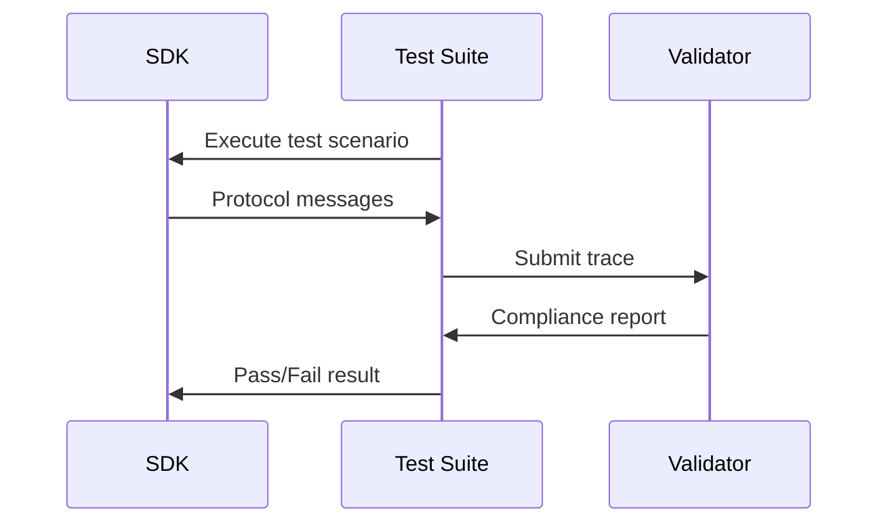

# Source: https://modelcontextprotocol.io/community/seps/1730-sdks-tiering-system.md

> ## Documentation Index
> Fetch the complete documentation index at: https://modelcontextprotocol.io/llms.txt
> Use this file to discover all available pages before exploring further.

# SEP-1730: SDKs Tiering System

> SDKs Tiering System

export const Badge = ({children, color = "gray"}) => {
  const styles = {
    green: {
      light: {
        bg: "#dcfce7",
        text: "#166534"
      },
      dark: {
        bg: "#14532d",
        text: "#86efac"
      }
    },
    blue: {
      light: {
        bg: "#dbeafe",
        text: "#1e40af"
      },
      dark: {
        bg: "#1e3a5f",
        text: "#93c5fd"
      }
    },
    yellow: {
      light: {
        bg: "#fef9c3",
        text: "#854d0e"
      },
      dark: {
        bg: "#713f12",
        text: "#fde047"
      }
    },
    red: {
      light: {
        bg: "#fee2e2",
        text: "#991b1b"
      },
      dark: {
        bg: "#7f1d1d",
        text: "#fca5a5"
      }
    },
    orange: {
      light: {
        bg: "#ffedd5",
        text: "#9a3412"
      },
      dark: {
        bg: "#7c2d12",
        text: "#fdba74"
      }
    },
    purple: {
      light: {
        bg: "#f3e8ff",
        text: "#6b21a8"
      },
      dark: {
        bg: "#581c87",
        text: "#d8b4fe"
      }
    },
    gray: {
      light: {
        bg: "#f3f4f6",
        text: "#1f2937"
      },
      dark: {
        bg: "#374151",
        text: "#d1d5db"
      }
    }
  };
  const s = styles[color] || styles.gray;
  return <>
      
      
        {children}
      
    </>;
};

  <Badge color="green">Final</Badge>
  <Badge color="gray">Standards Track</Badge>

| Field         | Value                                                                           |
| ------------- | ------------------------------------------------------------------------------- |
| **SEP**       | 1730                                                                            |
| **Title**     | SDKs Tiering System                                                             |
| **Status**    | Final                                                                           |
| **Type**      | Standards Track                                                                 |
| **Created**   | 2025-10-29                                                                      |
| **Author(s)** | Inna Harper, Felix Weinberger                                                   |
| **Sponsor**   | None                                                                            |
| **PR**        | [#1730](https://github.com/modelcontextprotocol/modelcontextprotocol/pull/1730) |

***

## Abstract

This SEP proposes a tiering system for Model Context Protocol (MCP) SDKs to establish clear expectations for feature support, maintenance commitments, and quality standards. The system defines three tiers of SDK support with objective, measurable criteria for classification.

## Motivation

The MCP ecosystem needs SDK harmonization to help users make informed decisions. Users currently face challenges:

* **Feature Support Uncertainty**: No standardized way to know which SDKs support specific MCP features (OAuth, client/server/system features, like sampling, transports)
* **Maintenance Expectations**: Unclear commitment levels for bug fixes, security patches, and feature updates
* **Implementation Timelines**: No visibility into when SDKs will support new protocol versions and features

## Specification

### Tier Definitions

#### Tier 1: fully supported

SDKs in this tier provides full protocol implementation and is well supported

**Requirements:**

* **Feature complete and full support of the protocol**
  * All conformance tests pass
  * New protocol features before the new spec version release. (There is two week window between Release Candidate and the new protocol version release)
* **SDK maintenance**
  * Acknowledge and triage issues within two business days
  * Resolve security and critical bugs within seven days
  * Stable release and SDK versioning clearly documented
* **Documentation**
  * Comprehensive documentation with examples for all features
  * Published dependency update policy

#### Tier 2: commitment to be fully supported

SDKs with established implementations actively working toward full protocol support.

**Requirements:**

* **Feature complete and full support of the protocol**
  * 80% of conformance tests pass
  * New protocol features implemented within six months
* **SDK maintenance**
  * Active issue tracking and management
  * At least one stable release
* **Documentation**
  * Basic documentation covering core features
  * Published dependency update policy
* **Commitment to move to Tier1**
  * Published roadmap showing intent to achieve Tier 1 or, if SDK will remain in Tier 2 indefinitely, a transparent roadmap about the direction of the SDK and reasons for not being feature complete

#### Tier 3: Experimental

Early-stage or specialized SDKs exploring the protocol space.

**Characteristics:**

* No feature completeness guarantees
* No stable release requirement
* May focus on specific use cases or experimental features
* No timeline commitments for updates
* Suitable for niche implementations that may remain at this tier

### Conformance Testing

All SDKs must undergo conformance testing using protocol trace validation: for details see [Conformance Testing RFC (forthcoming)](https://github.com/modelcontextprotocol/modelcontextprotocol/issues/1627). This SEP is not focusing on Conformance testing. For the initial version of tiering, we will go with the simplified version where we would have an Example server for each SDK and run simplified conformance tests against those.

**Compliance Scoring:**

* SDKs receive a percentage score based on test results
* Scores can be displayed as badges (e.g., "90% MCP Compliant")
* Tier 1: 100% compliance required
* Tier 2: 80% compliance required
* Tier 3: No minimum requirement

### Tier Advancement Process

1. **Self-Assessment:** Maintainers evaluate their SDK against tier criteria
2. **Application:** Submit tier advancement request with evidence
3. **Review:** Community review period (2 weeks)
4. **Validation:** Automated conformance testing, github stats on issues
5. **Decision:** Tier assignment by MCP maintainers

### Tier Relegation Process

1. **Auto validation:**
   1. compliance tests continuously not passing for four week for Tier 1
   2. 20% of compliance tests continuously not passing for four week for Tier 2
2. Issues:
   1. Issues are not addressed within two months

### Requirements matrix

| Feature                                           | SDK A   | SDK B    | SDK C  |
| :------------------------------------------------ | :------ | :------- | :----- |
| **Protocol Features support (Conformance tests)** | 85%     | 60%%     | 100%   |
| **GitHub support stats**                          | 10 days | 100 days | 5 days |
| **Documentation (self reported)**                 | Good    | Minimal  | Good   |
| **Tier (computed from above)**                    | Tier 2  | Tier 3   | Tier 1 |

## Rationale

### Why Three Tiers?

* **Tier 1** ensures users have well supported, fully-featured SDK
* **Tier 2** provides a clear pathway for improving SDKs
* **Tier 3** allows experimentation without creating barriers to entry

### Why Time-Based Commitments?

While the community raised concerns about rigid timelines, they provide:

* Clear expectations for users
* Measurable goals for maintainers
* Flexibility through tier progression

### Why Not Just Feature Matrices?

Feature matrices alone don't communicate:

* Maintenance commitment
* Quality standards
* Support expectations

The tiering system combines feature support with quality guarantees.

## Alternatives Considered

### 1. Feature Matrix Only

**Rejected because:** Doesn't communicate maintenance commitments or quality standards

### 2. Percentage-Based Scoring

**Rejected because:** Too granular and doesn't capture qualitative aspects like support

### 3. Properties-Based System

**Rejected because:** Multiple overlapping properties could confuse users

### 4. Latest Version Listing Only

**Rejected because:** Simply listing "supports MCP date" fails to capture critical information:

* Version support may be incomplete (e.g., supports \<date> except OAuth)
* No indication of maintenance commitment or issue response times
* Lacks information about security patch timelines
* Doesn't communicate dependency update policies
* Version numbers alone don't indicate production readiness

### 5. No Formal System

**Rejected because:** Current ad-hoc approach creates uncertainty for users

## Backward Compatibility

This proposal introduces a new classification system with no breaking changes:

* Existing SDKs continue to function
* Classification is opt-in initially
* Grace period for existing SDKs to achieve tier status

## Security Implications

* Tier 1 SDKs must address security issues within 7 days
* All tiers encouraged to follow security best practices
* Conformance tests include security validation

## Implementation Plan

* [ ] Finalize simplified conformance test suite - Nov 4, 2025
* [ ] SDK maintainers self-assess and apply for tiers - Nov 14, 2025
* [ ] Initial tier assignments - before the November spec release
* [ ] Implement full compliance tests
* [ ] Implement automatic issue tracking analysis for SDKs

## Community Impact

### SDK Maintainers

* Clear goals for improvement
* Recognition for quality implementations
* Structured pathway for advancement

### SDK Users

* Informed selection of SDKs
* Clear expectations for support
* Confidence in tier 1 implementations

### Ecosystem

* Improved overall SDK quality
* Standardized feature support
* Healthy competition between implementations

## References

* [SDK Maintainer Meeting Notes (#1648)](https://github.com/modelcontextprotocol/modelcontextprotocol/issues/1648)
* [SDK Harmonization Goals (#1444)](https://github.com/modelcontextprotocol/modelcontextprotocol/issues/1444)
* [Conformance Testing SEP (DRAFT)](https://github.com/modelcontextprotocol/modelcontextprotocol/issues/1627)

## Appendix

### Simplified conformance tests

While we are working on a [comprehensive proposal for conformance testing](https://github.com/modelcontextprotocol/modelcontextprotocol/issues/1627) which will take some time to implement, we want to move forward with at least some automated way to check if SDK has a full set of features. We will start from Servers features set, as we have many more servers than clients and the vast majority of developers using SDKs are Server implementers.

The most straightforward approach is to have an Example Server for each SDK, similar to to [Everything Server](https://github.com/modelcontextprotocol/servers/tree/main/src/everything). Then we will have Conformance Test Client with all the test cases we want to be able to test, for example:

* execute “hello world” tool
* Get prompt
* Get completion
* Get resource template
* Receive notifications

**What is needed form SDKs maintainers:** implement everything server based on a spec. Spec will look like:

* Tool “say\_hello” to return simple text
* Tool “show\_image” to return and image
* Tool “tool\_with\_logging” to return structured output in a format \<> and log three events: start, process, end
* Tool "tool\_with\_notifications" to return structured output in a format \<> and have two notifications \<>

Given well defined spec for the server and SDK documentation, it should be easy to implement it with the help of any coding agent. We want to check it into each SDKs repo as it will serve as an example for server implementers.

Once each SDK has an Everything server, we will run the Conformance Test Client against it.
