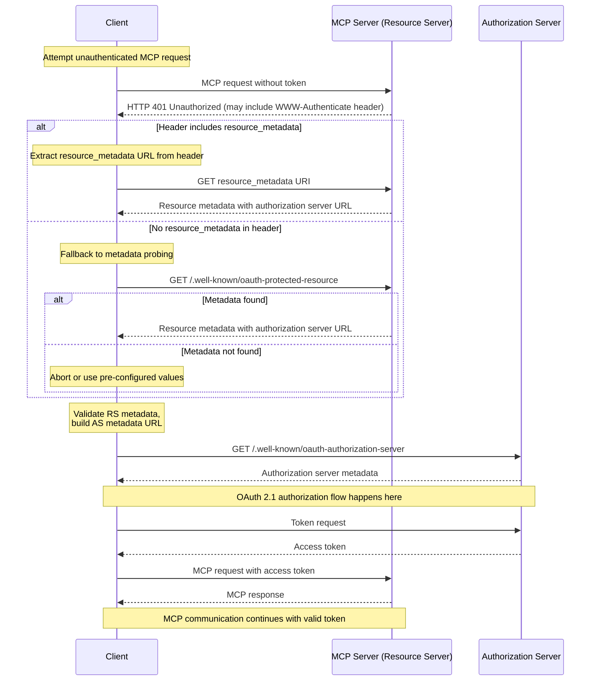

# Source: https://modelcontextprotocol.io/community/seps/985-align-oauth-20-protected-resource-metadata-with-rf.md

> ## Documentation Index
> Fetch the complete documentation index at: https://modelcontextprotocol.io/llms.txt
> Use this file to discover all available pages before exploring further.

# SEP-985: Align OAuth 2.0 Protected Resource Metadata with RFC 9728

> Align OAuth 2.0 Protected Resource Metadata with RFC 9728

export const Badge = ({children, color = "gray"}) => {
  const styles = {
    green: {
      light: {
        bg: "#dcfce7",
        text: "#166534"
      },
      dark: {
        bg: "#14532d",
        text: "#86efac"
      }
    },
    blue: {
      light: {
        bg: "#dbeafe",
        text: "#1e40af"
      },
      dark: {
        bg: "#1e3a5f",
        text: "#93c5fd"
      }
    },
    yellow: {
      light: {
        bg: "#fef9c3",
        text: "#854d0e"
      },
      dark: {
        bg: "#713f12",
        text: "#fde047"
      }
    },
    red: {
      light: {
        bg: "#fee2e2",
        text: "#991b1b"
      },
      dark: {
        bg: "#7f1d1d",
        text: "#fca5a5"
      }
    },
    orange: {
      light: {
        bg: "#ffedd5",
        text: "#9a3412"
      },
      dark: {
        bg: "#7c2d12",
        text: "#fdba74"
      }
    },
    purple: {
      light: {
        bg: "#f3e8ff",
        text: "#6b21a8"
      },
      dark: {
        bg: "#581c87",
        text: "#d8b4fe"
      }
    },
    gray: {
      light: {
        bg: "#f3f4f6",
        text: "#1f2937"
      },
      dark: {
        bg: "#374151",
        text: "#d1d5db"
      }
    }
  };
  const s = styles[color] || styles.gray;
  return <>
      <style>{`
        .badge-${color} { background-color: ${s.light.bg}; color: ${s.light.text}; }
        .dark .badge-${color}, [data-theme="dark"] .badge-${color} { background-color: ${s.dark.bg}; color: ${s.dark.text}; }
        @media (prefers-color-scheme: dark) {
          .badge-${color}:not(.light *) { background-color: ${s.dark.bg}; color: ${s.dark.text}; }
        }
      `}</style>
      <span className={`badge-${color} inline-flex items-center px-2.5 py-0.5 rounded-full text-xs font-medium`}>
        {children}
      </span>
    </>;
};

<div className="flex items-center gap-2 mb-4">
  <Badge color="green">Final</Badge>
  <Badge color="gray">Standards Track</Badge>
</div>

| Field         | Value                                                                         |
| ------------- | ----------------------------------------------------------------------------- |
| **SEP**       | 985                                                                           |
| **Title**     | Align OAuth 2.0 Protected Resource Metadata with RFC 9728                     |
| **Status**    | Final                                                                         |
| **Type**      | Standards Track                                                               |
| **Created**   | 2025-07-16                                                                    |
| **Author(s)** | sunishsheth2009                                                               |
| **Sponsor**   | None                                                                          |
| **PR**        | [#985](https://github.com/modelcontextprotocol/modelcontextprotocol/pull/985) |

***

## Abstract

This proposal brings the MCP spec's handling of OAuth 2.0 Protected Resource Metadata in line with [RFC 9728](https://datatracker.ietf.org/doc/html/rfc9728#name-obtaining-protected-resourc).

Currently, the MCP spec requires the use of the HTTP WWW-Authenticate header when returning a 401 Unauthorized to indicate the location of the protected resource metadata. However, [RFC 9728, Section 5](https://datatracker.ietf.org/doc/html/rfc9728#section-5) states:

“A protected resource MAY use the WWW-Authenticate HTTP response header field, as discussed in RFC 9110, to return a URL to its protected resource metadata to the client.”

This suggests that the MCP spec could be made more flexible while still maintaining RFC compliance.

## Rationale

Many large-scale, dynamic, multi-tenant environments rely on a centralized authentication service separate from the backend resource servers. In such deployments, injecting WWW-Authenticate headers from backend services is non-trivial due to separation of concerns and infrastructure complexity.

In these scenarios, having the option to discover metadata via a well-known URL provides a practical path forward for easier MCP adoption. Requiring only the header would impose significant communication overhead between components, especially when hundreds or thousands of MCP instances are created and destroyed dynamically. Also if there are specific managed MCP servers, adopting headers across centralized system would add significant overhead.

While this increases complexity for clients—who must now implement logic to probe metadata endpoints—it reduces friction for server deployments and may encourage broader adoption. There are tradeoffs:

Pros for Server Developers: Avoid complex header injection; simplifies integration in distributed environments.

Cons for Client Developers: Clients must fall back to metadata discovery logic when the header is absent, increasing client complexity.

## Proposed State

Update the MCP spec to:

```
Clients MUST interpret the WWW-Authenticate header, and fallback to probing for metadata if not present.
Servers SHOULD return the WWW-Authenticate header
```

**The reason for deviating a bit on the RFC:**
Go with SHOULD over MAY for WWW-Authenticate is that it makes supporting other features, such as incremental authorization easier (e.g. you make a request for a tool, but need additional scopes, and receive a WWW-Authenticate challenge indicating the scopes).

Based on the above, following the updated flow:

* Attempt the MCP request without a token.
* If a 401 Unauthorized response is received: Check for a WWW-Authenticate header. If present and includes the resource\_metadata parameter, use it to locate the resource metadata.
* If the header is absent or does not include resource\_metadata, fallback to requesting /.well-known/oauth-protected-resource.

This change allows more flexible deployment models without removing existing capabilities.



## Backward Compatibility

This proposal is fully backward-compatible.

It retains support for the WWW-Authenticate header (already in the spec) and introduces a fallback mechanism using the .well-known metadata path, which is already defined in MCP as a MUST-support location.

Clients that already support metadata probing benefit from improved interoperability. Servers are not required to emit the WWW-Authenticate header if it is infeasible, but doing so is still encouraged to reduce client complexity and enable future extensibility.
