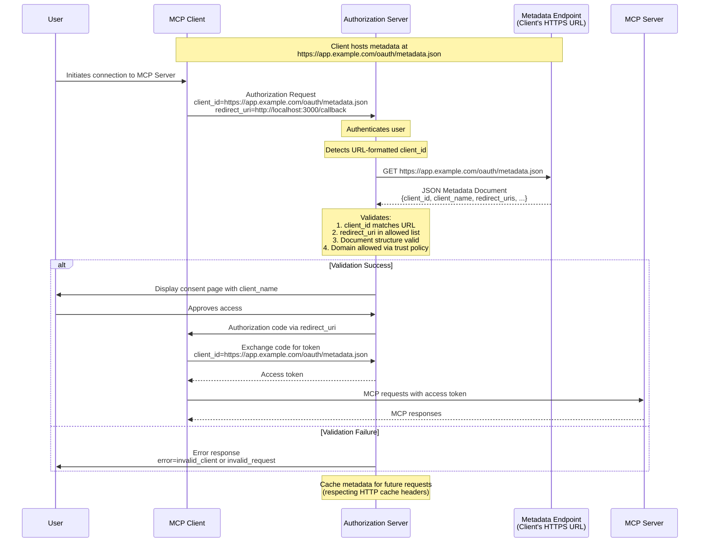

# Source: https://modelcontextprotocol.io/community/seps/991-enable-url-based-client-registration-using-oauth-c.md

> ## Documentation Index
> Fetch the complete documentation index at: https://modelcontextprotocol.io/llms.txt
> Use this file to discover all available pages before exploring further.

# SEP-991: Enable URL-based Client Registration using OAuth Client ID Metadata Documents

> Enable URL-based Client Registration using OAuth Client ID Metadata Documents

export const Badge = ({children, color = "gray"}) => {
  const styles = {
    green: {
      light: {
        bg: "#dcfce7",
        text: "#166534"
      },
      dark: {
        bg: "#14532d",
        text: "#86efac"
      }
    },
    blue: {
      light: {
        bg: "#dbeafe",
        text: "#1e40af"
      },
      dark: {
        bg: "#1e3a5f",
        text: "#93c5fd"
      }
    },
    yellow: {
      light: {
        bg: "#fef9c3",
        text: "#854d0e"
      },
      dark: {
        bg: "#713f12",
        text: "#fde047"
      }
    },
    red: {
      light: {
        bg: "#fee2e2",
        text: "#991b1b"
      },
      dark: {
        bg: "#7f1d1d",
        text: "#fca5a5"
      }
    },
    orange: {
      light: {
        bg: "#ffedd5",
        text: "#9a3412"
      },
      dark: {
        bg: "#7c2d12",
        text: "#fdba74"
      }
    },
    purple: {
      light: {
        bg: "#f3e8ff",
        text: "#6b21a8"
      },
      dark: {
        bg: "#581c87",
        text: "#d8b4fe"
      }
    },
    gray: {
      light: {
        bg: "#f3f4f6",
        text: "#1f2937"
      },
      dark: {
        bg: "#374151",
        text: "#d1d5db"
      }
    }
  };
  const s = styles[color] || styles.gray;
  return <>
      <style>{`
        .badge-${color} { background-color: ${s.light.bg}; color: ${s.light.text}; }
        .dark .badge-${color}, [data-theme="dark"] .badge-${color} { background-color: ${s.dark.bg}; color: ${s.dark.text}; }
        @media (prefers-color-scheme: dark) {
          .badge-${color}:not(.light *) { background-color: ${s.dark.bg}; color: ${s.dark.text}; }
        }
      `}</style>
      <span className={`badge-${color} inline-flex items-center px-2.5 py-0.5 rounded-full text-xs font-medium`}>
        {children}
      </span>
    </>;
};

<div className="flex items-center gap-2 mb-4">
  <Badge color="green">Final</Badge>
  <Badge color="gray">Standards Track</Badge>
</div>

| Field         | Value                                                                                                             |
| ------------- | ----------------------------------------------------------------------------------------------------------------- |
| **SEP**       | 991                                                                                                               |
| **Title**     | Enable URL-based Client Registration using OAuth Client ID Metadata Documents                                     |
| **Status**    | Final                                                                                                             |
| **Type**      | Standards Track                                                                                                   |
| **Created**   | 2025-07-07                                                                                                        |
| **Author(s)** | Paul Carleton ([@pcarleton](https://github.com/pcarleton)) Aaron Parecki ([@aaronpk](https://github.com/aaronpk)) |
| **Sponsor**   | None                                                                                                              |
| **PR**        | [#991](https://github.com/modelcontextprotocol/modelcontextprotocol/pull/991)                                     |

***

## Abstract

This SEP proposes adopting OAuth Client ID Metadata Documents as specified in [draft-parecki-oauth-client-id-metadata-document-03](https://datatracker.ietf.org/doc/draft-parecki-oauth-client-id-metadata-document/) as an additional client registration mechanism for the Model Context Protocol (MCP). This approach allows OAuth clients to use HTTPS URLs as client identifiers, where the URL points to a JSON document containing client metadata. This specifically addresses the common MCP scenario where servers and clients have no pre-existing relationship, enabling servers to trust clients without pre-coordination while maintaining full control over access policies.

## Motivation

The Model Context Protocol currently supports two client registration approaches:

1. **Pre-registration**: Requires either client developers or users to manually register clients with each server
2. **Dynamic Client Registration (DCR)**: Allows just-in-time registration by sending client metadata to a register endpoint on the Authorization server.

Both approaches have significant limitations for MCP's use case where clients frequently need to connect to servers they've never encountered before:

* Pre-registration by developers is impractical as servers may not exist when clients ship
* Pre-registration by users creates poor UX requiring manual credential management
* DCR requires servers to manage unbounded databases, handle expiration, and trust self-asserted metadata

### The Target Use Case: No Pre-existing Relationship

This proposal specifically targets the common MCP scenario where:

* A user wants to connect a client to a server they've discovered
* The client developer has never heard of this server
* The server operator has never heard of this client
* Both parties need to establish trust without prior coordination

For scenarios with pre-existing relationships, pre-registration remains the optimal solution. However, MCP's value comes from its ability to connect arbitrary clients and servers, making the "no pre-existing relationship" case critical to address.

Relatedly, there are many more MCP servers than there are clients (similar to how there are many more web browsers than API's). A common scenario is an MCP server developer wanting to restrict usage to a set of clients they trust.

### Key Innovation: Server-Controlled Trust Without Pre-Coordination

Client ID Metadata Documents enable a unique trust model where:

1. **Servers can trust clients they've never seen before** based on:
   * The HTTPS domain hosting the metadata
   * The metadata content itself
   * Domain reputation and security policies

2. **Servers maintain full control** through flexible policies:
   * **Open Servers**: Can accept any HTTPS client\_id, enabling maximum interoperability
   * **Protected Servers**: Can restrict to trusted domains or specific clients

3. **No client pre-coordination required**:
   * Clients don't need to know about servers in advance
   * Clients just need to host their metadata document
   * Trust flows from the client's domain, not prior registration

## Specification Changes

The change to the specification will be adding Client ID Metadata documents as a SHOULD, and changing DCR to a MAY, as we think that Client ID Metadata documents are a better default option for this scenario.

We will primarily rely on the text in the linked RFC, aiming not to repeat most of it. Below is a short version of what we'll need to specify.



### Client Requirements

* Clients MUST host their metadata document at an HTTPS URL following RFC requirements
* The client\_id URL MUST use "https" scheme and contain a path component
* Metadata documents MUST be valid JSON and include at minimum:
  * `client_id`: matching the document URL exactly
  * `client_name`: human-readable name for authorization prompts
  * `redirect_uris`: array of allowed redirect URIs
  * `token_endpoint_auth_method`: "none" for public clients

Note a client can use `private_key_jwt` for a `token_endpoint_auth_method` given the client metadata can provide public key information.

### Server Requirements

* Servers SHOULD fetch metadata documents when encountering URL-formatted client\_ids
* Servers MUST validate the fetched document contains matching client\_id
* Servers SHOULD cache metadata respecting HTTP headers (max 24 hours recommended)
* Servers MUST validate redirect URIs match those in metadata document

### Discovery

* Servers advertise support via OAuth metadata: `client_id_metadata_document_supported: true`
* Clients detect support and can fallback to DCR or pre-registration if unavailable

Example metadata document:

```json  theme={null}
{
  "client_id": "https://app.example.com/oauth/client-metadata.json",
  "client_name": "Example MCP Client",
  "client_uri": "https://app.example.com",
  "logo_uri": "https://app.example.com/logo.png",
  "redirect_uris": [
    "http://127.0.0.1:3000/callback",
    "http://localhost:3000/callback"
  ],
  "grant_types": ["authorization_code"],
  "response_types": ["code"],
  "token_endpoint_auth_method": "none"
}
```

### Integration with Existing MCP Auth

This proposal adds Client ID Metadata Documents as a third registration option alongside pre-registration and DCR. Servers MAY support any combination of these approaches:

* Pre-registration remains unchanged
* DCR remains unchanged
* Client ID Metadata Documents are detected by URL-formatted client\_ids, and server support is advertised in OAuth metadata.

## Rationale

### Why This Solves the "No Pre-existing Relationship" Problem

Unlike pre-registration which requires coordination, or DCR which requires servers to manage a registration database, Client ID Metadata Documents provide:

1. **Verifiable Identity**: The HTTPS URL serves as both identifier and trust anchor
2. **No Coordination Needed**: Clients publish metadata, servers consume it
3. **Flexible Trust Policies**: Servers decide their own trust criteria without requiring client changes
4. **Stable Identifiers**: Unlike DCR's ephemeral IDs, URLs are stable and auditable

### Redirect URI Attestation

A key benefit of Client ID Metadata Documents is attestation of redirect URIs:

1. **The metadata document cryptographically binds redirect URIs to the client identity** via HTTPS
2. **Servers can trust that redirect URIs in the metadata are controlled by the client** - not attacker-supplied
3. **This prevents redirect URI manipulation attacks** common with self-asserted registration

### Risks of this approach

#### Risk: Localhost URL Impersonation

A limitation of Client ID Metadata Documents is that they cannot prevent localhost URL impersonation by itself. An attacker can claim to be any client by:

1. Providing the legitimate client's metadata URL as their client\_id
2. Binding to the same localhost port the legitimate client uses
3. Intercepting the authorization code when the user approves

This attack is concerning because the server sees the correct metadata
document and the user sees the correct client name, making detection
difficult.

Platform-specific attestations (iOS DeviceCheck, Android
Play Integrity) could address this, but they're not universally available. This
would work by a developer running a backend service that consumes the DeviceCheck / Play Integrity
signatures and returns a JWT usable as the `private_key_jwt` authentication for the `token_endpoint_auth_method`.

A similar approach without requiring platform-specific attestations that still raises the cost of the attack
is possible using JWKS and short-lived JWTs signed by a server-side component hosted by the client developer. This component could use attestation mechanisms other than platform-specific ones to attest to the clients identity, such as the client's standard login flow. Using short lived JWTs reduces the risk of credential compromise and replay, but does not eliminate it
entirely - an attacker could still proxy requests to the legitimate
client's signing endpoint.

Fully mitigating this risk is outside the scope of this proposal. This
proposal has the same risks as DCR does in a localhost redirect scenario.

Servers SHOULD display additional warnings for localhost-only clients.

#### Risk: Server Side Request Forgery (SSRF)

The authorization server takes a URL as input from an unknown client, and then fetches that URL. A malicious client could use this to send non-metadata requests on behalf of the authorization server. An example would be sending a URL corresponding to a private administration endpoint that the authorization server has access to.

This can be prevented by validating the URL's and the IP's those URL's resolve to prior to initiating a fetch request.

#### Risk: Distributed Denial of Service (DDoS)

Similarly, an attacker could try to leverage a pool of authorization servers to perform a denial of service attack on a non-MCP server.

There is not any additional amplification for the fetch request (i.e. the bandwidth from the client to make the request roughly equals the bandwidth of the request sent to the target server), and each authorization server can aggressively cache the result of these metadata fetches, so it is unlikely to be an attractive DDoS vector.

#### Risk: Maturity of referenced specification

The RFC for Client ID Metadata documents is still a draft. It has been implemented by the platform Bluesky, but has not been ratified or very widely adopted outside of that, and may evolve over time. Our intention is to evolve and align with subsequent drafts and any final standard, while minimizing disruption and breakage with existing implementations.

This approach has the risk that there are implementation challenges or flaws in the protocol that have not surfaced yet. However, even though DCR has been ratified, and it also has a number of implementation challenges that developers are facing when trying to use it in an open ecosystem context like MCP. Those challenges are the motiviation behind this proposal.

#### Risk: Client implementation burden, espcially local clients

This specification requires an additional piece of infrastructure for clients, since they need to host a metadata file behind an HTTPS url. Without this specification, a client could be strictly a desktop application for example.

The burden of hosting this endpoint is expected to be low as hosting a static JSON file is fairly straightforward and most known clients have a webpage advertising their client or providing download links.

#### Risk: Fragmentation of authorization approaches

Authorization for MCP is already challenging to fully implement for clients and servers. Questions about how to do it correctly and best practices are some of the most common in the community. Adding another branch to the authorization flow means this could be even more complicated and fractured, meaning fewer developers succeed in following the specification, and the promise of compatibility and an open ecosystem suffers as a result.

This proposal intends to simplify the story for authorization server and resource server developers by providing a clearer mechanism to trust redirect URIs and less operational overhead. This proposal depends on that simplicity being clearly the better option for most folks, which will drive more adoption and end up being the most supported option. If we do not believe that it is clearly the better option, then we should not adopt this proposal.

This proposal also provides a unified mechanism for both open servers and servers that want to restrict which clients can be used. Alternatives to this proposal require that clients and servers implement different mechanisms for the open and protected use cases.

## Alternatives Considered

1. **Enhanced DCR with Software Statements**: More complex, requires JWKS hosting and JWT signing
2. **Mandatory Pre-registration**: Poor developer and user experience for MCP's distributed ecosystem
3. **Mutual TLS**: Requires trusting a client certificate authority, impractical in an open ecosystem
4. **Status Quo**: Continues current pain points for server implementers

Client ID Metadata document is a strict improvement over DCR for the most common open-ecosystem use case. It can be further extended in the future to better support things like OS-level attestations and jwks\_uri's.

## Backward Compatibility

This proposal is fully backward compatible:

* Existing pre-registered clients continue working unchanged
* Existing DCR implementations continue working unchanged
* Servers can adopt Client ID Metadata Documents incrementally
* Clients can detect support and fall back to other methods

## Prototype Implementation

A prototype implementation is available [here](https://github.com/modelcontextprotocol/typescript-sdk/pull/839) demonstrating:

1. Client-side metadata document hosting
2. Server-side metadata fetching and validation
3. Integration with existing MCP OAuth flows
4. Proper error handling and fallback behavior

## Security Implications

1. **Phishing Prevention**: Display client hostname prominently
2. **SSRF Protection**: Validate URLs, limit response size, timeout requests, rate limit outbound requests

### Best Practices

* Only fetch client metadata after authenticating the user
* Implement rate limiting on outbound metadata fetches
* Consider additional warnings for new/unknown/localhost domains
* Log metadata fetch failures for monitoring

## References

* [draft-parecki-oauth-client-id-metadata-document-03](https://www.ietf.org/archive/id/draft-parecki-oauth-client-id-metadata-document-03.txt)
* [OAuth 2.1](https://datatracker.ietf.org/doc/draft-ietf-oauth-v2-1/)
* [RFC 7591 - OAuth 2.0 Dynamic Client Registration](https://www.rfc-editor.org/rfc/rfc7591.html)
* [MCP Specification - Authorization](https://modelcontextprotocol.org/docs/spec/authorization)
* [Evolving OAuth Client Registration in the Model Context Protocol](https://github.com/modelcontextprotocol/modelcontextprotocol/pull/1027/)
