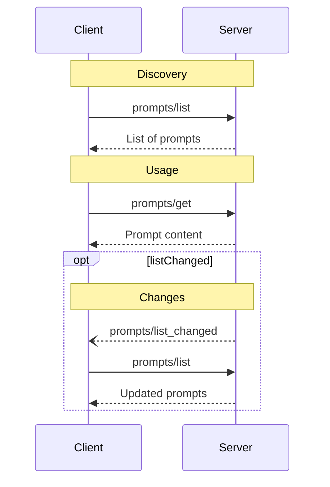

# Source: https://modelcontextprotocol.io/specification/2025-11-25/server/prompts.md

> ## Documentation Index
> Fetch the complete documentation index at: https://modelcontextprotocol.io/llms.txt
> Use this file to discover all available pages before exploring further.

# Prompts

<div id="enable-section-numbers" />

<Info>**Protocol Revision**: 2025-11-25</Info>

The Model Context Protocol (MCP) provides a standardized way for servers to expose prompt
templates to clients. Prompts allow servers to provide structured messages and
instructions for interacting with language models. Clients can discover available
prompts, retrieve their contents, and provide arguments to customize them.

## User Interaction Model

Prompts are designed to be **user-controlled**, meaning they are exposed from servers to
clients with the intention of the user being able to explicitly select them for use.

Typically, prompts would be triggered through user-initiated commands in the user
interface, which allows users to naturally discover and invoke available prompts.

For example, as slash commands:


However, implementors are free to expose prompts through any interface pattern that suits
their needs—the protocol itself does not mandate any specific user interaction
model.

## Capabilities

Servers that support prompts **MUST** declare the `prompts` capability during
[initialization](/specification/2025-11-25/basic/lifecycle#initialization):

```json  theme={null}
{
  "capabilities": {
    "prompts": {
      "listChanged": true
    }
  }
}
```

`listChanged` indicates whether the server will emit notifications when the list of
available prompts changes.

## Protocol Messages

### Listing Prompts

To retrieve available prompts, clients send a `prompts/list` request. This operation
supports [pagination](/specification/2025-11-25/server/utilities/pagination).

**Request:**

```json  theme={null}
{
  "jsonrpc": "2.0",
  "id": 1,
  "method": "prompts/list",
  "params": {
    "cursor": "optional-cursor-value"
  }
}
```

**Response:**

```json  theme={null}
{
  "jsonrpc": "2.0",
  "id": 1,
  "result": {
    "prompts": [
      {
        "name": "code_review",
        "title": "Request Code Review",
        "description": "Asks the LLM to analyze code quality and suggest improvements",
        "arguments": [
          {
            "name": "code",
            "description": "The code to review",
            "required": true
          }
        ],
        "icons": [
          {
            "src": "https://example.com/review-icon.svg",
            "mimeType": "image/svg+xml",
            "sizes": ["any"]
          }
        ]
      }
    ],
    "nextCursor": "next-page-cursor"
  }
}
```

### Getting a Prompt

To retrieve a specific prompt, clients send a `prompts/get` request. Arguments may be
auto-completed through [the completion API](/specification/2025-11-25/server/utilities/completion).

**Request:**

```json  theme={null}
{
  "jsonrpc": "2.0",
  "id": 2,
  "method": "prompts/get",
  "params": {
    "name": "code_review",
    "arguments": {
      "code": "def hello():\n    print('world')"
    }
  }
}
```

**Response:**

```json  theme={null}
{
  "jsonrpc": "2.0",
  "id": 2,
  "result": {
    "description": "Code review prompt",
    "messages": [
      {
        "role": "user",
        "content": {
          "type": "text",
          "text": "Please review this Python code:\ndef hello():\n    print('world')"
        }
      }
    ]
  }
}
```

### List Changed Notification

When the list of available prompts changes, servers that declared the `listChanged`
capability **SHOULD** send a notification:

```json  theme={null}
{
  "jsonrpc": "2.0",
  "method": "notifications/prompts/list_changed"
}
```

## Message Flow



## Data Types

### Prompt

A prompt definition includes:

* `name`: Unique identifier for the prompt
* `title`: Optional human-readable name of the prompt for display purposes.
* `description`: Optional human-readable description
* `icons`: Optional array of icons for display in user interfaces
* `arguments`: Optional list of arguments for customization

### PromptMessage

Messages in a prompt can contain:

* `role`: Either "user" or "assistant" to indicate the speaker
* `content`: One of the following content types:

<Note>
  All content types in prompt messages support optional
  [annotations](./resources#annotations) for metadata about audience, priority,
  and modification times.
</Note>

#### Text Content

Text content represents plain text messages:

```json  theme={null}
{
  "type": "text",
  "text": "The text content of the message"
}
```

This is the most common content type used for natural language interactions.

#### Image Content

Image content allows including visual information in messages:

```json  theme={null}
{
  "type": "image",
  "data": "base64-encoded-image-data",
  "mimeType": "image/png"
}
```

The image data **MUST** be base64-encoded and include a valid MIME type. This enables
multi-modal interactions where visual context is important.

#### Audio Content

Audio content allows including audio information in messages:

```json  theme={null}
{
  "type": "audio",
  "data": "base64-encoded-audio-data",
  "mimeType": "audio/wav"
}
```

The audio data MUST be base64-encoded and include a valid MIME type. This enables
multi-modal interactions where audio context is important.

#### Embedded Resources

Embedded resources allow referencing server-side resources directly in messages:

```json  theme={null}
{
  "type": "resource",
  "resource": {
    "uri": "resource://example",
    "mimeType": "text/plain",
    "text": "Resource content"
  }
}
```

Resources can contain either text or binary (blob) data and **MUST** include:

* A valid resource URI
* The appropriate MIME type
* Either text content or base64-encoded blob data

Embedded resources enable prompts to seamlessly incorporate server-managed content like
documentation, code samples, or other reference materials directly into the conversation
flow.

## Error Handling

Servers **SHOULD** return standard JSON-RPC errors for common failure cases:

* Invalid prompt name: `-32602` (Invalid params)
* Missing required arguments: `-32602` (Invalid params)
* Internal errors: `-32603` (Internal error)

## Implementation Considerations

1. Servers **SHOULD** validate prompt arguments before processing
2. Clients **SHOULD** handle pagination for large prompt lists
3. Both parties **SHOULD** respect capability negotiation

## Security

Implementations **MUST** carefully validate all prompt inputs and outputs to prevent
injection attacks or unauthorized access to resources.
