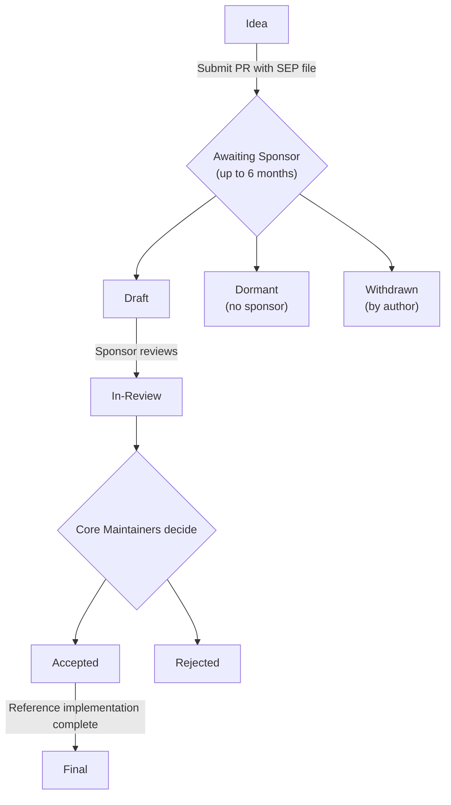

# Source: https://modelcontextprotocol.io/community/sep-guidelines.md

> ## Documentation Index
> Fetch the complete documentation index at: https://modelcontextprotocol.io/llms.txt
> Use this file to discover all available pages before exploring further.

# SEP Guidelines

> Specification Enhancement Proposal (SEP) guidelines for proposing changes to the Model Context Protocol

## What is a SEP?

SEP stands for Specification Enhancement Proposal. A SEP is a design document providing information to the MCP community, or describing a new feature for the Model Context Protocol or its processes. The SEP should provide a concise technical specification of the feature and a rationale for the feature.

SEPs are the primary mechanism for proposing major new features, collecting community input on an issue, and documenting the design decisions that have gone into MCP. The SEP author is responsible for building consensus within the community and documenting dissenting opinions.

SEPs are maintained as markdown files in the [`seps/` directory](https://github.com/modelcontextprotocol/modelcontextprotocol/tree/main/seps) of the specification repository. Their revision history serves as the historical record of the feature proposal.

## When to Write a SEP

The SEP process is reserved for changes that are substantial enough to require broad community discussion, a formal design document, and a historical record. A regular GitHub pull request is often more appropriate for smaller changes.

**Write a SEP if your change involves:**

* **A new feature or protocol change** - Adding, modifying, or removing features in the protocol (new API methods, message format changes, interoperability standards)
* **A breaking change** - Any change that is not backwards-compatible
* **A governance or process change** - Altering decision-making or contribution guidelines
* **A complex or controversial topic** - Changes likely to have multiple valid solutions or generate significant debate

**Skip the SEP process for:**

* Bug fixes and typo corrections
* Documentation clarifications
* Adding examples to existing features
* Minor schema fixes that don't change behavior

Not sure? Ask in [Discord](https://discord.gg/6CSzBmMkjX) before starting significant work.

## SEP Types

There are three kinds of SEP:

1. **Standards Track** - Describes a new feature or implementation for the Model Context Protocol, or an interoperability standard supported outside the core specification.
2. **Informational** - Describes a design issue or provides guidelines/information to the community without proposing a new feature.
3. **Process** - Describes a process surrounding MCP or proposes a change to a process (like this document).

## SEP Workflow

### Step-by-Step Process

1. **Draft your SEP** as a markdown file named `0000-your-feature-title.md`, using `0000` as a placeholder. Follow the [SEP format](#sep-format) below.

2. **Create a pull request** adding your SEP file to the `seps/` directory in the [specification repository](https://github.com/modelcontextprotocol/modelcontextprotocol).

3. **Update the SEP number**: Once your PR is created, rename the file using the PR number (e.g., PR #1850 becomes `1850-your-feature-title.md`) and update the SEP header.

4. **Find a Sponsor**: Tag a Core Maintainer or Maintainer from [the maintainer list](https://github.com/modelcontextprotocol/modelcontextprotocol/blob/main/MAINTAINERS.md). Choose someone whose area relates to your proposal. Tips:
   * Tag 1-2 relevant maintainers, not everyone
   * Share your PR in the relevant Discord channel
   * If no response after 2 weeks, ask in `#general`

5. **Sponsor assigns themselves**: When a sponsor agrees, they assign themselves to the PR and update the SEP status to `draft`.

6. **Informal review**: The sponsor reviews the proposal and may request changes. Discussion happens in PR comments.

7. **Formal review**: When ready, the sponsor updates the status to `in-review`. The SEP enters formal review by Core Maintainers (meetings every two weeks).

8. **Resolution**: The SEP may be `accepted`, `rejected`, or returned for revision. The sponsor updates the status.

9. **Finalization**: Once accepted, the reference implementation must be completed. When complete and incorporated into the specification, the sponsor updates the status to `final`.

### SEP Statuses

| Status       | Meaning                                          |
| ------------ | ------------------------------------------------ |
| `draft`      | Has a sponsor, undergoing informal review        |
| `in-review`  | Ready for formal Core Maintainer review          |
| `accepted`   | Approved, awaiting reference implementation      |
| `rejected`   | Declined by Core Maintainers                     |
| `withdrawn`  | Author withdrew the proposal                     |
| `final`      | Complete with reference implementation           |
| `superseded` | Replaced by a newer SEP                          |
| `dormant`    | No sponsor found within 6 months; can be revived |

**Important distinction**: `dormant` is not the same as `rejected`. A dormant SEP simply didn't find a sponsor - the idea may still be valid. If circumstances change (new community interest, new use cases), a dormant SEP can be revived by finding a sponsor and reopening the PR.

## SEP Format

Each SEP should have the following parts:

### 1. Preamble

A short descriptive title, author names/contact info, current status, SEP type, and PR number.

### 2. Abstract

A short (\~200 word) description of the technical issue being addressed.

### 3. Motivation

Why the existing protocol specification is inadequate. This is critical - SEPs without sufficient motivation may be rejected outright.

### 4. Specification

The technical specification describing syntax and semantics of the new feature. Must be detailed enough for competing, interoperable implementations.

### 5. Rationale

Why particular design decisions were made, alternate designs considered, and related work. Should provide evidence of community consensus and address objections raised during discussion.

### 6. Backward Compatibility

All SEPs introducing backward incompatibilities must describe these incompatibilities, their severity, and how to deal with them.

### 7. Reference Implementation

Must be completed before the SEP reaches "Final" status, but need not be complete before acceptance.

### 8. Security Implications

Any security concerns related to the SEP should be explicitly documented.

See the [SEP template](https://github.com/modelcontextprotocol/modelcontextprotocol/blob/main/seps/README.md#sep-file-structure) for the complete file structure.

## Prototype Requirements

Before a SEP can be accepted, you need "a prototype implementation demonstrating the proposal." Here's what qualifies:

**Acceptable prototypes:**

* A working implementation in one of the official SDKs (as a branch/fork)
* A standalone proof-of-concept demonstrating the key mechanics
* Integration tests showing the proposed behavior
* A reference server or client implementing the feature

**The prototype should:**

* Demonstrate the core functionality works as described
* Show the API design is practical and ergonomic
* Reveal any edge cases or implementation challenges
* Be runnable by reviewers (include setup instructions)

**Not sufficient:**

* Pseudocode alone
* A design document without code
* "Trust me, it works" - reviewers need to see it

The prototype doesn't need to be production-ready. It exists to prove feasibility and surface issues early.

## The Sponsor Role

A Sponsor is a Core Maintainer or Maintainer who champions the SEP through the review process. The sponsor's responsibilities include:

* Reviewing the proposal and providing constructive feedback
* Requesting changes based on community input
* **Updating the SEP status** as the proposal progresses
* Initiating formal review when the SEP is ready
* Presenting and discussing the proposal at Core Maintainer meetings
* Ensuring the proposal meets quality standards

Authors should request status changes through their sponsor rather than modifying the status field themselves.

## Status Management

**The Sponsor is responsible for updating the SEP status.** This ensures status transitions are made by someone with the authority and context to do so appropriately.

The sponsor:

1. Updates the `Status` field directly in the SEP markdown file (or, if they do not have access to the source repo, work with the author to set the right status)
2. Applies matching labels to the pull request (e.g., `draft`, `in-review`, `accepted`)

Both the markdown status field and PR labels should be kept in sync. The markdown file is the canonical record (versioned with the proposal), while PR labels make it easy to filter and search.

## SEP Review & Resolution

SEPs are reviewed by the MCP Core Maintainers team every two weeks.

For a SEP to be accepted it must meet these criteria:

* A prototype implementation demonstrating the proposal
* Clear benefit to the MCP ecosystem
* Community support and consensus

Once a SEP has been accepted, the reference implementation must be completed. When complete and incorporated into the main repository, the status changes to "Final".

## After Rejection

Rejection is not permanent. You can:

1. **Address the feedback** - If specific concerns were raised, address them and resubmit
2. **Discuss the rejection** - Ask in Discord to understand the reasoning
3. **Submit a competing SEP** - Sometimes a different approach works better
4. **Wait for the right time** - Community needs evolve; what's rejected today may be welcomed later

## Reporting SEP Bugs or Updates

For SEPs not yet reaching `final` state, comment directly on the SEP's pull request. Once a SEP is finalized and merged, submit updates by creating a new pull request that modifies the SEP file.

## Transferring SEP Ownership

It occasionally becomes necessary to transfer ownership of SEPs to a new author. In general, we'd like to retain the original author as a co-author, but that's up to the original author.

Good reasons to transfer ownership:

* Original author no longer has time or interest
* Original author is unreachable

Bad reasons:

* You disagree with the direction (submit a competing SEP instead)

## Copyright

This document is placed in the public domain or under the CC0-1.0-Universal license, whichever is more permissive.
