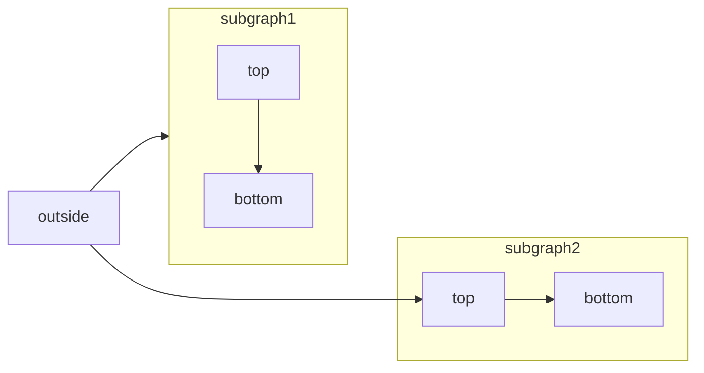
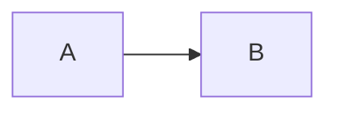
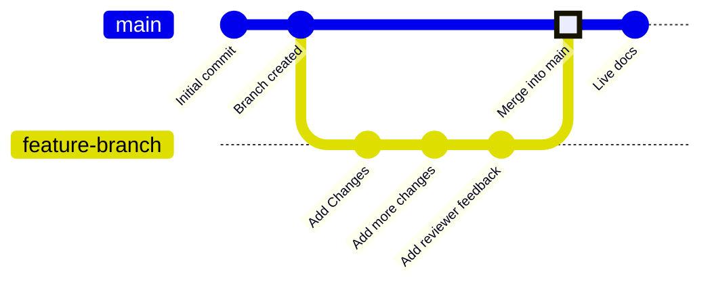

# Mintlify Documentation

Source: https://mintlify.com/docs/llms-full.txt

---

# Customize agent behavior
Source: https://www.mintlify.com/docs/agent/customize

Configure how the agent handles documentation tasks with AGENTS.md.

Create an `AGENTS.md` file in your repository to customize the agent's behavior (`Agents.md` is also accepted). The agent reads this file and follows any instructions you provide.

The agent searches for `AGENTS.md` files in two locations. It first checks the documentation directory, then the repository root. If you have `AGENTS.md` files in both locations, the agent uses the file in your documentation directory.

Add any instructions that you want the agent to follow. The agent appends these instructions to its system prompt, so the instructions apply to all tasks, whether you use the agent in your dashboard, on Slack, or via the API.

## What to include in AGENTS.md

Consider adding instructions for:

* **Style preferences**: Voice, tone, formatting, and terminology specific to your documentation.
* **Code standards**: Programming languages, frameworks, and coding conventions to use in examples.
* **Content requirements**: What sections or information to include for different types of pages.
* **Project context**: Specific details about your product, architecture, or user base that inform documentation decisions.

## Example AGENTS.md file

```markdown AGENTS.md theme={null}
# Documentation agent instructions

## Code examples
- Use TypeScript for all code examples. Our users are primarily TypeScript developers.
- Always include error handling in API call examples.
- Show both success and error response examples for all endpoints.
- Include import statements at the top of code examples.

## API documentation standards
- Every endpoint must document: authentication requirements, rate limits, and common error codes.
- Use real-world parameter values in examples (not foo/bar placeholders).
- Include a complete request/response cycle for each endpoint.

## Style and formatting
- Write for developers with 2-5 years of experience. Don't oversimplify, but explain non-obvious concepts.
- Use active voice and second person ("you").
- Date format: ISO 8601 (YYYY-MM-DD).
- When referencing UI elements, use bold: **Settings** button.

## What to include
- Add prerequisite sections to guides when users need API keys, environment setup, or dependencies.
- Include "Next steps" sections linking to related documentation.
- Add troubleshooting sections for common issues we see in support tickets.
```


# Write effective prompts
Source: https://www.mintlify.com/docs/agent/effective-prompts

Get better results from the agent with clear, focused prompts.

Think of the agent as a helpful assistant that needs your guidance to complete tasks. Give it clear instructions and context. More focused tasks are easier to complete, so break down complex projects into smaller steps.

## Make prompts specific and outcome-focused

Generic prompts like `@mintlify Improve the onboarding page` apply general best practices, but may not improve content in the specific way that you were picturing.

Try prompts based on outcomes you want your users to achieve or problems that they encounter.

* `@mintlify A lot of users have trouble installing the CLI. Review the onboarding page and update the docs so that users can easily install the CLI`
* `@mintlify Developers keep getting 401 errors when following our authentication guide. Review the auth docs and add clearer examples showing how to properly format the API key`

## Use broad prompts for maintenance tasks

Use broad prompts for general content maintenance like fixing typos, updating redirects, or renaming a feature throughout your docs.

* `@mintlify Find and fix all typos in the docs`
* `@mintlify change all unordered lists to use * instead of -`

## Specify a domain name for multi-site organizations

If you have multiple documentation sites, include the `subdomain` parameter in your message to specify which documentation set the agent should work on.

To find your domain name, look at your dashboard URL for the documentation set you want to update. The domain name is the last part after your organization name. For example, if your dashboard URL is `https://dashboard.mintlify.com/org-name/domain-name`, your domain name is `domain-name`.

Use the format `@mintlify subdomain=<your-domain-name> <your-prompt>` to prompt the agent to work on a specific documentation set.

* `@mintlify subdomain=public-docs Add a new section to the quickstart about inviting collaborators based on this PR`: Prompts the agent to update the quickstart only on the `public-docs` site.
* `@mintlify subdomain=customer-docs Update the auth docs for the new authentication method`: Prompts the agent to update the auth docs only on the `customer-docs` site.


# What is the agent?
Source: https://www.mintlify.com/docs/agent/index

Automate documentation updates with the agent. Create updates from Slack messages, PRs, or API calls.

<Info>
  The agent is available on [Enterprise plans](https://mintlify.com/pricing?ref=agent) for anyone with access to your dashboard.
</Info>

The agent creates pull requests with proposed changes to your documentation based on your prompts. When you send a request to the agent, it references your documentation, connected repositories, and Slack messages to create content that follows technical writing best practices and adheres to the Mintlify schema.

## What you can do with the agent

Use the agent to:

* Write new content based on your prompts, links to pull requests, or Slack threads.
* Revise outdated code examples and API references.
* Search and update existing content.
* Answer questions about your docs and technical writing topics.
* Capture knowledge from Slack conversations and pull requests before it gets lost.

## Where you can use the agent

* **Dashboard**: From any page in your dashboard, use the keyboard shortcut <kbd>⌘</kbd>+<kbd>I</kbd> (macOS) or <kbd>Ctrl</kbd>+<kbd>I</kbd> (Windows/Linux) to open the agent panel. Or click **Ask agent** on the [Overview](https://dashboard.mintlify.com/) page.

  <Frame>
    

    
  </Frame>
* **Slack**: Add the agent to your Slack workspace and mention `@mintlify` to prompt it.
* **API**: Embed the agent in custom applications using the [agent endpoints](/api-reference/agent/create-agent-job)

## Next steps

<Card title="Quickstart" icon="rocket" href="/agent/quickstart">
  Start using the agent in your dashboard.
</Card>

<Card title="Connect Slack" icon="slack" href="/agent/slack">
  Add the agent to your Slack workspace.
</Card>

<Card title="Customize behavior" icon="wrench" href="/agent/customize">
  Configure the agent with an `AGENTS.md` file.
</Card>

<Card title="Write effective prompts" icon="pen" href="/agent/effective-prompts">
  Get better results with focused prompts.
</Card>


# Quickstart
Source: https://www.mintlify.com/docs/agent/quickstart

Start using the agent in your dashboard to create documentation updates.

## Open the agent panel

On desktop, the agent panel is resizable. On mobile devices, the agent opens in full-screen.

To open the agent panel:

* From any page in your dashboard, use the keyboard shortcut <kbd>⌘</kbd>+<kbd>I</kbd> (macOS) or <kbd>Ctrl</kbd>+<kbd>I</kbd> (Windows/Linux).
* On the [Overview](https://dashboard.mintlify.com/) page, click **Ask agent**.

### Agent panel views

<Frame>
  

  
</Frame>

* **Chat**: Click the plus icon, <Icon icon="plus" />, to start a new chat. In the chat view, send prompts to the agent to update or ask questions about your documentation. The agent creates pull requests based on your instructions and displays links to view the pull requests or open the changes in the web editor.
* **Suggestions**: If enabled, the suggestions panel shows suggested updates to your documentation based on pull request changes and users' conversations with the assistant.
* **History**: Click the history icon, <Icon icon="clock" />, to browse past conversations and continue working on previous requests. Click any conversation to load it in the chat view.
* **Settings**: Click the settings icon, <Icon icon="settings" />, to configure the agent's integrations and repository access.

<Tip>
  Start a new conversation with the agent for each task. This keeps the agent's context focused and helps you associate conversations with specific projects.
</Tip>

## Connect your GitHub account

By default, the agent opens pull requests attributed to the Mintlify bot. To attribute pull requests to you, connect your GitHub account on the [My profile](https://dashboard.mintlify.com/settings/account) page of the dashboard.

## Connect repositories as context

The agent can only access repositories that you connect through the Mintlify GitHub App. Configure which repositories the agent can access in the agent panel **Settings** or in the [GitHub App settings](https://github.com/apps/mintlify/installations/new).


# Add the agent to Slack
Source: https://www.mintlify.com/docs/agent/slack

Use the agent in Slack to make documentation updates from conversations and capture team knowledge.

<Note>
  If your Slack Workspace Owner requires admin approval to install apps, ask them to approve the Mintlify app before you connect it.
</Note>

## Connect your Slack workspace

1. Open the agent panel in your dashboard.
2. Click the **Settings** button.

   <Frame>
     

     
   </Frame>
3. In the Slack integration section, click **Connect**.
4. Follow the Slack prompts to add the `mintlify` app to your workspace.
5. Follow the Slack prompts to link your Mintlify account to your Slack workspace.
6. Test that the agent is working and responds when you:
   * Send a direct message to it.
   * Mention it with `@mintlify` in a channel.

## Use the agent in Slack

Once connected, you can:

* Send direct messages to the agent to use it privately to update your documentation.
* Mention `@mintlify` in a channel to use it publicly and collaboratively.
* Continue conversations in threads to iterate on changes.
* Share pull request links with the agent to update related documentation.

## Update documentation

Use the agent to update your documentation with a new request or in an existing thread.

* **New request**: Send a direct message to the agent or mention `@mintlify` in a channel with instructions on what to update.
* **Existing thread**: Reply in the thread and mention `@mintlify` with instructions on what to update.

The agent reads the context of the request or thread and creates a pull request in your connected repository with the updates.

## Best practices

* **Be specific**: Tell the agent exactly what you want documented and where it should go.
* **Add context**: If a thread doesn't contain all the necessary information, include additional details in your message to the agent.
* **Review carefully**: You should always review pull requests that the agent creates before merging them.


# Agent suggestions
Source: https://www.mintlify.com/docs/agent/suggestions

Monitor Git repositories for changes and receive suggested documentation updates.

<Note>
  Agent suggestions are available on [Enterprise plans](https://mintlify.com/pricing?ref=autopilot). To enable suggestions for your organization, [contact our sales team](mailto:gtm@mintlify.com).
</Note>

You can allow the agent to suggest documentation updates from two sources.

* **Pull request changes**: Monitor selected Git repositories for code changes that require documentation updates.
* **Assistant conversations**: Analyze questions that users ask the assistant on your documentation site to identify content gaps.

When the agent identifies potential documentation updates, it creates a suggestion in your dashboard with context to create a pull request.

Use suggestions to proactively keep your documentation up to date when new features ship or to address common user questions.

## Prerequisites

Before using suggestions, you must install the [Mintlify GitHub App](/deploy/github) in your organization. The app must have access to your documentation repository and at least one other repository where code changes require documentation updates.

## Configure suggestions

Configure which repositories the agent monitors and how you receive notifications in the agent settings. The settings page displays all the GitHub organizations and repositories the agent is monitoring.

To access the agent settings:

1. Click the **Ask agent** button in your dashboard to open the agent panel.
2. Click the **Settings** button.

   <Frame>
     

     
   </Frame>

### Monitor repositories

The agent monitors all merged pull requests for each repository that you enable, regardless of which branch they're merged into. A GitHub check named **Mintlify Autopilot** runs on pull requests in monitored repositories to analyze them for potential documentation updates. When you merge a pull request that requires documentation updates, the agent creates a suggestion in your dashboard.

<Note>
  When you first enable monitoring for a repository, the agent creates suggestions for pull requests merged in the last seven days. This backfill only occurs if no suggestions already exist for that repository. You may see multiple suggestions appear immediately after enabling monitoring.
</Note>

If you disable monitoring, the agent immediately stops monitoring the repository. Any existing suggestions for that repository remain in your dashboard until you dismiss them.

### Conversation insights

If you have access to the agent and the assistant, the agent creates suggestions from conversations that your users have with the assistant.

The agent periodically analyzes assistant conversations and creates suggestions when it identifies patterns of questions that indicate missing or unclear documentation.

### Notifications

Agent suggestions always appear in your dashboard. You can configure notifications to receive email or Slack direct messages when the agent creates new suggestions.

<Tip>
  If you don't receive email notifications for suggestions, check your spam folder and add the email address `notifications@mintlify.com` to your safe sender list.
</Tip>

## Review suggestions

The agent creates suggestions in your dashboard. Each suggestion shows the pull request or assistant conversation topic that triggered the suggestion, creation date, and proposed documentation updates.

The **Ask agent** button in your dashboard displays the number of suggestions waiting for your review.

<Frame>
  

  
</Frame>

### Create pull requests

Add suggestions as context for the agent to create pull requests.

1. Click the **Ask agent** button in your dashboard to open the agent panel.
2. Click **Add to chat**.
3. Submit the prompt to the agent to open a pull request.

### Dismiss suggestions

If a suggestion doesn't require documentation updates or you've already addressed the changes, dismiss it to remove it from your dashboard.

1. Click the **Ask agent** button in your dashboard to open the agent panel.
2. Click the **Dismiss** button next to any suggestions that you want to dismiss.

The suggestion is immediately removed from your dashboard. You cannot retrieve dismissed suggestions.


# Workflows
Source: https://www.mintlify.com/docs/agent/workflows

Examples of using the agent in your documentation process.

The agent assists with many different documentation tasks. These workflows show some of the ways you can integrate the agent into your documentation process. Try an approach that fits how your team currently works and adapt it to your specific needs.

## Iterate on a prompt in a Slack thread

Prompt the agent, then continue to mention it with `@mintlify` in the same thread to refine and iterate on the pull request that it creates.

For example: `@mintlify Our quickstart page needs a new section on inviting collaborators`. Then `@mintlify The new section should be called "Inviting collaborators"`. Followed by any other iterations.

## Start with the agent, finish manually

Prompt the agent to begin a project, then check out the branch it creates and finish the task in your local environment or the web editor. The agent can help you get started, then you can take over to complete the task.

For example: `@mintlify Update the quickstart page to include information about inviting collaborators` and then checkout the branch to make any additional changes using your preferred method.

## Update docs when merging feature changes

When you merge a feature pull request, share the PR link with the agent to update relevant docs.

For example: `@mintlify This PR adds a new authentication method. Update the docs to include the new auth flow: [PR link]`.

## Generate release notes from a pull request

Prompt the agent with a specific pull request to generate release notes or changelog updates based on the commit history.

For example: `@mintlify Generate release notes for this PR: [PR link]`.

## Generate code examples

Prompt the agent to generate code examples for features throughout your docs or on specific pages.

For example: `@mintlify Generate a code example to make the authentication method easier to understand`.

## Review existing content

Prompt the agent to review existing content for technical accuracy, style, grammar, or other issues.

For example: `@mintlify Review the API rate limiting section. We changed limits last month`.

## Respond to user feedback

Prompt the agent with feedback from your users to make focused updates to your docs.

For example: `@mintlify Users are getting confused by step 3 in the setup guide. What might be making it unclear?`.

## Automate with the API

Integrate the agent into your existing automation tools to automatically update documentation when code changes occur, trigger content reviews, or sync documentation updates across multiple repositories.

Use the agent endpoints to [create jobs](/api-reference/agent/create-agent-job), [get a specific job](/api-reference/agent/get-agent-job), and [get all jobs](/api-reference/agent/get-all-jobs).

When creating jobs via the API, you can control whether pull requests open in draft mode using the `asDraft` parameter (defaults to `true`). Set `asDraft: false` to create non-draft pull requests ready for immediate review and merging in automated workflows.

Learn how to set up API automation in the [Auto-update documentation when code is merged](/guides/automate-agent) tutorial.


# AI-native documentation
Source: https://www.mintlify.com/docs/ai-native

Learn how AI enhances reading, writing, and discovering your documentation

When you host your documentation on Mintlify, built-in AI features help your users find answers and your team maintain content more efficiently. Your content provides the context for these AI-native features to improve the experiences of reading, writing, and discovering your documentation.

## What makes your documentation AI-native

### Reading

In addition to reading individual pages, users can chat with the [assistant](/ai/assistant) in your documentation for immediate answers to their questions and links to relevant content. The assistant helps guide users through your product with accurate information from your documentation. Embed the assistant into custom apps with the [API](api-reference/assistant/create-assistant-message) to extend where users can access your documentation.

### Writing

The [agent](/agent) helps you write and maintain documentation. It creates pull requests with proposed changes based on your prompts, pull requests, and Slack threads. Add the agent to your Slack workspace so that anyone on your team can help maintain your documentation by chatting with the agent. Or embed the agent into custom apps via the [API](/api-reference/agent/create-agent-job).

You can configure the agent to monitor connected repositories and proactively [suggest](/agent/suggestions) documentation updates when it identifies user-facing changes.

Configure popular tools like [Cursor](/guides/cursor), [Claude Code](/guides/claude-code), and [Windsurf](/guides/windsurf) to reference the Mintlify schema, your style guide, and best practices.

### Discovering

Your site is automatically optimized for AI tools and search engines to help users discover your documentation. All pages send their content as Markdown to AI agents instead of HTML, which helps these tools process your content faster and use fewer tokens. Every page is also available to view as Markdown by appending `.md` to the URL.

Mintlify hosts `llms.txt` and `skill.md` files for your documentation. These industry-standard files help LLMs respond efficiently with relevant information to user queries and provide a list of capabilities for agents to use, so that users are more successful with your product.

Your documentation site also hosts an MCP server that lets users connect your documentation directly to their AI tools for up to date information about your product directly where they want it.

Full-text search and semantic understanding help users and AI tools find relevant information quickly. Search understands user intent rather than just matching keywords. And if a user encounters a 404 error, your site suggests related pages to help them find what they're looking for. No configuration required.

## Enable AI features

Select any of the following cards for more information.

<CardGroup>
  <Card title="Assistant" icon="bot-message-square" href="/ai/assistant">
    Configure the assistant to search external sites or direct people to your support team if it can't answer their questions.
  </Card>

  <Card title="Agent" icon="pen-line" href="/agent/quickstart">
    Use the agent in your dashboard to create documentation updates.
  </Card>

  <Card title="Suggestions" icon="message-circle-plus" href="/agent/suggestions">
    Monitor Git repositories for changes and receive suggested documentation updates.
  </Card>

  <Card title="Contextual menu" icon="sparkles" href="/ai/contextual-menu">
    Add a menu to pages that lets users query AI tools, connect to your MCP server, and copy pages as context with one click.
  </Card>
</CardGroup>


# Assistant
Source: https://www.mintlify.com/docs/ai/assistant

Add AI-powered chat to your docs that answers questions, cites sources, and generates code examples.

<Info>
  The assistant is automatically enabled on [Pro and Enterprise plans](https://mintlify.com/pricing?ref=assistant).
</Info>

## About the assistant

The assistant answers questions about your documentation through natural language queries. Users access the assistant on your documentation site, so they can find answers quickly and succeed with your product even if they don't know where to look.

The assistant uses agentic RAG (retrieval-augmented generation) with tool calling. When users ask questions, the assistant:

* **Searches and retrieves** relevant content from your documentation to provide accurate answers.
* **Cites sources** and provides navigable links to take users directly to referenced pages.
* **Generates copyable code examples** to help users implement solutions from your documentation.

You can view assistant usage through your dashboard to understand user behavior and documentation effectiveness. Export and analyze query data to help identify:

* Frequently asked questions that might need better coverage.
* Content gaps where users struggle to find answers.
* Popular topics that could benefit from additional content.

### How indexing works

The assistant automatically indexes your published documentation to answer questions accurately. When you publish changes, the assistant immediately indexes new, updated, or deleted content. The assistant does not index draft branches or preview deployments.

By default, the assistant does not index hidden pages. To include hidden pages in the assistant's index, set `seo.indexing: "all"` in your `docs.json`. See [Hidden pages](/organize/hidden-pages#search-seo-and-ai-indexing) for more information.

### How the assistant handles unknown questions

The assistant only answers questions based on information in your documentation. If it cannot find relevant information after searching, it responds that it doesn't have enough information to answer.

You can [set a deflection email](/ai/assistant#set-deflection-email) so that the assistant provides your support email to users whose questions it cannot answer. This gives users a path forward, even if the documentation doesn't address their specific question.

## Configure the assistant

The assistant is active on Pro and Enterprise plans by default.

Manage the assistant from the [Assistant Configurations](https://dashboard.mintlify.com/products/assistant/settings) page of your dashboard. Enable or disable the assistant, configure response handling, add default questions, and manage your message allowance.

### Enable or disable the assistant

Toggle the assistant status to enable or disable the assistant for your documentation site.

<Frame>
  

  
</Frame>

### Set deflection email

In the Response Handling section, enable the assistant to redirect unanswered questions to your support team.

Specify an email address for the assistant to give to users if it cannot answer their question. You can also enable a "Contact support" button to appear in the assistant chat panel.

<Frame>
  

  
</Frame>

### Search domains

In the Response Handling section, configure domains that the assistant can search for additional context when answering questions.

* Domains must be publicly available.
* Domains that require JavaScript to load are not supported.

<Frame>
  

  
</Frame>

For more precise control over what the assistant can search, use filtering syntax.

* **Domain-level filtering**
  * `example.com`: Search only the `example.com` domain
  * `docs.example.com`: Search only the `docs.example.com` subdomain
  * `*.example.com`: Search all subdomains of `example.com`
* **Path-level filtering**
  * `docs.example.com/api`: Search all pages under the `/api` subpath
* **Multiple patterns**
  * Add multiple entries to target different sections of sites

### Add sample questions

Help your users begin conversations with the assistant by adding starter questions. Add commonly asked questions or questions about topics that you want your users to know about. Click **Ask AI** for recommended questions based on your documentation.

<Frame>
  

  
</Frame>

## Manage billing

The assistant uses tiered message allowances. A message is any user interaction with the assistant that receives a correct response. If you have unused messages, up to half of your message allowance can carry over to the next billing cycle. For example, if you have a 1,000 message allowance and you use 300 messages, 500 messages carry over to the next billing cycle giving you a total of 1,500 messages for the next billing cycle.

By default, the assistant allows overages. You can disable overages to avoid incurring additional costs for usage beyond your tier. If you reach your message allowance with overages disabled, the assistant is unavailable until your message allowance resets. If you allow overages, each message beyond your allowance incurs an overage charge, but occasional overages may be cheaper than upgrading to a higher tier depending on your usage.

### Change your assistant tier

Assistant tiers determine your monthly message allowance and pricing.

View and change your current tier on the [Billing tab](https://dashboard.mintlify.com/products/assistant/settings/billing) of the assistant page in your dashboard.

In the **Spending Controls** section, select your preferred tier from the dropdown menu.

**Upgrade your tier:**

* Your new message allowance is available immediately.
* You pay a prorated difference for the current billing cycle.

**Downgrade your tier:**

* Your message allowance updates immediately.
* Pricing changes take effect at the start of your next billing cycle.
* Unused messages from your current tier **do not** carry over.

### Allow overages

If you want to disallow overages, disable them in the **Billing Controls** section of the [Billing tab](https://dashboard.mintlify.com/products/assistant/settings/billing) of the assistant page in your dashboard.

### Set usage alerts

In the Billing Controls section, set usage alerts to receive an email when you reach a certain percentage of your message allowance.

## Connect apps

In the connect apps section, add the assistant to your [Discord](/ai/discord) server and [Slack](/ai/slack-bot) workspace to allow users to get answers from your documentation on those platforms.

## Assistant insights

Use assistant insights to understand how users interact with your documentation and identify improvement opportunities.

The [assistant page](https://dashboard.mintlify.com/products/assistant) shows usage trends for the month to date. View more detailed insights on the [analytics](/optimize/analytics#assistant) page.

## Make content AI ingestible

Structure your documentation to help the assistant provide accurate, relevant answers. Clear organization and comprehensive context benefit both human readers and AI understanding.

<Card title="Structure and organization">
  * Use semantic markup.
  * Write descriptive headings for sections.
  * Create a logical information hierarchy.
  * Use consistent formatting across your docs.
  * Include comprehensive metadata in page frontmatter.
  * Break up long blocks of text into shorter paragraphs.
</Card>

<Card title="Context">
  * Define specific terms and acronyms when first introduced.
  * Provide sufficient conceptual content about features and procedures.
  * Include examples and use cases.
  * Cross-reference related topics.
  * Add [hidden pages](/organize/hidden-pages) with additional context that users don't need, but the assistant can reference.
</Card>

## Use the assistant

Users have multiple ways to start a conversation with the assistant. Each method opens a chat panel on the right side of your docs. Users can ask any question and the assistant searches your documentation for an answer. If the assistant cannot retrieve relevant information, the assistant responds that it cannot answer the question.

Add the assistant as a bot to your [Slack workspace](/ai/slack-bot) or [Discord server](/ai/discord) so that your community can ask questions without leaving their preferred platform.

### UI placement

The assistant appears in two locations: as a button next to the search bar and as a bar at the bottom of the page.

<Columns>
  <Frame>
    

    
  </Frame>

  <Frame>
    

    
  </Frame>
</Columns>

### Keyboard shortcut

Open the assistant chat panel with the keyboard shortcut <kbd>Command</kbd> + <kbd>I</kbd> on macOS and <kbd>Ctrl</kbd> + <kbd>I</kbd> on Windows.

### Highlight text

Highlight text on a page and click the **Add to assistant** pop up button to open the assistant chat panel and add the highlighted text as context. You can add multiple text snippets or code blocks to the assistant's context.

<Frame>
  

  
</Frame>

### Code blocks

Click the **Ask AI** button in a code block to open the assistant chat panel and add the code block as context. You can add multiple code blocks or text snippets to the assistant's context.

<Frame>
  

  
</Frame>

### URLs

Open the assistant with a URL query parameter to create deep links that guide users to specific information or share assistant conversations with pre-filled questions.

* **Open the assistant**: Append `?assistant=open` to open the assistant chat panel when the page loads.
  * Example: [https://mintlify.com/docs?assistant=open](https://mintlify.com/docs?assistant=open)
* **Open with a pre-filled query**: Append `?assistant=YOUR_QUERY` to open the assistant and automatically submit a question.
  * Example: [https://mintlify.com/docs?assistant=explain webhooks](https://mintlify.com/docs?assistant=explain%20webhooks)

## Troubleshooting

<Accordion title="Assistant chat bar not visible">
  If the assistant UI is not visible in specific browsers, you may need to submit a false positive report to [EasyList](https://easylist.to). Browsers that use the EasyList Cookies List like Brave and Comet sometimes block the assistant or other UI elements. The EasyList Cookies List includes a domain-specific rule that hides fixed elements on certain domains to block cookie banners. This rule inadvertently affects legitimate UI components.

  Submit a false positive report to [EasyList](https://github.com/easylist/easylist) to request removal of the rule. This resolves the issue for all users once the filter list updates.
</Accordion>


# Contextual menu
Source: https://www.mintlify.com/docs/ai/contextual-menu

Add one-click AI integrations to your docs.

The contextual menu provides quick access to AI-optimized content and direct integrations with popular AI tools. When users select the contextual menu on any page, they can copy content as context for AI tools or open conversations in ChatGPT, Claude, Perplexity, or a custom tool of your choice with your documentation already loaded as context.

## Menu options

The contextual menu includes several pre-built options that you can enable by adding their identifier to your configuration.

| Option                  | Identifier   | Description                                                              |
| :---------------------- | :----------- | :----------------------------------------------------------------------- |
| **Copy page**           | `copy`       | Copies the current page as Markdown for pasting as context into AI tools |
| **View as Markdown**    | `view`       | Opens the current page as Markdown                                       |
| **Open in ChatGPT**     | `chatgpt`    | Creates a ChatGPT conversation with the current page as context          |
| **Open in Claude**      | `claude`     | Creates a Claude conversation with the current page as context           |
| **Open in Perplexity**  | `perplexity` | Creates a Perplexity conversation with the current page as context       |
| **Open in Grok**        | `grok`       | Creates a Grok conversation with the current page as context             |
| **Copy MCP server URL** | `mcp`        | Copies your MCP server URL to the clipboard                              |
| **Connect to Cursor**   | `cursor`     | Installs your hosted MCP server in Cursor                                |
| **Connect to VS Code**  | `vscode`     | Installs your hosted MCP server in VS Code                               |
| **Custom options**      | Object       | Add custom options to the contextual menu                                |

<Frame>
  
</Frame>

## Enabling the contextual menu

Add the `contextual` field to your `docs.json` file and specify which options you want to include.

```json theme={null}
{
 "contextual": {
   "options": [
     "copy",
     "view",
     "chatgpt",
     "claude",
     "perplexity",
     "grok",
     "mcp",
     "cursor",
     "vscode"
   ]
 }
}
```

## Adding custom options

Create custom options in the contextual menu by adding an object to the `options` array. Each custom option requires these properties:

<ResponseField name="title" type="string">
  The title of the option.
</ResponseField>

<ResponseField name="description" type="string">
  The description of the option. Displayed beneath the title when the contextual menu is expanded.
</ResponseField>

<ResponseField name="icon" type="string">
  The icon to display.

  Options:

  * [Font Awesome icon](https://fontawesome.com/icons) name, if you have the `icons.library` [property](/organize/settings#param-icons) set to `fontawesome` in your `docs.json`
  * [Lucide icon](https://lucide.dev/icons) name, if you have the `icons.library` [property](/organize/settings#param-icons) set to `lucide` in your `docs.json`
  * URL to an externally hosted icon
  * Path to an icon file in your project
</ResponseField>

<ResponseField name="iconType" type="string">
  The [Font Awesome](https://fontawesome.com/icons) icon style. Only used with Font Awesome icons.

  Options: `regular`, `solid`, `light`, `thin`, `sharp-solid`, `duotone`, `brands`.
</ResponseField>

<ResponseField name="href" type="string | object">
  The href of the option. Use a string for simple links or an object for dynamic links with query parameters.

  <Expandable title="href object">
    <ResponseField name="base" type="string">
      The base URL for the option.
    </ResponseField>

    <ResponseField name="query" type="object">
      The query parameters for the option.

      <Expandable title="query object">
        <ResponseField name="key" type="string">
          The query parameter key.
        </ResponseField>

        <ResponseField name="value" type="string">
          The query parameter value. We will replace the following placeholders with the corresponding values:

          * Use `$page` to insert the current page content in Markdown.
          * Use `$path` to insert the current page path.
          * Use `$mcp` to insert the hosted MCP server URL.
        </ResponseField>
      </Expandable>
    </ResponseField>
  </Expandable>
</ResponseField>

Example custom option:

```json {9-14} wrap theme={null}
{
    "contextual": {
        "options": [
            "copy",
            "view",
            "chatgpt",
            "claude",
            "perplexity",
            {
                "title": "Request a feature",
                "description": "Join the discussion on GitHub to request a new feature",
                "icon": "plus",
                "href": "https://github.com/orgs/mintlify/discussions/categories/feature-requests"
            }
        ]
    }
}
```

### Custom option examples

<AccordionGroup>
  <Accordion title="Simple link">
    ```json theme={null}
    {
      "title": "Request a feature",
      "description": "Join the discussion on GitHub",
      "icon": "plus",
      "href": "https://github.com/orgs/mintlify/discussions/categories/feature-requests"
    }
    ```
  </Accordion>

  <Accordion title="Dynamic link with page content">
    ```json theme={null}
    {
      "title": "Share on X",
      "description": "Share this page on X",
      "icon": "x",
      "href": {
        "base": "https://x.com/intent/tweet",
        "query": [
          {
          "key": "text",
          "value": "Check out this documentation: $page"
          }
        ]
      }
    }
    ```
  </Accordion>
</AccordionGroup>


# Discord bot
Source: https://www.mintlify.com/docs/ai/discord

Add a bot to your Discord server that answers questions based on your documentation.

<Info>
  Discord integrations are available on [Pro and Enterprise plans](https://mintlify.com/pricing?ref=discord) with access to the assistant.
</Info>

The Discord bot supports your community with real-time answers from your documentation. The bot uses the Mintlify assistant to search your docs and provide accurate, cited responses, so it is always up-to-date.

The Discord bot only works in public channels. It replies to `@` mentions or to all messages in a specific channel.

Each message sent by the Discord bot counts toward your assistant message usage.

## Add the Discord bot to your server

<Note>
  You must have the "Manage Server" permission in Discord to add the bot.
</Note>

1. Navigate to the [Assistant](https://dashboard.mintlify.com/products/assistant) page in your dashboard.
2. In the Discord card, click **Configure**. This opens Discord.

   <Frame>
     

     
   </Frame>
3. In Discord, select the server you want to add the bot to.
4. Authorize the bot to access your server.
5. Mention the bot to add it to a channel. The bot's default name is `@Mintlify Bot`.

## Create an `#ask-ai` channel

To help your community quickly get answers to their questions, the bot can reply to every message in a channel that you choose. By default, the bot replies to every message in channels named `#ask-ai`. Create an `#ask-ai` channel and let your community know that the bot will reply to messages in that channel.

If you want the bot to reply to messages in a different channel, select a channel in the Discord bot [configuration menu](https://dashboard.mintlify.com/products/assistant/settings/integrations).

<Frame>
  

  
</Frame>

See [Starting Your First Discord Server](https://discord.com/blog/starting-your-first-discord-server) on the Discord blog for more information on creating a channel.

## Manage the Discord bot

After you add the Discord bot to your server, you can manage or remove the bot from the [Integrations](https://dashboard.mintlify.com/products/assistant/settings/integrations) tab in your dashboard.

In the Discord bot configuration menu, customize the bot by changing its avatar or name, and choose which channel it automatically replies to all messages in.


# llms.txt
Source: https://www.mintlify.com/docs/ai/llmstxt

Optimize your docs for LLMs to read and index.

The [llms.txt file](https://llmstxt.org) is an industry standard that helps LLMs index content more efficiently, similar to how a sitemap helps search engines. AI tools can use this file to understand your documentation structure and find content relevant to user queries.

Mintlify automatically hosts an `llms.txt` file at the root of your project that lists all available pages in your documentation. This file is always up to date and requires zero maintenance. You can optionally add a custom `llms.txt` file to the root of your project.

View your `llms.txt` by appending `/llms.txt` to your documentation site's URL.

<PreviewButton href="https://mintlify.com/docs/llms.txt">Open the llms.txt for this site.</PreviewButton>

## llms.txt structure

An `llms.txt` file is a plain Markdown file that contains:

* **Site title** as an H1 heading.
* **Structured content sections** with links and a description of each page in your documentation.

Pages are listed alphabetically in the order they appear in your repository, starting from the root directory.

Each page's description comes from the `description` field in its frontmatter. Pages without a `description` field appear in the `llms.txt` file without a description.

```mdx Example llms.txt theme={null}
# Site title

## Docs

- [API](https://example.com/docs/api): Endpoint list and usage
- [Install](https://example.com/docs/install): Setup steps
- [Getting started](https://example.com/docs/start): Intro guide
```

This structured approach allows LLMs to efficiently process your documentation at a high level and locate relevant content for user queries, improving the accuracy and speed of AI-assisted documentation searches.

## llms-full.txt

The `llms-full.txt` file combines your entire documentation site into a single file as context for AI tools and is indexed by LLM traffic.

Mintlify automatically hosts an `llms-full.txt` file at the root of your project. View your `llms-full.txt` by appending `/llms-full.txt` to your documentation site's URL.

<PreviewButton href="https://mintlify.com/docs/llms-full.txt">Open the llms-full.txt for this site.</PreviewButton>

## Custom files

To add a custom `llms.txt` or `llms-full.txt` file, create an `llms.txt` or `llms-full.txt` file at the root of your project. Adding a custom file will override the automatically generated file of the same name. If you delete a custom file, the default file will be used again.

Your custom `llms.txt` or `llms-full.txt` file must have a site title as an H1 heading. Other content is optional. See [Format](https://llmstxt.org/#format) in the `llms.txt` specification for more information on optional sections and best practices.


# Slack bot
Source: https://www.mintlify.com/docs/ai/slack-bot

Add a bot to your Slack workspace that answers questions based on your documentation.

<Info>
  The Slack app is available for [Pro and Custom plans](https://mintlify.com/pricing?ref=slack-app) with access to the assistant.
</Info>

The Slack app adds a bot to your workspace that supports your community with real-time answers. The bot uses the Mintlify assistant to search your docs and provide accurate, cited responses, so it is always up-to-date.

The bot can only see messages in channels you specifically add it to. It does not have global read access to your workspace.

The bot responds to `@` mentions or to all messages in a specific channel that you configure.

Each message sent by the bot counts toward your assistant message usage.

## Set up the Slack app

<Note>
  You can only install the Slack app once per workspace. If you have multiple Mintlify deployments, you can only connect one deployment at a time to a workspace. You must disconnect the app from one deployment before connecting it to another.
</Note>

If your Slack Workspace Owner requires admin approval to install apps, ask them to approve the Mintlify Slack app before you add it.

1. Navigate to the [Assistant](https://dashboard.mintlify.com/products/assistant) page in your dashboard.
2. In the Slack card, click **Configure**. This opens Slack.

   <Frame>
     

     
   </Frame>
3. Follow the Slack prompts to add the app to your workspace.
4. Mention the bot to add it to a channel. The bot's default name is `@mintlify-assistant`.

## Create an `#ask-ai` channel

To help your users quickly get answers to their questions, the bot can reply to every message in a channel that you choose. By default, the bot replies to every message in channels named `#ask-ai`. Create an `#ask-ai` channel and let your users know that the bot replies to messages in that channel. See [Create a channel](https://slack.com/help/articles/201402297-Create-a-channel) in the Slack Help Center for more information.

If you want the bot to reply to messages in a different channel, select a channel in the Slack bot [configuration menu](https://dashboard.mintlify.com/products/assistant/settings/integrations).

<Frame>
  

  
</Frame>

## Manage the Slack app

After you add the app to your workspace, you can manage or remove the app from the [Integrations](https://dashboard.mintlify.com/products/assistant/settings/integrations) tab.

In the Slack bot configuration menu, customize the bot by changing its avatar or name, and choose which channel it automatically replies to all messages in.


# Add SDK examples
Source: https://www.mintlify.com/docs/api-playground/adding-sdk-examples

Display SDK code samples in your API documentation.

If your users interact with your API using an SDK rather than directly through a network request, you can use the `x-codeSamples` extension to add code samples to your OpenAPI document and display them in your OpenAPI pages.

This property can be added to any request method and has the following schema.

<ParamField type="string">
  The language of the code sample.
</ParamField>

<ParamField type="string">
  The label for the sample. This is useful when providing multiple examples for a single endpoint.
</ParamField>

<ParamField type="string">
  The source code of the sample.
</ParamField>

Here is an example of code samples for a plant tracking app, which has both a Bash CLI tool and a JavaScript SDK.

```yaml theme={null}
paths:
  /plants:
    get:
      # ...
      x-codeSamples:
        - lang: bash
          label: List all unwatered plants
          source: |
            planter list -u
        - lang: javascript
          label: List all unwatered plants
          source: |
            const planter = require('planter');
            planter.list({ unwatered: true });
        - lang: bash
          label: List all potted plants
          source: |
            planter list -p
        - lang: javascript
          label: List all potted plants
          source: |
            const planter = require('planter');
            planter.list({ potted: true });
```


# AsyncAPI setup
Source: https://www.mintlify.com/docs/api-playground/asyncapi-setup

Create websocket documentation with AsyncAPI specifications.

## Demo

See the [websocket playground](/api-playground/websocket-playground) for an example of the AsyncAPI playground.

## Add an AsyncAPI specification file

To create pages for your websockets, you must have a valid AsyncAPI schema document in either JSON or YAML format that follows the [AsyncAPI specification 3.0+](https://www.asyncapi.com/docs/reference/specification/v3.0.0).

<Tip>
  Use the [AsyncAPI Studio](https://studio.asyncapi.com/) to validate your AsyncAPI schema.
</Tip>

```json {3} theme={null}
/your-project
  |- docs.json
  |- asyncapi.json
```

## Auto-populate websockets pages

To automatically generate pages for all channels in your AsyncAPI schema, add an `asyncapi` property to any navigation element. The `asyncapi` property accepts a path to an AsyncAPI schema document in your documentation repo, a URL to a hosted AsyncAPI document, or an array of links to AsyncAPI schema documents.

### Examples with tabs

<CodeGroup>
  ```json Local file theme={null}
  "navigation": {
    "tabs": [
      {
          "tab": "API Reference",
          "asyncapi": "/path/to/asyncapi.json"
      }
    ]
  }

  ```

  ```json Remote URL theme={null}
  "navigation": {
    "tabs": [
      {
          "tab": "API Reference",
          "asyncapi": "https://github.com/asyncapi/spec/blob/master/examples/simple-asyncapi.yml"
      }
    ]
  }
  ```

  ```json Multiple files theme={null}
  "navigation": {
    "tabs": [
      {
        "tab": "API Reference",
        "asyncapi": [
          "/path/to/events.json",
          "/path/to/webhooks.json"
        ]
      }
    ]
  }
  ```
</CodeGroup>

<Note>
  When you specify multiple AsyncAPI files, each file generates its own set of channel pages.
</Note>

### Examples with groups

```json theme={null}
"navigation": {
  "tabs": [
    {
      "tab": "AsyncAPI",
      "groups": [
        {
          "group": "Websockets",
          "asyncapi": {
            "source": "/path/to/asyncapi.json",
            "directory": "websockets"
          }
        }
      ]
    }
  ]
}
```

<Note>
  The `directory` field is optional. If not specified, the files will be placed in the **api-reference** folder of the docs repo.
</Note>

## Channel page

If you want more control over how you order your channels or if you want to reference only specific channels, create an MDX file with the `asyncapi` property in the frontmatter.

```mdx theme={null}
---
title: "Websocket Channel"
asyncapi: "/path/to/asyncapi.json channelName"
---
```


# Complex data types
Source: https://www.mintlify.com/docs/api-playground/complex-data-types

Describe APIs with flexible schemas, optional properties, and multiple data formats using `oneOf`, `anyOf`, and `allOf` keywords.

When your API accepts multiple data formats, has conditional fields, or uses inheritance patterns, OpenAPI's schema composition keywords help you document these flexible structures. Using `oneOf`, `anyOf`, and `allOf`, you can describe APIs that handle different input types or combine multiple schemas into comprehensive data models.

## `oneOf`, `anyOf`, `allOf` keywords

For complex data types, OpenAPI provides keywords for combining schemas:

* `allOf`: Combines multiple schemas (like merging objects or extending a base schema). Functions like an `and` operator.
* `anyOf`: Accepts data matching any of the provided schemas. Functions like an `or` operator.
* `oneOf`: Accepts data matching exactly one of the provided schemas. Functions like an `exclusive-or` operator.

<Warning>Mintlify treats `oneOf` and `anyOf` identically since the practical difference rarely affects using the API.</Warning>

For detailed specifications of these keywords see the [OpenAPI documentation](https://swagger.io/docs/specification/data-models/oneof-anyof-allof-not/).

<Info>The `not` keyword is currently unsupported.</Info>

### Combining schemas with `allOf`

When you use `allOf`, Mintlify performs some preprocessing on your OpenAPI document to display complex combinations in a readable way. For example, when you combine two object schemas with `allOf`, Mintlify combines the properties of both into a single object. This becomes especially useful when leveraging OpenAPI's reusable [components](https://swagger.io/docs/specification/components/).

```yaml theme={null}
org_with_users:
  allOf:
    - $ref: '#/components/schemas/Org'
    - type: object
      properties:
        users:
          type: array
          description: An array containing all users in the organization
# ...
components:
  schemas:
    Org:
      type: object
      properties:
        id:
          type: string
          description: The ID of the organization
```

<ParamField type="object">
  <Expandable>
    <ParamField type="string">
      The ID of the organization
    </ParamField>

    <ParamField type="object[]">
      An array containing all users in the organization
    </ParamField>
  </Expandable>
</ParamField>

### Providing options with `oneOf` and `anyOf`

When you use `oneOf` or `anyOf`, the options are displayed in a tabbed container. Specify a `title` field in each subschema to give your options names. For example, here's how you might display two different types of delivery addresses:

```yaml theme={null}
delivery_address:
  oneOf:
    - title: StreetAddress
      type: object
      properties:
        address_line_1:
          type: string
          description: The street address of the recipient
        # ...
    - title: POBox
      type: object
      properties:
        box_number:
          type: string
          description: The number of the PO Box
        # ...
```

<ParamField type="object">
  <div>
    <Tabs>
      <Tab title="StreetAddress">
        <ParamField type="string">
          The street address of the residence
        </ParamField>
      </Tab>

      <Tab title="POBox">
        <ParamField type="string">
          The number of the PO Box
        </ParamField>
      </Tab>
    </Tabs>
  </div>
</ParamField>


# Manage page visibility
Source: https://www.mintlify.com/docs/api-playground/managing-page-visibility

Control which API endpoints appear in your documentation navigation.

For internal-only endpoints, deprecated operations, beta features, or endpoints that should be accessible via direct URL but not discoverable through site navigation, you can control which OpenAPI operations get published as documentation pages and their visibility in navigation.

If your pages are autogenerated from an OpenAPI document, manage page visibility with the `x-hidden` and `x-excluded` extensions.

## `x-hidden`

The `x-hidden` extension creates a page for an endpoint, but hides it from navigation. The page is only accessible by navigating directly to its URL.

Common use cases for `x-hidden` are:

* Endpoints you want to document, but not promote.
* Pages that you will link to from other content.
* Endpoints for specific users.

## `x-excluded`

The `x-excluded` extension completely excludes an endpoint from your documentation.

Common use cases for `x-excluded` are:

* Internal-only endpoints.
* Deprecated endpoints that you don't want to document.
* Beta features that are not ready for public documentation.

## Implementation

Add the `x-hidden` or `x-excluded` extension under the HTTP method in your OpenAPI specification.

Here are examples of how to use each property in an OpenAPI schema document for an endpoint and a webhook path.

```json Endpoint example {11, 19} theme={null}
"paths": {
  "/plants": {
    "get": {
      "description": "Returns all plants from the store",
      "parameters": { /*...*/ },
      "responses": { /*...*/ }
    }
  },
  "/hidden_plants": {
    "get": {
      "x-hidden": true,
      "description": "Returns all somewhat secret plants from the store",
      "parameters": { /*...*/ },
      "responses": { /*...*/ }
    }
  },
  "/secret_plants": {
    "get": {
      "x-excluded": true,
      "description": "Returns all top secret plants from the store (do not publish this endpoint!)",
      "parameters": { /*...*/ },
      "responses": { /*...*/ }
    }
  }
},
```

```json Webhook example {9, 15} theme={null}
"webhooks": {
  "/plants_hook": {
    "post": {
      "description": "Webhook for information about a new plant added to the store",
    }
  },
  "/hidden_plants_hook": {
    "post": {
      "x-hidden": true,
      "description": "Webhook for somewhat secret information about a new plant added to the store"
    }
  },
  "/secret_plants_hook": {
    "post": {
      "x-excluded": true,
      "description": "Webhook for top secret information about a new plant added to the store (do not publish this endpoint!)"
    }
  }
}
```


# Create manual API pages
Source: https://www.mintlify.com/docs/api-playground/mdx-setup

Document API endpoints manually with MDX files.

You can manually define API endpoints in individual MDX pages. This approach is useful for small APIs or prototyping.

## Setup

<Steps>
  <Step title="Configure your API settings">
    In your `docs.json` file, define your base URL and authentication method.

    ```json Example docs.json theme={null}
    "api": {
      "mdx": {
        "server": "https://api.acme.com/",
        "auth": {
          "method": "key",
          "name": "x-api-key"
        }
      }
    }
    ```

    If you want to hide the API playground, set the `display` field to `none`. You don't need to include an authentication method if you hide the playground.

    ```json theme={null}
    "api": {
      "playground": {
        "display": "none"
      }
    }
    ```

    Find a full list of API configurations in [Settings](/organize/settings#api-configurations).
  </Step>

  <Step title="Create your endpoint pages">
    Create an MDX file for each endpoint. Define the `title` and `api` in the frontmatter:

    ```mdx theme={null}
    ---
    title: 'Create new user'
    api: 'POST /v1/users'
    ---
    ```

    The `api` frontmatter field accepts either a full URL or a relative path:

    * **Full URL** like `POST https://api.acme.com/v1/users`. The `server` field in `docs.json` is ignored for that endpoint.
    * **Relative path** like `POST /v1/users`. Requires a `server` field in `docs.json`. The server URL is prepended to the path.

    Specify path parameters by wrapping them in `{}`:

    ```bash theme={null}
    https://api.example.com/v1/endpoint/{userId}
    ```

    To override the global playground display mode for a specific page, add `playground` to the frontmatter:

    ```mdx theme={null}
    ---
    title: 'Create new user'
    api: 'POST https://api.mintlify.com/user'
    playground: 'none'
    ---
    ```

    Options:

    * `playground: 'interactive'` - Display the interactive playground (default)
    * `playground: 'simple'` - Display a copyable endpoint with no playground
    * `playground: 'none'` - Hide the playground entirely
  </Step>

  <Step title="Add parameters and responses">
    Use [parameter and response fields](/components/fields) to document your endpoint's parameters and return values.

    ```mdx theme={null}
    <ParamField path="userId" type="string" required>
      Unique identifier for the user
    </ParamField>

    <ParamField body="email" type="string" required>
      User's email address
    </ParamField>

    <ResponseField name="id" type="string" required>
      Unique identifier for the newly created user
    </ResponseField>

    <ResponseField name="email" type="string" required>
      User's email address
    </ResponseField>
    ```
  </Step>

  <Step title="Add your endpoints to your docs">
    Add your endpoint pages to the navigation by updating the `pages` field in your `docs.json`:

    ```json docs.json theme={null}
    "navigation": {
      "tabs": [
        {
          "tab": "API Reference",
          "groups": [
            {
              "group": "Users",
              "pages": [
                "api-reference/users/create-user",
                "api-reference/users/get-user",
                "api-reference/users/update-user"
              ]
            },
            {
              "group": "Orders",
              "pages": [
                "api-reference/orders/create-order",
                "api-reference/orders/list-orders"
              ]
            }
          ]
        }
      ]
    }
    ```

    Each page path corresponds to an MDX file in your docs repository. For example, `api-reference/users/create-user.mdx`. Learn more about structuring your docs in [Navigation](/organize/navigation).

    ### Using OpenAPI endpoints in navigation

    If you have an OpenAPI specification, you can reference endpoints directly in your navigation without creating individual MDX files. Reference specific endpoints by including the OpenAPI file path and the endpoint:

    ```json docs.json theme={null}
    "navigation": {
      "pages": [
        "introduction",
        "/path/to/users-openapi.json POST /users",
        "/path/to/orders-openapi.json GET /orders"
      ]
    }
    ```

    You can also set a default OpenAPI spec for a navigation group and reference endpoints by method and path:

    ```json docs.json theme={null}
    {
      "group": "API reference",
      "openapi": "/path/to/openapi-v1.json",
      "pages": [
        "overview",
        "authentication",
        "GET /users",
        "POST /users",
        {
          "group": "Orders",
          "openapi": "/path/to/openapi-v2.json",
          "pages": [
            "GET /orders",
            "POST /orders"
          ]
        }
      ]
    }
    ```

    For more details on OpenAPI integration, see [OpenAPI setup](/api-playground/openapi-setup).
  </Step>
</Steps>

## Enable authentication

You can set authentication globally in `docs.json` or override it on individual pages using the `authMethod` field in frontmatter. A page-specific method overrides the global setting.

### Bearer token

<CodeGroup>
  ```json docs.json theme={null}
  "api": {
    "mdx": {
      "auth": {
        "method": "bearer"
      }
    }
  }
  ```

  ```mdx Page Metadata theme={null}
  ---
  title: "Your page title"
  authMethod: "bearer"
  ---
  ```
</CodeGroup>

### Basic authentication

<CodeGroup>
  ```json docs.json theme={null}
  "api": {
    "mdx": {
      "auth": {
        "method": "basic"
      }
    }
  }
  ```

  ```mdx Page Metadata theme={null}
  ---
  title: "Your page title"
  authMethod: "basic"
  ---
  ```
</CodeGroup>

### API key

<CodeGroup>
  ```json docs.json theme={null}
  "api": {
    "mdx": {
      "auth": {
        "method": "key",
        "name": "x-api-key"
      }
    }
  }
  ```

  ```mdx Page Metadata theme={null}
  ---
  title: "Your page title"
  authMethod: "key"
  ---
  ```
</CodeGroup>

### None

To disable authentication on a specific page, set `authMethod` to `none`:

```mdx Page Metadata theme={null}
---
title: "Your page title"
authMethod: "none"
---
```


# Multiple responses
Source: https://www.mintlify.com/docs/api-playground/multiple-responses

Document multiple response variations for API endpoints.

If your API returns different responses based on input parameters, user context, or other conditions of the request, you can document multiple response examples with the `examples` property.

This property can be added to any response and has the following schema.

```yaml theme={null}
responses:
  "200":
    description: Successful response
    content:
      application/json:
        schema:
          $ref: "#/components/schemas/YourResponseSchema"
        examples:
          us:
            summary: Response for United States
            value:
              countryCode: "US"
              currencyCode: "USD"
              taxRate: 0.0825
          gb:
            summary: Response for United Kingdom
            value:
              countryCode: "GB"
              currencyCode: "GBP"
              taxRate: 0.20
```


# OpenAPI setup
Source: https://www.mintlify.com/docs/api-playground/openapi-setup

Generate API pages from your OpenAPI specification automatically.

OpenAPI is a specification for describing APIs. Mintlify supports OpenAPI 3.0+ documents to generate interactive API documentation and keep it up to date.

## Add an OpenAPI specification file

To document your endpoints with OpenAPI, you need one or more valid OpenAPI specifications in either JSON or YAML format that follow the [OpenAPI specification 3.0+](https://swagger.io/specification/).

Add OpenAPI specifications to your documentation repository or host them online where you can access the specifications by URL.

Reference any number of OpenAPI specifications in the navigation element of your `docs.json` to create pages for your API endpoints. Each specification file generates its own set of endpoints.

<CodeGroup>
  ```json Single specification theme={null}
  "navigation": {
    "tabs": [
      {
        "tab": "API Reference",
        "openapi": "openapi.json"
      }
    ]
  }
  ```

  ```json Multiple specifications theme={null}
  "navigation": {
    "tabs": [
      {
        "tab": "API Reference",
        "openapi": [
          "openapi/v1.json",
          "openapi/v2.json"
        ]
      }
    ]
  }
  ```
</CodeGroup>

<Note>
  Mintlify supports `$ref` for **internal references only** within a single OpenAPI document. External references are not supported.
</Note>

### Describe your API

We recommend the following resources to learn about and construct your OpenAPI specification.

* [Swagger's OpenAPI Guide](https://swagger.io/docs/specification/v3_0/basic-structure/) to learn the OpenAPI syntax.
* [The OpenAPI specification Markdown sources](https://github.com/OAI/OpenAPI-Specification/blob/main/versions/) to reference details of the latest OpenAPI specification.
* [Swagger Editor](https://editor.swagger.io/) to edit, validate, and debug your OpenAPI document.
* [The Mint CLI](https://www.npmjs.com/package/mint) to validate your OpenAPI document with the command: `mint openapi-check <openapiFilenameOrUrl>`.

<Note>
  Swagger's OpenAPI Guide is for OpenAPI v3.0, but nearly all of the information is applicable to v3.1. For more information on the differences between v3.0 and v3.1, see [Migrating from OpenAPI 3.0 to 3.1.0](https://www.openapis.org/blog/2021/02/16/migrating-from-openapi-3-0-to-3-1-0) in the OpenAPI blog.
</Note>

### Specify the base URL for your API

To enable the API playground, add a `servers` field to your OpenAPI specification with your API's base URL.

```json theme={null}
{
  "servers": [
    {
      "url": "https://api.example.com/v1"
    }
  ]
}
```

In an OpenAPI specification, different API endpoints are specified by their paths, like `/users/{id}` or simply `/`. The base URL defines where these paths should be appended. For more information on how to configure the `servers` field, see [API Server and Base Path](https://swagger.io/docs/specification/api-host-and-base-path/) in the OpenAPI documentation.

The API playground uses these server URLs to determine where to send requests. If you specify multiple servers, a dropdown allows users to toggle between servers. If you do not specify a server, the API playground uses simple mode since it cannot send requests without a base URL.

If your API has endpoints that exist at different URLs, you can [override the `servers` field](https://swagger.io/docs/specification/v3_0/api-host-and-base-path/#overriding-servers) for a given path or operation.

### Specify authentication

To enable authentication in your API documentation and playground, configure the `securitySchemes` and `security` fields in your OpenAPI specification. The API descriptions and API playground add authentication fields based on the security configurations in your OpenAPI specification.

<Steps>
  <Step title="Define your authentication method.">
    Add a `securitySchemes` field to define how users authenticate.

    This example shows a configuration for bearer authentication.

    ```json theme={null}
    {
      "components": {
        "securitySchemes": {
          "bearerAuth": {
            "type": "http",
            "scheme": "bearer"
          }
        }
      }
    }
    ```
  </Step>

  <Step title="Apply authentication to your endpoints.">
    Add a `security` field to require authentication.

    ```json theme={null}
    {
      "security": [
        {
          "bearerAuth": []
        }
      ]
    }
    ```
  </Step>
</Steps>

Common authentication types include:

* [API Keys](https://swagger.io/docs/specification/authentication/api-keys/): For header, query, or cookie-based keys.
* [Bearer](https://swagger.io/docs/specification/authentication/bearer-authentication/): For JWT or OAuth tokens.
* [Basic](https://swagger.io/docs/specification/authentication/basic-authentication/): For username and password.

If different endpoints within your API require different methods of authentication, you can [override the `security` field](https://swagger.io/docs/specification/authentication/#:~:text=you%20can%20apply%20them%20to%20the%20whole%20API%20or%20individual%20operations%20by%20adding%20the%20security%20section%20on%20the%20root%20level%20or%20operation%20level%2C%20respectively.) for a given operation.

For more information on defining and applying authentication, see [Authentication](https://swagger.io/docs/specification/authentication/) in the OpenAPI documentation.

## Customize your endpoint pages

Customize your endpoint pages by adding the `x-mint` extension to your OpenAPI specification. The `x-mint` extension provides additional control over how your API documentation is generated and displayed.

### Metadata

Override the default metadata for generated API pages by adding `x-mint: metadata` to any operation. You can use any metadata field that would be valid in MDX frontmatter except for `openapi`.

```json {7-13} theme={null}
{
  "paths": {
    "/users": {
      "get": {
        "summary": "Get users",
        "description": "Retrieve a list of users",
        "x-mint": {
          "metadata": {
            "title": "List all users",
            "description": "Fetch paginated user data with filtering options",
            "og:title": "Display a list of users"
          }
        },
        "parameters": [
          {
            // Parameter configuration
          }
        ]
      }
    }
  }
}
```

You can also control playground display per endpoint using the `playground` and `groups` metadata fields:

```json {7-11} theme={null}
{
  "paths": {
    "/admin/users": {
      "post": {
        "summary": "Create admin user",
        "x-mint": {
          "metadata": {
            "playground": "auth",
            "groups": ["admin"],
            "public": true
          }
        }
      }
    }
  }
}
```

This configuration makes the page publicly visible while restricting the interactive playground to authenticated users in the `admin` group.

### Content

Add content before the auto-generated API documentation using `x-mint: content`. The `x-mint: content` extension supports all Mintlify MDX components and formatting.

```json {6-8} theme={null}
{
  "paths": {
    "/users": {
      "post": {
        "summary": "Create user",
        "x-mint": {
          "content": "## Prerequisites\n\nThis endpoint requires admin privileges and has rate limiting.\n\n<Note>User emails must be unique across the system.</Note>"
        },
        "parameters": [
          {
            // Parameter configuration
          }
        ]
      }
    }
  }
}
```

### Href

Set the URL of the autogenerated endpoint page using `x-mint: href`. When `x-mint: href` is present, the generated API page uses the specified URL instead of the default autogenerated URL.

```json {6-8, 14-16} theme={null}
{
  "paths": {
    "/legacy-endpoint": {
      "get": {
        "summary": "Legacy endpoint",
        "x-mint": {
          "href": "/deprecated-endpoints/legacy-endpoint"
        }
      }
    },
    "/documented-elsewhere": {
      "post": {
        "summary": "Special endpoint",
        "x-mint": {
          "href": "/guides/special-endpoint-guide"
        }
      }
    }
  }
}
```

## Auto-populate API pages

Add an `openapi` field to any navigation element in your `docs.json` to automatically generate pages for OpenAPI endpoints. You can control where these pages appear in your navigation structure, as dedicated API sections or with other pages.

The `openapi` field accepts either a file path in your docs repo or a URL to a hosted OpenAPI document.

Generated endpoint pages have these default metadata values:

* `title`: The operation's `summary` field, if present. If there is no `summary`, the title is generated from the HTTP method and endpoint.
* `description`: The operation's `description` field, if present.
* `version`: The `version` value from the parent anchor or tab, if present.
* `deprecated`: The operation's `deprecated` field. If `true`, a deprecated label appears next to the endpoint title in the side navigation and on the endpoint page.

<Tip>
  To exclude specific endpoints from your auto-generated API pages, add the [x-hidden](/api-playground/managing-page-visibility#x-hidden) property to the operation in your OpenAPI spec.
</Tip>

There are two approaches for adding endpoint pages into your documentation:

1. **Dedicated API sections**: Reference OpenAPI specs in navigation elements for dedicated API sections.
2. **Selective endpoints**: Reference specific endpoints in your navigation alongside other pages.

### Dedicated API sections

Generate dedicated API sections by adding an `openapi` field to a navigation element and no other pages. All endpoints in the specification are included.

```json {5} theme={null}
"navigation": {
  "tabs": [
    {
        "tab": "API Reference",
        "openapi": "https://petstore3.swagger.io/api/v3/openapi.json"
    }
  ]
}
```

To organize multiple OpenAPI specifications in separate sections of your documentation, assign each specification to a different group in your navigation hierarchy. Each group can reference its own OpenAPI specification.

```json {8-11, 15-18} theme={null}
"navigation": {
  "tabs": [
    {
      "tab": "API Reference",
      "groups": [
        {
          "group": "Users API",
          "openapi": {
            "source": "/path/to/users-openapi.json",
            "directory": "users-api-reference"
          }
        },
        {
          "group": "Admin API",
          "openapi": {
            "source": "/path/to/admin-openapi.json",
            "directory": "admin-api-reference"
          }
        }
      ]
    }
  ]
}
```

<Note>
  The `directory` field is optional and specifies where generated API pages are stored in your docs repo. If not specified, defaults to the `api-reference` directory of your repo.
</Note>

### Selective endpoints

When you want more control over where endpoints appear in your documentation, you can reference specific endpoints in your navigation. This approach allows you to generate pages for API endpoints alongside other content. You can also use this approach to mix endpoints from different OpenAPI specifications.

#### Set a default OpenAPI spec

Configure a default OpenAPI specification for a navigation element. Then reference specific endpoints in the `pages` field.

```json {12, 15-16} theme={null}
"navigation": {
  "tabs": [
    {
      "tab": "Getting started",
      "pages": [
        "quickstart",
        "installation"
      ]
    },
    {
      "tab": "API reference",
      "openapi": "/path/to/openapi.json",
      "pages": [
        "api-overview",
        "GET /users",
        "POST /users",
        "guides/authentication"
      ]
    }
  ]
}
```

Any page entry matching the format `METHOD /path` generates an API page for that endpoint using the default OpenAPI specification.

#### OpenAPI spec inheritance

OpenAPI specifications are inherited down the navigation hierarchy. Child navigation elements inherit their parent's OpenAPI specification unless they define their own.

```json {3, 7-8, 11, 13-14} theme={null}
{
  "group": "API reference",
  "openapi": "/path/to/openapi-v1.json",
  "pages": [
    "overview",
    "authentication",
    "GET /users",
    "POST /users",
    {
      "group": "Orders",
      "openapi": "/path/to/openapi-v2.json",
      "pages": [
        "GET /orders",
        "POST /orders"
      ]
    }
  ]
}
```

#### Individual endpoints

Reference specific endpoints without setting a default OpenAPI specification by including the file path. You can reference endpoints from multiple OpenAPI specifications in the same documentation section.

```json {5-6} theme={null}
"navigation": {
  "pages": [
    "introduction",
    "user-guides",
    "/path/to/users-openapi.json POST /users",
    "/path/to/orders-openapi.json GET /orders"
  ]
}
```

This approach is useful when you need individual endpoints from different specifications, only want to include select endpoints, or want to include endpoints alongside other types of documentation.

## Create MDX pages from your OpenAPI specification

For more granular control over individual endpoint pages, create MDX pages from your OpenAPI specification. This lets you customize page metadata, content, and reorder or exclude pages in your navigation while still using the auto-generated parameters and responses.

There are two ways to document your OpenAPI specification with individual MDX pages:

* Document endpoints with the `openapi` field in the frontmatter.
* Document data models with the `openapi-schema` field in the frontmatter.

### Document endpoints

Create a page for each endpoint and specify which OpenAPI operation to display using the `openapi` field in the frontmatter.

<CodeGroup>
  ```mdx Example theme={null}
  ---
  title: "Get users"
  description: "Returns all plants from the system that the user has access to"
  openapi: "/path/to/openapi-1.json GET /users"
  deprecated: true
  version: "1.0"
  ---
  ```

  ```mdx Format theme={null}
  ---
  title: "title of the page"
  description: "description of the page"
  openapi: openapi-file-path method path
  deprecated: boolean (not required)
  version: "version-string" (not required)
  ---
  ```
</CodeGroup>

The method and path must exactly match your OpenAPI spec. If you have multiple OpenAPI specifications, include the file path in your reference. External OpenAPI URLs can be referenced in `docs.json`.

#### Autogenerate endpoint pages

To autogenerate MDX files from your OpenAPI specification, use the Mintlify [scraper](https://www.npmjs.com/package/@mintlify/scraping).

```bash theme={null}
npx @mintlify/scraping@latest openapi-file <path-to-openapi-file> -o <folder-name>
```

<Tip>
  Add the `-o` flag to specify a folder to populate the files into. If a folder is not specified, the files will populate in the working directory.
</Tip>

### Document data models

Create a page for each data structure defined in your OpenAPI specification's `components.schemas` using the `openapi-schema` field in the frontmatter.

<CodeGroup>
  ```mdx Example theme={null}
  ---
  openapi-schema: OrderItem
  ---
  ```

  ```mdx Format theme={null}
  ---
  openapi-schema: "openapi-file-path schema-key"
  ---
  ```
</CodeGroup>

If you have schemas with the same name in multiple files, specify the OpenAPI file:

<CodeGroup>
  ```mdx Example theme={null}
  ---
  openapi-schema: en-schema.json OrderItem
  ---
  ```

  ```mdx Format theme={null}
  ---
  openapi-schema: "path-to-schema-file schema-key"
  ---
  ```
</CodeGroup>

## Webhooks

Webhooks are HTTP callbacks that your API sends to notify external systems when events occur. Webhooks are supported in OpenAPI 3.1+ documents.

Add a `webhooks` field to your OpenAPI document alongside the `paths` field.

For more information on defining webhooks, see [Webhooks](https://spec.openapis.org/oas/v3.1.0#oasWebhooks) in the OpenAPI documentation.

To create an MDX page for a webhook (OpenAPI 3.1+), use `webhook` instead of an HTTP method:

```mdx theme={null}
---
title: "Order updated webhook"
description: "Triggered when an order is updated"
openapi: "openapi.json webhook orderUpdated"
---
```

The webhook name must exactly match the key in your OpenAPI spec's `webhooks` field.


# Playground
Source: https://www.mintlify.com/docs/api-playground/overview

Let developers test API endpoints directly in your documentation.

## Overview

The API playground is an interactive environment that lets users test and explore your API endpoints. Developers can craft API requests, submit them, and view responses without leaving your documentation.

See [Trigger an update](/api/update/trigger) for an example of the API playground in action.

<Frame>
  

  
</Frame>

The playground generates interactive pages for your endpoints based on your OpenAPI specification or AsyncAPI schema. If you modify your API, the playground automatically updates the relevant pages.

We recommend generating your API playground from an OpenAPI specification. However, you can manually create API reference pages after defining a base URL and authentication method in your `docs.json`.

## Get started

<Steps>
  <Step title="Add your OpenAPI specification file.">
    <Tip>
      Validate your OpenAPI specification file using the [Swagger Editor](https://editor.swagger.io/) or [Mint CLI](https://www.npmjs.com/package/mint) command `mint openapi-check <filename>`.
    </Tip>

    ```bash {3} theme={null}
    /your-project
      |- docs.json
      |- openapi.json
    ```
  </Step>

  <Step title="Generate endpoint pages.">
    Update your `docs.json` to reference your OpenAPI specification.

    **To automatically generate pages for all endpoints in your OpenAPI specification**, add an `openapi` property to any navigation element.

    This example generates a page for each endpoint specified in `openapi.json` and organizes the pages in the "API reference" group.

    ```json Generate all endpoint pages theme={null}
    "navigation": {
      "groups": [
        {
          "group": "API reference",
          "openapi": "openapi.json"
        }
      ]
    }
    ```

    **To generate pages for only specific endpoints**, list the endpoints in the `pages` property of the navigation element.

    This example generates pages for only the `GET /users` and `POST /users` endpoints. To generate other endpoint pages, add additional endpoints to the `pages` array.

    ```json Generate specific endpoint pages theme={null}
    "navigation": {
      "groups": [
          {
            "group": "API reference",
            "openapi": "openapi.json",
            "pages": [
              "GET /users",
              "POST /users"
            ]
          }
      ]
    }
    ```
  </Step>
</Steps>

## Customize your playground

Customize your API playground by defining the following properties in your `docs.json`.

<ResponseField name="playground" type="object">
  Configurations for the API playground.

  <Expandable title="playground">
    <ResponseField name="display" type="&#x22;interactive&#x22; | &#x22;simple&#x22; | &#x22;none&#x22; | &#x22;auth&#x22;">
      The display mode of the API playground.

      * `"interactive"`: Display the interactive playground.
      * `"simple"`: Display a copyable endpoint with no playground.
      * `"none"`: Display nothing.
      * `"auth"`: Display the interactive playground only to authenticated users. Unauthenticated users or users not in the required groups see no playground.

      Defaults to `interactive`.
    </ResponseField>

    <ResponseField name="proxy" type="boolean">
      Whether to pass API requests through a proxy server. Defaults to `true`.
    </ResponseField>
  </Expandable>
</ResponseField>

<ResponseField name="examples" type="object">
  Configurations for the autogenerated API examples.

  <Expandable title="examples">
    <ResponseField name="languages" type="array of string">
      Example languages for the autogenerated API snippets.

      Languages display in the order specified.
    </ResponseField>

    <ResponseField name="defaults" type="&#x22;required&#x22; | &#x22;all&#x22;">
      Whether to show optional parameters in API examples. Defaults to `all`.
    </ResponseField>

    <ResponseField name="prefill" type="boolean">
      Whether to prefill the API playground with data from schema examples. When enabled, the playground automatically populates request fields with example values from your OpenAPI specification. Defaults to `false`.
    </ResponseField>

    <ResponseField name="autogenerate" type="boolean">
      Whether to generate code samples for endpoints from API specifications. Defaults to `true`. When set to `false`, only manually-written code samples (from `x-codeSamples` in OpenAPI specifications or `<RequestExample>` components in MDX) appear in the API playground.
    </ResponseField>
  </Expandable>
</ResponseField>

### Example configuration

This example configures the API playground to be interactive with example code snippets for cURL, Python, and JavaScript. Only required parameters are shown in the code snippets, and the playground prefills the request body with example values.

```json theme={null}
{
 "api": {
   "playground": {
     "display": "interactive"
   },
   "examples": {
     "languages": ["curl", "python", "javascript"],
     "defaults": "required",
     "prefill": true
   }
 }
}
```

### Auth-based playground display

Use the `auth` display mode to show the interactive playground only to authenticated users. This is useful when you want to let users view your API documentation publicly while restricting playground access to logged-in users.

When `display` is set to `auth`:

* Authenticated users see the interactive playground.
* Unauthenticated users see no playground (equivalent to `none`).

You can also combine `auth` with the `groups` property in page frontmatter to restrict playground access to specific user groups.

```mdx Page with group-restricted playground theme={null}
---
title: "Create user"
openapi: POST /users
playground: auth
groups: ["admin", "developer"]
public: true
---
```

In this example:

* The page is publicly visible (anyone can view the documentation).
* Only authenticated users in the `admin` or `developer` groups see the interactive playground.
* Users not in those groups see no playground.

If the page has no `groups` property, all authenticated users see the interactive playground.

<Note>
  The `auth` display mode requires [authentication](/deploy/authentication-setup) to be configured for your documentation.
</Note>

### Custom endpoint pages

When you need more control over your API documentation, use the `x-mint` extension in your OpenAPI specification or create individual MDX pages for your endpoints.

Both options allow you to:

* Customize page metadata
* Add additional content like examples
* Control playground behavior per page

The `x-mint` extension is recommended so that all of your API documentation is automatically generated from your OpenAPI specification and maintained in one file.

Individual MDX pages are recommended for small APIs or when you want to experiment with changes on a per-page basis.

## Further reading

* [OpenAPI setup](/api-playground/openapi-setup) for more information on creating your OpenAPI document.
* [x-mint extension](/api-playground/openapi-setup#x-mint-extension) for more information on customizing your endpoint pages.
* [MDX setup](/api-playground/mdx-setup) for more information on manually creating individual API reference pages.
* [AsyncAPI setup](/api-playground/asyncapi-setup) for more information on creating your AsyncAPI schema to generate WebSocket reference pages.


# Troubleshooting
Source: https://www.mintlify.com/docs/api-playground/troubleshooting

Resolve common issues with API page configuration.

If your API pages aren't displaying correctly, check these common configuration issues.

<AccordionGroup>
  <Accordion title="All of my OpenAPI pages are completely blank">
    In this scenario, it's likely that either Mintlify cannot find your OpenAPI document,
    or your OpenAPI document is invalid.

    Running `mint dev` locally should reveal some of these issues.

    To verify your OpenAPI document will pass validation:

    1. Visit [this validator](https://editor.swagger.io/)
    2. Switch to the "Validate text" tab
    3. Paste in your OpenAPI document
    4. Click "Validate it!"

    If the text box that appears below has a green border, your document has passed validation.
    This is the exact validation package Mintlify uses to validate OpenAPI documents, so if your document
    passes validation here, there's a great chance the problem is elsewhere.

    Additionally, Mintlify does not support OpenAPI 2.0. If your document uses this version of the specification,
    you could encounter this issue. You can convert your document at [editor.swagger.io](https://editor.swagger.io/) (under Edit > Convert to OpenAPI 3):

    <Frame>
      
    </Frame>
  </Accordion>

  <Accordion title="One of my OpenAPI pages is completely blank">
    This is usually caused by a misspelled `openapi` field in the page metadata. Make sure
    the HTTP method and path match the HTTP method and path in the OpenAPI document exactly.

    Here's an example of how things might go wrong:

    ```mdx get-user.mdx theme={null}
    ---
    openapi: "GET /users/{id}/"
    ---
    ```

    ```yaml openapi.yaml theme={null}
    paths:
      "/users/{id}":
        get: ...
    ```

    Notice that the path in the `openapi` field has a trailing slash, whereas the path in the OpenAPI
    document does not.

    Another common issue is a misspelled filename. If you are specifying a particular OpenAPI document
    in the `openapi` field, ensure the filename is correct. For example, if you have two OpenAPI
    documents `openapi/v1.json` and `openapi/v2.json`, your metadata might look like this:

    ```mdx api-reference/v1/users/get-user.mdx theme={null}
    ---
    openapi: "v1 GET /users/{id}"
    ---
    ```
  </Accordion>

  <Accordion title="Requests from the API Playground don't work">
    If you have a custom domain configured, this could be an issue with your reverse proxy. By
    default, requests made via the API Playground start with a `POST` request to the
    `/_mintlify/api/request` path on the docs site. If your reverse proxy is configured to only allow `GET`
    requests, then all of these requests will fail. To fix this, configure your reverse proxy to
    allow `POST` requests to the `/_mintlify/api/request` path.

    Alternatively, if your reverse proxy prevents you from accepting `POST` requests, you can configure Mintlify to send requests directly to your backend with the `api.playground.proxy` setting in the `docs.json`, as described in the [settings documentation](/organize/settings#param-proxy). When using this configuration, you will need to configure CORS on your server since requests will come directly from users' browsers rather than through your proxy.
  </Accordion>

  <Accordion title="OpenAPI navigation entries are not generating pages">
    If you are using an OpenAPI navigation configuration, but the pages aren't generating, check these common issues:

    1. **Missing default OpenAPI spec**: Ensure you have an `openapi` field set for the navigation element:

    ```json {5} theme={null}
    "navigation": {
      "groups": [
        {
          "group": "API reference",
          "openapi": "/path/to/openapi.json",
          "pages": [
            "GET /users",
            "POST /users"
          ]
        }
      ]
    }
    ```

    2. **OpenAPI spec inheritance**: If using nested navigation, ensure child groups inherit the correct OpenAPI spec or specify their own.

    3. **Validation issues**: Use `mint openapi-check <path-to-openapi-file>` to verify your OpenAPI document is valid.
  </Accordion>

  <Accordion title="Some OpenAPI operations appear in navigation but others don't">
    1. **Hidden operations**: Operations marked with `x-hidden: true` in your OpenAPI spec won't appear in auto-generated navigation.
    2. **Invalid operations**: Operations with validation errors in the OpenAPI spec may be skipped. Check your OpenAPI document for syntax errors.
    3. **Manual vs automatic inclusion**: If you reference any endpoints from an OpenAPI spec, only the explicitly referenced operations will appear in navigation. No other pages will be automatically added. This includes operations that are referenced in child navigation elements.
  </Accordion>

  <Accordion title="Mixed navigation (OpenAPI and MDX pages) not working correctly">
    When combining OpenAPI operations with regular documentation pages in navigation:

    1. **File conflicts**: You cannot have both an `MDX` file and a navigation entry for the same operation. For example, if you have `get-users.mdx`, do not also include `"GET /users"` in your navigation.  If you need to have a file that shares a name with an operation, use the `x-mint` extension for the endpoint to have the href point to a different location.
    2. **Path resolution**: Navigation entries that don't match OpenAPI operations will be treated as file paths. Ensure your `MDX` files exist at the expected locations.
    3. **Case sensitivity**: OpenAPI operation matching is case-sensitive. Ensure HTTP methods are uppercase in navigation entries.
  </Accordion>
</AccordionGroup>


# Accordions
Source: https://www.mintlify.com/docs/components/accordions

Use accordions to show and hide content.

Accordions allow users to expand and collapse content sections. Use accordions for progressive disclosure and to organize information.

## Single accordion

<Accordion title="I am an Accordion.">
  You can put any content in here, including other components, like code:

  ```java HelloWorld.java theme={null}
   class HelloWorld {
       public static void main(String[] args) {
           System.out.println("Hello, World!");
       }
   }
  ```
</Accordion>

````mdx Accordion example theme={null}
<Accordion title="I am an Accordion.">
  You can put any content in here, including other components, like code:

   ```java HelloWorld.java
    class HelloWorld {
        public static void main(String[] args) {
            System.out.println("Hello, World!");
        }
    }
  ```
</Accordion>
````

## Accordion Groups

Group related accordions together using `<AccordionGroup>`. This creates a cohesive section of accordions that can be individually expanded or collapsed.

<AccordionGroup>
  <Accordion title="Getting started">
    You can put other components inside Accordions.

    ```java HelloWorld.java theme={null}
    class HelloWorld {
        public static void main(String[] args) {
            System.out.println("Hello, World!");
        }
    }
    ```
  </Accordion>

  <Accordion title="Advanced features" icon="bot">
    Add icons to make accordions more visually distinct and scannable.
  </Accordion>

  <Accordion title="Troubleshooting">
    Keep related content organized into groups.
  </Accordion>
</AccordionGroup>

````mdx Accordion Group Example theme={null}
<AccordionGroup>
  <Accordion title="Getting started">
    You can put other components inside Accordions.

    ```java HelloWorld.java
    class HelloWorld {
        public static void main(String[] args) {
            System.out.println("Hello, World!");
        }
    }
    ```
  </Accordion>

  <Accordion title="Advanced features" icon="alien-8bit">
    Add icons to make accordions more visually distinct and scannable.
  </Accordion>

  <Accordion title="Troubleshooting">
    Keep related content organized into groups.
  </Accordion>
</AccordionGroup>
````

## Properties

<ResponseField name="title" type="string">
  Title in the Accordion preview.
</ResponseField>

<ResponseField name="description" type="string">
  Detail below the title in the Accordion preview.
</ResponseField>

<ResponseField name="defaultOpen" type="boolean">
  Whether the Accordion is open by default.
</ResponseField>

<ResponseField name="icon" type="string">
  The icon to display.

  Options:

  * [Font Awesome](https://fontawesome.com/icons) icon name, if you have the `icons.library` [property](/organize/settings#param-icons) set to `fontawesome` in your `docs.json`
  * [Lucide](https://lucide.dev/icons) icon name, if you have the `icons.library` [property](/organize/settings#param-icons) set to `lucide` in your `docs.json`
  * URL to an externally hosted icon
  * Path to an icon file in your project
  * SVG code wrapped in curly braces

  For custom SVG icons:

  1. Convert your SVG using the [SVGR converter](https://react-svgr.com/playground/).
  2. Paste your SVG code into the SVG input field.
  3. Copy the complete `<svg>...</svg>` element from the JSX output field.
  4. Wrap the JSX-compatible SVG code in curly braces: `icon={<svg ...> ... </svg>}`.
  5. Adjust `height` and `width` as needed.
</ResponseField>

<ResponseField name="iconType" type="string">
  The [Font Awesome](https://fontawesome.com/icons) icon style. Only used with Font Awesome icons.

  Options: `regular`, `solid`, `light`, `thin`, `sharp-solid`, `duotone`, `brands`.
</ResponseField>


# Badge
Source: https://www.mintlify.com/docs/components/badge

Use badges to highlight status, labels, or metadata inline or standalone.

Use badges to display status indicators, labels, or metadata. Badges can be used inline within text or as standalone elements.

## Basic badge

<Badge>Badge</Badge>

```mdx theme={null}
<Badge>Badge</Badge>
```

## Colors

Badges support multiple color variants to convey different meanings.

<Badge>Badge</Badge>
<Badge>Badge</Badge>
<Badge>Badge</Badge>
<Badge>Badge</Badge>
<Badge>Badge</Badge>
<Badge>Badge</Badge>
<Badge>Badge</Badge>
<Badge>Badge</Badge>
<Badge>Badge</Badge>
<Badge>Badge</Badge>
<Badge>Badge</Badge>

```mdx theme={null}
<Badge color="gray">Badge</Badge>
<Badge color="blue">Badge</Badge>
<Badge color="green">Badge</Badge>
<Badge color="yellow">Badge</Badge>
<Badge color="orange">Badge</Badge>
<Badge color="red">Badge</Badge>
<Badge color="purple">Badge</Badge>
<Badge color="white">Badge</Badge>
<Badge color="surface">Badge</Badge>
<Badge color="white-destructive">Badge</Badge>
<Badge color="surface-destructive">Badge</Badge>
```

## Sizes

Badges come in four sizes to match your content hierarchy.

<Badge>Badge</Badge>
<Badge>Badge</Badge>
<Badge>Badge</Badge>
<Badge>Badge</Badge>

```mdx theme={null}
<Badge size="xs">Badge</Badge>
<Badge size="sm">Badge</Badge>
<Badge size="md">Badge</Badge>
<Badge size="lg">Badge</Badge>
```

## Shapes

Choose between rounded corners or pill-shaped badges.

<Badge>Badge</Badge>
<Badge>Badge</Badge>

```mdx theme={null}
<Badge shape="rounded">Badge</Badge>
<Badge shape="pill">Badge</Badge>
```

## Icons

Add icons to badges for additional context.

<Badge icon="circle-check">Badge</Badge>
<Badge icon="clock">Badge</Badge>
<Badge icon="ban">Badge</Badge>

```mdx theme={null}
<Badge icon="circle-check" color="green">Badge</Badge>
<Badge icon="clock" color="orange">Badge</Badge>
<Badge icon="ban" color="red">Badge</Badge>
```

## Stroke variant

Use the stroke variant for a more subtle appearance.

<Badge>Badge</Badge>
<Badge>Badge</Badge>
<Badge>Badge</Badge>
<Badge>Badge</Badge>

```mdx theme={null}
<Badge stroke color="blue">Badge</Badge>
<Badge stroke color="green">Badge</Badge>
<Badge stroke color="orange">Badge</Badge>
<Badge stroke color="red">Badge</Badge>
```

## Disabled state

Disable badges to indicate inactive or unavailable states.

<Badge icon="lock">Badge</Badge>
<Badge icon="lock">Badge</Badge>

```mdx theme={null}
<Badge disabled icon="lock" color="gray">Badge</Badge>
<Badge disabled icon="lock" color="blue">Badge</Badge>
```

## Inline usage

Badges work naturally within text content. For example, this feature requires a <Badge>Premium</Badge> subscription, or this API endpoint returns <Badge>JSON</Badge> format.

```mdx theme={null}
This feature requires a <Badge color="orange" size="sm">Premium</Badge> subscription.
```

## Combined properties

Combine multiple properties for custom badge styles.

<Badge icon="star">Premium</Badge>
<Badge icon="check">Verified</Badge>
<Badge icon="badge-alert">Beta</Badge>

```mdx theme={null}
<Badge icon="star" color="blue" size="lg" shape="pill">Premium</Badge>
<Badge icon="check" stroke color="green" size="sm">Verified</Badge>
<Badge icon="badge-alert" color="orange" shape="rounded">Beta</Badge>
```

## Properties

<ResponseField name="color" type="string">
  Badge color variant.

  Options: `gray`, `blue`, `green`, `yellow`, `orange`, `red`,
  `purple`, `white`, `surface`, `white-destructive`, `surface-destructive`.
</ResponseField>

<ResponseField name="size" type="string">
  Badge size.

  Options: `xs`, `sm`, `md`, `lg`.
</ResponseField>

<ResponseField name="shape" type="string">
  Badge shape.

  Options: `rounded`, `pill`.
</ResponseField>

<ResponseField name="icon" type="string">
  The icon to display.

  Options:

  * [Font Awesome](https://fontawesome.com/icons) icon name, if you have the `icons.library` [property](/organize/settings#param-icons) set to `fontawesome` in your `docs.json`
  * [Lucide](https://lucide.dev/icons) icon name, if you have the `icons.library` [property](/organize/settings#param-icons) set to `lucide` in your `docs.json`
  * URL to an externally hosted icon
  * Path to an icon file in your project
  * SVG code wrapped in curly braces

  For custom SVG icons:

  1. Convert your SVG using the [SVGR converter](https://react-svgr.com/playground/).
  2. Paste your SVG code into the SVG input field.
  3. Copy the complete `<svg>...</svg>` element from the JSX output field.
  4. Wrap the JSX-compatible SVG code in curly braces: `icon={<svg ...> ... </svg>}`.
  5. Adjust `height` and `width` as needed.
</ResponseField>

<ResponseField name="iconType" type="string">
  The [Font Awesome](https://fontawesome.com/icons) icon style. Only used with Font Awesome icons.

  Options: `regular`, `solid`, `light`, `thin`, `sharp-solid`, `duotone`, `brands`.
</ResponseField>

<ResponseField name="stroke" type="boolean">
  Display badge with an outline instead of filled background.
</ResponseField>

<ResponseField name="disabled" type="boolean">
  Display badge in a disabled state with reduced opacity.
</ResponseField>

<ResponseField name="className" type="string">
  Additional CSS classes to apply to the badge.
</ResponseField>


# Banner
Source: https://www.mintlify.com/docs/components/banner

Add a banner to display important site-wide announcements and notifications.

Use banners to display important announcements, updates, or notifications across your entire documentation site. Banners appear at the top of every page, support Markdown formatting, and can be made dismissible. Banners use the color defined by the `colors.dark` property in your `docs.json`.

To add a banner, use the `banner` property in your `docs.json`:

<CodeGroup>
  ```json Product announcements wrap theme={null}
  "banner": {
    "content": "🚀 Version 2.0 is now live! See our [changelog](/changelog) for details.",
    "dismissible": true 
  }
  ```

  ```json Maintenance notices wrap theme={null}
  "banner": {
    "content": "⚠️ Scheduled maintenance: API will be unavailable December 15, 2-4 AM UTC",
    "dismissible": false
  }
  ```

  ```json Required actions wrap theme={null}
  "banner": {
    "content": "**Action required:** Migrate to our new version by January 1. [Migration guide](/migration)",
    "dismissible": true
  }
  ```
</CodeGroup>

<Note>
  You can also configure banners per language by setting `banner` in `navigation.languages`. See [Language-specific banners](#language-specific-banners).
</Note>

## Properties

<ResponseField name="content" type="string">
  The banner message. Supports plain text and Markdown formatting.
</ResponseField>

<ResponseField name="dismissible" type="boolean">
  Whether users can dismiss the banner. When `true`, users can close the banner and it won't reappear for their session. Defaults to `false`.
</ResponseField>

## Language-specific banners

Configure different banner content for each language in your documentation. Define language-specific banners in the `navigation.languages` array in your `docs.json`.

```json theme={null}
{
  "navigation": {
    "languages": [
      {
        "language": "en",
        "banner": {
          "content": "🚀 Version 2.0 is now live! See our [changelog](/en/changelog) for details.",
          "dismissible": true
        },
        "groups": [
          {
            "group": "Getting started",
            "pages": ["en/overview", "en/quickstart"]
          }
        ]
      },
      {
        "language": "es",
        "banner": {
          "content": "🚀 ¡La versión 2.0 ya está disponible! Consulta nuestro [registro de cambios](/es/changelog) para más detalles.",
          "dismissible": true
        },
        "groups": [
          {
            "group": "Getting started",
            "pages": ["es/overview", "es/quickstart"]
          }
        ]
      }
    ]
  },
  "banner": {
    "content": "🚀 Version 2.0 is now live!",
    "dismissible": true
  }
}
```

### Fallback behavior

Banners follow a priority order when determining which content to display:

1. **Language-specific banner**: If the current language has a `banner` configuration, it takes priority.
2. **Global banner**: If no language-specific banner exists, display the global `banner`.


# Callouts
Source: https://www.mintlify.com/docs/components/callouts

Use callouts to style and emphasize important content.

Callouts can be styled as a Note, Warning, Info, Tip, Check, Danger, or create your own callout:

<Note>This adds a note in the content</Note>

```mdx theme={null}
<Note>This adds a note in the content</Note>
```

<Warning>This raises a warning to watch out for</Warning>

```mdx theme={null}
<Warning>This raises a warning to watch out for</Warning>
```

<Info>This draws attention to important information</Info>

```mdx theme={null}
<Info>This draws attention to important information</Info>
```

<Tip>This suggests a helpful tip</Tip>

```mdx theme={null}
<Tip>This suggests a helpful tip</Tip>
```

<Check>This brings us a checked status</Check>

```mdx theme={null}
<Check>This brings us a checked status</Check>
```

<Danger>This is a danger callout</Danger>

```mdx theme={null}
<Danger>This is a danger callout</Danger>
```

<Callout icon="key"> This is a custom callout</Callout>

```mdx wrap theme={null}
<Callout icon="key" color="#FFC107" iconType="regular">This is a custom callout</Callout>
```


# Cards
Source: https://www.mintlify.com/docs/components/cards

Highlight main points or links with customizable layouts and icons.

Use cards to create visual containers for content. Cards are flexible containers that can include text, icons, images, and links.

## Basic card

<Card title="Card title" icon="text-align-start" href="/components/columns">
  This is how you use a card with an icon and a link. Clicking on this card
  brings you to the Columns page.
</Card>

```mdx Card example theme={null}
<Card title="Card title" icon="text-align-start" href="/components/columns">
  This is how you use a card with an icon and a link. Clicking on this card
  brings you to the Columns page.
</Card>
```

## Card variations

Cards support several layout and styling options to fit different content needs.

### Horizontal layout

Add the `horizontal` property to display cards in a more compact, horizontal layout.

<Card title="Horizontal card" icon="text-align-start">
  This is an example of a horizontal card.
</Card>

```mdx Horizontal card example theme={null}
<Card title="Horizontal card" icon="text-align-start" horizontal>
  This is an example of a horizontal card.
</Card>
```

### Image cards

Add an `img` property to display an image at the top of the card.

<Card title="Image card">
  This is an example of a card with an image.
</Card>

```mdx Image card example theme={null}
<Card title="Image card" img="/images/card-with-image.png">
  This is an example of a card with an image.
</Card>
```

### Link cards with custom CTAs

You can customize the call-to-action text and control whether an arrow appears. By default, arrows only show for external links.

<Card title="Link card" icon="link" href="/components/columns">
  This is an example of a card with an icon and a link. Clicking on this card brings you to the Columns page.
</Card>

```mdx Link card example theme={null}
<Card
  title="Link card"
  icon="link"
  href="/components/columns"
  arrow="true"
  cta="Click here"
>
  This is an example of a card with an icon and a link. Clicking on this card brings you to the Columns page.
</Card>
```

## Group cards

Use the [Columns component](/components/columns) to organize multiple cards side by side. The Columns component supports one to four columns and automatically adjusts for smaller screens.

<Columns>
  <Card title="First card" icon="panel-left-close">
    This is the first card.
  </Card>

  <Card title="Second card" icon="panel-right-close">
    This is the second card.
  </Card>
</Columns>

```mdx Columns example theme={null}
<Columns cols={2}>
  <Card title="First card" icon="panel-left-close">
    This is the first card.
  </Card>
  <Card title="Second card" icon="panel-right-close">
    This is the second card.
  </Card>
</Columns>
```

## Properties

<ResponseField name="title" type="string">
  The title displayed on the card
</ResponseField>

<ResponseField name="icon" type="string">
  The icon to display.

  Options:

  * [Font Awesome](https://fontawesome.com/icons) icon name, if you have the `icons.library` [property](/organize/settings#param-icons) set to `fontawesome` in your `docs.json`
  * [Lucide](https://lucide.dev/icons) icon name, if you have the `icons.library` [property](/organize/settings#param-icons) set to `lucide` in your `docs.json`
  * URL to an externally hosted icon
  * Path to an icon file in your project
  * SVG code wrapped in curly braces

  For custom SVG icons:

  1. Convert your SVG using the [SVGR converter](https://react-svgr.com/playground/).
  2. Paste your SVG code into the SVG input field.
  3. Copy the complete `<svg>...</svg>` element from the JSX output field.
  4. Wrap the JSX-compatible SVG code in curly braces: `icon={<svg ...> ... </svg>}`.
  5. Adjust `height` and `width` as needed.
</ResponseField>

<ResponseField name="iconType" type="string">
  The [Font Awesome](https://fontawesome.com/icons) icon style. Only used with Font Awesome icons.

  Options: `regular`, `solid`, `light`, `thin`, `sharp-solid`, `duotone`, `brands`.
</ResponseField>

<ResponseField name="color" type="string">
  Icon color as a hex code (for example, `#FF6B6B`).
</ResponseField>

<ResponseField name="href" type="string">
  URL to navigate to when the card is clicked.
</ResponseField>

<ResponseField name="horizontal" type="boolean">
  Display the card in a compact horizontal layout.
</ResponseField>

<ResponseField name="img" type="string">
  URL or local path to an image displayed at the top of the card.
</ResponseField>

<ResponseField name="cta" type="string">
  Custom text for the action button.
</ResponseField>

<ResponseField name="arrow" type="boolean">
  Show or hide the link arrow icon.
</ResponseField>


# Code groups
Source: https://www.mintlify.com/docs/components/code-groups

Display multiple code examples in one component

Use the `CodeGroup` component to display multiple code blocks in a tabbed interface, allowing users to compare implementations across different programming languages or see alternative approaches for the same task.

<CodeGroup>
  ```javascript helloWorld.js theme={null}
  console.log("Hello World");
  ```

  ```python hello_world.py theme={null}
  print('Hello World!')
  ```

  ```java HelloWorld.java theme={null}
  class HelloWorld {
      public static void main(String[] args) {
          System.out.println("Hello, World!");
      }
  }
  ```
</CodeGroup>

Code groups inherit global styling from your `docs.json` file. Customize your theme using `styling.codeblocks`. See [Settings](/organize/settings#styling) for configuration options.

Code groups automatically synchronize with other code groups and [tabs](/components/tabs) on the same page when their labels match. When you select a language in one code group, all tabs and code groups with matching labels update to show the same language.

## Create code groups

To create a code group, wrap multiple code blocks with `<CodeGroup>` tags. Each code block must include a title, which becomes the tab label.

````mdx theme={null}
<CodeGroup>

```javascript helloWorld.js
console.log("Hello World");
```

```python hello_world.py
print('Hello World!')
```

```java HelloWorld.java
class HelloWorld {
    public static void main(String[] args) {
        System.out.println("Hello, World!");
    }
}
```

</CodeGroup>
````

## Language dropdown

You can replace the tabs in a code group with a dropdown menu to toggle between languages using the `dropdown` prop.

<CodeGroup>
  ```javascript helloWorld.js theme={null}
  console.log("Hello World");
  ```

  ```python hello_world.py theme={null}
  print('Hello World!')
  ```

  ```java HelloWorld.java theme={null}
  class HelloWorld {
      public static void main(String[] args) {
          System.out.println("Hello, World!");
      }
  }
  ```
</CodeGroup>

````mdx highlight=1 theme={null}
<CodeGroup dropdown>

```javascript helloWorld.js
console.log("Hello World");
```

```python hello_world.py
print('Hello World!')
```

```java HelloWorld.java
class HelloWorld {
    public static void main(String[] args) {
        System.out.println("Hello, World!");
    }
}
```
</CodeGroup>
````


# Color
Source: https://www.mintlify.com/docs/components/color

Display color palettes with click-to-copy functionality.

Use the Color component to showcase color palettes in your documentation. Colors can be displayed in a compact grid or organized in a table with labeled rows.

## Compact variant

Display colors in a simple grid layout with color names and values.

<Color>
  <Color.Item name="blue-500" />

  <Color.Item name="blue-600" />

  <Color.Item name="blue-700" />

  <Color.Item name="blue-800" />
</Color>

```mdx Compact example theme={null}
<Color variant="compact">
  <Color.Item name="blue-500" value="#3B82F6" />
  <Color.Item name="blue-600" value="#2563EB" />
  <Color.Item name="blue-700" value="#1D4ED8" />
  <Color.Item name="blue-800" value="#1E40AF" />
</Color>
```

## Table variant

Organize colors into labeled rows for design system documentation.

<Color>
  <Color.Row title="Primary">
    <Color.Item name="primary-500" />

    <Color.Item name="primary-600" />

    <Color.Item name="primary-700" />
  </Color.Row>

  <Color.Row title="Secondary">
    <Color.Item name="secondary-500" />

    <Color.Item name="secondary-600" />
  </Color.Row>
</Color>

```mdx Table example theme={null}
<Color variant="table">
  <Color.Row title="Primary">
    <Color.Item name="primary-500" value="#3B82F6" />
    <Color.Item name="primary-600" value="#2563EB" />
    <Color.Item name="primary-700" value="#1D4ED8" />
  </Color.Row>
  <Color.Row title="Secondary">
    <Color.Item name="secondary-500" value="#8B5CF6" />
    <Color.Item name="secondary-600" value="#7C3AED" />
  </Color.Row>
</Color>
```

## Color formats

The component supports all CSS color formats including hex, rgb, rgba, hsl, and oklch.

<Color>
  <Color.Item name="hex" />

  <Color.Item name="rgb" />

  <Color.Item name="rgba" />

  <Color.Item name="hsl" />

  <Color.Item name="oklch" />
</Color>

```mdx Color formats example theme={null}
<Color variant="compact">
  <Color.Item name="hex" value="#FF5733" />
  <Color.Item name="rgb" value="rgb(51, 255, 87)" />
  <Color.Item name="rgba" value="rgba(51, 87, 255, 0.7)" />
  <Color.Item name="hsl" value="hsl(180, 70%, 55%)" />
  <Color.Item name="oklch" value="oklch(70% 0.2 145)" />
</Color>
```

## Theme-aware colors

Define different colors for light and dark modes using an object with `light` and `dark` properties.

<Color>
  <Color.Item name="bg-primary" />

  <Color.Item name="bg-secondary" />

  <Color.Item name="text-primary" />
</Color>

```mdx Theme-aware example theme={null}
<Color variant="compact">
  <Color.Item name="bg-primary" value={{ light: "#FFFFFF", dark: "#000000" }} />
  <Color.Item name="bg-secondary" value={{ light: "#F9FAFB", dark: "#0A0A0A" }} />
  <Color.Item name="text-primary" value={{ light: "#111827", dark: "#F9FAFB" }} />
</Color>
```

## Properties

### Color

<ResponseField name="variant" type="string">
  Display style for the color palette. Options: `compact` or `table`.
</ResponseField>

<ResponseField name="children" type="Color.Item | Color.Row">
  Color items or rows to display.
</ResponseField>

### Color.Row

<ResponseField name="title" type="string">
  Label for the row of colors.
</ResponseField>

<ResponseField name="children" type="Color.Item">
  Color items to display in the row.
</ResponseField>

### Color.Item

<ResponseField name="name" type="string">
  Name or label for the color.
</ResponseField>

<ResponseField name="value" type="string | { light: string, dark: string }">
  Color value in any CSS format, or an object with light and dark mode values.
</ResponseField>


# Columns
Source: https://www.mintlify.com/docs/components/columns

Show elements side by side

The `Columns` component lets you group multiple `Card` components together. It's most often used to put cards in a grid, by specifying the number of grid columns. Columns are responsive and automatically adjust for smaller screens.

<Columns>
  <Card title="Get started" icon="rocket">
    Set up your project with our quickstart guide.
  </Card>

  <Card title="API reference" icon="code">
    Explore endpoints, parameters, and examples for your API.
  </Card>
</Columns>

```mdx Columns example theme={null}
<Columns cols={2}>
  <Card title="Get started">
    Set up your project with our quickstart guide.
  </Card>
  <Card title="API reference">
    Explore endpoints, parameters, and examples for your API.
  </Card>
</Columns>
```

## Properties

<ResponseField name="cols" type="number">
  The number of columns per row. Accepts values from 1 to 4.
</ResponseField>


# Examples
Source: https://www.mintlify.com/docs/components/examples

Display code blocks in the right sidebar on desktop devices

The `<RequestExample>` and `<ResponseExample>` components display code blocks in the right sidebar to create a two-column layout that keeps examples visible while users scroll through your content. These components are designed for API documentation, but they work on all pages.

Common use cases:

* API endpoint documentation with request and response examples
* Configuration examples alongside explanatory text
* Code samples that users reference while following instructions
* Before and after examples in tutorials

On mobile devices, `<RequestExample>` and `<ResponseExample>` components display as regular code blocks and can be scrolled past.

<RequestExample>
  ```bash Request theme={null}
  curl --request POST \
    --url https://dog-api.kinduff.com/api/facts
  ```
</RequestExample>

<ResponseExample>
  ```json Response theme={null}
  { "status": "success" }
  ```
</ResponseExample>

## RequestExample

Use `<RequestExample>` to pins code examples in the right sidebar. This component works similarly to the [CodeGroup](/components/code-groups) component, but displays the code in the sidebar instead of inline.

You can include multiple code blocks inside a single `<RequestExample>`. Each code block must have a title attribute.

````mdx RequestExample theme={null}
<RequestExample>

```bash Request
curl --request POST \
  --url https://dog-api.kinduff.com/api/facts
```

</RequestExample>
````

## ResponseExample

The `<ResponseExample>` component pins code examples in the right sidebar beneath any `<RequestExample>` content on the same page.

````mdx ResponseExample theme={null}
<ResponseExample>

```json Response
{ "status": "success" }
```

</ResponseExample>
````


# Expandables
Source: https://www.mintlify.com/docs/components/expandables

Toggle to display nested properties

Use expandables to show and hide nested content within response fields. Expandables are particularly useful for displaying complex object properties in API documentation.

<ResponseField name="user" type="User Object">
  <Expandable title="properties">
    <ResponseField name="full_name" type="string">
      The full name of the user
    </ResponseField>

    <ResponseField name="is_over_21" type="boolean">
      Whether the user is over 21 years old
    </ResponseField>
  </Expandable>
</ResponseField>

```mdx Expandable example theme={null}
<ResponseField name="user" type="User Object">
  <Expandable title="properties">
    <ResponseField name="full_name" type="string">
      The full name of the user
    </ResponseField>

    <ResponseField name="is_over_21" type="boolean">
      Whether the user is over 21 years old
    </ResponseField>
  </Expandable>
</ResponseField>
```

## Properties

<ResponseField name="title" type="string">
  The name of the object you are showing.
</ResponseField>

<ResponseField name="defaultOpen" type="boolean">
  Set to `true` for the expandable to open when the page loads
</ResponseField>


# Fields
Source: https://www.mintlify.com/docs/components/fields

Document API request and response parameters with type information.

Use fields to document API parameters and responses. There are two types of fields: parameter fields and response fields.

## Parameter field

The `<ParamField>` component is used to define parameters for your APIs or SDKs. Adding a `ParamField` automatically adds an [API Playground](/api-playground/overview).

<ParamField type="string">
  An example of a parameter field
</ParamField>

```mdx theme={null}
<ParamField path="param" type="string" required>
  An example of a parameter field
</ParamField>
```

### Properties

<ParamField type="string">
  Whether the parameter is a query, path, body, or header. Followed by the
  parameter name.
</ParamField>

<ParamField type="string">
  Expected type of the parameter's value.

  Supports `number`, `string`, `boolean`, `object`.

  Arrays can be defined using the `[]` suffix. For example `string[]`.
</ParamField>

<ParamField type="boolean">
  Indicate whether the parameter is required.
</ParamField>

<ParamField type="boolean">
  Indicate whether the parameter is deprecated.
</ParamField>

<ParamField type="any">
  Default value populated when the request value is empty
</ParamField>

<ParamField type="string">
  Placeholder text for the input in the playground.
</ParamField>

<ParamField type="string">
  Description of the parameter (Markdown-enabled).
</ParamField>

## Response field

The `<ResponseField>` component defines the return values of an API.

<ResponseField name="response" type="string">
  An example of a response field
</ResponseField>

```mdx theme={null}
<ResponseField name="response" type="string" required>
  A response field example
</ResponseField>
```

### Properties

<ResponseField name="name" type="string">
  The name of the response value.
</ResponseField>

<ResponseField name="type" type="string">
  Expected type of the response value. This can be any arbitrary string.
</ResponseField>

<ResponseField name="default" type="string">
  The default value.
</ResponseField>

<ResponseField name="required" type="boolean">
  Indicate whether the response is required.
</ResponseField>

<ResponseField name="deprecated" type="boolean">
  Whether a field is deprecated.
</ResponseField>

<ResponseField name="pre" type="string[]">
  Labels that are shown before the name of the field.
</ResponseField>

<ResponseField name="post" type="string[]">
  Labels that are shown after the name of the field.
</ResponseField>


# Frames
Source: https://www.mintlify.com/docs/components/frames

Add visual emphasis with styled frames around images and other components.

Use frames to display images, diagrams, or other visual content with consistent styling and optional captions. Frames center content and provide visual separation from surrounding text.

<Frame>
  
</Frame>

## Captions

Add additional context to an image using the optional `caption` prop. Captions appear in the frame below the image.

<Frame>
  
</Frame>

### Markdown in captions

Captions support markdown formatting, including links and bold text.

<Frame>
  
</Frame>

<Frame>
  
</Frame>

## Hints

Add text that precedes the frame using the optional `hint` prop. Hints appear above the frame.

<Frame>
  
</Frame>

## Properties

<ResponseField name="caption" type="string">
  Text that appears as part of the frame, centered below the content. Supports markdown formatting including links and bold text.
</ResponseField>

<ResponseField name="hint" type="string">
  Text that precedes the frame.
</ResponseField>

<CodeGroup>
  ```mdx Frame theme={null}
  <Frame>
    
  </Frame>
  ```

  ```mdx Frame with a caption theme={null}
  <Frame caption="Caption text">
    
  </Frame>
  ```

  ```mdx Frame with markdown in caption theme={null}
  <Frame caption="Visit the [documentation](/docs) for more details">
    
  </Frame>
  ```

  ```mdx Frame with bold text and links in caption theme={null}
  <Frame caption="**Note:** See the [official guide](https://example.com) for setup instructions">
    
  </Frame>
  ```

  ```mdx Frame with a hint theme={null}
  <Frame hint="Hint text">
    
  </Frame>
  ```

  ```mdx Frame with both hint and caption theme={null}
  <Frame hint="Hint text" caption="Caption text">
    
  </Frame>
  ```
</CodeGroup>


# Icons
Source: https://www.mintlify.com/docs/components/icons

Use icons from popular libraries, external URLs, or files in your project.

Use icons from Font Awesome, Lucide, SVGs, external URLs, or files in your project to enhance your documentation.

<Icon icon="flag" />

```mdx Icon example theme={null}
<Icon icon="flag" size={32} />
```

## Inline icons

Icons are placed inline when used within a sentence, paragraph, or heading. <Icon icon="flag" /> Use icons for decoration or to add visual emphasis.

```markdown Inline icon example theme={null}
Icons are placed inline when used within a sentence, paragraph, or heading. <Icon icon="flag" iconType="solid" /> Use icons for decoration or to add visual emphasis.
```

## Properties

<ResponseField name="icon" type="string">
  The icon to display.

  Options:

  * [Font Awesome icon](https://fontawesome.com/icons) name, if you have the `icons.library` [property](/organize/settings#param-icons) set to `fontawesome` in your `docs.json`
  * [Lucide icon](https://lucide.dev/icons) name, if you have the `icons.library` [property](/organize/settings#param-icons) set to `lucide` in your `docs.json`
  * URL to an externally hosted icon
  * Path to an icon file in your project
</ResponseField>

<ResponseField name="iconType" type="string">
  The [Font Awesome](https://fontawesome.com/icons) icon style. Only used with Font Awesome icons.

  Options: `regular`, `solid`, `light`, `thin`, `sharp-solid`, `duotone`, `brands`.
</ResponseField>

<ResponseField name="color" type="string">
  The color of the icon as a hex code (for example, `#FF5733`).
</ResponseField>

<ResponseField name="size" type="number">
  The size of the icon in pixels.
</ResponseField>

<ResponseField name="className" type="string">
  Custom CSS class name to apply to the icon.
</ResponseField>


# Overview
Source: https://www.mintlify.com/docs/components/index

Component library for layout, emphasis, API documentation, and navigation.

Mintlify provides built-in MDX components for your documentation pages. Use these components to structure content, draw attention to important information, document APIs, and guide navigation.

## Structure your content

<Card title="Tabs" icon="folder" href="/components/tabs">
  Organize related content into switchable tabbed views.
</Card>

<Card title="Code groups" icon="code" href="/components/code-groups">
  Display code examples in multiple languages.
</Card>

<Card title="Steps" icon="list-ordered" href="/components/steps">
  Display sequential instructions in a numbered format.
</Card>

<Card title="Columns" icon="columns-3" href="/components/columns">
  Arrange content side by side in responsive layouts.
</Card>

<Card title="Panel" icon="panel-right" href="/components/panel">
  Create sidebar panels for supplementary content.
</Card>

## Draw attention

<Card title="Callouts" icon="message-square-warning" href="/components/callouts">
  Emphasize important information with styled alerts.
</Card>

<Card title="Banner" icon="flag" href="/components/banner">
  Display prominent announcements at the top of pages.
</Card>

<Card title="Badge" icon="award" href="/components/badge">
  Add inline labels and status indicators.
</Card>

<Card title="Update" icon="bell" href="/components/update">
  Highlight new or updated content.
</Card>

<Card title="Frames" icon="frame" href="/components/frames">
  Add borders and styling to images and content.
</Card>

<Card title="Tooltips" icon="message-circle" href="/components/tooltips">
  Display additional information on hover.
</Card>

## Show and hide content

<Card title="Accordions" icon="chevron-down" href="/components/accordions">
  Expandable sections for progressive disclosure of content.
</Card>

<Card title="Expandables" icon="chevrons-down" href="/components/expandables">
  Show and hide detailed content on demand.
</Card>

<Card title="View" icon="eye" href="/components/view">
  Conditionally show content based on context.
</Card>

## Document your API

<Card title="Fields" icon="text-cursor-input" href="/components/fields">
  Display parameter and property definitions.
</Card>

<Card title="Responses" icon="arrow-left-right" href="/components/responses">
  Document API response structures and fields.
</Card>

<Card title="Examples" icon="file-code" href="/components/examples">
  Show request and response examples side by side.
</Card>

## Link to other pages

<Card title="Cards" icon="square" href="/components/cards">
  Highlight content with customizable containers and icons.
</Card>

<Card title="Tiles" icon="layout-grid" href="/components/tiles">
  Display content in a grid of clickable tiles.
</Card>

## Add visual context

<Card title="Icons" icon="smile" href="/components/icons">
  Add visual indicators using the Lucide icon library.
</Card>

<Card title="Mermaid diagrams" icon="git-branch" href="/components/mermaid-diagrams">
  Create flowcharts, sequence diagrams, and more.
</Card>

<Card title="Color" icon="palette" href="/components/color">
  Display color swatches with hex values.
</Card>


# Mermaid
Source: https://www.mintlify.com/docs/components/mermaid-diagrams

Create flowcharts, diagrams, and visualizations with Mermaid syntax.

[Mermaid](https://mermaid.js.org/) lets you build flowcharts, sequence diagrams, Gantt charts, and other diagrams using text and code.

For a complete list of supported diagram types and syntax, see the [Mermaid documentation](https://mermaid.js.org/intro/).



````mdx Mermaid flowchart example theme={null}

````

## Interactive controls

All Mermaid diagrams include interactive zoom and pan controls. By default, controls appear when the diagram height exceeds 120px.

* **Zoom in/out**: Use the zoom buttons to increase or decrease the diagram scale.
* **Pan**: Use the directional arrows to move around the diagram.
* **Reset view**: Click the reset button to return to the original view.

The controls are especially useful for large or complex diagrams that don't fit entirely in the viewport.

## Properties

<ResponseField name="actions" type="boolean">
  Show or hide the interactive controls. When set, this overrides the default behavior (controls shown when diagram height exceeds 120px).
</ResponseField>

<ResponseField name="placement" type="string">
  Position of the interactive controls. Options: `top-left`, `top-right`, `bottom-left`, `bottom-right`.
</ResponseField>

### Examples

Hide controls on a diagram:

````mdx theme={null}

````

Show controls in the top-left corner:

````mdx theme={null}

````

Combine both properties:

````mdx theme={null}

````

## Syntax

To create a Mermaid diagram, write your diagram definition inside a Mermaid code block.

````mdx theme={null}
```mermaid
// Your mermaid diagram code here
```
````


# Panel
Source: https://www.mintlify.com/docs/components/panel

Customize the content of the right side panel on a page.

You can use the `<Panel>` component to customize the right side panel of a page with any components that you want.

If a page has a `<Panel>` component, any [RequestExample](/components/examples#request-example) and [ResponseExample](/components/examples#response-example) components must be inside `<Panel>`.

The components in a `<Panel>` will replace a page's table of contents.

```mdx theme={null}
<Panel>
  <Info>Pin info to the side panel. Or add any other component.</Info>
</Panel>
```

<Panel>
  <Info>Pin info to the side panel. Or add any other component.</Info>
</Panel>


# Response fields
Source: https://www.mintlify.com/docs/components/responses

Display API response values.

The `<ResponseField>` component is designed to define the return values of an API. Many docs also use `<ResponseField>` on pages when you need to list the types of something.

<ResponseField name="response" type="string">
  A response field example
</ResponseField>

```mdx theme={null}
<ResponseField name="response" type="string" required>
  A response field example
</ResponseField>
```

## Props

<ResponseField name="name" type="string">
  The name of the response value.
</ResponseField>

<ResponseField name="type" type="string">
  Expected type of the response value - this can be any arbitrary string.
</ResponseField>

<ResponseField name="default" type="string">
  The default value.
</ResponseField>

<ResponseField name="required" type="boolean">
  Show "required" beside the field name.
</ResponseField>

<ResponseField name="deprecated" type="boolean">
  Whether a field is deprecated or not.
</ResponseField>

<ResponseField name="pre" type="string[]">
  Labels that are shown before the name of the field
</ResponseField>

<ResponseField name="post" type="string[]">
  Labels that are shown after the name of the field
</ResponseField>

<RequestExample>
  ```mdx Response Field Example theme={null}
  <ResponseField name="response" type="string" required>
    A response field example
  </ResponseField>
  ```
</RequestExample>


# Steps
Source: https://www.mintlify.com/docs/components/steps

Create numbered step-by-step procedures.

Use steps to display a series of sequential actions or events. You can add as many steps as needed.

<Steps>
  <Step title="First Step">
    These are instructions or content that only pertain to the first step.
  </Step>

  <Step title="Second Step">
    These are instructions or content that only pertain to the second step.
  </Step>

  <Step title="Third Step">
    These are instructions or content that only pertain to the third step.
  </Step>
</Steps>

```mdx Steps example theme={null}
<Steps>
  <Step title="First Step">
    These are instructions or content that only pertain to the first step.
  </Step>
  <Step title="Second Step">
    These are instructions or content that only pertain to the second step.
  </Step>
  <Step title="Third Step">
    These are instructions or content that only pertain to the third step.
  </Step>
</Steps>
```

## Steps properties

<ResponseField name="children" type="ReactElement<StepProps>[]">
  A list of `Step` components.
</ResponseField>

<ResponseField name="titleSize" type="string">
  The size of the step titles. One of `p`, `h2`, and `h3`.
</ResponseField>

## Individual step properties

<ResponseField name="children" type="string | ReactNode">
  The content of a step either as plain text or components.
</ResponseField>

<ResponseField name="icon" type="string">
  The icon to display.

  Options:

  * [Font Awesome](https://fontawesome.com/icons) icon name, if you have the `icons.library` [property](/organize/settings#param-icons) set to `fontawesome` in your `docs.json`
  * [Lucide](https://lucide.dev/icons) icon name, if you have the `icons.library` [property](/organize/settings#param-icons) set to `lucide` in your `docs.json`
  * URL to an externally hosted icon
  * Path to an icon file in your project
  * SVG code wrapped in curly braces

  For custom SVG icons:

  1. Convert your SVG using the [SVGR converter](https://react-svgr.com/playground/).
  2. Paste your SVG code into the SVG input field.
  3. Copy the complete `<svg>...</svg>` element from the JSX output field.
  4. Wrap the JSX-compatible SVG code in curly braces: `icon={<svg ...> ... </svg>}`.
  5. Adjust `height` and `width` as needed.
</ResponseField>

<ResponseField name="iconType" type="string">
  The [Font Awesome](https://fontawesome.com/icons) icon style. Only used with Font Awesome icons.

  Options: `regular`, `solid`, `light`, `thin`, `sharp-solid`, `duotone`, `brands`.
</ResponseField>

<ResponseField name="title" type="string">
  The title is the primary text for the step and shows up next to the indicator.
</ResponseField>

<ResponseField name="stepNumber" type="number">
  The number of the step.
</ResponseField>

<ResponseField name="titleSize" type="string">
  The size of the step titles. One of `p`, `h2`, and `h3`.
</ResponseField>


# Tabs
Source: https://www.mintlify.com/docs/components/tabs

Organize content with tabs to show different options or versions.

Use tabs to organize content into multiple panels that users can switch between. You can add any number of tabs and include other components inside each tab.

<Tabs>
  <Tab title="First tab">
    ☝️ Welcome to the content that you can only see inside the first tab.

    You can add any number of components inside of tabs. For example, a code block:

    ```java HelloWorld.java theme={null}
      class HelloWorld {
          public static void main(String[] args) {
              System.out.println("Hello, World!");
          }
      }
    ```
  </Tab>

  <Tab title="Second tab" icon="leaf">
    ✌️ Here's content that's only inside the second tab.

    This one has a <Icon icon="leaf" /> icon!
  </Tab>

  <Tab title="Third tab">
    💪 Here's content that's only inside the third tab.
  </Tab>
</Tabs>

````mdx Tabs example theme={null}
<Tabs>
  <Tab title="First tab">
    ☝️ Welcome to the content that you can only see inside the first tab.

    You can add any number of components inside of tabs. For example, a code block:
    ```java HelloWorld.java
      class HelloWorld {
          public static void main(String[] args) {
              System.out.println("Hello, World!");
          }
      }
    ```
  </Tab>
  <Tab title="Second tab" icon="leaf">
    ✌️ Here's content that's only inside the second tab.

    This one has a <Icon icon="leaf" /> icon!
  </Tab>
  <Tab title="Third tab">
    💪 Here's content that's only inside the third tab.
  </Tab>
</Tabs>
````

Tabs automatically synchronize with other tabs and [code groups](/components/code-groups) on the same page when their labels match. When you select a tab, all other tabs and code groups with the same label update to match your selection.

## Properties

<ResponseField name="title" type="string">
  The title of the tab. Short titles are easier to navigate. Tabs with matching titles synchronize their selections.
</ResponseField>

<ResponseField name="icon" type="string">
  A [Font Awesome](https://fontawesome.com/icons) icon, [Lucide](https://lucide.dev/icons) icon, URL to an icon, or relative path to an icon.
</ResponseField>

<ResponseField name="iconType" type="string">
  For Font Awesome icons only: One of `regular`, `solid`, `light`, `thin`, `sharp-solid`, `duotone`, `brands`.
</ResponseField>

<ResponseField name="borderBottom" type="boolean">
  Adds a bottom border and padding to the tabs container. Useful to visually separate tabbed content from the rest of the page, especially when tabs contain content of varying lengths.
</ResponseField>


# Tiles
Source: https://www.mintlify.com/docs/components/tiles

Display visual previews with titles and descriptions in a grid layout.

Use tiles to create visual showcase elements with a patterned background, title, and description. Tiles are ideal for displaying component previews, feature highlights, or navigation items in a grid layout.

<Tile href="/components/accordions" title="Accordion" description="Two variants">
  

  
</Tile>

```mdx Tile example theme={null}
<Tile href="/components/accordions" title="Accordion" description="Two variants">
  
  
</Tile>
```

## Grid layout

Combine tiles with the [columns component](/components/columns) to create a responsive grid of visual previews.

<Columns>
  <Tile href="/components/accordions" title="Accordion" description="Two variants">
    

    
  </Tile>

  <Tile href="/components/accordions" title="Accordion" description="Two variants">
    

    
  </Tile>

  <Tile href="/components/accordions" title="Accordion" description="Two variants">
    

    
  </Tile>
</Columns>

```mdx Grid layout example theme={null}
<Columns cols={3}>
  <Tile href="/components/accordions" title="Accordion" description="Two variants">
    
    
  </Tile>
  <Tile href="/components/accordions" title="Accordion" description="Two variants">
    
    
  </Tile>
  <Tile href="/components/accordions" title="Accordion" description="Two variants">
    
    
  </Tile>
</Columns>
```

## Properties

<ResponseField name="href" type="string">
  URL to navigate to when the tile is clicked.
</ResponseField>

<ResponseField name="title" type="string">
  The title displayed below the tile preview.
</ResponseField>

<ResponseField name="description" type="string">
  A short description displayed below the title.
</ResponseField>

<ResponseField name="children" type="React.ReactNode">
  Content displayed inside the tile preview area, typically images or SVGs.
</ResponseField>


# Tooltips
Source: https://www.mintlify.com/docs/components/tooltips

Add contextual help with hover tooltips for terms and concepts.

Use tooltips to provide additional context or definitions when a user hovers over a string of text. Tooltips can include optional call-to-action links.

**Example**: <Tooltip href="/api-reference">API</Tooltip> documentation helps developers understand how to integrate with your service.

```mdx Tooltip example wrap theme={null}
<Tooltip headline="API" tip="Application Programming Interface: a set of protocols for software applications to communicate." cta="Read our API guide" href="/api-reference">API</Tooltip> documentation helps developers understand how to integrate with your service.
```

## Properties

<ResponseField name="tip" type="string">
  The text displayed in the tooltip.
</ResponseField>

<ResponseField name="headline" type="string">
  Text displayed above the `tip` text.
</ResponseField>

<ResponseField name="cta" type="string">
  The call-to-action text for a link within the tooltip.
</ResponseField>

<ResponseField name="href" type="string">
  URL for the call-to-action link. Required when using `cta`.
</ResponseField>


# Tree
Source: https://www.mintlify.com/docs/components/tree

Use tree components to display hierarchical file and folder structures.

Use tree components to display hierarchical structures like file systems, project directories, or nested content. The tree component supports keyboard navigation and accessibility features.

## Basic tree

<Tree>
  <Tree.Folder name="app">
    <Tree.File name="layout.tsx" />

    <Tree.File name="page.tsx" />

    <Tree.File name="global.css" />
  </Tree.Folder>

  <Tree.Folder name="lib">
    <Tree.File name="utils.ts" />

    <Tree.File name="db.ts" />
  </Tree.Folder>

  <Tree.File name="package.json" />

  <Tree.File name="tsconfig.json" />
</Tree>

```mdx Tree example theme={null}
<Tree>
  <Tree.Folder name="app" defaultOpen>
    <Tree.File name="layout.tsx" />
    <Tree.File name="page.tsx" />
    <Tree.File name="global.css" />
  </Tree.Folder>
  <Tree.Folder name="lib">
    <Tree.File name="utils.ts" />
    <Tree.File name="db.ts" />
  </Tree.Folder>
  <Tree.File name="package.json" />
  <Tree.File name="tsconfig.json" />
</Tree>
```

## Nested folders

Create deeply nested structures by nesting `Tree.Folder` components within each other.

<Tree>
  <Tree.Folder name="app">
    <Tree.File name="layout.tsx" />

    <Tree.File name="page.tsx" />

    <Tree.Folder name="api">
      <Tree.Folder name="auth">
        <Tree.File name="route.ts" />
      </Tree.Folder>

      <Tree.File name="route.ts" />
    </Tree.Folder>

    <Tree.Folder name="components">
      <Tree.File name="button.tsx" />

      <Tree.File name="dialog.tsx" />

      <Tree.File name="tabs.tsx" />
    </Tree.Folder>
  </Tree.Folder>

  <Tree.File name="package.json" />
</Tree>

```mdx Nested folders example theme={null}
<Tree>
  <Tree.Folder name="app" defaultOpen>
    <Tree.File name="layout.tsx" />
    <Tree.File name="page.tsx" />
    <Tree.Folder name="api" defaultOpen>
      <Tree.Folder name="auth">
        <Tree.File name="route.ts" />
      </Tree.Folder>
      <Tree.File name="route.ts" />
    </Tree.Folder>
    <Tree.Folder name="components">
      <Tree.File name="button.tsx" />
      <Tree.File name="dialog.tsx" />
      <Tree.File name="tabs.tsx" />
    </Tree.Folder>
  </Tree.Folder>
  <Tree.File name="package.json" />
</Tree>
```

## Keyboard navigation

The tree component supports keyboard navigation.

* **Arrow keys**: Navigate up and down through visible items.
* **Right arrow**: Expand a closed folder or move to the first child of an open folder.
* **Left arrow**: Collapse an open folder or move to the parent folder.
* **Home**: Jump to the first item in the tree.
* **End**: Jump to the last visible item in the tree.
* **Enter/Space**: Toggle folder open/closed state.
* **\***: Expand all sibling folders at the current level.
* **Type-ahead search**: Type characters to jump to items that start with those characters.

## Properties

### Tree.Folder

<ResponseField name="name" type="string">
  The name of the folder displayed in the tree.
</ResponseField>

<ResponseField name="defaultOpen" type="boolean">
  Whether the folder is expanded by default.
</ResponseField>

<ResponseField name="openable" type="boolean">
  Whether the folder can be opened and closed. Set to false for non-interactive folders.
</ResponseField>

### Tree.File

<ResponseField name="name" type="string">
  The name of the file displayed in the tree.
</ResponseField>


# Update
Source: https://www.mintlify.com/docs/components/update

Display product updates and changelog entries in a timeline format.

Use the `Update` component to display changelog entries, version updates, and release notes with consistent formatting.

<Update label="Example" description="v0.1.1">
  ## Example update

  You can add anything here, like a screenshot, a code snippet, or a list of changes.

  <Frame>
    
  </Frame>

  ### Features

  * Responsive design
  * Anchor for each update
  * Generated RSS feed entry for each update
</Update>

## How to use

```mdx Update example theme={null}
<Update label="2024-10-11" description="v0.1.0" tags={["Mintlify"]}>
  This is an update with a label, description, and tag.
</Update>
```

Use multiple `Update` components to create [changelogs](/create/changelogs).

Update components automatically generate RSS feed entries. The entries contain pure Markdown only--components, code blocks, inline code, and raw HTML elements are not included.

If your update includes components or HTML, use the `rss` prop to provide alternative text for RSS subscribers.

```mdx Custom RSS content theme={null}
<Update
  label="March 2025"
  description="v2.0.0"
  rss={{
    title: "March 2025 - Major redesign",
    description: "Complete UI overhaul with new components"
  }}
>
  ## New dashboard

  <Frame>
    
  </Frame>

  Check out our redesigned dashboard with improved navigation.
</Update>
```

## Props

<ResponseField name="label" type="string">
  Label for the update. Appears to the left of the update and creates an anchor link. Labels should be unique.
</ResponseField>

<ResponseField name="tags" type="string[]">
  Tags for the update. Shown as filters in the right side panel.
</ResponseField>

<ResponseField name="description" type="string">
  Description of the update. Appears below the label and tag.
</ResponseField>

<ResponseField name="rss" type="object">
  Update components automatically generate RSS feed entries. Use the `rss` property to create a single RSS feed entry with a custom title and description.

  If not provided:

  * Updates with Markdown headings create a separate RSS feed entry for each heading.
  * Updates without Markdown headings create a single RSS feed entry using the `label` as the title.

  <Expandable title="properties">
    <ResponseField name="title" type="string">
      Custom title for the RSS feed entry.
    </ResponseField>

    <ResponseField name="description" type="string">
      Custom description for the RSS feed entry.
    </ResponseField>
  </Expandable>
</ResponseField>


# View
Source: https://www.mintlify.com/docs/components/view

Create multi-view content for different programming languages or frameworks.

Use the `View` component to create content that changes based on the selected view in a multi-view dropdown. This is particularly useful for showing code examples or documentation specific to different programming languages or frameworks.

<Tip>
  Use one view component per language per page. Use [tabs](/components/tabs) for procedures that differ by language and [code groups](/components/code-groups) for code examples that differ by language.
</Tip>

<View title="JavaScript" icon="js">
  This content is only visible when JavaScript is selected.

  ```javascript theme={null}
  console.log("Hello from JavaScript!");
  ```
</View>

<View title="Python" icon="python">
  This content is only visible when Python is selected.

  ```python theme={null}
  print("Hello from Python!")
  ```
</View>

## Example

````mdx JavaScript and Python views theme={null}
<View title="JavaScript" icon="js">
  This content is only visible when JavaScript is selected.

  ```javascript
  console.log("Hello from JavaScript!");
  ```
</View>

<View title="Python" icon="python">
  This content is only visible when Python is selected.

  ```python
  print("Hello from Python!")
  ```
</View>
````

## Table of contents behavior

The table of contents automatically updates to show only the headings for the currently selected view. When you switch between views using the multi-view dropdown, the table of contents refreshes to display the relevant headings for that view.

If you have different heading structures in each view, users will only see the headings that are relevant to their selected language or framework.

## Properties

<ResponseField name="title" type="string">
  The title that identifies this view. Must match one of the options in the multi-view dropdown.
</ResponseField>

<ResponseField name="icon" type="string">
  A [Font Awesome](https://fontawesome.com/icons) icon, [Lucide](https://lucide.dev/icons) icon, URL to an icon, or relative path to an icon.
</ResponseField>

<ResponseField name="iconType" type="string">
  For Font Awesome icons only: One of `regular`, `solid`, `light`, `thin`, `sharp-solid`, `duotone`, `brands`.
</ResponseField>


# Changelogs
Source: https://www.mintlify.com/docs/create/changelogs

Create product changelogs with RSS feed support for subscribers.

Create a changelog for your docs by adding [Update components](/components/update) to a page.

Check out the [Mintlify changelog](/changelog) as an example: you can include links, images, text, and demos of your new features in each update.

## Setting up your changelog

<Steps>
  <Step title="Create a page for your changelog">
    1. Create a new page in your docs such as `changelog.mdx` or `updates.mdx`.
    2. Add your changelog page to your navigation scheme in your `docs.json`.
  </Step>

  <Step title="Add Update components to your changelog">
    Add an `Update` for each changelog entry.

    Include relevant information like feature releases, bug fixes, or other announcements.
  </Step>
</Steps>

```mdx Example changelog.mdx theme={null}
---
title: "Changelog"
description: "Product updates and announcements"
---
<Update label="March 2025" description="v0.0.10">
  Added a new Wintergreen flavor.

  Released a new version of the Spearmint flavor, now with 10% more mint.
</Update>

<Update label="February 2025" description="v0.0.09">
  Released a new version of the Spearmint flavor.
</Update>
```

## Customizing your changelog

Control how people navigate your changelog and stay up to date with your product information.

### Table of contents

Each `label` property for an `Update` automatically creates an entry in the right sidebar's table of contents. This is the default navigation for your changelog.

<Frame>
  

  
</Frame>

### Tag filters

Add `tags` to your `Update` components to replace the table of contents with tag filters. Users can filter the changelog by selecting one or more tags:

```mdx Tag filters example wrap theme={null}
<Update label="March 2025" description="v0.0.10" tags={["Wintergreen", "Spearmint"]}>
  Added a new Wintergreen flavor.

  Released a new version of the Spearmint flavor, now with 10% more mint.
</Update>

<Update label="February 2025" description="v0.0.09" tags={["Spearmint"]}>
  Released a new version of the Spearmint flavor.
</Update>

<Update label="January 2025" description="v0.0.08" tags={["Peppermint", "Spearmint"]}>
  Deprecated the Peppermint flavor.

  Released a new version of the Spearmint flavor.
</Update>
```

<Frame>
  

  
</Frame>

<Tip>
  The table of contents and changelog filters are hidden when using `custom`, `center`, or `wide` page modes. Learn more about [page modes](/organize/pages#page-mode).
</Tip>

### Subscribable changelogs

<Note>RSS feeds are only available on public documentation.</Note>

Use `Update` components to create a subscribable RSS feed at your page URL with `/rss.xml` appended. For example, `mintlify.com/docs/changelog/rss.xml`.

The RSS feed publishes entries when you add new `Update` components and when modify headings inside of existing `Update` components.

RSS feed entries contain pure Markdown only. Components, code, and HTML elements are excluded. Use the `rss` property to provide alternative text descriptions for RSS subscribers when your updates include content that is excluded.

```xml Example RSS feed theme={null}
<?xml version="1.0" encoding="UTF-8"?>
<rss xmlns:dc="http://purl.org/dc/elements/1.1/" xmlns:content="http://purl.org/rss/1.0/modules/content/" xmlns:atom="http://www.w3.org/2005/Atom" version="2.0">
  <channel>
    <title><![CDATA[Product updates]]></title>
    <description><![CDATA[New updates and improvements]]></description>
    <link>https://mintlify.com/docs</link>
    <generator>RSS for Node</generator>
    <lastBuildDate>Mon, 21 Jul 2025 21:21:47 GMT</lastBuildDate>
    <atom:link href="https://mintlify.com/docs/changelog/rss.xml" rel="self" type="application/rss+xml"/>
    <copyright><![CDATA[Mintlify]]></copyright>
    <docs>https://mintlify.com/docs</docs>
    <item>
      <title><![CDATA[June 2025]]></title>
      <link>https://mintlify.com/docs/changelog#june-2025</link>
      <guid isPermaLink="true">https://mintlify.com/docs/changelog#june-2025</guid>
      <pubDate>Mon, 23 Jun 2025 16:54:22 GMT</pubDate>
    </item>
  </channel>
</rss>
```

RSS feeds can integrate with Slack, email, or other subscription tools to notify users of product changes. Some options include:

* [Slack](https://slack.com/help/articles/218688467-Add-RSS-feeds-to-Slack)
* [Email](https://zapier.com/apps/email/integrations/rss/1441/send-new-rss-feed-entries-via-email) via Zapier
* Discord bots like [Readybot](https://readybot.io) or [RSS Feeds to Discord Bot](https://rss.app/en/bots/rssfeeds-discord-bot)

To make the RSS feed discoverable, you can display an RSS icon button that links to the feed at the top of the page. Add `rss: true` to the page frontmatter:

```mdx theme={null}
---
rss: true
---
```

<Frame>
  

  
</Frame>


# Format code
Source: https://www.mintlify.com/docs/create/code

Display and style inline code and code blocks.

## Adding code samples

You can add inline code snippets or code blocks. Code blocks support meta options for syntax highlighting, titles, line highlighting, icons, and more.

### Inline code

To denote a `word` or `phrase` as code, enclose it in backticks (\`).

```mdx theme={null}
To denote a `word` or `phrase` as code, enclose it in backticks (`).
```

### Code blocks

Use [fenced code blocks](https://www.markdownguide.org/extended-syntax/#fenced-code-blocks) by enclosing code in three backticks. Code blocks are copyable, and if you have the assistant enabled, users can ask AI to explain the code.

Specify the programming language for syntax highlighting and to enable meta options. Add any meta options, like a title or icon, after the language.

<CodeGroup>
  ```java HelloWorld.java example icon=java lines theme={null}
  class HelloWorld {
      public static void main(String[] args) {
          System.out.println("Hello, World!");
      }
  }
  ```

  ````mdx Format theme={null}
  ```java HelloWorld.java example lines icon="java"
  class HelloWorld {
      public static void main(String[] args) {
          System.out.println("Hello, World!");
      }
  }
  ```
  ````
</CodeGroup>

## Code block options

Add meta options to your code blocks to customize their appearance.

<Note>
  You must specify a programming language for a code block before adding any other meta options.
</Note>

### Option syntax

* **String and boolean options**: Wrap with `""`, `''`, or no quotes.
* **Expression options**: Wrap with `{}`, `""`, or `''`.

### Syntax highlighting

Enable syntax highlighting by specifying the programming language after the opening backticks of a code block.

We use [Shiki](https://shiki.style/) for syntax highlighting and support all available languages. See the full list of [languages](https://shiki.style/languages) in Shiki's documentation.

Customize code block themes globally using `styling.codeblocks` in your `docs.json` file. Set simple themes like `system` or `dark`, or configure custom [Shiki themes](https://shiki.style/themes) for light and dark modes. See [Settings](/organize/settings#param-styling) for configuration options.

<CodeGroup>
  ```java Syntax highlighting example theme={null}
  class HelloWorld {
      public static void main(String[] args) {
          System.out.println("Hello, World!");
      }
  }
  ```

  ````mdx Format theme={null}
  ```java Syntax highlighting example
  class HelloWorld {
      public static void main(String[] args) {
          System.out.println("Hello, World!");
      }
  }
  ```
  ````
</CodeGroup>

<Accordion title="Custom syntax highlighting theme">
  For custom themes, set your theme in `docs.json` to `"css-variables"` and override syntax highlighting colors using CSS variables with the `--mint-` prefix.

  The following variables are available:

  **Basic colors**

  * `--mint-color-text`: Default text color
  * `--mint-color-background`: Background color

  **Token colors**

  * `--mint-token-constant`: Constants and literals
  * `--mint-token-string`: String values
  * `--mint-token-comment`: Comments
  * `--mint-token-keyword`: Keywords
  * `--mint-token-parameter`: Function parameters
  * `--mint-token-function`: Function names
  * `--mint-token-string-expression`: String expressions
  * `--mint-token-punctuation`: Punctuation marks
  * `--mint-token-link`: Links

  **ANSI colors**

  * `--mint-ansi-black`, `--mint-ansi-black-dim`
  * `--mint-ansi-red`, `--mint-ansi-red-dim`
  * `--mint-ansi-green`, `--mint-ansi-green-dim`
  * `--mint-ansi-yellow`, `--mint-ansi-yellow-dim`
  * `--mint-ansi-blue`, `--mint-ansi-blue-dim`
  * `--mint-ansi-magenta`, `--mint-ansi-magenta-dim`
  * `--mint-ansi-cyan`, `--mint-ansi-cyan-dim`
  * `--mint-ansi-white`, `--mint-ansi-white-dim`
  * `--mint-ansi-bright-black`, `--mint-ansi-bright-black-dim`
  * `--mint-ansi-bright-red`, `--mint-ansi-bright-red-dim`
  * `--mint-ansi-bright-green`, `--mint-ansi-bright-green-dim`
  * `--mint-ansi-bright-yellow`, `--mint-ansi-bright-yellow-dim`
  * `--mint-ansi-bright-blue`, `--mint-ansi-bright-blue-dim`
  * `--mint-ansi-bright-magenta`, `--mint-ansi-bright-magenta-dim`
  * `--mint-ansi-bright-cyan`, `--mint-ansi-bright-cyan-dim`
  * `--mint-ansi-bright-white`, `--mint-ansi-bright-white-dim`

  **Custom syntax highlighting**

  Add syntax highlighting for languages not included in Shiki's default set by providing custom TextMate grammar files. Create a JSON file following the [TextMate grammar format](https://macromates.com/manual/en/language_grammars), then reference it in your `docs.json`. You can add multiple custom languages by including additional paths in the array.

  ```json docs.json theme={null}
  {
    "styling": {
      "codeblocks": {
        "languages": {
          "custom": ["/languages/my-custom-language.json"]
        }
      }
    }
  }
  ```
</Accordion>

### Twoslash

In JavaScript and TypeScript code blocks, use `twoslash` to enable interactive type information. Users can hover over variables, functions, and parameters to see types and errors like in an IDE.

<CodeGroup>
  ```ts twoslash Twoslash example theme={null}
  type Pet = "cat" | "dog" | "hamster";

  function adoptPet(name: string, type: Pet) {
    return `${name} the ${type} is now adopted!`;
  }

  // Hover to see the inferred types
  const message = adoptPet("Mintie", "cat");
  ```

  ````mdx Format theme={null}
  ```ts twoslash Twoslash example
  type Pet = "cat" | "dog" | "hamster";

  function adoptPet(name: string, type: Pet) {
    return `${name} the ${type} is now adopted!`;
  }

  // Hover to see the inferred types
  const message = adoptPet("Mintie", "cat");
  ```
  ````
</CodeGroup>

### Title

Add a title to label your code example. Use `title="Your title"` or a string on a single line.

<CodeGroup>
  ```javascript Title example theme={null}
  const hello = "world";
  ```

  ````mdx Format theme={null}
  ```javascript Title example
  const hello = "world";
  ```
  ````
</CodeGroup>

### Icon

Add an icon to your code block using the `icon` property. See [Icons](/components/icons) for all available options.

<CodeGroup>
  ```javascript Icon example icon=square-js theme={null}
  const hello = "world";
  ```

  ````mdx Format theme={null}
  ```javascript Icon example icon="square-js"
  const hello = "world";
  ```
  ````
</CodeGroup>

### Line highlighting

Highlight specific lines in your code blocks using `highlight` with the line numbers or ranges you want to highlight.

<CodeGroup>
  ```javascript Line highlighting example {1,2,5} theme={null}
  const greeting = "Hello, World!";
  function sayHello() {
    console.log(greeting);
  }
  sayHello();
  ```

  ````mdx Format theme={null}
  ```javascript Line highlighting example highlight={1-2,5}
  const greeting = "Hello, World!";
  function sayHello() {
    console.log(greeting);
  }
  sayHello();
  ```
  ````
</CodeGroup>

### Line focusing

Focus on specific lines in your code blocks using `focus` with line numbers or ranges.

<CodeGroup>
  ```javascript Line focusing example focus=2,4,5 theme={null}
  const greeting = "Hello, World!";
  function sayHello() {
    console.log(greeting);
  }
  sayHello();
  ```

  ````mdx Format theme={null}
  ```javascript Line focusing example focus={2,4-5}
  const greeting = "Hello, World!";
  function sayHello() {
    console.log(greeting);
  }
  sayHello();
  ```
  ````
</CodeGroup>

### Show line numbers

Display line numbers on the left side of your code block using `lines`.

<CodeGroup>
  ```javascript Show line numbers example lines theme={null}
  const greeting = "Hello, World!";
  function sayHello() {
    console.log(greeting);
  }
  sayHello();
  ```

  ````mdx Format theme={null}
  ```javascript Show line numbers example lines
  const greeting = "Hello, World!";
  function sayHello() {
    console.log(greeting);
  }
  sayHello();
  ```
  ````
</CodeGroup>

### Expandable

Allow users to expand and collapse long code blocks using `expandable`.

<CodeGroup>
  ```python Expandable example expandable theme={null}
  from datetime import datetime, timedelta
  from typing import Dict, List, Optional
  from dataclasses import dataclass

  @dataclass
  class Book:
  title: str
  author: str
  isbn: str
  checked_out: bool = False
  due_date: Optional[datetime] = None

  class Library:
  def **init**(self):
  self.books: Dict[str, Book] = {}
  self.checkouts: Dict[str, List[str]] = {} # patron -> list of ISBNs

      def add_book(self, book: Book) -> None:
          if book.isbn in self.books:
              raise ValueError(f"Book with ISBN {book.isbn} already exists")
          self.books[book.isbn] = book

      def checkout_book(self, isbn: str, patron: str, days: int = 14) -> None:
          if patron not in self.checkouts:
              self.checkouts[patron] = []

          book = self.books.get(isbn)
          if not book:
              raise ValueError("Book not found")

          if book.checked_out:
              raise ValueError("Book is already checked out")

          if len(self.checkouts[patron]) >= 3:
              raise ValueError("Patron has reached checkout limit")

          book.checked_out = True
          book.due_date = datetime.now() + timedelta(days=days)
          self.checkouts[patron].append(isbn)

      def return_book(self, isbn: str) -> float:
          book = self.books.get(isbn)
          if not book or not book.checked_out:
              raise ValueError("Book not found or not checked out")

          late_fee = 0.0
          if datetime.now() > book.due_date:
              days_late = (datetime.now() - book.due_date).days
              late_fee = days_late * 0.50

          book.checked_out = False
          book.due_date = None

          # Remove from patron's checkouts
          for patron, books in self.checkouts.items():
              if isbn in books:
                  books.remove(isbn)
                  break

          return late_fee

      def search(self, query: str) -> List[Book]:
          query = query.lower()
          return [
              book for book in self.books.values()
              if query in book.title.lower() or query in book.author.lower()
          ]

  def main():
  library = Library()

      # Add some books
      books = [
          Book("The Hobbit", "J.R.R. Tolkien", "978-0-261-10295-4"),
          Book("1984", "George Orwell", "978-0-452-28423-4"),
      ]

      for book in books:
          library.add_book(book)

      # Checkout and return example
      library.checkout_book("978-0-261-10295-4", "patron123")
      late_fee = library.return_book("978-0-261-10295-4")
      print(f"Late fee: ${late_fee:.2f}")

  if **name** == "**main**":
  main()
  ```

  ````text Format theme={null}
  ```python Expandable example expandable
  from datetime import datetime, timedelta
  from typing import Dict, List, Optional
  from dataclasses import dataclass

  # ...

  if __name__ == "__main__":
      main()
  ```
  ````
</CodeGroup>

### Wrap

Enable text wrapping for long lines using `wrap`. This prevents horizontal scrolling and makes long lines easier to read.

<CodeGroup>
  ```javascript Wrap example wrap theme={null}
  const greeting =
    "Hello, World! I am a long line of text that will wrap to the next line.";
  function sayHello() {
    console.log(greeting);
  }
  sayHello();
  ```

  ````mdx Format theme={null}
  ```javascript Wrap example wrap
  const greeting =
    "Hello, World! I am a long line of text that will wrap to the next line.";
  function sayHello() {
    console.log(greeting);
  }
  sayHello();
  ```
  ````
</CodeGroup>

### Diff

Show a visual diff of added or removed lines in your code blocks. Added lines are highlighted in green and removed lines are highlighted in red.

To create diffs, add these special comments at the end of lines in your code block:

* `// [!code ++]`: Mark a line as added (green highlight).
* `// [!code --]`: Mark a line as removed (red highlight).

For multiple consecutive lines, specify the number of lines after a colon:

* `// [!code ++:3]`: Mark the current line plus the next two lines as added.
* `// [!code --:5]`: Mark the current line plus the next four lines as removed.

The comment syntax must match your programming language (for example, `//` for JavaScript or `#` for Python).

<CodeGroup>
  ```js Diff example lines theme={null}
  const greeting = "Hello, World!"; // [!code ++]
  function sayHello() {
    console.log("Hello, World!"); // [!code --]
    console.log(greeting); // [!code ++]
  }
  sayHello();
  ```

  ````text Format theme={null}
  ```js Diff example lines
  const greeting = "Hello, World!"; // [!code ++]
  function sayHello() {
    console.log("Hello, World!"); // [!code --]
    console.log(greeting); // [!code ++]
  }
  sayHello();
  ```
  ````
</CodeGroup>

## CodeBlock component

Use the `<CodeBlock>` component in custom React components to programmatically render code blocks with the same styling and features as markdown code blocks.

### Props

<ResponseField name="language" type="string">
  The programming language for syntax highlighting.
</ResponseField>

<ResponseField name="filename" type="string">
  The filename to display in the code block header.
</ResponseField>

<ResponseField name="icon" type="string">
  The icon to display in the code block header. See [Icons](/components/icons)
  for available options.
</ResponseField>

<ResponseField name="lines" type="boolean">
  Whether to show line numbers.
</ResponseField>

<ResponseField name="wrap" type="boolean">
  Whether to wrap the code block.
</ResponseField>

<ResponseField name="expandable" type="boolean">
  Whether to expand the code block.
</ResponseField>

<ResponseField name="highlight" type="string">
  The lines to highlight. Provide a stringified array of numbers. Example:
  `"[1,3,4,5]"`.
</ResponseField>

<ResponseField name="focus" type="string">
  The lines to focus on. Provide a stringified array of numbers. Example:
  `"[1,3,4,5]"`.
</ResponseField>

### Example

```jsx theme={null}
export const CustomCodeBlock = ({
  filename,
  icon,
  language,
  highlight,
  children,
}) => {
  return (
    <CodeBlock
      filename={filename}
      icon={icon}
      language={language}
      lines
      highlight={highlight}
    >
      {children}
    </CodeBlock>
  );
};
```


# Files
Source: https://www.mintlify.com/docs/create/files

Serve static assets from your documentation.

Mintlify automatically serves static assets from your documentation repository at the appropriate path on your domain. For example, if you have `/images/my-logo.png` in your repo, the image file is available at `https://docs.your-project.com/images/my-logo.png`.

You can make any supported file type available to your users, including OpenAPI specifications, images, videos, and more.

Files must be less than 20 MB for images and 100 MB for other file types.

<Note>
  File serving is not supported for documentation sites with authentication enabled. If your site requires authentication, static files will not be accessible at their direct URLs.
</Note>

## Supported file types

Supported file types for all plans:

* **Images**: `.png`, `.jpg`, `.jpeg`, `.gif`, `.webp`, `.svg`, `.ico`
* **Video**: `.mp4`, `.webm`
* **Audio**: `.mp3`, `.wav`
* **Data**: `.json`, `.yaml`
* **Stylesheets**: `.css`
* **Scripts**: `.js`
* **Fonts**: `.woff`, `.woff2`, `.ttf`, `.eot`

Supported file types for Enterprise plans:

* **Documents**: `.pdf`, `.txt`
* **Data**: `.xml`, `.csv`
* **Archives**: `.zip`

## File organization

Organize your files using folders to keep your repository easy to navigate:

```text theme={null}
/your-project
  |- docs.json
  |- images/
    |- logo.png
    |- screenshots/
      |- dashboard.png
  |- assets/
    |- whitepaper.pdf
    |- demo-video.mp4
```

Files are served from the root of your domain, so the structure in your repository directly maps to the URL structure. From the previous example, `assets/whitepaper.pdf` would be available at `https://docs.your-project.com/assets/whitepaper.pdf`.


# Images and embeds
Source: https://www.mintlify.com/docs/create/image-embeds

Add images, videos, and iframes.

Add images, embed videos, and include interactive content with iframes to your documentation.

<Frame>
  
</Frame>

## Images

Add images to provide visual context, examples, or decoration to your documentation.

### Basic image syntax

Use [Markdown syntax](https://www.markdownguide.org/basic-syntax/#images) to add images to your documentation:

```mdx theme={null}

```

<Tip>
  Always include descriptive alt text to improve accessibility and SEO. The alt text should clearly describe what the image shows.
</Tip>

Image files must be less than 20 MB. For larger files, host them on a CDN service like [Amazon S3](https://aws.amazon.com/s3) or [Cloudinary](https://cloudinary.com).

### HTML image embeds

For more control over image display, use HTML `` tags:

```jsx theme={null}

```

#### Resize images with inline styles

Use JSX inline styles with the `style` attribute to resize images:

```jsx theme={null}

```

#### Disable image zoom

To disable the default zoom on click for images, add the `noZoom` property:

```html highlight="4" theme={null}

```

#### Link images

To make an image a clickable link, wrap the image in an anchor tag and add the `noZoom` property:

```html theme={null}
<a href="https://mintlify.com" target="_blank">
  
</a>
```

<Note>
  Images within anchor tags automatically display a pointer cursor to indicate they are clickable.
</Note>

#### Light and dark mode images

To display different images for light and dark themes, use Tailwind CSS classes:

```html theme={null}
<!-- Light mode image -->


<!-- Dark mode image -->

```

### SVG images

SVG files that use `foreignObject` elements render differently in production than in local development. Mintlify's image CDN strips `foreignObject` from SVGs as a security measure, which can truncate or hide text and other embedded HTML content.

This commonly affects SVGs exported from tools like [draw.io](https://www.drawio.com) that have HTML text formatting or word wrap turned on. To fix this, disable **Formatted Text** and **Word Wrap** on all labels in your diagram before exporting to SVG. See the [draw.io documentation](https://www.drawio.com/doc/faq/svg-export-text-problems) for more information on SVG exports.

## Videos

Mintlify supports [HTML tags in Markdown](https://www.markdownguide.org/basic-syntax/#html), giving you flexibility to create rich content.

<Tip>
  Always include fallback text content within video elements for browsers that don't support video playback.
</Tip>

### YouTube embeds

Embed YouTube videos using iframe elements:

```html theme={null}
<iframe
  className="w-full aspect-video rounded-xl"
  src="https://www.youtube.com/embed/4KzFe50RQkQ"
  title="YouTube video player"
  allow="accelerometer; autoplay; clipboard-write; encrypted-media; gyroscope; picture-in-picture"
  allowFullScreen
></iframe>
```

<Frame>
  <iframe title="YouTube video player" />
</Frame>

### Self-hosted videos

Use the HTML `<video>` element for self-hosted video content:

```html theme={null}
<video
  controls
  className="w-full aspect-video rounded-xl"
  src="link-to-your-video.com"
></video>
```

### Autoplay videos

To autoplay a video, use:

```html theme={null}
<video
  autoPlay
  muted
  loop
  playsInline
  className="w-full aspect-video rounded-xl"
  src="/videos/demo.mp4"
></video>
```

<Note>
  When using JSX syntax, write double-word attributes in camelCase: `autoPlay`, `playsInline`, `allowFullScreen`.
</Note>

## iframes

Embed external content using iframe elements:

```html theme={null}
<iframe 
  src="https://example.com/embed" 
  title="Embedded content"
  className="w-full h-96 rounded-xl"
></iframe>
```

## Related resources

<Card title="Frame component reference" icon="frame" href="/components/frames">
  Learn how to use the Frame component for presenting images.
</Card>


# Lists and tables
Source: https://www.mintlify.com/docs/create/list-table

Format structured data with tables and lists.

## Lists

Lists follow the official [Markdown syntax](https://www.markdownguide.org/basic-syntax/#lists-1).

### Ordered list

To create an ordered list, add numbers followed by a period before list items.

1. First item
2. Second item
3. Third item
4. Fourth item

```mdx theme={null}
1. First item
2. Second item
3. Third item
4. Fourth item
```

### Unordered list

To create an unordered list, add dashes (`-`), asterisks (`*`), or plus signs (`+`) before list items.

* First item
* Second item
* Third item
* Fourth item

```mdx theme={null}
- First item
- Second item
- Third item
- Fourth item
```

### Nested list

Indent list items to nest them.

* First item
* Second item
  * Additional item
  * Additional item
* Third item

```mdx theme={null}
- First item
- Second item
  - Additional item
  - Additional item
- Third item
```

## Tables

Tables follow the official [Markdown syntax](https://www.markdownguide.org/extended-syntax/#tables).

To add a table, use three or more hyphens (`---`) to create each column's header, and use pipes (`|`) to separate each column. For compatibility, you should also add a pipe on either end of the row.

| Property | Description                           |
| -------- | ------------------------------------- |
| Name     | Full name of user                     |
| Age      | Reported age                          |
| Joined   | Whether the user joined the community |

```mdx theme={null}
| Property | Description                           |
| -------- | ------------------------------------- |
| Name     | Full name of user                     |
| Age      | Reported age                          |
| Joined   | Whether the user joined the community |
```

### Column alignment

Use colons in the separator row to align column content:

| Left aligned | Center aligned | Right aligned |
| :----------- | :------------: | ------------: |
| Left         |     Center     |         Right |
| Text         |      Text      |          Text |

```mdx theme={null}
| Left aligned | Center aligned | Right aligned |
| :----------- | :------------: | ------------: |
| Left         | Center         | Right         |
| Text         | Text           | Text          |
```


# Personalized content
Source: https://www.mintlify.com/docs/create/personalization

Show custom content based on user data and authentication.

<Note>
  Personalization requires [authentication](/deploy/authentication-setup) configured with OAuth or JWT.
</Note>

Customize content for your users when they log in to your documentation site. You can prefill API keys, show content specific to a user's plan or role, and filter API reference content based on group membership.

## API key prefilling

Automatically populate API playground fields with user-specific values by returning matching field names in your user data. Include the values in the `apiPlaygroundInputs` field of your [user data](/deploy/authentication-setup#user-data-format).

```json theme={null}
{
  "apiPlaygroundInputs": {
    "header": { "X-API-Key": "user_api_key_123" },
    "server": { "subdomain": "acme" }
  }
}
```

The field names must match the names defined in your OpenAPI specification. Only values that match the current endpoint's security scheme are applied.

## Dynamic MDX content

Display content based on user information like name, plan, or organization with the `user` variable in your MDX pages. Include custom data in the `content` field of your [user data](/deploy/authentication-setup#user-data-format).

```json theme={null}
{
  "content": {
    "firstName": "Jane",
    "company": "Acme Corp",
    "plan": "Enterprise"
  }
}
```

Reference these values in your MDX.

```mdx theme={null}
Welcome back, {user.firstName}! Your {user.plan} plan includes 100 seats for members in your {user.company} organization.
```

For conditional rendering based on user data, use the `user` variable in JSX components.

```jsx theme={null}
{
  user.plan === 'enterprise'
    ? <>Contact your admin to enable this feature.</>
    : <>See <a href="https://yoursite.com/pricing">pricing</a> for information about upgrading.</>
}
```

<Note>
  The `user` variable is an empty object for logged-out users. Use optional chaining on all `user` fields to prevent errors. For example, `{user.org?.plan}` instead of `{user.org.plan}`.
</Note>

## Page visibility

Restrict pages to specific user groups by adding `groups` to page frontmatter. Users must belong to at least one listed group to access the page.

```mdx theme={null}
---
title: "Admin settings"
groups: ["admin"]
---
```

For more details on how groups interact with public pages, see [Control access with groups](/deploy/authentication-setup#control-access-with-groups).

## OpenAPI content filtering

Filter API reference content based on user groups with the `x-mint` extension in your OpenAPI specification. You can filter entire endpoints, individual schema properties, `oneOf` variants, and enum values.

### Filter endpoints

Add `x-mint.groups` to an operation or path to restrict the endpoint page to specific user groups. Users not in the listed groups won't see the endpoint in navigation or be able to access its page.

<CodeGroup>
  ```json {6-8} Restricted operation theme={null}
  {
    "paths": {
      "/billing": {
        "get": {
          "summary": "Get billing details",
          "x-mint": {
            "groups": ["admin", "billing"]
          },
          "responses": {
            "200": {
              "description": "Billing details"
            }
          }
        }
      }
    }
  }
  ```

  ```json {3-5} Restricted path theme={null}
  {
    "paths": {
      "x-mint": {
        "groups": ["admin", "billing"]
      },
      "/billing": {
        "get": {
          "summary": "Get billing details",
        }
      },
      "/users": {
        "get": {
          "summary": "Get user details",
        }
      }
    }
  }
  ```
</CodeGroup>

### Filter schema properties

Add `x-mint.groups` to individual properties within request bodies, parameters, or responses. Properties without `x-mint.groups` remain visible to all users.

```json {11-13} Restricted property theme={null}
{
  "components": {
    "schemas": {
      "User": {
        "type": "object",
        "properties": {
          "name": {
            "type": "string"
          },
          "internal_id": {
            "type": "string",
            "x-mint": {
              "groups": ["admin"]
            }
          }
        }
      }
    }
  }
}
```

In this example, all users see the `name` property. Only users in the `admin` group see the `internal_id` property.

### Filter oneOf variants

Add `x-mint.groups` to individual `oneOf` options to restrict which schema variants a user can see.

```json {7-9} Restricted oneOf variant theme={null}
{
  "schema": {
    "oneOf": [
      {
        "title": "Enterprise config",
        "type": "object",
        "x-mint": {
          "groups": ["enterprise"]
        },
        "properties": {
          "sso_enabled": { "type": "boolean" }
        }
      },
      {
        "title": "Standard config",
        "type": "object",
        "properties": {
          "notifications": { "type": "boolean" }
        }
      }
    ]
  }
}
```

### Filter enum values

Use the `x-mint-enum` extension to restrict individual enum values by group. List each restricted value as a key, with its allowed groups as the value. Enum values not listed in `x-mint-enum` are visible to all users.

```json {4-7} Restricted enum values theme={null}
{
  "type": "string",
  "enum": ["free", "pro", "enterprise"],
  "x-mint-enum": {
    "pro": ["pro", "enterprise"],
    "enterprise": ["enterprise"]
  }
}
```

In this example, all users see `free`. Users in the `pro` or `enterprise` groups see `pro`. Only users in the `enterprise` group see `enterprise`.

<Note>
  `x-mint-enum` is a separate top-level extension on the schema object, not nested under `x-mint`.
</Note>

## User data format

Your authentication system returns user data that controls personalization. The `groups`, `content`, and `apiPlaygroundInputs` fields described on this page are all part of the user data object.

For the full user data format and field reference, see [User data format](/deploy/authentication-setup#user-data-format).

## Logout behavior

Logout occurs on the client side. When users click the logout button, Mintlify clears their stored session data in the browser.

To limit how long personalization data persists, set the `expiresAt` field in your user data.


# Redirects
Source: https://www.mintlify.com/docs/create/redirects

Configure redirects for moved, renamed, or deleted pages.

When you change the path of a file in your docs folder, it also changes the URL path to that page. This may happen when restructuring your docs or changing the sidebar title.

## Redirects

<Note>
  Redirects **cannot** include URL anchors like `path#anchor` or query parameters like `path?query=value`.
</Note>

Set up 301 redirects by adding the `redirects` field to your `docs.json` file.

```json theme={null}
"redirects": [
  {
    "source": "/source/path",
    "destination": "/destination/path"
  }
]
```

This permanently redirects `/source/path` to `/destination/path` so that you don't lose any previous SEO for the original page.

### Wildcard redirects

To match a wildcard path, use `*` after a parameter. In this example, `/beta/:slug*` matches `/beta/introduction` and redirects it to `/v2/introduction`.

```json theme={null}
"redirects": [
  {
    "source": "/beta/:slug*",
    "destination": "/v2/:slug*"
  }
]
```

### Partial wildcard redirects

Use partial wildcards to match URL segments that start with a specific prefix.

```json theme={null}
"redirects": [
  {
    "source": "/articles/concepts-*",
    "destination": "/collections/overview"
  }
]
```

This matches any URLs with the `/articles/concepts-` path, such as `/articles/concepts-getting-started` and `/articles/concepts-overview`, and redirects them all to `/collections/overview`.

You can also substitute the captured wildcard value in the destination.

```json theme={null}
"redirects": [
  {
    "source": "/old/article-*",
    "destination": "/new/article-*"
  }
]
```

This redirects `/old/article-123` to `/new/article-123`, preserving the captured value after the prefix.

### Avoid infinite redirects

To avoid infinite loops, do not create circular redirects where paths redirect back to each other.

```json theme={null}
"redirects": [
  {
    "source": "/docs/:slug*",
    "destination": "/help/:slug*"
  },
  {
    "source": "/help/:slug*",
    "destination": "/docs/:slug*"
  }
]
```

## Check for broken links

Find broken links with the [CLI](/installation).

```bash theme={null}
mint broken-links
```


# Reusable snippets
Source: https://www.mintlify.com/docs/create/reusable-snippets

Create reusable snippets to maintain consistency across pages.

One of the core principles of software development is DRY (Don't Repeat Yourself), which applies to documentation too. If you find yourself repeating the same content in multiple places, create a custom snippet for that content. Snippets contain content that you can import into other files to reuse. You control where the snippet appears on a page. If you ever need to update the content, you only need to edit the snippet rather than every file where the snippet is used.

## How snippets work

Snippets are any `.mdx`, `.md`, or `.jsx` files imported into another file. You can place snippet files anywhere in your project.

When you import a snippet into another file, the snippet only appears where you import it and does not render as a standalone page. Any file in the `/snippets/` folder is always a snippet even if it is not imported into another file.

## Create snippets

Create a file with the content you want to reuse. Snippets can contain all content types supported by Mintlify and they can import other snippets.

## Import snippets into pages

Import snippets into pages using either an absolute or relative path.

* **Absolute imports**: Start with `/` for imports from the root of your project.
* **Relative imports**: Use `./` or `../` to import snippets relative to the current file's location.

<Tip>
  Relative imports enable IDE navigation. Press <kbd>CMD</kbd> and click a snippet name in your editor to jump directly to the snippet definition.
</Tip>

### Import text

1. Add content to your snippet file that you want to reuse.

   ```mdx shared/my-snippet.mdx wrap theme={null}
   Hello world! This is my content I want to reuse across pages.
   ```

2. Import the snippet into your destination file using either an absolute or relative path.

   <CodeGroup>
     ```mdx Absolute import theme={null}
     ---
     title: "An example page"
     description: "This is an example page that imports a snippet."
     ---

     import MySnippet from "/shared/my-snippet.mdx";

     The snippet content displays beneath this sentence.

     <MySnippet />
     ```

     ```mdx Relative import theme={null}
     ---
     title: "An example page"
     description: "This is an example page that imports a snippet."
     ---

     import MySnippet from "../shared/my-snippet.mdx";

     The snippet content displays beneath this sentence.

     <MySnippet />
     ```
   </CodeGroup>

### Import variables

Reference variables from a snippet in a page.

1. Export variables from a snippet file.

   ```mdx shared/custom-variables.mdx theme={null}
   export const myName = "Ronan";

   export const myObject = { fruit: "strawberries" };

   ;
   ```

2. Import the snippet from your destination file and use the variable.

   ```mdx destination-file.mdx theme={null}
   ---
   title: "An example page"
   description: "This is an example page that imports a snippet with variables."
   ---

   import { myName, myObject } from "/shared/custom-variables.mdx";

   Hello, my name is {myName} and I like {myObject.fruit}.
   ```

### Import snippets with variables

Use variables to pass data to a snippet when you import it.

1. Add variables to your snippet and pass in properties when you import it. In this example, the variable is `{word}`.

   ```mdx shared/my-snippet.mdx theme={null}
   My keyword of the day is {word}.
   ```

2. Import the snippet into your destination file with the variable. The passed property replaces the variable in the snippet definition.

   ```mdx destination-file.mdx theme={null}
   ---
   title: "An example page"
   description: "This is an example page that imports a snippet with a variable."
   ---

   import MySnippet from "/shared/my-snippet.mdx";

   <MySnippet word="bananas" />
   ```

### Import React components

1. Create a snippet with a JSX component. See [React components](/customize/react-components) for more information.

   ```js components/my-jsx-snippet.jsx theme={null}
   export const MyJSXSnippet = () => {
     return (
       <div>
         <h1>Hello, world!</h1>
       </div>
     );
   };
   ```

<Note>
  When creating JSX snippets, use arrow function syntax (`=>`) rather than function declarations. The `function` keyword is not supported in snippets.
</Note>

2. Import the snippet.

   ```mdx destination-file.mdx theme={null}
   ---
   title: "An example page"
   description: "This is an example page that imports a snippet with a React component."
   ---

   import { MyJSXSnippet } from "/components/my-jsx-snippet.jsx";

   <MyJSXSnippet />
   ```


# Format text
Source: https://www.mintlify.com/docs/create/text

Learn how to format text, create headers, and style content.

## Headers

Headers organize your content and create navigation anchors. They appear in the table of contents and help users scan your documentation.

### Creating headers

Use `#` symbols to create headers of different levels:

```mdx theme={null}
## Main section header
### Subsection header
#### Sub-subsection header
```

<Tip>
  Use descriptive, keyword-rich headers that clearly indicate the content that follows. This improves both user navigation and search engine optimization.
</Tip>

### Disabling anchor links

By default, headers include clickable anchor links that allow users to link directly to specific sections. You can disable these anchor links using the `noAnchor` prop in HTML or React headers.

<CodeGroup>
  ```mdx HTML header example theme={null}
  <h2 noAnchor>
  Header without anchor link
  </h2>
  ```

  ```mdx React header example theme={null}
  <Heading level={2} noAnchor>
  Header without anchor link
  </Heading>
  ```
</CodeGroup>

When `noAnchor` is used, the header will not display the anchor chip and clicking the header text will not copy the anchor link to the clipboard.

## Text formatting

We support most Markdown formatting for emphasizing and styling text.

### Basic formatting

Apply these formatting styles to your text:

| Style             | Syntax     | Example                | Result                 |
| ----------------- | ---------- | ---------------------- | ---------------------- |
| **Bold**          | `**text**` | `**important note**`   | **important note**     |
| *Italic*          | `_text_`   | `_emphasis_`           | *emphasis*             |
| ~~Strikethrough~~ | `~text~`   | `~deprecated feature~` | ~~deprecated feature~~ |

### Combining formats

You can combine formatting styles:

```mdx theme={null}
**_bold and italic_**
**~~bold and strikethrough~~**
*~~italic and strikethrough~~*
```

***bold and italic***<br />
**~~bold and strikethrough~~**<br />
*~~italic and strikethrough~~*

### Superscript and subscript

For mathematical expressions or footnotes, use HTML tags:

| Type        | Syntax            | Example               | Result              |
| ----------- | ----------------- | --------------------- | ------------------- |
| Superscript | `<sup>text</sup>` | `example<sup>2</sup>` | example<sup>2</sup> |
| Subscript   | `<sub>text</sub>` | `example<sub>n</sub>` | example<sub>n</sub> |

## Links

Links help users navigate between pages and access external resources. Use descriptive link text to improve accessibility and user experience.

### Internal links

Link to other pages in your documentation using root-relative paths:

```mdx theme={null}
[Quickstart](/quickstart)
[Steps](/components/steps)
```

[Quickstart](/quickstart)<br />
[Steps](/components/steps)

### External links

For external resources, include the full URL:

```mdx theme={null}
[Markdown Guide](https://www.markdownguide.org/)
```

[Markdown Guide](https://www.markdownguide.org/)

### Broken links

You can check for broken links in your documentation using the [CLI](/installation):

```bash theme={null}
mint broken-links
```

## Blockquotes

Blockquotes highlight important information, quotes, or examples within your content.

### Single line blockquotes

Add `>` before text to create a blockquote:

```mdx theme={null}
> This is a quote that stands out from the main content.
```

> This is a quote that stands out from the main content.

### Multi-line blockquotes

For longer quotes or multiple paragraphs:

```mdx theme={null}
> This is the first paragraph of a multi-line blockquote.
>
> This is the second paragraph, separated by an empty line with `>`.
```

> This is the first paragraph of a multi-line blockquote.
>
> This is the second paragraph, separated by an empty line with `>`.

<Tip>
  Use blockquotes sparingly to maintain their visual impact and meaning. Consider using [callouts](/components/callouts) for notes, warnings, and other information.
</Tip>

## Mathematical expressions

We support LaTeX for rendering mathematical expressions and equations. You can override automated detection by configuring `styles.latex` in your `docs.json` [settings](/organize/settings#param-latex).

### Inline math

Use single dollar signs, `$`, for inline mathematical expressions:

```mdx theme={null}
The Pythagorean theorem states that $(a^2 + b^2 = c^2)$ in a right triangle.
```

The Pythagorean theorem states that $(a^2 + b^2 = c^2)$ in a right triangle.

### Block equations

Use double dollar signs, `$$`, for standalone equations:

```mdx theme={null}
$$
E = mc^2
$$
```

$$
E = mc^2
$$

<Info>
  LaTeX support requires proper mathematical syntax. Refer to the [LaTeX documentation](https://www.latex-project.org/help/documentation/) for comprehensive syntax guidelines.
</Info>

## Line breaks and spacing

Control spacing and line breaks to improve content readability.

### Paragraph breaks

Separate paragraphs with blank lines:

```mdx theme={null}
This is the first paragraph.

This is the second paragraph, separated by a blank line.
```

This is the first paragraph.

This is the second paragraph, separated by a blank line.

### Manual line breaks

Use HTML `<br />` tags for forced line breaks within paragraphs:

```mdx theme={null}
This line ends here.<br />
This line starts on a new line.
```

This line ends here.<br />
This line starts on a new line.

<Tip>
  In most cases, paragraph breaks with blank lines provide better readability than manual line breaks.
</Tip>

## Best practices

### Content organization

* Use headers to create clear content hierarchy
* Follow proper header hierarchy (don't skip from H2 to H4)
* Write descriptive, keyword-rich header text

### Text formatting

* Use bold for emphasis, not for entire paragraphs
* Reserve italics for terms, titles, or subtle emphasis
* Avoid over-formatting that distracts from content

### Links

* Write descriptive link text instead of "click here" or "read more"
* Use root-relative paths for internal links
* Test links regularly to prevent broken references


# Custom 404 page
Source: https://www.mintlify.com/docs/customize/custom-404-page

Customize the title and description of your 404 error page.

All 404 pages automatically suggest relevant pages based on the requested URL. If users land on a 404 page, an agent analyzes the path and retrieves semantically related pages from your documentation to help them find what they're looking for.

You can customize the title and description of the 404 error page. Use the description to add helpful links or guidance.

## Configuration

Configure your 404 page in the `errors.404` section of your `docs.json` file:

```json theme={null}
"errors": {
  "404": {
    "redirect": false,
    "title": "I can't be found",
    "description": "What ever **happened** to this _page_?"
  }
}
```

## Parameters

<ResponseField name="redirect" type="boolean">
  Whether to automatically redirect to the home page when a page is not found.

  Set to `true` to redirect to the home page.

  Set to `false` to show the custom 404 page.
</ResponseField>

<ResponseField name="title" type="string">
  Custom title for the 404 error page. This replaces the default "Page not found" heading.
</ResponseField>

<ResponseField name="description" type="string">
  Custom description for the 404 error page. Supports Markdown formatting.
</ResponseField>


# Custom domain
Source: https://www.mintlify.com/docs/customize/custom-domain

Host your documentation on a custom domain.

To host your documentation on a custom domain:

1. Add your domain in your dashboard.
2. Configure DNS settings on your domain provider.
3. Allow time for DNS to propagate and TLS certificates to be automatically provisioned.

<Info>
  Looking to set up a subpath like `example.com/docs`? See [/docs subpath](/deploy/docs-subpath).
</Info>

## Add your custom domain

1. Navigate to the [Custom domain setup](https://dashboard.mintlify.com/settings/deployment/custom-domain) page in your dashboard.
2. Enter your domain name. For example, `docs.example.com` or `www.example.com`.
3. Click **Add domain**.

<Frame>
  

  
</Frame>

## Configure your DNS

1. On your domain provider's website, navigate to your domain's DNS settings.
2. Create a new DNS record with the following values:

```text theme={null}
CNAME | docs | cname.mintlify-dns.com.
```

<Tip>
  Each domain provider has different ways to add DNS records. Refer to your domain provider's documentation for specific instructions.
</Tip>

### DNS propagation

DNS changes typically take 1-24 hours to propagate globally, though it can take up to 48 hours in some cases. You can verify your DNS is configured correctly using [DNSChecker](https://dnschecker.org).

Once your DNS records are active, your documentation is first accessible via HTTP. HTTPS is available after Vercel provisions your TLS certificate.

### Automatic TLS provisioning

Once your DNS records propagate and resolve correctly, Vercel automatically provisions a free SSL/TLS certificate for your domain using Let's Encrypt.

This typically completes within a few hours of DNS propagation, though it can take up to 24 hours in rare cases. Certificates are automatically renewed before expiration.

### CAA records

If your domain uses CAA (Certification Authority Authorization) records, you must authorize Let's Encrypt to issue certificates for your domain. Add the following CAA record to your DNS settings:

```text theme={null}
0 issue "letsencrypt.org"
```

### Reserved paths

The `/.well-known/acme-challenge` path is reserved for certificate validation and cannot be redirected or rewritten. If you have configured redirects or rewrites for this path, certificate provisioning will fail.

### Provider-specific settings

<AccordionGroup>
  <Accordion title="Vercel verification">
    If Vercel is your domain provider, you must add a verification `TXT` record. This information appears on your dashboard after submitting your custom domain, and is emailed to you.
  </Accordion>

  <Accordion title="Cloudflare encryption mode">
    If Cloudflare is your DNS provider, you must enable the "Full (strict)" mode for the SSL/TLS encryption setting. Additionally, disable "Always Use HTTPS" in your Edge Certificates settings. Cloudflare's HTTPS redirect will block Let's Encrypt from validating your domain during certificate provisioning.
  </Accordion>
</AccordionGroup>

## Set a canonical URL

After configuring your DNS, set a canonical URL to ensure search engines index your preferred domain. A canonical URL tells search engines which version of your documentation is the primary one. This improves SEO when your documentation is accessible from multiple URLs and prevents issues with duplicate content.

Add the `canonical` meta tag to your `docs.json`:

```json theme={null}
"seo": {
    "metatags": {
        "canonical": "https://www.your-custom-domain-here.com"
    }
}
```

Replace `https://www.your-custom-domain-here.com` with your actual custom domain. For example, if your custom domain is `docs.mintlify.com`, you would use:

```json theme={null}
"seo": {
    "metatags": {
        "canonical": "https://docs.mintlify.com"
    }
}
```


# Custom scripts
Source: https://www.mintlify.com/docs/customize/custom-scripts

Add custom JavaScript and CSS to fully customize the look and feel of your documentation.

Use CSS to style HTML elements or add custom CSS and JavaScript to fully customize the look and feel of your documentation.

## Styling with Tailwind CSS

Use Tailwind CSS v3 to style HTML elements. You can control layout, spacing, colors, and other visual properties. Some common classes are:

* `w-full` - Full width
* `aspect-video` - 16:9 aspect ratio
* `rounded-xl` - Large rounded corners
* `block`, `hidden` - Display control
* `dark:hidden`, `dark:block` - Dark mode visibility

Tailwind CSS arbitrary values are not supported. For custom values, use the `style` prop instead.

```html theme={null}

```

<Warning>
  Using the `style` prop can cause a layout shift on page load, especially on custom mode pages. Use Tailwind CSS classes or custom CSS files instead to avoid shifts or flickering.
</Warning>

## Custom CSS

Add CSS files to your repository and their defined class names will be applied and available in all of your MDX files.

### Adding `style.css`

For example, you can add the following `style.css` file to customize the styling of the navbar and footer.

```css theme={null}
#navbar {
  background: #fffff2;
  padding: 1rem;
}

footer {
  margin-top: 2rem;
}
```

### Using identifiers and selectors

Mintlify has a set of common identifiers and selectors to help you tag important elements of the UI.

<Tip>
  Use inspect element to find references to elements you're looking to customize.
</Tip>

<AccordionGroup>
  <Accordion title="Identifiers">
    * APIPlaygroundInput: `api-playground-input`
    * AssistantEntry: `assistant-entry`
    * AssistantEntryMobile: `assistant-entry-mobile`
    * Banner: `banner`
    * BodyContent: `body-content`
    * ChangelogFilters: `changelog-filters`
    * ChangelogFiltersContent: `changelog-filters-content`
    * ChatAssistantSheet: `chat-assistant-sheet`
    * ChatAssistantTextArea: `chat-assistant-textarea`
    * ContentArea: `content-area`
    * ContentContainer: `content-container`
    * ContentSideLayout: `content-side-layout`
    * FeedbackForm: `feedback-form`
    * FeedbackFormCancel: `feedback-form-cancel`
    * FeedbackFormInput: `feedback-form-input`
    * FeedbackFormSubmit: `feedback-form-submit`
    * FeedbackThumbsDown: `feedback-thumbs-down`
    * FeedbackThumbsUp: `feedback-thumbs-up`
    * Footer: `footer`
    * Header: `header`
    * NavBarTransition: `navbar-transition`
    * NavigationItems: `navigation-items`
    * Navbar: `navbar`
    * PageContextMenu: `page-context-menu`
    * PageContextMenuButton: `page-context-menu-button`
    * PageTitle: `page-title`
    * Pagination: `pagination`
    * Panel: `panel`
    * RequestExample: `request-example`
    * ResponseExample: `response-example`
    * SearchBarEntry: `search-bar-entry`
    * SearchBarEntryMobile: `search-bar-entry-mobile`
    * SearchInput: `search-input`
    * Sidebar: `sidebar`
    * SidebarContent: `sidebar-content`
    * TableOfContents: `table-of-contents`
    * TableOfContentsContent: `table-of-contents-content`
    * TableOfContentsLayout: `table-of-contents-layout`
    * TopbarCtaButton: `topbar-cta-button`
  </Accordion>

  <Accordion title="Selectors">
    * Accordion: `accordion`
    * AccordionGroup: `accordion-group`
    * AlmondLayout: `almond-layout`
    * AlmondNavBottomSection: `almond-nav-bottom-section`
    * AlmondNavBottomSectionDivider: `almond-nav-bottom-section-divider`
    * Anchor: `nav-anchor`
    * Anchors: `nav-anchors`
    * APISection: `api-section`
    * APISectionHeading: `api-section-heading`
    * APISectionHeadingSubtitle: `api-section-heading-subtitle`
    * APISectionHeadingTitle: `api-section-heading-title`
    * Callout: `callout`
    * Card: `card`
    * CardGroup: `card-group`
    * ChatAssistantSheet: `chat-assistant-sheet`
    * ChatAssistantSheetHeader: `chat-assistant-sheet-header`
    * ChatAssistantSheetContent: `chat-assistant-sheet-content`
    * ChatAssistantInput: `chat-assistant-input`
    * ChatAssistantSendButton: `chat-assistant-send-button`
    * CodeBlock: `code-block`
    * CodeGroup: `code-group`
    * Content: `mdx-content`
    * DropdownTrigger: `nav-dropdown-trigger`
    * DropdownContent: `nav-dropdown-content`
    * DropdownItem: `nav-dropdown-item`
    * DropdownItemTextContainer: `nav-dropdown-item-text-container`
    * DropdownItemTitle: `nav-dropdown-item-title`
    * DropdownItemDescription: `nav-dropdown-item-description`
    * DropdownItemIcon: `nav-dropdown-item-icon`
    * Expandable: `expandable`
    * Eyebrow: `eyebrow`
    * FeedbackToolbar: `feedback-toolbar`
    * Field: `field`
    * Frame: `frame`
    * Icon: `icon`
    * Link: `link`
    * LoginLink: `login-link`
    * Logo: `nav-logo`
    * Mermaid: `mermaid`
    * MethodNavPill: `method-nav-pill`
    * MethodPill: `method-pill`
    * NavBarLink: `navbar-link`
    * NavTagPill: `nav-tag-pill`
    * NavTagPillText: `nav-tag-pill-text`
    * OptionDropdown: `option-dropdown`
    * PaginationNext: `pagination-next`
    * PaginationPrev: `pagination-prev`
    * PaginationTitle: `pagination-title`
    * Panel: `panel`
    * SidebarGroup: `sidebar-group`
    * SidebarGroupIcon: `sidebar-group-icon`
    * SidebarGroupHeader: `sidebar-group-header`
    * SidebarNavGroupDivider: `sidebar-nav-group-divider`
    * SidebarTitle: `sidebar-title`
    * Step: `step`
    * Steps: `steps`
    * Tab: `tab`
    * Tabs: `tabs`
    * TabsBar: `nav-tabs`
    * TabsBarItem: `nav-tabs-item`
    * TableOfContents: `toc`
    * TableOfContentsItem: `toc-item`
    * Tooltip: `tooltip`
    * TopbarRightContainer: `topbar-right-container`
    * TryitButton: `tryit-button`
    * Update: `update`
  </Accordion>
</AccordionGroup>

<Warning>
  References and the styling of common elements are subject to change as the platform evolves. Please use custom styling with caution.
</Warning>

## Custom JavaScript

Custom JS allows you to add custom executable code globally. It is the equivalent of adding a `<script>` tag with JS code into every page.

### Adding custom JavaScript

Any `.js` file inside the content directory of your docs will be included in every documentation page. For example, you can add the following `ga.js` file to enable [Google Analytics](https://marketingplatform.google.com/about/analytics) across the entire documentation.

```js theme={null}
window.dataLayer = window.dataLayer || [];
function gtag() {
  dataLayer.push(arguments);
}
gtag('js', new Date());

gtag('config', 'TAG_ID');
```

<Warning>
  Please use with caution to not introduce security vulnerabilities.
</Warning>


# Fonts
Source: https://www.mintlify.com/docs/customize/fonts

Customize typography with Google Fonts or self-hosted fonts.

Set a custom font for your entire site or separately for headings and body text. Use Google Fonts, local font files, or externally hosted fonts. The default font varies by theme.

Fonts are controlled by the [fonts property](/organize/settings#param-fonts) in your `docs.json`.

## Google Fonts

Mintlify automatically loads [Google Fonts](https://fonts.google.com) when you specify a font family name in your `docs.json`.

```json docs.json theme={null}
"fonts": {
  "family": "Inter"
}
```

## Local fonts

To use local fonts, place your font files in your project directory and reference them in your `docs.json` configuration.

### Setting up local fonts

<Steps>
  <Step title="Add font files to your project">
    For example, create a `fonts` directory and add your font files:

    ```text theme={null}
    your-project/
    ├── fonts/
    │   ├── InterDisplay-Regular.woff2
    │   └── InterDisplay-Bold.woff2
    ├── docs.json
    └── ...
    ```
  </Step>

  <Step title="Configure fonts in docs.json">
    Reference your local fonts using relative paths from your project root:

    ```json docs.json theme={null}
    {
      "fonts": {
        "family": "InterDisplay",
        "source": "/fonts/InterDisplay-Regular.woff2",
        "format": "woff2",
        "weight": 400
      }
    }
    ```
  </Step>
</Steps>

### Local fonts for headings and body

Configure separate local fonts for headings and body text in your `docs.json`:

```json docs.json theme={null}
{
  "fonts": {
    "heading": {
      "family": "InterDisplay",
      "source": "/fonts/InterDisplay-Bold.woff2",
      "format": "woff2",
      "weight": 700
    },
    "body": {
      "family": "InterDisplay",
      "source": "/fonts/InterDisplay-Regular.woff2",
      "format": "woff2",
      "weight": 400
    }
  }
}
```

## Externally hosted fonts

Use externally hosted fonts by referencing a font source URL in your `docs.json`:

```json docs.json theme={null}
{
  "fonts": {
    "family": "Hubot Sans",
    "source": "https://mintlify-assets.b-cdn.net/fonts/Hubot-Sans.woff2",
    "format": "woff2",
    "weight": 400
  }
}
```

## Font configuration reference

<ResponseField name="fonts" type="object">
  Font configuration for your documentation.

  <Expandable title="Fonts">
    <ResponseField name="family" type="string">
      Font family name, such as "Inter" or "Playfair Display".
    </ResponseField>

    <ResponseField name="weight" type="number">
      Font weight, such as 400 or 700. Variable fonts support precise weights such as 550.
    </ResponseField>

    <ResponseField name="source" type="string (uri)">
      URL to your font source, such as `https://mintlify-assets.b-cdn.net/fonts/Hubot-Sans.woff2`, or path to your local font file, such as `/assets/fonts/InterDisplay.woff2`. Google Fonts are loaded automatically when you specify a Google Font `family` name, so no source URL is needed.
    </ResponseField>

    <ResponseField name="format" type="'woff' | 'woff2'">
      Font file format. Required when using the `source` field.
    </ResponseField>

    <ResponseField name="heading" type="object">
      Override font settings specifically for headings.

      <Expandable title="Heading">
        <ResponseField name="family" type="string">
          Font family name for headings.
        </ResponseField>

        <ResponseField name="weight" type="number">
          Font weight for headings.
        </ResponseField>

        <ResponseField name="source" type="string (uri)">
          URL to your font source, such as `https://mintlify-assets.b-cdn.net/fonts/Hubot-Sans.woff2`, or path to your local font file for headings. Google Fonts are loaded automatically when you specify a Google Font `family` name, so no source URL is needed.
        </ResponseField>

        <ResponseField name="format" type="'woff' | 'woff2'">
          Font file format for headings. Required when using the `source` field.
        </ResponseField>
      </Expandable>
    </ResponseField>

    <ResponseField name="body" type="object">
      Override font settings specifically for body text.

      <Expandable title="Body">
        <ResponseField name="family" type="string">
          Font family name for body text.
        </ResponseField>

        <ResponseField name="weight" type="number">
          Font weight for body text.
        </ResponseField>

        <ResponseField name="source" type="string (uri)">
          URL to your font source, such as `https://mintlify-assets.b-cdn.net/fonts/Hubot-Sans.woff2`, or path to your local font file for body text. Google Fonts are loaded automatically when you specify a Google Font `family` name, so no source URL is needed.
        </ResponseField>

        <ResponseField name="format" type="'woff' | 'woff2'">
          Font file format for body text. Required when using the `source` field.
        </ResponseField>
      </Expandable>
    </ResponseField>
  </Expandable>
</ResponseField>


# React
Source: https://www.mintlify.com/docs/customize/react-components

Build interactive and reusable elements with React components.

[React components](https://react.dev) are a powerful way to create interactive and reusable elements in your documentation.

## Using React components

You can build React components directly in your MDX files using [React hooks](https://react.dev/reference/react/hooks).

### Example

This example declares a `Counter` component and then uses it with `<Counter />`.

```mdx theme={null}
export const Counter = () => {
  const [count, setCount] = useState(0)

  const increment = () => setCount(count + 1)
  const decrement = () => setCount(count - 1)

  return (
  <div className="flex items-center justify-center">
      <div className="flex items-center rounded-xl overflow-hidden border border-zinc-950/20 dark:border-white/20">
        <button
          onClick={decrement}
          className="flex items-center justify-center h-8 w-8 text-zinc-950/80 dark:text-white/80 border-r border-zinc-950/20 dark:border-white/20"
          aria-label="Decrease"
        >
          -
        </button>

        <div className="flex text-sm items-center justify-center h-8 px-6 text-zinc-950/80 dark:text-white/80 font-medium min-w-[4rem] text-center">
          {count}
        </div>

        <button
          onClick={increment}
          className="flex items-center justify-center h-8 w-8 text-zinc-950/80 dark:text-white/80 border-l border-zinc-950/20 dark:border-white/20"
          aria-label="Increase"
        >
          +
        </button>
      </div>
    </div>
  )
}

<Counter />
```

The counter renders as an interactive React component.

<Counter />

## Importing components

To import React components in your MDX files, the component files must be located in the `/snippets/` folder. Learn more about [reusable snippets](/create/reusable-snippets).

### Example

This example declares a `ColorGenerator` component that uses multiple React hooks and then uses it in an MDX file.

Create `color-generator.jsx` file in the `snippets` folder:

```mdx /snippets/color-generator.jsx [expandable] theme={null}
export const ColorGenerator = () => {
  const [hue, setHue] = useState(180)
  const [saturation, setSaturation] = useState(50)
  const [lightness, setLightness] = useState(50)
  const [colors, setColors] = useState([])

  useEffect(() => {
    const newColors = []
    for (let i = 0; i < 5; i++) {
      const l = Math.max(10, Math.min(90, lightness - 20 + i * 10))
      newColors.push(`hsl(${hue}, ${saturation}%, ${l}%)`)
    }
    setColors(newColors)
  }, [hue, saturation, lightness])

  const copyToClipboard = (color) => {
    navigator.clipboard
      .writeText(color)
      .then(() => {
        console.log(`Copied ${color} to clipboard!`)
      })
      .catch((err) => {
        console.error("Failed to copy: ", err)
      })
  }

  return (
    <div className="p-4 border dark:border-zinc-950/80 rounded-xl not-prose">
      <div className="space-y-4">
        <div className="space-y-2">
          <label className="block text-sm text-zinc-950/70 dark:text-white/70">
            Hue: {hue}°
            <input
              type="range"
              min="0"
              max="360"
              value={hue}
              onChange={(e) => setHue(Number.parseInt(e.target.value))}
              className="w-full h-2 bg-zinc-950/20 rounded-lg appearance-none cursor-pointer dark:bg-white/20 mt-1"
              style={{
                background: `linear-gradient(to right, 
                  hsl(0, ${saturation}%, ${lightness}%), 
                  hsl(60, ${saturation}%, ${lightness}%), 
                  hsl(120, ${saturation}%, ${lightness}%), 
                  hsl(180, ${saturation}%, ${lightness}%), 
                  hsl(240, ${saturation}%, ${lightness}%), 
                  hsl(300, ${saturation}%, ${lightness}%), 
                  hsl(360, ${saturation}%, ${lightness}%))`,
              }}
            />
          </label>

          <label className="block text-sm text-zinc-950/70 dark:text-white/70">
            Saturation: {saturation}%
            <input
              type="range"
              min="0"
              max="100"
              value={saturation}
              onChange={(e) => setSaturation(Number.parseInt(e.target.value))}
              className="w-full h-2 bg-zinc-950/20 rounded-lg appearance-none cursor-pointer dark:bg-white/20 mt-1"
              style={{
                background: `linear-gradient(to right, 
                  hsl(${hue}, 0%, ${lightness}%), 
                  hsl(${hue}, 50%, ${lightness}%), 
                  hsl(${hue}, 100%, ${lightness}%))`,
              }}
            />
          </label>

          <label className="block text-sm text-zinc-950/70 dark:text-white/70">
            Lightness: {lightness}%
            <input
              type="range"
              min="0"
              max="100"
              value={lightness}
              onChange={(e) => setLightness(Number.parseInt(e.target.value))}
              className="w-full h-2 bg-zinc-950/20 rounded-lg appearance-none cursor-pointer dark:bg-white/20 mt-1"
              style={{
                background: `linear-gradient(to right, 
                  hsl(${hue}, ${saturation}%, 0%), 
                  hsl(${hue}, ${saturation}%, 50%), 
                  hsl(${hue}, ${saturation}%, 100%))`,
              }}
            />
          </label>
        </div>

        <div className="flex space-x-1">
          {colors.map((color, idx) => (
            <div
              key={idx}
              className="h-16 rounded flex-1 cursor-pointer transition-transform hover:scale-105"
              style={{ backgroundColor: color }}
              title={`Click to copy: ${color}`}
              onClick={() => copyToClipboard(color)}
            />
          ))}
        </div>

        <div className="text-sm font-mono text-zinc-950/70 dark:text-white/70">
          <p>
            Base color: hsl({hue}, {saturation}%, {lightness}%)
          </p>
        </div>
      </div>
    </div>
  )
}
```

Import the `ColorGenerator` component and use it in an MDX file:

```mdx theme={null}
import { ColorGenerator } from "/snippets/color-generator.jsx"

<ColorGenerator />
```

The color generator renders as an interactive React component.

<ColorGenerator />

## Considerations

<AccordionGroup>
  <Accordion title="Client-side rendering impact">
    React hook components render on the client-side, which has several implications:

    * **SEO**: Search engines might not fully index dynamic content.
    * **Initial load**: Visitors may experience a flash of loading content before components render.
    * **Accessibility**: Ensure dynamic content changes are announced to screen readers.
  </Accordion>

  <Accordion title="Performance best practices">
    * **Optimize dependency arrays**: Include only necessary dependencies in your `useEffect` dependency arrays.
    * **Memoize complex calculations**: Use `useMemo` or `useCallback` for expensive operations.
    * **Reduce re-renders**: Break large components into smaller ones to prevent cascading re-renders.
    * **Lazy loading**: Consider lazy loading complex components to improve initial page load time.
  </Accordion>
</AccordionGroup>


# Themes
Source: https://www.mintlify.com/docs/customize/themes

Choose the appearance of your documentation.

<div>
  <label>Core Concepts</label>
  <h1>Themes</h1>
  <label>Customize the appearance of your documentation<br /><br />Configure [theme](/organize/settings#param-theme) in docs.json using one of the following themes.</label>

  <br />

  <div>
    <ThemeCard title="Mint" description="Classic documentation theme with time-tested layouts and familiar navigation." href="https://mint.mintlify.app" />

    <ThemeCard title="Maple" description="Modern, clean aesthetics perfect for AI and SaaS products." href="https://maple.mintlify.app" />

    <ThemeCard title="Palm" description="Sophisticated fintech theme with deep customization for enterprise documentation." href="https://palm.mintlify.app" />

    <ThemeCard title="Willow" description="Stripped-back essentials for distraction-free documentation." href="https://willow.mintlify.app" />

    <ThemeCard title="Linden" description="Retro terminal vibes with monospace fonts for that 80s hacker aesthetic." href="https://linden.mintlify.app" />

    <ThemeCard title="Almond" description="Card-based organization meets minimalist design for intuitive navigation." href="https://almond.mintlify.app" />

    <ThemeCard title="Aspen" description="Modern documentation crafted for complex navigation and custom components." href="https://aspen.mintlify.app" />
  </div>
</div>


# Audit logs
Source: https://www.mintlify.com/docs/dashboard/audit-logs

Review the actions that members of your organization perform.

<Info>
  Audit logs are available on [Enterprise plans](https://mintlify.com/pricing?ref=audit-logs).
</Info>

Use audit logs to monitor and track actions performed by members of your organization. Audit logs provide a record of activities for security, compliance, and troubleshooting purposes.

* **Monitor security**: Track authentication attempts and permission changes.
* **Ensure compliance**: Maintain records of all organizational activities.
* **Troubleshoot issues**: Investigate failed actions and their causes.
* **Track changes**: Review who made specific changes and when.

## View audit logs

Go to the [Audit log](https://dashboard.mintlify.com/settings/organization/audit-logs) page of your dashboard to view audit logs.

Click on any log entry to expand it and view detailed information, including:

| Field     | Description                                        |
| --------- | -------------------------------------------------- |
| Timestamp | Date and time when the action occurred             |
| Actor     | Email address of the user who performed the action |
| Action    | What action the user performed                     |
| Category  | Type of resource affected                          |
| Outcome   | Whether the action succeeded or failed             |
| Metadata  | Additional context about the action                |

### Filter logs

Filter audit logs to find specific activities.

**Date range**: Select a preset date range to view logs over a specific period.

**Category**: Filter logs by the type of action.

| Category           | Description                                                                                 |
| ------------------ | ------------------------------------------------------------------------------------------- |
| Organization       | Organization settings updates and deletion requests.                                        |
| Member             | Team member invitations, removals, and role changes.                                        |
| Deployment         | Deployment configuration changes including custom domains, authentication, and Git sources. |
| Preview deployment | Preview deployment creation, updates, and authentication changes.                           |
| API key            | API key and discovery API key creation and deletion.                                        |
| Assistant          | Assistant setting updates like deflection email, web search sites, and starter questions.   |
| PDF export         | PDF export generation and deletion.                                                         |
| Integration        | GitHub, Slack, and Discord installations and removals.                                      |
| Billing            | Subscription updates, add-on purchases, and invoice views.                                  |
| Quota              | Overage policy and alert configuration changes.                                             |
| User               | Individual user notification settings.                                                      |
| Suggestions        | Suggestion configurations and repository management.                                        |
| Audit log          | Audit log views and exports.                                                                |
| Auth               | Login attempts, logouts, and session creations.                                             |

## Export audit logs

Export audit logs to CSV for analysis, compliance reporting, or long-term archival.

1. Navigate to the [Audit log](https://dashboard.mintlify.com/settings/organization/audit-logs) page of your dashboard.
2. Optionally, apply filters to narrow down the logs you want to export.
3. Click **Export CSV**.
4. Mintlify sends you an email with a download link when the export is ready.


# Editor permissions
Source: https://www.mintlify.com/docs/dashboard/permissions

Allow more members of your team to update your documentation.

An editor has access to your dashboard and web editor.

Anyone can contribute to your documentation by working locally and pushing changes to your repository, but there are key differences in how changes get deployed:

* **Editor changes**: When an editor publishes through the web editor or merges a pull request into your docs repository, changes deploy to your live site automatically.
* **Non-editor changes**: When a non-editor merges a pull request into your repository, you must manually trigger a deployment from your dashboard for those changes to appear on your live site.

## Add editors

By default, the team member who created your Mintlify organization has editor access. Add additional editors in the [Members](https://dashboard.mintlify.com/settings/organization/members) page of your dashboard.

Editor seats are billed based on usage, and you can have as many editors as you need. See our [pricing page](https://mintlify.com/pricing) for more details.


# Roles
Source: https://www.mintlify.com/docs/dashboard/roles

Assign Owner, Admin, or Editor roles to manage team access and permissions.

<Info>
  Role based access control (RBAC) is available on [Enterprise plans](https://mintlify.com/pricing?ref=rbac).
</Info>

Mintlify provides two dashboard access levels: Editor and Admin.

The following describes actions that are limited to the Admin role:

|                         | Editor | Admin |
| ----------------------- | :----: | :---: |
| Update user roles       |    ❌   |   ✅   |
| Delete users            |    ❌   |   ✅   |
| Invite admin users      |    ❌   |   ✅   |
| Manage & update billing |    ❌   |   ✅   |
| Update custom domain    |    ❌   |   ✅   |
| Update Git source       |    ❌   |   ✅   |
| Delete org              |    ❌   |   ✅   |

Other actions on the dashboard are available to both roles.

You can invite as many admins as you want, but we recommend limiting admin
access to users who need it.


# Single sign-on (SSO)
Source: https://www.mintlify.com/docs/dashboard/sso

Set up SAML or OIDC with identity providers for team authentication.

<Info>
  SSO is available on [Enterprise plans](https://mintlify.com/pricing?ref=sso).
</Info>

Use single sign-on to your dashboard via SAML and OIDC. If you use Okta, Google Workspace, or Microsoft Entra, we have provider-specific documentation for setting up SSO. If you use another provider, please [contact us](mailto:support@mintlify.com).

## Okta

<Tabs>
  <Tab title="SAML">
    <Steps>
      <Step title="Create an application">
        Under `Applications`, click to create a new app integration using SAML 2.0.
      </Step>

      <Step title="Configure integration">
        Enter the following:

        * Single sign-on URL (provided by Mintlify)
        * Audience URI (provided by Mintlify)
        * Name ID Format: `EmailAddress`
        * Attribute Statements:
          | Name        | Name format | Value            |
          | ----------- | ----------- | ---------------- |
          | `firstName` | Basic       | `user.firstName` |
          | `lastName`  | Basic       | `user.lastName`  |
      </Step>

      <Step title="Send us your IdP information">
        Once the application is set up, navigate to the sign-on tab and send us the metadata URL.
        We'll enable the connection from our side using this information.
      </Step>
    </Steps>
  </Tab>

  <Tab title="OIDC">
    <Steps>
      <Step title="Create an application">
        Under `Applications`, click to create a new app integration using OIDC.
        You should choose the `Web Application` application type.
      </Step>

      <Step title="Configure integration">
        Select the authorization code grant type and enter the Redirect URI provided by Mintlify.
      </Step>

      <Step title="Send us your IdP information">
        Once the application is set up, navigate to the General tab and locate the client ID & client secret.
        Please securely provide us with these, along with your Okta instance URL (for example, `<your-tenant-name>.okta.com`). You can send these via a service like 1Password or SendSafely.
      </Step>
    </Steps>
  </Tab>
</Tabs>

## Google Workspace

<Tabs>
  <Tab title="SAML">
    <Steps>
      <Step title="Create an application">
        Under `Web and mobile apps`, select `Add custom SAML app` from the `Add app` dropdown.

        <Frame>
          
        </Frame>
      </Step>

      <Step title="Send us your IdP information">
        Copy the provided SSO URL, Entity ID, and x509 certificate and send it to the Mintlify team.

        <Frame>
          
        </Frame>
      </Step>

      <Step title="Configure integration">
        On the Service provider details page, enter the following:

        * ACS URL (provided by Mintlify)
        * Entity ID (provided by Mintlify)
        * Name ID format: `EMAIL`
        * Name ID: `Basic Information > Primary email`

        <Frame>
          
        </Frame>

        On the next page, enter the following attribute statements:

        | Google Directory Attribute | App Attribute |
        | -------------------------- | ------------- |
        | `First name`               | `firstName`   |
        | `Last name`                | `lastName`    |

        Once this step is complete and users are assigned to the application, let our team know and we'll enable SSO for your account!
      </Step>
    </Steps>
  </Tab>
</Tabs>

## Microsoft Entra

<Tabs>
  <Tab title="SAML">
    <Steps>
      <Step title="Create an application">
        1. Under "Enterprise applications," select **New application**.
        2. Select **Create your own application** and choose "Integrate any other application you don't find in the gallery (Non-gallery)."
      </Step>

      <Step title="Configure SAML">
        Navigate to the Single Sign-On setup page and select **SAML**. Under "Basic SAML Configuration," enter the following:

        * Identifier (Entity ID): The Audience URI provided by Mintlify.
        * Reply URL (Assertion Consumer Service URL): The ACS URL provided by Mintlify.

        Leave the other values blank and select **Save**.
      </Step>

      <Step title="Configure Attributes & Claims">
        Edit the Attributes & Claims section:

        1. Select **Unique User Identifier (Name ID)** under "Required Claim."
        2. Change the Source attribute to use `user.primaryauthoritativeemail`.
        3. Under Additional claims, create the following claims:
           | Name        | Value            |
           | ----------- | ---------------- |
           | `firstName` | `user.givenname` |
           | `lastName`  | `user.surname`   |
      </Step>

      <Step title="Send Mintlify your IdP information">
        Once the application is set up, navigate to the "SAML Certificates" section and send us the App Federation Metadata URL.
        We'll enable the connection from our side using this information.
      </Step>

      <Step title="Assign Users">
        Navigate to "Users and groups" in your Entra application and add the users who should have access to your dashboard.
      </Step>
    </Steps>
  </Tab>
</Tabs>


# Authentication setup
Source: https://www.mintlify.com/docs/deploy/authentication-setup

Control access to your documentation by authenticating users.

<Info>
  [Pro plans](https://mintlify.com/pricing?ref=authentication) include password authentication.

  [Enterprise plans](https://mintlify.com/pricing?ref=authentication) include all authentication methods.
</Info>

Authentication requires users to log in before accessing your documentation.

When you enable authentication, users must log in to access any content. You can configure specific pages or groups as public while keeping other pages protected.

## Configure authentication

Select the handshake method that you want to configure.

<Tabs>
  <Tab title="Password">
    <Info>
      Password authentication provides access control only and does **not** support user-specific features like group-based access control or API playground pre-filling.
    </Info>

    ### Prerequisites

    * Your security requirements allow sharing passwords among users.

    ### Set up

    <Steps>
      <Step title="Create a password.">
        1. In your dashboard, go to [Authentication](https://dashboard.mintlify.com/settings/deployment/authentication).
        2. Enable authentication.
        3. In the **Password Protection** section, enter a secure password

        After you enter a password, your site redploys. When it finishes deploying, anyone who visits your site must enter the password to access your content.
      </Step>

      <Step title="Distribute access.">
        Securely share the password and documentation URL with authorized users.
      </Step>
    </Steps>

    ### Example

    Your host your documentation at `docs.foo.com` and you need basic access control without tracking individual users. You want to prevent public access while keeping setup simple.

    **Create a strong password** in your dashboard. **Share credentials** with authorized users. That's it!
  </Tab>

  <Tab title="Mintlify dashboard">
    ### Prerequisites

    * Everyone who needs to access your documentation must be a member of your Mintlify organization.

    ### Set up

    <Steps>
      <Step title="Enable Mintlify dashboard authentication.">
        1. In your dashboard, go to [Authentication](https://dashboard.mintlify.com/settings/deployment/authentication).
        2. Enable authentication.
        3. In the **Custom Authentication** section, click **Mintlify Auth**.
        4. Click **Enable Mintlify Auth**.

        After you enable Mintlify authentication, your site redeploys. When it finishes deploying, anyone who visits your site must log in to your Mintlify organization to access your content.
      </Step>

      <Step title="Add authorized users.">
        1. In your dashboard, go to [Members](https://dashboard.mintlify.com/settings/organization/members).
        2. Add each person who should have access to your documentation.
        3. Assign appropriate roles based on their editing permissions.
      </Step>
    </Steps>

    ### Example

    Your host your documentation at `docs.foo.com` and your entire team has access to your dashboard. You want to restrict access to team members only.

    **Enable Mintlify authentication** in your dashboard settings.

    **Verify team access** by checking that all team members are active in your organization.
  </Tab>

  <Tab title="OAuth 2.0">
    ### Prerequisites

    * An OAuth or OIDC server that supports the Authorization Code Flow.
    * Ability to create an API endpoint accessible by OAuth access tokens (optional, to enable group-based access control).

    ### Set up

    <Steps>
      <Step title="Configure your OAuth settings.">
        1. In your dashboard, go to [Authentication](https://dashboard.mintlify.com/settings/deployment/authentication).
        2. Enable authentication.
        3. In the **Custom Authentication** section, click **OAuth**.
        4. Configure these fields:

        * **Authorization URL**: Your OAuth endpoint.
        * **Client ID**: Your OAuth 2.0 client identifier.
        * **Client Secret**: Your OAuth 2.0 client secret.
        * **Scopes** (optional): Permissions to request. Copy the **entire** scope string (for example, for a scope like `provider.users.docs`, copy the complete `provider.users.docs`). Use multiple scopes if you need different access levels.
        * **Additional authorization parameters** (optional): Additional query parameters to add to the initial authorization request.
        * **Token URL**: Your OAuth token exchange endpoint.
        * **Info API URL** (optional): Endpoint on your server that Mintlify calls to retrieve user info. Required for group-based access control. If omitted, the OAuth flow only verifies identity.
        * **Logout URL** (optional): The native logout URL for your OAuth provider. When users log out, Mintlify validates the logout redirect against this configured URL for security. The redirect only succeeds if it exactly matches the configured `logoutUrl`. If you do not configure a logout URL, users redirect to `/login`. Mintlify redirects users with a `GET` request and does not append query parameters, so include any parameters (for example, `returnTo`) directly in the URL.
        * **Redirect URL** (optional): The URL to redirect users to after authentication.

        5. Click **Save changes**.

        After you configure your OAuth settings, your site redeploys. When it finishes deploying, anyone who visits your site must log in to your OAuth provider to access your content.
      </Step>

      <Step title="Configure your OAuth server.">
        1. Copy the **Redirect URL** from your [authentication settings](https://dashboard.mintlify.com/settings/deployment/authentication).
        2. Add the redirect URL as an authorized redirect URL for your OAuth server.
      </Step>

      <Step title="Create your user info endpoint (optional).">
        To enable group-based access control, create an API endpoint that:

        * Responds to `GET` requests.
        * Accepts an `Authorization: Bearer <access_token>` header for authentication.
        * Returns user data in the `User` format. See [User data format](#user-data-format) for more information.

        Mintlify calls this endpoint with the OAuth access token to retrieve user information. No additional query parameters are sent.

        Add this endpoint URL to the **Info API URL** field in your [authentication settings](https://dashboard.mintlify.com/settings/deployment/authentication).
      </Step>
    </Steps>

    ### Example

    Your host your documentation at `foo.com/docs` and you have an existing OAuth server at `auth.foo.com` that supports the Authorization Code Flow.

    **Configure your OAuth server details** in your dashboard:

    * **Authorization URL**: `https://auth.foo.com/authorization`
    * **Client ID**: `ydybo4SD8PR73vzWWd6S0ObH`
    * **Scopes**: `['provider.users.docs']`
    * **Token URL**: `https://auth.foo.com/exchange`
    * **Info API URL**: `https://api.foo.com/docs/user-info`
    * **Logout URL**: `https://auth.foo.com/logout?returnTo=https%3A%2F%2Ffoo.com%2Fdocs`

    **Create a user info endpoint** at `api.foo.com/docs/user-info`, which requires an OAuth access token with the `provider.users.docs` scope, and returns:

    ```json theme={null}
    {
      "groups": ["engineering", "admin"],
      "expiresAt": 1735689600,
      "apiPlaygroundInputs": {
        "header": {
          "Authorization": "Bearer user_abc123"
        }
      }
    }
    ```

    <Note>
      Control session length with the `expiresAt` field in your user info response. This is a Unix timestamp (seconds since epoch) indicating when the session should expire. See [User data format](#user-data-format) for more details.
    </Note>

    **Configure your OAuth server to allow redirects** to your callback URL.
  </Tab>

  <Tab title="JWT">
    ### Prerequisites

    * An authentication system that can generate and sign JWTs.
    * A backend service that can create redirect URLs.

    ### Set up

    <Steps>
      <Step title="Generate a private key.">
        1. In your dashboard, go to [Authentication](https://dashboard.mintlify.com/settings/deployment/authentication).
        2. Enable authentication.
        3. In the **Custom Authentication** section, click **JWT**.
        4. Enter the URL of your existing login flow.
        5. Click **Save changes**.
        6. Click **Generate new key**.
        7. Store your key securely where it can be accessed by your backend.

        After you generate a private key, your site redeploys. When it finishes deploying, anyone who visits your site must log in to your JWT authentication system to access your content.
      </Step>

      <Step title="Integrate Mintlify authentication into your login flow.">
        Modify your existing login flow to include these steps after user authentication:

        * Create a JWT containing the authenticated user's info in the `User` format. See [User data format](#user-data-format) for more information.
        * Sign the JWT with your secret key, using the EdDSA algorithm.
        * Create a redirect URL back to the `/login/jwt-callback` path of your docs, including the JWT as the hash.
      </Step>
    </Steps>

    ### Example

    Your host your documentation at `docs.foo.com` with an existing authentication system at `foo.com`. You want to extend your login flow to grant access to the docs while keeping your docs separate from your dashboard (or you don't have a dashboard).

    Create a login endpoint at `https://foo.com/docs-login` that extends your existing authentication.

    After verifying user credentials:

    * Generate a JWT with user data in Mintlify's format.
    * Sign the JWT and redirect to `https://docs.foo.com/login/jwt-callback#{SIGNED_JWT}`.

    <CodeGroup>
      ```ts TypeScript theme={null}
      import * as jose from 'jose';
      import { Request, Response } from 'express';

      const TWO_WEEKS_IN_MS = 1000 * 60 * 60 * 24 * 7 * 2;

      const signingKey = await jose.importPKCS8(process.env.MINTLIFY_PRIVATE_KEY, 'EdDSA');

      export async function handleRequest(req: Request, res: Response) {
        const user = {
          expiresAt: Math.floor((Date.now() + TWO_WEEKS_IN_MS) / 1000), // 2 week session expiration
          groups: res.locals.user.groups,
          apiPlaygroundInputs: {
            header: {
              "Authorization": `Bearer ${res.locals.user.apiKey}`,
            },
          },
        };

        const jwt = await new jose.SignJWT(user)
          .setProtectedHeader({ alg: 'EdDSA' })
          .setExpirationTime('10 s') // 10 second JWT expiration
          .sign(signingKey);

        return res.redirect(`https://docs.foo.com/login/jwt-callback#${jwt}`);
      }
      ```

      ```python Python theme={null}
      import jwt # pyjwt
      import os

      from datetime import datetime, timedelta
      from fastapi.responses import RedirectResponse

      private_key = os.getenv(MINTLIFY_JWT_PEM_SECRET_NAME, '')

      @router.get('/auth')
      async def return_mintlify_auth_status(current_user):
        jwt_token = jwt.encode(
          payload={
            'exp': int((datetime.now() + timedelta(seconds=10)).timestamp()),    # 10 second JWT expiration
            'expiresAt': int((datetime.now() + timedelta(weeks=2)).timestamp()), # 2 week session expiration
            'groups': ['admin'] if current_user.is_admin else [],
            'apiPlaygroundInputs': {
              'header': {
                'Authorization': f'Bearer {current_user.api_key}',
              },
            },
          },
          key=private_key,
          algorithm='EdDSA'
        )

        return RedirectResponse(url=f'https://docs.foo.com/login/jwt-callback#{jwt_token}', status_code=302)
      ```
    </CodeGroup>

    ### Redirect unauthenticated users

    When an unauthenticated user tries to access a protected page, the redirect to your login URL preserves the user's intended destination.

    1. User attempts to visit a protected page: `https://docs.foo.com/quickstart`.
    2. Redirect to your login URL with a redirect query parameter: `https://foo.com/docs-login?redirect=%2Fquickstart`.
    3. After authentication, redirect to `https://docs.foo.com/login/jwt-callback?redirect=%2Fquickstart#{SIGNED_JWT}`.
    4. User lands in their original destination.
  </Tab>
</Tabs>

## Make pages public

When using authentication, all pages require authentication to access by default. You can make specific pages viewable without authentication at the page or group level with the `public` property.

### Individual pages

To make a page public, add `public: true` to the page's frontmatter.

```mdx Public page example theme={null}
---
title: "Public page"
public: true
---
```

### Groups of pages

To make all pages in a group public, add `"public": true` beneath the group's name in the `navigation` object of your `docs.json`.

```json Public group example theme={null}
{
  "navigation": {
    "groups": [
      {
        "group": "Public group",
        "public": true,
        "icon": "play",
        "pages": [
          "quickstart",
          "installation",
          "settings"
        ]
      },
      {
        "group": "Private group",
        "icon": "pause",
        "pages": [
          "private-information",
          "secret-settings"
        ]
      }
    ]
  }
}
```

## Control access with groups

When you use OAuth or JWT authentication, you can restrict specific pages to certain user groups. This is useful when you want different users to see different content based on their role or attributes.

Manage groups through user data passed during authentication. See [User data format](#user-data-format) for details.

```json Example user info theme={null}
{
  "groups": ["admin", "beta-users"],
  "expiresAt": 1735689600
}
```

Specify which groups can access specific pages using the `groups` property in frontmatter.

```mdx Example page restricted to the admin group highlight={3} theme={null}
---
title: "Admin dashboard"
groups: ["admin"]
---
```

Users must belong to at least one of the listed groups to access the page. If a user tries to access a page without the required group, they'll receive a 404 error.

### How groups interact with public pages

* All pages require authentication by default.
* Pages with a `groups` property are only accessible to authenticated users in those groups.
* Pages without a `groups` property are accessible to all authenticated users.
* Pages with `public: true` and no `groups` property are accessible to everyone.

<CodeGroup>
  ```mdx Public page theme={null}
  ---
  title: "Public guide"
  public: true
  ---
  ```

  ```mdx Protected page theme={null}
  ---
  title: "API reference"
  ---
  ```

  ```mdx Protected page with groups theme={null}
  ---
  title: "Advanced configurations"
  groups: ["pro", "enterprise"]
  ---
  ```
</CodeGroup>

## User data format

When using OAuth or JWT authentication, your system returns user data that controls session length, group membership, and [content personalization](/create/personalization).

<CodeGroup>
  ```tsx Format theme={null}
  type User = {
    expiresAt?: number;
    groups?: string[];
    content?: Record<string, any>;
    apiPlaygroundInputs?: {
      server?: Record<string, string>;
      header?: Record<string, unknown>;
      query?: Record<string, unknown>;
      cookie?: Record<string, unknown>;
    };
  };
  ```

  ```json Example theme={null}
  {
    "expiresAt": 1735689600,
    "groups": ["admin", "beta-users"],
    "content": {
      "firstName": "Jane",
      "company": "Acme Corp"
    },
    "apiPlaygroundInputs": {
      "header": {
        "Authorization": "Bearer user_abc123"
      },
      "server": {
        "baseUrl": "https://api.foo.com"
      }
    }
  }
  ```
</CodeGroup>

<ParamField type="number">
  Session expiration time in seconds since epoch. When the current time passes this value, the user must re-authenticate.

  <Warning>**For JWT:** This differs from the JWT's `exp` claim, which determines when a JWT is considered invalid. Set the JWT `exp` claim to a short duration (10 seconds or less) for security. Use `expiresAt` for the actual session length (hours to weeks).</Warning>
</ParamField>

<ParamField type="string[]">
  List of groups the user belongs to. Pages with matching `groups` in their frontmatter are accessible to this user.

  **Example**: A user with `groups: ["admin", "engineering"]` can access pages tagged with either the `admin` or `engineering` groups.
</ParamField>

<ParamField type="Record<string, any>">
  Custom data accessible in MDX pages via the `user` variable for [personalized content](/create/personalization#dynamic-mdx-content).
</ParamField>

<ParamField type="object">
  Pre-fills API playground fields with user-specific values. When a user authenticates, these values populate the corresponding input fields in the API playground. Users can override pre-filled values, and their overrides persist in local storage.

  Only values that match the current endpoint's security scheme are applied.

  <Expandable title="properties">
    <ParamField type="Record<string, unknown>">
      Header values to pre-fill, keyed by header name.
    </ParamField>

    <ParamField type="Record<string, unknown>">
      Query parameter values to pre-fill, keyed by parameter name.
    </ParamField>

    <ParamField type="Record<string, unknown>">
      Cookie values to pre-fill, keyed by cookie name.
    </ParamField>

    <ParamField type="Record<string, string>">
      Server variable values to pre-fill, keyed by variable name.
    </ParamField>
  </Expandable>
</ParamField>


# CI checks
Source: https://www.mintlify.com/docs/deploy/ci

Automate broken link checks, linting, and grammar validation in CI/CD.

<Info>
  [Pro and Enterprise plans](https://mintlify.com/pricing?ref=docs-ci) include CI checks for GitHub repositories.
</Info>

Use CI checks to lint your docs for errors and provide warnings before you deploy. Mintlify CI checks run on pull requests against a configured deployment branch.

## Installation

To begin, follow the steps on the [GitHub](/deploy/github) page.

<Tip>
  Only access to the repository where your documentation content exists is required, so it is highly recommended to only grant access to that repository.
</Tip>

## Configuration

Configure the CI checks enabled for a deployment by navigating to the [Add-ons](https://dashboard.mintlify.com/products/addons) page of your dashboard. Enable the checks that you want to run.

When enabling checks, you can choose to run them at a `Warning` or `Blocking` level.

* A `Warning` level check will never provide a failure status, even if there is an error or suggestions.
* A `Blocking` level check will provide a failure status if there is an error or suggestions.

## Available CI checks

### Broken links

Similar to how the [CLI link checker](/installation#find-broken-links) works on your local machine, the
broken link CI check automatically searches your documentation content for broken internal links.

To see the results of this check, visit GitHub's check results page for a specific commit.

### Vale

[Vale](https://vale.sh/) is an open source rule-based prose linter which supports a range of document types, including Markdown and MDX. Use Vale to check for consistency of style and tone in your documentation.

Mintlify supports automatically running Vale in a CI check and displaying the results as a check status.

#### Configuration

If you have a `.vale.ini` file in the root content directory of your deployment, the Vale CI check uses that configuration file and any configuration files in your specified `stylesPath`.

If you don't have a Vale config file, the default configuration automatically loads.

```mdx Default vale.ini configuration expandable theme={null}
# Top level styles
StylesPath = /app/styles
MinAlertLevel = suggestion
# Inline HTML tags to ignore (code/tt for code snippets, img/url for links/images, a for anchor tags)
IgnoredScopes = code, tt, img, url, a
SkippedScopes = script, style, pre, figure

# Vocabularies
Vocab = Mintlify

# Packages
Packages = MDX

# Only match MDX
[*.mdx]
BasedOnStyles = Vale
Vale.Terms = NO # Enforces really harsh capitalization rules, keep off

# Ignore JSX/MDX-specific syntax patterns
# `import ...`, `export ...`
# `<Component ... />`
# `<Component>...</Component>`
# `{ ... }`
TokenIgnores = (?sm)((?:import|export) .+?$), \
(?<!`)(<\w+ ?.+ ?\/>)(?!`), \
(<[A-Z]\w+>.+?<\/[A-Z]\w+>)

# Exclude multiline JSX and curly braces
# `<Component \n ... />`
BlockIgnores = (?sm)^(<\w+\n .*\s\/>)$, \
(?sm)^({.+.*})
```

The default Vale vocabulary includes the following words.

```text Default Vale vocabulary expandable theme={null}
Mintlify
mintlify
VSCode
openapi
OpenAPI
Github
APIs

repo
npm
dev

Lorem
ipsum
impsum
amet

const
myName
myObject
bearerAuth
favicon
topbar
url
borderRadius
args
modeToggle
ModeToggle
isHidden
autoplay

_italic_
Strikethrough
Blockquotes
Blockquote
Singleline
Multiline

onboarding

async
await
boolean
enum
func
impl
init
instanceof
typeof
params
stdin
stdout
stderr
stdout
stdin
var
const
let
null
undefined
struct
bool

cors
csrf
env
xhr
xhr2
jwt
oauth
websocket
localhost
middleware
runtime
webhook
stdin
stdout

json
yaml
yml
md
txt
tsx
jsx
css
scss
html
png
jpg
svg

cdn
cli
css
dom
dto
env
git
gui
http
https
ide
jvm
mvc
orm
rpc
sdk
sql
ssh
ssl
tcp
tls
uri
url
ux
ui

nodejs
npm
yarn
pnpm
eslint
pytest
golang
rustc
kubectl
mongo
postgres
redis

JavaScript
TypeScript
Python
Ruby
Rust
Go
Golang
Java
Kotlin
Swift
Node.js
NodeJS
Deno

React
Vue
Angular
Next.js
Nuxt
Express
Django
Flask
Spring
Laravel
Redux
Vuex
TensorFlow
PostgreSQL
MongoDB
Redis
PNPM

Docker
Kubernetes
AWS
Azure
GCP
Terraform
Jenkins
CircleCI
GitLab
Heroku

Git
git
GitHub
GitLab
Bitbucket
VSCode
Visual Studio Code
IntelliJ
WebStorm
ESLint
eslint
Prettier
prettier
Webpack
webpack
Vite
vite
Babel
babel
Jest
jest
Mocha
Cypress
Postman

HTTP
HTTPS
OAuth
JWT
GraphQL
REST
WebSocket
TCP/IP

NPM
Yarn
PNPM
Pip
PIP
Cargo
RubyGems

Swagger
OpenAPI
Markdown
MDX
Storybook
TypeDoc
JSDoc

MySQL
PostgreSQL
MongoDB
Redis
Elasticsearch
DynamoDB

Linux
Unix
macOS
iOS

Firefox
Chromium
WebKit

config
ctx
desc
dir
elem
err
len
msg
num
obj
prev
proc
ptr
req
res
str
tmp
val
vars

todo
href
lang
nav
prev
next
toc
```

To add your own vocabulary for the default configuration, create a `styles/config/vocabularies/Mintlify` directory with `accept.txt` and `reject.txt` files.

* `accept.txt`: Words that should be ignored by the Vale linter. For example, product names or uncommon terms.
* `reject.txt`: Words that should be flagged as errors. For example, jargon or words that are not appropriate for the tone of your documentation.

```text Example Vale file structure theme={null}
/your-project
  |- docs.json
  |- .vale.ini
  |- styles/
    |- config/
      |- vocabularies/
        |- Mintlify/
          |- accept.txt
          |- reject.txt
  |- example-page.mdx
```

```text Example monorepo Vale file structure theme={null}
/your-monorepo
  |- main.ts
  |- docs/
    |- docs.json
    |- .vale.ini
    |- styles/
      |- config/
      |- vocabularies/
        |- Mintlify/
          |- accept.txt
          |- reject.txt
    |- example-page.mdx
  |- test/
```

<Note>
  For security reasons, absolute `stylesPath`, or `stylesPath` which include `..` values aren't supported.

  Use relative paths and include the `stylesPath` in your repository.
</Note>

#### Packages

Vale supports a range of [packages](https://vale.sh/docs/keys/packages), which can be used to check for spelling and style errors. Any packages you include in your repository under the correct `stylesPath` are automatically installed and used in your Vale configuration.

For packages not included in your repository, you may specify any packages from the [Vale package registry](https://vale.sh/explorer), and they're automatically downloaded and used in your Vale configuration.

<Note>
  For security reasons, automatically downloading packages that aren't from the [Vale package registry](https://vale.sh/explorer) is **not** supported.
</Note>

#### Vale with `MDX`

<Note>
  MDX native support requires Vale 3.10.0 or later. Check your Vale version with `vale --version`.
</Note>

To use Vale's in-document comments in MDX files, use MDX-style comments `{/* ... */}`:

```mdx theme={null}
{/* vale off */}

This text is ignored by Vale

{/* vale on */}
```

Vale automatically recognizes and respects these comments in MDX files without additional configuration. Use comments to skip lines or sections that should be ignored by the linter.


# Cloudflare
Source: https://www.mintlify.com/docs/deploy/cloudflare

Host documentation at a subpath on Cloudflare Workers.

To host your documentation at a subpath such as `yoursite.com/docs` using Cloudflare, you must create and configure a Cloudflare Worker.

<Info>
  Before you begin, you need a Cloudflare account and a domain name (can be managed on or off Cloudflare).
</Info>

## Set up a Cloudflare Worker

Create a Cloudflare Worker by following the [Cloudflare Workers getting started guide](https://developers.cloudflare.com/workers/get-started/dashboard/), if you have not already.

<Tip>
  If your DNS provider is Cloudflare, disable proxying for the CNAME record to avoid potential configuration issues.
</Tip>

### Proxies with Vercel deployments

If you use Cloudflare as a proxy with Vercel deployments, you must ensure proper configuration to avoid conflicts with Vercel's domain verification and SSL certificate provisioning.

Improper proxy configuration can prevent Vercel from provisioning Let's Encrypt SSL certificates and cause domain verification failures.

#### Required path allowlist

Your Cloudflare Worker must allow traffic to these specific paths without blocking or redirecting:

* `/.well-known/acme-challenge/*` - Required for Let's Encrypt certificate verification
* `/.well-known/vercel/*` - Required for Vercel domain verification

While Cloudflare automatically handles many verification rules, creating additional custom rules may inadvertently block this critical traffic.

#### Header forwarding requirements

Ensure that the `HOST` header is correctly forwarded in your Worker configuration. Failure to properly forward headers will cause verification requests to fail.

### Configure routing

In your Cloudflare dashboard, select **Edit Code** and add the following script into your Worker's code. See the [Cloudflare documentation](https://developers.cloudflare.com/workers-ai/get-started/dashboard/#development) for more information on editing a Worker.

<Tip>
  Replace `[SUBDOMAIN]` with your unique subdomain, `[YOUR_DOMAIN]` with your website's base URL, and `/docs` with your desired subpath if different.
</Tip>

```javascript theme={null}
addEventListener("fetch", (event) => {
  event.respondWith(handleRequest(event.request));
});

async function handleRequest(request) {
  try {
    const urlObject = new URL(request.url);
    
    // If the request is to a Vercel verification path, allow it to pass through
    if (urlObject.pathname.startsWith('/.well-known/')) {
      return await fetch(request);
    }
    
    // If the request is to the docs subpath
    if (/^\/docs/.test(urlObject.pathname)) {
      // Then Proxy to Mintlify
      const DOCS_URL = "[SUBDOMAIN].mintlify.dev";
      const CUSTOM_URL = "[YOUR_DOMAIN]";

      let url = new URL(request.url);
      url.hostname = DOCS_URL;

      let proxyRequest = new Request(url, request);

      proxyRequest.headers.set("Host", DOCS_URL);
      proxyRequest.headers.set("X-Forwarded-Host", CUSTOM_URL);
      proxyRequest.headers.set("X-Forwarded-Proto", "https");
      // If deploying to Vercel, preserve client IP
      proxyRequest.headers.set("CF-Connecting-IP", request.headers.get("CF-Connecting-IP"));

      return await fetch(proxyRequest);
    }
  } catch (error) {
    // If no action found, play the regular request
    return await fetch(request);
  }
}
```

Select **Deploy** and wait for the changes to propagate.

<Note>
  After configuring your DNS, custom subdomains are usually available within a few minutes. DNS propagation can sometimes take 1-4 hours, and in rare cases up to 48 hours. If your subdomain is not immediately available, please wait before troubleshooting.
</Note>

### Test your Worker

After your code deploys, test your Worker to ensure it routes to your Mintlify docs.

1. Test using the Worker's preview URL: `your-worker.your-subdomain.workers.dev/docs`
2. Verify the Worker routes to your Mintlify docs and your website.

### Add custom domain

1. In your [Cloudflare dashboard](https://dash.cloudflare.com/), navigate to your Worker.
2. Go to **Settings > Domains & Routes > Add > Custom Domain**.
3. Add your domain.

<Tip>
  We recommend you add your domain both with and without `www.` prepended.
</Tip>

See [Add a custom domain](https://developers.cloudflare.com/workers/configuration/routing/custom-domains/#add-a-custom-domain) in the Cloudflare documentation for more information.

### Resolve DNS conflicts

If your domain already points to another service, you must remove the existing DNS record. Your Cloudflare Worker must be configured to control all traffic for your domain.

1. Delete the existing DNS record for your domain. See [Delete DNS records](https://developers.cloudflare.com/dns/manage-dns-records/how-to/create-dns-records/#delete-dns-records) in the Cloudflare documentation for more information.
2. Return to your Worker and add your custom domain.

## Webflow custom routing

If you use Webflow to host your main site and want to serve Mintlify docs at `/docs` on the same domain, you'll need to configure custom routing through Cloudflare Workers to proxy all non-docs traffic to your main site.

<Warning>
  Make sure your main site is set up on a landing page before deploying this Worker, or visitors to your main site will see errors.
</Warning>

1. In Webflow, set up a landing page for your main site like `landing.yoursite.com`. This will be the page that visitors see when they visit your site.
2. Deploy your main site to the landing page. This ensures that your main site remains accessible while you configure the Worker.
3. To avoid conflicts, update any absolute URLs in your main site to be relative.
4. In Cloudflare, select **Edit Code** and add the following script into your Worker's code.

<Tip> Replace `[SUBDOMAIN]` with your unique subdomain, `[YOUR_DOMAIN]` with your website's base URL, `[LANDING_DOMAIN]` with your landing page URL, and `/docs` with your desired subpath if different. </Tip>

```javascript theme={null}
addEventListener("fetch", (event) => {
event.respondWith(handleRequest(event.request));
});
async function handleRequest(request) {
try {
  const urlObject = new URL(request.url);
  
  // If the request is to a Vercel verification path, allow it to pass through
  if (urlObject.pathname.startsWith('/.well-known/')) {
    return await fetch(request);
  }
  
  // If the request is to the docs subpath
  if (/^\/docs/.test(urlObject.pathname)) {
    // Proxy to Mintlify
    const DOCS_URL = "[SUBDOMAIN].mintlify.dev";
    const CUSTOM_URL = "[YOUR_DOMAIN]";
    let url = new URL(request.url);
    url.hostname = DOCS_URL;
    let proxyRequest = new Request(url, request);
    proxyRequest.headers.set("Host", DOCS_URL);
    proxyRequest.headers.set("X-Forwarded-Host", CUSTOM_URL);
    proxyRequest.headers.set("X-Forwarded-Proto", "https");
    // If deploying to Vercel, preserve client IP
    proxyRequest.headers.set("CF-Connecting-IP", request.headers.get("CF-Connecting-IP"));
    return await fetch(proxyRequest);
  }
  // Route everything else to main site
  const MAIN_SITE_URL = "[LANDING_DOMAIN]";
  if (MAIN_SITE_URL && MAIN_SITE_URL !== "[LANDING_DOMAIN]") {
    let mainSiteUrl = new URL(request.url);
    mainSiteUrl.hostname = MAIN_SITE_URL;
    return await fetch(mainSiteUrl, {
      method: request.method,
      headers: request.headers,
      body: request.body
    });
  }
} catch (error) {
  // If no action found, serve the regular request
  return await fetch(request);
}
}
```

5. Select **Deploy** and wait for the changes to propagate.

<Note>
  After configuring your DNS, custom subdomains are usually available within a few minutes. DNS propagation can sometimes take 1-4 hours, and in rare cases up to 48 hours. If your subdomain is not immediately available, please wait before troubleshooting.
</Note>


# Content Security Policy (CSP) configuration
Source: https://www.mintlify.com/docs/deploy/csp-configuration

Configure CSP headers to allow Mintlify resources while maintaining security for reverse proxies, firewalls, and networks that enforce strict security policies.

Content Security Policy (CSP) is a security standard that helps prevent cross-site scripting (XSS) attacks by controlling which resources a web page can load. Mintlify serves a default CSP that protects most sites. If you host your documentation behind a reverse proxy or firewall, that overwrites the default CSP, you may need to configure CSP headers for features to function properly.

## CSP directives

The following CSP directives are used to control which resources can be loaded:

* `script-src`: Controls which scripts can be executed
* `style-src`: Controls which stylesheets can be loaded
* `font-src`: Controls which fonts can be loaded
* `img-src`: Controls which images, icons, and logos can be loaded
* `connect-src`: Controls which URLs can be connected to for API calls and WebSocket connections
* `frame-src`: Controls which URLs can be embedded in frames or iframes
* `default-src`: Fallback for other directives when not explicitly set

## Domain whitelist

| Domain                                | Purpose                         | CSP directive               | Required |
| :------------------------------------ | :------------------------------ | :-------------------------- | :------- |
| `d4tuoctqmanu0.cloudfront.net`        | KaTeX CSS, fonts                | `style-src`, `font-src`     | Required |
| `*.mintlify.dev`                      | Documentation content           | `connect-src`, `frame-src`  | Required |
| `*.mintlify.com`                      | Dashboard, API, analytics proxy | `connect-src`               | Required |
| `leaves.mintlify.com`                 | Assistant API                   | `connect-src`               | Required |
| `d3gk2c5xim1je2.cloudfront.net`       | Icons, images, logos            | `img-src`                   | Required |
| `d1ctpt7j8wusba.cloudfront.net`       | Mint version and release files  | `connect-src`               | Required |
| `mintcdn.com`                         | Images, favicons                | `img-src`, `connect-src`    | Required |
| `*.mintcdn.com`                       | Images, favicons                | `img-src`, `connect-src`    | Required |
| `api.mintlifytrieve.com`              | Search API                      | `connect-src`               | Required |
| `cdn.jsdelivr.net`                    | Emoji assets for OG images      | `script-src`, `img-src`     | Required |
| `mintlify.s3.us-west-1.amazonaws.com` | S3-hosted images                | `img-src`                   | Required |
| `fonts.googleapis.com`                | Google Fonts                    | `style-src`, `font-src`     | Optional |
| `www.googletagmanager.com`            | Google Analytics/GTM            | `script-src`, `connect-src` | Optional |
| `cdn.segment.com`                     | Segment analytics               | `script-src`, `connect-src` | Optional |
| `plausible.io`                        | Plausible analytics             | `script-src`, `connect-src` | Optional |
| `us.posthog.com`                      | PostHog analytics               | `connect-src`               | Optional |
| `tag.clearbitscripts.com`             | Clearbit tracking               | `script-src`                | Optional |
| `cdn.heapanalytics.com`               | Heap analytics                  | `script-src`                | Optional |
| `chat.cdn-plain.com`                  | Plain chat widget               | `script-src`                | Optional |
| `chat-assets.frontapp.com`            | Front chat widget               | `script-src`                | Optional |
| `browser.sentry-cdn.com`              | Sentry error tracking           | `script-src`, `connect-src` | Optional |
| `js.sentry-cdn.com`                   | Sentry JavaScript SDK           | `script-src`                | Optional |

## Example CSP configuration

<Note>
  Only include domains for services that you use. Remove any analytics domains that you have not configured for your documentation.
</Note>

```text wrap theme={null}
Content-Security-Policy:
default-src 'self';
script-src 'self' 'unsafe-inline' 'unsafe-eval' cdn.jsdelivr.net www.googletagmanager.com cdn.segment.com plausible.io
us.posthog.com tag.clearbitscripts.com cdn.heapanalytics.com chat.cdn-plain.com chat-assets.frontapp.com
browser.sentry-cdn.com js.sentry-cdn.com;
style-src 'self' 'unsafe-inline' d4tuoctqmanu0.cloudfront.net fonts.googleapis.com;
font-src 'self' d4tuoctqmanu0.cloudfront.net fonts.googleapis.com;
img-src 'self' data: blob: d3gk2c5xim1je2.cloudfront.net mintcdn.com *.mintcdn.com cdn.jsdelivr.net mintlify.s3.us-west-1.amazonaws.com;
connect-src 'self' *.mintlify.dev *.mintlify.com d1ctpt7j8wusba.cloudfront.net mintcdn.com *.mintcdn.com
api.mintlifytrieve.com www.googletagmanager.com cdn.segment.com plausible.io us.posthog.com browser.sentry-cdn.com;
frame-src 'self' *.mintlify.dev;
```

## Common configurations by proxy type

Most reverse proxies support adding custom headers.

### Cloudflare configuration

Create a Response Header Transform Rule:

1. In your Cloudflare dashboard, go to **Rules > Overview**.
2. Select **Create rule > Response Header Transform Rule**.
3. Configure the rule:

* **Modify response header**: Set static
* **Header name**: `Content-Security-Policy`
* **Header value**:
  ```text wrap theme={null}
  default-src 'self'; script-src 'self' 'unsafe-inline' 'unsafe-eval' cdn.jsdelivr.net; style-src 'self' 'unsafe-inline' d4tuoctqmanu0.cloudfront.net fonts.googleapis.com; font-src 'self' d4tuoctqmanu0.cloudfront.net fonts.googleapis.com; img-src 'self' data: blob: d3gk2c5xim1je2.cloudfront.net mintcdn.com *.mintcdn.com cdn.jsdelivr.net mintlify.s3.us-west-1.amazonaws.com; connect-src 'self' *.mintlify.dev *.mintlify.com d1ctpt7j8wusba.cloudfront.net mintcdn.com *.mintcdn.com api.mintlifytrieve.com; frame-src 'self' *.mintlify.dev;
  ```

4. Deploy your rule.

### AWS CloudFront configuration

Add a response headers policy in CloudFront:

```json theme={null}
{
"ResponseHeadersPolicy": {
    "Name": "MintlifyCSP",
    "Config": {
    "SecurityHeadersConfig": {
        "ContentSecurityPolicy": {
        "ContentSecurityPolicy": "default-src 'self'; script-src 'self' 'unsafe-inline' 'unsafe-eval' cdn.jsdelivr.net; style-src 'self' 'unsafe-inline' d4tuoctqmanu0.cloudfront.net fonts.googleapis.com; font-src 'self' d4tuoctqmanu0.cloudfront.net fonts.googleapis.com; img-src 'self' data: blob: d3gk2c5xim1je2.cloudfront.net mintcdn.com *.mintcdn.com cdn.jsdelivr.net mintlify.s3.us-west-1.amazonaws.com; connect-src 'self' *.mintlify.dev *.mintlify.com d1ctpt7j8wusba.cloudfront.net mintcdn.com *.mintcdn.com api.mintlifytrieve.com; frame-src 'self' *.mintlify.dev;",
        "Override": true
        }
      }
    }
  }
}
```

### Vercel configuration

Add to your `vercel.json`:

```json theme={null}
{
"headers": [
    {
    "source": "/(.*)",
    "headers": [
        {
        "key": "Content-Security-Policy",
        "value": "default-src 'self'; script-src 'self' 'unsafe-inline' 'unsafe-eval' cdn.jsdelivr.net; style-src 'self' 'unsafe-inline' d4tuoctqmanu0.cloudfront.net fonts.googleapis.com; font-src 'self' d4tuoctqmanu0.cloudfront.net fonts.googleapis.com; img-src 'self' data: blob: d3gk2c5xim1je2.cloudfront.net mintcdn.com *.mintcdn.com cdn.jsdelivr.net mintlify.s3.us-west-1.amazonaws.com; connect-src 'self' *.mintlify.dev *.mintlify.com d1ctpt7j8wusba.cloudfront.net mintcdn.com *.mintcdn.com api.mintlifytrieve.com; frame-src 'self' *.mintlify.dev;"
        }
      ]
    }
  ]
}
```

## Troubleshooting

Identify CSP violations in your browser console:

1. Open your browser's Developer Tools.
2. Go to the **Console** tab.
3. Look for errors starting with:
   * `Content Security Policy: The page's settings blocked the loading of a resource`
   * `Refused to load the script/stylesheet because it violates the following Content Security Policy directive`
   * `Refused to connect to because it violates the following Content Security Policy directive`


# Deployments
Source: https://www.mintlify.com/docs/deploy/deployments

Manage deployments, view history, and monitor status.

Your documentation site automatically deploys when you push changes to your connected repository. This requires the Mintlify GitHub app to be properly installed and connected.

If your latest changes are not appearing on your live site, first check that the GitHub account or organization that owns your docs repository has the GitHub App installed. See [GitHub troubleshooting](/deploy/github#troubleshooting) for more information.

If you have the GitHub App installed, but changes are still not deploying, manually trigger a deployment from your dashboard.

## Manually trigger a deployment

<Steps>
  <Step title="Verify your latest commit was successful.">
    Check that your latest commit appears in your docs repository and did not encounter any errors.
  </Step>

  <Step title="Manually trigger a deployment.">
    Go to your [dashboard](https://dashboard.mintlify.com) and select the deploy button.

    <Frame>
      

      
    </Frame>
  </Step>
</Steps>

## Delete a deployment

You can permanently delete a deployment from the [Danger zone](https://dashboard.mintlify.com/settings/organization/danger-zone) in your dashboard settings. This action is irreversible and removes all deployment data, including any associated preview deployments.

<Steps>
  <Step title="Navigate to the Danger zone.">
    Go to the [Danger zone](https://dashboard.mintlify.com/settings/organization/danger-zone) in the settings page of your dashboard.
  </Step>

  <Step title="Delete the deployment.">
    1. In the **Delete my deployment** section, provide a reason for deletion.
    2. Click the delete button and confirm that you want to delete the deployment.
  </Step>
</Steps>

<Warning>
  Deleting a deployment is permanent and cannot be undone. If you have an active subscription, you'll receive a prorated credit for any unused time remaining in your billing period.
</Warning>

If you have multiple deployments, you'll be redirected to another deployment after deletion. If you delete your only deployment, you'll be redirected to the Mintlify homepage. When you delete a deployment, the organization admin receives an email notification confirming the deletion.


# Overview
Source: https://www.mintlify.com/docs/deploy/docs-subpath

Host your documentation at the `/docs` subpath on your domain.

Host your documentation at a subpath like `your-domain.com/docs` to keep your docs on your main domain, which makes them easier to find and maintains a cohesive brand experience for your users.

## Set up by hosting provider

Setting up a `/docs` subpath varies depending on your hosting provider. Choose your hosting provider and follow the setup instructions.

* [Cloudflare](/deploy/cloudflare): Set up Cloudflare Workers for your domain to serve your documentation at the `/docs` subpath.
* [AWS Route 53 and CloudFront](/deploy/route53-cloudfront): Deploy your documentation at the `/docs` subpath using AWS with Route 53 DNS and CloudFront CDN.
* [Vercel](/deploy/vercel#host-from-docs) - Use rewrites to deploy your documentation at the `/docs` subpath.
* [Custom reverse proxy](/deploy/reverse-proxy) - For other hosting platforms, set up a reverse proxy to deploy your documentation at the `/docs` subpath.

### Additional configuration for strict security policies

If you proxy all traffic on your custom domain, you may need to configure your proxy or firewall rules to add the correct [headers](/deploy/csp-configuration) so your documentation displays properly.


# GitHub Enterprise Server
Source: https://www.mintlify.com/docs/deploy/ghes

Set up the GitHub App on your GitHub Enterprise Server installation.

This guide walks you through setting up the Mintlify GitHub App on your GitHub Enterprise Server (GHES) installation. To connect a GHES instance to Mintlify, you must create a local version of our app within your self-hosted environment that communicates with our remote server.

If you use a cloud-hosted GitHub instance, see the [GitHub](/deploy/github) page for setup instructions.

## Prerequisites

* Admin privileges on your GitHub Enterprise Server organization where you want to install the app
* Access to your organization's repositories where you want to install the app
* Network connectivity to communicate with our external services (see [Network requirements](#network-requirements) section below)

### Network requirements

#### Outbound connectivity

Your GitHub Enterprise Server must be able to reach:

* Mintlify's API endpoints ([https://leaves.mintlify.com](https://leaves.mintlify.com))
* Webhook receivers (port 443)

#### Firewall configuration

The following outbound connections must be allowed:

* Connections from Mintlify's static IP: `54.242.90.151`
* HTTPS (port 443) to Mintlify's service domains
* DNS resolution for Mintlify's service domains

## Step 1: Register the GitHub App

See [Registering a GitHub App](https://docs.github.com/en/enterprise-server@3.18/apps/creating-github-apps/registering-a-github-app/registering-a-github-app) in the GitHub documentation for detailed instructions.

<Steps>
  <Step title="Navigate to your organization settings">
    1. In the upper-right corner of any page on GitHub, click your profile picture.
       2.Click **Your organizations**.
    2. Click **Settings** next to the organization that you want to create the app for.
  </Step>

  <Step title="Create a new GitHub App">
    1. In the left sidebar, click **Developer settings**.
    2. Click **GitHub Apps**.
    3. Click **New GitHub App**.
  </Step>

  <Step title="Configure basic app information">
    Set the following:

    * **GitHub App name:** `Mintlify`
    * **Description:** `Integration with Mintlify services`
    * **Homepage URL:** `https://mintlify.com`
    * **User authorization callback URL:** `https://your-github-server.com/` (replace with your actual GHES domain)
  </Step>
</Steps>

## Step 2: Configure app permissions

<Steps>
  <Step title="Set repository permissions">
    Set the following permissions for the app. No Organization, Account, or Enterprise permissions are required:

    * **Checks:** Read and write
    * **Contents:** Read and write
    * **Deployments:** Read and write
    * **Metadata:** Read-only
    * **Pull Requests:** Read and write
  </Step>

  <Step title="Subscribe to Events">
    Select the following webhook events:

    * Installation
    * Installation Target
    * Create
    * Delete
    * Public
    * Pull Request
    * Push
    * Repository
  </Step>
</Steps>

## Step 3: Generate and secure credentials

<Steps>
  <Step title="Create the app">
    Click **Create GitHub App**.

    You'll be redirected to the app's settings page.
  </Step>

  <Step title="Generate private key">
    1. Scroll down to the **Private keys** section.
    2. Click **Generate a private key**.
    3. Download the `.pem` file and securely store it.
  </Step>

  <Step title="Note app credentials">
    Record the following:

    * **App ID** (visible at the top of the settings page)
    * **Client ID** (in the "About" section)
    * **Client Secret** (generate and record it securely)
  </Step>
</Steps>

## Step 4: Install the app

<Steps>
  <Step title="Navigate to app installation">
    1. From the app settings page, click **Install App** in the left sidebar.
    2. Select your organization from the list.
  </Step>

  <Step title="Choose installation scope">
    Select either:

    * **All repositories** (for organization-wide access)
    * **Only select repositories** (choose specific repositories)

    <Tip>
      We reccomend selecting "Only select repositories" and limiting the app to only the repositories where your documentation is located.
    </Tip>
  </Step>

  <Step title="Complete the installation">
    1. Click **Install**.
    2. Record the installation ID from the URL. For example, in `https://your-github-server.com/settings/installations/12345`, the string `12345` is the installation ID.
  </Step>
</Steps>

## Step 5: Configure webhook URL

<Steps>
  <Step title="Return to app settings">
    1. Go back to your app's settings page.
    2. Scroll to the **Webhook** section.
  </Step>

  <Step title="Set webhook URL">
    Configure the following:

    * **Webhook URL:** `https://leaves.mintlify.com/github-enterprise/:subdomain` (replace `:subdomain` with the URL that we provide you with)
    * **Webhook secret:** Generate a random string (32+ characters) and record it securely. Mintlify can also generate this and provide it to you.
  </Step>
</Steps>

## Share credentials with us

Please share the following information with our team using your secure information transfer method of choice.

### Required credentials

* GitHub Enterprise Server base URL: [https://your-github-server.com](https://your-github-server.com)
* App ID: (from step 3)
* App client ID: (from step 3)
* App client secret: (from step 3)
* Installation ID: (from step 4)
* Private key: The entire contents of the `.pem` file (should be shared via secure file transfer)
* Webhook secret: (from step 5)

### Optional credentials for troubleshooting

* Organization name: Your GitHub organization name
* Repository names: Specific repositories where the app is installed
* GitHub Enterprise Server version: Found in your site admin dashboard

## Mintlify connection

We take the credentials you provide us and store them, encrypted, in a secure location. Then we work with you to either:

* Integrate your GHES environment with an existing Mintlify deployment.
* Integrate your GHES environment with a new Mintlify deployment that we provision for you.

After your GHES environment is integrated with a Mintlify deployment, you are ready to enable webhooks for your GitHub App.

<Note>
  The webhook URL may change based on our configuration. We test the integration and provide you with the new URL.
</Note>

## Test the integration

<Steps>
  <Step title="Verify webhook delivery">
    1. Go to your GitHub App settings.
    2. Click the **Advanced** tab.
    3. Check "Recent Deliveries" for successful webhook deliveries.
    4. Look for HTTP 200 responses.
  </Step>

  <Step title="Test repository access">
    1. Create a test issue or pull request in an installed repository.
    2. Verify that Mintlify responds appropriately.
  </Step>
</Steps>

## FAQ and Troubleshooting

<AccordionGroup>
  <Accordion title="The app installation is failing with permission errors.">
    Ensure you have:

    * Site admin privileges for app creation
    * Organization owner or admin rights for app installation.
    * Proper repository permissions if installing on specific repositories.
  </Accordion>

  <Accordion title="Webhooks aren't being delivered">
    * Verify the webhook URL is correct and accessible.
    * Ensure your firewall allows outbound HTTPS connections.
    * Check the webhook secret matches what was configured.
    * Review webhook delivery logs in the "Advanced" tab of your GitHub App settings.
  </Accordion>

  <Accordion title="I'm getting SSL/TLS certificate errors">
    Your GHES might use self-signed certificates. Our services cannot verify your server's certificate.

    **Solution:** Ensure your GHES has a valid SSL certificate.
  </Accordion>

  <Accordion title="The app installs, but doesn't respond to events.">
    * Ensure webhooks are being delivered and acknowledged by our server with response code 200.
    * Required permissions were granted during installation.
  </Accordion>

  <Accordion title="Can I limit which repositories the app accesses?">
    Yes, during installation you can select "Only select repositories" and choose specific ones. You can modify this later in your organization's installed apps settings. This is the recommended form of installation.
  </Accordion>

  <Accordion title="How do I update app permissions later?">
    * Go to the app settings as a site admin.
    * Modify permissions as needed.
    * The app will need to be re-approved by organization owners.
    * Notify us of any permission changes as they may affect functionality.
  </Accordion>

  <Accordion title="Our GHES is behind a corporate firewall, nginx proxy, or similar setup.">
    You must:

    * Whitelist our service domains in your firewall.
    * Ensure outbound HTTPS (port 443) connectivity.
    * If direct internet access is not allowed, set up a proxy.
  </Accordion>

  <Accordion title="Can this work with GHES in air-gapped environments?">
    No, your GHES must be able to communicate with our cloud-hosted server.
  </Accordion>

  <Accordion title="Who should I contact if I need help?">
    Please reach out to your customer success representative who you've spoken to at Mintlify, or our support team at <a href="mailto:support@mintlify.com">[support@mintlify.com](mailto:support@mintlify.com)</a> with:

    * Your GitHub Enterprise Server version.
    * Specific error messages.
    * Screenshots of any issues.
    * Network/firewall configuration details (if relevant).
  </Accordion>
</AccordionGroup>


# GitHub
Source: https://www.mintlify.com/docs/deploy/github

Connect to a GitHub repository for automated deployments, pull request previews, and continuous synchronization.

Mintlify uses a GitHub App to automatically sync your documentation with your GitHub repository.

<Tip>
  **Do you need the GitHub App?**

  * **Mintlify-hosted repository** in the `mintlify-community` organization: No. The GitHub App is already configured.
  * **Your own repository**: Yes. Install the GitHub App to enable automatic deployments when you push changes.

  See your repository in the [Git Settings](https://dashboard.mintlify.com/settings/deployment/git-settings) page of your dashboard.
</Tip>

If your repository is in a private repository owned by the Mintlify organization, the GitHub App is automatically configured and managed by Mintlify. You can use the web editor to make changes to your documentation. If you want to work on your documentation locally, clone the repository to your own organization and update your Git settings to use your own repository.

## Clone to your own repository

If you skipped connecting your own Git repository during onboarding, your documentation lives in a private repository owned by the Mintlify organization. To move it to your own account or organization:

1. Go to [Git Settings](https://dashboard.mintlify.com/settings/deployment/git-settings) in your dashboard.
2. Click **Clone as Private** or **Clone as Public**. Public repos allow anyone to view your documentation source and submit issues or suggestions. Private repos restrict access to your team.
3. Install the GitHub App by following the steps in [Install the GitHub App](#install-the-github-app) below.

### Alternative: Download and create your own repository

If you want a private repository without granting elevated OAuth permissions, you can manually transfer your documentation:

1. Go to [Git Settings](https://dashboard.mintlify.com/settings/deployment/git-settings) in your dashboard.
2. Download your documentation as a zip file.
3. Create a new repository on GitHub or GitLab.
4. Extract the zip contents and push them to your new repository.
5. Return to [Git Settings](https://dashboard.mintlify.com/settings/deployment/git-settings) and connect your new repository to Mintlify.
6. Install the GitHub App by following the steps in [Install the GitHub App](#install-the-github-app) below.

## Install the GitHub App

<Note>
  You must have organization ownership or administrator permissions in a repository to install the app. If you lack the necessary permissions, the repository owner must approve the installation request.
</Note>

Install the Mintlify GitHub App through your [dashboard](https://dashboard.mintlify.com/settings/organization/github-app).

<Tip>
  We recommend only granting access to your documentation repository.
</Tip>

<Frame>
  
</Frame>

## Permissions

When you install the GitHub App, grant the following permissions.

Read permissions:

* `metadata`: Basic repository information

Read and write permissions:

* `checks`: Create status checks on pull requests
* `code`: Read file changes when you commit to your docs branch
* `deployments`: Generate preview deployments for pull requests
* `pull requests`: Create branches and pull requests from the web editor

<Info>
  The app only accesses repositories that you explicitly grant it access to. If you have branch protection rules enabled, the app can't push directly to protected branches.
</Info>

## Manage repository access

When installing the GitHub App, you can grant access to all of your repositories or specific ones. We recommend only granting access to your documentation repository and any repositories that you want to provide as context for the agent. You can modify this selection anytime in your [GitHub App settings](https://github.com/apps/mintlify/installations/new).

## Configure docs source

Change the organization, repository, or branch that your documentation builds from in the [Git Settings](https://dashboard.mintlify.com/settings/deployment/git-settings) section of your dashboard.

## GitHub Enterprise with IP allowlists

If your GitHub Enterprise Cloud organization has an IP allowlist enabled, you need to add Mintlify's egress IP address (`54.242.90.151`) to your allowlist for the GitHub App to function properly.

Follow [GitHub's documentation](https://docs.github.com/en/enterprise-cloud@latest/organizations/keeping-your-organization-secure/managing-security-settings-for-your-organization/managing-allowed-ip-addresses-for-your-organization) to configure your IP allowlist.

## Troubleshooting

### Deployment not triggering automatically

If pushes to your repository don't trigger deployments, check the following possible problems.

<AccordionGroup>
  <Accordion title="Verify GitHub App installation">
    Check that the correct repository has the app installed.

    1. Go to [GitHub App settings](https://dashboard.mintlify.com/settings/organization/github-app) in your dashboard.
    2. Check that your repository is on the active app installations list.
  </Accordion>

  <Accordion title="Check deployment branch">
    Ensure that you're pushing to the correct branch.

    1. Go to [Git Settings](https://dashboard.mintlify.com/settings/deployment/git-settings)
    2. Verify the branch in your dashboard matches the branch that you're pushing to.
  </Accordion>
</AccordionGroup>

### GitHub App connection issues

If you encounter problems with the GitHub app, resetting the connection can solve most problems.

<Steps>
  <Step title="Uninstall the Mintlify app through GitHub.">
    1. In GitHub, go to [installations](https://github.com/settings/installations) and select **Configure** next to the Mintlify app. Scroll down and select **Uninstall**.
    2. Go to [Authorized GitHub Apps](https://github.com/settings/apps/authorizations) and select **Revoke** next to the Mintlify app.
  </Step>

  <Step title="Reinstall the Mintlify app.">
    1. In your Mintlify dashboard, go to [Git Settings](https://dashboard.mintlify.com/settings/deployment/git-settings) and install the GitHub app.
    2. Authorize your account in the [My Profile](https://dashboard.mintlify.com/settings/account) section of your dashboard.
  </Step>
</Steps>

### Feedback add-ons are unavailable

If you cannot enable the edit suggestions or raise issues options in your dashboard and your repository is public, revalidate your Git settings.

<Steps>
  <Step title="Navigate to Git Settings">
    Go to [Git Settings](https://dashboard.mintlify.com/settings/deployment/git-settings) in your dashboard.
  </Step>

  <Step title="Revalidate your settings">
    Click the green check mark in the corner of the Git settings box to revalidate your repository settings. This forces an update to your repository settings to reflect whether your repository is public or private.

    <Frame>
      

      
    </Frame>
  </Step>
</Steps>


# GitLab
Source: https://www.mintlify.com/docs/deploy/gitlab

Connect to a GitLab repository for automated deployments and preview builds.

We use access tokens and webhooks to authenticate and sync changes between GitLab and Mintlify.

* Mintlify uses access tokens to pull information from GitLab.
* GitLab uses webhooks to notify Mintlify when changes are made, enabling preview deployments for merge requests.

## Set up the connection

<Note>
  **HTTPS cloning required**: Your GitLab project must have HTTPS cloning enabled for Mintlify to access your repository. You can verify this in GitLab by going to your project's **Settings** > **General** > **Visibility and access controls** section.
</Note>

<Steps>
  <Step title="Find your project ID">
    In your GitLab project, navigate to **Settings** > **General** and locate your **Project ID**.

    <Frame>
      
    </Frame>
  </Step>

  <Step title="Generate an access token">
    Navigate to **Settings** > **Access Tokens** and select **Add new token**.

    Configure the token with these settings:

    * **Name**: Mintlify
    * **Role**: Maintainer (required for private repos)
    * **Scopes**: `api` and `read_api`

    Click **Create project access token** and copy the token.

    <Note>
      If Project Access Tokens are not available, you can use a Personal Access Token instead. Note that Personal Access Tokens expire and must be updated.
    </Note>

    <Frame>
      
    </Frame>
  </Step>

  <Step title="Set up the connection">
    In the [Mintlify dashboard](https://dashboard.mintlify.com/settings/deployment/git-settings):

    1. Enter your project ID and access token.
    2. Complete any other required configurations.
    3. Click **Save Changes**.

    <Frame>
      

      
    </Frame>
  </Step>
</Steps>

## Create the webhook

Webhooks allow us to receive events when changes are made so that we can
automatically trigger deployments.

<Steps>
  <Step title="Add new webhook">
    1. In GitLab, navigate to **Settings** > **Webhooks**.
    2. Click **Add new webhook**.

    <Frame>
      
    </Frame>
  </Step>

  <Step title="Set up URL and webhook">
    Name the webhook **Mintlify**.

    In the **URL** field, enter the endpoint `https://leaves.mintlify.com/gitlab-webhook`.
  </Step>

  <Step title="Get webtoken">
    In your Mintlify dashboard, click **Show Webtoken**. Copy the webtoken.

    <Frame>
      

      
    </Frame>
  </Step>

  <Step title="Paste webtoken">
    In GitLab, paste the webtoken from your Mintlify dashboard in the **Secret token** field.
  </Step>

  <Step title="Select events">
    Select the following events to trigger the webhook:

    * **Push events** (All branches)
    * **Merge requests events**
  </Step>

  <Step title="Verify the webhook">
    You should see the following settings after configuring the webhook:

    * **Name**: Mintlify
    * **URL**: `https://leaves.mintlify.com/gitlab-webhook`
    * **Secret token**: The webtoken from your Mintlify dashboard
    * **Events**: **Push events** (All branches) and **Merge requests events**

    Add the webhook.

    <Frame>
      
    </Frame>
  </Step>

  <Step title="Test the webhook">
    After you create the webhook, click the **Test** dropdown. Click **Push events** to send a sample payload. If the test returns `Hook executed successfully: HTTP 200`, your webhook is configured correctly.

    <Frame>
      
    </Frame>
  </Step>
</Steps>


# Monorepo setup
Source: https://www.mintlify.com/docs/deploy/monorepo

Configure documentation path and content directory for monorepo projects.

Configure Mintlify to deploy documentation from a specific directory within a monorepo. This setup allows you to maintain documentation alongside your code in repositories that contain multiple projects or services.

## Prerequisites

* Admin access to your Mintlify project.
* Documentation files organized in a dedicated directory within your monorepo.
* A valid `docs.json` in your documentation directory.

## Configure monorepo deployment

<Steps>
  <Step title="Access Git settings">
    Navigate to [Git Settings](https://dashboard.mintlify.com/settings/deployment/git-settings) in your dashboard.

    <Frame>
      

      
    </Frame>
  </Step>

  <Step title="Set your documentation path">
    1. Select the **Set up as monorepo** toggle button.
    2. Enter the relative path to your docs directory. For example, if your docs are in the `docs` directory, enter `/docs`.

    <Note>
      Do not include a trailing slash in the path.
    </Note>

    3. Select **Save changes**.
  </Step>
</Steps>


# Preview deployments
Source: https://www.mintlify.com/docs/deploy/preview-deployments

Get unique preview URLs for pull requests to review changes before merging.

<Info>
  Preview deployments are available on [Pro and Enterprise plans](https://mintlify.com/pricing?ref=preview-deployments).
</Info>

Preview deployments let you see how changes to your docs will look before merging to production. Each preview creates a shareable URL that updates automatically as you push new changes.

Preview URLs are publicly viewable by default. Share a preview link with anyone who needs to review your changes.

## Create preview deployments

Preview deployments are created automatically through pull requests or manually from your dashboard.

### Automatic previews

<Note>
  Automatic previews are only created for pull requests targeting your [deployment branch](/guides/git-concepts#deployment-branch).
</Note>

When you create a pull request, the Mintlify bot automatically adds a link to view the preview deployment in your pull request. The preview updates each time you push new commits to the branch.

<Frame>
  

  
</Frame>

### Manual previews

You can manually create a preview for any branch.

1. Go to your [dashboard](https://dashboard.mintlify.com/).
2. Select **Previews**.
3. Select **Create custom preview**.
4. Enter the name of the branch you want to preview.
5. Select **Create deployment**.

## Redeploy a preview

Redeploy a preview to refresh content or retry after a failed deployment.

1. Select the preview from your [dashboard](https://dashboard.mintlify.com/).
2. Select **Redeploy**.

<Frame>
  

  
</Frame>

## Preview widget

The preview widget appears on preview deployments to help you navigate and review updated pages. The widget is a floating button in the bottom-right corner of your preview deployment.

<Frame>
  

  
</Frame>

1. Click the widget to show all added, modified, or removed files in the preview.
2. Click a file to view the changes on the corresponding page.
3. Use the search bar to filter the list of changed files.

The widget only appears on preview deployments, not on your live site or local previews.

## Restrict access to preview deployments

By default, preview deployments are publicly accessible to anyone with the URL. You can restrict access to authenticated members of your Mintlify organization.

1. Navigate to the **Previews** section in the [Add-ons](https://dashboard.mintlify.com/products/addons) page of your dashboard.
2. Click the **Preview authentication** toggle to enable or disable preview authentication.

<Frame>
  

  
</Frame>

## Troubleshooting preview deployments

If your preview deployment fails, try these troubleshooting steps.

* **View the build logs**: In your [dashboard](https://dashboard.mintlify.com/), go to **Previews** and click the failed preview. The deployment logs show errors that caused failures.
* **Check your configuration**:
  * Invalid `docs.json` syntax
  * Missing or incorrect file paths referenced in your navigation
  * Invalid frontmatter in MDX files
  * Broken image links or missing image files
* **Validate locally**: Run `mint dev` locally to catch build errors before pushing to the repository.
* **Check recent changes**: Review the most recent commits in your branch to identify what changes caused the build to fail.


# Reverse proxy
Source: https://www.mintlify.com/docs/deploy/reverse-proxy

Configure a custom reverse proxy to serve your documentation.

<Note>
  Reverse proxy configurations are only supported for [Enterprise plans](https://mintlify.com/pricing?ref=reverse-proxy).
</Note>

To serve your documentation through a custom reverse proxy, you must configure routing rules, caching policies, and header forwarding.

When you implement a reverse proxy, monitor for potential issues with domain verification, SSL certificate provisioning, authentication flows, performance, and analytics tracking.

## Routing configuration

Proxy these paths to your Mintlify subdomain with the specified caching policies:

| Path                              | Destination                     | Caching       |
| --------------------------------- | ------------------------------- | ------------- |
| `/.well-known/acme-challenge/*`   | `<your-subdomain>.mintlify.app` | No cache      |
| `/.well-known/vercel/*`           | `<your-subdomain>.mintlify.app` | No cache      |
| `/.well-known/skills/*`           | `<your-subdomain>.mintlify.app` | No cache      |
| `/skill.md`                       | `<your-subdomain>.mintlify.app` | No cache      |
| `/mintlify-assets/_next/static/*` | `<your-subdomain>.mintlify.app` | Cache enabled |
| `/_mintlify/*`                    | `<your-subdomain>.mintlify.app` | No cache      |
| `/*`                              | `<your-subdomain>.mintlify.app` | No cache      |
| `/`                               | `<your-subdomain>.mintlify.app` | No cache      |

## Required header configuration

Configure your reverse proxy with these header requirements:

* **Origin**: Contains the target subdomain `<your-subdomain>.mintlify.app`
* **X-Forwarded-For**: Preserves client IP information
* **X-Forwarded-Proto**: Preserves original protocol (HTTP/HTTPS)
* **X-Real-IP**: Forwards the real client IP address
* **User-Agent**: Forwards the user agent

<Warning>
  Ensure that the `Host` header is not forwarded
</Warning>

## Example nginx configuration

```nginx theme={null}
server {
    listen 80;
    server_name <your-domain>.com;

    # Let's Encrypt verification paths
    location ~ ^/\.well-known/acme-challenge/ {
        proxy_pass https://<your-subdomain>.mintlify.app;
        proxy_set_header Origin <your-subdomain>.mintlify.app;
        proxy_set_header X-Real-IP $remote_addr;
        proxy_set_header X-Forwarded-For $proxy_add_x_forwarded_for;
        proxy_set_header X-Forwarded-Proto $scheme;
        proxy_set_header User-Agent $http_user_agent;

        # Disable caching for verification paths
        add_header Cache-Control "no-cache, no-store, must-revalidate";
    }

    # Vercel verification paths
    location ~ ^/\.well-known/vercel/ {
        proxy_pass https://<your-subdomain>.mintlify.app;
        proxy_set_header Origin <your-subdomain>.mintlify.app;
        proxy_set_header X-Real-IP $remote_addr;
        proxy_set_header X-Forwarded-For $proxy_add_x_forwarded_for;
        proxy_set_header X-Forwarded-Proto $scheme;
        proxy_set_header User-Agent $http_user_agent;

        # Disable caching for verification paths
        add_header Cache-Control "no-cache, no-store, must-revalidate";
    }

    # AI skills paths
    location ^~ /.well-known/skills/ {
        proxy_pass https://<your-subdomain>.mintlify.app;
        proxy_set_header Origin <your-subdomain>.mintlify.app;
        proxy_set_header X-Real-IP $remote_addr;
        proxy_set_header X-Forwarded-For $proxy_add_x_forwarded_for;
        proxy_set_header X-Forwarded-Proto $scheme;
        proxy_set_header User-Agent $http_user_agent;

        # Disable caching for verification paths
        add_header Cache-Control "no-cache, no-store, must-revalidate";
    }

    # Skill manifest
    location = /skill.md {
        proxy_pass https://<your-subdomain>.mintlify.app;
        proxy_set_header Origin <your-subdomain>.mintlify.app;
        proxy_set_header X-Real-IP $remote_addr;
        proxy_set_header X-Forwarded-For $proxy_add_x_forwarded_for;
        proxy_set_header X-Forwarded-Proto $scheme;
        proxy_set_header User-Agent $http_user_agent;

        # Disable caching for skill manifest
        add_header Cache-Control "no-cache, no-store, must-revalidate";
    }

    # Static assets with caching
    location ~ ^/mintlify-assets/_next/static/ {
        proxy_pass https://<your-subdomain>.mintlify.app;
        proxy_set_header Origin <your-subdomain>.mintlify.app;
        proxy_set_header X-Real-IP $remote_addr;
        proxy_set_header X-Forwarded-For $proxy_add_x_forwarded_for;
        proxy_set_header X-Forwarded-Proto $scheme;
        proxy_set_header User-Agent $http_user_agent;

        # Enable caching for static assets
        add_header Cache-Control "public, max-age=86400";
    }

    # Mintlify-specific paths
    location ~ ^/_mintlify/ {
        proxy_pass https://<your-subdomain>.mintlify.app;
        proxy_set_header Origin <your-subdomain>.mintlify.app;
        proxy_set_header X-Real-IP $remote_addr;
        proxy_set_header X-Forwarded-For $proxy_add_x_forwarded_for;
        proxy_set_header X-Forwarded-Proto $scheme;
        proxy_set_header User-Agent $http_user_agent;

        # Disable caching for Mintlify paths
        add_header Cache-Control "no-cache, no-store, must-revalidate";
    }

    # Root path
    location = / {
        proxy_pass https://<your-subdomain>.mintlify.app;
        proxy_set_header Origin <your-subdomain>.mintlify.app;
        proxy_set_header X-Real-IP $remote_addr;
        proxy_set_header X-Forwarded-For $proxy_add_x_forwarded_for;
        proxy_set_header X-Forwarded-Proto $scheme;
        proxy_set_header User-Agent $http_user_agent;

        # Disable caching for dynamic content
        add_header Cache-Control "no-cache, no-store, must-revalidate";
    }

    # All other documentation paths
    location / {
        proxy_pass https://<your-subdomain>.mintlify.app;
        proxy_set_header Origin <your-subdomain>.mintlify.app;
        proxy_set_header X-Real-IP $remote_addr;
        proxy_set_header X-Forwarded-For $proxy_add_x_forwarded_for;
        proxy_set_header X-Forwarded-Proto $scheme;
        proxy_set_header User-Agent $http_user_agent;

        # Disable caching for dynamic content
        add_header Cache-Control "no-cache, no-store, must-revalidate";
    }
}
```

## Troubleshooting

### 404 error

**Symptoms**: Documentation loads, but features don't work. API calls fail.

**Cause**: `Host` header is being forwarded or `Origin` header is missing.

**Solution**:

* Remove `Host` header forwarding
* Set `Origin` header to `<your-subdomain>.mintlify.app`

### Performance issues

**Symptoms**: Slow page loads and layout shifts.

**Cause**: Incorrect caching configuration.

**Solution**: Enable caching only for `/mintlify-assets/_next/static/*` paths.


# AWS Route 53 and CloudFront
Source: https://www.mintlify.com/docs/deploy/route53-cloudfront

Deploy documentation at a subpath on AWS with Route 53 DNS and CloudFront CDN.

To host your documentation at a subpath such as `yoursite.com/docs` using AWS Route 53 and CloudFront, you must configure your DNS provider to point to your CloudFront distribution.

## Overview

Route traffic to these paths with a Cache Policy of **CachingDisabled**:

* `/.well-known/acme-challenge/*` - Required for Let's Encrypt certificate verification
* `/.well-known/vercel/*` - Required for domain verification
* `/docs/*` - Required for subpath routing
* `/docs/` - Required for subpath routing

Route traffic to this path with a Cache Policy of **CachingEnabled**:

* `/mintlify-assets/_next/static/*`
* `Default (*)`	- Your websites landing page

All Behaviors must have the an **origin request policy** of `AllViewerExceptHostHeader`.


## Create CloudFront distribution

1. Navigate to [CloudFront](https://aws.amazon.com/cloudfront) inside the AWS console.
2. Select **Create distribution**.

<Frame>
  
</Frame>

3. For the Origin domain, input `[SUBDOMAIN].mintlify.dev` where `[SUBDOMAIN]` is your project's unique subdomain.

<Frame>
  
</Frame>

4. For "Web Application Firewall (WAF)," enable security protections.

<Frame>
  
</Frame>

5. The remaining settings should be default.
6. Select **Create distribution**.

## Add default origin

1. After creating the distribution, navigate to the "Origins" tab.

<Frame>
  
</Frame>

2. Find your staging URL that mirrors the main domain. This is highly variant depending on how your landing page is hosted. For example, the Mintlify staging URL is [mintlify-landing-page.vercel.app](https://mintlify-landing-page.vercel.app).

<Info>
  If your landing page is hosted on Webflow, use Webflow's staging URL. It would look like `.webflow.io`.

  If you use Vercel, use the `.vercel.app` domain available for every project.
</Info>

3. Create a new Origin and add your staging URL as the "Origin domain."

<Frame>
  
</Frame>

By this point, you should have two Origins: one with `[SUBDOMAIN].mintlify.app` and another with your staging URL.

<Frame>
  
</Frame>

## Set behaviors

Behaviors in CloudFront enable control over the subpath logic. At a high level, we're looking to create the following logic:

* **If a user lands on your custom subpath**, go to `[SUBDOMAIN].mintlify.dev`.
* **If a user lands on any other page**, go the current landing page.

1. Navigate to the "Behaviors" tab of your CloudFront distribution.

<Frame>
  
</Frame>

2. Select the **Create behavior** button and create the following behaviors.

### `/.well-known/*`

Create behaviors for Vercel domain verification paths with a **Path pattern** of `/.well-known/*` and set **Origin and origin groups** to your docs URL.

For "Cache policy," select **CachingDisabled** to ensure these verification requests pass through without caching.

<Frame>
  
</Frame>

<Info>
  If `.well-known/*` is too generic, it can be narrowed down to 2 behaviors at a minimum for Vercel:

  * `/.well-known/vercel/*` - Required for Vercel domain verification
  * `/.well-known/acme-challenge/*` - Required for Let's Encrypt certificate verification
</Info>

### Your subpath

Create a behavior with a **Path pattern** of your chosen subpath, for example `/docs`, with **Origin and origin groups** pointing to the `.mintlify.dev` URL (in our case `acme.mintlify.dev`).

* Set "Cache policy" to **CachingOptimized**.
* Set "Origin request policy" to **AllViewerExceptHostHeader**.
* Set Viewer Protocol Policy to **Redirect HTTP to HTTPS**

<Frame>
  
</Frame>

### Your subpath with wildcard

Create a behavior with a **Path pattern** of your chosen subpath followed by `/*`, for example `/docs/*`, and **Origin and origin groups** pointing to the same `.mintlify.dev` URL.

These settings should exactly match your base subpath behavior. With the exception of the **Path pattern**.

* Set "Cache policy" to **CachingOptimized**.
* Set "Origin request policy" to **AllViewerExceptHostHeader**.
* Set "Viewer protocol policy" to **Redirect HTTP to HTTPS**

### `/mintlify-assets/_next/static/*`

* Set "Cache policy" to **CachingOptimized**
* Set "Origin request policy" to **AllViewerExceptHostHeader**
* Set "Viewer protocol policy" to **Redirect HTTP to HTTPS**

### `Default (*)`

Lastly, we're going to edit the `Default (*)` behavior.

<Frame>
  
</Frame>

1. Change the default behavior's **Origin and origin groups** to the staging URL (in our case `mintlify-landing-page.vercel.app`).

<Frame>
  
</Frame>

2. Select **Save changes**.

### Check behaviors are set up correctly

If you follow the above steps, your behaviors should look like this:

<Frame>
  
</Frame>

## Preview distribution

You can now test if your distribution is set up properly by going to the "General" tab and visiting the **Distribution domain name** URL.

<Frame>
  
</Frame>

All pages should be directing to your main landing page, but if you append your chosen subpath, for example `/docs`, to the URL, you should see it going to your Mintlify documentation instance.

## Connect with Route53

Now, we're going to bring the functionality of the CloudFront distribution into your primary domain.

<Note>
  For this section, you can also refer to AWS's official guide on [Configuring
  Amazon Route 53 to route traffic to a CloudFront
  distribution](https://docs.aws.amazon.com/Route53/latest/DeveloperGuide/routing-to-cloudfront-distribution.html#routing-to-cloudfront-distribution-config)
</Note>

1. Navigate to [Route53](https://aws.amazon.com/route53) inside the AWS console.
2. Navigate to the "Hosted zone" for your primary domain.
3. Select **Create record**.

<Frame>
  
</Frame>

4. Toggle `Alias` and then **Route traffic to** the `Alias to CloudFront distribution` option.

<Frame>
  
</Frame>

5. Select **Create records**.

<Note>
  You may need to remove the existing A record if one currently exists.
</Note>

Your documentation is now live at your chosen subpath for your primary domain.

<Note>
  After configuring your DNS, custom subdomains are usually available within a few minutes. DNS propagation can sometimes take 1-4 hours, and in rare cases up to 48 hours. If your subdomain is not immediately available, please wait before troubleshooting.
</Note>


# Vercel
Source: https://www.mintlify.com/docs/deploy/vercel

Deploy documentation to a subpath on Vercel.

Configure your `vercel.json` file to proxy requests from your main domain to your documentation at a subpath.

## vercel.json file

The `vercel.json` file configures how your project builds and deploys. It sits in your project's root directory and controls various aspects of your deployment, including routing, redirects, headers, and build settings.

We use the `rewrites` configuration in your `vercel.json` file to proxy requests from your main domain to your documentation.

Rewrites map incoming requests to different destinations without changing the URL in the browser. When someone visits `yoursite.com/docs`, Vercel internally fetches content from `your-subdomain.mintlify.dev/docs`, but the user still sees `yoursite.com/docs` in their browser. This is different from redirects, which send users to another URL entirely.

## Configuration

### Host at `/docs` subpath

1. Navigate to [Custom domain setup](https://dashboard.mintlify.com/settings/deployment/custom-domain) in your dashboard.
2. Click the **Host at `/docs`** toggle to the on position.

   <Frame>
     

     
   </Frame>
3. Enter your domain.
4. Select **Add domain**.
5. Add the following rewrites to your `vercel.json` file. Replace `[subdomain]` with your subdomain, which is found at the end of your dashboard URL. For example, `dashboard.mintlify.com/your-organization/your-subdomain` has a domain identifier of `your-subdomain`.

   ```json theme={null}
   {
     "rewrites": [
       {
         "source": "/docs",
         "destination": "https://[subdomain].mintlify.dev/docs"
       },
       {
         "source": "/docs/:match*",
         "destination": "https://[subdomain].mintlify.dev/docs/:match*"
       }
     ]
   }
   ```

The `rewrites` configuration maps the `/docs` subpath on your domain to the `/docs` subpath on your documentation.

* **`source`**: The path pattern on your domain that triggers the rewrite.
* **`destination`**: Where the request should be proxied to.
* **`:match*`**: A wildcard that captures any path segments after your subpath.

For more information, see [Configuring projects with vercel.json: Rewrites](https://vercel.com/docs/projects/project-configuration#rewrites) in the Vercel documentation.

### Host at custom subpath

To use a custom subpath (any path other than `/docs`), you must organize your documentation files within your repository to match your subpath structure. For example, if your documentation is hosted at `yoursite.com/help`, your documentation files must be in a `help/` directory.

Use the generator below to create your rewrites configuration. Add the rewrites to your `vercel.json` file.

<VercelJsonGenerator />


# External proxies with Vercel
Source: https://www.mintlify.com/docs/deploy/vercel-external-proxies

Configure external proxies in front of your Vercel deployment.

If you have an external proxy like Cloudflare or AWS CloudFront in front of your Vercel deployment, you must configure it properly to avoid conflicts with Vercel's domain verification and SSL certificate provisioning.

Improper proxy configuration can prevent Vercel from provisioning Let's Encrypt SSL certificates and cause domain verification failures.

See the [supported providers](https://vercel.com/guides/how-to-setup-verified-proxy#supported-providers-verified-proxy-lite) in the Vercel documentation.

## Required path allowlist

Your external proxy must allow traffic to these specific paths without blocking, redirecting, or heavily caching:

* `/.well-known/acme-challenge/*` - Required for Let's Encrypt certificate verification
* `/.well-known/vercel/*` - Required for Vercel domain verification
* `/mintlify-assets/_next/static/*` - Required for static assets

These paths should pass through directly to your Vercel deployment without modification.

## Header forwarding requirements

Ensure that your proxy correctly forwards the `HOST` header. Without proper header forwarding, verification requests will fail.

## Testing your proxy setup

To verify your proxy is correctly configured:

1. Test that `https://[yourdomain].com/.well-known/vercel/` returns a response.
2. Ensure SSL certificates are provisioning correctly in your Vercel dashboard.
3. Check that domain verification completes successfully.


# Collaborate in the web editor
Source: https://www.mintlify.com/docs/editor/collaborate

Work together on documentation with branches, pull requests, and preview deployments.

Collaborate with your team on documentation using branch-based workflows, pull requests, and preview deployments.

If you aren't familiar with Git, see [Git concepts](/guides/git-concepts).

## Branch-based collaboration

Use branches to work on documentation updates in parallel without affecting your live site.

### Why use branches

* **Isolate changes**: Work on updates without affecting your live documentation.
* **Review before publishing**: Get feedback from team members before changes go live.
* **Parallel work**: Multiple team members can work on different branches simultaneously.

## Recommended workflow

Use pull requests to propose changes and collaborate with your team before merging to your live documentation. This workflow ensures your team reviews changes before publishing and maintains a clear history of updates.

<Steps>
  <Step title="Create a pull request">
    Create a pull request from the editor when you're ready to publish your changes. See <a href="/editor/publish">Publish changes in the web editor</a> for more information on using pull requests.
  </Step>

  <Step title="Review pull requests">
    Review pull requests in your Git provider like GitHub or GitLab.
  </Step>

  <Step title="Respond to feedback">
    When reviewers request changes, make the requested changes and save your changes. Additional changes automatically push to the existing pull request.
  </Step>

  <Step title="Merge pull requests">
    Merge your pull request after addressing all requested changes, required reviewers approve the pull request, and any automated checks pass.
  </Step>
</Steps>

## Preview deployments

Preview deployments create temporary URLs where you can see your changes before they go live.

### Access preview deployments

1. Click **Share** in the editor tool bar.
2. Click **Preview** to open the preview deployment in a new tab.
3. The preview URL shows your documentation with all saved changes applied.

<Frame>
  

  
</Frame>

### Share previews

Share the preview deployment URL with team members to gather feedback. Previews update automatically when you save additional changes.

### Preview authentication

Preview URLs are publicly accessible by default. Enable preview authentication in the [Add-ons](https://dashboard.mintlify.com/products/addons) page of your dashboard to restrict access to authenticated organization members.


# Configurations
Source: https://www.mintlify.com/docs/editor/configurations

Configure pages, navigation elements, and media using configuration sheets.

Configure your documentation site's branding, appearance, and features from the **Configurations** panel in the web editor.

<Frame>
  

  
</Frame>

## Brand your site

Set your site's identity and how it appears to visitors.

* **Docs title**: The name of your documentation. Appears in browser tabs and search results.
* **Description**: Brief summary of your documentation. Used for SEO and site metadata.
* **Favicon**: Small icon that appears in browser tabs. Upload ICO, PNG, GIF, or JPG files.
* **Theme**: Choose a [theme](/customize/themes) for your documentation's overall appearance.

## Customize colors and appearance

Control your site's visual identity and color scheme.

* **Primary color**: The main accent color used throughout your site for links, buttons, and highlights.
* **Light mode color**: Accent color variation for light mode. How themes apply this varies by theme.
* **Dark mode color**: Accent color variation for dark mode. How themes apply this varies by theme.
* **Logo**: Your brand logo. Upload SVG, PNG, or JPG files. You can set different logos for light and dark modes.
* **Logo link**: Where users go when they click your logo. Typically your homepage or marketing site.
* **Background colors**: Set custom background colors for light and dark modes separately.
* **Background image**: Add a background image to your site. Upload PNG, GIF, or JPG files.
* **Background decoration**: Apply visual styles to your background image.
* **Theme toggle**: Show or hide the light/dark mode switcher for users.
* **Default theme**: Set whether your site loads in light or dark mode by default.

## Set custom fonts

Replace default fonts with your brand's typography.

* **Default font**: The base font family and weight for all text. Provide a source URL and format (WOFF or WOFF2).
* **Heading font**: Font family and weight specifically for headings (h1, h2, etc.). Set separately from body text.
* **Body font**: Font family and weight for body text and paragraphs.

For each font, specify the family name, weight, source URL (like Google Fonts), and format.

## Configure header

Add navigation elements to the top of your site.

* **Navbar button**: Add a primary call-to-action button in your header. Set the button type, label, and destination URL.
* **Navbar links**: Add additional navigation links in your header. Each link includes text and a URL.

## Configure footer

Add links and social media handles to your site footer.

* **Social links**: Add your profiles on platforms like GitHub, X (Twitter), LinkedIn, Discord, YouTube, Slack, and more.
* **Footer columns**: Organize footer links into columns with custom headings and link groups.

## Enhance content

Customize how content appears on your site.

* **Thumbnail background**: Set a custom background image for page thumbnails and social previews.
* **Thumbnail appearance**: Control how thumbnails display.
* **Thumbnail font**: Set a custom font for text in thumbnails.
* **Page eyebrow**: Add small labels above page titles.
* **Code block theme**: Choose the syntax highlighting theme for code blocks.
* **LaTeX support**: Enable mathematical notation rendering with LaTeX.

## Set up AI chat and search

Customize the search experience.

* **Search placeholder**: The text that appears in the search box before users type. Default is "Search or ask...".

## Configure API specifications

Add [OpenAPI](/api-playground/openapi-setup) or [AsyncAPI](/api-playground/asyncapi-setup) specification files to document endpoints.

* **OpenAPI specs**: Upload an OpenAPI specification file or enter a URL to an external OpenAPI file.
* **AsyncAPI specs**: Upload an AsyncAPI specification file or enter a URL to an external AsyncAPI file.
* **Playground display**: Choose to display the [interactive API playground](/api-playground/overview#visibility-modes), simple API playground, or no API playground.
* **Proxy server**: Enable or disable the proxy server for API requests.

## Add analytics and integrations

Connect analytics and third-party tools to your documentation.

Track visitor behavior with:

* **Amplitude, Mixpanel, Heap**: Product analytics platforms
* **Google Analytics, Google Tag Manager**: Web analytics
* **PostHog, Plausible, Fathom**: Privacy-focused analytics
* **Segment, Hightouch**: Customer data platforms
* **Hotjar, LogRocket**: Session replay and heatmaps
* **Microsoft Clarity**: User behavior analytics
* **Intercom**: Customer messaging
* **Clearbit, Koala**: Visitor identification

Additional integrations:

* **Telemetry**: Enable or disable usage telemetry
* **Cookies**: Set custom cookie key and value pairs


# Web editor overview
Source: https://www.mintlify.com/docs/editor/index

Edit and publish documentation in your browser.


Create, edit, and publish documentation directly in your browser with the web editor. View and share previews of your changes; manage your site's navigation structure with drag-and-drop components; and publish updates using your team's preferred workflow.

## Key features

* **Visual and Markdown editing**: Switch between visual and Markdown editing modes as you work.
* **Live preview**: See real-time changes without creating a preview deployment.
* **Shareable preview links**: Create preview links for your team from the editor.
* **Drag-and-drop navigation**: Organize your site structure visually without editing configuration files.
* **Built-in media manager**: Upload and organize images, videos, and other assets.
* **Git synchronization**: All changes sync automatically with your documentation repository.
* **Branch workflows**: Work on feature branches and create pull requests for review.
* **Team collaboration**: Multiple team members can work simultaneously with preview deployments.

## Get started

<Card title="Create and edit pages" icon="notebook-pen" href="/editor/pages">
  Create, edit, and organize pages.
</Card>

<Card title="Organize navigation" icon="list-tree" href="/editor/navigation">
  Structure your site navigation.
</Card>

<Card title="Add media" icon="image" href="/editor/media">
  Upload and use images, videos, and other assets.
</Card>

<Card title="Live preview" icon="play" href="/editor/live-preview">
  Preview your site in real time as you edit.
</Card>

## Publish and collaborate

<Card title="Publish changes" icon="rocket" href="/editor/publish">
  Save and publish your documentation updates.
</Card>

<Card title="Collaborate" icon="users" href="/editor/collaborate">
  Work with teams using branches and pull requests.
</Card>

## Reference

<Card title="Configurations" icon="settings" href="/editor/configurations">
  Configure site branding, colors, and features.
</Card>

<Card title="Keyboard shortcuts" icon="keyboard" href="/editor/keyboard-shortcuts">
  Speed up your workflow with keyboard shortcuts.
</Card>


# Keyboard shortcuts
Source: https://www.mintlify.com/docs/editor/keyboard-shortcuts

Reference of keyboard shortcuts for the web editor.

Use keyboard shortcuts to navigate and edit faster in the web editor. The editor supports common shortcuts like copy, paste, undo, and select all, along with the shortcuts listed below.

## Visual mode

Use these shortcuts when editing in Visual mode.

### Search and navigation

| Command          | macOS                         | Windows                        |
| :--------------- | :---------------------------- | :----------------------------- |
| **Search files** | <kbd>Cmd</kbd> + <kbd>P</kbd> | <kbd>Ctrl</kbd> + <kbd>P</kbd> |
| **Open agent**   | <kbd>Cmd</kbd> + <kbd>I</kbd> | <kbd>Ctrl</kbd> + <kbd>I</kbd> |

### Text formatting

| Command           | macOS                                            | Windows                                           |
| :---------------- | :----------------------------------------------- | :------------------------------------------------ |
| **Bold**          | <kbd>Cmd</kbd> + <kbd>B</kbd>                    | <kbd>Ctrl</kbd> + <kbd>B</kbd>                    |
| **Underline**     | <kbd>Cmd</kbd> + <kbd>U</kbd>                    | <kbd>Ctrl</kbd> + <kbd>U</kbd>                    |
| **Strikethrough** | <kbd>Cmd</kbd> + <kbd>Shift</kbd> + <kbd>S</kbd> | <kbd>Ctrl</kbd> + <kbd>Shift</kbd> + <kbd>S</kbd> |
| **Code**          | <kbd>Cmd</kbd> + <kbd>E</kbd>                    | <kbd>Ctrl</kbd> + <kbd>E</kbd>                    |
| **Subscript**     | <kbd>Cmd</kbd> + <kbd>,</kbd>                    | <kbd>Ctrl</kbd> + <kbd>,</kbd>                    |
| **Superscript**   | <kbd>Cmd</kbd> + <kbd>.</kbd>                    | <kbd>Ctrl</kbd> + <kbd>.</kbd>                    |

### Headings

| Command       | macOS                                             | Windows                                         |
| :------------ | :------------------------------------------------ | :---------------------------------------------- |
| **Text**      | <kbd>Cmd</kbd> + <kbd>Option</kbd> + <kbd>0</kbd> | <kbd>Ctrl</kbd> + <kbd>Alt</kbd> + <kbd>0</kbd> |
| **Heading 1** | <kbd>Cmd</kbd> + <kbd>Option</kbd> + <kbd>1</kbd> | <kbd>Ctrl</kbd> + <kbd>Alt</kbd> + <kbd>1</kbd> |
| **Heading 2** | <kbd>Cmd</kbd> + <kbd>Option</kbd> + <kbd>2</kbd> | <kbd>Ctrl</kbd> + <kbd>Alt</kbd> + <kbd>2</kbd> |
| **Heading 3** | <kbd>Cmd</kbd> + <kbd>Option</kbd> + <kbd>3</kbd> | <kbd>Ctrl</kbd> + <kbd>Alt</kbd> + <kbd>3</kbd> |
| **Heading 4** | <kbd>Cmd</kbd> + <kbd>Option</kbd> + <kbd>4</kbd> | <kbd>Ctrl</kbd> + <kbd>Alt</kbd> + <kbd>4</kbd> |

### Lists and blocks

| Command            | macOS                                            | Windows                                           |
| :----------------- | :----------------------------------------------- | :------------------------------------------------ |
| **Unordered list** | <kbd>Cmd</kbd> + <kbd>Shift</kbd> + <kbd>8</kbd> | <kbd>Ctrl</kbd> + <kbd>Shift</kbd> + <kbd>8</kbd> |
| **Blockquote**     | <kbd>Cmd</kbd> + <kbd>Shift</kbd> + <kbd>B</kbd> | <kbd>Ctrl</kbd> + <kbd>Shift</kbd> + <kbd>B</kbd> |

### Content actions

| Command            | macOS                             | Windows                            |
| :----------------- | :-------------------------------- | :--------------------------------- |
| **Add link**       | <kbd>Cmd</kbd> + <kbd>K</kbd>     | <kbd>Ctrl</kbd> + <kbd>K</kbd>     |
| **Add line break** | <kbd>Cmd</kbd> + <kbd>Enter</kbd> | <kbd>Ctrl</kbd> + <kbd>Enter</kbd> |
| **Component menu** | <kbd>/</kbd>                      | <kbd>/</kbd>                       |

## Markdown mode

Markdown mode uses the Monaco editor, which supports standard VS Code keyboard shortcuts.

### Search and navigation

| Command          | macOS                         | Windows                        |
| :--------------- | :---------------------------- | :----------------------------- |
| **Search files** | <kbd>Cmd</kbd> + <kbd>P</kbd> | <kbd>Ctrl</kbd> + <kbd>P</kbd> |
| **Find**         | <kbd>Cmd</kbd> + <kbd>F</kbd> | <kbd>Ctrl</kbd> + <kbd>F</kbd> |

### Editing

| Command            | macOS                                               | Windows                                          |
| :----------------- | :-------------------------------------------------- | :----------------------------------------------- |
| **Toggle comment** | <kbd>Cmd</kbd> + <kbd>/</kbd>                       | <kbd>Ctrl</kbd> + <kbd>/</kbd>                   |
| **Indent line**    | <kbd>Tab</kbd>                                      | <kbd>Tab</kbd>                                   |
| **Outdent line**   | <kbd>Shift</kbd> + <kbd>Tab</kbd>                   | <kbd>Shift</kbd> + <kbd>Tab</kbd>                |
| **Move line up**   | <kbd>Option</kbd> + <kbd>↑</kbd>                    | <kbd>Alt</kbd> + <kbd>↑</kbd>                    |
| **Move line down** | <kbd>Option</kbd> + <kbd>↓</kbd>                    | <kbd>Alt</kbd> + <kbd>↓</kbd>                    |
| **Duplicate line** | <kbd>Shift</kbd> + <kbd>Option</kbd> + <kbd>↓</kbd> | <kbd>Shift</kbd> + <kbd>Alt</kbd> + <kbd>↓</kbd> |

### Multiple cursors

| Command              | macOS                                             | Windows                                         |
| :------------------- | :------------------------------------------------ | :---------------------------------------------- |
| **Add cursor**       | <kbd>Option</kbd> + Click                         | <kbd>Alt</kbd> + Click                          |
| **Add cursor above** | <kbd>Cmd</kbd> + <kbd>Option</kbd> + <kbd>↑</kbd> | <kbd>Ctrl</kbd> + <kbd>Alt</kbd> + <kbd>↑</kbd> |
| **Add cursor below** | <kbd>Cmd</kbd> + <kbd>Option</kbd> + <kbd>↓</kbd> | <kbd>Ctrl</kbd> + <kbd>Alt</kbd> + <kbd>↓</kbd> |


# Live preview
Source: https://www.mintlify.com/docs/editor/live-preview

Preview your documentation site and see changes in real time as you edit.

Preview your documentation site as you edit. Live preview shows your pages exactly as they appear when published, updating in real time as you make changes to content, navigation, and configuration.

## Open live preview

Click the <Icon icon="play" /> button in the toolbar to open a live preview in a new tab.

<Frame>
  

  
</Frame>

<Note>
  Live preview is only available for public documentation. If your documentation requires authentication, the editor displays a "Live preview unavailable" message.
</Note>

## Live preview versus preview deployments

|                  | Live preview               | Preview deployment           |
| ---------------- | -------------------------- | ---------------------------- |
| **Speed**        | Instant                    | Requires build time          |
| **Access**       | Local URL                  | Shareable URL                |
| **Use case**     | View changes while editing | Share with team for review   |
| **Availability** | While the editor is open   | As long as the branch exists |

Use live preview for immediate feedback as you work. Create preview deployments when you need to share changes with your team or test on different devices.


# Add media
Source: https://www.mintlify.com/docs/editor/media

Upload and use images and assets in your documentation.

## Supported file types

* **Images**: PNG, JPG, JPEG, SVG, GIF, WebP
* **Videos**: MP4, WebM
* **Fonts**: TTF, WOFF, WOFF2
* **Other**: PDF, ICO (favicons)

## Add media to a page

### Drag and drop

Drag and drop media from your computer or the asset manager onto a page in visual mode. Files save to the root of your `images/` folder.

### Slash command

Type <kbd>/image</kbd> to open the image menu, then upload a new image or select an existing one.

### Upload files

Use the asset manager in the sidebar to upload or search for files.

<Frame>
  

  
</Frame>

Click **Upload** in the asset manager to add files from your computer.

## Manage assets

### Organize with folders

Click the **+** button in the file explorer to create a new folder. Drag and drop files and folders in the file tree to reorganize them.

### Rename and edit assets

Hover over an asset and click the **...** button to rename the file or update its alt text.

### Delete assets

Hover over an asset and click the <Icon icon="trash" /> delete button.

## Best practices

* **Use descriptive names**: Name files clearly, like `api-dashboard-light.png` instead of `img1.png`.
* **Add alt text**: Provide descriptive alt text for accessibility and SEO.
* **Organize with folders**: Group related assets, such as light and dark mode variants or assets for a specific feature area.
* **Use appropriate formats**: PNG for graphics with transparency, JPG for photos, SVG for icons and logos.


# Organize navigation
Source: https://www.mintlify.com/docs/editor/navigation

Organize your documentation structure with the visual navigation editor.

Use the navigation sidebar to organize your documentation. Changes you make in the web editor's navigation tree appear in your site's navigation sidebar and sync to your `docs.json` configuration file.

## Add navigation elements

To add a new navigation element, click **Add new** at the bottom of the navigation tree.

<Frame>
  

  
</Frame>

To add a navigation element nested inside another element, click the **+** button next to the name of the parent element.

After creating an element, drag and drop it to reorder or nest it within other elements. Right-click any element to configure its properties, duplicate it, hide it from navigation, or delete it.

<Note>
  Some elements cannot nest inside other elements. For example, tabs cannot nest inside groups. The web editor prevents you from nesting invalid elements.
</Note>

### Add existing files

Add files from your repository that aren't yet in navigation.

1. Click the plus button, <Icon icon="plus" />, where you want to add the file.
2. Click **Add existing file**.

<Frame>
  

  
</Frame>

You can also drag files from the **Unused pages** section directly into your navigation tree.

## Organize into sections

Choose the right navigation structure for your documentation's scope and audience.

### When to use pages

Use pages for individual documentation files. Pages are the core building blocks of your navigation—every piece of content lives on a page. Add pages to your navigation to make them visible in your site's sidebar.

Pages can exist at the root level, within groups, tabs, anchors, dropdowns, or menus.

If files are not in another navigation element, they appear in the **Unused pages** section. Unused pages are [hidden](/organize/hidden-pages) from your published documentation.

### When to use groups

Use groups to organize related pages into collapsible sections. Groups help users scan your navigation by clustering similar content together, like grouping all authentication-related pages or all API endpoint references.

Groups can nest within other groups to create a hierarchical organization. Groups can exist within tabs, anchors, dropdowns, or at the root level.

### When to use tabs

Use tabs to create separate top-level sections with horizontal navigation at the top of your site. Tabs work well when you have distinct areas like API Reference, Guides, and SDKs that users need to switch between.

Tabs can contain pages, groups, and menu items. Configure tabs to add icons or link to external resources.

### When to use anchors

Use anchors to create persistent navigation items at the top of your sidebar. Anchors help when you want to section your content or provide quick access to external resources without switching tabs.

Anchors can contain pages and groups, or link to external URLs.

**Global anchors:**

Create global anchors that appear on all pages regardless of which section users are viewing. Global anchors must link to external URLs and are useful for resources like blogs, status pages, or support links.

### When to use dropdowns

Use dropdowns to create an expandable menu at the top of your sidebar. Dropdowns work well when you have multiple related sections that users might want to explore but don't need constant visibility like tabs.

Dropdowns can contain pages and groups, or link to external URLs.

### When to use menus

Use menus to add dropdown navigation items within a tab. Menus help users navigate directly to specific pages from the top navigation bar.

Menus can contain pages and groups.

### When to use products

Use products when you have multiple distinct product offerings that each need their own documentation. Products create a switcher menu that lets users navigate between different product documentation sets.

Each product can have its own navigation structure with tabs, pages, and groups.

### When to use versions

Use versions when you maintain multiple versions of your documentation simultaneously, like v1.0, v2.0, and v3.0 of an API. Versions create a switcher menu that lets users select which version they want to view.

Each version can have different content and navigation structure.

### When to use languages

Use languages when you provide documentation in multiple languages. Languages create a switcher menu that lets users view documentation in their preferred language.

Each language maintains the same navigation structure with translated content.

## Customize appearance

**Add icons:**

1. Right-click a navigation item.
2. Click **Configure**.
3. Click the icon field.

**Add tags:**

1. Right-click a navigation item.
2. Click **Configure**.
3. Click the tag field.
4. Enter a tag like "NEW" or "BETA" that highlights important items.

**Control visibility:**

Hide the content within a navigation element without deleting it from your repository.

1. Right-click any item.
2. Click the toggle by the **Hide** label.


# Create and edit pages
Source: https://www.mintlify.com/docs/editor/pages

Create, edit, and organize documentation pages in the web editor.

## Navigate files

Browse your documentation pages in the **Navigation** tab of the left panel.

* Click navigation elements to expand or collapse them.
* Click pages to open them in the editor.
* Click the search icon or press <kbd>Cmd</kbd> + <kbd>P</kbd> (macOS) or <kbd>Ctrl</kbd> + <kbd>P</kbd> (Windows) to search for files by filename. Search matches exact filenames, so use hyphens between words (for example, `get-agent-job` instead of `get agent job`).

### View unused pages

The **Unused pages** section at the bottom of the **Settings** section of the sidebar shows pages and other files that exist in your repository, but aren't included in your navigation. These are [hidden](/organize/hidden-pages) pages that don't appear on your published site until you add them to navigation.

## Create new pages

1. Click the **+** button in the navigation element where you want to add a page.
2. Click **Add a page**.
3. Enter a filename. The editor adds the `.mdx` extension automatically.

## Add unused pages to navigation

Add pages from the **Unused pages** section to your navigation.

**Drag and drop:**

1. Find the page in the **Unused pages** section.
2. Drag the page to the desired location in your navigation tree.

**In the navigation tree:**

1. Click the plus button, <Icon icon="plus" />, where you want to add the file.
2. Click **Add existing file**.
3. Select the page you want to add.

## Edit content

Switch between visual and Markdown mode with the toggle in the toolbar. The web editor saves your changes when switching modes.

<Frame>
  

  
</Frame>

### Visual mode

Edit content with real-time previews that show how the content looks when published.

* **Add text**: Type in the editor to see how the text appears when published.
* **Format text**: Use the toolbar to bold, italicize, or apply other formatting to text.
* **Add components**: Press <kbd>/</kbd> to open the component menu and select components.
* **Add images**: Use the image component from the <kbd>/</kbd> menu.
* **Insert links**: Select text and press <kbd>Cmd</kbd> + <kbd>K</kbd>.

See [Components](/components) for the complete list of available components.

### Markdown mode

Edit the MDX source code.

* **Direct MDX editing**: Write MDX and Markdown syntax for precise control over content.
* **Component properties**: Set component properties and configurations.
* **Frontmatter**: Edit page metadata at the top of the file.

See [Format text](/create/text) and [Format code](/create/code) for more information on MDX syntax.

## Configure pages

Configure page settings to control how pages appear in navigation, search results, and your site layout.

1. Right-click a file.
2. Click **Configure**.

### Customize navigation appearance

Control how the page appears in your site's navigation sidebar.

* **Title**: Set the main heading. Appears in navigation, browser tabs, and search results.
* **Sidebar title**: Display shorter text in navigation when the full title is too long for the sidebar.
* **Icon**: Add a visual marker next to the page to help users identify it quickly.
* **External URL**: Link to an external site instead of a page. Use this to add external resources to your navigation.

### Optimize for search and sharing

Help users find your page and improve how it appears when shared.

* **Description**: Write a brief summary. Appears in search results and SEO meta tags.
* **Keywords**: Add relevant search terms to help users discover this page.
* **OG Image URL**: Set a custom preview image for social media shares and link previews.

### Control page layout

Choose how the page displays to match your content needs.

* **Standard layout** (`default`): Default page with sidebar navigation and table of contents.
* **Full-width layout** (`wide`): Hides table of contents to allow wider layouts for tables, diagrams, or other content.
* **Centered layout** (`center`): Hides sidebar and table of contents for better readability of text-heavy pages like changelogs.
* **Custom width** (`custom`): Minimal layout with only the top navbar for landing pages or other unique layouts.

## Manage pages

### Move pages

Drag and drop pages to reorder them in your navigation or move files between folders in the file tree.

### Duplicate pages

Right-click a page and select **Duplicate**.

### Delete pages

Right-click a page and select **Delete**. Deleting a page removes it from your navigation automatically.

### Hide pages

To remove a page from navigation without deleting the file, right-click the page and click **Hide Page**. The file remains in your repository and you can unhide the page by adding it to your `docs.json` navigation.


# Publish changes in the web editor
Source: https://www.mintlify.com/docs/editor/publish

Save your work and publish changes to your documentation site.

## Publishing workflows

The editor supports two workflows for publishing documentation updates. The workflow you use depends on your repository's branch protection rules and the branch you work on.

* **Create pull requests**: If your repository has a branch protection rule that requires pull requests before changes can merge into your deployment branch, the editor creates a pull request when you publish changes.
* **Publish directly**: If your repository has no branch protection rules, your changes merge to the deployment branch and deploy immediately when you publish.

| Branch type                          | Branch protection      | Publishing workflow                                     |
| ------------------------------------ | ---------------------- | ------------------------------------------------------- |
| <Tooltip>Deployment branch</Tooltip> | None                   | Commits and deploys changes                             |
| Deployment branch                    | Pull requests required | Creates a pull request                                  |
| <Tooltip>Feature branch</Tooltip>    | None                   | Merges changes to deployment branch and deploys changes |
| Feature branch                       | Pull requests required | Creates a pull request                                  |

<Tip>
  Configure branch protection rules in your Git provider to require pull requests. See [About protected branches](https://docs.github.com/en/repositories/configuring-branches-and-merges-in-your-repository/managing-protected-branches/about-protected-branches) in the GitHub docs or [Protected branches](https://docs.gitlab.com/user/project/repository/branches/protected/) in the GitLab docs.
</Tip>

## Save changes

As you edit, the editor tracks your changes.

* New or deleted files.
* Content edits in pages.
* Navigation structure changes.
* Media uploads and organization.
* Configuration updates.

When you work on your deployment branch, your changes save automatically.

<Frame>
  

  
</Frame>

When you work on a feature branch, you can save changes to the branch as <Tooltip>commits</Tooltip>.

<Frame>
  

  
</Frame>

To discard changes, click **Undo changes** beside a file name in the **Changes** dropdown.

### Publish your changes

Click **Publish** in the toolbar. Depending on your workflow, your changes deploy immediately or create a pull request for you to merge in your Git provider. If you are on a feature branch, save your changes before publishing.

The **Publish** button is disabled when there are no pending changes or when a pull request for the current branch is already open.

## Resolve conflicts

Conflicts occur when your branch and the deployment branch have incompatible changes to the same files.

### What causes conflicts

Conflicts happen when:

* You and another team member edit the same lines in a file.
* Files are moved or deleted in one branch but modified in another.

### Resolve conflicts

The editor displays warnings when conflicts prevent operations like publishing or switching branches. To resolve conflicts, follow the instructions in the editor to choose which changes to keep.

## Commit signing

Sign commits with your GitHub account by authorizing it in your [account settings](https://dashboard.mintlify.com/settings/account). Without authorization, the Mintlify GitHub App signs commits made in the web editor.

Attributing commits to your account maintains an accurate history of who made changes to your documentation.


# Introduction
Source: https://www.mintlify.com/docs/index

Meet the next generation of documentation. AI-native, beautiful out-of-the-box, and built for developers.

<div>
  <div>
    

    
  </div>

  <div>
    <h1>
      Documentation
    </h1>

    <div>
      Meet the next generation of documentation. AI-native, beautiful out-of-the-box, and built for developers and teams.
    </div>

    <div>
      <HeroCard title="Quickstart" description="Deploy your first docs site in minutes with our step-by-step guide" href="/quickstart" />

      <HeroCard title="CLI installation" description="Install the CLI to preview and develop your docs locally" href="/installation" />

      <HeroCard title="Web editor" description="Make quick updates and manage content with our browser-based editor" href="/editor/index" />

      <HeroCard title="Components" description="Build rich, interactive documentation with our ready-to-use components" href="/components/accordions" />
    </div>
  </div>
</div>


# Install the CLI
Source: https://www.mintlify.com/docs/installation

Use the CLI to preview docs locally, test changes in real-time, and catch issues before deploying your documentation site.


Use the [CLI](https://www.npmjs.com/package/mint) to preview your documentation locally as you write and edit. View changes in real-time before deploying, test your documentation site's appearance and functionality, and catch issues like broken links or accessibility problems.

The CLI also has utilities for maintaining your documentation, including commands to rename files, validate OpenAPI specifications, and migrate content between formats.

## Prerequisites

* [Node.js](https://nodejs.org/en) v20.17.0+ (LTS versions recommended) installed
* [Git](https://git-scm.com/downloads) installed
* Your documentation repository cloned locally

### Clone your repository

<Steps>
  <Step title="Locate your repository">
    1. Go to the [Git settings](https://dashboard.mintlify.com/settings/deployment/git-settings) page of your dashboard.
    2. Note your repository location. It is one of these formats:

    * `mintlify-community/docs-{org-name}-{id}` (Mintlify-hosted repository)
    * `your-org/your-repo` (your own GitHub repository)
  </Step>

  <Step title="Clone your repository">
    <Tabs>
      <Tab title="Your own repository">
        Replace `your-org/your-repo` with your actual repository details from [Git settings](https://dashboard.mintlify.com/settings/deployment/git-settings).

        ```bash theme={null}
        git clone https://github.com/your-org/your-repo
        cd your-repo
        ```

        <Tip>
          **GitHub App required.** To enable automatic deployments when you push changes, you must install the GitHub app. See [GitHub](/deploy/github) for more information.
        </Tip>
      </Tab>

      <Tab title="Mintlify-hosted repository">
        You can clone your repository as a private or public repository. Public repositories are visible to anyone who navigates to the repository URL. Private repositories are only visible to people in your organization.

        On the [Git settings](https://dashboard.mintlify.com/settings/deployment/git-settings) page of your dashboard, select **Clone as private** or **Clone as public**.
      </Tab>
    </Tabs>
  </Step>
</Steps>

## Install the CLI

Run the following command to install the CLI:

<CodeGroup>
  ```bash npm theme={null}
  npm i -g mint
  ```

  ```bash pnpm theme={null}
  pnpm add -g mint
  ```
</CodeGroup>

## Preview locally

Navigate to your documentation directory containing your `docs.json` file and run:

```bash theme={null}
mint dev
```

A local preview of your documentation is available at `http://localhost:3000`.

Alternatively, if you do not want to install the CLI globally, you can run a one-time script:

```bash theme={null}
npx mint dev
```

### Custom ports

By default, the CLI uses port 3000. You can customize the port using the `--port` flag. To run the CLI on port 3333, for instance, use this command:

```bash theme={null}
mint dev --port 3333
```

If you attempt to run on a port that is already in use, the CLI uses the next available port:

```mdx theme={null}
Port 3000 is already in use. Trying 3001 instead.
```

## Skip OpenAPI processing

If you have many OpenAPI files, skip OpenAPI file processing during local development to improve performance by using the `--disable-openapi` flag:

```bash theme={null}
mint dev --disable-openapi
```

### Preview as a specific group

If you use group-based access control to restrict access to your documentation, you can preview as a specific authentication group by using the `--groups [groupname]` flag.

For example, if you have a group named `admin`, you can preview as a member of that group with the command:

```bash theme={null}
mint dev --groups admin
```

## Create a new project

To create a new documentation project, run the following command:

```bash theme={null}
mint new [directory]
```

This command clones the [starter kit](https://github.com/mintlify/starter) into a specified directory. If you do not specify a directory, the CLI tool prompts you to create a new subdirectory or overwrite the current directory.

<Warning>
  Overwriting the current directory deletes any existing files.
</Warning>

The CLI tool prompts you for a project name and [theme](/customize/themes) to finish setting up your project.

### Flags

| Flag      | Description                                                                            | Required |
| --------- | -------------------------------------------------------------------------------------- | -------- |
| `--name`  | Set the name of the new project.                                                       | Yes      |
| `--theme` | Set the [theme](/customize/themes) of the new project.                                 | Yes      |
| `--force` | Overwrite the current directory without prompting, even if it contains existing files. | No       |

When running `mint new` in non-interactive environments like CI/CD pipelines or with AI coding agents, you must provide all required flags (`--name` and `--theme`).

<Tip>
  The CLI automatically detects non-interactive environments. If required flags are missing, it outputs usage instructions instead of hanging on prompts.
</Tip>

## Update the CLI

If your local preview is out of sync with what you see on the web in the production version, update your local CLI:

```bash theme={null}
mint update
```

If this `mint update` command is not available on your local version, re-install the CLI with the latest version:

<CodeGroup>
  ```bash npm theme={null}
  npm i -g mint@latest
  ```

  ```bash pnpm theme={null}
  pnpm add -g mint@latest
  ```
</CodeGroup>

## Additional commands

### Find broken links

Identify any broken internal links with the following command:

```bash theme={null}
mint broken-links
```

The command ignores files matching [.mintignore](/organize/mintignore) patterns. Links that point to ignored files are reported as broken.

### Find accessibility issues

Test the color contrast ratios and search for missing alt text on images and videos in your documentation with the following command:

```bash theme={null}
mint a11y
```

Use flags to check for specific accessibility issues.

```bash theme={null}
# Check only for missing alt text
mint a11y --skip-contrast

# Check only for color contrast issues
mint a11y --skip-alt-text
```

### Validate documentation build

Validate your documentation build in strict mode, which exits with an error if there are any warnings or errors. Use this command for CI/CD pipelines to prevent broken documentation deployments.

```bash theme={null}
mint validate
```

Use flags to configure the validation command.

* `--groups [groupname]`: Mock user groups for validation (useful when testing group-based access control)
* `--disable-openapi`: Disable OpenAPI file generation during validation

### Check OpenAPI spec

Check your OpenAPI file for errors with the following command:

```bash theme={null}
mint openapi-check <OpenAPI filename or URL>
```

Pass a filename (for example, `./openapi.yaml`) or a URL (for example, `https://petstore3.swagger.io/api/v3/openapi.json`).

### Rename files

Rename and update all references to files with the following command:

```bash theme={null}
mint rename <path/to/old-filename> <path/to/new-filename>
```

### Migrate MDX endpoint pages

Migrate MDX endpoint pages to autogenerated pages from your OpenAPI specification with the following command:

```bash theme={null}
mint migrate-mdx
```

This command converts individual MDX endpoint pages to autogenerated pages defined in your `docs.json`, moves MDX content to the `x-mint` extension in your OpenAPI specification, and updates your navigation. See [Migrating from MDX](/guides/migrating-from-mdx) for detailed information.

## Formatting

While developing locally, we recommend using extensions in your IDE to recognize and format MDX files.

If you use Cursor, Windsurf, or VS Code, we recommend the [MDX VS Code extension](https://marketplace.visualstudio.com/items?itemName=unifiedjs.vscode-mdx) for syntax highlighting, and [Prettier](https://marketplace.visualstudio.com/items?itemName=esbenp.prettier-vscode) for code formatting.

If you use JetBrains, we recommend the [MDX IntelliJ IDEA plugin](https://plugins.jetbrains.com/plugin/14944-mdx) for syntax highlighting, and setting up [Prettier](https://prettier.io/docs/webstorm) for code formatting.

## Troubleshooting

<AccordionGroup>
  <Accordion title="Error: Could not load the &#x22;sharp&#x22; module using the darwin-arm64 runtime">
    This may be due to an outdated version of node. Try the following:

    1. Remove the currently-installed version of the mint CLI: `npm uninstall -g mint`
    2. Upgrade to Node.js.
    3. Reinstall the mint CLI: `npm install -g mint`
  </Accordion>

  <Accordion title="Issue: Encountering an unknown error">
    **Solution**: Go to the root of your device and delete the `~/.mintlify` folder. Afterwards, run `mint dev` again.
  </Accordion>

  <Accordion title="Error: permission denied">
    This is due to not having the required permissions to globally install node packages.

    **Solution**: Try running `sudo npm i -g mint`. You will be prompted for your password, which is the one you use to unlock your computer.
  </Accordion>

  <Accordion title="The local preview doesn't look the same as my docs do on the web">
    This is likely due to an outdated version of the CLI.

    **Solution:** Run `mint update` to get the latest changes.
  </Accordion>

  <Accordion title="mintlify vs. mint package">
    If you have any problems with the CLI package, you should first run `npm ls -g`. This command shows what packages are globally installed on your machine.

    If you don't use npm or don't see it in the -g list, try `which mint` to locate the installation.

    If you have a package named `mint` and a package named `mintlify` installed, you should uninstall `mintlify`.

    1. Uninstall the old package:

    ```bash theme={null}
      npm uninstall -g mintlify
    ```

    2. Clear your npm cache:

    ```bash theme={null}
      npm cache clean --force
    ```

    3. Reinstall the new package:

    ```bash theme={null}
    npm i -g mint
    ```
  </Accordion>

  <Accordion title="Client version shows 'none' after installation">
    If you run `mint version` and the client version displays as `none`, the CLI may be unable to download the client application due to a corporate firewall or VPN blocking the download.

    **Solution:** Ask your IT administrator to whitelist `releases.mintlify.com` to enable local development with the CLI.
  </Accordion>
</AccordionGroup>


# Migrate to Mintlify
Source: https://www.mintlify.com/docs/migration

Learn how to migrate to Mintlify from Docusaurus, ReadMe, or another platform.

This guide helps you move your existing documentation to Mintlify. Choose automated migration for supported platforms or manual migration for complete control over the process.

## Choose your migration path

<CardGroup>
  <Card title="Automated migration" icon="wand-sparkles">
    If you are migrating from Docusaurus or ReadMe, use our tools to automate your migration.
  </Card>

  <Card title="Manual migration" icon="pencil-ruler">
    If you are migrating from any other platform, follow our guide to migrate your content.
  </Card>
</CardGroup>

<Tabs>
  <Tab title="Automated migration">
    Migrate your documentation using the [@mintlify/scraping package](https://www.npmjs.com/package/@mintlify/scraping). The package scrapes your content and converts it to use Mintlify components.

    ### Supported Platforms

    <Columns>
      <Card
        title="Docusaurus"
        icon={<svg className="h-6 w-6" width="36" height="36" viewBox="0 -19 256 256" version="1.1" xmlns="http://www.w3.org/2000/svg" xmlns:xlink="http://www.w3.org/1999/xlink" preserveAspectRatio="xMidYMid">
<g>
		<rect fill="#FFFFFF" x="126.030769" y="45.9487179" width="110.276923" height="44.6358974">

</rect>
		<path d="M26.2564103,191.671795 C16.5441641,191.671795 8.0830359,186.385067 3.54067692,178.54359 C1.30231795,182.408533 0,186.883938 0,191.671795 C0,206.17321 11.7549949,217.928205 26.2564103,217.928205 L52.5128205,217.928205 L52.5128205,191.671795 L26.2564103,191.671795 Z" fill="#3ECC5F">

</path>
		<path d="M144.384656,53.006441 L236.308349,47.2615385 L236.308349,34.1333333 C236.308349,19.6319179 224.552041,7.87692308 210.051938,7.87692308 L91.8980923,7.87692308 L88.616041,2.19241026 C87.1561846,-0.334769231 83.5104821,-0.334769231 82.0519385,2.19241026 L78.7698872,7.87692308 L75.4878359,2.19241026 C74.0279795,-0.334769231 70.3822769,-0.334769231 68.9237333,2.19241026 L65.6416821,7.87692308 L62.3596308,2.19241026 C60.8997744,-0.334769231 57.2540718,-0.334769231 55.7955282,2.19241026 L52.5134769,7.87692308 C52.4845949,7.87692308 52.4570256,7.88086154 52.4281436,7.88086154 L46.990441,2.44447179 C44.928,0.382030769 41.4070154,1.3246359 40.6508308,4.14326154 L38.8548923,10.8438974 L32.0374154,9.01645128 C29.2187897,8.26157949 26.6404103,10.839959 27.3965949,13.6585846 L29.2227282,20.4760615 L22.5234051,22.2706872 C19.7047795,23.0268718 18.7608615,26.5491692 20.8233026,28.6116103 L26.2596923,34.0493128 C26.2596923,34.0768821 26.2570667,34.1044513 26.2570667,34.1333333 L20.571241,37.4153846 C18.0453744,38.8739282 18.0453744,42.5209436 20.571241,43.9794872 L26.2570667,47.2615385 L20.571241,50.5435897 C18.0453744,52.0021333 18.0453744,55.6491487 20.571241,57.1076923 L26.2570667,60.3897436 L20.571241,63.6717949 C18.0453744,65.1303385 18.0453744,68.7773538 20.571241,70.2358974 L26.2570667,73.5179487 L20.571241,76.8 C18.0453744,78.2585436 18.0453744,81.905559 20.571241,83.3641026 L26.2570667,86.6461538 L20.571241,89.9282051 C18.0453744,91.3867487 18.0453744,95.0337641 20.571241,96.4923077 L26.2570667,99.774359 L20.571241,103.05641 C18.0453744,104.514954 18.0453744,108.161969 20.571241,109.620513 L26.2570667,112.902564 L20.571241,116.184615 C18.0453744,117.643159 18.0453744,121.290174 20.571241,122.748718 L26.2570667,126.030769 L20.571241,129.312821 C18.0453744,130.771364 18.0453744,134.418379 20.571241,135.876923 L26.2570667,139.158974 L20.571241,142.441026 C18.0453744,143.899569 18.0453744,147.546585 20.571241,149.005128 L26.2570667,152.287179 L20.571241,155.569231 C18.0453744,157.027774 18.0453744,160.67479 20.571241,162.133333 L26.2570667,165.415385 L20.571241,168.697436 C18.0453744,170.155979 18.0453744,173.802995 20.571241,175.261538 L26.2570667,178.54359 L20.571241,181.825641 C18.0453744,183.284185 18.0453744,186.9312 20.571241,188.389744 L26.2570667,191.671795 C26.2570667,206.17321 38.0120615,217.928205 52.5134769,217.928205 L210.051938,217.928205 C224.552041,217.928205 236.308349,206.17321 236.308349,191.671795 L236.308349,86.6461538 L144.384656,80.9012513 C137.019733,80.4404513 131.282708,74.3332103 131.282708,66.9538462 C131.282708,59.5744821 137.019733,53.467241 144.384656,53.006441" fill="#3ECC5F">

</path>
		<polygon fill="#3ECC5F" points="183.794872 217.928205 223.179487 217.928205 223.179487 165.415385 183.794872 165.415385">

</polygon>
		<path d="M249.435897,185.107692 C249.14839,185.107692 248.87401,185.156267 248.597005,185.191713 C248.547118,184.99479 248.499856,184.796554 248.444718,184.599631 C250.815672,183.609764 252.481641,181.272944 252.481641,178.54359 C252.481641,174.917579 249.543549,171.979487 245.917538,171.979487 C244.423549,171.979487 243.062154,172.499364 241.958072,173.339569 C241.812349,173.191221 241.666626,173.044185 241.518277,172.898462 C242.341415,171.800944 242.845538,170.45399 242.845538,168.977067 C242.845538,165.351056 239.907446,162.412964 236.281436,162.412964 C233.570462,162.412964 231.244144,164.057928 230.243774,166.405251 C230.049477,166.350113 229.853867,166.304164 229.659569,166.254277 C229.695015,165.977272 229.74359,165.702892 229.74359,165.415385 C229.74359,161.789374 226.805497,158.851282 223.179487,158.851282 C219.553477,158.851282 216.615385,161.789374 216.615385,165.415385 C216.615385,165.702892 216.663959,165.977272 216.699405,166.254277 C216.505108,166.304164 216.309497,166.350113 216.1152,166.405251 C215.114831,164.057928 212.788513,162.412964 210.077538,162.412964 C206.451528,162.412964 203.513436,165.351056 203.513436,168.977067 C203.513436,170.45399 204.017559,171.800944 204.840697,172.898462 C199.960944,177.666626 196.923077,184.31081 196.923077,191.671795 C196.923077,206.17321 208.678072,217.928205 223.179487,217.928205 C235.439918,217.928205 245.707487,209.513026 248.597005,198.151877 C248.87401,198.187323 249.14839,198.235897 249.435897,198.235897 C253.061908,198.235897 256,195.297805 256,191.671795 C256,188.045785 253.061908,185.107692 249.435897,185.107692" fill="#44D860">

</path>
		<polygon fill="#3ECC5F" points="196.923077 139.158974 236.307692 139.158974 236.307692 112.902564 196.923077 112.902564">

</polygon>
		<path d="M249.435897,129.312821 C251.248903,129.312821 252.717949,127.843774 252.717949,126.030769 C252.717949,124.217764 251.248903,122.748718 249.435897,122.748718 C249.2928,122.748718 249.154954,122.773662 249.017108,122.790728 C248.990851,122.692267 248.968533,122.593805 248.940964,122.495344 C250.125128,122.00041 250.958769,120.830687 250.958769,119.466667 C250.958769,117.653662 249.489723,116.184615 247.676718,116.184615 C246.929723,116.184615 246.248369,116.443241 245.696985,116.864656 C245.624779,116.789826 245.551262,116.716308 245.476431,116.644103 C245.888656,116.096656 246.140718,115.421867 246.140718,114.682749 C246.140718,112.871056 244.671672,111.400697 242.858667,111.400697 C241.502523,111.400697 240.339364,112.223836 239.839179,113.397497 C238.714092,113.083733 237.533867,112.902564 236.307692,112.902564 C229.058297,112.902564 223.179487,118.781374 223.179487,126.030769 C223.179487,133.280164 229.058297,139.158974 236.307692,139.158974 C237.533867,139.158974 238.714092,138.977805 239.839179,138.664041 C240.339364,139.837703 241.502523,140.660841 242.858667,140.660841 C244.671672,140.660841 246.140718,139.190482 246.140718,137.37879 C246.140718,136.639672 245.888656,135.964882 245.476431,135.417436 C245.551262,135.345231 245.624779,135.271713 245.696985,135.196882 C246.248369,135.618297 246.929723,135.876923 247.676718,135.876923 C249.489723,135.876923 250.958769,134.407877 250.958769,132.594872 C250.958769,131.230851 250.125128,130.061128 248.940964,129.566195 C248.968533,129.469046 248.990851,129.369272 249.017108,129.27081 C249.154954,129.287877 249.2928,129.312821 249.435897,129.312821" fill="#44D860">

</path>
		<path d="M78.7692308,50.5435897 C76.9562256,50.5435897 75.4871795,49.0745436 75.4871795,47.2615385 C75.4871795,41.8317128 71.0708513,37.4153846 65.6410256,37.4153846 C60.2112,37.4153846 55.7948718,41.8317128 55.7948718,47.2615385 C55.7948718,49.0745436 54.3258256,50.5435897 52.5128205,50.5435897 C50.6998154,50.5435897 49.2307692,49.0745436 49.2307692,47.2615385 C49.2307692,38.2122667 56.5917538,30.8512821 65.6410256,30.8512821 C74.6902974,30.8512821 82.0512821,38.2122667 82.0512821,47.2615385 C82.0512821,49.0745436 80.5822359,50.5435897 78.7692308,50.5435897" fill="#000000">

</path>
		<path d="M131.282051,217.928205 L210.051282,217.928205 C224.552697,217.928205 236.307692,206.17321 236.307692,191.671795 L236.307692,99.774359 L157.538462,99.774359 C143.037046,99.774359 131.282051,111.529354 131.282051,126.030769 L131.282051,217.928205 Z" fill="#FFFF50">

</path>
		<path d="M216.640985,140.471795 L150.948759,140.471795 C150.222769,140.471795 149.635938,139.884964 149.635938,139.158974 C149.635938,138.432985 150.222769,137.846154 150.948759,137.846154 L216.640985,137.846154 C217.366974,137.846154 217.953805,138.432985 217.953805,139.158974 C217.953805,139.884964 217.366974,140.471795 216.640985,140.471795" fill="#000000">

</path>
		<path d="M216.640985,166.728205 L150.948759,166.728205 C150.222769,166.728205 149.635938,166.141374 149.635938,165.415385 C149.635938,164.689395 150.222769,164.102564 150.948759,164.102564 L216.640985,164.102564 C217.366974,164.102564 217.953805,164.689395 217.953805,165.415385 C217.953805,166.141374 217.366974,166.728205 216.640985,166.728205" fill="#000000">

</path>
		<path d="M216.640985,192.984615 L150.948759,192.984615 C150.222769,192.984615 149.635938,192.397785 149.635938,191.671795 C149.635938,190.945805 150.222769,190.358974 150.948759,190.358974 L216.640985,190.358974 C217.366974,190.358974 217.953805,190.945805 217.953805,191.671795 C217.953805,192.397785 217.366974,192.984615 216.640985,192.984615" fill="#000000">

</path>
		<path d="M216.640985,127.587118 L150.948759,127.587118 C150.222769,127.587118 149.635938,126.998974 149.635938,126.274297 C149.635938,125.548308 150.222769,124.961477 150.948759,124.961477 L216.640985,124.961477 C217.366974,124.961477 217.953805,125.548308 217.953805,126.274297 C217.953805,126.998974 217.366974,127.587118 216.640985,127.587118" fill="#000000">

</path>
		<path d="M216.640985,153.6 L150.948759,153.6 C150.222769,153.6 149.635938,153.013169 149.635938,152.287179 C149.635938,151.56119 150.222769,150.974359 150.948759,150.974359 L216.640985,150.974359 C217.366974,150.974359 217.953805,151.56119 217.953805,152.287179 C217.953805,153.013169 217.366974,153.6 216.640985,153.6" fill="#000000">

</path>
		<path d="M216.640985,179.85641 L150.948759,179.85641 C150.222769,179.85641 149.635938,179.269579 149.635938,178.54359 C149.635938,177.8176 150.222769,177.230769 150.948759,177.230769 L216.640985,177.230769 C217.366974,177.230769 217.953805,177.8176 217.953805,178.54359 C217.953805,179.269579 217.366974,179.85641 216.640985,179.85641" fill="#000000">

</path>
		<path d="M236.307692,58.5666297 C236.291938,58.5666297 236.27881,58.5587528 236.263056,58.5600656 C232.206441,58.6979118 230.287097,62.75584 228.593559,66.3359015 C226.826503,70.0761272 225.459856,72.5100964 223.220185,72.4365785 C220.740267,72.3473067 219.322421,69.5457477 217.820554,66.5800862 C216.095508,63.1759426 214.126277,59.3136246 209.992205,59.4580349 C205.993354,59.5945682 204.067446,63.1260554 202.368656,66.2413785 C200.560903,69.5601887 199.33079,71.5779938 196.958523,71.4847836 C194.428718,71.3928862 193.08439,69.1151426 191.528697,66.478999 C189.794462,63.5435323 187.789785,60.2431015 183.735795,60.3560041 C179.80521,60.4912246 177.874051,63.487081 176.17001,66.1324144 C174.367508,68.9287221 173.104574,70.6327631 170.702113,70.5316759 C168.111918,70.4384656 166.774154,68.5493169 165.226338,66.3608451 C163.488164,63.9019323 161.529436,61.1187528 157.487262,61.2539733 C153.643323,61.3852554 151.712164,63.8389169 150.009436,66.0037579 C148.392041,68.0570092 147.129108,69.682281 144.457518,69.579881 C143.732841,69.550999 143.125005,70.1194503 143.098749,70.84544 C143.071179,71.5688041 143.638318,72.1779528 144.362995,72.2055221 C148.323774,72.3381169 150.329764,69.8411323 152.071877,67.6277169 C153.617067,65.6637374 154.950892,63.9688862 157.576533,63.8796144 C160.105026,63.7719631 161.290503,65.3434092 163.083815,67.8771528 C164.786544,70.2848656 166.719015,73.0155323 170.60759,73.1560041 C174.681272,73.2925374 176.641313,70.2481067 178.376862,67.554199 C179.928615,65.1464862 181.267692,63.0682913 183.825067,62.9803323 C186.178954,62.8923733 187.460267,64.75264 189.266708,67.8128246 C190.969436,70.6970913 192.897969,73.9647015 196.864,74.1091118 C200.966564,74.2508964 202.94761,70.6682092 204.673969,67.4990605 C206.169272,64.7578913 207.580554,62.1676964 210.081477,62.0823631 C212.435364,62.0272246 213.662851,64.1763118 215.478482,67.7668759 C217.174646,71.1185067 219.097928,74.9151836 223.125662,75.0609067 C223.200492,75.0635323 223.27401,75.0648451 223.347528,75.0648451 C227.37001,75.0648451 229.278851,71.0279221 230.968451,67.4583631 C232.463754,64.2944656 233.878974,61.3130503 236.307692,61.1922708 L236.307692,58.5666297 Z" fill="#000000">

</path>
		<polygon fill="#3ECC5F" points="105.025641 217.928205 157.538462 217.928205 157.538462 165.415385 105.025641 165.415385">

</polygon>
		<path d="M183.794872,185.107692 C183.507364,185.107692 183.232985,185.156267 182.955979,185.191713 C182.906092,184.99479 182.858831,184.796554 182.803692,184.599631 C185.174646,183.609764 186.840615,181.272944 186.840615,178.54359 C186.840615,174.917579 183.902523,171.979487 180.276513,171.979487 C178.782523,171.979487 177.421128,172.499364 176.317046,173.339569 C176.171323,173.191221 176.0256,173.044185 175.877251,172.898462 C176.70039,171.800944 177.204513,170.45399 177.204513,168.977067 C177.204513,165.351056 174.266421,162.412964 170.64041,162.412964 C167.929436,162.412964 165.603118,164.057928 164.602749,166.405251 C164.408451,166.350113 164.212841,166.304164 164.018544,166.254277 C164.05399,165.977272 164.102564,165.702892 164.102564,165.415385 C164.102564,161.789374 161.164472,158.851282 157.538462,158.851282 C153.912451,158.851282 150.974359,161.789374 150.974359,165.415385 C150.974359,165.702892 151.022933,165.977272 151.058379,166.254277 C150.864082,166.304164 150.668472,166.350113 150.474174,166.405251 C149.473805,164.057928 147.147487,162.412964 144.436513,162.412964 C140.810503,162.412964 137.87241,165.351056 137.87241,168.977067 C137.87241,170.45399 138.376533,171.800944 139.199672,172.898462 C134.319918,177.666626 131.282051,184.31081 131.282051,191.671795 C131.282051,206.17321 143.037046,217.928205 157.538462,217.928205 C169.798892,217.928205 180.066462,209.513026 182.955979,198.151877 C183.232985,198.187323 183.507364,198.235897 183.794872,198.235897 C187.420882,198.235897 190.358974,195.297805 190.358974,191.671795 C190.358974,188.045785 187.420882,185.107692 183.794872,185.107692" fill="#44D860">

</path>
		<polygon fill="#3ECC5F" points="105.025641 139.158974 157.538462 139.158974 157.538462 112.902564 105.025641 112.902564">

</polygon>
		<path d="M170.666667,129.312821 C172.479672,129.312821 173.948718,127.843774 173.948718,126.030769 C173.948718,124.217764 172.479672,122.748718 170.666667,122.748718 C170.523569,122.748718 170.385723,122.773662 170.247877,122.790728 C170.221621,122.692267 170.199303,122.593805 170.171733,122.495344 C171.355897,122.00041 172.189538,120.830687 172.189538,119.466667 C172.189538,117.653662 170.720492,116.184615 168.907487,116.184615 C168.160492,116.184615 167.479138,116.443241 166.927754,116.864656 C166.855549,116.789826 166.782031,116.716308 166.7072,116.644103 C167.119426,116.096656 167.371487,115.421867 167.371487,114.682749 C167.371487,112.871056 165.902441,111.400697 164.089436,111.400697 C162.733292,111.400697 161.570133,112.223836 161.069949,113.397497 C159.944862,113.083733 158.764636,112.902564 157.538462,112.902564 C150.289067,112.902564 144.410256,118.781374 144.410256,126.030769 C144.410256,133.280164 150.289067,139.158974 157.538462,139.158974 C158.764636,139.158974 159.944862,138.977805 161.069949,138.664041 C161.570133,139.837703 162.733292,140.660841 164.089436,140.660841 C165.902441,140.660841 167.371487,139.190482 167.371487,137.37879 C167.371487,136.639672 167.119426,135.964882 166.7072,135.417436 C166.782031,135.345231 166.855549,135.271713 166.927754,135.196882 C167.479138,135.618297 168.160492,135.876923 168.907487,135.876923 C170.720492,135.876923 172.189538,134.407877 172.189538,132.594872 C172.189538,131.230851 171.355897,130.061128 170.171733,129.566195 C170.199303,129.469046 170.221621,129.369272 170.247877,129.27081 C170.385723,129.287877 170.523569,129.312821 170.666667,129.312821" fill="#44D860">

</path>
		<path d="M183.794872,32.4923077 C183.584821,32.4923077 183.361641,32.4660513 183.15159,32.4266667 C182.941538,32.3872821 182.730174,32.321641 182.534564,32.2428718 C182.337641,32.1641026 182.153846,32.0590769 181.968738,31.9409231 C181.798072,31.8227692 181.628718,31.678359 181.469867,31.5339487 C181.326769,31.3764103 181.182359,31.2188718 181.064205,31.0350769 C180.946051,30.8512821 180.841026,30.6674872 180.760944,30.4705641 C180.683487,30.273641 180.617846,30.0635897 180.578462,29.8535385 C180.539077,29.6434872 180.512821,29.4203077 180.512821,29.2102564 C180.512821,29.0002051 180.539077,28.7770256 180.578462,28.5669744 C180.617846,28.3569231 180.683487,28.16 180.760944,27.9499487 C180.841026,27.7530256 180.946051,27.5692308 181.064205,27.3854359 C181.182359,27.2147692 181.326769,27.0441026 181.469867,26.8865641 C181.628718,26.7421538 181.798072,26.5977436 181.968738,26.4795897 C182.153846,26.3614359 182.337641,26.2564103 182.534564,26.177641 C182.730174,26.0988718 182.941538,26.0332308 183.15159,25.9938462 C183.571692,25.9019487 184.004923,25.9019487 184.438154,25.9938462 C184.646892,26.0332308 184.858256,26.0988718 185.055179,26.177641 C185.25079,26.2564103 185.435897,26.3614359 185.619692,26.4795897 C185.790359,26.5977436 185.959713,26.7421538 186.118564,26.8865641 C186.262974,27.0441026 186.407385,27.2147692 186.525538,27.3854359 C186.643692,27.5692308 186.748718,27.7530256 186.827487,27.9499487 C186.906256,28.16 186.971897,28.3569231 187.011282,28.5669744 C187.049354,28.7770256 187.076923,29.0002051 187.076923,29.2102564 C187.076923,30.0767179 186.721149,30.9300513 186.118564,31.5339487 C185.959713,31.678359 185.790359,31.8227692 185.619692,31.9409231 C185.435897,32.0590769 185.25079,32.1641026 185.055179,32.2428718 C184.858256,32.321641 184.646892,32.3872821 184.438154,32.4266667 C184.228103,32.4660513 184.004923,32.4923077 183.794872,32.4923077" fill="#000000">

</path>
		<path d="M210.051282,30.8512821 C209.184821,30.8512821 208.344615,30.4968205 207.726277,29.8929231 C207.583179,29.7353846 207.438769,29.5647179 207.320615,29.3940513 C207.202462,29.2102564 207.097436,29.0264615 207.017354,28.8295385 C206.939897,28.6326154 206.874256,28.4225641 206.834872,28.2125128 C206.795487,28.0024615 206.769231,27.7792821 206.769231,27.5692308 C206.769231,26.7027692 207.123692,25.8625641 207.726277,25.2455385 C207.885128,25.1011282 208.054482,24.9567179 208.225149,24.8385641 C208.410256,24.7204103 208.594051,24.6153846 208.790974,24.5366154 C208.986585,24.4578462 209.197949,24.3922051 209.408,24.3528205 C209.828103,24.2609231 210.274462,24.2609231 210.694564,24.3528205 C210.903303,24.3922051 211.114667,24.4578462 211.31159,24.5366154 C211.5072,24.6153846 211.692308,24.7204103 211.876103,24.8385641 C212.046769,24.9567179 212.216123,25.1011282 212.374974,25.2455385 C212.977559,25.8625641 213.333333,26.7027692 213.333333,27.5692308 C213.333333,27.7792821 213.305764,28.0024615 213.267692,28.2125128 C213.228308,28.4225641 213.162667,28.6326154 213.083897,28.8295385 C212.992,29.0264615 212.900103,29.2102564 212.781949,29.3940513 C212.663795,29.5647179 212.519385,29.7353846 212.374974,29.8929231 C212.216123,30.0373333 212.046769,30.1817436 211.876103,30.2998974 C211.692308,30.4180513 211.5072,30.5230769 211.31159,30.6018462 C211.114667,30.6806154 210.903303,30.7462564 210.694564,30.785641 C210.484513,30.8250256 210.261333,30.8512821 210.051282,30.8512821" fill="#000000">

</path>
</g>
</svg>}
      />

      <Card
        title="ReadMe"
        icon={<svg fill="#177fc4" className="h-6 w-6" width="36" height="36" viewBox="0 0 32 32" xmlns="http://www.w3.org/2000/svg">
<path d="M29.35 4.361h-7.767c-2.672 0-4.994 1.85-5.578 4.461-0.589-2.611-2.906-4.461-5.578-4.461h-7.761c-1.472 0-2.667 1.194-2.667 2.667v13.656c0 1.472 1.194 2.667 2.667 2.667h4.983c5.678 0 7.372 1.355 8.183 4.167 0.039 0.156 0.289 0.156 0.333 0 0.817-2.811 2.511-4.167 8.183-4.167h4.983c1.472 0 2.667-1.194 2.667-2.667v-13.65c0-1.467-1.183-2.661-2.65-2.672zM13.444 19.105c0 0.106-0.083 0.194-0.194 0.194h-8.906c-0.105 0-0.194-0.083-0.194-0.194v-1.272c0-0.105 0.083-0.194 0.194-0.194h8.911c0.105 0 0.194 0.083 0.194 0.194v1.272zM13.444 15.722c0 0.105-0.083 0.194-0.194 0.194h-8.906c-0.105 0-0.194-0.083-0.194-0.194v-1.272c0-0.106 0.083-0.194 0.194-0.194h8.911c0.105 0 0.194 0.083 0.194 0.194v1.272zM13.444 12.339c0 0.105-0.083 0.194-0.194 0.194h-8.906c-0.105 0-0.194-0.083-0.194-0.194v-1.272c0-0.105 0.083-0.194 0.194-0.194h8.911c0.105 0 0.194 0.083 0.194 0.194v1.272zM27.85 19.1c0 0.105-0.083 0.194-0.194 0.194h-8.906c-0.105 0-0.194-0.083-0.194-0.194v-1.272c0-0.105 0.083-0.194 0.194-0.194h8.911c0.106 0 0.194 0.083 0.194 0.194v1.272zM27.85 15.717c0 0.106-0.083 0.194-0.194 0.194h-8.906c-0.105 0-0.194-0.083-0.194-0.194v-1.272c0-0.105 0.083-0.194 0.194-0.194h8.911c0.106 0 0.194 0.083 0.194 0.194v1.272zM27.85 12.333c0 0.105-0.083 0.194-0.194 0.194h-8.906c-0.105 0-0.194-0.083-0.194-0.194v-1.267c0-0.105 0.083-0.194 0.194-0.194h8.911c0.106 0 0.194 0.083 0.194 0.194v1.267z"/>
</svg>}
      />
    </Columns>

    If your documentation is hosted on another platform, see the manual migration steps.

    ### Installing the scraper

    Install the `@mintlify/scraping` package to get started.

    ```bash theme={null}
    npm install @mintlify/scraping@latest -g
    ```

    ### Scraping pages and sections

    The migration tool automatically detects your documentation platform and converts your content. Prepared files are stored locally in `./docs` by default.

    For large documentation sites, migrate smaller sections at a time rather than the entire site at once.

    **Migrate entire sections:**

    ```bash theme={null}
    mintlify-scrape section https://your-docs-site.com/docs
    ```

    **Migrate single pages:**

    ```bash theme={null}
    mintlify-scrape page https://your-docs-site.com/docs/getting-started
    ```

    **Migrate OpenAPI specifications:**

    ```bash theme={null}
    mintlify-scrape openapi-file [openApiFilename]
    ```

    ### Add prepared content to your Mintlify project

    After scraping your existing documentation platform, you are ready to build your docs on Mintlify.

    Confirm that all of your pages have been migrated then add these files to the documentation repository that you created during the onboarding process. This is usually a GitHub repository.
  </Tab>

  <Tab title="Manual migration">
    Migrate your documentation from any platform with full control over the process.

    ### Content migration

    To migrate your content to Mintlify, you will need:

    * A valid `docs.json` for your site settings and navigation. See [Global settings](/organize/settings) and [Navigation](/organize/navigation) for more information.
    * A Markdown file (`.md` or `.mdx`) for each page of your documentation. MDX is the recommended format. See [Pages](/organize/pages) for more information.
    * (Optional) An OpenAPI specification for your API endpoint pages. See [OpenAPI setup](/api-playground/openapi-setup) for more information.

    1. If your content is already in Markdown format, copy the content to your Mintlify project. Otherwise, convert your content to MDX format.
    2. Create your `docs.json` referencing the paths to your Markdown pages.
    3. If you have OpenAPI specifications, add them to your `docs.json` and configure the API playground.

    <Tip>
      If you migrate your content as `.md` files, convert them to `.mdx` to support interactive features like React components.
    </Tip>

    ### Asset migration

    1. Copy assets to your repository's `images/` directory.
    2. Update references in your Markdown files:
       ```mdx theme={null}
       
       ```
  </Tab>
</Tabs>

## Post-migration checklist

After completing your migration (automated or manual), we recommend checking:

* All pages render
* Navigation works as intended
* Internal links resolve properly
* Images and assets load correctly
* Code blocks display with proper syntax highlighting
* Search functionality works
* Deployment is configured
* Custom domain is set up


# Analytics
Source: https://www.mintlify.com/docs/optimize/analytics

Track documentation analytics and understand content effectiveness with visitor data.

The [analytics](https://dashboard.mintlify.com/products/analytics/v2/) page in your dashboard shows data about visitors to your docs, how they interact with the assistant, what they search for, and their feedback. Use this information to identify which pages are most valuable to your users and track trends over time.

## Filter by AI or human visitors

Filter your analytics data by traffic source to analyze AI agent traffic separately from human visitors.

<Frame>
  

  
</Frame>

When you change the traffic source, the analytics page only displays relevant metrics to that traffic source. For AI traffic, the analytics page only displays visitors and MCP searches. For human traffic, the analytics page displays visitors, assistant insights, searches, and feedback.

## Filter time period

Use the range selector to adjust the time period for displayed data.

<Frame>
  

  
</Frame>

## Visitors

The visitors tab displays a bar chart of visitors over time, a list of popular pages, and referral sources.

Review your visitors analytics to:

* **Monitor traffic trends**: Observe changes in traffic after updates or new content to understand the impact of your changes.
* **Identify popular pages**: Use popular pages to understand what content is most important to your users so that you can make sure it is up to date and comprehensive.
* **Track traffic sources**: Understand where your users are coming from to help you optimize your content for the right audience.

### Top agents

When viewing AI traffic, top agents replaces referrals in the visitors tab. Top agents shows which AI agents are visiting your documentation. Use this information to help determine:

* **AI agent distribution**: See which AI platforms are accessing your docs to learn which tools your users prefer.
* **Integration opportunities**: Identify which AI platforms to prioritize for optimization and testing.
* **AI traffic patterns**: Monitor which agents are most active and how their usage changes over time.

## Assistant

The assistant tab displays a bar chart of assistant usage over time, a list of categories, and chat history.

Review your assistant analytics to:

* **Monitor assistant usage**: Observe changes in assistant usage to understand how your users engage with your content.
* **Identify frequent categories**: Use high occurrence categories to understand what topics are most important to your users. Identify gaps in coverage and prioritize content updates.
* **Review chat history**: Get detailed high intent data about how your users think about your product by reviewing their chat history with the assistant. See what terms they use, what they need help with, and what tasks they try to accomplish.

### Categories

The categories tab uses LLMs to automatically group conversations by topic or theme.

<Frame>
  

  
</Frame>

Use categories to identify common topics, patterns in user needs and behavior, and areas where documentation might need expansion or clarification.

Click a category row to expand it and view related conversations grouped under that category.

Click an individual conversation to view the complete chat thread, including the user's question, the assistant's response, and any sources cited.

### Chat history

The chat history tab displays chronological records of all assistant conversations.

Click any message to view the complete chat thread, including the user's question, the assistant's response, and any sources cited.

### Export queries

For deeper analysis, export a CSV file of your queries, responses, and sources. Use your preferred tools to analyze the exported data.

<Tip>
  Sample analysis prompts:

  * List any queries that had no sources cited.
  * Find patterns in unsuccessful interactions.
</Tip>

## Searches

<Note>
  The Searches metric is only available when viewing human traffic. It is hidden when the AI traffic filter is selected.
</Note>

The searches tab displays a bar chart of searches over time and specific queries.

Review your searches analytics to:

* **Monitor search trends**: Observe changes in search queries to understand how your users are finding your content and what topics they want information on.
* **Identify frequent queries**: Use frequent queries to understand what topics are most important to your users. Identify gaps in coverage and prioritize content updates.
* **Identify low click through rates**: Click through rates (CTR) show how many users click a search result after typing in a query. Low CTR can indicate that the search results are not relevant to users' queries. If you have frequent search terms with low CTR, consider improving the relevance of search results by adding keywords and updating your content.

## MCP searches

<Note>
  The MCP Searches metric is only available when viewing AI traffic. It is hidden when viewing all traffic or human traffic.
</Note>

The MCP searches tab displays AI agent search interactions through the Model Context Protocol (MCP). This metric shows how AI agents query and interact with your documentation.

Review your MCP searches analytics to:

* **Monitor AI search activity**: Track how frequently AI agents search your documentation and identify trends in AI-driven queries.
* **Identify common AI queries**: Understand what information AI agents are looking for to optimize your content for AI consumption.
* **Improve AI discoverability**: Use frequent MCP search queries to identify gaps in your documentation that AI agents struggle to find answers for.

## Feedback

The feedback tab displays a bar chart of feedback over time and specific feedback items.

See [Feedback](/optimize/feedback) for more information on using feedback data to improve your content.


# Feedback
Source: https://www.mintlify.com/docs/optimize/feedback

Monitor user satisfaction and feedback on your documentation.

<Info>
  To collect and view feedback, you must enable feedback from the [Add-ons](https://dashboard.mintlify.com/products/addons) page in your dashboard.
</Info>

The [feedback](https://dashboard.mintlify.com/products/analytics/v2/feedback) tab displays quantitative thumbs up and thumbs down votes your docs have received and any qualitative feedback that users have provided. Use this information to gauge the quality of your docs and make improvements.

View feedback on the analytics page in your dashboard.

<Frame>
  

  
</Frame>

## Feedback types

<Note>
  Contextual and code snippet feedback are in beta. To enable them for your documentation site, [contact our sales team](mailto:hahnbee@mintlify.com).
</Note>

The feedback tab displays information according to the [feedback add-ons](https://dashboard.mintlify.com/products/addons) that you enable.

<Frame>
  

  
</Frame>

* **Thumbs rating**: Simple thumbs up/down voting to gauge overall satisfaction with pages.
* **Contextual feedback**: Free form feedback about the content of a page.
* **Code snippet feedback**: Feedback specifically on code snippets.

<Note>
  If you disable telemetry in your `docs.json` file, feedback features are not available on your documentation pages.
</Note>

## Manage feedback

For contextual and code snippet feedback, you can set the status of a piece of feedback and add internal notes to track your work resolving user feedback.

### Change feedback status

Select the status beside a piece of feedback to mark it as **Pending**, **In Progress**, **Resolved**, or **Dismissed**.

Best practices for setting feedback statuses:

* **Pending**: Feedback is awaiting review.
* **In Progress**: Feedback has been validated and is being worked on.
* **Resolved**: Feedback has been resolved.
* **Dismissed**: Feedback has been dismissed as not actionable, irrelevant, or inaccurate.

### Filter by status

Use the status filter to control which feedback is displayed. Clear a status to hide all feedback with that status. By default, all feedback is displayed.

### Add internal notes

Click a piece of feedback to add an internal note. These notes are only visible to people with access to your dashboard.

Use notes to add information for collaboration, link relevant support or engineering tickets, or remember any other useful information.

## Use feedback data

Review your feedback data to:

* **Identify successful content**: Pages with the most positive feedback show what works well in your documentation.
* **Prioritize improvements**: Pages with the most negative feedback indicate what content might need attention.
* **Take action**: Make documentation updates based on direct user feedback.


# Hidden pages
Source: https://www.mintlify.com/docs/organize/hidden-pages

Hide pages from your navigation while keeping them accessible.

Hidden pages are not included in your site's navigation but remain publicly accessible to anyone who knows their URL.

Use hidden pages for content that you want to be accessible on your site or referenced as context for AI tools, but not discoverable through the navigation.

For content requiring strict access control, you must configure [authentication](/deploy/authentication-setup).

To restrict pages to specific groups of users, configure [group-based access control](/deploy/authentication-setup#control-access-with-groups).

## Hiding a page

To hide a page, remove it from your navigation structure. Any pages that are not included in your `docs.json` navigation are hidden.

Hidden pages use the same URL structure as regular pages based on their file path. For example,  `guides/hidden-page.mdx` would be accessible at `docs.yoursite.com/guides/hidden-page`.

See an [example of a hidden page](/organize/hidden-page-example).

<Note>
  Some navigation elements like sidebars, dropdowns, and tabs may appear empty or shift layout on hidden pages.
</Note>

## Hiding a group of pages

A group of pages is hidden if the `hidden` property is set to `true` in your `docs.json` file:

```json highlight={4} theme={null}
"groups": [
  {
    "group": "Getting started",
    "hidden": true,
    "pages": [
      "index",
      "quickstart"
    ]
  },
  {
    "group": "Guides",
    "pages": [
      "guides/hidden-page.mdx",
      "guides/hidden-groups.mdx"
    ]
  }
]
```

In this example, the `Getting started` group is hidden, but the `Guides` group is visible.

### Hiding a tab

You can also hide a tab by adding the `hidden` property to your `docs.json` file:

```json highlight={4} theme={null}
"tabs": [
  {
    "tab": "Home",
    "hidden": true,
    "pages": [
      "index",
      "quickstart"
    ]
  }
]
```

## Search, SEO, and AI indexing

By default, hidden pages are excluded from indexing for search engines, internal search within your docs, and as context for the AI assistant. To include hidden pages in search results and as context for the assistant, add the `seo` property to your `docs.json`:

```json theme={null}
"seo": {
    "indexing": "all"
}
```

To exclude a specific page, add `noindex: true` to its frontmatter.


# Exclude files from publishing
Source: https://www.mintlify.com/docs/organize/mintignore

Exclude specific files and directories from your published documentation with a `.mintignore` file.

The `.mintignore` file allows you to exclude specific files and directories in your documentation repository from being processed and published to your documentation site.

Use `.mintignore` to keep drafts, internal notes, and source files out of your public documentation while maintaining them in your repository.

## Create a .mintignore file

Create a `.mintignore` file in the root of your docs directory. This file uses the same pattern syntax as `.gitignore`.

```plaintext .mintignore theme={null}
# Exclude draft documents
drafts/
*.draft.mdx

# Exclude internal documentation
internal/

# Exclude specific files
private-notes.md
```

When Mintlify builds your documentation, it reads the `.mintignore` file and excludes any matching files or directories from processing.

Excluded files:

* Don't appear in your published documentation.
* Aren't indexed for search.
* Aren't accessible to visitors.
* Are ignored by [broken link checks](/installation#find-broken-links). Links that point to ignored files are broken.

## Default ignored patterns

Mintlify automatically ignores the following directories and files without requiring any configuration:

* `.git`
* `.github`
* `.claude`
* `.agents`
* `.idea`
* `node_modules`
* `README.md`
* `LICENSE.md`
* `CHANGELOG.md`
* `CONTRIBUTING.md`

You don't need to add these to your `.mintignore` file.

<Note>
  Unlike [hidden pages](/organize/hidden-pages), files excluded by `.mintignore`
  are completely removed from your site and cannot be accessed by URL.
</Note>

## Pattern syntax

The `.mintignore` file follows `.gitignore` syntax. Some common patterns include:

| Pattern            | Description                                    |
| ------------------ | ---------------------------------------------- |
| `drafts/`          | Excludes the entire `drafts` directory         |
| `*.draft.mdx`      | Excludes all files ending in `.draft.mdx`      |
| `private-notes.md` | Excludes a specific file                       |
| `**/internal/**`   | Excludes any `internal` directory at any level |
| `!important.mdx`   | Negates a previous pattern (includes the file) |


# Navigation
Source: https://www.mintlify.com/docs/organize/navigation

Design information architecture that aligns with user needs.

The [navigation](/organize/settings#param-navigation) property in `docs.json` controls the structure and information hierarchy of your documentation.

With proper navigation configuration, you can organize your content so that users can find exactly what they're looking for.

Choose one primary organizational pattern at the root level of your navigation. Once you've chosen your primary pattern, you can nest other navigation elements within it.

## Pages

Pages are the most fundamental navigation component. Each page is an MDX file in your documentation repository.


In the `navigation` object, `pages` is an array where each entry must reference the path to a [page file](/organize/pages).

```json theme={null}
{
  "navigation": {
    "pages": [
      "settings",
      "pages",
      "navigation",
      "themes",
      "custom-domain"
    ]
  }
}
```

## Groups

Use groups to organize your sidebar navigation into sections. Groups can be nested within each other, labeled with tags, and styled with icons.


In the `navigation` object, `groups` is an array where each entry is an object that requires a `group` field and a `pages` field. The `icon`, `tag`, and `expanded` fields are optional.

```json theme={null}
{
  "navigation": {
    "groups": [
      {
        "group": "Getting started",
        "icon": "play",
        "pages": [
          "quickstart",
          {
            "group": "Editing",
            "expanded": false,
            "icon": "pencil",
            "pages": [
              "installation",
              "editor"
            ]
          }
        ]
      },
      {
        "group": "Writing content",
        "icon": "notebook-text",
        "tag": "NEW",
        "pages": [
          "writing-content/page",
          "writing-content/text"
        ]
      }
    ]
  }
}
```

### Default expanded state

Use the `expanded` property to control the default state of a nested group in the navigation sidebar.

* `expanded: true`: Group is expanded by default.
* `expanded: false` or omitted: Group is collapsed by default.

<Note>
  The `expanded` property only affects nested groups--groups within groups. Top-level groups are always expanded and cannot be collapsed.
</Note>

```json theme={null}
{
  "group": "Getting started",
  "pages": [
    "quickstart",
    {
      "group": "Advanced",
      "expanded": false,
      "pages": ["installation", "configuration"]
    }
  ]
}
```

## Tabs

Tabs create distinct sections of your documentation with separate URL paths. Tabs create a horizontal navigation bar at the top of your documentation that lets users switch between sections.


In the `navigation` object, `tabs` is an array where each entry is an object that requires a `tab` field and can contain other navigation fields such as groups, pages, icons, or links to external pages.

```json theme={null}
{
  "navigation": {
    "tabs": [
      {
        "tab": "API reference",
        "icon": "square-terminal",
        "pages": [
          "api-reference/get",
          "api-reference/post",
          "api-reference/delete"
        ]
      },
      {
        "tab": "SDKs",
        "icon": "code",
        "pages": [
          "sdk/fetch",
          "sdk/create",
          "sdk/delete"
        ]
      },
      {
        "tab": "Blog",
        "icon": "newspaper",
        "href": "https://external-link.com/blog"
      }
    ]
  }
}
```

### Menus

Menus add dropdown navigation items to a tab. Use menus to help users go directly to specific pages within a tab.

In the `navigation` object, `menu` is an array where each entry is an object that requires an `item` field and can contain other navigation fields such as groups, pages, icons, or links to external pages.

Menu items can only contain groups, pages, and external links.

```json theme={null}
{
  "navigation": {
    "tabs": [
      {
        "tab": "Developer tools",
        "icon": "square-terminal",
        "menu": [
          {
            "item": "API reference",
            "icon": "rocket",
            "groups": [
              {
                "group": "Core endpoints",
                "icon": "square-terminal",
                "pages": [
                  "api-reference/get",
                  "api-reference/post",
                  "api-reference/delete"
                ]
              }
            ]
          },
          {
            "item": "SDKs",
            "icon": "code",
            "description": "SDKs are used to interact with the API.",
            "pages": [
              "sdk/fetch",
              "sdk/create",
              "sdk/delete"
            ]
          }
        ]
      }
    ]
  }
}
```

## Anchors

Anchors add persistent navigation items to the top of your sidebar. Use anchors to section your content, provide quick access to external resources, or create prominent calls to action.


In the `navigation` object, `anchors` is an array where each entry is an object that requires an `anchor` field and can contain other navigation fields such as groups, pages, icons, or links to external pages.

```json theme={null}
{
  "navigation": {
    "anchors": [
      {
        "anchor": "Documentation",
        "icon": "book-open",
        "pages": [
          "quickstart",
          "development",
          "navigation"
        ]
      },
      {
        "anchor": "API reference",
        "icon": "square-terminal",
        "pages": [
          "api-reference/get",
          "api-reference/post",
          "api-reference/delete"
        ]
      },
      {
        "anchor": "Blog",
        "href": "https://external-link.com/blog"
      }
    ]
  }
}
```

### Global anchors

Use global anchors for links that should appear on all pages, regardless of which section of your navigation the user is viewing. Global anchors are particularly useful for linking to resources outside your documentation (such as a blog, community forum, or support portal) or for providing consistent access to important internal pages (such as a changelog or status page).

Global anchors support both external URLs and relative paths to pages within your documentation.

```json theme={null}
{
  "navigation": {
    "global":  {
      "anchors": [
        {
          "anchor": "Changelog",
          "icon": "list",
          "href": "/changelog"
        },
        {
          "anchor": "Blog",
          "icon": "pencil",
          "href": "https://mintlify.com/blog"
        }
      ]
    },
    "tabs": /*...*/
  }
}
```

## Dropdowns

Dropdowns are contained in an expandable menu at the top of your sidebar navigation. Each item in a dropdown directs to a section of your documentation.


In the `navigation` object, `dropdowns` is an array where each entry is an object that requires a `dropdown` field and can contain other navigation fields such as groups, pages, icons, or links to external pages.

```json theme={null}
{
  "navigation": {
    "dropdowns": [
      {
        "dropdown": "Documentation",
        "icon": "book-open",
        "pages": [
          "quickstart",
          "development",
          "navigation"
        ]
      },
      {
        "dropdown": "API reference",
        "icon": "square-terminal",
        "pages": [
          "api-reference/get",
          "api-reference/post",
          "api-reference/delete"
        ]
      },
      {
        "dropdown": "Blog",
        "href": "https://external-link.com/blog"
      }
    ]
  }
}
```

## Products


Products create a dedicated navigation division for organizing product-specific documentation. Use products to separate different offerings, services, or major feature sets within your documentation.

In the `navigation` object, `products` is an array where each entry is an object that requires a `product` field and can contain other navigation fields such as groups, pages, icons, or links to external pages.

```json theme={null}
{
  "navigation": {
    "products": [
      {
        "product": "Core API",
        "description": "Core API description",    
        "icon": "api",
        "groups": [
          {
            "group": "Getting started",
            "pages": [
              "core-api/quickstart",
              "core-api/authentication"
            ]
          },
          {
            "group": "Endpoints",
            "pages": [
              "core-api/users",
              "core-api/orders"
            ]
          }
        ]
      },
      {
        "product": "Analytics Platform",
        "description": "Analytics Platform description",
        "icon": "chart-bar",
        "pages": [
          "analytics/overview",
          "analytics/dashboard",
          "analytics/reports"
        ]
      },
      {
        "product": "Mobile SDK",
        "description": "Mobile SDK description",
        "icon": "smartphone",
        "href": "https://mobile-sdk-docs.example.com"
      }
    ]
  }
}
```

## OpenAPI

Integrate OpenAPI specifications directly into your navigation structure to automatically generate API documentation. Create dedicated API sections or place endpoint pages within other navigation components.

Set a default OpenAPI specification at any level of your navigation hierarchy. Child elements will inherit this specification unless they define their own specification.

<Note>
  When you add the `openapi` property to a navigation element (such as an anchor, tab, or group) without specifying any pages, Mintlify automatically generates pages for **all endpoints** defined in your OpenAPI specification.

  To control which endpoints appear, explicitly list the desired endpoints in a `pages` array.
</Note>

For more information about referencing OpenAPI endpoints in your docs, see the [OpenAPI setup](/api-playground/openapi-setup).

```json theme={null}
{
  "navigation": {
    "groups": [
      {
        "group": "API reference",
        "openapi": "/path/to/openapi-v1.json",
        "pages": [
          "overview",
          "authentication",
          "GET /users",
          "POST /users",
          {
            "group": "Products",
            "openapi": "/path/to/openapi-v2.json",
            "pages": [
              "GET /products",
              "POST /products"
            ]
          }
        ]
      }
    ]
  }
}
```

## Versions

Partition your navigation into different versions. Versions are selectable from a dropdown menu.


In the `navigation` object, `versions` is an array where each entry is an object that requires a `version` field and can contain any other navigation fields.

```json theme={null}
{
  "navigation": {
    "versions": [
      {
        "version": "1.0.0",
        "groups": [
          {
            "group": "Getting started",
            "pages": ["v1/overview", "v1/quickstart", "v1/development"]
          }
        ]
      },
      {
        "version": "2.0.0",
        "groups": [
          {
            "group": "Getting started",
            "pages": ["v2/overview", "v2/quickstart", "v2/development"]
          }
        ]
      }
    ]
  }
}
```

## Languages

Partition your navigation into different languages. Languages are selectable from a dropdown menu.


In the `navigation` object, `languages` is an array where each entry is an object that requires a `language` field and can contain any other navigation fields, including language-specific banner configurations.

We currently support the following languages for localization:

<CardGroup>
  <Card title="Arabic (ar)" icon="https://mintcdn.com/mintlify/Y6rP0BmbzgwHuEoU/images/navigation/languages/ar.png?fit=max&auto=format&n=Y6rP0BmbzgwHuEoU&q=85&s=3d848d9025b508f338803a8ec6e0cfcf" />

  <Card title="Czech (cs)" icon="https://mintcdn.com/mintlify/BTaDCk_Uxbf62Se-/images/navigation/languages/cs.png?fit=max&auto=format&n=BTaDCk_Uxbf62Se-&q=85&s=b880294f53cff62c04d639e8e281f4dc" />

  <Card title="Chinese (cn)" icon="https://mintcdn.com/mintlify/Y6rP0BmbzgwHuEoU/images/navigation/languages/cn.png?fit=max&auto=format&n=Y6rP0BmbzgwHuEoU&q=85&s=77d74a80d5ef3abcbef683a48c26c799" />

  <Card title="Chinese (zh-Hant)" icon="https://mintcdn.com/mintlify/Y6rP0BmbzgwHuEoU/images/navigation/languages/cn.png?fit=max&auto=format&n=Y6rP0BmbzgwHuEoU&q=85&s=77d74a80d5ef3abcbef683a48c26c799" />

  <Card title="Dutch (nl)" icon="https://mintcdn.com/mintlify/4vDiMoxdniYs_vyk/images/navigation/languages/nl.png?fit=max&auto=format&n=4vDiMoxdniYs_vyk&q=85&s=da927dcce7501df5f80aba862868355b" />

  <Card title="English (en)" icon="https://mintcdn.com/mintlify/Y6rP0BmbzgwHuEoU/images/navigation/languages/en.png?fit=max&auto=format&n=Y6rP0BmbzgwHuEoU&q=85&s=25d8b8c6c7473091d33c16b602eb381a" />

  <Card title="French (fr)" icon="https://mintcdn.com/mintlify/Y6rP0BmbzgwHuEoU/images/navigation/languages/fr.png?fit=max&auto=format&n=Y6rP0BmbzgwHuEoU&q=85&s=ccf6b50a06031c5961d642aeb92d87b1" />

  <Card title="German (de)" icon="https://mintcdn.com/mintlify/Y6rP0BmbzgwHuEoU/images/navigation/languages/de.png?fit=max&auto=format&n=Y6rP0BmbzgwHuEoU&q=85&s=831c61a2dfd61b73164938b664507542" />

  <Card title="Hebrew (he)" icon="https://mintcdn.com/mintlify/Xr3wiklTC3GE1PaM/images/navigation/languages/he.png?fit=max&auto=format&n=Xr3wiklTC3GE1PaM&q=85&s=e51655c25bcdf50287eb43dbade78598" />

  <Card title="Hindi (hi)" icon="https://mintcdn.com/mintlify/BTaDCk_Uxbf62Se-/images/navigation/languages/hi.png?fit=max&auto=format&n=BTaDCk_Uxbf62Se-&q=85&s=9bb83682ddc748abb1e6be010852f9d1" />

  <Card title="Indonesian (id)" icon="https://mintcdn.com/mintlify/Y6rP0BmbzgwHuEoU/images/navigation/languages/id.png?fit=max&auto=format&n=Y6rP0BmbzgwHuEoU&q=85&s=8fbde287fb60df0d0712f3d0db7aba1b" />

  <Card title="Italian (it)" icon="https://mintcdn.com/mintlify/Y6rP0BmbzgwHuEoU/images/navigation/languages/it.png?fit=max&auto=format&n=Y6rP0BmbzgwHuEoU&q=85&s=dc39bd6cd67e91394e03842e588681df" />

  <Card title="Japanese (jp)" icon="https://mintcdn.com/mintlify/Y6rP0BmbzgwHuEoU/images/navigation/languages/jp.png?fit=max&auto=format&n=Y6rP0BmbzgwHuEoU&q=85&s=69b17ac2f3202e4bf28945e8408f67e3" />

  <Card title="Korean (ko)" icon="https://mintcdn.com/mintlify/Y6rP0BmbzgwHuEoU/images/navigation/languages/ko.png?fit=max&auto=format&n=Y6rP0BmbzgwHuEoU&q=85&s=a555f0a68a4beb076b3556a7f0264b5e" />

  <Card title="Latvian (lv)" icon="https://mintcdn.com/mintlify/4vDiMoxdniYs_vyk/images/navigation/languages/lv.png?fit=max&auto=format&n=4vDiMoxdniYs_vyk&q=85&s=61c384db51dc61621e62f4c565935b02" />

  <Card title="Norwegian (no)" icon="https://mintcdn.com/mintlify/4vDiMoxdniYs_vyk/images/navigation/languages/no.png?fit=max&auto=format&n=4vDiMoxdniYs_vyk&q=85&s=993784e6321e0da6be58d4b8451a9425" />

  <Card title="Polish (pl)" icon="https://mintcdn.com/mintlify/Xr3wiklTC3GE1PaM/images/navigation/languages/pl.png?fit=max&auto=format&n=Xr3wiklTC3GE1PaM&q=85&s=c032c7a1341941978d80307821c82c34" />

  <Card title="Portuguese (pt-BR)" icon="https://mintcdn.com/mintlify/Y6rP0BmbzgwHuEoU/images/navigation/languages/pt-br.png?fit=max&auto=format&n=Y6rP0BmbzgwHuEoU&q=85&s=96a015424865291e54cefc8633cc8d78" />

  <Card title="Romanian (ro)" icon="https://mintcdn.com/mintlify/BTaDCk_Uxbf62Se-/images/navigation/languages/ro.png?fit=max&auto=format&n=BTaDCk_Uxbf62Se-&q=85&s=5a3925857c9de6c3c818edde060f51c9" />

  <Card title="Russian (ru)" icon="https://mintcdn.com/mintlify/Y6rP0BmbzgwHuEoU/images/navigation/languages/ru.png?fit=max&auto=format&n=Y6rP0BmbzgwHuEoU&q=85&s=0f52006163f89fe293525925000eb554" />

  <Card title="Spanish (es)" icon="https://mintcdn.com/mintlify/Y6rP0BmbzgwHuEoU/images/navigation/languages/es.png?fit=max&auto=format&n=Y6rP0BmbzgwHuEoU&q=85&s=14af4f5bf5e19c20d2062465ca6b9011" />

  <Card title="Swedish (sv)" icon="https://mintcdn.com/mintlify/bbYdWMDGyp4158HR/images/navigation/languages/sv.png?fit=max&auto=format&n=bbYdWMDGyp4158HR&q=85&s=b62a991d880845b46daa65220ca451b5" />

  <Card title="Turkish (tr)" icon="https://mintcdn.com/mintlify/Y6rP0BmbzgwHuEoU/images/navigation/languages/tr.png?fit=max&auto=format&n=Y6rP0BmbzgwHuEoU&q=85&s=e52a73a891fa250497c853c557b0a91f" />

  <Card title="Ukrainian (ua)" icon="https://mintcdn.com/mintlify/8p1xhF2gnPXDMRE_/images/navigation/languages/ua.png?fit=max&auto=format&n=8p1xhF2gnPXDMRE_&q=85&s=2e0f017cadda1fa0305e0e57c9de2860" />

  <Card title="Uzbek (uz)" icon="https://mintcdn.com/mintlify/Xr3wiklTC3GE1PaM/images/navigation/languages/uz.png?fit=max&auto=format&n=Xr3wiklTC3GE1PaM&q=85&s=dd6427a746dcfc6e8972e8ea0b5dc20f" />

  <Card title="Vietnamese (vi)" icon="https://mintcdn.com/mintlify/BTaDCk_Uxbf62Se-/images/navigation/languages/vi.png?fit=max&auto=format&n=BTaDCk_Uxbf62Se-&q=85&s=970f4a7e12c0dd29f3980c22cbddad9e" />
</CardGroup>

```json theme={null}
{
  "navigation": {
    "languages": [
      {
        "language": "en",
        "banner": {
          "content": "🚀 Version 2.0 is now live! See our [changelog](/en/changelog) for details.",
          "dismissible": true
        },
        "groups": [
          {
            "group": "Getting started",
            "pages": ["en/overview", "en/quickstart", "en/development"]
          }
        ]
      },
      {
        "language": "es",
        "banner": {
          "content": "🚀 ¡La versión 2.0 ya está disponible! Consulta nuestro [registro de cambios](/es/changelog).",
          "dismissible": true
        },
        "groups": [
          {
            "group": "Getting started",
            "pages": ["es/overview", "es/quickstart", "es/development"]
          }
        ]
      }
    ]
  }
}
```

For automated translations, [contact our sales team](mailto:gtm@mintlify.com) to discuss solutions.

## Nesting

Navigation elements can be nested within each other to create complex hierarchies. You must have one root-level parent navigation element such as tabs, groups, or a dropdown. You can nest other types of navigation elements within your primary navigation pattern.

Each navigation element can contain one type of child element at each level of your navigation hierarchy. For example, a tab can contain anchors that contain groups, but a tab cannot contain both anchors and groups at the same level.

<CodeGroup>
  ```json Tabs containing anchors theme={null}
  {
    "navigation": {
      "tabs": [
        {
          "tab": "Documentation",
          "anchors": [
            {
              "anchor": "Guides",
              "icon": "book-open",
              "pages": ["quickstart", "tutorial"]
            },
            {
              "anchor": "API Reference",
              "icon": "code",
              "pages": ["api/overview", "api/endpoints"]
            }
          ]
        },
        {
          "tab": "Resources",
          "groups": [
            {
              "group": "Help",
              "pages": ["support", "faq"]
            }
          ]
        }
      ]
    }
  }
  ```

  ```json Anchors containing tabs theme={null}
  {
    "navigation": {
      "anchors": [
        {
          "anchor": "Documentation",
          "icon": "book-open",
          "tabs": [
            {
              "tab": "Guides",
              "pages": ["quickstart", "tutorial"]
            },
            {
              "tab": "API",
              "pages": ["api/overview", "api/endpoints"]
            }
          ]
        },
        {
          "anchor": "Community",
          "icon": "users",
          "href": "https://community.example.com"
        }
      ]
    }
  }
  ```

  ```json Products containing tabs theme={null}
  {
    "navigation": {
      "products": [
        {
          "product": "Platform",
          "icon": "server",
          "tabs": [
            {
              "tab": "Documentation",
              "groups": [
                {
                  "group": "Getting started",
                  "pages": ["platform/quickstart"]
                }
              ]
            },
            {
              "tab": "API Reference",
              "pages": ["platform/api"]
            }
          ]
        },
        {
          "product": "Mobile SDK",
          "icon": "mobile",
          "pages": ["mobile/overview"]
        }
      ]
    }
  }
  ```

  ```json Multi-product SaaS with tabs and menu theme={null}
  {
    "navigation": {
      "products": [
        {
          "product": "Platform",
          "icon": "cloud",
          "tabs": [
            {
              "tab": "Documentation",
              "menu": [
                {
                  "item": "Getting Started",
                  "icon": "rocket",
                  "groups": [
                    {
                      "group": "Setup",
                      "pages": ["platform/install", "platform/config"]
                    },
                    {
                      "group": "Core Concepts",
                      "pages": ["platform/concepts/auth", "platform/concepts/data"]
                    }
                  ]
                },
                {
                  "item": "Guides",
                  "icon": "book",
                  "pages": ["platform/guides/deployment", "platform/guides/scaling"]
                }
              ]
            },
            {
              "tab": "API Reference",
              "groups": [
                {
                  "group": "REST API",
                  "pages": ["platform/api/users", "platform/api/projects"]
                },
                {
                  "group": "GraphQL",
                  "pages": ["platform/api/graphql/queries", "platform/api/graphql/mutations"]
                }
              ]
            }
          ]
        },
        {
          "product": "Analytics",
          "icon": "chart-bar",
          "tabs": [
            {
              "tab": "Documentation",
              "groups": [
                {
                  "group": "Getting Started",
                  "pages": ["analytics/quickstart", "analytics/setup"]
                }
              ]
            },
            {
              "tab": "API",
              "pages": ["analytics/api/events", "analytics/api/reports"]
            }
          ]
        }
      ]
    }
  }
  ```

  ```json Versioned docs with tabs theme={null}
  {
    "navigation": {
      "versions": [
        {
          "version": "v2.0",
          "tabs": [
            {
              "tab": "Documentation",
              "groups": [
                {
                  "group": "Getting Started",
                  "pages": ["v2/quickstart", "v2/migration-from-v1"]
                },
                {
                  "group": "Features",
                  "pages": ["v2/features/auth", "v2/features/api"]
                }
              ]
            },
            {
              "tab": "API Reference",
              "pages": ["v2/api/overview", "v2/api/endpoints"]
            }
          ]
        },
        {
          "version": "v1.0",
          "tabs": [
            {
              "tab": "Documentation",
              "groups": [
                {
                  "group": "Getting Started",
                  "pages": ["v1/quickstart"]
                }
              ]
            },
            {
              "tab": "API Reference",
              "pages": ["v1/api/overview"]
            }
          ]
        }
      ]
    }
  }
  ```
</CodeGroup>

## Breadcrumbs

Breadcrumbs display the full navigation path at the top of pages. Some themes have breadcrumbs enabled by default and others do not. You can control whether breadcrumbs are enabled for your site using the `styling` property in your `docs.json`.

<CodeGroup>
  ```json Display full breadcrumbs theme={null}
  "styling": {
    "eyebrows": "breadcrumbs"
  }
  ```

  ```json Display parent section only theme={null}
  "styling": {
    "eyebrows": "section"
  }
  ```
</CodeGroup>

## Interaction configuration

Control how users interact with navigation elements using the `interaction` property in your `docs.json`.

### Enable auto-navigation for groups

When a user expands a navigation group, some themes will automatically navigate to the first page in the group. You can override a theme's default behavior using the `drilldown` option.

* Set to `true` to force automatic navigation to the first page when a navigation group is selected.
* Set to `false` to prevent navigation and only expand or collapse the group when it is selected.
* Leave unset to use the theme's default behavior.

<CodeGroup>
  ```json Force navigation theme={null}
  "interaction": {
    "drilldown": true  // Force navigation to first page when a user expands a dropdown
  }
  ```

  ```json Prevent navigation theme={null}
  "interaction": {
    "drilldown": false // Never navigate, only expand or collapse the group
  }
  ```
</CodeGroup>


# Pages
Source: https://www.mintlify.com/docs/organize/pages

Configure page metadata, titles, and frontmatter properties.

Each page is a Markdown file. Both `.mdx` and `.md` file types are supported. We recommend using MDX, which combines Markdown with React components to create rich, interactive documentation. Plain Markdown (`.md`) is supported for easier migration from other platforms, but should be updated to MDX for full functionality.

## Page metadata

Every page starts with frontmatter, the YAML metadata enclosed by `---` at the beginning of a file. This metadata defines how your page appears and behaves.

Use frontmatter to control:

* Page titles and descriptions
* Sidebar titles, icons, and tags
* Page layouts
* SEO meta tags
* Custom metadata

<ResponseField name="title" type="string">
  The title of your page that appears in navigation and browser tabs.
</ResponseField>

<ResponseField name="description" type="string">
  A brief description of what this page covers. Appears under the title and improves SEO.
</ResponseField>

<ResponseField name="sidebarTitle" type="string">
  A short title that displays in the sidebar navigation.
</ResponseField>

<ResponseField name="icon" type="string">
  The icon to display.

  Options:

  * [Font Awesome icon](https://fontawesome.com/icons) name
  * [Lucide icon](https://lucide.dev/icons) name
  * URL to an externally hosted icon
  * Path to an icon file in your project
</ResponseField>

<ResponseField name="iconType" type="string">
  The [Font Awesome](https://fontawesome.com/icons) icon style. Only used with Font Awesome icons.

  Options: `regular`, `solid`, `light`, `thin`, `sharp-solid`, `duotone`, `brands`.
</ResponseField>

<ResponseField name="tag" type="string">
  A tag that appears next to your page title in the sidebar.
</ResponseField>

<ResponseField name="<custom>" type="string">
  Any valid YAML frontmatter. For example, `product: "API"` or `version: "1.0.0"`.
</ResponseField>

```yaml Example YAML frontmatter wrap theme={null}
---
title: "About frontmatter"
description: "Frontmatter is the metadata that controls how your page appears and behaves"
sidebarTitle: "Frontmatter"
icon: "book"
tag: "NEW"
---
```

## Page mode

Control how your page displays with the `mode` setting.

### Default

If no mode is defined, defaults to a standard layout with a sidebar navigation and table of contents.

```yaml theme={null}
---
title: "Default page title"
---
```

### Wide

Wide mode hides the table of contents. This is useful for pages that do not have any headings or if you prefer to use the extra horizontal space. Wide mode is available for all themes.

```yaml theme={null}
---
title: "Wide page title"
mode: "wide"
---
```

### Custom

Custom mode provides a minimalist layout that removes all elements except for the top navbar. Custom mode is a blank canvas to create landing pages or any other unique layouts that you want to have minimal navigation elements for. Custom mode is available for all themes.

```yaml theme={null}
---
title: "Custom page title"
mode: "custom"
---
```

<Warning>
  Using the `style` property on custom mode pages can cause a layout shift on page load. Use [Tailwind CSS or custom CSS](/customize/custom-scripts) instead to avoid this issue.
</Warning>

### Frame

Frame mode provides a layout similar to custom mode, but preserves the sidebar navigation. This page mode allows for custom HTML and components while maintaining the default navigation experience. Frame mode is only available for Aspen and Almond themes.

```yaml theme={null}
---
title: "Frame page title"
mode: "frame"
---
```

### Center

Center mode removes the sidebar and table of contents, centering the content. This is useful for changelogs or other pages where you want to emphasize the content. Center mode is available for Mint and Linden themes.

```yaml theme={null}
---
title: "Center page title"
mode: "center"
---
```

## API pages

Create interactive API playgrounds by adding an API specification to your frontmatter, `api` or `openapi`.

```yaml theme={null}
---
openapi: "GET /endpoint"
---
```

Learn more about building [API documentation](/api-playground/overview).

## External links

Link to external sites directly from your navigation with the `url` metadata.

```yaml theme={null}
---
title: "npm Package"
url: "https://www.npmjs.com/package/mint"
---
```

## Search engine optimization

Most SEO meta tags are automatically generated. You can set SEO meta tags manually to improve your site's SEO, social sharing, and browser compatibility.

<Note>
  Meta tags with colons must be wrapped in quotes.
</Note>

```yaml theme={null}
---
"twitter:image": "/images/social-preview.jpg"
---
```

See [SEO](/optimize/seo) for complete SEO metadata options.

## Internal search keywords

Enhance a specific page's discoverability in the built-in search by providing `keywords` in your metadata. These keywords won't appear as part of the page content or in search results, but users that search for them will be shown the page as a result.

```yaml theme={null}
---
keywords: ['configuration', 'setup', 'getting started']
---
```

## Last modified timestamp

Add a "Last modified on \[date]" timestamp to all pages by enabling `metadata.timestamp` in your [global settings](/organize/settings#metadata).

```json docs.json theme={null}
"metadata": {
  "timestamp": true
}
```

Override the global timestamp setting on individual pages with the `timestamp` frontmatter field. Use this field to selectively show or hide timestamps on specific pages.

```yaml theme={null}
---
title: "Page title"
timestamp: false
---
```

When set to `true`, the timestamp displays even if the global setting is `false`. When set to `false`, the timestamp is hidden even if the global setting is `true`.


# Global settings
Source: https://www.mintlify.com/docs/organize/settings

Configure site-wide settings in docs.json.

The `docs.json` file lets you turn a collection of Markdown files into a navigable, customized documentation site. This required configuration file controls styling, navigation, integrations, and more. Think of it as the blueprint for your documentation.

Settings in `docs.json` apply globally to all pages.

## Setting up your `docs.json`

To get started, you only need to specify `theme`, `name`, `colors.primary`, and `navigation`. Other fields are optional and you can add them as your documentation needs grow.

For the best editing experience, include the schema reference at the top of your `docs.json` file. This enables autocomplete, validation, and helpful tooltips in most code editors:

```json theme={null}
{
  "$schema": "https://mintlify.com/docs.json",
  "theme": "mint",
  "name": "Your Docs",
  "colors": {
    "primary": "#ff0000"
  },
  "navigation": {
    // Your navigation structure
  }
  // The rest of your configuration
}
```

## Reference

This section contains the full reference for the `docs.json` file.

### Customization

<ResponseField name="theme">
  The layout theme of your site.

  One of the following: `mint`, `maple`, `palm`, `willow`, `linden`, `almond`, `aspen`.

  See [Themes](/customize/themes) for more information.
</ResponseField>

<ResponseField name="name" type="string">
  The name of your project, organization, or product.
</ResponseField>

<ResponseField name="colors" type="object">
  The colors used in your documentation. Colors are applied differently across themes. If you only provide a primary color, it applies to all color elements.

  <Expandable title="Colors">
    <ResponseField name="primary" type="string matching ^#([a-fA-F0-9]{6}|[a-fA-F0-9]{3})$">
      The primary color for your documentation. Generally used for emphasis in light mode, with some variation by theme.

      Must be a hex code beginning with `#`.
    </ResponseField>

    <ResponseField name="light" type="string matching ^#([a-fA-F0-9]{6}|[a-fA-F0-9]{3})$">
      The color used for emphasis in dark mode.

      Must be a hex code beginning with `#`.
    </ResponseField>

    <ResponseField name="dark" type="string matching ^#([a-fA-F0-9]{6}|[a-fA-F0-9]{3})$">
      The color used for buttons and hover states across both light and dark modes, with some variation by theme.

      Must be a hex code beginning with `#`.
    </ResponseField>
  </Expandable>
</ResponseField>

<ResponseField name="description" type="string">
  Description of your site for SEO and AI indexing.
</ResponseField>

<ResponseField name="logo" type="string or object">
  Set your logo for both light and dark mode.

  <Expandable title="Logo">
    <ResponseField name="light" type="string">
      Path pointing to your logo file for light mode. Include the file extension. Example: `/logo.png`
    </ResponseField>

    <ResponseField name="dark" type="string">
      Path pointing to your logo file for dark mode. Include the file extension. Example: `/logo-dark.png`
    </ResponseField>

    <ResponseField name="href" type="string (uri)">
      The URL to redirect to when clicking the logo. If not provided, the logo links to your homepage. Example: `https://mintlify.com`
    </ResponseField>
  </Expandable>
</ResponseField>

<ResponseField name="favicon" type="string or object">
  Path to your favicon file, including the file extension. Automatically resized to appropriate favicon sizes. Can be a single file or separate files for light and dark mode. Example: `/favicon.png`

  <Expandable title="Favicon">
    <ResponseField name="light" type="string">
      Path to your favicon file for light mode. Include the file extension. Example: `/favicon.png`
    </ResponseField>

    <ResponseField name="dark" type="string">
      Path to your favicon file for dark mode. Include the file extension. Example: `/favicon-dark.png`
    </ResponseField>
  </Expandable>
</ResponseField>

<ResponseField name="thumbnails" type="object">
  Thumbnail customization for social media and page previews.

  <Expandable title="Thumbnails">
    <ResponseField name="appearance" type="&#x22;light&#x22; | &#x22;dark&#x22;">
      The visual theme of your thumbnails. If not specified, thumbnails use your site's color scheme defined by the `colors` field.
    </ResponseField>

    <ResponseField name="background" type="string">
      Background image for your thumbnails. Can be a relative path or absolute URL.
    </ResponseField>

    <ResponseField name="fonts" type="object">
      Font configuration for thumbnails. Only supports Google Fonts family names.

      <Expandable title="Fonts">
        <ResponseField name="family" type="string">
          Font family name, such as "Open Sans" or "Playfair Display". Supports [Google Fonts](https://fonts.google.com) family names.
        </ResponseField>
      </Expandable>
    </ResponseField>
  </Expandable>
</ResponseField>

<ResponseField name="styling" type="object">
  Visual styling configurations.

  <Expandable title="Styling">
    <ResponseField name="eyebrows" type="&#x22;section&#x22; | &#x22;breadcrumbs&#x22;">
      The style of the page eyebrow. Choose `section` to show the section name or `breadcrumbs` to show the full navigation path. Defaults to `section`.
    </ResponseField>

    <ResponseField name="latex" type="boolean">
      Controls whether LaTeX stylesheets are included, overriding automatic detection. By default, Mintlify automatically detects LaTeX usage in your content and loads the necessary stylesheets.

      * Set to `true` to force-load LaTeX stylesheets when automatic detection fails to recognize your mathematical expressions.
      * Set to `false` to prevent loading LaTeX stylesheets for improved performance if you don't use mathematical expressions but have content that triggers false-positive detection.
    </ResponseField>

    <ResponseField name="codeblocks" type="&#x22;system&#x22; | &#x22;dark&#x22; | string | object">
      Code block theme configuration. Defaults to `"system"`.

      **Simple configuration:**

      * `"system"`: Match current site mode (light or dark)
      * `"dark"`: Always use dark mode

      **Custom theme configuration:**

      * Use a string to specify a single [Shiki theme](https://shiki.style/themes) for all code blocks
      * Use an object to specify separate [Shiki themes](https://shiki.style/themes) for light and dark modes

      <ResponseField name="theme" type="string">
        A single Shiki theme name to use for both light and dark modes.

        ```json theme={null}
        "styling": {
          "codeblocks": {
            "theme": "dracula"
          }
        }
        ```
      </ResponseField>

      <ResponseField name="theme" type="object">
        Separate themes for light and dark modes.

        <Expandable title="theme">
          <ResponseField name="light" type="string">
            A Shiki theme name for light mode.
          </ResponseField>

          <ResponseField name="dark" type="string">
            A Shiki theme name for dark mode.
          </ResponseField>

          ```json theme={null}
          "styling": {
            "codeblocks": {
              "theme": {
                "light": "github-light",
                "dark": "github-dark"
              }
            }
          }
          ```
        </Expandable>
      </ResponseField>

      <ResponseField name="languages" type="object">
        Custom language configuration for code blocks.

        <Expandable title="languages">
          <ResponseField name="custom" type="array of string">
            Paths to JSON files describing custom Shiki languages. Use this to add syntax highlighting for languages not included in Shiki's default set.

            The JSON file must follow the [TextMate grammar format](https://macromates.com/manual/en/language_grammars) used by Shiki.

            ```json theme={null}
            "styling": {
              "codeblocks": {
                "languages": {
                  "custom": ["/languages/my-custom-language.json"]
                }
              }
            }
            ```
          </ResponseField>
        </Expandable>
      </ResponseField>
    </ResponseField>
  </Expandable>
</ResponseField>

<ResponseField name="icons" type="object">
  Icon library settings.

  <Expandable title="Icons">
    <ResponseField name="library" type="&#x22;fontawesome&#x22; | &#x22;lucide&#x22;">
      Icon library to use throughout your documentation. Defaults to `fontawesome`.

      You can only use one icon library for your project. All icon names in your documentation must come from the same library.

      <Note>
        You can specify a URL to an externally hosted icon or a path to an icon file in your project for any individual icon, regardless of the library setting.
      </Note>
    </ResponseField>
  </Expandable>
</ResponseField>

<ResponseField name="fonts" type="object">
  Set custom fonts for your documentation. The default font varies by theme.

  <Expandable title="Fonts">
    <ResponseField name="family" type="string">
      Font family, such as "Open Sans." Supports [Google Fonts](https://fonts.google.com) family names.
    </ResponseField>

    <ResponseField name="weight" type="number">
      Font weight, such as 400 or 700. Variable fonts support precise weights such as 550.
    </ResponseField>

    <ResponseField name="source" type="string (uri)">
      One of:

      * URL to a hosted font, such as [https://mintlify-assets.b-cdn.net/fonts/Hubot-Sans.woff2](https://mintlify-assets.b-cdn.net/fonts/Hubot-Sans.woff2).
      * Path to a local font file, such as `/fonts/Hubot-Sans.woff2`.

      [Google Fonts](https://fonts.google.com) are loaded automatically when you specify a Google Font `family` name, so no source URL is needed.
    </ResponseField>

    <ResponseField name="format" type="&#x22;woff&#x22; | &#x22;woff2&#x22;">
      Font file format. Required when using the `source` field.
    </ResponseField>

    <ResponseField name="heading" type="object">
      Override font settings specifically for headings.

      <Expandable title="Heading">
        <ResponseField name="family" type="string">
          Font family, such as "Open Sans", "Playfair Display." Supports [Google Fonts](https://fonts.google.com) family names.
        </ResponseField>

        <ResponseField name="weight" type="number">
          Font weight, such as 400, 700. Variable fonts support precise weights such as 550.
        </ResponseField>

        <ResponseField name="source" type="string (uri)">
          One of:

          * URL to a hosted font, such as [https://mintlify-assets.b-cdn.net/fonts/Hubot-Sans.woff2](https://mintlify-assets.b-cdn.net/fonts/Hubot-Sans.woff2).
          * Path to a local font file, such as `/fonts/Hubot-Sans.woff2`.

          [Google Fonts](https://fonts.google.com) are loaded automatically when you specify a Google Font `family` name, so no source URL is needed.
        </ResponseField>

        <ResponseField name="format" type="&#x22;woff&#x22; | &#x22;woff2&#x22;">
          Font file format. Required when using the `source` field.
        </ResponseField>
      </Expandable>
    </ResponseField>

    <ResponseField name="body" type="object">
      Override font settings specifically for body text.

      <Expandable title="Body">
        <ResponseField name="family" type="string">
          Font family, such as "Open Sans", "Playfair Display." Supports [Google Fonts](https://fonts.google.com) family names.
        </ResponseField>

        <ResponseField name="weight" type="number">
          Font weight, such as 400, 700. Variable fonts support precise weights such as 550.
        </ResponseField>

        <ResponseField name="source" type="string (uri)">
          One of:

          * URL to a hosted font, such as [https://mintlify-assets.b-cdn.net/fonts/Hubot-Sans.woff2](https://mintlify-assets.b-cdn.net/fonts/Hubot-Sans.woff2).
          * Path to a local font file, such as `/fonts/Hubot-Sans.woff2`.

          [Google Fonts](https://fonts.google.com) are loaded automatically when you specify a Google Font `family` name, so no source URL is needed.
        </ResponseField>

        <ResponseField name="format" type="&#x22;woff&#x22; | &#x22;woff2&#x22;">
          Font file format. Required when using the `source` field.
        </ResponseField>
      </Expandable>
    </ResponseField>
  </Expandable>
</ResponseField>

<ResponseField name="appearance" type="object">
  Light/dark mode toggle settings.

  <Expandable title="Appearance">
    <ResponseField name="default" type="&#x22;system&#x22; | &#x22;light&#x22; | &#x22;dark&#x22;">
      Default theme mode. Choose `system` to match users' OS settings, or `light` or `dark` to force a specific mode. Defaults to `system`.
    </ResponseField>

    <ResponseField name="strict" type="boolean">
      Whether to hide the light/dark mode toggle. Defaults to `false`.
    </ResponseField>
  </Expandable>
</ResponseField>

<ResponseField name="background" type="object">
  Background color and decoration settings.

  <Expandable title="Background">
    <ResponseField name="image" type="string or object">
      Background image for your site. Can be a single file or separate files for light and dark mode.

      <Expandable title="Image">
        <ResponseField name="light" type="string">
          Path to your background image for light mode. Include the file extension. Example: `/background.png`.
        </ResponseField>

        <ResponseField name="dark" type="string">
          Path to your background image for dark mode. Include the file extension. Example: `/background-dark.png`.
        </ResponseField>
      </Expandable>
    </ResponseField>

    <ResponseField name="decoration" type="&#x22;gradient&#x22; | &#x22;grid&#x22; | &#x22;windows&#x22;">
      Background decoration for your theme.
    </ResponseField>

    <ResponseField name="color" type="object">
      Custom background colors for light and dark modes.

      <Expandable title="Color">
        <ResponseField name="light" type="string matching ^#([a-fA-F0-9]{6}|[a-fA-F0-9]{3})$">
          Background color for light mode.

          Must be a hex code beginning with `#`.
        </ResponseField>

        <ResponseField name="dark" type="string matching ^#([a-fA-F0-9]{6}|[a-fA-F0-9]{3})$">
          Background color for dark mode.

          Must be a hex code beginning with `#`.
        </ResponseField>
      </Expandable>
    </ResponseField>
  </Expandable>
</ResponseField>

### Structure

<ResponseField name="navbar" type="object">
  Navigation bar items to external links.

  <Expandable title="Navbar">
    <ResponseField name="links" type="array of object">
      Links to display in the navbar

      <Expandable title="Links">
        <ResponseField name="label" type="string">
          Text for the link.
        </ResponseField>

        <ResponseField name="href" type="string (uri)">
          Link destination. Must be a valid external URL.
        </ResponseField>

        <ResponseField name="icon" type="string">
          The icon to display.

          Options:

          * [Font Awesome](https://fontawesome.com/icons) icon name, if you have the `icons.library` [property](/organize/settings#param-icons) set to `fontawesome` in your `docs.json`
          * [Lucide](https://lucide.dev/icons) icon name, if you have the `icons.library` [property](/organize/settings#param-icons) set to `lucide` in your `docs.json`
          * URL to an externally hosted icon
          * Path to an icon file in your project
          * SVG code wrapped in curly braces

          For custom SVG icons:

          1. Convert your SVG using the [SVGR converter](https://react-svgr.com/playground/).
          2. Paste your SVG code into the SVG input field.
          3. Copy the complete `<svg>...</svg>` element from the JSX output field.
          4. Wrap the JSX-compatible SVG code in curly braces: `icon={<svg ...> ... </svg>}`.
          5. Adjust `height` and `width` as needed.
        </ResponseField>

        <ResponseField name="iconType" type="string">
          The [Font Awesome](https://fontawesome.com/icons) icon style. Only used with Font Awesome icons.

          Options: `regular`, `solid`, `light`, `thin`, `sharp-solid`, `duotone`, `brands`.
        </ResponseField>
      </Expandable>
    </ResponseField>

    <ResponseField name="primary" type="object">
      Primary button in the navbar.

      <Expandable title="Primary">
        <ResponseField name="type" type="&#x22;button&#x22; | &#x22;github&#x22;">
          Button style. Choose `button` for a standard button with a label or `github` for a link to a GitHub repository with icon.
        </ResponseField>

        <ResponseField name="label" type="string">
          Button text. Only applies when `type` is `button`.
        </ResponseField>

        <ResponseField name="href" type="string (uri)">
          Button destination. Must be an external URL. If `type` is `github`, must be a GitHub repository URL.
        </ResponseField>
      </Expandable>
    </ResponseField>
  </Expandable>
</ResponseField>

<ResponseField name="navigation" type="object">
  The navigation structure of your content.

  <Expandable title="Navigation">
    <ResponseField name="global" type="object">
      Global navigation elements that appear across all pages and sections.

      <Expandable title="Global">
        <ResponseField name="languages" type="array of object">
          Language switcher configuration for localized sites.

          <Expandable title="Languages">
            <ResponseField name="language" type="&#x22;en&#x22; | &#x22;cn&#x22; | &#x22;zh&#x22; | &#x22;zh-Hans&#x22; | &#x22;zh-Hant&#x22; | &#x22;es&#x22; | &#x22;fr&#x22; | &#x22;ja&#x22; | &#x22;jp&#x22; | &#x22;pt&#x22; | &#x22;pt-BR&#x22; | &#x22;de&#x22; | &#x22;ko&#x22; | &#x22;it&#x22; | &#x22;ru&#x22; | &#x22;id&#x22; | &#x22;ar&#x22; | &#x22;tr&#x22;">
              Language code in ISO 639-1 format
            </ResponseField>

            <ResponseField name="default" type="boolean">
              Whether this is the default language.
            </ResponseField>

            <ResponseField name="hidden" type="boolean">
              Whether to hide this language option by default.
            </ResponseField>

            <ResponseField name="href" type="string (uri)">
              A valid path or external link to this language version of your documentation.
            </ResponseField>
          </Expandable>
        </ResponseField>

        <ResponseField name="versions" type="array of object">
          Version switcher configuration for multi-version sites.

          <Expandable title="Versions">
            <ResponseField name="version" type="string">
              Display name of the version.

              Minimum length: 1
            </ResponseField>

            <ResponseField name="default" type="boolean">
              Whether this is the default version.
            </ResponseField>

            <ResponseField name="hidden" type="boolean">
              Whether to hide this version option by default.
            </ResponseField>

            <ResponseField name="href" type="string (uri)">
              URL or path to this version of your documentation.
            </ResponseField>
          </Expandable>
        </ResponseField>

        <ResponseField name="tabs" type="array of object">
          Top-level navigation tabs for organizing major sections.

          <Expandable title="Tabs">
            <ResponseField name="tab" type="string">
              Display name of the tab.

              Minimum length: 1
            </ResponseField>

            <ResponseField name="icon" type="string">
              The icon to display.

              Options:

              * [Font Awesome](https://fontawesome.com/icons) icon name, if you have the `icons.library` [property](/organize/settings#param-icons) set to `fontawesome` in your `docs.json`
              * [Lucide](https://lucide.dev/icons) icon name, if you have the `icons.library` [property](/organize/settings#param-icons) set to `lucide` in your `docs.json`
              * URL to an externally hosted icon
              * Path to an icon file in your project
              * SVG code wrapped in curly braces

              For custom SVG icons:

              1. Convert your SVG using the [SVGR converter](https://react-svgr.com/playground/).
              2. Paste your SVG code into the SVG input field.
              3. Copy the complete `<svg>...</svg>` element from the JSX output field.
              4. Wrap the JSX-compatible SVG code in curly braces: `icon={<svg ...> ... </svg>}`.
              5. Adjust `height` and `width` as needed.
            </ResponseField>

            <ResponseField name="iconType" type="string">
              The [Font Awesome](https://fontawesome.com/icons) icon style. Only used with Font Awesome icons.

              Options: `regular`, `solid`, `light`, `thin`, `sharp-solid`, `duotone`, `brands`.
            </ResponseField>

            <ResponseField name="hidden" type="boolean">
              Whether to hide this tab by default.
            </ResponseField>

            <ResponseField name="href" type="string (uri)">
              URL or path for the tab destination.
            </ResponseField>
          </Expandable>
        </ResponseField>

        <ResponseField name="anchors" type="array of object">
          Anchored links that appear prominently in the sidebar navigation.

          <Expandable title="Anchors">
            <ResponseField name="anchor" type="string">
              Display name of the anchor.

              Minimum length: 1
            </ResponseField>

            <ResponseField name="icon" type="string">
              The icon to display.

              Options:

              * [Font Awesome](https://fontawesome.com/icons) icon name, if you have the `icons.library` [property](/organize/settings#param-icons) set to `fontawesome` in your `docs.json`
              * [Lucide](https://lucide.dev/icons) icon name, if you have the `icons.library` [property](/organize/settings#param-icons) set to `lucide` in your `docs.json`
              * URL to an externally hosted icon
              * Path to an icon file in your project
              * SVG code wrapped in curly braces

              For custom SVG icons:

              1. Convert your SVG using the [SVGR converter](https://react-svgr.com/playground/).
              2. Paste your SVG code into the SVG input field.
              3. Copy the complete `<svg>...</svg>` element from the JSX output field.
              4. Wrap the JSX-compatible SVG code in curly braces: `icon={<svg ...> ... </svg>}`.
              5. Adjust `height` and `width` as needed.
            </ResponseField>

            <ResponseField name="iconType" type="string">
              The [Font Awesome](https://fontawesome.com/icons) icon style. Only used with Font Awesome icons.

              Options: `regular`, `solid`, `light`, `thin`, `sharp-solid`, `duotone`, `brands`.
            </ResponseField>

            <ResponseField name="color" type="object">
              Custom colors for the anchor.

              <Expandable title="Color">
                <ResponseField name="light" type="string matching ^#([a-fA-F0-9]{6}|[a-fA-F0-9]{3})$">
                  Anchor color for light mode.

                  Must be a hex code beginning with `#`.
                </ResponseField>

                <ResponseField name="dark" type="string matching ^#([a-fA-F0-9]{6}|[a-fA-F0-9]{3})$">
                  Anchor color for dark mode.

                  Must be a hex code beginning with `#`.
                </ResponseField>
              </Expandable>
            </ResponseField>

            <ResponseField name="hidden" type="boolean">
              Whether to hide this anchor by default.
            </ResponseField>

            <ResponseField name="href" type="string (uri)">
              URL or path for the anchor destination.
            </ResponseField>
          </Expandable>
        </ResponseField>

        <ResponseField name="dropdowns" type="array of object">
          Dropdown menus for organizing related content.

          <Expandable title="Dropdowns">
            <ResponseField name="dropdown" type="string">
              Display name of the dropdown.

              Minimum length: 1
            </ResponseField>

            <ResponseField name="icon" type="string">
              The icon to display.

              Options:

              * [Font Awesome](https://fontawesome.com/icons) icon name, if you have the `icons.library` [property](/organize/settings#param-icons) set to `fontawesome` in your `docs.json`
              * [Lucide](https://lucide.dev/icons) icon name, if you have the `icons.library` [property](/organize/settings#param-icons) set to `lucide` in your `docs.json`
              * URL to an externally hosted icon
              * Path to an icon file in your project
              * SVG code wrapped in curly braces

              For custom SVG icons:

              1. Convert your SVG using the [SVGR converter](https://react-svgr.com/playground/).
              2. Paste your SVG code into the SVG input field.
              3. Copy the complete `<svg>...</svg>` element from the JSX output field.
              4. Wrap the JSX-compatible SVG code in curly braces: `icon={<svg ...> ... </svg>}`.
              5. Adjust `height` and `width` as needed.
            </ResponseField>

            <ResponseField name="iconType" type="string">
              The [Font Awesome](https://fontawesome.com/icons) icon style. Only used with Font Awesome icons.

              Options: `regular`, `solid`, `light`, `thin`, `sharp-solid`, `duotone`, `brands`.
            </ResponseField>

            <ResponseField name="hidden" type="boolean">
              Whether to hide this dropdown by default.
            </ResponseField>

            <ResponseField name="href" type="string (uri)">
              URL or path for the dropdown destination.
            </ResponseField>
          </Expandable>
        </ResponseField>

        <ResponseField name="products" type="array of object">
          Products for organizing content into sections.

          <Expandable title="Products">
            <ResponseField name="product" type="string">
              Display name of the product.
            </ResponseField>

            <ResponseField name="description" type="string">
              Description of the product.
            </ResponseField>

            <ResponseField name="icon" type="string">
              The icon to display.

              Options:

              * [Font Awesome](https://fontawesome.com/icons) icon name, if you have the `icons.library` [property](/organize/settings#param-icons) set to `fontawesome` in your `docs.json`
              * [Lucide](https://lucide.dev/icons) icon name, if you have the `icons.library` [property](/organize/settings#param-icons) set to `lucide` in your `docs.json`
              * URL to an externally hosted icon
              * Path to an icon file in your project
              * SVG code wrapped in curly braces

              For custom SVG icons:

              1. Convert your SVG using the [SVGR converter](https://react-svgr.com/playground/).
              2. Paste your SVG code into the SVG input field.
              3. Copy the complete `<svg>...</svg>` element from the JSX output field.
              4. Wrap the JSX-compatible SVG code in curly braces: `icon={<svg ...> ... </svg>}`.
              5. Adjust `height` and `width` as needed.
            </ResponseField>

            <ResponseField name="iconType" type="string">
              The [Font Awesome](https://fontawesome.com/icons) icon style. Only used with Font Awesome icons.

              Options: `regular`, `solid`, `light`, `thin`, `sharp-solid`, `duotone`, `brands`.
            </ResponseField>
          </Expandable>
        </ResponseField>
      </Expandable>
    </ResponseField>

    <ResponseField name="languages" type="array of object">
      Language switcher for [multi-language](/organize/navigation#languages) sites.
    </ResponseField>

    <ResponseField name="versions" type="array of object">
      Version switcher for sites with multiple [versions](/organize/navigation#versions).
    </ResponseField>

    <ResponseField name="tabs" type="array of object">
      Top-level navigation [tabs](/organize/navigation#tabs).
    </ResponseField>

    <ResponseField name="anchors" type="array of object">
      Sidebar [anchors](/organize/navigation#anchors).
    </ResponseField>

    <ResponseField name="dropdowns" type="array of object">
      [Dropdowns](/organize/navigation#dropdowns) for grouping related content.
    </ResponseField>

    <ResponseField name="products" type="array of object">
      Product switcher for sites with multiple [products](/organize/navigation#products).
    </ResponseField>

    <ResponseField name="groups" type="array of object">
      [Groups](/organize/navigation#groups) for organizing content into sections.
    </ResponseField>

    <ResponseField name="pages" type="array of string or object">
      Individual [pages](/organize/navigation#pages) that make up your documentation.
    </ResponseField>
  </Expandable>
</ResponseField>

<ResponseField name="interaction" type="object">
  User interaction settings for navigation elements.

  <Expandable title="Interaction">
    <ResponseField name="drilldown" type="boolean">
      Control automatic navigation behavior when selecting navigation groups. Set to `true` to force navigation to the first page when a navigation group expands. Set to `false` to prevent navigation and only expand or collapse the group. Leave unset to use the theme's default behavior.
    </ResponseField>
  </Expandable>
</ResponseField>

<ResponseField name="metadata" type="object">
  Metadata configuration for documentation pages.

  <Expandable title="Metadata">
    <ResponseField name="timestamp" type="boolean">
      Enable the last modified date on all pages. When enabled, all pages display the date the content was last modified. Defaults to `false`.

      You can override this setting on individual pages with the `timestamp` frontmatter field. See [Pages](/organize/pages#last-modified-timestamp) for more information.
    </ResponseField>
  </Expandable>
</ResponseField>

<ResponseField name="footer" type="object">
  Footer content and social media links.

  <Expandable title="Footer">
    <ResponseField name="socials" type="object">
      Social media profiles to display in the footer. Each key is a platform name and each value is your profile URL. For example:

      ```json theme={null}
      {
        "x": "https://x.com/mintlify"
      }
      ```

      Valid property names: `x`, `website`, `facebook`, `youtube`, `discord`, `slack`, `github`, `linkedin`, `instagram`, `hacker-news`, `medium`, `telegram`, `twitter`, `x-twitter`, `earth-americas`, `bluesky`, `threads`, `reddit`, `podcast`
    </ResponseField>

    <ResponseField name="links" type="array of object">
      Links to display in the footer.

      <Expandable title="Links">
        <ResponseField name="header" type="string">
          Header title for the column.

          Minimum length: 1
        </ResponseField>

        <ResponseField name="items" type="array of object">
          Links to display in the column.

          <Expandable title="Items">
            <ResponseField name="label" type="string">
              Link text.

              Minimum length: 1
            </ResponseField>

            <ResponseField name="href" type="string (uri)">
              Link destination URL.
            </ResponseField>
          </Expandable>
        </ResponseField>
      </Expandable>
    </ResponseField>
  </Expandable>
</ResponseField>

<ResponseField name="banner" type="object">
  Site-wide banner displayed at the top of pages.

  <Expandable title="Banner">
    <ResponseField name="content" type="string">
      The text content displayed in the banner. Supports basic MDX formatting including links, bold, and italic text. Custom components are not supported. For example:

      ```json theme={null}
      {
        "content": "🚀 Banner is live! [Learn more](mintlify.com)"
      }
      ```
    </ResponseField>

    <ResponseField name="dismissible" type="boolean">
      Whether to show the dismiss button on the right side of the banner. Defaults to `false`.
    </ResponseField>
  </Expandable>
</ResponseField>

<ResponseField name="redirects" type="array of object">
  Redirects for moved, renamed, or deleted pages.

  <Expandable title="Redirects">
    <ResponseField name="source" type="string">
      Source path to redirect from. Example: `/old-page`
    </ResponseField>

    <ResponseField name="destination" type="string">
      Destination path to redirect to. Example: `/new-page`
    </ResponseField>

    <ResponseField name="permanent" type="boolean">
      Whether to use a permanent redirect (301). Defaults to `true`.
    </ResponseField>
  </Expandable>
</ResponseField>

<ResponseField name="contextual" type="object">
  Contextual menu for AI-optimized content and integrations.

  <Expandable title="Contextual">
    <ResponseField name="options" type="array of &#x22;copy&#x22; | &#x22;view&#x22; | &#x22;chatgpt&#x22; | &#x22;claude&#x22; | &#x22;perplexity&#x22; | &#x22;mcp&#x22; | &#x22;cursor&#x22; | &#x22;vscode&#x22; | object">
      Actions available in the contextual menu. The first option appears as the default.

      * `copy`: Copy the current page as Markdown to the clipboard.
      * `view`: View the current page as Markdown in a new tab.
      * `chatgpt`: Send the current page content to ChatGPT.
      * `claude`: Send the current page content to Claude.
      * `perplexity`: Send the current page content to Perplexity.
      * `mcp`: Copies your MCP server URL to the clipboard.
      * `cursor`: Installs your hosted MCP server in Cursor.
      * `vscode`: Installs your hosted MCP server in VSCode.

      Define custom contextual menu options as objects with the following properties:

      <Expandable title="Custom option">
        <ResponseField name="title" type="string">
          Display title for the custom option.
        </ResponseField>

        <ResponseField name="description" type="string">
          Description text for the custom option.
        </ResponseField>

        <ResponseField name="icon" type="string">
          Icon for the custom option. Supports icon library names, URLs, paths, or SVG code.
        </ResponseField>

        <ResponseField name="href" type="string or object">
          Link destination for the custom option. Can be a simple URL string or an object with `base` and optional `query` parameters.

          Placeholder values:

          * `$page`: Current page content
          * `$path`: Current page path
          * `$mcp`: MCP server URL
        </ResponseField>
      </Expandable>

      

      <Note>
        The contextual menu is only available on preview and production deployments.
      </Note>
    </ResponseField>
  </Expandable>
</ResponseField>

### API configurations

<ResponseField name="api" type="object">
  API documentation and interactive playground settings.

  <Expandable title="api">
    <ResponseField name="openapi" type="string or array or object">
      OpenAPI specification files for generating API documentation. Can be a single URL/path or an array of URLs/paths.

      <Expandable title="openapi">
        <ResponseField name="source" type="string">
          URL or path to your OpenAPI specification file.

          Minimum length: 1
        </ResponseField>

        <ResponseField name="directory" type="string">
          Directory to search for OpenAPI files.

          Do not include a leading slash.
        </ResponseField>
      </Expandable>

      <CodeGroup>
        ```json Single file theme={null}
        "openapi": "openapi.json"
        ```

        ```json Multiple files theme={null}
        "openapi": [
          "openapi/v1.json",
          "openapi/v2.json",
          "https://api.example.com/openapi.yaml"
        ]
        ```

        ```json Directory theme={null}
        "openapi": {
          "source": "openapi.json",
          "directory": "api-docs"
        }
        ```
      </CodeGroup>
    </ResponseField>

    <ResponseField name="asyncapi" type="string or array or object">
      AsyncAPI specification files for generating API documentation. Can be a single URL/path or an array of URLs/paths.

      <Expandable title="asyncapi">
        <ResponseField name="source" type="string">
          URL or path to your AsyncAPI specification file.

          Minimum length: 1
        </ResponseField>

        <ResponseField name="directory" type="string">
          Directory to search for AsyncAPI files.

          Do not include a leading slash.
        </ResponseField>
      </Expandable>

      <CodeGroup>
        ```json Single file theme={null}
        "asyncapi": "asyncapi.json"
        ```

        ```json Multiple files theme={null}
        "asyncapi": [
          "asyncapi/events.yaml",
          "asyncapi/webhooks.yaml",
          "https://api.example.com/asyncapi.json"
        ]
        ```

        ```json Directory theme={null}
        "asyncapi": {
          "source": "asyncapi.json",
          "directory": "websockets"
        }
        ```
      </CodeGroup>
    </ResponseField>

    <ResponseField name="params" type="object">
      Display settings for API parameters.

      <Expandable title="Params">
        <ResponseField name="expanded" type="&#x22;all&#x22; | &#x22;closed&#x22;">
          Whether to expand all parameters by default. Defaults to `closed`.
        </ResponseField>
      </Expandable>
    </ResponseField>

    <ResponseField name="playground" type="object">
      API playground settings.

      <Expandable title="Playground">
        <ResponseField name="display" type="&#x22;interactive&#x22; | &#x22;simple&#x22; | &#x22;none&#x22;">
          The display mode of the API playground. Defaults to `interactive`.
        </ResponseField>

        <ResponseField name="proxy" type="boolean">
          Whether to pass API requests through a proxy server. Defaults to `true`.
        </ResponseField>
      </Expandable>
    </ResponseField>

    <ResponseField name="examples" type="object">
      Configurations for the autogenerated API examples.

      <Expandable title="Examples">
        <ResponseField name="languages" type="array of string">
          Example languages for the autogenerated API snippets. Supported languages include:

          * `bash` (displayed as cURL)
          * `go`
          * `java`
          * `javascript`
          * `node` (displayed as Node.js)
          * `php`
          * `powershell`
          * `python`
          * `ruby`
          * `swift`

          Common aliases are also supported: `curl`, `golang`, `js`,  `nodejs`, `rb`, `sh`.
        </ResponseField>

        <ResponseField name="defaults" type="&#x22;required&#x22; | &#x22;all&#x22;">
          Whether to show optional parameters in API examples. Defaults to `all`.
        </ResponseField>

        <ResponseField name="prefill" type="boolean">
          Whether to prefill the API playground with data from schema examples. When enabled, the playground automatically populates request fields with example values from your OpenAPI specification. Defaults to `false`.
        </ResponseField>

        <ResponseField name="autogenerate" type="boolean">
          Whether to generate code samples for endpoints from API specifications. Defaults to `true`. When set to `false`, only manually-written code samples (from `x-codeSamples` in OpenAPI specifications or `<RequestExample>` components in MDX) appear in the API playground.
        </ResponseField>
      </Expandable>
    </ResponseField>

    <ResponseField name="mdx" type="object">
      Configurations for API pages generated from MDX files.

      <Expandable title="Mdx">
        <ResponseField name="auth" type="object">
          Authentication configuration for MDX-based API requests.

          <Expandable title="Auth">
            <ResponseField name="method" type="&#x22;bearer&#x22; | &#x22;basic&#x22; | &#x22;key&#x22; | &#x22;cobo&#x22;">
              Authentication method for API requests.
            </ResponseField>

            <ResponseField name="name" type="string">
              Authentication name for API requests.
            </ResponseField>
          </Expandable>
        </ResponseField>

        <ResponseField name="server" type="string or array">
          Base URL prepended to relative paths in page-level `api` frontmatter fields. Not used when the frontmatter contains a full URL.
        </ResponseField>
      </Expandable>
    </ResponseField>
  </Expandable>
</ResponseField>

### SEO and search

<ResponseField name="seo" type="object">
  SEO indexing configurations.

  <Expandable title="Seo">
    <ResponseField name="metatags" type="object">
      Meta tags added to every page. Must be a valid key-value pair. See [common meta tags reference](/optimize/seo#common-meta-tags-reference) for options.
    </ResponseField>

    <ResponseField name="indexing" type="&#x22;navigable&#x22; | &#x22;all&#x22;">
      Specify which pages search engines should index. Choose `navigable` to index only pages that are in your `docs.json` navigation or choose `all` to index every page. Defaults to `navigable`.
    </ResponseField>
  </Expandable>
</ResponseField>

<ResponseField name="search" type="object">
  Search display settings.

  <Expandable title="Search">
    <ResponseField name="prompt" type="string">
      Placeholder text to display in the search bar.
    </ResponseField>
  </Expandable>
</ResponseField>

### Integrations

<ResponseField name="integrations" type="object">
  Third-party integrations.

  <Expandable title="Integrations">
    <ResponseField name="amplitude" type="object">
      Amplitude analytics integration.

      <Expandable title="Amplitude">
        <ResponseField name="apiKey" type="string">
          Your Amplitude API key.
        </ResponseField>
      </Expandable>
    </ResponseField>

    <ResponseField name="clarity" type="object">
      Microsoft Clarity integration.

      <Expandable title="Clarity">
        <ResponseField name="projectId" type="string">
          Your Microsoft Clarity project ID.
        </ResponseField>
      </Expandable>
    </ResponseField>

    <ResponseField name="clearbit" type="object">
      Clearbit data enrichment integration.

      <Expandable title="Clearbit">
        <ResponseField name="publicApiKey" type="string">
          Your Clearbit API key.
        </ResponseField>
      </Expandable>
    </ResponseField>

    <ResponseField name="fathom" type="object">
      Fathom analytics integration.

      <Expandable title="Fathom">
        <ResponseField name="siteId" type="string">
          Your Fathom site ID.
        </ResponseField>
      </Expandable>
    </ResponseField>

    <ResponseField name="frontchat" type="object">
      Front chat integration.

      <Expandable title="Frontchat">
        <ResponseField name="snippetId" type="string">
          Your Front chat snippet ID.

          Minimum length: 6
        </ResponseField>
      </Expandable>
    </ResponseField>

    <ResponseField name="ga4" type="object">
      Google Analytics 4 integration.

      <Expandable title="Ga4">
        <ResponseField name="measurementId" type="string matching ^G">
          Your Google Analytics 4 measurement ID.

          Must match pattern: ^G
        </ResponseField>
      </Expandable>
    </ResponseField>

    <ResponseField name="gtm" type="object">
      Google Tag Manager integration.

      <Expandable title="Gtm">
        <ResponseField name="tagId" type="string matching ^G">
          Your Google Tag Manager tag ID.

          Must match pattern: ^G
        </ResponseField>
      </Expandable>
    </ResponseField>

    <ResponseField name="heap" type="object">
      Heap analytics integration.

      <Expandable title="Heap">
        <ResponseField name="appId" type="string">
          Your Heap app ID.
        </ResponseField>
      </Expandable>
    </ResponseField>

    <ResponseField name="hightouch" type="object">
      Hightouch integration.

      <Expandable title="Hightouch">
        <ResponseField name="writeKey" type="string">
          Your Hightouch write key.
        </ResponseField>

        <ResponseField name="apiHost" type="string">
          Your Hightouch API host.
        </ResponseField>
      </Expandable>
    </ResponseField>

    <ResponseField name="hotjar" type="object">
      Hotjar integration.

      <Expandable title="Hotjar">
        <ResponseField name="hjid" type="string">
          Your Hotjar ID.
        </ResponseField>

        <ResponseField name="hjsv" type="string">
          Your Hotjar script version.
        </ResponseField>
      </Expandable>
    </ResponseField>

    <ResponseField name="intercom" type="object">
      Intercom integration.

      <Expandable title="Intercom">
        <ResponseField name="appId" type="string">
          Your Intercom app ID.

          Minimum length: 6
        </ResponseField>
      </Expandable>
    </ResponseField>

    <ResponseField name="logrocket" type="object">
      LogRocket integration.

      <Expandable title="Logrocket">
        <ResponseField name="appId" type="string">
          Your LogRocket app ID.
        </ResponseField>
      </Expandable>
    </ResponseField>

    <ResponseField name="mixpanel" type="object">
      Mixpanel integration.

      <Expandable title="Mixpanel">
        <ResponseField name="projectToken" type="string">
          Your Mixpanel project token.
        </ResponseField>
      </Expandable>
    </ResponseField>

    <ResponseField name="osano" type="object">
      Osano integration.

      <Expandable title="Osano">
        <ResponseField name="scriptSource" type="string">
          Your Osano script source.
        </ResponseField>
      </Expandable>
    </ResponseField>

    <ResponseField name="pirsch" type="object">
      Pirsch analytics integration.

      <Expandable title="Pirsch">
        <ResponseField name="id" type="string">
          Your Pirsch ID.
        </ResponseField>
      </Expandable>
    </ResponseField>

    <ResponseField name="posthog" type="object">
      PostHog integration.

      <Expandable title="Posthog">
        <ResponseField name="apiKey" type="string matching ^phc\_">
          Your PostHog API key.

          Must match pattern: ^phc\_
        </ResponseField>

        <ResponseField name="apiHost" type="string (uri)">
          Your PostHog API host.
        </ResponseField>
      </Expandable>
    </ResponseField>

    <ResponseField name="plausible" type="object">
      Plausible analytics integration.

      <Expandable title="Plausible">
        <ResponseField name="domain" type="string">
          Your Plausible domain.
        </ResponseField>

        <ResponseField name="server" type="string">
          Your Plausible server.
        </ResponseField>
      </Expandable>
    </ResponseField>

    <ResponseField name="segment" type="object">
      Segment integration.

      <Expandable title="Segment">
        <ResponseField name="key" type="string">
          Your Segment key.
        </ResponseField>
      </Expandable>
    </ResponseField>

    <ResponseField name="telemetry" type="object">
      Telemetry settings.

      <Expandable title="Telemetry">
        <ResponseField name="enabled" type="boolean">
          Whether to enable telemetry.

          <Note>
            When set to `false`, feedback features are also disabled and do not appear on your documentation pages.
          </Note>
        </ResponseField>
      </Expandable>
    </ResponseField>

    <ResponseField name="cookies" type="object">
      Cookie settings.

      <Expandable title="Cookies">
        <ResponseField name="key" type="string">
          Key for cookies.
        </ResponseField>

        <ResponseField name="value" type="string">
          Value for cookies.
        </ResponseField>
      </Expandable>
    </ResponseField>
  </Expandable>
</ResponseField>

### Errors

<ResponseField name="errors" type="object">
  Error handling settings.

  <Expandable title="Errors">
    <ResponseField name="404" type="object">
      404 "Page not found" error handling.

      <Expandable title="404">
        <ResponseField name="redirect" type="boolean">
          Whether to automatically redirect to the home page when a page is not found. Defaults to `true`.
        </ResponseField>

        <ResponseField name="title" type="string">
          Custom title for the 404 error page.
        </ResponseField>

        <ResponseField name="description" type="string">
          Custom description for the 404 error page. Supports basic MDX formatting including links, bold, and italic text. Custom components are not supported.
        </ResponseField>
      </Expandable>
    </ResponseField>
  </Expandable>
</ResponseField>

## Examples

<Tabs>
  <Tab title="Basic example">
    ```json docs.json  theme={null}
    {
      "$schema": "https://mintlify.com/docs.json",
      "theme": "maple",
      "name": "Example Co.",
      "description": "Example Co. is a company that provides example content and placeholder text.",
      "colors": {
        "primary": "#3B82F6",
        "light": "#F8FAFC",
        "dark": "#0F172A"
      },
      "navigation": {
        "dropdowns": [
          {
            "dropdown": "Documentation",
            "icon": "book",
            "description": "How to use the Example Co. product",
            "groups": [
              {
                "group": "Getting started",
                "pages": [
                  "index",
                  "quickstart"
                ]
              },
              {
                "group": "Customization",
                "pages": [
                  "settings",
                  "users",
                  "features"
                ]
              },
              {
                "group": "Billing",
                "pages": [
                  "billing/overview",
                  "billing/payments",
                  "billing/subscriptions"
                ]
              }
            ]
          },
          {
            "dropdown": "Changelog",
            "icon": "history",
            "description": "Updates and changes",
            "pages": [
              "changelog"
            ]
          }
        ]
      },
      "logo": {
        "light": "/logo-light.svg",
        "dark": "/logo-dark.svg",
        "href": "https://example.com"
      },
      "navbar": {
        "links": [
          {
            "label": "Community",
            "href": "https://example.com/community"
          }
        ],
        "primary": {
          "type": "button",
          "label": "Get Started",
          "href": "https://example.com/start"
        }
      },
      "footer": {
        "socials": {
          "x": "https://x.com/example",
          "linkedin": "https://www.linkedin.com/company/example",
          "github": "https://github.com/example",
          "slack": "https://example.com/community"
        },
        "links": [
          {
            "header": "Resources",
            "items": [
              {
                "label": "Customers",
                "href": "https://example.com/customers"
              },
              {
                "label": "Enterprise",
                "href": "https://example.com/enterprise"
              },
              {
                "label": "Request Preview",
                "href": "https://example.com/preview"
              }
            ]
          },
          {
            "header": "Company",
            "items": [
              {
                "label": "Careers",
                "href": "https://example.com/careers"
              },
              {
                "label": "Blog",
                "href": "https://example.com/blog"
              },
              {
                "label": "Privacy Policy",
                "href": "https://example.com/legal/privacy"
              }
            ]
          }
        ]
      },
      "integrations": {
        "ga4": {
          "measurementId": "G-XXXXXXXXXX"
        },
        "telemetry": {
          "enabled": true
        },
        "cookies": {
          "key": "example_cookie_key",
          "value": "example_cookie_value"
        }
      },
      "contextual": {
        "options": [
          "copy",
          "view",
          "chatgpt",
          "claude"
        ]
      },
      "errors": {
        "404": {
          "redirect": false,
          "title": "I can't be found",
          "description": "What ever **happened** to this _page_?"
        }
      }
    }
    ```
  </Tab>

  <Tab title="Interactive API example">
    ```json docs.json {43,44,45,46,47,48,49,50,51,52,53,54,55,56,57,58,59,60,61,72,73,74,75,76,77,78,79}  theme={null}
    {
      "$schema": "https://mintlify.com/docs.json",
      "theme": "maple",
      "name": "Example Co.",
      "description": "Example Co. is a company that provides example content and placeholder text.",
      "colors": {
        "primary": "#3B82F6",
        "light": "#F8FAFC",
        "dark": "#0F172A"
      },
      "navigation": {
        "dropdowns": [
          {
            "dropdown": "Documentation",
            "icon": "book",
            "description": "How to use the Example Co. product",
            "groups": [
              {
                "group": "Getting started",
                "pages": [
                  "index",
                  "quickstart"
                ]
              },
              {
                "group": "Customization",
                "pages": [
                  "settings",
                  "users",
                  "features"
                ]
              },
              {
                "group": "Billing",
                "pages": [
                  "billing/overview",
                  "billing/payments",
                  "billing/subscriptions"
                ]
              }
            ]
          },
          {
            "dropdown": "API reference",
            "icon": "terminal",
            "description": "How to use the Example Co. API",
            "groups": [
              {
                "group": "API reference",
                "pages": [
                  "api-reference/introduction"
                ]
              },
              {
                "group": "Endpoints",
                "openapi": {
                  "source": "openapi.json"
                }
              }
            ]
          },
          {
            "dropdown": "Changelog",
            "icon": "history",
            "description": "Updates and changes",
            "pages": [
              "changelog"
            ]
          }
        ]
      },
      "api": {
        "playground": {
          "display": "interactive"
        },
        "examples": {
          "languages": ["javascript", "curl", "python"]
        }
      },
      "logo": {
        "light": "/logo-light.svg",
        "dark": "/logo-dark.svg",
        "href": "https://example.com"
      },
      "navbar": {
        "links": [
          {
            "label": "Community",
            "href": "https://example.com/community"
          }
        ],
        "primary": {
          "type": "button",
          "label": "Get Started",
          "href": "https://example.com/start"
        }
      },
      "footer": {
        "socials": {
          "x": "https://x.com/example",
          "linkedin": "https://www.linkedin.com/company/example",
          "github": "https://github.com/example",
          "slack": "https://example.com/community"
        },
        "links": [
          {
            "header": "Resources",
            "items": [
              {
                "label": "Customers",
                "href": "https://example.com/customers"
              },
              {
                "label": "Enterprise",
                "href": "https://example.com/enterprise"
              },
              {
                "label": "Request Preview",
                "href": "https://example.com/preview"
              }
            ]
          },
          {
            "header": "Company",
            "items": [
              {
                "label": "Careers",
                "href": "https://example.com/careers"
              },
              {
                "label": "Blog",
                "href": "https://example.com/blog"
              },
              {
                "label": "Privacy Policy",
                "href": "https://example.com/legal/privacy"
              }
            ]
          }
        ]
      },
      "integrations": {
        "ga4": {
          "measurementId": "G-XXXXXXXXXX"
        },
        "telemetry": {
          "enabled": true
        },
        "cookies": {
          "key": "example_cookie_key",
          "value": "example_cookie_value"
        }
      },
      "contextual": {
        "options": [
          "copy",
          "view",
          "chatgpt",
          "claude"
        ]
      },
      "errors": {
        "404": {
          "redirect": false,
          "title": "I can't be found",
          "description": "What ever **happened** to this _page_?"
        }
      }
    }
    ```
  </Tab>

  <Tab title="Multi-language example">
    ```json docs.json  theme={null}
    {
      "$schema": "https://mintlify.com/docs.json",
      "theme": "maple",
      "name": "Example Co.",
      "description": "Example Co. is a company that provides example content and placeholder text.",
      "colors": {
        "primary": "#3B82F6",
        "light": "#F8FAFC",
        "dark": "#0F172A"
      },
      "navigation": {
        "global": {
          "anchors": [
            {
              "anchor": "Documentation",
              "href": "https://mintlify.com/docs"
            },
            {
              "anchor": "Changelog",
              "href": "https://mintlify.com/docs/changelog"
            }
          ]
        },
        "languages": [ // [!code highlight:3]
          {
            "language": "en",
            "dropdowns": [
              {
                "dropdown": "Documentation",
                "icon": "book",
                "description": "How to use the Example Co. product",
                "pages": [
                  {
                    "group": "Getting started",
                    "pages": ["index", "quickstart"]
                  },
                  {
                    "group": "Customization",
                    "pages": ["settings", "users", "features"]
                  },
                  {
                    "group": "Billing",
                    "pages": [
                      "billing/overview",
                      "billing/payments",
                      "billing/subscriptions"
                    ]
                  }
                ]
              },
              {
                "dropdown": "Changelog",
                "icon": "history",
                "description": "Updates and changes",
                "pages": ["changelog"]
              }
            ]
          },
          {
            "language": "es",// [!code highlight]
            "dropdowns": [
              {
                "dropdown": "Documentación",
                "icon": "book",
                "description": "Cómo usar el producto de Example Co.",
                "pages": [
                  {
                    "group": "Comenzando",
                    "pages": ["es/index", "es/quickstart"]
                  },
                  {
                    "group": "Personalización",
                    "pages": ["es/settings", "es/users", "es/features"]
                  },
                  {
                    "group": "Billing",
                    "pages": [
                      "es/billing/overview",
                      "es/billing/payments",
                      "es/billing/subscriptions"
                    ]
                  }
                ]
              },
              {
                "dropdown": "Changelog",
                "icon": "history",
                "description": "Actualizaciones y cambios",
                "pages": ["es/changelog"]
              }
            ]
          }
        ]
      },
      "logo": {
        "light": "/logo-light.svg",
        "dark": "/logo-dark.svg",
        "href": "https://example.com"
      },
      "navbar": {
        "links": [
          {
            "label": "Community",
            "href": "https://example.com/community"
          }
        ],
        "primary": {
          "type": "button",
          "label": "Get Started",
          "href": "https://example.com/start"
        }
      },
      "footer": {
        "socials": {
          "x": "https://x.com/example",
          "linkedin": "https://www.linkedin.com/company/example",
          "github": "https://github.com/example",
          "slack": "https://example.com/community"
        },
        "links": [
          {
            "header": "Resources",
            "items": [
              {
                "label": "Customers",
                "href": "https://example.com/customers"
              },
              {
                "label": "Enterprise",
                "href": "https://example.com/enterprise"
              },
              {
                "label": "Request Preview",
                "href": "https://example.com/preview"
              }
            ]
          },
          {
            "header": "Company",
            "items": [
              {
                "label": "Careers",
                "href": "https://example.com/careers"
              },
              {
                "label": "Blog",
                "href": "https://example.com/blog"
              },
              {
                "label": "Privacy Policy",
                "href": "https://example.com/legal/privacy"
              }
            ]
          }
        ]
      },
      "integrations": {
        "ga4": {
          "measurementId": "G-XXXXXXXXXX"
        },
        "telemetry": {
          "enabled": true
        },
        "cookies": {
          "key": "example_cookie_key",
          "value": "example_cookie_value"
        }
      },
      "contextual": {
        "options": ["copy", "view", "chatgpt", "claude"]
      },
      "errors": {
        "404": {
          "redirect": false,
          "title": "I can't be found",
          "description": "What ever **happened** to this _page_?"
        }
      }
    }
    ```
  </Tab>
</Tabs>

## Upgrading from `mint.json`

If your docs project uses the deprecated `mint.json` file, follow these steps to upgrade to `docs.json`.

<Steps>
  <Step title="Install or update the CLI">
    If you haven't installed the [CLI](/installation), install it now:

    <CodeGroup>
      ```bash npm theme={null}
      npm i -g mint
      ```

      ```bash yarn theme={null}
      yarn global add mint
      ```

      ```bash pnpm theme={null}
      pnpm add -g mint
      ```
    </CodeGroup>

    If you already have the CLI installed, make sure it is up to date:

    ```bash theme={null}
    mint update
    ```
  </Step>

  <Step title="Create your docs.json file">
    In your docs repository, run:

    ```bash theme={null}
    mint upgrade
    ```

    This command creates a `docs.json` file from your existing `mint.json`. Review the generated file to ensure all settings are correct.
  </Step>

  <Step title="Delete your mint.json file">
    After verifying your `docs.json` is configured properly, you can safely delete your old `mint.json` file.
  </Step>
</Steps>


# Quickstart
Source: https://www.mintlify.com/docs/quickstart

Deploy your documentation site and make your first change.

After you complete this guide, you'll have a live documentation site ready to customize and update.

## Before you begin

Mintlify uses a docs-as-code approach to manage your documentation. Every page on your site has a corresponding file stored in your documentation <Tooltip>repository</Tooltip>.

When you connect your documentation repository to your Mintlify deployment, you can work on your documentation locally or in the web editor and sync any changes to your remote repository.

## Deploy your documentation site

Go to [mintlify.com/start](https://mintlify.com/start) and complete the onboarding process. During onboarding, you'll connect your GitHub account, create or select a repository for your documentation, and install the GitHub App to enable automatic deployments.

After onboarding, your documentation site is deployed and accessible at your `.mintlify.app` URL.

<AccordionGroup>
  <Accordion title="Optional: Skip connecting GitHub during onboarding">
    If you want to get started quickly without connecting your own repository, you can skip the GitHub connection during onboarding. Mintlify creates a private repository in a private organization and automatically configures the GitHub App for you.

    This lets you use the web editor immediately and migrate to your own repository later.
  </Accordion>
</AccordionGroup>

## View your deployed site

Your documentation site is now deployed at `https://<your-project-name>.mintlify.app`.

Find your exact URL on the **Overview** page of your [dashboard](https://dashboard.mintlify.com/).

<Frame>
  

  
</Frame>

<Tip>
  Your site is ready to view immediately. Use this URL for testing and sharing with your team. Before sharing with your users, you may want to add a [custom domain](/customize/custom-domain).
</Tip>

## Make your first change

<Tabs>
  <Tab title="CLI">
    <Steps>
      <Step title="Install the CLI">
        The CLI requires [Node.js](https://nodejs.org/en) v20.17.0 or higher. Use an LTS version for stability.

        <CodeGroup>
          ```bash npm theme={null}
          npm i -g mint
          ```

          ```bash pnpm theme={null}
          pnpm add -g mint
          ```
        </CodeGroup>

        See [Install the CLI](/installation) for full details and troubleshooting.
      </Step>

      <Step title="Clone your repository">
        If you haven't already cloned your repository locally, follow the instructions in [Clone your repository](/installation#clone-your-repository).
      </Step>

      <Step title="Edit a page">
        Open `index.mdx` in your preferred editor and update the description in the frontmatter:

        ```mdx theme={null}
        ---
        title: "Introduction"
        description: "Your custom description here"
        ---
        ```
      </Step>

      <Step title="Preview locally">
        Run the following command from your documentation directory:

        ```bash theme={null}
        mint dev
        ```

        View your preview at `http://localhost:3000`.
      </Step>

      <Step title="Push your changes">
        Commit and push your changes to trigger a deployment:

        ```bash theme={null}
        git add .
        git commit -m "Update description"
        git push
        ```

        Mintlify automatically deploys your changes. View your deployment status on the [Overview](https://dashboard.mintlify.com/) page of your dashboard.
      </Step>
    </Steps>
  </Tab>

  <Tab title="Web editor">
    <Steps>
      <Step title="Open the web editor">
        Navigate to the [web editor](https://dashboard.mintlify.com/editor) in your dashboard.
      </Step>

      <Step title="Edit a page">
        Open the **Introduction** page and update the description.

        <Frame>
          

          
        </Frame>
      </Step>

      <Step title="Publish">
        Click the **Publish** button in the top-right of the web editor toolbar.
      </Step>

      <Step title="View live">
        On the [Overview](https://dashboard.mintlify.com/) page of your dashboard, you can see your site's deployment status. When it finishes deploying, refresh your documentation site to see your changes live.
      </Step>
    </Steps>
  </Tab>
</Tabs>

## Next steps

<Card title="Use the web editor" icon="mouse-pointer-2" href="/editor/index">
  Edit documentation in your browser and preview how your pages will look when published.
</Card>

<Card title="Explore CLI commands" icon="terminal" href="/installation#additional-commands">
  Find broken links, check accessibility, validate OpenAPI specs, and more.
</Card>

<Card title="Add a custom domain" icon="globe" href="/customize/custom-domain">
  Use your own domain for your documentation site.
</Card>


# Markdown export
Source: https://www.mintlify.com/docs/ai/markdown-export

Quickly get Markdown versions of pages for AI tools and integrations.

Markdown provides structured text that AI tools can process more efficiently than HTML, which results in better response accuracy, faster processing times, and lower token usage.

Mintlify automatically generates Markdown versions of pages that are optimized for AI tools and external integrations.

## .md URL extension

Add `.md` to any page's URL to view a Markdown version.

<PreviewButton href="https://mintlify.com/docs/ai/markdown-export.md">Open this page as Markdown</PreviewButton>

## Keyboard shortcut

Press <kbd>Command</kbd> + <kbd>C</kbd> (<kbd>Ctrl</kbd> + <kbd>C</kbd> on Windows) to copy a page as Markdown to your clipboard.


# Model Context Protocol
Source: https://www.mintlify.com/docs/ai/model-context-protocol

Connect your documentation and API endpoints to AI tools with a hosted MCP server.

## About MCP servers

The Model Context Protocol (MCP) is an open protocol that creates standardized connections between AI applications and external services, like documentation. Mintlify generates an MCP server from your documentation, preparing your content for the broader AI ecosystem where any MCP client like Claude, Cursor, Goose, ChatGPT, and others can connect to your documentation.

Your MCP server exposes a search tool for AI applications to query your documentation. Your users must connect your MCP server to their tools.

### How MCP servers work

When an AI application connects to your documentation MCP server, it can search your documentation directly instead of making a generic web search in response to a user's prompt. Your MCP server provides access to all indexed content on your documentation site.

* The AI application can proactively search your documentation while generating a response, not just when explicitly asked.
* The AI application determines when to use the search tool based on the context of the conversation and the relevance of your documentation.
* Each search (tool call) happens during the generation process, so the AI application searches up-to-date information from your documentation to generate its response.

<Tip>
  Some AI tools like Claude support both MCP and Skills. MCP gives the AI access to your documentation content, while Skills instruct the AI how to use that content effectively. They're complementary. MCP provides the data and Skills provide the instructions.
</Tip>

### Search filtering parameters

The MCP search tool supports optional filtering parameters that AI applications can use to narrow search results.

* **`version`**: Filter results to a specific documentation version. For example, `'v0.7'`. Only returns content tagged with the specified version or content available across all versions.
* **`language`**: Filter results to a specific language code. For example, `'en'`, `'zh'`, or `'es'`. Only returns content in the specified language or content available across all languages.
* **`apiReferenceOnly`**: When set to `true`, only returns API reference documentation pages.
* **`codeOnly`**: When set to `true`, only returns code snippets and examples.

AI applications determine when to apply these filters based on the context of the user's query. For example, if a user asks about a specific API version or requests code examples, the AI application may automatically apply the appropriate filters to provide more relevant results.

### MCP compared to web search

AI tools can search the web, but MCP provides distinct advantages for documentation.

* **Direct source access**: Web search depends on what search engines have indexed, which may be stale or incomplete. MCP searches your current indexed documentation directly.
* **Integrated workflow**: MCP allows the AI to search during response generation rather than performing a separate web search.
* **No search noise**: SEO and ranking algorithms influence web search results. MCP goes straight to your documentation content.

## Access your MCP server

<Note>
  MCP servers are only available for public documentation. Documentation behind end-user authentication cannot generate an MCP server.
</Note>

Mintlify automatically generates an MCP server for your documentation and hosts it at your documentation URL with the `/mcp` path. For example, Mintlify's MCP server is available at `https://mintlify.com/docs/mcp`.

View and copy your MCP server URL on the [MCP server page](https://dashboard.mintlify.com/products/mcp) in your dashboard.

<Frame>
  

  
</Frame>

<Note>
  Hosted MCP servers use the `/mcp` path in their URLs. Other navigation elements cannot use the `/mcp` path.
</Note>

## Content filtering and indexing

Your MCP server searches content that Mintlify indexes from your documentation repository. File processing and search indexing control what content is available through your MCP server.

### File processing with `.mintignore`

If files match [.mintignore](/organize/mintignore) patterns, Mintlify does not process or index them. These files are not available through your MCP server.

### Search indexing with `docs.json`

By default, Mintlify only indexes pages included in your `docs.json` navigation for search through your MCP server.

Mintlify excludes [hidden pages](/organize/hidden-pages) (pages not in your navigation) from the search index unless you choose to index all pages. To include hidden pages in your MCP server's search results, add the `seo.indexing` property to your `docs.json`.

```json theme={null}
"seo": {
    "indexing": "all"
}
```

To exclude a specific page from search indexing, add `noindex: true` to its frontmatter.

```mdx theme={null}
---
title: "Hidden page"
description: "This page is not in the navigation and is not available through search."
noindex: true
---
```

## Use your MCP server

Your users must connect your MCP server to their preferred AI tools.

1. Make your MCP server URL publicly available.
2. Users copy your MCP server URL and add it to their tools.
3. Users access your documentation through their tools.

These are some of the ways you can help your users connect to your MCP server:

<Tabs>
  <Tab title="Contextual menu">
    Add options in the [contextual menu](/ai/contextual-menu) for your users to connect to your MCP server from any page of your documentation.

    | Option                  | Identifier | Description                                         |
    | :---------------------- | :--------- | :-------------------------------------------------- |
    | **Copy MCP server URL** | `mcp`      | Copies your MCP server URL to the user's clipboard. |
    | **Connect to Cursor**   | `cursor`   | Installs your MCP server in Cursor.                 |
    | **Connect to VS Code**  | `vscode`   | Installs your MCP server in VS Code.                |
  </Tab>

  <Tab title="Claude">
    <Steps>
      <Step title="Get your MCP server URL.">
        Navigate to your [dashboard](https://dashboard.mintlify.com/products/mcp) and find your MCP server URL.
      </Step>

      <Step title="Publish your MCP server URL for your users.">
        Create a guide for your users that includes your MCP server URL and the steps to connect it to Claude.

        1. Navigate to the [Connectors](https://claude.ai/settings/connectors) page in the Claude settings.
        2. Select **Add custom connector**.
        3. Add your MCP server name and URL.
        4. Select **Add**.
        5. When using Claude, select the attachments button (the plus icon).
        6. Select your MCP server.
      </Step>
    </Steps>

    See the [Model Context Protocol documentation](https://modelcontextprotocol.io/docs/tutorials/use-remote-mcp-server#connecting-to-a-remote-mcp-server) for more details.
  </Tab>

  <Tab title="Claude Code">
    <Steps>
      <Step title="Get your MCP server URL.">
        Navigate to your [dashboard](https://dashboard.mintlify.com/products/mcp) and find your MCP server URL.
      </Step>

      <Step title="Publish your MCP server URL for your users.">
        Create a guide for your users that includes your MCP server URL and the command to connect it to Claude Code.

        ```bash theme={null}
        claude mcp add --transport http <name> <url>
        ```
      </Step>
    </Steps>

    See the [Claude Code documentation](https://docs.anthropic.com/en/docs/claude-code/mcp#installing-mcp-servers) for more details.
  </Tab>

  <Tab title="Cursor">
    <Steps>
      <Step title="Get your MCP server URL.">
        Navigate to your [dashboard](https://dashboard.mintlify.com/products/mcp) and find your MCP server URL.
      </Step>

      <Step title="Publish your MCP server URL for your users.">
        Create a guide for your users that includes your MCP server URL and the steps to connect it to Cursor.

        1. Use <kbd>Command</kbd> + <kbd>Shift</kbd> + <kbd>P</kbd> (<kbd>Ctrl</kbd> + <kbd>Shift</kbd> + <kbd>P</kbd> on Windows) to open the command palette.
        2. Search for "Open MCP settings".
        3. Select **Add custom MCP**. This opens the `mcp.json` file.
        4. In `mcp.json`, configure your server:

        ```json theme={null}
        {
          "mcpServers": {
            "<your-mcp-server-name>": {
              "url": "<your-mcp-server-url>"
            }
          }
        }
        ```
      </Step>
    </Steps>

    See the [Cursor documentation](https://docs.cursor.com/en/context/mcp#installing-mcp-servers) for more details.
  </Tab>

  <Tab title="VS Code">
    <Steps>
      <Step title="Get your MCP server URL.">
        Navigate to your [dashboard](https://dashboard.mintlify.com/products/mcp) and find your MCP server URL.
      </Step>

      <Step title="Publish your MCP server URL for your users.">
        Create a guide for your users that includes your MCP server URL and the steps to connect it to VS Code.

        1. Create a `.vscode/mcp.json` file.
        2. In `mcp.json`, configure your server:

        ```json theme={null}
        {
          "servers": {
            "<your-mcp-server-name>": {
              "type": "http",
              "url": "<your-mcp-server-url>"
            }
          }
        }
        ```
      </Step>
    </Steps>

    See the [VS Code documentation](https://code.visualstudio.com/docs/copilot/chat/mcp-servers) for more details.
  </Tab>
</Tabs>

### Example: Connect to the Mintlify MCP server

Connect to the Mintlify MCP server to search this documentation site within your preferred AI tool. This gives you more accurate answers about how to use Mintlify in your local environment and demonstrates how you can help your users connect to your MCP server.

<Tabs>
  <Tab title="Contextual menu">
    At the top of this page, select the contextual menu and choose **Connect to Cursor** or **Connect to VS Code** to connect the Mintlify MCP server to the IDE of your choice.
  </Tab>

  <Tab title="Claude">
    To use the Mintlify MCP server with Claude:

    <Steps>
      <Step title="Add the Mintlify MCP server to Claude">
        1. Navigate to the [Connectors](https://claude.ai/settings/connectors) page in the Claude settings.
        2. Select **Add custom connector**.
        3. Add the Mintlify MCP server:

        * Name: `Mintlify`
        * URL: `https://mintlify.com/docs/mcp`

        4. Select **Add**.
      </Step>

      <Step title="Access the MCP server in your chat">
        1. When using Claude, select the attachments button (the plus icon).
        2. Select the Mintlify MCP server.
        3. Ask Claude a question about Mintlify.
      </Step>
    </Steps>

    See the [Model Context Protocol documentation](https://modelcontextprotocol.io/docs/tutorials/use-remote-mcp-server#connecting-to-a-remote-mcp-server) for more details.
  </Tab>

  <Tab title="Claude Code">
    To use the Mintlify MCP server with Claude Code, run the following command:

    ```bash theme={null}
    claude mcp add --transport http Mintlify https://mintlify.com/docs/mcp
    ```

    Test the connection by running:

    ```bash theme={null}
    claude mcp list
    ```

    See the [Claude Code documentation](https://docs.anthropic.com/en/docs/claude-code/mcp#installing-mcp-servers) for more details.
  </Tab>

  <Tab title="Cursor">
    <PreviewButton href="cursor://anysphere.cursor-deeplink/mcp/install?name=mintlify&config=eyJ1cmwiOiJodHRwczovL21pbnRsaWZ5LmNvbS9kb2NzL21jcCJ9">Install in Cursor</PreviewButton>

    To connect the Mintlify MCP server to Cursor, click the **Install in Cursor** button. Or to manually connect the MCP server, follow these steps:

    <Steps>
      <Step title="Open MCP settings">
        1. Use <kbd>Command</kbd> + <kbd>Shift</kbd> + <kbd>P</kbd> (<kbd>Ctrl</kbd> + <kbd>Shift</kbd> + <kbd>P</kbd> on Windows) to open the command palette.
        2. Search for "Open MCP settings".
        3. Select **Add custom MCP**. This opens the `mcp.json` file.
      </Step>

      <Step title="Configure the Mintlify MCP server">
        In `mcp.json`, add:

        ```json theme={null}
        {
          "mcpServers": {
            "Mintlify": {
              "url": "https://mintlify.com/docs/mcp"
            }
          }
        }
        ```
      </Step>

      <Step title="Test the connection">
        In Cursor's chat, ask "What tools do you have available?" Cursor should show the Mintlify MCP server as an available tool.
      </Step>
    </Steps>

    See [Installing MCP servers](https://docs.cursor.com/en/context/mcp#installing-mcp-servers) in the Cursor documentation for more details.
  </Tab>

  <Tab title="VS Code">
    <PreviewButton href="https://vscode.dev/redirect/mcp/install?name=mintlify&config=%7B%22type%22%3A%22http%22%2C%22url%22%3A%22https%3A%2F%2Fmintlify.com%2Fdocs%2Fmcp%22%7D">Install in VS Code</PreviewButton>

    To connect the Mintlify MCP server to VS Code, click the **Install in VS Code** button. Or to manually connect the MCP server, create a `.vscode/mcp.json` file and add:

    ```json theme={null}
    {
      "servers": {
        "Mintlify": {
          "type": "http",
          "url": "https://mintlify.com/docs/mcp"
        }
      }
    }
    ```

    See the [VS Code documentation](https://code.visualstudio.com/docs/copilot/chat/mcp-servers) for more details.
  </Tab>
</Tabs>

### Using multiple MCP servers

Users can connect multiple MCP servers to their AI tools. Connected MCP servers do not consume context until the AI calls a search tool. The AI decides when to search based on query relevance, so it doesn't search every connected server for every question.

When the AI searches, each query returns multiple results that add to the conversation's context. If the AI searches several servers for a single question, this can use up significant context.

Best practices for using multiple MCP servers:

* Connect only the MCP servers relevant to your current work.
* Be specific in your prompts so the AI searches the most relevant server.
* Disconnect servers you're not actively using to reduce potential context usage.


# skill.md
Source: https://www.mintlify.com/docs/ai/skillmd

Make your docs agent-ready with a structured capability file.

Mintlify hosts a `skill.md` file at the root of your project that describes what AI agents can do with your product.

The [skill.md specification](https://agentskills.io/specification) is a structured, machine-readable format that makes capabilities, required inputs, and constraints for products explicit so that agents can use them more reliably.

Mintlify automatically generates a `skill.md` file for your project by analyzing your documentation with an agentic loop. This file stays up to date as you make updates to your documentation and requires no maintenance. You can optionally add a custom `skill.md` file to the root of your project that overrides the automatically generated one.

View your `skill.md` by appending `/skill.md` to your documentation site's URL. Mintlify only generates `skill.md` files for documentation sites that are public.

<PreviewButton href="https://mintlify.com/docs/skill.md">Open the skill.md for this site.</PreviewButton>

<Tip>
  Both `llms.txt` and `skill.md` files help agents work with your documentation, but they serve different purposes.

  * `llms.txt` is a directory. It lists all your documentation pages with descriptions so agents know where to find information.
  * `skill.md` is a capability summary. It tells agents what they can accomplish with your product, what inputs they need, and what constraints apply.
</Tip>

## Use `skill.md` files with agents

<Note>
  If you use a [reverse proxy](/deploy/reverse-proxy), configure it to forward `/skill.md` and `/.well-known/skills/*` paths (with caching disabled) to your Mintlify subdomain.
</Note>

Agents can process your `skill.md` with the [skills CLI](https://www.npmjs.com/package/skills).

```bash theme={null}
npx skills add your-docs-domain.com
```

This adds your product's capabilities to the agent's context so it can take actions on behalf of users.

<Tip>
  Teach your users how to use `skill.md` files with agents so that they have better results using your product with their AI tools.
</Tip>

## `skill.md` structure

Mintlify generates a `skill.md` file following the [agentskills.io specification](https://agentskills.io/specification). The generated file includes:

* **Metadata**: Project name, description, and version.
* **Capabilities**: What agents can accomplish with your product.
* **Skills**: Specific actions organized by category.
* **Workflows**: Step-by-step procedures for common tasks.
* **Integration**: Supported tools and services.
* **Context**: Background on your product's architecture.

## Custom `skill.md` files

Add a `skill.md` file to the root of your project to override the automatically generated file. If you delete a custom file, Mintlify generates a new `skill.md` file.

Write a custom file when you want precise control over how agents interact with your product. Follow the [agentskills.io specification](https://agentskills.io/specification) to ensure compatibility with agent tooling.

### Frontmatter fields

Custom `skill.md` files must start with YAML frontmatter.

| Field           | Type   | Description                                                                         |
| --------------- | ------ | ----------------------------------------------------------------------------------- |
| `name`          | string | The name of your skill.                                                             |
| `description`   | string | A brief description of what your skill does.                                        |
| `license`       | string | The license for your skill (for example, `MIT` or `Apache-2.0`).                    |
| `compatibility` | string | Requirements or compatibility notes (for example, runtime dependencies).            |
| `metadata`      | object | Additional metadata as string key-value pairs (for example, `author` or `version`). |
| `allowed-tools` | string | Space-delimited list of pre-approved tools the skill may use (experimental).        |

```md Example frontmatter theme={null}
---
name: mintlify
description: Build and maintain documentation sites with Mintlify. Use when creating docs pages, configuring navigation, adding components, or setting up API references.
license: MIT
compatibility: Requires Node.js for CLI. Works with any Git-based workflow.
metadata:
  author: mintlify
  version: "1.0"
---
```


# Create agent job
Source: https://www.mintlify.com/docs/api/agent/create-agent-job

admin-openapi.json post /agent/{projectId}/job
Creates a new agent job that can generate and edit documentation based on provided messages and branch information.

This endpoint creates an agent job based on provided messages and branch information. The job executes asynchronously and returns a streaming response with the execution details and results.

If a branch doesn't exist, the agent creates one. If files are edited successfully, a pull request is automatically created at the end of the job.

## Rate limits

The agent API has the following limits:

* 100 uses per Mintlify project per hour

## Suggested usage

For best results, use the [useChat hook from ai-sdk](https://ai-sdk.dev/docs/reference/ai-sdk-ui/use-chat#usechat) to send requests and handle responses.


# Get agent job by ID
Source: https://www.mintlify.com/docs/api/agent/get-agent-job

admin-openapi.json get /agent/{projectId}/job/{id}
Retrieves the details and status of a specific agent job by its ID.

## Usage

This endpoint retrieves the details and status of a specific agent job by its unique identifier. Use this to check the progress, status, and results of a previously created agent job.

## Job details

The response includes information such as:

* Job execution status and completion state
* Branch information and pull request details
* Session metadata and timestamps


# Get all agent jobs
Source: https://www.mintlify.com/docs/api/agent/get-all-jobs

admin-openapi.json get /agent/{projectId}/jobs
Retrieves all agent jobs for the specified domain, including their status and details.

## Usage

This endpoint retrieves all agent jobs for the specified domain, providing an overview of all agent activities and their current status. This is useful for monitoring and managing multiple concurrent or historical agent jobs.

## Response

Use this endpoint to get a comprehensive view of all previous agent sessions.


# Get assistant conversations
Source: https://www.mintlify.com/docs/api/analytics/assistant-conversations

analytics.openapi.json get /api/external/v1/analytics/{projectId}/assistant
Returns paginated AI assistant conversation history

## Usage

Use this endpoint to export AI assistant conversation history from your documentation. Each conversation includes the user query, assistant response, sources cited, and query category.

Paginate through results using the `cursor` parameter returned in the response. Continue fetching while `hasMore` is `true`.

## Filtering

Filter conversations by date range using `dateFrom` and `dateTo` parameters.

## Conversation data

Each conversation includes:

* **query**: The user's question
* **response**: The assistant's answer
* **sources**: Pages referenced in the response, with title and URL
* **queryCategory**: Classification of the query type (if available)


# Get user feedback
Source: https://www.mintlify.com/docs/api/analytics/feedback

analytics.openapi.json get /api/external/v1/analytics/{projectId}/feedback
Returns paginated user feedback with optional filtering

## Usage

Use this endpoint to export user feedback collected from your documentation. Feedback includes contextual feedback from page ratings and code snippet feedback.

Paginate through results using the `cursor` parameter returned in the response. Continue fetching while `hasMore` is `true`.

## Filtering

Filter feedback by:

* **Date range**: Use `dateFrom` and `dateTo` to limit results to a specific time period
* **Source**: Filter by `code_snippet` or `contextual` feedback types
* **Status**: Filter by status values like `pending`, `in_progress`, `resolved`, or `dismissed`

## Response types

The response contains different feedback types based on the source:

* **Contextual feedback**: Includes `helpful` boolean and optional `contact` email
* **Code snippet feedback**: Includes `code`, `filename`, and `lang` fields


# Assistant message v1
Source: https://www.mintlify.com/docs/api/assistant/create-assistant-message

discovery-openapi.json post /v1/assistant/{domain}/message
Generates a response message from the assistant for the specified domain. Compatible with AI SDK v4.

<Badge>Deprecated</Badge>

<Info>
  The assistant message v1 endpoint is compatible with **AI SDK v4**. If you use AI SDK v5 or later, use the [assistant message v2 endpoint](/api-reference/assistant/create-assistant-message-v2) instead.
</Info>

## Integration with `useChat`

The `useChat` hook from Vercel's AI SDK is the recommended way to integrate the assistant API into your application.

<Steps>
  <Step title="Install AI SDK v4">
    ```bash theme={null}
    npm i ai@^4.1.15
    ```
  </Step>

  <Step title="Use the hook">
    ```tsx theme={null}
    import { useChat } from 'ai/react';

    function MyComponent({ domain }) {
      const { messages, input, handleInputChange, handleSubmit, isLoading } = useChat({
        api: `https://api.mintlify.com/discovery/v1/assistant/${domain}/message`,
        headers: {
          'Authorization': `Bearer ${process.env.PUBLIC_MINTLIFY_ASSISTANT_KEY}`,
        },
        body: {
          fp: 'anonymous',
          retrievalPageSize: 5,
          context: [
            {
              type: 'code',
              value: 'const example = "code snippet";',
              elementId: 'code-block-1',
            },
          ],
        },
        streamProtocol: 'data',
        sendExtraMessageFields: true,
      });

      return (
        <div>
          {messages.map((message) => (
            <div key={message.id}>
              {message.role === 'user' ? 'User: ' : 'Assistant: '}
              {message.content}
            </div>
          ))}
          <form onSubmit={handleSubmit}>
            <input value={input} onChange={handleInputChange} />
            <button type="submit">Send</button>
          </form>
        </div>
      );
    }
    ```

    **Required configuration for Mintlify:**

    * `streamProtocol: 'data'` - Required for streaming responses.
    * `sendExtraMessageFields: true` - Required to send message metadata.
    * `body.fp` - Fingerprint identifier (use 'anonymous' or a user identifier).
    * `body.retrievalPageSize` - Number of search results to use (recommended: 5).

    **Optional configuration:**

    * `body.context` - Array of contextual information to provide to the assistant. Each context object contains:
      * `type` - Either `'code'` or `'textSelection'`.
      * `value` - The code snippet or selected text content.
      * `elementId` (optional) - Identifier for the UI element containing the context.
  </Step>
</Steps>

See [useChat](https://ai-sdk.dev/docs/reference/ai-sdk-ui/use-chat) in the AI SDK documentation for more details.

## Rate limits

The assistant API has the following limits:

* 10,000 uses per key per month
* 10,000 requests per Mintlify organization per hour
* 10,000 requests per IP per day


# Assistant message v2
Source: https://www.mintlify.com/docs/api/assistant/create-assistant-message-v2

discovery-openapi.json post /v2/assistant/{domain}/message
Generates a response message from the assistant for the specified domain. Compatible with AI SDK v5+.

<Info>
  The assistant message v2 endpoint is compatible with **AI SDK v5+**. If you
  use AI SDK v4, use the [assistant message v1
  endpoint](/api-reference/assistant/create-assistant-message) instead.
</Info>

## Integration with `useChat`

The `useChat` hook from Vercel's AI SDK is the recommended way to integrate the assistant API into your application.

<Steps>
  <Step title="Install AI SDK">
    ```bash theme={null}
    npm i ai@^6 @ai-sdk/react
    ```
  </Step>

  <Step title="Use the hook">
    ```tsx theme={null}
    import { useState } from "react";
    import { useChat } from "@ai-sdk/react";
    import { DefaultChatTransport } from "ai";

    function MyComponent({ domain }) {
      const [input, setInput] = useState("");

      const { messages, sendMessage } = useChat({
        transport: new DefaultChatTransport({
          api: `https://api.mintlify.com/discovery/v2/assistant/${domain}/message`,
          headers: {
            Authorization: `Bearer ${process.env.PUBLIC_MINTLIFY_ASSISTANT_KEY}`,
          },
          body: {
            fp: "anonymous",
            retrievalPageSize: 5,
            context: [
              {
                type: "code",
                value: 'const example = "code snippet";',
                elementId: "code-block-1",
              },
            ],
          },
        }),
      });

      return (
        <div>
          {messages.map((message) => (
            <div key={message.id}>
              {message.role === "user" ? "User: " : "Assistant: "}
              {message.parts
                .filter((part) => part.type === "text")
                .map((part) => part.text)
                .join("")}
            </div>
          ))}
          <form
            onSubmit={(e) => {
              e.preventDefault();
              if (input.trim()) {
                sendMessage({ text: input });
                setInput("");
              }
            }}
          >
            <input value={input} onChange={(e) => setInput(e.target.value)} />
            <button type="submit">Send</button>
          </form>
        </div>
      );
    }
    ```

    **Required configuration:**

    * `transport` - Use `DefaultChatTransport` to configure the API connection.
    * `body.fp` - Fingerprint identifier (use `'anonymous'` or a unique user identifier).
    * `body.retrievalPageSize` - Number of search results to use (recommended: 5).

    **Optional configuration:**

    * `body.context` - Array of contextual information to provide to the assistant. Each context object contains:
      * `type` - Either `'code'` or `'textSelection'`.
      * `value` - The code snippet or selected text content.
      * `path` (optional) - Path to the source file or page.
      * `elementId` (optional) - Identifier for the UI element containing the context.
  </Step>
</Steps>

See [useChat](https://ai-sdk.dev/docs/reference/ai-sdk-ui/use-chat) and [Transport](https://ai-sdk.dev/docs/ai-sdk-ui/transport) in the AI SDK documentation for more details.

## Rate limits

The assistant API has the following limits:

* 10,000 uses per key per month
* 10,000 requests per Mintlify organization per hour
* 10,000 requests per IP per day


# Search documentation
Source: https://www.mintlify.com/docs/api/assistant/search

discovery-openapi.json post /v1/search/{domain}
Perform semantic and keyword searches across your documentation with configurable filtering and pagination.


# Introduction
Source: https://www.mintlify.com/docs/api/introduction

Trigger updates, embed AI assistant, export analytics, and more

The Mintlify REST API enables you to programmatically interact with your documentation, trigger updates, embed AI-powered chat experiences, and export analytics data.

## Endpoints

* [Trigger update](/api-reference/update/trigger): Trigger an update of your site when desired.
* [Get update status](/api-reference/update/status): Get the status of an update and other details about your docs.
* [Create agent job](/api-reference/agent/create-agent-job): Create an agent job to automatically edit your documentation.
* [Get agent job](/api-reference/agent/get-agent-job): Retrieve the details and status of a specific agent job.
* [Get all agent jobs](/api-reference/agent/get-all-jobs): Retrieve all agent jobs for a domain.
* [Generate assistant message](/api-reference/assistant/create-assistant-message): Embed the assistant, trained on your docs, into any application of your choosing.
* [Search documentation](/api-reference/assistant/search): Search through your documentation.
* [Get user feedback](/api-reference/analytics/feedback): Export user feedback from your documentation.
* [Get assistant conversations](/api-reference/analytics/assistant-conversations): Export AI assistant conversation history.

### Common use cases

* **Automated deployments**: Trigger site updates at set intervals or when events occur with [Trigger update](/api-reference/update/trigger) and [Get update status](/api-reference/update/status).
* **CI/CD integration**: Update documentation as part of your deployment pipeline when code changes with [Trigger update](/api-reference/update/trigger).
* **Custom integrations**: Embed the AI assistant into your product, support portal, or internal tools with [Generate assistant message](/api-reference/assistant/create-assistant-message) and [Search documentation](/api-reference/assistant/search).
* **Automated editing**: Use agent jobs to programmatically update documentation at scale with [Create agent job](/api-reference/agent/create-agent-job), [Get agent job](/api-reference/agent/get-agent-job), and [Get all agent jobs](/api-reference/agent/get-all-jobs).
* **Analytics export**: Export feedback and assistant conversations for external analysis with [Get user feedback](/api-reference/analytics/feedback) and [Get assistant conversations](/api-reference/analytics/assistant-conversations).

## Authentication

Generate API keys on the [API keys page](https://dashboard.mintlify.com/settings/organization/api-keys) in your dashboard. Each API key belongs to an organization--you can use keys across multiple deployments within the same organization.

You can create up to 10 API keys per hour per organization.

### Admin API key

Use the admin API key to authenticate requests to [Trigger update](/api-reference/update/trigger), [Get update status](/api-reference/update/status), [Create agent job](/api-reference/agent/create-agent-job), [Get agent job](/api-reference/agent/get-agent-job), [Get all agent jobs](/api-reference/agent/get-all-jobs), [Get user feedback](/api-reference/analytics/feedback), and [Get assistant conversations](/api-reference/analytics/assistant-conversations).

Admin API keys begin with the `mint_` prefix.

The admin API key is a server-side secret. Do not expose it in client-side code.

### Assistant API key

Use the assistant API key to authenticate requests to [Generate assistant message](/api-reference/assistant/create-assistant-message) and [Search documentation](/api-reference/assistant/search) endpoints.

Assistant API keys begin with the `mint_dsc_` prefix.

The assistant API key is a public token that you can reference in frontend code.

<Note>
  Calls using the assistant API token can incur costs: either using your assistant credits or incurring overages.
</Note>


# Get update status
Source: https://www.mintlify.com/docs/api/update/status

openapi.json get /project/update-status/{statusId}
Get the status of an update from the status ID


# Trigger update
Source: https://www.mintlify.com/docs/api/update/trigger

openapi.json post /project/update/{projectId}
Queue a deployment update for your documentation project. Returns a status ID that can be used to track the update progress. The update is triggered from your configured deployment branch.


# Accessibility
Source: https://www.mintlify.com/docs/guides/accessibility

Create documentation that as many people as possible can use with WCAG compliance.

When you create accessible documentation, you prioritize content design that makes your documentation usable by as many people as possible regardless of how they access and interact with your documentation.

Accessible documentation improves the user experience for everyone. Your content is more clear, better structured, and easier to navigate.

This guide offers some best practices for creating accessible documentation, but it is not exhaustive. You should consider accessibility an ongoing process. Technologies and standards change over time, which introduce new opportunities to improve documentation.

## What is accessibility?

Accessibility (sometimes abbreviated as a11y for the number of letters between the first and last letters of "accessibility") is intentionally designing and building websites and tools that as many people as possible can use. People with temporary or permanent disabilities should have the same level of access to digital technologies. And designing for accessibility benefits everyone, including people who access your website on mobile devices or slow networks.

Accessible documentation follows web accessibility standards, primarily the [Web Content Accessibility Guidelines (WCAG)](https://www.w3.org/WAI/WCAG22/quickref/). These guidelines help ensure your content is perceivable, operable, understandable, and robust.

## Getting started with accessibility

Making your documentation accessible is a process. You don't have to fix everything all at once and you can't do it only once.

If you're just beginning to implement accessibility practices for your documentation, consider a phased approach where you start with high-impact changes and build from there.

### First steps

Here are three things you can do right now to improve the accessibility of your documentation:

1. **Run `mint a11y`** to identify accessibility issues in your content.
2. **Add alt text** to all images.
3. **Check your heading hierarchy** to ensure one H1 per page and headings follow sequential order.

### Plan your accessibility work

The best workflow is the one that works for your team. Here is one way that you can approach accessibility work:

**Phase 1: Images and structure**

* Review all images for descriptive alt text.
* Audit link text and replace generic phrases like "click here."
* Fix heading hierarchy issues across your documentation.

**Phase 2: Navigation and media**

* Test keyboard navigation on your documentation.
* Test screen reader support.
* Add captions and transcripts to embedded videos.
* Review color contrast.

**Phase 3: Build it into your workflow**

* Run `mint a11y` before publishing new content.
* Include accessibility checks in your content review process.
* Test keyboard navigation when adding interactive features.
* Verify new external links and embeds include proper titles and descriptions.

Starting small and building accessibility into your regular workflow makes it sustainable. Each improvement helps more users access your documentation successfully.

## Structure your content

Well-structured content is easier to navigate and understand, especially for screen reader users who rely on headings to move through pages and people who use keyboard navigation.

### Use proper heading hierarchy

Each page should have a single H1 heading, which is defined by the `title:` property in a page's frontmatter. Use additional headings in order without skipping. For example, don't skip from H2 to H4.

```mdx theme={null}
<!-- Good -->
# Page title (H1)

## Main section (H2)

### Subsection (H3)

### Another subsection (H3)

## Another main section (H2)

<!-- Bad -->
# Page title (H1)

## Main section (H2)

#### Subsection (H4)

### Another subsection (H3)
```

Headings at the same level should have unique names.

```mdx theme={null}
<!-- Good -->
## Accessibility tips (H2)

### Write effective alt text (H3)

### Use proper color contrast (H3)

<!-- Bad -->
## Accessibility tips (H2)

### Tip (H3)

### Tip (H3)
```

### Write descriptive link text

Link text should be meaningful and connected to the destination. Avoid vague phrases like "click here" or "read more."

```mdx theme={null}
<!-- Good -->
Learn how to [configure your navigation](/organize/navigation).

<!-- Unclear relation between link text and destination -->
[Learn more](/organize/navigation).
```

### Keep content scannable

* Break up long paragraphs.
* Use lists for steps and options.
* Highlight information with callouts.

### Use proper table structure

Use tables sparingly and only for tabular data that has meaning inherited from the column and row headers.

When using tables, include headers so screen readers can associate data with the correct column:

```mdx theme={null}
| Feature | Status |
| ------- | ------ |
| Search  | Active |
| Analytics | Active |
```

## Write descriptive alt text

Alt text makes images accessible to screen reader users and appears when images fail to load. Images in your documentation should have alt text that describes the image and makes it clear why the image is included. Even with alt text, you should not rely on images alone to convey information. Make sure your content describes what the image communicates.

### Write effective alt text

* **Be specific**: Describe what the image shows, not just that it's an image.
* **Be concise**: Aim for one to two sentences.
* **Avoid redundancy**: Don't start with "Image of" because screen readers will already know that the alt text is associated with an image. However, you should include descriptions like "Screenshot of" or "Diagram of" if that context is important to the image.

```mdx theme={null}
<!-- Good -->


<!-- Not helpful -->

```

### Add alt text to images

For Markdown images, include alt text in the square brackets:

```mdx theme={null}

```

For HTML images, use the `alt` attribute:

```html theme={null}

```

### Add titles to embedded content

Iframes and video embeds require descriptive titles:

```html theme={null}
<iframe
  src="https://www.youtube.com/embed/example"
  title="Tutorial: Setting up your first documentation site"
></iframe>
```

## Design for readability

Visual design choices affect how accessible your documentation is to users with low vision, color blindness, or other visual disabilities.

### Ensure sufficient color contrast

If you customize your theme colors, verify the contrast ratios meet WCAG requirements:

* Body text: minimum 4.5:1 contrast ratio
* Large text: minimum 3:1 contrast ratio
* Interactive elements: minimum 3:1 contrast ratio

Test both light and dark mode. The `mint a11y` command checks for color contrast.

### Don't rely on color alone

If you use color to convey information, include a text label or icon as well. For example, don't mark errors only with red text. Include an error icon or the word "Error."

### Use clear, concise language

* Write in plain language.
* Define technical terms when first used.
* Avoid run-on sentences.
* Use active voice.

## Make code examples accessible

Code blocks are a core part of technical documentation, but they require specific accessibility considerations to ensure screen reader users can understand them. In general, follow these guidelines:

* Break long code examples into smaller, logical chunks.
* Comment complex logic within the code.
* Consider providing a text description for complex algorithms.
* When showing file structure, use actual code blocks with language labels rather than ASCII art.

### Specify the programming language

Always declare the language for syntax highlighting. This helps screen readers announce the code context to users:

````mdx theme={null}
```javascript
function getUserData(id) {
  return fetch(`/api/users/${id}`);
}
```
````

### Provide context around code

Provide clear context for code blocks:

````mdx theme={null}
The following function fetches user data from the API:

```javascript
function getUserData(id) {
  return fetch(`/api/users/${id}`);
}
```

This returns a promise that resolves to the user object.
````

## Video and multimedia accessibility

Videos, animations, and other multimedia content need text alternatives so all users can access the information they contain.

### Add captions to videos

Captions make video content accessible to users who are deaf or hard of hearing. They also help users in sound-sensitive environments and non-native speakers:

* Use captions for all spoken content in videos.
* Include relevant sound effects in captions.
* Ensure captions are synchronized with the audio.
* Use proper punctuation and speaker identification when multiple people speak.

Most video hosting platforms support adding captions. Upload caption files or use auto-generated captions as a starting point, then review for accuracy.

### Provide transcripts

Transcripts offer an alternative way to access video content. They're searchable, easier to reference, and accessible to screen readers:

```mdx theme={null}
<iframe
  src="https://www.youtube.com/embed/example"
  title="Tutorial: Setting up authentication"
></iframe>

<Accordion title="Video transcript">
In this tutorial, we'll walk through setting up authentication...
</Accordion>
```

Place transcripts near the video or provide a clear link to access them.

### Consider alternatives to video-only content

If critical information only appears in a video:

* Provide the same information in text form.
* Include key screenshots with descriptive alt text.
* Create a written tutorial that covers the same material.

This ensures users who can't access video content can still complete their task.

## Test your documentation

Regular testing helps you catch accessibility issues before users encounter them.

### Check for accessibility issues with `mint a11y`

Use the `mint a11y` CLI command to automatically scan your documentation for common accessibility issues:

```bash theme={null}
mint a11y
```

The command checks for:

* Missing alt text on images and videos.
* Insufficient color contrast.

When the scan completes, review the reported issues and fix them in your content. Run the command again to verify your fixes.

Use flags to check for specific accessibility issues.

```bash theme={null}
# Check only for missing alt text
mint a11y --skip-contrast

# Check only for color contrast issues
mint a11y --skip-alt-text
```

### Basic keyboard navigation test

Navigate through your documentation using only your keyboard:

1. Press <kbd>Tab</kbd> to move forward through interactive elements.
2. Press <kbd>Shift</kbd> + <kbd>Tab</kbd> to move backward.
3. Press <kbd>Enter</kbd> to activate links and buttons.
4. Verify all interactive elements are reachable and have visible focus indicators.

### Go deeper with accessibility testing

For more comprehensive testing:

* **Screen readers**: Test with [NVDA (Windows)](https://www.nvaccess.org/) or [VoiceOver (Mac)](https://www.apple.com/accessibility/voiceover/).
* **Browser extensions**: Install [axe DevTools](https://www.deque.com/axe/browser-extensions/) or [WAVE](https://wave.webaim.org/extension/) to scan pages for issues.
* **WCAG guidelines**: Review the [Web Content Accessibility Guidelines](https://www.w3.org/WAI/WCAG22/quickref/) for detailed standards.

## Additional resources

Continue learning about accessibility with these trusted resources:

* **[WebAIM](https://webaim.org/)**: Practical articles and tutorials on web accessibility
* **[The A11y Project](https://www.a11yproject.com/)**: Community-driven accessibility resources and checklist
* **[W3C Web Accessibility Initiative (WAI)](https://www.w3.org/WAI/)**: Official accessibility standards and guidance


# Tutorial: Build an in-app documentation assistant
Source: https://www.mintlify.com/docs/guides/assistant-embed

Embed the assistant in your application to answer questions with information from your documentation.

## What you will build

A reusable widget that embeds the [assistant](/ai/assistant) directly in your application. The widget provides:

* A floating button that opens a chat panel when clicked
* Real-time streaming responses based on information from your documentation
* Message rendering with Markdown support

Users can use the widget to get help with your product without leaving your application.

<Frame>
  
</Frame>

## Prerequisites

* [Mintlify Pro or Enterprise plan](https://mintlify.com/pricing)
* Your domain name, which appears at the end of your dashboard URL. For example, if your dashboard URL is `https://dashboard.mintlify.com/org-name/domain-name`, your domain name is `domain-name`
* An [assistant API key](https://dashboard.mintlify.com/settings/organization/api-keys)
* Node.js v18 or higher and npm installed
* Basic React knowledge

### Get your assistant API key

1. Navigate to the [API keys](https://dashboard.mintlify.com/settings/organization/api-keys) page in your dashboard.
2. Click **Create Assistant API Key**.
3. Copy the assistant API key (starts with `mint_dsc_`) and save it securely.

<Note>
  The assistant API key is a public token that you can use in frontend code. Calls using this token count toward your plan's message allowance and can incur overages.
</Note>

## Set up the example

Clone the [example repository](https://github.com/mintlify/assistant-embed-example) and customize it for your needs.

<Steps>
  <Step title="Clone the repository">
    ```bash theme={null}
    git clone https://github.com/mintlify/assistant-embed-example.git
    cd assistant-embed-example
    ```
  </Step>

  <Step title="Choose your development tool">
    The repository includes Next.js and Vite examples. Choose the tool you prefer to use.

    <CodeGroup>
      ```bash title="Next.js" theme={null}
      cd nextjs
      npm install
      ```

      ```bash title="Vite" theme={null}
      cd vite
      npm install
      ```
    </CodeGroup>
  </Step>

  <Step title="Configure your project">
    Open `src/config.js` and update with your Mintlify project details.

    ```js src/config.js theme={null}
    export const ASSISTANT_CONFIG = {
      domain: 'your-domain',
      docsURL: 'https://yourdocs.mintlify.app',
    };
    ```

    Replace:

    * `your-domain` with your Mintlify project domain found at the end of your dashboard URL.
    * `https://yourdocs.mintlify.app` with your actual documentation URL.
  </Step>

  <Step title="Add your API token">
    Create a `.env` file in the project root.

    ```bash .env theme={null}
    VITE_MINTLIFY_TOKEN=mint_dsc_your_token_here
    ```

    Replace `mint_dsc_your_token_here` with your assistant API key.
  </Step>

  <Step title="Start the development server">
    ```bash theme={null}
    npm run dev
    ```

    Open your application in a browser and click the **Ask** button to open the assistant widget.
  </Step>
</Steps>

## Customization ideas

### Source citations

Extract and display sources from assistant responses:

```jsx theme={null}
const extractSources = (parts) => {
  return parts
    ?.filter(p => p.type === 'tool-invocation' && p.toolInvocation?.toolName === 'search')
    .flatMap(p => p.toolInvocation?.result || [])
    .map(source => ({
      url: source.url || source.path,
      title: source.metadata?.title || source.path,
    })) || [];
};

// In your message rendering:
{messages.map((message) => {
  const sources = message.role === 'assistant' ? extractSources(message.parts) : [];
  return (
    <div key={message.id}>
      {/* message content */}
      {sources.length > 0 && (
        <div className="mt-2 text-xs">
          <p className="font-semibold">Sources:</p>
          {sources.map((s, i) => (
            <a key={i} href={s.url} target="_blank" rel="noopener noreferrer" className="text-blue-600">
              {s.title}
            </a>
          ))}
        </div>
      )}
    </div>
  );
})}
```

### Track conversation thread IDs

Store thread IDs to maintain conversation history across sessions:

```jsx theme={null}
import { useState, useEffect } from 'react';

export function AssistantWidget({ domain, docsURL }) {
  const [threadId, setThreadId] = useState(null);

  useEffect(() => {
    // Retrieve saved thread ID from localStorage
    const saved = localStorage.getItem('assistant-thread-id');
    if (saved) {
      setThreadId(saved);
    }
  }, []);

  const { messages, input, handleInputChange, handleSubmit, isLoading } = useChat({
    api: `https://api.mintlify.com/discovery/v1/assistant/${domain}/message`,
    headers: {
      'Authorization': `Bearer ${import.meta.env.VITE_MINTLIFY_TOKEN}`,
    },
    body: {
      fp: 'anonymous',
      retrievalPageSize: 5,
      ...(threadId && { threadId }), // Include thread ID if available
    },
    streamProtocol: 'data',
    sendExtraMessageFields: true,
    fetch: async (url, options) => {
      const response = await fetch(url, options);
      const newThreadId = response.headers.get('x-thread-id');
      if (newThreadId) {
        setThreadId(newThreadId);
        localStorage.setItem('assistant-thread-id', newThreadId);
      }
      return response;
    },
  });

  // ... rest of component
}
```

### Add keyboard shortcuts

Allow users to open the widget and submit messages with keyboard shortcuts:

```jsx theme={null}
useEffect(() => {
  const handleKeyDown = (e) => {
    // Cmd/Ctrl + Shift + I to toggle widget
    if ((e.metaKey || e.ctrlKey) && e.shiftKey && e.key === 'I') {
      e.preventDefault();
      setIsOpen((prev) => !prev);
    }

    // Enter (when widget is focused) to submit
    if (e.key === 'Enter' && !e.shiftKey && document.activeElement.id === 'assistant-input') {
      e.preventDefault();
      handleSubmit();
    }
  };

  window.addEventListener('keydown', handleKeyDown);
  return () => window.removeEventListener('keydown', handleKeyDown);
}, [handleSubmit]);
```


# Tutorial: Auto-update documentation when code is changed
Source: https://www.mintlify.com/docs/guides/automate-agent

Use the agent API to automatically update your documentation.

## What you will build

An automation that updates your documentation when code is pushed to your main branch. The workflow can be built on multiple platforms, including GitHub Actions and n8n. It watches your code repository and then calls the agent API to update your documentation in a separate documentation repository.

This workflow connects two separate repositories:

* **Code repository**: Where you store application code. You'll set up the automation trigger on this repository. Examples include a backend API, frontend app, SDK, or CLI tool.
* **Documentation repository**: Where you store your documentation and connect to your Mintlify project. The agent creates pull requests with documentation updates in this repository.

This tutorial assumes your documentation is in a separate repository from your application code. If you have a monorepo, modify the workflow to target the directory where you store your documentation.

### Workflow overview

1. Someone pushes code to your main branch.
2. The workflow triggers.
3. The workflow calls the agent API to update your documentation.
4. The agent creates a pull request with documentation updates in your documentation repository.

## Choose your platform

<Tabs>
  <Tab title="GitHub Actions">
    GitHub Actions is the simplest option if your code is already on GitHub. No additional services required.

    ## Prerequisites

    * GitHub Actions enabled on your code and documentation repositories
    * [Mintlify GitHub App](/deploy/github) installed in both your code and documentation repositories
    * [Mintlify admin API key](https://dashboard.mintlify.com/settings/organization/api-keys)
    * [Mintlify project ID](https://dashboard.mintlify.com/settings/organization/api-keys)
    * [Mintlify Enterprise plan](https://mintlify.com/pricing)
    * Admin access to the GitHub repositories for your code and documentation

    ### Install the Mintlify app on your code repository

    The Mintlify app must be installed on your code repository so the agent can fetch context from your codebase. To add the app to new repositories:

    1. Open the agent panel in your Mintlify dashboard.

       <Frame>
         

         
       </Frame>
    2. Click the **Settings** button.

       <Frame>
         

         
       </Frame>
    3. Click **Add to New Organization**. This will take you to the app installation page on GitHub.
    4. Select the repositories you want to grant access to from the list.
    5. Save your changes.

    ### Get your admin API key

    1. Navigate to the [API keys](https://dashboard.mintlify.com/settings/organization/api-keys) page in your dashboard.
    2. Select **Create Admin API Key**.
    3. Copy the key and save it securely.

    ## Build the workflow

    ### Create the workflow file

    1. In your code repository, create a new file: `.github/workflows/update-docs.yml`
    2. Add this workflow:

       ```yaml theme={null}
       name: Update Docs

       on:
         push:
           branches:
             - main

       jobs:
         update-docs:
           runs-on: ubuntu-latest
           steps:
             - uses: actions/github-script@v8
               env:
                 MINTLIFY_API_KEY: ${{ secrets.MINTLIFY_API_KEY }}
                 PROJECT_ID: ${{ secrets.MINTLIFY_PROJECT_ID }}
               with:
                 script: |
                   const { owner, repo } = context.repo;
                   const projectId = process.env.PROJECT_ID;
                   const apiKey = process.env.MINTLIFY_API_KEY;

                   if (!projectId || !apiKey) {
                     core.setFailed('Missing MINTLIFY_PROJECT_ID or MINTLIFY_API_KEY secrets');
                     return;
                   }

                   const url = `https://api.mintlify.com/v1/agent/${projectId}/job`;
                   const payload = {
                     branch: `mintlify/docs-update-${Date.now()}`,
                     messages: [
                       {
                         role: 'system',
                         content: 'You are an action runner that updates documentation based on code changes. You should never ask questions. If you are not able to access the repository, report the error and exit.'
                       },
                       {
                         role: 'user',
                         content: `Update the documentation for our recent pushes to main:\n\nRepository: ${owner}/${repo}`
                       }
                     ],
                     asDraft: false
                   };

                   try {
                     const response = await fetch(url, {
                       method: 'POST',
                       headers: {
                         'Authorization': `Bearer ${apiKey}`,
                         'Content-Type': 'application/json'
                       },
                       body: JSON.stringify(payload)
                     });

                     if (!response.ok) {
                       throw new Error(`API request failed with status ${response.status}: ${await response.text()}`);
                     }

                     const reader = response.body.getReader();
                     const decoder = new TextDecoder();
                     let buffer = '';

                     while (true) {
                       const { done, value } = await reader.read();
                       if (done) break;
                       buffer += decoder.decode(value, { stream: true });
                       const lines = buffer.split('\n');
                       buffer = lines.pop() || '';
                       for (const line of lines) {
                         if (line.trim()) {
                           console.log(line);
                         }
                       }
                     }
                     if (buffer.trim()) {
                       console.log(buffer);
                     }

                     core.notice(`Documentation update job triggered for ${owner}/${repo}`);
                   } catch (error) {
                     core.setFailed(`Failed to create documentation update job: ${error.message}`);
                   }
       ```

    ### Add secrets

    1. In your code repository, go to **Settings** → **Secrets and variables** → **Actions**.
    2. Click **New repository secret**.
    3. Add the following secrets:
       * Name: `MINTLIFY_API_KEY`, Secret: Your Mintlify admin API key
       * Name: `MINTLIFY_PROJECT_ID`, Secret: Your Mintlify project ID (found on the [API keys](https://dashboard.mintlify.com/settings/organization/api-keys) page of your dashboard)

    For more information, see [Using secrets in GitHub Actions](https://docs.github.com/en/actions/how-tos/write-workflows/choose-what-workflows-do/use-secrets) in the GitHub documentation.

    ## Test the automation

    1. Make a small change in your code repository and push to main:
       ```bash theme={null}
       git add .
       git commit -m "Test: trigger docs automation"
       git push origin main
       ```

    2. Check the **Actions** tab in your code repository to see the workflow running.

    3. After the workflow runs, check your documentation repository for a new branch and pull request with documentation updates.

    ## Troubleshooting

    ### Workflow not running

    * Verify GitHub Actions is enabled in your code repository.
    * Check the **Actions** tab for error messages.
    * Ensure the workflow file is in `.github/workflows/` with a `.yml` extension.

    ### 401 error from agent API

    * Verify your API key starts with `mint_`.
    * Check the Authorization header is formatted as `Bearer mint_yourkey`.
    * Confirm the API key is for the correct Mintlify organization.

    ### No documentation updates appearing

    * Check that the documentation repository is connected to your Mintlify project.
    * Verify the agent has write access to the documentation repository.
    * Check the workflow logs for error messages from the agent.
  </Tab>

  <Tab title="n8n">
    n8n provides a visual workflow editor and can integrate with multiple services.

    ## Prerequisites

    * n8n workspace
    * [Mintlify Enterprise plan](https://mintlify.com/pricing)
    * Mintlify app installed on your code repository
    * Mintlify admin API key
    * Admin access to the GitHub repositories for your code and documentation
    * GitHub personal access token

    ### Install the Mintlify app on your code repository

    The Mintlify app must be installed on your code repository so the agent can fetch context from your codebase. To add the app to new repositories:

    1. Open the agent panel in your Mintlify dashboard.

       <Frame>
         

         
       </Frame>
    2. Click the **Settings** button.

       <Frame>
         

         
       </Frame>
    3. Click **Add to New Organization**. This will take you to the app installation page on GitHub.
    4. Select the repositories you want to grant access to from the list.
    5. Save your changes.

    ### Get your admin API key

    1. Navigate to the [API keys](https://dashboard.mintlify.com/settings/organization/api-keys) page in your dashboard.
    2. Select **Create Admin API Key**.
    3. Copy the key and save it securely.

    ### Get your GitHub personal access token

    1. In GitHub, navigate to **Settings**.
    2. Click **Developer settings**.
    3. Click **Personal access tokens**.
    4. Click **Tokens (classic)**.
    5. Click **Generate new token (classic)**.
    6. Select these scopes:
       * `repo` (full control of private repositories)
       * `admin:repo_hook` (if you want n8n to create webhooks)
    7. Generate and save the token securely.

    For more information, see [Creating a personal access token (classic)](https://docs.github.com/en/authentication/keeping-your-account-and-data-secure/managing-your-personal-access-tokens?versionId=free-pro-team%40latest\&productId=account-and-profile#creating-a-personal-access-token-classic) in the GitHub documentation.

    ## Build the workflow

    ### Create the webhook trigger

    1. In n8n, create a new workflow.
    2. Add a webhook node.
    3. Configure the webhook:
       * HTTP Method: `POST`
       * Path: `auto-update-documentation` (or any unique path)
       * Authentication: None
       * Respond: Immediately
    4. Save the workflow.
    5. Copy the production webhook URL. It looks like: `https://your-n8n-instance.app.n8n.cloud/webhook/auto-update-documentation`

    <Frame>
      
    </Frame>

    ### Set up the GitHub webhook

    1. Navigate to your code repository on GitHub.
    2. Click **Settings**.
    3. Click **Webhooks**.
    4. Click **Add webhook**.
    5. Configure the webhook:
       * Payload URL: Paste your n8n webhook URL
       * Content type: `application/json`
       * Which events would you like to trigger this webhook?
         * Select **Let me select individual events.**
         * Select only **Push events**.
       * Select **Active**
    6. Click **Add webhook**.

    ### Filter for main branch pushes

    Add a code node after the webhook to filter for pushes to main and extract the relevant information.

    1. Add a code node.
    2. Name it "Filter main pushes."
    3. Set mode to **Run Once for All Items**.
    4. Add this JavaScript:

    ```javascript theme={null}
    const webhookData = $input.first().json.body;

    // Only continue if this is a push to main
    if (webhookData.ref !== "refs/heads/main") {
      return [];
    }

    // Extract information
    const repository = webhookData.repository;
    const pusher = webhookData.pusher;

    // Build message for agent
    const agentMessage = `Update documentation for changes pushed to main in ${repository.name}. Always edit files and create a pull request.`;

    return {
      json: {
        codeRepoName: repository.full_name,
        codeRepoShortName: repository.name,
        agentMessage: agentMessage
      }
    };
    ```

    <Frame>
      
    </Frame>

    This code stops the workflow if the push wasn't to main, extracts all relevant information from the GitHub webhook, and creates a message for the agent API.

    ### Call the agent API

    Add an HTTP request node to create a documentation job.

    1. Add an HTTP request node.
    2. Name it "Create agent job."
    3. Configure the request:

       * Method: `POST`
       * URL: `https://api.mintlify.com/v1/agent/YOUR_PROJECT_ID/job` (replace `YOUR_PROJECT_ID` with your project ID from the [API keys](https://dashboard.mintlify.com/settings/organization/api-keys) page)
       * Authentication: Generic Credential Type → Header Auth
         * Create a new credential:
           * Name: `Authorization`
           * Value: `Bearer mint_YOUR_API_KEY` (replace with your API key)
       * Send Body: On
       * Body Content Type: JSON
       * Specify Body: Using JSON
       * Add this JSON:

       ```json theme={null}
       {
       "branch": "docs-update-from-{{ $json.codeRepoShortName }}-{{ $now.toISOString() }}",
       "messages": [
           {
           "role": "system",
           "content": "{{ $json.agentMessage }}"
           }
       ],
       "asDraft": false
       }
       ```

    <Frame>
      
    </Frame>

    The agent creates a pull request in your documentation repository using a descriptive branch name that includes the source repository name and timestamp.

    ### Activate the workflow

    1. Save your workflow.
    2. Set it to active.

    Your workflow is now monitoring your code repository for pushes to main.

    <Frame>
      
    </Frame>

    ## Test the automation

    1. Create a test branch in your code repository:
       ```bash theme={null}
       git checkout -b test-docs-automation
       ```

    2. Make a small change and commit it:
       ```bash theme={null}
       git add .
       git commit -m "Test: trigger docs automation"
       git push origin test-docs-automation
       ```

    3. Open a pull request on GitHub.

    4. Merge the pull request.

    ### Verify the automation

    You should see a new n8n execution with all nodes completed successfully, and a new branch and pull request in your documentation repository.

    ## Troubleshooting

    ### Webhook not triggering

    * Verify the workflow is active in n8n.
    * Check GitHub repository Settings → Webhooks → Recent Deliveries for the response code.
    * Confirm the webhook URL matches your n8n webhook URL exactly.

    ### 401 error from agent API

    * Verify your API key starts with `mint_`.
    * Check the Authorization header is formatted as `Bearer mint_yourkey`.
    * Confirm the API key is for the correct Mintlify organization.

    ### 401 error from GitHub

    * Verify your token has the `repo` scope.
    * Check that the token hasn't expired.
    * Confirm you included the `User-Agent` header in the GitHub request.
  </Tab>
</Tabs>


# Work with branches
Source: https://www.mintlify.com/docs/guides/branches

Create branches to preview changes and collaborate before publishing.

Branches are a feature of version control that point to specific commits in your repository. Your deployment branch, usually called `main`, represents the content used to build your live documentation site. All other branches are independent of your live docs unless you choose to merge them into your deployment branch.

Branches let you create separate instances of your documentation to make changes, get reviews, and try new approaches before publishing. Your team can work on branches to update different parts of your documentation simultaneously without affecting what users see on your live site.

The following diagram shows an example of a branch workflow where a feature branch is created, changes are made, and then the feature branch is merged into the main branch.



We recommend always working from branches when updating documentation to keep your live site stable and enable review workflows.

## Branch naming conventions

Use clear, descriptive names that explain the purpose of a branch.

**Use**:

* `fix-broken-links`
* `add-webhooks-guide`
* `reorganize-getting-started`
* `ticket-123-oauth-guide`

**Avoid**:

* `temp`
* `my-branch`
* `updates`
* `branch1`

## Create a branch

<Tabs>
  <Tab title="Using web editor">
    1. Click the branch name in the editor.
    2. Click **New Branch**.
    3. Enter a descriptive name.
    4. Click **Create Branch**.
  </Tab>

  <Tab title="Using local development">
    <Steps>
      <Step title="Create a branch from your terminal">
        ```bash theme={null}
        git checkout -b branch-name
        ```

        This creates the branch and switches to it in one command.
      </Step>

      <Step title="Push the branch to GitHub">
        ```bash theme={null}
        git push -u origin branch-name
        ```

        The `-u` flag sets up tracking so future pushes just need `git push`.
      </Step>
    </Steps>
  </Tab>
</Tabs>

## Save changes on a branch

<Tabs>
  <Tab title="Using web editor">
    Select the **Save as commit** button in the top-right of the editor toolbar. This creates a commit and pushes your work to your branch automatically.
  </Tab>

  <Tab title="Using local development">
    Stage, commit, and push your changes.

    ```bash theme={null}
    git add .
    git commit -m "Describe your changes"
    git push
    ```
  </Tab>
</Tabs>

## Switch branches

<Tabs>
  <Tab title="Using web editor">
    1. Select the branch name in the editor toolbar.
    2. Select the branch you want to switch to from the dropdown menu.

    <Warning>
      Unsaved changes are lost when switching branches. Save your work first.
    </Warning>
  </Tab>

  <Tab title="Using local development">
    Switch to an existing branch:

    ```bash theme={null}
    git checkout branch-name
    ```

    Or create and switch in one command:

    ```bash theme={null}
    git checkout -b new-branch-name
    ```
  </Tab>
</Tabs>

## Merge branches

Once your changes are ready to publish, create a pull request to merge your branch into the deployment branch.


# Claude Code
Source: https://www.mintlify.com/docs/guides/claude-code

Configure Claude Code to write, review, and update your documentation.

Claude Code is an agentic command line tool that can help you maintain your documentation. It can write new content, review existing pages, and keep docs up to date.

You can train Claude Code to understand your documentation standards and workflows by adding a `CLAUDE.md` file to your project and refining it over time.

## Getting started

**Prerequisites:**

* Active Claude subscription (Pro, Max, or API access)

**Setup:**

1. Install Claude Code:

```bash theme={null}
npm install -g @anthropic-ai/claude-code
```

2. Navigate to your docs directory.
3. (Optional) Add the `CLAUDE.md` file below to your project.
4. Run `claude` to start.

## CLAUDE.md template

Save a `CLAUDE.md` file at the root of your docs directory to help Claude Code understand your project. This file trains Claude Code on your documentation standards, preferences, and workflows. See [Manage Claude's memory](https://docs.anthropic.com/en/docs/claude-code/memory) in the Anthropic docs for more information.

Copy this example template or make changes for your docs specifications:

```mdx theme={null}
# Mintlify documentation

## Working relationship
- You can push back on ideas-this can lead to better documentation. Cite sources and explain your reasoning when you do so
- ALWAYS ask for clarification rather than making assumptions
- NEVER lie, guess, or make up anything

## Project context
- Format: MDX files with YAML frontmatter
- Config: docs.json for navigation, theme, settings
- Components: Mintlify components

## Content strategy
- Document just enough for user success - not too much, not too little
- Prioritize accuracy and usability
- Make content evergreen when possible
- Search for existing content before adding anything new. Avoid duplication unless it is done for a strategic reason
- Check existing patterns for consistency
- Start by making the smallest reasonable changes

## docs.json

- Refer to the [docs.json schema](https://mintlify.com/docs.json) when building the docs.json file and site navigation

## Frontmatter requirements for pages
- title: Clear, descriptive page title
- description: Concise summary for SEO/navigation

## Writing standards
- Second-person voice ("you")
- Prerequisites at start of procedural content
- Test all code examples before publishing
- Match style and formatting of existing pages
- Include both basic and advanced use cases
- Language tags on all code blocks
- Alt text on all images
- Relative paths for internal links

## Git workflow
- NEVER use --no-verify when committing
- Ask how to handle uncommitted changes before starting
- Create a new branch when no clear branch exists for changes
- Commit frequently throughout development
- NEVER skip or disable pre-commit hooks

## Do not
- Skip frontmatter on any MDX file
- Use absolute URLs for internal links
- Include untested code examples
- Make assumptions - always ask for clarification
```

## Sample prompts

Once you have Claude Code set up, try these prompts to see how it can help with common documentation tasks. You can copy and paste these examples directly, or adapt them for your specific needs.

### Convert notes to polished docs

Turn rough drafts into proper Markdown pages with components and frontmatter.

**Example prompt:**

```text wrap theme={null}
Convert this text into a properly formatted MDX page: [paste your text here]
```

### Review docs for consistency

Get suggestions to improve style, formatting, and component usage.

**Example prompt:**

```text wrap theme={null}
Review the files in docs/ and suggest improvements for consistency and clarity
```

### Update docs when features change

Keep documentation current when your product evolves.

**Example prompt:**

```text wrap theme={null}
Our API now requires a version parameter. Update our docs to include version=2024-01 in all examples
```

### Generate comprehensive code examples

Create multi-language examples with error handling.

**Example prompt:**

```text wrap theme={null}
Create code examples for [your API endpoint] in JavaScript, Python, and cURL with error handling
```

## Extending Claude Code

Beyond manually prompting Claude Code, you can integrate it with your existing workflows.

### Automation with GitHub Actions

Run Claude Code automatically when code changes to keep docs up to date. You can trigger documentation reviews on pull requests or update examples when API changes are detected.

### Multi-instance workflows

Use separate Claude Code sessions for different tasks - one for writing new content and another for reviewing and quality assurance. This helps maintain consistency and catch issues that a single session might miss.

### Team collaboration

Share your refined `CLAUDE.md` file with your team to ensure consistent documentation standards across all contributors. Teams often develop project-specific prompts and workflows that become part of their documentation process.

### Custom commands

Create reusable slash commands in `.claude/commands/` for frequently used documentation tasks specific to your project or team.


# Content templates
Source: https://www.mintlify.com/docs/guides/content-templates

Copy and modify these templates to quickly create documentation for different content types.

Use these templates as starting points for creating documentation. Customize the templates for your documentation and your audience.

1. Copy the template that matches your content type.
2. Replace placeholders and example content with your actual content.
3. Adjust sections as needed.
4. Remove any sections that don't apply.

<Tip>
  Not sure which template to use? Read about [content types](/guides/content-types) to understand when to use each one.
</Tip>

## How-to guide template

Use how-to guides when users need to accomplish a specific task and already have some familiarity with your product. How-tos are goal-driven and get straight to the solution.

````mdx How-to guide template theme={null}
---
title: "[Titles should start with a verb]"
description: "[Do specific task] to [achieve outcome]."
---

Start with a brief statement of what this guide helps users accomplish.

## Prerequisites (optional)

List only what's necessary:

- Required setup or configuration
- Permissions needed
- Related features that should be configured first

## [Action-oriented heading describing the task]

Provide direct instructions focused on achieving the goal.

1. Open [location] and navigate to [specific place]
2. Click [button or option]
3. Enter [required information]
4. Click [confirmation button]

```language
// Include code examples that users can copy and modify
```

<Tip>
  Include practical tips that help users avoid common mistakes or work more efficiently.
</Tip>

## Verify the result (optional)

If success is ambiguous, explain how users can confirm they completed the task successfully.

## Troubleshooting (optional)

Address common issues users might encounter:

- **Problem description**: Solution or workaround
- **Another common issue**: How to resolve it

## Related tasks

Link to related how-to guides or next steps.
````

## Tutorial template

Use tutorials when you want to help new users learn through hands-on practice. Tutorials guide users step-by-step through a complete learning experience with a clear outcome.

````mdx Tutorial template theme={null}
---
title: "[Action verb] [specific outcome]"
description: "Learn how to [specific outcome] by [method or approach]."
---

Use an introduction paragraph to explain what users will learn and what they'll be able to do after completing this tutorial.

## Prerequisites

List what users need before starting:

- Required knowledge or skills
- Tools, accounts, or permissions
- Time commitment (optional)

## Step 1: [First action]

Provide clear, specific instructions for the first step.

```language
// Include code examples where helpful
```

Explain what this step accomplishes and why it matters.

## Step 2: [Second action]

Continue with sequential steps that build on previous work.

Point out milestones and progress markers so users know they're on track.

## Step 3: [Third action]

Keep steps focused on concrete actions rather than theory.

Minimize choices that users need to make.

## Next steps

Summarize what users learned and suggest logical next steps:

- Related tutorials to try
- How-to guides for common tasks
- Additional resources for deeper learning
````

## Explanation template

Use explanations when users need to understand concepts, design decisions, or how complex features work. Explanations provide context and deepen understanding rather than giving step-by-step instructions.

```mdx Explanation template theme={null}
---
title: "About [concept or feature]"
description: "Understand [concept] and how it works within [product or context]."
---

Start with a clear statement of what this explanation covers and why understanding it matters.

Define the concept in plain language. Explain what it is, what it does, and why it exists.

Use analogies or comparisons to familiar concepts when helpful.

## How [concept] works

Explain the underlying mechanics, architecture, or process.

<Frame>
  
</Frame>

Break down complex ideas into digestible sections.

## Why [design decision or approach]

Provide context about why things work the way they do.

Discuss trade-offs, alternatives that were considered, or constraints that influenced the design.

## When to use [concept]

Help users understand when this concept or approach is most appropriate.

- **Use case 1**: When this approach makes sense
- **Use case 2**: Another scenario where this is the right choice
- **Not recommended for**: Situations where alternatives are better

## Relationship to other features

Draw connections to related concepts or features in your product.

Explain how this concept fits into the broader system or workflow.

## Common misconceptions

Address misunderstandings or clarify subtle distinctions.

## Further reading

Link to related explanations, tutorials, or reference documentation.
```

## Reference template

Use reference documentation when users need to look up specific details about your product's functionality. Reference docs prioritize accuracy, consistency, and scannability.

````mdx Reference template theme={null}
---
title: "[Feature or API name] reference"
description: "Complete reference for [feature or API] properties, parameters, and options."
---

Provide a one-sentence description of what this feature or API does.

## Properties

<ParamField body="property1" type="string" required>
  Brief description of the property.
</ParamField>

<ParamField body="property2" type="number">
  Brief description with default value if applicable.
</ParamField>

<ParamField body="property3" type="boolean" default="false">
  Brief description.
</ParamField>

## Parameters

<ParamField body="parameterName" type="string">
  Description of what this parameter does and when to use it.

```language
// Example showing typical usage
```
</ParamField>

<ParamField body="anotherParameter" type="object">
  Description of the parameter.

  Available options:

  - `option1`: Description of this option.
  - `option2`: Description of this option.
</ParamField>

## Examples

### Basic example

```language title="Basic usage"
// Minimal example showing common use case
```

### Advanced example

```language title="Advanced configuration"
// Example with multiple options configured
```

## Response

If documenting an API, describe the response structure.

<ResponseField name="field1" type="string" required>
  Description of the response field.
</ResponseField>

<ResponseField name="field2" type="number">
  Description of another response field.
</ResponseField>

Example response:

```json
{
  "field1": "value",
  "field2": 123
}
```

## Related references

Link to related reference documentation.
````

## Related pages

<CardGroup>
  <Card title="Content types" icon="shapes" href="/guides/content-types">
    Choose the right content type for your documentation goals.
  </Card>

  <Card title="Style and tone" icon="pen" href="/guides/style-and-tone">
    Write effective documentation with consistent style.
  </Card>

  <Card title="Format text" icon="text" href="/create/text">
    Learn how to format text and style content.
  </Card>
</CardGroup>


# Content types
Source: https://www.mintlify.com/docs/guides/content-types

Choose the right content type for your documentation goals.

<Tip>
  This page explains different content types, when to use each one, and how to approach writing for each type.
</Tip>

Documentation should be organized around the specific goal you're trying to help people achieve.

## Categorize using the Diátaxis framework

The [Diátaxis framework](https://diataxis.fr) is a helpful guide for categorizing content based on your audience's needs. Documentation can generally be mapped into one of these types:

1. Tutorials: Learning-oriented content for new users
2. How-to guides: Task-oriented guidance for specific problems
3. Explanations: Understanding-oriented conceptual discussions
4. Reference: Information-oriented technical descriptions

Defining content types helps you plan documentation with a clear purpose and makes it easier for users to find what they need.

<Frame>
  
</Frame>

## Picking a type

| Question                               | Tutorial               | How-To                   | Reference                | Explanation             |
| :------------------------------------- | :--------------------- | :----------------------- | :----------------------- | :---------------------- |
| What is the user's goal?               | Learn through practice | Solve a specific problem | Find precise information | Understand concepts     |
| What is the user's knowledge?          | Beginner               | Intermediate             | Experienced              | Any level               |
| What is the primary focus?             | Learning by doing      | Achieving a goal         | Providing information    | Deepening understanding |
| How is the content structured?         | Step-by-step           | Problem-solution         | Organized facts          | Conceptual discussions  |
| Is it task-oriented?                   | Yes, guided tasks      | Yes, specific tasks      | No, informational        | No, conceptual          |
| Is it designed for linear progression? | Yes                    | No                       | No                       | No                      |

## Writing for each type

### Tutorials (Learning-oriented)

* **Audience goal**: Learn something new through step-by-step instructions.
* **Characteristics**: Sequential and assumes no prior knowledge.
* **Writing approach**:
  * Set expectations of what the user will achieve after reading.
  * Use clear, incremental steps. Minimize choices that need to be made by the user.
  * Point out milestones along the way.
  * Minimize theory and focus on concrete actions.

### How-To Guides (Problem-oriented)

* **Audience goal**: Perform a specific task correctly.
* **Characteristics**: Goal-driven and assumes some prior knowledge.
* **Writing approach**:
  * Write from the perspective of the user, not the product.
  * Describe a logical sequence and omit unnecessary details.
  * Minimize context beyond what is necessary.

### Reference (Information-oriented)

* **Audience goal**: Find details about a product's functionality.
* **Characteristics**: Unambiguous, product-focused, scannable.
* **Writing approach**:
  * Be scannable and concise.
  * Prioritize consistency.
  * Avoid explanatory content. Focus on examples that are easy to copy and modify.

### Explanation (Understanding-oriented)

* **Audience goal**: Expand general understanding of a concept or highly complex feature.
* **Characteristics**: Theoretical, potentially opinionated, broad in scope.
* **Writing approach**:
  * Provide background context, such as design decisions or technical constraints.
  * Acknowledge opinions and alternatives.
  * Draw connections to other areas in the product or industry.

## Tips and tricks

1. **Maintain purpose**: Before writing, assign each page a specific content type and make it top of mind in the doc throughout your writing.
2. **Consider content freshness**: Regardless of content type, try to optimize for evergreen documentation. If something represents a moment in time of what a feature looks like on a specific date, it's probably better suited for a changelog or blog post than in your documentation. Or if something changes very frequently avoid putting it in your docs.
3. **Think like your users**: Consider different user personas when organizing content. See [Understand your audience](/guides/understand-your-audience) for more information.
4. **Use templates**: Start with [content templates](/guides/content-templates) that provide the basic structure for each content type.

While the Diátaxis framework provides a starting point, successful documentation requires contextual adaptation to your product. Start by understanding the framework's principles, then adjust them to serve your users' needs.

## Related pages

<CardGroup>
  <Card title="Content templates" icon="file-code" href="/guides/content-templates">
    Copy and modify templates for each content type.
  </Card>

  <Card title="Style and tone" icon="pen" href="/guides/style-and-tone">
    Write effective documentation with consistent style.
  </Card>

  <Card title="Understand your audience" icon="users" href="/guides/understand-your-audience">
    Research and define your documentation audience.
  </Card>

  <Card title="Navigation" icon="compass" href="/guides/navigation">
    Organize your documentation structure effectively.
  </Card>

  <Card title="Improve your docs" icon="chart-line" href="/guides/improving-docs">
    Use data and metrics to improve documentation.
  </Card>
</CardGroup>


# Cursor
Source: https://www.mintlify.com/docs/guides/cursor

Configure Cursor to be your writing assistant.

Transform Cursor into a documentation expert that knows your components, style guide, and best practices.

## Use Cursor with Mintlify

Cursor rules provide persistent context about your documentation, ensuring more consistent suggestions that fit your standards and style.

* **Project rules** are stored in your documentation repository and shared with your team.
* **User rules** apply to your personal Cursor environment.

We recommend creating project rules for your docs so that all contributors have access to the same rules.

Create rules files in the `.cursor/rules` directory of your docs repo. See the [Cursor Rules documentation](https://docs.cursor.com/context/rules) for complete setup instructions.

## Example project rule

This rule provides Cursor with context to properly format Mintlify components and follow technical writing best practices.

You can use this example as-is or customize it for your documentation:

* **Writing standards**: Update language guidelines to match your style guide.
* **Component patterns**: Add project-specific components or modify existing examples.
* **Code examples**: Replace generic examples with real API calls and responses for your product.
* **Style and tone preferences**: Adjust terminology, formatting, and other rules.

Add this rule with any modifications as an `.mdc` file in the `.cursor/rules` directory of your docs repo.

````mdx wrap theme={null}
# Mintlify technical writing rule

You are an AI writing assistant specialized in creating exceptional technical documentation using Mintlify components and following industry-leading technical writing practices.

## Core writing principles

### Language and style requirements

- Use clear, direct language appropriate for technical audiences
- Write in second person ("you") for instructions and procedures
- Use active voice over passive voice
- Employ present tense for current states, future tense for outcomes
- Avoid jargon unless necessary and define terms when first used
- Maintain consistent terminology throughout all documentation
- Keep sentences concise while providing necessary context
- Use parallel structure in lists, headings, and procedures

### Content organization standards

- Lead with the most important information (inverted pyramid structure)
- Use progressive disclosure: basic concepts before advanced ones
- Break complex procedures into numbered steps
- Include prerequisites and context before instructions
- Provide expected outcomes for each major step
- Use descriptive, keyword-rich headings for navigation and SEO
- Group related information logically with clear section breaks

### User-centered approach

- Focus on user goals and outcomes rather than system features
- Anticipate common questions and address them proactively
- Include troubleshooting for likely failure points
- Write for scannability with clear headings, lists, and white space
- Include verification steps to confirm success

## Mintlify component reference

### docs.json

- Refer to the [docs.json schema](https://mintlify.com/docs.json) when building the docs.json file and site navigation

### Callout components

#### Note - Additional helpful information

<Note>
Supplementary information that supports the main content without interrupting flow
</Note>

#### Tip - Best practices and pro tips

<Tip>
Expert advice, shortcuts, or best practices that enhance user success
</Tip>

#### Warning - Important cautions

<Warning>
Critical information about potential issues, breaking changes, or destructive actions
</Warning>

#### Info - Neutral contextual information

<Info>
Background information, context, or neutral announcements
</Info>

#### Check - Success confirmations

<Check>
Positive confirmations, successful completions, or achievement indicators
</Check>

### Code components

#### Single code block

Example of a single code block:

```javascript config.js
const apiConfig = {
  baseURL: 'https://api.example.com',
  timeout: 5000,
  headers: {
    'Authorization': `Bearer ${process.env.API_TOKEN}`
  }
};
```

#### Code group with multiple languages

Example of a code group:

<CodeGroup>
```javascript Node.js
const response = await fetch('/api/endpoint', {
  headers: { Authorization: `Bearer ${apiKey}` }
});
```

```python Python
import requests
response = requests.get('/api/endpoint', 
  headers={'Authorization': f'Bearer {api_key}'})
```

```curl cURL
curl -X GET '/api/endpoint' \
  -H 'Authorization: Bearer YOUR_API_KEY'
```
</CodeGroup>

#### Request/response examples

Example of request/response documentation:

<RequestExample>
```bash cURL
curl -X POST 'https://api.example.com/users' \
  -H 'Content-Type: application/json' \
  -d '{"name": "John Doe", "email": "john@example.com"}'
```
</RequestExample>

<ResponseExample>
```json Success
{
  "id": "user_123",
  "name": "John Doe", 
  "email": "john@example.com",
  "created_at": "2024-01-15T10:30:00Z"
}
```
</ResponseExample>

### Structural components

#### Steps for procedures

Example of step-by-step instructions:

<Steps>
<Step title="Install dependencies">
  Run `npm install` to install required packages.
  
  <Check>
  Verify installation by running `npm list`.
  </Check>
</Step>

<Step title="Configure environment">
  Create a `.env` file with your API credentials.
  
  ```bash
  API_KEY=your_api_key_here
  ```
  
  <Warning>
  Never commit API keys to version control.
  </Warning>
</Step>
</Steps>

#### Tabs for alternative content

Example of tabbed content:

<Tabs>
<Tab title="macOS">
  ```bash
  brew install node
  npm install -g package-name
  ```
</Tab>

<Tab title="Windows">
  ```powershell
  choco install nodejs
  npm install -g package-name
  ```
</Tab>

<Tab title="Linux">
  ```bash
  sudo apt install nodejs npm
  npm install -g package-name
  ```
</Tab>
</Tabs>

#### Accordions for collapsible content

Example of accordion groups:

<AccordionGroup>
<Accordion title="Troubleshooting connection issues">
  - **Firewall blocking**: Ensure ports 80 and 443 are open
  - **Proxy configuration**: Set HTTP_PROXY environment variable
  - **DNS resolution**: Try using 8.8.8.8 as DNS server
</Accordion>

<Accordion title="Advanced configuration">
  ```javascript
  const config = {
    performance: { cache: true, timeout: 30000 },
    security: { encryption: 'AES-256' }
  };
  ```
</Accordion>
</AccordionGroup>

### Cards and columns for emphasizing information

Example of cards and card groups:

<Card title="Getting started guide" icon="rocket" href="/quickstart">
Complete walkthrough from installation to your first API call in under 10 minutes.
</Card>

<CardGroup cols={2}>
<Card title="Authentication" icon="key" href="/auth">
  Learn how to authenticate requests using API keys or JWT tokens.
</Card>

<Card title="Rate limiting" icon="clock" href="/rate-limits">
  Understand rate limits and best practices for high-volume usage.
</Card>
</CardGroup>

### API documentation components

#### Parameter fields

Example of parameter documentation:

<ParamField path="user_id" type="string" required>
Unique identifier for the user. Must be a valid UUID v4 format.
</ParamField>

<ParamField body="email" type="string" required>
User's email address. Must be valid and unique within the system.
</ParamField>

<ParamField query="limit" type="integer" default="10">
Maximum number of results to return. Range: 1-100.
</ParamField>

<ParamField header="Authorization" type="string" required>
Bearer token for API authentication. Format: `Bearer YOUR_API_KEY`
</ParamField>

#### Response fields

Example of response field documentation:

<ResponseField name="user_id" type="string" required>
Unique identifier assigned to the newly created user.
</ResponseField>

<ResponseField name="created_at" type="timestamp">
ISO 8601 formatted timestamp of when the user was created.
</ResponseField>

<ResponseField name="permissions" type="array">
List of permission strings assigned to this user.
</ResponseField>

#### Expandable nested fields

Example of nested field documentation:

<ResponseField name="user" type="object">
Complete user object with all associated data.

<Expandable title="User properties">
  <ResponseField name="profile" type="object">
  User profile information including personal details.
  
  <Expandable title="Profile details">
    <ResponseField name="first_name" type="string">
    User's first name as entered during registration.
    </ResponseField>
    
    <ResponseField name="avatar_url" type="string | null">
    URL to user's profile picture. Returns null if no avatar is set.
    </ResponseField>
  </Expandable>
  </ResponseField>
</Expandable>
</ResponseField>

### Media and advanced components

#### Frames for images

Wrap all images in frames:

<Frame>

</Frame>

<Frame caption="The analytics dashboard provides real-time insights">

</Frame>

#### Videos

Use the HTML video element for self-hosted video content:

<video
  controls
  className="w-full aspect-video rounded-xl"
  src="link-to-your-video.com"
></video>

Embed YouTube videos using iframe elements:

<iframe
  className="w-full aspect-video rounded-xl"
  src="https://www.youtube.com/embed/4KzFe50RQkQ"
  title="YouTube video player"
  frameBorder="0"
  allow="accelerometer; autoplay; clipboard-write; encrypted-media; gyroscope; picture-in-picture"
  allowFullScreen
></iframe>

#### Tooltips

Example of tooltip usage:

<Tooltip tip="Application Programming Interface - protocols for building software">
API
</Tooltip>

#### Updates

Use updates for changelogs:

<Update label="Version 2.1.0" description="Released March 15, 2024">
## New features
- Added bulk user import functionality
- Improved error messages with actionable suggestions

## Bug fixes
- Fixed pagination issue with large datasets
- Resolved authentication timeout problems
</Update>

## Required page structure

Every documentation page must begin with YAML frontmatter:

```yaml
---
title: "Clear, specific, keyword-rich title"
description: "Concise description explaining page purpose and value"
---
```

## Content quality standards

### Code examples requirements

- Always include complete, runnable examples that users can copy and execute
- Show proper error handling and edge case management
- Use realistic data instead of placeholder values
- Include expected outputs and results for verification
- Test all code examples thoroughly before publishing
- Specify language and include filename when relevant
- Add explanatory comments for complex logic
- Never include real API keys or secrets in code examples

### API documentation requirements

- Document all parameters including optional ones with clear descriptions
- Show both success and error response examples with realistic data
- Include rate limiting information with specific limits
- Provide authentication examples showing proper format
- Explain all HTTP status codes and error handling
- Cover complete request/response cycles

### Accessibility requirements

- Include descriptive alt text for all images and diagrams
- Use specific, actionable link text instead of "click here"
- Ensure proper heading hierarchy starting with H2
- Provide keyboard navigation considerations
- Use sufficient color contrast in examples and visuals
- Structure content for easy scanning with headers and lists

## Component selection logic

- Use **Steps** for procedures and sequential instructions
- Use **Tabs** for platform-specific content or alternative approaches
- Use **CodeGroup** when showing the same concept in multiple programming languages
- Use **Accordions** for progressive disclosure of information
- Use **RequestExample/ResponseExample** specifically for API endpoint documentation
- Use **ParamField** for API parameters, **ResponseField** for API responses
- Use **Expandable** for nested object properties or hierarchical information
````

## Enhance with MCP server

Connect the Mintlify MCP server to Cursor to give it access to search the Mintlify documentation while helping you write. When you connect the MCP server, Cursor searches the up to date Mintlify documentation for context so you don't have to leave your IDE to reference documentation.

See [Model Context Protocol](/ai/model-context-protocol#example%3A-connect-to-the-mintlify-mcp-server) for complete setup instructions.


# Create developer documentation
Source: https://www.mintlify.com/docs/guides/developer-documentation

Build documentation that helps developers integrate with your APIs, SDKs, and tools.

Developer documentation helps people understand and integrate with your product. Good documentation helps people do more with your product, reduces support burden, speeds up adoption, and improves developer experience.

Mintlify provides infrastructure built for developer documentation.

* **API reference generation**: Generate interactive [API references](/api-playground/overview) from OpenAPI specifications that let developers test endpoints in your documentation.
* **Code blocks with explanations**: The [assistant](/ai/assistant) explains code examples in context, helping developers understand implementation details.
* **Git sync**: Keep documentation in sync with your codebase using [GitHub](/deploy/github) or [GitLab](/deploy/gitlab).
* **Versioning**: Maintain documentation for multiple [versions](/organize/navigation#versions) so developers on older versions can still find accurate information.

## Prerequisites

If you haven't created a Mintlify project yet, see the [Quickstart](/quickstart) to deploy your site.

* Your API specification in OpenAPI format (if documenting an API)
* A Git repository for your documentation
* Admin access to your Mintlify organization

## Migrate existing documentation

If you're creating documentation from scratch, skip to [Plan your documentation structure](#plan-your-documentation-structure).

### Audit existing content

Review your current documentation to understand what you have and what you need to migrate.

* **API reference**: Is it generated from a spec or hand-written? What endpoints do you document?
* **Guides and tutorials**: What integration guides exist? Are they current?
* **Code examples**: What languages and frameworks do you use?
* **SDK documentation**: Do you have separate documentation for each SDK?
* **Changelog**: Do you maintain a changelog or release notes?
* **Metadata**: Do you have metadata for your content like dates, authors, and tags?

### Export your existing content

* Export to **Markdown** for the simplest migration to Mintlify.
* Export **OpenAPI specs** for API reference content.
* Export to **HTML** if Markdown isn't available, then convert to Markdown.

## Plan your documentation structure

Developer documentation typically includes several content types. Structure your navigation around how your users understand your product.

```json docs.json example theme={null}
{
  "navigation": {
    "groups": [
      {
        "group": "Get Started",
        "pages": [
          "introduction",
          "quickstart",
          "authentication"
        ]
      },
      {
        "group": "Guides",
        "pages": [
          "guides/webhooks",
          "guides/error-handling",
          "guides/rate-limits",
          "guides/pagination"
        ]
      },
      {
        "group": "API Reference",
        "pages": [
          "api-reference/overview",
          "api-reference/users",
          "api-reference/orders",
          "api-reference/products"
        ]
      },
      {
        "group": "SDKs",
        "pages": [
          "sdks/javascript",
          "sdks/python",
          "sdks/go"
        ]
      }
    ]
  }
}
```

See [Navigation](/organize/navigation) for more configuration options.

## Set up your API reference

If you have an API, generate an interactive reference from your OpenAPI specification.

<Steps>
  <Step title="Add your OpenAPI spec">
    Add your OpenAPI specification file to your project. You can use YAML or JSON format.

    ```text theme={null}
    your-project/
    ├── docs.json
    ├── openapi.yaml
    └── api-reference/
        └── overview.mdx
    ```
  </Step>

  <Step title="Configure the spec in docs.json">
    Reference your OpenAPI file in your `docs.json` configuration.

    ```json Configuration example theme={null}
    {
      "openapi": "openapi.yaml"
    }
    ```
  </Step>

  <Step title="Add endpoints to navigation">
    Add the endpoints to your `docs.json` navigation. See [OpenAPI setup](/api-playground/openapi-setup) for configuration options.

    ```json Navigation example theme={null}
    {
      "group": "API Reference",
      "pages": [
        "api-reference/overview",
        "api-reference/users/list-users",
        "api-reference/users/get-user",
        "api-reference/users/create-user"
      ]
    }
    ```
  </Step>
</Steps>

## Set up the assistant

The assistant helps developers find answers and understand code examples. Configure it from your [dashboard](https://dashboard.mintlify.com/products/assistant/settings).

* **Sample questions**: Add developer-focused questions like "How do I authenticate API requests?" or "Show me how to handle webhooks."
* **Code explanations**: The assistant can explain code blocks in context when developers ask questions about specific examples.

## Set up versioning

If you maintain multiple API versions, configure versioning so developers find documentation for their version.

```json Versioning example theme={null}
{
  "versions": ["v2", "v1"],
  "navigation": {
    "groups": [
      {
        "group": "API Reference",
        "version": "v2",
        "pages": ["v2/api-reference/users"]
      },
      {
        "group": "API Reference",
        "version": "v1",
        "pages": ["v1/api-reference/users"]
      }
    ]
  }
}
```

See [Versions](/organize/navigation#versions) for more information.

## Connect to your repository

Install the Mintlify [GitHub App](/deploy/github) to keep documentation in sync with your codebase and enable contributions.

<Steps>
  <Step title="Connect your repository">
    Link your GitHub repository in the [dashboard](https://dashboard.mintlify.com). This enables automatic deployments when you push changes.
  </Step>

  <Step title="Configure branch settings">
    Set your production branch and enable preview deployments for pull requests. This lets you review documentation changes before they go live.
  </Step>
</Steps>

<Note>
  If you use GitLab, see [GitLab](/deploy/gitlab) for configuration instructions.
</Note>

## Maintain your documentation

Developer documentation needs regular updates so that information is accurate and usable.

<Steps>
  <Step title="Keep the API reference current">
    Update your OpenAPI specification whenever you release changes. If your specification is generated from code, automate this in your release process.
  </Step>

  <Step title="Update code examples">
    Review code examples when you release new SDK versions or product updates. Outdated examples cause integration failures and support requests.
  </Step>

  <Step title="Maintain a changelog">
    Document breaking changes, new features, and deprecations. Developers rely on changelogs to understand what changed between versions. See [Changelogs](/create/changelogs) for more information.
  </Step>

  <Step title="Monitor feedback">
    Review assistant conversations and search analytics to identify gaps in your documentation. If developers repeatedly ask about the same topic, improve that section. See [Maintenance](/guides/maintenance) for more information.
  </Step>
</Steps>

## Next steps

Your developer documentation is ready to launch. After deploying:

1. Announce the documentation to your developer community.
2. Monitor search patterns and assistant conversations for gaps.
3. Set up a process to update docs with each API release.
4. Gather feedback from developers to improve content over time.


# GEO guide: Optimize docs for AI search and answer engines
Source: https://www.mintlify.com/docs/guides/geo

Optimize your documentation for AI search and answer engines.

Optimize your documentation for both traditional search engines and AI-powered answer engines like ChatGPT, Perplexity, and Google AI Overviews.

Generative Engine Optimization (GEO) focuses on being cited by AI systems through comprehensive content and structured information, while traditional SEO targets search result rankings.

## GEO quickstart

### Initial setup

1. **Make sure your docs are being indexed** in your `docs.json` settings
2. **Audit current pages** for missing descriptions and titles

### Content improvements

1. **Add comparison tables** to appropriate pages
2. **Audit headings** to ensure they answer common questions
3. **Improve internal linking** between related topics
4. **Test with AI tools** to verify accuracy

## GEO best practices

In general, well written and well structured documentation will have strong GEO. You should still prioritize writing for your users, and if your content is meeting their needs, you will be well on your way to optimizing for AI tools. Creating genuinely helpful content rather than optimizing for optimization's sake is rewarded by both traditional and AI search engines.

Focus on:

* Content aligned to user needs rather than keyword matching
* Structured, scannable information
* Direct answers to questions

### Format for clarity

These formatting practices help AI tools parse and understand your content:

* Don't skip heading levels (H1 → H2 → H3)
* Use specific object names instead of "it" or "this"
* Label code blocks with their programming language
* Give images descriptive alt text
* Link to related concepts to help AI understand relationships

### Answer questions directly

Write content that addresses specific user questions:

* Begin sections with the main takeaway
* Use descriptive headings that match common queries
* Break complex topics into numbered steps

## Mintlify configuration

Use these features to improve GEO.

### Add descriptive page metadata

Include clear titles and descriptions in your frontmatter:

```mdx theme={null}
---
title: "API authentication guide"
description: "Complete guide to implementing API authentication with code examples"
---
```

### Configure global indexing settings

Add to your `docs.json`:

```json theme={null}
{
  "seo": {
    "indexing": "all",
    "metatags": {
      "og:type": "website",
      "og:site_name": "Your docs"
    }
  }
}
```

### LLMs.txt

LLMs.txt files help AI systems understand your documentation structure, similar to how sitemaps help search engines. Mintlify automatically generates LLMs.txt files for your docs. No configuration is required.

## Testing your documentation

Test various AI tools with questions about your product and documentation to see how well your docs are being cited.

**Ask AI assistants specific questions about your docs:**

* "How do I set up authentication using this API?"
* "Walk me through the installation process step by step"

**Check that tools provide:**

* Correct code samples
* Accurate step-by-step instructions


# Git concepts for documentation
Source: https://www.mintlify.com/docs/guides/git-concepts

Learn version control and collaboration fundamentals for docs-as-code workflows.

Git is a version control system that tracks changes to your documentation and enables team collaboration. With Git, you can see what changed over time in files, who made the changes, when they made changes, and why. Git also makes it easy to revert to previous versions of files if you need to undo changes.

The web editor performs Git operations behind the scenes. With an understanding of Git, you can work more effectively with the web editor and collaborate with team members who use local development.

## Why Git for documentation?

Git provides essential capabilities for managing documentation.

* **Version history**: See what changed, when, and why for every file.
* **Collaboration**: Multiple people can work on different parts simultaneously.
* **Safety**: Experiment without breaking live documentation.
* **Review workflows**: Team members can review changes before publishing.
* **Recovery**: Undo mistakes or restore previous versions.

## New to Git?

If you're completely new to Git and version control, here's a path to get started.

<Steps>
  <Step title="Use the web editor first.">
    The [web editor](/editor/index) handles Git operations automatically.

    * See any changes visually as you make them.
    * Create branches with one click.
    * Publish and create pull requests without using Git commands.

    This lets you learn Git concepts without using the command line.
  </Step>

  <Step title="Learn by doing.">
    As you use the web editor, you're using Git.

    * **Save changes** creates a commit.
    * **Create branch** creates a Git branch.
    * **Publish** opens a pull request for review.
  </Step>

  <Step title="Explore local development when it is useful.">
    You can manage your documentation entirely with the web editor and dashboard, but you can customize your workflow by working in your local environment.

    * Create and edit files in your favorite editor.
    * Use command line Git, GitHub desktop, or an extension in your editor.
    * Preview changes locally before publishing.
    * Integrate with other tools like support tickets, issue tracking, and design systems.
  </Step>
</Steps>

## Core Git concepts

<AccordionGroup>
  <Accordion title="Branch">
    A branch points to a specific commit in your repository. Your live documentation builds from a deployment branch. You can have any number of other branches with changes that are not yet published to your live documentation. If you want to incorporate the changes from a branch into your live documentation, you can merge the branch into your deployment branch through a pull request.

    Use branches to work on changes without affecting your live documentation, safely experiment with new features, and get reviews before publishing.
  </Accordion>

  <Accordion title="Clone">
    Download a complete copy of a repository to your computer, including all files and full history. When you clone, you get everything needed to work locally.

    ```bash theme={null}
    git clone https://github.com/your-org/your-repo
    ```
  </Accordion>

  <Accordion title="Commit">
    A saved snapshot of your changes at a specific point in time. Each commit includes a message describing what changed and creates a permanent record in your project history.
  </Accordion>

  <Accordion title="Conflict">
    Occurs when two people change the same part of a file differently. Git asks you to manually choose which change to keep or combine both changes.
  </Accordion>

  <Accordion title="Deployment branch">
    The primary branch of your project. Changes to this branch automatically publish to your documentation site. Often called `main`, but you can set any branch as your deployment branch.
  </Accordion>

  <Accordion title="Diff">
    A diff (or difference) shows the changes between two versions of a file. When reviewing pull requests, diffs highlight what is different from the original version of the file.
  </Accordion>

  <Accordion title="Merge">
    Combine changes from one branch into another. Usually done via pull request after review to incorporate feature work into your deployment branch.
  </Accordion>

  <Accordion title="Pull">
    Get the latest changes from the remote repository to your local copy. Keeps you up to date with other people's work.

    ```bash theme={null}
    git pull
    ```
  </Accordion>

  <Accordion title="Pull request">
    A way to propose merging your changes on a branch into your live documentation. Allows for review and discussion before changes go live. Commonly called a PR, and also called a merge request in GitLab.
  </Accordion>

  <Accordion title="Push">
    Send your local commits to the remote repository. This makes your changes available to others and can trigger automatic deployments.

    ```bash theme={null}
    git push
    ```
  </Accordion>

  <Accordion title="Remote">
    A version of your repository hosted on a server. Your local repository connects to a remote repository to push and pull changes.
  </Accordion>

  <Accordion title="Repository">
    Your documentation's source code with all the files, and their history, that make up the pages of your documentation site. The web editor connects to your documentation repository to access and modify content.
  </Accordion>

  <Accordion title="Stage">
    Prepare specific changes to include in your next commit. Staging lets you organize changes into logical commits.

    ```bash theme={null}
    git add filename.mdx
    ```
  </Accordion>
</AccordionGroup>

## How the web editor uses Git

The web editor connects to your Git repository through the [GitHub App](/deploy/github) or [GitLab integration](/deploy/gitlab) and automates common Git operations.

When you:

* **Open a file**: The editor fetches the latest version from your repository, ensuring you're always working with up to date content.
* **Make changes**: The editor tracks your changes as a draft that can become a commit when you're ready to save your work.
* **Save changes**: The editor makes a commit with your changes, preserving your work in the project history.
* **Create a branch**: The editor creates a new branch in your repository that anyone with access to the repository can use to collaborate and review changes.
* **Publish on your deployment branch**: The editor commits and pushes directly to your deployment branch, which publishes your changes immediately.
* **Publish on other branches**: The editor creates a pull request, which allows you to get feedback from others before merging your changes into your deployment branch.

## Common workflows

### Publish directly to your deployment branch

<Tabs>
  <Tab title="Using web editor">
    1. Open file in the [web editor](https://dashboard.mintlify.com/editor).
    2. Make changes.
    3. Click **Publish**.
    4. Changes appear in the repository and deploy automatically.
  </Tab>

  <Tab title="Using local development">
    1. Pull the latest changes: `git pull`
    2. Edit file in your editor.
    3. Stage changes: `git add filename.mdx`
    4. Commit: `git commit -m "Update documentation"`
    5. Push: `git push`
    6. Changes deploy automatically.
  </Tab>
</Tabs>

### Work on a feature branch

<Tabs>
  <Tab title="Using web editor">
    <Note>
      To create pull requests from the web editor, you must have a branch protection rule enabled that requires pull requests before changes can merge into your deployment branch. Without branch protection rules, changes on branches merge to your deployment branch when published.
    </Note>

    1. Create branch from the branch dropdown in the editor toolbar.
    2. Make and save changes on the branch.
    3. Click **Publish** to create a pull request.
    4. Merge the pull request when ready.
  </Tab>

  <Tab title="Using local development">
    1. Create a branch: `git checkout -b feature-name`
    2. Make and commit changes.
    3. Push branch: `git push -u origin feature-name`
    4. Create a pull request.
    5. Merge the pull request when ready.
  </Tab>
</Tabs>

### Review changes before publishing

<Steps>
  <Step title="Create a feature branch.">
    Work on changes in a branch separate from your deployment branch so that you can share and review the changes before publishing.
  </Step>

  <Step title="Make your changes.">
    Edit files and commit changes to the feature branch.
  </Step>

  <Step title="Create a pull request.">
    Create a pull request to propose merging the changes on your feature branch into the deployment branch.
  </Step>

  <Step title="Review the diff.">
    Check your changes. The pull request shows line-by-line differences from the original version of the file.
  </Step>

  <Step title="Get team feedback.">
    Team members can comment on specific lines or overall changes. Make any changes and commit them to the feature branch.
  </Step>

  <Step title="Merge when approved.">
    Merge the pull request to publish changes to your live documentation.
  </Step>
</Steps>

## Git best practices

Every team develops their own workflows and preferences, but these are some general best practices to get started.

* **Write descriptive commit messages**: Be specific about what changed using active language. `Fix broken link in API docs` is more informative than `update page`.
* **Use descriptive branch names**: Branch names should explain the purpose the branch. Use informative names like `update-api-reference` instead of generic names like `temp` or `my-branch`.
* **Keep branches focused**: Keep the changes on a branch focused on a specific task or project. This makes reviews easier and reduces conflicts.
* **Delete branches after merging**: Delete branches when you no longer need them to keep your repository tidy.
* **Pull before you push**: Always pull the latest changes before pushing to avoid conflicts. The web editor does this automatically.
* **Review your own changes first**: Check the diff before creating a pull request.


# Improve your docs
Source: https://www.mintlify.com/docs/guides/improving-docs

Use data and metrics to improve your documentation.

<Tip>
  This page explains how to measure the success of your documentation with quantitative metrics, qualitative feedback, and alignment with business goals.
</Tip>

## Quantitative metrics

Some examples to consider:

* **Page views**: Views can be a good proxy for success, but could be driven by bot traffic or repeat visitors. If you're getting many views on an errors or explainer page, it might signal an issue with your broader product.
* **Time on page**: Longer time on page might signal engagement, but could also mean users are stuck trying to find the information they need.
* **Bounce rate**: A high bounce rate could mean users didn't find what they needed, or it could mean they found exactly what they needed and left satisfied.

The key is to compare these metrics over time or against a baseline to spot trends and understand if they align with users achieving their goals.

### Correlate traffic and satisfaction

Use analytics to identify patterns:

* **High traffic and low feedback scores**: Popular pages with a poor user experience. Prioritize improving these pages.
* **Low traffic and high feedback scores**: Documentation that is working well, but might not be discoverable. Consider promoting these pages.
* **High traffic and high feedback scores**: Your documentation's greatest hits. Review these pages for ideas to improve the rest of your content.

## Qualitative feedback

Add context to your quantitative metrics with qualitative information:

* **User feedback**: Use [feedback](/optimize/feedback) to capture user sentiment through ratings and open-ended comments, helping you understand what works and where users struggle.
* **Stakeholder input**: Get regular feedback from teams like support, engineering, and customer success to uncover common issues users face and areas for improvement.
* **User testing**: Conduct usability tests to validate whether users can find the answers they need and whether your documentation aligns with their expectations. See [Understand your audience](/guides/understand-your-audience) for more on user research.

## Business alignment

Measure documentation against broader business objectives:

* **Support efficiency**: Track whether your documentation reduces the volume of support tickets or improves satisfaction scores, indicating it's meeting user needs.
* **Onboarding and adoption**: Monitor how well documentation supports new users in getting up to speed, contributing to faster product adoption.
* **Retention**: Well-maintained, easy-to-follow docs contribute to positive user experiences, helping to reduce churn and improve retention rates.

## Put analytics into action

Use these patterns to prioritize your documentation improvements:

* **Fix high-impact problems first**: Popular pages with poor feedback scores affect the most users.
* **Respond to user feedback**: Contextual and code snippet feedback can identify specific areas for improvement.
* **Focus on key user journeys**: Prioritize pages connected to the most important tasks for your product.

## Related pages

<CardGroup>
  <Card title="Analytics overview" icon="chart-line" href="/optimize/analytics">
    View analytics and track documentation performance.
  </Card>

  <Card title="Feedback" icon="message-square" href="/optimize/feedback">
    Collect and analyze user feedback on your docs.
  </Card>

  <Card title="Understand your audience" icon="users" href="/guides/understand-your-audience">
    Research and define your documentation audience.
  </Card>

  <Card title="SEO" icon="search" href="/optimize/seo">
    Optimize your documentation for search engines.
  </Card>
</CardGroup>


# Guides
Source: https://www.mintlify.com/docs/guides/index

Learn how to create effective documentation with best practices and workflows.

The guides in this section contain advice for creating documentation that helps your users succeed. Whether you're starting from scratch or improving existing docs, these guides help you plan, write, and maintain your documentation.

Above all else, consider your users' needs and goals. Document what helps them use your product and get back to their tasks.

## Topics

### AI tools

Use AI-powered tools to accelerate your documentation workflow.

* [Automate documentation updates](/guides/automate-agent): Tutorial that teaches how to set up automated documentation updates using the agent.
* [Build an in-app assistant](/guides/assistant-embed): Tutorial that teaches how to add an AI chat bot in a React app to help users find answers from your documentation.
* [Claude Code](/guides/claude-code), [Cursor](/guides/cursor), [Windsurf](/guides/windsurf): Guides for using AI coding assistants to maintain documentation.
* [GEO](/guides/geo): Best practices for optimizing your documentation for AI search and answer engines.

### API documentation

Create API documentation that lets users test and learn how to use your API, and is easy to maintain.

* [Migrate from MDX to OAS](/guides/migrating-from-mdx): Move your API documentation from individual MDX pages to autogenerated pages from an OpenAPI specification.

### Best practices

Make your documentation best in class.

* [Accessibility](/guides/accessibility): Make your docs accessible to as many users as possible.
* [Content types](/guides/content-types): Choose the right format for tutorials, how-tos, references, and explanations.
* [Content templates](/guides/content-templates): Copy and modify templates for each content type.
* [Improve your docs](/guides/improving-docs): Use data and feedback to continuously improve your documentation.
* [Internationalization](/guides/internationalization): Set up multi-language documentation to reach global audiences.
* [Linking](/guides/linking): Create internal links, reference API endpoints, and maintain link integrity across your documentation.
* [Maintenance](/guides/maintenance): Keep your documentation accurate and up-to-date.
* [Media](/guides/media): Add images, videos, and other media effectively while managing maintenance burden.
* [Organize navigation](/guides/navigation): Design information architecture that works for your users.
* [SEO](/guides/seo): Optimize your docs for search engines.
* [Style and tone](/guides/style-and-tone): Write with a consistent voice.
* [Understand your audience](/guides/understand-your-audience): Research and serve your users' needs and goals.

### Git workflows

Understand Git to get the most out of Mintlify and a docs-as-code approach to documentation.

* [Git concepts](/guides/git-concepts): Learn the fundamentals of Git for documentation.
* [Branches](/guides/branches): Use branches to manage documentation changes.

### Use cases

Learn how Mintlify supports different use cases and find a solution that works for you.

* [Create developer documentation](/guides/developer-documentation): Help your users get the most from your product or API with developer documentation that answers questions and gets people back to their main tasks.
* [Create a knowledge base](/guides/knowledge-base): Set up an internal knowledge base to consolidate information for your team, improve search, and reduce maintenance burden.
* [Create a support center](/guides/support-center): Build a self-service support center that helps customers find answers, reduces ticket volume, and improves customer satisfaction.

## Where to start

<CardGroup>
  <Card title="New to documentation?" icon="rocket" href="/guides/content-types">
    Learn about content types to understand how to structure your docs.
  </Card>

  <Card title="Improving existing docs?" icon="chart-line" href="/guides/improving-docs">
    Learn how to use metrics and feedback to make your docs better.
  </Card>

  <Card title="Setting up AI features?" icon="bot" href="/guides/automate-agent">
    Automate documentation updates with the agent.
  </Card>

  <Card title="Working with a team?" icon="git-merge" href="/guides/git-concepts">
    Learn Git workflows for collaborative documentation.
  </Card>
</CardGroup>


# Internationalization
Source: https://www.mintlify.com/docs/guides/internationalization

Set up multi-language documentation to reach global audiences.

Internationalization (i18n) is the process of designing software or content to work for different languages and locales. This guide explains how to structure files, configure navigation, and maintain translations effectively so that you can help users access your documentation in their preferred language and improve global reach.

## File structure

Organize translated content in language-specific directories to keep your documentation maintainable and structure your navigation by language.

Create a separate directory for each language using [ISO 639-1 language codes](https://en.wikipedia.org/wiki/List_of_ISO_639-1_codes). Place translated files in these directories with the same structure as your default language.

<Expandable title="supported language codes">
  * `ar` - Arabic
  * `cs` - Czech
  * `cn` or `zh-Hans` - Chinese (Simplified)
  * `zh-Hant` - Chinese (Traditional)
  * `de` - German
  * `en` - English
  * `es` - Spanish
  * `fr` - French
  * `he` - Hebrew
  * `hi` - Hindi
  * `id` - Indonesian
  * `it` - Italian
  * `jp` - Japanese
  * `ko` - Korean
  * `lv` - Latvian
  * `nl` - Dutch
  * `no` - Norwegian
  * `pl` - Polish
  * `pt` or `pt-BR` - Portuguese
  * `ro` - Romanian
  * `ru` - Russian
  * `sv` - Swedish
  * `tr` - Turkish
  * `ua` - Ukrainian
  * `uz` - Uzbek
  * `vi` - Vietnamese
</Expandable>

```text Example file structure theme={null}
docs/
├── index.mdx                    # English (default)
├── quickstart.mdx
├── fr/
│   ├── index.mdx               # French
│   ├── quickstart.mdx
├── es/
│   ├── index.mdx               # Spanish
│   ├── quickstart.mdx
└── zh/
    ├── index.mdx               # Chinese
    └── quickstart.mdx
```

<Tip>
  Keep the same file names and directory structure across all languages. This makes it easier to maintain translations and identify missing content.
</Tip>

## Configure the language switcher

To add a language switcher to your documentation, configure the `languages` array in your `docs.json` navigation.

```json docs.json theme={null}
{
  "navigation": {
    "languages": [
      {
        "language": "en",
        "groups": [
          {
            "group": "Getting started",
            "pages": ["index", "quickstart"]
          }
        ]
      },
      {
        "language": "es",
        "groups": [
          {
            "group": "Comenzando",
            "pages": ["es/index", "es/quickstart"]
          }
        ]
      }
    ]
  }
}
```

Each language entry in the `languages` array requires:

* `language`: ISO 639-1 language code
* Full navigation structure
* Paths to translated files

The navigation structure can differ between languages to accommodate language-specific content needs.

<Tip>
  Translate navigation labels like group or tab names to match the language of the content. This creates a fully localized experience for your users.
</Tip>

### Global navigation

To add global navigation elements that appear across all languages, configure the `global` object in your `docs.json` navigation.

```json docs.json theme={null}
{
  "navigation": {
    "global": {
      "anchors": [
        {
          "anchor": "Documentation",
          "href": "https://example.com/docs"
        },
        {
          "anchor": "Blog",
          "href": "https://example.com/blog"
        }
      ]
    },
    "languages": [
      // Language-specific navigation
    ]
  }
}
```

## Maintain translations

Keep translations accurate and synchronized with your source content.

### Translation workflow

1. Update source content in your primary language.
2. Identify changed content.
3. Translate changed content.
4. Review translations for accuracy.
5. Update translated files.
6. Verify navigation and links work.

### Automated translations

For automated translation solutions, [contact the Mintlify sales team](mailto:gtm@mintlify.com).

### Images and media

Store translated images in language-specific directories.

```
images/
├── dashboard.png          # English version
├── fr/
│   └── dashboard.png     # French version
└── es/
    └── dashboard.png     # Spanish version
```

Reference images using relative paths in your translated content.

```mdx es/index.mdx theme={null}

```

## SEO for multi-language sites

Optimize each language version for search engines.

### Page metadata

Include translated metadata in each file's frontmatter:

```mdx fr/index.mdx theme={null}
---
title: "Commencer"
description: "Apprenez à commencer avec notre produit."
keywords: ["démarrage", "tutoriel", "guide"]
---
```

## Best practices

### Date and number formats

Consider locale-specific formatting for dates and numbers.

* Date formats: MM/DD/YYYY vs DD/MM/YYYY
* Number formats: 1,000.00 vs 1.000,00
* Currency symbols: \$100.00 vs 100,00€

Include examples in the appropriate format for each language or use universally understood formats.

### Maintain consistency

* Maintain content parity across all languages to ensure every user gets the same quality of information.
* Create a translation glossary for technical terms.
* Keep the same content structure across languages.
* Match the tone and style of your source content.
* Use Git branches to manage translation work separately from main content updates.

### Layout differences

Some languages require more or less space than English. Test your translated content on different screen sizes to ensure:

* Navigation fits properly.
* Code blocks don't overflow.
* Tables and other formatted text remain readable.
* Images scale appropriately.

### Character encoding

Ensure your development environment and deployment pipeline support UTF-8 encoding to properly display all characters in languages with different alphabets and special characters.


# Create a knowledge base
Source: https://www.mintlify.com/docs/guides/knowledge-base

Host your internal knowledge base on Mintlify to consolidate information for your team, improve search, and reduce maintenance burden.

An internal knowledge base helps your team find answers and maintain a source of truth. If your team has information spread across different channels and platforms, people might find inaccurate or no information when they search for answers. A centralized knowledge base solves this by putting answers where everyone can find them and giving your team a specific place to record shared knowledge.

Mintlify provides the infrastructure for knowledge bases that your entire team can contribute to.

* **AI-powered search**: The [assistant](/ai/assistant) answers questions using your knowledge base content, so people find answers without knowing exactly where to look.
* **Slack integrations**: Add the assistant to [Slack](/ai/slack-bot) so your team can ask questions and use the [agent](/agent/slack) to capture knowledge from conversations.
* **Low-barrier contributions**: The [web editor](/editor) and [agent](/agent/quickstart) let anyone on your team update content without learning Git or Markdown.
* **Authentication built-in**: Control access with [SSO or OAuth](/deploy/authentication-setup), and use [groups](/deploy/authentication-setup#control-access-with-groups) to show different content to different teams.

## Prerequisites

If you haven't created a Mintlify project yet, see the [Quickstart](/quickstart) to deploy your site.

* An authentication system (SSO or OAuth provider like Okta or Azure AD)
* Control over your domain for hosting
* Admin access to your Mintlify organization

## Migrate existing content

If you're creating a knowledge base from scratch, skip to [Design the navigation structure](#design-the-navigation-structure).

### Audit existing content

Catalog the content you currently have in your existing knowledge base. This helps you understand what content you need to migrate, plan how to organize it in your new knowledge base, identify any gaps in your content, and confirm that you moved all of your content to your new knowledge base.

* **Total number of articles**: Helps estimate migration effort and track completeness.
* **Topics and content**: Informs your navigation structure and content organization.
* **Current organization**: See how your content is currently organized and whether it matches your desired structure.
* **Content types**: Determine any content conversion requirements for text, PDFs, videos, and embedded content.
* **Metadata**: Identify any metadata to preserve like dates, authors, and tags.
* **Access requirements**: Determine the best authentication approach for your knowledge base.

### Export your existing content

Most knowledge base platforms support exporting content in standard formats. The format you choose depends on your current platform and your priorities.

* Export to **Markdown** for the simplest migration to Mintlify. (recommended)
* Export to **HTML** if Markdown isn't available. You must convert your content to Markdown later.
* Export to **JSON or CSV** if you have structured metadata to preserve.

## Design the navigation structure

Your navigation structure determines how people find content in your knowledge base. You can recreate your existing structure or redesign it to better match how your team thinks about the content.

<Tip>
  Migrating is a good time to improve your structure. Consider whether your current organization actually works for your team, or if you can reorganize to make information easier to find.
</Tip>

Your `docs.json` file defines the navigation structure of your knowledge base. Create this file at the root of your project repository.

```json theme={null}
{
  "navigation": {
    "groups": [
      {
        "group": "Finance",
        "pages": [
            "finance/overview",
            "finance/budgeting-process",
            "finance/expense-reports",
            "finance/cost-allocation"
        ]
      },
      {
        "group": "HR",
        "pages": [
            "hr/overview",
            "hr/onboarding",
            "hr/benefits",
            "hr/time-off-policy"
        ]
      },
      {
        "group": "Engineering",
        "pages": [
          "engineering/overview",
          "engineering/dev-setup",
          "engineering/deployment",
          "engineering/code-standards"
        ]
      }
    ]
  }
}
```

See [Navigation](/organize/navigation) for more information on how to structure your knowledge base.

## Set up authentication

Determine who needs access to what content in your knowledge base.

If everyone should have access to the entire knowledge base, set up only [authentication](/deploy/authentication-setup).

If you need to restrict access to certain content to specific users or groups, set up authentication with [group-based access control](/deploy/authentication-setup#control-access-with-groups).

## Migrate your content

Move your exported content into a folder structure that matches the navigation structure you designed. Convert content to Markdown if needed, add any missing frontmatter, and set up internal links.

<Steps>
  <Step title="Organize files">
    Create folders that match your `docs.json` structure. For example, if your `docs.json` has a Finance group, create a `finance/` folder:

    ```text theme={null}
    your-project/
    ├── docs.json
    ├── finance/
    │   ├── overview.mdx
    │   ├── budgeting-process.mdx
    │   ├── expense-reports.mdx
    │   └── cost-allocation.mdx
    ├── hr/
    │   ├── overview.mdx
    │   ├── onboarding.mdx
    │   ├── benefits.mdx
    │   └── time-off-policy.mdx
    └── engineering/
        ├── overview.mdx
        ├── dev-setup.mdx
        ├── deployment.mdx
        └── code-standards.mdx
    ```

    Place each article in its corresponding folder. The file path must match the path in your `docs.json`. For example, if `docs.json` references `"finance/expense-reports"`, the file should be `finance/expense-reports.mdx` in your project repository.
  </Step>

  <Step title="Add frontmatter to each article">
    Every `.mdx` file needs frontmatter at the top with metadata. Every page requires a title and description. See [Pages](/organize/pages) for more information on page metadata.

    ```mdx theme={null}
    ---
    title: "Expense Report Process"
    description: "How to submit and track expense reports"
    ---

    Your content here...
    ```
  </Step>

  <Step title="Set up internal links">
    Link between pages using paths from your project root.

    ```mdx theme={null}
    See [Onboarding Guide](/hr/onboarding) for new employee setup.

    For questions, contact [HR Benefits Team](/hr/benefits#common-questions).
    ```
  </Step>

  <Step title="Convert HTML and other formats to Markdown">
    If you exported your content as HTML, convert it to Markdown. Some tools that can help include:

    * **Pandoc**: Command-line tool that converts between many formats.
    * **CloudConvert**: Online converter supporting HTML, DOCX, PDF, and more.
    * **VS Code extensions**: Search for "HTML to Markdown" in extensions.
  </Step>

  <Step title="Handle multiple content formats">
    If you have PDFs, videos, or other media, decide how to include them in your knowledge base.

    * **Embed videos**: Embed videos or link to hosted videos.
    * **Link to PDFs**: Add PDFs to your project repository and link to them from relevant pages.
    * **Convert PDFs to Markdown**: If you want the content of a PDF to be a page, convert PDFs to Markdown.
  </Step>
</Steps>

## Set up the assistant

The assistant is automatically enabled for Pro and Enterprise plans. The assistant lets your team ask questions and get answers with cited sources from your knowledge base.

Configure the assistant from your [dashboard](https://dashboard.mintlify.com/products/assistant/settings):

* **Sample questions**: Add common questions like "how do I submit an expense report" or "what is the vacation policy" so people can get answers with one click.
* **Search sites**: Include additional sites the assistant can search when answering questions.
* **Deflection email**: Set a support email for questions the assistant can't answer.

### Add the assistant to Slack

The [Slack bot](/ai/slack-bot) lets your team ask the assistant questions without leaving Slack. Create a channel where the bot responds to every message or let people @mention the bot in any channel.

## Enable team contributions

A knowledge base stays accurate when everyone can update it, not just the people who set it up. Mintlify provides three ways for team members to contribute quickly to your knowledge base.

### Web editor

The [web editor](/editor) lets anyone create and edit pages in their browser. Contributors can:

* Edit pages visually or in Markdown.
* Drag and drop to reorganize navigation.
* Upload images and media.
* Create branches and pull requests for review.

This works well for subject matter experts who know the content but aren't comfortable with code workflows.

### Agent

The [agent](/agent/quickstart) in your dashboard creates documentation updates from natural language prompts. Describe what you want to change, and the agent creates a pull request with the updates.

For example, a team member could prompt "add a section to the expense policy page explaining how to submit receipts for meals over \$50" and copy the existing expense policy page into the prompt. The agent would draft the content and open a PR for review.

### Capture knowledge from Slack

Teams share valuable information in Slack that often never makes it into documentation. The [agent in Slack](/agent/slack) can capture this knowledge and convert it into structured documentation.

When someone shares useful information in a Slack thread, any team member can mention `@mintlify` with instructions to document it. The agent reads the conversation, extracts the relevant information, and creates a pull request. This is useful for capturing technical decisions, troubleshooting solutions, and process explanations while the context is still fresh.

For example, if your team discussed how to configure a new integration in a thread, you could reply:

> @mintlify Create a guide for configuring the Acme integration based on this conversation.

The agent uses the thread context to create documentation that captures the key information from the discussion.

### Locally

Anyone with access to your knowledge base repository can work locally in their preferred editor and push changes to your repository.

## Establish maintenance workflows

A knowledge base can decay quickly without maintenance. Set up systems to keep content up to date and help your team contribute to the knowledge base.

<Steps>
  <Step title="Assign content ownership">
    Designate an owner or small team for each section. They don't have to write all the content, but they're responsible for:

    * Reviewing content regularly.
    * Flagging outdated information.
    * Approving new pages in their section.
    * Responding when people report errors.
  </Step>

  <Step title="Set up review cycles and content verification">
    Content becomes stale over time. Establish a review schedule.

    * **Critical content**: Review every 30 days
    * **Standard content**: Review every 90 days
    * **Evergreen content**: Review yearly

    When reviewing, check:

    * Are links still valid?
    * Have systems or processes changed?
    * Are examples current?
    * Is there new information that should be added?
  </Step>

  <Step title="Create contribution guidelines">
    Make it easy for anyone to improve the knowledge base. Your guidelines should cover:

    * **Format**: Do you have specific templates or format requirements?
    * **Process**: How should someone propose and submit changes?
    * **Review**: Who reviews submissions? What's the turnaround time?
    * **Scope**: What types of content are in scope?
  </Step>

  <Step title="Monitor usage metrics">
    Review how your team uses the knowledge base to prioritize content and identify areas for improvement. Set a regular cadence for reviewing usage metrics—monthly or quarterly are good intervals.

    * Which articles get the most views? Invest in keeping these accurate and easy to read.
    * Which articles get no views? Consider removing them or improving discoverability.
    * What's the bounce rate? If people leave immediately, the content might not be helpful or navigation could be improved.
  </Step>
</Steps>

## Next steps

Your knowledge base is ready to launch. After deploying:

1. Announce the knowledge base to your team.
2. Monitor usage and search patterns in your analytics.
3. Encourage contributions when people find gaps.
4. Review and update content regularly.

The most successful knowledge bases evolve based on how teams actually use them.


# Linking
Source: https://www.mintlify.com/docs/guides/linking

Learn how to create internal links, reference API endpoints, and maintain link integrity across your documentation.

Effective linking creates a connected documentation experience that helps users discover related content and navigate efficiently. Too many links or broken links can confuse users and make your documentation less effective. This guide covers how to create and maintain links throughout your documentation.

## Internal links

Link to other pages in your documentation using root-relative paths. Root-relative paths start from the root of your documentation directory and work consistently regardless of where the linking page is located.

```mdx theme={null}
* [Quickstart guide](/quickstart)
* [API overview](/api-playground/overview)
* [Custom components](/customize/react-components)
```

* [Quickstart guide](/quickstart)
* [API overview](/api-playground/overview)
* [Custom components](/customize/react-components)

## Anchor links

Anchor links allow you to link directly to specific sections within a page. Every header automatically generates an anchor link based on its text.

### Link to headers on the same page

Reference headers on the current page using the hash symbol:

```mdx theme={null}
[Jump to best practices](#best-practices)
```

[Jump to best practices](#best-practices)

### Link to headers on other pages

Combine page paths with anchor links.

```mdx theme={null}
* [Customize your playground](/api-playground/overview#customize-your-playground)
* [Cards properties](/components/cards#properties)
```

* [Customize your playground](/api-playground/overview#customize-your-playground)
* [Cards properties](/components/cards#properties)

### How anchor links are generated

Anchor links are automatically created from header text.

* Convert to lowercase
* Replace spaces with hyphens
* Remove special characters
* Preserve numbers and letters

| Header text              | Anchor link           |
| ------------------------ | --------------------- |
| `## Getting Started`     | `#getting-started`    |
| `### API Authentication` | `#api-authentication` |
| `#### Step 1: Install`   | `#step-1-install`     |

<Note>
  Headers with the `noAnchor` prop will not generate anchor links. See [Format text](/create/text#disabling-anchor-links) for details.
</Note>

## Link to API endpoints

When documenting APIs, you can link to specific endpoints from anywhere in your documentation.

Link to API endpoint pages using their path in the navigation.

## Link to external pages

When you link to external resources, make it clear the link goes outside your documentation.

```mdx theme={null}
Learn more about [Markdown syntax](https://www.markdownguide.org/) (external link).

See the [OpenAPI specification](https://swagger.io/specification/) in the Swagger documentation for details.
```

## Best practices

### Write descriptive link text

Use clear, descriptive text that indicates what users will find when they click.

<CodeGroup>
  ```mdx Good examples theme={null}
  See [Hidden pages](/organize/hidden-pages) for more information.
  [Configure custom domains](/customize/custom-domain)
  ```

  ```mdx Avoid theme={null}
  [Click here](/api-playground/overview)
  [Read more](/deploy/deployments)
  [See this page](/customize/custom-domain)
  ```
</CodeGroup>

### Create topic clusters

Link related content together to help users discover relevant information.

```mdx theme={null}
## Related topics

- [API authentication](/api-playground/overview#authentication)
- [Adding SDK examples](/api-playground/adding-sdk-examples)
- [Managing page visibility](/api-playground/managing-page-visibility)
```

### Use contextual links

Add links naturally within content where they provide value.

```mdx theme={null}
To customize your documentation appearance, configure [themes](/customize/themes) 
and [fonts](/customize/fonts) in your settings. You can also add 
[custom scripts](/customize/custom-scripts) for advanced functionality.
```

### Link to prerequisites

Help users prepare by linking to prerequisite content:

```mdx theme={null}
## Prerequisites

Before deploying your documentation, ensure you have:

- Completed the [quickstart guide](/quickstart)
- Configured your [custom domain](/customize/custom-domain)
- Set up [authentication](/deploy/authentication-setup) if needed
```

### Avoid circular links

Do not create links that send users back and forth between the same pages.

### Check for broken links

Use the Mintlify CLI to identify broken links in your documentation.

```bash theme={null}
mint broken-links
```

### Update links when reorganizing

When moving or renaming pages:

1. Update the page path in your navigation configuration.
2. Configure redirects for the old path to the new path.
3. Search your documentation for references to the old path.
4. Update all internal links to use the new path.
5. Run `mint broken-links` to verify all links work.

### Use redirects for moved content

When permanently moving content, add redirects to prevent broken links.

```json theme={null}
{
  "redirects": [
    {
      "source": "/old-path",
      "destination": "/new-path"
    }
  ]
}
```

See [Redirects](/create/redirects) for more information.

## Related resources

* [Format text](/create/text): Learn about Markdown formatting.
* [Navigation](/organize/navigation): Configure your documentation structure.
* [Redirects](/create/redirects): Set up redirects for moved content.


# Maintenance
Source: https://www.mintlify.com/docs/guides/maintenance

Keep your documentation accurate and up-to-date over time.

<Tip>
  This page explains strategies for keeping your documentation accurate and valuable over time, from automated checks to content lifecycles.
</Tip>

## Automate what you can

Introduce automations where you can, such as:

* **Track stale content:** Run a script to flag important docs that haven't been updated in the last three months. Are they still accurate?
* **Automate documentation updates:** Build a workflow to automatically update documentation when code is merged with the [agent API](/guides/automate-agent).
* **Enforce standards with linters:** Use [Vale](http://Vale.sh) or [CI checks](/deploy/ci) to automatically catch formatting issues, writing style deviations, or missing metadata on every pull request.

## Set up a review process

Documentation might never be perfect, and that's okay. You should have a threshold of acceptance where documentation is functional and useful.

Balance efficiency with quality:

* **Focus on high-impact docs.** Not every page needs regular updates. Make sure the most important pages are reviewed regularly for accuracy and relevance.
* **Leverage your community.** If your docs are open-source, empower users to flag issues or submit fixes via pull requests. This builds trust and keeps content fresh.

## Know when to rewrite

Over time, documentation naturally accumulates caveats and workarounds. When incremental fixes create more confusion than clarity, a full overhaul might be the best option.

* **Plan for periodic resets.** A major cleanup, especially if best practices or the product itself has evolved significantly, saves time for your team and your users.
* **Start with a structured audit.** Interview support teams, analyze user feedback, and document what is missing, misleading, or redundant before rewriting.
* **Complete rewrites in focused sprints.** A full overhaul doesn't have to happen all at once. Prioritize sections with the biggest impact.

## Wrong docs can be worse than no docs

Outdated or misleading documentation wastes users' time and erodes trust. In cases where a page is completely inaccurate and unfixable in the short term, it's often better to remove it entirely. Users will appreciate having less information over having wrong information.


# Media
Source: https://www.mintlify.com/docs/guides/media

Use media effectively while managing maintenance burden.

<Tip>
  This page explains best practices for using screenshots, GIFs, and videos in your documentation.
</Tip>

Screenshots, GIFs, and videos can enhance documentation but require ongoing maintenance as UI elements change. Use them selectively to avoid unnecessary upkeep.

Key guidelines:

* **Media should be supplementary.** If a workflow is clear in text alone, avoid adding visuals.
* **Ensure accessibility.** Add alt text for images, subtitles for videos, and transcripts for audio content. Many people use assistive technology and accessible content benefits all users.
* **Balance clarity with maintainability.** Frequent UI changes can make screenshots and videos outdated quickly. Consider whether the effort to update them is worth the value they add.

## When to use media

* **Screenshots** for tasks that are difficult to explain with words.
* **GIFs** for promotional purposes and short yet complex workflows.
* **Videos** for abstract concepts and long workflows.

Use media sparingly and intentionally to avoid unnecessary documentation debt. When done right, it enhances comprehension without adding maintenance burdens or accessibility barriers.


# Migrating MDX API pages to OpenAPI navigation
Source: https://www.mintlify.com/docs/guides/migrating-from-mdx

Migrate to automated OpenAPI generation with flexible navigation.

If you are currently using individual MDX pages for your API endpoints, you can migrate to autogenerating pages from your OpenAPI specification while retaining the customizability of individual pages. This can help you reduce the number of files you need to maintain and improve the consistency of your API documentation.

You can define metadata and content for each endpoint in your OpenAPI specification and organize endpoints where you want them in your navigation.

## CLI migration

The `mint migrate-mdx` command is the recommended way to migrate from MDX endpoint pages to autogenerated pages.

This command:

* Parses your `docs.json` navigation structure.
* Identifies MDX pages that generate OpenAPI endpoint pages.
* Extracts content from MDX files and moves it to the `x-mint` extension in your OpenAPI specification.
* Updates your `docs.json` to reference the OpenAPI endpoints directly instead of MDX files.
* Deletes the original MDX endpoint files.

<Info>
  If you already have `x-mint` defined for an endpoint and also have an MDX page with content for that endpoint, the MDX content will overwrite existing `x-mint` settings.

  If you have multiple MDX pages for the same endpoint with different content, the script will use the content from the page that appears last in your `docs.json`.

  The migration tool does not support previewing changes before applying them.
</Info>

<Steps>
  <Step title="Prepare your OpenAPI specification.">
    Ensure your OpenAPI specification is valid and includes all endpoints you want to document.

    Any MDX pages you want to migrate must have the `openapi:` frontmatter referencing an endpoint.

    <Tip>
      Validate your OpenAPI file using the [Swagger Editor](https://editor.swagger.io/) or [Mint CLI](https://www.npmjs.com/package/mint).
    </Tip>
  </Step>

  <Step title="Install the Mint CLI">
    If needed, install or update the [Mint CLI](/installation).
  </Step>

  <Step title="Run the migration command.">
    ```bash theme={null}
    mint migrate-mdx
    ```
  </Step>
</Steps>

## Manual migration steps

<Steps>
  <Step title="Prepare your OpenAPI specification.">
    Ensure your OpenAPI specification is valid and includes all endpoints you want to document.

    For any endpoints that you want to customize the metadata or content, add the `x-mint` extension to the endpoint. See [x-mint extension](/api-playground/openapi-setup#x-mint-extension) for more details.

    For any endpoints that you want to exclude from your documentation, add the `x-hidden` extension to the endpoint.

    <Info>
      Validate your OpenAPI file using the [Swagger Editor](https://editor.swagger.io/) or [Mint CLI](https://www.npmjs.com/package/mint).
    </Info>
  </Step>

  <Step title="Update your navigation structure.">
    Replace MDX page references with OpenAPI endpoints in your `docs.json`.

    ```json theme={null}
    "navigation": {
      "groups": [
        {
          "group": "API Reference",
          "openapi": "/path/to/openapi.json",
          "pages": [
            "overview",
            "authentication",
            "introduction",
            "GET /health",
            "quickstart", 
            "POST /users",
            "GET /users/{id}",
            "advanced-features"
          ]
        }
      ]
    }
    ```
  </Step>

  <Step title="Remove old MDX files.">
    After verifying your new navigation works correctly, remove the MDX endpoint files that you no longer need.
  </Step>
</Steps>

## Navigation patterns

You can customize how your API documentation appears in your navigation.

### Mixed content navigation

Combine automatically generated API pages with other pages:

```json theme={null}
"navigation": {
  "groups": [
    {
      "group": "API Reference",
      "openapi": "openapi.json",
      "pages": [
        "api/overview",
        "GET /users",
        "POST /users", 
        "api/authentication"
      ]
    }
  ]
}
```

### Multiple API versions

Organize different API versions using tabs or groups:

```json theme={null}
"navigation": {
  "tabs": [
    {
      "tab": "API v1",
      "openapi": "specs/v1.json"
    },
    {
      "tab": "API v2", 
      "openapi": "specs/v2.json"
    }
  ]
}
```

## When to use individual MDX pages

Consider keeping individual MDX pages when you need:

* Extensive custom content per endpoint like React components or lengthy examples.
* Unique page layouts.
* Experimental documentation approaches for specific endpoints.

For most use cases, OpenAPI navigation provides better maintainability and consistency.


# Organize navigation
Source: https://www.mintlify.com/docs/guides/navigation

Design information architecture that aligns with user needs.

<Tip>
  This page explains why and how to organize your documentation in a way that makes sense for your users.
</Tip>

## Why is navigation important?

Navigation might seem unimportant because experienced users looking for specific answers typically navigate directly to pages via a search engine or your documentation site's search bar.

But the information architecture of your documentation helps people build a mental model for how to think about your product, and provides structure for people and AI tools that use your documentation. Well designed navigation helps people quickly grasp your product and succeed when using your documentation.

## Map the foundation with stakeholders

Align with key stakeholders like your founders, product managers, or engineering leads on how your product works, what's most important, and how users should interact with it.

Example questions to ask:

* What's the simplest way to explain how the product works?
* What are the product's core building blocks?
* How do users typically adopt the product? Where do people most often get stuck?
* How does the product's architecture influence how people use it?
* What are the most important integrations or dependencies?
* What is changing or evolving in the product?
* If the product was broken into different layers, what would they be? Would it be by tasks that people perform or by features that people use?

## Validate your assumptions

Once you've established a structure, you need to validate whether it actually works for real users. The way people navigate your documentation often reveals gaps in your information architecture that internal teams might overlook.

### Track real user journeys

Use tools like session replays (for example, [FullStory](https://www.fullstory.com), [Hotjar](https://www.hotjar.com)) or analytics (for example, [Mixpanel](https://mixpanel.com)) to study how users move through your docs. Pay attention to:

* **Entry points:** Where do users start their journey? Are they coming from search, a support ticket, or directly from your product?
* **Navigation patterns:** Do they follow the expected navigation structure, or do they take unexpected detours?
* **Friction points:** Where do users pause, loop back, or abandon their session? These could indicate unclear organization or missing content.
* **Search behavior:** Are users searching for terms that don't exist in your documentation? This might highlight gaps in your content or misalignment in terminology.

### Test with real users

Analytics help surface trends, but direct conversations provide deeper insights.

Get on research calls where customers attempt to find answers to specific questions. Ask them to narrate their thought process as they navigate.

New hires are also a great proxy for users since they don't have as much prior context as tenured members of your team. Before they get too familiar with your product from the inside, ask them to complete a task using only the documentation.

Have them outline in detail how they approached the task. Where they clicked first, how they interpreted section names, and where they got stuck. Their instincts can reveal whether your docs are intuitive or if they assume too much knowledge.

## Identify common challenges

Based on your observations, look for these common navigation problems:

* **Overloaded categories:** Too many top-level sections can overwhelm users. Consider grouping related topics together.
* **Hidden essential content:** Don't bury critical information. Prioritize frequently accessed content.
* **Unclear section names:** If users hesitate before clicking, your labels might not be intuitive. Align terminology with how your audience naturally thinks.

Try to design an elegant and functional information architecture, but remember, it's hard to make documentation that works for absolutely everyone. Consider the majority of your users and what will help them succeed.

## Iterate over time

Above all, stay flexible. Your navigation should evolve with your product and user needs. You don't have to be right on the first try.


# SEO
Source: https://www.mintlify.com/docs/guides/seo

Improve SEO to increase documentation discoverability.

<Tip>
  This page explains fundamental strategies to optimize your documentation SEO.
</Tip>

## Content basics

Make your writing and structure easy for search engines to scan.

* **Headings and subheadings:** Use sequential, meaningful headers to structure your content. Each page has an H1 created from the `title:` property in the frontmatter.
* **Short paragraphs and bullet points:** Break down large chunks of text into easily readable sections. Use bullet points and numbered lists where appropriate.
* **Internal linking:** Link to related content using descriptive anchor text. For example, "Learn more about rate limiting" instead of "Click here."

## Technical SEO basics

Once your content is optimized, ensure your documentation performs well from a technical standpoint.

These basic technical SEO practices help make your docs more discoverable:

* **Meta tags and descriptions:** Craft SEO-friendly titles (50-60 characters) and descriptions (150-160 characters) for each page. Most [meta tags](/optimize/seo) are automatically generated.
* **Alt text for images:** Provide descriptive alt text for images with relevant keywords. For example, "OAuth 2.0 API authentication flow" instead of just "diagram". This enhances SEO and accessibility.
* **Sitemaps:** Ensure your sitemap is up-to-date. Mintlify automatically generates a sitemap. However, you can manually create a sitemap if you prefer a custom format. Once created, search engines index site maps over time, but you can submit your sitemap directly to Google Search Console to speed up the process.

## Page performance

Use tools like [Google PageSpeed Insights](https://pagespeed.web.dev) to identify areas for technical SEO improvement.

Examples of more advanced optimizations:

* **Optimize media for speed:** Compress images using formats like WebP or AVIF and ensure your pages load quickly (ideally under 3 seconds).
* **Structured data (schema markup):** Add schema markup (like HowTo, FAQ) to your pages to help search engines better understand and rank your content.

## Keyword research

To increase organic traffic, invest time into understanding which keywords help users land on your documentation.

* **Keyword research:** Use free tools like [Google Keyword Planner](https://ads.google.com/intl/en_us/home/tools/keyword-planner/) or [Keywords Everywhere](https://keywordseverywhere.com) to identify common phrases or long-tail keywords.
* **Integrate keywords naturally:** Add keywords naturally into headings, subheadings, and throughout the body text. Don't overstuff keywords. Your documentation should be written for your users, not search engines.


# Style and tone
Source: https://www.mintlify.com/docs/guides/style-and-tone

Write effective technical documentation with consistent style.

<Tip>
  This page explains stylistic choices, common mistakes, and implementation tips for writing technical documentation.
</Tip>

## Writing principles

* **Be concise.** People are reading documentation to achieve a goal. Get to the point quickly.
* **Clarity over cleverness.** Be simple, direct, and avoid jargon or complex sentence structure.
* **Use active voice.** Instead of saying "A configuration file should be created," use "Create a configuration file."
* **Be skimmable.** Use headlines to orient readers. Break up text-heavy paragraphs. Use bullet points and lists to make it easier to scan.
* **Write in second person.** Referring to your reader makes it easier to follow instructions and makes the documentation feel more personal.

## Common writing mistakes

* **Spelling and grammar mistakes.** Even a few spelling and grammar mistakes in your documentation make it less credible and harder to read.
* **Inconsistent terminology.** Calling something an “API key” in one paragraph then “API token” in the next makes it difficult for users to follow along.
* **Product-centric terminology.** Your users don't have the full context of your product. Use language that your users are familiar with.
* **Colloquialisms.** Especially for localization, colloquialisms hurt clarity.

## Tips for enforcing style

Leverage existing style guides to standardize your documentation:

* [Microsoft Style Guide](https://learn.microsoft.com/en-us/style-guide/welcome/)
* [Splunk Style Guide](https://docs.splunk.com/Documentation/StyleGuide/current/StyleGuide/Howtouse)
* [Google Developer Documentation Style Guide](https://developers.google.com/style)

When you know which writing principles you want to implement, automate as much as you can. You can use  [CI checks](/deploy/ci) or linters like [Vale](https://vale.sh).

## Related pages

<CardGroup>
  <Card title="Content types" icon="folder-tree" href="/guides/content-types">
    Choose the right content type for your documentation goals.
  </Card>

  <Card title="Accessibility" icon="person-standing" href="/guides/accessibility">
    Make your documentation accessible to more users.
  </Card>

  <Card title="Format text" icon="case-sensitive" href="/create/text">
    Learn text formatting and styling options.
  </Card>

  <Card title="SEO best practices" icon="search" href="/guides/seo">
    Improve documentation discoverability.
  </Card>
</CardGroup>


# Create a support center
Source: https://www.mintlify.com/docs/guides/support-center

Build a self-service support center that helps customers find answers, reduces ticket volume, and improves customer satisfaction.

A support center helps customers solve problems and find information about your product. When customers can find answers themselves, they get help faster and your support team can focus on complex issues that require their expertise.

Mintlify provides infrastructure for support centers that scale with your customer base.

* **AI-powered search**: The [assistant](/ai/assistant) answers customer questions using your support content, so people can find answers without knowing exactly where to look or specific terms to search for.
* **Feedback collection**: Built-in [feedback widgets](/optimize/feedback) let customers rate articles and report issues so you can improve content.
* **Analytics**: Track which articles get views, what questions customers ask, and where they struggle.
* **Authentication**: Use [SSO or OAuth](/deploy/authentication-setup) to show personalized content based on customer plans or account types.

## Prerequisites

If you haven't created a Mintlify project yet, see the [Quickstart](/quickstart) to deploy your site.

* Content for your most common support topics
* Admin access to your Mintlify organization
* Domain for hosting your support center

## Migrate existing content

If you're creating a support center from scratch, skip to [Plan your support center structure](#plan-your-support-center-structure).

### Audit existing content

Review your current support resources to understand what to migrate.

* **Help articles**: What topics do you address? Which articles get the most views?
* **FAQs**: Do you have frequently asked questions that should become articles?
* **Support tickets**: What questions do customers ask repeatedly? These should become self-service content.
* **Product documentation**: Is there overlap between support content and product docs?

### Export your existing content

* Export to **Markdown** for the simplest migration to Mintlify.
* Export to **HTML** if Markdown isn't available, then convert to Markdown.
* Export **ticket data** to identify common questions that need documentation.

## Plan your support center structure

Organize your support center around customer problems, not product features. Customers arrive with questions and goals, so structure content that aligns with how they think about your product and common tasks.

<Tip>
  Review your support tickets to understand what customers actually ask about. This helps you prioritize content and structure navigation around real problems.
</Tip>

```json theme={null}
{
  "navigation": {
    "groups": [
      {
        "group": "Get Started",
        "pages": [
          "getting-started/quick-setup",
          "getting-started/first-steps"
        ]
      },
      {
        "group": "Account",
        "pages": [
          "account/billing",
          "account/plans",
          "account/team-management",
          "account/security"
        ]
      },
      {
        "group": "Using the Product",
        "pages": [
          "product/feature-one",
          "product/feature-two",
          "product/integrations"
        ]
      },
      {
        "group": "Troubleshooting",
        "pages": [
          "troubleshooting/common-errors",
          "troubleshooting/connectivity",
          "troubleshooting/performance"
        ]
      }
    ]
  }
}
```

See [Navigation](/organize/navigation) for more configuration options.

## Write effective support content

Support content should help customers solve problems quickly. Every article should answer one specific question or solve one specific problem. Organize related content into groups instead of creating overly long pages that have too much information.

### Structure articles for scanning

Customers scan support pages looking for their specific issue. Use clear headings and short paragraphs.

```mdx Example support page theme={null}
---
title: "Fix login issues"
description: "Troubleshoot common problems signing in to your account"
---

## Reset your password

If you forgot your password, request a reset link from the login page.

1. Go to the login page.
2. Select **Forgot password**.
3. Enter your email address.
4. Check your inbox for the reset link.

## Clear browser cache

Old cached data can cause login problems. Clear your browser cache and try again.

## Check account status

If your account is suspended or deactivated, you'll see an error when logging in.
Contact support if you believe this is a mistake.
```

### Include step-by-step instructions

When explaining how to do something, use numbered steps.

<Steps>
  <Step title="Go to Settings">
    Click the gear icon in the toolbar.
  </Step>

  <Step title="Select Billing">
    Click **Billing** in the navigation menu.
  </Step>

  <Step title="Update payment method">
    Click **Update** next to your current payment method and enter new details.
  </Step>
</Steps>

### Add visual aids

Screenshots and diagrams help customers confirm they're in the right place.

```mdx Example screenshot theme={null}

```

## Set up the assistant

The assistant answers customer questions using your support content. Configure it from your [dashboard](https://dashboard.mintlify.com/products/assistant/settings).

<Steps>
  <Step title="Add sample questions">
    Add common questions customers ask, such as:

    * "How do I cancel my subscription?"
    * "Why was my payment declined?"
    * "How do I add team members?"

    Sample questions appear as quick-access buttons, helping customers get answers with one click.
  </Step>

  <Step title="Set a deflection email">
    Configure a support email for questions the assistant can't answer. This ensures customers can still reach your team when self-service isn't enough.
  </Step>

  <Step title="Review conversations">
    Check assistant conversations regularly to identify:

    * Questions the assistant can't answer (content gaps)
    * Incorrect or incomplete answers (content to improve)
    * Common question patterns (content to prioritize)
  </Step>
</Steps>

## Enable feedback collection

Feedback helps you understand which pages are helpful and which need improvement. Review [feedback](/optimize/feedback) to see which pages customers find helpful and which need improvement. Read all comments and update pages based on valid feedback.

## Set up analytics

Monitor how customers use your support center to improve content over time.

* **Popular articles**: Which articles get the most views? Keep these accurate and well-maintained.
* **Search queries**: What do customers search for? Create content for common searches that return no results.
* **Assistant conversations**: What questions does the assistant receive? Use this to identify content gaps.

## Restrict content by customer segment

If you have different customer tiers or product plans, show relevant content to each segment using group-based access control.

<Steps>
  <Step title="Set up authentication">
    Configure [authentication](/deploy/authentication-setup) to identify customers when they visit your support center.
  </Step>

  <Step title="Configure user groups">
    Return group information in your user data to define customer segments based on plan type, account status, or other attributes. See [User data format](/deploy/authentication-setup#user-data-format) for details.
  </Step>

  <Step title="Tag content by group">
    Use frontmatter to specify which groups can see each article.

    ```mdx theme={null}
    ---
    title: "Enterprise SSO setup"
    groups: ["enterprise"]
    ---
    ```
  </Step>
</Steps>

## Maintain your support center

Support content becomes outdated as your product changes. Establish processes to keep content accurate.

<Steps>
  <Step title="Update with product releases">
    When you ship product changes, update affected support articles. Include documentation updates in your release process.
  </Step>

  <Step title="Review feedback regularly">
    Check article ratings and customer feedback weekly. Address negative feedback promptly. It often indicates confusing or incorrect content.
  </Step>

  <Step title="Monitor support tickets">
    If customers submit tickets for issues covered in your support center, investigate why self-service didn't work. The article might be hard to find, unclear, or incomplete.
  </Step>

  <Step title="Archive outdated content">
    Remove or archive articles about deprecated features. Outdated content confuses customers and reduces trust in your support center.
  </Step>
</Steps>

## Next steps

Your support center is ready to launch. After deploying:

1. Link to your support center from your product and website.
2. Monitor assistant conversations and search queries to find content gaps.
3. Review feedback ratings weekly and improve low-rated articles.
4. Track ticket volume to measure self-service effectiveness.

A good support center reduces support costs while improving customer satisfaction. Invest in content that answers common questions effectively.


# Understand your audience
Source: https://www.mintlify.com/docs/guides/understand-your-audience

Keep user goals at the center of your documentation.

<Tip>
  This page explains how to identify your audience, conduct user research, and write with their needs in mind.
</Tip>

## Identify your primary audience

Writing for multiple audiences leads to compromises that satisfy no one. Each piece of content should be focused on one specific user persona.

Your audience might be:

* Technical decision makers evaluating your product who want to understand higher level details like architecture overviews.
* New users who want to start using your product for the first time.
* Developers responsible for integrating your product who need instructions for a specific task.

Before writing any page, ask what is your reader trying to accomplish and what is their prior knowledge?

## User research is key

Your team should agree on who your primary audience is, but don't rely on intuition alone. The best insights come from talking directly to users. There can be a disconnect between how we think about our own products and how people actually use them.

Talk to users to understand:

* How do they describe what your product does?
* Do they use any unexpected words or names to describe your product?
* What do they wish they had more knowledge of?
* What is explicitly missing from your documentation?

Talking to users directly helps ground your writing from their perspective so that you write documentation that is helpful to them and gets them closer to their goals.

## Tips and tricks for understanding your audience

1. **Get embedded with support.** You'll see the pain points that incomplete documentation causes. Ask your support team how people think about the product and what are the most common problems people encounter.
2. **Incorporate feedback mechanisms.** Whether it's thumbs up/down or plain text fields, give users the opportunity to provide feedback as they read your documentation.
3. **Use analytics to guide you.** Review feedback and insights to understand where users are struggling and where they are successful. Make updates to the documentation that people struggle with or is most connected to the key tasks for your product.

There will always be edge cases that are not covered by your documentation. Prioritize the most impactful pages to help the most people. Too much content becomes difficult to navigate and maintain, so trying to document every possible scenario can be counterproductive.


# Windsurf
Source: https://www.mintlify.com/docs/guides/windsurf

Configure Windsurf to be your writing assistant.

Transform Windsurf into a documentation expert that understands your style guide, components, and project context through workspace rules and memories.

## Use Windsurf with Mintlify

Windsurf's Cascade AI assistant can be tuned to write documentation according to your standards using Mintlify components. Workspace rules and memories provide persistent context about your project, ensuring more consistent suggestions from Cascade.

* **Workspace rules** are stored in your documentation repository and shared with your team.
* **Memories** provide individual context that builds up over time.

We recommend setting up workspace rules for shared documentation standards. You can develop memories as you work, but since they are not shared, they will not be consistent across team members.

Create workspace rules in the `.windsurf/rules` directory of your docs repo. See [Memories & Rules](https://docs.windsurf.com/windsurf/cascade/memories) in the Windsurf documentation for more information.

## Example workspace rule

This rule provides Cascade with context about Mintlify components and general technical writing best practices.

You can use this example rule as-is or customize it for your documentation:

* **Writing standards**: Update language guidelines to match your style guide.
* **Component patterns**: Add project-specific components or modify existing examples.
* **Code examples**: Replace generic examples with real API calls and responses for your product.
* **Style and tone preferences**: Adjust terminology, formatting, and other rules.

Save your rule as a `.md` file in the `.windsurf/rules` directory of your docs repo.

````mdx theme={null}
# Mintlify technical writing rule

## Project context

- This is a documentation project on the Mintlify platform
- We use MDX files with YAML frontmatter  
- Navigation is configured in `docs.json`
- We follow technical writing best practices

## Writing standards

- Use second person ("you") for instructions
- Write in active voice and present tense
- Start procedures with prerequisites
- Include expected outcomes for major steps
- Use descriptive, keyword-rich headings
- Keep sentences concise but informative

## Required page structure

Every page must start with frontmatter:

```yaml
---
title: "Clear, specific title"
description: "Concise description for SEO and navigation"
---
```

## Mintlify components

### docs.json

- Refer to the [docs.json schema](https://mintlify.com/docs.json) when building the docs.json file and site navigation

### Callouts

- `<Note>` for helpful supplementary information
- `<Warning>` for important cautions and breaking changes
- `<Tip>` for best practices and expert advice  
- `<Info>` for neutral contextual information
- `<Check>` for success confirmations

### Code examples

- When appropriate, include complete, runnable examples
- Use `<CodeGroup>` for multiple language examples
- Specify language tags on all code blocks
- Include realistic data, not placeholders
- Use `<RequestExample>` and `<ResponseExample>` for API docs

### Procedures

- Use `<Steps>` component for sequential instructions
- Include verification steps with `<Check>` components when relevant
- Break complex procedures into smaller steps

### Content organization

- Use `<Tabs>` for platform-specific content
- Use `<Accordion>` for progressive disclosure
- Use `<Card>` and `<CardGroup>` for highlighting content
- Wrap images in `<Frame>` components with descriptive alt text

## API documentation requirements

- Document all parameters with `<ParamField>` 
- Show response structure with `<ResponseField>`
- Include both success and error examples
- Use `<Expandable>` for nested object properties
- Always include authentication examples

## Quality standards

- Test all code examples before publishing
- Use relative paths for internal links
- Include alt text for all images
- Ensure proper heading hierarchy (start with h2)
- Check existing patterns for consistency
````

## Working with Cascade

Once your rules are set up, you can use Cascade to assist with various documentation tasks. See [Cascade](https://docs.windsurf.com/windsurf/cascade) in the Windsurf documentation for more information.

### Example prompts

**Writing new content**:

```text wrap theme={null}
Create a new page explaining how to authenticate with our API. Include code examples in JavaScript, Python, and cURL.
```

**Improving existing content**:

```text wrap theme={null}
Review this page and suggest improvements for clarity and component usage. Focus on making the steps easier to follow.
```

**Creating code examples**:

```text wrap theme={null}
Generate a complete code example showing error handling for this API endpoint. Use realistic data and include expected responses.
```

**Maintaining consistency**:

```text wrap theme={null}
Check if this new page follows our documentation standards and suggest any needed changes.
```

## Enhance with MCP server

Connect the Mintlify MCP server to Windsurf to give Cascade access to search the Mintlify documentation while helping you write. When you connect the MCP server, Cascade searches the up to date Mintlify documentation for context so you don't have to leave your IDE to reference documentation.

See [Model Context Protocol](/ai/model-context-protocol#example%3A-connect-to-the-mintlify-mcp-server) for complete setup instructions.


# Amplitude
Source: https://www.mintlify.com/docs/integrations/analytics/amplitude

Track user behavior and documentation analytics with Amplitude.

Add the following to your `docs.json` file to send analytics to Amplitude.

<CodeGroup>
  ```json Analytics options in docs.json theme={null}
  "integrations": {
      "amplitude": {
          "apiKey": "required"
      }
  }
  ```

  ```json Example theme={null}
  "integrations": {
      "amplitude": {
          "apiKey": "76bb138bf3fbf58186XXX00000"
      }
  }
  ```
</CodeGroup>


# Clarity
Source: https://www.mintlify.com/docs/integrations/analytics/clarity

Track user sessions with Microsoft Clarity analytics.

Add the following to your `docs.json` file to send analytics to Microsoft Clarity.

<CodeGroup>
  ```json Analytics options in docs.json theme={null}
  "integrations": {
      "clarity": {
          "projectId": "required"
      }
  }
  ```

  ```json Example theme={null}
  "integrations": {
      "clarity": {
          "projectId": "abc123xyz"
      }
  }
  ```
</CodeGroup>

## Get your project ID

1. Create a [Clarity account](https://clarity.microsoft.com/projects).
2. Click **Get tracking code.**
3. Copy your project ID from the tracking code.


# Clearbit
Source: https://www.mintlify.com/docs/integrations/analytics/clearbit

Enrich user data with Clearbit intelligence.

Add the following to your `docs.json` file to send analytics to Clearbit.

<CodeGroup>
  ```json Analytics options in docs.json theme={null}
  "integrations": {
      "clearbit": {
          "publicApiKey": "required"
      }
  }
  ```

  ```json Example theme={null}
  "integrations": {
      "clearbit": {
          "publicApiKey": "pk_1a1882"
      }
  }
  ```
</CodeGroup>


# Fathom
Source: https://www.mintlify.com/docs/integrations/analytics/fathom

Track documentation analytics with Fathom.

Add the following to your `docs.json` file to send analytics to Fathom.

You can get the `siteId` from your script settings.

<CodeGroup>
  ```json Analytics options in docs.json theme={null}
  "integrations": {
      "fathom": {
          "siteId": "required"
      }
  }
  ```

  ```json Example theme={null}
  "integrations": {
      "fathom": {
          "siteId": "YSVMSDAY"
      }
  }
  ```
</CodeGroup>


# Google Analytics 4
Source: https://www.mintlify.com/docs/integrations/analytics/google-analytics

Track visitor behavior and engagement with Google Analytics.

You will need to generate a new <Tooltip>GA4</Tooltip> property to use with Mintlify. The data collected will go into the same project as your other Google Analytics data.

If you are using the old version of Google Analytics, Universal Analytics, you will still be able to generate a <Tooltip>GA4</Tooltip> property. <Tooltip>GA4</Tooltip> data is slightly different from UA data but still gets collected in the same project.

## How to Connect GA4 to Mintlify

### Create a Web Stream

You will need to create a web stream to get the Measurement ID to put into Mintlify.

Click the cog at the bottom left of the Google Analytics screen. Then click on Data Streams.

<Frame>
  
</Frame>

Create a Web Stream and put the URL of your Mintlify docs site as the stream URL.

Your Measurement ID looks like `G-XXXXXXX` and will show up under Stream Details immediately after you create the Web Stream.

### Put Measurement ID in docs.json

Add your Measurement ID to your `docs.json` file like so:

```json docs.json theme={null}
"integrations": {
    "ga4": {
        "measurementId": "G-XXXXXXX"
    }
}
```

### Wait

Google Analytics takes two to three days to show your data.

You can use the [Google Analytics Debugger](https://chrome.google.com/webstore/detail/google-analytics-debugger/jnkmfdileelhofjcijamephohjechhna?hl=en) to check analytics are enabled correctly. The extension will log to your browser's console every time GA4 makes a request.

<Note>
  Preview links have analytics turned off.
</Note>


# Google Tag Manager
Source: https://www.mintlify.com/docs/integrations/analytics/google-tag-manager

Manage analytics tags and events with Google Tag Manager.

Add your tag ID to `docs.json` file and we'll inject the Google Tag Manager script to all your pages.

You are responsible for setting up cookie consent banners with Google Tag Manager if you need them.

<CodeGroup>
  ```json Analytics options in docs.json theme={null}
  "integrations": {
      "gtm": {
          "tagId": "required"
      }
  }
  ```

  ```json Example theme={null}
  "integrations": {
      "gtm": {
          "tagId": "GTM-MGBL4PW"
      }
  }
  ```
</CodeGroup>


# Heap
Source: https://www.mintlify.com/docs/integrations/analytics/heap

Track user interactions with Heap analytics.

Add the following to your `docs.json` file to send analytics to Heap.

<CodeGroup>
  ```json Analytics options in docs.json theme={null}
  "integrations": {
      "heap": {
          "appId": "required"
      }
  }
  ```

  ```json Example theme={null}
  "integrations": {
      "heap": {
          "appId": "1234567890"
      }
  }
  ```
</CodeGroup>


# Hightouch
Source: https://www.mintlify.com/docs/integrations/analytics/hightouch

Sync data to Hightouch for audience activation.

Add the following to your `docs.json` file to send analytics to Hightouch.

<Info>
  Do not include `https://` for the `apiHost`.
</Info>

<CodeGroup>
  ```json Analytics options in docs.json theme={null}
  "integrations": {
      "hightouch": {
          "writeKey": "required"
          "apiHost": "optional"
      }
  }
  ```

  ```json Example theme={null}
  "integrations": {
      "hightouch": {
          "writeKey": "9132c81do371p76sr11da0075469b54f77649c9a067dp0303p56q0q64n072336"
          "apiHost": "us-east-1.hightouch-events.com" # optional, defaults to `us-east-1.hightouch-events.com`
      }
  }
  ```
</CodeGroup>


# HotJar
Source: https://www.mintlify.com/docs/integrations/analytics/hotjar

Capture user feedback and heatmaps with HotJar.

Add the following to your `docs.json` file to send analytics to HotJar.

```json Analytics options in docs.json theme={null}
"integrations": {
    "hotjar": {
        "hjid": "required",
        "hjsv": "required"
    }
}
```


# LogRocket
Source: https://www.mintlify.com/docs/integrations/analytics/logrocket

Monitor user sessions and errors with LogRocket.

Add the following to your `docs.json` file to send analytics to LogRocket.

```json Analytics options in docs.json theme={null}
"integrations": {
    "logrocket": {
        "apiKey": "required"
    }
}
```


# Mixpanel
Source: https://www.mintlify.com/docs/integrations/analytics/mixpanel

Track product analytics and user behavior with Mixpanel.

Add the following to your `docs.json` file to send analytics to Mixpanel.

```json Analytics options in docs.json theme={null}
"integrations": {
    "mixpanel": {
        "projectToken": "YOUR_MIXPANEL_PROJECT_TOKEN"
    }
}
```

Replace `YOUR_MIXPANEL_PROJECT_TOKEN` with your Mixpanel project token. You can find this in your [Mixpanel project settings](https://mixpanel.com/settings/project).

## Tracked events

Mintlify automatically tracks the following user interactions:

* Page views
* Search queries
* Feedback submissions
* Context menu interactions
* Navigation clicks

If you're not seeing events in Mixpanel, ensure your project token is correct and that no content security policies are blocking the Mixpanel script.


# Analytics integrations
Source: https://www.mintlify.com/docs/integrations/analytics/overview

Connect to analytics platforms to track user engagement and documentation usage.

Track how users interact with your documentation by connecting to third-party analytics platforms. Mintlify sends engagement events to your configured analytics providers.

## How analytic integrations work

When you add analytics integrations to your documentation site, Mintlify tracks user interactions like page views, search queries, API playground requests, and feedback submissions and sends them to your analytics providers. You can connect any number of supported analytics providers by adding your API keys to the `docs.json` file. Analytics events flow to your providers as soon as you add them to your configuration with no further configuration required.

## Supported platforms

<CardGroup>
  <Card
    title="Amplitude"
    href="/integrations/analytics/amplitude"
    icon={<svg className="h-6 w-6" width="36" height="36" viewBox="0 0 36 36" fill="none" xmlns="http://www.w3.org/2000/svg">
<path d="M15.5988 8.04494C15.4989 7.91714 15.3924 7.84668 15.2646 7.84668C15.1728 7.85323 15.0876 7.88273 15.009 7.93188C14.0635 8.67087 12.7773 11.8055 11.7188 15.9412L12.6576 15.9477C14.5059 15.969 16.4165 15.9903 18.3008 16.0182C17.8027 14.1273 17.3341 12.5068 16.9015 11.1926C16.2674 9.28205 15.8414 8.42181 15.5988 8.04494Z" fill="#1E61F0"/>
<path d="M17.6964 0.078125C7.92405 0.078125 0 8.00217 0 17.7745C0 27.5468 7.92405 35.4709 17.6964 35.4709C27.4687 35.4709 35.3928 27.5468 35.3928 17.7745C35.3928 8.00217 27.4687 0.078125 17.6964 0.078125ZM30.7589 17.5615C30.7098 17.7598 30.5885 17.9531 30.4181 18.094C30.3968 18.1088 30.3755 18.1219 30.3542 18.1366L30.3329 18.1514L30.2903 18.1792L30.2543 18.2005C30.1199 18.271 29.9692 18.307 29.8135 18.307H21.4274C21.4913 18.584 21.5699 18.9035 21.6469 19.2459C22.109 21.2286 23.3248 26.5014 24.6242 26.5014H24.652H24.6668H24.6946C25.704 26.5014 26.2234 25.0382 27.3606 21.8316L27.3753 21.7955C27.5605 21.2843 27.7669 20.701 27.9865 20.0832L28.0439 19.9276C28.1291 19.7211 28.3634 19.6146 28.5698 19.6998C28.7189 19.7572 28.8254 19.9063 28.8254 20.0701C28.8254 20.1127 28.8189 20.1488 28.8107 20.1832L28.7615 20.3388C28.6403 20.7223 28.5207 21.2417 28.3699 21.8463C27.6948 24.6466 26.6707 28.8757 24.0556 28.8757H24.0343C22.3433 28.861 21.334 26.1606 20.8998 25.0022C20.0903 22.8409 19.4791 20.5453 18.8893 18.3152H11.1864L9.58718 23.439L9.56588 23.4177C9.32501 23.7946 8.82034 23.9076 8.44347 23.6668C8.20916 23.5176 8.0666 23.262 8.0666 22.9851V22.9573L8.16655 22.3739C8.38612 21.0598 8.65648 19.6867 8.9547 18.3087H5.68578L5.67104 18.2939C5.00251 18.194 4.54043 17.5697 4.64039 16.9012C4.71904 16.3817 5.1172 15.9705 5.62843 15.8771C5.75624 15.8623 5.88405 15.8558 6.01186 15.8623H6.16752C7.19817 15.8771 8.29272 15.8984 9.50034 15.9115C11.1995 9.00333 13.1674 5.49191 15.3565 5.48535C17.7013 5.48535 19.4431 10.8221 20.8359 16.0458L20.8424 16.0671C23.7 16.1245 26.756 16.2097 29.7185 16.4227L29.8463 16.4374C29.8954 16.4374 29.938 16.444 29.9888 16.4522H30.0036L30.0183 16.4588H30.0249C30.5312 16.5587 30.8654 17.0568 30.7589 17.5615Z" fill="#1E61F0"/>
</svg>}
  />

  <Card
    title="Mixpanel"
    href="/integrations/analytics/mixpanel"
    icon={
<svg
  className="h-6 w-6"
  style={{ fill: "#7856ff" }}
  viewBox="0 0 98 98"
  fill="none"
  xmlns="http://www.w3.org/2000/svg"
>
  <path d="M24.2391 58.7912C29.877 58.7912 34.4475 54.2207 34.4475 48.5828C34.4475 42.9449 29.877 38.3745 24.2391 38.3745C18.6012 38.3745 14.0308 42.9449 14.0308 48.5828C14.0308 54.2207 18.6012 58.7912 24.2391 58.7912Z"></path>
  <path d="M54.7787 55.7046C58.7675 55.7046 62.0011 52.4716 62.0011 48.4834C62.0011 44.4952 58.7675 41.2622 54.7787 41.2622C50.7899 41.2622 47.5563 44.4952 47.5563 48.4834C47.5563 52.4716 50.7899 55.7046 54.7787 55.7046Z"></path>
  <path d="M78.6018 52.0652C80.547 52.0652 82.1239 50.4883 82.1239 48.5431C82.1239 46.5979 80.547 45.021 78.6018 45.021C76.6566 45.021 75.0798 46.5979 75.0798 48.5431C75.0798 50.4883 76.6566 52.0652 78.6018 52.0652Z"></path>
</svg>
}
  />

  <Card
    title="Clarity"
    href="/integrations/analytics/clarity"
    icon={
<svg
  className="h-6 w-6"
  width="24"
  height="24"
  viewBox="0 0 24 24"
  fill="none"
  xmlns="http://www.w3.org/2000/svg"
  xmlnsXlink="http://www.w3.org/1999/xlink"
>
  <image
    xlinkHref="/docs/images/integrations/clarity.png"
    width="24"
    height="24"
    x="0"
    y="0"
    preserveAspectRatio="xMidYMid meet"
  />
</svg>
}
  />

  <Card
    title="PostHog"
    href="/integrations/analytics/posthog"
    icon={
<svg
  className="h-6 w-6"
  width="50"
  height="30"
  viewBox="0 0 50 30"
  fill="none"
  xmlns="http://www.w3.org/2000/svg"
>
  <path
    d="M10.8914 17.2057c-.3685.7371-1.42031.7371-1.78884 0L8.2212 15.443c-.14077-.2815-.14077-.6129 0-.8944l.88136-1.7627c.36853-.7371 1.42034-.7371 1.78884 0l.8814 1.7627c.1407.2815.1407.6129 0 .8944l-.8814 1.7627zM10.8914 27.2028c-.3685.737-1.42031.737-1.78884 0L8.2212 25.44c-.14077-.2815-.14077-.6129 0-.8944l.88136-1.7627c.36853-.7371 1.42034-.7371 1.78884 0l.8814 1.7627c.1407.2815.1407.6129 0 .8944l-.8814 1.7628z"
    fill="#1D4AFF"
  />
  <path
    d="M0 23.4082c0-.8909 1.07714-1.3371 1.70711-.7071l4.58338 4.5834c.62997.63.1838 1.7071-.7071 1.7071H.999999c-.552284 0-.999999-.4477-.999999-1v-4.5834zm0-4.8278c0 .2652.105357.5196.292893.7071l9.411217 9.4112c.18753.1875.44189.2929.70709.2929h5.1692c.8909 0 1.3371-1.0771.7071-1.7071L1.70711 12.7041C1.07714 12.0741 0 12.5203 0 13.4112v5.1692zm0-9.99701c0 .26521.105357.51957.292893.7071L19.7011 28.6987c.1875.1875.4419.2929.7071.2929h5.1692c.8909 0 1.3371-1.0771.7071-1.7071L1.70711 2.70711C1.07715 2.07715 0 2.52331 0 3.41421v5.16918zm9.997 0c0 .26521.1054.51957.2929.7071l17.994 17.99401c.63.63 1.7071.1838 1.7071-.7071v-5.1692c0-.2652-.1054-.5196-.2929-.7071l-17.994-17.994c-.63-.62996-1.7071-.18379-1.7071.70711v5.16918zm11.7041-5.87628c-.63-.62997-1.7071-.1838-1.7071.7071v5.16918c0 .26521.1054.51957.2929.7071l7.997 7.99701c.63.63 1.7071.1838 1.7071-.7071v-5.1692c0-.2652-.1054-.5196-.2929-.7071l-7.997-7.99699z"
    fill="#F9BD2B"
  />
  <path
    d="M42.5248 23.5308l-9.4127-9.4127c-.63-.63-1.7071-.1838-1.7071.7071v13.1664c0 .5523.4477 1 1 1h14.5806c.5523 0 1-.4477 1-1v-1.199c0-.5523-.4496-.9934-.9973-1.0647-1.6807-.2188-3.2528-.9864-4.4635-2.1971zm-6.3213 2.2618c-.8829 0-1.5995-.7166-1.5995-1.5996 0-.8829.7166-1.5995 1.5995-1.5995.883 0 1.5996.7166 1.5996 1.5995 0 .883-.7166 1.5996-1.5996 1.5996z"
    fill="#000"
  />
  <path
    d="M0 27.9916c0 .5523.447715 1 1 1h4.58339c.8909 0 1.33707-1.0771.70711-1.7071l-4.58339-4.5834C1.07714 22.0711 0 22.5173 0 23.4082v4.5834zM9.997 10.997L1.70711 2.70711C1.07714 2.07714 0 2.52331 0 3.41421v5.16918c0 .26521.105357.51957.292893.7071L9.997 18.9946V10.997zM1.70711 12.7041C1.07714 12.0741 0 12.5203 0 13.4112v5.1692c0 .2652.105357.5196.292893.7071L9.997 28.9916V20.994l-8.28989-8.2899z"
    fill="#1D4AFF"
  />
  <path
    d="M19.994 11.4112c0-.2652-.1053-.5196-.2929-.7071l-7.997-7.99699c-.6299-.62997-1.70709-.1838-1.70709.7071v5.16918c0 .26521.10539.51957.29289.7071l9.7041 9.70411v-7.5834zM9.99701 28.9916h5.58339c.8909 0 1.3371-1.0771.7071-1.7071L9.99701 20.994v7.9976zM9.99701 10.997v7.5834c0 .2652.10539.5196.29289.7071l9.7041 9.7041v-7.5834c0-.2652-.1053-.5196-.2929-.7071L9.99701 10.997z"
    fill="#F54E00"
  />
</svg>
}
  />

  <Card
    title="Google Analytics 4"
    href="/integrations/analytics/google-analytics"
    icon={
<svg
  className="h-6 w-6"
  xmlns="http://www.w3.org/2000/svg"
  width="64"
  height="64"
  viewBox="0 0 64 64"
>
  <g transform="matrix(.363638 0 0 .363636 -3.272763 -2.909091)">
    <path
      d="M130 29v132c0 14.77 10.2 23 21 23 10 0 21-7 21-23V30c0-13.54-10-22-21-22s-21 9.33-21 21z"
      fill="#f9ab00"
    />
    <g fill="#e37400">
      <path d="M75 96v65c0 14.77 10.2 23 21 23 10 0 21-7 21-23V97c0-13.54-10-22-21-22s-21 9.33-21 21z" />
      <circle cx="41" cy="163" r="21" />
    </g>
  </g>
</svg>
}
  />

  <Card
    title="Google Tag Manager"
    href="/integrations/analytics/google-tag-manager"
    icon={
<svg
  className="h-6 w-6"
  version="1.1"
  xmlns="http://www.w3.org/2000/svg"
  x="0px"
  y="0px"
  width="192px"
  height="192px"
  viewBox="0 0 192 192"
  enableBackground="new 0 0 192 192"
>
  <rect fill="none" width="192" height="192" />
  <g>
    <polygon
      fill="#8AB4F8"
      points="111.31,176.79 80.76,147 146.37,80 178,111 	"
    />
    <path
      fill="#4285F4"
      d="M111.44,45.08L81,14L14.44,79.93c-8.58,8.58-8.58,22.49,0,31.08L80,177l31-29L61.05,95.47L111.44,45.08z"
    />
    <path
      fill="#8AB4F8"
      d="M177.56,80.44l-66-66c-8.59-8.59-22.52-8.59-31.11,0c-8.59,8.59-8.59,22.52,0,31.11l66,66
c8.59,8.59,22.52,8.59,31.11,0C186.15,102.96,186.15,89.03,177.56,80.44z"
    />
    <circle fill="#246FDB" cx="95.5" cy="162.5" r="21.5" />
  </g>
</svg>
}
  />

  <Card
    title="Hightouch"
    href="/integrations/analytics/hightouch"
    icon={
<svg
  className="h-6 w-6"
  xmlns="http://www.w3.org/2000/svg"
  width="97"
  height="97"
  viewBox="0 0 97 97"
  fill="none"
>
  <path
    d="M33 3.75C33 2.7835 33.7835 2 34.75 2H93.25C94.2165 2 95 2.7835 95 3.75V62.25C95 63.2165 94.2165 64 93.25 64H33V3.75Z"
    className="fill-black dark:fill-white"
  />
  <path
    d="M33 93.25C33 94.2165 32.2165 95 31.25 95L3.75 95C2.7835 95 2 94.2165 2 93.25L2 65.75C2 64.7835 2.7835 64 3.75 64L33 64L33 93.25Z"
    className="fill-black dark:fill-white"
  />
</svg>
}
  />

  <Card
    title="HotJar"
    href="/integrations/analytics/hotjar"
    icon={
<svg
  className="h-6 w-6"
  width="51"
  height="57"
  viewBox="0 0 51 57"
  fill="none"
  xmlns="http://www.w3.org/2000/svg"
>
  <path
    d="M20.9743 23.3016C27.5805 19.6488 36.6281 14.645 36.6281 0.0820312H25.6725C25.6725 8.23006 21.687 10.4338 15.6538 13.7698C9.0477 17.4239 0 22.4256 0 36.99H10.9556C10.9556 28.8414 14.9412 26.6376 20.9743 23.3016Z"
    fill="#FF3C00"
  />
  <path
    d="M39.9362 19.9551C39.9362 28.1035 35.9506 30.3073 29.9175 33.6428C23.3131 37.2956 14.2637 42.2987 14.2637 56.8628H25.2189C25.2189 48.7143 29.2044 46.5106 35.2375 43.1746C41.8436 39.5218 50.8909 34.5193 50.8909 19.9551H39.9362Z"
    fill="#FF3C00"
  />
</svg>
}
  />

  <Card
    title="LogRocket"
    href="/integrations/analytics/logrocket"
    icon={
<svg
  className="h-7 w-5"
  width="102"
  height="159"
  viewBox="0 0 102 159"
  fill="none"
  xmlns="http://www.w3.org/2000/svg"
>
  <path
    d="M33.7001 18.4998C38.1001 11.4998 44.0001 5.3998 50.9001 0.799805C57.7001 5.2998 63.5001 11.2998 67.9001 18.1998C79.4001 34.1998 85.2001 53.4998 84.4001 73.1998C88.0001 76.0998 91.7001 78.8998 95.2001 81.7998C100.2 86.2998 102.6 93.0998 101.4 99.6998C99.7001 107.9 98.1001 116.1 96.3001 124.3C95.1001 127.9 91.2001 129.8 87.7001 128.6C87.1001 128.4 86.5001 128.1 86.0001 127.7C80.2001 123.1 74.6001 118.3 68.8001 113.6C58.9001 123 43.5001 123.1 33.5001 113.8C29.4001 116.8 25.5001 120.5 21.5001 123.8C19.7001 125.5 17.8001 127.1 15.6001 128.3C12.1001 129.7 8.10011 127.9 6.80011 124.4C6.70011 124.2 6.7001 124 6.6001 123.9C4.8001 115.9 2.8001 107.9 1.0001 99.8998C-0.399898 92.8998 2.1001 85.7998 7.5001 81.1998C10.6001 78.6998 13.8001 76.1998 17.0001 73.6998C17.9001 73.1998 17.4001 72.1998 17.5001 71.4998C17.1001 52.5998 22.8001 33.9998 33.7001 18.4998ZM39.4001 43.2998C35.2001 48.6998 35.7001 56.3998 40.6001 61.1998C46.2001 66.5998 55.1001 66.7998 60.9001 61.5998C65.0001 57.8998 66.4001 51.9998 64.5001 46.7998C62.5001 41.7998 57.9001 38.2998 52.5001 37.8998C47.4001 37.2998 42.5001 39.3998 39.4001 43.2998Z"
    fill="#764ABC"
  />
  <path
    d="M31.7002 130.6C31.8002 128.7 33.5002 127.3 35.3002 127.5C35.8002 127.5 36.3002 127.7 36.7002 127.9C45.6002 132.2 56.0002 132.2 65.0002 127.9C66.7002 127 68.7002 127.7 69.6002 129.3C69.8002 129.6 69.9002 130 70.0002 130.4C70.0002 135.4 70.0002 140.4 70.0002 145.4C69.8002 147.2 68.1002 148.6 66.3002 148.4C65.7002 148.3 65.2002 148.1 64.7002 147.8C63.2002 146.5 61.9002 145.1 60.4002 143.8C58.1002 148.1 56.0002 152.4 53.7002 156.7C52.7002 158.3 50.6002 158.7 49.0002 157.7C48.6002 157.5 48.3002 157.1 48.1002 156.8C45.8002 152.5 43.7002 148.2 41.3002 143.9C39.9002 145.3 38.5002 146.7 37.0002 147.9C35.5002 149 33.3002 148.6 32.3002 147C32.0002 146.5 31.8002 146 31.7002 145.4C31.7002 140.5 31.7002 135.5 31.7002 130.6Z"
    fill="#764ABC"
  />
  <path
    d="M50.7998 58.5005C54.5998 58.6005 57.6998 55.6005 57.7998 51.8005C57.6998 48.0005 54.5998 45.0005 50.7998 45.0005C46.9998 44.9005 43.8998 47.9005 43.7998 51.7005C43.7998 55.5005 46.9998 58.6005 50.7998 58.5005Z"
    fill="#764ABC"
  />
</svg>
}
  />

  <Card
    title="Pirsch"
    href="/integrations/analytics/pirsch"
    icon={
<>
  <svg
    className="h-6 w-6 dark:hidden"
    width="1"
    height="1"
    viewBox="0 0 1 1"
    fill="none"
    xmlns="http://www.w3.org/2000/svg"
  >
    <g clipPath="url(#clip0_2199_68)">
      <path
        d="M0.184082 0.631579C0.358477 0.631579 0.499871 0.490184 0.499871 0.315789C0.499871 0.141395 0.358477 0 0.184082 0V0.631579ZM0.815661 0.368421C0.641266 0.368421 0.499871 0.509816 0.499871 0.684211C0.499871 0.858605 0.641266 1 0.815661 1V0.368421Z"
        fill="black"
      />
      <path
        d="M0.710681 0.288549C0.78335 0.288549 0.842259 0.229639 0.842259 0.15697C0.842259 0.0843005 0.78335 0.0253906 0.710681 0.0253906C0.638011 0.0253906 0.579102 0.0843005 0.579102 0.15697C0.579102 0.229639 0.638011 0.288549 0.710681 0.288549Z"
        fill="black"
      />
      <path
        d="M0.289294 0.974095C0.361963 0.974095 0.420873 0.915185 0.420873 0.842516C0.420873 0.769847 0.361963 0.710938 0.289294 0.710938C0.216625 0.710938 0.157715 0.769847 0.157715 0.842516C0.157715 0.915185 0.216625 0.974095 0.289294 0.974095Z"
        fill="black"
      />
    </g>
    <defs>
      <clipPath id="clip0_2199_68">
        <rect width="1" height="1" fill="black" />
      </clipPath>
    </defs>
  </svg>
  <svg
    className="hidden h-6 w-6 dark:block"
    width="1"
    height="1"
    viewBox="0 0 1 1"
    fill="none"
    xmlns="http://www.w3.org/2000/svg"
  >
    <g clipPath="url(#clip0_2199_68)">
      <path
        d="M0.184082 0.631579C0.358477 0.631579 0.499871 0.490184 0.499871 0.315789C0.499871 0.141395 0.358477 0 0.184082 0V0.631579ZM0.815661 0.368421C0.641266 0.368421 0.499871 0.509816 0.499871 0.684211C0.499871 0.858605 0.641266 1 0.815661 1V0.368421Z"
        fill="white"
      />
      <path
        d="M0.710681 0.288549C0.78335 0.288549 0.842259 0.229639 0.842259 0.15697C0.842259 0.0843005 0.78335 0.0253906 0.710681 0.0253906C0.638011 0.0253906 0.579102 0.0843005 0.579102 0.15697C0.579102 0.229639 0.638011 0.288549 0.710681 0.288549Z"
        fill="white"
      />
      <path
        d="M0.289294 0.974095C0.361963 0.974095 0.420873 0.915185 0.420873 0.842516C0.420873 0.769847 0.361963 0.710938 0.289294 0.710938C0.216625 0.710938 0.157715 0.769847 0.157715 0.842516C0.157715 0.915185 0.216625 0.974095 0.289294 0.974095Z"
        fill="white"
      />
    </g>
    <defs>
      <clipPath id="clip0_2199_68">
        <rect width="1" height="1" fill="white" />
      </clipPath>
    </defs>
  </svg>
</>
}
  />

  <Card
    title="Plausible"
    href="/integrations/analytics/plausible"
    icon={
<svg
  xmlns="http://www.w3.org/2000/svg"
  width="1000px"
  height="1000px"
  className="h-6 w-6"
  viewBox="0 0 1000 1000"
>
  <defs>
    <radialGradient
      cx="79.1305263%"
      cy="87.6448158%"
      fx="79.1305263%"
      fy="87.6448158%"
      r="96.9897763%"
      id="radialGradient-1"
    >
      <stop stopColor="#2440E6" offset="0%" />
      <stop stopColor="#5661B3" offset="100%" />
    </radialGradient>
    <radialGradient
      cx="0%"
      cy="30.2198829%"
      fx="0%"
      fy="30.2198829%"
      r="62.2688936%"
      gradientTransform="translate(0.000000,0.302199),scale(1.000000,0.722519),rotate(61.734530),translate(-0.000000,-0.302199)"
      id="radialGradient-2"
    >
      <stop stopColor="#6574CD" stopOpacity="0.5" offset="0%" />
      <stop stopColor="#6574CD" offset="100%" />
    </radialGradient>
  </defs>
  <g stroke="none" strokeWidth="1" fill="none" fillRule="evenodd">
    <g transform="translate(19.000000, 0.000000)">
      <g transform="translate(-19.000000, 0.000000)">
        <rect x="0" y="0" width="1000" height="1000" />
        <g transform="translate(124.069479, 0.000000)">
          <g transform="translate(376.923077, 500.000000) scale(-1, 1) rotate(-180.000000) translate(-376.923077, -500.000000) translate(2.233251, -0.000000)">
            <circle
              fill="url(#radialGradient-1)"
              cx="373.69727"
              cy="624.069479"
              r="373.449132"
            />
            <path
              d="M309.677419,993.322174 C232.506203,979.92267 167.493797,947.168328 113.647643,894.562869 C58.3126551,840.468576 24.0694789,777.44128 7.44416873,698.781231 L1.7369727,671.982223 L0.992555831,336.498352 L0.248138958,0.76634245 L7.19602978,0.76634245 C11.1662531,0.76634245 23.82134,2.00703724 35.235732,3.24773203 C132.754342,15.158402 215.632754,74.215474 260.794045,163.793638 C272.208437,186.622422 280.397022,212.925151 286.104218,245.679494 C290.818859,273.471057 291.066998,282.652199 290.322581,427.56535 L289.578164,580.170809 L295.533499,595.059146 C303.722084,615.406541 326.30273,637.987186 346.650124,646.175772 L361.538462,652.131107 L500.496278,652.379246 C576.923077,652.379246 643.920596,653.371802 649.131514,654.364357 C673.449132,659.078998 699.503722,679.426392 709.925558,702.007037 C712.903226,708.210511 716.873449,720.36932 718.610422,728.557906 C721.33995,742.205548 721.091811,745.927633 717.121588,761.312248 C704.71464,806.969816 661.042184,870.245251 616.377171,907.217955 C565.756824,949.153439 509.925558,977.193141 449.627792,991.337062 C417.866005,998.533092 345.905707,999.773787 309.677419,993.322174 Z"
              id="Path"
              fill="url(#radialGradient-2)"
              fillRule="nonzero"
            />
          </g>
        </g>
      </g>
    </g>
  </g>
</svg>
}
  />

  <Card
    title="Fathom"
    href="/integrations/analytics/fathom"
    icon={
<svg
className="h-6 w-6"
width="256"
height="256"
viewBox="0 0 256 256"
fill="none"
xmlns="http://www.w3.org/2000/svg"
>
<path
d="M50.4139 36.0859H40.3871C31.7927 36.105 22.7513 37.7857 15.3869 42.8984C11.5551 45.5505 8.45289 49.125 6.36656 53.292C4.0486 58.1293 2.89794 63.4429 3.0071 68.8058V212.667C3.0071 213.984 3.53027 215.247 4.46151 216.178C5.39275 217.109 6.65579 217.632 7.97276 217.632H27.5661C28.8831 217.632 30.1461 217.109 31.0774 216.178C32.0086 215.247 32.5318 213.984 32.5318 212.667V111.31H50.4063C51.0584 111.31 51.7041 111.182 52.3065 110.932C52.909 110.682 53.4564 110.317 53.9175 109.856C54.3786 109.394 54.7444 108.847 54.9939 108.245C55.2435 107.642 55.3719 106.996 55.3719 106.344V89.5566C55.3719 88.2396 54.8488 86.9766 53.9175 86.0453C52.9863 85.1141 51.7232 84.5909 50.4063 84.5909H32.5394V71.8349C32.4457 69.708 32.7382 67.5817 33.4027 65.5591C33.6012 64.974 33.9349 64.444 34.3767 64.0121C35.0566 63.4655 35.8835 63.1331 36.7526 63.0571C38.4628 62.845 40.1867 62.7639 41.9092 62.8146H50.4196C51.7366 62.8146 52.9996 62.2914 53.9309 61.3602C54.8621 60.4289 55.3853 59.1659 55.3853 57.8489V41.0592C55.3853 39.7423 54.8621 38.4792 53.9309 37.548C52.9996 36.6167 51.7366 36.0936 50.4196 36.0936"
className="fill-black dark:fill-white"
/>
<path
d="M168.815 128.261C168.982 122.018 167.781 115.814 165.296 110.084C162.812 104.354 159.105 99.2374 154.434 95.0918C145.198 87.0379 132.23 82.712 116.98 82.7178C101.466 82.7178 88.0641 87.1582 78.2799 94.9409C73.4171 98.7218 69.4331 103.513 66.6032 108.985C63.7733 114.456 62.165 120.476 61.8894 126.63C61.8575 127.301 61.9625 127.972 62.1977 128.602C62.433 129.232 62.7937 129.807 63.258 130.294C63.7223 130.78 64.2806 131.167 64.8989 131.431C65.5172 131.695 66.1827 131.831 66.855 131.83H87.6019C88.8467 131.832 90.0466 131.366 90.9642 130.525C91.8817 129.684 92.4499 128.529 92.5561 127.288C92.7767 124.972 93.4898 122.729 94.6475 120.71C95.8053 118.691 97.3811 116.943 99.2693 115.583C104.448 111.964 110.667 110.136 116.98 110.378C124.718 110.378 130.282 112.479 133.83 115.564C135.624 117.142 137.044 119.1 137.987 121.296C138.93 123.491 139.372 125.869 139.281 128.257V128.958C139.296 129.537 139.232 130.115 139.09 130.677L138.899 131.106C138.545 131.474 138.1 131.743 137.61 131.885C134.826 132.791 131.95 133.381 129.035 133.644C124.833 134.202 119.373 134.779 112.57 135.69H112.581C100.098 137.369 87.3498 139.41 77.0193 145.239C71.7347 148.136 67.3067 152.375 64.1812 157.527C60.8001 163.529 59.1166 170.338 59.311 177.224C59.2225 183.496 60.4876 189.713 63.02 195.452C66.6423 203.293 72.8442 209.656 80.5908 213.477C88.8782 217.474 97.9927 219.456 107.191 219.262C119.128 219.274 128.181 216.497 134.846 212.251C136.408 211.261 137.892 210.155 139.287 208.941V212.66C139.287 213.977 139.81 215.24 140.741 216.171C141.672 217.102 142.936 217.625 144.253 217.625H153.79L168.812 161.735L168.815 128.261ZM139.283 166.03C139.404 169.288 138.883 172.539 137.748 175.596C136.613 178.652 134.887 181.456 132.669 183.845C128.204 188.349 121.149 191.569 109.984 191.601C102.793 191.613 97.4741 190.033 94.2941 187.753C92.8266 186.744 91.6254 185.395 90.7933 183.821C89.9498 182.118 89.5217 180.241 89.5443 178.341V178.293V178.213C89.4842 176.061 90.0395 173.937 91.1447 172.09C93.1437 169.263 95.9722 167.127 99.2388 165.979C103.667 164.269 108.293 163.122 113.007 162.564C120.085 161.569 127.367 160.514 133.404 159.317C135.561 158.895 137.482 158.442 139.289 157.969L139.283 166.03Z"
className="fill-black dark:fill-white"
/>
<path
d="M251.975 21.9481C251.51 21.3425 250.913 20.8518 250.228 20.514C249.544 20.1763 248.791 20.0004 248.027 20H223.077C221.982 19.9988 220.917 20.3596 220.048 21.0263C219.18 21.6929 218.556 22.628 218.273 23.6861L168.813 207.74L166.375 216.833L163.015 229.322C162.816 230.059 162.789 230.832 162.937 231.581C163.085 232.33 163.404 233.035 163.868 233.641C164.333 234.247 164.931 234.737 165.616 235.074C166.301 235.411 167.055 235.586 167.818 235.584H192.769C193.863 235.586 194.927 235.226 195.796 234.56C196.665 233.895 197.289 232.961 197.572 231.904L252.831 26.2644C253.027 25.5271 253.053 24.7545 252.904 24.0059C252.756 23.2573 252.438 22.5527 251.975 21.9462"
fill="#7166F6"
/>
</svg>

}
  />

  <Card
    title="Clearbit"
    href="/integrations/analytics/clearbit"
    icon={
<svg
  xmlns="http://www.w3.org/2000/svg"
  width="36"
  height="36"
  className="h-6 w-6"
  viewBox="0 0 40 40"
>
  <defs>
    <linearGradient id="clearbit-a" x1="50%" x2="100%" y1="0%" y2="100%">
      <stop offset="0%" stopColor="#DEF2FE"></stop>
      <stop offset="100%" stopColor="#DBF1FE"></stop>
    </linearGradient>
    <linearGradient id="clearbit-b" x1="0%" x2="50%" y1="0%" y2="100%">
      <stop offset="0%" stopColor="#57BCFD"></stop>
      <stop offset="100%" stopColor="#51B5FD"></stop>
    </linearGradient>
    <linearGradient id="clearbit-c" x1="37.5%" x2="62.5%" y1="0%" y2="100%">
      <stop offset="0%" stopColor="#1CA7FD"></stop>
      <stop offset="100%" stopColor="#148CFC"></stop>
    </linearGradient>
    <filter
      id="ck-icon-shadow"
      x="-50%"
      y="-50%"
      width="200%"
      height="200%"
    >
      <feOffset result="offOut" in="SourceGraphic" dx="0" dy="1"></feOffset>
      <feGaussianBlur
        result="blurOut"
        in="offOut"
        stdDeviation="1"
      ></feGaussianBlur>
      <feBlend in="SourceGraphic" in2="blurOut" mode="normal"></feBlend>
    </filter>
  </defs>
  <g fill="none">
    <path
      d="M27.9195733,37 L12.0804267,37 L11.4338943,36.9949826 C8.75934941,36.9515623 7.69554096,36.6271471 6.62367147,36.053905 C5.46935048,35.4365674 4.56343261,34.5306495 3.94609499,33.3763285 L3.81824005,33.1283803 C3.30403747,32.0897188 3.02217708,30.9433817 3.00125617,28.250264 L3,12.0804267 C3,8.92296455 3.32875737,7.77799245 3.94609499,6.62367147 C4.56343261,5.46935048 5.46935048,4.56343261 6.62367147,3.94609499 L6.87161969,3.81824005 C7.91028124,3.30403747 9.05661831,3.02217708 11.749736,3.00125617 L27.9195733,3 C31.0770355,3 32.2220075,3.32875737 33.3763285,3.94609499 C34.5306495,4.56343261 35.4365674,5.46935048 36.053905,6.62367147 L36.18176,6.87161969 C36.6959625,7.91028124 36.9778229,9.05661831 36.9987438,11.749736 L37,27.9195733 L36.9949826,28.5661057 C36.9515623,31.2406506 36.6271471,32.304459 36.053905,33.3763285 C35.4365674,34.5306495 34.5306495,35.4365674 33.3763285,36.053905 L33.1283803,36.18176 C32.0481723,36.7165306 30.8515024,37 27.9195733,37 Z"
      id="clearbit-edge"
      strokeOpacity="0.2"
      stroke="#9BADBC"
      fillOpacity="0"
      fill="#9BADBC"
    ></path>
    <path
      d="M27.9195733,37 L12.0804267,37 L11.4338943,36.9949826 C8.75934941,36.9515623 7.69554096,36.6271471 6.62367147,36.053905 C5.46935048,35.4365674 4.56343261,34.5306495 3.94609499,33.3763285 L3.81824005,33.1283803 C3.30403747,32.0897188 3.02217708,30.9433817 3.00125617,28.250264 L3,12.0804267 C3,8.92296455 3.32875737,7.77799245 3.94609499,6.62367147 C4.56343261,5.46935048 5.46935048,4.56343261 6.62367147,3.94609499 L6.87161969,3.81824005 C7.91028124,3.30403747 9.05661831,3.02217708 11.749736,3.00125617 L27.9195733,3 C31.0770355,3 32.2220075,3.32875737 33.3763285,3.94609499 C34.5306495,4.56343261 35.4365674,5.46935048 36.053905,6.62367147 L36.18176,6.87161969 C36.6959625,7.91028124 36.9778229,9.05661831 36.9987438,11.749736 L37,27.9195733 L36.9949826,28.5661057 C36.9515623,31.2406506 36.6271471,32.304459 36.053905,33.3763285 C35.4365674,34.5306495 34.5306495,35.4365674 33.3763285,36.053905 L33.1283803,36.18176 C32.0481723,36.7165306 30.8515024,37 27.9195733,37 Z"
      id="clearbit-fx"
      fillOpacity="0.2"
      fill="#9BADBC"
      filter="url(#ck-icon-shadow)"
    ></path>
    <path
      fill="url(#clearbit-a)"
      d="M37,20 L37,27.9195733 C37,31.0770355 36.6712426,32.2220075 36.053905,33.3763285 C35.4365674,34.5306495 34.5306495,35.4365674 33.3763285,36.053905 C32.2220075,36.6712426 31.0770355,37 27.9195733,37 L20,37 L20,20 L37,20 Z"
    ></path>
    <path
      fill="url(#clearbit-b)"
      d="M20,3 L27.9195733,3 C31.0770355,3 32.2220075,3.32875737 33.3763285,3.94609499 C34.5306495,4.56343261 35.4365674,5.46935048 36.053905,6.62367147 C36.6712426,7.77799245 37,8.92296455 37,12.0804267 L37,20 L20,20 L20,3 Z"
    ></path>
    <path
      fill="url(#clearbit-c)"
      d="M12.0804267,3 L20,3 L20,37 L12.0804267,37 C8.92296455,37 7.77799245,36.6712426 6.62367147,36.053905 C5.46935048,35.4365674 4.56343261,34.5306495 3.94609499,33.3763285 C3.32875737,32.2220075 3,31.0770355 3,27.9195733 L3,12.0804267 C3,8.92296455 3.32875737,7.77799245 3.94609499,6.62367147 C4.56343261,5.46935048 5.46935048,4.56343261 6.62367147,3.94609499 C7.77799245,3.32875737 8.92296455,3 12.0804267,3 Z"
    ></path>
  </g>
</svg>
}
  />

  <Card
    title="Heap"
    href="/integrations/analytics/heap"
    icon={
<svg
  className="h-6 w-6"
  width="32"
  height="32"
  viewBox="0 0 256 256"
  fill="none"
  xmlns="http://www.w3.org/2000/svg"
>
  <path
    d="M78.7 55.2H49V200.2H78.7V55.2ZM142.9 0H113.3V110.5H142.9V0Z"
    fill="black"
  />
  <path
    d="M142.9 144.9H113.3V255.4H142.9V144.9ZM207.1 55.2002H177.5V200.2H207.1V55.2002Z"
    fill="#31D891"
  />
</svg>
}
  />

  <Card
    title="Segment"
    href="/integrations/analytics/segment"
    icon={
<svg xmlns="http://www.w3.org/2000/svg" width="24" height="24" fill="none">
<path
fill="#93C8A2"
fill-rule="evenodd"
d="M22.69 10.396H8.64a1.184 1.184 0 0 1-1.173-1.187c0-.653.528-1.188 1.173-1.188h14.05c.645 0 1.173.535 1.173 1.188 0 .653-.527 1.187-1.173 1.187Z"
clip-rule="evenodd"
/>
<path
fill="#43AF79"
fill-rule="evenodd"
d="M1.923 10.396A1.184 1.184 0 0 1 .75 9.209c0-.12.03-.238.059-.356C2.275 4.015 6.646.75 11.66.75c1.144 0 2.288.178 3.374.505.615.207.968.86.762 1.484-.205.623-.85.979-1.466.771a8.962 8.962 0 0 0-2.67-.415c-3.989 0-7.45 2.582-8.594 6.44-.176.505-.616.86-1.144.86Z"
clip-rule="evenodd"
/>
<path
fill="#93C8A2"
fill-rule="evenodd"
d="M19.786 4.667c0 .653-.528 1.188-1.173 1.188a1.184 1.184 0 0 1-1.173-1.188c0-.653.528-1.187 1.173-1.187s1.173.534 1.173 1.187ZM1.173 13.604h14.05c.645 0 1.173.534 1.173 1.187s-.528 1.188-1.173 1.188H1.173A1.184 1.184 0 0 1 0 14.79c0-.653.528-1.187 1.173-1.187Z"
clip-rule="evenodd"
/>
<path
fill="#43AF79"
fill-rule="evenodd"
d="M21.94 13.604c.645 0 1.173.534 1.173 1.187 0 .12-.029.238-.058.357-1.467 4.837-5.837 8.102-10.853 8.102-1.144 0-2.288-.178-3.373-.505-.616-.207-.968-.86-.763-1.483.205-.624.85-.98 1.467-.772.85.267 1.76.415 2.669.415 3.989 0 7.45-2.582 8.594-6.44.176-.505.616-.86 1.144-.86Z"
clip-rule="evenodd"
/>
<path
fill="#93C8A2"
fill-rule="evenodd"
d="M4.077 19.332c0-.653.528-1.187 1.173-1.187.646 0 1.174.534 1.174 1.187S5.896 20.52 5.25 20.52a1.184 1.184 0 0 1-1.173-1.188Z"
clip-rule="evenodd"
/>
</svg>
}
  />
</CardGroup>

## Setup

Add your analytics provider credentials to the `integrations` object in `docs.json`. Only include the platforms you want to use.

```json docs.json theme={null}
"integrations": {
    "amplitude": {
        "apiKey": "required"
    },
    "clarity": {
        "projectId": "required"
    },
    "clearbit": {
        "publicApiKey": "required"
    },
    "cookies": {
      "key": "required",
      "value": "required"
    },
    "fathom": {
        "siteId": "required"
    },
    "ga4": {
        "measurementId": "required"
    },
    "gtm": {
        "tagId": "required"
    },
    "hightouch": {
        "apiKey": "required",
        "apiHost": "optional"
    },
    "hotjar": {
        "hjid": "required",
        "hjsv": "required"
    },
    "logrocket": {
        "appId": "required"
    },
    "mixpanel": {
        "projectToken": "required"
    },
    "pirsch": {
        "id": "required"
    },
    "plausible": {
        "domain": "required"
    },
    "posthog": {
        "apiKey": "required",
        "apiHost": "optional"
    },
    "segment": {
      "key": "required"
    },
    "telemetry": {
      "enabled": "boolean"
    }
}
```

### Example configuration

```json docs.json theme={null}
{
  "integrations": {
    "ga4": {
      "measurementId": "G-XXXXXXXXXX"
    },
    "posthog": {
      "apiKey": "phc_xxxxxxxxxxxxx",
      "apiHost": "https://app.posthog.com"
    },
    "mixpanel": {
      "projectToken": "xxxxxxxxxxxxx"
    }
  }
}
```

## Tracked events

All tracked events use the `docs.` prefix.

### Navigation and page views

| Event name                              | Description                                                                       |
| :-------------------------------------- | :-------------------------------------------------------------------------------- |
| `docs.content.view`                     | User views a page. Only sent to providers that don't track page views by default. |
| `docs.content.md.view`                  | User views Markdown version of a page.                                            |
| `docs.navitem.click`                    | User clicks a header navigation item.                                             |
| `docs.navitem.cta_click`                | User clicks a call to action button.                                              |
| `docs.footer.powered_by_mintlify_click` | User clicks the "Powered by Mintlify" link.                                       |

### Search

| Event name                 | Description                   |
| :------------------------- | :---------------------------- |
| `docs.search.query`        | User performs a search query. |
| `docs.search.close`        | User closes the search bar.   |
| `docs.search.result_click` | User clicks a search result.  |

### Code and API playground

| Event name                    | Description                                      |
| :---------------------------- | :----------------------------------------------- |
| `docs.code_block.copy`        | User copies code from a code block.              |
| `docs.code_block.ask_ai`      | User asks the assistant to explain a code block. |
| `docs.api_playground.request` | User makes an API request in the API playground. |

### Interactive components

| Event name              | Description                |
| :---------------------- | :------------------------- |
| `docs.accordion.open`   | User opens an accordion.   |
| `docs.accordion.close`  | User closes an accordion.  |
| `docs.expandable.open`  | User opens an expandable.  |
| `docs.expandable.close` | User closes an expandable. |

### Assistant and agent

| Event name                                | Description                                                        |
| :---------------------------------------- | :----------------------------------------------------------------- |
| `docs.assistant.enter`                    | User opens the AI assistant.                                       |
| `docs.assistant.completed`                | Chat session completes.                                            |
| `docs.assistant.source_click`             | User clicks a citation in a chat response.                         |
| `docs.assistant.suggestion_click`         | User clicks a suggested question.                                  |
| `docs.assistant.ask_ai_on_text_selection` | User selects text and clicks "Ask AI."                             |
| `docs.assistant.shared`                   | User shares a chat conversation.                                   |
| `docs.assistant.thumbs_up`                | User clicks the positive feedback button on an assistant response. |
| `docs.assistant.thumbs_down`              | User clicks the negative feedback button on an assistant response. |
| `docs.assistant.spam_detected`            | The assistant detects spam in a user message.                      |
| `docs.autopilot.suggestion.created`       | The agent creates a documentation suggestion.                      |
| `docs.autopilot.suggestion.no_suggestion` | The agent determines no documentation update is needed.            |

### Contextual menu

| Event name                             | Description                                                                           |
| :------------------------------------- | :------------------------------------------------------------------------------------ |
| `docs.context_menu.copy_page`          | User copies the current page as markdown.                                             |
| `docs.context_menu.copy_mcp_link`      | User copies the hosted MCP server link.                                               |
| `docs.context_menu.ai_provider_click`  | User clicks an AI provider to create a conversation with the current page as context. |
| `docs.context_menu.install_mcp_server` | User installs the hosted MCP server on code editors.                                  |


# Pirsch
Source: https://www.mintlify.com/docs/integrations/analytics/pirsch

Track privacy-focused analytics with Pirsch.

Add the following to your `docs.json` file to send analytics to Pirsch.

You can get your site ID from Settings > Developer > Identification Code.

<CodeGroup>
  ```json Analytics options in docs.json theme={null}
  "integrations": {
      "pirsch": {
          "id": "required"
      }
  }
  ```

  ```json Example theme={null}
  "integrations": {
      "pirsch": {
          "id": "8Kw7OKxBfswOjnKGZa7P9Day8JmVYwTp"
      }
  }
  ```
</CodeGroup>


# Plausible
Source: https://www.mintlify.com/docs/integrations/analytics/plausible

Track simple, privacy-respecting analytics with Plausible.

Add your site's domain to `docs.json` to send analytics to Plausible.

<Info>
  Do not include `https://` for the domain or server.
</Info>

<CodeGroup>
  ```json Analytics options in docs.json theme={null}
  "integrations": {
      "plausible": {
          "domain": "required - your documentation domain",
          "server": "optional - your self-hosted Plausible server URL"
      }
  }
  ```

  ```json Example theme={null}
  "integrations": {
      "plausible": {
          "domain": "docs.domain.com"
      }
  }
  ```
</CodeGroup>


# PostHog
Source: https://www.mintlify.com/docs/integrations/analytics/posthog

Track product analytics and feature usage with PostHog.

Add the following to your `docs.json` file to send analytics to PostHog.

You only need to include `apiHost` if you are self-hosting PostHog. We send events to `https://app.posthog.com` by default.

<CodeGroup>
  ```json Analytics options in docs.json theme={null}
  "integrations": {
      "posthog": {
          "apiKey": "YOUR_POSTHOG_PROJECT_API_KEY",
          "apiHost": "optional",
          "sessionRecording": true
      }
  }
  ```

  ```json Example theme={null}
  "integrations": {
      "posthog": {
          "apiKey": "phc_TXdpocbYTeZVm5VJmMzHTMrCofBQu3e0kN7HGMNGTVW"
      }
  }
  ```
</CodeGroup>

### Configuration options

<ParamField type="string">
  Your PostHog project API key. Must start with `phc_`.
</ParamField>

<ParamField type="string">
  The URL of your PostHog instance. Only required if you are self-hosting PostHog. Defaults to `https://app.posthog.com`.
</ParamField>

<ParamField type="boolean">
  Enable or disable session recording. Set to `false` to disable session recordings while keeping analytics enabled.
</ParamField>

## Session recordings

Session recordings are enabled by default when you configure PostHog. To disable session recordings while keeping analytics enabled, set `sessionRecording` to `false` in your configuration.

```json Disable session recordings theme={null}
"integrations": {
    "posthog": {
        "apiKey": "phc_your-key",
        "sessionRecording": false
    }
}
```

You need to add the URL for your docs website to PostHog's "Authorized domains for recordings" before you can receive session recordings. The option to add your URL is in PostHog's project settings.


# Segment
Source: https://www.mintlify.com/docs/integrations/analytics/segment

Send analytics events to Segment and downstream tools.

Add your Segment write key to your `docs.json` file to send analytics to Segment.

<CodeGroup>
  ```json Analytics options in docs.json theme={null}
  "integrations": {
      "segment": {
          "key": "required",
      }
  }
  ```

  ```json Example theme={null}
  "integrations": {
      "segment": {
          "key": "nqJxiRG15Y6M594P8Sb8ESEciU3VC2"
      }
  }
  ```
</CodeGroup>


# Osano
Source: https://www.mintlify.com/docs/integrations/privacy/osano

Manage cookie consent with Osano privacy platform.

Add the following to your `docs.json` file to add the [Osano](https://www.osano.com/) cookie consent manager.

<CodeGroup>
  ```json Integration options in docs.json theme={null}
  "integrations": {
      "osano": {
          "scriptSource": "SOURCE"
      }
  }
  ```

  ```json Example theme={null}
  "integrations": {
      "osano": {
          "scriptSource": "https://cmp.osano.com/2sUB2dqwqdkks/8dqwd-dwd86£-4a9b/osano.js"
      }
  }
  ```
</CodeGroup>

The `scriptSource` value can be found as the `src` value in the code snippet generated by Osano. It always starts with `https://cmp.osano.com/` and ends with `/osano.js`.

```html Code snippet from Osano theme={null}
<script src="https://cmp.osano.com/placeholder/placeholder/osano.js"/>
```

## Troubleshooting

<Accordion title="Pages not loading with Strict compliance mode">
  If your documentation pages aren't loading properly when using Osano's **Strict** compliance mode, you'll need to whitelist Mintlify's domain to allow images and other assets to load.

  <Steps>
    <Step title="Navigate to Managed Rules">
      In your Osano dashboard, go to **Scripts** → **Managed Rules**.
    </Step>

    <Step title="Add Mintlify domain">
      Add `.mintlify.app/` as a managed rule.

      <Frame>
        
      </Frame>

      <Info>
        This ensures that all Mintlify-served assets (including images, stylesheets, and other documentation resources) are treated as essential and will load even when Osano blocks uncategorized third-party content.
      </Info>
    </Step>
  </Steps>
</Accordion>


# Privacy integrations
Source: https://www.mintlify.com/docs/integrations/privacy/overview

Integrate with data privacy platforms for compliance.

<CardGroup>
  <Card title="Osano" href="/integrations/privacy/osano" icon={<svg width="32" height="32" className="h-6 w-6" viewBox="0 0 256 256" fill="none" xmlns="http://www.w3.org/2000/svg"><path fillRule="evenodd" clipRule="evenodd" d="M128 256C198.692 256 256 198.692 256 128C256 57.3076 198.692 0 128 0C57.3076 0 0 57.3076 0 128C0 198.692 57.3076 256 128 256ZM128 192C163.346 192 192 163.346 192 128C192 92.6538 163.346 64 128 64C92.6538 64 64 92.6538 64 128C64 163.346 92.6538 192 128 192Z" fill="#7764FA"/></svg>} />
</CardGroup>

## Enabling Data Privacy Integrations

You can add data privacy platforms onto your docs. Add the `integrations` field into your `docs.json` file with your respective scripts.

```json theme={null}
  "integrations": {
    "osano": "SOURCE"
  }
```

## Cookie Consent and Disabling Telemetry

If you need to check if a user has already consented to cookies for GDPR compliance, you can specify a local storage key and value under `cookies`:

```json theme={null}
  "integrations": {
    "cookies": {
      "key": "LOCAL STORAGE KEY",
      "value": "LOCAL STORAGE VALUE"
    }
  }
```

If these values are set, local storage will be checked to see if the user has consented to cookies. If they have not, telemetry will be disabled.

If you'd like to disable telemetry for all users, you can add the following to your `docs.json` file:

```json theme={null}
  "integrations": {
    "telemetry": {
      "enabled": false
    }
  }
```

<Note>
  If you disable telemetry, you cannot collect feedback on your documentation pages, even if you enable feedback in your dashboard.
</Note>


# Speakeasy
Source: https://www.mintlify.com/docs/integrations/sdks/speakeasy

Automate SDK code samples in your API playground.

Autogenerated code snippets from Speakeasy SDKs can be integrated directly into Mintlify API reference documentation. SDK usage snippets are shown in the [interactive playground](/api-playground/overview) of Mintlify-powered documentation sites.

<Frame>
  
</Frame>

## Prerequisites

To integrate Mintlify with Speakeasy, you'll need the following:

* A [Mintlify documentation repository](/quickstart#creating-the-repository).
* A Speakeasy-generated SDK with a configured [automated code sample URL](https://www.speakeasy.com/docs/code-samples/automated-code-sample-urls).

## Setting up the integration

To integrate Speakeasy with Mintlify, you must get the API's combined spec public URL from the registry and update your `docs.json` configuration file.

### Get the API's combined spec public URL from the registry

Navigate to your [Speakeasy Dashboard](https://app.speakeasy.com) and open the **API Registry** tab. Open the `*-with-code-samples` entry for the API.

<Frame>
  
</Frame>

<Note>
  If the entry is not labeled **Combined Spec**, ensure that the API has an [automatic code sample URL](https://www.speakeasy.com/docs/code-samples/automated-code-sample-urls) configured.
</Note>

From the registry entry's page, copy the provided public URL.

<Frame>
  
</Frame>

### Update your `docs.json` configuration file

Add the combined spec URL to an **Anchors** or **Tabs** section in your `docs.json` file.

Add the combined spec URL to an anchor by updating the `anchor` field in your `docs.json` file as follows:

```json docs.json theme={null}
{
  "anchors": [
    {
      "name": "API Reference",
      // !mark
      "openapi": "SPEAKEASY_COMBINED_SPEC_URL",
      "url": "api-reference",
      "icon": "square-terminal"
    }
  ]
}
```

Add the combined spec URL to a tab by updating the `tab` field in the `docs.json` file as follows:

```json docs.json theme={null}
{
  "tabs": [
    {
      "name": "API Reference",
      "url": "api-reference",
      // !mark
      "openapi": "SPEAKEASY_COMBINED_SPEC_URL"
    }
  ]
}
```

Speakeasy-generated code snippets can now be viewed in your API docs and interacted with in the playground.


# Stainless
Source: https://www.mintlify.com/docs/integrations/sdks/stainless

Automate SDK code samples in your API playground.

## Prerequisites

* Have a [Stainless](https://app.stainless.com) account.

## Integrate with Stainless

<Steps>
  <Step title="Set up OpenAPI decoration in Stainless.">
    In your `stainless.yml` config file, add `openapi.code_samples: 'mintlify'`. See the [Stainless documentation](https://app.stainless.com/docs/guides/integrate-docs) for more information.
  </Step>

  <Step title="Publish the URL to your OpenAPI spec.">
    In your Stainless project:

    1. Select the **Release** tab.
    2. Select **Setup OpenAPI publishing**.
    3. Copy the URL to your publicly accessible OpenAPI spec.

    
  </Step>

  <Step title={<>Add your OpenAPI spec URL to your <code>docs.json</code>.</>}>
    In your `docs.json` file, add the URL from Stainless to the `openapi` field. See [OpenAPI Setup](/api-playground/openapi-setup) for more information.
  </Step>
</Steps>


# Front
Source: https://www.mintlify.com/docs/integrations/support/front

Connect Front chat for customer support conversations.

Add the following to your `docs.json` file to add a [Front Chat](https://front.com) widget.

<CodeGroup>
  ```json Integration options in docs.json theme={null}
  "integrations": {
      "frontchat": "CHAT_ID"
  }
  ```

  ```json Example theme={null}
  "integrations": {
      "frontchat": "1365d046d7c023e9b030ce90d02d093a"
  }
  ```
</CodeGroup>


# Intercom
Source: https://www.mintlify.com/docs/integrations/support/intercom

Connect Intercom for in-app customer messaging.

Add the following to your `docs.json` file to add an [Intercom](https://www.intercom.com) widget.

<CodeGroup>
  ```json Integration options in docs.json theme={null}
  "integrations": {
        "intercom": {
              "appId": "APP_ID"
        }
  }
  ```

  ```json Example theme={null}
  "integrations": {
        "intercom": {
              "appId": "abc123def4"
        }
  }
  ```
</CodeGroup>


# Support integrations
Source: https://www.mintlify.com/docs/integrations/support/overview

Integrate with support platforms for customer assistance.

<CardGroup>
  <Card title="Intercom" href="/integrations/support/intercom" icon={<svg className="h-6 w-6" width="2500" height="2500" viewBox="0 0 256 256" xmlns="http://www.w3.org/2000/svg" preserveAspectRatio="xMidYMid"><path d="M221.867 140.748a8.534 8.534 0 0 1-17.067 0V64a8.534 8.534 0 0 1 17.067 0v76.748zm-2.978 53.413c-1.319 1.129-32.93 27.655-90.889 27.655-57.958 0-89.568-26.527-90.887-27.656a8.535 8.535 0 0 1-.925-12.033 8.53 8.53 0 0 1 12.013-.942c.501.42 28.729 23.563 79.8 23.563 51.712 0 79.503-23.31 79.778-23.545 3.571-3.067 8.968-2.655 12.033.925a8.534 8.534 0 0 1-.923 12.033zM34.133 64A8.534 8.534 0 0 1 51.2 64v76.748a8.534 8.534 0 0 1-17.067 0V64zm42.668-17.067a8.534 8.534 0 0 1 17.066 0v114.001a8.534 8.534 0 0 1-17.066 0v-114zm42.666-4.318A8.532 8.532 0 0 1 128 34.082a8.532 8.532 0 0 1 8.534 8.533v123.733a8.534 8.534 0 0 1-17.067 0V42.615zm42.667 4.318a8.534 8.534 0 0 1 17.066 0v114.001a8.534 8.534 0 0 1-17.066 0v-114zM224 0H32C14.327 0 0 14.327 0 32v192c0 17.672 14.327 32 32 32h192c17.673 0 32-14.328 32-32V32c0-17.673-14.327-32-32-32z" fill="#1F8DED"/></svg>} />

  <Card
    href="/integrations/support/front"
    title="Front"
    icon={<svg className="h-6 w-6" width="754" height="754" viewBox="0 0 754 754" fill="none" xmlns="http://www.w3.org/2000/svg">
<path d="M124 135.5C124 69 177.9 15 244.5 15H630.8V186.4C630.8 219.7 603.8 246.6 570.6 246.6H413.6C381.6 246.6 355.7 272.5 355.7 304.5V678.7C355.7 712 328.7 738.9 295.5 738.9H124V135.5Z" fill="#001B38"/>
<path d="M415 462.4C501.377 462.4 571.4 392.377 571.4 306C571.4 219.623 501.377 149.6 415 149.6C328.623 149.6 258.6 219.623 258.6 306C258.6 392.377 328.623 462.4 415 462.4Z" fill="url(#paint0_linear_66_11)"/>
<path opacity="0.5" d="M415 462.4C501.377 462.4 571.4 392.377 571.4 306C571.4 219.623 501.377 149.6 415 149.6C328.623 149.6 258.6 219.623 258.6 306C258.6 392.377 328.623 462.4 415 462.4Z" fill="url(#paint1_linear_66_11)"/>
<defs>
<linearGradient id="paint0_linear_66_11" x1="301.703" y1="191.962" x2="536.873" y2="428.762" gradientUnits="userSpaceOnUse">
<stop stopColor="#FF0057" stopOpacity="0.16"/>
<stop offset="0.86" stopColor="#FF0057"/>
</linearGradient>
<linearGradient id="paint1_linear_66_11" x1="301.703" y1="191.962" x2="536.873" y2="428.762" gradientUnits="userSpaceOnUse">
<stop stopColor="#FF0057" stopOpacity="0.16"/>
<stop offset="0.86" stopColor="#FF0057"/>
</linearGradient>
</defs>
</svg>
}
  />
</CardGroup>

## Enabling support integrations

Integrate customer support widgets into your documentation. Add the `integrations` field to your `docs.json` file with your respective app ID or chat ID. See each integration's documentation for instructions on finding your ID.


# PDF exports
Source: https://www.mintlify.com/docs/optimize/pdf-exports

Export your documentation as a single PDF file.

<Info>
  PDF exports are available on [Enterprise plans](https://mintlify.com/pricing).
</Info>

You can export your docs as a single PDF file for offline viewing. The PDF will contain all the content in the docs, including images and links, and a navigable table of contents.

## Exporting a PDF

1. Navigate to the [General](https://dashboard.mintlify.com/settings/deployment/general) page in the Project Settings section of your dashboard.
2. Select the **Export all content** button.
3. Optionally, customize the export options:
   * **Page format**: Choose the page size of the PDF.
   * **Scale percentage**: Adjust the scale of the PDF.
   * **Include footer**: Include a footer with the page number and total pages.
4. Select **Export** to start the export process.
5. Once the export is complete, you will receive an email with a download link.
6. Click the download link to download the PDF file.

<DownloadPDFButton />


# SEO
Source: https://www.mintlify.com/docs/optimize/seo

Optimize SEO with meta tag configuration for better search visibility.

Mintlify automatically handles many SEO best practices, including:

* Meta tag generation
* Sitemap and `robots.txt` file generation
* Semantic HTML structure
* Mobile optimization

You can fully customize your site's meta tags by adding the `metatags` field to your `docs.json` or a page's frontmatter.

## Automatically generated meta tags

Mintlify generates the following meta tags for every page. You can override these meta tags by specifying them in your `docs.json` or a page's frontmatter.

**Basic metadata:**

* `charset: utf-8` - Character encoding
* `og:type: website` - Open Graph type
* `og:site_name` - Your documentation site name
* `twitter:card: summary_large_image` - Twitter card type

**Page-specific metadata:**

* `title` - Page title, formatted as "Page Title - Site Name"
* `og:title` - Open Graph title, same as page title
* `twitter:title` - Twitter title, same as page title
* `description` - Page description
* `og:description` - Open Graph description, same as page description
* `twitter:description` - Twitter description, same as page description

**URL and canonical:**

* `canonical` - Automatically built from page URL
* `og:url` - Set to canonical URL

**SEO and indexing:**

* `robots` - Generated from page metadata
* `noindex` - Generated from page metadata
* `keywords` - Generated from page metadata

**Images:**

* `og:image` - Open Graph image, `og:image:width` set to 1200 and `og:image:height` 630
* `twitter:image` - Twitter image, `twitter:image:width` set to 1200 and `twitter:image:height` 630

**Browser and app metadata:**

* `applicationName` - Your documentation site name
* `generator: Mintlify` - Identifies the site generator as Mintlify
* `apple-mobile-web-app-title` - iOS home screen app name
* `msapplication-TileColor` - Windows tile color
* Favicons and icons from your config
* Sitemap reference link

Any meta tags in your `docs.json` `seo.metatags` configuration are also automatically injected into every page, such as `google-site-verification` for search console validation.

## Global meta tags

To set default meta tags for all pages, add the `metatags` field to your `docs.json`.

```json theme={null}
"seo": {
    "metatags": {
        "og:image": "link to your default meta tag image"
    }
}
```

### Set a canonical URL

If you're using a custom domain, set the `canonical` meta tag to ensure search engines index your preferred domain. A canonical URL tells search engines which version of your documentation is the primary one. This improves SEO when your documentation is accessible from multiple URLs and prevents issues with duplicate content.

```json theme={null}
"seo": {
    "metatags": {
        "canonical": "https://www.your-custom-domain-here.com"
    }
}
```

## Page-specific meta tags

To set page-specific meta tags, add them to a page's frontmatter.

The following meta tags are supported at the page level:

* `title` - Page title
* `description` - Page description appears below the title on the page and in some search engine results
* `keywords` - Comma-separated keywords
* `og:title` - Open Graph title for social sharing
* `og:description` - Open Graph description
* `og:image` - Open Graph image URL
* `og:url` - Open Graph URL
* `og:type` - Open Graph type like "article" or "website"
* `og:image:width` - Open Graph image width
* `og:image:height` - Open Graph image height
* `twitter:title` - Twitter card title
* `twitter:description` - Twitter card description
* `twitter:image` - Twitter card image
* `twitter:card` - Twitter card type like "summary" or "summary\_large\_image"
* `twitter:site` - Twitter site handle
* `twitter:image:width` - Twitter image width
* `twitter:image:height` - Twitter image height
* `noindex` - Set to `true` to prevent search engine indexing
* `robots` - Robots meta tag value

```mdx theme={null}
---
title: "Your example page title"
description: "Page-specific description"
"og:image": "link to your meta tag image"
"og:title": "Social media title"
keywords: ["keyword1", "keyword2"]
---
```

<Note>
  Meta tags with colons must be wrapped in quotes. The `keywords` field must be formatted as a YAML array.
</Note>

## Common meta tags reference

Below is a comprehensive list of meta tags you can add to your `docs.json`. These meta tags help improve your site's SEO, social sharing, and browser compatibility.

<Note>
  The `og:image` adds a background image that Mintlify automatically overlays with your logo, page title, and description when generating social media previews.
</Note>

You can preview how your meta tags will appear on different platforms using [metatags.io](https://metatags.io/).

```json expandable theme={null}
"seo": {
    "metatags": {
      "robots": "noindex",
      "charset": "UTF-8",
      "viewport": "width=device-width, initial-scale=1.0",
      "description": "Page description",
      "keywords": "keyword1, keyword2, keyword3",
      "author": "Author Name",
      "robots": "index, follow",
      "googlebot": "index, follow",
      "google": "notranslate",
      "google-site-verification": "verification_token",
      "generator": "Mintlify",
      "theme-color": "#000000",
      "color-scheme": "light dark",
      "canonical": "https://your-custom-domain-here.com",
      "format-detection": "telephone=no",
      "referrer": "origin",
      "refresh": "30",
      "rating": "general",
      "revisit-after": "7 days",
      "language": "en",
      "copyright": "Copyright 2024",
      "reply-to": "email@example.com",
      "distribution": "global",
      "coverage": "Worldwide",
      "category": "Technology",
      "target": "all",
      "HandheldFriendly": "True",
      "MobileOptimized": "320",
      "apple-mobile-web-app-capable": "yes",
      "apple-mobile-web-app-status-bar-style": "black",
      "apple-mobile-web-app-title": "App Title",
      "application-name": "App Name",
      "msapplication-TileColor": "#000000",
      "msapplication-TileImage": "path/to/tile.png",
      "msapplication-config": "path/to/browserconfig.xml",
      "og:title": "Open Graph Title",
      "og:type": "website",
      "og:url": "https://example.com",
      "og:image": "https://example.com/image.jpg",
      "og:description": "Open Graph Description",
      "og:site_name": "Site Name",
      "og:locale": "en_US",
      "og:video": "https://example.com/video.mp4",
      "og:audio": "https://example.com/audio.mp3",
      "twitter:card": "summary",
      "twitter:site": "@username",
      "twitter:creator": "@username",
      "twitter:title": "Twitter Title",
      "twitter:description": "Twitter Description",
      "twitter:image": "https://example.com/image.jpg",
      "twitter:image:alt": "Image Description",
      "twitter:player": "https://example.com/player",
      "twitter:player:width": "480",
      "twitter:player:height": "480",
      "twitter:app:name:iphone": "App Name",
      "twitter:app:id:iphone": "12345",
      "twitter:app:url:iphone": "app://",
      "article:published_time": "2024-01-01T00:00:00+00:00",
      "article:modified_time": "2024-01-02T00:00:00+00:00",
      "article:expiration_time": "2024-12-31T00:00:00+00:00",
      "article:author": "Author Name",
      "article:section": "Technology",
      "article:tag": "tag1, tag2, tag3",
      "book:author": "Author Name",
      "book:isbn": "1234567890",
      "book:release_date": "2024-01-01",
      "book:tag": "tag1, tag2, tag3",
      "profile:first_name": "John",
      "profile:last_name": "Doe",
      "profile:username": "johndoe",
      "profile:gender": "male",
      "music:duration": "205",
      "music:album": "Album Name",
      "music:album:disc": "1",
      "music:album:track": "1",
      "music:musician": "Artist Name",
      "music:song": "Song Name",
      "music:song:disc": "1",
      "music:song:track": "1",
      "video:actor": "Actor Name",
      "video:actor:role": "Role Name",
      "video:director": "Director Name",
      "video:writer": "Writer Name",
      "video:duration": "120",
      "video:release_date": "2024-01-01",
      "video:tag": "tag1, tag2, tag3",
      "video:series": "Series Name"
  }
}
```

## Sitemaps and robots.txt files

Mintlify automatically generates a `sitemap.xml` file and a `robots.txt` file. You can view your sitemap by appending `/sitemap.xml` to your documentation site's URL.

Only pages included in your `docs.json` are included by default. To include hidden links, add `seo.indexing` to your `docs.json`:

```json theme={null}
"seo": {
    "indexing": "all"
}
```

### Custom sitemaps and robots.txt files

To add a custom `sitemap.xml` or `robots.txt` file, create a `sitemap.xml` or `robots.txt` file at the root of your project. Adding a custom file will override the automatically generated file of the same name. If you delete a custom file, the default file will be used again.

## Disabling indexing

If you want to stop a page from being indexed by search engines, you can include the following in the [frontmatter](/organize/pages) of your page:

```
---
noindex: true
---
```

You can also specify `noindex` for all pages in your docs by setting the `metatags.robots` field to `"noindex"` in your `docs.json`:

```json theme={null}
"seo": {
    "metatags": {
      "robots": "noindex"
    }
  }
```

## SEO best practices

<AccordionGroup>
  <Accordion title="Write descriptive titles and descriptions">
    * Use clear, descriptive page titles (50-60 characters)
    * Write compelling descriptions (150-160 characters)
    * Include relevant keywords
    * Make each page title and description unique
  </Accordion>

  <Accordion title="Optimize your content structure">
    * Use proper heading hierarchy (H1 → H2 → H3)
    * Write for humans first, search engines second
    * Include relevant keywords in headings and content
    * Keep URLs short, descriptive, and organized hierarchically
    * Break up long content with subheadings and lists
  </Accordion>

  <Accordion title="Internal linking strategy">
    * Link to related pages within your documentation
    * Use descriptive anchor text instead of "click here"
    * Create topic clusters by linking related concepts
    * Use the automatic cross-referencing features
  </Accordion>

  <Accordion title="Image SEO">
    * Use descriptive file names for images
    * Always include alt text for accessibility and SEO
    * Optimize image file sizes for faster loading
    * Use relevant images that support your content
  </Accordion>
</AccordionGroup>


