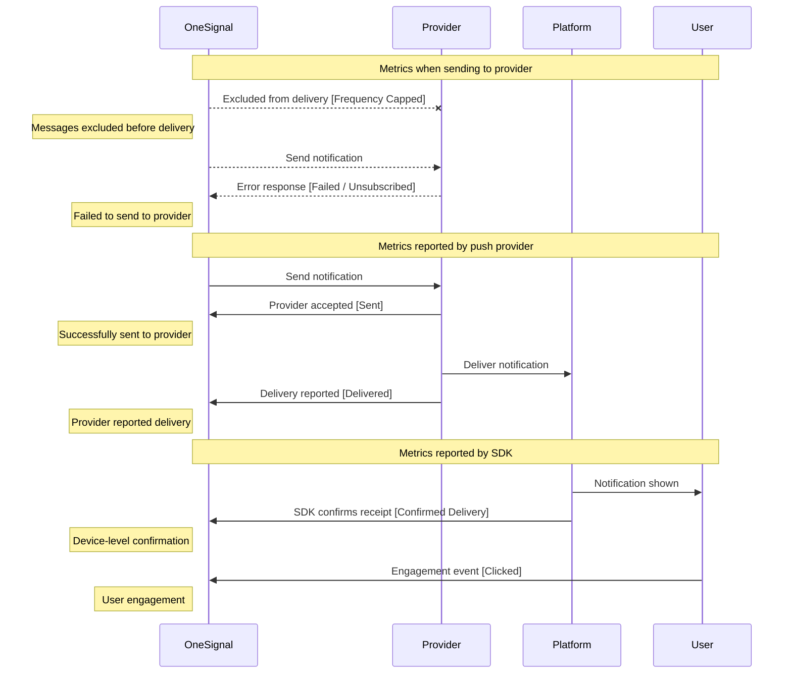
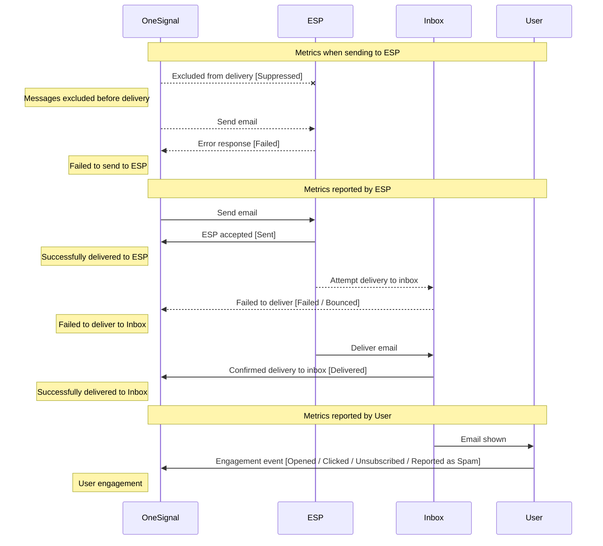
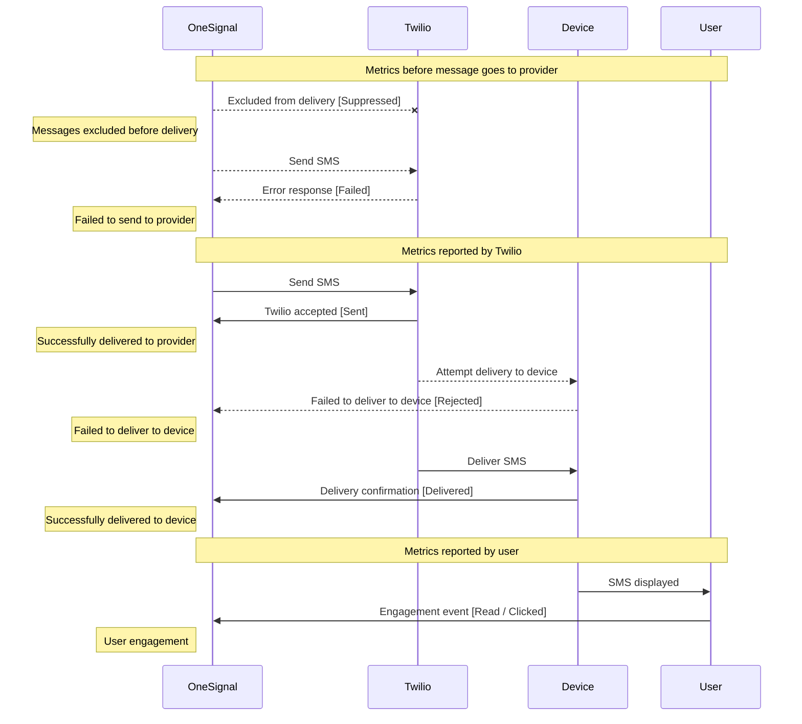
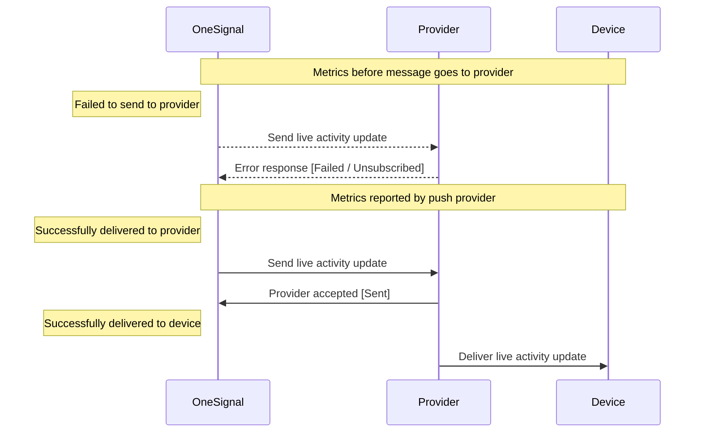

# Source: https://documentation.onesignal.com/docs/en/analytics-metrics-glossary.md

> ## Documentation Index
>
> Fetch the complete documentation index at: https://documentation.onesignal.com/llms.txt
> Use this file to discover all available pages before exploring further.

# Metrics Glossary

> Understand the nuances between metric labels for each message channel across the OneSignal ecosystem to accurately interpret messaging performance.

## Overview

OneSignal records metrics for each step of a message's journey. This journey starts in OneSignal, moves to a third-party provider, and ends with delivery to the recipient device or inbox.

This document is intended to illuminate the different metrics we capture in a message's lifecycle and how those metrics are represented across the various touch points in the OneSignal ecosystem for each channel. Use these definitions when reconciling numbers between sources or building internal reports.

This glossary is broken down by channel. Each section includes the following:

1. **Terms**: This is where we establish a common glossary of metrics and their definitions.
2. **Delivery lifecycle**: This is where we visually represent the metrics captured at each stage of the delivery journey.
3. **Metrics mapping**: This is where we tie metric names across all of the OneSignal touch points.

### Channel metrics comparison

Different channels contain different delivery states and user engagement metrics. The table below lists the different metrics for each channel.

| Channel       | Sent | Delivered | Failed | Rejected | Remaining | Clicked | Opened | Bounced | Read | Unsubscribed | Reported as Spam | Suppressed | Frequency Capped |
| ------------- | ---- | --------- | ------ | -------- | --------- | ------- | ------ | ------- | ---- | ------------ | ---------------- | ---------- | ---------------- |
| Push          | ✅    | ✅         | ✅      | ❌        | ✅         | ✅       | ❌      | ❌       | ❌    | ✅            | ❌                | ❌          | ✅                |
| Email         | ✅    | ✅         | ✅      | ❌        | ✅         | ✅       | ✅      | ✅       | ❌    | ✅            | ✅                | ✅          | ❌                |
| SMS           | ✅    | ✅         | ✅      | ✅        | ✅         | ✅       | ❌      | ❌       | ✅    | ❌            | ❌                | ✅          | ❌                |
| In-app        | ✅    | ❌         | ✅      | ❌        | ✅         | ✅       | ❌      | ❌       | ❌    | ❌            | ❌                | ❌          | ❌                |
| Live Activity | ✅    | ✅         | ✅      | ❌        | ❌         | ❌       | ❌      | ❌       | ❌    | ✅            | ❌                | ❌          | ❌                |

## Push terms

| Metric               | Definition                                                                                                                                                                                                                                                   |
| -------------------- | ------------------------------------------------------------------------------------------------------------------------------------------------------------------------------------------------------------------------------------------------------------ |
| **Sent**             | The number of messages successfully sent from OneSignal to the provider.                                                                                                                                                                                     |
| **Total Attempted**  | The number of messages we attempted to send. This includes messages successfully sent to the push provider and failures. This is a **derived** metric and is a sum of successes, failures and errors while attempting to send to the provider.               |
| **Audience**         | The number of subscriptions in the targeted segment(s).                                                                                                                                                                                                      |
| **Delivered**        | The number of push subscriptions to which the push service (FCM, APNs, HMS) reported delivering the notification. This is distinct from [Confirmed Delivery](/docs/en/confirmed-delivery), which is verified by the OneSignal SDK on the device.             |
| **Unsubscribed**     | The number of push subscriptions that did not receive the message because they uninstalled the app, cleared browser data, or opted out of push and have not opened the app since. We will **not** attempt to send to these subscriptions in future messages. |
| **Failed**           | The number of push subscriptions that did not receive a notification because of an error. We will attempt to send to these subscriptions in future messages.                                                                                                 |
| **Clicked**          | The number of clicks on a notification.                                                                                                                                                                                                                      |
| **Frequency Capped** | The number of push subscriptions that the notification was not sent to due to frequency cap settings.                                                                                                                                                        |

### Push lifecycle

### Push metrics mapping

| Term             | Dashboard - Delivery Report Stat Cards | Dashboard - Delivery Report Timeseries Chart | Dashboard - Journey Node Report Stat Card | Dashboard - Journey Node Report Timeseries Chart | Dashboard - Audience Activity | Dashboard - Engagement Trends | View Message(s) API1 | Notifications CSV | Event Streams             |
| ---------------- | -------------------------------------- | -------------------------------------------- | ----------------------------------------- | ------------------------------------------------ | ----------------------------- | ----------------------------- | ------------------------------- | ----------------- | ------------------------- |
| Sent             | Sent,  Delivered                       | ❌                                            | Delivered                                 | Delivered                                        | Sent                          | Delivered                     | successful                      | successful        | message.push.sent         |
| Total Attempted  | ❌                                      | ❌                                            | Total Sent                                | Sent                                             | ❌                             | ❌                             | ❌                               | ❌                 | ❌                         |
| Audience         | Audience                               | ❌                                            | ❌                                         | ❌                                                | ❌                             | ❌                             | ❌                               | ❌                 | ❌                         |
| Delivered        | Confirmed                              | Confirmed Delivery                           | Confirmed                                 | Confirmed                                        | Confirmed Delivery            | ❌                             | received                        | received          | message.push.received     |
| Unsubscribed     | Unsubscribed                           | ❌                                            | Unsubscribed                              | Unsubscribed                                     | Unsubscribed                  | Unsubscribed                  | failed                          | failed            | message.push.unsubscribed |
| Failed           | Failed                                 | ❌                                            | Failed                                    | Failed                                           | Failed                        | ❌                             | errored                         | errored           | message.push.failed       |
| Clicked          | Clicked                                | Clicks                                       | ❌                                         | Clicked                                          | Clicked                       | Clicked                       | converted                       | converted         | message.push.clicked      |
| Frequency Capped | Capped                                 | ❌                                            | Capped                                    | Capped                                           | ❌                             | ❌                             | frequency\_capped               | frequency\_capped | ❌                         |

1 We also include per-platform metrics in the API for all metrics besides
'remaining' (e.g., ios\_converted, android\_converted).

## Email terms

| Metric               | Definition                                                                                                                                                                                                                            |
| -------------------- | ------------------------------------------------------------------------------------------------------------------------------------------------------------------------------------------------------------------------------------- |
| **Sent**             | The number of emails successfully sent to the provider.                                                                                                                                                                               |
| **Audience**         | The number of subscriptions in the targeted segment(s).                                                                                                                                                                               |
| **Delivered**        | The number of emails confirmed as delivered to subscriptions' email server.                                                                                                                                                           |
| **Failed**           | The number of emails unable to be delivered to the inbox, excluding bounces. This may include failures reported by the ESP or OneSignal delivery failures.                                                                            |
| **Suppressed**       | The number of emails blocked due to prior bounces or spam reports to protect sender reputation. This metric is only recorded for apps configured to use OneSignal email.                                                              |
| **Bounced**          | The number of emails rejected due to invalid addresses, full inboxes, sender reputation, or DMARC issues. These addresses are added to a [Suppression List](/docs/en/suppressions), either managed by OneSignal or a third party ESP. |
| **Reported as Spam** | The number of recipients who marked the email as spam. These addresses are added to a [Suppression List](/docs/en/suppressions), either managed by OneSignal or a third party ESP.                                                    |
| **Unsubscribed**     | The number of recipients who opted out of receiving emails.                                                                                                                                                                           |
| **Total Opens**      | Total number of times the email was opened, including repeats.                                                                                                                                                                        |
| **Total Clicks**     | Total number of times links were clicked in an email, including repeats.                                                                                                                                                              |
| **Unique Opens**     | Count of individual recipients who opened the email. This metric is used with confirmed deliveries to determine open rate.                                                                                                            |
| **Unique Clicks**    | Count of individual recipients who clicked the email. This metric is used with confirmed deliveries to determine click rate.                                                                                                          |

**Why do we differentiate between total and unique clicks or opens?**

Unique clicks and opens are only counted once per subscriber, regardless of how many times that subscriber opens or clicks the same email. Total clicks and opens are not unique per subscriber and count every time an email is clicked or opened.

### Email lifecycle

### Email metrics mapping

| Term             | Dashboard - Delivery Report Stat Cards | Dashboard - Delivery Report Timeseries Chart | Dashboard - Journey Node Report Stat Card | Dashboard - Journey Node Report Timeseries Chart | Dashboard - Audience Activity | Dashboard - Engagement Trends | View Message(s) API                            | Notifications CSV     | Event Streams                    |
| ---------------- | -------------------------------------- | -------------------------------------------- | ----------------------------------------- | ------------------------------------------------ | ----------------------------- | ----------------------------- | ---------------------------------------------- | --------------------- | -------------------------------- |
| Sent             | Sent                                   | Sent                                         | ❌                                         | Sent                                             | Sent                          | ❌                             | platform\_delivery\_stats.email.successful     | successful            | message.email.sent               |
| Audience         | Audience                               | ❌                                            | ❌                                         | ❌                                                | ❌                             | ❌                             | ❌                                              | ❌                     | ❌                                |
| Delivered        | Delivered                              | Delivered                                    | Delivered                                 | Delivered                                        | Delivered                     | Delivered                     | platform\_delivery\_stats.email.received       | email\_delivered      | message.email.received           |
| Failed           | Failed                                 | Failed                                       | Failed                                    | Failed                                           | Failed                        | ❌                             | platform\_delivery\_stats.email.failed         | email\_failed         | message.email.failed             |
| Suppressed       | Suppressed                             | Suppressed                                   | Suppressed                                | Suppressed                                       | Suppressed                    | ❌                             | platform\_delivery\_stats.email.suppressed     | ❌                     | message.email.suppressed         |
| Bounced          | Bounced                                | Bounced                                      | Bounced                                   | Bounced                                          | Bounced                       | ❌                             | platform\_delivery\_stats.email.bounced        | email\_bounced        | message.email.bounced            |
| Reported as Spam | Reported as Spam                       | Spam                                         | Reported as Spam                          | Spam                                             | Complained                    | ❌                             | platform\_delivery\_stats.email.reported\_spam | email\_reported\_spam | message.email.reported\_as\_spam |
| Unsubscribed     | Unsubscribed                           | Unsubscribed                                 | Unsubscribed                              | Unsubscribed                                     | Unsubscribed                  | Unsubscribed                  | platform\_delivery\_stats.email.unsubscribed   | email\_unsubscribed   | message.email.unsubscribed       |
| Total Opens      | Total Opens                            | Total Opens                                  | Total Opens                               | Total Opens                                      | ❌                             | ❌                             | platform\_delivery\_stats.email.opened         | email\_opened         | message.email.opened             |
| Total Clicks     | Total Clicks                           | Total Clicks                                 | Total Clicks                              | Total Clicks                                     | ❌                             | ❌                             | platform\_delivery\_stats.email.clicked        | email\_clicked        | message.email.clicked            |
| Unique Opens     | Unique Opens                           | Unique Opens                                 | Unique Opens                              | Unique Opens                                     | Opened                        | Opened                        | platform\_delivery\_stats.email.unique\_opens  | email\_unique\_opens  | ❌                                |
| Unique Clicks    | Unique Clicks                          | Unique Clicks                                | Unique Clicks                             | Unique Clicks                                    | Clicked                       | Clicked                       | platform\_delivery\_stats.email.unique\_clicks | email\_unique\_clicks | ❌                                |

## SMS terms

| Metric                   | Definition                                                                                                                                                                                                                                                                                                                            |
| ------------------------ | ------------------------------------------------------------------------------------------------------------------------------------------------------------------------------------------------------------------------------------------------------------------------------------------------------------------------------------- |
| **Sent**                 | The number of messages successfully sent to Twilio.                                                                                                                                                                                                                                                                                   |
| **Total Attempted**      | The number of phone numbers we attempted to send to. This includes messages successfully sent to Twilio, as well as failures. This is a **derived** metric and is a sum of successes, failures and errors while attempting to send to the provider. This is a **subset** of the audience, as it does not include suppressed messages. |
| **Audience**             | The number of subscriptions in the targeted segment(s).                                                                                                                                                                                                                                                                               |
| **Delivered**            | The number of messages successfully delivered as reported by Twilio. Confirmed Delivery metrics are categorized further to distinguish between SMS/MMS and RCS.                                                                                                                                                                       |
| **Failed**               | The number of messages that failed to be sent to Twilio.                                                                                                                                                                                                                                                                              |
| **Suppressed**           | The number of messages not sent to the recipient because they opted out of receiving messages from the sender.                                                                                                                                                                                                                        |
| **Rejected**             | The number of messages not delivered by the carrier due to number blockage, velocity blockage, or the recipient is on a block list. This is a **derived** metric and is a sum of provider errors and provider failures.                                                                                                               |
| **Provider Errored**     | This number counts the phone numbers for which Twilio failed to send the message.                                                                                                                                                                                                                                                     |
| **Provider Undelivered** | This counts the phone numbers for which Twilio sent the message, but failed to deliver it.                                                                                                                                                                                                                                            |
| **Read**                 | The number of recipients that read an RCS message.                                                                                                                                                                                                                                                                                    |
| **Total Clicks**         | Total number of times a link in the message was clicked. Includes when a single link was clicked multiple times.                                                                                                                                                                                                                      |
| **Unique Clicks**        | The number of unique link clicks across all links in the message. These are unique per subscriber.                                                                                                                                                                                                                                    |
| **Replied**              | The number of keywords that have been received by OneSignal excluding consent keywords.                                                                                                                                                                                                                                               |
| **Unsubscribed**         | The number of opt-out keywords that have been received by OneSignal.                                                                                                                                                                                                                                                                  |

### SMS lifecycle

### SMS metrics mapping

| Term                 | Dashboard - Delivery Report Stat Cards | Dashboard - Delivery Report Timeseries Chart | Dashboard - Journey Node Report Stat Card | Dashboard - Journey Node Report Timeseries Chart | Dashboard - Audience Activity | Dashboard - Engagement Trends | View Message(s) API                                                                     | Notifications CSV           | Event Streams           |
| -------------------- | -------------------------------------- | -------------------------------------------- | ----------------------------------------- | ------------------------------------------------ | ----------------------------- | ----------------------------- | --------------------------------------------------------------------------------------- | --------------------------- | ----------------------- |
| Sent                 | ❌                                      | Sent                                         | ❌                                         | Sent                                             | Sent                          | ❌                             | platform\_delivery\_stats.sms.successful                                                | successful                  | message.sms.sent        |
| Total Attempted      | Sent1                       | ❌                                            | Sent1                          | ❌                                                | ❌                             | ❌                             | ❌                                                                                       | ❌                           | ❌                       |
| Audience             | Audience                               | ❌                                            | ❌                                         | ❌                                                | ❌                             | ❌                             | ❌                                                                                       | ❌                           | ❌                       |
| Delivered            | Delivered                              | Delivered                                    | Delivered                                 | Delivered                                        | Delivered                     | Delivered                     | platform\_delivery\_stats.sms.provider\_successful                                      | ❌                           | message.sms.delivered   |
| Failed               | Failed                                 | ❌                                            | Failed                                    | ❌                                                | Failed & Rejected             | ❌                             | platform\_delivery\_stats.sms.failed, platform\_delivery\_stats.sms.errored2 | failed, errored2 | message.sms.failed      |
| Suppressed           | Suppressed                             | ❌                                            | Suppressed                                | ❌                                                | Suppressed                    | ❌                             | platform\_delivery\_stats.sms.suppressed                                                | ❌                           | ❌                       |
| Rejected             | Rejected                               | ❌                                            | Rejected                                  | ❌                                                | Failed & Rejected             | ❌                             | ❌                                                                                       | ❌                           | ❌                       |
| Provider Errored     | ❌                                      | Failed (Errored)                             | ❌                                         | Failed (Errored)                                 | ❌                             | ❌                             | platform\_delivery\_stats.sms.provider\_errored                                         | ❌                           | ❌                       |
| Provider Undelivered | ❌                                      | Failed (Undelivered)                         | ❌                                         | Failed (Undelivered)                             | ❌                             | ❌                             | platform\_delivery\_stats.sms.provider\_failed                                          | ❌                           | message.sms.undelivered |
| Read                 | Read                                   | Read                                         | Read                                      | Read                                             | Read                          | Read                          | ❌                                                                                       | ❌                           | ❌                       |
| Total Clicks         | Total Clicks                           | ❌                                            | Total Clicks                              | ❌                                                | ❌                             | ❌                             | ❌                                                                                       | ❌                           | ❌                       |
| Unique Clicks        | Unique Clicks                          | ❌                                            | Unique Clicks                             | ❌                                                | ❌                             | ❌                             | ❌                                                                                       | ❌                           | ❌                       |
| Replied              | ❌                                      | ❌                                            | ❌                                         | ❌                                                | ❌                             | Replied (keywords)            | ❌                                                                                       | ❌                           | ❌                       |
| Unsubscribed         | ❌                                      | ❌                                            | ❌                                         | ❌                                                | ❌                             | Unsubscribed                  | ❌                                                                                       | ❌                           | ❌                       |

1 The OneSignal dashboard interprets this as total attempted and sums
the number of notifications that were sent out of OneSignal, along with those that
either failed or errored within OneSignal's internal system.

2 The sum of **failed** and **errored**, which are both recorded in OneSignal's
internal system when attempting to send to Twilio, result in **Failed**.

## In-app terms

| Metric               | Definition                                                                                                                                                                                    |
| -------------------- | --------------------------------------------------------------------------------------------------------------------------------------------------------------------------------------------- |
| **Impression**       | The number of times a message successfully displayed on a device.                                                                                                                             |
| **Card Impressions** | The number of times a card within a carousel was displayed on a device. A carousel message will have multiple cards, but not all cards may be viewed by each user. Only applies to carousels. |
| **Total Clicks**     | The number of times a button block, image block, or background was clicked. It does not include "Close Button" clicks.                                                                        |
| **Unique Clicks**    | The first time a button block, image block, or background was clicked. It does not include the "Close Button" clicks.                                                                         |

### In-app lifecycle

There is no delivery lifecycle to consider. All metrics captured for an in-app message are from the device through the OneSignal SDK.

### In-app metrics mapping

| Term             | Dashboard - Delivery Report Stat Cards | Dashboard - Journey Node Report Stat Card | Dashboard - Journey Node Report Timeseries Chart | Dashboard - Audience Activity | Dashboard - Engagement Trends | Event Streams               |
| ---------------- | -------------------------------------- | ----------------------------------------- | ------------------------------------------------ | ----------------------------- | ----------------------------- | --------------------------- |
| Impressions      | Impressions                            | Impressions                               | Impressions                                      | Impression                    | Impressions                   | message.iam.impression      |
| Card Impressions | Card Impressions                       | Card Impressions                          | ❌                                                | ❌                             | ❌                             | message.iam.page\_displayed |
| Total Clicks     | Total Clicks1               | Total Clicks1                  | ❌                                                | ❌                             | ❌                             | message.iam.clicked         |
| Unique Clicks    | ❌2                          | ❌2                             | ❌                                                | Clicked                       | Clicked                       | ❌                           |

1 We filter out "Close Button" clicks out of Total Clicks on the IAM Delivery
Report stat card.

2 While we don't have a label on the dashboard for unique clicks, we show
unique clicks count alongside the CTR.

## Live Activities terms

| Metric              | Definition                                                                                                                                                                                                                                                   |
| ------------------- | ------------------------------------------------------------------------------------------------------------------------------------------------------------------------------------------------------------------------------------------------------------ |
| **Sent**            | The number of messages successfully sent from OneSignal to the provider.                                                                                                                                                                                     |
| **Total Attempted** | The number of messages we attempted to send. This includes messages successfully sent to the push provider and failures. This is a **derived** metric and is a sum of successes, failures and errors while attempting to send to the provider.               |
| **Delivered**       | The number of push subscriptions that are confirmed to receive the notification.                                                                                                                                                                             |
| **Unsubscribed**    | The number of push subscriptions that did not receive the message because they uninstalled the app, cleared browser data, or opted out of push and have not opened the app since. We will **not** attempt to send to these subscriptions in future messages. |
| **Failed**          | The number of push subscriptions that did not receive a notification because of an error. We will attempt to send to these subscriptions in future messages.                                                                                                 |

### Live Activities lifecycle

### Live Activities metrics mapping

| Term            | Dashboard - Delivery Report Stat Cards | Dashboard - Audience Activity | Dashboard - Engagement Trends | View Message(s) API | Notifications CSV | Event Streams                       |
| --------------- | -------------------------------------- | ----------------------------- | ----------------------------- | ------------------- | ----------------- | ----------------------------------- |
| Total Attempted | Sent                                   | ❌                             | ❌                             | ❌                   | ❌                 | ❌                                   |
| Sent            | Delivered                              | Delivered                     | Delivered                     | successful          | successful        | message.live\_activity.sent         |
| Delivered       | ❌                                      | ❌                             | Confirmed                     | ❌                   | ❌                 | message.live\_activity.delivered    |
| Failed          | Failed                                 | Failed                        | Failed                        | errored             | errored           | message.live\_activity.failed       |
| Unsubscribed    | Unsubscribed                           | Unsubscribed                  | Unsubscribed                  | failed              | failed            | message.live\_activity.unsubscribed |
| Clicked         | ❌                                      | ❌                             | ❌                             | ❌                   | ❌                 | message.live\_activity.clicked      |

***

Built with [Mintlify](https://mintlify.com).
